# Parent Section Magnitude-Probability Distributions

Only fault sections with at least one triggered aftershock are plotted. Sections are sorted by total supraseismogenic trigger rate (decreasing)

## Table Of Contents

* [Garlock (Central)](#garlock-central)
* [Tank Canyon](#tank-canyon)
* [Little Lake](#little-lake)
* [Owl Lake](#owl-lake)
* [Airport Lake](#airport-lake)
* [Panamint Valley](#panamint-valley)
* [Garlock (East)](#garlock-east)
* [Hunter Mountain-Saline Valley](#hunter-mountain-saline-valley)
* [Ash Hill](#ash-hill)
* [Blackwater](#blackwater)
* [Garlock (West)](#garlock-west)
* [McLean Lake](#mclean-lake)
* [Goldstone Lake](#goldstone-lake)
* [Gravel Hills-Harper Lk](#gravel-hills-harper-lk)
* [So Sierra Nevada](#so-sierra-nevada)
* [San Andreas (Mojave N)](#san-andreas-mojave-n)
* [San Andreas (Mojave S)](#san-andreas-mojave-s)
* [Coyote Canyon](#coyote-canyon)
* [Death Valley (So)](#death-valley-so)
* [Nelson Lake](#nelson-lake)
* [Towne Pass](#towne-pass)
* [Lenwood-Lockhart-Old Woman Springs](#lenwood-lockhart-old-woman-springs)
* [San Andreas (San Bernardino N)](#san-andreas-san-bernardino-n)
* [Bicycle Lake](#bicycle-lake)
* [Paradise](#paradise)
* [Garlic Springs](#garlic-springs)
* [Death Valley (Black Mtns Frontal)](#death-valley-black-mtns-frontal)
* [San Andreas (San Bernardino S)](#san-andreas-san-bernardino-s)
* [Helendale-So Lockhart](#helendale-so-lockhart)
* [Coyote Lake](#coyote-lake)
* [San Andreas (Big Bend)](#san-andreas-big-bend)
* [Death Valley (No)](#death-valley-no)
* [San Andreas (Parkfield)](#san-andreas-parkfield)
* [Red Pass](#red-pass)
* [San Andreas (San Gorgonio Pass-Garnet HIll)](#san-andreas-san-gorgonio-pass-garnet-hill)
* [Sierra Nevada  (No Extension)](#sierra-nevada--no-extension)
* [Elsinore (Glen Ivy) rev](#elsinore-glen-ivy-rev)
* [Death Valley (Fish Lake Valley)](#death-valley-fish-lake-valley)
* [Baker](#baker)
* [San Jacinto (San Bernardino)](#san-jacinto-san-bernardino)
* [San Andreas (Coachella) rev](#san-andreas-coachella-rev)
* [Ludlow](#ludlow)
* [San Andreas (Cholame) rev](#san-andreas-cholame-rev)
* [Cady](#cady)
* [San Andreas (Carrizo) rev](#san-andreas-carrizo-rev)
* [San Jacinto (San Jacinto Valley) rev](#san-jacinto-san-jacinto-valley-rev)
* [Scodie Lineament](#scodie-lineament)
* [White Wolf (Extension)](#white-wolf-extension)
* [Calico-Hidalgo](#calico-hidalgo)
* [Manix-Afton Hills](#manix-afton-hills)
* [San Jacinto (Stepovers Combined)](#san-jacinto-stepovers-combined)
* [San Andreas (North Branch Mill Creek)](#san-andreas-north-branch-mill-creek)
* [Santa Ynez (East)](#santa-ynez-east)
* [Lake Isabella (Seismicity)](#lake-isabella-seismicity)
* [San Andreas (Creeping Section) 2011 CFM](#san-andreas-creeping-section-2011-cfm)
* [Cleghorn Pass](#cleghorn-pass)
* [San Jacinto (Anza) rev](#san-jacinto-anza-rev)
* [Santa Ynez (West)](#santa-ynez-west)
* [Pisgah-Bullion Mtn-Mesquite Lk](#pisgah-bullion-mtn-mesquite-lk)
* [Mission Ridge-Arroyo Parida-Santa Ana](#mission-ridge-arroyo-parida-santa-ana)
* [Cleghorn Lake](#cleghorn-lake)
* [Lost Hills](#lost-hills)
* [Mission Creek](#mission-creek)
* [Owens Valley](#owens-valley)
* [Red Mountain](#red-mountain)
* [Deep Springs](#deep-springs)
* [Santa Rosa Island](#santa-rosa-island)
* [Rose Canyon](#rose-canyon)
* [San Jacinto (Lytle Creek connector)](#san-jacinto-lytle-creek-connector)
* [Santa Cruz Island](#santa-cruz-island)
* [San Jacinto (Coyote Creek)](#san-jacinto-coyote-creek)
* [Whittier alt 1](#whittier-alt-1)
* [Pleito](#pleito)
* [Big Pine (East)](#big-pine-east)
* [Dry Mountain](#dry-mountain)
* [Chino alt 1](#chino-alt-1)
* [Kern Canyon (North Kern) 2011](#kern-canyon-north-kern-2011)
* [Kern Canyon (South Kern) 2011](#kern-canyon-south-kern-2011)
* [San Diego Trough north alt1](#san-diego-trough-north-alt1)
* [Imperial](#imperial)
* [San Pedro Basin](#san-pedro-basin)
* [Ventura-Pitas Point](#ventura-pitas-point)
* [Brawley (Seismic Zone) alt 1](#brawley-seismic-zone-alt-1)
* [San Jacinto (Clark) rev](#san-jacinto-clark-rev)
* [Pinto Mtn](#pinto-mtn)
* [Elysian Park (Upper)](#elysian-park-upper)
* [Oceanic - West Huasna](#oceanic---west-huasna)
* [Cleghorn](#cleghorn)
* [Blue Cut](#blue-cut)
* [White Mountains](#white-mountains)
* [San Jacinto (Borrego)](#san-jacinto-borrego)
* [San Clemente](#san-clemente)
* [Kern Canyon (Lake Isabella) 2011](#kern-canyon-lake-isabella-2011)
* [Bullion Mountains](#bullion-mountains)
* [Big Pine (Central)](#big-pine-central)
* [Pine Mtn](#pine-mtn)
* [Tin Mountain](#tin-mountain)
* [Channel Islands Thrust](#channel-islands-thrust)
* [San Diego Trough south](#san-diego-trough-south)
* [Independence rev 2011](#independence-rev-2011)
* [Palos Verdes](#palos-verdes)
* [San Luis Range 2011 CFM](#san-luis-range-2011-cfm)
* [San Cayetano](#san-cayetano)
* [Simi-Santa Rosa](#simi-santa-rosa)
* [Cucamonga](#cucamonga)
* [Coronado Bank alt1](#coronado-bank-alt1)
* [Calaveras (Central) 2011 CFM](#calaveras-central-2011-cfm)
* [San Gabriel](#san-gabriel)
* [Hunting Creek - Berryessa 2011 CFM](#hunting-creek---berryessa-2011-cfm)
* [Newport-Inglewood (Offshore)](#newport-inglewood-offshore)
* [Hayward (So) 2011 CFM](#hayward-so-2011-cfm)
* [Hunting Creek - Bartlett Springs connector 2011](#hunting-creek---bartlett-springs-connector-2011)
* [Santa Susana East (connector)](#santa-susana-east-connector)
* [Calaveras (So) - Paicines extension 2011 CFM](#calaveras-so---paicines-extension-2011-cfm)
* [Mono Lake 2011 CFM](#mono-lake-2011-cfm)
* [Raymond](#raymond)
* [Great Valley 07 (Orestimba)](#great-valley-07-orestimba)
* [San Gabriel (Extension)](#san-gabriel-extension)
* [Hector Mine](#hector-mine)
* [Cerro Prieto](#cerro-prieto)
* [Calaveras (So) 2011 CFM](#calaveras-so-2011-cfm)
* [Santa Cruz Catalina Ridge alt1](#santa-cruz-catalina-ridge-alt1)
* [La Panza 2011](#la-panza-2011)
* [Camp Rock 2011](#camp-rock-2011)
* [Pitas Point (Lower West)](#pitas-point-lower-west)
* [Oak Ridge (Onshore)](#oak-ridge-onshore)
* [Ortigalita (North)](#ortigalita-north)
* [South Klamath Lake West](#south-klamath-lake-west)
* [Great Valley 09 (Laguna Seca)](#great-valley-09-laguna-seca)
* [San Andreas (Santa Cruz Mts) 2011 CFM](#san-andreas-santa-cruz-mts-2011-cfm)
* [Great Valley 04b Gordon Valley](#great-valley-04b-gordon-valley)
* [Calaveras (No) 2011 CFM](#calaveras-no-2011-cfm)
* [Rinconada 2011 CFM](#rinconada-2011-cfm)
* [Burnt Mtn](#burnt-mtn)
* [Sheephole](#sheephole)
* [Emerson-Copper Mtn 2011](#emerson-copper-mtn-2011)
* [Laguna Salada](#laguna-salada)
* [Malibu Coast alt 1](#malibu-coast-alt-1)
* [Sierra Madre](#sierra-madre)
* [Los Osos 2011](#los-osos-2011)
* [Great Valley 03 Mysterious Ridge](#great-valley-03-mysterious-ridge)
* [Monterey Bay-Tularcitos](#monterey-bay-tularcitos)
* [Hosgri](#hosgri)
* [Malibu Coast (Extension) alt 1](#malibu-coast-extension-alt-1)
* [San Juan](#san-juan)
* [Pitas Point (Lower)-Montalvo](#pitas-point-lower-montalvo)
* [Newport-Inglewood alt 1](#newport-inglewood-alt-1)
* [White Wolf](#white-wolf)
* [San Jacinto (Superstition Mtn)](#san-jacinto-superstition-mtn)
* [North Frontal  (East)](#north-frontal--east)
* [Honey Lake 2011 CFM](#honey-lake-2011-cfm)
* [South Cuyama](#south-cuyama)
* [Oceanside alt1](#oceanside-alt1)
* [Great Valley 08 (Quinto)](#great-valley-08-quinto)
* [Hayward (No) 2011 CFM](#hayward-no-2011-cfm)
* [Hayward (So) extension 2011 CFM](#hayward-so-extension-2011-cfm)
* [Verdugo](#verdugo)
* [Santa Ynez River](#santa-ynez-river)
* [Ortigalita (South)](#ortigalita-south)
* [Santa Susana alt 1](#santa-susana-alt-1)
* [Casmalia 2011 CFM](#casmalia-2011-cfm)
* [Surprise Valley 2011 CFM](#surprise-valley-2011-cfm)
* [Elsinore (Coyote Mountains)](#elsinore-coyote-mountains)
* [Owens Valley Keough Hot Springs](#owens-valley-keough-hot-springs)
* [Davis Creek](#davis-creek)
* [Sargent 2011 CFM](#sargent-2011-cfm)
* [South Klamath Lake East](#south-klamath-lake-east)
* [Walker Spring 2011 CFM](#walker-spring-2011-cfm)
* [Hollywood](#hollywood)
* [Earthquake Valley](#earthquake-valley)
* [Gillem - Big Crack 2011 CFM](#gillem---big-crack-2011-cfm)
* [Mendocino](#mendocino)
* [Thirty Mile Bank](#thirty-mile-bank)
* [Elysian Park (Lower CFM)](#elysian-park-lower-cfm)
* [West Napa 2011 CFM](#west-napa-2011-cfm)
* [Almanor 2011 CFM](#almanor-2011-cfm)
* [Del Valle](#del-valle)
* [Likely 2011 CFM](#likely-2011-cfm)
* [Hartley Springs 2011 CFM](#hartley-springs-2011-cfm)
* [Richfield](#richfield)
* [Compton](#compton)
* [Great Valley 05 Pittsburg - Kirby Hills alt1](#great-valley-05-pittsburg---kirby-hills-alt1)
* [San Gregorio (South) 2011 CFM](#san-gregorio-south-2011-cfm)
* [Northridge](#northridge)
* [San Joaquin Hills](#san-joaquin-hills)
* [Peralta Hills](#peralta-hills)
* [San Andreas (Offshore) 2011 CFM](#san-andreas-offshore-2011-cfm)
* [Sierra Madre (San Fernando)](#sierra-madre-san-fernando)
* [Great Valley 02](#great-valley-02)
* [North Salt Lake](#north-salt-lake)
* [Eureka Peak](#eureka-peak)
* [Fontana (Seismicity)](#fontana-seismicity)
* [Santa Monica alt 1](#santa-monica-alt-1)
* [Superstition Hills](#superstition-hills)
* [Rodgers Creek - Healdsburg 2011 CFM](#rodgers-creek---healdsburg-2011-cfm)
* [San Luis Range - Oceano 2011 CFM](#san-luis-range---oceano-2011-cfm)
* [Garberville - Briceland 2011 CFM](#garberville---briceland-2011-cfm)
* [Round Valley](#round-valley)
* [Hat Creek-McArthur-Mayfield](#hat-creek-mcarthur-mayfield)
* [Elsinore (Temecula) rev](#elsinore-temecula-rev)
* [Earthquake Valley (No  Extension)](#earthquake-valley-no--extension)
* [Los Alamos 2011 CFM](#los-alamos-2011-cfm)
* [Elsinore (Stepovers Combined)](#elsinore-stepovers-combined)
* [Pittville 2011 CFM](#pittville-2011-cfm)
* [Silver Creek 2011 CFM](#silver-creek-2011-cfm)
* [Earthquake Valley (So Extension)](#earthquake-valley-so-extension)
* [Holser alt 1](#holser-alt-1)
* [Butano 2011 CFM](#butano-2011-cfm)
* [Cedar Mtn-Mahogany Mtn](#cedar-mtn-mahogany-mtn)
* [Bartlett Springs 2011 CFM](#bartlett-springs-2011-cfm)
* [North Tahoe 2011 CFM](#north-tahoe-2011-cfm)
* [Great Valley 04a Trout Creek](#great-valley-04a-trout-creek)
* [Puente Hills](#puente-hills)
* [Robinson Creek](#robinson-creek)
* [San Andreas (North Coast) 2011 CFM](#san-andreas-north-coast-2011-cfm)
* [Channel Islands Western Deep Ramp](#channel-islands-western-deep-ramp)
* [Fitzhugh Creek](#fitzhugh-creek)

## Garlock (Central)
*[(top)](#table-of-contents)*

| 1 Week | 1 Month | 1 Year | 10 Year |
|-----|-----|-----|-----|
|  |  |  |  |

| Magnitude | 1 wk TI Prob | 1 wk TD Prob | 1 wk ETAS Prob | 1 wk ETAS/TD Gain | 1 wk ETAS Triggered Only | 1 mo TI Prob | 1 mo TD Prob | 1 mo ETAS Prob | 1 mo ETAS/TD Gain | 1 mo ETAS Triggered Only | 1 yr TI Prob | 1 yr TD Prob | 1 yr ETAS Prob | 1 yr ETAS/TD Gain | 1 yr ETAS Triggered Only | 10 yr TI Prob | 10 yr TD Prob | 10 yr ETAS Prob | 10 yr ETAS/TD Gain | 10 yr ETAS Triggered Only |
|-----|-----|-----|-----|-----|-----|-----|-----|-----|-----|-----|-----|-----|-----|-----|-----|-----|-----|-----|-----|-----|
| 6.0 | 5.5131142E-5 | 7.024681E-5 | 0.092583746 | 1317.9779 | 0.09252 | 2.3625491E-4 | 3.010234E-4 | 0.11320703 | 376.07385 | 0.11294 | 0.0028726095 | 0.0036588663 | 0.15177494 | 41.48141 | 0.14866 | 0.028357591 | 0.036079824 | 0.20974933 | 5.8134794 | 0.18017 |
| 6.1 | 5.5131142E-5 | 7.024681E-5 | 0.092583746 | 1317.9779 | 0.09252 | 2.3625491E-4 | 3.010234E-4 | 0.11320703 | 376.07385 | 0.11294 | 0.0028726095 | 0.0036588663 | 0.15177494 | 41.48141 | 0.14866 | 0.028357591 | 0.036079824 | 0.20974933 | 5.8134794 | 0.18017 |
| 6.2 | 4.216245E-5 | 5.1661493E-5 | 0.056338754 | 1090.5367 | 0.05629 | 1.806837E-4 | 2.2138779E-4 | 0.069745995 | 315.03992 | 0.06954 | 0.0021976046 | 0.0026920962 | 0.09437461 | 35.05618 | 0.09193 | 0.021759989 | 0.026689773 | 0.13624558 | 5.1047854 | 0.11256 |
| 6.3 | 4.216245E-5 | 5.1661493E-5 | 0.056338754 | 1090.5367 | 0.05629 | 1.806837E-4 | 2.2138779E-4 | 0.069745995 | 315.03992 | 0.06954 | 0.0021976046 | 0.0026920962 | 0.09437461 | 35.05618 | 0.09193 | 0.021759989 | 0.026689773 | 0.13624558 | 5.1047854 | 0.11256 |
| 6.4 | 3.6858168E-5 | 4.411054E-5 | 0.04383218 | 993.68945 | 0.04379 | 1.5795401E-4 | 1.8903162E-4 | 0.054068845 | 286.0307 | 0.05389 | 0.0019213937 | 0.002299056 | 0.07374442 | 32.07596 | 0.07161 | 0.019048655 | 0.02284894 | 0.108330116 | 4.741144 | 0.08748 |
| 6.5 | 3.39199E-5 | 4.0018083E-5 | 0.03975843 | 993.51154 | 0.03972 | 1.453629E-4 | 1.7149492E-4 | 0.04889314 | 285.09964 | 0.04873 | 0.0017683565 | 0.002085973 | 0.06669093 | 31.971136 | 0.06474 | 0.017543508 | 0.020759864 | 0.098374434 | 4.738684 | 0.07926 |
| 6.6 | 3.3571985E-5 | 3.9472274E-5 | 0.039707907 | 1005.9696 | 0.03967 | 1.4387199E-4 | 1.6915603E-4 | 0.048830923 | 288.67386 | 0.04867 | 0.0017502342 | 0.0020575512 | 0.06656455 | 32.35135 | 0.06464 | 0.017365133 | 0.020481179 | 0.09796112 | 4.7829823 | 0.0791 |
| 6.7 | 3.2580007E-5 | 3.8088703E-5 | 0.03864662 | 1014.6478 | 0.03861 | 1.3962112E-4 | 1.632272E-4 | 0.047425512 | 290.54907 | 0.04727 | 0.0016985617 | 0.0019855013 | 0.06453107 | 32.50115 | 0.06267 | 0.016856372 | 0.019773813 | 0.09481013 | 4.7947316 | 0.07655 |
| 6.8 | 3.2185937E-5 | 3.7515918E-5 | 0.0377561 | 1006.4021 | 0.03772 | 1.3793244E-4 | 1.6077272E-4 | 0.04639334 | 288.56473 | 0.04624 | 0.0016780337 | 0.001955672 | 0.063255556 | 32.344666 | 0.06142 | 0.016654192 | 0.019480614 | 0.09301957 | 4.7749815 | 0.075 |
| 6.9 | 3.165394E-5 | 3.6720503E-5 | 0.036705375 | 999.58795 | 0.03667 | 1.3565269E-4 | 1.5736422E-4 | 0.04509029 | 286.5346 | 0.04494 | 0.0016503202 | 0.001914247 | 0.0616397 | 32.200493 | 0.05984 | 0.01638118 | 0.019073246 | 0.09072014 | 4.7564077 | 0.07304 |
| 7.0 | 3.0903822E-5 | 3.5625766E-5 | 0.035734355 | 1003.04803 | 0.0357 | 1.3243823E-4 | 1.5267303E-4 | 0.043836 | 287.1234 | 0.04369 | 0.0016112428 | 0.0018572307 | 0.05986929 | 32.235786 | 0.05812 | 0.015996104 | 0.018512413 | 0.08812933 | 4.7605534 | 0.07093 |
| 7.1 | 3.0069863E-5 | 3.4392073E-5 | 0.034173217 | 993.63654 | 0.03414 | 1.2886449E-4 | 1.4738638E-4 | 0.04197122 | 284.77002 | 0.04183 | 0.0015677959 | 0.0017929734 | 0.057393104 | 32.010017 | 0.0557 | 0.01556781 | 0.017880075 | 0.08469369 | 4.736764 | 0.06803 |
| 7.2 | 2.7957109E-5 | 3.128145E-5 | 0.028350396 | 906.3005 | 0.02832 | 1.1981068E-4 | 1.340566E-4 | 0.034829404 | 259.81122 | 0.0347 | 0.0014577188 | 0.0016309366 | 0.047965243 | 29.409632 | 0.04641 | 0.014481937 | 0.016283695 | 0.07204074 | 4.424103 | 0.05668 |
| 7.3 | 2.4519275E-5 | 2.6714795E-5 | 0.020346172 | 761.6069 | 0.02032 | 1.0507837E-4 | 1.1448703E-4 | 0.025181618 | 219.95169 | 0.02507 | 0.0012785783 | 0.001393003 | 0.034856323 | 25.02243 | 0.03351 | 0.012712469 | 0.013928054 | 0.054366864 | 3.903407 | 0.04101 |
| 7.4 | 2.3225532E-5 | 2.51994E-5 | 0.018344738 | 727.9831 | 0.01832 | 9.95342E-5 | 1.0799304E-4 | 0.02263556 | 209.60202 | 0.02253 | 0.0012111551 | 0.0013140367 | 0.031434406 | 23.922016 | 0.03016 | 0.012045753 | 0.013145725 | 0.049560647 | 3.770096 | 0.0369 |
| 7.5 | 2.097765E-5 | 2.2483688E-5 | 0.014612156 | 649.9003 | 0.01459 | 8.9901114E-5 | 9.635517E-5 | 0.018034626 | 187.16823 | 0.01794 | 0.0010939965 | 0.0011725046 | 0.025124388 | 21.427965 | 0.02398 | 0.010886264 | 0.011740365 | 0.040627193 | 3.4604712 | 0.02923 |
| 7.6 | 1.511254E-5 | 1.5991332E-5 | 0.0077658673 | 485.6298 | 0.00775 | 6.476642E-5 | 6.853253E-5 | 0.009657876 | 140.92397 | 0.00959 | 7.882459E-4 | 8.3407195E-4 | 0.013773271 | 16.513288 | 0.01295 | 0.007854558 | 0.008383559 | 0.024080846 | 2.8723896 | 0.01583 |
| 7.7 | 9.934069E-6 | 1.0678794E-5 | 0.0024906523 | 233.23349 | 0.00248 | 4.2573887E-5 | 4.5765457E-5 | 0.0030656273 | 66.98561 | 0.00302 | 5.182138E-4 | 5.570524E-4 | 0.0044748685 | 8.03312 | 0.00392 | 0.00517007 | 0.005627684 | 0.010539883 | 1.8728634 | 0.00494 |
| 7.8 | 6.7562896E-6 | 8.428449E-6 | 0.0016784144 | 199.1368 | 0.00167 | 2.8955206E-5 | 3.6121426E-5 | 0.0020560485 | 56.920467 | 0.00202 | 3.5247262E-4 | 4.3968976E-4 | 0.003078529 | 7.0015936 | 0.00264 | 0.0035191406 | 0.004446654 | 0.0077718026 | 1.7477865 | 0.00334 |
| 7.9 | 3.975453E-6 | 5.37103E-6 | 9.6536585E-4 | 179.7357 | 9.6E-4 | 1.7037546E-5 | 2.3018498E-5 | 0.0011829918 | 51.393093 | 0.00116 | 2.0741238E-4 | 2.8021427E-4 | 0.0018297799 | 6.529931 | 0.00155 | 0.002072189 | 0.0028336283 | 0.004768131 | 1.6826946 | 0.00194 |
| 8.0 | 1.6729537E-6 | 2.0775144E-6 | 2.6207697E-4 | 126.14929 | 2.6E-4 | 7.169782E-6 | 8.903603E-6 | 3.789003E-4 | 42.55584 | 3.7E-4 | 8.7288594E-5 | 1.0839601E-4 | 6.083418E-4 | 5.612216 | 5.0E-4 | 8.7254314E-4 | 0.0010969337 | 0.0017262427 | 1.5736982 | 6.3E-4 |
| 8.1 | 3.6733252E-7 | 3.1489964E-7 | 3.1489964E-7 | 1.0 | 0.0 | 1.5742813E-6 | 1.3495693E-6 | 4.1349515E-5 | 30.639046 | 4.0E-5 | 1.9166706E-5 | 1.6430899E-5 | 6.6430075E-5 | 4.0429974 | 5.0E-5 | 1.9165053E-4 | 1.6638759E-4 | 2.1637927E-4 | 1.3004532 | 5.0E-5 |

## Tank Canyon
*[(top)](#table-of-contents)*

| 1 Week | 1 Month | 1 Year | 10 Year |
|-----|-----|-----|-----|
|  |  |  |  |

| Magnitude | 1 wk TI Prob | 1 wk TD Prob | 1 wk ETAS Prob | 1 wk ETAS/TD Gain | 1 wk ETAS Triggered Only | 1 mo TI Prob | 1 mo TD Prob | 1 mo ETAS Prob | 1 mo ETAS/TD Gain | 1 mo ETAS Triggered Only | 1 yr TI Prob | 1 yr TD Prob | 1 yr ETAS Prob | 1 yr ETAS/TD Gain | 1 yr ETAS Triggered Only | 10 yr TI Prob | 10 yr TD Prob | 10 yr ETAS Prob | 10 yr ETAS/TD Gain | 10 yr ETAS Triggered Only |
|-----|-----|-----|-----|-----|-----|-----|-----|-----|-----|-----|-----|-----|-----|-----|-----|-----|-----|-----|-----|-----|
| 6.0 | 4.8284557E-5 | 5.7964822E-5 | 0.041665554 | 718.80756 | 0.04161 | 2.0691741E-4 | 2.4840087E-4 | 0.055574656 | 223.72972 | 0.05534 | 0.0025163088 | 0.0030207601 | 0.08798333 | 29.126223 | 0.08522 | 0.02488006 | 0.029863637 | 0.14310765 | 4.792037 | 0.11673 |
| 6.1 | 1.7796336E-5 | 2.0873314E-5 | 0.014370574 | 688.4663 | 0.01435 | 7.626778E-5 | 8.945422E-5 | 0.019377729 | 216.62175 | 0.01929 | 9.281647E-4 | 0.0010885983 | 0.03208482 | 29.473518 | 0.03103 | 0.009242975 | 0.010836744 | 0.05364773 | 4.9505396 | 0.04328 |
| 6.2 | 1.7796336E-5 | 2.0873314E-5 | 0.014370574 | 688.4663 | 0.01435 | 7.626778E-5 | 8.945422E-5 | 0.019377729 | 216.62175 | 0.01929 | 9.281647E-4 | 0.0010885983 | 0.03208482 | 29.473518 | 0.03103 | 0.009242975 | 0.010836744 | 0.05364773 | 4.9505396 | 0.04328 |
| 6.3 | 1.3515912E-5 | 1.5759564E-5 | 0.0101356 | 643.1396 | 0.01012 | 5.792405E-5 | 6.753938E-5 | 0.013816611 | 204.57118 | 0.01375 | 7.049971E-4 | 8.2200574E-4 | 0.023103675 | 28.106464 | 0.0223 | 0.007027647 | 0.0081922645 | 0.039126746 | 4.77606 | 0.03119 |
| 6.4 | 1.0870146E-5 | 1.2618021E-5 | 0.007572523 | 600.13556 | 0.00756 | 4.658551E-5 | 5.4076212E-5 | 0.01033352 | 191.0918 | 0.01028 | 5.67031E-4 | 6.581969E-4 | 0.017347205 | 26.355646 | 0.0167 | 0.005655863 | 0.0065644905 | 0.029622128 | 4.5124793 | 0.02321 |
| 6.5 | 7.964826E-6 | 9.196094E-6 | 0.0048491517 | 527.30554 | 0.00484 | 3.4134522E-5 | 3.9411298E-5 | 0.0064591584 | 163.89104 | 0.00642 | 4.1550855E-4 | 4.7973756E-4 | 0.010814777 | 22.543112 | 0.01034 | 0.0041473247 | 0.004788321 | 0.019009896 | 3.9700546 | 0.01429 |
| 6.6 | 6.6317E-6 | 7.6122988E-6 | 0.003477586 | 456.8378 | 0.00347 | 2.8421264E-5 | 3.2623782E-5 | 0.0047624693 | 145.98152 | 0.00473 | 3.4597394E-4 | 3.9713128E-4 | 0.008004109 | 20.15482 | 0.00761 | 0.0034543579 | 0.003965368 | 0.014244446 | 3.5922127 | 0.01032 |
| 6.7 | 4.793663E-6 | 5.4307857E-6 | 0.0018454208 | 339.80734 | 0.00184 | 2.0544108E-5 | 2.3274613E-5 | 0.0025532157 | 109.6996 | 0.00253 | 2.500958E-4 | 2.8333595E-4 | 0.00436218 | 15.395787 | 0.00408 | 0.0024981452 | 0.0028304397 | 0.008374702 | 2.9587991 | 0.00556 |
| 6.8 | 4.382823E-6 | 4.9692567E-6 | 0.0017349607 | 349.13885 | 0.00173 | 1.8783392E-5 | 2.1296666E-5 | 0.0023612469 | 110.874016 | 0.00234 | 2.286638E-4 | 2.5926033E-4 | 0.0039982907 | 15.421915 | 0.00374 | 0.0022842865 | 0.002590253 | 0.0076471204 | 2.952268 | 0.00507 |
| 6.9 | 2.729601E-6 | 3.0735416E-6 | 7.130714E-4 | 232.00314 | 7.1E-4 | 1.1698237E-5 | 1.3172262E-5 | 0.0010731583 | 81.47107 | 0.00106 | 1.4241673E-4 | 1.6036171E-4 | 0.0017501067 | 10.913495 | 0.00159 | 0.001423255 | 0.0016026258 | 0.0037491801 | 2.3393984 | 0.00215 |
| 7.0 | 1.8987357E-6 | 2.126939E-6 | 3.021263E-4 | 142.04747 | 3.0E-4 | 8.137413E-6 | 9.115425E-6 | 4.7911113E-4 | 52.560482 | 4.7E-4 | 9.90685E-5 | 1.1097535E-4 | 8.0089876E-4 | 7.216907 | 6.9E-4 | 9.902435E-4 | 0.0011092679 | 0.0020482251 | 1.8464657 | 9.4E-4 |
| 7.1 | 1.4928986E-6 | 1.6641272E-6 | 1.0166396E-4 | 61.09146 | 1.0E-4 | 6.398121E-6 | 7.1319573E-6 | 2.4713026E-4 | 34.65111 | 2.4E-4 | 7.789434E-5 | 8.682871E-5 | 4.7679484E-4 | 5.491212 | 3.9E-4 | 7.786704E-4 | 8.6800574E-4 | 0.0014275197 | 1.644597 | 5.6E-4 |
| 7.2 | 1.069082E-6 | 1.1828573E-6 | 4.118281E-5 | 34.816383 | 4.0E-5 | 4.581772E-6 | 5.0693816E-6 | 1.0506887E-4 | 20.726173 | 1.0E-4 | 5.5781646E-5 | 6.171851E-5 | 2.31708E-4 | 3.7542713 | 1.7E-4 | 5.576765E-4 | 6.170659E-4 | 8.868993E-4 | 1.4372846 | 2.7E-4 |
| 7.3 | 8.776551E-7 | 9.770005E-7 | 2.097698E-5 | 21.470798 | 2.0E-5 | 3.7613736E-6 | 4.1871413E-6 | 7.418685E-5 | 17.717781 | 7.0E-5 | 4.579376E-5 | 5.097777E-5 | 1.7097166E-4 | 3.3538473 | 1.2E-4 | 4.5784327E-4 | 5.097118E-4 | 6.9961493E-4 | 1.3725697 | 1.9E-4 |
| 7.4 | 7.55721E-7 | 8.510244E-7 | 2.0851008E-5 | 24.501068 | 2.0E-5 | 3.2388E-6 | 3.6472454E-6 | 5.364706E-5 | 14.708926 | 5.0E-5 | 3.9431678E-5 | 4.4404827E-5 | 1.2440127E-4 | 2.8015258 | 8.0E-5 | 3.942468E-4 | 4.440104E-4 | 5.739527E-4 | 1.292656 | 1.3E-4 |
| 7.5 | 5.587665E-7 | 6.305619E-7 | 1.0630555E-5 | 16.858862 | 1.0E-5 | 2.3947114E-6 | 2.702408E-6 | 4.27023E-5 | 15.801574 | 4.0E-5 | 2.915522E-5 | 3.290182E-5 | 9.289984E-5 | 2.8235474 | 6.0E-5 | 2.9151395E-4 | 3.290182E-4 | 4.2898528E-4 | 1.3038346 | 1.0E-4 |

## Little Lake
*[(top)](#table-of-contents)*

| 1 Week | 1 Month | 1 Year | 10 Year |
|-----|-----|-----|-----|
|  |  |  |  |

| Magnitude | 1 wk TI Prob | 1 wk TD Prob | 1 wk ETAS Prob | 1 wk ETAS/TD Gain | 1 wk ETAS Triggered Only | 1 mo TI Prob | 1 mo TD Prob | 1 mo ETAS Prob | 1 mo ETAS/TD Gain | 1 mo ETAS Triggered Only | 1 yr TI Prob | 1 yr TD Prob | 1 yr ETAS Prob | 1 yr ETAS/TD Gain | 1 yr ETAS Triggered Only | 10 yr TI Prob | 10 yr TD Prob | 10 yr ETAS Prob | 10 yr ETAS/TD Gain | 10 yr ETAS Triggered Only |
|-----|-----|-----|-----|-----|-----|-----|-----|-----|-----|-----|-----|-----|-----|-----|-----|-----|-----|-----|-----|-----|
| 6.0 | 2.8424427E-5 | 3.120572E-5 | 0.035910085 | 1150.7533 | 0.03588 | 1.2181328E-4 | 1.337327E-4 | 0.04351793 | 325.4098 | 0.04339 | 0.0014820677 | 0.0016271127 | 0.058724057 | 36.090958 | 0.05719 | 0.014722223 | 0.016165402 | 0.085250266 | 5.2736254 | 0.07022 |
| 6.1 | 2.8424427E-5 | 3.120572E-5 | 0.035910085 | 1150.7533 | 0.03588 | 1.2181328E-4 | 1.337327E-4 | 0.04351793 | 325.4098 | 0.04339 | 0.0014820677 | 0.0016271127 | 0.058724057 | 36.090958 | 0.05719 | 0.014722223 | 0.016165402 | 0.085250266 | 5.2736254 | 0.07022 |
| 6.2 | 2.8424427E-5 | 3.120572E-5 | 0.035910085 | 1150.7533 | 0.03588 | 1.2181328E-4 | 1.337327E-4 | 0.04351793 | 325.4098 | 0.04339 | 0.0014820677 | 0.0016271127 | 0.058724057 | 36.090958 | 0.05719 | 0.014722223 | 0.016165402 | 0.085250266 | 5.2736254 | 0.07022 |
| 6.3 | 1.48860645E-5 | 1.6081389E-5 | 0.024485689 | 1522.6102 | 0.02447 | 6.379586E-5 | 6.8918576E-5 | 0.029376898 | 426.25513 | 0.02931 | 7.7643775E-4 | 8.3878887E-4 | 0.03921657 | 46.753803 | 0.03841 | 0.007737305 | 0.008359048 | 0.05469843 | 6.5436196 | 0.04673 |
| 6.4 | 1.48860645E-5 | 1.6081389E-5 | 0.024485689 | 1522.6102 | 0.02447 | 6.379586E-5 | 6.8918576E-5 | 0.029376898 | 426.25513 | 0.02931 | 7.7643775E-4 | 8.3878887E-4 | 0.03921657 | 46.753803 | 0.03841 | 0.007737305 | 0.008359048 | 0.05469843 | 6.5436196 | 0.04673 |
| 6.5 | 1.2797581E-5 | 1.3765565E-5 | 0.021983463 | 1596.9895 | 0.02197 | 5.4845623E-5 | 5.899409E-5 | 0.026347443 | 446.61157 | 0.02629 | 6.675408E-4 | 7.18042E-4 | 0.035033386 | 48.790157 | 0.03434 | 0.006655392 | 0.00715977 | 0.04849171 | 6.7728024 | 0.04163 |
| 6.6 | 9.661896E-6 | 1.0289038E-5 | 0.017750107 | 1725.1473 | 0.01774 | 4.1407468E-5 | 4.409522E-5 | 0.021133166 | 479.26202 | 0.02109 | 5.040193E-4 | 5.367433E-4 | 0.027892053 | 51.965347 | 0.02737 | 0.005028777 | 0.0053560743 | 0.038378254 | 7.1653695 | 0.0332 |
| 6.7 | 7.767871E-6 | 8.199687E-6 | 0.015048076 | 1835.2014 | 0.01504 | 3.329045E-5 | 3.5141118E-5 | 0.017874515 | 508.64957 | 0.01784 | 4.0523586E-4 | 4.2777284E-4 | 0.023527887 | 55.00089 | 0.02311 | 0.004044977 | 0.004270846 | 0.0320019 | 7.4931064 | 0.02785 |
| 6.8 | 6.4235196E-6 | 6.7357446E-6 | 0.011836656 | 1757.2899 | 0.01183 | 2.752908E-5 | 2.8867229E-5 | 0.014058462 | 487.0042 | 0.01403 | 3.35115E-4 | 3.5141467E-4 | 0.01848504 | 52.601788 | 0.01814 | 0.003346101 | 0.00350985 | 0.025313055 | 7.2120047 | 0.02188 |
| 6.9 | 3.1283696E-6 | 3.1121804E-6 | 0.006453092 | 2073.4956 | 0.00645 | 1.3407229E-5 | 1.3337856E-5 | 0.007723235 | 579.0462 | 0.00771 | 1.6322079E-4 | 1.6237781E-4 | 0.010110762 | 62.266895 | 0.00995 | 0.0016310095 | 0.00162274 | 0.0135034295 | 8.321376 | 0.0119 |
| 7.0 | 2.290603E-6 | 2.2286815E-6 | 0.00399222 | 1791.2921 | 0.00399 | 9.816834E-6 | 9.551463E-6 | 0.004809506 | 503.536 | 0.0048 | 1.19513395E-4 | 1.162839E-4 | 0.006295565 | 54.13961 | 0.00618 | 0.0011944914 | 0.0011623327 | 0.008653616 | 7.4450417 | 0.0075 |
| 7.1 | 1.293693E-6 | 1.1776827E-6 | 0.0017111757 | 1453.0022 | 0.00171 | 5.5443866E-6 | 5.0472063E-6 | 0.001995037 | 395.27554 | 0.00199 | 6.750081E-5 | 6.14487E-5 | 0.0025412964 | 41.356388 | 0.00248 | 6.7480316E-4 | 6.143856E-4 | 0.0037824379 | 6.1564565 | 0.00317 |
| 7.2 | 4.715842E-7 | 3.0917857E-7 | 1.3030914E-4 | 421.46884 | 1.3E-4 | 2.0210737E-6 | 1.3250503E-6 | 1.5132486E-4 | 114.203094 | 1.5E-4 | 2.4606294E-5 | 1.6132375E-5 | 1.7612979E-4 | 10.917785 | 1.6E-4 | 2.460357E-4 | 1.6131258E-4 | 3.812771E-4 | 2.363592 | 2.2E-4 |
| 7.3 | 3.9430947E-7 | 2.3097488E-7 | 7.0230955E-5 | 304.0632 | 7.0E-5 | 1.6898966E-6 | 9.89892E-7 | 8.098981E-5 | 81.81682 | 8.0E-5 | 2.0574296E-5 | 1.2051869E-5 | 9.2050905E-5 | 7.6378946 | 8.0E-5 | 2.0572392E-4 | 1.20512224E-4 | 2.5049655E-4 | 2.0785987 | 1.3E-4 |
| 7.4 | 3.547123E-7 | 1.9679135E-7 | 7.019678E-5 | 356.7066 | 7.0E-5 | 1.5201948E-6 | 8.4339126E-7 | 8.0843325E-5 | 95.855064 | 8.0E-5 | 1.8508214E-5 | 1.0268241E-5 | 9.026742E-5 | 8.790934 | 8.0E-5 | 1.8506673E-4 | 1.02677724E-4 | 2.1266643E-4 | 2.0712032 | 1.1E-4 |
| 7.5 | 2.6354266E-7 | 1.4423138E-7 | 2.0144229E-5 | 139.66606 | 2.0E-5 | 1.129468E-6 | 6.181344E-7 | 3.0618117E-5 | 49.533108 | 3.0E-5 | 1.3751187E-5 | 7.5257603E-6 | 3.7525533E-5 | 4.986278 | 3.0E-5 | 1.3750336E-4 | 7.5255106E-5 | 1.152521E-4 | 1.5314854 | 4.0E-5 |
| 7.6 | 1.269913E-7 | 7.572556E-8 | 7.572556E-8 | 1.0 | 0.0 | 5.4424834E-7 | 3.245381E-7 | 1.0324535E-5 | 31.813015 | 1.0E-5 | 6.6262032E-6 | 3.9512443E-6 | 1.3951205E-5 | 3.5308383 | 1.0E-5 | 6.626006E-5 | 3.9511775E-5 | 5.9510985E-5 | 1.5061582 | 2.0E-5 |

## Owl Lake
*[(top)](#table-of-contents)*

| 1 Week | 1 Month | 1 Year | 10 Year |
|-----|-----|-----|-----|
| 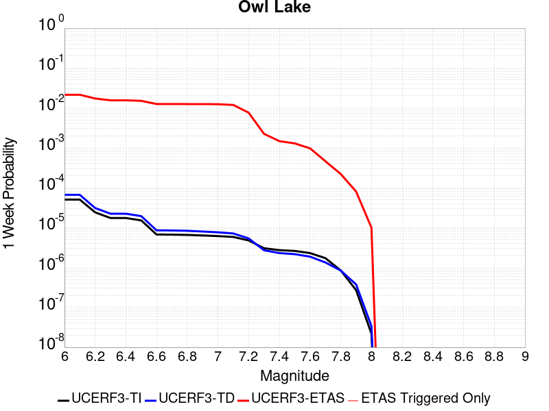 |  |  |  |

| Magnitude | 1 wk TI Prob | 1 wk TD Prob | 1 wk ETAS Prob | 1 wk ETAS/TD Gain | 1 wk ETAS Triggered Only | 1 mo TI Prob | 1 mo TD Prob | 1 mo ETAS Prob | 1 mo ETAS/TD Gain | 1 mo ETAS Triggered Only | 1 yr TI Prob | 1 yr TD Prob | 1 yr ETAS Prob | 1 yr ETAS/TD Gain | 1 yr ETAS Triggered Only | 10 yr TI Prob | 10 yr TD Prob | 10 yr ETAS Prob | 10 yr ETAS/TD Gain | 10 yr ETAS Triggered Only |
|-----|-----|-----|-----|-----|-----|-----|-----|-----|-----|-----|-----|-----|-----|-----|-----|-----|-----|-----|-----|-----|
| 6.0 | 5.0320643E-5 | 6.635816E-5 | 0.021384943 | 322.26547 | 0.02132 | 2.1564208E-4 | 2.843674E-4 | 0.028166436 | 99.04946 | 0.02789 | 0.0026222812 | 0.0034577388 | 0.043289535 | 12.519608 | 0.03997 | 0.02591553 | 0.034140717 | 0.08513809 | 2.4937406 | 0.0528 |
| 6.1 | 5.0320643E-5 | 6.635816E-5 | 0.021384943 | 322.26547 | 0.02132 | 2.1564208E-4 | 2.843674E-4 | 0.028166436 | 99.04946 | 0.02789 | 0.0026222812 | 0.0034577388 | 0.043289535 | 12.519608 | 0.03997 | 0.02591553 | 0.034140717 | 0.08513809 | 2.4937406 | 0.0528 |
| 6.2 | 2.4125871E-5 | 3.0981035E-5 | 0.01720045 | 555.1928 | 0.01717 | 1.0339249E-4 | 1.3277028E-4 | 0.022149846 | 166.82835 | 0.02202 | 0.0012580766 | 0.001615439 | 0.03262526 | 20.195911 | 0.03106 | 0.012509781 | 0.016070465 | 0.05594913 | 3.481488 | 0.04053 |
| 6.3 | 1.7433485E-5 | 2.2355514E-5 | 0.015522009 | 694.32574 | 0.0155 | 7.471279E-5 | 9.580672E-5 | 0.019703928 | 205.66331 | 0.01961 | 9.0924866E-4 | 0.0011659743 | 0.028504062 | 24.44656 | 0.02737 | 0.009055373 | 0.011628896 | 0.046291072 | 3.9806936 | 0.03507 |
| 6.4 | 1.7433485E-5 | 2.2355514E-5 | 0.015522009 | 694.32574 | 0.0155 | 7.471279E-5 | 9.580672E-5 | 0.019703928 | 205.66331 | 0.01961 | 9.0924866E-4 | 0.0011659743 | 0.028504062 | 24.44656 | 0.02737 | 0.009055373 | 0.011628896 | 0.046291072 | 3.9806936 | 0.03507 |
| 6.5 | 1.5182742E-5 | 1.9429144E-5 | 0.015059137 | 775.0798 | 0.01504 | 6.506727E-5 | 8.326596E-5 | 0.01901169 | 228.32487 | 0.01893 | 7.919061E-4 | 0.0010134429 | 0.027176902 | 26.816412 | 0.02619 | 0.0078909 | 0.010118429 | 0.04320027 | 4.2694645 | 0.03342 |
| 6.6 | 6.7271576E-6 | 8.547361E-6 | 0.01252844 | 1465.7671 | 0.01252 | 2.8830356E-5 | 3.6631063E-5 | 0.0155060645 | 423.30368 | 0.01547 | 3.5095305E-4 | 4.458976E-4 | 0.020896774 | 46.864513 | 0.02046 | 0.0035039932 | 0.004467813 | 0.029346162 | 6.5683513 | 0.02499 |
| 6.7 | 6.682835E-6 | 8.479807E-6 | 0.012528374 | 1477.4362 | 0.01252 | 2.8640408E-5 | 3.6341557E-5 | 0.01550578 | 426.668 | 0.01547 | 3.4864116E-4 | 4.4237426E-4 | 0.020883327 | 47.207375 | 0.02045 | 0.003480947 | 0.0044327388 | 0.029282099 | 6.6058702 | 0.02496 |
| 6.8 | 6.5774975E-6 | 8.32628E-6 | 0.012488223 | 1499.8561 | 0.01248 | 2.8188972E-5 | 3.5683603E-5 | 0.015465133 | 433.39606 | 0.01543 | 3.4314668E-4 | 4.343669E-4 | 0.020825505 | 47.944504 | 0.0204 | 0.0034261728 | 0.004352885 | 0.029134542 | 6.693157 | 0.02489 |
| 6.9 | 6.363419E-6 | 7.999454E-6 | 0.012467899 | 1558.5938 | 0.01246 | 2.727151E-5 | 3.428296E-5 | 0.015423755 | 449.8957 | 0.01539 | 3.3198006E-4 | 4.1732067E-4 | 0.020758828 | 49.74311 | 0.02035 | 0.0033148455 | 0.0041828766 | 0.028909016 | 6.9112763 | 0.02483 |
| 7.0 | 6.1342453E-6 | 7.6316555E-6 | 0.012407537 | 1625.7988 | 0.0124 | 2.6289357E-5 | 3.2706717E-5 | 0.015312207 | 468.16705 | 0.01528 | 3.2002592E-4 | 3.9813702E-4 | 0.020550111 | 51.615673 | 0.02016 | 0.0031956544 | 0.003991571 | 0.028453538 | 7.1284065 | 0.02456 |
| 7.1 | 5.842926E-6 | 7.142211E-6 | 0.0118670575 | 1661.5383 | 0.01186 | 2.504087E-5 | 3.0609146E-5 | 0.014660161 | 478.94705 | 0.01463 | 3.0482994E-4 | 3.7260808E-4 | 0.019595442 | 52.58996 | 0.01923 | 0.0030441214 | 0.0037370329 | 0.02706951 | 7.2435837 | 0.02342 |
| 7.2 | 4.77173E-6 | 5.358483E-6 | 0.0076153176 | 1421.1704 | 0.00761 | 2.045011E-5 | 2.2964748E-5 | 0.0093927495 | 409.0073 | 0.00937 | 2.4895166E-4 | 2.79564E-4 | 0.012646106 | 45.2351 | 0.01237 | 0.0024867293 | 0.002808645 | 0.017706685 | 6.304351 | 0.01494 |
| 7.3 | 3.0494948E-6 | 2.710463E-6 | 0.0022427044 | 827.42487 | 0.00224 | 1.3069198E-5 | 1.1616219E-5 | 0.002781584 | 239.45692 | 0.00277 | 1.5910587E-4 | 1.4141845E-4 | 0.0036009292 | 25.462938 | 0.00346 | 0.0015899199 | 0.0014232415 | 0.0055873063 | 3.9257617 | 0.00417 |
| 7.4 | 2.7263884E-6 | 2.3056762E-6 | 0.0014723022 | 638.55554 | 0.00147 | 1.1684469E-5 | 9.881433E-6 | 0.0018298634 | 185.18199 | 0.00182 | 1.4224913E-4 | 1.20299905E-4 | 0.0023900268 | 19.867237 | 0.00227 | 0.0014215811 | 0.0012112238 | 0.0039279293 | 3.2429426 | 0.00272 |
| 7.5 | 2.6090431E-6 | 2.1656133E-6 | 0.0012921628 | 596.6729 | 0.00129 | 1.1181565E-5 | 9.281167E-6 | 0.001639266 | 176.62283 | 0.00163 | 1.3612706E-4 | 1.1299244E-4 | 0.0021627608 | 19.140757 | 0.00205 | 0.001360437 | 0.0011379806 | 0.0035452382 | 3.1153765 | 0.00241 |
| 7.6 | 2.3008756E-6 | 1.8727933E-6 | 9.7187096E-4 | 518.9419 | 9.7E-4 | 9.860858E-6 | 8.0262325E-6 | 0.0011880167 | 148.01672 | 0.00118 | 1.20049335E-4 | 9.7715085E-5 | 0.0016075675 | 16.45158 | 0.00151 | 0.001199845 | 9.849932E-4 | 0.0027832203 | 2.8256238 | 0.0018 |
| 7.7 | 1.7184348E-6 | 1.3419171E-6 | 4.613413E-4 | 343.7927 | 4.6E-4 | 7.3646997E-6 | 5.7510606E-6 | 5.6574785E-4 | 98.37278 | 5.6E-4 | 8.966153E-5 | 7.0016955E-5 | 7.8996655E-4 | 11.282503 | 7.2E-4 | 8.962536E-4 | 7.078345E-4 | 0.0015772186 | 2.228231 | 8.7E-4 |
| 7.8 | 8.4612907E-7 | 8.4058576E-7 | 2.208404E-4 | 262.72205 | 2.2E-4 | 3.6262625E-6 | 3.6025056E-6 | 2.6360157E-4 | 73.17173 | 2.6E-4 | 4.4148852E-5 | 4.3859643E-5 | 3.8384474E-4 | 8.751661 | 3.4E-4 | 4.414008E-4 | 4.4398365E-4 | 8.6379715E-4 | 1.9455608 | 4.2E-4 |
| 7.9 | 2.716738E-7 | 3.768106E-7 | 8.037678E-5 | 213.30818 | 8.0E-5 | 1.1643157E-6 | 1.6149015E-6 | 1.0161474E-4 | 62.92318 | 1.0E-4 | 1.4175452E-5 | 1.966126E-5 | 1.496587E-4 | 7.6118574 | 1.3E-4 | 1.4174548E-4 | 1.9836679E-4 | 3.4833702E-4 | 1.756025 | 1.5E-4 |
| 8.0 | 2.1995428E-8 | 3.384878E-8 | 1.0033848E-5 | 296.4316 | 1.0E-5 | 9.426611E-8 | 1.4506621E-7 | 2.0145064E-5 | 138.86807 | 2.0E-5 | 1.1476893E-6 | 1.7661803E-6 | 2.1766145E-5 | 12.323853 | 2.0E-5 | 1.14768345E-5 | 1.7963059E-5 | 3.7962698E-5 | 2.1133761 | 2.0E-5 |

## Airport Lake
*[(top)](#table-of-contents)*

| 1 Week | 1 Month | 1 Year | 10 Year |
|-----|-----|-----|-----|
|  |  |  |  |

| Magnitude | 1 wk TI Prob | 1 wk TD Prob | 1 wk ETAS Prob | 1 wk ETAS/TD Gain | 1 wk ETAS Triggered Only | 1 mo TI Prob | 1 mo TD Prob | 1 mo ETAS Prob | 1 mo ETAS/TD Gain | 1 mo ETAS Triggered Only | 1 yr TI Prob | 1 yr TD Prob | 1 yr ETAS Prob | 1 yr ETAS/TD Gain | 1 yr ETAS Triggered Only | 10 yr TI Prob | 10 yr TD Prob | 10 yr ETAS Prob | 10 yr ETAS/TD Gain | 10 yr ETAS Triggered Only |
|-----|-----|-----|-----|-----|-----|-----|-----|-----|-----|-----|-----|-----|-----|-----|-----|-----|-----|-----|-----|-----|
| 6.0 | 1.2387061E-5 | 1.3103157E-5 | 0.024132786 | 1841.7537 | 0.02412 | 5.3086325E-5 | 5.615534E-5 | 0.029394507 | 523.44995 | 0.02934 | 6.461343E-4 | 6.8350515E-4 | 0.03874747 | 56.68936 | 0.03809 | 0.0064425888 | 0.0068168393 | 0.052612513 | 7.718022 | 0.04611 |
| 6.1 | 1.2387061E-5 | 1.3103157E-5 | 0.024132786 | 1841.7537 | 0.02412 | 5.3086325E-5 | 5.615534E-5 | 0.029394507 | 523.44995 | 0.02934 | 6.461343E-4 | 6.8350515E-4 | 0.03874747 | 56.68936 | 0.03809 | 0.0064425888 | 0.0068168393 | 0.052612513 | 7.718022 | 0.04611 |
| 6.2 | 1.2387061E-5 | 1.3103157E-5 | 0.024132786 | 1841.7537 | 0.02412 | 5.3086325E-5 | 5.615534E-5 | 0.029394507 | 523.44995 | 0.02934 | 6.461343E-4 | 6.8350515E-4 | 0.03874747 | 56.68936 | 0.03809 | 0.0064425888 | 0.0068168393 | 0.052612513 | 7.718022 | 0.04611 |
| 6.3 | 1.2387061E-5 | 1.3103157E-5 | 0.024132786 | 1841.7537 | 0.02412 | 5.3086325E-5 | 5.615534E-5 | 0.029394507 | 523.44995 | 0.02934 | 6.461343E-4 | 6.8350515E-4 | 0.03874747 | 56.68936 | 0.03809 | 0.0064425888 | 0.0068168393 | 0.052612513 | 7.718022 | 0.04611 |
| 6.4 | 1.2387061E-5 | 1.3103157E-5 | 0.024132786 | 1841.7537 | 0.02412 | 5.3086325E-5 | 5.615534E-5 | 0.029394507 | 523.44995 | 0.02934 | 6.461343E-4 | 6.8350515E-4 | 0.03874747 | 56.68936 | 0.03809 | 0.0064425888 | 0.0068168393 | 0.052612513 | 7.718022 | 0.04611 |
| 6.5 | 6.9922594E-6 | 7.384925E-6 | 0.018547248 | 2511.5012 | 0.01854 | 2.996648E-5 | 3.1649324E-5 | 0.022360943 | 706.5219 | 0.02233 | 3.6478083E-4 | 3.8526783E-4 | 0.029304123 | 76.06169 | 0.02893 | 0.003641826 | 0.0038465366 | 0.03872187 | 10.066684 | 0.03501 |
| 6.6 | 6.9922594E-6 | 7.384925E-6 | 0.018547248 | 2511.5012 | 0.01854 | 2.996648E-5 | 3.1649324E-5 | 0.022360943 | 706.5219 | 0.02233 | 3.6478083E-4 | 3.8526783E-4 | 0.029304123 | 76.06169 | 0.02893 | 0.003641826 | 0.0038465366 | 0.03872187 | 10.066684 | 0.03501 |
| 6.7 | 5.477277E-6 | 5.7860684E-6 | 0.015725695 | 2717.855 | 0.01572 | 2.3473833E-5 | 2.4797222E-5 | 0.018974327 | 765.17957 | 0.01895 | 2.8575645E-4 | 3.0186825E-4 | 0.024954423 | 82.66661 | 0.02466 | 0.0028538927 | 0.003014966 | 0.03278494 | 10.874066 | 0.02986 |
| 6.8 | 3.9950432E-6 | 4.2190873E-6 | 0.011874169 | 2814.393 | 0.01187 | 1.7121502E-5 | 1.8081691E-5 | 0.01444782 | 799.03033 | 0.01443 | 2.0843433E-4 | 2.2012512E-4 | 0.018956 | 86.11466 | 0.01874 | 0.0020823893 | 0.0021993418 | 0.024769593 | 11.262276 | 0.02262 |
| 6.9 | 2.95695E-6 | 3.1230243E-6 | 0.008393097 | 2687.49 | 0.00839 | 1.2672582E-5 | 1.3384334E-5 | 0.010203248 | 762.32764 | 0.01019 | 1.5427776E-4 | 1.6294434E-4 | 0.01344078 | 82.48694 | 0.01328 | 0.001541707 | 0.0016284712 | 0.01756248 | 10.784643 | 0.01596 |
| 7.0 | 1.456072E-6 | 1.540812E-6 | 0.0036415353 | 2363.3872 | 0.00364 | 6.2402937E-6 | 6.603469E-6 | 0.004406574 | 667.3121 | 0.0044 | 7.597293E-5 | 8.039528E-5 | 0.005779937 | 71.89399 | 0.0057 | 7.594696E-4 | 8.0376083E-4 | 0.007698215 | 9.577744 | 0.0069 |
| 7.1 | 6.995192E-7 | 7.4089746E-7 | 0.0015207398 | 2052.5645 | 0.00152 | 2.997936E-6 | 3.1752747E-6 | 0.0017731696 | 558.4303 | 0.00177 | 3.649926E-5 | 3.865897E-5 | 0.0022685728 | 58.681667 | 0.00223 | 3.6493264E-4 | 3.865897E-4 | 0.0032054996 | 8.291736 | 0.00282 |

## Panamint Valley
*[(top)](#table-of-contents)*

| 1 Week | 1 Month | 1 Year | 10 Year |
|-----|-----|-----|-----|
| 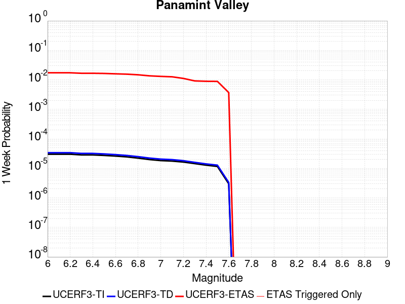 |  |  | 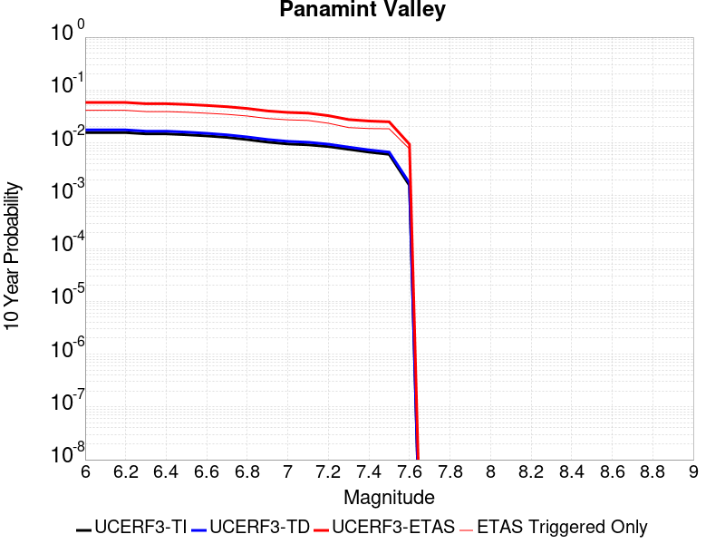 |

| Magnitude | 1 wk TI Prob | 1 wk TD Prob | 1 wk ETAS Prob | 1 wk ETAS/TD Gain | 1 wk ETAS Triggered Only | 1 mo TI Prob | 1 mo TD Prob | 1 mo ETAS Prob | 1 mo ETAS/TD Gain | 1 mo ETAS Triggered Only | 1 yr TI Prob | 1 yr TD Prob | 1 yr ETAS Prob | 1 yr ETAS/TD Gain | 1 yr ETAS Triggered Only | 10 yr TI Prob | 10 yr TD Prob | 10 yr ETAS Prob | 10 yr ETAS/TD Gain | 10 yr ETAS Triggered Only |
|-----|-----|-----|-----|-----|-----|-----|-----|-----|-----|-----|-----|-----|-----|-----|-----|-----|-----|-----|-----|-----|
| 6.0 | 3.0211835E-5 | 3.3984514E-5 | 0.017323397 | 509.74387 | 0.01729 | 1.2947287E-4 | 1.4563995E-4 | 0.022142436 | 152.03546 | 0.022 | 0.0015751923 | 0.0017717537 | 0.033675127 | 19.006664 | 0.03196 | 0.015640736 | 0.017583137 | 0.058156952 | 3.3075414 | 0.0413 |
| 6.1 | 3.0211835E-5 | 3.3984514E-5 | 0.017323397 | 509.74387 | 0.01729 | 1.2947287E-4 | 1.4563995E-4 | 0.022142436 | 152.03546 | 0.022 | 0.0015751923 | 0.0017717537 | 0.033675127 | 19.006664 | 0.03196 | 0.015640736 | 0.017583137 | 0.058156952 | 3.3075414 | 0.0413 |
| 6.2 | 3.0211835E-5 | 3.3984514E-5 | 0.017323397 | 509.74387 | 0.01729 | 1.2947287E-4 | 1.4563995E-4 | 0.022142436 | 152.03546 | 0.022 | 0.0015751923 | 0.0017717537 | 0.033675127 | 19.006664 | 0.03196 | 0.015640736 | 0.017583137 | 0.058156952 | 3.3075414 | 0.0413 |
| 6.3 | 2.8573924E-5 | 3.210268E-5 | 0.016691567 | 519.9431 | 0.01666 | 1.2245393E-4 | 1.3757581E-4 | 0.021194678 | 154.05817 | 0.02106 | 0.001489857 | 0.0016737265 | 0.03197293 | 19.10284 | 0.03035 | 0.01479908 | 0.016617801 | 0.055068046 | 3.3137987 | 0.0391 |
| 6.4 | 2.8573924E-5 | 3.210268E-5 | 0.016691567 | 519.9431 | 0.01666 | 1.2245393E-4 | 1.3757581E-4 | 0.021194678 | 154.05817 | 0.02106 | 0.001489857 | 0.0016737265 | 0.03197293 | 19.10284 | 0.03035 | 0.01479908 | 0.016617801 | 0.055068046 | 3.3137987 | 0.0391 |
| 6.5 | 2.7468774E-5 | 3.0828433E-5 | 0.016450321 | 533.60876 | 0.01642 | 1.1771801E-4 | 1.3211532E-4 | 0.020779388 | 157.2822 | 0.02065 | 0.0014322745 | 0.0016073446 | 0.031179735 | 19.398289 | 0.02962 | 0.014230782 | 0.015963677 | 0.053327534 | 3.3405547 | 0.03797 |
| 6.6 | 2.6135967E-5 | 2.925248E-5 | 0.015968787 | 545.89514 | 0.01594 | 1.1200648E-4 | 1.253619E-4 | 0.020162849 | 160.83714 | 0.02004 | 0.0013628257 | 0.0015252391 | 0.030081617 | 19.722559 | 0.0286 | 0.013544982 | 0.015154043 | 0.051012285 | 3.366249 | 0.03641 |
| 6.7 | 2.4498746E-5 | 2.7341335E-5 | 0.015566916 | 569.3547 | 0.01554 | 1.04990395E-4 | 1.1717203E-4 | 0.019544896 | 166.80513 | 0.01943 | 0.0012775084 | 0.0014256609 | 0.028856497 | 20.240786 | 0.02747 | 0.012701893 | 0.014171274 | 0.04833024 | 3.410437 | 0.03465 |
| 6.8 | 2.2244329E-5 | 2.4935423E-5 | 0.014804567 | 593.71625 | 0.01478 | 9.532935E-5 | 1.0686185E-4 | 0.018434903 | 172.51155 | 0.01833 | 0.0011600169 | 0.0013002884 | 0.027076729 | 20.823633 | 0.02581 | 0.011539802 | 0.0129325185 | 0.044735834 | 3.459174 | 0.03222 |
| 6.9 | 1.9902658E-5 | 2.2290267E-5 | 0.013651987 | 612.46405 | 0.01363 | 8.529431E-5 | 9.552632E-5 | 0.016953915 | 177.479 | 0.01686 | 0.0010379635 | 0.0011624309 | 0.024485288 | 21.063866 | 0.02335 | 0.010331288 | 0.011568608 | 0.040173814 | 3.4726574 | 0.02894 |
| 7.0 | 1.8353881E-5 | 2.0566185E-5 | 0.013080298 | 636.0099 | 0.01306 | 7.865712E-5 | 8.813792E-5 | 0.016146723 | 183.19836 | 0.01606 | 9.5722964E-4 | 0.0010725686 | 0.023178833 | 21.610582 | 0.02213 | 0.009531168 | 0.010678849 | 0.037687317 | 3.5291553 | 0.0273 |
| 7.1 | 1.7667631E-5 | 1.9772613E-5 | 0.012659523 | 640.25543 | 0.01264 | 7.571623E-5 | 8.473711E-5 | 0.015653418 | 184.72919 | 0.01557 | 9.2145515E-4 | 0.0010312037 | 0.022489054 | 21.808548 | 0.02148 | 0.009176437 | 0.010269073 | 0.036566224 | 3.5608108 | 0.02657 |
| 7.2 | 1.6381597E-5 | 1.8158249E-5 | 0.011157956 | 614.48413 | 0.01114 | 7.020495E-5 | 7.781885E-5 | 0.013756754 | 176.7792 | 0.01368 | 8.544101E-4 | 9.4704994E-4 | 0.019899085 | 21.011652 | 0.01897 | 0.008511325 | 0.009434792 | 0.032732885 | 3.4693806 | 0.02352 |
| 7.3 | 1.4520491E-5 | 1.5966476E-5 | 0.00918582 | 575.3192 | 0.00917 | 6.222919E-5 | 6.842605E-5 | 0.01139765 | 166.56888 | 0.01133 | 7.57377E-4 | 8.327849E-4 | 0.01663961 | 19.98068 | 0.01582 | 0.0075480095 | 0.00829975 | 0.027608154 | 3.3263836 | 0.01947 |
| 7.4 | 1.2852287E-5 | 1.4145411E-5 | 0.008934019 | 631.5843 | 0.00892 | 5.5080065E-5 | 6.062187E-5 | 0.011049956 | 182.27672 | 0.01099 | 6.7039346E-4 | 7.378371E-4 | 0.015986579 | 21.666811 | 0.01526 | 0.0066837464 | 0.0073567946 | 0.02589937 | 3.5204694 | 0.01868 |
| 7.5 | 1.1637851E-5 | 1.2836797E-5 | 0.008862724 | 690.4154 | 0.00885 | 4.987555E-5 | 5.5013777E-5 | 0.0109544145 | 199.12129 | 0.0109 | 6.070656E-4 | 6.6960254E-4 | 0.015779478 | 23.56544 | 0.01512 | 0.006054099 | 0.0066787465 | 0.025015457 | 3.7455318 | 0.01846 |
| 7.6 | 3.0068115E-6 | 3.3330316E-6 | 0.0037033206 | 1111.0968 | 0.0037 | 1.2886271E-5 | 1.4284384E-5 | 0.0045642196 | 319.52512 | 0.00455 | 1.5687906E-4 | 1.7390578E-4 | 0.0066327825 | 38.140095 | 0.00646 | 0.0015676835 | 0.0017391363 | 0.009425745 | 5.419785 | 0.0077 |

## Garlock (East)
*[(top)](#table-of-contents)*

| 1 Week | 1 Month | 1 Year | 10 Year |
|-----|-----|-----|-----|
| 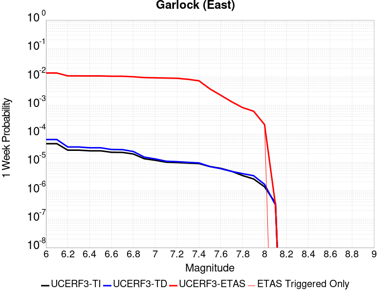 | 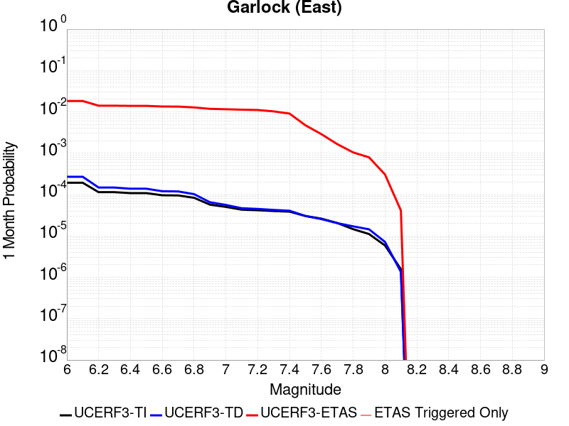 | 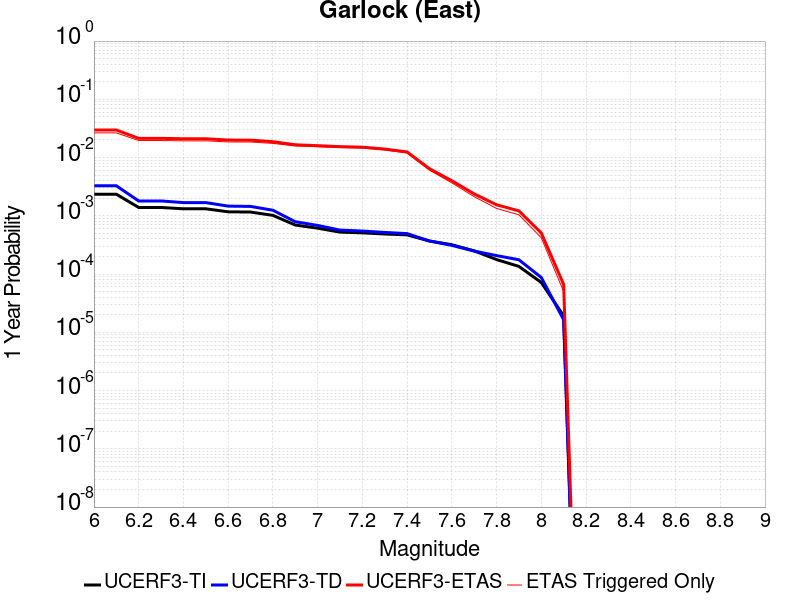 |  |

| Magnitude | 1 wk TI Prob | 1 wk TD Prob | 1 wk ETAS Prob | 1 wk ETAS/TD Gain | 1 wk ETAS Triggered Only | 1 mo TI Prob | 1 mo TD Prob | 1 mo ETAS Prob | 1 mo ETAS/TD Gain | 1 mo ETAS Triggered Only | 1 yr TI Prob | 1 yr TD Prob | 1 yr ETAS Prob | 1 yr ETAS/TD Gain | 1 yr ETAS Triggered Only | 10 yr TI Prob | 10 yr TD Prob | 10 yr ETAS Prob | 10 yr ETAS/TD Gain | 10 yr ETAS Triggered Only |
|-----|-----|-----|-----|-----|-----|-----|-----|-----|-----|-----|-----|-----|-----|-----|-----|-----|-----|-----|-----|-----|
| 6.0 | 4.5092507E-5 | 6.290325E-5 | 0.013722044 | 218.14523 | 0.01366 | 1.9323928E-4 | 2.6956003E-4 | 0.018334689 | 68.0171 | 0.01807 | 0.0023501497 | 0.0032774 | 0.029710483 | 9.06526 | 0.02652 | 0.023254504 | 0.032351844 | 0.0668485 | 2.0662963 | 0.03565 |
| 6.1 | 4.5092507E-5 | 6.290325E-5 | 0.013722044 | 218.14523 | 0.01366 | 1.9323928E-4 | 2.6956003E-4 | 0.018334689 | 68.0171 | 0.01807 | 0.0023501497 | 0.0032774 | 0.029710483 | 9.06526 | 0.02652 | 0.023254504 | 0.032351844 | 0.0668485 | 2.0662963 | 0.03565 |
| 6.2 | 2.6674514E-5 | 3.4509674E-5 | 0.010894135 | 315.6835 | 0.01086 | 1.1431433E-4 | 1.4789042E-4 | 0.014095827 | 95.31265 | 0.01395 | 0.0013908884 | 0.0017991117 | 0.021363849 | 11.874665 | 0.0196 | 0.01382215 | 0.017890299 | 0.04315016 | 2.4119306 | 0.02572 |
| 6.3 | 2.6674514E-5 | 3.4509674E-5 | 0.010894135 | 315.6835 | 0.01086 | 1.1431433E-4 | 1.4789042E-4 | 0.014095827 | 95.31265 | 0.01395 | 0.0013908884 | 0.0017991117 | 0.021363849 | 11.874665 | 0.0196 | 0.01382215 | 0.017890299 | 0.04315016 | 2.4119306 | 0.02572 |
| 6.4 | 2.5312667E-5 | 3.233893E-5 | 0.010831989 | 334.952 | 0.0108 | 1.0847834E-4 | 1.3858822E-4 | 0.013966671 | 100.778206 | 0.01383 | 0.0013199237 | 0.0016860351 | 0.02103336 | 12.475043 | 0.01938 | 0.013121112 | 0.016778335 | 0.041752167 | 2.488457 | 0.0254 |
| 6.5 | 2.5312667E-5 | 3.233893E-5 | 0.010831989 | 334.952 | 0.0108 | 1.0847834E-4 | 1.3858822E-4 | 0.013966671 | 100.778206 | 0.01383 | 0.0013199237 | 0.0016860351 | 0.02103336 | 12.475043 | 0.01938 | 0.013121112 | 0.016778335 | 0.041752167 | 2.488457 | 0.0254 |
| 6.6 | 2.246556E-5 | 2.8133776E-5 | 0.010587837 | 376.339 | 0.01056 | 9.627742E-5 | 1.20567885E-4 | 0.013488956 | 111.87851 | 0.01337 | 0.0011715472 | 0.0014669491 | 0.019989736 | 13.626741 | 0.01855 | 0.011653901 | 0.01461866 | 0.038307227 | 2.6204336 | 0.02404 |
| 6.7 | 2.2241198E-5 | 2.7803519E-5 | 0.010557511 | 379.7185 | 0.01053 | 9.531594E-5 | 1.1915263E-4 | 0.013417568 | 112.60824 | 0.0133 | 0.0011598538 | 0.0014497414 | 0.01990295 | 13.728621 | 0.01848 | 0.011538187 | 0.014448853 | 0.038033094 | 2.6322567 | 0.02393 |
| 6.8 | 1.9528685E-5 | 2.389819E-5 | 0.010153656 | 424.87134 | 0.01013 | 8.369167E-5 | 1.0241691E-4 | 0.012811115 | 125.08789 | 0.01271 | 0.0010184698 | 0.0012462323 | 0.01873441 | 15.032841 | 0.01751 | 0.010138147 | 0.012436427 | 0.03464673 | 2.7859073 | 0.02249 |
| 6.9 | 1.3318621E-5 | 1.5198884E-5 | 0.009495054 | 624.7205 | 0.00948 | 5.7078556E-5 | 6.513648E-5 | 0.01183437 | 181.68573 | 0.01177 | 6.9470983E-4 | 7.927538E-4 | 0.01659022 | 20.927328 | 0.01581 | 0.0069254204 | 0.007939888 | 0.02777117 | 3.4976778 | 0.01999 |
| 7.0 | 1.1760853E-5 | 1.31077895E-5 | 0.009302986 | 709.7296 | 0.00929 | 5.0402683E-5 | 5.6175057E-5 | 0.0115755275 | 206.06169 | 0.01152 | 6.134799E-4 | 6.8372174E-4 | 0.01600324 | 23.406073 | 0.01533 | 0.0061178906 | 0.00685652 | 0.026004327 | 3.7926419 | 0.01928 |
| 7.1 | 1.0064758E-5 | 1.0902931E-5 | 0.009130804 | 837.46326 | 0.00912 | 4.3133965E-5 | 4.672603E-5 | 0.011296201 | 241.75392 | 0.01125 | 5.2502943E-4 | 5.687444E-4 | 0.015400304 | 27.077724 | 0.01484 | 0.005237907 | 0.0057129986 | 0.024027765 | 4.2058063 | 0.01842 |
| 7.2 | 9.768808E-6 | 1.0498807E-5 | 0.008980405 | 855.37384 | 0.00897 | 4.186565E-5 | 4.499413E-5 | 0.011094497 | 246.57654 | 0.01105 | 5.095951E-4 | 5.4766936E-4 | 0.015089701 | 27.552576 | 0.01455 | 0.0050842804 | 0.0055032647 | 0.02349371 | 4.2690496 | 0.01809 |
| 7.3 | 9.344516E-6 | 9.944468E-6 | 0.008259863 | 830.59875 | 0.00825 | 4.004731E-5 | 4.261847E-5 | 0.010282182 | 241.26117 | 0.01024 | 4.8746695E-4 | 5.1875977E-4 | 0.014001762 | 26.990839 | 0.01349 | 0.0048639905 | 0.0052149445 | 0.021907438 | 4.200896 | 0.01678 |
| 7.4 | 9.023491E-6 | 9.490661E-6 | 0.0073194215 | 771.2236 | 0.00731 | 3.867153E-5 | 4.0673647E-5 | 0.009090305 | 223.49374 | 0.00905 | 4.7072413E-4 | 4.950925E-4 | 0.012479156 | 25.205708 | 0.01199 | 0.004697283 | 0.0049783974 | 0.01985397 | 3.9880245 | 0.01495 |
| 7.5 | 7.081253E-6 | 7.087672E-6 | 0.0038070607 | 537.13837 | 0.0038 | 3.0347876E-5 | 3.0375388E-5 | 0.004740232 | 156.05504 | 0.00471 | 3.6942272E-4 | 3.6975832E-4 | 0.0064475103 | 17.437092 | 0.00608 | 0.003688092 | 0.0037243143 | 0.011335861 | 3.0437443 | 0.00764 |
| 7.6 | 6.116396E-6 | 5.959245E-6 | 0.0022659458 | 380.24045 | 0.00226 | 2.6212863E-5 | 2.5539372E-5 | 0.002895466 | 113.37264 | 0.00287 | 3.1909486E-4 | 3.1089774E-4 | 0.0039997506 | 12.865165 | 0.00369 | 0.0031863707 | 0.0031357552 | 0.007741268 | 2.4687092 | 0.00462 |
| 7.7 | 4.797145E-6 | 4.757281E-6 | 0.0013347509 | 280.57013 | 0.00133 | 2.055903E-5 | 2.0388188E-5 | 0.0016603548 | 81.43709 | 0.00164 | 2.5027743E-4 | 2.4819805E-4 | 0.0023776693 | 9.579726 | 0.00213 | 0.0024999576 | 0.0025093474 | 0.005122773 | 2.0414762 | 0.00262 |
| 7.8 | 3.4028885E-6 | 3.978462E-6 | 8.3397515E-4 | 209.62251 | 8.3E-4 | 1.4583726E-5 | 1.7050439E-5 | 0.0010470329 | 61.40797 | 0.00103 | 1.775424E-4 | 2.0756939E-4 | 0.0015472913 | 7.4543324 | 0.00134 | 0.0017740062 | 0.0021012232 | 0.0037477561 | 1.7836069 | 0.00165 |
| 7.9 | 2.5928412E-6 | 3.3724489E-6 | 6.2337035E-4 | 184.84204 | 6.2E-4 | 1.1112129E-5 | 1.4453272E-5 | 7.94442E-4 | 54.966236 | 7.8E-4 | 1.3528178E-4 | 1.7595445E-4 | 0.0012157714 | 6.9095807 | 0.00104 | 0.0013519945 | 0.0017812408 | 0.003068943 | 1.7229242 | 0.00129 |
| 8.0 | 1.3743648E-6 | 1.6734747E-6 | 2.1167312E-4 | 126.4872 | 2.1E-4 | 5.8901214E-6 | 7.1720146E-6 | 3.0716986E-4 | 42.82895 | 3.0E-4 | 7.1709874E-5 | 8.731581E-5 | 5.072791E-4 | 5.8097053 | 4.2E-4 | 7.1686733E-4 | 8.837234E-4 | 0.0013932727 | 1.5765936 | 5.1E-4 |
| 8.1 | 3.6733252E-7 | 3.1489964E-7 | 3.1489964E-7 | 1.0 | 0.0 | 1.5742813E-6 | 1.3495693E-6 | 4.1349515E-5 | 30.639046 | 4.0E-5 | 1.9166706E-5 | 1.6430899E-5 | 6.6430075E-5 | 4.0429974 | 5.0E-5 | 1.9165053E-4 | 1.6638759E-4 | 2.1637927E-4 | 1.3004532 | 5.0E-5 |

## Hunter Mountain-Saline Valley
*[(top)](#table-of-contents)*

| 1 Week | 1 Month | 1 Year | 10 Year |
|-----|-----|-----|-----|
| 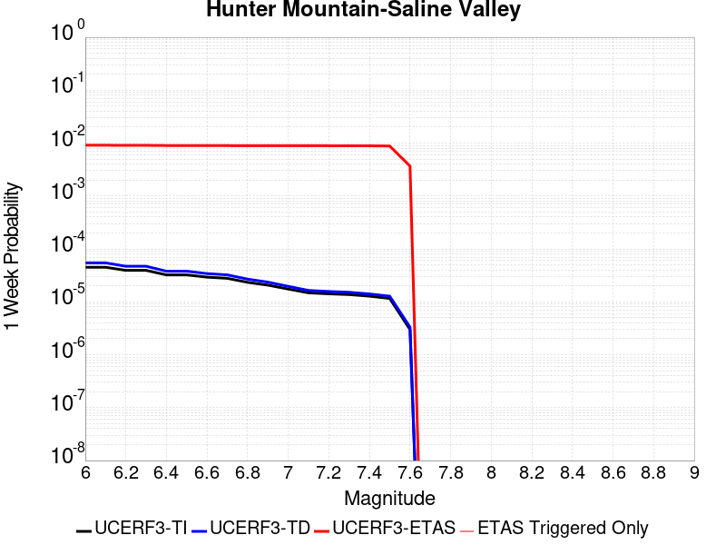 | 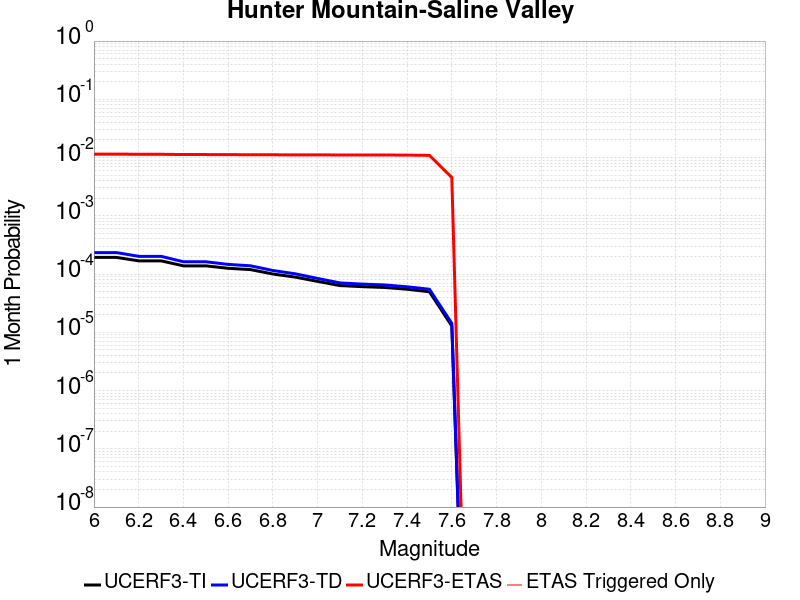 |  |  |

| Magnitude | 1 wk TI Prob | 1 wk TD Prob | 1 wk ETAS Prob | 1 wk ETAS/TD Gain | 1 wk ETAS Triggered Only | 1 mo TI Prob | 1 mo TD Prob | 1 mo ETAS Prob | 1 mo ETAS/TD Gain | 1 mo ETAS Triggered Only | 1 yr TI Prob | 1 yr TD Prob | 1 yr ETAS Prob | 1 yr ETAS/TD Gain | 1 yr ETAS Triggered Only | 10 yr TI Prob | 10 yr TD Prob | 10 yr ETAS Prob | 10 yr ETAS/TD Gain | 10 yr ETAS Triggered Only |
|-----|-----|-----|-----|-----|-----|-----|-----|-----|-----|-----|-----|-----|-----|-----|-----|-----|-----|-----|-----|-----|
| 6.0 | 4.5103672E-5 | 5.4570177E-5 | 0.009114075 | 167.01569 | 0.00906 | 1.9328714E-4 | 2.3385242E-4 | 0.011471224 | 49.05326 | 0.01124 | 0.002350731 | 0.0028435152 | 0.018449014 | 6.488101 | 0.01565 | 0.023260195 | 0.028091887 | 0.046810836 | 1.6663471 | 0.01926 |
| 6.1 | 4.5103672E-5 | 5.4570177E-5 | 0.009114075 | 167.01569 | 0.00906 | 1.9328714E-4 | 2.3385242E-4 | 0.011471224 | 49.05326 | 0.01124 | 0.002350731 | 0.0028435152 | 0.018449014 | 6.488101 | 0.01565 | 0.023260195 | 0.028091887 | 0.046810836 | 1.6663471 | 0.01926 |
| 6.2 | 3.9363465E-5 | 4.706337E-5 | 0.009076638 | 192.85994 | 0.00903 | 1.6868966E-4 | 2.0168544E-4 | 0.011389429 | 56.47125 | 0.01119 | 0.002051862 | 0.0024528175 | 0.017984627 | 7.332232 | 0.01557 | 0.020330196 | 0.024273481 | 0.042958643 | 1.7697768 | 0.01915 |
| 6.3 | 3.9363465E-5 | 4.706337E-5 | 0.009076638 | 192.85994 | 0.00903 | 1.6868966E-4 | 2.0168544E-4 | 0.011389429 | 56.47125 | 0.01119 | 0.002051862 | 0.0024528175 | 0.017984627 | 7.332232 | 0.01557 | 0.020330196 | 0.024273481 | 0.042958643 | 1.7697768 | 0.01915 |
| 6.4 | 3.2311684E-5 | 3.795099E-5 | 0.00900761 | 237.34851 | 0.00897 | 1.384713E-4 | 1.6263737E-4 | 0.011260832 | 69.2389 | 0.0111 | 0.0016845843 | 0.0019783843 | 0.0174078 | 8.798997 | 0.01546 | 0.016718714 | 0.019616475 | 0.038243763 | 1.9495736 | 0.019 |
| 6.5 | 3.2311684E-5 | 3.795099E-5 | 0.00900761 | 237.34851 | 0.00897 | 1.384713E-4 | 1.6263737E-4 | 0.011260832 | 69.2389 | 0.0111 | 0.0016845843 | 0.0019783843 | 0.0174078 | 8.798997 | 0.01546 | 0.016718714 | 0.019616475 | 0.038243763 | 1.9495736 | 0.019 |
| 6.6 | 2.9305844E-5 | 3.418183E-5 | 0.008983876 | 262.82605 | 0.00895 | 1.2559042E-4 | 1.4648569E-4 | 0.011214864 | 76.55945 | 0.01107 | 0.0015279909 | 0.001782067 | 0.017174587 | 9.637453 | 0.01542 | 0.015175272 | 0.01768569 | 0.0362809 | 2.051427 | 0.01893 |
| 6.7 | 2.7826512E-5 | 3.2344276E-5 | 0.008972055 | 277.39236 | 0.00894 | 1.19251024E-4 | 1.386113E-4 | 0.011187079 | 80.70828 | 0.01105 | 0.0014509142 | 0.0016863465 | 0.017060377 | 10.116769 | 0.0154 | 0.014414776 | 0.016743187 | 0.035336573 | 2.1105046 | 0.01891 |
| 6.8 | 2.3389874E-5 | 2.6866714E-5 | 0.008956627 | 333.37262 | 0.00893 | 1.0023846E-4 | 1.15138246E-4 | 0.0111538675 | 96.873695 | 0.01104 | 0.00121972 | 0.001400954 | 0.016719464 | 11.934341 | 0.01534 | 0.01213047 | 0.013927434 | 0.0325149 | 2.3345938 | 0.01885 |
| 6.9 | 2.069209E-5 | 2.3570032E-5 | 0.00895336 | 379.862 | 0.00893 | 8.867737E-5 | 1.01010715E-4 | 0.011129896 | 110.18531 | 0.01103 | 0.0010791123 | 0.0012291478 | 0.016540306 | 13.456726 | 0.01533 | 0.010738871 | 0.012228523 | 0.030808505 | 2.519397 | 0.01881 |
| 7.0 | 1.7462342E-5 | 1.9633546E-5 | 0.008949459 | 455.82486 | 0.00893 | 7.483646E-5 | 8.414118E-5 | 0.011113213 | 132.07817 | 0.01103 | 9.1075303E-4 | 0.0010239601 | 0.016328273 | 15.9462 | 0.01532 | 0.009070295 | 0.0101960525 | 0.028774673 | 2.8221385 | 0.01877 |
| 7.1 | 1.4807709E-5 | 1.6441749E-5 | 0.008936295 | 543.51245 | 0.00892 | 6.3460066E-5 | 7.046283E-5 | 0.011079687 | 157.24158 | 0.01101 | 7.723524E-4 | 8.575638E-4 | 0.01612446 | 18.802637 | 0.01528 | 0.007696735 | 0.008545532 | 0.02708573 | 3.169578 | 0.0187 |
| 7.2 | 1.4180048E-5 | 1.5698337E-5 | 0.008925558 | 568.56714 | 0.00891 | 6.077022E-5 | 6.727694E-5 | 0.011066537 | 164.49228 | 0.011 | 7.396263E-4 | 8.188051E-4 | 0.016076302 | 19.633856 | 0.01527 | 0.0073716943 | 0.008160833 | 0.026698308 | 3.2715173 | 0.01869 |
| 7.3 | 1.3730402E-5 | 1.5172075E-5 | 0.0089250365 | 588.2542 | 0.00891 | 5.8843252E-5 | 6.502165E-5 | 0.011064307 | 170.16342 | 0.011 | 7.161811E-4 | 7.9136714E-4 | 0.016049283 | 20.28045 | 0.01527 | 0.007138774 | 0.007888422 | 0.026430989 | 3.350605 | 0.01869 |
| 7.4 | 1.2810095E-5 | 1.4109277E-5 | 0.008893984 | 630.36426 | 0.00888 | 5.489925E-5 | 6.0467017E-5 | 0.011009805 | 182.07951 | 0.01095 | 6.681934E-4 | 7.359531E-4 | 0.01593476 | 21.651869 | 0.01521 | 0.006661878 | 0.007338053 | 0.025811492 | 3.517485 | 0.01861 |
| 7.5 | 1.1595659E-5 | 1.2800664E-5 | 0.008822688 | 689.23676 | 0.00881 | 4.9694736E-5 | 5.4858923E-5 | 0.010914263 | 198.95146 | 0.01086 | 6.0486543E-4 | 6.6771836E-4 | 0.015727656 | 23.554325 | 0.01507 | 0.006032217 | 0.0066599925 | 0.024927516 | 3.7428744 | 0.01839 |
| 7.6 | 2.997694E-6 | 3.3251579E-6 | 0.003683313 | 1107.7107 | 0.00368 | 1.28471975E-5 | 1.425064E-5 | 0.004544186 | 318.87592 | 0.00453 | 1.564034E-4 | 1.73495E-4 | 0.0066023795 | 38.055157 | 0.00643 | 0.0015629337 | 0.001735031 | 0.009371758 | 5.401493 | 0.00765 |

## Ash Hill
*[(top)](#table-of-contents)*

| 1 Week | 1 Month | 1 Year | 10 Year |
|-----|-----|-----|-----|
| 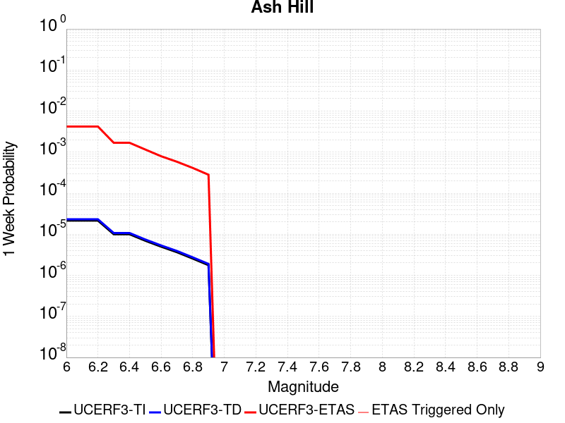 | 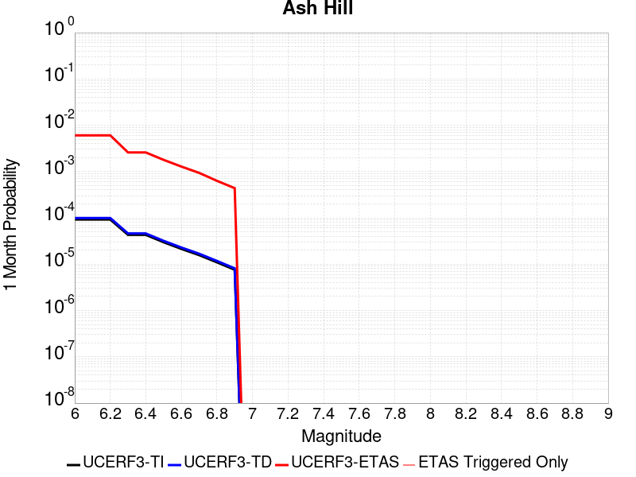 |  |  |

| Magnitude | 1 wk TI Prob | 1 wk TD Prob | 1 wk ETAS Prob | 1 wk ETAS/TD Gain | 1 wk ETAS Triggered Only | 1 mo TI Prob | 1 mo TD Prob | 1 mo ETAS Prob | 1 mo ETAS/TD Gain | 1 mo ETAS Triggered Only | 1 yr TI Prob | 1 yr TD Prob | 1 yr ETAS Prob | 1 yr ETAS/TD Gain | 1 yr ETAS Triggered Only | 10 yr TI Prob | 10 yr TD Prob | 10 yr ETAS Prob | 10 yr ETAS/TD Gain | 10 yr ETAS Triggered Only |
|-----|-----|-----|-----|-----|-----|-----|-----|-----|-----|-----|-----|-----|-----|-----|-----|-----|-----|-----|-----|-----|
| 6.0 | 2.1545662E-5 | 2.3194447E-5 | 0.0042030974 | 181.21136 | 0.00418 | 9.2335285E-5 | 9.940143E-5 | 0.006068808 | 61.053524 | 0.00597 | 0.0011236023 | 0.0012096206 | 0.011127609 | 9.199256 | 0.00993 | 0.011179381 | 0.012038348 | 0.026067404 | 2.1653638 | 0.0142 |
| 6.1 | 2.1545662E-5 | 2.3194447E-5 | 0.0042030974 | 181.21136 | 0.00418 | 9.2335285E-5 | 9.940143E-5 | 0.006068808 | 61.053524 | 0.00597 | 0.0011236023 | 0.0012096206 | 0.011127609 | 9.199256 | 0.00993 | 0.011179381 | 0.012038348 | 0.026067404 | 2.1653638 | 0.0142 |
| 6.2 | 2.1545662E-5 | 2.3194447E-5 | 0.0042030974 | 181.21136 | 0.00418 | 9.2335285E-5 | 9.940143E-5 | 0.006068808 | 61.053524 | 0.00597 | 0.0011236023 | 0.0012096206 | 0.011127609 | 9.199256 | 0.00993 | 0.011179381 | 0.012038348 | 0.026067404 | 2.1653638 | 0.0142 |
| 6.3 | 1.0025529E-5 | 1.0746934E-5 | 0.0016907288 | 157.32198 | 0.00168 | 4.2965847E-5 | 4.605755E-5 | 0.0025859405 | 56.145855 | 0.00254 | 5.229836E-4 | 5.6061964E-4 | 0.004828226 | 8.612302 | 0.00427 | 0.005217545 | 0.0055933665 | 0.011659247 | 2.0844777 | 0.0061 |
| 6.4 | 1.0025529E-5 | 1.0746934E-5 | 0.0016907288 | 157.32198 | 0.00168 | 4.2965847E-5 | 4.605755E-5 | 0.0025859405 | 56.145855 | 0.00254 | 5.229836E-4 | 5.6061964E-4 | 0.004828226 | 8.612302 | 0.00427 | 0.005217545 | 0.0055933665 | 0.011659247 | 2.0844777 | 0.0061 |
| 6.5 | 6.9617327E-6 | 7.456634E-6 | 0.001157448 | 155.22394 | 0.00115 | 2.9835655E-5 | 3.195666E-5 | 0.0017919004 | 56.07283 | 0.00176 | 3.6318856E-4 | 3.8901155E-4 | 0.0032678912 | 8.400499 | 0.00288 | 0.0036259557 | 0.0038841602 | 0.007998119 | 2.0591629 | 0.00413 |
| 6.6 | 4.9919777E-6 | 5.3466883E-6 | 7.9534244E-4 | 148.75423 | 7.9E-4 | 2.1394015E-5 | 2.2914215E-5 | 0.0012828853 | 55.986443 | 0.00126 | 2.60441E-4 | 2.7895154E-4 | 0.0023383768 | 8.382735 | 0.00206 | 0.0026013597 | 0.0027866727 | 0.0057783127 | 2.0735528 | 0.003 |
| 6.7 | 3.6630722E-6 | 3.924624E-6 | 5.839224E-4 | 148.78429 | 5.8E-4 | 1.5698786E-5 | 1.681974E-5 | 9.368043E-4 | 55.696716 | 9.2E-4 | 1.9111596E-4 | 2.0476682E-4 | 0.0017344535 | 8.470384 | 0.00153 | 0.0019095168 | 0.0020463446 | 0.0043116994 | 2.1070251 | 0.00227 |
| 6.8 | 2.5599613E-6 | 2.744925E-6 | 4.127438E-4 | 150.36615 | 4.1E-4 | 1.0971216E-5 | 1.1763939E-5 | 6.317567E-4 | 53.702812 | 6.2E-4 | 1.3356637E-4 | 1.4322149E-4 | 0.0012030697 | 8.4000635 | 0.00106 | 0.0013348613 | 0.0014317769 | 0.0030294862 | 2.1158926 | 0.0016 |
| 6.9 | 1.7684905E-6 | 1.8968707E-6 | 2.8189633E-4 | 148.61125 | 2.8E-4 | 7.579223E-6 | 8.129446E-6 | 4.3812595E-4 | 53.893703 | 4.3E-4 | 9.2273134E-5 | 9.8976E-5 | 7.989067E-4 | 8.071721 | 7.0E-4 | 9.223483E-4 | 9.8976E-4 | 0.0020387208 | 2.0598133 | 0.00105 |

## Blackwater
*[(top)](#table-of-contents)*

| 1 Week | 1 Month | 1 Year | 10 Year |
|-----|-----|-----|-----|
| 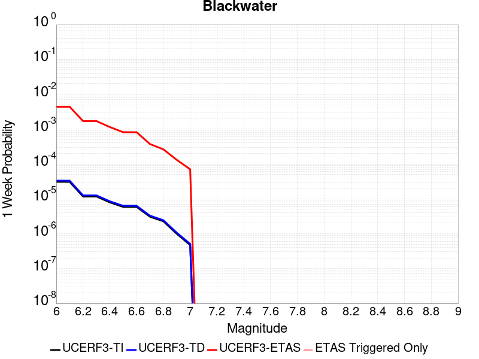 | 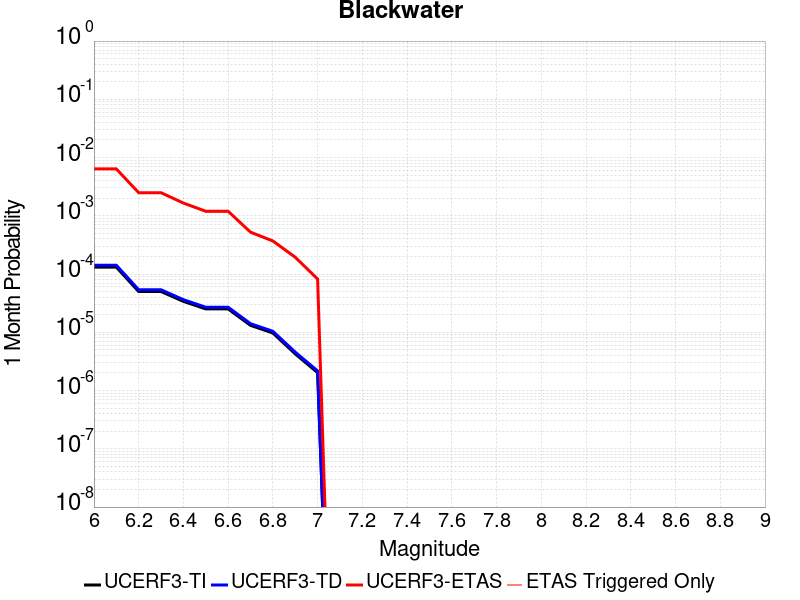 |  |  |

| Magnitude | 1 wk TI Prob | 1 wk TD Prob | 1 wk ETAS Prob | 1 wk ETAS/TD Gain | 1 wk ETAS Triggered Only | 1 mo TI Prob | 1 mo TD Prob | 1 mo ETAS Prob | 1 mo ETAS/TD Gain | 1 mo ETAS Triggered Only | 1 yr TI Prob | 1 yr TD Prob | 1 yr ETAS Prob | 1 yr ETAS/TD Gain | 1 yr ETAS Triggered Only | 10 yr TI Prob | 10 yr TD Prob | 10 yr ETAS Prob | 10 yr ETAS/TD Gain | 10 yr ETAS Triggered Only |
|-----|-----|-----|-----|-----|-----|-----|-----|-----|-----|-----|-----|-----|-----|-----|-----|-----|-----|-----|-----|-----|
| 6.0 | 3.0708583E-5 | 3.3095846E-5 | 0.0043929517 | 132.73422 | 0.00436 | 1.3160157E-4 | 1.4183241E-4 | 0.006390946 | 45.05984 | 0.00625 | 0.0016010714 | 0.0017255784 | 0.011788185 | 6.8314395 | 0.01008 | 0.015895851 | 0.017135633 | 0.031229908 | 1.8225126 | 0.01434 |
| 6.1 | 3.0708583E-5 | 3.3095846E-5 | 0.0043929517 | 132.73422 | 0.00436 | 1.3160157E-4 | 1.4183241E-4 | 0.006390946 | 45.05984 | 0.00625 | 0.0016010714 | 0.0017255784 | 0.011788185 | 6.8314395 | 0.01008 | 0.015895851 | 0.017135633 | 0.031229908 | 1.8225126 | 0.01434 |
| 6.2 | 1.1707779E-5 | 1.2545122E-5 | 0.0017025239 | 135.71202 | 0.00169 | 5.017523E-5 | 5.3763757E-5 | 0.0024936325 | 46.381294 | 0.00244 | 6.107122E-4 | 6.5438676E-4 | 0.0046317824 | 7.07805 | 0.00398 | 0.006090366 | 0.0065255696 | 0.012238047 | 1.8753991 | 0.00575 |
| 6.3 | 1.1707779E-5 | 1.2545122E-5 | 0.0017025239 | 135.71202 | 0.00169 | 5.017523E-5 | 5.3763757E-5 | 0.0024936325 | 46.381294 | 0.00244 | 6.107122E-4 | 6.5438676E-4 | 0.0046317824 | 7.07805 | 0.00398 | 0.006090366 | 0.0065255696 | 0.012238047 | 1.8753991 | 0.00575 |
| 6.4 | 7.929244E-6 | 8.480098E-6 | 0.0011484704 | 135.43127 | 0.00114 | 3.3982033E-5 | 3.6342793E-5 | 0.001656284 | 45.57393 | 0.00162 | 4.136527E-4 | 4.423877E-4 | 0.0032311534 | 7.303895 | 0.00279 | 0.0041288356 | 0.0044154758 | 0.008417726 | 1.9064142 | 0.00402 |
| 6.5 | 5.8832115E-6 | 6.285991E-6 | 8.162809E-4 | 129.85716 | 8.1E-4 | 2.521352E-5 | 2.6939697E-5 | 0.0011969082 | 44.42916 | 0.00117 | 3.0693135E-4 | 3.27944E-4 | 0.0022773044 | 6.944187 | 0.00195 | 0.0030650778 | 0.0032748538 | 0.0061055534 | 1.8643743 | 0.00284 |
| 6.6 | 5.8832115E-6 | 6.285991E-6 | 8.162809E-4 | 129.85716 | 8.1E-4 | 2.521352E-5 | 2.6939697E-5 | 0.0011969082 | 44.42916 | 0.00117 | 3.0693135E-4 | 3.27944E-4 | 0.0022773044 | 6.944187 | 0.00195 | 0.0030650778 | 0.0032748538 | 0.0061055534 | 1.8643743 | 0.00284 |
| 6.7 | 3.0715053E-6 | 3.2814662E-6 | 3.7328026E-4 | 113.754105 | 3.7E-4 | 1.3163528E-5 | 1.4063357E-5 | 5.240562E-4 | 37.263947 | 5.1E-4 | 1.6025416E-4 | 1.7120909E-4 | 9.810705E-4 | 5.7302475 | 8.1E-4 | 0.0016013865 | 0.0017108864 | 0.002938782 | 1.7176956 | 0.00123 |
| 6.8 | 2.2722281E-6 | 2.4287538E-6 | 2.6242813E-4 | 108.05053 | 2.6E-4 | 9.738084E-6 | 1.0408908E-5 | 3.7040515E-4 | 35.5854 | 3.6E-4 | 1.1855473E-4 | 1.26722E-4 | 6.6665356E-4 | 5.2607565 | 5.4E-4 | 0.001184915 | 0.0012665876 | 0.0020955363 | 1.654474 | 8.3E-4 |
| 6.9 | 9.952399E-7 | 1.0653489E-6 | 1.3106522E-4 | 123.02563 | 1.3E-4 | 4.265307E-6 | 4.5657757E-6 | 1.9456491E-4 | 42.61377 | 1.9E-4 | 5.1928873E-5 | 5.5587418E-5 | 3.1557298E-4 | 5.6770573 | 2.6E-4 | 5.191674E-4 | 5.557858E-4 | 8.856023E-4 | 1.593424 | 3.3E-4 |
| 7.0 | 4.7385504E-7 | 5.0755597E-7 | 7.050752E-5 | 138.91576 | 7.0E-5 | 2.0308057E-6 | 2.1752398E-6 | 8.2175065E-5 | 37.777473 | 8.0E-5 | 2.4724779E-5 | 2.6483543E-5 | 1.4648036E-4 | 5.5309954 | 1.2E-4 | 2.4722028E-4 | 2.6483546E-4 | 4.0479837E-4 | 1.5284902 | 1.4E-4 |

## Garlock (West)
*[(top)](#table-of-contents)*

| 1 Week | 1 Month | 1 Year | 10 Year |
|-----|-----|-----|-----|
| 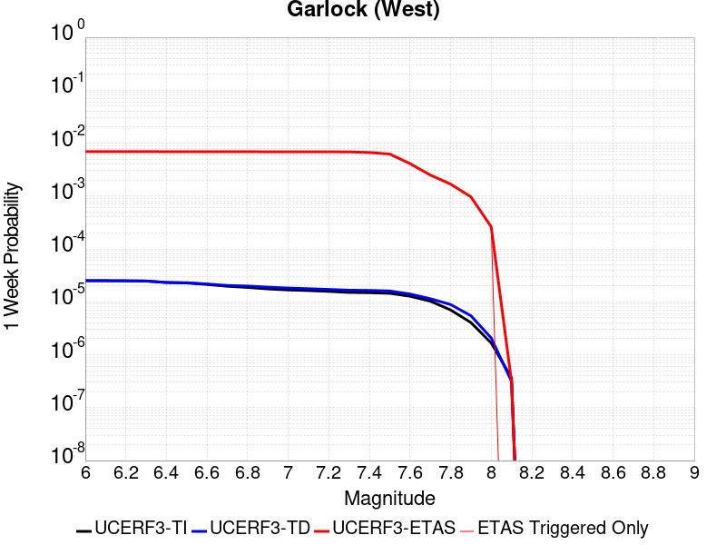 | 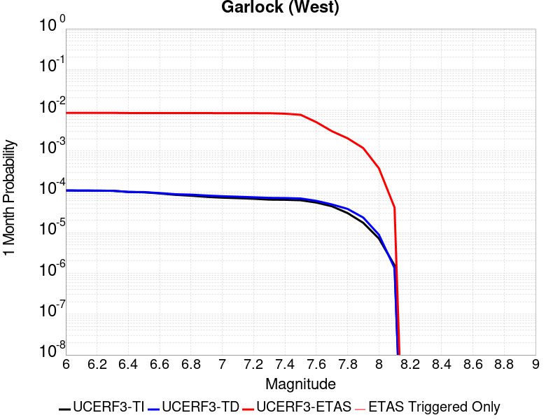 |  |  |

| Magnitude | 1 wk TI Prob | 1 wk TD Prob | 1 wk ETAS Prob | 1 wk ETAS/TD Gain | 1 wk ETAS Triggered Only | 1 mo TI Prob | 1 mo TD Prob | 1 mo ETAS Prob | 1 mo ETAS/TD Gain | 1 mo ETAS Triggered Only | 1 yr TI Prob | 1 yr TD Prob | 1 yr ETAS Prob | 1 yr ETAS/TD Gain | 1 yr ETAS Triggered Only | 10 yr TI Prob | 10 yr TD Prob | 10 yr ETAS Prob | 10 yr ETAS/TD Gain | 10 yr ETAS Triggered Only |
|-----|-----|-----|-----|-----|-----|-----|-----|-----|-----|-----|-----|-----|-----|-----|-----|-----|-----|-----|-----|-----|
| 6.0 | 2.5181727E-5 | 2.51973E-5 | 0.0069350232 | 275.22882 | 0.00691 | 1.0791722E-4 | 1.0798398E-4 | 0.008647062 | 80.07726 | 0.00854 | 0.0013131002 | 0.0013139155 | 0.012399331 | 9.436932 | 0.0111 | 0.013053683 | 0.013141977 | 0.026888909 | 2.0460324 | 0.01393 |
| 6.1 | 2.5077732E-5 | 2.5098372E-5 | 0.006934925 | 276.30975 | 0.00691 | 1.0747157E-4 | 1.0756004E-4 | 0.008646642 | 80.38898 | 0.00854 | 0.001307681 | 0.0013087603 | 0.012394233 | 9.470209 | 0.0111 | 0.013000126 | 0.013091032 | 0.026838675 | 2.0501573 | 0.01393 |
| 6.2 | 2.494612E-5 | 2.498005E-5 | 0.0069348076 | 277.61383 | 0.00691 | 1.0690756E-4 | 1.0705298E-4 | 0.008646139 | 80.765045 | 0.00854 | 0.0013008224 | 0.0013025942 | 0.012388135 | 9.510357 | 0.0111 | 0.012932341 | 0.013030097 | 0.026778588 | 2.0551333 | 0.01393 |
| 6.3 | 2.4733758E-5 | 2.479942E-5 | 0.006934628 | 279.62866 | 0.00691 | 1.0599751E-4 | 1.06278916E-4 | 0.0086453715 | 81.34606 | 0.00854 | 0.0012897556 | 0.0012931811 | 0.012378827 | 9.572384 | 0.0111 | 0.012822957 | 0.012937066 | 0.026686853 | 2.0628211 | 0.01393 |
| 6.4 | 2.3237335E-5 | 2.317873E-5 | 0.0068830196 | 296.95413 | 0.00686 | 9.958477E-5 | 9.933365E-5 | 0.008578491 | 86.360374 | 0.00848 | 0.0012117702 | 0.001208719 | 0.012205411 | 10.097807 | 0.01101 | 0.012051838 | 0.012101916 | 0.025744788 | 2.1273317 | 0.01381 |
| 6.5 | 2.2732203E-5 | 2.2993298E-5 | 0.0068828356 | 299.34094 | 0.00686 | 9.742009E-5 | 9.8539E-5 | 0.0085777035 | 87.04882 | 0.00848 | 0.0011854442 | 0.0011990548 | 0.0121958535 | 10.171223 | 0.01101 | 0.011791403 | 0.012006322 | 0.025650514 | 2.1364174 | 0.01381 |
| 6.6 | 2.1319436E-5 | 2.17735E-5 | 0.006881624 | 316.05505 | 0.00686 | 9.136581E-5 | 9.331167E-5 | 0.008572521 | 91.86976 | 0.00848 | 0.001111811 | 0.0011354799 | 0.01212299 | 10.676535 | 0.011 | 0.011062649 | 0.011377227 | 0.025020221 | 2.1991494 | 0.0138 |
| 6.7 | 1.970802E-5 | 2.0393396E-5 | 0.0068702535 | 336.8862 | 0.00685 | 8.446021E-5 | 8.739735E-5 | 0.0085566575 | 97.90523 | 0.00847 | 0.001027818 | 0.001063545 | 0.012021878 | 11.303591 | 0.01097 | 0.010230771 | 0.010664964 | 0.024288109 | 2.2773736 | 0.01377 |
| 6.8 | 1.8744462E-5 | 1.9901045E-5 | 0.0068697645 | 345.1962 | 0.00685 | 8.033094E-5 | 8.5287415E-5 | 0.008554565 | 100.30279 | 0.00847 | 9.775903E-4 | 0.0010378812 | 0.011986506 | 11.549015 | 0.01096 | 0.009733009 | 0.01041075 | 0.024027498 | 2.3079507 | 0.01376 |
| 6.9 | 1.7559682E-5 | 1.8953415E-5 | 0.0068688234 | 362.4056 | 0.00685 | 7.5253614E-5 | 8.12264E-5 | 0.008550539 | 105.267975 | 0.00847 | 9.158276E-4 | 9.884841E-4 | 0.011927661 | 12.066617 | 0.01095 | 0.0091206245 | 0.009921231 | 0.023534814 | 2.3721666 | 0.01375 |
| 7.0 | 1.6794445E-5 | 1.8216237E-5 | 0.006858092 | 376.48233 | 0.00684 | 7.197421E-5 | 7.8067256E-5 | 0.008517409 | 109.10346 | 0.00844 | 8.759337E-4 | 9.5005584E-4 | 0.011849691 | 12.472626 | 0.01091 | 0.008724891 | 0.009540141 | 0.023099536 | 2.4212995 | 0.01369 |
| 7.1 | 1.6337795E-5 | 1.7717046E-5 | 0.006857596 | 387.06204 | 0.00684 | 7.0017246E-5 | 7.5927994E-5 | 0.008515287 | 112.14951 | 0.00844 | 8.521265E-4 | 9.240326E-4 | 0.011823951 | 12.796033 | 0.01091 | 0.008488664 | 0.009281996 | 0.022835018 | 2.460141 | 0.01368 |
| 7.2 | 1.5780008E-5 | 1.7165687E-5 | 0.0068470486 | 398.87997 | 0.00683 | 6.762685E-5 | 7.356516E-5 | 0.008502945 | 115.583855 | 0.00843 | 8.2304585E-4 | 8.9528906E-4 | 0.0117855305 | 13.1639385 | 0.0109 | 0.008200042 | 0.008996838 | 0.022533942 | 2.5046513 | 0.01366 |
| 7.3 | 1.5058865E-5 | 1.6618762E-5 | 0.0068265055 | 410.771 | 0.00681 | 6.45364E-5 | 7.122133E-5 | 0.008480622 | 119.074196 | 0.00841 | 7.854473E-4 | 8.667759E-4 | 0.0117273545 | 13.529857 | 0.01087 | 0.00782677 | 0.008713539 | 0.02221486 | 2.549465 | 0.01362 |
| 7.4 | 1.4887923E-5 | 1.6454731E-5 | 0.0066563454 | 404.5247 | 0.00664 | 6.380382E-5 | 7.051838E-5 | 0.008249941 | 116.989944 | 0.00818 | 7.7653467E-4 | 8.582243E-4 | 0.01132923 | 13.20078 | 0.01048 | 0.0077382675 | 0.008628399 | 0.021714505 | 2.5166318 | 0.0132 |
| 7.5 | 1.4509299E-5 | 1.6046748E-5 | 0.006215947 | 387.3649 | 0.0062 | 6.218123E-5 | 6.876997E-5 | 0.007758241 | 112.81437 | 0.00769 | 7.567935E-4 | 8.36954E-4 | 0.010688702 | 12.770955 | 0.00986 | 0.0075422134 | 0.008416704 | 0.020613179 | 2.4490795 | 0.0123 |
| 7.6 | 1.2756717E-5 | 1.4050848E-5 | 0.0040939935 | 291.36984 | 0.00408 | 5.4670498E-5 | 6.0216535E-5 | 0.005129911 | 85.19107 | 0.00507 | 6.6541E-4 | 7.328904E-4 | 0.0072581046 | 9.903398 | 0.00653 | 0.006634211 | 0.0073816874 | 0.0155211575 | 2.102657 | 0.0082 |
| 7.7 | 1.0328985E-5 | 1.1460557E-5 | 0.0024914322 | 217.39189 | 0.00248 | 4.4266326E-5 | 4.911575E-5 | 0.0030689675 | 62.484383 | 0.00302 | 5.388092E-4 | 5.978206E-4 | 0.004515477 | 7.5532312 | 0.00392 | 0.0053750467 | 0.006038511 | 0.010948681 | 1.8131424 | 0.00494 |
| 7.8 | 7.0306583E-6 | 8.899601E-6 | 0.0016788847 | 188.64719 | 0.00167 | 3.0131043E-5 | 3.814059E-5 | 0.0020580636 | 53.95993 | 0.00202 | 3.667837E-4 | 4.642629E-4 | 0.0031030374 | 6.683793 | 0.00264 | 0.003661789 | 0.0046952725 | 0.00801959 | 1.7080138 | 0.00334 |
| 7.9 | 4.060633E-6 | 5.4653938E-6 | 9.6546015E-4 | 176.64969 | 9.6E-4 | 1.7402595E-5 | 2.3422906E-5 | 0.0011833957 | 50.52301 | 0.00116 | 2.11856E-4 | 2.851367E-4 | 0.0018346948 | 6.4344397 | 0.00155 | 0.0021165414 | 0.002884201 | 0.0048186057 | 1.67069 | 0.00194 |
| 8.0 | 1.6729537E-6 | 2.0775144E-6 | 2.6207697E-4 | 126.14929 | 2.6E-4 | 7.169782E-6 | 8.903603E-6 | 3.789003E-4 | 42.55584 | 3.7E-4 | 8.7288594E-5 | 1.0839601E-4 | 6.083418E-4 | 5.612216 | 5.0E-4 | 8.7254314E-4 | 0.0010969337 | 0.0017262427 | 1.5736982 | 6.3E-4 |
| 8.1 | 3.6733252E-7 | 3.1489964E-7 | 3.1489964E-7 | 1.0 | 0.0 | 1.5742813E-6 | 1.3495693E-6 | 4.1349515E-5 | 30.639046 | 4.0E-5 | 1.9166706E-5 | 1.6430899E-5 | 6.6430075E-5 | 4.0429974 | 5.0E-5 | 1.9165053E-4 | 1.6638759E-4 | 2.1637927E-4 | 1.3004532 | 5.0E-5 |

## McLean Lake
*[(top)](#table-of-contents)*

| 1 Week | 1 Month | 1 Year | 10 Year |
|-----|-----|-----|-----|
| 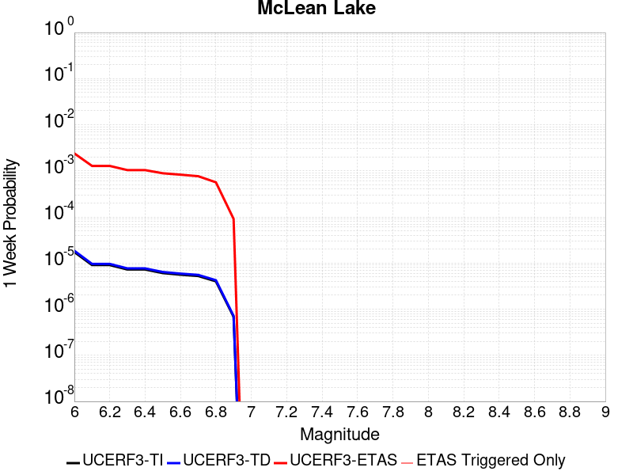 | 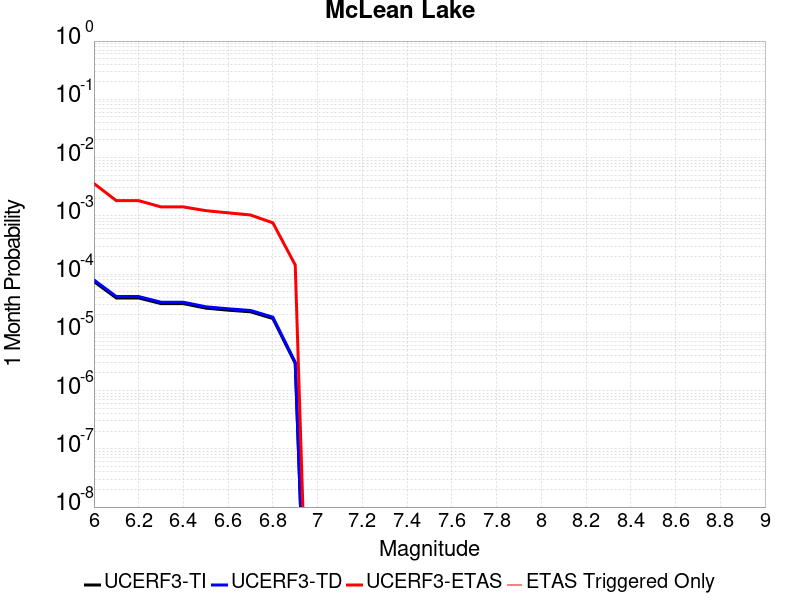 |  |  |

| Magnitude | 1 wk TI Prob | 1 wk TD Prob | 1 wk ETAS Prob | 1 wk ETAS/TD Gain | 1 wk ETAS Triggered Only | 1 mo TI Prob | 1 mo TD Prob | 1 mo ETAS Prob | 1 mo ETAS/TD Gain | 1 mo ETAS Triggered Only | 1 yr TI Prob | 1 yr TD Prob | 1 yr ETAS Prob | 1 yr ETAS/TD Gain | 1 yr ETAS Triggered Only | 10 yr TI Prob | 10 yr TD Prob | 10 yr ETAS Prob | 10 yr ETAS/TD Gain | 10 yr ETAS Triggered Only |
|-----|-----|-----|-----|-----|-----|-----|-----|-----|-----|-----|-----|-----|-----|-----|-----|-----|-----|-----|-----|-----|
| 6.0 | 1.7360222E-5 | 1.8501627E-5 | 0.0023884578 | 129.09447 | 0.00237 | 7.439883E-5 | 7.9290556E-5 | 0.0035890122 | 45.264057 | 0.00351 | 9.0542925E-4 | 9.6498354E-4 | 0.0073488173 | 7.615484 | 0.00639 | 0.009017491 | 0.0096127745 | 0.019605782 | 2.0395548 | 0.01009 |
| 6.1 | 9.062689E-6 | 9.592193E-6 | 0.00127958 | 133.39806 | 0.00127 | 3.8839516E-5 | 4.1108804E-5 | 0.0018210356 | 44.297947 | 0.00178 | 4.727685E-4 | 5.003936E-4 | 0.0037787524 | 7.55156 | 0.00328 | 0.0047176396 | 0.004993552 | 0.010227285 | 2.0480986 | 0.00526 |
| 6.2 | 9.062689E-6 | 9.592193E-6 | 0.00127958 | 133.39806 | 0.00127 | 3.8839516E-5 | 4.1108804E-5 | 0.0018210356 | 44.297947 | 0.00178 | 4.727685E-4 | 5.003936E-4 | 0.0037787524 | 7.55156 | 0.00328 | 0.0047176396 | 0.004993552 | 0.010227285 | 2.0480986 | 0.00526 |
| 6.3 | 7.2575485E-6 | 7.66771E-6 | 0.0010376598 | 135.32852 | 0.00103 | 3.110341E-5 | 3.2861237E-5 | 0.0014228156 | 43.297688 | 0.00139 | 3.786182E-4 | 4.0001926E-4 | 0.0029689912 | 7.422121 | 0.00257 | 0.0037797375 | 0.0039936965 | 0.008037482 | 2.012542 | 0.00406 |
| 6.4 | 7.2575485E-6 | 7.66771E-6 | 0.0010376598 | 135.32852 | 0.00103 | 3.110341E-5 | 3.2861237E-5 | 0.0014228156 | 43.297688 | 0.00139 | 3.786182E-4 | 4.0001926E-4 | 0.0029689912 | 7.422121 | 0.00257 | 0.0037797375 | 0.0039936965 | 0.008037482 | 2.012542 | 0.00406 |
| 6.5 | 6.06582E-6 | 6.4038773E-6 | 8.8639825E-4 | 138.41588 | 8.8E-4 | 2.5996113E-5 | 2.7444936E-5 | 0.001227412 | 44.722713 | 0.0012 | 3.164567E-4 | 3.3409733E-4 | 0.0025633522 | 7.6724715 | 0.00223 | 0.0031600643 | 0.0033365893 | 0.0067950115 | 2.0365143 | 0.00347 |
| 6.6 | 5.598744E-6 | 5.910262E-6 | 8.259054E-4 | 139.7409 | 8.2E-4 | 2.3994397E-5 | 2.5329486E-5 | 0.0011253016 | 44.426548 | 0.0011 | 2.9209262E-4 | 3.0834923E-4 | 0.0023577171 | 7.6462555 | 0.00205 | 0.0029170897 | 0.003079843 | 0.0062600183 | 2.032577 | 0.00319 |
| 6.7 | 5.246996E-6 | 5.539162E-6 | 7.6553493E-4 | 138.2041 | 7.6E-4 | 2.2486933E-5 | 2.3739085E-5 | 0.0010337151 | 43.544857 | 0.00101 | 2.73744E-4 | 2.8899137E-4 | 0.002158451 | 7.468911 | 0.00187 | 0.0027340704 | 0.0028867796 | 0.005768437 | 1.9982256 | 0.00289 |
| 6.8 | 4.02324E-6 | 4.2469046E-6 | 5.642445E-4 | 132.86018 | 5.6E-4 | 1.7242342E-5 | 1.8200926E-5 | 7.5818744E-4 | 41.656532 | 7.4E-4 | 2.099053E-4 | 2.2157968E-4 | 0.0016012739 | 7.226628 | 0.00138 | 0.0020970714 | 0.002214172 | 0.0043594115 | 1.9688677 | 0.00215 |
| 6.9 | 6.835972E-7 | 7.1399285E-7 | 9.0713926E-5 | 127.0516 | 9.0E-5 | 2.9296991E-6 | 3.0599674E-6 | 1.4305954E-4 | 46.75198 | 1.4E-4 | 3.56685E-5 | 3.7254784E-5 | 2.7724585E-4 | 7.4418855 | 2.4E-4 | 3.5662777E-4 | 3.7251666E-4 | 7.523751E-4 | 2.0197086 | 3.8E-4 |

## Goldstone Lake
*[(top)](#table-of-contents)*

| 1 Week | 1 Month | 1 Year | 10 Year |
|-----|-----|-----|-----|
| 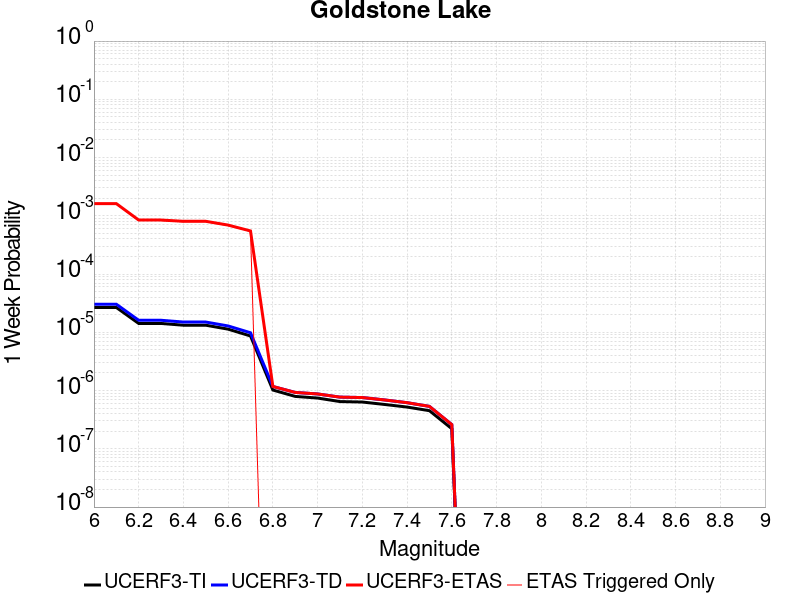 | 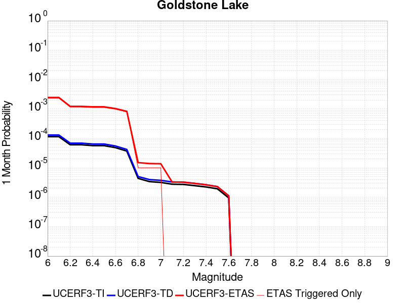 |  |  |

| Magnitude | 1 wk TI Prob | 1 wk TD Prob | 1 wk ETAS Prob | 1 wk ETAS/TD Gain | 1 wk ETAS Triggered Only | 1 mo TI Prob | 1 mo TD Prob | 1 mo ETAS Prob | 1 mo ETAS/TD Gain | 1 mo ETAS Triggered Only | 1 yr TI Prob | 1 yr TD Prob | 1 yr ETAS Prob | 1 yr ETAS/TD Gain | 1 yr ETAS Triggered Only | 10 yr TI Prob | 10 yr TD Prob | 10 yr ETAS Prob | 10 yr ETAS/TD Gain | 10 yr ETAS Triggered Only |
|-----|-----|-----|-----|-----|-----|-----|-----|-----|-----|-----|-----|-----|-----|-----|-----|-----|-----|-----|-----|-----|
| 6.0 | 2.671352E-5 | 3.037609E-5 | 0.0016203278 | 53.342213 | 0.00159 | 1.1448149E-4 | 1.3017785E-4 | 0.0024598746 | 18.89626 | 0.00233 | 0.001392921 | 0.0015839594 | 0.006076832 | 3.8364818 | 0.0045 | 0.013842222 | 0.015746197 | 0.023069045 | 1.4650551 | 0.00744 |
| 6.1 | 2.671352E-5 | 3.037609E-5 | 0.0016203278 | 53.342213 | 0.00159 | 1.1448149E-4 | 1.3017785E-4 | 0.0024598746 | 18.89626 | 0.00233 | 0.001392921 | 0.0015839594 | 0.006076832 | 3.8364818 | 0.0045 | 0.013842222 | 0.015746197 | 0.023069045 | 1.4650551 | 0.00744 |
| 6.2 | 1.4197047E-5 | 1.6096245E-5 | 8.4608287E-4 | 52.56399 | 8.3E-4 | 6.0843064E-5 | 6.8982634E-5 | 0.0012289026 | 17.814665 | 0.00116 | 7.4051257E-4 | 8.3963864E-4 | 0.0030577746 | 3.6417747 | 0.00222 | 0.007380498 | 0.0083743585 | 0.012043374 | 1.4381249 | 0.0037 |
| 6.3 | 1.4197047E-5 | 1.6096245E-5 | 8.4608287E-4 | 52.56399 | 8.3E-4 | 6.0843064E-5 | 6.8982634E-5 | 0.0012289026 | 17.814665 | 0.00116 | 7.4051257E-4 | 8.3963864E-4 | 0.0030577746 | 3.6417747 | 0.00222 | 0.007380498 | 0.0083743585 | 0.012043374 | 1.4381249 | 0.0037 |
| 6.4 | 1.3238931E-5 | 1.500846E-5 | 8.049966E-4 | 53.636192 | 7.9E-4 | 5.6737044E-5 | 6.4320935E-5 | 0.001184249 | 18.411562 | 0.00112 | 6.9055456E-4 | 7.82924E-4 | 0.0029012642 | 3.7056777 | 0.00212 | 0.006884126 | 0.0078112837 | 0.011313709 | 1.4483804 | 0.00353 |
| 6.5 | 1.3238931E-5 | 1.500846E-5 | 8.049966E-4 | 53.636192 | 7.9E-4 | 5.6737044E-5 | 6.4320935E-5 | 0.001184249 | 18.411562 | 0.00112 | 6.9055456E-4 | 7.82924E-4 | 0.0029012642 | 3.7056777 | 0.00212 | 0.006884126 | 0.0078112837 | 0.011313709 | 1.4483804 | 0.00353 |
| 6.6 | 1.1328278E-5 | 1.2855166E-5 | 6.928464E-4 | 53.896343 | 6.8E-4 | 4.8548856E-5 | 5.5092944E-5 | 0.001035039 | 18.787142 | 9.8E-4 | 5.90922E-4 | 6.7064585E-4 | 0.0024994186 | 3.726883 | 0.00183 | 0.0058935313 | 0.0066956086 | 0.009675521 | 1.4450549 | 0.003 |
| 6.7 | 8.651175E-6 | 9.824565E-6 | 5.4981926E-4 | 55.96373 | 5.4E-4 | 3.707594E-5 | 4.2105108E-5 | 8.320718E-4 | 19.76178 | 7.9E-4 | 4.5130608E-4 | 5.1259965E-4 | 0.0019518615 | 3.80777 | 0.00144 | 0.0045039062 | 0.005123051 | 0.007411268 | 1.4466512 | 0.0023 |
| 6.8 | 1.0215377E-6 | 1.1754702E-6 | 1.1754702E-6 | 1.0 | 0.0 | 4.378012E-6 | 5.0377203E-6 | 1.503767E-5 | 2.9850147 | 1.0E-5 | 5.3300988E-5 | 6.1332634E-5 | 1.11329566E-4 | 1.8151767 | 5.0E-5 | 5.3288206E-4 | 6.1316835E-4 | 7.231009E-4 | 1.1792861 | 1.1E-4 |
| 6.9 | 7.9360774E-7 | 9.2833966E-7 | 9.2833966E-7 | 1.0 | 0.0 | 3.4011714E-6 | 3.9785928E-6 | 1.3978553E-5 | 3.5134416 | 1.0E-5 | 4.1408475E-5 | 4.843836E-5 | 7.843691E-5 | 1.6193138 | 3.0E-5 | 4.140076E-4 | 4.8428503E-4 | 5.4425595E-4 | 1.123834 | 6.0E-5 |
| 7.0 | 7.4382757E-7 | 8.7473285E-7 | 8.7473285E-7 | 1.0 | 0.0 | 3.1878285E-6 | 3.74885E-6 | 1.3748812E-5 | 3.6674747 | 1.0E-5 | 3.8811122E-5 | 4.564136E-5 | 7.563999E-5 | 1.6572685 | 3.0E-5 | 3.8804344E-4 | 4.5632652E-4 | 5.1629916E-4 | 1.1314248 | 6.0E-5 |
| 7.1 | 6.4709513E-7 | 7.7113E-7 | 7.7113E-7 | 1.0 | 0.0 | 2.773262E-6 | 3.3048389E-6 | 3.3048389E-6 | 1.0 | 0.0 | 3.376394E-5 | 4.0235733E-5 | 6.023493E-5 | 1.4970506 | 2.0E-5 | 3.375881E-4 | 4.0229043E-4 | 4.522703E-4 | 1.1242384 | 5.0E-5 |
| 7.2 | 6.356704E-7 | 7.5883594E-7 | 7.5883594E-7 | 1.0 | 0.0 | 2.7242988E-6 | 3.2521505E-6 | 3.2521505E-6 | 1.0 | 0.0 | 3.3167835E-5 | 3.959427E-5 | 5.959348E-5 | 1.5051036 | 2.0E-5 | 3.3162883E-4 | 3.958781E-4 | 4.458583E-4 | 1.1262515 | 5.0E-5 |
| 7.3 | 5.7695723E-7 | 6.8965653E-7 | 6.8965653E-7 | 1.0 | 0.0 | 2.4726714E-6 | 2.9556677E-6 | 2.9556677E-6 | 1.0 | 0.0 | 3.0104358E-5 | 3.5984718E-5 | 5.5984E-5 | 1.5557715 | 2.0E-5 | 3.0100282E-4 | 3.5979465E-4 | 3.9978026E-4 | 1.1111345 | 4.0E-5 |
| 7.4 | 5.209647E-7 | 6.193514E-7 | 6.193514E-7 | 1.0 | 0.0 | 2.232704E-6 | 2.6543607E-6 | 2.6543607E-6 | 1.0 | 0.0 | 2.718283E-5 | 3.2316417E-5 | 5.2315772E-5 | 1.6188605 | 2.0E-5 | 2.7179506E-4 | 3.2312275E-4 | 3.631098E-4 | 1.123752 | 4.0E-5 |
| 7.5 | 4.512955E-7 | 5.348885E-7 | 5.348885E-7 | 1.0 | 0.0 | 1.934122E-6 | 2.2923775E-6 | 2.2923775E-6 | 1.0 | 0.0 | 2.3547682E-5 | 2.7909393E-5 | 3.7909114E-5 | 1.3582923 | 1.0E-5 | 2.3545188E-4 | 2.7906417E-4 | 2.990586E-4 | 1.0716481 | 2.0E-5 |
| 7.6 | 2.21172E-7 | 2.603961E-7 | 2.603961E-7 | 1.0 | 0.0 | 9.478797E-7 | 1.1159829E-6 | 1.1159829E-6 | 1.0 | 0.0 | 1.1540374E-5 | 1.3587036E-5 | 1.3587036E-5 | 1.0 | 0.0 | 1.1539775E-4 | 1.3586486E-4 | 1.3586486E-4 | 1.0 | 0.0 |

## Gravel Hills-Harper Lk
*[(top)](#table-of-contents)*

| 1 Week | 1 Month | 1 Year | 10 Year |
|-----|-----|-----|-----|
| 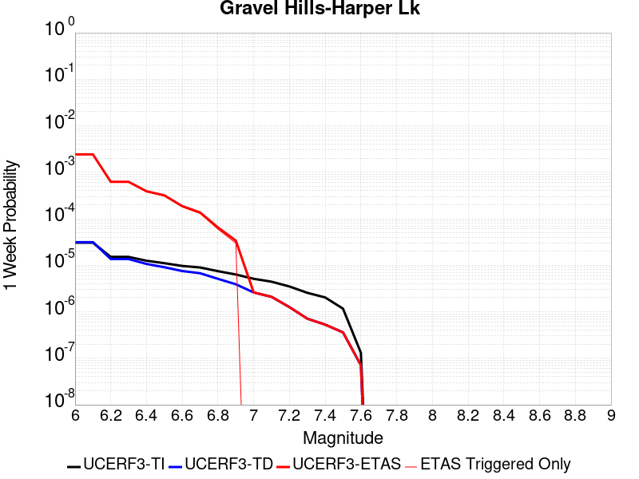 | 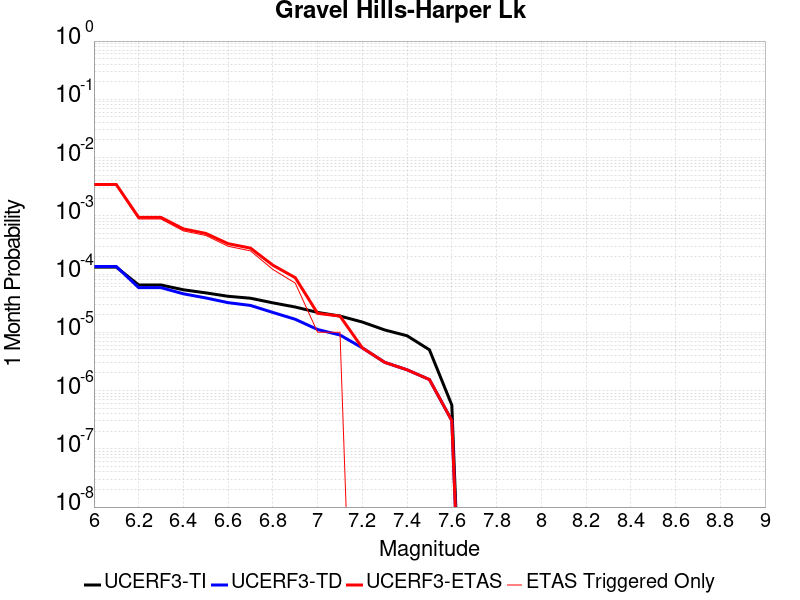 |  |  |

| Magnitude | 1 wk TI Prob | 1 wk TD Prob | 1 wk ETAS Prob | 1 wk ETAS/TD Gain | 1 wk ETAS Triggered Only | 1 mo TI Prob | 1 mo TD Prob | 1 mo ETAS Prob | 1 mo ETAS/TD Gain | 1 mo ETAS Triggered Only | 1 yr TI Prob | 1 yr TD Prob | 1 yr ETAS Prob | 1 yr ETAS/TD Gain | 1 yr ETAS Triggered Only | 10 yr TI Prob | 10 yr TD Prob | 10 yr ETAS Prob | 10 yr ETAS/TD Gain | 10 yr ETAS Triggered Only |
|-----|-----|-----|-----|-----|-----|-----|-----|-----|-----|-----|-----|-----|-----|-----|-----|-----|-----|-----|-----|-----|
| 6.0 | 3.0679566E-5 | 3.1464646E-5 | 0.0024313892 | 77.27368 | 0.0024 | 1.3147724E-4 | 1.3484273E-4 | 0.0034443964 | 25.543804 | 0.00331 | 0.0015995599 | 0.0016406906 | 0.006662438 | 4.060752 | 0.00503 | 0.015880952 | 0.01630734 | 0.023576828 | 1.4457802 | 0.00739 |
| 6.1 | 3.0679566E-5 | 3.1464646E-5 | 0.0024313892 | 77.27368 | 0.0024 | 1.3147724E-4 | 1.3484273E-4 | 0.0034443964 | 25.543804 | 0.00331 | 0.0015995599 | 0.0016406906 | 0.006662438 | 4.060752 | 0.00503 | 0.015880952 | 0.01630734 | 0.023576828 | 1.4457802 | 0.00739 |
| 6.2 | 1.514536E-5 | 1.3635206E-5 | 6.2362687E-4 | 45.73652 | 6.1E-4 | 6.490707E-5 | 5.843536E-5 | 9.383839E-4 | 16.058495 | 8.8E-4 | 7.8995706E-4 | 7.1123015E-4 | 0.00206027 | 2.8967698 | 0.00135 | 0.007871548 | 0.0070907404 | 0.009225495 | 1.3010623 | 0.00215 |
| 6.3 | 1.514536E-5 | 1.3635206E-5 | 6.2362687E-4 | 45.73652 | 6.1E-4 | 6.490707E-5 | 5.843536E-5 | 9.383839E-4 | 16.058495 | 8.8E-4 | 7.8995706E-4 | 7.1123015E-4 | 0.00206027 | 2.8967698 | 0.00135 | 0.007871548 | 0.0070907404 | 0.009225495 | 1.3010623 | 0.00215 |
| 6.4 | 1.2532521E-5 | 1.06896905E-5 | 3.9068563E-4 | 36.54789 | 3.8E-4 | 5.37097E-5 | 4.581219E-5 | 5.95787E-4 | 13.004989 | 5.5E-4 | 6.537194E-4 | 5.576265E-4 | 0.0013571804 | 2.4338522 | 8.0E-4 | 0.0065179965 | 0.005562863 | 0.0068755196 | 1.2359679 | 0.00132 |
| 6.5 | 1.1094058E-5 | 9.083664E-6 | 3.1908083E-4 | 35.126892 | 3.1E-4 | 4.7545094E-5 | 3.892943E-5 | 4.9891154E-4 | 12.815794 | 4.6E-4 | 5.787078E-4 | 4.7386673E-4 | 0.0010835776 | 2.2866716 | 6.1E-4 | 0.0057720304 | 0.0047289706 | 0.0056844307 | 1.202044 | 9.6E-4 |
| 6.6 | 9.688328E-6 | 7.5316952E-6 | 1.8753034E-4 | 24.898823 | 1.8E-4 | 4.1520743E-5 | 3.227831E-5 | 3.3226862E-4 | 10.293867 | 3.0E-4 | 5.053978E-4 | 3.9292008E-4 | 8.0275896E-4 | 2.043059 | 4.1E-4 | 0.0050424994 | 0.0039225104 | 0.004520157 | 1.1523633 | 6.0E-4 |
| 6.7 | 8.974824E-6 | 6.749413E-6 | 1.3674854E-4 | 20.260805 | 1.3E-4 | 3.8462964E-5 | 2.8925748E-5 | 2.789185E-4 | 9.642569 | 2.5E-4 | 4.6818596E-4 | 3.5211627E-4 | 6.8200007E-4 | 1.9368604 | 3.3E-4 | 0.004672008 | 0.0035158044 | 0.003994117 | 1.1360464 | 4.8E-4 |
| 6.8 | 7.4780046E-6 | 5.1161933E-6 | 6.5115884E-5 | 12.727409 | 6.0E-5 | 3.20482E-5 | 2.1926366E-5 | 1.4192374E-4 | 6.472743 | 1.2E-4 | 3.9011694E-4 | 2.669222E-4 | 3.9688748E-4 | 1.4869033 | 1.3E-4 | 0.0038943281 | 0.0026661542 | 0.002865621 | 1.0748144 | 2.0E-4 |
| 6.9 | 6.3409307E-6 | 3.9074966E-6 | 3.390738E-5 | 8.67752 | 3.0E-5 | 2.7175134E-5 | 1.6746313E-5 | 8.674514E-5 | 5.1799545 | 7.0E-5 | 3.3080703E-4 | 2.0386827E-4 | 2.8385196E-4 | 1.3923303 | 8.0E-5 | 0.0033031502 | 0.0020369107 | 0.0021566662 | 1.0587927 | 1.2E-4 |
| 7.0 | 5.1239335E-6 | 2.6058565E-6 | 2.6058565E-6 | 1.0 | 0.0 | 2.195953E-5 | 1.116791E-5 | 2.1167798E-5 | 1.8954127 | 1.0E-5 | 2.6732447E-4 | 1.3596108E-4 | 1.4595971E-4 | 1.0735404 | 1.0E-5 | 0.0026700313 | 0.0013588042 | 0.0013887634 | 1.0220482 | 3.0E-5 |
| 7.1 | 4.438899E-6 | 2.0984728E-6 | 2.0984728E-6 | 1.0 | 0.0 | 1.9023713E-5 | 8.993425E-6 | 1.8993334E-5 | 2.1119134 | 1.0E-5 | 2.315891E-4 | 1.0948967E-4 | 1.1948858E-4 | 1.0913228 | 1.0E-5 | 0.002313479 | 0.0010943791 | 0.0011243463 | 1.0273829 | 3.0E-5 |
| 7.2 | 3.50367E-6 | 1.2615716E-6 | 1.2615716E-6 | 1.0 | 0.0 | 1.5015643E-5 | 5.4067245E-6 | 5.4067245E-6 | 1.0 | 0.0 | 1.8280011E-4 | 6.582497E-5 | 6.582497E-5 | 1.0 | 0.0 | 0.0018264982 | 6.580629E-4 | 6.7804975E-4 | 1.0303723 | 2.0E-5 |
| 7.3 | 2.561638E-6 | 7.1191585E-7 | 7.1191585E-7 | 1.0 | 0.0 | 1.0978401E-5 | 3.0510646E-6 | 3.0510646E-6 | 1.0 | 0.0 | 1.3365384E-4 | 3.71461E-5 | 3.71461E-5 | 1.0 | 0.0 | 0.0013357349 | 3.7140088E-4 | 3.8139717E-4 | 1.0269151 | 1.0E-5 |
| 7.4 | 2.0368864E-6 | 5.304837E-7 | 5.304837E-7 | 1.0 | 0.0 | 8.729483E-6 | 2.2734996E-6 | 2.2734996E-6 | 1.0 | 0.0 | 1.06276275E-4 | 2.7679513E-5 | 2.7679513E-5 | 1.0 | 0.0 | 0.0010622547 | 2.767612E-4 | 2.867584E-4 | 1.0361222 | 1.0E-5 |
| 7.5 | 1.1681728E-6 | 3.6030585E-7 | 3.6030585E-7 | 1.0 | 0.0 | 5.0064455E-6 | 1.544167E-6 | 1.544167E-6 | 1.0 | 0.0 | 6.0951766E-5 | 1.8800076E-5 | 1.8800076E-5 | 1.0 | 0.0 | 6.093505E-4 | 1.8798532E-4 | 1.9798345E-4 | 1.0531856 | 1.0E-5 |
| 7.6 | 1.3154387E-7 | 7.1197384E-8 | 7.1197384E-8 | 1.0 | 0.0 | 5.6375933E-7 | 3.051316E-7 | 3.051316E-7 | 1.0 | 0.0 | 6.863748E-6 | 3.7149728E-6 | 3.7149728E-6 | 1.0 | 0.0 | 6.863536E-5 | 3.7149264E-5 | 4.7148893E-5 | 1.2691743 | 1.0E-5 |

## So Sierra Nevada
*[(top)](#table-of-contents)*

| 1 Week | 1 Month | 1 Year | 10 Year |
|-----|-----|-----|-----|
| 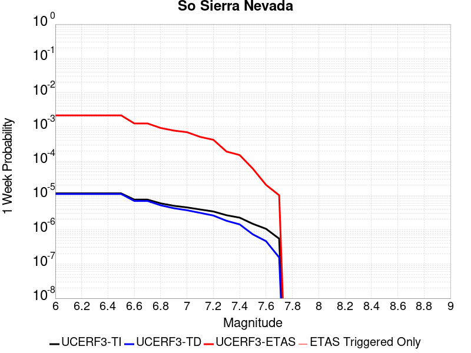 | 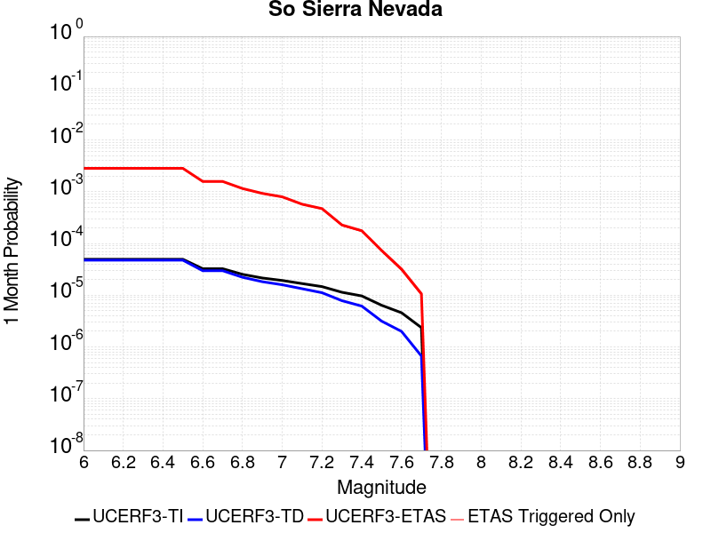 |  |  |

| Magnitude | 1 wk TI Prob | 1 wk TD Prob | 1 wk ETAS Prob | 1 wk ETAS/TD Gain | 1 wk ETAS Triggered Only | 1 mo TI Prob | 1 mo TD Prob | 1 mo ETAS Prob | 1 mo ETAS/TD Gain | 1 mo ETAS Triggered Only | 1 yr TI Prob | 1 yr TD Prob | 1 yr ETAS Prob | 1 yr ETAS/TD Gain | 1 yr ETAS Triggered Only | 10 yr TI Prob | 10 yr TD Prob | 10 yr ETAS Prob | 10 yr ETAS/TD Gain | 10 yr ETAS Triggered Only |
|-----|-----|-----|-----|-----|-----|-----|-----|-----|-----|-----|-----|-----|-----|-----|-----|-----|-----|-----|-----|-----|
| 6.0 | 1.15488665E-5 | 1.1079643E-5 | 0.0021810555 | 196.85252 | 0.00217 | 4.9494203E-5 | 4.748339E-5 | 0.0028273514 | 59.54401 | 0.00278 | 6.024253E-4 | 5.7796965E-4 | 0.0047355653 | 8.193449 | 0.00416 | 0.006007948 | 0.005765934 | 0.011671685 | 2.0242486 | 0.00594 |
| 6.1 | 1.15488665E-5 | 1.1079643E-5 | 0.0021810555 | 196.85252 | 0.00217 | 4.9494203E-5 | 4.748339E-5 | 0.0028273514 | 59.54401 | 0.00278 | 6.024253E-4 | 5.7796965E-4 | 0.0047355653 | 8.193449 | 0.00416 | 0.006007948 | 0.005765934 | 0.011671685 | 2.0242486 | 0.00594 |
| 6.2 | 1.15488665E-5 | 1.1079643E-5 | 0.0021810555 | 196.85252 | 0.00217 | 4.9494203E-5 | 4.748339E-5 | 0.0028273514 | 59.54401 | 0.00278 | 6.024253E-4 | 5.7796965E-4 | 0.0047355653 | 8.193449 | 0.00416 | 0.006007948 | 0.005765934 | 0.011671685 | 2.0242486 | 0.00594 |
| 6.3 | 1.15488665E-5 | 1.1079643E-5 | 0.0021810555 | 196.85252 | 0.00217 | 4.9494203E-5 | 4.748339E-5 | 0.0028273514 | 59.54401 | 0.00278 | 6.024253E-4 | 5.7796965E-4 | 0.0047355653 | 8.193449 | 0.00416 | 0.006007948 | 0.005765934 | 0.011671685 | 2.0242486 | 0.00594 |
| 6.4 | 1.15488665E-5 | 1.1079643E-5 | 0.0021810555 | 196.85252 | 0.00217 | 4.9494203E-5 | 4.748339E-5 | 0.0028273514 | 59.54401 | 0.00278 | 6.024253E-4 | 5.7796965E-4 | 0.0047355653 | 8.193449 | 0.00416 | 0.006007948 | 0.005765934 | 0.011671685 | 2.0242486 | 0.00594 |
| 6.5 | 1.15488665E-5 | 1.1079643E-5 | 0.0021810555 | 196.85252 | 0.00217 | 4.9494203E-5 | 4.748339E-5 | 0.0028273514 | 59.54401 | 0.00278 | 6.024253E-4 | 5.7796965E-4 | 0.0047355653 | 8.193449 | 0.00416 | 0.006007948 | 0.005765934 | 0.011671685 | 2.0242486 | 0.00594 |
| 6.6 | 7.587044E-6 | 6.935635E-6 | 0.0012669269 | 182.66919 | 0.00126 | 3.2515498E-5 | 2.9723828E-5 | 0.0015796778 | 53.145164 | 0.00155 | 3.9580427E-4 | 3.6183043E-4 | 0.0026110164 | 7.216132 | 0.00225 | 0.003951 | 0.0036127048 | 0.0067413608 | 1.8660148 | 0.00314 |
| 6.7 | 7.587044E-6 | 6.935635E-6 | 0.0012669269 | 182.66919 | 0.00126 | 3.2515498E-5 | 2.9723828E-5 | 0.0015796778 | 53.145164 | 0.00155 | 3.9580427E-4 | 3.6183043E-4 | 0.0026110164 | 7.216132 | 0.00225 | 0.003951 | 0.0036127048 | 0.0067413608 | 1.8660148 | 0.00314 |
| 6.8 | 5.9026956E-6 | 5.1793927E-6 | 9.351746E-4 | 180.5568 | 9.3E-4 | 2.5297022E-5 | 2.2197215E-5 | 0.0011521721 | 51.90616 | 0.00113 | 3.0794772E-4 | 2.7021873E-4 | 0.0018997783 | 7.03052 | 0.00163 | 0.0030752132 | 0.002699018 | 0.004863161 | 1.8018261 | 0.00217 |
| 6.9 | 5.0118915E-6 | 4.2524252E-6 | 7.842491E-4 | 184.42395 | 7.8E-4 | 2.1479358E-5 | 1.8224557E-5 | 9.28208E-4 | 50.931717 | 9.1E-4 | 2.614798E-4 | 2.2186211E-4 | 0.0015015781 | 6.7680693 | 0.00128 | 0.0026117235 | 0.0022164788 | 0.0038528438 | 1.7382723 | 0.00164 |
| 7.0 | 4.4924795E-6 | 3.7139177E-6 | 7.037113E-4 | 189.47952 | 7.0E-4 | 1.925334E-5 | 1.5916696E-5 | 7.9590426E-4 | 50.004364 | 7.8E-4 | 2.3438422E-4 | 1.9376918E-4 | 0.0012735599 | 6.5725617 | 0.00108 | 0.0023413717 | 0.0019360651 | 0.0033632966 | 1.7371815 | 0.00143 |
| 7.1 | 3.9118436E-6 | 3.1119775E-6 | 5.1311037E-4 | 164.88242 | 5.1E-4 | 1.6764936E-5 | 1.3336982E-5 | 5.733295E-4 | 42.98795 | 5.6E-4 | 2.0409399E-4 | 1.6236622E-4 | 9.522379E-4 | 5.864754 | 7.9E-4 | 0.0020390663 | 0.001622532 | 0.0026808123 | 1.6522399 | 0.00106 |
| 7.2 | 3.4200818E-6 | 2.6054543E-6 | 4.2260435E-4 | 162.19987 | 4.2E-4 | 1.4657411E-5 | 1.11661875E-5 | 4.7116104E-4 | 42.195335 | 4.6E-4 | 1.7843937E-4 | 1.3594035E-4 | 7.85852E-4 | 5.7808585 | 6.5E-4 | 0.0017829615 | 0.0013586218 | 0.0022074669 | 1.624784 | 8.5E-4 |
| 7.3 | 2.6593618E-6 | 1.8284203E-6 | 1.9182808E-4 | 104.91465 | 1.9E-4 | 1.13972155E-5 | 7.836065E-6 | 2.2783435E-4 | 29.075096 | 2.2E-4 | 1.3875226E-4 | 9.540021E-5 | 4.3536778E-4 | 4.5635934 | 3.4E-4 | 0.0013866565 | 9.5362146E-4 | 0.0014131828 | 1.4819117 | 4.6E-4 |
| 7.4 | 2.2577992E-6 | 1.436438E-6 | 1.5143622E-4 | 105.42482 | 1.5E-4 | 9.676246E-6 | 6.15615E-6 | 1.7615511E-4 | 28.614492 | 1.7E-4 | 1.1780193E-4 | 7.49488E-5 | 3.2493006E-4 | 4.3353605 | 2.5E-4 | 0.001177395 | 7.492603E-4 | 0.0010690205 | 1.426768 | 3.2E-4 |
| 7.5 | 1.489319E-6 | 7.353936E-7 | 6.073535E-5 | 82.5889 | 6.0E-5 | 6.3827797E-6 | 3.1516831E-6 | 7.315146E-5 | 23.210285 | 7.0E-5 | 7.770758E-5 | 3.8371072E-5 | 1.5836647E-4 | 4.127236 | 1.2E-4 | 7.7680405E-4 | 3.836449E-4 | 5.3358736E-4 | 1.3908366 | 1.5E-4 |
| 7.6 | 1.0680322E-6 | 4.6596554E-7 | 2.0465955E-5 | 43.921608 | 2.0E-5 | 4.577273E-6 | 1.9969937E-6 | 3.1996933E-5 | 16.02255 | 3.0E-5 | 5.5726876E-5 | 2.4313129E-5 | 9.431143E-5 | 3.8790329 | 7.0E-5 | 5.5712904E-4 | 2.4310495E-4 | 3.2308552E-4 | 1.328996 | 8.0E-5 |
| 7.7 | 5.509146E-7 | 1.5580486E-7 | 1.01558035E-5 | 65.18284 | 1.0E-5 | 2.3610605E-6 | 6.677349E-7 | 1.0667728E-5 | 15.975992 | 1.0E-5 | 2.8745531E-5 | 8.129644E-6 | 4.8129317E-5 | 5.9202247 | 4.0E-5 | 2.8741814E-4 | 8.1293576E-5 | 1.2129033E-4 | 1.4920038 | 4.0E-5 |

## San Andreas (Mojave N)
*[(top)](#table-of-contents)*

| 1 Week | 1 Month | 1 Year | 10 Year |
|-----|-----|-----|-----|
| 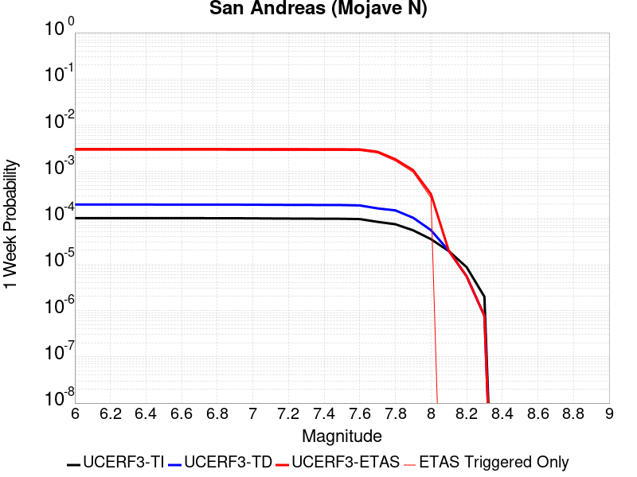 | 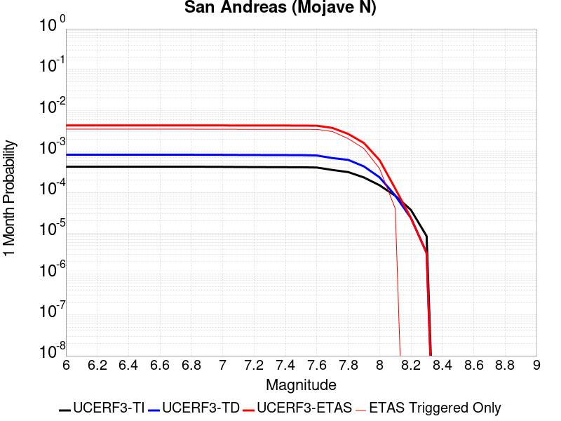 |  | 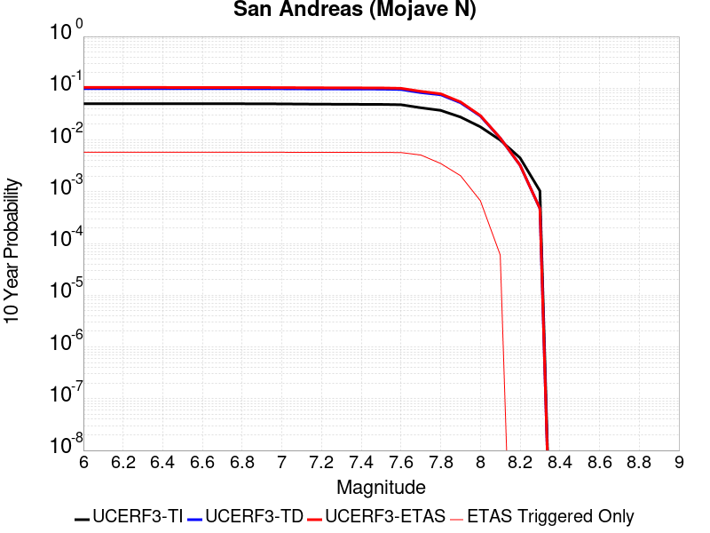 |

| Magnitude | 1 wk TI Prob | 1 wk TD Prob | 1 wk ETAS Prob | 1 wk ETAS/TD Gain | 1 wk ETAS Triggered Only | 1 mo TI Prob | 1 mo TD Prob | 1 mo ETAS Prob | 1 mo ETAS/TD Gain | 1 mo ETAS Triggered Only | 1 yr TI Prob | 1 yr TD Prob | 1 yr ETAS Prob | 1 yr ETAS/TD Gain | 1 yr ETAS Triggered Only | 10 yr TI Prob | 10 yr TD Prob | 10 yr ETAS Prob | 10 yr ETAS/TD Gain | 10 yr ETAS Triggered Only |
|-----|-----|-----|-----|-----|-----|-----|-----|-----|-----|-----|-----|-----|-----|-----|-----|-----|-----|-----|-----|-----|
| 6.0 | 9.877682E-5 | 1.9400702E-4 | 0.0030634503 | 15.790409 | 0.00287 | 4.2326056E-4 | 8.311939E-4 | 0.0043382766 | 5.2193313 | 0.00351 | 0.0051410277 | 0.010072956 | 0.014616721 | 1.4510856 | 0.00459 | 0.05023708 | 0.09831428 | 0.103535034 | 1.0531027 | 0.00579 |
| 6.1 | 9.877682E-5 | 1.9400702E-4 | 0.0030634503 | 15.790409 | 0.00287 | 4.2326056E-4 | 8.311939E-4 | 0.0043382766 | 5.2193313 | 0.00351 | 0.0051410277 | 0.010072956 | 0.014616721 | 1.4510856 | 0.00459 | 0.05023708 | 0.09831428 | 0.103535034 | 1.0531027 | 0.00579 |
| 6.2 | 9.877682E-5 | 1.9400702E-4 | 0.0030634503 | 15.790409 | 0.00287 | 4.2326056E-4 | 8.311939E-4 | 0.0043382766 | 5.2193313 | 0.00351 | 0.0051410277 | 0.010072956 | 0.014616721 | 1.4510856 | 0.00459 | 0.05023708 | 0.09831428 | 0.103535034 | 1.0531027 | 0.00579 |
| 6.3 | 9.877682E-5 | 1.9400702E-4 | 0.0030634503 | 15.790409 | 0.00287 | 4.2326056E-4 | 8.311939E-4 | 0.0043382766 | 5.2193313 | 0.00351 | 0.0051410277 | 0.010072956 | 0.014616721 | 1.4510856 | 0.00459 | 0.05023708 | 0.09831428 | 0.103535034 | 1.0531027 | 0.00579 |
| 6.4 | 9.877682E-5 | 1.9400702E-4 | 0.0030634503 | 15.790409 | 0.00287 | 4.2326056E-4 | 8.311939E-4 | 0.0043382766 | 5.2193313 | 0.00351 | 0.0051410277 | 0.010072956 | 0.014616721 | 1.4510856 | 0.00459 | 0.05023708 | 0.09831428 | 0.103535034 | 1.0531027 | 0.00579 |
| 6.5 | 9.861474E-5 | 1.9374468E-4 | 0.0030631886 | 15.81044 | 0.00287 | 4.2256617E-4 | 8.300703E-4 | 0.0043371567 | 5.2250476 | 0.00351 | 0.0051326132 | 0.010059402 | 0.01460323 | 1.4516995 | 0.00459 | 0.050156746 | 0.098192066 | 0.10341354 | 1.053176 | 0.00579 |
| 6.6 | 9.861474E-5 | 1.9374468E-4 | 0.0030631886 | 15.81044 | 0.00287 | 4.2256617E-4 | 8.300703E-4 | 0.0043371567 | 5.2250476 | 0.00351 | 0.0051326132 | 0.010059402 | 0.01460323 | 1.4516995 | 0.00459 | 0.050156746 | 0.098192066 | 0.10341354 | 1.053176 | 0.00579 |
| 6.7 | 9.8552715E-5 | 1.9364421E-4 | 0.0030630885 | 15.818126 | 0.00287 | 4.223004E-4 | 8.2964E-4 | 0.004336728 | 5.2272406 | 0.00351 | 0.0051293927 | 0.010054212 | 0.014598063 | 1.451935 | 0.00459 | 0.050125998 | 0.098145254 | 0.10336699 | 1.0532042 | 0.00579 |
| 6.8 | 9.8464974E-5 | 1.9349584E-4 | 0.0030629404 | 15.82949 | 0.00287 | 4.219245E-4 | 8.290045E-4 | 0.004336095 | 5.2304835 | 0.00351 | 0.0051248376 | 0.010046546 | 0.014590433 | 1.4522834 | 0.00459 | 0.05008251 | 0.09807528 | 0.10329743 | 1.0532463 | 0.00579 |
| 6.9 | 9.825824E-5 | 1.9317595E-4 | 0.0030526235 | 15.802297 | 0.00286 | 4.2103877E-4 | 8.276344E-4 | 0.0043247375 | 5.2254205 | 0.0035 | 0.0051141046 | 0.010030019 | 0.014564081 | 1.4520493 | 0.00458 | 0.049980022 | 0.09792438 | 0.10313838 | 1.0532452 | 0.00578 |
| 7.0 | 9.781462E-5 | 1.924896E-4 | 0.0030519392 | 15.855085 | 0.00286 | 4.1913814E-4 | 8.246948E-4 | 0.0043218085 | 5.2404943 | 0.0035 | 0.005091073 | 0.009994558 | 0.014528783 | 1.4536693 | 0.00458 | 0.04976007 | 0.09760077 | 0.10281664 | 1.0534408 | 0.00578 |
| 7.1 | 9.7121134E-5 | 1.9150671E-4 | 0.003040961 | 15.879134 | 0.00285 | 4.1616702E-4 | 8.204851E-4 | 0.0043076216 | 5.250091 | 0.00349 | 0.005055068 | 0.009943774 | 0.014468331 | 1.455014 | 0.00457 | 0.04941613 | 0.09713728 | 0.1023468 | 1.0536305 | 0.00577 |
| 7.2 | 9.663819E-5 | 1.9081456E-4 | 0.0030402706 | 15.933116 | 0.00285 | 4.1409794E-4 | 8.175206E-4 | 0.0043046675 | 5.2655153 | 0.00349 | 0.0050299936 | 0.00990801 | 0.01442283 | 1.4556737 | 0.00456 | 0.049176537 | 0.09681055 | 0.10201292 | 1.0537376 | 0.00576 |
| 7.3 | 9.6277574E-5 | 1.9033969E-4 | 0.0030397973 | 15.97038 | 0.00285 | 4.125529E-4 | 8.154867E-4 | 0.0043026404 | 5.2761626 | 0.00349 | 0.0050112694 | 0.009883473 | 0.014398404 | 1.4568163 | 0.00456 | 0.04899759 | 0.09658401 | 0.10178769 | 1.0538772 | 0.00576 |
| 7.4 | 9.593308E-5 | 1.897375E-4 | 0.0030391968 | 16.017902 | 0.00285 | 4.1107697E-4 | 8.129075E-4 | 0.0043000705 | 5.2897415 | 0.00349 | 0.0049933824 | 0.009852355 | 0.014367429 | 1.4582735 | 0.00456 | 0.04882661 | 0.09630218 | 0.10149845 | 1.0539579 | 0.00575 |
| 7.5 | 9.561707E-5 | 1.8919831E-4 | 0.003028661 | 16.007864 | 0.00284 | 4.0972308E-4 | 8.1059814E-4 | 0.0042877775 | 5.289646 | 0.00348 | 0.0049769743 | 0.009824493 | 0.014329791 | 1.4585782 | 0.00455 | 0.048669744 | 0.09604836 | 0.101237044 | 1.0540216 | 0.00574 |
| 7.6 | 9.418194E-5 | 1.8572104E-4 | 0.0030151955 | 16.235077 | 0.00283 | 4.0357444E-4 | 7.957047E-4 | 0.0042629438 | 5.3574443 | 0.00347 | 0.004902454 | 0.009644784 | 0.014131093 | 1.4651539 | 0.00453 | 0.047957025 | 0.094430685 | 0.099601485 | 1.0547576 | 0.00571 |
| 7.7 | 8.202141E-5 | 1.6021315E-4 | 0.0026798095 | 16.726526 | 0.00252 | 3.51473E-4 | 6.8644714E-4 | 0.0037543399 | 5.4692335 | 0.00307 | 0.00427079 | 0.008325525 | 0.012341807 | 1.4824058 | 0.00405 | 0.04189639 | 0.08223219 | 0.08693117 | 1.0571427 | 0.00512 |
| 7.8 | 7.2859846E-5 | 1.4516473E-4 | 0.0018449179 | 12.709134 | 0.0017 | 3.1221908E-4 | 6.219862E-4 | 0.002680705 | 4.3099103 | 0.00206 | 0.003794643 | 0.0075464295 | 0.010275677 | 1.3616607 | 0.00275 | 0.037304975 | 0.07472468 | 0.0779724 | 1.0434624 | 0.00351 |
| 7.9 | 5.3874453E-5 | 1.0045676E-4 | 0.0010703594 | 10.654925 | 9.7E-4 | 2.3087008E-4 | 4.3045796E-4 | 0.00160995 | 3.7400866 | 0.00118 | 0.0028072202 | 0.0052282433 | 0.006839773 | 1.3082355 | 0.00162 | 0.02772022 | 0.05242443 | 0.054357484 | 1.0368731 | 0.00204 |
| 8.0 | 3.468538E-5 | 5.4260272E-5 | 3.2424563E-4 | 5.9757466 | 2.7E-4 | 1.4864317E-4 | 2.325233E-4 | 6.1243493E-4 | 2.6338649 | 3.8E-4 | 0.0018082283 | 0.002827298 | 0.0033557995 | 1.1869282 | 5.3E-4 | 0.017935853 | 0.028947512 | 0.029598117 | 1.0224754 | 6.7E-4 |
| 8.1 | 1.9152367E-5 | 1.940263E-5 | 1.940263E-5 | 1.0 | 0.0 | 8.207899E-5 | 8.3151484E-5 | 1.2314816E-4 | 1.4810097 | 4.0E-5 | 9.988535E-4 | 0.0010118998 | 0.0010618492 | 1.0493621 | 5.0E-5 | 0.009943757 | 0.01085625 | 0.010915599 | 1.0054668 | 6.0E-5 |
| 8.2 | 8.643924E-6 | 5.4748625E-6 | 5.4748625E-6 | 1.0 | 0.0 | 3.704486E-5 | 2.3463486E-5 | 2.3463486E-5 | 1.0 | 0.0 | 4.5092785E-4 | 2.8563058E-4 | 2.8563058E-4 | 1.0 | 0.0 | 0.0045001395 | 0.0032487072 | 0.0032487072 | 1.0 | 0.0 |
| 8.3 | 1.983087E-6 | 7.6599065E-7 | 7.6599065E-7 | 1.0 | 0.0 | 8.498917E-6 | 3.282813E-6 | 3.282813E-6 | 1.0 | 0.0 | 1.034694E-4 | 3.9967534E-5 | 3.9967534E-5 | 1.0 | 0.0 | 0.0010342124 | 4.719687E-4 | 4.719687E-4 | 1.0 | 0.0 |

## San Andreas (Mojave S)
*[(top)](#table-of-contents)*

| 1 Week | 1 Month | 1 Year | 10 Year |
|-----|-----|-----|-----|
| 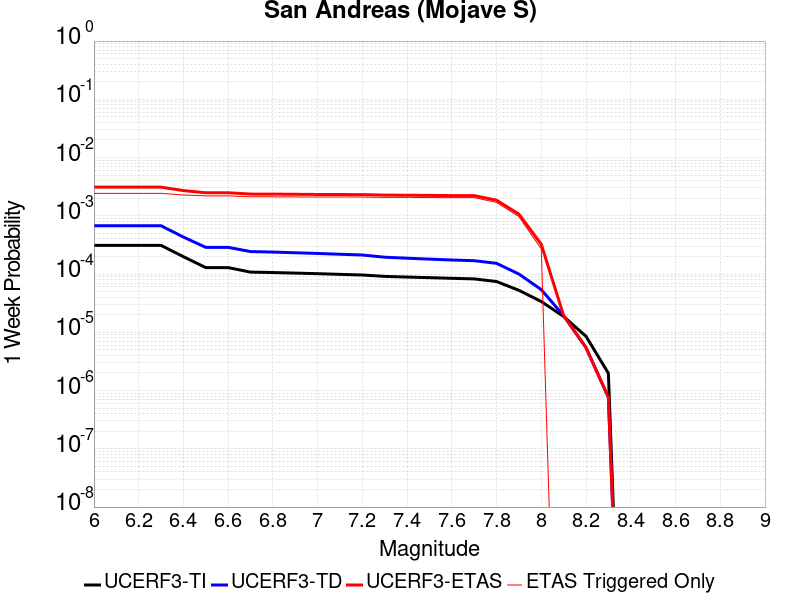 | 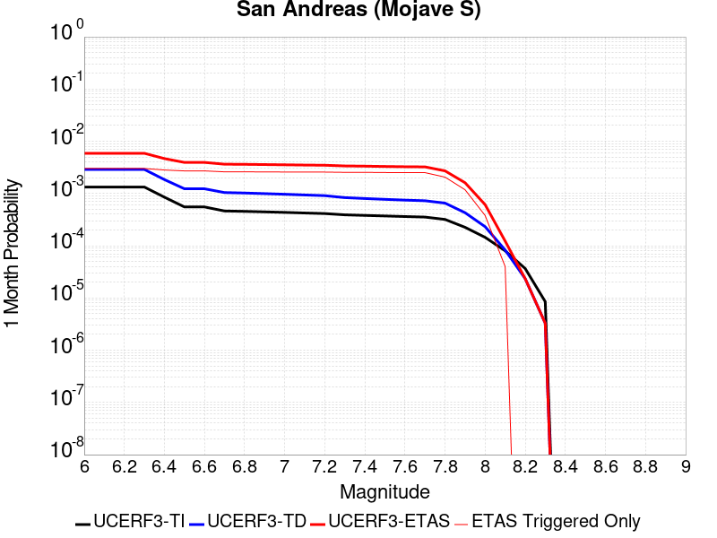 | 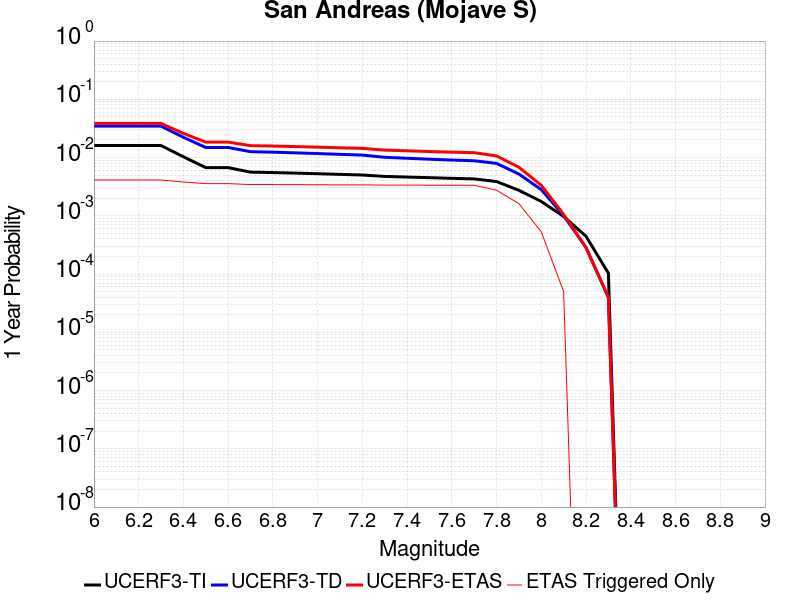 | 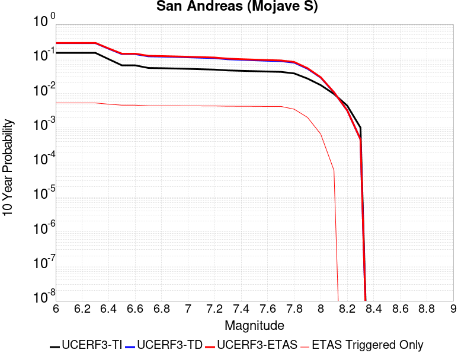 |

| Magnitude | 1 wk TI Prob | 1 wk TD Prob | 1 wk ETAS Prob | 1 wk ETAS/TD Gain | 1 wk ETAS Triggered Only | 1 mo TI Prob | 1 mo TD Prob | 1 mo ETAS Prob | 1 mo ETAS/TD Gain | 1 mo ETAS Triggered Only | 1 yr TI Prob | 1 yr TD Prob | 1 yr ETAS Prob | 1 yr ETAS/TD Gain | 1 yr ETAS Triggered Only | 10 yr TI Prob | 10 yr TD Prob | 10 yr ETAS Prob | 10 yr ETAS/TD Gain | 10 yr ETAS Triggered Only |
|-----|-----|-----|-----|-----|-----|-----|-----|-----|-----|-----|-----|-----|-----|-----|-----|-----|-----|-----|-----|-----|
| 6.0 | 3.1064058E-4 | 6.7460834E-4 | 0.003102969 | 4.5996604 | 0.00243 | 0.0013306376 | 0.0028881032 | 0.00588941 | 2.0391965 | 0.00301 | 0.016080605 | 0.03462235 | 0.038599703 | 1.1148783 | 0.00412 | 0.1496549 | 0.28660452 | 0.2903998 | 1.0132421 | 0.00532 |
| 6.1 | 3.1064058E-4 | 6.7460834E-4 | 0.003102969 | 4.5996604 | 0.00243 | 0.0013306376 | 0.0028881032 | 0.00588941 | 2.0391965 | 0.00301 | 0.016080605 | 0.03462235 | 0.038599703 | 1.1148783 | 0.00412 | 0.1496549 | 0.28660452 | 0.2903998 | 1.0132421 | 0.00532 |
| 6.2 | 3.1064058E-4 | 6.7460834E-4 | 0.003102969 | 4.5996604 | 0.00243 | 0.0013306376 | 0.0028881032 | 0.00588941 | 2.0391965 | 0.00301 | 0.016080605 | 0.03462235 | 0.038599703 | 1.1148783 | 0.00412 | 0.1496549 | 0.28660452 | 0.2903998 | 1.0132421 | 0.00532 |
| 6.3 | 3.1064058E-4 | 6.7460834E-4 | 0.003102969 | 4.5996604 | 0.00243 | 0.0013306376 | 0.0028881032 | 0.00588941 | 2.0391965 | 0.00301 | 0.016080605 | 0.03462235 | 0.038599703 | 1.1148783 | 0.00412 | 0.1496549 | 0.28660452 | 0.2903998 | 1.0132421 | 0.00532 |
| 6.4 | 1.9872203E-4 | 4.3179357E-4 | 0.002710809 | 6.2780213 | 0.00228 | 8.5138786E-4 | 0.0018492596 | 0.004664045 | 2.5221145 | 0.00282 | 0.010316478 | 0.02228844 | 0.026003743 | 1.166692 | 0.0038 | 0.098504856 | 0.19699748 | 0.20093219 | 1.0199734 | 0.0049 |
| 6.5 | 1.291105E-4 | 2.875267E-4 | 0.0024868941 | 8.649263 | 0.0022 | 5.5321335E-4 | 0.0012316781 | 0.00393834 | 3.1975403 | 0.00271 | 0.006714592 | 0.0148934 | 0.01841023 | 1.2361335 | 0.00357 | 0.065152965 | 0.13803436 | 0.14199078 | 1.0286626 | 0.00459 |
| 6.6 | 1.291105E-4 | 2.875267E-4 | 0.0024868941 | 8.649263 | 0.0022 | 5.5321335E-4 | 0.0012316781 | 0.00393834 | 3.1975403 | 0.00271 | 0.006714592 | 0.0148934 | 0.01841023 | 1.2361335 | 0.00357 | 0.065152965 | 0.13803436 | 0.14199078 | 1.0286626 | 0.00459 |
| 6.7 | 1.08001186E-4 | 2.4333889E-4 | 0.002362823 | 9.71001 | 0.00212 | 4.6278012E-4 | 0.0010424647 | 0.0036397544 | 3.4914892 | 0.0026 | 0.0056198016 | 0.012618446 | 0.016015038 | 1.2691767 | 0.00344 | 0.054797906 | 0.119176775 | 0.123052396 | 1.0325199 | 0.0044 |
| 6.8 | 1.0624356E-4 | 2.3851555E-4 | 0.0023580098 | 9.886189 | 0.00212 | 4.5525006E-4 | 0.0010218095 | 0.0036191528 | 3.5419054 | 0.0026 | 0.0055285925 | 0.012369843 | 0.015767291 | 1.2746557 | 0.00344 | 0.053930566 | 0.11712591 | 0.12101056 | 1.0331664 | 0.0044 |
| 6.9 | 1.0393785E-4 | 2.3221898E-4 | 0.002341729 | 10.084141 | 0.00211 | 4.4537184E-4 | 9.948451E-4 | 0.0035822685 | 3.6008303 | 0.00259 | 0.0054089287 | 0.012045221 | 0.015433907 | 1.2813302 | 0.00343 | 0.05279156 | 0.11442335 | 0.11831103 | 1.0339763 | 0.00439 |
| 7.0 | 1.0155622E-4 | 2.2591476E-4 | 0.0023254403 | 10.293442 | 0.0021 | 4.3516833E-4 | 9.6784724E-4 | 0.0035453502 | 3.66313 | 0.00258 | 0.005285311 | 0.0117200995 | 0.015090134 | 1.2875432 | 0.00341 | 0.05161361 | 0.111683756 | 0.115565695 | 1.0347583 | 0.00437 |
| 7.1 | 9.885595E-5 | 2.1879886E-4 | 0.0023183394 | 10.595757 | 0.0021 | 4.2359953E-4 | 9.3737274E-4 | 0.0035049636 | 3.7391355 | 0.00257 | 0.0051451353 | 0.011352993 | 0.014714393 | 1.2960805 | 0.0034 | 0.05027629 | 0.1085682 | 0.11245485 | 1.0357991 | 0.00436 |
| 7.2 | 9.6411415E-5 | 2.124288E-4 | 0.0023119827 | 10.883565 | 0.0021 | 4.1312634E-4 | 9.1009185E-4 | 0.003477753 | 3.8213208 | 0.00257 | 0.005018219 | 0.011024255 | 0.014386773 | 1.3050108 | 0.0034 | 0.049064007 | 0.105758004 | 0.10964795 | 1.0367817 | 0.00435 |
| 7.3 | 9.1180635E-5 | 1.9471257E-4 | 0.0022643094 | 11.628984 | 0.00207 | 3.907156E-4 | 8.342157E-4 | 0.0033720967 | 4.042236 | 0.00254 | 0.004746591 | 0.01010939 | 0.0134453215 | 1.3299835 | 0.00337 | 0.046464786 | 0.09795115 | 0.10181192 | 1.0394152 | 0.00428 |
| 7.4 | 8.887388E-5 | 1.8719878E-4 | 0.0022568114 | 12.055695 | 0.00207 | 3.8083247E-4 | 8.020339E-4 | 0.0033399968 | 4.164408 | 0.00254 | 0.0046267817 | 0.00972114 | 0.01305838 | 1.3432971 | 0.00337 | 0.045316286 | 0.09458615 | 0.09845226 | 1.040874 | 0.00427 |
| 7.5 | 8.6750515E-5 | 1.8051457E-4 | 0.0022401428 | 12.409761 | 0.00206 | 3.7173493E-4 | 7.7340455E-4 | 0.0032914556 | 4.2558007 | 0.00252 | 0.004516484 | 0.009375632 | 0.012694224 | 1.3539592 | 0.00335 | 0.04425787 | 0.091549896 | 0.09541081 | 1.0421728 | 0.00425 |
| 7.6 | 8.453092E-5 | 1.7439072E-4 | 0.0022240332 | 12.753162 | 0.00205 | 3.6222505E-4 | 7.471748E-4 | 0.0032552993 | 4.356811 | 0.00251 | 0.0044011753 | 0.009058985 | 0.0123687275 | 1.3653548 | 0.00334 | 0.04315024 | 0.08870898 | 0.09255463 | 1.0433513 | 0.00422 |
| 7.7 | 8.259102E-5 | 1.6961215E-4 | 0.0022192644 | 13.084349 | 0.00205 | 3.539135E-4 | 7.2670676E-4 | 0.0032348828 | 4.451428 | 0.00251 | 0.004300386 | 0.008811831 | 0.012122399 | 1.375696 | 0.00334 | 0.042181134 | 0.08645982 | 0.09031496 | 1.0445888 | 0.00422 |
| 7.8 | 7.444844E-5 | 1.5283503E-4 | 0.0018525752 | 12.121405 | 0.0017 | 3.1902574E-4 | 6.548429E-4 | 0.002713494 | 4.143733 | 0.00206 | 0.0038772223 | 0.007943616 | 0.010671771 | 1.3434399 | 0.00275 | 0.03810269 | 0.078290746 | 0.081525944 | 1.0413228 | 0.00351 |
| 7.9 | 5.2586525E-5 | 1.00064186E-4 | 0.0010699672 | 10.692808 | 9.7E-4 | 2.2535135E-4 | 4.2877605E-4 | 0.0016082701 | 3.7508395 | 0.00118 | 0.0027402006 | 0.005207864 | 0.006819427 | 1.309448 | 0.00162 | 0.027066574 | 0.052200034 | 0.054133546 | 1.0370405 | 0.00204 |
| 8.0 | 3.379877E-5 | 5.4074168E-5 | 3.2405957E-4 | 5.992872 | 2.7E-4 | 1.4484383E-4 | 2.3172585E-4 | 6.116378E-4 | 2.639489 | 3.8E-4 | 0.0017620471 | 0.002817614 | 0.0033461207 | 1.1875724 | 5.3E-4 | 0.017481409 | 0.028834904 | 0.029485583 | 1.0225657 | 6.7E-4 |
| 8.1 | 1.8668277E-5 | 1.9309397E-5 | 1.9309397E-5 | 1.0 | 0.0 | 8.000444E-5 | 8.275194E-5 | 1.2274862E-4 | 1.4833324 | 4.0E-5 | 9.736188E-4 | 0.0010070398 | 0.0010569894 | 1.0496005 | 5.0E-5 | 0.009693642 | 0.010798888 | 0.010858241 | 1.0054961 | 6.0E-5 |
| 8.2 | 8.541571E-6 | 5.460819E-6 | 5.460819E-6 | 1.0 | 0.0 | 3.660622E-5 | 2.3403301E-5 | 2.3403301E-5 | 1.0 | 0.0 | 4.455896E-4 | 2.84898E-4 | 2.84898E-4 | 1.0 | 0.0 | 0.0044469717 | 0.0032408056 | 0.0032408056 | 1.0 | 0.0 |
| 8.3 | 1.983087E-6 | 7.6599065E-7 | 7.6599065E-7 | 1.0 | 0.0 | 8.498917E-6 | 3.282813E-6 | 3.282813E-6 | 1.0 | 0.0 | 1.034694E-4 | 3.9967534E-5 | 3.9967534E-5 | 1.0 | 0.0 | 0.0010342124 | 4.719687E-4 | 4.719687E-4 | 1.0 | 0.0 |

## Coyote Canyon
*[(top)](#table-of-contents)*

| 1 Week | 1 Month | 1 Year | 10 Year |
|-----|-----|-----|-----|
| 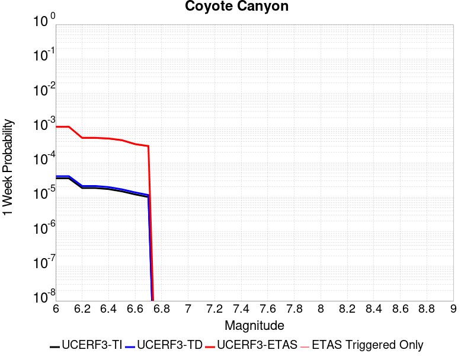 | 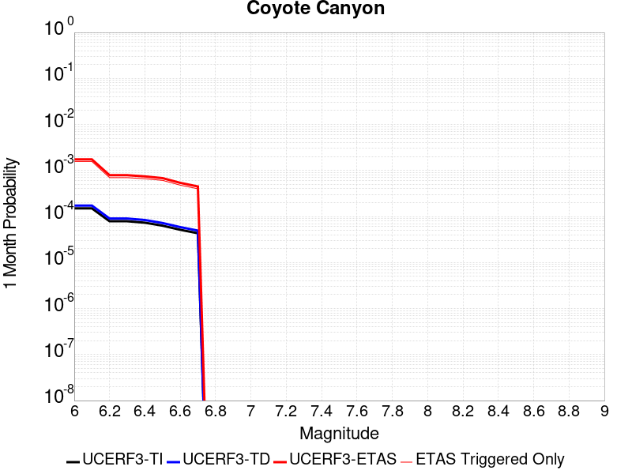 |  |  |

| Magnitude | 1 wk TI Prob | 1 wk TD Prob | 1 wk ETAS Prob | 1 wk ETAS/TD Gain | 1 wk ETAS Triggered Only | 1 mo TI Prob | 1 mo TD Prob | 1 mo ETAS Prob | 1 mo ETAS/TD Gain | 1 mo ETAS Triggered Only | 1 yr TI Prob | 1 yr TD Prob | 1 yr ETAS Prob | 1 yr ETAS/TD Gain | 1 yr ETAS Triggered Only | 10 yr TI Prob | 10 yr TD Prob | 10 yr ETAS Prob | 10 yr ETAS/TD Gain | 10 yr ETAS Triggered Only |
|-----|-----|-----|-----|-----|-----|-----|-----|-----|-----|-----|-----|-----|-----|-----|-----|-----|-----|-----|-----|-----|
| 6.0 | 3.5090034E-5 | 4.0364324E-5 | 0.0010903219 | 27.01202 | 0.00105 | 1.503772E-4 | 1.7297994E-4 | 0.0017427084 | 10.074627 | 0.00157 | 0.0018293047 | 0.0021042528 | 0.0051079188 | 2.4274266 | 0.00301 | 0.018143194 | 0.020869201 | 0.025666943 | 1.2298957 | 0.0049 |
| 6.1 | 3.5090034E-5 | 4.0364324E-5 | 0.0010903219 | 27.01202 | 0.00105 | 1.503772E-4 | 1.7297994E-4 | 0.0017427084 | 10.074627 | 0.00157 | 0.0018293047 | 0.0021042528 | 0.0051079188 | 2.4274266 | 0.00301 | 0.018143194 | 0.020869201 | 0.025666943 | 1.2298957 | 0.0049 |
| 6.2 | 1.841879E-5 | 2.1059794E-5 | 5.2104925E-4 | 24.741423 | 5.0E-4 | 7.8935285E-5 | 9.0253714E-5 | 7.9019053E-4 | 8.755214 | 7.0E-4 | 9.606133E-4 | 0.001098387 | 0.0025368053 | 2.3095734 | 0.00144 | 0.0095647145 | 0.010939667 | 0.013333193 | 1.2187933 | 0.00242 |
| 6.3 | 1.841879E-5 | 2.1059794E-5 | 5.2104925E-4 | 24.741423 | 5.0E-4 | 7.8935285E-5 | 9.0253714E-5 | 7.9019053E-4 | 8.755214 | 7.0E-4 | 9.606133E-4 | 0.001098387 | 0.0025368053 | 2.3095734 | 0.00144 | 0.0095647145 | 0.010939667 | 0.013333193 | 1.2187933 | 0.00242 |
| 6.4 | 1.712201E-5 | 1.9565212E-5 | 4.9955584E-4 | 25.53286 | 4.8E-4 | 7.337798E-5 | 8.3848776E-5 | 7.4379344E-4 | 8.870653 | 6.6E-4 | 8.930107E-4 | 0.0010204813 | 0.0023890832 | 2.3411338 | 0.00137 | 0.008894307 | 0.010167871 | 0.012444484 | 1.2239027 | 0.0023 |
| 6.5 | 1.4744935E-5 | 1.6836972E-5 | 4.4682974E-4 | 26.538605 | 4.3E-4 | 6.3191044E-5 | 7.215698E-5 | 6.82113E-4 | 9.45318 | 6.1E-4 | 7.6907943E-4 | 8.7825063E-4 | 0.0021571266 | 2.4561627 | 0.00128 | 0.007664232 | 0.008756994 | 0.0108485175 | 1.2388402 | 0.00211 |
| 6.6 | 1.2017839E-5 | 1.37240895E-5 | 3.4371956E-4 | 25.044981 | 3.3E-4 | 5.150401E-5 | 5.88167E-5 | 5.3878844E-4 | 9.160468 | 4.8E-4 | 6.268809E-4 | 7.159466E-4 | 0.0017751877 | 2.4794974 | 0.00106 | 0.0062511545 | 0.0071450938 | 0.00888259 | 1.2431734 | 0.00175 |
| 6.7 | 1.00956095E-5 | 1.1533517E-5 | 3.0153018E-4 | 26.14382 | 2.9E-4 | 4.326618E-5 | 4.942891E-5 | 4.4940913E-4 | 9.092031 | 4.0E-4 | 5.266384E-4 | 6.017178E-4 | 0.0015211642 | 2.5280359 | 9.2E-4 | 0.005253921 | 0.0060094125 | 0.0075103384 | 1.2497625 | 0.00151 |

## Death Valley (So)
*[(top)](#table-of-contents)*

| 1 Week | 1 Month | 1 Year | 10 Year |
|-----|-----|-----|-----|
| 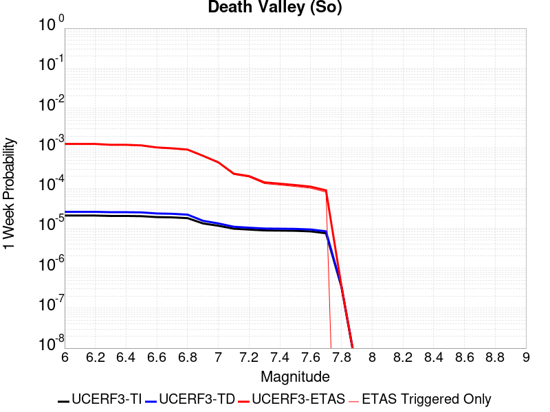 | 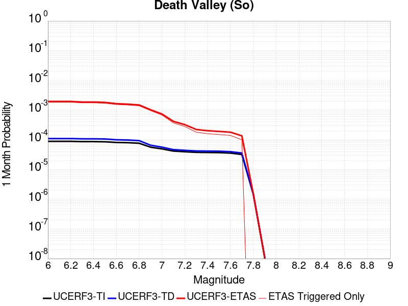 |  |  |

| Magnitude | 1 wk TI Prob | 1 wk TD Prob | 1 wk ETAS Prob | 1 wk ETAS/TD Gain | 1 wk ETAS Triggered Only | 1 mo TI Prob | 1 mo TD Prob | 1 mo ETAS Prob | 1 mo ETAS/TD Gain | 1 mo ETAS Triggered Only | 1 yr TI Prob | 1 yr TD Prob | 1 yr ETAS Prob | 1 yr ETAS/TD Gain | 1 yr ETAS Triggered Only | 10 yr TI Prob | 10 yr TD Prob | 10 yr ETAS Prob | 10 yr ETAS/TD Gain | 10 yr ETAS Triggered Only |
|-----|-----|-----|-----|-----|-----|-----|-----|-----|-----|-----|-----|-----|-----|-----|-----|-----|-----|-----|-----|-----|
| 6.0 | 2.0684236E-5 | 2.5617775E-5 | 0.0012755857 | 49.79299 | 0.00125 | 8.864371E-5 | 1.0978594E-4 | 0.001949584 | 17.758047 | 0.00184 | 0.0010787029 | 0.0013358411 | 0.0046913526 | 3.511909 | 0.00336 | 0.010734817 | 0.013281397 | 0.018619545 | 1.4019266 | 0.00541 |
| 6.1 | 2.0684236E-5 | 2.5617775E-5 | 0.0012755857 | 49.79299 | 0.00125 | 8.864371E-5 | 1.0978594E-4 | 0.001949584 | 17.758047 | 0.00184 | 0.0010787029 | 0.0013358411 | 0.0046913526 | 3.511909 | 0.00336 | 0.010734817 | 0.013281397 | 0.018619545 | 1.4019266 | 0.00541 |
| 6.2 | 2.0684236E-5 | 2.5617775E-5 | 0.0012755857 | 49.79299 | 0.00125 | 8.864371E-5 | 1.0978594E-4 | 0.001949584 | 17.758047 | 0.00184 | 0.0010787029 | 0.0013358411 | 0.0046913526 | 3.511909 | 0.00336 | 0.010734817 | 0.013281397 | 0.018619545 | 1.4019266 | 0.00541 |
| 6.3 | 2.0240292E-5 | 2.511786E-5 | 0.001215088 | 48.375458 | 0.00119 | 8.6741224E-5 | 1.07643624E-4 | 0.0018574552 | 17.255598 | 0.00175 | 0.0010555626 | 0.00130979 | 0.004485625 | 3.4246902 | 0.00318 | 0.010505628 | 0.013023956 | 0.018067405 | 1.3872439 | 0.00511 |
| 6.4 | 2.0240292E-5 | 2.511786E-5 | 0.001215088 | 48.375458 | 0.00119 | 8.6741224E-5 | 1.07643624E-4 | 0.0018574552 | 17.255598 | 0.00175 | 0.0010555626 | 0.00130979 | 0.004485625 | 3.4246902 | 0.00318 | 0.010505628 | 0.013023956 | 0.018067405 | 1.3872439 | 0.00511 |
| 6.5 | 1.9962767E-5 | 2.4807114E-5 | 0.0011747786 | 47.35652 | 0.00115 | 8.55519E-5 | 1.0631196E-4 | 0.0018061312 | 16.988974 | 0.0017 | 0.0010410968 | 0.0012935963 | 0.004369612 | 3.3778791 | 0.00308 | 0.010362327 | 0.012863902 | 0.017760098 | 1.3806151 | 0.00496 |
| 6.6 | 1.8937297E-5 | 2.3310964E-5 | 0.0010432872 | 44.75521 | 0.00102 | 8.115732E-5 | 9.990039E-5 | 0.0016397466 | 16.413815 | 0.00154 | 9.876423E-4 | 0.0012156231 | 0.0040122196 | 3.3005455 | 0.0028 | 0.009832645 | 0.012092789 | 0.016508734 | 1.3651718 | 0.00447 |
| 6.7 | 1.8621096E-5 | 2.2911607E-5 | 9.928894E-4 | 43.33565 | 9.7E-4 | 7.980225E-5 | 9.818898E-5 | 0.0015780437 | 16.071493 | 0.00148 | 9.711593E-4 | 0.0011948098 | 0.00391156 | 3.273793 | 0.00272 | 0.009669261 | 0.011886904 | 0.016165433 | 1.3599365 | 0.00433 |
| 6.8 | 1.7830353E-5 | 2.1805688E-5 | 9.2178606E-4 | 42.272736 | 9.0E-4 | 7.641356E-5 | 9.344968E-5 | 0.0014833198 | 15.872926 | 0.00139 | 9.29938E-4 | 0.00113717 | 0.0036942589 | 3.2486424 | 0.00256 | 0.009260561 | 0.011316354 | 0.01533041 | 1.3547127 | 0.00406 |
| 6.9 | 1.3135183E-5 | 1.5303925E-5 | 6.4529426E-4 | 42.16528 | 6.3E-4 | 5.6292425E-5 | 6.558664E-5 | 0.0010255236 | 15.636168 | 9.6E-4 | 6.8514474E-4 | 7.982312E-4 | 0.0025768103 | 3.2281504 | 0.00178 | 0.006830362 | 0.007954649 | 0.010712535 | 1.3467011 | 0.00278 |
| 7.0 | 1.1507512E-5 | 1.3154199E-5 | 4.4314854E-4 | 33.68875 | 4.3E-4 | 4.9316975E-5 | 5.6373956E-5 | 7.3633564E-4 | 13.061628 | 6.8E-4 | 6.002687E-4 | 6.8614254E-4 | 0.0019352848 | 2.820529 | 0.00125 | 0.0059864987 | 0.0068409415 | 0.00882726 | 1.2903575 | 0.002 |
| 7.1 | 9.715903E-6 | 1.0865278E-5 | 2.3086289E-4 | 21.247766 | 2.2E-4 | 4.1638916E-5 | 4.656467E-5 | 4.1654744E-4 | 8.945568 | 3.7E-4 | 5.068359E-4 | 5.667817E-4 | 0.0012563906 | 2.21671 | 6.9E-4 | 0.0050568148 | 0.0056538144 | 0.0067277085 | 1.1899415 | 0.00108 |
| 7.2 | 9.233269E-6 | 1.02863105E-5 | 2.0028435E-4 | 19.470963 | 1.9E-4 | 3.9570554E-5 | 4.4083466E-5 | 3.2407112E-4 | 7.351308 | 2.8E-4 | 4.81665E-4 | 5.3658825E-4 | 0.0010962877 | 2.0430708 | 5.6E-4 | 0.0048062233 | 0.0053533576 | 0.0062584863 | 1.1690768 | 9.1E-4 |
| 7.3 | 8.8041315E-6 | 9.808164E-6 | 1.3980689E-4 | 14.254134 | 1.3E-4 | 3.7731446E-5 | 4.2034335E-5 | 2.2202676E-4 | 5.2820334 | 1.8E-4 | 4.592835E-4 | 5.1165203E-4 | 9.314372E-4 | 1.8204503 | 4.2E-4 | 0.0045833546 | 0.005105167 | 0.0057816957 | 1.1325184 | 6.8E-4 |
| 7.4 | 8.708749E-6 | 9.707175E-6 | 1.2970601E-4 | 13.36187 | 1.2E-4 | 3.7322676E-5 | 4.160154E-5 | 2.0159488E-4 | 4.8458514 | 1.6E-4 | 4.5430884E-4 | 5.0638523E-4 | 8.761979E-4 | 1.730299 | 3.7E-4 | 0.004533812 | 0.0050527398 | 0.0056795566 | 1.1240548 | 6.3E-4 |
| 7.5 | 8.612678E-6 | 9.604817E-6 | 1.1960376E-4 | 12.4524765 | 1.1E-4 | 3.6910955E-5 | 4.1162875E-5 | 1.9115671E-4 | 4.6439104 | 1.5E-4 | 4.492982E-4 | 5.01047E-4 | 8.608666E-4 | 1.7181355 | 3.6E-4 | 0.004483909 | 0.0049995985 | 0.005606549 | 1.1213998 | 6.1E-4 |
| 7.6 | 8.319024E-6 | 9.283916E-6 | 1.0928299E-4 | 11.771216 | 1.0E-4 | 3.5652476E-5 | 3.978763E-5 | 1.7978206E-4 | 4.5185413 | 1.4E-4 | 4.3398244E-4 | 4.8431093E-4 | 8.0415595E-4 | 1.6604125 | 3.2E-4 | 0.0043313587 | 0.0048329784 | 0.005350465 | 1.1070741 | 5.2E-4 |
| 7.7 | 7.4718328E-6 | 8.34517E-6 | 8.83445E-5 | 10.586304 | 8.0E-5 | 3.2021748E-5 | 3.5764548E-5 | 1.3576097E-4 | 3.7959652 | 1.0E-4 | 3.8979502E-4 | 4.353504E-4 | 6.952372E-4 | 1.5969601 | 2.6E-4 | 0.00389112 | 0.0043453807 | 0.0047635557 | 1.0962343 | 4.2E-4 |
| 7.8 | 3.4586725E-7 | 3.6482615E-7 | 3.6482615E-7 | 1.0 | 0.0 | 1.4822873E-6 | 1.5635396E-6 | 1.5635396E-6 | 1.0 | 0.0 | 1.80467E-5 | 1.9035933E-5 | 2.9035744E-5 | 1.5253123 | 1.0E-5 | 1.8045233E-4 | 1.9034347E-4 | 2.0034157E-4 | 1.0525266 | 1.0E-5 |
| 7.9 | 2.5591178E-9 | 2.6696718E-9 | 2.6696718E-9 | 1.0 | 0.0 | 1.0967647E-8 | 1.14414505E-8 | 1.14414505E-8 | 1.0 | 0.0 | 1.335311E-7 | 1.3929966E-7 | 1.3929966E-7 | 1.0 | 0.0 | 1.3353102E-6 | 1.3929966E-6 | 1.3929966E-6 | 1.0 | 0.0 |

## Nelson Lake
*[(top)](#table-of-contents)*

| 1 Week | 1 Month | 1 Year | 10 Year |
|-----|-----|-----|-----|
| 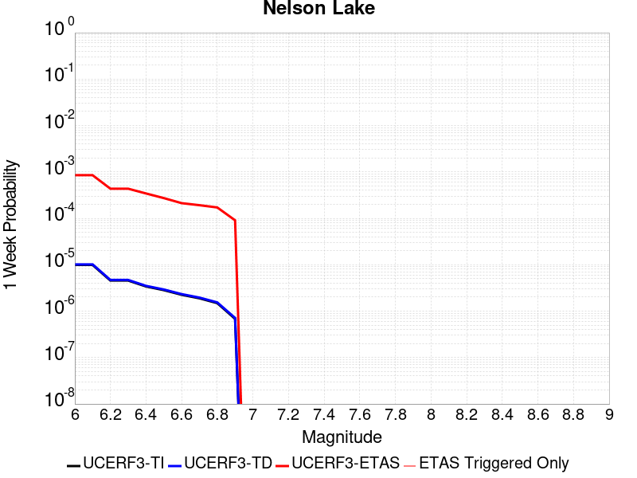 | 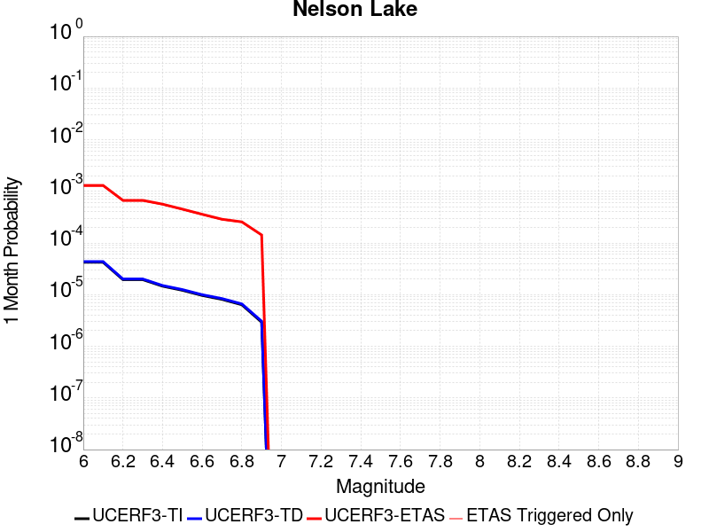 |  |  |

| Magnitude | 1 wk TI Prob | 1 wk TD Prob | 1 wk ETAS Prob | 1 wk ETAS/TD Gain | 1 wk ETAS Triggered Only | 1 mo TI Prob | 1 mo TD Prob | 1 mo ETAS Prob | 1 mo ETAS/TD Gain | 1 mo ETAS Triggered Only | 1 yr TI Prob | 1 yr TD Prob | 1 yr ETAS Prob | 1 yr ETAS/TD Gain | 1 yr ETAS Triggered Only | 10 yr TI Prob | 10 yr TD Prob | 10 yr ETAS Prob | 10 yr ETAS/TD Gain | 10 yr ETAS Triggered Only |
|-----|-----|-----|-----|-----|-----|-----|-----|-----|-----|-----|-----|-----|-----|-----|-----|-----|-----|-----|-----|-----|
| 6.0 | 9.913453E-6 | 1.0192255E-5 | 8.501837E-4 | 83.41468 | 8.4E-4 | 4.2485535E-5 | 4.3680422E-5 | 0.0013036254 | 29.844616 | 0.00126 | 5.1713863E-4 | 5.316897E-4 | 0.003110318 | 5.8498745 | 0.00258 | 0.0051593683 | 0.005305204 | 0.009592338 | 1.8080999 | 0.00431 |
| 6.1 | 9.913453E-6 | 1.0192255E-5 | 8.501837E-4 | 83.41468 | 8.4E-4 | 4.2485535E-5 | 4.3680422E-5 | 0.0013036254 | 29.844616 | 0.00126 | 5.1713863E-4 | 5.316897E-4 | 0.003110318 | 5.8498745 | 0.00258 | 0.0051593683 | 0.005305204 | 0.009592338 | 1.8080999 | 0.00431 |
| 6.2 | 4.5596407E-6 | 4.696313E-6 | 4.346943E-4 | 92.56076 | 4.3E-4 | 1.954117E-5 | 2.0126909E-5 | 6.7011383E-4 | 33.294426 | 6.5E-4 | 2.3788778E-4 | 2.4501883E-4 | 0.0015247052 | 6.2228084 | 0.00128 | 0.0023763329 | 0.0024476128 | 0.0044826195 | 1.8314252 | 0.00204 |
| 6.3 | 4.5596407E-6 | 4.696313E-6 | 4.346943E-4 | 92.56076 | 4.3E-4 | 1.954117E-5 | 2.0126909E-5 | 6.7011383E-4 | 33.294426 | 6.5E-4 | 2.3788778E-4 | 2.4501883E-4 | 0.0015247052 | 6.2228084 | 0.00128 | 0.0023763329 | 0.0024476128 | 0.0044826195 | 1.8314252 | 0.00204 |
| 6.4 | 3.4025713E-6 | 3.5098972E-6 | 3.435087E-4 | 97.86859 | 3.4E-4 | 1.4582367E-5 | 1.5042335E-5 | 5.6503405E-4 | 37.562923 | 5.5E-4 | 1.7752586E-4 | 1.8312587E-4 | 0.0011829428 | 6.459725 | 0.001 | 0.001773841 | 0.0018298327 | 0.0033769964 | 1.845522 | 0.00155 |
| 6.5 | 2.8352947E-6 | 2.927856E-6 | 2.7292708E-4 | 93.21738 | 2.7E-4 | 1.2151207E-5 | 1.2547898E-5 | 4.525424E-4 | 36.065193 | 4.4E-4 | 1.479309E-4 | 1.5276071E-4 | 9.3264156E-4 | 6.105245 | 7.8E-4 | 0.0014783246 | 0.0015266308 | 0.0027647377 | 1.8110062 | 0.00124 |
| 6.6 | 2.251518E-6 | 2.3290677E-6 | 2.1232858E-4 | 91.16463 | 2.1E-4 | 9.649328E-6 | 9.981683E-6 | 3.5997818E-4 | 36.063877 | 3.5E-4 | 1.1747423E-4 | 1.2152085E-4 | 7.214479E-4 | 5.9368243 | 6.0E-4 | 0.0011741214 | 0.0012146058 | 0.002213391 | 1.8223125 | 0.001 |
| 6.7 | 1.8911853E-6 | 1.9591396E-6 | 1.9195877E-4 | 97.981155 | 1.9E-4 | 8.105055E-6 | 8.39629E-6 | 2.8839393E-4 | 34.347786 | 2.8E-4 | 9.867457E-5 | 1.0222061E-4 | 5.921705E-4 | 5.7930636 | 4.9E-4 | 9.863076E-4 | 0.0010217935 | 0.0018609351 | 1.821244 | 8.4E-4 |
| 6.8 | 1.4874814E-6 | 1.5438305E-6 | 1.7154356E-4 | 111.11555 | 1.7E-4 | 6.374905E-6 | 6.6164025E-6 | 2.5661476E-4 | 38.784634 | 2.5E-4 | 7.76117E-5 | 8.055224E-5 | 5.30516E-4 | 6.5859866 | 4.5E-4 | 7.75846E-4 | 8.0528157E-4 | 0.0015446857 | 1.9181932 | 7.4E-4 |
| 6.9 | 6.835972E-7 | 7.1399285E-7 | 9.0713926E-5 | 127.0516 | 9.0E-5 | 2.9296991E-6 | 3.0599674E-6 | 1.4305954E-4 | 46.75198 | 1.4E-4 | 3.56685E-5 | 3.7254784E-5 | 2.7724585E-4 | 7.4418855 | 2.4E-4 | 3.5662777E-4 | 3.7251666E-4 | 7.523751E-4 | 2.0197086 | 3.8E-4 |

## Towne Pass
*[(top)](#table-of-contents)*

| 1 Week | 1 Month | 1 Year | 10 Year |
|-----|-----|-----|-----|
| 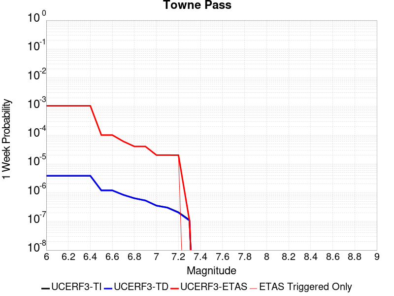 | 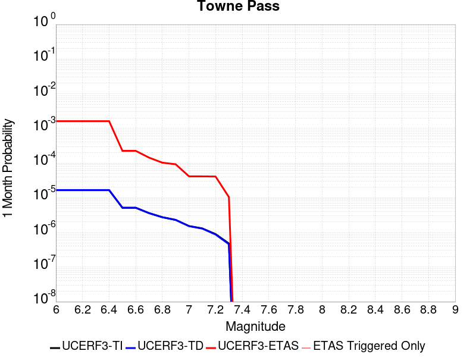 | 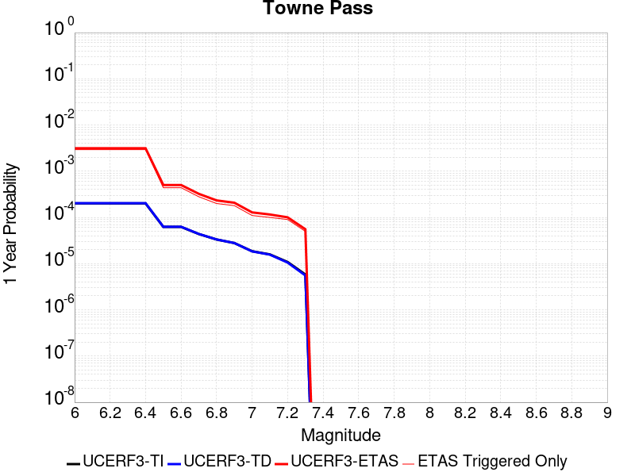 |  |

| Magnitude | 1 wk TI Prob | 1 wk TD Prob | 1 wk ETAS Prob | 1 wk ETAS/TD Gain | 1 wk ETAS Triggered Only | 1 mo TI Prob | 1 mo TD Prob | 1 mo ETAS Prob | 1 mo ETAS/TD Gain | 1 mo ETAS Triggered Only | 1 yr TI Prob | 1 yr TD Prob | 1 yr ETAS Prob | 1 yr ETAS/TD Gain | 1 yr ETAS Triggered Only | 10 yr TI Prob | 10 yr TD Prob | 10 yr ETAS Prob | 10 yr ETAS/TD Gain | 10 yr ETAS Triggered Only |
|-----|-----|-----|-----|-----|-----|-----|-----|-----|-----|-----|-----|-----|-----|-----|-----|-----|-----|-----|-----|-----|
| 6.0 | 3.849728E-6 | 3.8945414E-6 | 0.0010538904 | 270.6071 | 0.00105 | 1.649873E-5 | 1.669081E-5 | 0.0016166641 | 96.859535 | 0.0016 | 2.0085352E-4 | 2.0319603E-4 | 0.0031326006 | 15.416643 | 0.00293 | 0.0020067208 | 0.0020305314 | 0.0061022467 | 3.0052462 | 0.00408 |
| 6.1 | 3.849728E-6 | 3.8945414E-6 | 0.0010538904 | 270.6071 | 0.00105 | 1.649873E-5 | 1.669081E-5 | 0.0016166641 | 96.859535 | 0.0016 | 2.0085352E-4 | 2.0319603E-4 | 0.0031326006 | 15.416643 | 0.00293 | 0.0020067208 | 0.0020305314 | 0.0061022467 | 3.0052462 | 0.00408 |
| 6.2 | 3.849728E-6 | 3.8945414E-6 | 0.0010538904 | 270.6071 | 0.00105 | 1.649873E-5 | 1.669081E-5 | 0.0016166641 | 96.859535 | 0.0016 | 2.0085352E-4 | 2.0319603E-4 | 0.0031326006 | 15.416643 | 0.00293 | 0.0020067208 | 0.0020305314 | 0.0061022467 | 3.0052462 | 0.00408 |
| 6.3 | 3.849728E-6 | 3.8945414E-6 | 0.0010538904 | 270.6071 | 0.00105 | 1.649873E-5 | 1.669081E-5 | 0.0016166641 | 96.859535 | 0.0016 | 2.0085352E-4 | 2.0319603E-4 | 0.0031326006 | 15.416643 | 0.00293 | 0.0020067208 | 0.0020305314 | 0.0061022467 | 3.0052462 | 0.00408 |
| 6.4 | 3.849728E-6 | 3.8945414E-6 | 0.0010538904 | 270.6071 | 0.00105 | 1.649873E-5 | 1.669081E-5 | 0.0016166641 | 96.859535 | 0.0016 | 2.0085352E-4 | 2.0319603E-4 | 0.0031326006 | 15.416643 | 0.00293 | 0.0020067208 | 0.0020305314 | 0.0061022467 | 3.0052462 | 0.00408 |
| 6.5 | 1.1953545E-6 | 1.203052E-6 | 1.0120293E-4 | 84.121826 | 1.0E-4 | 5.1229376E-6 | 5.1559277E-6 | 2.251548E-4 | 43.669113 | 2.2E-4 | 6.236998E-5 | 6.277173E-5 | 5.027441E-4 | 8.009085 | 4.4E-4 | 6.235248E-4 | 6.275517E-4 | 0.0012071878 | 1.9236466 | 5.8E-4 |
| 6.6 | 1.1953545E-6 | 1.203052E-6 | 1.0120293E-4 | 84.121826 | 1.0E-4 | 5.1229376E-6 | 5.1559277E-6 | 2.251548E-4 | 43.669113 | 2.2E-4 | 6.236998E-5 | 6.277173E-5 | 5.027441E-4 | 8.009085 | 4.4E-4 | 6.235248E-4 | 6.275517E-4 | 0.0012071878 | 1.9236466 | 5.8E-4 |
| 6.7 | 8.375951E-7 | 8.4106705E-7 | 6.0841016E-5 | 72.33789 | 6.0E-5 | 3.5896885E-6 | 3.6045683E-6 | 1.4360406E-4 | 39.839462 | 1.4E-4 | 4.370358E-5 | 4.3884793E-5 | 3.2387252E-4 | 7.380062 | 2.8E-4 | 4.3694986E-4 | 4.38767E-4 | 8.0860464E-4 | 1.8429022 | 3.7E-4 |
| 6.8 | 6.38041E-7 | 6.392156E-7 | 4.0639192E-5 | 63.576653 | 4.0E-5 | 2.7344586E-6 | 2.7394929E-6 | 1.0273922E-4 | 37.503006 | 1.0E-4 | 3.3291526E-5 | 3.3352855E-5 | 2.3334619E-4 | 6.9962883 | 2.0E-4 | 3.3286537E-4 | 3.334823E-4 | 6.0339225E-4 | 1.8093681 | 2.7E-4 |
| 6.9 | 5.3460053E-7 | 5.345333E-7 | 4.0534513E-5 | 75.83159 | 4.0E-5 | 2.2911431E-6 | 2.2908553E-6 | 9.229065E-5 | 40.28655 | 9.0E-5 | 2.789431E-5 | 2.789084E-5 | 2.0788582E-4 | 7.453552 | 1.8E-4 | 2.789081E-4 | 2.7887672E-4 | 5.28807E-4 | 1.8962035 | 2.5E-4 |
| 7.0 | 3.557783E-7 | 3.5324226E-7 | 2.0353235E-5 | 57.618347 | 2.0E-5 | 1.5247632E-6 | 1.5138945E-6 | 4.1513835E-5 | 27.421879 | 4.0E-5 | 1.8563835E-5 | 1.843152E-5 | 1.2842948E-4 | 6.9679275 | 1.1E-4 | 1.8562283E-4 | 1.8430075E-4 | 3.342731E-4 | 1.8137372 | 1.5E-4 |
| 7.1 | 3.037942E-7 | 3.0002218E-7 | 2.0300016E-5 | 67.66172 | 2.0E-5 | 1.3019744E-6 | 1.2858087E-6 | 4.128576E-5 | 32.108784 | 4.0E-5 | 1.5851423E-5 | 1.5654618E-5 | 1.1565305E-4 | 7.387792 | 1.0E-4 | 1.5850292E-4 | 1.5653588E-4 | 2.96514E-4 | 1.8942236 | 1.4E-4 |
| 7.2 | 2.0808248E-7 | 2.0217689E-7 | 2.0202173E-5 | 99.923256 | 2.0E-5 | 8.917818E-7 | 8.6647213E-7 | 4.086644E-5 | 47.16417 | 4.0E-5 | 1.0857389E-5 | 1.0549252E-5 | 1.005483E-4 | 9.531321 | 9.0E-5 | 1.0856859E-4 | 1.0548797E-4 | 2.3547426E-4 | 2.232238 | 1.3E-4 |
| 7.3 | 1.1162073E-7 | 1.0636894E-7 | 1.0636894E-7 | 1.0 | 0.0 | 4.7837443E-7 | 4.558668E-7 | 1.0455862E-5 | 22.936222 | 1.0E-5 | 5.8241935E-6 | 5.550166E-6 | 5.554989E-5 | 10.008689 | 5.0E-5 | 5.8240406E-5 | 5.5500474E-5 | 1.3549604E-4 | 2.441349 | 8.0E-5 |

## Lenwood-Lockhart-Old Woman Springs
*[(top)](#table-of-contents)*

| 1 Week | 1 Month | 1 Year | 10 Year |
|-----|-----|-----|-----|
| 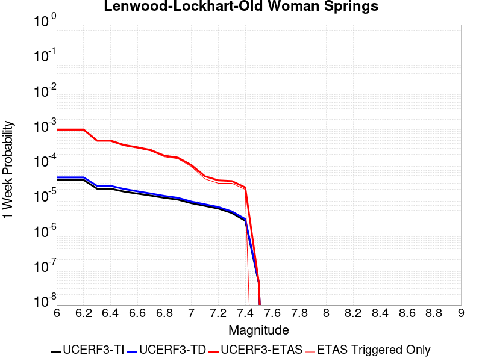 | 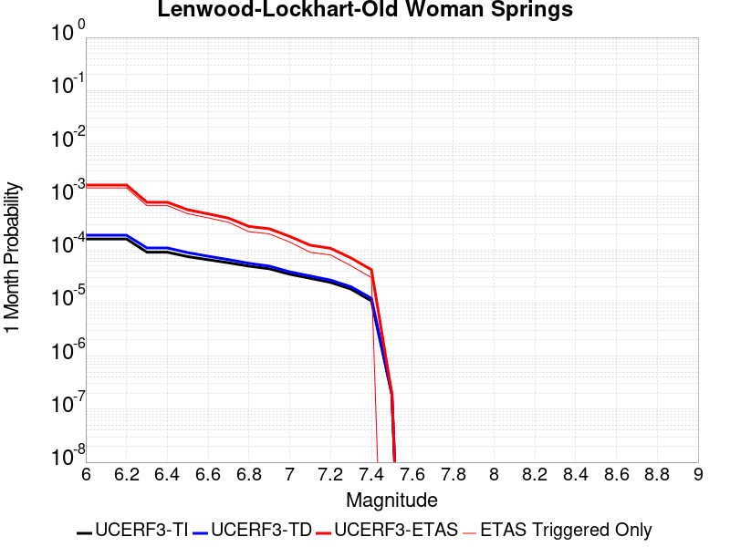 | 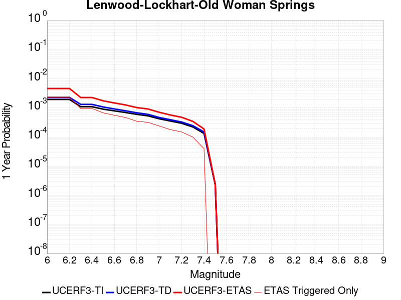 |  |

| Magnitude | 1 wk TI Prob | 1 wk TD Prob | 1 wk ETAS Prob | 1 wk ETAS/TD Gain | 1 wk ETAS Triggered Only | 1 mo TI Prob | 1 mo TD Prob | 1 mo ETAS Prob | 1 mo ETAS/TD Gain | 1 mo ETAS Triggered Only | 1 yr TI Prob | 1 yr TD Prob | 1 yr ETAS Prob | 1 yr ETAS/TD Gain | 1 yr ETAS Triggered Only | 10 yr TI Prob | 10 yr TD Prob | 10 yr ETAS Prob | 10 yr ETAS/TD Gain | 10 yr ETAS Triggered Only |
|-----|-----|-----|-----|-----|-----|-----|-----|-----|-----|-----|-----|-----|-----|-----|-----|-----|-----|-----|-----|-----|
| 6.0 | 3.744542E-5 | 4.396252E-5 | 0.0010239194 | 23.290735 | 9.8E-4 | 1.604705E-4 | 1.8839816E-4 | 0.0016581212 | 8.801154 | 0.00147 | 0.0019519776 | 0.0022915069 | 0.004636122 | 2.0231762 | 0.00235 | 0.019349206 | 0.022696787 | 0.02618576 | 1.153721 | 0.00357 |
| 6.1 | 3.744542E-5 | 4.396252E-5 | 0.0010239194 | 23.290735 | 9.8E-4 | 1.604705E-4 | 1.8839816E-4 | 0.0016581212 | 8.801154 | 0.00147 | 0.0019519776 | 0.0022915069 | 0.004636122 | 2.0231762 | 0.00235 | 0.019349206 | 0.022696787 | 0.02618576 | 1.153721 | 0.00357 |
| 6.2 | 3.744542E-5 | 4.396252E-5 | 0.0010239194 | 23.290735 | 9.8E-4 | 1.604705E-4 | 1.8839816E-4 | 0.0016581212 | 8.801154 | 0.00147 | 0.0019519776 | 0.0022915069 | 0.004636122 | 2.0231762 | 0.00235 | 0.019349206 | 0.022696787 | 0.02618576 | 1.153721 | 0.00357 |
| 6.3 | 2.1079984E-5 | 2.5353434E-5 | 4.953415E-4 | 19.537453 | 4.7E-4 | 9.0339665E-5 | 1.0865316E-4 | 7.885793E-4 | 7.2577667 | 6.8E-4 | 0.0010993304 | 0.0013220694 | 0.0022808004 | 1.7251743 | 9.6E-4 | 0.010939079 | 0.0131442575 | 0.0146541465 | 1.1148707 | 0.00153 |
| 6.4 | 2.1079984E-5 | 2.5353434E-5 | 4.953415E-4 | 19.537453 | 4.7E-4 | 9.0339665E-5 | 1.0865316E-4 | 7.885793E-4 | 7.2577667 | 6.8E-4 | 0.0010993304 | 0.0013220694 | 0.0022808004 | 1.7251743 | 9.6E-4 | 0.010939079 | 0.0131442575 | 0.0146541465 | 1.1148707 | 0.00153 |
| 6.5 | 1.7397282E-5 | 2.066241E-5 | 3.7065518E-4 | 17.938623 | 3.5E-4 | 7.455765E-5 | 8.8550245E-5 | 5.6850776E-4 | 6.4201713 | 4.8E-4 | 9.073613E-4 | 0.0010775778 | 0.001756845 | 1.6303649 | 6.8E-4 | 0.009036654 | 0.010724821 | 0.011892166 | 1.1088451 | 0.00118 |
| 6.6 | 1.52050325E-5 | 1.7679693E-5 | 3.176744E-4 | 17.968319 | 3.0E-4 | 6.51628E-5 | 7.576796E-5 | 4.7573764E-4 | 6.2788763 | 4.0E-4 | 7.9306826E-4 | 9.220924E-4 | 0.001481576 | 1.6067544 | 5.6E-4 | 0.007902439 | 0.009183526 | 0.010144618 | 1.104654 | 9.7E-4 |
| 6.7 | 1.332523E-5 | 1.5264002E-5 | 2.652602E-4 | 17.378155 | 2.5E-4 | 5.7106878E-5 | 6.5415545E-5 | 3.9539396E-4 | 6.0443425 | 3.3E-4 | 6.950544E-4 | 7.961491E-4 | 0.001265775 | 1.5898716 | 4.7E-4 | 0.006928845 | 0.007933599 | 0.008786776 | 1.1075398 | 8.6E-4 |
| 6.8 | 1.1525329E-5 | 1.3030979E-5 | 1.8302877E-4 | 14.045665 | 1.7E-4 | 4.9393333E-5 | 5.584588E-5 | 2.758336E-4 | 4.9391932 | 2.2E-4 | 6.011979E-4 | 6.797157E-4 | 0.0010294778 | 1.5145712 | 3.5E-4 | 0.00599574 | 0.006776819 | 0.007442279 | 1.0981964 | 6.7E-4 |
| 6.9 | 1.0253909E-5 | 1.15144385E-5 | 1.6151271E-4 | 14.026972 | 1.5E-4 | 4.3944583E-5 | 4.9346683E-5 | 2.4933682E-4 | 5.0527573 | 2.0E-4 | 5.3489394E-4 | 6.0063385E-4 | 9.2044164E-4 | 1.5324506 | 3.2E-4 | 0.0053360825 | 0.0059904843 | 0.0065670097 | 1.0962402 | 5.8E-4 |
| 7.0 | 8.104563E-6 | 8.991279E-6 | 9.899047E-5 | 11.009609 | 9.0E-5 | 3.4733377E-5 | 3.8533497E-5 | 1.785281E-4 | 4.6330624 | 1.4E-4 | 4.2279682E-4 | 4.6904673E-4 | 7.0893415E-4 | 1.5114361 | 2.4E-4 | 0.0042199334 | 0.0046808156 | 0.005059037 | 1.0808024 | 3.8E-4 |
| 7.1 | 6.7986157E-6 | 7.515816E-6 | 4.7515514E-5 | 6.32207 | 4.0E-5 | 2.91366E-5 | 3.2210253E-5 | 1.2220735E-4 | 3.7940514 | 9.0E-5 | 3.5468035E-4 | 3.920914E-4 | 5.720208E-4 | 1.4588966 | 1.8E-4 | 0.003541148 | 0.003914213 | 0.0041931164 | 1.0712541 | 2.8E-4 |
| 7.2 | 5.6893327E-6 | 6.2800136E-6 | 3.6279824E-5 | 5.7770295 | 3.0E-5 | 2.4382627E-5 | 2.6914078E-5 | 1.06911924E-4 | 3.972342 | 8.0E-5 | 2.9681803E-4 | 3.2763163E-4 | 4.7758248E-4 | 1.4576813 | 1.5E-4 | 0.002964219 | 0.0032716845 | 0.0035208666 | 1.0761633 | 2.5E-4 |
| 7.3 | 4.253348E-6 | 4.7069107E-6 | 3.470677E-5 | 7.3735776 | 3.0E-5 | 1.8228506E-5 | 2.0172329E-5 | 7.017132E-5 | 3.478593 | 5.0E-5 | 2.2190946E-4 | 2.4557224E-4 | 3.4554768E-4 | 1.4071121 | 1.0E-4 | 0.00221688 | 0.0024531898 | 0.0026227727 | 1.0691276 | 1.7E-4 |
| 7.4 | 2.5448119E-6 | 2.852045E-6 | 2.2851988E-5 | 8.012492 | 2.0E-5 | 1.0906291E-5 | 1.2223002E-5 | 4.2222637E-5 | 3.4543588 | 3.0E-5 | 1.3277601E-4 | 1.4880655E-4 | 1.888006E-4 | 1.2687654 | 4.0E-5 | 0.001326967 | 0.0014872311 | 0.0015571271 | 1.0469973 | 7.0E-5 |
| 7.5 | 4.3706837E-8 | 4.562909E-8 | 4.562909E-8 | 1.0 | 0.0 | 1.8731501E-7 | 1.9555324E-7 | 1.9555324E-7 | 1.0 | 0.0 | 2.2805577E-6 | 2.3808586E-6 | 2.3808586E-6 | 1.0 | 0.0 | 2.2805343E-5 | 2.3808387E-5 | 2.3808387E-5 | 1.0 | 0.0 |

## San Andreas (San Bernardino N)
*[(top)](#table-of-contents)*

| 1 Week | 1 Month | 1 Year | 10 Year |
|-----|-----|-----|-----|
| 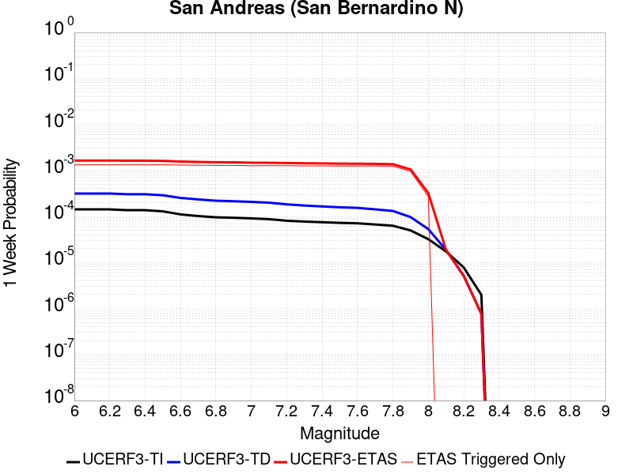 | 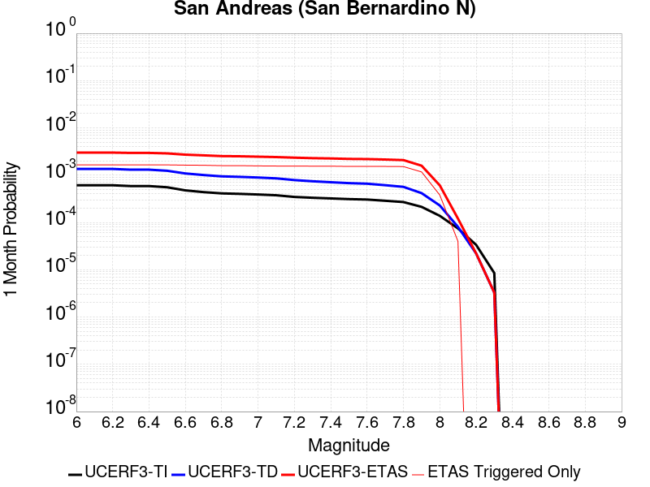 |  | 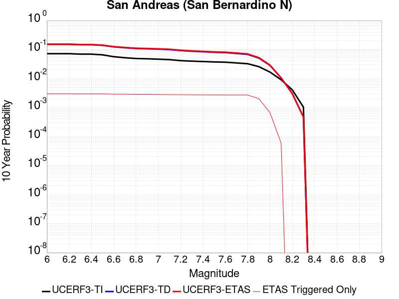 |

| Magnitude | 1 wk TI Prob | 1 wk TD Prob | 1 wk ETAS Prob | 1 wk ETAS/TD Gain | 1 wk ETAS Triggered Only | 1 mo TI Prob | 1 mo TD Prob | 1 mo ETAS Prob | 1 mo ETAS/TD Gain | 1 mo ETAS Triggered Only | 1 yr TI Prob | 1 yr TD Prob | 1 yr ETAS Prob | 1 yr ETAS/TD Gain | 1 yr ETAS Triggered Only | 10 yr TI Prob | 10 yr TD Prob | 10 yr ETAS Prob | 10 yr ETAS/TD Gain | 10 yr ETAS Triggered Only |
|-----|-----|-----|-----|-----|-----|-----|-----|-----|-----|-----|-----|-----|-----|-----|-----|-----|-----|-----|-----|-----|
| 6.0 | 1.4273766E-4 | 3.1606483E-4 | 0.0016456444 | 5.2066674 | 0.00133 | 6.115894E-4 | 0.0013538664 | 0.0030016324 | 2.2170818 | 0.00165 | 0.0074207084 | 0.016360244 | 0.018612778 | 1.1376835 | 0.00229 | 0.07177748 | 0.15026689 | 0.15279059 | 1.0167948 | 0.00297 |
| 6.1 | 1.4273766E-4 | 3.1606483E-4 | 0.0016456444 | 5.2066674 | 0.00133 | 6.115894E-4 | 0.0013538664 | 0.0030016324 | 2.2170818 | 0.00165 | 0.0074207084 | 0.016360244 | 0.018612778 | 1.1376835 | 0.00229 | 0.07177748 | 0.15026689 | 0.15279059 | 1.0167948 | 0.00297 |
| 6.2 | 1.4273766E-4 | 3.1606483E-4 | 0.0016456444 | 5.2066674 | 0.00133 | 6.115894E-4 | 0.0013538664 | 0.0030016324 | 2.2170818 | 0.00165 | 0.0074207084 | 0.016360244 | 0.018612778 | 1.1376835 | 0.00229 | 0.07177748 | 0.15026689 | 0.15279059 | 1.0167948 | 0.00297 |
| 6.3 | 1.3730655E-4 | 3.0511338E-4 | 0.0016347076 | 5.357705 | 0.00133 | 5.883239E-4 | 0.0013069791 | 0.0029548227 | 2.2608032 | 0.00165 | 0.0071393442 | 0.015797773 | 0.018041754 | 1.1420442 | 0.00228 | 0.06914291 | 0.14556676 | 0.14809589 | 1.0173743 | 0.00296 |
| 6.4 | 1.3730655E-4 | 3.0511338E-4 | 0.0016347076 | 5.357705 | 0.00133 | 5.883239E-4 | 0.0013069791 | 0.0029548227 | 2.2608032 | 0.00165 | 0.0071393442 | 0.015797773 | 0.018041754 | 1.1420442 | 0.00228 | 0.06914291 | 0.14556676 | 0.14809589 | 1.0173743 | 0.00296 |
| 6.5 | 1.2942807E-4 | 2.8925808E-4 | 0.0016188733 | 5.59664 | 0.00133 | 5.545738E-4 | 0.0012390936 | 0.0028870492 | 2.3299685 | 0.00165 | 0.0067310524 | 0.01498286 | 0.017218849 | 1.1492364 | 0.00227 | 0.06530788 | 0.13870941 | 0.14125022 | 1.0183175 | 0.00295 |
| 6.6 | 1.1125901E-4 | 2.536472E-4 | 0.0015633149 | 6.163344 | 0.00131 | 4.767372E-4 | 0.0010866089 | 0.0027148377 | 2.4984498 | 0.00163 | 0.005788839 | 0.013149847 | 0.01537026 | 1.1688546 | 0.00225 | 0.056403454 | 0.122999296 | 0.12552506 | 1.0205348 | 0.00288 |
| 6.7 | 1.02209575E-4 | 2.3499702E-4 | 0.0015346915 | 6.5306854 | 0.0013 | 4.3796748E-4 | 0.0010067427 | 0.0026251117 | 2.6075299 | 0.00162 | 0.0053192247 | 0.012188629 | 0.014401327 | 1.1815379 | 0.00224 | 0.051936906 | 0.114790924 | 0.117331475 | 1.0221319 | 0.00287 |
| 6.8 | 9.610582E-5 | 2.2025521E-4 | 0.0015099711 | 6.855552 | 0.00129 | 4.1181705E-4 | 9.436101E-4 | 0.0025321099 | 2.683428 | 0.00159 | 0.0050023515 | 0.011428202 | 0.01360306 | 1.1903062 | 0.0022 | 0.048912346 | 0.1081929 | 0.110716715 | 1.023327 | 0.00283 |
| 6.9 | 9.3877505E-5 | 2.1481077E-4 | 0.0015045337 | 7.0039954 | 0.00129 | 4.0227012E-4 | 9.2029345E-4 | 0.0025088303 | 2.7261198 | 0.00159 | 0.0048866454 | 0.011147255 | 0.0133227315 | 1.195158 | 0.0022 | 0.04780577 | 0.10578323 | 0.10831386 | 1.0239228 | 0.00283 |
| 7.0 | 9.1019785E-5 | 2.0808022E-4 | 0.0014778159 | 7.102145 | 0.00127 | 3.900265E-4 | 8.914682E-4 | 0.0024600686 | 2.7595696 | 0.00157 | 0.0047382377 | 0.010799837 | 0.012946402 | 1.198759 | 0.00217 | 0.046384744 | 0.102753714 | 0.105266005 | 1.0244496 | 0.0028 |
| 7.1 | 8.771155E-5 | 1.9982594E-4 | 0.0014695722 | 7.354261 | 0.00127 | 3.758525E-4 | 8.5611636E-4 | 0.002414781 | 2.8206222 | 0.00156 | 0.0045664064 | 0.0103736 | 0.012501297 | 1.2051069 | 0.00215 | 0.044737056 | 0.09906527 | 0.10156986 | 1.0252823 | 0.00278 |
| 7.2 | 8.0830236E-5 | 1.8388197E-4 | 0.0014536484 | 7.905334 | 0.00127 | 3.4636928E-4 | 7.8782777E-4 | 0.0023465988 | 2.9785683 | 0.00156 | 0.0042088944 | 0.009549725 | 0.011679193 | 1.2229874 | 0.00215 | 0.041300658 | 0.09179615 | 0.09431188 | 1.0274055 | 0.00277 |
| 7.3 | 7.7668235E-5 | 1.7331762E-4 | 0.0014330993 | 8.26863 | 0.00126 | 3.328214E-4 | 7.425784E-4 | 0.0022914275 | 3.0857716 | 0.00155 | 0.0040445733 | 0.009003494 | 0.011124226 | 1.2355455 | 0.00214 | 0.03971748 | 0.08706327 | 0.08956471 | 1.0287313 | 0.00274 |
| 7.4 | 7.520177E-5 | 1.6551897E-4 | 0.0014253104 | 8.61116 | 0.00126 | 3.2225347E-4 | 7.0917426E-4 | 0.002258075 | 3.1840906 | 0.00155 | 0.0039163795 | 0.008600081 | 0.010721677 | 1.2466948 | 0.00214 | 0.038480744 | 0.08351955 | 0.08603071 | 1.0300667 | 0.00274 |
| 7.5 | 7.274697E-5 | 1.5839566E-4 | 0.0014081977 | 8.890381 | 0.00125 | 3.1173544E-4 | 6.78662E-4 | 0.0022076236 | 3.252906 | 0.00153 | 0.003788775 | 0.008231463 | 0.010334012 | 1.2554284 | 0.00212 | 0.03724827 | 0.08023631 | 0.082738064 | 1.0311799 | 0.00272 |
| 7.6 | 7.1185845E-5 | 1.540943E-4 | 0.0014039017 | 9.110665 | 0.00125 | 3.0504653E-4 | 6.6023704E-4 | 0.002189227 | 3.3158195 | 0.00153 | 0.0037076178 | 0.008008812 | 0.010111833 | 1.2625885 | 0.00212 | 0.036463667 | 0.07822598 | 0.080723986 | 1.0319332 | 0.00271 |
| 7.7 | 6.709961E-5 | 1.4318313E-4 | 0.0013930042 | 9.728828 | 0.00125 | 2.8753807E-4 | 6.1349774E-4 | 0.002142559 | 3.4923668 | 0.00153 | 0.003495157 | 0.0074437927 | 0.009548011 | 1.2826811 | 0.00212 | 0.034406938 | 0.07305469 | 0.07556672 | 1.0343854 | 0.00271 |
| 7.8 | 6.300812E-5 | 1.3202413E-4 | 0.0013718604 | 10.390983 | 0.00124 | 2.7000686E-4 | 5.65695E-4 | 0.0020848352 | 3.6854403 | 0.00152 | 0.0032823787 | 0.006865616 | 0.008961129 | 1.3052186 | 0.00211 | 0.032343175 | 0.06771354 | 0.07023071 | 1.0371739 | 0.0027 |
| 7.9 | 4.983037E-5 | 9.723488E-5 | 0.0010571416 | 10.872041 | 9.6E-4 | 2.1354125E-4 | 4.1665437E-4 | 0.0015861669 | 3.806913 | 0.00117 | 0.0025967648 | 0.0050609782 | 0.00666283 | 1.3165103 | 0.00161 | 0.025666296 | 0.05064886 | 0.052576043 | 1.0380498 | 0.00203 |
| 8.0 | 3.2211527E-5 | 5.3304586E-5 | 3.2329018E-4 | 6.06496 | 2.7E-4 | 1.380421E-4 | 2.2842824E-4 | 6.083414E-4 | 2.6631622 | 3.8E-4 | 0.0016793669 | 0.0027775685 | 0.0033060964 | 1.1902844 | 5.3E-4 | 0.016667323 | 0.028361378 | 0.029012376 | 1.0229536 | 6.7E-4 |
| 8.1 | 1.743376E-5 | 1.8824427E-5 | 1.8824427E-5 | 1.0 | 0.0 | 7.471398E-5 | 8.067362E-5 | 1.206704E-4 | 1.495785 | 4.0E-5 | 9.0926304E-4 | 9.817594E-4 | 0.0010317103 | 1.050879 | 5.0E-5 | 0.009055517 | 0.010484105 | 0.010543476 | 1.0056629 | 6.0E-5 |
| 8.2 | 7.831616E-6 | 5.1551065E-6 | 5.1551065E-6 | 1.0 | 0.0 | 3.3563636E-5 | 2.2093127E-5 | 2.2093127E-5 | 1.0 | 0.0 | 4.0856065E-4 | 2.6895068E-4 | 2.6895068E-4 | 1.0 | 0.0 | 0.004078103 | 0.0030418145 | 0.0030418145 | 1.0 | 0.0 |
| 8.3 | 1.983087E-6 | 7.6599065E-7 | 7.6599065E-7 | 1.0 | 0.0 | 8.498917E-6 | 3.282813E-6 | 3.282813E-6 | 1.0 | 0.0 | 1.034694E-4 | 3.9967534E-5 | 3.9967534E-5 | 1.0 | 0.0 | 0.0010342124 | 4.719687E-4 | 4.719687E-4 | 1.0 | 0.0 |

## Bicycle Lake
*[(top)](#table-of-contents)*

| 1 Week | 1 Month | 1 Year | 10 Year |
|-----|-----|-----|-----|
| 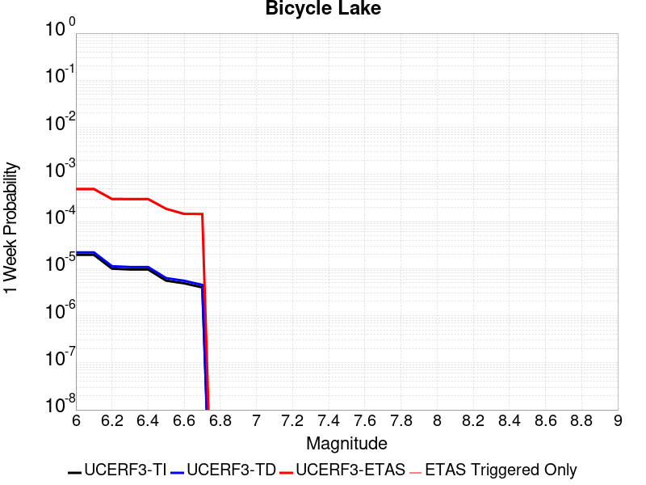 | 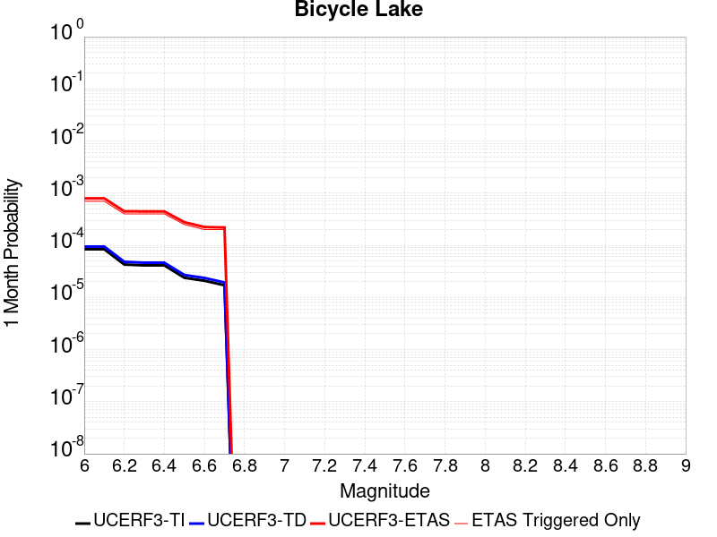 |  |  |

| Magnitude | 1 wk TI Prob | 1 wk TD Prob | 1 wk ETAS Prob | 1 wk ETAS/TD Gain | 1 wk ETAS Triggered Only | 1 mo TI Prob | 1 mo TD Prob | 1 mo ETAS Prob | 1 mo ETAS/TD Gain | 1 mo ETAS Triggered Only | 1 yr TI Prob | 1 yr TD Prob | 1 yr ETAS Prob | 1 yr ETAS/TD Gain | 1 yr ETAS Triggered Only | 10 yr TI Prob | 10 yr TD Prob | 10 yr ETAS Prob | 10 yr ETAS/TD Gain | 10 yr ETAS Triggered Only |
|-----|-----|-----|-----|-----|-----|-----|-----|-----|-----|-----|-----|-----|-----|-----|-----|-----|-----|-----|-----|-----|
| 6.0 | 1.9621975E-5 | 2.2097078E-5 | 4.920867E-4 | 22.26931 | 4.7E-4 | 8.4091465E-5 | 9.4699084E-5 | 7.9463277E-4 | 8.391135 | 7.0E-4 | 0.0010233327 | 0.0011524865 | 0.00257085 | 2.2306986 | 0.00142 | 0.01018633 | 0.011478408 | 0.013771778 | 1.1997986 | 0.00232 |
| 6.1 | 1.9621975E-5 | 2.2097078E-5 | 4.920867E-4 | 22.26931 | 4.7E-4 | 8.4091465E-5 | 9.4699084E-5 | 7.9463277E-4 | 8.391135 | 7.0E-4 | 0.0010233327 | 0.0011524865 | 0.00257085 | 2.2306986 | 0.00142 | 0.01018633 | 0.011478408 | 0.013771778 | 1.1997986 | 0.00232 |
| 6.2 | 9.9971285E-6 | 1.1255639E-5 | 3.0125238E-4 | 26.764572 | 2.9E-4 | 4.2844134E-5 | 4.8237856E-5 | 4.4821855E-4 | 9.291842 | 4.0E-4 | 5.2150246E-4 | 5.871896E-4 | 0.0014266964 | 2.429703 | 8.4E-4 | 0.0052028033 | 0.005861487 | 0.0072035734 | 1.228967 | 0.00135 |
| 6.3 | 9.589428E-6 | 1.0798346E-5 | 3.0079522E-4 | 27.855675 | 2.9E-4 | 4.10969E-5 | 4.62781E-5 | 4.462596E-4 | 9.642998 | 4.0E-4 | 5.002399E-4 | 5.6334207E-4 | 0.0013828801 | 2.454779 | 8.2E-4 | 0.0049911533 | 0.0056242296 | 0.006936806 | 1.2333788 | 0.00132 |
| 6.4 | 9.589428E-6 | 1.0798346E-5 | 3.0079522E-4 | 27.855675 | 2.9E-4 | 4.10969E-5 | 4.62781E-5 | 4.462596E-4 | 9.642998 | 4.0E-4 | 5.002399E-4 | 5.6334207E-4 | 0.0013828801 | 2.454779 | 8.2E-4 | 0.0049911533 | 0.0056242296 | 0.006936806 | 1.2333788 | 0.00132 |
| 6.5 | 5.557707E-6 | 6.2856016E-6 | 1.8628447E-4 | 29.636698 | 1.8E-4 | 2.3818526E-5 | 2.6938165E-5 | 2.7693145E-4 | 10.280263 | 2.5E-4 | 2.8995197E-4 | 3.2794967E-4 | 8.4777916E-4 | 2.585089 | 5.2E-4 | 0.0028957394 | 0.0032772934 | 0.004074672 | 1.2433039 | 8.0E-4 |
| 6.6 | 4.8742945E-6 | 5.5132896E-6 | 1.4551252E-4 | 26.393047 | 1.4E-4 | 2.0889667E-5 | 2.3628318E-5 | 2.2362359E-4 | 9.46422 | 2.0E-4 | 2.54302E-4 | 2.87663E-4 | 7.2753645E-4 | 2.5291276 | 4.4E-4 | 0.002540112 | 0.0028754752 | 0.00355352 | 1.2358027 | 6.8E-4 |
| 6.7 | 3.991108E-6 | 4.5159104E-6 | 1.4451527E-4 | 32.00136 | 1.4E-4 | 1.7104636E-5 | 1.9353902E-5 | 2.1935003E-4 | 11.333633 | 2.0E-4 | 2.0822904E-4 | 2.3563375E-4 | 6.2554184E-4 | 2.654721 | 3.9E-4 | 0.0020803404 | 0.0023563374 | 0.0029549238 | 1.2540325 | 6.0E-4 |

## Paradise
*[(top)](#table-of-contents)*

| 1 Week | 1 Month | 1 Year | 10 Year |
|-----|-----|-----|-----|
| 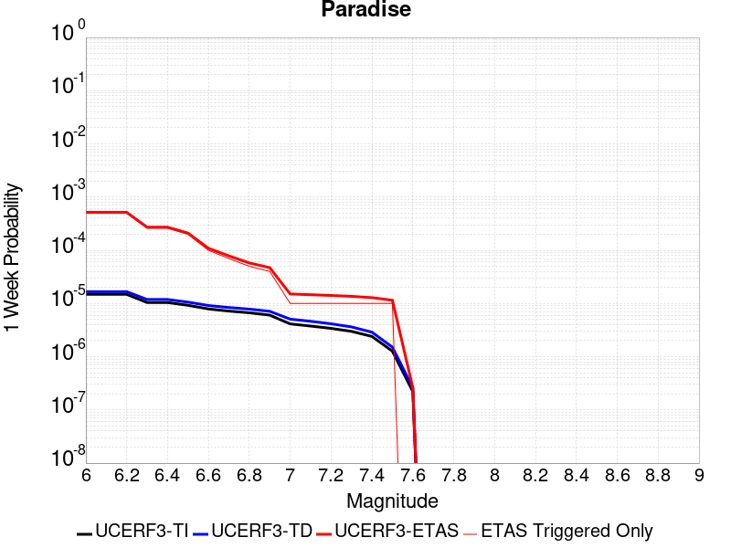 | 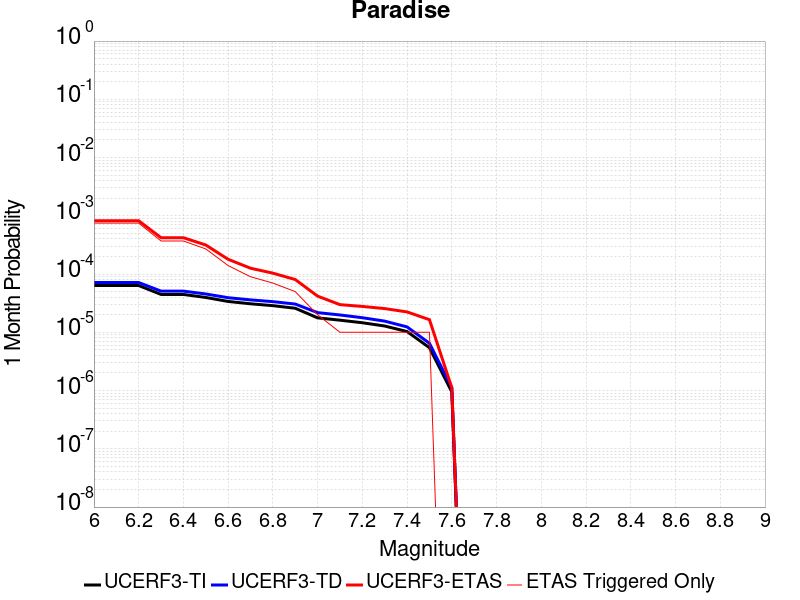 |  |  |

| Magnitude | 1 wk TI Prob | 1 wk TD Prob | 1 wk ETAS Prob | 1 wk ETAS/TD Gain | 1 wk ETAS Triggered Only | 1 mo TI Prob | 1 mo TD Prob | 1 mo ETAS Prob | 1 mo ETAS/TD Gain | 1 mo ETAS Triggered Only | 1 yr TI Prob | 1 yr TD Prob | 1 yr ETAS Prob | 1 yr ETAS/TD Gain | 1 yr ETAS Triggered Only | 10 yr TI Prob | 10 yr TD Prob | 10 yr ETAS Prob | 10 yr ETAS/TD Gain | 10 yr ETAS Triggered Only |
|-----|-----|-----|-----|-----|-----|-----|-----|-----|-----|-----|-----|-----|-----|-----|-----|-----|-----|-----|-----|-----|
| 6.0 | 1.4851273E-5 | 1.6694692E-5 | 5.1668636E-4 | 30.94914 | 5.0E-4 | 6.364676E-5 | 7.154685E-5 | 8.214932E-4 | 11.481892 | 7.5E-4 | 7.7462377E-4 | 8.707584E-4 | 0.0022395654 | 2.5719712 | 0.00137 | 0.0077192914 | 0.008675844 | 0.010807191 | 1.2456645 | 0.00215 |
| 6.1 | 1.4851273E-5 | 1.6694692E-5 | 5.1668636E-4 | 30.94914 | 5.0E-4 | 6.364676E-5 | 7.154685E-5 | 8.214932E-4 | 11.481892 | 7.5E-4 | 7.7462377E-4 | 8.707584E-4 | 0.0022395654 | 2.5719712 | 0.00137 | 0.0077192914 | 0.008675844 | 0.010807191 | 1.2456645 | 0.00215 |
| 6.2 | 1.4851273E-5 | 1.6694692E-5 | 5.1668636E-4 | 30.94914 | 5.0E-4 | 6.364676E-5 | 7.154685E-5 | 8.214932E-4 | 11.481892 | 7.5E-4 | 7.7462377E-4 | 8.707584E-4 | 0.0022395654 | 2.5719712 | 0.00137 | 0.0077192914 | 0.008675844 | 0.010807191 | 1.2456645 | 0.00215 |
| 6.3 | 1.0426831E-5 | 1.188862E-5 | 2.7188554E-4 | 22.869392 | 2.6E-4 | 4.4685654E-5 | 5.0950268E-5 | 4.209314E-4 | 8.261613 | 3.7E-4 | 5.43912E-4 | 6.201489E-4 | 0.0013197148 | 2.128061 | 7.0E-4 | 0.0054258266 | 0.0061847917 | 0.0072879265 | 1.1783625 | 0.00111 |
| 6.4 | 1.0426831E-5 | 1.188862E-5 | 2.7188554E-4 | 22.869392 | 2.6E-4 | 4.4685654E-5 | 5.0950268E-5 | 4.209314E-4 | 8.261613 | 3.7E-4 | 5.43912E-4 | 6.201489E-4 | 0.0013197148 | 2.128061 | 7.0E-4 | 0.0054258266 | 0.0061847917 | 0.0072879265 | 1.1783625 | 0.00111 |
| 6.5 | 9.25027E-6 | 1.06199595E-5 | 2.1061783E-4 | 19.832264 | 2.0E-4 | 3.964341E-5 | 4.551335E-5 | 3.1550106E-4 | 6.932056 | 2.7E-4 | 4.8255164E-4 | 5.53989E-4 | 0.001073701 | 1.9381268 | 5.2E-4 | 0.0048150513 | 0.0055265795 | 0.006351992 | 1.1493533 | 8.3E-4 |
| 6.6 | 7.904275E-6 | 9.159525E-6 | 1.0915861E-4 | 11.917497 | 1.0E-4 | 3.3875025E-5 | 3.9254537E-5 | 1.7924904E-4 | 4.5663266 | 1.4E-4 | 4.1235037E-4 | 4.7782314E-4 | 7.277037E-4 | 1.5229561 | 2.5E-4 | 0.0041158604 | 0.0047683544 | 0.0051763994 | 1.0855736 | 4.1E-4 |
| 6.7 | 7.2061953E-6 | 8.407248E-6 | 7.840666E-5 | 9.326078 | 7.0E-5 | 3.088333E-5 | 3.6030586E-5 | 1.2602734E-4 | 3.4977877 | 9.0E-5 | 3.7593965E-4 | 4.3858777E-4 | 6.1850884E-4 | 1.4102281 | 1.8E-4 | 0.003753043 | 0.004377591 | 0.0046663214 | 1.0659565 | 2.9E-4 |
| 6.8 | 6.6948724E-6 | 7.842166E-6 | 5.7841775E-5 | 7.3757396 | 5.0E-5 | 2.8691995E-5 | 3.360887E-5 | 1.03606515E-4 | 3.0827136 | 7.0E-5 | 3.4926904E-4 | 4.0911473E-4 | 5.4905744E-4 | 1.3420624 | 1.4E-4 | 0.003487206 | 0.0040839734 | 0.004313034 | 1.0560877 | 2.3E-4 |
| 6.9 | 6.0421025E-6 | 7.130621E-6 | 4.7130336E-5 | 6.6095695 | 4.0E-5 | 2.5894467E-5 | 3.0559466E-5 | 8.055794E-5 | 2.6361043 | 5.0E-5 | 3.1521954E-4 | 3.7200135E-4 | 4.619679E-4 | 1.2418447 | 9.0E-5 | 0.0031477278 | 0.0037141247 | 0.0038536047 | 1.0375539 | 1.4E-4 |
| 7.0 | 4.134091E-6 | 5.0803087E-6 | 1.5080258E-5 | 2.9683743 | 1.0E-5 | 1.7717413E-5 | 2.177258E-5 | 4.1772146E-5 | 1.9185666 | 2.0E-5 | 2.1568815E-4 | 2.6505045E-4 | 3.2503455E-4 | 1.226312 | 6.0E-5 | 0.0021547892 | 0.0026474963 | 0.0027572052 | 1.0414387 | 1.1E-4 |
| 7.1 | 3.7674888E-6 | 4.6318696E-6 | 1.4631823E-5 | 3.1589456 | 1.0E-5 | 1.6146281E-5 | 1.9850726E-5 | 2.9850527E-5 | 1.5037498 | 1.0E-5 | 1.9656324E-4 | 2.4165731E-4 | 2.8164763E-4 | 1.1654836 | 4.0E-5 | 0.0019638946 | 0.002414096 | 0.0025038787 | 1.037191 | 9.0E-5 |
| 7.2 | 3.4065345E-6 | 4.156723E-6 | 1.4156682E-5 | 3.4057312 | 1.0E-5 | 1.4599351E-5 | 1.7814415E-5 | 2.7814236E-5 | 1.5613332 | 1.0E-5 | 1.777326E-4 | 2.1687041E-4 | 2.5686173E-4 | 1.184402 | 4.0E-5 | 0.0017759053 | 0.002166736 | 0.0022565408 | 1.0414472 | 9.0E-5 |
| 7.3 | 2.9934936E-6 | 3.6293168E-6 | 1.362928E-5 | 3.7553296 | 1.0E-5 | 1.2829195E-5 | 1.555413E-5 | 2.5553974E-5 | 1.6429061 | 1.0E-5 | 1.5618425E-4 | 1.8935655E-4 | 2.2934898E-4 | 1.2112017 | 4.0E-5 | 0.0015607453 | 0.0018920974 | 0.001971946 | 1.0422012 | 8.0E-5 |
| 7.4 | 2.4049796E-6 | 2.8889842E-6 | 1.2888955E-5 | 4.4614143 | 1.0E-5 | 1.0307015E-5 | 1.238131E-5 | 2.2381186E-5 | 1.807659 | 1.0E-5 | 1.2548068E-4 | 1.5073347E-4 | 1.9072743E-4 | 1.2653291 | 4.0E-5 | 0.0012540985 | 0.0015064536 | 0.0015863332 | 1.0530249 | 8.0E-5 |
| 7.5 | 1.2710091E-6 | 1.5134682E-6 | 1.15134535E-5 | 7.607331 | 1.0E-5 | 5.44717E-6 | 6.4862834E-6 | 1.6486218E-5 | 2.541705 | 1.0E-5 | 6.631728E-5 | 7.8968886E-5 | 9.8967306E-5 | 1.2532443 | 2.0E-5 | 6.6297496E-4 | 7.8953087E-4 | 8.294993E-4 | 1.0506229 | 4.0E-5 |
| 7.6 | 2.21172E-7 | 2.603961E-7 | 2.603961E-7 | 1.0 | 0.0 | 9.478797E-7 | 1.1159829E-6 | 1.1159829E-6 | 1.0 | 0.0 | 1.1540374E-5 | 1.3587036E-5 | 1.3587036E-5 | 1.0 | 0.0 | 1.1539775E-4 | 1.3586486E-4 | 1.3586486E-4 | 1.0 | 0.0 |

## Garlic Springs
*[(top)](#table-of-contents)*

| 1 Week | 1 Month | 1 Year | 10 Year |
|-----|-----|-----|-----|
| 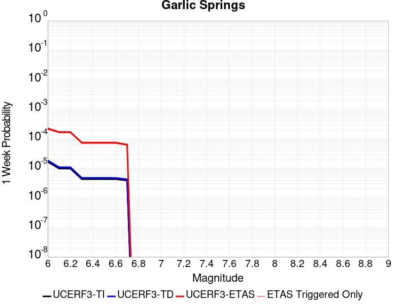 | 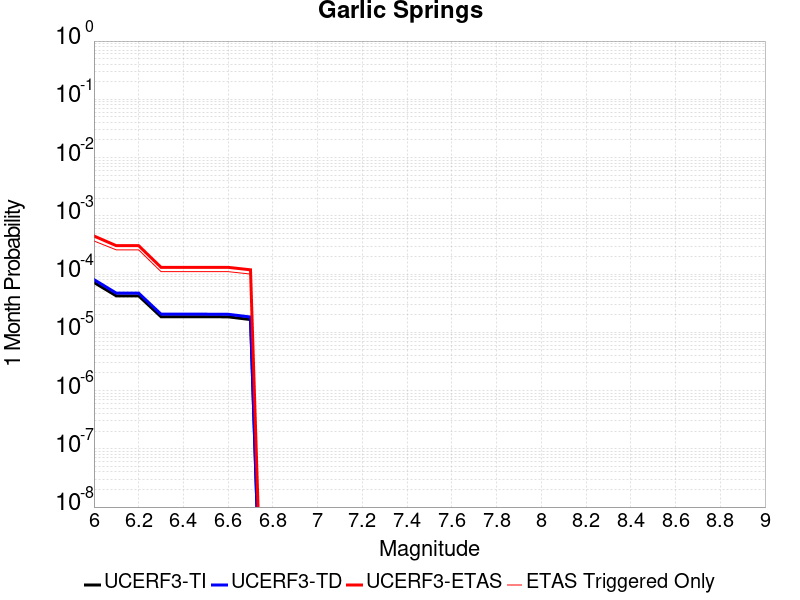 |  |  |

| Magnitude | 1 wk TI Prob | 1 wk TD Prob | 1 wk ETAS Prob | 1 wk ETAS/TD Gain | 1 wk ETAS Triggered Only | 1 mo TI Prob | 1 mo TD Prob | 1 mo ETAS Prob | 1 mo ETAS/TD Gain | 1 mo ETAS Triggered Only | 1 yr TI Prob | 1 yr TD Prob | 1 yr ETAS Prob | 1 yr ETAS/TD Gain | 1 yr ETAS Triggered Only | 10 yr TI Prob | 10 yr TD Prob | 10 yr ETAS Prob | 10 yr ETAS/TD Gain | 10 yr ETAS Triggered Only |
|-----|-----|-----|-----|-----|-----|-----|-----|-----|-----|-----|-----|-----|-----|-----|-----|-----|-----|-----|-----|-----|
| 6.0 | 1.6760017E-5 | 1.8776833E-5 | 2.2877289E-4 | 12.183785 | 2.1E-4 | 7.182667E-5 | 8.0470316E-5 | 4.5044054E-4 | 5.5975986 | 3.7E-4 | 8.7413884E-4 | 9.794032E-4 | 0.0018385609 | 1.8772258 | 8.6E-4 | 0.008707083 | 0.009762413 | 0.011346793 | 1.1622939 | 0.0016 |
| 6.1 | 9.852767E-6 | 1.09735865E-5 | 1.7097183E-4 | 15.580305 | 1.6E-4 | 4.222546E-5 | 4.702921E-5 | 3.0701698E-4 | 6.5282187 | 2.6E-4 | 5.139737E-4 | 5.7250116E-4 | 0.0010722149 | 1.8728607 | 5.0E-4 | 0.005127866 | 0.005717221 | 0.0065921904 | 1.1530409 | 8.8E-4 |
| 6.2 | 9.852767E-6 | 1.09735865E-5 | 1.7097183E-4 | 15.580305 | 1.6E-4 | 4.222546E-5 | 4.702921E-5 | 3.0701698E-4 | 6.5282187 | 2.6E-4 | 5.139737E-4 | 5.7250116E-4 | 0.0010722149 | 1.8728607 | 5.0E-4 | 0.005127866 | 0.005717221 | 0.0065921904 | 1.1530409 | 8.8E-4 |
| 6.3 | 4.3167724E-6 | 4.7780286E-6 | 7.4777694E-5 | 15.650324 | 7.0E-5 | 1.8500323E-5 | 2.0477235E-5 | 1.3047497E-4 | 6.3717093 | 1.1E-4 | 2.2521814E-4 | 2.4930484E-4 | 4.5925248E-4 | 1.8421322 | 2.1E-4 | 0.0022499003 | 0.00249251 | 0.0028316625 | 1.1360687 | 3.4E-4 |
| 6.4 | 4.3167724E-6 | 4.7780286E-6 | 7.4777694E-5 | 15.650324 | 7.0E-5 | 1.8500323E-5 | 2.0477235E-5 | 1.3047497E-4 | 6.3717093 | 1.1E-4 | 2.2521814E-4 | 2.4930484E-4 | 4.5925248E-4 | 1.8421322 | 2.1E-4 | 0.0022499003 | 0.00249251 | 0.0028316625 | 1.1360687 | 3.4E-4 |
| 6.5 | 4.3167724E-6 | 4.7780286E-6 | 7.4777694E-5 | 15.650324 | 7.0E-5 | 1.8500323E-5 | 2.0477235E-5 | 1.3047497E-4 | 6.3717093 | 1.1E-4 | 2.2521814E-4 | 2.4930484E-4 | 4.5925248E-4 | 1.8421322 | 2.1E-4 | 0.0022499003 | 0.00249251 | 0.0028316625 | 1.1360687 | 3.4E-4 |
| 6.6 | 4.301311E-6 | 4.760897E-6 | 7.4760566E-5 | 15.703041 | 7.0E-5 | 1.8434059E-5 | 2.0403815E-5 | 1.3040158E-4 | 6.391039 | 1.1E-4 | 2.2441156E-4 | 2.4841115E-4 | 4.58359E-4 | 1.8451626 | 2.1E-4 | 0.0022418506 | 0.002483593 | 0.0028227486 | 1.1365584 | 3.4E-4 |
| 6.7 | 3.8599724E-6 | 4.27106E-6 | 6.4270804E-5 | 15.047976 | 6.0E-5 | 1.6542634E-5 | 1.8304541E-5 | 1.1830271E-4 | 6.463025 | 1.0E-4 | 2.0138794E-4 | 2.228578E-4 | 4.0281768E-4 | 1.8075099 | 1.8E-4 | 0.0020120554 | 0.002228578 | 0.0025279094 | 1.134315 | 3.0E-4 |

## Death Valley (Black Mtns Frontal)
*[(top)](#table-of-contents)*

| 1 Week | 1 Month | 1 Year | 10 Year |
|-----|-----|-----|-----|
| 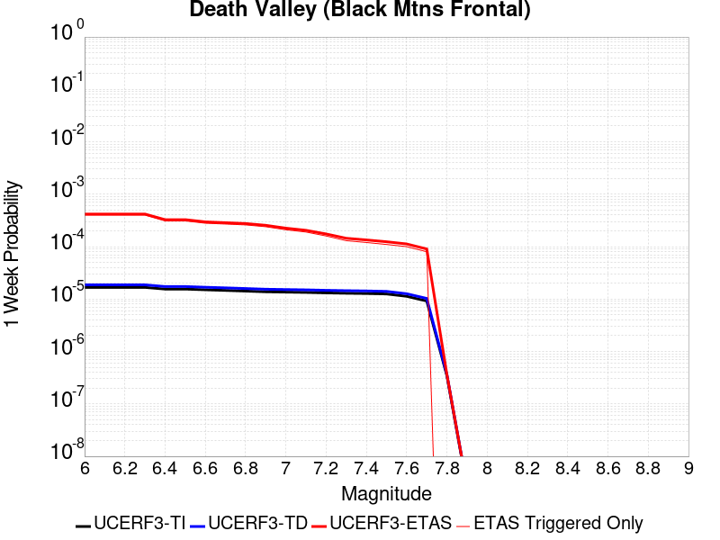 | 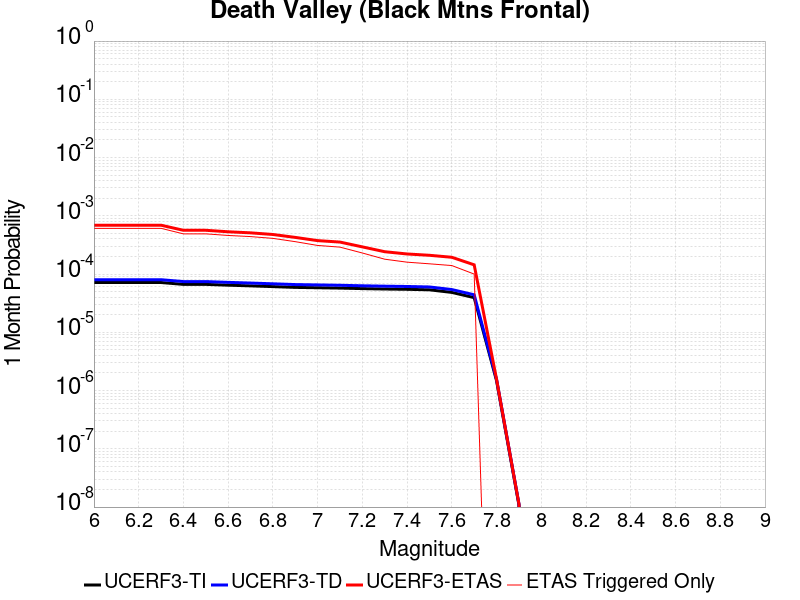 |  |  |

| Magnitude | 1 wk TI Prob | 1 wk TD Prob | 1 wk ETAS Prob | 1 wk ETAS/TD Gain | 1 wk ETAS Triggered Only | 1 mo TI Prob | 1 mo TD Prob | 1 mo ETAS Prob | 1 mo ETAS/TD Gain | 1 mo ETAS Triggered Only | 1 yr TI Prob | 1 yr TD Prob | 1 yr ETAS Prob | 1 yr ETAS/TD Gain | 1 yr ETAS Triggered Only | 10 yr TI Prob | 10 yr TD Prob | 10 yr ETAS Prob | 10 yr ETAS/TD Gain | 10 yr ETAS Triggered Only |
|-----|-----|-----|-----|-----|-----|-----|-----|-----|-----|-----|-----|-----|-----|-----|-----|-----|-----|-----|-----|-----|
| 6.0 | 1.6707214E-5 | 1.867027E-5 | 4.186628E-4 | 22.424038 | 4.0E-4 | 7.160038E-5 | 8.001302E-5 | 6.899642E-4 | 8.623149 | 6.1E-4 | 8.71386E-4 | 9.737309E-4 | 0.0020227085 | 2.0772767 | 0.00105 | 0.00867977 | 0.009695496 | 0.011161148 | 1.1511682 | 0.00148 |
| 6.1 | 1.6707214E-5 | 1.867027E-5 | 4.186628E-4 | 22.424038 | 4.0E-4 | 7.160038E-5 | 8.001302E-5 | 6.899642E-4 | 8.623149 | 6.1E-4 | 8.71386E-4 | 9.737309E-4 | 0.0020227085 | 2.0772767 | 0.00105 | 0.00867977 | 0.009695496 | 0.011161148 | 1.1511682 | 0.00148 |
| 6.2 | 1.6707214E-5 | 1.867027E-5 | 4.186628E-4 | 22.424038 | 4.0E-4 | 7.160038E-5 | 8.001302E-5 | 6.899642E-4 | 8.623149 | 6.1E-4 | 8.71386E-4 | 9.737309E-4 | 0.0020227085 | 2.0772767 | 0.00105 | 0.00867977 | 0.009695496 | 0.011161148 | 1.1511682 | 0.00148 |
| 6.3 | 1.6707214E-5 | 1.867027E-5 | 4.186628E-4 | 22.424038 | 4.0E-4 | 7.160038E-5 | 8.001302E-5 | 6.899642E-4 | 8.623149 | 6.1E-4 | 8.71386E-4 | 9.737309E-4 | 0.0020227085 | 2.0772767 | 0.00105 | 0.00867977 | 0.009695496 | 0.011161148 | 1.1511682 | 0.00148 |
| 6.4 | 1.5515609E-5 | 1.7338214E-5 | 3.2733285E-4 | 18.879272 | 3.1E-4 | 6.649377E-5 | 7.4304546E-5 | 5.6426815E-4 | 7.593992 | 4.9E-4 | 8.0926094E-4 | 9.042885E-4 | 0.0017735017 | 1.9612124 | 8.7E-4 | 0.008063202 | 0.009006773 | 0.0102653345 | 1.139735 | 0.00127 |
| 6.5 | 1.5515609E-5 | 1.7338214E-5 | 3.2733285E-4 | 18.879272 | 3.1E-4 | 6.649377E-5 | 7.4304546E-5 | 5.6426815E-4 | 7.593992 | 4.9E-4 | 8.0926094E-4 | 9.042885E-4 | 0.0017735017 | 1.9612124 | 8.7E-4 | 0.008063202 | 0.009006773 | 0.0102653345 | 1.139735 | 0.00127 |
| 6.6 | 1.5041828E-5 | 1.6809145E-5 | 2.9680444E-4 | 17.65732 | 2.8E-4 | 6.4463384E-5 | 7.203723E-5 | 5.320041E-4 | 7.3851266 | 4.6E-4 | 7.8455906E-4 | 8.767063E-4 | 0.0016959874 | 1.9344989 | 8.2E-4 | 0.00781795 | 0.008733132 | 0.0099127395 | 1.1350727 | 0.00119 |
| 6.7 | 1.4634985E-5 | 1.6356016E-5 | 2.863516E-4 | 17.507418 | 2.7E-4 | 6.271985E-5 | 7.009536E-5 | 5.1006454E-4 | 7.276723 | 4.4E-4 | 7.6334673E-4 | 8.5308263E-4 | 0.0016324172 | 1.9135511 | 7.8E-4 | 0.007607299 | 0.008498715 | 0.009629027 | 1.1329979 | 0.00114 |
| 6.8 | 1.4209158E-5 | 1.5882048E-5 | 2.7587792E-4 | 17.370424 | 2.6E-4 | 6.089497E-5 | 6.8064175E-5 | 4.7803627E-4 | 7.023317 | 4.1E-4 | 7.4114406E-4 | 8.2837185E-4 | 0.001527792 | 1.8443311 | 7.0E-4 | 0.007386771 | 0.008253456 | 0.009274955 | 1.1237662 | 0.00103 |
| 6.9 | 1.3780098E-5 | 1.5404594E-5 | 2.554009E-4 | 16.579529 | 2.4E-4 | 5.9056227E-5 | 6.6018045E-5 | 4.2599428E-4 | 6.4526944 | 3.6E-4 | 7.1877235E-4 | 8.0347876E-4 | 0.0014429645 | 1.7958963 | 6.4E-4 | 0.0071645193 | 0.008006332 | 0.008958647 | 1.1189451 | 9.6E-4 |
| 7.0 | 1.3585064E-5 | 1.5188155E-5 | 2.2518497E-4 | 14.826354 | 2.1E-4 | 5.8220405E-5 | 6.50905E-5 | 3.7507032E-4 | 5.7622895 | 3.1E-4 | 7.086029E-4 | 7.9219416E-4 | 0.0013817268 | 1.7441769 | 5.9E-4 | 0.007063476 | 0.007894293 | 0.008787189 | 1.1131064 | 9.0E-4 |
| 7.1 | 1.3398601E-5 | 1.49813395E-5 | 2.049785E-4 | 13.682254 | 1.9E-4 | 5.742131E-5 | 6.420419E-5 | 3.5418558E-4 | 5.516549 | 2.9E-4 | 6.9888023E-4 | 7.8141113E-4 | 0.0013209892 | 1.6905174 | 5.4E-4 | 0.0069668638 | 0.007787224 | 0.0086306045 | 1.1083032 | 8.5E-4 |
| 7.2 | 1.3126312E-5 | 1.4679561E-5 | 1.7467722E-4 | 11.899348 | 1.6E-4 | 5.6254412E-5 | 6.291092E-5 | 2.9289644E-4 | 4.655733 | 2.3E-4 | 6.846822E-4 | 7.6567667E-4 | 0.0012253245 | 1.6003158 | 4.6E-4 | 0.006825765 | 0.00763097 | 0.00838517 | 1.0988342 | 7.6E-4 |
| 7.3 | 1.2922429E-5 | 1.4453788E-5 | 1.4445191E-4 | 9.994052 | 1.3E-4 | 5.5380664E-5 | 6.194336E-5 | 2.4193221E-4 | 3.9057002 | 1.8E-4 | 6.74051E-4 | 7.53905E-4 | 0.0011635958 | 1.5434251 | 4.1E-4 | 0.006720101 | 0.007514055 | 0.008188945 | 1.089817 | 6.8E-4 |
| 7.4 | 1.2768878E-5 | 1.4283772E-5 | 1.3428206E-4 | 9.401023 | 1.2E-4 | 5.4722615E-5 | 6.1214756E-5 | 2.2120496E-4 | 3.6135888 | 1.6E-4 | 6.660441E-4 | 7.4504025E-4 | 0.0011147646 | 1.4962474 | 3.7E-4 | 0.0066405144 | 0.0074260035 | 0.008061251 | 1.0855436 | 6.4E-4 |
| 7.5 | 1.2521929E-5 | 1.40120155E-5 | 1.2401048E-4 | 8.850295 | 1.1E-4 | 5.366431E-5 | 6.005014E-5 | 2.1004114E-4 | 3.4977624 | 1.5E-4 | 6.531671E-4 | 7.3087064E-4 | 0.0010906075 | 1.4922032 | 3.6E-4 | 0.006512506 | 0.0072852457 | 0.007900729 | 1.0844835 | 6.2E-4 |
| 7.6 | 1.1301089E-5 | 1.2648149E-5 | 1.12646885E-4 | 8.906196 | 1.0E-4 | 4.8432343E-5 | 5.4205255E-5 | 1.9419767E-4 | 3.5826354 | 1.4E-4 | 5.895042E-4 | 6.5975444E-4 | 9.795433E-4 | 1.4847089 | 3.2E-4 | 0.0058794282 | 0.00657851 | 0.0071050236 | 1.0800353 | 5.3E-4 |
| 7.7 | 9.189108E-6 | 1.0283358E-5 | 9.0282534E-5 | 8.77948 | 8.0E-5 | 3.93813E-5 | 4.407082E-5 | 1.440664E-4 | 3.268975 | 1.0E-4 | 4.7936183E-4 | 5.3643517E-4 | 7.962957E-4 | 1.4844211 | 2.6E-4 | 0.004783291 | 0.005351914 | 0.0057796123 | 1.079915 | 4.3E-4 |
| 7.8 | 3.4586725E-7 | 3.6482615E-7 | 3.6482615E-7 | 1.0 | 0.0 | 1.4822873E-6 | 1.5635396E-6 | 1.5635396E-6 | 1.0 | 0.0 | 1.80467E-5 | 1.9035933E-5 | 2.9035744E-5 | 1.5253123 | 1.0E-5 | 1.8045233E-4 | 1.9034347E-4 | 2.0034157E-4 | 1.0525266 | 1.0E-5 |
| 7.9 | 2.5591178E-9 | 2.6696718E-9 | 2.6696718E-9 | 1.0 | 0.0 | 1.0967647E-8 | 1.14414505E-8 | 1.14414505E-8 | 1.0 | 0.0 | 1.335311E-7 | 1.3929966E-7 | 1.3929966E-7 | 1.0 | 0.0 | 1.3353102E-6 | 1.3929966E-6 | 1.3929966E-6 | 1.0 | 0.0 |

## San Andreas (San Bernardino S)
*[(top)](#table-of-contents)*

| 1 Week | 1 Month | 1 Year | 10 Year |
|-----|-----|-----|-----|
| 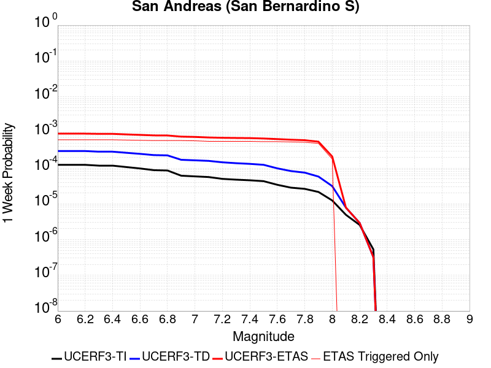 | 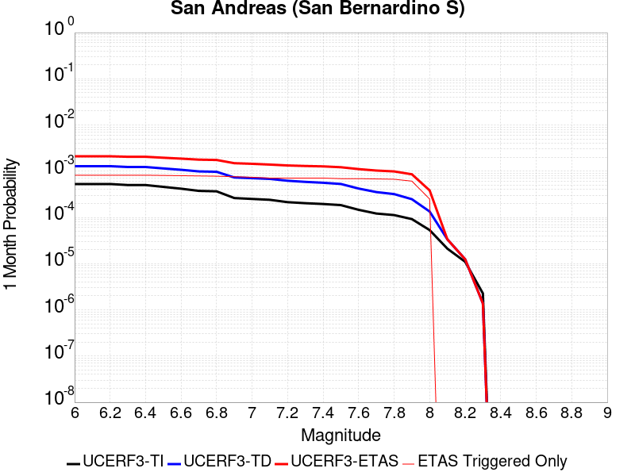 |  |  |

| Magnitude | 1 wk TI Prob | 1 wk TD Prob | 1 wk ETAS Prob | 1 wk ETAS/TD Gain | 1 wk ETAS Triggered Only | 1 mo TI Prob | 1 mo TD Prob | 1 mo ETAS Prob | 1 mo ETAS/TD Gain | 1 mo ETAS Triggered Only | 1 yr TI Prob | 1 yr TD Prob | 1 yr ETAS Prob | 1 yr ETAS/TD Gain | 1 yr ETAS Triggered Only | 10 yr TI Prob | 10 yr TD Prob | 10 yr ETAS Prob | 10 yr ETAS/TD Gain | 10 yr ETAS Triggered Only |
|-----|-----|-----|-----|-----|-----|-----|-----|-----|-----|-----|-----|-----|-----|-----|-----|-----|-----|-----|-----|-----|
| 6.0 | 1.2336002E-4 | 3.0004102E-4 | 9.1985497E-4 | 3.0657642 | 6.2E-4 | 5.2857865E-4 | 0.0012852824 | 0.0021042286 | 1.6371721 | 8.2E-4 | 0.006416472 | 0.015540994 | 0.016663278 | 1.0722144 | 0.00114 | 0.06234337 | 0.14283717 | 0.14411435 | 1.0089414 | 0.00149 |
| 6.1 | 1.2336002E-4 | 3.0004102E-4 | 9.1985497E-4 | 3.0657642 | 6.2E-4 | 5.2857865E-4 | 0.0012852824 | 0.0021042286 | 1.6371721 | 8.2E-4 | 0.006416472 | 0.015540994 | 0.016663278 | 1.0722144 | 0.00114 | 0.06234337 | 0.14283717 | 0.14411435 | 1.0089414 | 0.00149 |
| 6.2 | 1.2336002E-4 | 3.0004102E-4 | 9.1985497E-4 | 3.0657642 | 6.2E-4 | 5.2857865E-4 | 0.0012852824 | 0.0021042286 | 1.6371721 | 8.2E-4 | 0.006416472 | 0.015540994 | 0.016663278 | 1.0722144 | 0.00114 | 0.06234337 | 0.14283717 | 0.14411435 | 1.0089414 | 0.00149 |
| 6.3 | 1.1712257E-4 | 2.8792414E-4 | 9.077456E-4 | 3.152725 | 6.2E-4 | 5.018573E-4 | 0.0012334028 | 0.0020523914 | 1.6640074 | 8.2E-4 | 0.006093008 | 0.014918125 | 0.016041119 | 1.0752771 | 0.00114 | 0.059286322 | 0.13754563 | 0.13882206 | 1.0092801 | 0.00148 |
| 6.4 | 1.1712257E-4 | 2.8792414E-4 | 9.077456E-4 | 3.152725 | 6.2E-4 | 5.018573E-4 | 0.0012334028 | 0.0020523914 | 1.6640074 | 8.2E-4 | 0.006093008 | 0.014918125 | 0.016041119 | 1.0752771 | 0.00114 | 0.059286322 | 0.13754563 | 0.13882206 | 1.0092801 | 0.00148 |
| 6.5 | 1.0689076E-4 | 2.680528E-4 | 8.778893E-4 | 3.2750611 | 6.1E-4 | 4.5802278E-4 | 0.0011483167 | 0.0019573865 | 1.7045703 | 8.1E-4 | 0.0055621783 | 0.01389575 | 0.015000187 | 1.0794802 | 0.00112 | 0.05425003 | 0.12879294 | 0.1300649 | 1.009876 | 0.00146 |
| 6.6 | 9.7648895E-5 | 2.50501E-4 | 8.503507E-4 | 3.3946 | 6.0E-4 | 4.1842813E-4 | 0.0010731576 | 0.0018722991 | 1.7446636 | 8.0E-4 | 0.005082469 | 0.012991785 | 0.014067624 | 1.0828092 | 0.00109 | 0.049677886 | 0.12095292 | 0.12220116 | 1.0103201 | 0.00142 |
| 6.7 | 8.757013E-5 | 2.3120902E-4 | 8.210726E-4 | 3.5512135 | 5.9E-4 | 3.7524657E-4 | 9.905418E-4 | 0.0017797593 | 1.7967533 | 7.9E-4 | 0.00455906 | 0.011997245 | 0.013054408 | 1.0881171 | 0.00107 | 0.04466656 | 0.11226123 | 0.113486305 | 1.0109128 | 0.00138 |
| 6.8 | 8.562978E-5 | 2.2680782E-4 | 8.1667403E-4 | 3.6007311 | 5.9E-4 | 3.6693315E-4 | 9.7169366E-4 | 0.0017509357 | 1.8019421 | 7.8E-4 | 0.004458263 | 0.011770263 | 0.012817787 | 1.0889975 | 0.00106 | 0.043698758 | 0.11027153 | 0.11148156 | 1.0109732 | 0.00136 |
| 6.9 | 6.124075E-5 | 1.7065753E-4 | 7.6055684E-4 | 4.4566264 | 5.9E-4 | 2.6243398E-4 | 7.311852E-4 | 0.0014906295 | 2.0386484 | 7.6E-4 | 0.0031904527 | 0.008866051 | 0.00989683 | 1.1162614 | 0.00104 | 0.031450346 | 0.08418263 | 0.08540066 | 1.014469 | 0.00133 |
| 7.0 | 5.8598747E-5 | 1.649477E-4 | 7.4485206E-4 | 4.515686 | 5.8E-4 | 2.5111332E-4 | 7.06728E-4 | 0.0014462051 | 2.0463388 | 7.4E-4 | 0.0030530186 | 0.008570663 | 0.009581921 | 1.1179906 | 0.00102 | 0.03011414 | 0.081500374 | 0.082703605 | 1.0147636 | 0.00131 |
| 7.1 | 5.613814E-5 | 1.5913323E-4 | 7.190441E-4 | 4.5185037 | 5.6E-4 | 2.4056983E-4 | 6.818221E-4 | 0.001391338 | 2.0406175 | 7.1E-4 | 0.0029250039 | 0.008269769 | 0.009241665 | 1.1175239 | 9.8E-4 | 0.028868021 | 0.07879931 | 0.079969235 | 1.0148469 | 0.00127 |
| 7.2 | 4.991222E-5 | 1.4519796E-4 | 7.0511666E-4 | 4.8562436 | 5.6E-4 | 2.1389198E-4 | 6.2212895E-4 | 0.0013316872 | 2.1405325 | 7.1E-4 | 0.002601025 | 0.007548217 | 0.00852082 | 1.128852 | 9.8E-4 | 0.025707912 | 0.07225321 | 0.073412895 | 1.0160502 | 0.00125 |
| 7.3 | 4.7410045E-5 | 1.3714004E-4 | 6.970632E-4 | 5.082857 | 5.6E-4 | 2.0317009E-4 | 5.8761094E-4 | 0.0012971937 | 2.2075725 | 7.1E-4 | 0.0024707897 | 0.0071307817 | 0.0081037935 | 1.1364523 | 9.8E-4 | 0.024434982 | 0.06853558 | 0.06968128 | 1.0167168 | 0.00123 |
| 7.4 | 4.5556746E-5 | 1.3121912E-4 | 6.9114566E-4 | 5.267111 | 5.6E-4 | 1.952286E-4 | 5.622468E-4 | 0.0012718475 | 2.2620807 | 7.1E-4 | 0.002374317 | 0.0068239477 | 0.007787328 | 1.1411765 | 9.7E-4 | 0.023491086 | 0.065788016 | 0.06691841 | 1.0171824 | 0.00121 |
| 7.5 | 4.3084514E-5 | 1.2357246E-4 | 6.735045E-4 | 5.4502797 | 5.5E-4 | 1.8463485E-4 | 5.2948913E-4 | 0.0012191237 | 2.302453 | 6.9E-4 | 0.0022456115 | 0.0064275465 | 0.0073714405 | 1.1468513 | 9.5E-4 | 0.022230545 | 0.062188786 | 0.06330478 | 1.0179453 | 0.00119 |
| 7.6 | 3.408608E-5 | 9.83552E-5 | 6.483011E-4 | 6.591427 | 5.5E-4 | 1.4607502E-4 | 4.214543E-4 | 0.0011111635 | 2.6364982 | 6.9E-4 | 0.0017770125 | 0.0051191594 | 0.006064296 | 1.1846273 | 9.5E-4 | 0.017628696 | 0.050020292 | 0.05115077 | 1.0226003 | 0.00119 |
| 7.7 | 2.8315713E-5 | 8.248679E-5 | 6.224422E-4 | 7.5459623 | 5.4E-4 | 1.2134742E-4 | 3.5346695E-4 | 0.0010332266 | 2.9231207 | 6.8E-4 | 0.0014764034 | 0.0042949775 | 0.0052309404 | 1.2179203 | 9.4E-4 | 0.01466633 | 0.0422714 | 0.043391947 | 1.0265083 | 0.00117 |
| 7.8 | 2.6222975E-5 | 7.463088E-5 | 6.0459133E-4 | 8.101089 | 5.3E-4 | 1.1237934E-4 | 3.1980744E-4 | 9.895932E-4 | 3.0943408 | 6.7E-4 | 0.0013673597 | 0.0038867102 | 0.0048130956 | 1.2383469 | 9.3E-4 | 0.013589768 | 0.03843674 | 0.039552156 | 1.0290195 | 0.00116 |
| 7.9 | 2.1469694E-5 | 5.787864E-5 | 5.478503E-4 | 9.4655 | 4.9E-4 | 9.200973E-5 | 2.4802773E-4 | 8.5787644E-4 | 3.4587922 | 6.1E-4 | 0.0011196428 | 0.0030155594 | 0.0038430565 | 1.2744092 | 8.3E-4 | 0.011140184 | 0.030152109 | 0.031151053 | 1.0331302 | 0.00103 |
| 8.0 | 1.2420249E-5 | 3.131896E-5 | 2.1131332E-4 | 6.7471375 | 1.8E-4 | 5.322855E-5 | 1.342172E-4 | 3.8418366E-4 | 2.8624024 | 2.5E-4 | 6.478649E-4 | 0.0016328706 | 0.0019523482 | 1.1956539 | 3.2E-4 | 0.0064597935 | 0.016522504 | 0.01690606 | 1.0232142 | 3.9E-4 |
| 8.1 | 4.9197724E-6 | 7.822348E-6 | 7.822348E-6 | 1.0 | 0.0 | 2.1084568E-5 | 3.352392E-5 | 3.352392E-5 | 1.0 | 0.0 | 2.566744E-4 | 4.0807744E-4 | 4.0807744E-4 | 1.0 | 0.0 | 0.002563781 | 0.0043843705 | 0.0043943264 | 1.0022708 | 1.0E-5 |
| 8.2 | 2.5634774E-6 | 2.9067196E-6 | 2.9067196E-6 | 1.0 | 0.0 | 1.0986286E-5 | 1.2457311E-5 | 1.2457311E-5 | 1.0 | 0.0 | 1.3374983E-4 | 1.5165724E-4 | 1.5165724E-4 | 1.0 | 0.0 | 0.0013366934 | 0.0017049741 | 0.0017049741 | 1.0 | 0.0 |
| 8.3 | 5.2850464E-7 | 3.2088764E-7 | 3.2088764E-7 | 1.0 | 0.0 | 2.2650179E-6 | 1.375232E-6 | 1.375232E-6 | 1.0 | 0.0 | 2.7576245E-5 | 1.6743334E-5 | 1.6743334E-5 | 1.0 | 0.0 | 2.7572823E-4 | 1.9870348E-4 | 1.9870348E-4 | 1.0 | 0.0 |

## Helendale-So Lockhart
*[(top)](#table-of-contents)*

| 1 Week | 1 Month | 1 Year | 10 Year |
|-----|-----|-----|-----|
| 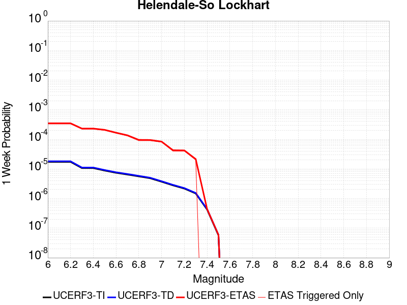 | 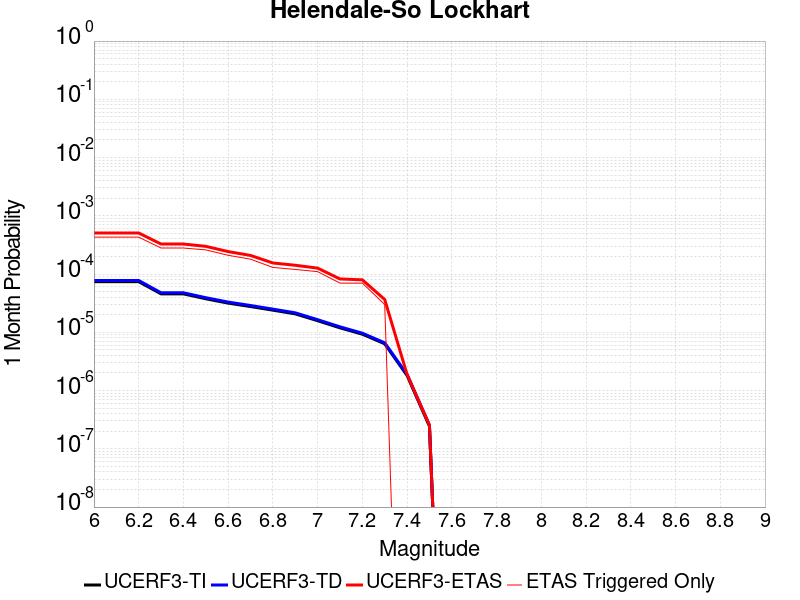 |  |  |

| Magnitude | 1 wk TI Prob | 1 wk TD Prob | 1 wk ETAS Prob | 1 wk ETAS/TD Gain | 1 wk ETAS Triggered Only | 1 mo TI Prob | 1 mo TD Prob | 1 mo ETAS Prob | 1 mo ETAS/TD Gain | 1 mo ETAS Triggered Only | 1 yr TI Prob | 1 yr TD Prob | 1 yr ETAS Prob | 1 yr ETAS/TD Gain | 1 yr ETAS Triggered Only | 10 yr TI Prob | 10 yr TD Prob | 10 yr ETAS Prob | 10 yr ETAS/TD Gain | 10 yr ETAS Triggered Only |
|-----|-----|-----|-----|-----|-----|-----|-----|-----|-----|-----|-----|-----|-----|-----|-----|-----|-----|-----|-----|-----|
| 6.0 | 1.7296055E-5 | 1.8103729E-5 | 3.4809776E-4 | 19.227959 | 3.3E-4 | 7.412385E-5 | 7.7585224E-5 | 5.075519E-4 | 6.5418625 | 4.3E-4 | 9.0208417E-4 | 9.4421144E-4 | 0.0016435505 | 1.7406594 | 7.0E-4 | 0.008984311 | 0.009404116 | 0.010592831 | 1.1264037 | 0.0012 |
| 6.1 | 1.7296055E-5 | 1.8103729E-5 | 3.4809776E-4 | 19.227959 | 3.3E-4 | 7.412385E-5 | 7.7585224E-5 | 5.075519E-4 | 6.5418625 | 4.3E-4 | 9.0208417E-4 | 9.4421144E-4 | 0.0016435505 | 1.7406594 | 7.0E-4 | 0.008984311 | 0.009404116 | 0.010592831 | 1.1264037 | 0.0012 |
| 6.2 | 1.7296055E-5 | 1.8103729E-5 | 3.4809776E-4 | 19.227959 | 3.3E-4 | 7.412385E-5 | 7.7585224E-5 | 5.075519E-4 | 6.5418625 | 4.3E-4 | 9.0208417E-4 | 9.4421144E-4 | 0.0016435505 | 1.7406594 | 7.0E-4 | 0.008984311 | 0.009404116 | 0.010592831 | 1.1264037 | 0.0012 |
| 6.3 | 1.0669118E-5 | 1.1135425E-5 | 2.3113297E-4 | 20.756548 | 2.2E-4 | 4.5723988E-5 | 4.772239E-5 | 3.27709E-4 | 6.8669868 | 2.8E-4 | 5.5654737E-4 | 5.80868E-4 | 9.806356E-4 | 1.6882246 | 4.0E-4 | 0.0055515557 | 0.0057937936 | 0.006519564 | 1.1252669 | 7.3E-4 |
| 6.4 | 1.0669118E-5 | 1.1135425E-5 | 2.3113297E-4 | 20.756548 | 2.2E-4 | 4.5723988E-5 | 4.772239E-5 | 3.27709E-4 | 6.8669868 | 2.8E-4 | 5.5654737E-4 | 5.80868E-4 | 9.806356E-4 | 1.6882246 | 4.0E-4 | 0.0055515557 | 0.0057937936 | 0.006519564 | 1.1252669 | 7.3E-4 |
| 6.5 | 8.790038E-6 | 9.170197E-6 | 2.0916836E-4 | 22.809584 | 2.0E-4 | 3.767105E-5 | 3.930026E-5 | 2.9929006E-4 | 7.6154723 | 2.6E-4 | 4.585485E-4 | 4.7837716E-4 | 8.5819536E-4 | 1.7939723 | 3.8E-4 | 0.0045760344 | 0.004773638 | 0.005450392 | 1.141769 | 6.8E-4 |
| 6.6 | 7.396949E-6 | 7.715537E-6 | 1.677143E-4 | 21.737217 | 1.6E-4 | 3.1700827E-5 | 3.3066175E-5 | 2.4305923E-4 | 7.3506913 | 2.1E-4 | 3.858892E-4 | 4.025073E-4 | 7.223785E-4 | 1.7946966 | 3.2E-4 | 0.003852198 | 0.00401789 | 0.004605519 | 1.1462532 | 5.9E-4 |
| 6.7 | 6.4600285E-6 | 6.738031E-6 | 1.3673716E-4 | 20.29334 | 1.3E-4 | 2.7685543E-5 | 2.887696E-5 | 2.0887176E-4 | 7.233163 | 1.8E-4 | 3.3701936E-4 | 3.5152107E-4 | 6.314226E-4 | 1.7962583 | 2.8E-4 | 0.0033650869 | 0.003509732 | 0.004037872 | 1.1504787 | 5.3E-4 |
| 6.8 | 5.600104E-6 | 5.836009E-6 | 9.583549E-5 | 16.421406 | 9.0E-5 | 2.4000226E-5 | 2.5011232E-5 | 1.5500798E-4 | 6.1975346 | 1.3E-4 | 2.9216358E-4 | 3.044698E-4 | 5.244028E-4 | 1.7223476 | 2.2E-4 | 0.0029177975 | 0.003040588 | 0.0034493415 | 1.1344323 | 4.1E-4 |
| 6.9 | 4.839122E-6 | 5.0395092E-6 | 9.503905E-5 | 18.858791 | 9.0E-5 | 2.0738931E-5 | 2.159772E-5 | 1.4159513E-4 | 6.5560217 | 1.2E-4 | 2.5246723E-4 | 2.6292098E-4 | 4.628684E-4 | 1.7604848 | 2.0E-4 | 0.002521806 | 0.002626147 | 0.0029852013 | 1.1367229 | 3.6E-4 |
| 7.0 | 3.6937633E-6 | 3.845208E-6 | 8.38449E-5 | 21.805037 | 8.0E-5 | 1.5830317E-5 | 1.647936E-5 | 1.2647755E-4 | 7.6749063 | 1.1E-4 | 1.9271708E-4 | 2.0061806E-4 | 3.6058595E-4 | 1.7973754 | 1.6E-4 | 0.0019255003 | 0.002004401 | 0.0022838397 | 1.1394126 | 2.8E-4 |
| 7.1 | 2.7858857E-6 | 2.8978538E-6 | 4.2897736E-5 | 14.803279 | 4.0E-5 | 1.1939455E-5 | 1.2419316E-5 | 8.2418446E-5 | 6.6363115 | 7.0E-5 | 1.4535317E-4 | 1.511949E-4 | 2.6117827E-4 | 1.7274278 | 1.1E-4 | 0.0014525814 | 0.0015109418 | 0.0017106396 | 1.1321678 | 2.0E-4 |
| 7.2 | 2.1672065E-6 | 2.2540128E-6 | 4.2253923E-5 | 18.746088 | 4.0E-5 | 9.2879945E-6 | 9.66002E-6 | 7.9659345E-5 | 8.246292 | 7.0E-5 | 1.1307546E-4 | 1.1760458E-4 | 2.2759165E-4 | 1.9352278 | 1.1E-4 | 0.0011301794 | 0.0011754417 | 0.0013652183 | 1.1614513 | 1.9E-4 |
| 7.3 | 1.4823496E-6 | 1.5422102E-6 | 2.1542179E-5 | 13.968381 | 2.0E-5 | 6.3529114E-6 | 6.6094562E-6 | 3.6609257E-5 | 5.5389214 | 3.0E-5 | 7.734395E-5 | 8.046731E-5 | 1.4046249E-4 | 1.7455844 | 6.0E-5 | 7.731704E-4 | 8.0439687E-4 | 9.143084E-4 | 1.1366384 | 1.1E-4 |
| 7.4 | 4.2321457E-7 | 4.4108765E-7 | 4.4108765E-7 | 1.0 | 0.0 | 1.8137755E-6 | 1.8903745E-6 | 1.8903745E-6 | 1.0 | 0.0 | 2.2082493E-5 | 2.3015113E-5 | 2.3015113E-5 | 1.0 | 0.0 | 2.2080299E-4 | 2.3013182E-4 | 2.4012952E-4 | 1.0434433 | 1.0E-5 |
| 7.5 | 5.6942316E-8 | 5.9415648E-8 | 5.9415648E-8 | 1.0 | 0.0 | 2.440385E-7 | 2.5463845E-7 | 2.5463845E-7 | 1.0 | 0.0 | 2.9711643E-6 | 3.1002196E-6 | 3.1002196E-6 | 1.0 | 0.0 | 2.9711247E-5 | 3.1001844E-5 | 3.1001844E-5 | 1.0 | 0.0 |

## Coyote Lake
*[(top)](#table-of-contents)*

| 1 Week | 1 Month | 1 Year | 10 Year |
|-----|-----|-----|-----|
| 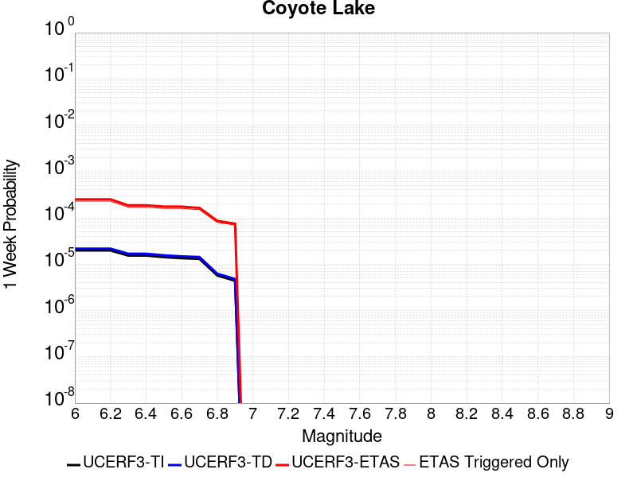 | 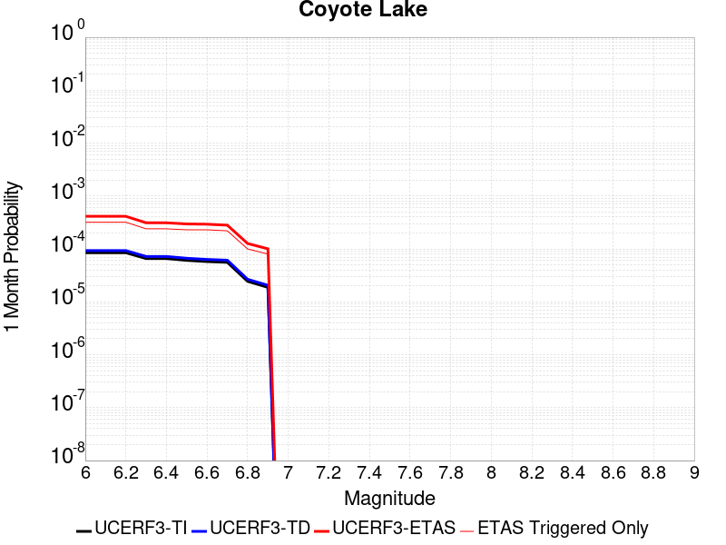 |  |  |

| Magnitude | 1 wk TI Prob | 1 wk TD Prob | 1 wk ETAS Prob | 1 wk ETAS/TD Gain | 1 wk ETAS Triggered Only | 1 mo TI Prob | 1 mo TD Prob | 1 mo ETAS Prob | 1 mo ETAS/TD Gain | 1 mo ETAS Triggered Only | 1 yr TI Prob | 1 yr TD Prob | 1 yr ETAS Prob | 1 yr ETAS/TD Gain | 1 yr ETAS Triggered Only | 10 yr TI Prob | 10 yr TD Prob | 10 yr ETAS Prob | 10 yr ETAS/TD Gain | 10 yr ETAS Triggered Only |
|-----|-----|-----|-----|-----|-----|-----|-----|-----|-----|-----|-----|-----|-----|-----|-----|-----|-----|-----|-----|-----|
| 6.0 | 1.980352E-5 | 2.1706745E-5 | 2.5170174E-4 | 11.595555 | 2.3E-4 | 8.486947E-5 | 9.302599E-5 | 4.1299622E-4 | 4.4395785 | 3.2E-4 | 0.0010327959 | 0.0011320751 | 0.0017713505 | 1.5646936 | 6.4E-4 | 0.010280091 | 0.011270258 | 0.012427072 | 1.102643 | 0.00117 |
| 6.1 | 1.980352E-5 | 2.1706745E-5 | 2.5170174E-4 | 11.595555 | 2.3E-4 | 8.486947E-5 | 9.302599E-5 | 4.1299622E-4 | 4.4395785 | 3.2E-4 | 0.0010327959 | 0.0011320751 | 0.0017713505 | 1.5646936 | 6.4E-4 | 0.010280091 | 0.011270258 | 0.012427072 | 1.102643 | 0.00117 |
| 6.2 | 1.980352E-5 | 2.1706745E-5 | 2.5170174E-4 | 11.595555 | 2.3E-4 | 8.486947E-5 | 9.302599E-5 | 4.1299622E-4 | 4.4395785 | 3.2E-4 | 0.0010327959 | 0.0011320751 | 0.0017713505 | 1.5646936 | 6.4E-4 | 0.010280091 | 0.011270258 | 0.012427072 | 1.102643 | 0.00117 |
| 6.3 | 1.5344787E-5 | 1.682067E-5 | 1.8681781E-4 | 11.106443 | 1.7E-4 | 6.576172E-5 | 7.2086936E-5 | 3.1206963E-4 | 4.3290734 | 2.4E-4 | 8.003548E-4 | 8.773662E-4 | 0.0013369627 | 1.5238365 | 4.6E-4 | 0.007974784 | 0.00874507 | 0.009587636 | 1.0963476 | 8.5E-4 |
| 6.4 | 1.5344787E-5 | 1.682067E-5 | 1.8681781E-4 | 11.106443 | 1.7E-4 | 6.576172E-5 | 7.2086936E-5 | 3.1206963E-4 | 4.3290734 | 2.4E-4 | 8.003548E-4 | 8.773662E-4 | 0.0013369627 | 1.5238365 | 4.6E-4 | 0.007974784 | 0.00874507 | 0.009587636 | 1.0963476 | 8.5E-4 |
| 6.5 | 1.4189697E-5 | 1.5557987E-5 | 1.755555E-4 | 11.283947 | 1.6E-4 | 6.081157E-5 | 6.6675726E-5 | 2.9666038E-4 | 4.4493012 | 2.3E-4 | 7.401293E-4 | 8.115349E-4 | 0.0012511777 | 1.5417424 | 4.4E-4 | 0.0073766913 | 0.008091656 | 0.008895102 | 1.0992931 | 8.1E-4 |
| 6.6 | 1.3469301E-5 | 1.4771577E-5 | 1.7476921E-4 | 11.831452 | 1.6E-4 | 5.7724297E-5 | 6.330556E-5 | 2.93291E-4 | 4.632942 | 2.3E-4 | 7.025667E-4 | 7.7053264E-4 | 0.0012002013 | 1.5576255 | 4.3E-4 | 0.0070034964 | 0.0076845144 | 0.008448597 | 1.0994315 | 7.7E-4 |
| 6.7 | 1.3027966E-5 | 1.4281745E-5 | 1.642796E-4 | 11.5027685 | 1.5E-4 | 5.5832945E-5 | 6.120638E-5 | 2.8119292E-4 | 4.594177 | 2.2E-4 | 6.7955407E-4 | 7.4499263E-4 | 0.0011446946 | 1.5365181 | 4.0E-4 | 0.006774798 | 0.0074308286 | 0.008155405 | 1.0975094 | 7.3E-4 |
| 6.8 | 5.695434E-6 | 6.2244176E-6 | 8.622392E-5 | 13.852528 | 8.0E-5 | 2.4408775E-5 | 2.6675973E-5 | 1.266733E-4 | 4.748592 | 1.0E-4 | 2.971363E-4 | 3.2476155E-4 | 4.847096E-4 | 1.4925091 | 1.6E-4 | 0.0029673933 | 0.0032458105 | 0.0035249016 | 1.0859851 | 2.8E-4 |
| 6.9 | 4.385688E-6 | 4.7930553E-6 | 7.479272E-5 | 15.604393 | 7.0E-5 | 1.879567E-5 | 2.0541665E-5 | 1.0054002E-4 | 4.8944435 | 8.0E-5 | 2.2881327E-4 | 2.5009477E-4 | 3.9005978E-4 | 1.5596478 | 1.4E-4 | 0.002285778 | 0.0025009478 | 0.0027303726 | 1.0917351 | 2.3E-4 |

## San Andreas (Big Bend)
*[(top)](#table-of-contents)*

| 1 Week | 1 Month | 1 Year | 10 Year |
|-----|-----|-----|-----|
| 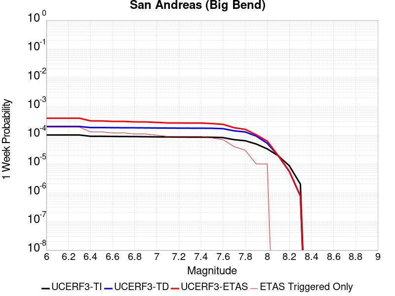 | 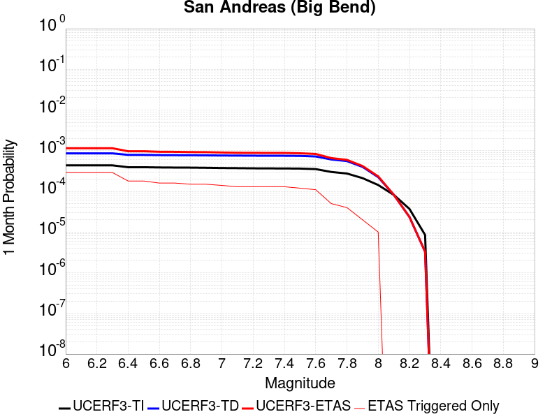 |  | 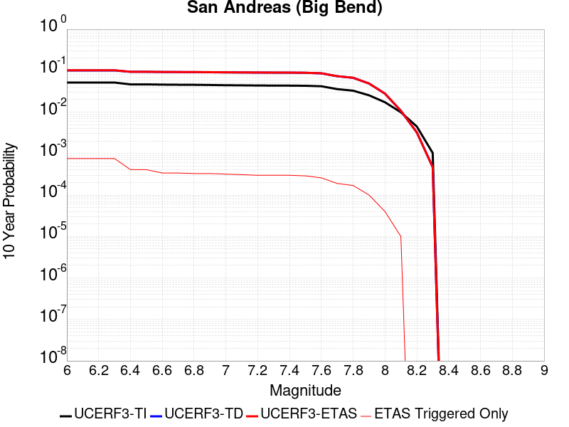 |

| Magnitude | 1 wk TI Prob | 1 wk TD Prob | 1 wk ETAS Prob | 1 wk ETAS/TD Gain | 1 wk ETAS Triggered Only | 1 mo TI Prob | 1 mo TD Prob | 1 mo ETAS Prob | 1 mo ETAS/TD Gain | 1 mo ETAS Triggered Only | 1 yr TI Prob | 1 yr TD Prob | 1 yr ETAS Prob | 1 yr ETAS/TD Gain | 1 yr ETAS Triggered Only | 10 yr TI Prob | 10 yr TD Prob | 10 yr ETAS Prob | 10 yr ETAS/TD Gain | 10 yr ETAS Triggered Only |
|-----|-----|-----|-----|-----|-----|-----|-----|-----|-----|-----|-----|-----|-----|-----|-----|-----|-----|-----|-----|-----|
| 6.0 | 1.0179969E-4 | 2.0072258E-4 | 3.9068446E-4 | 1.94639 | 1.9E-4 | 4.362114E-4 | 8.599571E-4 | 0.0011497077 | 1.3369361 | 2.9E-4 | 0.0052979486 | 0.010419999 | 0.010954372 | 1.0512835 | 5.4E-4 | 0.051734097 | 0.10144902 | 0.10213192 | 1.0067314 | 7.6E-4 |
| 6.1 | 1.0179969E-4 | 2.0072258E-4 | 3.9068446E-4 | 1.94639 | 1.9E-4 | 4.362114E-4 | 8.599571E-4 | 0.0011497077 | 1.3369361 | 2.9E-4 | 0.0052979486 | 0.010419999 | 0.010954372 | 1.0512835 | 5.4E-4 | 0.051734097 | 0.10144902 | 0.10213192 | 1.0067314 | 7.6E-4 |
| 6.2 | 1.0179969E-4 | 2.0072258E-4 | 3.9068446E-4 | 1.94639 | 1.9E-4 | 4.362114E-4 | 8.599571E-4 | 0.0011497077 | 1.3369361 | 2.9E-4 | 0.0052979486 | 0.010419999 | 0.010954372 | 1.0512835 | 5.4E-4 | 0.051734097 | 0.10144902 | 0.10213192 | 1.0067314 | 7.6E-4 |
| 6.3 | 1.0179969E-4 | 2.0072258E-4 | 3.9068446E-4 | 1.94639 | 1.9E-4 | 4.362114E-4 | 8.599571E-4 | 0.0011497077 | 1.3369361 | 2.9E-4 | 0.0052979486 | 0.010419999 | 0.010954372 | 1.0512835 | 5.4E-4 | 0.051734097 | 0.10144902 | 0.10213192 | 1.0067314 | 7.6E-4 |
| 6.4 | 9.1639464E-5 | 1.8429532E-4 | 3.1427137E-4 | 1.7052596 | 1.3E-4 | 3.9268145E-4 | 7.895982E-4 | 9.694561E-4 | 1.227784 | 1.8E-4 | 0.0047704205 | 0.009571102 | 0.009888039 | 1.033114 | 3.2E-4 | 0.046693064 | 0.09377527 | 0.094146825 | 1.0039622 | 4.1E-4 |
| 6.5 | 9.1639464E-5 | 1.8429532E-4 | 3.1427137E-4 | 1.7052596 | 1.3E-4 | 3.9268145E-4 | 7.895982E-4 | 9.694561E-4 | 1.227784 | 1.8E-4 | 0.0047704205 | 0.009571102 | 0.009888039 | 1.033114 | 3.2E-4 | 0.046693064 | 0.09377527 | 0.094146825 | 1.0039622 | 4.1E-4 |
| 6.6 | 9.042622E-5 | 1.823659E-4 | 3.02344E-4 | 1.6578977 | 1.2E-4 | 3.8748336E-4 | 7.8133424E-4 | 9.4120926E-4 | 1.2046179 | 1.6E-4 | 0.0047074095 | 0.009471365 | 0.009728903 | 1.0271912 | 2.6E-4 | 0.046089325 | 0.092869274 | 0.0931777 | 1.003321 | 3.4E-4 |
| 6.7 | 8.9836685E-5 | 1.8150927E-4 | 3.0148748E-4 | 1.6610032 | 1.2E-4 | 3.8495753E-4 | 7.776651E-4 | 9.375407E-4 | 1.205584 | 1.6E-4 | 0.00467679 | 0.00942708 | 0.009684629 | 1.0273201 | 2.6E-4 | 0.045795817 | 0.09246355 | 0.09277211 | 1.0033371 | 3.4E-4 |
| 6.8 | 8.9471854E-5 | 1.8097709E-4 | 2.909572E-4 | 1.6077018 | 1.1E-4 | 3.8339442E-4 | 7.7538576E-4 | 9.2526944E-4 | 1.1933022 | 1.5E-4 | 0.004657841 | 0.009399569 | 0.0096472185 | 1.0263469 | 2.5E-4 | 0.04561414 | 0.092210755 | 0.09251033 | 1.0032488 | 3.3E-4 |
| 6.9 | 8.858234E-5 | 1.7979681E-4 | 2.8977703E-4 | 1.6116917 | 1.1E-4 | 3.7958333E-4 | 7.703304E-4 | 9.2021486E-4 | 1.1945716 | 1.5E-4 | 0.004611638 | 0.009338548 | 0.009586214 | 1.0265207 | 2.5E-4 | 0.04517103 | 0.09165087 | 0.091950625 | 1.0032706 | 3.3E-4 |
| 7.0 | 8.7433385E-5 | 1.7818481E-4 | 2.78167E-4 | 1.561115 | 1.0E-4 | 3.746607E-4 | 7.634259E-4 | 9.0331904E-4 | 1.1832439 | 1.4E-4 | 0.004551957 | 0.009255203 | 0.009492982 | 1.0256914 | 2.4E-4 | 0.044598386 | 0.09088532 | 0.091176234 | 1.0032009 | 3.2E-4 |
| 7.1 | 8.684964E-5 | 1.7730435E-4 | 2.672884E-4 | 1.5075117 | 9.0E-5 | 3.7215967E-4 | 7.596547E-4 | 8.8955596E-4 | 1.1710004 | 1.3E-4 | 0.0045216335 | 0.009209678 | 0.009437559 | 1.0247437 | 2.3E-4 | 0.04430731 | 0.09046686 | 0.09074882 | 1.0031167 | 3.1E-4 |
| 7.2 | 8.606521E-5 | 1.762105E-4 | 2.6619463E-4 | 1.5106628 | 9.0E-5 | 3.6879873E-4 | 7.549695E-4 | 8.8487135E-4 | 1.1720624 | 1.3E-4 | 0.0044808835 | 0.0091531165 | 0.009371103 | 1.0238155 | 2.2E-4 | 0.043916024 | 0.089947365 | 0.090220384 | 1.0030353 | 3.0E-4 |
| 7.3 | 8.568266E-5 | 1.7563057E-4 | 2.6561477E-4 | 1.5123492 | 9.0E-5 | 3.6715972E-4 | 7.524855E-4 | 8.823877E-4 | 1.1726308 | 1.3E-4 | 0.0044610105 | 0.009123127 | 0.00934112 | 1.0238945 | 2.2E-4 | 0.043725148 | 0.08966853 | 0.08994163 | 1.0030457 | 3.0E-4 |
| 7.4 | 8.5432206E-5 | 1.7525644E-4 | 2.6524067E-4 | 1.5134432 | 9.0E-5 | 3.6608664E-4 | 7.50883E-4 | 8.807854E-4 | 1.1729995 | 1.3E-4 | 0.004447999 | 0.009103781 | 0.009321777 | 1.0239458 | 2.2E-4 | 0.043600157 | 0.08948871 | 0.08976186 | 1.0030524 | 3.0E-4 |
| 7.5 | 8.4791965E-5 | 1.7394972E-4 | 2.539358E-4 | 1.459823 | 8.0E-5 | 3.633435E-4 | 7.4528606E-4 | 8.651966E-4 | 1.160892 | 1.2E-4 | 0.0044147377 | 0.009036204 | 0.009244307 | 1.0230298 | 2.1E-4 | 0.043280575 | 0.088866346 | 0.08913057 | 1.0029733 | 2.9E-4 |
| 7.6 | 8.241105E-5 | 1.6840403E-4 | 2.3839224E-4 | 1.415597 | 7.0E-5 | 3.531424E-4 | 7.215321E-4 | 8.314528E-4 | 1.1523434 | 1.1E-4 | 0.0042910352 | 0.008749358 | 0.008937696 | 1.0215259 | 1.9E-4 | 0.042091176 | 0.086243294 | 0.08648087 | 1.0027547 | 2.6E-4 |
| 7.7 | 7.00432E-5 | 1.42045E-4 | 1.8203932E-4 | 1.2815609 | 4.0E-5 | 3.001506E-4 | 6.0862233E-4 | 6.585919E-4 | 1.0821028 | 5.0E-5 | 0.0036482112 | 0.0073848404 | 0.0075138803 | 1.0174736 | 1.3E-4 | 0.035888977 | 0.07351733 | 0.07369336 | 1.0023944 | 1.9E-4 |
| 7.8 | 6.415362E-5 | 1.2968935E-4 | 1.5968546E-4 | 1.231292 | 3.0E-5 | 2.749151E-4 | 5.556931E-4 | 5.956709E-4 | 1.0719422 | 4.0E-5 | 0.0033419547 | 0.0067446055 | 0.0068538636 | 1.0161994 | 1.1E-4 | 0.03292141 | 0.06725231 | 0.06741087 | 1.0023578 | 1.7E-4 |
| 7.9 | 4.939911E-5 | 9.3411545E-5 | 1.0341061E-4 | 1.1070431 | 1.0E-5 | 2.116933E-4 | 4.0027377E-4 | 4.2026577E-4 | 1.0499458 | 2.0E-5 | 0.0025743195 | 0.004862453 | 0.0049321125 | 1.014326 | 7.0E-5 | 0.025447013 | 0.048914436 | 0.049009547 | 1.0019444 | 1.0E-4 |
| 8.0 | 3.344983E-5 | 5.222685E-5 | 6.2226325E-5 | 1.1914624 | 1.0E-5 | 1.4334853E-4 | 2.2381016E-4 | 2.3380792E-4 | 1.0446707 | 1.0E-5 | 0.0017438711 | 0.0027214854 | 0.002751404 | 1.0109934 | 3.0E-5 | 0.017302496 | 0.027922187 | 0.027961072 | 1.0013926 | 4.0E-5 |
| 8.1 | 1.9104898E-5 | 1.9173063E-5 | 1.9173063E-5 | 1.0 | 0.0 | 8.1875565E-5 | 8.216769E-5 | 8.216769E-5 | 1.0 | 0.0 | 9.963791E-4 | 9.999331E-4 | 9.999331E-4 | 1.0 | 0.0 | 0.009919235 | 0.010749801 | 0.010759694 | 1.0009203 | 1.0E-5 |
| 8.2 | 8.643924E-6 | 5.4748625E-6 | 5.4748625E-6 | 1.0 | 0.0 | 3.704486E-5 | 2.3463486E-5 | 2.3463486E-5 | 1.0 | 0.0 | 4.5092785E-4 | 2.8563058E-4 | 2.8563058E-4 | 1.0 | 0.0 | 0.0045001395 | 0.0032487072 | 0.0032487072 | 1.0 | 0.0 |
| 8.3 | 1.983087E-6 | 7.6599065E-7 | 7.6599065E-7 | 1.0 | 0.0 | 8.498917E-6 | 3.282813E-6 | 3.282813E-6 | 1.0 | 0.0 | 1.034694E-4 | 3.9967534E-5 | 3.9967534E-5 | 1.0 | 0.0 | 0.0010342124 | 4.719687E-4 | 4.719687E-4 | 1.0 | 0.0 |

## Death Valley (No)
*[(top)](#table-of-contents)*

| 1 Week | 1 Month | 1 Year | 10 Year |
|-----|-----|-----|-----|
| 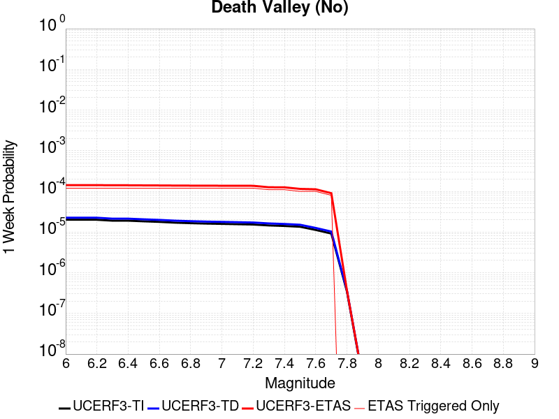 | 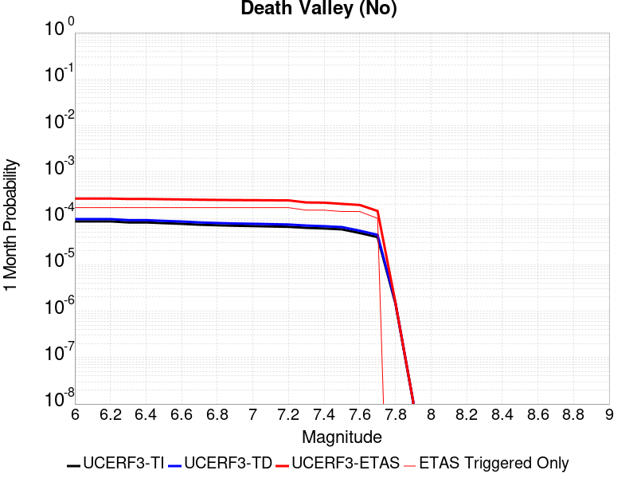 |  |  |

| Magnitude | 1 wk TI Prob | 1 wk TD Prob | 1 wk ETAS Prob | 1 wk ETAS/TD Gain | 1 wk ETAS Triggered Only | 1 mo TI Prob | 1 mo TD Prob | 1 mo ETAS Prob | 1 mo ETAS/TD Gain | 1 mo ETAS Triggered Only | 1 yr TI Prob | 1 yr TD Prob | 1 yr ETAS Prob | 1 yr ETAS/TD Gain | 1 yr ETAS Triggered Only | 10 yr TI Prob | 10 yr TD Prob | 10 yr ETAS Prob | 10 yr ETAS/TD Gain | 10 yr ETAS Triggered Only |
|-----|-----|-----|-----|-----|-----|-----|-----|-----|-----|-----|-----|-----|-----|-----|-----|-----|-----|-----|-----|-----|
| 6.0 | 2.0074807E-5 | 2.2500084E-5 | 1.4249739E-4 | 6.333194 | 1.2E-4 | 8.603206E-5 | 9.642541E-5 | 2.66409E-4 | 2.7628508 | 1.7E-4 | 0.001046937 | 0.0011733545 | 0.0015728851 | 1.340503 | 4.0E-4 | 0.010420183 | 0.011672506 | 0.012344569 | 1.0575765 | 6.8E-4 |
| 6.1 | 2.0074807E-5 | 2.2500084E-5 | 1.4249739E-4 | 6.333194 | 1.2E-4 | 8.603206E-5 | 9.642541E-5 | 2.66409E-4 | 2.7628508 | 1.7E-4 | 0.001046937 | 0.0011733545 | 0.0015728851 | 1.340503 | 4.0E-4 | 0.010420183 | 0.011672506 | 0.012344569 | 1.0575765 | 6.8E-4 |
| 6.2 | 2.0074807E-5 | 2.2500084E-5 | 1.4249739E-4 | 6.333194 | 1.2E-4 | 8.603206E-5 | 9.642541E-5 | 2.66409E-4 | 2.7628508 | 1.7E-4 | 0.001046937 | 0.0011733545 | 0.0015728851 | 1.340503 | 4.0E-4 | 0.010420183 | 0.011672506 | 0.012344569 | 1.0575765 | 6.8E-4 |
| 6.3 | 1.9050609E-5 | 2.1336948E-5 | 1.4133439E-4 | 6.623927 | 1.2E-4 | 8.164292E-5 | 9.1440896E-5 | 2.6142536E-4 | 2.8589544 | 1.7E-4 | 9.935491E-4 | 0.001112731 | 0.0015122859 | 1.3590759 | 4.0E-4 | 0.009891188 | 0.011072419 | 0.011744889 | 1.0607339 | 6.8E-4 |
| 6.4 | 1.9050609E-5 | 2.1336948E-5 | 1.4133439E-4 | 6.623927 | 1.2E-4 | 8.164292E-5 | 9.1440896E-5 | 2.6142536E-4 | 2.8589544 | 1.7E-4 | 9.935491E-4 | 0.001112731 | 0.0015122859 | 1.3590759 | 4.0E-4 | 0.009891188 | 0.011072419 | 0.011744889 | 1.0607339 | 6.8E-4 |
| 6.5 | 1.8367004E-5 | 2.0561009E-5 | 1.4055854E-4 | 6.8361697 | 1.2E-4 | 7.8713354E-5 | 8.811567E-5 | 2.5810068E-4 | 2.9291124 | 1.7E-4 | 9.5791375E-4 | 0.0010722869 | 0.0014718579 | 1.3726345 | 4.0E-4 | 0.009537951 | 0.0106719155 | 0.011344658 | 1.0630386 | 6.8E-4 |
| 6.6 | 1.779439E-5 | 1.9910927E-5 | 1.3990854E-4 | 7.026721 | 1.2E-4 | 7.625944E-5 | 8.53298E-5 | 2.5531527E-4 | 2.9921002 | 1.7E-4 | 9.280632E-4 | 0.0010384015 | 0.0014279966 | 1.3751873 | 3.9E-4 | 0.009241969 | 0.010336253 | 0.01098943 | 1.063193 | 6.6E-4 |
| 6.7 | 1.7025437E-5 | 1.9043426E-5 | 1.3904113E-4 | 7.301267 | 1.2E-4 | 7.296412E-5 | 8.161216E-5 | 2.5159828E-4 | 3.0828528 | 1.7E-4 | 8.87976E-4 | 9.931813E-4 | 0.001382794 | 1.3922875 | 3.9E-4 | 0.008844362 | 0.009888145 | 0.010541619 | 1.0660866 | 6.6E-4 |
| 6.8 | 1.6545107E-5 | 1.8512545E-5 | 1.3851032E-4 | 7.481971 | 1.2E-4 | 7.090568E-5 | 7.93371E-5 | 2.493236E-4 | 3.1425853 | 1.7E-4 | 8.629347E-4 | 9.655073E-4 | 0.0013551307 | 1.4035428 | 3.9E-4 | 0.008595915 | 0.009613829 | 0.010267484 | 1.0679911 | 6.6E-4 |
| 6.9 | 1.615478E-5 | 1.8087594E-5 | 1.3808542E-4 | 7.6342616 | 1.2E-4 | 6.9232934E-5 | 7.751599E-5 | 2.4750282E-4 | 3.192926 | 1.7E-4 | 8.4258494E-4 | 9.433546E-4 | 0.0013329868 | 1.4130282 | 3.9E-4 | 0.008393973 | 0.009394196 | 0.0100479955 | 1.0695962 | 6.6E-4 |
| 7.0 | 1.5894311E-5 | 1.780555E-5 | 1.378034E-4 | 7.7393517 | 1.2E-4 | 6.81167E-5 | 7.6307304E-5 | 2.4629434E-4 | 3.227664 | 1.7E-4 | 8.2900526E-4 | 9.286515E-4 | 0.0013182893 | 1.4195738 | 3.9E-4 | 0.008259195 | 0.009248397 | 0.009892386 | 1.0696324 | 6.5E-4 |
| 7.1 | 1.5602263E-5 | 1.7483504E-5 | 1.374814E-4 | 7.863493 | 1.2E-4 | 6.6865134E-5 | 7.492718E-5 | 2.4491444E-4 | 3.2686996 | 1.7E-4 | 8.137789E-4 | 9.118627E-4 | 0.0013015071 | 1.4273059 | 3.9E-4 | 0.008108052 | 0.009081894 | 0.009725991 | 1.070921 | 6.5E-4 |
| 7.2 | 1.5323829E-5 | 1.717063E-5 | 1.3716856E-4 | 7.988558 | 1.2E-4 | 6.56719E-5 | 7.358637E-5 | 2.4357386E-4 | 3.3100402 | 1.7E-4 | 7.99262E-4 | 8.9555193E-4 | 0.0012852027 | 1.4350957 | 3.9E-4 | 0.007963934 | 0.008920107 | 0.009564308 | 1.0722191 | 6.5E-4 |
| 7.3 | 1.4556212E-5 | 1.6302456E-5 | 1.2630066E-4 | 7.7473397 | 1.1E-4 | 6.238227E-5 | 6.9865826E-5 | 2.1985534E-4 | 3.1468225 | 1.5E-4 | 7.592395E-4 | 8.5029035E-4 | 0.0012099842 | 1.4230248 | 3.6E-4 | 0.0075665074 | 0.008471014 | 0.009085762 | 1.0725708 | 6.2E-4 |
| 7.4 | 1.411725E-5 | 1.580796E-5 | 1.2580623E-4 | 7.95841 | 1.1E-4 | 6.0501097E-5 | 6.7746674E-5 | 2.1773651E-4 | 3.213981 | 1.5E-4 | 7.363519E-4 | 8.245094E-4 | 0.0011842126 | 1.4362632 | 3.6E-4 | 0.0073391674 | 0.008215138 | 0.008830044 | 1.0748504 | 6.2E-4 |
| 7.5 | 1.3503312E-5 | 1.5126289E-5 | 1.1512478E-4 | 7.6109066 | 1.0E-4 | 5.7870053E-5 | 6.482538E-5 | 2.048163E-4 | 3.1595082 | 1.4E-4 | 7.043401E-4 | 7.8896893E-4 | 0.0011386928 | 1.443267 | 3.5E-4 | 0.007021119 | 0.007862304 | 0.0084675085 | 1.0769753 | 6.1E-4 |
| 7.6 | 1.1279839E-5 | 1.2626327E-5 | 1.12625065E-4 | 8.91986 | 1.0E-4 | 4.834127E-5 | 5.4111737E-5 | 1.9410416E-4 | 3.587099 | 1.4E-4 | 5.88396E-4 | 6.5861654E-4 | 9.784058E-4 | 1.485547 | 3.2E-4 | 0.005868405 | 0.006567199 | 0.007093718 | 1.0801741 | 5.3E-4 |
| 7.7 | 9.189108E-6 | 1.0283358E-5 | 9.0282534E-5 | 8.77948 | 8.0E-5 | 3.93813E-5 | 4.407082E-5 | 1.440664E-4 | 3.268975 | 1.0E-4 | 4.7936183E-4 | 5.3643517E-4 | 7.962957E-4 | 1.4844211 | 2.6E-4 | 0.004783291 | 0.005351914 | 0.0057796123 | 1.079915 | 4.3E-4 |
| 7.8 | 3.4586725E-7 | 3.6482615E-7 | 3.6482615E-7 | 1.0 | 0.0 | 1.4822873E-6 | 1.5635396E-6 | 1.5635396E-6 | 1.0 | 0.0 | 1.80467E-5 | 1.9035933E-5 | 2.9035744E-5 | 1.5253123 | 1.0E-5 | 1.8045233E-4 | 1.9034347E-4 | 2.0034157E-4 | 1.0525266 | 1.0E-5 |
| 7.9 | 2.5591178E-9 | 2.6696718E-9 | 2.6696718E-9 | 1.0 | 0.0 | 1.0967647E-8 | 1.14414505E-8 | 1.14414505E-8 | 1.0 | 0.0 | 1.335311E-7 | 1.3929966E-7 | 1.3929966E-7 | 1.0 | 0.0 | 1.3353102E-6 | 1.3929966E-6 | 1.3929966E-6 | 1.0 | 0.0 |

## San Andreas (Parkfield)
*[(top)](#table-of-contents)*

| 1 Week | 1 Month | 1 Year | 10 Year |
|-----|-----|-----|-----|
| 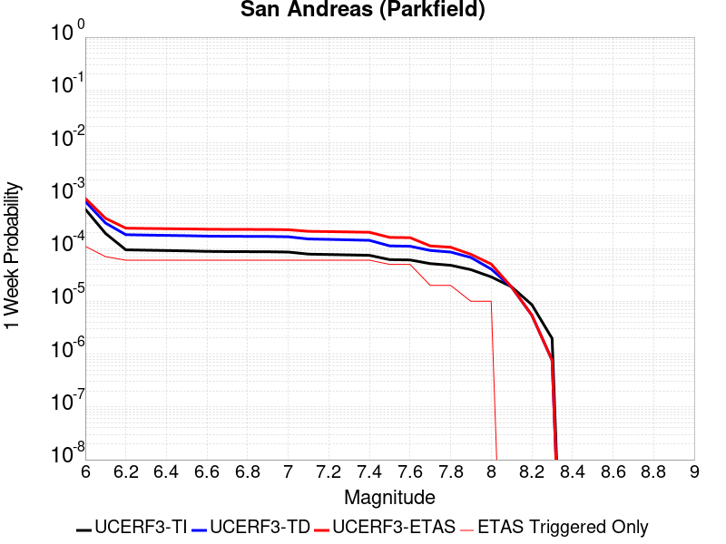 | 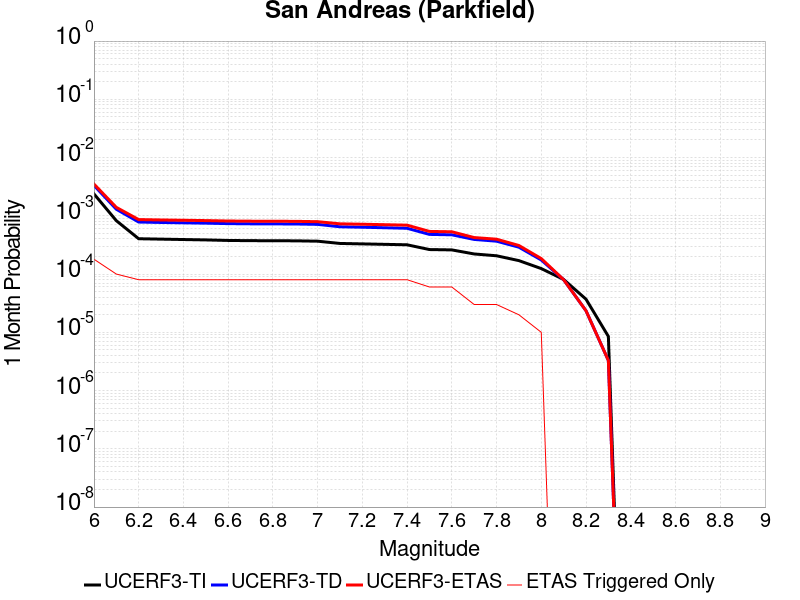 |  |  |

| Magnitude | 1 wk TI Prob | 1 wk TD Prob | 1 wk ETAS Prob | 1 wk ETAS/TD Gain | 1 wk ETAS Triggered Only | 1 mo TI Prob | 1 mo TD Prob | 1 mo ETAS Prob | 1 mo ETAS/TD Gain | 1 mo ETAS Triggered Only | 1 yr TI Prob | 1 yr TD Prob | 1 yr ETAS Prob | 1 yr ETAS/TD Gain | 1 yr ETAS Triggered Only | 10 yr TI Prob | 10 yr TD Prob | 10 yr ETAS Prob | 10 yr ETAS/TD Gain | 10 yr ETAS Triggered Only |
|-----|-----|-----|-----|-----|-----|-----|-----|-----|-----|-----|-----|-----|-----|-----|-----|-----|-----|-----|-----|-----|
| 6.0 | 5.556969E-4 | 7.7782426E-4 | 8.8773866E-4 | 1.1413101 | 1.1E-4 | 0.0023793848 | 0.0033298214 | 0.003509222 | 1.053877 | 1.8E-4 | 0.028586963 | 0.040191233 | 0.040527165 | 1.0083584 | 3.5E-4 | 0.25176284 | 0.33716413 | 0.33754858 | 1.0011402 | 5.8E-4 |
| 6.1 | 1.925858E-4 | 3.0276453E-4 | 3.7274332E-4 | 1.2311327 | 7.0E-5 | 8.2510663E-4 | 0.0012970108 | 0.0013968811 | 1.0770004 | 1.0E-4 | 0.0099994885 | 0.015778083 | 0.015965085 | 1.011852 | 1.9E-4 | 0.095613256 | 0.1497237 | 0.14992775 | 1.0013629 | 2.4E-4 |
| 6.2 | 9.4306815E-5 | 1.8242796E-4 | 2.4241701E-4 | 1.3288369 | 6.0E-5 | 4.0410945E-4 | 7.816011E-4 | 8.615386E-4 | 1.1022741 | 8.0E-5 | 0.0049089384 | 0.009474681 | 0.009633165 | 1.0167271 | 1.6E-4 | 0.048019063 | 0.09185409 | 0.0920448 | 1.0020763 | 2.1E-4 |
| 6.3 | 9.283051E-5 | 1.7939322E-4 | 2.3938245E-4 | 1.3344008 | 6.0E-5 | 3.9778434E-4 | 7.686027E-4 | 8.485412E-4 | 1.104005 | 8.0E-5 | 0.0048322747 | 0.009317789 | 0.0094762985 | 1.0170114 | 1.6E-4 | 0.047285385 | 0.09050704 | 0.090698026 | 1.0021102 | 2.1E-4 |
| 6.4 | 9.138826E-5 | 1.770153E-4 | 2.3700469E-4 | 1.3388938 | 6.0E-5 | 3.916052E-4 | 7.5841765E-4 | 8.3835697E-4 | 1.1054028 | 8.0E-5 | 0.0047573745 | 0.00919484 | 0.009353369 | 1.0172411 | 1.6E-4 | 0.046568092 | 0.08940927 | 0.089600496 | 1.0021387 | 2.1E-4 |
| 6.5 | 9.000255E-5 | 1.7459576E-4 | 2.3458528E-4 | 1.343591 | 6.0E-5 | 3.8566816E-4 | 7.480541E-4 | 8.279943E-4 | 1.1068641 | 8.0E-5 | 0.0046854047 | 0.009069731 | 0.009228281 | 1.0174811 | 1.6E-4 | 0.045878403 | 0.088295065 | 0.08848652 | 1.0021684 | 2.1E-4 |
| 6.6 | 8.8109264E-5 | 1.7140752E-4 | 2.3139724E-4 | 1.349983 | 6.0E-5 | 3.7755648E-4 | 7.3439797E-4 | 8.1433926E-4 | 1.1088527 | 8.0E-5 | 0.0045870654 | 0.008904854 | 0.009063429 | 1.0178077 | 1.6E-4 | 0.04493529 | 0.0868267 | 0.08701846 | 1.0022086 | 2.1E-4 |
| 6.7 | 8.738073E-5 | 1.7007832E-4 | 2.3006812E-4 | 1.3527186 | 6.0E-5 | 3.7443507E-4 | 7.287046E-4 | 8.086463E-4 | 1.1097039 | 8.0E-5 | 0.0045492216 | 0.008836143 | 0.008994729 | 1.0179474 | 1.6E-4 | 0.04457213 | 0.08622707 | 0.08641896 | 1.0022254 | 2.1E-4 |
| 6.8 | 8.710195E-5 | 1.6953335E-4 | 2.2952317E-4 | 1.3538526 | 6.0E-5 | 3.7324068E-4 | 7.263703E-4 | 8.063122E-4 | 1.1100566 | 8.0E-5 | 0.0045347405 | 0.008807961 | 0.008966551 | 1.0180054 | 1.6E-4 | 0.04443313 | 0.08597467 | 0.08616661 | 1.0022326 | 2.1E-4 |
| 6.9 | 8.6801556E-5 | 1.689429E-4 | 2.2893277E-4 | 1.3550895 | 6.0E-5 | 3.7195362E-4 | 7.2384125E-4 | 8.0378336E-4 | 1.1104414 | 8.0E-5 | 0.0045191357 | 0.008777418 | 0.008926102 | 1.0169393 | 1.5E-4 | 0.044283327 | 0.085700735 | 0.085883595 | 1.0021337 | 2.0E-4 |
| 7.0 | 8.5571606E-5 | 1.6647128E-4 | 2.2646128E-4 | 1.3603625 | 6.0E-5 | 3.6668387E-4 | 7.132544E-4 | 7.9319737E-4 | 1.1120819 | 8.0E-5 | 0.004455241 | 0.008649553 | 0.0087982565 | 1.0171919 | 1.5E-4 | 0.043669727 | 0.08454914 | 0.08473223 | 1.0021654 | 2.0E-4 |
| 7.1 | 7.82589E-5 | 1.5128135E-4 | 2.1127227E-4 | 1.396552 | 6.0E-5 | 3.3535215E-4 | 6.481883E-4 | 7.2813645E-4 | 1.123341 | 8.0E-5 | 0.0040752706 | 0.007863307 | 0.008002206 | 1.0176642 | 1.4E-4 | 0.040013418 | 0.07746111 | 0.07763639 | 1.0022628 | 1.9E-4 |
| 7.2 | 7.690929E-5 | 1.4865391E-4 | 2.08645E-4 | 1.4035621 | 6.0E-5 | 3.2956956E-4 | 6.369334E-4 | 7.168824E-4 | 1.1255218 | 8.0E-5 | 0.004005129 | 0.007727258 | 0.007866176 | 1.0179777 | 1.4E-4 | 0.0393371 | 0.07623427 | 0.07640979 | 1.0023023 | 1.9E-4 |
| 7.3 | 7.5543794E-5 | 1.4561978E-4 | 2.0561104E-4 | 1.4119719 | 6.0E-5 | 3.2371894E-4 | 6.2393624E-4 | 7.038863E-4 | 1.1281382 | 8.0E-5 | 0.003934157 | 0.007570127 | 0.0077090673 | 1.0183537 | 1.4E-4 | 0.038652334 | 0.074797355 | 0.074973136 | 1.0023502 | 1.9E-4 |
| 7.4 | 7.4214564E-5 | 1.4262961E-4 | 2.0262106E-4 | 1.42061 | 6.0E-5 | 3.1802364E-4 | 6.111273E-4 | 6.910784E-4 | 1.1308256 | 8.0E-5 | 0.003865065 | 0.00741525 | 0.0075542117 | 1.01874 | 1.4E-4 | 0.03798529 | 0.07337123 | 0.073547296 | 1.0023996 | 1.9E-4 |
| 7.5 | 6.149578E-5 | 1.11907226E-4 | 1.6190163E-4 | 1.4467486 | 5.0E-5 | 2.6352672E-4 | 4.7951436E-4 | 5.394856E-4 | 1.1250666 | 6.0E-5 | 0.0032037178 | 0.0058224914 | 0.005921909 | 1.0170748 | 1.0E-4 | 0.03157923 | 0.058557566 | 0.058679953 | 1.0020901 | 1.3E-4 |
| 7.6 | 6.0643448E-5 | 1.10193796E-4 | 1.6018828E-4 | 1.453696 | 5.0E-5 | 2.598746E-4 | 4.7217376E-4 | 5.3214544E-4 | 1.1270119 | 6.0E-5 | 0.0031593828 | 0.0057335934 | 0.0058330204 | 1.017341 | 1.0E-4 | 0.031148417 | 0.057718582 | 0.057841077 | 1.0021223 | 1.3E-4 |
| 7.7 | 5.1652263E-5 | 9.174698E-5 | 1.1174515E-4 | 1.2179708 | 2.0E-5 | 2.2134806E-4 | 3.931421E-4 | 4.2313032E-4 | 1.0762783 | 3.0E-5 | 0.002691582 | 0.0047760103 | 0.004845676 | 1.0145866 | 7.0E-5 | 0.026592141 | 0.04853623 | 0.048631374 | 1.0019603 | 1.0E-4 |
| 7.8 | 4.8090482E-5 | 8.559635E-5 | 1.0559464E-4 | 1.2336348 | 2.0E-5 | 2.060858E-4 | 3.6678996E-4 | 3.9677895E-4 | 1.0817606 | 3.0E-5 | 0.0025062072 | 0.0044565317 | 0.00452622 | 1.0156373 | 7.0E-5 | 0.024781305 | 0.04530245 | 0.04539792 | 1.0021074 | 1.0E-4 |
| 7.9 | 3.970278E-5 | 6.750426E-5 | 7.750359E-5 | 1.1481287 | 1.0E-5 | 1.7014367E-4 | 2.892719E-4 | 3.0926612E-4 | 1.0691191 | 2.0E-5 | 0.002069531 | 0.0035162016 | 0.0035759907 | 1.0170039 | 6.0E-5 | 0.020503636 | 0.035881363 | 0.03594885 | 1.0018809 | 7.0E-5 |
| 8.0 | 2.8982335E-5 | 4.069796E-5 | 5.0697552E-5 | 1.2457026 | 1.0E-5 | 1.2420409E-4 | 1.7440817E-4 | 1.8440642E-4 | 1.0573268 | 1.0E-5 | 0.0015111357 | 0.0021213528 | 0.002151289 | 1.0141119 | 3.0E-5 | 0.015009012 | 0.022010697 | 0.022049816 | 1.0017773 | 4.0E-5 |
| 8.1 | 1.8836186E-5 | 1.8681134E-5 | 1.8681134E-5 | 1.0 | 0.0 | 8.0724014E-5 | 8.005955E-5 | 8.005955E-5 | 1.0 | 0.0 | 9.823717E-4 | 9.742898E-4 | 9.742898E-4 | 1.0 | 0.0 | 0.009780403 | 0.010488115 | 0.010498011 | 1.0009434 | 1.0E-5 |
| 8.2 | 8.643924E-6 | 5.4748625E-6 | 5.4748625E-6 | 1.0 | 0.0 | 3.704486E-5 | 2.3463486E-5 | 2.3463486E-5 | 1.0 | 0.0 | 4.5092785E-4 | 2.8563058E-4 | 2.8563058E-4 | 1.0 | 0.0 | 0.0045001395 | 0.0032487072 | 0.0032487072 | 1.0 | 0.0 |
| 8.3 | 1.983087E-6 | 7.6599065E-7 | 7.6599065E-7 | 1.0 | 0.0 | 8.498917E-6 | 3.282813E-6 | 3.282813E-6 | 1.0 | 0.0 | 1.034694E-4 | 3.9967534E-5 | 3.9967534E-5 | 1.0 | 0.0 | 0.0010342124 | 4.719687E-4 | 4.719687E-4 | 1.0 | 0.0 |

## Red Pass
*[(top)](#table-of-contents)*

| 1 Week | 1 Month | 1 Year | 10 Year |
|-----|-----|-----|-----|
| 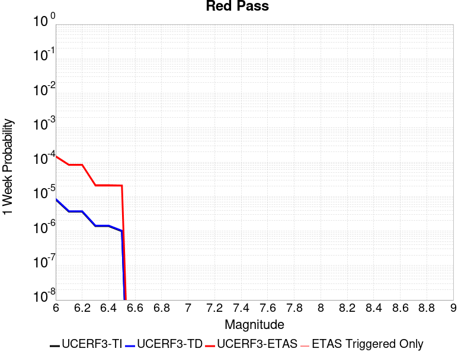 | 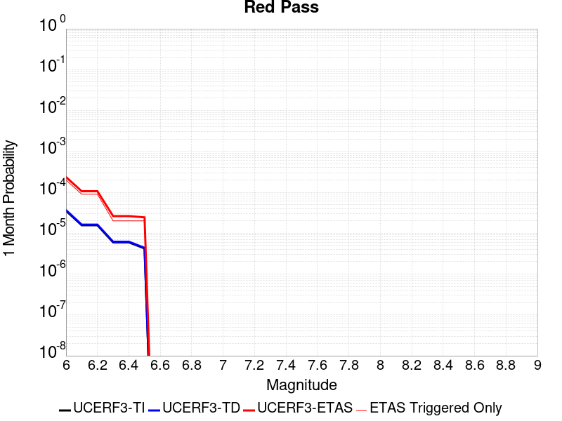 |  |  |

| Magnitude | 1 wk TI Prob | 1 wk TD Prob | 1 wk ETAS Prob | 1 wk ETAS/TD Gain | 1 wk ETAS Triggered Only | 1 mo TI Prob | 1 mo TD Prob | 1 mo ETAS Prob | 1 mo ETAS/TD Gain | 1 mo ETAS Triggered Only | 1 yr TI Prob | 1 yr TD Prob | 1 yr ETAS Prob | 1 yr ETAS/TD Gain | 1 yr ETAS Triggered Only | 10 yr TI Prob | 10 yr TD Prob | 10 yr ETAS Prob | 10 yr ETAS/TD Gain | 10 yr ETAS Triggered Only |
|-----|-----|-----|-----|-----|-----|-----|-----|-----|-----|-----|-----|-----|-----|-----|-----|-----|-----|-----|-----|-----|
| 6.0 | 8.258278E-6 | 8.551265E-6 | 1.4855007E-4 | 17.371706 | 1.4E-4 | 3.539214E-5 | 3.6647863E-5 | 2.3664054E-4 | 6.457144 | 2.0E-4 | 4.308141E-4 | 4.4611428E-4 | 7.659715E-4 | 1.716985 | 3.2E-4 | 0.0042997985 | 0.004453945 | 0.005021406 | 1.1274065 | 5.7E-4 |
| 6.1 | 3.649988E-6 | 3.7753161E-6 | 8.377501E-5 | 22.190199 | 8.0E-5 | 1.5642712E-5 | 1.6179853E-5 | 1.061784E-4 | 6.5623837 | 9.0E-5 | 1.9043336E-4 | 1.9697666E-4 | 3.469471E-4 | 1.7613615 | 1.5E-4 | 0.0019027026 | 0.001968488 | 0.002257917 | 1.1470312 | 2.9E-4 |
| 6.2 | 3.649988E-6 | 3.7753161E-6 | 8.377501E-5 | 22.190199 | 8.0E-5 | 1.5642712E-5 | 1.6179853E-5 | 1.061784E-4 | 6.5623837 | 9.0E-5 | 1.9043336E-4 | 1.9697666E-4 | 3.469471E-4 | 1.7613615 | 1.5E-4 | 0.0019027026 | 0.001968488 | 0.002257917 | 1.1470312 | 2.9E-4 |
| 6.3 | 1.3924937E-6 | 1.4411166E-6 | 2.1441088E-5 | 14.878107 | 2.0E-5 | 5.9678164E-6 | 6.1762075E-6 | 2.6176083E-5 | 4.238213 | 2.0E-5 | 7.265574E-5 | 7.519415E-5 | 1.3518964E-4 | 1.7978745 | 6.0E-5 | 7.263199E-4 | 7.518258E-4 | 8.617431E-4 | 1.1462005 | 1.1E-4 |
| 6.4 | 1.3924937E-6 | 1.4411166E-6 | 2.1441088E-5 | 14.878107 | 2.0E-5 | 5.9678164E-6 | 6.1762075E-6 | 2.6176083E-5 | 4.238213 | 2.0E-5 | 7.265574E-5 | 7.519415E-5 | 1.3518964E-4 | 1.7978745 | 6.0E-5 | 7.263199E-4 | 7.518258E-4 | 8.617431E-4 | 1.1462005 | 1.1E-4 |
| 6.5 | 9.876812E-7 | 1.0221912E-6 | 2.1022171E-5 | 20.56579 | 2.0E-5 | 4.2329125E-6 | 4.3808195E-6 | 2.4380732E-5 | 5.5653358 | 2.0E-5 | 5.153449E-5 | 5.3336476E-5 | 9.333435E-5 | 1.7499158 | 4.0E-5 | 5.1522546E-4 | 5.333648E-4 | 6.133221E-4 | 1.1499112 | 8.0E-5 |

## San Andreas (San Gorgonio Pass-Garnet HIll)
*[(top)](#table-of-contents)*

| 1 Week | 1 Month | 1 Year | 10 Year |
|-----|-----|-----|-----|
| 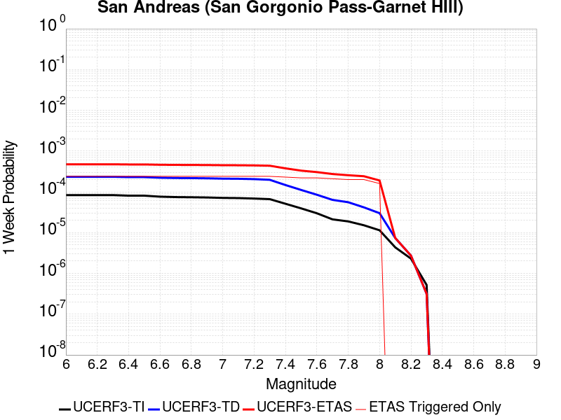 | 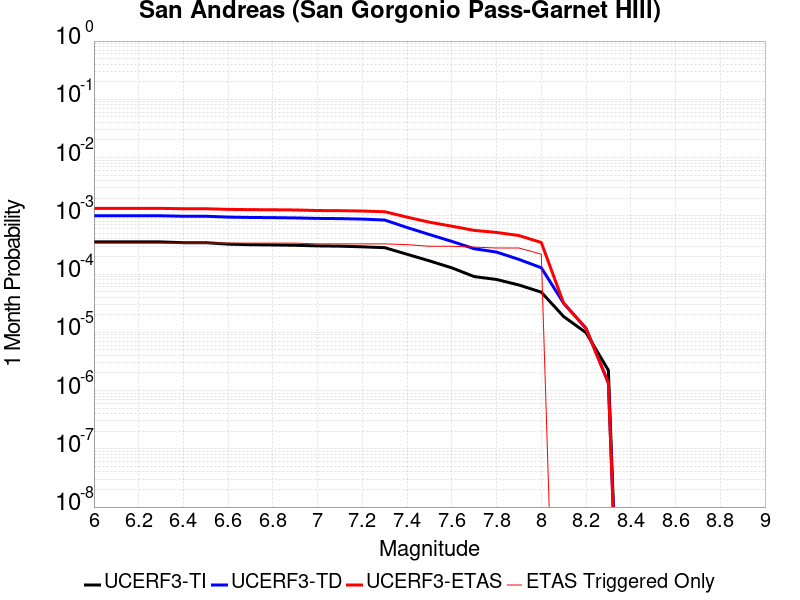 |  |  |

| Magnitude | 1 wk TI Prob | 1 wk TD Prob | 1 wk ETAS Prob | 1 wk ETAS/TD Gain | 1 wk ETAS Triggered Only | 1 mo TI Prob | 1 mo TD Prob | 1 mo ETAS Prob | 1 mo ETAS/TD Gain | 1 mo ETAS Triggered Only | 1 yr TI Prob | 1 yr TD Prob | 1 yr ETAS Prob | 1 yr ETAS/TD Gain | 1 yr ETAS Triggered Only | 10 yr TI Prob | 10 yr TD Prob | 10 yr ETAS Prob | 10 yr ETAS/TD Gain | 10 yr ETAS Triggered Only |
|-----|-----|-----|-----|-----|-----|-----|-----|-----|-----|-----|-----|-----|-----|-----|-----|-----|-----|-----|-----|-----|
| 6.0 | 8.31567E-5 | 2.3382473E-4 | 4.7376862E-4 | 2.0261698 | 2.4E-4 | 3.5633717E-4 | 0.0010017233 | 0.0013413827 | 1.3390751 | 3.4E-4 | 0.004329778 | 0.012127888 | 0.012572431 | 1.0366546 | 4.5E-4 | 0.042463828 | 0.11257892 | 0.11308475 | 1.0044931 | 5.7E-4 |
| 6.1 | 8.31567E-5 | 2.3382473E-4 | 4.7376862E-4 | 2.0261698 | 2.4E-4 | 3.5633717E-4 | 0.0010017233 | 0.0013413827 | 1.3390751 | 3.4E-4 | 0.004329778 | 0.012127888 | 0.012572431 | 1.0366546 | 4.5E-4 | 0.042463828 | 0.11257892 | 0.11308475 | 1.0044931 | 5.7E-4 |
| 6.2 | 8.31567E-5 | 2.3382473E-4 | 4.7376862E-4 | 2.0261698 | 2.4E-4 | 3.5633717E-4 | 0.0010017233 | 0.0013413827 | 1.3390751 | 3.4E-4 | 0.004329778 | 0.012127888 | 0.012572431 | 1.0366546 | 4.5E-4 | 0.042463828 | 0.11257892 | 0.11308475 | 1.0044931 | 5.7E-4 |
| 6.3 | 8.31567E-5 | 2.3382473E-4 | 4.7376862E-4 | 2.0261698 | 2.4E-4 | 3.5633717E-4 | 0.0010017233 | 0.0013413827 | 1.3390751 | 3.4E-4 | 0.004329778 | 0.012127888 | 0.012572431 | 1.0366546 | 4.5E-4 | 0.042463828 | 0.11257892 | 0.11308475 | 1.0044931 | 5.7E-4 |
| 6.4 | 8.059055E-5 | 2.2940808E-4 | 4.6935302E-4 | 2.0459306 | 2.4E-4 | 3.4534236E-4 | 9.828096E-4 | 0.0013224754 | 1.345607 | 3.4E-4 | 0.0041964394 | 0.011900152 | 0.012344797 | 1.0373646 | 4.5E-4 | 0.041180745 | 0.11056015 | 0.11106712 | 1.0045856 | 5.7E-4 |
| 6.5 | 8.059055E-5 | 2.2940808E-4 | 4.6935302E-4 | 2.0459306 | 2.4E-4 | 3.4534236E-4 | 9.828096E-4 | 0.0013224754 | 1.345607 | 3.4E-4 | 0.0041964394 | 0.011900152 | 0.012344797 | 1.0373646 | 4.5E-4 | 0.041180745 | 0.11056015 | 0.11106712 | 1.0045856 | 5.7E-4 |
| 6.6 | 7.619237E-5 | 2.218517E-4 | 4.6179845E-4 | 2.0815637 | 2.4E-4 | 3.2649786E-4 | 9.5044886E-4 | 0.0012901258 | 1.3573858 | 3.4E-4 | 0.0039678677 | 0.01151087 | 0.011955691 | 1.0386435 | 4.5E-4 | 0.03897764 | 0.10709683 | 0.107605785 | 1.0047523 | 5.7E-4 |
| 6.7 | 7.440636E-5 | 2.1860997E-4 | 4.585575E-4 | 2.0976057 | 2.4E-4 | 3.188454E-4 | 9.3656575E-4 | 0.0012762473 | 1.3626884 | 3.4E-4 | 0.0038750346 | 0.011343609 | 0.011788503 | 1.03922 | 4.5E-4 | 0.038081564 | 0.105605274 | 0.10611508 | 1.0048275 | 5.7E-4 |
| 6.8 | 7.3735864E-5 | 2.1708169E-4 | 4.570296E-4 | 2.1053345 | 2.4E-4 | 3.1597257E-4 | 9.3002064E-4 | 0.0012697044 | 1.3652433 | 3.4E-4 | 0.0038401815 | 0.011264749 | 0.01170968 | 1.0394976 | 4.5E-4 | 0.03774495 | 0.10490683 | 0.10541703 | 1.0048634 | 5.7E-4 |
| 6.9 | 7.27575E-5 | 2.1477141E-4 | 4.5471988E-4 | 2.117227 | 2.4E-4 | 3.117806E-4 | 9.201265E-4 | 0.0012598137 | 1.3691744 | 3.4E-4 | 0.003789323 | 0.011145527 | 0.011590511 | 1.039925 | 4.5E-4 | 0.037253562 | 0.103854746 | 0.10436554 | 1.0049185 | 5.7E-4 |
| 7.0 | 7.102591E-5 | 2.1061185E-4 | 4.505613E-4 | 2.139297 | 2.4E-4 | 3.0436125E-4 | 9.023122E-4 | 0.0012320144 | 1.3653971 | 3.3E-4 | 0.003699303 | 0.010930831 | 0.011366022 | 1.0398132 | 4.4E-4 | 0.03638325 | 0.10195695 | 0.10245985 | 1.0049325 | 5.6E-4 |
| 7.1 | 7.028513E-5 | 2.0896831E-4 | 4.4891817E-4 | 2.1482594 | 2.4E-4 | 3.0118722E-4 | 8.9527335E-4 | 0.0012249779 | 1.3682725 | 3.3E-4 | 0.0036607897 | 0.010845989 | 0.011281217 | 1.040128 | 4.4E-4 | 0.036010686 | 0.101199985 | 0.10169432 | 1.0048848 | 5.5E-4 |
| 7.2 | 6.8498244E-5 | 2.0504706E-4 | 4.4499786E-4 | 2.170223 | 2.4E-4 | 2.9353087E-4 | 8.784794E-4 | 0.0012081895 | 1.3753191 | 3.3E-4 | 0.003567883 | 0.010643536 | 0.011078853 | 1.0408996 | 4.4E-4 | 0.035111405 | 0.09939202 | 0.099887356 | 1.0049837 | 5.5E-4 |
| 7.3 | 6.622592E-5 | 1.9732013E-4 | 4.3727277E-4 | 2.2160575 | 2.4E-4 | 2.8379448E-4 | 8.453858E-4 | 0.0011751069 | 1.3900243 | 3.3E-4 | 0.0034497243 | 0.0102444785 | 0.010679971 | 1.0425099 | 4.4E-4 | 0.033966612 | 0.095888525 | 0.09638579 | 1.0051858 | 5.5E-4 |
| 7.4 | 5.1050705E-5 | 1.4689034E-4 | 3.7685654E-4 | 2.565564 | 2.3E-4 | 2.1877038E-4 | 6.29379E-4 | 9.491776E-4 | 1.5081177 | 3.2E-4 | 0.002660276 | 0.0076359594 | 0.008052752 | 1.054583 | 4.2E-4 | 0.02628654 | 0.07286301 | 0.073335856 | 1.0064894 | 5.1E-4 |
| 7.5 | 3.9302922E-5 | 1.1129847E-4 | 3.3127397E-4 | 2.9764469 | 2.2E-4 | 1.6843023E-4 | 4.7690657E-4 | 7.767635E-4 | 1.628754 | 3.0E-4 | 0.0020487092 | 0.005790949 | 0.0061886325 | 1.0686733 | 4.0E-4 | 0.020299247 | 0.05600951 | 0.056462627 | 1.00809 | 4.8E-4 |
| 7.6 | 2.9851626E-5 | 8.4949745E-5 | 3.0493105E-4 | 3.5895464 | 2.2E-4 | 1.2792926E-4 | 3.6401965E-4 | 6.6391047E-4 | 1.8238313 | 3.0E-4 | 0.0015564259 | 0.0044229585 | 0.004821189 | 1.0900372 | 4.0E-4 | 0.0154556995 | 0.04319374 | 0.043653004 | 1.0106328 | 4.8E-4 |
| 7.7 | 2.1135214E-5 | 6.3529005E-5 | 2.7351567E-4 | 4.305367 | 2.1E-4 | 9.0576345E-5 | 2.7223877E-4 | 5.621598E-4 | 2.0649514 | 2.9E-4 | 0.0011022091 | 0.0033094748 | 0.0036981842 | 1.1174535 | 3.9E-4 | 0.010967582 | 0.032582592 | 0.033027604 | 1.0136579 | 4.6E-4 |
| 7.8 | 1.883379E-5 | 5.564028E-5 | 2.5562916E-4 | 4.5943184 | 2.0E-4 | 8.0713755E-5 | 2.3843657E-4 | 5.183698E-4 | 2.1740365 | 2.8E-4 | 9.822468E-4 | 0.0028991038 | 0.0032780021 | 1.130695 | 3.8E-4 | 0.0097791655 | 0.028695205 | 0.029132294 | 1.0152321 | 4.5E-4 |
| 7.9 | 1.5156185E-5 | 4.1658426E-5 | 2.416501E-4 | 5.80075 | 2.0E-4 | 6.495346E-5 | 1.785239E-4 | 4.5847392E-4 | 2.5681374 | 2.8E-4 | 7.9052144E-4 | 0.0021713632 | 0.0025405597 | 1.1700299 | 3.7E-4 | 0.007877152 | 0.021759422 | 0.022189848 | 1.0197811 | 4.4E-4 |
| 8.0 | 1.1405907E-5 | 2.9974231E-5 | 1.8996943E-4 | 6.3377585 | 1.6E-4 | 4.8881542E-5 | 1.2845467E-4 | 3.484264E-4 | 2.7124465 | 2.2E-4 | 5.9497025E-4 | 0.0015628147 | 0.0018323926 | 1.1724952 | 2.7E-4 | 0.005933798 | 0.015772851 | 0.016097644 | 1.020592 | 3.3E-4 |
| 8.1 | 4.3511436E-6 | 7.369219E-6 | 7.369219E-6 | 1.0 | 0.0 | 1.8647626E-5 | 3.1581985E-5 | 3.1581985E-5 | 1.0 | 0.0 | 2.2701119E-4 | 3.8444297E-4 | 3.8444297E-4 | 1.0 | 0.0 | 0.0022677942 | 0.0041163345 | 0.0041262936 | 1.0024194 | 1.0E-5 |
| 8.2 | 2.3042528E-6 | 2.7329415E-6 | 2.7329415E-6 | 1.0 | 0.0 | 9.875332E-6 | 1.1712554E-5 | 1.1712554E-5 | 1.0 | 0.0 | 1.2022553E-4 | 1.4259106E-4 | 1.4259106E-4 | 1.0 | 0.0 | 0.0012016051 | 0.0015979785 | 0.0015979785 | 1.0 | 0.0 |
| 8.3 | 5.202968E-7 | 3.1598344E-7 | 3.1598344E-7 | 1.0 | 0.0 | 2.2298414E-6 | 1.3542141E-6 | 1.3542141E-6 | 1.0 | 0.0 | 2.714798E-5 | 1.6487444E-5 | 1.6487444E-5 | 1.0 | 0.0 | 2.7144665E-4 | 1.9563142E-4 | 1.9563142E-4 | 1.0 | 0.0 |

## Sierra Nevada  (No Extension)
*[(top)](#table-of-contents)*

| 1 Week | 1 Month | 1 Year | 10 Year |
|-----|-----|-----|-----|
| 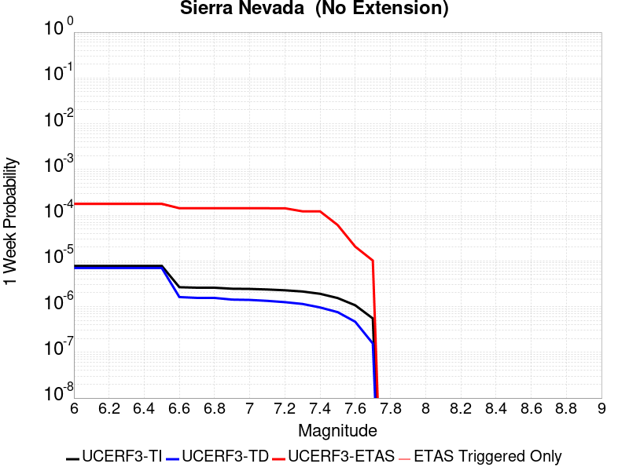 | 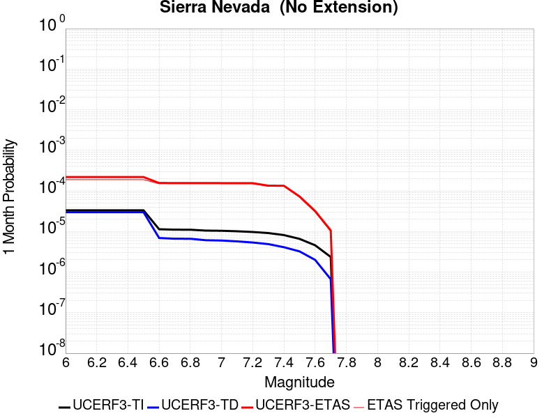 |  |  |

| Magnitude | 1 wk TI Prob | 1 wk TD Prob | 1 wk ETAS Prob | 1 wk ETAS/TD Gain | 1 wk ETAS Triggered Only | 1 mo TI Prob | 1 mo TD Prob | 1 mo ETAS Prob | 1 mo ETAS/TD Gain | 1 mo ETAS Triggered Only | 1 yr TI Prob | 1 yr TD Prob | 1 yr ETAS Prob | 1 yr ETAS/TD Gain | 1 yr ETAS Triggered Only | 10 yr TI Prob | 10 yr TD Prob | 10 yr ETAS Prob | 10 yr ETAS/TD Gain | 10 yr ETAS Triggered Only |
|-----|-----|-----|-----|-----|-----|-----|-----|-----|-----|-----|-----|-----|-----|-----|-----|-----|-----|-----|-----|-----|
| 6.0 | 7.7690465E-6 | 6.976322E-6 | 1.7697514E-4 | 25.367971 | 1.7E-4 | 3.329549E-5 | 2.9898381E-5 | 2.198927E-4 | 7.354669 | 1.9E-4 | 4.0529718E-4 | 3.6398784E-4 | 6.73875E-4 | 1.8513668 | 3.1E-4 | 0.004045588 | 0.0036374326 | 0.004075832 | 1.1205244 | 4.4E-4 |
| 6.1 | 7.7690465E-6 | 6.976322E-6 | 1.7697514E-4 | 25.367971 | 1.7E-4 | 3.329549E-5 | 2.9898381E-5 | 2.198927E-4 | 7.354669 | 1.9E-4 | 4.0529718E-4 | 3.6398784E-4 | 6.73875E-4 | 1.8513668 | 3.1E-4 | 0.004045588 | 0.0036374326 | 0.004075832 | 1.1205244 | 4.4E-4 |
| 6.2 | 7.7690465E-6 | 6.976322E-6 | 1.7697514E-4 | 25.367971 | 1.7E-4 | 3.329549E-5 | 2.9898381E-5 | 2.198927E-4 | 7.354669 | 1.9E-4 | 4.0529718E-4 | 3.6398784E-4 | 6.73875E-4 | 1.8513668 | 3.1E-4 | 0.004045588 | 0.0036374326 | 0.004075832 | 1.1205244 | 4.4E-4 |
| 6.3 | 7.7690465E-6 | 6.976322E-6 | 1.7697514E-4 | 25.367971 | 1.7E-4 | 3.329549E-5 | 2.9898381E-5 | 2.198927E-4 | 7.354669 | 1.9E-4 | 4.0529718E-4 | 3.6398784E-4 | 6.73875E-4 | 1.8513668 | 3.1E-4 | 0.004045588 | 0.0036374326 | 0.004075832 | 1.1205244 | 4.4E-4 |
| 6.4 | 7.7690465E-6 | 6.976322E-6 | 1.7697514E-4 | 25.367971 | 1.7E-4 | 3.329549E-5 | 2.9898381E-5 | 2.198927E-4 | 7.354669 | 1.9E-4 | 4.0529718E-4 | 3.6398784E-4 | 6.73875E-4 | 1.8513668 | 3.1E-4 | 0.004045588 | 0.0036374326 | 0.004075832 | 1.1205244 | 4.4E-4 |
| 6.5 | 7.7690465E-6 | 6.976322E-6 | 1.7697514E-4 | 25.367971 | 1.7E-4 | 3.329549E-5 | 2.9898381E-5 | 2.198927E-4 | 7.354669 | 1.9E-4 | 4.0529718E-4 | 3.6398784E-4 | 6.73875E-4 | 1.8513668 | 3.1E-4 | 0.004045588 | 0.0036374326 | 0.004075832 | 1.1205244 | 4.4E-4 |
| 6.6 | 2.653E-6 | 1.614854E-6 | 1.4161463E-4 | 87.69501 | 1.4E-4 | 1.136995E-5 | 6.9207845E-6 | 1.5691975E-4 | 22.673693 | 1.5E-4 | 1.3842035E-4 | 8.425733E-5 | 3.1423796E-4 | 3.729503 | 2.3E-4 | 0.0013833415 | 8.422573E-4 | 0.0011519962 | 1.3677486 | 3.1E-4 |
| 6.7 | 2.5902466E-6 | 1.5501876E-6 | 1.4154997E-4 | 91.311516 | 1.4E-4 | 1.11010095E-5 | 6.643644E-6 | 1.5664265E-4 | 23.57782 | 1.5E-4 | 1.351464E-4 | 8.0883394E-5 | 3.108648E-4 | 3.8433697 | 2.3E-4 | 0.0013506424 | 8.0854254E-4 | 0.0011182919 | 1.383096 | 3.1E-4 |
| 6.8 | 2.5853892E-6 | 1.5469877E-6 | 1.4154677E-4 | 91.498314 | 1.4E-4 | 1.1080193E-5 | 6.629931E-6 | 1.5662894E-4 | 23.624521 | 1.5E-4 | 1.34893E-4 | 8.071645E-5 | 3.1069788E-4 | 3.8492513 | 2.3E-4 | 0.0013481114 | 8.068743E-4 | 0.0011166241 | 1.3838886 | 3.1E-4 |
| 6.9 | 2.458257E-6 | 1.4220619E-6 | 1.4142186E-4 | 99.448456 | 1.4E-4 | 1.0535345E-5 | 6.094537E-6 | 1.5609362E-4 | 25.612055 | 1.5E-4 | 1.2826028E-4 | 7.4198484E-5 | 2.9418216E-4 | 3.9648001 | 2.2E-4 | 0.0012818627 | 7.4173906E-4 | 0.0010415165 | 1.4041549 | 3.0E-4 |
| 7.0 | 2.4341468E-6 | 1.3990258E-6 | 1.4139884E-4 | 101.06949 | 1.4E-4 | 1.0432016E-5 | 5.9958115E-6 | 1.5599492E-4 | 26.017315 | 1.5E-4 | 1.270024E-4 | 7.2996576E-5 | 2.9298052E-4 | 4.01362 | 2.2E-4 | 0.0012692984 | 7.297279E-4 | 0.001029509 | 1.4108121 | 3.0E-4 |
| 7.1 | 2.3652476E-6 | 1.3339754E-6 | 1.4133379E-4 | 105.94932 | 1.4E-4 | 1.0136736E-5 | 5.717025E-6 | 1.5571617E-4 | 27.237272 | 1.5E-4 | 1.2340778E-4 | 6.9602575E-5 | 2.8958727E-4 | 4.1605825 | 2.2E-4 | 0.0012333926 | 6.9580943E-4 | 9.956007E-4 | 1.4308525 | 3.0E-4 |
| 7.2 | 2.272158E-6 | 1.2502821E-6 | 1.412501E-4 | 112.97459 | 1.4E-4 | 9.737784E-6 | 5.3583412E-6 | 1.5535754E-4 | 28.99359 | 1.5E-4 | 1.1855107E-4 | 6.5235865E-5 | 2.8522153E-4 | 4.372158 | 2.2E-4 | 0.0011848784 | 6.5216864E-4 | 9.51973E-4 | 1.4597037 | 3.0E-4 |
| 7.3 | 2.1382127E-6 | 1.1419703E-6 | 1.21141835E-4 | 106.08142 | 1.2E-4 | 9.163737E-6 | 4.8941492E-6 | 1.3489352E-4 | 27.562199 | 1.3E-4 | 1.1156279E-4 | 5.958465E-5 | 2.4957332E-4 | 4.188551 | 1.9E-4 | 0.001115068 | 5.956879E-4 | 8.5553306E-4 | 1.4362102 | 2.6E-4 |
| 7.4 | 1.9048055E-6 | 9.575242E-7 | 1.2095741E-4 | 126.323074 | 1.2E-4 | 8.163426E-6 | 4.1036687E-6 | 1.3410313E-4 | 32.67884 | 1.3E-4 | 9.9385186E-5 | 4.996103E-5 | 2.2995204E-4 | 4.602628 | 1.8E-4 | 9.934074E-4 | 4.994987E-4 | 7.293838E-4 | 1.4602317 | 2.3E-4 |
| 7.5 | 1.5373403E-6 | 7.560042E-7 | 6.075596E-5 | 80.36458 | 6.0E-5 | 6.5885843E-6 | 3.2400142E-6 | 7.323979E-5 | 22.604774 | 7.0E-5 | 8.021306E-5 | 3.9446462E-5 | 1.5944173E-4 | 4.041978 | 1.2E-4 | 8.0184115E-4 | 3.943951E-4 | 5.443359E-4 | 1.3801793 | 1.5E-4 |
| 7.6 | 1.0680322E-6 | 4.6596554E-7 | 2.0465955E-5 | 43.921608 | 2.0E-5 | 4.577273E-6 | 1.9969937E-6 | 3.1996933E-5 | 16.02255 | 3.0E-5 | 5.5726876E-5 | 2.4313129E-5 | 9.431143E-5 | 3.8790329 | 7.0E-5 | 5.5712904E-4 | 2.4310495E-4 | 3.2308552E-4 | 1.328996 | 8.0E-5 |
| 7.7 | 5.509146E-7 | 1.5580486E-7 | 1.01558035E-5 | 65.18284 | 1.0E-5 | 2.3610605E-6 | 6.677349E-7 | 1.0667728E-5 | 15.975992 | 1.0E-5 | 2.8745531E-5 | 8.129644E-6 | 4.8129317E-5 | 5.9202247 | 4.0E-5 | 2.8741814E-4 | 8.1293576E-5 | 1.2129033E-4 | 1.4920038 | 4.0E-5 |

## Elsinore (Glen Ivy) rev
*[(top)](#table-of-contents)*

| 1 Week | 1 Month | 1 Year | 10 Year |
|-----|-----|-----|-----|
| 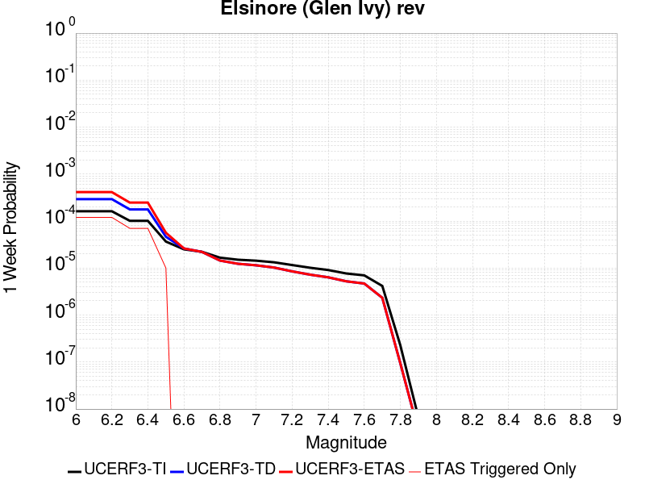 | 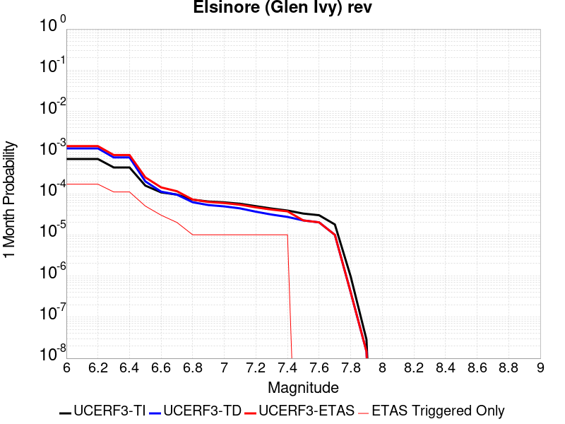 | 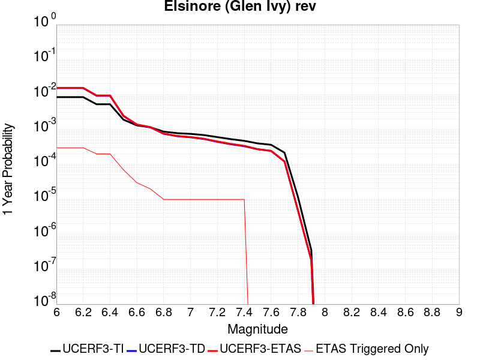 |  |

| Magnitude | 1 wk TI Prob | 1 wk TD Prob | 1 wk ETAS Prob | 1 wk ETAS/TD Gain | 1 wk ETAS Triggered Only | 1 mo TI Prob | 1 mo TD Prob | 1 mo ETAS Prob | 1 mo ETAS/TD Gain | 1 mo ETAS Triggered Only | 1 yr TI Prob | 1 yr TD Prob | 1 yr ETAS Prob | 1 yr ETAS/TD Gain | 1 yr ETAS Triggered Only | 10 yr TI Prob | 10 yr TD Prob | 10 yr ETAS Prob | 10 yr ETAS/TD Gain | 10 yr ETAS Triggered Only |
|-----|-----|-----|-----|-----|-----|-----|-----|-----|-----|-----|-----|-----|-----|-----|-----|-----|-----|-----|-----|-----|
| 6.0 | 1.6204086E-4 | 2.9360707E-4 | 4.1357183E-4 | 1.4085895 | 1.2E-4 | 6.94276E-4 | 0.0012578638 | 0.00142765 | 1.1349797 | 1.7E-4 | 0.008420097 | 0.015234485 | 0.015529915 | 1.0193921 | 3.0E-4 | 0.081081145 | 0.13969168 | 0.1400444 | 1.0025251 | 4.1E-4 |
| 6.1 | 1.6204086E-4 | 2.9360707E-4 | 4.1357183E-4 | 1.4085895 | 1.2E-4 | 6.94276E-4 | 0.0012578638 | 0.00142765 | 1.1349797 | 1.7E-4 | 0.008420097 | 0.015234485 | 0.015529915 | 1.0193921 | 3.0E-4 | 0.081081145 | 0.13969168 | 0.1400444 | 1.0025251 | 4.1E-4 |
| 6.2 | 1.6204086E-4 | 2.9360707E-4 | 4.1357183E-4 | 1.4085895 | 1.2E-4 | 6.94276E-4 | 0.0012578638 | 0.00142765 | 1.1349797 | 1.7E-4 | 0.008420097 | 0.015234485 | 0.015529915 | 1.0193921 | 3.0E-4 | 0.081081145 | 0.13969168 | 0.1400444 | 1.0025251 | 4.1E-4 |
| 6.3 | 1.0111737E-4 | 1.7703383E-4 | 2.4702144E-4 | 1.3953347 | 7.0E-5 | 4.332882E-4 | 7.5861247E-4 | 8.68529E-4 | 1.1448916 | 1.1E-4 | 0.005262531 | 0.009217682 | 0.009415839 | 1.0214974 | 2.0E-4 | 0.0513964 | 0.0870191 | 0.087283865 | 1.0030426 | 2.9E-4 |
| 6.4 | 1.0111737E-4 | 1.7703383E-4 | 2.4702144E-4 | 1.3953347 | 7.0E-5 | 4.332882E-4 | 7.5861247E-4 | 8.68529E-4 | 1.1448916 | 1.1E-4 | 0.005262531 | 0.009217682 | 0.009415839 | 1.0214974 | 2.0E-4 | 0.0513964 | 0.0870191 | 0.087283865 | 1.0030426 | 2.9E-4 |
| 6.5 | 3.6624708E-5 | 4.6391084E-5 | 5.6390618E-5 | 1.2155486 | 1.0E-5 | 1.569536E-4 | 1.9880582E-4 | 2.487959E-4 | 1.2514517 | 5.0E-5 | 0.001909235 | 0.0024181372 | 0.0024879677 | 1.0288779 | 7.0E-5 | 0.01892915 | 0.023739954 | 0.023827817 | 1.0037011 | 9.0E-5 |
| 6.6 | 2.5051324E-5 | 2.614772E-5 | 2.614772E-5 | 1.0 | 0.0 | 1.073584E-4 | 1.12057096E-4 | 1.4205373E-4 | 1.2676907 | 3.0E-5 | 0.0013063047 | 0.0013634858 | 0.001393445 | 1.0219724 | 3.0E-5 | 0.012986525 | 0.013564618 | 0.01361394 | 1.003636 | 5.0E-5 |
| 6.7 | 2.2189772E-5 | 2.2072849E-5 | 2.2072849E-5 | 1.0 | 0.0 | 9.509556E-5 | 9.4594696E-5 | 1.145928E-4 | 1.2114084 | 2.0E-5 | 0.0011571734 | 0.0011511183 | 0.0011710953 | 1.0173544 | 2.0E-5 | 0.011511663 | 0.011465415 | 0.0115049565 | 1.0034487 | 4.0E-5 |
| 6.8 | 1.6654378E-5 | 1.4437705E-5 | 1.4437705E-5 | 1.0 | 0.0 | 7.137396E-5 | 6.187444E-5 | 7.187382E-5 | 1.1616076 | 1.0E-5 | 8.686314E-4 | 7.530661E-4 | 7.6305855E-4 | 1.0132691 | 1.0E-5 | 0.008652439 | 0.00751048 | 0.007520405 | 1.0013214 | 1.0E-5 |
| 6.9 | 1.5042909E-5 | 1.2332022E-5 | 1.2332022E-5 | 1.0 | 0.0 | 6.446802E-5 | 5.285047E-5 | 6.284994E-5 | 1.189203 | 1.0E-5 | 7.8461546E-4 | 6.4326765E-4 | 6.532612E-4 | 1.0155356 | 1.0E-5 | 0.007818509 | 0.00641828 | 0.0064282157 | 1.001548 | 1.0E-5 |
| 7.0 | 1.4361385E-5 | 1.1451324E-5 | 1.1451324E-5 | 1.0 | 0.0 | 6.154734E-5 | 4.9076196E-5 | 5.9075704E-5 | 1.2037548 | 1.0E-5 | 7.490812E-4 | 5.973418E-4 | 6.073358E-4 | 1.0167308 | 1.0E-5 | 0.007465612 | 0.0059613534 | 0.005971294 | 1.0016675 | 1.0E-5 |
| 7.1 | 1.3265571E-5 | 1.0244926E-5 | 1.0244926E-5 | 1.0 | 0.0 | 5.6851208E-5 | 4.39061E-5 | 5.390566E-5 | 1.2277488 | 1.0E-5 | 6.919436E-4 | 5.344282E-4 | 5.4442283E-4 | 1.0187016 | 1.0E-5 | 0.006897931 | 0.0053347866 | 0.005344733 | 1.0018644 | 1.0E-5 |
| 7.2 | 1.1596403E-5 | 8.505067E-6 | 8.505067E-6 | 1.0 | 0.0 | 4.9697923E-5 | 3.6449786E-5 | 4.6449422E-5 | 1.27434 | 1.0E-5 | 6.049042E-4 | 4.436875E-4 | 4.5368305E-4 | 1.0225284 | 1.0E-5 | 0.006032603 | 0.0044294316 | 0.0044393875 | 1.0022476 | 1.0E-5 |
| 7.3 | 1.0150827E-5 | 7.2387597E-6 | 7.2387597E-6 | 1.0 | 0.0 | 4.3502816E-5 | 3.1022897E-5 | 4.1022588E-5 | 1.3223326 | 1.0E-5 | 5.2951806E-4 | 3.7763975E-4 | 3.8763596E-4 | 1.0264703 | 1.0E-5 | 0.005282581 | 0.0037703665 | 0.003780329 | 1.0026423 | 1.0E-5 |
| 7.4 | 9.080705E-6 | 6.352519E-6 | 6.352519E-6 | 1.0 | 0.0 | 3.8916725E-5 | 2.7224805E-5 | 3.7224534E-5 | 1.3673021 | 1.0E-5 | 4.7370812E-4 | 3.3141294E-4 | 3.4140964E-4 | 1.0301639 | 1.0E-5 | 0.004726996 | 0.0033093381 | 0.003319305 | 1.0030117 | 1.0E-5 |
| 7.5 | 7.671649E-6 | 5.2256332E-6 | 5.2256332E-6 | 1.0 | 0.0 | 3.287808E-5 | 2.2395385E-5 | 2.2395385E-5 | 1.0 | 0.0 | 4.0021708E-4 | 2.7263095E-4 | 2.7263095E-4 | 1.0 | 0.0 | 0.0039949706 | 0.00272309 | 0.00272309 | 1.0 | 0.0 |
| 7.6 | 6.990086E-6 | 4.687545E-6 | 4.687545E-6 | 1.0 | 0.0 | 2.9957167E-5 | 2.008933E-5 | 2.008933E-5 | 1.0 | 0.0 | 3.6466747E-4 | 2.445613E-4 | 2.445613E-4 | 1.0 | 0.0 | 0.0036406964 | 0.002443038 | 0.002443038 | 1.0 | 0.0 |
| 7.7 | 4.163505E-6 | 2.3295343E-6 | 2.3295343E-6 | 1.0 | 0.0 | 1.7843471E-5 | 9.983683E-6 | 9.983683E-6 | 1.0 | 0.0 | 2.172226E-4 | 1.21545316E-4 | 1.21545316E-4 | 1.0 | 0.0 | 0.0021701038 | 0.0012148614 | 0.0012148614 | 1.0 | 0.0 |
| 7.8 | 2.2692414E-7 | 9.3854695E-8 | 9.3854695E-8 | 1.0 | 0.0 | 9.725317E-7 | 4.0223435E-7 | 4.0223435E-7 | 1.0 | 0.0 | 1.1840509E-5 | 4.8971956E-6 | 4.8971956E-6 | 1.0 | 0.0 | 1.1839878E-4 | 4.8971204E-5 | 4.8971204E-5 | 1.0 | 0.0 |
| 7.9 | 6.676829E-9 | 3.439853E-9 | 3.439853E-9 | 1.0 | 0.0 | 2.861498E-8 | 1.4742227E-8 | 1.4742227E-8 | 1.0 | 0.0 | 3.4838732E-7 | 1.7948659E-7 | 1.7948659E-7 | 1.0 | 0.0 | 3.4838679E-6 | 1.7948646E-6 | 1.7948646E-6 | 1.0 | 0.0 |

## Death Valley (Fish Lake Valley)
*[(top)](#table-of-contents)*

| 1 Week | 1 Month | 1 Year | 10 Year |
|-----|-----|-----|-----|
| 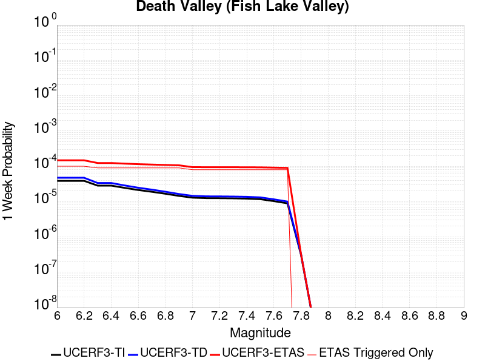 | 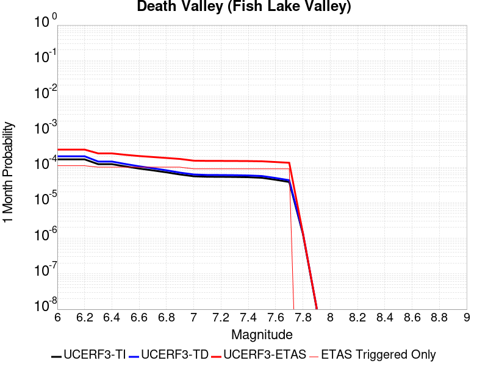 |  |  |

| Magnitude | 1 wk TI Prob | 1 wk TD Prob | 1 wk ETAS Prob | 1 wk ETAS/TD Gain | 1 wk ETAS Triggered Only | 1 mo TI Prob | 1 mo TD Prob | 1 mo ETAS Prob | 1 mo ETAS/TD Gain | 1 mo ETAS Triggered Only | 1 yr TI Prob | 1 yr TD Prob | 1 yr ETAS Prob | 1 yr ETAS/TD Gain | 1 yr ETAS Triggered Only | 10 yr TI Prob | 10 yr TD Prob | 10 yr ETAS Prob | 10 yr ETAS/TD Gain | 10 yr ETAS Triggered Only |
|-----|-----|-----|-----|-----|-----|-----|-----|-----|-----|-----|-----|-----|-----|-----|-----|-----|-----|-----|-----|-----|
| 6.0 | 3.872328E-5 | 4.7267473E-5 | 1.4726275E-4 | 3.1155198 | 1.0E-4 | 1.6594635E-4 | 2.0256084E-4 | 3.1253856E-4 | 1.5429367 | 1.1E-4 | 0.0020185246 | 0.002463534 | 0.0027228934 | 1.1052794 | 2.6E-4 | 0.02000288 | 0.024388181 | 0.024807693 | 1.0172015 | 4.3E-4 |
| 6.1 | 3.872328E-5 | 4.7267473E-5 | 1.4726275E-4 | 3.1155198 | 1.0E-4 | 1.6594635E-4 | 2.0256084E-4 | 3.1253856E-4 | 1.5429367 | 1.1E-4 | 0.0020185246 | 0.002463534 | 0.0027228934 | 1.1052794 | 2.6E-4 | 0.02000288 | 0.024388181 | 0.024807693 | 1.0172015 | 4.3E-4 |
| 6.2 | 3.872328E-5 | 4.7267473E-5 | 1.4726275E-4 | 3.1155198 | 1.0E-4 | 1.6594635E-4 | 2.0256084E-4 | 3.1253856E-4 | 1.5429367 | 1.1E-4 | 0.0020185246 | 0.002463534 | 0.0027228934 | 1.1052794 | 2.6E-4 | 0.02000288 | 0.024388181 | 0.024807693 | 1.0172015 | 4.3E-4 |
| 6.3 | 2.8356371E-5 | 3.3609853E-5 | 1.2360682E-4 | 3.6776962 | 9.0E-5 | 1.2152165E-4 | 1.4403471E-4 | 2.4402031E-4 | 1.694177 | 1.0E-4 | 0.0014785219 | 0.0017522911 | 0.002001853 | 1.1424204 | 2.5E-4 | 0.014687235 | 0.017391782 | 0.017794652 | 1.0231644 | 4.1E-4 |
| 6.4 | 2.8356371E-5 | 3.3609853E-5 | 1.2360682E-4 | 3.6776962 | 9.0E-5 | 1.2152165E-4 | 1.4403471E-4 | 2.4402031E-4 | 1.694177 | 1.0E-4 | 0.0014785219 | 0.0017522911 | 0.002001853 | 1.1424204 | 2.5E-4 | 0.014687235 | 0.017391782 | 0.017794652 | 1.0231644 | 4.1E-4 |
| 6.5 | 2.4448687E-5 | 2.8607552E-5 | 1.1860498E-4 | 4.145932 | 9.0E-5 | 1.0477588E-4 | 1.2259831E-4 | 2.2258607E-4 | 1.8155719 | 1.0E-4 | 0.0012748998 | 0.0014916632 | 0.0017412902 | 1.1673481 | 2.5E-4 | 0.012676105 | 0.014821377 | 0.0152253 | 1.0272528 | 4.1E-4 |
| 6.6 | 2.1298161E-5 | 2.4660083E-5 | 1.14657865E-4 | 4.649533 | 9.0E-5 | 9.127464E-5 | 1.0568198E-4 | 2.0567141E-4 | 1.946135 | 1.0E-4 | 0.0011107022 | 0.0012859525 | 0.001535631 | 1.1941584 | 2.5E-4 | 0.011051672 | 0.012788526 | 0.013193282 | 1.03165 | 4.1E-4 |
| 6.7 | 1.8959729E-5 | 2.1781025E-5 | 1.1177907E-4 | 5.131947 | 9.0E-5 | 8.125345E-5 | 9.334405E-5 | 1.9333472E-4 | 2.0712054 | 1.0E-4 | 9.888117E-4 | 0.001135897 | 0.001385613 | 1.2198404 | 2.5E-4 | 0.009844234 | 0.01130357 | 0.011708936 | 1.0358617 | 4.1E-4 |
| 6.8 | 1.6691629E-5 | 1.9018353E-5 | 1.0901664E-4 | 5.732181 | 9.0E-5 | 7.153359E-5 | 8.150477E-5 | 1.8149662E-4 | 2.2268221 | 1.0E-4 | 8.7057345E-4 | 9.918857E-4 | 0.0012416377 | 1.2517952 | 2.5E-4 | 0.008671708 | 0.009876343 | 0.010282294 | 1.0411034 | 4.1E-4 |
| 6.9 | 1.450505E-5 | 1.638954E-5 | 1.0638806E-4 | 6.491217 | 9.0E-5 | 6.216302E-5 | 7.0239046E-5 | 1.7023202E-4 | 2.4236095 | 1.0E-4 | 7.5657194E-4 | 8.5483363E-4 | 0.0011046199 | 1.2922046 | 2.5E-4 | 0.007540013 | 0.008516385 | 0.008922894 | 1.0477325 | 4.1E-4 |
| 7.0 | 1.2940855E-5 | 1.4537972E-5 | 9.453681E-5 | 6.502751 | 8.0E-5 | 5.545963E-5 | 6.230414E-5 | 1.5229853E-4 | 2.4444368 | 9.0E-5 | 6.750118E-4 | 7.5829466E-4 | 9.981127E-4 | 1.3162596 | 2.4E-4 | 0.006729651 | 0.0075576897 | 0.007954666 | 1.0525262 | 4.0E-4 |
| 7.1 | 1.2544658E-5 | 1.4078208E-5 | 9.4077084E-5 | 6.6824617 | 8.0E-5 | 5.3761712E-5 | 6.0333812E-5 | 1.5032839E-4 | 2.4916108 | 9.0E-5 | 6.5435225E-4 | 7.343222E-4 | 9.7414595E-4 | 1.326592 | 2.4E-4 | 0.006524288 | 0.007319551 | 0.007716623 | 1.0542482 | 4.0E-4 |
| 7.2 | 1.2489416E-5 | 1.4015674E-5 | 9.4014555E-5 | 6.707815 | 8.0E-5 | 5.3524967E-5 | 6.0065824E-5 | 1.5006041E-4 | 2.4982662 | 9.0E-5 | 6.514716E-4 | 7.310616E-4 | 9.708862E-4 | 1.3280497 | 2.4E-4 | 0.006495651 | 0.0072871596 | 0.007684245 | 1.054491 | 4.0E-4 |
| 7.3 | 1.2368307E-5 | 1.3879812E-5 | 9.3878705E-5 | 6.7636867 | 8.0E-5 | 5.3005948E-5 | 5.9483587E-5 | 1.4947823E-4 | 2.5129325 | 9.0E-5 | 6.451563E-4 | 7.2397763E-4 | 9.6380385E-4 | 1.331262 | 2.4E-4 | 0.0064328653 | 0.007216782 | 0.007613895 | 1.0550264 | 4.0E-4 |
| 7.4 | 1.2161707E-5 | 1.36478675E-5 | 9.364678E-5 | 6.8616414 | 8.0E-5 | 5.212056E-5 | 5.8489582E-5 | 1.4848432E-4 | 2.5386455 | 9.0E-5 | 6.3438306E-4 | 7.118836E-4 | 9.517127E-4 | 1.3368938 | 2.4E-4 | 0.006325751 | 0.0070966207 | 0.007493782 | 1.0559648 | 4.0E-4 |
| 7.5 | 1.1707948E-5 | 1.3145515E-5 | 9.314447E-5 | 7.0856457 | 8.0E-5 | 5.0175953E-5 | 5.6336736E-5 | 1.4633167E-4 | 2.5974467 | 9.0E-5 | 6.10721E-4 | 6.856895E-4 | 9.255249E-4 | 1.3497727 | 2.4E-4 | 0.0060904534 | 0.006836321 | 0.0072335866 | 1.058111 | 4.0E-4 |
| 7.6 | 1.0319538E-5 | 1.1579622E-5 | 9.1578695E-5 | 7.9086084 | 8.0E-5 | 4.4225842E-5 | 4.9626036E-5 | 1.3962157E-4 | 2.8134742 | 9.0E-5 | 5.383166E-4 | 6.040347E-4 | 8.438897E-4 | 1.3970882 | 2.4E-4 | 0.0053701443 | 0.0060244603 | 0.0064220508 | 1.0659959 | 4.0E-4 |
| 7.7 | 8.937764E-6 | 1.0022779E-5 | 9.0021975E-5 | 8.981738 | 8.0E-5 | 3.830414E-5 | 4.295409E-5 | 1.3295023E-4 | 3.0951703 | 9.0E-5 | 4.6625308E-4 | 5.228456E-4 | 7.5272535E-4 | 1.4396704 | 2.3E-4 | 0.0046527605 | 0.005216664 | 0.00560463 | 1.0743704 | 3.9E-4 |
| 7.8 | 3.108007E-7 | 3.284654E-7 | 3.284654E-7 | 1.0 | 0.0 | 1.3320023E-6 | 1.407708E-6 | 1.407708E-6 | 1.0 | 0.0 | 1.6217007E-5 | 1.7138715E-5 | 2.7138543E-5 | 1.5834643 | 1.0E-5 | 1.6215823E-4 | 1.7137431E-4 | 1.813726E-4 | 1.0583419 | 1.0E-5 |
| 7.9 | 2.5591178E-9 | 2.6696718E-9 | 2.6696718E-9 | 1.0 | 0.0 | 1.0967647E-8 | 1.14414505E-8 | 1.14414505E-8 | 1.0 | 0.0 | 1.335311E-7 | 1.3929966E-7 | 1.3929966E-7 | 1.0 | 0.0 | 1.3353102E-6 | 1.3929966E-6 | 1.3929966E-6 | 1.0 | 0.0 |

## Baker
*[(top)](#table-of-contents)*

| 1 Week | 1 Month | 1 Year | 10 Year |
|-----|-----|-----|-----|
| 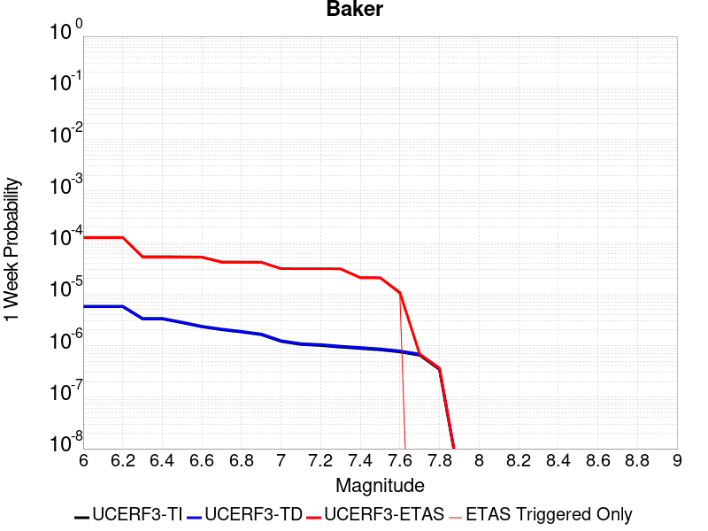 |  | 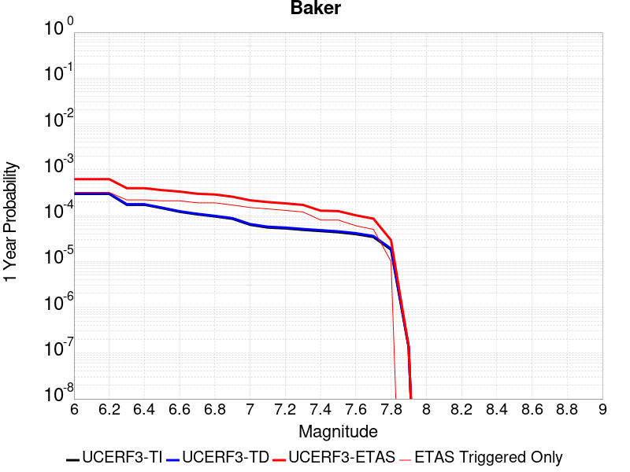 |  |

| Magnitude | 1 wk TI Prob | 1 wk TD Prob | 1 wk ETAS Prob | 1 wk ETAS/TD Gain | 1 wk ETAS Triggered Only | 1 mo TI Prob | 1 mo TD Prob | 1 mo ETAS Prob | 1 mo ETAS/TD Gain | 1 mo ETAS Triggered Only | 1 yr TI Prob | 1 yr TD Prob | 1 yr ETAS Prob | 1 yr ETAS/TD Gain | 1 yr ETAS Triggered Only | 10 yr TI Prob | 10 yr TD Prob | 10 yr ETAS Prob | 10 yr ETAS/TD Gain | 10 yr ETAS Triggered Only |
|-----|-----|-----|-----|-----|-----|-----|-----|-----|-----|-----|-----|-----|-----|-----|-----|-----|-----|-----|-----|-----|
| 6.0 | 5.695525E-6 | 5.8348373E-6 | 1.2583414E-4 | 21.566008 | 1.2E-4 | 2.4409164E-5 | 2.5006228E-5 | 1.9500198E-4 | 7.7981367 | 1.7E-4 | 2.9714106E-4 | 3.044123E-4 | 6.243149E-4 | 2.050886 | 3.2E-4 | 0.0029674405 | 0.0030403486 | 0.003479011 | 1.1442802 | 4.4E-4 |
| 6.1 | 5.695525E-6 | 5.8348373E-6 | 1.2583414E-4 | 21.566008 | 1.2E-4 | 2.4409164E-5 | 2.5006228E-5 | 1.9500198E-4 | 7.7981367 | 1.7E-4 | 2.9714106E-4 | 3.044123E-4 | 6.243149E-4 | 2.050886 | 3.2E-4 | 0.0029674405 | 0.0030403486 | 0.003479011 | 1.1442802 | 4.4E-4 |
| 6.2 | 5.695525E-6 | 5.8348373E-6 | 1.2583414E-4 | 21.566008 | 1.2E-4 | 2.4409164E-5 | 2.5006228E-5 | 1.9500198E-4 | 7.7981367 | 1.7E-4 | 2.9714106E-4 | 3.044123E-4 | 6.243149E-4 | 2.050886 | 3.2E-4 | 0.0029674405 | 0.0030403486 | 0.003479011 | 1.1442802 | 4.4E-4 |
| 6.3 | 3.2995713E-6 | 3.383667E-6 | 5.3383497E-5 | 15.776817 | 5.0E-5 | 1.4140943E-5 | 1.4501353E-5 | 1.14499904E-4 | 7.8958087 | 1.0E-4 | 1.7215237E-4 | 1.7654014E-4 | 3.965013E-4 | 2.2459555 | 2.2E-4 | 0.0017201907 | 0.001764046 | 0.0020734991 | 1.1754224 | 3.1E-4 |
| 6.4 | 3.2995713E-6 | 3.383667E-6 | 5.3383497E-5 | 15.776817 | 5.0E-5 | 1.4140943E-5 | 1.4501353E-5 | 1.14499904E-4 | 7.8958087 | 1.0E-4 | 1.7215237E-4 | 1.7654014E-4 | 3.965013E-4 | 2.2459555 | 2.2E-4 | 0.0017201907 | 0.001764046 | 0.0020734991 | 1.1754224 | 3.1E-4 |
| 6.5 | 2.782202E-6 | 2.8558404E-6 | 5.28557E-5 | 18.50793 | 5.0E-5 | 1.1923668E-5 | 1.223926E-5 | 1.12238034E-4 | 9.170328 | 1.0E-4 | 1.4516099E-4 | 1.4900314E-4 | 3.5897185E-4 | 2.4091563 | 2.1E-4 | 0.001450662 | 0.0014890651 | 0.0017886184 | 1.2011687 | 3.0E-4 |
| 6.6 | 2.3163404E-6 | 2.38092E-6 | 5.23808E-5 | 22.000237 | 5.0E-5 | 9.927136E-6 | 1.0203904E-5 | 1.10202884E-4 | 10.800071 | 1.0E-4 | 1.20856166E-4 | 1.2422565E-4 | 3.3419958E-4 | 2.690262 | 2.1E-4 | 0.0012079047 | 0.0012415823 | 0.0015312223 | 1.2332829 | 2.9E-4 |
| 6.7 | 2.037056E-6 | 2.0965003E-6 | 4.2096417E-5 | 20.079374 | 4.0E-5 | 8.7302105E-6 | 8.984972E-6 | 9.8984165E-5 | 11.016636 | 9.0E-5 | 1.0628513E-4 | 1.093867E-4 | 2.9936593E-4 | 2.736767 | 1.9E-4 | 0.0010623431 | 0.0010933448 | 0.0013630495 | 1.2466786 | 2.7E-4 |
| 6.8 | 1.8356744E-6 | 1.8915287E-6 | 4.1891453E-5 | 22.146877 | 4.0E-5 | 7.867153E-6 | 8.106527E-6 | 9.81058E-5 | 12.102075 | 9.0E-5 | 9.577837E-5 | 9.869264E-5 | 2.8867388E-4 | 2.924979 | 1.9E-4 | 9.57371E-4 | 9.86502E-4 | 0.0012562356 | 1.2734243 | 2.7E-4 |
| 6.9 | 1.6310546E-6 | 1.6832072E-6 | 4.168314E-5 | 24.764116 | 4.0E-5 | 6.9902153E-6 | 7.213726E-6 | 7.721322E-5 | 10.703653 | 7.0E-5 | 8.510255E-5 | 8.782368E-5 | 2.5780874E-4 | 2.9355264 | 1.7E-4 | 8.5069967E-4 | 8.7790104E-4 | 0.0011276816 | 1.2845201 | 2.5E-4 |
| 7.0 | 1.2058036E-6 | 1.2508665E-6 | 3.1250827E-5 | 24.983343 | 3.0E-5 | 5.1677193E-6 | 5.3608455E-6 | 6.5360524E-5 | 12.1922035 | 6.0E-5 | 6.291517E-5 | 6.5266366E-5 | 2.1525657E-4 | 3.298124 | 1.5E-4 | 6.289736E-4 | 6.524743E-4 | 8.8232424E-4 | 1.3522743 | 2.3E-4 |
| 7.1 | 1.052382E-6 | 1.0951609E-6 | 3.109513E-5 | 28.393206 | 3.0E-5 | 4.5102006E-6 | 4.693538E-6 | 6.469325E-5 | 13.783473 | 6.0E-5 | 5.491031E-5 | 5.7142337E-5 | 1.9713433E-4 | 3.4498823 | 1.4E-4 | 5.4896745E-4 | 5.7127734E-4 | 7.8115735E-4 | 1.3673873 | 2.1E-4 |
| 7.2 | 1.0067454E-6 | 1.0487711E-6 | 3.104874E-5 | 29.604877 | 3.0E-5 | 4.3146156E-6 | 4.4947255E-6 | 5.44945E-5 | 12.1241 | 5.0E-5 | 5.252918E-5 | 5.4721917E-5 | 1.8471481E-4 | 3.3755178 | 1.3E-4 | 5.251676E-4 | 5.470853E-4 | 7.269868E-4 | 1.3288363 | 1.8E-4 |
| 7.3 | 9.3596316E-7 | 9.767723E-7 | 3.0976742E-5 | 31.713371 | 3.0E-5 | 4.0112645E-6 | 4.1861604E-6 | 5.418595E-5 | 12.944069 | 5.0E-5 | 4.8836053E-5 | 5.096532E-5 | 1.709592E-4 | 3.3544223 | 1.2E-4 | 4.8825322E-4 | 5.095371E-4 | 6.5946067E-4 | 1.2942349 | 1.5E-4 |
| 7.4 | 8.8117395E-7 | 9.2076635E-7 | 2.0920748E-5 | 22.721018 | 2.0E-5 | 3.7764542E-6 | 3.9461356E-6 | 3.3946017E-5 | 8.6023445 | 3.0E-5 | 4.5977362E-5 | 4.8043148E-5 | 1.280393E-4 | 2.6650898 | 8.0E-5 | 4.596785E-4 | 4.8032837E-4 | 5.9027557E-4 | 1.2289 | 1.1E-4 |
| 7.5 | 8.292386E-7 | 8.6745956E-7 | 2.0867443E-5 | 24.055809 | 2.0E-5 | 3.5538749E-6 | 3.7176785E-6 | 3.3717566E-5 | 9.069522 | 3.0E-5 | 4.326757E-5 | 4.5261804E-5 | 1.2525819E-4 | 2.7674148 | 8.0E-5 | 4.3259145E-4 | 4.5252658E-4 | 5.5248133E-4 | 1.2208815 | 1.0E-4 |
| 7.6 | 7.553842E-7 | 7.9144706E-7 | 1.0791439E-5 | 13.635074 | 1.0E-5 | 3.2373566E-6 | 3.3919116E-6 | 2.3391844E-5 | 6.89636 | 2.0E-5 | 3.9414106E-5 | 4.129575E-5 | 1.0129327E-4 | 2.4528742 | 6.0E-5 | 3.9407116E-4 | 4.1288146E-4 | 4.928484E-4 | 1.1936802 | 8.0E-5 |
| 7.7 | 6.5285366E-7 | 6.852797E-7 | 6.852797E-7 | 1.0 | 0.0 | 2.797941E-6 | 2.9369096E-6 | 1.293688E-5 | 4.4049296 | 1.0E-5 | 3.40644E-5 | 3.5756293E-5 | 8.575451E-5 | 2.3983052 | 5.0E-5 | 3.405918E-4 | 3.5750607E-4 | 4.1748464E-4 | 1.1677693 | 6.0E-5 |
| 7.8 | 3.4586725E-7 | 3.6482615E-7 | 3.6482615E-7 | 1.0 | 0.0 | 1.4822873E-6 | 1.5635396E-6 | 1.5635396E-6 | 1.0 | 0.0 | 1.80467E-5 | 1.9035933E-5 | 2.9035744E-5 | 1.5253123 | 1.0E-5 | 1.8045233E-4 | 1.9034347E-4 | 2.0034157E-4 | 1.0525266 | 1.0E-5 |
| 7.9 | 2.5591178E-9 | 2.6696718E-9 | 2.6696718E-9 | 1.0 | 0.0 | 1.0967647E-8 | 1.14414505E-8 | 1.14414505E-8 | 1.0 | 0.0 | 1.335311E-7 | 1.3929966E-7 | 1.3929966E-7 | 1.0 | 0.0 | 1.3353102E-6 | 1.3929966E-6 | 1.3929966E-6 | 1.0 | 0.0 |

## San Jacinto (San Bernardino)
*[(top)](#table-of-contents)*

| 1 Week | 1 Month | 1 Year | 10 Year |
|-----|-----|-----|-----|
| 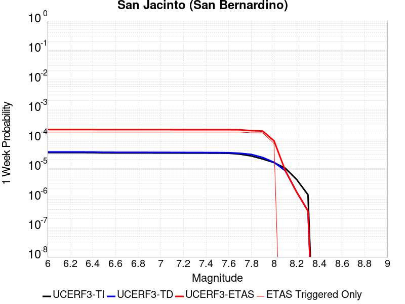 | 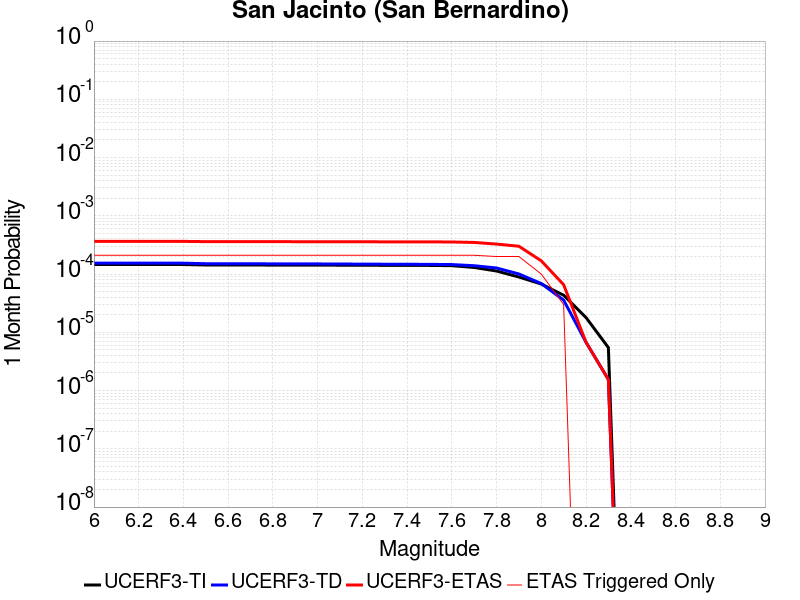 | 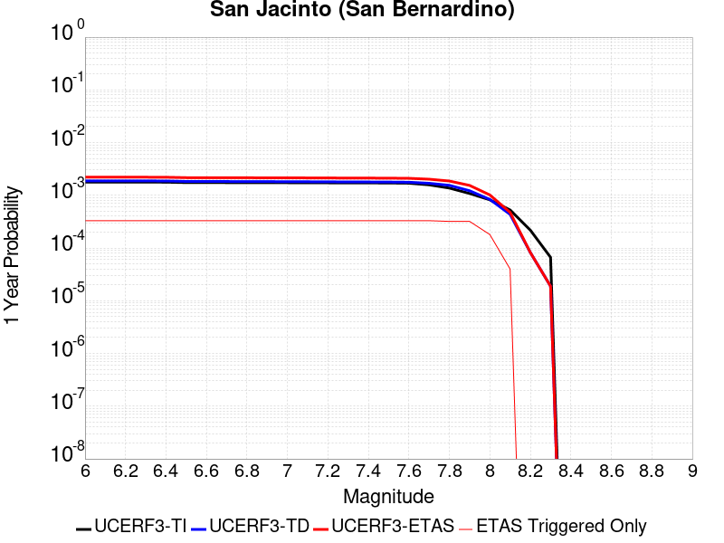 |  |

| Magnitude | 1 wk TI Prob | 1 wk TD Prob | 1 wk ETAS Prob | 1 wk ETAS/TD Gain | 1 wk ETAS Triggered Only | 1 mo TI Prob | 1 mo TD Prob | 1 mo ETAS Prob | 1 mo ETAS/TD Gain | 1 mo ETAS Triggered Only | 1 yr TI Prob | 1 yr TD Prob | 1 yr ETAS Prob | 1 yr ETAS/TD Gain | 1 yr ETAS Triggered Only | 10 yr TI Prob | 10 yr TD Prob | 10 yr ETAS Prob | 10 yr ETAS/TD Gain | 10 yr ETAS Triggered Only |
|-----|-----|-----|-----|-----|-----|-----|-----|-----|-----|-----|-----|-----|-----|-----|-----|-----|-----|-----|-----|-----|
| 6.0 | 3.409352E-5 | 3.5986508E-5 | 2.059804E-4 | 5.7238226 | 1.7E-4 | 1.461069E-4 | 1.542188E-4 | 3.6418642E-4 | 2.3614917 | 2.1E-4 | 0.0017774 | 0.0018759987 | 0.0022053795 | 1.1755763 | 3.3E-4 | 0.01763251 | 0.019349935 | 0.019771615 | 1.0217923 | 4.3E-4 |
| 6.1 | 3.409352E-5 | 3.5986508E-5 | 2.059804E-4 | 5.7238226 | 1.7E-4 | 1.461069E-4 | 1.542188E-4 | 3.6418642E-4 | 2.3614917 | 2.1E-4 | 0.0017774 | 0.0018759987 | 0.0022053795 | 1.1755763 | 3.3E-4 | 0.01763251 | 0.019349935 | 0.019771615 | 1.0217923 | 4.3E-4 |
| 6.2 | 3.409352E-5 | 3.5986508E-5 | 2.059804E-4 | 5.7238226 | 1.7E-4 | 1.461069E-4 | 1.542188E-4 | 3.6418642E-4 | 2.3614917 | 2.1E-4 | 0.0017774 | 0.0018759987 | 0.0022053795 | 1.1755763 | 3.3E-4 | 0.01763251 | 0.019349935 | 0.019771615 | 1.0217923 | 4.3E-4 |
| 6.3 | 3.409352E-5 | 3.5986508E-5 | 2.059804E-4 | 5.7238226 | 1.7E-4 | 1.461069E-4 | 1.542188E-4 | 3.6418642E-4 | 2.3614917 | 2.1E-4 | 0.0017774 | 0.0018759987 | 0.0022053795 | 1.1755763 | 3.3E-4 | 0.01763251 | 0.019349935 | 0.019771615 | 1.0217923 | 4.3E-4 |
| 6.4 | 3.400795E-5 | 3.5879173E-5 | 2.0587308E-4 | 5.737955 | 1.7E-4 | 1.4574021E-4 | 1.5375883E-4 | 3.6372655E-4 | 2.3655653 | 2.1E-4 | 0.0017729428 | 0.0018704084 | 0.0021997911 | 1.176102 | 3.3E-4 | 0.017588645 | 0.019295016 | 0.01971672 | 1.0218556 | 4.3E-4 |
| 6.5 | 3.341482E-5 | 3.5139812E-5 | 2.0513384E-4 | 5.837648 | 1.7E-4 | 1.4319851E-4 | 1.5059051E-4 | 3.605589E-4 | 2.3943002 | 2.1E-4 | 0.0017420477 | 0.0018318989 | 0.0021612945 | 1.1798109 | 3.3E-4 | 0.017284546 | 0.018916558 | 0.019338425 | 1.0223014 | 4.3E-4 |
| 6.6 | 3.3364955E-5 | 3.5077028E-5 | 2.0507106E-4 | 5.8463063 | 1.7E-4 | 1.4298483E-4 | 1.5032147E-4 | 3.602899E-4 | 2.396796 | 2.1E-4 | 0.0017394501 | 0.001828629 | 0.0021580255 | 1.1801331 | 3.3E-4 | 0.017258976 | 0.018884424 | 0.019306304 | 1.02234 | 4.3E-4 |
| 6.7 | 3.335922E-5 | 3.5066805E-5 | 2.0506085E-4 | 5.8477197 | 1.7E-4 | 1.4296026E-4 | 1.5027766E-4 | 3.602461E-4 | 2.3972034 | 2.1E-4 | 0.0017391514 | 0.0018280965 | 0.0021574933 | 1.1801857 | 3.3E-4 | 0.017256035 | 0.018879214 | 0.019301098 | 1.0223464 | 4.3E-4 |
| 6.8 | 3.327683E-5 | 3.496087E-5 | 2.0495492E-4 | 5.862409 | 1.7E-4 | 1.4260718E-4 | 1.498237E-4 | 3.5979223E-4 | 2.4014373 | 2.1E-4 | 0.0017348597 | 0.0018225788 | 0.0021519773 | 1.1807321 | 3.3E-4 | 0.017213784 | 0.018824987 | 0.019246891 | 1.022412 | 4.3E-4 |
| 6.9 | 3.3235785E-5 | 3.4901823E-5 | 2.0489588E-4 | 5.8706355 | 1.7E-4 | 1.4243131E-4 | 1.4957068E-4 | 3.5953926E-4 | 2.4038086 | 2.1E-4 | 0.0017327217 | 0.0018195034 | 0.002148903 | 1.1810381 | 3.3E-4 | 0.017192734 | 0.018794855 | 0.019216774 | 1.0224487 | 4.3E-4 |
| 7.0 | 3.3197095E-5 | 3.4841752E-5 | 2.0483583E-4 | 5.879033 | 1.7E-4 | 1.422655E-4 | 1.4931326E-4 | 3.592819E-4 | 2.406229 | 2.1E-4 | 0.0017307063 | 0.0018163746 | 0.0021457751 | 1.1813506 | 3.3E-4 | 0.017172894 | 0.018764233 | 0.019186163 | 1.022486 | 4.3E-4 |
| 7.1 | 3.3129716E-5 | 3.4721965E-5 | 2.0471607E-4 | 5.8958664 | 1.7E-4 | 1.4197677E-4 | 1.4879994E-4 | 3.5876868E-4 | 2.4110808 | 2.1E-4 | 0.0017271966 | 0.0018101353 | 0.002139538 | 1.1819768 | 3.3E-4 | 0.017138338 | 0.018703312 | 0.01912527 | 1.0225606 | 4.3E-4 |
| 7.2 | 3.3034008E-5 | 3.458941E-5 | 2.0458353E-4 | 5.914629 | 1.7E-4 | 1.4156665E-4 | 1.4823192E-4 | 3.582008E-4 | 2.416489 | 2.1E-4 | 0.0017222111 | 0.0018032312 | 0.002132636 | 1.1826748 | 3.3E-4 | 0.017089253 | 0.018635705 | 0.019057691 | 1.022644 | 4.3E-4 |
| 7.3 | 3.2956614E-5 | 3.445717E-5 | 2.0445131E-4 | 5.933491 | 1.7E-4 | 1.4123498E-4 | 1.4766524E-4 | 3.576342E-4 | 2.4219258 | 2.1E-4 | 0.0017181796 | 0.0017963431 | 0.0021257503 | 1.1833766 | 3.3E-4 | 0.017049557 | 0.018568452 | 0.018990468 | 1.0227276 | 4.3E-4 |
| 7.4 | 3.2915937E-5 | 3.4378863E-5 | 2.0437302E-4 | 5.9447284 | 1.7E-4 | 1.4106068E-4 | 1.4732967E-4 | 3.5729873E-4 | 2.4251647 | 2.1E-4 | 0.0017160608 | 0.0017922645 | 0.002121673 | 1.1837946 | 3.3E-4 | 0.017028693 | 0.018528719 | 0.018950751 | 1.0227772 | 4.3E-4 |
| 7.5 | 3.281791E-5 | 3.4243778E-5 | 2.0423796E-4 | 5.9642353 | 1.7E-4 | 1.406406E-4 | 1.4675081E-4 | 3.5671997E-4 | 2.4307873 | 2.1E-4 | 0.0017109542 | 0.0017852283 | 0.0021146392 | 1.1845204 | 3.3E-4 | 0.016978411 | 0.018459605 | 0.018881667 | 1.0228641 | 4.3E-4 |
| 7.6 | 3.2521442E-5 | 3.396873E-5 | 2.0396296E-4 | 6.0044327 | 1.7E-4 | 1.3937015E-4 | 1.4557215E-4 | 3.555416E-4 | 2.4423735 | 2.1E-4 | 0.0016955109 | 0.0017709016 | 0.0021003173 | 1.1860157 | 3.3E-4 | 0.016826328 | 0.018317232 | 0.018739356 | 1.0230452 | 4.3E-4 |
| 7.7 | 3.0287873E-5 | 3.245276E-5 | 2.0244725E-4 | 6.238213 | 1.7E-4 | 1.297987E-4 | 1.3907586E-4 | 3.4904666E-4 | 2.5097573 | 2.1E-4 | 0.0015791537 | 0.0016919347 | 0.0020213763 | 1.194713 | 3.3E-4 | 0.01567979 | 0.01752809 | 0.017950553 | 1.0241021 | 4.3E-4 |
| 7.8 | 2.6316151E-5 | 2.9663592E-5 | 1.8965885E-4 | 6.3936577 | 1.6E-4 | 1.1277862E-4 | 1.2712348E-4 | 3.2709807E-4 | 2.5730734 | 2.0E-4 | 0.0013722149 | 0.0015466306 | 0.0018661356 | 1.2065814 | 3.2E-4 | 0.013637724 | 0.016069634 | 0.016482884 | 1.0257163 | 4.2E-4 |
| 7.9 | 2.0761147E-5 | 2.34181E-5 | 1.8341435E-4 | 7.8321614 | 1.6E-4 | 8.897331E-5 | 1.0035944E-4 | 3.0033936E-4 | 2.9926372 | 2.0E-4 | 0.0010827117 | 0.0012211921 | 0.0015408013 | 1.261719 | 3.2E-4 | 0.010774517 | 0.012793174 | 0.013188057 | 1.0308666 | 4.0E-4 |
| 8.0 | 1.5738568E-5 | 1.6033575E-5 | 8.603245E-5 | 5.3657684 | 7.0E-5 | 6.744926E-5 | 6.871352E-5 | 1.6870664E-4 | 2.4552178 | 1.0E-4 | 8.2088535E-4 | 8.3626667E-4 | 0.0010161161 | 1.2150624 | 1.8E-4 | 0.008178596 | 0.008865921 | 0.009093882 | 1.025712 | 2.3E-4 |
| 8.1 | 1.0105832E-5 | 8.3304985E-6 | 8.3304985E-6 | 1.0 | 0.0 | 4.3309992E-5 | 3.570165E-5 | 6.570058E-5 | 1.8402673 | 3.0E-5 | 5.2717153E-4 | 4.345814E-4 | 4.7456403E-4 | 1.0920026 | 4.0E-5 | 0.005259227 | 0.004677232 | 0.004717045 | 1.008512 | 4.0E-5 |
| 8.2 | 4.189207E-6 | 1.5784357E-6 | 1.5784357E-6 | 1.0 | 0.0 | 1.7953622E-5 | 6.7647065E-6 | 6.7647065E-6 | 1.0 | 0.0 | 2.1856341E-4 | 8.235722E-5 | 8.235722E-5 | 1.0 | 0.0 | 0.0021834858 | 9.565867E-4 | 9.565867E-4 | 1.0 | 0.0 |
| 8.3 | 1.2758221E-6 | 3.6149942E-7 | 3.6149942E-7 | 1.0 | 0.0 | 5.4677976E-6 | 1.5492824E-6 | 1.5492824E-6 | 1.0 | 0.0 | 6.65684E-5 | 1.8862354E-5 | 1.8862354E-5 | 1.0 | 0.0 | 6.6548464E-4 | 2.2751294E-4 | 2.2751294E-4 | 1.0 | 0.0 |

## San Andreas (Coachella) rev
*[(top)](#table-of-contents)*

| 1 Week | 1 Month | 1 Year | 10 Year |
|-----|-----|-----|-----|
| 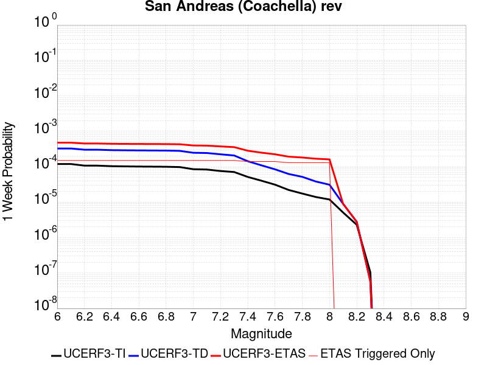 | 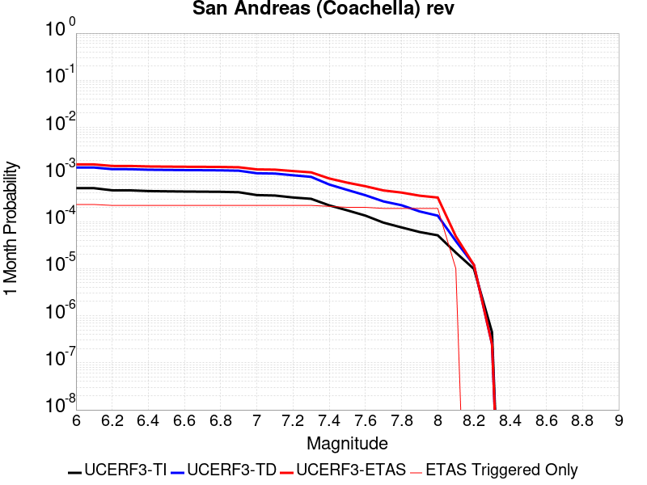 |  |  |

| Magnitude | 1 wk TI Prob | 1 wk TD Prob | 1 wk ETAS Prob | 1 wk ETAS/TD Gain | 1 wk ETAS Triggered Only | 1 mo TI Prob | 1 mo TD Prob | 1 mo ETAS Prob | 1 mo ETAS/TD Gain | 1 mo ETAS Triggered Only | 1 yr TI Prob | 1 yr TD Prob | 1 yr ETAS Prob | 1 yr ETAS/TD Gain | 1 yr ETAS Triggered Only | 10 yr TI Prob | 10 yr TD Prob | 10 yr ETAS Prob | 10 yr ETAS/TD Gain | 10 yr ETAS Triggered Only |
|-----|-----|-----|-----|-----|-----|-----|-----|-----|-----|-----|-----|-----|-----|-----|-----|-----|-----|-----|-----|-----|
| 6.0 | 1.1925945E-4 | 3.2729402E-4 | 4.772449E-4 | 1.4581535 | 1.5E-4 | 5.110118E-4 | 0.0014019393 | 0.0016316168 | 1.1638285 | 2.3E-4 | 0.0062038354 | 0.016936364 | 0.017231284 | 1.0174134 | 3.0E-4 | 0.060334753 | 0.15265316 | 0.15297514 | 1.0021093 | 3.8E-4 |
| 6.1 | 1.1925945E-4 | 3.2729402E-4 | 4.772449E-4 | 1.4581535 | 1.5E-4 | 5.110118E-4 | 0.0014019393 | 0.0016316168 | 1.1638285 | 2.3E-4 | 0.0062038354 | 0.016936364 | 0.017231284 | 1.0174134 | 3.0E-4 | 0.060334753 | 0.15265316 | 0.15297514 | 1.0021093 | 3.8E-4 |
| 6.2 | 1.07432395E-4 | 3.0230157E-4 | 4.522562E-4 | 1.4960433 | 1.5E-4 | 4.603433E-4 | 0.0012949388 | 0.0015146539 | 1.1696723 | 2.2E-4 | 0.005590286 | 0.015653009 | 0.015938468 | 1.0182368 | 2.9E-4 | 0.05451731 | 0.14182423 | 0.14214176 | 1.0022389 | 3.7E-4 |
| 6.3 | 1.0718766E-4 | 3.0175463E-4 | 4.5170935E-4 | 1.4969426 | 1.5E-4 | 4.592948E-4 | 0.0012925972 | 0.0015123128 | 1.1699799 | 2.2E-4 | 0.005577586 | 0.015624908 | 0.015910376 | 1.0182701 | 2.9E-4 | 0.054396555 | 0.14159249 | 0.1419101 | 1.0022432 | 3.7E-4 |
| 6.4 | 1.0355944E-4 | 2.9383553E-4 | 4.4379145E-4 | 1.5103396 | 1.5E-4 | 4.4375064E-4 | 0.0012586913 | 0.0014784144 | 1.1745647 | 2.2E-4 | 0.0053892885 | 0.015217941 | 0.0155035285 | 1.0187664 | 2.9E-4 | 0.052604496 | 0.13815255 | 0.13847144 | 1.0023082 | 3.7E-4 |
| 6.5 | 1.0227914E-4 | 2.9102986E-4 | 4.4098622E-4 | 1.515261 | 1.5E-4 | 4.382655E-4 | 0.0012466786 | 0.0014664043 | 1.1762489 | 2.2E-4 | 0.0053228354 | 0.01507372 | 0.015359349 | 1.0189488 | 2.9E-4 | 0.051971316 | 0.13693172 | 0.13725106 | 1.0023321 | 3.7E-4 |
| 6.6 | 1.0116757E-4 | 2.8868738E-4 | 4.3864409E-4 | 1.5194432 | 1.5E-4 | 4.3350324E-4 | 0.0012366489 | 0.0014563769 | 1.1776801 | 2.2E-4 | 0.0052651367 | 0.01495329 | 0.015238954 | 1.0191038 | 2.9E-4 | 0.051421247 | 0.1359099 | 0.1362296 | 1.0023524 | 3.7E-4 |
| 6.7 | 1.0050676E-4 | 2.8727303E-4 | 4.3722993E-4 | 1.5220014 | 1.5E-4 | 4.3067214E-4 | 0.0012305931 | 0.0014503223 | 1.1785556 | 2.2E-4 | 0.005230834 | 0.014880571 | 0.015166255 | 1.0191985 | 2.9E-4 | 0.051094085 | 0.13529462 | 0.13561456 | 1.0023648 | 3.7E-4 |
| 6.8 | 9.976819E-5 | 2.853096E-4 | 4.352668E-4 | 1.5255947 | 1.5E-4 | 4.2750788E-4 | 0.0012221863 | 0.0014419174 | 1.1797853 | 2.2E-4 | 0.0051924936 | 0.0147796115 | 0.015065325 | 1.0193316 | 2.9E-4 | 0.050728295 | 0.13444631 | 0.13476656 | 1.002382 | 3.7E-4 |
| 6.9 | 9.77719E-5 | 2.8027873E-4 | 4.302367E-4 | 1.5350316 | 1.5E-4 | 4.1895514E-4 | 0.0012006456 | 0.0014203814 | 1.1830148 | 2.2E-4 | 0.0050888555 | 0.014520878 | 0.014806666 | 1.0196812 | 2.9E-4 | 0.049738888 | 0.1322748 | 0.13259587 | 1.0024272 | 3.7E-4 |
| 7.0 | 8.500761E-5 | 2.4762485E-4 | 3.9758772E-4 | 1.605605 | 1.5E-4 | 3.6426744E-4 | 0.001060821 | 0.0012805876 | 1.2071666 | 2.2E-4 | 0.0044259406 | 0.012839786 | 0.013126062 | 1.0222961 | 2.9E-4 | 0.04338823 | 0.11813272 | 0.118459016 | 1.0027621 | 3.7E-4 |
| 7.1 | 8.319876E-5 | 2.4365232E-4 | 3.9361577E-4 | 1.6154813 | 1.5E-4 | 3.5651738E-4 | 0.0010438096 | 0.0012635799 | 1.2105464 | 2.2E-4 | 0.004331963 | 0.012635092 | 0.012921428 | 1.0226619 | 2.9E-4 | 0.042484846 | 0.116353 | 0.116671115 | 1.0027341 | 3.6E-4 |
| 7.2 | 7.563917E-5 | 2.2413683E-4 | 3.7410323E-4 | 1.6690841 | 1.5E-4 | 3.2412758E-4 | 9.602359E-4 | 0.0011800246 | 1.2288904 | 2.2E-4 | 0.0039391145 | 0.011628893 | 0.011915521 | 1.0246478 | 2.9E-4 | 0.03870018 | 0.10775925 | 0.108080454 | 1.0029808 | 3.6E-4 |
| 7.3 | 7.082985E-5 | 2.0729867E-4 | 3.5726756E-4 | 1.7234436 | 1.5E-4 | 3.0352117E-4 | 8.881233E-4 | 0.0011079279 | 1.2474934 | 2.2E-4 | 0.0036891096 | 0.010759917 | 0.011046797 | 1.0266619 | 2.9E-4 | 0.03628465 | 0.100282 | 0.1006059 | 1.0032299 | 3.6E-4 |
| 7.4 | 5.146215E-5 | 1.4273795E-4 | 2.8271796E-4 | 1.9806784 | 1.4E-4 | 2.2053342E-4 | 6.115915E-4 | 8.2146307E-4 | 1.3431565 | 2.1E-4 | 0.0026816884 | 0.0074208933 | 0.0076888897 | 1.0361137 | 2.7E-4 | 0.02649557 | 0.070849575 | 0.0711562 | 1.0043278 | 3.3E-4 |
| 7.5 | 4.0285166E-5 | 1.09416E-4 | 2.4940068E-4 | 2.2793803 | 1.4E-4 | 1.7263928E-4 | 4.6884175E-4 | 6.68748E-4 | 1.4263831 | 2.0E-4 | 0.002099857 | 0.0056932783 | 0.005951798 | 1.0454079 | 2.6E-4 | 0.020801254 | 0.055011146 | 0.055304095 | 1.0053252 | 3.1E-4 |
| 7.6 | 3.1168736E-5 | 8.4389096E-5 | 2.2437728E-4 | 2.658842 | 1.4E-4 | 1.3357346E-4 | 3.6161754E-4 | 5.615452E-4 | 1.5528705 | 2.0E-4 | 0.0016250437 | 0.0043938323 | 0.00465269 | 1.0589138 | 2.6E-4 | 0.016132116 | 0.04281005 | 0.04310678 | 1.0069313 | 3.1E-4 |
| 7.7 | 2.2100989E-5 | 6.238755E-5 | 1.9237945E-4 | 3.083619 | 1.3E-4 | 9.4715084E-5 | 2.6734784E-4 | 4.5729705E-4 | 1.7104946 | 1.9E-4 | 0.001152546 | 0.0032501083 | 0.0034992958 | 1.0766705 | 2.5E-4 | 0.011465867 | 0.0319002 | 0.03219063 | 1.0091044 | 3.0E-4 |
| 7.8 | 1.7484861E-5 | 5.179572E-5 | 1.8178899E-4 | 3.5097299 | 1.3E-4 | 7.493296E-5 | 2.2196278E-4 | 4.119206E-4 | 1.8558093 | 1.9E-4 | 9.1192697E-4 | 0.0026990508 | 0.002948376 | 1.0923752 | 2.5E-4 | 0.009081938 | 0.026640115 | 0.026932124 | 1.0109612 | 3.0E-4 |
| 7.9 | 1.3967285E-5 | 3.822255E-5 | 1.6821758E-4 | 4.4010034 | 1.3E-4 | 5.985842E-5 | 1.6380067E-4 | 3.5376954E-4 | 2.1597564 | 1.9E-4 | 7.2853256E-4 | 0.00199245 | 0.002231972 | 1.1202147 | 2.4E-4 | 0.0072614877 | 0.019909438 | 0.020193662 | 1.0142759 | 2.9E-4 |
| 8.0 | 1.1887396E-5 | 3.106521E-5 | 1.6106117E-4 | 5.1846156 | 1.3E-4 | 5.094499E-5 | 1.3312983E-4 | 3.2310453E-4 | 2.4269884 | 1.9E-4 | 6.200787E-4 | 0.0016196516 | 0.0018592628 | 1.14794 | 2.4E-4 | 0.006183513 | 0.016279267 | 0.016564546 | 1.0175241 | 2.9E-4 |
| 8.1 | 5.100864E-6 | 8.973418E-6 | 8.973418E-6 | 1.0 | 0.0 | 2.1860664E-5 | 3.8456936E-5 | 4.8456553E-5 | 1.2600211 | 1.0E-5 | 2.6612106E-4 | 4.6811273E-4 | 4.7810806E-4 | 1.0213524 | 1.0E-5 | 0.002658026 | 0.004917731 | 0.0049376325 | 1.0040469 | 2.0E-5 |
| 8.2 | 2.3004484E-6 | 2.7864487E-6 | 2.7864487E-6 | 1.0 | 0.0 | 9.859027E-6 | 1.1941868E-5 | 1.1941868E-5 | 1.0 | 0.0 | 1.2002704E-4 | 1.4538258E-4 | 1.4538258E-4 | 1.0 | 0.0 | 0.0011996223 | 0.0015973912 | 0.0015973912 | 1.0 | 0.0 |
| 8.3 | 1.0424446E-7 | 5.8161504E-8 | 5.8161504E-8 | 1.0 | 0.0 | 4.4676187E-7 | 2.4926356E-7 | 2.4926356E-7 | 1.0 | 0.0 | 5.439312E-6 | 3.03478E-6 | 3.03478E-6 | 1.0 | 0.0 | 5.4391792E-5 | 3.190716E-5 | 3.190716E-5 | 1.0 | 0.0 |

## Ludlow
*[(top)](#table-of-contents)*

| 1 Week | 1 Month | 1 Year | 10 Year |
|-----|-----|-----|-----|
| 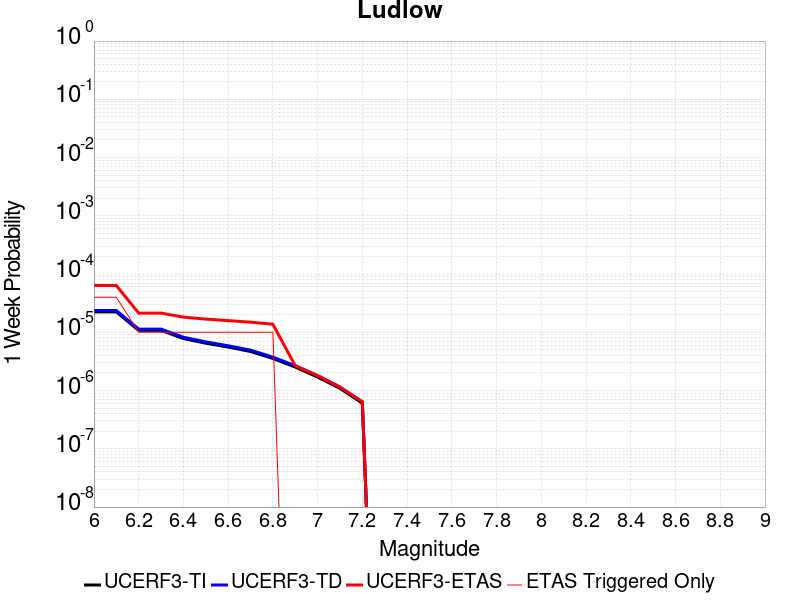 | 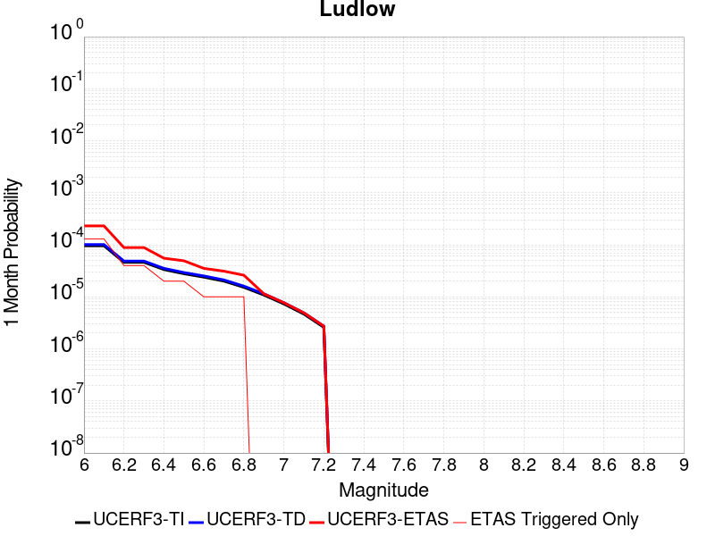 |  |  |

| Magnitude | 1 wk TI Prob | 1 wk TD Prob | 1 wk ETAS Prob | 1 wk ETAS/TD Gain | 1 wk ETAS Triggered Only | 1 mo TI Prob | 1 mo TD Prob | 1 mo ETAS Prob | 1 mo ETAS/TD Gain | 1 mo ETAS Triggered Only | 1 yr TI Prob | 1 yr TD Prob | 1 yr ETAS Prob | 1 yr ETAS/TD Gain | 1 yr ETAS Triggered Only | 10 yr TI Prob | 10 yr TD Prob | 10 yr ETAS Prob | 10 yr ETAS/TD Gain | 10 yr ETAS Triggered Only |
|-----|-----|-----|-----|-----|-----|-----|-----|-----|-----|-----|-----|-----|-----|-----|-----|-----|-----|-----|-----|-----|
| 6.0 | 2.2407607E-5 | 2.3657254E-5 | 6.3656305E-5 | 2.6907732 | 4.0E-5 | 9.602906E-5 | 1.0138454E-4 | 2.3137136E-4 | 2.282117 | 1.3E-4 | 0.0011685267 | 0.001233702 | 0.0014634181 | 1.1862007 | 2.3E-4 | 0.011624013 | 0.012273042 | 0.012638501 | 1.0297774 | 3.7E-4 |
| 6.1 | 2.2407607E-5 | 2.3657254E-5 | 6.3656305E-5 | 2.6907732 | 4.0E-5 | 9.602906E-5 | 1.0138454E-4 | 2.3137136E-4 | 2.282117 | 1.3E-4 | 0.0011685267 | 0.001233702 | 0.0014634181 | 1.1862007 | 2.3E-4 | 0.011624013 | 0.012273042 | 0.012638501 | 1.0297774 | 3.7E-4 |
| 6.2 | 1.0781252E-5 | 1.1365663E-5 | 2.136555E-5 | 1.879833 | 1.0E-5 | 4.620455E-5 | 4.8709102E-5 | 8.870715E-5 | 1.8211617 | 4.0E-5 | 5.623952E-4 | 5.9287593E-4 | 6.828226E-4 | 1.1517124 | 9.0E-5 | 0.00560974 | 0.0059133614 | 0.0060326518 | 1.0201731 | 1.2E-4 |
| 6.3 | 1.0781252E-5 | 1.1365663E-5 | 2.136555E-5 | 1.879833 | 1.0E-5 | 4.620455E-5 | 4.8709102E-5 | 8.870715E-5 | 1.8211617 | 4.0E-5 | 5.623952E-4 | 5.9287593E-4 | 6.828226E-4 | 1.1517124 | 9.0E-5 | 0.00560974 | 0.0059133614 | 0.0060326518 | 1.0201731 | 1.2E-4 |
| 6.4 | 7.814439E-6 | 8.237729E-6 | 1.8237646E-5 | 2.2139168 | 1.0E-5 | 3.3490025E-5 | 3.530408E-5 | 5.5303375E-5 | 1.5664867 | 2.0E-5 | 4.0766477E-4 | 4.2974384E-4 | 4.8971805E-4 | 1.1395581 | 6.0E-5 | 0.0040691774 | 0.0042892746 | 0.0043689315 | 1.0185711 | 8.0E-5 |
| 6.5 | 6.4986366E-6 | 6.85092E-6 | 1.685085E-5 | 2.4596481 | 1.0E-5 | 2.7851002E-5 | 2.9360759E-5 | 4.9360173E-5 | 1.6811613 | 2.0E-5 | 3.390332E-4 | 3.5740953E-4 | 3.9739523E-4 | 1.1118765 | 4.0E-5 | 0.003385164 | 0.0035684432 | 0.0036182648 | 1.0139617 | 5.0E-5 |
| 6.6 | 5.582177E-6 | 5.8860055E-6 | 1.5885948E-5 | 2.698935 | 1.0E-5 | 2.3923398E-5 | 2.5225498E-5 | 3.5225246E-5 | 1.3964143 | 1.0E-5 | 2.9122844E-4 | 3.0707786E-4 | 3.3706866E-4 | 1.0976651 | 3.0E-5 | 0.0029084706 | 0.003066609 | 0.003096517 | 1.0097528 | 3.0E-5 |
| 6.7 | 4.6858763E-6 | 4.940427E-6 | 1.4940378E-5 | 3.0241065 | 1.0E-5 | 2.0082172E-5 | 2.1173091E-5 | 3.117288E-5 | 1.4722877 | 1.0E-5 | 2.4447302E-4 | 2.5775246E-4 | 2.877447E-4 | 1.1163608 | 3.0E-5 | 0.0024420423 | 0.0025745912 | 0.0026045141 | 1.0116223 | 3.0E-5 |
| 6.8 | 3.5584908E-6 | 3.7520183E-6 | 1.3751981E-5 | 3.6652222 | 1.0E-5 | 1.5250586E-5 | 1.6079981E-5 | 2.607982E-5 | 1.6218812 | 1.0E-5 | 1.8566006E-4 | 1.957566E-4 | 2.2575073E-4 | 1.1532215 | 3.0E-5 | 0.0018550502 | 0.0019558826 | 0.001985824 | 1.0153084 | 3.0E-5 |
| 6.9 | 2.532834E-6 | 2.6710034E-6 | 2.6710034E-6 | 1.0 | 0.0 | 1.0854958E-5 | 1.1447109E-5 | 1.1447109E-5 | 1.0 | 0.0 | 1.3215111E-4 | 1.3935992E-4 | 1.5935714E-4 | 1.1434933 | 2.0E-5 | 0.0013207254 | 0.0013927529 | 0.001412725 | 1.01434 | 2.0E-5 |
| 7.0 | 1.7083285E-6 | 1.8019439E-6 | 1.8019439E-6 | 1.0 | 0.0 | 7.3213873E-6 | 7.722595E-6 | 7.722595E-6 | 1.0 | 0.0 | 8.913424E-5 | 9.40187E-5 | 1.1401682E-4 | 1.2127036 | 2.0E-5 | 8.9098496E-4 | 9.3980576E-4 | 9.5978694E-4 | 1.021261 | 2.0E-5 |
| 7.1 | 1.0905424E-6 | 1.1497619E-6 | 1.1497619E-6 | 1.0 | 0.0 | 4.6737446E-6 | 4.9275427E-6 | 4.9275427E-6 | 1.0 | 0.0 | 5.6901354E-5 | 5.999128E-5 | 5.999128E-5 | 1.0 | 0.0 | 5.6886784E-4 | 5.997606E-4 | 5.997606E-4 | 1.0 | 0.0 |
| 7.2 | 6.06668E-7 | 6.387277E-7 | 6.387277E-7 | 1.0 | 0.0 | 2.600003E-6 | 2.7374022E-6 | 2.7374022E-6 | 1.0 | 0.0 | 3.1654577E-5 | 3.3327433E-5 | 3.3327433E-5 | 1.0 | 0.0 | 3.1650066E-4 | 3.3323118E-4 | 3.3323118E-4 | 1.0 | 0.0 |

## San Andreas (Cholame) rev
*[(top)](#table-of-contents)*

| 1 Week | 1 Month | 1 Year | 10 Year |
|-----|-----|-----|-----|
| 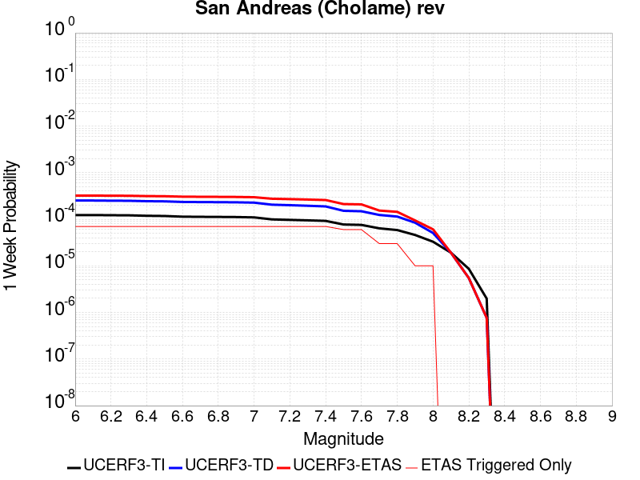 | 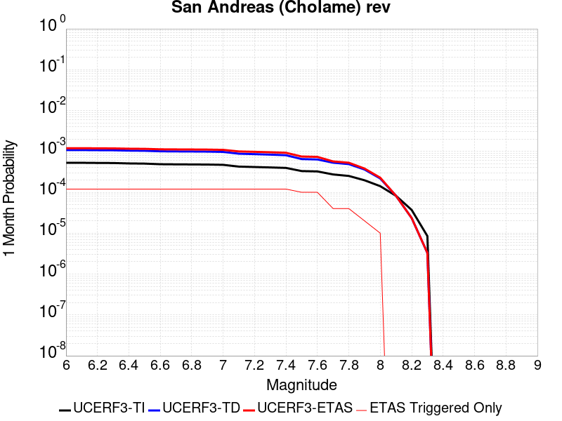 | 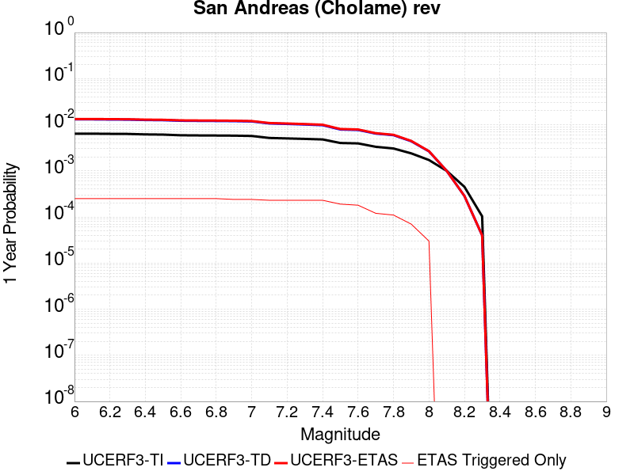 | 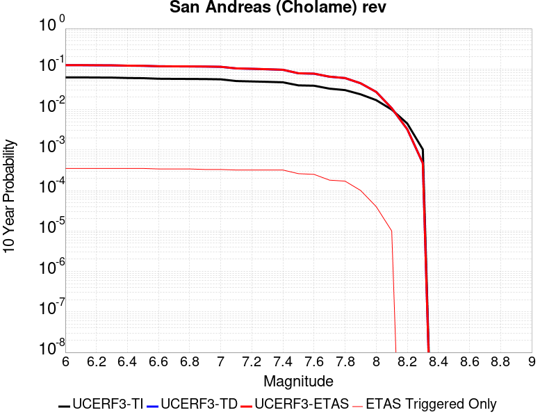 |

| Magnitude | 1 wk TI Prob | 1 wk TD Prob | 1 wk ETAS Prob | 1 wk ETAS/TD Gain | 1 wk ETAS Triggered Only | 1 mo TI Prob | 1 mo TD Prob | 1 mo ETAS Prob | 1 mo ETAS/TD Gain | 1 mo ETAS Triggered Only | 1 yr TI Prob | 1 yr TD Prob | 1 yr ETAS Prob | 1 yr ETAS/TD Gain | 1 yr ETAS Triggered Only | 10 yr TI Prob | 10 yr TD Prob | 10 yr ETAS Prob | 10 yr ETAS/TD Gain | 10 yr ETAS Triggered Only |
|-----|-----|-----|-----|-----|-----|-----|-----|-----|-----|-----|-----|-----|-----|-----|-----|-----|-----|-----|-----|-----|
| 6.0 | 1.2302514E-4 | 2.5204287E-4 | 3.2202524E-4 | 1.2776605 | 7.0E-5 | 5.27144E-4 | 0.0010797381 | 0.0011996087 | 1.1110181 | 1.2E-4 | 0.0063991086 | 0.0130670825 | 0.013313816 | 1.018882 | 2.5E-4 | 0.06217949 | 0.12439073 | 0.12469719 | 1.0024637 | 3.5E-4 |
| 6.1 | 1.2302514E-4 | 2.5204287E-4 | 3.2202524E-4 | 1.2776605 | 7.0E-5 | 5.27144E-4 | 0.0010797381 | 0.0011996087 | 1.1110181 | 1.2E-4 | 0.0063991086 | 0.0130670825 | 0.013313816 | 1.018882 | 2.5E-4 | 0.06217949 | 0.12439073 | 0.12469719 | 1.0024637 | 3.5E-4 |
| 6.2 | 1.2203569E-4 | 2.5021084E-4 | 3.2019333E-4 | 1.2796941 | 7.0E-5 | 5.2290526E-4 | 0.0010718931 | 0.0011917645 | 1.1118314 | 1.2E-4 | 0.006347804 | 0.01297271 | 0.013219466 | 1.0190213 | 2.5E-4 | 0.061695136 | 0.12357691 | 0.12388366 | 1.0024823 | 3.5E-4 |
| 6.3 | 1.2142645E-4 | 2.4907055E-4 | 3.1905313E-4 | 1.2809749 | 7.0E-5 | 5.202953E-4 | 0.0010670102 | 0.0011868821 | 1.1123438 | 1.2E-4 | 0.006316212 | 0.012913967 | 0.013160738 | 1.0191089 | 2.5E-4 | 0.06139677 | 0.12307103 | 0.12337796 | 1.0024939 | 3.5E-4 |
| 6.4 | 1.1865206E-4 | 2.44126E-4 | 3.141089E-4 | 1.2866672 | 7.0E-5 | 5.0840975E-4 | 0.0010458364 | 0.0011657109 | 1.1146207 | 1.2E-4 | 0.006172335 | 0.012659196 | 0.012906032 | 1.0194985 | 2.5E-4 | 0.060036868 | 0.1208638 | 0.121171504 | 1.0025458 | 3.5E-4 |
| 6.5 | 1.17443946E-4 | 2.4205919E-4 | 3.1204225E-4 | 1.2891154 | 7.0E-5 | 5.032341E-4 | 0.0010369857 | 0.0011568612 | 1.1156 | 1.2E-4 | 0.006109677 | 0.012552682 | 0.012799544 | 1.0196661 | 2.5E-4 | 0.059444077 | 0.11993805 | 0.120246075 | 1.0025681 | 3.5E-4 |
| 6.6 | 1.13579066E-4 | 2.3514954E-4 | 3.051331E-4 | 1.2976129 | 7.0E-5 | 4.866766E-4 | 0.001007396 | 0.0011272752 | 1.118999 | 1.2E-4 | 0.0059092017 | 0.012196515 | 0.012443465 | 1.0202477 | 2.5E-4 | 0.057545185 | 0.11685214 | 0.117152415 | 1.0025697 | 3.4E-4 |
| 6.7 | 1.1271412E-4 | 2.3359268E-4 | 3.0357632E-4 | 1.2995969 | 7.0E-5 | 4.829711E-4 | 0.0010007289 | 0.0011206089 | 1.1197926 | 1.2E-4 | 0.005864331 | 0.012116249 | 0.01236322 | 1.0203835 | 2.5E-4 | 0.057119697 | 0.116155714 | 0.11645622 | 1.0025871 | 3.4E-4 |
| 6.8 | 1.1217975E-4 | 2.3247694E-4 | 3.0246068E-4 | 1.3010352 | 7.0E-5 | 4.8068175E-4 | 9.959509E-4 | 0.0011158313 | 1.1203679 | 1.2E-4 | 0.005836608 | 0.012058721 | 0.012305707 | 1.0204818 | 2.5E-4 | 0.056856725 | 0.11565396 | 0.115954645 | 1.0025998 | 3.4E-4 |
| 6.9 | 1.1146753E-4 | 2.3096445E-4 | 3.0094828E-4 | 1.3030069 | 7.0E-5 | 4.7763053E-4 | 9.894737E-4 | 0.0011093549 | 1.1211566 | 1.2E-4 | 0.0057996577 | 0.011980731 | 0.012217856 | 1.0197922 | 2.4E-4 | 0.056506127 | 0.11497439 | 0.11526645 | 1.0025402 | 3.3E-4 |
| 7.0 | 1.0965793E-4 | 2.2719789E-4 | 2.9718198E-4 | 1.3080314 | 7.0E-5 | 4.698779E-4 | 9.733434E-4 | 0.0010932266 | 1.1231664 | 1.2E-4 | 0.005705768 | 0.011786487 | 0.0120236585 | 1.0201223 | 2.4E-4 | 0.055614736 | 0.11327597 | 0.11356858 | 1.0025833 | 3.3E-4 |
| 7.1 | 9.927982E-5 | 2.0538924E-4 | 2.7537486E-4 | 1.3407463 | 7.0E-5 | 4.2541555E-4 | 8.7994366E-4 | 9.99838E-4 | 1.1362524 | 1.2E-4 | 0.0051671406 | 0.010660981 | 0.010888529 | 1.021344 | 2.3E-4 | 0.05048634 | 0.1033706 | 0.10365752 | 1.0027757 | 3.2E-4 |
| 7.2 | 9.696786E-5 | 2.0043184E-4 | 2.704178E-4 | 1.3491759 | 7.0E-5 | 4.1551032E-4 | 8.5871184E-4 | 9.786087E-4 | 1.1396242 | 1.2E-4 | 0.00504711 | 0.010404981 | 0.010632588 | 1.0218748 | 2.3E-4 | 0.04934009 | 0.1011086 | 0.10139625 | 1.0028449 | 3.2E-4 |
| 7.3 | 9.4727984E-5 | 1.9472468E-4 | 2.6471107E-4 | 1.359412 | 7.0E-5 | 4.0591392E-4 | 8.3426846E-4 | 9.541683E-4 | 1.1437186 | 1.2E-4 | 0.0049308087 | 0.010110183 | 0.0103378575 | 1.0225194 | 2.3E-4 | 0.048228268 | 0.09847952 | 0.098768 | 1.0029294 | 3.2E-4 |
| 7.4 | 9.220358E-5 | 1.8843076E-4 | 2.5841757E-4 | 1.3714192 | 7.0E-5 | 3.9509835E-4 | 8.073114E-4 | 9.272145E-4 | 1.1485215 | 1.2E-4 | 0.004799717 | 0.009784967 | 0.010012716 | 1.0232755 | 2.3E-4 | 0.046973653 | 0.095557496 | 0.09584692 | 1.0030288 | 3.2E-4 |
| 7.5 | 7.71631E-5 | 1.5177966E-4 | 2.1177056E-4 | 1.3952498 | 6.0E-5 | 3.306571E-4 | 6.503223E-4 | 7.502572E-4 | 1.15367 | 1.0E-4 | 0.0040183207 | 0.007889002 | 0.008077502 | 1.0238942 | 1.9E-4 | 0.03946433 | 0.07828531 | 0.078524955 | 1.0030612 | 2.6E-4 |
| 7.6 | 7.5634416E-5 | 1.483744E-4 | 2.083655E-4 | 1.4043224 | 6.0E-5 | 3.241072E-4 | 6.3573546E-4 | 7.356719E-4 | 1.1571981 | 1.0E-4 | 0.0039388672 | 0.0077126776 | 0.007891289 | 1.0231582 | 1.8E-4 | 0.038697794 | 0.07664872 | 0.07687956 | 1.0030116 | 2.5E-4 |
| 7.7 | 6.3783E-5 | 1.235872E-4 | 1.535835E-4 | 1.2427136 | 3.0E-5 | 2.7332708E-4 | 5.29552E-4 | 5.695308E-4 | 1.0754956 | 4.0E-5 | 0.0033226798 | 0.0064282627 | 0.006547491 | 1.0185475 | 1.2E-4 | 0.032734364 | 0.06454029 | 0.06470867 | 1.002609 | 1.8E-4 |
| 7.8 | 5.863422E-5 | 1.1416107E-4 | 1.4415765E-4 | 1.2627566 | 3.0E-5 | 2.512653E-4 | 4.8917E-4 | 5.291505E-4 | 1.0817312 | 4.0E-5 | 0.003054864 | 0.0059394026 | 0.006048749 | 1.0184103 | 1.1E-4 | 0.030132094 | 0.059659187 | 0.059819043 | 1.0026795 | 1.7E-4 |
| 7.9 | 4.595283E-5 | 8.426331E-5 | 9.426247E-5 | 1.1186656 | 1.0E-5 | 1.9692584E-4 | 3.610785E-4 | 3.810713E-4 | 1.0553696 | 2.0E-5 | 0.0023949358 | 0.0043872762 | 0.004456969 | 1.0158852 | 7.0E-5 | 0.023692891 | 0.044362005 | 0.04445757 | 1.0021542 | 1.0E-4 |
| 8.0 | 3.2950178E-5 | 5.0772942E-5 | 6.0772436E-5 | 1.1969453 | 1.0E-5 | 1.412074E-4 | 2.1758018E-4 | 2.2757801E-4 | 1.04595 | 1.0E-5 | 0.0017178444 | 0.0026458222 | 0.002675743 | 1.0113087 | 3.0E-5 | 0.017046256 | 0.027180137 | 0.02721905 | 1.0014317 | 4.0E-5 |
| 8.1 | 1.9177472E-5 | 1.9185145E-5 | 1.9185145E-5 | 1.0 | 0.0 | 8.218658E-5 | 8.221946E-5 | 8.221946E-5 | 1.0 | 0.0 | 0.0010001622 | 0.0010005629 | 0.0010005629 | 1.0 | 0.0 | 0.009956728 | 0.010758142 | 0.0107680345 | 1.0009196 | 1.0E-5 |
| 8.2 | 8.643924E-6 | 5.4748625E-6 | 5.4748625E-6 | 1.0 | 0.0 | 3.704486E-5 | 2.3463486E-5 | 2.3463486E-5 | 1.0 | 0.0 | 4.5092785E-4 | 2.8563058E-4 | 2.8563058E-4 | 1.0 | 0.0 | 0.0045001395 | 0.0032487072 | 0.0032487072 | 1.0 | 0.0 |
| 8.3 | 1.983087E-6 | 7.6599065E-7 | 7.6599065E-7 | 1.0 | 0.0 | 8.498917E-6 | 3.282813E-6 | 3.282813E-6 | 1.0 | 0.0 | 1.034694E-4 | 3.9967534E-5 | 3.9967534E-5 | 1.0 | 0.0 | 0.0010342124 | 4.719687E-4 | 4.719687E-4 | 1.0 | 0.0 |

## Cady
*[(top)](#table-of-contents)*

| 1 Week | 1 Month | 1 Year | 10 Year |
|-----|-----|-----|-----|
| 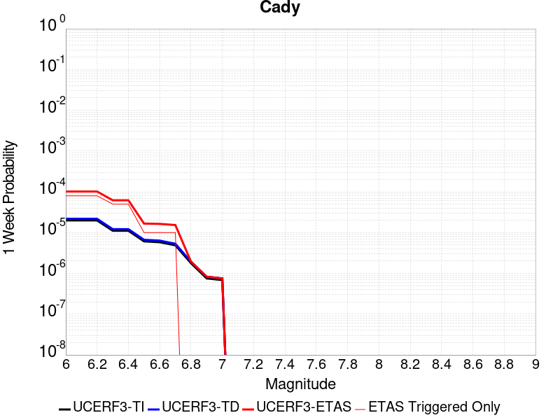 |  |  |  |

| Magnitude | 1 wk TI Prob | 1 wk TD Prob | 1 wk ETAS Prob | 1 wk ETAS/TD Gain | 1 wk ETAS Triggered Only | 1 mo TI Prob | 1 mo TD Prob | 1 mo ETAS Prob | 1 mo ETAS/TD Gain | 1 mo ETAS Triggered Only | 1 yr TI Prob | 1 yr TD Prob | 1 yr ETAS Prob | 1 yr ETAS/TD Gain | 1 yr ETAS Triggered Only | 10 yr TI Prob | 10 yr TD Prob | 10 yr ETAS Prob | 10 yr ETAS/TD Gain | 10 yr ETAS Triggered Only |
|-----|-----|-----|-----|-----|-----|-----|-----|-----|-----|-----|-----|-----|-----|-----|-----|-----|-----|-----|-----|-----|
| 6.0 | 1.9892565E-5 | 2.1858728E-5 | 1.0185698E-4 | 4.6597853 | 8.0E-5 | 8.525106E-5 | 9.3677416E-5 | 1.9366805E-4 | 2.067393 | 1.0E-4 | 0.0010374374 | 0.0011400167 | 0.0013397887 | 1.175236 | 2.0E-4 | 0.010326075 | 0.011350701 | 0.011696728 | 1.0304852 | 3.5E-4 |
| 6.1 | 1.9892565E-5 | 2.1858728E-5 | 1.0185698E-4 | 4.6597853 | 8.0E-5 | 8.525106E-5 | 9.3677416E-5 | 1.9366805E-4 | 2.067393 | 1.0E-4 | 0.0010374374 | 0.0011400167 | 0.0013397887 | 1.175236 | 2.0E-4 | 0.010326075 | 0.011350701 | 0.011696728 | 1.0304852 | 3.5E-4 |
| 6.2 | 1.9892565E-5 | 2.1858728E-5 | 1.0185698E-4 | 4.6597853 | 8.0E-5 | 8.525106E-5 | 9.3677416E-5 | 1.9366805E-4 | 2.067393 | 1.0E-4 | 0.0010374374 | 0.0011400167 | 0.0013397887 | 1.175236 | 2.0E-4 | 0.010326075 | 0.011350701 | 0.011696728 | 1.0304852 | 3.5E-4 |
| 6.3 | 1.1117327E-5 | 1.2176583E-5 | 6.2175975E-5 | 5.106192 | 5.0E-5 | 4.764482E-5 | 5.2184492E-5 | 1.1218136E-4 | 2.1497068 | 6.0E-5 | 5.7992124E-4 | 6.351925E-4 | 7.251353E-4 | 1.1415993 | 9.0E-5 | 0.0057841022 | 0.0063368753 | 0.006535608 | 1.0313613 | 2.0E-4 |
| 6.4 | 1.1117327E-5 | 1.2176583E-5 | 6.2175975E-5 | 5.106192 | 5.0E-5 | 4.764482E-5 | 5.2184492E-5 | 1.1218136E-4 | 2.1497068 | 6.0E-5 | 5.7992124E-4 | 6.351925E-4 | 7.251353E-4 | 1.1415993 | 9.0E-5 | 0.0057841022 | 0.0063368753 | 0.006535608 | 1.0313613 | 2.0E-4 |
| 6.5 | 6.103093E-6 | 6.672021E-6 | 1.6671955E-5 | 2.4987862 | 1.0E-5 | 2.615585E-5 | 2.8594131E-5 | 4.859356E-5 | 1.6994243 | 2.0E-5 | 3.1840094E-4 | 3.480905E-4 | 3.880766E-4 | 1.1148727 | 4.0E-5 | 0.0031794512 | 0.0034766865 | 0.0035863041 | 1.0315293 | 1.1E-4 |
| 6.6 | 5.817237E-6 | 6.3656585E-6 | 1.6365595E-5 | 2.5709193 | 1.0E-5 | 2.4930776E-5 | 2.728118E-5 | 4.728063E-5 | 1.7330861 | 2.0E-5 | 3.034899E-4 | 3.3211018E-4 | 3.720969E-4 | 1.120402 | 4.0E-5 | 0.0030307577 | 0.0033173605 | 0.0034269956 | 1.0330489 | 1.1E-4 |
| 6.7 | 4.8846314E-6 | 5.3405684E-6 | 1.5340514E-5 | 2.8724499 | 1.0E-5 | 2.0933967E-5 | 2.2888014E-5 | 4.2887557E-5 | 1.8737998 | 2.0E-5 | 2.5484123E-4 | 2.7863772E-4 | 3.1862658E-4 | 1.1435156 | 4.0E-5 | 0.0025454918 | 0.0027840391 | 0.0028737886 | 1.0322372 | 9.0E-5 |
| 6.8 | 1.7788773E-6 | 1.9399079E-6 | 1.9399079E-6 | 1.0 | 0.0 | 7.6237375E-6 | 8.313874E-6 | 1.831379E-5 | 2.2027988 | 1.0E-5 | 9.281505E-5 | 1.01218284E-4 | 1.11217276E-4 | 1.0987864 | 1.0E-5 | 9.2776294E-4 | 0.0010118765 | 0.0010418461 | 1.0296179 | 3.0E-5 |
| 6.9 | 7.5455404E-7 | 8.297092E-7 | 8.297092E-7 | 1.0 | 0.0 | 3.233799E-6 | 3.5558937E-6 | 1.35558585E-5 | 3.8122225 | 1.0E-5 | 3.937079E-5 | 4.3292483E-5 | 5.329205E-5 | 1.2309769 | 1.0E-5 | 3.9363815E-4 | 4.3287344E-4 | 4.428691E-4 | 1.0230914 | 1.0E-5 |
| 7.0 | 6.8578805E-7 | 7.541816E-7 | 7.541816E-7 | 1.0 | 0.0 | 2.9390883E-6 | 3.2322048E-6 | 1.3232172E-5 | 4.0938535 | 1.0E-5 | 3.578281E-5 | 3.9351715E-5 | 4.9351318E-5 | 1.2541085 | 1.0E-5 | 3.577705E-4 | 3.9347992E-4 | 4.0347598E-4 | 1.0254042 | 1.0E-5 |

## San Andreas (Carrizo) rev
*[(top)](#table-of-contents)*

| 1 Week | 1 Month | 1 Year | 10 Year |
|-----|-----|-----|-----|
| 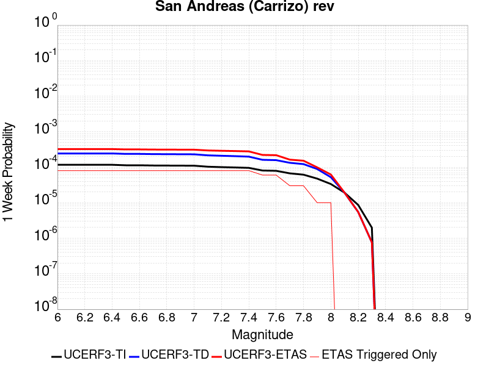 | 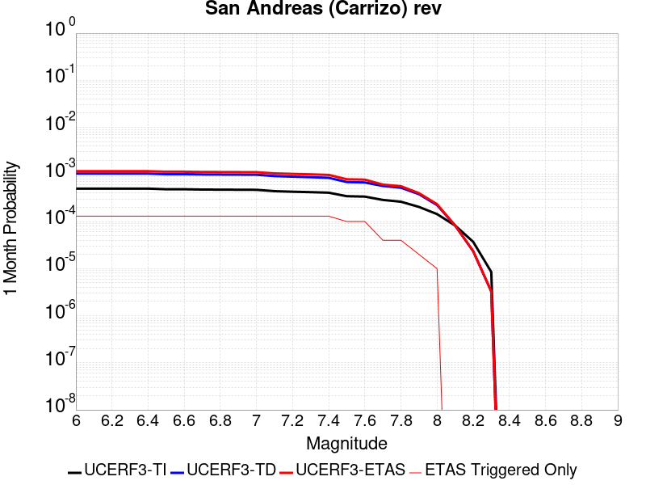 |  | 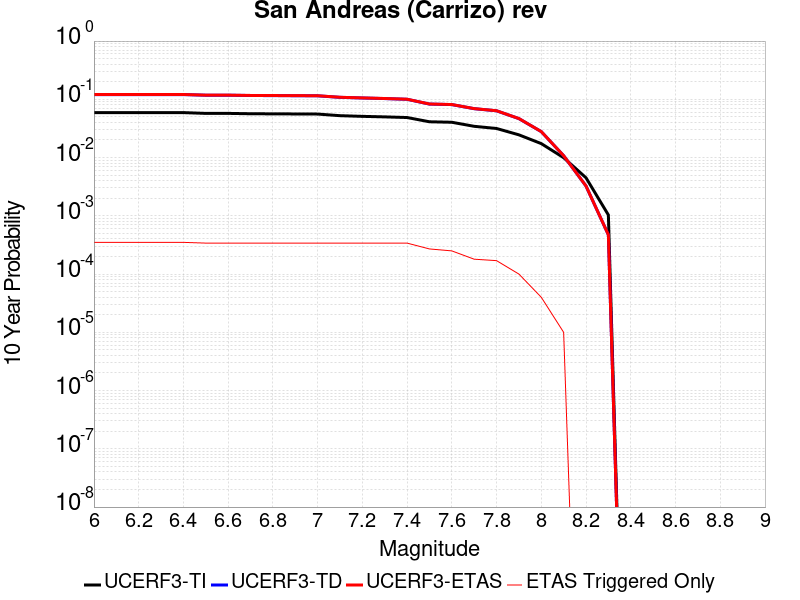 |

| Magnitude | 1 wk TI Prob | 1 wk TD Prob | 1 wk ETAS Prob | 1 wk ETAS/TD Gain | 1 wk ETAS Triggered Only | 1 mo TI Prob | 1 mo TD Prob | 1 mo ETAS Prob | 1 mo ETAS/TD Gain | 1 mo ETAS Triggered Only | 1 yr TI Prob | 1 yr TD Prob | 1 yr ETAS Prob | 1 yr ETAS/TD Gain | 1 yr ETAS Triggered Only | 10 yr TI Prob | 10 yr TD Prob | 10 yr ETAS Prob | 10 yr ETAS/TD Gain | 10 yr ETAS Triggered Only |
|-----|-----|-----|-----|-----|-----|-----|-----|-----|-----|-----|-----|-----|-----|-----|-----|-----|-----|-----|-----|-----|
| 6.0 | 1.1674632E-4 | 2.432302E-4 | 3.2321076E-4 | 1.3288265 | 8.0E-5 | 5.002454E-4 | 0.0010420004 | 0.0011718649 | 1.1246301 | 1.3E-4 | 0.006073493 | 0.012613042 | 0.012850015 | 1.018788 | 2.4E-4 | 0.0591016 | 0.12061418 | 0.12092196 | 1.0025518 | 3.5E-4 |
| 6.1 | 1.1674632E-4 | 2.432302E-4 | 3.2321076E-4 | 1.3288265 | 8.0E-5 | 5.002454E-4 | 0.0010420004 | 0.0011718649 | 1.1246301 | 1.3E-4 | 0.006073493 | 0.012613042 | 0.012850015 | 1.018788 | 2.4E-4 | 0.0591016 | 0.12061418 | 0.12092196 | 1.0025518 | 3.5E-4 |
| 6.2 | 1.1674632E-4 | 2.432302E-4 | 3.2321076E-4 | 1.3288265 | 8.0E-5 | 5.002454E-4 | 0.0010420004 | 0.0011718649 | 1.1246301 | 1.3E-4 | 0.006073493 | 0.012613042 | 0.012850015 | 1.018788 | 2.4E-4 | 0.0591016 | 0.12061418 | 0.12092196 | 1.0025518 | 3.5E-4 |
| 6.3 | 1.1674632E-4 | 2.432302E-4 | 3.2321076E-4 | 1.3288265 | 8.0E-5 | 5.002454E-4 | 0.0010420004 | 0.0011718649 | 1.1246301 | 1.3E-4 | 0.006073493 | 0.012613042 | 0.012850015 | 1.018788 | 2.4E-4 | 0.0591016 | 0.12061418 | 0.12092196 | 1.0025518 | 3.5E-4 |
| 6.4 | 1.1674632E-4 | 2.432302E-4 | 3.2321076E-4 | 1.3288265 | 8.0E-5 | 5.002454E-4 | 0.0010420004 | 0.0011718649 | 1.1246301 | 1.3E-4 | 0.006073493 | 0.012613042 | 0.012850015 | 1.018788 | 2.4E-4 | 0.0591016 | 0.12061418 | 0.12092196 | 1.0025518 | 3.5E-4 |
| 6.5 | 1.13136164E-4 | 2.3643032E-4 | 3.164114E-4 | 1.338286 | 8.0E-5 | 4.847792E-4 | 0.0010128808 | 0.0011427492 | 1.1282167 | 1.3E-4 | 0.0058862255 | 0.012262545 | 0.012499602 | 1.0193318 | 2.4E-4 | 0.057327334 | 0.117585555 | 0.117885575 | 1.0025516 | 3.4E-4 |
| 6.6 | 1.13136164E-4 | 2.3643032E-4 | 3.164114E-4 | 1.338286 | 8.0E-5 | 4.847792E-4 | 0.0010128808 | 0.0011427492 | 1.1282167 | 1.3E-4 | 0.0058862255 | 0.012262545 | 0.012499602 | 1.0193318 | 2.4E-4 | 0.057327334 | 0.117585555 | 0.117885575 | 1.0025516 | 3.4E-4 |
| 6.7 | 1.1149675E-4 | 2.3334254E-4 | 3.1332386E-4 | 1.3427637 | 8.0E-5 | 4.777557E-4 | 9.996577E-4 | 0.0011295277 | 1.1299145 | 1.3E-4 | 0.0058011734 | 0.012103349 | 0.012340444 | 1.0195892 | 2.4E-4 | 0.05652051 | 0.1162071 | 0.11650759 | 1.0025858 | 3.4E-4 |
| 6.8 | 1.1103589E-4 | 2.3236412E-4 | 3.1234554E-4 | 1.3442072 | 8.0E-5 | 4.7578133E-4 | 9.954676E-4 | 0.0011253383 | 1.1304619 | 1.3E-4 | 0.005777263 | 0.012052901 | 0.012290008 | 1.0196723 | 2.4E-4 | 0.056293584 | 0.1157674 | 0.116068035 | 1.002597 | 3.4E-4 |
| 6.9 | 1.1053259E-4 | 2.3128795E-4 | 3.1126945E-4 | 1.3458092 | 8.0E-5 | 4.7362508E-4 | 9.90859E-4 | 0.0011207302 | 1.1310693 | 1.3E-4 | 0.0057511497 | 0.01199741 | 0.012234531 | 1.0197643 | 2.4E-4 | 0.05604569 | 0.11528359 | 0.115584396 | 1.0026093 | 3.4E-4 |
| 7.0 | 1.1005377E-4 | 2.3029637E-4 | 3.1027794E-4 | 1.3472985 | 8.0E-5 | 4.7157376E-4 | 9.866126E-4 | 0.0011164844 | 1.131634 | 1.3E-4 | 0.0057263062 | 0.011946279 | 0.012183412 | 1.0198499 | 2.4E-4 | 0.055809796 | 0.11483591 | 0.11513687 | 1.0026207 | 3.4E-4 |
| 7.1 | 1.0308142E-4 | 2.1539345E-4 | 2.953762E-4 | 1.3713334 | 8.0E-5 | 4.417027E-4 | 9.227892E-4 | 0.0010526692 | 1.1407472 | 1.3E-4 | 0.0053644776 | 0.011177397 | 0.011414715 | 1.0212319 | 2.4E-4 | 0.052368138 | 0.108092256 | 0.10839551 | 1.0028055 | 3.4E-4 |
| 7.2 | 1.0027479E-4 | 2.094724E-4 | 2.8945564E-4 | 1.3818319 | 8.0E-5 | 4.296783E-4 | 8.9743105E-4 | 0.0010273143 | 1.144728 | 1.3E-4 | 0.0052187922 | 0.010871782 | 0.011109173 | 1.0218354 | 2.4E-4 | 0.050979212 | 0.10539625 | 0.10570041 | 1.0028859 | 3.4E-4 |
| 7.3 | 9.816942E-5 | 2.0422463E-4 | 2.842083E-4 | 1.3916456 | 8.0E-5 | 4.2065824E-4 | 8.7495585E-4 | 0.0010048421 | 1.148449 | 1.3E-4 | 0.005109493 | 0.010600842 | 0.010838297 | 1.0223997 | 2.4E-4 | 0.049935985 | 0.102979995 | 0.103284985 | 1.0029616 | 3.4E-4 |
| 7.4 | 9.5634205E-5 | 1.9791997E-4 | 2.7790412E-4 | 1.4041238 | 8.0E-5 | 4.0979648E-4 | 8.479536E-4 | 9.778434E-4 | 1.1531802 | 1.3E-4 | 0.0049778637 | 0.010275229 | 0.010512763 | 1.0231172 | 2.4E-4 | 0.048678253 | 0.10006632 | 0.1003723 | 1.0030577 | 3.4E-4 |
| 7.5 | 8.052417E-5 | 1.611261E-4 | 2.2111642E-4 | 1.3723191 | 6.0E-5 | 3.4505792E-4 | 6.903579E-4 | 7.902888E-4 | 1.1447524 | 1.0E-4 | 0.0041929903 | 0.008372796 | 0.008561205 | 1.0225025 | 1.9E-4 | 0.04114753 | 0.08281049 | 0.08305813 | 1.0029905 | 2.7E-4 |
| 7.6 | 7.897024E-5 | 1.5765853E-4 | 2.1764908E-4 | 1.3805093 | 6.0E-5 | 3.384E-4 | 6.755046E-4 | 7.754371E-4 | 1.1479374 | 1.0E-4 | 0.0041122385 | 0.008193332 | 0.008371857 | 1.0217891 | 1.8E-4 | 0.040369697 | 0.08115171 | 0.08138142 | 1.0028306 | 2.5E-4 |
| 7.7 | 6.707427E-5 | 1.3276102E-4 | 1.6275705E-4 | 1.2259399 | 3.0E-5 | 2.8742946E-4 | 5.688518E-4 | 6.08829E-4 | 1.0702771 | 4.0E-5 | 0.003493839 | 0.00690381 | 0.0070229815 | 1.0172617 | 1.2E-4 | 0.034394164 | 0.069048055 | 0.069215626 | 1.0024269 | 1.8E-4 |
| 7.8 | 6.147705E-5 | 1.2197486E-4 | 1.5197121E-4 | 1.2459223 | 3.0E-5 | 2.6344648E-4 | 5.226447E-4 | 5.6262384E-4 | 1.0764939 | 4.0E-5 | 0.0032027436 | 0.006344659 | 0.006453961 | 1.0172274 | 1.1E-4 | 0.031569764 | 0.06351457 | 0.063673764 | 1.0025065 | 1.7E-4 |
| 7.9 | 4.7636717E-5 | 8.87977E-5 | 9.879681E-5 | 1.1126056 | 1.0E-5 | 2.0414138E-4 | 3.8050607E-4 | 4.0049848E-4 | 1.0525416 | 2.0E-5 | 0.0024825884 | 0.0046228287 | 0.004692505 | 1.0150722 | 7.0E-5 | 0.024550365 | 0.046628095 | 0.04672343 | 1.0020447 | 1.0E-4 |
| 8.0 | 3.3554235E-5 | 5.2136907E-5 | 6.213639E-5 | 1.1917927 | 1.0E-5 | 1.4379594E-4 | 2.2342477E-4 | 2.3342253E-4 | 1.0447478 | 1.0E-5 | 0.0017493097 | 0.002716805 | 0.0027467236 | 1.0110124 | 3.0E-5 | 0.017356034 | 0.027880952 | 0.027919838 | 1.0013946 | 4.0E-5 |
| 8.1 | 1.9175432E-5 | 1.9184976E-5 | 1.9184976E-5 | 1.0 | 0.0 | 8.217783E-5 | 8.2218736E-5 | 8.2218736E-5 | 1.0 | 0.0 | 0.0010000558 | 0.0010005541 | 0.0010005541 | 1.0 | 0.0 | 0.009955673 | 0.0107580265 | 0.010767919 | 1.0009196 | 1.0E-5 |
| 8.2 | 8.643924E-6 | 5.4748625E-6 | 5.4748625E-6 | 1.0 | 0.0 | 3.704486E-5 | 2.3463486E-5 | 2.3463486E-5 | 1.0 | 0.0 | 4.5092785E-4 | 2.8563058E-4 | 2.8563058E-4 | 1.0 | 0.0 | 0.0045001395 | 0.0032487072 | 0.0032487072 | 1.0 | 0.0 |
| 8.3 | 1.983087E-6 | 7.6599065E-7 | 7.6599065E-7 | 1.0 | 0.0 | 8.498917E-6 | 3.282813E-6 | 3.282813E-6 | 1.0 | 0.0 | 1.034694E-4 | 3.9967534E-5 | 3.9967534E-5 | 1.0 | 0.0 | 0.0010342124 | 4.719687E-4 | 4.719687E-4 | 1.0 | 0.0 |

## San Jacinto (San Jacinto Valley) rev
*[(top)](#table-of-contents)*

| 1 Week | 1 Month | 1 Year | 10 Year |
|-----|-----|-----|-----|
| 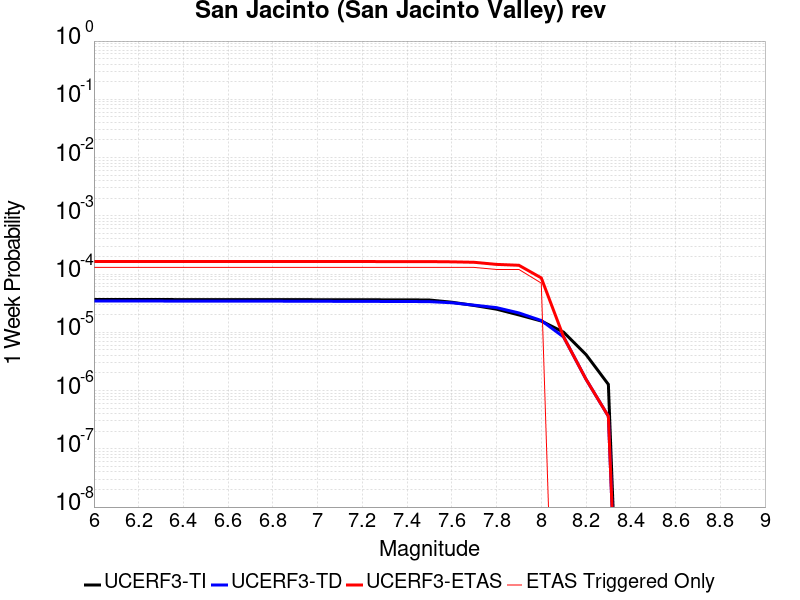 | 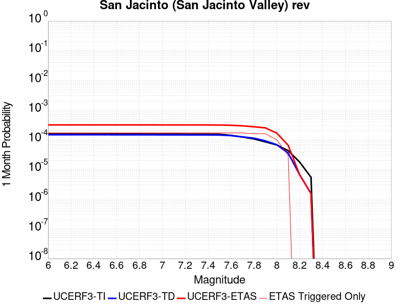 |  |  |

| Magnitude | 1 wk TI Prob | 1 wk TD Prob | 1 wk ETAS Prob | 1 wk ETAS/TD Gain | 1 wk ETAS Triggered Only | 1 mo TI Prob | 1 mo TD Prob | 1 mo ETAS Prob | 1 mo ETAS/TD Gain | 1 mo ETAS Triggered Only | 1 yr TI Prob | 1 yr TD Prob | 1 yr ETAS Prob | 1 yr ETAS/TD Gain | 1 yr ETAS Triggered Only | 10 yr TI Prob | 10 yr TD Prob | 10 yr ETAS Prob | 10 yr ETAS/TD Gain | 10 yr ETAS Triggered Only |
|-----|-----|-----|-----|-----|-----|-----|-----|-----|-----|-----|-----|-----|-----|-----|-----|-----|-----|-----|-----|-----|
| 6.0 | 3.652694E-5 | 3.4402394E-5 | 1.6439792E-4 | 4.778677 | 1.3E-4 | 1.5653463E-4 | 1.474305E-4 | 3.1740544E-4 | 2.1529157 | 1.7E-4 | 0.0019041431 | 0.00179349 | 0.0020729878 | 1.1558402 | 2.8E-4 | 0.018879099 | 0.018526595 | 0.01887011 | 1.0185418 | 3.5E-4 |
| 6.1 | 3.652694E-5 | 3.4402394E-5 | 1.6439792E-4 | 4.778677 | 1.3E-4 | 1.5653463E-4 | 1.474305E-4 | 3.1740544E-4 | 2.1529157 | 1.7E-4 | 0.0019041431 | 0.00179349 | 0.0020729878 | 1.1558402 | 2.8E-4 | 0.018879099 | 0.018526595 | 0.01887011 | 1.0185418 | 3.5E-4 |
| 6.2 | 3.652694E-5 | 3.4402394E-5 | 1.6439792E-4 | 4.778677 | 1.3E-4 | 1.5653463E-4 | 1.474305E-4 | 3.1740544E-4 | 2.1529157 | 1.7E-4 | 0.0019041431 | 0.00179349 | 0.0020729878 | 1.1558402 | 2.8E-4 | 0.018879099 | 0.018526595 | 0.01887011 | 1.0185418 | 3.5E-4 |
| 6.3 | 3.652694E-5 | 3.4402394E-5 | 1.6439792E-4 | 4.778677 | 1.3E-4 | 1.5653463E-4 | 1.474305E-4 | 3.1740544E-4 | 2.1529157 | 1.7E-4 | 0.0019041431 | 0.00179349 | 0.0020729878 | 1.1558402 | 2.8E-4 | 0.018879099 | 0.018526595 | 0.01887011 | 1.0185418 | 3.5E-4 |
| 6.4 | 3.646941E-5 | 3.432397E-5 | 1.6431951E-4 | 4.7873106 | 1.3E-4 | 1.5628811E-4 | 1.4709444E-4 | 3.1706944E-4 | 2.15555 | 1.7E-4 | 0.0019011468 | 0.0017894056 | 0.0020689047 | 1.1561966 | 2.8E-4 | 0.018849645 | 0.018486476 | 0.018830005 | 1.0185827 | 3.5E-4 |
| 6.5 | 3.646941E-5 | 3.432397E-5 | 1.6431951E-4 | 4.7873106 | 1.3E-4 | 1.5628811E-4 | 1.4709444E-4 | 3.1706944E-4 | 2.15555 | 1.7E-4 | 0.0019011468 | 0.0017894056 | 0.0020689047 | 1.1561966 | 2.8E-4 | 0.018849645 | 0.018486476 | 0.018830005 | 1.0185827 | 3.5E-4 |
| 6.6 | 3.6442503E-5 | 3.4287354E-5 | 1.642829E-4 | 4.791355 | 1.3E-4 | 1.561728E-4 | 1.4693754E-4 | 3.1691257E-4 | 2.156784 | 1.7E-4 | 0.0018997455 | 0.0017874985 | 0.002066998 | 1.1563635 | 2.8E-4 | 0.018835869 | 0.018467745 | 0.018811282 | 1.018602 | 3.5E-4 |
| 6.7 | 3.6432113E-5 | 3.4272925E-5 | 1.6426847E-4 | 4.7929516 | 1.3E-4 | 1.5612828E-4 | 1.4687571E-4 | 3.1685075E-4 | 2.1572711 | 1.7E-4 | 0.0018992044 | 0.0017867472 | 0.002066247 | 1.1564294 | 2.8E-4 | 0.018830549 | 0.018460369 | 0.018803908 | 1.0186095 | 3.5E-4 |
| 6.8 | 3.6409598E-5 | 3.424198E-5 | 1.6423753E-4 | 4.796379 | 1.3E-4 | 1.560318E-4 | 1.4674311E-4 | 3.1671816E-4 | 2.158317 | 1.7E-4 | 0.0018980318 | 0.0017851355 | 0.0020646355 | 1.1565708 | 2.8E-4 | 0.018819023 | 0.018444523 | 0.018788068 | 1.0186259 | 3.5E-4 |
| 6.9 | 3.638078E-5 | 3.4202407E-5 | 1.6419796E-4 | 4.800772 | 1.3E-4 | 1.5590832E-4 | 1.4657351E-4 | 3.165486E-4 | 2.1596575 | 1.7E-4 | 0.0018965311 | 0.001783074 | 0.0020625747 | 1.1567522 | 2.8E-4 | 0.018804269 | 0.018424258 | 0.01876781 | 1.0186467 | 3.5E-4 |
| 7.0 | 3.6294874E-5 | 3.408442E-5 | 1.6407999E-4 | 4.8139296 | 1.3E-4 | 1.5554018E-4 | 1.4606792E-4 | 3.160431E-4 | 2.1636722 | 1.7E-4 | 0.0018920569 | 0.001776929 | 0.0020564315 | 1.1572952 | 2.8E-4 | 0.018760284 | 0.018363839 | 0.018707411 | 1.0187092 | 3.5E-4 |
| 7.1 | 3.6260717E-5 | 3.4040702E-5 | 1.6403628E-4 | 4.8188276 | 1.3E-4 | 1.5539382E-4 | 1.4588058E-4 | 3.1585578E-4 | 2.1651666 | 1.7E-4 | 0.001890278 | 0.0017746518 | 0.0020541549 | 1.1574974 | 2.8E-4 | 0.018742796 | 0.018341439 | 0.01868502 | 1.0187324 | 3.5E-4 |
| 7.2 | 3.6210204E-5 | 3.397492E-5 | 1.639705E-4 | 4.826222 | 1.3E-4 | 1.5517735E-4 | 1.455987E-4 | 3.1557394E-4 | 2.1674228 | 1.7E-4 | 0.001887647 | 0.0017712255 | 0.0020507295 | 1.1578027 | 2.8E-4 | 0.01871693 | 0.01830772 | 0.018651312 | 1.0187676 | 3.5E-4 |
| 7.3 | 3.6119454E-5 | 3.386321E-5 | 1.638588E-4 | 4.838845 | 1.3E-4 | 1.5478847E-4 | 1.4511998E-4 | 3.150953E-4 | 2.1712744 | 1.7E-4 | 0.0018829206 | 0.0017654065 | 0.0020449122 | 1.1583236 | 2.8E-4 | 0.018670462 | 0.018250274 | 0.018593885 | 1.0188278 | 3.5E-4 |
| 7.4 | 3.607848E-5 | 3.381071E-5 | 1.6380631E-4 | 4.8448057 | 1.3E-4 | 1.5461289E-4 | 1.44895E-4 | 3.1487038E-4 | 2.1730933 | 1.7E-4 | 0.0018807866 | 0.0017626719 | 0.0020421783 | 1.1585698 | 2.8E-4 | 0.018649481 | 0.018223269 | 0.01856689 | 1.0188562 | 3.5E-4 |
| 7.5 | 3.5856774E-5 | 3.3620483E-5 | 1.6361612E-4 | 4.8665605 | 1.3E-4 | 1.5366284E-4 | 1.4407984E-4 | 3.1405533E-4 | 2.1797314 | 1.7E-4 | 0.0018692396 | 0.0017527633 | 0.0020322725 | 1.1594678 | 2.8E-4 | 0.018535944 | 0.018124366 | 0.018468022 | 1.0189611 | 3.5E-4 |
| 7.6 | 3.286655E-5 | 3.2143445E-5 | 1.6213927E-4 | 5.0442405 | 1.3E-4 | 1.4084904E-4 | 1.3775036E-4 | 3.0772694E-4 | 2.2339466 | 1.7E-4 | 0.001713488 | 0.0016758227 | 0.0019553534 | 1.1668022 | 2.8E-4 | 0.017003361 | 0.017344031 | 0.017687961 | 1.0198299 | 3.5E-4 |
| 7.7 | 2.8882527E-5 | 2.9236293E-5 | 1.592325E-4 | 5.4463983 | 1.3E-4 | 1.237764E-4 | 1.2529238E-4 | 2.9527108E-4 | 2.3566563 | 1.7E-4 | 0.0015059357 | 0.0015243685 | 0.0018039417 | 1.1834027 | 2.8E-4 | 0.014957713 | 0.015830461 | 0.01617492 | 1.0217593 | 3.5E-4 |
| 7.8 | 2.4950225E-5 | 2.6527203E-5 | 1.4652402E-4 | 5.523538 | 1.2E-4 | 1.0692515E-4 | 1.1368306E-4 | 2.736649E-4 | 2.4072616 | 1.6E-4 | 0.0013010362 | 0.0013832134 | 0.00165284 | 1.1949277 | 2.7E-4 | 0.012934455 | 0.014411755 | 0.014746855 | 1.0232519 | 3.4E-4 |
| 7.9 | 1.9881603E-5 | 2.1507445E-5 | 1.4150486E-4 | 6.5793433 | 1.2E-4 | 8.520408E-5 | 9.217151E-5 | 2.5215678E-4 | 2.7357342 | 1.6E-4 | 0.001036866 | 0.0011216112 | 0.0013913084 | 1.2404552 | 2.7E-4 | 0.010320415 | 0.011777027 | 0.012113023 | 1.0285298 | 3.4E-4 |
| 8.0 | 1.563292E-5 | 1.5937347E-5 | 8.593623E-5 | 5.3921294 | 7.0E-5 | 6.6996516E-5 | 6.8301124E-5 | 1.682943E-4 | 2.4640048 | 1.0E-4 | 8.153773E-4 | 8.3124964E-4 | 0.0010111 | 1.2163614 | 1.8E-4 | 0.00812392 | 0.008810506 | 0.00903848 | 1.0258752 | 2.3E-4 |
| 8.1 | 1.0045313E-5 | 8.301802E-6 | 8.301802E-6 | 1.0 | 0.0 | 4.305063E-5 | 3.5578672E-5 | 6.55776E-5 | 1.8431718 | 3.0E-5 | 5.2401534E-4 | 4.3308473E-4 | 4.7306743E-4 | 1.0923207 | 4.0E-5 | 0.0052278144 | 0.0046591135 | 0.0046989275 | 1.0085453 | 4.0E-5 |
| 8.2 | 4.1554413E-6 | 1.5655598E-6 | 1.5655598E-6 | 1.0 | 0.0 | 1.7808914E-5 | 6.709525E-6 | 6.709525E-6 | 1.0 | 0.0 | 2.1680194E-4 | 8.168544E-5 | 8.168544E-5 | 1.0 | 0.0 | 0.0021659054 | 9.482903E-4 | 9.482903E-4 | 1.0 | 0.0 |
| 8.3 | 1.2758221E-6 | 3.6149942E-7 | 3.6149942E-7 | 1.0 | 0.0 | 5.4677976E-6 | 1.5492824E-6 | 1.5492824E-6 | 1.0 | 0.0 | 6.65684E-5 | 1.8862354E-5 | 1.8862354E-5 | 1.0 | 0.0 | 6.6548464E-4 | 2.2751294E-4 | 2.2751294E-4 | 1.0 | 0.0 |

## Scodie Lineament
*[(top)](#table-of-contents)*

| 1 Week | 1 Month | 1 Year | 10 Year |
|-----|-----|-----|-----|
| 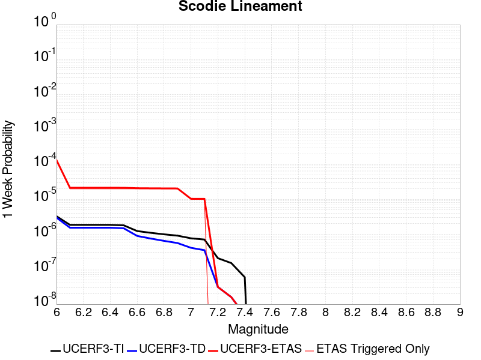 | 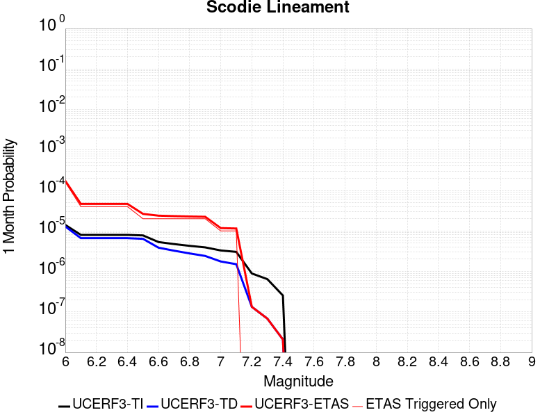 |  |  |

| Magnitude | 1 wk TI Prob | 1 wk TD Prob | 1 wk ETAS Prob | 1 wk ETAS/TD Gain | 1 wk ETAS Triggered Only | 1 mo TI Prob | 1 mo TD Prob | 1 mo ETAS Prob | 1 mo ETAS/TD Gain | 1 mo ETAS Triggered Only | 1 yr TI Prob | 1 yr TD Prob | 1 yr ETAS Prob | 1 yr ETAS/TD Gain | 1 yr ETAS Triggered Only | 10 yr TI Prob | 10 yr TD Prob | 10 yr ETAS Prob | 10 yr ETAS/TD Gain | 10 yr ETAS Triggered Only |
|-----|-----|-----|-----|-----|-----|-----|-----|-----|-----|-----|-----|-----|-----|-----|-----|-----|-----|-----|-----|-----|
| 6.0 | 3.2919327E-6 | 3.0133422E-6 | 1.3301295E-4 | 44.141335 | 1.3E-4 | 1.4108206E-5 | 1.2914278E-5 | 1.7291222E-4 | 13.389228 | 1.6E-4 | 1.7175387E-4 | 1.5722317E-4 | 4.0718386E-4 | 2.5898464 | 2.5E-4 | 0.0017162118 | 0.0015714309 | 0.0019009124 | 1.2096697 | 3.3E-4 |
| 6.1 | 1.8663811E-6 | 1.5490499E-6 | 2.1549018E-5 | 13.911119 | 2.0E-5 | 7.998751E-6 | 6.6387715E-6 | 4.6638506E-5 | 7.0251713 | 4.0E-5 | 9.738045E-5 | 8.082454E-5 | 1.308205E-4 | 1.618574 | 5.0E-5 | 9.7337784E-4 | 8.080003E-4 | 8.8793563E-4 | 1.0989299 | 8.0E-5 |
| 6.2 | 1.8663811E-6 | 1.5490499E-6 | 2.1549018E-5 | 13.911119 | 2.0E-5 | 7.998751E-6 | 6.6387715E-6 | 4.6638506E-5 | 7.0251713 | 4.0E-5 | 9.738045E-5 | 8.082454E-5 | 1.308205E-4 | 1.618574 | 5.0E-5 | 9.7337784E-4 | 8.080003E-4 | 8.8793563E-4 | 1.0989299 | 8.0E-5 |
| 6.3 | 1.8663811E-6 | 1.5490499E-6 | 2.1549018E-5 | 13.911119 | 2.0E-5 | 7.998751E-6 | 6.6387715E-6 | 4.6638506E-5 | 7.0251713 | 4.0E-5 | 9.738045E-5 | 8.082454E-5 | 1.308205E-4 | 1.618574 | 5.0E-5 | 9.7337784E-4 | 8.080003E-4 | 8.8793563E-4 | 1.0989299 | 8.0E-5 |
| 6.4 | 1.8663811E-6 | 1.5490499E-6 | 2.1549018E-5 | 13.911119 | 2.0E-5 | 7.998751E-6 | 6.6387715E-6 | 4.6638506E-5 | 7.0251713 | 4.0E-5 | 9.738045E-5 | 8.082454E-5 | 1.308205E-4 | 1.618574 | 5.0E-5 | 9.7337784E-4 | 8.080003E-4 | 8.8793563E-4 | 1.0989299 | 8.0E-5 |
| 6.5 | 1.8106311E-6 | 1.4909839E-6 | 2.1490954E-5 | 14.41394 | 2.0E-5 | 7.759824E-6 | 6.3899183E-6 | 2.6389791E-5 | 4.1299105 | 2.0E-5 | 9.447177E-5 | 7.7794975E-5 | 1.0779264E-4 | 1.385599 | 3.0E-5 | 9.4431615E-4 | 7.7772606E-4 | 8.376794E-4 | 1.077088 | 6.0E-5 |
| 6.6 | 1.2414679E-6 | 8.997558E-7 | 2.0899737E-5 | 23.228235 | 2.0E-5 | 5.320566E-6 | 3.856091E-6 | 2.3856013E-5 | 6.1865797 | 2.0E-5 | 6.477596E-5 | 4.6946985E-5 | 7.694557E-5 | 1.6389887 | 3.0E-5 | 6.475708E-4 | 4.693793E-4 | 5.193558E-4 | 1.1064737 | 5.0E-5 |
| 6.7 | 1.1062215E-6 | 7.594311E-7 | 2.0759417E-5 | 27.335484 | 2.0E-5 | 4.7409408E-6 | 3.2547011E-6 | 2.3254635E-5 | 7.1449375 | 2.0E-5 | 5.7719422E-5 | 3.9625334E-5 | 6.962415E-5 | 1.7570614 | 3.0E-5 | 5.770443E-4 | 3.961897E-4 | 4.4616987E-4 | 1.1261522 | 5.0E-5 |
| 6.8 | 1.0006736E-6 | 6.500397E-7 | 2.0650026E-5 | 31.767332 | 2.0E-5 | 4.288594E-6 | 2.7858816E-6 | 2.2785825E-5 | 8.179036 | 2.0E-5 | 5.221238E-5 | 3.3917644E-5 | 6.3916625E-5 | 1.8844655 | 3.0E-5 | 5.220012E-4 | 3.3913075E-4 | 3.891138E-4 | 1.1473857 | 5.0E-5 |
| 6.9 | 9.167364E-7 | 5.631625E-7 | 2.0563151E-5 | 36.51371 | 2.0E-5 | 3.9288643E-6 | 2.4135516E-6 | 2.2413504E-5 | 9.286524 | 2.0E-5 | 4.7832873E-5 | 2.9384651E-5 | 5.938377E-5 | 2.0209112 | 3.0E-5 | 4.782258E-4 | 2.9381333E-4 | 3.4379863E-4 | 1.1701261 | 5.0E-5 |
| 7.0 | 7.6987664E-7 | 4.113383E-7 | 1.0411334E-5 | 25.31088 | 1.0E-5 | 3.2994672E-6 | 1.7628774E-6 | 1.176286E-5 | 6.672534 | 1.0E-5 | 4.0170275E-5 | 2.1462862E-5 | 4.146243E-5 | 1.9318222 | 2.0E-5 | 4.0163012E-4 | 2.1461173E-4 | 2.446053E-4 | 1.1397573 | 3.0E-5 |
| 7.1 | 7.1038727E-7 | 3.5211494E-7 | 1.03521115E-5 | 29.399809 | 1.0E-5 | 3.0445133E-6 | 1.5090633E-6 | 1.1509048E-5 | 7.6266174 | 1.0E-5 | 3.706632E-5 | 1.8372726E-5 | 2.8372542E-5 | 1.544275 | 1.0E-5 | 3.7060137E-4 | 1.8371557E-4 | 2.037119E-4 | 1.1088439 | 2.0E-5 |
| 7.2 | 2.0799602E-7 | 3.1186854E-8 | 3.1186854E-8 | 1.0 | 0.0 | 8.914113E-7 | 1.3365793E-7 | 1.3365793E-7 | 1.0 | 0.0 | 1.0852878E-5 | 1.6272843E-6 | 1.6272843E-6 | 1.0 | 0.0 | 1.08523476E-4 | 1.627273E-5 | 1.627273E-5 | 1.0 | 0.0 |
| 7.3 | 1.5048182E-7 | 1.5945696E-8 | 1.5945696E-8 | 1.0 | 0.0 | 6.449219E-7 | 6.83387E-8 | 6.83387E-8 | 1.0 | 0.0 | 7.851896E-6 | 8.320234E-7 | 8.320234E-7 | 1.0 | 0.0 | 7.851618E-5 | 8.320206E-6 | 8.320206E-6 | 1.0 | 0.0 |
| 7.4 | 5.9334678E-8 | 4.8683537E-9 | 4.8683537E-9 | 1.0 | 0.0 | 2.5429145E-7 | 2.0864372E-8 | 2.0864372E-8 | 1.0 | 0.0 | 3.095994E-6 | 2.5402372E-7 | 2.5402372E-7 | 1.0 | 0.0 | 3.095951E-5 | 2.5402353E-6 | 2.5402353E-6 | 1.0 | 0.0 |

## White Wolf (Extension)
*[(top)](#table-of-contents)*

| 1 Week | 1 Month | 1 Year | 10 Year |
|-----|-----|-----|-----|
| 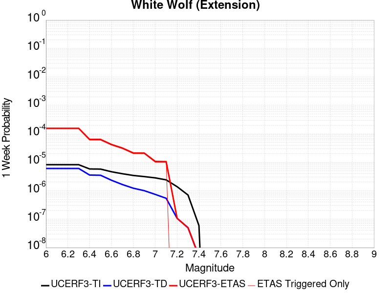 | 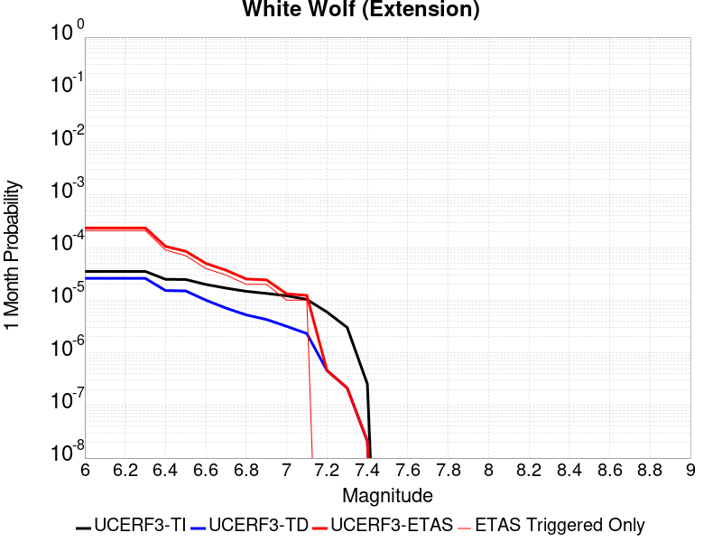 |  | 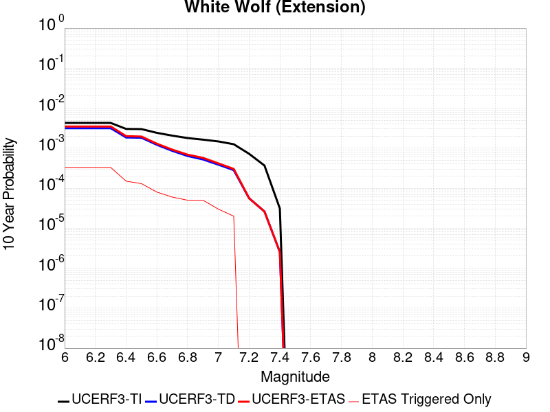 |

| Magnitude | 1 wk TI Prob | 1 wk TD Prob | 1 wk ETAS Prob | 1 wk ETAS/TD Gain | 1 wk ETAS Triggered Only | 1 mo TI Prob | 1 mo TD Prob | 1 mo ETAS Prob | 1 mo ETAS/TD Gain | 1 mo ETAS Triggered Only | 1 yr TI Prob | 1 yr TD Prob | 1 yr ETAS Prob | 1 yr ETAS/TD Gain | 1 yr ETAS Triggered Only | 10 yr TI Prob | 10 yr TD Prob | 10 yr ETAS Prob | 10 yr ETAS/TD Gain | 10 yr ETAS Triggered Only |
|-----|-----|-----|-----|-----|-----|-----|-----|-----|-----|-----|-----|-----|-----|-----|-----|-----|-----|-----|-----|-----|
| 6.0 | 8.222555E-6 | 6.0666657E-6 | 1.5606575E-4 | 25.725128 | 1.5E-4 | 3.5239045E-5 | 2.5999774E-5 | 2.3599432E-4 | 9.076783 | 2.1E-4 | 4.289509E-4 | 3.1650788E-4 | 5.8642245E-4 | 1.8527893 | 2.7E-4 | 0.0042812387 | 0.003161223 | 0.0034901798 | 1.1040599 | 3.3E-4 |
| 6.1 | 8.222555E-6 | 6.0666657E-6 | 1.5606575E-4 | 25.725128 | 1.5E-4 | 3.5239045E-5 | 2.5999774E-5 | 2.3599432E-4 | 9.076783 | 2.1E-4 | 4.289509E-4 | 3.1650788E-4 | 5.8642245E-4 | 1.8527893 | 2.7E-4 | 0.0042812387 | 0.003161223 | 0.0034901798 | 1.1040599 | 3.3E-4 |
| 6.2 | 8.222555E-6 | 6.0666657E-6 | 1.5606575E-4 | 25.725128 | 1.5E-4 | 3.5239045E-5 | 2.5999774E-5 | 2.3599432E-4 | 9.076783 | 2.1E-4 | 4.289509E-4 | 3.1650788E-4 | 5.8642245E-4 | 1.8527893 | 2.7E-4 | 0.0042812387 | 0.003161223 | 0.0034901798 | 1.1040599 | 3.3E-4 |
| 6.3 | 8.222555E-6 | 6.0666657E-6 | 1.5606575E-4 | 25.725128 | 1.5E-4 | 3.5239045E-5 | 2.5999774E-5 | 2.3599432E-4 | 9.076783 | 2.1E-4 | 4.289509E-4 | 3.1650788E-4 | 5.8642245E-4 | 1.8527893 | 2.7E-4 | 0.0042812387 | 0.003161223 | 0.0034901798 | 1.1040599 | 3.3E-4 |
| 6.4 | 5.821773E-6 | 3.5571766E-6 | 6.355696E-5 | 17.86725 | 6.0E-5 | 2.4950215E-5 | 1.5244959E-5 | 1.05243584E-4 | 6.9035006 | 9.0E-5 | 3.0372653E-4 | 1.8559267E-4 | 3.055704E-4 | 1.6464573 | 1.2E-4 | 0.0030331176 | 0.001854485 | 0.0020042069 | 1.080735 | 1.5E-4 |
| 6.5 | 5.766023E-6 | 3.4991106E-6 | 6.34989E-5 | 18.147154 | 6.0E-5 | 2.4711293E-5 | 1.4996108E-5 | 8.499506E-5 | 5.6678076 | 7.0E-5 | 3.0081844E-4 | 1.8256342E-4 | 2.8254517E-4 | 1.5476549 | 1.0E-4 | 0.0030041158 | 0.0018242426 | 0.0019540053 | 1.0711324 | 1.3E-4 |
| 6.6 | 4.643576E-6 | 2.332624E-6 | 4.233253E-5 | 18.14803 | 4.0E-5 | 1.9900888E-5 | 9.996925E-6 | 4.9996524E-5 | 5.0011907 | 4.0E-5 | 2.4226638E-4 | 1.2170619E-4 | 1.8169888E-4 | 1.4929305 | 6.0E-5 | 0.0024200242 | 0.0012164378 | 0.0012963405 | 1.0656857 | 8.0E-5 |
| 6.7 | 3.9529173E-6 | 1.6483477E-6 | 3.16483E-5 | 19.200012 | 3.0E-5 | 1.6940963E-5 | 7.0643296E-6 | 3.7064117E-5 | 5.2466574 | 3.0E-5 | 2.0623671E-4 | 8.6005006E-5 | 1.2600157E-4 | 1.4650491 | 4.0E-5 | 0.002060454 | 8.597357E-4 | 9.196841E-4 | 1.0697289 | 6.0E-5 |
| 6.8 | 3.4377522E-6 | 1.2245237E-6 | 2.12245E-5 | 17.33286 | 2.0E-5 | 1.473314E-5 | 5.2479486E-6 | 2.5247844E-5 | 4.8109927 | 2.0E-5 | 1.7936122E-4 | 6.3891996E-5 | 9.389008E-5 | 1.4695123 | 3.0E-5 | 0.0017921652 | 6.387454E-4 | 6.887134E-4 | 1.0782285 | 5.0E-5 |
| 6.9 | 3.1367306E-6 | 1.0033783E-6 | 2.1003358E-5 | 20.93264 | 2.0E-5 | 1.3443062E-5 | 4.3001864E-6 | 2.43001E-5 | 5.6509414 | 2.0E-5 | 1.63657E-4 | 5.235359E-5 | 8.235202E-5 | 1.5729966 | 3.0E-5 | 0.0016353652 | 5.2342017E-4 | 5.73394E-4 | 1.0954756 | 5.0E-5 |
| 7.0 | 2.8298145E-6 | 7.4286646E-7 | 1.0742859E-5 | 14.461359 | 1.0E-5 | 1.2127721E-5 | 3.1837099E-6 | 1.3183678E-5 | 4.14098 | 1.0E-5 | 1.47645E-4 | 3.8761027E-5 | 5.876025E-5 | 1.5159621 | 2.0E-5 | 0.0014754693 | 3.8754768E-4 | 4.1753604E-4 | 1.0773798 | 3.0E-5 |
| 7.1 | 2.4091064E-6 | 5.4227525E-7 | 1.054227E-5 | 19.440811 | 1.0E-5 | 1.03247E-5 | 2.3240348E-6 | 1.2324012E-5 | 5.3028517 | 1.0E-5 | 1.2569598E-4 | 2.8294799E-5 | 3.8294515E-5 | 1.3534119 | 1.0E-5 | 0.001256249 | 2.8291598E-4 | 3.0291034E-4 | 1.0706724 | 2.0E-5 |
| 7.2 | 1.3875518E-6 | 1.0743063E-7 | 1.0743063E-7 | 1.0 | 0.0 | 5.9466374E-6 | 4.6041689E-7 | 4.6041689E-7 | 1.0 | 0.0 | 7.23979E-5 | 5.6055624E-6 | 5.6055624E-6 | 1.0 | 0.0 | 7.2374323E-4 | 5.6054323E-5 | 5.6054323E-5 | 1.0 | 0.0 |
| 7.3 | 7.056077E-7 | 5.002034E-8 | 5.002034E-8 | 1.0 | 0.0 | 3.0240296E-6 | 2.1437286E-7 | 2.1437286E-7 | 1.0 | 0.0 | 3.681694E-5 | 2.609987E-6 | 2.609987E-6 | 1.0 | 0.0 | 3.681084E-4 | 2.609961E-5 | 2.609961E-5 | 1.0 | 0.0 |
| 7.4 | 5.9334678E-8 | 4.8683537E-9 | 4.8683537E-9 | 1.0 | 0.0 | 2.5429145E-7 | 2.0864372E-8 | 2.0864372E-8 | 1.0 | 0.0 | 3.095994E-6 | 2.5402372E-7 | 2.5402372E-7 | 1.0 | 0.0 | 3.095951E-5 | 2.5402353E-6 | 2.5402353E-6 | 1.0 | 0.0 |

## Calico-Hidalgo
*[(top)](#table-of-contents)*

| 1 Week | 1 Month | 1 Year | 10 Year |
|-----|-----|-----|-----|
| 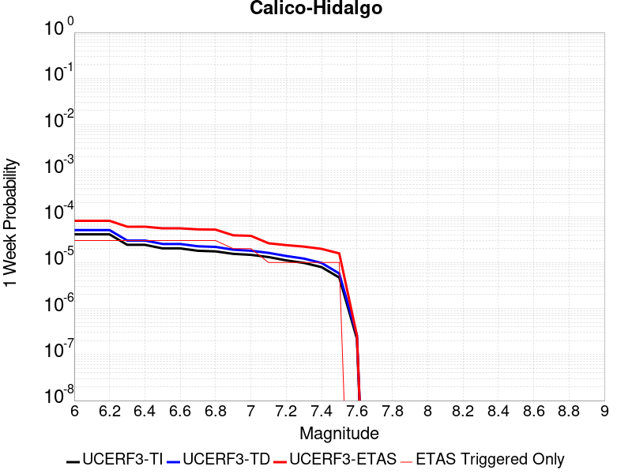 |  | 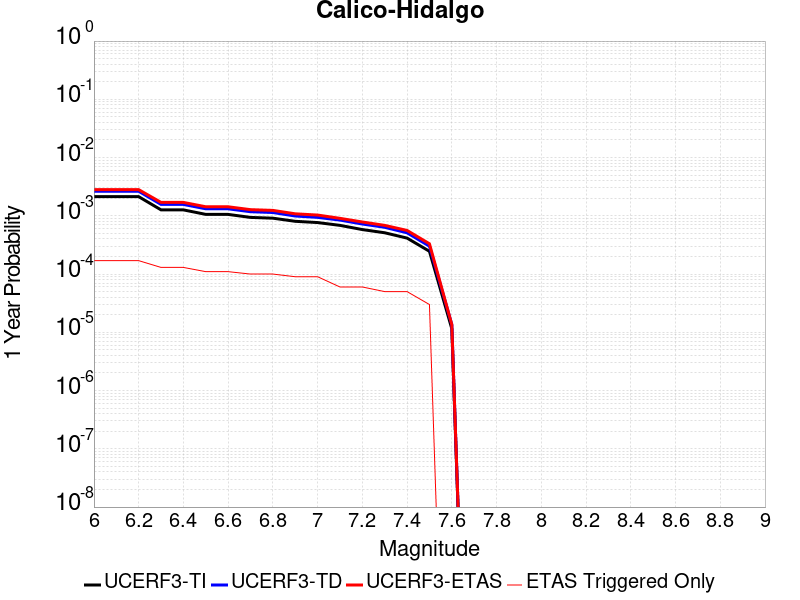 |  |

| Magnitude | 1 wk TI Prob | 1 wk TD Prob | 1 wk ETAS Prob | 1 wk ETAS/TD Gain | 1 wk ETAS Triggered Only | 1 mo TI Prob | 1 mo TD Prob | 1 mo ETAS Prob | 1 mo ETAS/TD Gain | 1 mo ETAS Triggered Only | 1 yr TI Prob | 1 yr TD Prob | 1 yr ETAS Prob | 1 yr ETAS/TD Gain | 1 yr ETAS Triggered Only | 10 yr TI Prob | 10 yr TD Prob | 10 yr ETAS Prob | 10 yr ETAS/TD Gain | 10 yr ETAS Triggered Only |
|-----|-----|-----|-----|-----|-----|-----|-----|-----|-----|-----|-----|-----|-----|-----|-----|-----|-----|-----|-----|-----|
| 6.0 | 4.0906612E-5 | 5.0703686E-5 | 8.0702164E-5 | 1.591643 | 3.0E-5 | 1.7530227E-4 | 2.172857E-4 | 2.872705E-4 | 1.3220865 | 7.0E-5 | 0.0021322158 | 0.002642648 | 0.0028121988 | 1.0641594 | 1.7E-4 | 0.02111873 | 0.026152607 | 0.026454499 | 1.0115435 | 3.1E-4 |
| 6.1 | 4.0906612E-5 | 5.0703686E-5 | 8.0702164E-5 | 1.591643 | 3.0E-5 | 1.7530227E-4 | 2.172857E-4 | 2.872705E-4 | 1.3220865 | 7.0E-5 | 0.0021322158 | 0.002642648 | 0.0028121988 | 1.0641594 | 1.7E-4 | 0.02111873 | 0.026152607 | 0.026454499 | 1.0115435 | 3.1E-4 |
| 6.2 | 4.0906612E-5 | 5.0703686E-5 | 8.0702164E-5 | 1.591643 | 3.0E-5 | 1.7530227E-4 | 2.172857E-4 | 2.872705E-4 | 1.3220865 | 7.0E-5 | 0.0021322158 | 0.002642648 | 0.0028121988 | 1.0641594 | 1.7E-4 | 0.02111873 | 0.026152607 | 0.026454499 | 1.0115435 | 3.1E-4 |
| 6.3 | 2.4242801E-5 | 3.0090669E-5 | 6.0089766E-5 | 1.9969568 | 3.0E-5 | 1.0389358E-4 | 1.2895382E-4 | 1.8894608E-4 | 1.4652228 | 6.0E-5 | 0.0012641704 | 0.0015689151 | 0.0016987112 | 1.0827298 | 1.3E-4 | 0.01257003 | 0.01558206 | 0.015798632 | 1.0138988 | 2.2E-4 |
| 6.4 | 2.4242801E-5 | 3.0090669E-5 | 6.0089766E-5 | 1.9969568 | 3.0E-5 | 1.0389358E-4 | 1.2895382E-4 | 1.8894608E-4 | 1.4652228 | 6.0E-5 | 0.0012641704 | 0.0015689151 | 0.0016987112 | 1.0827298 | 1.3E-4 | 0.01257003 | 0.01558206 | 0.015798632 | 1.0138988 | 2.2E-4 |
| 6.5 | 2.0286952E-5 | 2.5315738E-5 | 5.531498E-5 | 2.1850035 | 3.0E-5 | 8.694118E-5 | 1.0849161E-4 | 1.4848726E-4 | 1.3686521 | 4.0E-5 | 0.0010579949 | 0.001320102 | 0.0014299569 | 1.0832169 | 1.1E-4 | 0.010529719 | 0.013124538 | 0.013312045 | 1.0142868 | 1.9E-4 |
| 6.6 | 2.0269223E-5 | 2.5296687E-5 | 5.5295928E-5 | 2.185896 | 3.0E-5 | 8.6865206E-5 | 1.08409964E-4 | 1.4840563E-4 | 1.3689297 | 4.0E-5 | 0.0010570707 | 0.0013191093 | 0.0014289642 | 1.0832796 | 1.1E-4 | 0.010520565 | 0.013114728 | 0.013302236 | 1.0142975 | 1.9E-4 |
| 6.7 | 1.799852E-5 | 2.25406E-5 | 5.2539923E-5 | 2.3309016 | 3.0E-5 | 7.713423E-5 | 9.659908E-5 | 1.3659522E-4 | 1.4140426 | 4.0E-5 | 9.3870464E-4 | 0.0011754738 | 0.0012753563 | 1.084972 | 1.0E-4 | 0.009347493 | 0.011694173 | 0.011872069 | 1.0152123 | 1.8E-4 |
| 6.8 | 1.7458793E-5 | 2.184212E-5 | 5.1841464E-5 | 2.3734632 | 3.0E-5 | 7.4821255E-5 | 9.3605806E-5 | 1.3360207E-4 | 1.4272839 | 4.0E-5 | 9.10568E-4 | 0.0011390693 | 0.0012389554 | 1.087691 | 1.0E-4 | 0.009068459 | 0.011333893 | 0.011511853 | 1.0157015 | 1.8E-4 |
| 6.9 | 1.542884E-5 | 1.9025927E-5 | 3.9025545E-5 | 2.0511773 | 2.0E-5 | 6.612192E-5 | 8.153721E-5 | 1.1153477E-4 | 1.3679001 | 3.0E-5 | 8.04737E-4 | 9.922766E-4 | 0.0010821873 | 1.0906105 | 9.0E-5 | 0.008018291 | 0.009879857 | 0.010038277 | 1.0160346 | 1.6E-4 |
| 7.0 | 1.468253E-5 | 1.8030598E-5 | 3.8030237E-5 | 2.1092055 | 2.0E-5 | 6.292361E-5 | 7.7271776E-5 | 1.0726946E-4 | 1.38821 | 3.0E-5 | 7.658257E-4 | 9.4039086E-4 | 0.0010303062 | 1.0956149 | 9.0E-5 | 0.0076319184 | 0.009365481 | 0.009523983 | 1.016924 | 1.6E-4 |
| 7.1 | 1.3139281E-5 | 1.6200942E-5 | 2.620078E-5 | 1.617238 | 1.0E-5 | 5.6309986E-5 | 6.943083E-5 | 7.943014E-5 | 1.1440182 | 1.0E-5 | 6.853584E-4 | 8.4500515E-4 | 9.0495445E-4 | 1.0709455 | 6.0E-5 | 0.0068324856 | 0.0084192185 | 0.008538208 | 1.0141331 | 1.2E-4 |
| 7.2 | 1.1127404E-5 | 1.3866597E-5 | 2.3866458E-5 | 1.7211474 | 1.0E-5 | 4.7688E-5 | 5.942698E-5 | 6.942639E-5 | 1.1682637 | 1.0E-5 | 5.8044674E-4 | 7.232942E-4 | 7.8325084E-4 | 1.0828938 | 6.0E-5 | 0.0057893298 | 0.0072105085 | 0.0073296432 | 1.0165224 | 1.2E-4 |
| 7.3 | 9.808154E-6 | 1.2176215E-5 | 2.2176093E-5 | 1.8212633 | 1.0E-5 | 4.2034266E-5 | 5.2182797E-5 | 6.218228E-5 | 1.191624 | 1.0E-5 | 5.11647E-4 | 6.3515105E-4 | 6.851193E-4 | 1.0786715 | 5.0E-5 | 0.0051047057 | 0.006334433 | 0.0064337994 | 1.0156868 | 1.0E-4 |
| 7.4 | 7.942452E-6 | 9.792144E-6 | 1.9792045E-5 | 2.0212169 | 1.0E-5 | 3.4038632E-5 | 4.1965708E-5 | 5.1965286E-5 | 1.2382798 | 1.0E-5 | 4.1434157E-4 | 5.1082217E-4 | 5.6079665E-4 | 1.0978314 | 5.0E-5 | 0.0041356985 | 0.005097421 | 0.0051969113 | 1.0195178 | 1.0E-4 |
| 7.5 | 4.7121216E-6 | 5.772836E-6 | 1.5772779E-5 | 2.7322407 | 1.0E-5 | 2.019465E-5 | 2.4740535E-5 | 3.474029E-5 | 1.4041849 | 1.0E-5 | 2.4584212E-4 | 3.0118204E-4 | 3.31173E-4 | 1.0995775 | 3.0E-5 | 0.0024557032 | 0.0030084911 | 0.0030683107 | 1.0198835 | 6.0E-5 |
| 7.6 | 2.21172E-7 | 2.603961E-7 | 2.603961E-7 | 1.0 | 0.0 | 9.478797E-7 | 1.1159829E-6 | 1.1159829E-6 | 1.0 | 0.0 | 1.1540374E-5 | 1.3587036E-5 | 1.3587036E-5 | 1.0 | 0.0 | 1.1539775E-4 | 1.3586486E-4 | 1.3586486E-4 | 1.0 | 0.0 |

## Manix-Afton Hills
*[(top)](#table-of-contents)*

| 1 Week | 1 Month | 1 Year | 10 Year |
|-----|-----|-----|-----|
| 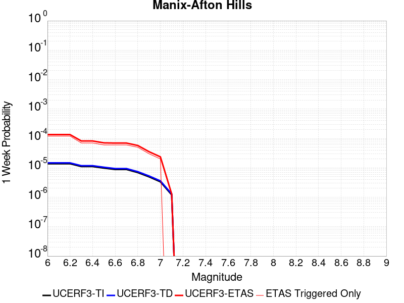 | 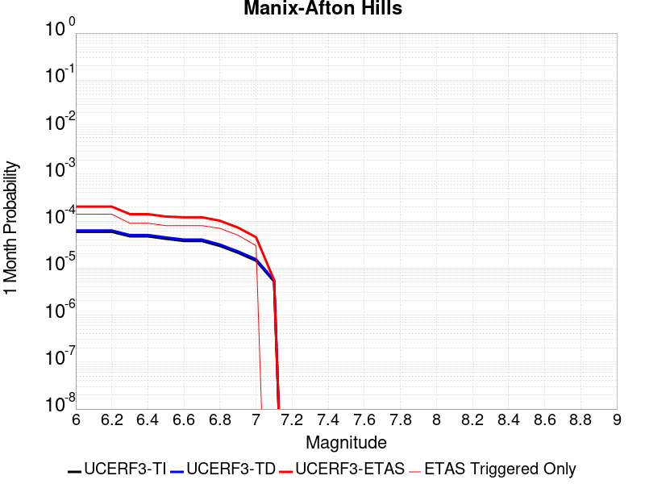 |  |  |

| Magnitude | 1 wk TI Prob | 1 wk TD Prob | 1 wk ETAS Prob | 1 wk ETAS/TD Gain | 1 wk ETAS Triggered Only | 1 mo TI Prob | 1 mo TD Prob | 1 mo ETAS Prob | 1 mo ETAS/TD Gain | 1 mo ETAS Triggered Only | 1 yr TI Prob | 1 yr TD Prob | 1 yr ETAS Prob | 1 yr ETAS/TD Gain | 1 yr ETAS Triggered Only | 10 yr TI Prob | 10 yr TD Prob | 10 yr ETAS Prob | 10 yr ETAS/TD Gain | 10 yr ETAS Triggered Only |
|-----|-----|-----|-----|-----|-----|-----|-----|-----|-----|-----|-----|-----|-----|-----|-----|-----|-----|-----|-----|-----|
| 6.0 | 1.3783202E-5 | 1.47110895E-5 | 1.3470932E-4 | 9.156991 | 1.2E-4 | 5.906953E-5 | 6.30461E-5 | 2.0303727E-4 | 3.2204573 | 1.4E-4 | 7.189342E-4 | 7.6733343E-4 | 9.4719534E-4 | 1.2343986 | 1.8E-4 | 0.0071661277 | 0.007648596 | 0.007946301 | 1.0389229 | 3.0E-4 |
| 6.1 | 1.3783202E-5 | 1.47110895E-5 | 1.3470932E-4 | 9.156991 | 1.2E-4 | 5.906953E-5 | 6.30461E-5 | 2.0303727E-4 | 3.2204573 | 1.4E-4 | 7.189342E-4 | 7.6733343E-4 | 9.4719534E-4 | 1.2343986 | 1.8E-4 | 0.0071661277 | 0.007648596 | 0.007946301 | 1.0389229 | 3.0E-4 |
| 6.2 | 1.3783202E-5 | 1.47110895E-5 | 1.3470932E-4 | 9.156991 | 1.2E-4 | 5.906953E-5 | 6.30461E-5 | 2.0303727E-4 | 3.2204573 | 1.4E-4 | 7.189342E-4 | 7.6733343E-4 | 9.4719534E-4 | 1.2343986 | 1.8E-4 | 0.0071661277 | 0.007648596 | 0.007946301 | 1.0389229 | 3.0E-4 |
| 6.3 | 1.10494875E-5 | 1.1793136E-5 | 8.1792314E-5 | 6.9355865 | 7.0E-5 | 4.7354086E-5 | 5.054109E-5 | 1.4053655E-4 | 2.7806394 | 9.0E-5 | 5.763835E-4 | 6.151744E-4 | 7.351006E-4 | 1.1949466 | 1.2E-4 | 0.005748908 | 0.0061357557 | 0.006344467 | 1.0340157 | 2.1E-4 |
| 6.4 | 1.10494875E-5 | 1.1793136E-5 | 8.1792314E-5 | 6.9355865 | 7.0E-5 | 4.7354086E-5 | 5.054109E-5 | 1.4053655E-4 | 2.7806394 | 9.0E-5 | 5.763835E-4 | 6.151744E-4 | 7.351006E-4 | 1.1949466 | 1.2E-4 | 0.005748908 | 0.0061357557 | 0.006344467 | 1.0340157 | 2.1E-4 |
| 6.5 | 9.788949E-6 | 1.045432E-5 | 7.0453694E-5 | 6.7391944 | 6.0E-5 | 4.1951964E-5 | 4.480351E-5 | 1.2479993E-4 | 2.7854943 | 8.0E-5 | 5.1064545E-4 | 5.453555E-4 | 6.4530096E-4 | 1.1832666 | 1.0E-4 | 0.0050947363 | 0.0054410985 | 0.0056101736 | 1.0310737 | 1.7E-4 |
| 6.6 | 8.810006E-6 | 9.4136285E-6 | 6.9413065E-5 | 7.373678 | 6.0E-5 | 3.775662E-5 | 4.0343548E-5 | 1.2034032E-4 | 2.982889 | 8.0E-5 | 4.5958988E-4 | 4.9108086E-4 | 5.810367E-4 | 1.1831793 | 9.0E-5 | 0.0045864056 | 0.004900839 | 0.005060055 | 1.0324875 | 1.6E-4 |
| 6.7 | 8.80128E-6 | 9.404108E-6 | 6.940354E-5 | 7.3801303 | 6.0E-5 | 3.7719226E-5 | 4.0302748E-5 | 1.20299526E-4 | 2.9848964 | 8.0E-5 | 4.591348E-4 | 4.9058435E-4 | 5.805402E-4 | 1.1833646 | 9.0E-5 | 0.004581874 | 0.0048958957 | 0.0050551128 | 1.0325204 | 1.6E-4 |
| 6.8 | 6.8994877E-6 | 7.380076E-6 | 5.7379708E-5 | 7.774948 | 5.0E-5 | 2.9568899E-5 | 3.162856E-5 | 1.0162635E-4 | 3.2131195 | 7.0E-5 | 3.5994186E-4 | 3.8501783E-4 | 4.549909E-4 | 1.1817398 | 7.0E-5 | 0.003593594 | 0.0038443129 | 0.0039837747 | 1.0362774 | 1.4E-4 |
| 6.9 | 4.9328037E-6 | 5.2709615E-6 | 3.5270805E-5 | 6.691531 | 3.0E-5 | 2.1140417E-5 | 2.2589675E-5 | 7.258855E-5 | 3.2133508 | 5.0E-5 | 2.5735417E-4 | 2.7500073E-4 | 3.24987E-4 | 1.1817677 | 5.0E-5 | 0.0025705635 | 0.0027472095 | 0.0028369622 | 1.0326705 | 9.0E-5 |
| 7.0 | 3.347973E-6 | 3.59003E-6 | 2.3589959E-5 | 6.5709643 | 2.0E-5 | 1.4348378E-5 | 1.5385775E-5 | 4.5385314E-5 | 2.949823 | 3.0E-5 | 1.746775E-4 | 1.8730981E-4 | 2.173042E-4 | 1.1601324 | 3.0E-5 | 0.0017454025 | 0.0018719219 | 0.0019218284 | 1.0266606 | 5.0E-5 |
| 7.1 | 1.2073567E-6 | 1.293482E-6 | 1.293482E-6 | 1.0 | 0.0 | 5.1743755E-6 | 5.543492E-6 | 5.543492E-6 | 1.0 | 0.0 | 6.29962E-5 | 6.749156E-5 | 6.749156E-5 | 1.0 | 0.0 | 6.297835E-4 | 6.7487074E-4 | 6.7487074E-4 | 1.0 | 0.0 |

## San Jacinto (Stepovers Combined)
*[(top)](#table-of-contents)*

| 1 Week | 1 Month | 1 Year | 10 Year |
|-----|-----|-----|-----|
| 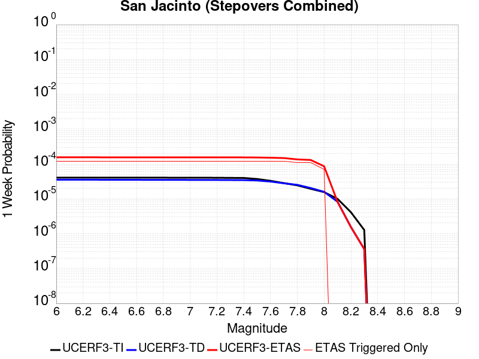 | 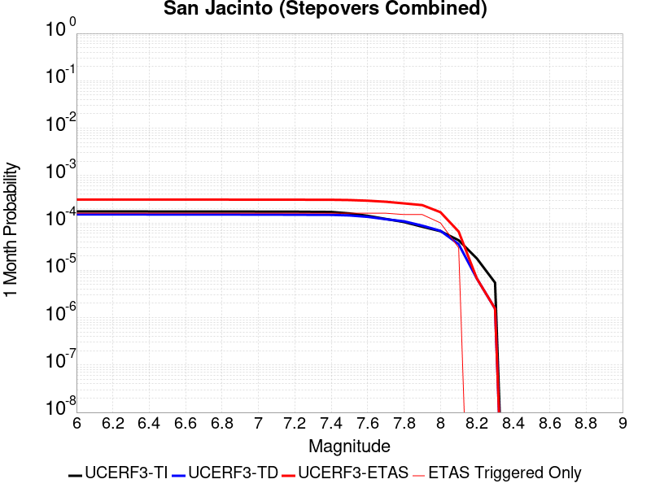 |  |  |

| Magnitude | 1 wk TI Prob | 1 wk TD Prob | 1 wk ETAS Prob | 1 wk ETAS/TD Gain | 1 wk ETAS Triggered Only | 1 mo TI Prob | 1 mo TD Prob | 1 mo ETAS Prob | 1 mo ETAS/TD Gain | 1 mo ETAS Triggered Only | 1 yr TI Prob | 1 yr TD Prob | 1 yr ETAS Prob | 1 yr ETAS/TD Gain | 1 yr ETAS Triggered Only | 10 yr TI Prob | 10 yr TD Prob | 10 yr ETAS Prob | 10 yr ETAS/TD Gain | 10 yr ETAS Triggered Only |
|-----|-----|-----|-----|-----|-----|-----|-----|-----|-----|-----|-----|-----|-----|-----|-----|-----|-----|-----|-----|-----|
| 6.0 | 4.0667746E-5 | 3.5272755E-5 | 1.5526853E-4 | 4.401939 | 1.2E-4 | 1.742787E-4 | 1.5116022E-4 | 3.11136E-4 | 2.0583196 | 1.6E-4 | 0.0021197782 | 0.0018388226 | 0.0020983445 | 1.1411349 | 2.6E-4 | 0.020996714 | 0.018986892 | 0.019291006 | 1.0160171 | 3.1E-4 |
| 6.1 | 4.0667746E-5 | 3.5272755E-5 | 1.5526853E-4 | 4.401939 | 1.2E-4 | 1.742787E-4 | 1.5116022E-4 | 3.11136E-4 | 2.0583196 | 1.6E-4 | 0.0021197782 | 0.0018388226 | 0.0020983445 | 1.1411349 | 2.6E-4 | 0.020996714 | 0.018986892 | 0.019291006 | 1.0160171 | 3.1E-4 |
| 6.2 | 4.0667746E-5 | 3.5272755E-5 | 1.5526853E-4 | 4.401939 | 1.2E-4 | 1.742787E-4 | 1.5116022E-4 | 3.11136E-4 | 2.0583196 | 1.6E-4 | 0.0021197782 | 0.0018388226 | 0.0020983445 | 1.1411349 | 2.6E-4 | 0.020996714 | 0.018986892 | 0.019291006 | 1.0160171 | 3.1E-4 |
| 6.3 | 4.0667746E-5 | 3.5272755E-5 | 1.5526853E-4 | 4.401939 | 1.2E-4 | 1.742787E-4 | 1.5116022E-4 | 3.11136E-4 | 2.0583196 | 1.6E-4 | 0.0021197782 | 0.0018388226 | 0.0020983445 | 1.1411349 | 2.6E-4 | 0.020996714 | 0.018986892 | 0.019291006 | 1.0160171 | 3.1E-4 |
| 6.4 | 4.0577226E-5 | 3.5144654E-5 | 1.5514044E-4 | 4.4143395 | 1.2E-4 | 1.738908E-4 | 1.5061127E-4 | 3.1058717E-4 | 2.0621774 | 1.6E-4 | 0.0021150648 | 0.0018321523 | 0.002091676 | 1.1416496 | 2.6E-4 | 0.020950472 | 0.018921461 | 0.019225596 | 1.0160735 | 3.1E-4 |
| 6.5 | 4.0577226E-5 | 3.5144654E-5 | 1.5514044E-4 | 4.4143395 | 1.2E-4 | 1.738908E-4 | 1.5061127E-4 | 3.1058717E-4 | 2.0621774 | 1.6E-4 | 0.0021150648 | 0.0018321523 | 0.002091676 | 1.1416496 | 2.6E-4 | 0.020950472 | 0.018921461 | 0.019225596 | 1.0160735 | 3.1E-4 |
| 6.6 | 4.053861E-5 | 3.509E-5 | 1.5508579E-4 | 4.4196577 | 1.2E-4 | 1.7372532E-4 | 1.5037706E-4 | 3.10353E-4 | 2.063832 | 1.6E-4 | 0.0021130538 | 0.0018293057 | 0.00208883 | 1.1418704 | 2.6E-4 | 0.020930743 | 0.018893538 | 0.019197682 | 1.0160978 | 3.1E-4 |
| 6.7 | 4.0516545E-5 | 3.5059067E-5 | 1.5505486E-4 | 4.4226747 | 1.2E-4 | 1.7363077E-4 | 1.5024451E-4 | 3.1022046E-4 | 2.0647707 | 1.6E-4 | 0.002111905 | 0.001827695 | 0.0020872199 | 1.1419957 | 2.6E-4 | 0.020919468 | 0.018877735 | 0.019181883 | 1.0161115 | 3.1E-4 |
| 6.8 | 4.049434E-5 | 3.5030633E-5 | 1.5502643E-4 | 4.4254537 | 1.2E-4 | 1.7353562E-4 | 1.5012265E-4 | 3.1009864E-4 | 2.0656352 | 1.6E-4 | 0.0021107488 | 0.0018262138 | 0.002085739 | 1.1421111 | 2.6E-4 | 0.020908125 | 0.018863149 | 0.0191673 | 1.0161241 | 3.1E-4 |
| 6.9 | 4.046386E-5 | 3.499319E-5 | 1.5498899E-4 | 4.4291186 | 1.2E-4 | 1.73405E-4 | 1.4996222E-4 | 3.0993822E-4 | 2.0667753 | 1.6E-4 | 0.0021091616 | 0.0018242638 | 0.0020837896 | 1.1422633 | 2.6E-4 | 0.020892553 | 0.01884392 | 0.01914808 | 1.0161409 | 3.1E-4 |
| 7.0 | 4.036382E-5 | 3.487376E-5 | 1.5486957E-4 | 4.4408627 | 1.2E-4 | 1.7297632E-4 | 1.4945042E-4 | 3.094265E-4 | 2.070429 | 1.6E-4 | 0.0021039525 | 0.0018180435 | 0.0020775709 | 1.1427509 | 2.6E-4 | 0.02084144 | 0.018782536 | 0.019086713 | 1.0161947 | 3.1E-4 |
| 7.1 | 4.0343282E-5 | 3.4852223E-5 | 1.5484804E-4 | 4.4429893 | 1.2E-4 | 1.7288832E-4 | 1.4935812E-4 | 3.0933422E-4 | 2.0710907 | 1.6E-4 | 0.002102883 | 0.0018169218 | 0.0020764493 | 1.1428392 | 2.6E-4 | 0.020830948 | 0.018771412 | 0.019075593 | 1.0162045 | 3.1E-4 |
| 7.2 | 4.0257353E-5 | 3.4756722E-5 | 1.5475255E-4 | 4.4524493 | 1.2E-4 | 1.725201E-4 | 1.489489E-4 | 3.0892505E-4 | 2.074034 | 1.6E-4 | 0.0020984085 | 0.0018119477 | 0.0020714765 | 1.143232 | 2.6E-4 | 0.020787042 | 0.018722152 | 0.019026348 | 1.0162479 | 3.1E-4 |
| 7.3 | 3.9940667E-5 | 3.4584376E-5 | 1.5458022E-4 | 4.4696546 | 1.2E-4 | 1.7116306E-4 | 1.4821035E-4 | 3.0818663E-4 | 2.0793867 | 1.6E-4 | 0.0020819185 | 0.0018029709 | 0.002062502 | 1.1439464 | 2.6E-4 | 0.020625217 | 0.018630784 | 0.018935008 | 1.0163292 | 3.1E-4 |
| 7.4 | 3.9721202E-5 | 3.4469766E-5 | 1.5446563E-4 | 4.4811916 | 1.2E-4 | 1.7022261E-4 | 1.4771923E-4 | 3.076956E-4 | 2.0829759 | 1.6E-4 | 0.0020704903 | 0.0017970012 | 0.002056534 | 1.1444255 | 2.6E-4 | 0.020513052 | 0.018569905 | 0.01887415 | 1.0163836 | 3.1E-4 |
| 7.5 | 3.7036873E-5 | 3.3537188E-5 | 1.5353317E-4 | 4.5779977 | 1.2E-4 | 1.5871979E-4 | 1.437229E-4 | 3.036999E-4 | 2.1130934 | 1.6E-4 | 0.0019307006 | 0.0017484248 | 0.0020079701 | 1.1484452 | 2.6E-4 | 0.019140124 | 0.018071463 | 0.018375862 | 1.0168442 | 3.1E-4 |
| 7.6 | 3.2940967E-5 | 3.1317984E-5 | 1.5131423E-4 | 4.831544 | 1.2E-4 | 1.4116794E-4 | 1.3421304E-4 | 2.9419156E-4 | 2.1919744 | 1.6E-4 | 0.0017173645 | 0.0016328214 | 0.0018923968 | 1.1589736 | 2.6E-4 | 0.01704153 | 0.016904354 | 0.017209113 | 1.0180285 | 3.1E-4 |
| 7.7 | 2.8236149E-5 | 2.7883889E-5 | 1.4788055E-4 | 5.30344 | 1.2E-4 | 1.2100645E-4 | 1.19496915E-4 | 2.794778E-4 | 2.3387866 | 1.6E-4 | 0.0014722579 | 0.001453905 | 0.001713527 | 1.1785687 | 2.6E-4 | 0.014625421 | 0.015115095 | 0.01542041 | 1.0201993 | 3.1E-4 |
| 7.8 | 2.4329287E-5 | 2.5207537E-5 | 1.3520477E-4 | 5.363664 | 1.1E-4 | 1.042642E-4 | 1.0802783E-4 | 2.5801163E-4 | 2.388381 | 1.5E-4 | 0.0012686774 | 0.0013144462 | 0.0015641175 | 1.1899441 | 2.5E-4 | 0.012614589 | 0.013712396 | 0.014008282 | 1.0215781 | 3.0E-4 |
| 7.9 | 1.9370926E-5 | 2.0421452E-5 | 1.3041921E-4 | 6.3863826 | 1.1E-4 | 8.301561E-5 | 8.7517576E-5 | 2.3750444E-4 | 2.7137914 | 1.5E-4 | 0.0010102465 | 0.0010650064 | 0.0013147402 | 1.2344904 | 2.5E-4 | 0.0100566605 | 0.011199483 | 0.011496122 | 1.026487 | 3.0E-4 |
| 8.0 | 1.5583017E-5 | 1.588647E-5 | 8.588536E-5 | 5.4061956 | 7.0E-5 | 6.6782646E-5 | 6.808309E-5 | 1.6807628E-4 | 2.4686935 | 1.0E-4 | 8.127754E-4 | 8.285971E-4 | 0.001008448 | 1.2170546 | 1.8E-4 | 0.008098091 | 0.008781809 | 0.00900979 | 1.0259604 | 2.3E-4 |
| 8.1 | 1.0024873E-5 | 8.292404E-6 | 8.292404E-6 | 1.0 | 0.0 | 4.2963035E-5 | 3.5538393E-5 | 6.553733E-5 | 1.8441274 | 3.0E-5 | 5.229494E-4 | 4.3259456E-4 | 4.7257726E-4 | 1.0924253 | 4.0E-5 | 0.0052172043 | 0.0046534105 | 0.0046932246 | 1.0085559 | 4.0E-5 |
| 8.2 | 4.142796E-6 | 1.5610041E-6 | 1.5610041E-6 | 1.0 | 0.0 | 1.775472E-5 | 6.69E-6 | 6.69E-6 | 1.0 | 0.0 | 2.1614227E-4 | 8.144774E-5 | 8.144774E-5 | 1.0 | 0.0 | 0.0021593217 | 9.454649E-4 | 9.454649E-4 | 1.0 | 0.0 |
| 8.3 | 1.2750878E-6 | 3.612133E-7 | 3.612133E-7 | 1.0 | 0.0 | 5.4646503E-6 | 1.548056E-6 | 1.548056E-6 | 1.0 | 0.0 | 6.653009E-5 | 1.8847424E-5 | 1.8847424E-5 | 1.0 | 0.0 | 6.6510175E-4 | 2.2734253E-4 | 2.2734253E-4 | 1.0 | 0.0 |

## San Andreas (North Branch Mill Creek)
*[(top)](#table-of-contents)*

| 1 Week | 1 Month | 1 Year | 10 Year |
|-----|-----|-----|-----|
| 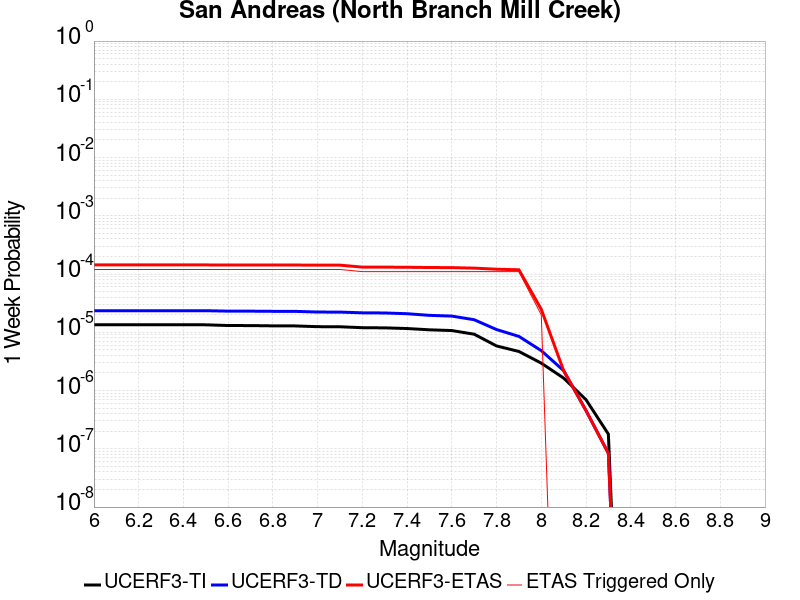 | 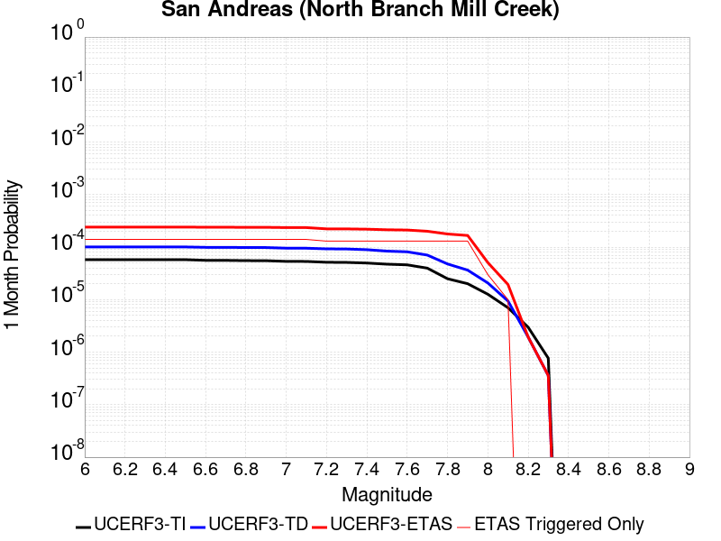 | 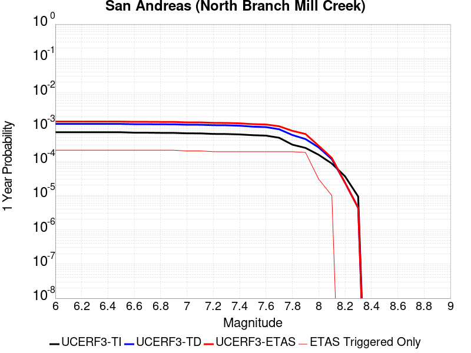 |  |

| Magnitude | 1 wk TI Prob | 1 wk TD Prob | 1 wk ETAS Prob | 1 wk ETAS/TD Gain | 1 wk ETAS Triggered Only | 1 mo TI Prob | 1 mo TD Prob | 1 mo ETAS Prob | 1 mo ETAS/TD Gain | 1 mo ETAS Triggered Only | 1 yr TI Prob | 1 yr TD Prob | 1 yr ETAS Prob | 1 yr ETAS/TD Gain | 1 yr ETAS Triggered Only | 10 yr TI Prob | 10 yr TD Prob | 10 yr ETAS Prob | 10 yr ETAS/TD Gain | 10 yr ETAS Triggered Only |
|-----|-----|-----|-----|-----|-----|-----|-----|-----|-----|-----|-----|-----|-----|-----|-----|-----|-----|-----|-----|-----|
| 6.0 | 1.3461156E-5 | 2.3499893E-5 | 1.4349708E-4 | 6.106286 | 1.2E-4 | 5.7689394E-5 | 1.00709956E-4 | 2.4069585E-4 | 2.3899906 | 1.4E-4 | 7.02142E-4 | 0.0012254574 | 0.0014352 | 1.1711546 | 2.1E-4 | 0.0069992766 | 0.01222957 | 0.012525901 | 1.0242307 | 3.0E-4 |
| 6.1 | 1.3461156E-5 | 2.3499893E-5 | 1.4349708E-4 | 6.106286 | 1.2E-4 | 5.7689394E-5 | 1.00709956E-4 | 2.4069585E-4 | 2.3899906 | 1.4E-4 | 7.02142E-4 | 0.0012254574 | 0.0014352 | 1.1711546 | 2.1E-4 | 0.0069992766 | 0.01222957 | 0.012525901 | 1.0242307 | 3.0E-4 |
| 6.2 | 1.3461156E-5 | 2.3499893E-5 | 1.4349708E-4 | 6.106286 | 1.2E-4 | 5.7689394E-5 | 1.00709956E-4 | 2.4069585E-4 | 2.3899906 | 1.4E-4 | 7.02142E-4 | 0.0012254574 | 0.0014352 | 1.1711546 | 2.1E-4 | 0.0069992766 | 0.01222957 | 0.012525901 | 1.0242307 | 3.0E-4 |
| 6.3 | 1.3461156E-5 | 2.3499893E-5 | 1.4349708E-4 | 6.106286 | 1.2E-4 | 5.7689394E-5 | 1.00709956E-4 | 2.4069585E-4 | 2.3899906 | 1.4E-4 | 7.02142E-4 | 0.0012254574 | 0.0014352 | 1.1711546 | 2.1E-4 | 0.0069992766 | 0.01222957 | 0.012525901 | 1.0242307 | 3.0E-4 |
| 6.4 | 1.3461156E-5 | 2.3499893E-5 | 1.4349708E-4 | 6.106286 | 1.2E-4 | 5.7689394E-5 | 1.00709956E-4 | 2.4069585E-4 | 2.3899906 | 1.4E-4 | 7.02142E-4 | 0.0012254574 | 0.0014352 | 1.1711546 | 2.1E-4 | 0.0069992766 | 0.01222957 | 0.012525901 | 1.0242307 | 3.0E-4 |
| 6.5 | 1.3450706E-5 | 2.3488852E-5 | 1.4348603E-4 | 6.1086864 | 1.2E-4 | 5.764461E-5 | 1.0066265E-4 | 2.4064856E-4 | 2.390644 | 1.4E-4 | 7.0159714E-4 | 0.001224882 | 0.0014346248 | 1.1712351 | 2.1E-4 | 0.006993862 | 0.01222388 | 0.012520213 | 1.0242422 | 3.0E-4 |
| 6.6 | 1.3074523E-5 | 2.3103135E-5 | 1.4310036E-4 | 6.19398 | 1.2E-4 | 5.6032466E-5 | 9.9009696E-5 | 2.3899584E-4 | 2.413863 | 1.4E-4 | 6.8198174E-4 | 0.0012047797 | 0.0014145267 | 1.1740957 | 2.1E-4 | 0.006798926 | 0.012025044 | 0.012321437 | 1.024648 | 3.0E-4 |
| 6.7 | 1.3050216E-5 | 2.3078432E-5 | 1.4307567E-4 | 6.19954 | 1.2E-4 | 5.59283E-5 | 9.890384E-5 | 2.3888999E-4 | 2.4153764 | 1.4E-4 | 6.8071426E-4 | 0.0012034923 | 0.0014132395 | 1.1742822 | 2.1E-4 | 0.0067863287 | 0.012012309 | 0.012308706 | 1.0246744 | 3.0E-4 |
| 6.8 | 1.29049395E-5 | 2.292684E-5 | 1.429241E-4 | 6.2339196 | 1.2E-4 | 5.530571E-5 | 9.825421E-5 | 2.3824045E-4 | 2.4247353 | 1.4E-4 | 6.73139E-4 | 0.0011955918 | 0.0014053406 | 1.1754352 | 2.1E-4 | 0.0067110364 | 0.011934154 | 0.012230574 | 1.024838 | 3.0E-4 |
| 6.9 | 1.2867369E-5 | 2.2886245E-5 | 1.428835E-4 | 6.243204 | 1.2E-4 | 5.51447E-5 | 9.8080236E-5 | 2.3806651E-4 | 2.4272628 | 1.4E-4 | 6.711799E-4 | 0.0011934759 | 0.0014032254 | 1.1757467 | 2.1E-4 | 0.006691564 | 0.011913223 | 0.012209649 | 1.0248821 | 3.0E-4 |
| 7.0 | 1.2495996E-5 | 2.2286325E-5 | 1.4228365E-4 | 6.384348 | 1.2E-4 | 5.3553173E-5 | 9.550934E-5 | 2.3549597E-4 | 2.4656851 | 1.4E-4 | 6.518148E-4 | 0.0011622087 | 0.0013619764 | 1.1718861 | 2.0E-4 | 0.0064990623 | 0.0116038285 | 0.0118904635 | 1.0247017 | 2.9E-4 |
| 7.1 | 1.2452067E-5 | 2.2231397E-5 | 1.4222873E-4 | 6.397651 | 1.2E-4 | 5.3364907E-5 | 9.527396E-5 | 2.3526062E-4 | 2.4693067 | 1.4E-4 | 6.4952404E-4 | 0.0011593461 | 0.0013591142 | 1.1723111 | 2.0E-4 | 0.0064762887 | 0.0115755 | 0.011862143 | 1.0247629 | 2.9E-4 |
| 7.2 | 1.2002777E-5 | 2.1609963E-5 | 1.3160758E-4 | 6.0901346 | 1.1E-4 | 5.143946E-5 | 9.2610855E-5 | 2.2259881E-4 | 2.403593 | 1.3E-4 | 6.2609545E-4 | 0.0011269567 | 0.0013167425 | 1.1684057 | 1.9E-4 | 0.006243344 | 0.011254923 | 0.011531771 | 1.024598 | 2.8E-4 |
| 7.3 | 1.1923425E-5 | 2.1479793E-5 | 1.3147743E-4 | 6.120982 | 1.1E-4 | 5.109939E-5 | 9.205302E-5 | 2.2204105E-4 | 2.4120996 | 1.3E-4 | 6.219575E-4 | 0.001120172 | 0.0013099591 | 1.1694268 | 1.9E-4 | 0.0062021962 | 0.011187789 | 0.011464656 | 1.0247473 | 2.8E-4 |
| 7.4 | 1.16105175E-5 | 2.0853771E-5 | 1.3085148E-4 | 6.274715 | 1.1E-4 | 4.975841E-5 | 8.937026E-5 | 2.1935864E-4 | 2.4544926 | 1.3E-4 | 6.0564023E-4 | 0.0010875424 | 0.0012773357 | 1.1745158 | 1.9E-4 | 0.006039923 | 0.010865397 | 0.011142354 | 1.0254899 | 2.8E-4 |
| 7.5 | 1.1037265E-5 | 1.9553907E-5 | 1.2955176E-4 | 6.6253643 | 1.1E-4 | 4.7301706E-5 | 8.379978E-5 | 2.1378888E-4 | 2.5511868 | 1.3E-4 | 5.757461E-4 | 0.0010197869 | 0.0012095931 | 1.1861234 | 1.9E-4 | 0.005742567 | 0.010194898 | 0.010472043 | 1.0271847 | 2.8E-4 |
| 7.6 | 1.0720915E-5 | 1.899582E-5 | 1.2899374E-4 | 6.790638 | 1.1E-4 | 4.5945973E-5 | 8.140812E-5 | 2.1139754E-4 | 2.5967622 | 1.3E-4 | 5.592486E-4 | 9.906954E-4 | 0.0011805071 | 1.1915945 | 1.9E-4 | 0.005578433 | 0.009906623 | 0.010183848 | 1.0279839 | 2.8E-4 |
| 7.7 | 9.276279E-6 | 1.6441649E-5 | 1.2643985E-4 | 7.6902165 | 1.1E-4 | 3.9754876E-5 | 7.0462316E-5 | 2.0045316E-4 | 2.844828 | 1.3E-4 | 4.839081E-4 | 8.575427E-4 | 0.0010473798 | 1.2213733 | 1.9E-4 | 0.0048285574 | 0.008586041 | 0.008863637 | 1.0323311 | 2.8E-4 |
| 7.8 | 5.8346777E-6 | 1.1155013E-5 | 1.2115379E-4 | 10.860927 | 1.1E-4 | 2.5005522E-5 | 4.7806327E-5 | 1.7780012E-4 | 3.7191753 | 1.3E-4 | 3.043997E-4 | 5.818867E-4 | 7.7177613E-4 | 1.326334 | 1.9E-4 | 0.0030398308 | 0.0058469265 | 0.0061252895 | 1.0476084 | 2.8E-4 |
| 7.9 | 4.690204E-6 | 8.509093E-6 | 1.1850816E-4 | 13.927237 | 1.1E-4 | 2.0100719E-5 | 3.6467034E-5 | 1.664623E-4 | 4.5647335 | 1.3E-4 | 2.4469878E-4 | 4.4389578E-4 | 6.2381587E-4 | 1.4053206 | 1.8E-4 | 0.002444295 | 0.0044707474 | 0.00473954 | 1.0601226 | 2.7E-4 |
| 8.0 | 2.9570454E-6 | 4.846947E-6 | 2.484685E-5 | 5.126289 | 2.0E-5 | 1.267299E-5 | 2.0772464E-5 | 5.077184E-5 | 2.4441895 | 3.0E-5 | 1.5428272E-4 | 2.5287544E-4 | 2.8286784E-4 | 1.1186055 | 3.0E-5 | 0.0015417566 | 0.002549644 | 0.0025995167 | 1.0195606 | 5.0E-5 |
| 8.1 | 1.6376824E-6 | 2.1968929E-6 | 2.1968929E-6 | 1.0 | 0.0 | 7.01862E-6 | 9.41522E-6 | 1.9415127E-5 | 2.0621 | 1.0E-5 | 8.544835E-5 | 1.14624294E-4 | 1.2462315E-4 | 1.0872315 | 1.0E-5 | 8.54155E-4 | 0.0011606582 | 0.0011706466 | 1.0086058 | 1.0E-5 |
| 8.2 | 6.9631557E-7 | 4.5360213E-7 | 4.5360213E-7 | 1.0 | 0.0 | 2.984206E-6 | 1.9440076E-6 | 1.9440076E-6 | 1.0 | 0.0 | 3.63321E-5 | 2.3668037E-5 | 2.3668037E-5 | 1.0 | 0.0 | 3.6326164E-4 | 2.451564E-4 | 2.451564E-4 | 1.0 | 0.0 |
| 8.3 | 1.7876137E-7 | 8.360375E-8 | 8.360375E-8 | 1.0 | 0.0 | 7.661199E-7 | 3.5830175E-7 | 3.5830175E-7 | 1.0 | 0.0 | 9.32747E-6 | 4.3623154E-6 | 4.3623154E-6 | 1.0 | 0.0 | 9.3270784E-5 | 4.5817014E-5 | 4.5817014E-5 | 1.0 | 0.0 |

## Santa Ynez (East)
*[(top)](#table-of-contents)*

| 1 Week | 1 Month | 1 Year | 10 Year |
|-----|-----|-----|-----|
| 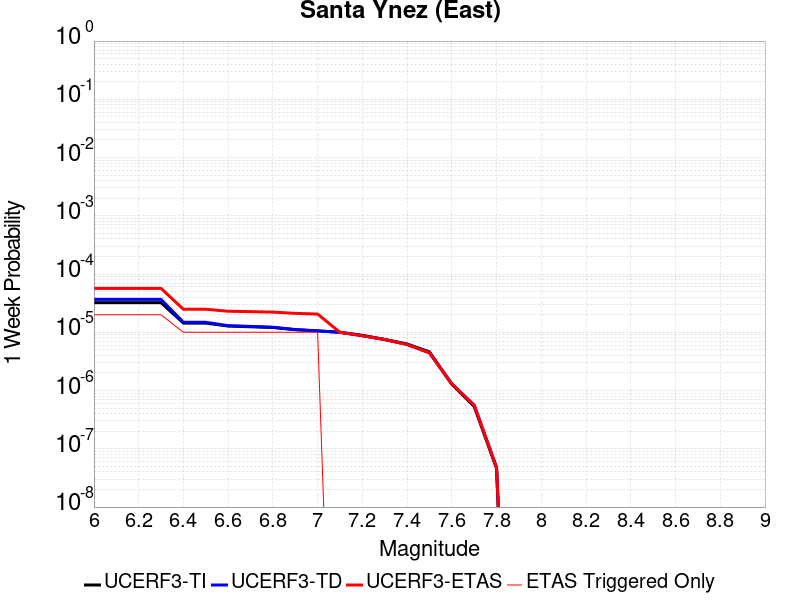 | 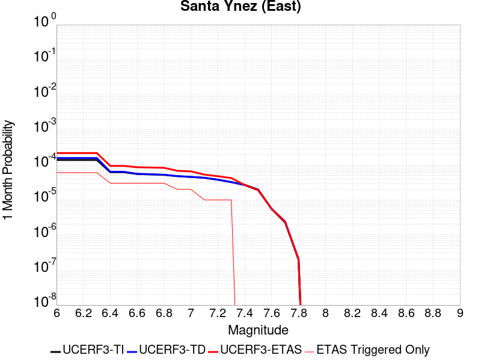 |  | 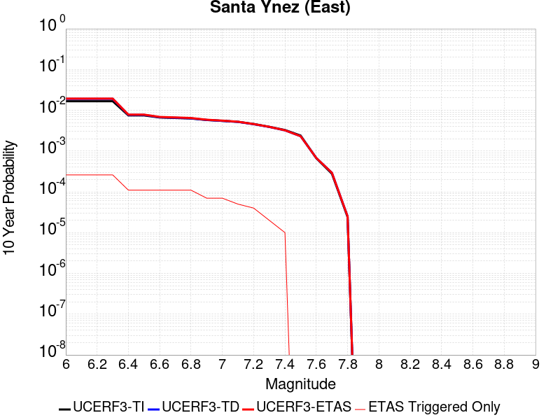 |

| Magnitude | 1 wk TI Prob | 1 wk TD Prob | 1 wk ETAS Prob | 1 wk ETAS/TD Gain | 1 wk ETAS Triggered Only | 1 mo TI Prob | 1 mo TD Prob | 1 mo ETAS Prob | 1 mo ETAS/TD Gain | 1 mo ETAS Triggered Only | 1 yr TI Prob | 1 yr TD Prob | 1 yr ETAS Prob | 1 yr ETAS/TD Gain | 1 yr ETAS Triggered Only | 10 yr TI Prob | 10 yr TD Prob | 10 yr ETAS Prob | 10 yr ETAS/TD Gain | 10 yr ETAS Triggered Only |
|-----|-----|-----|-----|-----|-----|-----|-----|-----|-----|-----|-----|-----|-----|-----|-----|-----|-----|-----|-----|-----|
| 6.0 | 3.2269712E-5 | 3.67505E-5 | 5.6749766E-5 | 1.5441903 | 2.0E-5 | 1.3829143E-4 | 1.5749598E-4 | 2.1748652E-4 | 1.3809022 | 6.0E-5 | 0.0016823979 | 0.0019164166 | 0.0020661291 | 1.0781211 | 1.5E-4 | 0.016697178 | 0.019056441 | 0.019311486 | 1.0133836 | 2.6E-4 |
| 6.1 | 3.2269712E-5 | 3.67505E-5 | 5.6749766E-5 | 1.5441903 | 2.0E-5 | 1.3829143E-4 | 1.5749598E-4 | 2.1748652E-4 | 1.3809022 | 6.0E-5 | 0.0016823979 | 0.0019164166 | 0.0020661291 | 1.0781211 | 1.5E-4 | 0.016697178 | 0.019056441 | 0.019311486 | 1.0133836 | 2.6E-4 |
| 6.2 | 3.2269712E-5 | 3.67505E-5 | 5.6749766E-5 | 1.5441903 | 2.0E-5 | 1.3829143E-4 | 1.5749598E-4 | 2.1748652E-4 | 1.3809022 | 6.0E-5 | 0.0016823979 | 0.0019164166 | 0.0020661291 | 1.0781211 | 1.5E-4 | 0.016697178 | 0.019056441 | 0.019311486 | 1.0133836 | 2.6E-4 |
| 6.3 | 3.2269712E-5 | 3.67505E-5 | 5.6749766E-5 | 1.5441903 | 2.0E-5 | 1.3829143E-4 | 1.5749598E-4 | 2.1748652E-4 | 1.3809022 | 6.0E-5 | 0.0016823979 | 0.0019164166 | 0.0020661291 | 1.0781211 | 1.5E-4 | 0.016697178 | 0.019056441 | 0.019311486 | 1.0133836 | 2.6E-4 |
| 6.4 | 1.4404779E-5 | 1.4849382E-5 | 2.4849234E-5 | 1.6734186 | 1.0E-5 | 6.1733306E-5 | 6.363868E-5 | 9.363678E-5 | 1.4713814 | 3.0E-5 | 7.513438E-4 | 7.745306E-4 | 8.544686E-4 | 1.1032084 | 8.0E-5 | 0.0074880854 | 0.007718862 | 0.007828013 | 1.0141408 | 1.1E-4 |
| 6.5 | 1.4404779E-5 | 1.4849382E-5 | 2.4849234E-5 | 1.6734186 | 1.0E-5 | 6.1733306E-5 | 6.363868E-5 | 9.363678E-5 | 1.4713814 | 3.0E-5 | 7.513438E-4 | 7.745306E-4 | 8.544686E-4 | 1.1032084 | 8.0E-5 | 0.0074880854 | 0.007718862 | 0.007828013 | 1.0141408 | 1.1E-4 |
| 6.6 | 1.280208E-5 | 1.3011947E-5 | 2.3011817E-5 | 1.7685145 | 1.0E-5 | 5.4864904E-5 | 5.5764307E-5 | 8.576263E-5 | 1.5379485 | 3.0E-5 | 6.6777546E-4 | 6.787207E-4 | 7.586664E-4 | 1.1177888 | 8.0E-5 | 0.006657724 | 0.0067666885 | 0.0068759443 | 1.0161461 | 1.1E-4 |
| 6.7 | 1.2457027E-5 | 1.2628468E-5 | 2.2628341E-5 | 1.7918518 | 1.0E-5 | 5.3386164E-5 | 5.412089E-5 | 8.411927E-5 | 1.5542846 | 3.0E-5 | 6.497827E-4 | 6.587243E-4 | 7.3867163E-4 | 1.1213669 | 8.0E-5 | 0.00647886 | 0.006567915 | 0.0066771926 | 1.016638 | 1.1E-4 |
| 6.8 | 1.2095134E-5 | 1.2230915E-5 | 2.2230792E-5 | 1.8175904 | 1.0E-5 | 5.1835254E-5 | 5.241716E-5 | 8.241559E-5 | 1.5723016 | 3.0E-5 | 6.309115E-4 | 6.379937E-4 | 7.179426E-4 | 1.125313 | 8.0E-5 | 0.0062912325 | 0.006361809 | 0.006471109 | 1.0171807 | 1.1E-4 |
| 6.9 | 1.1104036E-5 | 1.1157347E-5 | 2.1157235E-5 | 1.8962604 | 1.0E-5 | 4.758786E-5 | 4.781633E-5 | 6.7815374E-5 | 1.4182471 | 2.0E-5 | 5.7922816E-4 | 5.820096E-4 | 6.519689E-4 | 1.1202029 | 7.0E-5 | 0.005777207 | 0.0058049993 | 0.005874593 | 1.0119885 | 7.0E-5 |
| 7.0 | 1.0577444E-5 | 1.058168E-5 | 2.0581574E-5 | 1.9450195 | 1.0E-5 | 4.5331115E-5 | 4.5349276E-5 | 6.534837E-5 | 1.4410014 | 2.0E-5 | 5.5176654E-4 | 5.519888E-4 | 6.2195014E-4 | 1.1267442 | 7.0E-5 | 0.0055039856 | 0.0055063153 | 0.0055759302 | 1.0126426 | 7.0E-5 |
| 7.1 | 1.0021775E-5 | 9.980988E-6 | 9.980988E-6 | 1.0 | 0.0 | 4.294976E-5 | 4.2774966E-5 | 5.277454E-5 | 1.2337716 | 1.0E-5 | 5.2278786E-4 | 5.2066194E-4 | 5.706359E-4 | 1.0959816 | 5.0E-5 | 0.0052155964 | 0.0051945536 | 0.0052442937 | 1.0095755 | 5.0E-5 |
| 7.2 | 8.874109E-6 | 8.748793E-6 | 8.748793E-6 | 1.0 | 0.0 | 3.8031343E-5 | 3.7494297E-5 | 4.7493922E-5 | 1.2666973 | 1.0E-5 | 4.629332E-4 | 4.5639853E-4 | 4.9638026E-4 | 1.0876027 | 4.0E-5 | 0.0046197 | 0.0045547304 | 0.004594548 | 1.0087421 | 4.0E-5 |
| 7.3 | 7.5504267E-6 | 7.5051175E-6 | 7.5051175E-6 | 1.0 | 0.0 | 3.235857E-5 | 3.21644E-5 | 4.2164076E-5 | 1.3108927 | 1.0E-5 | 3.9389438E-4 | 3.915322E-4 | 4.1152438E-4 | 1.0510614 | 2.0E-5 | 0.0039319694 | 0.003908531 | 0.0039284527 | 1.005097 | 2.0E-5 |
| 7.4 | 6.309394E-6 | 6.1831556E-6 | 6.1831556E-6 | 1.0 | 0.0 | 2.703998E-5 | 2.6498974E-5 | 2.6498974E-5 | 1.0 | 0.0 | 3.2916202E-4 | 3.225782E-4 | 3.3257497E-4 | 1.0309902 | 1.0E-5 | 0.003286749 | 0.003221197 | 0.0032311648 | 1.0030944 | 1.0E-5 |
| 7.5 | 4.6103073E-6 | 4.4408903E-6 | 4.4408903E-6 | 1.0 | 0.0 | 1.975831E-5 | 1.9032252E-5 | 1.9032252E-5 | 1.0 | 0.0 | 2.4053088E-4 | 2.3169373E-4 | 2.3169373E-4 | 1.0 | 0.0 | 0.002402707 | 0.002314591 | 0.002314591 | 1.0 | 0.0 |
| 7.6 | 1.2858658E-6 | 1.3008173E-6 | 1.3008173E-6 | 1.0 | 0.0 | 5.5108417E-6 | 5.5749197E-6 | 5.5749197E-6 | 1.0 | 0.0 | 6.7092435E-5 | 6.78726E-5 | 6.78726E-5 | 1.0 | 0.0 | 6.707218E-4 | 6.785256E-4 | 6.785256E-4 | 1.0 | 0.0 |
| 7.7 | 5.3302307E-7 | 5.612138E-7 | 5.612138E-7 | 1.0 | 0.0 | 2.2843826E-6 | 2.4052001E-6 | 2.4052001E-6 | 1.0 | 0.0 | 2.7812002E-5 | 2.9282954E-5 | 2.9282954E-5 | 1.0 | 0.0 | 2.7808524E-4 | 2.9279452E-4 | 2.9279452E-4 | 1.0 | 0.0 |
| 7.8 | 4.613933E-8 | 4.80301E-8 | 4.80301E-8 | 1.0 | 0.0 | 1.9773998E-7 | 2.0584326E-7 | 2.0584326E-7 | 1.0 | 0.0 | 2.4074816E-6 | 2.5061388E-6 | 2.5061388E-6 | 1.0 | 0.0 | 2.4074554E-5 | 2.5061116E-5 | 2.5061116E-5 | 1.0 | 0.0 |

## Lake Isabella (Seismicity)
*[(top)](#table-of-contents)*

| 1 Week | 1 Month | 1 Year | 10 Year |
|-----|-----|-----|-----|
| 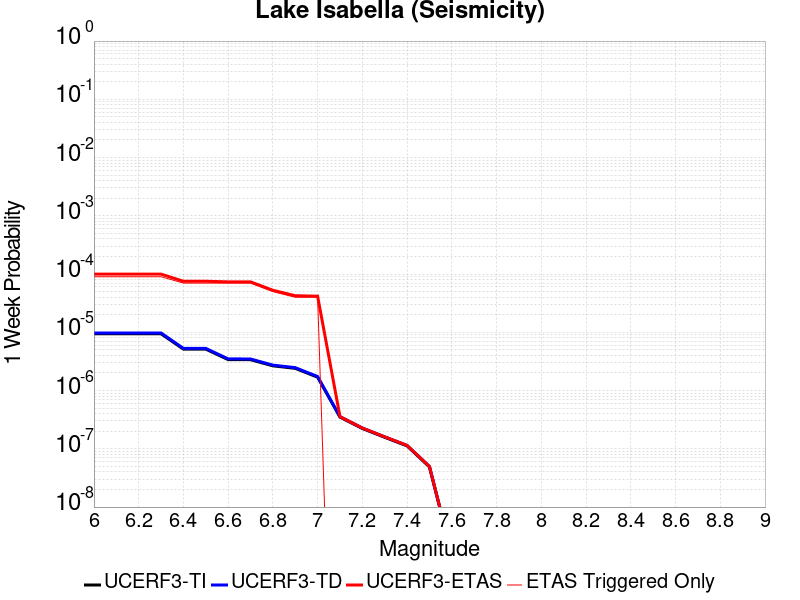 | 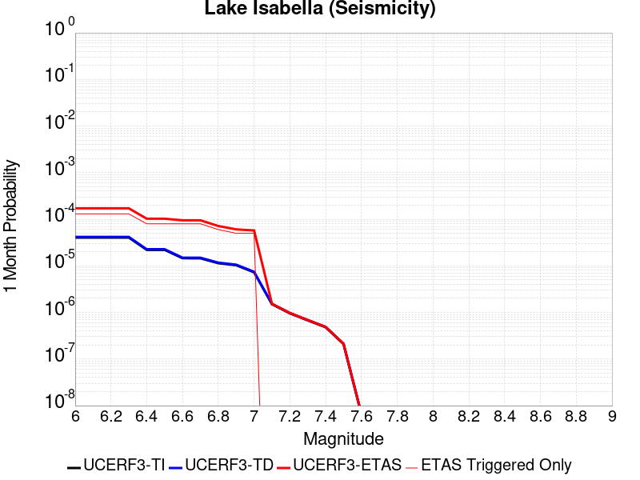 |  |  |

| Magnitude | 1 wk TI Prob | 1 wk TD Prob | 1 wk ETAS Prob | 1 wk ETAS/TD Gain | 1 wk ETAS Triggered Only | 1 mo TI Prob | 1 mo TD Prob | 1 mo ETAS Prob | 1 mo ETAS/TD Gain | 1 mo ETAS Triggered Only | 1 yr TI Prob | 1 yr TD Prob | 1 yr ETAS Prob | 1 yr ETAS/TD Gain | 1 yr ETAS Triggered Only | 10 yr TI Prob | 10 yr TD Prob | 10 yr ETAS Prob | 10 yr ETAS/TD Gain | 10 yr ETAS Triggered Only |
|-----|-----|-----|-----|-----|-----|-----|-----|-----|-----|-----|-----|-----|-----|-----|-----|-----|-----|-----|-----|-----|
| 6.0 | 9.431637E-6 | 9.741651E-6 | 9.974078E-5 | 10.238589 | 9.0E-5 | 4.0420677E-5 | 4.1749343E-5 | 1.7174392E-4 | 4.113692 | 1.3E-4 | 4.920106E-4 | 5.0819275E-4 | 7.18086E-4 | 1.4130191 | 2.1E-4 | 0.004909227 | 0.005071599 | 0.0053501786 | 1.0549294 | 2.8E-4 |
| 6.1 | 9.431637E-6 | 9.741651E-6 | 9.974078E-5 | 10.238589 | 9.0E-5 | 4.0420677E-5 | 4.1749343E-5 | 1.7174392E-4 | 4.113692 | 1.3E-4 | 4.920106E-4 | 5.0819275E-4 | 7.18086E-4 | 1.4130191 | 2.1E-4 | 0.004909227 | 0.005071599 | 0.0053501786 | 1.0549294 | 2.8E-4 |
| 6.2 | 9.431637E-6 | 9.741651E-6 | 9.974078E-5 | 10.238589 | 9.0E-5 | 4.0420677E-5 | 4.1749343E-5 | 1.7174392E-4 | 4.113692 | 1.3E-4 | 4.920106E-4 | 5.0819275E-4 | 7.18086E-4 | 1.4130191 | 2.1E-4 | 0.004909227 | 0.005071599 | 0.0053501786 | 1.0549294 | 2.8E-4 |
| 6.3 | 9.431637E-6 | 9.741651E-6 | 9.974078E-5 | 10.238589 | 9.0E-5 | 4.0420677E-5 | 4.1749343E-5 | 1.7174392E-4 | 4.113692 | 1.3E-4 | 4.920106E-4 | 5.0819275E-4 | 7.18086E-4 | 1.4130191 | 2.1E-4 | 0.004909227 | 0.005071599 | 0.0053501786 | 1.0549294 | 2.8E-4 |
| 6.4 | 5.144063E-6 | 5.3000763E-6 | 7.529971E-5 | 14.207288 | 7.0E-5 | 2.2045799E-5 | 2.2714434E-5 | 1.0271262E-4 | 4.5219097 | 8.0E-5 | 2.6837454E-4 | 2.765166E-4 | 3.964834E-4 | 1.4338503 | 1.2E-4 | 0.0026805066 | 0.0027620657 | 0.002901679 | 1.0505466 | 1.4E-4 |
| 6.5 | 5.144063E-6 | 5.3000763E-6 | 7.529971E-5 | 14.207288 | 7.0E-5 | 2.2045799E-5 | 2.2714434E-5 | 1.0271262E-4 | 4.5219097 | 8.0E-5 | 2.6837454E-4 | 2.765166E-4 | 3.964834E-4 | 1.4338503 | 1.2E-4 | 0.0026805066 | 0.0027620657 | 0.002901679 | 1.0505466 | 1.4E-4 |
| 6.6 | 3.4009804E-6 | 3.498786E-6 | 7.3498544E-5 | 21.006868 | 7.0E-5 | 1.4575549E-5 | 1.4994721E-5 | 9.499352E-5 | 6.335131 | 8.0E-5 | 1.7744285E-4 | 1.8254704E-4 | 2.9252697E-4 | 1.6024745 | 1.1E-4 | 0.0017730123 | 0.0018241286 | 0.0019538915 | 1.071137 | 1.3E-4 |
| 6.7 | 3.3880428E-6 | 3.4856528E-6 | 7.348541E-5 | 21.082253 | 7.0E-5 | 1.4520103E-5 | 1.4938435E-5 | 9.493724E-5 | 6.355233 | 8.0E-5 | 1.767679E-4 | 1.8186188E-4 | 2.9184186E-4 | 1.6047447 | 1.1E-4 | 0.0017662736 | 0.0018172882 | 0.001947052 | 1.0714052 | 1.3E-4 |
| 6.8 | 2.6582E-6 | 2.7337003E-6 | 5.2733565E-5 | 19.290178 | 5.0E-5 | 1.1392236E-5 | 1.1715813E-5 | 7.171511E-5 | 6.1212234 | 6.0E-5 | 1.3869164E-4 | 1.4263204E-4 | 2.3261919E-4 | 1.6309043 | 9.0E-5 | 0.0013860512 | 0.0014255369 | 0.0015353801 | 1.0770539 | 1.1E-4 |
| 6.9 | 2.406011E-6 | 2.4743288E-6 | 4.247423E-5 | 17.16596 | 4.0E-5 | 1.0311434E-5 | 1.0604231E-5 | 6.06037E-5 | 5.7150493 | 5.0E-5 | 1.2553448E-4 | 1.2910018E-4 | 2.0908985E-4 | 1.6195939 | 8.0E-5 | 0.0012546359 | 0.0012903814 | 0.0013902524 | 1.0773965 | 1.0E-4 |
| 7.0 | 1.6953097E-6 | 1.7429371E-6 | 4.1742867E-5 | 23.949726 | 4.0E-5 | 7.265593E-6 | 7.469715E-6 | 5.746934E-5 | 7.6936455 | 5.0E-5 | 8.8455E-5 | 9.094104E-5 | 1.6093467E-4 | 1.7696595 | 7.0E-5 | 8.84198E-4 | 9.09141E-4 | 9.990592E-4 | 1.0989046 | 9.0E-5 |
| 7.1 | 3.5013824E-7 | 3.5714822E-7 | 3.5714822E-7 | 1.0 | 0.0 | 1.5005916E-6 | 1.5306344E-6 | 1.5306344E-6 | 1.0 | 0.0 | 1.826955E-5 | 1.8635317E-5 | 2.8635131E-5 | 1.5366055 | 1.0E-5 | 1.8268047E-4 | 1.863378E-4 | 1.9633592E-4 | 1.053656 | 1.0E-5 |
| 7.2 | 2.2321095E-7 | 2.2750574E-7 | 2.2750574E-7 | 1.0 | 0.0 | 9.56618E-7 | 9.750242E-7 | 9.750242E-7 | 1.0 | 0.0 | 1.1646762E-5 | 1.1870856E-5 | 1.1870856E-5 | 1.0 | 0.0 | 1.1646151E-4 | 1.1870232E-4 | 1.1870232E-4 | 1.0 | 0.0 |
| 7.3 | 1.5760406E-7 | 1.6060922E-7 | 1.6060922E-7 | 1.0 | 0.0 | 6.7544585E-7 | 6.8832503E-7 | 6.8832503E-7 | 1.0 | 0.0 | 8.223522E-6 | 8.380326E-6 | 8.380326E-6 | 1.0 | 0.0 | 8.2232174E-5 | 8.3800165E-5 | 8.3800165E-5 | 1.0 | 0.0 |
| 7.4 | 1.1216497E-7 | 1.1431706E-7 | 1.1431706E-7 | 1.0 | 0.0 | 4.8070694E-7 | 4.899302E-7 | 4.899302E-7 | 1.0 | 0.0 | 5.852591E-6 | 5.964884E-6 | 5.964884E-6 | 1.0 | 0.0 | 5.8524372E-5 | 5.9647282E-5 | 5.9647282E-5 | 1.0 | 0.0 |
| 7.5 | 4.885185E-8 | 4.9787737E-8 | 4.9787737E-8 | 1.0 | 0.0 | 2.0936506E-7 | 2.13376E-7 | 2.13376E-7 | 1.0 | 0.0 | 2.5490165E-6 | 2.59785E-6 | 2.59785E-6 | 1.0 | 0.0 | 2.5489873E-5 | 2.5978214E-5 | 2.5978214E-5 | 1.0 | 0.0 |
| 7.6 | 1.504641E-9 | 1.5317903E-9 | 1.5317903E-9 | 1.0 | 0.0 | 6.4484613E-9 | 6.5648154E-9 | 6.5648154E-9 | 1.0 | 0.0 | 7.851001E-8 | 7.992663E-8 | 7.992663E-8 | 1.0 | 0.0 | 7.8509987E-7 | 7.992663E-7 | 7.992663E-7 | 1.0 | 0.0 |

## San Andreas (Creeping Section) 2011 CFM
*[(top)](#table-of-contents)*

| 1 Week | 1 Month | 1 Year | 10 Year |
|-----|-----|-----|-----|
| 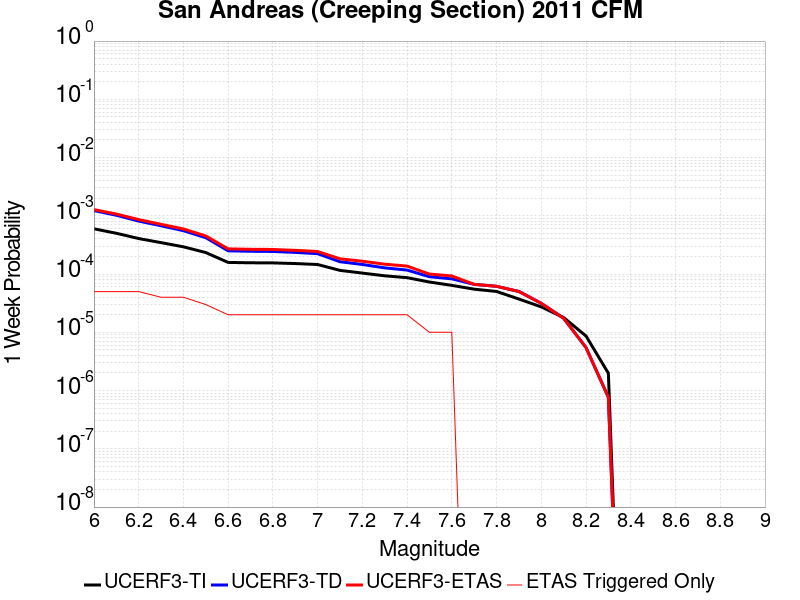 | 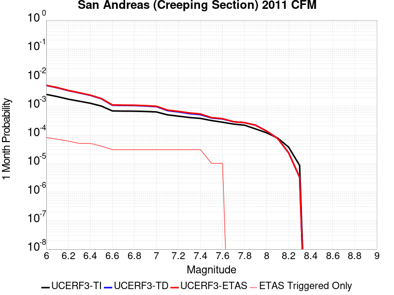 |  |  |

| Magnitude | 1 wk TI Prob | 1 wk TD Prob | 1 wk ETAS Prob | 1 wk ETAS/TD Gain | 1 wk ETAS Triggered Only | 1 mo TI Prob | 1 mo TD Prob | 1 mo ETAS Prob | 1 mo ETAS/TD Gain | 1 mo ETAS Triggered Only | 1 yr TI Prob | 1 yr TD Prob | 1 yr ETAS Prob | 1 yr ETAS/TD Gain | 1 yr ETAS Triggered Only | 10 yr TI Prob | 10 yr TD Prob | 10 yr ETAS Prob | 10 yr ETAS/TD Gain | 10 yr ETAS Triggered Only |
|-----|-----|-----|-----|-----|-----|-----|-----|-----|-----|-----|-----|-----|-----|-----|-----|-----|-----|-----|-----|-----|
| 6.0 | 5.986481E-4 | 0.001228691 | 0.0012786295 | 1.0406437 | 5.0E-5 | 0.0025631124 | 0.005246795 | 0.0053263754 | 1.0151674 | 8.0E-5 | 0.030762846 | 0.061203245 | 0.061353453 | 1.0024543 | 1.6E-4 | 0.26835477 | 0.425928 | 0.42606005 | 1.00031 | 2.3E-4 |
| 6.1 | 5.015945E-4 | 0.0010230356 | 0.0010729844 | 1.0488242 | 5.0E-5 | 0.00214792 | 0.004369436 | 0.00443913 | 1.0159503 | 7.0E-5 | 0.025839351 | 0.051246606 | 0.05137943 | 1.0025918 | 1.4E-4 | 0.23032776 | 0.37284943 | 0.3729686 | 1.0003196 | 1.9E-4 |
| 6.2 | 4.073338E-4 | 8.1157376E-4 | 8.6153316E-4 | 1.0615587 | 5.0E-5 | 0.0017445484 | 0.0034683137 | 0.0035281056 | 1.0172395 | 6.0E-5 | 0.021034058 | 0.04093177 | 0.041056447 | 1.003046 | 1.3E-4 | 0.19150782 | 0.31302592 | 0.31314957 | 1.000395 | 1.8E-4 |
| 6.3 | 3.464099E-4 | 6.7455834E-4 | 7.1453134E-4 | 1.0592581 | 4.0E-5 | 0.0014837692 | 0.0028832308 | 0.0029330866 | 1.0172917 | 5.0E-5 | 0.017915873 | 0.034187846 | 0.034294087 | 1.0031075 | 1.1E-4 | 0.16538359 | 0.27130842 | 0.271425 | 1.0004297 | 1.6E-4 |
| 6.4 | 2.935057E-4 | 5.5516965E-4 | 5.9514743E-4 | 1.07201 | 4.0E-5 | 0.0012572751 | 0.0023727308 | 0.0024226122 | 1.0210228 | 5.0E-5 | 0.015200248 | 0.02826279 | 0.028369682 | 1.003782 | 1.1E-4 | 0.14201577 | 0.23297668 | 0.2330994 | 1.0005268 | 1.6E-4 |
| 6.5 | 2.3409708E-4 | 4.2132285E-4 | 4.5131022E-4 | 1.0711743 | 3.0E-5 | 0.0010028875 | 0.0018017791 | 0.0018417072 | 1.0221603 | 4.0E-5 | 0.012141965 | 0.021586355 | 0.021684196 | 1.0045326 | 1.0E-4 | 0.11499573 | 0.1868149 | 0.18693689 | 1.0006529 | 1.5E-4 |
| 6.6 | 1.5842178E-4 | 2.5068692E-4 | 2.706819E-4 | 1.0797608 | 2.0E-5 | 6.7877385E-4 | 0.0010739256 | 0.0011038934 | 1.0279049 | 3.0E-5 | 0.0082328 | 0.012995283 | 0.013074243 | 1.0060761 | 8.0E-5 | 0.07934396 | 0.12313759 | 0.12324282 | 1.0008545 | 1.2E-4 |
| 6.7 | 1.5616413E-4 | 2.4605254E-4 | 2.6604763E-4 | 1.0812634 | 2.0E-5 | 6.691031E-4 | 0.0010540807 | 0.001084049 | 1.0284308 | 3.0E-5 | 0.0081159435 | 0.012757154 | 0.012836133 | 1.006191 | 8.0E-5 | 0.0782586 | 0.12116472 | 0.12127018 | 1.0008703 | 1.2E-4 |
| 6.8 | 1.5538467E-4 | 2.442914E-4 | 2.6428653E-4 | 1.0818495 | 2.0E-5 | 6.6576427E-4 | 0.001046539 | 0.0010765076 | 1.0286359 | 3.0E-5 | 0.008075596 | 0.012666538 | 0.012745525 | 1.0062358 | 8.0E-5 | 0.07788358 | 0.12039561 | 0.12050116 | 1.0008767 | 1.2E-4 |
| 6.9 | 1.5153569E-4 | 2.3538464E-4 | 2.553799E-4 | 1.0849473 | 2.0E-5 | 6.49277E-4 | 0.0010084033 | 0.0010383731 | 1.02972 | 3.0E-5 | 0.007876333 | 0.012208726 | 0.01228775 | 1.0064727 | 8.0E-5 | 0.07602952 | 0.11646574 | 0.11657177 | 1.0009104 | 1.2E-4 |
| 7.0 | 1.4588932E-4 | 2.2395732E-4 | 2.4395285E-4 | 1.0892828 | 2.0E-5 | 6.250901E-4 | 9.59466E-4 | 9.894372E-4 | 1.0312374 | 3.0E-5 | 0.0075839474 | 0.011619428 | 0.011698498 | 1.0068051 | 8.0E-5 | 0.073302895 | 0.11131206 | 0.11141871 | 1.0009581 | 1.2E-4 |
| 7.1 | 1.1565079E-4 | 1.6281323E-4 | 1.8280996E-4 | 1.1228201 | 2.0E-5 | 4.955521E-4 | 6.9758523E-4 | 7.275643E-4 | 1.0429755 | 3.0E-5 | 0.006016669 | 0.008460228 | 0.008539551 | 1.009376 | 8.0E-5 | 0.058563538 | 0.08366478 | 0.083774745 | 1.0013143 | 1.2E-4 |
| 7.2 | 1.0393792E-4 | 1.4615392E-4 | 1.66151E-4 | 1.136822 | 2.0E-5 | 4.4537216E-4 | 6.262243E-4 | 6.562055E-4 | 1.0478761 | 3.0E-5 | 0.005408933 | 0.0075977976 | 0.00767719 | 1.0104494 | 8.0E-5 | 0.052791595 | 0.07561503 | 0.075725965 | 1.001467 | 1.2E-4 |
| 7.3 | 9.332884E-5 | 1.2780601E-4 | 1.4780344E-4 | 1.1564672 | 2.0E-5 | 3.999194E-4 | 5.4762565E-4 | 5.7760923E-4 | 1.054752 | 3.0E-5 | 0.0048581534 | 0.0066470946 | 0.0067265625 | 1.0119554 | 8.0E-5 | 0.047533102 | 0.06647954 | 0.06659157 | 1.001685 | 1.2E-4 |
| 7.4 | 8.670252E-5 | 1.1702972E-4 | 1.3702737E-4 | 1.1708767 | 2.0E-5 | 3.715293E-4 | 5.014601E-4 | 5.314451E-4 | 1.0597953 | 3.0E-5 | 0.004513991 | 0.0060883067 | 0.0061678197 | 1.01306 | 8.0E-5 | 0.044233937 | 0.061148684 | 0.061261345 | 1.0018424 | 1.2E-4 |
| 7.5 | 7.3036405E-5 | 9.005699E-5 | 1.0005608E-4 | 1.1110308 | 1.0E-5 | 3.129756E-4 | 3.859015E-4 | 3.9589763E-4 | 1.0259033 | 1.0E-5 | 0.0038038217 | 0.0046882504 | 0.004728063 | 1.008492 | 4.0E-5 | 0.03739367 | 0.047875606 | 0.047932733 | 1.0011933 | 6.0E-5 |
| 7.6 | 6.3935775E-5 | 8.280209E-5 | 9.280126E-5 | 1.1207598 | 1.0E-5 | 2.7398168E-4 | 3.5481792E-4 | 3.6481436E-4 | 1.0281734 | 1.0E-5 | 0.0033306254 | 0.00431137 | 0.0043511977 | 1.0092378 | 4.0E-5 | 0.032811474 | 0.043990135 | 0.044047497 | 1.0013039 | 6.0E-5 |
| 7.7 | 5.5050095E-5 | 6.661729E-5 | 6.661729E-5 | 1.0 | 0.0 | 2.3590765E-4 | 2.8547147E-4 | 2.8547147E-4 | 1.0 | 0.0 | 0.0028683927 | 0.0034700802 | 0.003499976 | 1.0086154 | 3.0E-5 | 0.0283165 | 0.03579509 | 0.035843298 | 1.0013468 | 5.0E-5 |
| 7.8 | 5.027131E-5 | 6.1627725E-5 | 6.1627725E-5 | 1.0 | 0.0 | 2.1543067E-4 | 2.640921E-4 | 2.640921E-4 | 1.0 | 0.0 | 0.0026197135 | 0.003210584 | 0.0032404875 | 1.0093141 | 3.0E-5 | 0.025890453 | 0.03312572 | 0.033174064 | 1.0014594 | 5.0E-5 |
| 7.9 | 3.7271806E-5 | 5.0224386E-5 | 5.0224386E-5 | 1.0 | 0.0 | 1.5972654E-4 | 2.1522962E-4 | 2.1522962E-4 | 1.0 | 0.0 | 0.0019429359 | 0.0026172737 | 0.0026471952 | 1.0114323 | 3.0E-5 | 0.019260362 | 0.027066687 | 0.027105605 | 1.0014378 | 4.0E-5 |
| 8.0 | 2.7310243E-5 | 3.1428404E-5 | 3.1428404E-5 | 1.0 | 0.0 | 1.17038646E-4 | 1.3468621E-4 | 1.3468621E-4 | 1.0 | 0.0 | 0.0014240141 | 0.0016385721 | 0.0016585393 | 1.0121857 | 2.0E-5 | 0.014149235 | 0.01721387 | 0.017243352 | 1.0017128 | 3.0E-5 |
| 8.1 | 1.7940547E-5 | 1.7400796E-5 | 1.7400796E-5 | 1.0 | 0.0 | 7.688579E-5 | 7.457271E-5 | 7.457271E-5 | 1.0 | 0.0 | 9.3568244E-4 | 9.075451E-4 | 9.075451E-4 | 1.0 | 0.0 | 0.009317525 | 0.009799073 | 0.009808975 | 1.0010105 | 1.0E-5 |
| 8.2 | 8.643924E-6 | 5.4748625E-6 | 5.4748625E-6 | 1.0 | 0.0 | 3.704486E-5 | 2.3463486E-5 | 2.3463486E-5 | 1.0 | 0.0 | 4.5092785E-4 | 2.8563058E-4 | 2.8563058E-4 | 1.0 | 0.0 | 0.0045001395 | 0.0032487072 | 0.0032487072 | 1.0 | 0.0 |
| 8.3 | 1.983087E-6 | 7.6599065E-7 | 7.6599065E-7 | 1.0 | 0.0 | 8.498917E-6 | 3.282813E-6 | 3.282813E-6 | 1.0 | 0.0 | 1.034694E-4 | 3.9967534E-5 | 3.9967534E-5 | 1.0 | 0.0 | 0.0010342124 | 4.719687E-4 | 4.719687E-4 | 1.0 | 0.0 |

## Cleghorn Pass
*[(top)](#table-of-contents)*

| 1 Week | 1 Month | 1 Year | 10 Year |
|-----|-----|-----|-----|
| 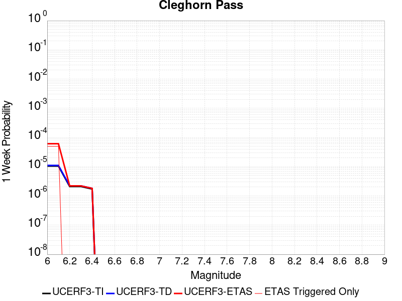 | 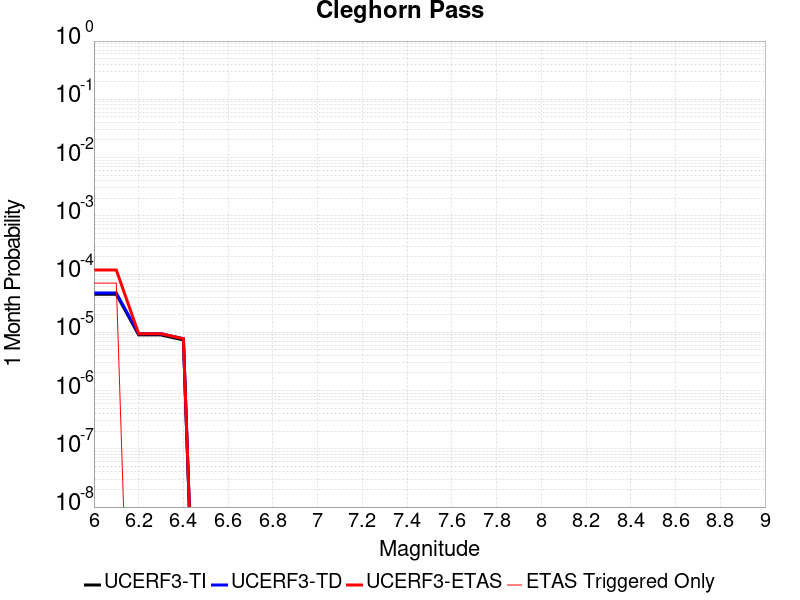 |  |  |

| Magnitude | 1 wk TI Prob | 1 wk TD Prob | 1 wk ETAS Prob | 1 wk ETAS/TD Gain | 1 wk ETAS Triggered Only | 1 mo TI Prob | 1 mo TD Prob | 1 mo ETAS Prob | 1 mo ETAS/TD Gain | 1 mo ETAS Triggered Only | 1 yr TI Prob | 1 yr TD Prob | 1 yr ETAS Prob | 1 yr ETAS/TD Gain | 1 yr ETAS Triggered Only | 10 yr TI Prob | 10 yr TD Prob | 10 yr ETAS Prob | 10 yr ETAS/TD Gain | 10 yr ETAS Triggered Only |
|-----|-----|-----|-----|-----|-----|-----|-----|-----|-----|-----|-----|-----|-----|-----|-----|-----|-----|-----|-----|-----|
| 6.0 | 1.0522846E-5 | 1.1040642E-5 | 6.104009E-5 | 5.528672 | 5.0E-5 | 4.509713E-5 | 4.7316473E-5 | 1.1731316E-4 | 2.47933 | 7.0E-5 | 5.4891926E-4 | 5.759784E-4 | 6.959093E-4 | 1.2082211 | 1.2E-4 | 0.0054756533 | 0.005750022 | 0.0059389295 | 1.0328534 | 1.9E-4 |
| 6.1 | 1.0522846E-5 | 1.1040642E-5 | 6.104009E-5 | 5.528672 | 5.0E-5 | 4.509713E-5 | 4.7316473E-5 | 1.1731316E-4 | 2.47933 | 7.0E-5 | 5.4891926E-4 | 5.759784E-4 | 6.959093E-4 | 1.2082211 | 1.2E-4 | 0.0054756533 | 0.005750022 | 0.0059389295 | 1.0328534 | 1.9E-4 |
| 6.2 | 2.1045846E-6 | 2.2082024E-6 | 2.2082024E-6 | 1.0 | 0.0 | 9.019617E-6 | 9.463714E-6 | 9.463714E-6 | 1.0 | 0.0 | 1.098083E-4 | 1.1521882E-4 | 1.3521651E-4 | 1.1735628 | 2.0E-5 | 0.0010975406 | 0.0011520023 | 0.0011819677 | 1.0260116 | 3.0E-5 |
| 6.3 | 2.1045846E-6 | 2.2082024E-6 | 2.2082024E-6 | 1.0 | 0.0 | 9.019617E-6 | 9.463714E-6 | 9.463714E-6 | 1.0 | 0.0 | 1.098083E-4 | 1.1521882E-4 | 1.3521651E-4 | 1.1735628 | 2.0E-5 | 0.0010975406 | 0.0011520023 | 0.0011819677 | 1.0260116 | 3.0E-5 |
| 6.4 | 1.7259927E-6 | 1.810877E-6 | 1.810877E-6 | 1.0 | 0.0 | 7.3970905E-6 | 7.760902E-6 | 7.760902E-6 | 1.0 | 0.0 | 9.005586E-5 | 9.4488976E-5 | 1.1448709E-4 | 1.2116449 | 2.0E-5 | 9.001937E-4 | 9.448898E-4 | 9.7486144E-4 | 1.0317197 | 3.0E-5 |

## San Jacinto (Anza) rev
*[(top)](#table-of-contents)*

| 1 Week | 1 Month | 1 Year | 10 Year |
|-----|-----|-----|-----|
| 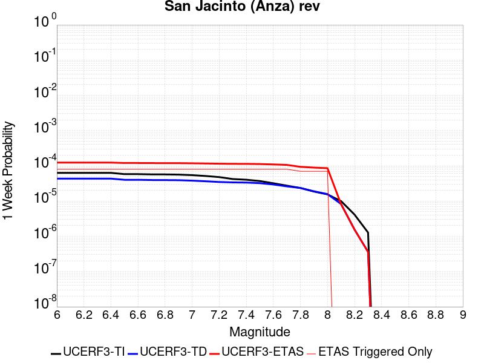 | 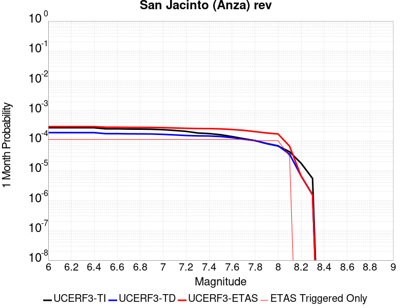 |  |  |

| Magnitude | 1 wk TI Prob | 1 wk TD Prob | 1 wk ETAS Prob | 1 wk ETAS/TD Gain | 1 wk ETAS Triggered Only | 1 mo TI Prob | 1 mo TD Prob | 1 mo ETAS Prob | 1 mo ETAS/TD Gain | 1 mo ETAS Triggered Only | 1 yr TI Prob | 1 yr TD Prob | 1 yr ETAS Prob | 1 yr ETAS/TD Gain | 1 yr ETAS Triggered Only | 10 yr TI Prob | 10 yr TD Prob | 10 yr ETAS Prob | 10 yr ETAS/TD Gain | 10 yr ETAS Triggered Only |
|-----|-----|-----|-----|-----|-----|-----|-----|-----|-----|-----|-----|-----|-----|-----|-----|-----|-----|-----|-----|-----|
| 6.0 | 6.3015636E-5 | 4.3302647E-5 | 1.2329918E-4 | 2.847382 | 8.0E-5 | 2.7003905E-4 | 1.8556965E-4 | 2.9554922E-4 | 1.5926594 | 1.1E-4 | 0.0032827691 | 0.0022569813 | 0.0024465525 | 1.0839932 | 1.9E-4 | 0.032346968 | 0.023296192 | 0.023520835 | 1.0096428 | 2.3E-4 |
| 6.1 | 6.3015636E-5 | 4.3302647E-5 | 1.2329918E-4 | 2.847382 | 8.0E-5 | 2.7003905E-4 | 1.8556965E-4 | 2.9554922E-4 | 1.5926594 | 1.1E-4 | 0.0032827691 | 0.0022569813 | 0.0024465525 | 1.0839932 | 1.9E-4 | 0.032346968 | 0.023296192 | 0.023520835 | 1.0096428 | 2.3E-4 |
| 6.2 | 6.3015636E-5 | 4.3302647E-5 | 1.2329918E-4 | 2.847382 | 8.0E-5 | 2.7003905E-4 | 1.8556965E-4 | 2.9554922E-4 | 1.5926594 | 1.1E-4 | 0.0032827691 | 0.0022569813 | 0.0024465525 | 1.0839932 | 1.9E-4 | 0.032346968 | 0.023296192 | 0.023520835 | 1.0096428 | 2.3E-4 |
| 6.3 | 6.3015636E-5 | 4.3302647E-5 | 1.2329918E-4 | 2.847382 | 8.0E-5 | 2.7003905E-4 | 1.8556965E-4 | 2.9554922E-4 | 1.5926594 | 1.1E-4 | 0.0032827691 | 0.0022569813 | 0.0024465525 | 1.0839932 | 1.9E-4 | 0.032346968 | 0.023296192 | 0.023520835 | 1.0096428 | 2.3E-4 |
| 6.4 | 6.3015636E-5 | 4.3302647E-5 | 1.2329918E-4 | 2.847382 | 8.0E-5 | 2.7003905E-4 | 1.8556965E-4 | 2.9554922E-4 | 1.5926594 | 1.1E-4 | 0.0032827691 | 0.0022569813 | 0.0024465525 | 1.0839932 | 1.9E-4 | 0.032346968 | 0.023296192 | 0.023520835 | 1.0096428 | 2.3E-4 |
| 6.5 | 5.811017E-5 | 4.0082516E-5 | 1.20079305E-4 | 2.9958029 | 8.0E-5 | 2.4901982E-4 | 1.7177092E-4 | 2.8175203E-4 | 1.6402777 | 1.1E-4 | 0.0030276014 | 0.002089311 | 0.0022789137 | 1.090749 | 1.9E-4 | 0.02986684 | 0.021593736 | 0.02181877 | 1.0104213 | 2.3E-4 |
| 6.6 | 5.811017E-5 | 4.0082516E-5 | 1.20079305E-4 | 2.9958029 | 8.0E-5 | 2.4901982E-4 | 1.7177092E-4 | 2.8175203E-4 | 1.6402777 | 1.1E-4 | 0.0030276014 | 0.002089311 | 0.0022789137 | 1.090749 | 1.9E-4 | 0.02986684 | 0.021593736 | 0.02181877 | 1.0104213 | 2.3E-4 |
| 6.7 | 5.712442E-5 | 3.9505223E-5 | 1.1950206E-4 | 3.0249686 | 8.0E-5 | 2.4479596E-4 | 1.6929714E-4 | 2.7927852E-4 | 1.6496352 | 1.1E-4 | 0.0029763177 | 0.0020592497 | 0.0022488583 | 1.0920767 | 1.9E-4 | 0.029367693 | 0.021285562 | 0.021510666 | 1.0105754 | 2.3E-4 |
| 6.8 | 5.6967532E-5 | 3.9361643E-5 | 1.193585E-4 | 3.0323555 | 8.0E-5 | 2.4412372E-4 | 1.6868189E-4 | 2.7866333E-4 | 1.6520051 | 1.1E-4 | 0.0029681553 | 0.002051773 | 0.002241383 | 1.0924128 | 1.9E-4 | 0.029288229 | 0.021210281 | 0.021435402 | 1.0106138 | 2.3E-4 |
| 6.9 | 5.6211324E-5 | 3.9066435E-5 | 1.1906331E-4 | 3.0477138 | 8.0E-5 | 2.4088343E-4 | 1.6741687E-4 | 2.7739845E-4 | 1.6569325 | 1.1E-4 | 0.0029288116 | 0.0020364004 | 0.0022260135 | 1.0931119 | 1.9E-4 | 0.028905109 | 0.021049714 | 0.021274872 | 1.0106965 | 2.3E-4 |
| 7.0 | 5.4383527E-5 | 3.792697E-5 | 1.1792393E-4 | 3.109237 | 8.0E-5 | 2.3305144E-4 | 1.6253405E-4 | 2.7251616E-4 | 1.6766713 | 1.1E-4 | 0.0028337094 | 0.001977061 | 0.0021666854 | 1.0959122 | 1.9E-4 | 0.027978465 | 0.020440677 | 0.020665975 | 1.0110221 | 2.3E-4 |
| 7.1 | 5.1393665E-5 | 3.6389913E-5 | 1.16387004E-4 | 3.1983314 | 8.0E-5 | 2.2023996E-4 | 1.5594746E-4 | 2.659303E-4 | 1.7052557 | 1.1E-4 | 0.0026781242 | 0.0018970112 | 0.0020866508 | 1.0999676 | 1.9E-4 | 0.026460782 | 0.019614287 | 0.019839775 | 1.0114962 | 2.3E-4 |
| 7.2 | 4.785222E-5 | 3.4741795E-5 | 1.14739014E-4 | 3.3026218 | 8.0E-5 | 2.0506482E-4 | 1.4888494E-4 | 2.5886856E-4 | 1.7387156 | 1.1E-4 | 0.0024938055 | 0.0018111705 | 0.0020008264 | 1.1047145 | 1.9E-4 | 0.024660049 | 0.018728992 | 0.018954683 | 1.0120504 | 2.3E-4 |
| 7.3 | 4.2143256E-5 | 3.383628E-5 | 1.1383357E-4 | 3.3642461 | 8.0E-5 | 1.8060145E-4 | 1.4500458E-4 | 2.5498864E-4 | 1.7584867 | 1.1E-4 | 0.002196605 | 0.0017640047 | 0.0019536696 | 1.1075195 | 1.9E-4 | 0.02175019 | 0.01823724 | 0.018463047 | 1.0123816 | 2.3E-4 |
| 7.4 | 4.0264713E-5 | 3.347446E-5 | 1.1347178E-4 | 3.3898015 | 8.0E-5 | 1.7255165E-4 | 1.4345412E-4 | 2.5343834E-4 | 1.7666857 | 1.1E-4 | 0.002098792 | 0.0017451581 | 0.0019348265 | 1.1086826 | 1.9E-4 | 0.020790804 | 0.018041821 | 0.01826767 | 1.0125182 | 2.3E-4 |
| 7.5 | 3.694492E-5 | 3.218847E-5 | 1.12185895E-4 | 3.4852822 | 8.0E-5 | 1.5832575E-4 | 1.379433E-4 | 2.479281E-4 | 1.797319 | 1.1E-4 | 0.0019259118 | 0.001678169 | 0.0018678501 | 1.1130286 | 1.9E-4 | 0.01909306 | 0.01735827 | 0.017584277 | 1.0130202 | 2.3E-4 |
| 7.6 | 3.200565E-5 | 2.9504106E-5 | 1.0950174E-4 | 3.711407 | 8.0E-5 | 1.3715986E-4 | 1.2644005E-4 | 2.3642615E-4 | 1.8698674 | 1.1E-4 | 0.001668642 | 0.0015383229 | 0.0017280306 | 1.1233212 | 1.9E-4 | 0.01656168 | 0.0159463 | 0.016172633 | 1.0141934 | 2.3E-4 |
| 7.7 | 2.731642E-5 | 2.6092788E-5 | 1.060907E-4 | 4.0659013 | 8.0E-5 | 1.1706512E-4 | 1.1182144E-4 | 2.2180914E-4 | 1.9836011 | 1.1E-4 | 0.001424336 | 0.0013605768 | 0.0015503183 | 1.1394566 | 1.9E-4 | 0.014152412 | 0.014167004 | 0.014393746 | 1.0160049 | 2.3E-4 |
| 7.8 | 2.3466424E-5 | 2.3504817E-5 | 9.350317E-5 | 3.9780428 | 7.0E-5 | 1.0056651E-4 | 1.0073105E-4 | 2.0072097E-4 | 1.9926425 | 1.0E-4 | 0.0012237094 | 0.0012257113 | 0.0014054907 | 1.1466734 | 1.8E-4 | 0.012169928 | 0.012808893 | 0.013026075 | 1.0169556 | 2.2E-4 |
| 7.9 | 1.8611925E-5 | 1.8908117E-5 | 8.8906796E-5 | 4.702044 | 7.0E-5 | 7.9762955E-5 | 8.1032274E-5 | 1.8102417E-4 | 2.2339761 | 1.0E-4 | 9.7068126E-4 | 9.861222E-4 | 0.0011659446 | 1.1823531 | 1.8E-4 | 0.0096645225 | 0.010393824 | 0.010611538 | 1.0209464 | 2.2E-4 |
| 8.0 | 1.5460775E-5 | 1.5740965E-5 | 8.573986E-5 | 5.4469256 | 7.0E-5 | 6.6258784E-5 | 6.7459536E-5 | 1.6745279E-4 | 2.48227 | 1.0E-4 | 8.0640207E-4 | 8.21011E-4 | 0.0010008633 | 1.2190619 | 1.8E-4 | 0.008034821 | 0.0087028835 | 0.0089209685 | 1.025059 | 2.2E-4 |
| 8.1 | 9.983884E-6 | 8.269952E-6 | 8.269952E-6 | 1.0 | 0.0 | 4.2787375E-5 | 3.544217E-5 | 6.5441105E-5 | 1.8464192 | 3.0E-5 | 5.2081177E-4 | 4.314235E-4 | 4.7140627E-4 | 1.0926763 | 4.0E-5 | 0.0051959283 | 0.004640022 | 0.0046798363 | 1.0085807 | 4.0E-5 |
| 8.2 | 4.1226E-6 | 1.5529788E-6 | 1.5529788E-6 | 1.0 | 0.0 | 1.7668166E-5 | 6.6556063E-6 | 6.6556063E-6 | 1.0 | 0.0 | 2.1508869E-4 | 8.102902E-5 | 8.102902E-5 | 1.0 | 0.0 | 0.0021488064 | 9.4050163E-4 | 9.4050163E-4 | 1.0 | 0.0 |
| 8.3 | 1.2750878E-6 | 3.612133E-7 | 3.612133E-7 | 1.0 | 0.0 | 5.4646503E-6 | 1.548056E-6 | 1.548056E-6 | 1.0 | 0.0 | 6.653009E-5 | 1.8847424E-5 | 1.8847424E-5 | 1.0 | 0.0 | 6.6510175E-4 | 2.2734253E-4 | 2.2734253E-4 | 1.0 | 0.0 |

## Santa Ynez (West)
*[(top)](#table-of-contents)*

| 1 Week | 1 Month | 1 Year | 10 Year |
|-----|-----|-----|-----|
| 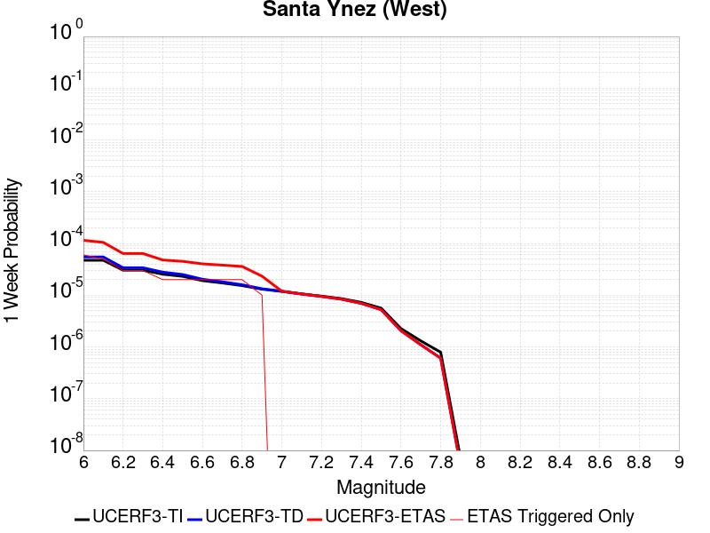 | 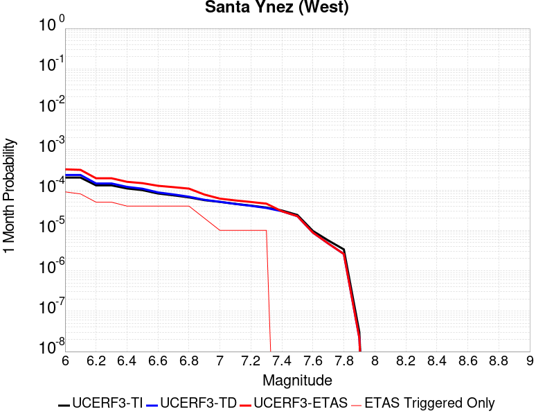 |  |  |

| Magnitude | 1 wk TI Prob | 1 wk TD Prob | 1 wk ETAS Prob | 1 wk ETAS/TD Gain | 1 wk ETAS Triggered Only | 1 mo TI Prob | 1 mo TD Prob | 1 mo ETAS Prob | 1 mo ETAS/TD Gain | 1 mo ETAS Triggered Only | 1 yr TI Prob | 1 yr TD Prob | 1 yr ETAS Prob | 1 yr ETAS/TD Gain | 1 yr ETAS Triggered Only | 10 yr TI Prob | 10 yr TD Prob | 10 yr ETAS Prob | 10 yr ETAS/TD Gain | 10 yr ETAS Triggered Only |
|-----|-----|-----|-----|-----|-----|-----|-----|-----|-----|-----|-----|-----|-----|-----|-----|-----|-----|-----|-----|-----|
| 6.0 | 4.7352758E-5 | 5.4972126E-5 | 1.14968825E-4 | 2.0914023 | 6.0E-5 | 2.0292461E-4 | 2.3557522E-4 | 3.2555402E-4 | 1.3819536 | 9.0E-5 | 0.0024678076 | 0.0028645284 | 0.00302407 | 1.0556957 | 1.6E-4 | 0.024405818 | 0.028304417 | 0.02848904 | 1.0065228 | 1.9E-4 |
| 6.1 | 4.7352758E-5 | 5.4972126E-5 | 1.04969375E-4 | 1.9095019 | 5.0E-5 | 2.0292461E-4 | 2.3557522E-4 | 3.1555636E-4 | 1.3395143 | 8.0E-5 | 0.0024678076 | 0.0028645284 | 0.0030041274 | 1.0487337 | 1.4E-4 | 0.024405818 | 0.028304417 | 0.028459888 | 1.0054928 | 1.6E-4 |
| 6.2 | 3.0415853E-5 | 3.392511E-5 | 6.392409E-5 | 1.8842708 | 3.0E-5 | 1.3034715E-4 | 1.4538545E-4 | 1.9537818E-4 | 1.3438634 | 5.0E-5 | 0.0015858212 | 0.0017686661 | 0.0018784715 | 1.0620837 | 1.1E-4 | 0.015745522 | 0.017549807 | 0.017667701 | 1.0067177 | 1.2E-4 |
| 6.3 | 3.0415853E-5 | 3.392511E-5 | 6.392409E-5 | 1.8842708 | 3.0E-5 | 1.3034715E-4 | 1.4538545E-4 | 1.9537818E-4 | 1.3438634 | 5.0E-5 | 0.0015858212 | 0.0017686661 | 0.0018784715 | 1.0620837 | 1.1E-4 | 0.015745522 | 0.017549807 | 0.017667701 | 1.0067177 | 1.2E-4 |
| 6.4 | 2.5452082E-5 | 2.7912422E-5 | 4.7911864E-5 | 1.7165068 | 2.0E-5 | 1.09075794E-4 | 1.196193E-4 | 1.5961452E-4 | 1.3343542 | 4.0E-5 | 0.0013271887 | 0.0014554089 | 0.0015452778 | 1.0617483 | 9.0E-5 | 0.013192902 | 0.014460951 | 0.0145595055 | 1.0068152 | 1.0E-4 |
| 6.5 | 2.3143784E-5 | 2.5128256E-5 | 4.5127756E-5 | 1.7958968 | 2.0E-5 | 9.9183875E-5 | 1.0768817E-4 | 1.4768387E-4 | 1.3714029 | 4.0E-5 | 0.0012068948 | 0.0013103267 | 0.0014002088 | 1.0685952 | 9.0E-5 | 0.012003611 | 0.01302768 | 0.013126377 | 1.007576 | 1.0E-4 |
| 6.6 | 1.9118515E-5 | 2.035434E-5 | 4.0353934E-5 | 1.9825715 | 2.0E-5 | 8.193392E-5 | 8.7230015E-5 | 1.2722652E-4 | 1.4585178 | 4.0E-5 | 9.97089E-4 | 0.001061516 | 0.0011514204 | 1.0846944 | 9.0E-5 | 0.00992627 | 0.010565365 | 0.010664308 | 1.0093648 | 1.0E-4 |
| 6.7 | 1.722807E-5 | 1.8146347E-5 | 3.8145983E-5 | 2.1021302 | 2.0E-5 | 7.3832496E-5 | 7.776777E-5 | 1.1776466E-4 | 1.5143119 | 4.0E-5 | 8.985399E-4 | 9.464169E-4 | 0.0010363318 | 1.0950055 | 9.0E-5 | 0.008949154 | 0.0094245095 | 0.009523568 | 1.0105107 | 1.0E-4 |
| 6.8 | 1.5317364E-5 | 1.5926486E-5 | 3.5926165E-5 | 2.25575 | 2.0E-5 | 6.56442E-5 | 6.82546E-5 | 1.0825187E-4 | 1.586001 | 4.0E-5 | 7.98925E-4 | 8.306873E-4 | 9.206125E-4 | 1.1082541 | 9.0E-5 | 0.007960589 | 0.00827631 | 0.008375482 | 1.0119827 | 1.0E-4 |
| 6.9 | 1.3071226E-5 | 1.3329624E-5 | 2.332949E-5 | 1.7501987 | 1.0E-5 | 5.6018336E-5 | 5.7125722E-5 | 7.7124576E-5 | 1.350085 | 2.0E-5 | 6.8180985E-4 | 6.9528597E-4 | 7.552443E-4 | 1.0862354 | 6.0E-5 | 0.0067972173 | 0.006931367 | 0.0070008817 | 1.010029 | 7.0E-5 |
| 7.0 | 1.1836986E-5 | 1.19327815E-5 | 1.19327815E-5 | 1.0 | 0.0 | 5.0728955E-5 | 5.11395E-5 | 6.113899E-5 | 1.1955335 | 1.0E-5 | 6.1745E-4 | 6.2244723E-4 | 6.6242233E-4 | 1.0642225 | 4.0E-5 | 0.006157372 | 0.006207231 | 0.0062469826 | 1.006404 | 4.0E-5 |
| 7.1 | 1.0597169E-5 | 1.0542201E-5 | 1.0542201E-5 | 1.0 | 0.0 | 4.541565E-5 | 4.5180084E-5 | 5.5179633E-5 | 1.2213265 | 1.0E-5 | 5.5279525E-4 | 5.4992986E-4 | 5.799133E-4 | 1.0545224 | 3.0E-5 | 0.0055142213 | 0.005485821 | 0.0055156564 | 1.0054387 | 3.0E-5 |
| 7.2 | 9.59113E-6 | 9.459144E-6 | 9.459144E-6 | 1.0 | 0.0 | 4.11042E-5 | 4.0538565E-5 | 5.0538158E-5 | 1.2466687 | 1.0E-5 | 5.0032866E-4 | 4.934463E-4 | 5.234315E-4 | 1.0607669 | 3.0E-5 | 0.004992037 | 0.0049236254 | 0.0049534775 | 1.0060631 | 3.0E-5 |
| 7.3 | 8.586084E-6 | 8.379583E-6 | 8.379583E-6 | 1.0 | 0.0 | 3.679698E-5 | 3.5912013E-5 | 4.5911653E-5 | 1.2784483 | 1.0E-5 | 4.4791115E-4 | 4.3714207E-4 | 4.571333E-4 | 1.0457317 | 2.0E-5 | 0.004470094 | 0.004362933 | 0.0043828455 | 1.004564 | 2.0E-5 |
| 7.4 | 7.2622997E-6 | 6.9515427E-6 | 6.9515427E-6 | 1.0 | 0.0 | 3.112377E-5 | 2.979199E-5 | 2.979199E-5 | 1.0 | 0.0 | 3.78866E-4 | 3.626581E-4 | 3.7265447E-4 | 1.0275642 | 1.0E-5 | 0.0037822074 | 0.0036207628 | 0.0036307266 | 1.0027518 | 1.0E-5 |
| 7.5 | 5.627296E-6 | 5.251588E-6 | 5.251588E-6 | 1.0 | 0.0 | 2.411676E-5 | 2.2506614E-5 | 2.2506614E-5 | 1.0 | 0.0 | 2.9358198E-4 | 2.739843E-4 | 2.739843E-4 | 1.0 | 0.0 | 0.0029319443 | 0.002736537 | 0.002736537 | 1.0 | 0.0 |
| 7.6 | 2.265244E-6 | 2.0608625E-6 | 2.0608625E-6 | 1.0 | 0.0 | 9.708152E-6 | 8.832238E-6 | 8.832238E-6 | 1.0 | 0.0 | 1.18190335E-4 | 1.0752728E-4 | 1.0752728E-4 | 1.0 | 0.0 | 0.001181275 | 0.0010747612 | 0.0010747612 | 1.0 | 0.0 |
| 7.7 | 1.3099874E-6 | 1.1016252E-6 | 1.1016252E-6 | 1.0 | 0.0 | 5.61422E-6 | 4.7212425E-6 | 4.7212425E-6 | 1.0 | 0.0 | 6.8350986E-5 | 5.7479636E-5 | 5.7479636E-5 | 1.0 | 0.0 | 6.832996E-4 | 5.7465007E-4 | 5.7465007E-4 | 1.0 | 0.0 |
| 7.8 | 7.903951E-7 | 6.0711415E-7 | 6.0711415E-7 | 1.0 | 0.0 | 3.3874032E-6 | 2.6019152E-6 | 2.6019152E-6 | 1.0 | 0.0 | 4.1240855E-5 | 3.167787E-5 | 3.167787E-5 | 1.0 | 0.0 | 4.12332E-4 | 3.167349E-4 | 3.167349E-4 | 1.0 | 0.0 |
| 7.9 | 7.0753297E-9 | 5.0899476E-9 | 5.0899476E-9 | 1.0 | 0.0 | 3.032284E-8 | 2.181406E-8 | 2.181406E-8 | 1.0 | 0.0 | 3.6918053E-7 | 2.6558615E-7 | 2.6558615E-7 | 1.0 | 0.0 | 3.691799E-6 | 2.6558594E-6 | 2.6558594E-6 | 1.0 | 0.0 |

## Pisgah-Bullion Mtn-Mesquite Lk
*[(top)](#table-of-contents)*

| 1 Week | 1 Month | 1 Year | 10 Year |
|-----|-----|-----|-----|
| 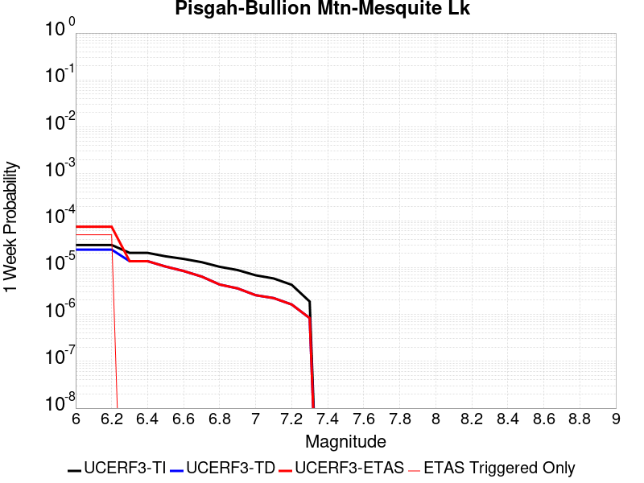 | 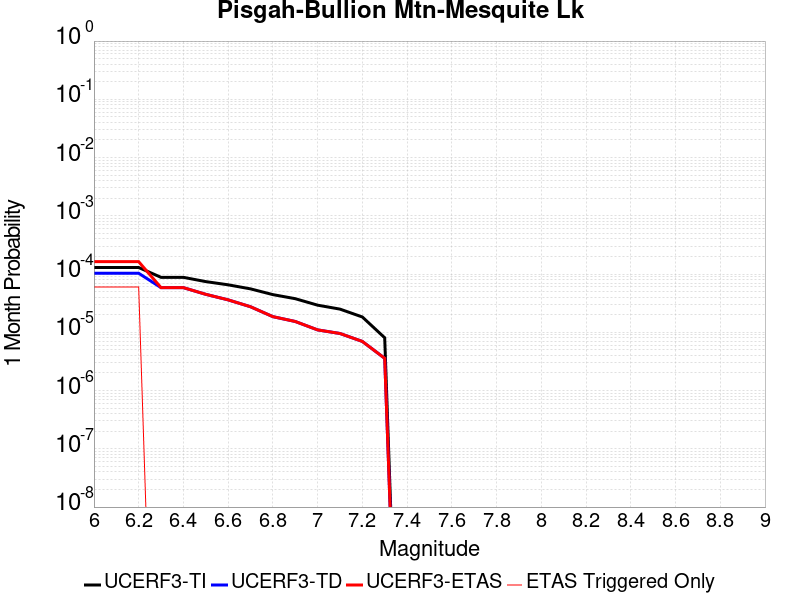 |  |  |

| Magnitude | 1 wk TI Prob | 1 wk TD Prob | 1 wk ETAS Prob | 1 wk ETAS/TD Gain | 1 wk ETAS Triggered Only | 1 mo TI Prob | 1 mo TD Prob | 1 mo ETAS Prob | 1 mo ETAS/TD Gain | 1 mo ETAS Triggered Only | 1 yr TI Prob | 1 yr TD Prob | 1 yr ETAS Prob | 1 yr ETAS/TD Gain | 1 yr ETAS Triggered Only | 10 yr TI Prob | 10 yr TD Prob | 10 yr ETAS Prob | 10 yr ETAS/TD Gain | 10 yr ETAS Triggered Only |
|-----|-----|-----|-----|-----|-----|-----|-----|-----|-----|-----|-----|-----|-----|-----|-----|-----|-----|-----|-----|-----|
| 6.0 | 3.0240792E-5 | 2.4091114E-5 | 7.408991E-5 | 3.075404 | 5.0E-5 | 1.2959696E-4 | 1.03244114E-4 | 1.6323791E-4 | 1.5810869 | 6.0E-5 | 0.0015767008 | 0.0012563728 | 0.0013562471 | 1.0794942 | 1.0E-4 | 0.015655609 | 0.012502721 | 0.012700221 | 1.0157965 | 2.0E-4 |
| 6.1 | 3.0240792E-5 | 2.4091114E-5 | 7.408991E-5 | 3.075404 | 5.0E-5 | 1.2959696E-4 | 1.03244114E-4 | 1.6323791E-4 | 1.5810869 | 6.0E-5 | 0.0015767008 | 0.0012563728 | 0.0013562471 | 1.0794942 | 1.0E-4 | 0.015655609 | 0.012502721 | 0.012700221 | 1.0157965 | 2.0E-4 |
| 6.2 | 3.0240792E-5 | 2.4091114E-5 | 7.408991E-5 | 3.075404 | 5.0E-5 | 1.2959696E-4 | 1.03244114E-4 | 1.6323791E-4 | 1.5810869 | 6.0E-5 | 0.0015767008 | 0.0012563728 | 0.0013562471 | 1.0794942 | 1.0E-4 | 0.015655609 | 0.012502721 | 0.012700221 | 1.0157965 | 2.0E-4 |
| 6.3 | 2.0498217E-5 | 1.36380695E-5 | 1.36380695E-5 | 1.0 | 0.0 | 8.784654E-5 | 5.844765E-5 | 5.844765E-5 | 1.0 | 0.0 | 0.0010690069 | 7.1138405E-4 | 7.3136983E-4 | 1.0280942 | 2.0E-5 | 0.01063879 | 0.0070926943 | 0.0071721273 | 1.0111992 | 8.0E-5 |
| 6.4 | 2.0498217E-5 | 1.36380695E-5 | 1.36380695E-5 | 1.0 | 0.0 | 8.784654E-5 | 5.844765E-5 | 5.844765E-5 | 1.0 | 0.0 | 0.0010690069 | 7.1138405E-4 | 7.3136983E-4 | 1.0280942 | 2.0E-5 | 0.01063879 | 0.0070926943 | 0.0071721273 | 1.0111992 | 8.0E-5 |
| 6.5 | 1.7316182E-5 | 1.0477042E-5 | 1.0477042E-5 | 1.0 | 0.0 | 7.42101E-5 | 4.4900895E-5 | 4.4900895E-5 | 1.0 | 0.0 | 9.0313336E-4 | 5.465413E-4 | 5.6653033E-4 | 1.0365738 | 2.0E-5 | 0.008994718 | 0.0054529672 | 0.0055026943 | 1.0091193 | 5.0E-5 |
| 6.6 | 1.5251077E-5 | 8.414273E-6 | 8.414273E-6 | 1.0 | 0.0 | 6.536012E-5 | 3.6060712E-5 | 3.6060712E-5 | 1.0 | 0.0 | 7.9546886E-4 | 4.3895794E-4 | 4.589492E-4 | 1.0455425 | 2.0E-5 | 0.007926274 | 0.0043816264 | 0.004411495 | 1.0068167 | 3.0E-5 |
| 6.7 | 1.2997425E-5 | 6.4114965E-6 | 6.4114965E-6 | 1.0 | 0.0 | 5.570206E-5 | 2.7477578E-5 | 2.7477578E-5 | 1.0 | 0.0 | 6.7796157E-4 | 3.3449283E-4 | 3.4448947E-4 | 1.029886 | 1.0E-5 | 0.0067589693 | 0.0033403537 | 0.0033602868 | 1.0059674 | 2.0E-5 |
| 6.8 | 1.035386E-5 | 4.3332193E-6 | 4.3332193E-6 | 1.0 | 0.0 | 4.437293E-5 | 1.8570812E-5 | 1.8570812E-5 | 1.0 | 0.0 | 5.401065E-4 | 2.2607706E-4 | 2.2607706E-4 | 1.0 | 0.0 | 0.0053879567 | 0.0022585576 | 0.0022585576 | 1.0 | 0.0 |
| 6.9 | 8.816252E-6 | 3.580638E-6 | 3.580638E-6 | 1.0 | 0.0 | 3.778339E-5 | 1.5345504E-5 | 1.5345504E-5 | 1.0 | 0.0 | 4.5991567E-4 | 1.8681608E-4 | 1.8681608E-4 | 1.0 | 0.0 | 0.00458965 | 0.0018666488 | 0.0018666488 | 1.0 | 0.0 |
| 7.0 | 6.8232207E-6 | 2.5675843E-6 | 2.5675843E-6 | 1.0 | 0.0 | 2.9242048E-5 | 1.1003888E-5 | 1.1003888E-5 | 1.0 | 0.0 | 3.5596377E-4 | 1.3396442E-4 | 1.3396442E-4 | 1.0 | 0.0 | 0.0035539411 | 0.0013388677 | 0.0013388677 | 1.0 | 0.0 |
| 7.1 | 5.837013E-6 | 2.22738E-6 | 2.22738E-6 | 1.0 | 0.0 | 2.501553E-5 | 9.545881E-6 | 9.545881E-6 | 1.0 | 0.0 | 3.045215E-4 | 1.16215204E-4 | 1.16215204E-4 | 1.0 | 0.0 | 0.0030410455 | 0.0011615733 | 0.0011615733 | 1.0 | 0.0 |
| 7.2 | 4.278052E-6 | 1.6275711E-6 | 1.6275711E-6 | 1.0 | 0.0 | 1.833438E-5 | 6.9752873E-6 | 6.9752873E-6 | 1.0 | 0.0 | 2.231982E-4 | 8.492105E-5 | 8.492105E-5 | 1.0 | 0.0 | 0.0022297418 | 8.489092E-4 | 8.489092E-4 | 1.0 | 0.0 |
| 7.3 | 1.8803692E-6 | 8.344926E-7 | 8.344926E-7 | 1.0 | 0.0 | 8.0587E-6 | 3.5763926E-6 | 3.5763926E-6 | 1.0 | 0.0 | 9.811026E-5 | 4.354186E-5 | 4.354186E-5 | 1.0 | 0.0 | 9.806695E-4 | 4.3534773E-4 | 4.3534773E-4 | 1.0 | 0.0 |

## Mission Ridge-Arroyo Parida-Santa Ana
*[(top)](#table-of-contents)*

| 1 Week | 1 Month | 1 Year | 10 Year |
|-----|-----|-----|-----|
| 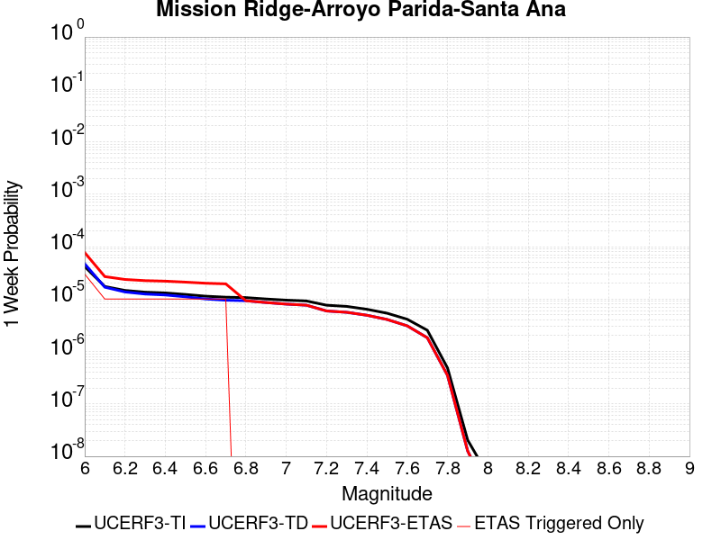 | 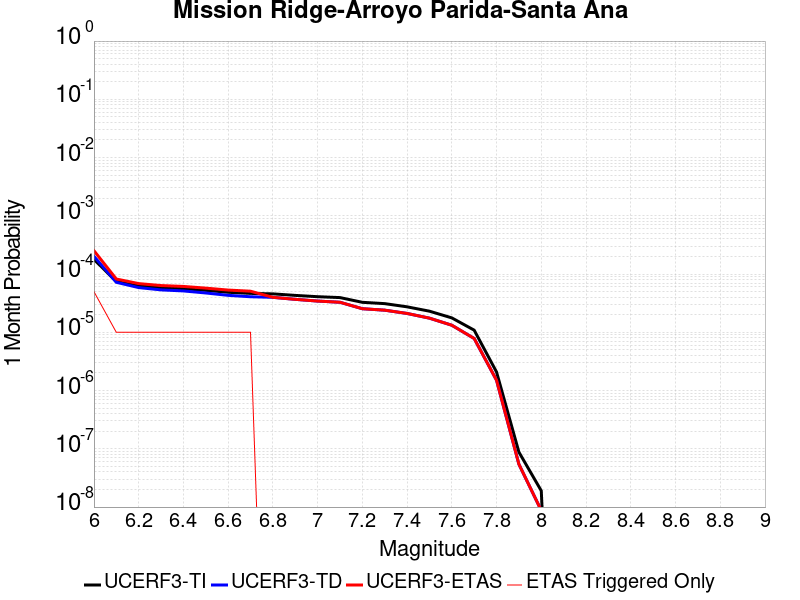 |  |  |

| Magnitude | 1 wk TI Prob | 1 wk TD Prob | 1 wk ETAS Prob | 1 wk ETAS/TD Gain | 1 wk ETAS Triggered Only | 1 mo TI Prob | 1 mo TD Prob | 1 mo ETAS Prob | 1 mo ETAS/TD Gain | 1 mo ETAS Triggered Only | 1 yr TI Prob | 1 yr TD Prob | 1 yr ETAS Prob | 1 yr ETAS/TD Gain | 1 yr ETAS Triggered Only | 10 yr TI Prob | 10 yr TD Prob | 10 yr ETAS Prob | 10 yr ETAS/TD Gain | 10 yr ETAS Triggered Only |
|-----|-----|-----|-----|-----|-----|-----|-----|-----|-----|-----|-----|-----|-----|-----|-----|-----|-----|-----|-----|-----|
| 6.0 | 4.169034E-5 | 4.7138263E-5 | 7.713685E-5 | 1.6363957 | 3.0E-5 | 1.7866064E-4 | 2.0201034E-4 | 2.5200023E-4 | 1.247462 | 5.0E-5 | 0.0021730233 | 0.00245745 | 0.0025671797 | 1.0446519 | 1.1E-4 | 0.021518968 | 0.024384614 | 0.02455047 | 1.0068016 | 1.7E-4 |
| 6.1 | 1.73813E-5 | 1.6854226E-5 | 2.6854057E-5 | 1.593313 | 1.0E-5 | 7.4489166E-5 | 7.223046E-5 | 8.222974E-5 | 1.1384357 | 1.0E-5 | 9.065282E-4 | 8.790618E-4 | 9.0903544E-4 | 1.0340973 | 3.0E-5 | 0.009028391 | 0.008756988 | 0.008826375 | 1.0079236 | 7.0E-5 |
| 6.2 | 1.4622182E-5 | 1.367329E-5 | 2.3673152E-5 | 1.7313429 | 1.0E-5 | 6.2664985E-5 | 5.8598518E-5 | 6.859793E-5 | 1.1706427 | 1.0E-5 | 7.6267915E-4 | 7.132073E-4 | 7.33193E-4 | 1.0280223 | 2.0E-5 | 0.007600669 | 0.007109627 | 0.0071592717 | 1.0069827 | 5.0E-5 |
| 6.3 | 1.3552434E-5 | 1.2482201E-5 | 2.2482076E-5 | 1.8011308 | 1.0E-5 | 5.8080568E-5 | 5.3494066E-5 | 6.3493535E-5 | 1.1869266 | 1.0E-5 | 7.069015E-4 | 6.510988E-4 | 6.710858E-4 | 1.0306973 | 2.0E-5 | 0.00704657 | 0.006492275 | 0.0065320153 | 1.0061212 | 4.0E-5 |
| 6.4 | 1.30977305E-5 | 1.1979156E-5 | 2.1979036E-5 | 1.8347733 | 1.0E-5 | 5.613192E-5 | 5.1338247E-5 | 6.1337734E-5 | 1.1947765 | 1.0E-5 | 6.831918E-4 | 6.248669E-4 | 6.448544E-4 | 1.0319868 | 2.0E-5 | 0.006810953 | 0.0062314444 | 0.006271195 | 1.006379 | 4.0E-5 |
| 6.5 | 1.225205E-5 | 1.1048803E-5 | 2.1048692E-5 | 1.9050654 | 1.0E-5 | 5.2507727E-5 | 4.7351168E-5 | 5.7350695E-5 | 1.2111781 | 1.0E-5 | 6.3909404E-4 | 5.7635066E-4 | 5.863449E-4 | 1.0173405 | 1.0E-5 | 0.006372592 | 0.005748869 | 0.005768754 | 1.003459 | 2.0E-5 |
| 6.6 | 1.1352241E-5 | 1.0063535E-5 | 2.0063435E-5 | 1.9936767 | 1.0E-5 | 4.8651553E-5 | 4.3128734E-5 | 5.3128304E-5 | 1.231854 | 1.0E-5 | 5.921717E-4 | 5.2496797E-4 | 5.349627E-4 | 1.0190388 | 1.0E-5 | 0.0059059616 | 0.0052375244 | 0.00525742 | 1.0037986 | 2.0E-5 |
| 6.7 | 1.0864116E-5 | 9.517027E-6 | 1.9516932E-5 | 2.0507383 | 1.0E-5 | 4.6559664E-5 | 4.0786632E-5 | 5.0786224E-5 | 1.2451683 | 1.0E-5 | 5.667165E-4 | 4.964661E-4 | 5.0646113E-4 | 1.0201323 | 1.0E-5 | 0.005652734 | 0.004953804 | 0.004973705 | 1.0040174 | 2.0E-5 |
| 6.8 | 1.0666365E-5 | 9.299779E-6 | 9.299779E-6 | 1.0 | 0.0 | 4.571219E-5 | 3.9855597E-5 | 3.9855597E-5 | 1.0 | 0.0 | 5.564038E-4 | 4.8513585E-4 | 4.8513585E-4 | 1.0 | 0.0 | 0.005550127 | 0.0048410003 | 0.0048509515 | 1.0020556 | 1.0E-5 |
| 6.9 | 1.0038665E-5 | 8.592046E-6 | 8.592046E-6 | 1.0 | 0.0 | 4.302214E-5 | 3.682254E-5 | 3.682254E-5 | 1.0 | 0.0 | 5.236687E-4 | 4.4822405E-4 | 4.4822405E-4 | 1.0 | 0.0 | 0.005224364 | 0.004473411 | 0.004473411 | 1.0 | 0.0 |
| 7.0 | 9.5379955E-6 | 8.025073E-6 | 8.025073E-6 | 1.0 | 0.0 | 4.0876483E-5 | 3.4392728E-5 | 3.4392728E-5 | 1.0 | 0.0 | 4.975576E-4 | 4.1865272E-4 | 4.1865272E-4 | 1.0 | 0.0 | 0.00496445 | 0.0041788397 | 0.0041788397 | 1.0 | 0.0 |
| 7.1 | 9.207389E-6 | 7.652375E-6 | 7.652375E-6 | 1.0 | 0.0 | 3.945964E-5 | 3.279549E-5 | 3.279549E-5 | 1.0 | 0.0 | 4.803152E-4 | 3.9921363E-4 | 3.9921363E-4 | 1.0 | 0.0 | 0.004792784 | 0.003985161 | 0.003985161 | 1.0 | 0.0 |
| 7.2 | 7.638091E-6 | 5.9311183E-6 | 5.9311183E-6 | 1.0 | 0.0 | 3.2734264E-5 | 2.541883E-5 | 2.541883E-5 | 1.0 | 0.0 | 3.984668E-4 | 3.0943064E-4 | 3.0943064E-4 | 1.0 | 0.0 | 0.0039775306 | 0.0030900547 | 0.0030900547 | 1.0 | 0.0 |
| 7.3 | 7.2500147E-6 | 5.5961527E-6 | 5.5961527E-6 | 1.0 | 0.0 | 3.1071122E-5 | 2.3983293E-5 | 2.3983293E-5 | 1.0 | 0.0 | 3.7822526E-4 | 2.9195778E-4 | 2.9195778E-4 | 1.0 | 0.0 | 0.0037758215 | 0.0029157975 | 0.0029157975 | 1.0 | 0.0 |
| 7.4 | 6.3899715E-6 | 4.9184964E-6 | 4.9184964E-6 | 1.0 | 0.0 | 2.7385306E-5 | 2.10791E-5 | 2.10791E-5 | 1.0 | 0.0 | 3.3336508E-4 | 2.5660804E-4 | 2.5660804E-4 | 1.0 | 0.0 | 0.0033286542 | 0.0025631618 | 0.0025631618 | 1.0 | 0.0 |
| 7.5 | 5.379025E-6 | 4.0838527E-6 | 4.0838527E-6 | 1.0 | 0.0 | 2.305276E-5 | 1.7502109E-5 | 1.7502109E-5 | 1.0 | 0.0 | 2.806312E-4 | 2.1306744E-4 | 2.1306744E-4 | 1.0 | 0.0 | 0.0028027708 | 0.002128643 | 0.002128643 | 1.0 | 0.0 |
| 7.6 | 4.1270696E-6 | 3.0883439E-6 | 3.0883439E-6 | 1.0 | 0.0 | 1.768732E-5 | 1.3235693E-5 | 1.3235693E-5 | 1.0 | 0.0 | 2.1532185E-4 | 1.6113273E-4 | 1.6113273E-4 | 1.0 | 0.0 | 0.0021511333 | 0.001610167 | 0.001610167 | 1.0 | 0.0 |
| 7.7 | 2.5406805E-6 | 1.8282013E-6 | 1.8282013E-6 | 1.0 | 0.0 | 1.0888585E-5 | 7.835125E-6 | 7.835125E-6 | 1.0 | 0.0 | 1.3256045E-4 | 9.538854E-5 | 9.538854E-5 | 1.0 | 0.0 | 0.0013248142 | 9.534821E-4 | 9.534821E-4 | 1.0 | 0.0 |
| 7.8 | 4.8608285E-7 | 3.5098864E-7 | 3.5098864E-7 | 1.0 | 0.0 | 2.0832106E-6 | 1.5042363E-6 | 1.5042363E-6 | 1.0 | 0.0 | 2.5362791E-5 | 1.8313924E-5 | 1.8313924E-5 | 1.0 | 0.0 | 2.5359896E-4 | 1.8312426E-4 | 1.8312426E-4 | 1.0 | 0.0 |
| 7.9 | 2.0472514E-8 | 1.2688783E-8 | 1.2688783E-8 | 1.0 | 0.0 | 8.7739345E-8 | 5.43805E-8 | 5.43805E-8 | 1.0 | 0.0 | 1.068226E-6 | 6.6208236E-7 | 6.6208236E-7 | 1.0 | 0.0 | 1.0682209E-5 | 6.620805E-6 | 6.620805E-6 | 1.0 | 0.0 |
| 8.0 | 4.443582E-9 | 2.0321211E-9 | 2.0321211E-9 | 1.0 | 0.0 | 1.9043922E-8 | 8.70909E-9 | 8.70909E-9 | 1.0 | 0.0 | 2.3185973E-7 | 1.0603316E-7 | 1.0603316E-7 | 1.0 | 0.0 | 2.3185949E-6 | 1.0603312E-6 | 1.0603312E-6 | 1.0 | 0.0 |

## Cleghorn Lake
*[(top)](#table-of-contents)*

| 1 Week | 1 Month | 1 Year | 10 Year |
|-----|-----|-----|-----|
| 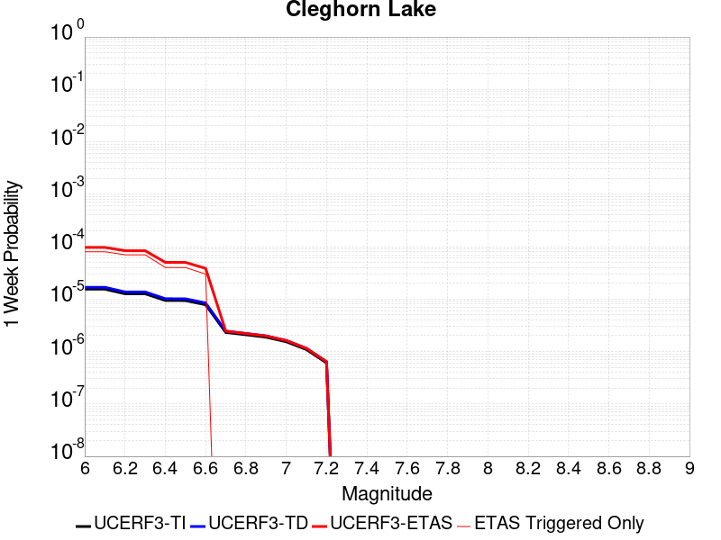 | 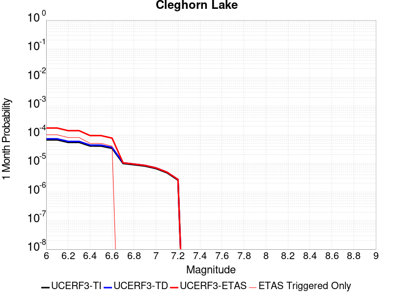 |  | 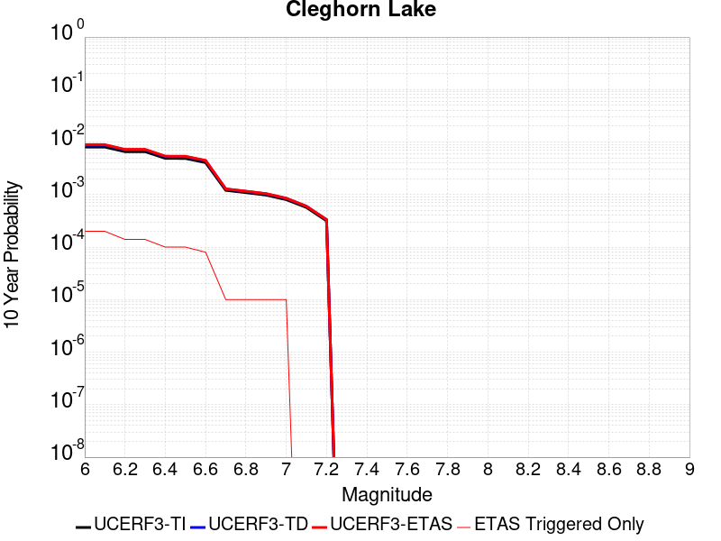 |

| Magnitude | 1 wk TI Prob | 1 wk TD Prob | 1 wk ETAS Prob | 1 wk ETAS/TD Gain | 1 wk ETAS Triggered Only | 1 mo TI Prob | 1 mo TD Prob | 1 mo ETAS Prob | 1 mo ETAS/TD Gain | 1 mo ETAS Triggered Only | 1 yr TI Prob | 1 yr TD Prob | 1 yr ETAS Prob | 1 yr ETAS/TD Gain | 1 yr ETAS Triggered Only | 10 yr TI Prob | 10 yr TD Prob | 10 yr ETAS Prob | 10 yr ETAS/TD Gain | 10 yr ETAS Triggered Only |
|-----|-----|-----|-----|-----|-----|-----|-----|-----|-----|-----|-----|-----|-----|-----|-----|-----|-----|-----|-----|-----|
| 6.0 | 1.5467183E-5 | 1.6794203E-5 | 9.679286E-5 | 5.7634683 | 8.0E-5 | 6.6286244E-5 | 7.197348E-5 | 1.7196628E-4 | 2.3893006 | 1.0E-4 | 8.067362E-4 | 8.759797E-4 | 0.0010258483 | 1.1710868 | 1.5E-4 | 0.008038137 | 0.008730696 | 0.008928949 | 1.0227077 | 2.0E-4 |
| 6.1 | 1.5467183E-5 | 1.6794203E-5 | 9.679286E-5 | 5.7634683 | 8.0E-5 | 6.6286244E-5 | 7.197348E-5 | 1.7196628E-4 | 2.3893006 | 1.0E-4 | 8.067362E-4 | 8.759797E-4 | 0.0010258483 | 1.1710868 | 1.5E-4 | 0.008038137 | 0.008730696 | 0.008928949 | 1.0227077 | 2.0E-4 |
| 6.2 | 1.2624631E-5 | 1.3681544E-5 | 8.3680585E-5 | 6.1163116 | 7.0E-5 | 5.410444E-5 | 5.863415E-5 | 1.3862946E-4 | 2.3643126 | 8.0E-5 | 6.585225E-4 | 7.1368564E-4 | 8.136142E-4 | 1.1400177 | 1.0E-4 | 0.0065657445 | 0.0071187317 | 0.0072577354 | 1.0195265 | 1.4E-4 |
| 6.3 | 1.2624631E-5 | 1.3681544E-5 | 8.3680585E-5 | 6.1163116 | 7.0E-5 | 5.410444E-5 | 5.863415E-5 | 1.3862946E-4 | 2.3643126 | 8.0E-5 | 6.585225E-4 | 7.1368564E-4 | 8.136142E-4 | 1.1400177 | 1.0E-4 | 0.0065657445 | 0.0071187317 | 0.0072577354 | 1.0195265 | 1.4E-4 |
| 6.4 | 9.417684E-6 | 1.0170118E-5 | 5.016971E-5 | 4.933051 | 4.0E-5 | 4.036088E-5 | 4.3585722E-5 | 9.358354E-5 | 2.1471148 | 5.0E-5 | 4.912829E-4 | 5.3056807E-4 | 6.005309E-4 | 1.1318641 | 7.0E-5 | 0.004901982 | 0.005297049 | 0.0053965193 | 1.0187784 | 1.0E-4 |
| 6.5 | 9.368219E-6 | 1.0117545E-5 | 5.0117138E-5 | 4.9534883 | 4.0E-5 | 4.014889E-5 | 4.3360415E-5 | 9.335825E-5 | 2.1530755 | 5.0E-5 | 4.8870314E-4 | 5.2782625E-4 | 5.977893E-4 | 1.1325494 | 7.0E-5 | 0.004876298 | 0.0052697617 | 0.0053692344 | 1.0188762 | 1.0E-4 |
| 6.6 | 7.803798E-6 | 8.441831E-6 | 3.8441576E-5 | 4.5537014 | 3.0E-5 | 3.3444423E-5 | 3.6179E-5 | 7.617755E-5 | 2.105574 | 4.0E-5 | 4.0710976E-4 | 4.4043022E-4 | 5.004038E-4 | 1.1361704 | 6.0E-5 | 0.0040636472 | 0.0043994905 | 0.0044791386 | 1.018104 | 8.0E-5 |
| 6.7 | 2.3108669E-6 | 2.4438336E-6 | 2.4438336E-6 | 1.0 | 0.0 | 9.903678E-6 | 1.0473532E-5 | 1.0473532E-5 | 1.0 | 0.0 | 1.205706E-4 | 1.2750797E-4 | 1.375067E-4 | 1.0784165 | 1.0E-5 | 0.001205052 | 0.0012743667 | 0.001284354 | 1.007837 | 1.0E-5 |
| 6.8 | 2.0882828E-6 | 2.2062823E-6 | 2.2062823E-6 | 1.0 | 0.0 | 8.949753E-6 | 9.455462E-6 | 9.455462E-6 | 1.0 | 0.0 | 1.08957785E-4 | 1.1511434E-4 | 1.2511319E-4 | 1.0868602 | 1.0E-5 | 0.0010890438 | 0.0011505639 | 0.0011605524 | 1.0086814 | 1.0E-5 |
| 6.9 | 1.876935E-6 | 1.981051E-6 | 1.981051E-6 | 1.0 | 0.0 | 8.043982E-6 | 8.490192E-6 | 8.490192E-6 | 1.0 | 0.0 | 9.7931086E-5 | 1.03363345E-4 | 1.1336231E-4 | 1.0967361 | 1.0E-5 | 9.788794E-4 | 0.0010331686 | 0.0010431584 | 1.009669 | 1.0E-5 |
| 7.0 | 1.5357559E-6 | 1.6202807E-6 | 1.6202807E-6 | 1.0 | 0.0 | 6.5817944E-6 | 6.9440425E-6 | 6.9440425E-6 | 1.0 | 0.0 | 8.01304E-5 | 8.454057E-5 | 9.453972E-5 | 1.1182764 | 1.0E-5 | 8.010151E-4 | 8.450965E-4 | 8.55088E-4 | 1.0118229 | 1.0E-5 |
| 7.1 | 1.0905424E-6 | 1.1497619E-6 | 1.1497619E-6 | 1.0 | 0.0 | 4.6737446E-6 | 4.9275427E-6 | 4.9275427E-6 | 1.0 | 0.0 | 5.6901354E-5 | 5.999128E-5 | 5.999128E-5 | 1.0 | 0.0 | 5.6886784E-4 | 5.997606E-4 | 5.997606E-4 | 1.0 | 0.0 |
| 7.2 | 6.06668E-7 | 6.387277E-7 | 6.387277E-7 | 1.0 | 0.0 | 2.600003E-6 | 2.7374022E-6 | 2.7374022E-6 | 1.0 | 0.0 | 3.1654577E-5 | 3.3327433E-5 | 3.3327433E-5 | 1.0 | 0.0 | 3.1650066E-4 | 3.3323118E-4 | 3.3323118E-4 | 1.0 | 0.0 |

## Lost Hills
*[(top)](#table-of-contents)*

| 1 Week | 1 Month | 1 Year | 10 Year |
|-----|-----|-----|-----|
| 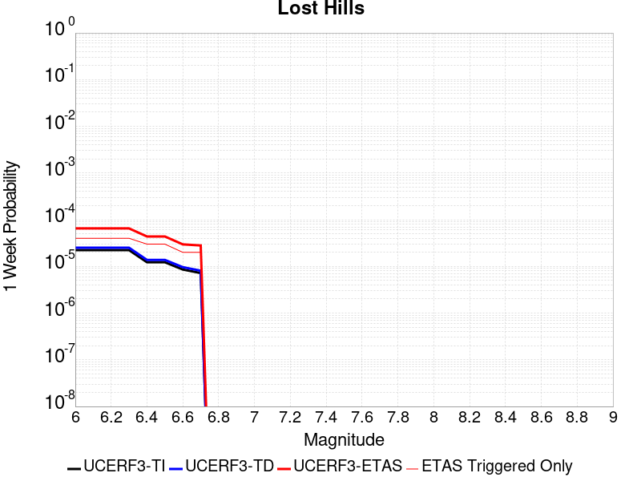 | 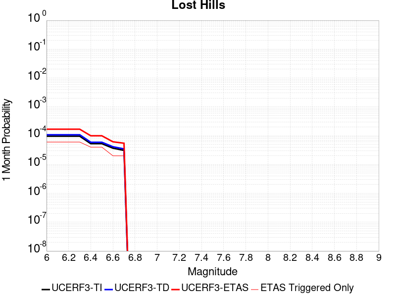 |  |  |

| Magnitude | 1 wk TI Prob | 1 wk TD Prob | 1 wk ETAS Prob | 1 wk ETAS/TD Gain | 1 wk ETAS Triggered Only | 1 mo TI Prob | 1 mo TD Prob | 1 mo ETAS Prob | 1 mo ETAS/TD Gain | 1 mo ETAS Triggered Only | 1 yr TI Prob | 1 yr TD Prob | 1 yr ETAS Prob | 1 yr ETAS/TD Gain | 1 yr ETAS Triggered Only | 10 yr TI Prob | 10 yr TD Prob | 10 yr ETAS Prob | 10 yr ETAS/TD Gain | 10 yr ETAS Triggered Only |
|-----|-----|-----|-----|-----|-----|-----|-----|-----|-----|-----|-----|-----|-----|-----|-----|-----|-----|-----|-----|-----|
| 6.0 | 2.233523E-5 | 2.5106583E-5 | 6.510558E-5 | 2.5931678 | 4.0E-5 | 9.571891E-5 | 1.0759615E-4 | 1.675897E-4 | 1.5575808 | 6.0E-5 | 0.0011647546 | 0.001309364 | 0.0014491807 | 1.1067821 | 1.4E-4 | 0.011586686 | 0.013033091 | 0.013210745 | 1.013631 | 1.8E-4 |
| 6.1 | 2.233523E-5 | 2.5106583E-5 | 6.510558E-5 | 2.5931678 | 4.0E-5 | 9.571891E-5 | 1.0759615E-4 | 1.675897E-4 | 1.5575808 | 6.0E-5 | 0.0011647546 | 0.001309364 | 0.0014491807 | 1.1067821 | 1.4E-4 | 0.011586686 | 0.013033091 | 0.013210745 | 1.013631 | 1.8E-4 |
| 6.2 | 2.233523E-5 | 2.5106583E-5 | 6.510558E-5 | 2.5931678 | 4.0E-5 | 9.571891E-5 | 1.0759615E-4 | 1.675897E-4 | 1.5575808 | 6.0E-5 | 0.0011647546 | 0.001309364 | 0.0014491807 | 1.1067821 | 1.4E-4 | 0.011586686 | 0.013033091 | 0.013210745 | 1.013631 | 1.8E-4 |
| 6.3 | 2.233523E-5 | 2.5106583E-5 | 6.510558E-5 | 2.5931678 | 4.0E-5 | 9.571891E-5 | 1.0759615E-4 | 1.675897E-4 | 1.5575808 | 6.0E-5 | 0.0011647546 | 0.001309364 | 0.0014491807 | 1.1067821 | 1.4E-4 | 0.011586686 | 0.013033091 | 0.013210745 | 1.013631 | 1.8E-4 |
| 6.4 | 1.2288092E-5 | 1.3781108E-5 | 4.3780696E-5 | 3.1768632 | 3.0E-5 | 5.2662188E-5 | 5.906108E-5 | 9.905872E-5 | 1.677225 | 4.0E-5 | 6.409735E-4 | 7.189252E-4 | 7.988677E-4 | 1.1111972 | 8.0E-5 | 0.006391279 | 0.0071752006 | 0.007284411 | 1.0152205 | 1.1E-4 |
| 6.5 | 1.2288092E-5 | 1.3781108E-5 | 4.3780696E-5 | 3.1768632 | 3.0E-5 | 5.2662188E-5 | 5.906108E-5 | 9.905872E-5 | 1.677225 | 4.0E-5 | 6.409735E-4 | 7.189252E-4 | 7.988677E-4 | 1.1111972 | 8.0E-5 | 0.006391279 | 0.0071752006 | 0.007284411 | 1.0152205 | 1.1E-4 |
| 6.6 | 8.58281E-6 | 9.63377E-6 | 2.9633577E-5 | 3.0760105 | 2.0E-5 | 3.6782953E-5 | 4.12874E-5 | 6.128658E-5 | 1.4843893 | 2.0E-5 | 4.4774043E-4 | 5.026414E-4 | 5.326263E-4 | 1.0596547 | 3.0E-5 | 0.0044683935 | 0.005023205 | 0.005072954 | 1.0099038 | 5.0E-5 |
| 6.7 | 7.205685E-6 | 8.088302E-6 | 2.808814E-5 | 3.472687 | 2.0E-5 | 3.088114E-5 | 3.466415E-5 | 5.466346E-5 | 1.576945 | 2.0E-5 | 3.7591302E-4 | 4.2203604E-4 | 4.5202338E-4 | 1.071054 | 3.0E-5 | 0.0037527776 | 0.0042203604 | 0.0042601917 | 1.0094379 | 4.0E-5 |

## Mission Creek
*[(top)](#table-of-contents)*

| 1 Week | 1 Month | 1 Year | 10 Year |
|-----|-----|-----|-----|
| 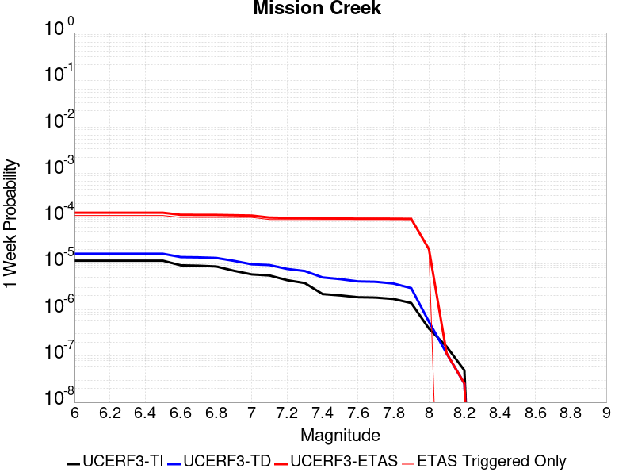 | 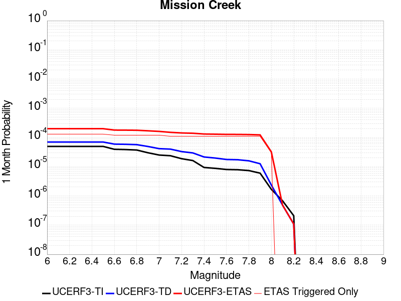 |  |  |

| Magnitude | 1 wk TI Prob | 1 wk TD Prob | 1 wk ETAS Prob | 1 wk ETAS/TD Gain | 1 wk ETAS Triggered Only | 1 mo TI Prob | 1 mo TD Prob | 1 mo ETAS Prob | 1 mo ETAS/TD Gain | 1 mo ETAS Triggered Only | 1 yr TI Prob | 1 yr TD Prob | 1 yr ETAS Prob | 1 yr ETAS/TD Gain | 1 yr ETAS Triggered Only | 10 yr TI Prob | 10 yr TD Prob | 10 yr ETAS Prob | 10 yr ETAS/TD Gain | 10 yr ETAS Triggered Only |
|-----|-----|-----|-----|-----|-----|-----|-----|-----|-----|-----|-----|-----|-----|-----|-----|-----|-----|-----|-----|-----|
| 6.0 | 1.1549387E-5 | 1.632237E-5 | 1.2632058E-4 | 7.7391076 | 1.1E-4 | 4.9496433E-5 | 6.9951224E-5 | 1.9994214E-4 | 2.8583078 | 1.3E-4 | 6.0245243E-4 | 8.513384E-4 | 0.0010211937 | 1.1995156 | 1.7E-4 | 0.006008218 | 0.008509998 | 0.0086983815 | 1.0221367 | 1.9E-4 |
| 6.1 | 1.1549387E-5 | 1.632237E-5 | 1.2632058E-4 | 7.7391076 | 1.1E-4 | 4.9496433E-5 | 6.9951224E-5 | 1.9994214E-4 | 2.8583078 | 1.3E-4 | 6.0245243E-4 | 8.513384E-4 | 0.0010211937 | 1.1995156 | 1.7E-4 | 0.006008218 | 0.008509998 | 0.0086983815 | 1.0221367 | 1.9E-4 |
| 6.2 | 1.1549387E-5 | 1.632237E-5 | 1.2632058E-4 | 7.7391076 | 1.1E-4 | 4.9496433E-5 | 6.9951224E-5 | 1.9994214E-4 | 2.8583078 | 1.3E-4 | 6.0245243E-4 | 8.513384E-4 | 0.0010211937 | 1.1995156 | 1.7E-4 | 0.006008218 | 0.008509998 | 0.0086983815 | 1.0221367 | 1.9E-4 |
| 6.3 | 1.1549387E-5 | 1.632237E-5 | 1.2632058E-4 | 7.7391076 | 1.1E-4 | 4.9496433E-5 | 6.9951224E-5 | 1.9994214E-4 | 2.8583078 | 1.3E-4 | 6.0245243E-4 | 8.513384E-4 | 0.0010211937 | 1.1995156 | 1.7E-4 | 0.006008218 | 0.008509998 | 0.0086983815 | 1.0221367 | 1.9E-4 |
| 6.4 | 1.1549387E-5 | 1.632237E-5 | 1.2632058E-4 | 7.7391076 | 1.1E-4 | 4.9496433E-5 | 6.9951224E-5 | 1.9994214E-4 | 2.8583078 | 1.3E-4 | 6.0245243E-4 | 8.513384E-4 | 0.0010211937 | 1.1995156 | 1.7E-4 | 0.006008218 | 0.008509998 | 0.0086983815 | 1.0221367 | 1.9E-4 |
| 6.5 | 1.1549387E-5 | 1.632237E-5 | 1.2632058E-4 | 7.7391076 | 1.1E-4 | 4.9496433E-5 | 6.9951224E-5 | 1.9994214E-4 | 2.8583078 | 1.3E-4 | 6.0245243E-4 | 8.513384E-4 | 0.0010211937 | 1.1995156 | 1.7E-4 | 0.006008218 | 0.008509998 | 0.0086983815 | 1.0221367 | 1.9E-4 |
| 6.6 | 9.202681E-6 | 1.3845646E-5 | 1.1384426E-4 | 8.222386 | 1.0E-4 | 3.9439463E-5 | 5.9337188E-5 | 1.7933006E-4 | 3.0222206 | 1.2E-4 | 4.800697E-4 | 7.221998E-4 | 8.8208425E-4 | 1.2213854 | 1.6E-4 | 0.004790339 | 0.0072271815 | 0.0074058804 | 1.024726 | 1.8E-4 |
| 6.7 | 9.019164E-6 | 1.3651316E-5 | 1.1364995E-4 | 8.325201 | 1.0E-4 | 3.8652986E-5 | 5.8504378E-5 | 1.7849736E-4 | 3.0510085 | 1.2E-4 | 4.7049852E-4 | 7.12067E-4 | 8.719531E-4 | 1.224538 | 1.6E-4 | 0.004695036 | 0.007126506 | 0.007305223 | 1.0250778 | 1.8E-4 |
| 6.8 | 8.673558E-6 | 1.3273427E-5 | 1.132721E-4 | 8.53375 | 1.0E-4 | 3.717186E-5 | 5.6884925E-5 | 1.768781E-4 | 3.109402 | 1.2E-4 | 4.524734E-4 | 6.923627E-4 | 8.5225195E-4 | 1.2309327 | 1.6E-4 | 0.0045155324 | 0.006930694 | 0.0071094465 | 1.0257914 | 1.8E-4 |
| 6.9 | 7.002255E-6 | 1.1477657E-5 | 1.1147651E-4 | 9.71248 | 1.0E-4 | 3.000932E-5 | 4.9189068E-5 | 1.6918317E-4 | 3.4394464 | 1.2E-4 | 3.653022E-4 | 5.9871917E-4 | 7.586234E-4 | 1.2670771 | 1.6E-4 | 0.0036470229 | 0.005999517 | 0.0061784373 | 1.0298225 | 1.8E-4 |
| 7.0 | 5.84644E-6 | 9.67498E-6 | 1.0967401E-4 | 11.335838 | 1.0E-4 | 2.5055931E-5 | 4.1463565E-5 | 1.6145859E-4 | 3.893987 | 1.2E-4 | 3.0501327E-4 | 5.047066E-4 | 6.646258E-4 | 1.3168559 | 1.6E-4 | 0.0030459496 | 0.0050638523 | 0.0052429405 | 1.035366 | 1.8E-4 |
| 7.1 | 5.54703E-6 | 9.329456E-6 | 9.9328616E-5 | 10.646774 | 9.0E-5 | 2.377277E-5 | 3.9982795E-5 | 1.499784E-4 | 3.7510734 | 1.1E-4 | 2.8939504E-4 | 4.8668624E-4 | 6.3661323E-4 | 1.3080567 | 1.5E-4 | 0.0028901845 | 0.004884446 | 0.005053616 | 1.0346344 | 1.7E-4 |
| 7.2 | 4.384709E-6 | 7.68157E-6 | 9.768088E-5 | 12.716264 | 9.0E-5 | 1.8791474E-5 | 3.2920623E-5 | 1.4291701E-4 | 4.3412604 | 1.1E-4 | 2.2876218E-4 | 4.0073853E-4 | 5.506784E-4 | 1.3741589 | 1.5E-4 | 0.0022852682 | 0.004028366 | 0.004197681 | 1.0420307 | 1.7E-4 |
| 7.3 | 3.7888456E-6 | 6.915452E-6 | 9.691483E-5 | 14.014244 | 9.0E-5 | 1.623781E-5 | 2.9637333E-5 | 1.3963407E-4 | 4.711425 | 1.1E-4 | 1.9767738E-4 | 3.6077813E-4 | 5.10724E-4 | 1.415618 | 1.5E-4 | 0.0019750162 | 0.0036301152 | 0.003799498 | 1.0466604 | 1.7E-4 |
| 7.4 | 2.1982462E-6 | 5.0237763E-6 | 9.502332E-5 | 18.91472 | 9.0E-5 | 9.421021E-6 | 2.1530293E-5 | 1.3152792E-4 | 6.10897 | 1.1E-4 | 1.1469489E-4 | 2.621E-4 | 4.1206068E-4 | 1.5721507 | 1.5E-4 | 0.0011463572 | 0.0026458844 | 0.0028154347 | 1.0640807 | 1.7E-4 |
| 7.5 | 2.051923E-6 | 4.615016E-6 | 9.46146E-5 | 20.501467 | 9.0E-5 | 8.793926E-6 | 1.9778492E-5 | 1.2977632E-4 | 6.561487 | 1.1E-4 | 1.0706078E-4 | 2.4077666E-4 | 3.9074055E-4 | 1.622834 | 1.5E-4 | 0.0010700922 | 0.0024335422 | 0.0026031283 | 1.069687 | 1.7E-4 |
| 7.6 | 1.8733427E-6 | 4.1233748E-6 | 9.4123E-5 | 22.82669 | 9.0E-5 | 8.028587E-6 | 1.7671488E-5 | 1.2766954E-4 | 7.2246065 | 1.1E-4 | 9.774366E-5 | 2.151292E-4 | 3.6509693E-4 | 1.6971054 | 1.5E-4 | 9.770069E-4 | 0.0021780801 | 0.0023477098 | 1.0778804 | 1.7E-4 |
| 7.7 | 1.8411953E-6 | 4.0430496E-6 | 9.404268E-5 | 23.260334 | 9.0E-5 | 7.890813E-6 | 1.732724E-5 | 1.2732533E-4 | 7.348275 | 1.1E-4 | 9.606641E-5 | 2.1093882E-4 | 3.6090717E-4 | 1.7109567 | 1.5E-4 | 9.6024893E-4 | 0.0021363653 | 0.0023060022 | 1.0794044 | 1.7E-4 |
| 7.8 | 1.7194251E-6 | 3.7104276E-6 | 9.371009E-5 | 25.255875 | 9.0E-5 | 7.368944E-6 | 1.5901736E-5 | 1.2589998E-4 | 7.9173737 | 1.1E-4 | 8.97132E-5 | 1.9358651E-4 | 3.4355748E-4 | 1.7746974 | 1.5E-4 | 8.967699E-4 | 0.0019623525 | 0.0021320188 | 1.0864607 | 1.7E-4 |
| 7.9 | 1.4035052E-6 | 2.9500632E-6 | 9.29498E-5 | 31.507732 | 9.0E-5 | 6.0150082E-6 | 1.2643067E-5 | 1.2264168E-4 | 9.700311 | 1.1E-4 | 7.3230265E-5 | 1.5391852E-4 | 3.0389545E-4 | 1.9743916 | 1.5E-4 | 7.3206134E-4 | 0.0015631086 | 0.001732843 | 1.1085876 | 1.7E-4 |
| 8.0 | 3.9318823E-7 | 5.528522E-7 | 2.0552841E-5 | 37.176014 | 2.0E-5 | 1.6850913E-6 | 2.3693647E-6 | 3.2369295E-5 | 13.6615925 | 3.0E-5 | 2.0515794E-5 | 2.8846638E-5 | 6.884548E-5 | 2.3866034 | 4.0E-5 | 2.0513899E-4 | 2.9899E-4 | 3.4897504E-4 | 1.1671797 | 5.0E-5 |
| 8.1 | 1.596793E-7 | 1.1380002E-7 | 1.1380002E-7 | 1.0 | 0.0 | 6.8433974E-7 | 4.877143E-7 | 4.877143E-7 | 1.0 | 0.0 | 8.331805E-6 | 5.937906E-6 | 5.937906E-6 | 1.0 | 0.0 | 8.331492E-5 | 6.549966E-5 | 6.549966E-5 | 1.0 | 0.0 |
| 8.2 | 4.9003038E-8 | 2.5444924E-8 | 2.5444924E-8 | 1.0 | 0.0 | 2.10013E-7 | 1.0904967E-7 | 1.0904967E-7 | 1.0 | 0.0 | 2.5569052E-6 | 1.327679E-6 | 1.327679E-6 | 1.0 | 0.0 | 2.556876E-5 | 1.495635E-5 | 1.495635E-5 | 1.0 | 0.0 |

## Owens Valley
*[(top)](#table-of-contents)*

| 1 Week | 1 Month | 1 Year | 10 Year |
|-----|-----|-----|-----|
| 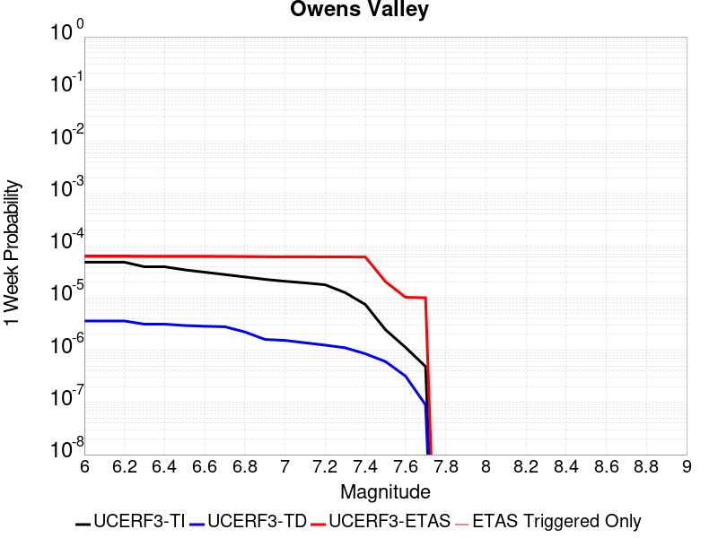 | 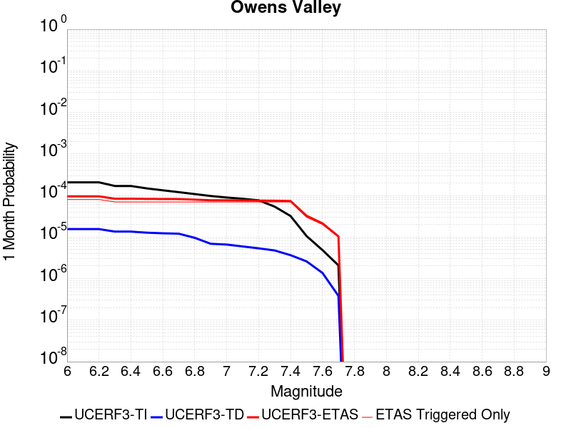 |  |  |

| Magnitude | 1 wk TI Prob | 1 wk TD Prob | 1 wk ETAS Prob | 1 wk ETAS/TD Gain | 1 wk ETAS Triggered Only | 1 mo TI Prob | 1 mo TD Prob | 1 mo ETAS Prob | 1 mo ETAS/TD Gain | 1 mo ETAS Triggered Only | 1 yr TI Prob | 1 yr TD Prob | 1 yr ETAS Prob | 1 yr ETAS/TD Gain | 1 yr ETAS Triggered Only | 10 yr TI Prob | 10 yr TD Prob | 10 yr ETAS Prob | 10 yr ETAS/TD Gain | 10 yr ETAS Triggered Only |
|-----|-----|-----|-----|-----|-----|-----|-----|-----|-----|-----|-----|-----|-----|-----|-----|-----|-----|-----|-----|-----|
| 6.0 | 4.83821E-5 | 3.626567E-6 | 6.362635E-5 | 17.544512 | 6.0E-5 | 2.0733538E-4 | 1.5542342E-5 | 9.55411E-5 | 6.147149 | 8.0E-5 | 0.002521386 | 1.8921259E-4 | 3.19188E-4 | 1.6869279 | 1.3E-4 | 0.024929691 | 0.001925011 | 0.0020946837 | 1.0881412 | 1.7E-4 |
| 6.1 | 4.83821E-5 | 3.626567E-6 | 6.362635E-5 | 17.544512 | 6.0E-5 | 2.0733538E-4 | 1.5542342E-5 | 9.55411E-5 | 6.147149 | 8.0E-5 | 0.002521386 | 1.8921259E-4 | 3.19188E-4 | 1.6869279 | 1.3E-4 | 0.024929691 | 0.001925011 | 0.0020946837 | 1.0881412 | 1.7E-4 |
| 6.2 | 4.83821E-5 | 3.626567E-6 | 6.362635E-5 | 17.544512 | 6.0E-5 | 2.0733538E-4 | 1.5542342E-5 | 9.55411E-5 | 6.147149 | 8.0E-5 | 0.002521386 | 1.8921259E-4 | 3.19188E-4 | 1.6869279 | 1.3E-4 | 0.024929691 | 0.001925011 | 0.0020946837 | 1.0881412 | 1.7E-4 |
| 6.3 | 3.953008E-5 | 3.1553948E-6 | 6.31552E-5 | 20.014994 | 6.0E-5 | 1.6940363E-4 | 1.3523055E-5 | 8.352211E-5 | 6.1762753 | 7.0E-5 | 0.002060538 | 1.6463149E-4 | 2.8461174E-4 | 1.7287806 | 1.2E-4 | 0.020415364 | 0.0016592 | 0.0018189345 | 1.096272 | 1.6E-4 |
| 6.4 | 3.953008E-5 | 3.1553948E-6 | 6.31552E-5 | 20.014994 | 6.0E-5 | 1.6940363E-4 | 1.3523055E-5 | 8.352211E-5 | 6.1762753 | 7.0E-5 | 0.002060538 | 1.6463149E-4 | 2.8461174E-4 | 1.7287806 | 1.2E-4 | 0.020415364 | 0.0016592 | 0.0018189345 | 1.096272 | 1.6E-4 |
| 6.5 | 3.457342E-5 | 2.9715961E-6 | 6.297142E-5 | 21.191109 | 6.0E-5 | 1.4816338E-4 | 1.2735354E-5 | 8.273446E-5 | 6.49644 | 7.0E-5 | 0.0018023965 | 1.550426E-4 | 2.75024E-4 | 1.7738608 | 1.2E-4 | 0.017878477 | 0.001555719 | 0.00171547 | 1.1026863 | 1.6E-4 |
| 6.6 | 3.1127765E-5 | 2.8744932E-6 | 6.287432E-5 | 21.873184 | 6.0E-5 | 1.3339789E-4 | 1.2319203E-5 | 8.231834E-5 | 6.682116 | 7.0E-5 | 0.0016229092 | 1.4997667E-4 | 2.6995866E-4 | 1.8000045 | 1.2E-4 | 0.016111081 | 0.0015012559 | 0.0016610157 | 1.1064174 | 1.6E-4 |
| 6.7 | 2.806885E-5 | 2.8104134E-6 | 6.281024E-5 | 22.349112 | 6.0E-5 | 1.2028952E-4 | 1.20445775E-5 | 8.2043734E-5 | 6.811674 | 7.0E-5 | 0.001463541 | 1.4663354E-4 | 2.6661594E-4 | 1.8182466 | 1.2E-4 | 0.014539397 | 0.0014657511 | 0.0016255166 | 1.108999 | 1.6E-4 |
| 6.8 | 2.524524E-5 | 2.2353688E-6 | 6.223524E-5 | 27.841148 | 6.0E-5 | 1.0818939E-4 | 9.580118E-6 | 7.957945E-5 | 8.306729 | 7.0E-5 | 0.0013164099 | 1.16632E-4 | 2.36618E-4 | 2.028757 | 1.2E-4 | 0.01308639 | 0.0011659812 | 0.0013257946 | 1.1370635 | 1.6E-4 |
| 6.9 | 2.2704568E-5 | 1.6081682E-6 | 6.160807E-5 | 38.30947 | 6.0E-5 | 9.730166E-5 | 6.8921313E-6 | 7.689165E-5 | 11.15644 | 7.0E-5 | 0.0011840039 | 8.390849E-5 | 2.0389842E-4 | 2.4300094 | 1.2E-4 | 0.011777153 | 8.3897985E-4 | 9.988456E-4 | 1.1905478 | 1.6E-4 |
| 7.0 | 2.0871712E-5 | 1.5395453E-6 | 6.153945E-5 | 39.972485 | 6.0E-5 | 8.944713E-5 | 6.598035E-6 | 7.659757E-5 | 11.60915 | 7.0E-5 | 0.0010884746 | 8.032813E-5 | 2.0031849E-4 | 2.4937527 | 1.2E-4 | 0.010831586 | 8.0316263E-4 | 9.630341E-4 | 1.1990525 | 1.6E-4 |
| 7.1 | 1.944928E-5 | 1.3864178E-6 | 6.138634E-5 | 44.27694 | 6.0E-5 | 8.335139E-5 | 5.941777E-6 | 7.594136E-5 | 12.780917 | 7.0E-5 | 0.0010143308 | 7.233874E-5 | 1.9233006E-4 | 2.6587422 | 1.2E-4 | 0.010097133 | 7.2330976E-4 | 8.8319404E-4 | 1.2210454 | 1.6E-4 |
| 7.2 | 1.7876306E-5 | 1.2489141E-6 | 6.124884E-5 | 49.041676 | 6.0E-5 | 7.6610486E-5 | 5.352478E-6 | 7.53521E-5 | 14.077984 | 7.0E-5 | 9.3233347E-4 | 6.516448E-5 | 1.8515666E-4 | 2.841374 | 1.2E-4 | 0.009284316 | 6.5159105E-4 | 8.114868E-4 | 1.2453928 | 1.6E-4 |
| 7.3 | 1.2618672E-5 | 1.1115209E-6 | 6.111145E-5 | 54.980034 | 6.0E-5 | 5.40789E-5 | 4.763652E-6 | 7.476332E-5 | 15.694537 | 7.0E-5 | 6.582117E-4 | 5.799593E-5 | 1.7798897E-4 | 3.0689907 | 1.2E-4 | 0.0065626553 | 5.7994033E-4 | 7.3984754E-4 | 1.2757305 | 1.6E-4 |
| 7.4 | 7.4874442E-6 | 8.5486437E-7 | 6.0854814E-5 | 71.18651 | 6.0E-5 | 3.208865E-5 | 3.6636993E-6 | 7.366345E-5 | 20.1063 | 7.0E-5 | 3.906093E-4 | 4.4604632E-5 | 1.5459972E-4 | 3.4660015 | 1.1E-4 | 0.003899234 | 4.4604883E-4 | 5.9598195E-4 | 1.3361361 | 1.5E-4 |
| 7.5 | 2.4734156E-6 | 6.068616E-7 | 2.0606849E-5 | 33.956425 | 2.0E-5 | 1.060031E-5 | 2.6008327E-6 | 3.2600754E-5 | 12.534738 | 3.0E-5 | 1.2905113E-4 | 3.166468E-5 | 1.0166247E-4 | 3.210595 | 7.0E-5 | 0.0012897621 | 3.1660203E-4 | 4.1657037E-4 | 1.3157539 | 1.0E-4 |
| 7.6 | 1.1328841E-6 | 3.196531E-7 | 1.031965E-5 | 32.283905 | 1.0E-5 | 4.8552088E-6 | 1.3699412E-6 | 2.1369913E-5 | 15.599147 | 2.0E-5 | 5.9110564E-5 | 1.6678909E-5 | 7.6677905E-5 | 4.5972977 | 6.0E-5 | 5.9094845E-4 | 1.6677675E-4 | 2.3676507E-4 | 1.4196528 | 7.0E-5 |
| 7.7 | 4.8613185E-7 | 8.964689E-8 | 1.0089646E-5 | 112.54876 | 1.0E-5 | 2.0834207E-6 | 3.8420092E-7 | 1.0384197E-5 | 27.02804 | 1.0E-5 | 2.536535E-5 | 4.6776368E-6 | 4.467745E-5 | 9.551287 | 4.0E-5 | 2.5362454E-4 | 4.677545E-5 | 8.677358E-5 | 1.8551095 | 4.0E-5 |

## Red Mountain
*[(top)](#table-of-contents)*

| 1 Week | 1 Month | 1 Year | 10 Year |
|-----|-----|-----|-----|
| 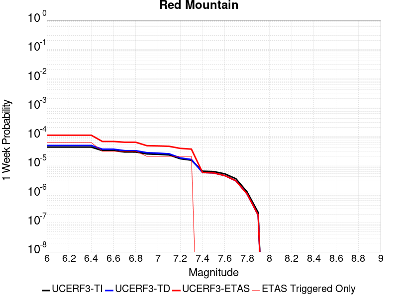 | 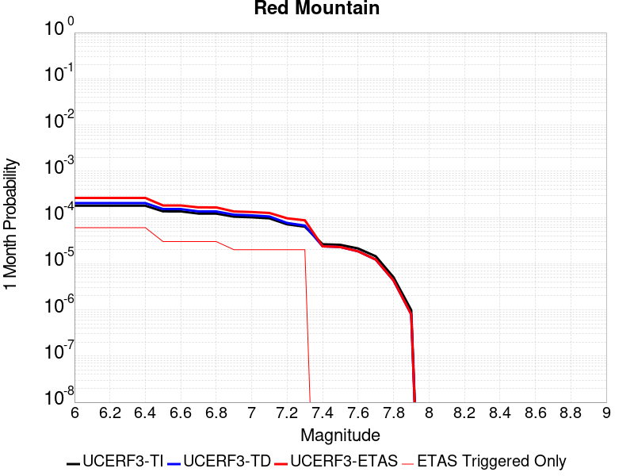 |  |  |

| Magnitude | 1 wk TI Prob | 1 wk TD Prob | 1 wk ETAS Prob | 1 wk ETAS/TD Gain | 1 wk ETAS Triggered Only | 1 mo TI Prob | 1 mo TD Prob | 1 mo ETAS Prob | 1 mo ETAS/TD Gain | 1 mo ETAS Triggered Only | 1 yr TI Prob | 1 yr TD Prob | 1 yr ETAS Prob | 1 yr ETAS/TD Gain | 1 yr ETAS Triggered Only | 10 yr TI Prob | 10 yr TD Prob | 10 yr ETAS Prob | 10 yr ETAS/TD Gain | 10 yr ETAS Triggered Only |
|-----|-----|-----|-----|-----|-----|-----|-----|-----|-----|-----|-----|-----|-----|-----|-----|-----|-----|-----|-----|-----|
| 6.0 | 4.1810763E-5 | 4.7589947E-5 | 1.0758709E-4 | 2.2607105 | 6.0E-5 | 1.7917668E-4 | 2.039419E-4 | 2.6392966E-4 | 1.2941414 | 6.0E-5 | 0.0021792934 | 0.0024803306 | 0.0025800825 | 1.0402172 | 1.0E-4 | 0.021580452 | 0.024544092 | 0.024661146 | 1.0047692 | 1.2E-4 |
| 6.1 | 4.1810763E-5 | 4.7589947E-5 | 1.0758709E-4 | 2.2607105 | 6.0E-5 | 1.7917668E-4 | 2.039419E-4 | 2.6392966E-4 | 1.2941414 | 6.0E-5 | 0.0021792934 | 0.0024803306 | 0.0025800825 | 1.0402172 | 1.0E-4 | 0.021580452 | 0.024544092 | 0.024661146 | 1.0047692 | 1.2E-4 |
| 6.2 | 4.1810763E-5 | 4.7589947E-5 | 1.0758709E-4 | 2.2607105 | 6.0E-5 | 1.7917668E-4 | 2.039419E-4 | 2.6392966E-4 | 1.2941414 | 6.0E-5 | 0.0021792934 | 0.0024803306 | 0.0025800825 | 1.0402172 | 1.0E-4 | 0.021580452 | 0.024544092 | 0.024661146 | 1.0047692 | 1.2E-4 |
| 6.3 | 4.1810763E-5 | 4.7589947E-5 | 1.0758709E-4 | 2.2607105 | 6.0E-5 | 1.7917668E-4 | 2.039419E-4 | 2.6392966E-4 | 1.2941414 | 6.0E-5 | 0.0021792934 | 0.0024803306 | 0.0025800825 | 1.0402172 | 1.0E-4 | 0.021580452 | 0.024544092 | 0.024661146 | 1.0047692 | 1.2E-4 |
| 6.4 | 4.1810763E-5 | 4.7589947E-5 | 1.0758709E-4 | 2.2607105 | 6.0E-5 | 1.7917668E-4 | 2.039419E-4 | 2.6392966E-4 | 1.2941414 | 6.0E-5 | 0.0021792934 | 0.0024803306 | 0.0025800825 | 1.0402172 | 1.0E-4 | 0.021580452 | 0.024544092 | 0.024661146 | 1.0047692 | 1.2E-4 |
| 6.5 | 3.154503E-5 | 3.5359728E-5 | 6.535867E-5 | 1.8483928 | 3.0E-5 | 1.3518598E-4 | 1.5153342E-4 | 1.8152887E-4 | 1.1979462 | 3.0E-5 | 0.0016446467 | 0.0018434501 | 0.0019133211 | 1.0379022 | 7.0E-5 | 0.01632528 | 0.018291233 | 0.018389406 | 1.005367 | 1.0E-4 |
| 6.6 | 3.1535834E-5 | 3.534911E-5 | 6.534805E-5 | 1.8486477 | 3.0E-5 | 1.3514658E-4 | 1.5148791E-4 | 1.8148337E-4 | 1.1980056 | 3.0E-5 | 0.0016441676 | 0.001842897 | 0.0019127681 | 1.0379137 | 7.0E-5 | 0.01632056 | 0.018285794 | 0.018383967 | 1.0053687 | 1.0E-4 |
| 6.7 | 2.8267326E-5 | 3.146934E-5 | 6.1468396E-5 | 1.9532789 | 3.0E-5 | 1.2114006E-4 | 1.348621E-4 | 1.6485807E-4 | 1.2224195 | 3.0E-5 | 0.0014738824 | 0.0016407946 | 0.0017006961 | 1.0365076 | 6.0E-5 | 0.014641452 | 0.016295563 | 0.016384097 | 1.005433 | 9.0E-5 |
| 6.8 | 2.8212884E-5 | 3.1407224E-5 | 6.140628E-5 | 1.9551642 | 3.0E-5 | 1.20906756E-4 | 1.3459593E-4 | 1.645919E-4 | 1.2228594 | 3.0E-5 | 0.0014710457 | 0.0016375587 | 0.0016974604 | 1.03658 | 6.0E-5 | 0.014613459 | 0.01626368 | 0.016352216 | 1.0054438 | 9.0E-5 |
| 6.9 | 2.4227871E-5 | 2.6706979E-5 | 4.6706446E-5 | 1.748848 | 2.0E-5 | 1.03829596E-4 | 1.14453884E-4 | 1.3445159E-4 | 1.1747229 | 2.0E-5 | 0.0012633923 | 0.0013926612 | 0.0014425915 | 1.0358524 | 5.0E-5 | 0.012562336 | 0.013847026 | 0.013916057 | 1.0049852 | 7.0E-5 |
| 7.0 | 2.348524E-5 | 2.5835763E-5 | 4.5835248E-5 | 1.7741008 | 2.0E-5 | 1.0064714E-4 | 1.1072042E-4 | 1.3071821E-4 | 1.1806152 | 2.0E-5 | 0.0012246901 | 0.0013472632 | 0.0013971959 | 1.0370623 | 5.0E-5 | 0.012179627 | 0.01339859 | 0.013467652 | 1.0051544 | 7.0E-5 |
| 7.1 | 2.2311642E-5 | 2.4462828E-5 | 4.446234E-5 | 1.817547 | 2.0E-5 | 9.561782E-5 | 1.048369E-4 | 1.2483481E-4 | 1.1907525 | 2.0E-5 | 0.0011635252 | 0.0012757168 | 0.0013256529 | 1.0391437 | 5.0E-5 | 0.01157452 | 0.012691451 | 0.012760563 | 1.0054455 | 7.0E-5 |
| 7.2 | 1.6533986E-5 | 1.7670347E-5 | 3.7669994E-5 | 2.1318197 | 2.0E-5 | 7.085802E-5 | 7.572822E-5 | 9.5726704E-5 | 1.2640823 | 2.0E-5 | 8.623549E-4 | 9.216645E-4 | 9.716184E-4 | 1.0541997 | 5.0E-5 | 0.008590161 | 0.009184699 | 0.009244148 | 1.0064726 | 6.0E-5 |
| 7.3 | 1.4703092E-5 | 1.555952E-5 | 3.555921E-5 | 2.2853665 | 2.0E-5 | 6.301173E-5 | 6.66823E-5 | 8.668097E-5 | 1.2999096 | 2.0E-5 | 7.668978E-4 | 8.1161625E-4 | 8.6157565E-4 | 1.0615555 | 5.0E-5 | 0.0076425658 | 0.008092596 | 0.0081521105 | 1.0073541 | 6.0E-5 |
| 7.4 | 6.1331984E-6 | 5.528872E-6 | 5.528872E-6 | 1.0 | 0.0 | 2.6284872E-5 | 2.3694953E-5 | 2.3694953E-5 | 1.0 | 0.0 | 3.199713E-4 | 2.8844838E-4 | 3.0844263E-4 | 1.0693165 | 2.0E-5 | 0.0031951098 | 0.0028807942 | 0.0029107078 | 1.0103838 | 3.0E-5 |
| 7.5 | 5.954766E-6 | 5.3385015E-6 | 5.3385015E-6 | 1.0 | 0.0 | 2.5520176E-5 | 2.2879094E-5 | 2.2879094E-5 | 1.0 | 0.0 | 3.1066386E-4 | 2.785179E-4 | 2.985123E-4 | 1.0717887 | 2.0E-5 | 0.003102299 | 0.0027817423 | 0.002811659 | 1.0107546 | 3.0E-5 |
| 7.6 | 4.9726646E-6 | 4.315295E-6 | 4.315295E-6 | 1.0 | 0.0 | 2.1311245E-5 | 1.8493993E-5 | 1.8493993E-5 | 1.0 | 0.0 | 2.5943352E-4 | 2.2514143E-4 | 2.4513694E-4 | 1.0888131 | 2.0E-5 | 0.0025913084 | 0.002249168 | 0.0022791005 | 1.0133083 | 3.0E-5 |
| 7.7 | 3.3613894E-6 | 2.8526642E-6 | 2.8526642E-6 | 1.0 | 0.0 | 1.4405875E-5 | 1.2225649E-5 | 1.2225649E-5 | 1.0 | 0.0 | 1.7537741E-4 | 1.4883737E-4 | 1.5883589E-4 | 1.0671774 | 1.0E-5 | 0.0017523908 | 0.0014874031 | 0.0014973882 | 1.0067132 | 1.0E-5 |
| 7.8 | 1.1828961E-6 | 1.0122756E-6 | 1.0122756E-6 | 1.0 | 0.0 | 5.069545E-6 | 4.338317E-6 | 4.338317E-6 | 1.0 | 0.0 | 6.171996E-5 | 5.281776E-5 | 5.281776E-5 | 1.0 | 0.0 | 6.170282E-4 | 5.2805495E-4 | 5.2805495E-4 | 1.0 | 0.0 |
| 7.9 | 2.2967266E-7 | 1.8618952E-7 | 1.8618952E-7 | 1.0 | 0.0 | 9.843111E-7 | 7.9795484E-7 | 7.9795484E-7 | 1.0 | 0.0 | 1.19839215E-5 | 9.7150605E-6 | 9.7150605E-6 | 1.0 | 0.0 | 1.1983275E-4 | 9.714664E-5 | 9.714664E-5 | 1.0 | 0.0 |

## Deep Springs
*[(top)](#table-of-contents)*

| 1 Week | 1 Month | 1 Year | 10 Year |
|-----|-----|-----|-----|
| 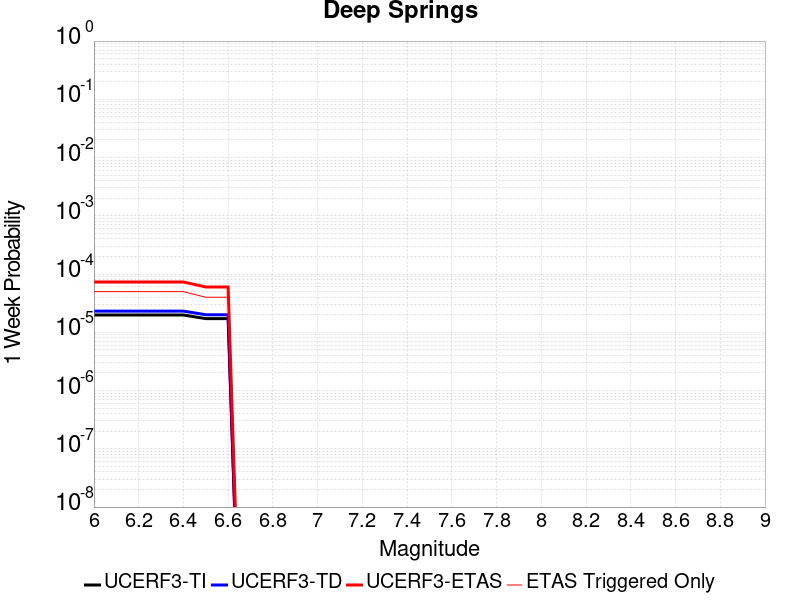 | 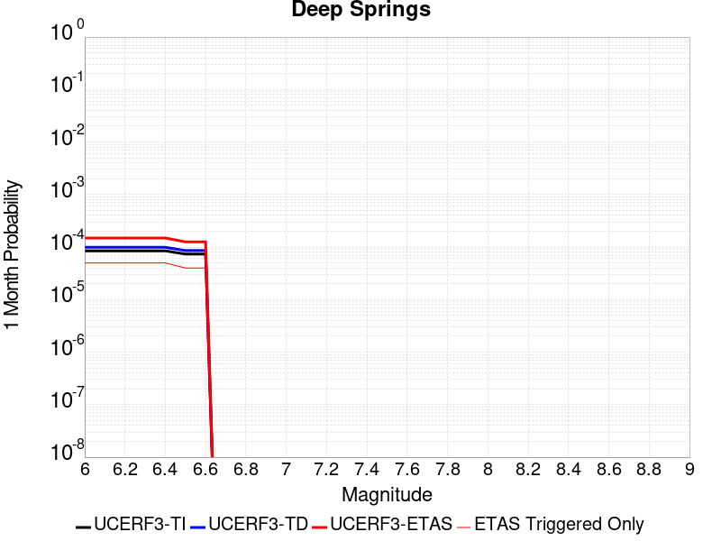 |  |  |

| Magnitude | 1 wk TI Prob | 1 wk TD Prob | 1 wk ETAS Prob | 1 wk ETAS/TD Gain | 1 wk ETAS Triggered Only | 1 mo TI Prob | 1 mo TD Prob | 1 mo ETAS Prob | 1 mo ETAS/TD Gain | 1 mo ETAS Triggered Only | 1 yr TI Prob | 1 yr TD Prob | 1 yr ETAS Prob | 1 yr ETAS/TD Gain | 1 yr ETAS Triggered Only | 10 yr TI Prob | 10 yr TD Prob | 10 yr ETAS Prob | 10 yr ETAS/TD Gain | 10 yr ETAS Triggered Only |
|-----|-----|-----|-----|-----|-----|-----|-----|-----|-----|-----|-----|-----|-----|-----|-----|-----|-----|-----|-----|-----|
| 6.0 | 1.9810619E-5 | 2.311252E-5 | 7.311136E-5 | 3.1632798 | 5.0E-5 | 8.489989E-5 | 9.905276E-5 | 1.490478E-4 | 1.5047315 | 5.0E-5 | 0.001033166 | 0.0012058079 | 0.0013156753 | 1.0911151 | 1.1E-4 | 0.010283757 | 0.012042425 | 0.012200498 | 1.0131264 | 1.6E-4 |
| 6.1 | 1.9810619E-5 | 2.311252E-5 | 7.311136E-5 | 3.1632798 | 5.0E-5 | 8.489989E-5 | 9.905276E-5 | 1.490478E-4 | 1.5047315 | 5.0E-5 | 0.001033166 | 0.0012058079 | 0.0013156753 | 1.0911151 | 1.1E-4 | 0.010283757 | 0.012042425 | 0.012200498 | 1.0131264 | 1.6E-4 |
| 6.2 | 1.9810619E-5 | 2.311252E-5 | 7.311136E-5 | 3.1632798 | 5.0E-5 | 8.489989E-5 | 9.905276E-5 | 1.490478E-4 | 1.5047315 | 5.0E-5 | 0.001033166 | 0.0012058079 | 0.0013156753 | 1.0911151 | 1.1E-4 | 0.010283757 | 0.012042425 | 0.012200498 | 1.0131264 | 1.6E-4 |
| 6.3 | 1.9810619E-5 | 2.311252E-5 | 7.311136E-5 | 3.1632798 | 5.0E-5 | 8.489989E-5 | 9.905276E-5 | 1.490478E-4 | 1.5047315 | 5.0E-5 | 0.001033166 | 0.0012058079 | 0.0013156753 | 1.0911151 | 1.1E-4 | 0.010283757 | 0.012042425 | 0.012200498 | 1.0131264 | 1.6E-4 |
| 6.4 | 1.9810619E-5 | 2.311252E-5 | 7.311136E-5 | 3.1632798 | 5.0E-5 | 8.489989E-5 | 9.905276E-5 | 1.490478E-4 | 1.5047315 | 5.0E-5 | 0.001033166 | 0.0012058079 | 0.0013156753 | 1.0911151 | 1.1E-4 | 0.010283757 | 0.012042425 | 0.012200498 | 1.0131264 | 1.6E-4 |
| 6.5 | 1.7190405E-5 | 2.0050555E-5 | 6.0049755E-5 | 2.9949172 | 4.0E-5 | 7.367108E-5 | 8.593095E-5 | 1.2592752E-4 | 1.46545 | 4.0E-5 | 8.9657627E-4 | 0.0010462094 | 0.0011461048 | 1.0954832 | 1.0E-4 | 0.008929676 | 0.010462056 | 0.010600591 | 1.0132416 | 1.4E-4 |
| 6.6 | 1.7190405E-5 | 2.0050555E-5 | 6.0049755E-5 | 2.9949172 | 4.0E-5 | 7.367108E-5 | 8.593095E-5 | 1.2592752E-4 | 1.46545 | 4.0E-5 | 8.9657627E-4 | 0.0010462094 | 0.0011461048 | 1.0954832 | 1.0E-4 | 0.008929676 | 0.010462056 | 0.010600591 | 1.0132416 | 1.4E-4 |

## Santa Rosa Island
*[(top)](#table-of-contents)*

| 1 Week | 1 Month | 1 Year | 10 Year |
|-----|-----|-----|-----|
| 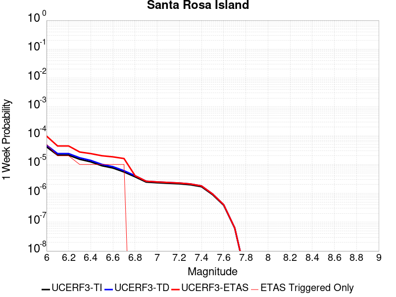 | 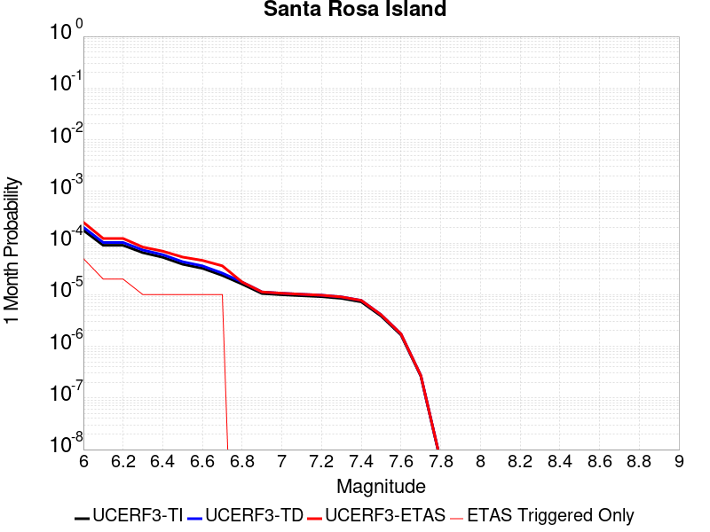 |  |  |

| Magnitude | 1 wk TI Prob | 1 wk TD Prob | 1 wk ETAS Prob | 1 wk ETAS/TD Gain | 1 wk ETAS Triggered Only | 1 mo TI Prob | 1 mo TD Prob | 1 mo ETAS Prob | 1 mo ETAS/TD Gain | 1 mo ETAS Triggered Only | 1 yr TI Prob | 1 yr TD Prob | 1 yr ETAS Prob | 1 yr ETAS/TD Gain | 1 yr ETAS Triggered Only | 10 yr TI Prob | 10 yr TD Prob | 10 yr ETAS Prob | 10 yr ETAS/TD Gain | 10 yr ETAS Triggered Only |
|-----|-----|-----|-----|-----|-----|-----|-----|-----|-----|-----|-----|-----|-----|-----|-----|-----|-----|-----|-----|-----|
| 6.0 | 4.1143165E-5 | 4.7091133E-5 | 9.708878E-5 | 2.061721 | 5.0E-5 | 1.7631594E-4 | 2.0180465E-4 | 2.5179455E-4 | 1.2477144 | 5.0E-5 | 0.002144533 | 0.0024544 | 0.0025541545 | 1.0406431 | 1.0E-4 | 0.021239553 | 0.024293551 | 0.024439907 | 1.0060245 | 1.5E-4 |
| 6.1 | 2.1061249E-5 | 2.3864959E-5 | 4.3864482E-5 | 1.8380288 | 2.0E-5 | 9.0259375E-5 | 1.0227455E-4 | 1.2227251E-4 | 1.1955321 | 2.0E-5 | 0.0010983539 | 0.0012445104 | 0.0012644854 | 1.0160506 | 2.0E-5 | 0.01092941 | 0.012378449 | 0.012408077 | 1.0023936 | 3.0E-5 |
| 6.2 | 2.1061249E-5 | 2.3864959E-5 | 4.3864482E-5 | 1.8380288 | 2.0E-5 | 9.0259375E-5 | 1.0227455E-4 | 1.2227251E-4 | 1.1955321 | 2.0E-5 | 0.0010983539 | 0.0012445104 | 0.0012644854 | 1.0160506 | 2.0E-5 | 0.01092941 | 0.012378449 | 0.012408077 | 1.0023936 | 3.0E-5 |
| 6.3 | 1.5158236E-5 | 1.7074419E-5 | 2.7074248E-5 | 1.5856614 | 1.0E-5 | 6.496225E-5 | 7.3174095E-5 | 8.317336E-5 | 1.1366503 | 1.0E-5 | 7.906284E-4 | 8.905424E-4 | 9.005335E-4 | 1.0112191 | 1.0E-5 | 0.007878214 | 0.008870989 | 0.008890812 | 1.0022346 | 2.0E-5 |
| 6.4 | 1.2341918E-5 | 1.3852917E-5 | 2.3852777E-5 | 1.7218597 | 1.0E-5 | 5.2892858E-5 | 5.9368336E-5 | 6.936774E-5 | 1.16843 | 1.0E-5 | 6.437803E-4 | 7.225779E-4 | 7.325707E-4 | 1.0138294 | 1.0E-5 | 0.006419184 | 0.007203121 | 0.007213049 | 1.0013783 | 1.0E-5 |
| 6.5 | 9.061158E-6 | 1.0117031E-5 | 2.011693E-5 | 1.9884223 | 1.0E-5 | 3.883296E-5 | 4.3358013E-5 | 5.335758E-5 | 1.2306279 | 1.0E-5 | 4.726887E-4 | 5.277613E-4 | 5.37756E-4 | 1.018938 | 1.0E-5 | 0.004716845 | 0.0052656173 | 0.0052755647 | 1.0018891 | 1.0E-5 |
| 6.6 | 7.5461685E-6 | 8.400733E-6 | 1.840065E-5 | 2.1903622 | 1.0E-5 | 3.2340322E-5 | 3.600267E-5 | 4.600231E-5 | 1.2777472 | 1.0E-5 | 3.936723E-4 | 4.3824865E-4 | 4.4824427E-4 | 1.0228081 | 1.0E-5 | 0.003929756 | 0.0043742736 | 0.00438423 | 1.0022761 | 1.0E-5 |
| 6.7 | 5.5023775E-6 | 6.087381E-6 | 1.608732E-5 | 2.6427326 | 1.0E-5 | 2.3581404E-5 | 2.6088532E-5 | 3.608827E-5 | 1.3833002 | 1.0E-5 | 2.8706578E-4 | 3.1758484E-4 | 3.2758166E-4 | 1.0314777 | 1.0E-5 | 0.0028669522 | 0.0031716314 | 0.0031815998 | 1.003143 | 1.0E-5 |
| 6.8 | 3.7351679E-6 | 4.0831405E-6 | 4.0831405E-6 | 1.0 | 0.0 | 1.6007763E-5 | 1.749907E-5 | 1.749907E-5 | 1.0 | 0.0 | 1.948771E-4 | 2.1303284E-4 | 2.1303284E-4 | 1.0 | 0.0 | 0.0019470629 | 0.0021285315 | 0.0021285315 | 1.0 | 0.0 |
| 6.9 | 2.456366E-6 | 2.6292705E-6 | 2.6292705E-6 | 1.0 | 0.0 | 1.0527241E-5 | 1.1268254E-5 | 1.1268254E-5 | 1.0 | 0.0 | 1.2816161E-4 | 1.3718237E-4 | 1.3718237E-4 | 1.0 | 0.0 | 0.0012808773 | 0.0013709799 | 0.0013709799 | 1.0 | 0.0 |
| 7.0 | 2.3245157E-6 | 2.4827782E-6 | 2.4827782E-6 | 1.0 | 0.0 | 9.962172E-6 | 1.0640435E-5 | 1.0640435E-5 | 1.0 | 0.0 | 1.2128269E-4 | 1.2953962E-4 | 1.2953962E-4 | 1.0 | 0.0 | 0.0012121652 | 0.0012946434 | 0.0012946434 | 1.0 | 0.0 |
| 7.1 | 2.2248344E-6 | 2.37325E-6 | 2.37325E-6 | 1.0 | 0.0 | 9.53497E-6 | 1.0171032E-5 | 1.0171032E-5 | 1.0 | 0.0 | 1.1608207E-4 | 1.2382529E-4 | 1.2382529E-4 | 1.0 | 0.0 | 0.0011602144 | 0.001237565 | 0.001237565 | 1.0 | 0.0 |
| 7.2 | 2.1350402E-6 | 2.276154E-6 | 2.276154E-6 | 1.0 | 0.0 | 9.150141E-6 | 9.754909E-6 | 9.754909E-6 | 1.0 | 0.0 | 1.1139726E-4 | 1.1875956E-4 | 1.1875956E-4 | 1.0 | 0.0 | 0.0011134144 | 0.0011869629 | 0.0011869629 | 1.0 | 0.0 |
| 7.3 | 1.9793572E-6 | 2.108719E-6 | 2.108719E-6 | 1.0 | 0.0 | 8.482932E-6 | 9.037336E-6 | 9.037336E-6 | 1.0 | 0.0 | 1.032748E-4 | 1.10024026E-4 | 1.10024026E-4 | 1.0 | 0.0 | 0.0010322682 | 0.0010996973 | 0.0010996973 | 1.0 | 0.0 |
| 7.4 | 1.6951194E-6 | 1.8045733E-6 | 1.8045733E-6 | 1.0 | 0.0 | 7.264777E-6 | 7.733863E-6 | 7.733863E-6 | 1.0 | 0.0 | 8.844508E-5 | 9.415573E-5 | 9.415573E-5 | 1.0 | 0.0 | 8.840988E-4 | 9.4116E-4 | 9.4116E-4 | 1.0 | 0.0 |
| 7.5 | 8.987207E-7 | 9.5122147E-7 | 9.5122147E-7 | 1.0 | 0.0 | 3.8516546E-6 | 4.076657E-6 | 4.076657E-6 | 1.0 | 0.0 | 4.6892885E-5 | 4.963218E-5 | 4.963218E-5 | 1.0 | 0.0 | 4.688299E-4 | 4.9621216E-4 | 4.9621216E-4 | 1.0 | 0.0 |
| 7.6 | 3.8783037E-7 | 4.052932E-7 | 4.052932E-7 | 1.0 | 0.0 | 1.6621291E-6 | 1.7369698E-6 | 1.7369698E-6 | 1.0 | 0.0 | 2.0236233E-5 | 2.1147409E-5 | 2.1147409E-5 | 1.0 | 0.0 | 2.023439E-4 | 2.1145462E-4 | 2.1145462E-4 | 1.0 | 0.0 |
| 7.7 | 6.181804E-8 | 6.339035E-8 | 6.339035E-8 | 1.0 | 0.0 | 2.6493444E-7 | 2.7167292E-7 | 2.7167292E-7 | 1.0 | 0.0 | 3.225572E-6 | 3.3076128E-6 | 3.3076128E-6 | 1.0 | 0.0 | 3.225525E-5 | 3.307564E-5 | 3.307564E-5 | 1.0 | 0.0 |
| 7.8 | 1.3704449E-9 | 1.3964153E-9 | 1.3964153E-9 | 1.0 | 0.0 | 5.873335E-9 | 5.984637E-9 | 5.984637E-9 | 1.0 | 0.0 | 7.1507856E-8 | 7.286295E-8 | 7.286295E-8 | 1.0 | 0.0 | 7.1507833E-7 | 7.286294E-7 | 7.286294E-7 | 1.0 | 0.0 |

## Rose Canyon
*[(top)](#table-of-contents)*

| 1 Week | 1 Month | 1 Year | 10 Year |
|-----|-----|-----|-----|
| 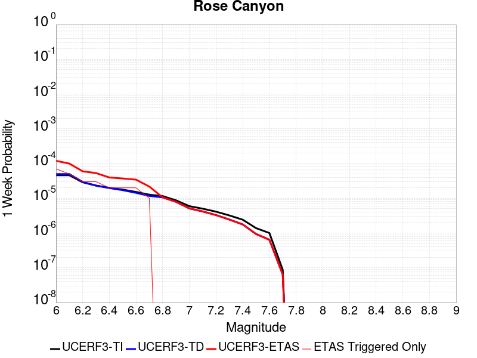 | 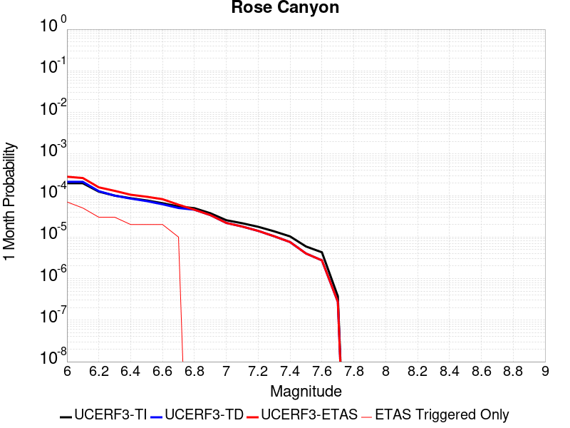 | 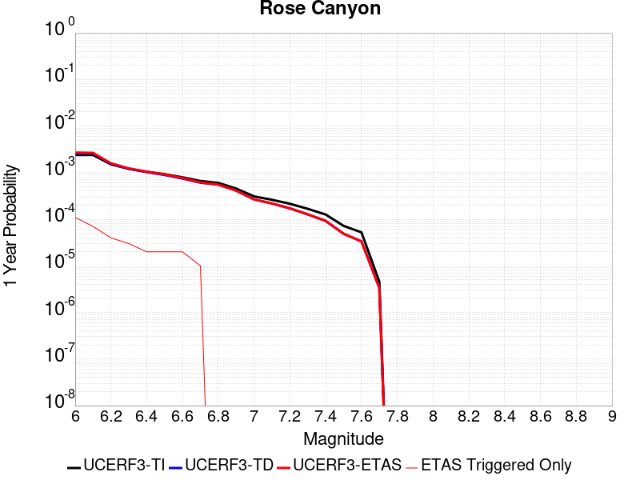 |  |

| Magnitude | 1 wk TI Prob | 1 wk TD Prob | 1 wk ETAS Prob | 1 wk ETAS/TD Gain | 1 wk ETAS Triggered Only | 1 mo TI Prob | 1 mo TD Prob | 1 mo ETAS Prob | 1 mo ETAS/TD Gain | 1 mo ETAS Triggered Only | 1 yr TI Prob | 1 yr TD Prob | 1 yr ETAS Prob | 1 yr ETAS/TD Gain | 1 yr ETAS Triggered Only | 10 yr TI Prob | 10 yr TD Prob | 10 yr ETAS Prob | 10 yr ETAS/TD Gain | 10 yr ETAS Triggered Only |
|-----|-----|-----|-----|-----|-----|-----|-----|-----|-----|-----|-----|-----|-----|-----|-----|-----|-----|-----|-----|-----|
| 6.0 | 4.5923203E-5 | 4.9714225E-5 | 1.1971075E-4 | 2.4079776 | 7.0E-5 | 1.9679888E-4 | 2.1304491E-4 | 2.8303E-4 | 1.3284992 | 7.0E-5 | 0.0023933933 | 0.0025909345 | 0.0027006494 | 1.0423458 | 1.1E-4 | 0.023677798 | 0.02563999 | 0.025786145 | 1.0057002 | 1.5E-4 |
| 6.1 | 4.5923203E-5 | 4.9714225E-5 | 9.971174E-5 | 2.0056984 | 5.0E-5 | 1.9679888E-4 | 2.1304491E-4 | 2.6303428E-4 | 1.2346423 | 5.0E-5 | 0.0023933933 | 0.0025909345 | 0.002660753 | 1.0269473 | 7.0E-5 | 0.023677798 | 0.02563999 | 0.02574717 | 1.0041802 | 1.1E-4 |
| 6.2 | 2.8844734E-5 | 2.9668723E-5 | 5.9667833E-5 | 2.0111358 | 3.0E-5 | 1.2361443E-4 | 1.2714567E-4 | 1.5714185E-4 | 1.2359198 | 3.0E-5 | 0.0015039665 | 0.0015468939 | 0.001586832 | 1.0258182 | 4.0E-5 | 0.0149382865 | 0.015374276 | 0.015433353 | 1.0038426 | 6.0E-5 |
| 6.3 | 2.3171577E-5 | 2.3161238E-5 | 5.3160544E-5 | 2.2952375 | 3.0E-5 | 9.9302975E-5 | 9.9258745E-5 | 1.2925577E-4 | 1.3022103 | 3.0E-5 | 0.0012083431 | 0.0012078186 | 0.0012377824 | 1.0248082 | 3.0E-5 | 0.012017938 | 0.012022437 | 0.012071836 | 1.0041089 | 5.0E-5 |
| 6.4 | 2.0066604E-5 | 1.9667024E-5 | 3.9666633E-5 | 2.0169106 | 2.0E-5 | 8.599689E-5 | 8.4284584E-5 | 1.04282895E-4 | 1.2372713 | 2.0E-5 | 0.0010465092 | 0.0010256917 | 0.0010456712 | 1.019479 | 2.0E-5 | 0.010415946 | 0.010217559 | 0.01025715 | 1.0038748 | 4.0E-5 |
| 6.5 | 1.776989E-5 | 1.7113807E-5 | 3.7113467E-5 | 2.168627 | 2.0E-5 | 7.615444E-5 | 7.334287E-5 | 9.33414E-5 | 1.2726718 | 2.0E-5 | 9.267859E-4 | 8.925905E-4 | 9.1257266E-4 | 1.0223867 | 2.0E-5 | 0.009229303 | 0.008896211 | 0.008925944 | 1.0033423 | 3.0E-5 |
| 6.6 | 1.5227364E-5 | 1.433926E-5 | 3.4338973E-5 | 2.394752 | 2.0E-5 | 6.52585E-5 | 6.1452556E-5 | 8.1451326E-5 | 1.3254343 | 2.0E-5 | 7.942326E-4 | 7.479332E-4 | 7.6791825E-4 | 1.0267204 | 2.0E-5 | 0.007914 | 0.007458359 | 0.0074881352 | 1.0039923 | 3.0E-5 |
| 6.7 | 1.2703898E-5 | 1.1673274E-5 | 2.1673157E-5 | 1.8566477 | 1.0E-5 | 5.4444143E-5 | 5.0027378E-5 | 6.002688E-5 | 1.1998806 | 1.0E-5 | 6.626558E-4 | 6.089174E-4 | 6.189113E-4 | 1.0164126 | 1.0E-5 | 0.006606833 | 0.0060750856 | 0.006094964 | 1.0032722 | 2.0E-5 |
| 6.8 | 1.1554917E-5 | 1.0609337E-5 | 1.0609337E-5 | 1.0 | 0.0 | 4.9520135E-5 | 4.546782E-5 | 4.546782E-5 | 1.0 | 0.0 | 6.0274085E-4 | 5.5343413E-4 | 5.5343413E-4 | 1.0 | 0.0 | 0.0060110865 | 0.0055225673 | 0.005532512 | 1.0018008 | 1.0E-5 |
| 6.9 | 8.732078E-6 | 7.881357E-6 | 7.881357E-6 | 1.0 | 0.0 | 3.7422655E-5 | 3.3776825E-5 | 3.3776825E-5 | 1.0 | 0.0 | 4.5552556E-4 | 4.111582E-4 | 4.111582E-4 | 1.0 | 0.0 | 0.0045459294 | 0.0041048084 | 0.0041147675 | 1.0024261 | 1.0E-5 |
| 7.0 | 5.9337494E-6 | 5.1074853E-6 | 5.1074853E-6 | 1.0 | 0.0 | 2.5430107E-5 | 2.188904E-5 | 2.188904E-5 | 1.0 | 0.0 | 3.0956755E-4 | 2.664666E-4 | 2.664666E-4 | 1.0 | 0.0 | 0.0030913667 | 0.0026614866 | 0.00267146 | 1.0037473 | 1.0E-5 |
| 7.1 | 5.013409E-6 | 4.1773833E-6 | 4.1773833E-6 | 1.0 | 0.0 | 2.1485863E-5 | 1.7902948E-5 | 1.7902948E-5 | 1.0 | 0.0 | 2.6155898E-4 | 2.179467E-4 | 2.179467E-4 | 1.0 | 0.0 | 0.0026125133 | 0.0021773411 | 0.0021873193 | 1.0045828 | 1.0E-5 |
| 7.2 | 4.120763E-6 | 3.2821383E-6 | 3.2821383E-6 | 1.0 | 0.0 | 1.7660293E-5 | 1.4066231E-5 | 1.4066231E-5 | 1.0 | 0.0 | 2.1499286E-4 | 1.7124301E-4 | 1.7124301E-4 | 1.0 | 0.0 | 0.0021478499 | 0.00171112 | 0.0017211029 | 1.0058341 | 1.0E-5 |
| 7.3 | 3.2081239E-6 | 2.4405372E-6 | 2.4405372E-6 | 1.0 | 0.0 | 1.374903E-5 | 1.0459404E-5 | 1.0459404E-5 | 1.0 | 0.0 | 1.6738157E-4 | 1.2733586E-4 | 1.2733586E-4 | 1.0 | 0.0 | 0.0016725556 | 0.001272636 | 0.001272636 | 1.0 | 0.0 |
| 7.4 | 2.4194755E-6 | 1.7680634E-6 | 1.7680634E-6 | 1.0 | 0.0 | 1.0369139E-5 | 7.577393E-6 | 7.577393E-6 | 1.0 | 0.0 | 1.2623696E-4 | 9.2250906E-5 | 9.2250906E-5 | 1.0 | 0.0 | 0.0012616527 | 9.2213147E-4 | 9.2213147E-4 | 1.0 | 0.0 |
| 7.5 | 1.3842889E-6 | 9.3786275E-7 | 9.3786275E-7 | 1.0 | 0.0 | 5.9326535E-6 | 4.019406E-6 | 4.019406E-6 | 1.0 | 0.0 | 7.222766E-5 | 4.8935202E-5 | 4.8935202E-5 | 1.0 | 0.0 | 7.220419E-4 | 4.892478E-4 | 4.892478E-4 | 1.0 | 0.0 |
| 7.6 | 1.0021575E-6 | 6.411463E-7 | 6.411463E-7 | 1.0 | 0.0 | 4.2949537E-6 | 2.7477672E-6 | 2.7477672E-6 | 1.0 | 0.0 | 5.2289808E-5 | 3.3453573E-5 | 3.3453573E-5 | 1.0 | 0.0 | 5.2277505E-4 | 3.344875E-4 | 3.344875E-4 | 1.0 | 0.0 |
| 7.7 | 8.7620116E-8 | 6.4492404E-8 | 6.4492404E-8 | 1.0 | 0.0 | 3.7551473E-7 | 2.76396E-7 | 2.76396E-7 | 1.0 | 0.0 | 4.5718825E-6 | 3.3651165E-6 | 3.3651165E-6 | 1.0 | 0.0 | 4.5717883E-5 | 3.3650686E-5 | 3.3650686E-5 | 1.0 | 0.0 |

## San Jacinto (Lytle Creek connector)
*[(top)](#table-of-contents)*

| 1 Week | 1 Month | 1 Year | 10 Year |
|-----|-----|-----|-----|
| 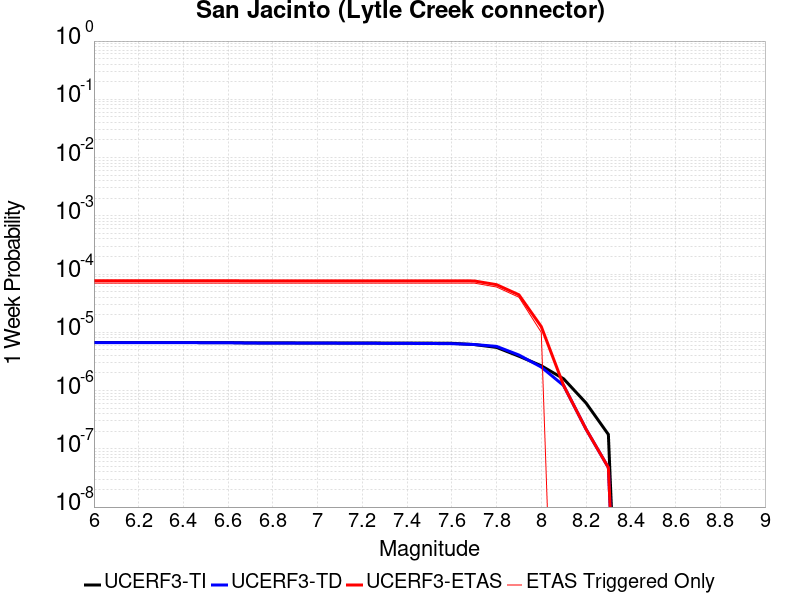 | 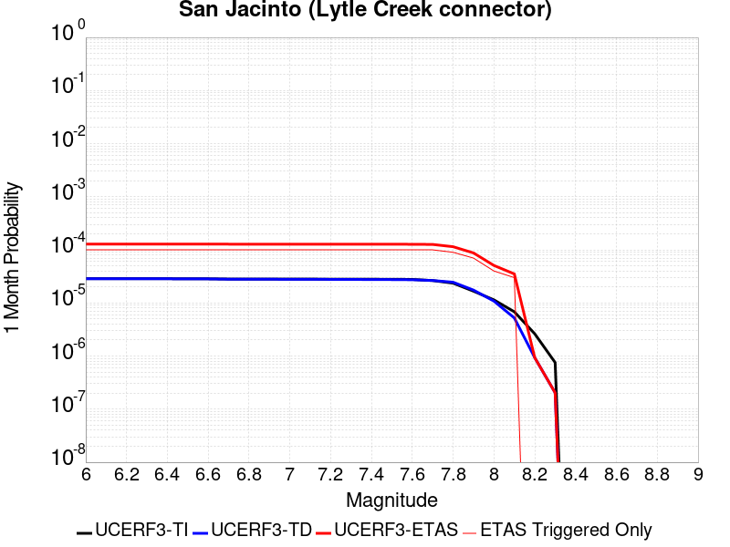 |  | 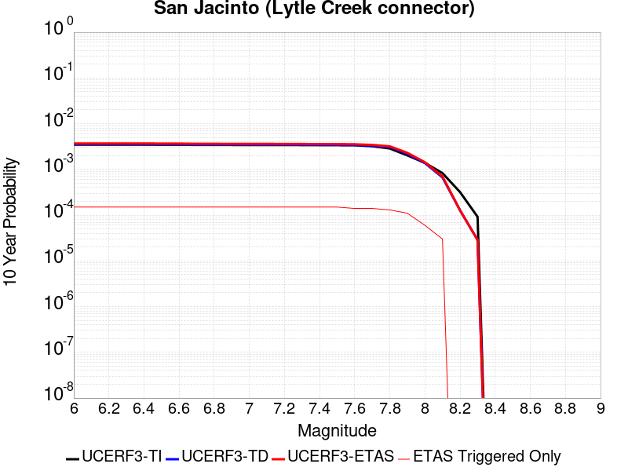 |

| Magnitude | 1 wk TI Prob | 1 wk TD Prob | 1 wk ETAS Prob | 1 wk ETAS/TD Gain | 1 wk ETAS Triggered Only | 1 mo TI Prob | 1 mo TD Prob | 1 mo ETAS Prob | 1 mo ETAS/TD Gain | 1 mo ETAS Triggered Only | 1 yr TI Prob | 1 yr TD Prob | 1 yr ETAS Prob | 1 yr ETAS/TD Gain | 1 yr ETAS Triggered Only | 10 yr TI Prob | 10 yr TD Prob | 10 yr ETAS Prob | 10 yr ETAS/TD Gain | 10 yr ETAS Triggered Only |
|-----|-----|-----|-----|-----|-----|-----|-----|-----|-----|-----|-----|-----|-----|-----|-----|-----|-----|-----|-----|-----|
| 6.0 | 6.693995E-6 | 6.660216E-6 | 7.665975E-5 | 11.510099 | 7.0E-5 | 2.8688235E-5 | 2.854347E-5 | 1.2854062E-4 | 4.503328 | 1.0E-4 | 3.492233E-4 | 3.4746144E-4 | 4.7741627E-4 | 1.3740122 | 1.3E-4 | 0.00348675 | 0.0035493854 | 0.0036988528 | 1.0421108 | 1.5E-4 |
| 6.1 | 6.693995E-6 | 6.660216E-6 | 7.665975E-5 | 11.510099 | 7.0E-5 | 2.8688235E-5 | 2.854347E-5 | 1.2854062E-4 | 4.503328 | 1.0E-4 | 3.492233E-4 | 3.4746144E-4 | 4.7741627E-4 | 1.3740122 | 1.3E-4 | 0.00348675 | 0.0035493854 | 0.0036988528 | 1.0421108 | 1.5E-4 |
| 6.2 | 6.693995E-6 | 6.660216E-6 | 7.665975E-5 | 11.510099 | 7.0E-5 | 2.8688235E-5 | 2.854347E-5 | 1.2854062E-4 | 4.503328 | 1.0E-4 | 3.492233E-4 | 3.4746144E-4 | 4.7741627E-4 | 1.3740122 | 1.3E-4 | 0.00348675 | 0.0035493854 | 0.0036988528 | 1.0421108 | 1.5E-4 |
| 6.3 | 6.693995E-6 | 6.660216E-6 | 7.665975E-5 | 11.510099 | 7.0E-5 | 2.8688235E-5 | 2.854347E-5 | 1.2854062E-4 | 4.503328 | 1.0E-4 | 3.492233E-4 | 3.4746144E-4 | 4.7741627E-4 | 1.3740122 | 1.3E-4 | 0.00348675 | 0.0035493854 | 0.0036988528 | 1.0421108 | 1.5E-4 |
| 6.4 | 6.693995E-6 | 6.660216E-6 | 7.665975E-5 | 11.510099 | 7.0E-5 | 2.8688235E-5 | 2.854347E-5 | 1.2854062E-4 | 4.503328 | 1.0E-4 | 3.492233E-4 | 3.4746144E-4 | 4.7741627E-4 | 1.3740122 | 1.3E-4 | 0.00348675 | 0.0035493854 | 0.0036988528 | 1.0421108 | 1.5E-4 |
| 6.5 | 6.6561875E-6 | 6.6204343E-6 | 7.6619974E-5 | 11.573255 | 7.0E-5 | 2.8526205E-5 | 2.837298E-5 | 1.2837014E-4 | 4.5243797 | 1.0E-4 | 3.472512E-4 | 3.4538636E-4 | 4.7534148E-4 | 1.37626 | 1.3E-4 | 0.0034670907 | 0.003528701 | 0.0036781714 | 1.0423585 | 1.5E-4 |
| 6.6 | 6.6561875E-6 | 6.6204343E-6 | 7.6619974E-5 | 11.573255 | 7.0E-5 | 2.8526205E-5 | 2.837298E-5 | 1.2837014E-4 | 4.5243797 | 1.0E-4 | 3.472512E-4 | 3.4538636E-4 | 4.7534148E-4 | 1.37626 | 1.3E-4 | 0.0034670907 | 0.003528701 | 0.0036781714 | 1.0423585 | 1.5E-4 |
| 6.7 | 6.5802237E-6 | 6.539611E-6 | 7.653915E-5 | 11.703931 | 7.0E-5 | 2.8200653E-5 | 2.8026603E-5 | 1.280238E-4 | 4.5679383 | 1.0E-4 | 3.4328885E-4 | 3.4117055E-4 | 4.711262E-4 | 1.3809111 | 1.3E-4 | 0.0034275902 | 0.0034866752 | 0.0036361523 | 1.0428709 | 1.5E-4 |
| 6.8 | 6.575632E-6 | 6.5341005E-6 | 7.6533644E-5 | 11.712957 | 7.0E-5 | 2.8180975E-5 | 2.8002989E-5 | 1.2800019E-4 | 4.5709476 | 1.0E-4 | 3.4304935E-4 | 3.4088313E-4 | 4.708388E-4 | 1.3812324 | 1.3E-4 | 0.0034252026 | 0.00348381 | 0.0036332875 | 1.0429063 | 1.5E-4 |
| 6.9 | 6.570433E-6 | 6.525495E-6 | 7.652504E-5 | 11.727086 | 7.0E-5 | 2.8158694E-5 | 2.7966107E-5 | 1.2796331E-4 | 4.575657 | 1.0E-4 | 3.4277816E-4 | 3.4043423E-4 | 4.7038996E-4 | 1.3817352 | 1.3E-4 | 0.0034224992 | 0.0034793352 | 0.0036288132 | 1.0429617 | 1.5E-4 |
| 7.0 | 6.5643826E-6 | 6.515616E-6 | 7.6515156E-5 | 11.74335 | 7.0E-5 | 2.8132765E-5 | 2.792377E-5 | 1.2792098E-4 | 4.5810785 | 1.0E-4 | 3.424626E-4 | 3.3991894E-4 | 4.6987474E-4 | 1.3823141 | 1.3E-4 | 0.0034193532 | 0.0034741985 | 0.0036236772 | 1.0430254 | 1.5E-4 |
| 7.1 | 6.557402E-6 | 6.5043278E-6 | 7.650387E-5 | 11.761995 | 7.0E-5 | 2.8102848E-5 | 2.7875392E-5 | 1.2787261E-4 | 4.587293 | 1.0E-4 | 3.4209844E-4 | 3.3933012E-4 | 4.6928602E-4 | 1.3829777 | 1.3E-4 | 0.0034157229 | 0.0034683298 | 0.0036178096 | 1.0430984 | 1.5E-4 |
| 7.2 | 6.546394E-6 | 6.4862943E-6 | 7.648584E-5 | 11.791916 | 7.0E-5 | 2.8055672E-5 | 2.7798109E-5 | 1.2779533E-4 | 4.597267 | 1.0E-4 | 3.4152428E-4 | 3.3838948E-4 | 4.683455E-4 | 1.3840427 | 1.3E-4 | 0.0034099987 | 0.0034589572 | 0.0036084382 | 1.0432156 | 1.5E-4 |
| 7.3 | 6.5364216E-6 | 6.4670803E-6 | 7.6466626E-5 | 11.823979 | 7.0E-5 | 2.8012933E-5 | 2.7715765E-5 | 1.2771299E-4 | 4.607955 | 1.0E-4 | 3.4100408E-4 | 3.3738726E-4 | 4.673434E-4 | 1.3851839 | 1.3E-4 | 0.003404813 | 0.0034489788 | 0.0035984614 | 1.0433412 | 1.5E-4 |
| 7.4 | 6.5269523E-6 | 6.4481674E-6 | 7.6447715E-5 | 11.855727 | 7.0E-5 | 2.7972354E-5 | 2.7634711E-5 | 1.2763195E-4 | 4.6185374 | 1.0E-4 | 3.4051016E-4 | 3.3640073E-4 | 4.66357E-4 | 1.3863139 | 1.3E-4 | 0.0033998888 | 0.003439161 | 0.003588645 | 1.0434653 | 1.5E-4 |
| 7.5 | 6.5111835E-6 | 6.424442E-6 | 7.6423996E-5 | 11.895818 | 7.0E-5 | 2.7904773E-5 | 2.7533031E-5 | 1.2753028E-4 | 4.631901 | 1.0E-4 | 3.3968766E-4 | 3.3516317E-4 | 4.651196E-4 | 1.3877407 | 1.3E-4 | 0.0033916887 | 0.003426834 | 0.0035763201 | 1.0436221 | 1.5E-4 |
| 7.6 | 6.4768806E-6 | 6.383551E-6 | 7.6383105E-5 | 11.965613 | 7.0E-5 | 2.7757764E-5 | 2.735779E-5 | 1.2735506E-4 | 4.655166 | 1.0E-4 | 3.3789838E-4 | 3.3303024E-4 | 4.6298697E-4 | 1.3902249 | 1.3E-4 | 0.0033738504 | 0.0034055663 | 0.0035450894 | 1.0409691 | 1.4E-4 |
| 7.7 | 6.1655364E-6 | 6.1760365E-6 | 7.61756E-5 | 12.33406 | 7.0E-5 | 2.642346E-5 | 2.646846E-5 | 1.264658E-4 | 4.7779818 | 1.0E-4 | 3.2165812E-4 | 3.2220592E-4 | 4.52164E-4 | 1.4033387 | 1.3E-4 | 0.0032119295 | 0.0032971818 | 0.00343672 | 1.0423205 | 1.4E-4 |
| 7.8 | 5.5043524E-6 | 5.737097E-6 | 6.573675E-5 | 11.458191 | 6.0E-5 | 2.3589868E-5 | 2.4587327E-5 | 1.1458511E-4 | 4.660332 | 9.0E-5 | 2.871688E-4 | 2.9930964E-4 | 4.192737E-4 | 1.4008026 | 1.2E-4 | 0.0028679797 | 0.0030672832 | 0.0031968846 | 1.0422528 | 1.3E-4 |
| 7.9 | 3.889249E-6 | 4.076761E-6 | 4.4076598E-5 | 10.811671 | 4.0E-5 | 1.6668104E-5 | 1.7471715E-5 | 8.747049E-5 | 5.0064054 | 7.0E-5 | 2.0291525E-4 | 2.1269741E-4 | 3.1267616E-4 | 1.4700514 | 1.0E-4 | 0.0020273007 | 0.0021943315 | 0.0023040902 | 1.0500191 | 1.1E-4 |
| 8.0 | 2.668535E-6 | 2.5315155E-6 | 1.253149E-5 | 4.950193 | 1.0E-5 | 1.1436528E-5 | 1.0849307E-5 | 5.0848874E-5 | 4.6868315 | 4.0E-5 | 1.3923083E-4 | 1.3208234E-4 | 1.8207573E-4 | 1.3785018 | 5.0E-5 | 0.0013914363 | 0.0013757964 | 0.0014357138 | 1.0435511 | 6.0E-5 |
| 8.1 | 1.5911459E-6 | 1.218661E-6 | 1.218661E-6 | 1.0 | 0.0 | 6.8191785E-6 | 5.2228224E-6 | 3.5222667E-5 | 6.7439904 | 3.0E-5 | 8.3020335E-5 | 6.3586034E-5 | 9.358412E-5 | 1.4717717 | 3.0E-5 | 8.298933E-4 | 6.6932244E-4 | 6.9930236E-4 | 1.0447915 | 3.0E-5 |
| 8.2 | 6.1294963E-7 | 2.1812275E-7 | 2.1812275E-7 | 1.0 | 0.0 | 2.6269242E-6 | 9.3481145E-7 | 9.3481145E-7 | 1.0 | 0.0 | 3.1982334E-5 | 1.138127E-5 | 1.138127E-5 | 1.0 | 0.0 | 3.1977732E-4 | 1.2784546E-4 | 1.2784546E-4 | 1.0 | 0.0 |
| 8.3 | 1.762871E-7 | 4.7546838E-8 | 4.7546838E-8 | 1.0 | 0.0 | 7.5551594E-7 | 2.0377215E-7 | 2.0377215E-7 | 1.0 | 0.0 | 9.1983675E-6 | 2.480923E-6 | 2.480923E-6 | 1.0 | 0.0 | 9.197987E-5 | 2.868753E-5 | 2.868753E-5 | 1.0 | 0.0 |

## Santa Cruz Island
*[(top)](#table-of-contents)*

| 1 Week | 1 Month | 1 Year | 10 Year |
|-----|-----|-----|-----|
| 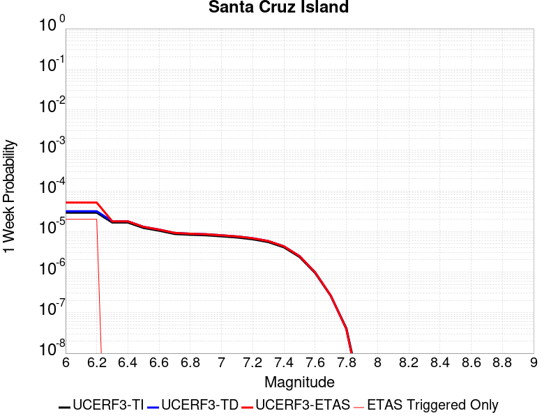 | 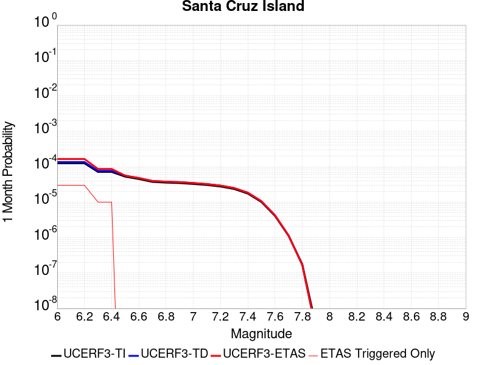 |  |  |

| Magnitude | 1 wk TI Prob | 1 wk TD Prob | 1 wk ETAS Prob | 1 wk ETAS/TD Gain | 1 wk ETAS Triggered Only | 1 mo TI Prob | 1 mo TD Prob | 1 mo ETAS Prob | 1 mo ETAS/TD Gain | 1 mo ETAS Triggered Only | 1 yr TI Prob | 1 yr TD Prob | 1 yr ETAS Prob | 1 yr ETAS/TD Gain | 1 yr ETAS Triggered Only | 10 yr TI Prob | 10 yr TD Prob | 10 yr ETAS Prob | 10 yr ETAS/TD Gain | 10 yr ETAS Triggered Only |
|-----|-----|-----|-----|-----|-----|-----|-----|-----|-----|-----|-----|-----|-----|-----|-----|-----|-----|-----|-----|-----|
| 6.0 | 2.9164563E-5 | 3.1599742E-5 | 5.1599112E-5 | 1.6328965 | 2.0E-5 | 1.2498499E-4 | 1.3542121E-4 | 1.6541715E-4 | 1.221501 | 3.0E-5 | 0.0015206301 | 0.0016476426 | 0.0016875766 | 1.0242372 | 4.0E-5 | 0.015102667 | 0.016368 | 0.016466362 | 1.0060095 | 1.0E-4 |
| 6.1 | 2.9164563E-5 | 3.1599742E-5 | 5.1599112E-5 | 1.6328965 | 2.0E-5 | 1.2498499E-4 | 1.3542121E-4 | 1.6541715E-4 | 1.221501 | 3.0E-5 | 0.0015206301 | 0.0016476426 | 0.0016875766 | 1.0242372 | 4.0E-5 | 0.015102667 | 0.016368 | 0.016466362 | 1.0060095 | 1.0E-4 |
| 6.2 | 2.9164563E-5 | 3.1599742E-5 | 5.1599112E-5 | 1.6328965 | 2.0E-5 | 1.2498499E-4 | 1.3542121E-4 | 1.6541715E-4 | 1.221501 | 3.0E-5 | 0.0015206301 | 0.0016476426 | 0.0016875766 | 1.0242372 | 4.0E-5 | 0.015102667 | 0.016368 | 0.016466362 | 1.0060095 | 1.0E-4 |
| 6.3 | 1.6635553E-5 | 1.780436E-5 | 1.780436E-5 | 1.0 | 0.0 | 7.1293274E-5 | 7.630226E-5 | 8.63015E-5 | 1.1310477 | 1.0E-5 | 8.6765E-4 | 9.2860236E-4 | 9.485838E-4 | 1.0215178 | 2.0E-5 | 0.008642701 | 0.009249094 | 0.009318446 | 1.0074983 | 7.0E-5 |
| 6.4 | 1.6635553E-5 | 1.780436E-5 | 1.780436E-5 | 1.0 | 0.0 | 7.1293274E-5 | 7.630226E-5 | 8.63015E-5 | 1.1310477 | 1.0E-5 | 8.6765E-4 | 9.2860236E-4 | 9.485838E-4 | 1.0215178 | 2.0E-5 | 0.008642701 | 0.009249094 | 0.009318446 | 1.0074983 | 7.0E-5 |
| 6.5 | 1.2238748E-5 | 1.3042995E-5 | 1.3042995E-5 | 1.0 | 0.0 | 5.2450723E-5 | 5.5897377E-5 | 5.5897377E-5 | 1.0 | 0.0 | 6.3840044E-4 | 6.8034173E-4 | 6.9033494E-4 | 1.0146885 | 1.0E-5 | 0.0063656955 | 0.0067829876 | 0.0068227164 | 1.0058571 | 4.0E-5 |
| 6.6 | 1.0489767E-5 | 1.1156636E-5 | 1.1156636E-5 | 1.0 | 0.0 | 4.495537E-5 | 4.781329E-5 | 4.781329E-5 | 1.0 | 0.0 | 5.4719415E-4 | 5.819735E-4 | 5.819735E-4 | 1.0 | 0.0 | 0.005458487 | 0.0058047357 | 0.00582462 | 1.0034255 | 2.0E-5 |
| 6.7 | 8.699222E-6 | 9.236782E-6 | 9.236782E-6 | 1.0 | 0.0 | 3.7281847E-5 | 3.958561E-5 | 3.958561E-5 | 1.0 | 0.0 | 4.5381195E-4 | 4.8184878E-4 | 4.8184878E-4 | 1.0 | 0.0 | 0.0045288634 | 0.004808108 | 0.00481806 | 1.0020698 | 1.0E-5 |
| 6.8 | 8.307732E-6 | 8.8169045E-6 | 8.8169045E-6 | 1.0 | 0.0 | 3.560408E-5 | 3.7786187E-5 | 3.7786187E-5 | 1.0 | 0.0 | 4.3339343E-4 | 4.5995016E-4 | 4.5995016E-4 | 1.0 | 0.0 | 0.004325492 | 0.0045900354 | 0.0045999894 | 1.0021687 | 1.0E-5 |
| 6.9 | 8.073121E-6 | 8.564939E-6 | 8.564939E-6 | 1.0 | 0.0 | 3.459863E-5 | 3.6706366E-5 | 3.6706366E-5 | 1.0 | 0.0 | 4.2115687E-4 | 4.468088E-4 | 4.468088E-4 | 1.0 | 0.0 | 0.004203596 | 0.004459156 | 0.0044691116 | 1.0022326 | 1.0E-5 |
| 7.0 | 7.617019E-6 | 8.074664E-6 | 8.074664E-6 | 1.0 | 0.0 | 3.264396E-5 | 3.4605247E-5 | 3.4605247E-5 | 1.0 | 0.0 | 3.9736772E-4 | 4.212378E-4 | 4.212378E-4 | 1.0 | 0.0 | 0.003966579 | 0.0042044413 | 0.004214399 | 1.0023685 | 1.0E-5 |
| 7.1 | 7.1224836E-6 | 7.545788E-6 | 7.545788E-6 | 1.0 | 0.0 | 3.052457E-5 | 3.2338692E-5 | 3.2338692E-5 | 1.0 | 0.0 | 3.715733E-4 | 3.936528E-4 | 3.936528E-4 | 1.0 | 0.0 | 0.003709526 | 0.003929598 | 0.0039395588 | 1.0025347 | 1.0E-5 |
| 7.2 | 6.441115E-6 | 6.8273835E-6 | 6.8273835E-6 | 1.0 | 0.0 | 2.7604487E-5 | 2.9259887E-5 | 2.9259887E-5 | 1.0 | 0.0 | 3.360328E-4 | 3.5618112E-4 | 3.5618112E-4 | 1.0 | 0.0 | 0.0033552512 | 0.003556131 | 0.0035660954 | 1.002802 | 1.0E-5 |
| 7.3 | 5.494274E-6 | 5.8199944E-6 | 5.8199944E-6 | 1.0 | 0.0 | 2.3546674E-5 | 2.4942596E-5 | 2.4942596E-5 | 1.0 | 0.0 | 2.8664304E-4 | 3.0363398E-4 | 3.0363398E-4 | 1.0 | 0.0 | 0.002862736 | 0.0030322142 | 0.003042184 | 1.0032879 | 1.0E-5 |
| 7.4 | 4.0802624E-6 | 4.312256E-6 | 4.312256E-6 | 1.0 | 0.0 | 1.7486722E-5 | 1.8480967E-5 | 1.8480967E-5 | 1.0 | 0.0 | 2.1288003E-4 | 2.2498262E-4 | 2.2498262E-4 | 1.0 | 0.0 | 0.0021267622 | 0.0022475575 | 0.002257535 | 1.0044392 | 1.0E-5 |
| 7.5 | 2.3584746E-6 | 2.4753094E-6 | 2.4753094E-6 | 1.0 | 0.0 | 1.0107709E-5 | 1.0608426E-5 | 1.0608426E-5 | 1.0 | 0.0 | 1.2305441E-4 | 1.2915E-4 | 1.2915E-4 | 1.0 | 0.0 | 0.0012298629 | 0.0012907543 | 0.0012907543 | 1.0 | 0.0 |
| 7.6 | 9.4981914E-7 | 9.86093E-7 | 9.86093E-7 | 1.0 | 0.0 | 4.0706473E-6 | 4.2261063E-6 | 4.2261063E-6 | 1.0 | 0.0 | 4.9559E-5 | 5.145164E-5 | 5.145164E-5 | 1.0 | 0.0 | 4.954795E-4 | 5.1439856E-4 | 5.1439856E-4 | 1.0 | 0.0 |
| 7.7 | 2.6013532E-7 | 2.6416603E-7 | 2.6416603E-7 | 1.0 | 0.0 | 1.1148652E-6 | 1.1321397E-6 | 1.1321397E-6 | 1.0 | 0.0 | 1.3573399E-5 | 1.3783714E-5 | 1.3783714E-5 | 1.0 | 0.0 | 1.357257E-4 | 1.3782867E-4 | 1.3782867E-4 | 1.0 | 0.0 |
| 7.8 | 4.1522263E-8 | 3.965679E-8 | 3.965679E-8 | 1.0 | 0.0 | 1.7795254E-7 | 1.6995766E-7 | 1.6995766E-7 | 1.0 | 0.0 | 2.16657E-6 | 2.0692328E-6 | 2.0692328E-6 | 1.0 | 0.0 | 2.1665488E-5 | 2.0692156E-5 | 2.0692156E-5 | 1.0 | 0.0 |
| 7.9 | 7.7242046E-10 | 5.9468175E-10 | 5.9468175E-10 | 1.0 | 0.0 | 3.3103735E-9 | 2.5486364E-9 | 2.5486364E-9 | 1.0 | 0.0 | 4.0303796E-8 | 3.1029646E-8 | 3.1029646E-8 | 1.0 | 0.0 | 4.030379E-7 | 3.1029643E-7 | 3.1029643E-7 | 1.0 | 0.0 |

## San Jacinto (Coyote Creek)
*[(top)](#table-of-contents)*

| 1 Week | 1 Month | 1 Year | 10 Year |
|-----|-----|-----|-----|
| 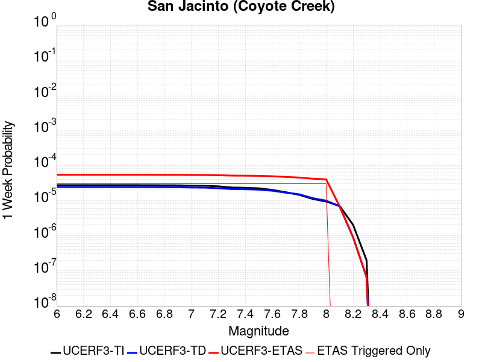 | 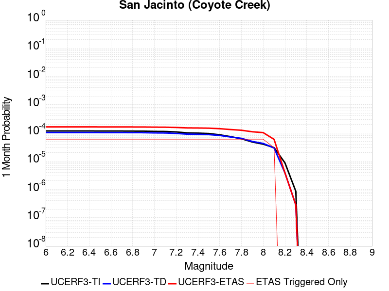 |  |  |

| Magnitude | 1 wk TI Prob | 1 wk TD Prob | 1 wk ETAS Prob | 1 wk ETAS/TD Gain | 1 wk ETAS Triggered Only | 1 mo TI Prob | 1 mo TD Prob | 1 mo ETAS Prob | 1 mo ETAS/TD Gain | 1 mo ETAS Triggered Only | 1 yr TI Prob | 1 yr TD Prob | 1 yr ETAS Prob | 1 yr ETAS/TD Gain | 1 yr ETAS Triggered Only | 10 yr TI Prob | 10 yr TD Prob | 10 yr ETAS Prob | 10 yr ETAS/TD Gain | 10 yr ETAS Triggered Only |
|-----|-----|-----|-----|-----|-----|-----|-----|-----|-----|-----|-----|-----|-----|-----|-----|-----|-----|-----|-----|-----|
| 6.0 | 2.7374346E-5 | 2.4145214E-5 | 5.414449E-5 | 2.2424521 | 3.0E-5 | 1.1731335E-4 | 1.034754E-4 | 1.6346919E-4 | 1.579788 | 6.0E-5 | 0.0014273542 | 0.0012590875 | 0.0013589616 | 1.0793226 | 1.0E-4 | 0.01418221 | 0.012928318 | 0.013056638 | 1.0099255 | 1.3E-4 |
| 6.1 | 2.7374346E-5 | 2.4145214E-5 | 5.414449E-5 | 2.2424521 | 3.0E-5 | 1.1731335E-4 | 1.034754E-4 | 1.6346919E-4 | 1.579788 | 6.0E-5 | 0.0014273542 | 0.0012590875 | 0.0013589616 | 1.0793226 | 1.0E-4 | 0.01418221 | 0.012928318 | 0.013056638 | 1.0099255 | 1.3E-4 |
| 6.2 | 2.7374346E-5 | 2.4145214E-5 | 5.414449E-5 | 2.2424521 | 3.0E-5 | 1.1731335E-4 | 1.034754E-4 | 1.6346919E-4 | 1.579788 | 6.0E-5 | 0.0014273542 | 0.0012590875 | 0.0013589616 | 1.0793226 | 1.0E-4 | 0.01418221 | 0.012928318 | 0.013056638 | 1.0099255 | 1.3E-4 |
| 6.3 | 2.7374346E-5 | 2.4145214E-5 | 5.414449E-5 | 2.2424521 | 3.0E-5 | 1.1731335E-4 | 1.034754E-4 | 1.6346919E-4 | 1.579788 | 6.0E-5 | 0.0014273542 | 0.0012590875 | 0.0013589616 | 1.0793226 | 1.0E-4 | 0.01418221 | 0.012928318 | 0.013056638 | 1.0099255 | 1.3E-4 |
| 6.4 | 2.7374346E-5 | 2.4145214E-5 | 5.414449E-5 | 2.2424521 | 3.0E-5 | 1.1731335E-4 | 1.034754E-4 | 1.6346919E-4 | 1.579788 | 6.0E-5 | 0.0014273542 | 0.0012590875 | 0.0013589616 | 1.0793226 | 1.0E-4 | 0.01418221 | 0.012928318 | 0.013056638 | 1.0099255 | 1.3E-4 |
| 6.5 | 2.7282445E-5 | 2.4031293E-5 | 5.403057E-5 | 2.2483423 | 3.0E-5 | 1.16919524E-4 | 1.029872E-4 | 1.6298103E-4 | 1.5825367 | 6.0E-5 | 0.0014225657 | 0.0012531505 | 0.0013530252 | 1.0796989 | 1.0E-4 | 0.014134934 | 0.012869646 | 0.012997973 | 1.0099713 | 1.3E-4 |
| 6.6 | 2.7282445E-5 | 2.4031293E-5 | 5.403057E-5 | 2.2483423 | 3.0E-5 | 1.16919524E-4 | 1.029872E-4 | 1.6298103E-4 | 1.5825367 | 6.0E-5 | 0.0014225657 | 0.0012531505 | 0.0013530252 | 1.0796989 | 1.0E-4 | 0.014134934 | 0.012869646 | 0.012997973 | 1.0099713 | 1.3E-4 |
| 6.7 | 2.7216198E-5 | 2.3956412E-5 | 5.3955693E-5 | 2.2522442 | 3.0E-5 | 1.1663563E-4 | 1.02666316E-4 | 1.6266016E-4 | 1.5843576 | 6.0E-5 | 0.0014191137 | 0.0012492483 | 0.0013491234 | 1.0799482 | 1.0E-4 | 0.014100855 | 0.0128310565 | 0.012959389 | 1.0100017 | 1.3E-4 |
| 6.8 | 2.7078617E-5 | 2.387363E-5 | 5.3872915E-5 | 2.2565866 | 3.0E-5 | 1.1604605E-4 | 1.0231156E-4 | 1.6230543E-4 | 1.5863839 | 6.0E-5 | 0.001411945 | 0.0012449342 | 0.0013448097 | 1.0802256 | 1.0E-4 | 0.014030075 | 0.012788199 | 0.012916536 | 1.0100356 | 1.3E-4 |
| 6.9 | 2.6982952E-5 | 2.3793142E-5 | 5.3792428E-5 | 2.2608376 | 3.0E-5 | 1.15636096E-4 | 1.0196664E-4 | 1.6196052E-4 | 1.5883678 | 6.0E-5 | 0.0014069602 | 0.0012407395 | 0.0013406153 | 1.0804971 | 1.0E-4 | 0.013980856 | 0.012746515 | 0.0128748575 | 1.0100689 | 1.3E-4 |
| 7.0 | 2.6449972E-5 | 2.3370165E-5 | 5.3369462E-5 | 2.283658 | 3.0E-5 | 1.1335209E-4 | 1.00154015E-4 | 1.60148E-4 | 1.5990174 | 6.0E-5 | 0.001379188 | 0.0012186957 | 0.0013185737 | 1.081955 | 1.0E-4 | 0.0137065975 | 0.0125278765 | 0.012656248 | 1.0102469 | 1.3E-4 |
| 7.1 | 2.6257849E-5 | 2.3196202E-5 | 5.3195505E-5 | 2.2932851 | 3.0E-5 | 1.1252879E-4 | 9.940852E-5 | 1.5940255E-4 | 1.60351 | 6.0E-5 | 0.0013691769 | 0.0012096294 | 0.0013095083 | 1.08257 | 1.0E-4 | 0.013607717 | 0.012437741 | 0.012566124 | 1.0103221 | 1.3E-4 |
| 7.2 | 2.5270041E-5 | 2.2390966E-5 | 5.2390296E-5 | 2.339796 | 3.0E-5 | 1.0829568E-4 | 9.595777E-5 | 1.5595202E-4 | 1.625215 | 6.0E-5 | 0.0013177024 | 0.0011676621 | 0.0012675453 | 1.0855412 | 1.0E-4 | 0.013099162 | 0.012018777 | 0.012137335 | 1.0098643 | 1.2E-4 |
| 7.3 | 2.339701E-5 | 2.1122814E-5 | 5.112218E-5 | 2.4202354 | 3.0E-5 | 1.0026905E-4 | 9.0523215E-5 | 1.505178E-4 | 1.6627533 | 6.0E-5 | 0.001220092 | 0.0011015651 | 0.0012014549 | 1.0906799 | 1.0E-4 | 0.012134149 | 0.011357696 | 0.011476333 | 1.0104455 | 1.2E-4 |
| 7.4 | 2.296333E-5 | 2.0853171E-5 | 5.0852545E-5 | 2.4386 | 3.0E-5 | 9.841056E-5 | 8.936768E-5 | 1.4936231E-4 | 1.6713237 | 6.0E-5 | 0.0011974899 | 0.0010875105 | 0.0011874017 | 1.0918531 | 1.0E-4 | 0.011910575 | 0.01121681 | 0.011335463 | 1.0105783 | 1.2E-4 |
| 7.5 | 2.2188895E-5 | 2.0376096E-5 | 5.0375485E-5 | 2.4722836 | 3.0E-5 | 9.50918E-5 | 8.732321E-5 | 1.4731797E-4 | 1.6870426 | 6.0E-5 | 0.0011571277 | 0.0010626436 | 0.0011625374 | 1.094005 | 1.0E-4 | 0.011511209 | 0.010966429 | 0.011085113 | 1.0108225 | 1.2E-4 |
| 7.6 | 2.0013189E-5 | 1.8962366E-5 | 4.8961796E-5 | 2.582051 | 3.0E-5 | 8.5767984E-5 | 8.1264756E-5 | 1.4125988E-4 | 1.7382674 | 6.0E-5 | 0.001043725 | 9.889511E-4 | 0.0010888522 | 1.1010172 | 1.0E-4 | 0.010388365 | 0.010224434 | 0.010343206 | 1.0116166 | 1.2E-4 |
| 7.7 | 1.7230794E-5 | 1.674371E-5 | 4.6743207E-5 | 2.7916877 | 3.0E-5 | 7.384417E-5 | 7.175679E-5 | 1.3175249E-4 | 1.8360978 | 6.0E-5 | 8.986819E-4 | 8.7328954E-4 | 9.7320223E-4 | 1.1144096 | 1.0E-4 | 0.008950562 | 0.009062956 | 0.009181869 | 1.0131208 | 1.2E-4 |
| 7.8 | 1.4478809E-5 | 1.4990978E-5 | 4.4990527E-5 | 3.0011737 | 3.0E-5 | 6.205057E-5 | 6.424547E-5 | 1.2424162E-4 | 1.9338579 | 6.0E-5 | 7.552038E-4 | 7.819085E-4 | 8.8183035E-4 | 1.1277922 | 1.0E-4 | 0.0075264242 | 0.008141387 | 0.00826041 | 1.0146195 | 1.2E-4 |
| 7.9 | 1.1114467E-5 | 1.1645102E-5 | 4.164475E-5 | 3.5761604 | 3.0E-5 | 4.7632562E-5 | 4.990663E-5 | 1.0990364E-4 | 2.2021852 | 6.0E-5 | 5.797721E-4 | 6.074444E-4 | 7.073836E-4 | 1.1645241 | 1.0E-4 | 0.0057826187 | 0.0063803247 | 0.006499559 | 1.0186878 | 1.2E-4 |
| 8.0 | 9.327402E-6 | 9.899186E-6 | 3.989889E-5 | 4.0305223 | 3.0E-5 | 3.9973966E-5 | 4.2424395E-5 | 1.0242185E-4 | 2.4142206 | 6.0E-5 | 4.8657437E-4 | 5.1639514E-4 | 6.163435E-4 | 1.1935501 | 1.0E-4 | 0.0048551033 | 0.0054499684 | 0.0055693146 | 1.0218985 | 1.2E-4 |
| 8.1 | 7.0235833E-6 | 6.827495E-6 | 6.827495E-6 | 1.0 | 0.0 | 3.0100724E-5 | 2.9260367E-5 | 5.9259488E-5 | 2.0252476 | 3.0E-5 | 3.664147E-4 | 3.5618723E-4 | 3.9617298E-4 | 1.1122605 | 4.0E-5 | 0.003658111 | 0.0037876023 | 0.0038274508 | 1.0105208 | 4.0E-5 |
| 8.2 | 2.0358202E-6 | 8.994527E-7 | 8.994527E-7 | 1.0 | 0.0 | 8.724915E-6 | 3.854792E-6 | 3.854792E-6 | 1.0 | 0.0 | 1.06220665E-4 | 4.69311E-5 | 4.69311E-5 | 1.0 | 0.0 | 0.001061699 | 5.3254166E-4 | 5.3254166E-4 | 1.0 | 0.0 |
| 8.3 | 2.0051264E-7 | 6.617272E-8 | 6.617272E-8 | 1.0 | 0.0 | 8.5933965E-7 | 2.8359733E-7 | 2.8359733E-7 | 1.0 | 0.0 | 1.046241E-5 | 3.4527925E-6 | 3.4527925E-6 | 1.0 | 0.0 | 1.0461917E-4 | 4.01389E-5 | 4.01389E-5 | 1.0 | 0.0 |

## Whittier alt 1
*[(top)](#table-of-contents)*

| 1 Week | 1 Month | 1 Year | 10 Year |
|-----|-----|-----|-----|
| 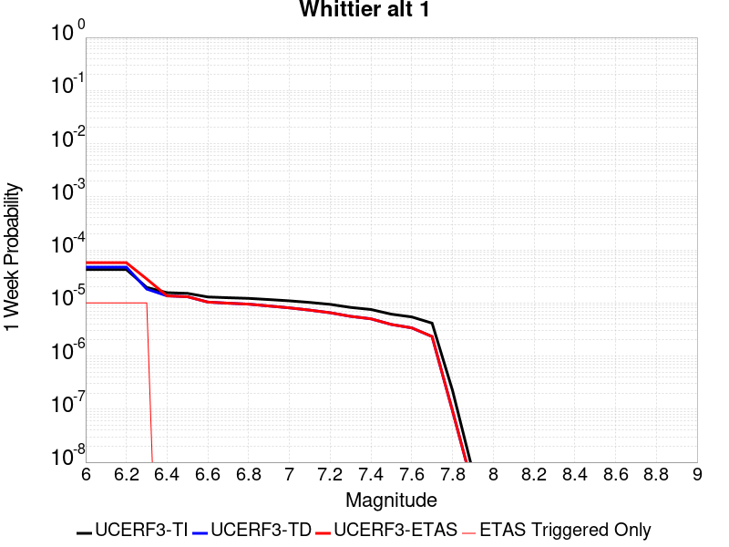 | 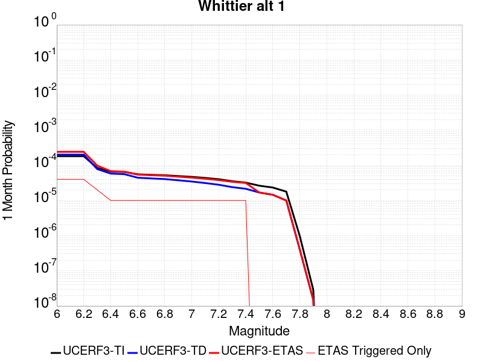 |  |  |

| Magnitude | 1 wk TI Prob | 1 wk TD Prob | 1 wk ETAS Prob | 1 wk ETAS/TD Gain | 1 wk ETAS Triggered Only | 1 mo TI Prob | 1 mo TD Prob | 1 mo ETAS Prob | 1 mo ETAS/TD Gain | 1 mo ETAS Triggered Only | 1 yr TI Prob | 1 yr TD Prob | 1 yr ETAS Prob | 1 yr ETAS/TD Gain | 1 yr ETAS Triggered Only | 10 yr TI Prob | 10 yr TD Prob | 10 yr ETAS Prob | 10 yr ETAS/TD Gain | 10 yr ETAS Triggered Only |
|-----|-----|-----|-----|-----|-----|-----|-----|-----|-----|-----|-----|-----|-----|-----|-----|-----|-----|-----|-----|-----|
| 6.0 | 4.2554693E-5 | 4.725218E-5 | 5.7251706E-5 | 1.2116205 | 1.0E-5 | 1.8236451E-4 | 2.0249544E-4 | 2.4248734E-4 | 1.1974953 | 4.0E-5 | 0.002218027 | 0.0024629154 | 0.0025526937 | 1.036452 | 9.0E-5 | 0.02196019 | 0.024390234 | 0.024497552 | 1.0044 | 1.1E-4 |
| 6.1 | 4.2554693E-5 | 4.725218E-5 | 5.7251706E-5 | 1.2116205 | 1.0E-5 | 1.8236451E-4 | 2.0249544E-4 | 2.4248734E-4 | 1.1974953 | 4.0E-5 | 0.002218027 | 0.0024629154 | 0.0025526937 | 1.036452 | 9.0E-5 | 0.02196019 | 0.024390234 | 0.024497552 | 1.0044 | 1.1E-4 |
| 6.2 | 4.2554693E-5 | 4.725218E-5 | 5.7251706E-5 | 1.2116205 | 1.0E-5 | 1.8236451E-4 | 2.0249544E-4 | 2.4248734E-4 | 1.1974953 | 4.0E-5 | 0.002218027 | 0.0024629154 | 0.0025526937 | 1.036452 | 9.0E-5 | 0.02196019 | 0.024390234 | 0.024497552 | 1.0044 | 1.1E-4 |
| 6.3 | 1.9617712E-5 | 1.8268593E-5 | 2.8268409E-5 | 1.5473776 | 1.0E-5 | 8.40732E-5 | 7.829172E-5 | 9.8290155E-5 | 1.2554349 | 2.0E-5 | 0.0010231105 | 9.52804E-4 | 9.827754E-4 | 1.031456 | 3.0E-5 | 0.01018413 | 0.009490474 | 0.009530094 | 1.0041747 | 4.0E-5 |
| 6.4 | 1.5611336E-5 | 1.3604271E-5 | 1.3604271E-5 | 1.0 | 0.0 | 6.690401E-5 | 5.8302747E-5 | 6.8302164E-5 | 1.1715086 | 1.0E-5 | 8.142519E-4 | 7.0961076E-4 | 7.295966E-4 | 1.0281645 | 2.0E-5 | 0.008112748 | 0.0070754145 | 0.0071052024 | 1.00421 | 3.0E-5 |
| 6.5 | 1.5150166E-5 | 1.3100925E-5 | 1.3100925E-5 | 1.0 | 0.0 | 6.492767E-5 | 5.6145647E-5 | 6.614508E-5 | 1.1780982 | 1.0E-5 | 7.9020765E-4 | 6.8336475E-4 | 7.0335105E-4 | 1.0292469 | 2.0E-5 | 0.007874036 | 0.0068145846 | 0.0068443804 | 1.0043724 | 3.0E-5 |
| 6.6 | 1.295588E-5 | 1.0380725E-5 | 1.0380725E-5 | 1.0 | 0.0 | 5.552402E-5 | 4.4488075E-5 | 5.448763E-5 | 1.2247694 | 1.0E-5 | 6.7579525E-4 | 5.4150965E-4 | 5.5150426E-4 | 1.0184569 | 1.0E-5 | 0.006737438 | 0.0054033357 | 0.0054232273 | 1.0036814 | 2.0E-5 |
| 6.7 | 1.2542085E-5 | 9.899369E-6 | 9.899369E-6 | 1.0 | 0.0 | 5.3750682E-5 | 4.242519E-5 | 5.2424763E-5 | 1.235699 | 1.0E-5 | 6.542181E-4 | 5.164061E-4 | 5.264009E-4 | 1.0193546 | 1.0E-5 | 0.006522954 | 0.0051534795 | 0.0051733763 | 1.0038608 | 2.0E-5 |
| 6.8 | 1.2195878E-5 | 9.495415E-6 | 9.495415E-6 | 1.0 | 0.0 | 5.2267E-5 | 4.069401E-5 | 5.06936E-5 | 1.2457265 | 1.0E-5 | 6.36165E-4 | 4.9533875E-4 | 5.053338E-4 | 1.0201782 | 1.0E-5 | 0.0063434686 | 0.004943688 | 0.0049536387 | 1.0020127 | 1.0E-5 |
| 6.9 | 1.1580298E-5 | 8.772933E-6 | 8.772933E-6 | 1.0 | 0.0 | 4.9628903E-5 | 3.7597754E-5 | 4.759738E-5 | 1.2659633 | 1.0E-5 | 6.040644E-4 | 4.5765814E-4 | 4.676536E-4 | 1.0218403 | 1.0E-5 | 0.00602425 | 0.0045684157 | 0.00457837 | 1.0021789 | 1.0E-5 |
| 7.0 | 1.0964795E-5 | 8.083994E-6 | 8.083994E-6 | 1.0 | 0.0 | 4.6991136E-5 | 3.4645236E-5 | 4.464489E-5 | 1.28863 | 1.0E-5 | 5.7196687E-4 | 4.2172565E-4 | 4.3172142E-4 | 1.0237021 | 1.0E-5 | 0.0057049696 | 0.004210462 | 0.0042204196 | 1.002365 | 1.0E-5 |
| 7.1 | 1.0230601E-5 | 7.3266697E-6 | 7.3266697E-6 | 1.0 | 0.0 | 4.3844695E-5 | 3.1399642E-5 | 4.139933E-5 | 1.318465 | 1.0E-5 | 5.336784E-4 | 3.8222488E-4 | 3.9222106E-4 | 1.0261526 | 1.0E-5 | 0.005323986 | 0.0038168381 | 0.0038268 | 1.00261 | 1.0E-5 |
| 7.2 | 9.40865E-6 | 6.543289E-6 | 6.543289E-6 | 1.0 | 0.0 | 4.032216E-5 | 2.8042374E-5 | 3.8042093E-5 | 1.3565933 | 1.0E-5 | 4.908117E-4 | 3.4136363E-4 | 3.513602E-4 | 1.0292842 | 1.0E-5 | 0.0048972913 | 0.003409485 | 0.0034194512 | 1.002923 | 1.0E-5 |
| 7.3 | 8.237384E-6 | 5.5977525E-6 | 5.5977525E-6 | 1.0 | 0.0 | 3.5302593E-5 | 2.3990153E-5 | 3.3989912E-5 | 1.4168277 | 1.0E-5 | 4.2972428E-4 | 2.92042E-4 | 3.020391E-4 | 1.0342317 | 1.0E-5 | 0.0042889426 | 0.002916903 | 0.002926874 | 1.0034183 | 1.0E-5 |
| 7.4 | 7.5316966E-6 | 5.027819E-6 | 5.027819E-6 | 1.0 | 0.0 | 3.2278298E-5 | 2.1547625E-5 | 3.154741E-5 | 1.4640783 | 1.0E-5 | 3.9291743E-4 | 2.6231175E-4 | 2.7230915E-4 | 1.0381125 | 1.0E-5 | 0.0039222343 | 0.0026201333 | 0.002630107 | 1.0038066 | 1.0E-5 |
| 7.5 | 6.149649E-6 | 3.933841E-6 | 3.933841E-6 | 1.0 | 0.0 | 2.6355372E-5 | 1.6859214E-5 | 1.6859214E-5 | 1.0 | 0.0 | 3.208294E-4 | 2.052425E-4 | 2.052425E-4 | 1.0 | 0.0 | 0.003203666 | 0.0020506186 | 0.0020506186 | 1.0 | 0.0 |
| 7.6 | 5.457711E-6 | 3.3953788E-6 | 3.3953788E-6 | 1.0 | 0.0 | 2.338998E-5 | 1.4551547E-5 | 1.4551547E-5 | 1.0 | 0.0 | 2.8473578E-4 | 1.771515E-4 | 1.771515E-4 | 1.0 | 0.0 | 0.0028437122 | 0.0017701836 | 0.0017701836 | 1.0 | 0.0 |
| 7.7 | 4.1676276E-6 | 2.3331952E-6 | 2.3331952E-6 | 1.0 | 0.0 | 1.7861139E-5 | 9.999374E-6 | 9.999374E-6 | 1.0 | 0.0 | 2.1743766E-4 | 1.2173632E-4 | 1.2173632E-4 | 1.0 | 0.0 | 0.0021722503 | 0.0012167693 | 0.0012167693 | 1.0 | 0.0 |
| 7.8 | 2.2692414E-7 | 9.3854695E-8 | 9.3854695E-8 | 1.0 | 0.0 | 9.725317E-7 | 4.0223435E-7 | 4.0223435E-7 | 1.0 | 0.0 | 1.1840509E-5 | 4.8971956E-6 | 4.8971956E-6 | 1.0 | 0.0 | 1.1839878E-4 | 4.8971204E-5 | 4.8971204E-5 | 1.0 | 0.0 |
| 7.9 | 6.676829E-9 | 3.439853E-9 | 3.439853E-9 | 1.0 | 0.0 | 2.861498E-8 | 1.4742227E-8 | 1.4742227E-8 | 1.0 | 0.0 | 3.4838732E-7 | 1.7948659E-7 | 1.7948659E-7 | 1.0 | 0.0 | 3.4838679E-6 | 1.7948646E-6 | 1.7948646E-6 | 1.0 | 0.0 |

## Pleito
*[(top)](#table-of-contents)*

| 1 Week | 1 Month | 1 Year | 10 Year |
|-----|-----|-----|-----|
| 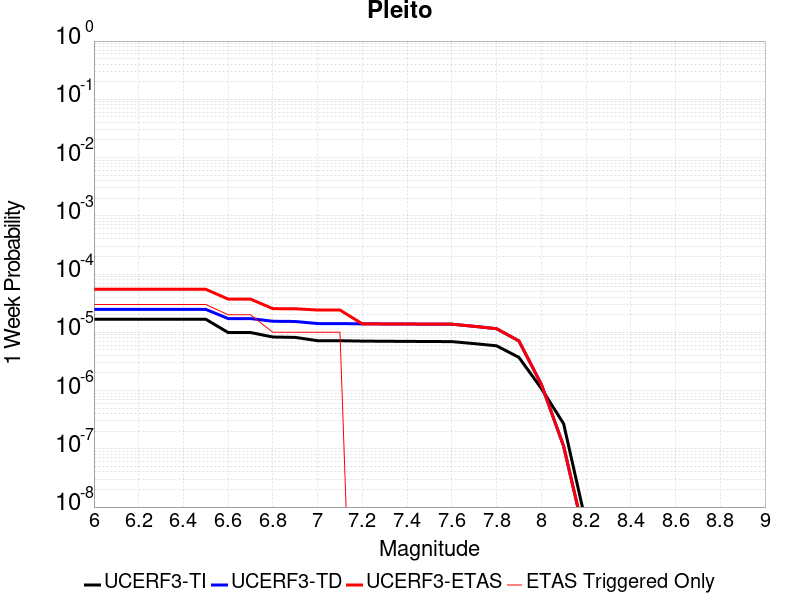 | 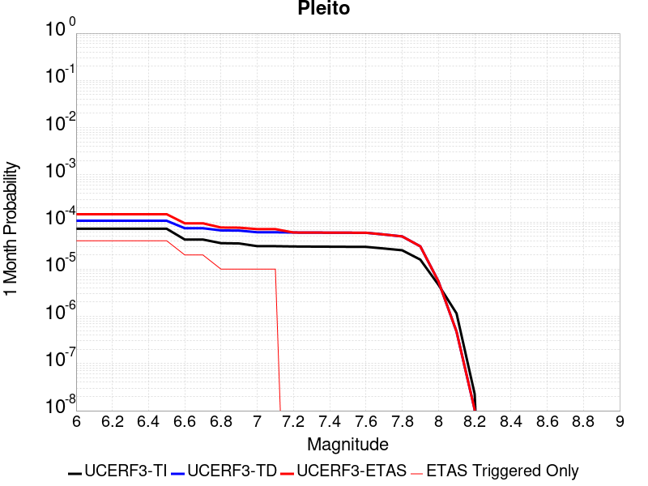 |  |  |

| Magnitude | 1 wk TI Prob | 1 wk TD Prob | 1 wk ETAS Prob | 1 wk ETAS/TD Gain | 1 wk ETAS Triggered Only | 1 mo TI Prob | 1 mo TD Prob | 1 mo ETAS Prob | 1 mo ETAS/TD Gain | 1 mo ETAS Triggered Only | 1 yr TI Prob | 1 yr TD Prob | 1 yr ETAS Prob | 1 yr ETAS/TD Gain | 1 yr ETAS Triggered Only | 10 yr TI Prob | 10 yr TD Prob | 10 yr ETAS Prob | 10 yr ETAS/TD Gain | 10 yr ETAS Triggered Only |
|-----|-----|-----|-----|-----|-----|-----|-----|-----|-----|-----|-----|-----|-----|-----|-----|-----|-----|-----|-----|-----|
| 6.0 | 1.6763008E-5 | 2.4763838E-5 | 5.4763095E-5 | 2.2114139 | 3.0E-5 | 7.183948E-5 | 1.0612683E-4 | 1.4612258E-4 | 1.3768675 | 4.0E-5 | 8.742947E-4 | 0.0012914003 | 0.0013613099 | 1.0541347 | 7.0E-5 | 0.00870863 | 0.0129538905 | 0.013062465 | 1.0083816 | 1.1E-4 |
| 6.1 | 1.6763008E-5 | 2.4763838E-5 | 5.4763095E-5 | 2.2114139 | 3.0E-5 | 7.183948E-5 | 1.0612683E-4 | 1.4612258E-4 | 1.3768675 | 4.0E-5 | 8.742947E-4 | 0.0012914003 | 0.0013613099 | 1.0541347 | 7.0E-5 | 0.00870863 | 0.0129538905 | 0.013062465 | 1.0083816 | 1.1E-4 |
| 6.2 | 1.6763008E-5 | 2.4763838E-5 | 5.4763095E-5 | 2.2114139 | 3.0E-5 | 7.183948E-5 | 1.0612683E-4 | 1.4612258E-4 | 1.3768675 | 4.0E-5 | 8.742947E-4 | 0.0012914003 | 0.0013613099 | 1.0541347 | 7.0E-5 | 0.00870863 | 0.0129538905 | 0.013062465 | 1.0083816 | 1.1E-4 |
| 6.3 | 1.6763008E-5 | 2.4763838E-5 | 5.4763095E-5 | 2.2114139 | 3.0E-5 | 7.183948E-5 | 1.0612683E-4 | 1.4612258E-4 | 1.3768675 | 4.0E-5 | 8.742947E-4 | 0.0012914003 | 0.0013613099 | 1.0541347 | 7.0E-5 | 0.00870863 | 0.0129538905 | 0.013062465 | 1.0083816 | 1.1E-4 |
| 6.4 | 1.6763008E-5 | 2.4763838E-5 | 5.4763095E-5 | 2.2114139 | 3.0E-5 | 7.183948E-5 | 1.0612683E-4 | 1.4612258E-4 | 1.3768675 | 4.0E-5 | 8.742947E-4 | 0.0012914003 | 0.0013613099 | 1.0541347 | 7.0E-5 | 0.00870863 | 0.0129538905 | 0.013062465 | 1.0083816 | 1.1E-4 |
| 6.5 | 1.6763008E-5 | 2.4763838E-5 | 5.4763095E-5 | 2.2114139 | 3.0E-5 | 7.183948E-5 | 1.0612683E-4 | 1.4612258E-4 | 1.3768675 | 4.0E-5 | 8.742947E-4 | 0.0012914003 | 0.0013613099 | 1.0541347 | 7.0E-5 | 0.00870863 | 0.0129538905 | 0.013062465 | 1.0083816 | 1.1E-4 |
| 6.6 | 9.910213E-6 | 1.7214623E-5 | 3.721428E-5 | 2.161783 | 2.0E-5 | 4.247165E-5 | 7.377489E-5 | 9.3773415E-5 | 1.2710749 | 2.0E-5 | 5.169696E-4 | 8.978429E-4 | 9.3780697E-4 | 1.0445112 | 4.0E-5 | 0.0051576863 | 0.009050702 | 0.009110159 | 1.0065693 | 6.0E-5 |
| 6.7 | 9.910213E-6 | 1.7214623E-5 | 3.721428E-5 | 2.161783 | 2.0E-5 | 4.247165E-5 | 7.377489E-5 | 9.3773415E-5 | 1.2710749 | 2.0E-5 | 5.169696E-4 | 8.978429E-4 | 9.3780697E-4 | 1.0445112 | 4.0E-5 | 0.0051576863 | 0.009050702 | 0.009110159 | 1.0065693 | 6.0E-5 |
| 6.8 | 8.300162E-6 | 1.5474232E-5 | 2.5474077E-5 | 1.6462256 | 1.0E-5 | 3.557164E-5 | 6.631646E-5 | 7.6315795E-5 | 1.1507821 | 1.0E-5 | 4.3299864E-4 | 8.071053E-4 | 8.3708105E-4 | 1.0371399 | 3.0E-5 | 0.004321559 | 0.008150139 | 0.008199732 | 1.0060849 | 5.0E-5 |
| 6.9 | 8.183114E-6 | 1.5345448E-5 | 2.5345294E-5 | 1.6516491 | 1.0E-5 | 3.5070017E-5 | 6.576455E-5 | 7.57639E-5 | 1.1520476 | 1.0E-5 | 4.2689382E-4 | 8.003907E-4 | 8.203747E-4 | 1.0249678 | 2.0E-5 | 0.0042607468 | 0.008083483 | 0.00812316 | 1.0049083 | 4.0E-5 |
| 7.0 | 7.1748823E-6 | 1.413244E-5 | 2.4132298E-5 | 1.7075819 | 1.0E-5 | 3.0749135E-5 | 6.0566195E-5 | 7.056559E-5 | 1.1650985 | 1.0E-5 | 3.743064E-4 | 7.371445E-4 | 7.471371E-4 | 1.0135559 | 1.0E-5 | 0.0037367654 | 0.007454939 | 0.0074747903 | 1.0026628 | 2.0E-5 |
| 7.1 | 7.1671807E-6 | 1.412281E-5 | 2.412267E-5 | 1.7080643 | 1.0E-5 | 3.0716128E-5 | 6.052493E-5 | 7.052432E-5 | 1.1652112 | 1.0E-5 | 3.7390468E-4 | 7.366424E-4 | 7.46635E-4 | 1.0135651 | 1.0E-5 | 0.0037327618 | 0.0074499524 | 0.007469803 | 1.0026646 | 2.0E-5 |
| 7.2 | 7.0649667E-6 | 1.39701015E-5 | 1.39701015E-5 | 1.0 | 0.0 | 3.0278077E-5 | 5.9870494E-5 | 5.9870494E-5 | 1.0 | 0.0 | 3.6857324E-4 | 7.2868E-4 | 7.2868E-4 | 1.0 | 0.0 | 0.0036796255 | 0.0073707094 | 0.007380636 | 1.0013467 | 1.0E-5 |
| 7.3 | 7.02082E-6 | 1.3913556E-5 | 1.3913556E-5 | 1.0 | 0.0 | 3.008888E-5 | 5.9628168E-5 | 5.9628168E-5 | 1.0 | 0.0 | 3.6627054E-4 | 7.2573166E-4 | 7.2573166E-4 | 1.0 | 0.0 | 0.0036566744 | 0.007341209 | 0.0073511354 | 1.0013522 | 1.0E-5 |
| 7.4 | 6.987146E-6 | 1.3873118E-5 | 1.3873118E-5 | 1.0 | 0.0 | 2.9944567E-5 | 5.945487E-5 | 5.945487E-5 | 1.0 | 0.0 | 3.6451413E-4 | 7.2362315E-4 | 7.2362315E-4 | 1.0 | 0.0 | 0.0036391679 | 0.007320144 | 0.007330071 | 1.0013561 | 1.0E-5 |
| 7.5 | 6.9494554E-6 | 1.3830024E-5 | 1.3830024E-5 | 1.0 | 0.0 | 2.9783041E-5 | 5.9270187E-5 | 5.9270187E-5 | 1.0 | 0.0 | 3.625482E-4 | 7.2137616E-4 | 7.2137616E-4 | 1.0 | 0.0 | 0.0036195726 | 0.0072977724 | 0.0073077 | 1.0013603 | 1.0E-5 |
| 7.6 | 6.92694E-6 | 1.3789138E-5 | 1.3789138E-5 | 1.0 | 0.0 | 2.9686547E-5 | 5.909497E-5 | 5.909497E-5 | 1.0 | 0.0 | 3.6137376E-4 | 7.1924424E-4 | 7.1924424E-4 | 1.0 | 0.0 | 0.0036078666 | 0.0072765257 | 0.007286453 | 1.0013642 | 1.0E-5 |
| 7.7 | 6.395867E-6 | 1.2668219E-5 | 1.2668219E-5 | 1.0 | 0.0 | 2.741057E-5 | 5.429124E-5 | 5.429124E-5 | 1.0 | 0.0 | 3.336726E-4 | 6.6079566E-4 | 6.6079566E-4 | 1.0 | 0.0 | 0.0033317201 | 0.0066951844 | 0.0067051174 | 1.0014836 | 1.0E-5 |
| 7.8 | 5.8664327E-6 | 1.153586E-5 | 1.153586E-5 | 1.0 | 0.0 | 2.5141611E-5 | 4.9438466E-5 | 4.9438466E-5 | 1.0 | 0.0 | 3.060561E-4 | 6.017473E-4 | 6.017473E-4 | 1.0 | 0.0 | 0.0030563495 | 0.0061006667 | 0.0061106053 | 1.0016291 | 1.0E-5 |
| 7.9 | 3.7167474E-6 | 7.1140853E-6 | 7.1140853E-6 | 1.0 | 0.0 | 1.592882E-5 | 3.0488582E-5 | 3.0488582E-5 | 1.0 | 0.0 | 1.9391612E-4 | 3.7113542E-4 | 3.7113542E-4 | 1.0 | 0.0 | 0.0019374699 | 0.0037674906 | 0.003777453 | 1.0026443 | 1.0E-5 |
| 8.0 | 1.0903841E-6 | 1.2879392E-6 | 1.2879392E-6 | 1.0 | 0.0 | 4.6730665E-6 | 5.5197274E-6 | 5.5197274E-6 | 1.0 | 0.0 | 5.68931E-5 | 6.720063E-5 | 6.720063E-5 | 1.0 | 0.0 | 5.6878536E-4 | 6.941948E-4 | 6.941948E-4 | 1.0 | 0.0 |
| 8.1 | 2.6894583E-7 | 1.1060341E-7 | 1.1060341E-7 | 1.0 | 0.0 | 1.1526245E-6 | 4.740145E-7 | 4.740145E-7 | 1.0 | 0.0 | 1.4033113E-5 | 5.7711113E-6 | 5.7711113E-6 | 1.0 | 0.0 | 1.4032227E-4 | 6.456908E-5 | 6.456908E-5 | 1.0 | 0.0 |
| 8.2 | 5.2967013E-9 | 2.4578228E-9 | 2.4578228E-9 | 1.0 | 0.0 | 2.2700148E-8 | 1.0533527E-8 | 1.0533527E-8 | 1.0 | 0.0 | 2.7637427E-7 | 1.2824569E-7 | 1.2824569E-7 | 1.0 | 0.0 | 2.7637393E-6 | 1.4592787E-6 | 1.4592787E-6 | 1.0 | 0.0 |

## Big Pine (East)
*[(top)](#table-of-contents)*

| 1 Week | 1 Month | 1 Year | 10 Year |
|-----|-----|-----|-----|
|  | 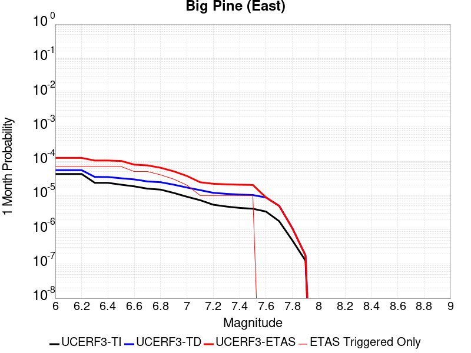 | 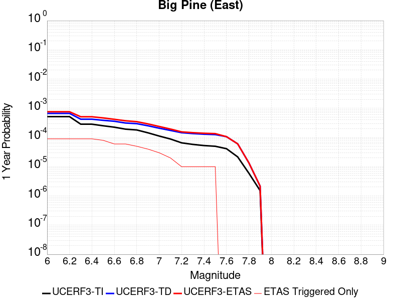 |  |

| Magnitude | 1 wk TI Prob | 1 wk TD Prob | 1 wk ETAS Prob | 1 wk ETAS/TD Gain | 1 wk ETAS Triggered Only | 1 mo TI Prob | 1 mo TD Prob | 1 mo ETAS Prob | 1 mo ETAS/TD Gain | 1 mo ETAS Triggered Only | 1 yr TI Prob | 1 yr TD Prob | 1 yr ETAS Prob | 1 yr ETAS/TD Gain | 1 yr ETAS Triggered Only | 10 yr TI Prob | 10 yr TD Prob | 10 yr ETAS Prob | 10 yr ETAS/TD Gain | 10 yr ETAS Triggered Only |
|-----|-----|-----|-----|-----|-----|-----|-----|-----|-----|-----|-----|-----|-----|-----|-----|-----|-----|-----|-----|-----|
| 6.0 | 9.916913E-6 | 1.2816984E-5 | 6.281635E-5 | 4.9010234 | 5.0E-5 | 4.250036E-5 | 5.49289E-5 | 1.2492506E-4 | 2.2743046 | 7.0E-5 | 5.173191E-4 | 6.685763E-4 | 7.585161E-4 | 1.1345245 | 9.0E-5 | 0.0051611643 | 0.006670441 | 0.0067896405 | 1.0178698 | 1.2E-4 |
| 6.1 | 9.916913E-6 | 1.2816984E-5 | 6.281635E-5 | 4.9010234 | 5.0E-5 | 4.250036E-5 | 5.49289E-5 | 1.2492506E-4 | 2.2743046 | 7.0E-5 | 5.173191E-4 | 6.685763E-4 | 7.585161E-4 | 1.1345245 | 9.0E-5 | 0.0051611643 | 0.006670441 | 0.0067896405 | 1.0178698 | 1.2E-4 |
| 6.2 | 9.916913E-6 | 1.2816984E-5 | 6.281635E-5 | 4.9010234 | 5.0E-5 | 4.250036E-5 | 5.49289E-5 | 1.2492506E-4 | 2.2743046 | 7.0E-5 | 5.173191E-4 | 6.685763E-4 | 7.585161E-4 | 1.1345245 | 9.0E-5 | 0.0051611643 | 0.006670441 | 0.0067896405 | 1.0178698 | 1.2E-4 |
| 6.3 | 5.479711E-6 | 8.112951E-6 | 5.8112546E-5 | 7.1629353 | 5.0E-5 | 2.3484265E-5 | 3.4769346E-5 | 1.04766914E-4 | 3.0131977 | 7.0E-5 | 2.858834E-4 | 4.2323777E-4 | 5.1319966E-4 | 1.2125565 | 9.0E-5 | 0.0028551589 | 0.004227244 | 0.004316863 | 1.0212004 | 9.0E-5 |
| 6.4 | 5.465009E-6 | 8.097245E-6 | 5.809684E-5 | 7.1748896 | 5.0E-5 | 2.3421257E-5 | 3.4702036E-5 | 1.04699604E-4 | 3.0171027 | 7.0E-5 | 2.851165E-4 | 4.2241855E-4 | 5.1238056E-4 | 1.2129688 | 9.0E-5 | 0.0028475097 | 0.0042190826 | 0.004308703 | 1.0212417 | 9.0E-5 |
| 6.5 | 4.826767E-6 | 7.422301E-6 | 5.742193E-5 | 7.7364054 | 5.0E-5 | 2.068598E-5 | 3.180949E-5 | 1.01807265E-4 | 3.2005312 | 7.0E-5 | 2.518227E-4 | 3.872145E-4 | 4.671835E-4 | 1.2065239 | 8.0E-5 | 0.0025153751 | 0.003868283 | 0.0039479737 | 1.020601 | 8.0E-5 |
| 6.6 | 4.3146847E-6 | 6.8822374E-6 | 5.6881894E-5 | 8.265029 | 5.0E-5 | 1.8491375E-5 | 2.9494982E-5 | 7.949351E-5 | 2.6951535 | 5.0E-5 | 2.2510924E-4 | 3.590447E-4 | 4.1902316E-4 | 1.1670501 | 6.0E-5 | 0.0022488134 | 0.0035874986 | 0.0036472832 | 1.0166647 | 6.0E-5 |
| 6.7 | 3.6968106E-6 | 5.9954727E-6 | 5.5995173E-5 | 9.339576 | 5.0E-5 | 1.5843378E-5 | 2.5694639E-5 | 7.569335E-5 | 2.9458814 | 5.0E-5 | 1.9287605E-4 | 3.1278885E-4 | 3.727701E-4 | 1.1917627 | 6.0E-5 | 0.0019270873 | 0.0031262483 | 0.0031860606 | 1.0191324 | 6.0E-5 |
| 6.8 | 3.4671132E-6 | 5.702177E-6 | 4.570195E-5 | 8.014825 | 4.0E-5 | 1.4858972E-5 | 2.4437682E-5 | 6.44367E-5 | 2.6367764 | 4.0E-5 | 1.8089297E-4 | 2.974896E-4 | 3.4747474E-4 | 1.1680231 | 5.0E-5 | 0.0018074579 | 0.002973667 | 0.0030235185 | 1.0167643 | 5.0E-5 |
| 6.9 | 2.7686972E-6 | 4.825223E-6 | 3.482508E-5 | 7.217299 | 3.0E-5 | 1.1865792E-5 | 2.0679368E-5 | 5.0678747E-5 | 2.4506912 | 3.0E-5 | 1.4445644E-4 | 2.5174298E-4 | 2.917329E-4 | 1.1588522 | 4.0E-5 | 0.0014436257 | 0.0025172636 | 0.0025571631 | 1.0158503 | 4.0E-5 |
| 7.0 | 2.1472624E-6 | 3.9850406E-6 | 2.3984961E-5 | 6.018749 | 2.0E-5 | 9.20252E-6 | 1.7078637E-5 | 3.7078295E-5 | 2.1710336 | 2.0E-5 | 1.12034926E-4 | 2.079131E-4 | 2.3790686E-4 | 1.144261 | 3.0E-5 | 0.0011197845 | 0.0020798394 | 0.002109777 | 1.0143942 | 3.0E-5 |
| 7.1 | 1.7018335E-6 | 3.344876E-6 | 1.3344843E-5 | 3.9896374 | 1.0E-5 | 7.293552E-6 | 1.4335106E-5 | 2.4334962E-5 | 1.6975782 | 1.0E-5 | 8.879537E-5 | 1.7451629E-4 | 1.945128E-4 | 1.1145825 | 2.0E-5 | 8.87599E-4 | 0.0017464145 | 0.0017663795 | 1.011432 | 2.0E-5 |
| 7.2 | 1.25603E-6 | 2.794484E-6 | 1.2794456E-5 | 4.578468 | 1.0E-5 | 5.3829745E-6 | 1.1976307E-5 | 2.1976188E-5 | 1.8349719 | 1.0E-5 | 6.553574E-5 | 1.4580201E-4 | 1.5580055E-4 | 1.0685762 | 1.0E-5 | 6.551642E-4 | 0.001459661 | 0.0014696465 | 1.006841 | 1.0E-5 |
| 7.3 | 1.112297E-6 | 2.610332E-6 | 1.2610306E-5 | 4.83092 | 1.0E-5 | 4.7669787E-6 | 1.118709E-5 | 2.118698E-5 | 1.8938775 | 1.0E-5 | 5.803642E-5 | 1.3619453E-4 | 1.4619317E-4 | 1.0734144 | 1.0E-5 | 5.802127E-4 | 0.0013635408 | 0.0013735272 | 1.0073239 | 1.0E-5 |
| 7.4 | 1.0137181E-6 | 2.4834917E-6 | 1.2483467E-5 | 5.026579 | 1.0E-5 | 4.3444993E-6 | 1.0643494E-5 | 2.0643387E-5 | 1.9395311 | 1.0E-5 | 5.2892992E-5 | 1.2957705E-4 | 1.3957576E-4 | 1.0771642 | 1.0E-5 | 5.288041E-4 | 0.0012972289 | 0.0013072159 | 1.0076988 | 1.0E-5 |
| 7.5 | 9.598608E-7 | 2.4071483E-6 | 1.2407124E-5 | 5.1542835 | 1.0E-5 | 4.1136827E-6 | 1.031631E-5 | 2.0316207E-5 | 1.9693289 | 1.0E-5 | 5.0082934E-5 | 1.2559404E-4 | 1.355928E-4 | 1.0796117 | 1.0E-5 | 5.007165E-4 | 0.0012572526 | 0.00126724 | 1.0079439 | 1.0E-5 |
| 7.6 | 7.929459E-7 | 2.0448588E-6 | 2.0448588E-6 | 1.0 | 0.0 | 3.3983351E-6 | 8.763653E-6 | 8.763653E-6 | 1.0 | 0.0 | 4.1373947E-5 | 1.06692416E-4 | 1.06692416E-4 | 1.0 | 0.0 | 4.1366243E-4 | 0.0010685222 | 0.0010685222 | 1.0 | 0.0 |
| 7.7 | 4.155788E-7 | 1.1605589E-6 | 1.1605589E-6 | 1.0 | 0.0 | 1.7810507E-6 | 4.9738146E-6 | 4.9738146E-6 | 1.0 | 0.0 | 2.1684076E-5 | 6.0554554E-5 | 6.0554554E-5 | 1.0 | 0.0 | 2.1681961E-4 | 6.0857297E-4 | 6.0857297E-4 | 1.0 | 0.0 |
| 7.8 | 1.14666925E-7 | 2.592015E-7 | 2.592015E-7 | 1.0 | 0.0 | 4.914296E-7 | 1.1108631E-6 | 1.1108631E-6 | 1.0 | 0.0 | 5.9831386E-6 | 1.3524678E-5 | 1.3524678E-5 | 1.0 | 0.0 | 5.9829777E-5 | 1.3634123E-4 | 1.3634123E-4 | 1.0 | 0.0 |
| 7.9 | 2.9231824E-8 | 4.1463963E-8 | 4.1463963E-8 | 1.0 | 0.0 | 1.2527924E-7 | 1.7770269E-7 | 1.7770269E-7 | 1.0 | 0.0 | 1.5252737E-6 | 2.1635283E-6 | 2.1635283E-6 | 1.0 | 0.0 | 1.5252632E-5 | 2.1967755E-5 | 2.1967755E-5 | 1.0 | 0.0 |

## Dry Mountain
*[(top)](#table-of-contents)*

| 1 Week | 1 Month | 1 Year | 10 Year |
|-----|-----|-----|-----|
|  |  |  |  |

| Magnitude | 1 wk TI Prob | 1 wk TD Prob | 1 wk ETAS Prob | 1 wk ETAS/TD Gain | 1 wk ETAS Triggered Only | 1 mo TI Prob | 1 mo TD Prob | 1 mo ETAS Prob | 1 mo ETAS/TD Gain | 1 mo ETAS Triggered Only | 1 yr TI Prob | 1 yr TD Prob | 1 yr ETAS Prob | 1 yr ETAS/TD Gain | 1 yr ETAS Triggered Only | 10 yr TI Prob | 10 yr TD Prob | 10 yr ETAS Prob | 10 yr ETAS/TD Gain | 10 yr ETAS Triggered Only |
|-----|-----|-----|-----|-----|-----|-----|-----|-----|-----|-----|-----|-----|-----|-----|-----|-----|-----|-----|-----|-----|
| 6.0 | 6.222801E-6 | 6.439381E-6 | 1.6439317E-5 | 2.5529342 | 1.0E-5 | 2.6668875E-5 | 2.7597147E-5 | 3.759687E-5 | 1.3623463 | 1.0E-5 | 3.2464517E-4 | 3.3595937E-4 | 3.9593922E-4 | 1.1785331 | 6.0E-5 | 0.0032417132 | 0.0033560768 | 0.0034557413 | 1.0296967 | 1.0E-4 |
| 6.1 | 6.222801E-6 | 6.439381E-6 | 1.6439317E-5 | 2.5529342 | 1.0E-5 | 2.6668875E-5 | 2.7597147E-5 | 3.759687E-5 | 1.3623463 | 1.0E-5 | 3.2464517E-4 | 3.3595937E-4 | 3.9593922E-4 | 1.1785331 | 6.0E-5 | 0.0032417132 | 0.0033560768 | 0.0034557413 | 1.0296967 | 1.0E-4 |
| 6.2 | 6.222801E-6 | 6.439381E-6 | 1.6439317E-5 | 2.5529342 | 1.0E-5 | 2.6668875E-5 | 2.7597147E-5 | 3.759687E-5 | 1.3623463 | 1.0E-5 | 3.2464517E-4 | 3.3595937E-4 | 3.9593922E-4 | 1.1785331 | 6.0E-5 | 0.0032417132 | 0.0033560768 | 0.0034557413 | 1.0296967 | 1.0E-4 |
| 6.3 | 6.222801E-6 | 6.439381E-6 | 1.6439317E-5 | 2.5529342 | 1.0E-5 | 2.6668875E-5 | 2.7597147E-5 | 3.759687E-5 | 1.3623463 | 1.0E-5 | 3.2464517E-4 | 3.3595937E-4 | 3.9593922E-4 | 1.1785331 | 6.0E-5 | 0.0032417132 | 0.0033560768 | 0.0034557413 | 1.0296967 | 1.0E-4 |
| 6.4 | 6.222801E-6 | 6.439381E-6 | 1.6439317E-5 | 2.5529342 | 1.0E-5 | 2.6668875E-5 | 2.7597147E-5 | 3.759687E-5 | 1.3623463 | 1.0E-5 | 3.2464517E-4 | 3.3595937E-4 | 3.9593922E-4 | 1.1785331 | 6.0E-5 | 0.0032417132 | 0.0033560768 | 0.0034557413 | 1.0296967 | 1.0E-4 |
| 6.5 | 2.8528623E-6 | 2.9521684E-6 | 1.2952139E-5 | 4.3873305 | 1.0E-5 | 1.22264955E-5 | 1.2652138E-5 | 2.2652011E-5 | 1.7903702 | 1.0E-5 | 1.4884741E-4 | 1.540376E-4 | 1.9403143E-4 | 1.2596369 | 4.0E-5 | 0.0014874774 | 0.0015401616 | 0.0016000692 | 1.0388969 | 6.0E-5 |
| 6.6 | 2.8528623E-6 | 2.9521684E-6 | 1.2952139E-5 | 4.3873305 | 1.0E-5 | 1.22264955E-5 | 1.2652138E-5 | 2.2652011E-5 | 1.7903702 | 1.0E-5 | 1.4884741E-4 | 1.540376E-4 | 1.9403143E-4 | 1.2596369 | 4.0E-5 | 0.0014874774 | 0.0015401616 | 0.0016000692 | 1.0388969 | 6.0E-5 |
| 6.7 | 2.541E-6 | 2.6293578E-6 | 1.2629332E-5 | 4.8032 | 1.0E-5 | 1.0889954E-5 | 1.1268677E-5 | 2.1268565E-5 | 1.8874056 | 1.0E-5 | 1.3257713E-4 | 1.3719614E-4 | 1.7719065E-4 | 1.2915134 | 4.0E-5 | 0.0013249806 | 0.0013719613 | 0.001431879 | 1.043673 | 6.0E-5 |

## Chino alt 1
*[(top)](#table-of-contents)*

| 1 Week | 1 Month | 1 Year | 10 Year |
|-----|-----|-----|-----|
| 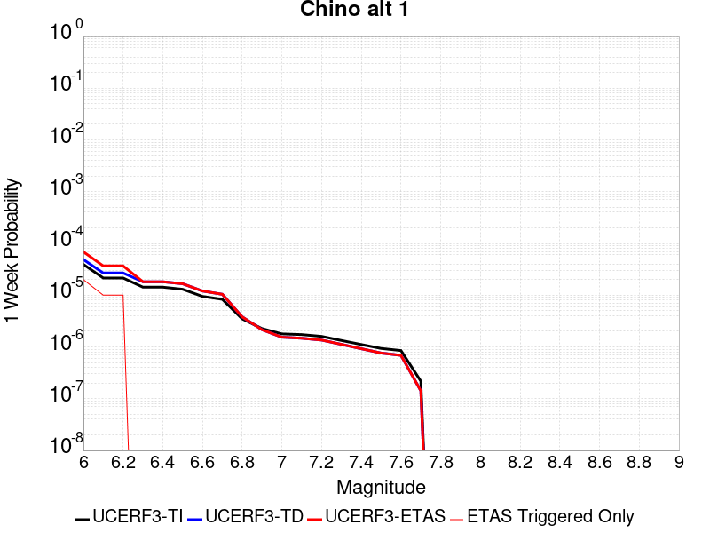 | 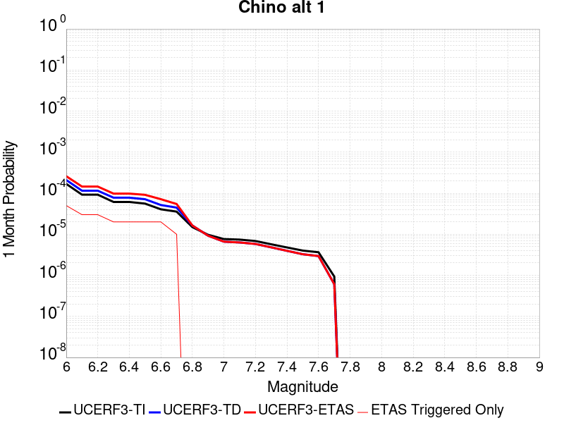 |  |  |

| Magnitude | 1 wk TI Prob | 1 wk TD Prob | 1 wk ETAS Prob | 1 wk ETAS/TD Gain | 1 wk ETAS Triggered Only | 1 mo TI Prob | 1 mo TD Prob | 1 mo ETAS Prob | 1 mo ETAS/TD Gain | 1 mo ETAS Triggered Only | 1 yr TI Prob | 1 yr TD Prob | 1 yr ETAS Prob | 1 yr ETAS/TD Gain | 1 yr ETAS Triggered Only | 10 yr TI Prob | 10 yr TD Prob | 10 yr ETAS Prob | 10 yr ETAS/TD Gain | 10 yr ETAS Triggered Only |
|-----|-----|-----|-----|-----|-----|-----|-----|-----|-----|-----|-----|-----|-----|-----|-----|-----|-----|-----|-----|-----|
| 6.0 | 3.939946E-5 | 4.8948554E-5 | 6.894758E-5 | 1.4085722 | 2.0E-5 | 1.6884391E-4 | 2.097656E-4 | 2.597551E-4 | 1.2383113 | 5.0E-5 | 0.0020537362 | 0.0025513945 | 0.0026311905 | 1.0312754 | 8.0E-5 | 0.020348595 | 0.025277847 | 0.025385067 | 1.0042416 | 1.1E-4 |
| 6.1 | 2.1505624E-5 | 2.6879026E-5 | 3.6878755E-5 | 1.3720273 | 1.0E-5 | 9.2163704E-5 | 1.1519137E-4 | 1.451879E-4 | 1.2604061 | 3.0E-5 | 0.0011215154 | 0.001401664 | 0.0014515939 | 1.0356219 | 5.0E-5 | 0.011158722 | 0.013945141 | 0.014004304 | 1.0042425 | 6.0E-5 |
| 6.2 | 2.1505624E-5 | 2.6879026E-5 | 3.6878755E-5 | 1.3720273 | 1.0E-5 | 9.2163704E-5 | 1.1519137E-4 | 1.451879E-4 | 1.2604061 | 3.0E-5 | 0.0011215154 | 0.001401664 | 0.0014515939 | 1.0356219 | 5.0E-5 | 0.011158722 | 0.013945141 | 0.014004304 | 1.0042425 | 6.0E-5 |
| 6.3 | 1.4290785E-5 | 1.8165128E-5 | 1.8165128E-5 | 1.0 | 0.0 | 6.1244784E-5 | 7.784848E-5 | 9.7846925E-5 | 1.2568893 | 2.0E-5 | 7.454001E-4 | 9.4743853E-4 | 9.774101E-4 | 1.0316343 | 3.0E-5 | 0.007429048 | 0.0094444575 | 0.00948408 | 1.0041953 | 4.0E-5 |
| 6.4 | 1.4290785E-5 | 1.8165128E-5 | 1.8165128E-5 | 1.0 | 0.0 | 6.1244784E-5 | 7.784848E-5 | 9.7846925E-5 | 1.2568893 | 2.0E-5 | 7.454001E-4 | 9.4743853E-4 | 9.774101E-4 | 1.0316343 | 3.0E-5 | 0.007429048 | 0.0094444575 | 0.00948408 | 1.0041953 | 4.0E-5 |
| 6.5 | 1.3017944E-5 | 1.6652088E-5 | 1.6652088E-5 | 1.0 | 0.0 | 5.5789995E-5 | 7.136439E-5 | 9.136296E-5 | 1.2802318 | 2.0E-5 | 6.790315E-4 | 8.685589E-4 | 8.985328E-4 | 1.03451 | 3.0E-5 | 0.0067696036 | 0.008661949 | 0.008701603 | 1.0045779 | 4.0E-5 |
| 6.6 | 9.470016E-6 | 1.2039424E-5 | 1.2039424E-5 | 1.0 | 0.0 | 4.058515E-5 | 5.1596704E-5 | 7.159567E-5 | 1.3876016 | 2.0E-5 | 4.940122E-4 | 6.280428E-4 | 6.480302E-4 | 1.031825 | 2.0E-5 | 0.004929154 | 0.0062718987 | 0.0063017104 | 1.0047532 | 3.0E-5 |
| 6.7 | 8.314155E-6 | 1.0407736E-5 | 1.0407736E-5 | 1.0 | 0.0 | 3.5631605E-5 | 4.4604003E-5 | 5.460356E-5 | 1.2241851 | 1.0E-5 | 4.3372845E-4 | 5.429507E-4 | 5.5294525E-4 | 1.0184078 | 1.0E-5 | 0.004328829 | 0.005425775 | 0.0054456666 | 1.0036662 | 2.0E-5 |
| 6.8 | 3.4856364E-6 | 3.8133708E-6 | 3.8133708E-6 | 1.0 | 0.0 | 1.4938357E-5 | 1.6342927E-5 | 1.6342927E-5 | 1.0 | 0.0 | 1.8185932E-4 | 1.9895904E-4 | 1.9895904E-4 | 1.0 | 0.0 | 0.0018171056 | 0.0019894864 | 0.0019894864 | 1.0 | 0.0 |
| 6.9 | 2.2645952E-6 | 2.1529022E-6 | 2.1529022E-6 | 1.0 | 0.0 | 9.705372E-6 | 9.226692E-6 | 9.226692E-6 | 1.0 | 0.0 | 1.18156495E-4 | 1.123294E-4 | 1.123294E-4 | 1.0 | 0.0 | 0.0011809369 | 0.0011233423 | 0.0011233423 | 1.0 | 0.0 |
| 7.0 | 1.7864003E-6 | 1.5430785E-6 | 1.5430785E-6 | 1.0 | 0.0 | 7.655979E-6 | 6.613177E-6 | 6.613177E-6 | 1.0 | 0.0 | 9.3207556E-5 | 8.051251E-5 | 8.051251E-5 | 1.0 | 0.0 | 9.316847E-4 | 8.0528046E-4 | 8.0528046E-4 | 1.0 | 0.0 |
| 7.1 | 1.7315456E-6 | 1.4733511E-6 | 1.4733511E-6 | 1.0 | 0.0 | 7.420889E-6 | 6.3143466E-6 | 6.3143466E-6 | 1.0 | 0.0 | 9.034557E-5 | 7.6874516E-5 | 7.6874516E-5 | 1.0 | 0.0 | 9.0308854E-4 | 7.6891703E-4 | 7.6891703E-4 | 1.0 | 0.0 |
| 7.2 | 1.6008337E-6 | 1.3574215E-6 | 1.3574215E-6 | 1.0 | 0.0 | 6.860698E-6 | 5.817508E-6 | 5.817508E-6 | 1.0 | 0.0 | 8.352579E-5 | 7.082591E-5 | 7.082591E-5 | 1.0 | 0.0 | 8.34944E-4 | 7.0845755E-4 | 7.0845755E-4 | 1.0 | 0.0 |
| 7.3 | 1.3320939E-6 | 1.121782E-6 | 1.121782E-6 | 1.0 | 0.0 | 5.7089615E-6 | 4.807629E-6 | 4.807629E-6 | 1.0 | 0.0 | 6.9504385E-5 | 5.8531357E-5 | 5.8531357E-5 | 1.0 | 0.0 | 6.9482654E-4 | 5.8530393E-4 | 5.8530393E-4 | 1.0 | 0.0 |
| 7.4 | 1.114294E-6 | 9.237111E-7 | 9.237111E-7 | 1.0 | 0.0 | 4.775537E-6 | 3.958756E-6 | 3.958756E-6 | 1.0 | 0.0 | 5.8140613E-5 | 4.8196827E-5 | 4.8196827E-5 | 1.0 | 0.0 | 5.81254E-4 | 4.8188053E-4 | 4.8188053E-4 | 1.0 | 0.0 |
| 7.5 | 9.354081E-7 | 7.6234323E-7 | 7.6234323E-7 | 1.0 | 0.0 | 4.0088858E-6 | 3.2671815E-6 | 3.2671815E-6 | 1.0 | 0.0 | 4.8807087E-5 | 3.9777242E-5 | 3.9777242E-5 | 1.0 | 0.0 | 4.879637E-4 | 3.977046E-4 | 3.977046E-4 | 1.0 | 0.0 |
| 7.6 | 8.521771E-7 | 6.88071E-7 | 6.88071E-7 | 1.0 | 0.0 | 3.6521824E-6 | 2.9488726E-6 | 2.9488726E-6 | 1.0 | 0.0 | 4.4464414E-5 | 3.5901965E-5 | 3.5901965E-5 | 1.0 | 0.0 | 4.4455516E-4 | 3.589648E-4 | 3.589648E-4 | 1.0 | 0.0 |
| 7.7 | 2.1803626E-7 | 1.418649E-7 | 1.418649E-7 | 1.0 | 0.0 | 9.344408E-7 | 6.079923E-7 | 6.079923E-7 | 1.0 | 0.0 | 1.1376757E-5 | 7.4022914E-6 | 7.4022914E-6 | 1.0 | 0.0 | 1.13761744E-4 | 7.402141E-5 | 7.402141E-5 | 1.0 | 0.0 |

## Kern Canyon (North Kern) 2011
*[(top)](#table-of-contents)*

| 1 Week | 1 Month | 1 Year | 10 Year |
|-----|-----|-----|-----|
| 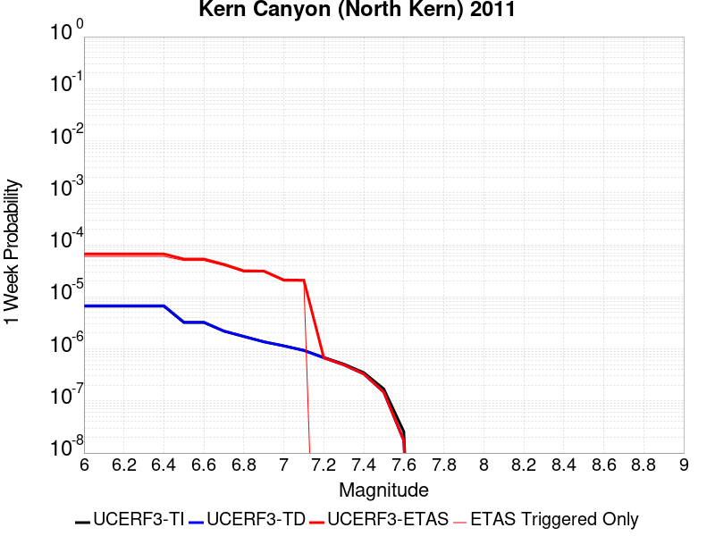 | 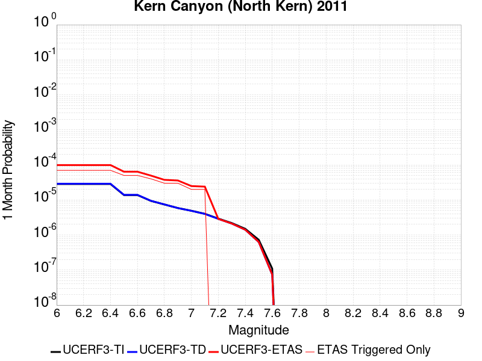 |  |  |

| Magnitude | 1 wk TI Prob | 1 wk TD Prob | 1 wk ETAS Prob | 1 wk ETAS/TD Gain | 1 wk ETAS Triggered Only | 1 mo TI Prob | 1 mo TD Prob | 1 mo ETAS Prob | 1 mo ETAS/TD Gain | 1 mo ETAS Triggered Only | 1 yr TI Prob | 1 yr TD Prob | 1 yr ETAS Prob | 1 yr ETAS/TD Gain | 1 yr ETAS Triggered Only | 10 yr TI Prob | 10 yr TD Prob | 10 yr ETAS Prob | 10 yr ETAS/TD Gain | 10 yr ETAS Triggered Only |
|-----|-----|-----|-----|-----|-----|-----|-----|-----|-----|-----|-----|-----|-----|-----|-----|-----|-----|-----|-----|-----|
| 6.0 | 6.6264497E-6 | 6.75733E-6 | 6.6756926E-5 | 9.879187 | 6.0E-5 | 2.8398761E-5 | 2.895971E-5 | 9.895768E-5 | 3.4170814 | 7.0E-5 | 3.4570007E-4 | 3.5253543E-4 | 4.3250722E-4 | 1.2268475 | 8.0E-5 | 0.0034516277 | 0.0035205502 | 0.003630163 | 1.0311351 | 1.1E-4 |
| 6.1 | 6.6264497E-6 | 6.75733E-6 | 6.6756926E-5 | 9.879187 | 6.0E-5 | 2.8398761E-5 | 2.895971E-5 | 9.895768E-5 | 3.4170814 | 7.0E-5 | 3.4570007E-4 | 3.5253543E-4 | 4.3250722E-4 | 1.2268475 | 8.0E-5 | 0.0034516277 | 0.0035205502 | 0.003630163 | 1.0311351 | 1.1E-4 |
| 6.2 | 6.6264497E-6 | 6.75733E-6 | 6.6756926E-5 | 9.879187 | 6.0E-5 | 2.8398761E-5 | 2.895971E-5 | 9.895768E-5 | 3.4170814 | 7.0E-5 | 3.4570007E-4 | 3.5253543E-4 | 4.3250722E-4 | 1.2268475 | 8.0E-5 | 0.0034516277 | 0.0035205502 | 0.003630163 | 1.0311351 | 1.1E-4 |
| 6.3 | 6.6264497E-6 | 6.75733E-6 | 6.6756926E-5 | 9.879187 | 6.0E-5 | 2.8398761E-5 | 2.895971E-5 | 9.895768E-5 | 3.4170814 | 7.0E-5 | 3.4570007E-4 | 3.5253543E-4 | 4.3250722E-4 | 1.2268475 | 8.0E-5 | 0.0034516277 | 0.0035205502 | 0.003630163 | 1.0311351 | 1.1E-4 |
| 6.4 | 6.6264497E-6 | 6.75733E-6 | 6.6756926E-5 | 9.879187 | 6.0E-5 | 2.8398761E-5 | 2.895971E-5 | 9.895768E-5 | 3.4170814 | 7.0E-5 | 3.4570007E-4 | 3.5253543E-4 | 4.3250722E-4 | 1.2268475 | 8.0E-5 | 0.0034516277 | 0.0035205502 | 0.003630163 | 1.0311351 | 1.1E-4 |
| 6.5 | 3.2162225E-6 | 3.2570915E-6 | 5.325693E-5 | 16.35107 | 5.0E-5 | 1.3783738E-5 | 1.3958893E-5 | 6.395819E-5 | 4.581896 | 5.0E-5 | 1.6780409E-4 | 1.6993708E-4 | 2.1992858E-4 | 1.2941766 | 5.0E-5 | 0.0016767744 | 0.001698151 | 0.0017680321 | 1.0411513 | 7.0E-5 |
| 6.6 | 3.2162225E-6 | 3.2570915E-6 | 5.325693E-5 | 16.35107 | 5.0E-5 | 1.3783738E-5 | 1.3958893E-5 | 6.395819E-5 | 4.581896 | 5.0E-5 | 1.6780409E-4 | 1.6993708E-4 | 2.1992858E-4 | 1.2941766 | 5.0E-5 | 0.0016767744 | 0.001698151 | 0.0017680321 | 1.0411513 | 7.0E-5 |
| 6.7 | 2.1908265E-6 | 2.2071222E-6 | 4.2207033E-5 | 19.123108 | 4.0E-5 | 9.389223E-6 | 9.459061E-6 | 4.9458682E-5 | 5.228709 | 4.0E-5 | 1.1430779E-4 | 1.1515819E-4 | 1.5515358E-4 | 1.3473083 | 4.0E-5 | 0.0011424901 | 0.0011510046 | 0.001200947 | 1.0433903 | 5.0E-5 |
| 6.8 | 1.7303895E-6 | 1.7365529E-6 | 3.17365E-5 | 18.275574 | 3.0E-5 | 7.415934E-6 | 7.4423488E-6 | 3.7442125E-5 | 5.0309553 | 3.0E-5 | 9.028525E-5 | 9.0606925E-5 | 1.2060421E-4 | 1.3310705 | 3.0E-5 | 9.024858E-4 | 9.057096E-4 | 9.456734E-4 | 1.0441242 | 4.0E-5 |
| 6.9 | 1.3700314E-6 | 1.3688622E-6 | 3.136882E-5 | 22.915981 | 3.0E-5 | 5.87155E-6 | 5.8665396E-6 | 3.5866364E-5 | 6.113717 | 3.0E-5 | 7.148377E-5 | 7.142282E-5 | 1.0142068E-4 | 1.4200038 | 3.0E-5 | 7.146078E-4 | 7.140032E-4 | 7.539747E-4 | 1.0559821 | 4.0E-5 |
| 7.0 | 1.1467797E-6 | 1.1413804E-6 | 2.1141357E-5 | 18.522621 | 2.0E-5 | 4.9147607E-6 | 4.8916213E-6 | 2.4891524E-5 | 5.088604 | 2.0E-5 | 5.983557E-5 | 5.9553895E-5 | 7.95527E-5 | 1.3358103 | 2.0E-5 | 5.981946E-4 | 5.953825E-4 | 6.2536466E-4 | 1.0503578 | 3.0E-5 |
| 7.1 | 9.3952065E-7 | 9.3026904E-7 | 2.093025E-5 | 22.499138 | 2.0E-5 | 4.026511E-6 | 3.9868614E-6 | 2.3986782E-5 | 6.0164576 | 2.0E-5 | 4.9021666E-5 | 4.8538972E-5 | 6.8538E-5 | 1.4120201 | 2.0E-5 | 4.901085E-4 | 4.8528548E-4 | 5.152709E-4 | 1.0617893 | 3.0E-5 |
| 7.2 | 6.858055E-7 | 6.7193E-7 | 6.7193E-7 | 1.0 | 0.0 | 2.939163E-6 | 2.879697E-6 | 2.879697E-6 | 1.0 | 0.0 | 3.5783723E-5 | 3.5059755E-5 | 3.5059755E-5 | 1.0 | 0.0 | 3.5777962E-4 | 3.5054312E-4 | 3.5054312E-4 | 1.0 | 0.0 |
| 7.3 | 5.1101983E-7 | 4.9393E-7 | 4.9393E-7 | 1.0 | 0.0 | 2.1900833E-6 | 2.116841E-6 | 2.116841E-6 | 1.0 | 0.0 | 2.6663936E-5 | 2.5772239E-5 | 2.5772239E-5 | 1.0 | 0.0 | 2.6660739E-4 | 2.57693E-4 | 2.57693E-4 | 1.0 | 0.0 |
| 7.4 | 3.4999414E-7 | 3.2995905E-7 | 3.2995905E-7 | 1.0 | 0.0 | 1.499974E-6 | 1.4141094E-6 | 1.4141094E-6 | 1.0 | 0.0 | 1.8262032E-5 | 1.721665E-5 | 1.721665E-5 | 1.0 | 0.0 | 1.826053E-4 | 1.7215339E-4 | 1.7215339E-4 | 1.0 | 0.0 |
| 7.5 | 1.7021522E-7 | 1.4750044E-7 | 1.4750044E-7 | 1.0 | 0.0 | 7.2949354E-7 | 6.321446E-7 | 6.321446E-7 | 1.0 | 0.0 | 8.881548E-6 | 7.696334E-6 | 7.696334E-6 | 1.0 | 0.0 | 8.8811925E-5 | 7.696076E-5 | 7.696076E-5 | 1.0 | 0.0 |
| 7.6 | 2.572245E-8 | 1.7352555E-8 | 1.7352555E-8 | 1.0 | 0.0 | 1.10239064E-7 | 7.436809E-8 | 7.436809E-8 | 1.0 | 0.0 | 1.3421597E-6 | 9.054312E-7 | 9.054312E-7 | 1.0 | 0.0 | 1.3421517E-5 | 9.05428E-6 | 9.05428E-6 | 1.0 | 0.0 |

## Kern Canyon (South Kern) 2011
*[(top)](#table-of-contents)*

| 1 Week | 1 Month | 1 Year | 10 Year |
|-----|-----|-----|-----|
|  | 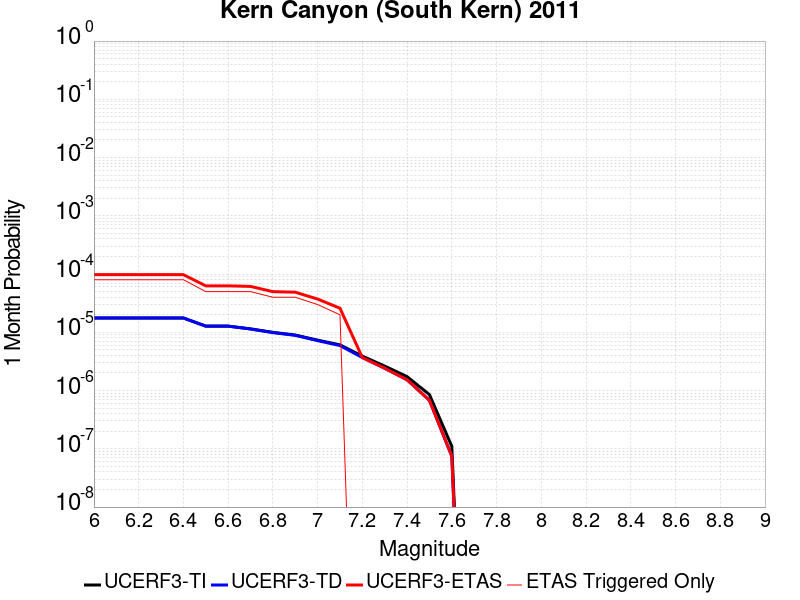 | 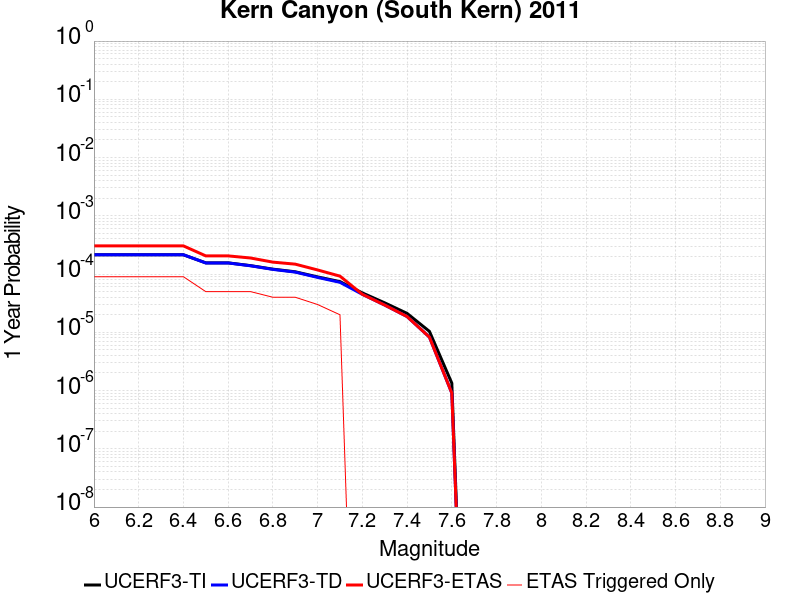 | 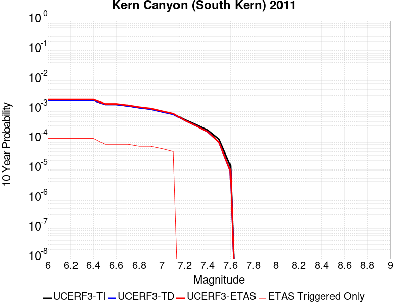 |

| Magnitude | 1 wk TI Prob | 1 wk TD Prob | 1 wk ETAS Prob | 1 wk ETAS/TD Gain | 1 wk ETAS Triggered Only | 1 mo TI Prob | 1 mo TD Prob | 1 mo ETAS Prob | 1 mo ETAS/TD Gain | 1 mo ETAS Triggered Only | 1 yr TI Prob | 1 yr TD Prob | 1 yr ETAS Prob | 1 yr ETAS/TD Gain | 1 yr ETAS Triggered Only | 10 yr TI Prob | 10 yr TD Prob | 10 yr ETAS Prob | 10 yr ETAS/TD Gain | 10 yr ETAS Triggered Only |
|-----|-----|-----|-----|-----|-----|-----|-----|-----|-----|-----|-----|-----|-----|-----|-----|-----|-----|-----|-----|-----|
| 6.0 | 4.105075E-6 | 4.1137264E-6 | 5.411352E-5 | 13.15438 | 5.0E-5 | 1.7593058E-5 | 1.763014E-5 | 9.7628734E-5 | 5.5376034 | 8.0E-5 | 2.1417443E-4 | 2.1462646E-4 | 3.0460715E-4 | 1.4192432 | 9.0E-5 | 0.0021396813 | 0.0021442557 | 0.0022540197 | 1.0511899 | 1.1E-4 |
| 6.1 | 4.105075E-6 | 4.1137264E-6 | 5.411352E-5 | 13.15438 | 5.0E-5 | 1.7593058E-5 | 1.763014E-5 | 9.7628734E-5 | 5.5376034 | 8.0E-5 | 2.1417443E-4 | 2.1462646E-4 | 3.0460715E-4 | 1.4192432 | 9.0E-5 | 0.0021396813 | 0.0021442557 | 0.0022540197 | 1.0511899 | 1.1E-4 |
| 6.2 | 4.105075E-6 | 4.1137264E-6 | 5.411352E-5 | 13.15438 | 5.0E-5 | 1.7593058E-5 | 1.763014E-5 | 9.7628734E-5 | 5.5376034 | 8.0E-5 | 2.1417443E-4 | 2.1462646E-4 | 3.0460715E-4 | 1.4192432 | 9.0E-5 | 0.0021396813 | 0.0021442557 | 0.0022540197 | 1.0511899 | 1.1E-4 |
| 6.3 | 4.105075E-6 | 4.1137264E-6 | 5.411352E-5 | 13.15438 | 5.0E-5 | 1.7593058E-5 | 1.763014E-5 | 9.7628734E-5 | 5.5376034 | 8.0E-5 | 2.1417443E-4 | 2.1462646E-4 | 3.0460715E-4 | 1.4192432 | 9.0E-5 | 0.0021396813 | 0.0021442557 | 0.0022540197 | 1.0511899 | 1.1E-4 |
| 6.4 | 4.105075E-6 | 4.1137264E-6 | 5.411352E-5 | 13.15438 | 5.0E-5 | 1.7593058E-5 | 1.763014E-5 | 9.7628734E-5 | 5.5376034 | 8.0E-5 | 2.1417443E-4 | 2.1462646E-4 | 3.0460715E-4 | 1.4192432 | 9.0E-5 | 0.0021396813 | 0.0021442557 | 0.0022540197 | 1.0511899 | 1.1E-4 |
| 6.5 | 2.9849807E-6 | 2.9731548E-6 | 4.2973035E-5 | 14.453683 | 4.0E-5 | 1.2792712E-5 | 1.274203E-5 | 6.274139E-5 | 4.9239717 | 5.0E-5 | 1.5574014E-4 | 1.5512333E-4 | 2.0511558E-4 | 1.3222742 | 5.0E-5 | 0.0015563103 | 0.0015501656 | 0.0016200572 | 1.0450865 | 7.0E-5 |
| 6.6 | 2.9849807E-6 | 2.9731548E-6 | 4.2973035E-5 | 14.453683 | 4.0E-5 | 1.2792712E-5 | 1.274203E-5 | 6.274139E-5 | 4.9239717 | 5.0E-5 | 1.5574014E-4 | 1.5512333E-4 | 2.0511558E-4 | 1.3222742 | 5.0E-5 | 0.0015563103 | 0.0015501656 | 0.0016200572 | 1.0450865 | 7.0E-5 |
| 6.7 | 2.6756725E-6 | 2.6582206E-6 | 4.2658114E-5 | 16.047619 | 4.0E-5 | 1.1467117E-5 | 1.1392325E-5 | 6.139176E-5 | 5.38887 | 5.0E-5 | 1.396032E-4 | 1.3869285E-4 | 1.8868591E-4 | 1.3604589 | 5.0E-5 | 0.0013951553 | 0.0013860738 | 0.0014559767 | 1.0504323 | 7.0E-5 |
| 6.8 | 2.3283721E-6 | 2.3047787E-6 | 4.2304688E-5 | 18.355204 | 4.0E-5 | 9.9787E-6 | 9.877586E-6 | 4.987719E-5 | 5.0495324 | 4.0E-5 | 1.214839E-4 | 1.20253055E-4 | 1.6024824E-4 | 1.3325919 | 4.0E-5 | 0.001214175 | 0.0012018873 | 0.0012618152 | 1.0498614 | 6.0E-5 |
| 6.9 | 2.0972677E-6 | 2.0696411E-6 | 4.2069558E-5 | 20.326982 | 4.0E-5 | 8.988259E-6 | 8.869861E-6 | 4.8869504E-5 | 5.5096135 | 4.0E-5 | 1.0942656E-4 | 1.0798526E-4 | 1.4798094E-4 | 1.3703809 | 4.0E-5 | 0.0010937268 | 0.0010793337 | 0.001139269 | 1.0555298 | 6.0E-5 |
| 7.0 | 1.7132242E-6 | 1.6787036E-6 | 3.1678654E-5 | 18.870903 | 3.0E-5 | 7.3423685E-6 | 7.194424E-6 | 3.7194208E-5 | 5.169866 | 3.0E-5 | 8.938967E-5 | 8.758863E-5 | 1.17586E-4 | 1.3424802 | 3.0E-5 | 8.935372E-4 | 8.7554497E-4 | 9.2550117E-4 | 1.0570573 | 5.0E-5 |
| 7.1 | 1.4215541E-6 | 1.3815752E-6 | 2.1381547E-5 | 15.47621 | 2.0E-5 | 6.0923603E-6 | 5.9210233E-6 | 2.5920905E-5 | 4.3777747 | 2.0E-5 | 7.417196E-5 | 7.20861E-5 | 9.208466E-5 | 1.277426 | 2.0E-5 | 7.414721E-4 | 7.206299E-4 | 7.606011E-4 | 1.055467 | 4.0E-5 |
| 7.2 | 9.097853E-7 | 8.6037755E-7 | 8.6037755E-7 | 1.0 | 0.0 | 3.899074E-6 | 3.6873273E-6 | 3.6873273E-6 | 1.0 | 0.0 | 4.7470192E-5 | 4.4892295E-5 | 4.4892295E-5 | 1.0 | 0.0 | 4.7460053E-4 | 4.4883334E-4 | 4.4883334E-4 | 1.0 | 0.0 |
| 7.3 | 6.144169E-7 | 5.628206E-7 | 5.628206E-7 | 1.0 | 0.0 | 2.6332125E-6 | 2.4120861E-6 | 2.4120861E-6 | 1.0 | 0.0 | 3.205889E-5 | 2.9366758E-5 | 2.9366758E-5 | 1.0 | 0.0 | 3.2054266E-4 | 2.936293E-4 | 2.936293E-4 | 1.0 | 0.0 |
| 7.4 | 4.049844E-7 | 3.5728314E-7 | 3.5728314E-7 | 1.0 | 0.0 | 1.7356463E-6 | 1.5312125E-6 | 1.5312125E-6 | 1.0 | 0.0 | 2.1131287E-5 | 1.8642357E-5 | 1.8642357E-5 | 1.0 | 0.0 | 2.1129279E-4 | 1.8640817E-4 | 1.8640817E-4 | 1.0 | 0.0 |
| 7.5 | 1.9871162E-7 | 1.583044E-7 | 1.583044E-7 | 1.0 | 0.0 | 8.5162094E-7 | 6.7844724E-7 | 6.7844724E-7 | 1.0 | 0.0 | 1.0368436E-5 | 8.260065E-6 | 8.260065E-6 | 1.0 | 0.0 | 1.0367952E-4 | 8.259767E-5 | 8.259767E-5 | 1.0 | 0.0 |
| 7.6 | 2.572245E-8 | 1.7352555E-8 | 1.7352555E-8 | 1.0 | 0.0 | 1.10239064E-7 | 7.436809E-8 | 7.436809E-8 | 1.0 | 0.0 | 1.3421597E-6 | 9.054312E-7 | 9.054312E-7 | 1.0 | 0.0 | 1.3421517E-5 | 9.05428E-6 | 9.05428E-6 | 1.0 | 0.0 |

## San Diego Trough north alt1
*[(top)](#table-of-contents)*

| 1 Week | 1 Month | 1 Year | 10 Year |
|-----|-----|-----|-----|
| 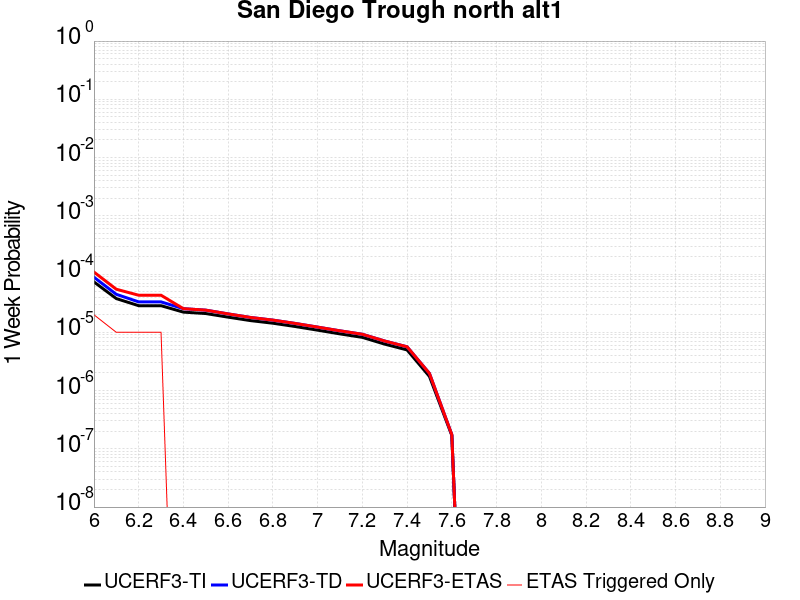 | 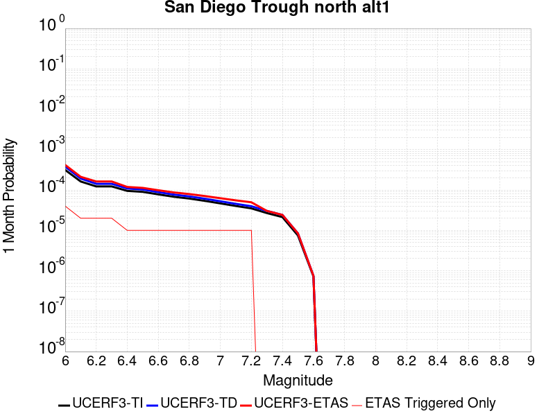 |  |  |

| Magnitude | 1 wk TI Prob | 1 wk TD Prob | 1 wk ETAS Prob | 1 wk ETAS/TD Gain | 1 wk ETAS Triggered Only | 1 mo TI Prob | 1 mo TD Prob | 1 mo ETAS Prob | 1 mo ETAS/TD Gain | 1 mo ETAS Triggered Only | 1 yr TI Prob | 1 yr TD Prob | 1 yr ETAS Prob | 1 yr ETAS/TD Gain | 1 yr ETAS Triggered Only | 10 yr TI Prob | 10 yr TD Prob | 10 yr ETAS Prob | 10 yr ETAS/TD Gain | 10 yr ETAS Triggered Only |
|-----|-----|-----|-----|-----|-----|-----|-----|-----|-----|-----|-----|-----|-----|-----|-----|-----|-----|-----|-----|-----|
| 6.0 | 7.329252E-5 | 8.821093E-5 | 1.0820917E-4 | 1.2267092 | 2.0E-5 | 3.14073E-4 | 3.7799572E-4 | 4.179806E-4 | 1.1057813 | 4.0E-5 | 0.0038171355 | 0.004593027 | 0.0046627056 | 1.0151705 | 7.0E-5 | 0.03752231 | 0.045044992 | 0.045140486 | 1.00212 | 1.0E-4 |
| 6.1 | 3.7940346E-5 | 4.4885E-5 | 5.4884553E-5 | 1.2227815 | 1.0E-5 | 1.6259136E-4 | 1.9235066E-4 | 2.1234681E-4 | 1.1039568 | 2.0E-5 | 0.0019777524 | 0.0023394432 | 0.0023593963 | 1.0085291 | 2.0E-5 | 0.019602431 | 0.023156688 | 0.023185993 | 1.0012655 | 3.0E-5 |
| 6.2 | 2.8645263E-5 | 3.329678E-5 | 4.3296448E-5 | 1.3003193 | 1.0E-5 | 1.2275964E-4 | 1.4269284E-4 | 1.6268999E-4 | 1.1401412 | 2.0E-5 | 0.0014935739 | 0.0017359189 | 0.0017558842 | 1.0115013 | 2.0E-5 | 0.0148357535 | 0.017226247 | 0.01725573 | 1.0017115 | 3.0E-5 |
| 6.3 | 2.8645263E-5 | 3.329678E-5 | 4.3296448E-5 | 1.3003193 | 1.0E-5 | 1.2275964E-4 | 1.4269284E-4 | 1.6268999E-4 | 1.1401412 | 2.0E-5 | 0.0014935739 | 0.0017359189 | 0.0017558842 | 1.0115013 | 2.0E-5 | 0.0148357535 | 0.017226247 | 0.01725573 | 1.0017115 | 3.0E-5 |
| 6.4 | 2.2204576E-5 | 2.5448318E-5 | 2.5448318E-5 | 1.0 | 0.0 | 9.5159E-5 | 1.0905972E-4 | 1.19058626E-4 | 1.0916829 | 1.0E-5 | 0.001157945 | 0.0013270034 | 0.00133699 | 1.0075258 | 1.0E-5 | 0.011519298 | 0.013191955 | 0.013211691 | 1.0014961 | 2.0E-5 |
| 6.5 | 2.1004838E-5 | 2.4024694E-5 | 2.4024694E-5 | 1.0 | 0.0 | 9.0017624E-5 | 1.0295896E-4 | 1.1295793E-4 | 1.0971161 | 1.0E-5 | 0.0010954136 | 0.0012528138 | 0.0012628014 | 1.007972 | 1.0E-5 | 0.010900296 | 0.012458589 | 0.0124783395 | 1.0015854 | 2.0E-5 |
| 6.6 | 1.820557E-5 | 2.0704787E-5 | 2.0704787E-5 | 1.0 | 0.0 | 7.802154E-5 | 8.873181E-5 | 9.8730925E-5 | 1.1126891 | 1.0E-5 | 9.4949827E-4 | 0.0010797799 | 0.0010897691 | 1.0092511 | 1.0E-5 | 0.009454516 | 0.010746004 | 0.010765789 | 1.0018412 | 2.0E-5 |
| 6.7 | 1.5884485E-5 | 1.7983646E-5 | 1.7983646E-5 | 1.0 | 0.0 | 6.807459E-5 | 7.707051E-5 | 8.706974E-5 | 1.1297413 | 1.0E-5 | 8.284929E-4 | 9.3793223E-4 | 9.479229E-4 | 1.0106517 | 1.0E-5 | 0.008254109 | 0.009340104 | 0.00935001 | 1.0010606 | 1.0E-5 |
| 6.8 | 1.4331171E-5 | 1.6201066E-5 | 1.6201066E-5 | 1.0 | 0.0 | 6.141786E-5 | 6.94313E-5 | 7.94306E-5 | 1.1440172 | 1.0E-5 | 7.4750587E-4 | 8.450002E-4 | 8.549917E-4 | 1.0118244 | 1.0E-5 | 0.0074499645 | 0.008418139 | 0.008428055 | 1.0011779 | 1.0E-5 |
| 6.9 | 1.2574203E-5 | 1.4205835E-5 | 1.4205835E-5 | 1.0 | 0.0 | 5.3888325E-5 | 6.0880735E-5 | 7.088013E-5 | 1.1642456 | 1.0E-5 | 6.558929E-4 | 7.409723E-4 | 7.5096486E-4 | 1.0134858 | 1.0E-5 | 0.0065396037 | 0.007385203 | 0.0073951297 | 1.0013441 | 1.0E-5 |
| 7.0 | 1.0883844E-5 | 1.2289262E-5 | 1.2289262E-5 | 1.0 | 0.0 | 4.664421E-5 | 5.2667205E-5 | 6.266668E-5 | 1.1898614 | 1.0E-5 | 5.677453E-4 | 6.4103556E-4 | 6.510292E-4 | 1.0155897 | 1.0E-5 | 0.00566297 | 0.006391993 | 0.0064019286 | 1.0015545 | 1.0E-5 |
| 7.1 | 9.393088E-6 | 1.060702E-5 | 1.060702E-5 | 1.0 | 0.0 | 4.025547E-5 | 4.545787E-5 | 5.5457414E-5 | 1.2199739 | 1.0E-5 | 4.900001E-4 | 5.533098E-4 | 5.6330423E-4 | 1.0180631 | 1.0E-5 | 0.0048892107 | 0.005519418 | 0.0055293627 | 1.0018017 | 1.0E-5 |
| 7.2 | 8.190791E-6 | 9.258625E-6 | 9.258625E-6 | 1.0 | 0.0 | 3.510292E-5 | 3.9679224E-5 | 4.9678827E-5 | 1.2520111 | 1.0E-5 | 4.2729423E-4 | 4.8298817E-4 | 4.929833E-4 | 1.0206945 | 1.0E-5 | 0.0042647356 | 0.004819465 | 0.0048294165 | 1.002065 | 1.0E-5 |
| 7.3 | 6.268162E-6 | 7.089716E-6 | 7.089716E-6 | 1.0 | 0.0 | 2.6863276E-5 | 3.0384144E-5 | 3.0384144E-5 | 1.0 | 0.0 | 3.2701128E-4 | 3.6986457E-4 | 3.6986457E-4 | 1.0 | 0.0 | 0.003265305 | 0.003692536 | 0.003692536 | 1.0 | 0.0 |
| 7.4 | 4.985186E-6 | 5.6426816E-6 | 5.6426816E-6 | 1.0 | 0.0 | 2.1364907E-5 | 2.4182698E-5 | 2.4182698E-5 | 1.0 | 0.0 | 2.600867E-4 | 2.9438498E-4 | 2.9438498E-4 | 1.0 | 0.0 | 0.002597825 | 0.0029399914 | 0.0029399914 | 1.0 | 0.0 |
| 7.5 | 1.7489613E-6 | 1.969678E-6 | 1.969678E-6 | 1.0 | 0.0 | 7.495527E-6 | 8.4414505E-6 | 8.4414505E-6 | 1.0 | 0.0 | 9.125422E-5 | 1.02770035E-4 | 1.02770035E-4 | 1.0 | 0.0 | 9.1216754E-4 | 0.0010272472 | 0.0010272472 | 1.0 | 0.0 |
| 7.6 | 1.6988751E-7 | 1.7533823E-7 | 1.7533823E-7 | 1.0 | 0.0 | 7.2808916E-7 | 7.5144936E-7 | 7.5144936E-7 | 1.0 | 0.0 | 8.864449E-6 | 9.14886E-6 | 9.14886E-6 | 1.0 | 0.0 | 8.8640954E-5 | 9.1485024E-5 | 9.1485024E-5 | 1.0 | 0.0 |

## Imperial
*[(top)](#table-of-contents)*

| 1 Week | 1 Month | 1 Year | 10 Year |
|-----|-----|-----|-----|
|  | 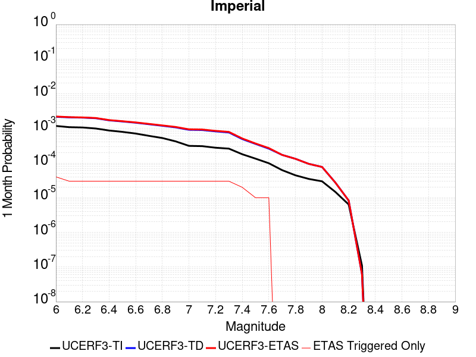 |  |  |

| Magnitude | 1 wk TI Prob | 1 wk TD Prob | 1 wk ETAS Prob | 1 wk ETAS/TD Gain | 1 wk ETAS Triggered Only | 1 mo TI Prob | 1 mo TD Prob | 1 mo ETAS Prob | 1 mo ETAS/TD Gain | 1 mo ETAS Triggered Only | 1 yr TI Prob | 1 yr TD Prob | 1 yr ETAS Prob | 1 yr ETAS/TD Gain | 1 yr ETAS Triggered Only | 10 yr TI Prob | 10 yr TD Prob | 10 yr ETAS Prob | 10 yr ETAS/TD Gain | 10 yr ETAS Triggered Only |
|-----|-----|-----|-----|-----|-----|-----|-----|-----|-----|-----|-----|-----|-----|-----|-----|-----|-----|-----|-----|-----|
| 6.0 | 2.7496446E-4 | 5.0552754E-4 | 5.2551745E-4 | 1.0395427 | 2.0E-5 | 0.0011778869 | 0.002164787 | 0.0022047004 | 1.0184376 | 4.0E-5 | 0.0142467655 | 0.026038699 | 0.026097136 | 1.0022442 | 6.0E-5 | 0.13367249 | 0.2280438 | 0.22812098 | 1.0003386 | 1.0E-4 |
| 6.1 | 2.5356023E-4 | 4.8656776E-4 | 5.0655805E-4 | 1.0410843 | 2.0E-5 | 0.001086234 | 0.0020836622 | 0.0021135998 | 1.0143677 | 3.0E-5 | 0.013144928 | 0.025071215 | 0.02511996 | 1.0019443 | 5.0E-5 | 0.123940155 | 0.21947981 | 0.21955006 | 1.0003201 | 9.0E-5 |
| 6.2 | 2.4820742E-4 | 4.7752203E-4 | 4.9751246E-4 | 1.0418628 | 2.0E-5 | 0.0010633124 | 0.0020449557 | 0.0020748945 | 1.0146402 | 3.0E-5 | 0.01286919 | 0.024611235 | 0.024660004 | 1.0019816 | 5.0E-5 | 0.12148927 | 0.21598552 | 0.21604824 | 1.0002904 | 8.0E-5 |
| 6.3 | 2.3205351E-4 | 4.5890483E-4 | 4.7889564E-4 | 1.043562 | 2.0E-5 | 9.94136E-4 | 0.0019652895 | 0.0019952306 | 1.015235 | 3.0E-5 | 0.012036599 | 0.02366133 | 0.023710148 | 1.0020632 | 5.0E-5 | 0.11405133 | 0.20793462 | 0.20799798 | 1.0003047 | 8.0E-5 |
| 6.4 | 2.0304754E-4 | 3.987652E-4 | 4.187572E-4 | 1.0501348 | 2.0E-5 | 8.6991355E-4 | 0.0017078889 | 0.0017378377 | 1.0175356 | 3.0E-5 | 0.010539869 | 0.020595672 | 0.02064464 | 1.0023777 | 5.0E-5 | 0.100537635 | 0.1850669 | 0.18513209 | 1.0003523 | 8.0E-5 |
| 6.5 | 1.854992E-4 | 3.6988858E-4 | 3.898812E-4 | 1.0540503 | 2.0E-5 | 7.9475436E-4 | 0.0015842861 | 0.0016142386 | 1.018906 | 3.0E-5 | 0.009633281 | 0.01911948 | 0.019168526 | 1.0025651 | 5.0E-5 | 0.0922623 | 0.173298 | 0.17336413 | 1.0003816 | 8.0E-5 |
| 6.6 | 1.6586106E-4 | 3.403506E-4 | 3.603438E-4 | 1.0587429 | 2.0E-5 | 7.106394E-4 | 0.0014578402 | 0.0014877965 | 1.0205483 | 3.0E-5 | 0.008617763 | 0.01760642 | 0.01765554 | 1.0027899 | 5.0E-5 | 0.08291132 | 0.16077545 | 0.16084258 | 1.0004176 | 8.0E-5 |
| 6.7 | 1.4224656E-4 | 3.076692E-4 | 3.2766303E-4 | 1.0649849 | 2.0E-5 | 6.094856E-4 | 0.001317924 | 0.0013478845 | 1.0227331 | 3.0E-5 | 0.0073952693 | 0.015929576 | 0.01597878 | 1.0030888 | 5.0E-5 | 0.07153955 | 0.14648417 | 0.14655244 | 1.0004661 | 8.0E-5 |
| 6.8 | 1.2317259E-4 | 2.779122E-4 | 2.9790663E-4 | 1.0719452 | 2.0E-5 | 5.2777573E-4 | 0.0011905148 | 0.001220479 | 1.0251691 | 3.0E-5 | 0.0064067547 | 0.0143995695 | 0.014438993 | 1.0027379 | 4.0E-5 | 0.06225166 | 0.13293684 | 0.13299753 | 1.0004566 | 7.0E-5 |
| 6.9 | 9.859898E-5 | 2.5014306E-4 | 2.7013806E-4 | 1.0799342 | 2.0E-5 | 4.2249862E-4 | 0.0010716055 | 0.0011015733 | 1.0279654 | 3.0E-5 | 0.0051317946 | 0.012969712 | 0.013009193 | 1.0030441 | 4.0E-5 | 0.05014893 | 0.11940631 | 0.11946796 | 1.0005162 | 7.0E-5 |
| 7.0 | 7.3191884E-5 | 2.1266776E-4 | 2.3266351E-4 | 1.0940233 | 2.0E-5 | 3.136418E-4 | 9.1111806E-4 | 9.4109075E-4 | 1.0328965 | 3.0E-5 | 0.003811904 | 0.011037128 | 0.011076686 | 1.0035841 | 4.0E-5 | 0.037471764 | 0.10206493 | 0.10212778 | 1.0006158 | 7.0E-5 |
| 7.1 | 7.1760296E-5 | 2.0968143E-4 | 2.2967723E-4 | 1.0953628 | 2.0E-5 | 3.0750787E-4 | 8.983284E-4 | 9.283014E-4 | 1.0333654 | 3.0E-5 | 0.003737482 | 0.010882978 | 0.010922543 | 1.0036354 | 4.0E-5 | 0.03675245 | 0.10070146 | 0.10076441 | 1.0006251 | 7.0E-5 |
| 7.2 | 6.46614E-5 | 1.9136685E-4 | 2.1136303E-4 | 1.1044914 | 2.0E-5 | 2.7709085E-4 | 8.1988896E-4 | 8.4986433E-4 | 1.0365603 | 3.0E-5 | 0.0033683628 | 0.0099370815 | 0.009976684 | 1.0039853 | 4.0E-5 | 0.033177625 | 0.09250898 | 0.0925725 | 1.0006866 | 7.0E-5 |
| 7.3 | 6.088115E-5 | 1.78084E-4 | 1.9808042E-4 | 1.1122866 | 2.0E-5 | 2.6089314E-4 | 7.6299673E-4 | 7.9297385E-4 | 1.0392886 | 3.0E-5 | 0.0031717476 | 0.009250494 | 0.009290123 | 1.0042841 | 4.0E-5 | 0.031268585 | 0.08655989 | 0.08662383 | 1.0007387 | 7.0E-5 |
| 7.4 | 4.199346E-5 | 1.1510366E-4 | 1.2510251E-4 | 1.0868682 | 1.0E-5 | 1.7995955E-4 | 4.9320905E-4 | 5.131992E-4 | 1.0405308 | 2.0E-5 | 0.0021888057 | 0.0059884563 | 0.0060083363 | 1.0033197 | 2.0E-5 | 0.02167372 | 0.057439793 | 0.057477497 | 1.0006564 | 4.0E-5 |
| 7.5 | 3.130448E-5 | 8.33328E-5 | 9.333197E-5 | 1.1199908 | 1.0E-5 | 1.3415517E-4 | 3.57092E-4 | 3.6708842E-4 | 1.027994 | 1.0E-5 | 0.0016321153 | 0.004338988 | 0.004348945 | 1.0022947 | 1.0E-5 | 0.016201803 | 0.04213201 | 0.042151164 | 1.0004547 | 2.0E-5 |
| 7.6 | 2.3074248E-5 | 6.0844646E-5 | 7.084404E-5 | 1.164343 | 1.0E-5 | 9.888588E-5 | 2.6073685E-4 | 2.7073422E-4 | 1.0383428 | 1.0E-5 | 0.0012032706 | 0.0031698733 | 0.0031798417 | 1.0031447 | 1.0E-5 | 0.011967761 | 0.031026395 | 0.031045774 | 1.0006247 | 2.0E-5 |
| 7.7 | 1.45864815E-5 | 4.0124698E-5 | 4.0124698E-5 | 1.0 | 0.0 | 6.2511994E-5 | 1.7195169E-4 | 1.7195169E-4 | 1.0 | 0.0 | 7.608177E-4 | 0.0020915072 | 0.0020915072 | 1.0 | 0.0 | 0.007582182 | 0.020627763 | 0.020637557 | 1.0004748 | 1.0E-5 |
| 7.8 | 1.0352979E-5 | 3.0960902E-5 | 3.0960902E-5 | 1.0 | 0.0 | 4.4369157E-5 | 1.3268284E-4 | 1.3268284E-4 | 1.0 | 0.0 | 5.400606E-4 | 0.0016142189 | 0.0016142189 | 1.0 | 0.0 | 0.0053875 | 0.016016833 | 0.016026672 | 1.0006143 | 1.0E-5 |
| 7.9 | 8.137906E-6 | 2.2149103E-5 | 2.2149103E-5 | 1.0 | 0.0 | 3.4876273E-5 | 9.492128E-5 | 9.492128E-5 | 1.0 | 0.0 | 4.2453592E-4 | 0.0011550548 | 0.0011550548 | 1.0 | 0.0 | 0.004237258 | 0.011617903 | 0.011627787 | 1.0008508 | 1.0E-5 |
| 8.0 | 6.93792E-6 | 1.8008766E-5 | 1.8008766E-5 | 1.0 | 0.0 | 2.9733603E-5 | 7.717814E-5 | 7.717814E-5 | 1.0 | 0.0 | 3.6194647E-4 | 9.3923963E-4 | 9.3923963E-4 | 1.0 | 0.0 | 0.0036135751 | 0.00950155 | 0.009511456 | 1.0010425 | 1.0E-5 |
| 8.1 | 3.4286315E-6 | 6.379872E-6 | 6.379872E-6 | 1.0 | 0.0 | 1.4694053E-5 | 2.7342023E-5 | 2.7342023E-5 | 1.0 | 0.0 | 1.7888541E-4 | 3.328384E-4 | 3.328384E-4 | 1.0 | 0.0 | 0.0017874148 | 0.003486031 | 0.003495996 | 1.0028586 | 1.0E-5 |
| 8.2 | 1.4906886E-6 | 1.9366646E-6 | 1.9366646E-6 | 1.0 | 0.0 | 6.3886496E-6 | 8.299965E-6 | 8.299965E-6 | 1.0 | 0.0 | 7.7779034E-5 | 1.0104742E-4 | 1.0104742E-4 | 1.0 | 0.0 | 7.775182E-4 | 0.0011075331 | 0.0011075331 | 1.0 | 0.0 |
| 8.3 | 2.5758007E-8 | 1.4500102E-8 | 1.4500102E-8 | 1.0 | 0.0 | 1.10391454E-7 | 6.214329E-8 | 6.214329E-8 | 1.0 | 0.0 | 1.3440151E-6 | 7.565946E-7 | 7.565946E-7 | 1.0 | 0.0 | 1.344007E-5 | 7.887763E-6 | 7.887763E-6 | 1.0 | 0.0 |

## San Pedro Basin
*[(top)](#table-of-contents)*

| 1 Week | 1 Month | 1 Year | 10 Year |
|-----|-----|-----|-----|
| 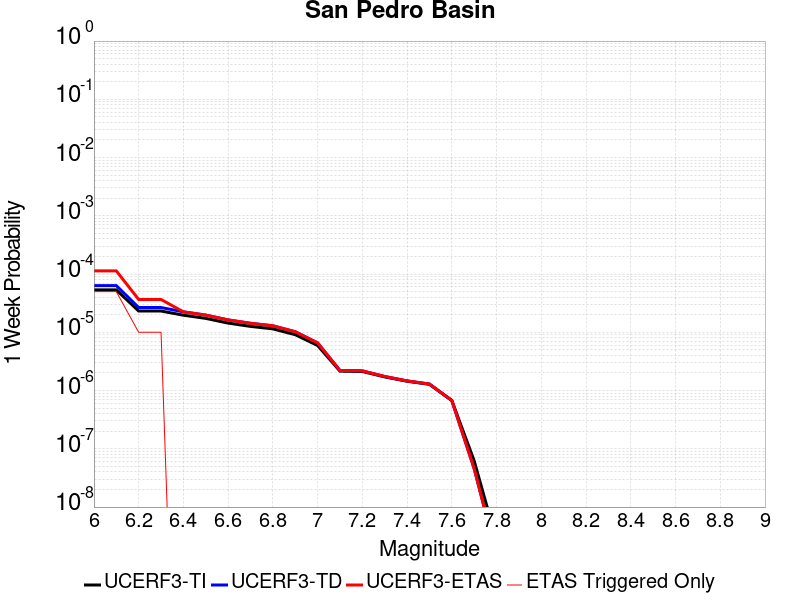 | 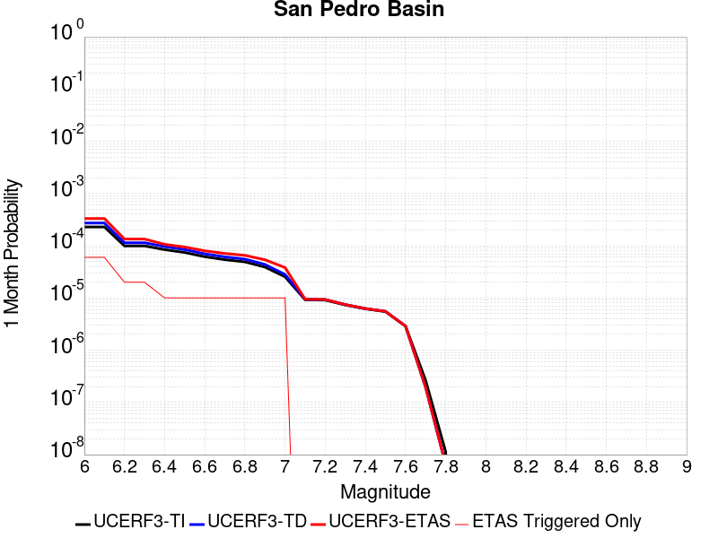 |  |  |

| Magnitude | 1 wk TI Prob | 1 wk TD Prob | 1 wk ETAS Prob | 1 wk ETAS/TD Gain | 1 wk ETAS Triggered Only | 1 mo TI Prob | 1 mo TD Prob | 1 mo ETAS Prob | 1 mo ETAS/TD Gain | 1 mo ETAS Triggered Only | 1 yr TI Prob | 1 yr TD Prob | 1 yr ETAS Prob | 1 yr ETAS/TD Gain | 1 yr ETAS Triggered Only | 10 yr TI Prob | 10 yr TD Prob | 10 yr ETAS Prob | 10 yr ETAS/TD Gain | 10 yr ETAS Triggered Only |
|-----|-----|-----|-----|-----|-----|-----|-----|-----|-----|-----|-----|-----|-----|-----|-----|-----|-----|-----|-----|-----|
| 6.0 | 5.3449043E-5 | 6.336954E-5 | 1.1336637E-4 | 1.7889726 | 5.0E-5 | 2.2904722E-4 | 2.715589E-4 | 3.3154263E-4 | 1.2208865 | 6.0E-5 | 0.0027850836 | 0.0033018254 | 0.0033715942 | 1.0211304 | 7.0E-5 | 0.027504366 | 0.03258945 | 0.032686193 | 1.0029684 | 1.0E-4 |
| 6.1 | 5.3449043E-5 | 6.336954E-5 | 1.1336637E-4 | 1.7889726 | 5.0E-5 | 2.2904722E-4 | 2.715589E-4 | 3.3154263E-4 | 1.2208865 | 6.0E-5 | 0.0027850836 | 0.0033018254 | 0.0033715942 | 1.0211304 | 7.0E-5 | 0.027504366 | 0.03258945 | 0.032686193 | 1.0029684 | 1.0E-4 |
| 6.2 | 2.3189454E-5 | 2.6642796E-5 | 3.664253E-5 | 1.375326 | 1.0E-5 | 9.9379584E-5 | 1.14178685E-4 | 1.341764E-4 | 1.1751441 | 2.0E-5 | 0.0012092749 | 0.0013892864 | 0.0014092586 | 1.0143759 | 2.0E-5 | 0.012027155 | 0.013810883 | 0.0138404695 | 1.0021422 | 3.0E-5 |
| 6.3 | 2.3189454E-5 | 2.6642796E-5 | 3.664253E-5 | 1.375326 | 1.0E-5 | 9.9379584E-5 | 1.14178685E-4 | 1.341764E-4 | 1.1751441 | 2.0E-5 | 0.0012092749 | 0.0013892864 | 0.0014092586 | 1.0143759 | 2.0E-5 | 0.012027155 | 0.013810883 | 0.0138404695 | 1.0021422 | 3.0E-5 |
| 6.4 | 1.966056E-5 | 2.2463413E-5 | 2.2463413E-5 | 1.0 | 0.0 | 8.425682E-5 | 9.626844E-5 | 1.0626748E-4 | 1.1038662 | 1.0E-5 | 0.001025344 | 0.0011714783 | 0.0011814666 | 1.0085262 | 1.0E-5 | 0.010206259 | 0.011657117 | 0.011676883 | 1.0016956 | 2.0E-5 |
| 6.5 | 1.7342953E-5 | 1.9745148E-5 | 1.9745148E-5 | 1.0 | 0.0 | 7.4324824E-5 | 8.4619525E-5 | 9.4618685E-5 | 1.1181661 | 1.0E-5 | 9.04529E-4 | 0.0010297928 | 0.0010397824 | 1.0097007 | 1.0E-5 | 0.009008561 | 0.010253931 | 0.010273726 | 1.0019305 | 2.0E-5 |
| 6.6 | 1.439804E-5 | 1.6322716E-5 | 1.6322716E-5 | 1.0 | 0.0 | 6.170443E-5 | 6.99528E-5 | 7.99521E-5 | 1.1429435 | 1.0E-5 | 7.509924E-4 | 8.513747E-4 | 8.6136616E-4 | 1.0117357 | 1.0E-5 | 0.0074845953 | 0.008484332 | 0.008504163 | 1.0023373 | 2.0E-5 |
| 6.7 | 1.2634884E-5 | 1.4285297E-5 | 1.4285297E-5 | 1.0 | 0.0 | 5.414838E-5 | 6.1221435E-5 | 7.122083E-5 | 1.1633315 | 1.0E-5 | 6.590571E-4 | 7.4514654E-4 | 7.551391E-4 | 1.0134102 | 1.0E-5 | 0.006571059 | 0.007429501 | 0.0074493526 | 1.002672 | 2.0E-5 |
| 6.8 | 1.146091E-5 | 1.2933192E-5 | 1.2933192E-5 | 1.0 | 0.0 | 4.911726E-5 | 5.5426954E-5 | 6.54264E-5 | 1.1804076 | 1.0E-5 | 5.9783855E-4 | 6.7464396E-4 | 6.846372E-4 | 1.0148126 | 1.0E-5 | 0.0059623276 | 0.006728899 | 0.0067487643 | 1.0029522 | 2.0E-5 |
| 6.9 | 9.109035E-6 | 1.0235011E-5 | 1.0235011E-5 | 1.0 | 0.0 | 3.9038136E-5 | 4.3863754E-5 | 5.3863318E-5 | 1.2279687 | 1.0E-5 | 4.7518566E-4 | 5.3393835E-4 | 5.43933E-4 | 1.0187187 | 1.0E-5 | 0.0047417083 | 0.005329309 | 0.0053392556 | 1.0018665 | 1.0E-5 |
| 7.0 | 5.9351028E-6 | 6.583964E-6 | 6.583964E-6 | 1.0 | 0.0 | 2.5435906E-5 | 2.8216817E-5 | 3.8216534E-5 | 1.3543886 | 1.0E-5 | 3.0963816E-4 | 3.435092E-4 | 3.5350578E-4 | 1.0291013 | 1.0E-5 | 0.0030920706 | 0.0034320992 | 0.0034420649 | 1.0029037 | 1.0E-5 |
| 7.1 | 2.1557585E-6 | 2.209648E-6 | 2.209648E-6 | 1.0 | 0.0 | 9.238933E-6 | 9.469887E-6 | 9.469887E-6 | 1.0 | 0.0 | 1.1247819E-4 | 1.1528993E-4 | 1.1528993E-4 | 1.0 | 0.0 | 0.0011242128 | 0.0011523166 | 0.0011523166 | 1.0 | 0.0 |
| 7.2 | 2.1251979E-6 | 2.1779945E-6 | 2.1779945E-6 | 1.0 | 0.0 | 9.107958E-6 | 9.334229E-6 | 9.334229E-6 | 1.0 | 0.0 | 1.1088375E-4 | 1.1363847E-4 | 1.1363847E-4 | 1.0 | 0.0 | 0.0011082845 | 0.0011358189 | 0.0011358189 | 1.0 | 0.0 |
| 7.3 | 1.7145798E-6 | 1.7442874E-6 | 1.7442874E-6 | 1.0 | 0.0 | 7.3481783E-6 | 7.4754967E-6 | 7.4754967E-6 | 1.0 | 0.0 | 8.94604E-5 | 9.1010465E-5 | 9.1010465E-5 | 1.0 | 0.0 | 8.9424395E-4 | 9.0974104E-4 | 9.0974104E-4 | 1.0 | 0.0 |
| 7.4 | 1.4467993E-6 | 1.4641868E-6 | 1.4641868E-6 | 1.0 | 0.0 | 6.200554E-6 | 6.2750714E-6 | 6.2750714E-6 | 1.0 | 0.0 | 7.548913E-5 | 7.639639E-5 | 7.639639E-5 | 1.0 | 0.0 | 7.546349E-4 | 7.6370855E-4 | 7.6370855E-4 | 1.0 | 0.0 |
| 7.5 | 1.2803735E-6 | 1.2931497E-6 | 1.2931497E-6 | 1.0 | 0.0 | 5.487303E-6 | 5.5420587E-6 | 5.5420587E-6 | 1.0 | 0.0 | 6.680587E-5 | 6.7472545E-5 | 6.7472545E-5 | 1.0 | 0.0 | 6.678579E-4 | 6.7452766E-4 | 6.7452766E-4 | 1.0 | 0.0 |
| 7.6 | 6.755009E-7 | 6.769465E-7 | 6.769465E-7 | 1.0 | 0.0 | 2.8950008E-6 | 2.9011965E-6 | 2.9011965E-6 | 1.0 | 0.0 | 3.5246063E-5 | 3.5321555E-5 | 3.5321555E-5 | 1.0 | 0.0 | 3.5240475E-4 | 3.5316512E-4 | 3.5316512E-4 | 1.0 | 0.0 |
| 7.7 | 6.211885E-8 | 4.569953E-8 | 4.569953E-8 | 1.0 | 0.0 | 2.6622362E-7 | 1.9585512E-7 | 1.9585512E-7 | 1.0 | 0.0 | 3.2412677E-6 | 2.3845337E-6 | 2.3845337E-6 | 1.0 | 0.0 | 3.2412205E-5 | 2.3845101E-5 | 2.3845101E-5 | 1.0 | 0.0 |
| 7.8 | 2.6580573E-9 | 1.5138163E-9 | 1.5138163E-9 | 1.0 | 0.0 | 1.1391674E-8 | 6.487784E-9 | 6.487784E-9 | 1.0 | 0.0 | 1.3869362E-7 | 7.898877E-8 | 7.898877E-8 | 1.0 | 0.0 | 1.3869354E-6 | 7.898877E-7 | 7.898877E-7 | 1.0 | 0.0 |

## Ventura-Pitas Point
*[(top)](#table-of-contents)*

| 1 Week | 1 Month | 1 Year | 10 Year |
|-----|-----|-----|-----|
| 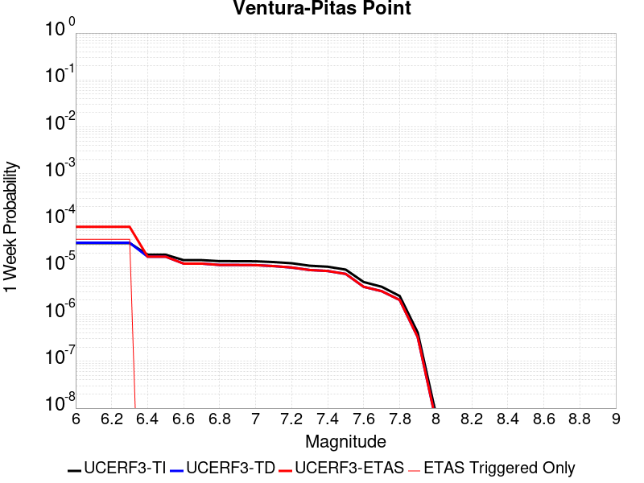 | 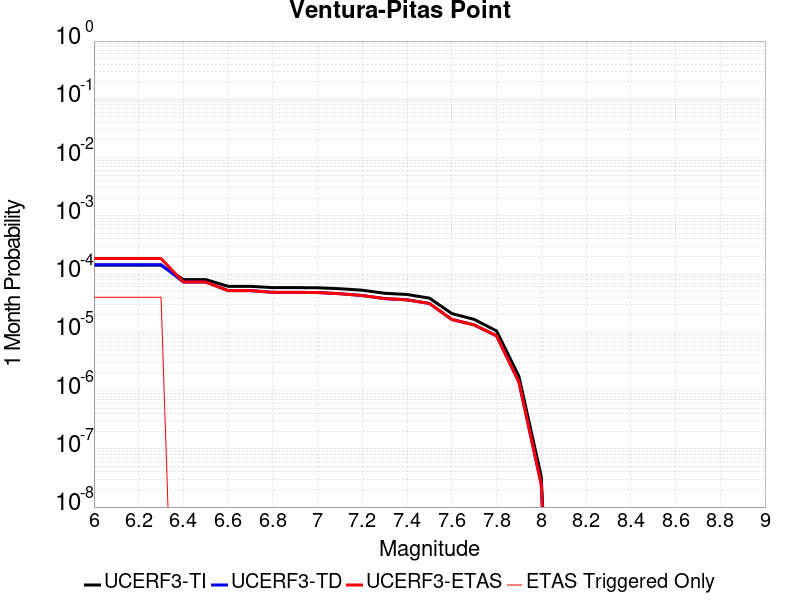 |  |  |

| Magnitude | 1 wk TI Prob | 1 wk TD Prob | 1 wk ETAS Prob | 1 wk ETAS/TD Gain | 1 wk ETAS Triggered Only | 1 mo TI Prob | 1 mo TD Prob | 1 mo ETAS Prob | 1 mo ETAS/TD Gain | 1 mo ETAS Triggered Only | 1 yr TI Prob | 1 yr TD Prob | 1 yr ETAS Prob | 1 yr ETAS/TD Gain | 1 yr ETAS Triggered Only | 10 yr TI Prob | 10 yr TD Prob | 10 yr ETAS Prob | 10 yr ETAS/TD Gain | 10 yr ETAS Triggered Only |
|-----|-----|-----|-----|-----|-----|-----|-----|-----|-----|-----|-----|-----|-----|-----|-----|-----|-----|-----|-----|-----|
| 6.0 | 3.3179622E-5 | 3.3735185E-5 | 7.3733834E-5 | 2.1856656 | 4.0E-5 | 1.4219063E-4 | 1.445728E-4 | 1.8456702E-4 | 1.2766372 | 4.0E-5 | 0.0017297962 | 0.0017590096 | 0.0018089217 | 1.028375 | 5.0E-5 | 0.017163932 | 0.0174764 | 0.017574653 | 1.005622 | 1.0E-4 |
| 6.1 | 3.3179622E-5 | 3.3735185E-5 | 7.3733834E-5 | 2.1856656 | 4.0E-5 | 1.4219063E-4 | 1.445728E-4 | 1.8456702E-4 | 1.2766372 | 4.0E-5 | 0.0017297962 | 0.0017590096 | 0.0018089217 | 1.028375 | 5.0E-5 | 0.017163932 | 0.0174764 | 0.017574653 | 1.005622 | 1.0E-4 |
| 6.2 | 3.3179622E-5 | 3.3735185E-5 | 7.3733834E-5 | 2.1856656 | 4.0E-5 | 1.4219063E-4 | 1.445728E-4 | 1.8456702E-4 | 1.2766372 | 4.0E-5 | 0.0017297962 | 0.0017590096 | 0.0018089217 | 1.028375 | 5.0E-5 | 0.017163932 | 0.0174764 | 0.017574653 | 1.005622 | 1.0E-4 |
| 6.3 | 3.3179622E-5 | 3.3735185E-5 | 7.3733834E-5 | 2.1856656 | 4.0E-5 | 1.4219063E-4 | 1.445728E-4 | 1.8456702E-4 | 1.2766372 | 4.0E-5 | 0.0017297962 | 0.0017590096 | 0.0018089217 | 1.028375 | 5.0E-5 | 0.017163932 | 0.0174764 | 0.017574653 | 1.005622 | 1.0E-4 |
| 6.4 | 1.8754668E-5 | 1.701961E-5 | 1.701961E-5 | 1.0 | 0.0 | 8.037467E-5 | 7.293928E-5 | 7.293928E-5 | 1.0 | 0.0 | 9.781223E-4 | 8.8769704E-4 | 8.8769704E-4 | 1.0 | 0.0 | 0.009738282 | 0.008843848 | 0.00885376 | 1.0011207 | 1.0E-5 |
| 6.5 | 1.8754668E-5 | 1.701961E-5 | 1.701961E-5 | 1.0 | 0.0 | 8.037467E-5 | 7.293928E-5 | 7.293928E-5 | 1.0 | 0.0 | 9.781223E-4 | 8.8769704E-4 | 8.8769704E-4 | 1.0 | 0.0 | 0.009738282 | 0.008843848 | 0.00885376 | 1.0011207 | 1.0E-5 |
| 6.6 | 1.4361558E-5 | 1.2122275E-5 | 1.2122275E-5 | 1.0 | 0.0 | 6.154808E-5 | 5.1951585E-5 | 5.1951585E-5 | 1.0 | 0.0 | 7.490902E-4 | 6.3232926E-4 | 6.3232926E-4 | 1.0 | 0.0 | 0.0074657016 | 0.0063055577 | 0.0063154944 | 1.001576 | 1.0E-5 |
| 6.7 | 1.4361558E-5 | 1.2122275E-5 | 1.2122275E-5 | 1.0 | 0.0 | 6.154808E-5 | 5.1951585E-5 | 5.1951585E-5 | 1.0 | 0.0 | 7.490902E-4 | 6.3232926E-4 | 6.3232926E-4 | 1.0 | 0.0 | 0.0074657016 | 0.0063055577 | 0.0063154944 | 1.001576 | 1.0E-5 |
| 6.8 | 1.3663846E-5 | 1.13444175E-5 | 1.13444175E-5 | 1.0 | 0.0 | 5.8558027E-5 | 4.861804E-5 | 4.861804E-5 | 1.0 | 0.0 | 7.127108E-4 | 5.917658E-4 | 5.917658E-4 | 1.0 | 0.0 | 0.007104293 | 0.005902116 | 0.005912057 | 1.0016843 | 1.0E-5 |
| 6.9 | 1.3644157E-5 | 1.1322519E-5 | 1.1322519E-5 | 1.0 | 0.0 | 5.8473648E-5 | 4.8524187E-5 | 4.8524187E-5 | 1.0 | 0.0 | 7.116841E-4 | 5.9062376E-4 | 5.9062376E-4 | 1.0 | 0.0 | 0.007094092 | 0.0058907564 | 0.005900698 | 1.0016875 | 1.0E-5 |
| 7.0 | 1.3568845E-5 | 1.1242086E-5 | 1.1242086E-5 | 1.0 | 0.0 | 5.8150898E-5 | 4.817949E-5 | 4.817949E-5 | 1.0 | 0.0 | 7.077572E-4 | 5.864293E-4 | 5.864293E-4 | 1.0 | 0.0 | 0.007055073 | 0.0058490336 | 0.005858975 | 1.0016997 | 1.0E-5 |
| 7.1 | 1.306572E-5 | 1.072054E-5 | 1.072054E-5 | 1.0 | 0.0 | 5.599474E-5 | 4.5944373E-5 | 4.5944373E-5 | 1.0 | 0.0 | 6.815227E-4 | 5.5923103E-4 | 5.5923103E-4 | 1.0 | 0.0 | 0.0067943637 | 0.0055784425 | 0.0055883867 | 1.0017827 | 1.0E-5 |
| 7.2 | 1.232604E-5 | 9.995143E-6 | 9.995143E-6 | 1.0 | 0.0 | 5.2824813E-5 | 4.2835632E-5 | 4.2835632E-5 | 1.0 | 0.0 | 6.429523E-4 | 5.214008E-4 | 5.214008E-4 | 1.0 | 0.0 | 0.0064109527 | 0.005201967 | 0.005201967 | 1.0 | 0.0 |
| 7.3 | 1.0917261E-5 | 8.84384E-6 | 8.84384E-6 | 1.0 | 0.0 | 4.678742E-5 | 3.790163E-5 | 3.790163E-5 | 1.0 | 0.0 | 5.69488E-4 | 4.6135622E-4 | 4.6135622E-4 | 1.0 | 0.0 | 0.0056803077 | 0.00460415 | 0.00460415 | 1.0 | 0.0 |
| 7.4 | 1.039959E-5 | 8.423562E-6 | 8.423562E-6 | 1.0 | 0.0 | 4.456891E-5 | 3.610049E-5 | 3.610049E-5 | 1.0 | 0.0 | 5.424914E-4 | 4.3943635E-4 | 4.3943635E-4 | 1.0 | 0.0 | 0.0054116896 | 0.004385836 | 0.004385836 | 1.0 | 0.0 |
| 7.5 | 9.015877E-6 | 7.2975445E-6 | 7.2975445E-6 | 1.0 | 0.0 | 3.86389E-5 | 3.1274823E-5 | 3.1274823E-5 | 1.0 | 0.0 | 4.7032707E-4 | 3.8070587E-4 | 3.8070587E-4 | 1.0 | 0.0 | 0.004693329 | 0.0038006818 | 0.0038006818 | 1.0 | 0.0 |
| 7.6 | 4.900162E-6 | 3.8741155E-6 | 3.8741155E-6 | 1.0 | 0.0 | 2.1000526E-5 | 1.6603248E-5 | 1.6603248E-5 | 1.0 | 0.0 | 2.556514E-4 | 2.0212591E-4 | 2.0212591E-4 | 1.0 | 0.0 | 0.0025535747 | 0.0020194345 | 0.0020194345 | 1.0 | 0.0 |
| 7.7 | 3.8850626E-6 | 3.1267302E-6 | 3.1267302E-6 | 1.0 | 0.0 | 1.6650163E-5 | 1.3400205E-5 | 1.3400205E-5 | 1.0 | 0.0 | 2.0269687E-4 | 1.6313537E-4 | 1.6313537E-4 | 1.0 | 0.0 | 0.002025121 | 0.0016301654 | 0.0016301654 | 1.0 | 0.0 |
| 7.8 | 2.4654719E-6 | 2.029875E-6 | 2.029875E-6 | 1.0 | 0.0 | 1.0566265E-5 | 8.699436E-6 | 8.699436E-6 | 1.0 | 0.0 | 1.2863669E-4 | 1.0591053E-4 | 1.0591053E-4 | 1.0 | 0.0 | 0.0012856225 | 0.0010586053 | 0.0010586053 | 1.0 | 0.0 |
| 7.9 | 4.095894E-7 | 3.2764765E-7 | 3.2764765E-7 | 1.0 | 0.0 | 1.7553821E-6 | 1.4042034E-6 | 1.4042034E-6 | 1.0 | 0.0 | 2.1371567E-5 | 1.7096047E-5 | 1.7096047E-5 | 1.0 | 0.0 | 2.1369511E-4 | 1.7094762E-4 | 1.7094762E-4 | 1.0 | 0.0 |
| 8.0 | 7.791402E-9 | 5.683497E-9 | 5.683497E-9 | 1.0 | 0.0 | 3.3391725E-8 | 2.4357844E-8 | 2.4357844E-8 | 1.0 | 0.0 | 4.0654416E-7 | 2.9655675E-7 | 2.9655675E-7 | 1.0 | 0.0 | 4.065434E-6 | 2.9655655E-6 | 2.9655655E-6 | 1.0 | 0.0 |

## Brawley (Seismic Zone) alt 1
*[(top)](#table-of-contents)*

| 1 Week | 1 Month | 1 Year | 10 Year |
|-----|-----|-----|-----|
| 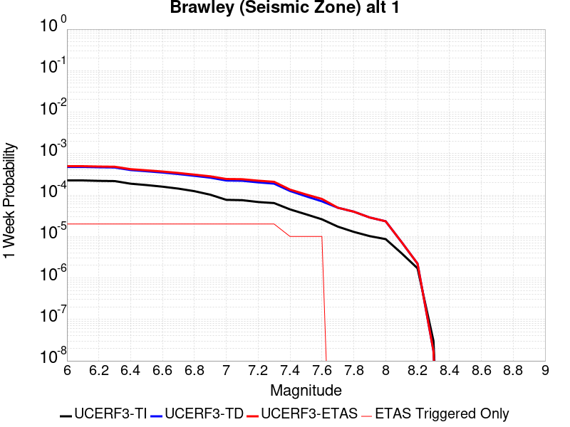 | 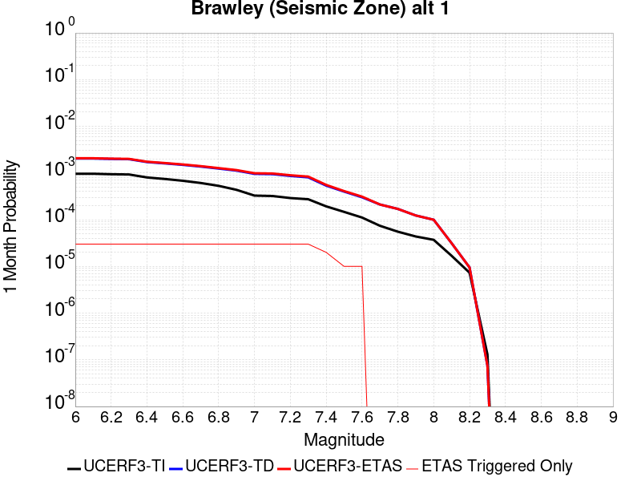 |  | 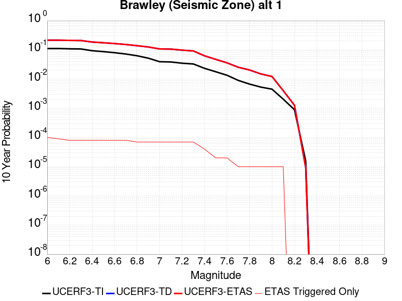 |

| Magnitude | 1 wk TI Prob | 1 wk TD Prob | 1 wk ETAS Prob | 1 wk ETAS/TD Gain | 1 wk ETAS Triggered Only | 1 mo TI Prob | 1 mo TD Prob | 1 mo ETAS Prob | 1 mo ETAS/TD Gain | 1 mo ETAS Triggered Only | 1 yr TI Prob | 1 yr TD Prob | 1 yr ETAS Prob | 1 yr ETAS/TD Gain | 1 yr ETAS Triggered Only | 10 yr TI Prob | 10 yr TD Prob | 10 yr ETAS Prob | 10 yr ETAS/TD Gain | 10 yr ETAS Triggered Only |
|-----|-----|-----|-----|-----|-----|-----|-----|-----|-----|-----|-----|-----|-----|-----|-----|-----|-----|-----|-----|-----|
| 6.0 | 2.2521618E-4 | 4.7632487E-4 | 4.9631536E-4 | 1.0419681 | 2.0E-5 | 9.6485513E-4 | 0.0020398323 | 0.002069771 | 1.014677 | 3.0E-5 | 0.011683988 | 0.024546238 | 0.02459501 | 1.001987 | 5.0E-5 | 0.11088423 | 0.21350002 | 0.21357867 | 1.0003684 | 1.0E-4 |
| 6.1 | 2.2521618E-4 | 4.7632487E-4 | 4.9631536E-4 | 1.0419681 | 2.0E-5 | 9.6485513E-4 | 0.0020398323 | 0.002069771 | 1.014677 | 3.0E-5 | 0.011683988 | 0.024546238 | 0.02459501 | 1.001987 | 5.0E-5 | 0.11088423 | 0.21350002 | 0.2135708 | 1.0003315 | 9.0E-5 |
| 6.2 | 2.198148E-4 | 4.6717093E-4 | 4.871616E-4 | 1.0427909 | 2.0E-5 | 9.417233E-4 | 0.0020006616 | 0.0020306015 | 1.014965 | 3.0E-5 | 0.011405343 | 0.024080504 | 0.0241293 | 1.0020263 | 5.0E-5 | 0.10837428 | 0.20993657 | 0.20999977 | 1.0003011 | 8.0E-5 |
| 6.3 | 2.1704129E-4 | 4.615278E-4 | 4.8151854E-4 | 1.0433143 | 2.0E-5 | 9.298453E-4 | 0.0019765133 | 0.0020064542 | 1.0151483 | 3.0E-5 | 0.011262234 | 0.02379366 | 0.02384247 | 1.0020514 | 5.0E-5 | 0.107082725 | 0.20782755 | 0.20789091 | 1.0003049 | 8.0E-5 |
| 6.4 | 1.876142E-4 | 4.00449E-4 | 4.20441E-4 | 1.0499239 | 2.0E-5 | 8.038131E-4 | 0.0017150956 | 0.0017450441 | 1.0174618 | 3.0E-5 | 0.00974259 | 0.020680401 | 0.020729367 | 1.0023677 | 5.0E-5 | 0.093263686 | 0.18457815 | 0.18464339 | 1.0003535 | 8.0E-5 |
| 6.5 | 1.7390939E-4 | 3.7477075E-4 | 3.9476325E-4 | 1.0533459 | 2.0E-5 | 7.45113E-4 | 0.0016051838 | 0.0016351357 | 1.0186595 | 3.0E-5 | 0.009034078 | 0.019368723 | 0.019417755 | 1.0025315 | 5.0E-5 | 0.086755216 | 0.17440031 | 0.17446636 | 1.0003787 | 8.0E-5 |
| 6.6 | 1.591791E-4 | 3.4891962E-4 | 3.6891265E-4 | 1.0572997 | 2.0E-5 | 6.8201777E-4 | 0.0014945229 | 0.0015244781 | 1.0200433 | 3.0E-5 | 0.008271996 | 0.018045569 | 0.018094668 | 1.0027207 | 5.0E-5 | 0.07970774 | 0.16380852 | 0.16387542 | 1.0004084 | 8.0E-5 |
| 6.7 | 1.4268003E-4 | 3.20582E-4 | 3.4057559E-4 | 1.0623665 | 2.0E-5 | 6.1134255E-4 | 0.0013732077 | 0.0014031664 | 1.0218166 | 3.0E-5 | 0.007417723 | 0.016592601 | 0.016641773 | 1.0029634 | 5.0E-5 | 0.07174956 | 0.15193306 | 0.1520009 | 1.0004466 | 8.0E-5 |
| 6.8 | 1.239713E-4 | 2.9053655E-4 | 3.1053074E-4 | 1.0688182 | 2.0E-5 | 5.3119735E-4 | 0.0012445687 | 0.0012745314 | 1.0240748 | 3.0E-5 | 0.0064481674 | 0.015048777 | 0.015088175 | 1.0026181 | 4.0E-5 | 0.06264243 | 0.13837762 | 0.13843794 | 1.0004358 | 7.0E-5 |
| 6.9 | 1.0180238E-4 | 2.625439E-4 | 2.8253865E-4 | 1.0761577 | 2.0E-5 | 4.3622297E-4 | 0.0011247073 | 0.0011546735 | 1.0266436 | 3.0E-5 | 0.005298089 | 0.013608336 | 0.013647792 | 1.0028994 | 4.0E-5 | 0.05173543 | 0.124961674 | 0.12502292 | 1.0004902 | 7.0E-5 |
| 7.0 | 7.6619996E-5 | 2.23993E-4 | 2.4398853E-4 | 1.0892684 | 2.0E-5 | 3.283301E-4 | 9.5962E-4 | 9.895912E-4 | 1.0312324 | 3.0E-5 | 0.0039900932 | 0.011621496 | 0.01166103 | 1.0034019 | 4.0E-5 | 0.039192066 | 0.107266866 | 0.10732935 | 1.0005826 | 7.0E-5 |
| 7.1 | 7.5127435E-5 | 2.2082464E-4 | 2.4082023E-4 | 1.0905496 | 2.0E-5 | 3.2193496E-4 | 9.4605127E-4 | 9.7602286E-4 | 1.0316807 | 3.0E-5 | 0.0039125155 | 0.011458045 | 0.011497586 | 1.003451 | 4.0E-5 | 0.038443442 | 0.10583085 | 0.10589344 | 1.0005914 | 7.0E-5 |
| 7.2 | 6.788582E-5 | 2.0210193E-4 | 2.220979E-4 | 1.09894 | 2.0E-5 | 2.9090676E-4 | 8.6586666E-4 | 8.958407E-4 | 1.0346174 | 3.0E-5 | 0.0035360386 | 0.0104916105 | 0.010531191 | 1.0037726 | 4.0E-5 | 0.034803 | 0.09750131 | 0.09756449 | 1.0006479 | 7.0E-5 |
| 7.3 | 6.399602E-5 | 1.8841137E-4 | 2.0840761E-4 | 1.1061307 | 2.0E-5 | 2.7423984E-4 | 8.072303E-4 | 8.372061E-4 | 1.0371342 | 3.0E-5 | 0.0033337586 | 0.009784332 | 0.00982394 | 1.0040482 | 4.0E-5 | 0.03284188 | 0.09139617 | 0.091459766 | 1.000696 | 7.0E-5 |
| 7.4 | 4.506759E-5 | 1.2529209E-4 | 1.3529083E-4 | 1.0798035 | 1.0E-5 | 1.9313251E-4 | 5.368565E-4 | 5.5684574E-4 | 1.037234 | 2.0E-5 | 0.0023488526 | 0.0065168133 | 0.006536683 | 1.003049 | 2.0E-5 | 0.023241805 | 0.062363707 | 0.06240121 | 1.0006014 | 4.0E-5 |
| 7.5 | 3.43289E-5 | 9.33541E-5 | 1.03353166E-4 | 1.1071091 | 1.0E-5 | 1.4711556E-4 | 4.00028E-4 | 4.1002396E-4 | 1.0249883 | 1.0E-5 | 0.0017896603 | 0.0048595266 | 0.004869478 | 1.0020478 | 1.0E-5 | 0.01775316 | 0.04705519 | 0.047074247 | 1.0004051 | 2.0E-5 |
| 7.6 | 2.5980507E-5 | 7.053101E-5 | 8.0530306E-5 | 1.1417716 | 1.0E-5 | 1.1134028E-4 | 3.0224086E-4 | 3.1223785E-4 | 1.0330762 | 1.0E-5 | 0.001354725 | 0.003673598 | 0.0036835612 | 1.0027121 | 1.0E-5 | 0.013464959 | 0.035840835 | 0.035860118 | 1.000538 | 2.0E-5 |
| 7.7 | 1.7292105E-5 | 4.9407296E-5 | 4.9407296E-5 | 1.0 | 0.0 | 7.4106916E-5 | 2.117284E-4 | 2.117284E-4 | 1.0 | 0.0 | 9.018782E-4 | 0.0025747516 | 0.0025747516 | 1.0 | 0.0 | 0.008982267 | 0.025290398 | 0.025300145 | 1.0003854 | 1.0E-5 |
| 7.8 | 1.2927471E-5 | 3.9693266E-5 | 3.9693266E-5 | 1.0 | 0.0 | 5.5402274E-5 | 1.7010293E-4 | 1.7010293E-4 | 1.0 | 0.0 | 6.743139E-4 | 0.0020690386 | 0.0020690386 | 1.0 | 0.0 | 0.0067227143 | 0.020431727 | 0.020441523 | 1.0004795 | 1.0E-5 |
| 7.9 | 1.0200774E-5 | 2.874569E-5 | 2.874569E-5 | 1.0 | 0.0 | 4.371687E-5 | 1.2319001E-4 | 1.2319001E-4 | 1.0 | 0.0 | 5.321229E-4 | 0.0014988075 | 0.0014988075 | 1.0 | 0.0 | 0.005308505 | 0.014991644 | 0.0150014935 | 1.0006571 | 1.0E-5 |
| 8.0 | 8.650396E-6 | 2.3277367E-5 | 2.3277367E-5 | 1.0 | 0.0 | 3.70726E-5 | 9.975634E-5 | 9.975634E-5 | 1.0 | 0.0 | 4.5126543E-4 | 0.0012138576 | 0.0012138576 | 1.0 | 0.0 | 0.0045035016 | 0.012211097 | 0.012220975 | 1.000809 | 1.0E-5 |
| 8.1 | 3.9368224E-6 | 7.3279825E-6 | 7.3279825E-6 | 1.0 | 0.0 | 1.6871985E-5 | 3.140526E-5 | 3.140526E-5 | 1.0 | 0.0 | 2.0539707E-4 | 3.8229208E-4 | 3.8229208E-4 | 1.0 | 0.0 | 0.0020520731 | 0.004001185 | 0.0040111444 | 1.0024892 | 1.0E-5 |
| 8.2 | 1.7101195E-6 | 2.217876E-6 | 2.217876E-6 | 1.0 | 0.0 | 7.329063E-6 | 9.505149E-6 | 9.505149E-6 | 1.0 | 0.0 | 8.922769E-5 | 1.1571907E-4 | 1.1571907E-4 | 1.0 | 0.0 | 8.9191867E-4 | 0.0012666774 | 0.0012666774 | 1.0 | 0.0 |
| 8.3 | 3.0346666E-8 | 1.721586E-8 | 1.721586E-8 | 1.0 | 0.0 | 1.3005713E-7 | 7.378226E-8 | 7.378226E-8 | 1.0 | 0.0 | 1.5834444E-6 | 8.9829894E-7 | 8.9829894E-7 | 1.0 | 0.0 | 1.5834332E-5 | 9.367729E-6 | 9.367729E-6 | 1.0 | 0.0 |

## San Jacinto (Clark) rev
*[(top)](#table-of-contents)*

| 1 Week | 1 Month | 1 Year | 10 Year |
|-----|-----|-----|-----|
| 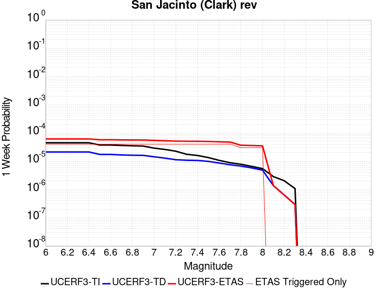 | 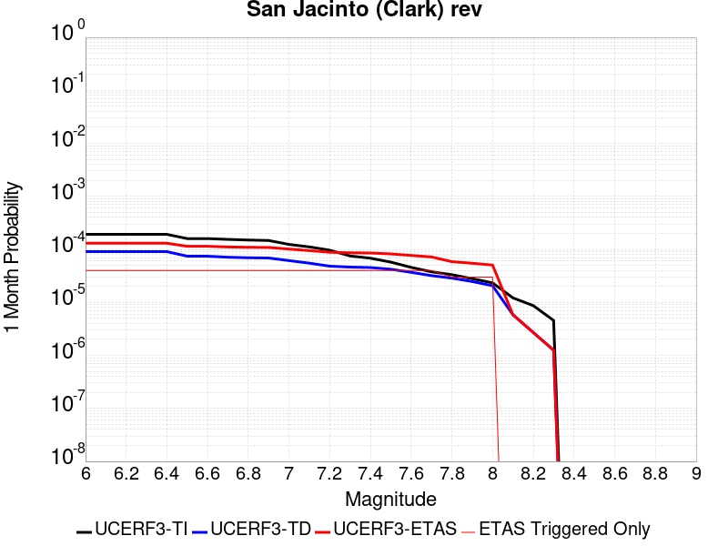 |  |  |

| Magnitude | 1 wk TI Prob | 1 wk TD Prob | 1 wk ETAS Prob | 1 wk ETAS/TD Gain | 1 wk ETAS Triggered Only | 1 mo TI Prob | 1 mo TD Prob | 1 mo ETAS Prob | 1 mo ETAS/TD Gain | 1 mo ETAS Triggered Only | 1 yr TI Prob | 1 yr TD Prob | 1 yr ETAS Prob | 1 yr ETAS/TD Gain | 1 yr ETAS Triggered Only | 10 yr TI Prob | 10 yr TD Prob | 10 yr ETAS Prob | 10 yr ETAS/TD Gain | 10 yr ETAS Triggered Only |
|-----|-----|-----|-----|-----|-----|-----|-----|-----|-----|-----|-----|-----|-----|-----|-----|-----|-----|-----|-----|-----|
| 6.0 | 4.482615E-5 | 2.1154196E-5 | 6.115335E-5 | 2.890838 | 4.0E-5 | 1.9209793E-4 | 9.065773E-5 | 1.3065411E-4 | 1.4411799 | 4.0E-5 | 0.0023362834 | 0.0011032083 | 0.001173131 | 1.0633813 | 7.0E-5 | 0.02311874 | 0.011503847 | 0.011592812 | 1.0077335 | 9.0E-5 |
| 6.1 | 4.482615E-5 | 2.1154196E-5 | 6.115335E-5 | 2.890838 | 4.0E-5 | 1.9209793E-4 | 9.065773E-5 | 1.3065411E-4 | 1.4411799 | 4.0E-5 | 0.0023362834 | 0.0011032083 | 0.001173131 | 1.0633813 | 7.0E-5 | 0.02311874 | 0.011503847 | 0.011592812 | 1.0077335 | 9.0E-5 |
| 6.2 | 4.482615E-5 | 2.1154196E-5 | 6.115335E-5 | 2.890838 | 4.0E-5 | 1.9209793E-4 | 9.065773E-5 | 1.3065411E-4 | 1.4411799 | 4.0E-5 | 0.0023362834 | 0.0011032083 | 0.001173131 | 1.0633813 | 7.0E-5 | 0.02311874 | 0.011503847 | 0.011592812 | 1.0077335 | 9.0E-5 |
| 6.3 | 4.482615E-5 | 2.1154196E-5 | 6.115335E-5 | 2.890838 | 4.0E-5 | 1.9209793E-4 | 9.065773E-5 | 1.3065411E-4 | 1.4411799 | 4.0E-5 | 0.0023362834 | 0.0011032083 | 0.001173131 | 1.0633813 | 7.0E-5 | 0.02311874 | 0.011503847 | 0.011592812 | 1.0077335 | 9.0E-5 |
| 6.4 | 4.482615E-5 | 2.1154196E-5 | 6.115335E-5 | 2.890838 | 4.0E-5 | 1.9209793E-4 | 9.065773E-5 | 1.3065411E-4 | 1.4411799 | 4.0E-5 | 0.0023362834 | 0.0011032083 | 0.001173131 | 1.0633813 | 7.0E-5 | 0.02311874 | 0.011503847 | 0.011592812 | 1.0077335 | 9.0E-5 |
| 6.5 | 3.7294863E-5 | 1.7356087E-5 | 5.735539E-5 | 3.304627 | 4.0E-5 | 1.5982533E-4 | 7.438113E-5 | 1.1437816E-4 | 1.5377308 | 4.0E-5 | 0.0019441366 | 9.052186E-4 | 9.751552E-4 | 1.0772594 | 7.0E-5 | 0.01927216 | 0.0094941035 | 0.009583249 | 1.0093895 | 9.0E-5 |
| 6.6 | 3.7294863E-5 | 1.7356087E-5 | 5.735539E-5 | 3.304627 | 4.0E-5 | 1.5982533E-4 | 7.438113E-5 | 1.1437816E-4 | 1.5377308 | 4.0E-5 | 0.0019441366 | 9.052186E-4 | 9.751552E-4 | 1.0772594 | 7.0E-5 | 0.01927216 | 0.0094941035 | 0.009583249 | 1.0093895 | 9.0E-5 |
| 6.7 | 3.6039248E-5 | 1.6604314E-5 | 5.6603647E-5 | 3.4089727 | 4.0E-5 | 1.5444479E-4 | 7.1159426E-5 | 1.1115658E-4 | 1.5620781 | 4.0E-5 | 0.0018787434 | 8.6602574E-4 | 9.3596516E-4 | 1.080759 | 7.0E-5 | 0.01862939 | 0.009096047 | 0.009175319 | 1.008715 | 8.0E-5 |
| 6.8 | 3.5031844E-5 | 1.6232942E-5 | 5.6232293E-5 | 3.464085 | 4.0E-5 | 1.5012783E-4 | 6.956792E-5 | 1.0956513E-4 | 1.5749377 | 4.0E-5 | 0.0018262739 | 8.4666436E-4 | 9.1660506E-4 | 1.0826074 | 7.0E-5 | 0.01811338 | 0.008895969 | 0.008975257 | 1.0089128 | 8.0E-5 |
| 6.9 | 3.435112E-5 | 1.6063195E-5 | 5.6062552E-5 | 3.4901247 | 4.0E-5 | 1.4721078E-4 | 6.884047E-5 | 1.0883772E-4 | 1.5810136 | 4.0E-5 | 0.0017908178 | 8.3781447E-4 | 9.0775586E-4 | 1.0834807 | 7.0E-5 | 0.017764548 | 0.008804181 | 0.008883476 | 1.0090066 | 8.0E-5 |
| 7.0 | 2.8959772E-5 | 1.4336745E-5 | 5.433617E-5 | 3.7899935 | 4.0E-5 | 1.241074E-4 | 6.144176E-5 | 1.01439306E-4 | 1.650983 | 4.0E-5 | 0.0015099603 | 7.477995E-4 | 8.1774715E-4 | 1.0935379 | 7.0E-5 | 0.014997416 | 0.007868037 | 0.007947407 | 1.0100877 | 8.0E-5 |
| 7.1 | 2.6002877E-5 | 1.2829002E-5 | 5.2828487E-5 | 4.1178956 | 4.0E-5 | 1.11436144E-4 | 5.498029E-5 | 9.497809E-5 | 1.7274934 | 4.0E-5 | 0.0013558907 | 6.691816E-4 | 7.3913473E-4 | 1.1045353 | 7.0E-5 | 0.013476475 | 0.0070465137 | 0.00712595 | 1.0112731 | 8.0E-5 |
| 7.2 | 2.2544838E-5 | 1.1262543E-5 | 5.1262094E-5 | 4.5515556 | 4.0E-5 | 9.661716E-5 | 4.8267157E-5 | 8.826523E-5 | 1.8286809 | 4.0E-5 | 0.001175679 | 5.874956E-4 | 6.5745454E-4 | 1.1190798 | 7.0E-5 | 0.011694785 | 0.0061927503 | 0.0062722545 | 1.0128384 | 8.0E-5 |
| 7.3 | 1.75334E-5 | 1.0811715E-5 | 5.0811283E-5 | 4.699651 | 4.0E-5 | 7.514098E-5 | 4.6335106E-5 | 8.633325E-5 | 1.8632363 | 4.0E-5 | 9.144575E-4 | 5.6398526E-4 | 6.339458E-4 | 1.1240467 | 7.0E-5 | 0.009107036 | 0.0059337732 | 0.006013299 | 1.0134021 | 8.0E-5 |
| 7.4 | 1.5924552E-5 | 1.0611516E-5 | 5.0611092E-5 | 4.7694497 | 4.0E-5 | 6.82463E-5 | 4.547714E-5 | 8.547532E-5 | 1.8795228 | 4.0E-5 | 8.305819E-4 | 5.535449E-4 | 6.2350614E-4 | 1.1263877 | 7.0E-5 | 0.008274844 | 0.0058210334 | 0.005900568 | 1.0136633 | 8.0E-5 |
| 7.5 | 1.3428931E-5 | 9.8519E-6 | 4.9851507E-5 | 5.0600905 | 4.0E-5 | 5.7551293E-5 | 4.2221753E-5 | 8.222006E-5 | 1.9473389 | 4.0E-5 | 7.004617E-4 | 5.1392964E-4 | 5.838937E-4 | 1.1361355 | 7.0E-5 | 0.006982579 | 0.0054066023 | 0.00548617 | 1.0147167 | 8.0E-5 |
| 7.6 | 1.0688787E-5 | 8.614839E-6 | 4.8614496E-5 | 5.6431108 | 4.0E-5 | 4.5808283E-5 | 3.692022E-5 | 7.6918746E-5 | 2.0833771 | 4.0E-5 | 5.5757316E-4 | 4.4941145E-4 | 5.1938E-4 | 1.1556892 | 7.0E-5 | 0.005561762 | 0.0047416524 | 0.004821273 | 1.0167917 | 8.0E-5 |
| 7.7 | 8.81236E-6 | 7.4680274E-6 | 4.746773E-5 | 6.356127 | 4.0E-5 | 3.776671E-5 | 3.2005442E-5 | 7.200416E-5 | 2.2497475 | 4.0E-5 | 4.597127E-4 | 3.8959677E-4 | 4.595695E-4 | 1.179603 | 7.0E-5 | 0.0045876284 | 0.0041346536 | 0.0042143227 | 1.0192686 | 8.0E-5 |
| 7.8 | 7.780431E-6 | 6.696579E-6 | 3.669638E-5 | 5.4798694 | 3.0E-5 | 3.3344273E-5 | 2.8699309E-5 | 5.869845E-5 | 2.0452914 | 3.0E-5 | 4.0589093E-4 | 3.4935825E-4 | 4.0933728E-4 | 1.1716834 | 6.0E-5 | 0.0040515037 | 0.0037227906 | 0.00379253 | 1.0187331 | 7.0E-5 |
| 7.9 | 6.5437994E-6 | 5.780382E-6 | 3.578021E-5 | 6.1899385 | 3.0E-5 | 2.8044553E-5 | 2.477283E-5 | 5.477209E-5 | 2.2109742 | 3.0E-5 | 3.4138895E-4 | 3.0156763E-4 | 3.6154955E-4 | 1.1989003 | 6.0E-5 | 0.0034086495 | 0.0032344845 | 0.003304258 | 1.0215718 | 7.0E-5 |
| 8.0 | 5.4488164E-6 | 4.8133406E-6 | 3.4813198E-5 | 7.2326474 | 3.0E-5 | 2.3351862E-5 | 2.062844E-5 | 5.0627823E-5 | 2.4542727 | 3.0E-5 | 2.8427184E-4 | 2.5112246E-4 | 3.111074E-4 | 1.2388673 | 6.0E-5 | 0.0028390845 | 0.002710839 | 0.0027806493 | 1.0257523 | 7.0E-5 |
| 8.1 | 2.8397242E-6 | 1.3670389E-6 | 1.3670389E-6 | 1.0 | 0.0 | 1.217019E-5 | 5.858725E-6 | 5.858725E-6 | 1.0 | 0.0 | 1.4816198E-4 | 7.132765E-5 | 7.132765E-5 | 1.0 | 0.0 | 0.0014806325 | 8.115382E-4 | 8.115382E-4 | 1.0 | 0.0 |
| 8.2 | 2.030244E-6 | 6.318974E-7 | 6.318974E-7 | 1.0 | 0.0 | 8.701017E-6 | 2.708129E-6 | 2.708129E-6 | 1.0 | 0.0 | 1.05929736E-4 | 3.2970976E-5 | 3.2970976E-5 | 1.0 | 0.0 | 0.0010587925 | 3.9486602E-4 | 3.9486602E-4 | 1.0 | 0.0 |
| 8.3 | 1.0659804E-6 | 2.9250086E-7 | 2.9250086E-7 | 1.0 | 0.0 | 4.568479E-6 | 1.2535745E-6 | 1.2535745E-6 | 1.0 | 0.0 | 5.5619817E-5 | 1.5262167E-5 | 1.5262167E-5 | 1.0 | 0.0 | 5.5605895E-4 | 1.8566217E-4 | 1.8566217E-4 | 1.0 | 0.0 |

## Pinto Mtn
*[(top)](#table-of-contents)*

| 1 Week | 1 Month | 1 Year | 10 Year |
|-----|-----|-----|-----|
|  | 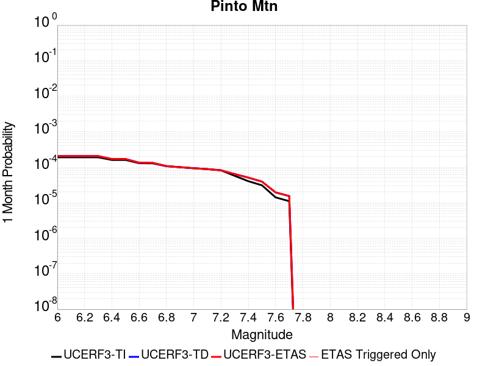 |  |  |

| Magnitude | 1 wk TI Prob | 1 wk TD Prob | 1 wk ETAS Prob | 1 wk ETAS/TD Gain | 1 wk ETAS Triggered Only | 1 mo TI Prob | 1 mo TD Prob | 1 mo ETAS Prob | 1 mo ETAS/TD Gain | 1 mo ETAS Triggered Only | 1 yr TI Prob | 1 yr TD Prob | 1 yr ETAS Prob | 1 yr ETAS/TD Gain | 1 yr ETAS Triggered Only | 10 yr TI Prob | 10 yr TD Prob | 10 yr ETAS Prob | 10 yr ETAS/TD Gain | 10 yr ETAS Triggered Only |
|-----|-----|-----|-----|-----|-----|-----|-----|-----|-----|-----|-----|-----|-----|-----|-----|-----|-----|-----|-----|-----|
| 6.0 | 4.4194956E-5 | 4.785362E-5 | 4.785362E-5 | 1.0 | 0.0 | 1.893932E-4 | 2.0507174E-4 | 2.0507174E-4 | 1.0 | 0.0 | 0.0023034236 | 0.0024940541 | 0.0025239794 | 1.0119987 | 3.0E-5 | 0.022796938 | 0.024678145 | 0.02475617 | 1.0031618 | 8.0E-5 |
| 6.1 | 4.4194956E-5 | 4.785362E-5 | 4.785362E-5 | 1.0 | 0.0 | 1.893932E-4 | 2.0507174E-4 | 2.0507174E-4 | 1.0 | 0.0 | 0.0023034236 | 0.0024940541 | 0.0025239794 | 1.0119987 | 3.0E-5 | 0.022796938 | 0.024678145 | 0.02475617 | 1.0031618 | 8.0E-5 |
| 6.2 | 4.4194956E-5 | 4.785362E-5 | 4.785362E-5 | 1.0 | 0.0 | 1.893932E-4 | 2.0507174E-4 | 2.0507174E-4 | 1.0 | 0.0 | 0.0023034236 | 0.0024940541 | 0.0025239794 | 1.0119987 | 3.0E-5 | 0.022796938 | 0.024678145 | 0.02475617 | 1.0031618 | 8.0E-5 |
| 6.3 | 4.4194956E-5 | 4.785362E-5 | 4.785362E-5 | 1.0 | 0.0 | 1.893932E-4 | 2.0507174E-4 | 2.0507174E-4 | 1.0 | 0.0 | 0.0023034236 | 0.0024940541 | 0.0025239794 | 1.0119987 | 3.0E-5 | 0.022796938 | 0.024678145 | 0.02475617 | 1.0031618 | 8.0E-5 |
| 6.4 | 3.729929E-5 | 3.9603186E-5 | 3.9603186E-5 | 1.0 | 0.0 | 1.5984432E-4 | 1.6971743E-4 | 1.6971743E-4 | 1.0 | 0.0 | 0.0019443673 | 0.002064445 | 0.0020844038 | 1.0096679 | 2.0E-5 | 0.019274427 | 0.02046269 | 0.020521462 | 1.0028721 | 6.0E-5 |
| 6.5 | 3.729929E-5 | 3.9603186E-5 | 3.9603186E-5 | 1.0 | 0.0 | 1.5984432E-4 | 1.6971743E-4 | 1.6971743E-4 | 1.0 | 0.0 | 0.0019443673 | 0.002064445 | 0.0020844038 | 1.0096679 | 2.0E-5 | 0.019274427 | 0.02046269 | 0.020521462 | 1.0028721 | 6.0E-5 |
| 6.6 | 3.0204548E-5 | 3.1205298E-5 | 3.1205298E-5 | 1.0 | 0.0 | 1.2944164E-4 | 1.3373033E-4 | 1.3373033E-4 | 1.0 | 0.0 | 0.0015748127 | 0.0016269855 | 0.0016469529 | 1.0122727 | 2.0E-5 | 0.015636992 | 0.01615461 | 0.016203802 | 1.0030451 | 5.0E-5 |
| 6.7 | 2.9857754E-5 | 3.081468E-5 | 3.081468E-5 | 1.0 | 0.0 | 1.2795553E-4 | 1.3205643E-4 | 1.3205643E-4 | 1.0 | 0.0 | 0.0015567453 | 0.001606636 | 0.0016166199 | 1.0062141 | 1.0E-5 | 0.015458848 | 0.01595405 | 0.01599341 | 1.0024672 | 4.0E-5 |
| 6.8 | 2.4819734E-5 | 2.5009364E-5 | 2.5009364E-5 | 1.0 | 0.0 | 1.0636595E-4 | 1.07178705E-4 | 1.07178705E-4 | 1.0 | 0.0 | 0.0012942362 | 0.0013041412 | 0.0013141282 | 1.0076579 | 1.0E-5 | 0.012867244 | 0.0129672475 | 0.013006728 | 1.0030447 | 4.0E-5 |
| 6.9 | 2.331124E-5 | 2.3337643E-5 | 2.3337643E-5 | 1.0 | 0.0 | 9.990149E-5 | 1.00014746E-4 | 1.00014746E-4 | 1.0 | 0.0 | 0.001215622 | 0.0012170197 | 0.0012270075 | 1.0082068 | 1.0E-5 | 0.012089936 | 0.012105742 | 0.012145257 | 1.0032642 | 4.0E-5 |
| 7.0 | 2.1818534E-5 | 2.1760772E-5 | 2.1760772E-5 | 1.0 | 0.0 | 9.3504656E-5 | 9.325723E-5 | 9.325723E-5 | 1.0 | 0.0 | 0.0011378246 | 0.0011348352 | 0.0011448239 | 1.0088018 | 1.0E-5 | 0.011320163 | 0.011292503 | 0.011332052 | 1.0035021 | 4.0E-5 |
| 7.1 | 2.066081E-5 | 2.0540418E-5 | 2.0540418E-5 | 1.0 | 0.0 | 8.854332E-5 | 8.8027504E-5 | 8.8027504E-5 | 1.0 | 0.0 | 0.0010774818 | 0.0010712275 | 0.0010812167 | 1.009325 | 1.0E-5 | 0.010722724 | 0.010662688 | 0.010702262 | 1.0037113 | 4.0E-5 |
| 7.2 | 1.8990233E-5 | 1.9053701E-5 | 1.9053701E-5 | 1.0 | 0.0 | 8.138417E-5 | 8.1656275E-5 | 8.1656275E-5 | 1.0 | 0.0 | 9.904018E-4 | 9.937311E-4 | 0.0010037211 | 1.010053 | 1.0E-5 | 0.009859995 | 0.009894874 | 0.0099344775 | 1.0040025 | 4.0E-5 |
| 7.3 | 1.3335872E-5 | 1.4906372E-5 | 1.4906372E-5 | 1.0 | 0.0 | 5.7152483E-5 | 6.388296E-5 | 6.388296E-5 | 1.0 | 0.0 | 6.956093E-4 | 7.775102E-4 | 7.8750245E-4 | 1.0128516 | 1.0E-5 | 0.006934359 | 0.0077491994 | 0.007788889 | 1.0051218 | 4.0E-5 |
| 7.4 | 9.414066E-6 | 1.186061E-5 | 1.186061E-5 | 1.0 | 0.0 | 4.0345374E-5 | 5.0830247E-5 | 5.0830247E-5 | 1.0 | 0.0 | 4.910942E-4 | 6.1869196E-4 | 6.286858E-4 | 1.0161531 | 1.0E-5 | 0.0049001034 | 0.006170644 | 0.006210397 | 1.0064423 | 4.0E-5 |
| 7.5 | 7.2101157E-6 | 9.157893E-6 | 9.157893E-6 | 1.0 | 0.0 | 3.090013E-5 | 3.924757E-5 | 3.924757E-5 | 1.0 | 0.0 | 3.7614413E-4 | 4.7774217E-4 | 4.8773742E-4 | 1.0209218 | 1.0E-5 | 0.0037550807 | 0.004767927 | 0.0048077363 | 1.0083494 | 4.0E-5 |
| 7.6 | 3.296375E-6 | 4.5453176E-6 | 4.5453176E-6 | 1.0 | 0.0 | 1.4127245E-5 | 1.9479796E-5 | 1.9479796E-5 | 1.0 | 0.0 | 1.7198564E-4 | 2.3714209E-4 | 2.3714209E-4 | 1.0 | 0.0 | 0.0017185259 | 0.0023690276 | 0.002379004 | 1.0042112 | 1.0E-5 |
| 7.7 | 2.5741092E-6 | 3.584251E-6 | 3.584251E-6 | 1.0 | 0.0 | 1.103185E-5 | 1.5360993E-5 | 1.5360993E-5 | 1.0 | 0.0 | 1.3430449E-4 | 1.8700535E-4 | 1.8700535E-4 | 1.0 | 0.0 | 0.0013422335 | 0.0018686098 | 0.0018686098 | 1.0 | 0.0 |

## Elysian Park (Upper)
*[(top)](#table-of-contents)*

| 1 Week | 1 Month | 1 Year | 10 Year |
|-----|-----|-----|-----|
| 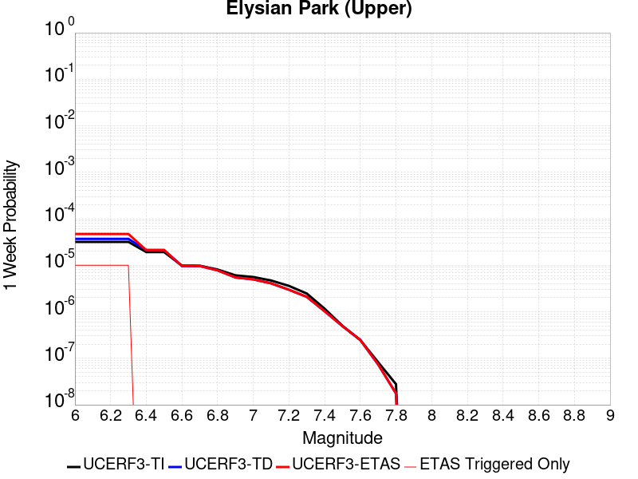 | 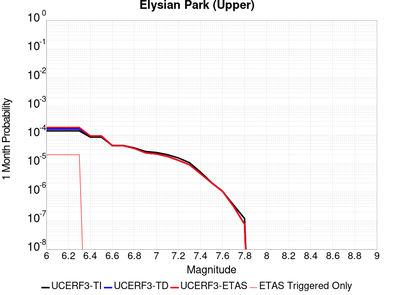 |  |  |

| Magnitude | 1 wk TI Prob | 1 wk TD Prob | 1 wk ETAS Prob | 1 wk ETAS/TD Gain | 1 wk ETAS Triggered Only | 1 mo TI Prob | 1 mo TD Prob | 1 mo ETAS Prob | 1 mo ETAS/TD Gain | 1 mo ETAS Triggered Only | 1 yr TI Prob | 1 yr TD Prob | 1 yr ETAS Prob | 1 yr ETAS/TD Gain | 1 yr ETAS Triggered Only | 10 yr TI Prob | 10 yr TD Prob | 10 yr ETAS Prob | 10 yr ETAS/TD Gain | 10 yr ETAS Triggered Only |
|-----|-----|-----|-----|-----|-----|-----|-----|-----|-----|-----|-----|-----|-----|-----|-----|-----|-----|-----|-----|-----|
| 6.0 | 3.1876025E-5 | 3.7035516E-5 | 4.7035144E-5 | 1.270001 | 1.0E-5 | 1.3660437E-4 | 1.587167E-4 | 1.7871354E-4 | 1.1259906 | 2.0E-5 | 0.0016618895 | 0.0019311075 | 0.001981011 | 1.0258418 | 5.0E-5 | 0.016495159 | 0.019189782 | 0.019278057 | 1.0046 | 9.0E-5 |
| 6.1 | 3.1876025E-5 | 3.7035516E-5 | 4.7035144E-5 | 1.270001 | 1.0E-5 | 1.3660437E-4 | 1.587167E-4 | 1.7871354E-4 | 1.1259906 | 2.0E-5 | 0.0016618895 | 0.0019311075 | 0.001981011 | 1.0258418 | 5.0E-5 | 0.016495159 | 0.019189782 | 0.019278057 | 1.0046 | 9.0E-5 |
| 6.2 | 3.1876025E-5 | 3.7035516E-5 | 4.7035144E-5 | 1.270001 | 1.0E-5 | 1.3660437E-4 | 1.587167E-4 | 1.7871354E-4 | 1.1259906 | 2.0E-5 | 0.0016618895 | 0.0019311075 | 0.001981011 | 1.0258418 | 5.0E-5 | 0.016495159 | 0.019189782 | 0.019278057 | 1.0046 | 9.0E-5 |
| 6.3 | 3.1876025E-5 | 3.7035516E-5 | 4.7035144E-5 | 1.270001 | 1.0E-5 | 1.3660437E-4 | 1.587167E-4 | 1.7871354E-4 | 1.1259906 | 2.0E-5 | 0.0016618895 | 0.0019311075 | 0.001981011 | 1.0258418 | 5.0E-5 | 0.016495159 | 0.019189782 | 0.019278057 | 1.0046 | 9.0E-5 |
| 6.4 | 1.9273462E-5 | 2.1202266E-5 | 2.1202266E-5 | 1.0 | 0.0 | 8.259794E-5 | 9.086466E-5 | 9.086466E-5 | 1.0 | 0.0 | 0.001005166 | 0.0011058892 | 0.0011058892 | 1.0 | 0.0 | 0.010006315 | 0.011020724 | 0.011030613 | 1.0008974 | 1.0E-5 |
| 6.5 | 1.9273462E-5 | 2.1202266E-5 | 2.1202266E-5 | 1.0 | 0.0 | 8.259794E-5 | 9.086466E-5 | 9.086466E-5 | 1.0 | 0.0 | 0.001005166 | 0.0011058892 | 0.0011058892 | 1.0 | 0.0 | 0.010006315 | 0.011020724 | 0.011030613 | 1.0008974 | 1.0E-5 |
| 6.6 | 9.813258E-6 | 9.665599E-6 | 9.665599E-6 | 1.0 | 0.0 | 4.205614E-5 | 4.1423376E-5 | 4.1423376E-5 | 1.0 | 0.0 | 5.119132E-4 | 5.0422014E-4 | 5.0422014E-4 | 1.0 | 0.0 | 0.005107356 | 0.0050314846 | 0.0050414344 | 1.0019774 | 1.0E-5 |
| 6.7 | 9.801478E-6 | 9.653168E-6 | 9.653168E-6 | 1.0 | 0.0 | 4.2005657E-5 | 4.1370105E-5 | 4.1370105E-5 | 1.0 | 0.0 | 5.112989E-4 | 5.035719E-4 | 5.035719E-4 | 1.0 | 0.0 | 0.0051012407 | 0.0050250315 | 0.005034981 | 1.0019801 | 1.0E-5 |
| 6.8 | 8.102489E-6 | 7.773004E-6 | 7.773004E-6 | 1.0 | 0.0 | 3.4724493E-5 | 3.3312477E-5 | 3.3312477E-5 | 1.0 | 0.0 | 4.2268867E-4 | 4.055089E-4 | 4.055089E-4 | 1.0 | 0.0 | 0.004218856 | 0.0040481836 | 0.004058143 | 1.0024602 | 1.0E-5 |
| 6.9 | 6.08275E-6 | 5.4814514E-6 | 5.4814514E-6 | 1.0 | 0.0 | 2.6068668E-5 | 2.3491726E-5 | 2.3491726E-5 | 1.0 | 0.0 | 3.173398E-4 | 2.85975E-4 | 2.85975E-4 | 1.0 | 0.0 | 0.0031688702 | 0.0028561477 | 0.0028561477 | 1.0 | 0.0 |
| 7.0 | 5.5995934E-6 | 4.98278E-6 | 4.98278E-6 | 1.0 | 0.0 | 2.3998036E-5 | 2.13546E-5 | 2.13546E-5 | 1.0 | 0.0 | 2.9213692E-4 | 2.599619E-4 | 2.599619E-4 | 1.0 | 0.0 | 0.0029175316 | 0.0025966454 | 0.0025966454 | 1.0 | 0.0 |
| 7.1 | 4.709881E-6 | 4.0874015E-6 | 4.0874015E-6 | 1.0 | 0.0 | 2.0185047E-5 | 1.7517319E-5 | 1.7517319E-5 | 1.0 | 0.0 | 2.4572524E-4 | 2.132529E-4 | 2.132529E-4 | 1.0 | 0.0 | 0.002454537 | 0.002130524 | 0.002130524 | 1.0 | 0.0 |
| 7.2 | 3.6063436E-6 | 2.9779544E-6 | 2.9779544E-6 | 1.0 | 0.0 | 1.5455667E-5 | 1.27626E-5 | 1.27626E-5 | 1.0 | 0.0 | 1.881565E-4 | 1.5537368E-4 | 1.5537368E-4 | 1.0 | 0.0 | 0.0018799726 | 0.0015526618 | 0.0015526618 | 1.0 | 0.0 |
| 7.3 | 2.471135E-6 | 2.0954615E-6 | 2.0954615E-6 | 1.0 | 0.0 | 1.0590536E-5 | 8.980519E-6 | 8.980519E-6 | 1.0 | 0.0 | 1.2893214E-4 | 1.093324E-4 | 1.093324E-4 | 1.0 | 0.0 | 0.0012885736 | 0.0010927934 | 0.0010927934 | 1.0 | 0.0 |
| 7.4 | 1.163943E-6 | 1.0275091E-6 | 1.0275091E-6 | 1.0 | 0.0 | 4.988318E-6 | 4.4036033E-6 | 4.4036033E-6 | 1.0 | 0.0 | 6.0731076E-5 | 5.3612584E-5 | 5.3612584E-5 | 1.0 | 0.0 | 6.071448E-4 | 5.359995E-4 | 5.359995E-4 | 1.0 | 0.0 |
| 7.5 | 4.99459E-7 | 4.917604E-7 | 4.917604E-7 | 1.0 | 0.0 | 2.140537E-6 | 2.1075427E-6 | 2.1075427E-6 | 1.0 | 0.0 | 2.6060725E-5 | 2.5659048E-5 | 2.5659048E-5 | 1.0 | 0.0 | 2.605767E-4 | 2.5656243E-4 | 2.5656243E-4 | 1.0 | 0.0 |
| 7.6 | 2.4667852E-7 | 2.4778336E-7 | 2.4778336E-7 | 1.0 | 0.0 | 1.0571932E-6 | 1.0619283E-6 | 1.0619283E-6 | 1.0 | 0.0 | 1.2871251E-5 | 1.2928905E-5 | 1.2928905E-5 | 1.0 | 0.0 | 1.2870505E-4 | 1.2928189E-4 | 1.2928189E-4 | 1.0 | 0.0 |
| 7.7 | 8.2312795E-8 | 7.3864456E-8 | 7.3864456E-8 | 1.0 | 0.0 | 3.527691E-7 | 3.165619E-7 | 3.165619E-7 | 1.0 | 0.0 | 4.294955E-6 | 3.8541357E-6 | 3.8541357E-6 | 1.0 | 0.0 | 4.2948723E-5 | 3.8540802E-5 | 3.8540802E-5 | 1.0 | 0.0 |
| 7.8 | 2.7819295E-8 | 1.7566023E-8 | 1.7566023E-8 | 1.0 | 0.0 | 1.1922555E-7 | 7.5282955E-8 | 7.5282955E-8 | 1.0 | 0.0 | 1.45157E-6 | 9.165697E-7 | 9.165697E-7 | 1.0 | 0.0 | 1.45156055E-5 | 9.165675E-6 | 9.165675E-6 | 1.0 | 0.0 |

## Oceanic - West Huasna
*[(top)](#table-of-contents)*

| 1 Week | 1 Month | 1 Year | 10 Year |
|-----|-----|-----|-----|
| 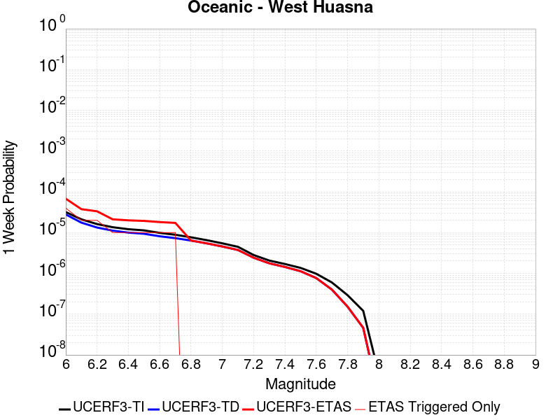 | 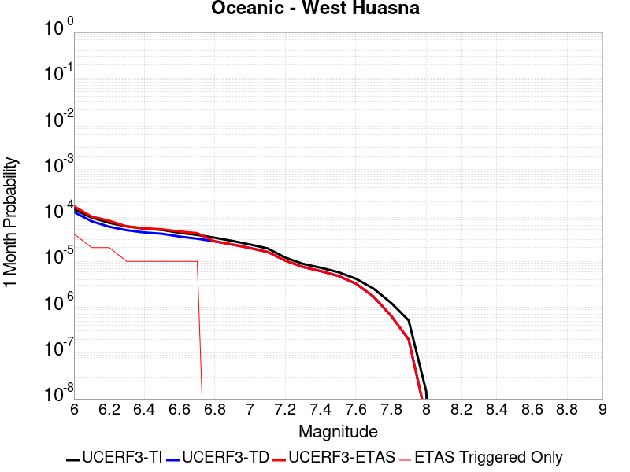 | 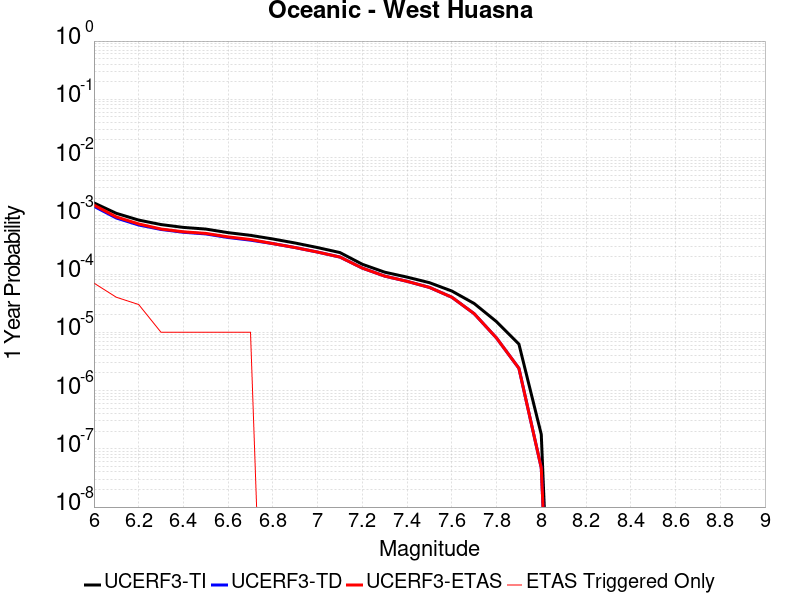 |  |

| Magnitude | 1 wk TI Prob | 1 wk TD Prob | 1 wk ETAS Prob | 1 wk ETAS/TD Gain | 1 wk ETAS Triggered Only | 1 mo TI Prob | 1 mo TD Prob | 1 mo ETAS Prob | 1 mo ETAS/TD Gain | 1 mo ETAS Triggered Only | 1 yr TI Prob | 1 yr TD Prob | 1 yr ETAS Prob | 1 yr ETAS/TD Gain | 1 yr ETAS Triggered Only | 10 yr TI Prob | 10 yr TD Prob | 10 yr ETAS Prob | 10 yr ETAS/TD Gain | 10 yr ETAS Triggered Only |
|-----|-----|-----|-----|-----|-----|-----|-----|-----|-----|-----|-----|-----|-----|-----|-----|-----|-----|-----|-----|-----|
| 6.0 | 3.195567E-5 | 2.7926868E-5 | 6.792575E-5 | 2.4322724 | 4.0E-5 | 1.3694567E-4 | 1.1968133E-4 | 1.5967654E-4 | 1.3341808 | 4.0E-5 | 0.0016660384 | 0.0014561893 | 0.0015260874 | 1.0480007 | 7.0E-5 | 0.016536033 | 0.014471028 | 0.014559725 | 1.0061293 | 9.0E-5 |
| 6.1 | 2.1156782E-5 | 1.7573486E-5 | 3.7573136E-5 | 2.1380582 | 2.0E-5 | 9.066878E-5 | 7.531282E-5 | 9.531131E-5 | 1.265539 | 2.0E-5 | 0.0011033333 | 9.165572E-4 | 9.5652055E-4 | 1.0436016 | 4.0E-5 | 0.010978713 | 0.009128777 | 0.00918823 | 1.0065126 | 6.0E-5 |
| 6.2 | 1.6195117E-5 | 1.3327152E-5 | 3.3326887E-5 | 2.5006757 | 2.0E-5 | 6.9405796E-5 | 5.7115132E-5 | 7.711399E-5 | 1.3501499 | 2.0E-5 | 8.44688E-4 | 6.9515745E-4 | 7.251366E-4 | 1.0431257 | 3.0E-5 | 0.008414844 | 0.006930123 | 0.006979777 | 1.0071648 | 5.0E-5 |
| 6.3 | 1.3559345E-5 | 1.1179142E-5 | 2.117903E-5 | 1.894513 | 1.0E-5 | 5.811018E-5 | 4.7909736E-5 | 5.790926E-5 | 1.2087158 | 1.0E-5 | 7.072618E-4 | 5.831459E-4 | 5.931401E-4 | 1.0171384 | 1.0E-5 | 0.0070501505 | 0.0058162753 | 0.005846101 | 1.0051279 | 3.0E-5 |
| 6.4 | 1.2120619E-5 | 1.0000977E-5 | 2.0000878E-5 | 1.9998922 | 1.0E-5 | 5.1944477E-5 | 4.2860633E-5 | 5.2860203E-5 | 1.2333044 | 1.0E-5 | 6.322405E-4 | 5.2170374E-4 | 5.316985E-4 | 1.019158 | 1.0E-5 | 0.006304447 | 0.0052048573 | 0.005234701 | 1.0057338 | 3.0E-5 |
| 6.5 | 1.13511915E-5 | 9.3674735E-6 | 1.936738E-5 | 2.0675137 | 1.0E-5 | 4.8647056E-5 | 4.01457E-5 | 5.01453E-5 | 1.2490827 | 1.0E-5 | 5.9211696E-4 | 4.886647E-4 | 4.9865985E-4 | 1.0204539 | 1.0E-5 | 0.0059054173 | 0.0048759608 | 0.0049058143 | 1.0061226 | 3.0E-5 |
| 6.6 | 9.850605E-6 | 8.135418E-6 | 1.8135337E-5 | 2.2291832 | 1.0E-5 | 4.2216197E-5 | 3.4865614E-5 | 4.4865264E-5 | 1.2868055 | 1.0E-5 | 5.1386096E-4 | 4.2440637E-4 | 4.3440214E-4 | 1.0235523 | 1.0E-5 | 0.0051267436 | 0.004235991 | 0.004265864 | 1.0070522 | 3.0E-5 |
| 6.7 | 8.8558645E-6 | 7.318433E-6 | 1.731836E-5 | 2.3664029 | 1.0E-5 | 3.7953152E-5 | 3.1364336E-5 | 4.1364023E-5 | 1.3188235 | 1.0E-5 | 4.6198163E-4 | 3.8179406E-4 | 3.9179024E-4 | 1.0261822 | 1.0E-5 | 0.004610224 | 0.0038114067 | 0.0038313305 | 1.0052274 | 2.0E-5 |
| 6.8 | 7.67136E-6 | 6.391756E-6 | 6.391756E-6 | 1.0 | 0.0 | 3.2876844E-5 | 2.7392953E-5 | 2.7392953E-5 | 1.0 | 0.0 | 4.0020206E-4 | 3.3345833E-4 | 3.3345833E-4 | 1.0 | 0.0 | 0.003994821 | 0.0033296007 | 0.0033296007 | 1.0 | 0.0 |
| 6.9 | 6.534529E-6 | 5.4583297E-6 | 5.4583297E-6 | 1.0 | 0.0 | 2.8004823E-5 | 2.3392633E-5 | 2.3392633E-5 | 1.0 | 0.0 | 3.4090536E-4 | 2.847682E-4 | 2.847682E-4 | 1.0 | 0.0 | 0.0034038287 | 0.0028440498 | 0.0028440498 | 1.0 | 0.0 |
| 7.0 | 5.460525E-6 | 4.5699517E-6 | 4.5699517E-6 | 1.0 | 0.0 | 2.3402039E-5 | 1.958536E-5 | 1.958536E-5 | 1.0 | 0.0 | 2.8488258E-4 | 2.3842578E-4 | 2.3842578E-4 | 1.0 | 0.0 | 0.0028451765 | 0.0023817138 | 0.0023817138 | 1.0 | 0.0 |
| 7.1 | 4.4825083E-6 | 3.7524428E-6 | 3.7524428E-6 | 1.0 | 0.0 | 1.9210609E-5 | 1.60818E-5 | 1.60818E-5 | 1.0 | 0.0 | 2.3386406E-4 | 1.9577841E-4 | 1.9577841E-4 | 1.0 | 0.0 | 0.002336181 | 0.0019560715 | 0.0019560715 | 1.0 | 0.0 |
| 7.2 | 2.821708E-6 | 2.4249334E-6 | 2.4249334E-6 | 1.0 | 0.0 | 1.2092979E-5 | 1.039253E-5 | 1.039253E-5 | 1.0 | 0.0 | 1.4722206E-4 | 1.2652173E-4 | 1.2652173E-4 | 1.0 | 0.0 | 0.0014712457 | 0.0012644994 | 0.0012644994 | 1.0 | 0.0 |
| 7.3 | 2.0644757E-6 | 1.7687412E-6 | 1.7687412E-6 | 1.0 | 0.0 | 8.847723E-6 | 7.5802973E-6 | 7.5802973E-6 | 1.0 | 0.0 | 1.0771569E-4 | 9.228622E-5 | 9.228622E-5 | 1.0 | 0.0 | 0.001076635 | 9.2248066E-4 | 9.2248066E-4 | 1.0 | 0.0 |
| 7.4 | 1.6980367E-6 | 1.4379892E-6 | 1.4379892E-6 | 1.0 | 0.0 | 7.27728E-6 | 6.162796E-6 | 6.162796E-6 | 1.0 | 0.0 | 8.8597284E-5 | 7.5029464E-5 | 7.5029464E-5 | 1.0 | 0.0 | 8.8561967E-4 | 7.500429E-4 | 7.500429E-4 | 1.0 | 0.0 |
| 7.5 | 1.3637683E-6 | 1.1302635E-6 | 1.1302635E-6 | 1.0 | 0.0 | 5.844708E-6 | 4.8439774E-6 | 4.8439774E-6 | 1.0 | 0.0 | 7.1156996E-5 | 5.897383E-5 | 5.897383E-5 | 1.0 | 0.0 | 7.1134215E-4 | 5.895833E-4 | 5.895833E-4 | 1.0 | 0.0 |
| 7.6 | 9.802994E-7 | 7.677247E-7 | 7.677247E-7 | 1.0 | 0.0 | 4.2012766E-6 | 3.2902446E-6 | 3.2902446E-6 | 1.0 | 0.0 | 5.1149345E-5 | 4.0057992E-5 | 4.0057992E-5 | 1.0 | 0.0 | 5.113757E-4 | 4.0050913E-4 | 4.0050913E-4 | 1.0 | 0.0 |
| 7.7 | 5.986191E-7 | 4.0050548E-7 | 4.0050548E-7 | 1.0 | 0.0 | 2.5655079E-6 | 1.7164509E-6 | 1.7164509E-6 | 1.0 | 0.0 | 3.1234613E-5 | 2.089759E-5 | 2.089759E-5 | 1.0 | 0.0 | 3.123022E-4 | 2.089576E-4 | 2.089576E-4 | 1.0 | 0.0 |
| 7.8 | 2.9189815E-7 | 1.5285792E-7 | 1.5285792E-7 | 1.0 | 0.0 | 1.2509914E-6 | 6.5510517E-7 | 6.5510517E-7 | 1.0 | 0.0 | 1.5230714E-5 | 7.9758765E-6 | 7.9758765E-6 | 1.0 | 0.0 | 1.522967E-4 | 7.9757214E-5 | 7.9757214E-5 | 1.0 | 0.0 |
| 7.9 | 1.2057845E-7 | 4.621248E-8 | 4.621248E-8 | 1.0 | 0.0 | 5.1676466E-7 | 1.9805347E-7 | 1.9805347E-7 | 1.0 | 0.0 | 6.2915915E-6 | 2.4112983E-6 | 2.4112983E-6 | 1.0 | 0.0 | 6.2914136E-5 | 2.4114026E-5 | 2.4114026E-5 | 1.0 | 0.0 |
| 8.0 | 3.3806387E-9 | 9.011393E-10 | 9.011393E-10 | 1.0 | 0.0 | 1.4488451E-8 | 3.8620254E-9 | 3.8620254E-9 | 1.0 | 0.0 | 1.7639688E-7 | 4.702016E-8 | 4.702016E-8 | 1.0 | 0.0 | 1.7639674E-6 | 4.7129527E-7 | 4.7129527E-7 | 1.0 | 0.0 |

## Cleghorn
*[(top)](#table-of-contents)*

| 1 Week | 1 Month | 1 Year | 10 Year |
|-----|-----|-----|-----|
| 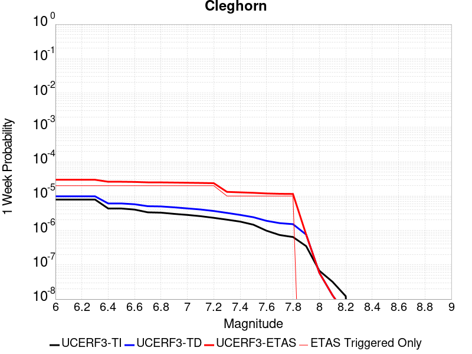 | 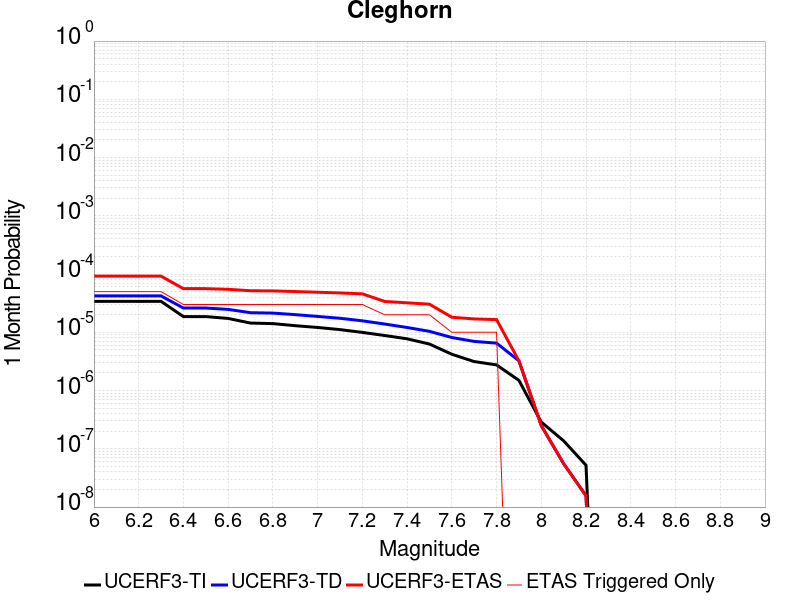 | 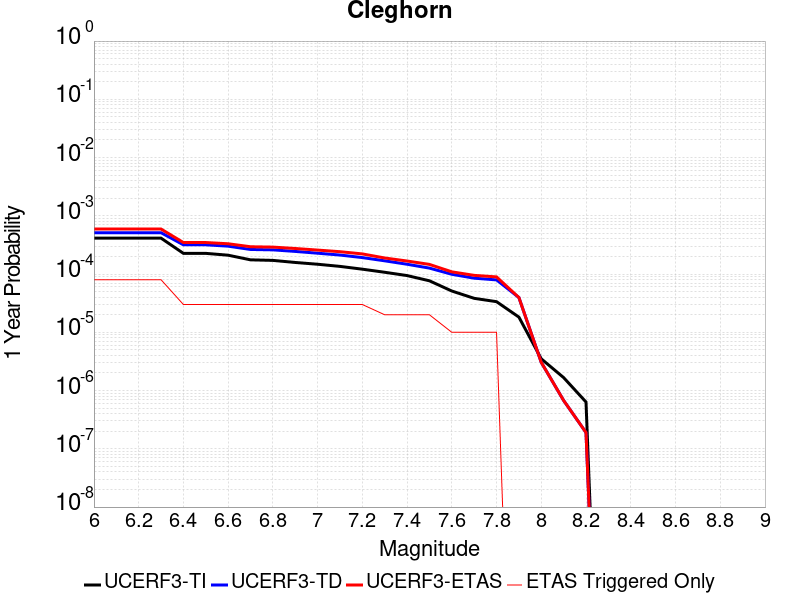 |  |

| Magnitude | 1 wk TI Prob | 1 wk TD Prob | 1 wk ETAS Prob | 1 wk ETAS/TD Gain | 1 wk ETAS Triggered Only | 1 mo TI Prob | 1 mo TD Prob | 1 mo ETAS Prob | 1 mo ETAS/TD Gain | 1 mo ETAS Triggered Only | 1 yr TI Prob | 1 yr TD Prob | 1 yr ETAS Prob | 1 yr ETAS/TD Gain | 1 yr ETAS Triggered Only | 10 yr TI Prob | 10 yr TD Prob | 10 yr ETAS Prob | 10 yr ETAS/TD Gain | 10 yr ETAS Triggered Only |
|-----|-----|-----|-----|-----|-----|-----|-----|-----|-----|-----|-----|-----|-----|-----|-----|-----|-----|-----|-----|-----|
| 6.0 | 7.9267165E-6 | 9.831582E-6 | 2.9831386E-5 | 3.0342405 | 2.0E-5 | 3.39712E-5 | 4.2134732E-5 | 9.213263E-5 | 2.1866195 | 5.0E-5 | 4.1352084E-4 | 5.128803E-4 | 5.928392E-4 | 1.1559018 | 8.0E-5 | 0.004127522 | 0.0051320773 | 0.005221615 | 1.0174468 | 9.0E-5 |
| 6.1 | 7.9267165E-6 | 9.831582E-6 | 2.9831386E-5 | 3.0342405 | 2.0E-5 | 3.39712E-5 | 4.2134732E-5 | 9.213263E-5 | 2.1866195 | 5.0E-5 | 4.1352084E-4 | 5.128803E-4 | 5.928392E-4 | 1.1559018 | 8.0E-5 | 0.004127522 | 0.0051320773 | 0.005221615 | 1.0174468 | 9.0E-5 |
| 6.2 | 7.9267165E-6 | 9.831582E-6 | 2.9831386E-5 | 3.0342405 | 2.0E-5 | 3.39712E-5 | 4.2134732E-5 | 9.213263E-5 | 2.1866195 | 5.0E-5 | 4.1352084E-4 | 5.128803E-4 | 5.928392E-4 | 1.1559018 | 8.0E-5 | 0.004127522 | 0.0051320773 | 0.005221615 | 1.0174468 | 9.0E-5 |
| 6.3 | 7.9267165E-6 | 9.831582E-6 | 2.9831386E-5 | 3.0342405 | 2.0E-5 | 3.39712E-5 | 4.2134732E-5 | 9.213263E-5 | 2.1866195 | 5.0E-5 | 4.1352084E-4 | 5.128803E-4 | 5.928392E-4 | 1.1559018 | 8.0E-5 | 0.004127522 | 0.0051320773 | 0.005221615 | 1.0174468 | 9.0E-5 |
| 6.4 | 4.3445207E-6 | 6.0914435E-6 | 2.6091322E-5 | 4.283274 | 2.0E-5 | 1.8619241E-5 | 2.610593E-5 | 5.6105146E-5 | 2.1491342 | 3.0E-5 | 2.2666567E-4 | 3.1779436E-4 | 3.4778484E-4 | 1.0943707 | 3.0E-5 | 0.0022643462 | 0.0031875873 | 0.0032174916 | 1.0093815 | 3.0E-5 |
| 6.5 | 4.3445207E-6 | 6.0914435E-6 | 2.6091322E-5 | 4.283274 | 2.0E-5 | 1.8619241E-5 | 2.610593E-5 | 5.6105146E-5 | 2.1491342 | 3.0E-5 | 2.2666567E-4 | 3.1779436E-4 | 3.4778484E-4 | 1.0943707 | 3.0E-5 | 0.0022643462 | 0.0031875873 | 0.0032174916 | 1.0093815 | 3.0E-5 |
| 6.6 | 4.040109E-6 | 5.773851E-6 | 2.5773736E-5 | 4.4638724 | 2.0E-5 | 1.7314638E-5 | 2.4744846E-5 | 5.4744105E-5 | 2.2123437 | 3.0E-5 | 2.1078532E-4 | 3.012278E-4 | 3.3121876E-4 | 1.0995624 | 3.0E-5 | 0.002105855 | 0.003022377 | 0.0030522863 | 1.0098959 | 3.0E-5 |
| 6.7 | 3.3632055E-6 | 5.067348E-6 | 2.5067247E-5 | 4.946818 | 2.0E-5 | 1.4413658E-5 | 2.1717027E-5 | 5.1716375E-5 | 2.3813746 | 3.0E-5 | 1.7547216E-4 | 2.6437303E-4 | 2.943651E-4 | 1.113446 | 3.0E-5 | 0.0017533366 | 0.0026547113 | 0.0026846316 | 1.0112706 | 3.0E-5 |
| 6.8 | 3.2902772E-6 | 4.9892556E-6 | 2.4989156E-5 | 5.008594 | 2.0E-5 | 1.4101111E-5 | 2.1382351E-5 | 5.138171E-5 | 2.4029963 | 3.0E-5 | 1.716675E-4 | 2.6029933E-4 | 2.9029153E-4 | 1.115222 | 3.0E-5 | 0.0017153495 | 0.0026140702 | 0.0026439917 | 1.0114464 | 3.0E-5 |
| 6.9 | 3.031547E-6 | 4.6910186E-6 | 2.4690924E-5 | 5.2634463 | 2.0E-5 | 1.299228E-5 | 2.0104211E-5 | 5.010361E-5 | 2.4921947 | 3.0E-5 | 1.5816953E-4 | 2.4474156E-4 | 2.7473422E-4 | 1.1225483 | 3.0E-5 | 0.00158057 | 0.0024588439 | 0.00248877 | 1.0121709 | 3.0E-5 |
| 7.0 | 2.8259715E-6 | 4.3705895E-6 | 2.4370502E-5 | 5.576022 | 2.0E-5 | 1.211125E-5 | 1.8730963E-5 | 4.8730402E-5 | 2.601596 | 3.0E-5 | 1.4744449E-4 | 2.2802586E-4 | 2.5801902E-4 | 1.131534 | 3.0E-5 | 0.001473467 | 0.0022920412 | 0.0023219723 | 1.0130588 | 3.0E-5 |
| 7.1 | 2.5962665E-6 | 4.0658106E-6 | 2.406573E-5 | 5.9190483 | 2.0E-5 | 1.1126809E-5 | 1.7424789E-5 | 4.7424266E-5 | 2.7216551 | 3.0E-5 | 1.3546048E-4 | 2.1212637E-4 | 2.4212E-4 | 1.1413951 | 3.0E-5 | 0.0013537793 | 0.002133366 | 0.002163302 | 1.0140322 | 3.0E-5 |
| 7.2 | 2.3247253E-6 | 3.6763672E-6 | 2.3676293E-5 | 6.440133 | 2.0E-5 | 9.96307E-6 | 1.5755764E-5 | 4.5755292E-5 | 2.9040349 | 3.0E-5 | 1.21293626E-4 | 1.9180974E-4 | 2.2180399E-4 | 1.1563749 | 3.0E-5 | 0.0012122744 | 0.0019305905 | 0.0019605325 | 1.0155092 | 3.0E-5 |
| 7.3 | 2.056928E-6 | 3.2350938E-6 | 1.32350615E-5 | 4.0910907 | 1.0E-5 | 8.815376E-6 | 1.3864615E-5 | 3.3864337E-5 | 2.442501 | 2.0E-5 | 1.0732192E-4 | 1.6878877E-4 | 1.8878539E-4 | 1.1184713 | 2.0E-5 | 0.001072701 | 0.0017008206 | 0.0017207866 | 1.011739 | 2.0E-5 |
| 7.4 | 1.8055999E-6 | 2.8255042E-6 | 1.2825476E-5 | 4.539181 | 1.0E-5 | 7.738263E-6 | 1.2109249E-5 | 3.2109005E-5 | 2.6516101 | 2.0E-5 | 9.4209274E-5 | 1.4742027E-4 | 1.6741733E-4 | 1.1356466 | 2.0E-5 | 9.4169343E-4 | 0.0014875771 | 0.0015075473 | 1.0134246 | 2.0E-5 |
| 7.5 | 1.4683443E-6 | 2.4247483E-6 | 1.2424724E-5 | 5.1241293 | 1.0E-5 | 6.292889E-6 | 1.0391738E-5 | 3.039153E-5 | 2.9245858 | 2.0E-5 | 7.661323E-5 | 1.2651215E-4 | 1.4650963E-4 | 1.1580676 | 2.0E-5 | 7.658682E-4 | 0.0012787961 | 0.0012987705 | 1.0156198 | 2.0E-5 |
| 7.6 | 9.804088E-7 | 1.900266E-6 | 1.1900247E-5 | 6.2624106 | 1.0E-5 | 4.201745E-6 | 8.143972E-6 | 1.8143892E-5 | 2.227892 | 1.0E-5 | 5.1155046E-5 | 9.91484E-5 | 1.0914741E-4 | 1.1008489 | 1.0E-5 | 5.114327E-4 | 0.001005471 | 0.0010154609 | 1.0099356 | 1.0E-5 |
| 7.7 | 7.3434086E-7 | 1.6284146E-6 | 1.1628398E-5 | 7.140932 | 1.0E-5 | 3.1471714E-6 | 6.978901E-6 | 1.697883E-5 | 2.4328804 | 1.0E-5 | 3.831614E-5 | 8.4964835E-5 | 9.496399E-5 | 1.1176858 | 1.0E-5 | 3.8309532E-4 | 8.6378685E-4 | 8.737782E-4 | 1.0115669 | 1.0E-5 |
| 7.8 | 6.434184E-7 | 1.5220047E-6 | 1.1521989E-5 | 7.570272 | 1.0E-5 | 2.7575045E-6 | 6.5228614E-6 | 1.6522796E-5 | 2.5330596 | 1.0E-5 | 3.35721E-5 | 7.941297E-5 | 8.941218E-5 | 1.125914 | 1.0E-5 | 3.3567028E-4 | 8.079678E-4 | 8.179597E-4 | 1.0123668 | 1.0E-5 |
| 7.9 | 3.4943926E-7 | 7.574459E-7 | 7.574459E-7 | 1.0 | 0.0 | 1.497596E-6 | 3.2461926E-6 | 3.2461926E-6 | 1.0 | 0.0 | 1.8233079E-5 | 3.952169E-5 | 3.952169E-5 | 1.0 | 0.0 | 1.8231584E-4 | 4.040099E-4 | 4.040099E-4 | 1.0 | 0.0 |
| 8.0 | 6.717524E-8 | 5.838828E-8 | 5.838828E-8 | 1.0 | 0.0 | 2.8789387E-7 | 2.5023547E-7 | 2.5023547E-7 | 1.0 | 0.0 | 3.505102E-6 | 3.0466126E-6 | 3.0466126E-6 | 1.0 | 0.0 | 3.5050467E-5 | 3.273506E-5 | 3.273506E-5 | 1.0 | 0.0 |
| 8.1 | 3.1984914E-8 | 1.2956093E-8 | 1.2956093E-8 | 1.0 | 0.0 | 1.370782E-7 | 5.552611E-8 | 5.552611E-8 | 1.0 | 0.0 | 1.6689258E-6 | 6.760302E-7 | 6.760302E-7 | 1.0 | 0.0 | 1.6689133E-5 | 7.74454E-6 | 7.74454E-6 | 1.0 | 0.0 |
| 8.2 | 1.21887656E-8 | 3.6495305E-9 | 3.6495305E-9 | 1.0 | 0.0 | 5.2237567E-8 | 1.5640845E-8 | 1.5640845E-8 | 1.0 | 0.0 | 6.359922E-7 | 1.9042727E-7 | 1.9042727E-7 | 1.0 | 0.0 | 6.3599036E-6 | 2.2470974E-6 | 2.2470974E-6 | 1.0 | 0.0 |

## Blue Cut
*[(top)](#table-of-contents)*

| 1 Week | 1 Month | 1 Year | 10 Year |
|-----|-----|-----|-----|
| 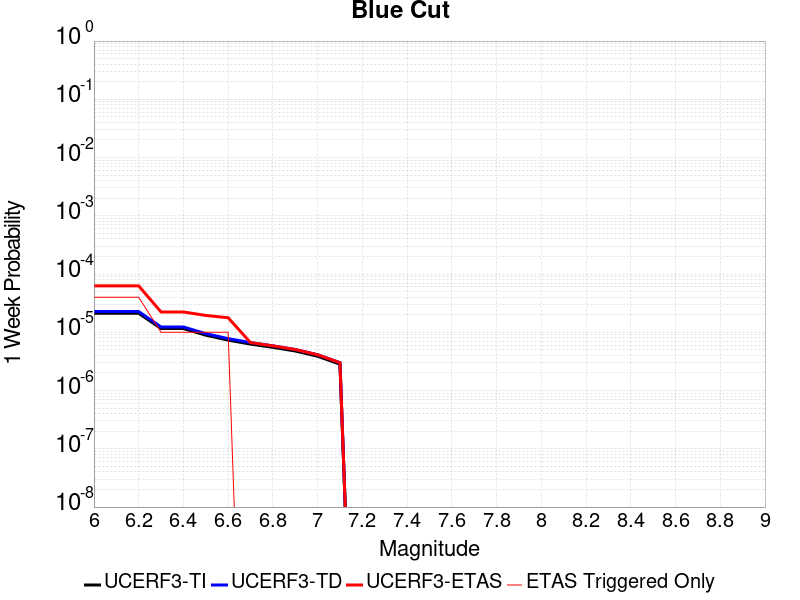 | 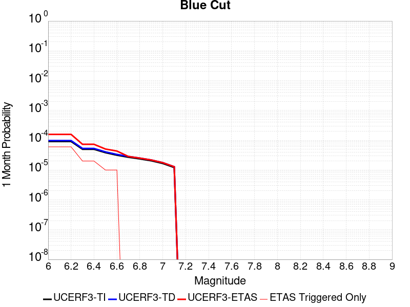 |  | 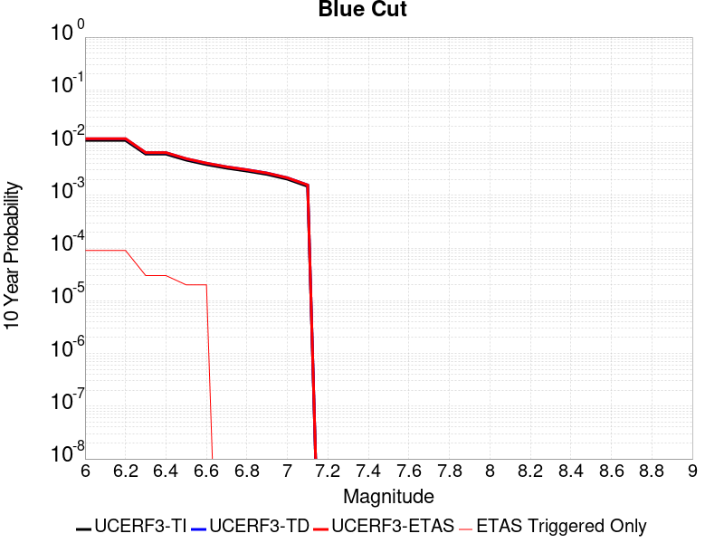 |

| Magnitude | 1 wk TI Prob | 1 wk TD Prob | 1 wk ETAS Prob | 1 wk ETAS/TD Gain | 1 wk ETAS Triggered Only | 1 mo TI Prob | 1 mo TD Prob | 1 mo ETAS Prob | 1 mo ETAS/TD Gain | 1 mo ETAS Triggered Only | 1 yr TI Prob | 1 yr TD Prob | 1 yr ETAS Prob | 1 yr ETAS/TD Gain | 1 yr ETAS Triggered Only | 10 yr TI Prob | 10 yr TD Prob | 10 yr ETAS Prob | 10 yr ETAS/TD Gain | 10 yr ETAS Triggered Only |
|-----|-----|-----|-----|-----|-----|-----|-----|-----|-----|-----|-----|-----|-----|-----|-----|-----|-----|-----|-----|-----|
| 6.0 | 2.1227985E-5 | 2.2719574E-5 | 6.271867E-5 | 2.7605565 | 4.0E-5 | 9.097391E-5 | 9.73663E-5 | 1.5736045E-4 | 1.6161697 | 6.0E-5 | 0.0011070445 | 0.0011848481 | 0.0012547652 | 1.0590093 | 7.0E-5 | 0.011015458 | 0.011791152 | 0.01188009 | 1.0075428 | 9.0E-5 |
| 6.1 | 2.1227985E-5 | 2.2719574E-5 | 6.271867E-5 | 2.7605565 | 4.0E-5 | 9.097391E-5 | 9.73663E-5 | 1.5736045E-4 | 1.6161697 | 6.0E-5 | 0.0011070445 | 0.0011848481 | 0.0012547652 | 1.0590093 | 7.0E-5 | 0.011015458 | 0.011791152 | 0.01188009 | 1.0075428 | 9.0E-5 |
| 6.2 | 2.1227985E-5 | 2.2719574E-5 | 6.271867E-5 | 2.7605565 | 4.0E-5 | 9.097391E-5 | 9.73663E-5 | 1.5736045E-4 | 1.6161697 | 6.0E-5 | 0.0011070445 | 0.0011848481 | 0.0012547652 | 1.0590093 | 7.0E-5 | 0.011015458 | 0.011791152 | 0.01188009 | 1.0075428 | 9.0E-5 |
| 6.3 | 1.1613981E-5 | 1.2353542E-5 | 2.2353419E-5 | 1.8094745 | 1.0E-5 | 4.9773254E-5 | 5.2942745E-5 | 7.2941686E-5 | 1.3777466 | 2.0E-5 | 6.0582085E-4 | 6.443998E-4 | 6.643869E-4 | 1.0310166 | 2.0E-5 | 0.0060417196 | 0.0064265593 | 0.0064563663 | 1.0046381 | 3.0E-5 |
| 6.4 | 1.1613981E-5 | 1.2353542E-5 | 2.2353419E-5 | 1.8094745 | 1.0E-5 | 4.9773254E-5 | 5.2942745E-5 | 7.2941686E-5 | 1.3777466 | 2.0E-5 | 6.0582085E-4 | 6.443998E-4 | 6.643869E-4 | 1.0310166 | 2.0E-5 | 0.0060417196 | 0.0064265593 | 0.0064563663 | 1.0046381 | 3.0E-5 |
| 6.5 | 8.931326E-6 | 9.4816E-6 | 1.9481506E-5 | 2.0546644 | 1.0E-5 | 3.8276554E-5 | 4.0634844E-5 | 5.063444E-5 | 1.2460842 | 1.0E-5 | 4.6591737E-4 | 4.946261E-4 | 5.0462113E-4 | 1.0202073 | 1.0E-5 | 0.0046494175 | 0.004936161 | 0.0049560624 | 1.0040318 | 2.0E-5 |
| 6.6 | 7.345353E-6 | 7.79028E-6 | 1.7790202E-5 | 2.283641 | 1.0E-5 | 3.1479703E-5 | 3.338653E-5 | 4.3386193E-5 | 1.299512 | 1.0E-5 | 3.83198E-4 | 4.064132E-4 | 4.164091E-4 | 1.0245955 | 1.0E-5 | 0.0038253788 | 0.0040574907 | 0.00407741 | 1.0049092 | 2.0E-5 |
| 6.7 | 6.2775666E-6 | 6.655149E-6 | 6.655149E-6 | 1.0 | 0.0 | 2.690358E-5 | 2.8521798E-5 | 2.8521798E-5 | 1.0 | 0.0 | 3.2750185E-4 | 3.472051E-4 | 3.472051E-4 | 1.0 | 0.0 | 0.0032701963 | 0.003467367 | 0.003467367 | 1.0 | 0.0 |
| 6.8 | 5.5234095E-6 | 5.8551113E-6 | 5.8551113E-6 | 1.0 | 0.0 | 2.367154E-5 | 2.5093133E-5 | 2.5093133E-5 | 1.0 | 0.0 | 2.8816288E-4 | 3.0547334E-4 | 3.0547334E-4 | 1.0 | 0.0 | 0.002877895 | 0.0030512505 | 0.0030512505 | 1.0 | 0.0 |
| 6.9 | 4.7780054E-6 | 5.0654203E-6 | 5.0654203E-6 | 1.0 | 0.0 | 2.0477004E-5 | 2.1708804E-5 | 2.1708804E-5 | 1.0 | 0.0 | 2.4927902E-4 | 2.642797E-4 | 2.642797E-4 | 1.0 | 0.0 | 0.0024899957 | 0.002640346 | 0.002640346 | 1.0 | 0.0 |
| 7.0 | 3.883171E-6 | 4.118487E-6 | 4.118487E-6 | 1.0 | 0.0 | 1.6642054E-5 | 1.7650578E-5 | 1.7650578E-5 | 1.0 | 0.0 | 2.0259817E-4 | 2.1488148E-4 | 2.1488148E-4 | 1.0 | 0.0 | 0.0020241356 | 0.0021474129 | 0.0021474129 | 1.0 | 0.0 |
| 7.1 | 2.8358215E-6 | 3.0097158E-6 | 3.0097158E-6 | 1.0 | 0.0 | 1.2153464E-5 | 1.2898756E-5 | 1.2898756E-5 | 1.0 | 0.0 | 1.4795837E-4 | 1.5703762E-4 | 1.5703762E-4 | 1.0 | 0.0 | 0.001478599 | 0.0015699116 | 0.0015699116 | 1.0 | 0.0 |

## White Mountains
*[(top)](#table-of-contents)*

| 1 Week | 1 Month | 1 Year | 10 Year |
|-----|-----|-----|-----|
| 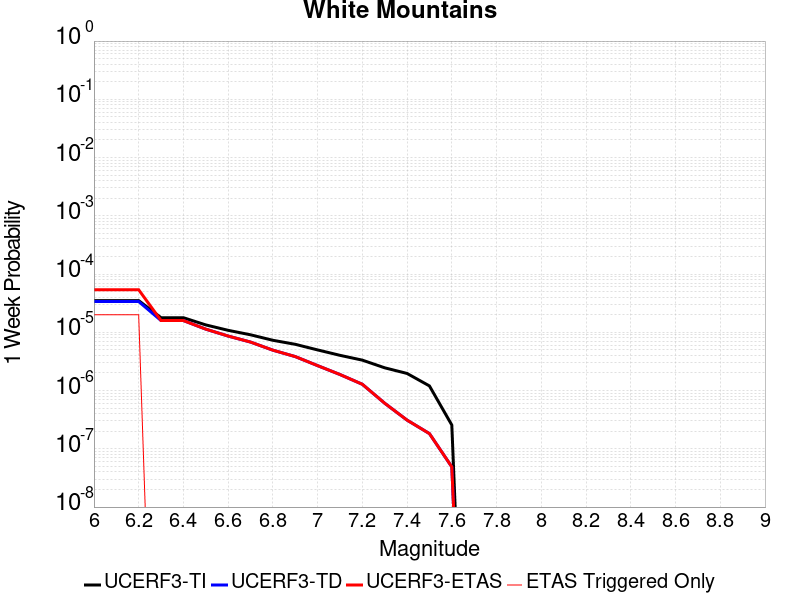 | 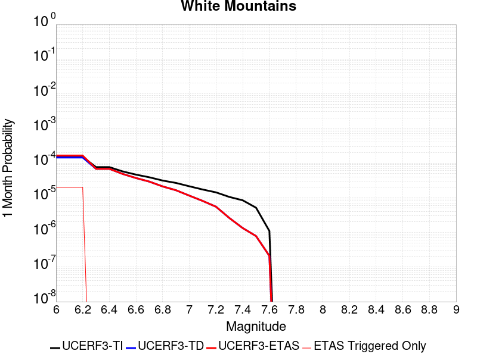 |  |  |

| Magnitude | 1 wk TI Prob | 1 wk TD Prob | 1 wk ETAS Prob | 1 wk ETAS/TD Gain | 1 wk ETAS Triggered Only | 1 mo TI Prob | 1 mo TD Prob | 1 mo ETAS Prob | 1 mo ETAS/TD Gain | 1 mo ETAS Triggered Only | 1 yr TI Prob | 1 yr TD Prob | 1 yr ETAS Prob | 1 yr ETAS/TD Gain | 1 yr ETAS Triggered Only | 10 yr TI Prob | 10 yr TD Prob | 10 yr ETAS Prob | 10 yr ETAS/TD Gain | 10 yr ETAS Triggered Only |
|-----|-----|-----|-----|-----|-----|-----|-----|-----|-----|-----|-----|-----|-----|-----|-----|-----|-----|-----|-----|-----|
| 6.0 | 3.503579E-5 | 3.378405E-5 | 5.3783377E-5 | 1.5919753 | 2.0E-5 | 1.5014476E-4 | 1.4478143E-4 | 1.6477854E-4 | 1.1381192 | 2.0E-5 | 0.0018264796 | 0.0017614096 | 0.0018113215 | 1.0283364 | 5.0E-5 | 0.018115403 | 0.017486818 | 0.01756542 | 1.0044949 | 8.0E-5 |
| 6.1 | 3.503579E-5 | 3.378405E-5 | 5.3783377E-5 | 1.5919753 | 2.0E-5 | 1.5014476E-4 | 1.4478143E-4 | 1.6477854E-4 | 1.1381192 | 2.0E-5 | 0.0018264796 | 0.0017614096 | 0.0018113215 | 1.0283364 | 5.0E-5 | 0.018115403 | 0.017486818 | 0.01756542 | 1.0044949 | 8.0E-5 |
| 6.2 | 3.503579E-5 | 3.378405E-5 | 5.3783377E-5 | 1.5919753 | 2.0E-5 | 1.5014476E-4 | 1.4478143E-4 | 1.6477854E-4 | 1.1381192 | 2.0E-5 | 0.0018264796 | 0.0017614096 | 0.0018113215 | 1.0283364 | 5.0E-5 | 0.018115403 | 0.017486818 | 0.01756542 | 1.0044949 | 8.0E-5 |
| 6.3 | 1.7818425E-5 | 1.5916074E-5 | 1.5916074E-5 | 1.0 | 0.0 | 7.636245E-5 | 6.821004E-5 | 6.821004E-5 | 1.0 | 0.0 | 9.293162E-4 | 8.301551E-4 | 8.301551E-4 | 1.0 | 0.0 | 0.009254395 | 0.008271999 | 0.008291833 | 1.0023978 | 2.0E-5 |
| 6.4 | 1.7818425E-5 | 1.5916074E-5 | 1.5916074E-5 | 1.0 | 0.0 | 7.636245E-5 | 6.821004E-5 | 6.821004E-5 | 1.0 | 0.0 | 9.293162E-4 | 8.301551E-4 | 8.301551E-4 | 1.0 | 0.0 | 0.009254395 | 0.008271999 | 0.008291833 | 1.0023978 | 2.0E-5 |
| 6.5 | 1.3397557E-5 | 1.13362685E-5 | 1.13362685E-5 | 1.0 | 0.0 | 5.741684E-5 | 4.858314E-5 | 4.858314E-5 | 1.0 | 0.0 | 6.988258E-4 | 5.913462E-4 | 5.913462E-4 | 1.0 | 0.0 | 0.006966323 | 0.005898432 | 0.0059183137 | 1.0033708 | 2.0E-5 |
| 6.6 | 1.0818695E-5 | 8.625366E-6 | 8.625366E-6 | 1.0 | 0.0 | 4.6365014E-5 | 3.6965357E-5 | 3.6965357E-5 | 1.0 | 0.0 | 5.6434784E-4 | 4.4996463E-4 | 4.4996463E-4 | 1.0 | 0.0 | 0.005629168 | 0.004490972 | 0.0045108823 | 1.0044334 | 2.0E-5 |
| 6.7 | 9.067908E-6 | 6.802442E-6 | 6.802442E-6 | 1.0 | 0.0 | 3.8861883E-5 | 2.9153016E-5 | 2.9153016E-5 | 1.0 | 0.0 | 4.7304068E-4 | 3.5488335E-4 | 3.5488335E-4 | 1.0 | 0.0 | 0.00472035 | 0.0035434833 | 0.003553448 | 1.002812 | 1.0E-5 |
| 6.8 | 7.295947E-6 | 4.936391E-6 | 4.936391E-6 | 1.0 | 0.0 | 3.126797E-5 | 2.1155796E-5 | 2.1155796E-5 | 1.0 | 0.0 | 3.8062103E-4 | 2.575425E-4 | 2.575425E-4 | 1.0 | 0.0 | 0.0037996976 | 0.0025725532 | 0.0025825277 | 1.0038772 | 1.0E-5 |
| 6.9 | 6.2243444E-6 | 3.832213E-6 | 3.832213E-6 | 1.0 | 0.0 | 2.6675489E-5 | 1.642367E-5 | 1.642367E-5 | 1.0 | 0.0 | 3.2472567E-4 | 1.9994036E-4 | 1.9994036E-4 | 1.0 | 0.0 | 0.0032425157 | 0.0019976576 | 0.0020076376 | 1.0049958 | 1.0E-5 |
| 7.0 | 4.9878413E-6 | 2.6795342E-6 | 2.6795342E-6 | 1.0 | 0.0 | 2.1376287E-5 | 1.14836685E-5 | 1.14836685E-5 | 1.0 | 0.0 | 2.602252E-4 | 1.3980496E-4 | 1.3980496E-4 | 1.0 | 0.0 | 0.002599207 | 0.0013971963 | 0.0013971963 | 1.0 | 0.0 |
| 7.1 | 4.0252844E-6 | 1.8857575E-6 | 1.8857575E-6 | 1.0 | 0.0 | 1.7251105E-5 | 8.081794E-6 | 8.081794E-6 | 1.0 | 0.0 | 2.1001195E-4 | 9.8391516E-5 | 9.8391516E-5 | 1.0 | 0.0 | 0.0020981359 | 9.834924E-4 | 9.834924E-4 | 1.0 | 0.0 |
| 7.2 | 3.3284066E-6 | 1.281964E-6 | 1.281964E-6 | 1.0 | 0.0 | 1.4264522E-5 | 5.494121E-6 | 5.494121E-6 | 1.0 | 0.0 | 1.736567E-4 | 6.688897E-5 | 6.688897E-5 | 1.0 | 0.0 | 0.0017352107 | 6.6869846E-4 | 6.6869846E-4 | 1.0 | 0.0 |
| 7.3 | 2.458226E-6 | 6.05722E-7 | 6.05722E-7 | 1.0 | 0.0 | 1.0535211E-5 | 2.5959491E-6 | 2.5959491E-6 | 1.0 | 0.0 | 1.2825865E-4 | 3.1605257E-5 | 3.1605257E-5 | 1.0 | 0.0 | 0.0012818464 | 3.160114E-4 | 3.160114E-4 | 1.0 | 0.0 |
| 7.4 | 1.965953E-6 | 3.1089303E-7 | 3.1089303E-7 | 1.0 | 0.0 | 8.425486E-6 | 1.332398E-6 | 1.332398E-6 | 1.0 | 0.0 | 1.0257547E-4 | 1.6221828E-5 | 1.6221828E-5 | 1.0 | 0.0 | 0.0010252813 | 1.6220656E-4 | 1.6220656E-4 | 1.0 | 0.0 |
| 7.5 | 1.2014192E-6 | 1.8244253E-7 | 1.8244253E-7 | 1.0 | 0.0 | 5.148929E-6 | 7.8189635E-7 | 7.8189635E-7 | 1.0 | 0.0 | 6.2686406E-5 | 9.519547E-6 | 9.519547E-6 | 1.0 | 0.0 | 6.266873E-4 | 9.519148E-5 | 9.519148E-5 | 1.0 | 0.0 |
| 7.6 | 2.5612175E-7 | 4.8946475E-8 | 4.8946475E-8 | 1.0 | 0.0 | 1.0976642E-6 | 2.0977059E-7 | 2.0977059E-7 | 1.0 | 0.0 | 1.3363979E-5 | 2.5539543E-6 | 2.5539543E-6 | 1.0 | 0.0 | 1.3363175E-4 | 2.5539286E-5 | 2.5539286E-5 | 1.0 | 0.0 |

## San Jacinto (Borrego)
*[(top)](#table-of-contents)*

| 1 Week | 1 Month | 1 Year | 10 Year |
|-----|-----|-----|-----|
| 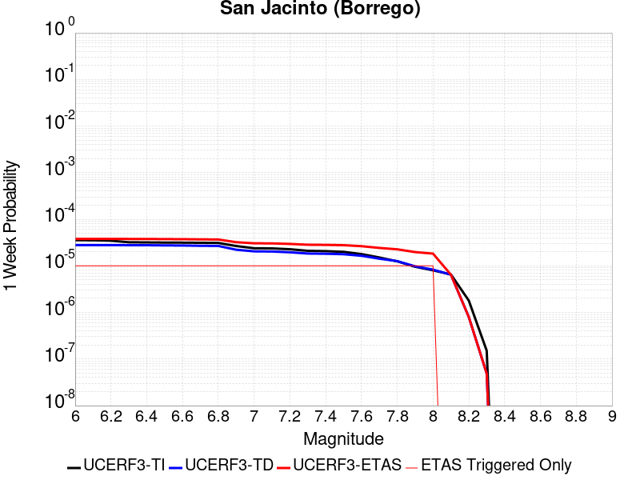 | 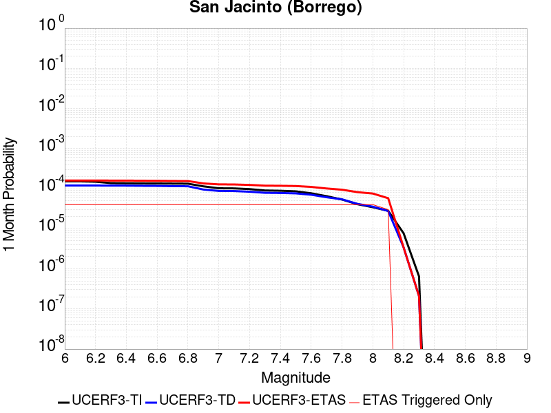 |  | 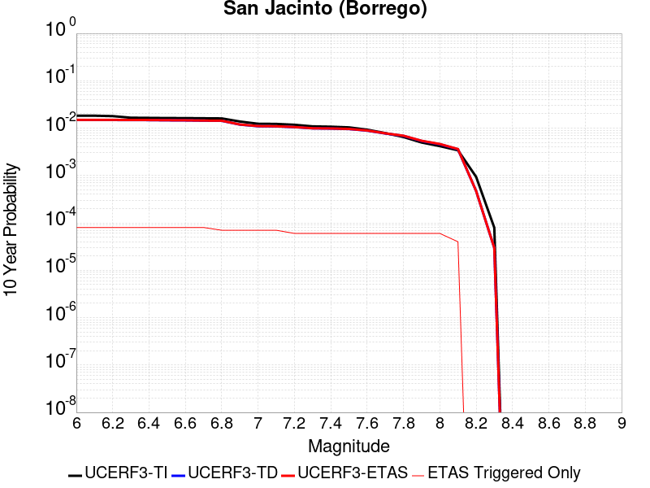 |

| Magnitude | 1 wk TI Prob | 1 wk TD Prob | 1 wk ETAS Prob | 1 wk ETAS/TD Gain | 1 wk ETAS Triggered Only | 1 mo TI Prob | 1 mo TD Prob | 1 mo ETAS Prob | 1 mo ETAS/TD Gain | 1 mo ETAS Triggered Only | 1 yr TI Prob | 1 yr TD Prob | 1 yr ETAS Prob | 1 yr ETAS/TD Gain | 1 yr ETAS Triggered Only | 10 yr TI Prob | 10 yr TD Prob | 10 yr ETAS Prob | 10 yr ETAS/TD Gain | 10 yr ETAS Triggered Only |
|-----|-----|-----|-----|-----|-----|-----|-----|-----|-----|-----|-----|-----|-----|-----|-----|-----|-----|-----|-----|-----|
| 6.0 | 3.543992E-5 | 2.7926513E-5 | 3.7926235E-5 | 1.3580726 | 1.0E-5 | 1.5187653E-4 | 1.1967963E-4 | 1.5967485E-4 | 1.3341856 | 4.0E-5 | 0.0018475284 | 0.0014561379 | 0.0015160504 | 1.0411448 | 6.0E-5 | 0.018322436 | 0.014869647 | 0.0149484575 | 1.0053 | 8.0E-5 |
| 6.1 | 3.542281E-5 | 2.7926513E-5 | 3.7926235E-5 | 1.3580726 | 1.0E-5 | 1.5180321E-4 | 1.1967963E-4 | 1.5967485E-4 | 1.3341856 | 4.0E-5 | 0.0018466372 | 0.0014561379 | 0.0015160504 | 1.0411448 | 6.0E-5 | 0.018313672 | 0.014869647 | 0.0149484575 | 1.0053 | 8.0E-5 |
| 6.2 | 3.4688688E-5 | 2.7926511E-5 | 3.792623E-5 | 1.3580726 | 1.0E-5 | 1.4865733E-4 | 1.1967963E-4 | 1.5967485E-4 | 1.3341856 | 4.0E-5 | 0.0018084005 | 0.0014561379 | 0.0015160504 | 1.0411448 | 6.0E-5 | 0.017937548 | 0.014869647 | 0.0149484575 | 1.0053 | 8.0E-5 |
| 6.3 | 3.2087122E-5 | 2.7771865E-5 | 3.7771588E-5 | 1.3600667 | 1.0E-5 | 1.3750899E-4 | 1.1901691E-4 | 1.5901215E-4 | 1.3360467 | 4.0E-5 | 0.0016728862 | 0.00144808 | 0.0015079931 | 1.0413742 | 6.0E-5 | 0.016603488 | 0.014790683 | 0.0148695 | 1.0053288 | 8.0E-5 |
| 6.4 | 3.1828724E-5 | 2.7738852E-5 | 3.7738573E-5 | 1.3604952 | 1.0E-5 | 1.364017E-4 | 1.1887544E-4 | 1.5887068E-4 | 1.3364466 | 4.0E-5 | 0.0016594254 | 0.0014463598 | 0.001506273 | 1.0414234 | 6.0E-5 | 0.016470885 | 0.014773762 | 0.01485258 | 1.005335 | 8.0E-5 |
| 6.5 | 3.1563577E-5 | 2.747857E-5 | 3.7478294E-5 | 1.36391 | 1.0E-5 | 1.3526545E-4 | 1.1776006E-4 | 1.5775535E-4 | 1.3396337 | 4.0E-5 | 0.0016456128 | 0.0014327979 | 0.001492712 | 1.0418161 | 6.0E-5 | 0.0163348 | 0.014640348 | 0.014719177 | 1.0053843 | 8.0E-5 |
| 6.6 | 3.1467625E-5 | 2.7322796E-5 | 3.7322523E-5 | 1.3659848 | 1.0E-5 | 1.3485427E-4 | 1.1709251E-4 | 1.5708782E-4 | 1.3415703 | 4.0E-5 | 0.0016406142 | 0.0014246812 | 0.0014845957 | 1.0420547 | 6.0E-5 | 0.016285548 | 0.014560594 | 0.01463943 | 1.0054142 | 8.0E-5 |
| 6.7 | 3.1223695E-5 | 2.6940816E-5 | 3.6940546E-5 | 1.371174 | 1.0E-5 | 1.3380898E-4 | 1.15455594E-4 | 1.5545098E-4 | 1.3464135 | 4.0E-5 | 0.0016279068 | 0.0014047775 | 0.0014646933 | 1.0426514 | 6.0E-5 | 0.01616033 | 0.014364966 | 0.014443817 | 1.0054891 | 8.0E-5 |
| 6.8 | 3.1015585E-5 | 2.6761822E-5 | 3.6761554E-5 | 1.3736566 | 1.0E-5 | 1.3291716E-4 | 1.1468855E-4 | 1.5468396E-4 | 1.3487307 | 4.0E-5 | 0.001617065 | 0.0013954508 | 0.0014453811 | 1.0357807 | 5.0E-5 | 0.016053487 | 0.014272246 | 0.014341247 | 1.0048347 | 7.0E-5 |
| 6.9 | 2.6641965E-5 | 2.2184247E-5 | 3.2184023E-5 | 1.4507604 | 1.0E-5 | 1.1417485E-4 | 9.50719E-5 | 1.350681E-4 | 1.4206942 | 4.0E-5 | 0.0013891924 | 0.0011568897 | 0.0012068318 | 1.0431694 | 5.0E-5 | 0.0138054015 | 0.011882438 | 0.011951607 | 1.005821 | 7.0E-5 |
| 7.0 | 2.3854353E-5 | 2.0479023E-5 | 3.047882E-5 | 1.4882945 | 1.0E-5 | 1.02228936E-4 | 8.77643E-5 | 1.277608E-4 | 1.4557261 | 4.0E-5 | 0.0012439266 | 0.0010680092 | 0.0011179558 | 1.046766 | 5.0E-5 | 0.012369866 | 0.0109828 | 0.011052032 | 1.0063035 | 7.0E-5 |
| 7.1 | 2.3672901E-5 | 2.031551E-5 | 3.0315308E-5 | 1.4922247 | 1.0E-5 | 1.0145135E-4 | 8.7063585E-5 | 1.270601E-4 | 1.4593943 | 4.0E-5 | 0.0012344702 | 0.0010594862 | 0.0011094332 | 1.0471427 | 5.0E-5 | 0.0122763505 | 0.010897976 | 0.010967214 | 1.0063533 | 7.0E-5 |
| 7.2 | 2.2717244E-5 | 1.9542893E-5 | 2.9542696E-5 | 1.511685 | 1.0E-5 | 9.735599E-5 | 8.375258E-5 | 1.2374923E-4 | 1.4775572 | 4.0E-5 | 0.0011846646 | 0.001019213 | 0.001069162 | 1.0490074 | 5.0E-5 | 0.01178369 | 0.010495341 | 0.010554711 | 1.0056568 | 6.0E-5 |
| 7.3 | 2.1016205E-5 | 1.8384526E-5 | 2.8384342E-5 | 1.5439258 | 1.0E-5 | 9.006634E-5 | 7.878846E-5 | 1.18785305E-4 | 1.5076486 | 4.0E-5 | 0.001096006 | 9.5882936E-4 | 0.0010087814 | 1.052097 | 5.0E-5 | 0.010906163 | 0.009890967 | 0.009950373 | 1.0060061 | 6.0E-5 |
| 7.4 | 2.0683625E-5 | 1.8187047E-5 | 2.8186865E-5 | 1.5498319 | 1.0E-5 | 8.86411E-5 | 7.794217E-5 | 1.1793905E-4 | 1.5131611 | 4.0E-5 | 0.001078671 | 9.485349E-4 | 9.984875E-4 | 1.0526628 | 5.0E-5 | 0.010734501 | 0.009787692 | 0.009847105 | 1.0060701 | 6.0E-5 |
| 7.5 | 1.9993966E-5 | 1.7782075E-5 | 2.7781896E-5 | 1.5623541 | 1.0E-5 | 8.568561E-5 | 7.620667E-5 | 1.1620363E-4 | 1.5248485 | 4.0E-5 | 0.001042723 | 9.2742336E-4 | 9.773769E-4 | 1.0538628 | 5.0E-5 | 0.010378438 | 0.009574614 | 0.00963404 | 1.0062065 | 6.0E-5 |
| 7.6 | 1.788966E-5 | 1.6435291E-5 | 2.6435126E-5 | 1.6084368 | 1.0E-5 | 7.666772E-5 | 7.043507E-5 | 1.1043225E-4 | 1.5678589 | 4.0E-5 | 9.3302975E-4 | 8.572113E-4 | 9.0716843E-4 | 1.0582787 | 5.0E-5 | 0.00929122 | 0.008866487 | 0.008925955 | 1.0067071 | 6.0E-5 |
| 7.7 | 1.5125781E-5 | 1.4237377E-5 | 2.4237235E-5 | 1.7023666 | 1.0E-5 | 6.4823165E-5 | 6.1015908E-5 | 1.01013466E-4 | 1.6555268 | 4.0E-5 | 7.889362E-4 | 7.426163E-4 | 7.925792E-4 | 1.0672796 | 5.0E-5 | 0.007861412 | 0.0077142045 | 0.0077737416 | 1.0077178 | 6.0E-5 |
| 7.8 | 1.250089E-5 | 1.26304985E-5 | 2.2630373E-5 | 1.7917244 | 1.0E-5 | 5.3574146E-5 | 5.412959E-5 | 9.412742E-5 | 1.7389274 | 4.0E-5 | 6.5207E-4 | 6.588291E-4 | 7.0879614E-4 | 1.0758423 | 5.0E-5 | 0.006501599 | 0.0068677636 | 0.0069273515 | 1.0086764 | 6.0E-5 |
| 7.9 | 9.561E-6 | 9.754616E-6 | 1.975452E-5 | 2.0251455 | 1.0E-5 | 4.0975072E-5 | 4.1804833E-5 | 8.180316E-5 | 1.9567872 | 4.0E-5 | 4.987573E-4 | 5.088555E-4 | 5.588301E-4 | 1.0982097 | 5.0E-5 | 0.0049763937 | 0.0053523467 | 0.0054120254 | 1.01115 | 6.0E-5 |
| 8.0 | 8.01699E-6 | 8.293488E-6 | 1.8293405E-5 | 2.2057555 | 1.0E-5 | 3.4358076E-5 | 3.554304E-5 | 7.554162E-5 | 2.1253562 | 4.0E-5 | 4.1822926E-4 | 4.3265108E-4 | 4.8262943E-4 | 1.1155165 | 5.0E-5 | 0.0041744304 | 0.004573375 | 0.0046331007 | 1.0130594 | 6.0E-5 |
| 8.1 | 6.541947E-6 | 6.4622354E-6 | 6.4622354E-6 | 1.0 | 0.0 | 2.8036617E-5 | 2.7695003E-5 | 5.769417E-5 | 2.0831978 | 3.0E-5 | 3.4129233E-4 | 3.37135E-4 | 3.7712153E-4 | 1.1186068 | 4.0E-5 | 0.0034076865 | 0.0035806994 | 0.0036205563 | 1.011131 | 4.0E-5 |
| 8.2 | 1.7968189E-6 | 7.9713476E-7 | 7.9713476E-7 | 1.0 | 0.0 | 7.70063E-6 | 3.4162877E-6 | 3.4162877E-6 | 1.0 | 0.0 | 9.3751136E-5 | 4.159253E-5 | 4.159253E-5 | 1.0 | 0.0 | 9.371159E-4 | 4.712058E-4 | 4.712058E-4 | 1.0 | 0.0 |
| 8.3 | 1.5167889E-7 | 4.897714E-8 | 4.897714E-8 | 1.0 | 0.0 | 6.500522E-7 | 2.09902E-7 | 2.09902E-7 | 1.0 | 0.0 | 7.9143565E-6 | 2.5555544E-6 | 2.5555544E-6 | 1.0 | 0.0 | 7.914075E-5 | 2.969505E-5 | 2.969505E-5 | 1.0 | 0.0 |

## San Clemente
*[(top)](#table-of-contents)*

| 1 Week | 1 Month | 1 Year | 10 Year |
|-----|-----|-----|-----|
| 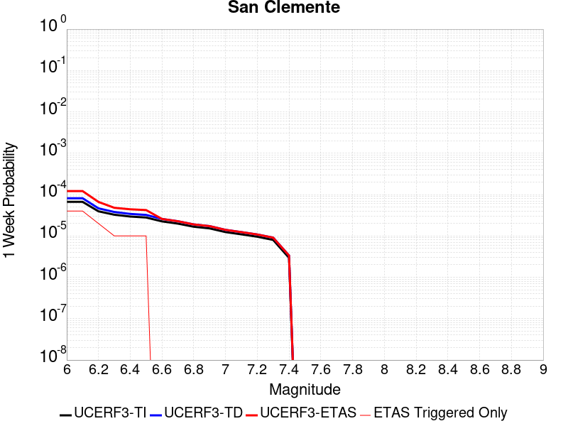 | 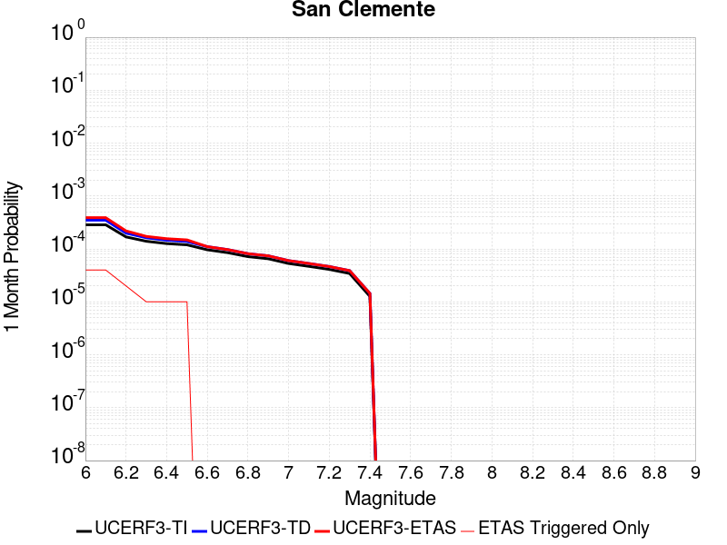 |  |  |

| Magnitude | 1 wk TI Prob | 1 wk TD Prob | 1 wk ETAS Prob | 1 wk ETAS/TD Gain | 1 wk ETAS Triggered Only | 1 mo TI Prob | 1 mo TD Prob | 1 mo ETAS Prob | 1 mo ETAS/TD Gain | 1 mo ETAS Triggered Only | 1 yr TI Prob | 1 yr TD Prob | 1 yr ETAS Prob | 1 yr ETAS/TD Gain | 1 yr ETAS Triggered Only | 10 yr TI Prob | 10 yr TD Prob | 10 yr ETAS Prob | 10 yr ETAS/TD Gain | 10 yr ETAS Triggered Only |
|-----|-----|-----|-----|-----|-----|-----|-----|-----|-----|-----|-----|-----|-----|-----|-----|-----|-----|-----|-----|-----|
| 6.0 | 6.681379E-5 | 8.163422E-5 | 1.2163096E-4 | 1.4899505 | 4.0E-5 | 2.8631336E-4 | 3.498173E-4 | 3.8980332E-4 | 1.1143054 | 4.0E-5 | 0.003480294 | 0.0042512873 | 0.00432099 | 1.0163956 | 7.0E-5 | 0.03426291 | 0.041755714 | 0.041832373 | 1.001836 | 8.0E-5 |
| 6.1 | 6.681379E-5 | 8.163422E-5 | 1.2163096E-4 | 1.4899505 | 4.0E-5 | 2.8631336E-4 | 3.498173E-4 | 3.8980332E-4 | 1.1143054 | 4.0E-5 | 0.003480294 | 0.0042512873 | 0.00432099 | 1.0163956 | 7.0E-5 | 0.03426291 | 0.041755714 | 0.041832373 | 1.001836 | 8.0E-5 |
| 6.2 | 3.9400576E-5 | 4.6451984E-5 | 6.645106E-5 | 1.4305321 | 2.0E-5 | 1.6884868E-4 | 1.9906509E-4 | 2.1906111E-4 | 1.1004497 | 2.0E-5 | 0.0020537945 | 0.002420985 | 0.0024509123 | 1.0123616 | 3.0E-5 | 0.020349167 | 0.02395286 | 0.023991901 | 1.00163 | 4.0E-5 |
| 6.3 | 3.2590255E-5 | 3.7929087E-5 | 4.792871E-5 | 1.2636399 | 1.0E-5 | 1.3966505E-4 | 1.6254328E-4 | 1.7254165E-4 | 1.0615121 | 1.0E-5 | 0.0016990956 | 0.0019771985 | 0.0019871786 | 1.0050477 | 1.0E-5 | 0.01686163 | 0.019599866 | 0.01960967 | 1.0005002 | 1.0E-5 |
| 6.4 | 2.9454652E-5 | 3.4097775E-5 | 4.4097436E-5 | 1.2932643 | 1.0E-5 | 1.2622811E-4 | 1.4612528E-4 | 1.5612383E-4 | 1.0684245 | 1.0E-5 | 0.0015357438 | 0.0017776482 | 0.0017876304 | 1.0056154 | 1.0E-5 | 0.015251739 | 0.017637458 | 0.017647281 | 1.000557 | 1.0E-5 |
| 6.5 | 2.790836E-5 | 3.2247463E-5 | 4.224714E-5 | 1.310092 | 1.0E-5 | 1.1960178E-4 | 1.3819622E-4 | 1.4819484E-4 | 1.0723509 | 1.0E-5 | 0.001455179 | 0.0016812651 | 0.0016912483 | 1.0059379 | 1.0E-5 | 0.014456868 | 0.016688475 | 0.016698308 | 1.0005893 | 1.0E-5 |
| 6.6 | 2.2492153E-5 | 2.5762707E-5 | 2.5762707E-5 | 1.0 | 0.0 | 9.639138E-5 | 1.1040701E-4 | 1.1040701E-4 | 1.0 | 0.0 | 0.0011729331 | 0.0013433908 | 0.0013433908 | 1.0 | 0.0 | 0.011667615 | 0.013354415 | 0.013354415 | 1.0 | 0.0 |
| 6.7 | 1.9862755E-5 | 2.2666423E-5 | 2.2666423E-5 | 1.0 | 0.0 | 8.512331E-5 | 9.713826E-5 | 9.713826E-5 | 1.0 | 0.0 | 0.0010358836 | 0.0011820279 | 0.0011820279 | 1.0 | 0.0 | 0.010310682 | 0.011758701 | 0.011758701 | 1.0 | 0.0 |
| 6.8 | 1.6697575E-5 | 1.897771E-5 | 1.897771E-5 | 1.0 | 0.0 | 7.155907E-5 | 8.133056E-5 | 8.133056E-5 | 1.0 | 0.0 | 8.7088346E-4 | 9.897591E-4 | 9.897591E-4 | 1.0 | 0.0 | 0.008674784 | 0.0098545365 | 0.0098545365 | 1.0 | 0.0 |
| 6.9 | 1.5218415E-5 | 1.72694E-5 | 1.72694E-5 | 1.0 | 0.0 | 6.522015E-5 | 7.4009666E-5 | 7.4009666E-5 | 1.0 | 0.0 | 7.93766E-4 | 9.00704E-4 | 9.00704E-4 | 1.0 | 0.0 | 0.007909367 | 0.008971481 | 0.008971481 | 1.0 | 0.0 |
| 7.0 | 1.2392958E-5 | 1.4033016E-5 | 1.4033016E-5 | 1.0 | 0.0 | 5.3111595E-5 | 6.014015E-5 | 6.014015E-5 | 1.0 | 0.0 | 6.4644177E-4 | 7.319679E-4 | 7.319679E-4 | 1.0 | 0.0 | 0.0064456454 | 0.0072963564 | 0.0072963564 | 1.0 | 0.0 |
| 7.1 | 1.0934128E-5 | 1.2375138E-5 | 1.2375138E-5 | 1.0 | 0.0 | 4.6859706E-5 | 5.303527E-5 | 5.303527E-5 | 1.0 | 0.0 | 5.7036756E-4 | 6.455204E-4 | 6.455204E-4 | 1.0 | 0.0 | 0.0056890585 | 0.0064371997 | 0.0064371997 | 1.0 | 0.0 |
| 7.2 | 9.5798805E-6 | 1.0844935E-5 | 1.0844935E-5 | 1.0 | 0.0 | 4.1055984E-5 | 4.6477508E-5 | 4.6477508E-5 | 1.0 | 0.0 | 4.9974193E-4 | 5.657239E-4 | 5.657239E-4 | 1.0 | 0.0 | 0.0049861963 | 0.0056435615 | 0.0056435615 | 1.0 | 0.0 |
| 7.3 | 8.0167365E-6 | 9.083918E-6 | 9.083918E-6 | 1.0 | 0.0 | 3.4356988E-5 | 3.8930535E-5 | 3.8930535E-5 | 1.0 | 0.0 | 4.1821605E-4 | 4.7388324E-4 | 4.7388324E-4 | 1.0 | 0.0 | 0.0041742986 | 0.0047294297 | 0.0047294297 | 1.0 | 0.0 |
| 7.4 | 2.9581017E-6 | 3.3623792E-6 | 3.3623792E-6 | 1.0 | 0.0 | 1.2677518E-5 | 1.4410146E-5 | 1.4410146E-5 | 1.0 | 0.0 | 1.5433785E-4 | 1.7543444E-4 | 1.7543444E-4 | 1.0 | 0.0 | 0.001542307 | 0.0017534546 | 0.0017534546 | 1.0 | 0.0 |

## Kern Canyon (Lake Isabella) 2011
*[(top)](#table-of-contents)*

| 1 Week | 1 Month | 1 Year | 10 Year |
|-----|-----|-----|-----|
| 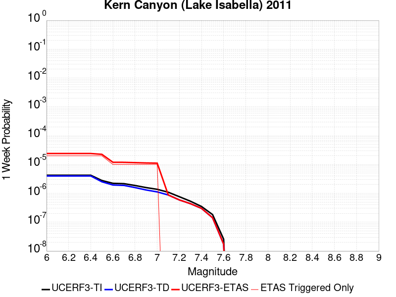 | 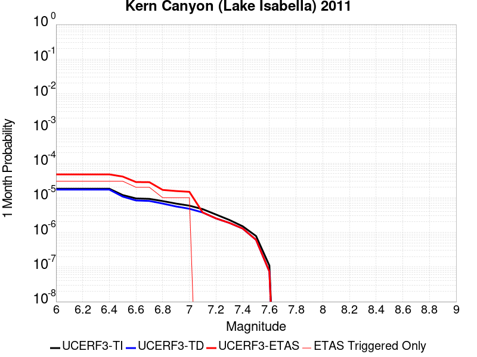 |  |  |

| Magnitude | 1 wk TI Prob | 1 wk TD Prob | 1 wk ETAS Prob | 1 wk ETAS/TD Gain | 1 wk ETAS Triggered Only | 1 mo TI Prob | 1 mo TD Prob | 1 mo ETAS Prob | 1 mo ETAS/TD Gain | 1 mo ETAS Triggered Only | 1 yr TI Prob | 1 yr TD Prob | 1 yr ETAS Prob | 1 yr ETAS/TD Gain | 1 yr ETAS Triggered Only | 10 yr TI Prob | 10 yr TD Prob | 10 yr ETAS Prob | 10 yr ETAS/TD Gain | 10 yr ETAS Triggered Only |
|-----|-----|-----|-----|-----|-----|-----|-----|-----|-----|-----|-----|-----|-----|-----|-----|-----|-----|-----|-----|-----|
| 6.0 | 4.2387383E-6 | 4.001639E-6 | 2.4001558E-5 | 5.9979324 | 2.0E-5 | 1.8165894E-5 | 1.7149778E-5 | 4.7149264E-5 | 2.7492638 | 3.0E-5 | 2.2114732E-4 | 2.087804E-4 | 2.6876788E-4 | 1.2873232 | 6.0E-5 | 0.0022092736 | 0.0020860266 | 0.0021658596 | 1.0382705 | 8.0E-5 |
| 6.1 | 4.2387383E-6 | 4.001639E-6 | 2.4001558E-5 | 5.9979324 | 2.0E-5 | 1.8165894E-5 | 1.7149778E-5 | 4.7149264E-5 | 2.7492638 | 3.0E-5 | 2.2114732E-4 | 2.087804E-4 | 2.6876788E-4 | 1.2873232 | 6.0E-5 | 0.0022092736 | 0.0020860266 | 0.0021658596 | 1.0382705 | 8.0E-5 |
| 6.2 | 4.2387383E-6 | 4.001639E-6 | 2.4001558E-5 | 5.9979324 | 2.0E-5 | 1.8165894E-5 | 1.7149778E-5 | 4.7149264E-5 | 2.7492638 | 3.0E-5 | 2.2114732E-4 | 2.087804E-4 | 2.6876788E-4 | 1.2873232 | 6.0E-5 | 0.0022092736 | 0.0020860266 | 0.0021658596 | 1.0382705 | 8.0E-5 |
| 6.3 | 4.2387383E-6 | 4.001639E-6 | 2.4001558E-5 | 5.9979324 | 2.0E-5 | 1.8165894E-5 | 1.7149778E-5 | 4.7149264E-5 | 2.7492638 | 3.0E-5 | 2.2114732E-4 | 2.087804E-4 | 2.6876788E-4 | 1.2873232 | 6.0E-5 | 0.0022092736 | 0.0020860266 | 0.0021658596 | 1.0382705 | 8.0E-5 |
| 6.4 | 4.2387383E-6 | 4.001639E-6 | 2.4001558E-5 | 5.9979324 | 2.0E-5 | 1.8165894E-5 | 1.7149778E-5 | 4.7149264E-5 | 2.7492638 | 3.0E-5 | 2.2114732E-4 | 2.087804E-4 | 2.6876788E-4 | 1.2873232 | 6.0E-5 | 0.0022092736 | 0.0020860266 | 0.0021658596 | 1.0382705 | 8.0E-5 |
| 6.5 | 2.7857532E-6 | 2.517867E-6 | 2.2517817E-5 | 8.943212 | 2.0E-5 | 1.1938888E-5 | 1.0790815E-5 | 4.079049E-5 | 3.780112 | 3.0E-5 | 1.4534626E-4 | 1.3137059E-4 | 1.8136403E-4 | 1.3805526 | 5.0E-5 | 0.0014525123 | 0.001312962 | 0.0013728832 | 1.0456382 | 6.0E-5 |
| 6.6 | 2.2233348E-6 | 1.9441236E-6 | 1.1944104E-5 | 6.143696 | 1.0E-5 | 9.528543E-6 | 8.331932E-6 | 2.8331766E-5 | 3.4003837 | 2.0E-5 | 1.1600384E-4 | 1.01436635E-4 | 1.314336E-4 | 1.2957212 | 3.0E-5 | 0.001159433 | 0.001013912 | 0.0010538715 | 1.0394112 | 4.0E-5 |
| 6.7 | 2.1635126E-6 | 1.8835036E-6 | 1.1883485E-5 | 6.3092446 | 1.0E-5 | 9.272164E-6 | 8.072134E-6 | 2.8071972E-5 | 3.4776397 | 2.0E-5 | 1.1288274E-4 | 9.827388E-5 | 1.2827093E-4 | 1.3052393 | 3.0E-5 | 0.0011282542 | 9.823124E-4 | 0.0010222731 | 1.0406803 | 4.0E-5 |
| 6.8 | 1.8685711E-6 | 1.5831425E-6 | 1.1583126E-5 | 7.3165407 | 1.0E-5 | 8.008137E-6 | 6.784879E-6 | 1.6784812E-5 | 2.4738555 | 1.0E-5 | 9.74947E-5 | 8.260282E-5 | 1.0260117E-4 | 1.2421025 | 2.0E-5 | 9.745194E-4 | 8.2572614E-4 | 8.5570134E-4 | 1.0363016 | 3.0E-5 |
| 6.9 | 1.5815071E-6 | 1.3064928E-6 | 1.130648E-5 | 8.65407 | 1.0E-5 | 6.77787E-6 | 5.599243E-6 | 1.5599187E-5 | 2.7859457 | 1.0E-5 | 8.251744E-5 | 6.816868E-5 | 8.816732E-5 | 1.2933699 | 2.0E-5 | 8.248681E-4 | 6.8148033E-4 | 7.114599E-4 | 1.0439918 | 3.0E-5 |
| 7.0 | 1.3772564E-6 | 1.1210718E-6 | 1.112106E-5 | 9.920025 | 1.0E-5 | 5.9025137E-6 | 4.8045845E-6 | 1.48045365E-5 | 3.0813353 | 1.0E-5 | 7.186073E-5 | 5.8494268E-5 | 7.8493096E-5 | 1.3418938 | 2.0E-5 | 7.18375E-4 | 5.847908E-4 | 6.1477325E-4 | 1.0512704 | 3.0E-5 |
| 7.1 | 1.0916998E-6 | 8.763777E-7 | 8.763777E-7 | 1.0 | 0.0 | 4.678705E-6 | 3.7558991E-6 | 3.7558991E-6 | 1.0 | 0.0 | 5.6961744E-5 | 4.5727127E-5 | 5.572667E-5 | 1.2186786 | 1.0E-5 | 5.6947145E-4 | 4.571785E-4 | 4.7716938E-4 | 1.0437266 | 2.0E-5 |
| 7.2 | 7.6277024E-7 | 5.901454E-7 | 5.901454E-7 | 1.0 | 0.0 | 3.2690114E-6 | 2.5291922E-6 | 2.5291922E-6 | 1.0 | 0.0 | 3.9799485E-5 | 3.0792486E-5 | 3.0792486E-5 | 1.0 | 0.0 | 3.9792358E-4 | 3.0788282E-4 | 3.0788282E-4 | 1.0 | 0.0 |
| 7.3 | 5.3265916E-7 | 4.3824414E-7 | 4.3824414E-7 | 1.0 | 0.0 | 2.282823E-6 | 1.878188E-6 | 1.878188E-6 | 1.0 | 0.0 | 2.7793016E-5 | 2.2866701E-5 | 2.2866701E-5 | 1.0 | 0.0 | 2.778954E-4 | 2.2864387E-4 | 2.2864387E-4 | 1.0 | 0.0 |
| 7.4 | 3.4946007E-7 | 3.006571E-7 | 3.006571E-7 | 1.0 | 0.0 | 1.497685E-6 | 1.2885298E-6 | 1.2885298E-6 | 1.0 | 0.0 | 1.8234163E-5 | 1.568774E-5 | 1.568774E-5 | 1.0 | 0.0 | 1.8232666E-4 | 1.5686655E-4 | 1.5686655E-4 | 1.0 | 0.0 |
| 7.5 | 1.8317026E-7 | 1.4244812E-7 | 1.4244812E-7 | 1.0 | 0.0 | 7.850152E-7 | 6.104918E-7 | 6.104918E-7 | 1.0 | 0.0 | 9.557518E-6 | 7.432713E-6 | 7.432713E-6 | 1.0 | 0.0 | 9.5571064E-5 | 7.432472E-5 | 7.432472E-5 | 1.0 | 0.0 |
| 7.6 | 2.572245E-8 | 1.7352555E-8 | 1.7352555E-8 | 1.0 | 0.0 | 1.10239064E-7 | 7.436809E-8 | 7.436809E-8 | 1.0 | 0.0 | 1.3421597E-6 | 9.054312E-7 | 9.054312E-7 | 1.0 | 0.0 | 1.3421517E-5 | 9.05428E-6 | 9.05428E-6 | 1.0 | 0.0 |

## Bullion Mountains
*[(top)](#table-of-contents)*

| 1 Week | 1 Month | 1 Year | 10 Year |
|-----|-----|-----|-----|
| 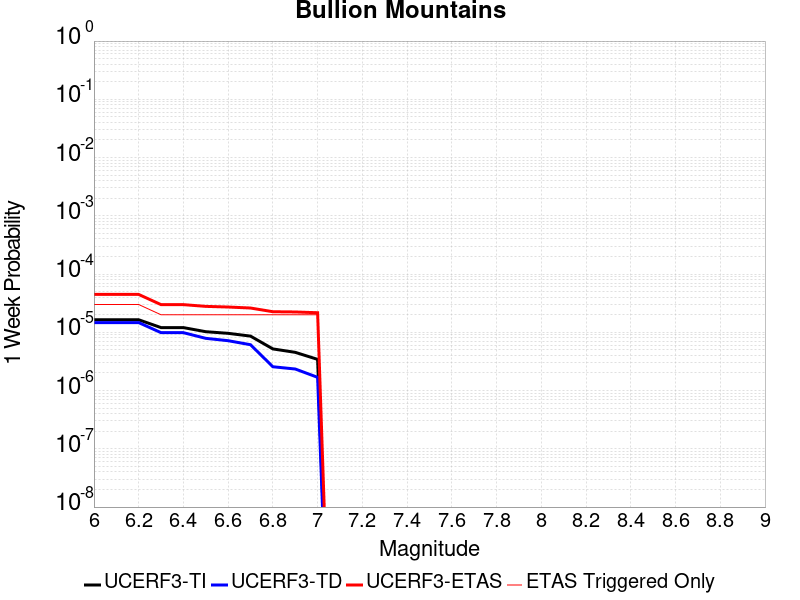 | 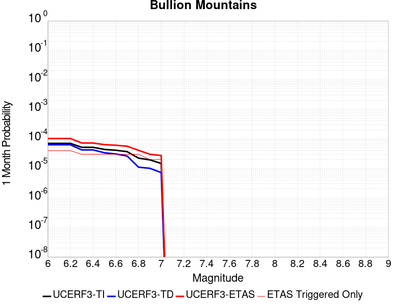 | 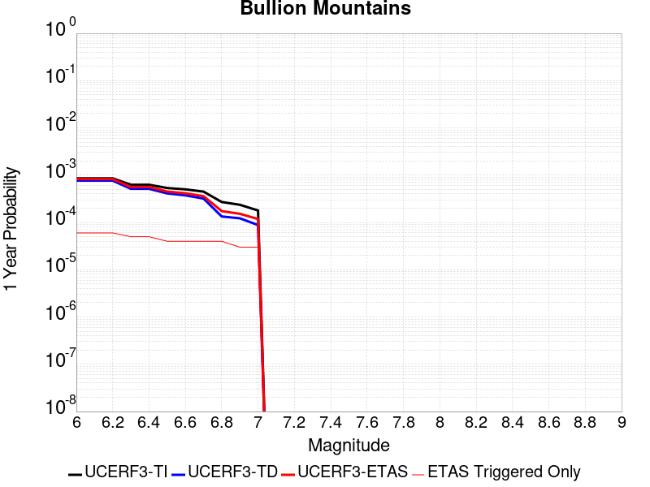 |  |

| Magnitude | 1 wk TI Prob | 1 wk TD Prob | 1 wk ETAS Prob | 1 wk ETAS/TD Gain | 1 wk ETAS Triggered Only | 1 mo TI Prob | 1 mo TD Prob | 1 mo ETAS Prob | 1 mo ETAS/TD Gain | 1 mo ETAS Triggered Only | 1 yr TI Prob | 1 yr TD Prob | 1 yr ETAS Prob | 1 yr ETAS/TD Gain | 1 yr ETAS Triggered Only | 10 yr TI Prob | 10 yr TD Prob | 10 yr ETAS Prob | 10 yr ETAS/TD Gain | 10 yr ETAS Triggered Only |
|-----|-----|-----|-----|-----|-----|-----|-----|-----|-----|-----|-----|-----|-----|-----|-----|-----|-----|-----|-----|-----|
| 6.0 | 1.6420427E-5 | 1.4692089E-5 | 4.469165E-5 | 3.0418851 | 3.0E-5 | 7.037136E-5 | 6.296479E-5 | 1.0296227E-4 | 1.6352357 | 4.0E-5 | 8.5643446E-4 | 7.663651E-4 | 8.263191E-4 | 1.0782317 | 6.0E-5 | 0.008531413 | 0.007641016 | 0.007710481 | 1.0090911 | 7.0E-5 |
| 6.1 | 1.6420427E-5 | 1.4692089E-5 | 4.469165E-5 | 3.0418851 | 3.0E-5 | 7.037136E-5 | 6.296479E-5 | 1.0296227E-4 | 1.6352357 | 4.0E-5 | 8.5643446E-4 | 7.663651E-4 | 8.263191E-4 | 1.0782317 | 6.0E-5 | 0.008531413 | 0.007641016 | 0.007710481 | 1.0090911 | 7.0E-5 |
| 6.2 | 1.6420427E-5 | 1.4692089E-5 | 4.469165E-5 | 3.0418851 | 3.0E-5 | 7.037136E-5 | 6.296479E-5 | 1.0296227E-4 | 1.6352357 | 4.0E-5 | 8.5643446E-4 | 7.663651E-4 | 8.263191E-4 | 1.0782317 | 6.0E-5 | 0.008531413 | 0.007641016 | 0.007710481 | 1.0090911 | 7.0E-5 |
| 6.3 | 1.2046778E-5 | 9.862335E-6 | 2.9862138E-5 | 3.0278974 | 2.0E-5 | 5.1628023E-5 | 4.2266598E-5 | 7.226533E-5 | 1.7097504 | 3.0E-5 | 6.283899E-4 | 5.144975E-4 | 5.6447176E-4 | 1.0971322 | 5.0E-5 | 0.0062661595 | 0.005135345 | 0.005185088 | 1.0096865 | 5.0E-5 |
| 6.4 | 1.2046778E-5 | 9.862335E-6 | 2.9862138E-5 | 3.0278974 | 2.0E-5 | 5.1628023E-5 | 4.2266598E-5 | 7.226533E-5 | 1.7097504 | 3.0E-5 | 6.283899E-4 | 5.144975E-4 | 5.6447176E-4 | 1.0971322 | 5.0E-5 | 0.0062661595 | 0.005135345 | 0.005185088 | 1.0096865 | 5.0E-5 |
| 6.5 | 1.0244343E-5 | 7.879458E-6 | 2.7879301E-5 | 3.5382257 | 2.0E-5 | 4.390359E-5 | 3.3768785E-5 | 6.376777E-5 | 1.8883644 | 3.0E-5 | 5.343951E-4 | 4.110781E-4 | 4.5106164E-4 | 1.0972651 | 4.0E-5 | 0.005331118 | 0.004105208 | 0.004145044 | 1.0097038 | 4.0E-5 |
| 6.6 | 9.605408E-6 | 7.1774966E-6 | 2.7177353E-5 | 3.7864668 | 2.0E-5 | 4.1165385E-5 | 3.076045E-5 | 6.075953E-5 | 1.9752483 | 3.0E-5 | 5.010733E-4 | 3.744645E-4 | 4.1444952E-4 | 1.1067792 | 4.0E-5 | 0.00499945 | 0.003740332 | 0.0037801825 | 1.0106542 | 4.0E-5 |
| 6.7 | 8.60418E-6 | 6.1240044E-6 | 2.6123882E-5 | 4.2658167 | 2.0E-5 | 3.687454E-5 | 2.624558E-5 | 5.6244793E-5 | 2.1430197 | 3.0E-5 | 4.48855E-4 | 3.1951256E-4 | 3.594998E-4 | 1.1251507 | 4.0E-5 | 0.004479495 | 0.0031924439 | 0.003232316 | 1.0124896 | 4.0E-5 |
| 6.8 | 5.187994E-6 | 2.5631666E-6 | 2.2563116E-5 | 8.802828 | 2.0E-5 | 2.223407E-5 | 1.0984976E-5 | 4.0984647E-5 | 3.7309728 | 3.0E-5 | 2.7066618E-4 | 1.3373788E-4 | 1.7373252E-4 | 1.2990526 | 4.0E-5 | 0.0027033675 | 0.0013369655 | 0.001376912 | 1.0298785 | 4.0E-5 |
| 6.9 | 4.5302368E-6 | 2.3443165E-6 | 2.234427E-5 | 9.531251 | 2.0E-5 | 1.9415156E-5 | 1.0047055E-5 | 3.0046855E-5 | 2.9906132 | 2.0E-5 | 2.3635388E-4 | 1.2232E-4 | 1.5231632E-4 | 1.2452284 | 3.0E-5 | 0.0023610266 | 0.0012229157 | 0.001252879 | 1.0245016 | 3.0E-5 |
| 7.0 | 3.431668E-6 | 1.6882402E-6 | 2.1688207E-5 | 12.846635 | 2.0E-5 | 1.4707065E-5 | 7.235315E-6 | 2.723517E-5 | 3.7641995 | 2.0E-5 | 1.7904381E-4 | 8.808996E-5 | 1.1808732E-4 | 1.340531 | 3.0E-5 | 0.0017889962 | 8.808996E-4 | 9.108732E-4 | 1.0340261 | 3.0E-5 |

## Big Pine (Central)
*[(top)](#table-of-contents)*

| 1 Week | 1 Month | 1 Year | 10 Year |
|-----|-----|-----|-----|
| 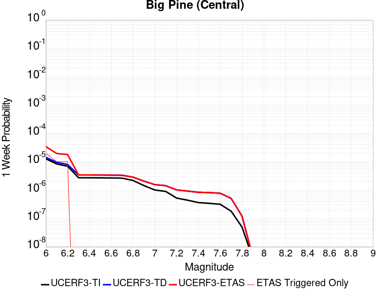 | 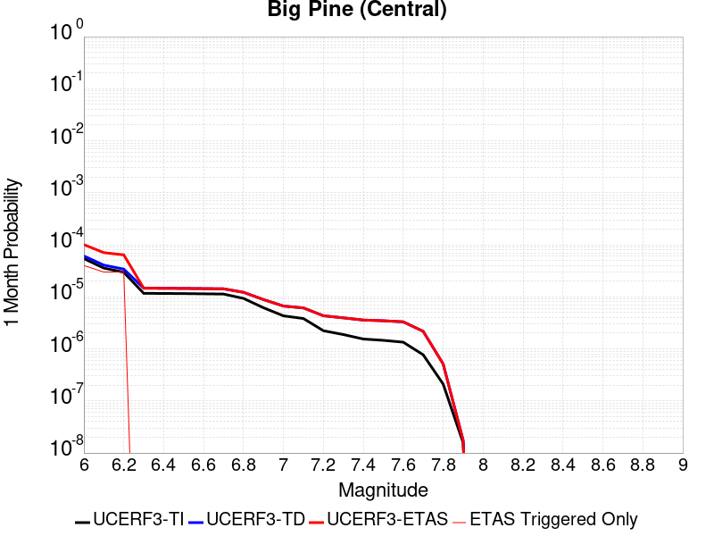 |  |  |

| Magnitude | 1 wk TI Prob | 1 wk TD Prob | 1 wk ETAS Prob | 1 wk ETAS/TD Gain | 1 wk ETAS Triggered Only | 1 mo TI Prob | 1 mo TD Prob | 1 mo ETAS Prob | 1 mo ETAS/TD Gain | 1 mo ETAS Triggered Only | 1 yr TI Prob | 1 yr TD Prob | 1 yr ETAS Prob | 1 yr ETAS/TD Gain | 1 yr ETAS Triggered Only | 10 yr TI Prob | 10 yr TD Prob | 10 yr ETAS Prob | 10 yr ETAS/TD Gain | 10 yr ETAS Triggered Only |
|-----|-----|-----|-----|-----|-----|-----|-----|-----|-----|-----|-----|-----|-----|-----|-----|-----|-----|-----|-----|-----|
| 6.0 | 1.2706755E-5 | 1.4250529E-5 | 3.4250243E-5 | 2.4034367 | 2.0E-5 | 5.4456385E-5 | 6.107247E-5 | 1.0107003E-4 | 1.6549196 | 4.0E-5 | 6.628048E-4 | 7.433402E-4 | 7.8331045E-4 | 1.0537711 | 4.0E-5 | 0.006608314 | 0.0074135666 | 0.007483048 | 1.0093721 | 7.0E-5 |
| 6.1 | 8.342579E-6 | 9.510762E-6 | 1.9510666E-5 | 2.0514305 | 1.0E-5 | 3.5753423E-5 | 4.0759893E-5 | 7.075867E-5 | 1.7359877 | 3.0E-5 | 4.3521097E-4 | 4.961604E-4 | 5.261455E-4 | 1.0604343 | 3.0E-5 | 0.0043435963 | 0.0049540824 | 0.0049839336 | 1.0060256 | 3.0E-5 |
| 6.2 | 6.923899E-6 | 7.967147E-6 | 1.7967068E-5 | 2.2551444 | 1.0E-5 | 2.9673516E-5 | 3.4144578E-5 | 6.4143554E-5 | 1.8785868 | 3.0E-5 | 3.6121515E-4 | 4.156502E-4 | 4.456377E-4 | 1.072146 | 3.0E-5 | 0.003606286 | 0.0041520367 | 0.004181912 | 1.0071954 | 3.0E-5 |
| 6.3 | 2.728396E-6 | 3.4242908E-6 | 3.4242908E-6 | 1.0 | 0.0 | 1.1693074E-5 | 1.4675454E-5 | 1.4675454E-5 | 1.0 | 0.0 | 1.4235388E-4 | 1.7865987E-4 | 1.7865987E-4 | 1.0 | 0.0 | 0.0014226272 | 0.0017866704 | 0.0017866704 | 1.0 | 0.0 |
| 6.4 | 2.7136944E-6 | 3.408584E-6 | 3.408584E-6 | 1.0 | 0.0 | 1.1630066E-5 | 1.4608141E-5 | 1.4608141E-5 | 1.0 | 0.0 | 1.4158686E-4 | 1.7784047E-4 | 1.7784047E-4 | 1.0 | 0.0 | 0.0014149669 | 0.0017784894 | 0.0017784894 | 1.0 | 0.0 |
| 6.5 | 2.6971882E-6 | 3.3909291E-6 | 3.3909291E-6 | 1.0 | 0.0 | 1.1559327E-5 | 1.45324775E-5 | 1.45324775E-5 | 1.0 | 0.0 | 1.4072572E-4 | 1.7691942E-4 | 1.7691942E-4 | 1.0 | 0.0 | 0.0014063664 | 0.0017692937 | 0.0017692937 | 1.0 | 0.0 |
| 6.6 | 2.669092E-6 | 3.3609497E-6 | 3.3609497E-6 | 1.0 | 0.0 | 1.1438916E-5 | 1.4403995E-5 | 1.4403995E-5 | 1.0 | 0.0 | 1.3925991E-4 | 1.753554E-4 | 1.753554E-4 | 1.0 | 0.0 | 0.0013917267 | 0.0017536782 | 0.0017536782 | 1.0 | 0.0 |
| 6.7 | 2.6408059E-6 | 3.3309752E-6 | 3.3309752E-6 | 1.0 | 0.0 | 1.1317691E-5 | 1.4275535E-5 | 1.4275535E-5 | 1.0 | 0.0 | 1.3778417E-4 | 1.7379165E-4 | 1.7379165E-4 | 1.0 | 0.0 | 0.0013769877 | 0.0017380653 | 0.0017380653 | 1.0 | 0.0 |
| 6.8 | 2.1786943E-6 | 2.8544325E-6 | 2.8544325E-6 | 1.0 | 0.0 | 9.337228E-6 | 1.2233229E-5 | 1.2233229E-5 | 1.0 | 0.0 | 1.1367482E-4 | 1.4893012E-4 | 1.4893012E-4 | 1.0 | 0.0 | 0.0011361669 | 0.0014897975 | 0.0014897975 | 1.0 | 0.0 |
| 6.9 | 1.4411696E-6 | 2.068499E-6 | 2.068499E-6 | 1.0 | 0.0 | 6.1764263E-6 | 8.864968E-6 | 8.864968E-6 | 1.0 | 0.0 | 7.51954E-5 | 1.079259E-4 | 1.079259E-4 | 1.0 | 0.0 | 7.5169955E-4 | 0.0010801847 | 0.0010801847 | 1.0 | 0.0 |
| 7.0 | 1.0073411E-6 | 1.554261E-6 | 1.554261E-6 | 1.0 | 0.0 | 4.317169E-6 | 6.6611024E-6 | 6.6611024E-6 | 1.0 | 0.0 | 5.2560266E-5 | 8.1096056E-5 | 8.1096056E-5 | 1.0 | 0.0 | 5.2547833E-4 | 8.1210316E-4 | 8.1210316E-4 | 1.0 | 0.0 |
| 7.1 | 8.947104E-7 | 1.4302494E-6 | 1.4302494E-6 | 1.0 | 0.0 | 3.834468E-6 | 6.129627E-6 | 6.129627E-6 | 1.0 | 0.0 | 4.6683643E-5 | 7.46258E-5 | 7.46258E-5 | 1.0 | 0.0 | 4.6673836E-4 | 7.474457E-4 | 7.474457E-4 | 1.0 | 0.0 |
| 7.2 | 5.215166E-7 | 1.0111678E-6 | 1.0111678E-6 | 1.0 | 0.0 | 2.2350691E-6 | 4.3335694E-6 | 4.3335694E-6 | 1.0 | 0.0 | 2.7211627E-5 | 5.2759973E-5 | 5.2759973E-5 | 1.0 | 0.0 | 2.7208295E-4 | 5.2890263E-4 | 5.2890263E-4 | 1.0 | 0.0 |
| 7.3 | 4.4024807E-7 | 9.219589E-7 | 9.219589E-7 | 1.0 | 0.0 | 1.8867761E-6 | 3.9512465E-6 | 3.9512465E-6 | 1.0 | 0.0 | 2.2971257E-5 | 4.810541E-5 | 4.810541E-5 | 1.0 | 0.0 | 2.2968883E-4 | 4.8237795E-4 | 4.8237795E-4 | 1.0 | 0.0 |
| 7.4 | 3.6130905E-7 | 8.358523E-7 | 8.358523E-7 | 1.0 | 0.0 | 1.5484665E-6 | 3.5822195E-6 | 3.5822195E-6 | 1.0 | 0.0 | 1.8852415E-5 | 4.3612687E-5 | 4.3612687E-5 | 1.0 | 0.0 | 1.8850817E-4 | 4.374597E-4 | 4.374597E-4 | 1.0 | 0.0 |
| 7.5 | 3.408184E-7 | 8.108147E-7 | 8.108147E-7 | 1.0 | 0.0 | 1.4606494E-6 | 3.4749157E-6 | 3.4749157E-6 | 1.0 | 0.0 | 1.7783263E-5 | 4.2306317E-5 | 4.2306317E-5 | 1.0 | 0.0 | 1.778184E-4 | 4.2437963E-4 | 4.2437963E-4 | 1.0 | 0.0 |
| 7.6 | 3.1428627E-7 | 7.7316E-7 | 7.7316E-7 | 1.0 | 0.0 | 1.3469405E-6 | 3.3135389E-6 | 3.3135389E-6 | 1.0 | 0.0 | 1.6398877E-5 | 4.0341627E-5 | 4.0341627E-5 | 1.0 | 0.0 | 1.6397667E-4 | 4.0471106E-4 | 4.0471106E-4 | 1.0 | 0.0 |
| 7.7 | 1.7972785E-7 | 5.077752E-7 | 5.077752E-7 | 1.0 | 0.0 | 7.70262E-7 | 2.1761778E-6 | 2.1761778E-6 | 1.0 | 0.0 | 9.377899E-6 | 2.6494654E-5 | 2.6494654E-5 | 1.0 | 0.0 | 9.377503E-5 | 2.662899E-4 | 2.662899E-4 | 1.0 | 0.0 |
| 7.8 | 4.9230927E-8 | 1.198079E-7 | 1.198079E-7 | 1.0 | 0.0 | 2.1098968E-7 | 5.134623E-7 | 5.134623E-7 | 1.0 | 0.0 | 2.5687964E-6 | 6.2513873E-6 | 6.2513873E-6 | 1.0 | 0.0 | 2.5687666E-5 | 6.295415E-5 | 6.295415E-5 | 1.0 | 0.0 |
| 7.9 | 3.6805972E-9 | 4.105293E-9 | 4.105293E-9 | 1.0 | 0.0 | 1.5773987E-8 | 1.7594115E-8 | 1.7594115E-8 | 1.0 | 0.0 | 1.9204828E-7 | 2.1420831E-7 | 2.1420831E-7 | 1.0 | 0.0 | 1.920481E-6 | 2.1900614E-6 | 2.1900614E-6 | 1.0 | 0.0 |

## Pine Mtn
*[(top)](#table-of-contents)*

| 1 Week | 1 Month | 1 Year | 10 Year |
|-----|-----|-----|-----|
| 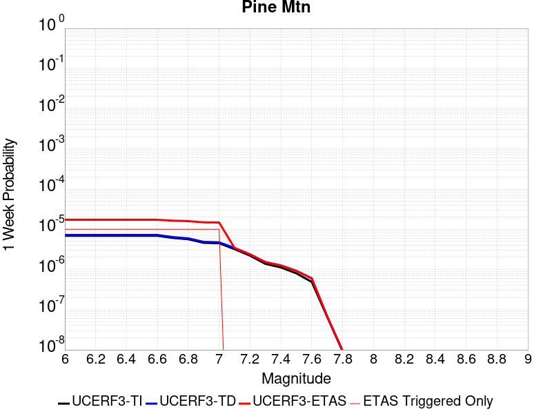 | 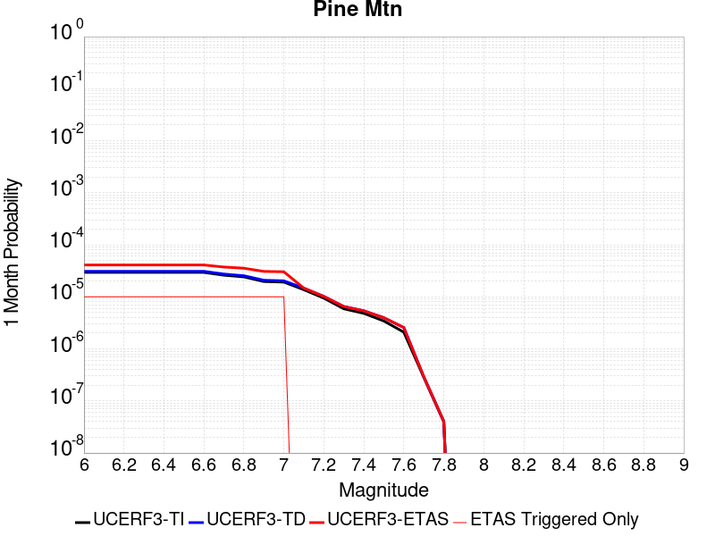 |  |  |

| Magnitude | 1 wk TI Prob | 1 wk TD Prob | 1 wk ETAS Prob | 1 wk ETAS/TD Gain | 1 wk ETAS Triggered Only | 1 mo TI Prob | 1 mo TD Prob | 1 mo ETAS Prob | 1 mo ETAS/TD Gain | 1 mo ETAS Triggered Only | 1 yr TI Prob | 1 yr TD Prob | 1 yr ETAS Prob | 1 yr ETAS/TD Gain | 1 yr ETAS Triggered Only | 10 yr TI Prob | 10 yr TD Prob | 10 yr ETAS Prob | 10 yr ETAS/TD Gain | 10 yr ETAS Triggered Only |
|-----|-----|-----|-----|-----|-----|-----|-----|-----|-----|-----|-----|-----|-----|-----|-----|-----|-----|-----|-----|-----|
| 6.0 | 6.894797E-6 | 7.225461E-6 | 1.722539E-5 | 2.3839846 | 1.0E-5 | 2.9548795E-5 | 3.096591E-5 | 4.0965602E-5 | 1.3229258 | 1.0E-5 | 3.596972E-4 | 3.7694772E-4 | 3.969402E-4 | 1.0530378 | 2.0E-5 | 0.0035911554 | 0.003763381 | 0.003823155 | 1.0158831 | 6.0E-5 |
| 6.1 | 6.894797E-6 | 7.225461E-6 | 1.722539E-5 | 2.3839846 | 1.0E-5 | 2.9548795E-5 | 3.096591E-5 | 4.0965602E-5 | 1.3229258 | 1.0E-5 | 3.596972E-4 | 3.7694772E-4 | 3.969402E-4 | 1.0530378 | 2.0E-5 | 0.0035911554 | 0.003763381 | 0.003823155 | 1.0158831 | 6.0E-5 |
| 6.2 | 6.894797E-6 | 7.225461E-6 | 1.722539E-5 | 2.3839846 | 1.0E-5 | 2.9548795E-5 | 3.096591E-5 | 4.0965602E-5 | 1.3229258 | 1.0E-5 | 3.596972E-4 | 3.7694772E-4 | 3.969402E-4 | 1.0530378 | 2.0E-5 | 0.0035911554 | 0.003763381 | 0.003823155 | 1.0158831 | 6.0E-5 |
| 6.3 | 6.894797E-6 | 7.225461E-6 | 1.722539E-5 | 2.3839846 | 1.0E-5 | 2.9548795E-5 | 3.096591E-5 | 4.0965602E-5 | 1.3229258 | 1.0E-5 | 3.596972E-4 | 3.7694772E-4 | 3.969402E-4 | 1.0530378 | 2.0E-5 | 0.0035911554 | 0.003763381 | 0.003823155 | 1.0158831 | 6.0E-5 |
| 6.4 | 6.894797E-6 | 7.225461E-6 | 1.722539E-5 | 2.3839846 | 1.0E-5 | 2.9548795E-5 | 3.096591E-5 | 4.0965602E-5 | 1.3229258 | 1.0E-5 | 3.596972E-4 | 3.7694772E-4 | 3.969402E-4 | 1.0530378 | 2.0E-5 | 0.0035911554 | 0.003763381 | 0.003823155 | 1.0158831 | 6.0E-5 |
| 6.5 | 6.894797E-6 | 7.225461E-6 | 1.722539E-5 | 2.3839846 | 1.0E-5 | 2.9548795E-5 | 3.096591E-5 | 4.0965602E-5 | 1.3229258 | 1.0E-5 | 3.596972E-4 | 3.7694772E-4 | 3.969402E-4 | 1.0530378 | 2.0E-5 | 0.0035911554 | 0.003763381 | 0.003823155 | 1.0158831 | 6.0E-5 |
| 6.6 | 6.894797E-6 | 7.225461E-6 | 1.722539E-5 | 2.3839846 | 1.0E-5 | 2.9548795E-5 | 3.096591E-5 | 4.0965602E-5 | 1.3229258 | 1.0E-5 | 3.596972E-4 | 3.7694772E-4 | 3.969402E-4 | 1.0530378 | 2.0E-5 | 0.0035911554 | 0.003763381 | 0.003823155 | 1.0158831 | 6.0E-5 |
| 6.7 | 6.0867933E-6 | 6.3971133E-6 | 1.6397049E-5 | 2.563195 | 1.0E-5 | 2.6085996E-5 | 2.7415923E-5 | 3.7415648E-5 | 1.3647416 | 1.0E-5 | 3.1755073E-4 | 3.3373994E-4 | 3.5373325E-4 | 1.0599068 | 2.0E-5 | 0.0031709734 | 0.0033326065 | 0.0033824397 | 1.0149533 | 5.0E-5 |
| 6.8 | 5.6530425E-6 | 5.9505956E-6 | 1.5950536E-5 | 2.680494 | 1.0E-5 | 2.42271E-5 | 2.5502315E-5 | 3.550206E-5 | 1.3921113 | 1.0E-5 | 2.94925E-4 | 3.104485E-4 | 3.304423E-4 | 1.0644029 | 2.0E-5 | 0.002945339 | 0.0031003528 | 0.003150198 | 1.0160772 | 5.0E-5 |
| 6.9 | 4.6015225E-6 | 4.863834E-6 | 1.48637855E-5 | 3.0559812 | 1.0E-5 | 1.9720663E-5 | 2.0844845E-5 | 3.0844636E-5 | 1.4797249 | 1.0E-5 | 2.4007261E-4 | 2.5375787E-4 | 2.737528E-4 | 1.0787953 | 2.0E-5 | 0.0023981342 | 0.0025348254 | 0.002574724 | 1.0157402 | 4.0E-5 |
| 7.0 | 4.4875965E-6 | 4.747473E-6 | 1.4747426E-5 | 3.1063738 | 1.0E-5 | 1.9232413E-5 | 2.0346162E-5 | 3.0345958E-5 | 1.4914832 | 1.0E-5 | 2.3412947E-4 | 2.4768783E-4 | 2.6768286E-4 | 1.0807269 | 2.0E-5 | 0.0023388295 | 0.0024742614 | 0.0025141623 | 1.0161264 | 4.0E-5 |
| 7.1 | 3.203907E-6 | 3.4294096E-6 | 3.4294096E-6 | 1.0 | 0.0 | 1.3730958E-5 | 1.4697391E-5 | 1.4697391E-5 | 1.0 | 0.0 | 1.6716159E-4 | 1.789267E-4 | 1.8892491E-4 | 1.0558788 | 1.0E-5 | 0.0016703589 | 0.0017878925 | 0.0017978747 | 1.0055832 | 1.0E-5 |
| 7.2 | 2.2060601E-6 | 2.3784817E-6 | 2.3784817E-6 | 1.0 | 0.0 | 9.4545085E-6 | 1.0193455E-5 | 1.0193455E-5 | 1.0 | 0.0 | 1.15102564E-4 | 1.240987E-4 | 1.3409746E-4 | 1.080571 | 1.0E-5 | 0.0011504296 | 0.0012403389 | 0.0012503265 | 1.0080523 | 1.0E-5 |
| 7.3 | 1.3765207E-6 | 1.5216481E-6 | 1.5216481E-6 | 1.0 | 0.0 | 5.899361E-6 | 6.521333E-6 | 6.521333E-6 | 1.0 | 0.0 | 7.182235E-5 | 7.939443E-5 | 7.939443E-5 | 1.0 | 0.0 | 7.1799144E-4 | 7.936697E-4 | 7.936697E-4 | 1.0 | 0.0 |
| 7.4 | 1.1245983E-6 | 1.2587075E-6 | 1.2587075E-6 | 1.0 | 0.0 | 4.819698E-6 | 5.39445E-6 | 5.39445E-6 | 1.0 | 0.0 | 5.8678244E-5 | 6.567554E-5 | 6.567554E-5 | 1.0 | 0.0 | 5.866275E-4 | 6.5656955E-4 | 6.5656955E-4 | 1.0 | 0.0 |
| 7.5 | 8.031682E-7 | 9.276951E-7 | 9.276951E-7 | 1.0 | 0.0 | 3.4421448E-6 | 3.9758306E-6 | 3.9758306E-6 | 1.0 | 0.0 | 4.1907308E-5 | 4.840473E-5 | 4.840473E-5 | 1.0 | 0.0 | 4.1899405E-4 | 4.8394862E-4 | 4.8394862E-4 | 1.0 | 0.0 |
| 7.6 | 4.8953444E-7 | 6.003009E-7 | 6.003009E-7 | 1.0 | 0.0 | 2.098003E-6 | 2.5727159E-6 | 2.5727159E-6 | 1.0 | 0.0 | 2.5542888E-5 | 3.1322415E-5 | 3.1322415E-5 | 1.0 | 0.0 | 2.5539953E-4 | 3.1318486E-4 | 3.1318486E-4 | 1.0 | 0.0 |
| 7.7 | 6.634529E-8 | 6.788826E-8 | 6.788826E-8 | 1.0 | 0.0 | 2.843369E-7 | 2.9094966E-7 | 2.9094966E-7 | 1.0 | 0.0 | 3.4617963E-6 | 3.5423066E-6 | 3.5423066E-6 | 1.0 | 0.0 | 3.4617424E-5 | 3.542255E-5 | 3.542255E-5 | 1.0 | 0.0 |
| 7.8 | 9.235578E-9 | 9.488566E-9 | 9.488566E-9 | 1.0 | 0.0 | 3.9581046E-8 | 4.0665284E-8 | 4.0665284E-8 | 1.0 | 0.0 | 4.818991E-7 | 4.950997E-7 | 4.950997E-7 | 1.0 | 0.0 | 4.8189804E-6 | 4.950988E-6 | 4.950988E-6 | 1.0 | 0.0 |

## Tin Mountain
*[(top)](#table-of-contents)*

| 1 Week | 1 Month | 1 Year | 10 Year |
|-----|-----|-----|-----|
| 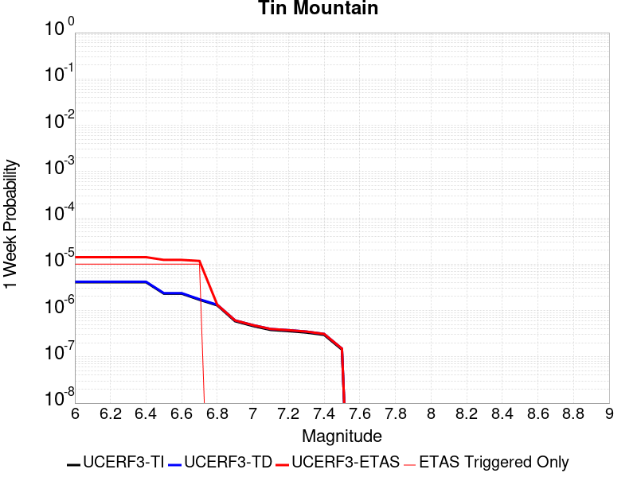 | 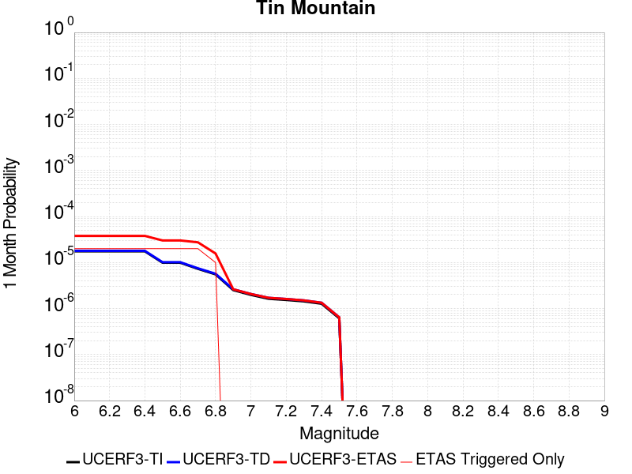 |  |  |

| Magnitude | 1 wk TI Prob | 1 wk TD Prob | 1 wk ETAS Prob | 1 wk ETAS/TD Gain | 1 wk ETAS Triggered Only | 1 mo TI Prob | 1 mo TD Prob | 1 mo ETAS Prob | 1 mo ETAS/TD Gain | 1 mo ETAS Triggered Only | 1 yr TI Prob | 1 yr TD Prob | 1 yr ETAS Prob | 1 yr ETAS/TD Gain | 1 yr ETAS Triggered Only | 10 yr TI Prob | 10 yr TD Prob | 10 yr ETAS Prob | 10 yr ETAS/TD Gain | 10 yr ETAS Triggered Only |
|-----|-----|-----|-----|-----|-----|-----|-----|-----|-----|-----|-----|-----|-----|-----|-----|-----|-----|-----|-----|-----|
| 6.0 | 4.083776E-6 | 4.1815365E-6 | 1.4181494E-5 | 3.3914554 | 1.0E-5 | 1.750178E-5 | 1.792077E-5 | 3.792041E-5 | 2.1160035 | 2.0E-5 | 2.1306332E-4 | 2.1816725E-4 | 2.6815635E-4 | 1.2291319 | 5.0E-5 | 0.0021285915 | 0.0021798965 | 0.0022497438 | 1.0320417 | 7.0E-5 |
| 6.1 | 4.083776E-6 | 4.1815365E-6 | 1.4181494E-5 | 3.3914554 | 1.0E-5 | 1.750178E-5 | 1.792077E-5 | 3.792041E-5 | 2.1160035 | 2.0E-5 | 2.1306332E-4 | 2.1816725E-4 | 2.6815635E-4 | 1.2291319 | 5.0E-5 | 0.0021285915 | 0.0021798965 | 0.0022497438 | 1.0320417 | 7.0E-5 |
| 6.2 | 4.083776E-6 | 4.1815365E-6 | 1.4181494E-5 | 3.3914554 | 1.0E-5 | 1.750178E-5 | 1.792077E-5 | 3.792041E-5 | 2.1160035 | 2.0E-5 | 2.1306332E-4 | 2.1816725E-4 | 2.6815635E-4 | 1.2291319 | 5.0E-5 | 0.0021285915 | 0.0021798965 | 0.0022497438 | 1.0320417 | 7.0E-5 |
| 6.3 | 4.083776E-6 | 4.1815365E-6 | 1.4181494E-5 | 3.3914554 | 1.0E-5 | 1.750178E-5 | 1.792077E-5 | 3.792041E-5 | 2.1160035 | 2.0E-5 | 2.1306332E-4 | 2.1816725E-4 | 2.6815635E-4 | 1.2291319 | 5.0E-5 | 0.0021285915 | 0.0021798965 | 0.0022497438 | 1.0320417 | 7.0E-5 |
| 6.4 | 4.083776E-6 | 4.1815365E-6 | 1.4181494E-5 | 3.3914554 | 1.0E-5 | 1.750178E-5 | 1.792077E-5 | 3.792041E-5 | 2.1160035 | 2.0E-5 | 2.1306332E-4 | 2.1816725E-4 | 2.6815635E-4 | 1.2291319 | 5.0E-5 | 0.0021285915 | 0.0021798965 | 0.0022497438 | 1.0320417 | 7.0E-5 |
| 6.5 | 2.3143427E-6 | 2.3731573E-6 | 1.2373133E-5 | 5.213786 | 1.0E-5 | 9.9185745E-6 | 1.0170638E-5 | 3.0170435E-5 | 2.966425 | 2.0E-5 | 1.2075195E-4 | 1.2382126E-4 | 1.4381878E-4 | 1.1615032 | 2.0E-5 | 0.0012068636 | 0.0012375986 | 0.0012575738 | 1.0161403 | 2.0E-5 |
| 6.6 | 2.3143427E-6 | 2.3731573E-6 | 1.2373133E-5 | 5.213786 | 1.0E-5 | 9.9185745E-6 | 1.0170638E-5 | 3.0170435E-5 | 2.966425 | 2.0E-5 | 1.2075195E-4 | 1.2382126E-4 | 1.4381878E-4 | 1.1615032 | 2.0E-5 | 0.0012068636 | 0.0012375986 | 0.0012575738 | 1.0161403 | 2.0E-5 |
| 6.7 | 1.7029532E-6 | 1.7497915E-6 | 1.1749774E-5 | 6.7149568 | 1.0E-5 | 7.2983503E-6 | 7.499088E-6 | 2.7498938E-5 | 3.666971 | 2.0E-5 | 8.885379E-5 | 9.1298105E-5 | 1.1129628E-4 | 1.2190425 | 2.0E-5 | 8.881827E-4 | 9.1265864E-4 | 9.3264034E-4 | 1.021894 | 2.0E-5 |
| 6.8 | 1.2914646E-6 | 1.3299378E-6 | 1.3299378E-6 | 1.0 | 0.0 | 5.534837E-6 | 5.6997237E-6 | 1.5699667E-5 | 2.754461 | 1.0E-5 | 6.738455E-5 | 6.939237E-5 | 7.939168E-5 | 1.144098 | 1.0E-5 | 6.736412E-4 | 6.9375033E-4 | 7.037434E-4 | 1.0144044 | 1.0E-5 |
| 6.9 | 5.8708974E-7 | 6.1169936E-7 | 6.1169936E-7 | 1.0 | 0.0 | 2.5160964E-6 | 2.6215664E-6 | 2.6215664E-6 | 1.0 | 0.0 | 3.0633044E-5 | 3.1917145E-5 | 3.1917145E-5 | 1.0 | 0.0 | 3.0628822E-4 | 3.191297E-4 | 3.191297E-4 | 1.0 | 0.0 |
| 7.0 | 4.6248786E-7 | 4.832015E-7 | 4.832015E-7 | 1.0 | 0.0 | 1.9820893E-6 | 2.0708624E-6 | 2.0708624E-6 | 1.0 | 0.0 | 2.413167E-5 | 2.5212494E-5 | 2.5212494E-5 | 1.0 | 0.0 | 2.412905E-4 | 2.5210003E-4 | 2.5210003E-4 | 1.0 | 0.0 |
| 7.1 | 3.804606E-7 | 3.987147E-7 | 3.987147E-7 | 1.0 | 0.0 | 1.6305444E-6 | 1.7087764E-6 | 1.7087764E-6 | 1.0 | 0.0 | 1.9851697E-5 | 2.0804187E-5 | 2.0804187E-5 | 1.0 | 0.0 | 1.9849923E-4 | 2.0802575E-4 | 2.0802575E-4 | 1.0 | 0.0 |
| 7.2 | 3.5864858E-7 | 3.7616863E-7 | 3.7616863E-7 | 1.0 | 0.0 | 1.5370645E-6 | 1.6121504E-6 | 1.6121504E-6 | 1.0 | 0.0 | 1.87136E-5 | 1.9627789E-5 | 1.9627789E-5 | 1.0 | 0.0 | 1.8712023E-4 | 1.9626386E-4 | 1.9626386E-4 | 1.0 | 0.0 |
| 7.3 | 3.342063E-7 | 3.506347E-7 | 3.506347E-7 | 1.0 | 0.0 | 1.4323119E-6 | 1.5027196E-6 | 1.5027196E-6 | 1.0 | 0.0 | 1.7438259E-5 | 1.829549E-5 | 1.829549E-5 | 1.0 | 0.0 | 1.743689E-4 | 1.8294314E-4 | 1.8294314E-4 | 1.0 | 0.0 |
| 7.4 | 2.971242E-7 | 3.1165817E-7 | 3.1165817E-7 | 1.0 | 0.0 | 1.2733886E-6 | 1.3356774E-6 | 1.3356774E-6 | 1.0 | 0.0 | 1.5503398E-5 | 1.6261785E-5 | 1.6261785E-5 | 1.0 | 0.0 | 1.5502315E-4 | 1.6260923E-4 | 1.6260923E-4 | 1.0 | 0.0 |
| 7.5 | 1.4326713E-7 | 1.5012525E-7 | 1.5012525E-7 | 1.0 | 0.0 | 6.140018E-7 | 6.433939E-7 | 6.433939E-7 | 1.0 | 0.0 | 7.4754466E-6 | 7.8333205E-6 | 7.8333205E-6 | 1.0 | 0.0 | 7.475195E-5 | 7.833321E-5 | 7.833321E-5 | 1.0 | 0.0 |

## Channel Islands Thrust
*[(top)](#table-of-contents)*

| 1 Week | 1 Month | 1 Year | 10 Year |
|-----|-----|-----|-----|
| 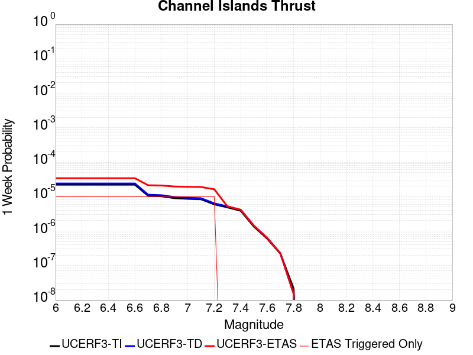 | 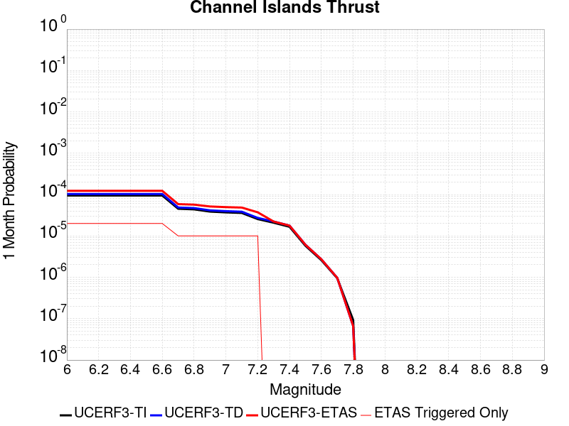 |  |  |

| Magnitude | 1 wk TI Prob | 1 wk TD Prob | 1 wk ETAS Prob | 1 wk ETAS/TD Gain | 1 wk ETAS Triggered Only | 1 mo TI Prob | 1 mo TD Prob | 1 mo ETAS Prob | 1 mo ETAS/TD Gain | 1 mo ETAS Triggered Only | 1 yr TI Prob | 1 yr TD Prob | 1 yr ETAS Prob | 1 yr ETAS/TD Gain | 1 yr ETAS Triggered Only | 10 yr TI Prob | 10 yr TD Prob | 10 yr ETAS Prob | 10 yr ETAS/TD Gain | 10 yr ETAS Triggered Only |
|-----|-----|-----|-----|-----|-----|-----|-----|-----|-----|-----|-----|-----|-----|-----|-----|-----|-----|-----|-----|-----|
| 6.0 | 2.2156251E-5 | 2.4092022E-5 | 3.409178E-5 | 1.4150652 | 1.0E-5 | 9.495191E-5 | 1.03248036E-4 | 1.2324598E-4 | 1.1936883 | 2.0E-5 | 0.0011554264 | 0.0012564264 | 0.0012863888 | 1.0238472 | 3.0E-5 | 0.011494373 | 0.0125038205 | 0.01256307 | 1.0047386 | 6.0E-5 |
| 6.1 | 2.2156251E-5 | 2.4092022E-5 | 3.409178E-5 | 1.4150652 | 1.0E-5 | 9.495191E-5 | 1.03248036E-4 | 1.2324598E-4 | 1.1936883 | 2.0E-5 | 0.0011554264 | 0.0012564264 | 0.0012863888 | 1.0238472 | 3.0E-5 | 0.011494373 | 0.0125038205 | 0.01256307 | 1.0047386 | 6.0E-5 |
| 6.2 | 2.2156251E-5 | 2.4092022E-5 | 3.409178E-5 | 1.4150652 | 1.0E-5 | 9.495191E-5 | 1.03248036E-4 | 1.2324598E-4 | 1.1936883 | 2.0E-5 | 0.0011554264 | 0.0012564264 | 0.0012863888 | 1.0238472 | 3.0E-5 | 0.011494373 | 0.0125038205 | 0.01256307 | 1.0047386 | 6.0E-5 |
| 6.3 | 2.2156251E-5 | 2.4092022E-5 | 3.409178E-5 | 1.4150652 | 1.0E-5 | 9.495191E-5 | 1.03248036E-4 | 1.2324598E-4 | 1.1936883 | 2.0E-5 | 0.0011554264 | 0.0012564264 | 0.0012863888 | 1.0238472 | 3.0E-5 | 0.011494373 | 0.0125038205 | 0.01256307 | 1.0047386 | 6.0E-5 |
| 6.4 | 2.2156251E-5 | 2.4092022E-5 | 3.409178E-5 | 1.4150652 | 1.0E-5 | 9.495191E-5 | 1.03248036E-4 | 1.2324598E-4 | 1.1936883 | 2.0E-5 | 0.0011554264 | 0.0012564264 | 0.0012863888 | 1.0238472 | 3.0E-5 | 0.011494373 | 0.0125038205 | 0.01256307 | 1.0047386 | 6.0E-5 |
| 6.5 | 2.2156251E-5 | 2.4092022E-5 | 3.409178E-5 | 1.4150652 | 1.0E-5 | 9.495191E-5 | 1.03248036E-4 | 1.2324598E-4 | 1.1936883 | 2.0E-5 | 0.0011554264 | 0.0012564264 | 0.0012863888 | 1.0238472 | 3.0E-5 | 0.011494373 | 0.0125038205 | 0.01256307 | 1.0047386 | 6.0E-5 |
| 6.6 | 2.2156251E-5 | 2.4092022E-5 | 3.409178E-5 | 1.4150652 | 1.0E-5 | 9.495191E-5 | 1.03248036E-4 | 1.2324598E-4 | 1.1936883 | 2.0E-5 | 0.0011554264 | 0.0012564264 | 0.0012863888 | 1.0238472 | 3.0E-5 | 0.011494373 | 0.0125038205 | 0.01256307 | 1.0047386 | 6.0E-5 |
| 6.7 | 1.0601296E-5 | 1.1379544E-5 | 2.137943E-5 | 1.8787599 | 1.0E-5 | 4.5433335E-5 | 4.876859E-5 | 5.8768102E-5 | 1.20504 | 1.0E-5 | 5.5301044E-4 | 5.936007E-4 | 6.0359476E-4 | 1.0168363 | 1.0E-5 | 0.005516363 | 0.005920653 | 0.005940535 | 1.003358 | 2.0E-5 |
| 6.8 | 1.0246747E-5 | 1.0996669E-5 | 2.0996558E-5 | 1.9093564 | 1.0E-5 | 4.391389E-5 | 4.7127756E-5 | 5.7127283E-5 | 1.2121792 | 1.0E-5 | 5.345204E-4 | 5.7363417E-4 | 5.836284E-4 | 1.0174227 | 1.0E-5 | 0.0053323656 | 0.005722025 | 0.0057419105 | 1.0034753 | 2.0E-5 |
| 6.9 | 9.049551E-6 | 9.699645E-6 | 1.9699548E-5 | 2.0309556 | 1.0E-5 | 3.878322E-5 | 4.1569267E-5 | 5.1568848E-5 | 1.2405523 | 1.0E-5 | 4.7208337E-4 | 5.059924E-4 | 5.1598734E-4 | 1.0197531 | 1.0E-5 | 0.0047108172 | 0.0050488203 | 0.0050687194 | 1.0039413 | 2.0E-5 |
| 7.0 | 8.6542195E-6 | 9.274603E-6 | 1.927451E-5 | 2.0782032 | 1.0E-5 | 3.7088983E-5 | 3.9747716E-5 | 4.974732E-5 | 1.2515768 | 1.0E-5 | 4.5146482E-4 | 4.8382508E-4 | 4.9382023E-4 | 1.0206586 | 1.0E-5 | 0.004505487 | 0.004828129 | 0.0048480327 | 1.0041224 | 2.0E-5 |
| 7.1 | 8.391028E-6 | 8.992924E-6 | 1.8992834E-5 | 2.1119752 | 1.0E-5 | 3.5961057E-5 | 3.854056E-5 | 4.8540176E-5 | 1.2594569 | 1.0E-5 | 4.3773788E-4 | 4.6913436E-4 | 4.7912967E-4 | 1.0213058 | 1.0E-5 | 0.004368766 | 0.0046818503 | 0.0047017564 | 1.0042518 | 2.0E-5 |
| 7.2 | 5.965188E-6 | 6.3716952E-6 | 1.6371632E-5 | 2.569431 | 1.0E-5 | 2.556484E-5 | 2.7306982E-5 | 3.730671E-5 | 1.3661968 | 1.0E-5 | 3.1120746E-4 | 3.3241234E-4 | 3.42409E-4 | 1.0300732 | 1.0E-5 | 0.00310772 | 0.0033192092 | 0.0033391428 | 1.0060055 | 2.0E-5 |
| 7.3 | 4.877518E-6 | 5.2060063E-6 | 5.2060063E-6 | 1.0 | 0.0 | 2.0903482E-5 | 2.2311267E-5 | 2.2311267E-5 | 1.0 | 0.0 | 2.5447016E-4 | 2.716063E-4 | 2.716063E-4 | 1.0 | 0.0 | 0.0025417898 | 0.0027127895 | 0.0027227623 | 1.0036763 | 1.0E-5 |
| 7.4 | 3.8829853E-6 | 4.141863E-6 | 4.141863E-6 | 1.0 | 0.0 | 1.664126E-5 | 1.7750723E-5 | 1.7750723E-5 | 1.0 | 0.0 | 2.0258849E-4 | 2.1609402E-4 | 2.1609402E-4 | 1.0 | 0.0 | 0.002024039 | 0.0021588807 | 0.0021688591 | 1.004622 | 1.0E-5 |
| 7.5 | 1.3489616E-6 | 1.4277903E-6 | 1.4277903E-6 | 1.0 | 0.0 | 5.7812517E-6 | 6.119087E-6 | 6.119087E-6 | 1.0 | 0.0 | 7.038446E-5 | 7.449738E-5 | 7.449738E-5 | 1.0 | 0.0 | 7.036218E-4 | 7.44728E-4 | 7.44728E-4 | 1.0 | 0.0 |
| 7.6 | 6.058192E-7 | 6.353778E-7 | 6.353778E-7 | 1.0 | 0.0 | 2.5963652E-6 | 2.7230449E-6 | 2.7230449E-6 | 1.0 | 0.0 | 3.161029E-5 | 3.3152584E-5 | 3.3152584E-5 | 1.0 | 0.0 | 3.1605794E-4 | 3.31478E-4 | 3.31478E-4 | 1.0 | 0.0 |
| 7.7 | 2.2170494E-7 | 2.2607902E-7 | 2.2607902E-7 | 1.0 | 0.0 | 9.5016367E-7 | 9.689098E-7 | 9.689098E-7 | 1.0 | 0.0 | 1.1568181E-5 | 1.1796425E-5 | 1.1796425E-5 | 1.0 | 0.0 | 1.1567579E-4 | 1.1795909E-4 | 1.1795909E-4 | 1.0 | 0.0 |
| 7.8 | 2.1613102E-8 | 1.5466682E-8 | 1.5466682E-8 | 1.0 | 0.0 | 9.262757E-8 | 6.628578E-8 | 6.628578E-8 | 1.0 | 0.0 | 1.1277401E-6 | 8.070291E-7 | 8.070291E-7 | 1.0 | 0.0 | 1.1277344E-5 | 8.070269E-6 | 8.070269E-6 | 1.0 | 0.0 |

## San Diego Trough south
*[(top)](#table-of-contents)*

| 1 Week | 1 Month | 1 Year | 10 Year |
|-----|-----|-----|-----|
| 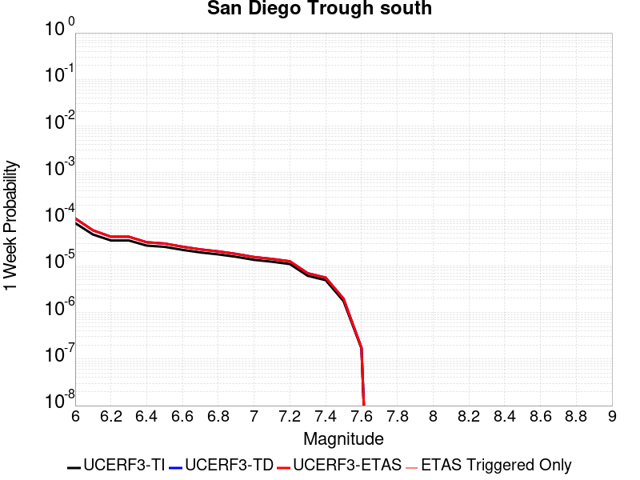 | 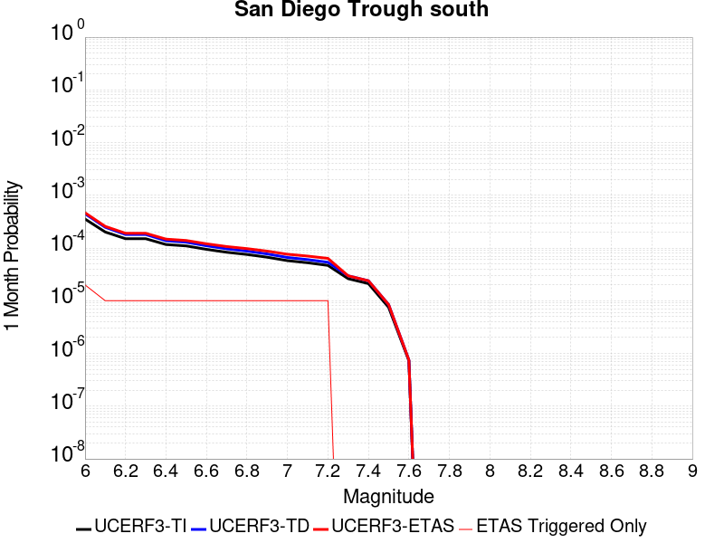 |  | 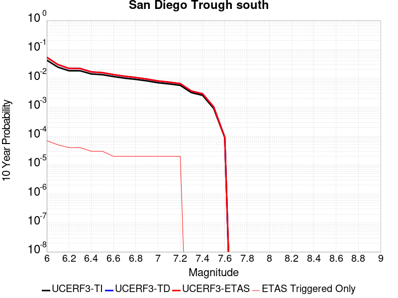 |

| Magnitude | 1 wk TI Prob | 1 wk TD Prob | 1 wk ETAS Prob | 1 wk ETAS/TD Gain | 1 wk ETAS Triggered Only | 1 mo TI Prob | 1 mo TD Prob | 1 mo ETAS Prob | 1 mo ETAS/TD Gain | 1 mo ETAS Triggered Only | 1 yr TI Prob | 1 yr TD Prob | 1 yr ETAS Prob | 1 yr ETAS/TD Gain | 1 yr ETAS Triggered Only | 10 yr TI Prob | 10 yr TD Prob | 10 yr ETAS Prob | 10 yr ETAS/TD Gain | 10 yr ETAS Triggered Only |
|-----|-----|-----|-----|-----|-----|-----|-----|-----|-----|-----|-----|-----|-----|-----|-----|-----|-----|-----|-----|-----|
| 6.0 | 8.279495E-5 | 1.04241306E-4 | 1.04241306E-4 | 1.0 | 0.0 | 3.5478722E-4 | 4.4667677E-4 | 4.6666784E-4 | 1.0447551 | 2.0E-5 | 0.004310982 | 0.0054256152 | 0.005475344 | 1.0091655 | 5.0E-5 | 0.042283054 | 0.05299221 | 0.0530585 | 1.001251 | 7.0E-5 |
| 6.1 | 4.6961468E-5 | 5.772944E-5 | 5.772944E-5 | 1.0 | 0.0 | 2.0124791E-4 | 2.473894E-4 | 2.5738694E-4 | 1.0404121 | 1.0E-5 | 0.00244744 | 0.0030079768 | 0.0030478565 | 1.013258 | 4.0E-5 | 0.024206603 | 0.029679462 | 0.029727979 | 1.0016347 | 5.0E-5 |
| 6.2 | 3.5079658E-5 | 4.214154E-5 | 4.214154E-5 | 1.0 | 0.0 | 1.5033272E-4 | 1.8059435E-4 | 1.9059255E-4 | 1.0553627 | 1.0E-5 | 0.0018287642 | 0.0021965632 | 0.0022264973 | 1.0136276 | 3.0E-5 | 0.018137876 | 0.021751117 | 0.021790247 | 1.001799 | 4.0E-5 |
| 6.3 | 3.5079658E-5 | 4.214154E-5 | 4.214154E-5 | 1.0 | 0.0 | 1.5033272E-4 | 1.8059435E-4 | 1.9059255E-4 | 1.0553627 | 1.0E-5 | 0.0018287642 | 0.0021965632 | 0.0022264973 | 1.0136276 | 3.0E-5 | 0.018137876 | 0.021751117 | 0.021790247 | 1.001799 | 4.0E-5 |
| 6.4 | 2.7196904E-5 | 3.2087162E-5 | 3.2087162E-5 | 1.0 | 0.0 | 1.16552954E-4 | 1.3750927E-4 | 1.4750789E-4 | 1.0727124 | 1.0E-5 | 0.0014181085 | 0.0016729041 | 0.0016928706 | 1.0119352 | 2.0E-5 | 0.014090929 | 0.016604643 | 0.016634146 | 1.0017767 | 3.0E-5 |
| 6.5 | 2.5584688E-5 | 3.010164E-5 | 3.010164E-5 | 1.0 | 0.0 | 1.0964406E-4 | 1.2900073E-4 | 1.3899944E-4 | 1.0775089 | 1.0E-5 | 0.0013340989 | 0.0015694655 | 0.0015894341 | 1.0127232 | 2.0E-5 | 0.013261181 | 0.015585314 | 0.015614847 | 1.0018948 | 3.0E-5 |
| 6.6 | 2.2034688E-5 | 2.5742738E-5 | 2.5742738E-5 | 1.0 | 0.0 | 9.443096E-5 | 1.1032141E-4 | 1.2032031E-4 | 1.0906342 | 1.0E-5 | 0.0011490905 | 0.0013423424 | 0.0013623155 | 1.0148793 | 2.0E-5 | 0.011431668 | 0.013343317 | 0.013363051 | 1.0014789 | 2.0E-5 |
| 6.7 | 1.9394853E-5 | 2.254176E-5 | 2.254176E-5 | 1.0 | 0.0 | 8.311815E-5 | 9.6603995E-5 | 1.0660303E-4 | 1.1035054 | 1.0E-5 | 0.0010114936 | 0.0011755243 | 0.0011955008 | 1.0169936 | 2.0E-5 | 0.01006902 | 0.011693766 | 0.011713532 | 1.0016903 | 2.0E-5 |
| 6.8 | 1.7615313E-5 | 2.0403182E-5 | 2.0403182E-5 | 1.0 | 0.0 | 7.549201E-5 | 8.74393E-5 | 9.743843E-5 | 1.1143551 | 1.0E-5 | 9.1872766E-4 | 0.0010640579 | 0.0010840367 | 1.0187759 | 2.0E-5 | 0.009149387 | 0.010590198 | 0.010609986 | 1.0018685 | 2.0E-5 |
| 6.9 | 1.5621423E-5 | 1.8026114E-5 | 1.8026114E-5 | 1.0 | 0.0 | 6.6947236E-5 | 7.725251E-5 | 8.7251734E-5 | 1.1294357 | 1.0E-5 | 8.147778E-4 | 9.40147E-4 | 9.601282E-4 | 1.0212532 | 2.0E-5 | 0.008117969 | 0.009362142 | 0.009381955 | 1.0021163 | 2.0E-5 |
| 7.0 | 1.3444376E-5 | 1.544809E-5 | 1.544809E-5 | 1.0 | 0.0 | 5.7617483E-5 | 6.620443E-5 | 7.620377E-5 | 1.1510373 | 1.0E-5 | 7.0126704E-4 | 8.057436E-4 | 8.2572753E-4 | 1.0248019 | 2.0E-5 | 0.006990582 | 0.008028555 | 0.008048395 | 1.0024711 | 2.0E-5 |
| 7.1 | 1.2268361E-5 | 1.407303E-5 | 1.407303E-5 | 1.0 | 0.0 | 5.2577634E-5 | 6.0311606E-5 | 7.0311005E-5 | 1.1657956 | 1.0E-5 | 6.399447E-4 | 7.3404907E-4 | 7.540344E-4 | 1.0272261 | 2.0E-5 | 0.0063810493 | 0.0073165493 | 0.007336403 | 1.0027136 | 2.0E-5 |
| 7.2 | 1.0922655E-5 | 1.2513563E-5 | 1.2513563E-5 | 1.0 | 0.0 | 4.681054E-5 | 5.3628468E-5 | 6.362793E-5 | 1.1864581 | 1.0E-5 | 5.697693E-4 | 6.5273355E-4 | 6.727205E-4 | 1.0306203 | 2.0E-5 | 0.0056831064 | 0.0065084435 | 0.0065283137 | 1.003053 | 2.0E-5 |
| 7.3 | 6.1106753E-6 | 6.928925E-6 | 6.928925E-6 | 1.0 | 0.0 | 2.6188345E-5 | 2.9695057E-5 | 2.9695057E-5 | 1.0 | 0.0 | 3.1879646E-4 | 3.6147775E-4 | 3.6147775E-4 | 1.0 | 0.0 | 0.0031833951 | 0.003608943 | 0.003608943 | 1.0 | 0.0 |
| 7.4 | 4.933187E-6 | 5.5895525E-6 | 5.5895525E-6 | 1.0 | 0.0 | 2.114206E-5 | 2.3955008E-5 | 2.3955008E-5 | 1.0 | 0.0 | 2.5737417E-4 | 2.9161357E-4 | 2.9161357E-4 | 1.0 | 0.0 | 0.002570763 | 0.0029123505 | 0.0029123505 | 1.0 | 0.0 |
| 7.5 | 1.7489613E-6 | 1.969678E-6 | 1.969678E-6 | 1.0 | 0.0 | 7.495527E-6 | 8.4414505E-6 | 8.4414505E-6 | 1.0 | 0.0 | 9.125422E-5 | 1.02770035E-4 | 1.02770035E-4 | 1.0 | 0.0 | 9.1216754E-4 | 0.0010272472 | 0.0010272472 | 1.0 | 0.0 |
| 7.6 | 1.6988751E-7 | 1.7533823E-7 | 1.7533823E-7 | 1.0 | 0.0 | 7.2808916E-7 | 7.5144936E-7 | 7.5144936E-7 | 1.0 | 0.0 | 8.864449E-6 | 9.14886E-6 | 9.14886E-6 | 1.0 | 0.0 | 8.8640954E-5 | 9.1485024E-5 | 9.1485024E-5 | 1.0 | 0.0 |

## Independence rev 2011
*[(top)](#table-of-contents)*

| 1 Week | 1 Month | 1 Year | 10 Year |
|-----|-----|-----|-----|
| 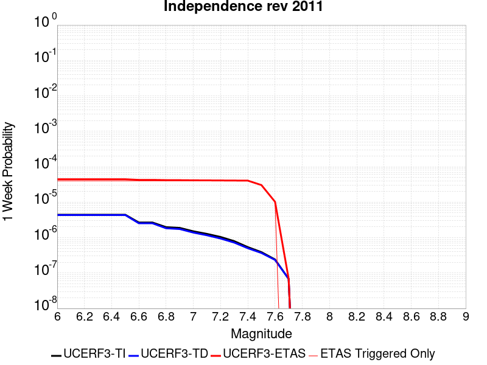 | 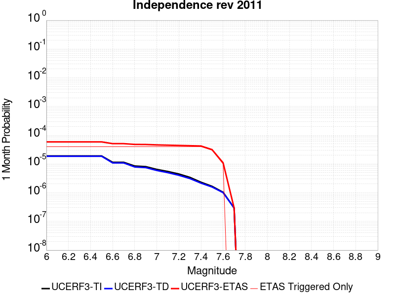 |  |  |

| Magnitude | 1 wk TI Prob | 1 wk TD Prob | 1 wk ETAS Prob | 1 wk ETAS/TD Gain | 1 wk ETAS Triggered Only | 1 mo TI Prob | 1 mo TD Prob | 1 mo ETAS Prob | 1 mo ETAS/TD Gain | 1 mo ETAS Triggered Only | 1 yr TI Prob | 1 yr TD Prob | 1 yr ETAS Prob | 1 yr ETAS/TD Gain | 1 yr ETAS Triggered Only | 10 yr TI Prob | 10 yr TD Prob | 10 yr ETAS Prob | 10 yr ETAS/TD Gain | 10 yr ETAS Triggered Only |
|-----|-----|-----|-----|-----|-----|-----|-----|-----|-----|-----|-----|-----|-----|-----|-----|-----|-----|-----|-----|-----|
| 6.0 | 4.422171E-6 | 4.326227E-6 | 4.4326054E-5 | 10.245892 | 4.0E-5 | 1.8952025E-5 | 1.8540857E-5 | 5.8540118E-5 | 3.1573575 | 4.0E-5 | 2.3071647E-4 | 2.2571455E-4 | 2.7570326E-4 | 1.2214687 | 5.0E-5 | 0.0023047708 | 0.0022551466 | 0.0023150113 | 1.0265458 | 6.0E-5 |
| 6.1 | 4.422171E-6 | 4.326227E-6 | 4.4326054E-5 | 10.245892 | 4.0E-5 | 1.8952025E-5 | 1.8540857E-5 | 5.8540118E-5 | 3.1573575 | 4.0E-5 | 2.3071647E-4 | 2.2571455E-4 | 2.7570326E-4 | 1.2214687 | 5.0E-5 | 0.0023047708 | 0.0022551466 | 0.0023150113 | 1.0265458 | 6.0E-5 |
| 6.2 | 4.422171E-6 | 4.326227E-6 | 4.4326054E-5 | 10.245892 | 4.0E-5 | 1.8952025E-5 | 1.8540857E-5 | 5.8540118E-5 | 3.1573575 | 4.0E-5 | 2.3071647E-4 | 2.2571455E-4 | 2.7570326E-4 | 1.2214687 | 5.0E-5 | 0.0023047708 | 0.0022551466 | 0.0023150113 | 1.0265458 | 6.0E-5 |
| 6.3 | 4.422171E-6 | 4.326227E-6 | 4.4326054E-5 | 10.245892 | 4.0E-5 | 1.8952025E-5 | 1.8540857E-5 | 5.8540118E-5 | 3.1573575 | 4.0E-5 | 2.3071647E-4 | 2.2571455E-4 | 2.7570326E-4 | 1.2214687 | 5.0E-5 | 0.0023047708 | 0.0022551466 | 0.0023150113 | 1.0265458 | 6.0E-5 |
| 6.4 | 4.422171E-6 | 4.326227E-6 | 4.4326054E-5 | 10.245892 | 4.0E-5 | 1.8952025E-5 | 1.8540857E-5 | 5.8540118E-5 | 3.1573575 | 4.0E-5 | 2.3071647E-4 | 2.2571455E-4 | 2.7570326E-4 | 1.2214687 | 5.0E-5 | 0.0023047708 | 0.0022551466 | 0.0023150113 | 1.0265458 | 6.0E-5 |
| 6.5 | 4.422171E-6 | 4.326227E-6 | 4.4326054E-5 | 10.245892 | 4.0E-5 | 1.8952025E-5 | 1.8540857E-5 | 5.8540118E-5 | 3.1573575 | 4.0E-5 | 2.3071647E-4 | 2.2571455E-4 | 2.7570326E-4 | 1.2214687 | 5.0E-5 | 0.0023047708 | 0.0022551466 | 0.0023150113 | 1.0265458 | 6.0E-5 |
| 6.6 | 2.663744E-6 | 2.5319862E-6 | 4.2531887E-5 | 16.797834 | 4.0E-5 | 1.1415996E-5 | 1.0851327E-5 | 5.0850893E-5 | 4.6861453 | 4.0E-5 | 1.3898089E-4 | 1.3210738E-4 | 1.8210078E-4 | 1.37843 | 5.0E-5 | 0.0013889399 | 0.0013203367 | 0.0013802575 | 1.045383 | 6.0E-5 |
| 6.7 | 2.663744E-6 | 2.5319862E-6 | 4.2531887E-5 | 16.797834 | 4.0E-5 | 1.1415996E-5 | 1.0851327E-5 | 5.0850893E-5 | 4.6861453 | 4.0E-5 | 1.3898089E-4 | 1.3210738E-4 | 1.8210078E-4 | 1.37843 | 5.0E-5 | 0.0013889399 | 0.0013203367 | 0.0013802575 | 1.045383 | 6.0E-5 |
| 6.8 | 1.9716529E-6 | 1.8322585E-6 | 4.1832183E-5 | 22.830942 | 4.0E-5 | 8.449913E-6 | 7.852514E-6 | 4.7852198E-5 | 6.0938706 | 4.0E-5 | 1.0287284E-4 | 9.5600284E-5 | 1.455955E-4 | 1.522961 | 5.0E-5 | 0.0010282523 | 9.556045E-4 | 0.0010155472 | 1.0627275 | 6.0E-5 |
| 6.9 | 1.8788617E-6 | 1.7429993E-6 | 4.174293E-5 | 23.948908 | 4.0E-5 | 8.0522395E-6 | 7.4699765E-6 | 4.746968E-5 | 6.354729 | 4.0E-5 | 9.80316E-5 | 9.0943286E-5 | 1.4093873E-4 | 1.5497432 | 5.0E-5 | 9.798837E-4 | 9.0907275E-4 | 9.690182E-4 | 1.0659413 | 6.0E-5 |
| 7.0 | 1.5045488E-6 | 1.3849503E-6 | 4.1384894E-5 | 29.88186 | 4.0E-5 | 6.44805E-6 | 5.9354884E-6 | 4.5935252E-5 | 7.739085 | 4.0E-5 | 7.8502184E-5 | 7.226223E-5 | 1.2225861E-4 | 1.6918744 | 5.0E-5 | 7.8474457E-4 | 7.2239246E-4 | 7.823491E-4 | 1.0829973 | 6.0E-5 |
| 7.1 | 1.272341E-6 | 1.1625096E-6 | 4.1162464E-5 | 35.408276 | 4.0E-5 | 5.4528787E-6 | 4.982175E-6 | 4.4981974E-5 | 9.028582 | 4.0E-5 | 6.6386776E-5 | 6.0656326E-5 | 1.10653295E-4 | 1.8242663 | 5.0E-5 | 6.636695E-4 | 6.064009E-4 | 6.663645E-4 | 1.0988845 | 6.0E-5 |
| 7.2 | 1.0416892E-6 | 9.4098806E-7 | 4.094095E-5 | 43.50847 | 4.0E-5 | 4.464375E-6 | 4.0328E-6 | 4.403264E-5 | 10.918628 | 4.0E-5 | 5.4352407E-5 | 4.909825E-5 | 9.909579E-5 | 2.0183163 | 5.0E-5 | 5.4339116E-4 | 4.9087586E-4 | 5.5084645E-4 | 1.1221704 | 6.0E-5 |
| 7.3 | 7.9450155E-7 | 7.235002E-7 | 4.0723473E-5 | 56.286747 | 4.0E-5 | 3.4050022E-6 | 3.1007114E-6 | 4.3100586E-5 | 13.900226 | 4.0E-5 | 4.1455114E-5 | 3.775052E-5 | 8.774863E-5 | 2.324435 | 5.0E-5 | 4.144738E-4 | 3.7744216E-4 | 4.3741954E-4 | 1.1589048 | 6.0E-5 |
| 7.4 | 5.3893444E-7 | 5.019512E-7 | 4.050193E-5 | 80.68898 | 4.0E-5 | 2.309717E-6 | 2.1512178E-6 | 4.2151132E-5 | 19.59408 | 4.0E-5 | 2.8120441E-5 | 2.6190766E-5 | 6.618972E-5 | 2.5272157 | 4.0E-5 | 2.8116882E-4 | 2.6187726E-4 | 3.1186416E-4 | 1.1908791 | 5.0E-5 |
| 7.5 | 3.8852085E-7 | 3.682554E-7 | 3.0368245E-5 | 82.46517 | 3.0E-5 | 1.6650882E-6 | 1.5782365E-6 | 3.157819E-5 | 20.008528 | 3.0E-5 | 2.027226E-5 | 1.9214862E-5 | 4.9214286E-5 | 2.5612614 | 3.0E-5 | 2.0270412E-4 | 1.9213221E-4 | 2.2212646E-4 | 1.1561124 | 3.0E-5 |
| 7.6 | 2.414929E-7 | 2.345755E-7 | 1.0234573E-5 | 43.630188 | 1.0E-5 | 1.0349692E-6 | 1.0053232E-6 | 1.1005313E-5 | 10.94704 | 1.0E-5 | 1.2600677E-5 | 1.2239742E-5 | 2.223962E-5 | 1.8170006 | 1.0E-5 | 1.2599962E-4 | 1.223908E-4 | 1.3238958E-4 | 1.0816954 | 1.0E-5 |
| 7.7 | 6.8298014E-8 | 6.85897E-8 | 6.85897E-8 | 1.0 | 0.0 | 2.9270575E-7 | 2.9395582E-7 | 2.9395582E-7 | 1.0 | 0.0 | 3.5636867E-6 | 3.5789067E-6 | 3.5789067E-6 | 1.0 | 0.0 | 3.5636294E-5 | 3.5788536E-5 | 3.5788536E-5 | 1.0 | 0.0 |

## Palos Verdes
*[(top)](#table-of-contents)*

| 1 Week | 1 Month | 1 Year | 10 Year |
|-----|-----|-----|-----|
| 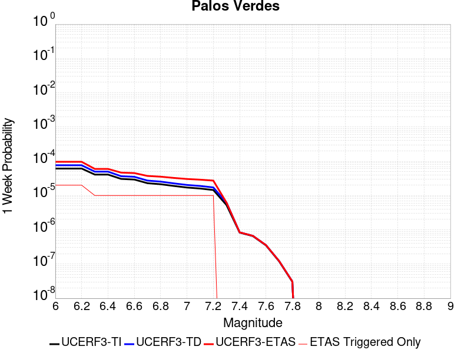 | 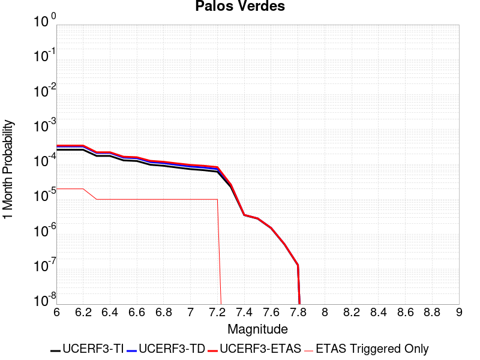 | 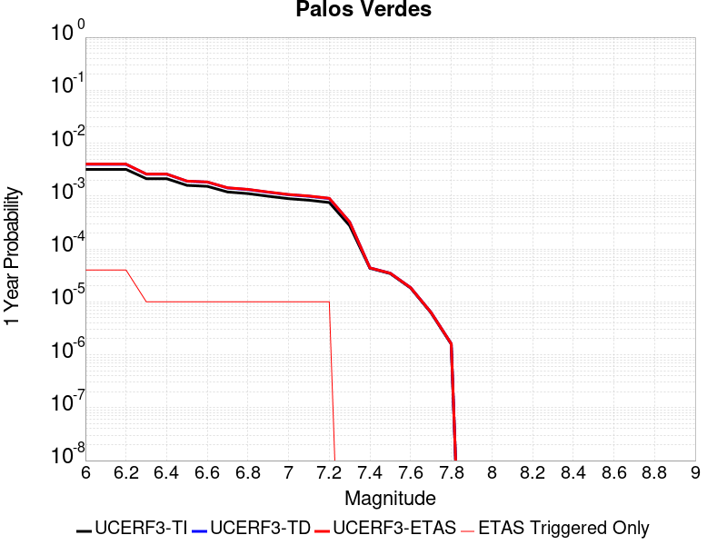 | 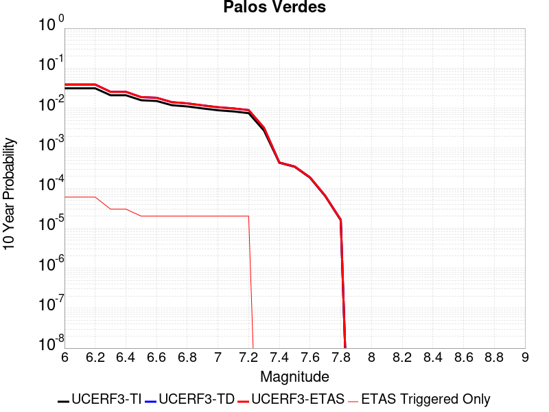 |

| Magnitude | 1 wk TI Prob | 1 wk TD Prob | 1 wk ETAS Prob | 1 wk ETAS/TD Gain | 1 wk ETAS Triggered Only | 1 mo TI Prob | 1 mo TD Prob | 1 mo ETAS Prob | 1 mo ETAS/TD Gain | 1 mo ETAS Triggered Only | 1 yr TI Prob | 1 yr TD Prob | 1 yr ETAS Prob | 1 yr ETAS/TD Gain | 1 yr ETAS Triggered Only | 10 yr TI Prob | 10 yr TD Prob | 10 yr ETAS Prob | 10 yr ETAS/TD Gain | 10 yr ETAS Triggered Only |
|-----|-----|-----|-----|-----|-----|-----|-----|-----|-----|-----|-----|-----|-----|-----|-----|-----|-----|-----|-----|-----|
| 6.0 | 6.126063E-5 | 7.622612E-5 | 9.62246E-5 | 1.2623572 | 2.0E-5 | 2.6251914E-4 | 3.2664582E-4 | 3.4663928E-4 | 1.0612084 | 2.0E-5 | 0.0031914865 | 0.003970174 | 0.004010015 | 1.0100352 | 4.0E-5 | 0.031460393 | 0.039048895 | 0.039106555 | 1.0014765 | 6.0E-5 |
| 6.1 | 6.126063E-5 | 7.622612E-5 | 9.62246E-5 | 1.2623572 | 2.0E-5 | 2.6251914E-4 | 3.2664582E-4 | 3.4663928E-4 | 1.0612084 | 2.0E-5 | 0.0031914865 | 0.003970174 | 0.004010015 | 1.0100352 | 4.0E-5 | 0.031460393 | 0.039048895 | 0.039106555 | 1.0014765 | 6.0E-5 |
| 6.2 | 6.126063E-5 | 7.622612E-5 | 9.62246E-5 | 1.2623572 | 2.0E-5 | 2.6251914E-4 | 3.2664582E-4 | 3.4663928E-4 | 1.0612084 | 2.0E-5 | 0.0031914865 | 0.003970174 | 0.004010015 | 1.0100352 | 4.0E-5 | 0.031460393 | 0.039048895 | 0.039106555 | 1.0014765 | 6.0E-5 |
| 6.3 | 4.0838047E-5 | 4.9749437E-5 | 5.9748938E-5 | 1.2009974 | 1.0E-5 | 1.7500846E-4 | 2.1319572E-4 | 2.2319358E-4 | 1.0468953 | 1.0E-5 | 0.0021286458 | 0.0025927818 | 0.0026027558 | 1.0038469 | 1.0E-5 | 0.021083709 | 0.025646681 | 0.025675911 | 1.0011398 | 3.0E-5 |
| 6.4 | 4.0838047E-5 | 4.9749437E-5 | 5.9748938E-5 | 1.2009974 | 1.0E-5 | 1.7500846E-4 | 2.1319572E-4 | 2.2319358E-4 | 1.0468953 | 1.0E-5 | 0.0021286458 | 0.0025927818 | 0.0026027558 | 1.0038469 | 1.0E-5 | 0.021083709 | 0.025646681 | 0.025675911 | 1.0011398 | 3.0E-5 |
| 6.5 | 3.0512005E-5 | 3.656162E-5 | 4.6561257E-5 | 1.2735008 | 1.0E-5 | 1.3075917E-4 | 1.5668393E-4 | 1.6668237E-4 | 1.0638127 | 1.0E-5 | 0.0015908304 | 0.0019060767 | 0.0019160575 | 1.0052364 | 1.0E-5 | 0.015794903 | 0.018909154 | 0.018928776 | 1.0010377 | 2.0E-5 |
| 6.6 | 2.9255087E-5 | 3.515442E-5 | 4.515407E-5 | 1.2844492 | 1.0E-5 | 1.2537291E-4 | 1.5065377E-4 | 1.6065226E-4 | 1.0663674 | 1.0E-5 | 0.0015253464 | 0.0018327828 | 0.0018427644 | 1.0054462 | 1.0E-5 | 0.015149189 | 0.018188225 | 0.018207861 | 1.0010796 | 2.0E-5 |
| 6.7 | 2.287198E-5 | 2.7248278E-5 | 3.7248006E-5 | 1.3669857 | 1.0E-5 | 9.801909E-5 | 1.16773626E-4 | 1.2677246E-4 | 1.0856258 | 1.0E-5 | 0.001192729 | 0.0014208833 | 0.0014308691 | 1.0070279 | 1.0E-5 | 0.011863477 | 0.014127217 | 0.014146934 | 1.0013957 | 2.0E-5 |
| 6.8 | 2.1325764E-5 | 2.5431877E-5 | 3.543162E-5 | 1.3931973 | 1.0E-5 | 9.139293E-5 | 1.0898971E-4 | 1.18988624E-4 | 1.0917418 | 1.0E-5 | 0.001112141 | 0.0013262323 | 0.001336219 | 1.0075302 | 1.0E-5 | 0.011065915 | 0.013192211 | 0.013211947 | 1.0014961 | 2.0E-5 |
| 6.9 | 1.9009392E-5 | 2.2613547E-5 | 3.2613323E-5 | 1.4422028 | 1.0E-5 | 8.1466285E-5 | 9.6912096E-5 | 1.0691113E-4 | 1.1031762 | 1.0E-5 | 9.914007E-4 | 0.0011793535 | 0.0011893417 | 1.0084692 | 1.0E-5 | 0.009869894 | 0.011739632 | 0.011759398 | 1.0016836 | 2.0E-5 |
| 7.0 | 1.7098473E-5 | 2.0319356E-5 | 3.0319152E-5 | 1.4921316 | 1.0E-5 | 7.3277115E-5 | 8.708052E-5 | 9.7079654E-5 | 1.1148262 | 1.0E-5 | 8.917837E-4 | 0.001059775 | 0.0010697644 | 1.009426 | 1.0E-5 | 0.008882134 | 0.010555646 | 0.010575435 | 1.0018747 | 2.0E-5 |
| 7.1 | 1.5982785E-5 | 1.899476E-5 | 2.8994571E-5 | 1.526451 | 1.0E-5 | 6.849585E-5 | 8.1404054E-5 | 9.1403235E-5 | 1.122834 | 1.0E-5 | 8.336179E-4 | 9.907284E-4 | 0.0010007184 | 1.0100836 | 1.0E-5 | 0.008304977 | 0.009871479 | 0.009891282 | 1.002006 | 2.0E-5 |
| 7.2 | 1.4468002E-5 | 1.7197237E-5 | 2.7197064E-5 | 1.5814788 | 1.0E-5 | 6.200425E-5 | 7.370083E-5 | 8.370009E-5 | 1.1356736 | 1.0E-5 | 7.546402E-4 | 8.970222E-4 | 9.0701325E-4 | 1.011138 | 1.0E-5 | 0.007520827 | 0.008942284 | 0.008962105 | 1.0022166 | 2.0E-5 |
| 7.3 | 5.288233E-6 | 6.2036747E-6 | 6.2036747E-6 | 1.0 | 0.0 | 2.2663658E-5 | 2.6587102E-5 | 2.6587102E-5 | 1.0 | 0.0 | 2.7589512E-4 | 3.236848E-4 | 3.236848E-4 | 1.0 | 0.0 | 0.0027555283 | 0.0032355562 | 0.0032355562 | 1.0 | 0.0 |
| 7.4 | 8.279556E-7 | 8.408347E-7 | 8.408347E-7 | 1.0 | 0.0 | 3.5483763E-6 | 3.6035726E-6 | 3.6035726E-6 | 1.0 | 0.0 | 4.3200624E-5 | 4.3872686E-5 | 4.3872686E-5 | 1.0 | 0.0 | 4.3192226E-4 | 4.3864746E-4 | 4.3864746E-4 | 1.0 | 0.0 |
| 7.5 | 6.559831E-7 | 6.667229E-7 | 6.667229E-7 | 1.0 | 0.0 | 2.8113532E-6 | 2.857381E-6 | 2.857381E-6 | 1.0 | 0.0 | 3.4227687E-5 | 3.4788125E-5 | 3.4788125E-5 | 1.0 | 0.0 | 3.4222414E-4 | 3.4783344E-4 | 3.4783344E-4 | 1.0 | 0.0 |
| 7.6 | 3.5018968E-7 | 3.5620027E-7 | 3.5620027E-7 | 1.0 | 0.0 | 1.500812E-6 | 1.526572E-6 | 1.526572E-6 | 1.0 | 0.0 | 1.8272232E-5 | 1.8585903E-5 | 1.8585903E-5 | 1.0 | 0.0 | 1.8270731E-4 | 1.8584808E-4 | 1.8584808E-4 | 1.0 | 0.0 |
| 7.7 | 1.1986104E-7 | 1.2198376E-7 | 1.2198376E-7 | 1.0 | 0.0 | 5.1369005E-7 | 5.2278745E-7 | 5.2278745E-7 | 1.0 | 0.0 | 6.2541585E-6 | 6.364919E-6 | 6.364919E-6 | 1.0 | 0.0 | 6.2539824E-5 | 6.364741E-5 | 6.364741E-5 | 1.0 | 0.0 |
| 7.8 | 3.0445005E-8 | 3.1027582E-8 | 3.1027582E-8 | 1.0 | 0.0 | 1.3047858E-7 | 1.3297536E-7 | 1.3297536E-7 | 1.0 | 0.0 | 1.5885756E-6 | 1.6189739E-6 | 1.6189739E-6 | 1.0 | 0.0 | 1.5885644E-5 | 1.6189642E-5 | 1.6189642E-5 | 1.0 | 0.0 |

## San Luis Range 2011 CFM
*[(top)](#table-of-contents)*

| 1 Week | 1 Month | 1 Year | 10 Year |
|-----|-----|-----|-----|
|  | 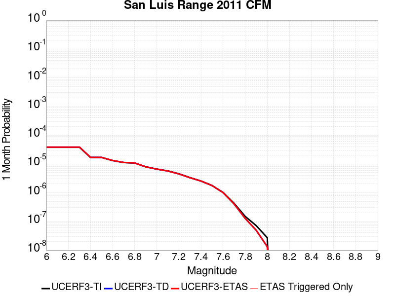 |  |  |

| Magnitude | 1 wk TI Prob | 1 wk TD Prob | 1 wk ETAS Prob | 1 wk ETAS/TD Gain | 1 wk ETAS Triggered Only | 1 mo TI Prob | 1 mo TD Prob | 1 mo ETAS Prob | 1 mo ETAS/TD Gain | 1 mo ETAS Triggered Only | 1 yr TI Prob | 1 yr TD Prob | 1 yr ETAS Prob | 1 yr ETAS/TD Gain | 1 yr ETAS Triggered Only | 10 yr TI Prob | 10 yr TD Prob | 10 yr ETAS Prob | 10 yr ETAS/TD Gain | 10 yr ETAS Triggered Only |
|-----|-----|-----|-----|-----|-----|-----|-----|-----|-----|-----|-----|-----|-----|-----|-----|-----|-----|-----|-----|-----|
| 6.0 | 8.8368415E-6 | 8.965454E-6 | 8.965454E-6 | 1.0 | 0.0 | 3.787163E-5 | 3.842285E-5 | 3.842285E-5 | 1.0 | 0.0 | 4.609895E-4 | 4.677057E-4 | 4.8769635E-4 | 1.0427419 | 2.0E-5 | 0.0046003438 | 0.0046679964 | 0.004717763 | 1.0106612 | 5.0E-5 |
| 6.1 | 8.8368415E-6 | 8.965454E-6 | 8.965454E-6 | 1.0 | 0.0 | 3.787163E-5 | 3.842285E-5 | 3.842285E-5 | 1.0 | 0.0 | 4.609895E-4 | 4.677057E-4 | 4.8769635E-4 | 1.0427419 | 2.0E-5 | 0.0046003438 | 0.0046679964 | 0.004717763 | 1.0106612 | 5.0E-5 |
| 6.2 | 8.8368415E-6 | 8.965454E-6 | 8.965454E-6 | 1.0 | 0.0 | 3.787163E-5 | 3.842285E-5 | 3.842285E-5 | 1.0 | 0.0 | 4.609895E-4 | 4.677057E-4 | 4.8769635E-4 | 1.0427419 | 2.0E-5 | 0.0046003438 | 0.0046679964 | 0.004717763 | 1.0106612 | 5.0E-5 |
| 6.3 | 8.8368415E-6 | 8.965454E-6 | 8.965454E-6 | 1.0 | 0.0 | 3.787163E-5 | 3.842285E-5 | 3.842285E-5 | 1.0 | 0.0 | 4.609895E-4 | 4.677057E-4 | 4.8769635E-4 | 1.0427419 | 2.0E-5 | 0.0046003438 | 0.0046679964 | 0.004717763 | 1.0106612 | 5.0E-5 |
| 6.4 | 3.9094193E-6 | 3.9412025E-6 | 3.9412025E-6 | 1.0 | 0.0 | 1.6754546E-5 | 1.689076E-5 | 1.689076E-5 | 1.0 | 0.0 | 2.039675E-4 | 2.056259E-4 | 2.056259E-4 | 1.0 | 0.0 | 0.0020378039 | 0.0020543851 | 0.002074344 | 1.0097153 | 2.0E-5 |
| 6.5 | 3.9094193E-6 | 3.9412025E-6 | 3.9412025E-6 | 1.0 | 0.0 | 1.6754546E-5 | 1.689076E-5 | 1.689076E-5 | 1.0 | 0.0 | 2.039675E-4 | 2.056259E-4 | 2.056259E-4 | 1.0 | 0.0 | 0.0020378039 | 0.0020543851 | 0.002074344 | 1.0097153 | 2.0E-5 |
| 6.6 | 3.0587726E-6 | 3.0753883E-6 | 3.0753883E-6 | 1.0 | 0.0 | 1.3108959E-5 | 1.318017E-5 | 1.318017E-5 | 1.0 | 0.0 | 1.595899E-4 | 1.6045687E-4 | 1.6045687E-4 | 1.0 | 0.0 | 0.0015947534 | 0.0016034221 | 0.001613406 | 1.0062267 | 1.0E-5 |
| 6.7 | 2.6160574E-6 | 2.6251273E-6 | 2.6251273E-6 | 1.0 | 0.0 | 1.1211626E-5 | 1.1250498E-5 | 1.1250498E-5 | 1.0 | 0.0 | 1.3649299E-4 | 1.3696625E-4 | 1.3696625E-4 | 1.0 | 0.0 | 0.0013640919 | 0.0013688246 | 0.0013688246 | 1.0 | 0.0 |
| 6.8 | 2.5110312E-6 | 2.51814E-6 | 2.51814E-6 | 1.0 | 0.0 | 1.0761518E-5 | 1.0791985E-5 | 1.0791985E-5 | 1.0 | 0.0 | 1.310136E-4 | 1.3138456E-4 | 1.3138456E-4 | 1.0 | 0.0 | 0.0013093639 | 0.0013130746 | 0.0013130746 | 1.0 | 0.0 |
| 6.9 | 1.8564405E-6 | 1.852487E-6 | 1.852487E-6 | 1.0 | 0.0 | 7.95615E-6 | 7.939206E-6 | 7.939206E-6 | 1.0 | 0.0 | 9.686181E-5 | 9.665557E-5 | 9.665557E-5 | 1.0 | 0.0 | 9.68196E-4 | 9.661373E-4 | 9.661373E-4 | 1.0 | 0.0 |
| 7.0 | 1.546127E-6 | 1.5369537E-6 | 1.5369537E-6 | 1.0 | 0.0 | 6.626242E-6 | 6.586928E-6 | 6.586928E-6 | 1.0 | 0.0 | 8.06715E-5 | 8.0192905E-5 | 8.0192905E-5 | 1.0 | 0.0 | 8.0642226E-4 | 8.016404E-4 | 8.016404E-4 | 1.0 | 0.0 |
| 7.1 | 1.3368208E-6 | 1.3235326E-6 | 1.3235326E-6 | 1.0 | 0.0 | 5.7292195E-6 | 5.67227E-6 | 5.67227E-6 | 1.0 | 0.0 | 6.975101E-5 | 6.905771E-5 | 6.905771E-5 | 1.0 | 0.0 | 6.972912E-4 | 6.9036294E-4 | 6.9036294E-4 | 1.0 | 0.0 |
| 7.2 | 1.0623363E-6 | 1.0454368E-6 | 1.0454368E-6 | 1.0 | 0.0 | 4.5528623E-6 | 4.4804356E-6 | 4.4804356E-6 | 1.0 | 0.0 | 5.5429686E-5 | 5.4547938E-5 | 5.4547938E-5 | 1.0 | 0.0 | 5.5415864E-4 | 5.4534577E-4 | 5.4534577E-4 | 1.0 | 0.0 |
| 7.3 | 7.831679E-7 | 7.7273904E-7 | 7.7273904E-7 | 1.0 | 0.0 | 3.3564295E-6 | 3.3117344E-6 | 3.3117344E-6 | 1.0 | 0.0 | 4.086376E-5 | 4.0319625E-5 | 4.0319625E-5 | 1.0 | 0.0 | 4.0856248E-4 | 4.031232E-4 | 4.031232E-4 | 1.0 | 0.0 |
| 7.4 | 5.9558846E-7 | 5.910636E-7 | 5.910636E-7 | 1.0 | 0.0 | 2.5525194E-6 | 2.5331274E-6 | 2.5331274E-6 | 1.0 | 0.0 | 3.107648E-5 | 3.084039E-5 | 3.084039E-5 | 1.0 | 0.0 | 3.1072134E-4 | 3.083612E-4 | 3.083612E-4 | 1.0 | 0.0 |
| 7.5 | 4.1616502E-7 | 4.119631E-7 | 4.119631E-7 | 1.0 | 0.0 | 1.7835631E-6 | 1.7655549E-6 | 1.7655549E-6 | 1.0 | 0.0 | 2.1714664E-5 | 2.149542E-5 | 2.149542E-5 | 1.0 | 0.0 | 2.1712543E-4 | 2.1493346E-4 | 2.1493346E-4 | 1.0 | 0.0 |
| 7.6 | 2.3816014E-7 | 2.3376548E-7 | 2.3376548E-7 | 1.0 | 0.0 | 1.0206859E-6 | 1.0018516E-6 | 1.0018516E-6 | 1.0 | 0.0 | 1.242678E-5 | 1.2197475E-5 | 1.2197475E-5 | 1.0 | 0.0 | 1.2426086E-4 | 1.2196808E-4 | 1.2196808E-4 | 1.0 | 0.0 |
| 7.7 | 9.918777E-8 | 9.3867584E-8 | 9.3867584E-8 | 1.0 | 0.0 | 4.2509038E-7 | 4.0228957E-7 | 4.0228957E-7 | 1.0 | 0.0 | 5.1754632E-6 | 4.8978645E-6 | 4.8978645E-6 | 1.0 | 0.0 | 5.1753424E-5 | 4.897757E-5 | 4.897757E-5 | 1.0 | 0.0 |
| 7.8 | 3.4982556E-8 | 2.968655E-8 | 2.968655E-8 | 1.0 | 0.0 | 1.4992524E-7 | 1.2722806E-7 | 1.2722806E-7 | 1.0 | 0.0 | 1.8253382E-6 | 1.5490006E-6 | 1.5490006E-6 | 1.0 | 0.0 | 1.8253233E-5 | 1.5489897E-5 | 1.5489897E-5 | 1.0 | 0.0 |
| 7.9 | 1.6624908E-8 | 1.1477036E-8 | 1.1477036E-8 | 1.0 | 0.0 | 7.12496E-8 | 4.91873E-8 | 4.91873E-8 | 1.0 | 0.0 | 8.6746354E-7 | 5.988552E-7 | 5.988552E-7 | 1.0 | 0.0 | 8.674601E-6 | 5.988536E-6 | 5.988536E-6 | 1.0 | 0.0 |
| 8.0 | 6.3352315E-9 | 3.0888412E-9 | 3.0888412E-9 | 1.0 | 0.0 | 2.715099E-8 | 1.3237893E-8 | 1.3237893E-8 | 1.0 | 0.0 | 3.3056327E-7 | 1.6117131E-7 | 1.6117131E-7 | 1.0 | 0.0 | 3.3056278E-6 | 1.611712E-6 | 1.611712E-6 | 1.0 | 0.0 |

## San Cayetano
*[(top)](#table-of-contents)*

| 1 Week | 1 Month | 1 Year | 10 Year |
|-----|-----|-----|-----|
|  | 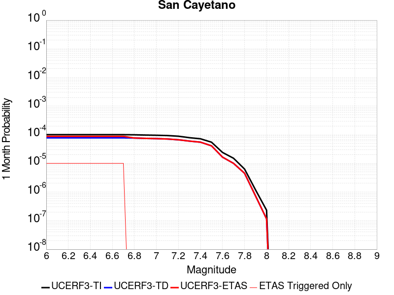 |  |  |

| Magnitude | 1 wk TI Prob | 1 wk TD Prob | 1 wk ETAS Prob | 1 wk ETAS/TD Gain | 1 wk ETAS Triggered Only | 1 mo TI Prob | 1 mo TD Prob | 1 mo ETAS Prob | 1 mo ETAS/TD Gain | 1 mo ETAS Triggered Only | 1 yr TI Prob | 1 yr TD Prob | 1 yr ETAS Prob | 1 yr ETAS/TD Gain | 1 yr ETAS Triggered Only | 10 yr TI Prob | 10 yr TD Prob | 10 yr ETAS Prob | 10 yr ETAS/TD Gain | 10 yr ETAS Triggered Only |
|-----|-----|-----|-----|-----|-----|-----|-----|-----|-----|-----|-----|-----|-----|-----|-----|-----|-----|-----|-----|-----|
| 6.0 | 2.3476267E-5 | 1.816928E-5 | 1.816928E-5 | 1.0 | 0.0 | 1.0060869E-4 | 7.786603E-5 | 8.786526E-5 | 1.1284157 | 1.0E-5 | 0.0012242225 | 9.476103E-4 | 9.6759136E-4 | 1.0210857 | 2.0E-5 | 0.012175002 | 0.009436584 | 0.009496018 | 1.0062982 | 6.0E-5 |
| 6.1 | 2.3476267E-5 | 1.816928E-5 | 1.816928E-5 | 1.0 | 0.0 | 1.0060869E-4 | 7.786603E-5 | 8.786526E-5 | 1.1284157 | 1.0E-5 | 0.0012242225 | 9.476103E-4 | 9.6759136E-4 | 1.0210857 | 2.0E-5 | 0.012175002 | 0.009436584 | 0.009496018 | 1.0062982 | 6.0E-5 |
| 6.2 | 2.3476267E-5 | 1.816928E-5 | 1.816928E-5 | 1.0 | 0.0 | 1.0060869E-4 | 7.786603E-5 | 8.786526E-5 | 1.1284157 | 1.0E-5 | 0.0012242225 | 9.476103E-4 | 9.6759136E-4 | 1.0210857 | 2.0E-5 | 0.012175002 | 0.009436584 | 0.009496018 | 1.0062982 | 6.0E-5 |
| 6.3 | 2.3476267E-5 | 1.816928E-5 | 1.816928E-5 | 1.0 | 0.0 | 1.0060869E-4 | 7.786603E-5 | 8.786526E-5 | 1.1284157 | 1.0E-5 | 0.0012242225 | 9.476103E-4 | 9.6759136E-4 | 1.0210857 | 2.0E-5 | 0.012175002 | 0.009436584 | 0.009496018 | 1.0062982 | 6.0E-5 |
| 6.4 | 2.3476267E-5 | 1.816928E-5 | 1.816928E-5 | 1.0 | 0.0 | 1.0060869E-4 | 7.786603E-5 | 8.786526E-5 | 1.1284157 | 1.0E-5 | 0.0012242225 | 9.476103E-4 | 9.6759136E-4 | 1.0210857 | 2.0E-5 | 0.012175002 | 0.009436584 | 0.009496018 | 1.0062982 | 6.0E-5 |
| 6.5 | 2.3476267E-5 | 1.816928E-5 | 1.816928E-5 | 1.0 | 0.0 | 1.0060869E-4 | 7.786603E-5 | 8.786526E-5 | 1.1284157 | 1.0E-5 | 0.0012242225 | 9.476103E-4 | 9.6759136E-4 | 1.0210857 | 2.0E-5 | 0.012175002 | 0.009436584 | 0.009496018 | 1.0062982 | 6.0E-5 |
| 6.6 | 2.3476267E-5 | 1.816928E-5 | 1.816928E-5 | 1.0 | 0.0 | 1.0060869E-4 | 7.786603E-5 | 8.786526E-5 | 1.1284157 | 1.0E-5 | 0.0012242225 | 9.476103E-4 | 9.6759136E-4 | 1.0210857 | 2.0E-5 | 0.012175002 | 0.009436584 | 0.009496018 | 1.0062982 | 6.0E-5 |
| 6.7 | 2.3476267E-5 | 1.816928E-5 | 1.816928E-5 | 1.0 | 0.0 | 1.0060869E-4 | 7.786603E-5 | 8.786526E-5 | 1.1284157 | 1.0E-5 | 0.0012242225 | 9.476103E-4 | 9.6759136E-4 | 1.0210857 | 2.0E-5 | 0.012175002 | 0.009436584 | 0.009496018 | 1.0062982 | 6.0E-5 |
| 6.8 | 2.3241924E-5 | 1.7936987E-5 | 1.7936987E-5 | 1.0 | 0.0 | 9.960445E-5 | 7.687056E-5 | 7.687056E-5 | 1.0 | 0.0 | 0.0012120095 | 9.3550084E-4 | 9.454915E-4 | 1.0106795 | 1.0E-5 | 0.012054204 | 0.009316482 | 0.009356109 | 1.0042535 | 4.0E-5 |
| 6.9 | 2.2761007E-5 | 1.7432423E-5 | 1.7432423E-5 | 1.0 | 0.0 | 9.7543525E-5 | 7.470827E-5 | 7.470827E-5 | 1.0 | 0.0 | 0.0011869454 | 9.09197E-4 | 9.191879E-4 | 1.0109887 | 1.0E-5 | 0.011806256 | 0.009055603 | 0.009085331 | 1.0032829 | 3.0E-5 |
| 7.0 | 2.240283E-5 | 1.7066168E-5 | 1.7066168E-5 | 1.0 | 0.0 | 9.600859E-5 | 7.313869E-5 | 7.313869E-5 | 1.0 | 0.0 | 0.0011682777 | 8.9010317E-4 | 9.000943E-4 | 1.0112246 | 1.0E-5 | 0.011621549 | 0.008866196 | 0.008895929 | 1.0033536 | 3.0E-5 |
| 7.1 | 2.1871154E-5 | 1.6586018E-5 | 1.6586018E-5 | 1.0 | 0.0 | 9.373015E-5 | 7.108101E-5 | 7.108101E-5 | 1.0 | 0.0 | 0.0011405671 | 8.6507114E-4 | 8.750625E-4 | 1.0115497 | 1.0E-5 | 0.011347309 | 0.008617838 | 0.00864758 | 1.0034511 | 3.0E-5 |
| 7.2 | 2.0714133E-5 | 1.5564561E-5 | 1.5564561E-5 | 1.0 | 0.0 | 8.8771834E-5 | 6.670357E-5 | 6.670357E-5 | 1.0 | 0.0 | 0.0010802611 | 8.1181666E-4 | 8.1181666E-4 | 1.0 | 0.0 | 0.010750249 | 0.008089285 | 0.008099205 | 1.0012262 | 1.0E-5 |
| 7.3 | 1.8408395E-5 | 1.3996864E-5 | 1.3996864E-5 | 1.0 | 0.0 | 7.8890735E-5 | 5.99852E-5 | 5.99852E-5 | 1.0 | 0.0 | 9.600714E-4 | 7.300781E-4 | 7.300781E-4 | 1.0 | 0.0 | 0.009559342 | 0.0072775153 | 0.0072874427 | 1.0013641 | 1.0E-5 |
| 7.4 | 1.6856795E-5 | 1.28500815E-5 | 1.28500815E-5 | 1.0 | 0.0 | 7.2241404E-5 | 5.5070628E-5 | 5.5070628E-5 | 1.0 | 0.0 | 8.7918417E-4 | 6.7028153E-4 | 6.7028153E-4 | 1.0 | 0.0 | 0.00875714 | 0.0066832784 | 0.006693212 | 1.0014863 | 1.0E-5 |
| 7.5 | 1.2822778E-5 | 9.577542E-6 | 9.577542E-6 | 1.0 | 0.0 | 5.495361E-5 | 4.1045972E-5 | 4.1045972E-5 | 1.0 | 0.0 | 6.688548E-4 | 4.996217E-4 | 4.996217E-4 | 1.0 | 0.0 | 0.006668452 | 0.0049851555 | 0.0049851555 | 1.0 | 0.0 |
| 7.6 | 5.6272684E-6 | 3.854903E-6 | 3.854903E-6 | 1.0 | 0.0 | 2.4116642E-5 | 1.652091E-5 | 1.652091E-5 | 1.0 | 0.0 | 2.9358055E-4 | 2.0112359E-4 | 2.0112359E-4 | 1.0 | 0.0 | 0.0029319301 | 0.0020094267 | 0.0020094267 | 1.0 | 0.0 |
| 7.7 | 3.5261346E-6 | 2.3407013E-6 | 2.3407013E-6 | 1.0 | 0.0 | 1.5111918E-5 | 1.0031539E-5 | 1.0031539E-5 | 1.0 | 0.0 | 1.8397206E-4 | 1.2212721E-4 | 1.2212721E-4 | 1.0 | 0.0 | 0.0018381984 | 0.0012206084 | 0.0012206084 | 1.0 | 0.0 |
| 7.8 | 1.4826929E-6 | 1.056428E-6 | 1.056428E-6 | 1.0 | 0.0 | 6.354383E-6 | 4.5275406E-6 | 4.5275406E-6 | 1.0 | 0.0 | 7.736187E-5 | 5.5121433E-5 | 5.5121433E-5 | 1.0 | 0.0 | 7.733494E-4 | 5.5107963E-4 | 5.5107963E-4 | 1.0 | 0.0 |
| 7.9 | 2.7568166E-7 | 1.6978244E-7 | 1.6978244E-7 | 1.0 | 0.0 | 1.1814923E-6 | 7.2763885E-7 | 7.2763885E-7 | 1.0 | 0.0 | 1.4384574E-5 | 8.858967E-6 | 8.858967E-6 | 1.0 | 0.0 | 1.4383643E-4 | 8.8586174E-5 | 8.8586174E-5 | 1.0 | 0.0 |
| 8.0 | 5.407832E-8 | 2.6887697E-8 | 2.6887697E-8 | 1.0 | 0.0 | 2.3176422E-7 | 1.15232986E-7 | 1.15232986E-7 | 1.0 | 0.0 | 2.8217257E-6 | 1.4029607E-6 | 1.4029607E-6 | 1.0 | 0.0 | 2.8216898E-5 | 1.4029522E-5 | 1.4029522E-5 | 1.0 | 0.0 |

## Simi-Santa Rosa
*[(top)](#table-of-contents)*

| 1 Week | 1 Month | 1 Year | 10 Year |
|-----|-----|-----|-----|
| 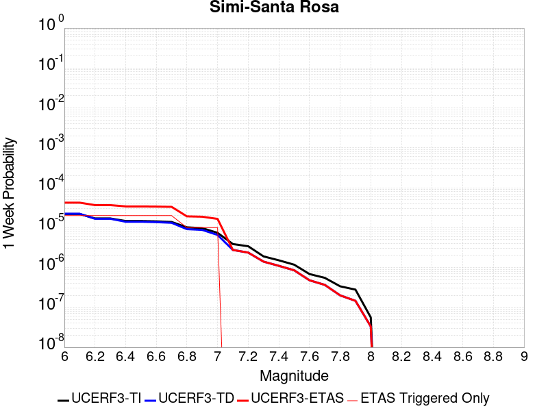 | 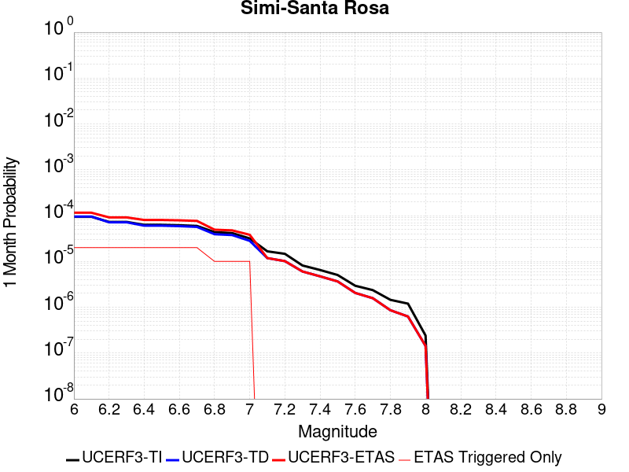 | 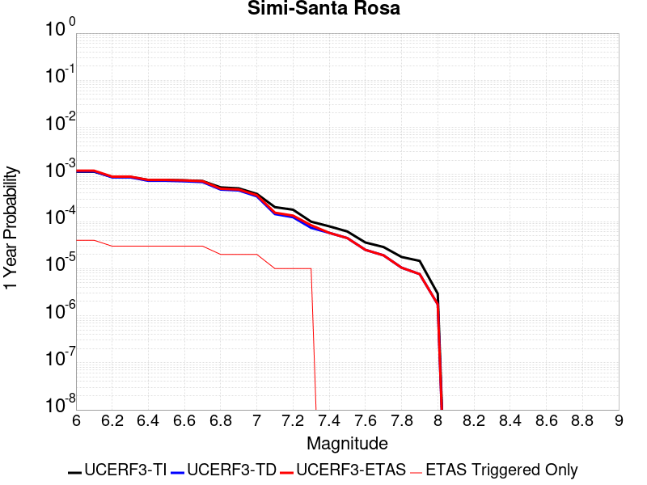 |  |

| Magnitude | 1 wk TI Prob | 1 wk TD Prob | 1 wk ETAS Prob | 1 wk ETAS/TD Gain | 1 wk ETAS Triggered Only | 1 mo TI Prob | 1 mo TD Prob | 1 mo ETAS Prob | 1 mo ETAS/TD Gain | 1 mo ETAS Triggered Only | 1 yr TI Prob | 1 yr TD Prob | 1 yr ETAS Prob | 1 yr ETAS/TD Gain | 1 yr ETAS Triggered Only | 10 yr TI Prob | 10 yr TD Prob | 10 yr ETAS Prob | 10 yr ETAS/TD Gain | 10 yr ETAS Triggered Only |
|-----|-----|-----|-----|-----|-----|-----|-----|-----|-----|-----|-----|-----|-----|-----|-----|-----|-----|-----|-----|-----|
| 6.0 | 2.198912E-5 | 2.2275442E-5 | 4.2274998E-5 | 1.8978298 | 2.0E-5 | 9.4235686E-5 | 9.5462936E-5 | 1.1546103E-4 | 1.2094854 | 2.0E-5 | 0.0011467156 | 0.0011616853 | 0.001201639 | 1.0343927 | 4.0E-5 | 0.011408163 | 0.011560575 | 0.011619882 | 1.00513 | 6.0E-5 |
| 6.1 | 2.198912E-5 | 2.2275442E-5 | 4.2274998E-5 | 1.8978298 | 2.0E-5 | 9.4235686E-5 | 9.5462936E-5 | 1.1546103E-4 | 1.2094854 | 2.0E-5 | 0.0011467156 | 0.0011616853 | 0.001201639 | 1.0343927 | 4.0E-5 | 0.011408163 | 0.011560575 | 0.011619882 | 1.00513 | 6.0E-5 |
| 6.2 | 1.69983E-5 | 1.6668559E-5 | 3.6668225E-5 | 2.1998436 | 2.0E-5 | 7.284782E-5 | 7.143489E-5 | 9.143346E-5 | 1.2799553 | 2.0E-5 | 8.865613E-4 | 8.6940196E-4 | 8.993759E-4 | 1.0344765 | 3.0E-5 | 0.008830327 | 0.008662928 | 0.008702581 | 1.0045774 | 4.0E-5 |
| 6.3 | 1.69983E-5 | 1.6668559E-5 | 3.6668225E-5 | 2.1998436 | 2.0E-5 | 7.284782E-5 | 7.143489E-5 | 9.143346E-5 | 1.2799553 | 2.0E-5 | 8.865613E-4 | 8.6940196E-4 | 8.993759E-4 | 1.0344765 | 3.0E-5 | 0.008830327 | 0.008662928 | 0.008702581 | 1.0045774 | 4.0E-5 |
| 6.4 | 1.4666188E-5 | 1.4052543E-5 | 3.405226E-5 | 2.42321 | 2.0E-5 | 6.285358E-5 | 6.0223934E-5 | 8.022273E-5 | 1.3320739 | 2.0E-5 | 7.6497364E-4 | 7.3300465E-4 | 7.6298264E-4 | 1.0408975 | 3.0E-5 | 0.0076234564 | 0.007308344 | 0.0073480518 | 1.0054332 | 4.0E-5 |
| 6.5 | 1.4666188E-5 | 1.4052543E-5 | 3.405226E-5 | 2.42321 | 2.0E-5 | 6.285358E-5 | 6.0223934E-5 | 8.022273E-5 | 1.3320739 | 2.0E-5 | 7.6497364E-4 | 7.3300465E-4 | 7.6298264E-4 | 1.0408975 | 3.0E-5 | 0.0076234564 | 0.007308344 | 0.0073480518 | 1.0054332 | 4.0E-5 |
| 6.6 | 1.4377586E-5 | 1.3729583E-5 | 3.372931E-5 | 2.4566886 | 2.0E-5 | 6.1616774E-5 | 5.883988E-5 | 7.8838704E-5 | 1.3398855 | 2.0E-5 | 7.4992597E-4 | 7.1616494E-4 | 7.4614346E-4 | 1.0418597 | 3.0E-5 | 0.007474003 | 0.0071410383 | 0.0071807527 | 1.0055615 | 4.0E-5 |
| 6.7 | 1.3881404E-5 | 1.320755E-5 | 3.3207285E-5 | 2.5142653 | 2.0E-5 | 5.9490372E-5 | 5.66027E-5 | 7.6601566E-5 | 1.35332 | 2.0E-5 | 7.240546E-4 | 6.8894465E-4 | 7.18924E-4 | 1.0435148 | 3.0E-5 | 0.007217 | 0.006870538 | 0.0069102636 | 1.005782 | 4.0E-5 |
| 6.8 | 1.0176516E-5 | 9.154151E-6 | 1.9154058E-5 | 2.0923908 | 1.0E-5 | 4.3612912E-5 | 3.9231574E-5 | 4.9231185E-5 | 1.2548867 | 1.0E-5 | 5.308578E-4 | 4.7755634E-4 | 4.975468E-4 | 1.0418599 | 2.0E-5 | 0.0052959146 | 0.004766934 | 0.0047967914 | 1.0062634 | 3.0E-5 |
| 6.9 | 9.699797E-6 | 8.774719E-6 | 1.8774632E-5 | 2.1396275 | 1.0E-5 | 4.15699E-5 | 3.7605492E-5 | 4.7605117E-5 | 1.2659086 | 1.0E-5 | 5.05996E-4 | 4.577671E-4 | 4.7775797E-4 | 1.0436703 | 2.0E-5 | 0.005048454 | 0.0045698597 | 0.0045997226 | 1.0065347 | 3.0E-5 |
| 7.0 | 7.4049476E-6 | 6.559333E-6 | 1.6559268E-5 | 2.5245352 | 1.0E-5 | 3.1735104E-5 | 2.8111197E-5 | 3.8110917E-5 | 1.3557202 | 1.0E-5 | 3.8630638E-4 | 3.422127E-4 | 3.6220587E-4 | 1.0584232 | 2.0E-5 | 0.0038563553 | 0.0034180996 | 0.0034380313 | 1.0058312 | 2.0E-5 |
| 7.1 | 3.873439E-6 | 2.7595095E-6 | 2.7595095E-6 | 1.0 | 0.0 | 1.6600346E-5 | 1.1826417E-5 | 1.1826417E-5 | 1.0 | 0.0 | 2.0209046E-4 | 1.4397735E-4 | 1.5397591E-4 | 1.0694454 | 1.0E-5 | 0.0020190678 | 0.0014388643 | 0.0014488499 | 1.0069399 | 1.0E-5 |
| 7.2 | 3.417706E-6 | 2.3676484E-6 | 2.3676484E-6 | 1.0 | 0.0 | 1.4647229E-5 | 1.0147027E-5 | 1.0147027E-5 | 1.0 | 0.0 | 1.7831543E-4 | 1.2353327E-4 | 1.3353204E-4 | 1.0809399 | 1.0E-5 | 0.0017817242 | 0.0012346683 | 0.0012446559 | 1.0080893 | 1.0E-5 |
| 7.3 | 1.90225E-6 | 1.4073753E-6 | 1.4073753E-6 | 1.0 | 0.0 | 8.152474E-6 | 6.0315947E-6 | 6.0315947E-6 | 1.0 | 0.0 | 9.9251854E-5 | 7.343221E-5 | 8.343148E-5 | 1.13617 | 1.0E-5 | 9.920754E-4 | 7.340817E-4 | 7.440744E-4 | 1.0136125 | 1.0E-5 |
| 7.4 | 1.5170556E-6 | 1.1024773E-6 | 1.1024773E-6 | 1.0 | 0.0 | 6.5016507E-6 | 4.724894E-6 | 4.724894E-6 | 1.0 | 0.0 | 7.915472E-5 | 5.7524077E-5 | 5.7524077E-5 | 1.0 | 0.0 | 7.9126534E-4 | 5.7509297E-4 | 5.7509297E-4 | 1.0 | 0.0 |
| 7.5 | 1.178732E-6 | 8.535102E-7 | 8.535102E-7 | 1.0 | 0.0 | 5.0516987E-6 | 3.6578958E-6 | 3.6578958E-6 | 1.0 | 0.0 | 6.1502695E-5 | 4.453398E-5 | 4.453398E-5 | 1.0 | 0.0 | 6.148568E-4 | 4.452515E-4 | 4.452515E-4 | 1.0 | 0.0 |
| 7.6 | 6.8722386E-7 | 4.793198E-7 | 4.793198E-7 | 1.0 | 0.0 | 2.9452417E-6 | 2.054226E-6 | 2.054226E-6 | 1.0 | 0.0 | 3.5857727E-5 | 2.5009915E-5 | 2.5009915E-5 | 1.0 | 0.0 | 3.5851944E-4 | 2.5007114E-4 | 2.5007114E-4 | 1.0 | 0.0 |
| 7.7 | 5.5126515E-7 | 3.6731157E-7 | 3.6731157E-7 | 1.0 | 0.0 | 2.3625628E-6 | 1.5741915E-6 | 1.5741915E-6 | 1.0 | 0.0 | 2.8763823E-5 | 1.9165615E-5 | 1.9165615E-5 | 1.0 | 0.0 | 2.87601E-4 | 1.9163972E-4 | 1.9163972E-4 | 1.0 | 0.0 |
| 7.8 | 3.3860243E-7 | 2.0075942E-7 | 2.0075942E-7 | 1.0 | 0.0 | 1.4511525E-6 | 8.6039717E-7 | 8.6039717E-7 | 1.0 | 0.0 | 1.7667637E-5 | 1.0475286E-5 | 1.0475286E-5 | 1.0 | 0.0 | 1.7666233E-4 | 1.04747975E-4 | 1.04747975E-4 | 1.0 | 0.0 |
| 7.9 | 2.7955386E-7 | 1.4649108E-7 | 1.4649108E-7 | 1.0 | 0.0 | 1.1980875E-6 | 6.278188E-7 | 6.278188E-7 | 1.0 | 0.0 | 1.4586617E-5 | 7.643667E-6 | 7.643667E-6 | 1.0 | 0.0 | 1.458566E-4 | 7.643409E-5 | 7.643409E-5 | 1.0 | 0.0 |
| 8.0 | 5.6259015E-8 | 3.3355324E-8 | 3.3355324E-8 | 1.0 | 0.0 | 2.4111003E-7 | 1.4295138E-7 | 1.4295138E-7 | 1.0 | 0.0 | 2.9355108E-6 | 1.7404317E-6 | 1.7404317E-6 | 1.0 | 0.0 | 2.935472E-5 | 1.7404194E-5 | 1.7404194E-5 | 1.0 | 0.0 |

## Cucamonga
*[(top)](#table-of-contents)*

| 1 Week | 1 Month | 1 Year | 10 Year |
|-----|-----|-----|-----|
| 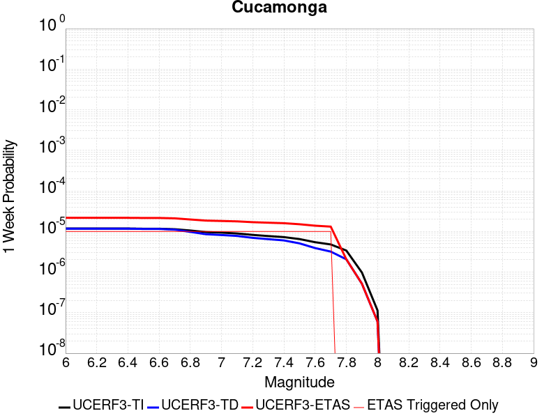 | 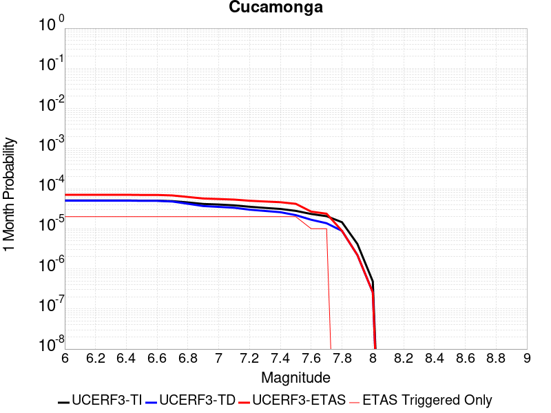 | 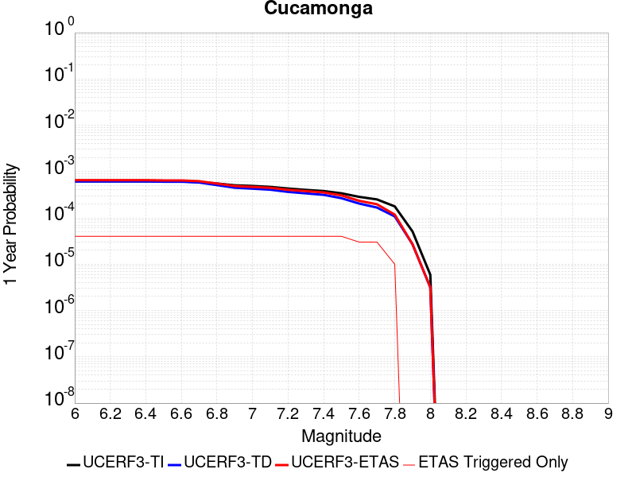 | 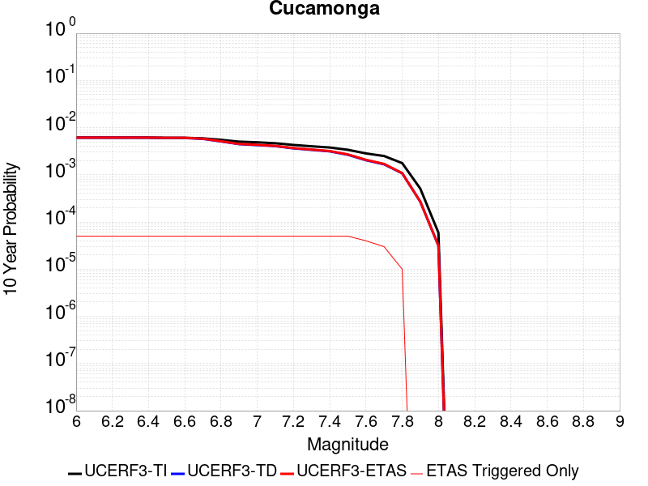 |

| Magnitude | 1 wk TI Prob | 1 wk TD Prob | 1 wk ETAS Prob | 1 wk ETAS/TD Gain | 1 wk ETAS Triggered Only | 1 mo TI Prob | 1 mo TD Prob | 1 mo ETAS Prob | 1 mo ETAS/TD Gain | 1 mo ETAS Triggered Only | 1 yr TI Prob | 1 yr TD Prob | 1 yr ETAS Prob | 1 yr ETAS/TD Gain | 1 yr ETAS Triggered Only | 10 yr TI Prob | 10 yr TD Prob | 10 yr ETAS Prob | 10 yr ETAS/TD Gain | 10 yr ETAS Triggered Only |
|-----|-----|-----|-----|-----|-----|-----|-----|-----|-----|-----|-----|-----|-----|-----|-----|-----|-----|-----|-----|-----|
| 6.0 | 1.1848348E-5 | 1.1737008E-5 | 2.173689E-5 | 1.8519958 | 1.0E-5 | 5.0777642E-5 | 5.030051E-5 | 7.02995E-5 | 1.3975903 | 2.0E-5 | 6.180424E-4 | 6.1223935E-4 | 6.5221486E-4 | 1.0652939 | 4.0E-5 | 0.0061632637 | 0.0061067017 | 0.0061563966 | 1.0081377 | 5.0E-5 |
| 6.1 | 1.1848348E-5 | 1.1737008E-5 | 2.173689E-5 | 1.8519958 | 1.0E-5 | 5.0777642E-5 | 5.030051E-5 | 7.02995E-5 | 1.3975903 | 2.0E-5 | 6.180424E-4 | 6.1223935E-4 | 6.5221486E-4 | 1.0652939 | 4.0E-5 | 0.0061632637 | 0.0061067017 | 0.0061563966 | 1.0081377 | 5.0E-5 |
| 6.2 | 1.1848348E-5 | 1.1737008E-5 | 2.173689E-5 | 1.8519958 | 1.0E-5 | 5.0777642E-5 | 5.030051E-5 | 7.02995E-5 | 1.3975903 | 2.0E-5 | 6.180424E-4 | 6.1223935E-4 | 6.5221486E-4 | 1.0652939 | 4.0E-5 | 0.0061632637 | 0.0061067017 | 0.0061563966 | 1.0081377 | 5.0E-5 |
| 6.3 | 1.1848348E-5 | 1.1737008E-5 | 2.173689E-5 | 1.8519958 | 1.0E-5 | 5.0777642E-5 | 5.030051E-5 | 7.02995E-5 | 1.3975903 | 2.0E-5 | 6.180424E-4 | 6.1223935E-4 | 6.5221486E-4 | 1.0652939 | 4.0E-5 | 0.0061632637 | 0.0061067017 | 0.0061563966 | 1.0081377 | 5.0E-5 |
| 6.4 | 1.1848348E-5 | 1.1737008E-5 | 2.173689E-5 | 1.8519958 | 1.0E-5 | 5.0777642E-5 | 5.030051E-5 | 7.02995E-5 | 1.3975903 | 2.0E-5 | 6.180424E-4 | 6.1223935E-4 | 6.5221486E-4 | 1.0652939 | 4.0E-5 | 0.0061632637 | 0.0061067017 | 0.0061563966 | 1.0081377 | 5.0E-5 |
| 6.5 | 1.16988695E-5 | 1.15760395E-5 | 2.1575923E-5 | 1.8638433 | 1.0E-5 | 5.013705E-5 | 4.9610666E-5 | 6.9609676E-5 | 1.4031191 | 2.0E-5 | 6.102476E-4 | 6.0384517E-4 | 6.43821E-4 | 1.0662022 | 4.0E-5 | 0.006085745 | 0.006023216 | 0.006072915 | 1.0082512 | 5.0E-5 |
| 6.6 | 1.16988695E-5 | 1.15760395E-5 | 2.1575923E-5 | 1.8638433 | 1.0E-5 | 5.013705E-5 | 4.9610666E-5 | 6.9609676E-5 | 1.4031191 | 2.0E-5 | 6.102476E-4 | 6.0384517E-4 | 6.43821E-4 | 1.0662022 | 4.0E-5 | 0.006085745 | 0.006023216 | 0.006072915 | 1.0082512 | 5.0E-5 |
| 6.7 | 1.1397107E-5 | 1.11149475E-5 | 2.1114836E-5 | 1.8996793 | 1.0E-5 | 4.884383E-5 | 4.7634636E-5 | 6.763368E-5 | 1.4198426 | 2.0E-5 | 5.9451134E-4 | 5.797998E-4 | 6.1977666E-4 | 1.0689493 | 4.0E-5 | 0.005929234 | 0.0057840226 | 0.005833734 | 1.0085945 | 5.0E-5 |
| 6.8 | 1.058387E-5 | 9.784992E-6 | 1.9784893E-5 | 2.0219634 | 1.0E-5 | 4.5358654E-5 | 4.193501E-5 | 6.193417E-5 | 1.4769084 | 2.0E-5 | 5.521017E-4 | 5.1044027E-4 | 5.5041985E-4 | 1.0783237 | 4.0E-5 | 0.00550732 | 0.0050936877 | 0.005143433 | 1.0097661 | 5.0E-5 |
| 6.9 | 9.690046E-6 | 8.57948E-6 | 1.8579394E-5 | 2.1655617 | 1.0E-5 | 4.1528107E-5 | 3.6768684E-5 | 5.676795E-5 | 1.5439211 | 2.0E-5 | 5.054874E-4 | 4.475672E-4 | 4.875493E-4 | 1.0893321 | 4.0E-5 | 0.005043391 | 0.004467594 | 0.004517371 | 1.0111417 | 5.0E-5 |
| 7.0 | 9.381461E-6 | 8.187101E-6 | 1.818702E-5 | 2.2214236 | 1.0E-5 | 4.020564E-5 | 3.5087105E-5 | 5.5086406E-5 | 1.5699899 | 2.0E-5 | 4.893937E-4 | 4.2710215E-4 | 4.6708508E-4 | 1.0936145 | 4.0E-5 | 0.0048831734 | 0.0042637475 | 0.004313534 | 1.0116768 | 5.0E-5 |
| 7.1 | 8.946492E-6 | 7.781886E-6 | 1.7781807E-5 | 2.2850256 | 1.0E-5 | 3.8341543E-5 | 3.3350516E-5 | 5.334985E-5 | 1.5996709 | 2.0E-5 | 4.667083E-4 | 4.0596718E-4 | 4.4595095E-4 | 1.0984901 | 4.0E-5 | 0.0046572937 | 0.004053192 | 0.0041029896 | 1.012286 | 5.0E-5 |
| 7.2 | 8.251016E-6 | 6.9752796E-6 | 1.697521E-5 | 2.4336243 | 1.0E-5 | 3.5361016E-5 | 2.9893714E-5 | 4.9893115E-5 | 1.669017 | 2.0E-5 | 4.3043532E-4 | 3.6389544E-4 | 4.0388087E-4 | 1.1098816 | 4.0E-5 | 0.0042960253 | 0.0036339292 | 0.0036837475 | 1.0137092 | 5.0E-5 |
| 7.3 | 7.717881E-6 | 6.4863502E-6 | 1.6486285E-5 | 2.541689 | 1.0E-5 | 3.3076216E-5 | 2.7798349E-5 | 4.7797792E-5 | 1.7194471 | 2.0E-5 | 4.026285E-4 | 3.3839257E-4 | 3.7837905E-4 | 1.1181659 | 4.0E-5 | 0.004018998 | 0.00337971 | 0.0034295411 | 1.0147442 | 5.0E-5 |
| 7.4 | 7.275623E-6 | 6.031997E-6 | 1.6031938E-5 | 2.6578157 | 1.0E-5 | 3.118087E-5 | 2.585116E-5 | 4.5850644E-5 | 1.7736397 | 2.0E-5 | 3.7956095E-4 | 3.1469265E-4 | 3.5468006E-4 | 1.1270682 | 4.0E-5 | 0.0037891332 | 0.0031434062 | 0.003193249 | 1.0158563 | 5.0E-5 |
| 7.5 | 6.5109502E-6 | 5.1006014E-6 | 1.5100551E-5 | 2.9605432 | 1.0E-5 | 2.7903774E-5 | 2.1859538E-5 | 4.18591E-5 | 1.9149125 | 2.0E-5 | 3.3967546E-4 | 2.661075E-4 | 3.0609686E-4 | 1.1502752 | 4.0E-5 | 0.0033915674 | 0.002658813 | 0.00270868 | 1.0187554 | 5.0E-5 |
| 7.6 | 5.4495326E-6 | 3.90857E-6 | 1.3908531E-5 | 3.5584705 | 1.0E-5 | 2.335493E-5 | 1.6750908E-5 | 2.675074E-5 | 1.5969726 | 1.0E-5 | 2.8430918E-4 | 2.0392328E-4 | 2.3391716E-4 | 1.1470841 | 3.0E-5 | 0.0028394572 | 0.002038282 | 0.0020782007 | 1.0195844 | 4.0E-5 |
| 7.7 | 4.7997164E-6 | 3.2002547E-6 | 1.3200222E-5 | 4.1247416 | 1.0E-5 | 2.057005E-5 | 1.3715306E-5 | 2.3715167E-5 | 1.7291025 | 1.0E-5 | 2.504116E-4 | 1.6697108E-4 | 1.9696607E-4 | 1.1796418 | 3.0E-5 | 0.002501296 | 0.0016693877 | 0.0016993375 | 1.0179406 | 3.0E-5 |
| 7.8 | 3.3941733E-6 | 2.0641899E-6 | 2.0641899E-6 | 1.0 | 0.0 | 1.4546376E-5 | 8.846498E-6 | 8.846498E-6 | 1.0 | 0.0 | 1.7708774E-4 | 1.07700806E-4 | 1.17699725E-4 | 1.0928398 | 1.0E-5 | 0.0017694668 | 0.001076723 | 0.0010867122 | 1.0092775 | 1.0E-5 |
| 7.9 | 9.750552E-7 | 5.155946E-7 | 5.155946E-7 | 1.0 | 0.0 | 4.178801E-6 | 2.2096892E-6 | 2.2096892E-6 | 1.0 | 0.0 | 5.0875715E-5 | 2.690264E-5 | 2.690264E-5 | 1.0 | 0.0 | 5.086407E-4 | 2.6899425E-4 | 2.6899425E-4 | 1.0 | 0.0 |
| 8.0 | 1.133857E-7 | 6.053707E-8 | 6.053707E-8 | 1.0 | 0.0 | 4.8593864E-7 | 2.5944456E-7 | 2.5944456E-7 | 1.0 | 0.0 | 5.9162867E-6 | 3.158733E-6 | 3.158733E-6 | 1.0 | 0.0 | 5.916129E-5 | 3.1586897E-5 | 3.1586897E-5 | 1.0 | 0.0 |

## Coronado Bank alt1
*[(top)](#table-of-contents)*

| 1 Week | 1 Month | 1 Year | 10 Year |
|-----|-----|-----|-----|
| 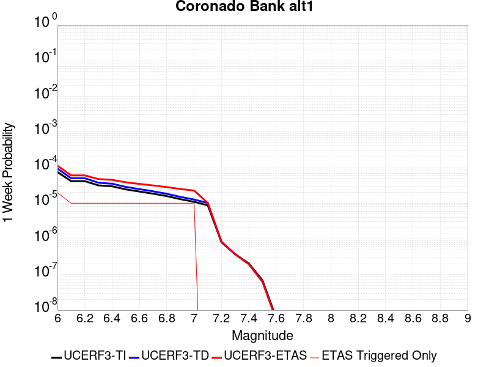 | 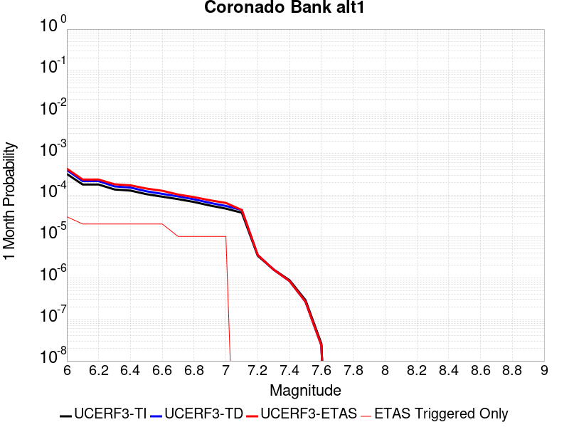 |  | 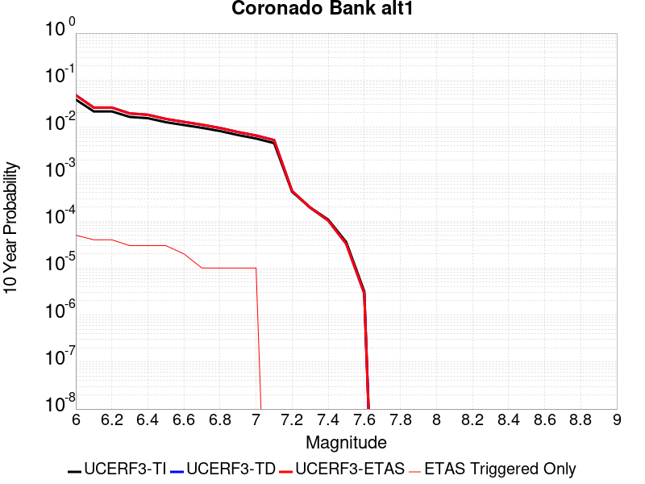 |

| Magnitude | 1 wk TI Prob | 1 wk TD Prob | 1 wk ETAS Prob | 1 wk ETAS/TD Gain | 1 wk ETAS Triggered Only | 1 mo TI Prob | 1 mo TD Prob | 1 mo ETAS Prob | 1 mo ETAS/TD Gain | 1 mo ETAS Triggered Only | 1 yr TI Prob | 1 yr TD Prob | 1 yr ETAS Prob | 1 yr ETAS/TD Gain | 1 yr ETAS Triggered Only | 10 yr TI Prob | 10 yr TD Prob | 10 yr ETAS Prob | 10 yr ETAS/TD Gain | 10 yr ETAS Triggered Only |
|-----|-----|-----|-----|-----|-----|-----|-----|-----|-----|-----|-----|-----|-----|-----|-----|-----|-----|-----|-----|-----|
| 6.0 | 7.533492E-5 | 9.394913E-5 | 1.1394725E-4 | 1.2128612 | 2.0E-5 | 3.22824E-4 | 4.0258127E-4 | 4.3256918E-4 | 1.0744891 | 3.0E-5 | 0.0039233007 | 0.0048909658 | 0.004940721 | 1.010173 | 5.0E-5 | 0.03854755 | 0.04790356 | 0.047951166 | 1.0009937 | 5.0E-5 |
| 6.1 | 4.1807285E-5 | 5.049283E-5 | 6.0492326E-5 | 1.1980379 | 1.0E-5 | 1.7916178E-4 | 2.1638049E-4 | 2.3637616E-4 | 1.0924097 | 2.0E-5 | 0.0021791123 | 0.0026313474 | 0.0026712422 | 1.0151614 | 4.0E-5 | 0.021578677 | 0.026011046 | 0.026050007 | 1.0014979 | 4.0E-5 |
| 6.2 | 4.1807285E-5 | 5.049283E-5 | 6.0492326E-5 | 1.1980379 | 1.0E-5 | 1.7916178E-4 | 2.1638049E-4 | 2.3637616E-4 | 1.0924097 | 2.0E-5 | 0.0021791123 | 0.0026313474 | 0.0026712422 | 1.0151614 | 4.0E-5 | 0.021578677 | 0.026011046 | 0.026050007 | 1.0014979 | 4.0E-5 |
| 6.3 | 3.1793104E-5 | 3.7711117E-5 | 4.771074E-5 | 1.2651638 | 1.0E-5 | 1.3624904E-4 | 1.6160926E-4 | 1.8160604E-4 | 1.1237353 | 2.0E-5 | 0.0016575698 | 0.001965848 | 0.0019957891 | 1.0152305 | 3.0E-5 | 0.016452603 | 0.019488465 | 0.01951788 | 1.0015094 | 3.0E-5 |
| 6.4 | 2.9878007E-5 | 3.5335794E-5 | 4.533544E-5 | 1.2829891 | 1.0E-5 | 1.2804232E-4 | 1.5143053E-4 | 1.714275E-4 | 1.1320537 | 2.0E-5 | 0.0015578003 | 0.0018421387 | 0.0018720834 | 1.0162554 | 3.0E-5 | 0.015469253 | 0.01827244 | 0.018301893 | 1.0016118 | 3.0E-5 |
| 6.5 | 2.4512565E-5 | 2.8764043E-5 | 3.8763756E-5 | 1.3476462 | 1.0E-5 | 1.0504962E-4 | 1.2326881E-4 | 1.4326634E-4 | 1.162227 | 2.0E-5 | 0.0012782287 | 0.0014997921 | 0.0015297472 | 1.0199728 | 3.0E-5 | 0.012709012 | 0.014899683 | 0.014929236 | 1.0019835 | 3.0E-5 |
| 6.6 | 2.1317413E-5 | 2.490667E-5 | 3.490642E-5 | 1.4014889 | 1.0E-5 | 9.135714E-5 | 1.0673863E-4 | 1.267365E-4 | 1.1873536 | 2.0E-5 | 0.0011117056 | 0.0012987906 | 0.0013187645 | 1.015379 | 2.0E-5 | 0.011061605 | 0.012914404 | 0.012934146 | 1.0015286 | 2.0E-5 |
| 6.7 | 1.8585655E-5 | 2.163488E-5 | 3.1634663E-5 | 1.4622066 | 1.0E-5 | 7.9650374E-5 | 9.271773E-5 | 1.02716804E-4 | 1.1078442 | 1.0E-5 | 9.6931186E-4 | 0.0011282742 | 0.001138263 | 1.0088531 | 1.0E-5 | 0.0096509475 | 0.011227623 | 0.01123751 | 1.0008807 | 1.0E-5 |
| 6.8 | 1.5862879E-5 | 1.8419474E-5 | 2.841929E-5 | 1.5428936 | 1.0E-5 | 6.798199E-5 | 7.893833E-5 | 8.893754E-5 | 1.1266712 | 1.0E-5 | 8.273665E-4 | 9.6066965E-4 | 9.7066E-4 | 1.0103995 | 1.0E-5 | 0.008242928 | 0.00956715 | 0.0095770545 | 1.0010352 | 1.0E-5 |
| 6.9 | 1.3021509E-5 | 1.5095265E-5 | 2.5095114E-5 | 1.6624494 | 1.0E-5 | 5.5805274E-5 | 6.469249E-5 | 7.4691845E-5 | 1.1545675 | 1.0E-5 | 6.792174E-4 | 7.8736455E-4 | 7.9735665E-4 | 1.0126905 | 1.0E-5 | 0.006771452 | 0.007847573 | 0.007857494 | 1.0012643 | 1.0E-5 |
| 7.0 | 1.0974371E-5 | 1.2720104E-5 | 2.2719976E-5 | 1.7861471 | 1.0E-5 | 4.7032172E-5 | 5.451369E-5 | 6.4513144E-5 | 1.1834302 | 1.0E-5 | 5.7246623E-4 | 6.6351966E-4 | 6.73513E-4 | 1.0150611 | 1.0E-5 | 0.0057099373 | 0.006617135 | 0.0066270684 | 1.0015012 | 1.0E-5 |
| 7.1 | 8.766221E-6 | 1.01638325E-5 | 1.01638325E-5 | 1.0 | 0.0 | 3.7568978E-5 | 4.355865E-5 | 4.355865E-5 | 1.0 | 0.0 | 4.573063E-4 | 5.3021475E-4 | 5.3021475E-4 | 1.0 | 0.0 | 0.0045636636 | 0.0052911965 | 0.0052911965 | 1.0 | 0.0 |
| 7.2 | 8.026024E-7 | 8.331765E-7 | 8.331765E-7 | 1.0 | 0.0 | 3.43972E-6 | 3.5707515E-6 | 3.5707515E-6 | 1.0 | 0.0 | 4.1877785E-5 | 4.3473043E-5 | 4.3473043E-5 | 1.0 | 0.0 | 4.1869894E-4 | 4.3464647E-4 | 4.3464647E-4 | 1.0 | 0.0 |
| 7.3 | 3.7293114E-7 | 3.7000953E-7 | 3.7000953E-7 | 1.0 | 0.0 | 1.5982754E-6 | 1.5857541E-6 | 1.5857541E-6 | 1.0 | 0.0 | 1.9458828E-5 | 1.9306386E-5 | 1.9306386E-5 | 1.0 | 0.0 | 1.9457124E-4 | 1.9304715E-4 | 1.9304715E-4 | 1.0 | 0.0 |
| 7.4 | 2.0557036E-7 | 1.9674363E-7 | 1.9674363E-7 | 1.0 | 0.0 | 8.810155E-7 | 8.431867E-7 | 8.431867E-7 | 1.0 | 0.0 | 1.0726311E-5 | 1.026575E-5 | 1.026575E-5 | 1.0 | 0.0 | 1.0725793E-4 | 1.0265279E-4 | 1.0265279E-4 | 1.0 | 0.0 |
| 7.5 | 6.845446E-8 | 6.279369E-8 | 6.279369E-8 | 1.0 | 0.0 | 2.9337625E-7 | 2.691158E-7 | 2.691158E-7 | 1.0 | 0.0 | 3.5718497E-6 | 3.2764797E-6 | 3.2764797E-6 | 1.0 | 0.0 | 3.5717923E-5 | 3.2764325E-5 | 3.2764325E-5 | 1.0 | 0.0 |
| 7.6 | 6.0975145E-9 | 5.53185E-9 | 5.53185E-9 | 1.0 | 0.0 | 2.6132206E-8 | 2.370793E-8 | 2.370793E-8 | 1.0 | 0.0 | 3.1815955E-7 | 2.88644E-7 | 2.88644E-7 | 1.0 | 0.0 | 3.181591E-6 | 2.8864374E-6 | 2.8864374E-6 | 1.0 | 0.0 |

## Calaveras (Central) 2011 CFM
*[(top)](#table-of-contents)*

| 1 Week | 1 Month | 1 Year | 10 Year |
|-----|-----|-----|-----|
| 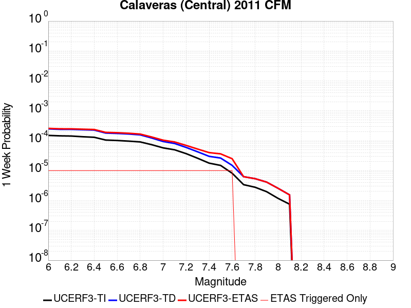 | 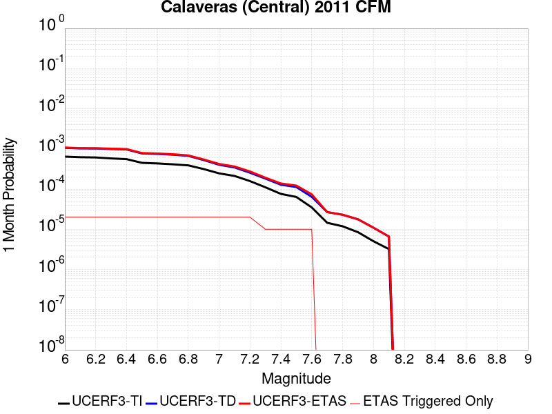 |  |  |

| Magnitude | 1 wk TI Prob | 1 wk TD Prob | 1 wk ETAS Prob | 1 wk ETAS/TD Gain | 1 wk ETAS Triggered Only | 1 mo TI Prob | 1 mo TD Prob | 1 mo ETAS Prob | 1 mo ETAS/TD Gain | 1 mo ETAS Triggered Only | 1 yr TI Prob | 1 yr TD Prob | 1 yr ETAS Prob | 1 yr ETAS/TD Gain | 1 yr ETAS Triggered Only | 10 yr TI Prob | 10 yr TD Prob | 10 yr ETAS Prob | 10 yr ETAS/TD Gain | 10 yr ETAS Triggered Only |
|-----|-----|-----|-----|-----|-----|-----|-----|-----|-----|-----|-----|-----|-----|-----|-----|-----|-----|-----|-----|-----|
| 6.0 | 1.5010907E-4 | 2.481574E-4 | 2.581549E-4 | 1.040287 | 1.0E-5 | 6.4316596E-4 | 0.0010621005 | 0.0010820793 | 1.0188106 | 2.0E-5 | 0.0078024664 | 0.012850073 | 0.012879688 | 1.0023047 | 3.0E-5 | 0.07534136 | 0.120401435 | 0.120436616 | 1.0002922 | 4.0E-5 |
| 6.1 | 1.4521465E-4 | 2.397987E-4 | 2.4979629E-4 | 1.0416917 | 1.0E-5 | 6.222001E-4 | 0.0010263061 | 0.0010462855 | 1.0194674 | 2.0E-5 | 0.0075490056 | 0.012419341 | 0.012448968 | 1.0023856 | 3.0E-5 | 0.07297657 | 0.11667323 | 0.11670856 | 1.0003028 | 4.0E-5 |
| 6.2 | 1.429998E-4 | 2.3911126E-4 | 2.4910888E-4 | 1.0418116 | 1.0E-5 | 6.127123E-4 | 0.0010233623 | 0.0010433418 | 1.0195234 | 2.0E-5 | 0.007434286 | 0.01238394 | 0.012413569 | 1.0023925 | 3.0E-5 | 0.07190444 | 0.1163272 | 0.11636254 | 1.0003039 | 4.0E-5 |
| 6.3 | 1.3536277E-4 | 2.3242626E-4 | 2.4242394E-4 | 1.0430144 | 1.0E-5 | 5.799972E-4 | 9.947343E-4 | 0.0010147145 | 1.0200858 | 2.0E-5 | 0.0070386264 | 0.012040132 | 0.012069771 | 1.0024617 | 3.0E-5 | 0.0681982 | 0.11323977 | 0.113275245 | 1.0003133 | 4.0E-5 |
| 6.4 | 1.2993296E-4 | 2.2666177E-4 | 2.366595E-4 | 1.0441086 | 1.0E-5 | 5.5673666E-4 | 9.700479E-4 | 9.900285E-4 | 1.0205976 | 2.0E-5 | 0.006757223 | 0.011742937 | 0.011772585 | 1.0025247 | 3.0E-5 | 0.06555412 | 0.11051771 | 0.110553294 | 1.000322 | 4.0E-5 |
| 6.5 | 1.0498927E-4 | 1.7981697E-4 | 1.8981517E-4 | 1.0556021 | 1.0E-5 | 4.498764E-4 | 7.704157E-4 | 7.904003E-4 | 1.0259401 | 2.0E-5 | 0.005463498 | 0.00933924 | 0.009368961 | 1.0031823 | 3.0E-5 | 0.053311124 | 0.089199215 | 0.08923565 | 1.0004084 | 4.0E-5 |
| 6.6 | 1.0157505E-4 | 1.7469203E-4 | 1.8469029E-4 | 1.0572336 | 1.0E-5 | 4.35249E-4 | 7.484645E-4 | 7.684495E-4 | 1.0267013 | 2.0E-5 | 0.0052862884 | 0.009074297 | 0.009104025 | 1.003276 | 3.0E-5 | 0.05162293 | 0.08677671 | 0.08681324 | 1.0004209 | 4.0E-5 |
| 6.7 | 9.660386E-5 | 1.6728524E-4 | 1.7728357E-4 | 1.0597681 | 1.0E-5 | 4.1395082E-4 | 7.1673887E-4 | 7.367245E-4 | 1.0278841 | 2.0E-5 | 0.0050282106 | 0.008691208 | 0.008720947 | 1.0034218 | 3.0E-5 | 0.049159497 | 0.083266065 | 0.08330273 | 1.0004404 | 4.0E-5 |
| 6.8 | 9.089927E-5 | 1.5643016E-4 | 1.664286E-4 | 1.0639163 | 1.0E-5 | 3.8951015E-4 | 6.702439E-4 | 6.902305E-4 | 1.0298198 | 2.0E-5 | 0.0047319788 | 0.008129478 | 0.008159235 | 1.0036603 | 3.0E-5 | 0.046324775 | 0.078159414 | 0.07819629 | 1.0004718 | 4.0E-5 |
| 6.9 | 7.353187E-5 | 1.2295354E-4 | 1.3295231E-4 | 1.0813215 | 1.0E-5 | 3.150985E-4 | 5.2683795E-4 | 5.468274E-4 | 1.0379423 | 2.0E-5 | 0.0038295772 | 0.006395508 | 0.006425316 | 1.0046608 | 3.0E-5 | 0.037642512 | 0.062187865 | 0.062225375 | 1.0006032 | 4.0E-5 |
| 7.0 | 5.746064E-5 | 9.3887444E-5 | 1.0388651E-4 | 1.1065005 | 1.0E-5 | 2.4623662E-4 | 4.0231308E-4 | 4.2230505E-4 | 1.0496925 | 2.0E-5 | 0.0029938098 | 0.004887232 | 0.0049170856 | 1.0061084 | 3.0E-5 | 0.02953797 | 0.04798685 | 0.048015412 | 1.0005952 | 3.0E-5 |
| 7.1 | 4.9557195E-5 | 8.052461E-5 | 9.0523805E-5 | 1.1241757 | 1.0E-5 | 2.123707E-4 | 3.4506017E-4 | 3.6505327E-4 | 1.057941 | 2.0E-5 | 0.0025825473 | 0.0041930773 | 0.004222952 | 1.0071247 | 3.0E-5 | 0.0255274 | 0.041373078 | 0.041401837 | 1.0006951 | 3.0E-5 |
| 7.2 | 3.687595E-5 | 5.9524526E-5 | 6.952393E-5 | 1.167988 | 1.0E-5 | 1.5803022E-4 | 2.5508032E-4 | 2.7507523E-4 | 1.0783867 | 2.0E-5 | 0.0019223199 | 0.0031012094 | 0.0031311163 | 1.0096437 | 3.0E-5 | 0.01905776 | 0.030883716 | 0.03091279 | 1.0009414 | 3.0E-5 |
| 7.3 | 2.5846984E-5 | 4.247213E-5 | 5.2471707E-5 | 1.2354385 | 1.0E-5 | 1.1076809E-4 | 1.8201082E-4 | 1.92009E-4 | 1.0549318 | 1.0E-5 | 0.0013477671 | 0.002213747 | 0.002223725 | 1.0045072 | 1.0E-5 | 0.013396223 | 0.02217554 | 0.022185316 | 1.000441 | 1.0E-5 |
| 7.4 | 1.7747854E-5 | 2.9936204E-5 | 3.9935905E-5 | 1.3340337 | 1.0E-5 | 7.6060016E-5 | 1.2829172E-4 | 1.3829044E-4 | 1.0779374 | 1.0E-5 | 9.2563726E-4 | 0.0015608355 | 0.0015708199 | 1.0063968 | 1.0E-5 | 0.009217911 | 0.015709236 | 0.015719078 | 1.0006266 | 1.0E-5 |
| 7.5 | 1.4883479E-5 | 2.6243379E-5 | 3.6243116E-5 | 1.3810385 | 1.0E-5 | 6.378478E-5 | 1.1246678E-4 | 1.2246566E-4 | 1.0889051 | 1.0E-5 | 7.76303E-4 | 0.0013684258 | 0.0013784121 | 1.0072976 | 1.0E-5 | 0.0077359667 | 0.013802425 | 0.013812287 | 1.0007145 | 1.0E-5 |
| 7.6 | 8.166975E-6 | 1.4963478E-5 | 2.4963329E-5 | 1.6682838 | 1.0E-5 | 3.5000852E-5 | 6.412763E-5 | 7.412698E-5 | 1.1559291 | 1.0E-5 | 4.2605202E-4 | 7.804755E-4 | 7.9046766E-4 | 1.0128027 | 1.0E-5 | 0.004252361 | 0.00793984 | 0.00794976 | 1.0012494 | 1.0E-5 |
| 7.7 | 3.3858064E-6 | 6.253914E-6 | 6.253914E-6 | 1.0 | 0.0 | 1.4510518E-5 | 2.6802214E-5 | 2.6802214E-5 | 1.0 | 0.0 | 1.7665124E-4 | 3.2626814E-4 | 3.2626814E-4 | 1.0 | 0.0 | 0.0017651088 | 0.0033882293 | 0.0033882293 | 1.0 | 0.0 |
| 7.8 | 2.7721615E-6 | 5.3663807E-6 | 5.3663807E-6 | 1.0 | 0.0 | 1.1880637E-5 | 2.2998573E-5 | 2.2998573E-5 | 1.0 | 0.0 | 1.4463716E-4 | 2.799717E-4 | 2.799717E-4 | 1.0 | 0.0 | 0.0014454306 | 0.0029074624 | 0.0029074624 | 1.0 | 0.0 |
| 7.9 | 1.9736292E-6 | 4.1284193E-6 | 4.1284193E-6 | 1.0 | 0.0 | 8.4583835E-6 | 1.7693106E-5 | 1.7693106E-5 | 1.0 | 0.0 | 1.0297595E-4 | 2.1539231E-4 | 2.1539231E-4 | 1.0 | 0.0 | 0.0010292825 | 0.0022236116 | 0.0022236116 | 1.0 | 0.0 |
| 8.0 | 1.1767289E-6 | 2.5544743E-6 | 2.5544743E-6 | 1.0 | 0.0 | 5.0431145E-6 | 1.0947701E-5 | 1.0947701E-5 | 1.0 | 0.0 | 6.139818E-5 | 1.3328013E-4 | 1.3328013E-4 | 1.0 | 0.0 | 6.1381224E-4 | 0.0013660848 | 0.0013660848 | 1.0 | 0.0 |
| 8.1 | 7.5112825E-7 | 1.5409794E-6 | 1.5409794E-6 | 1.0 | 0.0 | 3.2191172E-6 | 6.6041807E-6 | 6.6041807E-6 | 1.0 | 0.0 | 3.9192048E-5 | 8.0402955E-5 | 8.0402955E-5 | 1.0 | 0.0 | 3.9185135E-4 | 8.235564E-4 | 8.235564E-4 | 1.0 | 0.0 |

## San Gabriel
*[(top)](#table-of-contents)*

| 1 Week | 1 Month | 1 Year | 10 Year |
|-----|-----|-----|-----|
| 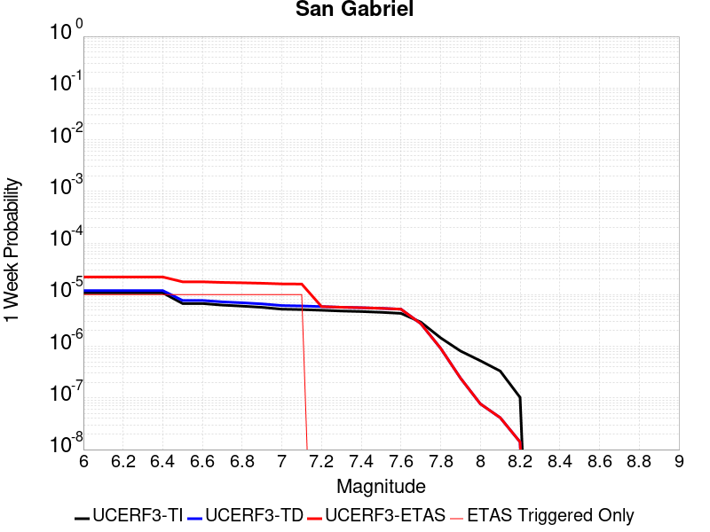 | 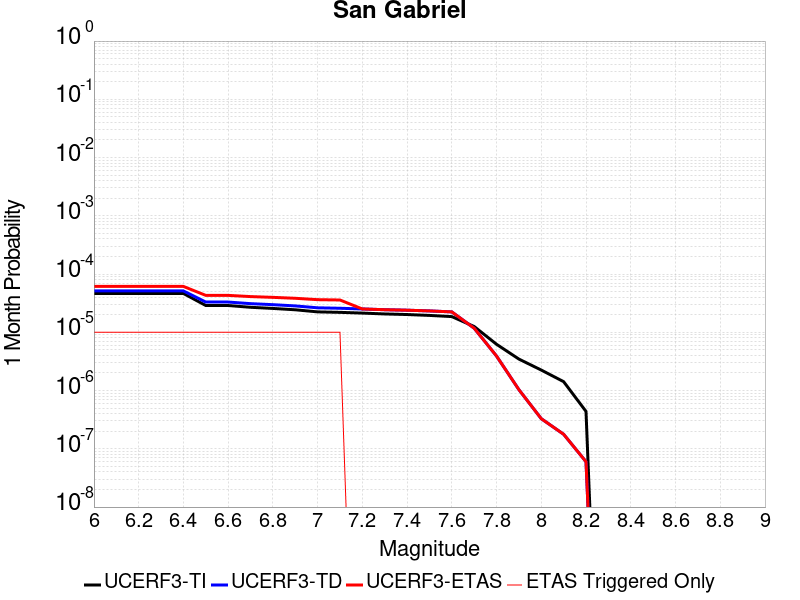 | 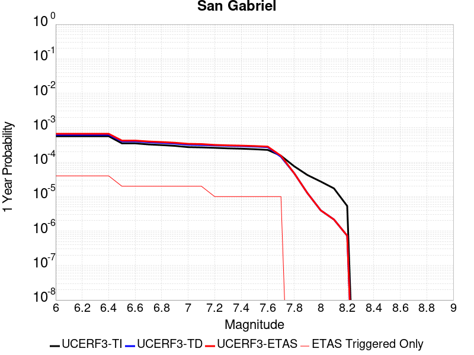 |  |

| Magnitude | 1 wk TI Prob | 1 wk TD Prob | 1 wk ETAS Prob | 1 wk ETAS/TD Gain | 1 wk ETAS Triggered Only | 1 mo TI Prob | 1 mo TD Prob | 1 mo ETAS Prob | 1 mo ETAS/TD Gain | 1 mo ETAS Triggered Only | 1 yr TI Prob | 1 yr TD Prob | 1 yr ETAS Prob | 1 yr ETAS/TD Gain | 1 yr ETAS Triggered Only | 10 yr TI Prob | 10 yr TD Prob | 10 yr ETAS Prob | 10 yr ETAS/TD Gain | 10 yr ETAS Triggered Only |
|-----|-----|-----|-----|-----|-----|-----|-----|-----|-----|-----|-----|-----|-----|-----|-----|-----|-----|-----|-----|-----|
| 6.0 | 1.083775E-5 | 1.19851875E-5 | 2.1985068E-5 | 1.8343532 | 1.0E-5 | 4.6446676E-5 | 5.1364143E-5 | 6.136363E-5 | 1.1946783 | 1.0E-5 | 5.653415E-4 | 6.251903E-4 | 6.651653E-4 | 1.0639405 | 4.0E-5 | 0.0056390543 | 0.006246409 | 0.006296097 | 1.0079546 | 5.0E-5 |
| 6.1 | 1.083775E-5 | 1.19851875E-5 | 2.1985068E-5 | 1.8343532 | 1.0E-5 | 4.6446676E-5 | 5.1364143E-5 | 6.136363E-5 | 1.1946783 | 1.0E-5 | 5.653415E-4 | 6.251903E-4 | 6.651653E-4 | 1.0639405 | 4.0E-5 | 0.0056390543 | 0.006246409 | 0.006296097 | 1.0079546 | 5.0E-5 |
| 6.2 | 1.083775E-5 | 1.19851875E-5 | 2.1985068E-5 | 1.8343532 | 1.0E-5 | 4.6446676E-5 | 5.1364143E-5 | 6.136363E-5 | 1.1946783 | 1.0E-5 | 5.653415E-4 | 6.251903E-4 | 6.651653E-4 | 1.0639405 | 4.0E-5 | 0.0056390543 | 0.006246409 | 0.006296097 | 1.0079546 | 5.0E-5 |
| 6.3 | 1.083775E-5 | 1.19851875E-5 | 2.1985068E-5 | 1.8343532 | 1.0E-5 | 4.6446676E-5 | 5.1364143E-5 | 6.136363E-5 | 1.1946783 | 1.0E-5 | 5.653415E-4 | 6.251903E-4 | 6.651653E-4 | 1.0639405 | 4.0E-5 | 0.0056390543 | 0.006246409 | 0.006296097 | 1.0079546 | 5.0E-5 |
| 6.4 | 1.083775E-5 | 1.19851875E-5 | 2.1985068E-5 | 1.8343532 | 1.0E-5 | 4.6446676E-5 | 5.1364143E-5 | 6.136363E-5 | 1.1946783 | 1.0E-5 | 5.653415E-4 | 6.251903E-4 | 6.651653E-4 | 1.0639405 | 4.0E-5 | 0.0056390543 | 0.006246409 | 0.006296097 | 1.0079546 | 5.0E-5 |
| 6.5 | 6.7317824E-6 | 7.716944E-6 | 1.7716868E-5 | 2.2958395 | 1.0E-5 | 2.8850178E-5 | 3.3072207E-5 | 4.3071876E-5 | 1.3023587 | 1.0E-5 | 3.511943E-4 | 4.0258077E-4 | 4.2257272E-4 | 1.0496595 | 2.0E-5 | 0.003506398 | 0.0040296097 | 0.004059489 | 1.0074149 | 3.0E-5 |
| 6.6 | 6.7317824E-6 | 7.716944E-6 | 1.7716868E-5 | 2.2958395 | 1.0E-5 | 2.8850178E-5 | 3.3072207E-5 | 4.3071876E-5 | 1.3023587 | 1.0E-5 | 3.511943E-4 | 4.0258077E-4 | 4.2257272E-4 | 1.0496595 | 2.0E-5 | 0.003506398 | 0.0040296097 | 0.004059489 | 1.0074149 | 3.0E-5 |
| 6.7 | 6.274881E-6 | 7.2458647E-6 | 1.7245793E-5 | 2.3800876 | 1.0E-5 | 2.6892068E-5 | 3.1053343E-5 | 4.105303E-5 | 1.3220165 | 1.0E-5 | 3.2736175E-4 | 3.780098E-4 | 3.9800224E-4 | 1.0528886 | 2.0E-5 | 0.0032687993 | 0.0037847564 | 0.0038046807 | 1.0052644 | 2.0E-5 |
| 6.8 | 5.996209E-6 | 6.958585E-6 | 1.6958515E-5 | 2.4370637 | 1.0E-5 | 2.5697784E-5 | 2.9822171E-5 | 3.9821873E-5 | 1.3353109 | 1.0E-5 | 3.128256E-4 | 3.6302538E-4 | 3.830181E-4 | 1.0550725 | 2.0E-5 | 0.003123856 | 0.0036354093 | 0.0036553366 | 1.0054815 | 2.0E-5 |
| 6.9 | 5.686331E-6 | 6.6236316E-6 | 1.6623566E-5 | 2.5097358 | 1.0E-5 | 2.4369761E-5 | 2.8386688E-5 | 3.8386406E-5 | 1.3522677 | 1.0E-5 | 2.9666146E-4 | 3.4555403E-4 | 3.655471E-4 | 1.0578581 | 2.0E-5 | 0.0029626573 | 0.0034612515 | 0.0034811823 | 1.0057583 | 2.0E-5 |
| 7.0 | 5.2329838E-6 | 6.147514E-6 | 1.6147453E-5 | 2.6266637 | 1.0E-5 | 2.242688E-5 | 2.6346226E-5 | 3.6345962E-5 | 1.3795509 | 1.0E-5 | 2.7301308E-4 | 3.2071886E-4 | 3.4071246E-4 | 1.0623399 | 2.0E-5 | 0.002726779 | 0.0032136322 | 0.0032335678 | 1.0062035 | 2.0E-5 |
| 7.1 | 5.135671E-6 | 6.03764E-6 | 1.603758E-5 | 2.6562662 | 1.0E-5 | 2.2009834E-5 | 2.5875348E-5 | 3.5875088E-5 | 1.3864583 | 1.0E-5 | 2.6793676E-4 | 3.1498758E-4 | 3.3498128E-4 | 1.0634745 | 2.0E-5 | 0.0026761394 | 0.0031564834 | 0.0031764202 | 1.0063162 | 2.0E-5 |
| 7.2 | 4.989062E-6 | 5.87102E-6 | 5.87102E-6 | 1.0 | 0.0 | 2.1381518E-5 | 2.5161276E-5 | 2.5161276E-5 | 1.0 | 0.0 | 2.6028889E-4 | 3.0629625E-4 | 3.1629318E-4 | 1.0326381 | 1.0E-5 | 0.0025998424 | 0.003069813 | 0.0030797822 | 1.0032475 | 1.0E-5 |
| 7.3 | 4.8219395E-6 | 5.702574E-6 | 5.702574E-6 | 1.0 | 0.0 | 2.0665291E-5 | 2.443938E-5 | 2.443938E-5 | 1.0 | 0.0 | 2.5157086E-4 | 2.9750957E-4 | 3.075066E-4 | 1.0336024 | 1.0E-5 | 0.0025128627 | 0.0029821852 | 0.0029921555 | 1.0033432 | 1.0E-5 |
| 7.4 | 4.7118383E-6 | 5.5911332E-6 | 5.5911332E-6 | 1.0 | 0.0 | 2.0193436E-5 | 2.3961782E-5 | 2.3961782E-5 | 1.0 | 0.0 | 2.4582737E-4 | 2.916964E-4 | 3.0169348E-4 | 1.0342722 | 1.0E-5 | 0.002455556 | 0.0029242067 | 0.0029341774 | 1.0034097 | 1.0E-5 |
| 7.5 | 4.5506545E-6 | 5.4365014E-6 | 5.4365014E-6 | 1.0 | 0.0 | 1.9502659E-5 | 2.3299088E-5 | 2.3299088E-5 | 1.0 | 0.0 | 2.37419E-4 | 2.8363022E-4 | 2.9362738E-4 | 1.0352472 | 1.0E-5 | 0.002371655 | 0.002843753 | 0.0028537244 | 1.0035064 | 1.0E-5 |
| 7.6 | 4.343636E-6 | 5.2293817E-6 | 5.2293817E-6 | 1.0 | 0.0 | 1.861545E-5 | 2.2411448E-5 | 2.2411448E-5 | 1.0 | 0.0 | 2.2661954E-4 | 2.7282597E-4 | 2.8282322E-4 | 1.0366434 | 1.0E-5 | 0.0022638857 | 0.0027359722 | 0.002745945 | 1.0036451 | 1.0E-5 |
| 7.7 | 2.936235E-6 | 2.7440458E-6 | 2.7440458E-6 | 1.0 | 0.0 | 1.2583803E-5 | 1.1760143E-5 | 1.1760143E-5 | 1.0 | 0.0 | 1.5319703E-4 | 1.4317037E-4 | 1.5316893E-4 | 1.0698369 | 1.0E-5 | 0.0015309147 | 0.0014380751 | 0.0014480606 | 1.0069437 | 1.0E-5 |
| 7.8 | 1.4541639E-6 | 9.1237047E-7 | 9.1237047E-7 | 1.0 | 0.0 | 6.232116E-6 | 3.9101533E-6 | 3.9101533E-6 | 1.0 | 0.0 | 7.587337E-5 | 4.7605077E-5 | 4.7605077E-5 | 1.0 | 0.0 | 7.584747E-4 | 4.8085177E-4 | 4.8085177E-4 | 1.0 | 0.0 |
| 7.9 | 8.098958E-7 | 2.41753E-7 | 2.41753E-7 | 1.0 | 0.0 | 3.4709774E-6 | 1.0360839E-6 | 1.0360839E-6 | 1.0 | 0.0 | 4.225833E-5 | 1.2614248E-5 | 1.2614248E-5 | 1.0 | 0.0 | 4.2250296E-4 | 1.2921814E-4 | 1.2921814E-4 | 1.0 | 0.0 |
| 8.0 | 5.2473234E-7 | 7.6792055E-8 | 7.6792055E-8 | 1.0 | 0.0 | 2.248851E-6 | 3.2910876E-7 | 3.2910876E-7 | 1.0 | 0.0 | 2.7379416E-5 | 4.0068917E-6 | 4.0068917E-6 | 1.0 | 0.0 | 2.7376044E-4 | 4.21918E-5 | 4.21918E-5 | 1.0 | 0.0 |
| 8.1 | 3.3162388E-7 | 4.1496126E-8 | 4.1496126E-8 | 1.0 | 0.0 | 1.4212444E-6 | 1.7784053E-7 | 1.7784053E-7 | 1.0 | 0.0 | 1.7303513E-5 | 2.1652063E-6 | 2.1652063E-6 | 1.0 | 0.0 | 1.7302166E-4 | 2.2965523E-5 | 2.2965523E-5 | 1.0 | 0.0 |
| 8.2 | 1.0235345E-7 | 1.4043474E-8 | 1.4043474E-8 | 1.0 | 0.0 | 4.3865757E-7 | 6.0186316E-8 | 6.0186316E-8 | 1.0 | 0.0 | 5.340643E-6 | 7.327681E-7 | 7.327681E-7 | 1.0 | 0.0 | 5.3405143E-5 | 7.9273705E-6 | 7.9273705E-6 | 1.0 | 0.0 |

## Hunting Creek - Berryessa 2011 CFM
*[(top)](#table-of-contents)*

| 1 Week | 1 Month | 1 Year | 10 Year |
|-----|-----|-----|-----|
|  |  |  |  |

| Magnitude | 1 wk TI Prob | 1 wk TD Prob | 1 wk ETAS Prob | 1 wk ETAS/TD Gain | 1 wk ETAS Triggered Only | 1 mo TI Prob | 1 mo TD Prob | 1 mo ETAS Prob | 1 mo ETAS/TD Gain | 1 mo ETAS Triggered Only | 1 yr TI Prob | 1 yr TD Prob | 1 yr ETAS Prob | 1 yr ETAS/TD Gain | 1 yr ETAS Triggered Only | 10 yr TI Prob | 10 yr TD Prob | 10 yr ETAS Prob | 10 yr ETAS/TD Gain | 10 yr ETAS Triggered Only |
|-----|-----|-----|-----|-----|-----|-----|-----|-----|-----|-----|-----|-----|-----|-----|-----|-----|-----|-----|-----|-----|
| 6.0 | 1.1270982E-4 | 2.0012174E-4 | 2.1011975E-4 | 1.0499595 | 1.0E-5 | 4.8295266E-4 | 8.5739547E-4 | 8.8736974E-4 | 1.0349597 | 3.0E-5 | 0.0058641075 | 0.010386313 | 0.010416001 | 1.0028584 | 3.0E-5 | 0.057117578 | 0.09803703 | 0.0980731 | 1.000368 | 4.0E-5 |
| 6.1 | 1.1239393E-4 | 1.9960315E-4 | 1.9960315E-4 | 1.0 | 0.0 | 4.8159933E-4 | 8.551744E-4 | 8.6516584E-4 | 1.0116835 | 1.0E-5 | 0.0058477195 | 0.010359551 | 0.010369447 | 1.0009553 | 1.0E-5 | 0.056962132 | 0.09779551 | 0.09781355 | 1.0001845 | 2.0E-5 |
| 6.2 | 7.596265E-5 | 1.2940196E-4 | 1.2940196E-4 | 1.0 | 0.0 | 3.2551357E-4 | 5.5444165E-4 | 5.5444165E-4 | 1.0 | 0.0 | 0.0039559277 | 0.0067210156 | 0.0067210156 | 1.0 | 0.0 | 0.038862433 | 0.0645915 | 0.0645915 | 1.0 | 0.0 |
| 6.3 | 6.78794E-5 | 1.145119E-4 | 1.145119E-4 | 1.0 | 0.0 | 2.9087928E-4 | 4.906513E-4 | 4.906513E-4 | 1.0 | 0.0 | 0.003535705 | 0.005952679 | 0.005952679 | 1.0 | 0.0 | 0.034799766 | 0.057465393 | 0.057465393 | 1.0 | 0.0 |
| 6.4 | 6.2165134E-5 | 1.0436625E-4 | 1.0436625E-4 | 1.0 | 0.0 | 2.6639478E-4 | 4.4721062E-4 | 4.4721062E-4 | 1.0 | 0.0 | 0.0032385332 | 0.005427573 | 0.005427573 | 1.0 | 0.0 | 0.03191742 | 0.052550517 | 0.052550517 | 1.0 | 0.0 |
| 6.5 | 5.4368087E-5 | 9.071415E-5 | 9.071415E-5 | 1.0 | 0.0 | 2.3298527E-4 | 3.8872007E-4 | 3.8872007E-4 | 1.0 | 0.0 | 0.0028329059 | 0.0047198683 | 0.0047198683 | 1.0 | 0.0 | 0.027970633 | 0.045880128 | 0.045880128 | 1.0 | 0.0 |
| 6.6 | 4.729947E-5 | 7.847572E-5 | 7.847572E-5 | 1.0 | 0.0 | 2.0269625E-4 | 3.362842E-4 | 3.362842E-4 | 1.0 | 0.0 | 0.002465034 | 0.0040849647 | 0.0040849647 | 1.0 | 0.0 | 0.02437869 | 0.03985155 | 0.03985155 | 1.0 | 0.0 |
| 6.7 | 3.6875328E-5 | 6.0451803E-5 | 6.0451803E-5 | 1.0 | 0.0 | 1.5802756E-4 | 2.59056E-4 | 2.59056E-4 | 1.0 | 0.0 | 0.0019222875 | 0.0031482063 | 0.0031482063 | 1.0 | 0.0 | 0.019057442 | 0.03089237 | 0.03089237 | 1.0 | 0.0 |
| 6.8 | 2.0292036E-5 | 2.8976308E-5 | 2.8976308E-5 | 1.0 | 0.0 | 8.6962966E-5 | 1.2417832E-4 | 1.2417832E-4 | 1.0 | 0.0 | 0.0010582599 | 0.0015108072 | 0.0015108072 | 1.0 | 0.0 | 0.010532344 | 0.014978523 | 0.014978523 | 1.0 | 0.0 |
| 6.9 | 1.7871042E-5 | 2.4472254E-5 | 2.4472254E-5 | 1.0 | 0.0 | 7.658793E-5 | 1.048769E-4 | 1.048769E-4 | 1.0 | 0.0 | 9.320591E-4 | 0.0012761299 | 0.0012761299 | 1.0 | 0.0 | 0.009281595 | 0.012679775 | 0.012679775 | 1.0 | 0.0 |
| 7.0 | 1.6415532E-5 | 2.1906277E-5 | 2.1906277E-5 | 1.0 | 0.0 | 7.035038E-5 | 9.3880684E-5 | 9.3880684E-5 | 1.0 | 0.0 | 8.561793E-4 | 0.0011424015 | 0.0011424015 | 1.0 | 0.0 | 0.008528882 | 0.01136452 | 0.01136452 | 1.0 | 0.0 |
| 7.1 | 1.5409885E-5 | 2.0346342E-5 | 2.0346342E-5 | 1.0 | 0.0 | 6.6040695E-5 | 8.7195716E-5 | 8.7195716E-5 | 1.0 | 0.0 | 8.0374884E-4 | 0.0010610938 | 0.0010610938 | 1.0 | 0.0 | 0.00800848 | 0.010560595 | 0.010560595 | 1.0 | 0.0 |
| 7.2 | 1.4497423E-5 | 1.9054964E-5 | 1.9054964E-5 | 1.0 | 0.0 | 6.213033E-5 | 8.166159E-5 | 8.166159E-5 | 1.0 | 0.0 | 7.5617427E-4 | 9.937795E-4 | 9.937795E-4 | 1.0 | 0.0 | 0.0075360634 | 0.009893929 | 0.009893929 | 1.0 | 0.0 |
| 7.3 | 1.3615175E-5 | 1.7826127E-5 | 1.7826127E-5 | 1.0 | 0.0 | 5.8349444E-5 | 7.639547E-5 | 7.639547E-5 | 1.0 | 0.0 | 7.101729E-4 | 9.297209E-4 | 9.297209E-4 | 1.0 | 0.0 | 0.0070790765 | 0.009258823 | 0.009258823 | 1.0 | 0.0 |
| 7.4 | 1.2252825E-5 | 1.602625E-5 | 1.602625E-5 | 1.0 | 0.0 | 5.251105E-5 | 6.868213E-5 | 6.868213E-5 | 1.0 | 0.0 | 6.391345E-4 | 8.35887E-4 | 8.35887E-4 | 1.0 | 0.0 | 0.0063729943 | 0.008327872 | 0.008327872 | 1.0 | 0.0 |
| 7.5 | 1.0913301E-5 | 1.4241117E-5 | 1.4241117E-5 | 1.0 | 0.0 | 4.6770452E-5 | 6.1031948E-5 | 6.1031948E-5 | 1.0 | 0.0 | 5.6928146E-4 | 7.4281334E-4 | 7.4281334E-4 | 1.0 | 0.0 | 0.0056782532 | 0.0074036797 | 0.0074036797 | 1.0 | 0.0 |
| 7.6 | 8.623192E-6 | 1.12346415E-5 | 1.12346415E-5 | 1.0 | 0.0 | 3.6956015E-5 | 4.814759E-5 | 4.814759E-5 | 1.0 | 0.0 | 4.4984656E-4 | 5.8604183E-4 | 5.8604183E-4 | 1.0 | 0.0 | 0.00448937 | 0.0058452785 | 0.0058452785 | 1.0 | 0.0 |
| 7.7 | 2.0993634E-6 | 2.662584E-6 | 2.662584E-6 | 1.0 | 0.0 | 8.997241E-6 | 1.1411025E-5 | 1.1411025E-5 | 1.0 | 0.0 | 1.09535904E-4 | 1.3892044E-4 | 1.3892044E-4 | 1.0 | 0.0 | 0.0010948193 | 0.0013883426 | 0.0013883426 | 1.0 | 0.0 |
| 7.8 | 1.8428308E-7 | 2.167437E-7 | 2.167437E-7 | 1.0 | 0.0 | 7.897844E-7 | 9.289013E-7 | 9.289013E-7 | 1.0 | 0.0 | 9.615583E-6 | 1.1309318E-5 | 1.1309318E-5 | 1.0 | 0.0 | 9.615166E-5 | 1.13086026E-4 | 1.13086026E-4 | 1.0 | 0.0 |

## Newport-Inglewood (Offshore)
*[(top)](#table-of-contents)*

| 1 Week | 1 Month | 1 Year | 10 Year |
|-----|-----|-----|-----|
| 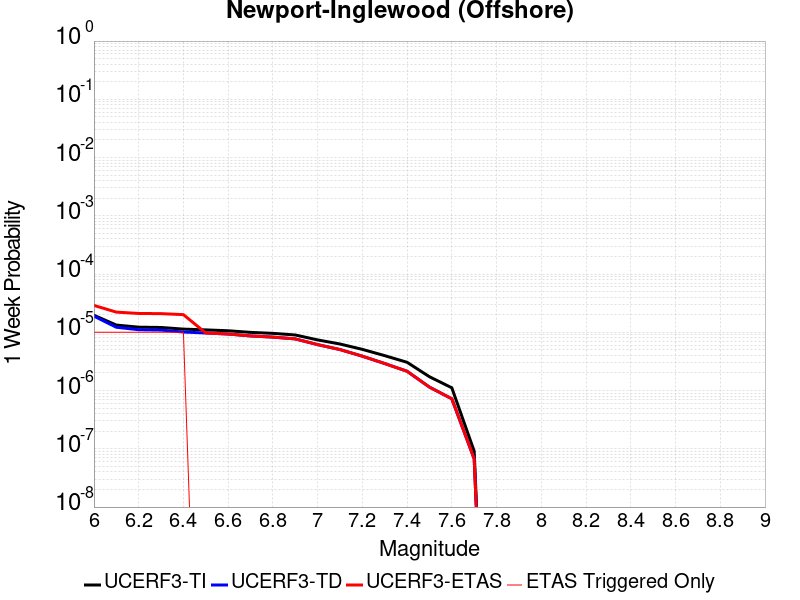 | 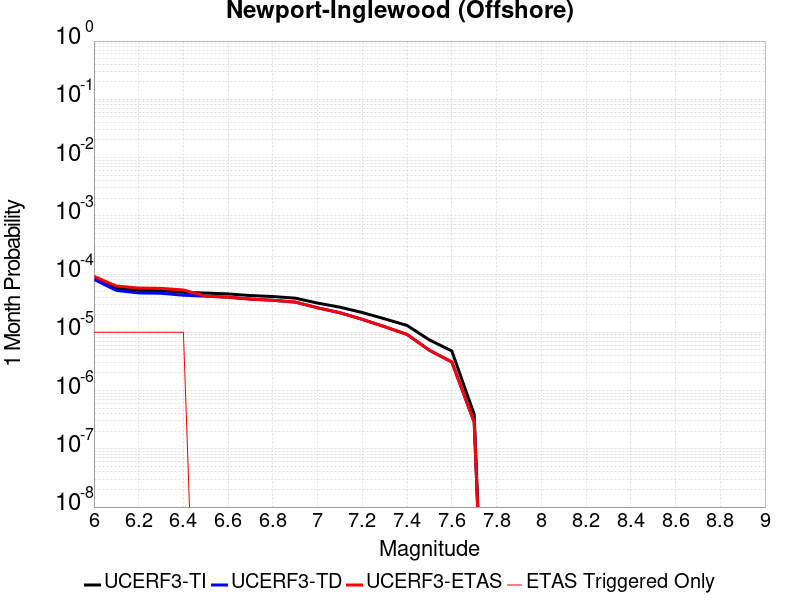 | 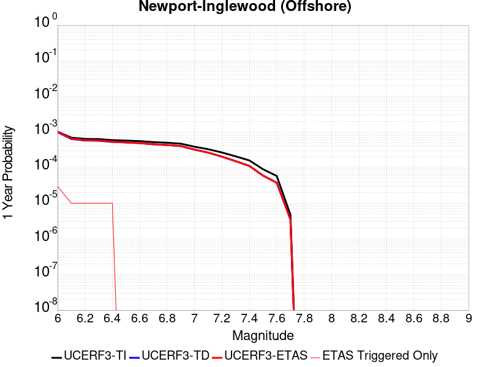 |  |

| Magnitude | 1 wk TI Prob | 1 wk TD Prob | 1 wk ETAS Prob | 1 wk ETAS/TD Gain | 1 wk ETAS Triggered Only | 1 mo TI Prob | 1 mo TD Prob | 1 mo ETAS Prob | 1 mo ETAS/TD Gain | 1 mo ETAS Triggered Only | 1 yr TI Prob | 1 yr TD Prob | 1 yr ETAS Prob | 1 yr ETAS/TD Gain | 1 yr ETAS Triggered Only | 10 yr TI Prob | 10 yr TD Prob | 10 yr ETAS Prob | 10 yr ETAS/TD Gain | 10 yr ETAS Triggered Only |
|-----|-----|-----|-----|-----|-----|-----|-----|-----|-----|-----|-----|-----|-----|-----|-----|-----|-----|-----|-----|-----|
| 6.0 | 1.9626508E-5 | 1.8965357E-5 | 2.8965167E-5 | 1.5272672 | 1.0E-5 | 8.411089E-5 | 8.1277634E-5 | 9.127682E-5 | 1.1230251 | 1.0E-5 | 0.001023569 | 9.891186E-4 | 0.0010190889 | 1.0303 | 3.0E-5 | 0.010188672 | 0.009848503 | 0.00988811 | 1.0040215 | 4.0E-5 |
| 6.1 | 1.331886E-5 | 1.2218092E-5 | 2.221797E-5 | 1.8184484 | 1.0E-5 | 5.707958E-5 | 5.2362207E-5 | 6.236169E-5 | 1.1909674 | 1.0E-5 | 6.947222E-4 | 6.3732493E-4 | 6.4731855E-4 | 1.0156806 | 1.0E-5 | 0.006925544 | 0.006355149 | 0.0063750218 | 1.0031271 | 2.0E-5 |
| 6.2 | 1.2250852E-5 | 1.1076029E-5 | 2.1075919E-5 | 1.9028406 | 1.0E-5 | 5.2502597E-5 | 4.7467838E-5 | 5.7467365E-5 | 1.2106589 | 1.0E-5 | 6.3903164E-4 | 5.777687E-4 | 5.877629E-4 | 1.017298 | 1.0E-5 | 0.006371971 | 0.0057627866 | 0.0057826713 | 1.0034505 | 2.0E-5 |
| 6.3 | 1.2106258E-5 | 1.0918891E-5 | 2.0918782E-5 | 1.915834 | 1.0E-5 | 5.1882926E-5 | 4.6794412E-5 | 5.6793946E-5 | 1.2136908 | 1.0E-5 | 6.3149154E-4 | 5.69574E-4 | 5.795683E-4 | 1.017547 | 1.0E-5 | 0.0062970007 | 0.005681259 | 0.0057011456 | 1.0035003 | 2.0E-5 |
| 6.4 | 1.1348758E-5 | 1.0109362E-5 | 2.010926E-5 | 1.9891721 | 1.0E-5 | 4.8636626E-5 | 4.3325123E-5 | 5.332469E-5 | 1.230803 | 1.0E-5 | 5.919901E-4 | 5.273565E-4 | 5.3735124E-4 | 1.0189525 | 1.0E-5 | 0.005904155 | 0.0052611465 | 0.0052810414 | 1.0037814 | 2.0E-5 |
| 6.5 | 1.100837E-5 | 9.7433895E-6 | 9.7433895E-6 | 1.0 | 0.0 | 4.7177873E-5 | 4.1756717E-5 | 4.1756717E-5 | 1.0 | 0.0 | 5.7423924E-4 | 5.082702E-4 | 5.082702E-4 | 1.0 | 0.0 | 0.005727576 | 0.0050711688 | 0.005081118 | 1.001962 | 1.0E-5 |
| 6.6 | 1.0634696E-5 | 9.345544E-6 | 9.345544E-6 | 1.0 | 0.0 | 4.557647E-5 | 4.0051716E-5 | 4.0051716E-5 | 1.0 | 0.0 | 5.5475225E-4 | 4.8752132E-4 | 4.8752132E-4 | 1.0 | 0.0 | 0.0055336943 | 0.0048646047 | 0.004874556 | 1.0020456 | 1.0E-5 |
| 6.7 | 9.9780855E-6 | 8.667911E-6 | 8.667911E-6 | 1.0 | 0.0 | 4.276252E-5 | 3.7147664E-5 | 3.7147664E-5 | 1.0 | 0.0 | 5.205093E-4 | 4.5217964E-4 | 4.5217964E-4 | 1.0 | 0.0 | 0.0051929182 | 0.004512675 | 0.0045226295 | 1.002206 | 1.0E-5 |
| 6.8 | 9.59546E-6 | 8.27295E-6 | 8.27295E-6 | 1.0 | 0.0 | 4.1122752E-5 | 3.5455025E-5 | 3.5455025E-5 | 1.0 | 0.0 | 5.0055445E-4 | 4.315801E-4 | 4.315801E-4 | 1.0 | 0.0 | 0.004994285 | 0.004307495 | 0.004317452 | 1.0023116 | 1.0E-5 |
| 6.9 | 9.000614E-6 | 7.70684E-6 | 7.70684E-6 | 1.0 | 0.0 | 3.857349E-5 | 3.30289E-5 | 3.30289E-5 | 1.0 | 0.0 | 4.6953102E-4 | 4.0205332E-4 | 4.0205332E-4 | 1.0 | 0.0 | 0.004685402 | 0.0040133307 | 0.0040232907 | 1.0024817 | 1.0E-5 |
| 7.0 | 7.4070194E-6 | 6.148904E-6 | 6.148904E-6 | 1.0 | 0.0 | 3.1743984E-5 | 2.635218E-5 | 2.635218E-5 | 1.0 | 0.0 | 3.8641447E-4 | 3.207907E-4 | 3.207907E-4 | 1.0 | 0.0 | 0.0038574322 | 0.0032032963 | 0.0032132643 | 1.0031118 | 1.0E-5 |
| 7.1 | 6.299615E-6 | 5.0565927E-6 | 5.0565927E-6 | 1.0 | 0.0 | 2.699807E-5 | 2.1670932E-5 | 2.1670932E-5 | 1.0 | 0.0 | 3.2865192E-4 | 2.638118E-4 | 2.638118E-4 | 1.0 | 0.0 | 0.003281663 | 0.002635001 | 0.0026449745 | 1.003785 | 1.0E-5 |
| 7.2 | 5.096653E-6 | 3.892769E-6 | 3.892769E-6 | 1.0 | 0.0 | 2.1842614E-5 | 1.668319E-5 | 1.668319E-5 | 1.0 | 0.0 | 2.6590136E-4 | 2.0309901E-4 | 2.0309901E-4 | 1.0 | 0.0 | 0.0026558342 | 0.0020291451 | 0.0020391247 | 1.0049182 | 1.0E-5 |
| 7.3 | 3.9753018E-6 | 2.9099103E-6 | 2.9099103E-6 | 1.0 | 0.0 | 1.7036897E-5 | 1.2470985E-5 | 1.2470985E-5 | 1.0 | 0.0 | 2.0740448E-4 | 1.5182374E-4 | 1.5182374E-4 | 1.0 | 0.0 | 0.00207211 | 0.0015172083 | 0.0015172083 | 1.0 | 0.0 |
| 7.4 | 3.0568392E-6 | 2.1449955E-6 | 2.1449955E-6 | 1.0 | 0.0 | 1.3100675E-5 | 9.192806E-6 | 9.192806E-6 | 1.0 | 0.0 | 1.5948903E-4 | 1.1191672E-4 | 1.1191672E-4 | 1.0 | 0.0 | 0.0015937461 | 0.0011186098 | 0.0011186098 | 1.0 | 0.0 |
| 7.5 | 1.7279019E-6 | 1.1469883E-6 | 1.1469883E-6 | 1.0 | 0.0 | 7.405273E-6 | 4.915655E-6 | 4.915655E-6 | 1.0 | 0.0 | 9.015547E-5 | 5.9846494E-5 | 5.9846494E-5 | 1.0 | 0.0 | 9.01189E-4 | 5.9830764E-4 | 5.9830764E-4 | 1.0 | 0.0 |
| 7.6 | 1.1156416E-6 | 7.223012E-7 | 7.223012E-7 | 1.0 | 0.0 | 4.7813123E-6 | 3.095573E-6 | 3.095573E-6 | 1.0 | 0.0 | 5.821092E-5 | 3.7687976E-5 | 3.7687976E-5 | 1.0 | 0.0 | 5.8195676E-4 | 3.7681818E-4 | 3.7681818E-4 | 1.0 | 0.0 |
| 7.7 | 9.117973E-8 | 6.734145E-8 | 6.734145E-8 | 1.0 | 0.0 | 3.907702E-7 | 2.886062E-7 | 2.886062E-7 | 1.0 | 0.0 | 4.757617E-6 | 3.513775E-6 | 3.513775E-6 | 1.0 | 0.0 | 4.7575148E-5 | 3.5137225E-5 | 3.5137225E-5 | 1.0 | 0.0 |

## Hayward (So) 2011 CFM
*[(top)](#table-of-contents)*

| 1 Week | 1 Month | 1 Year | 10 Year |
|-----|-----|-----|-----|
| 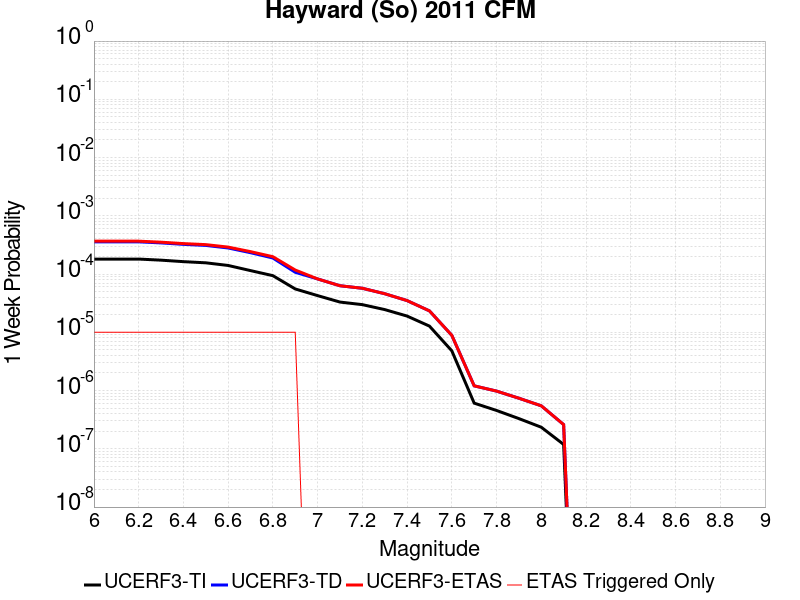 | 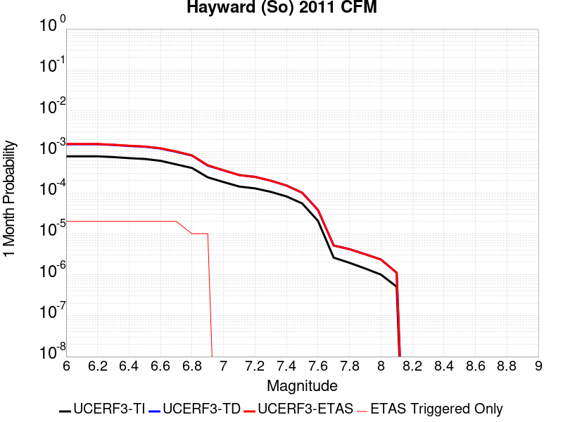 |  |  |

| Magnitude | 1 wk TI Prob | 1 wk TD Prob | 1 wk ETAS Prob | 1 wk ETAS/TD Gain | 1 wk ETAS Triggered Only | 1 mo TI Prob | 1 mo TD Prob | 1 mo ETAS Prob | 1 mo ETAS/TD Gain | 1 mo ETAS Triggered Only | 1 yr TI Prob | 1 yr TD Prob | 1 yr ETAS Prob | 1 yr ETAS/TD Gain | 1 yr ETAS Triggered Only | 10 yr TI Prob | 10 yr TD Prob | 10 yr ETAS Prob | 10 yr ETAS/TD Gain | 10 yr ETAS Triggered Only |
|-----|-----|-----|-----|-----|-----|-----|-----|-----|-----|-----|-----|-----|-----|-----|-----|-----|-----|-----|-----|-----|
| 6.0 | 1.8091932E-4 | 3.570541E-4 | 3.6705052E-4 | 1.027997 | 1.0E-5 | 7.751381E-4 | 0.0015293444 | 0.0015493138 | 1.0130575 | 2.0E-5 | 0.00939654 | 0.018463207 | 0.018492654 | 1.0015949 | 3.0E-5 | 0.090090066 | 0.16673161 | 0.16676494 | 1.0001999 | 4.0E-5 |
| 6.1 | 1.8091932E-4 | 3.570541E-4 | 3.6705052E-4 | 1.027997 | 1.0E-5 | 7.751381E-4 | 0.0015293444 | 0.0015493138 | 1.0130575 | 2.0E-5 | 0.00939654 | 0.018463207 | 0.018492654 | 1.0015949 | 3.0E-5 | 0.090090066 | 0.16673161 | 0.16676494 | 1.0001999 | 4.0E-5 |
| 6.2 | 1.8091932E-4 | 3.570541E-4 | 3.6705052E-4 | 1.027997 | 1.0E-5 | 7.751381E-4 | 0.0015293444 | 0.0015493138 | 1.0130575 | 2.0E-5 | 0.00939654 | 0.018463207 | 0.018492654 | 1.0015949 | 3.0E-5 | 0.090090066 | 0.16673161 | 0.16676494 | 1.0001999 | 4.0E-5 |
| 6.3 | 1.7322872E-4 | 3.426234E-4 | 3.5261997E-4 | 1.0291766 | 1.0E-5 | 7.4219756E-4 | 0.0014675693 | 0.00148754 | 1.013608 | 2.0E-5 | 0.0089988755 | 0.017723544 | 0.017753012 | 1.0016626 | 3.0E-5 | 0.08643075 | 0.16066726 | 0.16070083 | 1.000209 | 4.0E-5 |
| 6.4 | 1.6334097E-4 | 3.234411E-4 | 3.3343787E-4 | 1.0309075 | 1.0E-5 | 6.998449E-4 | 0.0013854484 | 0.0014054207 | 1.0144157 | 2.0E-5 | 0.008487372 | 0.016739385 | 0.016768884 | 1.0017622 | 3.0E-5 | 0.081704415 | 0.15255594 | 0.15258984 | 1.0002222 | 4.0E-5 |
| 6.5 | 1.5600289E-4 | 3.1018828E-4 | 3.2018515E-4 | 1.0322285 | 1.0E-5 | 6.684125E-4 | 0.0013287093 | 0.0013486828 | 1.0150322 | 2.0E-5 | 0.008107598 | 0.016058935 | 0.016088452 | 1.0018381 | 3.0E-5 | 0.078181036 | 0.14683272 | 0.14686684 | 1.0002325 | 4.0E-5 |
| 6.6 | 1.4046066E-4 | 2.8032906E-4 | 2.9032625E-4 | 1.0356624 | 1.0E-5 | 6.018354E-4 | 0.0012008639 | 0.0012208399 | 1.0166347 | 2.0E-5 | 0.0073027555 | 0.014524006 | 0.01455357 | 1.0020355 | 3.0E-5 | 0.07067384 | 0.13391982 | 0.13395447 | 1.0002587 | 4.0E-5 |
| 6.7 | 1.14696966E-4 | 2.3271477E-4 | 2.4271243E-4 | 1.042961 | 1.0E-5 | 4.914658E-4 | 9.969729E-4 | 0.0010169529 | 1.0200408 | 2.0E-5 | 0.0059671924 | 0.012071652 | 0.012091411 | 1.0016367 | 2.0E-5 | 0.058094822 | 0.11274672 | 0.112773344 | 1.000236 | 3.0E-5 |
| 6.8 | 9.3874296E-5 | 1.8861453E-4 | 1.9861264E-4 | 1.0530082 | 1.0E-5 | 4.0225635E-4 | 8.0810126E-4 | 8.180932E-4 | 1.0123647 | 1.0E-5 | 0.0048864787 | 0.009794984 | 0.009804886 | 1.0010109 | 1.0E-5 | 0.047804173 | 0.09259856 | 0.09261671 | 1.000196 | 2.0E-5 |
| 6.9 | 5.551852E-5 | 1.072948E-4 | 1.17293726E-4 | 1.0931911 | 1.0E-5 | 2.3791482E-4 | 4.5975443E-4 | 4.6974982E-4 | 1.0217408 | 1.0E-5 | 0.0028927654 | 0.0055832625 | 0.0055932067 | 1.0017811 | 1.0E-5 | 0.028553981 | 0.054245494 | 0.05425495 | 1.0001744 | 1.0E-5 |
| 7.0 | 4.2662363E-5 | 8.2464416E-5 | 8.2464416E-5 | 1.0 | 0.0 | 1.8282588E-4 | 3.5337146E-4 | 3.5337146E-4 | 1.0 | 0.0 | 0.0022236328 | 0.0042938837 | 0.0042938837 | 1.0 | 0.0 | 0.022015138 | 0.042064495 | 0.042064495 | 1.0 | 0.0 |
| 7.1 | 3.305886E-5 | 6.3019055E-5 | 6.3019055E-5 | 1.0 | 0.0 | 1.4167312E-4 | 2.700538E-4 | 2.700538E-4 | 1.0 | 0.0 | 0.0017235056 | 0.0032829668 | 0.0032829668 | 1.0 | 0.0 | 0.017101998 | 0.032452874 | 0.032452874 | 1.0 | 0.0 |
| 7.2 | 2.9856887E-5 | 5.7013647E-5 | 5.7013647E-5 | 1.0 | 0.0 | 1.2795182E-4 | 2.4432142E-4 | 2.4432142E-4 | 1.0 | 0.0 | 0.0015567001 | 0.0029705726 | 0.0029705726 | 1.0 | 0.0 | 0.015458403 | 0.029453589 | 0.029453589 | 1.0 | 0.0 |
| 7.3 | 2.4559737E-5 | 4.599088E-5 | 4.599088E-5 | 1.0 | 0.0 | 1.0525176E-4 | 1.9708896E-4 | 1.9708896E-4 | 1.0 | 0.0 | 0.0012806869 | 0.0023969305 | 0.0023969305 | 1.0 | 0.0 | 0.012733313 | 0.023857482 | 0.023857482 | 1.0 | 0.0 |
| 7.4 | 1.9002231E-5 | 3.5049303E-5 | 3.5049303E-5 | 1.0 | 0.0 | 8.143559E-5 | 1.502027E-4 | 1.502027E-4 | 1.0 | 0.0 | 9.910273E-4 | 0.0018271938 | 0.0018271938 | 1.0 | 0.0 | 0.009866194 | 0.018258283 | 0.018258283 | 1.0 | 0.0 |
| 7.5 | 1.2783333E-5 | 2.3330069E-5 | 2.3330069E-5 | 1.0 | 0.0 | 5.4784563E-5 | 9.998221E-5 | 9.998221E-5 | 1.0 | 0.0 | 6.667979E-4 | 0.0012166094 | 0.0012166094 | 1.0 | 0.0 | 0.006648007 | 0.012209582 | 0.012209582 | 1.0 | 0.0 |
| 7.6 | 4.8149627E-6 | 8.887544E-6 | 8.887544E-6 | 1.0 | 0.0 | 2.063539E-5 | 3.8088925E-5 | 3.8088925E-5 | 1.0 | 0.0 | 2.5120692E-4 | 4.636352E-4 | 4.636352E-4 | 1.0 | 0.0 | 0.0025092314 | 0.0046812436 | 0.0046812436 | 1.0 | 0.0 |
| 7.7 | 6.0838227E-7 | 1.2056693E-6 | 1.2056693E-6 | 1.0 | 0.0 | 2.6073499E-6 | 5.1671436E-6 | 5.1671436E-6 | 1.0 | 0.0 | 3.174402E-5 | 6.290816E-5 | 6.290816E-5 | 1.0 | 0.0 | 3.1739488E-4 | 6.5293367E-4 | 6.5293367E-4 | 1.0 | 0.0 |
| 7.8 | 4.5542808E-7 | 9.792182E-7 | 9.792182E-7 | 1.0 | 0.0 | 1.9518332E-6 | 4.1966427E-6 | 4.1966427E-6 | 1.0 | 0.0 | 2.376331E-5 | 5.1092928E-5 | 5.1092928E-5 | 1.0 | 0.0 | 2.3760769E-4 | 5.321372E-4 | 5.321372E-4 | 1.0 | 0.0 |
| 7.9 | 3.3016747E-7 | 7.386335E-7 | 7.386335E-7 | 1.0 | 0.0 | 1.4150027E-6 | 3.1655684E-6 | 3.1655684E-6 | 1.0 | 0.0 | 1.7227521E-5 | 3.8540114E-5 | 3.8540114E-5 | 1.0 | 0.0 | 1.7226185E-4 | 3.9930744E-4 | 3.9930744E-4 | 1.0 | 0.0 |
| 8.0 | 2.347038E-7 | 5.4714894E-7 | 5.4714894E-7 | 1.0 | 0.0 | 1.0058731E-6 | 2.344922E-6 | 2.344922E-6 | 1.0 | 0.0 | 1.2246436E-5 | 2.8549053E-5 | 2.8549053E-5 | 1.0 | 0.0 | 1.2245761E-4 | 2.9355253E-4 | 2.9355253E-4 | 1.0 | 0.0 |
| 8.1 | 1.18822804E-7 | 2.6058973E-7 | 2.6058973E-7 | 1.0 | 0.0 | 5.092405E-7 | 1.1168127E-6 | 1.1168127E-6 | 1.0 | 0.0 | 6.1999854E-6 | 1.359711E-5 | 1.359711E-5 | 1.0 | 0.0 | 6.199812E-5 | 1.3917852E-4 | 1.3917852E-4 | 1.0 | 0.0 |

## Hunting Creek - Bartlett Springs connector 2011
*[(top)](#table-of-contents)*

| 1 Week | 1 Month | 1 Year | 10 Year |
|-----|-----|-----|-----|
|  | 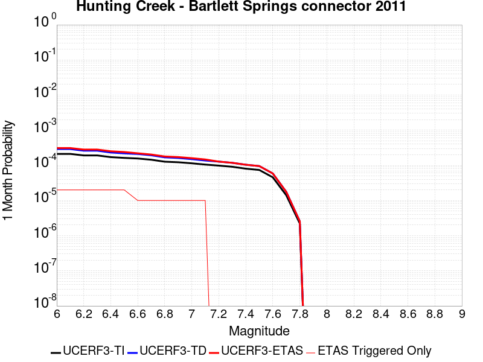 |  |  |

| Magnitude | 1 wk TI Prob | 1 wk TD Prob | 1 wk ETAS Prob | 1 wk ETAS/TD Gain | 1 wk ETAS Triggered Only | 1 mo TI Prob | 1 mo TD Prob | 1 mo ETAS Prob | 1 mo ETAS/TD Gain | 1 mo ETAS Triggered Only | 1 yr TI Prob | 1 yr TD Prob | 1 yr ETAS Prob | 1 yr ETAS/TD Gain | 1 yr ETAS Triggered Only | 10 yr TI Prob | 10 yr TD Prob | 10 yr ETAS Prob | 10 yr ETAS/TD Gain | 10 yr ETAS Triggered Only |
|-----|-----|-----|-----|-----|-----|-----|-----|-----|-----|-----|-----|-----|-----|-----|-----|-----|-----|-----|-----|-----|
| 6.0 | 4.940016E-5 | 6.786822E-5 | 6.786822E-5 | 1.0 | 0.0 | 2.1169778E-4 | 2.9083234E-4 | 3.1082652E-4 | 1.0687481 | 2.0E-5 | 0.002574374 | 0.003535177 | 0.0035551065 | 1.0056374 | 2.0E-5 | 0.025447546 | 0.034773834 | 0.034812443 | 1.0011103 | 4.0E-5 |
| 6.1 | 4.940016E-5 | 6.786822E-5 | 6.786822E-5 | 1.0 | 0.0 | 2.1169778E-4 | 2.9083234E-4 | 3.1082652E-4 | 1.0687481 | 2.0E-5 | 0.002574374 | 0.003535177 | 0.0035551065 | 1.0056374 | 2.0E-5 | 0.025447546 | 0.034773834 | 0.034812443 | 1.0011103 | 4.0E-5 |
| 6.2 | 4.472471E-5 | 6.1002804E-5 | 6.1002804E-5 | 1.0 | 0.0 | 1.9166325E-4 | 2.6141506E-4 | 2.8140983E-4 | 1.0764867 | 2.0E-5 | 0.0023310026 | 0.003178107 | 0.0031980434 | 1.006273 | 2.0E-5 | 0.02306703 | 0.031316914 | 0.031345975 | 1.0009279 | 3.0E-5 |
| 6.3 | 4.472471E-5 | 6.1002804E-5 | 6.1002804E-5 | 1.0 | 0.0 | 1.9166325E-4 | 2.6141506E-4 | 2.8140983E-4 | 1.0764867 | 2.0E-5 | 0.0023310026 | 0.003178107 | 0.0031980434 | 1.006273 | 2.0E-5 | 0.02306703 | 0.031316914 | 0.031345975 | 1.0009279 | 3.0E-5 |
| 6.4 | 4.0001003E-5 | 5.4103755E-5 | 5.4103755E-5 | 1.0 | 0.0 | 1.714216E-4 | 2.31853E-4 | 2.5184837E-4 | 1.0862416 | 2.0E-5 | 0.0020850603 | 0.0028191248 | 0.0028390684 | 1.0070744 | 2.0E-5 | 0.02065605 | 0.027828315 | 0.02784776 | 1.0006987 | 2.0E-5 |
| 6.5 | 3.8033053E-5 | 5.1266547E-5 | 5.1266547E-5 | 1.0 | 0.0 | 1.6298861E-4 | 2.1969559E-4 | 2.3969119E-4 | 1.0910151 | 2.0E-5 | 0.0019825802 | 0.0026714746 | 0.0026914212 | 1.0074666 | 2.0E-5 | 0.019649856 | 0.026390454 | 0.026409926 | 1.0007379 | 2.0E-5 |
| 6.6 | 3.653754E-5 | 4.913017E-5 | 4.913017E-5 | 1.0 | 0.0 | 1.5658008E-4 | 2.1054115E-4 | 2.2053906E-4 | 1.0474867 | 1.0E-5 | 0.0019046954 | 0.0025602852 | 0.0025702596 | 1.0038958 | 1.0E-5 | 0.018884527 | 0.025306415 | 0.02531616 | 1.0003852 | 1.0E-5 |
| 6.7 | 3.372024E-5 | 4.514011E-5 | 4.514011E-5 | 1.0 | 0.0 | 1.4450731E-4 | 1.9344354E-4 | 2.0344161E-4 | 1.0516846 | 1.0E-5 | 0.0017579567 | 0.002352639 | 0.0023626157 | 1.0042405 | 1.0E-5 | 0.017441148 | 0.023278099 | 0.023287866 | 1.0004196 | 1.0E-5 |
| 6.8 | 2.9650024E-5 | 3.9411374E-5 | 3.9411374E-5 | 1.0 | 0.0 | 1.2706534E-4 | 1.6889503E-4 | 1.7889334E-4 | 1.0591984 | 1.0E-5 | 0.0015459227 | 0.0020543463 | 0.0020643256 | 1.0048578 | 1.0E-5 | 0.015352124 | 0.020351216 | 0.020361012 | 1.0004814 | 1.0E-5 |
| 6.9 | 2.860775E-5 | 3.7812544E-5 | 3.7812544E-5 | 1.0 | 0.0 | 1.2259888E-4 | 1.6204377E-4 | 1.7204214E-4 | 1.0617018 | 1.0E-5 | 0.0014916194 | 0.001971107 | 0.0019810873 | 1.0050633 | 1.0E-5 | 0.014816469 | 0.01953584 | 0.019545645 | 1.0005019 | 1.0E-5 |
| 7.0 | 2.6696067E-5 | 3.506726E-5 | 3.506726E-5 | 1.0 | 0.0 | 1.144067E-4 | 1.5027967E-4 | 1.6027817E-4 | 1.0665326 | 1.0E-5 | 0.0013920115 | 0.0018281302 | 0.001838112 | 1.00546 | 1.0E-5 | 0.013833242 | 0.018131364 | 0.018141182 | 1.0005416 | 1.0E-5 |
| 7.1 | 2.456087E-5 | 3.2013093E-5 | 3.2013093E-5 | 1.0 | 0.0 | 1.0525662E-4 | 1.371918E-4 | 1.4719043E-4 | 1.0728806 | 1.0E-5 | 0.001280746 | 0.0016690396 | 0.0016790229 | 1.0059814 | 1.0E-5 | 0.012733897 | 0.016566366 | 0.0165762 | 1.0005937 | 1.0E-5 |
| 7.2 | 2.295761E-5 | 2.9822932E-5 | 2.9822932E-5 | 1.0 | 0.0 | 9.8386045E-5 | 1.2780636E-4 | 1.2780636E-4 | 1.0 | 0.0 | 0.0011971919 | 0.001554941 | 0.001554941 | 1.0 | 0.0 | 0.011907627 | 0.015442089 | 0.015442089 | 1.0 | 0.0 |
| 7.3 | 2.1256936E-5 | 2.7541912E-5 | 2.7541912E-5 | 1.0 | 0.0 | 9.109797E-5 | 1.1803147E-4 | 1.1803147E-4 | 1.0 | 0.0 | 0.0011085535 | 0.0014360948 | 0.0014360948 | 1.0 | 0.0 | 0.011030397 | 0.014269472 | 0.014269472 | 1.0 | 0.0 |
| 7.4 | 1.8784336E-5 | 2.4306766E-5 | 2.4306766E-5 | 1.0 | 0.0 | 8.050181E-5 | 1.0416774E-4 | 1.0416774E-4 | 1.0 | 0.0 | 9.796688E-4 | 0.001267512 | 0.001267512 | 1.0 | 0.0 | 0.009753612 | 0.012603902 | 0.012603902 | 1.0 | 0.0 |
| 7.5 | 1.7248298E-5 | 2.2268887E-5 | 2.2268887E-5 | 1.0 | 0.0 | 7.391918E-5 | 9.543464E-5 | 9.543464E-5 | 1.0 | 0.0 | 8.9959445E-4 | 0.0011613049 | 0.0011613049 | 1.0 | 0.0 | 0.008959615 | 0.01155334 | 0.01155334 | 1.0 | 0.0 |
| 7.6 | 1.0653709E-5 | 1.3722118E-5 | 1.3722118E-5 | 1.0 | 0.0 | 4.5657955E-5 | 5.8807767E-5 | 5.8807767E-5 | 1.0 | 0.0 | 5.557438E-4 | 7.157521E-4 | 7.157521E-4 | 1.0 | 0.0 | 0.0055435603 | 0.0071348166 | 0.0071348166 | 1.0 | 0.0 |
| 7.7 | 3.286316E-6 | 4.0903437E-6 | 4.0903437E-6 | 1.0 | 0.0 | 1.4084137E-5 | 1.7529928E-5 | 1.7529928E-5 | 1.0 | 0.0 | 1.7146087E-4 | 2.1340612E-4 | 2.1340612E-4 | 1.0 | 0.0 | 0.0017132863 | 0.0021320276 | 0.0021320276 | 1.0 | 0.0 |
| 7.8 | 5.1855085E-7 | 5.9720696E-7 | 5.9720696E-7 | 1.0 | 0.0 | 2.222359E-6 | 2.5594559E-6 | 2.5594559E-6 | 1.0 | 0.0 | 2.7056883E-5 | 3.116094E-5 | 3.116094E-5 | 1.0 | 0.0 | 2.705359E-4 | 3.1156495E-4 | 3.1156495E-4 | 1.0 | 0.0 |

## Santa Susana East (connector)
*[(top)](#table-of-contents)*

| 1 Week | 1 Month | 1 Year | 10 Year |
|-----|-----|-----|-----|
| 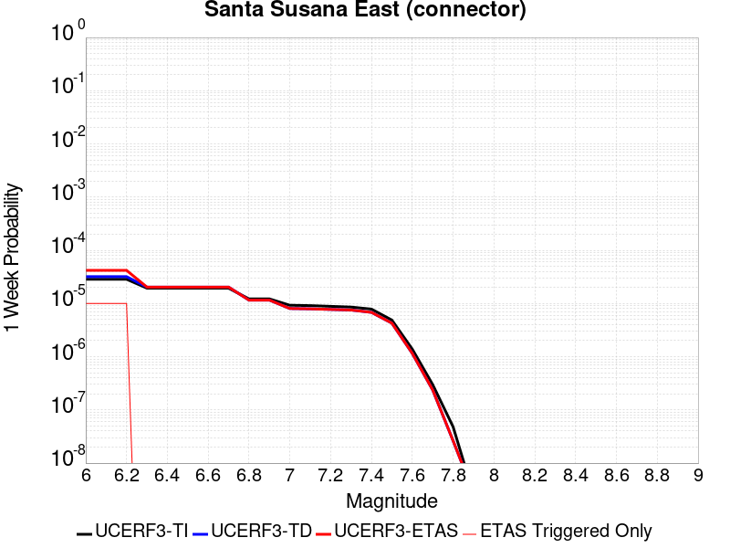 | 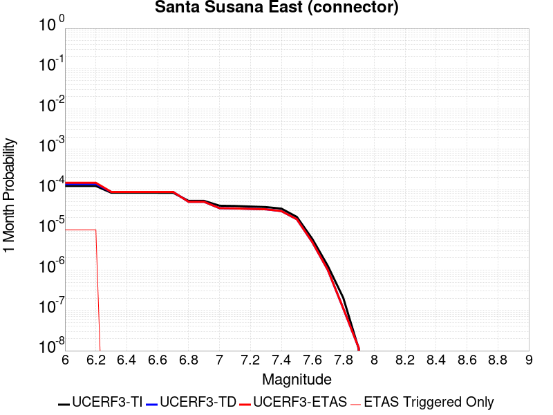 |  |  |

| Magnitude | 1 wk TI Prob | 1 wk TD Prob | 1 wk ETAS Prob | 1 wk ETAS/TD Gain | 1 wk ETAS Triggered Only | 1 mo TI Prob | 1 mo TD Prob | 1 mo ETAS Prob | 1 mo ETAS/TD Gain | 1 mo ETAS Triggered Only | 1 yr TI Prob | 1 yr TD Prob | 1 yr ETAS Prob | 1 yr ETAS/TD Gain | 1 yr ETAS Triggered Only | 10 yr TI Prob | 10 yr TD Prob | 10 yr ETAS Prob | 10 yr ETAS/TD Gain | 10 yr ETAS Triggered Only |
|-----|-----|-----|-----|-----|-----|-----|-----|-----|-----|-----|-----|-----|-----|-----|-----|-----|-----|-----|-----|-----|
| 6.0 | 2.858397E-5 | 3.202091E-5 | 4.202059E-5 | 1.3122859 | 1.0E-5 | 1.2249697E-4 | 1.3722685E-4 | 1.4722548E-4 | 1.072862 | 1.0E-5 | 0.0014903803 | 0.0016697381 | 0.0016897047 | 1.0119579 | 2.0E-5 | 0.014804244 | 0.016599052 | 0.016638389 | 1.0023698 | 4.0E-5 |
| 6.1 | 2.858397E-5 | 3.202091E-5 | 4.202059E-5 | 1.3122859 | 1.0E-5 | 1.2249697E-4 | 1.3722685E-4 | 1.4722548E-4 | 1.072862 | 1.0E-5 | 0.0014903803 | 0.0016697381 | 0.0016897047 | 1.0119579 | 2.0E-5 | 0.014804244 | 0.016599052 | 0.016638389 | 1.0023698 | 4.0E-5 |
| 6.2 | 2.858397E-5 | 3.202091E-5 | 4.202059E-5 | 1.3122859 | 1.0E-5 | 1.2249697E-4 | 1.3722685E-4 | 1.4722548E-4 | 1.072862 | 1.0E-5 | 0.0014903803 | 0.0016697381 | 0.0016897047 | 1.0119579 | 2.0E-5 | 0.014804244 | 0.016599052 | 0.016638389 | 1.0023698 | 4.0E-5 |
| 6.3 | 1.943582E-5 | 2.036718E-5 | 2.036718E-5 | 1.0 | 0.0 | 8.329371E-5 | 8.7285625E-5 | 8.7285625E-5 | 1.0 | 0.0 | 0.001013629 | 0.0010622967 | 0.001072286 | 1.0094036 | 1.0E-5 | 0.010090181 | 0.010583619 | 0.0106034065 | 1.0018697 | 2.0E-5 |
| 6.4 | 1.943582E-5 | 2.036718E-5 | 2.036718E-5 | 1.0 | 0.0 | 8.329371E-5 | 8.7285625E-5 | 8.7285625E-5 | 1.0 | 0.0 | 0.001013629 | 0.0010622967 | 0.001072286 | 1.0094036 | 1.0E-5 | 0.010090181 | 0.010583619 | 0.0106034065 | 1.0018697 | 2.0E-5 |
| 6.5 | 1.943582E-5 | 2.036718E-5 | 2.036718E-5 | 1.0 | 0.0 | 8.329371E-5 | 8.7285625E-5 | 8.7285625E-5 | 1.0 | 0.0 | 0.001013629 | 0.0010622967 | 0.001072286 | 1.0094036 | 1.0E-5 | 0.010090181 | 0.010583619 | 0.0106034065 | 1.0018697 | 2.0E-5 |
| 6.6 | 1.943582E-5 | 2.036718E-5 | 2.036718E-5 | 1.0 | 0.0 | 8.329371E-5 | 8.7285625E-5 | 8.7285625E-5 | 1.0 | 0.0 | 0.001013629 | 0.0010622967 | 0.001072286 | 1.0094036 | 1.0E-5 | 0.010090181 | 0.010583619 | 0.0106034065 | 1.0018697 | 2.0E-5 |
| 6.7 | 1.9404439E-5 | 2.03546E-5 | 2.03546E-5 | 1.0 | 0.0 | 8.3159226E-5 | 8.723172E-5 | 8.723172E-5 | 1.0 | 0.0 | 0.0010119933 | 0.0010616409 | 0.0010716304 | 1.0094094 | 1.0E-5 | 0.010073971 | 0.010577125 | 0.010596912 | 1.0018709 | 2.0E-5 |
| 6.8 | 1.2217526E-5 | 1.1592998E-5 | 1.1592998E-5 | 1.0 | 0.0 | 5.2359774E-5 | 4.9683425E-5 | 4.9683425E-5 | 1.0 | 0.0 | 6.372938E-4 | 6.0474465E-4 | 6.0474465E-4 | 1.0 | 0.0 | 0.0063546924 | 0.006033037 | 0.0060429764 | 1.0016476 | 1.0E-5 |
| 6.9 | 1.2217526E-5 | 1.1592998E-5 | 1.1592998E-5 | 1.0 | 0.0 | 5.2359774E-5 | 4.9683425E-5 | 4.9683425E-5 | 1.0 | 0.0 | 6.372938E-4 | 6.0474465E-4 | 6.0474465E-4 | 1.0 | 0.0 | 0.0063546924 | 0.006033037 | 0.0060429764 | 1.0016476 | 1.0E-5 |
| 7.0 | 9.276017E-6 | 8.059113E-6 | 8.059113E-6 | 1.0 | 0.0 | 3.9753755E-5 | 3.4538618E-5 | 3.4538618E-5 | 1.0 | 0.0 | 4.8389446E-4 | 4.2042998E-4 | 4.2042998E-4 | 1.0 | 0.0 | 0.0048284214 | 0.0041970722 | 0.0042070304 | 1.0023726 | 1.0E-5 |
| 7.1 | 9.130355E-6 | 7.942286E-6 | 7.942286E-6 | 1.0 | 0.0 | 3.9129503E-5 | 3.4037945E-5 | 3.4037945E-5 | 1.0 | 0.0 | 4.7629757E-4 | 4.1433662E-4 | 4.1433662E-4 | 1.0 | 0.0 | 0.00475278 | 0.004136367 | 0.0041463254 | 1.0024076 | 1.0E-5 |
| 7.2 | 8.851015E-6 | 7.741445E-6 | 7.741445E-6 | 1.0 | 0.0 | 3.7932372E-5 | 3.317722E-5 | 3.317722E-5 | 1.0 | 0.0 | 4.6172875E-4 | 4.038612E-4 | 4.038612E-4 | 1.0 | 0.0 | 0.0046077054 | 0.0040319953 | 0.0040419553 | 1.0024701 | 1.0E-5 |
| 7.3 | 8.573006E-6 | 7.550166E-6 | 7.550166E-6 | 1.0 | 0.0 | 3.6740938E-5 | 3.2357475E-5 | 3.2357475E-5 | 1.0 | 0.0 | 4.472291E-4 | 3.9388443E-4 | 3.9388443E-4 | 1.0 | 0.0 | 0.004463301 | 0.0039325804 | 0.0039425413 | 1.0025328 | 1.0E-5 |
| 7.4 | 7.852282E-6 | 6.817687E-6 | 6.817687E-6 | 1.0 | 0.0 | 3.36522E-5 | 2.9218349E-5 | 2.9218349E-5 | 1.0 | 0.0 | 4.096385E-4 | 3.5567835E-4 | 3.5567835E-4 | 1.0 | 0.0 | 0.0040888423 | 0.0035517553 | 0.0035617198 | 1.0028055 | 1.0E-5 |
| 7.5 | 4.8869324E-6 | 4.279055E-6 | 4.279055E-6 | 1.0 | 0.0 | 2.0943828E-5 | 1.8338687E-5 | 1.8338687E-5 | 1.0 | 0.0 | 2.5496128E-4 | 2.232523E-4 | 2.232523E-4 | 1.0 | 0.0 | 0.0025466895 | 0.0022304445 | 0.0022304445 | 1.0 | 0.0 |
| 7.6 | 1.3894544E-6 | 1.1568179E-6 | 1.1568179E-6 | 1.0 | 0.0 | 5.954791E-6 | 4.957783E-6 | 4.957783E-6 | 1.0 | 0.0 | 7.249717E-5 | 6.0359558E-5 | 6.0359558E-5 | 1.0 | 0.0 | 7.247352E-4 | 6.0345343E-4 | 6.0345343E-4 | 1.0 | 0.0 |
| 7.7 | 2.9924632E-7 | 2.371928E-7 | 2.371928E-7 | 1.0 | 0.0 | 1.2824837E-6 | 1.0165402E-6 | 1.0165402E-6 | 1.0 | 0.0 | 1.5614127E-5 | 1.2376314E-5 | 1.2376314E-5 | 1.0 | 0.0 | 1.5613029E-4 | 1.2375697E-4 | 1.2375697E-4 | 1.0 | 0.0 |
| 7.8 | 4.8188564E-8 | 2.6323061E-8 | 2.6323061E-8 | 1.0 | 0.0 | 2.065224E-7 | 1.1281311E-7 | 1.1281311E-7 | 1.0 | 0.0 | 2.5144072E-6 | 1.3734989E-6 | 1.3734989E-6 | 1.0 | 0.0 | 2.5143789E-5 | 1.3734912E-5 | 1.3734912E-5 | 1.0 | 0.0 |
| 7.9 | 2.6127251E-9 | 2.7681102E-9 | 2.7681102E-9 | 1.0 | 0.0 | 1.1197393E-8 | 1.186333E-8 | 1.186333E-8 | 1.0 | 0.0 | 1.3632825E-7 | 1.4443603E-7 | 1.4443603E-7 | 1.0 | 0.0 | 1.3632817E-6 | 1.4443604E-6 | 1.4443604E-6 | 1.0 | 0.0 |

## Calaveras (So) - Paicines extension 2011 CFM
*[(top)](#table-of-contents)*

| 1 Week | 1 Month | 1 Year | 10 Year |
|-----|-----|-----|-----|
| 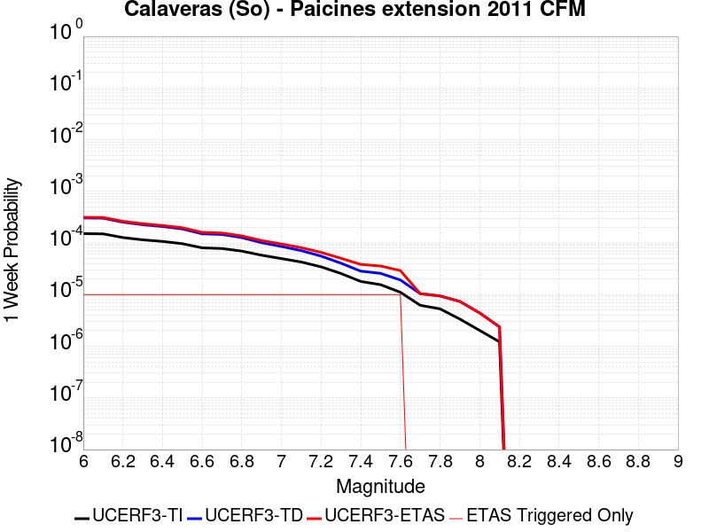 | 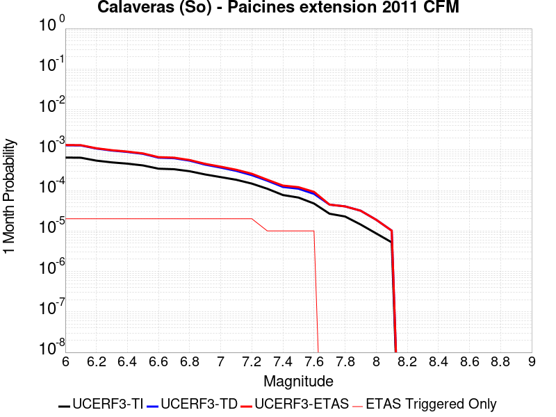 |  |  |

| Magnitude | 1 wk TI Prob | 1 wk TD Prob | 1 wk ETAS Prob | 1 wk ETAS/TD Gain | 1 wk ETAS Triggered Only | 1 mo TI Prob | 1 mo TD Prob | 1 mo ETAS Prob | 1 mo ETAS/TD Gain | 1 mo ETAS Triggered Only | 1 yr TI Prob | 1 yr TD Prob | 1 yr ETAS Prob | 1 yr ETAS/TD Gain | 1 yr ETAS Triggered Only | 10 yr TI Prob | 10 yr TD Prob | 10 yr ETAS Prob | 10 yr ETAS/TD Gain | 10 yr ETAS Triggered Only |
|-----|-----|-----|-----|-----|-----|-----|-----|-----|-----|-----|-----|-----|-----|-----|-----|-----|-----|-----|-----|-----|
| 6.0 | 1.5183659E-4 | 3.0533716E-4 | 3.153341E-4 | 1.0327407 | 1.0E-5 | 6.5056595E-4 | 0.0013069661 | 0.00132694 | 1.0152826 | 2.0E-5 | 0.007891912 | 0.01569571 | 0.01572524 | 1.0018814 | 3.0E-5 | 0.076174594 | 0.13848671 | 0.13852118 | 1.0002488 | 4.0E-5 |
| 6.1 | 1.5024997E-4 | 3.0227835E-4 | 3.1227534E-4 | 1.0330721 | 1.0E-5 | 6.437695E-4 | 0.00129387 | 0.0013138441 | 1.0154375 | 2.0E-5 | 0.0078097614 | 0.015539104 | 0.015568638 | 1.0019006 | 3.0E-5 | 0.075409345 | 0.13715632 | 0.13719083 | 1.0002517 | 4.0E-5 |
| 6.2 | 1.2743923E-4 | 2.5306802E-4 | 2.6306548E-4 | 1.0395051 | 1.0E-5 | 5.460538E-4 | 0.0010841049 | 0.0011040833 | 1.0184284 | 2.0E-5 | 0.0066279583 | 0.013046704 | 0.013076313 | 1.0022694 | 3.0E-5 | 0.064337276 | 0.11725405 | 0.11728936 | 1.0003011 | 4.0E-5 |
| 6.3 | 1.1525114E-4 | 2.2595265E-4 | 2.3595039E-4 | 1.044247 | 1.0E-5 | 4.9383997E-4 | 9.6799526E-4 | 9.87976E-4 | 1.0206412 | 2.0E-5 | 0.0059959386 | 0.011667927 | 0.011697577 | 1.0025412 | 3.0E-5 | 0.058367174 | 0.10637007 | 0.10640582 | 1.000336 | 4.0E-5 |
| 6.4 | 1.07200925E-4 | 2.0836305E-4 | 2.1836096E-4 | 1.0479832 | 1.0E-5 | 4.5935164E-4 | 8.926636E-4 | 9.126457E-4 | 1.0223849 | 2.0E-5 | 0.0055782744 | 0.010772766 | 0.010802442 | 1.0027548 | 3.0E-5 | 0.0544031 | 0.09919256 | 0.09922859 | 1.0003632 | 4.0E-5 |
| 6.5 | 9.69631E-5 | 1.8729115E-4 | 1.9728928E-4 | 1.0533828 | 1.0E-5 | 4.1548995E-4 | 8.024135E-4 | 8.223975E-4 | 1.0249048 | 2.0E-5 | 0.0050468626 | 0.009694662 | 0.009724371 | 1.0030645 | 3.0E-5 | 0.04933773 | 0.090084255 | 0.09012065 | 1.000404 | 4.0E-5 |
| 6.6 | 8.0552316E-5 | 1.5070537E-4 | 1.6070386E-4 | 1.0663446 | 1.0E-5 | 3.4517853E-4 | 6.456994E-4 | 6.6568644E-4 | 1.0309541 | 2.0E-5 | 0.0041944524 | 0.007826256 | 0.007856021 | 1.0038033 | 3.0E-5 | 0.04116161 | 0.074854024 | 0.07488178 | 1.0003707 | 3.0E-5 |
| 6.7 | 7.815757E-5 | 1.4610609E-4 | 1.5610462E-4 | 1.0684334 | 1.0E-5 | 3.34918E-4 | 6.260017E-4 | 6.4598914E-4 | 1.0319288 | 2.0E-5 | 0.004070005 | 0.0075890915 | 0.007618864 | 1.003923 | 3.0E-5 | 0.039962657 | 0.072703585 | 0.072731405 | 1.0003827 | 3.0E-5 |
| 6.8 | 6.965264E-5 | 1.2721405E-4 | 1.3721277E-4 | 1.0785977 | 1.0E-5 | 2.9847719E-4 | 5.450839E-4 | 5.65073E-4 | 1.0366716 | 2.0E-5 | 0.0036279052 | 0.00661342 | 0.0066432212 | 1.0045062 | 3.0E-5 | 0.03569247 | 0.06379891 | 0.06382699 | 1.0004402 | 3.0E-5 |
| 6.9 | 5.8000453E-5 | 1.01435086E-4 | 1.1143407E-4 | 1.0985752 | 1.0E-5 | 2.4854968E-4 | 4.3464993E-4 | 4.5464124E-4 | 1.045994 | 2.0E-5 | 0.0030218933 | 0.0052791284 | 0.0053089703 | 1.0056528 | 3.0E-5 | 0.029811295 | 0.051501602 | 0.05153006 | 1.0005525 | 3.0E-5 |
| 7.0 | 4.9865852E-5 | 8.567692E-5 | 9.567606E-5 | 1.1167076 | 1.0E-5 | 2.1369329E-4 | 3.671356E-4 | 3.8712827E-4 | 1.0544558 | 2.0E-5 | 0.0025986114 | 0.0044608037 | 0.00449067 | 1.0066953 | 3.0E-5 | 0.025684336 | 0.043781694 | 0.04381038 | 1.0006552 | 3.0E-5 |
| 7.1 | 4.283875E-5 | 7.112159E-5 | 8.1120874E-5 | 1.1405942 | 1.0E-5 | 1.8358172E-4 | 3.047715E-4 | 3.2476542E-4 | 1.0656029 | 2.0E-5 | 0.0022328163 | 0.003704336 | 0.003734225 | 1.0080686 | 3.0E-5 | 0.022105146 | 0.03673583 | 0.036764726 | 1.0007867 | 3.0E-5 |
| 7.2 | 3.450115E-5 | 5.5776054E-5 | 6.57755E-5 | 1.1792784 | 1.0E-5 | 1.478537E-4 | 2.390185E-4 | 2.5901373E-4 | 1.0836555 | 2.0E-5 | 0.0017986323 | 0.0029061958 | 0.0029361087 | 1.0102928 | 3.0E-5 | 0.017841442 | 0.029079199 | 0.029108325 | 1.0010017 | 3.0E-5 |
| 7.3 | 2.5709045E-5 | 4.0588155E-5 | 5.058775E-5 | 1.2463673 | 1.0E-5 | 1.1017697E-4 | 1.7393773E-4 | 1.8393599E-4 | 1.0574819 | 1.0E-5 | 0.0013405791 | 0.002115652 | 0.0021256309 | 1.0047166 | 1.0E-5 | 0.013325208 | 0.021297242 | 0.021307029 | 1.0004596 | 1.0E-5 |
| 7.4 | 1.8003093E-5 | 2.8509934E-5 | 3.850965E-5 | 1.350745 | 1.0E-5 | 7.715383E-5 | 1.2217973E-4 | 1.3217851E-4 | 1.0818367 | 1.0E-5 | 9.3894306E-4 | 0.0014865254 | 0.0014965106 | 1.0067171 | 1.0E-5 | 0.009349857 | 0.015052196 | 0.015062045 | 1.0006543 | 1.0E-5 |
| 7.5 | 1.5595824E-5 | 2.5822499E-5 | 3.582224E-5 | 1.3872492 | 1.0E-5 | 6.683753E-5 | 1.1066317E-4 | 1.20662065E-4 | 1.0903543 | 1.0E-5 | 8.134431E-4 | 0.0013464936 | 0.0013564802 | 1.0074167 | 1.0E-5 | 0.008104719 | 0.01365213 | 0.013661994 | 1.0007225 | 1.0E-5 |
| 7.6 | 1.1110309E-5 | 1.9222098E-5 | 2.9221905E-5 | 1.5202246 | 1.0E-5 | 4.761474E-5 | 8.2377825E-5 | 9.2377E-5 | 1.1213819 | 1.0E-5 | 5.795553E-4 | 0.0010024898 | 0.0010124799 | 1.0099652 | 1.0E-5 | 0.0057804612 | 0.010203943 | 0.010213841 | 1.00097 | 1.0E-5 |
| 7.7 | 6.2140443E-6 | 1.0437076E-5 | 1.0437076E-5 | 1.0 | 0.0 | 2.6631347E-5 | 4.4729557E-5 | 4.4729557E-5 | 1.0 | 0.0 | 3.241884E-4 | 5.444464E-4 | 5.444464E-4 | 1.0 | 0.0 | 0.0032371588 | 0.005619835 | 0.005619835 | 1.0 | 0.0 |
| 7.8 | 5.305533E-6 | 9.433038E-6 | 9.433038E-6 | 1.0 | 0.0 | 2.27378E-5 | 4.042668E-5 | 4.042668E-5 | 1.0 | 0.0 | 2.7679754E-4 | 4.920837E-4 | 4.920837E-4 | 1.0 | 0.0 | 0.0027645302 | 0.005074324 | 0.005074324 | 1.0 | 0.0 |
| 7.9 | 3.363505E-6 | 7.3848937E-6 | 7.3848937E-6 | 1.0 | 0.0 | 1.4414942E-5 | 3.164916E-5 | 3.164916E-5 | 1.0 | 0.0 | 1.7548777E-4 | 3.8526047E-4 | 3.8526047E-4 | 1.0 | 0.0 | 0.0017534926 | 0.003948527 | 0.003948527 | 1.0 | 0.0 |
| 8.0 | 2.0271132E-6 | 4.413104E-6 | 4.413104E-6 | 1.0 | 0.0 | 8.687599E-6 | 1.8913164E-5 | 1.8913164E-5 | 1.0 | 0.0 | 1.05766376E-4 | 2.302435E-4 | 2.302435E-4 | 1.0 | 0.0 | 0.0010571606 | 0.002351099 | 0.002351099 | 1.0 | 0.0 |
| 8.1 | 1.2206116E-6 | 2.3751331E-6 | 2.3751331E-6 | 1.0 | 0.0 | 5.2311816E-6 | 1.0179103E-5 | 1.0179103E-5 | 1.0 | 0.0 | 6.3687774E-5 | 1.2392356E-4 | 1.2392356E-4 | 1.0 | 0.0 | 6.366953E-4 | 0.0012705477 | 0.0012705477 | 1.0 | 0.0 |

## Mono Lake 2011 CFM
*[(top)](#table-of-contents)*

| 1 Week | 1 Month | 1 Year | 10 Year |
|-----|-----|-----|-----|
| 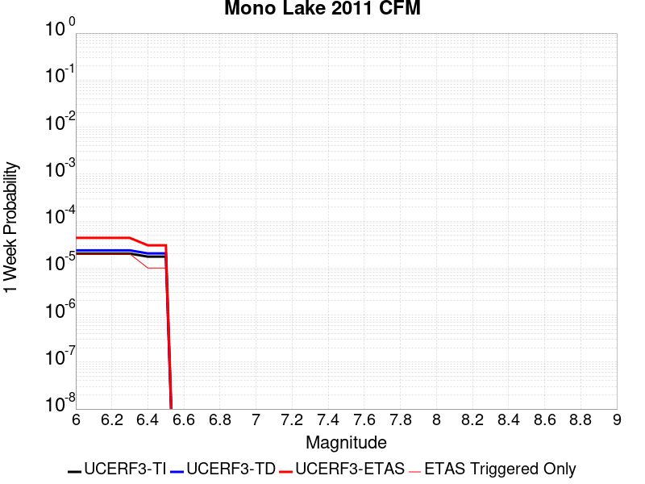 | 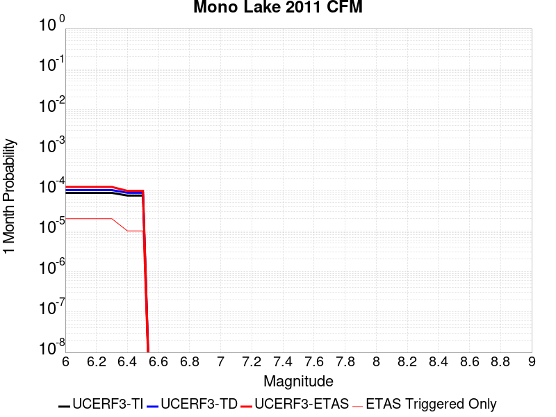 |  | 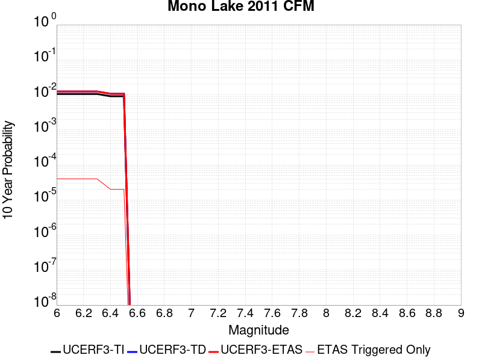 |

| Magnitude | 1 wk TI Prob | 1 wk TD Prob | 1 wk ETAS Prob | 1 wk ETAS/TD Gain | 1 wk ETAS Triggered Only | 1 mo TI Prob | 1 mo TD Prob | 1 mo ETAS Prob | 1 mo ETAS/TD Gain | 1 mo ETAS Triggered Only | 1 yr TI Prob | 1 yr TD Prob | 1 yr ETAS Prob | 1 yr ETAS/TD Gain | 1 yr ETAS Triggered Only | 10 yr TI Prob | 10 yr TD Prob | 10 yr ETAS Prob | 10 yr ETAS/TD Gain | 10 yr ETAS Triggered Only |
|-----|-----|-----|-----|-----|-----|-----|-----|-----|-----|-----|-----|-----|-----|-----|-----|-----|-----|-----|-----|-----|
| 6.0 | 2.0341662E-5 | 2.3828166E-5 | 4.382769E-5 | 1.8393228 | 2.0E-5 | 8.717564E-5 | 1.0211971E-4 | 1.2211766E-4 | 1.1958286 | 2.0E-5 | 0.0010608466 | 0.0012431298 | 0.001263105 | 1.0160685 | 2.0E-5 | 0.010557966 | 0.012413835 | 0.012453338 | 1.0031822 | 4.0E-5 |
| 6.1 | 2.0341662E-5 | 2.3828166E-5 | 4.382769E-5 | 1.8393228 | 2.0E-5 | 8.717564E-5 | 1.0211971E-4 | 1.2211766E-4 | 1.1958286 | 2.0E-5 | 0.0010608466 | 0.0012431298 | 0.001263105 | 1.0160685 | 2.0E-5 | 0.010557966 | 0.012413835 | 0.012453338 | 1.0031822 | 4.0E-5 |
| 6.2 | 2.0341662E-5 | 2.3828166E-5 | 4.382769E-5 | 1.8393228 | 2.0E-5 | 8.717564E-5 | 1.0211971E-4 | 1.2211766E-4 | 1.1958286 | 2.0E-5 | 0.0010608466 | 0.0012431298 | 0.001263105 | 1.0160685 | 2.0E-5 | 0.010557966 | 0.012413835 | 0.012453338 | 1.0031822 | 4.0E-5 |
| 6.3 | 2.0341662E-5 | 2.3828166E-5 | 4.382769E-5 | 1.8393228 | 2.0E-5 | 8.717564E-5 | 1.0211971E-4 | 1.2211766E-4 | 1.1958286 | 2.0E-5 | 0.0010608466 | 0.0012431298 | 0.001263105 | 1.0160685 | 2.0E-5 | 0.010557966 | 0.012413835 | 0.012453338 | 1.0031822 | 4.0E-5 |
| 6.4 | 1.749821E-5 | 2.0490985E-5 | 3.049078E-5 | 1.4880095 | 1.0E-5 | 7.499018E-5 | 8.781851E-5 | 9.781763E-5 | 1.1138612 | 1.0E-5 | 9.1262296E-4 | 0.0010691903 | 0.0010791797 | 1.0093429 | 1.0E-5 | 0.009088841 | 0.010691865 | 0.010711651 | 1.0018506 | 2.0E-5 |
| 6.5 | 1.749821E-5 | 2.0490985E-5 | 3.049078E-5 | 1.4880095 | 1.0E-5 | 7.499018E-5 | 8.781851E-5 | 9.781763E-5 | 1.1138612 | 1.0E-5 | 9.1262296E-4 | 0.0010691903 | 0.0010791797 | 1.0093429 | 1.0E-5 | 0.009088841 | 0.010691865 | 0.010711651 | 1.0018506 | 2.0E-5 |

## Raymond
*[(top)](#table-of-contents)*

| 1 Week | 1 Month | 1 Year | 10 Year |
|-----|-----|-----|-----|
|  |  |  |  |

| Magnitude | 1 wk TI Prob | 1 wk TD Prob | 1 wk ETAS Prob | 1 wk ETAS/TD Gain | 1 wk ETAS Triggered Only | 1 mo TI Prob | 1 mo TD Prob | 1 mo ETAS Prob | 1 mo ETAS/TD Gain | 1 mo ETAS Triggered Only | 1 yr TI Prob | 1 yr TD Prob | 1 yr ETAS Prob | 1 yr ETAS/TD Gain | 1 yr ETAS Triggered Only | 10 yr TI Prob | 10 yr TD Prob | 10 yr ETAS Prob | 10 yr ETAS/TD Gain | 10 yr ETAS Triggered Only |
|-----|-----|-----|-----|-----|-----|-----|-----|-----|-----|-----|-----|-----|-----|-----|-----|-----|-----|-----|-----|-----|
| 6.0 | 1.5157413E-5 | 1.5810128E-5 | 1.5810128E-5 | 1.0 | 0.0 | 6.4958724E-5 | 6.7756075E-5 | 7.7755394E-5 | 1.1475782 | 1.0E-5 | 7.905855E-4 | 8.2464307E-4 | 8.446266E-4 | 1.0242329 | 2.0E-5 | 0.007877788 | 0.008218348 | 0.00825802 | 1.0048271 | 4.0E-5 |
| 6.1 | 1.5157413E-5 | 1.5810128E-5 | 1.5810128E-5 | 1.0 | 0.0 | 6.4958724E-5 | 6.7756075E-5 | 7.7755394E-5 | 1.1475782 | 1.0E-5 | 7.905855E-4 | 8.2464307E-4 | 8.446266E-4 | 1.0242329 | 2.0E-5 | 0.007877788 | 0.008218348 | 0.00825802 | 1.0048271 | 4.0E-5 |
| 6.2 | 1.5157413E-5 | 1.5810128E-5 | 1.5810128E-5 | 1.0 | 0.0 | 6.4958724E-5 | 6.7756075E-5 | 7.7755394E-5 | 1.1475782 | 1.0E-5 | 7.905855E-4 | 8.2464307E-4 | 8.446266E-4 | 1.0242329 | 2.0E-5 | 0.007877788 | 0.008218348 | 0.00825802 | 1.0048271 | 4.0E-5 |
| 6.3 | 1.5157413E-5 | 1.5810128E-5 | 1.5810128E-5 | 1.0 | 0.0 | 6.4958724E-5 | 6.7756075E-5 | 7.7755394E-5 | 1.1475782 | 1.0E-5 | 7.905855E-4 | 8.2464307E-4 | 8.446266E-4 | 1.0242329 | 2.0E-5 | 0.007877788 | 0.008218348 | 0.00825802 | 1.0048271 | 4.0E-5 |
| 6.4 | 1.3941944E-5 | 1.445469E-5 | 1.445469E-5 | 1.0 | 0.0 | 5.9749822E-5 | 6.1947336E-5 | 7.194671E-5 | 1.1614175 | 1.0E-5 | 7.2721124E-4 | 7.5397117E-4 | 7.7395607E-4 | 1.0265062 | 2.0E-5 | 0.007248361 | 0.0075164647 | 0.007546239 | 1.0039612 | 3.0E-5 |
| 6.5 | 1.3941944E-5 | 1.445469E-5 | 1.445469E-5 | 1.0 | 0.0 | 5.9749822E-5 | 6.1947336E-5 | 7.194671E-5 | 1.1614175 | 1.0E-5 | 7.2721124E-4 | 7.5397117E-4 | 7.7395607E-4 | 1.0265062 | 2.0E-5 | 0.007248361 | 0.0075164647 | 0.007546239 | 1.0039612 | 3.0E-5 |
| 6.6 | 1.0542609E-5 | 1.0671113E-5 | 1.0671113E-5 | 1.0 | 0.0 | 4.5181827E-5 | 4.573257E-5 | 5.573211E-5 | 1.2186525 | 1.0E-5 | 5.499499E-4 | 5.5665727E-4 | 5.766461E-4 | 1.0359087 | 2.0E-5 | 0.005485909 | 0.00555319 | 0.0055830237 | 1.0053723 | 3.0E-5 |
| 6.7 | 1.0542609E-5 | 1.0671113E-5 | 1.0671113E-5 | 1.0 | 0.0 | 4.5181827E-5 | 4.573257E-5 | 5.573211E-5 | 1.2186525 | 1.0E-5 | 5.499499E-4 | 5.5665727E-4 | 5.766461E-4 | 1.0359087 | 2.0E-5 | 0.005485909 | 0.00555319 | 0.0055830237 | 1.0053723 | 3.0E-5 |
| 6.8 | 1.0079132E-5 | 1.0176646E-5 | 1.0176646E-5 | 1.0 | 0.0 | 4.3195567E-5 | 4.3613498E-5 | 5.361306E-5 | 1.2292768 | 1.0E-5 | 5.257791E-4 | 5.3087034E-4 | 5.508597E-4 | 1.037654 | 2.0E-5 | 0.0052453685 | 0.005296571 | 0.005326412 | 1.0056341 | 3.0E-5 |
| 6.9 | 7.721598E-6 | 7.5489047E-6 | 7.5489047E-6 | 1.0 | 0.0 | 3.3092143E-5 | 3.2352054E-5 | 4.235173E-5 | 1.3090894 | 1.0E-5 | 4.0282236E-4 | 3.9381627E-4 | 4.1380842E-4 | 1.0507652 | 2.0E-5 | 0.0040209293 | 0.0039313175 | 0.003951239 | 1.0050673 | 2.0E-5 |
| 7.0 | 7.137566E-6 | 6.9113057E-6 | 6.9113057E-6 | 1.0 | 0.0 | 3.058921E-5 | 2.961955E-5 | 3.9619255E-5 | 1.3376049 | 1.0E-5 | 3.7236E-4 | 3.6055944E-4 | 3.8055223E-4 | 1.0554494 | 2.0E-5 | 0.0037173668 | 0.0035998628 | 0.0036197908 | 1.0055357 | 2.0E-5 |
| 7.1 | 5.654976E-6 | 5.29954E-6 | 5.29954E-6 | 1.0 | 0.0 | 2.4235387E-5 | 2.2712118E-5 | 3.271189E-5 | 1.4402835 | 1.0E-5 | 2.9502588E-4 | 2.7648517E-4 | 2.8648242E-4 | 1.0361583 | 1.0E-5 | 0.0029463451 | 0.002761443 | 0.0027714153 | 1.0036113 | 1.0E-5 |
| 7.2 | 4.9358455E-6 | 4.5266574E-6 | 4.5266574E-6 | 1.0 | 0.0 | 2.1153453E-5 | 1.9399817E-5 | 2.9399624E-5 | 1.5154588 | 1.0E-5 | 2.5751285E-4 | 2.3616731E-4 | 2.4616494E-4 | 1.0423329 | 1.0E-5 | 0.0025721465 | 0.0023591854 | 0.002369162 | 1.0042287 | 1.0E-5 |
| 7.3 | 4.2368597E-6 | 3.8056164E-6 | 3.8056164E-6 | 1.0 | 0.0 | 1.8157843E-5 | 1.6309683E-5 | 2.630952E-5 | 1.6131227 | 1.0E-5 | 2.2104931E-4 | 1.9855241E-4 | 2.0855042E-4 | 1.0503545 | 1.0E-5 | 0.0022082955 | 0.0019837688 | 0.001993749 | 1.0050309 | 1.0E-5 |
| 7.4 | 3.4999923E-6 | 3.043744E-6 | 3.043744E-6 | 1.0 | 0.0 | 1.49998805E-5 | 1.3044552E-5 | 2.3044422E-5 | 1.7665935 | 1.0E-5 | 1.8260824E-4 | 1.5880594E-4 | 1.6880434E-4 | 1.0629599 | 1.0E-5 | 0.0018245826 | 0.0015869403 | 0.0015969244 | 1.0062914 | 1.0E-5 |
| 7.5 | 2.738017E-6 | 2.3020468E-6 | 2.3020468E-6 | 1.0 | 0.0 | 1.1734306E-5 | 9.865878E-6 | 1.986578E-5 | 2.0135846 | 1.0E-5 | 1.428558E-4 | 1.2011051E-4 | 1.3010931E-4 | 1.0832467 | 1.0E-5 | 0.0014276401 | 0.0012004703 | 0.0012104583 | 1.0083201 | 1.0E-5 |
| 7.6 | 1.8186392E-6 | 1.442312E-6 | 1.442312E-6 | 1.0 | 0.0 | 7.794145E-6 | 6.181323E-6 | 6.181323E-6 | 1.0 | 0.0 | 9.488958E-5 | 7.5255055E-5 | 7.5255055E-5 | 1.0 | 0.0 | 9.4849075E-4 | 7.523072E-4 | 7.523072E-4 | 1.0 | 0.0 |
| 7.7 | 1.0660348E-6 | 7.6438056E-7 | 7.6438056E-7 | 1.0 | 0.0 | 4.5687125E-6 | 3.2759126E-6 | 3.2759126E-6 | 1.0 | 0.0 | 5.5622655E-5 | 3.9883522E-5 | 3.9883522E-5 | 1.0 | 0.0 | 5.5608735E-4 | 3.9877277E-4 | 3.9877277E-4 | 1.0 | 0.0 |
| 7.8 | 6.913602E-7 | 4.3204133E-7 | 4.3204133E-7 | 1.0 | 0.0 | 2.962969E-6 | 1.8516045E-6 | 1.8516045E-6 | 1.0 | 0.0 | 3.607355E-5 | 2.2543056E-5 | 2.2543056E-5 | 1.0 | 0.0 | 3.6067693E-4 | 2.2541556E-4 | 2.2541556E-4 | 1.0 | 0.0 |
| 7.9 | 7.425201E-8 | 5.3222113E-8 | 5.3222113E-8 | 1.0 | 0.0 | 3.1822285E-7 | 2.2809476E-7 | 2.2809476E-7 | 1.0 | 0.0 | 3.874356E-6 | 2.7770516E-6 | 2.7770516E-6 | 1.0 | 0.0 | 3.8742884E-5 | 2.7770298E-5 | 2.7770298E-5 | 1.0 | 0.0 |

## Great Valley 07 (Orestimba)
*[(top)](#table-of-contents)*

| 1 Week | 1 Month | 1 Year | 10 Year |
|-----|-----|-----|-----|
|  | 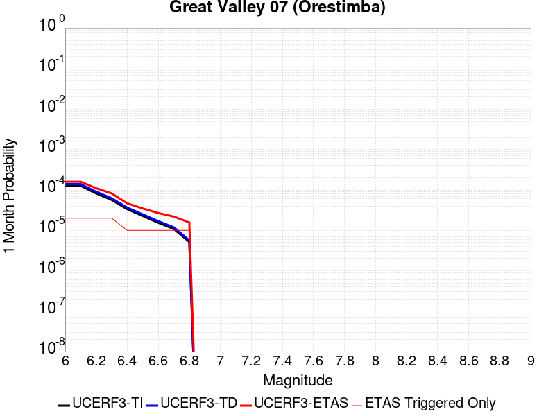 | 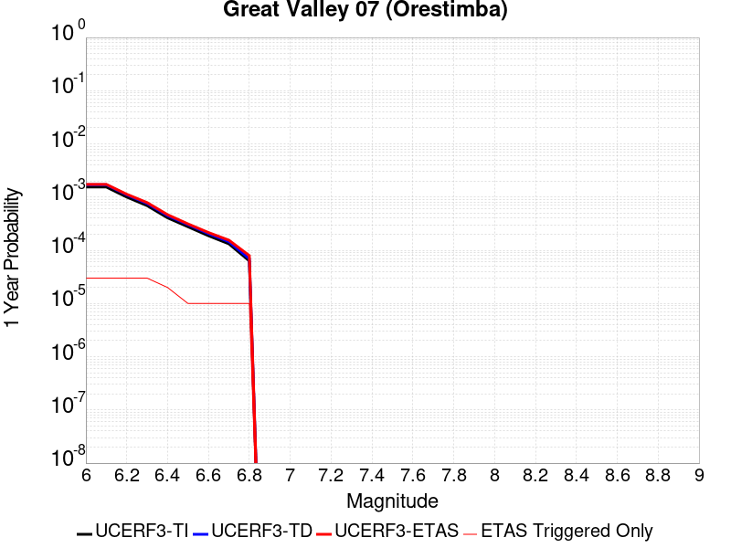 |  |

| Magnitude | 1 wk TI Prob | 1 wk TD Prob | 1 wk ETAS Prob | 1 wk ETAS/TD Gain | 1 wk ETAS Triggered Only | 1 mo TI Prob | 1 mo TD Prob | 1 mo ETAS Prob | 1 mo ETAS/TD Gain | 1 mo ETAS Triggered Only | 1 yr TI Prob | 1 yr TD Prob | 1 yr ETAS Prob | 1 yr ETAS/TD Gain | 1 yr ETAS Triggered Only | 10 yr TI Prob | 10 yr TD Prob | 10 yr ETAS Prob | 10 yr ETAS/TD Gain | 10 yr ETAS Triggered Only |
|-----|-----|-----|-----|-----|-----|-----|-----|-----|-----|-----|-----|-----|-----|-----|-----|-----|-----|-----|-----|-----|
| 6.0 | 2.9687902E-5 | 3.27575E-5 | 3.27575E-5 | 1.0 | 0.0 | 1.2722766E-4 | 1.4038214E-4 | 1.6037932E-4 | 1.1424483 | 2.0E-5 | 0.0015478961 | 0.0017078844 | 0.0017378331 | 1.0175356 | 3.0E-5 | 0.015371585 | 0.016955135 | 0.016994458 | 1.0023192 | 4.0E-5 |
| 6.1 | 2.9687902E-5 | 3.27575E-5 | 3.27575E-5 | 1.0 | 0.0 | 1.2722766E-4 | 1.4038214E-4 | 1.6037932E-4 | 1.1424483 | 2.0E-5 | 0.0015478961 | 0.0017078844 | 0.0017378331 | 1.0175356 | 3.0E-5 | 0.015371585 | 0.016955135 | 0.016994458 | 1.0023192 | 4.0E-5 |
| 6.2 | 1.9231524E-5 | 2.1159167E-5 | 2.1159167E-5 | 1.0 | 0.0 | 8.2418206E-5 | 9.067912E-5 | 1.10677305E-4 | 1.2205379 | 2.0E-5 | 0.0010029797 | 0.0011034822 | 0.0011334491 | 1.0271567 | 3.0E-5 | 0.00998465 | 0.01098244 | 0.011022001 | 1.0036021 | 4.0E-5 |
| 6.3 | 1.324766E-5 | 1.4548534E-5 | 1.4548534E-5 | 1.0 | 0.0 | 5.6774446E-5 | 6.234942E-5 | 8.2348175E-5 | 1.3207529 | 2.0E-5 | 6.910097E-4 | 7.5884897E-4 | 7.888262E-4 | 1.0395036 | 3.0E-5 | 0.006888649 | 0.0075635235 | 0.007603221 | 1.0052485 | 4.0E-5 |
| 6.4 | 7.818645E-6 | 8.57284E-6 | 8.57284E-6 | 1.0 | 0.0 | 3.3508048E-5 | 3.6740246E-5 | 4.673988E-5 | 1.2721711 | 1.0E-5 | 4.078841E-4 | 4.4722404E-4 | 4.6721508E-4 | 1.0447003 | 2.0E-5 | 0.004071363 | 0.0044635804 | 0.004483491 | 1.0044607 | 2.0E-5 |
| 6.5 | 5.3076565E-6 | 5.8178007E-6 | 5.8178007E-6 | 1.0 | 0.0 | 2.27469E-5 | 2.4933206E-5 | 3.4932957E-5 | 1.4010615 | 1.0E-5 | 2.7690834E-4 | 3.035216E-4 | 3.1351857E-4 | 1.0329366 | 1.0E-5 | 0.0027656353 | 0.00303128 | 0.0030412497 | 1.003289 | 1.0E-5 |
| 6.6 | 3.6003578E-6 | 3.9484953E-6 | 3.9484953E-6 | 1.0 | 0.0 | 1.5430012E-5 | 1.6922022E-5 | 2.6921853E-5 | 1.590936 | 1.0E-5 | 1.8784421E-4 | 2.0600771E-4 | 2.1600565E-4 | 1.0485319 | 1.0E-5 | 0.0018768552 | 0.0020583214 | 0.0020683007 | 1.0048484 | 1.0E-5 |
| 6.7 | 2.5361826E-6 | 2.7834678E-6 | 2.7834678E-6 | 1.0 | 0.0 | 1.0869308E-5 | 1.1929101E-5 | 2.1928981E-5 | 1.8382761 | 1.0E-5 | 1.3232579E-4 | 1.4522845E-4 | 1.55227E-4 | 1.0688471 | 1.0E-5 | 0.0013224703 | 0.0014514653 | 0.0014614508 | 1.0068796 | 1.0E-5 |
| 6.8 | 1.2115831E-6 | 1.3313797E-6 | 1.3313797E-6 | 1.0 | 0.0 | 5.1924885E-6 | 5.7059065E-6 | 1.570585E-5 | 2.75256 | 1.0E-5 | 6.3216714E-5 | 6.9468166E-5 | 7.946747E-5 | 1.1439408 | 1.0E-5 | 6.3198735E-4 | 6.945596E-4 | 7.045527E-4 | 1.0143876 | 1.0E-5 |

## San Gabriel (Extension)
*[(top)](#table-of-contents)*

| 1 Week | 1 Month | 1 Year | 10 Year |
|-----|-----|-----|-----|
| 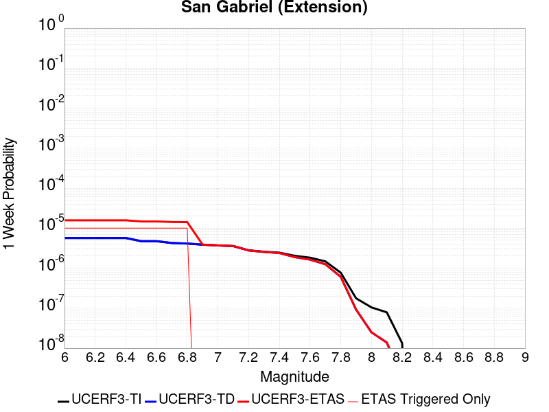 | 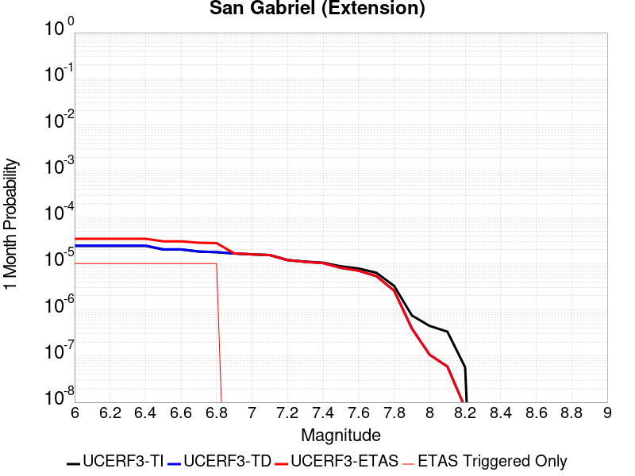 | 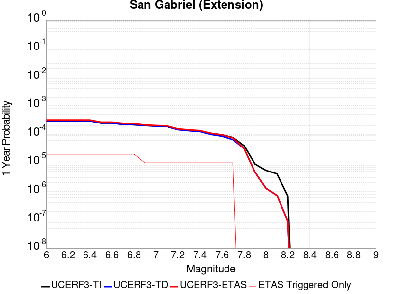 |  |

| Magnitude | 1 wk TI Prob | 1 wk TD Prob | 1 wk ETAS Prob | 1 wk ETAS/TD Gain | 1 wk ETAS Triggered Only | 1 mo TI Prob | 1 mo TD Prob | 1 mo ETAS Prob | 1 mo ETAS/TD Gain | 1 mo ETAS Triggered Only | 1 yr TI Prob | 1 yr TD Prob | 1 yr ETAS Prob | 1 yr ETAS/TD Gain | 1 yr ETAS Triggered Only | 10 yr TI Prob | 10 yr TD Prob | 10 yr ETAS Prob | 10 yr ETAS/TD Gain | 10 yr ETAS Triggered Only |
|-----|-----|-----|-----|-----|-----|-----|-----|-----|-----|-----|-----|-----|-----|-----|-----|-----|-----|-----|-----|-----|
| 6.0 | 5.6486106E-6 | 5.7168304E-6 | 1.5716772E-5 | 2.749211 | 1.0E-5 | 2.4208108E-5 | 2.450048E-5 | 3.4500234E-5 | 1.4081453 | 1.0E-5 | 2.9469383E-4 | 2.9825376E-4 | 3.182478E-4 | 1.067037 | 2.0E-5 | 0.0029430336 | 0.0029786653 | 0.003018546 | 1.0133889 | 4.0E-5 |
| 6.1 | 5.6486106E-6 | 5.7168304E-6 | 1.5716772E-5 | 2.749211 | 1.0E-5 | 2.4208108E-5 | 2.450048E-5 | 3.4500234E-5 | 1.4081453 | 1.0E-5 | 2.9469383E-4 | 2.9825376E-4 | 3.182478E-4 | 1.067037 | 2.0E-5 | 0.0029430336 | 0.0029786653 | 0.003018546 | 1.0133889 | 4.0E-5 |
| 6.2 | 5.6486106E-6 | 5.7168304E-6 | 1.5716772E-5 | 2.749211 | 1.0E-5 | 2.4208108E-5 | 2.450048E-5 | 3.4500234E-5 | 1.4081453 | 1.0E-5 | 2.9469383E-4 | 2.9825376E-4 | 3.182478E-4 | 1.067037 | 2.0E-5 | 0.0029430336 | 0.0029786653 | 0.003018546 | 1.0133889 | 4.0E-5 |
| 6.3 | 5.6486106E-6 | 5.7168304E-6 | 1.5716772E-5 | 2.749211 | 1.0E-5 | 2.4208108E-5 | 2.450048E-5 | 3.4500234E-5 | 1.4081453 | 1.0E-5 | 2.9469383E-4 | 2.9825376E-4 | 3.182478E-4 | 1.067037 | 2.0E-5 | 0.0029430336 | 0.0029786653 | 0.003018546 | 1.0133889 | 4.0E-5 |
| 6.4 | 5.6486106E-6 | 5.7168304E-6 | 1.5716772E-5 | 2.749211 | 1.0E-5 | 2.4208108E-5 | 2.450048E-5 | 3.4500234E-5 | 1.4081453 | 1.0E-5 | 2.9469383E-4 | 2.9825376E-4 | 3.182478E-4 | 1.067037 | 2.0E-5 | 0.0029430336 | 0.0029786653 | 0.003018546 | 1.0133889 | 4.0E-5 |
| 6.5 | 4.7134554E-6 | 4.7542544E-6 | 1.4754207E-5 | 3.1033692 | 1.0E-5 | 2.0200367E-5 | 2.0375222E-5 | 3.0375018E-5 | 1.4907823 | 1.0E-5 | 2.459117E-4 | 2.4804095E-4 | 2.6803598E-4 | 1.0806118 | 2.0E-5 | 0.0024563975 | 0.002477729 | 0.0025176299 | 1.0161039 | 4.0E-5 |
| 6.6 | 4.7134554E-6 | 4.7542544E-6 | 1.4754207E-5 | 3.1033692 | 1.0E-5 | 2.0200367E-5 | 2.0375222E-5 | 3.0375018E-5 | 1.4907823 | 1.0E-5 | 2.459117E-4 | 2.4804095E-4 | 2.6803598E-4 | 1.0806118 | 2.0E-5 | 0.0024563975 | 0.002477729 | 0.0025176299 | 1.0161039 | 4.0E-5 |
| 6.7 | 4.2468837E-6 | 4.2740717E-6 | 1.4274029E-5 | 3.3396792 | 1.0E-5 | 1.8200803E-5 | 1.8317325E-5 | 2.8317143E-5 | 1.5459212 | 1.0E-5 | 2.2157225E-4 | 2.2299135E-4 | 2.4298689E-4 | 1.0896696 | 2.0E-5 | 0.0022135144 | 0.0022277518 | 0.0022676627 | 1.0179154 | 4.0E-5 |
| 6.8 | 4.1180615E-6 | 4.1414614E-6 | 1.414142E-5 | 3.4145966 | 1.0E-5 | 1.7648716E-5 | 1.7749004E-5 | 2.7748825E-5 | 1.5634019 | 1.0E-5 | 2.1485193E-4 | 2.160734E-4 | 2.3606909E-4 | 1.0925411 | 2.0E-5 | 0.0021464431 | 0.0021587082 | 0.0021986219 | 1.0184896 | 4.0E-5 |
| 6.9 | 3.863861E-6 | 3.8797766E-6 | 3.8797766E-6 | 1.0 | 0.0 | 1.65593E-5 | 1.6627511E-5 | 1.6627511E-5 | 1.0 | 0.0 | 2.0159081E-4 | 2.0242184E-4 | 2.124198E-4 | 1.0493917 | 1.0E-5 | 0.0020140803 | 0.002022446 | 0.0020523854 | 1.0148035 | 3.0E-5 |
| 7.0 | 3.6947372E-6 | 3.705676E-6 | 3.705676E-6 | 1.0 | 0.0 | 1.5834492E-5 | 1.5881375E-5 | 1.5881375E-5 | 1.0 | 0.0 | 1.9276788E-4 | 1.9333926E-4 | 2.0333733E-4 | 1.0517125 | 1.0E-5 | 0.0019260074 | 0.0019317807 | 0.0019617227 | 1.0154997 | 3.0E-5 |
| 7.1 | 3.5686835E-6 | 3.5728963E-6 | 3.5728963E-6 | 1.0 | 0.0 | 1.5294268E-5 | 1.5312327E-5 | 1.5312327E-5 | 1.0 | 0.0 | 1.861918E-4 | 1.8641229E-4 | 1.9641043E-4 | 1.0536345 | 1.0E-5 | 0.0018603588 | 0.0018626289 | 0.001892573 | 1.0160763 | 3.0E-5 |
| 7.2 | 2.8023446E-6 | 2.7767885E-6 | 2.7767885E-6 | 1.0 | 0.0 | 1.2009994E-5 | 1.1900468E-5 | 1.1900468E-5 | 1.0 | 0.0 | 1.4621185E-4 | 1.4487868E-4 | 1.5487723E-4 | 1.0690132 | 1.0E-5 | 0.001461157 | 0.0014478569 | 0.0014678279 | 1.0137935 | 2.0E-5 |
| 7.3 | 2.5843012E-6 | 2.5459642E-6 | 2.5459642E-6 | 1.0 | 0.0 | 1.1075529E-5 | 1.0911231E-5 | 1.0911231E-5 | 1.0 | 0.0 | 1.3483623E-4 | 1.3283623E-4 | 1.428349E-4 | 1.0752707 | 1.0E-5 | 0.0013475444 | 0.0013275818 | 0.0013475553 | 1.0150449 | 2.0E-5 |
| 7.4 | 2.4464468E-6 | 2.396665E-6 | 2.396665E-6 | 1.0 | 0.0 | 1.04847295E-5 | 1.0271382E-5 | 1.0271382E-5 | 1.0 | 0.0 | 1.276441E-4 | 1.25047E-4 | 1.3504575E-4 | 1.07996 | 1.0E-5 | 0.0012757082 | 0.0012497796 | 0.0012697546 | 1.0159829 | 2.0E-5 |
| 7.5 | 2.0420266E-6 | 1.8910426E-6 | 1.8910426E-6 | 1.0 | 0.0 | 8.751514E-6 | 8.104444E-6 | 8.104444E-6 | 1.0 | 0.0 | 1.0654447E-4 | 9.8667166E-5 | 1.0866618E-4 | 1.1013409 | 1.0E-5 | 0.001064934 | 9.862408E-4 | 0.001006221 | 1.020259 | 2.0E-5 |
| 7.6 | 1.8326596E-6 | 1.6398341E-6 | 1.6398341E-6 | 1.0 | 0.0 | 7.854232E-6 | 7.0278415E-6 | 7.0278415E-6 | 1.0 | 0.0 | 9.562107E-5 | 8.5560634E-5 | 9.555978E-5 | 1.1168662 | 1.0E-5 | 9.5579936E-4 | 8.5528276E-4 | 8.752657E-4 | 1.0233641 | 2.0E-5 |
| 7.7 | 1.4786998E-6 | 1.2523838E-6 | 1.2523838E-6 | 1.0 | 0.0 | 6.3372695E-6 | 5.367348E-6 | 5.367348E-6 | 1.0 | 0.0 | 7.715353E-5 | 6.534551E-5 | 7.5344855E-5 | 1.1530226 | 1.0E-5 | 7.7126746E-4 | 6.532707E-4 | 6.6326413E-4 | 1.0152975 | 1.0E-5 |
| 7.8 | 7.6975533E-7 | 6.0693884E-7 | 6.0693884E-7 | 1.0 | 0.0 | 3.2989474E-6 | 2.601164E-6 | 2.601164E-6 | 1.0 | 0.0 | 4.0163945E-5 | 3.166871E-5 | 3.166871E-5 | 1.0 | 0.0 | 4.0156685E-4 | 3.1664805E-4 | 3.1664805E-4 | 1.0 | 0.0 |
| 7.9 | 1.7645915E-7 | 9.213256E-8 | 9.213256E-8 | 1.0 | 0.0 | 7.562533E-7 | 3.9485377E-7 | 3.9485377E-7 | 1.0 | 0.0 | 9.207345E-6 | 4.807334E-6 | 4.807334E-6 | 1.0 | 0.0 | 9.206964E-5 | 4.807699E-5 | 4.807699E-5 | 1.0 | 0.0 |
| 8.0 | 1.0463461E-7 | 2.4949307E-8 | 2.4949307E-8 | 1.0 | 0.0 | 4.4843398E-7 | 1.0692559E-7 | 1.0692559E-7 | 1.0 | 0.0 | 5.45967E-6 | 1.3018183E-6 | 1.3018183E-6 | 1.0 | 0.0 | 5.459536E-5 | 1.3022789E-5 | 1.3022789E-5 | 1.0 | 0.0 |
| 8.1 | 7.875717E-8 | 1.3866874E-8 | 1.3866874E-8 | 1.0 | 0.0 | 3.3753068E-7 | 5.942946E-8 | 5.942946E-8 | 1.0 | 0.0 | 4.109428E-6 | 7.235534E-7 | 7.235534E-7 | 1.0 | 0.0 | 4.109352E-5 | 7.2401926E-6 | 7.2401926E-6 | 1.0 | 0.0 |
| 8.2 | 1.33163E-8 | 1.7733891E-9 | 1.7733891E-9 | 1.0 | 0.0 | 5.7069855E-8 | 7.600239E-9 | 7.600239E-9 | 1.0 | 0.0 | 6.9482525E-7 | 9.25329E-8 | 9.25329E-8 | 1.0 | 0.0 | 6.9482307E-6 | 9.272953E-7 | 9.272953E-7 | 1.0 | 0.0 |

## Hector Mine
*[(top)](#table-of-contents)*

| 1 Week | 1 Month | 1 Year | 10 Year |
|-----|-----|-----|-----|
| 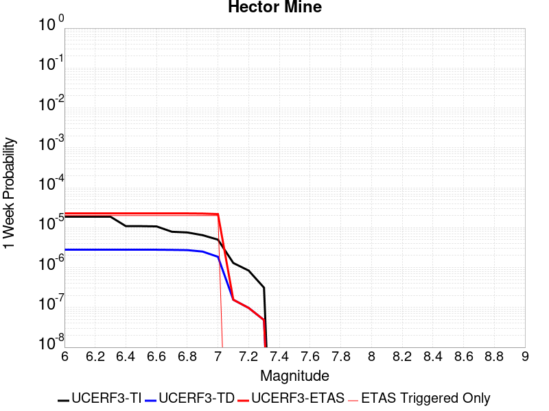 | 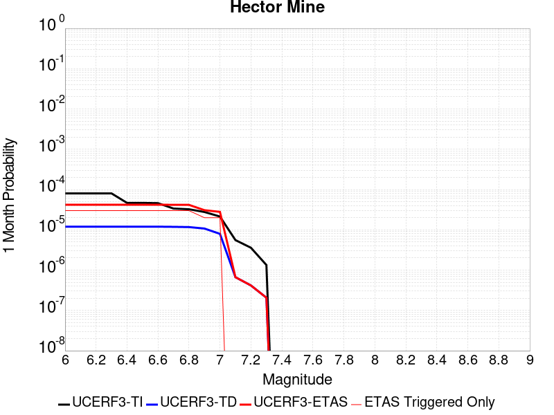 |  |  |

| Magnitude | 1 wk TI Prob | 1 wk TD Prob | 1 wk ETAS Prob | 1 wk ETAS/TD Gain | 1 wk ETAS Triggered Only | 1 mo TI Prob | 1 mo TD Prob | 1 mo ETAS Prob | 1 mo ETAS/TD Gain | 1 mo ETAS Triggered Only | 1 yr TI Prob | 1 yr TD Prob | 1 yr ETAS Prob | 1 yr ETAS/TD Gain | 1 yr ETAS Triggered Only | 10 yr TI Prob | 10 yr TD Prob | 10 yr ETAS Prob | 10 yr ETAS/TD Gain | 10 yr ETAS Triggered Only |
|-----|-----|-----|-----|-----|-----|-----|-----|-----|-----|-----|-----|-----|-----|-----|-----|-----|-----|-----|-----|-----|
| 6.0 | 1.8760093E-5 | 2.7963818E-6 | 2.2796326E-5 | 8.15208 | 2.0E-5 | 8.039792E-5 | 1.1984461E-5 | 4.19841E-5 | 3.5032115 | 3.0E-5 | 9.78405E-4 | 1.4590504E-4 | 1.858992E-4 | 1.2741109 | 4.0E-5 | 0.009741086 | 0.0014584847 | 0.0014984263 | 1.0273857 | 4.0E-5 |
| 6.1 | 1.8760093E-5 | 2.7963818E-6 | 2.2796326E-5 | 8.15208 | 2.0E-5 | 8.039792E-5 | 1.1984461E-5 | 4.19841E-5 | 3.5032115 | 3.0E-5 | 9.78405E-4 | 1.4590504E-4 | 1.858992E-4 | 1.2741109 | 4.0E-5 | 0.009741086 | 0.0014584847 | 0.0014984263 | 1.0273857 | 4.0E-5 |
| 6.2 | 1.8760093E-5 | 2.7963818E-6 | 2.2796326E-5 | 8.15208 | 2.0E-5 | 8.039792E-5 | 1.1984461E-5 | 4.19841E-5 | 3.5032115 | 3.0E-5 | 9.78405E-4 | 1.4590504E-4 | 1.858992E-4 | 1.2741109 | 4.0E-5 | 0.009741086 | 0.0014584847 | 0.0014984263 | 1.0273857 | 4.0E-5 |
| 6.3 | 1.8760093E-5 | 2.7963818E-6 | 2.2796326E-5 | 8.15208 | 2.0E-5 | 8.039792E-5 | 1.1984461E-5 | 4.19841E-5 | 3.5032115 | 3.0E-5 | 9.78405E-4 | 1.4590504E-4 | 1.858992E-4 | 1.2741109 | 4.0E-5 | 0.009741086 | 0.0014584847 | 0.0014984263 | 1.0273857 | 4.0E-5 |
| 6.4 | 1.0888055E-5 | 2.7963818E-6 | 2.2796326E-5 | 8.15208 | 2.0E-5 | 4.666226E-5 | 1.1984461E-5 | 4.19841E-5 | 3.5032115 | 3.0E-5 | 5.679649E-4 | 1.4590504E-4 | 1.858992E-4 | 1.2741109 | 4.0E-5 | 0.0056651547 | 0.0014584847 | 0.0014984263 | 1.0273857 | 4.0E-5 |
| 6.5 | 1.0888055E-5 | 2.7963818E-6 | 2.2796326E-5 | 8.15208 | 2.0E-5 | 4.666226E-5 | 1.1984461E-5 | 4.19841E-5 | 3.5032115 | 3.0E-5 | 5.679649E-4 | 1.4590504E-4 | 1.858992E-4 | 1.2741109 | 4.0E-5 | 0.0056651547 | 0.0014584847 | 0.0014984263 | 1.0273857 | 4.0E-5 |
| 6.6 | 1.0730738E-5 | 2.7963818E-6 | 2.2796326E-5 | 8.15208 | 2.0E-5 | 4.5988065E-5 | 1.1984461E-5 | 4.19841E-5 | 3.5032115 | 3.0E-5 | 5.5976084E-4 | 1.4590504E-4 | 1.858992E-4 | 1.2741109 | 4.0E-5 | 0.0055835294 | 0.0014584847 | 0.0014984263 | 1.0273857 | 4.0E-5 |
| 6.7 | 7.881326E-6 | 2.7710626E-6 | 2.2771006E-5 | 8.217428 | 2.0E-5 | 3.3776672E-5 | 1.1875951E-5 | 4.1875595E-5 | 3.5260837 | 3.0E-5 | 4.111534E-4 | 1.445841E-4 | 1.8457831E-4 | 1.2766156 | 4.0E-5 | 0.0041039353 | 0.0014452925 | 0.0014852346 | 1.027636 | 4.0E-5 |
| 6.8 | 7.5683483E-6 | 2.7328138E-6 | 2.2732758E-5 | 8.318444 | 2.0E-5 | 3.2435375E-5 | 1.1712029E-5 | 4.171168E-5 | 3.561439 | 3.0E-5 | 3.9482914E-4 | 1.4258861E-4 | 1.8258291E-4 | 1.2804873 | 4.0E-5 | 0.0039412836 | 0.0014253634 | 0.0014653063 | 1.028023 | 4.0E-5 |
| 6.9 | 6.473048E-6 | 2.5138945E-6 | 2.2513845E-5 | 8.955763 | 2.0E-5 | 2.7741338E-5 | 1.07738115E-5 | 3.0773597E-5 | 2.8563333 | 2.0E-5 | 3.3769844E-4 | 1.3116724E-4 | 1.611633E-4 | 1.2286856 | 3.0E-5 | 0.0033718573 | 0.0013112876 | 0.0013412484 | 1.0228482 | 3.0E-5 |
| 7.0 | 4.9959954E-6 | 1.8565124E-6 | 2.1856475E-5 | 11.772868 | 2.0E-5 | 2.1411232E-5 | 7.956478E-6 | 2.795632E-5 | 3.5136552 | 2.0E-5 | 2.6065056E-4 | 9.686937E-5 | 1.2686646E-4 | 1.3096654 | 3.0E-5 | 0.0026034506 | 9.6862105E-4 | 9.98592E-4 | 1.0309418 | 3.0E-5 |
| 7.1 | 1.2997541E-6 | 1.5602147E-7 | 1.5602147E-7 | 1.0 | 0.0 | 5.5703626E-6 | 6.686633E-7 | 6.686633E-7 | 1.0 | 0.0 | 6.7817055E-5 | 8.140949E-6 | 8.140949E-6 | 1.0 | 0.0 | 6.779636E-4 | 8.1406906E-5 | 8.1406906E-5 | 1.0 | 0.0 |
| 7.2 | 8.392699E-7 | 9.727592E-8 | 9.727592E-8 | 1.0 | 0.0 | 3.596866E-6 | 4.1689677E-7 | 4.1689677E-7 | 1.0 | 0.0 | 4.3790962E-5 | 5.0757085E-6 | 5.0757085E-6 | 1.0 | 0.0 | 4.3782333E-4 | 5.0756116E-5 | 5.0756116E-5 | 1.0 | 0.0 |
| 7.3 | 3.13015E-7 | 4.829262E-8 | 4.829262E-8 | 1.0 | 0.0 | 1.3414921E-6 | 2.0696835E-7 | 2.0696835E-7 | 1.0 | 0.0 | 1.6332544E-5 | 2.5198376E-6 | 2.5198376E-6 | 1.0 | 0.0 | 1.6331344E-4 | 2.5198176E-5 | 2.5198176E-5 | 1.0 | 0.0 |

## Cerro Prieto
*[(top)](#table-of-contents)*

| 1 Week | 1 Month | 1 Year | 10 Year |
|-----|-----|-----|-----|
|  |  |  |  |

| Magnitude | 1 wk TI Prob | 1 wk TD Prob | 1 wk ETAS Prob | 1 wk ETAS/TD Gain | 1 wk ETAS Triggered Only | 1 mo TI Prob | 1 mo TD Prob | 1 mo ETAS Prob | 1 mo ETAS/TD Gain | 1 mo ETAS Triggered Only | 1 yr TI Prob | 1 yr TD Prob | 1 yr ETAS Prob | 1 yr ETAS/TD Gain | 1 yr ETAS Triggered Only | 10 yr TI Prob | 10 yr TD Prob | 10 yr ETAS Prob | 10 yr ETAS/TD Gain | 10 yr ETAS Triggered Only |
|-----|-----|-----|-----|-----|-----|-----|-----|-----|-----|-----|-----|-----|-----|-----|-----|-----|-----|-----|-----|-----|
| 6.0 | 2.9101528E-4 | 5.964804E-4 | 5.964804E-4 | 1.0 | 0.0 | 0.0012466122 | 0.002554082 | 0.002554082 | 1.0 | 0.0 | 0.015072231 | 0.03064807 | 0.030657765 | 1.0003163 | 1.0E-5 | 0.14089979 | 0.25397858 | 0.25400096 | 1.0000881 | 3.0E-5 |
| 6.1 | 2.9101528E-4 | 5.964804E-4 | 5.964804E-4 | 1.0 | 0.0 | 0.0012466122 | 0.002554082 | 0.002554082 | 1.0 | 0.0 | 0.015072231 | 0.03064807 | 0.030657765 | 1.0003163 | 1.0E-5 | 0.14089979 | 0.25397858 | 0.25400096 | 1.0000881 | 3.0E-5 |
| 6.2 | 2.9101528E-4 | 5.964804E-4 | 5.964804E-4 | 1.0 | 0.0 | 0.0012466122 | 0.002554082 | 0.002554082 | 1.0 | 0.0 | 0.015072231 | 0.03064807 | 0.030657765 | 1.0003163 | 1.0E-5 | 0.14089979 | 0.25397858 | 0.25400096 | 1.0000881 | 3.0E-5 |
| 6.3 | 2.9101528E-4 | 5.964804E-4 | 5.964804E-4 | 1.0 | 0.0 | 0.0012466122 | 0.002554082 | 0.002554082 | 1.0 | 0.0 | 0.015072231 | 0.03064807 | 0.030657765 | 1.0003163 | 1.0E-5 | 0.14089979 | 0.25397858 | 0.25400096 | 1.0000881 | 3.0E-5 |
| 6.4 | 2.508648E-4 | 5.1397446E-4 | 5.1397446E-4 | 1.0 | 0.0 | 0.0010746918 | 0.0022010866 | 0.0022010866 | 1.0 | 0.0 | 0.013006088 | 0.026471792 | 0.026481528 | 1.0003678 | 1.0E-5 | 0.12270685 | 0.22440416 | 0.22442742 | 1.0001037 | 3.0E-5 |
| 6.5 | 2.508648E-4 | 5.1397446E-4 | 5.1397446E-4 | 1.0 | 0.0 | 0.0010746918 | 0.0022010866 | 0.0022010866 | 1.0 | 0.0 | 0.013006088 | 0.026471792 | 0.026481528 | 1.0003678 | 1.0E-5 | 0.12270685 | 0.22440416 | 0.22442742 | 1.0001037 | 3.0E-5 |
| 6.6 | 2.294914E-4 | 4.7116808E-4 | 4.7116808E-4 | 1.0 | 0.0 | 9.831638E-4 | 0.0020179166 | 0.0020179166 | 1.0 | 0.0 | 0.011904482 | 0.02429866 | 0.024308417 | 1.0004015 | 1.0E-5 | 0.11286586 | 0.20858558 | 0.20860931 | 1.0001138 | 3.0E-5 |
| 6.7 | 1.9621674E-4 | 4.0419117E-4 | 4.0419117E-4 | 1.0 | 0.0 | 8.4065786E-4 | 0.0017312564 | 0.0017312564 | 1.0 | 0.0 | 0.010187071 | 0.020884845 | 0.020894635 | 1.0004689 | 1.0E-5 | 0.09732539 | 0.18290249 | 0.182927 | 1.000134 | 3.0E-5 |
| 6.8 | 1.5476145E-4 | 3.056516E-4 | 3.056516E-4 | 1.0 | 0.0 | 6.6309475E-4 | 0.00130938 | 0.00130938 | 1.0 | 0.0 | 0.008043335 | 0.015836509 | 0.01584635 | 1.0006214 | 1.0E-5 | 0.07758363 | 0.14336355 | 0.14338925 | 1.0001793 | 3.0E-5 |
| 6.9 | 1.20509176E-4 | 2.2582515E-4 | 2.2582515E-4 | 1.0 | 0.0 | 5.1636563E-4 | 9.6752634E-4 | 9.6752634E-4 | 1.0 | 0.0 | 0.006268645 | 0.011726342 | 0.011736225 | 1.0008428 | 1.0E-5 | 0.060947374 | 0.109451205 | 0.10946901 | 1.0001627 | 2.0E-5 |
| 7.0 | 9.3269155E-5 | 1.6716642E-4 | 1.6716642E-4 | 1.0 | 0.0 | 3.9966372E-4 | 7.162739E-4 | 7.162739E-4 | 1.0 | 0.0 | 0.0048550544 | 0.008693418 | 0.008703331 | 1.0011402 | 1.0E-5 | 0.04750344 | 0.08315912 | 0.08316828 | 1.0001103 | 1.0E-5 |
| 7.1 | 5.029709E-5 | 8.1718936E-5 | 8.1718936E-5 | 1.0 | 0.0 | 2.1554115E-4 | 3.5019626E-4 | 3.5019626E-4 | 1.0 | 0.0 | 0.0026210553 | 0.0042587193 | 0.0042686765 | 1.0023382 | 1.0E-5 | 0.025903556 | 0.042365108 | 0.042374685 | 1.000226 | 1.0E-5 |
| 7.2 | 6.5445185E-8 | 6.814903E-8 | 6.814903E-8 | 1.0 | 0.0 | 2.8047933E-7 | 2.9206726E-7 | 2.9206726E-7 | 1.0 | 0.0 | 3.4148304E-6 | 3.555919E-6 | 3.555919E-6 | 1.0 | 0.0 | 3.414778E-5 | 3.5559187E-5 | 3.5559187E-5 | 1.0 | 0.0 |

## Calaveras (So) 2011 CFM
*[(top)](#table-of-contents)*

| 1 Week | 1 Month | 1 Year | 10 Year |
|-----|-----|-----|-----|
| 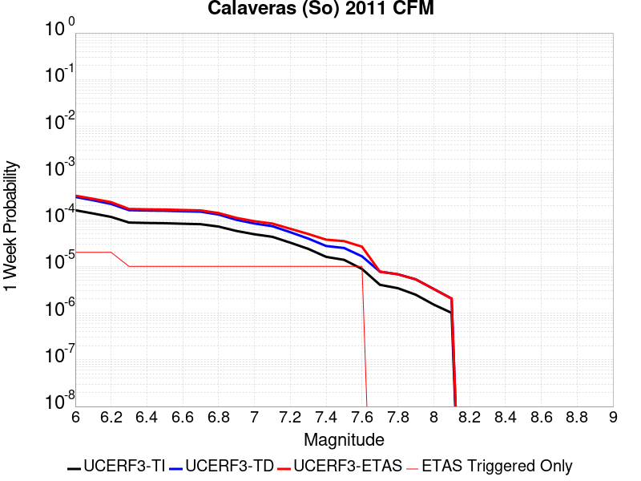 | 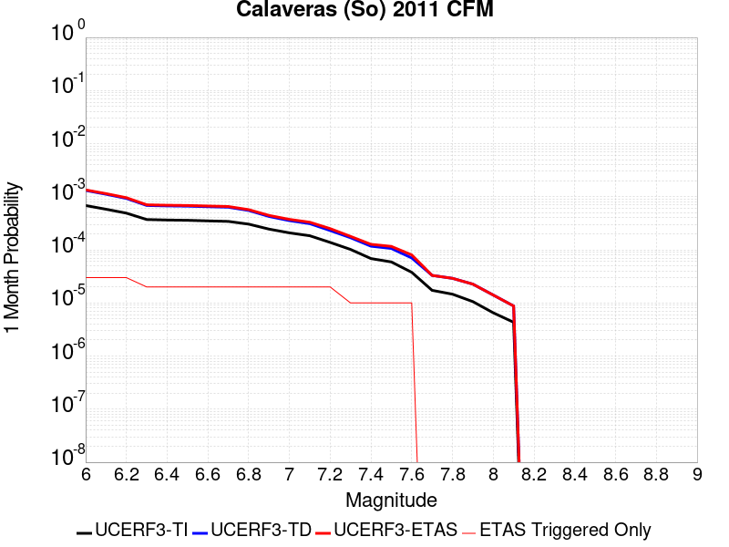 |  |  |

| Magnitude | 1 wk TI Prob | 1 wk TD Prob | 1 wk ETAS Prob | 1 wk ETAS/TD Gain | 1 wk ETAS Triggered Only | 1 mo TI Prob | 1 mo TD Prob | 1 mo ETAS Prob | 1 mo ETAS/TD Gain | 1 mo ETAS Triggered Only | 1 yr TI Prob | 1 yr TD Prob | 1 yr ETAS Prob | 1 yr ETAS/TD Gain | 1 yr ETAS Triggered Only | 10 yr TI Prob | 10 yr TD Prob | 10 yr ETAS Prob | 10 yr ETAS/TD Gain | 10 yr ETAS Triggered Only |
|-----|-----|-----|-----|-----|-----|-----|-----|-----|-----|-----|-----|-----|-----|-----|-----|-----|-----|-----|-----|-----|
| 6.0 | 1.5950744E-4 | 3.071188E-4 | 3.2711268E-4 | 1.0651014 | 2.0E-5 | 6.834242E-4 | 0.0013155643 | 0.0013455248 | 1.0227739 | 3.0E-5 | 0.00828899 | 0.01585904 | 0.015898405 | 1.0024822 | 4.0E-5 | 0.079865426 | 0.14440064 | 0.14443487 | 1.000237 | 4.0E-5 |
| 6.1 | 1.3584697E-4 | 2.6036944E-4 | 2.803642E-4 | 1.0767939 | 2.0E-5 | 5.8207137E-4 | 0.0011153965 | 0.001145363 | 1.0268663 | 3.0E-5 | 0.007063716 | 0.013462106 | 0.013501568 | 1.0029314 | 4.0E-5 | 0.06843361 | 0.12402854 | 0.12406358 | 1.0002825 | 4.0E-5 |
| 6.2 | 1.14676266E-4 | 2.1726108E-4 | 2.3725674E-4 | 1.0920352 | 2.0E-5 | 4.9137714E-4 | 9.307893E-4 | 9.607614E-4 | 1.0322007 | 3.0E-5 | 0.0059661185 | 0.011245592 | 0.011285142 | 1.0035169 | 4.0E-5 | 0.058084648 | 0.105019294 | 0.105055094 | 1.0003409 | 4.0E-5 |
| 6.3 | 8.691518E-5 | 1.5987165E-4 | 1.6987004E-4 | 1.0625402 | 1.0E-5 | 3.7244044E-4 | 6.8496726E-4 | 7.0495356E-4 | 1.0291785 | 2.0E-5 | 0.004525038 | 0.008300893 | 0.008330644 | 1.003584 | 3.0E-5 | 0.044339992 | 0.0793347 | 0.07936232 | 1.0003481 | 3.0E-5 |
| 6.4 | 8.50982E-5 | 1.5693568E-4 | 1.6693411E-4 | 1.0637103 | 1.0E-5 | 3.646556E-4 | 6.7239115E-4 | 6.923777E-4 | 1.0297246 | 2.0E-5 | 0.0044306475 | 0.008148931 | 0.008178686 | 1.0036515 | 3.0E-5 | 0.04343345 | 0.077940844 | 0.07796851 | 1.0003549 | 3.0E-5 |
| 6.5 | 8.4062965E-5 | 1.5518135E-4 | 1.6517981E-4 | 1.0644307 | 1.0E-5 | 3.602201E-4 | 6.648764E-4 | 6.8486313E-4 | 1.0300608 | 2.0E-5 | 0.004376863 | 0.008058134 | 0.008087891 | 1.003693 | 3.0E-5 | 0.042916555 | 0.077112116 | 0.0771398 | 1.000359 | 3.0E-5 |
| 6.6 | 8.194716E-5 | 1.5154095E-4 | 1.6153943E-4 | 1.0659788 | 1.0E-5 | 3.5115483E-4 | 6.492825E-4 | 6.6926953E-4 | 1.0307832 | 2.0E-5 | 0.0042669317 | 0.007869979 | 0.0078997435 | 1.0037819 | 3.0E-5 | 0.04185927 | 0.07539739 | 0.075425126 | 1.0003679 | 3.0E-5 |
| 6.7 | 8.012326E-5 | 1.4821833E-4 | 1.5821685E-4 | 1.067458 | 1.0E-5 | 3.433402E-4 | 6.350497E-4 | 6.55037E-4 | 1.0314736 | 2.0E-5 | 0.004172157 | 0.007698474 | 0.0077282432 | 1.0038669 | 3.0E-5 | 0.040946912 | 0.073839515 | 0.0738673 | 1.0003763 | 3.0E-5 |
| 6.8 | 7.119773E-5 | 1.2880519E-4 | 1.388039E-4 | 1.0776266 | 1.0E-5 | 3.0509746E-4 | 5.519001E-4 | 5.718891E-4 | 1.0362184 | 2.0E-5 | 0.0037082357 | 0.0066958875 | 0.0067256866 | 1.0044503 | 3.0E-5 | 0.036469642 | 0.06468402 | 0.06471208 | 1.0004338 | 3.0E-5 |
| 6.9 | 5.7343088E-5 | 9.9189E-5 | 1.0918801E-4 | 1.1008077 | 1.0E-5 | 2.4573295E-4 | 4.2502693E-4 | 4.450184E-4 | 1.0470358 | 2.0E-5 | 0.0029876942 | 0.0051625078 | 0.005192353 | 1.0057812 | 3.0E-5 | 0.02947844 | 0.050509132 | 0.05053762 | 1.000564 | 3.0E-5 |
| 7.0 | 4.8746577E-5 | 8.284751E-5 | 9.284668E-5 | 1.1206937 | 1.0E-5 | 2.0889717E-4 | 3.550128E-4 | 3.7500568E-4 | 1.056316 | 2.0E-5 | 0.0025403565 | 0.004313781 | 0.0043436512 | 1.0069245 | 3.0E-5 | 0.025115121 | 0.04248505 | 0.042513777 | 1.0006762 | 3.0E-5 |
| 7.1 | 4.2998014E-5 | 7.264914E-5 | 8.264841E-5 | 1.1376379 | 1.0E-5 | 1.8426418E-4 | 3.1131663E-4 | 3.313104E-4 | 1.0642233 | 2.0E-5 | 0.002241108 | 0.0037837527 | 0.0038136393 | 1.0078987 | 3.0E-5 | 0.022186412 | 0.037423246 | 0.03745212 | 1.0007716 | 3.0E-5 |
| 7.2 | 3.221292E-5 | 5.390566E-5 | 6.390512E-5 | 1.1854993 | 1.0E-5 | 1.3804805E-4 | 2.3100396E-4 | 2.5099932E-4 | 1.0865586 | 2.0E-5 | 0.0016794393 | 0.0028088738 | 0.0028387895 | 1.0106504 | 3.0E-5 | 0.016668037 | 0.028035998 | 0.028065156 | 1.0010401 | 3.0E-5 |
| 7.3 | 2.3756531E-5 | 3.9471706E-5 | 4.9471313E-5 | 1.2533361 | 1.0E-5 | 1.0180973E-4 | 1.6915359E-4 | 1.7915189E-4 | 1.0591079 | 1.0E-5 | 0.0012388286 | 0.0020575167 | 0.002067496 | 1.0048503 | 1.0E-5 | 0.012319452 | 0.02064345 | 0.020653244 | 1.0004745 | 1.0E-5 |
| 7.4 | 1.5997684E-5 | 2.734085E-5 | 3.7340575E-5 | 1.365743 | 1.0E-5 | 6.8559704E-5 | 1.1716982E-4 | 1.2716865E-4 | 1.0853362 | 1.0E-5 | 8.343947E-4 | 0.0014256114 | 0.0014355972 | 1.0070045 | 1.0E-5 | 0.008312687 | 0.014376549 | 0.014386405 | 1.0006856 | 1.0E-5 |
| 7.5 | 1.3814293E-5 | 2.4782603E-5 | 3.4782355E-5 | 1.4034989 | 1.0E-5 | 5.9202768E-5 | 1.0620684E-4 | 1.1620578E-4 | 1.0941459 | 1.0E-5 | 7.205553E-4 | 0.0012923037 | 0.0013022907 | 1.0077281 | 1.0E-5 | 0.007182234 | 0.013055766 | 0.013065635 | 1.0007559 | 1.0E-5 |
| 7.6 | 8.817309E-6 | 1.6429829E-5 | 2.6429665E-5 | 1.608639 | 1.0E-5 | 3.7787922E-5 | 7.041166E-5 | 8.041096E-5 | 1.1420119 | 1.0E-5 | 4.5997082E-4 | 8.5692614E-4 | 8.669176E-4 | 1.0116596 | 1.0E-5 | 0.004590199 | 0.008719863 | 0.008729776 | 1.0011368 | 1.0E-5 |
| 7.7 | 4.0352206E-6 | 7.706877E-6 | 7.706877E-6 | 1.0 | 0.0 | 1.7293689E-5 | 3.3029053E-5 | 3.3029053E-5 | 1.0 | 0.0 | 2.1053031E-4 | 4.020546E-4 | 4.020546E-4 | 1.0 | 0.0 | 0.0021033096 | 0.0041649863 | 0.0041649863 | 1.0 | 0.0 |
| 7.8 | 3.413169E-6 | 6.7868646E-6 | 6.7868646E-6 | 1.0 | 0.0 | 1.4627784E-5 | 2.9086239E-5 | 2.9086239E-5 | 1.0 | 0.0 | 1.7807873E-4 | 3.5406748E-4 | 3.5406748E-4 | 1.0 | 0.0 | 0.0017793609 | 0.0036663096 | 0.0036663096 | 1.0 | 0.0 |
| 7.9 | 2.4740732E-6 | 5.278809E-6 | 5.278809E-6 | 1.0 | 0.0 | 1.06031275E-5 | 2.2623271E-5 | 2.2623271E-5 | 1.0 | 0.0 | 1.2908543E-4 | 2.7540355E-4 | 2.7540355E-4 | 1.0 | 0.0 | 0.0012901047 | 0.002834638 | 0.002834638 | 1.0 | 0.0 |
| 8.0 | 1.5231818E-6 | 3.2887135E-6 | 3.2887135E-6 | 1.0 | 0.0 | 6.527906E-6 | 1.409441E-5 | 1.409441E-5 | 1.0 | 0.0 | 7.9474354E-5 | 1.7158597E-4 | 1.7158597E-4 | 1.0 | 0.0 | 7.944594E-4 | 0.001756374 | 0.001756374 | 1.0 | 0.0 |
| 8.1 | 1.0104524E-6 | 2.0456548E-6 | 2.0456548E-6 | 1.0 | 0.0 | 4.330503E-6 | 8.767062E-6 | 8.767062E-6 | 1.0 | 0.0 | 5.2722597E-5 | 1.06733794E-4 | 1.06733794E-4 | 1.0 | 0.0 | 5.271009E-4 | 0.0010929212 | 0.0010929212 | 1.0 | 0.0 |

## Santa Cruz Catalina Ridge alt1
*[(top)](#table-of-contents)*

| 1 Week | 1 Month | 1 Year | 10 Year |
|-----|-----|-----|-----|
| 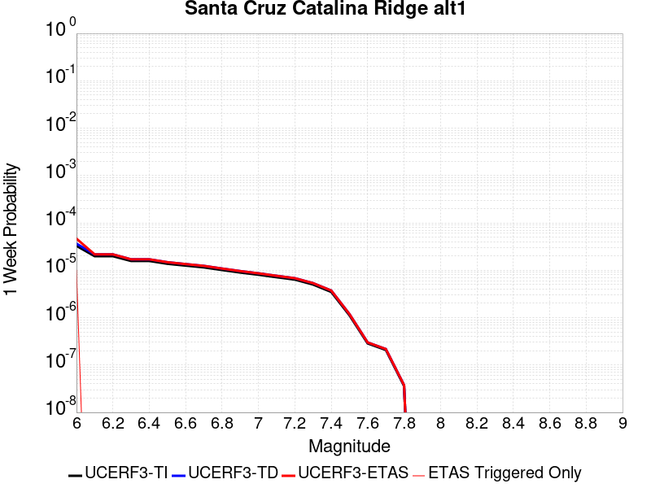 |  |  |  |

| Magnitude | 1 wk TI Prob | 1 wk TD Prob | 1 wk ETAS Prob | 1 wk ETAS/TD Gain | 1 wk ETAS Triggered Only | 1 mo TI Prob | 1 mo TD Prob | 1 mo ETAS Prob | 1 mo ETAS/TD Gain | 1 mo ETAS Triggered Only | 1 yr TI Prob | 1 yr TD Prob | 1 yr ETAS Prob | 1 yr ETAS/TD Gain | 1 yr ETAS Triggered Only | 10 yr TI Prob | 10 yr TD Prob | 10 yr ETAS Prob | 10 yr ETAS/TD Gain | 10 yr ETAS Triggered Only |
|-----|-----|-----|-----|-----|-----|-----|-----|-----|-----|-----|-----|-----|-----|-----|-----|-----|-----|-----|-----|-----|
| 6.0 | 3.2833184E-5 | 3.65584E-5 | 4.6558034E-5 | 1.273525 | 1.0E-5 | 1.4070606E-4 | 1.5667039E-4 | 1.6666882E-4 | 1.0638182 | 1.0E-5 | 0.00171175 | 0.0019059596 | 0.0019259214 | 1.0104734 | 2.0E-5 | 0.016986247 | 0.018913029 | 0.018952273 | 1.002075 | 4.0E-5 |
| 6.1 | 1.9835548E-5 | 2.1659505E-5 | 2.1659505E-5 | 1.0 | 0.0 | 8.500672E-5 | 9.282326E-5 | 9.282326E-5 | 1.0 | 0.0 | 0.0010344655 | 0.0011295575 | 0.0011295575 | 1.0 | 0.0 | 0.010296632 | 0.011240295 | 0.011260071 | 1.0017593 | 2.0E-5 |
| 6.2 | 1.9835548E-5 | 2.1659505E-5 | 2.1659505E-5 | 1.0 | 0.0 | 8.500672E-5 | 9.282326E-5 | 9.282326E-5 | 1.0 | 0.0 | 0.0010344655 | 0.0011295575 | 0.0011295575 | 1.0 | 0.0 | 0.010296632 | 0.011240295 | 0.011260071 | 1.0017593 | 2.0E-5 |
| 6.3 | 1.5728183E-5 | 1.703395E-5 | 1.703395E-5 | 1.0 | 0.0 | 6.7404755E-5 | 7.300063E-5 | 7.300063E-5 | 1.0 | 0.0 | 8.2034385E-4 | 8.884264E-4 | 8.884264E-4 | 1.0 | 0.0 | 0.008173222 | 0.008849427 | 0.00886925 | 1.0022401 | 2.0E-5 |
| 6.4 | 1.5728183E-5 | 1.703395E-5 | 1.703395E-5 | 1.0 | 0.0 | 6.7404755E-5 | 7.300063E-5 | 7.300063E-5 | 1.0 | 0.0 | 8.2034385E-4 | 8.884264E-4 | 8.884264E-4 | 1.0 | 0.0 | 0.008173222 | 0.008849427 | 0.00886925 | 1.0022401 | 2.0E-5 |
| 6.5 | 1.3707734E-5 | 1.4794522E-5 | 1.4794522E-5 | 1.0 | 0.0 | 5.8746107E-5 | 6.3403575E-5 | 6.3403575E-5 | 1.0 | 0.0 | 7.1499916E-4 | 7.716686E-4 | 7.716686E-4 | 1.0 | 0.0 | 0.0071270303 | 0.0076902895 | 0.007710136 | 1.0025806 | 2.0E-5 |
| 6.6 | 1.2539813E-5 | 1.3510219E-5 | 1.3510219E-5 | 1.0 | 0.0 | 5.3740947E-5 | 5.789967E-5 | 5.789967E-5 | 1.0 | 0.0 | 6.540996E-4 | 7.0470315E-4 | 7.0470315E-4 | 1.0 | 0.0 | 0.0065217763 | 0.0070249885 | 0.007044848 | 1.0028269 | 2.0E-5 |
| 6.7 | 1.1504083E-5 | 1.2377375E-5 | 1.2377375E-5 | 1.0 | 0.0 | 4.930228E-5 | 5.3044827E-5 | 5.3044827E-5 | 1.0 | 0.0 | 6.0008996E-4 | 6.456314E-4 | 6.456314E-4 | 1.0 | 0.0 | 0.005984721 | 0.006437786 | 0.006457657 | 1.0030867 | 2.0E-5 |
| 6.8 | 1.012739E-5 | 1.0877071E-5 | 1.0877071E-5 | 1.0 | 0.0 | 4.340238E-5 | 4.6615194E-5 | 4.6615194E-5 | 1.0 | 0.0 | 5.282958E-4 | 5.673937E-4 | 5.673937E-4 | 1.0 | 0.0 | 0.0052704164 | 0.0056596193 | 0.0056795063 | 1.0035138 | 2.0E-5 |
| 6.9 | 8.9607865E-6 | 9.609117E-6 | 9.609117E-6 | 1.0 | 0.0 | 3.8402806E-5 | 4.1181287E-5 | 4.1181287E-5 | 1.0 | 0.0 | 4.6745385E-4 | 5.012679E-4 | 5.012679E-4 | 1.0 | 0.0 | 0.0046647177 | 0.005001492 | 0.005021392 | 1.0039788 | 2.0E-5 |
| 7.0 | 8.046829E-6 | 8.619746E-6 | 8.619746E-6 | 1.0 | 0.0 | 3.4485955E-5 | 3.694125E-5 | 3.694125E-5 | 1.0 | 0.0 | 4.1978562E-4 | 4.496677E-4 | 4.496677E-4 | 1.0 | 0.0 | 0.004189935 | 0.0044876686 | 0.004507579 | 1.0044366 | 2.0E-5 |
| 7.1 | 7.136131E-6 | 7.637656E-6 | 7.637656E-6 | 1.0 | 0.0 | 3.0583058E-5 | 3.2732405E-5 | 3.2732405E-5 | 1.0 | 0.0 | 3.7228514E-4 | 3.9844486E-4 | 3.9844486E-4 | 1.0 | 0.0 | 0.0037166206 | 0.003977381 | 0.0039973017 | 1.0050085 | 2.0E-5 |
| 7.2 | 6.362014E-6 | 6.8049585E-6 | 6.8049585E-6 | 1.0 | 0.0 | 2.726549E-5 | 2.9163786E-5 | 2.9163786E-5 | 1.0 | 0.0 | 3.3190678E-4 | 3.550119E-4 | 3.550119E-4 | 1.0 | 0.0 | 0.0033141149 | 0.003544516 | 0.003564445 | 1.0056225 | 2.0E-5 |
| 7.3 | 5.004101E-6 | 5.351715E-6 | 5.351715E-6 | 1.0 | 0.0 | 2.1445969E-5 | 2.2935723E-5 | 2.2935723E-5 | 1.0 | 0.0 | 2.6107338E-4 | 2.792072E-4 | 2.792072E-4 | 1.0 | 0.0 | 0.002607669 | 0.0027886187 | 0.0027985908 | 1.003576 | 1.0E-5 |
| 7.4 | 3.4901443E-6 | 3.7320526E-6 | 3.7320526E-6 | 1.0 | 0.0 | 1.4957676E-5 | 1.5994416E-5 | 1.5994416E-5 | 1.0 | 0.0 | 1.8209449E-4 | 1.9471499E-4 | 1.9471499E-4 | 1.0 | 0.0 | 0.0018194534 | 0.0019454823 | 0.0019554629 | 1.0051302 | 1.0E-5 |
| 7.5 | 1.1215045E-6 | 1.189387E-6 | 1.189387E-6 | 1.0 | 0.0 | 4.806439E-6 | 5.097363E-6 | 5.097363E-6 | 1.0 | 0.0 | 5.851682E-5 | 6.205866E-5 | 6.205866E-5 | 1.0 | 0.0 | 5.850142E-4 | 6.2041637E-4 | 6.2041637E-4 | 1.0 | 0.0 |
| 7.6 | 2.8599047E-7 | 2.9951994E-7 | 2.9951994E-7 | 1.0 | 0.0 | 1.2256729E-6 | 1.2836562E-6 | 1.2836562E-6 | 1.0 | 0.0 | 1.4922465E-5 | 1.5628404E-5 | 1.5628404E-5 | 1.0 | 0.0 | 1.4921463E-4 | 1.5627318E-4 | 1.5627318E-4 | 1.0 | 0.0 |
| 7.7 | 2.0781519E-7 | 2.1744323E-7 | 2.1744323E-7 | 1.0 | 0.0 | 8.906362E-7 | 9.3189925E-7 | 9.3189925E-7 | 1.0 | 0.0 | 1.08434415E-5 | 1.13458145E-5 | 1.13458145E-5 | 1.0 | 0.0 | 1.0842913E-4 | 1.1345245E-4 | 1.1345245E-4 | 1.0 | 0.0 |
| 7.8 | 3.614776E-8 | 3.764102E-8 | 3.764102E-8 | 1.0 | 0.0 | 1.5491896E-7 | 1.6131864E-7 | 1.6131864E-7 | 1.0 | 0.0 | 1.8861368E-6 | 1.9640527E-6 | 1.9640527E-6 | 1.0 | 0.0 | 1.8861208E-5 | 1.9640367E-5 | 1.9640367E-5 | 1.0 | 0.0 |

## La Panza 2011
*[(top)](#table-of-contents)*

| 1 Week | 1 Month | 1 Year | 10 Year |
|-----|-----|-----|-----|
|  | 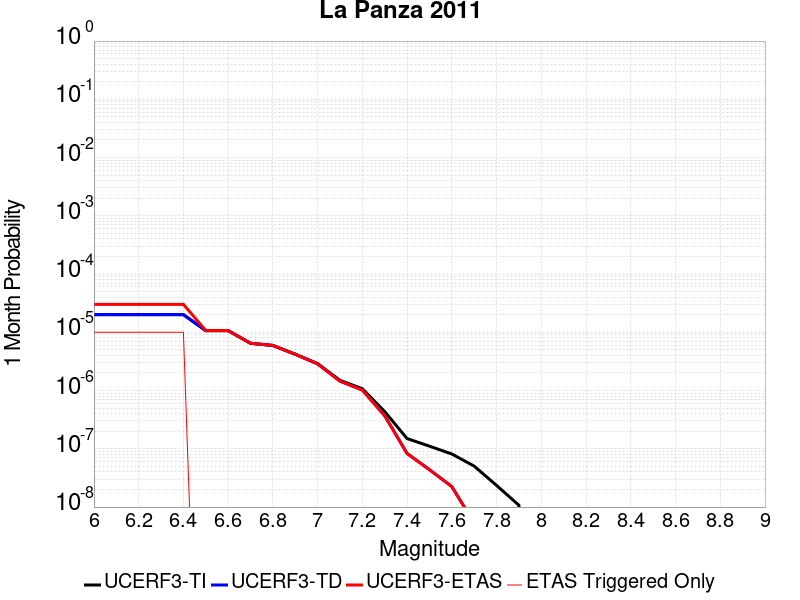 |  |  |

| Magnitude | 1 wk TI Prob | 1 wk TD Prob | 1 wk ETAS Prob | 1 wk ETAS/TD Gain | 1 wk ETAS Triggered Only | 1 mo TI Prob | 1 mo TD Prob | 1 mo ETAS Prob | 1 mo ETAS/TD Gain | 1 mo ETAS Triggered Only | 1 yr TI Prob | 1 yr TD Prob | 1 yr ETAS Prob | 1 yr ETAS/TD Gain | 1 yr ETAS Triggered Only | 10 yr TI Prob | 10 yr TD Prob | 10 yr ETAS Prob | 10 yr ETAS/TD Gain | 10 yr ETAS Triggered Only |
|-----|-----|-----|-----|-----|-----|-----|-----|-----|-----|-----|-----|-----|-----|-----|-----|-----|-----|-----|-----|-----|
| 6.0 | 4.6754544E-6 | 4.717587E-6 | 1.471754E-5 | 3.1197178 | 1.0E-5 | 2.0037509E-5 | 2.0218084E-5 | 3.0217881E-5 | 1.4945967 | 1.0E-5 | 2.4392935E-4 | 2.4612935E-4 | 2.561269E-4 | 1.040619 | 1.0E-5 | 0.0024366176 | 0.002458762 | 0.002488688 | 1.0121713 | 3.0E-5 |
| 6.1 | 4.6754544E-6 | 4.717587E-6 | 1.471754E-5 | 3.1197178 | 1.0E-5 | 2.0037509E-5 | 2.0218084E-5 | 3.0217881E-5 | 1.4945967 | 1.0E-5 | 2.4392935E-4 | 2.4612935E-4 | 2.561269E-4 | 1.040619 | 1.0E-5 | 0.0024366176 | 0.002458762 | 0.002488688 | 1.0121713 | 3.0E-5 |
| 6.2 | 4.6754544E-6 | 4.717587E-6 | 1.471754E-5 | 3.1197178 | 1.0E-5 | 2.0037509E-5 | 2.0218084E-5 | 3.0217881E-5 | 1.4945967 | 1.0E-5 | 2.4392935E-4 | 2.4612935E-4 | 2.561269E-4 | 1.040619 | 1.0E-5 | 0.0024366176 | 0.002458762 | 0.002488688 | 1.0121713 | 3.0E-5 |
| 6.3 | 4.6754544E-6 | 4.717587E-6 | 1.471754E-5 | 3.1197178 | 1.0E-5 | 2.0037509E-5 | 2.0218084E-5 | 3.0217881E-5 | 1.4945967 | 1.0E-5 | 2.4392935E-4 | 2.4612935E-4 | 2.561269E-4 | 1.040619 | 1.0E-5 | 0.0024366176 | 0.002458762 | 0.002488688 | 1.0121713 | 3.0E-5 |
| 6.4 | 4.6754544E-6 | 4.717587E-6 | 1.471754E-5 | 3.1197178 | 1.0E-5 | 2.0037509E-5 | 2.0218084E-5 | 3.0217881E-5 | 1.4945967 | 1.0E-5 | 2.4392935E-4 | 2.4612935E-4 | 2.561269E-4 | 1.040619 | 1.0E-5 | 0.0024366176 | 0.002458762 | 0.002488688 | 1.0121713 | 3.0E-5 |
| 6.5 | 2.485343E-6 | 2.5005988E-6 | 2.5005988E-6 | 1.0 | 0.0 | 1.0651426E-5 | 1.0716811E-5 | 1.0716811E-5 | 1.0 | 0.0 | 1.296734E-4 | 1.3046975E-4 | 1.3046975E-4 | 1.0 | 0.0 | 0.0012959775 | 0.0013039699 | 0.0013239438 | 1.0153178 | 2.0E-5 |
| 6.6 | 2.485343E-6 | 2.5005988E-6 | 2.5005988E-6 | 1.0 | 0.0 | 1.0651426E-5 | 1.0716811E-5 | 1.0716811E-5 | 1.0 | 0.0 | 1.296734E-4 | 1.3046975E-4 | 1.3046975E-4 | 1.0 | 0.0 | 0.0012959775 | 0.0013039699 | 0.0013239438 | 1.0153178 | 2.0E-5 |
| 6.7 | 1.5108508E-6 | 1.5146375E-6 | 1.5146375E-6 | 1.0 | 0.0 | 6.4750584E-6 | 6.491288E-6 | 6.491288E-6 | 1.0 | 0.0 | 7.8830984E-5 | 7.902867E-5 | 7.902867E-5 | 1.0 | 0.0 | 7.880303E-4 | 7.900165E-4 | 8.000086E-4 | 1.012648 | 1.0E-5 |
| 6.8 | 1.3865837E-6 | 1.3885102E-6 | 1.3885102E-6 | 1.0 | 0.0 | 5.942488E-6 | 5.9507447E-6 | 5.9507447E-6 | 1.0 | 0.0 | 7.234739E-5 | 7.244801E-5 | 7.244801E-5 | 1.0 | 0.0 | 7.232384E-4 | 7.242537E-4 | 7.3424645E-4 | 1.0137973 | 1.0E-5 |
| 6.9 | 9.826583E-7 | 9.796287E-7 | 9.796287E-7 | 1.0 | 0.0 | 4.2113857E-6 | 4.198402E-6 | 4.198402E-6 | 1.0 | 0.0 | 5.1272415E-5 | 5.11144E-5 | 5.11144E-5 | 1.0 | 0.0 | 5.126059E-4 | 5.110318E-4 | 5.2102667E-4 | 1.0195583 | 1.0E-5 |
| 7.0 | 6.7797646E-7 | 6.7102144E-7 | 6.7102144E-7 | 1.0 | 0.0 | 2.9056102E-6 | 2.8758034E-6 | 2.8758034E-6 | 1.0 | 0.0 | 3.537523E-5 | 3.5012374E-5 | 3.5012374E-5 | 1.0 | 0.0 | 3.5369597E-4 | 3.5007167E-4 | 3.5007167E-4 | 1.0 | 0.0 |
| 7.1 | 3.4979826E-7 | 3.387388E-7 | 3.387388E-7 | 1.0 | 0.0 | 1.4991346E-6 | 1.4517369E-6 | 1.4517369E-6 | 1.0 | 0.0 | 1.825181E-5 | 1.7674765E-5 | 1.7674765E-5 | 1.0 | 0.0 | 1.825031E-4 | 1.7673477E-4 | 1.7673477E-4 | 1.0 | 0.0 |
| 7.2 | 2.5088332E-7 | 2.3831899E-7 | 2.3831899E-7 | 1.0 | 0.0 | 1.0752137E-6 | 1.0213668E-6 | 1.0213668E-6 | 1.0 | 0.0 | 1.3090649E-5 | 1.2435077E-5 | 1.2435077E-5 | 1.0 | 0.0 | 1.3089878E-4 | 1.2434467E-4 | 1.2434467E-4 | 1.0 | 0.0 |
| 7.3 | 1.0159086E-7 | 8.64462E-8 | 8.64462E-8 | 1.0 | 0.0 | 4.3538932E-7 | 3.7048366E-7 | 3.7048366E-7 | 1.0 | 0.0 | 5.300852E-6 | 4.5106294E-6 | 4.5106294E-6 | 1.0 | 0.0 | 5.3007258E-5 | 4.5105422E-5 | 4.5105422E-5 | 1.0 | 0.0 |
| 7.4 | 3.5006252E-8 | 1.9404325E-8 | 1.9404325E-8 | 1.0 | 0.0 | 1.5002678E-7 | 8.3161396E-8 | 8.3161396E-8 | 1.0 | 0.0 | 1.8265745E-6 | 1.0124895E-6 | 1.0124895E-6 | 1.0 | 0.0 | 1.8265595E-5 | 1.01248515E-5 | 1.01248515E-5 | 1.0 | 0.0 |
| 7.5 | 2.592274E-8 | 1.0239094E-8 | 1.0239094E-8 | 1.0 | 0.0 | 1.1109746E-7 | 4.388183E-8 | 4.388183E-8 | 1.0 | 0.0 | 1.3526106E-6 | 5.342612E-7 | 5.342612E-7 | 1.0 | 0.0 | 1.3526024E-5 | 5.3425997E-6 | 5.3425997E-6 | 1.0 | 0.0 |
| 7.6 | 1.9016717E-8 | 5.244801E-9 | 5.244801E-9 | 1.0 | 0.0 | 8.150022E-8 | 2.247772E-8 | 2.247772E-8 | 1.0 | 0.0 | 9.922647E-7 | 2.736662E-7 | 2.736662E-7 | 1.0 | 0.0 | 9.922603E-6 | 2.7366589E-6 | 2.7366589E-6 | 1.0 | 0.0 |
| 7.7 | 1.17738495E-8 | 1.2398075E-9 | 1.2398075E-9 | 1.0 | 0.0 | 5.0459356E-8 | 5.3134603E-9 | 5.3134603E-9 | 1.0 | 0.0 | 6.1434247E-7 | 6.469138E-8 | 6.469138E-8 | 1.0 | 0.0 | 6.143408E-6 | 6.469136E-7 | 6.469136E-7 | 1.0 | 0.0 |
| 7.8 | 5.489079E-9 | 2.0111768E-10 | 2.0111768E-10 | 1.0 | 0.0 | 2.3524624E-8 | 8.6193275E-10 | 8.6193275E-10 | 1.0 | 0.0 | 2.8641225E-7 | 1.04940305E-8 | 1.04940305E-8 | 1.0 | 0.0 | 2.8641189E-6 | 1.04940305E-7 | 1.04940305E-7 | 1.0 | 0.0 |
| 7.9 | 2.5081048E-9 | 6.683887E-11 | 6.683887E-11 | 1.0 | 0.0 | 1.0749021E-8 | 2.8645197E-10 | 2.8645197E-10 | 1.0 | 0.0 | 1.3086932E-7 | 3.487552E-9 | 3.487552E-9 | 1.0 | 0.0 | 1.3086925E-6 | 3.487552E-8 | 3.487552E-8 | 1.0 | 0.0 |

## Camp Rock 2011
*[(top)](#table-of-contents)*

| 1 Week | 1 Month | 1 Year | 10 Year |
|-----|-----|-----|-----|
| 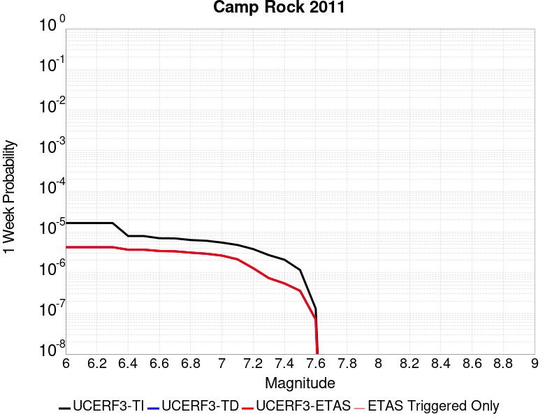 | 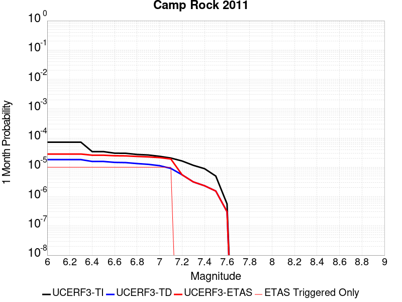 |  |  |

| Magnitude | 1 wk TI Prob | 1 wk TD Prob | 1 wk ETAS Prob | 1 wk ETAS/TD Gain | 1 wk ETAS Triggered Only | 1 mo TI Prob | 1 mo TD Prob | 1 mo ETAS Prob | 1 mo ETAS/TD Gain | 1 mo ETAS Triggered Only | 1 yr TI Prob | 1 yr TD Prob | 1 yr ETAS Prob | 1 yr ETAS/TD Gain | 1 yr ETAS Triggered Only | 10 yr TI Prob | 10 yr TD Prob | 10 yr ETAS Prob | 10 yr ETAS/TD Gain | 10 yr ETAS Triggered Only |
|-----|-----|-----|-----|-----|-----|-----|-----|-----|-----|-----|-----|-----|-----|-----|-----|-----|-----|-----|-----|-----|
| 6.0 | 1.6710783E-5 | 4.25026E-6 | 4.25026E-6 | 1.0 | 0.0 | 7.161568E-5 | 1.8215276E-5 | 2.8215094E-5 | 1.5489798 | 1.0E-5 | 8.7157206E-4 | 2.2174895E-4 | 2.4174452E-4 | 1.090172 | 2.0E-5 | 0.008681616 | 0.0022153298 | 0.0022552412 | 1.018016 | 4.0E-5 |
| 6.1 | 1.6710783E-5 | 4.25026E-6 | 4.25026E-6 | 1.0 | 0.0 | 7.161568E-5 | 1.8215276E-5 | 2.8215094E-5 | 1.5489798 | 1.0E-5 | 8.7157206E-4 | 2.2174895E-4 | 2.4174452E-4 | 1.090172 | 2.0E-5 | 0.008681616 | 0.0022153298 | 0.0022552412 | 1.018016 | 4.0E-5 |
| 6.2 | 1.6710783E-5 | 4.25026E-6 | 4.25026E-6 | 1.0 | 0.0 | 7.161568E-5 | 1.8215276E-5 | 2.8215094E-5 | 1.5489798 | 1.0E-5 | 8.7157206E-4 | 2.2174895E-4 | 2.4174452E-4 | 1.090172 | 2.0E-5 | 0.008681616 | 0.0022153298 | 0.0022552412 | 1.018016 | 4.0E-5 |
| 6.3 | 1.6710783E-5 | 4.25026E-6 | 4.25026E-6 | 1.0 | 0.0 | 7.161568E-5 | 1.8215276E-5 | 2.8215094E-5 | 1.5489798 | 1.0E-5 | 8.7157206E-4 | 2.2174895E-4 | 2.4174452E-4 | 1.090172 | 2.0E-5 | 0.008681616 | 0.0022153298 | 0.0022552412 | 1.018016 | 4.0E-5 |
| 6.4 | 7.982846E-6 | 3.6820884E-6 | 3.6820884E-6 | 1.0 | 0.0 | 3.421175E-5 | 1.5780286E-5 | 2.5780128E-5 | 1.633692 | 1.0E-5 | 4.1644843E-4 | 1.9210839E-4 | 2.0210647E-4 | 1.0520439 | 1.0E-5 | 0.0041566887 | 0.001919458 | 0.0019494004 | 1.0155994 | 3.0E-5 |
| 6.5 | 7.982846E-6 | 3.6820884E-6 | 3.6820884E-6 | 1.0 | 0.0 | 3.421175E-5 | 1.5780286E-5 | 2.5780128E-5 | 1.633692 | 1.0E-5 | 4.1644843E-4 | 1.9210839E-4 | 2.0210647E-4 | 1.0520439 | 1.0E-5 | 0.0041566887 | 0.001919458 | 0.0019494004 | 1.0155994 | 3.0E-5 |
| 6.6 | 7.048869E-6 | 3.4243571E-6 | 3.4243571E-6 | 1.0 | 0.0 | 3.0209088E-5 | 1.4675736E-5 | 2.467559E-5 | 1.6813868 | 1.0E-5 | 3.677336E-4 | 1.7866275E-4 | 1.8866097E-4 | 1.0559614 | 1.0E-5 | 0.0036712566 | 0.0017852228 | 0.0018151692 | 1.0167747 | 3.0E-5 |
| 6.7 | 6.987307E-6 | 3.3623348E-6 | 3.3623348E-6 | 1.0 | 0.0 | 2.9945259E-5 | 1.4409929E-5 | 2.4409785E-5 | 1.693956 | 1.0E-5 | 3.6452254E-4 | 1.7542706E-4 | 1.854253E-4 | 1.0569937 | 1.0E-5 | 0.0036392517 | 0.001752917 | 0.0017828643 | 1.0170844 | 3.0E-5 |
| 6.8 | 6.3737602E-6 | 3.1179077E-6 | 3.1179077E-6 | 1.0 | 0.0 | 2.731583E-5 | 1.3362394E-5 | 2.3362261E-5 | 1.7483588 | 1.0E-5 | 3.3251947E-4 | 1.626753E-4 | 1.7267367E-4 | 1.0614622 | 1.0E-5 | 0.0033202237 | 0.0016255907 | 0.001655542 | 1.0184249 | 3.0E-5 |
| 6.9 | 6.112211E-6 | 2.9331156E-6 | 2.9331156E-6 | 1.0 | 0.0 | 2.6194928E-5 | 1.2570436E-5 | 2.257031E-5 | 1.7955073 | 1.0E-5 | 3.1887658E-4 | 1.5303459E-4 | 1.6303307E-4 | 1.0653347 | 1.0E-5 | 0.003184194 | 0.0015293199 | 0.0015592739 | 1.0195866 | 3.0E-5 |
| 7.0 | 5.5140117E-6 | 2.641923E-6 | 2.641923E-6 | 1.0 | 0.0 | 2.3631264E-5 | 1.132248E-5 | 2.1322367E-5 | 1.8831888 | 1.0E-5 | 2.8767265E-4 | 1.3784273E-4 | 1.4784135E-4 | 1.0725365 | 1.0E-5 | 0.0028730053 | 0.0013775975 | 0.0014075561 | 1.021747 | 3.0E-5 |
| 7.1 | 4.8151105E-6 | 2.1342705E-6 | 2.1342705E-6 | 1.0 | 0.0 | 2.0636026E-5 | 9.146843E-6 | 1.9146752E-5 | 2.0932634 | 1.0E-5 | 2.5121463E-4 | 1.1135734E-4 | 1.2135622E-4 | 1.0897909 | 1.0E-5 | 0.0025093083 | 0.0011130372 | 0.0011430038 | 1.0269233 | 3.0E-5 |
| 7.2 | 3.818335E-6 | 1.2937425E-6 | 1.2937425E-6 | 1.0 | 0.0 | 1.6364189E-5 | 5.5445994E-6 | 5.5445994E-6 | 1.0 | 0.0 | 1.9921579E-4 | 6.750349E-5 | 6.750349E-5 | 1.0 | 0.0 | 0.0019903728 | 6.748381E-4 | 6.9482456E-4 | 1.0296167 | 2.0E-5 |
| 7.3 | 2.7166698E-6 | 7.3835776E-7 | 7.3835776E-7 | 1.0 | 0.0 | 1.1642818E-5 | 3.1643867E-6 | 3.1643867E-6 | 1.0 | 0.0 | 1.4174209E-4 | 3.8525748E-5 | 3.8525748E-5 | 1.0 | 0.0 | 0.0014165172 | 3.851927E-4 | 3.9518884E-4 | 1.025951 | 1.0E-5 |
| 7.4 | 2.0893426E-6 | 5.4618386E-7 | 5.4618386E-7 | 1.0 | 0.0 | 8.954295E-6 | 2.3407858E-6 | 2.3407858E-6 | 1.0 | 0.0 | 1.0901308E-4 | 2.84987E-5 | 2.84987E-5 | 1.0 | 0.0 | 0.0010895962 | 2.84951E-4 | 2.9494814E-4 | 1.0350838 | 1.0E-5 |
| 7.5 | 1.1681728E-6 | 3.6030585E-7 | 3.6030585E-7 | 1.0 | 0.0 | 5.0064455E-6 | 1.544167E-6 | 1.544167E-6 | 1.0 | 0.0 | 6.0951766E-5 | 1.8800076E-5 | 1.8800076E-5 | 1.0 | 0.0 | 6.093505E-4 | 1.8798532E-4 | 1.9798345E-4 | 1.0531856 | 1.0E-5 |
| 7.6 | 1.3154387E-7 | 7.1197384E-8 | 7.1197384E-8 | 1.0 | 0.0 | 5.6375933E-7 | 3.051316E-7 | 3.051316E-7 | 1.0 | 0.0 | 6.863748E-6 | 3.7149728E-6 | 3.7149728E-6 | 1.0 | 0.0 | 6.863536E-5 | 3.7149264E-5 | 4.7148893E-5 | 1.2691743 | 1.0E-5 |

## Pitas Point (Lower West)
*[(top)](#table-of-contents)*

| 1 Week | 1 Month | 1 Year | 10 Year |
|-----|-----|-----|-----|
| 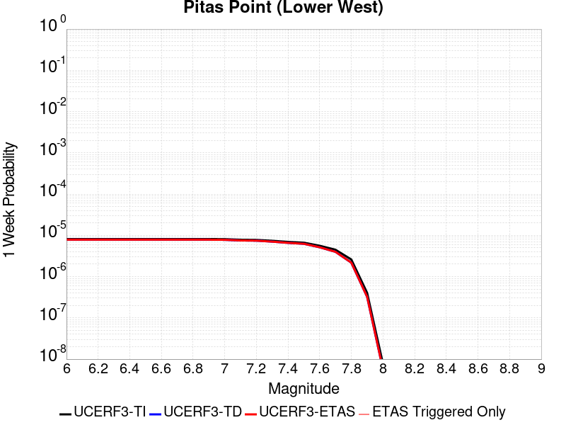 | 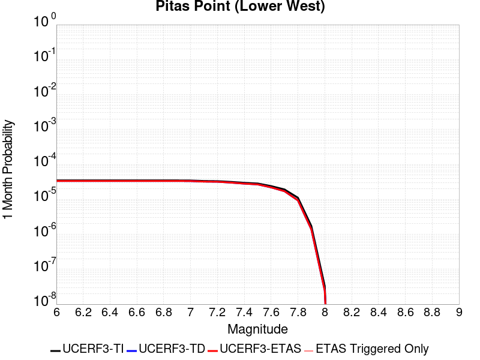 |  |  |

| Magnitude | 1 wk TI Prob | 1 wk TD Prob | 1 wk ETAS Prob | 1 wk ETAS/TD Gain | 1 wk ETAS Triggered Only | 1 mo TI Prob | 1 mo TD Prob | 1 mo ETAS Prob | 1 mo ETAS/TD Gain | 1 mo ETAS Triggered Only | 1 yr TI Prob | 1 yr TD Prob | 1 yr ETAS Prob | 1 yr ETAS/TD Gain | 1 yr ETAS Triggered Only | 10 yr TI Prob | 10 yr TD Prob | 10 yr ETAS Prob | 10 yr ETAS/TD Gain | 10 yr ETAS Triggered Only |
|-----|-----|-----|-----|-----|-----|-----|-----|-----|-----|-----|-----|-----|-----|-----|-----|-----|-----|-----|-----|-----|
| 6.0 | 8.151497E-6 | 7.855762E-6 | 7.855762E-6 | 1.0 | 0.0 | 3.493452E-5 | 3.3667122E-5 | 3.3667122E-5 | 1.0 | 0.0 | 4.252448E-4 | 4.0982084E-4 | 4.2981267E-4 | 1.0487818 | 2.0E-5 | 0.0042443196 | 0.0040907315 | 0.004130568 | 1.0097382 | 4.0E-5 |
| 6.1 | 8.151497E-6 | 7.855762E-6 | 7.855762E-6 | 1.0 | 0.0 | 3.493452E-5 | 3.3667122E-5 | 3.3667122E-5 | 1.0 | 0.0 | 4.252448E-4 | 4.0982084E-4 | 4.2981267E-4 | 1.0487818 | 2.0E-5 | 0.0042443196 | 0.0040907315 | 0.004130568 | 1.0097382 | 4.0E-5 |
| 6.2 | 8.151497E-6 | 7.855762E-6 | 7.855762E-6 | 1.0 | 0.0 | 3.493452E-5 | 3.3667122E-5 | 3.3667122E-5 | 1.0 | 0.0 | 4.252448E-4 | 4.0982084E-4 | 4.2981267E-4 | 1.0487818 | 2.0E-5 | 0.0042443196 | 0.0040907315 | 0.004130568 | 1.0097382 | 4.0E-5 |
| 6.3 | 8.151497E-6 | 7.855762E-6 | 7.855762E-6 | 1.0 | 0.0 | 3.493452E-5 | 3.3667122E-5 | 3.3667122E-5 | 1.0 | 0.0 | 4.252448E-4 | 4.0982084E-4 | 4.2981267E-4 | 1.0487818 | 2.0E-5 | 0.0042443196 | 0.0040907315 | 0.004130568 | 1.0097382 | 4.0E-5 |
| 6.4 | 8.151497E-6 | 7.855762E-6 | 7.855762E-6 | 1.0 | 0.0 | 3.493452E-5 | 3.3667122E-5 | 3.3667122E-5 | 1.0 | 0.0 | 4.252448E-4 | 4.0982084E-4 | 4.2981267E-4 | 1.0487818 | 2.0E-5 | 0.0042443196 | 0.0040907315 | 0.004130568 | 1.0097382 | 4.0E-5 |
| 6.5 | 8.151497E-6 | 7.855762E-6 | 7.855762E-6 | 1.0 | 0.0 | 3.493452E-5 | 3.3667122E-5 | 3.3667122E-5 | 1.0 | 0.0 | 4.252448E-4 | 4.0982084E-4 | 4.2981267E-4 | 1.0487818 | 2.0E-5 | 0.0042443196 | 0.0040907315 | 0.004130568 | 1.0097382 | 4.0E-5 |
| 6.6 | 8.151497E-6 | 7.855762E-6 | 7.855762E-6 | 1.0 | 0.0 | 3.493452E-5 | 3.3667122E-5 | 3.3667122E-5 | 1.0 | 0.0 | 4.252448E-4 | 4.0982084E-4 | 4.2981267E-4 | 1.0487818 | 2.0E-5 | 0.0042443196 | 0.0040907315 | 0.004130568 | 1.0097382 | 4.0E-5 |
| 6.7 | 8.151497E-6 | 7.855762E-6 | 7.855762E-6 | 1.0 | 0.0 | 3.493452E-5 | 3.3667122E-5 | 3.3667122E-5 | 1.0 | 0.0 | 4.252448E-4 | 4.0982084E-4 | 4.2981267E-4 | 1.0487818 | 2.0E-5 | 0.0042443196 | 0.0040907315 | 0.004130568 | 1.0097382 | 4.0E-5 |
| 6.8 | 8.151497E-6 | 7.855762E-6 | 7.855762E-6 | 1.0 | 0.0 | 3.493452E-5 | 3.3667122E-5 | 3.3667122E-5 | 1.0 | 0.0 | 4.252448E-4 | 4.0982084E-4 | 4.2981267E-4 | 1.0487818 | 2.0E-5 | 0.0042443196 | 0.0040907315 | 0.004130568 | 1.0097382 | 4.0E-5 |
| 6.9 | 8.151497E-6 | 7.855762E-6 | 7.855762E-6 | 1.0 | 0.0 | 3.493452E-5 | 3.3667122E-5 | 3.3667122E-5 | 1.0 | 0.0 | 4.252448E-4 | 4.0982084E-4 | 4.2981267E-4 | 1.0487818 | 2.0E-5 | 0.0042443196 | 0.0040907315 | 0.004130568 | 1.0097382 | 4.0E-5 |
| 7.0 | 8.103535E-6 | 7.805192E-6 | 7.805192E-6 | 1.0 | 0.0 | 3.4728975E-5 | 3.3450397E-5 | 3.3450397E-5 | 1.0 | 0.0 | 4.2274324E-4 | 4.0718322E-4 | 4.2717508E-4 | 1.0490979 | 2.0E-5 | 0.0042193993 | 0.004064452 | 0.004104289 | 1.0098014 | 4.0E-5 |
| 7.1 | 7.853298E-6 | 7.540883E-6 | 7.540883E-6 | 1.0 | 0.0 | 3.3656554E-5 | 3.2317676E-5 | 3.2317676E-5 | 1.0 | 0.0 | 4.096915E-4 | 3.9339735E-4 | 4.1338947E-4 | 1.0508192 | 2.0E-5 | 0.00408937 | 0.0039270855 | 0.0039569675 | 1.0076092 | 3.0E-5 |
| 7.2 | 7.771102E-6 | 7.453165E-6 | 7.453165E-6 | 1.0 | 0.0 | 3.33043E-5 | 3.194175E-5 | 3.194175E-5 | 1.0 | 0.0 | 4.0540437E-4 | 3.8882208E-4 | 4.0881432E-4 | 1.0514174 | 2.0E-5 | 0.0040466557 | 0.0038814936 | 0.003911377 | 1.007699 | 3.0E-5 |
| 7.3 | 7.3945344E-6 | 7.0492697E-6 | 7.0492697E-6 | 1.0 | 0.0 | 3.1690477E-5 | 3.021081E-5 | 3.021081E-5 | 1.0 | 0.0 | 3.8576324E-4 | 3.6775516E-4 | 3.877478E-4 | 1.054364 | 2.0E-5 | 0.0038509427 | 0.0036715334 | 0.0037014233 | 1.0081409 | 3.0E-5 |
| 7.4 | 6.964645E-6 | 6.5901186E-6 | 6.5901186E-6 | 1.0 | 0.0 | 2.9848137E-5 | 2.8243063E-5 | 2.8243063E-5 | 1.0 | 0.0 | 3.6334046E-4 | 3.4380553E-4 | 3.6379864E-4 | 1.0581524 | 2.0E-5 | 0.0036274698 | 0.0034327896 | 0.0034626867 | 1.0087092 | 3.0E-5 |
| 7.5 | 6.6525035E-6 | 6.259157E-6 | 6.259157E-6 | 1.0 | 0.0 | 2.851042E-5 | 2.6824686E-5 | 2.6824686E-5 | 1.0 | 0.0 | 3.4705905E-4 | 3.265421E-4 | 3.4653555E-4 | 1.0612278 | 2.0E-5 | 0.0034651754 | 0.0032606742 | 0.0032905764 | 1.0091705 | 3.0E-5 |
| 7.6 | 5.613338E-6 | 5.151386E-6 | 5.151386E-6 | 1.0 | 0.0 | 2.405694E-5 | 2.2077185E-5 | 2.2077185E-5 | 1.0 | 0.0 | 2.928539E-4 | 2.6875688E-4 | 2.887515E-4 | 1.0743967 | 2.0E-5 | 0.0029246826 | 0.0026843501 | 0.0027142696 | 1.0111458 | 3.0E-5 |
| 7.7 | 4.494704E-6 | 3.996911E-6 | 3.996911E-6 | 1.0 | 0.0 | 1.9262876E-5 | 1.7129507E-5 | 1.7129507E-5 | 1.0 | 0.0 | 2.3450027E-4 | 2.0853203E-4 | 2.1852994E-4 | 1.0479443 | 1.0E-5 | 0.0023425296 | 0.0020833875 | 0.0020933668 | 1.0047898 | 1.0E-5 |
| 7.8 | 2.6075882E-6 | 2.1836374E-6 | 2.1836374E-6 | 1.0 | 0.0 | 1.117533E-5 | 9.358413E-6 | 9.358413E-6 | 1.0 | 0.0 | 1.3605114E-4 | 1.1393277E-4 | 1.1393277E-4 | 1.0 | 0.0 | 0.0013596788 | 0.0011387484 | 0.0011387484 | 1.0 | 0.0 |
| 7.9 | 4.045984E-7 | 3.242375E-7 | 3.242375E-7 | 1.0 | 0.0 | 1.733992E-6 | 1.3895885E-6 | 1.3895885E-6 | 1.0 | 0.0 | 2.1111147E-5 | 1.6918111E-5 | 1.6918111E-5 | 1.0 | 0.0 | 2.1109142E-4 | 1.6916855E-4 | 1.6916855E-4 | 1.0 | 0.0 |
| 8.0 | 7.791402E-9 | 5.683497E-9 | 5.683497E-9 | 1.0 | 0.0 | 3.3391725E-8 | 2.4357844E-8 | 2.4357844E-8 | 1.0 | 0.0 | 4.0654416E-7 | 2.9655675E-7 | 2.9655675E-7 | 1.0 | 0.0 | 4.065434E-6 | 2.9655655E-6 | 2.9655655E-6 | 1.0 | 0.0 |

## Oak Ridge (Onshore)
*[(top)](#table-of-contents)*

| 1 Week | 1 Month | 1 Year | 10 Year |
|-----|-----|-----|-----|
| 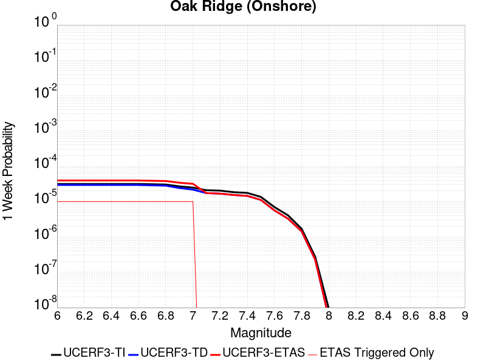 | 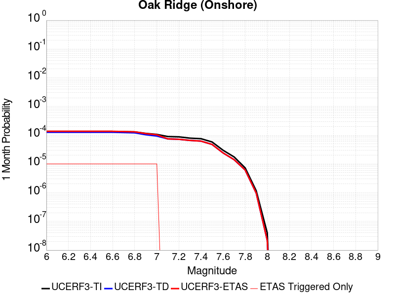 |  | 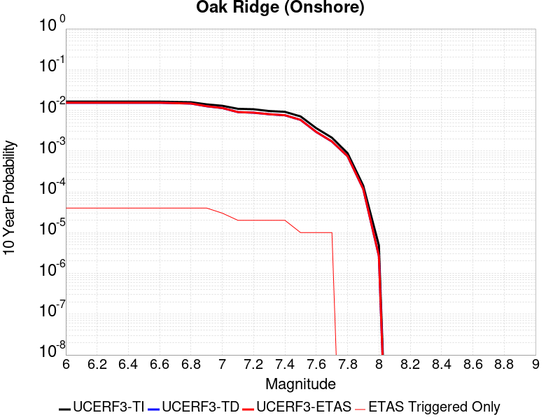 |

| Magnitude | 1 wk TI Prob | 1 wk TD Prob | 1 wk ETAS Prob | 1 wk ETAS/TD Gain | 1 wk ETAS Triggered Only | 1 mo TI Prob | 1 mo TD Prob | 1 mo ETAS Prob | 1 mo ETAS/TD Gain | 1 mo ETAS Triggered Only | 1 yr TI Prob | 1 yr TD Prob | 1 yr ETAS Prob | 1 yr ETAS/TD Gain | 1 yr ETAS Triggered Only | 10 yr TI Prob | 10 yr TD Prob | 10 yr ETAS Prob | 10 yr ETAS/TD Gain | 10 yr ETAS Triggered Only |
|-----|-----|-----|-----|-----|-----|-----|-----|-----|-----|-----|-----|-----|-----|-----|-----|-----|-----|-----|-----|-----|
| 6.0 | 3.155064E-5 | 2.9525974E-5 | 3.952568E-5 | 1.3386749 | 1.0E-5 | 1.3521002E-4 | 1.2653397E-4 | 1.365327E-4 | 1.0790201 | 1.0E-5 | 0.001644939 | 0.0015395004 | 0.0015594696 | 1.0129713 | 2.0E-5 | 0.01632816 | 0.015292859 | 0.015332247 | 1.0025756 | 4.0E-5 |
| 6.1 | 3.155064E-5 | 2.9525974E-5 | 3.952568E-5 | 1.3386749 | 1.0E-5 | 1.3521002E-4 | 1.2653397E-4 | 1.365327E-4 | 1.0790201 | 1.0E-5 | 0.001644939 | 0.0015395004 | 0.0015594696 | 1.0129713 | 2.0E-5 | 0.01632816 | 0.015292859 | 0.015332247 | 1.0025756 | 4.0E-5 |
| 6.2 | 3.155064E-5 | 2.9525974E-5 | 3.952568E-5 | 1.3386749 | 1.0E-5 | 1.3521002E-4 | 1.2653397E-4 | 1.365327E-4 | 1.0790201 | 1.0E-5 | 0.001644939 | 0.0015395004 | 0.0015594696 | 1.0129713 | 2.0E-5 | 0.01632816 | 0.015292859 | 0.015332247 | 1.0025756 | 4.0E-5 |
| 6.3 | 3.155064E-5 | 2.9525974E-5 | 3.952568E-5 | 1.3386749 | 1.0E-5 | 1.3521002E-4 | 1.2653397E-4 | 1.365327E-4 | 1.0790201 | 1.0E-5 | 0.001644939 | 0.0015395004 | 0.0015594696 | 1.0129713 | 2.0E-5 | 0.01632816 | 0.015292859 | 0.015332247 | 1.0025756 | 4.0E-5 |
| 6.4 | 3.155064E-5 | 2.9525974E-5 | 3.952568E-5 | 1.3386749 | 1.0E-5 | 1.3521002E-4 | 1.2653397E-4 | 1.365327E-4 | 1.0790201 | 1.0E-5 | 0.001644939 | 0.0015395004 | 0.0015594696 | 1.0129713 | 2.0E-5 | 0.01632816 | 0.015292859 | 0.015332247 | 1.0025756 | 4.0E-5 |
| 6.5 | 3.155064E-5 | 2.9525974E-5 | 3.952568E-5 | 1.3386749 | 1.0E-5 | 1.3521002E-4 | 1.2653397E-4 | 1.365327E-4 | 1.0790201 | 1.0E-5 | 0.001644939 | 0.0015395004 | 0.0015594696 | 1.0129713 | 2.0E-5 | 0.01632816 | 0.015292859 | 0.015332247 | 1.0025756 | 4.0E-5 |
| 6.6 | 3.155064E-5 | 2.9525974E-5 | 3.952568E-5 | 1.3386749 | 1.0E-5 | 1.3521002E-4 | 1.2653397E-4 | 1.365327E-4 | 1.0790201 | 1.0E-5 | 0.001644939 | 0.0015395004 | 0.0015594696 | 1.0129713 | 2.0E-5 | 0.01632816 | 0.015292859 | 0.015332247 | 1.0025756 | 4.0E-5 |
| 6.7 | 3.098897E-5 | 2.8864175E-5 | 3.8863887E-5 | 1.3464402 | 1.0E-5 | 1.328031E-4 | 1.2369796E-4 | 1.3369671E-4 | 1.0808321 | 1.0E-5 | 0.0016156785 | 0.0015050198 | 0.0015249897 | 1.0132688 | 2.0E-5 | 0.016039822 | 0.014952714 | 0.014992116 | 1.0026351 | 4.0E-5 |
| 6.8 | 3.0449872E-5 | 2.8239372E-5 | 3.823909E-5 | 1.3541055 | 1.0E-5 | 1.3049292E-4 | 1.2102048E-4 | 1.3101926E-4 | 1.0826206 | 1.0E-5 | 0.0015875935 | 0.0014724657 | 0.0014924362 | 1.0135627 | 2.0E-5 | 0.015762992 | 0.014631462 | 0.014670877 | 1.0026939 | 4.0E-5 |
| 6.9 | 2.697928E-5 | 2.4219773E-5 | 3.421953E-5 | 1.4128758 | 1.0E-5 | 1.15620365E-4 | 1.0379502E-4 | 1.1379398E-4 | 1.0963337 | 1.0E-5 | 0.0014067689 | 0.0012629933 | 0.0012829681 | 1.0158154 | 2.0E-5 | 0.0139789665 | 0.01256087 | 0.012600367 | 1.0031445 | 4.0E-5 |
| 7.0 | 2.4893961E-5 | 2.1862043E-5 | 3.1861822E-5 | 1.4574038 | 1.0E-5 | 1.0668404E-4 | 9.3691204E-5 | 1.0369026E-4 | 1.1067237 | 1.0E-5 | 0.0012981043 | 0.0011401111 | 0.0011600883 | 1.0175221 | 2.0E-5 | 0.012905477 | 0.011344905 | 0.011374565 | 1.0026144 | 3.0E-5 |
| 7.1 | 2.0945363E-5 | 1.7354487E-5 | 1.7354487E-5 | 1.0 | 0.0 | 8.976275E-5 | 7.437428E-5 | 7.437428E-5 | 1.0 | 0.0 | 0.0010923136 | 9.051354E-4 | 9.1512635E-4 | 1.0110381 | 1.0E-5 | 0.0108696 | 0.009015423 | 0.009035243 | 1.0021985 | 2.0E-5 |
| 7.2 | 2.0439404E-5 | 1.6809423E-5 | 1.6809423E-5 | 1.0 | 0.0 | 8.7594504E-5 | 7.203843E-5 | 7.203843E-5 | 1.0 | 0.0 | 0.0010659413 | 8.767196E-4 | 8.867108E-4 | 1.0113962 | 1.0E-5 | 0.010608427 | 0.008733526 | 0.008753352 | 1.00227 | 2.0E-5 |
| 7.3 | 1.8463334E-5 | 1.5381811E-5 | 1.5381811E-5 | 1.0 | 0.0 | 7.912617E-5 | 6.59204E-5 | 6.59204E-5 | 1.0 | 0.0 | 9.6293533E-4 | 8.0228975E-4 | 8.1228174E-4 | 1.0124543 | 1.0E-5 | 0.009587734 | 0.007994797 | 0.008014637 | 1.0024816 | 2.0E-5 |
| 7.4 | 1.763139E-5 | 1.451684E-5 | 1.451684E-5 | 1.0 | 0.0 | 7.556091E-5 | 6.221356E-5 | 6.221356E-5 | 1.0 | 0.0 | 9.1956573E-4 | 7.571909E-4 | 7.671833E-4 | 1.0131967 | 1.0E-5 | 0.009157699 | 0.007546914 | 0.0075667626 | 1.0026301 | 2.0E-5 |
| 7.5 | 1.3594944E-5 | 1.1163356E-5 | 1.1163356E-5 | 1.0 | 0.0 | 5.8262744E-5 | 4.784209E-5 | 4.784209E-5 | 1.0 | 0.0 | 7.0911803E-4 | 5.8232434E-4 | 5.923185E-4 | 1.0171626 | 1.0E-5 | 0.007068595 | 0.0058082556 | 0.0058181975 | 1.0017117 | 1.0E-5 |
| 7.6 | 6.9889534E-6 | 5.6367144E-6 | 5.6367144E-6 | 1.0 | 0.0 | 2.9952313E-5 | 2.4157125E-5 | 2.4157125E-5 | 1.0 | 0.0 | 3.646084E-4 | 2.9407372E-4 | 3.040708E-4 | 1.033995 | 1.0E-5 | 0.0036401073 | 0.0029368899 | 0.0029468604 | 1.003395 | 1.0E-5 |
| 7.7 | 4.0824193E-6 | 3.2832586E-6 | 3.2832586E-6 | 1.0 | 0.0 | 1.7495966E-5 | 1.4071033E-5 | 1.4071033E-5 | 1.0 | 0.0 | 2.1299256E-4 | 1.713015E-4 | 1.8129978E-4 | 1.0583667 | 1.0E-5 | 0.0021278851 | 0.0017117079 | 0.0017216908 | 1.0058321 | 1.0E-5 |
| 7.8 | 1.7023609E-6 | 1.4370495E-6 | 1.4370495E-6 | 1.0 | 0.0 | 7.295812E-6 | 6.1587693E-6 | 6.1587693E-6 | 1.0 | 0.0 | 8.882289E-5 | 7.498047E-5 | 7.498047E-5 | 1.0 | 0.0 | 8.8787393E-4 | 7.495545E-4 | 7.495545E-4 | 1.0 | 0.0 |
| 7.9 | 2.721225E-7 | 2.2616497E-7 | 2.2616497E-7 | 1.0 | 0.0 | 1.1662388E-6 | 9.692781E-7 | 9.692781E-7 | 1.0 | 0.0 | 1.4198865E-5 | 1.1800899E-5 | 1.1800899E-5 | 1.0 | 0.0 | 1.4197957E-4 | 1.1800301E-4 | 1.1800301E-4 | 1.0 | 0.0 |
| 8.0 | 9.364255E-9 | 5.1206666E-9 | 5.1206666E-9 | 1.0 | 0.0 | 4.0132523E-8 | 2.1945715E-8 | 2.1945715E-8 | 1.0 | 0.0 | 4.8861335E-7 | 2.6718905E-7 | 2.6718905E-7 | 1.0 | 0.0 | 4.8861225E-6 | 2.6718876E-6 | 2.6718876E-6 | 1.0 | 0.0 |

## Ortigalita (North)
*[(top)](#table-of-contents)*

| 1 Week | 1 Month | 1 Year | 10 Year |
|-----|-----|-----|-----|
| 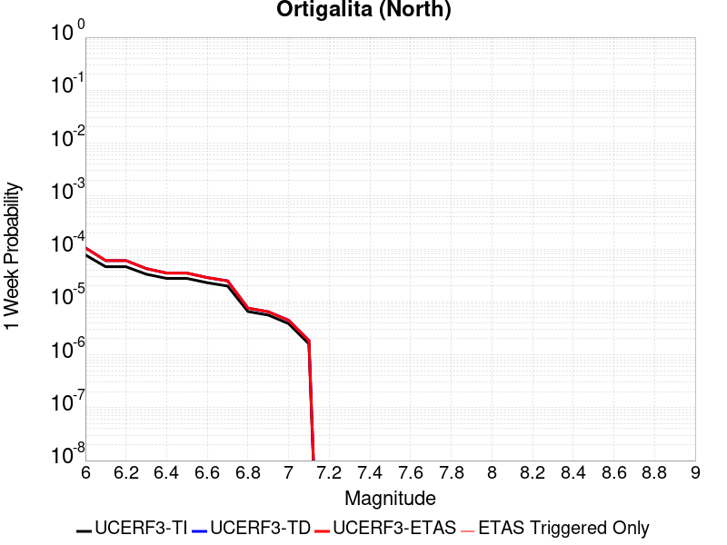 | 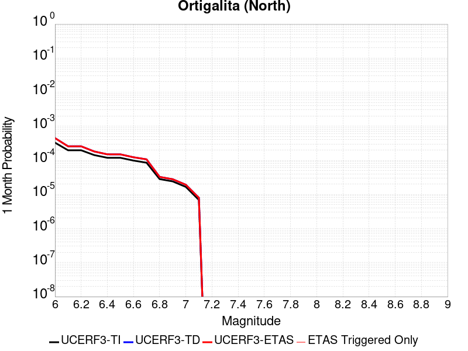 |  |  |

| Magnitude | 1 wk TI Prob | 1 wk TD Prob | 1 wk ETAS Prob | 1 wk ETAS/TD Gain | 1 wk ETAS Triggered Only | 1 mo TI Prob | 1 mo TD Prob | 1 mo ETAS Prob | 1 mo ETAS/TD Gain | 1 mo ETAS Triggered Only | 1 yr TI Prob | 1 yr TD Prob | 1 yr ETAS Prob | 1 yr ETAS/TD Gain | 1 yr ETAS Triggered Only | 10 yr TI Prob | 10 yr TD Prob | 10 yr ETAS Prob | 10 yr ETAS/TD Gain | 10 yr ETAS Triggered Only |
|-----|-----|-----|-----|-----|-----|-----|-----|-----|-----|-----|-----|-----|-----|-----|-----|-----|-----|-----|-----|-----|
| 6.0 | 7.711876E-5 | 1.05064966E-4 | 1.05064966E-4 | 1.0 | 0.0 | 3.3046713E-4 | 4.502116E-4 | 4.502116E-4 | 1.0 | 0.0 | 0.004016016 | 0.0054681194 | 0.0054681194 | 1.0 | 0.0 | 0.039442103 | 0.053454787 | 0.05347372 | 1.0003542 | 2.0E-5 |
| 6.1 | 4.607858E-5 | 6.0239203E-5 | 6.0239203E-5 | 1.0 | 0.0 | 1.9746469E-4 | 2.5814527E-4 | 2.5814527E-4 | 1.0 | 0.0 | 0.0024014818 | 0.0031387596 | 0.0031387596 | 1.0 | 0.0 | 0.023756953 | 0.030975068 | 0.030994449 | 1.0006257 | 2.0E-5 |
| 6.2 | 4.607858E-5 | 6.0239203E-5 | 6.0239203E-5 | 1.0 | 0.0 | 1.9746469E-4 | 2.5814527E-4 | 2.5814527E-4 | 1.0 | 0.0 | 0.0024014818 | 0.0031387596 | 0.0031387596 | 1.0 | 0.0 | 0.023756953 | 0.030975068 | 0.030994449 | 1.0006257 | 2.0E-5 |
| 6.3 | 3.327423E-5 | 4.2475127E-5 | 4.2475127E-5 | 1.0 | 0.0 | 1.4259605E-4 | 1.8202531E-4 | 1.8202531E-4 | 1.0 | 0.0 | 0.0017347244 | 0.002214197 | 0.002214197 | 1.0 | 0.0 | 0.017212452 | 0.021945644 | 0.021965206 | 1.0008913 | 2.0E-5 |
| 6.4 | 2.7732503E-5 | 3.4998593E-5 | 3.4998593E-5 | 1.0 | 0.0 | 1.1884817E-4 | 1.4998685E-4 | 1.4998685E-4 | 1.0 | 0.0 | 0.001446016 | 0.0018248095 | 0.0018248095 | 1.0 | 0.0 | 0.014366428 | 0.018121224 | 0.018131042 | 1.0005418 | 1.0E-5 |
| 6.5 | 2.7689714E-5 | 3.4948407E-5 | 3.4948407E-5 | 1.0 | 0.0 | 1.186648E-4 | 1.497718E-4 | 1.497718E-4 | 1.0 | 0.0 | 0.0014437864 | 0.0018221956 | 0.0018221956 | 1.0 | 0.0 | 0.014344421 | 0.01809551 | 0.01810533 | 1.0005426 | 1.0E-5 |
| 6.6 | 2.2976905E-5 | 2.8718265E-5 | 2.8718265E-5 | 1.0 | 0.0 | 9.846873E-5 | 1.230739E-4 | 1.230739E-4 | 1.0 | 0.0 | 0.0011981975 | 0.0014976363 | 0.0014976363 | 1.0 | 0.0 | 0.011917574 | 0.014898697 | 0.014908548 | 1.0006613 | 1.0E-5 |
| 6.7 | 1.9871539E-5 | 2.4904411E-5 | 2.4904411E-5 | 1.0 | 0.0 | 8.516096E-5 | 1.0673023E-4 | 1.0673023E-4 | 1.0 | 0.0 | 0.0010363415 | 0.0012989145 | 0.0012989145 | 1.0 | 0.0 | 0.010315218 | 0.012936919 | 0.01294679 | 1.0007629 | 1.0E-5 |
| 6.8 | 6.5640475E-6 | 7.6054926E-6 | 7.6054926E-6 | 1.0 | 0.0 | 2.813133E-5 | 3.2594577E-5 | 3.2594577E-5 | 1.0 | 0.0 | 3.424451E-4 | 3.9676955E-4 | 3.9676955E-4 | 1.0 | 0.0 | 0.0034191788 | 0.003960899 | 0.003970859 | 1.0025147 | 1.0E-5 |
| 6.9 | 5.6219683E-6 | 6.5018376E-6 | 6.5018376E-6 | 1.0 | 0.0 | 2.4093928E-5 | 2.7864735E-5 | 2.7864735E-5 | 1.0 | 0.0 | 2.933041E-4 | 3.3920293E-4 | 3.3920293E-4 | 1.0 | 0.0 | 0.0029291727 | 0.003387109 | 0.003397075 | 1.0029423 | 1.0E-5 |
| 7.0 | 3.875591E-6 | 4.4847548E-6 | 4.4847548E-6 | 1.0 | 0.0 | 1.6609569E-5 | 1.9220248E-5 | 1.9220248E-5 | 1.0 | 0.0 | 2.0220275E-4 | 2.339835E-4 | 2.339835E-4 | 1.0 | 0.0 | 0.0020201886 | 0.0023375798 | 0.0023475564 | 1.0042679 | 1.0E-5 |
| 7.1 | 1.6017933E-6 | 1.8570418E-6 | 1.8570418E-6 | 1.0 | 0.0 | 6.8648105E-6 | 7.958732E-6 | 7.958732E-6 | 1.0 | 0.0 | 8.357586E-5 | 9.689432E-5 | 9.689432E-5 | 1.0 | 0.0 | 8.3544437E-4 | 9.686254E-4 | 9.786157E-4 | 1.0103139 | 1.0E-5 |

## South Klamath Lake West
*[(top)](#table-of-contents)*

| 1 Week | 1 Month | 1 Year | 10 Year |
|-----|-----|-----|-----|
| 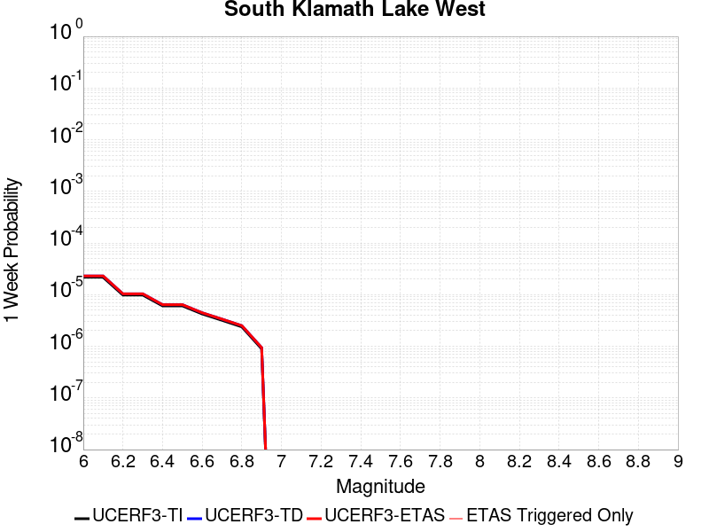 | 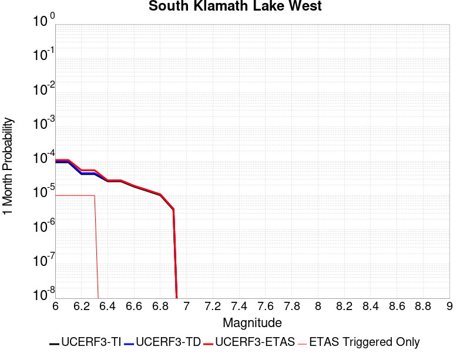 |  |  |

| Magnitude | 1 wk TI Prob | 1 wk TD Prob | 1 wk ETAS Prob | 1 wk ETAS/TD Gain | 1 wk ETAS Triggered Only | 1 mo TI Prob | 1 mo TD Prob | 1 mo ETAS Prob | 1 mo ETAS/TD Gain | 1 mo ETAS Triggered Only | 1 yr TI Prob | 1 yr TD Prob | 1 yr ETAS Prob | 1 yr ETAS/TD Gain | 1 yr ETAS Triggered Only | 10 yr TI Prob | 10 yr TD Prob | 10 yr ETAS Prob | 10 yr ETAS/TD Gain | 10 yr ETAS Triggered Only |
|-----|-----|-----|-----|-----|-----|-----|-----|-----|-----|-----|-----|-----|-----|-----|-----|-----|-----|-----|-----|-----|
| 6.0 | 2.174025E-5 | 2.3042025E-5 | 2.3042025E-5 | 1.0 | 0.0 | 9.3169176E-5 | 9.874817E-5 | 1.0874718E-4 | 1.1012577 | 1.0E-5 | 0.0011337444 | 0.0012016617 | 0.0012116497 | 1.0083119 | 1.0E-5 | 0.011279777 | 0.0119582405 | 0.011978001 | 1.0016525 | 2.0E-5 |
| 6.1 | 2.174025E-5 | 2.3042025E-5 | 2.3042025E-5 | 1.0 | 0.0 | 9.3169176E-5 | 9.874817E-5 | 1.0874718E-4 | 1.1012577 | 1.0E-5 | 0.0011337444 | 0.0012016617 | 0.0012116497 | 1.0083119 | 1.0E-5 | 0.011279777 | 0.0119582405 | 0.011978001 | 1.0016525 | 2.0E-5 |
| 6.2 | 9.834929E-6 | 1.0393841E-5 | 1.0393841E-5 | 1.0 | 0.0 | 4.2149015E-5 | 4.4544326E-5 | 5.4543878E-5 | 1.2244855 | 1.0E-5 | 5.1304343E-4 | 5.422012E-4 | 5.521958E-4 | 1.0184333 | 1.0E-5 | 0.0051186057 | 0.0054096854 | 0.005429577 | 1.0036771 | 2.0E-5 |
| 6.3 | 9.834929E-6 | 1.0393841E-5 | 1.0393841E-5 | 1.0 | 0.0 | 4.2149015E-5 | 4.4544326E-5 | 5.4543878E-5 | 1.2244855 | 1.0E-5 | 5.1304343E-4 | 5.422012E-4 | 5.521958E-4 | 1.0184333 | 1.0E-5 | 0.0051186057 | 0.0054096854 | 0.005429577 | 1.0036771 | 2.0E-5 |
| 6.4 | 6.066321E-6 | 6.40043E-6 | 6.40043E-6 | 1.0 | 0.0 | 2.5998259E-5 | 2.743014E-5 | 2.743014E-5 | 1.0 | 0.0 | 3.1648282E-4 | 3.3391351E-4 | 3.3391351E-4 | 1.0 | 0.0 | 0.0031603249 | 0.0033343881 | 0.0033443547 | 1.002989 | 1.0E-5 |
| 6.5 | 6.066321E-6 | 6.40043E-6 | 6.40043E-6 | 1.0 | 0.0 | 2.5998259E-5 | 2.743014E-5 | 2.743014E-5 | 1.0 | 0.0 | 3.1648282E-4 | 3.3391351E-4 | 3.3391351E-4 | 1.0 | 0.0 | 0.0031603249 | 0.0033343881 | 0.0033443547 | 1.002989 | 1.0E-5 |
| 6.6 | 4.2321803E-6 | 4.461291E-6 | 4.461291E-6 | 1.0 | 0.0 | 1.8137789E-5 | 1.9119685E-5 | 1.9119685E-5 | 1.0 | 0.0 | 2.208052E-4 | 2.3275832E-4 | 2.3275832E-4 | 1.0 | 0.0 | 0.0022058594 | 0.0023252473 | 0.002335224 | 1.0042906 | 1.0E-5 |
| 6.7 | 3.186646E-6 | 3.360305E-6 | 3.360305E-6 | 1.0 | 0.0 | 1.3656982E-5 | 1.4401232E-5 | 1.4401232E-5 | 1.0 | 0.0 | 1.6626107E-4 | 1.7532158E-4 | 1.7532158E-4 | 1.0 | 0.0 | 0.0016613674 | 0.0017518997 | 0.0017518997 | 1.0 | 0.0 |
| 6.8 | 2.380121E-6 | 2.510907E-6 | 2.510907E-6 | 1.0 | 0.0 | 1.0200479E-5 | 1.07609885E-5 | 1.07609885E-5 | 1.0 | 0.0 | 1.2418375E-4 | 1.3100762E-4 | 1.3100762E-4 | 1.0 | 0.0 | 0.0012411437 | 0.0013093497 | 0.0013093497 | 1.0 | 0.0 |
| 6.9 | 8.928287E-7 | 9.4302504E-7 | 9.4302504E-7 | 1.0 | 0.0 | 3.826403E-6 | 4.0415307E-6 | 4.0415307E-6 | 1.0 | 0.0 | 4.658546E-5 | 4.9204747E-5 | 4.9204747E-5 | 1.0 | 0.0 | 4.6575698E-4 | 4.9196015E-4 | 4.9196015E-4 | 1.0 | 0.0 |

## Great Valley 09 (Laguna Seca)
*[(top)](#table-of-contents)*

| 1 Week | 1 Month | 1 Year | 10 Year |
|-----|-----|-----|-----|
| 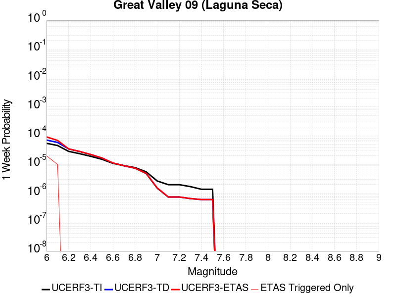 | 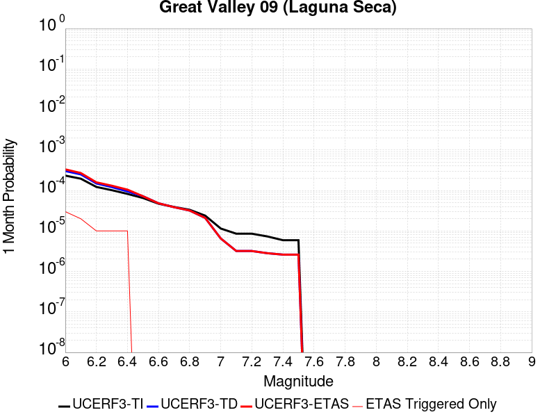 |  |  |

| Magnitude | 1 wk TI Prob | 1 wk TD Prob | 1 wk ETAS Prob | 1 wk ETAS/TD Gain | 1 wk ETAS Triggered Only | 1 mo TI Prob | 1 mo TD Prob | 1 mo ETAS Prob | 1 mo ETAS/TD Gain | 1 mo ETAS Triggered Only | 1 yr TI Prob | 1 yr TD Prob | 1 yr ETAS Prob | 1 yr ETAS/TD Gain | 1 yr ETAS Triggered Only | 10 yr TI Prob | 10 yr TD Prob | 10 yr ETAS Prob | 10 yr ETAS/TD Gain | 10 yr ETAS Triggered Only |
|-----|-----|-----|-----|-----|-----|-----|-----|-----|-----|-----|-----|-----|-----|-----|-----|-----|-----|-----|-----|-----|
| 6.0 | 5.4353277E-5 | 7.05022E-5 | 9.050079E-5 | 1.2836591 | 2.0E-5 | 2.3292181E-4 | 3.0211566E-4 | 3.321066E-4 | 1.0992697 | 3.0E-5 | 0.0028321352 | 0.0036721937 | 0.0037020836 | 1.0081395 | 3.0E-5 | 0.02796312 | 0.03611547 | 0.036144387 | 1.0008006 | 3.0E-5 |
| 6.1 | 4.5578287E-5 | 5.822118E-5 | 6.82206E-5 | 1.1717488 | 1.0E-5 | 1.953209E-4 | 2.4949326E-4 | 2.6948826E-4 | 1.0801425 | 2.0E-5 | 0.0023754383 | 0.003033432 | 0.0030533713 | 1.0065732 | 2.0E-5 | 0.023502063 | 0.029919548 | 0.02993895 | 1.0006485 | 2.0E-5 |
| 6.2 | 2.8536782E-5 | 3.4737273E-5 | 3.4737273E-5 | 1.0 | 0.0 | 1.2229476E-4 | 1.4886224E-4 | 1.5886074E-4 | 1.0671662 | 1.0E-5 | 0.0014879217 | 0.001810813 | 0.0018207949 | 1.0055124 | 1.0E-5 | 0.014779986 | 0.017958116 | 0.017967938 | 1.0005468 | 1.0E-5 |
| 6.3 | 2.3698774E-5 | 2.8213295E-5 | 2.8213295E-5 | 1.0 | 0.0 | 1.01562226E-4 | 1.20905075E-4 | 1.3090386E-4 | 1.0826995 | 1.0E-5 | 0.0012358186 | 0.0014710218 | 0.0014810071 | 1.006788 | 1.0E-5 | 0.012289686 | 0.014611342 | 0.014621195 | 1.0006744 | 1.0E-5 |
| 6.4 | 1.9191197E-5 | 2.2123184E-5 | 2.2123184E-5 | 1.0 | 0.0 | 8.2245395E-5 | 9.4806666E-5 | 1.0480572E-4 | 1.1054678 | 1.0E-5 | 0.0010008777 | 0.0011536429 | 0.0011636313 | 1.0086582 | 1.0E-5 | 0.009963818 | 0.011476948 | 0.011486833 | 1.0008613 | 1.0E-5 |
| 6.5 | 1.5203241E-5 | 1.6802203E-5 | 1.6802203E-5 | 1.0 | 0.0 | 6.5155116E-5 | 7.200386E-5 | 7.200386E-5 | 1.0 | 0.0 | 7.9297484E-4 | 8.7626575E-4 | 8.7626575E-4 | 1.0 | 0.0 | 0.007901512 | 0.0087295165 | 0.0087295165 | 1.0 | 0.0 |
| 6.6 | 1.0984925E-5 | 1.1242595E-5 | 1.1242595E-5 | 1.0 | 0.0 | 4.70774E-5 | 4.8181686E-5 | 4.8181686E-5 | 1.0 | 0.0 | 5.730166E-4 | 5.8645656E-4 | 5.8645656E-4 | 1.0 | 0.0 | 0.005715413 | 0.0058494853 | 0.0058494853 | 1.0 | 0.0 |
| 6.7 | 9.134616E-6 | 9.019894E-6 | 9.019894E-6 | 1.0 | 0.0 | 3.9147766E-5 | 3.865613E-5 | 3.865613E-5 | 1.0 | 0.0 | 4.7651984E-4 | 4.7053912E-4 | 4.7053912E-4 | 1.0 | 0.0 | 0.004754993 | 0.0046956735 | 0.0046956735 | 1.0 | 0.0 |
| 6.8 | 7.785589E-6 | 7.4519444E-6 | 7.4519444E-6 | 1.0 | 0.0 | 3.3366385E-5 | 3.1936524E-5 | 3.1936524E-5 | 1.0 | 0.0 | 4.0616E-4 | 3.8875983E-4 | 3.8875983E-4 | 1.0 | 0.0 | 0.0040541845 | 0.0038810016 | 0.0038810016 | 1.0 | 0.0 |
| 6.9 | 5.579095E-6 | 4.898492E-6 | 4.898492E-6 | 1.0 | 0.0 | 2.3910188E-5 | 2.0993377E-5 | 2.0993377E-5 | 1.0 | 0.0 | 2.9106764E-4 | 2.5556577E-4 | 2.5556577E-4 | 1.0 | 0.0 | 0.002906867 | 0.002552856 | 0.002552856 | 1.0 | 0.0 |
| 7.0 | 2.6816688E-6 | 1.5216126E-6 | 1.5216126E-6 | 1.0 | 0.0 | 1.1492816E-5 | 6.521181E-6 | 6.521181E-6 | 1.0 | 0.0 | 1.3991605E-4 | 7.939258E-5 | 7.939258E-5 | 1.0 | 0.0 | 0.0013982799 | 7.9365086E-4 | 7.9365086E-4 | 1.0 | 0.0 |
| 7.1 | 1.9951021E-6 | 7.453827E-7 | 7.453827E-7 | 1.0 | 0.0 | 8.55041E-6 | 3.1944935E-6 | 3.1944935E-6 | 1.0 | 0.0 | 1.0409627E-4 | 3.8892307E-5 | 3.8892307E-5 | 1.0 | 0.0 | 0.0010404752 | 3.8885913E-4 | 3.8885913E-4 | 1.0 | 0.0 |
| 7.2 | 1.9951021E-6 | 7.453827E-7 | 7.453827E-7 | 1.0 | 0.0 | 8.55041E-6 | 3.1944935E-6 | 3.1944935E-6 | 1.0 | 0.0 | 1.0409627E-4 | 3.8892307E-5 | 3.8892307E-5 | 1.0 | 0.0 | 0.0010404752 | 3.8885913E-4 | 3.8885913E-4 | 1.0 | 0.0 |
| 7.3 | 1.7087556E-6 | 6.578881E-7 | 6.578881E-7 | 1.0 | 0.0 | 7.3232177E-6 | 2.8195177E-6 | 2.8195177E-6 | 1.0 | 0.0 | 8.915652E-5 | 3.4327128E-5 | 3.4327128E-5 | 1.0 | 0.0 | 8.9120766E-4 | 3.432223E-4 | 3.432223E-4 | 1.0 | 0.0 |
| 7.4 | 1.3804846E-6 | 6.073852E-7 | 6.073852E-7 | 1.0 | 0.0 | 5.916349E-6 | 2.6030768E-6 | 2.6030768E-6 | 1.0 | 0.0 | 7.2029165E-5 | 3.169204E-5 | 3.169204E-5 | 1.0 | 0.0 | 7.200583E-4 | 3.1687922E-4 | 3.1687922E-4 | 1.0 | 0.0 |
| 7.5 | 1.3804846E-6 | 6.073852E-7 | 6.073852E-7 | 1.0 | 0.0 | 5.916349E-6 | 2.6030768E-6 | 2.6030768E-6 | 1.0 | 0.0 | 7.2029165E-5 | 3.169204E-5 | 3.169204E-5 | 1.0 | 0.0 | 7.200583E-4 | 3.1687922E-4 | 3.1687922E-4 | 1.0 | 0.0 |

## San Andreas (Santa Cruz Mts) 2011 CFM
*[(top)](#table-of-contents)*

| 1 Week | 1 Month | 1 Year | 10 Year |
|-----|-----|-----|-----|
|  |  |  |  |

| Magnitude | 1 wk TI Prob | 1 wk TD Prob | 1 wk ETAS Prob | 1 wk ETAS/TD Gain | 1 wk ETAS Triggered Only | 1 mo TI Prob | 1 mo TD Prob | 1 mo ETAS Prob | 1 mo ETAS/TD Gain | 1 mo ETAS Triggered Only | 1 yr TI Prob | 1 yr TD Prob | 1 yr ETAS Prob | 1 yr ETAS/TD Gain | 1 yr ETAS Triggered Only | 10 yr TI Prob | 10 yr TD Prob | 10 yr ETAS Prob | 10 yr ETAS/TD Gain | 10 yr ETAS Triggered Only |
|-----|-----|-----|-----|-----|-----|-----|-----|-----|-----|-----|-----|-----|-----|-----|-----|-----|-----|-----|-----|-----|
| 6.0 | 1.7221631E-4 | 1.3793171E-4 | 1.3793171E-4 | 1.0 | 0.0 | 7.378611E-4 | 5.9100403E-4 | 5.9100403E-4 | 1.0 | 0.0 | 0.008946515 | 0.007172124 | 0.0071919803 | 1.0027685 | 2.0E-5 | 0.08594794 | 0.0705551 | 0.07058298 | 1.0003952 | 3.0E-5 |
| 6.1 | 1.7221631E-4 | 1.3793171E-4 | 1.3793171E-4 | 1.0 | 0.0 | 7.378611E-4 | 5.9100403E-4 | 5.9100403E-4 | 1.0 | 0.0 | 0.008946515 | 0.007172124 | 0.0071919803 | 1.0027685 | 2.0E-5 | 0.08594794 | 0.0705551 | 0.07058298 | 1.0003952 | 3.0E-5 |
| 6.2 | 1.7221631E-4 | 1.3793171E-4 | 1.3793171E-4 | 1.0 | 0.0 | 7.378611E-4 | 5.9100403E-4 | 5.9100403E-4 | 1.0 | 0.0 | 0.008946515 | 0.007172124 | 0.0071919803 | 1.0027685 | 2.0E-5 | 0.08594794 | 0.0705551 | 0.07058298 | 1.0003952 | 3.0E-5 |
| 6.3 | 1.716926E-4 | 1.3712609E-4 | 1.3712609E-4 | 1.0 | 0.0 | 7.3561794E-4 | 5.875529E-4 | 5.875529E-4 | 1.0 | 0.0 | 0.008919428 | 0.0071303817 | 0.007150239 | 1.0027848 | 2.0E-5 | 0.08569809 | 0.070167266 | 0.07019516 | 1.0003976 | 3.0E-5 |
| 6.4 | 1.6392978E-4 | 1.3588481E-4 | 1.3588481E-4 | 1.0 | 0.0 | 7.02367E-4 | 5.822355E-4 | 5.822355E-4 | 1.0 | 0.0 | 0.008517839 | 0.007066063 | 0.0070859217 | 1.0028105 | 2.0E-5 | 0.08198654 | 0.06940135 | 0.06942927 | 1.0004022 | 3.0E-5 |
| 6.5 | 1.5742714E-4 | 1.2648388E-4 | 1.2648388E-4 | 1.0 | 0.0 | 6.745133E-4 | 5.4196286E-4 | 5.4196286E-4 | 1.0 | 0.0 | 0.00818132 | 0.0065787593 | 0.0065986277 | 1.00302 | 2.0E-5 | 0.078865945 | 0.06486309 | 0.06489115 | 1.0004325 | 3.0E-5 |
| 6.6 | 1.3038084E-4 | 1.1588213E-4 | 1.1588213E-4 | 1.0 | 0.0 | 5.5865536E-4 | 4.9654447E-4 | 4.9654447E-4 | 1.0 | 0.0 | 0.006780438 | 0.0060289134 | 0.0060487925 | 1.0032973 | 2.0E-5 | 0.0657725 | 0.05932738 | 0.059355598 | 1.0004756 | 3.0E-5 |
| 6.7 | 1.2867592E-4 | 1.1314701E-4 | 1.1314701E-4 | 1.0 | 0.0 | 5.5135164E-4 | 4.8482692E-4 | 4.8482692E-4 | 1.0 | 0.0 | 0.0066920654 | 0.00588703 | 0.0059069125 | 1.0033773 | 2.0E-5 | 0.06494093 | 0.058038417 | 0.058066677 | 1.0004869 | 3.0E-5 |
| 6.8 | 1.2801298E-4 | 1.1252261E-4 | 1.1252261E-4 | 1.0 | 0.0 | 5.485117E-4 | 4.8215193E-4 | 4.8215193E-4 | 1.0 | 0.0 | 0.0066577005 | 0.0058546383 | 0.005874521 | 1.0033962 | 2.0E-5 | 0.06461738 | 0.057752274 | 0.057780538 | 1.0004895 | 3.0E-5 |
| 6.9 | 1.269149E-4 | 1.1094465E-4 | 1.1094465E-4 | 1.0 | 0.0 | 5.4380763E-4 | 4.7539172E-4 | 4.7539172E-4 | 1.0 | 0.0 | 0.006600777 | 0.005772772 | 0.0057926564 | 1.0034446 | 2.0E-5 | 0.06408122 | 0.0570241 | 0.057052385 | 1.0004961 | 3.0E-5 |
| 7.0 | 1.2030331E-4 | 1.0824504E-4 | 1.0824504E-4 | 1.0 | 0.0 | 5.154837E-4 | 4.638261E-4 | 4.638261E-4 | 1.0 | 0.0 | 0.006257969 | 0.0056326967 | 0.0056525837 | 1.0035307 | 2.0E-5 | 0.06084648 | 0.055696685 | 0.055725016 | 1.0005087 | 3.0E-5 |
| 7.1 | 8.049617E-5 | 5.3926604E-5 | 5.3926604E-5 | 1.0 | 0.0 | 3.4493793E-4 | 2.3109373E-4 | 2.3109373E-4 | 1.0 | 0.0 | 0.0041915346 | 0.0028099709 | 0.0028299147 | 1.0070975 | 2.0E-5 | 0.041133516 | 0.029618956 | 0.029648067 | 1.0009829 | 3.0E-5 |
| 7.2 | 7.093979E-5 | 4.2937932E-5 | 4.2937932E-5 | 1.0 | 0.0 | 3.0399222E-4 | 1.8400686E-4 | 1.8400686E-4 | 1.0 | 0.0 | 0.0036948253 | 0.0022380045 | 0.0022579597 | 1.0089165 | 2.0E-5 | 0.03633994 | 0.023941692 | 0.023970973 | 1.0012231 | 3.0E-5 |
| 7.3 | 6.193693E-5 | 2.8894141E-5 | 2.8894141E-5 | 1.0 | 0.0 | 2.6541698E-4 | 1.2382616E-4 | 1.2382616E-4 | 1.0 | 0.0 | 0.0032266637 | 0.0015065427 | 0.0015265126 | 1.0132555 | 2.0E-5 | 0.031802133 | 0.016499156 | 0.01652866 | 1.0017883 | 3.0E-5 |
| 7.4 | 5.906492E-5 | 2.702346E-5 | 2.702346E-5 | 1.0 | 0.0 | 2.5311083E-4 | 1.1580969E-4 | 1.1580969E-4 | 1.0 | 0.0 | 0.0030772698 | 0.0014090725 | 0.0014290443 | 1.0141737 | 2.0E-5 | 0.030350044 | 0.015471023 | 0.015500559 | 1.0019091 | 3.0E-5 |
| 7.5 | 5.424296E-5 | 2.4678277E-5 | 2.4678277E-5 | 1.0 | 0.0 | 2.324491E-4 | 1.05759755E-4 | 1.05759755E-4 | 1.0 | 0.0 | 0.002826395 | 0.0012868657 | 0.00130684 | 1.0155216 | 2.0E-5 | 0.027907165 | 0.014163188 | 0.014192763 | 1.0020882 | 3.0E-5 |
| 7.6 | 4.43084E-5 | 1.990431E-5 | 1.990431E-5 | 1.0 | 0.0 | 1.8987931E-4 | 8.53014E-5 | 8.53014E-5 | 1.0 | 0.0 | 0.0023093296 | 0.0010380499 | 0.0010580292 | 1.0192469 | 2.0E-5 | 0.022854783 | 0.011412679 | 0.011442337 | 1.0025986 | 3.0E-5 |
| 7.7 | 4.118098E-5 | 1.8936442E-5 | 1.8936442E-5 | 1.0 | 0.0 | 1.7647797E-4 | 8.115366E-5 | 8.115366E-5 | 1.0 | 0.0 | 0.002146502 | 9.875982E-4 | 0.0010075785 | 1.0202311 | 2.0E-5 | 0.021258866 | 0.010870468 | 0.010900142 | 1.0027298 | 3.0E-5 |
| 7.8 | 3.5408906E-5 | 1.856446E-5 | 1.856446E-5 | 1.0 | 0.0 | 1.5174363E-4 | 7.955955E-5 | 7.955955E-5 | 1.0 | 0.0 | 0.0018459131 | 9.682073E-4 | 9.88188E-4 | 1.0206367 | 2.0E-5 | 0.018306552 | 0.010652021 | 0.010681701 | 1.0027864 | 3.0E-5 |
| 7.9 | 2.5860836E-5 | 1.7315993E-5 | 1.7315993E-5 | 1.0 | 0.0 | 1.10827445E-4 | 7.420929E-5 | 7.420929E-5 | 1.0 | 0.0 | 0.001348489 | 9.031238E-4 | 9.2310575E-4 | 1.0221254 | 2.0E-5 | 0.013403354 | 0.009907599 | 0.009937301 | 1.002998 | 3.0E-5 |
| 8.0 | 1.9777332E-5 | 1.4839596E-5 | 1.4839596E-5 | 1.0 | 0.0 | 8.4757245E-5 | 6.3596715E-5 | 6.3596715E-5 | 1.0 | 0.0 | 0.0010314309 | 7.740152E-4 | 7.840074E-4 | 1.0129097 | 1.0E-5 | 0.010266567 | 0.008508967 | 0.008528798 | 1.0023304 | 2.0E-5 |
| 8.1 | 1.468494E-5 | 1.2107374E-5 | 1.2107374E-5 | 1.0 | 0.0 | 6.293394E-5 | 5.1887713E-5 | 5.1887713E-5 | 1.0 | 0.0 | 7.6595135E-4 | 6.3155E-4 | 6.3155E-4 | 1.0 | 0.0 | 0.0076331664 | 0.006969149 | 0.0069790795 | 1.0014249 | 1.0E-5 |
| 8.2 | 8.63836E-6 | 5.469061E-6 | 5.469061E-6 | 1.0 | 0.0 | 3.7021015E-5 | 2.3438623E-5 | 2.3438623E-5 | 1.0 | 0.0 | 4.5063766E-4 | 2.8532793E-4 | 2.8532793E-4 | 1.0 | 0.0 | 0.004497249 | 0.00324569 | 0.00324569 | 1.0 | 0.0 |
| 8.3 | 1.983087E-6 | 7.6599065E-7 | 7.6599065E-7 | 1.0 | 0.0 | 8.498917E-6 | 3.282813E-6 | 3.282813E-6 | 1.0 | 0.0 | 1.034694E-4 | 3.9967534E-5 | 3.9967534E-5 | 1.0 | 0.0 | 0.0010342124 | 4.719687E-4 | 4.719687E-4 | 1.0 | 0.0 |

## Great Valley 04b Gordon Valley
*[(top)](#table-of-contents)*

| 1 Week | 1 Month | 1 Year | 10 Year |
|-----|-----|-----|-----|
| 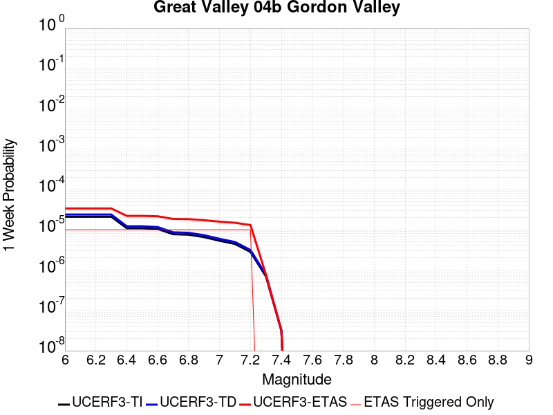 | 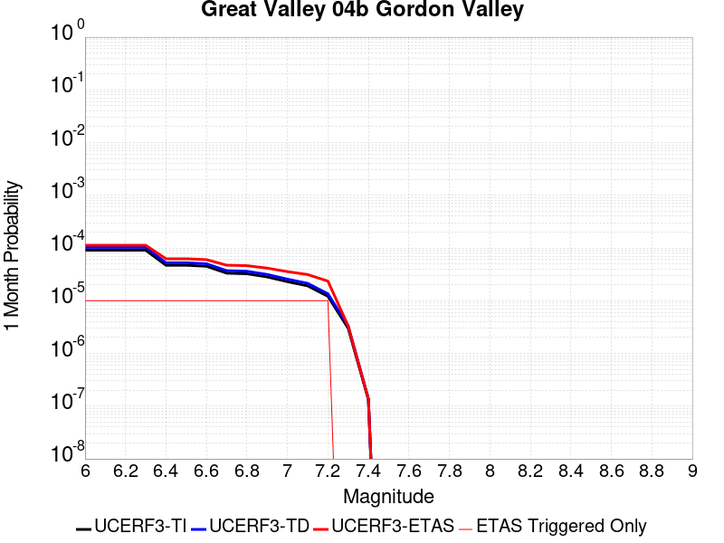 |  |  |

| Magnitude | 1 wk TI Prob | 1 wk TD Prob | 1 wk ETAS Prob | 1 wk ETAS/TD Gain | 1 wk ETAS Triggered Only | 1 mo TI Prob | 1 mo TD Prob | 1 mo ETAS Prob | 1 mo ETAS/TD Gain | 1 mo ETAS Triggered Only | 1 yr TI Prob | 1 yr TD Prob | 1 yr ETAS Prob | 1 yr ETAS/TD Gain | 1 yr ETAS Triggered Only | 10 yr TI Prob | 10 yr TD Prob | 10 yr ETAS Prob | 10 yr ETAS/TD Gain | 10 yr ETAS Triggered Only |
|-----|-----|-----|-----|-----|-----|-----|-----|-----|-----|-----|-----|-----|-----|-----|-----|-----|-----|-----|-----|-----|
| 6.0 | 2.1181217E-5 | 2.3981953E-5 | 3.3981712E-5 | 1.4169703 | 1.0E-5 | 9.077348E-5 | 1.0277669E-4 | 1.1277566E-4 | 1.0972884 | 1.0E-5 | 0.0011046068 | 0.0012507546 | 0.0012807171 | 1.0239555 | 3.0E-5 | 0.010991322 | 0.012453599 | 0.012483225 | 1.002379 | 3.0E-5 |
| 6.1 | 2.1181217E-5 | 2.3981953E-5 | 3.3981712E-5 | 1.4169703 | 1.0E-5 | 9.077348E-5 | 1.0277669E-4 | 1.1277566E-4 | 1.0972884 | 1.0E-5 | 0.0011046068 | 0.0012507546 | 0.0012807171 | 1.0239555 | 3.0E-5 | 0.010991322 | 0.012453599 | 0.012483225 | 1.002379 | 3.0E-5 |
| 6.2 | 2.1181217E-5 | 2.3981953E-5 | 3.3981712E-5 | 1.4169703 | 1.0E-5 | 9.077348E-5 | 1.0277669E-4 | 1.1277566E-4 | 1.0972884 | 1.0E-5 | 0.0011046068 | 0.0012507546 | 0.0012807171 | 1.0239555 | 3.0E-5 | 0.010991322 | 0.012453599 | 0.012483225 | 1.002379 | 3.0E-5 |
| 6.3 | 2.1181217E-5 | 2.3981953E-5 | 3.3981712E-5 | 1.4169703 | 1.0E-5 | 9.077348E-5 | 1.0277669E-4 | 1.1277566E-4 | 1.0972884 | 1.0E-5 | 0.0011046068 | 0.0012507546 | 0.0012807171 | 1.0239555 | 3.0E-5 | 0.010991322 | 0.012453599 | 0.012483225 | 1.002379 | 3.0E-5 |
| 6.4 | 1.0988268E-5 | 1.2254499E-5 | 2.2254377E-5 | 1.8160169 | 1.0E-5 | 4.7091726E-5 | 5.2518313E-5 | 6.2517785E-5 | 1.1903998 | 1.0E-5 | 5.731909E-4 | 6.392388E-4 | 6.492324E-4 | 1.0156336 | 1.0E-5 | 0.005717147 | 0.0063755875 | 0.006385524 | 1.0015585 | 1.0E-5 |
| 6.5 | 1.0988268E-5 | 1.2254499E-5 | 2.2254377E-5 | 1.8160169 | 1.0E-5 | 4.7091726E-5 | 5.2518313E-5 | 6.2517785E-5 | 1.1903998 | 1.0E-5 | 5.731909E-4 | 6.392388E-4 | 6.492324E-4 | 1.0156336 | 1.0E-5 | 0.005717147 | 0.0063755875 | 0.006385524 | 1.0015585 | 1.0E-5 |
| 6.6 | 1.0517822E-5 | 1.1724062E-5 | 2.1723945E-5 | 1.8529367 | 1.0E-5 | 4.5075605E-5 | 5.02451E-5 | 6.0244598E-5 | 1.1990144 | 1.0E-5 | 5.4865726E-4 | 6.11578E-4 | 6.215719E-4 | 1.0163411 | 1.0E-5 | 0.0054730466 | 0.0061005033 | 0.0061104423 | 1.0016292 | 1.0E-5 |
| 6.7 | 7.789219E-6 | 8.6776445E-6 | 1.8677558E-5 | 2.1523764 | 1.0E-5 | 3.3381937E-5 | 3.7189402E-5 | 4.718903E-5 | 1.2688838 | 1.0E-5 | 4.063493E-4 | 4.526921E-4 | 4.6268757E-4 | 1.0220801 | 1.0E-5 | 0.004056071 | 0.0045182165 | 0.0045281714 | 1.0022032 | 1.0E-5 |
| 6.8 | 7.5850853E-6 | 8.452389E-6 | 1.8452305E-5 | 2.1830876 | 1.0E-5 | 3.2507105E-5 | 3.622405E-5 | 4.6223686E-5 | 1.2760497 | 1.0E-5 | 3.957021E-4 | 4.409437E-4 | 4.509393E-4 | 1.0226686 | 1.0E-5 | 0.0039499826 | 0.0044012 | 0.0044111563 | 1.0022621 | 1.0E-5 |
| 6.9 | 6.604105E-6 | 7.3585493E-6 | 1.7358476E-5 | 2.3589535 | 1.0E-5 | 2.8303E-5 | 3.153628E-5 | 4.1535965E-5 | 1.3170851 | 1.0E-5 | 3.4453452E-4 | 3.8389044E-4 | 3.938866E-4 | 1.0260391 | 1.0E-5 | 0.0034400085 | 0.0038326595 | 0.003842621 | 1.0025991 | 1.0E-5 |
| 7.0 | 5.3701115E-6 | 5.9884183E-6 | 1.5988358E-5 | 2.66988 | 1.0E-5 | 2.301456E-5 | 2.5664414E-5 | 3.5664158E-5 | 1.3896346 | 1.0E-5 | 2.8016625E-4 | 3.1242234E-4 | 3.2241922E-4 | 1.0319979 | 1.0E-5 | 0.0027981328 | 0.00312012 | 0.0031300886 | 1.003195 | 1.0E-5 |
| 7.1 | 4.4685607E-6 | 4.986478E-6 | 1.4986428E-5 | 3.0054135 | 1.0E-5 | 1.9150835E-5 | 2.1370459E-5 | 3.1370244E-5 | 1.4679257 | 1.0E-5 | 2.3313647E-4 | 2.6015675E-4 | 2.7015415E-4 | 1.0384283 | 1.0E-5 | 0.0023289204 | 0.0025987667 | 0.002608741 | 1.003838 | 1.0E-5 |
| 7.2 | 2.833378E-6 | 3.164419E-6 | 1.3164387E-5 | 4.1601276 | 1.0E-5 | 1.2142991E-5 | 1.3561736E-5 | 2.3561599E-5 | 1.7373588 | 1.0E-5 | 1.4783088E-4 | 1.6510337E-4 | 1.7510171E-4 | 1.0605581 | 1.0E-5 | 0.0014773258 | 0.0016499789 | 0.0016599623 | 1.0060507 | 1.0E-5 |
| 7.3 | 7.0087293E-7 | 7.7728157E-7 | 7.7728157E-7 | 1.0 | 0.0 | 3.0037377E-6 | 3.3312049E-6 | 3.3312049E-6 | 1.0 | 0.0 | 3.656989E-5 | 4.0557123E-5 | 4.0557123E-5 | 1.0 | 0.0 | 3.6563876E-4 | 4.055422E-4 | 4.055422E-4 | 1.0 | 0.0 |
| 7.4 | 3.112171E-8 | 3.2068368E-8 | 3.2068368E-8 | 1.0 | 0.0 | 1.3337875E-7 | 1.3743585E-7 | 1.3743585E-7 | 1.0 | 0.0 | 1.6238852E-6 | 1.6732803E-6 | 1.6732803E-6 | 1.0 | 0.0 | 1.6238733E-5 | 1.6732685E-5 | 1.6732685E-5 | 1.0 | 0.0 |

## Calaveras (No) 2011 CFM
*[(top)](#table-of-contents)*

| 1 Week | 1 Month | 1 Year | 10 Year |
|-----|-----|-----|-----|
|  | 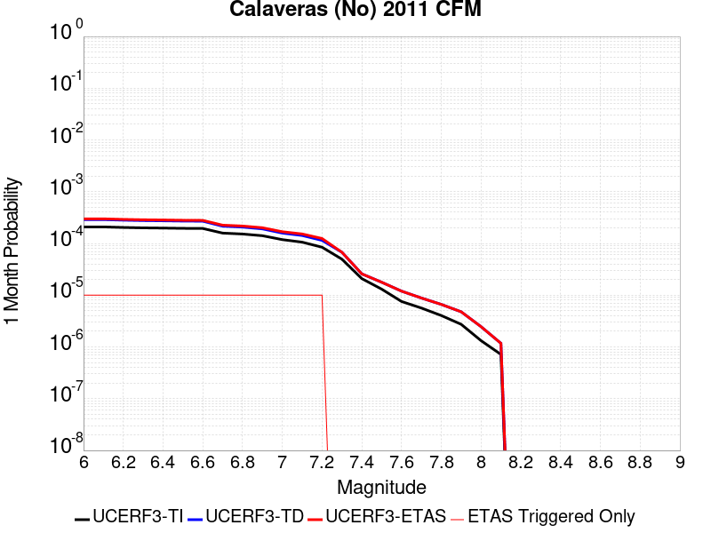 |  |  |

| Magnitude | 1 wk TI Prob | 1 wk TD Prob | 1 wk ETAS Prob | 1 wk ETAS/TD Gain | 1 wk ETAS Triggered Only | 1 mo TI Prob | 1 mo TD Prob | 1 mo ETAS Prob | 1 mo ETAS/TD Gain | 1 mo ETAS Triggered Only | 1 yr TI Prob | 1 yr TD Prob | 1 yr ETAS Prob | 1 yr ETAS/TD Gain | 1 yr ETAS Triggered Only | 10 yr TI Prob | 10 yr TD Prob | 10 yr ETAS Prob | 10 yr ETAS/TD Gain | 10 yr ETAS Triggered Only |
|-----|-----|-----|-----|-----|-----|-----|-----|-----|-----|-----|-----|-----|-----|-----|-----|-----|-----|-----|-----|-----|
| 6.0 | 4.8694856E-5 | 6.747121E-5 | 6.747121E-5 | 1.0 | 0.0 | 2.0867554E-4 | 2.8913133E-4 | 2.9912844E-4 | 1.0345764 | 1.0E-5 | 0.0025376645 | 0.003514627 | 0.0035345566 | 1.0056705 | 2.0E-5 | 0.02508881 | 0.034771245 | 0.0348002 | 1.0008328 | 3.0E-5 |
| 6.1 | 4.8694856E-5 | 6.747121E-5 | 6.747121E-5 | 1.0 | 0.0 | 2.0867554E-4 | 2.8913133E-4 | 2.9912844E-4 | 1.0345764 | 1.0E-5 | 0.0025376645 | 0.003514627 | 0.0035345566 | 1.0056705 | 2.0E-5 | 0.02508881 | 0.034771245 | 0.0348002 | 1.0008328 | 3.0E-5 |
| 6.2 | 4.7541962E-5 | 6.580218E-5 | 6.580218E-5 | 1.0 | 0.0 | 2.0373536E-4 | 2.8197994E-4 | 2.919771E-4 | 1.0354536 | 1.0E-5 | 0.0024776561 | 0.003427859 | 0.0034477904 | 1.0058146 | 2.0E-5 | 0.024502134 | 0.033932675 | 0.033961657 | 1.0008541 | 3.0E-5 |
| 6.3 | 4.6717287E-5 | 6.4635555E-5 | 6.4635555E-5 | 1.0 | 0.0 | 2.0020158E-4 | 2.7698115E-4 | 2.869784E-4 | 1.0360936 | 1.0E-5 | 0.0024347296 | 0.0033672103 | 0.003387143 | 1.0059196 | 2.0E-5 | 0.024082264 | 0.033345193 | 0.03337419 | 1.0008696 | 3.0E-5 |
| 6.4 | 4.6276386E-5 | 6.399742E-5 | 6.399742E-5 | 1.0 | 0.0 | 1.983123E-4 | 2.7424688E-4 | 2.8424413E-4 | 1.0364535 | 1.0E-5 | 0.0024117786 | 0.0033340224 | 0.0033539557 | 1.0059787 | 2.0E-5 | 0.02385771 | 0.033024073 | 0.03305308 | 1.0008785 | 3.0E-5 |
| 6.5 | 4.5720994E-5 | 6.319881E-5 | 6.319881E-5 | 1.0 | 0.0 | 1.9593239E-4 | 2.70825E-4 | 2.8082228E-4 | 1.0369142 | 1.0E-5 | 0.002382867 | 0.0032924965 | 0.0033124306 | 1.0060544 | 2.0E-5 | 0.023574775 | 0.032622032 | 0.032651056 | 1.0008897 | 3.0E-5 |
| 6.6 | 4.549134E-5 | 6.28519E-5 | 6.28519E-5 | 1.0 | 0.0 | 1.949483E-4 | 2.6933852E-4 | 2.7933583E-4 | 1.037118 | 1.0E-5 | 0.0023709119 | 0.0032744533 | 0.0032943878 | 1.0060879 | 2.0E-5 | 0.023457756 | 0.032447387 | 0.032476414 | 1.0008945 | 3.0E-5 |
| 6.7 | 3.701047E-5 | 5.0359427E-5 | 5.0359427E-5 | 1.0 | 0.0 | 1.5860666E-4 | 2.1580851E-4 | 2.2580635E-4 | 1.0463274 | 1.0E-5 | 0.0019293258 | 0.002624346 | 0.0026442935 | 1.0076009 | 2.0E-5 | 0.019126613 | 0.026125323 | 0.02615454 | 1.0011183 | 3.0E-5 |
| 6.8 | 3.5523568E-5 | 4.8341022E-5 | 4.8341022E-5 | 1.0 | 0.0 | 1.5223498E-4 | 2.071596E-4 | 2.1715753E-4 | 1.048262 | 1.0E-5 | 0.0018518851 | 0.0025192937 | 0.0025392433 | 1.0079187 | 2.0E-5 | 0.018365284 | 0.025097553 | 0.0251268 | 1.0011654 | 3.0E-5 |
| 6.9 | 3.2946147E-5 | 4.466269E-5 | 4.466269E-5 | 1.0 | 0.0 | 1.4119013E-4 | 1.9139773E-4 | 2.0139581E-4 | 1.0522373 | 1.0E-5 | 0.0017176344 | 0.0023278191 | 0.0023477727 | 1.0085717 | 2.0E-5 | 0.017044188 | 0.023219598 | 0.023248903 | 1.0012621 | 3.0E-5 |
| 7.0 | 2.7682381E-5 | 3.702223E-5 | 3.702223E-5 | 1.0 | 0.0 | 1.1863338E-4 | 1.5865723E-4 | 1.6865564E-4 | 1.0630189 | 1.0E-5 | 0.0014434044 | 0.0019299705 | 0.0019499318 | 1.0103428 | 2.0E-5 | 0.01434065 | 0.01931092 | 0.019330533 | 1.0010157 | 2.0E-5 |
| 7.1 | 2.471967E-5 | 3.328669E-5 | 3.328669E-5 | 1.0 | 0.0 | 1.05937135E-4 | 1.4264962E-4 | 1.526482E-4 | 1.0700918 | 1.0E-5 | 0.0012890215 | 0.0017354045 | 0.0017553697 | 1.0115047 | 2.0E-5 | 0.0128157 | 0.017385952 | 0.017405605 | 1.0011303 | 2.0E-5 |
| 7.2 | 1.9748062E-5 | 2.6774684E-5 | 2.6774684E-5 | 1.0 | 0.0 | 8.463181E-5 | 1.1474373E-4 | 1.2474258E-4 | 1.0871407 | 1.0E-5 | 0.0010299052 | 0.0013961331 | 0.0014161052 | 1.0143052 | 2.0E-5 | 0.01025145 | 0.014030739 | 0.014050459 | 1.0014055 | 2.0E-5 |
| 7.3 | 1.1603734E-5 | 1.5783844E-5 | 1.5783844E-5 | 1.0 | 0.0 | 4.9729337E-5 | 6.764337E-5 | 6.764337E-5 | 1.0 | 0.0 | 6.052865E-4 | 8.232611E-4 | 8.232611E-4 | 1.0 | 0.0 | 0.0060364045 | 0.008308666 | 0.008308666 | 1.0 | 0.0 |
| 7.4 | 4.885381E-6 | 6.0349853E-6 | 6.0349853E-6 | 1.0 | 0.0 | 2.0937177E-5 | 2.5863968E-5 | 2.5863968E-5 | 1.0 | 0.0 | 2.5488032E-4 | 3.148485E-4 | 3.148485E-4 | 1.0 | 0.0 | 0.0025458818 | 0.0032010598 | 0.0032010598 | 1.0 | 0.0 |
| 7.5 | 3.0571264E-6 | 4.155299E-6 | 4.155299E-6 | 1.0 | 0.0 | 1.3101904E-5 | 1.7808303E-5 | 1.7808303E-5 | 1.0 | 0.0 | 1.5950401E-4 | 2.1679462E-4 | 2.1679462E-4 | 1.0 | 0.0 | 0.0015938957 | 0.002221121 | 0.002221121 | 1.0 | 0.0 |
| 7.6 | 1.764948E-6 | 2.7955498E-6 | 2.7955498E-6 | 1.0 | 0.0 | 7.564041E-6 | 1.1980874E-5 | 1.1980874E-5 | 1.0 | 0.0 | 9.208831E-5 | 1.4585744E-4 | 1.4585744E-4 | 1.0 | 0.0 | 9.205016E-4 | 0.0015123509 | 0.0015123509 | 1.0 | 0.0 |
| 7.7 | 1.3173734E-6 | 2.058471E-6 | 2.058471E-6 | 1.0 | 0.0 | 5.645874E-6 | 8.8219895E-6 | 8.8219895E-6 | 1.0 | 0.0 | 6.873634E-5 | 1.0740245E-4 | 1.0740245E-4 | 1.0 | 0.0 | 6.8715087E-4 | 0.0011261401 | 0.0011261401 | 1.0 | 0.0 |
| 7.8 | 9.4429885E-7 | 1.5489635E-6 | 1.5489635E-6 | 1.0 | 0.0 | 4.0469886E-6 | 6.638398E-6 | 6.638398E-6 | 1.0 | 0.0 | 4.9270973E-5 | 8.081952E-5 | 8.081952E-5 | 1.0 | 0.0 | 4.926005E-4 | 8.5014524E-4 | 8.5014524E-4 | 1.0 | 0.0 |
| 7.9 | 6.388233E-7 | 1.1148749E-6 | 1.1148749E-6 | 1.0 | 0.0 | 2.7378112E-6 | 4.7780263E-6 | 4.7780263E-6 | 1.0 | 0.0 | 3.3332344E-5 | 5.817093E-5 | 5.817093E-5 | 1.0 | 0.0 | 3.3327343E-4 | 6.0963054E-4 | 6.0963054E-4 | 1.0 | 0.0 |
| 8.0 | 3.087986E-7 | 5.7543696E-7 | 5.7543696E-7 | 1.0 | 0.0 | 1.323422E-6 | 2.466156E-6 | 2.466156E-6 | 1.0 | 0.0 | 1.6112543E-5 | 3.002504E-5 | 3.002504E-5 | 1.0 | 0.0 | 1.6111376E-4 | 3.110302E-4 | 3.110302E-4 | 1.0 | 0.0 |
| 8.1 | 1.6725647E-7 | 2.7410047E-7 | 2.7410047E-7 | 1.0 | 0.0 | 7.168133E-7 | 1.1747159E-6 | 1.1747159E-6 | 1.0 | 0.0 | 8.7271665E-6 | 1.4302073E-5 | 1.4302073E-5 | 1.0 | 0.0 | 8.726824E-5 | 1.48486E-4 | 1.48486E-4 | 1.0 | 0.0 |

## Rinconada 2011 CFM
*[(top)](#table-of-contents)*

| 1 Week | 1 Month | 1 Year | 10 Year |
|-----|-----|-----|-----|
| 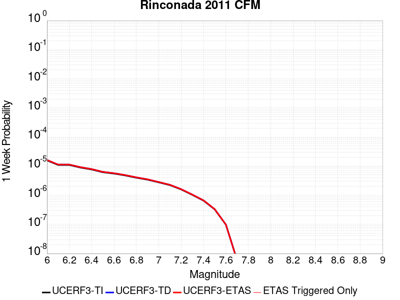 | 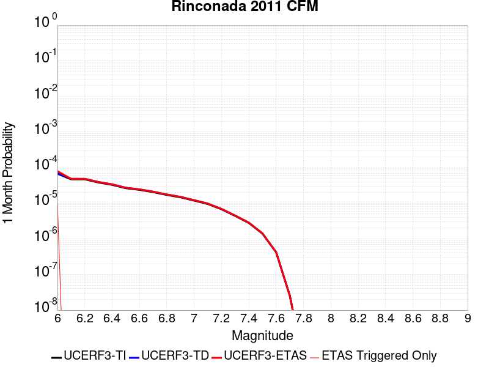 |  |  |

| Magnitude | 1 wk TI Prob | 1 wk TD Prob | 1 wk ETAS Prob | 1 wk ETAS/TD Gain | 1 wk ETAS Triggered Only | 1 mo TI Prob | 1 mo TD Prob | 1 mo ETAS Prob | 1 mo ETAS/TD Gain | 1 mo ETAS Triggered Only | 1 yr TI Prob | 1 yr TD Prob | 1 yr ETAS Prob | 1 yr ETAS/TD Gain | 1 yr ETAS Triggered Only | 10 yr TI Prob | 10 yr TD Prob | 10 yr ETAS Prob | 10 yr ETAS/TD Gain | 10 yr ETAS Triggered Only |
|-----|-----|-----|-----|-----|-----|-----|-----|-----|-----|-----|-----|-----|-----|-----|-----|-----|-----|-----|-----|-----|
| 6.0 | 1.5752368E-5 | 1.6274716E-5 | 1.6274716E-5 | 1.0 | 0.0 | 6.75084E-5 | 6.974694E-5 | 7.9746234E-5 | 1.1433655 | 1.0E-5 | 8.2160486E-4 | 8.488412E-4 | 8.6882425E-4 | 1.0235416 | 2.0E-5 | 0.008185739 | 0.00845637 | 0.008486116 | 1.0035176 | 3.0E-5 |
| 6.1 | 1.0966133E-5 | 1.1323029E-5 | 1.1323029E-5 | 1.0 | 0.0 | 4.6996865E-5 | 4.852637E-5 | 4.852637E-5 | 1.0 | 0.0 | 5.720366E-4 | 5.906491E-4 | 6.006432E-4 | 1.0169206 | 1.0E-5 | 0.0057056635 | 0.0058908886 | 0.00590083 | 1.0016875 | 1.0E-5 |
| 6.2 | 1.0966133E-5 | 1.1323029E-5 | 1.1323029E-5 | 1.0 | 0.0 | 4.6996865E-5 | 4.852637E-5 | 4.852637E-5 | 1.0 | 0.0 | 5.720366E-4 | 5.906491E-4 | 6.006432E-4 | 1.0169206 | 1.0E-5 | 0.0057056635 | 0.0058908886 | 0.00590083 | 1.0016875 | 1.0E-5 |
| 6.3 | 8.926149E-6 | 9.212771E-6 | 9.212771E-6 | 1.0 | 0.0 | 3.8254362E-5 | 3.948271E-5 | 3.948271E-5 | 1.0 | 0.0 | 4.6564735E-4 | 4.805963E-4 | 4.905915E-4 | 1.0207975 | 1.0E-5 | 0.0046467283 | 0.0047956146 | 0.0048055663 | 1.0020752 | 1.0E-5 |
| 6.4 | 7.676955E-6 | 7.920191E-6 | 7.920191E-6 | 1.0 | 0.0 | 3.290082E-5 | 3.3943234E-5 | 3.3943234E-5 | 1.0 | 0.0 | 4.0049385E-4 | 4.1318068E-4 | 4.2317656E-4 | 1.0241925 | 1.0E-5 | 0.0039977287 | 0.004124151 | 0.0041341097 | 1.0024147 | 1.0E-5 |
| 6.5 | 6.1671026E-6 | 6.3589546E-6 | 6.3589546E-6 | 1.0 | 0.0 | 2.6430173E-5 | 2.725238E-5 | 2.725238E-5 | 1.0 | 0.0 | 3.2173982E-4 | 3.317473E-4 | 3.317473E-4 | 1.0 | 0.0 | 0.003212744 | 0.0033125326 | 0.0033125326 | 1.0 | 0.0 |
| 6.6 | 5.553456E-6 | 5.7248126E-6 | 5.7248126E-6 | 1.0 | 0.0 | 2.3800309E-5 | 2.453468E-5 | 2.453468E-5 | 1.0 | 0.0 | 2.897302E-4 | 2.9866883E-4 | 2.9866883E-4 | 1.0 | 0.0 | 0.0028935277 | 0.002982683 | 0.002982683 | 1.0 | 0.0 |
| 6.7 | 4.787857E-6 | 4.9333094E-6 | 4.9333094E-6 | 1.0 | 0.0 | 2.0519226E-5 | 2.1142583E-5 | 2.1142583E-5 | 1.0 | 0.0 | 2.4979294E-4 | 2.573806E-4 | 2.573806E-4 | 1.0 | 0.0 | 0.0024951235 | 0.0025708308 | 0.0025708308 | 1.0 | 0.0 |
| 6.8 | 3.9955166E-6 | 4.1134763E-6 | 4.1134763E-6 | 1.0 | 0.0 | 1.7123532E-5 | 1.7629065E-5 | 1.7629065E-5 | 1.0 | 0.0 | 2.0845905E-4 | 2.1461274E-4 | 2.1461274E-4 | 1.0 | 0.0 | 0.002082636 | 0.0021440585 | 0.0021440585 | 1.0 | 0.0 |
| 6.9 | 3.4250072E-6 | 3.5224464E-6 | 3.5224464E-6 | 1.0 | 0.0 | 1.46785205E-5 | 1.5096111E-5 | 1.5096111E-5 | 1.0 | 0.0 | 1.7869633E-4 | 1.8377967E-4 | 1.8377967E-4 | 1.0 | 0.0 | 0.001785527 | 0.0018362794 | 0.0018362794 | 1.0 | 0.0 |
| 7.0 | 2.7712713E-6 | 2.8467E-6 | 2.8467E-6 | 1.0 | 0.0 | 1.1876823E-5 | 1.2200086E-5 | 1.2200086E-5 | 1.0 | 0.0 | 1.4459073E-4 | 1.4852593E-4 | 1.4852593E-4 | 1.0 | 0.0 | 0.0014449668 | 0.0014842682 | 0.0014842682 | 1.0 | 0.0 |
| 7.1 | 2.227358E-6 | 2.2856984E-6 | 2.2856984E-6 | 1.0 | 0.0 | 9.545785E-6 | 9.795814E-6 | 9.795814E-6 | 1.0 | 0.0 | 1.16213734E-4 | 1.19257515E-4 | 1.19257515E-4 | 1.0 | 0.0 | 0.0011615298 | 0.0011919362 | 0.0011919362 | 1.0 | 0.0 |
| 7.2 | 1.581796E-6 | 1.6209011E-6 | 1.6209011E-6 | 1.0 | 0.0 | 6.779108E-6 | 6.9467005E-6 | 6.9467005E-6 | 1.0 | 0.0 | 8.253252E-5 | 8.457281E-5 | 8.457281E-5 | 1.0 | 0.0 | 8.250187E-4 | 8.454067E-4 | 8.454067E-4 | 1.0 | 0.0 |
| 7.3 | 1.0306567E-6 | 1.0546477E-6 | 1.0546477E-6 | 1.0 | 0.0 | 4.4170924E-6 | 4.519911E-6 | 4.519911E-6 | 1.0 | 0.0 | 5.3776774E-5 | 5.5028526E-5 | 5.5028526E-5 | 1.0 | 0.0 | 5.376376E-4 | 5.5014924E-4 | 5.5014924E-4 | 1.0 | 0.0 |
| 7.4 | 6.535541E-7 | 6.682742E-7 | 6.682742E-7 | 1.0 | 0.0 | 2.800943E-6 | 2.864029E-6 | 2.864029E-6 | 1.0 | 0.0 | 3.4100947E-5 | 3.4868997E-5 | 3.4868997E-5 | 1.0 | 0.0 | 3.4095717E-4 | 3.4863537E-4 | 3.4863537E-4 | 1.0 | 0.0 |
| 7.5 | 3.2656962E-7 | 3.3316687E-7 | 3.3316687E-7 | 1.0 | 0.0 | 1.3995833E-6 | 1.4278572E-6 | 1.4278572E-6 | 1.0 | 0.0 | 1.7039794E-5 | 1.7384024E-5 | 1.7384024E-5 | 1.0 | 0.0 | 1.7038487E-4 | 1.7382667E-4 | 1.7382667E-4 | 1.0 | 0.0 |
| 7.6 | 9.754343E-8 | 9.82099E-8 | 9.82099E-8 | 1.0 | 0.0 | 4.180432E-7 | 4.208995E-7 | 4.208995E-7 | 1.0 | 0.0 | 5.089664E-6 | 5.1244397E-6 | 5.1244397E-6 | 1.0 | 0.0 | 5.0895473E-5 | 5.1243223E-5 | 5.1243223E-5 | 1.0 | 0.0 |
| 7.7 | 6.0001453E-9 | 5.8490435E-9 | 5.8490435E-9 | 1.0 | 0.0 | 2.5714908E-8 | 2.506733E-8 | 2.506733E-8 | 1.0 | 0.0 | 3.1307894E-7 | 3.051947E-7 | 3.051947E-7 | 1.0 | 0.0 | 3.1307852E-6 | 3.051943E-6 | 3.051943E-6 | 1.0 | 0.0 |
| 7.8 | 7.400003E-11 | 7.4654505E-11 | 7.4654505E-11 | 1.0 | 0.0 | 3.171432E-10 | 3.1994773E-10 | 3.1994773E-10 | 1.0 | 0.0 | 3.861218E-9 | 3.895363E-9 | 3.895363E-9 | 1.0 | 0.0 | 3.861218E-8 | 3.895363E-8 | 3.895363E-8 | 1.0 | 0.0 |

## Burnt Mtn
*[(top)](#table-of-contents)*

| 1 Week | 1 Month | 1 Year | 10 Year |
|-----|-----|-----|-----|
| 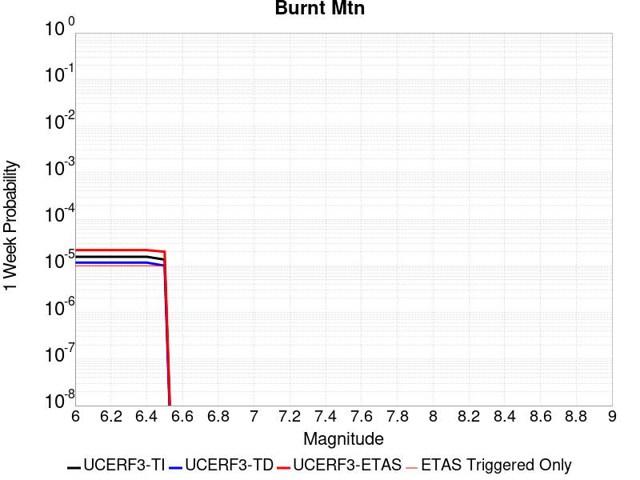 | 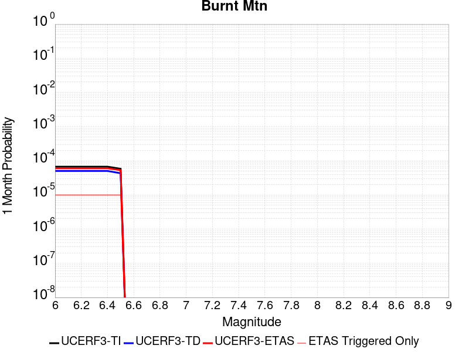 |  |  |

| Magnitude | 1 wk TI Prob | 1 wk TD Prob | 1 wk ETAS Prob | 1 wk ETAS/TD Gain | 1 wk ETAS Triggered Only | 1 mo TI Prob | 1 mo TD Prob | 1 mo ETAS Prob | 1 mo ETAS/TD Gain | 1 mo ETAS Triggered Only | 1 yr TI Prob | 1 yr TD Prob | 1 yr ETAS Prob | 1 yr ETAS/TD Gain | 1 yr ETAS Triggered Only | 10 yr TI Prob | 10 yr TD Prob | 10 yr ETAS Prob | 10 yr ETAS/TD Gain | 10 yr ETAS Triggered Only |
|-----|-----|-----|-----|-----|-----|-----|-----|-----|-----|-----|-----|-----|-----|-----|-----|-----|-----|-----|-----|-----|
| 6.0 | 1.5673151E-5 | 1.1749407E-5 | 2.1749289E-5 | 1.8510967 | 1.0E-5 | 6.716892E-5 | 5.0354356E-5 | 6.0353854E-5 | 1.1985825 | 1.0E-5 | 8.1747473E-4 | 6.1302073E-4 | 6.4300233E-4 | 1.048908 | 3.0E-5 | 0.008144741 | 0.006125938 | 0.006155754 | 1.0048672 | 3.0E-5 |
| 6.1 | 1.5673151E-5 | 1.1749407E-5 | 2.1749289E-5 | 1.8510967 | 1.0E-5 | 6.716892E-5 | 5.0354356E-5 | 6.0353854E-5 | 1.1985825 | 1.0E-5 | 8.1747473E-4 | 6.1302073E-4 | 6.4300233E-4 | 1.048908 | 3.0E-5 | 0.008144741 | 0.006125938 | 0.006155754 | 1.0048672 | 3.0E-5 |
| 6.2 | 1.5673151E-5 | 1.1749407E-5 | 2.1749289E-5 | 1.8510967 | 1.0E-5 | 6.716892E-5 | 5.0354356E-5 | 6.0353854E-5 | 1.1985825 | 1.0E-5 | 8.1747473E-4 | 6.1302073E-4 | 6.4300233E-4 | 1.048908 | 3.0E-5 | 0.008144741 | 0.006125938 | 0.006155754 | 1.0048672 | 3.0E-5 |
| 6.3 | 1.5673151E-5 | 1.1749407E-5 | 2.1749289E-5 | 1.8510967 | 1.0E-5 | 6.716892E-5 | 5.0354356E-5 | 6.0353854E-5 | 1.1985825 | 1.0E-5 | 8.1747473E-4 | 6.1302073E-4 | 6.4300233E-4 | 1.048908 | 3.0E-5 | 0.008144741 | 0.006125938 | 0.006155754 | 1.0048672 | 3.0E-5 |
| 6.4 | 1.5673151E-5 | 1.1749407E-5 | 2.1749289E-5 | 1.8510967 | 1.0E-5 | 6.716892E-5 | 5.0354356E-5 | 6.0353854E-5 | 1.1985825 | 1.0E-5 | 8.1747473E-4 | 6.1302073E-4 | 6.4300233E-4 | 1.048908 | 3.0E-5 | 0.008144741 | 0.006125938 | 0.006155754 | 1.0048672 | 3.0E-5 |
| 6.5 | 1.36191375E-5 | 1.0078299E-5 | 2.0078198E-5 | 1.992221 | 1.0E-5 | 5.8366426E-5 | 4.3192707E-5 | 5.3192278E-5 | 1.2315105 | 1.0E-5 | 7.103795E-4 | 5.2587123E-4 | 5.5585545E-4 | 1.0570182 | 3.0E-5 | 0.0070811296 | 0.0052587125 | 0.0052885544 | 1.0056748 | 3.0E-5 |

## Sheephole
*[(top)](#table-of-contents)*

| 1 Week | 1 Month | 1 Year | 10 Year |
|-----|-----|-----|-----|
| 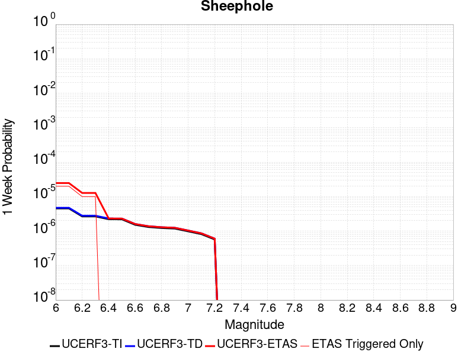 | 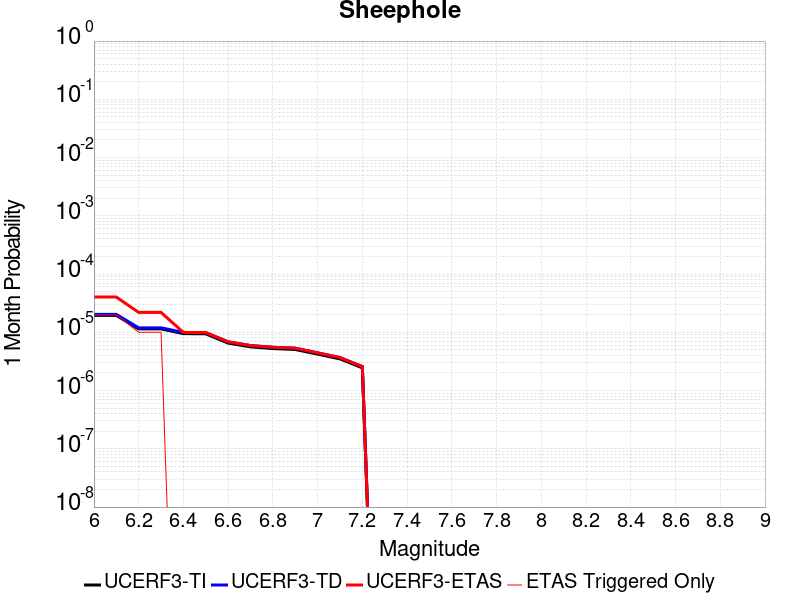 |  |  |

| Magnitude | 1 wk TI Prob | 1 wk TD Prob | 1 wk ETAS Prob | 1 wk ETAS/TD Gain | 1 wk ETAS Triggered Only | 1 mo TI Prob | 1 mo TD Prob | 1 mo ETAS Prob | 1 mo ETAS/TD Gain | 1 mo ETAS Triggered Only | 1 yr TI Prob | 1 yr TD Prob | 1 yr ETAS Prob | 1 yr ETAS/TD Gain | 1 yr ETAS Triggered Only | 10 yr TI Prob | 10 yr TD Prob | 10 yr ETAS Prob | 10 yr ETAS/TD Gain | 10 yr ETAS Triggered Only |
|-----|-----|-----|-----|-----|-----|-----|-----|-----|-----|-----|-----|-----|-----|-----|-----|-----|-----|-----|-----|-----|
| 6.0 | 4.5579695E-6 | 4.7412627E-6 | 2.4741168E-5 | 5.2182655 | 2.0E-5 | 1.9534009E-5 | 2.031957E-5 | 4.0319163E-5 | 1.9842528 | 2.0E-5 | 2.3780059E-4 | 2.473682E-4 | 2.6736327E-4 | 1.0808312 | 2.0E-5 | 0.0023754628 | 0.002471473 | 0.0024914236 | 1.0080724 | 2.0E-5 |
| 6.1 | 4.5579695E-6 | 4.7412627E-6 | 2.4741168E-5 | 5.2182655 | 2.0E-5 | 1.9534009E-5 | 2.031957E-5 | 4.0319163E-5 | 1.9842528 | 2.0E-5 | 2.3780059E-4 | 2.473682E-4 | 2.6736327E-4 | 1.0808312 | 2.0E-5 | 0.0023754628 | 0.002471473 | 0.0024914236 | 1.0080724 | 2.0E-5 |
| 6.2 | 2.6677674E-6 | 2.7873941E-6 | 1.2787366E-5 | 4.58757 | 1.0E-5 | 1.1433239E-5 | 1.1945926E-5 | 2.1945807E-5 | 1.8370954 | 1.0E-5 | 1.3919079E-4 | 1.4543302E-4 | 1.5543157E-4 | 1.0687501 | 1.0E-5 | 0.0013910364 | 0.0014534844 | 0.0014634698 | 1.00687 | 1.0E-5 |
| 6.3 | 2.6677674E-6 | 2.7873941E-6 | 1.2787366E-5 | 4.58757 | 1.0E-5 | 1.1433239E-5 | 1.1945926E-5 | 2.1945807E-5 | 1.8370954 | 1.0E-5 | 1.3919079E-4 | 1.4543302E-4 | 1.5543157E-4 | 1.0687501 | 1.0E-5 | 0.0013910364 | 0.0014534844 | 0.0014634698 | 1.00687 | 1.0E-5 |
| 6.4 | 2.2159759E-6 | 2.3228788E-6 | 2.3228788E-6 | 1.0 | 0.0 | 9.497005E-6 | 9.955161E-6 | 9.955161E-6 | 1.0 | 0.0 | 1.156199E-4 | 1.2119815E-4 | 1.2119815E-4 | 1.0 | 0.0 | 0.0011555976 | 0.0012113999 | 0.0012113999 | 1.0 | 0.0 |
| 6.5 | 2.1986082E-6 | 2.304759E-6 | 2.304759E-6 | 1.0 | 0.0 | 9.4225725E-6 | 9.877506E-6 | 9.877506E-6 | 1.0 | 0.0 | 1.1471378E-4 | 1.2025281E-4 | 1.2025281E-4 | 1.0 | 0.0 | 0.0011465458 | 0.0012019566 | 0.0012019566 | 1.0 | 0.0 |
| 6.6 | 1.5232331E-6 | 1.6018919E-6 | 1.6018919E-6 | 1.0 | 0.0 | 6.5281256E-6 | 6.865234E-6 | 6.865234E-6 | 1.0 | 0.0 | 7.947703E-5 | 8.35812E-5 | 8.35812E-5 | 1.0 | 0.0 | 7.9448614E-4 | 8.3551643E-4 | 8.3551643E-4 | 1.0 | 0.0 |
| 6.7 | 1.3137362E-6 | 1.382819E-6 | 1.382819E-6 | 1.0 | 0.0 | 5.6302856E-6 | 5.926355E-6 | 5.926355E-6 | 1.0 | 0.0 | 6.854657E-5 | 7.215112E-5 | 7.215112E-5 | 1.0 | 0.0 | 6.8525434E-4 | 7.212908E-4 | 7.212908E-4 | 1.0 | 0.0 |
| 6.8 | 1.2275751E-6 | 1.2922847E-6 | 1.2922847E-6 | 1.0 | 0.0 | 5.2610258E-6 | 5.5383516E-6 | 5.5383516E-6 | 1.0 | 0.0 | 6.4051106E-5 | 6.7427485E-5 | 6.7427485E-5 | 1.0 | 0.0 | 6.4032647E-4 | 6.740836E-4 | 6.740836E-4 | 1.0 | 0.0 |
| 6.9 | 1.1837088E-6 | 1.246102E-6 | 1.246102E-6 | 1.0 | 0.0 | 5.0730278E-6 | 5.340427E-6 | 5.340427E-6 | 1.0 | 0.0 | 6.176237E-5 | 6.501789E-5 | 6.501789E-5 | 1.0 | 0.0 | 6.17452E-4 | 6.5000186E-4 | 6.5000186E-4 | 1.0 | 0.0 |
| 7.0 | 9.849371E-7 | 1.0366288E-6 | 1.0366288E-6 | 1.0 | 0.0 | 4.2211523E-6 | 4.442688E-6 | 4.442688E-6 | 1.0 | 0.0 | 5.1391315E-5 | 5.4088487E-5 | 5.4088487E-5 | 1.0 | 0.0 | 5.137943E-4 | 5.407633E-4 | 5.407633E-4 | 1.0 | 0.0 |
| 7.1 | 8.1643645E-7 | 8.591669E-7 | 8.591669E-7 | 1.0 | 0.0 | 3.4990085E-6 | 3.682139E-6 | 3.682139E-6 | 1.0 | 0.0 | 4.2599597E-5 | 4.482921E-5 | 4.482921E-5 | 1.0 | 0.0 | 4.259143E-4 | 4.4821028E-4 | 4.4821028E-4 | 1.0 | 0.0 |
| 7.2 | 5.7295756E-7 | 6.029502E-7 | 6.029502E-7 | 1.0 | 0.0 | 2.45553E-6 | 2.58407E-6 | 2.58407E-6 | 1.0 | 0.0 | 2.9895667E-5 | 3.1460666E-5 | 3.1460666E-5 | 1.0 | 0.0 | 2.9891645E-4 | 3.145688E-4 | 3.145688E-4 | 1.0 | 0.0 |

## Emerson-Copper Mtn 2011
*[(top)](#table-of-contents)*

| 1 Week | 1 Month | 1 Year | 10 Year |
|-----|-----|-----|-----|
| 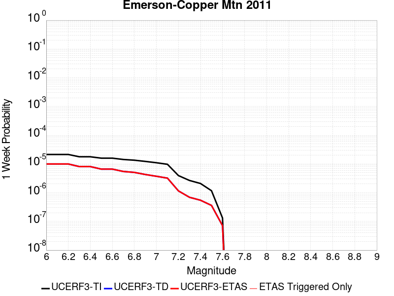 |  | 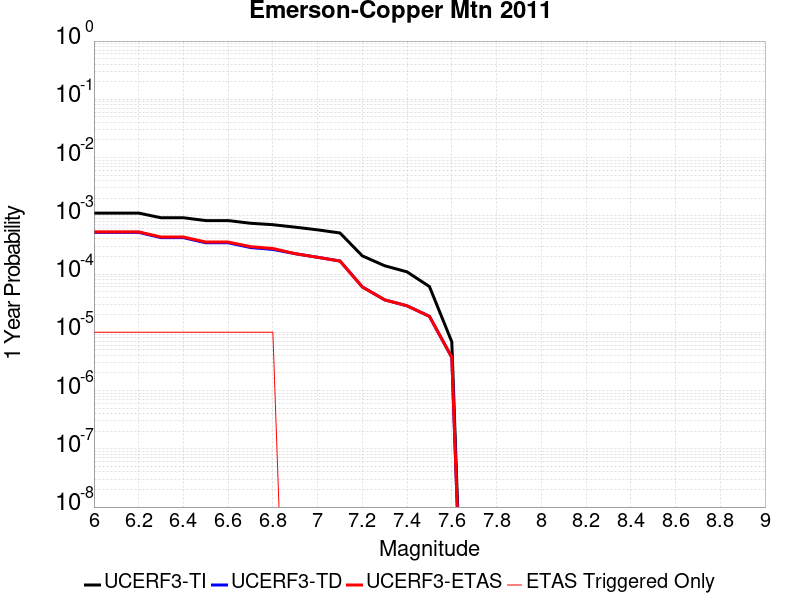 |  |

| Magnitude | 1 wk TI Prob | 1 wk TD Prob | 1 wk ETAS Prob | 1 wk ETAS/TD Gain | 1 wk ETAS Triggered Only | 1 mo TI Prob | 1 mo TD Prob | 1 mo ETAS Prob | 1 mo ETAS/TD Gain | 1 mo ETAS Triggered Only | 1 yr TI Prob | 1 yr TD Prob | 1 yr ETAS Prob | 1 yr ETAS/TD Gain | 1 yr ETAS Triggered Only | 10 yr TI Prob | 10 yr TD Prob | 10 yr ETAS Prob | 10 yr ETAS/TD Gain | 10 yr ETAS Triggered Only |
|-----|-----|-----|-----|-----|-----|-----|-----|-----|-----|-----|-----|-----|-----|-----|-----|-----|-----|-----|-----|-----|
| 6.0 | 2.1364202E-5 | 9.968114E-6 | 9.968114E-6 | 1.0 | 0.0 | 9.1557646E-5 | 4.2719836E-5 | 4.2719836E-5 | 1.0 | 0.0 | 0.0011141442 | 5.199986E-4 | 5.299934E-4 | 1.0192208 | 1.0E-5 | 0.011085749 | 0.005188688 | 0.0052185324 | 1.0057518 | 3.0E-5 |
| 6.1 | 2.1364202E-5 | 9.968114E-6 | 9.968114E-6 | 1.0 | 0.0 | 9.1557646E-5 | 4.2719836E-5 | 4.2719836E-5 | 1.0 | 0.0 | 0.0011141442 | 5.199986E-4 | 5.299934E-4 | 1.0192208 | 1.0E-5 | 0.011085749 | 0.005188688 | 0.0052185324 | 1.0057518 | 3.0E-5 |
| 6.2 | 2.1364202E-5 | 9.968114E-6 | 9.968114E-6 | 1.0 | 0.0 | 9.1557646E-5 | 4.2719836E-5 | 4.2719836E-5 | 1.0 | 0.0 | 0.0011141442 | 5.199986E-4 | 5.299934E-4 | 1.0192208 | 1.0E-5 | 0.011085749 | 0.005188688 | 0.0052185324 | 1.0057518 | 3.0E-5 |
| 6.3 | 1.7751237E-5 | 8.089227E-6 | 8.089227E-6 | 1.0 | 0.0 | 7.607452E-5 | 3.466769E-5 | 3.466769E-5 | 1.0 | 0.0 | 9.258136E-4 | 4.2200365E-4 | 4.3199942E-4 | 1.0236865 | 1.0E-5 | 0.00921966 | 0.0042126453 | 0.004242519 | 1.0070914 | 3.0E-5 |
| 6.4 | 1.7751237E-5 | 8.089227E-6 | 8.089227E-6 | 1.0 | 0.0 | 7.607452E-5 | 3.466769E-5 | 3.466769E-5 | 1.0 | 0.0 | 9.258136E-4 | 4.2200365E-4 | 4.3199942E-4 | 1.0236865 | 1.0E-5 | 0.00921966 | 0.0042126453 | 0.004242519 | 1.0070914 | 3.0E-5 |
| 6.5 | 1.5886664E-5 | 6.603819E-6 | 6.603819E-6 | 1.0 | 0.0 | 6.808392E-5 | 2.8301802E-5 | 2.8301802E-5 | 1.0 | 0.0 | 8.286065E-4 | 3.4452465E-4 | 3.545212E-4 | 1.0290155 | 1.0E-5 | 0.008255237 | 0.0034403696 | 0.0034603006 | 1.0057933 | 2.0E-5 |
| 6.6 | 1.5886664E-5 | 6.603819E-6 | 6.603819E-6 | 1.0 | 0.0 | 6.808392E-5 | 2.8301802E-5 | 2.8301802E-5 | 1.0 | 0.0 | 8.286065E-4 | 3.4452465E-4 | 3.545212E-4 | 1.0290155 | 1.0E-5 | 0.008255237 | 0.0034403696 | 0.0034603006 | 1.0057933 | 2.0E-5 |
| 6.7 | 1.428471E-5 | 5.470403E-6 | 5.470403E-6 | 1.0 | 0.0 | 6.121875E-5 | 2.3444394E-5 | 2.3444394E-5 | 1.0 | 0.0 | 7.450834E-4 | 2.8540206E-4 | 2.953992E-4 | 1.0350283 | 1.0E-5 | 0.007425902 | 0.0028507432 | 0.0028706861 | 1.0069957 | 2.0E-5 |
| 6.8 | 1.3490684E-5 | 5.073699E-6 | 5.073699E-6 | 1.0 | 0.0 | 5.7815934E-5 | 2.1744265E-5 | 2.1744265E-5 | 1.0 | 0.0 | 7.0368167E-4 | 2.6470813E-4 | 2.7470547E-4 | 1.0377674 | 1.0E-5 | 0.007014576 | 0.002644309 | 0.0026642561 | 1.0075434 | 2.0E-5 |
| 6.9 | 1.2235421E-5 | 4.289677E-6 | 4.289677E-6 | 1.0 | 0.0 | 5.2436466E-5 | 1.838422E-5 | 1.838422E-5 | 1.0 | 0.0 | 6.38227E-4 | 2.238085E-4 | 2.238085E-4 | 1.0 | 0.0 | 0.0063639707 | 0.0022361854 | 0.002246163 | 1.0044619 | 1.0E-5 |
| 7.0 | 1.1009851E-5 | 3.7189886E-6 | 3.7189886E-6 | 1.0 | 0.0 | 4.7184225E-5 | 1.5938444E-5 | 1.5938444E-5 | 1.0 | 0.0 | 5.743165E-4 | 1.9403672E-4 | 1.9403672E-4 | 1.0 | 0.0 | 0.005728345 | 0.0019390108 | 0.0019489914 | 1.0051472 | 1.0E-5 |
| 7.1 | 9.726373E-6 | 3.2117953E-6 | 3.2117953E-6 | 1.0 | 0.0 | 4.168379E-5 | 1.3764783E-5 | 1.3764783E-5 | 1.0 | 0.0 | 5.07382E-4 | 1.6757673E-4 | 1.6757673E-4 | 1.0 | 0.0 | 0.0050622504 | 0.0016748349 | 0.0016848181 | 1.0059607 | 1.0E-5 |
| 7.2 | 3.9335127E-6 | 1.1524792E-6 | 1.1524792E-6 | 1.0 | 0.0 | 1.6857803E-5 | 4.9391874E-6 | 4.9391874E-6 | 1.0 | 0.0 | 2.0522442E-4 | 6.0133007E-5 | 6.0133007E-5 | 1.0 | 0.0 | 0.00205035 | 6.011733E-4 | 6.111673E-4 | 1.0166241 | 1.0E-5 |
| 7.3 | 2.661632E-6 | 6.911505E-7 | 6.911505E-7 | 1.0 | 0.0 | 1.14069435E-5 | 2.9620703E-6 | 2.9620703E-6 | 1.0 | 0.0 | 1.3887069E-4 | 3.6062618E-5 | 3.6062618E-5 | 1.0 | 0.0 | 0.0013878393 | 3.605687E-4 | 3.705651E-4 | 1.0277239 | 1.0E-5 |
| 7.4 | 2.0893426E-6 | 5.4618386E-7 | 5.4618386E-7 | 1.0 | 0.0 | 8.954295E-6 | 2.3407858E-6 | 2.3407858E-6 | 1.0 | 0.0 | 1.0901308E-4 | 2.84987E-5 | 2.84987E-5 | 1.0 | 0.0 | 0.0010895962 | 2.84951E-4 | 2.9494814E-4 | 1.0350838 | 1.0E-5 |
| 7.5 | 1.1681728E-6 | 3.6030585E-7 | 3.6030585E-7 | 1.0 | 0.0 | 5.0064455E-6 | 1.544167E-6 | 1.544167E-6 | 1.0 | 0.0 | 6.0951766E-5 | 1.8800076E-5 | 1.8800076E-5 | 1.0 | 0.0 | 6.093505E-4 | 1.8798532E-4 | 1.9798345E-4 | 1.0531856 | 1.0E-5 |
| 7.6 | 1.3154387E-7 | 7.1197384E-8 | 7.1197384E-8 | 1.0 | 0.0 | 5.6375933E-7 | 3.051316E-7 | 3.051316E-7 | 1.0 | 0.0 | 6.863748E-6 | 3.7149728E-6 | 3.7149728E-6 | 1.0 | 0.0 | 6.863536E-5 | 3.7149264E-5 | 4.7148893E-5 | 1.2691743 | 1.0E-5 |

## Laguna Salada
*[(top)](#table-of-contents)*

| 1 Week | 1 Month | 1 Year | 10 Year |
|-----|-----|-----|-----|
|  | 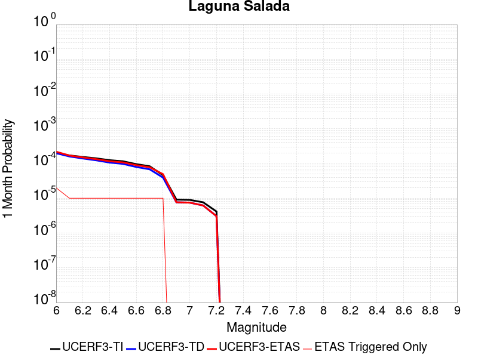 |  | 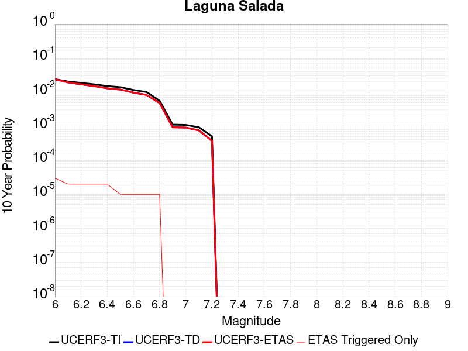 |

| Magnitude | 1 wk TI Prob | 1 wk TD Prob | 1 wk ETAS Prob | 1 wk ETAS/TD Gain | 1 wk ETAS Triggered Only | 1 mo TI Prob | 1 mo TD Prob | 1 mo ETAS Prob | 1 mo ETAS/TD Gain | 1 mo ETAS Triggered Only | 1 yr TI Prob | 1 yr TD Prob | 1 yr ETAS Prob | 1 yr ETAS/TD Gain | 1 yr ETAS Triggered Only | 10 yr TI Prob | 10 yr TD Prob | 10 yr ETAS Prob | 10 yr ETAS/TD Gain | 10 yr ETAS Triggered Only |
|-----|-----|-----|-----|-----|-----|-----|-----|-----|-----|-----|-----|-----|-----|-----|-----|-----|-----|-----|-----|-----|
| 6.0 | 4.6465593E-5 | 4.634639E-5 | 4.634639E-5 | 1.0 | 0.0 | 1.9912305E-4 | 1.9861311E-4 | 2.1860913E-4 | 1.1006783 | 2.0E-5 | 0.0024216278 | 0.002415429 | 0.0024353808 | 1.0082601 | 2.0E-5 | 0.02395408 | 0.023975259 | 0.02400454 | 1.0012213 | 3.0E-5 |
| 6.1 | 3.982297E-5 | 3.7246125E-5 | 3.7246125E-5 | 1.0 | 0.0 | 1.706587E-4 | 1.5961716E-4 | 1.6961557E-4 | 1.06264 | 1.0E-5 | 0.0020757897 | 0.0019417295 | 0.0019517101 | 1.0051401 | 1.0E-5 | 0.020565065 | 0.019331863 | 0.019351477 | 1.0010146 | 2.0E-5 |
| 6.2 | 3.6067784E-5 | 3.2602693E-5 | 3.2602693E-5 | 1.0 | 0.0 | 1.5456705E-4 | 1.3971896E-4 | 1.4971757E-4 | 1.0715623 | 1.0E-5 | 0.0018802295 | 0.0016998611 | 0.0017098442 | 1.0058728 | 1.0E-5 | 0.018644003 | 0.016949628 | 0.016969288 | 1.00116 | 2.0E-5 |
| 6.3 | 3.2859112E-5 | 2.8849448E-5 | 2.8849448E-5 | 1.0 | 0.0 | 1.4081717E-4 | 1.2363521E-4 | 1.3363398E-4 | 1.0808731 | 1.0E-5 | 0.0017131006 | 0.0015043203 | 0.0015143052 | 1.0066376 | 1.0E-5 | 0.016999546 | 0.015018767 | 0.015038467 | 1.0013117 | 2.0E-5 |
| 6.4 | 2.9132116E-5 | 2.4852965E-5 | 2.4852965E-5 | 1.0 | 0.0 | 1.2484594E-4 | 1.0650887E-4 | 1.1650781E-4 | 1.0938789 | 1.0E-5 | 0.0015189396 | 0.001296065 | 0.0013060521 | 1.0077057 | 1.0E-5 | 0.015085992 | 0.012956262 | 0.012976003 | 1.0015236 | 2.0E-5 |
| 6.5 | 2.7075037E-5 | 2.2825836E-5 | 2.2825836E-5 | 1.0 | 0.0 | 1.1603071E-4 | 9.7821845E-5 | 1.07820866E-4 | 1.1022166 | 1.0E-5 | 0.0014117584 | 0.0011904186 | 0.0012004067 | 1.0083904 | 1.0E-5 | 0.014028233 | 0.011907749 | 0.01191763 | 1.0008298 | 1.0E-5 |
| 6.6 | 2.2367465E-5 | 1.8573526E-5 | 1.8573526E-5 | 1.0 | 0.0 | 9.5857045E-5 | 7.959886E-5 | 8.959806E-5 | 1.1256199 | 1.0E-5 | 0.0011664346 | 9.6876756E-4 | 9.787579E-4 | 1.0103124 | 1.0E-5 | 0.011603311 | 0.009702191 | 0.0097120935 | 1.0010207 | 1.0E-5 |
| 6.7 | 1.9458053E-5 | 1.5914242E-5 | 1.5914242E-5 | 1.0 | 0.0 | 8.338899E-5 | 6.8202564E-5 | 7.820188E-5 | 1.146612 | 1.0E-5 | 0.001014788 | 8.3013024E-4 | 8.4012194E-4 | 1.0120363 | 1.0E-5 | 0.010101665 | 0.0083209425 | 0.008330859 | 1.0011917 | 1.0E-5 |
| 6.8 | 1.0767866E-5 | 9.18435E-6 | 9.18435E-6 | 1.0 | 0.0 | 4.614718E-5 | 3.9361294E-5 | 4.93609E-5 | 1.2540467 | 1.0E-5 | 5.6169706E-4 | 4.7918706E-4 | 4.8918225E-4 | 1.0208586 | 1.0E-5 | 0.0056027942 | 0.0048096925 | 0.004819644 | 1.0020691 | 1.0E-5 |
| 6.9 | 2.1384765E-6 | 1.7913675E-6 | 1.7913675E-6 | 1.0 | 0.0 | 9.164866E-6 | 7.677269E-6 | 7.677269E-6 | 1.0 | 0.0 | 1.1157654E-4 | 9.346713E-5 | 9.346713E-5 | 1.0 | 0.0 | 0.0011152053 | 9.343165E-4 | 9.343165E-4 | 1.0 | 0.0 |
| 7.0 | 2.0952946E-6 | 1.7493046E-6 | 1.7493046E-6 | 1.0 | 0.0 | 8.979802E-6 | 7.4970003E-6 | 7.4970003E-6 | 1.0 | 0.0 | 1.0932361E-4 | 9.1272545E-5 | 9.1272545E-5 | 1.0 | 0.0 | 0.0010926984 | 9.123888E-4 | 9.123888E-4 | 1.0 | 0.0 |
| 7.1 | 1.7887576E-6 | 1.4500254E-6 | 1.4500254E-6 | 1.0 | 0.0 | 7.666081E-6 | 6.2143813E-6 | 6.2143813E-6 | 1.0 | 0.0 | 9.333054E-5 | 7.565777E-5 | 7.565777E-5 | 1.0 | 0.0 | 9.329135E-4 | 7.563506E-4 | 7.563506E-4 | 1.0 | 0.0 |
| 7.2 | 9.723109E-7 | 7.135619E-7 | 7.135619E-7 | 1.0 | 0.0 | 4.16704E-6 | 3.0581198E-6 | 3.0581198E-6 | 1.0 | 0.0 | 5.073253E-5 | 3.7232137E-5 | 3.7232137E-5 | 1.0 | 0.0 | 5.072095E-4 | 3.7227524E-4 | 3.7227524E-4 | 1.0 | 0.0 |

## Malibu Coast alt 1
*[(top)](#table-of-contents)*

| 1 Week | 1 Month | 1 Year | 10 Year |
|-----|-----|-----|-----|
|  |  |  |  |

| Magnitude | 1 wk TI Prob | 1 wk TD Prob | 1 wk ETAS Prob | 1 wk ETAS/TD Gain | 1 wk ETAS Triggered Only | 1 mo TI Prob | 1 mo TD Prob | 1 mo ETAS Prob | 1 mo ETAS/TD Gain | 1 mo ETAS Triggered Only | 1 yr TI Prob | 1 yr TD Prob | 1 yr ETAS Prob | 1 yr ETAS/TD Gain | 1 yr ETAS Triggered Only | 10 yr TI Prob | 10 yr TD Prob | 10 yr ETAS Prob | 10 yr ETAS/TD Gain | 10 yr ETAS Triggered Only |
|-----|-----|-----|-----|-----|-----|-----|-----|-----|-----|-----|-----|-----|-----|-----|-----|-----|-----|-----|-----|-----|
| 6.0 | 1.6572556E-5 | 1.7598066E-5 | 2.7597891E-5 | 1.5682342 | 1.0E-5 | 7.102331E-5 | 7.541821E-5 | 8.541746E-5 | 1.132584 | 1.0E-5 | 8.6436566E-4 | 9.178488E-4 | 9.378304E-4 | 1.0217701 | 2.0E-5 | 0.0086101135 | 0.009142512 | 0.009172238 | 1.0032513 | 3.0E-5 |
| 6.1 | 1.6572556E-5 | 1.7598066E-5 | 2.7597891E-5 | 1.5682342 | 1.0E-5 | 7.102331E-5 | 7.541821E-5 | 8.541746E-5 | 1.132584 | 1.0E-5 | 8.6436566E-4 | 9.178488E-4 | 9.278396E-4 | 1.010885 | 1.0E-5 | 0.0086101135 | 0.009142512 | 0.009152421 | 1.0010837 | 1.0E-5 |
| 6.2 | 1.1085717E-5 | 1.1557147E-5 | 1.1557147E-5 | 1.0 | 0.0 | 4.750935E-5 | 4.952971E-5 | 4.952971E-5 | 1.0 | 0.0 | 5.782728E-4 | 6.028609E-4 | 6.028609E-4 | 1.0 | 0.0 | 0.0057677035 | 0.0060126255 | 0.0060126255 | 1.0 | 0.0 |
| 6.3 | 1.0208568E-5 | 1.0592237E-5 | 1.0592237E-5 | 1.0 | 0.0 | 4.375027E-5 | 4.539453E-5 | 4.539453E-5 | 1.0 | 0.0 | 5.325294E-4 | 5.5254117E-4 | 5.5254117E-4 | 1.0 | 0.0 | 0.0053125503 | 0.0055119814 | 0.0055119814 | 1.0 | 0.0 |
| 6.4 | 9.0682315E-6 | 9.342637E-6 | 9.342637E-6 | 1.0 | 0.0 | 3.8863272E-5 | 4.003927E-5 | 4.003927E-5 | 1.0 | 0.0 | 4.730576E-4 | 4.8737114E-4 | 4.8737114E-4 | 1.0 | 0.0 | 0.0047205184 | 0.004863236 | 0.004863236 | 1.0 | 0.0 |
| 6.5 | 7.605796E-6 | 7.748587E-6 | 7.748587E-6 | 1.0 | 0.0 | 3.259586E-5 | 3.3207816E-5 | 3.3207816E-5 | 1.0 | 0.0 | 3.9678233E-4 | 4.0423148E-4 | 4.0423148E-4 | 1.0 | 0.0 | 0.0039607463 | 0.0040351 | 0.0040351 | 1.0 | 0.0 |
| 6.6 | 5.889873E-6 | 5.8795385E-6 | 5.8795385E-6 | 1.0 | 0.0 | 2.5242069E-5 | 2.519778E-5 | 2.519778E-5 | 1.0 | 0.0 | 3.0727885E-4 | 3.0673988E-4 | 3.0673988E-4 | 1.0 | 0.0 | 0.003068543 | 0.0030631777 | 0.0030631777 | 1.0 | 0.0 |
| 6.7 | 5.66586E-6 | 5.641641E-6 | 5.641641E-6 | 1.0 | 0.0 | 2.428203E-5 | 2.417824E-5 | 2.417824E-5 | 1.0 | 0.0 | 2.955936E-4 | 2.9433038E-4 | 2.9433038E-4 | 1.0 | 0.0 | 0.0029520073 | 0.0029394177 | 0.0029394177 | 1.0 | 0.0 |
| 6.8 | 5.521556E-6 | 5.489427E-6 | 5.489427E-6 | 1.0 | 0.0 | 2.3663597E-5 | 2.3525903E-5 | 2.3525903E-5 | 1.0 | 0.0 | 2.880662E-4 | 2.8639034E-4 | 2.8639034E-4 | 1.0 | 0.0 | 0.0028769306 | 0.002860224 | 0.002860224 | 1.0 | 0.0 |
| 6.9 | 5.29752E-6 | 5.2499317E-6 | 5.2499317E-6 | 1.0 | 0.0 | 2.270346E-5 | 2.2499513E-5 | 2.2499513E-5 | 1.0 | 0.0 | 2.7637955E-4 | 2.7389723E-4 | 2.7389723E-4 | 1.0 | 0.0 | 0.0027603607 | 0.0027356069 | 0.0027356069 | 1.0 | 0.0 |
| 7.0 | 5.106743E-6 | 5.0476788E-6 | 5.0476788E-6 | 1.0 | 0.0 | 2.1885859E-5 | 2.163273E-5 | 2.163273E-5 | 1.0 | 0.0 | 2.6642776E-4 | 2.6334674E-4 | 2.6334674E-4 | 1.0 | 0.0 | 0.0026610855 | 0.0026303562 | 0.0026303562 | 1.0 | 0.0 |
| 7.1 | 4.8469647E-6 | 4.770373E-6 | 4.770373E-6 | 1.0 | 0.0 | 2.0772539E-5 | 2.0444295E-5 | 2.0444295E-5 | 1.0 | 0.0 | 2.528763E-4 | 2.4888094E-4 | 2.4888094E-4 | 1.0 | 0.0 | 0.0025258875 | 0.00248603 | 0.00248603 | 1.0 | 0.0 |
| 7.2 | 4.545514E-6 | 4.4481935E-6 | 4.4481935E-6 | 1.0 | 0.0 | 1.9480629E-5 | 1.9063547E-5 | 1.9063547E-5 | 1.0 | 0.0 | 2.3715083E-4 | 2.3207403E-4 | 2.3207403E-4 | 1.0 | 0.0 | 0.0023689792 | 0.0023183243 | 0.0023183243 | 1.0 | 0.0 |
| 7.3 | 3.794097E-6 | 3.6519348E-6 | 3.6519348E-6 | 1.0 | 0.0 | 1.6260314E-5 | 1.5651056E-5 | 1.5651056E-5 | 1.0 | 0.0 | 1.9795135E-4 | 1.9053498E-4 | 1.9053498E-4 | 1.0 | 0.0 | 0.001977751 | 0.0019037209 | 0.0019037209 | 1.0 | 0.0 |
| 7.4 | 2.808217E-6 | 2.719077E-6 | 2.719077E-6 | 1.0 | 0.0 | 1.203516E-5 | 1.1653135E-5 | 1.1653135E-5 | 1.0 | 0.0 | 1.4651821E-4 | 1.418677E-4 | 1.418677E-4 | 1.0 | 0.0 | 0.0014642165 | 0.001417774 | 0.001417774 | 1.0 | 0.0 |
| 7.5 | 1.83809E-6 | 1.8190691E-6 | 1.8190691E-6 | 1.0 | 0.0 | 7.877505E-6 | 7.795988E-6 | 7.795988E-6 | 1.0 | 0.0 | 9.59044E-5 | 9.491203E-5 | 9.491203E-5 | 1.0 | 0.0 | 9.5863023E-4 | 9.48717E-4 | 9.48717E-4 | 1.0 | 0.0 |
| 7.6 | 1.1292672E-6 | 1.1001447E-6 | 1.1001447E-6 | 1.0 | 0.0 | 4.839708E-6 | 4.714897E-6 | 4.714897E-6 | 1.0 | 0.0 | 5.8921847E-5 | 5.7402376E-5 | 5.7402376E-5 | 1.0 | 0.0 | 5.890623E-4 | 5.738771E-4 | 5.738771E-4 | 1.0 | 0.0 |
| 7.7 | 5.065272E-7 | 4.609151E-7 | 4.609151E-7 | 1.0 | 0.0 | 2.170829E-6 | 1.975349E-6 | 1.975349E-6 | 1.0 | 0.0 | 2.6429525E-5 | 2.404962E-5 | 2.404962E-5 | 1.0 | 0.0 | 2.642638E-4 | 2.4047129E-4 | 2.4047129E-4 | 1.0 | 0.0 |
| 7.8 | 8.952991E-8 | 6.707874E-8 | 6.707874E-8 | 1.0 | 0.0 | 3.8369956E-7 | 2.8748025E-7 | 2.8748025E-7 | 1.0 | 0.0 | 4.671532E-6 | 3.5000667E-6 | 3.5000667E-6 | 1.0 | 0.0 | 4.671434E-5 | 3.5000136E-5 | 3.5000136E-5 | 1.0 | 0.0 |
| 7.9 | 8.007447E-10 | 6.1608785E-10 | 6.1608785E-10 | 1.0 | 0.0 | 3.4317629E-9 | 2.6403764E-9 | 2.6403764E-9 | 1.0 | 0.0 | 4.1781714E-8 | 3.2146584E-8 | 3.2146584E-8 | 1.0 | 0.0 | 4.1781706E-7 | 3.214658E-7 | 3.214658E-7 | 1.0 | 0.0 |

## Sierra Madre
*[(top)](#table-of-contents)*

| 1 Week | 1 Month | 1 Year | 10 Year |
|-----|-----|-----|-----|
| 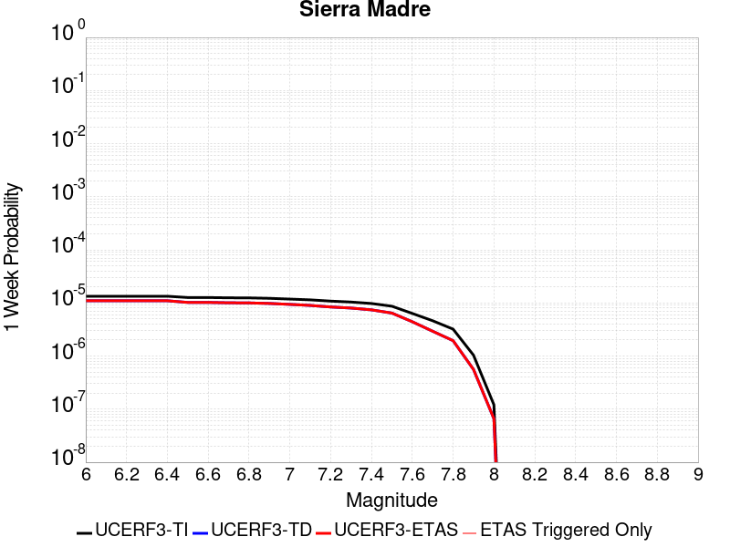 | 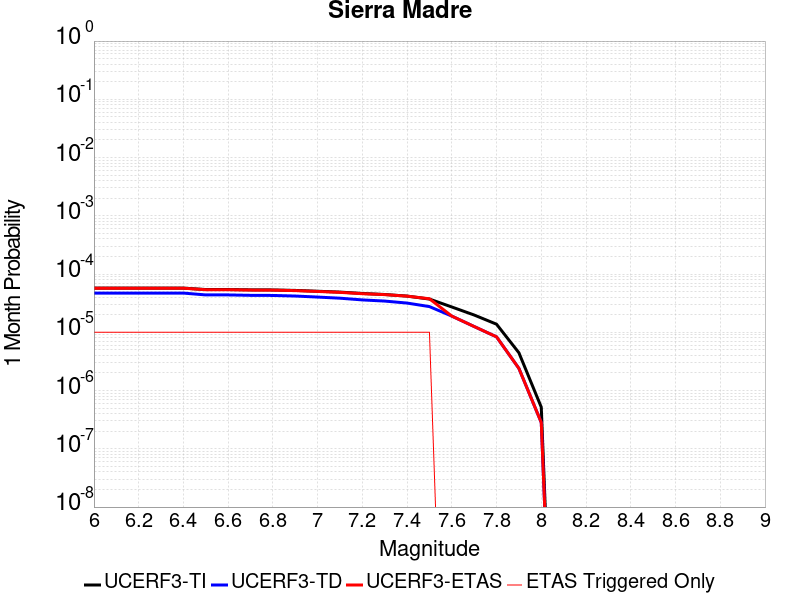 |  |  |

| Magnitude | 1 wk TI Prob | 1 wk TD Prob | 1 wk ETAS Prob | 1 wk ETAS/TD Gain | 1 wk ETAS Triggered Only | 1 mo TI Prob | 1 mo TD Prob | 1 mo ETAS Prob | 1 mo ETAS/TD Gain | 1 mo ETAS Triggered Only | 1 yr TI Prob | 1 yr TD Prob | 1 yr ETAS Prob | 1 yr ETAS/TD Gain | 1 yr ETAS Triggered Only | 10 yr TI Prob | 10 yr TD Prob | 10 yr ETAS Prob | 10 yr ETAS/TD Gain | 10 yr ETAS Triggered Only |
|-----|-----|-----|-----|-----|-----|-----|-----|-----|-----|-----|-----|-----|-----|-----|-----|-----|-----|-----|-----|-----|
| 6.0 | 1.3379373E-5 | 1.10007395E-5 | 1.10007395E-5 | 1.0 | 0.0 | 5.7338908E-5 | 4.7145186E-5 | 5.7144713E-5 | 1.2121007 | 1.0E-5 | 6.978776E-4 | 5.738429E-4 | 6.038257E-4 | 1.0522491 | 3.0E-5 | 0.0069569005 | 0.0057239756 | 0.005753804 | 1.0052111 | 3.0E-5 |
| 6.1 | 1.3379373E-5 | 1.10007395E-5 | 1.10007395E-5 | 1.0 | 0.0 | 5.7338908E-5 | 4.7145186E-5 | 5.7144713E-5 | 1.2121007 | 1.0E-5 | 6.978776E-4 | 5.738429E-4 | 6.038257E-4 | 1.0522491 | 3.0E-5 | 0.0069569005 | 0.0057239756 | 0.005753804 | 1.0052111 | 3.0E-5 |
| 6.2 | 1.3379373E-5 | 1.10007395E-5 | 1.10007395E-5 | 1.0 | 0.0 | 5.7338908E-5 | 4.7145186E-5 | 5.7144713E-5 | 1.2121007 | 1.0E-5 | 6.978776E-4 | 5.738429E-4 | 6.038257E-4 | 1.0522491 | 3.0E-5 | 0.0069569005 | 0.0057239756 | 0.005753804 | 1.0052111 | 3.0E-5 |
| 6.3 | 1.3379373E-5 | 1.10007395E-5 | 1.10007395E-5 | 1.0 | 0.0 | 5.7338908E-5 | 4.7145186E-5 | 5.7144713E-5 | 1.2121007 | 1.0E-5 | 6.978776E-4 | 5.738429E-4 | 6.038257E-4 | 1.0522491 | 3.0E-5 | 0.0069569005 | 0.0057239756 | 0.005753804 | 1.0052111 | 3.0E-5 |
| 6.4 | 1.3379373E-5 | 1.10007395E-5 | 1.10007395E-5 | 1.0 | 0.0 | 5.7338908E-5 | 4.7145186E-5 | 5.7144713E-5 | 1.2121007 | 1.0E-5 | 6.978776E-4 | 5.738429E-4 | 6.038257E-4 | 1.0522491 | 3.0E-5 | 0.0069569005 | 0.0057239756 | 0.005753804 | 1.0052111 | 3.0E-5 |
| 6.5 | 1.26563245E-5 | 1.0230196E-5 | 1.0230196E-5 | 1.0 | 0.0 | 5.4240263E-5 | 4.3842967E-5 | 5.3842527E-5 | 1.2280768 | 1.0E-5 | 6.601751E-4 | 5.336584E-4 | 5.636424E-4 | 1.0561857 | 3.0E-5 | 0.006582173 | 0.0053240913 | 0.0053539313 | 1.0056047 | 3.0E-5 |
| 6.6 | 1.26563245E-5 | 1.0230196E-5 | 1.0230196E-5 | 1.0 | 0.0 | 5.4240263E-5 | 4.3842967E-5 | 5.3842527E-5 | 1.2280768 | 1.0E-5 | 6.601751E-4 | 5.336584E-4 | 5.636424E-4 | 1.0561857 | 3.0E-5 | 0.006582173 | 0.0053240913 | 0.0053539313 | 1.0056047 | 3.0E-5 |
| 6.7 | 1.2502474E-5 | 1.006634E-5 | 1.006634E-5 | 1.0 | 0.0 | 5.3580934E-5 | 4.314075E-5 | 5.3140317E-5 | 1.2317894 | 1.0E-5 | 6.521526E-4 | 5.251131E-4 | 5.5509736E-4 | 1.0571005 | 3.0E-5 | 0.0065024206 | 0.0052390425 | 0.0052688853 | 1.0056963 | 3.0E-5 |
| 6.8 | 1.2454966E-5 | 1.0018625E-5 | 1.0018625E-5 | 1.0 | 0.0 | 5.3377335E-5 | 4.2936266E-5 | 5.2935837E-5 | 1.2328933 | 1.0E-5 | 6.4967526E-4 | 5.226247E-4 | 5.5260904E-4 | 1.0573726 | 3.0E-5 | 0.006477792 | 0.0052142753 | 0.005244119 | 1.0057235 | 3.0E-5 |
| 6.9 | 1.2225574E-5 | 9.792602E-6 | 9.792602E-6 | 1.0 | 0.0 | 5.2394265E-5 | 4.1967625E-5 | 5.1967207E-5 | 1.2382689 | 1.0E-5 | 6.3771347E-4 | 5.108371E-4 | 5.4082175E-4 | 1.0586971 | 3.0E-5 | 0.006358865 | 0.0050969445 | 0.0051267915 | 1.0058559 | 3.0E-5 |
| 7.0 | 1.182946E-5 | 9.399144E-6 | 9.399144E-6 | 1.0 | 0.0 | 5.06967E-5 | 4.0281426E-5 | 5.0281025E-5 | 1.2482433 | 1.0E-5 | 6.1705755E-4 | 4.9031706E-4 | 5.2030233E-4 | 1.0611548 | 3.0E-5 | 0.006153469 | 0.004892664 | 0.004922517 | 1.0061016 | 3.0E-5 |
| 7.1 | 1.14369095E-5 | 8.986159E-6 | 8.986159E-6 | 1.0 | 0.0 | 4.9014405E-5 | 3.8511545E-5 | 4.8511163E-5 | 1.2596524 | 1.0E-5 | 5.9658696E-4 | 4.687782E-4 | 4.887688E-4 | 1.0426441 | 2.0E-5 | 0.005949879 | 0.004678199 | 0.0046981056 | 1.0042552 | 2.0E-5 |
| 7.2 | 1.0836419E-5 | 8.3995565E-6 | 8.3995565E-6 | 1.0 | 0.0 | 4.644097E-5 | 3.5997607E-5 | 4.599725E-5 | 1.2777863 | 1.0E-5 | 5.652721E-4 | 4.3818366E-4 | 4.581749E-4 | 1.045623 | 2.0E-5 | 0.0056383642 | 0.004373494 | 0.0043934067 | 1.004553 | 2.0E-5 |
| 7.3 | 1.0403439E-5 | 8.02082E-6 | 8.02082E-6 | 1.0 | 0.0 | 4.4585406E-5 | 3.4374494E-5 | 4.4374152E-5 | 1.2909033 | 1.0E-5 | 5.426921E-4 | 4.1843E-4 | 4.3842164E-4 | 1.0477778 | 2.0E-5 | 0.005413687 | 0.004176717 | 0.0041966336 | 1.0047685 | 2.0E-5 |
| 7.4 | 9.768864E-6 | 7.414448E-6 | 7.414448E-6 | 1.0 | 0.0 | 4.186589E-5 | 3.1775824E-5 | 4.1775507E-5 | 1.3146946 | 1.0E-5 | 5.09598E-4 | 3.868029E-4 | 4.0679515E-4 | 1.0516859 | 2.0E-5 | 0.0050843097 | 0.0038615882 | 0.003881511 | 1.0051593 | 2.0E-5 |
| 7.5 | 8.687089E-6 | 6.4501564E-6 | 6.4501564E-6 | 1.0 | 0.0 | 3.722985E-5 | 2.764324E-5 | 3.7642963E-5 | 1.3617421 | 1.0E-5 | 4.5317915E-4 | 3.3650533E-4 | 3.564986E-4 | 1.0594144 | 2.0E-5 | 0.004522561 | 0.0033602451 | 0.003380178 | 1.005932 | 2.0E-5 |
| 7.6 | 6.3506063E-6 | 4.4303215E-6 | 4.4303215E-6 | 1.0 | 0.0 | 2.72166E-5 | 1.8986955E-5 | 1.8986955E-5 | 1.0 | 0.0 | 3.3131172E-4 | 2.3114192E-4 | 2.4113961E-4 | 1.0432534 | 1.0E-5 | 0.003308182 | 0.0023092402 | 0.002319217 | 1.0043204 | 1.0E-5 |
| 7.7 | 4.62223E-6 | 2.932967E-6 | 2.932967E-6 | 1.0 | 0.0 | 1.9809406E-5 | 1.2569798E-5 | 1.2569798E-5 | 1.0 | 0.0 | 2.4115283E-4 | 1.5302657E-4 | 1.6302503E-4 | 1.0653381 | 1.0E-5 | 0.0024089129 | 0.001529413 | 0.0015393978 | 1.0065285 | 1.0E-5 |
| 7.8 | 3.2145008E-6 | 1.9494332E-6 | 1.9494332E-6 | 1.0 | 0.0 | 1.3776359E-5 | 8.3546865E-6 | 8.3546865E-6 | 1.0 | 0.0 | 1.6771426E-4 | 1.0171358E-4 | 1.1171256E-4 | 1.0983053 | 1.0E-5 | 0.0016758774 | 0.0010168145 | 0.0010268043 | 1.0098246 | 1.0E-5 |
| 7.9 | 1.0391769E-6 | 5.6026335E-7 | 5.6026335E-7 | 1.0 | 0.0 | 4.4536077E-6 | 2.4011265E-6 | 2.4011265E-6 | 1.0 | 0.0 | 5.4221324E-5 | 2.9233326E-5 | 2.9233326E-5 | 1.0 | 0.0 | 5.4208096E-4 | 2.9229524E-4 | 2.9229524E-4 | 1.0 | 0.0 |
| 8.0 | 1.210983E-7 | 6.613821E-8 | 6.613821E-8 | 1.0 | 0.0 | 5.1899264E-7 | 2.8344945E-7 | 2.8344945E-7 | 1.0 | 0.0 | 6.3187167E-6 | 3.4509917E-6 | 3.4509917E-6 | 1.0 | 0.0 | 6.318537E-5 | 3.45094E-5 | 3.45094E-5 | 1.0 | 0.0 |

## Los Osos 2011
*[(top)](#table-of-contents)*

| 1 Week | 1 Month | 1 Year | 10 Year |
|-----|-----|-----|-----|
| 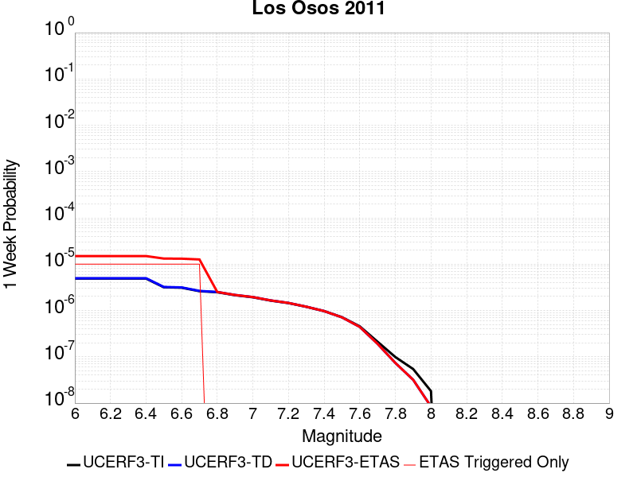 | 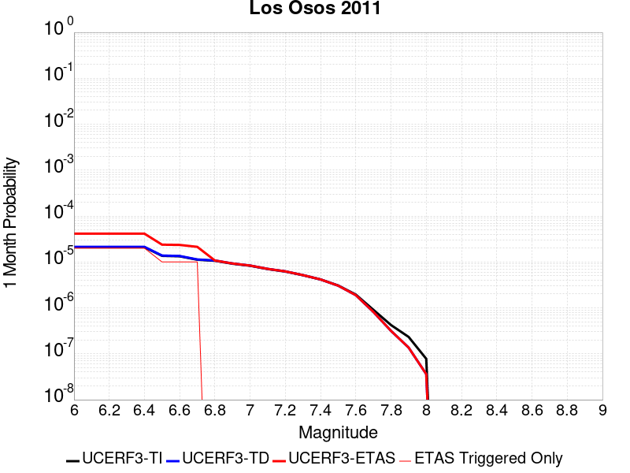 |  |  |

| Magnitude | 1 wk TI Prob | 1 wk TD Prob | 1 wk ETAS Prob | 1 wk ETAS/TD Gain | 1 wk ETAS Triggered Only | 1 mo TI Prob | 1 mo TD Prob | 1 mo ETAS Prob | 1 mo ETAS/TD Gain | 1 mo ETAS Triggered Only | 1 yr TI Prob | 1 yr TD Prob | 1 yr ETAS Prob | 1 yr ETAS/TD Gain | 1 yr ETAS Triggered Only | 10 yr TI Prob | 10 yr TD Prob | 10 yr ETAS Prob | 10 yr ETAS/TD Gain | 10 yr ETAS Triggered Only |
|-----|-----|-----|-----|-----|-----|-----|-----|-----|-----|-----|-----|-----|-----|-----|-----|-----|-----|-----|-----|-----|
| 6.0 | 4.8871775E-6 | 4.9814835E-6 | 1.4981433E-5 | 3.007424 | 1.0E-5 | 2.0944879E-5 | 2.1349055E-5 | 4.1348627E-5 | 1.9367896 | 2.0E-5 | 2.5497406E-4 | 2.5989654E-4 | 2.8988873E-4 | 1.1154006 | 3.0E-5 | 0.002546817 | 0.0025962002 | 0.0026261224 | 1.0115254 | 3.0E-5 |
| 6.1 | 4.8871775E-6 | 4.9814835E-6 | 1.4981433E-5 | 3.007424 | 1.0E-5 | 2.0944879E-5 | 2.1349055E-5 | 4.1348627E-5 | 1.9367896 | 2.0E-5 | 2.5497406E-4 | 2.5989654E-4 | 2.8988873E-4 | 1.1154006 | 3.0E-5 | 0.002546817 | 0.0025962002 | 0.0026261224 | 1.0115254 | 3.0E-5 |
| 6.2 | 4.8871775E-6 | 4.9814835E-6 | 1.4981433E-5 | 3.007424 | 1.0E-5 | 2.0944879E-5 | 2.1349055E-5 | 4.1348627E-5 | 1.9367896 | 2.0E-5 | 2.5497406E-4 | 2.5989654E-4 | 2.8988873E-4 | 1.1154006 | 3.0E-5 | 0.002546817 | 0.0025962002 | 0.0026261224 | 1.0115254 | 3.0E-5 |
| 6.3 | 4.8871775E-6 | 4.9814835E-6 | 1.4981433E-5 | 3.007424 | 1.0E-5 | 2.0944879E-5 | 2.1349055E-5 | 4.1348627E-5 | 1.9367896 | 2.0E-5 | 2.5497406E-4 | 2.5989654E-4 | 2.8988873E-4 | 1.1154006 | 3.0E-5 | 0.002546817 | 0.0025962002 | 0.0026261224 | 1.0115254 | 3.0E-5 |
| 6.4 | 4.8871775E-6 | 4.9814835E-6 | 1.4981433E-5 | 3.007424 | 1.0E-5 | 2.0944879E-5 | 2.1349055E-5 | 4.1348627E-5 | 1.9367896 | 2.0E-5 | 2.5497406E-4 | 2.5989654E-4 | 2.8988873E-4 | 1.1154006 | 3.0E-5 | 0.002546817 | 0.0025962002 | 0.0026261224 | 1.0115254 | 3.0E-5 |
| 6.5 | 3.1724062E-6 | 3.223395E-6 | 1.3223363E-5 | 4.102309 | 1.0E-5 | 1.3595956E-5 | 1.3814477E-5 | 2.3814338E-5 | 1.7238683 | 1.0E-5 | 1.6551818E-4 | 1.681784E-4 | 1.8817505E-4 | 1.1189014 | 2.0E-5 | 0.0016539496 | 0.0016805249 | 0.0017004913 | 1.011881 | 2.0E-5 |
| 6.6 | 3.1022591E-6 | 3.1511045E-6 | 1.3151073E-5 | 4.1734805 | 1.0E-5 | 1.3295328E-5 | 1.3504664E-5 | 2.3504528E-5 | 1.7404749 | 1.0E-5 | 1.618586E-4 | 1.64407E-4 | 1.8440372E-4 | 1.1216294 | 2.0E-5 | 0.0016174077 | 0.0016428665 | 0.0016628337 | 1.0121539 | 2.0E-5 |
| 6.7 | 2.611518E-6 | 2.6491832E-6 | 1.2649157E-5 | 4.7747383 | 1.0E-5 | 1.1192172E-5 | 1.1353593E-5 | 2.135348E-5 | 1.8807684 | 1.0E-5 | 1.3625617E-4 | 1.3822126E-4 | 1.582185E-4 | 1.1446755 | 2.0E-5 | 0.0013617266 | 0.0013813575 | 0.0014013299 | 1.0144585 | 2.0E-5 |
| 6.8 | 2.4780884E-6 | 2.5121592E-6 | 2.5121592E-6 | 1.0 | 0.0 | 1.0620336E-5 | 1.0766353E-5 | 1.0766353E-5 | 1.0 | 0.0 | 1.2929492E-4 | 1.3107249E-4 | 1.4107118E-4 | 1.0762837 | 1.0E-5 | 0.0012921972 | 0.001309956 | 0.0013199429 | 1.0076238 | 1.0E-5 |
| 6.9 | 2.1376322E-6 | 2.1635055E-6 | 2.1635055E-6 | 1.0 | 0.0 | 9.161248E-6 | 9.272134E-6 | 9.272134E-6 | 1.0 | 0.0 | 1.1153249E-4 | 1.128824E-4 | 1.2288128E-4 | 1.0885777 | 1.0E-5 | 0.0011147653 | 0.0011282525 | 0.0011382413 | 1.0088533 | 1.0E-5 |
| 7.0 | 1.9282882E-6 | 1.9494585E-6 | 1.9494585E-6 | 1.0 | 0.0 | 8.264066E-6 | 8.354796E-6 | 8.354796E-6 | 1.0 | 0.0 | 1.0061036E-4 | 1.017149E-4 | 1.1171388E-4 | 1.098304 | 1.0E-5 | 0.0010056482 | 0.0010166848 | 0.0010266746 | 1.009826 | 1.0E-5 |
| 7.1 | 1.6353226E-6 | 1.6501118E-6 | 1.6501118E-6 | 1.0 | 0.0 | 7.0085066E-6 | 7.0718884E-6 | 7.0718884E-6 | 1.0 | 0.0 | 8.532523E-5 | 8.609685E-5 | 9.609599E-5 | 1.1161382 | 1.0E-5 | 8.529247E-4 | 8.6063566E-4 | 8.7062706E-4 | 1.0116093 | 1.0E-5 |
| 7.2 | 1.4446276E-6 | 1.4553341E-6 | 1.4553341E-6 | 1.0 | 0.0 | 6.191247E-6 | 6.237131E-6 | 6.237131E-6 | 1.0 | 0.0 | 7.537582E-5 | 7.593443E-5 | 8.593367E-5 | 1.1316825 | 1.0E-5 | 7.535026E-4 | 7.590854E-4 | 7.6907786E-4 | 1.0131638 | 1.0E-5 |
| 7.3 | 1.2014582E-6 | 1.2069073E-6 | 1.2069073E-6 | 1.0 | 0.0 | 5.149096E-6 | 5.1724496E-6 | 5.1724496E-6 | 1.0 | 0.0 | 6.268844E-5 | 6.297276E-5 | 7.297213E-5 | 1.1587888 | 1.0E-5 | 6.267076E-4 | 6.295495E-4 | 6.395432E-4 | 1.0158744 | 1.0E-5 |
| 7.4 | 9.707733E-7 | 9.709773E-7 | 9.709773E-7 | 1.0 | 0.0 | 4.16045E-6 | 4.161325E-6 | 4.161325E-6 | 1.0 | 0.0 | 5.0652303E-5 | 5.066295E-5 | 6.0662445E-5 | 1.1973729 | 1.0E-5 | 5.064076E-4 | 5.065143E-4 | 5.1650923E-4 | 1.0197328 | 1.0E-5 |
| 7.5 | 7.174908E-7 | 7.1149134E-7 | 7.1149134E-7 | 1.0 | 0.0 | 3.074957E-6 | 3.0492452E-6 | 3.0492452E-6 | 1.0 | 0.0 | 3.743696E-5 | 3.712393E-5 | 4.7123558E-5 | 1.269358 | 1.0E-5 | 3.7430652E-4 | 3.7117745E-4 | 3.8117374E-4 | 1.0269313 | 1.0E-5 |
| 7.6 | 4.5535776E-7 | 4.420792E-7 | 4.420792E-7 | 1.0 | 0.0 | 1.9515319E-6 | 1.8946238E-6 | 1.8946238E-6 | 1.0 | 0.0 | 2.3759641E-5 | 2.3066801E-5 | 2.3066801E-5 | 1.0 | 0.0 | 2.37571E-4 | 2.3064416E-4 | 2.3064416E-4 | 1.0 | 0.0 |
| 7.7 | 2.1173553E-7 | 1.9060796E-7 | 1.9060796E-7 | 1.0 | 0.0 | 9.0743765E-7 | 8.1689103E-7 | 8.1689103E-7 | 1.0 | 0.0 | 1.1047998E-5 | 9.945603E-6 | 9.945603E-6 | 1.0 | 0.0 | 1.1047449E-4 | 9.945161E-5 | 9.945161E-5 | 1.0 | 0.0 |
| 7.8 | 9.873608E-8 | 7.3675665E-8 | 7.3675665E-8 | 1.0 | 0.0 | 4.2315455E-7 | 3.157528E-7 | 3.157528E-7 | 1.0 | 0.0 | 5.1518946E-6 | 3.8442836E-6 | 3.8442836E-6 | 1.0 | 0.0 | 5.1517753E-5 | 3.8442176E-5 | 3.8442176E-5 | 1.0 | 0.0 |
| 7.9 | 5.4399106E-8 | 3.1880155E-8 | 3.1880155E-8 | 1.0 | 0.0 | 2.33139E-7 | 1.3662923E-7 | 1.3662923E-7 | 1.0 | 0.0 | 2.8384638E-6 | 1.6634596E-6 | 1.6634596E-6 | 1.0 | 0.0 | 2.8384275E-5 | 1.6634473E-5 | 1.6634473E-5 | 1.0 | 0.0 |
| 8.0 | 1.817203E-8 | 8.420727E-9 | 8.420727E-9 | 1.0 | 0.0 | 7.7880124E-8 | 3.608883E-8 | 3.608883E-8 | 1.0 | 0.0 | 9.481901E-7 | 4.393814E-7 | 4.393814E-7 | 1.0 | 0.0 | 9.481861E-6 | 4.3938057E-6 | 4.3938057E-6 | 1.0 | 0.0 |

## Great Valley 03 Mysterious Ridge
*[(top)](#table-of-contents)*

| 1 Week | 1 Month | 1 Year | 10 Year |
|-----|-----|-----|-----|
| 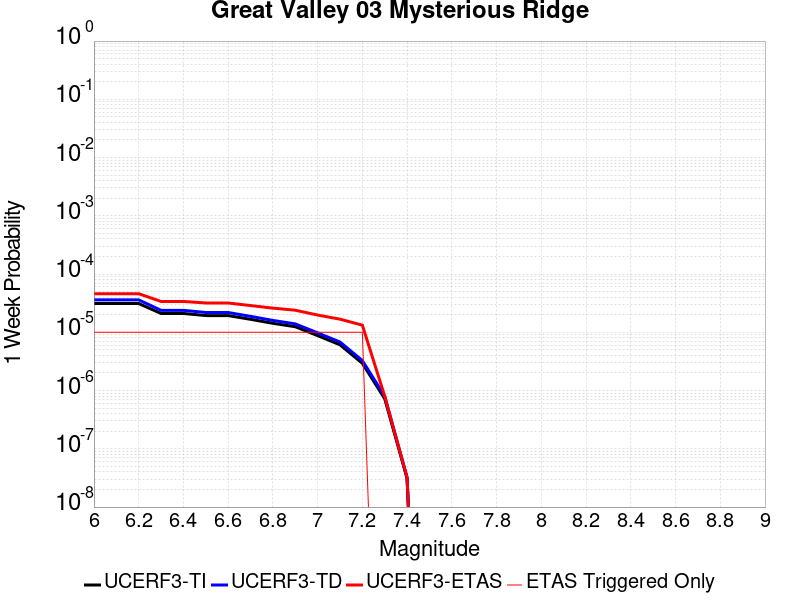 | 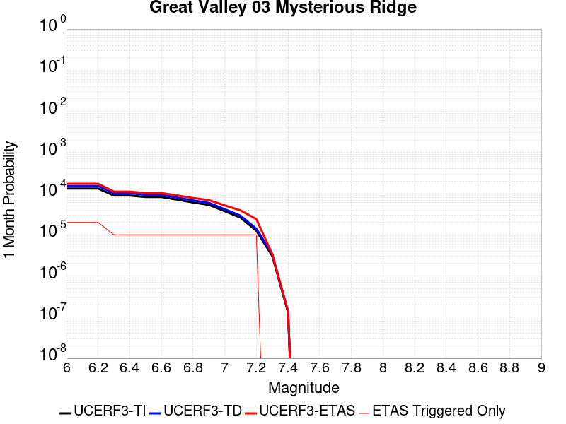 |  |  |

| Magnitude | 1 wk TI Prob | 1 wk TD Prob | 1 wk ETAS Prob | 1 wk ETAS/TD Gain | 1 wk ETAS Triggered Only | 1 mo TI Prob | 1 mo TD Prob | 1 mo ETAS Prob | 1 mo ETAS/TD Gain | 1 mo ETAS Triggered Only | 1 yr TI Prob | 1 yr TD Prob | 1 yr ETAS Prob | 1 yr ETAS/TD Gain | 1 yr ETAS Triggered Only | 10 yr TI Prob | 10 yr TD Prob | 10 yr ETAS Prob | 10 yr ETAS/TD Gain | 10 yr ETAS Triggered Only |
|-----|-----|-----|-----|-----|-----|-----|-----|-----|-----|-----|-----|-----|-----|-----|-----|-----|-----|-----|-----|-----|
| 6.0 | 3.1182444E-5 | 3.603423E-5 | 4.603387E-5 | 1.277504 | 1.0E-5 | 1.336322E-4 | 1.544242E-4 | 1.7442112E-4 | 1.1294934 | 2.0E-5 | 0.0016257578 | 0.0018786696 | 0.001898632 | 1.0106258 | 2.0E-5 | 0.016139153 | 0.018646652 | 0.018666279 | 1.0010526 | 2.0E-5 |
| 6.1 | 3.1182444E-5 | 3.603423E-5 | 4.603387E-5 | 1.277504 | 1.0E-5 | 1.336322E-4 | 1.544242E-4 | 1.7442112E-4 | 1.1294934 | 2.0E-5 | 0.0016257578 | 0.0018786696 | 0.001898632 | 1.0106258 | 2.0E-5 | 0.016139153 | 0.018646652 | 0.018666279 | 1.0010526 | 2.0E-5 |
| 6.2 | 3.1182444E-5 | 3.603423E-5 | 4.603387E-5 | 1.277504 | 1.0E-5 | 1.336322E-4 | 1.544242E-4 | 1.7442112E-4 | 1.1294934 | 2.0E-5 | 0.0016257578 | 0.0018786696 | 0.001898632 | 1.0106258 | 2.0E-5 | 0.016139153 | 0.018646652 | 0.018666279 | 1.0010526 | 2.0E-5 |
| 6.3 | 2.106934E-5 | 2.3850307E-5 | 3.385007E-5 | 1.4192718 | 1.0E-5 | 9.0294045E-5 | 1.0221177E-4 | 1.1221076E-4 | 1.0978261 | 1.0E-5 | 0.0010987755 | 0.0012437489 | 0.0012537364 | 1.0080302 | 1.0E-5 | 0.010933585 | 0.012371127 | 0.012390879 | 1.0015967 | 2.0E-5 |
| 6.4 | 2.106934E-5 | 2.3850307E-5 | 3.385007E-5 | 1.4192718 | 1.0E-5 | 9.0294045E-5 | 1.0221177E-4 | 1.1221076E-4 | 1.0978261 | 1.0E-5 | 0.0010987755 | 0.0012437489 | 0.0012537364 | 1.0080302 | 1.0E-5 | 0.010933585 | 0.012371127 | 0.012390879 | 1.0015967 | 2.0E-5 |
| 6.5 | 1.9389783E-5 | 2.1884984E-5 | 3.1884763E-5 | 1.4569243 | 1.0E-5 | 8.309642E-5 | 9.3789575E-5 | 1.0378863E-4 | 1.1066116 | 1.0E-5 | 0.0010112294 | 0.0011413174 | 0.001151306 | 1.0087517 | 1.0E-5 | 0.010066401 | 0.011357434 | 0.011377207 | 1.0017409 | 2.0E-5 |
| 6.6 | 1.9370193E-5 | 2.1864906E-5 | 3.1864685E-5 | 1.4573439 | 1.0E-5 | 8.301247E-5 | 9.370353E-5 | 1.0370259E-4 | 1.1067096 | 1.0E-5 | 0.0010102082 | 0.001140271 | 0.0011502595 | 1.0087599 | 1.0E-5 | 0.010056281 | 0.011347076 | 0.011366849 | 1.0017426 | 2.0E-5 |
| 6.7 | 1.6723505E-5 | 1.8799281E-5 | 2.8799093E-5 | 1.5319252 | 1.0E-5 | 7.16702E-5 | 8.056597E-5 | 9.056517E-5 | 1.1241119 | 1.0E-5 | 8.722353E-4 | 9.804688E-4 | 9.90459E-4 | 1.0101892 | 1.0E-5 | 0.008688197 | 0.009763439 | 0.009773342 | 1.0010142 | 1.0E-5 |
| 6.8 | 1.426937E-5 | 1.599721E-5 | 2.599705E-5 | 1.6250991 | 1.0E-5 | 6.115301E-5 | 6.855775E-5 | 7.855707E-5 | 1.1458524 | 1.0E-5 | 7.4428355E-4 | 8.343854E-4 | 8.443771E-4 | 1.0119748 | 1.0E-5 | 0.007417957 | 0.008314005 | 0.008323922 | 1.0011928 | 1.0E-5 |
| 6.9 | 1.2469891E-5 | 1.3956928E-5 | 2.3956789E-5 | 1.71648 | 1.0E-5 | 5.3441294E-5 | 5.9814105E-5 | 6.9813505E-5 | 1.1671747 | 1.0E-5 | 6.504535E-4 | 7.280055E-4 | 7.3799817E-4 | 1.0137261 | 1.0E-5 | 0.006485529 | 0.00725743 | 0.0072673573 | 1.0013679 | 1.0E-5 |
| 7.0 | 8.7746275E-6 | 9.791734E-6 | 1.9791636E-5 | 2.0212595 | 1.0E-5 | 3.7605005E-5 | 4.196394E-5 | 5.1963518E-5 | 1.2382898 | 1.0E-5 | 4.5774475E-4 | 5.1079853E-4 | 5.2079343E-4 | 1.0195671 | 1.0E-5 | 0.00456803 | 0.005096977 | 0.0051069264 | 1.0019519 | 1.0E-5 |
| 7.1 | 6.1067153E-6 | 6.813725E-6 | 1.6813658E-5 | 2.4676158 | 1.0E-5 | 2.6171374E-5 | 2.9201385E-5 | 3.920109E-5 | 1.3424395 | 1.0E-5 | 3.1858988E-4 | 3.5547445E-4 | 3.6547089E-4 | 1.0281215 | 1.0E-5 | 0.0031813353 | 0.003549609 | 0.0035595736 | 1.0028073 | 1.0E-5 |
| 7.2 | 2.939283E-6 | 3.2741057E-6 | 1.3274073E-5 | 4.0542593 | 1.0E-5 | 1.2596866E-5 | 1.4031816E-5 | 2.4031677E-5 | 1.7126561 | 1.0E-5 | 1.5335606E-4 | 1.7082572E-4 | 1.80824E-4 | 1.0585291 | 1.0E-5 | 0.0015325027 | 0.001707116 | 0.001717099 | 1.0058478 | 1.0E-5 |
| 7.3 | 7.2387763E-7 | 8.008505E-7 | 8.008505E-7 | 1.0 | 0.0 | 3.102329E-6 | 3.4322145E-6 | 3.4322145E-6 | 1.0 | 0.0 | 3.77702E-5 | 4.178687E-5 | 4.178687E-5 | 1.0 | 0.0 | 3.7763783E-4 | 4.1783508E-4 | 4.1783508E-4 | 1.0 | 0.0 |
| 7.4 | 3.112171E-8 | 3.2068368E-8 | 3.2068368E-8 | 1.0 | 0.0 | 1.3337875E-7 | 1.3743585E-7 | 1.3743585E-7 | 1.0 | 0.0 | 1.6238852E-6 | 1.6732803E-6 | 1.6732803E-6 | 1.0 | 0.0 | 1.6238733E-5 | 1.6732685E-5 | 1.6732685E-5 | 1.0 | 0.0 |

## Monterey Bay-Tularcitos
*[(top)](#table-of-contents)*

| 1 Week | 1 Month | 1 Year | 10 Year |
|-----|-----|-----|-----|
|  |  |  |  |

| Magnitude | 1 wk TI Prob | 1 wk TD Prob | 1 wk ETAS Prob | 1 wk ETAS/TD Gain | 1 wk ETAS Triggered Only | 1 mo TI Prob | 1 mo TD Prob | 1 mo ETAS Prob | 1 mo ETAS/TD Gain | 1 mo ETAS Triggered Only | 1 yr TI Prob | 1 yr TD Prob | 1 yr ETAS Prob | 1 yr ETAS/TD Gain | 1 yr ETAS Triggered Only | 10 yr TI Prob | 10 yr TD Prob | 10 yr ETAS Prob | 10 yr ETAS/TD Gain | 10 yr ETAS Triggered Only |
|-----|-----|-----|-----|-----|-----|-----|-----|-----|-----|-----|-----|-----|-----|-----|-----|-----|-----|-----|-----|-----|
| 6.0 | 3.0131365E-5 | 3.279877E-5 | 3.279877E-5 | 1.0 | 0.0 | 1.2912804E-4 | 1.4055918E-4 | 1.4055918E-4 | 1.0 | 0.0 | 0.001571 | 0.0017100703 | 0.001730036 | 1.0116755 | 2.0E-5 | 0.015599402 | 0.016979916 | 0.017009407 | 1.0017368 | 3.0E-5 |
| 6.1 | 3.0131365E-5 | 3.279877E-5 | 3.279877E-5 | 1.0 | 0.0 | 1.2912804E-4 | 1.4055918E-4 | 1.4055918E-4 | 1.0 | 0.0 | 0.001571 | 0.0017100703 | 0.001730036 | 1.0116755 | 2.0E-5 | 0.015599402 | 0.016979916 | 0.017009407 | 1.0017368 | 3.0E-5 |
| 6.2 | 3.0131365E-5 | 3.279877E-5 | 3.279877E-5 | 1.0 | 0.0 | 1.2912804E-4 | 1.4055918E-4 | 1.4055918E-4 | 1.0 | 0.0 | 0.001571 | 0.0017100703 | 0.001730036 | 1.0116755 | 2.0E-5 | 0.015599402 | 0.016979916 | 0.017009407 | 1.0017368 | 3.0E-5 |
| 6.3 | 1.6998249E-5 | 1.8330798E-5 | 1.8330798E-5 | 1.0 | 0.0 | 7.28476E-5 | 7.85583E-5 | 7.85583E-5 | 1.0 | 0.0 | 8.865586E-4 | 9.5604634E-4 | 9.760272E-4 | 1.0208995 | 2.0E-5 | 0.0088303005 | 0.009521258 | 0.009550973 | 1.0031209 | 3.0E-5 |
| 6.4 | 1.6998249E-5 | 1.8330798E-5 | 1.8330798E-5 | 1.0 | 0.0 | 7.28476E-5 | 7.85583E-5 | 7.85583E-5 | 1.0 | 0.0 | 8.865586E-4 | 9.5604634E-4 | 9.760272E-4 | 1.0208995 | 2.0E-5 | 0.0088303005 | 0.009521258 | 0.009550973 | 1.0031209 | 3.0E-5 |
| 6.5 | 1.27470785E-5 | 1.3693312E-5 | 1.3693312E-5 | 1.0 | 0.0 | 5.4629192E-5 | 5.8684363E-5 | 5.8684363E-5 | 1.0 | 0.0 | 6.649074E-4 | 7.1425823E-4 | 7.3424395E-4 | 1.027981 | 2.0E-5 | 0.0066292146 | 0.007120678 | 0.0071504647 | 1.004183 | 3.0E-5 |
| 6.6 | 1.2739422E-5 | 1.36854E-5 | 1.36854E-5 | 1.0 | 0.0 | 5.4596385E-5 | 5.8650454E-5 | 5.8650454E-5 | 1.0 | 0.0 | 6.645082E-4 | 7.1384566E-4 | 7.338314E-4 | 1.0279973 | 2.0E-5 | 0.0066252467 | 0.007116579 | 0.0071463655 | 1.0041856 | 3.0E-5 |
| 6.7 | 1.0160109E-5 | 1.0885755E-5 | 1.0885755E-5 | 1.0 | 0.0 | 4.35426E-5 | 4.665244E-5 | 4.665244E-5 | 1.0 | 0.0 | 5.300022E-4 | 5.6785246E-4 | 5.778468E-4 | 1.0176002 | 1.0E-5 | 0.005287399 | 0.0056647263 | 0.005684613 | 1.0035106 | 2.0E-5 |
| 6.8 | 8.349859E-6 | 8.932587E-6 | 8.932587E-6 | 1.0 | 0.0 | 3.578462E-5 | 3.8281985E-5 | 3.8281985E-5 | 1.0 | 0.0 | 4.3559066E-4 | 4.6598914E-4 | 4.759845E-4 | 1.0214497 | 1.0E-5 | 0.004347378 | 0.004650685 | 0.0046606385 | 1.0021402 | 1.0E-5 |
| 6.9 | 5.193639E-6 | 5.53643E-6 | 5.53643E-6 | 1.0 | 0.0 | 2.2258262E-5 | 2.372736E-5 | 2.372736E-5 | 1.0 | 0.0 | 2.7096065E-4 | 2.8884556E-4 | 2.9884267E-4 | 1.0346106 | 1.0E-5 | 0.0027063051 | 0.0028850222 | 0.0028949934 | 1.0034562 | 1.0E-5 |
| 7.0 | 4.359381E-6 | 4.643366E-6 | 4.643366E-6 | 1.0 | 0.0 | 1.8682927E-5 | 1.9900004E-5 | 1.9900004E-5 | 1.0 | 0.0 | 2.274409E-4 | 2.422586E-4 | 2.5225617E-4 | 1.0412682 | 1.0E-5 | 0.0022720827 | 0.002420238 | 0.0024302138 | 1.0041218 | 1.0E-5 |
| 7.1 | 3.0398533E-6 | 3.2310427E-6 | 3.2310427E-6 | 1.0 | 0.0 | 1.3027877E-5 | 1.3847267E-5 | 1.3847267E-5 | 1.0 | 0.0 | 1.5860285E-4 | 1.6858005E-4 | 1.6858005E-4 | 1.0 | 0.0 | 0.001584897 | 0.0016847793 | 0.0016847793 | 1.0 | 0.0 |
| 7.2 | 1.642335E-6 | 1.7333153E-6 | 1.7333153E-6 | 1.0 | 0.0 | 7.0385595E-6 | 7.428485E-6 | 7.428485E-6 | 1.0 | 0.0 | 8.569109E-5 | 9.044012E-5 | 9.044012E-5 | 1.0 | 0.0 | 8.5658056E-4 | 9.042358E-4 | 9.042358E-4 | 1.0 | 0.0 |
| 7.3 | 3.356842E-7 | 3.2952389E-7 | 3.2952389E-7 | 1.0 | 0.0 | 1.4386458E-6 | 1.4122444E-6 | 1.4122444E-6 | 1.0 | 0.0 | 1.7515373E-5 | 1.7193941E-5 | 1.7193941E-5 | 1.0 | 0.0 | 1.7513991E-4 | 1.719262E-4 | 1.719262E-4 | 1.0 | 0.0 |
| 7.4 | 2.1973483E-7 | 2.1006413E-7 | 2.1006413E-7 | 1.0 | 0.0 | 9.417204E-7 | 9.0027453E-7 | 9.0027453E-7 | 1.0 | 0.0 | 1.1465385E-5 | 1.0960787E-5 | 1.0960787E-5 | 1.0 | 0.0 | 1.1464794E-4 | 1.096025E-4 | 1.096025E-4 | 1.0 | 0.0 |
| 7.5 | 1.1944135E-7 | 1.0696043E-7 | 1.0696043E-7 | 1.0 | 0.0 | 5.118914E-7 | 4.5840173E-7 | 4.5840173E-7 | 1.0 | 0.0 | 6.23226E-6 | 5.581027E-6 | 5.581027E-6 | 1.0 | 0.0 | 6.2320854E-5 | 5.5808883E-5 | 5.5808883E-5 | 1.0 | 0.0 |
| 7.6 | 4.636058E-8 | 3.336489E-8 | 3.336489E-8 | 1.0 | 0.0 | 1.9868818E-7 | 1.4299238E-7 | 1.4299238E-7 | 1.0 | 0.0 | 2.419026E-6 | 1.7409308E-6 | 1.7409308E-6 | 1.0 | 0.0 | 2.4189996E-5 | 1.7409173E-5 | 1.7409173E-5 | 1.0 | 0.0 |
| 7.7 | 1.8588572E-8 | 8.003744E-9 | 8.003744E-9 | 1.0 | 0.0 | 7.9665305E-8 | 3.430176E-8 | 3.430176E-8 | 1.0 | 0.0 | 9.699246E-7 | 4.1762385E-7 | 4.1762385E-7 | 1.0 | 0.0 | 9.699204E-6 | 4.176231E-6 | 4.176231E-6 | 1.0 | 0.0 |
| 7.8 | 2.7960154E-9 | 7.6099427E-10 | 7.6099427E-10 | 1.0 | 0.0 | 1.1982923E-8 | 3.2614043E-9 | 3.2614043E-9 | 1.0 | 0.0 | 1.4589209E-7 | 3.9707597E-8 | 3.9707597E-8 | 1.0 | 0.0 | 1.4589199E-6 | 3.9707595E-7 | 3.9707595E-7 | 1.0 | 0.0 |

## Hosgri
*[(top)](#table-of-contents)*

| 1 Week | 1 Month | 1 Year | 10 Year |
|-----|-----|-----|-----|
|  | 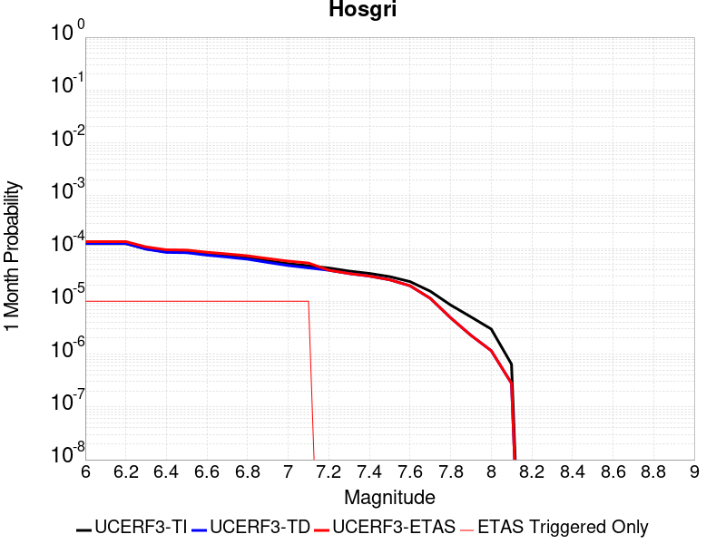 |  |  |

| Magnitude | 1 wk TI Prob | 1 wk TD Prob | 1 wk ETAS Prob | 1 wk ETAS/TD Gain | 1 wk ETAS Triggered Only | 1 mo TI Prob | 1 mo TD Prob | 1 mo ETAS Prob | 1 mo ETAS/TD Gain | 1 mo ETAS Triggered Only | 1 yr TI Prob | 1 yr TD Prob | 1 yr ETAS Prob | 1 yr ETAS/TD Gain | 1 yr ETAS Triggered Only | 10 yr TI Prob | 10 yr TD Prob | 10 yr ETAS Prob | 10 yr ETAS/TD Gain | 10 yr ETAS Triggered Only |
|-----|-----|-----|-----|-----|-----|-----|-----|-----|-----|-----|-----|-----|-----|-----|-----|-----|-----|-----|-----|-----|
| 6.0 | 2.883978E-5 | 2.9128416E-5 | 3.9128125E-5 | 1.3432974 | 1.0E-5 | 1.235932E-4 | 1.2483024E-4 | 1.34829E-4 | 1.0800987 | 1.0E-5 | 0.0015037085 | 0.001518776 | 0.0015387456 | 1.0131485 | 2.0E-5 | 0.01493574 | 0.01508774 | 0.015117287 | 1.0019584 | 3.0E-5 |
| 6.1 | 2.883978E-5 | 2.9128416E-5 | 3.9128125E-5 | 1.3432974 | 1.0E-5 | 1.235932E-4 | 1.2483024E-4 | 1.34829E-4 | 1.0800987 | 1.0E-5 | 0.0015037085 | 0.001518776 | 0.0015387456 | 1.0131485 | 2.0E-5 | 0.01493574 | 0.01508774 | 0.015117287 | 1.0019584 | 3.0E-5 |
| 6.2 | 2.883978E-5 | 2.9128416E-5 | 3.9128125E-5 | 1.3432974 | 1.0E-5 | 1.235932E-4 | 1.2483024E-4 | 1.34829E-4 | 1.0800987 | 1.0E-5 | 0.0015037085 | 0.001518776 | 0.0015387456 | 1.0131485 | 2.0E-5 | 0.01493574 | 0.01508774 | 0.015117287 | 1.0019584 | 3.0E-5 |
| 6.3 | 2.2914428E-5 | 2.2641969E-5 | 3.2641743E-5 | 1.4416476 | 1.0E-5 | 9.8200995E-5 | 9.703343E-5 | 1.0703246E-4 | 1.1030473 | 1.0E-5 | 0.0011949413 | 0.0011807467 | 0.0012007231 | 1.0169184 | 2.0E-5 | 0.011885363 | 0.011746133 | 0.0117757805 | 1.002524 | 3.0E-5 |
| 6.4 | 2.0195741E-5 | 1.969656E-5 | 2.9696363E-5 | 1.5076928 | 1.0E-5 | 8.65503E-5 | 8.4411105E-5 | 9.4410265E-5 | 1.1184578 | 1.0E-5 | 0.0010532405 | 0.0010272227 | 0.0010472022 | 1.01945 | 2.0E-5 | 0.010482626 | 0.010225792 | 0.010255486 | 1.0029037 | 3.0E-5 |
| 6.5 | 1.9924333E-5 | 1.940898E-5 | 2.9408788E-5 | 1.5152154 | 1.0E-5 | 8.53872E-5 | 8.3178704E-5 | 9.317788E-5 | 1.120213 | 1.0E-5 | 0.0010390934 | 0.0010122322 | 0.0010322119 | 1.0197383 | 2.0E-5 | 0.010342481 | 0.010077253 | 0.010106951 | 1.002947 | 3.0E-5 |
| 6.6 | 1.809694E-5 | 1.74583E-5 | 2.7458125E-5 | 1.5727835 | 1.0E-5 | 7.7556004E-5 | 7.4819145E-5 | 8.48184E-5 | 1.1336457 | 1.0E-5 | 9.438353E-4 | 9.105437E-4 | 9.2053466E-4 | 1.0109725 | 1.0E-5 | 0.009398366 | 0.009069073 | 0.009088892 | 1.0021853 | 2.0E-5 |
| 6.7 | 1.675989E-5 | 1.6042764E-5 | 2.6042604E-5 | 1.6233239 | 1.0E-5 | 7.182612E-5 | 6.87529E-5 | 7.8752215E-5 | 1.1454384 | 1.0E-5 | 8.7413215E-4 | 8.3674624E-4 | 8.467379E-4 | 1.0119411 | 1.0E-5 | 0.008707017 | 0.0083368635 | 0.008356696 | 1.002379 | 2.0E-5 |
| 6.8 | 1.5401129E-5 | 1.4614083E-5 | 2.4613937E-5 | 1.6842614 | 1.0E-5 | 6.6003166E-5 | 6.2630286E-5 | 7.262966E-5 | 1.1596571 | 1.0E-5 | 8.032922E-4 | 7.622578E-4 | 7.722502E-4 | 1.013109 | 1.0E-5 | 0.008003947 | 0.007597296 | 0.0076171444 | 1.0026125 | 2.0E-5 |
| 6.9 | 1.356559E-5 | 1.2689968E-5 | 2.2689841E-5 | 1.788014 | 1.0E-5 | 5.8136946E-5 | 5.4384444E-5 | 6.43839E-5 | 1.1838661 | 1.0E-5 | 7.0758746E-4 | 6.619299E-4 | 6.719233E-4 | 1.0150974 | 1.0E-5 | 0.007053386 | 0.006600388 | 0.006610322 | 1.001505 | 1.0E-5 |
| 7.0 | 1.2030819E-5 | 1.1095962E-5 | 2.109585E-5 | 1.9012188 | 1.0E-5 | 5.155963E-5 | 4.7553254E-5 | 5.7552777E-5 | 1.2102805 | 1.0E-5 | 6.275577E-4 | 5.7880714E-4 | 5.888014E-4 | 1.0172669 | 1.0E-5 | 0.006257884 | 0.005773757 | 0.0057836995 | 1.001722 | 1.0E-5 |
| 7.1 | 1.0972698E-5 | 1.0022179E-5 | 2.0022078E-5 | 1.997777 | 1.0E-5 | 4.7025E-5 | 4.2951488E-5 | 5.2951058E-5 | 1.2328109 | 1.0E-5 | 5.72379E-4 | 5.22809E-4 | 5.3280377E-4 | 1.0191175 | 1.0E-5 | 0.0057090693 | 0.005216542 | 0.00522649 | 1.001907 | 1.0E-5 |
| 7.2 | 9.961926E-6 | 9.034746E-6 | 9.034746E-6 | 1.0 | 0.0 | 4.2693267E-5 | 3.8719765E-5 | 3.8719765E-5 | 1.0 | 0.0 | 5.1966653E-4 | 4.713112E-4 | 4.713112E-4 | 1.0 | 0.0 | 0.00518453 | 0.0047038626 | 0.0047038626 | 1.0 | 0.0 |
| 7.3 | 8.700929E-6 | 7.8281E-6 | 7.8281E-6 | 1.0 | 0.0 | 3.7289166E-5 | 3.354857E-5 | 3.354857E-5 | 1.0 | 0.0 | 4.53901E-4 | 4.0837732E-4 | 4.0837732E-4 | 1.0 | 0.0 | 0.00452975 | 0.004077008 | 0.004077008 | 1.0 | 0.0 |
| 7.4 | 7.866285E-6 | 6.998739E-6 | 6.998739E-6 | 1.0 | 0.0 | 3.3712215E-5 | 2.9994251E-5 | 2.9994251E-5 | 1.0 | 0.0 | 4.103689E-4 | 3.6511885E-4 | 3.6511885E-4 | 1.0 | 0.0 | 0.004096119 | 0.0036459267 | 0.0036459267 | 1.0 | 0.0 |
| 7.5 | 6.8381305E-6 | 5.9596955E-6 | 5.9596955E-6 | 1.0 | 0.0 | 2.9305946E-5 | 2.5541302E-5 | 2.5541302E-5 | 1.0 | 0.0 | 3.5674145E-4 | 3.10921E-4 | 3.10921E-4 | 1.0 | 0.0 | 0.0035616932 | 0.0031055948 | 0.0031055948 | 1.0 | 0.0 |
| 7.6 | 5.503376E-6 | 4.5952443E-6 | 4.5952443E-6 | 1.0 | 0.0 | 2.3585684E-5 | 1.9693754E-5 | 1.9693754E-5 | 1.0 | 0.0 | 2.8711787E-4 | 2.397451E-4 | 2.397451E-4 | 1.0 | 0.0 | 0.002867472 | 0.0023955975 | 0.0023955975 | 1.0 | 0.0 |
| 7.7 | 3.6144982E-6 | 2.6522112E-6 | 2.6522112E-6 | 1.0 | 0.0 | 1.5490614E-5 | 1.1366569E-5 | 1.1366569E-5 | 1.0 | 0.0 | 1.8858191E-4 | 1.383792E-4 | 1.383792E-4 | 1.0 | 0.0 | 0.0018842196 | 0.0013836613 | 0.0013836613 | 1.0 | 0.0 |
| 7.8 | 1.9853494E-6 | 1.1361129E-6 | 1.1361129E-6 | 1.0 | 0.0 | 8.508612E-6 | 4.8690463E-6 | 4.8690463E-6 | 1.0 | 0.0 | 1.0358743E-4 | 5.9279027E-5 | 5.9279027E-5 | 1.0 | 0.0 | 0.0010353916 | 5.9336185E-4 | 5.9336185E-4 | 1.0 | 0.0 |
| 7.9 | 1.1818757E-6 | 5.2951856E-7 | 5.2951856E-7 | 1.0 | 0.0 | 5.0651715E-6 | 2.2693632E-6 | 2.2693632E-6 | 1.0 | 0.0 | 6.1666724E-5 | 2.7629147E-5 | 2.7629147E-5 | 1.0 | 0.0 | 6.1649614E-4 | 2.7694515E-4 | 2.7694515E-4 | 1.0 | 0.0 |
| 8.0 | 6.962958E-7 | 2.7139782E-7 | 2.7139782E-7 | 1.0 | 0.0 | 2.9841215E-6 | 1.163133E-6 | 1.163133E-6 | 1.0 | 0.0 | 3.6331072E-5 | 1.4161053E-5 | 1.4161053E-5 | 1.0 | 0.0 | 3.6325134E-4 | 1.4217179E-4 | 1.4217179E-4 | 1.0 | 0.0 |
| 8.1 | 1.5033264E-7 | 6.527624E-8 | 6.527624E-8 | 1.0 | 0.0 | 6.442826E-7 | 2.7975528E-7 | 2.7975528E-7 | 1.0 | 0.0 | 7.844113E-6 | 3.4060151E-6 | 3.4060151E-6 | 1.0 | 0.0 | 7.843835E-5 | 3.407693E-5 | 3.407693E-5 | 1.0 | 0.0 |

## Malibu Coast (Extension) alt 1
*[(top)](#table-of-contents)*

| 1 Week | 1 Month | 1 Year | 10 Year |
|-----|-----|-----|-----|
| 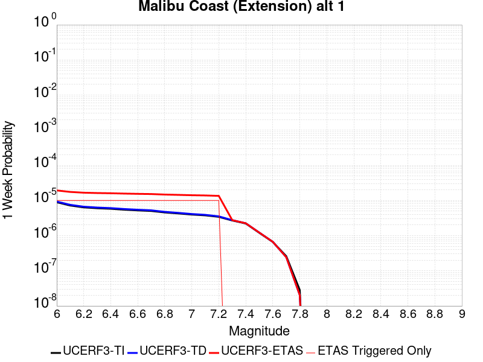 | 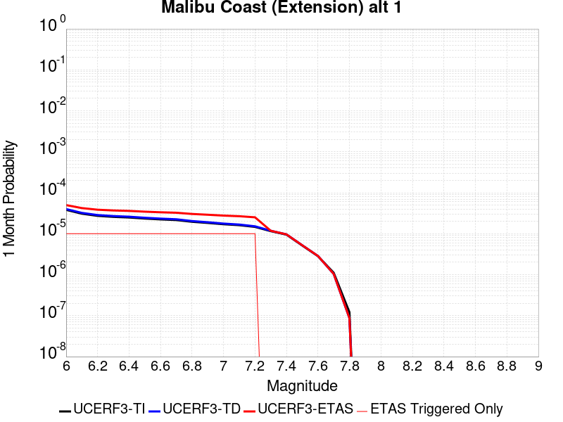 |  |  |

| Magnitude | 1 wk TI Prob | 1 wk TD Prob | 1 wk ETAS Prob | 1 wk ETAS/TD Gain | 1 wk ETAS Triggered Only | 1 mo TI Prob | 1 mo TD Prob | 1 mo ETAS Prob | 1 mo ETAS/TD Gain | 1 mo ETAS Triggered Only | 1 yr TI Prob | 1 yr TD Prob | 1 yr ETAS Prob | 1 yr ETAS/TD Gain | 1 yr ETAS Triggered Only | 10 yr TI Prob | 10 yr TD Prob | 10 yr ETAS Prob | 10 yr ETAS/TD Gain | 10 yr ETAS Triggered Only |
|-----|-----|-----|-----|-----|-----|-----|-----|-----|-----|-----|-----|-----|-----|-----|-----|-----|-----|-----|-----|-----|
| 6.0 | 8.930738E-6 | 9.329276E-6 | 1.9329182E-5 | 2.0718846 | 1.0E-5 | 3.827403E-5 | 3.998201E-5 | 4.998161E-5 | 1.2501025 | 1.0E-5 | 4.6588664E-4 | 4.8667393E-4 | 5.1665935E-4 | 1.061613 | 3.0E-5 | 0.0046491115 | 0.004856264 | 0.004886118 | 1.0061476 | 3.0E-5 |
| 6.1 | 7.199952E-6 | 7.5302964E-6 | 1.7530221E-5 | 2.327959 | 1.0E-5 | 3.0856572E-5 | 3.2272303E-5 | 4.2271982E-5 | 1.3098532 | 1.0E-5 | 3.75614E-4 | 3.9284505E-4 | 4.128372E-4 | 1.0508907 | 2.0E-5 | 0.0037497976 | 0.003921572 | 0.003941494 | 1.00508 | 2.0E-5 |
| 6.2 | 6.3721413E-6 | 6.6667917E-6 | 1.6666725E-5 | 2.4999619 | 1.0E-5 | 2.7308892E-5 | 2.8571652E-5 | 3.857137E-5 | 1.3499873 | 1.0E-5 | 3.3243504E-4 | 3.4780471E-4 | 3.6779774E-4 | 1.0574836 | 2.0E-5 | 0.0033193815 | 0.0034726437 | 0.0034925742 | 1.0057393 | 2.0E-5 |
| 6.3 | 6.016345E-6 | 6.295158E-6 | 1.6295095E-5 | 2.5885124 | 1.0E-5 | 2.578408E-5 | 2.6978973E-5 | 3.69787E-5 | 1.3706491 | 1.0E-5 | 3.1387596E-4 | 3.2841982E-4 | 3.3841652E-4 | 1.0304388 | 1.0E-5 | 0.00313433 | 0.0032793807 | 0.003289348 | 1.0030394 | 1.0E-5 |
| 6.4 | 5.8104883E-6 | 6.0795446E-6 | 1.6079484E-5 | 2.64485 | 1.0E-5 | 2.4901856E-5 | 2.6054933E-5 | 3.6054673E-5 | 1.3837944 | 1.0E-5 | 3.031379E-4 | 3.1717293E-4 | 3.2716978E-4 | 1.0315186 | 1.0E-5 | 0.0030272473 | 0.0031672374 | 0.0031772056 | 1.0031474 | 1.0E-5 |
| 6.5 | 5.476925E-6 | 5.7275133E-6 | 1.5727455E-5 | 2.7459486 | 1.0E-5 | 2.3472323E-5 | 2.4546256E-5 | 3.454601E-5 | 1.4073842 | 1.0E-5 | 2.8573806E-4 | 2.9880996E-4 | 3.0880698E-4 | 1.0334561 | 1.0E-5 | 0.0028537093 | 0.002984114 | 0.002994084 | 1.0033411 | 1.0E-5 |
| 6.6 | 5.222387E-6 | 5.45858E-6 | 1.5458525E-5 | 2.8319683 | 1.0E-5 | 2.2381464E-5 | 2.3393704E-5 | 3.339347E-5 | 1.4274554 | 1.0E-5 | 2.7246025E-4 | 2.8478142E-4 | 2.9477855E-4 | 1.0351046 | 1.0E-5 | 0.0027212645 | 0.0028441956 | 0.002854167 | 1.003506 | 1.0E-5 |
| 6.7 | 5.0337076E-6 | 5.259103E-6 | 1.5259051E-5 | 2.901455 | 1.0E-5 | 2.1572854E-5 | 2.253882E-5 | 3.2538595E-5 | 1.443669 | 1.0E-5 | 2.6261783E-4 | 2.7437587E-4 | 2.8437312E-4 | 1.0364363 | 1.0E-5 | 0.002623077 | 0.002740401 | 0.0027503737 | 1.0036391 | 1.0E-5 |
| 6.8 | 4.5675624E-6 | 4.7587164E-6 | 1.4758669E-5 | 3.101397 | 1.0E-5 | 1.9575122E-5 | 2.039434E-5 | 3.0394136E-5 | 1.4903221 | 1.0E-5 | 2.3830103E-4 | 2.48273E-4 | 2.582705E-4 | 1.0402683 | 1.0E-5 | 0.0023804565 | 0.002479976 | 0.0024899512 | 1.0040222 | 1.0E-5 |
| 6.9 | 4.2802412E-6 | 4.4520207E-6 | 1.4451976E-5 | 3.2461612 | 1.0E-5 | 1.8343762E-5 | 1.907995E-5 | 2.9079758E-5 | 1.5241004 | 1.0E-5 | 2.2331243E-4 | 2.3227377E-4 | 2.4227146E-4 | 1.0430427 | 1.0E-5 | 0.0022308815 | 0.0023203269 | 0.0023303037 | 1.0042998 | 1.0E-5 |
| 7.0 | 3.9794063E-6 | 4.130099E-6 | 1.4130058E-5 | 3.4212394 | 1.0E-5 | 1.7054486E-5 | 1.7700306E-5 | 2.7700129E-5 | 1.564952 | 1.0E-5 | 2.0761859E-4 | 2.1548003E-4 | 2.2547788E-4 | 1.046398 | 1.0E-5 | 0.0020742472 | 0.0021527244 | 0.0021627028 | 1.0046353 | 1.0E-5 |
| 7.1 | 3.7730424E-6 | 3.911217E-6 | 1.3911178E-5 | 3.5567389 | 1.0E-5 | 1.6170083E-5 | 1.6762251E-5 | 2.6762084E-5 | 1.5965686 | 1.0E-5 | 1.9685295E-4 | 2.0406142E-4 | 2.1405939E-4 | 1.0489949 | 1.0E-5 | 0.0019667868 | 0.0020387534 | 0.002048733 | 1.004895 | 1.0E-5 |
| 7.2 | 3.424985E-6 | 3.541337E-6 | 1.3541302E-5 | 3.8237822 | 1.0E-5 | 1.4678424E-5 | 1.5177071E-5 | 2.517692E-5 | 1.6588787 | 1.0E-5 | 1.7869516E-4 | 1.8476529E-4 | 1.9476344E-4 | 1.0541127 | 1.0E-5 | 0.0017855153 | 0.0018461287 | 0.0018561103 | 1.0054067 | 1.0E-5 |
| 7.3 | 2.6966375E-6 | 2.7596534E-6 | 2.7596534E-6 | 1.0 | 0.0 | 1.15569665E-5 | 1.1827032E-5 | 1.1827032E-5 | 1.0 | 0.0 | 1.4069698E-4 | 1.4398464E-4 | 1.4398464E-4 | 1.0 | 0.0 | 0.0014060794 | 0.0014389176 | 0.0014389176 | 1.0 | 0.0 |
| 7.4 | 2.215957E-6 | 2.249378E-6 | 2.249378E-6 | 1.0 | 0.0 | 9.496924E-6 | 9.640156E-6 | 9.640156E-6 | 1.0 | 0.0 | 1.1561892E-4 | 1.17362615E-4 | 1.17362615E-4 | 1.0 | 0.0 | 0.0011555878 | 0.0011730101 | 0.0011730101 | 1.0 | 0.0 |
| 7.5 | 1.2040218E-6 | 1.2219067E-6 | 1.2219067E-6 | 1.0 | 0.0 | 5.160083E-6 | 5.2367322E-6 | 5.2367322E-6 | 1.0 | 0.0 | 6.2822204E-5 | 6.375537E-5 | 6.375537E-5 | 1.0 | 0.0 | 6.280445E-4 | 6.3737266E-4 | 6.3737266E-4 | 1.0 | 0.0 |
| 7.6 | 6.6157446E-7 | 6.678975E-7 | 6.678975E-7 | 1.0 | 0.0 | 2.835316E-6 | 2.8624147E-6 | 2.8624147E-6 | 1.0 | 0.0 | 3.4519428E-5 | 3.484936E-5 | 3.484936E-5 | 1.0 | 0.0 | 3.4514067E-4 | 3.4844046E-4 | 3.4844046E-4 | 1.0 | 0.0 |
| 7.7 | 2.6012302E-7 | 2.4357593E-7 | 2.4357593E-7 | 1.0 | 0.0 | 1.1148124E-6 | 1.0438964E-6 | 1.0438964E-6 | 1.0 | 0.0 | 1.3572758E-5 | 1.2709375E-5 | 1.2709375E-5 | 1.0 | 0.0 | 1.3571928E-4 | 1.2708755E-4 | 1.2708755E-4 | 1.0 | 0.0 |
| 7.8 | 2.8323132E-8 | 2.0266649E-8 | 2.0266649E-8 | 1.0 | 0.0 | 1.2138484E-7 | 8.685707E-8 | 8.685707E-8 | 1.0 | 0.0 | 1.4778595E-6 | 1.0574844E-6 | 1.0574844E-6 | 1.0 | 0.0 | 1.4778497E-5 | 1.0574801E-5 | 1.0574801E-5 | 1.0 | 0.0 |

## San Juan
*[(top)](#table-of-contents)*

| 1 Week | 1 Month | 1 Year | 10 Year |
|-----|-----|-----|-----|
| 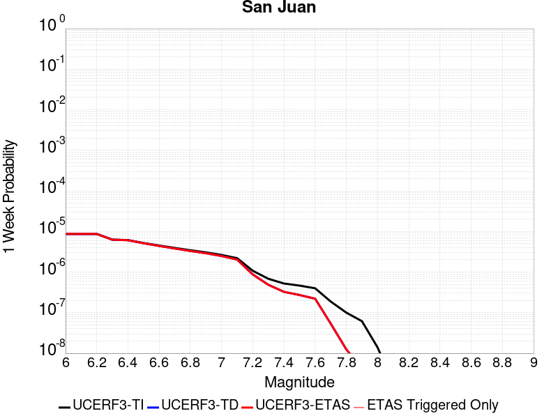 |  |  |  |

| Magnitude | 1 wk TI Prob | 1 wk TD Prob | 1 wk ETAS Prob | 1 wk ETAS/TD Gain | 1 wk ETAS Triggered Only | 1 mo TI Prob | 1 mo TD Prob | 1 mo ETAS Prob | 1 mo ETAS/TD Gain | 1 mo ETAS Triggered Only | 1 yr TI Prob | 1 yr TD Prob | 1 yr ETAS Prob | 1 yr ETAS/TD Gain | 1 yr ETAS Triggered Only | 10 yr TI Prob | 10 yr TD Prob | 10 yr ETAS Prob | 10 yr ETAS/TD Gain | 10 yr ETAS Triggered Only |
|-----|-----|-----|-----|-----|-----|-----|-----|-----|-----|-----|-----|-----|-----|-----|-----|-----|-----|-----|-----|-----|
| 6.0 | 8.682808E-6 | 8.7491635E-6 | 8.7491635E-6 | 1.0 | 0.0 | 3.72115E-5 | 3.74959E-5 | 3.74959E-5 | 1.0 | 0.0 | 4.5295584E-4 | 4.564218E-4 | 4.6641726E-4 | 1.0218996 | 1.0E-5 | 0.004520337 | 0.004555385 | 0.0045852484 | 1.0065556 | 3.0E-5 |
| 6.1 | 8.682808E-6 | 8.7491635E-6 | 8.7491635E-6 | 1.0 | 0.0 | 3.72115E-5 | 3.74959E-5 | 3.74959E-5 | 1.0 | 0.0 | 4.5295584E-4 | 4.564218E-4 | 4.6641726E-4 | 1.0218996 | 1.0E-5 | 0.004520337 | 0.004555385 | 0.0045852484 | 1.0065556 | 3.0E-5 |
| 6.2 | 8.682808E-6 | 8.7491635E-6 | 8.7491635E-6 | 1.0 | 0.0 | 3.72115E-5 | 3.74959E-5 | 3.74959E-5 | 1.0 | 0.0 | 4.5295584E-4 | 4.564218E-4 | 4.6641726E-4 | 1.0218996 | 1.0E-5 | 0.004520337 | 0.004555385 | 0.0045852484 | 1.0065556 | 3.0E-5 |
| 6.3 | 6.3054235E-6 | 6.2825848E-6 | 6.2825848E-6 | 1.0 | 0.0 | 2.7022963E-5 | 2.6925094E-5 | 2.6925094E-5 | 1.0 | 0.0 | 3.2895492E-4 | 3.2776513E-4 | 3.3776183E-4 | 1.0304997 | 1.0E-5 | 0.003284684 | 0.003273017 | 0.0033029187 | 1.0091358 | 3.0E-5 |
| 6.4 | 6.1490473E-6 | 6.1144656E-6 | 6.1144656E-6 | 1.0 | 0.0 | 2.6352795E-5 | 2.6204598E-5 | 2.6204598E-5 | 1.0 | 0.0 | 3.2079802E-4 | 3.1899565E-4 | 3.2899246E-4 | 1.0313383 | 1.0E-5 | 0.0032033534 | 0.0031855737 | 0.0032154783 | 1.0093875 | 3.0E-5 |
| 6.5 | 5.204848E-6 | 5.137233E-6 | 5.137233E-6 | 1.0 | 0.0 | 2.23063E-5 | 2.2016533E-5 | 2.2016533E-5 | 1.0 | 0.0 | 2.7154534E-4 | 2.6801927E-4 | 2.780166E-4 | 1.0373007 | 1.0E-5 | 0.0027121378 | 0.0026771144 | 0.0027070341 | 1.0111761 | 3.0E-5 |
| 6.6 | 4.5179986E-6 | 4.4150297E-6 | 4.4150297E-6 | 1.0 | 0.0 | 1.9362706E-5 | 1.8921424E-5 | 1.8921424E-5 | 1.0 | 0.0 | 2.3571544E-4 | 2.3034477E-4 | 2.4034247E-4 | 1.0434031 | 1.0E-5 | 0.0023546559 | 0.0023011973 | 0.002331128 | 1.0130067 | 3.0E-5 |
| 6.7 | 3.9442616E-6 | 3.819828E-6 | 3.819828E-6 | 1.0 | 0.0 | 1.6903869E-5 | 1.6370592E-5 | 1.6370592E-5 | 1.0 | 0.0 | 2.0578515E-4 | 1.992944E-4 | 2.0929241E-4 | 1.050167 | 1.0E-5 | 0.002055947 | 0.0019912818 | 0.002021222 | 1.0150356 | 3.0E-5 |
| 6.8 | 3.4536245E-6 | 3.3163353E-6 | 3.3163353E-6 | 1.0 | 0.0 | 1.4801163E-5 | 1.4212792E-5 | 1.4212792E-5 | 1.0 | 0.0 | 1.8018926E-4 | 1.7302761E-4 | 1.8302588E-4 | 1.0577842 | 1.0E-5 | 0.0018004322 | 0.0017290477 | 0.0017589959 | 1.0173206 | 3.0E-5 |
| 6.9 | 3.059865E-6 | 2.9120315E-6 | 2.9120315E-6 | 1.0 | 0.0 | 1.3113641E-5 | 1.2480078E-5 | 1.2480078E-5 | 1.0 | 0.0 | 1.596469E-4 | 1.5193493E-4 | 1.619334E-4 | 1.0658077 | 1.0E-5 | 0.0015953224 | 0.0015184252 | 0.0015483797 | 1.0197273 | 3.0E-5 |
| 7.0 | 2.6504351E-6 | 2.4920002E-6 | 2.4920002E-6 | 1.0 | 0.0 | 1.1358958E-5 | 1.0679961E-5 | 1.0679961E-5 | 1.0 | 0.0 | 1.3828653E-4 | 1.300213E-4 | 1.4002E-4 | 1.0769005 | 1.0E-5 | 0.0013820052 | 0.0012995641 | 0.0013195382 | 1.0153698 | 2.0E-5 |
| 7.1 | 2.2039317E-6 | 2.0338296E-6 | 2.0338296E-6 | 1.0 | 0.0 | 9.445387E-6 | 8.716386E-6 | 8.716386E-6 | 1.0 | 0.0 | 1.1499152E-4 | 1.0611736E-4 | 1.161163E-4 | 1.0942253 | 1.0E-5 | 0.0011493203 | 0.0010607769 | 0.0010807557 | 1.0188341 | 2.0E-5 |
| 7.2 | 1.0786707E-6 | 8.7701903E-7 | 8.7701903E-7 | 1.0 | 0.0 | 4.622866E-6 | 3.7586476E-6 | 3.7586476E-6 | 1.0 | 0.0 | 5.628194E-5 | 4.5760586E-5 | 4.5760586E-5 | 1.0 | 0.0 | 5.6267687E-4 | 4.5757066E-4 | 4.5757066E-4 | 1.0 | 0.0 |
| 7.3 | 6.846433E-7 | 4.868805E-7 | 4.868805E-7 | 1.0 | 0.0 | 2.9341822E-6 | 2.086629E-6 | 2.086629E-6 | 1.0 | 0.0 | 3.5723086E-5 | 2.5404412E-5 | 2.5404412E-5 | 1.0 | 0.0 | 3.571734E-4 | 2.540486E-4 | 2.540486E-4 | 1.0 | 0.0 |
| 7.4 | 5.23043E-7 | 3.2628162E-7 | 3.2628162E-7 | 1.0 | 0.0 | 2.2416111E-6 | 1.398349E-6 | 1.398349E-6 | 1.0 | 0.0 | 2.7291273E-5 | 1.7024766E-5 | 1.7024766E-5 | 1.0 | 0.0 | 2.7287923E-4 | 1.7026656E-4 | 1.7026656E-4 | 1.0 | 0.0 |
| 7.5 | 4.648444E-7 | 2.7234944E-7 | 2.7234944E-7 | 1.0 | 0.0 | 1.9921886E-6 | 1.1672114E-6 | 1.1672114E-6 | 1.0 | 0.0 | 2.4254627E-5 | 1.42107065E-5 | 1.42107065E-5 | 1.0 | 0.0 | 2.425198E-4 | 1.421276E-4 | 1.421276E-4 | 1.0 | 0.0 |
| 7.6 | 3.9906567E-7 | 2.2083314E-7 | 2.2083314E-7 | 1.0 | 0.0 | 1.7102802E-6 | 9.464274E-7 | 9.464274E-7 | 1.0 | 0.0 | 2.0822463E-5 | 1.1522693E-5 | 1.1522693E-5 | 1.0 | 0.0 | 2.0820512E-4 | 1.15245566E-4 | 1.15245566E-4 | 1.0 | 0.0 |
| 7.7 | 1.8784601E-7 | 5.3666906E-8 | 5.3666906E-8 | 1.0 | 0.0 | 8.0505407E-7 | 2.30001E-7 | 2.30001E-7 | 1.0 | 0.0 | 9.80149E-6 | 2.8002585E-6 | 2.8002585E-6 | 1.0 | 0.0 | 9.801057E-5 | 2.8011282E-5 | 2.8011282E-5 | 1.0 | 0.0 |
| 7.8 | 1.00154914E-7 | 1.2415832E-8 | 1.2415832E-8 | 1.0 | 0.0 | 4.2923529E-7 | 5.3210716E-8 | 5.3210716E-8 | 1.0 | 0.0 | 5.225927E-6 | 6.4784024E-7 | 6.4784024E-7 | 1.0 | 0.0 | 5.225804E-5 | 6.484273E-6 | 6.484273E-6 | 1.0 | 0.0 |
| 7.9 | 6.171429E-8 | 4.2966155E-9 | 4.2966155E-9 | 1.0 | 0.0 | 2.6448978E-7 | 1.8414067E-8 | 1.8414067E-8 | 1.0 | 0.0 | 3.2201583E-6 | 2.2419121E-7 | 2.2419121E-7 | 1.0 | 0.0 | 3.2201115E-5 | 2.2472002E-6 | 2.2472002E-6 | 1.0 | 0.0 |
| 8.0 | 1.3974572E-8 | 3.3788217E-10 | 3.3788217E-10 | 1.0 | 0.0 | 5.989102E-8 | 1.448067E-9 | 1.448067E-9 | 1.0 | 0.0 | 7.2917294E-7 | 1.763022E-8 | 1.763022E-8 | 1.0 | 0.0 | 7.2917055E-6 | 1.8060365E-7 | 1.8060365E-7 | 1.0 | 0.0 |
| 8.1 | 1.8403477E-9 | 1.1302803E-10 | 1.1302803E-10 | 1.0 | 0.0 | 7.887204E-9 | 4.844063E-10 | 4.844063E-10 | 1.0 | 0.0 | 9.602671E-8 | 5.8976446E-9 | 5.8976446E-9 | 1.0 | 0.0 | 9.602667E-7 | 6.021993E-8 | 6.021993E-8 | 1.0 | 0.0 |

## Pitas Point (Lower)-Montalvo
*[(top)](#table-of-contents)*

| 1 Week | 1 Month | 1 Year | 10 Year |
|-----|-----|-----|-----|
|  | 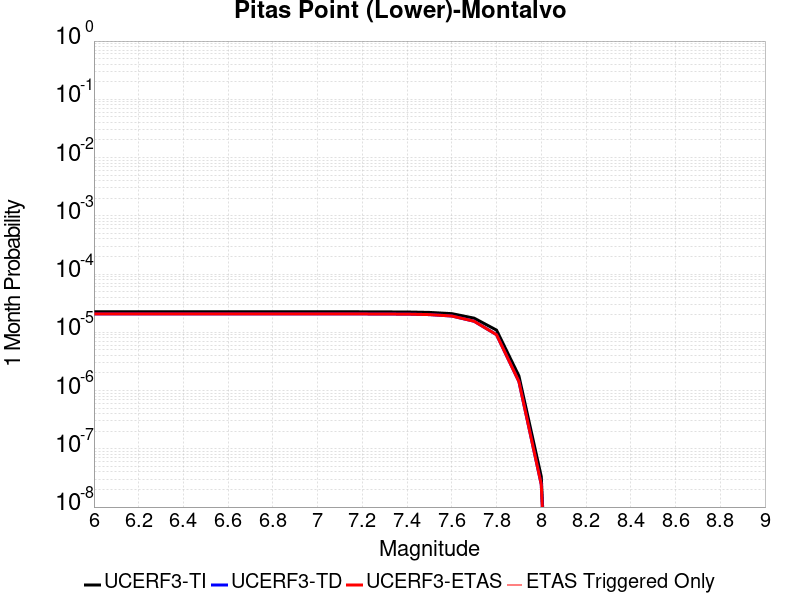 |  | 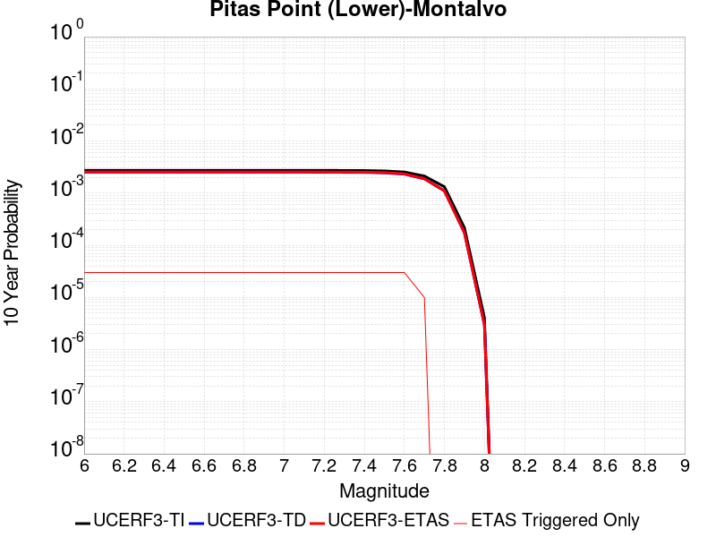 |

| Magnitude | 1 wk TI Prob | 1 wk TD Prob | 1 wk ETAS Prob | 1 wk ETAS/TD Gain | 1 wk ETAS Triggered Only | 1 mo TI Prob | 1 mo TD Prob | 1 mo ETAS Prob | 1 mo ETAS/TD Gain | 1 mo ETAS Triggered Only | 1 yr TI Prob | 1 yr TD Prob | 1 yr ETAS Prob | 1 yr ETAS/TD Gain | 1 yr ETAS Triggered Only | 10 yr TI Prob | 10 yr TD Prob | 10 yr ETAS Prob | 10 yr ETAS/TD Gain | 10 yr ETAS Triggered Only |
|-----|-----|-----|-----|-----|-----|-----|-----|-----|-----|-----|-----|-----|-----|-----|-----|-----|-----|-----|-----|-----|
| 6.0 | 5.2543637E-6 | 4.8378706E-6 | 4.8378706E-6 | 1.0 | 0.0 | 2.2518509E-5 | 2.0733567E-5 | 2.0733567E-5 | 1.0 | 0.0 | 2.7412834E-4 | 2.5240227E-4 | 2.723972E-4 | 1.0792186 | 2.0E-5 | 0.0027379042 | 0.0025211885 | 0.0025511128 | 1.0118692 | 3.0E-5 |
| 6.1 | 5.2543637E-6 | 4.8378706E-6 | 4.8378706E-6 | 1.0 | 0.0 | 2.2518509E-5 | 2.0733567E-5 | 2.0733567E-5 | 1.0 | 0.0 | 2.7412834E-4 | 2.5240227E-4 | 2.723972E-4 | 1.0792186 | 2.0E-5 | 0.0027379042 | 0.0025211885 | 0.0025511128 | 1.0118692 | 3.0E-5 |
| 6.2 | 5.2543637E-6 | 4.8378706E-6 | 4.8378706E-6 | 1.0 | 0.0 | 2.2518509E-5 | 2.0733567E-5 | 2.0733567E-5 | 1.0 | 0.0 | 2.7412834E-4 | 2.5240227E-4 | 2.723972E-4 | 1.0792186 | 2.0E-5 | 0.0027379042 | 0.0025211885 | 0.0025511128 | 1.0118692 | 3.0E-5 |
| 6.3 | 5.2543637E-6 | 4.8378706E-6 | 4.8378706E-6 | 1.0 | 0.0 | 2.2518509E-5 | 2.0733567E-5 | 2.0733567E-5 | 1.0 | 0.0 | 2.7412834E-4 | 2.5240227E-4 | 2.723972E-4 | 1.0792186 | 2.0E-5 | 0.0027379042 | 0.0025211885 | 0.0025511128 | 1.0118692 | 3.0E-5 |
| 6.4 | 5.2543637E-6 | 4.8378706E-6 | 4.8378706E-6 | 1.0 | 0.0 | 2.2518509E-5 | 2.0733567E-5 | 2.0733567E-5 | 1.0 | 0.0 | 2.7412834E-4 | 2.5240227E-4 | 2.723972E-4 | 1.0792186 | 2.0E-5 | 0.0027379042 | 0.0025211885 | 0.0025511128 | 1.0118692 | 3.0E-5 |
| 6.5 | 5.2543637E-6 | 4.8378706E-6 | 4.8378706E-6 | 1.0 | 0.0 | 2.2518509E-5 | 2.0733567E-5 | 2.0733567E-5 | 1.0 | 0.0 | 2.7412834E-4 | 2.5240227E-4 | 2.723972E-4 | 1.0792186 | 2.0E-5 | 0.0027379042 | 0.0025211885 | 0.0025511128 | 1.0118692 | 3.0E-5 |
| 6.6 | 5.2543637E-6 | 4.8378706E-6 | 4.8378706E-6 | 1.0 | 0.0 | 2.2518509E-5 | 2.0733567E-5 | 2.0733567E-5 | 1.0 | 0.0 | 2.7412834E-4 | 2.5240227E-4 | 2.723972E-4 | 1.0792186 | 2.0E-5 | 0.0027379042 | 0.0025211885 | 0.0025511128 | 1.0118692 | 3.0E-5 |
| 6.7 | 5.2543637E-6 | 4.8378706E-6 | 4.8378706E-6 | 1.0 | 0.0 | 2.2518509E-5 | 2.0733567E-5 | 2.0733567E-5 | 1.0 | 0.0 | 2.7412834E-4 | 2.5240227E-4 | 2.723972E-4 | 1.0792186 | 2.0E-5 | 0.0027379042 | 0.0025211885 | 0.0025511128 | 1.0118692 | 3.0E-5 |
| 6.8 | 5.2543637E-6 | 4.8378706E-6 | 4.8378706E-6 | 1.0 | 0.0 | 2.2518509E-5 | 2.0733567E-5 | 2.0733567E-5 | 1.0 | 0.0 | 2.7412834E-4 | 2.5240227E-4 | 2.723972E-4 | 1.0792186 | 2.0E-5 | 0.0027379042 | 0.0025211885 | 0.0025511128 | 1.0118692 | 3.0E-5 |
| 6.9 | 5.2543637E-6 | 4.8378706E-6 | 4.8378706E-6 | 1.0 | 0.0 | 2.2518509E-5 | 2.0733567E-5 | 2.0733567E-5 | 1.0 | 0.0 | 2.7412834E-4 | 2.5240227E-4 | 2.723972E-4 | 1.0792186 | 2.0E-5 | 0.0027379042 | 0.0025211885 | 0.0025511128 | 1.0118692 | 3.0E-5 |
| 7.0 | 5.2543637E-6 | 4.8378706E-6 | 4.8378706E-6 | 1.0 | 0.0 | 2.2518509E-5 | 2.0733567E-5 | 2.0733567E-5 | 1.0 | 0.0 | 2.7412834E-4 | 2.5240227E-4 | 2.723972E-4 | 1.0792186 | 2.0E-5 | 0.0027379042 | 0.0025211885 | 0.0025511128 | 1.0118692 | 3.0E-5 |
| 7.1 | 5.2543637E-6 | 4.8378706E-6 | 4.8378706E-6 | 1.0 | 0.0 | 2.2518509E-5 | 2.0733567E-5 | 2.0733567E-5 | 1.0 | 0.0 | 2.7412834E-4 | 2.5240227E-4 | 2.723972E-4 | 1.0792186 | 2.0E-5 | 0.0027379042 | 0.0025211885 | 0.0025511128 | 1.0118692 | 3.0E-5 |
| 7.2 | 5.2458695E-6 | 4.8290244E-6 | 4.8290244E-6 | 1.0 | 0.0 | 2.2482105E-5 | 2.0695656E-5 | 2.0695656E-5 | 1.0 | 0.0 | 2.7368523E-4 | 2.519408E-4 | 2.7193574E-4 | 1.0793637 | 2.0E-5 | 0.0027334841 | 0.0025165842 | 0.0025465086 | 1.0118909 | 3.0E-5 |
| 7.3 | 5.22665E-6 | 4.8089414E-6 | 4.8089414E-6 | 1.0 | 0.0 | 2.2399736E-5 | 2.0609588E-5 | 2.0609588E-5 | 1.0 | 0.0 | 2.7268266E-4 | 2.5089315E-4 | 2.7088815E-4 | 1.0796952 | 2.0E-5 | 0.002723483 | 0.0025061315 | 0.0025360563 | 1.0119406 | 3.0E-5 |
| 7.4 | 5.210642E-6 | 4.792154E-6 | 4.792154E-6 | 1.0 | 0.0 | 2.233113E-5 | 2.0537642E-5 | 2.0537642E-5 | 1.0 | 0.0 | 2.718476E-4 | 2.5001742E-4 | 2.7001242E-4 | 1.0799744 | 2.0E-5 | 0.002715153 | 0.0024973939 | 0.002527319 | 1.0119826 | 3.0E-5 |
| 7.5 | 5.1226016E-6 | 4.7000403E-6 | 4.7000403E-6 | 1.0 | 0.0 | 2.1953823E-5 | 2.0142877E-5 | 2.0142877E-5 | 1.0 | 0.0 | 2.67255E-4 | 2.4521223E-4 | 2.6520735E-4 | 1.081542 | 2.0E-5 | 0.0026693381 | 0.0024494485 | 0.0024793749 | 1.0122176 | 3.0E-5 |
| 7.6 | 4.8796987E-6 | 4.4449403E-6 | 4.4449403E-6 | 1.0 | 0.0 | 2.0912828E-5 | 1.9049607E-5 | 1.9049607E-5 | 1.0 | 0.0 | 2.5458392E-4 | 2.3190459E-4 | 2.5189994E-4 | 1.0862224 | 2.0E-5 | 0.0025429246 | 0.0023166565 | 0.002346587 | 1.0129197 | 3.0E-5 |
| 7.7 | 4.0834398E-6 | 3.6091124E-6 | 3.6091124E-6 | 1.0 | 0.0 | 1.7500339E-5 | 1.5467534E-5 | 1.5467534E-5 | 1.0 | 0.0 | 2.1304579E-4 | 1.8830119E-4 | 1.982993E-4 | 1.0530964 | 1.0E-5 | 0.0021284167 | 0.00188144 | 0.0018914213 | 1.005305 | 1.0E-5 |
| 7.8 | 2.5445438E-6 | 2.121228E-6 | 2.121228E-6 | 1.0 | 0.0 | 1.0905142E-5 | 9.090945E-6 | 9.090945E-6 | 1.0 | 0.0 | 1.3276201E-4 | 1.1067669E-4 | 1.1067669E-4 | 1.0 | 0.0 | 0.0013268272 | 0.0011062203 | 0.0011062203 | 1.0 | 0.0 |
| 7.9 | 4.1677114E-7 | 3.3293693E-7 | 3.3293693E-7 | 1.0 | 0.0 | 1.7861609E-6 | 1.4268718E-6 | 1.4268718E-6 | 1.0 | 0.0 | 2.1746291E-5 | 1.737203E-5 | 1.737203E-5 | 1.0 | 0.0 | 2.1744163E-4 | 1.7370703E-4 | 1.7370703E-4 | 1.0 | 0.0 |
| 8.0 | 7.791402E-9 | 5.683497E-9 | 5.683497E-9 | 1.0 | 0.0 | 3.3391725E-8 | 2.4357844E-8 | 2.4357844E-8 | 1.0 | 0.0 | 4.0654416E-7 | 2.9655675E-7 | 2.9655675E-7 | 1.0 | 0.0 | 4.065434E-6 | 2.9655655E-6 | 2.9655655E-6 | 1.0 | 0.0 |

## Newport-Inglewood alt 1
*[(top)](#table-of-contents)*

| 1 Week | 1 Month | 1 Year | 10 Year |
|-----|-----|-----|-----|
| 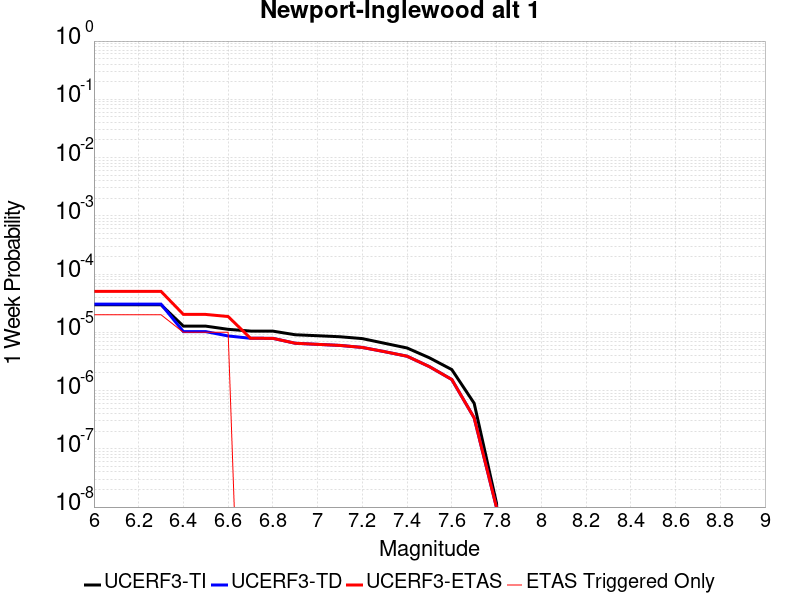 | 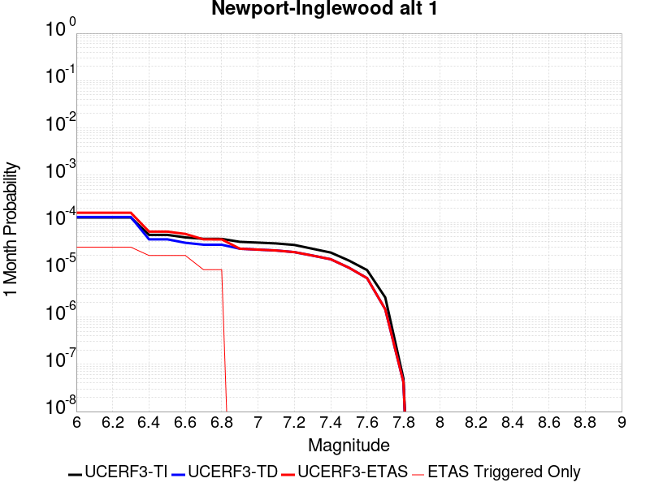 |  |  |

| Magnitude | 1 wk TI Prob | 1 wk TD Prob | 1 wk ETAS Prob | 1 wk ETAS/TD Gain | 1 wk ETAS Triggered Only | 1 mo TI Prob | 1 mo TD Prob | 1 mo ETAS Prob | 1 mo ETAS/TD Gain | 1 mo ETAS Triggered Only | 1 yr TI Prob | 1 yr TD Prob | 1 yr ETAS Prob | 1 yr ETAS/TD Gain | 1 yr ETAS Triggered Only | 10 yr TI Prob | 10 yr TD Prob | 10 yr ETAS Prob | 10 yr ETAS/TD Gain | 10 yr ETAS Triggered Only |
|-----|-----|-----|-----|-----|-----|-----|-----|-----|-----|-----|-----|-----|-----|-----|-----|-----|-----|-----|-----|-----|
| 6.0 | 2.9668912E-5 | 3.0404817E-5 | 5.0404207E-5 | 1.6577705 | 2.0E-5 | 1.2714628E-4 | 1.303026E-4 | 1.6029869E-4 | 1.2302033 | 3.0E-5 | 0.0015469068 | 0.0015857625 | 0.001615715 | 1.0188884 | 3.0E-5 | 0.015361829 | 0.015792042 | 0.015821569 | 1.0018697 | 3.0E-5 |
| 6.1 | 2.9668912E-5 | 3.0404817E-5 | 5.0404207E-5 | 1.6577705 | 2.0E-5 | 1.2714628E-4 | 1.303026E-4 | 1.6029869E-4 | 1.2302033 | 3.0E-5 | 0.0015469068 | 0.0015857625 | 0.001615715 | 1.0188884 | 3.0E-5 | 0.015361829 | 0.015792042 | 0.015821569 | 1.0018697 | 3.0E-5 |
| 6.2 | 2.9668912E-5 | 3.0404817E-5 | 5.0404207E-5 | 1.6577705 | 2.0E-5 | 1.2714628E-4 | 1.303026E-4 | 1.6029869E-4 | 1.2302033 | 3.0E-5 | 0.0015469068 | 0.0015857625 | 0.001615715 | 1.0188884 | 3.0E-5 | 0.015361829 | 0.015792042 | 0.015821569 | 1.0018697 | 3.0E-5 |
| 6.3 | 2.9668912E-5 | 3.0404817E-5 | 5.0404207E-5 | 1.6577705 | 2.0E-5 | 1.2714628E-4 | 1.303026E-4 | 1.6029869E-4 | 1.2302033 | 3.0E-5 | 0.0015469068 | 0.0015857625 | 0.001615715 | 1.0188884 | 3.0E-5 | 0.015361829 | 0.015792042 | 0.015821569 | 1.0018697 | 3.0E-5 |
| 6.4 | 1.275942E-5 | 1.0272503E-5 | 2.02724E-5 | 1.9734626 | 1.0E-5 | 5.4682085E-5 | 4.402429E-5 | 6.4023414E-5 | 1.4542747 | 2.0E-5 | 6.65551E-4 | 5.358681E-4 | 5.558574E-4 | 1.0373026 | 2.0E-5 | 0.0066356123 | 0.005346184 | 0.005366077 | 1.003721 | 2.0E-5 |
| 6.5 | 1.275942E-5 | 1.0272503E-5 | 2.02724E-5 | 1.9734626 | 1.0E-5 | 5.4682085E-5 | 4.402429E-5 | 6.4023414E-5 | 1.4542747 | 2.0E-5 | 6.65551E-4 | 5.358681E-4 | 5.558574E-4 | 1.0373026 | 2.0E-5 | 0.0066356123 | 0.005346184 | 0.005366077 | 1.003721 | 2.0E-5 |
| 6.6 | 1.1255358E-5 | 8.661884E-6 | 1.8661798E-5 | 2.1544733 | 1.0E-5 | 4.8236358E-5 | 3.712184E-5 | 5.71211E-5 | 1.5387464 | 2.0E-5 | 5.871194E-4 | 4.518664E-4 | 4.7185735E-4 | 1.0442408 | 2.0E-5 | 0.005855706 | 0.004509653 | 0.004529563 | 1.0044149 | 2.0E-5 |
| 6.7 | 1.0504745E-5 | 7.8997955E-6 | 7.8997955E-6 | 1.0 | 0.0 | 4.5019555E-5 | 3.3855835E-5 | 4.3855496E-5 | 1.2953601 | 1.0E-5 | 5.4797524E-4 | 4.1211807E-4 | 4.2211395E-4 | 1.0242549 | 1.0E-5 | 0.0054662596 | 0.004113668 | 0.0041236267 | 1.0024209 | 1.0E-5 |
| 6.8 | 1.0476007E-5 | 7.881176E-6 | 7.881176E-6 | 1.0 | 0.0 | 4.4896402E-5 | 3.3776043E-5 | 4.3775704E-5 | 1.2960578 | 1.0E-5 | 5.464766E-4 | 4.1114696E-4 | 4.2114285E-4 | 1.0243123 | 1.0E-5 | 0.005451347 | 0.0041039926 | 0.0041139517 | 1.0024266 | 1.0E-5 |
| 6.9 | 9.076797E-6 | 6.4896312E-6 | 6.4896312E-6 | 1.0 | 0.0 | 3.889998E-5 | 2.781241E-5 | 2.781241E-5 | 1.0 | 0.0 | 4.7350433E-4 | 3.385638E-4 | 3.385638E-4 | 1.0 | 0.0 | 0.004724967 | 0.0033805177 | 0.0033805177 | 1.0 | 0.0 |
| 7.0 | 8.73795E-6 | 6.2120125E-6 | 6.2120125E-6 | 1.0 | 0.0 | 3.7447822E-5 | 2.6622642E-5 | 2.6622642E-5 | 1.0 | 0.0 | 4.5583185E-4 | 3.2408274E-4 | 3.2408274E-4 | 1.0 | 0.0 | 0.0045489795 | 0.0032361327 | 0.0032361327 | 1.0 | 0.0 |
| 7.1 | 8.391299E-6 | 5.95579E-6 | 5.95579E-6 | 1.0 | 0.0 | 3.5962214E-5 | 2.5524565E-5 | 2.5524565E-5 | 1.0 | 0.0 | 4.37752E-4 | 3.1071753E-4 | 3.1071753E-4 | 1.0 | 0.0 | 0.004368907 | 0.0031028606 | 0.0031028606 | 1.0 | 0.0 |
| 7.2 | 7.796882E-6 | 5.4965344E-6 | 5.4965344E-6 | 1.0 | 0.0 | 3.341478E-5 | 2.3556364E-5 | 2.3556364E-5 | 1.0 | 0.0 | 4.06749E-4 | 2.867612E-4 | 2.867612E-4 | 1.0 | 0.0 | 0.0040600533 | 0.0028639357 | 0.0028639357 | 1.0 | 0.0 |
| 7.3 | 6.4738833E-6 | 4.6478162E-6 | 4.6478162E-6 | 1.0 | 0.0 | 2.774492E-5 | 1.9919062E-5 | 1.9919062E-5 | 1.0 | 0.0 | 3.3774204E-4 | 2.4248775E-4 | 2.4248775E-4 | 1.0 | 0.0 | 0.0033722918 | 0.0024222482 | 0.0024222482 | 1.0 | 0.0 |
| 7.4 | 5.382145E-6 | 3.8857597E-6 | 3.8857597E-6 | 1.0 | 0.0 | 2.3066134E-5 | 1.665315E-5 | 1.665315E-5 | 1.0 | 0.0 | 2.8079396E-4 | 2.0273338E-4 | 2.0273338E-4 | 1.0 | 0.0 | 0.0028043943 | 0.0020254988 | 0.0020254988 | 1.0 | 0.0 |
| 7.5 | 3.648244E-6 | 2.5737843E-6 | 2.5737843E-6 | 1.0 | 0.0 | 1.5635238E-5 | 1.1030458E-5 | 1.1030458E-5 | 1.0 | 0.0 | 1.9034238E-4 | 1.3428765E-4 | 1.3428765E-4 | 1.0 | 0.0 | 0.0019017943 | 0.0013420755 | 0.0013420755 | 1.0 | 0.0 |
| 7.6 | 2.2906888E-6 | 1.5479842E-6 | 1.5479842E-6 | 1.0 | 0.0 | 9.817201E-6 | 6.634202E-6 | 6.634202E-6 | 1.0 | 0.0 | 1.1951787E-4 | 8.076848E-5 | 8.076848E-5 | 1.0 | 0.0 | 0.0011945361 | 8.07398E-4 | 8.07398E-4 | 1.0 | 0.0 |
| 7.7 | 6.0479874E-7 | 3.397512E-7 | 3.397512E-7 | 1.0 | 0.0 | 2.5919921E-6 | 1.4560758E-6 | 1.4560758E-6 | 1.0 | 0.0 | 3.1557047E-5 | 1.7727592E-5 | 1.7727592E-5 | 1.0 | 0.0 | 3.1552566E-4 | 1.7726317E-4 | 1.7726317E-4 | 1.0 | 0.0 |
| 7.8 | 1.16056995E-8 | 9.782373E-9 | 9.782373E-9 | 1.0 | 0.0 | 4.9738713E-8 | 4.1924455E-8 | 4.1924455E-8 | 1.0 | 0.0 | 6.0556863E-7 | 5.1043025E-7 | 5.1043025E-7 | 1.0 | 0.0 | 6.05567E-6 | 5.1043025E-6 | 5.1043025E-6 | 1.0 | 0.0 |

## White Wolf
*[(top)](#table-of-contents)*

| 1 Week | 1 Month | 1 Year | 10 Year |
|-----|-----|-----|-----|
|  |  |  |  |

| Magnitude | 1 wk TI Prob | 1 wk TD Prob | 1 wk ETAS Prob | 1 wk ETAS/TD Gain | 1 wk ETAS Triggered Only | 1 mo TI Prob | 1 mo TD Prob | 1 mo ETAS Prob | 1 mo ETAS/TD Gain | 1 mo ETAS Triggered Only | 1 yr TI Prob | 1 yr TD Prob | 1 yr ETAS Prob | 1 yr ETAS/TD Gain | 1 yr ETAS Triggered Only | 10 yr TI Prob | 10 yr TD Prob | 10 yr ETAS Prob | 10 yr ETAS/TD Gain | 10 yr ETAS Triggered Only |
|-----|-----|-----|-----|-----|-----|-----|-----|-----|-----|-----|-----|-----|-----|-----|-----|-----|-----|-----|-----|-----|
| 6.0 | 2.0037822E-5 | 1.0469162E-6 | 1.10469055E-5 | 10.551853 | 1.0E-5 | 8.587355E-5 | 4.486776E-6 | 1.4486731E-5 | 3.2287617 | 1.0E-5 | 0.001045009 | 5.4625183E-5 | 6.462463E-5 | 1.1830558 | 1.0E-5 | 0.010401085 | 5.461226E-4 | 5.661117E-4 | 1.0366018 | 2.0E-5 |
| 6.1 | 2.0037822E-5 | 1.0469162E-6 | 1.10469055E-5 | 10.551853 | 1.0E-5 | 8.587355E-5 | 4.486776E-6 | 1.4486731E-5 | 3.2287617 | 1.0E-5 | 0.001045009 | 5.4625183E-5 | 6.462463E-5 | 1.1830558 | 1.0E-5 | 0.010401085 | 5.461226E-4 | 5.661117E-4 | 1.0366018 | 2.0E-5 |
| 6.2 | 2.0037822E-5 | 1.0469162E-6 | 1.10469055E-5 | 10.551853 | 1.0E-5 | 8.587355E-5 | 4.486776E-6 | 1.4486731E-5 | 3.2287617 | 1.0E-5 | 0.001045009 | 5.4625183E-5 | 6.462463E-5 | 1.1830558 | 1.0E-5 | 0.010401085 | 5.461226E-4 | 5.661117E-4 | 1.0366018 | 2.0E-5 |
| 6.3 | 2.0037822E-5 | 1.0469162E-6 | 1.10469055E-5 | 10.551853 | 1.0E-5 | 8.587355E-5 | 4.486776E-6 | 1.4486731E-5 | 3.2287617 | 1.0E-5 | 0.001045009 | 5.4625183E-5 | 6.462463E-5 | 1.1830558 | 1.0E-5 | 0.010401085 | 5.461226E-4 | 5.661117E-4 | 1.0366018 | 2.0E-5 |
| 6.4 | 1.132487E-5 | 1.0469162E-6 | 1.10469055E-5 | 10.551853 | 1.0E-5 | 4.8534253E-5 | 4.486776E-6 | 1.4486731E-5 | 3.2287617 | 1.0E-5 | 5.907443E-4 | 5.4625183E-5 | 6.462463E-5 | 1.1830558 | 1.0E-5 | 0.005891764 | 5.461226E-4 | 5.661117E-4 | 1.0366018 | 2.0E-5 |
| 6.5 | 1.132487E-5 | 1.0469162E-6 | 1.10469055E-5 | 10.551853 | 1.0E-5 | 4.8534253E-5 | 4.486776E-6 | 1.4486731E-5 | 3.2287617 | 1.0E-5 | 5.907443E-4 | 5.4625183E-5 | 6.462463E-5 | 1.1830558 | 1.0E-5 | 0.005891764 | 5.461226E-4 | 5.661117E-4 | 1.0366018 | 2.0E-5 |
| 6.6 | 9.347473E-6 | 1.0469162E-6 | 1.10469055E-5 | 10.551853 | 1.0E-5 | 4.0059982E-5 | 4.486776E-6 | 1.4486731E-5 | 3.2287617 | 1.0E-5 | 4.8762115E-4 | 5.4625183E-5 | 6.462463E-5 | 1.1830558 | 1.0E-5 | 0.0048655253 | 5.461226E-4 | 5.661117E-4 | 1.0366018 | 2.0E-5 |
| 6.7 | 7.842647E-6 | 1.0048342E-6 | 1.1004824E-5 | 10.95188 | 1.0E-5 | 3.361091E-5 | 4.3064256E-6 | 1.4306383E-5 | 3.3221016 | 1.0E-5 | 4.0913603E-4 | 5.2429517E-5 | 6.2429E-5 | 1.1907222 | 1.0E-5 | 0.004083836 | 5.2417646E-4 | 5.4416596E-4 | 1.038135 | 2.0E-5 |
| 6.8 | 6.26597E-6 | 9.734822E-7 | 1.0973473E-5 | 11.272391 | 1.0E-5 | 2.685388E-5 | 4.17206E-6 | 1.4172018E-5 | 3.3968873 | 1.0E-5 | 3.2689696E-4 | 5.0793697E-5 | 6.079319E-5 | 1.1968648 | 1.0E-5 | 0.003264165 | 5.078258E-4 | 5.2781566E-4 | 1.0393636 | 2.0E-5 |
| 6.9 | 5.258436E-6 | 9.183254E-7 | 1.0918317E-5 | 11.889377 | 1.0E-5 | 2.2535958E-5 | 3.9356746E-6 | 1.3935635E-5 | 3.5408506 | 1.0E-5 | 2.7434074E-4 | 4.7915833E-5 | 5.7915353E-5 | 1.2086893 | 1.0E-5 | 0.0027400232 | 4.790598E-4 | 4.990502E-4 | 1.0417285 | 2.0E-5 |
| 7.0 | 4.675028E-6 | 8.6611794E-7 | 1.086611E-5 | 12.545761 | 1.0E-5 | 2.003568E-5 | 3.7119291E-6 | 1.3711892E-5 | 3.694007 | 1.0E-5 | 2.4390711E-4 | 4.5191846E-5 | 5.5191394E-5 | 1.2212689 | 1.0E-5 | 0.0024363957 | 4.518313E-4 | 4.7182225E-4 | 1.0442443 | 2.0E-5 |
| 7.1 | 2.8270078E-6 | 6.8741696E-7 | 1.068741E-5 | 15.547201 | 1.0E-5 | 1.2115692E-5 | 2.9460696E-6 | 1.294604E-5 | 4.394343 | 1.0E-5 | 1.4749856E-4 | 3.5867848E-5 | 4.586749E-5 | 1.2787912 | 1.0E-5 | 0.001474007 | 3.586247E-4 | 3.7861752E-4 | 1.0557486 | 2.0E-5 |
| 7.2 | 1.6881406E-6 | 2.2706382E-7 | 2.2706382E-7 | 1.0 | 0.0 | 7.2348685E-6 | 9.731303E-7 | 9.731303E-7 | 1.0 | 0.0 | 8.808096E-5 | 1.1847799E-5 | 1.1847799E-5 | 1.0 | 0.0 | 8.8046055E-4 | 1.1847183E-4 | 1.1847183E-4 | 1.0 | 0.0 |
| 7.3 | 9.086107E-7 | 1.5266386E-7 | 1.5266386E-7 | 1.0 | 0.0 | 3.8940398E-6 | 6.5427355E-7 | 6.5427355E-7 | 1.0 | 0.0 | 4.7408903E-5 | 7.965752E-6 | 7.965752E-6 | 1.0 | 0.0 | 4.739879E-4 | 7.965475E-5 | 7.965475E-5 | 1.0 | 0.0 |
| 7.4 | 1.9717383E-7 | 9.003913E-8 | 9.003913E-8 | 1.0 | 0.0 | 8.450304E-7 | 3.8588192E-7 | 3.8588192E-7 | 1.0 | 0.0 | 1.0288197E-5 | 4.6981027E-6 | 4.6981027E-6 | 1.0 | 0.0 | 1.028772E-4 | 4.6980065E-5 | 4.6980065E-5 | 1.0 | 0.0 |
| 7.5 | 1.086975E-7 | 6.6597195E-8 | 6.6597195E-8 | 1.0 | 0.0 | 4.6584634E-7 | 2.8541652E-7 | 2.8541652E-7 | 1.0 | 0.0 | 5.6716644E-6 | 3.474941E-6 | 3.474941E-6 | 1.0 | 0.0 | 5.6715195E-5 | 3.474889E-5 | 3.474889E-5 | 1.0 | 0.0 |
| 7.6 | 2.4217808E-8 | 1.5820765E-8 | 1.5820765E-8 | 1.0 | 0.0 | 1.03790605E-7 | 6.780328E-8 | 6.780328E-8 | 1.0 | 0.0 | 1.2636499E-6 | 8.255046E-7 | 8.255046E-7 | 1.0 | 0.0 | 1.2636427E-5 | 8.2550205E-6 | 8.2550205E-6 | 1.0 | 0.0 |

## San Jacinto (Superstition Mtn)
*[(top)](#table-of-contents)*

| 1 Week | 1 Month | 1 Year | 10 Year |
|-----|-----|-----|-----|
|  |  |  |  |

| Magnitude | 1 wk TI Prob | 1 wk TD Prob | 1 wk ETAS Prob | 1 wk ETAS/TD Gain | 1 wk ETAS Triggered Only | 1 mo TI Prob | 1 mo TD Prob | 1 mo ETAS Prob | 1 mo ETAS/TD Gain | 1 mo ETAS Triggered Only | 1 yr TI Prob | 1 yr TD Prob | 1 yr ETAS Prob | 1 yr ETAS/TD Gain | 1 yr ETAS Triggered Only | 10 yr TI Prob | 10 yr TD Prob | 10 yr ETAS Prob | 10 yr ETAS/TD Gain | 10 yr ETAS Triggered Only |
|-----|-----|-----|-----|-----|-----|-----|-----|-----|-----|-----|-----|-----|-----|-----|-----|-----|-----|-----|-----|-----|
| 6.0 | 6.4193904E-5 | 9.599367E-5 | 9.599367E-5 | 1.0 | 0.0 | 2.7508775E-4 | 4.1134638E-4 | 4.1134638E-4 | 1.0 | 0.0 | 0.0033440501 | 0.0049980893 | 0.0050080395 | 1.0019908 | 1.0E-5 | 0.03294174 | 0.048823986 | 0.048843008 | 1.0003896 | 2.0E-5 |
| 6.1 | 6.4193904E-5 | 9.599367E-5 | 9.599367E-5 | 1.0 | 0.0 | 2.7508775E-4 | 4.1134638E-4 | 4.1134638E-4 | 1.0 | 0.0 | 0.0033440501 | 0.0049980893 | 0.0050080395 | 1.0019908 | 1.0E-5 | 0.03294174 | 0.048823986 | 0.048843008 | 1.0003896 | 2.0E-5 |
| 6.2 | 5.7023593E-5 | 8.3144434E-5 | 8.3144434E-5 | 1.0 | 0.0 | 2.4436394E-4 | 3.5629404E-4 | 3.5629404E-4 | 1.0 | 0.0 | 0.002971072 | 0.0043308944 | 0.004340851 | 1.002299 | 1.0E-5 | 0.029316625 | 0.04250403 | 0.04252318 | 1.0004505 | 2.0E-5 |
| 6.3 | 5.6940098E-5 | 8.298979E-5 | 8.298979E-5 | 1.0 | 0.0 | 2.4400617E-4 | 3.5563146E-4 | 3.5563146E-4 | 1.0 | 0.0 | 0.002966728 | 0.00432286 | 0.0043328167 | 1.0023032 | 1.0E-5 | 0.029274331 | 0.042427283 | 0.042446434 | 1.0004514 | 2.0E-5 |
| 6.4 | 5.4171585E-5 | 7.7483564E-5 | 7.7483564E-5 | 1.0 | 0.0 | 2.3214328E-4 | 3.3203943E-4 | 3.3203943E-4 | 1.0 | 0.0 | 0.0028226813 | 0.0040367353 | 0.004046695 | 1.0024673 | 1.0E-5 | 0.02787096 | 0.03971653 | 0.03973574 | 1.0004835 | 2.0E-5 |
| 6.5 | 4.375144E-5 | 5.642133E-5 | 5.642133E-5 | 1.0 | 0.0 | 1.874927E-4 | 2.4178992E-4 | 2.4178992E-4 | 1.0 | 0.0 | 0.0022803338 | 0.002940994 | 0.0029509645 | 1.0033902 | 1.0E-5 | 0.022570757 | 0.029236801 | 0.029256217 | 1.0006641 | 2.0E-5 |
| 6.6 | 2.772192E-5 | 2.5488358E-5 | 2.5488358E-5 | 1.0 | 0.0 | 1.1880282E-4 | 1.09231354E-4 | 1.09231354E-4 | 1.0 | 0.0 | 0.0014454646 | 0.0013290998 | 0.0013390864 | 1.0075139 | 1.0E-5 | 0.014360986 | 0.01354049 | 0.01356022 | 1.0014571 | 2.0E-5 |
| 6.7 | 2.7124124E-5 | 2.4699386E-5 | 2.4699386E-5 | 1.0 | 0.0 | 1.1624106E-4 | 1.05850326E-4 | 1.05850326E-4 | 1.0 | 0.0 | 0.0014143161 | 0.001287985 | 0.0012979722 | 1.0077541 | 1.0E-5 | 0.014053487 | 0.013133943 | 0.013153681 | 1.0015028 | 2.0E-5 |
| 6.8 | 2.5475807E-5 | 2.216446E-5 | 2.216446E-5 | 1.0 | 0.0 | 1.0917746E-4 | 9.4987154E-5 | 9.4987154E-5 | 1.0 | 0.0 | 0.001328425 | 0.001155867 | 0.001155867 | 1.0 | 0.0 | 0.0132051185 | 0.011822182 | 0.011832063 | 1.0008359 | 1.0E-5 |
| 6.9 | 2.1162023E-5 | 1.7626244E-5 | 1.7626244E-5 | 1.0 | 0.0 | 9.069123E-5 | 7.5538876E-5 | 7.5538876E-5 | 1.0 | 0.0 | 0.0011036064 | 9.193016E-4 | 9.193016E-4 | 1.0 | 0.0 | 0.010981417 | 0.00944688 | 0.009456785 | 1.0010486 | 1.0E-5 |
| 7.0 | 1.8754288E-5 | 1.6161559E-5 | 1.6161559E-5 | 1.0 | 0.0 | 8.037304E-5 | 6.9261994E-5 | 6.9261994E-5 | 1.0 | 0.0 | 9.781026E-4 | 8.4294105E-4 | 8.4294105E-4 | 1.0 | 0.0 | 0.009738087 | 0.008670042 | 0.008679955 | 1.0011435 | 1.0E-5 |
| 7.1 | 1.8678527E-5 | 1.6086702E-5 | 1.6086702E-5 | 1.0 | 0.0 | 8.0048376E-5 | 6.89412E-5 | 6.89412E-5 | 1.0 | 0.0 | 9.7415317E-4 | 8.3903834E-4 | 8.3903834E-4 | 1.0 | 0.0 | 0.009698939 | 0.008630998 | 0.008640911 | 1.0011486 | 1.0E-5 |
| 7.2 | 1.7804578E-5 | 1.5381282E-5 | 1.5381282E-5 | 1.0 | 0.0 | 7.6303106E-5 | 6.5918124E-5 | 6.5918124E-5 | 1.0 | 0.0 | 9.285943E-4 | 8.022599E-4 | 8.022599E-4 | 1.0 | 0.0 | 0.009247236 | 0.008262311 | 0.008262311 | 1.0 | 0.0 |
| 7.3 | 1.6583685E-5 | 1.4530388E-5 | 1.4530388E-5 | 1.0 | 0.0 | 7.1070994E-5 | 6.227162E-5 | 6.227162E-5 | 1.0 | 0.0 | 8.649459E-4 | 7.5789524E-4 | 7.5789524E-4 | 1.0 | 0.0 | 0.00861587 | 0.007817623 | 0.007817623 | 1.0 | 0.0 |
| 7.4 | 1.6387552E-5 | 1.4395274E-5 | 1.4395274E-5 | 1.0 | 0.0 | 7.023047E-5 | 6.169258E-5 | 6.169258E-5 | 1.0 | 0.0 | 8.5472054E-4 | 7.5085036E-4 | 7.5085036E-4 | 1.0 | 0.0 | 0.008514405 | 0.0077470057 | 0.0077470057 | 1.0 | 0.0 |
| 7.5 | 1.5790754E-5 | 1.4035962E-5 | 1.4035962E-5 | 1.0 | 0.0 | 6.767291E-5 | 6.0152746E-5 | 6.0152746E-5 | 1.0 | 0.0 | 8.236062E-4 | 7.321156E-4 | 7.321156E-4 | 1.0 | 0.0 | 0.008205604 | 0.007557569 | 0.007557569 | 1.0 | 0.0 |
| 7.6 | 1.4248672E-5 | 1.3054932E-5 | 1.3054932E-5 | 1.0 | 0.0 | 6.106431E-5 | 5.594852E-5 | 5.594852E-5 | 1.0 | 0.0 | 7.432043E-4 | 6.8096205E-4 | 6.8096205E-4 | 1.0 | 0.0 | 0.007407237 | 0.0070401574 | 0.0070401574 | 1.0 | 0.0 |
| 7.7 | 1.15449975E-5 | 1.090368E-5 | 1.090368E-5 | 1.0 | 0.0 | 4.947762E-5 | 4.6729223E-5 | 4.6729223E-5 | 1.0 | 0.0 | 6.022235E-4 | 5.687805E-4 | 5.687805E-4 | 1.0 | 0.0 | 0.006005941 | 0.0059101824 | 0.0059101824 | 1.0 | 0.0 |
| 7.8 | 9.1391985E-6 | 9.514299E-6 | 9.514299E-6 | 1.0 | 0.0 | 3.9167408E-5 | 4.0774932E-5 | 4.0774932E-5 | 1.0 | 0.0 | 4.767588E-4 | 4.963223E-4 | 4.963223E-4 | 1.0 | 0.0 | 0.0047573727 | 0.0051766867 | 0.0051766867 | 1.0 | 0.0 |
| 7.9 | 6.973017E-6 | 7.3821784E-6 | 7.3821784E-6 | 1.0 | 0.0 | 2.9884017E-5 | 3.1637526E-5 | 3.1637526E-5 | 1.0 | 0.0 | 3.6377716E-4 | 3.8511935E-4 | 3.8511935E-4 | 1.0 | 0.0 | 0.0036318225 | 0.0040517948 | 0.0040517948 | 1.0 | 0.0 |
| 8.0 | 5.7638235E-6 | 6.259972E-6 | 6.259972E-6 | 1.0 | 0.0 | 2.4701867E-5 | 2.6828178E-5 | 2.6828178E-5 | 1.0 | 0.0 | 3.0070372E-4 | 3.2658462E-4 | 3.2658462E-4 | 1.0 | 0.0 | 0.0030029714 | 0.0034534496 | 0.0034534496 | 1.0 | 0.0 |
| 8.1 | 5.1124434E-6 | 5.4956718E-6 | 5.4956718E-6 | 1.0 | 0.0 | 2.1910288E-5 | 2.355267E-5 | 2.355267E-5 | 1.0 | 0.0 | 2.6672508E-4 | 2.867165E-4 | 2.867165E-4 | 1.0 | 0.0 | 0.0026640517 | 0.003040336 | 0.003040336 | 1.0 | 0.0 |
| 8.2 | 1.1075938E-6 | 5.336568E-7 | 5.336568E-7 | 1.0 | 0.0 | 4.7468216E-6 | 2.2870988E-6 | 2.2870988E-6 | 1.0 | 0.0 | 5.779102E-5 | 2.7845093E-5 | 2.7845093E-5 | 1.0 | 0.0 | 5.777599E-4 | 3.1346595E-4 | 3.1346595E-4 | 1.0 | 0.0 |
| 8.3 | 1.3584393E-8 | 4.473836E-9 | 4.473836E-9 | 1.0 | 0.0 | 5.8218827E-8 | 1.9173582E-8 | 1.9173582E-8 | 1.0 | 0.0 | 7.0881396E-7 | 2.3343837E-7 | 2.3343837E-7 | 1.0 | 0.0 | 7.0881174E-6 | 2.6163038E-6 | 2.6163038E-6 | 1.0 | 0.0 |

## North Frontal  (East)
*[(top)](#table-of-contents)*

| 1 Week | 1 Month | 1 Year | 10 Year |
|-----|-----|-----|-----|
|  |  |  |  |

| Magnitude | 1 wk TI Prob | 1 wk TD Prob | 1 wk ETAS Prob | 1 wk ETAS/TD Gain | 1 wk ETAS Triggered Only | 1 mo TI Prob | 1 mo TD Prob | 1 mo ETAS Prob | 1 mo ETAS/TD Gain | 1 mo ETAS Triggered Only | 1 yr TI Prob | 1 yr TD Prob | 1 yr ETAS Prob | 1 yr ETAS/TD Gain | 1 yr ETAS Triggered Only | 10 yr TI Prob | 10 yr TD Prob | 10 yr ETAS Prob | 10 yr ETAS/TD Gain | 10 yr ETAS Triggered Only |
|-----|-----|-----|-----|-----|-----|-----|-----|-----|-----|-----|-----|-----|-----|-----|-----|-----|-----|-----|-----|-----|
| 6.0 | 7.135738E-6 | 7.4771765E-6 | 7.4771765E-6 | 1.0 | 0.0 | 3.0581377E-5 | 3.204476E-5 | 3.204476E-5 | 1.0 | 0.0 | 3.7226462E-4 | 3.9009505E-4 | 4.0009117E-4 | 1.0256248 | 1.0E-5 | 0.0037164164 | 0.0038960609 | 0.003915983 | 1.0051134 | 2.0E-5 |
| 6.1 | 7.135738E-6 | 7.4771765E-6 | 7.4771765E-6 | 1.0 | 0.0 | 3.0581377E-5 | 3.204476E-5 | 3.204476E-5 | 1.0 | 0.0 | 3.7226462E-4 | 3.9009505E-4 | 4.0009117E-4 | 1.0256248 | 1.0E-5 | 0.0037164164 | 0.0038960609 | 0.003915983 | 1.0051134 | 2.0E-5 |
| 6.2 | 7.135738E-6 | 7.4771765E-6 | 7.4771765E-6 | 1.0 | 0.0 | 3.0581377E-5 | 3.204476E-5 | 3.204476E-5 | 1.0 | 0.0 | 3.7226462E-4 | 3.9009505E-4 | 4.0009117E-4 | 1.0256248 | 1.0E-5 | 0.0037164164 | 0.0038960609 | 0.003915983 | 1.0051134 | 2.0E-5 |
| 6.3 | 7.135738E-6 | 7.4771765E-6 | 7.4771765E-6 | 1.0 | 0.0 | 3.0581377E-5 | 3.204476E-5 | 3.204476E-5 | 1.0 | 0.0 | 3.7226462E-4 | 3.9009505E-4 | 4.0009117E-4 | 1.0256248 | 1.0E-5 | 0.0037164164 | 0.0038960609 | 0.003915983 | 1.0051134 | 2.0E-5 |
| 6.4 | 7.135738E-6 | 7.4771765E-6 | 7.4771765E-6 | 1.0 | 0.0 | 3.0581377E-5 | 3.204476E-5 | 3.204476E-5 | 1.0 | 0.0 | 3.7226462E-4 | 3.9009505E-4 | 4.0009117E-4 | 1.0256248 | 1.0E-5 | 0.0037164164 | 0.0038960609 | 0.003915983 | 1.0051134 | 2.0E-5 |
| 6.5 | 7.135738E-6 | 7.4771765E-6 | 7.4771765E-6 | 1.0 | 0.0 | 3.0581377E-5 | 3.204476E-5 | 3.204476E-5 | 1.0 | 0.0 | 3.7226462E-4 | 3.9009505E-4 | 4.0009117E-4 | 1.0256248 | 1.0E-5 | 0.0037164164 | 0.0038960609 | 0.003915983 | 1.0051134 | 2.0E-5 |
| 6.6 | 7.135738E-6 | 7.4771765E-6 | 7.4771765E-6 | 1.0 | 0.0 | 3.0581377E-5 | 3.204476E-5 | 3.204476E-5 | 1.0 | 0.0 | 3.7226462E-4 | 3.9009505E-4 | 4.0009117E-4 | 1.0256248 | 1.0E-5 | 0.0037164164 | 0.0038960609 | 0.003915983 | 1.0051134 | 2.0E-5 |
| 6.7 | 7.135738E-6 | 7.4771765E-6 | 7.4771765E-6 | 1.0 | 0.0 | 3.0581377E-5 | 3.204476E-5 | 3.204476E-5 | 1.0 | 0.0 | 3.7226462E-4 | 3.9009505E-4 | 4.0009117E-4 | 1.0256248 | 1.0E-5 | 0.0037164164 | 0.0038960609 | 0.003915983 | 1.0051134 | 2.0E-5 |
| 6.8 | 5.959142E-6 | 6.236683E-6 | 6.236683E-6 | 1.0 | 0.0 | 2.553893E-5 | 2.6728469E-5 | 2.6728469E-5 | 1.0 | 0.0 | 3.108921E-4 | 3.253886E-4 | 3.253886E-4 | 1.0 | 0.0 | 0.0031045752 | 0.0032508948 | 0.0032608623 | 1.0030661 | 1.0E-5 |
| 6.9 | 2.2946929E-6 | 2.3824605E-6 | 2.3824605E-6 | 1.0 | 0.0 | 9.834361E-6 | 1.0210508E-5 | 1.0210508E-5 | 1.0 | 0.0 | 1.1972676E-4 | 1.2430632E-4 | 1.2430632E-4 | 1.0 | 0.0 | 0.0011966228 | 0.0012424142 | 0.0012424142 | 1.0 | 0.0 |
| 7.0 | 2.2468673E-6 | 2.3321538E-6 | 2.3321538E-6 | 1.0 | 0.0 | 9.629396E-6 | 9.994909E-6 | 9.994909E-6 | 1.0 | 0.0 | 1.1723159E-4 | 1.21681696E-4 | 1.21681696E-4 | 1.0 | 0.0 | 0.0011716976 | 0.0012161969 | 0.0012161969 | 1.0 | 0.0 |
| 7.1 | 1.9921076E-6 | 2.0646032E-6 | 2.0646032E-6 | 1.0 | 0.0 | 8.537577E-6 | 8.848272E-6 | 8.848272E-6 | 1.0 | 0.0 | 1.0394004E-4 | 1.0772282E-4 | 1.0772282E-4 | 1.0 | 0.0 | 0.0010389143 | 0.0010767487 | 0.0010767487 | 1.0 | 0.0 |
| 7.2 | 1.4524545E-6 | 1.5045148E-6 | 1.5045148E-6 | 1.0 | 0.0 | 6.2247905E-6 | 6.447906E-6 | 6.447906E-6 | 1.0 | 0.0 | 7.5784184E-5 | 7.850068E-5 | 7.850068E-5 | 1.0 | 0.0 | 7.575835E-4 | 7.8475394E-4 | 7.8475394E-4 | 1.0 | 0.0 |
| 7.3 | 8.9802575E-7 | 9.3087283E-7 | 9.3087283E-7 | 1.0 | 0.0 | 3.848676E-6 | 3.9894494E-6 | 3.9894494E-6 | 1.0 | 0.0 | 4.685662E-5 | 4.857058E-5 | 4.857058E-5 | 1.0 | 0.0 | 4.6846745E-4 | 4.8561094E-4 | 4.8561094E-4 | 1.0 | 0.0 |
| 7.4 | 7.776139E-7 | 8.0604747E-7 | 8.0604747E-7 | 1.0 | 0.0 | 3.3326266E-6 | 3.4544853E-6 | 3.4544853E-6 | 1.0 | 0.0 | 4.0573974E-5 | 4.2057654E-5 | 4.2057654E-5 | 1.0 | 0.0 | 4.0566566E-4 | 4.205077E-4 | 4.205077E-4 | 1.0 | 0.0 |
| 7.5 | 5.244417E-7 | 5.441219E-7 | 5.441219E-7 | 1.0 | 0.0 | 2.2476054E-6 | 2.3319494E-6 | 2.3319494E-6 | 1.0 | 0.0 | 2.7364253E-5 | 2.839118E-5 | 2.839118E-5 | 1.0 | 0.0 | 2.7360884E-4 | 2.8388205E-4 | 2.8388205E-4 | 1.0 | 0.0 |
| 7.6 | 1.5489647E-7 | 1.6089504E-7 | 1.6089504E-7 | 1.0 | 0.0 | 6.6384183E-7 | 6.895501E-7 | 6.895501E-7 | 1.0 | 0.0 | 8.082245E-6 | 8.395261E-6 | 8.395261E-6 | 1.0 | 0.0 | 8.08195E-5 | 8.395143E-5 | 8.395143E-5 | 1.0 | 0.0 |

## Honey Lake 2011 CFM
*[(top)](#table-of-contents)*

| 1 Week | 1 Month | 1 Year | 10 Year |
|-----|-----|-----|-----|
| 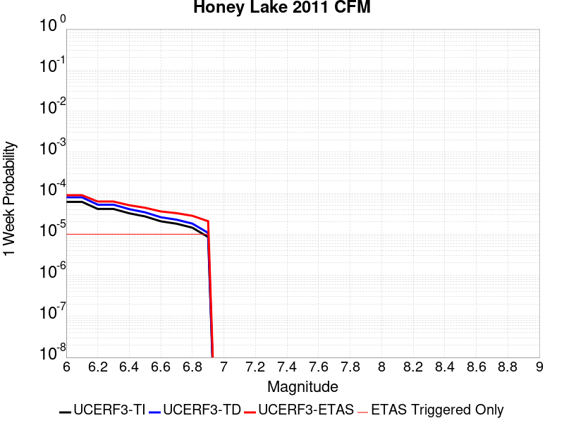 | 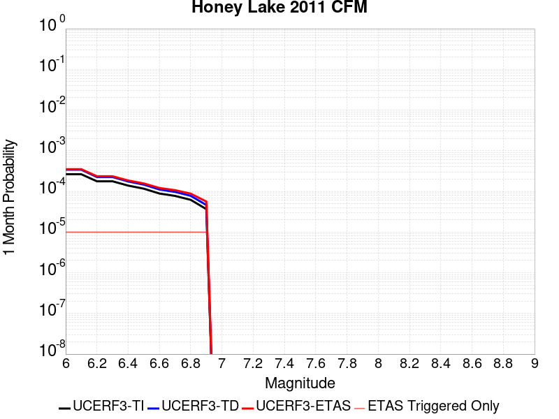 |  |  |

| Magnitude | 1 wk TI Prob | 1 wk TD Prob | 1 wk ETAS Prob | 1 wk ETAS/TD Gain | 1 wk ETAS Triggered Only | 1 mo TI Prob | 1 mo TD Prob | 1 mo ETAS Prob | 1 mo ETAS/TD Gain | 1 mo ETAS Triggered Only | 1 yr TI Prob | 1 yr TD Prob | 1 yr ETAS Prob | 1 yr ETAS/TD Gain | 1 yr ETAS Triggered Only | 10 yr TI Prob | 10 yr TD Prob | 10 yr ETAS Prob | 10 yr ETAS/TD Gain | 10 yr ETAS Triggered Only |
|-----|-----|-----|-----|-----|-----|-----|-----|-----|-----|-----|-----|-----|-----|-----|-----|-----|-----|-----|-----|-----|
| 6.0 | 6.155506E-5 | 7.954667E-5 | 8.954587E-5 | 1.1257024 | 1.0E-5 | 2.6378073E-4 | 3.40873E-4 | 3.508696E-4 | 1.0293264 | 1.0E-5 | 0.0032068014 | 0.0041427943 | 0.004152753 | 1.0024039 | 1.0E-5 | 0.03160919 | 0.040702924 | 0.040712517 | 1.0002357 | 1.0E-5 |
| 6.1 | 6.155506E-5 | 7.954667E-5 | 8.954587E-5 | 1.1257024 | 1.0E-5 | 2.6378073E-4 | 3.40873E-4 | 3.508696E-4 | 1.0293264 | 1.0E-5 | 0.0032068014 | 0.0041427943 | 0.004152753 | 1.0024039 | 1.0E-5 | 0.03160919 | 0.040702924 | 0.040712517 | 1.0002357 | 1.0E-5 |
| 6.2 | 4.1335024E-5 | 5.257629E-5 | 6.257577E-5 | 1.1901898 | 1.0E-5 | 1.7713808E-4 | 2.253086E-4 | 2.3530635E-4 | 1.0443735 | 1.0E-5 | 0.0021545228 | 0.0027398595 | 0.002749832 | 1.0036398 | 1.0E-5 | 0.021337535 | 0.027076708 | 0.027086439 | 1.0003593 | 1.0E-5 |
| 6.3 | 4.1335024E-5 | 5.257629E-5 | 6.257577E-5 | 1.1901898 | 1.0E-5 | 1.7713808E-4 | 2.253086E-4 | 2.3530635E-4 | 1.0443735 | 1.0E-5 | 0.0021545228 | 0.0027398595 | 0.002749832 | 1.0036398 | 1.0E-5 | 0.021337535 | 0.027076708 | 0.027086439 | 1.0003593 | 1.0E-5 |
| 6.4 | 3.2393702E-5 | 4.0887444E-5 | 5.0887036E-5 | 1.2445638 | 1.0E-5 | 1.3882275E-4 | 1.7522085E-4 | 1.8521909E-4 | 1.0570608 | 1.0E-5 | 0.0016888566 | 0.002131335 | 0.0021413136 | 1.004682 | 1.0E-5 | 0.016760793 | 0.02111982 | 0.02112961 | 1.0004635 | 1.0E-5 |
| 6.5 | 2.7205504E-5 | 3.4211684E-5 | 4.421134E-5 | 1.2922878 | 1.0E-5 | 1.1658981E-4 | 1.4661385E-4 | 1.5661238E-4 | 1.0681964 | 1.0E-5 | 0.0014185566 | 0.0017836588 | 0.0017936409 | 1.0055964 | 1.0E-5 | 0.014095354 | 0.017702932 | 0.017712755 | 1.0005549 | 1.0E-5 |
| 6.6 | 2.069265E-5 | 2.5955307E-5 | 3.5955047E-5 | 1.3852676 | 1.0E-5 | 8.867977E-5 | 1.1123277E-4 | 1.21231664E-4 | 1.0898916 | 1.0E-5 | 0.0010791414 | 0.0013535038 | 0.0013634902 | 1.0073782 | 1.0E-5 | 0.010739161 | 0.013461002 | 0.013470868 | 1.0007329 | 1.0E-5 |
| 6.7 | 1.8060919E-5 | 2.2656828E-5 | 3.26566E-5 | 1.4413581 | 1.0E-5 | 7.7401644E-5 | 9.709754E-5 | 1.07096566E-4 | 1.1029792 | 1.0E-5 | 9.419576E-4 | 0.0011816026 | 0.0011915908 | 1.0084531 | 1.0E-5 | 0.009379748 | 0.011761238 | 0.01177112 | 1.0008403 | 1.0E-5 |
| 6.8 | 1.4474663E-5 | 1.818127E-5 | 2.818109E-5 | 1.5500065 | 1.0E-5 | 6.203279E-5 | 7.791784E-5 | 8.791706E-5 | 1.1283303 | 1.0E-5 | 7.5498753E-4 | 9.483136E-4 | 9.583041E-4 | 1.010535 | 1.0E-5 | 0.007524277 | 0.009450192 | 0.009460097 | 1.0010482 | 1.0E-5 |
| 6.9 | 8.564552E-6 | 1.0802308E-5 | 2.08022E-5 | 1.9257182 | 1.0E-5 | 3.6704707E-5 | 4.6295158E-5 | 5.6294695E-5 | 1.2159953 | 1.0E-5 | 4.4678818E-4 | 5.635644E-4 | 5.735588E-4 | 1.0177342 | 1.0E-5 | 0.0044589094 | 0.0056278477 | 0.0056377915 | 1.0017669 | 1.0E-5 |

## South Cuyama
*[(top)](#table-of-contents)*

| 1 Week | 1 Month | 1 Year | 10 Year |
|-----|-----|-----|-----|
|  |  |  |  |

| Magnitude | 1 wk TI Prob | 1 wk TD Prob | 1 wk ETAS Prob | 1 wk ETAS/TD Gain | 1 wk ETAS Triggered Only | 1 mo TI Prob | 1 mo TD Prob | 1 mo ETAS Prob | 1 mo ETAS/TD Gain | 1 mo ETAS Triggered Only | 1 yr TI Prob | 1 yr TD Prob | 1 yr ETAS Prob | 1 yr ETAS/TD Gain | 1 yr ETAS Triggered Only | 10 yr TI Prob | 10 yr TD Prob | 10 yr ETAS Prob | 10 yr ETAS/TD Gain | 10 yr ETAS Triggered Only |
|-----|-----|-----|-----|-----|-----|-----|-----|-----|-----|-----|-----|-----|-----|-----|-----|-----|-----|-----|-----|-----|
| 6.0 | 1.2747308E-6 | 1.2818697E-6 | 1.2818697E-6 | 1.0 | 0.0 | 5.4631205E-6 | 5.4937163E-6 | 5.4937163E-6 | 1.0 | 0.0 | 6.6511464E-5 | 6.6884015E-5 | 7.688334E-5 | 1.1495025 | 1.0E-5 | 6.649156E-4 | 6.686458E-4 | 6.886324E-4 | 1.0298913 | 2.0E-5 |
| 6.1 | 1.2747308E-6 | 1.2818697E-6 | 1.2818697E-6 | 1.0 | 0.0 | 5.4631205E-6 | 5.4937163E-6 | 5.4937163E-6 | 1.0 | 0.0 | 6.6511464E-5 | 6.6884015E-5 | 7.688334E-5 | 1.1495025 | 1.0E-5 | 6.649156E-4 | 6.686458E-4 | 6.886324E-4 | 1.0298913 | 2.0E-5 |
| 6.2 | 1.2747308E-6 | 1.2818697E-6 | 1.2818697E-6 | 1.0 | 0.0 | 5.4631205E-6 | 5.4937163E-6 | 5.4937163E-6 | 1.0 | 0.0 | 6.6511464E-5 | 6.6884015E-5 | 7.688334E-5 | 1.1495025 | 1.0E-5 | 6.649156E-4 | 6.686458E-4 | 6.886324E-4 | 1.0298913 | 2.0E-5 |
| 6.3 | 1.2747308E-6 | 1.2818697E-6 | 1.2818697E-6 | 1.0 | 0.0 | 5.4631205E-6 | 5.4937163E-6 | 5.4937163E-6 | 1.0 | 0.0 | 6.6511464E-5 | 6.6884015E-5 | 7.688334E-5 | 1.1495025 | 1.0E-5 | 6.649156E-4 | 6.686458E-4 | 6.886324E-4 | 1.0298913 | 2.0E-5 |
| 6.4 | 1.2747308E-6 | 1.2818697E-6 | 1.2818697E-6 | 1.0 | 0.0 | 5.4631205E-6 | 5.4937163E-6 | 5.4937163E-6 | 1.0 | 0.0 | 6.6511464E-5 | 6.6884015E-5 | 7.688334E-5 | 1.1495025 | 1.0E-5 | 6.649156E-4 | 6.686458E-4 | 6.886324E-4 | 1.0298913 | 2.0E-5 |
| 6.5 | 1.2747308E-6 | 1.2818697E-6 | 1.2818697E-6 | 1.0 | 0.0 | 5.4631205E-6 | 5.4937163E-6 | 5.4937163E-6 | 1.0 | 0.0 | 6.6511464E-5 | 6.6884015E-5 | 7.688334E-5 | 1.1495025 | 1.0E-5 | 6.649156E-4 | 6.686458E-4 | 6.886324E-4 | 1.0298913 | 2.0E-5 |
| 6.6 | 1.2747308E-6 | 1.2818697E-6 | 1.2818697E-6 | 1.0 | 0.0 | 5.4631205E-6 | 5.4937163E-6 | 5.4937163E-6 | 1.0 | 0.0 | 6.6511464E-5 | 6.6884015E-5 | 7.688334E-5 | 1.1495025 | 1.0E-5 | 6.649156E-4 | 6.686458E-4 | 6.886324E-4 | 1.0298913 | 2.0E-5 |
| 6.7 | 1.2747308E-6 | 1.2818697E-6 | 1.2818697E-6 | 1.0 | 0.0 | 5.4631205E-6 | 5.4937163E-6 | 5.4937163E-6 | 1.0 | 0.0 | 6.6511464E-5 | 6.6884015E-5 | 7.688334E-5 | 1.1495025 | 1.0E-5 | 6.649156E-4 | 6.686458E-4 | 6.886324E-4 | 1.0298913 | 2.0E-5 |
| 6.8 | 1.2747308E-6 | 1.2818697E-6 | 1.2818697E-6 | 1.0 | 0.0 | 5.4631205E-6 | 5.4937163E-6 | 5.4937163E-6 | 1.0 | 0.0 | 6.6511464E-5 | 6.6884015E-5 | 7.688334E-5 | 1.1495025 | 1.0E-5 | 6.649156E-4 | 6.686458E-4 | 6.886324E-4 | 1.0298913 | 2.0E-5 |
| 6.9 | 8.4566324E-7 | 8.507883E-7 | 8.507883E-7 | 1.0 | 0.0 | 3.624266E-6 | 3.6462304E-6 | 3.6462304E-6 | 1.0 | 0.0 | 4.4124543E-5 | 4.439196E-5 | 5.4391516E-5 | 1.225256 | 1.0E-5 | 4.4115784E-4 | 4.4383196E-4 | 4.5382752E-4 | 1.022521 | 1.0E-5 |
| 7.0 | 8.2277904E-7 | 8.27782E-7 | 8.27782E-7 | 1.0 | 0.0 | 3.526191E-6 | 3.5476323E-6 | 3.5476323E-6 | 1.0 | 0.0 | 4.293053E-5 | 4.3191576E-5 | 5.3191146E-5 | 1.2315166 | 1.0E-5 | 4.292224E-4 | 4.3183283E-4 | 4.418285E-4 | 1.0231471 | 1.0E-5 |
| 7.1 | 6.7661887E-7 | 6.80913E-7 | 6.80913E-7 | 1.0 | 0.0 | 2.899792E-6 | 2.9181954E-6 | 2.9181954E-6 | 1.0 | 0.0 | 3.5304394E-5 | 3.5528454E-5 | 4.5528097E-5 | 1.2814546 | 1.0E-5 | 3.5298787E-4 | 3.552281E-4 | 3.6522458E-4 | 1.0281409 | 1.0E-5 |
| 7.2 | 5.783336E-7 | 5.8211907E-7 | 5.8211907E-7 | 1.0 | 0.0 | 2.4785702E-6 | 2.4947938E-6 | 2.4947938E-6 | 1.0 | 0.0 | 3.0176174E-5 | 3.0373692E-5 | 4.0373387E-5 | 1.3292223 | 1.0E-5 | 3.0172078E-4 | 3.0369565E-4 | 3.136926E-4 | 1.0329177 | 1.0E-5 |
| 7.3 | 5.136759E-7 | 5.170938E-7 | 5.170938E-7 | 1.0 | 0.0 | 2.2014663E-6 | 2.2161144E-6 | 2.2161144E-6 | 1.0 | 0.0 | 2.6802521E-5 | 2.698086E-5 | 3.698059E-5 | 1.3706231 | 1.0E-5 | 2.679929E-4 | 2.6977606E-4 | 2.7977335E-4 | 1.0370578 | 1.0E-5 |
| 7.4 | 4.3370295E-7 | 4.3665364E-7 | 4.3665364E-7 | 1.0 | 0.0 | 1.8587256E-6 | 1.8713713E-6 | 1.8713713E-6 | 1.0 | 0.0 | 2.2629749E-5 | 2.278371E-5 | 3.2783482E-5 | 1.4389001 | 1.0E-5 | 2.2627445E-4 | 2.278139E-4 | 2.3781162E-4 | 1.0438855 | 1.0E-5 |
| 7.5 | 3.3242574E-7 | 3.3476465E-7 | 3.3476465E-7 | 1.0 | 0.0 | 1.4246809E-6 | 1.4347048E-6 | 1.4347048E-6 | 1.0 | 0.0 | 1.7345352E-5 | 1.7467393E-5 | 2.7467218E-5 | 1.5724853 | 1.0E-5 | 1.7343998E-4 | 1.7466032E-4 | 1.8465858E-4 | 1.057244 | 1.0E-5 |
| 7.6 | 2.0627535E-7 | 2.07789E-7 | 2.07789E-7 | 1.0 | 0.0 | 8.840369E-7 | 8.90524E-7 | 8.90524E-7 | 1.0 | 0.0 | 1.0763096E-5 | 1.0842076E-5 | 1.0842076E-5 | 1.0 | 0.0 | 1.0762575E-4 | 1.0841556E-4 | 1.0841556E-4 | 1.0 | 0.0 |
| 7.7 | 6.15236E-8 | 6.1983044E-8 | 6.1983044E-8 | 1.0 | 0.0 | 2.6367252E-7 | 2.656416E-7 | 2.656416E-7 | 1.0 | 0.0 | 3.2102084E-6 | 3.2341818E-6 | 3.2341818E-6 | 1.0 | 0.0 | 3.210162E-5 | 3.234136E-5 | 3.234136E-5 | 1.0 | 0.0 |
| 7.8 | 1.1765573E-8 | 1.1873414E-8 | 1.1873414E-8 | 1.0 | 0.0 | 5.0423886E-8 | 5.0886058E-8 | 5.0886058E-8 | 1.0 | 0.0 | 6.1391063E-7 | 6.195376E-7 | 6.195376E-7 | 1.0 | 0.0 | 6.1390897E-6 | 6.19536E-6 | 6.19536E-6 | 1.0 | 0.0 |
| 7.9 | 6.0381755E-10 | 6.10058E-10 | 6.10058E-10 | 1.0 | 0.0 | 2.5877895E-9 | 2.614534E-9 | 2.614534E-9 | 1.0 | 0.0 | 3.1506335E-8 | 3.1831952E-8 | 3.1831952E-8 | 1.0 | 0.0 | 3.1506332E-7 | 3.183195E-7 | 3.183195E-7 | 1.0 | 0.0 |

## Oceanside alt1
*[(top)](#table-of-contents)*

| 1 Week | 1 Month | 1 Year | 10 Year |
|-----|-----|-----|-----|
|  | 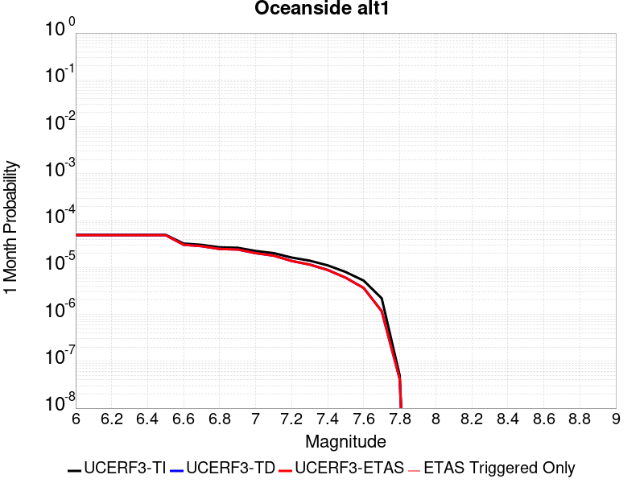 |  |  |

| Magnitude | 1 wk TI Prob | 1 wk TD Prob | 1 wk ETAS Prob | 1 wk ETAS/TD Gain | 1 wk ETAS Triggered Only | 1 mo TI Prob | 1 mo TD Prob | 1 mo ETAS Prob | 1 mo ETAS/TD Gain | 1 mo ETAS Triggered Only | 1 yr TI Prob | 1 yr TD Prob | 1 yr ETAS Prob | 1 yr ETAS/TD Gain | 1 yr ETAS Triggered Only | 10 yr TI Prob | 10 yr TD Prob | 10 yr ETAS Prob | 10 yr ETAS/TD Gain | 10 yr ETAS Triggered Only |
|-----|-----|-----|-----|-----|-----|-----|-----|-----|-----|-----|-----|-----|-----|-----|-----|-----|-----|-----|-----|-----|
| 6.0 | 1.1617542E-5 | 1.1423493E-5 | 1.1423493E-5 | 1.0 | 0.0 | 4.9788516E-5 | 4.8956997E-5 | 4.8956997E-5 | 1.0 | 0.0 | 6.060066E-4 | 5.9590454E-4 | 5.9590454E-4 | 1.0 | 0.0 | 0.0060435664 | 0.005944664 | 0.0059645455 | 1.0033444 | 2.0E-5 |
| 6.1 | 1.1617542E-5 | 1.1423493E-5 | 1.1423493E-5 | 1.0 | 0.0 | 4.9788516E-5 | 4.8956997E-5 | 4.8956997E-5 | 1.0 | 0.0 | 6.060066E-4 | 5.9590454E-4 | 5.9590454E-4 | 1.0 | 0.0 | 0.0060435664 | 0.005944664 | 0.0059645455 | 1.0033444 | 2.0E-5 |
| 6.2 | 1.1617542E-5 | 1.1423493E-5 | 1.1423493E-5 | 1.0 | 0.0 | 4.9788516E-5 | 4.8956997E-5 | 4.8956997E-5 | 1.0 | 0.0 | 6.060066E-4 | 5.9590454E-4 | 5.9590454E-4 | 1.0 | 0.0 | 0.0060435664 | 0.005944664 | 0.0059645455 | 1.0033444 | 2.0E-5 |
| 6.3 | 1.1617542E-5 | 1.1423493E-5 | 1.1423493E-5 | 1.0 | 0.0 | 4.9788516E-5 | 4.8956997E-5 | 4.8956997E-5 | 1.0 | 0.0 | 6.060066E-4 | 5.9590454E-4 | 5.9590454E-4 | 1.0 | 0.0 | 0.0060435664 | 0.005944664 | 0.0059645455 | 1.0033444 | 2.0E-5 |
| 6.4 | 1.1617542E-5 | 1.1423493E-5 | 1.1423493E-5 | 1.0 | 0.0 | 4.9788516E-5 | 4.8956997E-5 | 4.8956997E-5 | 1.0 | 0.0 | 6.060066E-4 | 5.9590454E-4 | 5.9590454E-4 | 1.0 | 0.0 | 0.0060435664 | 0.005944664 | 0.0059645455 | 1.0033444 | 2.0E-5 |
| 6.5 | 1.1617542E-5 | 1.1423493E-5 | 1.1423493E-5 | 1.0 | 0.0 | 4.9788516E-5 | 4.8956997E-5 | 4.8956997E-5 | 1.0 | 0.0 | 6.060066E-4 | 5.9590454E-4 | 5.9590454E-4 | 1.0 | 0.0 | 0.0060435664 | 0.005944664 | 0.0059645455 | 1.0033444 | 2.0E-5 |
| 6.6 | 7.561768E-6 | 7.1336153E-6 | 7.1336153E-6 | 1.0 | 0.0 | 3.2407173E-5 | 3.0572286E-5 | 3.0572286E-5 | 1.0 | 0.0 | 3.9448592E-4 | 3.7215507E-4 | 3.7215507E-4 | 1.0 | 0.0 | 0.0039378637 | 0.00371543 | 0.0037253927 | 1.0026815 | 1.0E-5 |
| 6.7 | 7.1042605E-6 | 6.6556854E-6 | 6.6556854E-6 | 1.0 | 0.0 | 3.0446476E-5 | 2.8524059E-5 | 2.8524059E-5 | 1.0 | 0.0 | 3.706228E-4 | 3.472259E-4 | 3.472259E-4 | 1.0 | 0.0 | 0.0037000529 | 0.003466917 | 0.0034768824 | 1.0028744 | 1.0E-5 |
| 6.8 | 6.285554E-6 | 5.799706E-6 | 5.799706E-6 | 1.0 | 0.0 | 2.693781E-5 | 2.4855648E-5 | 2.4855648E-5 | 1.0 | 0.0 | 3.2791847E-4 | 3.0257605E-4 | 3.0257605E-4 | 1.0 | 0.0 | 0.0032743502 | 0.0030216982 | 0.003031668 | 1.0032994 | 1.0E-5 |
| 6.9 | 6.148883E-6 | 5.6565445E-6 | 5.6565445E-6 | 1.0 | 0.0 | 2.635209E-5 | 2.424211E-5 | 2.424211E-5 | 1.0 | 0.0 | 3.2078946E-4 | 2.9510827E-4 | 2.9510827E-4 | 1.0 | 0.0 | 0.003203268 | 0.0029472208 | 0.0029571913 | 1.003383 | 1.0E-5 |
| 7.0 | 5.253857E-6 | 4.722404E-6 | 4.722404E-6 | 1.0 | 0.0 | 2.2516335E-5 | 2.0238718E-5 | 2.0238718E-5 | 1.0 | 0.0 | 2.7410188E-4 | 2.4637886E-4 | 2.4637886E-4 | 1.0 | 0.0 | 0.0027376404 | 0.0024610884 | 0.0024710638 | 1.0040532 | 1.0E-5 |
| 7.1 | 4.730754E-6 | 4.17851E-6 | 4.17851E-6 | 1.0 | 0.0 | 2.0274503E-5 | 1.7907778E-5 | 1.7907778E-5 | 1.0 | 0.0 | 2.468141E-4 | 2.1800565E-4 | 2.1800565E-4 | 1.0 | 0.0 | 0.0024654015 | 0.0021779444 | 0.0021879226 | 1.0045815 | 1.0E-5 |
| 7.2 | 3.7998386E-6 | 3.214026E-6 | 3.214026E-6 | 1.0 | 0.0 | 1.6284921E-5 | 1.37743245E-5 | 1.37743245E-5 | 1.0 | 0.0 | 1.9825088E-4 | 1.6768962E-4 | 1.6768962E-4 | 1.0 | 0.0 | 0.001980741 | 0.001675643 | 0.0016856263 | 1.0059578 | 1.0E-5 |
| 7.3 | 3.2656465E-6 | 2.698376E-6 | 2.698376E-6 | 1.0 | 0.0 | 1.3995553E-5 | 1.1564418E-5 | 1.1564418E-5 | 1.0 | 0.0 | 1.7038253E-4 | 1.407878E-4 | 1.407878E-4 | 1.0 | 0.0 | 0.0017025196 | 0.0014069972 | 0.0014169831 | 1.0070974 | 1.0E-5 |
| 7.4 | 2.593703E-6 | 2.0680277E-6 | 2.0680277E-6 | 1.0 | 0.0 | 1.1115822E-5 | 8.862946E-6 | 8.862946E-6 | 1.0 | 0.0 | 1.3532673E-4 | 1.0790111E-4 | 1.0790111E-4 | 1.0 | 0.0 | 0.0013524436 | 0.0010784961 | 0.0010784961 | 1.0 | 0.0 |
| 7.5 | 1.8715585E-6 | 1.4137177E-6 | 1.4137177E-6 | 1.0 | 0.0 | 8.020941E-6 | 6.0587763E-6 | 6.0587763E-6 | 1.0 | 0.0 | 9.7650576E-5 | 7.376316E-5 | 7.376316E-5 | 1.0 | 0.0 | 9.7607676E-4 | 7.3739287E-4 | 7.3739287E-4 | 1.0 | 0.0 |
| 7.6 | 1.2246786E-6 | 8.5268175E-7 | 8.5268175E-7 | 1.0 | 0.0 | 5.248612E-6 | 3.6543456E-6 | 3.6543456E-6 | 1.0 | 0.0 | 6.389998E-5 | 4.4490793E-5 | 4.4490793E-5 | 1.0 | 0.0 | 6.3881604E-4 | 4.4482335E-4 | 4.4482335E-4 | 1.0 | 0.0 |
| 7.7 | 5.140719E-7 | 2.734703E-7 | 2.734703E-7 | 1.0 | 0.0 | 2.2031636E-6 | 1.1720151E-6 | 1.1720151E-6 | 1.0 | 0.0 | 2.6823185E-5 | 1.4269205E-5 | 1.4269205E-5 | 1.0 | 0.0 | 2.6819948E-4 | 1.4268424E-4 | 1.4268424E-4 | 1.0 | 0.0 |
| 7.8 | 1.16056995E-8 | 9.782373E-9 | 9.782373E-9 | 1.0 | 0.0 | 4.9738713E-8 | 4.1924455E-8 | 4.1924455E-8 | 1.0 | 0.0 | 6.0556863E-7 | 5.1043025E-7 | 5.1043025E-7 | 1.0 | 0.0 | 6.05567E-6 | 5.1043025E-6 | 5.1043025E-6 | 1.0 | 0.0 |

## Great Valley 08 (Quinto)
*[(top)](#table-of-contents)*

| 1 Week | 1 Month | 1 Year | 10 Year |
|-----|-----|-----|-----|
| 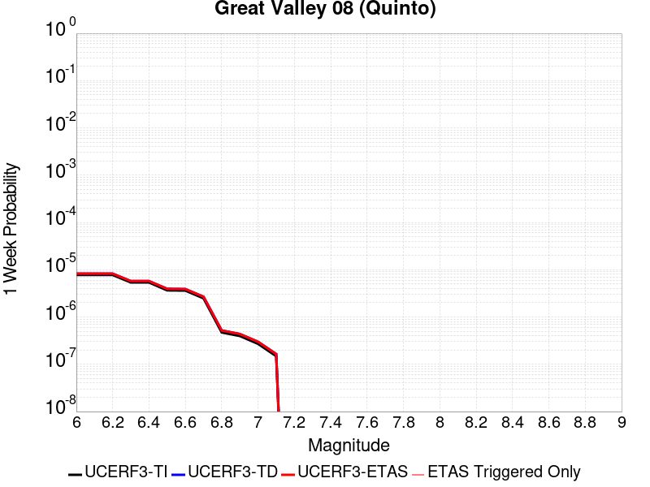 |  |  |  |

| Magnitude | 1 wk TI Prob | 1 wk TD Prob | 1 wk ETAS Prob | 1 wk ETAS/TD Gain | 1 wk ETAS Triggered Only | 1 mo TI Prob | 1 mo TD Prob | 1 mo ETAS Prob | 1 mo ETAS/TD Gain | 1 mo ETAS Triggered Only | 1 yr TI Prob | 1 yr TD Prob | 1 yr ETAS Prob | 1 yr ETAS/TD Gain | 1 yr ETAS Triggered Only | 10 yr TI Prob | 10 yr TD Prob | 10 yr ETAS Prob | 10 yr ETAS/TD Gain | 10 yr ETAS Triggered Only |
|-----|-----|-----|-----|-----|-----|-----|-----|-----|-----|-----|-----|-----|-----|-----|-----|-----|-----|-----|-----|-----|
| 6.0 | 7.737697E-6 | 8.253038E-6 | 8.253038E-6 | 1.0 | 0.0 | 3.3161137E-5 | 3.536979E-5 | 3.536979E-5 | 1.0 | 0.0 | 4.0366207E-4 | 4.3056096E-4 | 4.4055664E-4 | 1.0232155 | 1.0E-5 | 0.004029296 | 0.0042991205 | 0.0043190345 | 1.0046321 | 2.0E-5 |
| 6.1 | 7.737697E-6 | 8.253038E-6 | 8.253038E-6 | 1.0 | 0.0 | 3.3161137E-5 | 3.536979E-5 | 3.536979E-5 | 1.0 | 0.0 | 4.0366207E-4 | 4.3056096E-4 | 4.4055664E-4 | 1.0232155 | 1.0E-5 | 0.004029296 | 0.0042991205 | 0.0043190345 | 1.0046321 | 2.0E-5 |
| 6.2 | 7.737697E-6 | 8.253038E-6 | 8.253038E-6 | 1.0 | 0.0 | 3.3161137E-5 | 3.536979E-5 | 3.536979E-5 | 1.0 | 0.0 | 4.0366207E-4 | 4.3056096E-4 | 4.4055664E-4 | 1.0232155 | 1.0E-5 | 0.004029296 | 0.0042991205 | 0.0043190345 | 1.0046321 | 2.0E-5 |
| 6.3 | 5.374012E-6 | 5.7505736E-6 | 5.7505736E-6 | 1.0 | 0.0 | 2.3031276E-5 | 2.4645145E-5 | 2.4645145E-5 | 1.0 | 0.0 | 2.803697E-4 | 3.0002446E-4 | 3.0002446E-4 | 1.0 | 0.0 | 0.0028001624 | 0.0029972875 | 0.0029972875 | 1.0 | 0.0 |
| 6.4 | 5.374012E-6 | 5.7505736E-6 | 5.7505736E-6 | 1.0 | 0.0 | 2.3031276E-5 | 2.4645145E-5 | 2.4645145E-5 | 1.0 | 0.0 | 2.803697E-4 | 3.0002446E-4 | 3.0002446E-4 | 1.0 | 0.0 | 0.0028001624 | 0.0029972875 | 0.0029972875 | 1.0 | 0.0 |
| 6.5 | 3.65427E-6 | 3.941324E-6 | 3.941324E-6 | 1.0 | 0.0 | 1.5661062E-5 | 1.689132E-5 | 1.689132E-5 | 1.0 | 0.0 | 1.9065675E-4 | 2.0563944E-4 | 2.0563944E-4 | 1.0 | 0.0 | 0.0019049325 | 0.0020551833 | 0.0020551833 | 1.0 | 0.0 |
| 6.6 | 3.6143538E-6 | 3.8985104E-6 | 3.8985104E-6 | 1.0 | 0.0 | 1.5489995E-5 | 1.6707834E-5 | 1.6707834E-5 | 1.0 | 0.0 | 1.8857437E-4 | 2.0340596E-4 | 2.0340596E-4 | 1.0 | 0.0 | 0.0018841444 | 0.0020328893 | 0.0020328893 | 1.0 | 0.0 |
| 6.7 | 2.4821015E-6 | 2.6857067E-6 | 2.6857067E-6 | 1.0 | 0.0 | 1.0637535E-5 | 1.1510153E-5 | 1.1510153E-5 | 1.0 | 0.0 | 1.2950429E-4 | 1.4013276E-4 | 1.4013276E-4 | 1.0 | 0.0 | 0.0012942884 | 0.0014009989 | 0.0014009989 | 1.0 | 0.0 |
| 6.8 | 4.7110538E-7 | 5.193021E-7 | 5.193021E-7 | 1.0 | 0.0 | 2.0190216E-6 | 2.2255786E-6 | 2.2255786E-6 | 1.0 | 0.0 | 2.458131E-5 | 2.70961E-5 | 2.70961E-5 | 1.0 | 0.0 | 2.457859E-4 | 2.7092977E-4 | 2.7092977E-4 | 1.0 | 0.0 |
| 6.9 | 3.958685E-7 | 4.3703452E-7 | 4.3703452E-7 | 1.0 | 0.0 | 1.6965782E-6 | 1.8730038E-6 | 1.8730038E-6 | 1.0 | 0.0 | 2.0655643E-5 | 2.28036E-5 | 2.28036E-5 | 1.0 | 0.0 | 2.0653724E-4 | 2.2801422E-4 | 2.2801422E-4 | 1.0 | 0.0 |
| 7.0 | 2.70294E-7 | 2.9920008E-7 | 2.9920008E-7 | 1.0 | 0.0 | 1.1584025E-6 | 1.2822856E-6 | 1.2822856E-6 | 1.0 | 0.0 | 1.4103458E-5 | 1.5611728E-5 | 1.5611728E-5 | 1.0 | 0.0 | 1.4102564E-4 | 1.5610759E-4 | 1.5610759E-4 | 1.0 | 0.0 |
| 7.1 | 1.4828602E-7 | 1.6469107E-7 | 1.6469107E-7 | 1.0 | 0.0 | 6.3551136E-7 | 7.058187E-7 | 7.058187E-7 | 1.0 | 0.0 | 7.737323E-6 | 8.593317E-6 | 8.593317E-6 | 1.0 | 0.0 | 7.737054E-5 | 8.593065E-5 | 8.593065E-5 | 1.0 | 0.0 |

## Hayward (No) 2011 CFM
*[(top)](#table-of-contents)*

| 1 Week | 1 Month | 1 Year | 10 Year |
|-----|-----|-----|-----|
| 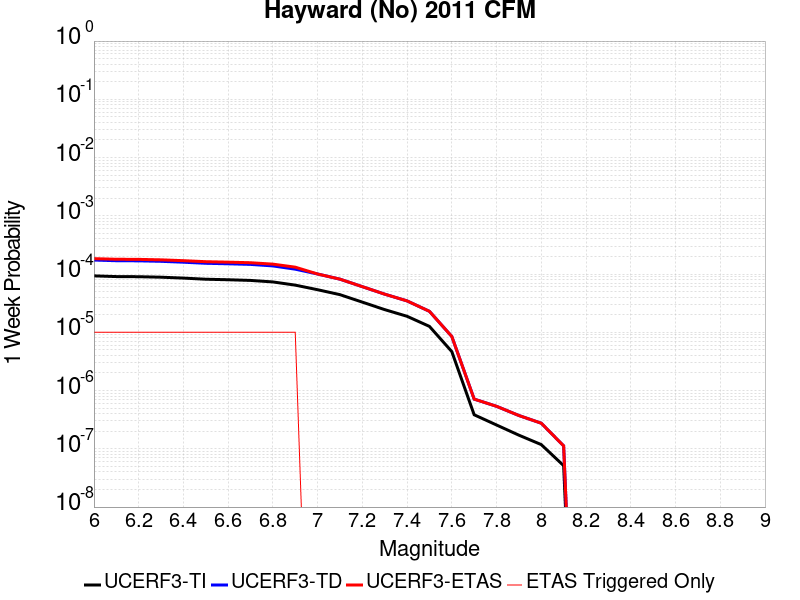 | 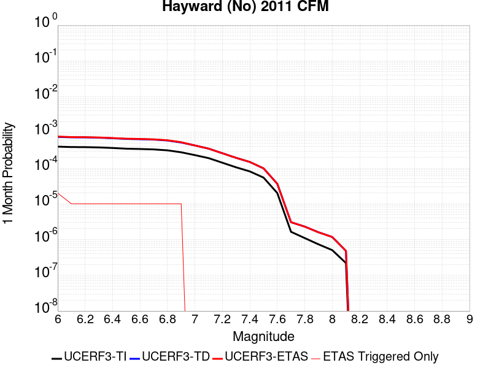 |  |  |

| Magnitude | 1 wk TI Prob | 1 wk TD Prob | 1 wk ETAS Prob | 1 wk ETAS/TD Gain | 1 wk ETAS Triggered Only | 1 mo TI Prob | 1 mo TD Prob | 1 mo ETAS Prob | 1 mo ETAS/TD Gain | 1 mo ETAS Triggered Only | 1 yr TI Prob | 1 yr TD Prob | 1 yr ETAS Prob | 1 yr ETAS/TD Gain | 1 yr ETAS Triggered Only | 10 yr TI Prob | 10 yr TD Prob | 10 yr ETAS Prob | 10 yr ETAS/TD Gain | 10 yr ETAS Triggered Only |
|-----|-----|-----|-----|-----|-----|-----|-----|-----|-----|-----|-----|-----|-----|-----|-----|-----|-----|-----|-----|-----|
| 6.0 | 9.3068506E-5 | 1.739599E-4 | 1.8395815E-4 | 1.0574745 | 1.0E-5 | 3.9880406E-4 | 7.453244E-4 | 7.653095E-4 | 1.026814 | 2.0E-5 | 0.0048446343 | 0.009036438 | 0.009056257 | 1.0021932 | 2.0E-5 | 0.047403704 | 0.08637534 | 0.08639361 | 1.0002116 | 2.0E-5 |
| 6.1 | 9.055486E-5 | 1.6947114E-4 | 1.7946944E-4 | 1.0589972 | 1.0E-5 | 3.880345E-4 | 7.261021E-4 | 7.3609484E-4 | 1.0137621 | 1.0E-5 | 0.0047140904 | 0.008804537 | 0.008814449 | 1.0011258 | 1.0E-5 | 0.046153355 | 0.08426854 | 0.0842777 | 1.0001087 | 1.0E-5 |
| 6.2 | 9.006742E-5 | 1.6867711E-4 | 1.7867543E-4 | 1.0592749 | 1.0E-5 | 3.859461E-4 | 7.22701E-4 | 7.326938E-4 | 1.013827 | 1.0E-5 | 0.0046887742 | 0.008763513 | 0.008773425 | 1.001131 | 1.0E-5 | 0.0459107 | 0.083892785 | 0.08390194 | 1.0001092 | 1.0E-5 |
| 6.3 | 8.8336754E-5 | 1.6547246E-4 | 1.7547082E-4 | 1.060423 | 1.0E-5 | 3.7853114E-4 | 7.089758E-4 | 7.189687E-4 | 1.0140948 | 1.0E-5 | 0.004598882 | 0.008597788 | 0.008607702 | 1.0011531 | 1.0E-5 | 0.04504866 | 0.08238599 | 0.082395166 | 1.0001113 | 1.0E-5 |
| 6.4 | 8.526157E-5 | 1.5974249E-4 | 1.6974089E-4 | 1.0625907 | 1.0E-5 | 3.6535555E-4 | 6.8443175E-4 | 6.944249E-4 | 1.0146006 | 1.0E-5 | 0.0044391346 | 0.008301278 | 0.008311195 | 1.0011946 | 1.0E-5 | 0.043514993 | 0.079682834 | 0.07969204 | 1.0001155 | 1.0E-5 |
| 6.5 | 8.152396E-5 | 1.530663E-4 | 1.6306477E-4 | 1.0653212 | 1.0E-5 | 3.493416E-4 | 6.558342E-4 | 6.6582765E-4 | 1.0152378 | 1.0E-5 | 0.0042449418 | 0.007955698 | 0.007965619 | 1.0012469 | 1.0E-5 | 0.04164765 | 0.07651369 | 0.076522924 | 1.0001206 | 1.0E-5 |
| 6.6 | 7.987405E-5 | 1.5010842E-4 | 1.6010691E-4 | 1.0666085 | 1.0E-5 | 3.4227243E-4 | 6.4316386E-4 | 6.531574E-4 | 1.0155381 | 1.0E-5 | 0.0041592065 | 0.0078025614 | 0.0078124837 | 1.0012716 | 1.0E-5 | 0.04082218 | 0.07510622 | 0.075115465 | 1.0001231 | 1.0E-5 |
| 6.7 | 7.777665E-5 | 1.4650106E-4 | 1.5649959E-4 | 1.0682489 | 1.0E-5 | 3.332859E-4 | 6.277113E-4 | 6.3770503E-4 | 1.0159209 | 1.0E-5 | 0.004050208 | 0.00761576 | 0.0076256837 | 1.0013031 | 1.0E-5 | 0.039771806 | 0.073382616 | 0.073391885 | 1.0001262 | 1.0E-5 |
| 6.8 | 7.3284005E-5 | 1.3800753E-4 | 1.4800615E-4 | 1.0724498 | 1.0E-5 | 3.140365E-4 | 5.913274E-4 | 6.013215E-4 | 1.0169011 | 1.0E-5 | 0.0038166929 | 0.0071757827 | 0.007185711 | 1.0013835 | 1.0E-5 | 0.037518036 | 0.06929621 | 0.06930552 | 1.0001343 | 1.0E-5 |
| 6.9 | 6.458263E-5 | 1.2131439E-4 | 1.3131318E-4 | 1.0824205 | 1.0E-5 | 2.7675333E-4 | 5.198157E-4 | 5.298105E-4 | 1.0192276 | 1.0E-5 | 0.0033642664 | 0.0063104923 | 0.0063204295 | 1.0015746 | 1.0E-5 | 0.033137884 | 0.061225023 | 0.06123441 | 1.0001533 | 1.0E-5 |
| 7.0 | 5.3853604E-5 | 1.00250414E-4 | 1.00250414E-4 | 1.0 | 0.0 | 2.3078074E-4 | 4.295742E-4 | 4.295742E-4 | 1.0 | 0.0 | 0.0028061352 | 0.0052175885 | 0.0052175885 | 1.0 | 0.0 | 0.027709642 | 0.0509578 | 0.0509578 | 1.0 | 0.0 |
| 7.1 | 4.4308683E-5 | 8.170626E-5 | 8.170626E-5 | 1.0 | 0.0 | 1.8988053E-4 | 3.501229E-4 | 3.501229E-4 | 1.0 | 0.0 | 0.0023093442 | 0.0042544557 | 0.0042544557 | 1.0 | 0.0 | 0.022854926 | 0.04182473 | 0.04182473 | 1.0 | 0.0 |
| 7.2 | 3.295973E-5 | 6.0771144E-5 | 6.0771144E-5 | 1.0 | 0.0 | 1.4124835E-4 | 2.604219E-4 | 2.604219E-4 | 1.0 | 0.0 | 0.0017183421 | 0.0031660495 | 0.0031660495 | 1.0 | 0.0 | 0.017051157 | 0.031369876 | 0.031369876 | 1.0 | 0.0 |
| 7.3 | 2.452256E-5 | 4.5180346E-5 | 4.5180346E-5 | 1.0 | 0.0 | 1.05092455E-4 | 1.9361576E-4 | 1.9361576E-4 | 1.0 | 0.0 | 0.0012787496 | 0.0023547374 | 0.0023547374 | 1.0 | 0.0 | 0.0127141625 | 0.02344111 | 0.02344111 | 1.0 | 0.0 |
| 7.4 | 1.8829967E-5 | 3.4602548E-5 | 3.4602548E-5 | 1.0 | 0.0 | 8.069736E-5 | 1.4828827E-4 | 1.4828827E-4 | 1.0 | 0.0 | 9.820475E-4 | 0.0018039243 | 0.0018039243 | 1.0 | 0.0 | 0.009777189 | 0.0180195 | 0.0180195 | 1.0 | 0.0 |
| 7.5 | 1.26374125E-5 | 2.2921116E-5 | 2.2921116E-5 | 1.0 | 0.0 | 5.4159216E-5 | 9.822969E-5 | 9.822969E-5 | 1.0 | 0.0 | 6.5918895E-4 | 0.0011952962 | 0.0011952962 | 1.0 | 0.0 | 0.00657237 | 0.011988836 | 0.011988836 | 1.0 | 0.0 |
| 7.6 | 4.666429E-6 | 8.4791645E-6 | 8.4791645E-6 | 1.0 | 0.0 | 1.9998828E-5 | 3.6338777E-5 | 3.6338777E-5 | 1.0 | 0.0 | 2.4345852E-4 | 4.4233602E-4 | 4.4233602E-4 | 1.0 | 0.0 | 0.0024319198 | 0.0044591012 | 0.0044591012 | 1.0 | 0.0 |
| 7.7 | 3.8399318E-7 | 7.133867E-7 | 7.133867E-7 | 1.0 | 0.0 | 1.6456839E-6 | 3.057368E-6 | 3.057368E-6 | 1.0 | 0.0 | 2.003602E-5 | 3.722282E-5 | 3.722282E-5 | 1.0 | 0.0 | 2.0034213E-4 | 3.8614936E-4 | 3.8614936E-4 | 1.0 | 0.0 |
| 7.8 | 2.5637698E-7 | 5.3662194E-7 | 5.3662194E-7 | 1.0 | 0.0 | 1.098758E-6 | 2.299806E-6 | 2.299806E-6 | 1.0 | 0.0 | 1.3377297E-5 | 2.7999782E-5 | 2.7999782E-5 | 1.0 | 0.0 | 1.3376492E-4 | 2.9244382E-4 | 2.9244382E-4 | 1.0 | 0.0 |
| 7.9 | 1.7141245E-7 | 3.7290573E-7 | 3.7290573E-7 | 1.0 | 0.0 | 7.3462456E-7 | 1.5981665E-6 | 1.5981665E-6 | 1.0 | 0.0 | 8.944017E-6 | 1.9457504E-5 | 1.9457504E-5 | 1.0 | 0.0 | 8.943657E-5 | 2.0245428E-4 | 2.0245428E-4 | 1.0 | 0.0 |
| 8.0 | 1.1808895E-7 | 2.7509762E-7 | 2.7509762E-7 | 1.0 | 0.0 | 5.060954E-7 | 1.1789892E-6 | 1.1789892E-6 | 1.0 | 0.0 | 6.161694E-6 | 1.43541E-5 | 1.43541E-5 | 1.0 | 0.0 | 6.161523E-5 | 1.4816441E-4 | 1.4816441E-4 | 1.0 | 0.0 |
| 8.1 | 5.138535E-8 | 1.1229867E-7 | 1.1229867E-7 | 1.0 | 0.0 | 2.2022292E-7 | 4.812799E-7 | 4.812799E-7 | 1.0 | 0.0 | 2.6812106E-6 | 5.8595674E-6 | 5.8595674E-6 | 1.0 | 0.0 | 2.6811784E-5 | 6.0158476E-5 | 6.0158476E-5 | 1.0 | 0.0 |

## Hayward (So) extension 2011 CFM
*[(top)](#table-of-contents)*

| 1 Week | 1 Month | 1 Year | 10 Year |
|-----|-----|-----|-----|
|  | 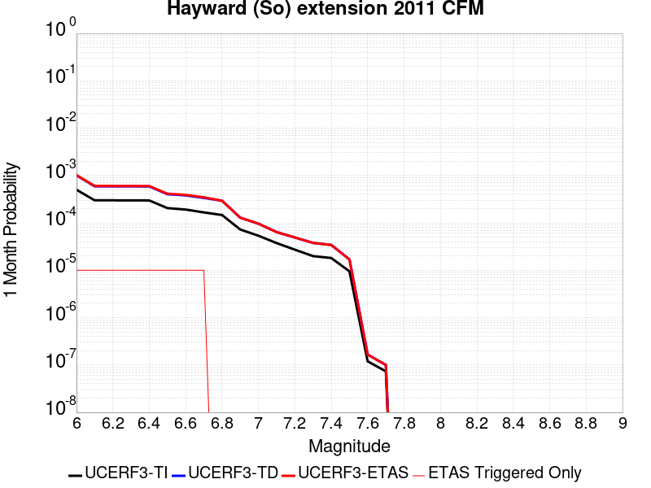 |  |  |

| Magnitude | 1 wk TI Prob | 1 wk TD Prob | 1 wk ETAS Prob | 1 wk ETAS/TD Gain | 1 wk ETAS Triggered Only | 1 mo TI Prob | 1 mo TD Prob | 1 mo ETAS Prob | 1 mo ETAS/TD Gain | 1 mo ETAS Triggered Only | 1 yr TI Prob | 1 yr TD Prob | 1 yr ETAS Prob | 1 yr ETAS/TD Gain | 1 yr ETAS Triggered Only | 10 yr TI Prob | 10 yr TD Prob | 10 yr ETAS Prob | 10 yr ETAS/TD Gain | 10 yr ETAS Triggered Only |
|-----|-----|-----|-----|-----|-----|-----|-----|-----|-----|-----|-----|-----|-----|-----|-----|-----|-----|-----|-----|-----|
| 6.0 | 1.1721256E-4 | 2.3697627E-4 | 2.3697627E-4 | 1.0 | 0.0 | 5.022428E-4 | 0.0010129517 | 0.0010229415 | 1.0098622 | 1.0E-5 | 0.0060976758 | 0.012248711 | 0.012258588 | 1.0008065 | 1.0E-5 | 0.0593305 | 0.112843215 | 0.112860955 | 1.0001572 | 2.0E-5 |
| 6.1 | 6.99169E-5 | 1.3822885E-4 | 1.3822885E-4 | 1.0 | 0.0 | 2.9960944E-4 | 5.9128006E-4 | 6.0127414E-4 | 1.0169024 | 1.0E-5 | 0.0036416445 | 0.0071720886 | 0.007182017 | 1.0013843 | 1.0E-5 | 0.035825435 | 0.067803554 | 0.067822196 | 1.000275 | 2.0E-5 |
| 6.2 | 6.99169E-5 | 1.3822885E-4 | 1.3822885E-4 | 1.0 | 0.0 | 2.9960944E-4 | 5.9128006E-4 | 6.0127414E-4 | 1.0169024 | 1.0E-5 | 0.0036416445 | 0.0071720886 | 0.007182017 | 1.0013843 | 1.0E-5 | 0.035825435 | 0.067803554 | 0.067822196 | 1.000275 | 2.0E-5 |
| 6.3 | 6.970908E-5 | 1.379104E-4 | 1.379104E-4 | 1.0 | 0.0 | 2.9871898E-4 | 5.899159E-4 | 5.9991E-4 | 1.0169415 | 1.0E-5 | 0.0036308395 | 0.007155625 | 0.0071655535 | 1.0013875 | 1.0E-5 | 0.035720866 | 0.067652516 | 0.067671165 | 1.0002756 | 2.0E-5 |
| 6.4 | 6.9517155E-5 | 1.375792E-4 | 1.375792E-4 | 1.0 | 0.0 | 2.9789665E-4 | 5.884971E-4 | 5.984912E-4 | 1.0169824 | 1.0E-5 | 0.0036208609 | 0.0071385372 | 0.007148466 | 1.0013908 | 1.0E-5 | 0.03562429 | 0.06749655 | 0.0675152 | 1.0002763 | 2.0E-5 |
| 6.5 | 4.786248E-5 | 9.41498E-5 | 9.41498E-5 | 1.0 | 0.0 | 2.0510878E-4 | 4.034394E-4 | 4.1343534E-4 | 1.0247768 | 1.0E-5 | 0.0024943394 | 0.004901227 | 0.0049111783 | 1.0020303 | 1.0E-5 | 0.02466527 | 0.046901822 | 0.046920884 | 1.0004064 | 2.0E-5 |
| 6.6 | 4.4662214E-5 | 8.881654E-5 | 8.881654E-5 | 1.0 | 0.0 | 1.9139545E-4 | 3.805894E-4 | 3.9058557E-4 | 1.026265 | 1.0E-5 | 0.0023277493 | 0.0046242937 | 0.004634247 | 1.0021524 | 1.0E-5 | 0.02303517 | 0.044293344 | 0.04431246 | 1.0004315 | 2.0E-5 |
| 6.7 | 3.884542E-5 | 7.8648096E-5 | 7.8648096E-5 | 1.0 | 0.0 | 1.6646975E-4 | 3.370222E-4 | 3.4701882E-4 | 1.0296617 | 1.0E-5 | 0.002024885 | 0.0040959697 | 0.004105929 | 1.0024314 | 1.0E-5 | 0.020065336 | 0.039333146 | 0.03935236 | 1.0004885 | 2.0E-5 |
| 6.8 | 3.4221863E-5 | 6.855653E-5 | 6.855653E-5 | 1.0 | 0.0 | 1.4665688E-4 | 2.93783E-4 | 2.93783E-4 | 1.0 | 0.0 | 0.0017840851 | 0.0035713627 | 0.0035713627 | 1.0 | 0.0 | 0.017698295 | 0.034421004 | 0.034430657 | 1.0002805 | 1.0E-5 |
| 6.9 | 1.6927712E-5 | 3.0061563E-5 | 3.0061563E-5 | 1.0 | 0.0 | 7.2545314E-5 | 1.2882923E-4 | 1.2882923E-4 | 1.0 | 0.0 | 8.828813E-4 | 0.0015674243 | 0.0015674243 | 1.0 | 0.0 | 0.008793819 | 0.01546327 | 0.015473115 | 1.0006367 | 1.0E-5 |
| 7.0 | 1.2509653E-5 | 2.2462571E-5 | 2.2462571E-5 | 1.0 | 0.0 | 5.3611697E-5 | 9.6264856E-5 | 9.6264856E-5 | 1.0 | 0.0 | 6.525269E-4 | 0.0011714385 | 0.0011714385 | 1.0 | 0.0 | 0.0065061417 | 0.01158231 | 0.01158231 | 1.0 | 0.0 |
| 7.1 | 8.751583E-6 | 1.4925648E-5 | 1.4925648E-5 | 1.0 | 0.0 | 3.750624E-5 | 6.3965526E-5 | 6.3965526E-5 | 1.0 | 0.0 | 4.5654282E-4 | 7.785079E-4 | 7.785079E-4 | 1.0 | 0.0 | 0.0045560603 | 0.007763496 | 0.007763496 | 1.0 | 0.0 |
| 7.2 | 6.354379E-6 | 1.1498636E-5 | 1.1498636E-5 | 1.0 | 0.0 | 2.7232769E-5 | 4.9278966E-5 | 4.9278966E-5 | 1.0 | 0.0 | 3.3150852E-4 | 5.99811E-4 | 5.99811E-4 | 1.0 | 0.0 | 0.0033101442 | 0.0060003046 | 0.0060003046 | 1.0 | 0.0 |
| 7.3 | 4.645554E-6 | 8.818172E-6 | 8.818172E-6 | 1.0 | 0.0 | 1.9909365E-5 | 3.779164E-5 | 3.779164E-5 | 1.0 | 0.0 | 2.4236954E-4 | 4.6002E-4 | 4.6002E-4 | 1.0 | 0.0 | 0.0024210536 | 0.004610708 | 0.004610708 | 1.0 | 0.0 |
| 7.4 | 4.23437E-6 | 7.992532E-6 | 7.992532E-6 | 1.0 | 0.0 | 1.8147173E-5 | 3.425328E-5 | 3.425328E-5 | 1.0 | 0.0 | 2.2091944E-4 | 4.1695772E-4 | 4.1695772E-4 | 1.0 | 0.0 | 0.0022069993 | 0.004181972 | 0.004181972 | 1.0 | 0.0 |
| 7.5 | 2.2187417E-6 | 3.9522306E-6 | 3.9522306E-6 | 1.0 | 0.0 | 9.508858E-6 | 1.6938036E-5 | 1.6938036E-5 | 1.0 | 0.0 | 1.157642E-4 | 2.0620368E-4 | 2.0620368E-4 | 1.0 | 0.0 | 0.0011570391 | 0.0020734754 | 0.0020734754 | 1.0 | 0.0 |
| 7.6 | 2.7952495E-8 | 3.878529E-8 | 3.878529E-8 | 1.0 | 0.0 | 1.1979641E-7 | 1.6622266E-7 | 1.6622266E-7 | 1.0 | 0.0 | 1.4585203E-6 | 2.0237592E-6 | 2.0237592E-6 | 1.0 | 0.0 | 1.4585107E-5 | 2.0328182E-5 | 2.0328182E-5 | 1.0 | 0.0 |
| 7.7 | 1.7192724E-8 | 2.3436517E-8 | 2.3436517E-8 | 1.0 | 0.0 | 7.36831E-8 | 1.0044221E-7 | 1.0044221E-7 | 1.0 | 0.0 | 8.9709135E-7 | 1.2228833E-6 | 1.2228833E-6 | 1.0 | 0.0 | 8.970877E-6 | 1.2296933E-5 | 1.2296933E-5 | 1.0 | 0.0 |

## Verdugo
*[(top)](#table-of-contents)*

| 1 Week | 1 Month | 1 Year | 10 Year |
|-----|-----|-----|-----|
|  |  |  |  |

| Magnitude | 1 wk TI Prob | 1 wk TD Prob | 1 wk ETAS Prob | 1 wk ETAS/TD Gain | 1 wk ETAS Triggered Only | 1 mo TI Prob | 1 mo TD Prob | 1 mo ETAS Prob | 1 mo ETAS/TD Gain | 1 mo ETAS Triggered Only | 1 yr TI Prob | 1 yr TD Prob | 1 yr ETAS Prob | 1 yr ETAS/TD Gain | 1 yr ETAS Triggered Only | 10 yr TI Prob | 10 yr TD Prob | 10 yr ETAS Prob | 10 yr ETAS/TD Gain | 10 yr ETAS Triggered Only |
|-----|-----|-----|-----|-----|-----|-----|-----|-----|-----|-----|-----|-----|-----|-----|-----|-----|-----|-----|-----|-----|
| 6.0 | 5.392987E-6 | 4.216517E-6 | 4.216517E-6 | 1.0 | 0.0 | 2.3112598E-5 | 1.8070665E-5 | 1.8070665E-5 | 1.0 | 0.0 | 2.8135953E-4 | 2.1998861E-4 | 2.399842E-4 | 1.0908937 | 2.0E-5 | 0.0028100356 | 0.0021977562 | 0.002217712 | 1.0090802 | 2.0E-5 |
| 6.1 | 5.392987E-6 | 4.216517E-6 | 4.216517E-6 | 1.0 | 0.0 | 2.3112598E-5 | 1.8070665E-5 | 1.8070665E-5 | 1.0 | 0.0 | 2.8135953E-4 | 2.1998861E-4 | 2.399842E-4 | 1.0908937 | 2.0E-5 | 0.0028100356 | 0.0021977562 | 0.002217712 | 1.0090802 | 2.0E-5 |
| 6.2 | 5.392987E-6 | 4.216517E-6 | 4.216517E-6 | 1.0 | 0.0 | 2.3112598E-5 | 1.8070665E-5 | 1.8070665E-5 | 1.0 | 0.0 | 2.8135953E-4 | 2.1998861E-4 | 2.399842E-4 | 1.0908937 | 2.0E-5 | 0.0028100356 | 0.0021977562 | 0.002217712 | 1.0090802 | 2.0E-5 |
| 6.3 | 5.392987E-6 | 4.216517E-6 | 4.216517E-6 | 1.0 | 0.0 | 2.3112598E-5 | 1.8070665E-5 | 1.8070665E-5 | 1.0 | 0.0 | 2.8135953E-4 | 2.1998861E-4 | 2.399842E-4 | 1.0908937 | 2.0E-5 | 0.0028100356 | 0.0021977562 | 0.002217712 | 1.0090802 | 2.0E-5 |
| 6.4 | 5.392987E-6 | 4.216517E-6 | 4.216517E-6 | 1.0 | 0.0 | 2.3112598E-5 | 1.8070665E-5 | 1.8070665E-5 | 1.0 | 0.0 | 2.8135953E-4 | 2.1998861E-4 | 2.399842E-4 | 1.0908937 | 2.0E-5 | 0.0028100356 | 0.0021977562 | 0.002217712 | 1.0090802 | 2.0E-5 |
| 6.5 | 4.9154837E-6 | 3.722465E-6 | 3.722465E-6 | 1.0 | 0.0 | 2.1066187E-5 | 1.5953325E-5 | 1.5953325E-5 | 1.0 | 0.0 | 2.5645064E-4 | 1.9421462E-4 | 2.1421074E-4 | 1.1029588 | 2.0E-5 | 0.002561549 | 0.0019404698 | 0.001960431 | 1.0102868 | 2.0E-5 |
| 6.6 | 4.9154837E-6 | 3.722465E-6 | 3.722465E-6 | 1.0 | 0.0 | 2.1066187E-5 | 1.5953325E-5 | 1.5953325E-5 | 1.0 | 0.0 | 2.5645064E-4 | 1.9421462E-4 | 2.1421074E-4 | 1.1029588 | 2.0E-5 | 0.002561549 | 0.0019404698 | 0.001960431 | 1.0102868 | 2.0E-5 |
| 6.7 | 4.817006E-6 | 3.6206518E-6 | 3.6206518E-6 | 1.0 | 0.0 | 2.0644147E-5 | 1.5516987E-5 | 1.5516987E-5 | 1.0 | 0.0 | 2.513135E-4 | 1.8890314E-4 | 2.0889936E-4 | 1.1058544 | 2.0E-5 | 0.0025102948 | 0.0018874453 | 0.0019074075 | 1.0105764 | 2.0E-5 |
| 6.8 | 4.507407E-6 | 3.3071042E-6 | 3.3071042E-6 | 1.0 | 0.0 | 1.9317316E-5 | 1.4173227E-5 | 1.4173227E-5 | 1.0 | 0.0 | 2.3516294E-4 | 1.7254551E-4 | 1.9254207E-4 | 1.1158915 | 2.0E-5 | 0.0023491425 | 0.0017241298 | 0.0017440954 | 1.0115801 | 2.0E-5 |
| 6.9 | 4.3573054E-6 | 3.161011E-6 | 3.161011E-6 | 1.0 | 0.0 | 1.8674033E-5 | 1.354712E-5 | 1.354712E-5 | 1.0 | 0.0 | 2.2733262E-4 | 1.6492383E-4 | 1.8492053E-4 | 1.1212481 | 2.0E-5 | 0.0022710022 | 0.0016480266 | 0.0016679937 | 1.0121157 | 2.0E-5 |
| 7.0 | 4.171527E-6 | 2.9836704E-6 | 2.9836704E-6 | 1.0 | 0.0 | 1.787785E-5 | 1.2787096E-5 | 1.2787096E-5 | 1.0 | 0.0 | 2.1764109E-4 | 1.5567189E-4 | 1.7566877E-4 | 1.1284554 | 2.0E-5 | 0.0021742806 | 0.0015556397 | 0.0015756086 | 1.0128365 | 2.0E-5 |
| 7.1 | 4.0405484E-6 | 2.882261E-6 | 2.882261E-6 | 1.0 | 0.0 | 1.731652E-5 | 1.235249E-5 | 1.235249E-5 | 1.0 | 0.0 | 2.1080824E-4 | 1.503813E-4 | 1.6037979E-4 | 1.0664877 | 1.0E-5 | 0.0021060838 | 0.0015028063 | 0.0015127913 | 1.0066442 | 1.0E-5 |
| 7.2 | 3.8306007E-6 | 2.7018452E-6 | 2.7018452E-6 | 1.0 | 0.0 | 1.6416758E-5 | 1.15792855E-5 | 1.15792855E-5 | 1.0 | 0.0 | 1.9985568E-4 | 1.4096878E-4 | 1.5096737E-4 | 1.0709277 | 1.0E-5 | 0.0019967605 | 0.0014088044 | 0.0014187903 | 1.0070882 | 1.0E-5 |
| 7.3 | 3.5750938E-6 | 2.5121758E-6 | 2.5121758E-6 | 1.0 | 0.0 | 1.532174E-5 | 1.0766424E-5 | 1.0766424E-5 | 1.0 | 0.0 | 1.8652623E-4 | 1.3107344E-4 | 1.4107212E-4 | 1.0762831 | 1.0E-5 | 0.0018636974 | 0.0013099718 | 0.0013199587 | 1.0076238 | 1.0E-5 |
| 7.4 | 3.3510041E-6 | 2.3408586E-6 | 2.3408586E-6 | 1.0 | 0.0 | 1.4361368E-5 | 1.0032213E-5 | 1.0032213E-5 | 1.0 | 0.0 | 1.7483562E-4 | 1.2213545E-4 | 1.2213545E-4 | 1.0 | 0.0 | 0.0017469813 | 0.0012206937 | 0.0012206937 | 1.0 | 0.0 |
| 7.5 | 2.948287E-6 | 2.0391124E-6 | 2.0391124E-6 | 1.0 | 0.0 | 1.2635454E-5 | 8.739024E-6 | 8.739024E-6 | 1.0 | 0.0 | 1.538258E-4 | 1.0639253E-4 | 1.0639253E-4 | 1.0 | 0.0 | 0.0015371935 | 0.0010634261 | 0.0010634261 | 1.0 | 0.0 |
| 7.6 | 2.0134323E-6 | 1.4471265E-6 | 1.4471265E-6 | 1.0 | 0.0 | 8.628967E-6 | 6.2019562E-6 | 6.2019562E-6 | 1.0 | 0.0 | 1.05052604E-4 | 7.550629E-5 | 7.550629E-5 | 1.0 | 0.0 | 0.0010500296 | 7.548152E-4 | 7.548152E-4 | 1.0 | 0.0 |
| 7.7 | 5.726436E-7 | 4.045248E-7 | 4.045248E-7 | 1.0 | 0.0 | 2.4541846E-6 | 1.7336766E-6 | 1.7336766E-6 | 1.0 | 0.0 | 2.9879287E-5 | 2.1107335E-5 | 2.1107335E-5 | 1.0 | 0.0 | 2.987527E-4 | 2.1105584E-4 | 2.1105584E-4 | 1.0 | 0.0 |
| 7.8 | 1.6248204E-7 | 1.0687696E-7 | 1.0687696E-7 | 1.0 | 0.0 | 6.963514E-7 | 4.5804404E-7 | 4.5804404E-7 | 1.0 | 0.0 | 8.478045E-6 | 5.5766723E-6 | 5.5766723E-6 | 1.0 | 0.0 | 8.477722E-5 | 5.5765355E-5 | 5.5765355E-5 | 1.0 | 0.0 |
| 7.9 | 4.4475744E-8 | 3.0375546E-8 | 3.0375546E-8 | 1.0 | 0.0 | 1.9061031E-7 | 1.301809E-7 | 1.301809E-7 | 1.0 | 0.0 | 2.320678E-6 | 1.5849514E-6 | 1.5849514E-6 | 1.0 | 0.0 | 2.3206538E-5 | 1.5849415E-5 | 1.5849415E-5 | 1.0 | 0.0 |

## Santa Ynez River
*[(top)](#table-of-contents)*

| 1 Week | 1 Month | 1 Year | 10 Year |
|-----|-----|-----|-----|
|  |  | 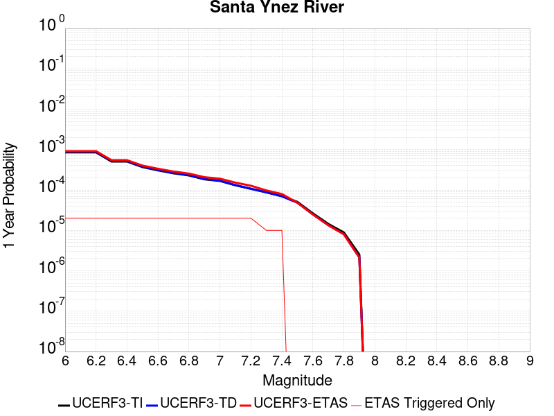 |  |

| Magnitude | 1 wk TI Prob | 1 wk TD Prob | 1 wk ETAS Prob | 1 wk ETAS/TD Gain | 1 wk ETAS Triggered Only | 1 mo TI Prob | 1 mo TD Prob | 1 mo ETAS Prob | 1 mo ETAS/TD Gain | 1 mo ETAS Triggered Only | 1 yr TI Prob | 1 yr TD Prob | 1 yr ETAS Prob | 1 yr ETAS/TD Gain | 1 yr ETAS Triggered Only | 10 yr TI Prob | 10 yr TD Prob | 10 yr ETAS Prob | 10 yr ETAS/TD Gain | 10 yr ETAS Triggered Only |
|-----|-----|-----|-----|-----|-----|-----|-----|-----|-----|-----|-----|-----|-----|-----|-----|-----|-----|-----|-----|-----|
| 6.0 | 1.6396456E-5 | 1.7209435E-5 | 1.7209435E-5 | 1.0 | 0.0 | 7.026863E-5 | 7.375284E-5 | 7.375284E-5 | 1.0 | 0.0 | 8.551848E-4 | 8.976064E-4 | 9.175885E-4 | 1.0222615 | 2.0E-5 | 0.0085190125 | 0.008943358 | 0.008963179 | 1.0022163 | 2.0E-5 |
| 6.1 | 1.6396456E-5 | 1.7209435E-5 | 1.7209435E-5 | 1.0 | 0.0 | 7.026863E-5 | 7.375284E-5 | 7.375284E-5 | 1.0 | 0.0 | 8.551848E-4 | 8.976064E-4 | 9.175885E-4 | 1.0222615 | 2.0E-5 | 0.0085190125 | 0.008943358 | 0.008963179 | 1.0022163 | 2.0E-5 |
| 6.2 | 1.6396456E-5 | 1.7209435E-5 | 1.7209435E-5 | 1.0 | 0.0 | 7.026863E-5 | 7.375284E-5 | 7.375284E-5 | 1.0 | 0.0 | 8.551848E-4 | 8.976064E-4 | 9.175885E-4 | 1.0222615 | 2.0E-5 | 0.0085190125 | 0.008943358 | 0.008963179 | 1.0022163 | 2.0E-5 |
| 6.3 | 9.736976E-6 | 1.012233E-5 | 1.012233E-5 | 1.0 | 0.0 | 4.172923E-5 | 4.338072E-5 | 4.338072E-5 | 1.0 | 0.0 | 5.0793495E-4 | 5.280373E-4 | 5.4802676E-4 | 1.0378561 | 2.0E-5 | 0.005067755 | 0.005268332 | 0.0052882265 | 1.0037763 | 2.0E-5 |
| 6.4 | 9.736976E-6 | 1.012233E-5 | 1.012233E-5 | 1.0 | 0.0 | 4.172923E-5 | 4.338072E-5 | 4.338072E-5 | 1.0 | 0.0 | 5.0793495E-4 | 5.280373E-4 | 5.4802676E-4 | 1.0378561 | 2.0E-5 | 0.005067755 | 0.005268332 | 0.0052882265 | 1.0037763 | 2.0E-5 |
| 6.5 | 7.081964E-6 | 7.3298966E-6 | 7.3298966E-6 | 1.0 | 0.0 | 3.035092E-5 | 3.1413474E-5 | 3.1413474E-5 | 1.0 | 0.0 | 3.694598E-4 | 3.8239348E-4 | 4.0238583E-4 | 1.0522821 | 2.0E-5 | 0.0036884616 | 0.0038175168 | 0.0038374404 | 1.005219 | 2.0E-5 |
| 6.6 | 5.873247E-6 | 6.059743E-6 | 6.059743E-6 | 1.0 | 0.0 | 2.5170815E-5 | 2.5970074E-5 | 2.5970074E-5 | 1.0 | 0.0 | 3.064116E-4 | 3.1614062E-4 | 3.361343E-4 | 1.063243 | 2.0E-5 | 0.0030598943 | 0.0031569963 | 0.0031769332 | 1.0063151 | 2.0E-5 |
| 6.7 | 4.973277E-6 | 5.115901E-6 | 5.115901E-6 | 1.0 | 0.0 | 2.1313872E-5 | 2.1925109E-5 | 2.1925109E-5 | 1.0 | 0.0 | 2.5946548E-4 | 2.66906E-4 | 2.8690064E-4 | 1.0749128 | 2.0E-5 | 0.0025916274 | 0.0026659032 | 0.0026858498 | 1.0074822 | 2.0E-5 |
| 6.8 | 4.396492E-6 | 4.5109778E-6 | 4.5109778E-6 | 1.0 | 0.0 | 1.884197E-5 | 1.9332621E-5 | 1.9332621E-5 | 1.0 | 0.0 | 2.2937685E-4 | 2.3534958E-4 | 2.5534487E-4 | 1.08496 | 2.0E-5 | 0.0022914023 | 0.0023510386 | 0.0023709917 | 1.0084869 | 2.0E-5 |
| 6.9 | 3.5255632E-6 | 3.6013332E-6 | 3.6013332E-6 | 1.0 | 0.0 | 1.5109469E-5 | 1.5434196E-5 | 1.5434196E-5 | 1.0 | 0.0 | 1.8394225E-4 | 1.8789528E-4 | 2.0789153E-4 | 1.1064223 | 2.0E-5 | 0.0018379007 | 0.0018773803 | 0.0018973427 | 1.0106331 | 2.0E-5 |
| 7.0 | 3.211603E-6 | 3.273654E-6 | 3.273654E-6 | 1.0 | 0.0 | 1.376394E-5 | 1.4029872E-5 | 1.4029872E-5 | 1.0 | 0.0 | 1.6756308E-4 | 1.7080043E-4 | 1.9079701E-4 | 1.1170757 | 2.0E-5 | 0.0016743679 | 0.0017067058 | 0.0017266716 | 1.0116985 | 2.0E-5 |
| 7.1 | 2.5094619E-6 | 2.5409204E-6 | 2.5409204E-6 | 1.0 | 0.0 | 1.0754793E-5 | 1.0889614E-5 | 1.0889614E-5 | 1.0 | 0.0 | 1.3093173E-4 | 1.3257304E-4 | 1.525704E-4 | 1.1508403 | 2.0E-5 | 0.0013085462 | 0.0013249456 | 0.0013449191 | 1.015075 | 2.0E-5 |
| 7.2 | 2.0515774E-6 | 2.0619375E-6 | 2.0619375E-6 | 1.0 | 0.0 | 8.792445E-6 | 8.836846E-6 | 8.836846E-6 | 1.0 | 0.0 | 1.0704277E-4 | 1.0758333E-4 | 1.2758118E-4 | 1.1858824 | 2.0E-5 | 0.0010699122 | 0.0010753168 | 0.0010952953 | 1.0185791 | 2.0E-5 |
| 7.3 | 1.6845745E-6 | 1.6773907E-6 | 1.6773907E-6 | 1.0 | 0.0 | 7.219585E-6 | 7.1887976E-6 | 7.1887976E-6 | 1.0 | 0.0 | 8.78949E-5 | 8.752012E-5 | 9.751925E-5 | 1.1142495 | 1.0E-5 | 8.7860145E-4 | 8.7485946E-4 | 8.848507E-4 | 1.0114204 | 1.0E-5 |
| 7.4 | 1.3600285E-6 | 1.3333357E-6 | 1.3333357E-6 | 1.0 | 0.0 | 5.82868E-6 | 5.714284E-6 | 5.714284E-6 | 1.0 | 0.0 | 7.096187E-5 | 6.956921E-5 | 7.956851E-5 | 1.1437317 | 1.0E-5 | 7.0939213E-4 | 6.954765E-4 | 7.054695E-4 | 1.0143687 | 1.0E-5 |
| 7.5 | 9.735342E-7 | 9.290103E-7 | 9.290103E-7 | 1.0 | 0.0 | 4.172283E-6 | 3.9814668E-6 | 3.9814668E-6 | 1.0 | 0.0 | 5.079636E-5 | 4.8473295E-5 | 4.8473295E-5 | 1.0 | 0.0 | 5.0784746E-4 | 4.8462892E-4 | 4.8462892E-4 | 1.0 | 0.0 |
| 7.6 | 5.067187E-7 | 4.77857E-7 | 4.77857E-7 | 1.0 | 0.0 | 2.1716498E-6 | 2.047957E-6 | 2.047957E-6 | 1.0 | 0.0 | 2.6439517E-5 | 2.4933597E-5 | 2.4933597E-5 | 1.0 | 0.0 | 2.643637E-4 | 2.4930874E-4 | 2.4930874E-4 | 1.0 | 0.0 |
| 7.7 | 2.769089E-7 | 2.5759124E-7 | 2.5759124E-7 | 1.0 | 0.0 | 1.1867519E-6 | 1.1039621E-6 | 1.1039621E-6 | 1.0 | 0.0 | 1.4448608E-5 | 1.34406555E-5 | 1.34406555E-5 | 1.0 | 0.0 | 1.444767E-4 | 1.3439846E-4 | 1.3439846E-4 | 1.0 | 0.0 |
| 7.8 | 1.7044663E-7 | 1.5449015E-7 | 1.5449015E-7 | 1.0 | 0.0 | 7.3048534E-7 | 6.621005E-7 | 6.621005E-7 | 1.0 | 0.0 | 8.893623E-6 | 8.061043E-6 | 8.061043E-6 | 1.0 | 0.0 | 8.893267E-5 | 8.060753E-5 | 8.060753E-5 | 1.0 | 0.0 |
| 7.9 | 4.8344287E-8 | 4.0910923E-8 | 4.0910923E-8 | 1.0 | 0.0 | 2.0718979E-7 | 1.7533252E-7 | 1.7533252E-7 | 1.0 | 0.0 | 2.5225327E-6 | 2.1346711E-6 | 2.1346711E-6 | 1.0 | 0.0 | 2.5225041E-5 | 2.1346512E-5 | 2.1346512E-5 | 1.0 | 0.0 |

## Ortigalita (South)
*[(top)](#table-of-contents)*

| 1 Week | 1 Month | 1 Year | 10 Year |
|-----|-----|-----|-----|
|  | 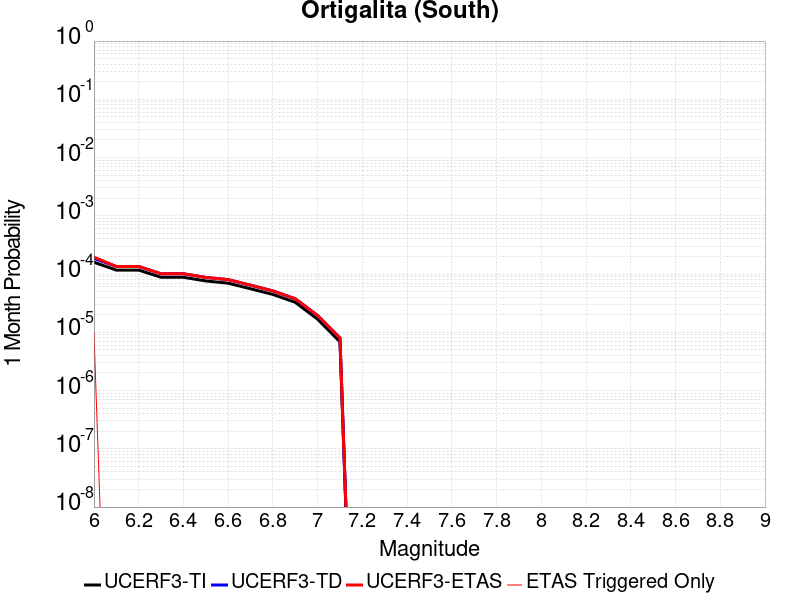 |  | 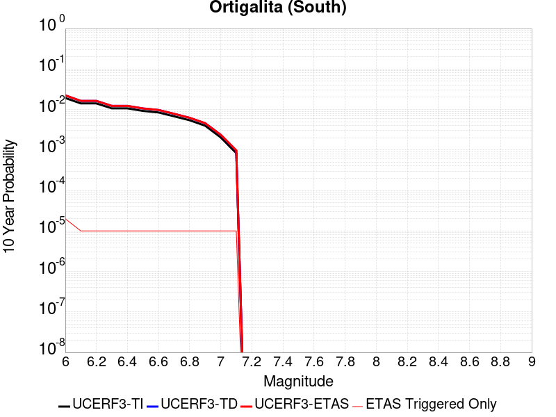 |

| Magnitude | 1 wk TI Prob | 1 wk TD Prob | 1 wk ETAS Prob | 1 wk ETAS/TD Gain | 1 wk ETAS Triggered Only | 1 mo TI Prob | 1 mo TD Prob | 1 mo ETAS Prob | 1 mo ETAS/TD Gain | 1 mo ETAS Triggered Only | 1 yr TI Prob | 1 yr TD Prob | 1 yr ETAS Prob | 1 yr ETAS/TD Gain | 1 yr ETAS Triggered Only | 10 yr TI Prob | 10 yr TD Prob | 10 yr ETAS Prob | 10 yr ETAS/TD Gain | 10 yr ETAS Triggered Only |
|-----|-----|-----|-----|-----|-----|-----|-----|-----|-----|-----|-----|-----|-----|-----|-----|-----|-----|-----|-----|-----|
| 6.0 | 3.72394E-5 | 4.325562E-5 | 4.325562E-5 | 1.0 | 0.0 | 1.5958765E-4 | 1.8536893E-4 | 1.9536707E-4 | 1.0539365 | 1.0E-5 | 0.0019412481 | 0.0022546875 | 0.002264665 | 1.0044252 | 1.0E-5 | 0.019243775 | 0.022334497 | 0.02235405 | 1.0008755 | 2.0E-5 |
| 6.1 | 2.7299884E-5 | 3.149204E-5 | 3.149204E-5 | 1.0 | 0.0 | 1.16994255E-4 | 1.3495922E-4 | 1.3495922E-4 | 1.0 | 0.0 | 0.0014234743 | 0.0016419457 | 0.0016419457 | 1.0 | 0.0 | 0.014143906 | 0.01630407 | 0.016313907 | 1.0006033 | 1.0E-5 |
| 6.2 | 2.7299884E-5 | 3.149204E-5 | 3.149204E-5 | 1.0 | 0.0 | 1.16994255E-4 | 1.3495922E-4 | 1.3495922E-4 | 1.0 | 0.0 | 0.0014234743 | 0.0016419457 | 0.0016419457 | 1.0 | 0.0 | 0.014143906 | 0.01630407 | 0.016313907 | 1.0006033 | 1.0E-5 |
| 6.3 | 2.0546433E-5 | 2.363145E-5 | 2.363145E-5 | 1.0 | 0.0 | 8.805317E-5 | 1.0127382E-4 | 1.0127382E-4 | 1.0 | 0.0 | 0.00107152 | 0.0012323303 | 0.0012323303 | 1.0 | 0.0 | 0.010663681 | 0.01225703 | 0.012266908 | 1.0008059 | 1.0E-5 |
| 6.4 | 2.0546433E-5 | 2.363145E-5 | 2.363145E-5 | 1.0 | 0.0 | 8.805317E-5 | 1.0127382E-4 | 1.0127382E-4 | 1.0 | 0.0 | 0.00107152 | 0.0012323303 | 0.0012323303 | 1.0 | 0.0 | 0.010663681 | 0.01225703 | 0.012266908 | 1.0008059 | 1.0E-5 |
| 6.5 | 1.7779594E-5 | 2.0446974E-5 | 2.0446974E-5 | 1.0 | 0.0 | 7.619603E-5 | 8.762702E-5 | 8.762702E-5 | 1.0 | 0.0 | 9.272918E-4 | 0.0010663504 | 0.0010663504 | 1.0 | 0.0 | 0.009234319 | 0.010613803 | 0.010623697 | 1.0009322 | 1.0E-5 |
| 6.6 | 1.6272212E-5 | 1.8714967E-5 | 1.8714967E-5 | 1.0 | 0.0 | 6.973618E-5 | 8.0204605E-5 | 8.0204605E-5 | 1.0 | 0.0 | 8.487073E-4 | 9.760658E-4 | 9.760658E-4 | 1.0 | 0.0 | 0.008454733 | 0.009719091 | 0.009728993 | 1.0010189 | 1.0E-5 |
| 6.7 | 1.3051484E-5 | 1.5038758E-5 | 1.5038758E-5 | 1.0 | 0.0 | 5.593373E-5 | 6.445028E-5 | 6.445028E-5 | 1.0 | 0.0 | 6.807804E-4 | 7.844092E-4 | 7.844092E-4 | 1.0 | 0.0 | 0.006786986 | 0.007817388 | 0.00782731 | 1.0012692 | 1.0E-5 |
| 6.8 | 1.04277415E-5 | 1.1987235E-5 | 1.1987235E-5 | 1.0 | 0.0 | 4.4689557E-5 | 5.1372896E-5 | 5.1372896E-5 | 1.0 | 0.0 | 5.439595E-4 | 6.2529295E-4 | 6.2529295E-4 | 1.0 | 0.0 | 0.0054262993 | 0.00623609 | 0.0062460275 | 1.0015936 | 1.0E-5 |
| 6.9 | 7.639968E-6 | 8.791503E-6 | 8.791503E-6 | 1.0 | 0.0 | 3.274231E-5 | 3.767736E-5 | 3.767736E-5 | 1.0 | 0.0 | 3.9856473E-4 | 4.586312E-4 | 4.586312E-4 | 1.0 | 0.0 | 0.003978506 | 0.004577433 | 0.004587387 | 1.0021746 | 1.0E-5 |
| 7.0 | 3.919831E-6 | 4.5334014E-6 | 4.5334014E-6 | 1.0 | 0.0 | 1.679917E-5 | 1.942873E-5 | 1.942873E-5 | 1.0 | 0.0 | 2.045107E-4 | 2.3652123E-4 | 2.3652123E-4 | 1.0 | 0.0 | 0.0020432258 | 0.0023629034 | 0.0023728798 | 1.004222 | 1.0E-5 |
| 7.1 | 1.6017933E-6 | 1.8570418E-6 | 1.8570418E-6 | 1.0 | 0.0 | 6.8648105E-6 | 7.958732E-6 | 7.958732E-6 | 1.0 | 0.0 | 8.357586E-5 | 9.689432E-5 | 9.689432E-5 | 1.0 | 0.0 | 8.3544437E-4 | 9.686254E-4 | 9.786157E-4 | 1.0103139 | 1.0E-5 |

## Santa Susana alt 1
*[(top)](#table-of-contents)*

| 1 Week | 1 Month | 1 Year | 10 Year |
|-----|-----|-----|-----|
|  |  | 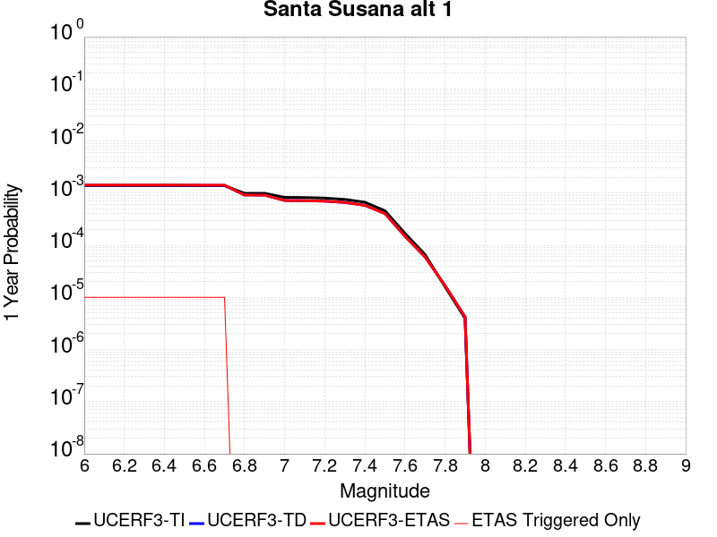 |  |

| Magnitude | 1 wk TI Prob | 1 wk TD Prob | 1 wk ETAS Prob | 1 wk ETAS/TD Gain | 1 wk ETAS Triggered Only | 1 mo TI Prob | 1 mo TD Prob | 1 mo ETAS Prob | 1 mo ETAS/TD Gain | 1 mo ETAS Triggered Only | 1 yr TI Prob | 1 yr TD Prob | 1 yr ETAS Prob | 1 yr ETAS/TD Gain | 1 yr ETAS Triggered Only | 10 yr TI Prob | 10 yr TD Prob | 10 yr ETAS Prob | 10 yr ETAS/TD Gain | 10 yr ETAS Triggered Only |
|-----|-----|-----|-----|-----|-----|-----|-----|-----|-----|-----|-----|-----|-----|-----|-----|-----|-----|-----|-----|-----|
| 6.0 | 2.674877E-5 | 2.7198023E-5 | 2.7198023E-5 | 1.0 | 0.0 | 1.1463255E-4 | 1.1655839E-4 | 1.1655839E-4 | 1.0 | 0.0 | 0.0013947578 | 0.0014182882 | 0.001428274 | 1.0070407 | 1.0E-5 | 0.013860362 | 0.014104128 | 0.014123846 | 1.001398 | 2.0E-5 |
| 6.1 | 2.674877E-5 | 2.7198023E-5 | 2.7198023E-5 | 1.0 | 0.0 | 1.1463255E-4 | 1.1655839E-4 | 1.1655839E-4 | 1.0 | 0.0 | 0.0013947578 | 0.0014182882 | 0.001428274 | 1.0070407 | 1.0E-5 | 0.013860362 | 0.014104128 | 0.014123846 | 1.001398 | 2.0E-5 |
| 6.2 | 2.674877E-5 | 2.7198023E-5 | 2.7198023E-5 | 1.0 | 0.0 | 1.1463255E-4 | 1.1655839E-4 | 1.1655839E-4 | 1.0 | 0.0 | 0.0013947578 | 0.0014182882 | 0.001428274 | 1.0070407 | 1.0E-5 | 0.013860362 | 0.014104128 | 0.014123846 | 1.001398 | 2.0E-5 |
| 6.3 | 2.674877E-5 | 2.7198023E-5 | 2.7198023E-5 | 1.0 | 0.0 | 1.1463255E-4 | 1.1655839E-4 | 1.1655839E-4 | 1.0 | 0.0 | 0.0013947578 | 0.0014182882 | 0.001428274 | 1.0070407 | 1.0E-5 | 0.013860362 | 0.014104128 | 0.014123846 | 1.001398 | 2.0E-5 |
| 6.4 | 2.674877E-5 | 2.7198023E-5 | 2.7198023E-5 | 1.0 | 0.0 | 1.1463255E-4 | 1.1655839E-4 | 1.1655839E-4 | 1.0 | 0.0 | 0.0013947578 | 0.0014182882 | 0.001428274 | 1.0070407 | 1.0E-5 | 0.013860362 | 0.014104128 | 0.014123846 | 1.001398 | 2.0E-5 |
| 6.5 | 2.674877E-5 | 2.7198023E-5 | 2.7198023E-5 | 1.0 | 0.0 | 1.1463255E-4 | 1.1655839E-4 | 1.1655839E-4 | 1.0 | 0.0 | 0.0013947578 | 0.0014182882 | 0.001428274 | 1.0070407 | 1.0E-5 | 0.013860362 | 0.014104128 | 0.014123846 | 1.001398 | 2.0E-5 |
| 6.6 | 2.6647976E-5 | 2.7074359E-5 | 2.7074359E-5 | 1.0 | 0.0 | 1.14200615E-4 | 1.1602845E-4 | 1.1602845E-4 | 1.0 | 0.0 | 0.0013895056 | 0.0014118447 | 0.0014218307 | 1.0070729 | 1.0E-5 | 0.013808494 | 0.014040513 | 0.014060232 | 1.0014044 | 2.0E-5 |
| 6.7 | 2.6647976E-5 | 2.7074359E-5 | 2.7074359E-5 | 1.0 | 0.0 | 1.14200615E-4 | 1.1602845E-4 | 1.1602845E-4 | 1.0 | 0.0 | 0.0013895056 | 0.0014118447 | 0.0014218307 | 1.0070729 | 1.0E-5 | 0.013808494 | 0.014040513 | 0.014060232 | 1.0014044 | 2.0E-5 |
| 6.8 | 1.9073179E-5 | 1.7637283E-5 | 1.7637283E-5 | 1.0 | 0.0 | 8.1739636E-5 | 7.558627E-5 | 7.558627E-5 | 1.0 | 0.0 | 9.947256E-4 | 9.198925E-4 | 9.198925E-4 | 1.0 | 0.0 | 0.009902848 | 0.009163101 | 0.00917301 | 1.0010813 | 1.0E-5 |
| 6.9 | 1.9041876E-5 | 1.7619415E-5 | 1.7619415E-5 | 1.0 | 0.0 | 8.160549E-5 | 7.55097E-5 | 7.55097E-5 | 1.0 | 0.0 | 9.930939E-4 | 9.1896096E-4 | 9.1896096E-4 | 1.0 | 0.0 | 0.0098866755 | 0.0091538625 | 0.009163771 | 1.0010824 | 1.0E-5 |
| 7.0 | 1.5917482E-5 | 1.3863864E-5 | 1.3863864E-5 | 1.0 | 0.0 | 6.8215995E-5 | 5.9415237E-5 | 5.9415237E-5 | 1.0 | 0.0 | 8.302132E-4 | 7.231451E-4 | 7.231451E-4 | 1.0 | 0.0 | 0.008271185 | 0.0072088144 | 0.0072187423 | 1.0013772 | 1.0E-5 |
| 7.1 | 1.577788E-5 | 1.3743872E-5 | 1.3743872E-5 | 1.0 | 0.0 | 6.761774E-5 | 5.8901005E-5 | 5.8901005E-5 | 1.0 | 0.0 | 8.2293496E-4 | 7.1688846E-4 | 7.1688846E-4 | 1.0 | 0.0 | 0.008198941 | 0.007146652 | 0.0071565807 | 1.0013893 | 1.0E-5 |
| 7.2 | 1.5416446E-5 | 1.3469944E-5 | 1.3469944E-5 | 1.0 | 0.0 | 6.606882E-5 | 5.772708E-5 | 5.772708E-5 | 1.0 | 0.0 | 8.0409093E-4 | 7.026052E-4 | 7.026052E-4 | 1.0 | 0.0 | 0.008011877 | 0.0070047234 | 0.007014653 | 1.0014176 | 1.0E-5 |
| 7.3 | 1.4534083E-5 | 1.2717879E-5 | 1.2717879E-5 | 1.0 | 0.0 | 6.228744E-5 | 5.4504082E-5 | 5.4504082E-5 | 1.0 | 0.0 | 7.580857E-4 | 6.633896E-4 | 6.633896E-4 | 1.0 | 0.0 | 0.007555048 | 0.0066149444 | 0.0066248784 | 1.0015017 | 1.0E-5 |
| 7.4 | 1.2858995E-5 | 1.1229652E-5 | 1.1229652E-5 | 1.0 | 0.0 | 5.5108816E-5 | 4.8126214E-5 | 4.8126214E-5 | 1.0 | 0.0 | 6.7074323E-4 | 5.857831E-4 | 5.857831E-4 | 1.0 | 0.0 | 0.0066872234 | 0.005843165 | 0.0058531063 | 1.0017014 | 1.0E-5 |
| 7.5 | 8.827668E-6 | 7.805457E-6 | 7.805457E-6 | 1.0 | 0.0 | 3.7832317E-5 | 3.3451546E-5 | 3.3451546E-5 | 1.0 | 0.0 | 4.605111E-4 | 4.071989E-4 | 4.071989E-4 | 1.0 | 0.0 | 0.0045955796 | 0.0040647765 | 0.0040647765 | 1.0 | 0.0 |
| 7.6 | 3.2533426E-6 | 2.871988E-6 | 2.871988E-6 | 1.0 | 0.0 | 1.3942822E-5 | 1.2308465E-5 | 1.2308465E-5 | 1.0 | 0.0 | 1.6974064E-4 | 1.4984563E-4 | 1.4984563E-4 | 1.0 | 0.0 | 0.0016961104 | 0.0014974826 | 0.0014974826 | 1.0 | 0.0 |
| 7.7 | 1.2751709E-6 | 1.1491089E-6 | 1.1491089E-6 | 1.0 | 0.0 | 5.4650063E-6 | 4.9247437E-6 | 4.9247437E-6 | 1.0 | 0.0 | 6.653442E-5 | 5.9957198E-5 | 5.9957198E-5 | 1.0 | 0.0 | 6.6514505E-4 | 5.994191E-4 | 5.994191E-4 | 1.0 | 0.0 |
| 7.8 | 3.067544E-7 | 3.2400436E-7 | 3.2400436E-7 | 1.0 | 0.0 | 1.3146611E-6 | 1.3885895E-6 | 1.3885895E-6 | 1.0 | 0.0 | 1.600588E-5 | 1.6905957E-5 | 1.6905957E-5 | 1.0 | 0.0 | 1.6004729E-4 | 1.6904772E-4 | 1.6904772E-4 | 1.0 | 0.0 |
| 7.9 | 7.622999E-8 | 8.087964E-8 | 8.087964E-8 | 1.0 | 0.0 | 3.2669993E-7 | 3.4662696E-7 | 3.4662696E-7 | 1.0 | 0.0 | 3.977564E-6 | 4.2201773E-6 | 4.2201773E-6 | 1.0 | 0.0 | 3.977493E-5 | 4.220118E-5 | 4.220118E-5 | 1.0 | 0.0 |

## Casmalia 2011 CFM
*[(top)](#table-of-contents)*

| 1 Week | 1 Month | 1 Year | 10 Year |
|-----|-----|-----|-----|
| 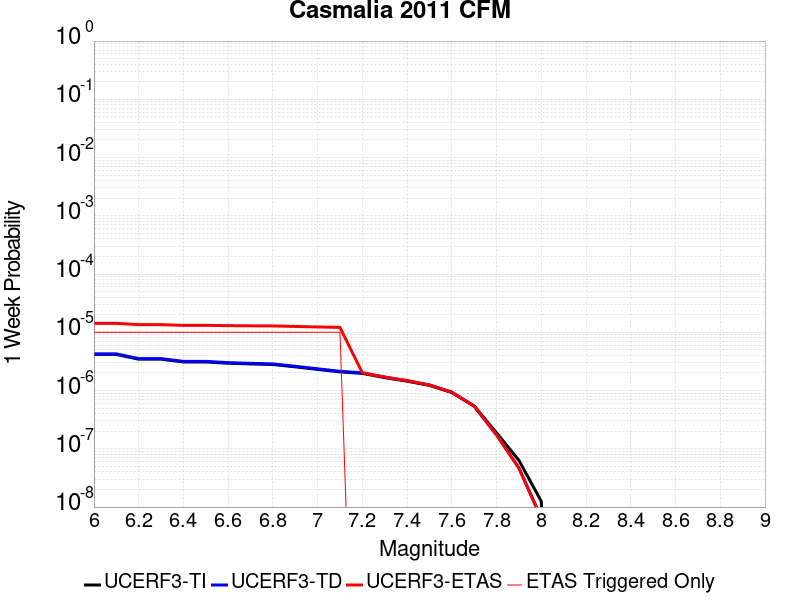 | 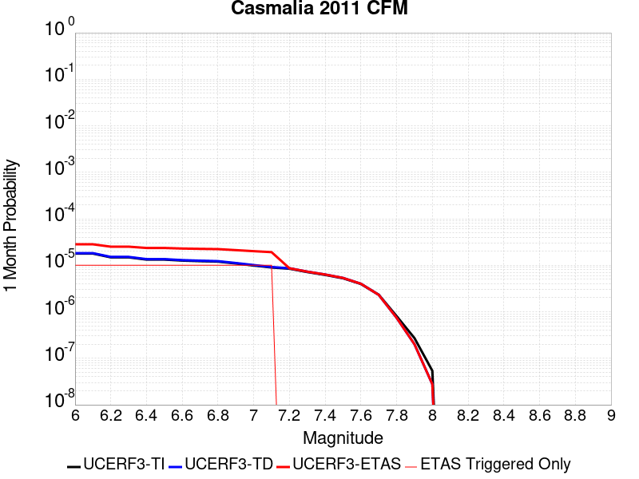 |  |  |

| Magnitude | 1 wk TI Prob | 1 wk TD Prob | 1 wk ETAS Prob | 1 wk ETAS/TD Gain | 1 wk ETAS Triggered Only | 1 mo TI Prob | 1 mo TD Prob | 1 mo ETAS Prob | 1 mo ETAS/TD Gain | 1 mo ETAS Triggered Only | 1 yr TI Prob | 1 yr TD Prob | 1 yr ETAS Prob | 1 yr ETAS/TD Gain | 1 yr ETAS Triggered Only | 10 yr TI Prob | 10 yr TD Prob | 10 yr ETAS Prob | 10 yr ETAS/TD Gain | 10 yr ETAS Triggered Only |
|-----|-----|-----|-----|-----|-----|-----|-----|-----|-----|-----|-----|-----|-----|-----|-----|-----|-----|-----|-----|-----|
| 6.0 | 4.1704893E-6 | 4.262483E-6 | 1.426244E-5 | 3.3460405 | 1.0E-5 | 1.7873403E-5 | 1.8267656E-5 | 2.8267474E-5 | 1.5474056 | 1.0E-5 | 2.1758694E-4 | 2.2238622E-4 | 2.4238178E-4 | 1.0899136 | 2.0E-5 | 0.0021737402 | 0.0022216577 | 0.0022416133 | 1.0089823 | 2.0E-5 |
| 6.1 | 4.1704893E-6 | 4.262483E-6 | 1.426244E-5 | 3.3460405 | 1.0E-5 | 1.7873403E-5 | 1.8267656E-5 | 2.8267474E-5 | 1.5474056 | 1.0E-5 | 2.1758694E-4 | 2.2238622E-4 | 2.4238178E-4 | 1.0899136 | 2.0E-5 | 0.0021737402 | 0.0022216577 | 0.0022416133 | 1.0089823 | 2.0E-5 |
| 6.2 | 3.457312E-6 | 3.5370217E-6 | 1.3536986E-5 | 3.8272274 | 1.0E-5 | 1.4816967E-5 | 1.5158577E-5 | 2.5158426E-5 | 1.6596825 | 1.0E-5 | 1.8038164E-4 | 1.8454014E-4 | 2.0453644E-4 | 1.1083575 | 2.0E-5 | 0.001802353 | 0.0018438784 | 0.0018638414 | 1.0108267 | 2.0E-5 |
| 6.3 | 3.457312E-6 | 3.5370217E-6 | 1.3536986E-5 | 3.8272274 | 1.0E-5 | 1.4816967E-5 | 1.5158577E-5 | 2.5158426E-5 | 1.6596825 | 1.0E-5 | 1.8038164E-4 | 1.8454014E-4 | 2.0453644E-4 | 1.1083575 | 2.0E-5 | 0.001802353 | 0.0018438784 | 0.0018638414 | 1.0108267 | 2.0E-5 |
| 6.4 | 3.0957337E-6 | 3.1692257E-6 | 1.3169194E-5 | 4.155335 | 1.0E-5 | 1.3267363E-5 | 1.3582326E-5 | 2.358219E-5 | 1.736241 | 1.0E-5 | 1.6151817E-4 | 1.6535232E-4 | 1.8534901E-4 | 1.1209339 | 2.0E-5 | 0.0016140083 | 0.0016522991 | 0.001672266 | 1.0120844 | 2.0E-5 |
| 6.5 | 3.0957337E-6 | 3.1692257E-6 | 1.3169194E-5 | 4.155335 | 1.0E-5 | 1.3267363E-5 | 1.3582326E-5 | 2.358219E-5 | 1.736241 | 1.0E-5 | 1.6151817E-4 | 1.6535232E-4 | 1.8534901E-4 | 1.1209339 | 2.0E-5 | 0.0016140083 | 0.0016522991 | 0.001672266 | 1.0120844 | 2.0E-5 |
| 6.6 | 2.9459152E-6 | 3.0165752E-6 | 1.3016545E-5 | 4.3150077 | 1.0E-5 | 1.262529E-5 | 1.2928115E-5 | 2.2927987E-5 | 1.7734979 | 1.0E-5 | 1.5370206E-4 | 1.5738848E-4 | 1.7738534E-4 | 1.1270541 | 2.0E-5 | 0.0015359579 | 0.0015727758 | 0.0015927444 | 1.0126964 | 2.0E-5 |
| 6.7 | 2.8634809E-6 | 2.9324726E-6 | 1.29324435E-5 | 4.4100814 | 1.0E-5 | 1.2272003E-5 | 1.256768E-5 | 2.2567554E-5 | 1.7956818 | 1.0E-5 | 1.4940138E-4 | 1.530008E-4 | 1.7299774E-4 | 1.1306983 | 2.0E-5 | 0.0014930099 | 0.0015289601 | 0.0015489295 | 1.0130608 | 2.0E-5 |
| 6.8 | 2.7999822E-6 | 2.8675968E-6 | 1.2867568E-5 | 4.487231 | 1.0E-5 | 1.1999869E-5 | 1.2289643E-5 | 2.228952E-5 | 1.8136833 | 1.0E-5 | 1.460886E-4 | 1.4961617E-4 | 1.6961318E-4 | 1.1336554 | 2.0E-5 | 0.001459926 | 0.0014951597 | 0.0015151298 | 1.0133564 | 2.0E-5 |
| 6.9 | 2.551052E-6 | 2.6119649E-6 | 1.26119385E-5 | 4.8285255 | 1.0E-5 | 1.0933034E-5 | 1.1194087E-5 | 2.1193975E-5 | 1.8933188 | 1.0E-5 | 1.3310155E-4 | 1.3627953E-4 | 1.4627817E-4 | 1.0733685 | 1.0E-5 | 0.0013302186 | 0.0013619636 | 0.0013719499 | 1.0073323 | 1.0E-5 |
| 7.0 | 2.3081875E-6 | 2.3624088E-6 | 1.2362385E-5 | 5.2329574 | 1.0E-5 | 9.892195E-6 | 1.01245705E-5 | 2.012447E-5 | 1.9876863 | 1.0E-5 | 1.20430814E-4 | 1.232597E-4 | 1.3325847E-4 | 1.0811195 | 1.0E-5 | 0.0012036557 | 0.0012319161 | 0.0012419039 | 1.0081074 | 1.0E-5 |
| 7.1 | 2.093245E-6 | 2.1417243E-6 | 1.2141702E-5 | 5.669125 | 1.0E-5 | 8.971019E-6 | 9.178786E-6 | 1.9178695E-5 | 2.0894587 | 1.0E-5 | 1.09216686E-4 | 1.1174601E-4 | 1.21744895E-4 | 1.0894786 | 1.0E-5 | 0.0010916302 | 0.0011169002 | 0.001126889 | 1.0089433 | 1.0E-5 |
| 7.2 | 1.9714576E-6 | 2.0165091E-6 | 2.0165091E-6 | 1.0 | 0.0 | 8.449076E-6 | 8.642153E-6 | 8.642153E-6 | 1.0 | 0.0 | 1.0286264E-4 | 1.05213156E-4 | 1.05213156E-4 | 1.0 | 0.0 | 0.0010281504 | 0.0010516352 | 0.0010516352 | 1.0 | 0.0 |
| 7.3 | 1.6689512E-6 | 1.7047131E-6 | 1.7047131E-6 | 1.0 | 0.0 | 7.1526288E-6 | 7.3058927E-6 | 7.3058927E-6 | 1.0 | 0.0 | 8.7079774E-5 | 8.894562E-5 | 8.894562E-5 | 1.0 | 0.0 | 8.7045657E-4 | 8.89101E-4 | 8.89101E-4 | 1.0 | 0.0 |
| 7.4 | 1.4490954E-6 | 1.4778908E-6 | 1.4778908E-6 | 1.0 | 0.0 | 6.210394E-6 | 6.333802E-6 | 6.333802E-6 | 1.0 | 0.0 | 7.560892E-5 | 7.711132E-5 | 7.711132E-5 | 1.0 | 0.0 | 7.55832E-4 | 7.7084627E-4 | 7.7084627E-4 | 1.0 | 0.0 |
| 7.5 | 1.226873E-6 | 1.2481701E-6 | 1.2481701E-6 | 1.0 | 0.0 | 5.2580162E-6 | 5.3492895E-6 | 5.3492895E-6 | 1.0 | 0.0 | 6.401447E-5 | 6.5125656E-5 | 6.5125656E-5 | 1.0 | 0.0 | 6.399603E-4 | 6.5106625E-4 | 6.5106625E-4 | 1.0 | 0.0 |
| 7.6 | 9.2561345E-7 | 9.361923E-7 | 9.361923E-7 | 1.0 | 0.0 | 3.966909E-6 | 4.012247E-6 | 4.012247E-6 | 1.0 | 0.0 | 4.8296046E-5 | 4.884801E-5 | 4.884801E-5 | 1.0 | 0.0 | 4.828555E-4 | 4.8837316E-4 | 4.8837316E-4 | 1.0 | 0.0 |
| 7.7 | 5.4367933E-7 | 5.392888E-7 | 5.392888E-7 | 1.0 | 0.0 | 2.3300522E-6 | 2.3112357E-6 | 2.3112357E-6 | 1.0 | 0.0 | 2.8368017E-5 | 2.8138933E-5 | 2.8138933E-5 | 1.0 | 0.0 | 2.8364395E-4 | 2.8135383E-4 | 2.8135383E-4 | 1.0 | 0.0 |
| 7.8 | 1.8825742E-7 | 1.7342276E-7 | 1.7342276E-7 | 1.0 | 0.0 | 8.068173E-7 | 7.4324015E-7 | 7.4324015E-7 | 1.0 | 0.0 | 9.822956E-6 | 9.048912E-6 | 9.048912E-6 | 1.0 | 0.0 | 9.822522E-5 | 9.048546E-5 | 9.048546E-5 | 1.0 | 0.0 |
| 7.9 | 6.342771E-8 | 4.6790706E-8 | 4.6790706E-8 | 1.0 | 0.0 | 2.7183304E-7 | 2.0053157E-7 | 2.0053157E-7 | 1.0 | 0.0 | 3.3095623E-6 | 2.4414692E-6 | 2.4414692E-6 | 1.0 | 0.0 | 3.309513E-5 | 2.4414428E-5 | 2.4414428E-5 | 1.0 | 0.0 |
| 8.0 | 1.2574819E-8 | 6.4733463E-9 | 6.4733463E-9 | 1.0 | 0.0 | 5.3892084E-8 | 2.7742912E-8 | 2.7742912E-8 | 1.0 | 0.0 | 6.561359E-7 | 3.377699E-7 | 3.377699E-7 | 1.0 | 0.0 | 6.56134E-6 | 3.377694E-6 | 3.377694E-6 | 1.0 | 0.0 |

## Surprise Valley 2011 CFM
*[(top)](#table-of-contents)*

| 1 Week | 1 Month | 1 Year | 10 Year |
|-----|-----|-----|-----|
| 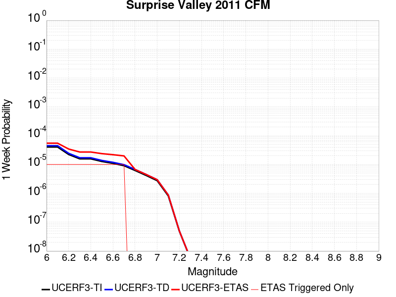 | 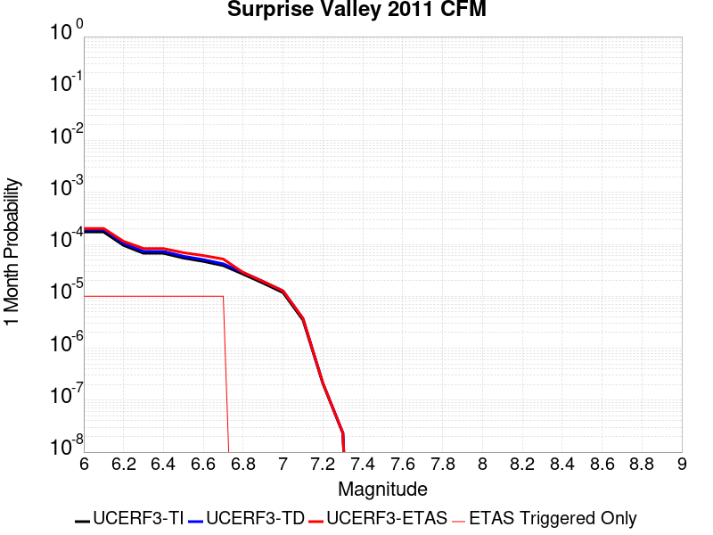 |  |  |

| Magnitude | 1 wk TI Prob | 1 wk TD Prob | 1 wk ETAS Prob | 1 wk ETAS/TD Gain | 1 wk ETAS Triggered Only | 1 mo TI Prob | 1 mo TD Prob | 1 mo ETAS Prob | 1 mo ETAS/TD Gain | 1 mo ETAS Triggered Only | 1 yr TI Prob | 1 yr TD Prob | 1 yr ETAS Prob | 1 yr ETAS/TD Gain | 1 yr ETAS Triggered Only | 10 yr TI Prob | 10 yr TD Prob | 10 yr ETAS Prob | 10 yr ETAS/TD Gain | 10 yr ETAS Triggered Only |
|-----|-----|-----|-----|-----|-----|-----|-----|-----|-----|-----|-----|-----|-----|-----|-----|-----|-----|-----|-----|-----|
| 6.0 | 4.0396248E-5 | 4.485131E-5 | 5.485086E-5 | 1.2229489 | 1.0E-5 | 1.7311527E-4 | 1.9220692E-4 | 2.02205E-4 | 1.0520172 | 1.0E-5 | 0.002105641 | 0.0023378176 | 0.0023477944 | 1.0042675 | 1.0E-5 | 0.020858008 | 0.023153966 | 0.023173504 | 1.0008438 | 2.0E-5 |
| 6.1 | 4.0396248E-5 | 4.485131E-5 | 5.485086E-5 | 1.2229489 | 1.0E-5 | 1.7311527E-4 | 1.9220692E-4 | 2.02205E-4 | 1.0520172 | 1.0E-5 | 0.002105641 | 0.0023378176 | 0.0023477944 | 1.0042675 | 1.0E-5 | 0.020858008 | 0.023153966 | 0.023173504 | 1.0008438 | 2.0E-5 |
| 6.2 | 2.2295266E-5 | 2.440125E-5 | 3.4401004E-5 | 1.409805 | 1.0E-5 | 9.554764E-5 | 1.0457276E-4 | 1.1457172E-4 | 1.0956172 | 1.0E-5 | 0.0011626717 | 0.0012724606 | 0.0012824478 | 1.0078487 | 1.0E-5 | 0.011566074 | 0.012654981 | 0.0126648545 | 1.0007802 | 1.0E-5 |
| 6.3 | 1.572643E-5 | 1.7096807E-5 | 2.7096636E-5 | 1.5848945 | 1.0E-5 | 6.7397246E-5 | 7.327003E-5 | 8.32693E-5 | 1.1364714 | 1.0E-5 | 8.202525E-4 | 8.91708E-4 | 9.016991E-4 | 1.0112045 | 1.0E-5 | 0.008172315 | 0.008882407 | 0.008892318 | 1.0011158 | 1.0E-5 |
| 6.4 | 1.5714395E-5 | 1.7084629E-5 | 2.7084458E-5 | 1.5853114 | 1.0E-5 | 6.734567E-5 | 7.3217845E-5 | 8.3217106E-5 | 1.1365688 | 1.0E-5 | 8.1962504E-4 | 8.9107314E-4 | 9.0106425E-4 | 1.0112125 | 1.0E-5 | 0.008166086 | 0.008876109 | 0.00888602 | 1.0011166 | 1.0E-5 |
| 6.5 | 1.2733495E-5 | 1.38016E-5 | 2.3801462E-5 | 1.7245437 | 1.0E-5 | 5.457098E-5 | 5.9148413E-5 | 6.914782E-5 | 1.1690563 | 1.0E-5 | 6.641992E-4 | 7.1990065E-4 | 7.2989345E-4 | 1.0138808 | 1.0E-5 | 0.0066221743 | 0.0071763797 | 0.007186308 | 1.0013834 | 1.0E-5 |
| 6.6 | 1.0983784E-5 | 1.1886554E-5 | 2.1886435E-5 | 1.8412768 | 1.0E-5 | 4.7072506E-5 | 5.094141E-5 | 6.09409E-5 | 1.196294 | 1.0E-5 | 5.7295704E-4 | 6.200405E-4 | 6.300343E-4 | 1.0161179 | 1.0E-5 | 0.0057148207 | 0.0061836545 | 0.0061935927 | 1.0016072 | 1.0E-5 |
| 6.7 | 9.104806E-6 | 9.839491E-6 | 1.9839394E-5 | 2.0163028 | 1.0E-5 | 3.902001E-5 | 4.2168587E-5 | 5.2168165E-5 | 1.2371334 | 1.0E-5 | 4.7496508E-4 | 5.132855E-4 | 5.232804E-4 | 1.0194724 | 1.0E-5 | 0.004739512 | 0.005121397 | 0.0051313457 | 1.0019426 | 1.0E-5 |
| 6.8 | 6.2162403E-6 | 6.7041337E-6 | 6.7041337E-6 | 1.0 | 0.0 | 2.6640759E-5 | 2.8731698E-5 | 2.8731698E-5 | 1.0 | 0.0 | 3.2430296E-4 | 3.497545E-4 | 3.497545E-4 | 1.0 | 0.0 | 0.003238301 | 0.0034922638 | 0.0034922638 | 1.0 | 0.0 |
| 6.9 | 4.1792696E-6 | 4.50323E-6 | 4.50323E-6 | 1.0 | 0.0 | 1.7911032E-5 | 1.9299423E-5 | 1.9299423E-5 | 1.0 | 0.0 | 2.1804498E-4 | 2.3494668E-4 | 2.3494668E-4 | 1.0 | 0.0 | 0.0021783116 | 0.0023471361 | 0.0023471361 | 1.0 | 0.0 |
| 7.0 | 2.7478413E-6 | 2.9622424E-6 | 2.9622424E-6 | 1.0 | 0.0 | 1.177641E-5 | 1.269527E-5 | 1.269527E-5 | 1.0 | 0.0 | 1.4336836E-4 | 1.545552E-4 | 1.545552E-4 | 1.0 | 0.0 | 0.001432759 | 0.0015445995 | 0.0015445995 | 1.0 | 0.0 |
| 7.1 | 8.128648E-7 | 8.724922E-7 | 8.724922E-7 | 1.0 | 0.0 | 3.4837017E-6 | 3.7392501E-6 | 3.7392501E-6 | 1.0 | 0.0 | 4.2413245E-5 | 4.552502E-5 | 4.552502E-5 | 1.0 | 0.0 | 4.2405148E-4 | 4.5521575E-4 | 4.5521575E-4 | 1.0 | 0.0 |
| 7.2 | 4.8641045E-8 | 4.9402068E-8 | 4.9402068E-8 | 1.0 | 0.0 | 2.084616E-7 | 2.1172312E-7 | 2.1172312E-7 | 1.0 | 0.0 | 2.538017E-6 | 2.577726E-6 | 2.577726E-6 | 1.0 | 0.0 | 2.537988E-5 | 2.5776973E-5 | 2.5776973E-5 | 1.0 | 0.0 |
| 7.3 | 5.3911844E-9 | 5.4758145E-9 | 5.4758145E-9 | 1.0 | 0.0 | 2.3105075E-8 | 2.3467775E-8 | 2.3467775E-8 | 1.0 | 0.0 | 2.8130427E-7 | 2.8572015E-7 | 2.8572015E-7 | 1.0 | 0.0 | 2.8130391E-6 | 2.8571992E-6 | 2.8571992E-6 | 1.0 | 0.0 |

## Elsinore (Coyote Mountains)
*[(top)](#table-of-contents)*

| 1 Week | 1 Month | 1 Year | 10 Year |
|-----|-----|-----|-----|
| 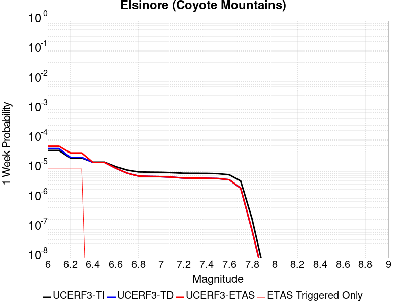 | 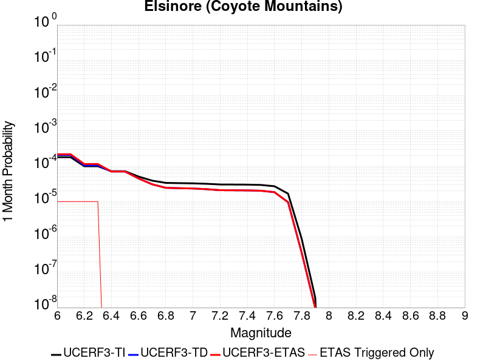 |  | 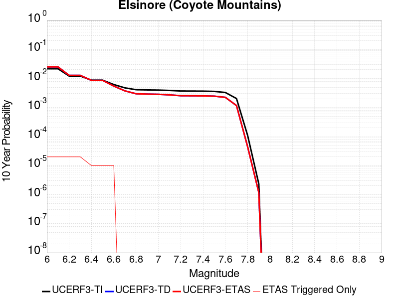 |

| Magnitude | 1 wk TI Prob | 1 wk TD Prob | 1 wk ETAS Prob | 1 wk ETAS/TD Gain | 1 wk ETAS Triggered Only | 1 mo TI Prob | 1 mo TD Prob | 1 mo ETAS Prob | 1 mo ETAS/TD Gain | 1 mo ETAS Triggered Only | 1 yr TI Prob | 1 yr TD Prob | 1 yr ETAS Prob | 1 yr ETAS/TD Gain | 1 yr ETAS Triggered Only | 10 yr TI Prob | 10 yr TD Prob | 10 yr ETAS Prob | 10 yr ETAS/TD Gain | 10 yr ETAS Triggered Only |
|-----|-----|-----|-----|-----|-----|-----|-----|-----|-----|-----|-----|-----|-----|-----|-----|-----|-----|-----|-----|-----|
| 6.0 | 4.20513E-5 | 4.8631882E-5 | 5.8631398E-5 | 1.2056165 | 1.0E-5 | 1.8020741E-4 | 2.0840895E-4 | 2.1840687E-4 | 1.0479726 | 1.0E-5 | 0.0021918174 | 0.002535 | 0.0025449747 | 1.0039347 | 1.0E-5 | 0.021703249 | 0.025111282 | 0.02513078 | 1.0007764 | 2.0E-5 |
| 6.1 | 4.20513E-5 | 4.8631882E-5 | 5.8631398E-5 | 1.2056165 | 1.0E-5 | 1.8020741E-4 | 2.0840895E-4 | 2.1840687E-4 | 1.0479726 | 1.0E-5 | 0.0021918174 | 0.002535 | 0.0025449747 | 1.0039347 | 1.0E-5 | 0.021703249 | 0.025111282 | 0.02513078 | 1.0007764 | 2.0E-5 |
| 6.2 | 2.3413893E-5 | 2.469566E-5 | 3.4695415E-5 | 1.4049194 | 1.0E-5 | 1.0034139E-4 | 1.0583479E-4 | 1.1583373E-4 | 1.0944769 | 1.0E-5 | 0.0012209718 | 0.0012878707 | 0.0012978577 | 1.0077548 | 1.0E-5 | 0.012142851 | 0.01281264 | 0.012832384 | 1.0015409 | 2.0E-5 |
| 6.3 | 2.3413893E-5 | 2.469566E-5 | 3.4695415E-5 | 1.4049194 | 1.0E-5 | 1.0034139E-4 | 1.0583479E-4 | 1.1583373E-4 | 1.0944769 | 1.0E-5 | 0.0012209718 | 0.0012878707 | 0.0012978577 | 1.0077548 | 1.0E-5 | 0.012142851 | 0.01281264 | 0.012832384 | 1.0015409 | 2.0E-5 |
| 6.4 | 1.6894814E-5 | 1.6568361E-5 | 1.6568361E-5 | 1.0 | 0.0 | 7.240433E-5 | 7.1005554E-5 | 7.1005554E-5 | 1.0 | 0.0 | 8.811662E-4 | 8.6418656E-4 | 8.6418656E-4 | 1.0 | 0.0 | 0.0087768035 | 0.00861194 | 0.008621854 | 1.0011512 | 1.0E-5 |
| 6.5 | 1.6894814E-5 | 1.6568361E-5 | 1.6568361E-5 | 1.0 | 0.0 | 7.240433E-5 | 7.1005554E-5 | 7.1005554E-5 | 1.0 | 0.0 | 8.811662E-4 | 8.6418656E-4 | 8.6418656E-4 | 1.0 | 0.0 | 0.0087768035 | 0.00861194 | 0.008621854 | 1.0011512 | 1.0E-5 |
| 6.6 | 1.1910969E-5 | 1.0530774E-5 | 1.0530774E-5 | 1.0 | 0.0 | 5.1046012E-5 | 4.5131183E-5 | 4.5131183E-5 | 1.0 | 0.0 | 6.21308E-4 | 5.4934516E-4 | 5.4934516E-4 | 1.0 | 0.0 | 0.0061957375 | 0.005481174 | 0.0054911193 | 1.0018145 | 1.0E-5 |
| 6.7 | 9.1486E-6 | 7.2028593E-6 | 7.2028593E-6 | 1.0 | 0.0 | 3.9207694E-5 | 3.0869054E-5 | 3.0869054E-5 | 1.0 | 0.0 | 4.7724912E-4 | 3.757697E-4 | 3.757697E-4 | 1.0 | 0.0 | 0.0047622547 | 0.0037517229 | 0.0037517229 | 1.0 | 0.0 |
| 6.8 | 7.90441E-6 | 5.7290276E-6 | 5.7290276E-6 | 1.0 | 0.0 | 3.3875604E-5 | 2.4552752E-5 | 2.4552752E-5 | 1.0 | 0.0 | 4.1235742E-4 | 2.9889002E-4 | 2.9889002E-4 | 1.0 | 0.0 | 0.0041159308 | 0.002985009 | 0.002985009 | 1.0 | 0.0 |
| 6.9 | 7.77015E-6 | 5.582982E-6 | 5.582982E-6 | 1.0 | 0.0 | 3.3300217E-5 | 2.3926852E-5 | 2.3926852E-5 | 1.0 | 0.0 | 4.0535472E-4 | 2.9127175E-4 | 2.9127175E-4 | 1.0 | 0.0 | 0.004046161 | 0.002909027 | 0.002909027 | 1.0 | 0.0 |
| 7.0 | 7.675798E-6 | 5.47984E-6 | 5.47984E-6 | 1.0 | 0.0 | 3.289586E-5 | 2.3484827E-5 | 2.3484827E-5 | 1.0 | 0.0 | 4.004335E-4 | 2.858915E-4 | 2.858915E-4 | 1.0 | 0.0 | 0.003997127 | 0.0028553635 | 0.0028553635 | 1.0 | 0.0 |
| 7.1 | 7.447814E-6 | 5.238714E-6 | 5.238714E-6 | 1.0 | 0.0 | 3.191881E-5 | 2.2451446E-5 | 2.2451446E-5 | 1.0 | 0.0 | 3.8854225E-4 | 2.7331332E-4 | 2.7331332E-4 | 1.0 | 0.0 | 0.003878636 | 0.0027298962 | 0.0027298962 | 1.0 | 0.0 |
| 7.2 | 7.128185E-6 | 4.905372E-6 | 4.905372E-6 | 1.0 | 0.0 | 3.0549007E-5 | 2.102286E-5 | 2.102286E-5 | 1.0 | 0.0 | 3.7187067E-4 | 2.5592445E-4 | 2.5592445E-4 | 1.0 | 0.0 | 0.00371249 | 0.0025564157 | 0.0025564157 | 1.0 | 0.0 |
| 7.3 | 7.0913875E-6 | 4.874047E-6 | 4.874047E-6 | 1.0 | 0.0 | 3.0391306E-5 | 2.0888614E-5 | 2.0888614E-5 | 1.0 | 0.0 | 3.6995133E-4 | 2.5429038E-4 | 2.5429038E-4 | 1.0 | 0.0 | 0.0036933604 | 0.0025401122 | 0.0025401122 | 1.0 | 0.0 |
| 7.4 | 7.051521E-6 | 4.837899E-6 | 4.837899E-6 | 1.0 | 0.0 | 3.0220453E-5 | 2.0733693E-5 | 2.0733693E-5 | 1.0 | 0.0 | 3.6787192E-4 | 2.5240466E-4 | 2.5240466E-4 | 1.0 | 0.0 | 0.0036726352 | 0.0025212981 | 0.0025212981 | 1.0 | 0.0 |
| 7.5 | 6.910666E-6 | 4.733448E-6 | 4.733448E-6 | 1.0 | 0.0 | 2.9616802E-5 | 2.0286056E-5 | 2.0286056E-5 | 1.0 | 0.0 | 3.605249E-4 | 2.4695593E-4 | 2.4695593E-4 | 1.0 | 0.0 | 0.0035994058 | 0.0024669329 | 0.0024669329 | 1.0 | 0.0 |
| 7.6 | 6.341753E-6 | 4.3065565E-6 | 4.3065565E-6 | 1.0 | 0.0 | 2.7178658E-5 | 1.8456547E-5 | 1.8456547E-5 | 1.0 | 0.0 | 3.3084993E-4 | 2.2468645E-4 | 2.2468645E-4 | 1.0 | 0.0 | 0.0033035777 | 0.002244708 | 0.002244708 | 1.0 | 0.0 |
| 7.7 | 3.9205916E-6 | 2.2439415E-6 | 2.2439415E-6 | 1.0 | 0.0 | 1.6802427E-5 | 9.616861E-6 | 9.616861E-6 | 1.0 | 0.0 | 2.0455034E-4 | 1.1707973E-4 | 1.1707973E-4 | 1.0 | 0.0 | 0.0020436216 | 0.0011702535 | 0.0011702535 | 1.0 | 0.0 |
| 7.8 | 2.0846227E-7 | 8.486417E-8 | 8.486417E-8 | 1.0 | 0.0 | 8.9340944E-7 | 3.6370355E-7 | 3.6370355E-7 | 1.0 | 0.0 | 1.0877206E-5 | 4.428085E-6 | 4.428085E-6 | 1.0 | 0.0 | 1.0876673E-4 | 4.4280296E-5 | 4.4280296E-5 | 1.0 | 0.0 |
| 7.9 | 4.4969806E-9 | 2.2691855E-9 | 2.2691855E-9 | 1.0 | 0.0 | 1.9272775E-8 | 9.72508E-9 | 9.72508E-9 | 1.0 | 0.0 | 2.3464601E-7 | 1.18402845E-7 | 1.18402845E-7 | 1.0 | 0.0 | 2.3464577E-6 | 1.184028E-6 | 1.184028E-6 | 1.0 | 0.0 |

## Owens Valley Keough Hot Springs
*[(top)](#table-of-contents)*

| 1 Week | 1 Month | 1 Year | 10 Year |
|-----|-----|-----|-----|
|  | 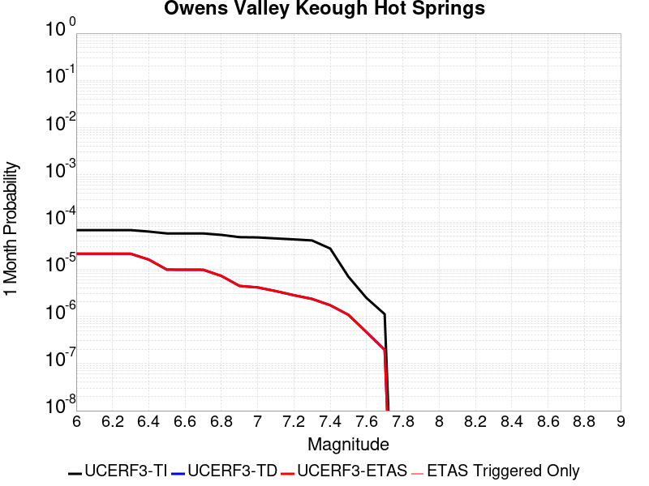 |  |  |

| Magnitude | 1 wk TI Prob | 1 wk TD Prob | 1 wk ETAS Prob | 1 wk ETAS/TD Gain | 1 wk ETAS Triggered Only | 1 mo TI Prob | 1 mo TD Prob | 1 mo ETAS Prob | 1 mo ETAS/TD Gain | 1 mo ETAS Triggered Only | 1 yr TI Prob | 1 yr TD Prob | 1 yr ETAS Prob | 1 yr ETAS/TD Gain | 1 yr ETAS Triggered Only | 10 yr TI Prob | 10 yr TD Prob | 10 yr ETAS Prob | 10 yr ETAS/TD Gain | 10 yr ETAS Triggered Only |
|-----|-----|-----|-----|-----|-----|-----|-----|-----|-----|-----|-----|-----|-----|-----|-----|-----|-----|-----|-----|-----|
| 6.0 | 1.5708529E-5 | 4.950656E-6 | 4.950656E-6 | 1.0 | 0.0 | 6.7320536E-5 | 2.1216953E-5 | 2.1216953E-5 | 1.0 | 0.0 | 8.193192E-4 | 2.582909E-4 | 2.7828573E-4 | 1.0774121 | 2.0E-5 | 0.008163051 | 0.0025805652 | 0.0026005134 | 1.0077302 | 2.0E-5 |
| 6.1 | 1.5708529E-5 | 4.950656E-6 | 4.950656E-6 | 1.0 | 0.0 | 6.7320536E-5 | 2.1216953E-5 | 2.1216953E-5 | 1.0 | 0.0 | 8.193192E-4 | 2.582909E-4 | 2.7828573E-4 | 1.0774121 | 2.0E-5 | 0.008163051 | 0.0025805652 | 0.0026005134 | 1.0077302 | 2.0E-5 |
| 6.2 | 1.5708529E-5 | 4.950656E-6 | 4.950656E-6 | 1.0 | 0.0 | 6.7320536E-5 | 2.1216953E-5 | 2.1216953E-5 | 1.0 | 0.0 | 8.193192E-4 | 2.582909E-4 | 2.7828573E-4 | 1.0774121 | 2.0E-5 | 0.008163051 | 0.0025805652 | 0.0026005134 | 1.0077302 | 2.0E-5 |
| 6.3 | 1.5708529E-5 | 4.950656E-6 | 4.950656E-6 | 1.0 | 0.0 | 6.7320536E-5 | 2.1216953E-5 | 2.1216953E-5 | 1.0 | 0.0 | 8.193192E-4 | 2.582909E-4 | 2.7828573E-4 | 1.0774121 | 2.0E-5 | 0.008163051 | 0.0025805652 | 0.0026005134 | 1.0077302 | 2.0E-5 |
| 6.4 | 1.4622509E-5 | 3.7265204E-6 | 3.7265204E-6 | 1.0 | 0.0 | 6.266639E-5 | 1.5970723E-5 | 1.5970723E-5 | 1.0 | 0.0 | 7.626962E-4 | 1.944295E-4 | 2.1442561E-4 | 1.1028451 | 2.0E-5 | 0.007600839 | 0.0019430731 | 0.0019630343 | 1.010273 | 2.0E-5 |
| 6.5 | 1.3335527E-5 | 2.2777172E-6 | 2.2777172E-6 | 1.0 | 0.0 | 5.7151006E-5 | 9.761612E-6 | 9.761612E-6 | 1.0 | 0.0 | 6.955913E-4 | 1.18841825E-4 | 1.3883944E-4 | 1.168271 | 2.0E-5 | 0.0069341804 | 0.0011880046 | 0.0012079809 | 1.016815 | 2.0E-5 |
| 6.6 | 1.3332855E-5 | 2.2748663E-6 | 2.2748663E-6 | 1.0 | 0.0 | 5.7139558E-5 | 9.749395E-6 | 9.749395E-6 | 1.0 | 0.0 | 6.9545204E-4 | 1.186931E-4 | 1.3869072E-4 | 1.1684818 | 2.0E-5 | 0.0069327964 | 0.0011865189 | 0.0012064951 | 1.016836 | 2.0E-5 |
| 6.7 | 1.3318214E-5 | 2.2640966E-6 | 2.2640966E-6 | 1.0 | 0.0 | 5.707681E-5 | 9.703239E-6 | 9.703239E-6 | 1.0 | 0.0 | 6.946886E-4 | 1.1813121E-4 | 1.3812885E-4 | 1.1692833 | 2.0E-5 | 0.0069252094 | 0.001180906 | 0.0012008824 | 1.0169162 | 2.0E-5 |
| 6.8 | 1.2441338E-5 | 1.6777863E-6 | 1.6777863E-6 | 1.0 | 0.0 | 5.331893E-5 | 7.1904947E-6 | 7.1904947E-6 | 1.0 | 0.0 | 6.489646E-4 | 8.7541055E-5 | 1.075393E-4 | 1.2284442 | 2.0E-5 | 0.0064707273 | 8.752499E-4 | 8.9523237E-4 | 1.0228306 | 2.0E-5 |
| 6.9 | 1.1130476E-5 | 1.0303868E-6 | 1.0303868E-6 | 1.0 | 0.0 | 4.7701167E-5 | 4.415936E-6 | 4.415936E-6 | 1.0 | 0.0 | 5.806069E-4 | 5.3762706E-5 | 7.376163E-5 | 1.3719851 | 2.0E-5 | 0.0057909233 | 5.37651E-4 | 5.576402E-4 | 1.0371789 | 2.0E-5 |
| 7.0 | 1.0986073E-5 | 9.579413E-7 | 9.579413E-7 | 1.0 | 0.0 | 4.7082318E-5 | 4.1054564E-6 | 4.1054564E-6 | 1.0 | 0.0 | 5.730765E-4 | 4.99828E-5 | 6.99818E-5 | 1.4001176 | 2.0E-5 | 0.0057160086 | 4.9986853E-4 | 5.198585E-4 | 1.0399905 | 2.0E-5 |
| 7.1 | 1.0451338E-5 | 8.0002656E-7 | 8.0002656E-7 | 1.0 | 0.0 | 4.4790682E-5 | 3.4286807E-6 | 3.4286807E-6 | 1.0 | 0.0 | 5.451901E-4 | 4.1743395E-5 | 6.174256E-5 | 1.4790977 | 2.0E-5 | 0.005438545 | 4.1750458E-4 | 4.3749623E-4 | 1.0478836 | 2.0E-5 |
| 7.2 | 9.989061E-6 | 6.544956E-7 | 6.544956E-7 | 1.0 | 0.0 | 4.280956E-5 | 2.804978E-6 | 2.804978E-6 | 1.0 | 0.0 | 5.2108173E-4 | 3.4150078E-5 | 5.4149394E-5 | 1.5856302 | 2.0E-5 | 0.0051986156 | 3.415851E-4 | 3.6157828E-4 | 1.0585306 | 2.0E-5 |
| 7.3 | 9.465365E-6 | 5.4600474E-7 | 5.4600474E-7 | 1.0 | 0.0 | 4.056522E-5 | 2.3400182E-6 | 2.3400182E-6 | 1.0 | 0.0 | 4.937696E-4 | 2.8489352E-5 | 4.8488782E-5 | 1.7019967 | 2.0E-5 | 0.0049267393 | 2.8498896E-4 | 3.0498326E-4 | 1.0701581 | 2.0E-5 |
| 7.4 | 6.3824805E-6 | 4.016335E-7 | 4.016335E-7 | 1.0 | 0.0 | 2.73532E-5 | 1.7212853E-6 | 1.7212853E-6 | 1.0 | 0.0 | 3.3297433E-4 | 2.095645E-5 | 4.095603E-5 | 1.9543401 | 2.0E-5 | 0.0033247585 | 2.0963654E-4 | 2.2963234E-4 | 1.0953832 | 2.0E-5 |
| 7.5 | 1.6192645E-6 | 2.516124E-7 | 2.516124E-7 | 1.0 | 0.0 | 6.9396865E-6 | 1.0783383E-6 | 1.0783383E-6 | 1.0 | 0.0 | 8.448741E-5 | 1.31286915E-5 | 3.312843E-5 | 2.523361 | 2.0E-5 | 8.4455294E-4 | 1.3127929E-4 | 1.5127666E-4 | 1.152327 | 2.0E-5 |
| 7.6 | 5.7062545E-7 | 1.07924045E-7 | 1.07924045E-7 | 1.0 | 0.0 | 2.4455355E-6 | 4.6253152E-7 | 4.6253152E-7 | 1.0 | 0.0 | 2.9773988E-5 | 5.6313074E-6 | 2.5631194E-5 | 4.551553 | 2.0E-5 | 2.977E-4 | 5.6311732E-5 | 7.631061E-5 | 1.3551458 | 2.0E-5 |
| 7.7 | 2.5988817E-7 | 4.5457977E-8 | 4.5457977E-8 | 1.0 | 0.0 | 1.113806E-6 | 1.9481989E-7 | 1.9481989E-7 | 1.0 | 0.0 | 1.3560503E-5 | 2.3719301E-6 | 2.2371883E-5 | 9.4319315 | 2.0E-5 | 1.3559677E-4 | 2.371909E-5 | 4.3718617E-5 | 1.8431827 | 2.0E-5 |

## Davis Creek
*[(top)](#table-of-contents)*

| 1 Week | 1 Month | 1 Year | 10 Year |
|-----|-----|-----|-----|
|  |  | 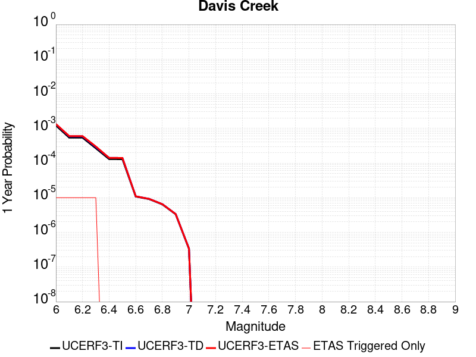 |  |

| Magnitude | 1 wk TI Prob | 1 wk TD Prob | 1 wk ETAS Prob | 1 wk ETAS/TD Gain | 1 wk ETAS Triggered Only | 1 mo TI Prob | 1 mo TD Prob | 1 mo ETAS Prob | 1 mo ETAS/TD Gain | 1 mo ETAS Triggered Only | 1 yr TI Prob | 1 yr TD Prob | 1 yr ETAS Prob | 1 yr ETAS/TD Gain | 1 yr ETAS Triggered Only | 10 yr TI Prob | 10 yr TD Prob | 10 yr ETAS Prob | 10 yr ETAS/TD Gain | 10 yr ETAS Triggered Only |
|-----|-----|-----|-----|-----|-----|-----|-----|-----|-----|-----|-----|-----|-----|-----|-----|-----|-----|-----|-----|-----|
| 6.0 | 2.331472E-5 | 2.5417214E-5 | 2.5417214E-5 | 1.0 | 0.0 | 9.99164E-5 | 1.0892704E-4 | 1.0892704E-4 | 1.0 | 0.0 | 0.0012158032 | 0.0013254983 | 0.0013354851 | 1.0075344 | 1.0E-5 | 0.01209173 | 0.013187704 | 0.013197572 | 1.0007483 | 1.0E-5 |
| 6.1 | 1.0407654E-5 | 1.1316986E-5 | 1.1316986E-5 | 1.0 | 0.0 | 4.4603472E-5 | 4.8500624E-5 | 4.8500624E-5 | 1.0 | 0.0 | 5.4291193E-4 | 5.9036224E-4 | 6.003563E-4 | 1.0169288 | 1.0E-5 | 0.0054158745 | 0.005890611 | 0.005900552 | 1.0016876 | 1.0E-5 |
| 6.2 | 1.0407654E-5 | 1.1316986E-5 | 1.1316986E-5 | 1.0 | 0.0 | 4.4603472E-5 | 4.8500624E-5 | 4.8500624E-5 | 1.0 | 0.0 | 5.4291193E-4 | 5.9036224E-4 | 6.003563E-4 | 1.0169288 | 1.0E-5 | 0.0054158745 | 0.005890611 | 0.005900552 | 1.0016876 | 1.0E-5 |
| 6.3 | 5.1323277E-6 | 5.568556E-6 | 5.568556E-6 | 1.0 | 0.0 | 2.1995505E-5 | 2.386507E-5 | 2.386507E-5 | 1.0 | 0.0 | 2.6776237E-4 | 2.905271E-4 | 3.005242E-4 | 1.0344102 | 1.0E-5 | 0.0026743996 | 0.0029023192 | 0.0029122902 | 1.0034355 | 1.0E-5 |
| 6.4 | 2.4985154E-6 | 2.704538E-6 | 2.704538E-6 | 1.0 | 0.0 | 1.07078795E-5 | 1.1590847E-5 | 1.1590847E-5 | 1.0 | 0.0 | 1.3036063E-4 | 1.4111304E-4 | 1.4111304E-4 | 1.0 | 0.0 | 0.0013028418 | 0.001410589 | 0.001410589 | 1.0 | 0.0 |
| 6.5 | 2.4846438E-6 | 2.6904722E-6 | 2.6904722E-6 | 1.0 | 0.0 | 1.064843E-5 | 1.1530565E-5 | 1.1530565E-5 | 1.0 | 0.0 | 1.2963692E-4 | 1.403792E-4 | 1.403792E-4 | 1.0 | 0.0 | 0.0012956132 | 0.0014032599 | 0.0014032599 | 1.0 | 0.0 |
| 6.6 | 2.072566E-7 | 2.1018087E-7 | 2.1018087E-7 | 1.0 | 0.0 | 8.882423E-7 | 9.0077486E-7 | 9.0077486E-7 | 1.0 | 0.0 | 1.0814296E-5 | 1.0966881E-5 | 1.0966881E-5 | 1.0 | 0.0 | 1.081377E-4 | 1.09663575E-4 | 1.09663575E-4 | 1.0 | 0.0 |
| 6.7 | 1.7544528E-7 | 1.7790826E-7 | 1.7790826E-7 | 1.0 | 0.0 | 7.5190815E-7 | 7.6246374E-7 | 7.6246374E-7 | 1.0 | 0.0 | 9.154443E-6 | 9.282958E-6 | 9.282958E-6 | 1.0 | 0.0 | 9.1540656E-5 | 9.282586E-5 | 9.282586E-5 | 1.0 | 0.0 |
| 6.8 | 1.2320395E-7 | 1.2481138E-7 | 1.2481138E-7 | 1.0 | 0.0 | 5.280168E-7 | 5.349058E-7 | 5.349058E-7 | 1.0 | 0.0 | 6.428586E-6 | 6.5124595E-6 | 6.5124595E-6 | 1.0 | 0.0 | 6.4284E-5 | 6.5122804E-5 | 6.5122804E-5 | 1.0 | 0.0 |
| 6.9 | 6.399997E-8 | 6.486058E-8 | 6.486058E-8 | 1.0 | 0.0 | 2.7428555E-7 | 2.7797387E-7 | 2.7797387E-7 | 1.0 | 0.0 | 3.3394215E-6 | 3.3843273E-6 | 3.3843273E-6 | 1.0 | 0.0 | 3.3393713E-5 | 3.384282E-5 | 3.384282E-5 | 1.0 | 0.0 |
| 7.0 | 6.4455685E-9 | 6.535264E-9 | 6.535264E-9 | 1.0 | 0.0 | 2.7623864E-8 | 2.8008275E-8 | 2.8008275E-8 | 1.0 | 0.0 | 3.3632048E-7 | 3.4100074E-7 | 3.4100074E-7 | 1.0 | 0.0 | 3.3631998E-6 | 3.4100074E-6 | 3.4100074E-6 | 1.0 | 0.0 |

## Sargent 2011 CFM
*[(top)](#table-of-contents)*

| 1 Week | 1 Month | 1 Year | 10 Year |
|-----|-----|-----|-----|
| 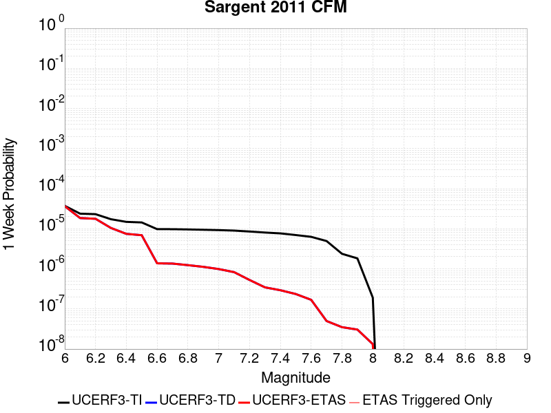 |  |  |  |

| Magnitude | 1 wk TI Prob | 1 wk TD Prob | 1 wk ETAS Prob | 1 wk ETAS/TD Gain | 1 wk ETAS Triggered Only | 1 mo TI Prob | 1 mo TD Prob | 1 mo ETAS Prob | 1 mo ETAS/TD Gain | 1 mo ETAS Triggered Only | 1 yr TI Prob | 1 yr TD Prob | 1 yr ETAS Prob | 1 yr ETAS/TD Gain | 1 yr ETAS Triggered Only | 10 yr TI Prob | 10 yr TD Prob | 10 yr ETAS Prob | 10 yr ETAS/TD Gain | 10 yr ETAS Triggered Only |
|-----|-----|-----|-----|-----|-----|-----|-----|-----|-----|-----|-----|-----|-----|-----|-----|-----|-----|-----|-----|-----|
| 6.0 | 3.7327867E-5 | 3.664913E-5 | 3.664913E-5 | 1.0 | 0.0 | 1.5996677E-4 | 1.5706103E-4 | 1.5706103E-4 | 1.0 | 0.0 | 0.0019458556 | 0.0019110236 | 0.0019110236 | 1.0 | 0.0 | 0.01928905 | 0.019018095 | 0.019037714 | 1.0010316 | 2.0E-5 |
| 6.1 | 2.3771476E-5 | 1.8479273E-5 | 1.8479273E-5 | 1.0 | 0.0 | 1.01873775E-4 | 7.919498E-5 | 7.919498E-5 | 1.0 | 0.0 | 0.0012396075 | 9.638493E-4 | 9.638493E-4 | 1.0 | 0.0 | 0.012327154 | 0.009636091 | 0.009645995 | 1.0010278 | 1.0E-5 |
| 6.2 | 2.3112721E-5 | 1.7710632E-5 | 1.7710632E-5 | 1.0 | 0.0 | 9.9050754E-5 | 7.590099E-5 | 7.590099E-5 | 1.0 | 0.0 | 0.0012052758 | 9.237792E-4 | 9.237792E-4 | 1.0 | 0.0 | 0.011987597 | 0.009238743 | 0.009248652 | 1.0010724 | 1.0E-5 |
| 6.3 | 1.728509E-5 | 1.0458927E-5 | 1.0458927E-5 | 1.0 | 0.0 | 7.407686E-5 | 4.482347E-5 | 4.482347E-5 | 1.0 | 0.0 | 9.015125E-4 | 5.456343E-4 | 5.456343E-4 | 1.0 | 0.0 | 0.008978641 | 0.0054791216 | 0.0054791216 | 1.0 | 0.0 |
| 6.4 | 1.48395575E-5 | 7.4559816E-6 | 7.4559816E-6 | 1.0 | 0.0 | 6.3596555E-5 | 3.195403E-5 | 3.195403E-5 | 1.0 | 0.0 | 7.7401294E-4 | 3.8900663E-4 | 3.8900663E-4 | 1.0 | 0.0 | 0.0077132257 | 0.003918666 | 0.003918666 | 1.0 | 0.0 |
| 6.5 | 1.4358964E-5 | 6.894759E-6 | 6.894759E-6 | 1.0 | 0.0 | 6.1536964E-5 | 2.9548846E-5 | 2.9548846E-5 | 1.0 | 0.0 | 7.48955E-4 | 3.5973339E-4 | 3.5973339E-4 | 1.0 | 0.0 | 0.0074643586 | 0.0036269152 | 0.0036269152 | 1.0 | 0.0 |
| 6.6 | 9.772591E-6 | 1.3736154E-6 | 1.3736154E-6 | 1.0 | 0.0 | 4.188186E-5 | 5.88691E-6 | 5.88691E-6 | 1.0 | 0.0 | 5.097923E-4 | 7.16708E-5 | 7.16708E-5 | 1.0 | 0.0 | 0.005086244 | 7.483097E-4 | 7.483097E-4 | 1.0 | 0.0 |
| 6.7 | 9.752745E-6 | 1.3523068E-6 | 1.3523068E-6 | 1.0 | 0.0 | 4.179681E-5 | 5.795587E-6 | 5.795587E-6 | 1.0 | 0.0 | 5.0875737E-4 | 7.055902E-5 | 7.055902E-5 | 1.0 | 0.0 | 0.005075942 | 7.371994E-4 | 7.371994E-4 | 1.0 | 0.0 |
| 6.8 | 9.608213E-6 | 1.2361709E-6 | 1.2361709E-6 | 1.0 | 0.0 | 4.1177405E-5 | 5.2978644E-6 | 5.2978644E-6 | 1.0 | 0.0 | 5.012196E-4 | 6.449961E-5 | 6.449961E-5 | 1.0 | 0.0 | 0.005000906 | 6.7634037E-4 | 6.7634037E-4 | 1.0 | 0.0 |
| 6.9 | 9.427164E-6 | 1.12094E-6 | 1.12094E-6 | 1.0 | 0.0 | 4.04015E-5 | 4.80402E-6 | 4.80402E-6 | 1.0 | 0.0 | 4.9177726E-4 | 5.8487396E-5 | 5.8487396E-5 | 1.0 | 0.0 | 0.004906904 | 6.1557174E-4 | 6.1557174E-4 | 1.0 | 0.0 |
| 7.0 | 9.247601E-6 | 9.873988E-7 | 9.873988E-7 | 1.0 | 0.0 | 3.9631974E-5 | 4.2317024E-6 | 4.2317024E-6 | 1.0 | 0.0 | 4.8241246E-4 | 5.1519775E-5 | 5.1519775E-5 | 1.0 | 0.0 | 0.0048136655 | 5.4542476E-4 | 5.4542476E-4 | 1.0 | 0.0 |
| 7.1 | 8.995454E-6 | 8.2711284E-7 | 8.2711284E-7 | 1.0 | 0.0 | 3.8551374E-5 | 3.5447645E-6 | 3.5447645E-6 | 1.0 | 0.0 | 4.6926187E-4 | 4.3156666E-5 | 4.3156666E-5 | 1.0 | 0.0 | 0.004682722 | 4.609069E-4 | 4.609069E-4 | 1.0 | 0.0 |
| 7.2 | 8.520861E-6 | 5.2766507E-7 | 5.2766507E-7 | 1.0 | 0.0 | 3.6517464E-5 | 2.2614197E-6 | 2.2614197E-6 | 1.0 | 0.0 | 4.445094E-4 | 2.7532446E-5 | 2.7532446E-5 | 1.0 | 0.0 | 0.004436213 | 3.0297207E-4 | 3.0297207E-4 | 1.0 | 0.0 |
| 7.3 | 8.043592E-6 | 3.456507E-7 | 3.456507E-7 | 1.0 | 0.0 | 3.4472083E-5 | 1.4813593E-6 | 1.4813593E-6 | 1.0 | 0.0 | 4.196168E-4 | 1.8035402E-5 | 1.8035402E-5 | 1.0 | 0.0 | 0.004188253 | 2.0669671E-4 | 2.0669671E-4 | 1.0 | 0.0 |
| 7.4 | 7.662316E-6 | 2.928958E-7 | 2.928958E-7 | 1.0 | 0.0 | 3.2838085E-5 | 1.2552671E-6 | 1.2552671E-6 | 1.0 | 0.0 | 3.9973034E-4 | 1.528277E-5 | 1.528277E-5 | 1.0 | 0.0 | 0.0039901207 | 1.7736501E-4 | 1.7736501E-4 | 1.0 | 0.0 |
| 7.5 | 6.961638E-6 | 2.3574503E-7 | 2.3574503E-7 | 1.0 | 0.0 | 2.9835252E-5 | 1.0103355E-6 | 1.0103355E-6 | 1.0 | 0.0 | 3.6318362E-4 | 1.2300766E-5 | 1.2300766E-5 | 1.0 | 0.0 | 0.0036259065 | 1.4409334E-4 | 1.4409334E-4 | 1.0 | 0.0 |
| 7.6 | 6.282332E-6 | 1.6892966E-7 | 1.6892966E-7 | 1.0 | 0.0 | 2.6924003E-5 | 7.2398404E-7 | 7.2398404E-7 | 1.0 | 0.0 | 3.2775043E-4 | 8.814471E-6 | 8.814471E-6 | 1.0 | 0.0 | 0.0032726745 | 1.05050465E-4 | 1.05050465E-4 | 1.0 | 0.0 |
| 7.7 | 4.934408E-6 | 5.001089E-8 | 5.001089E-8 | 1.0 | 0.0 | 2.114729E-5 | 2.1433237E-7 | 2.1433237E-7 | 1.0 | 0.0 | 2.5743784E-4 | 2.6094935E-6 | 2.6094935E-6 | 1.0 | 0.0 | 0.0025713982 | 3.2545366E-5 | 3.2545366E-5 | 1.0 | 0.0 |
| 7.8 | 2.373212E-6 | 3.5172643E-8 | 3.5172643E-8 | 1.0 | 0.0 | 1.0170869E-5 | 1.507399E-7 | 1.507399E-7 | 1.0 | 0.0 | 1.238233E-4 | 1.8352566E-6 | 1.8352566E-6 | 1.0 | 0.0 | 0.0012375432 | 2.4125171E-5 | 2.4125171E-5 | 1.0 | 0.0 |
| 7.9 | 1.8227792E-6 | 3.0619603E-8 | 3.0619603E-8 | 1.0 | 0.0 | 7.811887E-6 | 1.3122687E-7 | 1.3122687E-7 | 1.0 | 0.0 | 9.510558E-5 | 1.5976858E-6 | 1.5976858E-6 | 1.0 | 0.0 | 9.5064886E-4 | 2.1410624E-5 | 2.1410624E-5 | 1.0 | 0.0 |
| 8.0 | 1.9095137E-7 | 1.326461E-8 | 1.326461E-8 | 1.0 | 0.0 | 8.1836276E-7 | 5.684833E-8 | 5.684833E-8 | 1.0 | 0.0 | 9.963521E-6 | 6.921282E-7 | 6.921282E-7 | 1.0 | 0.0 | 9.963074E-5 | 8.463319E-6 | 8.463319E-6 | 1.0 | 0.0 |

## South Klamath Lake East
*[(top)](#table-of-contents)*

| 1 Week | 1 Month | 1 Year | 10 Year |
|-----|-----|-----|-----|
|  | 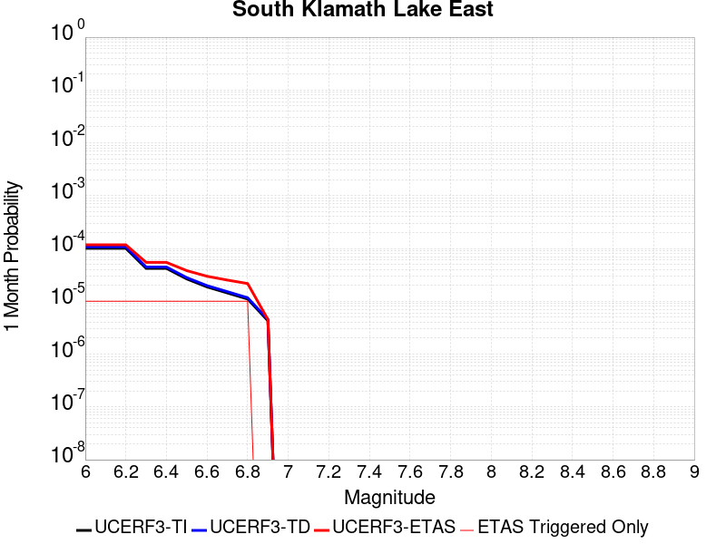 |  |  |

| Magnitude | 1 wk TI Prob | 1 wk TD Prob | 1 wk ETAS Prob | 1 wk ETAS/TD Gain | 1 wk ETAS Triggered Only | 1 mo TI Prob | 1 mo TD Prob | 1 mo ETAS Prob | 1 mo ETAS/TD Gain | 1 mo ETAS Triggered Only | 1 yr TI Prob | 1 yr TD Prob | 1 yr ETAS Prob | 1 yr ETAS/TD Gain | 1 yr ETAS Triggered Only | 10 yr TI Prob | 10 yr TD Prob | 10 yr ETAS Prob | 10 yr ETAS/TD Gain | 10 yr ETAS Triggered Only |
|-----|-----|-----|-----|-----|-----|-----|-----|-----|-----|-----|-----|-----|-----|-----|-----|-----|-----|-----|-----|-----|
| 6.0 | 2.3539369E-5 | 2.5047308E-5 | 3.504706E-5 | 1.3992345 | 1.0E-5 | 1.0087911E-4 | 1.0734166E-4 | 1.1734058E-4 | 1.0931505 | 1.0E-5 | 0.0012275111 | 0.0013061843 | 0.0013161713 | 1.0076458 | 1.0E-5 | 0.012207527 | 0.012993417 | 0.013003287 | 1.0007596 | 1.0E-5 |
| 6.1 | 2.3539369E-5 | 2.5047308E-5 | 3.504706E-5 | 1.3992345 | 1.0E-5 | 1.0087911E-4 | 1.0734166E-4 | 1.1734058E-4 | 1.0931505 | 1.0E-5 | 0.0012275111 | 0.0013061843 | 0.0013161713 | 1.0076458 | 1.0E-5 | 0.012207527 | 0.012993417 | 0.013003287 | 1.0007596 | 1.0E-5 |
| 6.2 | 2.3539369E-5 | 2.5047308E-5 | 3.504706E-5 | 1.3992345 | 1.0E-5 | 1.0087911E-4 | 1.0734166E-4 | 1.1734058E-4 | 1.0931505 | 1.0E-5 | 0.0012275111 | 0.0013061843 | 0.0013161713 | 1.0076458 | 1.0E-5 | 0.012207527 | 0.012993417 | 0.013003287 | 1.0007596 | 1.0E-5 |
| 6.3 | 9.807823E-6 | 1.0396044E-5 | 1.0396044E-5 | 1.0 | 0.0 | 4.2032847E-5 | 4.455376E-5 | 5.455331E-5 | 1.224438 | 1.0E-5 | 5.1162974E-4 | 5.4231536E-4 | 5.5230997E-4 | 1.0184294 | 1.0E-5 | 0.005104534 | 0.005410756 | 0.005420702 | 1.0018382 | 1.0E-5 |
| 6.4 | 9.807823E-6 | 1.0396044E-5 | 1.0396044E-5 | 1.0 | 0.0 | 4.2032847E-5 | 4.455376E-5 | 5.455331E-5 | 1.224438 | 1.0E-5 | 5.1162974E-4 | 5.4231536E-4 | 5.5230997E-4 | 1.0184294 | 1.0E-5 | 0.005104534 | 0.005410756 | 0.005420702 | 1.0018382 | 1.0E-5 |
| 6.5 | 6.191981E-6 | 6.5508398E-6 | 6.5508398E-6 | 1.0 | 0.0 | 2.653679E-5 | 2.8074743E-5 | 3.807446E-5 | 1.3561821 | 1.0E-5 | 3.2303753E-4 | 3.4175918E-4 | 3.5175576E-4 | 1.0292504 | 1.0E-5 | 0.0032256835 | 0.003412614 | 0.00342258 | 1.0029203 | 1.0E-5 |
| 6.6 | 4.3693776E-6 | 4.6165574E-6 | 4.6165574E-6 | 1.0 | 0.0 | 1.8725768E-5 | 1.9785102E-5 | 2.9784906E-5 | 1.5054208 | 1.0E-5 | 2.2796239E-4 | 2.4085813E-4 | 2.5085572E-4 | 1.0415082 | 1.0E-5 | 0.0022772867 | 0.0024060833 | 0.0024160594 | 1.0041461 | 1.0E-5 |
| 6.7 | 3.360834E-6 | 3.5512403E-6 | 3.5512403E-6 | 1.0 | 0.0 | 1.4403494E-5 | 1.5219517E-5 | 2.5219364E-5 | 1.6570411 | 1.0E-5 | 1.7534842E-4 | 1.8528267E-4 | 1.9528082E-4 | 1.0539616 | 1.0E-5 | 0.0017521014 | 0.0018513618 | 0.0018613433 | 1.0053915 | 1.0E-5 |
| 6.8 | 2.57873E-6 | 2.7251708E-6 | 2.7251708E-6 | 1.0 | 0.0 | 1.1051653E-5 | 1.1679254E-5 | 2.1679138E-5 | 1.856209 | 1.0E-5 | 1.3454557E-4 | 1.4218627E-4 | 1.5218485E-4 | 1.0703202 | 1.0E-5 | 0.0013446413 | 0.0014210136 | 0.0014309994 | 1.0070273 | 1.0E-5 |
| 6.9 | 9.987825E-7 | 1.0566213E-6 | 1.0566213E-6 | 1.0 | 0.0 | 4.2804895E-6 | 4.528371E-6 | 4.528371E-6 | 1.0 | 0.0 | 5.211371E-5 | 5.5131848E-5 | 5.5131848E-5 | 1.0 | 0.0 | 5.210149E-4 | 5.5121386E-4 | 5.5121386E-4 | 1.0 | 0.0 |

## Walker Spring 2011 CFM
*[(top)](#table-of-contents)*

| 1 Week | 1 Month | 1 Year | 10 Year |
|-----|-----|-----|-----|
| 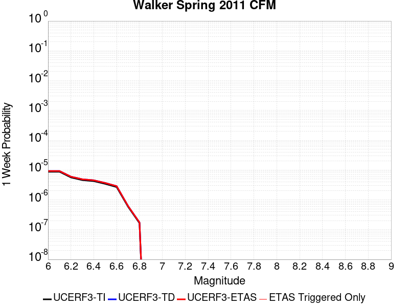 | 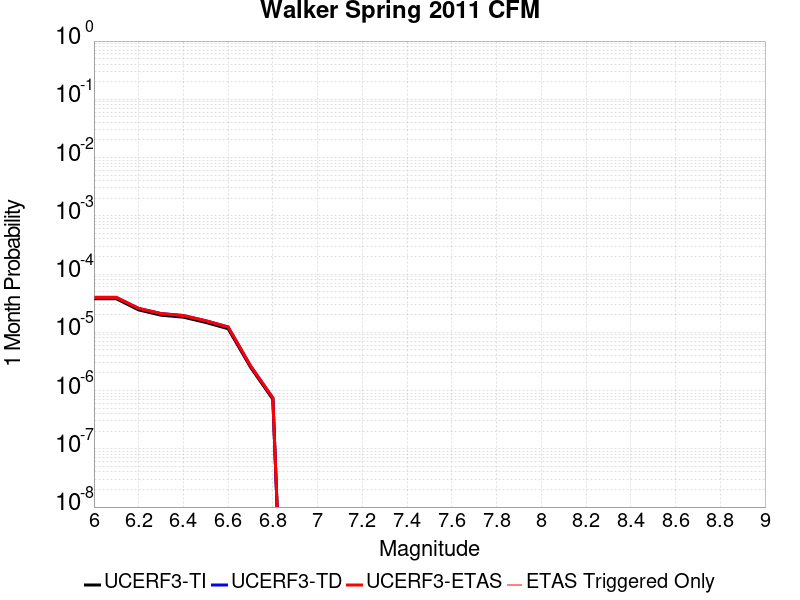 |  |  |

| Magnitude | 1 wk TI Prob | 1 wk TD Prob | 1 wk ETAS Prob | 1 wk ETAS/TD Gain | 1 wk ETAS Triggered Only | 1 mo TI Prob | 1 mo TD Prob | 1 mo ETAS Prob | 1 mo ETAS/TD Gain | 1 mo ETAS Triggered Only | 1 yr TI Prob | 1 yr TD Prob | 1 yr ETAS Prob | 1 yr ETAS/TD Gain | 1 yr ETAS Triggered Only | 10 yr TI Prob | 10 yr TD Prob | 10 yr ETAS Prob | 10 yr ETAS/TD Gain | 10 yr ETAS Triggered Only |
|-----|-----|-----|-----|-----|-----|-----|-----|-----|-----|-----|-----|-----|-----|-----|-----|-----|-----|-----|-----|-----|
| 6.0 | 8.791276E-6 | 9.264088E-6 | 9.264088E-6 | 1.0 | 0.0 | 3.767635E-5 | 3.970269E-5 | 3.970269E-5 | 1.0 | 0.0 | 4.58613E-4 | 4.832839E-4 | 4.832839E-4 | 1.0 | 0.0 | 0.004576677 | 0.0048234025 | 0.004833354 | 1.0020633 | 1.0E-5 |
| 6.1 | 8.791276E-6 | 9.264088E-6 | 9.264088E-6 | 1.0 | 0.0 | 3.767635E-5 | 3.970269E-5 | 3.970269E-5 | 1.0 | 0.0 | 4.58613E-4 | 4.832839E-4 | 4.832839E-4 | 1.0 | 0.0 | 0.004576677 | 0.0048234025 | 0.0048234025 | 1.0 | 0.0 |
| 6.2 | 5.654515E-6 | 5.99876E-6 | 5.99876E-6 | 1.0 | 0.0 | 2.4233412E-5 | 2.5708747E-5 | 2.5708747E-5 | 1.0 | 0.0 | 2.9500184E-4 | 3.1296405E-4 | 3.1296405E-4 | 1.0 | 0.0 | 0.0029461053 | 0.0031257276 | 0.0031257276 | 1.0 | 0.0 |
| 6.3 | 4.591685E-6 | 4.8947268E-6 | 4.8947268E-6 | 1.0 | 0.0 | 1.96785E-5 | 2.0977257E-5 | 2.0977257E-5 | 1.0 | 0.0 | 2.395594E-4 | 2.5537255E-4 | 2.5537255E-4 | 1.0 | 0.0 | 0.002393013 | 0.0025512208 | 0.0025512208 | 1.0 | 0.0 |
| 6.4 | 4.243283E-6 | 4.52266E-6 | 4.52266E-6 | 1.0 | 0.0 | 1.8185372E-5 | 1.938271E-5 | 1.938271E-5 | 1.0 | 0.0 | 2.2138441E-4 | 2.3596318E-4 | 2.3596318E-4 | 1.0 | 0.0 | 0.00221164 | 0.0023575418 | 0.0023575418 | 1.0 | 0.0 |
| 6.5 | 3.4445666E-6 | 3.6860924E-6 | 3.6860924E-6 | 1.0 | 0.0 | 1.4762345E-5 | 1.5797466E-5 | 1.5797466E-5 | 1.0 | 0.0 | 1.7971672E-4 | 1.923212E-4 | 1.923212E-4 | 1.0 | 0.0 | 0.0017957145 | 0.0019219425 | 0.0019219425 | 1.0 | 0.0 |
| 6.6 | 2.68766E-6 | 2.8794348E-6 | 2.8794348E-6 | 1.0 | 0.0 | 1.1518492E-5 | 1.2340398E-5 | 1.2340398E-5 | 1.0 | 0.0 | 1.4022861E-4 | 1.502378E-4 | 1.502378E-4 | 1.0 | 0.0 | 0.0014014016 | 0.0015017362 | 0.0015017362 | 1.0 | 0.0 |
| 6.7 | 5.880964E-7 | 6.1997474E-7 | 6.1997474E-7 | 1.0 | 0.0 | 2.5204106E-6 | 2.6570326E-6 | 2.6570326E-6 | 1.0 | 0.0 | 3.0685565E-5 | 3.2348988E-5 | 3.2348988E-5 | 1.0 | 0.0 | 3.068133E-4 | 3.2345214E-4 | 3.2345214E-4 | 1.0 | 0.0 |
| 6.8 | 1.6514163E-7 | 1.7409117E-7 | 1.7409117E-7 | 1.0 | 0.0 | 7.077497E-7 | 7.46105E-7 | 7.46105E-7 | 1.0 | 0.0 | 8.616818E-6 | 9.083828E-6 | 9.083828E-6 | 1.0 | 0.0 | 8.616484E-5 | 9.0838286E-5 | 9.0838286E-5 | 1.0 | 0.0 |

## Hollywood
*[(top)](#table-of-contents)*

| 1 Week | 1 Month | 1 Year | 10 Year |
|-----|-----|-----|-----|
| 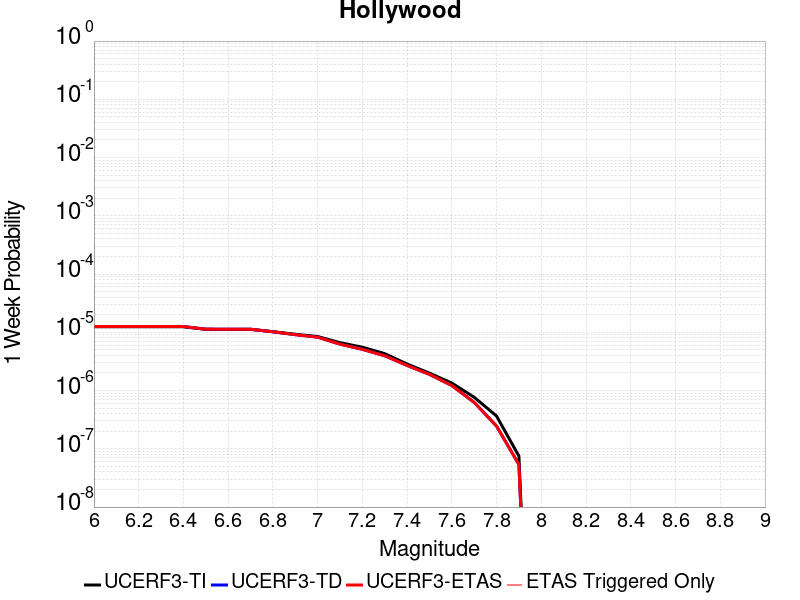 | 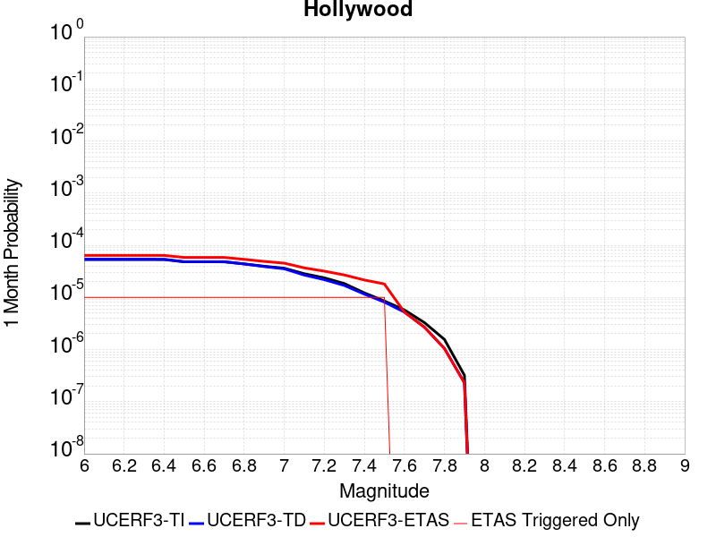 |  |  |

| Magnitude | 1 wk TI Prob | 1 wk TD Prob | 1 wk ETAS Prob | 1 wk ETAS/TD Gain | 1 wk ETAS Triggered Only | 1 mo TI Prob | 1 mo TD Prob | 1 mo ETAS Prob | 1 mo ETAS/TD Gain | 1 mo ETAS Triggered Only | 1 yr TI Prob | 1 yr TD Prob | 1 yr ETAS Prob | 1 yr ETAS/TD Gain | 1 yr ETAS Triggered Only | 10 yr TI Prob | 10 yr TD Prob | 10 yr ETAS Prob | 10 yr ETAS/TD Gain | 10 yr ETAS Triggered Only |
|-----|-----|-----|-----|-----|-----|-----|-----|-----|-----|-----|-----|-----|-----|-----|-----|-----|-----|-----|-----|-----|
| 6.0 | 1.24487615E-5 | 1.2593226E-5 | 1.2593226E-5 | 1.0 | 0.0 | 5.3350745E-5 | 5.3969878E-5 | 6.396934E-5 | 1.1852785 | 1.0E-5 | 6.4935174E-4 | 6.568898E-4 | 6.6688325E-4 | 1.0152133 | 1.0E-5 | 0.0064745755 | 0.006549969 | 0.0065599033 | 1.0015167 | 1.0E-5 |
| 6.1 | 1.24487615E-5 | 1.2593226E-5 | 1.2593226E-5 | 1.0 | 0.0 | 5.3350745E-5 | 5.3969878E-5 | 6.396934E-5 | 1.1852785 | 1.0E-5 | 6.4935174E-4 | 6.568898E-4 | 6.6688325E-4 | 1.0152133 | 1.0E-5 | 0.0064745755 | 0.006549969 | 0.0065599033 | 1.0015167 | 1.0E-5 |
| 6.2 | 1.24487615E-5 | 1.2593226E-5 | 1.2593226E-5 | 1.0 | 0.0 | 5.3350745E-5 | 5.3969878E-5 | 6.396934E-5 | 1.1852785 | 1.0E-5 | 6.4935174E-4 | 6.568898E-4 | 6.6688325E-4 | 1.0152133 | 1.0E-5 | 0.0064745755 | 0.006549969 | 0.0065599033 | 1.0015167 | 1.0E-5 |
| 6.3 | 1.24487615E-5 | 1.2593226E-5 | 1.2593226E-5 | 1.0 | 0.0 | 5.3350745E-5 | 5.3969878E-5 | 6.396934E-5 | 1.1852785 | 1.0E-5 | 6.4935174E-4 | 6.568898E-4 | 6.6688325E-4 | 1.0152133 | 1.0E-5 | 0.0064745755 | 0.006549969 | 0.0065599033 | 1.0015167 | 1.0E-5 |
| 6.4 | 1.2431024E-5 | 1.2573839E-5 | 1.2573839E-5 | 1.0 | 0.0 | 5.327473E-5 | 5.3886797E-5 | 6.3886255E-5 | 1.1855642 | 1.0E-5 | 6.4842677E-4 | 6.558789E-4 | 6.6587236E-4 | 1.0152367 | 1.0E-5 | 0.0064653796 | 0.0065399194 | 0.006549854 | 1.0015191 | 1.0E-5 |
| 6.5 | 1.1242222E-5 | 1.13178E-5 | 1.13178E-5 | 1.0 | 0.0 | 4.8180063E-5 | 4.850397E-5 | 5.8503487E-5 | 1.2061586 | 1.0E-5 | 5.864344E-4 | 5.9037853E-4 | 6.003726E-4 | 1.0169283 | 1.0E-5 | 0.0058488925 | 0.005888388 | 0.005898329 | 1.0016882 | 1.0E-5 |
| 6.6 | 1.1234066E-5 | 1.13089145E-5 | 1.13089145E-5 | 1.0 | 0.0 | 4.8145106E-5 | 4.846589E-5 | 5.8465404E-5 | 1.2063206 | 1.0E-5 | 5.86009E-4 | 5.8991514E-4 | 5.999092E-4 | 1.0169415 | 1.0E-5 | 0.005844661 | 0.0058837784 | 0.00589372 | 1.0016896 | 1.0E-5 |
| 6.7 | 1.12294E-5 | 1.1303658E-5 | 1.1303658E-5 | 1.0 | 0.0 | 4.812511E-5 | 4.8443362E-5 | 5.8442878E-5 | 1.2064166 | 1.0E-5 | 5.857657E-4 | 5.89641E-4 | 5.996351E-4 | 1.0169494 | 1.0E-5 | 0.0058422405 | 0.005881052 | 0.005890993 | 1.0016904 | 1.0E-5 |
| 6.8 | 1.0252819E-5 | 1.0218445E-5 | 1.0218445E-5 | 1.0 | 0.0 | 4.3939912E-5 | 4.379261E-5 | 5.3792173E-5 | 1.2283391 | 1.0E-5 | 5.3483713E-4 | 5.330467E-4 | 5.430414E-4 | 1.0187501 | 1.0E-5 | 0.005335517 | 0.005317908 | 0.0053278543 | 1.0018704 | 1.0E-5 |
| 6.9 | 9.252289E-6 | 9.110306E-6 | 9.110306E-6 | 1.0 | 0.0 | 3.9652066E-5 | 3.9043593E-5 | 4.9043203E-5 | 1.256114 | 1.0E-5 | 4.8265693E-4 | 4.752537E-4 | 4.8524895E-4 | 1.0210314 | 1.0E-5 | 0.0048161 | 0.004742547 | 0.0047524995 | 1.0020986 | 1.0E-5 |
| 7.0 | 8.474604E-6 | 8.258257E-6 | 8.258257E-6 | 1.0 | 0.0 | 3.6319227E-5 | 3.539206E-5 | 4.5391705E-5 | 1.2825392 | 1.0E-5 | 4.4209688E-4 | 4.3081454E-4 | 4.4081022E-4 | 1.0232018 | 1.0E-5 | 0.004412184 | 0.004299944 | 0.004309901 | 1.0023156 | 1.0E-5 |
| 7.1 | 6.643643E-6 | 6.2683675E-6 | 6.2683675E-6 | 1.0 | 0.0 | 2.8472443E-5 | 2.6864158E-5 | 3.686389E-5 | 1.3722332 | 1.0E-5 | 3.4659685E-4 | 3.2702246E-4 | 3.3701918E-4 | 1.030569 | 1.0E-5 | 0.0034605677 | 0.0032654584 | 0.0032754256 | 1.0030524 | 1.0E-5 |
| 7.2 | 5.549002E-6 | 5.108709E-6 | 5.108709E-6 | 1.0 | 0.0 | 2.378122E-5 | 2.1894284E-5 | 3.1894066E-5 | 1.4567302 | 1.0E-5 | 2.8949787E-4 | 2.6653046E-4 | 2.7652777E-4 | 1.0375092 | 1.0E-5 | 0.0028912104 | 0.0026621243 | 0.0026720979 | 1.0037464 | 1.0E-5 |
| 7.3 | 4.3059727E-6 | 3.9598885E-6 | 3.9598885E-6 | 1.0 | 0.0 | 1.8454039E-5 | 1.6970842E-5 | 2.6970672E-5 | 1.589236 | 1.0E-5 | 2.2465475E-4 | 2.066005E-4 | 2.1659843E-4 | 1.0483925 | 1.0E-5 | 0.0022442779 | 0.0020640944 | 0.0020740738 | 1.0048348 | 1.0E-5 |
| 7.4 | 2.8550733E-6 | 2.7012966E-6 | 2.7012966E-6 | 1.0 | 0.0 | 1.2235971E-5 | 1.1576934E-5 | 2.1576818E-5 | 1.8637766 | 1.0E-5 | 1.4896276E-4 | 1.409401E-4 | 1.509387E-4 | 1.0709422 | 1.0E-5 | 0.0014886294 | 0.0014085122 | 0.0014184982 | 1.0070897 | 1.0E-5 |
| 7.5 | 1.9927045E-6 | 1.8976367E-6 | 1.8976367E-6 | 1.0 | 0.0 | 8.540134E-6 | 8.132703E-6 | 1.8132621E-5 | 2.2295935 | 1.0E-5 | 1.0397117E-4 | 9.90112E-5 | 1.0901021E-4 | 1.1009886 | 1.0E-5 | 0.0010392254 | 9.896745E-4 | 9.996645E-4 | 1.0100943 | 1.0E-5 |
| 7.6 | 1.345084E-6 | 1.2216007E-6 | 1.2216007E-6 | 1.0 | 0.0 | 5.764633E-6 | 5.235421E-6 | 5.235421E-6 | 1.0 | 0.0 | 7.018215E-5 | 6.3739404E-5 | 6.3739404E-5 | 1.0 | 0.0 | 7.0159987E-4 | 6.3721323E-4 | 6.3721323E-4 | 1.0 | 0.0 |
| 7.7 | 7.6835164E-7 | 6.277697E-7 | 6.277697E-7 | 1.0 | 0.0 | 3.2929315E-6 | 2.6904388E-6 | 2.6904388E-6 | 1.0 | 0.0 | 4.00907E-5 | 3.2755615E-5 | 3.2755615E-5 | 1.0 | 0.0 | 4.0083472E-4 | 3.2750933E-4 | 3.2750933E-4 | 1.0 | 0.0 |
| 7.8 | 3.6562128E-7 | 2.453479E-7 | 2.453479E-7 | 1.0 | 0.0 | 1.5669474E-6 | 1.0514907E-6 | 1.0514907E-6 | 1.0 | 0.0 | 1.9077417E-5 | 1.2801827E-5 | 1.2801827E-5 | 1.0 | 0.0 | 1.907578E-4 | 1.2801126E-4 | 1.2801126E-4 | 1.0 | 0.0 |
| 7.9 | 7.5024424E-8 | 5.3816795E-8 | 5.3816795E-8 | 1.0 | 0.0 | 3.215332E-7 | 2.306434E-7 | 2.306434E-7 | 1.0 | 0.0 | 3.91466E-6 | 2.808081E-6 | 2.808081E-6 | 1.0 | 0.0 | 3.9145907E-5 | 2.8080585E-5 | 2.8080585E-5 | 1.0 | 0.0 |

## Earthquake Valley
*[(top)](#table-of-contents)*

| 1 Week | 1 Month | 1 Year | 10 Year |
|-----|-----|-----|-----|
|  | 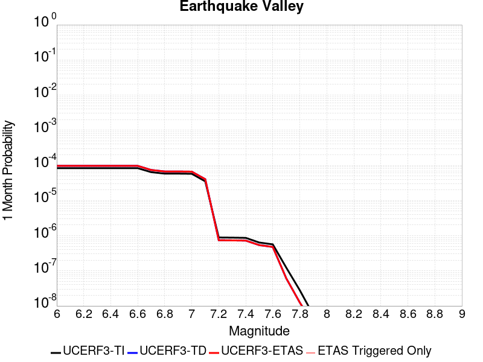 |  |  |

| Magnitude | 1 wk TI Prob | 1 wk TD Prob | 1 wk ETAS Prob | 1 wk ETAS/TD Gain | 1 wk ETAS Triggered Only | 1 mo TI Prob | 1 mo TD Prob | 1 mo ETAS Prob | 1 mo ETAS/TD Gain | 1 mo ETAS Triggered Only | 1 yr TI Prob | 1 yr TD Prob | 1 yr ETAS Prob | 1 yr ETAS/TD Gain | 1 yr ETAS Triggered Only | 10 yr TI Prob | 10 yr TD Prob | 10 yr ETAS Prob | 10 yr ETAS/TD Gain | 10 yr ETAS Triggered Only |
|-----|-----|-----|-----|-----|-----|-----|-----|-----|-----|-----|-----|-----|-----|-----|-----|-----|-----|-----|-----|-----|
| 6.0 | 1.9416384E-5 | 2.258408E-5 | 2.258408E-5 | 1.0 | 0.0 | 8.321042E-5 | 9.6785996E-5 | 9.6785996E-5 | 1.0 | 0.0 | 0.001012616 | 0.0011778527 | 0.0011778527 | 1.0 | 0.0 | 0.010080142 | 0.011727943 | 0.011737825 | 1.0008427 | 1.0E-5 |
| 6.1 | 1.9416384E-5 | 2.258408E-5 | 2.258408E-5 | 1.0 | 0.0 | 8.321042E-5 | 9.6785996E-5 | 9.6785996E-5 | 1.0 | 0.0 | 0.001012616 | 0.0011778527 | 0.0011778527 | 1.0 | 0.0 | 0.010080142 | 0.011727943 | 0.011737825 | 1.0008427 | 1.0E-5 |
| 6.2 | 1.9416384E-5 | 2.258408E-5 | 2.258408E-5 | 1.0 | 0.0 | 8.321042E-5 | 9.6785996E-5 | 9.6785996E-5 | 1.0 | 0.0 | 0.001012616 | 0.0011778527 | 0.0011778527 | 1.0 | 0.0 | 0.010080142 | 0.011727943 | 0.011737825 | 1.0008427 | 1.0E-5 |
| 6.3 | 1.9416384E-5 | 2.258408E-5 | 2.258408E-5 | 1.0 | 0.0 | 8.321042E-5 | 9.6785996E-5 | 9.6785996E-5 | 1.0 | 0.0 | 0.001012616 | 0.0011778527 | 0.0011778527 | 1.0 | 0.0 | 0.010080142 | 0.011727943 | 0.011737825 | 1.0008427 | 1.0E-5 |
| 6.4 | 1.9416384E-5 | 2.258408E-5 | 2.258408E-5 | 1.0 | 0.0 | 8.321042E-5 | 9.6785996E-5 | 9.6785996E-5 | 1.0 | 0.0 | 0.001012616 | 0.0011778527 | 0.0011778527 | 1.0 | 0.0 | 0.010080142 | 0.011727943 | 0.011737825 | 1.0008427 | 1.0E-5 |
| 6.5 | 1.9389157E-5 | 2.255267E-5 | 2.255267E-5 | 1.0 | 0.0 | 8.309374E-5 | 9.665139E-5 | 9.665139E-5 | 1.0 | 0.0 | 0.0010111968 | 0.0011762156 | 0.0011762156 | 1.0 | 0.0 | 0.010066078 | 0.011711745 | 0.011721628 | 1.0008439 | 1.0E-5 |
| 6.6 | 1.9389157E-5 | 2.255267E-5 | 2.255267E-5 | 1.0 | 0.0 | 8.309374E-5 | 9.665139E-5 | 9.665139E-5 | 1.0 | 0.0 | 0.0010111968 | 0.0011762156 | 0.0011762156 | 1.0 | 0.0 | 0.010066078 | 0.011711745 | 0.011721628 | 1.0008439 | 1.0E-5 |
| 6.7 | 1.4925434E-5 | 1.7208227E-5 | 1.7208227E-5 | 1.0 | 0.0 | 6.396457E-5 | 7.374794E-5 | 7.374794E-5 | 1.0 | 0.0 | 7.7849044E-4 | 8.9759636E-4 | 8.9759636E-4 | 1.0 | 0.0 | 0.007757689 | 0.008948085 | 0.008957995 | 1.0011076 | 1.0E-5 |
| 6.8 | 1.3570335E-5 | 1.5616843E-5 | 1.5616843E-5 | 1.0 | 0.0 | 5.8157282E-5 | 6.692807E-5 | 6.692807E-5 | 1.0 | 0.0 | 7.0783484E-4 | 8.1462675E-4 | 8.1462675E-4 | 1.0 | 0.0 | 0.0070558446 | 0.008124476 | 0.008134395 | 1.0012208 | 1.0E-5 |
| 6.9 | 1.3570335E-5 | 1.5616843E-5 | 1.5616843E-5 | 1.0 | 0.0 | 5.8157282E-5 | 6.692807E-5 | 6.692807E-5 | 1.0 | 0.0 | 7.0783484E-4 | 8.1462675E-4 | 8.1462675E-4 | 1.0 | 0.0 | 0.0070558446 | 0.008124476 | 0.008134395 | 1.0012208 | 1.0E-5 |
| 7.0 | 1.3433392E-5 | 1.5460388E-5 | 1.5460388E-5 | 1.0 | 0.0 | 5.757041E-5 | 6.6257584E-5 | 6.6257584E-5 | 1.0 | 0.0 | 7.0069433E-4 | 8.064695E-4 | 8.064695E-4 | 1.0 | 0.0 | 0.006984891 | 0.008043497 | 0.008053416 | 1.0012332 | 1.0E-5 |
| 7.1 | 8.181609E-6 | 9.416851E-6 | 9.416851E-6 | 1.0 | 0.0 | 3.5063567E-5 | 4.0357685E-5 | 4.0357685E-5 | 1.0 | 0.0 | 4.268153E-4 | 4.9131113E-4 | 4.9131113E-4 | 1.0 | 0.0 | 0.0042599645 | 0.0049088253 | 0.0049088253 | 1.0 | 0.0 |
| 7.2 | 2.0663983E-7 | 1.726294E-7 | 1.726294E-7 | 1.0 | 0.0 | 8.855989E-7 | 7.398401E-7 | 7.398401E-7 | 1.0 | 0.0 | 1.0782113E-5 | 9.00752E-6 | 9.00752E-6 | 1.0 | 0.0 | 1.07815904E-4 | 9.00719E-5 | 9.00719E-5 | 1.0 | 0.0 |
| 7.3 | 2.0462376E-7 | 1.7078433E-7 | 1.7078433E-7 | 1.0 | 0.0 | 8.7695867E-7 | 7.319327E-7 | 7.319327E-7 | 1.0 | 0.0 | 1.0676919E-5 | 8.911247E-6 | 8.911247E-6 | 1.0 | 0.0 | 1.0676406E-4 | 8.910926E-5 | 8.910926E-5 | 1.0 | 0.0 |
| 7.4 | 2.0171088E-7 | 1.6860913E-7 | 1.6860913E-7 | 1.0 | 0.0 | 8.644749E-7 | 7.2261037E-7 | 7.2261037E-7 | 1.0 | 0.0 | 1.0524931E-5 | 8.79775E-6 | 8.79775E-6 | 1.0 | 0.0 | 1.05244326E-4 | 8.7974375E-5 | 8.7974375E-5 | 1.0 | 0.0 |
| 7.5 | 1.4847944E-7 | 1.2559275E-7 | 1.2559275E-7 | 1.0 | 0.0 | 6.363403E-7 | 5.3825454E-7 | 5.3825454E-7 | 1.0 | 0.0 | 7.747416E-6 | 6.5532317E-6 | 6.5532317E-6 | 1.0 | 0.0 | 7.747146E-5 | 6.55306E-5 | 6.55306E-5 | 1.0 | 0.0 |
| 7.6 | 1.3185847E-7 | 1.1123213E-7 | 1.1123213E-7 | 1.0 | 0.0 | 5.6510765E-7 | 4.7670906E-7 | 4.7670906E-7 | 1.0 | 0.0 | 6.8801637E-6 | 5.8039195E-6 | 5.8039195E-6 | 1.0 | 0.0 | 6.8799505E-5 | 5.803789E-5 | 5.803789E-5 | 1.0 | 0.0 |
| 7.7 | 2.8609954E-8 | 1.4170958E-8 | 1.4170958E-8 | 1.0 | 0.0 | 1.2261408E-7 | 6.0732674E-8 | 6.0732674E-8 | 1.0 | 0.0 | 1.4928254E-6 | 7.394201E-7 | 7.394201E-7 | 1.0 | 0.0 | 1.4928154E-5 | 7.394182E-6 | 7.394182E-6 | 1.0 | 0.0 |
| 7.8 | 6.527266E-9 | 2.923417E-9 | 2.923417E-9 | 1.0 | 0.0 | 2.7973995E-8 | 1.2528931E-8 | 1.2528931E-8 | 1.0 | 0.0 | 3.4058334E-7 | 1.5253973E-7 | 1.5253973E-7 | 1.0 | 0.0 | 3.4058282E-6 | 1.5253964E-6 | 1.5253964E-6 | 1.0 | 0.0 |
| 7.9 | 1.2898267E-9 | 7.127684E-10 | 7.127684E-10 | 1.0 | 0.0 | 5.527829E-9 | 3.0547218E-9 | 3.0547218E-9 | 1.0 | 0.0 | 6.7301315E-8 | 3.719124E-8 | 3.719124E-8 | 1.0 | 0.0 | 6.7301295E-7 | 3.719124E-7 | 3.719124E-7 | 1.0 | 0.0 |

## Gillem - Big Crack 2011 CFM
*[(top)](#table-of-contents)*

| 1 Week | 1 Month | 1 Year | 10 Year |
|-----|-----|-----|-----|
|  |  |  |  |

| Magnitude | 1 wk TI Prob | 1 wk TD Prob | 1 wk ETAS Prob | 1 wk ETAS/TD Gain | 1 wk ETAS Triggered Only | 1 mo TI Prob | 1 mo TD Prob | 1 mo ETAS Prob | 1 mo ETAS/TD Gain | 1 mo ETAS Triggered Only | 1 yr TI Prob | 1 yr TD Prob | 1 yr ETAS Prob | 1 yr ETAS/TD Gain | 1 yr ETAS Triggered Only | 10 yr TI Prob | 10 yr TD Prob | 10 yr ETAS Prob | 10 yr ETAS/TD Gain | 10 yr ETAS Triggered Only |
|-----|-----|-----|-----|-----|-----|-----|-----|-----|-----|-----|-----|-----|-----|-----|-----|-----|-----|-----|-----|-----|
| 6.0 | 2.196852E-5 | 2.3604485E-5 | 2.3604485E-5 | 1.0 | 0.0 | 9.4147406E-5 | 1.01158665E-4 | 1.01158665E-4 | 1.0 | 0.0 | 0.0011456419 | 0.0012309998 | 0.0012309998 | 1.0 | 0.0 | 0.011397537 | 0.012250669 | 0.012260547 | 1.0008063 | 1.0E-5 |
| 6.1 | 9.992795E-6 | 1.071189E-5 | 1.071189E-5 | 1.0 | 0.0 | 4.2825563E-5 | 4.5907396E-5 | 4.5907396E-5 | 1.0 | 0.0 | 5.2127644E-4 | 5.587975E-4 | 5.587975E-4 | 1.0 | 0.0 | 0.0052005537 | 0.0055757347 | 0.005585679 | 1.0017835 | 1.0E-5 |
| 6.2 | 9.992795E-6 | 1.071189E-5 | 1.071189E-5 | 1.0 | 0.0 | 4.2825563E-5 | 4.5907396E-5 | 4.5907396E-5 | 1.0 | 0.0 | 5.2127644E-4 | 5.587975E-4 | 5.587975E-4 | 1.0 | 0.0 | 0.0052005537 | 0.0055757347 | 0.005585679 | 1.0017835 | 1.0E-5 |
| 6.3 | 4.6127884E-6 | 4.942657E-6 | 4.942657E-6 | 1.0 | 0.0 | 1.9768944E-5 | 2.1182668E-5 | 2.1182668E-5 | 1.0 | 0.0 | 2.406603E-4 | 2.5787292E-4 | 2.5787292E-4 | 1.0 | 0.0 | 0.0024039985 | 0.0025761751 | 0.0025861494 | 1.0038717 | 1.0E-5 |
| 6.4 | 4.6127884E-6 | 4.942657E-6 | 4.942657E-6 | 1.0 | 0.0 | 1.9768944E-5 | 2.1182668E-5 | 2.1182668E-5 | 1.0 | 0.0 | 2.406603E-4 | 2.5787292E-4 | 2.5787292E-4 | 1.0 | 0.0 | 0.0024039985 | 0.0025761751 | 0.0025861494 | 1.0038717 | 1.0E-5 |
| 6.5 | 2.716712E-6 | 2.9111113E-6 | 2.9111113E-6 | 1.0 | 0.0 | 1.1643E-5 | 1.24761455E-5 | 1.24761455E-5 | 1.0 | 0.0 | 1.417443E-4 | 1.5188892E-4 | 1.5188892E-4 | 1.0 | 0.0 | 0.0014165393 | 0.001518089 | 0.0015280738 | 1.0065773 | 1.0E-5 |
| 6.6 | 1.3818255E-6 | 1.4820689E-6 | 1.4820689E-6 | 1.0 | 0.0 | 5.922096E-6 | 6.3517155E-6 | 6.3517155E-6 | 1.0 | 0.0 | 7.209913E-5 | 7.7330624E-5 | 7.7330624E-5 | 1.0 | 0.0 | 7.2075747E-4 | 7.7315804E-4 | 7.831503E-4 | 1.012924 | 1.0E-5 |

## Mendocino
*[(top)](#table-of-contents)*

| 1 Week | 1 Month | 1 Year | 10 Year |
|-----|-----|-----|-----|
| 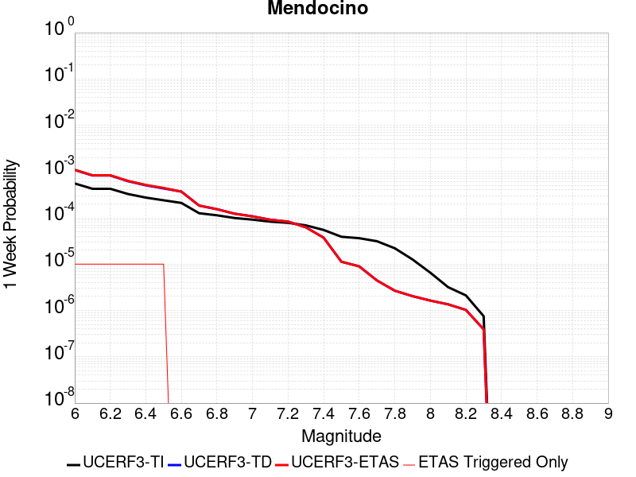 | 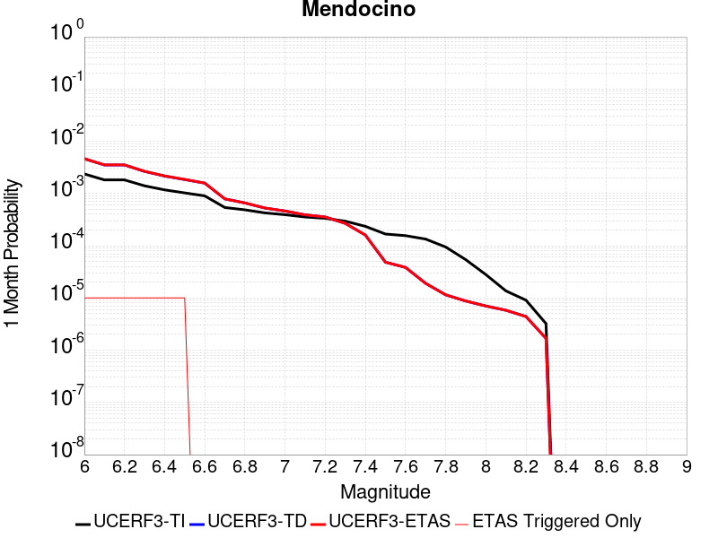 |  |  |

| Magnitude | 1 wk TI Prob | 1 wk TD Prob | 1 wk ETAS Prob | 1 wk ETAS/TD Gain | 1 wk ETAS Triggered Only | 1 mo TI Prob | 1 mo TD Prob | 1 mo ETAS Prob | 1 mo ETAS/TD Gain | 1 mo ETAS Triggered Only | 1 yr TI Prob | 1 yr TD Prob | 1 yr ETAS Prob | 1 yr ETAS/TD Gain | 1 yr ETAS Triggered Only | 10 yr TI Prob | 10 yr TD Prob | 10 yr ETAS Prob | 10 yr ETAS/TD Gain | 10 yr ETAS Triggered Only |
|-----|-----|-----|-----|-----|-----|-----|-----|-----|-----|-----|-----|-----|-----|-----|-----|-----|-----|-----|-----|-----|
| 6.0 | 5.5409013E-4 | 0.0010850244 | 0.0010950136 | 1.0092064 | 1.0E-5 | 0.0023725112 | 0.004636911 | 0.004646865 | 1.0021466 | 1.0E-5 | 0.028505474 | 0.05467285 | 0.054682303 | 1.0001729 | 1.0E-5 | 0.25113493 | 0.411882 | 0.41188788 | 1.0000143 | 1.0E-5 |
| 6.1 | 4.2515888E-4 | 8.233315E-4 | 8.333232E-4 | 1.0121357 | 1.0E-5 | 0.0018208373 | 0.0035215917 | 0.0035315563 | 1.0028297 | 1.0E-5 | 0.021944538 | 0.041749846 | 0.041759428 | 1.0002295 | 1.0E-5 | 0.19899574 | 0.32995537 | 0.32996207 | 1.0000203 | 1.0E-5 |
| 6.2 | 4.2515888E-4 | 8.233315E-4 | 8.333232E-4 | 1.0121357 | 1.0E-5 | 0.0018208373 | 0.0035215917 | 0.0035315563 | 1.0028297 | 1.0E-5 | 0.021944538 | 0.041749846 | 0.041759428 | 1.0002295 | 1.0E-5 | 0.19899574 | 0.32995537 | 0.32996207 | 1.0000203 | 1.0E-5 |
| 6.3 | 3.2773745E-4 | 6.1941805E-4 | 6.2941184E-4 | 1.0161341 | 1.0E-5 | 0.0014038329 | 0.0026506495 | 0.0026606228 | 1.0037626 | 1.0E-5 | 0.016958237 | 0.031592727 | 0.031602412 | 1.0003065 | 1.0E-5 | 0.1572094 | 0.26077813 | 0.26078552 | 1.0000284 | 1.0E-5 |
| 6.4 | 2.7417165E-4 | 5.0483743E-4 | 5.148324E-4 | 1.0197984 | 1.0E-5 | 0.0011744922 | 0.0021604756 | 0.002170454 | 1.0046186 | 1.0E-5 | 0.014205975 | 0.025837418 | 0.02584716 | 1.000377 | 1.0E-5 | 0.13331394 | 0.21947995 | 0.21948774 | 1.0000355 | 1.0E-5 |
| 6.5 | 2.3984899E-4 | 4.322691E-4 | 4.4226478E-4 | 1.0231237 | 1.0E-5 | 0.0010275192 | 0.0018508129 | 0.0018607945 | 1.005393 | 1.0E-5 | 0.012438473 | 0.022180691 | 0.022190468 | 1.0004408 | 1.0E-5 | 0.11764851 | 0.19203661 | 0.19204469 | 1.0000421 | 1.0E-5 |
| 6.6 | 2.1023539E-4 | 3.6937738E-4 | 3.6937738E-4 | 1.0 | 0.0 | 9.0069766E-4 | 0.0015816262 | 0.0015816262 | 1.0 | 0.0 | 0.010910975 | 0.018990388 | 0.018990388 | 1.0 | 0.0 | 0.10390546 | 0.16749348 | 0.16749348 | 1.0 | 0.0 |
| 6.7 | 1.2592976E-4 | 1.8438937E-4 | 1.8438937E-4 | 1.0 | 0.0 | 5.395873E-4 | 7.8949484E-4 | 7.8949484E-4 | 1.0 | 0.0 | 0.006549705 | 0.009555929 | 0.009555929 | 1.0 | 0.0 | 0.063599944 | 0.09096867 | 0.09096867 | 1.0 | 0.0 |
| 6.8 | 1.13663555E-4 | 1.5403709E-4 | 1.5403709E-4 | 1.0 | 0.0 | 4.8703855E-4 | 6.599124E-4 | 6.599124E-4 | 1.0 | 0.0 | 0.0059135845 | 0.007999982 | 0.007999982 | 1.0 | 0.0 | 0.057586733 | 0.07739284 | 0.07739284 | 1.0 | 0.0 |
| 6.9 | 9.926894E-5 | 1.229904E-4 | 1.229904E-4 | 1.0 | 0.0 | 4.2536893E-4 | 5.2698E-4 | 5.2698E-4 | 1.0 | 0.0 | 0.0051665753 | 0.006396752 | 0.006396752 | 1.0 | 0.0 | 0.050480947 | 0.06286036 | 0.06286036 | 1.0 | 0.0 |
| 7.0 | 9.168125E-5 | 1.0784077E-4 | 1.0784077E-4 | 1.0 | 0.0 | 3.9286047E-4 | 4.6207767E-4 | 4.6207767E-4 | 1.0 | 0.0 | 0.004772591 | 0.0056109587 | 0.0056109587 | 1.0 | 0.0 | 0.04671385 | 0.055621758 | 0.055621758 | 1.0 | 0.0 |
| 7.1 | 8.2854116E-5 | 9.1050766E-5 | 9.1050766E-5 | 1.0 | 0.0 | 3.5504074E-4 | 3.9016004E-4 | 3.9016004E-4 | 1.0 | 0.0 | 0.004314056 | 0.0047398703 | 0.0047398703 | 1.0 | 0.0 | 0.042312626 | 0.047481373 | 0.047481373 | 1.0 | 0.0 |
| 7.2 | 7.8255274E-5 | 8.300278E-5 | 8.300278E-5 | 1.0 | 0.0 | 3.3533663E-4 | 3.5567852E-4 | 3.5567852E-4 | 1.0 | 0.0 | 0.0040750825 | 0.0043219337 | 0.0043219337 | 1.0 | 0.0 | 0.040011603 | 0.043525863 | 0.043525863 | 1.0 | 0.0 |
| 7.3 | 6.887904E-5 | 6.2587686E-5 | 6.2587686E-5 | 1.0 | 0.0 | 2.9516246E-4 | 2.682059E-4 | 2.682059E-4 | 1.0 | 0.0 | 0.0035876823 | 0.0032606125 | 0.0032606125 | 1.0 | 0.0 | 0.035303112 | 0.033351965 | 0.033351965 | 1.0 | 0.0 |
| 7.4 | 5.4898497E-5 | 3.7399142E-5 | 3.7399142E-5 | 1.0 | 0.0 | 2.3525805E-4 | 1.6027251E-4 | 1.6027251E-4 | 1.0 | 0.0 | 0.0028605047 | 0.0019496274 | 0.0019496274 | 1.0 | 0.0 | 0.02823963 | 0.020410953 | 0.020410953 | 1.0 | 0.0 |
| 7.5 | 3.9103943E-5 | 1.1307368E-5 | 1.1307368E-5 | 1.0 | 0.0 | 1.6757756E-4 | 4.8459257E-5 | 4.8459257E-5 | 1.0 | 0.0 | 0.0020383475 | 5.8983336E-4 | 5.8983336E-4 | 1.0 | 0.0 | 0.020197518 | 0.00662414 | 0.00662414 | 1.0 | 0.0 |
| 7.6 | 3.641042E-5 | 8.984288E-6 | 8.984288E-6 | 1.0 | 0.0 | 1.5603533E-4 | 3.850353E-5 | 3.850353E-5 | 1.0 | 0.0 | 0.0018980748 | 4.68681E-4 | 4.68681E-4 | 1.0 | 0.0 | 0.018819444 | 0.005348026 | 0.005348026 | 1.0 | 0.0 |
| 7.7 | 3.1318774E-5 | 4.4553763E-6 | 4.4553763E-6 | 1.0 | 0.0 | 1.342164E-4 | 1.9094332E-5 | 1.9094332E-5 | 1.0 | 0.0 | 0.0016328598 | 2.3244887E-4 | 2.3244887E-4 | 1.0 | 0.0 | 0.016209139 | 0.0028659757 | 0.0028659757 | 1.0 | 0.0 |
| 7.8 | 2.209241E-5 | 2.6815096E-6 | 2.6815096E-6 | 1.0 | 0.0 | 9.467832E-5 | 1.1492133E-5 | 1.1492133E-5 | 1.0 | 0.0 | 0.001152099 | 1.3990777E-4 | 1.3990777E-4 | 1.0 | 0.0 | 0.011461443 | 0.0017378427 | 0.0017378427 | 1.0 | 0.0 |
| 7.9 | 1.2640477E-5 | 2.0423045E-6 | 2.0423045E-6 | 1.0 | 0.0 | 5.4172346E-5 | 8.752703E-6 | 8.752703E-6 | 1.0 | 0.0 | 6.593487E-4 | 1.0655898E-4 | 1.0655898E-4 | 1.0 | 0.0 | 0.006573958 | 0.0012980766 | 0.0012980766 | 1.0 | 0.0 |
| 8.0 | 6.5548907E-6 | 1.638728E-6 | 1.638728E-6 | 1.0 | 0.0 | 2.8092087E-5 | 7.0231013E-6 | 7.0231013E-6 | 1.0 | 0.0 | 3.4196748E-4 | 8.550293E-5 | 8.550293E-5 | 1.0 | 0.0 | 0.0034144172 | 0.0010310268 | 0.0010310268 | 1.0 | 0.0 |
| 8.1 | 3.1916707E-6 | 1.3582962E-6 | 1.3582962E-6 | 1.0 | 0.0 | 1.3678517E-5 | 5.8212563E-6 | 5.8212563E-6 | 1.0 | 0.0 | 1.6652321E-4 | 7.0871516E-5 | 7.0871516E-5 | 1.0 | 0.0 | 0.0016639848 | 8.627292E-4 | 8.627292E-4 | 1.0 | 0.0 |
| 8.2 | 2.1193785E-6 | 1.0301144E-6 | 1.0301144E-6 | 1.0 | 0.0 | 9.083019E-6 | 4.4147682E-6 | 4.4147682E-6 | 1.0 | 0.0 | 1.1058014E-4 | 5.37485E-5 | 5.37485E-5 | 1.0 | 0.0 | 0.0011052513 | 6.5027695E-4 | 6.5027695E-4 | 1.0 | 0.0 |
| 8.3 | 7.536878E-7 | 3.927364E-7 | 3.927364E-7 | 1.0 | 0.0 | 3.2300866E-6 | 1.683155E-6 | 1.683155E-6 | 1.0 | 0.0 | 3.9325594E-5 | 2.0492233E-5 | 2.0492233E-5 | 1.0 | 0.0 | 3.9318635E-4 | 2.4130501E-4 | 2.4130501E-4 | 1.0 | 0.0 |

## Thirty Mile Bank
*[(top)](#table-of-contents)*

| 1 Week | 1 Month | 1 Year | 10 Year |
|-----|-----|-----|-----|
| 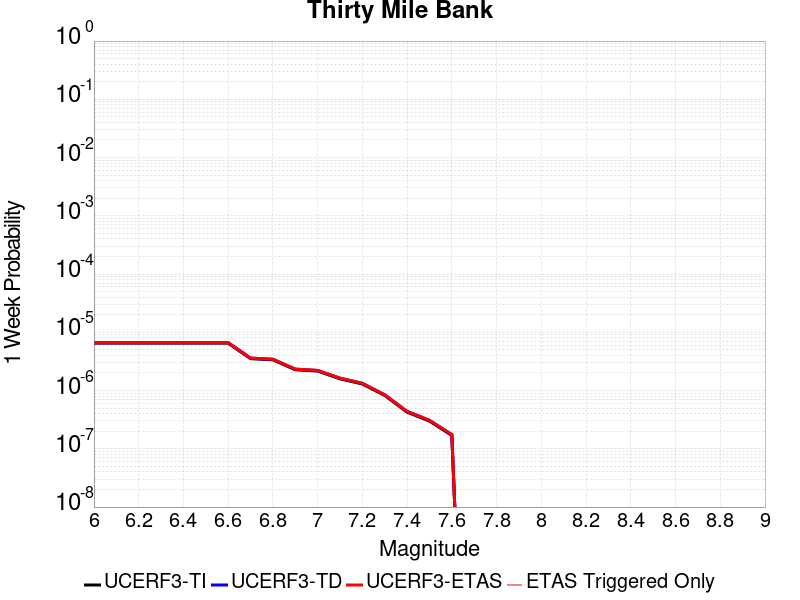 | 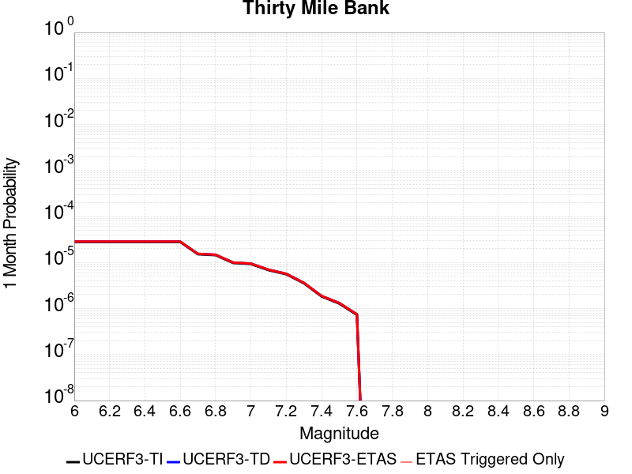 |  |  |

| Magnitude | 1 wk TI Prob | 1 wk TD Prob | 1 wk ETAS Prob | 1 wk ETAS/TD Gain | 1 wk ETAS Triggered Only | 1 mo TI Prob | 1 mo TD Prob | 1 mo ETAS Prob | 1 mo ETAS/TD Gain | 1 mo ETAS Triggered Only | 1 yr TI Prob | 1 yr TD Prob | 1 yr ETAS Prob | 1 yr ETAS/TD Gain | 1 yr ETAS Triggered Only | 10 yr TI Prob | 10 yr TD Prob | 10 yr ETAS Prob | 10 yr ETAS/TD Gain | 10 yr ETAS Triggered Only |
|-----|-----|-----|-----|-----|-----|-----|-----|-----|-----|-----|-----|-----|-----|-----|-----|-----|-----|-----|-----|-----|
| 6.0 | 6.5124755E-6 | 6.6592643E-6 | 6.6592643E-6 | 1.0 | 0.0 | 2.791031E-5 | 2.8539416E-5 | 2.8539416E-5 | 1.0 | 0.0 | 3.3975503E-4 | 3.4741635E-4 | 3.5741288E-4 | 1.0287739 | 1.0E-5 | 0.0033923604 | 0.003469164 | 0.0034791294 | 1.0028726 | 1.0E-5 |
| 6.1 | 6.5124755E-6 | 6.6592643E-6 | 6.6592643E-6 | 1.0 | 0.0 | 2.791031E-5 | 2.8539416E-5 | 2.8539416E-5 | 1.0 | 0.0 | 3.3975503E-4 | 3.4741635E-4 | 3.5741288E-4 | 1.0287739 | 1.0E-5 | 0.0033923604 | 0.003469164 | 0.0034791294 | 1.0028726 | 1.0E-5 |
| 6.2 | 6.5124755E-6 | 6.6592643E-6 | 6.6592643E-6 | 1.0 | 0.0 | 2.791031E-5 | 2.8539416E-5 | 2.8539416E-5 | 1.0 | 0.0 | 3.3975503E-4 | 3.4741635E-4 | 3.5741288E-4 | 1.0287739 | 1.0E-5 | 0.0033923604 | 0.003469164 | 0.0034791294 | 1.0028726 | 1.0E-5 |
| 6.3 | 6.5124755E-6 | 6.6592643E-6 | 6.6592643E-6 | 1.0 | 0.0 | 2.791031E-5 | 2.8539416E-5 | 2.8539416E-5 | 1.0 | 0.0 | 3.3975503E-4 | 3.4741635E-4 | 3.5741288E-4 | 1.0287739 | 1.0E-5 | 0.0033923604 | 0.003469164 | 0.0034791294 | 1.0028726 | 1.0E-5 |
| 6.4 | 6.5124755E-6 | 6.6592643E-6 | 6.6592643E-6 | 1.0 | 0.0 | 2.791031E-5 | 2.8539416E-5 | 2.8539416E-5 | 1.0 | 0.0 | 3.3975503E-4 | 3.4741635E-4 | 3.5741288E-4 | 1.0287739 | 1.0E-5 | 0.0033923604 | 0.003469164 | 0.0034791294 | 1.0028726 | 1.0E-5 |
| 6.5 | 6.5124755E-6 | 6.6592643E-6 | 6.6592643E-6 | 1.0 | 0.0 | 2.791031E-5 | 2.8539416E-5 | 2.8539416E-5 | 1.0 | 0.0 | 3.3975503E-4 | 3.4741635E-4 | 3.5741288E-4 | 1.0287739 | 1.0E-5 | 0.0033923604 | 0.003469164 | 0.0034791294 | 1.0028726 | 1.0E-5 |
| 6.6 | 6.5124755E-6 | 6.6592643E-6 | 6.6592643E-6 | 1.0 | 0.0 | 2.791031E-5 | 2.8539416E-5 | 2.8539416E-5 | 1.0 | 0.0 | 3.3975503E-4 | 3.4741635E-4 | 3.5741288E-4 | 1.0287739 | 1.0E-5 | 0.0033923604 | 0.003469164 | 0.0034791294 | 1.0028726 | 1.0E-5 |
| 6.7 | 3.5261137E-6 | 3.6098995E-6 | 3.6098995E-6 | 1.0 | 0.0 | 1.5111828E-5 | 1.547091E-5 | 1.547091E-5 | 1.0 | 0.0 | 1.8397097E-4 | 1.883427E-4 | 1.883427E-4 | 1.0 | 0.0 | 0.0018381875 | 0.0018818958 | 0.0018818958 | 1.0 | 0.0 |
| 6.8 | 3.370743E-6 | 3.4509355E-6 | 3.4509355E-6 | 1.0 | 0.0 | 1.4445961E-5 | 1.47896435E-5 | 1.47896435E-5 | 1.0 | 0.0 | 1.7586538E-4 | 1.8004965E-4 | 1.8004965E-4 | 1.0 | 0.0 | 0.0017572626 | 0.0017990996 | 0.0017990996 | 1.0 | 0.0 |
| 6.9 | 2.2756835E-6 | 2.333161E-6 | 2.333161E-6 | 1.0 | 0.0 | 9.752893E-6 | 9.999225E-6 | 9.999225E-6 | 1.0 | 0.0 | 1.18735006E-4 | 1.2173401E-4 | 1.2173401E-4 | 1.0 | 0.0 | 0.0011867158 | 0.0012166979 | 0.0012166979 | 1.0 | 0.0 |
| 7.0 | 2.1617404E-6 | 2.21598E-6 | 2.21598E-6 | 1.0 | 0.0 | 9.264569E-6 | 9.497024E-6 | 9.497024E-6 | 1.0 | 0.0 | 1.1279029E-4 | 1.1562037E-4 | 1.1562037E-4 | 1.0 | 0.0 | 0.0011273306 | 0.0011556263 | 0.0011556263 | 1.0 | 0.0 |
| 7.1 | 1.5900777E-6 | 1.6327014E-6 | 1.6327014E-6 | 1.0 | 0.0 | 6.814601E-6 | 6.997274E-6 | 6.997274E-6 | 1.0 | 0.0 | 8.296461E-5 | 8.518861E-5 | 8.518861E-5 | 1.0 | 0.0 | 8.293364E-4 | 8.5157226E-4 | 8.5157226E-4 | 1.0 | 0.0 |
| 7.2 | 1.2971728E-6 | 1.3328992E-6 | 1.3328992E-6 | 1.0 | 0.0 | 5.5593005E-6 | 5.712413E-6 | 5.712413E-6 | 1.0 | 0.0 | 6.768238E-5 | 6.954651E-5 | 6.954651E-5 | 1.0 | 0.0 | 6.7661767E-4 | 6.952578E-4 | 6.952578E-4 | 1.0 | 0.0 |
| 7.3 | 8.2454284E-7 | 8.448891E-7 | 8.448891E-7 | 1.0 | 0.0 | 3.5337503E-6 | 3.6209485E-6 | 3.6209485E-6 | 1.0 | 0.0 | 4.302256E-5 | 4.408422E-5 | 4.408422E-5 | 1.0 | 0.0 | 4.301423E-4 | 4.4076078E-4 | 4.4076078E-4 | 1.0 | 0.0 |
| 7.4 | 4.2619024E-7 | 4.3863466E-7 | 4.3863466E-7 | 1.0 | 0.0 | 1.8265283E-6 | 1.8798615E-6 | 1.8798615E-6 | 1.0 | 0.0 | 2.2237757E-5 | 2.2887078E-5 | 2.2887078E-5 | 1.0 | 0.0 | 2.223553E-4 | 2.288476E-4 | 2.288476E-4 | 1.0 | 0.0 |
| 7.5 | 2.993922E-7 | 3.086453E-7 | 3.086453E-7 | 1.0 | 0.0 | 1.2831089E-6 | 1.3227649E-6 | 1.3227649E-6 | 1.0 | 0.0 | 1.5621737E-5 | 1.6104546E-5 | 1.6104546E-5 | 1.0 | 0.0 | 1.562064E-4 | 1.6103406E-4 | 1.6103406E-4 | 1.0 | 0.0 |
| 7.6 | 1.6988751E-7 | 1.7533823E-7 | 1.7533823E-7 | 1.0 | 0.0 | 7.2808916E-7 | 7.5144936E-7 | 7.5144936E-7 | 1.0 | 0.0 | 8.864449E-6 | 9.14886E-6 | 9.14886E-6 | 1.0 | 0.0 | 8.8640954E-5 | 9.1485024E-5 | 9.1485024E-5 | 1.0 | 0.0 |

## Elysian Park (Lower CFM)
*[(top)](#table-of-contents)*

| 1 Week | 1 Month | 1 Year | 10 Year |
|-----|-----|-----|-----|
|  | 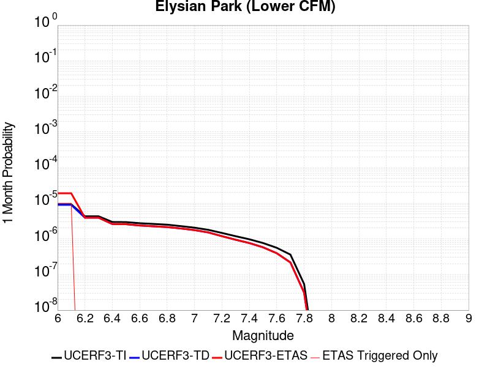 |  |  |

| Magnitude | 1 wk TI Prob | 1 wk TD Prob | 1 wk ETAS Prob | 1 wk ETAS/TD Gain | 1 wk ETAS Triggered Only | 1 mo TI Prob | 1 mo TD Prob | 1 mo ETAS Prob | 1 mo ETAS/TD Gain | 1 mo ETAS Triggered Only | 1 yr TI Prob | 1 yr TD Prob | 1 yr ETAS Prob | 1 yr ETAS/TD Gain | 1 yr ETAS Triggered Only | 10 yr TI Prob | 10 yr TD Prob | 10 yr ETAS Prob | 10 yr ETAS/TD Gain | 10 yr ETAS Triggered Only |
|-----|-----|-----|-----|-----|-----|-----|-----|-----|-----|-----|-----|-----|-----|-----|-----|-----|-----|-----|-----|-----|
| 6.0 | 2.1766498E-6 | 2.10379E-6 | 2.10379E-6 | 1.0 | 0.0 | 9.328466E-6 | 9.016219E-6 | 1.9016128E-5 | 2.1091022 | 1.0E-5 | 1.1356815E-4 | 1.09768385E-4 | 1.1976729E-4 | 1.0910909 | 1.0E-5 | 0.0011351013 | 0.0010972836 | 0.0011072726 | 1.0091034 | 1.0E-5 |
| 6.1 | 2.1766498E-6 | 2.10379E-6 | 2.10379E-6 | 1.0 | 0.0 | 9.328466E-6 | 9.016219E-6 | 1.9016128E-5 | 2.1091022 | 1.0E-5 | 1.1356815E-4 | 1.09768385E-4 | 1.1976729E-4 | 1.0910909 | 1.0E-5 | 0.0011351013 | 0.0010972836 | 0.0011072726 | 1.0091034 | 1.0E-5 |
| 6.2 | 1.0031182E-6 | 9.1862177E-7 | 9.1862177E-7 | 1.0 | 0.0 | 4.299071E-6 | 3.9369447E-6 | 3.9369447E-6 | 1.0 | 0.0 | 5.2339932E-5 | 4.793135E-5 | 4.793135E-5 | 1.0 | 0.0 | 5.2327604E-4 | 4.7921992E-4 | 4.7921992E-4 | 1.0 | 0.0 |
| 6.3 | 1.0031182E-6 | 9.1862177E-7 | 9.1862177E-7 | 1.0 | 0.0 | 4.299071E-6 | 3.9369447E-6 | 3.9369447E-6 | 1.0 | 0.0 | 5.2339932E-5 | 4.793135E-5 | 4.793135E-5 | 1.0 | 0.0 | 5.2327604E-4 | 4.7921992E-4 | 4.7921992E-4 | 1.0 | 0.0 |
| 6.4 | 6.9606244E-7 | 6.091946E-7 | 6.091946E-7 | 1.0 | 0.0 | 2.9831212E-6 | 2.6108314E-6 | 2.6108314E-6 | 1.0 | 0.0 | 3.6318896E-5 | 3.178641E-5 | 3.178641E-5 | 1.0 | 0.0 | 3.6312963E-4 | 3.178189E-4 | 3.178189E-4 | 1.0 | 0.0 |
| 6.5 | 6.901879E-7 | 6.03263E-7 | 6.03263E-7 | 1.0 | 0.0 | 2.9579448E-6 | 2.5854101E-6 | 2.5854101E-6 | 1.0 | 0.0 | 3.6012385E-5 | 3.1476917E-5 | 3.1476917E-5 | 1.0 | 0.0 | 3.600655E-4 | 3.147248E-4 | 3.147248E-4 | 1.0 | 0.0 |
| 6.6 | 6.4198554E-7 | 5.5466126E-7 | 5.5466126E-7 | 1.0 | 0.0 | 2.7513638E-6 | 2.3771174E-6 | 2.3771174E-6 | 1.0 | 0.0 | 3.3497337E-5 | 2.8941022E-5 | 2.8941022E-5 | 1.0 | 0.0 | 3.349229E-4 | 2.893727E-4 | 2.893727E-4 | 1.0 | 0.0 |
| 6.7 | 6.138733E-7 | 5.26342E-7 | 5.26342E-7 | 1.0 | 0.0 | 2.6308828E-6 | 2.2557495E-6 | 2.2557495E-6 | 1.0 | 0.0 | 3.203053E-5 | 2.7463404E-5 | 2.7463404E-5 | 1.0 | 0.0 | 3.2025913E-4 | 2.7460023E-4 | 2.7460023E-4 | 1.0 | 0.0 |
| 6.8 | 5.84778E-7 | 5.00294E-7 | 5.00294E-7 | 1.0 | 0.0 | 2.506189E-6 | 2.1441151E-6 | 2.1441151E-6 | 1.0 | 0.0 | 3.0512423E-5 | 2.6104291E-5 | 2.6104291E-5 | 1.0 | 0.0 | 3.0508233E-4 | 2.6101235E-4 | 2.6101235E-4 | 1.0 | 0.0 |
| 6.9 | 5.322785E-7 | 4.5800772E-7 | 4.5800772E-7 | 1.0 | 0.0 | 2.2811914E-6 | 1.9628887E-6 | 1.9628887E-6 | 1.0 | 0.0 | 2.7773152E-5 | 2.3897908E-5 | 2.3897908E-5 | 1.0 | 0.0 | 2.7769682E-4 | 2.389535E-4 | 2.389535E-4 | 1.0 | 0.0 |
| 7.0 | 4.8147206E-7 | 4.1124116E-7 | 4.1124116E-7 | 1.0 | 0.0 | 2.06345E-6 | 1.7624608E-6 | 1.7624608E-6 | 1.0 | 0.0 | 2.5122214E-5 | 2.145775E-5 | 2.145775E-5 | 1.0 | 0.0 | 2.5119373E-4 | 2.1455686E-4 | 2.1455686E-4 | 1.0 | 0.0 |
| 7.1 | 4.1932955E-7 | 3.5455713E-7 | 3.5455713E-7 | 1.0 | 0.0 | 1.7971255E-6 | 1.5195296E-6 | 1.5195296E-6 | 1.0 | 0.0 | 2.1879783E-5 | 1.8500115E-5 | 1.8500115E-5 | 1.0 | 0.0 | 2.1877629E-4 | 1.8498581E-4 | 1.8498581E-4 | 1.0 | 0.0 |
| 7.2 | 3.426051E-7 | 2.7810324E-7 | 2.7810324E-7 | 1.0 | 0.0 | 1.4683067E-6 | 1.1918704E-6 | 1.1918704E-6 | 1.0 | 0.0 | 1.7876488E-5 | 1.4510925E-5 | 1.4510925E-5 | 1.0 | 0.0 | 1.787505E-4 | 1.4509981E-4 | 1.4509981E-4 | 1.0 | 0.0 |
| 7.3 | 2.7771645E-7 | 2.209654E-7 | 2.209654E-7 | 1.0 | 0.0 | 1.1902127E-6 | 9.469942E-7 | 9.469942E-7 | 1.0 | 0.0 | 1.4490744E-5 | 1.1529593E-5 | 1.1529593E-5 | 1.0 | 0.0 | 1.4489799E-4 | 1.1528997E-4 | 1.1528997E-4 | 1.0 | 0.0 |
| 7.4 | 2.2756493E-7 | 1.7839815E-7 | 1.7839815E-7 | 1.0 | 0.0 | 9.752779E-7 | 7.6456325E-7 | 7.6456325E-7 | 1.0 | 0.0 | 1.1873944E-5 | 9.308518E-6 | 9.308518E-6 | 1.0 | 0.0 | 1.18733085E-4 | 9.30813E-5 | 9.30813E-5 | 1.0 | 0.0 |
| 7.5 | 1.7874558E-7 | 1.3542729E-7 | 1.3542729E-7 | 1.0 | 0.0 | 7.660522E-7 | 5.804025E-7 | 5.804025E-7 | 1.0 | 0.0 | 9.326646E-6 | 7.0663777E-6 | 7.0663777E-6 | 1.0 | 0.0 | 9.326255E-5 | 7.066155E-5 | 7.066155E-5 | 1.0 | 0.0 |
| 7.6 | 1.3124549E-7 | 9.250854E-8 | 9.250854E-8 | 1.0 | 0.0 | 5.624805E-7 | 3.964651E-7 | 3.964651E-7 | 1.0 | 0.0 | 6.8481786E-6 | 4.826952E-6 | 4.826952E-6 | 1.0 | 0.0 | 6.8479676E-5 | 4.8268485E-5 | 4.8268485E-5 | 1.0 | 0.0 |
| 7.7 | 8.439993E-8 | 5.090022E-8 | 5.090022E-8 | 1.0 | 0.0 | 3.6171392E-7 | 2.1814377E-7 | 2.1814377E-7 | 1.0 | 0.0 | 4.403858E-6 | 2.6558973E-6 | 2.6558973E-6 | 1.0 | 0.0 | 4.4037708E-5 | 2.655867E-5 | 2.655867E-5 | 1.0 | 0.0 |
| 7.8 | 1.2591407E-8 | 7.227629E-9 | 7.227629E-9 | 1.0 | 0.0 | 5.3963173E-8 | 3.0975556E-8 | 3.0975556E-8 | 1.0 | 0.0 | 6.570014E-7 | 3.7712732E-7 | 3.7712732E-7 | 1.0 | 0.0 | 6.5699946E-6 | 3.771267E-6 | 3.771267E-6 | 1.0 | 0.0 |
| 7.9 | 2.8324232E-11 | 2.1406099E-11 | 2.1406099E-11 | 1.0 | 0.0 | 1.2138957E-10 | 9.174017E-11 | 9.174017E-11 | 1.0 | 0.0 | 1.4779177E-9 | 1.1169362E-9 | 1.1169362E-9 | 1.0 | 0.0 | 1.4779177E-8 | 1.1169361E-8 | 1.1169361E-8 | 1.0 | 0.0 |

## West Napa 2011 CFM
*[(top)](#table-of-contents)*

| 1 Week | 1 Month | 1 Year | 10 Year |
|-----|-----|-----|-----|
|  | 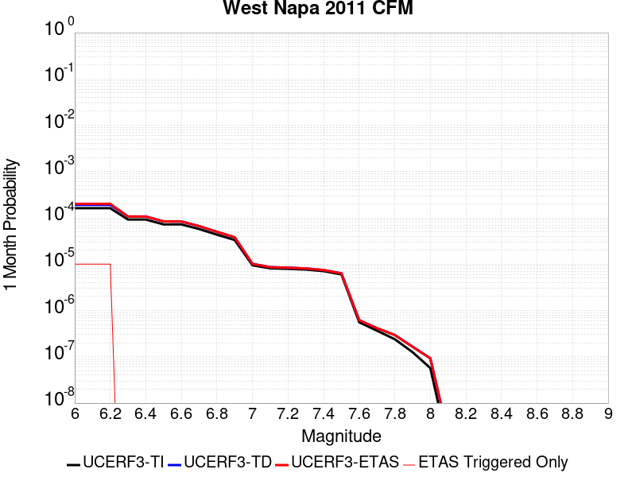 |  |  |

| Magnitude | 1 wk TI Prob | 1 wk TD Prob | 1 wk ETAS Prob | 1 wk ETAS/TD Gain | 1 wk ETAS Triggered Only | 1 mo TI Prob | 1 mo TD Prob | 1 mo ETAS Prob | 1 mo ETAS/TD Gain | 1 mo ETAS Triggered Only | 1 yr TI Prob | 1 yr TD Prob | 1 yr ETAS Prob | 1 yr ETAS/TD Gain | 1 yr ETAS Triggered Only | 10 yr TI Prob | 10 yr TD Prob | 10 yr ETAS Prob | 10 yr ETAS/TD Gain | 10 yr ETAS Triggered Only |
|-----|-----|-----|-----|-----|-----|-----|-----|-----|-----|-----|-----|-----|-----|-----|-----|-----|-----|-----|-----|-----|
| 6.0 | 3.773104E-5 | 4.452845E-5 | 5.4528E-5 | 1.2245655 | 1.0E-5 | 1.6169442E-4 | 1.9082405E-4 | 2.0082213E-4 | 1.0523943 | 1.0E-5 | 0.001966852 | 0.0023211248 | 0.0023311016 | 1.0042982 | 1.0E-5 | 0.019495348 | 0.023002245 | 0.023012016 | 1.0004247 | 1.0E-5 |
| 6.1 | 3.773104E-5 | 4.452845E-5 | 5.4528E-5 | 1.2245655 | 1.0E-5 | 1.6169442E-4 | 1.9082405E-4 | 2.0082213E-4 | 1.0523943 | 1.0E-5 | 0.001966852 | 0.0023211248 | 0.0023311016 | 1.0042982 | 1.0E-5 | 0.019495348 | 0.023002245 | 0.023012016 | 1.0004247 | 1.0E-5 |
| 6.2 | 3.773104E-5 | 4.452845E-5 | 5.4528E-5 | 1.2245655 | 1.0E-5 | 1.6169442E-4 | 1.9082405E-4 | 2.0082213E-4 | 1.0523943 | 1.0E-5 | 0.001966852 | 0.0023211248 | 0.0023311016 | 1.0042982 | 1.0E-5 | 0.019495348 | 0.023002245 | 0.023012016 | 1.0004247 | 1.0E-5 |
| 6.3 | 2.147964E-5 | 2.4987039E-5 | 2.4987039E-5 | 1.0 | 0.0 | 9.2052345E-5 | 1.0708343E-4 | 1.0708343E-4 | 1.0 | 0.0 | 0.001120161 | 0.0013030528 | 0.0013030528 | 1.0 | 0.0 | 0.011145315 | 0.0129647385 | 0.0129647385 | 1.0 | 0.0 |
| 6.4 | 2.147964E-5 | 2.4987039E-5 | 2.4987039E-5 | 1.0 | 0.0 | 9.2052345E-5 | 1.0708343E-4 | 1.0708343E-4 | 1.0 | 0.0 | 0.001120161 | 0.0013030528 | 0.0013030528 | 1.0 | 0.0 | 0.011145315 | 0.0129647385 | 0.0129647385 | 1.0 | 0.0 |
| 6.5 | 1.688201E-5 | 1.9547346E-5 | 1.9547346E-5 | 1.0 | 0.0 | 7.234947E-5 | 8.377206E-5 | 8.377206E-5 | 1.0 | 0.0 | 8.804988E-4 | 0.0010195201 | 0.0010195201 | 1.0 | 0.0 | 0.008770182 | 0.010157098 | 0.010157098 | 1.0 | 0.0 |
| 6.6 | 1.6846381E-5 | 1.9507039E-5 | 1.9507039E-5 | 1.0 | 0.0 | 7.219678E-5 | 8.359933E-5 | 8.359933E-5 | 1.0 | 0.0 | 8.7864127E-4 | 0.001017419 | 0.001017419 | 1.0 | 0.0 | 0.008751754 | 0.010136279 | 0.010136279 | 1.0 | 0.0 |
| 6.7 | 1.3396501E-5 | 1.5467655E-5 | 1.5467655E-5 | 1.0 | 0.0 | 5.7412315E-5 | 6.628862E-5 | 6.628862E-5 | 1.0 | 0.0 | 6.9877075E-4 | 8.0682867E-4 | 8.0682867E-4 | 1.0 | 0.0 | 0.0069657755 | 0.008046719 | 0.008046719 | 1.0 | 0.0 |
| 6.8 | 1.0139058E-5 | 1.1672149E-5 | 1.1672149E-5 | 1.0 | 0.0 | 4.3452383E-5 | 5.0022853E-5 | 5.0022853E-5 | 1.0 | 0.0 | 5.289043E-4 | 6.0891354E-4 | 6.0891354E-4 | 1.0 | 0.0 | 0.005276473 | 0.006079373 | 0.006079373 | 1.0 | 0.0 |
| 6.9 | 7.761281E-6 | 8.890694E-6 | 8.890694E-6 | 1.0 | 0.0 | 3.326221E-5 | 3.8102706E-5 | 3.8102706E-5 | 1.0 | 0.0 | 4.0489217E-4 | 4.6385307E-4 | 4.6385307E-4 | 1.0 | 0.0 | 0.0040415525 | 0.004635363 | 0.004635363 | 1.0 | 0.0 |
| 7.0 | 2.2109202E-6 | 2.3666025E-6 | 2.3666025E-6 | 1.0 | 0.0 | 9.475338E-6 | 1.0142544E-5 | 1.0142544E-5 | 1.0 | 0.0 | 1.1535613E-4 | 1.2347854E-4 | 1.2347854E-4 | 1.0 | 0.0 | 0.0011529627 | 0.0012355851 | 0.0012355851 | 1.0 | 0.0 |
| 7.1 | 1.9008926E-6 | 2.0132914E-6 | 2.0132914E-6 | 1.0 | 0.0 | 8.146657E-6 | 8.6283635E-6 | 8.6283635E-6 | 1.0 | 0.0 | 9.918104E-5 | 1.05045285E-4 | 1.05045285E-4 | 1.0 | 0.0 | 9.913679E-4 | 0.001051437 | 0.001051437 | 1.0 | 0.0 |
| 7.2 | 1.8495944E-6 | 1.9560982E-6 | 1.9560982E-6 | 1.0 | 0.0 | 7.926808E-6 | 8.383251E-6 | 8.383251E-6 | 1.0 | 0.0 | 9.650462E-5 | 1.0206133E-4 | 1.0206133E-4 | 1.0 | 0.0 | 9.6462725E-4 | 0.0010216252 | 0.0010216252 | 1.0 | 0.0 |
| 7.3 | 1.7883189E-6 | 1.8880608E-6 | 1.8880608E-6 | 1.0 | 0.0 | 7.664201E-6 | 8.091664E-6 | 8.091664E-6 | 1.0 | 0.0 | 9.330765E-5 | 9.8511584E-5 | 9.8511584E-5 | 1.0 | 0.0 | 9.3268487E-4 | 9.861597E-4 | 9.861597E-4 | 1.0 | 0.0 |
| 7.4 | 1.6520572E-6 | 1.741484E-6 | 1.741484E-6 | 1.0 | 0.0 | 7.0802257E-6 | 7.463482E-6 | 7.463482E-6 | 1.0 | 0.0 | 8.6198335E-5 | 9.086413E-5 | 9.086413E-5 | 1.0 | 0.0 | 8.616491E-4 | 9.0974604E-4 | 9.0974604E-4 | 1.0 | 0.0 |
| 7.5 | 1.4040345E-6 | 1.4800074E-6 | 1.4800074E-6 | 1.0 | 0.0 | 6.0172765E-6 | 6.3428733E-6 | 6.3428733E-6 | 1.0 | 0.0 | 7.325788E-5 | 7.7221775E-5 | 7.7221775E-5 | 1.0 | 0.0 | 7.3233736E-4 | 7.7339396E-4 | 7.7339396E-4 | 1.0 | 0.0 |
| 7.6 | 1.3013842E-7 | 1.4415936E-7 | 1.4415936E-7 | 1.0 | 0.0 | 5.57736E-7 | 6.1782566E-7 | 6.1782566E-7 | 1.0 | 0.0 | 6.790414E-6 | 7.5220014E-6 | 7.5220014E-6 | 1.0 | 0.0 | 6.790207E-5 | 7.614869E-5 | 7.614869E-5 | 1.0 | 0.0 |
| 7.7 | 8.541512E-8 | 9.716316E-8 | 9.716316E-8 | 1.0 | 0.0 | 3.6606474E-7 | 4.1641349E-7 | 4.1641349E-7 | 1.0 | 0.0 | 4.456829E-6 | 5.0698222E-6 | 5.0698222E-6 | 1.0 | 0.0 | 4.4567398E-5 | 5.160297E-5 | 5.160297E-5 | 1.0 | 0.0 |
| 7.8 | 5.6074793E-8 | 6.89534E-8 | 6.89534E-8 | 1.0 | 0.0 | 2.403205E-7 | 2.9551452E-7 | 2.9551452E-7 | 1.0 | 0.0 | 2.9258983E-6 | 3.5978833E-6 | 3.5978833E-6 | 1.0 | 0.0 | 2.9258597E-5 | 3.681433E-5 | 3.681433E-5 | 1.0 | 0.0 |
| 7.9 | 2.9475839E-8 | 3.8566046E-8 | 3.8566046E-8 | 1.0 | 0.0 | 1.2632502E-7 | 1.6528305E-7 | 1.6528305E-7 | 1.0 | 0.0 | 1.538006E-6 | 2.0123193E-6 | 2.0123193E-6 | 1.0 | 0.0 | 1.5379954E-5 | 2.0665891E-5 | 2.0665891E-5 | 1.0 | 0.0 |
| 8.0 | 1.3337122E-8 | 2.163124E-8 | 2.163124E-8 | 1.0 | 0.0 | 5.7159088E-8 | 9.270532E-8 | 9.270532E-8 | 1.0 | 0.0 | 6.959117E-7 | 1.1286867E-6 | 1.1286867E-6 | 1.0 | 0.0 | 6.959095E-6 | 1.1645628E-5 | 1.1645628E-5 | 1.0 | 0.0 |
| 8.1 | 2.6589986E-10 | 4.8615456E-10 | 4.8615456E-10 | 1.0 | 0.0 | 1.1395708E-9 | 2.0835205E-9 | 2.0835205E-9 | 1.0 | 0.0 | 1.3874274E-8 | 2.536686E-8 | 2.536686E-8 | 1.0 | 0.0 | 1.3874273E-7 | 2.6035906E-7 | 2.6035906E-7 | 1.0 | 0.0 |

## Almanor 2011 CFM
*[(top)](#table-of-contents)*

| 1 Week | 1 Month | 1 Year | 10 Year |
|-----|-----|-----|-----|
| 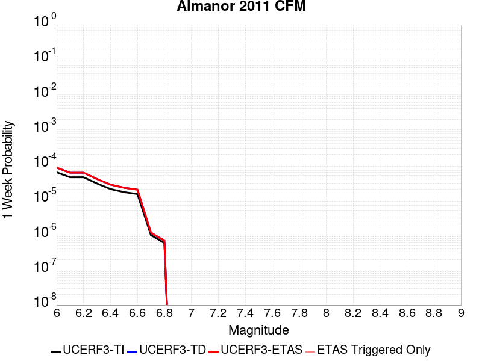 |  |  |  |

| Magnitude | 1 wk TI Prob | 1 wk TD Prob | 1 wk ETAS Prob | 1 wk ETAS/TD Gain | 1 wk ETAS Triggered Only | 1 mo TI Prob | 1 mo TD Prob | 1 mo ETAS Prob | 1 mo ETAS/TD Gain | 1 mo ETAS Triggered Only | 1 yr TI Prob | 1 yr TD Prob | 1 yr ETAS Prob | 1 yr ETAS/TD Gain | 1 yr ETAS Triggered Only | 10 yr TI Prob | 10 yr TD Prob | 10 yr ETAS Prob | 10 yr ETAS/TD Gain | 10 yr ETAS Triggered Only |
|-----|-----|-----|-----|-----|-----|-----|-----|-----|-----|-----|-----|-----|-----|-----|-----|-----|-----|-----|-----|-----|
| 6.0 | 6.1479834E-5 | 8.32787E-5 | 8.32787E-5 | 1.0 | 0.0 | 2.6345838E-4 | 3.5686578E-4 | 3.5686578E-4 | 1.0 | 0.0 | 0.0032028882 | 0.0043366123 | 0.004346569 | 1.002296 | 1.0E-5 | 0.031571172 | 0.04258577 | 0.042595346 | 1.0002248 | 1.0E-5 |
| 6.1 | 4.4387216E-5 | 5.9770442E-5 | 5.9770442E-5 | 1.0 | 0.0 | 1.9021705E-4 | 2.561381E-4 | 2.561381E-4 | 1.0 | 0.0 | 0.0023134327 | 0.003114426 | 0.003124395 | 1.0032009 | 1.0E-5 | 0.022894967 | 0.030755036 | 0.030764729 | 1.0003152 | 1.0E-5 |
| 6.2 | 4.4387216E-5 | 5.9770442E-5 | 5.9770442E-5 | 1.0 | 0.0 | 1.9021705E-4 | 2.561381E-4 | 2.561381E-4 | 1.0 | 0.0 | 0.0023134327 | 0.003114426 | 0.003124395 | 1.0032009 | 1.0E-5 | 0.022894967 | 0.030755036 | 0.030764729 | 1.0003152 | 1.0E-5 |
| 6.3 | 2.9523822E-5 | 3.954719E-5 | 3.954719E-5 | 1.0 | 0.0 | 1.2652454E-4 | 1.6947983E-4 | 1.6947983E-4 | 1.0 | 0.0 | 0.0015393476 | 0.0020618725 | 0.0020618725 | 1.0 | 0.0 | 0.015287281 | 0.020460794 | 0.020460794 | 1.0 | 0.0 |
| 6.4 | 2.0512744E-5 | 2.7431617E-5 | 2.7431617E-5 | 1.0 | 0.0 | 8.79088E-5 | 1.175612E-4 | 1.175612E-4 | 1.0 | 0.0 | 0.001069764 | 0.0014307408 | 0.0014307408 | 1.0 | 0.0 | 0.010646289 | 0.014244413 | 0.014244413 | 1.0 | 0.0 |
| 6.5 | 1.6750226E-5 | 2.23913E-5 | 2.23913E-5 | 1.0 | 0.0 | 7.178471E-5 | 9.596152E-5 | 9.596152E-5 | 1.0 | 0.0 | 8.7362836E-4 | 0.0011680633 | 0.0011680633 | 1.0 | 0.0 | 0.008702018 | 0.011649038 | 0.011649038 | 1.0 | 0.0 |
| 6.6 | 1.4745303E-5 | 1.9707952E-5 | 1.9707952E-5 | 1.0 | 0.0 | 6.319262E-5 | 8.446223E-5 | 8.446223E-5 | 1.0 | 0.0 | 7.690986E-4 | 0.0010281964 | 0.0010281964 | 1.0 | 0.0 | 0.0076644225 | 0.010264971 | 0.010264971 | 1.0 | 0.0 |
| 6.7 | 9.951145E-7 | 1.1616347E-6 | 1.1616347E-6 | 1.0 | 0.0 | 4.26477E-6 | 4.9784257E-6 | 4.9784257E-6 | 1.0 | 0.0 | 5.1922336E-5 | 6.0610826E-5 | 6.0610826E-5 | 1.0 | 0.0 | 5.1910203E-4 | 6.059602E-4 | 6.059602E-4 | 1.0 | 0.0 |
| 6.8 | 5.866312E-7 | 6.849384E-7 | 6.849384E-7 | 1.0 | 0.0 | 2.5141312E-6 | 2.9354478E-6 | 2.9354478E-6 | 1.0 | 0.0 | 3.0609117E-5 | 3.5738623E-5 | 3.5738623E-5 | 1.0 | 0.0 | 3.06049E-4 | 3.5734157E-4 | 3.5734157E-4 | 1.0 | 0.0 |

## Del Valle
*[(top)](#table-of-contents)*

| 1 Week | 1 Month | 1 Year | 10 Year |
|-----|-----|-----|-----|
|  |  |  |  |

| Magnitude | 1 wk TI Prob | 1 wk TD Prob | 1 wk ETAS Prob | 1 wk ETAS/TD Gain | 1 wk ETAS Triggered Only | 1 mo TI Prob | 1 mo TD Prob | 1 mo ETAS Prob | 1 mo ETAS/TD Gain | 1 mo ETAS Triggered Only | 1 yr TI Prob | 1 yr TD Prob | 1 yr ETAS Prob | 1 yr ETAS/TD Gain | 1 yr ETAS Triggered Only | 10 yr TI Prob | 10 yr TD Prob | 10 yr ETAS Prob | 10 yr ETAS/TD Gain | 10 yr ETAS Triggered Only |
|-----|-----|-----|-----|-----|-----|-----|-----|-----|-----|-----|-----|-----|-----|-----|-----|-----|-----|-----|-----|-----|
| 6.0 | 1.0716125E-5 | 8.767882E-6 | 8.767882E-6 | 1.0 | 0.0 | 4.592544E-5 | 3.7576207E-5 | 3.7576207E-5 | 1.0 | 0.0 | 5.589988E-4 | 4.5741405E-4 | 4.5741405E-4 | 1.0 | 0.0 | 0.0055759475 | 0.00456668 | 0.0045766346 | 1.0021797 | 1.0E-5 |
| 6.1 | 1.0716125E-5 | 8.767882E-6 | 8.767882E-6 | 1.0 | 0.0 | 4.592544E-5 | 3.7576207E-5 | 3.7576207E-5 | 1.0 | 0.0 | 5.589988E-4 | 4.5741405E-4 | 4.5741405E-4 | 1.0 | 0.0 | 0.0055759475 | 0.00456668 | 0.0045766346 | 1.0021797 | 1.0E-5 |
| 6.2 | 1.0716125E-5 | 8.767882E-6 | 8.767882E-6 | 1.0 | 0.0 | 4.592544E-5 | 3.7576207E-5 | 3.7576207E-5 | 1.0 | 0.0 | 5.589988E-4 | 4.5741405E-4 | 4.5741405E-4 | 1.0 | 0.0 | 0.0055759475 | 0.00456668 | 0.0045766346 | 1.0021797 | 1.0E-5 |
| 6.3 | 7.1293784E-6 | 4.865823E-6 | 4.865823E-6 | 1.0 | 0.0 | 3.055412E-5 | 2.0853364E-5 | 2.0853364E-5 | 1.0 | 0.0 | 3.7193293E-4 | 2.5386087E-4 | 2.5386087E-4 | 1.0 | 0.0 | 0.0037131102 | 0.0025357946 | 0.0025357946 | 1.0 | 0.0 |
| 6.4 | 7.1293784E-6 | 4.865823E-6 | 4.865823E-6 | 1.0 | 0.0 | 3.055412E-5 | 2.0853364E-5 | 2.0853364E-5 | 1.0 | 0.0 | 3.7193293E-4 | 2.5386087E-4 | 2.5386087E-4 | 1.0 | 0.0 | 0.0037131102 | 0.0025357946 | 0.0025357946 | 1.0 | 0.0 |
| 6.5 | 7.1293784E-6 | 4.865823E-6 | 4.865823E-6 | 1.0 | 0.0 | 3.055412E-5 | 2.0853364E-5 | 2.0853364E-5 | 1.0 | 0.0 | 3.7193293E-4 | 2.5386087E-4 | 2.5386087E-4 | 1.0 | 0.0 | 0.0037131102 | 0.0025357946 | 0.0025357946 | 1.0 | 0.0 |
| 6.6 | 7.1293784E-6 | 4.865823E-6 | 4.865823E-6 | 1.0 | 0.0 | 3.055412E-5 | 2.0853364E-5 | 2.0853364E-5 | 1.0 | 0.0 | 3.7193293E-4 | 2.5386087E-4 | 2.5386087E-4 | 1.0 | 0.0 | 0.0037131102 | 0.0025357946 | 0.0025357946 | 1.0 | 0.0 |
| 6.7 | 7.12272E-6 | 4.8631987E-6 | 4.8631987E-6 | 1.0 | 0.0 | 3.0525585E-5 | 2.0842117E-5 | 2.0842117E-5 | 1.0 | 0.0 | 3.7158563E-4 | 2.5372396E-4 | 2.5372396E-4 | 1.0 | 0.0 | 0.003709649 | 0.0025344288 | 0.0025344288 | 1.0 | 0.0 |
| 6.8 | 6.7558703E-6 | 4.5594015E-6 | 4.5594015E-6 | 1.0 | 0.0 | 2.895341E-5 | 1.9540148E-5 | 1.9540148E-5 | 1.0 | 0.0 | 3.5245073E-4 | 2.3787597E-4 | 2.3787597E-4 | 1.0 | 0.0 | 0.0035189227 | 0.0023762889 | 0.0023762889 | 1.0 | 0.0 |
| 6.9 | 6.6700386E-6 | 4.502539E-6 | 4.502539E-6 | 1.0 | 0.0 | 2.8585566E-5 | 1.9296456E-5 | 1.9296456E-5 | 1.0 | 0.0 | 3.479737E-4 | 2.3490966E-4 | 2.3490966E-4 | 1.0 | 0.0 | 0.003474293 | 0.0023466884 | 0.0023466884 | 1.0 | 0.0 |
| 7.0 | 6.3181424E-6 | 4.0987034E-6 | 4.0987034E-6 | 1.0 | 0.0 | 2.7077473E-5 | 1.7565755E-5 | 1.7565755E-5 | 1.0 | 0.0 | 3.2961834E-4 | 2.1384252E-4 | 2.1384252E-4 | 1.0 | 0.0 | 0.0032912986 | 0.002136422 | 0.002136422 | 1.0 | 0.0 |
| 7.1 | 6.248759E-6 | 4.033895E-6 | 4.033895E-6 | 1.0 | 0.0 | 2.678012E-5 | 1.7288008E-5 | 1.7288008E-5 | 1.0 | 0.0 | 3.2599916E-4 | 2.104616E-4 | 2.104616E-4 | 1.0 | 0.0 | 0.0032552136 | 0.0021026772 | 0.0021026772 | 1.0 | 0.0 |
| 7.2 | 6.0411944E-6 | 3.869888E-6 | 3.869888E-6 | 1.0 | 0.0 | 2.5890577E-5 | 1.658513E-5 | 1.658513E-5 | 1.0 | 0.0 | 3.1517216E-4 | 2.0190567E-4 | 2.0190567E-4 | 1.0 | 0.0 | 0.0031472554 | 0.0020172757 | 0.0020172757 | 1.0 | 0.0 |
| 7.3 | 4.7691183E-6 | 3.0781202E-6 | 3.0781202E-6 | 1.0 | 0.0 | 2.0438918E-5 | 1.3191879E-5 | 1.3191879E-5 | 1.0 | 0.0 | 2.488154E-4 | 1.605995E-4 | 1.605995E-4 | 1.0 | 0.0 | 0.00248537 | 0.0016048603 | 0.0016048603 | 1.0 | 0.0 |
| 7.4 | 3.5524722E-6 | 2.1893363E-6 | 2.1893363E-6 | 1.0 | 0.0 | 1.5224792E-5 | 9.382837E-6 | 9.382837E-6 | 1.0 | 0.0 | 1.8534607E-4 | 1.1423013E-4 | 1.1423013E-4 | 1.0 | 0.0 | 0.0018519156 | 0.0011417224 | 0.0011417224 | 1.0 | 0.0 |
| 7.5 | 2.7133442E-6 | 1.5916097E-6 | 1.5916097E-6 | 1.0 | 0.0 | 1.1628566E-5 | 6.821167E-6 | 6.821167E-6 | 1.0 | 0.0 | 1.415686E-4 | 8.304456E-5 | 8.304456E-5 | 1.0 | 0.0 | 0.0014147845 | 8.301372E-4 | 8.301372E-4 | 1.0 | 0.0 |
| 7.6 | 1.915338E-6 | 1.173914E-6 | 1.173914E-6 | 1.0 | 0.0 | 8.208566E-6 | 5.0310505E-6 | 5.0310505E-6 | 1.0 | 0.0 | 9.993471E-5 | 6.125133E-5 | 6.125133E-5 | 1.0 | 0.0 | 9.988978E-4 | 6.123454E-4 | 6.123454E-4 | 1.0 | 0.0 |
| 7.7 | 1.2120448E-6 | 7.180313E-7 | 7.180313E-7 | 1.0 | 0.0 | 5.194467E-6 | 3.0772733E-6 | 3.0772733E-6 | 1.0 | 0.0 | 6.3240805E-5 | 3.746516E-5 | 3.746516E-5 | 1.0 | 0.0 | 6.322281E-4 | 3.7458882E-4 | 3.7458882E-4 | 1.0 | 0.0 |
| 7.8 | 6.272381E-7 | 3.932549E-7 | 3.932549E-7 | 1.0 | 0.0 | 2.6881603E-6 | 1.6853771E-6 | 1.6853771E-6 | 1.0 | 0.0 | 3.272786E-5 | 2.0519275E-5 | 2.0519275E-5 | 1.0 | 0.0 | 3.272304E-4 | 2.0517396E-4 | 2.0517396E-4 | 1.0 | 0.0 |
| 7.9 | 2.0292627E-7 | 1.2004622E-7 | 1.2004622E-7 | 1.0 | 0.0 | 8.6968373E-7 | 5.1448376E-7 | 5.1448376E-7 | 1.0 | 0.0 | 1.0588348E-5 | 6.263822E-6 | 6.263822E-6 | 1.0 | 0.0 | 1.0587843E-4 | 6.263647E-5 | 6.263647E-5 | 1.0 | 0.0 |
| 8.0 | 4.374492E-8 | 2.189964E-8 | 2.189964E-8 | 1.0 | 0.0 | 1.8747821E-7 | 9.385559E-8 | 9.385559E-8 | 1.0 | 0.0 | 2.2825448E-6 | 1.1426913E-6 | 1.1426913E-6 | 1.0 | 0.0 | 2.2825214E-5 | 1.1426858E-5 | 1.1426858E-5 | 1.0 | 0.0 |

## Likely 2011 CFM
*[(top)](#table-of-contents)*

| 1 Week | 1 Month | 1 Year | 10 Year |
|-----|-----|-----|-----|
|  |  |  |  |

| Magnitude | 1 wk TI Prob | 1 wk TD Prob | 1 wk ETAS Prob | 1 wk ETAS/TD Gain | 1 wk ETAS Triggered Only | 1 mo TI Prob | 1 mo TD Prob | 1 mo ETAS Prob | 1 mo ETAS/TD Gain | 1 mo ETAS Triggered Only | 1 yr TI Prob | 1 yr TD Prob | 1 yr ETAS Prob | 1 yr ETAS/TD Gain | 1 yr ETAS Triggered Only | 10 yr TI Prob | 10 yr TD Prob | 10 yr ETAS Prob | 10 yr ETAS/TD Gain | 10 yr ETAS Triggered Only |
|-----|-----|-----|-----|-----|-----|-----|-----|-----|-----|-----|-----|-----|-----|-----|-----|-----|-----|-----|-----|-----|
| 6.0 | 2.5315949E-5 | 2.7104748E-5 | 2.7104748E-5 | 1.0 | 0.0 | 1.0849241E-4 | 1.16158284E-4 | 1.16158284E-4 | 1.0 | 0.0 | 0.0013200947 | 0.0014133542 | 0.00142334 | 1.0070654 | 1.0E-5 | 0.013122803 | 0.01404831 | 0.01405817 | 1.0007018 | 1.0E-5 |
| 6.1 | 2.5315949E-5 | 2.7104748E-5 | 2.7104748E-5 | 1.0 | 0.0 | 1.0849241E-4 | 1.16158284E-4 | 1.16158284E-4 | 1.0 | 0.0 | 0.0013200947 | 0.0014133542 | 0.00142334 | 1.0070654 | 1.0E-5 | 0.013122803 | 0.01404831 | 0.01405817 | 1.0007018 | 1.0E-5 |
| 6.2 | 1.6375941E-5 | 1.7465842E-5 | 1.7465842E-5 | 1.0 | 0.0 | 7.0180715E-5 | 7.485153E-5 | 7.485153E-5 | 1.0 | 0.0 | 8.5411523E-4 | 9.109487E-4 | 9.2093955E-4 | 1.0109676 | 1.0E-5 | 0.008508399 | 0.009073433 | 0.009083342 | 1.0010921 | 1.0E-5 |
| 6.3 | 1.1945543E-5 | 1.2712587E-5 | 1.2712587E-5 | 1.0 | 0.0 | 5.119418E-5 | 5.4481407E-5 | 5.4481407E-5 | 1.0 | 0.0 | 6.2311086E-4 | 6.631146E-4 | 6.631146E-4 | 1.0 | 0.0 | 0.0062136655 | 0.0066119144 | 0.0066119144 | 1.0 | 0.0 |
| 6.4 | 9.192729E-6 | 9.768488E-6 | 9.768488E-6 | 1.0 | 0.0 | 3.939681E-5 | 4.1864292E-5 | 4.1864292E-5 | 1.0 | 0.0 | 4.7955062E-4 | 5.0958124E-4 | 5.0958124E-4 | 1.0 | 0.0 | 0.004785171 | 0.0050844094 | 0.0050844094 | 1.0 | 0.0 |
| 6.5 | 7.67906E-6 | 8.152622E-6 | 8.152622E-6 | 1.0 | 0.0 | 3.2909844E-5 | 3.4939352E-5 | 3.4939352E-5 | 1.0 | 0.0 | 4.006037E-4 | 4.2530545E-4 | 4.2530545E-4 | 1.0 | 0.0 | 0.0039988225 | 0.004245108 | 0.004245108 | 1.0 | 0.0 |
| 6.6 | 6.4884057E-6 | 6.8847507E-6 | 6.8847507E-6 | 1.0 | 0.0 | 2.7807157E-5 | 2.9505749E-5 | 2.9505749E-5 | 1.0 | 0.0 | 3.3849955E-4 | 3.591747E-4 | 3.591747E-4 | 1.0 | 0.0 | 0.003379844 | 0.0035860867 | 0.0035860867 | 1.0 | 0.0 |
| 6.7 | 4.6060636E-6 | 4.884041E-6 | 4.884041E-6 | 1.0 | 0.0 | 1.9740122E-5 | 2.0931442E-5 | 2.0931442E-5 | 1.0 | 0.0 | 2.403095E-4 | 2.5481134E-4 | 2.5481134E-4 | 1.0 | 0.0 | 0.002400498 | 0.0025452746 | 0.0025452746 | 1.0 | 0.0 |
| 6.8 | 3.2795615E-6 | 3.4773732E-6 | 3.4773732E-6 | 1.0 | 0.0 | 1.4055187E-5 | 1.4902946E-5 | 1.4902946E-5 | 1.0 | 0.0 | 1.7110848E-4 | 1.8142881E-4 | 1.8142881E-4 | 1.0 | 0.0 | 0.0017097679 | 0.0018128622 | 0.0018128622 | 1.0 | 0.0 |
| 6.9 | 2.3289967E-6 | 2.4705569E-6 | 2.4705569E-6 | 1.0 | 0.0 | 9.981376E-6 | 1.058806E-5 | 1.058806E-5 | 1.0 | 0.0 | 1.2151648E-4 | 1.2890245E-4 | 1.2890245E-4 | 1.0 | 0.0 | 0.0012145005 | 0.0012883197 | 0.0012883197 | 1.0 | 0.0 |
| 7.0 | 1.211292E-6 | 1.2863958E-6 | 1.2863958E-6 | 1.0 | 0.0 | 5.1912407E-6 | 5.5131145E-6 | 5.5131145E-6 | 1.0 | 0.0 | 6.320152E-5 | 6.712041E-5 | 6.712041E-5 | 1.0 | 0.0 | 6.3183554E-4 | 6.710312E-4 | 6.710312E-4 | 1.0 | 0.0 |

## Hartley Springs 2011 CFM
*[(top)](#table-of-contents)*

| 1 Week | 1 Month | 1 Year | 10 Year |
|-----|-----|-----|-----|
|  |  | 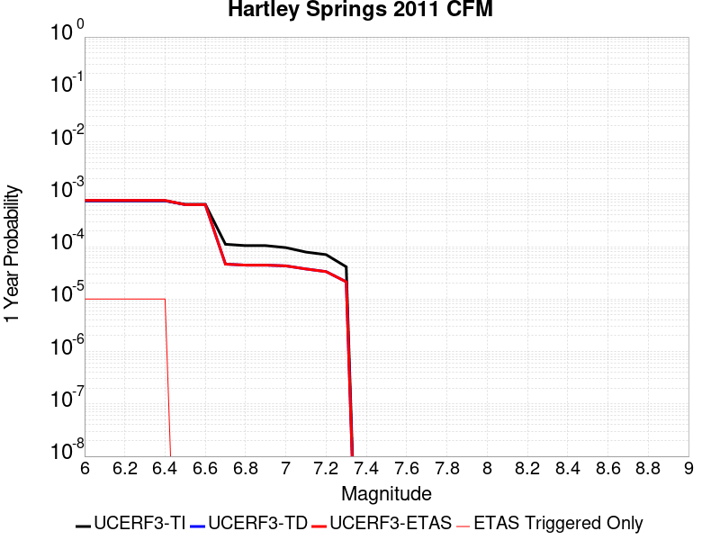 |  |

| Magnitude | 1 wk TI Prob | 1 wk TD Prob | 1 wk ETAS Prob | 1 wk ETAS/TD Gain | 1 wk ETAS Triggered Only | 1 mo TI Prob | 1 mo TD Prob | 1 mo ETAS Prob | 1 mo ETAS/TD Gain | 1 mo ETAS Triggered Only | 1 yr TI Prob | 1 yr TD Prob | 1 yr ETAS Prob | 1 yr ETAS/TD Gain | 1 yr ETAS Triggered Only | 10 yr TI Prob | 10 yr TD Prob | 10 yr ETAS Prob | 10 yr ETAS/TD Gain | 10 yr ETAS Triggered Only |
|-----|-----|-----|-----|-----|-----|-----|-----|-----|-----|-----|-----|-----|-----|-----|-----|-----|-----|-----|-----|-----|
| 6.0 | 1.4352418E-5 | 1.4434182E-5 | 1.4434182E-5 | 1.0 | 0.0 | 6.1508916E-5 | 6.1860235E-5 | 6.1860235E-5 | 1.0 | 0.0 | 7.486137E-4 | 7.5305253E-4 | 7.63045E-4 | 1.0132693 | 1.0E-5 | 0.007460968 | 0.0075211283 | 0.0075310534 | 1.0013196 | 1.0E-5 |
| 6.1 | 1.4352418E-5 | 1.4434182E-5 | 1.4434182E-5 | 1.0 | 0.0 | 6.1508916E-5 | 6.1860235E-5 | 6.1860235E-5 | 1.0 | 0.0 | 7.486137E-4 | 7.5305253E-4 | 7.63045E-4 | 1.0132693 | 1.0E-5 | 0.007460968 | 0.0075211283 | 0.0075310534 | 1.0013196 | 1.0E-5 |
| 6.2 | 1.4352418E-5 | 1.4434182E-5 | 1.4434182E-5 | 1.0 | 0.0 | 6.1508916E-5 | 6.1860235E-5 | 6.1860235E-5 | 1.0 | 0.0 | 7.486137E-4 | 7.5305253E-4 | 7.63045E-4 | 1.0132693 | 1.0E-5 | 0.007460968 | 0.0075211283 | 0.0075310534 | 1.0013196 | 1.0E-5 |
| 6.3 | 1.4352418E-5 | 1.4434182E-5 | 1.4434182E-5 | 1.0 | 0.0 | 6.1508916E-5 | 6.1860235E-5 | 6.1860235E-5 | 1.0 | 0.0 | 7.486137E-4 | 7.5305253E-4 | 7.63045E-4 | 1.0132693 | 1.0E-5 | 0.007460968 | 0.0075211283 | 0.0075310534 | 1.0013196 | 1.0E-5 |
| 6.4 | 1.4352418E-5 | 1.4434182E-5 | 1.4434182E-5 | 1.0 | 0.0 | 6.1508916E-5 | 6.1860235E-5 | 6.1860235E-5 | 1.0 | 0.0 | 7.486137E-4 | 7.5305253E-4 | 7.63045E-4 | 1.0132693 | 1.0E-5 | 0.007460968 | 0.0075211283 | 0.0075310534 | 1.0013196 | 1.0E-5 |
| 6.5 | 1.2279858E-5 | 1.2133106E-5 | 1.2133106E-5 | 1.0 | 0.0 | 5.26269E-5 | 5.1998883E-5 | 5.1998883E-5 | 1.0 | 0.0 | 6.4054417E-4 | 6.3306064E-4 | 6.3306064E-4 | 1.0 | 0.0 | 0.0063870098 | 0.006328085 | 0.006328085 | 1.0 | 0.0 |
| 6.6 | 1.2279858E-5 | 1.2133106E-5 | 1.2133106E-5 | 1.0 | 0.0 | 5.26269E-5 | 5.1998883E-5 | 5.1998883E-5 | 1.0 | 0.0 | 6.4054417E-4 | 6.3306064E-4 | 6.3306064E-4 | 1.0 | 0.0 | 0.0063870098 | 0.006328085 | 0.006328085 | 1.0 | 0.0 |
| 6.7 | 2.1282601E-6 | 8.8948315E-7 | 8.8948315E-7 | 1.0 | 0.0 | 9.121083E-6 | 3.8120663E-6 | 3.8120663E-6 | 1.0 | 0.0 | 1.11043526E-4 | 4.641118E-5 | 4.641118E-5 | 1.0 | 0.0 | 0.0011098806 | 4.6404017E-4 | 4.6404017E-4 | 1.0 | 0.0 |
| 6.8 | 2.00516E-6 | 8.517597E-7 | 8.517597E-7 | 1.0 | 0.0 | 8.593515E-6 | 3.650395E-6 | 3.650395E-6 | 1.0 | 0.0 | 1.04621024E-4 | 4.444291E-5 | 4.444291E-5 | 1.0 | 0.0 | 0.0010457177 | 4.4436535E-4 | 4.4436535E-4 | 1.0 | 0.0 |
| 6.9 | 2.00516E-6 | 8.517597E-7 | 8.517597E-7 | 1.0 | 0.0 | 8.593515E-6 | 3.650395E-6 | 3.650395E-6 | 1.0 | 0.0 | 1.04621024E-4 | 4.444291E-5 | 4.444291E-5 | 1.0 | 0.0 | 0.0010457177 | 4.4436535E-4 | 4.4436535E-4 | 1.0 | 0.0 |
| 7.0 | 1.8366732E-6 | 8.237307E-7 | 8.237307E-7 | 1.0 | 0.0 | 7.871433E-6 | 3.5302712E-6 | 3.5302712E-6 | 1.0 | 0.0 | 9.583048E-5 | 4.298046E-5 | 4.298046E-5 | 1.0 | 0.0 | 9.5789164E-4 | 4.2974652E-4 | 4.2974652E-4 | 1.0 | 0.0 |
| 7.1 | 1.5097997E-6 | 7.1902616E-7 | 7.1902616E-7 | 1.0 | 0.0 | 6.470554E-6 | 3.0815384E-6 | 3.0815384E-6 | 1.0 | 0.0 | 7.877615E-5 | 3.7517326E-5 | 3.7517326E-5 | 1.0 | 0.0 | 7.874823E-4 | 3.7513362E-4 | 3.7513362E-4 | 1.0 | 0.0 |
| 7.2 | 1.3490993E-6 | 6.405254E-7 | 6.405254E-7 | 1.0 | 0.0 | 5.7818415E-6 | 2.7451074E-6 | 2.7451074E-6 | 1.0 | 0.0 | 7.0391645E-5 | 3.3421402E-5 | 3.3421402E-5 | 1.0 | 0.0 | 7.0369354E-4 | 3.341867E-4 | 3.341867E-4 | 1.0 | 0.0 |
| 7.3 | 7.900015E-7 | 4.0889498E-7 | 4.0889498E-7 | 1.0 | 0.0 | 3.3857161E-6 | 1.752407E-6 | 1.752407E-6 | 1.0 | 0.0 | 4.1220315E-5 | 2.1335554E-5 | 2.1335554E-5 | 1.0 | 0.0 | 4.121267E-4 | 2.1335555E-4 | 2.1335555E-4 | 1.0 | 0.0 |

## Richfield
*[(top)](#table-of-contents)*

| 1 Week | 1 Month | 1 Year | 10 Year |
|-----|-----|-----|-----|
| 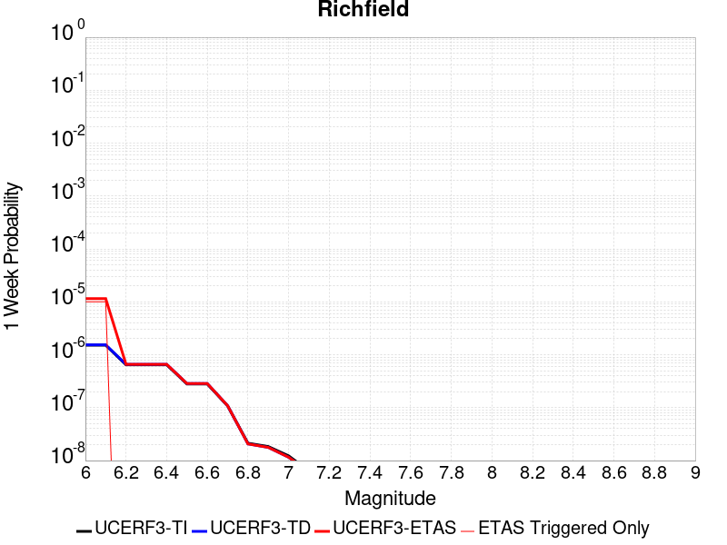 |  |  |  |

| Magnitude | 1 wk TI Prob | 1 wk TD Prob | 1 wk ETAS Prob | 1 wk ETAS/TD Gain | 1 wk ETAS Triggered Only | 1 mo TI Prob | 1 mo TD Prob | 1 mo ETAS Prob | 1 mo ETAS/TD Gain | 1 mo ETAS Triggered Only | 1 yr TI Prob | 1 yr TD Prob | 1 yr ETAS Prob | 1 yr ETAS/TD Gain | 1 yr ETAS Triggered Only | 10 yr TI Prob | 10 yr TD Prob | 10 yr ETAS Prob | 10 yr ETAS/TD Gain | 10 yr ETAS Triggered Only |
|-----|-----|-----|-----|-----|-----|-----|-----|-----|-----|-----|-----|-----|-----|-----|-----|-----|-----|-----|-----|-----|
| 6.0 | 1.5166896E-6 | 1.5392679E-6 | 1.1539252E-5 | 7.496585 | 1.0E-5 | 6.5000822E-6 | 6.596852E-6 | 1.6596787E-5 | 2.5158646 | 1.0E-5 | 7.913562E-5 | 8.0314814E-5 | 9.031401E-5 | 1.1245 | 1.0E-5 | 7.910745E-4 | 8.0296566E-4 | 8.1295765E-4 | 1.0124438 | 1.0E-5 |
| 6.1 | 1.5166896E-6 | 1.5392679E-6 | 1.1539252E-5 | 7.496585 | 1.0E-5 | 6.5000822E-6 | 6.596852E-6 | 1.6596787E-5 | 2.5158646 | 1.0E-5 | 7.913562E-5 | 8.0314814E-5 | 9.031401E-5 | 1.1245 | 1.0E-5 | 7.910745E-4 | 8.0296566E-4 | 8.1295765E-4 | 1.0124438 | 1.0E-5 |
| 6.2 | 6.473272E-7 | 6.598479E-7 | 6.598479E-7 | 1.0 | 0.0 | 2.7742565E-6 | 2.8279173E-6 | 2.8279173E-6 | 1.0 | 0.0 | 3.377605E-5 | 3.4429482E-5 | 3.4429482E-5 | 1.0 | 0.0 | 3.3770915E-4 | 3.442545E-4 | 3.442545E-4 | 1.0 | 0.0 |
| 6.3 | 6.473272E-7 | 6.598479E-7 | 6.598479E-7 | 1.0 | 0.0 | 2.7742565E-6 | 2.8279173E-6 | 2.8279173E-6 | 1.0 | 0.0 | 3.377605E-5 | 3.4429482E-5 | 3.4429482E-5 | 1.0 | 0.0 | 3.3770915E-4 | 3.442545E-4 | 3.442545E-4 | 1.0 | 0.0 |
| 6.4 | 6.473272E-7 | 6.598479E-7 | 6.598479E-7 | 1.0 | 0.0 | 2.7742565E-6 | 2.8279173E-6 | 2.8279173E-6 | 1.0 | 0.0 | 3.377605E-5 | 3.4429482E-5 | 3.4429482E-5 | 1.0 | 0.0 | 3.3770915E-4 | 3.442545E-4 | 3.442545E-4 | 1.0 | 0.0 |
| 6.5 | 2.7954403E-7 | 2.8531605E-7 | 2.8531605E-7 | 1.0 | 0.0 | 1.1980452E-6 | 1.2227827E-6 | 1.2227827E-6 | 1.0 | 0.0 | 1.4586103E-5 | 1.4887321E-5 | 1.4887321E-5 | 1.0 | 0.0 | 1.4585146E-4 | 1.4886749E-4 | 1.4886749E-4 | 1.0 | 0.0 |
| 6.6 | 2.7954403E-7 | 2.8531605E-7 | 2.8531605E-7 | 1.0 | 0.0 | 1.1980452E-6 | 1.2227827E-6 | 1.2227827E-6 | 1.0 | 0.0 | 1.4586103E-5 | 1.4887321E-5 | 1.4887321E-5 | 1.0 | 0.0 | 1.4585146E-4 | 1.4886749E-4 | 1.4886749E-4 | 1.0 | 0.0 |
| 6.7 | 1.0777299E-7 | 1.08788136E-7 | 1.08788136E-7 | 1.0 | 0.0 | 4.6188418E-7 | 4.6623484E-7 | 4.6623484E-7 | 1.0 | 0.0 | 5.6234253E-6 | 5.6763984E-6 | 5.6763984E-6 | 1.0 | 0.0 | 5.623283E-5 | 5.6762965E-5 | 5.6762965E-5 | 1.0 | 0.0 |
| 6.8 | 2.1301874E-8 | 2.0666182E-8 | 2.0666182E-8 | 1.0 | 0.0 | 9.129375E-8 | 8.8569344E-8 | 8.8569344E-8 | 1.0 | 0.0 | 1.1115008E-6 | 1.0783313E-6 | 1.0783313E-6 | 1.0 | 0.0 | 1.1114952E-5 | 1.0783265E-5 | 1.0783265E-5 | 1.0 | 0.0 |
| 6.9 | 1.8413502E-8 | 1.7751145E-8 | 1.7751145E-8 | 1.0 | 0.0 | 7.891501E-8 | 7.607633E-8 | 7.607633E-8 | 1.0 | 0.0 | 9.607899E-7 | 9.26229E-7 | 9.26229E-7 | 1.0 | 0.0 | 9.607857E-6 | 9.262254E-6 | 9.262254E-6 | 1.0 | 0.0 |
| 7.0 | 1.2290541E-8 | 1.1574364E-8 | 1.1574364E-8 | 1.0 | 0.0 | 5.2673748E-8 | 4.9604413E-8 | 4.9604413E-8 | 1.0 | 0.0 | 6.413027E-7 | 6.039336E-7 | 6.039336E-7 | 1.0 | 0.0 | 6.4130086E-6 | 6.039321E-6 | 6.039321E-6 | 1.0 | 0.0 |
| 7.1 | 6.373573E-9 | 6.155796E-9 | 6.155796E-9 | 1.0 | 0.0 | 2.7315311E-8 | 2.6381983E-8 | 2.6381983E-8 | 1.0 | 0.0 | 3.3256384E-7 | 3.212006E-7 | 3.212006E-7 | 1.0 | 0.0 | 3.3256335E-6 | 3.2120017E-6 | 3.2120017E-6 | 1.0 | 0.0 |
| 7.2 | 3.6989944E-9 | 3.7360146E-9 | 3.7360146E-9 | 1.0 | 0.0 | 1.5852834E-8 | 1.6011493E-8 | 1.6011493E-8 | 1.0 | 0.0 | 1.9300822E-7 | 1.9493989E-7 | 1.9493989E-7 | 1.0 | 0.0 | 1.9300805E-6 | 1.9493975E-6 | 1.9493975E-6 | 1.0 | 0.0 |
| 7.3 | 2.097397E-9 | 2.1200501E-9 | 2.1200501E-9 | 1.0 | 0.0 | 8.9888434E-9 | 9.085929E-9 | 9.085929E-9 | 1.0 | 0.0 | 1.0943917E-7 | 1.1062118E-7 | 1.1062118E-7 | 1.0 | 0.0 | 1.0943911E-6 | 1.1062115E-6 | 1.1062115E-6 | 1.0 | 0.0 |
| 7.4 | 5.8314464E-12 | 5.8918426E-12 | 5.8918426E-12 | 1.0 | 0.0 | 2.4991786E-11 | 2.5250912E-11 | 2.5250912E-11 | 1.0 | 0.0 | 3.0427527E-10 | 3.0742975E-10 | 3.0742975E-10 | 1.0 | 0.0 | 3.0427532E-9 | 3.0742973E-9 | 3.0742973E-9 | 1.0 | 0.0 |

## Compton
*[(top)](#table-of-contents)*

| 1 Week | 1 Month | 1 Year | 10 Year |
|-----|-----|-----|-----|
| 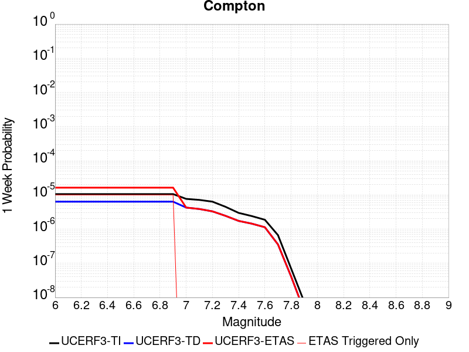 | 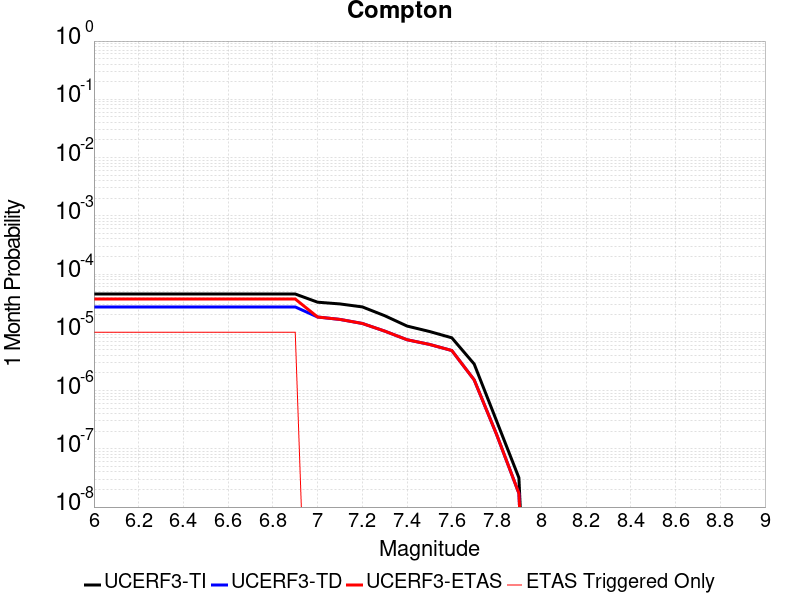 |  |  |

| Magnitude | 1 wk TI Prob | 1 wk TD Prob | 1 wk ETAS Prob | 1 wk ETAS/TD Gain | 1 wk ETAS Triggered Only | 1 mo TI Prob | 1 mo TD Prob | 1 mo ETAS Prob | 1 mo ETAS/TD Gain | 1 mo ETAS Triggered Only | 1 yr TI Prob | 1 yr TD Prob | 1 yr ETAS Prob | 1 yr ETAS/TD Gain | 1 yr ETAS Triggered Only | 10 yr TI Prob | 10 yr TD Prob | 10 yr ETAS Prob | 10 yr ETAS/TD Gain | 10 yr ETAS Triggered Only |
|-----|-----|-----|-----|-----|-----|-----|-----|-----|-----|-----|-----|-----|-----|-----|-----|-----|-----|-----|-----|-----|
| 6.0 | 1.06050875E-5 | 6.358671E-6 | 1.6358606E-5 | 2.5726457 | 1.0E-5 | 4.5449582E-5 | 2.7251177E-5 | 3.7250906E-5 | 1.3669466 | 1.0E-5 | 5.5320817E-4 | 3.317354E-4 | 3.417321E-4 | 1.0301346 | 1.0E-5 | 0.0055183303 | 0.0033126862 | 0.003322653 | 1.0030087 | 1.0E-5 |
| 6.1 | 1.06050875E-5 | 6.358671E-6 | 1.6358606E-5 | 2.5726457 | 1.0E-5 | 4.5449582E-5 | 2.7251177E-5 | 3.7250906E-5 | 1.3669466 | 1.0E-5 | 5.5320817E-4 | 3.317354E-4 | 3.417321E-4 | 1.0301346 | 1.0E-5 | 0.0055183303 | 0.0033126862 | 0.003322653 | 1.0030087 | 1.0E-5 |
| 6.2 | 1.06050875E-5 | 6.358671E-6 | 1.6358606E-5 | 2.5726457 | 1.0E-5 | 4.5449582E-5 | 2.7251177E-5 | 3.7250906E-5 | 1.3669466 | 1.0E-5 | 5.5320817E-4 | 3.317354E-4 | 3.417321E-4 | 1.0301346 | 1.0E-5 | 0.0055183303 | 0.0033126862 | 0.003322653 | 1.0030087 | 1.0E-5 |
| 6.3 | 1.06050875E-5 | 6.358671E-6 | 1.6358606E-5 | 2.5726457 | 1.0E-5 | 4.5449582E-5 | 2.7251177E-5 | 3.7250906E-5 | 1.3669466 | 1.0E-5 | 5.5320817E-4 | 3.317354E-4 | 3.417321E-4 | 1.0301346 | 1.0E-5 | 0.0055183303 | 0.0033126862 | 0.003322653 | 1.0030087 | 1.0E-5 |
| 6.4 | 1.06050875E-5 | 6.358671E-6 | 1.6358606E-5 | 2.5726457 | 1.0E-5 | 4.5449582E-5 | 2.7251177E-5 | 3.7250906E-5 | 1.3669466 | 1.0E-5 | 5.5320817E-4 | 3.317354E-4 | 3.417321E-4 | 1.0301346 | 1.0E-5 | 0.0055183303 | 0.0033126862 | 0.003322653 | 1.0030087 | 1.0E-5 |
| 6.5 | 1.06050875E-5 | 6.358671E-6 | 1.6358606E-5 | 2.5726457 | 1.0E-5 | 4.5449582E-5 | 2.7251177E-5 | 3.7250906E-5 | 1.3669466 | 1.0E-5 | 5.5320817E-4 | 3.317354E-4 | 3.417321E-4 | 1.0301346 | 1.0E-5 | 0.0055183303 | 0.0033126862 | 0.003322653 | 1.0030087 | 1.0E-5 |
| 6.6 | 1.06050875E-5 | 6.358671E-6 | 1.6358606E-5 | 2.5726457 | 1.0E-5 | 4.5449582E-5 | 2.7251177E-5 | 3.7250906E-5 | 1.3669466 | 1.0E-5 | 5.5320817E-4 | 3.317354E-4 | 3.417321E-4 | 1.0301346 | 1.0E-5 | 0.0055183303 | 0.0033126862 | 0.003322653 | 1.0030087 | 1.0E-5 |
| 6.7 | 1.06050875E-5 | 6.358671E-6 | 1.6358606E-5 | 2.5726457 | 1.0E-5 | 4.5449582E-5 | 2.7251177E-5 | 3.7250906E-5 | 1.3669466 | 1.0E-5 | 5.5320817E-4 | 3.317354E-4 | 3.417321E-4 | 1.0301346 | 1.0E-5 | 0.0055183303 | 0.0033126862 | 0.003322653 | 1.0030087 | 1.0E-5 |
| 6.8 | 1.06050875E-5 | 6.358671E-6 | 1.6358606E-5 | 2.5726457 | 1.0E-5 | 4.5449582E-5 | 2.7251177E-5 | 3.7250906E-5 | 1.3669466 | 1.0E-5 | 5.5320817E-4 | 3.317354E-4 | 3.417321E-4 | 1.0301346 | 1.0E-5 | 0.0055183303 | 0.0033126862 | 0.003322653 | 1.0030087 | 1.0E-5 |
| 6.9 | 1.06050875E-5 | 6.358671E-6 | 1.6358606E-5 | 2.5726457 | 1.0E-5 | 4.5449582E-5 | 2.7251177E-5 | 3.7250906E-5 | 1.3669466 | 1.0E-5 | 5.5320817E-4 | 3.317354E-4 | 3.417321E-4 | 1.0301346 | 1.0E-5 | 0.0055183303 | 0.0033126862 | 0.003322653 | 1.0030087 | 1.0E-5 |
| 7.0 | 7.672486E-6 | 4.2720512E-6 | 4.2720512E-6 | 1.0 | 0.0 | 3.288167E-5 | 1.8308665E-5 | 1.8308665E-5 | 1.0 | 0.0 | 4.0026082E-4 | 2.2288582E-4 | 2.2288582E-4 | 1.0 | 0.0 | 0.0039954064 | 0.002226685 | 0.002226685 | 1.0 | 0.0 |
| 7.1 | 7.163992E-6 | 3.883762E-6 | 3.883762E-6 | 1.0 | 0.0 | 3.0702464E-5 | 1.6644592E-5 | 1.6644592E-5 | 1.0 | 0.0 | 3.7373835E-4 | 2.0262963E-4 | 2.0262963E-4 | 1.0 | 0.0 | 0.0037311043 | 0.0020245055 | 0.0020245055 | 1.0 | 0.0 |
| 7.2 | 6.3689185E-6 | 3.3102428E-6 | 3.3102428E-6 | 1.0 | 0.0 | 2.729508E-5 | 1.418668E-5 | 1.418668E-5 | 1.0 | 0.0 | 3.322669E-4 | 1.7270957E-4 | 1.7270957E-4 | 1.0 | 0.0 | 0.0033177056 | 0.0017257951 | 0.0017257951 | 1.0 | 0.0 |
| 7.3 | 4.4987873E-6 | 2.4480942E-6 | 2.4480942E-6 | 1.0 | 0.0 | 1.9280375E-5 | 1.0491792E-5 | 1.0491792E-5 | 1.0 | 0.0 | 2.3471327E-4 | 1.2773038E-4 | 1.2773038E-4 | 1.0 | 0.0 | 0.002344655 | 0.0012765999 | 0.0012765999 | 1.0 | 0.0 |
| 7.4 | 2.987296E-6 | 1.7394335E-6 | 1.7394335E-6 | 1.0 | 0.0 | 1.2802635E-5 | 7.454694E-6 | 7.454694E-6 | 1.0 | 0.0 | 1.5586092E-4 | 9.0757174E-5 | 9.0757174E-5 | 1.0 | 0.0 | 0.0015575165 | 9.072069E-4 | 9.072069E-4 | 1.0 | 0.0 |
| 7.5 | 2.4111696E-6 | 1.4472155E-6 | 1.4472155E-6 | 1.0 | 0.0 | 1.0333543E-5 | 6.2023378E-6 | 6.2023378E-6 | 1.0 | 0.0 | 1.2580362E-4 | 7.551089E-5 | 7.551089E-5 | 1.0 | 0.0 | 0.0012573242 | 7.54857E-4 | 7.54857E-4 | 1.0 | 0.0 |
| 7.6 | 1.8783096E-6 | 1.1360459E-6 | 1.1360459E-6 | 1.0 | 0.0 | 8.049874E-6 | 4.8687593E-6 | 4.8687593E-6 | 1.0 | 0.0 | 9.8002805E-5 | 5.927557E-5 | 5.927557E-5 | 1.0 | 0.0 | 9.795959E-4 | 5.926016E-4 | 5.926016E-4 | 1.0 | 0.0 |
| 7.7 | 6.6646817E-7 | 3.560237E-7 | 3.560237E-7 | 1.0 | 0.0 | 2.856289E-6 | 1.525815E-6 | 1.525815E-6 | 1.0 | 0.0 | 3.4774763E-5 | 1.8576653E-5 | 1.8576653E-5 | 1.0 | 0.0 | 3.4769322E-4 | 1.8575235E-4 | 1.8575235E-4 | 1.0 | 0.0 |
| 7.8 | 7.054689E-8 | 4.1342968E-8 | 4.1342968E-8 | 1.0 | 0.0 | 3.0234378E-7 | 1.7718413E-7 | 1.7718413E-7 | 1.0 | 0.0 | 3.6810293E-6 | 2.1572148E-6 | 2.1572148E-6 | 1.0 | 0.0 | 3.6809684E-5 | 2.1571948E-5 | 2.1571948E-5 | 1.0 | 0.0 |
| 7.9 | 7.420925E-9 | 4.0131285E-9 | 4.0131285E-9 | 1.0 | 0.0 | 3.1803964E-8 | 1.7199122E-8 | 1.7199122E-8 | 1.0 | 0.0 | 3.872132E-7 | 2.093993E-7 | 2.093993E-7 | 1.0 | 0.0 | 3.872125E-6 | 2.0939913E-6 | 2.0939913E-6 | 1.0 | 0.0 |

## Great Valley 05 Pittsburg - Kirby Hills alt1
*[(top)](#table-of-contents)*

| 1 Week | 1 Month | 1 Year | 10 Year |
|-----|-----|-----|-----|
| 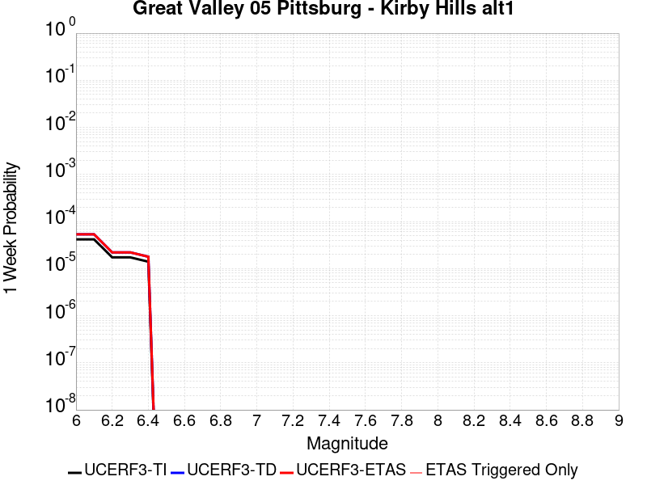 |  |  |  |

| Magnitude | 1 wk TI Prob | 1 wk TD Prob | 1 wk ETAS Prob | 1 wk ETAS/TD Gain | 1 wk ETAS Triggered Only | 1 mo TI Prob | 1 mo TD Prob | 1 mo ETAS Prob | 1 mo ETAS/TD Gain | 1 mo ETAS Triggered Only | 1 yr TI Prob | 1 yr TD Prob | 1 yr ETAS Prob | 1 yr ETAS/TD Gain | 1 yr ETAS Triggered Only | 10 yr TI Prob | 10 yr TD Prob | 10 yr ETAS Prob | 10 yr ETAS/TD Gain | 10 yr ETAS Triggered Only |
|-----|-----|-----|-----|-----|-----|-----|-----|-----|-----|-----|-----|-----|-----|-----|-----|-----|-----|-----|-----|-----|
| 6.0 | 4.187212E-5 | 5.3442072E-5 | 5.3442072E-5 | 1.0 | 0.0 | 1.794396E-4 | 2.290231E-4 | 2.290231E-4 | 1.0 | 0.0 | 0.002182488 | 0.0027857882 | 0.0027857882 | 1.0 | 0.0 | 0.021611776 | 0.02760304 | 0.027612763 | 1.0003523 | 1.0E-5 |
| 6.1 | 4.187212E-5 | 5.3442072E-5 | 5.3442072E-5 | 1.0 | 0.0 | 1.794396E-4 | 2.290231E-4 | 2.290231E-4 | 1.0 | 0.0 | 0.002182488 | 0.0027857882 | 0.0027857882 | 1.0 | 0.0 | 0.021611776 | 0.02760304 | 0.027612763 | 1.0003523 | 1.0E-5 |
| 6.2 | 1.7353306E-5 | 2.2154374E-5 | 2.2154374E-5 | 1.0 | 0.0 | 7.436919E-5 | 9.494618E-5 | 9.494618E-5 | 1.0 | 0.0 | 9.050688E-4 | 0.0011557543 | 0.0011557543 | 1.0 | 0.0 | 0.009013915 | 0.011535114 | 0.011535114 | 1.0 | 0.0 |
| 6.3 | 1.7353306E-5 | 2.2154374E-5 | 2.2154374E-5 | 1.0 | 0.0 | 7.436919E-5 | 9.494618E-5 | 9.494618E-5 | 1.0 | 0.0 | 9.050688E-4 | 0.0011557543 | 0.0011557543 | 1.0 | 0.0 | 0.009013915 | 0.011535114 | 0.011535114 | 1.0 | 0.0 |
| 6.4 | 1.4028824E-5 | 1.7900597E-5 | 1.7900597E-5 | 1.0 | 0.0 | 6.0122147E-5 | 7.671684E-5 | 7.671684E-5 | 1.0 | 0.0 | 7.3174125E-4 | 9.340275E-4 | 9.340275E-4 | 1.0 | 0.0 | 0.0072933645 | 0.009338138 | 0.009338138 | 1.0 | 0.0 |

## San Gregorio (South) 2011 CFM
*[(top)](#table-of-contents)*

| 1 Week | 1 Month | 1 Year | 10 Year |
|-----|-----|-----|-----|
| 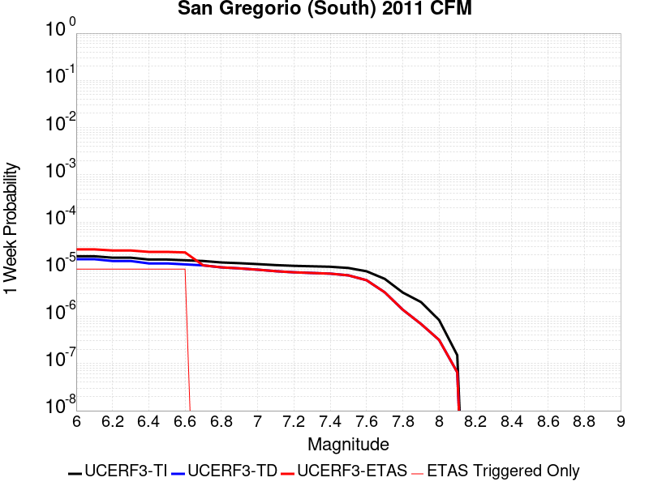 |  |  |  |

| Magnitude | 1 wk TI Prob | 1 wk TD Prob | 1 wk ETAS Prob | 1 wk ETAS/TD Gain | 1 wk ETAS Triggered Only | 1 mo TI Prob | 1 mo TD Prob | 1 mo ETAS Prob | 1 mo ETAS/TD Gain | 1 mo ETAS Triggered Only | 1 yr TI Prob | 1 yr TD Prob | 1 yr ETAS Prob | 1 yr ETAS/TD Gain | 1 yr ETAS Triggered Only | 10 yr TI Prob | 10 yr TD Prob | 10 yr ETAS Prob | 10 yr ETAS/TD Gain | 10 yr ETAS Triggered Only |
|-----|-----|-----|-----|-----|-----|-----|-----|-----|-----|-----|-----|-----|-----|-----|-----|-----|-----|-----|-----|-----|
| 6.0 | 1.8770423E-5 | 1.6279751E-5 | 2.627959E-5 | 1.61425 | 1.0E-5 | 8.044219E-5 | 6.976852E-5 | 7.976782E-5 | 1.1433212 | 1.0E-5 | 9.789435E-4 | 8.491044E-4 | 8.5909595E-4 | 1.0117671 | 1.0E-5 | 0.009746423 | 0.008471312 | 0.008481227 | 1.0011704 | 1.0E-5 |
| 6.1 | 1.8770423E-5 | 1.6279751E-5 | 2.627959E-5 | 1.61425 | 1.0E-5 | 8.044219E-5 | 6.976852E-5 | 7.976782E-5 | 1.1433212 | 1.0E-5 | 9.789435E-4 | 8.491044E-4 | 8.5909595E-4 | 1.0117671 | 1.0E-5 | 0.009746423 | 0.008471312 | 0.008481227 | 1.0011704 | 1.0E-5 |
| 6.2 | 1.7508692E-5 | 1.4899257E-5 | 2.4899107E-5 | 1.6711644 | 1.0E-5 | 7.5035096E-5 | 6.3852414E-5 | 7.385177E-5 | 1.1566012 | 1.0E-5 | 9.1316935E-4 | 7.7712885E-4 | 7.8712107E-4 | 1.0128579 | 1.0E-5 | 0.00909426 | 0.00775674 | 0.007766662 | 1.0012792 | 1.0E-5 |
| 6.3 | 1.7508692E-5 | 1.4899257E-5 | 2.4899107E-5 | 1.6711644 | 1.0E-5 | 7.5035096E-5 | 6.3852414E-5 | 7.385177E-5 | 1.1566012 | 1.0E-5 | 9.1316935E-4 | 7.7712885E-4 | 7.8712107E-4 | 1.0128579 | 1.0E-5 | 0.00909426 | 0.00775674 | 0.007766662 | 1.0012792 | 1.0E-5 |
| 6.4 | 1.6004591E-5 | 1.3249094E-5 | 2.3248962E-5 | 1.7547586 | 1.0E-5 | 6.85893E-5 | 5.6780602E-5 | 6.6780034E-5 | 1.1761065 | 1.0E-5 | 8.347548E-4 | 6.910856E-4 | 7.010787E-4 | 1.01446 | 1.0E-5 | 0.008316261 | 0.006901791 | 0.006911722 | 1.0014389 | 1.0E-5 |
| 6.5 | 1.6004591E-5 | 1.3249094E-5 | 2.3248962E-5 | 1.7547586 | 1.0E-5 | 6.85893E-5 | 5.6780602E-5 | 6.6780034E-5 | 1.1761065 | 1.0E-5 | 8.347548E-4 | 6.910856E-4 | 7.010787E-4 | 1.01446 | 1.0E-5 | 0.008316261 | 0.006901791 | 0.006911722 | 1.0014389 | 1.0E-5 |
| 6.6 | 1.5442201E-5 | 1.2633725E-5 | 2.26336E-5 | 1.7915221 | 1.0E-5 | 6.617918E-5 | 5.4143416E-5 | 6.414288E-5 | 1.1846846 | 1.0E-5 | 8.0543366E-4 | 6.5899757E-4 | 6.68991E-4 | 1.0151646 | 1.0E-5 | 0.008025207 | 0.006582842 | 0.0065927766 | 1.0015091 | 1.0E-5 |
| 6.7 | 1.489921E-5 | 1.2042234E-5 | 1.2042234E-5 | 1.0 | 0.0 | 6.3852196E-5 | 5.1608557E-5 | 5.1608557E-5 | 1.0 | 0.0 | 7.7712315E-4 | 6.2815374E-4 | 6.2815374E-4 | 1.0 | 0.0 | 0.0077441116 | 0.006276176 | 0.006276176 | 1.0 | 0.0 |
| 6.8 | 1.3876024E-5 | 1.0921184E-5 | 1.0921184E-5 | 1.0 | 0.0 | 5.9467322E-5 | 4.6804238E-5 | 4.6804238E-5 | 1.0 | 0.0 | 7.237741E-4 | 5.69693E-4 | 5.69693E-4 | 1.0 | 0.0 | 0.0072142133 | 0.0056946846 | 0.0056946846 | 1.0 | 0.0 |
| 6.9 | 1.33922495E-5 | 1.0392687E-5 | 1.0392687E-5 | 1.0 | 0.0 | 5.7394092E-5 | 4.4539327E-5 | 4.4539327E-5 | 1.0 | 0.0 | 6.9854903E-4 | 5.4213166E-4 | 5.4213166E-4 | 1.0 | 0.0 | 0.0069635725 | 0.005420442 | 0.005420442 | 1.0 | 0.0 |
| 7.0 | 1.2807324E-5 | 9.752649E-6 | 9.752649E-6 | 1.0 | 0.0 | 5.4887376E-5 | 4.1796397E-5 | 4.1796397E-5 | 1.0 | 0.0 | 6.680489E-4 | 5.087525E-4 | 5.087525E-4 | 1.0 | 0.0 | 0.006660442 | 0.0050882204 | 0.0050882204 | 1.0 | 0.0 |
| 7.1 | 1.2191438E-5 | 9.061537E-6 | 9.061537E-6 | 1.0 | 0.0 | 5.224797E-5 | 3.8834576E-5 | 3.8834576E-5 | 1.0 | 0.0 | 6.3593336E-4 | 4.727085E-4 | 4.727085E-4 | 1.0 | 0.0 | 0.0063411663 | 0.0047293645 | 0.0047293645 | 1.0 | 0.0 |
| 7.2 | 1.1769438E-5 | 8.581731E-6 | 8.581731E-6 | 1.0 | 0.0 | 5.0439474E-5 | 3.677833E-5 | 3.677833E-5 | 1.0 | 0.0 | 6.1392755E-4 | 4.4768423E-4 | 4.4768423E-4 | 1.0 | 0.0 | 0.0061223423 | 0.004480157 | 0.004480157 | 1.0 | 0.0 |
| 7.3 | 1.150374E-5 | 8.29716E-6 | 8.29716E-6 | 1.0 | 0.0 | 4.9300812E-5 | 3.5558773E-5 | 3.5558773E-5 | 1.0 | 0.0 | 6.0007203E-4 | 4.3284212E-4 | 4.3284212E-4 | 1.0 | 0.0 | 0.0059845424 | 0.0043323063 | 0.0043323063 | 1.0 | 0.0 |
| 7.4 | 1.12514E-5 | 8.042902E-6 | 8.042902E-6 | 1.0 | 0.0 | 4.8219394E-5 | 3.4469125E-5 | 3.4469125E-5 | 1.0 | 0.0 | 5.8691297E-4 | 4.1958084E-4 | 4.1958084E-4 | 1.0 | 0.0 | 0.005853653 | 0.0042001884 | 0.0042001884 | 1.0 | 0.0 |
| 7.5 | 1.059696E-5 | 7.3931915E-6 | 7.3931915E-6 | 1.0 | 0.0 | 4.5414752E-5 | 3.168472E-5 | 3.168472E-5 | 1.0 | 0.0 | 5.5278436E-4 | 3.8569325E-4 | 3.8569325E-4 | 1.0 | 0.0 | 0.0055141128 | 0.0038624762 | 0.0038624762 | 1.0 | 0.0 |
| 7.6 | 9.018592E-6 | 5.8369624E-6 | 5.8369624E-6 | 1.0 | 0.0 | 3.8650534E-5 | 2.5015313E-5 | 2.5015313E-5 | 1.0 | 0.0 | 4.7046866E-4 | 3.045189E-4 | 3.045189E-4 | 1.0 | 0.0 | 0.004694739 | 0.0030528754 | 0.0030528754 | 1.0 | 0.0 |
| 7.7 | 6.243489E-6 | 3.2395455E-6 | 3.2395455E-6 | 1.0 | 0.0 | 2.6757538E-5 | 1.3883692E-5 | 1.3883692E-5 | 1.0 | 0.0 | 3.257243E-4 | 1.6902086E-4 | 1.6902086E-4 | 1.0 | 0.0 | 0.003252473 | 0.001699108 | 0.001699108 | 1.0 | 0.0 |
| 7.8 | 3.1941963E-6 | 1.3809986E-6 | 1.3809986E-6 | 1.0 | 0.0 | 1.368934E-5 | 5.9185513E-6 | 5.9185513E-6 | 1.0 | 0.0 | 1.6665498E-4 | 7.2055984E-5 | 7.2055984E-5 | 1.0 | 0.0 | 0.0016653005 | 7.263174E-4 | 7.263174E-4 | 1.0 | 0.0 |
| 7.9 | 2.0098398E-6 | 6.9161155E-7 | 6.9161155E-7 | 1.0 | 0.0 | 8.6135715E-6 | 2.964046E-6 | 2.964046E-6 | 1.0 | 0.0 | 1.0486518E-4 | 3.608666E-5 | 3.608666E-5 | 1.0 | 0.0 | 0.0010481571 | 3.657225E-4 | 3.657225E-4 | 1.0 | 0.0 |
| 8.0 | 8.353119E-7 | 3.1623412E-7 | 3.1623412E-7 | 1.0 | 0.0 | 3.579903E-6 | 1.3552883E-6 | 1.3552883E-6 | 1.0 | 0.0 | 4.358445E-5 | 1.6500511E-5 | 1.6500511E-5 | 1.0 | 0.0 | 4.3575902E-4 | 1.6619264E-4 | 1.6619264E-4 | 1.0 | 0.0 |
| 8.1 | 1.5033264E-7 | 6.527624E-8 | 6.527624E-8 | 1.0 | 0.0 | 6.442826E-7 | 2.7975528E-7 | 2.7975528E-7 | 1.0 | 0.0 | 7.844113E-6 | 3.4060151E-6 | 3.4060151E-6 | 1.0 | 0.0 | 7.843835E-5 | 3.407693E-5 | 3.407693E-5 | 1.0 | 0.0 |

## Northridge
*[(top)](#table-of-contents)*

| 1 Week | 1 Month | 1 Year | 10 Year |
|-----|-----|-----|-----|
| 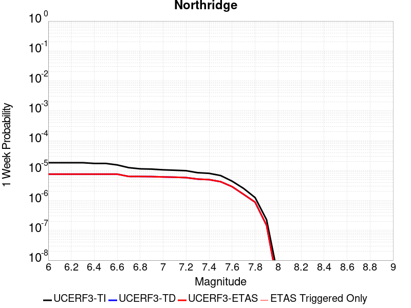 |  | 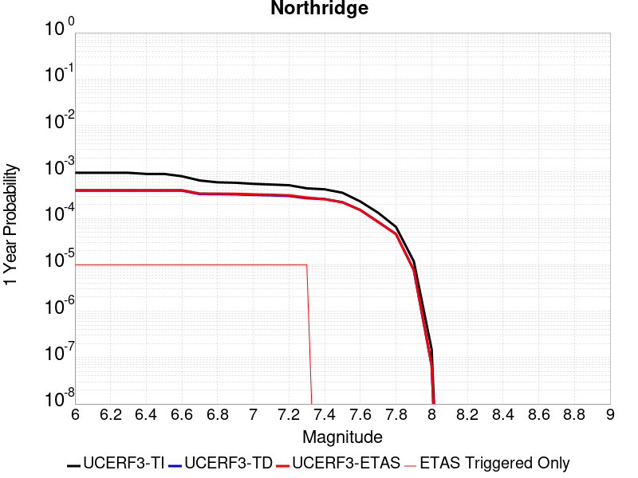 |  |

| Magnitude | 1 wk TI Prob | 1 wk TD Prob | 1 wk ETAS Prob | 1 wk ETAS/TD Gain | 1 wk ETAS Triggered Only | 1 mo TI Prob | 1 mo TD Prob | 1 mo ETAS Prob | 1 mo ETAS/TD Gain | 1 mo ETAS Triggered Only | 1 yr TI Prob | 1 yr TD Prob | 1 yr ETAS Prob | 1 yr ETAS/TD Gain | 1 yr ETAS Triggered Only | 10 yr TI Prob | 10 yr TD Prob | 10 yr ETAS Prob | 10 yr ETAS/TD Gain | 10 yr ETAS Triggered Only |
|-----|-----|-----|-----|-----|-----|-----|-----|-----|-----|-----|-----|-----|-----|-----|-----|-----|-----|-----|-----|-----|
| 6.0 | 1.8340852E-5 | 7.5880193E-6 | 7.5880193E-6 | 1.0 | 0.0 | 7.860128E-5 | 3.251969E-5 | 3.251969E-5 | 1.0 | 0.0 | 9.565505E-4 | 3.958575E-4 | 4.0585353E-4 | 1.0252516 | 1.0E-5 | 0.009524435 | 0.003951746 | 0.0039617065 | 1.0025206 | 1.0E-5 |
| 6.1 | 1.8340852E-5 | 7.5880193E-6 | 7.5880193E-6 | 1.0 | 0.0 | 7.860128E-5 | 3.251969E-5 | 3.251969E-5 | 1.0 | 0.0 | 9.565505E-4 | 3.958575E-4 | 4.0585353E-4 | 1.0252516 | 1.0E-5 | 0.009524435 | 0.003951746 | 0.0039617065 | 1.0025206 | 1.0E-5 |
| 6.2 | 1.8340852E-5 | 7.5880193E-6 | 7.5880193E-6 | 1.0 | 0.0 | 7.860128E-5 | 3.251969E-5 | 3.251969E-5 | 1.0 | 0.0 | 9.565505E-4 | 3.958575E-4 | 4.0585353E-4 | 1.0252516 | 1.0E-5 | 0.009524435 | 0.003951746 | 0.0039617065 | 1.0025206 | 1.0E-5 |
| 6.3 | 1.8340852E-5 | 7.5880193E-6 | 7.5880193E-6 | 1.0 | 0.0 | 7.860128E-5 | 3.251969E-5 | 3.251969E-5 | 1.0 | 0.0 | 9.565505E-4 | 3.958575E-4 | 4.0585353E-4 | 1.0252516 | 1.0E-5 | 0.009524435 | 0.003951746 | 0.0039617065 | 1.0025206 | 1.0E-5 |
| 6.4 | 1.7361892E-5 | 7.5880193E-6 | 7.5880193E-6 | 1.0 | 0.0 | 7.440598E-5 | 3.251969E-5 | 3.251969E-5 | 1.0 | 0.0 | 9.055163E-4 | 3.958575E-4 | 4.0585353E-4 | 1.0252516 | 1.0E-5 | 0.009018354 | 0.003951746 | 0.0039617065 | 1.0025206 | 1.0E-5 |
| 6.5 | 1.7361892E-5 | 7.5880193E-6 | 7.5880193E-6 | 1.0 | 0.0 | 7.440598E-5 | 3.251969E-5 | 3.251969E-5 | 1.0 | 0.0 | 9.055163E-4 | 3.958575E-4 | 4.0585353E-4 | 1.0252516 | 1.0E-5 | 0.009018354 | 0.003951746 | 0.0039617065 | 1.0025206 | 1.0E-5 |
| 6.6 | 1.5458201E-5 | 7.5880193E-6 | 7.5880193E-6 | 1.0 | 0.0 | 6.624775E-5 | 3.251969E-5 | 3.251969E-5 | 1.0 | 0.0 | 8.0626784E-4 | 3.958575E-4 | 4.0585353E-4 | 1.0252516 | 1.0E-5 | 0.008033488 | 0.003951746 | 0.0039617065 | 1.0025206 | 1.0E-5 |
| 6.7 | 1.2538368E-5 | 6.381603E-6 | 6.381603E-6 | 1.0 | 0.0 | 5.3734755E-5 | 2.7349442E-5 | 2.7349442E-5 | 1.0 | 0.0 | 6.5402425E-4 | 3.3292902E-4 | 3.429257E-4 | 1.0300264 | 1.0E-5 | 0.0065210275 | 0.0033243506 | 0.0033343174 | 1.0029981 | 1.0E-5 |
| 6.8 | 1.1438097E-5 | 6.3502566E-6 | 6.3502566E-6 | 1.0 | 0.0 | 4.9019498E-5 | 2.7215105E-5 | 2.7215105E-5 | 1.0 | 0.0 | 5.9664896E-4 | 3.3129397E-4 | 3.4129064E-4 | 1.0301747 | 1.0E-5 | 0.005950495 | 0.0033080487 | 0.0033180155 | 1.0030129 | 1.0E-5 |
| 6.9 | 1.1204891E-5 | 6.2867084E-6 | 6.2867084E-6 | 1.0 | 0.0 | 4.8020076E-5 | 2.694276E-5 | 2.694276E-5 | 1.0 | 0.0 | 5.8448757E-4 | 3.2797916E-4 | 3.379759E-4 | 1.0304798 | 1.0E-5 | 0.0058295266 | 0.0032749989 | 0.003284966 | 1.0030434 | 1.0E-5 |
| 7.0 | 1.061046E-5 | 6.115359E-6 | 6.115359E-6 | 1.0 | 0.0 | 4.5472607E-5 | 2.6208421E-5 | 2.6208421E-5 | 1.0 | 0.0 | 5.534883E-4 | 3.1904122E-4 | 3.2903804E-4 | 1.0313339 | 1.0E-5 | 0.0055211177 | 0.0031858785 | 0.0031958467 | 1.0031289 | 1.0E-5 |
| 7.1 | 1.0266979E-5 | 6.004274E-6 | 6.004274E-6 | 1.0 | 0.0 | 4.40006E-5 | 2.5732352E-5 | 2.5732352E-5 | 1.0 | 0.0 | 5.355756E-4 | 3.1324677E-4 | 3.2324364E-4 | 1.0319138 | 1.0E-5 | 0.0053428668 | 0.003128098 | 0.003138067 | 1.0031868 | 1.0E-5 |
| 7.2 | 9.91273E-6 | 5.819984E-6 | 5.819984E-6 | 1.0 | 0.0 | 4.248244E-5 | 2.4942554E-5 | 2.4942554E-5 | 1.0 | 0.0 | 5.171009E-4 | 3.036337E-4 | 3.1363065E-4 | 1.0329244 | 1.0E-5 | 0.0051589934 | 0.0030322333 | 0.0030422031 | 1.0032879 | 1.0E-5 |
| 7.3 | 8.4959265E-6 | 5.193062E-6 | 5.193062E-6 | 1.0 | 0.0 | 3.6410605E-5 | 2.225579E-5 | 2.225579E-5 | 1.0 | 0.0 | 4.4320893E-4 | 2.709308E-4 | 2.809281E-4 | 1.0368998 | 1.0E-5 | 0.00442326 | 0.0027060313 | 0.0027160044 | 1.0036855 | 1.0E-5 |
| 7.4 | 8.0847185E-6 | 4.9819355E-6 | 4.9819355E-6 | 1.0 | 0.0 | 3.4648332E-5 | 2.135098E-5 | 2.135098E-5 | 1.0 | 0.0 | 4.2176177E-4 | 2.599174E-4 | 2.599174E-4 | 1.0 | 0.0 | 0.0042096223 | 0.00259616 | 0.00259616 | 1.0 | 0.0 |
| 7.5 | 6.8220684E-6 | 4.2533075E-6 | 4.2533075E-6 | 1.0 | 0.0 | 2.9237108E-5 | 1.8228335E-5 | 1.8228335E-5 | 1.0 | 0.0 | 3.5590364E-4 | 2.2190758E-4 | 2.2190758E-4 | 1.0 | 0.0 | 0.0035533418 | 0.002216881 | 0.002216881 | 1.0 | 0.0 |
| 7.6 | 4.4224143E-6 | 2.8999582E-6 | 2.8999582E-6 | 1.0 | 0.0 | 1.8953066E-5 | 1.2428334E-5 | 1.2428334E-5 | 1.0 | 0.0 | 2.3072914E-4 | 1.5130457E-4 | 1.5130457E-4 | 1.0 | 0.0 | 0.0023048974 | 0.0015120271 | 0.0015120271 | 1.0 | 0.0 |
| 7.7 | 2.5297056E-6 | 1.6045905E-6 | 1.6045905E-6 | 1.0 | 0.0 | 1.0841551E-5 | 6.8767986E-6 | 6.8767986E-6 | 1.0 | 0.0 | 1.319879E-4 | 8.3721854E-5 | 8.3721854E-5 | 1.0 | 0.0 | 0.0013190953 | 8.369078E-4 | 8.369078E-4 | 1.0 | 0.0 |
| 7.8 | 1.2508156E-6 | 8.780076E-7 | 8.780076E-7 | 1.0 | 0.0 | 5.3606273E-6 | 3.7628845E-6 | 3.7628845E-6 | 1.0 | 0.0 | 6.526368E-5 | 4.581217E-5 | 4.581217E-5 | 1.0 | 0.0 | 6.524452E-4 | 4.5802852E-4 | 4.5802852E-4 | 1.0 | 0.0 |
| 7.9 | 2.262199E-7 | 1.4664671E-7 | 1.4664671E-7 | 1.0 | 0.0 | 9.695135E-7 | 6.284858E-7 | 6.284858E-7 | 1.0 | 0.0 | 1.1803763E-5 | 7.651788E-6 | 7.651788E-6 | 1.0 | 0.0 | 1.1803136E-4 | 7.651533E-5 | 7.651533E-5 | 1.0 | 0.0 |
| 8.0 | 2.865362E-9 | 1.2753101E-9 | 1.2753101E-9 | 1.0 | 0.0 | 1.2280123E-8 | 5.4656146E-9 | 5.4656146E-9 | 1.0 | 0.0 | 1.4951048E-7 | 6.654386E-8 | 6.654386E-8 | 1.0 | 0.0 | 1.4951038E-6 | 6.654386E-7 | 6.654386E-7 | 1.0 | 0.0 |

## San Joaquin Hills
*[(top)](#table-of-contents)*

| 1 Week | 1 Month | 1 Year | 10 Year |
|-----|-----|-----|-----|
|  | 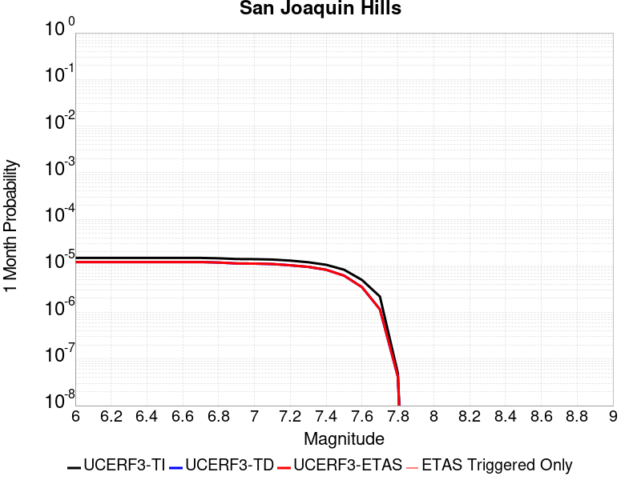 |  | 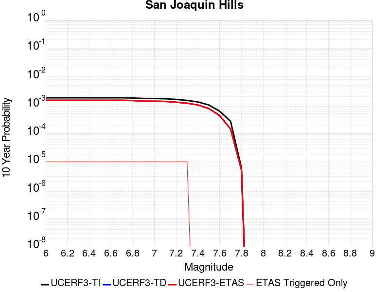 |

| Magnitude | 1 wk TI Prob | 1 wk TD Prob | 1 wk ETAS Prob | 1 wk ETAS/TD Gain | 1 wk ETAS Triggered Only | 1 mo TI Prob | 1 mo TD Prob | 1 mo ETAS Prob | 1 mo ETAS/TD Gain | 1 mo ETAS Triggered Only | 1 yr TI Prob | 1 yr TD Prob | 1 yr ETAS Prob | 1 yr ETAS/TD Gain | 1 yr ETAS Triggered Only | 10 yr TI Prob | 10 yr TD Prob | 10 yr ETAS Prob | 10 yr ETAS/TD Gain | 10 yr ETAS Triggered Only |
|-----|-----|-----|-----|-----|-----|-----|-----|-----|-----|-----|-----|-----|-----|-----|-----|-----|-----|-----|-----|-----|
| 6.0 | 3.4525704E-6 | 2.8139818E-6 | 2.8139818E-6 | 1.0 | 0.0 | 1.4796647E-5 | 1.2059867E-5 | 1.2059867E-5 | 1.0 | 0.0 | 1.8013427E-4 | 1.4681912E-4 | 1.4681912E-4 | 1.0 | 0.0 | 0.0017998833 | 0.0014672345 | 0.0014772197 | 1.0068055 | 1.0E-5 |
| 6.1 | 3.4525704E-6 | 2.8139818E-6 | 2.8139818E-6 | 1.0 | 0.0 | 1.4796647E-5 | 1.2059867E-5 | 1.2059867E-5 | 1.0 | 0.0 | 1.8013427E-4 | 1.4681912E-4 | 1.4681912E-4 | 1.0 | 0.0 | 0.0017998833 | 0.0014672345 | 0.0014772197 | 1.0068055 | 1.0E-5 |
| 6.2 | 3.4525704E-6 | 2.8139818E-6 | 2.8139818E-6 | 1.0 | 0.0 | 1.4796647E-5 | 1.2059867E-5 | 1.2059867E-5 | 1.0 | 0.0 | 1.8013427E-4 | 1.4681912E-4 | 1.4681912E-4 | 1.0 | 0.0 | 0.0017998833 | 0.0014672345 | 0.0014772197 | 1.0068055 | 1.0E-5 |
| 6.3 | 3.4525704E-6 | 2.8139818E-6 | 2.8139818E-6 | 1.0 | 0.0 | 1.4796647E-5 | 1.2059867E-5 | 1.2059867E-5 | 1.0 | 0.0 | 1.8013427E-4 | 1.4681912E-4 | 1.4681912E-4 | 1.0 | 0.0 | 0.0017998833 | 0.0014672345 | 0.0014772197 | 1.0068055 | 1.0E-5 |
| 6.4 | 3.4525704E-6 | 2.8139818E-6 | 2.8139818E-6 | 1.0 | 0.0 | 1.4796647E-5 | 1.2059867E-5 | 1.2059867E-5 | 1.0 | 0.0 | 1.8013427E-4 | 1.4681912E-4 | 1.4681912E-4 | 1.0 | 0.0 | 0.0017998833 | 0.0014672345 | 0.0014772197 | 1.0068055 | 1.0E-5 |
| 6.5 | 3.4525704E-6 | 2.8139818E-6 | 2.8139818E-6 | 1.0 | 0.0 | 1.4796647E-5 | 1.2059867E-5 | 1.2059867E-5 | 1.0 | 0.0 | 1.8013427E-4 | 1.4681912E-4 | 1.4681912E-4 | 1.0 | 0.0 | 0.0017998833 | 0.0014672345 | 0.0014772197 | 1.0068055 | 1.0E-5 |
| 6.6 | 3.4525704E-6 | 2.8139818E-6 | 2.8139818E-6 | 1.0 | 0.0 | 1.4796647E-5 | 1.2059867E-5 | 1.2059867E-5 | 1.0 | 0.0 | 1.8013427E-4 | 1.4681912E-4 | 1.4681912E-4 | 1.0 | 0.0 | 0.0017998833 | 0.0014672345 | 0.0014772197 | 1.0068055 | 1.0E-5 |
| 6.7 | 3.4525704E-6 | 2.8139818E-6 | 2.8139818E-6 | 1.0 | 0.0 | 1.4796647E-5 | 1.2059867E-5 | 1.2059867E-5 | 1.0 | 0.0 | 1.8013427E-4 | 1.4681912E-4 | 1.4681912E-4 | 1.0 | 0.0 | 0.0017998833 | 0.0014672345 | 0.0014772197 | 1.0068055 | 1.0E-5 |
| 6.8 | 3.388654E-6 | 2.7484202E-6 | 2.7484202E-6 | 1.0 | 0.0 | 1.4522722E-5 | 1.1778891E-5 | 1.1778891E-5 | 1.0 | 0.0 | 1.767998E-4 | 1.4339869E-4 | 1.4339869E-4 | 1.0 | 0.0 | 0.001766592 | 0.0014330745 | 0.0014430601 | 1.006968 | 1.0E-5 |
| 6.9 | 3.2694352E-6 | 2.6283346E-6 | 2.6283346E-6 | 1.0 | 0.0 | 1.401179E-5 | 1.1264243E-5 | 1.1264243E-5 | 1.0 | 0.0 | 1.7058018E-4 | 1.3713364E-4 | 1.3713364E-4 | 1.0 | 0.0 | 0.0017044931 | 0.0013705015 | 0.0013804878 | 1.0072865 | 1.0E-5 |
| 7.0 | 3.246912E-6 | 2.6069915E-6 | 2.6069915E-6 | 1.0 | 0.0 | 1.39152635E-5 | 1.1172774E-5 | 1.1172774E-5 | 1.0 | 0.0 | 1.6940516E-4 | 1.3602014E-4 | 1.3602014E-4 | 1.0 | 0.0 | 0.0016927607 | 0.0013593802 | 0.0013693665 | 1.0073463 | 1.0E-5 |
| 7.1 | 3.1864927E-6 | 2.5523198E-6 | 2.5523198E-6 | 1.0 | 0.0 | 1.3656326E-5 | 1.0938467E-5 | 1.0938467E-5 | 1.0 | 0.0 | 1.6625308E-4 | 1.3316782E-4 | 1.3316782E-4 | 1.0 | 0.0 | 0.0016612876 | 0.0013308912 | 0.0013408778 | 1.0075037 | 1.0E-5 |
| 7.2 | 3.0220644E-6 | 2.3991677E-6 | 2.3991677E-6 | 1.0 | 0.0 | 1.295164E-5 | 1.0282108E-5 | 1.0282108E-5 | 1.0 | 0.0 | 1.576748E-4 | 1.2517757E-4 | 1.2517757E-4 | 1.0 | 0.0 | 0.0015756298 | 0.0012510809 | 0.0012610684 | 1.0079831 | 1.0E-5 |
| 7.3 | 2.787619E-6 | 2.2173858E-6 | 2.2173858E-6 | 1.0 | 0.0 | 1.1946884E-5 | 9.503048E-6 | 9.503048E-6 | 1.0 | 0.0 | 1.454436E-4 | 1.1569356E-4 | 1.1569356E-4 | 1.0 | 0.0 | 0.0014534845 | 0.0011563431 | 0.0011663316 | 1.0086379 | 1.0E-5 |
| 7.4 | 2.4593792E-6 | 1.9226306E-6 | 1.9226306E-6 | 1.0 | 0.0 | 1.0540153E-5 | 8.23982E-6 | 8.23982E-6 | 1.0 | 0.0 | 1.2831882E-4 | 1.0031529E-4 | 1.0031529E-4 | 1.0 | 0.0 | 0.0012824474 | 0.0010027088 | 0.0010027088 | 1.0 | 0.0 |
| 7.5 | 1.926764E-6 | 1.4383021E-6 | 1.4383021E-6 | 1.0 | 0.0 | 8.257534E-6 | 6.1641376E-6 | 6.1641376E-6 | 1.0 | 0.0 | 1.00530844E-4 | 7.504586E-5 | 7.504586E-5 | 1.0 | 0.0 | 0.0010048538 | 7.502115E-4 | 7.502115E-4 | 1.0 | 0.0 |
| 7.6 | 1.1609359E-6 | 8.14558E-7 | 8.14558E-7 | 1.0 | 0.0 | 4.97543E-6 | 3.4909585E-6 | 3.4909585E-6 | 1.0 | 0.0 | 6.0574173E-5 | 4.2501633E-5 | 4.2501633E-5 | 1.0 | 0.0 | 6.055767E-4 | 4.249394E-4 | 4.249394E-4 | 1.0 | 0.0 |
| 7.7 | 5.1168536E-7 | 2.7155914E-7 | 2.7155914E-7 | 1.0 | 0.0 | 2.1929354E-6 | 1.1638244E-6 | 1.1638244E-6 | 1.0 | 0.0 | 2.669866E-5 | 1.41694845E-5 | 1.41694845E-5 | 1.0 | 0.0 | 2.6695454E-4 | 1.4168715E-4 | 1.4168715E-4 | 1.0 | 0.0 |
| 7.8 | 1.16056995E-8 | 9.782373E-9 | 9.782373E-9 | 1.0 | 0.0 | 4.9738713E-8 | 4.1924455E-8 | 4.1924455E-8 | 1.0 | 0.0 | 6.0556863E-7 | 5.1043025E-7 | 5.1043025E-7 | 1.0 | 0.0 | 6.05567E-6 | 5.1043025E-6 | 5.1043025E-6 | 1.0 | 0.0 |

## Peralta Hills
*[(top)](#table-of-contents)*

| 1 Week | 1 Month | 1 Year | 10 Year |
|-----|-----|-----|-----|
|  |  |  |  |

| Magnitude | 1 wk TI Prob | 1 wk TD Prob | 1 wk ETAS Prob | 1 wk ETAS/TD Gain | 1 wk ETAS Triggered Only | 1 mo TI Prob | 1 mo TD Prob | 1 mo ETAS Prob | 1 mo ETAS/TD Gain | 1 mo ETAS Triggered Only | 1 yr TI Prob | 1 yr TD Prob | 1 yr ETAS Prob | 1 yr ETAS/TD Gain | 1 yr ETAS Triggered Only | 10 yr TI Prob | 10 yr TD Prob | 10 yr ETAS Prob | 10 yr ETAS/TD Gain | 10 yr ETAS Triggered Only |
|-----|-----|-----|-----|-----|-----|-----|-----|-----|-----|-----|-----|-----|-----|-----|-----|-----|-----|-----|-----|-----|
| 6.0 | 3.8850067E-6 | 3.839512E-6 | 3.839512E-6 | 1.0 | 0.0 | 1.6649923E-5 | 1.645499E-5 | 1.645499E-5 | 1.0 | 0.0 | 2.0269395E-4 | 2.0032849E-4 | 2.1032649E-4 | 1.049908 | 1.0E-5 | 0.0020250916 | 0.0020022066 | 0.0020121867 | 1.0049845 | 1.0E-5 |
| 6.1 | 3.8850067E-6 | 3.839512E-6 | 3.839512E-6 | 1.0 | 0.0 | 1.6649923E-5 | 1.645499E-5 | 1.645499E-5 | 1.0 | 0.0 | 2.0269395E-4 | 2.0032849E-4 | 2.1032649E-4 | 1.049908 | 1.0E-5 | 0.0020250916 | 0.0020022066 | 0.0020121867 | 1.0049845 | 1.0E-5 |
| 6.2 | 3.8850067E-6 | 3.839512E-6 | 3.839512E-6 | 1.0 | 0.0 | 1.6649923E-5 | 1.645499E-5 | 1.645499E-5 | 1.0 | 0.0 | 2.0269395E-4 | 2.0032849E-4 | 2.1032649E-4 | 1.049908 | 1.0E-5 | 0.0020250916 | 0.0020022066 | 0.0020121867 | 1.0049845 | 1.0E-5 |
| 6.3 | 3.8850067E-6 | 3.839512E-6 | 3.839512E-6 | 1.0 | 0.0 | 1.6649923E-5 | 1.645499E-5 | 1.645499E-5 | 1.0 | 0.0 | 2.0269395E-4 | 2.0032849E-4 | 2.1032649E-4 | 1.049908 | 1.0E-5 | 0.0020250916 | 0.0020022066 | 0.0020121867 | 1.0049845 | 1.0E-5 |
| 6.4 | 3.8850067E-6 | 3.839512E-6 | 3.839512E-6 | 1.0 | 0.0 | 1.6649923E-5 | 1.645499E-5 | 1.645499E-5 | 1.0 | 0.0 | 2.0269395E-4 | 2.0032849E-4 | 2.1032649E-4 | 1.049908 | 1.0E-5 | 0.0020250916 | 0.0020022066 | 0.0020121867 | 1.0049845 | 1.0E-5 |
| 6.5 | 1.5587785E-6 | 1.4430796E-6 | 1.4430796E-6 | 1.0 | 0.0 | 6.6804623E-6 | 6.184613E-6 | 6.184613E-6 | 1.0 | 0.0 | 8.133159E-5 | 7.529531E-5 | 7.529531E-5 | 1.0 | 0.0 | 8.1301836E-4 | 7.52722E-4 | 7.52722E-4 | 1.0 | 0.0 |
| 6.6 | 1.5587785E-6 | 1.4430796E-6 | 1.4430796E-6 | 1.0 | 0.0 | 6.6804623E-6 | 6.184613E-6 | 6.184613E-6 | 1.0 | 0.0 | 8.133159E-5 | 7.529531E-5 | 7.529531E-5 | 1.0 | 0.0 | 8.1301836E-4 | 7.52722E-4 | 7.52722E-4 | 1.0 | 0.0 |
| 6.7 | 1.5018579E-6 | 1.3837022E-6 | 1.3837022E-6 | 1.0 | 0.0 | 6.436518E-6 | 5.93014E-6 | 5.93014E-6 | 1.0 | 0.0 | 7.836179E-5 | 7.21973E-5 | 7.21973E-5 | 1.0 | 0.0 | 7.833416E-4 | 7.21762E-4 | 7.21762E-4 | 1.0 | 0.0 |
| 6.8 | 1.4584314E-6 | 1.3381342E-6 | 1.3381342E-6 | 1.0 | 0.0 | 6.250405E-6 | 5.7348498E-6 | 5.7348498E-6 | 1.0 | 0.0 | 7.6096025E-5 | 6.98198E-5 | 6.98198E-5 | 1.0 | 0.0 | 7.6069974E-4 | 6.98002E-4 | 6.98002E-4 | 1.0 | 0.0 |
| 6.9 | 1.1382393E-6 | 9.862285E-7 | 9.862285E-7 | 1.0 | 0.0 | 4.8781594E-6 | 4.226687E-6 | 4.226687E-6 | 1.0 | 0.0 | 5.9389975E-5 | 5.1458785E-5 | 5.1458785E-5 | 1.0 | 0.0 | 5.93741E-4 | 5.144769E-4 | 5.144769E-4 | 1.0 | 0.0 |
| 7.0 | 9.970413E-7 | 8.309642E-7 | 8.309642E-7 | 1.0 | 0.0 | 4.273027E-6 | 3.561271E-6 | 3.561271E-6 | 1.0 | 0.0 | 5.2022864E-5 | 4.335768E-5 | 4.335768E-5 | 1.0 | 0.0 | 5.2010687E-4 | 4.33499E-4 | 4.33499E-4 | 1.0 | 0.0 |
| 7.1 | 9.684443E-7 | 7.99408E-7 | 7.99408E-7 | 1.0 | 0.0 | 4.150469E-6 | 3.4260302E-6 | 3.4260302E-6 | 1.0 | 0.0 | 5.053079E-5 | 4.1711188E-5 | 4.1711188E-5 | 1.0 | 0.0 | 5.05193E-4 | 4.170403E-4 | 4.170403E-4 | 1.0 | 0.0 |
| 7.2 | 9.240811E-7 | 7.5031426E-7 | 7.5031426E-7 | 1.0 | 0.0 | 3.960342E-6 | 3.215629E-6 | 3.215629E-6 | 1.0 | 0.0 | 4.8216094E-5 | 3.9149647E-5 | 3.9149647E-5 | 1.0 | 0.0 | 4.8205635E-4 | 3.9143403E-4 | 3.9143403E-4 | 1.0 | 0.0 |
| 7.3 | 8.158643E-7 | 6.350017E-7 | 6.350017E-7 | 1.0 | 0.0 | 3.4965567E-6 | 2.7214332E-6 | 2.7214332E-6 | 1.0 | 0.0 | 4.2569747E-5 | 3.313301E-5 | 3.313301E-5 | 1.0 | 0.0 | 4.2561593E-4 | 3.3128684E-4 | 3.3128684E-4 | 1.0 | 0.0 |
| 7.4 | 6.3822824E-7 | 4.7957286E-7 | 4.7957286E-7 | 1.0 | 0.0 | 2.7352612E-6 | 2.0553111E-6 | 2.0553111E-6 | 1.0 | 0.0 | 3.3301294E-5 | 2.5023177E-5 | 2.5023177E-5 | 1.0 | 0.0 | 3.3296304E-4 | 2.5020874E-4 | 2.5020874E-4 | 1.0 | 0.0 |
| 7.5 | 4.0292628E-7 | 2.7846056E-7 | 2.7846056E-7 | 1.0 | 0.0 | 1.7268258E-6 | 1.193402E-6 | 1.193402E-6 | 1.0 | 0.0 | 2.1023901E-5 | 1.4529601E-5 | 1.4529601E-5 | 1.0 | 0.0 | 2.1021912E-4 | 1.452893E-4 | 1.452893E-4 | 1.0 | 0.0 |
| 7.6 | 3.672993E-7 | 2.485495E-7 | 2.485495E-7 | 1.0 | 0.0 | 1.5741389E-6 | 1.0652118E-6 | 1.0652118E-6 | 1.0 | 0.0 | 1.9164972E-5 | 1.2968904E-5 | 1.2968904E-5 | 1.0 | 0.0 | 1.916332E-4 | 1.296842E-4 | 1.296842E-4 | 1.0 | 0.0 |
| 7.7 | 2.8466823E-7 | 1.7859877E-7 | 1.7859877E-7 | 1.0 | 0.0 | 1.2200061E-6 | 7.6542324E-7 | 7.6542324E-7 | 1.0 | 0.0 | 1.4853474E-5 | 9.319015E-6 | 9.319015E-6 | 1.0 | 0.0 | 1.485248E-4 | 9.3188835E-5 | 9.3188835E-5 | 1.0 | 0.0 |

## San Andreas (Offshore) 2011 CFM
*[(top)](#table-of-contents)*

| 1 Week | 1 Month | 1 Year | 10 Year |
|-----|-----|-----|-----|
| 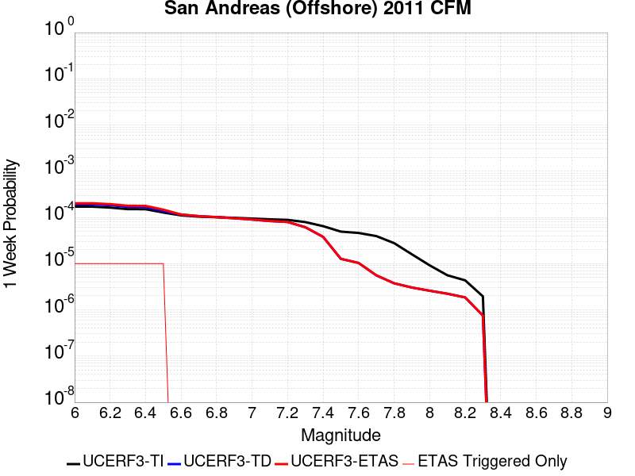 |  |  | 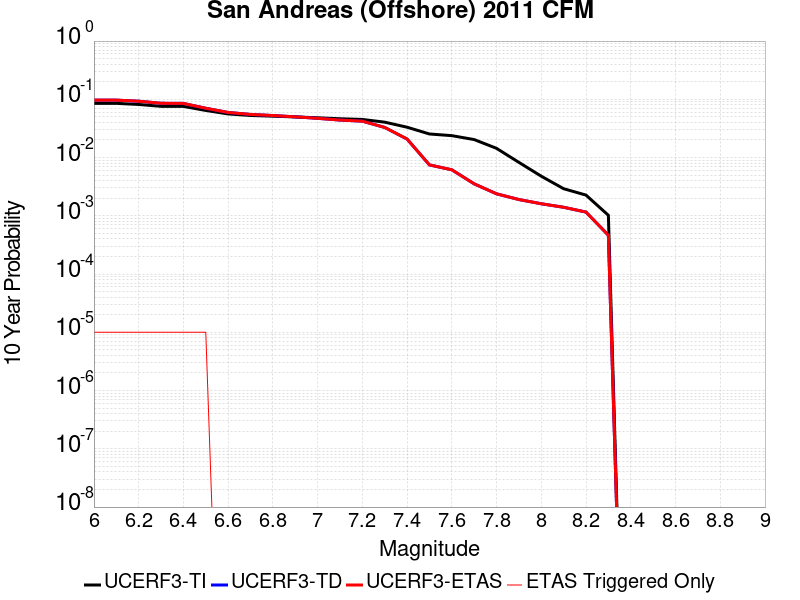 |

| Magnitude | 1 wk TI Prob | 1 wk TD Prob | 1 wk ETAS Prob | 1 wk ETAS/TD Gain | 1 wk ETAS Triggered Only | 1 mo TI Prob | 1 mo TD Prob | 1 mo ETAS Prob | 1 mo ETAS/TD Gain | 1 mo ETAS Triggered Only | 1 yr TI Prob | 1 yr TD Prob | 1 yr ETAS Prob | 1 yr ETAS/TD Gain | 1 yr ETAS Triggered Only | 10 yr TI Prob | 10 yr TD Prob | 10 yr ETAS Prob | 10 yr ETAS/TD Gain | 10 yr ETAS Triggered Only |
|-----|-----|-----|-----|-----|-----|-----|-----|-----|-----|-----|-----|-----|-----|-----|-----|-----|-----|-----|-----|-----|
| 6.0 | 1.7072787E-4 | 1.9226041E-4 | 2.022585E-4 | 1.0520028 | 1.0E-5 | 7.3148566E-4 | 8.237154E-4 | 8.337072E-4 | 1.0121301 | 1.0E-5 | 0.008869528 | 0.0099831335 | 0.009993034 | 1.0009917 | 1.0E-5 | 0.085237645 | 0.09682738 | 0.09683641 | 1.0000932 | 1.0E-5 |
| 6.1 | 1.7072787E-4 | 1.9226041E-4 | 2.022585E-4 | 1.0520028 | 1.0E-5 | 7.3148566E-4 | 8.237154E-4 | 8.337072E-4 | 1.0121301 | 1.0E-5 | 0.008869528 | 0.0099831335 | 0.009993034 | 1.0009917 | 1.0E-5 | 0.085237645 | 0.09682738 | 0.09683641 | 1.0000932 | 1.0E-5 |
| 6.2 | 1.6312556E-4 | 1.8407789E-4 | 1.9407604E-4 | 1.0543149 | 1.0E-5 | 6.989222E-4 | 7.8866904E-4 | 7.986612E-4 | 1.0126696 | 1.0E-5 | 0.008476226 | 0.009560268 | 0.009570173 | 1.001036 | 1.0E-5 | 0.08160117 | 0.09284818 | 0.09285726 | 1.0000978 | 1.0E-5 |
| 6.3 | 1.5103363E-4 | 1.6880741E-4 | 1.7880571E-4 | 1.0592291 | 1.0E-5 | 6.471264E-4 | 7.232619E-4 | 7.3325465E-4 | 1.0138162 | 1.0E-5 | 0.007850339 | 0.008770605 | 0.008780517 | 1.0011302 | 1.0E-5 | 0.075787395 | 0.085489064 | 0.085498214 | 1.0001069 | 1.0E-5 |
| 6.4 | 1.5047993E-4 | 1.676667E-4 | 1.7766502E-4 | 1.0596322 | 1.0E-5 | 6.4475456E-4 | 7.1837584E-4 | 7.2836864E-4 | 1.0139103 | 1.0E-5 | 0.007821669 | 0.008711592 | 0.008721505 | 1.0011379 | 1.0E-5 | 0.0755203 | 0.08496926 | 0.08497842 | 1.0001076 | 1.0E-5 |
| 6.5 | 1.2760791E-4 | 1.3735025E-4 | 1.4734887E-4 | 1.0727966 | 1.0E-5 | 5.467764E-4 | 5.885125E-4 | 5.985066E-4 | 1.016982 | 1.0E-5 | 0.0066367025 | 0.0071418737 | 0.007151802 | 1.0013902 | 1.0E-5 | 0.064419635 | 0.07025001 | 0.07025931 | 1.0001323 | 1.0E-5 |
| 6.6 | 1.1063525E-4 | 1.15566356E-4 | 1.15566356E-4 | 1.0 | 0.0 | 4.740649E-4 | 4.9519143E-4 | 4.9519143E-4 | 1.0 | 0.0 | 0.0057564764 | 0.006012491 | 0.006012491 | 1.0 | 0.0 | 0.05609626 | 0.05948894 | 0.05948894 | 1.0 | 0.0 |
| 6.7 | 1.0391049E-4 | 1.0645922E-4 | 1.0645922E-4 | 1.0 | 0.0 | 4.4525467E-4 | 4.5617504E-4 | 4.5617504E-4 | 1.0 | 0.0 | 0.0054075094 | 0.005539975 | 0.005539975 | 1.0 | 0.0 | 0.052778035 | 0.05498876 | 0.05498876 | 1.0 | 0.0 |
| 6.8 | 1.0096706E-4 | 1.01582686E-4 | 1.01582686E-4 | 1.0 | 0.0 | 4.3264418E-4 | 4.3528268E-4 | 4.3528268E-4 | 1.0 | 0.0 | 0.0052547283 | 0.005286866 | 0.005286866 | 1.0 | 0.0 | 0.051321987 | 0.052687574 | 0.052687574 | 1.0 | 0.0 |
| 6.9 | 9.800265E-5 | 9.588748E-5 | 9.588748E-5 | 1.0 | 0.0 | 4.1994374E-4 | 4.1088252E-4 | 4.1088252E-4 | 1.0 | 0.0 | 0.0051008356 | 0.0049911886 | 0.0049911886 | 1.0 | 0.0 | 0.049853306 | 0.05001504 | 0.05001504 | 1.0 | 0.0 |
| 7.0 | 9.4642375E-5 | 9.002143E-5 | 9.002143E-5 | 1.0 | 0.0 | 4.0554712E-4 | 3.8574997E-4 | 3.8574997E-4 | 1.0 | 0.0 | 0.004926363 | 0.0046865544 | 0.0046865544 | 1.0 | 0.0 | 0.048185747 | 0.047196057 | 0.047196057 | 1.0 | 0.0 |
| 7.1 | 9.0996844E-5 | 8.354169E-5 | 8.354169E-5 | 1.0 | 0.0 | 3.8992817E-4 | 3.5798753E-4 | 3.5798753E-4 | 1.0 | 0.0 | 0.004737046 | 0.004349944 | 0.004349944 | 1.0 | 0.0 | 0.04637333 | 0.044047635 | 0.044047635 | 1.0 | 0.0 |
| 7.2 | 8.848287E-5 | 7.9818135E-5 | 7.9818135E-5 | 1.0 | 0.0 | 3.791572E-4 | 3.4203375E-4 | 3.4203375E-4 | 1.0 | 0.0 | 0.004606472 | 0.0041564633 | 0.0041564633 | 1.0 | 0.0 | 0.045121472 | 0.042191572 | 0.042191572 | 1.0 | 0.0 |
| 7.3 | 7.9280784E-5 | 6.1276216E-5 | 6.1276216E-5 | 1.0 | 0.0 | 3.3973053E-4 | 2.625865E-4 | 2.625865E-4 | 1.0 | 0.0 | 0.004128377 | 0.0031924061 | 0.0031924061 | 1.0 | 0.0 | 0.040525194 | 0.032904375 | 0.032904375 | 1.0 | 0.0 |
| 7.4 | 6.468038E-5 | 3.7933212E-5 | 3.7933212E-5 | 1.0 | 0.0 | 2.771722E-4 | 1.625611E-4 | 1.625611E-4 | 1.0 | 0.0 | 0.0033693502 | 0.0019774425 | 0.0019774425 | 1.0 | 0.0 | 0.0331872 | 0.02082181 | 0.02082181 | 1.0 | 0.0 |
| 7.5 | 4.930574E-5 | 1.2703362E-5 | 1.2703362E-5 | 1.0 | 0.0 | 2.1129321E-4 | 5.444185E-5 | 5.444185E-5 | 1.0 | 0.0 | 0.0025694598 | 6.6262955E-4 | 6.6262955E-4 | 1.0 | 0.0 | 0.02539953 | 0.007481418 | 0.007481418 | 1.0 | 0.0 |
| 7.6 | 4.612566E-5 | 1.0336213E-5 | 1.0336213E-5 | 1.0 | 0.0 | 1.9766642E-4 | 4.429731E-5 | 4.429731E-5 | 1.0 | 0.0 | 0.0024039324 | 5.391877E-4 | 5.391877E-4 | 1.0 | 0.0 | 0.023780935 | 0.006172099 | 0.006172099 | 1.0 | 0.0 |
| 7.7 | 3.9435414E-5 | 5.574925E-6 | 5.574925E-6 | 1.0 | 0.0 | 1.6899795E-4 | 2.3892318E-5 | 2.3892318E-5 | 1.0 | 0.0 | 0.0020556084 | 2.9085035E-4 | 2.9085035E-4 | 1.0 | 0.0 | 0.020366974 | 0.0035420412 | 0.0035420412 | 1.0 | 0.0 |
| 7.8 | 2.7787428E-5 | 3.7553348E-6 | 3.7553348E-6 | 1.0 | 0.0 | 1.1908354E-4 | 1.6094193E-5 | 1.6094193E-5 | 1.0 | 0.0 | 0.0014488777 | 1.9592921E-4 | 1.9592921E-4 | 1.0 | 0.0 | 0.014394675 | 0.0023877125 | 0.0023877125 | 1.0 | 0.0 |
| 7.9 | 1.590671E-5 | 3.04085E-6 | 3.04085E-6 | 1.0 | 0.0 | 6.816983E-5 | 1.303215E-5 | 1.303215E-5 | 1.0 | 0.0 | 8.2965166E-4 | 1.586549E-4 | 1.586549E-4 | 1.0 | 0.0 | 0.008265611 | 0.001904262 | 0.001904262 | 1.0 | 0.0 |
| 8.0 | 9.193638E-6 | 2.5920847E-6 | 2.5920847E-6 | 1.0 | 0.0 | 3.940071E-5 | 1.1108887E-5 | 1.1108887E-5 | 1.0 | 0.0 | 4.7959806E-4 | 1.3524233E-4 | 1.3524233E-4 | 1.0 | 0.0 | 0.0047856434 | 0.0016115032 | 0.0016115032 | 1.0 | 0.0 |
| 8.1 | 5.601576E-6 | 2.2343472E-6 | 2.2343472E-6 | 1.0 | 0.0 | 2.4006533E-5 | 9.575739E-6 | 9.575739E-6 | 1.0 | 0.0 | 2.9224035E-4 | 1.16578405E-4 | 1.16578405E-4 | 1.0 | 0.0 | 0.0029185633 | 0.0014020674 | 0.0014020674 | 1.0 | 0.0 |
| 8.2 | 4.3508785E-6 | 1.857566E-6 | 1.857566E-6 | 1.0 | 0.0 | 1.864649E-5 | 7.960973E-6 | 7.960973E-6 | 1.0 | 0.0 | 2.2699735E-4 | 9.692056E-5 | 9.692056E-5 | 1.0 | 0.0 | 0.0022676561 | 0.0011594221 | 0.0011594221 | 1.0 | 0.0 |
| 8.3 | 1.9573292E-6 | 7.514906E-7 | 7.514906E-7 | 1.0 | 0.0 | 8.388526E-6 | 3.22067E-6 | 3.22067E-6 | 1.0 | 0.0 | 1.0212552E-4 | 3.921097E-5 | 3.921097E-5 | 1.0 | 0.0 | 0.001020786 | 4.640846E-4 | 4.640846E-4 | 1.0 | 0.0 |

## Sierra Madre (San Fernando)
*[(top)](#table-of-contents)*

| 1 Week | 1 Month | 1 Year | 10 Year |
|-----|-----|-----|-----|
|  | 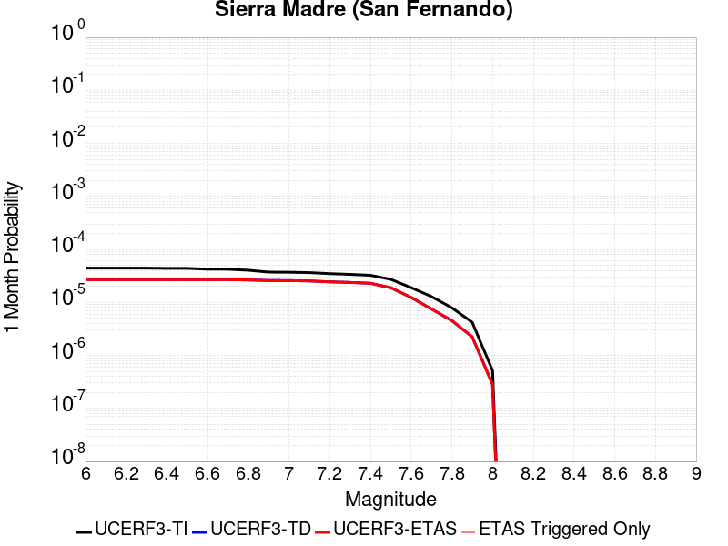 |  | 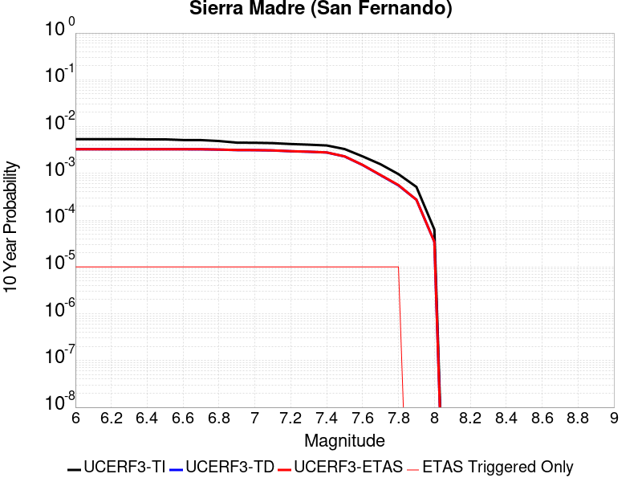 |

| Magnitude | 1 wk TI Prob | 1 wk TD Prob | 1 wk ETAS Prob | 1 wk ETAS/TD Gain | 1 wk ETAS Triggered Only | 1 mo TI Prob | 1 mo TD Prob | 1 mo ETAS Prob | 1 mo ETAS/TD Gain | 1 mo ETAS Triggered Only | 1 yr TI Prob | 1 yr TD Prob | 1 yr ETAS Prob | 1 yr ETAS/TD Gain | 1 yr ETAS Triggered Only | 10 yr TI Prob | 10 yr TD Prob | 10 yr ETAS Prob | 10 yr ETAS/TD Gain | 10 yr ETAS Triggered Only |
|-----|-----|-----|-----|-----|-----|-----|-----|-----|-----|-----|-----|-----|-----|-----|-----|-----|-----|-----|-----|-----|
| 6.0 | 1.0346413E-5 | 6.2872605E-6 | 6.2872605E-6 | 1.0 | 0.0 | 4.4341014E-5 | 2.694513E-5 | 2.694513E-5 | 1.0 | 0.0 | 5.3971814E-4 | 3.280087E-4 | 3.380054E-4 | 1.030477 | 1.0E-5 | 0.0053840918 | 0.0032753581 | 0.0032853254 | 1.003043 | 1.0E-5 |
| 6.1 | 1.0346413E-5 | 6.2872605E-6 | 6.2872605E-6 | 1.0 | 0.0 | 4.4341014E-5 | 2.694513E-5 | 2.694513E-5 | 1.0 | 0.0 | 5.3971814E-4 | 3.280087E-4 | 3.380054E-4 | 1.030477 | 1.0E-5 | 0.0053840918 | 0.0032753581 | 0.0032853254 | 1.003043 | 1.0E-5 |
| 6.2 | 1.0346413E-5 | 6.2872605E-6 | 6.2872605E-6 | 1.0 | 0.0 | 4.4341014E-5 | 2.694513E-5 | 2.694513E-5 | 1.0 | 0.0 | 5.3971814E-4 | 3.280087E-4 | 3.380054E-4 | 1.030477 | 1.0E-5 | 0.0053840918 | 0.0032753581 | 0.0032853254 | 1.003043 | 1.0E-5 |
| 6.3 | 1.0346413E-5 | 6.2872605E-6 | 6.2872605E-6 | 1.0 | 0.0 | 4.4341014E-5 | 2.694513E-5 | 2.694513E-5 | 1.0 | 0.0 | 5.3971814E-4 | 3.280087E-4 | 3.380054E-4 | 1.030477 | 1.0E-5 | 0.0053840918 | 0.0032753581 | 0.0032853254 | 1.003043 | 1.0E-5 |
| 6.4 | 1.0249558E-5 | 6.2872605E-6 | 6.2872605E-6 | 1.0 | 0.0 | 4.392594E-5 | 2.694513E-5 | 2.694513E-5 | 1.0 | 0.0 | 5.3466705E-4 | 3.280087E-4 | 3.380054E-4 | 1.030477 | 1.0E-5 | 0.0053338245 | 0.0032753581 | 0.0032853254 | 1.003043 | 1.0E-5 |
| 6.5 | 1.0249558E-5 | 6.2872605E-6 | 6.2872605E-6 | 1.0 | 0.0 | 4.392594E-5 | 2.694513E-5 | 2.694513E-5 | 1.0 | 0.0 | 5.3466705E-4 | 3.280087E-4 | 3.380054E-4 | 1.030477 | 1.0E-5 | 0.0053338245 | 0.0032753581 | 0.0032853254 | 1.003043 | 1.0E-5 |
| 6.6 | 9.9035515E-6 | 6.2872605E-6 | 6.2872605E-6 | 1.0 | 0.0 | 4.2443102E-5 | 2.694513E-5 | 2.694513E-5 | 1.0 | 0.0 | 5.166222E-4 | 3.280087E-4 | 3.380054E-4 | 1.030477 | 1.0E-5 | 0.0051542283 | 0.0032753581 | 0.0032853254 | 1.003043 | 1.0E-5 |
| 6.7 | 9.87217E-6 | 6.2746817E-6 | 6.2746817E-6 | 1.0 | 0.0 | 4.2308613E-5 | 2.689122E-5 | 2.689122E-5 | 1.0 | 0.0 | 5.149856E-4 | 3.2735255E-4 | 3.3734928E-4 | 1.0305381 | 1.0E-5 | 0.005137938 | 0.0032688158 | 0.0032787833 | 1.0030493 | 1.0E-5 |
| 6.8 | 9.4359175E-6 | 6.1786586E-6 | 6.1786586E-6 | 1.0 | 0.0 | 4.043902E-5 | 2.6479704E-5 | 2.6479704E-5 | 1.0 | 0.0 | 4.9223384E-4 | 3.2234378E-4 | 3.3234057E-4 | 1.0310128 | 1.0E-5 | 0.0049114493 | 0.0032188739 | 0.0032288418 | 1.0030967 | 1.0E-5 |
| 6.9 | 8.700447E-6 | 6.039922E-6 | 6.039922E-6 | 1.0 | 0.0 | 3.72871E-5 | 2.5885129E-5 | 2.5885129E-5 | 1.0 | 0.0 | 4.5387587E-4 | 3.1510694E-4 | 3.2510379E-4 | 1.0317253 | 1.0E-5 | 0.0045295 | 0.003146711 | 0.0031566794 | 1.0031679 | 1.0E-5 |
| 7.0 | 8.648878E-6 | 6.0148373E-6 | 6.0148373E-6 | 1.0 | 0.0 | 3.7066096E-5 | 2.5777625E-5 | 2.5777625E-5 | 1.0 | 0.0 | 4.5118626E-4 | 3.1379846E-4 | 3.2379534E-4 | 1.0318576 | 1.0E-5 | 0.004502713 | 0.003133663 | 0.0031436319 | 1.0031811 | 1.0E-5 |
| 7.1 | 8.505786E-6 | 5.9244676E-6 | 5.9244676E-6 | 1.0 | 0.0 | 3.645286E-5 | 2.5390334E-5 | 2.5390334E-5 | 1.0 | 0.0 | 4.437232E-4 | 3.0908454E-4 | 3.1908145E-4 | 1.0323436 | 1.0E-5 | 0.0044283825 | 0.0030866556 | 0.0030966247 | 1.0032297 | 1.0E-5 |
| 7.2 | 8.139752E-6 | 5.6987624E-6 | 5.6987624E-6 | 1.0 | 0.0 | 3.4884186E-5 | 2.4423045E-5 | 2.4423045E-5 | 1.0 | 0.0 | 4.246322E-4 | 2.9731105E-4 | 3.0730807E-4 | 1.0336248 | 1.0E-5 | 0.004238217 | 0.0029692391 | 0.0029792094 | 1.0033579 | 1.0E-5 |
| 7.3 | 7.8816E-6 | 5.552077E-6 | 5.552077E-6 | 1.0 | 0.0 | 3.3777847E-5 | 2.3794404E-5 | 2.3794404E-5 | 1.0 | 0.0 | 4.111677E-4 | 2.896594E-4 | 2.996565E-4 | 1.0345134 | 1.0E-5 | 0.004104078 | 0.0028929242 | 0.0029028952 | 1.0034467 | 1.0E-5 |
| 7.4 | 7.5810603E-6 | 5.3563126E-6 | 5.3563126E-6 | 1.0 | 0.0 | 3.2489854E-5 | 2.2955428E-5 | 2.2955428E-5 | 1.0 | 0.0 | 3.9549218E-4 | 2.7944756E-4 | 2.8944475E-4 | 1.035775 | 1.0E-5 | 0.0039478904 | 0.0027910667 | 0.0028010388 | 1.0035728 | 1.0E-5 |
| 7.5 | 6.349153E-6 | 4.407576E-6 | 4.407576E-6 | 1.0 | 0.0 | 2.7210372E-5 | 1.888948E-5 | 1.888948E-5 | 1.0 | 0.0 | 3.312359E-4 | 2.2995596E-4 | 2.3995366E-4 | 1.0434766 | 1.0E-5 | 0.0033074263 | 0.0022972622 | 0.0023072392 | 1.004343 | 1.0E-5 |
| 7.6 | 4.430576E-6 | 2.8905868E-6 | 2.8905868E-6 | 1.0 | 0.0 | 1.8988047E-5 | 1.2388171E-5 | 1.2388171E-5 | 1.0 | 0.0 | 2.3115493E-4 | 1.5081577E-4 | 1.6081426E-4 | 1.0662961 | 1.0E-5 | 0.0023091463 | 0.0015071568 | 0.0015171417 | 1.006625 | 1.0E-5 |
| 7.7 | 3.005066E-6 | 1.7510115E-6 | 1.7510115E-6 | 1.0 | 0.0 | 1.2878791E-5 | 7.504313E-6 | 7.504313E-6 | 1.0 | 0.0 | 1.56788E-4 | 9.1361195E-5 | 1.0136028E-4 | 1.1094457 | 1.0E-5 | 0.0015667742 | 9.132375E-4 | 9.232284E-4 | 1.0109401 | 1.0E-5 |
| 7.8 | 1.8459098E-6 | 1.0582091E-6 | 1.0582091E-6 | 1.0 | 0.0 | 7.911018E-6 | 4.535174E-6 | 4.535174E-6 | 1.0 | 0.0 | 9.631238E-5 | 5.5214347E-5 | 6.52138E-5 | 1.1811024 | 1.0E-5 | 9.627065E-4 | 5.5200676E-4 | 5.6200125E-4 | 1.0181057 | 1.0E-5 |
| 7.9 | 9.839262E-7 | 5.23421E-7 | 5.23421E-7 | 1.0 | 0.0 | 4.2168194E-6 | 2.2432312E-6 | 2.2432312E-6 | 1.0 | 0.0 | 5.1338568E-5 | 2.7310998E-5 | 2.7310998E-5 | 1.0 | 0.0 | 5.132671E-4 | 2.730767E-4 | 2.730767E-4 | 1.0 | 0.0 |
| 8.0 | 1.210983E-7 | 6.613821E-8 | 6.613821E-8 | 1.0 | 0.0 | 5.1899264E-7 | 2.8344945E-7 | 2.8344945E-7 | 1.0 | 0.0 | 6.3187167E-6 | 3.4509917E-6 | 3.4509917E-6 | 1.0 | 0.0 | 6.318537E-5 | 3.45094E-5 | 3.45094E-5 | 1.0 | 0.0 |

## Great Valley 02
*[(top)](#table-of-contents)*

| 1 Week | 1 Month | 1 Year | 10 Year |
|-----|-----|-----|-----|
| 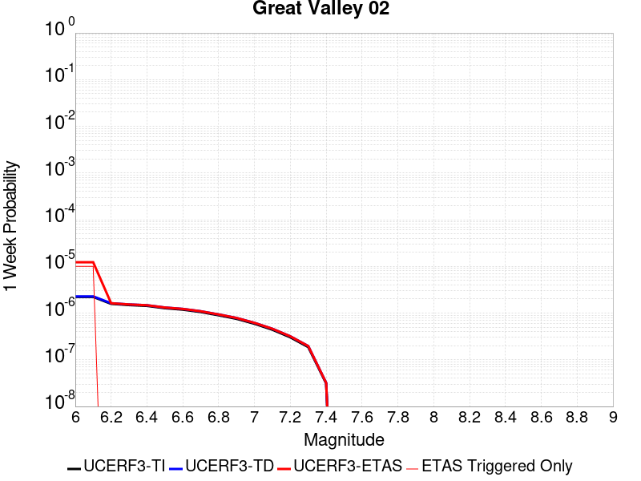 | 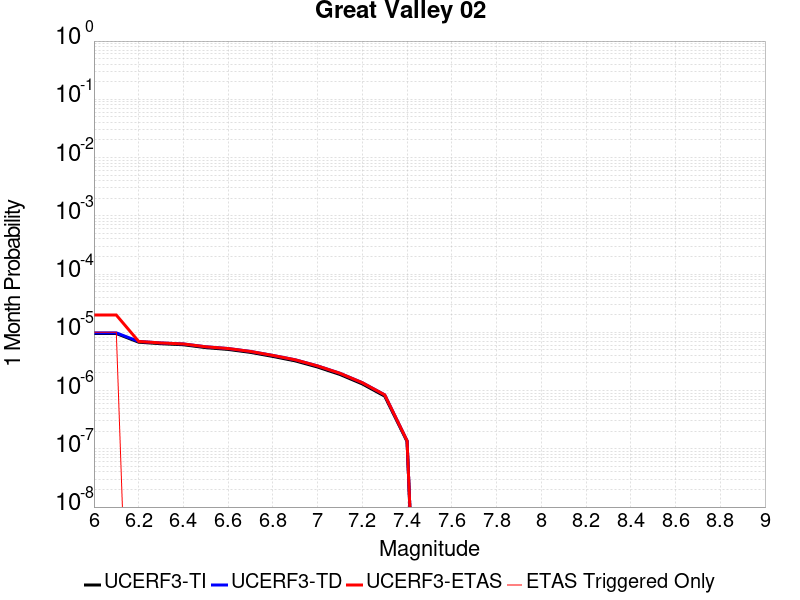 | 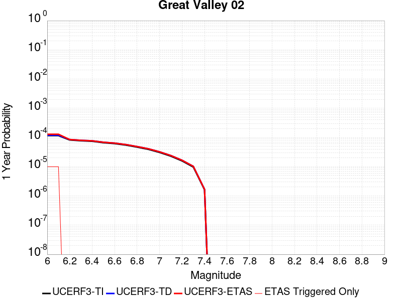 |  |

| Magnitude | 1 wk TI Prob | 1 wk TD Prob | 1 wk ETAS Prob | 1 wk ETAS/TD Gain | 1 wk ETAS Triggered Only | 1 mo TI Prob | 1 mo TD Prob | 1 mo ETAS Prob | 1 mo ETAS/TD Gain | 1 mo ETAS Triggered Only | 1 yr TI Prob | 1 yr TD Prob | 1 yr ETAS Prob | 1 yr ETAS/TD Gain | 1 yr ETAS Triggered Only | 10 yr TI Prob | 10 yr TD Prob | 10 yr ETAS Prob | 10 yr ETAS/TD Gain | 10 yr ETAS Triggered Only |
|-----|-----|-----|-----|-----|-----|-----|-----|-----|-----|-----|-----|-----|-----|-----|-----|-----|-----|-----|-----|-----|
| 6.0 | 2.2243487E-6 | 2.281768E-6 | 1.22817455E-5 | 5.3825564 | 1.0E-5 | 9.532888E-6 | 9.778972E-6 | 1.9778874E-5 | 2.0225923 | 1.0E-5 | 1.1605673E-4 | 1.1905298E-4 | 1.290518E-4 | 1.0839862 | 1.0E-5 | 0.0011599615 | 0.0011899419 | 0.0011999301 | 1.0083938 | 1.0E-5 |
| 6.1 | 2.2243487E-6 | 2.281768E-6 | 1.22817455E-5 | 5.3825564 | 1.0E-5 | 9.532888E-6 | 9.778972E-6 | 1.9778874E-5 | 2.0225923 | 1.0E-5 | 1.1605673E-4 | 1.1905298E-4 | 1.290518E-4 | 1.0839862 | 1.0E-5 | 0.0011599615 | 0.0011899419 | 0.0011999301 | 1.0083938 | 1.0E-5 |
| 6.2 | 1.5787732E-6 | 1.6272533E-6 | 1.6272533E-6 | 1.0 | 0.0 | 6.7661535E-6 | 6.9739244E-6 | 6.9739244E-6 | 1.0 | 0.0 | 8.2374805E-5 | 8.490427E-5 | 8.490427E-5 | 1.0 | 0.0 | 8.2344277E-4 | 8.4872305E-4 | 8.4872305E-4 | 1.0 | 0.0 |
| 6.3 | 1.4850314E-6 | 1.5322953E-6 | 1.5322953E-6 | 1.0 | 0.0 | 6.3644047E-6 | 6.5669637E-6 | 6.5669637E-6 | 1.0 | 0.0 | 7.748387E-5 | 7.994989E-5 | 7.994989E-5 | 1.0 | 0.0 | 7.745686E-4 | 7.992151E-4 | 7.992151E-4 | 1.0 | 0.0 |
| 6.4 | 1.4266972E-6 | 1.4734348E-6 | 1.4734348E-6 | 1.0 | 0.0 | 6.114402E-6 | 6.314706E-6 | 6.314706E-6 | 1.0 | 0.0 | 7.44403E-5 | 7.687887E-5 | 7.687887E-5 | 1.0 | 0.0 | 7.441537E-4 | 7.685261E-4 | 7.685261E-4 | 1.0 | 0.0 |
| 6.5 | 1.2728015E-6 | 1.3171256E-6 | 1.3171256E-6 | 1.0 | 0.0 | 5.4548523E-6 | 5.6448116E-6 | 5.6448116E-6 | 1.0 | 0.0 | 6.64108E-5 | 6.872344E-5 | 6.872344E-5 | 1.0 | 0.0 | 6.639096E-4 | 6.870245E-4 | 6.870245E-4 | 1.0 | 0.0 |
| 6.6 | 1.1857247E-6 | 1.2289391E-6 | 1.2289391E-6 | 1.0 | 0.0 | 5.0816675E-6 | 5.2668715E-6 | 5.2668715E-6 | 1.0 | 0.0 | 6.186755E-5 | 6.41223E-5 | 6.41223E-5 | 1.0 | 0.0 | 6.1850325E-4 | 6.4104045E-4 | 6.4104045E-4 | 1.0 | 0.0 |
| 6.7 | 1.0550715E-6 | 1.0953329E-6 | 1.0953329E-6 | 1.0 | 0.0 | 4.521727E-6 | 4.6942755E-6 | 4.6942755E-6 | 1.0 | 0.0 | 5.5050637E-5 | 5.715133E-5 | 5.715133E-5 | 1.0 | 0.0 | 5.5037E-4 | 5.7136844E-4 | 5.7136844E-4 | 1.0 | 0.0 |
| 6.8 | 8.9881183E-7 | 9.355551E-7 | 9.355551E-7 | 1.0 | 0.0 | 3.8520448E-6 | 4.0095156E-6 | 4.0095156E-6 | 1.0 | 0.0 | 4.689764E-5 | 4.8814778E-5 | 4.8814778E-5 | 1.0 | 0.0 | 4.688774E-4 | 4.880423E-4 | 4.880423E-4 | 1.0 | 0.0 |
| 6.9 | 7.5417256E-7 | 7.8710764E-7 | 7.8710764E-7 | 1.0 | 0.0 | 3.232164E-6 | 3.373314E-6 | 3.373314E-6 | 1.0 | 0.0 | 3.9350885E-5 | 4.106934E-5 | 4.106934E-5 | 1.0 | 0.0 | 3.934392E-4 | 4.1061893E-4 | 4.1061893E-4 | 1.0 | 0.0 |
| 7.0 | 5.909726E-7 | 6.177937E-7 | 6.177937E-7 | 1.0 | 0.0 | 2.5327372E-6 | 2.6476848E-6 | 2.6476848E-6 | 1.0 | 0.0 | 3.083564E-5 | 3.2235093E-5 | 3.2235093E-5 | 1.0 | 0.0 | 3.083136E-4 | 3.223052E-4 | 3.223052E-4 | 1.0 | 0.0 |
| 7.1 | 4.4054178E-7 | 4.617082E-7 | 4.617082E-7 | 1.0 | 0.0 | 1.8880348E-6 | 1.978748E-6 | 1.978748E-6 | 1.0 | 0.0 | 2.2986582E-5 | 2.4090998E-5 | 2.4090998E-5 | 1.0 | 0.0 | 2.2984203E-4 | 2.4088458E-4 | 2.4088458E-4 | 1.0 | 0.0 |
| 7.2 | 3.029834E-7 | 3.1821946E-7 | 3.1821946E-7 | 1.0 | 0.0 | 1.2984997E-6 | 1.363797E-6 | 1.363797E-6 | 1.0 | 0.0 | 1.5809119E-5 | 1.6604106E-5 | 1.6604106E-5 | 1.0 | 0.0 | 1.5807994E-4 | 1.660291E-4 | 1.660291E-4 | 1.0 | 0.0 |
| 7.3 | 1.8700909E-7 | 1.9680154E-7 | 1.9680154E-7 | 1.0 | 0.0 | 8.0146725E-7 | 8.434349E-7 | 8.434349E-7 | 1.0 | 0.0 | 9.75782E-6 | 1.02687745E-5 | 1.02687745E-5 | 1.0 | 0.0 | 9.757392E-5 | 1.02683276E-4 | 1.02683276E-4 | 1.0 | 0.0 |
| 7.4 | 3.112171E-8 | 3.2068368E-8 | 3.2068368E-8 | 1.0 | 0.0 | 1.3337875E-7 | 1.3743585E-7 | 1.3743585E-7 | 1.0 | 0.0 | 1.6238852E-6 | 1.6732803E-6 | 1.6732803E-6 | 1.0 | 0.0 | 1.6238733E-5 | 1.6732685E-5 | 1.6732685E-5 | 1.0 | 0.0 |

## North Salt Lake
*[(top)](#table-of-contents)*

| 1 Week | 1 Month | 1 Year | 10 Year |
|-----|-----|-----|-----|
|  | 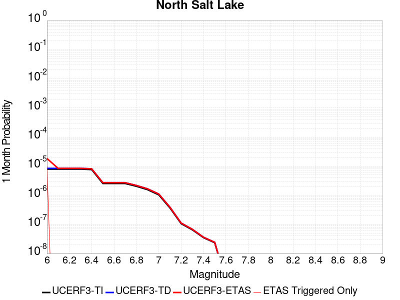 |  | 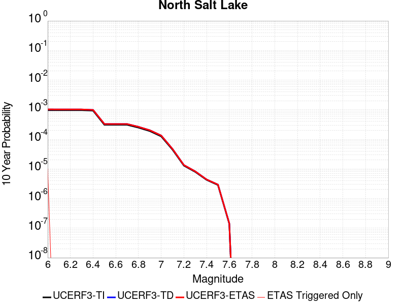 |

| Magnitude | 1 wk TI Prob | 1 wk TD Prob | 1 wk ETAS Prob | 1 wk ETAS/TD Gain | 1 wk ETAS Triggered Only | 1 mo TI Prob | 1 mo TD Prob | 1 mo ETAS Prob | 1 mo ETAS/TD Gain | 1 mo ETAS Triggered Only | 1 yr TI Prob | 1 yr TD Prob | 1 yr ETAS Prob | 1 yr ETAS/TD Gain | 1 yr ETAS Triggered Only | 10 yr TI Prob | 10 yr TD Prob | 10 yr ETAS Prob | 10 yr ETAS/TD Gain | 10 yr ETAS Triggered Only |
|-----|-----|-----|-----|-----|-----|-----|-----|-----|-----|-----|-----|-----|-----|-----|-----|-----|-----|-----|-----|-----|
| 6.0 | 1.849599E-6 | 1.955571E-6 | 1.955571E-6 | 1.0 | 0.0 | 7.926829E-6 | 8.381003E-6 | 1.8380919E-5 | 2.1931646 | 1.0E-5 | 9.650487E-5 | 1.0203594E-4 | 1.12034926E-4 | 1.0979947 | 1.0E-5 | 9.646297E-4 | 0.0010200888 | 0.0010300786 | 1.009793 | 1.0E-5 |
| 6.1 | 1.849599E-6 | 1.955571E-6 | 1.955571E-6 | 1.0 | 0.0 | 7.926829E-6 | 8.381003E-6 | 8.381003E-6 | 1.0 | 0.0 | 9.650487E-5 | 1.0203594E-4 | 1.0203594E-4 | 1.0 | 0.0 | 9.646297E-4 | 0.0010200888 | 0.0010200888 | 1.0 | 0.0 |
| 6.2 | 1.849599E-6 | 1.955571E-6 | 1.955571E-6 | 1.0 | 0.0 | 7.926829E-6 | 8.381003E-6 | 8.381003E-6 | 1.0 | 0.0 | 9.650487E-5 | 1.0203594E-4 | 1.0203594E-4 | 1.0 | 0.0 | 9.646297E-4 | 0.0010200888 | 0.0010200888 | 1.0 | 0.0 |
| 6.3 | 1.849599E-6 | 1.955571E-6 | 1.955571E-6 | 1.0 | 0.0 | 7.926829E-6 | 8.381003E-6 | 8.381003E-6 | 1.0 | 0.0 | 9.650487E-5 | 1.0203594E-4 | 1.0203594E-4 | 1.0 | 0.0 | 9.646297E-4 | 0.0010200888 | 0.0010200888 | 1.0 | 0.0 |
| 6.4 | 1.7803909E-6 | 1.8860707E-6 | 1.8860707E-6 | 1.0 | 0.0 | 7.630225E-6 | 8.083147E-6 | 8.083147E-6 | 1.0 | 0.0 | 9.289402E-5 | 9.840987E-5 | 9.840987E-5 | 1.0 | 0.0 | 9.28552E-4 | 9.838602E-4 | 9.838602E-4 | 1.0 | 0.0 |
| 6.5 | 5.9157696E-7 | 6.3001835E-7 | 6.3001835E-7 | 1.0 | 0.0 | 2.5353274E-6 | 2.7000763E-6 | 2.7000763E-6 | 1.0 | 0.0 | 3.0867173E-5 | 3.2872973E-5 | 3.2872973E-5 | 1.0 | 0.0 | 3.0862886E-4 | 3.28685E-4 | 3.28685E-4 | 1.0 | 0.0 |
| 6.6 | 5.9157696E-7 | 6.3001835E-7 | 6.3001835E-7 | 1.0 | 0.0 | 2.5353274E-6 | 2.7000763E-6 | 2.7000763E-6 | 1.0 | 0.0 | 3.0867173E-5 | 3.2872973E-5 | 3.2872973E-5 | 1.0 | 0.0 | 3.0862886E-4 | 3.28685E-4 | 3.28685E-4 | 1.0 | 0.0 |
| 6.7 | 5.9157696E-7 | 6.3001835E-7 | 6.3001835E-7 | 1.0 | 0.0 | 2.5353274E-6 | 2.7000763E-6 | 2.7000763E-6 | 1.0 | 0.0 | 3.0867173E-5 | 3.2872973E-5 | 3.2872973E-5 | 1.0 | 0.0 | 3.0862886E-4 | 3.28685E-4 | 3.28685E-4 | 1.0 | 0.0 |
| 6.8 | 4.7536267E-7 | 5.066019E-7 | 5.066019E-7 | 1.0 | 0.0 | 2.037267E-6 | 2.1711494E-6 | 2.1711494E-6 | 1.0 | 0.0 | 2.4803443E-5 | 2.6433447E-5 | 2.6433447E-5 | 1.0 | 0.0 | 2.4800675E-4 | 2.6430548E-4 | 2.6430548E-4 | 1.0 | 0.0 |
| 6.9 | 3.6345344E-7 | 3.8750048E-7 | 3.8750048E-7 | 1.0 | 0.0 | 1.5576567E-6 | 1.6607154E-6 | 1.6607154E-6 | 1.0 | 0.0 | 1.8964305E-5 | 2.021904E-5 | 2.021904E-5 | 1.0 | 0.0 | 1.8962687E-4 | 2.021737E-4 | 2.021737E-4 | 1.0 | 0.0 |
| 7.0 | 2.4087325E-7 | 2.5709335E-7 | 2.5709335E-7 | 1.0 | 0.0 | 1.0323135E-6 | 1.1018283E-6 | 1.1018283E-6 | 1.0 | 0.0 | 1.25683455E-5 | 1.3414689E-5 | 1.3414689E-5 | 1.0 | 0.0 | 1.2567634E-4 | 1.3414006E-4 | 1.3414006E-4 | 1.0 | 0.0 |
| 7.1 | 8.551555E-8 | 9.044477E-8 | 9.044477E-8 | 1.0 | 0.0 | 3.6649516E-7 | 3.876204E-7 | 3.876204E-7 | 1.0 | 0.0 | 4.4620692E-6 | 4.7192693E-6 | 4.7192693E-6 | 1.0 | 0.0 | 4.46198E-5 | 4.719181E-5 | 4.719181E-5 | 1.0 | 0.0 |
| 7.2 | 2.475279E-8 | 2.5893172E-8 | 2.5893172E-8 | 1.0 | 0.0 | 1.0608338E-7 | 1.1097074E-7 | 1.1097074E-7 | 1.0 | 0.0 | 1.2915643E-6 | 1.3510679E-6 | 1.3510679E-6 | 1.0 | 0.0 | 1.2915569E-5 | 1.3510604E-5 | 1.3510604E-5 | 1.0 | 0.0 |
| 7.3 | 1.5212393E-8 | 1.5847489E-8 | 1.5847489E-8 | 1.0 | 0.0 | 6.519597E-8 | 6.791781E-8 | 6.791781E-8 | 1.0 | 0.0 | 7.9376065E-7 | 8.2689905E-7 | 8.2689905E-7 | 1.0 | 0.0 | 7.937579E-6 | 8.268963E-6 | 8.268963E-6 | 1.0 | 0.0 |
| 7.4 | 8.182E-9 | 8.447294E-9 | 8.447294E-9 | 1.0 | 0.0 | 3.5065714E-8 | 3.620269E-8 | 3.620269E-8 | 1.0 | 0.0 | 4.26925E-7 | 4.4076765E-7 | 4.4076765E-7 | 1.0 | 0.0 | 4.269242E-6 | 4.4076683E-6 | 4.4076683E-6 | 1.0 | 0.0 |
| 7.5 | 5.479913E-9 | 5.6680434E-9 | 5.6680434E-9 | 1.0 | 0.0 | 2.3485342E-8 | 2.4291614E-8 | 2.4291614E-8 | 1.0 | 0.0 | 2.85934E-7 | 2.9575037E-7 | 2.9575037E-7 | 1.0 | 0.0 | 2.8593363E-6 | 2.9575E-6 | 2.9575E-6 | 1.0 | 0.0 |
| 7.6 | 2.6813562E-10 | 2.773195E-10 | 2.773195E-10 | 1.0 | 0.0 | 1.1491527E-9 | 1.1885122E-9 | 1.1885122E-9 | 1.0 | 0.0 | 1.3990933E-8 | 1.4470135E-8 | 1.4470135E-8 | 1.0 | 0.0 | 1.3990932E-7 | 1.4470135E-7 | 1.4470135E-7 | 1.0 | 0.0 |

## Eureka Peak
*[(top)](#table-of-contents)*

| 1 Week | 1 Month | 1 Year | 10 Year |
|-----|-----|-----|-----|
| 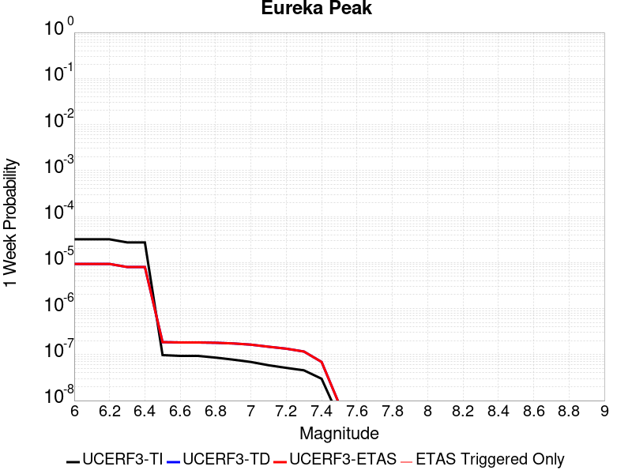 |  |  |  |

| Magnitude | 1 wk TI Prob | 1 wk TD Prob | 1 wk ETAS Prob | 1 wk ETAS/TD Gain | 1 wk ETAS Triggered Only | 1 mo TI Prob | 1 mo TD Prob | 1 mo ETAS Prob | 1 mo ETAS/TD Gain | 1 mo ETAS Triggered Only | 1 yr TI Prob | 1 yr TD Prob | 1 yr ETAS Prob | 1 yr ETAS/TD Gain | 1 yr ETAS Triggered Only | 10 yr TI Prob | 10 yr TD Prob | 10 yr ETAS Prob | 10 yr ETAS/TD Gain | 10 yr ETAS Triggered Only |
|-----|-----|-----|-----|-----|-----|-----|-----|-----|-----|-----|-----|-----|-----|-----|-----|-----|-----|-----|-----|-----|
| 6.0 | 3.1949054E-5 | 9.310571E-6 | 9.310571E-6 | 1.0 | 0.0 | 1.3691733E-4 | 3.990228E-5 | 3.990228E-5 | 1.0 | 0.0 | 0.0016656938 | 4.8578004E-4 | 4.957752E-4 | 1.0205754 | 1.0E-5 | 0.016532637 | 0.0049248957 | 0.0049348464 | 1.0020205 | 1.0E-5 |
| 6.1 | 3.1949054E-5 | 9.310571E-6 | 9.310571E-6 | 1.0 | 0.0 | 1.3691733E-4 | 3.990228E-5 | 3.990228E-5 | 1.0 | 0.0 | 0.0016656938 | 4.8578004E-4 | 4.957752E-4 | 1.0205754 | 1.0E-5 | 0.016532637 | 0.0049248957 | 0.0049348464 | 1.0020205 | 1.0E-5 |
| 6.2 | 3.1949054E-5 | 9.310571E-6 | 9.310571E-6 | 1.0 | 0.0 | 1.3691733E-4 | 3.990228E-5 | 3.990228E-5 | 1.0 | 0.0 | 0.0016656938 | 4.8578004E-4 | 4.957752E-4 | 1.0205754 | 1.0E-5 | 0.016532637 | 0.0049248957 | 0.0049348464 | 1.0020205 | 1.0E-5 |
| 6.3 | 2.7339745E-5 | 7.980718E-6 | 7.980718E-6 | 1.0 | 0.0 | 1.1716507E-4 | 3.4203054E-5 | 3.4203054E-5 | 1.0 | 0.0 | 0.0014255513 | 4.164185E-4 | 4.2641434E-4 | 1.0240043 | 1.0E-5 | 0.0141644105 | 0.004228374 | 0.0042383317 | 1.002355 | 1.0E-5 |
| 6.4 | 2.7339745E-5 | 7.980718E-6 | 7.980718E-6 | 1.0 | 0.0 | 1.1716507E-4 | 3.4203054E-5 | 3.4203054E-5 | 1.0 | 0.0 | 0.0014255513 | 4.164185E-4 | 4.2641434E-4 | 1.0240043 | 1.0E-5 | 0.0141644105 | 0.004228374 | 0.0042383317 | 1.002355 | 1.0E-5 |
| 6.5 | 9.738388E-8 | 1.8619214E-7 | 1.8619214E-7 | 1.0 | 0.0 | 4.1735944E-7 | 7.979661E-7 | 7.979661E-7 | 1.0 | 0.0 | 5.081339E-6 | 9.715194E-6 | 9.715194E-6 | 1.0 | 0.0 | 5.0812232E-5 | 9.714778E-5 | 9.714778E-5 | 1.0 | 0.0 |
| 6.6 | 9.3495956E-8 | 1.8328048E-7 | 1.8328048E-7 | 1.0 | 0.0 | 4.0069688E-7 | 7.8548754E-7 | 7.8548754E-7 | 1.0 | 0.0 | 4.8784736E-6 | 9.5632695E-6 | 9.5632695E-6 | 1.0 | 0.0 | 4.8783666E-5 | 9.562866E-5 | 9.562866E-5 | 1.0 | 0.0 |
| 6.7 | 9.3495956E-8 | 1.8328048E-7 | 1.8328048E-7 | 1.0 | 0.0 | 4.0069688E-7 | 7.8548754E-7 | 7.8548754E-7 | 1.0 | 0.0 | 4.8784736E-6 | 9.5632695E-6 | 9.5632695E-6 | 1.0 | 0.0 | 4.8783666E-5 | 9.562866E-5 | 9.562866E-5 | 1.0 | 0.0 |
| 6.8 | 8.591428E-8 | 1.8021015E-7 | 1.8021015E-7 | 1.0 | 0.0 | 3.68204E-7 | 7.72329E-7 | 7.72329E-7 | 1.0 | 0.0 | 4.4828744E-6 | 9.403066E-6 | 9.403066E-6 | 1.0 | 0.0 | 4.482784E-5 | 9.402676E-5 | 9.402676E-5 | 1.0 | 0.0 |
| 6.9 | 7.749723E-8 | 1.7439022E-7 | 1.7439022E-7 | 1.0 | 0.0 | 3.3213098E-7 | 7.473864E-7 | 7.473864E-7 | 1.0 | 0.0 | 4.043687E-6 | 9.099393E-6 | 9.099393E-6 | 1.0 | 0.0 | 4.0436134E-5 | 9.099028E-5 | 9.099028E-5 | 1.0 | 0.0 |
| 7.0 | 6.897872E-8 | 1.6415258E-7 | 1.6415258E-7 | 1.0 | 0.0 | 2.9562307E-7 | 7.035109E-7 | 7.035109E-7 | 1.0 | 0.0 | 3.5992048E-6 | 8.565212E-6 | 8.565212E-6 | 1.0 | 0.0 | 3.5991467E-5 | 8.564889E-5 | 8.564889E-5 | 1.0 | 0.0 |
| 7.1 | 5.859318E-8 | 1.4787166E-7 | 1.4787166E-7 | 1.0 | 0.0 | 2.5111362E-7 | 6.337355E-7 | 6.337355E-7 | 1.0 | 0.0 | 3.057304E-6 | 7.715704E-6 | 7.715704E-6 | 1.0 | 0.0 | 3.0572617E-5 | 7.715442E-5 | 7.715442E-5 | 1.0 | 0.0 |
| 7.2 | 5.1375338E-8 | 1.342105E-7 | 1.342105E-7 | 1.0 | 0.0 | 2.2018E-7 | 5.751877E-7 | 5.751877E-7 | 1.0 | 0.0 | 2.680688E-6 | 7.002888E-6 | 7.002888E-6 | 1.0 | 0.0 | 2.6806558E-5 | 7.0026734E-5 | 7.0026734E-5 | 1.0 | 0.0 |
| 7.3 | 4.5441396E-8 | 1.16363104E-7 | 1.16363104E-7 | 1.0 | 0.0 | 1.9474882E-7 | 4.986989E-7 | 4.986989E-7 | 1.0 | 0.0 | 2.3710643E-6 | 6.071643E-6 | 6.071643E-6 | 1.0 | 0.0 | 2.371039E-5 | 6.0714825E-5 | 6.0714825E-5 | 1.0 | 0.0 |
| 7.4 | 2.981918E-8 | 6.9113334E-8 | 6.9113334E-8 | 1.0 | 0.0 | 1.2779647E-7 | 2.9619997E-7 | 2.9619997E-7 | 1.0 | 0.0 | 1.5559209E-6 | 3.6062293E-6 | 3.6062293E-6 | 1.0 | 0.0 | 1.55591E-5 | 3.606175E-5 | 3.606175E-5 | 1.0 | 0.0 |
| 7.5 | 4.24214E-9 | 8.342421E-9 | 8.342421E-9 | 1.0 | 0.0 | 1.81806E-8 | 3.5753235E-8 | 3.5753235E-8 | 1.0 | 0.0 | 2.213488E-7 | 4.352956E-7 | 4.352956E-7 | 1.0 | 0.0 | 2.2134857E-6 | 4.352954E-6 | 4.352954E-6 | 1.0 | 0.0 |

## Fontana (Seismicity)
*[(top)](#table-of-contents)*

| 1 Week | 1 Month | 1 Year | 10 Year |
|-----|-----|-----|-----|
|  |  |  |  |

| Magnitude | 1 wk TI Prob | 1 wk TD Prob | 1 wk ETAS Prob | 1 wk ETAS/TD Gain | 1 wk ETAS Triggered Only | 1 mo TI Prob | 1 mo TD Prob | 1 mo ETAS Prob | 1 mo ETAS/TD Gain | 1 mo ETAS Triggered Only | 1 yr TI Prob | 1 yr TD Prob | 1 yr ETAS Prob | 1 yr ETAS/TD Gain | 1 yr ETAS Triggered Only | 10 yr TI Prob | 10 yr TD Prob | 10 yr ETAS Prob | 10 yr ETAS/TD Gain | 10 yr ETAS Triggered Only |
|-----|-----|-----|-----|-----|-----|-----|-----|-----|-----|-----|-----|-----|-----|-----|-----|-----|-----|-----|-----|-----|
| 6.0 | 7.1789214E-6 | 7.5520006E-6 | 7.5520006E-6 | 1.0 | 0.0 | 3.076644E-5 | 3.2365548E-5 | 3.2365548E-5 | 1.0 | 0.0 | 3.7451705E-4 | 3.9402005E-4 | 4.0401611E-4 | 1.0253694 | 1.0E-5 | 0.003738865 | 0.003937214 | 0.0039471746 | 1.0025299 | 1.0E-5 |
| 6.1 | 7.1789214E-6 | 7.5520006E-6 | 7.5520006E-6 | 1.0 | 0.0 | 3.076644E-5 | 3.2365548E-5 | 3.2365548E-5 | 1.0 | 0.0 | 3.7451705E-4 | 3.9402005E-4 | 4.0401611E-4 | 1.0253694 | 1.0E-5 | 0.003738865 | 0.003937214 | 0.0039471746 | 1.0025299 | 1.0E-5 |
| 6.2 | 7.1789214E-6 | 7.5520006E-6 | 7.5520006E-6 | 1.0 | 0.0 | 3.076644E-5 | 3.2365548E-5 | 3.2365548E-5 | 1.0 | 0.0 | 3.7451705E-4 | 3.9402005E-4 | 4.0401611E-4 | 1.0253694 | 1.0E-5 | 0.003738865 | 0.003937214 | 0.0039471746 | 1.0025299 | 1.0E-5 |
| 6.3 | 7.1789214E-6 | 7.5520006E-6 | 7.5520006E-6 | 1.0 | 0.0 | 3.076644E-5 | 3.2365548E-5 | 3.2365548E-5 | 1.0 | 0.0 | 3.7451705E-4 | 3.9402005E-4 | 4.0401611E-4 | 1.0253694 | 1.0E-5 | 0.003738865 | 0.003937214 | 0.0039471746 | 1.0025299 | 1.0E-5 |
| 6.4 | 7.1789214E-6 | 7.5520006E-6 | 7.5520006E-6 | 1.0 | 0.0 | 3.076644E-5 | 3.2365548E-5 | 3.2365548E-5 | 1.0 | 0.0 | 3.7451705E-4 | 3.9402005E-4 | 4.0401611E-4 | 1.0253694 | 1.0E-5 | 0.003738865 | 0.003937214 | 0.0039471746 | 1.0025299 | 1.0E-5 |
| 6.5 | 5.2611317E-6 | 5.532726E-6 | 5.532726E-6 | 1.0 | 0.0 | 2.2547512E-5 | 2.3711682E-5 | 2.3711682E-5 | 1.0 | 0.0 | 2.744814E-4 | 2.8868974E-4 | 2.8868974E-4 | 1.0 | 0.0 | 0.002741426 | 0.0028868972 | 0.0028868972 | 1.0 | 0.0 |
| 6.6 | 5.2611317E-6 | 5.532726E-6 | 5.532726E-6 | 1.0 | 0.0 | 2.2547512E-5 | 2.3711682E-5 | 2.3711682E-5 | 1.0 | 0.0 | 2.744814E-4 | 2.8868974E-4 | 2.8868974E-4 | 1.0 | 0.0 | 0.002741426 | 0.0028868972 | 0.0028868972 | 1.0 | 0.0 |

## Santa Monica alt 1
*[(top)](#table-of-contents)*

| 1 Week | 1 Month | 1 Year | 10 Year |
|-----|-----|-----|-----|
| 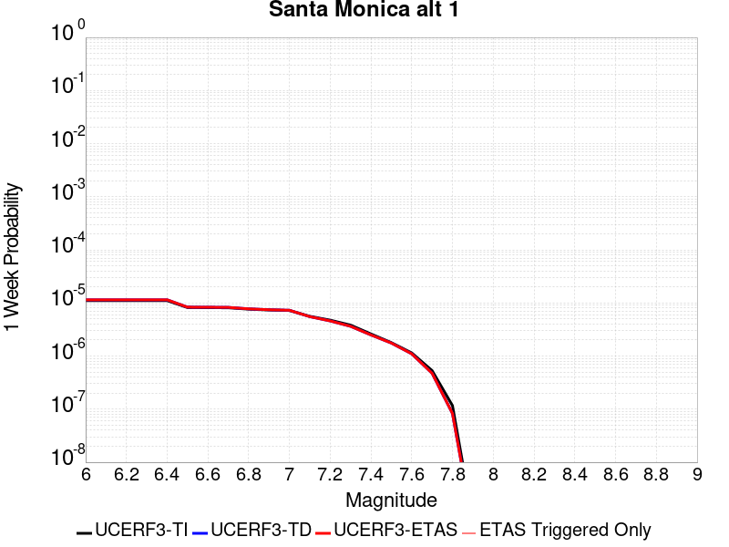 | 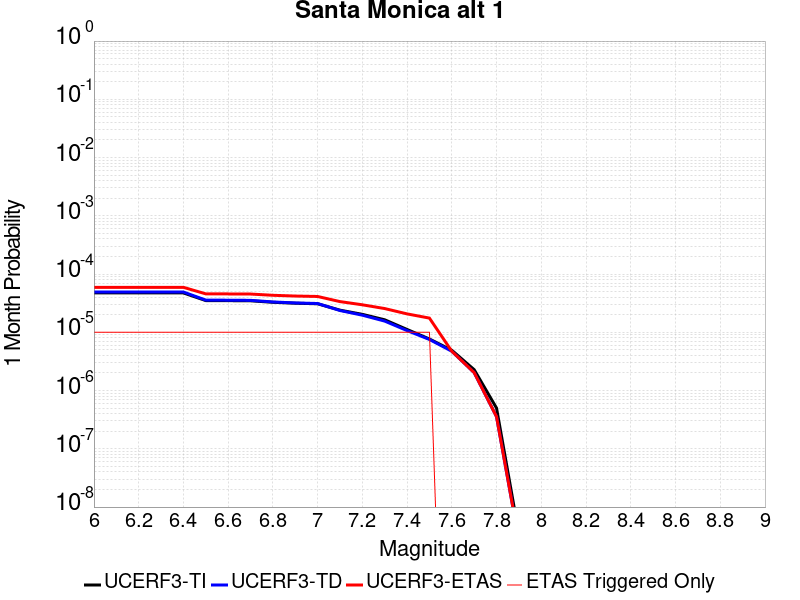 |  |  |

| Magnitude | 1 wk TI Prob | 1 wk TD Prob | 1 wk ETAS Prob | 1 wk ETAS/TD Gain | 1 wk ETAS Triggered Only | 1 mo TI Prob | 1 mo TD Prob | 1 mo ETAS Prob | 1 mo ETAS/TD Gain | 1 mo ETAS Triggered Only | 1 yr TI Prob | 1 yr TD Prob | 1 yr ETAS Prob | 1 yr ETAS/TD Gain | 1 yr ETAS Triggered Only | 10 yr TI Prob | 10 yr TD Prob | 10 yr ETAS Prob | 10 yr ETAS/TD Gain | 10 yr ETAS Triggered Only |
|-----|-----|-----|-----|-----|-----|-----|-----|-----|-----|-----|-----|-----|-----|-----|-----|-----|-----|-----|-----|-----|
| 6.0 | 1.1066008E-5 | 1.148031E-5 | 1.148031E-5 | 1.0 | 0.0 | 4.742488E-5 | 4.920048E-5 | 5.919999E-5 | 1.20324 | 1.0E-5 | 5.7724497E-4 | 5.9886515E-4 | 6.088591E-4 | 1.0166882 | 1.0E-5 | 0.005757478 | 0.0059739 | 0.00598384 | 1.0016639 | 1.0E-5 |
| 6.1 | 1.1066008E-5 | 1.148031E-5 | 1.148031E-5 | 1.0 | 0.0 | 4.742488E-5 | 4.920048E-5 | 5.919999E-5 | 1.20324 | 1.0E-5 | 5.7724497E-4 | 5.9886515E-4 | 6.088591E-4 | 1.0166882 | 1.0E-5 | 0.005757478 | 0.0059739 | 0.00598384 | 1.0016639 | 1.0E-5 |
| 6.2 | 1.1066008E-5 | 1.148031E-5 | 1.148031E-5 | 1.0 | 0.0 | 4.742488E-5 | 4.920048E-5 | 5.919999E-5 | 1.20324 | 1.0E-5 | 5.7724497E-4 | 5.9886515E-4 | 6.088591E-4 | 1.0166882 | 1.0E-5 | 0.005757478 | 0.0059739 | 0.00598384 | 1.0016639 | 1.0E-5 |
| 6.3 | 1.1066008E-5 | 1.148031E-5 | 1.148031E-5 | 1.0 | 0.0 | 4.742488E-5 | 4.920048E-5 | 5.919999E-5 | 1.20324 | 1.0E-5 | 5.7724497E-4 | 5.9886515E-4 | 6.088591E-4 | 1.0166882 | 1.0E-5 | 0.005757478 | 0.0059739 | 0.00598384 | 1.0016639 | 1.0E-5 |
| 6.4 | 1.1066008E-5 | 1.148031E-5 | 1.148031E-5 | 1.0 | 0.0 | 4.742488E-5 | 4.920048E-5 | 5.919999E-5 | 1.20324 | 1.0E-5 | 5.7724497E-4 | 5.9886515E-4 | 6.088591E-4 | 1.0166882 | 1.0E-5 | 0.005757478 | 0.0059739 | 0.00598384 | 1.0016639 | 1.0E-5 |
| 6.5 | 8.183544E-6 | 8.335432E-6 | 8.335432E-6 | 1.0 | 0.0 | 3.5071862E-5 | 3.57228E-5 | 4.572244E-5 | 1.2799233 | 1.0E-5 | 4.2691626E-4 | 4.3483984E-4 | 4.448355E-4 | 1.022987 | 1.0E-5 | 0.0042609703 | 0.0043400554 | 0.004350012 | 1.0022941 | 1.0E-5 |
| 6.6 | 8.1543285E-6 | 8.303646E-6 | 8.303646E-6 | 1.0 | 0.0 | 3.4946657E-5 | 3.5586578E-5 | 4.558622E-5 | 1.2809949 | 1.0E-5 | 4.2539247E-4 | 4.3318202E-4 | 4.431777E-4 | 1.023075 | 1.0E-5 | 0.0042457907 | 0.004323542 | 0.0043334984 | 1.0023029 | 1.0E-5 |
| 6.7 | 8.110878E-6 | 8.257042E-6 | 8.257042E-6 | 1.0 | 0.0 | 3.4760444E-5 | 3.5386853E-5 | 4.53865E-5 | 1.2825809 | 1.0E-5 | 4.231262E-4 | 4.3075136E-4 | 4.4074704E-4 | 1.0232053 | 1.0E-5 | 0.0042232145 | 0.0042993296 | 0.0043092864 | 1.002316 | 1.0E-5 |
| 6.8 | 7.644036E-6 | 7.75106E-6 | 7.75106E-6 | 1.0 | 0.0 | 3.275974E-5 | 3.3218414E-5 | 4.3218082E-5 | 1.3010279 | 1.0E-5 | 3.9877684E-4 | 4.0436056E-4 | 4.1435653E-4 | 1.0247204 | 1.0E-5 | 0.00398062 | 0.0040363944 | 0.004046354 | 1.0024675 | 1.0E-5 |
| 6.9 | 7.3698293E-6 | 7.455719E-6 | 7.455719E-6 | 1.0 | 0.0 | 3.15846E-5 | 3.19527E-5 | 4.195238E-5 | 1.3129526 | 1.0E-5 | 3.8447464E-4 | 3.8895605E-4 | 3.9895216E-4 | 1.0256999 | 1.0E-5 | 0.0038381014 | 0.0038828964 | 0.0038928576 | 1.0025654 | 1.0E-5 |
| 7.0 | 7.209872E-6 | 7.2856255E-6 | 7.2856255E-6 | 1.0 | 0.0 | 3.0899086E-5 | 3.1223743E-5 | 4.1223433E-5 | 1.3202591 | 1.0E-5 | 3.7613141E-4 | 3.8008415E-4 | 3.9008036E-4 | 1.0263 | 1.0E-5 | 0.0037549543 | 0.0037944836 | 0.0038044457 | 1.0026253 | 1.0E-5 |
| 7.1 | 5.603456E-6 | 5.5238925E-6 | 5.5238925E-6 | 1.0 | 0.0 | 2.4014591E-5 | 2.3673612E-5 | 3.3673376E-5 | 1.4224013 | 1.0E-5 | 2.923384E-4 | 2.881885E-4 | 2.9818562E-4 | 1.0346895 | 1.0E-5 | 0.0029195412 | 0.0028781896 | 0.0028881608 | 1.0034645 | 1.0E-5 |
| 7.2 | 4.7483613E-6 | 4.5911324E-6 | 4.5911324E-6 | 1.0 | 0.0 | 2.0349962E-5 | 1.9676136E-5 | 2.9675937E-5 | 1.50822 | 1.0E-5 | 2.4773262E-4 | 2.3953074E-4 | 2.4952833E-4 | 1.0417383 | 1.0E-5 | 0.0024745662 | 0.0023927398 | 0.0024027159 | 1.0041693 | 1.0E-5 |
| 7.3 | 3.829015E-6 | 3.6342253E-6 | 3.6342253E-6 | 1.0 | 0.0 | 1.6409962E-5 | 1.5575159E-5 | 2.5575002E-5 | 1.642038 | 1.0E-5 | 1.9977297E-4 | 1.8961114E-4 | 1.9960925E-4 | 1.0527295 | 1.0E-5 | 0.0019959346 | 0.0018945024 | 0.0019044835 | 1.0052685 | 1.0E-5 |
| 7.4 | 2.610755E-6 | 2.4995716E-6 | 2.4995716E-6 | 1.0 | 0.0 | 1.1188902E-5 | 1.0712406E-5 | 2.07123E-5 | 1.933487 | 1.0E-5 | 1.3621636E-4 | 1.3041578E-4 | 1.4041447E-4 | 1.0766678 | 1.0E-5 | 0.001361329 | 0.0013033969 | 0.0013133838 | 1.0076623 | 1.0E-5 |
| 7.5 | 1.792146E-6 | 1.7584184E-6 | 1.7584184E-6 | 1.0 | 0.0 | 7.680603E-6 | 7.536057E-6 | 1.7535982E-5 | 2.3269439 | 1.0E-5 | 9.3507326E-5 | 9.1747665E-5 | 1.0174675E-4 | 1.1089846 | 1.0E-5 | 9.3467993E-4 | 9.1710105E-4 | 9.2709187E-4 | 1.010894 | 1.0E-5 |
| 7.6 | 1.1473018E-6 | 1.1029152E-6 | 1.1029152E-6 | 1.0 | 0.0 | 4.9169985E-6 | 4.726771E-6 | 4.726771E-6 | 1.0 | 0.0 | 5.986281E-5 | 5.7546935E-5 | 5.7546935E-5 | 1.0 | 0.0 | 5.984669E-4 | 5.7532196E-4 | 5.7532196E-4 | 1.0 | 0.0 |
| 7.7 | 5.330919E-7 | 4.7452556E-7 | 4.7452556E-7 | 1.0 | 0.0 | 2.2846775E-6 | 2.0336795E-6 | 2.0336795E-6 | 1.0 | 0.0 | 2.7815593E-5 | 2.4759778E-5 | 2.4759778E-5 | 1.0 | 0.0 | 2.7812112E-4 | 2.4757133E-4 | 2.4757133E-4 | 1.0 | 0.0 |
| 7.8 | 1.1668574E-7 | 8.2966224E-8 | 8.2966224E-8 | 1.0 | 0.0 | 5.000816E-7 | 3.5556948E-7 | 3.5556948E-7 | 1.0 | 0.0 | 6.0884768E-6 | 4.32905E-6 | 4.32905E-6 | 1.0 | 0.0 | 6.08831E-5 | 4.3289692E-5 | 4.3289692E-5 | 1.0 | 0.0 |
| 7.9 | 8.007447E-10 | 6.1608785E-10 | 6.1608785E-10 | 1.0 | 0.0 | 3.4317629E-9 | 2.6403764E-9 | 2.6403764E-9 | 1.0 | 0.0 | 4.1781714E-8 | 3.2146584E-8 | 3.2146584E-8 | 1.0 | 0.0 | 4.1781706E-7 | 3.214658E-7 | 3.214658E-7 | 1.0 | 0.0 |

## Superstition Hills
*[(top)](#table-of-contents)*

| 1 Week | 1 Month | 1 Year | 10 Year |
|-----|-----|-----|-----|
|  | 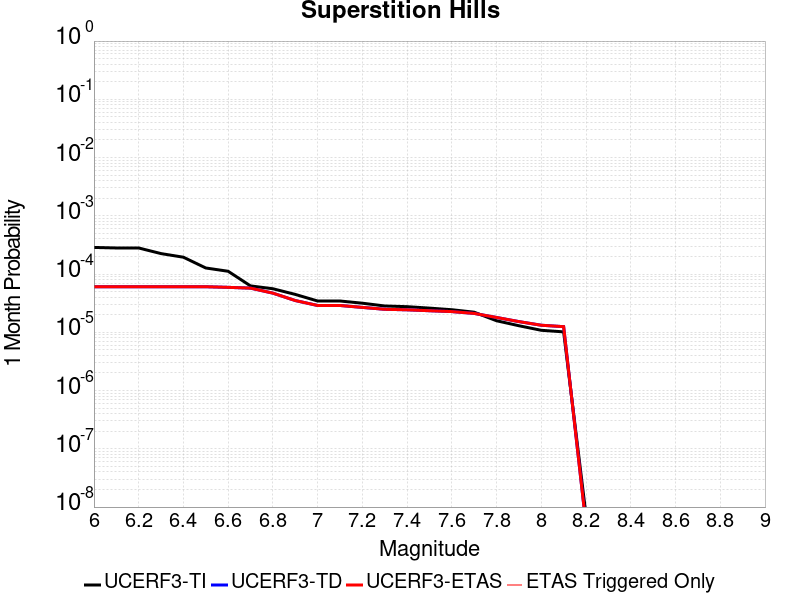 |  |  |

| Magnitude | 1 wk TI Prob | 1 wk TD Prob | 1 wk ETAS Prob | 1 wk ETAS/TD Gain | 1 wk ETAS Triggered Only | 1 mo TI Prob | 1 mo TD Prob | 1 mo ETAS Prob | 1 mo ETAS/TD Gain | 1 mo ETAS Triggered Only | 1 yr TI Prob | 1 yr TD Prob | 1 yr ETAS Prob | 1 yr ETAS/TD Gain | 1 yr ETAS Triggered Only | 10 yr TI Prob | 10 yr TD Prob | 10 yr ETAS Prob | 10 yr ETAS/TD Gain | 10 yr ETAS Triggered Only |
|-----|-----|-----|-----|-----|-----|-----|-----|-----|-----|-----|-----|-----|-----|-----|-----|-----|-----|-----|-----|-----|
| 6.0 | 6.6865185E-5 | 1.41376995E-5 | 1.41376995E-5 | 1.0 | 0.0 | 2.8653358E-4 | 6.0588824E-5 | 6.0588824E-5 | 1.0 | 0.0 | 0.0034829667 | 7.374355E-4 | 7.374355E-4 | 1.0 | 0.0 | 0.03428881 | 0.0075204074 | 0.007530332 | 1.0013198 | 1.0E-5 |
| 6.1 | 6.544851E-5 | 1.41376995E-5 | 1.41376995E-5 | 1.0 | 0.0 | 2.8046346E-4 | 6.0588824E-5 | 6.0588824E-5 | 1.0 | 0.0 | 0.0034092965 | 7.374355E-4 | 7.374355E-4 | 1.0 | 0.0 | 0.033574644 | 0.007520407 | 0.0075303316 | 1.0013198 | 1.0E-5 |
| 6.2 | 6.544851E-5 | 1.41376995E-5 | 1.41376995E-5 | 1.0 | 0.0 | 2.8046346E-4 | 6.0588824E-5 | 6.0588824E-5 | 1.0 | 0.0 | 0.0034092965 | 7.374355E-4 | 7.374355E-4 | 1.0 | 0.0 | 0.033574644 | 0.007520407 | 0.0075303316 | 1.0013198 | 1.0E-5 |
| 6.3 | 5.2402065E-5 | 1.4137698E-5 | 1.4137698E-5 | 1.0 | 0.0 | 2.2456095E-4 | 6.058882E-5 | 6.058882E-5 | 1.0 | 0.0 | 0.0027306017 | 7.374354E-4 | 7.374354E-4 | 1.0 | 0.0 | 0.02697292 | 0.007520402 | 0.0075303265 | 1.0013198 | 1.0E-5 |
| 6.4 | 4.542238E-5 | 1.4137698E-5 | 1.4137698E-5 | 1.0 | 0.0 | 1.9465282E-4 | 6.0588816E-5 | 6.0588816E-5 | 1.0 | 0.0 | 0.0023673223 | 7.3743536E-4 | 7.3743536E-4 | 1.0 | 0.0 | 0.023422617 | 0.0075203986 | 0.007530323 | 1.0013198 | 1.0E-5 |
| 6.5 | 2.9672969E-5 | 1.4137696E-5 | 1.4137696E-5 | 1.0 | 0.0 | 1.2716366E-4 | 6.058881E-5 | 6.058881E-5 | 1.0 | 0.0 | 0.0015471181 | 7.374353E-4 | 7.374353E-4 | 1.0 | 0.0 | 0.015363912 | 0.007520392 | 0.007530317 | 1.0013198 | 1.0E-5 |
| 6.6 | 2.6056105E-5 | 1.3803458E-5 | 1.3803458E-5 | 1.0 | 0.0 | 1.1166424E-4 | 5.9156428E-5 | 5.9156428E-5 | 1.0 | 0.0 | 0.0013586642 | 7.200076E-4 | 7.200076E-4 | 1.0 | 0.0 | 0.013503874 | 0.0073448285 | 0.007354755 | 1.0013515 | 1.0E-5 |
| 6.7 | 1.4611248E-5 | 1.3383359E-5 | 1.3383359E-5 | 1.0 | 0.0 | 6.261813E-5 | 5.7356083E-5 | 5.7356083E-5 | 1.0 | 0.0 | 7.6210906E-4 | 6.981025E-4 | 6.981025E-4 | 1.0 | 0.0 | 0.0075950073 | 0.00712602 | 0.0071359486 | 1.0013933 | 1.0E-5 |
| 6.8 | 1.30607E-5 | 1.09787925E-5 | 1.09787925E-5 | 1.0 | 0.0 | 5.597323E-5 | 4.705117E-5 | 4.705117E-5 | 1.0 | 0.0 | 6.8126095E-4 | 5.7270617E-4 | 5.7270617E-4 | 1.0 | 0.0 | 0.006791762 | 0.00587438 | 0.0058843214 | 1.0016923 | 1.0E-5 |
| 6.9 | 1.0443096E-5 | 8.195349E-6 | 8.195349E-6 | 1.0 | 0.0 | 4.4755358E-5 | 3.5122466E-5 | 3.5122466E-5 | 1.0 | 0.0 | 5.447602E-4 | 4.2753448E-4 | 4.2753448E-4 | 1.0 | 0.0 | 0.005434267 | 0.0044094524 | 0.0044194083 | 1.0022578 | 1.0E-5 |
| 7.0 | 8.045912E-6 | 6.739692E-6 | 6.739692E-6 | 1.0 | 0.0 | 3.4482026E-5 | 2.888408E-5 | 2.888408E-5 | 1.0 | 0.0 | 4.197378E-4 | 3.5160795E-4 | 3.5160795E-4 | 1.0 | 0.0 | 0.0041894587 | 0.0036334093 | 0.003643373 | 1.0027423 | 1.0E-5 |
| 7.1 | 8.045912E-6 | 6.739692E-6 | 6.739692E-6 | 1.0 | 0.0 | 3.4482026E-5 | 2.888408E-5 | 2.888408E-5 | 1.0 | 0.0 | 4.197378E-4 | 3.5160795E-4 | 3.5160795E-4 | 1.0 | 0.0 | 0.0041894587 | 0.0036334093 | 0.003643373 | 1.0027423 | 1.0E-5 |
| 7.2 | 7.375506E-6 | 6.2466297E-6 | 6.2466297E-6 | 1.0 | 0.0 | 3.1608928E-5 | 2.6771E-5 | 2.6771E-5 | 1.0 | 0.0 | 3.8477074E-4 | 3.2588904E-4 | 3.2588904E-4 | 1.0 | 0.0 | 0.003841052 | 0.003373887 | 0.003373887 | 1.0 | 0.0 |
| 7.3 | 6.6063913E-6 | 5.7990574E-6 | 5.7990574E-6 | 1.0 | 0.0 | 2.8312797E-5 | 2.485287E-5 | 2.485287E-5 | 1.0 | 0.0 | 3.446538E-4 | 3.025424E-4 | 3.025424E-4 | 1.0 | 0.0 | 0.0034411973 | 0.003138153 | 0.003138153 | 1.0 | 0.0 |
| 7.4 | 6.4313126E-6 | 5.680481E-6 | 5.680481E-6 | 1.0 | 0.0 | 2.7562477E-5 | 2.4344696E-5 | 2.4344696E-5 | 1.0 | 0.0 | 3.355215E-4 | 2.9635706E-4 | 2.9635706E-4 | 1.0 | 0.0 | 0.0033501536 | 0.0030759154 | 0.0030759154 | 1.0 | 0.0 |
| 7.5 | 6.0742927E-6 | 5.4763104E-6 | 5.4763104E-6 | 1.0 | 0.0 | 2.6032423E-5 | 2.3469694E-5 | 2.3469694E-5 | 1.0 | 0.0 | 3.1689866E-4 | 2.8570674E-4 | 2.8570674E-4 | 1.0 | 0.0 | 0.0031644711 | 0.002967756 | 0.002967756 | 1.0 | 0.0 |
| 7.6 | 5.6987187E-6 | 5.294521E-6 | 5.294521E-6 | 1.0 | 0.0 | 2.4422852E-5 | 2.269061E-5 | 2.269061E-5 | 1.0 | 0.0 | 2.9730765E-4 | 2.7622381E-4 | 2.7622381E-4 | 1.0 | 0.0 | 0.002969102 | 0.0028710118 | 0.0028710118 | 1.0 | 0.0 |
| 7.7 | 5.1658035E-6 | 4.925535E-6 | 4.925535E-6 | 1.0 | 0.0 | 2.2138971E-5 | 2.1109268E-5 | 2.1109268E-5 | 1.0 | 0.0 | 2.6950863E-4 | 2.5697565E-4 | 2.5697565E-4 | 1.0 | 0.0 | 0.00269182 | 0.0026760625 | 0.0026760625 | 1.0 | 0.0 |
| 7.8 | 3.6864697E-6 | 4.1964995E-6 | 4.1964995E-6 | 1.0 | 0.0 | 1.579906E-5 | 1.7984876E-5 | 1.7984876E-5 | 1.0 | 0.0 | 1.9233658E-4 | 2.1894433E-4 | 2.1894433E-4 | 1.0 | 0.0 | 0.0019217018 | 0.0022892624 | 0.0022892624 | 1.0 | 0.0 |
| 7.9 | 3.0265903E-6 | 3.5637288E-6 | 3.5637288E-6 | 1.0 | 0.0 | 1.2971037E-5 | 1.5273037E-5 | 1.5273037E-5 | 1.0 | 0.0 | 1.5791094E-4 | 1.859338E-4 | 1.859338E-4 | 1.0 | 0.0 | 0.0015779877 | 0.0019534735 | 0.0019534735 | 1.0 | 0.0 |
| 8.0 | 2.5271493E-6 | 3.0867361E-6 | 3.0867361E-6 | 1.0 | 0.0 | 1.0830595E-5 | 1.3228804E-5 | 1.3228804E-5 | 1.0 | 0.0 | 1.3185451E-4 | 1.610492E-4 | 1.610492E-4 | 1.0 | 0.0 | 0.0013177631 | 0.0016973554 | 0.0016973554 | 1.0 | 0.0 |
| 8.1 | 2.3749135E-6 | 2.917377E-6 | 2.917377E-6 | 1.0 | 0.0 | 1.0178161E-5 | 1.25029865E-5 | 1.25029865E-5 | 1.0 | 0.0 | 1.2391206E-4 | 1.5221364E-4 | 1.5221364E-4 | 1.0 | 0.0 | 0.0012384299 | 0.001604949 | 0.001604949 | 1.0 | 0.0 |
| 8.2 | 1.7186406E-9 | 1.1440594E-9 | 1.1440594E-9 | 1.0 | 0.0 | 7.3656024E-9 | 4.9031117E-9 | 4.9031117E-9 | 1.0 | 0.0 | 8.9676206E-8 | 5.969538E-8 | 5.969538E-8 | 1.0 | 0.0 | 8.9676166E-7 | 6.389059E-7 | 6.389059E-7 | 1.0 | 0.0 |

## Rodgers Creek - Healdsburg 2011 CFM
*[(top)](#table-of-contents)*

| 1 Week | 1 Month | 1 Year | 10 Year |
|-----|-----|-----|-----|
|  |  | 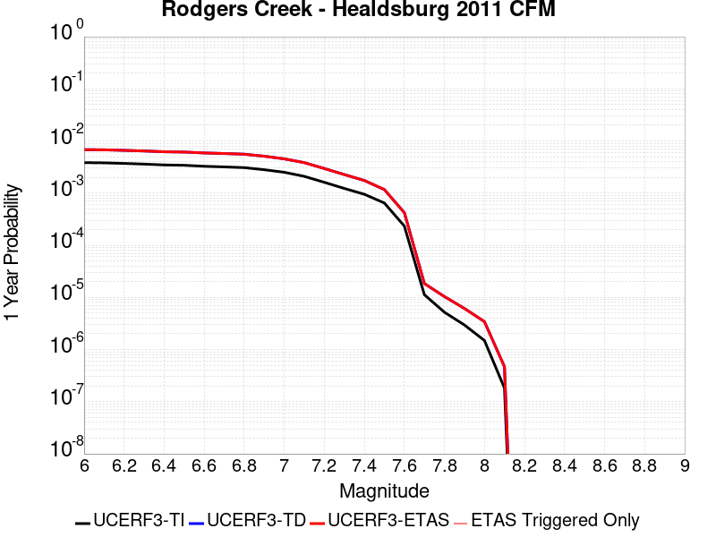 |  |

| Magnitude | 1 wk TI Prob | 1 wk TD Prob | 1 wk ETAS Prob | 1 wk ETAS/TD Gain | 1 wk ETAS Triggered Only | 1 mo TI Prob | 1 mo TD Prob | 1 mo ETAS Prob | 1 mo ETAS/TD Gain | 1 mo ETAS Triggered Only | 1 yr TI Prob | 1 yr TD Prob | 1 yr ETAS Prob | 1 yr ETAS/TD Gain | 1 yr ETAS Triggered Only | 10 yr TI Prob | 10 yr TD Prob | 10 yr ETAS Prob | 10 yr ETAS/TD Gain | 10 yr ETAS Triggered Only |
|-----|-----|-----|-----|-----|-----|-----|-----|-----|-----|-----|-----|-----|-----|-----|-----|-----|-----|-----|-----|-----|
| 6.0 | 7.390182E-5 | 1.3136698E-4 | 1.3136698E-4 | 1.0 | 0.0 | 3.1668364E-4 | 5.6287815E-4 | 5.6287815E-4 | 1.0 | 0.0 | 0.0038488081 | 0.0068315 | 0.0068315 | 1.0 | 0.0 | 0.037828278 | 0.06619178 | 0.06620111 | 1.000141 | 1.0E-5 |
| 6.1 | 7.318768E-5 | 1.3034661E-4 | 1.3034661E-4 | 1.0 | 0.0 | 3.1362378E-4 | 5.585081E-4 | 5.585081E-4 | 1.0 | 0.0 | 0.0038116854 | 0.0067786723 | 0.0067786723 | 1.0 | 0.0 | 0.037469655 | 0.06569639 | 0.06569639 | 1.0 | 0.0 |
| 6.2 | 7.1379836E-5 | 1.2727521E-4 | 1.2727521E-4 | 1.0 | 0.0 | 3.058777E-4 | 5.453505E-4 | 5.453505E-4 | 1.0 | 0.0 | 0.003717703 | 0.0066194604 | 0.0066194604 | 1.0 | 0.0 | 0.0365612 | 0.06421462 | 0.06421462 | 1.0 | 0.0 |
| 6.3 | 6.9255926E-5 | 1.2382054E-4 | 1.2382054E-4 | 1.0 | 0.0 | 2.9677735E-4 | 5.3055194E-4 | 5.3055194E-4 | 1.0 | 0.0 | 0.0036072785 | 0.006440372 | 0.006440372 | 1.0 | 0.0 | 0.035492823 | 0.06254096 | 0.06254096 | 1.0 | 0.0 |
| 6.4 | 6.6757144E-5 | 1.1958744E-4 | 1.1958744E-4 | 1.0 | 0.0 | 2.8607066E-4 | 5.1241735E-4 | 5.1241735E-4 | 1.0 | 0.0 | 0.0034773487 | 0.0062209065 | 0.0062209065 | 1.0 | 0.0 | 0.034234364 | 0.060490217 | 0.060490217 | 1.0 | 0.0 |
| 6.5 | 6.5735134E-5 | 1.1808043E-4 | 1.1808043E-4 | 1.0 | 0.0 | 2.8169158E-4 | 5.0596124E-4 | 5.0596124E-4 | 1.0 | 0.0 | 0.003424202 | 0.0061427657 | 0.0061427657 | 1.0 | 0.0 | 0.03371918 | 0.059755135 | 0.059755135 | 1.0 | 0.0 |
| 6.6 | 6.289601E-5 | 1.1343802E-4 | 1.1343802E-4 | 1.0 | 0.0 | 2.6952647E-4 | 4.8607276E-4 | 4.8607276E-4 | 1.0 | 0.0 | 0.0032765474 | 0.005901959 | 0.005901959 | 1.0 | 0.0 | 0.032286562 | 0.057494484 | 0.057494484 | 1.0 | 0.0 |
| 6.7 | 6.115274E-5 | 1.1060895E-4 | 1.1060895E-4 | 1.0 | 0.0 | 2.6205686E-4 | 4.7395262E-4 | 4.7395262E-4 | 1.0 | 0.0 | 0.0031858748 | 0.0057551847 | 0.0057551847 | 1.0 | 0.0 | 0.031405866 | 0.05611298 | 0.05611298 | 1.0 | 0.0 |
| 6.8 | 5.9232367E-5 | 1.0728244E-4 | 1.0728244E-4 | 1.0 | 0.0 | 2.538283E-4 | 4.597012E-4 | 4.597012E-4 | 1.0 | 0.0 | 0.0030859804 | 0.0055825757 | 0.0055825757 | 1.0 | 0.0 | 0.030434765 | 0.054479737 | 0.054479737 | 1.0 | 0.0 |
| 6.9 | 5.4030377E-5 | 9.8224424E-5 | 9.8224424E-5 | 1.0 | 0.0 | 2.315382E-4 | 4.2089424E-4 | 4.2089424E-4 | 1.0 | 0.0 | 0.0028153337 | 0.005112413 | 0.005112413 | 1.0 | 0.0 | 0.027799325 | 0.05001516 | 0.05001516 | 1.0 | 0.0 |
| 7.0 | 4.8260714E-5 | 8.740524E-5 | 8.740524E-5 | 1.0 | 0.0 | 2.0681522E-4 | 3.745404E-4 | 3.745404E-4 | 1.0 | 0.0 | 0.0025150678 | 0.004550549 | 0.004550549 | 1.0 | 0.0 | 0.024867928 | 0.044667665 | 0.044667665 | 1.0 | 0.0 |
| 7.1 | 4.0294493E-5 | 7.389041E-5 | 7.389041E-5 | 1.0 | 0.0 | 1.7267925E-4 | 3.1663495E-4 | 3.1663495E-4 | 1.0 | 0.0 | 0.0021003427 | 0.0038482544 | 0.0038482544 | 1.0 | 0.0 | 0.02080602 | 0.037923392 | 0.037923392 | 1.0 | 0.0 |
| 7.2 | 3.096388E-5 | 5.697752E-5 | 5.697752E-5 | 1.0 | 0.0 | 1.326956E-4 | 2.4416664E-4 | 2.4416664E-4 | 1.0 | 0.0 | 0.0016143717 | 0.0029686983 | 0.0029686983 | 1.0 | 0.0 | 0.01602694 | 0.029436996 | 0.029436996 | 1.0 | 0.0 |
| 7.3 | 2.3615226E-5 | 4.3628002E-5 | 4.3628002E-5 | 1.0 | 0.0 | 1.0120418E-4 | 1.8696384E-4 | 1.8696384E-4 | 1.0 | 0.0 | 0.0012314644 | 0.002273922 | 0.002273922 | 1.0 | 0.0 | 0.0122466255 | 0.022636993 | 0.022636993 | 1.0 | 0.0 |
| 7.4 | 1.8251132E-5 | 3.3541033E-5 | 3.3541033E-5 | 1.0 | 0.0 | 7.821679E-5 | 1.4373941E-4 | 1.4373941E-4 | 1.0 | 0.0 | 9.518733E-4 | 0.0017486324 | 0.0017486324 | 1.0 | 0.0 | 0.009478063 | 0.017465532 | 0.017465532 | 1.0 | 0.0 |
| 7.5 | 1.2411432E-5 | 2.246003E-5 | 2.246003E-5 | 1.0 | 0.0 | 5.3190768E-5 | 9.625375E-5 | 9.625375E-5 | 1.0 | 0.0 | 6.4740516E-4 | 0.0011712653 | 0.0011712653 | 1.0 | 0.0 | 0.006455223 | 0.011743283 | 0.011743283 | 1.0 | 0.0 |
| 7.6 | 4.4771446E-6 | 8.083989E-6 | 8.083989E-6 | 1.0 | 0.0 | 1.918762E-5 | 3.4645214E-5 | 3.4645214E-5 | 1.0 | 0.0 | 2.3358424E-4 | 4.2172507E-4 | 4.2172507E-4 | 1.0 | 0.0 | 0.0023333887 | 0.004246066 | 0.004246066 | 1.0 | 0.0 |
| 7.7 | 2.157941E-7 | 3.5349316E-7 | 3.5349316E-7 | 1.0 | 0.0 | 9.248315E-7 | 1.5149698E-6 | 1.5149698E-6 | 1.0 | 0.0 | 1.1259765E-5 | 1.8444602E-5 | 1.8444602E-5 | 1.0 | 0.0 | 1.1259195E-4 | 1.9069147E-4 | 1.9069147E-4 | 1.0 | 0.0 |
| 7.8 | 9.9623286E-8 | 1.989979E-7 | 1.989979E-7 | 1.0 | 0.0 | 4.269569E-7 | 8.528478E-7 | 8.528478E-7 | 1.0 | 0.0 | 5.1981874E-6 | 1.0383373E-5 | 1.0383373E-5 | 1.0 | 0.0 | 5.198066E-5 | 1.09018714E-4 | 1.09018714E-4 | 1.0 | 0.0 |
| 7.9 | 5.6745257E-8 | 1.1773924E-7 | 1.1773924E-7 | 1.0 | 0.0 | 2.4319394E-7 | 5.0459664E-7 | 5.0459664E-7 | 1.0 | 0.0 | 2.960882E-6 | 6.1434466E-6 | 6.1434466E-6 | 1.0 | 0.0 | 2.9608427E-5 | 6.470911E-5 | 6.470911E-5 | 1.0 | 0.0 |
| 8.0 | 2.8614323E-8 | 6.57845E-8 | 6.57845E-8 | 1.0 | 0.0 | 1.2263281E-7 | 2.8193355E-7 | 2.8193355E-7 | 1.0 | 0.0 | 1.4930534E-6 | 3.4325356E-6 | 3.4325356E-6 | 1.0 | 0.0 | 1.4930434E-5 | 3.582588E-5 | 3.582588E-5 | 1.0 | 0.0 |
| 8.1 | 3.5045191E-9 | 8.965783E-9 | 8.965783E-9 | 1.0 | 0.0 | 1.5019367E-8 | 3.8424783E-8 | 3.8424783E-8 | 1.0 | 0.0 | 1.8286079E-7 | 4.6782165E-7 | 4.6782165E-7 | 1.0 | 0.0 | 1.8286064E-6 | 4.8327956E-6 | 4.8327956E-6 | 1.0 | 0.0 |

## San Luis Range - Oceano 2011 CFM
*[(top)](#table-of-contents)*

| 1 Week | 1 Month | 1 Year | 10 Year |
|-----|-----|-----|-----|
|  |  |  |  |

| Magnitude | 1 wk TI Prob | 1 wk TD Prob | 1 wk ETAS Prob | 1 wk ETAS/TD Gain | 1 wk ETAS Triggered Only | 1 mo TI Prob | 1 mo TD Prob | 1 mo ETAS Prob | 1 mo ETAS/TD Gain | 1 mo ETAS Triggered Only | 1 yr TI Prob | 1 yr TD Prob | 1 yr ETAS Prob | 1 yr ETAS/TD Gain | 1 yr ETAS Triggered Only | 10 yr TI Prob | 10 yr TD Prob | 10 yr ETAS Prob | 10 yr ETAS/TD Gain | 10 yr ETAS Triggered Only |
|-----|-----|-----|-----|-----|-----|-----|-----|-----|-----|-----|-----|-----|-----|-----|-----|-----|-----|-----|-----|-----|
| 6.0 | 1.6025788E-6 | 1.620119E-6 | 1.620119E-6 | 1.0 | 0.0 | 6.8681766E-6 | 6.943351E-6 | 6.943351E-6 | 1.0 | 0.0 | 8.361684E-5 | 8.453243E-5 | 9.4531584E-5 | 1.1182878 | 1.0E-5 | 8.3585386E-4 | 8.4504357E-4 | 8.5503515E-4 | 1.0118237 | 1.0E-5 |
| 6.1 | 1.6025788E-6 | 1.620119E-6 | 1.620119E-6 | 1.0 | 0.0 | 6.8681766E-6 | 6.943351E-6 | 6.943351E-6 | 1.0 | 0.0 | 8.361684E-5 | 8.453243E-5 | 9.4531584E-5 | 1.1182878 | 1.0E-5 | 8.3585386E-4 | 8.4504357E-4 | 8.5503515E-4 | 1.0118237 | 1.0E-5 |
| 6.2 | 1.6025788E-6 | 1.620119E-6 | 1.620119E-6 | 1.0 | 0.0 | 6.8681766E-6 | 6.943351E-6 | 6.943351E-6 | 1.0 | 0.0 | 8.361684E-5 | 8.453243E-5 | 9.4531584E-5 | 1.1182878 | 1.0E-5 | 8.3585386E-4 | 8.4504357E-4 | 8.5503515E-4 | 1.0118237 | 1.0E-5 |
| 6.3 | 1.6025788E-6 | 1.620119E-6 | 1.620119E-6 | 1.0 | 0.0 | 6.8681766E-6 | 6.943351E-6 | 6.943351E-6 | 1.0 | 0.0 | 8.361684E-5 | 8.453243E-5 | 9.4531584E-5 | 1.1182878 | 1.0E-5 | 8.3585386E-4 | 8.4504357E-4 | 8.5503515E-4 | 1.0118237 | 1.0E-5 |
| 6.4 | 1.1621186E-6 | 1.1749894E-6 | 1.1749894E-6 | 1.0 | 0.0 | 4.980499E-6 | 5.0356607E-6 | 5.0356607E-6 | 1.0 | 0.0 | 6.0635884E-5 | 6.130771E-5 | 7.1307106E-5 | 1.1631016 | 1.0E-5 | 6.0619344E-4 | 6.1293464E-4 | 6.229285E-4 | 1.016305 | 1.0E-5 |
| 6.5 | 1.1621186E-6 | 1.1749894E-6 | 1.1749894E-6 | 1.0 | 0.0 | 4.980499E-6 | 5.0356607E-6 | 5.0356607E-6 | 1.0 | 0.0 | 6.0635884E-5 | 6.130771E-5 | 7.1307106E-5 | 1.1631016 | 1.0E-5 | 6.0619344E-4 | 6.1293464E-4 | 6.229285E-4 | 1.016305 | 1.0E-5 |
| 6.6 | 7.164729E-7 | 7.2485784E-7 | 7.2485784E-7 | 1.0 | 0.0 | 3.0705946E-6 | 3.10653E-6 | 3.10653E-6 | 1.0 | 0.0 | 3.738385E-5 | 3.7821363E-5 | 4.7820984E-5 | 1.2643908 | 1.0E-5 | 3.737756E-4 | 3.7815105E-4 | 3.8814725E-4 | 1.0264344 | 1.0E-5 |
| 6.7 | 7.164729E-7 | 7.2485784E-7 | 7.2485784E-7 | 1.0 | 0.0 | 3.0705946E-6 | 3.10653E-6 | 3.10653E-6 | 1.0 | 0.0 | 3.738385E-5 | 3.7821363E-5 | 4.7820984E-5 | 1.2643908 | 1.0E-5 | 3.737756E-4 | 3.7815105E-4 | 3.8814725E-4 | 1.0264344 | 1.0E-5 |
| 6.8 | 6.700177E-7 | 6.7774397E-7 | 6.7774397E-7 | 1.0 | 0.0 | 2.8715012E-6 | 2.904614E-6 | 2.904614E-6 | 1.0 | 0.0 | 3.495997E-5 | 3.536312E-5 | 4.536276E-5 | 1.2827705 | 1.0E-5 | 3.495447E-4 | 3.5357653E-4 | 3.63573E-4 | 1.0282724 | 1.0E-5 |
| 6.9 | 5.657865E-7 | 5.7217864E-7 | 5.7217864E-7 | 1.0 | 0.0 | 2.424797E-6 | 2.452192E-6 | 2.452192E-6 | 1.0 | 0.0 | 2.9521503E-5 | 2.9855039E-5 | 3.9854738E-5 | 1.3349419 | 1.0E-5 | 2.9517582E-4 | 2.9851135E-4 | 3.0850834E-4 | 1.0334896 | 1.0E-5 |
| 7.0 | 4.608413E-7 | 4.660169E-7 | 4.660169E-7 | 1.0 | 0.0 | 1.9750328E-6 | 1.9972138E-6 | 1.9972138E-6 | 1.0 | 0.0 | 2.4045758E-5 | 2.431581E-5 | 3.4315566E-5 | 1.4112451 | 1.0E-5 | 2.4043156E-4 | 2.4313178E-4 | 2.5312934E-4 | 1.0411199 | 1.0E-5 |
| 7.1 | 3.9177846E-7 | 3.9621602E-7 | 3.9621602E-7 | 1.0 | 0.0 | 1.6790494E-6 | 1.6980675E-6 | 1.6980675E-6 | 1.0 | 0.0 | 2.0442236E-5 | 2.0673779E-5 | 3.067357E-5 | 1.4836946 | 1.0E-5 | 2.0440355E-4 | 2.067187E-4 | 2.1671664E-4 | 1.0483649 | 1.0E-5 |
| 7.2 | 3.3974752E-7 | 3.436653E-7 | 3.436653E-7 | 1.0 | 0.0 | 1.45606E-6 | 1.4728505E-6 | 1.4728505E-6 | 1.0 | 0.0 | 1.7727387E-5 | 1.7931809E-5 | 2.7931628E-5 | 1.5576583 | 1.0E-5 | 1.7725973E-4 | 1.7930372E-4 | 1.8930192E-4 | 1.0557613 | 1.0E-5 |
| 7.3 | 2.8900928E-7 | 2.923402E-7 | 2.923402E-7 | 1.0 | 0.0 | 1.2386106E-6 | 1.2528859E-6 | 1.2528859E-6 | 1.0 | 0.0 | 1.5079979E-5 | 1.525378E-5 | 2.5253627E-5 | 1.6555653 | 1.0E-5 | 1.5078956E-4 | 1.5252741E-4 | 1.6252589E-4 | 1.065552 | 1.0E-5 |
| 7.4 | 2.1881527E-7 | 2.2139594E-7 | 2.2139594E-7 | 1.0 | 0.0 | 9.3777936E-7 | 9.488394E-7 | 9.488394E-7 | 1.0 | 0.0 | 1.14174045E-5 | 1.1552059E-5 | 2.1551943E-5 | 1.8656366 | 1.0E-5 | 1.1416818E-4 | 1.1551464E-4 | 1.2551348E-4 | 1.086559 | 1.0E-5 |
| 7.5 | 1.356398E-7 | 1.3718639E-7 | 1.3718639E-7 | 1.0 | 0.0 | 5.813133E-7 | 5.8794154E-7 | 5.8794154E-7 | 1.0 | 0.0 | 7.0774663E-6 | 7.158165E-6 | 1.7158094E-5 | 2.396996 | 1.0E-5 | 7.077241E-5 | 7.157937E-5 | 8.157866E-5 | 1.139695 | 1.0E-5 |
| 7.6 | 5.9269272E-8 | 6.001364E-8 | 6.001364E-8 | 1.0 | 0.0 | 2.5401116E-7 | 2.572013E-7 | 2.572013E-7 | 1.0 | 0.0 | 3.0925814E-6 | 3.1314214E-6 | 3.1314214E-6 | 1.0 | 0.0 | 3.0925385E-5 | 3.1313786E-5 | 3.1313786E-5 | 1.0 | 0.0 |
| 7.7 | 5.946232E-9 | 6.036928E-9 | 6.036928E-9 | 1.0 | 0.0 | 2.5483851E-8 | 2.5872547E-8 | 2.5872547E-8 | 1.0 | 0.0 | 3.1026585E-7 | 3.1499823E-7 | 3.1499823E-7 | 1.0 | 0.0 | 3.102654E-6 | 3.1499787E-6 | 3.1499787E-6 | 1.0 | 0.0 |

## Garberville - Briceland 2011 CFM
*[(top)](#table-of-contents)*

| 1 Week | 1 Month | 1 Year | 10 Year |
|-----|-----|-----|-----|
| 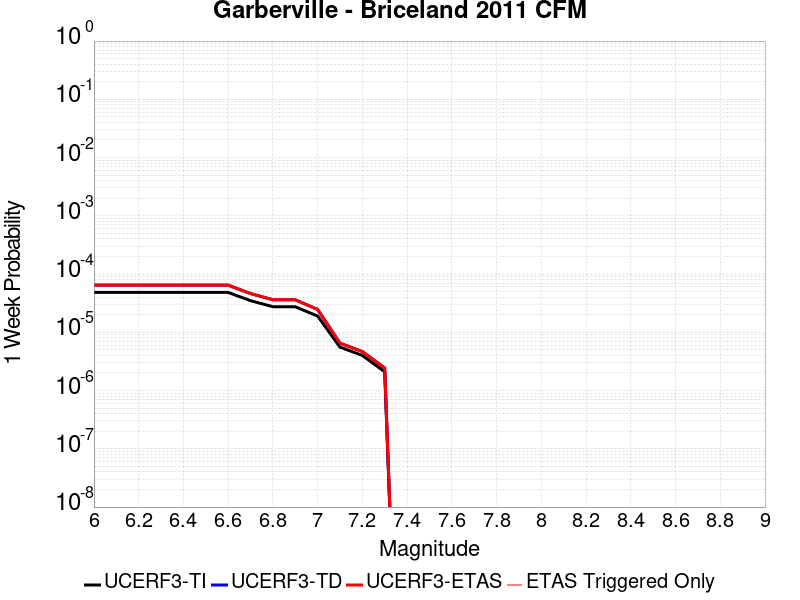 | 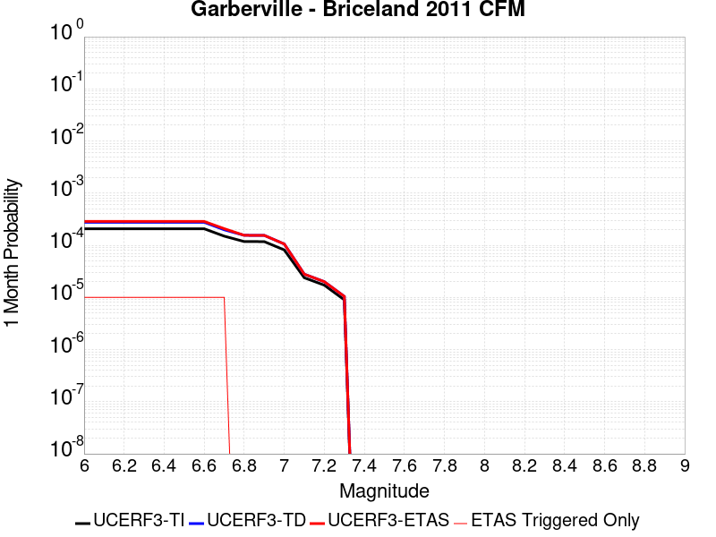 |  |  |

| Magnitude | 1 wk TI Prob | 1 wk TD Prob | 1 wk ETAS Prob | 1 wk ETAS/TD Gain | 1 wk ETAS Triggered Only | 1 mo TI Prob | 1 mo TD Prob | 1 mo ETAS Prob | 1 mo ETAS/TD Gain | 1 mo ETAS Triggered Only | 1 yr TI Prob | 1 yr TD Prob | 1 yr ETAS Prob | 1 yr ETAS/TD Gain | 1 yr ETAS Triggered Only | 10 yr TI Prob | 10 yr TD Prob | 10 yr ETAS Prob | 10 yr ETAS/TD Gain | 10 yr ETAS Triggered Only |
|-----|-----|-----|-----|-----|-----|-----|-----|-----|-----|-----|-----|-----|-----|-----|-----|-----|-----|-----|-----|-----|
| 6.0 | 4.8399295E-5 | 6.452381E-5 | 6.452381E-5 | 1.0 | 0.0 | 2.0740906E-4 | 2.7650563E-4 | 2.8650285E-4 | 1.0361556 | 1.0E-5 | 0.002522281 | 0.003362017 | 0.0033719833 | 1.0029644 | 1.0E-5 | 0.024938442 | 0.03317861 | 0.03318828 | 1.0002913 | 1.0E-5 |
| 6.1 | 4.8399295E-5 | 6.452381E-5 | 6.452381E-5 | 1.0 | 0.0 | 2.0740906E-4 | 2.7650563E-4 | 2.8650285E-4 | 1.0361556 | 1.0E-5 | 0.002522281 | 0.003362017 | 0.0033719833 | 1.0029644 | 1.0E-5 | 0.024938442 | 0.03317861 | 0.03318828 | 1.0002913 | 1.0E-5 |
| 6.2 | 4.8399295E-5 | 6.452381E-5 | 6.452381E-5 | 1.0 | 0.0 | 2.0740906E-4 | 2.7650563E-4 | 2.8650285E-4 | 1.0361556 | 1.0E-5 | 0.002522281 | 0.003362017 | 0.0033719833 | 1.0029644 | 1.0E-5 | 0.024938442 | 0.03317861 | 0.03318828 | 1.0002913 | 1.0E-5 |
| 6.3 | 4.8399295E-5 | 6.452381E-5 | 6.452381E-5 | 1.0 | 0.0 | 2.0740906E-4 | 2.7650563E-4 | 2.8650285E-4 | 1.0361556 | 1.0E-5 | 0.002522281 | 0.003362017 | 0.0033719833 | 1.0029644 | 1.0E-5 | 0.024938442 | 0.03317861 | 0.03318828 | 1.0002913 | 1.0E-5 |
| 6.4 | 4.8399295E-5 | 6.452381E-5 | 6.452381E-5 | 1.0 | 0.0 | 2.0740906E-4 | 2.7650563E-4 | 2.8650285E-4 | 1.0361556 | 1.0E-5 | 0.002522281 | 0.003362017 | 0.0033719833 | 1.0029644 | 1.0E-5 | 0.024938442 | 0.03317861 | 0.03318828 | 1.0002913 | 1.0E-5 |
| 6.5 | 4.8399295E-5 | 6.452381E-5 | 6.452381E-5 | 1.0 | 0.0 | 2.0740906E-4 | 2.7650563E-4 | 2.8650285E-4 | 1.0361556 | 1.0E-5 | 0.002522281 | 0.003362017 | 0.0033719833 | 1.0029644 | 1.0E-5 | 0.024938442 | 0.03317861 | 0.03318828 | 1.0002913 | 1.0E-5 |
| 6.6 | 4.8399295E-5 | 6.452381E-5 | 6.452381E-5 | 1.0 | 0.0 | 2.0740906E-4 | 2.7650563E-4 | 2.8650285E-4 | 1.0361556 | 1.0E-5 | 0.002522281 | 0.003362017 | 0.0033719833 | 1.0029644 | 1.0E-5 | 0.024938442 | 0.03317861 | 0.03318828 | 1.0002913 | 1.0E-5 |
| 6.7 | 3.495179E-5 | 4.6308873E-5 | 4.6308873E-5 | 1.0 | 0.0 | 1.4978478E-4 | 1.9845461E-4 | 2.0845262E-4 | 1.0503794 | 1.0E-5 | 0.0018221042 | 0.002414053 | 0.002424029 | 1.0041324 | 1.0E-5 | 0.018072363 | 0.023930617 | 0.023940377 | 1.0004079 | 1.0E-5 |
| 6.8 | 2.7517597E-5 | 3.6241618E-5 | 3.6241618E-5 | 1.0 | 0.0 | 1.1792722E-4 | 1.5531474E-4 | 1.5531474E-4 | 1.0 | 0.0 | 0.0014348183 | 0.0018897996 | 0.0018897996 | 1.0 | 0.0 | 0.014255894 | 0.018783508 | 0.018783508 | 1.0 | 0.0 |
| 6.9 | 2.74461E-5 | 3.6159345E-5 | 3.6159345E-5 | 1.0 | 0.0 | 1.1762084E-4 | 1.5496218E-4 | 1.5496218E-4 | 1.0 | 0.0 | 0.001431093 | 0.0018855145 | 0.0018855145 | 1.0 | 0.0 | 0.014219119 | 0.018741382 | 0.018741382 | 1.0 | 0.0 |
| 7.0 | 1.9023773E-5 | 2.4707579E-5 | 2.4707579E-5 | 1.0 | 0.0 | 8.152791E-5 | 1.0588763E-4 | 1.0588763E-4 | 1.0 | 0.0 | 9.921503E-4 | 0.0012888284 | 0.0012888284 | 1.0 | 0.0 | 0.009877323 | 0.012852574 | 0.012852574 | 1.0 | 0.0 |
| 7.1 | 5.566844E-6 | 6.512147E-6 | 6.512147E-6 | 1.0 | 0.0 | 2.3857683E-5 | 2.7908927E-5 | 2.7908927E-5 | 1.0 | 0.0 | 2.9042858E-4 | 3.3974246E-4 | 3.3974246E-4 | 1.0 | 0.0 | 0.002900493 | 0.0033926512 | 0.0033926512 | 1.0 | 0.0 |
| 7.2 | 4.011353E-6 | 4.6746213E-6 | 4.6746213E-6 | 1.0 | 0.0 | 1.7191402E-5 | 2.0033956E-5 | 2.0033956E-5 | 1.0 | 0.0 | 2.0928521E-4 | 2.4388955E-4 | 2.4388955E-4 | 1.0 | 0.0 | 0.0020908823 | 0.0024365564 | 0.0024365564 | 1.0 | 0.0 |
| 7.3 | 2.0974871E-6 | 2.4395908E-6 | 2.4395908E-6 | 1.0 | 0.0 | 8.989199E-6 | 1.0455362E-5 | 1.0455362E-5 | 1.0 | 0.0 | 1.09438006E-4 | 1.272891E-4 | 1.272891E-4 | 1.0 | 0.0 | 0.0010938413 | 0.0012724071 | 0.0012724071 | 1.0 | 0.0 |

## Round Valley
*[(top)](#table-of-contents)*

| 1 Week | 1 Month | 1 Year | 10 Year |
|-----|-----|-----|-----|
|  | 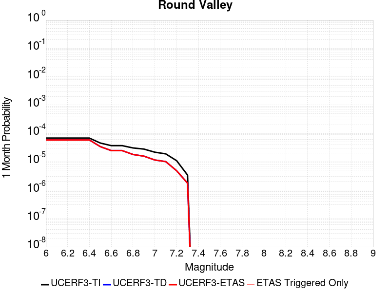 |  |  |

| Magnitude | 1 wk TI Prob | 1 wk TD Prob | 1 wk ETAS Prob | 1 wk ETAS/TD Gain | 1 wk ETAS Triggered Only | 1 mo TI Prob | 1 mo TD Prob | 1 mo ETAS Prob | 1 mo ETAS/TD Gain | 1 mo ETAS Triggered Only | 1 yr TI Prob | 1 yr TD Prob | 1 yr ETAS Prob | 1 yr ETAS/TD Gain | 1 yr ETAS Triggered Only | 10 yr TI Prob | 10 yr TD Prob | 10 yr ETAS Prob | 10 yr ETAS/TD Gain | 10 yr ETAS Triggered Only |
|-----|-----|-----|-----|-----|-----|-----|-----|-----|-----|-----|-----|-----|-----|-----|-----|-----|-----|-----|-----|-----|
| 6.0 | 1.588152E-5 | 1.3670716E-5 | 1.3670716E-5 | 1.0 | 0.0 | 6.806188E-5 | 5.8587688E-5 | 5.8587688E-5 | 1.0 | 0.0 | 8.283384E-4 | 7.13111E-4 | 7.13111E-4 | 1.0 | 0.0 | 0.008252576 | 0.0071121147 | 0.007122044 | 1.0013961 | 1.0E-5 |
| 6.1 | 1.588152E-5 | 1.3670716E-5 | 1.3670716E-5 | 1.0 | 0.0 | 6.806188E-5 | 5.8587688E-5 | 5.8587688E-5 | 1.0 | 0.0 | 8.283384E-4 | 7.13111E-4 | 7.13111E-4 | 1.0 | 0.0 | 0.008252576 | 0.0071121147 | 0.007122044 | 1.0013961 | 1.0E-5 |
| 6.2 | 1.588152E-5 | 1.3670716E-5 | 1.3670716E-5 | 1.0 | 0.0 | 6.806188E-5 | 5.8587688E-5 | 5.8587688E-5 | 1.0 | 0.0 | 8.283384E-4 | 7.13111E-4 | 7.13111E-4 | 1.0 | 0.0 | 0.008252576 | 0.0071121147 | 0.007122044 | 1.0013961 | 1.0E-5 |
| 6.3 | 1.588152E-5 | 1.3670716E-5 | 1.3670716E-5 | 1.0 | 0.0 | 6.806188E-5 | 5.8587688E-5 | 5.8587688E-5 | 1.0 | 0.0 | 8.283384E-4 | 7.13111E-4 | 7.13111E-4 | 1.0 | 0.0 | 0.008252576 | 0.0071121147 | 0.007122044 | 1.0013961 | 1.0E-5 |
| 6.4 | 1.588152E-5 | 1.3670716E-5 | 1.3670716E-5 | 1.0 | 0.0 | 6.806188E-5 | 5.8587688E-5 | 5.8587688E-5 | 1.0 | 0.0 | 8.283384E-4 | 7.13111E-4 | 7.13111E-4 | 1.0 | 0.0 | 0.008252576 | 0.0071121147 | 0.007122044 | 1.0013961 | 1.0E-5 |
| 6.5 | 1.0646776E-5 | 7.953037E-6 | 7.953037E-6 | 1.0 | 0.0 | 4.5628243E-5 | 3.408405E-5 | 3.408405E-5 | 1.0 | 0.0 | 5.553823E-4 | 4.1490266E-4 | 4.1490266E-4 | 1.0 | 0.0 | 0.005539963 | 0.0041421093 | 0.0041421093 | 1.0 | 0.0 |
| 6.6 | 8.632956E-6 | 5.768742E-6 | 5.768742E-6 | 1.0 | 0.0 | 3.6997862E-5 | 2.4722967E-5 | 2.4722967E-5 | 1.0 | 0.0 | 4.5035584E-4 | 3.009644E-4 | 3.009644E-4 | 1.0 | 0.0 | 0.0044944426 | 0.003005946 | 0.003005946 | 1.0 | 0.0 |
| 6.7 | 8.632956E-6 | 5.768742E-6 | 5.768742E-6 | 1.0 | 0.0 | 3.6997862E-5 | 2.4722967E-5 | 2.4722967E-5 | 1.0 | 0.0 | 4.5035584E-4 | 3.009644E-4 | 3.009644E-4 | 1.0 | 0.0 | 0.0044944426 | 0.003005946 | 0.003005946 | 1.0 | 0.0 |
| 6.8 | 7.143895E-6 | 4.2018346E-6 | 4.2018346E-6 | 1.0 | 0.0 | 3.0616335E-5 | 1.8007748E-5 | 1.8007748E-5 | 1.0 | 0.0 | 3.726901E-4 | 2.1922393E-4 | 2.1922393E-4 | 1.0 | 0.0 | 0.0037206567 | 0.0021902416 | 0.0021902416 | 1.0 | 0.0 |
| 6.9 | 6.5120694E-6 | 3.6644687E-6 | 3.6644687E-6 | 1.0 | 0.0 | 2.790857E-5 | 1.570478E-5 | 1.570478E-5 | 1.0 | 0.0 | 3.3973387E-4 | 1.9119044E-4 | 1.9119044E-4 | 1.0 | 0.0 | 0.0033921495 | 0.0019104085 | 0.0019104085 | 1.0 | 0.0 |
| 7.0 | 5.0614435E-6 | 2.6836676E-6 | 2.6836676E-6 | 1.0 | 0.0 | 2.169172E-5 | 1.1501388E-5 | 1.1501388E-5 | 1.0 | 0.0 | 2.6406467E-4 | 1.4002144E-4 | 1.4002144E-4 | 1.0 | 0.0 | 0.0026375111 | 0.0013994334 | 0.0013994334 | 1.0 | 0.0 |
| 7.1 | 4.41728E-6 | 2.3575074E-6 | 2.3575074E-6 | 1.0 | 0.0 | 1.8931061E-5 | 1.0103569E-5 | 1.0103569E-5 | 1.0 | 0.0 | 2.304613E-4 | 1.23005E-4 | 1.23005E-4 | 1.0 | 0.0 | 0.0023022245 | 0.0012294657 | 0.0012294657 | 1.0 | 0.0 |
| 7.2 | 2.535495E-6 | 1.1208391E-6 | 1.1208391E-6 | 1.0 | 0.0 | 1.0866362E-5 | 4.8035904E-6 | 4.8035904E-6 | 1.0 | 0.0 | 1.3228992E-4 | 5.8482667E-5 | 5.8482667E-5 | 1.0 | 0.0 | 0.0013221119 | 5.84724E-4 | 5.84724E-4 | 1.0 | 0.0 |
| 7.3 | 7.900015E-7 | 4.0889498E-7 | 4.0889498E-7 | 1.0 | 0.0 | 3.3857161E-6 | 1.752407E-6 | 1.752407E-6 | 1.0 | 0.0 | 4.1220315E-5 | 2.1335554E-5 | 2.1335554E-5 | 1.0 | 0.0 | 4.121267E-4 | 2.1335555E-4 | 2.1335555E-4 | 1.0 | 0.0 |

## Hat Creek-McArthur-Mayfield
*[(top)](#table-of-contents)*

| 1 Week | 1 Month | 1 Year | 10 Year |
|-----|-----|-----|-----|
|  |  |  |  |

| Magnitude | 1 wk TI Prob | 1 wk TD Prob | 1 wk ETAS Prob | 1 wk ETAS/TD Gain | 1 wk ETAS Triggered Only | 1 mo TI Prob | 1 mo TD Prob | 1 mo ETAS Prob | 1 mo ETAS/TD Gain | 1 mo ETAS Triggered Only | 1 yr TI Prob | 1 yr TD Prob | 1 yr ETAS Prob | 1 yr ETAS/TD Gain | 1 yr ETAS Triggered Only | 10 yr TI Prob | 10 yr TD Prob | 10 yr ETAS Prob | 10 yr ETAS/TD Gain | 10 yr ETAS Triggered Only |
|-----|-----|-----|-----|-----|-----|-----|-----|-----|-----|-----|-----|-----|-----|-----|-----|-----|-----|-----|-----|-----|
| 6.0 | 3.967457E-5 | 4.315831E-5 | 4.315831E-5 | 1.0 | 0.0 | 1.7002279E-4 | 1.8495171E-4 | 1.8495171E-4 | 1.0 | 0.0 | 0.002068062 | 0.002249576 | 0.002249576 | 1.0 | 0.0 | 0.02048922 | 0.022280399 | 0.022290176 | 1.0004388 | 1.0E-5 |
| 6.1 | 2.5044013E-5 | 2.7071164E-5 | 2.7071164E-5 | 1.0 | 0.0 | 1.0732707E-4 | 1.1601429E-4 | 1.1601429E-4 | 1.0 | 0.0 | 0.0013059238 | 0.0014115906 | 0.0014115906 | 1.0 | 0.0 | 0.01298276 | 0.01402966 | 0.01403952 | 1.0007027 | 1.0E-5 |
| 6.2 | 2.5044013E-5 | 2.7071164E-5 | 2.7071164E-5 | 1.0 | 0.0 | 1.0732707E-4 | 1.1601429E-4 | 1.1601429E-4 | 1.0 | 0.0 | 0.0013059238 | 0.0014115906 | 0.0014115906 | 1.0 | 0.0 | 0.01298276 | 0.01402966 | 0.01403952 | 1.0007027 | 1.0E-5 |
| 6.3 | 1.6624012E-5 | 1.7891072E-5 | 1.7891072E-5 | 1.0 | 0.0 | 7.124382E-5 | 7.6673816E-5 | 7.6673816E-5 | 1.0 | 0.0 | 8.670483E-4 | 9.331125E-4 | 9.331125E-4 | 1.0 | 0.0 | 0.008636732 | 0.009292879 | 0.009292879 | 1.0 | 0.0 |
| 6.4 | 1.6624012E-5 | 1.7891072E-5 | 1.7891072E-5 | 1.0 | 0.0 | 7.124382E-5 | 7.6673816E-5 | 7.6673816E-5 | 1.0 | 0.0 | 8.670483E-4 | 9.331125E-4 | 9.331125E-4 | 1.0 | 0.0 | 0.008636732 | 0.009292879 | 0.009292879 | 1.0 | 0.0 |
| 6.5 | 1.3394842E-5 | 1.4392137E-5 | 1.4392137E-5 | 1.0 | 0.0 | 5.7405203E-5 | 6.167916E-5 | 6.167916E-5 | 1.0 | 0.0 | 6.986842E-4 | 7.506906E-4 | 7.506906E-4 | 1.0 | 0.0 | 0.006964916 | 0.0074821403 | 0.0074821403 | 1.0 | 0.0 |
| 6.6 | 1.1137514E-5 | 1.1954546E-5 | 1.1954546E-5 | 1.0 | 0.0 | 4.7731326E-5 | 5.1232782E-5 | 5.1232782E-5 | 1.0 | 0.0 | 5.809739E-4 | 6.2358467E-4 | 6.2358467E-4 | 1.0 | 0.0 | 0.005794574 | 0.00621877 | 0.00621877 | 1.0 | 0.0 |
| 6.7 | 7.0200663E-6 | 7.5242897E-6 | 7.5242897E-6 | 1.0 | 0.0 | 3.008565E-5 | 3.2246568E-5 | 3.2246568E-5 | 1.0 | 0.0 | 3.6623122E-4 | 3.925328E-4 | 3.925328E-4 | 1.0 | 0.0 | 0.0036562826 | 0.0039185574 | 0.0039185574 | 1.0 | 0.0 |
| 6.8 | 5.940172E-6 | 6.3654766E-6 | 6.3654766E-6 | 1.0 | 0.0 | 2.545763E-5 | 2.7280335E-5 | 2.7280335E-5 | 1.0 | 0.0 | 3.0990256E-4 | 3.3208873E-4 | 3.3208873E-4 | 1.0 | 0.0 | 0.0030947074 | 0.0033160534 | 0.0033160534 | 1.0 | 0.0 |
| 6.9 | 4.129831E-6 | 4.423547E-6 | 4.423547E-6 | 1.0 | 0.0 | 1.7699154E-5 | 1.8957926E-5 | 1.8957926E-5 | 1.0 | 0.0 | 2.154659E-4 | 2.3078908E-4 | 2.3078908E-4 | 1.0 | 0.0 | 0.002152571 | 0.0023055724 | 0.0023055724 | 1.0 | 0.0 |
| 7.0 | 2.6512955E-6 | 2.8374002E-6 | 2.8374002E-6 | 1.0 | 0.0 | 1.1362646E-5 | 1.2160232E-5 | 1.2160232E-5 | 1.0 | 0.0 | 1.3833142E-4 | 1.480412E-4 | 1.480412E-4 | 1.0 | 0.0 | 0.0013824535 | 0.0014794683 | 0.0014794683 | 1.0 | 0.0 |
| 7.1 | 1.2992575E-6 | 1.3909317E-6 | 1.3909317E-6 | 1.0 | 0.0 | 5.568235E-6 | 5.961124E-6 | 5.961124E-6 | 1.0 | 0.0 | 6.779115E-5 | 7.257448E-5 | 7.257448E-5 | 1.0 | 0.0 | 6.7770475E-4 | 7.2552945E-4 | 7.2552945E-4 | 1.0 | 0.0 |
| 7.2 | 4.968191E-7 | 5.3271475E-7 | 5.3271475E-7 | 1.0 | 0.0 | 2.1292228E-6 | 2.283062E-6 | 2.283062E-6 | 1.0 | 0.0 | 2.592298E-5 | 2.7796052E-5 | 2.7796052E-5 | 1.0 | 0.0 | 2.5919956E-4 | 2.7793812E-4 | 2.7793812E-4 | 1.0 | 0.0 |

## Elsinore (Temecula) rev
*[(top)](#table-of-contents)*

| 1 Week | 1 Month | 1 Year | 10 Year |
|-----|-----|-----|-----|
|  | 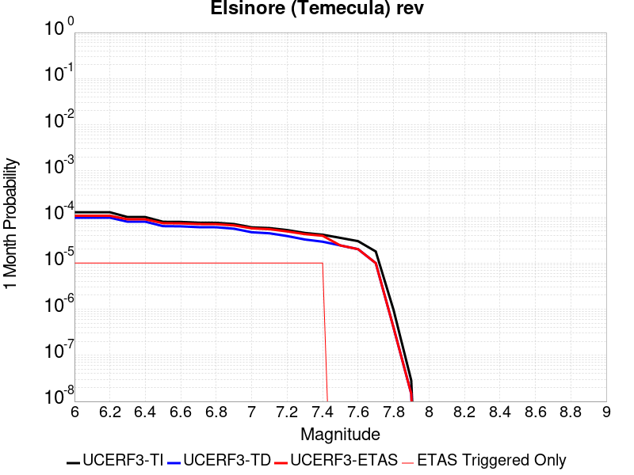 | 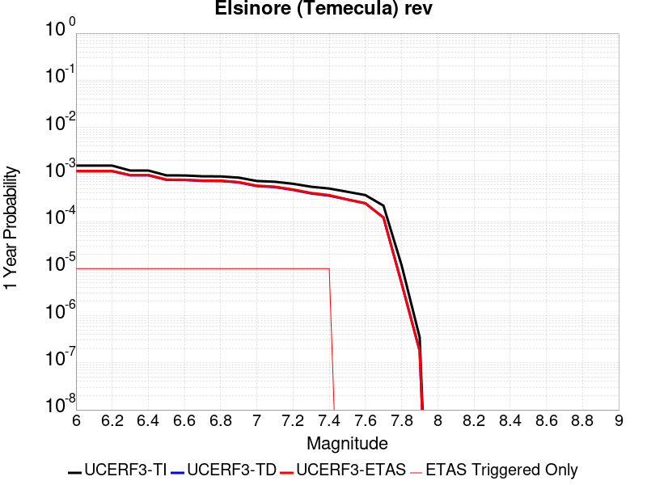 |  |

| Magnitude | 1 wk TI Prob | 1 wk TD Prob | 1 wk ETAS Prob | 1 wk ETAS/TD Gain | 1 wk ETAS Triggered Only | 1 mo TI Prob | 1 mo TD Prob | 1 mo ETAS Prob | 1 mo ETAS/TD Gain | 1 mo ETAS Triggered Only | 1 yr TI Prob | 1 yr TD Prob | 1 yr ETAS Prob | 1 yr ETAS/TD Gain | 1 yr ETAS Triggered Only | 10 yr TI Prob | 10 yr TD Prob | 10 yr ETAS Prob | 10 yr ETAS/TD Gain | 10 yr ETAS Triggered Only |
|-----|-----|-----|-----|-----|-----|-----|-----|-----|-----|-----|-----|-----|-----|-----|-----|-----|-----|-----|-----|-----|
| 6.0 | 2.9514995E-5 | 2.2517117E-5 | 2.2517117E-5 | 1.0 | 0.0 | 1.264867E-4 | 9.649849E-5 | 1.0649752E-4 | 1.1036186 | 1.0E-5 | 0.0015388876 | 0.0011742581 | 0.0011842463 | 1.0085061 | 1.0E-5 | 0.015282745 | 0.011696897 | 0.011706781 | 1.000845 | 1.0E-5 |
| 6.1 | 2.9514995E-5 | 2.2517117E-5 | 2.2517117E-5 | 1.0 | 0.0 | 1.264867E-4 | 9.649849E-5 | 1.0649752E-4 | 1.1036186 | 1.0E-5 | 0.0015388876 | 0.0011742581 | 0.0011842463 | 1.0085061 | 1.0E-5 | 0.015282745 | 0.011696897 | 0.011706781 | 1.000845 | 1.0E-5 |
| 6.2 | 2.9514995E-5 | 2.2517117E-5 | 2.2517117E-5 | 1.0 | 0.0 | 1.264867E-4 | 9.649849E-5 | 1.0649752E-4 | 1.1036186 | 1.0E-5 | 0.0015388876 | 0.0011742581 | 0.0011842463 | 1.0085061 | 1.0E-5 | 0.015282745 | 0.011696897 | 0.011706781 | 1.000845 | 1.0E-5 |
| 6.3 | 2.3223649E-5 | 1.8406454E-5 | 1.8406454E-5 | 1.0 | 0.0 | 9.952613E-5 | 7.888251E-5 | 8.888173E-5 | 1.1267608 | 1.0E-5 | 0.001211057 | 9.599888E-4 | 9.6997916E-4 | 1.0104067 | 1.0E-5 | 0.012044783 | 0.009569948 | 0.009579852 | 1.001035 | 1.0E-5 |
| 6.4 | 2.3223649E-5 | 1.8406454E-5 | 1.8406454E-5 | 1.0 | 0.0 | 9.952613E-5 | 7.888251E-5 | 8.888173E-5 | 1.1267608 | 1.0E-5 | 0.001211057 | 9.599888E-4 | 9.6997916E-4 | 1.0104067 | 1.0E-5 | 0.012044783 | 0.009569948 | 0.009579852 | 1.001035 | 1.0E-5 |
| 6.5 | 1.8338875E-5 | 1.4750118E-5 | 1.4750118E-5 | 1.0 | 0.0 | 7.8592806E-5 | 6.321331E-5 | 7.321267E-5 | 1.1581845 | 1.0E-5 | 9.5644733E-4 | 7.69359E-4 | 7.7935134E-4 | 1.0129879 | 1.0E-5 | 0.009523412 | 0.0076739118 | 0.007683835 | 1.0012931 | 1.0E-5 |
| 6.6 | 1.8223333E-5 | 1.4612673E-5 | 1.4612673E-5 | 1.0 | 0.0 | 7.809766E-5 | 6.262429E-5 | 7.262366E-5 | 1.1596725 | 1.0E-5 | 9.504242E-4 | 7.6219277E-4 | 7.7218516E-4 | 1.01311 | 1.0E-5 | 0.009463696 | 0.0076027405 | 0.0076126647 | 1.0013053 | 1.0E-5 |
| 6.7 | 1.7512752E-5 | 1.402721E-5 | 1.402721E-5 | 1.0 | 0.0 | 7.505249E-5 | 6.011528E-5 | 7.011468E-5 | 1.166337 | 1.0E-5 | 9.13381E-4 | 7.3166634E-4 | 7.41659E-4 | 1.0136575 | 1.0E-5 | 0.00909636 | 0.00729892 | 0.007308847 | 1.00136 | 1.0E-5 |
| 6.8 | 1.7417142E-5 | 1.3951195E-5 | 1.3951195E-5 | 1.0 | 0.0 | 7.4642754E-5 | 5.9789512E-5 | 6.978891E-5 | 1.1672434 | 1.0E-5 | 9.083966E-4 | 7.277028E-4 | 7.376955E-4 | 1.0137318 | 1.0E-5 | 0.009046922 | 0.0072594886 | 0.007269416 | 1.0013674 | 1.0E-5 |
| 6.9 | 1.6402591E-5 | 1.2988613E-5 | 1.2988613E-5 | 1.0 | 0.0 | 7.0294926E-5 | 5.5664343E-5 | 6.5663786E-5 | 1.1796383 | 1.0E-5 | 8.5550465E-4 | 6.775103E-4 | 6.8750355E-4 | 1.0147499 | 1.0E-5 | 0.008522186 | 0.006760169 | 0.0067701014 | 1.0014693 | 1.0E-5 |
| 7.0 | 1.3912486E-5 | 1.0878233E-5 | 1.0878233E-5 | 1.0 | 0.0 | 5.9623577E-5 | 4.6620182E-5 | 5.6619716E-5 | 1.2144893 | 1.0E-5 | 7.2567526E-4 | 5.674556E-4 | 5.7745E-4 | 1.0176126 | 1.0E-5 | 0.0072331014 | 0.005663986 | 0.005673929 | 1.0017556 | 1.0E-5 |
| 7.1 | 1.3405147E-5 | 1.03274215E-5 | 1.03274215E-5 | 1.0 | 0.0 | 5.7449364E-5 | 4.425964E-5 | 5.4259195E-5 | 1.2259295 | 1.0E-5 | 6.9922156E-4 | 5.3873047E-4 | 5.487251E-4 | 1.0185522 | 1.0E-5 | 0.0069702556 | 0.005377577 | 0.005387523 | 1.0018495 | 1.0E-5 |
| 7.2 | 1.21402E-5 | 8.996737E-6 | 8.996737E-6 | 1.0 | 0.0 | 5.202839E-5 | 3.8556886E-5 | 4.85565E-5 | 1.2593471 | 1.0E-5 | 6.332616E-4 | 4.6933076E-4 | 4.7932606E-4 | 1.021297 | 1.0E-5 | 0.0063146 | 0.004684821 | 0.004694774 | 1.0021245 | 1.0E-5 |
| 7.3 | 1.05047775E-5 | 7.571771E-6 | 7.571771E-6 | 1.0 | 0.0 | 4.5019697E-5 | 3.245005E-5 | 4.2449727E-5 | 1.3081559 | 1.0E-5 | 5.4797693E-4 | 3.950092E-4 | 4.0500527E-4 | 1.0253059 | 1.0E-5 | 0.005466277 | 0.00394346 | 0.003953421 | 1.0025258 | 1.0E-5 |
| 7.4 | 9.624483E-6 | 6.7868696E-6 | 6.7868696E-6 | 1.0 | 0.0 | 4.124713E-5 | 2.9086266E-5 | 3.9085975E-5 | 1.3437948 | 1.0E-5 | 5.0206814E-4 | 3.5406914E-4 | 3.640656E-4 | 1.028233 | 1.0E-5 | 0.005009353 | 0.003535204 | 0.0035451688 | 1.0028187 | 1.0E-5 |
| 7.5 | 8.215151E-6 | 5.635538E-6 | 5.635538E-6 | 1.0 | 0.0 | 3.5207315E-5 | 2.4152088E-5 | 2.4152088E-5 | 1.0 | 0.0 | 4.2856473E-4 | 2.9401327E-4 | 2.9401327E-4 | 1.0 | 0.0 | 0.004277392 | 0.002936371 | 0.002936371 | 1.0 | 0.0 |
| 7.6 | 6.975058E-6 | 4.676045E-6 | 4.676045E-6 | 1.0 | 0.0 | 2.9892764E-5 | 2.0040046E-5 | 2.0040046E-5 | 1.0 | 0.0 | 3.6388362E-4 | 2.439614E-4 | 2.439614E-4 | 1.0 | 0.0 | 0.0036328835 | 0.002437052 | 0.002437052 | 1.0 | 0.0 |
| 7.7 | 4.159604E-6 | 2.3269924E-6 | 2.3269924E-6 | 1.0 | 0.0 | 1.7826753E-5 | 9.97279E-6 | 9.97279E-6 | 1.0 | 0.0 | 2.1701909E-4 | 1.21412704E-4 | 1.21412704E-4 | 1.0 | 0.0 | 0.0021680726 | 0.0012135367 | 0.0012135367 | 1.0 | 0.0 |
| 7.8 | 2.2692414E-7 | 9.3854695E-8 | 9.3854695E-8 | 1.0 | 0.0 | 9.725317E-7 | 4.0223435E-7 | 4.0223435E-7 | 1.0 | 0.0 | 1.1840509E-5 | 4.8971956E-6 | 4.8971956E-6 | 1.0 | 0.0 | 1.1839878E-4 | 4.8971204E-5 | 4.8971204E-5 | 1.0 | 0.0 |
| 7.9 | 6.676829E-9 | 3.439853E-9 | 3.439853E-9 | 1.0 | 0.0 | 2.861498E-8 | 1.4742227E-8 | 1.4742227E-8 | 1.0 | 0.0 | 3.4838732E-7 | 1.7948659E-7 | 1.7948659E-7 | 1.0 | 0.0 | 3.4838679E-6 | 1.7948646E-6 | 1.7948646E-6 | 1.0 | 0.0 |

## Earthquake Valley (No  Extension)
*[(top)](#table-of-contents)*

| 1 Week | 1 Month | 1 Year | 10 Year |
|-----|-----|-----|-----|
|  |  |  |  |

| Magnitude | 1 wk TI Prob | 1 wk TD Prob | 1 wk ETAS Prob | 1 wk ETAS/TD Gain | 1 wk ETAS Triggered Only | 1 mo TI Prob | 1 mo TD Prob | 1 mo ETAS Prob | 1 mo ETAS/TD Gain | 1 mo ETAS Triggered Only | 1 yr TI Prob | 1 yr TD Prob | 1 yr ETAS Prob | 1 yr ETAS/TD Gain | 1 yr ETAS Triggered Only | 10 yr TI Prob | 10 yr TD Prob | 10 yr ETAS Prob | 10 yr ETAS/TD Gain | 10 yr ETAS Triggered Only |
|-----|-----|-----|-----|-----|-----|-----|-----|-----|-----|-----|-----|-----|-----|-----|-----|-----|-----|-----|-----|-----|
| 6.0 | 2.1859703E-5 | 2.5198362E-5 | 2.5198362E-5 | 1.0 | 0.0 | 9.3681076E-5 | 1.07989326E-4 | 1.07989326E-4 | 1.0 | 0.0 | 0.0011399703 | 0.001314122 | 0.001314122 | 1.0 | 0.0 | 0.011341401 | 0.013077871 | 0.01308774 | 1.0007546 | 1.0E-5 |
| 6.1 | 2.1859703E-5 | 2.5198362E-5 | 2.5198362E-5 | 1.0 | 0.0 | 9.3681076E-5 | 1.07989326E-4 | 1.07989326E-4 | 1.0 | 0.0 | 0.0011399703 | 0.001314122 | 0.001314122 | 1.0 | 0.0 | 0.011341401 | 0.013077871 | 0.01308774 | 1.0007546 | 1.0E-5 |
| 6.2 | 2.1859703E-5 | 2.5198362E-5 | 2.5198362E-5 | 1.0 | 0.0 | 9.3681076E-5 | 1.07989326E-4 | 1.07989326E-4 | 1.0 | 0.0 | 0.0011399703 | 0.001314122 | 0.001314122 | 1.0 | 0.0 | 0.011341401 | 0.013077871 | 0.01308774 | 1.0007546 | 1.0E-5 |
| 6.3 | 2.1859703E-5 | 2.5198362E-5 | 2.5198362E-5 | 1.0 | 0.0 | 9.3681076E-5 | 1.07989326E-4 | 1.07989326E-4 | 1.0 | 0.0 | 0.0011399703 | 0.001314122 | 0.001314122 | 1.0 | 0.0 | 0.011341401 | 0.013077871 | 0.01308774 | 1.0007546 | 1.0E-5 |
| 6.4 | 2.1859703E-5 | 2.5198362E-5 | 2.5198362E-5 | 1.0 | 0.0 | 9.3681076E-5 | 1.07989326E-4 | 1.07989326E-4 | 1.0 | 0.0 | 0.0011399703 | 0.001314122 | 0.001314122 | 1.0 | 0.0 | 0.011341401 | 0.013077871 | 0.01308774 | 1.0007546 | 1.0E-5 |
| 6.5 | 2.1859703E-5 | 2.5198362E-5 | 2.5198362E-5 | 1.0 | 0.0 | 9.3681076E-5 | 1.07989326E-4 | 1.07989326E-4 | 1.0 | 0.0 | 0.0011399703 | 0.001314122 | 0.001314122 | 1.0 | 0.0 | 0.011341401 | 0.013077871 | 0.01308774 | 1.0007546 | 1.0E-5 |
| 6.6 | 1.597E-5 | 1.8356275E-5 | 1.8356275E-5 | 1.0 | 0.0 | 6.8441055E-5 | 7.866787E-5 | 7.866787E-5 | 1.0 | 0.0 | 8.329513E-4 | 9.574478E-4 | 9.574478E-4 | 1.0 | 0.0 | 0.008298361 | 0.009541836 | 0.00955174 | 1.0010381 | 1.0E-5 |
| 6.7 | 1.597E-5 | 1.8356275E-5 | 1.8356275E-5 | 1.0 | 0.0 | 6.8441055E-5 | 7.866787E-5 | 7.866787E-5 | 1.0 | 0.0 | 8.329513E-4 | 9.574478E-4 | 9.574478E-4 | 1.0 | 0.0 | 0.008298361 | 0.009541836 | 0.00955174 | 1.0010381 | 1.0E-5 |
| 6.8 | 1.5315149E-5 | 1.7602091E-5 | 1.7602091E-5 | 1.0 | 0.0 | 6.5634704E-5 | 7.543584E-5 | 7.543584E-5 | 1.0 | 0.0 | 7.988095E-4 | 9.181311E-4 | 9.181311E-4 | 1.0 | 0.0 | 0.007959441 | 0.009151919 | 0.009161827 | 1.0010827 | 1.0E-5 |
| 6.9 | 1.3634728E-5 | 1.5675821E-5 | 1.5675821E-5 | 1.0 | 0.0 | 5.8433237E-5 | 6.718082E-5 | 6.718082E-5 | 1.0 | 0.0 | 7.1119244E-4 | 8.177017E-4 | 8.177017E-4 | 1.0 | 0.0 | 0.007089207 | 0.008155 | 0.008164919 | 1.0012163 | 1.0E-5 |
| 7.0 | 1.3496271E-5 | 1.5517853E-5 | 1.5517853E-5 | 1.0 | 0.0 | 5.783988E-5 | 6.650385E-5 | 6.650385E-5 | 1.0 | 0.0 | 7.03973E-4 | 8.094657E-4 | 8.094657E-4 | 1.0 | 0.0 | 0.007017471 | 0.0080732405 | 0.00808316 | 1.0012287 | 1.0E-5 |
| 7.1 | 8.242798E-6 | 9.4726E-6 | 9.4726E-6 | 1.0 | 0.0 | 3.53258E-5 | 4.0596606E-5 | 4.0596606E-5 | 1.0 | 0.0 | 4.300067E-4 | 4.9421866E-4 | 4.9421866E-4 | 1.0 | 0.0 | 0.004291756 | 0.0049377717 | 0.0049377717 | 1.0 | 0.0 |
| 7.2 | 2.6506527E-7 | 2.2560312E-7 | 2.2560312E-7 | 1.0 | 0.0 | 1.1359936E-6 | 9.668702E-7 | 9.668702E-7 | 1.0 | 0.0 | 1.3830633E-5 | 1.17715845E-5 | 1.17715845E-5 | 1.0 | 0.0 | 1.3829772E-4 | 1.1771003E-4 | 1.1771003E-4 | 1.0 | 0.0 |
| 7.3 | 2.5810488E-7 | 2.1955442E-7 | 2.1955442E-7 | 1.0 | 0.0 | 1.1061633E-6 | 9.409472E-7 | 9.409472E-7 | 1.0 | 0.0 | 1.3467455E-5 | 1.1455976E-5 | 1.1455976E-5 | 1.0 | 0.0 | 1.3466639E-4 | 1.1455427E-4 | 1.1455427E-4 | 1.0 | 0.0 |
| 7.4 | 2.2676066E-7 | 1.9110601E-7 | 1.9110601E-7 | 1.0 | 0.0 | 9.71831E-7 | 8.190255E-7 | 8.190255E-7 | 1.0 | 0.0 | 1.1831979E-5 | 9.9715935E-6 | 9.9715935E-6 | 1.0 | 0.0 | 1.1831349E-4 | 9.9711855E-5 | 9.9711855E-5 | 1.0 | 0.0 |
| 7.5 | 1.5553917E-7 | 1.3112096E-7 | 1.3112096E-7 | 1.0 | 0.0 | 6.6659624E-7 | 5.619469E-7 | 5.619469E-7 | 1.0 | 0.0 | 8.115779E-6 | 6.8416834E-6 | 6.8416834E-6 | 1.0 | 0.0 | 8.115482E-5 | 6.841495E-5 | 6.841495E-5 | 1.0 | 0.0 |
| 7.6 | 1.3448629E-7 | 1.1288419E-7 | 1.1288419E-7 | 1.0 | 0.0 | 5.7636964E-7 | 4.837893E-7 | 4.837893E-7 | 1.0 | 0.0 | 7.017278E-6 | 5.890121E-6 | 5.890121E-6 | 1.0 | 0.0 | 7.0170565E-5 | 5.889986E-5 | 5.889986E-5 | 1.0 | 0.0 |
| 7.7 | 2.9719402E-8 | 1.458206E-8 | 1.458206E-8 | 1.0 | 0.0 | 1.2736886E-7 | 6.249454E-8 | 6.249454E-8 | 1.0 | 0.0 | 1.5507147E-6 | 7.608708E-7 | 7.608708E-7 | 1.0 | 0.0 | 1.550704E-5 | 7.6086876E-6 | 7.6086876E-6 | 1.0 | 0.0 |
| 7.8 | 7.4390196E-9 | 3.2502152E-9 | 3.2502152E-9 | 1.0 | 0.0 | 3.1881513E-8 | 1.3929493E-8 | 1.3929493E-8 | 1.0 | 0.0 | 3.8815733E-7 | 1.6959156E-7 | 1.6959156E-7 | 1.0 | 0.0 | 3.8815665E-6 | 1.6959145E-6 | 1.6959145E-6 | 1.0 | 0.0 |
| 7.9 | 1.5373532E-9 | 8.440161E-10 | 8.440161E-10 | 1.0 | 0.0 | 6.5886567E-9 | 3.6172119E-9 | 3.6172119E-9 | 1.0 | 0.0 | 8.021689E-8 | 4.4039556E-8 | 4.4039556E-8 | 1.0 | 0.0 | 8.0216864E-7 | 4.4039552E-7 | 4.4039552E-7 | 1.0 | 0.0 |

## Los Alamos 2011 CFM
*[(top)](#table-of-contents)*

| 1 Week | 1 Month | 1 Year | 10 Year |
|-----|-----|-----|-----|
|  | 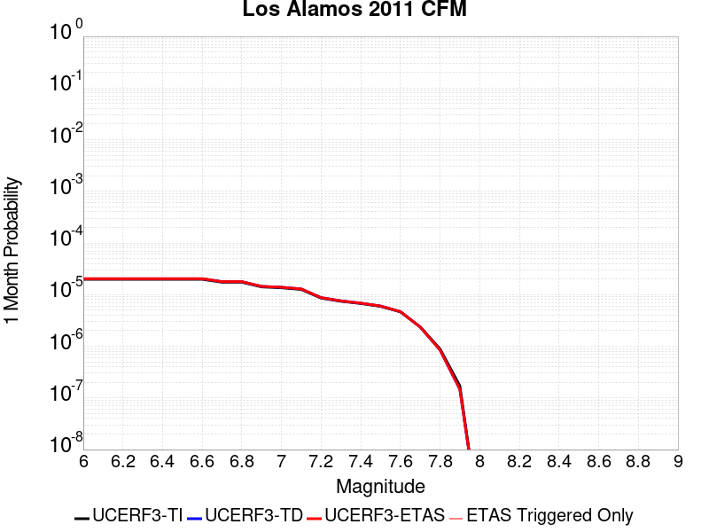 |  |  |

| Magnitude | 1 wk TI Prob | 1 wk TD Prob | 1 wk ETAS Prob | 1 wk ETAS/TD Gain | 1 wk ETAS Triggered Only | 1 mo TI Prob | 1 mo TD Prob | 1 mo ETAS Prob | 1 mo ETAS/TD Gain | 1 mo ETAS Triggered Only | 1 yr TI Prob | 1 yr TD Prob | 1 yr ETAS Prob | 1 yr ETAS/TD Gain | 1 yr ETAS Triggered Only | 10 yr TI Prob | 10 yr TD Prob | 10 yr ETAS Prob | 10 yr ETAS/TD Gain | 10 yr ETAS Triggered Only |
|-----|-----|-----|-----|-----|-----|-----|-----|-----|-----|-----|-----|-----|-----|-----|-----|-----|-----|-----|-----|-----|
| 6.0 | 4.6284417E-6 | 4.751731E-6 | 4.751731E-6 | 1.0 | 0.0 | 1.9836029E-5 | 2.0364414E-5 | 2.0364414E-5 | 1.0 | 0.0 | 2.4147688E-4 | 2.4791027E-4 | 2.579078E-4 | 1.0403272 | 1.0E-5 | 0.0024121467 | 0.0024765113 | 0.0024864867 | 1.004028 | 1.0E-5 |
| 6.1 | 4.6284417E-6 | 4.751731E-6 | 4.751731E-6 | 1.0 | 0.0 | 1.9836029E-5 | 2.0364414E-5 | 2.0364414E-5 | 1.0 | 0.0 | 2.4147688E-4 | 2.4791027E-4 | 2.579078E-4 | 1.0403272 | 1.0E-5 | 0.0024121467 | 0.0024765113 | 0.0024864867 | 1.004028 | 1.0E-5 |
| 6.2 | 4.6284417E-6 | 4.751731E-6 | 4.751731E-6 | 1.0 | 0.0 | 1.9836029E-5 | 2.0364414E-5 | 2.0364414E-5 | 1.0 | 0.0 | 2.4147688E-4 | 2.4791027E-4 | 2.579078E-4 | 1.0403272 | 1.0E-5 | 0.0024121467 | 0.0024765113 | 0.0024864867 | 1.004028 | 1.0E-5 |
| 6.3 | 4.6284417E-6 | 4.751731E-6 | 4.751731E-6 | 1.0 | 0.0 | 1.9836029E-5 | 2.0364414E-5 | 2.0364414E-5 | 1.0 | 0.0 | 2.4147688E-4 | 2.4791027E-4 | 2.579078E-4 | 1.0403272 | 1.0E-5 | 0.0024121467 | 0.0024765113 | 0.0024864867 | 1.004028 | 1.0E-5 |
| 6.4 | 4.6284417E-6 | 4.751731E-6 | 4.751731E-6 | 1.0 | 0.0 | 1.9836029E-5 | 2.0364414E-5 | 2.0364414E-5 | 1.0 | 0.0 | 2.4147688E-4 | 2.4791027E-4 | 2.579078E-4 | 1.0403272 | 1.0E-5 | 0.0024121467 | 0.0024765113 | 0.0024864867 | 1.004028 | 1.0E-5 |
| 6.5 | 4.6284417E-6 | 4.751731E-6 | 4.751731E-6 | 1.0 | 0.0 | 1.9836029E-5 | 2.0364414E-5 | 2.0364414E-5 | 1.0 | 0.0 | 2.4147688E-4 | 2.4791027E-4 | 2.579078E-4 | 1.0403272 | 1.0E-5 | 0.0024121467 | 0.0024765113 | 0.0024864867 | 1.004028 | 1.0E-5 |
| 6.6 | 4.6284417E-6 | 4.751731E-6 | 4.751731E-6 | 1.0 | 0.0 | 1.9836029E-5 | 2.0364414E-5 | 2.0364414E-5 | 1.0 | 0.0 | 2.4147688E-4 | 2.4791027E-4 | 2.579078E-4 | 1.0403272 | 1.0E-5 | 0.0024121467 | 0.0024765113 | 0.0024864867 | 1.004028 | 1.0E-5 |
| 6.7 | 4.062321E-6 | 4.166349E-6 | 4.166349E-6 | 1.0 | 0.0 | 1.7409831E-5 | 1.7855667E-5 | 1.7855667E-5 | 1.0 | 0.0 | 2.1194408E-4 | 2.1737257E-4 | 2.273704E-4 | 1.0459939 | 1.0E-5 | 0.0021174205 | 0.0021717492 | 0.0021817274 | 1.0045946 | 1.0E-5 |
| 6.8 | 4.062321E-6 | 4.166349E-6 | 4.166349E-6 | 1.0 | 0.0 | 1.7409831E-5 | 1.7855667E-5 | 1.7855667E-5 | 1.0 | 0.0 | 2.1194408E-4 | 2.1737257E-4 | 2.273704E-4 | 1.0459939 | 1.0E-5 | 0.0021174205 | 0.0021717492 | 0.0021817274 | 1.0045946 | 1.0E-5 |
| 6.9 | 3.2936077E-6 | 3.372958E-6 | 3.372958E-6 | 1.0 | 0.0 | 1.4115385E-5 | 1.4455459E-5 | 1.4455459E-5 | 1.0 | 0.0 | 1.7184127E-4 | 1.7598194E-4 | 1.7598194E-4 | 1.0 | 0.0 | 0.0017170844 | 0.0017585184 | 0.0017585184 | 1.0 | 0.0 |
| 7.0 | 3.1687898E-6 | 3.2448156E-6 | 3.2448156E-6 | 1.0 | 0.0 | 1.3580457E-5 | 1.3906283E-5 | 1.3906283E-5 | 1.0 | 0.0 | 1.6532952E-4 | 1.6929678E-4 | 1.6929678E-4 | 1.0 | 0.0 | 0.0016520657 | 0.0016917696 | 0.0016917696 | 1.0 | 0.0 |
| 7.1 | 2.9379228E-6 | 3.0073259E-6 | 3.0073259E-6 | 1.0 | 0.0 | 1.25910365E-5 | 1.288848E-5 | 1.288848E-5 | 1.0 | 0.0 | 1.5328509E-4 | 1.5690686E-4 | 1.5690686E-4 | 1.0 | 0.0 | 0.001531794 | 0.0015680499 | 0.0015680499 | 1.0 | 0.0 |
| 7.2 | 2.0020686E-6 | 2.0416298E-6 | 2.0416298E-6 | 1.0 | 0.0 | 8.580266E-6 | 8.749813E-6 | 8.749813E-6 | 1.0 | 0.0 | 1.0445973E-4 | 1.0652381E-4 | 1.0652381E-4 | 1.0 | 0.0 | 0.0010441064 | 0.001064732 | 0.001064732 | 1.0 | 0.0 |
| 7.3 | 1.7364243E-6 | 1.7678802E-6 | 1.7678802E-6 | 1.0 | 0.0 | 7.441797E-6 | 7.576608E-6 | 7.576608E-6 | 1.0 | 0.0 | 9.0600115E-5 | 9.2241324E-5 | 9.2241324E-5 | 1.0 | 0.0 | 9.0563187E-4 | 9.2203356E-4 | 9.2203356E-4 | 1.0 | 0.0 |
| 7.4 | 1.5718434E-6 | 1.5983177E-6 | 1.5983177E-6 | 1.0 | 0.0 | 6.7364545E-6 | 6.849915E-6 | 6.849915E-6 | 1.0 | 0.0 | 8.201325E-5 | 8.339455E-5 | 8.339455E-5 | 1.0 | 0.0 | 8.198299E-4 | 8.3363557E-4 | 8.3363557E-4 | 1.0 | 0.0 |
| 7.5 | 1.3841119E-6 | 1.4042793E-6 | 1.4042793E-6 | 1.0 | 0.0 | 5.9318945E-6 | 6.0183256E-6 | 6.0183256E-6 | 1.0 | 0.0 | 7.221842E-5 | 7.327068E-5 | 7.327068E-5 | 1.0 | 0.0 | 7.2194956E-4 | 7.324681E-4 | 7.324681E-4 | 1.0 | 0.0 |
| 7.6 | 1.0843726E-6 | 1.093442E-6 | 1.093442E-6 | 1.0 | 0.0 | 4.647303E-6 | 4.6861724E-6 | 4.6861724E-6 | 1.0 | 0.0 | 5.6579443E-5 | 5.705268E-5 | 5.705268E-5 | 1.0 | 0.0 | 5.656504E-4 | 5.703829E-4 | 5.703829E-4 | 1.0 | 0.0 |
| 7.7 | 5.544814E-7 | 5.5018705E-7 | 5.5018705E-7 | 1.0 | 0.0 | 2.3763469E-6 | 2.3579425E-6 | 2.3579425E-6 | 1.0 | 0.0 | 2.8931638E-5 | 2.8707573E-5 | 2.8707573E-5 | 1.0 | 0.0 | 2.8927872E-4 | 2.870388E-4 | 2.870388E-4 | 1.0 | 0.0 |
| 7.8 | 2.0707465E-7 | 1.977846E-7 | 1.977846E-7 | 1.0 | 0.0 | 8.874625E-7 | 8.4764804E-7 | 8.4764804E-7 | 1.0 | 0.0 | 1.08048025E-5 | 1.0320066E-5 | 1.0320066E-5 | 1.0 | 0.0 | 1.0804277E-4 | 1.0319592E-4 | 1.0319592E-4 | 1.0 | 0.0 |
| 7.9 | 3.9821284E-8 | 3.433109E-8 | 3.433109E-8 | 1.0 | 0.0 | 1.7066264E-7 | 1.4713324E-7 | 1.4713324E-7 | 1.0 | 0.0 | 2.0778157E-6 | 1.7913457E-6 | 1.7913457E-6 | 1.0 | 0.0 | 2.0777963E-5 | 1.7913319E-5 | 1.7913319E-5 | 1.0 | 0.0 |
| 8.0 | 7.880441E-11 | 8.2353124E-11 | 8.2353124E-11 | 1.0 | 0.0 | 3.3773329E-10 | 3.52942E-10 | 3.52942E-10 | 1.0 | 0.0 | 4.1119033E-9 | 4.2970694E-9 | 4.2970694E-9 | 1.0 | 0.0 | 4.1119034E-8 | 4.2970694E-8 | 4.2970694E-8 | 1.0 | 0.0 |

## Elsinore (Stepovers Combined)
*[(top)](#table-of-contents)*

| 1 Week | 1 Month | 1 Year | 10 Year |
|-----|-----|-----|-----|
|  |  | 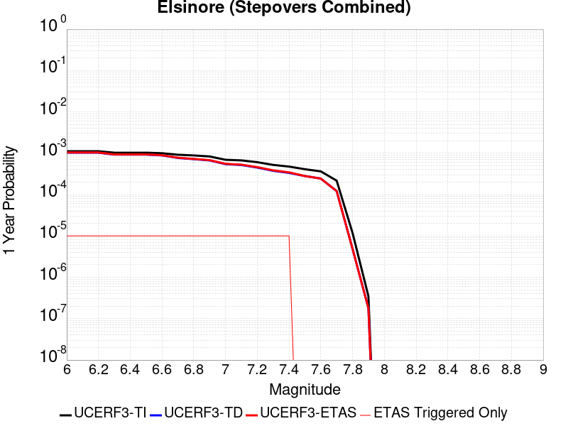 |  |

| Magnitude | 1 wk TI Prob | 1 wk TD Prob | 1 wk ETAS Prob | 1 wk ETAS/TD Gain | 1 wk ETAS Triggered Only | 1 mo TI Prob | 1 mo TD Prob | 1 mo ETAS Prob | 1 mo ETAS/TD Gain | 1 mo ETAS Triggered Only | 1 yr TI Prob | 1 yr TD Prob | 1 yr ETAS Prob | 1 yr ETAS/TD Gain | 1 yr ETAS Triggered Only | 10 yr TI Prob | 10 yr TD Prob | 10 yr ETAS Prob | 10 yr ETAS/TD Gain | 10 yr ETAS Triggered Only |
|-----|-----|-----|-----|-----|-----|-----|-----|-----|-----|-----|-----|-----|-----|-----|-----|-----|-----|-----|-----|-----|
| 6.0 | 2.144392E-5 | 1.9760193E-5 | 1.9760193E-5 | 1.0 | 0.0 | 9.189928E-5 | 8.468392E-5 | 9.468307E-5 | 1.1180762 | 1.0E-5 | 0.0011182994 | 0.0010305607 | 0.0010405504 | 1.0096935 | 1.0E-5 | 0.011126885 | 0.010264917 | 0.010274814 | 1.0009642 | 1.0E-5 |
| 6.1 | 2.144392E-5 | 1.9760193E-5 | 1.9760193E-5 | 1.0 | 0.0 | 9.189928E-5 | 8.468392E-5 | 9.468307E-5 | 1.1180762 | 1.0E-5 | 0.0011182994 | 0.0010305607 | 0.0010405504 | 1.0096935 | 1.0E-5 | 0.011126885 | 0.010264917 | 0.010274814 | 1.0009642 | 1.0E-5 |
| 6.2 | 2.144392E-5 | 1.9760193E-5 | 1.9760193E-5 | 1.0 | 0.0 | 9.189928E-5 | 8.468392E-5 | 9.468307E-5 | 1.1180762 | 1.0E-5 | 0.0011182994 | 0.0010305607 | 0.0010405504 | 1.0096935 | 1.0E-5 | 0.011126885 | 0.010264917 | 0.010274814 | 1.0009642 | 1.0E-5 |
| 6.3 | 1.9751555E-5 | 1.7741453E-5 | 1.7741453E-5 | 1.0 | 0.0 | 8.4646774E-5 | 7.603267E-5 | 8.603191E-5 | 1.1315124 | 1.0E-5 | 0.0010300872 | 9.253213E-4 | 9.3531207E-4 | 1.010797 | 1.0E-5 | 0.010253254 | 0.009221276 | 0.009231185 | 1.0010744 | 1.0E-5 |
| 6.4 | 1.9751555E-5 | 1.7741453E-5 | 1.7741453E-5 | 1.0 | 0.0 | 8.4646774E-5 | 7.603267E-5 | 8.603191E-5 | 1.1315124 | 1.0E-5 | 0.0010300872 | 9.253213E-4 | 9.3531207E-4 | 1.010797 | 1.0E-5 | 0.010253254 | 0.009221276 | 0.009231185 | 1.0010744 | 1.0E-5 |
| 6.5 | 1.9751555E-5 | 1.7741453E-5 | 1.7741453E-5 | 1.0 | 0.0 | 8.4646774E-5 | 7.603267E-5 | 8.603191E-5 | 1.1315124 | 1.0E-5 | 0.0010300872 | 9.253213E-4 | 9.3531207E-4 | 1.010797 | 1.0E-5 | 0.010253254 | 0.009221276 | 0.009231185 | 1.0010744 | 1.0E-5 |
| 6.6 | 1.9188685E-5 | 1.7003393E-5 | 1.7003393E-5 | 1.0 | 0.0 | 8.2234634E-5 | 7.286974E-5 | 8.286901E-5 | 1.1372212 | 1.0E-5 | 0.0010007467 | 8.868442E-4 | 8.968353E-4 | 1.011266 | 1.0E-5 | 0.00996252 | 0.0088398475 | 0.008849759 | 1.0011213 | 1.0E-5 |
| 6.7 | 1.7608272E-5 | 1.4732616E-5 | 1.4732616E-5 | 1.0 | 0.0 | 7.546184E-5 | 6.3138315E-5 | 7.313768E-5 | 1.1583724 | 1.0E-5 | 9.183606E-4 | 7.684476E-4 | 7.784399E-4 | 1.0130032 | 1.0E-5 | 0.009145746 | 0.00766491 | 0.0076748333 | 1.0012946 | 1.0E-5 |
| 6.8 | 1.697165E-5 | 1.3783365E-5 | 1.3783365E-5 | 1.0 | 0.0 | 7.273361E-5 | 5.9070277E-5 | 6.906968E-5 | 1.1692799 | 1.0E-5 | 8.8517193E-4 | 7.18952E-4 | 7.289448E-4 | 1.0138991 | 1.0E-5 | 0.008816543 | 0.007172675 | 0.0071826032 | 1.0013841 | 1.0E-5 |
| 6.9 | 1.600365E-5 | 1.2846671E-5 | 1.2846671E-5 | 1.0 | 0.0 | 6.858527E-5 | 5.5056043E-5 | 6.5055494E-5 | 1.1816231 | 1.0E-5 | 8.347058E-4 | 6.7010894E-4 | 6.8010227E-4 | 1.014913 | 1.0E-5 | 0.008315775 | 0.0066867657 | 0.006696699 | 1.0014855 | 1.0E-5 |
| 7.0 | 1.3314581E-5 | 1.0447548E-5 | 1.0447548E-5 | 1.0 | 0.0 | 5.7061243E-5 | 4.4774453E-5 | 5.4774006E-5 | 1.2233317 | 1.0E-5 | 6.944992E-4 | 5.449953E-4 | 5.5498985E-4 | 1.0183388 | 1.0E-5 | 0.006923327 | 0.0054405155 | 0.005450461 | 1.0018281 | 1.0E-5 |
| 7.1 | 1.2865345E-5 | 9.937536E-6 | 9.937536E-6 | 1.0 | 0.0 | 5.5136024E-5 | 4.258876E-5 | 5.2588333E-5 | 1.2347938 | 1.0E-5 | 6.710743E-4 | 5.183973E-4 | 5.2839215E-4 | 1.0192802 | 1.0E-5 | 0.0066905143 | 0.0051752133 | 0.0051851617 | 1.0019222 | 1.0E-5 |
| 7.2 | 1.1650051E-5 | 8.633809E-6 | 8.633809E-6 | 1.0 | 0.0 | 4.9927836E-5 | 3.7001522E-5 | 4.7001155E-5 | 1.2702491 | 1.0E-5 | 6.0770183E-4 | 4.504022E-4 | 4.6039768E-4 | 1.0221924 | 1.0E-5 | 0.0060604266 | 0.0044963174 | 0.0045062723 | 1.0022141 | 1.0E-5 |
| 7.3 | 1.0008533E-5 | 7.2010425E-6 | 7.2010425E-6 | 1.0 | 0.0 | 4.2893007E-5 | 3.0861254E-5 | 4.0860945E-5 | 1.3240209 | 1.0E-5 | 5.220972E-4 | 3.7567242E-4 | 3.8566868E-4 | 1.026609 | 1.0E-5 | 0.005208723 | 0.003750761 | 0.0037607234 | 1.0026561 | 1.0E-5 |
| 7.4 | 9.116759E-6 | 6.410068E-6 | 6.410068E-6 | 1.0 | 0.0 | 3.907124E-5 | 2.747144E-5 | 3.7471164E-5 | 1.3640044 | 1.0E-5 | 4.7558855E-4 | 3.3441483E-4 | 3.4441147E-4 | 1.0298929 | 1.0E-5 | 0.00474572 | 0.0033392678 | 0.0033492346 | 1.0029846 | 1.0E-5 |
| 7.5 | 7.870524E-6 | 5.3825365E-6 | 5.3825365E-6 | 1.0 | 0.0 | 3.3730383E-5 | 2.3067816E-5 | 2.3067816E-5 | 1.0 | 0.0 | 4.1059E-4 | 2.8081573E-4 | 2.8081573E-4 | 1.0 | 0.0 | 0.0040983222 | 0.0028047354 | 0.0028047354 | 1.0 | 0.0 |
| 7.6 | 6.9774537E-6 | 4.6776067E-6 | 4.6776067E-6 | 1.0 | 0.0 | 2.990303E-5 | 2.0046738E-5 | 2.0046738E-5 | 1.0 | 0.0 | 3.640086E-4 | 2.4404288E-4 | 2.4404288E-4 | 1.0 | 0.0 | 0.003634129 | 0.0024378651 | 0.0024378651 | 1.0 | 0.0 |
| 7.7 | 4.1616954E-6 | 2.32834E-6 | 2.32834E-6 | 1.0 | 0.0 | 1.7835715E-5 | 9.978567E-6 | 9.978567E-6 | 1.0 | 0.0 | 2.171282E-4 | 1.2148302E-4 | 1.2148302E-4 | 1.0 | 0.0 | 0.0021691616 | 0.0012142392 | 0.0012142392 | 1.0 | 0.0 |
| 7.8 | 2.2692414E-7 | 9.3854695E-8 | 9.3854695E-8 | 1.0 | 0.0 | 9.725317E-7 | 4.0223435E-7 | 4.0223435E-7 | 1.0 | 0.0 | 1.1840509E-5 | 4.8971956E-6 | 4.8971956E-6 | 1.0 | 0.0 | 1.1839878E-4 | 4.8971204E-5 | 4.8971204E-5 | 1.0 | 0.0 |
| 7.9 | 6.676829E-9 | 3.439853E-9 | 3.439853E-9 | 1.0 | 0.0 | 2.861498E-8 | 1.4742227E-8 | 1.4742227E-8 | 1.0 | 0.0 | 3.4838732E-7 | 1.7948659E-7 | 1.7948659E-7 | 1.0 | 0.0 | 3.4838679E-6 | 1.7948646E-6 | 1.7948646E-6 | 1.0 | 0.0 |

## Pittville 2011 CFM
*[(top)](#table-of-contents)*

| 1 Week | 1 Month | 1 Year | 10 Year |
|-----|-----|-----|-----|
|  |  |  |  |

| Magnitude | 1 wk TI Prob | 1 wk TD Prob | 1 wk ETAS Prob | 1 wk ETAS/TD Gain | 1 wk ETAS Triggered Only | 1 mo TI Prob | 1 mo TD Prob | 1 mo ETAS Prob | 1 mo ETAS/TD Gain | 1 mo ETAS Triggered Only | 1 yr TI Prob | 1 yr TD Prob | 1 yr ETAS Prob | 1 yr ETAS/TD Gain | 1 yr ETAS Triggered Only | 10 yr TI Prob | 10 yr TD Prob | 10 yr ETAS Prob | 10 yr ETAS/TD Gain | 10 yr ETAS Triggered Only |
|-----|-----|-----|-----|-----|-----|-----|-----|-----|-----|-----|-----|-----|-----|-----|-----|-----|-----|-----|-----|-----|
| 6.0 | 2.5031832E-5 | 2.7056969E-5 | 2.7056969E-5 | 1.0 | 0.0 | 1.0727487E-4 | 1.1595384E-4 | 1.1595384E-4 | 1.0 | 0.0 | 0.001305289 | 0.0014109211 | 0.0014109211 | 1.0 | 0.0 | 0.012976485 | 0.014029415 | 0.014039275 | 1.0007027 | 1.0E-5 |
| 6.1 | 1.2540113E-5 | 1.3513067E-5 | 1.3513067E-5 | 1.0 | 0.0 | 5.3742235E-5 | 5.7911984E-5 | 5.7911984E-5 | 1.0 | 0.0 | 6.541153E-4 | 7.048728E-4 | 7.048728E-4 | 1.0 | 0.0 | 0.0065219323 | 0.0070286044 | 0.0070286044 | 1.0 | 0.0 |
| 6.2 | 6.603218E-6 | 7.107189E-6 | 7.107189E-6 | 1.0 | 0.0 | 2.8299199E-5 | 3.0459063E-5 | 3.0459063E-5 | 1.0 | 0.0 | 3.4448825E-4 | 3.7078248E-4 | 3.7078248E-4 | 1.0 | 0.0 | 0.0034395473 | 0.0037022792 | 0.0037022792 | 1.0 | 0.0 |
| 6.3 | 6.603218E-6 | 7.107189E-6 | 7.107189E-6 | 1.0 | 0.0 | 2.8299199E-5 | 3.0459063E-5 | 3.0459063E-5 | 1.0 | 0.0 | 3.4448825E-4 | 3.7078248E-4 | 3.7078248E-4 | 1.0 | 0.0 | 0.0034395473 | 0.0037022792 | 0.0037022792 | 1.0 | 0.0 |
| 6.4 | 3.9389015E-6 | 4.239175E-6 | 4.239175E-6 | 1.0 | 0.0 | 1.6880897E-5 | 1.8167784E-5 | 1.8167784E-5 | 1.0 | 0.0 | 2.0550552E-4 | 2.2117342E-4 | 2.2117342E-4 | 1.0 | 0.0 | 0.0020531558 | 0.002209838 | 0.002209838 | 1.0 | 0.0 |
| 6.5 | 2.4533072E-6 | 2.6412686E-6 | 2.6412686E-6 | 1.0 | 0.0 | 1.0514132E-5 | 1.1319685E-5 | 1.1319685E-5 | 1.0 | 0.0 | 1.2800204E-4 | 1.3781038E-4 | 1.3781038E-4 | 1.0 | 0.0 | 0.0012792832 | 0.0013774394 | 0.0013774394 | 1.0 | 0.0 |
| 6.6 | 1.3482367E-6 | 1.452993E-6 | 1.452993E-6 | 1.0 | 0.0 | 5.778144E-6 | 6.2271047E-6 | 6.2271047E-6 | 1.0 | 0.0 | 7.0346636E-5 | 7.58135E-5 | 7.58135E-5 | 1.0 | 0.0 | 7.032437E-4 | 7.5798744E-4 | 7.5798744E-4 | 1.0 | 0.0 |

## Silver Creek 2011 CFM
*[(top)](#table-of-contents)*

| 1 Week | 1 Month | 1 Year | 10 Year |
|-----|-----|-----|-----|
| 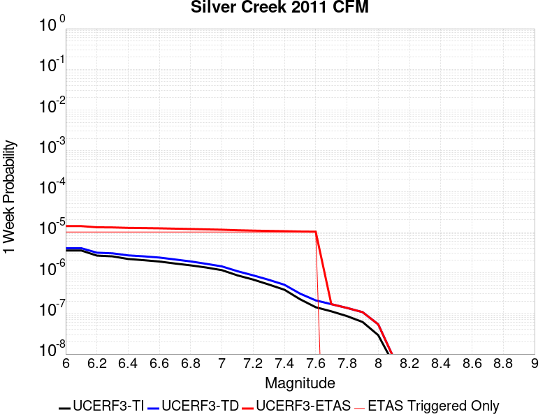 | 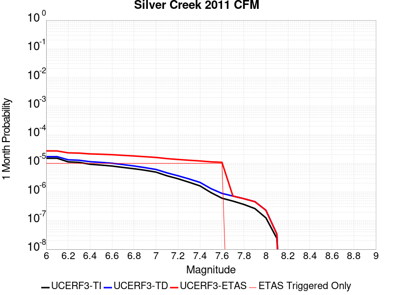 |  |  |

| Magnitude | 1 wk TI Prob | 1 wk TD Prob | 1 wk ETAS Prob | 1 wk ETAS/TD Gain | 1 wk ETAS Triggered Only | 1 mo TI Prob | 1 mo TD Prob | 1 mo ETAS Prob | 1 mo ETAS/TD Gain | 1 mo ETAS Triggered Only | 1 yr TI Prob | 1 yr TD Prob | 1 yr ETAS Prob | 1 yr ETAS/TD Gain | 1 yr ETAS Triggered Only | 10 yr TI Prob | 10 yr TD Prob | 10 yr ETAS Prob | 10 yr ETAS/TD Gain | 10 yr ETAS Triggered Only |
|-----|-----|-----|-----|-----|-----|-----|-----|-----|-----|-----|-----|-----|-----|-----|-----|-----|-----|-----|-----|-----|
| 6.0 | 3.5229125E-6 | 4.0080954E-6 | 1.4008056E-5 | 3.4949405 | 1.0E-5 | 1.5098109E-5 | 1.717744E-5 | 2.717727E-5 | 1.5821489 | 1.0E-5 | 1.8380396E-4 | 2.0911565E-4 | 2.1911356E-4 | 1.0478104 | 1.0E-5 | 0.0018365202 | 0.0020895472 | 0.0020995263 | 1.0047758 | 1.0E-5 |
| 6.1 | 3.5229125E-6 | 4.0080954E-6 | 1.4008056E-5 | 3.4949405 | 1.0E-5 | 1.5098109E-5 | 1.717744E-5 | 2.717727E-5 | 1.5821489 | 1.0E-5 | 1.8380396E-4 | 2.0911565E-4 | 2.1911356E-4 | 1.0478104 | 1.0E-5 | 0.0018365202 | 0.0020895472 | 0.0020995263 | 1.0047758 | 1.0E-5 |
| 6.2 | 2.6363234E-6 | 3.1104817E-6 | 1.3110451E-5 | 4.2149262 | 1.0E-5 | 1.129848E-5 | 1.33305675E-5 | 2.3330434E-5 | 1.7501456 | 1.0E-5 | 1.375503E-4 | 1.6228763E-4 | 1.7228602E-4 | 1.061609 | 1.0E-5 | 0.0013746519 | 0.0016220189 | 0.0016320026 | 1.0061551 | 1.0E-5 |
| 6.3 | 2.5275126E-6 | 3.0001204E-6 | 1.3000091E-5 | 4.3331895 | 1.0E-5 | 1.0832152E-5 | 1.2857596E-5 | 2.2857468E-5 | 1.7777404 | 1.0E-5 | 1.3187347E-4 | 1.5653005E-4 | 1.6652848E-4 | 1.0638756 | 1.0E-5 | 0.0013179524 | 0.0015645246 | 0.001574509 | 1.0063818 | 1.0E-5 |
| 6.4 | 2.178732E-6 | 2.6706844E-6 | 1.2670657E-5 | 4.7443485 | 1.0E-5 | 9.337389E-6 | 1.144574E-5 | 2.1445625E-5 | 1.8736775 | 1.0E-5 | 1.1367678E-4 | 1.39343E-4 | 1.493416E-4 | 1.0717554 | 1.0E-5 | 0.0011361865 | 0.0013928807 | 0.0014028668 | 1.0071694 | 1.0E-5 |
| 6.5 | 2.0341574E-6 | 2.5297745E-6 | 1.2529749E-5 | 4.952912 | 1.0E-5 | 8.717788E-6 | 1.0841845E-5 | 2.0841737E-5 | 1.9223422 | 1.0E-5 | 1.061339E-4 | 1.319915E-4 | 1.4199018E-4 | 1.0757525 | 1.0E-5 | 0.0010608323 | 0.0013194549 | 0.0013294417 | 1.0075688 | 1.0E-5 |
| 6.6 | 1.8856827E-6 | 2.361353E-6 | 1.2361329E-5 | 5.2348504 | 1.0E-5 | 8.0814725E-6 | 1.0120045E-5 | 2.0119944E-5 | 1.988128 | 1.0E-5 | 9.838748E-5 | 1.232046E-4 | 1.3320337E-4 | 1.0811558 | 1.0E-5 | 9.834393E-4 | 0.0012316864 | 0.0012416742 | 1.008109 | 1.0E-5 |
| 6.7 | 1.6844668E-6 | 2.1197452E-6 | 1.21197245E-5 | 5.717538 | 1.0E-5 | 7.2191233E-6 | 9.084591E-6 | 1.90845E-5 | 2.100755 | 1.0E-5 | 8.788928E-5 | 1.105993E-4 | 1.2059819E-4 | 1.0904065 | 1.0E-5 | 8.785453E-4 | 0.0011057653 | 0.0011157542 | 1.0090336 | 1.0E-5 |
| 6.8 | 1.5177161E-6 | 1.895357E-6 | 1.1895338E-5 | 6.276041 | 1.0E-5 | 6.504481E-6 | 8.122933E-6 | 1.8122852E-5 | 2.2310724 | 1.0E-5 | 7.918918E-5 | 9.889223E-5 | 1.0889124E-4 | 1.1011102 | 1.0E-5 | 7.9160964E-4 | 9.888045E-4 | 9.987946E-4 | 1.0101032 | 1.0E-5 |
| 6.9 | 1.3437394E-6 | 1.6561321E-6 | 1.1656116E-5 | 7.0381556 | 1.0E-5 | 5.7588704E-6 | 7.09769E-6 | 1.7097618E-5 | 2.408899 | 1.0E-5 | 7.011199E-5 | 8.641095E-5 | 9.641009E-5 | 1.1157161 | 1.0E-5 | 7.0089876E-4 | 8.640953E-4 | 8.7408663E-4 | 1.0115628 | 1.0E-5 |
| 7.0 | 1.1563575E-6 | 1.4313108E-6 | 1.1431296E-5 | 7.986593 | 1.0E-5 | 4.9558084E-6 | 6.134175E-6 | 1.6134114E-5 | 2.630201 | 1.0E-5 | 6.03353E-5 | 7.468102E-5 | 8.468027E-5 | 1.1338928 | 1.0E-5 | 6.0318917E-4 | 7.468809E-4 | 7.568734E-4 | 1.013379 | 1.0E-5 |
| 7.1 | 8.602183E-7 | 1.0891429E-6 | 1.1089132E-5 | 10.181521 | 1.0E-5 | 3.6866445E-6 | 4.667747E-6 | 1.46677E-5 | 3.1423512 | 1.0E-5 | 4.4883975E-5 | 5.682834E-5 | 6.682777E-5 | 1.1759585 | 1.0E-5 | 4.4874908E-4 | 5.684595E-4 | 5.784538E-4 | 1.0175813 | 1.0E-5 |
| 7.2 | 6.788407E-7 | 8.6219876E-7 | 1.086219E-5 | 12.598244 | 1.0E-5 | 2.9093142E-6 | 3.6951321E-6 | 1.3695096E-5 | 3.706253 | 1.0E-5 | 3.5420322E-5 | 4.4987308E-5 | 5.4986856E-5 | 1.2222749 | 1.0E-5 | 3.541468E-4 | 4.5010343E-4 | 4.6009893E-4 | 1.0222071 | 1.0E-5 |
| 7.3 | 5.1292045E-7 | 6.693821E-7 | 1.0669375E-5 | 15.939141 | 1.0E-5 | 2.1982287E-6 | 2.868777E-6 | 1.2868749E-5 | 4.485796 | 1.0E-5 | 2.6763106E-5 | 3.49268E-5 | 4.492645E-5 | 1.286303 | 1.0E-5 | 2.6759884E-4 | 3.4953456E-4 | 3.5953106E-4 | 1.0285995 | 1.0E-5 |
| 7.4 | 3.820994E-7 | 5.06234E-7 | 1.0506229E-5 | 20.7537 | 1.0E-5 | 1.6375678E-6 | 2.1695726E-6 | 1.2169551E-5 | 5.6091933 | 1.0E-5 | 1.9937206E-5 | 2.6414225E-5 | 3.641396E-5 | 1.3785739 | 1.0E-5 | 1.9935417E-4 | 2.6443225E-4 | 2.7442962E-4 | 1.0378069 | 1.0E-5 |
| 7.5 | 2.2292595E-7 | 3.0667135E-7 | 1.0306669E-5 | 33.60819 | 1.0E-5 | 9.553966E-7 | 1.3143051E-6 | 1.1314292E-5 | 8.608574 | 1.0E-5 | 1.16318915E-5 | 1.6001548E-5 | 2.6001388E-5 | 1.6249295 | 1.0E-5 | 1.16312825E-4 | 1.6032535E-4 | 1.7032375E-4 | 1.0623631 | 1.0E-5 |
| 7.6 | 1.420587E-7 | 2.0912965E-7 | 1.0209127E-5 | 48.81722 | 1.0E-5 | 6.088228E-7 | 8.9626957E-7 | 1.089626E-5 | 12.157347 | 1.0E-5 | 7.4123927E-6 | 1.0912027E-5 | 2.0911919E-5 | 1.91641 | 1.0E-5 | 7.412145E-5 | 1.0943597E-4 | 1.1943487E-4 | 1.0913676 | 1.0E-5 |
| 7.7 | 1.1250075E-7 | 1.6871495E-7 | 1.6871495E-7 | 1.0 | 0.0 | 4.82146E-7 | 7.2306386E-7 | 7.2306386E-7 | 1.0 | 0.0 | 5.8701116E-6 | 8.803267E-6 | 8.803267E-6 | 1.0 | 0.0 | 5.8699567E-5 | 8.834782E-5 | 8.834782E-5 | 1.0 | 0.0 |
| 7.8 | 8.592761E-8 | 1.3649814E-7 | 1.3649814E-7 | 1.0 | 0.0 | 3.682611E-7 | 5.849919E-7 | 5.849919E-7 | 1.0 | 0.0 | 4.48357E-6 | 7.122253E-6 | 7.122253E-6 | 1.0 | 0.0 | 4.4834796E-5 | 7.1527604E-5 | 7.1527604E-5 | 1.0 | 0.0 |
| 7.9 | 6.156529E-8 | 1.07426416E-7 | 1.07426416E-7 | 1.0 | 0.0 | 2.638512E-7 | 4.6039884E-7 | 4.6039884E-7 | 1.0 | 0.0 | 3.212384E-6 | 5.6053414E-6 | 5.6053414E-6 | 1.0 | 0.0 | 3.2123375E-5 | 5.631395E-5 | 5.631395E-5 | 1.0 | 0.0 |
| 8.0 | 2.9230547E-8 | 5.3890513E-8 | 5.3890513E-8 | 1.0 | 0.0 | 1.2527377E-7 | 2.3095933E-7 | 2.3095933E-7 | 1.0 | 0.0 | 1.525207E-6 | 2.8119262E-6 | 2.8119262E-6 | 1.0 | 0.0 | 1.5251966E-5 | 2.8256307E-5 | 2.8256307E-5 | 1.0 | 0.0 |
| 8.1 | 5.6062213E-9 | 7.903275E-9 | 7.903275E-9 | 1.0 | 0.0 | 2.4026663E-8 | 3.387118E-8 | 3.387118E-8 | 1.0 | 0.0 | 2.925246E-7 | 4.1238155E-7 | 4.1238155E-7 | 1.0 | 0.0 | 2.925242E-6 | 4.162718E-6 | 4.162718E-6 | 1.0 | 0.0 |

## Earthquake Valley (So Extension)
*[(top)](#table-of-contents)*

| 1 Week | 1 Month | 1 Year | 10 Year |
|-----|-----|-----|-----|
|  |  |  |  |

| Magnitude | 1 wk TI Prob | 1 wk TD Prob | 1 wk ETAS Prob | 1 wk ETAS/TD Gain | 1 wk ETAS Triggered Only | 1 mo TI Prob | 1 mo TD Prob | 1 mo ETAS Prob | 1 mo ETAS/TD Gain | 1 mo ETAS Triggered Only | 1 yr TI Prob | 1 yr TD Prob | 1 yr ETAS Prob | 1 yr ETAS/TD Gain | 1 yr ETAS Triggered Only | 10 yr TI Prob | 10 yr TD Prob | 10 yr ETAS Prob | 10 yr ETAS/TD Gain | 10 yr ETAS Triggered Only |
|-----|-----|-----|-----|-----|-----|-----|-----|-----|-----|-----|-----|-----|-----|-----|-----|-----|-----|-----|-----|-----|
| 6.0 | 3.0194888E-5 | 3.7072114E-5 | 3.7072114E-5 | 1.0 | 0.0 | 1.2940024E-4 | 1.5887388E-4 | 1.5887388E-4 | 1.0 | 0.0 | 0.0015743093 | 0.0019331174 | 0.0019331174 | 1.0 | 0.0 | 0.01563203 | 0.019213019 | 0.019222826 | 1.0005105 | 1.0E-5 |
| 6.1 | 3.0194888E-5 | 3.7072114E-5 | 3.7072114E-5 | 1.0 | 0.0 | 1.2940024E-4 | 1.5887388E-4 | 1.5887388E-4 | 1.0 | 0.0 | 0.0015743093 | 0.0019331174 | 0.0019331174 | 1.0 | 0.0 | 0.01563203 | 0.019213019 | 0.019222826 | 1.0005105 | 1.0E-5 |
| 6.2 | 3.0194888E-5 | 3.7072114E-5 | 3.7072114E-5 | 1.0 | 0.0 | 1.2940024E-4 | 1.5887388E-4 | 1.5887388E-4 | 1.0 | 0.0 | 0.0015743093 | 0.0019331174 | 0.0019331174 | 1.0 | 0.0 | 0.01563203 | 0.019213019 | 0.019222826 | 1.0005105 | 1.0E-5 |
| 6.3 | 1.5795305E-5 | 1.844658E-5 | 1.844658E-5 | 1.0 | 0.0 | 6.769241E-5 | 7.9055004E-5 | 7.9055004E-5 | 1.0 | 0.0 | 8.238434E-4 | 9.6218096E-4 | 9.6218096E-4 | 1.0 | 0.0 | 0.008207959 | 0.009591061 | 0.009591061 | 1.0 | 0.0 |
| 6.4 | 1.5795305E-5 | 1.844658E-5 | 1.844658E-5 | 1.0 | 0.0 | 6.769241E-5 | 7.9055004E-5 | 7.9055004E-5 | 1.0 | 0.0 | 8.238434E-4 | 9.6218096E-4 | 9.6218096E-4 | 1.0 | 0.0 | 0.008207959 | 0.009591061 | 0.009591061 | 1.0 | 0.0 |
| 6.5 | 1.5795305E-5 | 1.844658E-5 | 1.844658E-5 | 1.0 | 0.0 | 6.769241E-5 | 7.9055004E-5 | 7.9055004E-5 | 1.0 | 0.0 | 8.238434E-4 | 9.6218096E-4 | 9.6218096E-4 | 1.0 | 0.0 | 0.008207959 | 0.009591061 | 0.009591061 | 1.0 | 0.0 |
| 6.6 | 1.5795305E-5 | 1.844658E-5 | 1.844658E-5 | 1.0 | 0.0 | 6.769241E-5 | 7.9055004E-5 | 7.9055004E-5 | 1.0 | 0.0 | 8.238434E-4 | 9.6218096E-4 | 9.6218096E-4 | 1.0 | 0.0 | 0.008207959 | 0.009591061 | 0.009591061 | 1.0 | 0.0 |
| 6.7 | 1.1363076E-5 | 1.3138294E-5 | 1.3138294E-5 | 1.0 | 0.0 | 4.8697988E-5 | 5.6306188E-5 | 5.6306188E-5 | 1.0 | 0.0 | 5.927367E-4 | 6.8538834E-4 | 6.8538834E-4 | 1.0 | 0.0 | 0.0059115817 | 0.0068402183 | 0.0068402183 | 1.0 | 0.0 |
| 6.8 | 1.0049611E-5 | 1.1594334E-5 | 1.1594334E-5 | 1.0 | 0.0 | 4.306905E-5 | 4.9689468E-5 | 4.9689468E-5 | 1.0 | 0.0 | 5.242395E-4 | 6.048745E-4 | 6.048745E-4 | 1.0 | 0.0 | 0.0052300454 | 0.006039458 | 0.006039458 | 1.0 | 0.0 |
| 6.9 | 1.0049611E-5 | 1.1594334E-5 | 1.1594334E-5 | 1.0 | 0.0 | 4.306905E-5 | 4.9689468E-5 | 4.9689468E-5 | 1.0 | 0.0 | 5.242395E-4 | 6.048745E-4 | 6.048745E-4 | 1.0 | 0.0 | 0.0052300454 | 0.006039458 | 0.006039458 | 1.0 | 0.0 |
| 7.0 | 1.0049611E-5 | 1.1594334E-5 | 1.1594334E-5 | 1.0 | 0.0 | 4.306905E-5 | 4.9689468E-5 | 4.9689468E-5 | 1.0 | 0.0 | 5.242395E-4 | 6.048745E-4 | 6.048745E-4 | 1.0 | 0.0 | 0.0052300454 | 0.006039458 | 0.006039458 | 1.0 | 0.0 |
| 7.1 | 8.140254E-6 | 9.383458E-6 | 9.383458E-6 | 1.0 | 0.0 | 3.4886336E-5 | 4.0214578E-5 | 4.0214578E-5 | 1.0 | 0.0 | 4.2465836E-4 | 4.8956956E-4 | 4.8956956E-4 | 1.0 | 0.0 | 0.0042384774 | 0.0048914864 | 0.0048914864 | 1.0 | 0.0 |
| 7.2 | 1.673835E-7 | 1.4154125E-7 | 1.4154125E-7 | 1.0 | 0.0 | 7.173577E-7 | 6.066052E-7 | 6.066052E-7 | 1.0 | 0.0 | 8.733795E-6 | 7.385397E-6 | 7.385397E-6 | 1.0 | 0.0 | 8.733451E-5 | 7.385187E-5 | 7.385187E-5 | 1.0 | 0.0 |
| 7.3 | 1.6632116E-7 | 1.4052354E-7 | 1.4052354E-7 | 1.0 | 0.0 | 7.1280476E-7 | 6.0224363E-7 | 6.0224363E-7 | 1.0 | 0.0 | 8.678364E-6 | 7.332295E-6 | 7.332295E-6 | 1.0 | 0.0 | 8.6780245E-5 | 7.332089E-5 | 7.332089E-5 | 1.0 | 0.0 |
| 7.4 | 1.6569169E-7 | 1.3996983E-7 | 1.3996983E-7 | 1.0 | 0.0 | 7.1010703E-7 | 5.9987053E-7 | 5.9987053E-7 | 1.0 | 0.0 | 8.645519E-6 | 7.303403E-6 | 7.303403E-6 | 1.0 | 0.0 | 8.645182E-5 | 7.303199E-5 | 7.303199E-5 | 1.0 | 0.0 |
| 7.5 | 1.1764555E-7 | 1.0095917E-7 | 1.0095917E-7 | 1.0 | 0.0 | 5.041951E-7 | 4.326821E-7 | 4.326821E-7 | 1.0 | 0.0 | 6.138558E-6 | 5.267894E-6 | 5.267894E-6 | 1.0 | 0.0 | 6.1383886E-5 | 5.2677904E-5 | 5.2677904E-5 | 1.0 | 0.0 |
| 7.6 | 1.07927605E-7 | 9.260736E-8 | 9.260736E-8 | 1.0 | 0.0 | 4.6254678E-7 | 3.9688865E-7 | 3.9688865E-7 | 1.0 | 0.0 | 5.6314925E-6 | 4.832111E-6 | 4.832111E-6 | 1.0 | 0.0 | 5.63135E-5 | 4.8320264E-5 | 4.8320264E-5 | 1.0 | 0.0 |
| 7.7 | 2.1826905E-8 | 1.1180516E-8 | 1.1180516E-8 | 1.0 | 0.0 | 9.3543875E-8 | 4.7916494E-8 | 4.7916494E-8 | 1.0 | 0.0 | 1.1388961E-6 | 5.833832E-7 | 5.833832E-7 | 1.0 | 0.0 | 1.1388902E-5 | 5.8338223E-6 | 5.8338223E-6 | 1.0 | 0.0 |
| 7.8 | 2.6169649E-9 | 1.1969472E-9 | 1.1969472E-9 | 1.0 | 0.0 | 1.1215564E-8 | 5.1297735E-9 | 5.1297735E-9 | 1.0 | 0.0 | 1.3654947E-7 | 6.2454994E-8 | 6.2454994E-8 | 1.0 | 0.0 | 1.365494E-6 | 6.245499E-7 | 6.245499E-7 | 1.0 | 0.0 |

## Holser alt 1
*[(top)](#table-of-contents)*

| 1 Week | 1 Month | 1 Year | 10 Year |
|-----|-----|-----|-----|
|  | 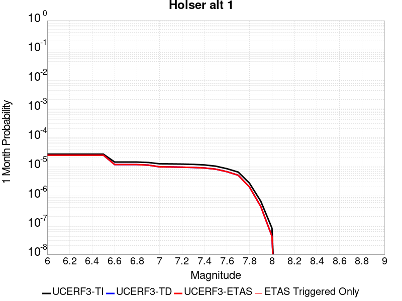 |  |  |

| Magnitude | 1 wk TI Prob | 1 wk TD Prob | 1 wk ETAS Prob | 1 wk ETAS/TD Gain | 1 wk ETAS Triggered Only | 1 mo TI Prob | 1 mo TD Prob | 1 mo ETAS Prob | 1 mo ETAS/TD Gain | 1 mo ETAS Triggered Only | 1 yr TI Prob | 1 yr TD Prob | 1 yr ETAS Prob | 1 yr ETAS/TD Gain | 1 yr ETAS Triggered Only | 10 yr TI Prob | 10 yr TD Prob | 10 yr ETAS Prob | 10 yr ETAS/TD Gain | 10 yr ETAS Triggered Only |
|-----|-----|-----|-----|-----|-----|-----|-----|-----|-----|-----|-----|-----|-----|-----|-----|-----|-----|-----|-----|-----|
| 6.0 | 6.2746653E-6 | 5.789965E-6 | 5.789965E-6 | 1.0 | 0.0 | 2.6891146E-5 | 2.4813964E-5 | 2.4813964E-5 | 1.0 | 0.0 | 3.273505E-4 | 3.020797E-4 | 3.1207665E-4 | 1.0330938 | 1.0E-5 | 0.0032686873 | 0.0030178234 | 0.0030277933 | 1.0033036 | 1.0E-5 |
| 6.1 | 6.2746653E-6 | 5.789965E-6 | 5.789965E-6 | 1.0 | 0.0 | 2.6891146E-5 | 2.4813964E-5 | 2.4813964E-5 | 1.0 | 0.0 | 3.273505E-4 | 3.020797E-4 | 3.1207665E-4 | 1.0330938 | 1.0E-5 | 0.0032686873 | 0.0030178234 | 0.0030277933 | 1.0033036 | 1.0E-5 |
| 6.2 | 6.2746653E-6 | 5.789965E-6 | 5.789965E-6 | 1.0 | 0.0 | 2.6891146E-5 | 2.4813964E-5 | 2.4813964E-5 | 1.0 | 0.0 | 3.273505E-4 | 3.020797E-4 | 3.1207665E-4 | 1.0330938 | 1.0E-5 | 0.0032686873 | 0.0030178234 | 0.0030277933 | 1.0033036 | 1.0E-5 |
| 6.3 | 6.2746653E-6 | 5.789965E-6 | 5.789965E-6 | 1.0 | 0.0 | 2.6891146E-5 | 2.4813964E-5 | 2.4813964E-5 | 1.0 | 0.0 | 3.273505E-4 | 3.020797E-4 | 3.1207665E-4 | 1.0330938 | 1.0E-5 | 0.0032686873 | 0.0030178234 | 0.0030277933 | 1.0033036 | 1.0E-5 |
| 6.4 | 6.2746653E-6 | 5.789965E-6 | 5.789965E-6 | 1.0 | 0.0 | 2.6891146E-5 | 2.4813964E-5 | 2.4813964E-5 | 1.0 | 0.0 | 3.273505E-4 | 3.020797E-4 | 3.1207665E-4 | 1.0330938 | 1.0E-5 | 0.0032686873 | 0.0030178234 | 0.0030277933 | 1.0033036 | 1.0E-5 |
| 6.5 | 6.2746653E-6 | 5.789965E-6 | 5.789965E-6 | 1.0 | 0.0 | 2.6891146E-5 | 2.4813964E-5 | 2.4813964E-5 | 1.0 | 0.0 | 3.273505E-4 | 3.020797E-4 | 3.1207665E-4 | 1.0330938 | 1.0E-5 | 0.0032686873 | 0.0030178234 | 0.0030277933 | 1.0033036 | 1.0E-5 |
| 6.6 | 3.375825E-6 | 2.7711897E-6 | 2.7711897E-6 | 1.0 | 0.0 | 1.4467741E-5 | 1.1876474E-5 | 1.1876474E-5 | 1.0 | 0.0 | 1.761305E-4 | 1.4458665E-4 | 1.545852E-4 | 1.0691527 | 1.0E-5 | 0.0017599097 | 0.0014449427 | 0.0014549283 | 1.0069107 | 1.0E-5 |
| 6.7 | 3.375825E-6 | 2.7711897E-6 | 2.7711897E-6 | 1.0 | 0.0 | 1.4467741E-5 | 1.1876474E-5 | 1.1876474E-5 | 1.0 | 0.0 | 1.761305E-4 | 1.4458665E-4 | 1.545852E-4 | 1.0691527 | 1.0E-5 | 0.0017599097 | 0.0014449427 | 0.0014549283 | 1.0069107 | 1.0E-5 |
| 6.8 | 3.366533E-6 | 2.7615893E-6 | 2.7615893E-6 | 1.0 | 0.0 | 1.4427919E-5 | 1.183533E-5 | 1.183533E-5 | 1.0 | 0.0 | 1.7564575E-4 | 1.4408577E-4 | 1.5408434E-4 | 1.0693932 | 1.0E-5 | 0.0017550698 | 0.0014399405 | 0.0014499262 | 1.0069348 | 1.0E-5 |
| 6.9 | 3.253174E-6 | 2.6438113E-6 | 2.6438113E-6 | 1.0 | 0.0 | 1.39421E-5 | 1.1330571E-5 | 1.1330571E-5 | 1.0 | 0.0 | 1.6973184E-4 | 1.3794114E-4 | 1.4793976E-4 | 1.0724847 | 1.0E-5 | 0.0016960226 | 0.001378571 | 0.0013885573 | 1.0072439 | 1.0E-5 |
| 7.0 | 2.9336593E-6 | 2.311799E-6 | 2.311799E-6 | 1.0 | 0.0 | 1.2572766E-5 | 9.907673E-6 | 9.907673E-6 | 1.0 | 0.0 | 1.5306266E-4 | 1.2061927E-4 | 1.3061806E-4 | 1.0828955 | 1.0E-5 | 0.0015295728 | 0.0012055405 | 0.0012155285 | 1.008285 | 1.0E-5 |
| 7.1 | 2.9087812E-6 | 2.2876513E-6 | 2.2876513E-6 | 1.0 | 0.0 | 1.2466146E-5 | 9.804184E-6 | 9.804184E-6 | 1.0 | 0.0 | 1.5176475E-4 | 1.19359414E-4 | 1.2935822E-4 | 1.0837705 | 1.0E-5 | 0.0015166114 | 0.0011929555 | 0.0012029436 | 1.0083725 | 1.0E-5 |
| 7.2 | 2.8674524E-6 | 2.2475429E-6 | 2.2475429E-6 | 1.0 | 0.0 | 1.2289024E-5 | 9.63229E-6 | 9.63229E-6 | 1.0 | 0.0 | 1.4960859E-4 | 1.1726685E-4 | 1.2726568E-4 | 1.0852656 | 1.0E-5 | 0.0014950791 | 0.001172052 | 0.0011820403 | 1.008522 | 1.0E-5 |
| 7.3 | 2.8057775E-6 | 2.1954324E-6 | 2.1954324E-6 | 1.0 | 0.0 | 1.2024705E-5 | 9.408962E-6 | 9.408962E-6 | 1.0 | 0.0 | 1.4639096E-4 | 1.14548115E-4 | 1.2454698E-4 | 1.0872896 | 1.0E-5 | 0.0014629456 | 0.001144893 | 0.0011548816 | 1.0087245 | 1.0E-5 |
| 7.4 | 2.683666E-6 | 2.1092305E-6 | 2.1092305E-6 | 1.0 | 0.0 | 1.1501375E-5 | 9.039529E-6 | 9.039529E-6 | 1.0 | 0.0 | 1.4002025E-4 | 1.1005072E-4 | 1.2004962E-4 | 1.0908571 | 1.0E-5 | 0.0013993206 | 0.0010999644 | 0.0011099534 | 1.0090812 | 1.0E-5 |
| 7.5 | 2.434495E-6 | 1.9195363E-6 | 1.9195363E-6 | 1.0 | 0.0 | 1.0433508E-5 | 8.226558E-6 | 8.226558E-6 | 1.0 | 0.0 | 1.2702055E-4 | 1.0015376E-4 | 1.1015276E-4 | 1.0998365 | 1.0E-5 | 0.0012694797 | 0.0010010883 | 0.0010110782 | 1.0099791 | 1.0E-5 |
| 7.6 | 1.9914562E-6 | 1.5731459E-6 | 1.5731459E-6 | 1.0 | 0.0 | 8.534785E-6 | 6.742037E-6 | 6.742037E-6 | 1.0 | 0.0 | 1.03906044E-4 | 8.208122E-5 | 9.20804E-5 | 1.1218206 | 1.0E-5 | 0.0010385747 | 8.205106E-4 | 8.3050237E-4 | 1.0121776 | 1.0E-5 |
| 7.7 | 1.5229501E-6 | 1.1896061E-6 | 1.1896061E-6 | 1.0 | 0.0 | 6.526913E-6 | 5.098302E-6 | 5.098302E-6 | 1.0 | 0.0 | 7.946226E-5 | 6.2070074E-5 | 7.206945E-5 | 1.1610982 | 1.0E-5 | 7.943385E-4 | 6.2052865E-4 | 6.3052244E-4 | 1.0161053 | 1.0E-5 |
| 7.8 | 6.3489426E-7 | 4.687806E-7 | 4.687806E-7 | 1.0 | 0.0 | 2.7209726E-6 | 2.009058E-6 | 2.009058E-6 | 1.0 | 0.0 | 3.312734E-5 | 2.4460009E-5 | 2.4460009E-5 | 1.0 | 0.0 | 3.31224E-4 | 2.4457334E-4 | 2.4457334E-4 | 1.0 | 0.0 |
| 7.9 | 1.5459432E-7 | 1.0193758E-7 | 1.0193758E-7 | 1.0 | 0.0 | 6.6254694E-7 | 4.3687527E-7 | 4.3687527E-7 | 1.0 | 0.0 | 8.066479E-6 | 5.3189433E-6 | 5.3189433E-6 | 1.0 | 0.0 | 8.066186E-5 | 5.3188178E-5 | 5.3188178E-5 | 1.0 | 0.0 |
| 8.0 | 1.8307812E-8 | 9.690293E-9 | 9.690293E-9 | 1.0 | 0.0 | 7.846205E-8 | 4.152983E-8 | 4.152983E-8 | 1.0 | 0.0 | 9.55275E-7 | 5.0562556E-7 | 5.0562556E-7 | 1.0 | 0.0 | 9.552709E-6 | 5.0562444E-6 | 5.0562444E-6 | 1.0 | 0.0 |

## Butano 2011 CFM
*[(top)](#table-of-contents)*

| 1 Week | 1 Month | 1 Year | 10 Year |
|-----|-----|-----|-----|
| 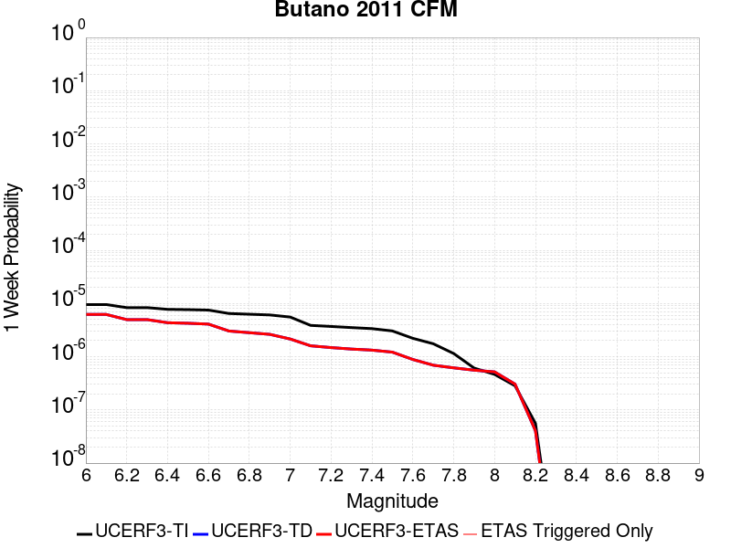 | 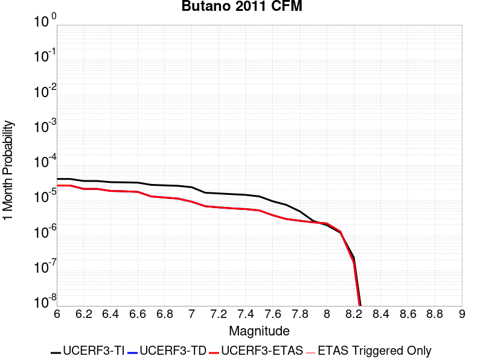 |  |  |

| Magnitude | 1 wk TI Prob | 1 wk TD Prob | 1 wk ETAS Prob | 1 wk ETAS/TD Gain | 1 wk ETAS Triggered Only | 1 mo TI Prob | 1 mo TD Prob | 1 mo ETAS Prob | 1 mo ETAS/TD Gain | 1 mo ETAS Triggered Only | 1 yr TI Prob | 1 yr TD Prob | 1 yr ETAS Prob | 1 yr ETAS/TD Gain | 1 yr ETAS Triggered Only | 10 yr TI Prob | 10 yr TD Prob | 10 yr ETAS Prob | 10 yr ETAS/TD Gain | 10 yr ETAS Triggered Only |
|-----|-----|-----|-----|-----|-----|-----|-----|-----|-----|-----|-----|-----|-----|-----|-----|-----|-----|-----|-----|-----|
| 6.0 | 9.561135E-6 | 6.2256954E-6 | 6.2256954E-6 | 1.0 | 0.0 | 4.097565E-5 | 2.6681291E-5 | 2.6681291E-5 | 1.0 | 0.0 | 4.9876433E-4 | 3.247985E-4 | 3.3479524E-4 | 1.0307783 | 1.0E-5 | 0.004976464 | 0.003260905 | 0.0032708722 | 1.0030566 | 1.0E-5 |
| 6.1 | 9.561135E-6 | 6.2256954E-6 | 6.2256954E-6 | 1.0 | 0.0 | 4.097565E-5 | 2.6681291E-5 | 2.6681291E-5 | 1.0 | 0.0 | 4.9876433E-4 | 3.247985E-4 | 3.3479524E-4 | 1.0307783 | 1.0E-5 | 0.004976464 | 0.003260905 | 0.0032708722 | 1.0030566 | 1.0E-5 |
| 6.2 | 8.364741E-6 | 4.9787805E-6 | 4.9787805E-6 | 1.0 | 0.0 | 3.5848396E-5 | 2.1337464E-5 | 2.1337464E-5 | 1.0 | 0.0 | 4.3636683E-4 | 2.5975425E-4 | 2.6975165E-4 | 1.0384879 | 1.0E-5 | 0.0043551093 | 0.0026121214 | 0.0026220952 | 1.0038183 | 1.0E-5 |
| 6.3 | 8.364741E-6 | 4.9787805E-6 | 4.9787805E-6 | 1.0 | 0.0 | 3.5848396E-5 | 2.1337464E-5 | 2.1337464E-5 | 1.0 | 0.0 | 4.3636683E-4 | 2.5975425E-4 | 2.6975165E-4 | 1.0384879 | 1.0E-5 | 0.0043551093 | 0.0026121214 | 0.0026220952 | 1.0038183 | 1.0E-5 |
| 6.4 | 7.768282E-6 | 4.3567284E-6 | 4.3567284E-6 | 1.0 | 0.0 | 3.329221E-5 | 1.8671566E-5 | 1.8671566E-5 | 1.0 | 0.0 | 4.0525728E-4 | 2.2730397E-4 | 2.3730169E-4 | 1.0439839 | 1.0E-5 | 0.0040451903 | 0.0022883145 | 0.0022982918 | 1.0043601 | 1.0E-5 |
| 6.5 | 7.673437E-6 | 4.2562915E-6 | 4.2562915E-6 | 1.0 | 0.0 | 3.2885746E-5 | 1.8241128E-5 | 1.8241128E-5 | 1.0 | 0.0 | 4.0031038E-4 | 2.2206445E-4 | 2.3206224E-4 | 1.045022 | 1.0E-5 | 0.0039959005 | 0.002236025 | 0.0022460027 | 1.0044622 | 1.0E-5 |
| 6.6 | 7.5244197E-6 | 4.101255E-6 | 4.101255E-6 | 1.0 | 0.0 | 3.2247113E-5 | 1.7576695E-5 | 1.7576695E-5 | 1.0 | 0.0 | 3.9253788E-4 | 2.1397659E-4 | 2.2397445E-4 | 1.0467241 | 1.0E-5 | 0.003918452 | 0.0021553051 | 0.0021652835 | 1.0046297 | 1.0E-5 |
| 6.7 | 6.4921405E-6 | 3.0413205E-6 | 3.0413205E-6 | 1.0 | 0.0 | 2.7823162E-5 | 1.3034165E-5 | 1.3034165E-5 | 1.0 | 0.0 | 3.3869434E-4 | 1.586795E-4 | 1.6867791E-4 | 1.0630101 | 1.0E-5 | 0.003381786 | 0.0016031476 | 0.0016131316 | 1.0062277 | 1.0E-5 |
| 6.8 | 6.2890294E-6 | 2.8280872E-6 | 2.8280872E-6 | 1.0 | 0.0 | 2.6952705E-5 | 1.2120317E-5 | 1.2120317E-5 | 1.0 | 0.0 | 3.2809976E-4 | 1.4755495E-4 | 1.5755347E-4 | 1.0677614 | 1.0E-5 | 0.0032761577 | 0.0014920565 | 0.0015020416 | 1.0066922 | 1.0E-5 |
| 6.9 | 6.0965517E-6 | 2.6346027E-6 | 2.6346027E-6 | 1.0 | 0.0 | 2.6127816E-5 | 1.1291106E-5 | 1.1291106E-5 | 1.0 | 0.0 | 3.1805973E-4 | 1.374606E-4 | 1.4745923E-4 | 1.0727382 | 1.0E-5 | 0.0031760489 | 0.001391243 | 0.0014012291 | 1.0071778 | 1.0E-5 |
| 7.0 | 5.566252E-6 | 2.1520116E-6 | 2.1520116E-6 | 1.0 | 0.0 | 2.3855147E-5 | 9.222874E-6 | 9.222874E-6 | 1.0 | 0.0 | 2.9039773E-4 | 1.1228274E-4 | 1.2228162E-4 | 1.0890509 | 1.0E-5 | 0.0029001853 | 0.0011397449 | 0.0011497336 | 1.0087639 | 1.0E-5 |
| 7.1 | 3.878588E-6 | 1.6034423E-6 | 1.6034423E-6 | 1.0 | 0.0 | 1.6622414E-5 | 6.8718773E-6 | 6.8718773E-6 | 1.0 | 0.0 | 2.023591E-4 | 8.36619E-5 | 9.366106E-5 | 1.1195188 | 1.0E-5 | 0.0020217493 | 8.533922E-4 | 8.633837E-4 | 1.0117079 | 1.0E-5 |
| 7.2 | 3.7038085E-6 | 1.4845051E-6 | 1.4845051E-6 | 1.0 | 0.0 | 1.587337E-5 | 6.362149E-6 | 6.362149E-6 | 1.0 | 0.0 | 1.9324113E-4 | 7.745641E-5 | 8.7455635E-5 | 1.1290948 | 1.0E-5 | 0.0019307317 | 7.913504E-4 | 8.013424E-4 | 1.0126266 | 1.0E-5 |
| 7.3 | 3.5277278E-6 | 1.3926247E-6 | 1.3926247E-6 | 1.0 | 0.0 | 1.5118746E-5 | 5.9683775E-6 | 5.9683775E-6 | 1.0 | 0.0 | 1.8405518E-4 | 7.266257E-5 | 8.266185E-5 | 1.1376125 | 1.0E-5 | 0.0018390282 | 7.433578E-4 | 7.533504E-4 | 1.0134425 | 1.0E-5 |
| 7.4 | 3.3711294E-6 | 1.3298818E-6 | 1.3298818E-6 | 1.0 | 0.0 | 1.4447617E-5 | 5.699481E-6 | 5.699481E-6 | 1.0 | 0.0 | 1.7588554E-4 | 6.9388974E-5 | 7.938828E-5 | 1.1441051 | 1.0E-5 | 0.0017574639 | 7.10591E-4 | 7.2058383E-4 | 1.0140628 | 1.0E-5 |
| 7.5 | 3.0496426E-6 | 1.2188874E-6 | 1.2188874E-6 | 1.0 | 0.0 | 1.3069831E-5 | 5.223793E-6 | 5.223793E-6 | 1.0 | 0.0 | 1.5911358E-4 | 6.359782E-5 | 7.3597184E-5 | 1.1572281 | 1.0E-5 | 0.001589997 | 6.526465E-4 | 6.6263997E-4 | 1.0153122 | 1.0E-5 |
| 7.6 | 2.2179781E-6 | 8.870908E-7 | 8.870908E-7 | 1.0 | 0.0 | 9.505586E-6 | 3.801812E-6 | 3.801812E-6 | 1.0 | 0.0 | 1.1572436E-4 | 4.6286077E-5 | 5.6285615E-5 | 1.2160376 | 1.0E-5 | 0.0011566412 | 4.7951055E-4 | 4.8950576E-4 | 1.0208446 | 1.0E-5 |
| 7.7 | 1.7519328E-6 | 6.9309675E-7 | 6.9309675E-7 | 1.0 | 0.0 | 7.508262E-6 | 2.9704113E-6 | 2.9704113E-6 | 1.0 | 0.0 | 9.140925E-5 | 3.6164158E-5 | 4.6163794E-5 | 1.2765069 | 1.0E-5 | 9.137166E-4 | 3.7759746E-4 | 3.875937E-4 | 1.0264733 | 1.0E-5 |
| 7.8 | 1.1478974E-6 | 6.174061E-7 | 6.174061E-7 | 1.0 | 0.0 | 4.9195505E-6 | 2.6460236E-6 | 2.6460236E-6 | 1.0 | 0.0 | 5.9893882E-5 | 3.221486E-5 | 4.221454E-5 | 1.3104057 | 1.0E-5 | 5.9877743E-4 | 3.377777E-4 | 3.477743E-4 | 1.0295953 | 1.0E-5 |
| 7.9 | 6.1154634E-7 | 5.581767E-7 | 5.581767E-7 | 1.0 | 0.0 | 2.6209104E-6 | 2.3921834E-6 | 2.3921834E-6 | 1.0 | 0.0 | 3.1909116E-5 | 2.9124443E-5 | 3.9124152E-5 | 1.3433442 | 1.0E-5 | 3.1904536E-4 | 3.0563958E-4 | 3.156365E-4 | 1.0327083 | 1.0E-5 |
| 8.0 | 4.6520046E-7 | 5.189283E-7 | 5.189283E-7 | 1.0 | 0.0 | 1.9937147E-6 | 2.2239765E-6 | 2.2239765E-6 | 1.0 | 0.0 | 2.4273206E-5 | 2.7076578E-5 | 3.707631E-5 | 1.3693129 | 1.0E-5 | 2.4270554E-4 | 2.8419052E-4 | 2.941877E-4 | 1.0351777 | 1.0E-5 |
| 8.1 | 2.8425194E-7 | 3.0570487E-7 | 3.0570487E-7 | 1.0 | 0.0 | 1.218222E-6 | 1.3101632E-6 | 1.3101632E-6 | 1.0 | 0.0 | 1.4831752E-5 | 1.5951118E-5 | 1.5951118E-5 | 1.0 | 0.0 | 1.4830762E-4 | 1.6740595E-4 | 1.6740595E-4 | 1.0 | 0.0 |
| 8.2 | 5.585778E-8 | 4.0522167E-8 | 4.0522167E-8 | 1.0 | 0.0 | 2.3939046E-7 | 1.7366644E-7 | 1.7366644E-7 | 1.0 | 0.0 | 2.914575E-6 | 2.1143867E-6 | 2.1143867E-6 | 1.0 | 0.0 | 2.9145367E-5 | 2.2976306E-5 | 2.2976306E-5 | 1.0 | 0.0 |
| 8.3 | 1.0371215E-10 | 5.356804E-11 | 5.356804E-11 | 1.0 | 0.0 | 4.4448079E-10 | 2.2957702E-10 | 2.2957702E-10 | 1.0 | 0.0 | 5.4115543E-9 | 2.795101E-9 | 2.795101E-9 | 1.0 | 0.0 | 5.4115542E-8 | 3.2150194E-8 | 3.2150194E-8 | 1.0 | 0.0 |

## Cedar Mtn-Mahogany Mtn
*[(top)](#table-of-contents)*

| 1 Week | 1 Month | 1 Year | 10 Year |
|-----|-----|-----|-----|
|  | 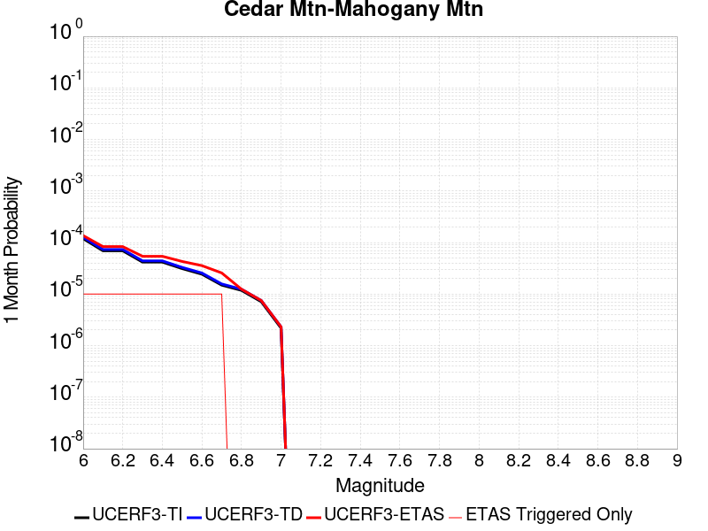 | 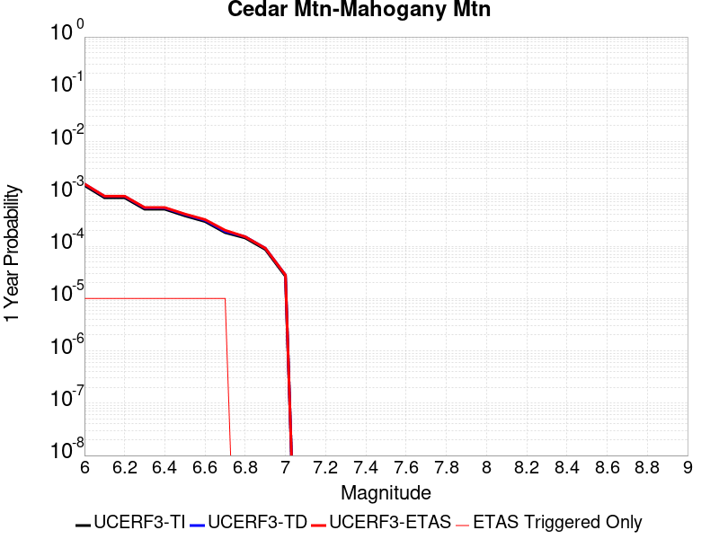 |  |

| Magnitude | 1 wk TI Prob | 1 wk TD Prob | 1 wk ETAS Prob | 1 wk ETAS/TD Gain | 1 wk ETAS Triggered Only | 1 mo TI Prob | 1 mo TD Prob | 1 mo ETAS Prob | 1 mo ETAS/TD Gain | 1 mo ETAS Triggered Only | 1 yr TI Prob | 1 yr TD Prob | 1 yr ETAS Prob | 1 yr ETAS/TD Gain | 1 yr ETAS Triggered Only | 10 yr TI Prob | 10 yr TD Prob | 10 yr ETAS Prob | 10 yr ETAS/TD Gain | 10 yr ETAS Triggered Only |
|-----|-----|-----|-----|-----|-----|-----|-----|-----|-----|-----|-----|-----|-----|-----|-----|-----|-----|-----|-----|-----|
| 6.0 | 2.7763876E-5 | 2.9588866E-5 | 2.9588866E-5 | 1.0 | 0.0 | 1.1898261E-4 | 1.2680366E-4 | 1.3680238E-4 | 1.078852 | 1.0E-5 | 0.0014476506 | 0.0015428112 | 0.0015527958 | 1.0064716 | 1.0E-5 | 0.0143825635 | 0.015328225 | 0.015338072 | 1.0006424 | 1.0E-5 |
| 6.1 | 1.6162443E-5 | 1.7142966E-5 | 1.7142966E-5 | 1.0 | 0.0 | 6.926578E-5 | 7.346788E-5 | 8.346715E-5 | 1.1361039 | 1.0E-5 | 8.4298453E-4 | 8.941221E-4 | 9.0411317E-4 | 1.0111742 | 1.0E-5 | 0.008397939 | 0.008907059 | 0.008916969 | 1.0011127 | 1.0E-5 |
| 6.2 | 1.6162443E-5 | 1.7142966E-5 | 1.7142966E-5 | 1.0 | 0.0 | 6.926578E-5 | 7.346788E-5 | 8.346715E-5 | 1.1361039 | 1.0E-5 | 8.4298453E-4 | 8.941221E-4 | 9.0411317E-4 | 1.0111742 | 1.0E-5 | 0.008397939 | 0.008907059 | 0.008916969 | 1.0011127 | 1.0E-5 |
| 6.3 | 9.746053E-6 | 1.0303152E-5 | 1.0303152E-5 | 1.0 | 0.0 | 4.1768133E-5 | 4.415564E-5 | 5.41552E-5 | 1.2264616 | 1.0E-5 | 5.0840835E-4 | 5.3746643E-4 | 5.4746104E-4 | 1.0185958 | 1.0E-5 | 0.0050724675 | 0.005362084 | 0.0053720307 | 1.0018549 | 1.0E-5 |
| 6.4 | 9.746053E-6 | 1.0303152E-5 | 1.0303152E-5 | 1.0 | 0.0 | 4.1768133E-5 | 4.415564E-5 | 5.41552E-5 | 1.2264616 | 1.0E-5 | 5.0840835E-4 | 5.3746643E-4 | 5.4746104E-4 | 1.0185958 | 1.0E-5 | 0.0050724675 | 0.005362084 | 0.0053720307 | 1.0018549 | 1.0E-5 |
| 6.5 | 7.290083E-6 | 7.695325E-6 | 7.695325E-6 | 1.0 | 0.0 | 3.124284E-5 | 3.297956E-5 | 4.2979227E-5 | 1.3032081 | 1.0E-5 | 3.8031515E-4 | 4.014543E-4 | 4.1145028E-4 | 1.0248995 | 1.0E-5 | 0.0037966494 | 0.004007511 | 0.004017471 | 1.0024853 | 1.0E-5 |
| 6.6 | 5.67907E-6 | 5.9891527E-6 | 5.9891527E-6 | 1.0 | 0.0 | 2.4338644E-5 | 2.5667552E-5 | 3.5667297E-5 | 1.3895869 | 1.0E-5 | 2.962827E-4 | 3.12459E-4 | 3.2245586E-4 | 1.0319942 | 1.0E-5 | 0.0029588798 | 0.003120333 | 0.0031303016 | 1.0031948 | 1.0E-5 |
| 6.7 | 3.4853963E-6 | 3.672631E-6 | 3.672631E-6 | 1.0 | 0.0 | 1.4937327E-5 | 1.5739755E-5 | 2.5739599E-5 | 1.6353239 | 1.0E-5 | 1.8184677E-4 | 1.916153E-4 | 2.0161338E-4 | 1.0521779 | 1.0E-5 | 0.0018169804 | 0.0019145629 | 0.0019245436 | 1.0052131 | 1.0E-5 |
| 6.8 | 2.7535168E-6 | 2.9015764E-6 | 2.9015764E-6 | 1.0 | 0.0 | 1.1800733E-5 | 1.2435271E-5 | 1.2435271E-5 | 1.0 | 0.0 | 1.4366445E-4 | 1.5138938E-4 | 1.5138938E-4 | 1.0 | 0.0 | 0.0014357162 | 0.0015129098 | 0.0015129098 | 1.0 | 0.0 |
| 6.9 | 1.6594106E-6 | 1.7496985E-6 | 1.7496985E-6 | 1.0 | 0.0 | 7.1117406E-6 | 7.4986883E-6 | 7.4986883E-6 | 1.0 | 0.0 | 8.6582E-5 | 9.129302E-5 | 9.129302E-5 | 1.0 | 0.0 | 8.654827E-4 | 9.125856E-4 | 9.125856E-4 | 1.0 | 0.0 |
| 7.0 | 5.10215E-7 | 5.389254E-7 | 5.389254E-7 | 1.0 | 0.0 | 2.186634E-6 | 2.3096788E-6 | 2.3096788E-6 | 1.0 | 0.0 | 2.6621943E-5 | 2.8120105E-5 | 2.8120105E-5 | 1.0 | 0.0 | 2.6618753E-4 | 2.81178E-4 | 2.81178E-4 | 1.0 | 0.0 |

## Bartlett Springs 2011 CFM
*[(top)](#table-of-contents)*

| 1 Week | 1 Month | 1 Year | 10 Year |
|-----|-----|-----|-----|
|  | 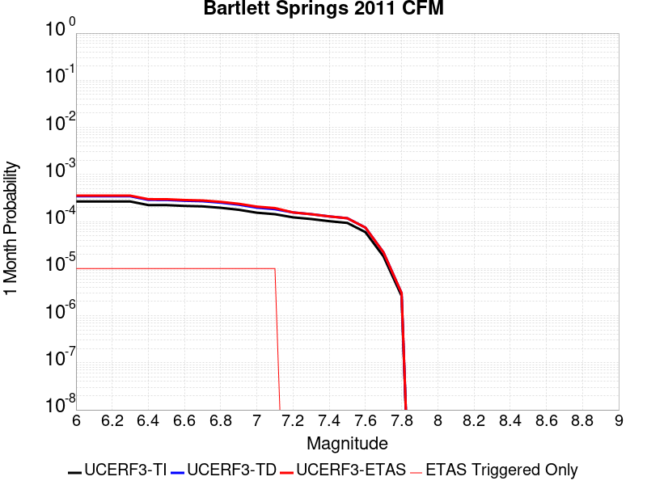 | 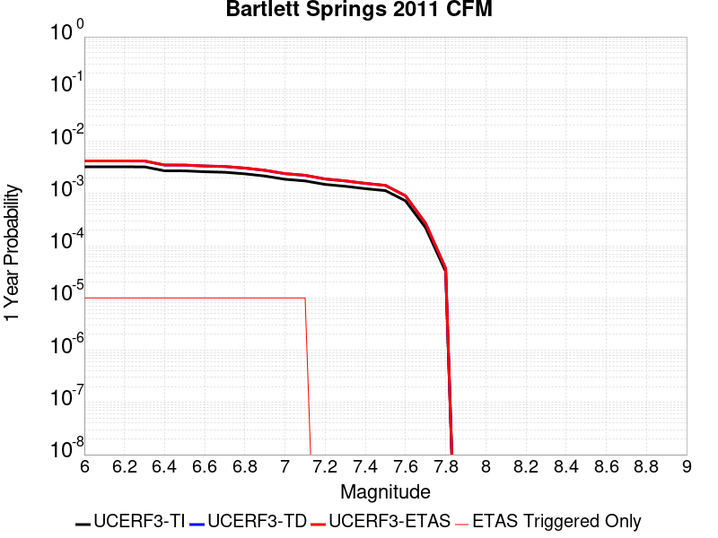 |  |

| Magnitude | 1 wk TI Prob | 1 wk TD Prob | 1 wk ETAS Prob | 1 wk ETAS/TD Gain | 1 wk ETAS Triggered Only | 1 mo TI Prob | 1 mo TD Prob | 1 mo ETAS Prob | 1 mo ETAS/TD Gain | 1 mo ETAS Triggered Only | 1 yr TI Prob | 1 yr TD Prob | 1 yr ETAS Prob | 1 yr ETAS/TD Gain | 1 yr ETAS Triggered Only | 10 yr TI Prob | 10 yr TD Prob | 10 yr ETAS Prob | 10 yr ETAS/TD Gain | 10 yr ETAS Triggered Only |
|-----|-----|-----|-----|-----|-----|-----|-----|-----|-----|-----|-----|-----|-----|-----|-----|-----|-----|-----|-----|-----|
| 6.0 | 6.2326144E-5 | 8.060613E-5 | 8.060613E-5 | 1.0 | 0.0 | 2.6708472E-4 | 3.454099E-4 | 3.5540646E-4 | 1.0289412 | 1.0E-5 | 0.003246908 | 0.0041973945 | 0.0042073526 | 1.0023724 | 1.0E-5 | 0.031998757 | 0.04119771 | 0.0412073 | 1.0002327 | 1.0E-5 |
| 6.1 | 6.227657E-5 | 8.054363E-5 | 8.054363E-5 | 1.0 | 0.0 | 2.668723E-4 | 3.4514212E-4 | 3.5513868E-4 | 1.0289636 | 1.0E-5 | 0.0032443295 | 0.004194147 | 0.004204105 | 1.0023743 | 1.0E-5 | 0.031973712 | 0.041166443 | 0.041176032 | 1.0002329 | 1.0E-5 |
| 6.2 | 6.22452E-5 | 8.050423E-5 | 8.050423E-5 | 1.0 | 0.0 | 2.6673786E-4 | 3.4497332E-4 | 3.5496987E-4 | 1.0289778 | 1.0E-5 | 0.0032426978 | 0.0041921 | 0.004202058 | 1.0023755 | 1.0E-5 | 0.03195787 | 0.041146737 | 0.041156325 | 1.000233 | 1.0E-5 |
| 6.3 | 6.219006E-5 | 8.043407E-5 | 8.043407E-5 | 1.0 | 0.0 | 2.6650162E-4 | 3.4467268E-4 | 3.5466923E-4 | 1.029003 | 1.0E-5 | 0.00323983 | 0.0041884542 | 0.0041984124 | 1.0023775 | 1.0E-5 | 0.031930014 | 0.041111637 | 0.041121226 | 1.0002333 | 1.0E-5 |
| 6.4 | 5.2175856E-5 | 6.725342E-5 | 6.725342E-5 | 1.0 | 0.0 | 2.2359163E-4 | 2.8819745E-4 | 2.9819456E-4 | 1.0346885 | 1.0E-5 | 0.0027188298 | 0.0035032115 | 0.0035131765 | 1.0028446 | 1.0E-5 | 0.026858058 | 0.034489222 | 0.034498878 | 1.0002799 | 1.0E-5 |
| 6.5 | 5.205166E-5 | 6.7096094E-5 | 6.7096094E-5 | 1.0 | 0.0 | 2.2305945E-4 | 2.8752335E-4 | 2.9752046E-4 | 1.0347698 | 1.0E-5 | 0.0027123666 | 0.0034950306 | 0.0035049957 | 1.0028512 | 1.0E-5 | 0.026794989 | 0.034409966 | 0.034419622 | 1.0002806 | 1.0E-5 |
| 6.6 | 5.0085426E-5 | 6.449277E-5 | 6.449277E-5 | 1.0 | 0.0 | 2.1463417E-4 | 2.763686E-4 | 2.8636586E-4 | 1.0361736 | 1.0E-5 | 0.0026100394 | 0.0033596456 | 0.003369612 | 1.0029665 | 1.0E-5 | 0.025795965 | 0.033097573 | 0.03310724 | 1.0002922 | 1.0E-5 |
| 6.7 | 4.8930866E-5 | 6.3017396E-5 | 6.3017396E-5 | 1.0 | 0.0 | 2.0968684E-4 | 2.7004688E-4 | 2.800442E-4 | 1.0370206 | 1.0E-5 | 0.0025499484 | 0.0032829174 | 0.0032928847 | 1.003036 | 1.0E-5 | 0.025208864 | 0.03235294 | 0.032362614 | 1.0002991 | 1.0E-5 |
| 6.8 | 4.5679535E-5 | 5.8741858E-5 | 5.8741858E-5 | 1.0 | 0.0 | 1.9575475E-4 | 2.5172674E-4 | 2.6172423E-4 | 1.0397156 | 1.0E-5 | 0.002380709 | 0.0030605064 | 0.003070476 | 1.0032574 | 1.0E-5 | 0.023553653 | 0.03019042 | 0.030200118 | 1.0003213 | 1.0E-5 |
| 6.9 | 4.1439176E-5 | 5.3220094E-5 | 5.3220094E-5 | 1.0 | 0.0 | 1.7758438E-4 | 2.2806633E-4 | 2.3806407E-4 | 1.0438368 | 1.0E-5 | 0.002159946 | 0.0027731995 | 0.0027831716 | 1.003596 | 1.0E-5 | 0.021390721 | 0.027390772 | 0.0274005 | 1.0003551 | 1.0E-5 |
| 7.0 | 3.5920104E-5 | 4.600871E-5 | 4.600871E-5 | 1.0 | 0.0 | 1.5393422E-4 | 1.9716538E-4 | 2.0716341E-4 | 1.0507089 | 1.0E-5 | 0.001872538 | 0.0023978627 | 0.0024078388 | 1.0041604 | 1.0E-5 | 0.018568378 | 0.023723004 | 0.023732768 | 1.0004115 | 1.0E-5 |
| 7.1 | 3.338812E-5 | 4.2689582E-5 | 4.2689582E-5 | 1.0 | 0.0 | 1.430841E-4 | 1.829426E-4 | 1.9294077E-4 | 1.054652 | 1.0E-5 | 0.0017406568 | 0.0022250658 | 0.0022350436 | 1.0044843 | 1.0E-5 | 0.017270854 | 0.02203054 | 0.02204032 | 1.0004439 | 1.0E-5 |
| 7.2 | 2.8619615E-5 | 3.6401652E-5 | 3.6401652E-5 | 1.0 | 0.0 | 1.2264973E-4 | 1.5599781E-4 | 1.5599781E-4 | 1.0 | 0.0 | 0.0014922376 | 0.0018976285 | 0.0018976285 | 1.0 | 0.0 | 0.014822568 | 0.01881613 | 0.01881613 | 1.0 | 0.0 |
| 7.3 | 2.6376783E-5 | 3.342276E-5 | 3.342276E-5 | 1.0 | 0.0 | 1.13038455E-4 | 1.4323258E-4 | 1.4323258E-4 | 1.0 | 0.0 | 0.0013753743 | 0.001742471 | 0.001742471 | 1.0 | 0.0 | 0.01366893 | 0.01728972 | 0.01728972 | 1.0 | 0.0 |
| 7.4 | 2.3738676E-5 | 2.9978975E-5 | 2.9978975E-5 | 1.0 | 0.0 | 1.0173322E-4 | 1.2847505E-4 | 1.2847505E-4 | 1.0 | 0.0 | 0.0012378981 | 0.0015630693 | 0.0015630693 | 1.0 | 0.0 | 0.012310251 | 0.015522073 | 0.015522073 | 1.0 | 0.0 |
| 7.5 | 2.1789481E-5 | 2.7439388E-5 | 2.7439388E-5 | 1.0 | 0.0 | 9.338015E-5 | 1.1759212E-4 | 1.1759212E-4 | 1.0 | 0.0 | 0.0011363103 | 0.0014307518 | 0.0014307518 | 1.0 | 0.0 | 0.011305175 | 0.014216576 | 0.014216576 | 1.0 | 0.0 |
| 7.6 | 1.3895281E-5 | 1.7368426E-5 | 1.7368426E-5 | 1.0 | 0.0 | 5.9549846E-5 | 7.4434E-5 | 7.4434E-5 | 1.0 | 0.0 | 7.2477816E-4 | 9.0586004E-4 | 9.0586004E-4 | 1.0 | 0.0 | 0.0072241887 | 0.009022084 | 0.009022084 | 1.0 | 0.0 |
| 7.7 | 4.245981E-6 | 5.1624675E-6 | 5.1624675E-6 | 1.0 | 0.0 | 1.8196934E-5 | 2.2124674E-5 | 2.2124674E-5 | 1.0 | 0.0 | 2.2152514E-4 | 2.693348E-4 | 2.693348E-4 | 1.0 | 0.0 | 0.0022130446 | 0.0026901034 | 0.0026901034 | 1.0 | 0.0 |
| 7.8 | 6.145192E-7 | 7.047006E-7 | 7.047006E-7 | 1.0 | 0.0 | 2.633651E-6 | 3.020142E-6 | 3.020142E-6 | 1.0 | 0.0 | 3.206423E-5 | 3.676962E-5 | 3.676962E-5 | 1.0 | 0.0 | 3.2059604E-4 | 3.6763478E-4 | 3.6763478E-4 | 1.0 | 0.0 |

## North Tahoe 2011 CFM
*[(top)](#table-of-contents)*

| 1 Week | 1 Month | 1 Year | 10 Year |
|-----|-----|-----|-----|
| 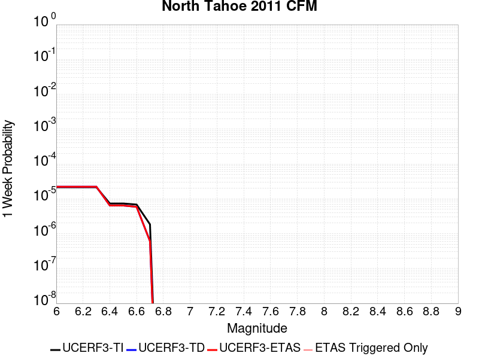 |  |  |  |

| Magnitude | 1 wk TI Prob | 1 wk TD Prob | 1 wk ETAS Prob | 1 wk ETAS/TD Gain | 1 wk ETAS Triggered Only | 1 mo TI Prob | 1 mo TD Prob | 1 mo ETAS Prob | 1 mo ETAS/TD Gain | 1 mo ETAS Triggered Only | 1 yr TI Prob | 1 yr TD Prob | 1 yr ETAS Prob | 1 yr ETAS/TD Gain | 1 yr ETAS Triggered Only | 10 yr TI Prob | 10 yr TD Prob | 10 yr ETAS Prob | 10 yr ETAS/TD Gain | 10 yr ETAS Triggered Only |
|-----|-----|-----|-----|-----|-----|-----|-----|-----|-----|-----|-----|-----|-----|-----|-----|-----|-----|-----|-----|-----|
| 6.0 | 2.150391E-5 | 2.216523E-5 | 2.216523E-5 | 1.0 | 0.0 | 9.215636E-5 | 9.499148E-5 | 9.499148E-5 | 1.0 | 0.0 | 0.0011214261 | 0.0011561037 | 0.0011561037 | 1.0 | 0.0 | 0.011157839 | 0.011520148 | 0.011530032 | 1.0008581 | 1.0E-5 |
| 6.1 | 2.150391E-5 | 2.216523E-5 | 2.216523E-5 | 1.0 | 0.0 | 9.215636E-5 | 9.499148E-5 | 9.499148E-5 | 1.0 | 0.0 | 0.0011214261 | 0.0011561037 | 0.0011561037 | 1.0 | 0.0 | 0.011157839 | 0.011520148 | 0.011530032 | 1.0008581 | 1.0E-5 |
| 6.2 | 2.150391E-5 | 2.216523E-5 | 2.216523E-5 | 1.0 | 0.0 | 9.215636E-5 | 9.499148E-5 | 9.499148E-5 | 1.0 | 0.0 | 0.0011214261 | 0.0011561037 | 0.0011561037 | 1.0 | 0.0 | 0.011157839 | 0.011520148 | 0.011530032 | 1.0008581 | 1.0E-5 |
| 6.3 | 2.150391E-5 | 2.216523E-5 | 2.216523E-5 | 1.0 | 0.0 | 9.215636E-5 | 9.499148E-5 | 9.499148E-5 | 1.0 | 0.0 | 0.0011214261 | 0.0011561037 | 0.0011561037 | 1.0 | 0.0 | 0.011157839 | 0.011520148 | 0.011530032 | 1.0008581 | 1.0E-5 |
| 6.4 | 7.3563056E-6 | 6.445093E-6 | 6.445093E-6 | 1.0 | 0.0 | 3.1526644E-5 | 2.7621705E-5 | 2.7621705E-5 | 1.0 | 0.0 | 3.8376928E-4 | 3.3627293E-4 | 3.3627293E-4 | 1.0 | 0.0 | 0.003831072 | 0.0033606375 | 0.0033606375 | 1.0 | 0.0 |
| 6.5 | 7.3563056E-6 | 6.445093E-6 | 6.445093E-6 | 1.0 | 0.0 | 3.1526644E-5 | 2.7621705E-5 | 2.7621705E-5 | 1.0 | 0.0 | 3.8376928E-4 | 3.3627293E-4 | 3.3627293E-4 | 1.0 | 0.0 | 0.003831072 | 0.0033606375 | 0.0033606375 | 1.0 | 0.0 |
| 6.6 | 6.8508816E-6 | 5.8842634E-6 | 5.8842634E-6 | 1.0 | 0.0 | 2.936059E-5 | 2.52182E-5 | 2.52182E-5 | 1.0 | 0.0 | 3.5740656E-4 | 3.070187E-4 | 3.070187E-4 | 1.0 | 0.0 | 0.0035683226 | 0.0030689223 | 0.0030689223 | 1.0 | 0.0 |
| 6.7 | 1.8511148E-6 | 6.1015777E-7 | 6.1015777E-7 | 1.0 | 0.0 | 7.933325E-6 | 2.6149619E-6 | 2.6149619E-6 | 1.0 | 0.0 | 9.658395E-5 | 3.183716E-5 | 3.183716E-5 | 1.0 | 0.0 | 9.6541987E-4 | 3.183716E-4 | 3.183716E-4 | 1.0 | 0.0 |

## Great Valley 04a Trout Creek
*[(top)](#table-of-contents)*

| 1 Week | 1 Month | 1 Year | 10 Year |
|-----|-----|-----|-----|
|  | 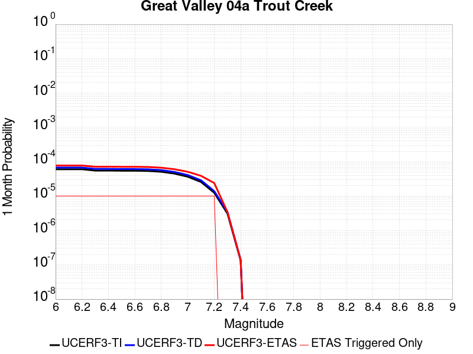 | 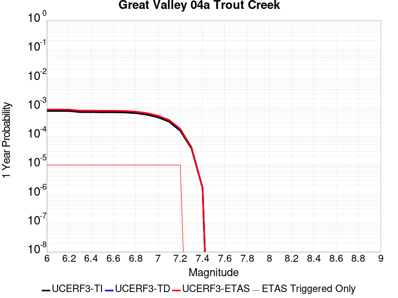 |  |

| Magnitude | 1 wk TI Prob | 1 wk TD Prob | 1 wk ETAS Prob | 1 wk ETAS/TD Gain | 1 wk ETAS Triggered Only | 1 mo TI Prob | 1 mo TD Prob | 1 mo ETAS Prob | 1 mo ETAS/TD Gain | 1 mo ETAS Triggered Only | 1 yr TI Prob | 1 yr TD Prob | 1 yr ETAS Prob | 1 yr ETAS/TD Gain | 1 yr ETAS Triggered Only | 10 yr TI Prob | 10 yr TD Prob | 10 yr ETAS Prob | 10 yr ETAS/TD Gain | 10 yr ETAS Triggered Only |
|-----|-----|-----|-----|-----|-----|-----|-----|-----|-----|-----|-----|-----|-----|-----|-----|-----|-----|-----|-----|-----|
| 6.0 | 1.4088538E-5 | 1.5719554E-5 | 2.5719397E-5 | 1.6361403 | 1.0E-5 | 6.037805E-5 | 6.7367844E-5 | 7.736717E-5 | 1.1484288 | 1.0E-5 | 7.3485484E-4 | 8.199074E-4 | 8.2989916E-4 | 1.0121865 | 1.0E-5 | 0.007324295 | 0.008170108 | 0.008180026 | 1.001214 | 1.0E-5 |
| 6.1 | 1.4088538E-5 | 1.5719554E-5 | 2.5719397E-5 | 1.6361403 | 1.0E-5 | 6.037805E-5 | 6.7367844E-5 | 7.736717E-5 | 1.1484288 | 1.0E-5 | 7.3485484E-4 | 8.199074E-4 | 8.2989916E-4 | 1.0121865 | 1.0E-5 | 0.007324295 | 0.008170108 | 0.008180026 | 1.001214 | 1.0E-5 |
| 6.2 | 1.4088538E-5 | 1.5719554E-5 | 2.5719397E-5 | 1.6361403 | 1.0E-5 | 6.037805E-5 | 6.7367844E-5 | 7.736717E-5 | 1.1484288 | 1.0E-5 | 7.3485484E-4 | 8.199074E-4 | 8.2989916E-4 | 1.0121865 | 1.0E-5 | 0.007324295 | 0.008170108 | 0.008180026 | 1.001214 | 1.0E-5 |
| 6.3 | 1.2882862E-5 | 1.4378603E-5 | 2.4378458E-5 | 1.6954678 | 1.0E-5 | 5.5211098E-5 | 6.1621184E-5 | 7.162057E-5 | 1.1622719 | 1.0E-5 | 6.7198783E-4 | 7.4999005E-4 | 7.5998256E-4 | 1.0133235 | 1.0E-5 | 0.0066995937 | 0.0074756527 | 0.0074855783 | 1.0013276 | 1.0E-5 |
| 6.4 | 1.2882862E-5 | 1.4378603E-5 | 2.4378458E-5 | 1.6954678 | 1.0E-5 | 5.5211098E-5 | 6.1621184E-5 | 7.162057E-5 | 1.1622719 | 1.0E-5 | 6.7198783E-4 | 7.4999005E-4 | 7.5998256E-4 | 1.0133235 | 1.0E-5 | 0.0066995937 | 0.0074756527 | 0.0074855783 | 1.0013276 | 1.0E-5 |
| 6.5 | 1.2762329E-5 | 1.424516E-5 | 2.4245017E-5 | 1.7019829 | 1.0E-5 | 5.469455E-5 | 6.1049315E-5 | 7.10487E-5 | 1.163792 | 1.0E-5 | 6.657027E-4 | 7.430323E-4 | 7.530249E-4 | 1.0134484 | 1.0E-5 | 0.00663712 | 0.0074065393 | 0.007416465 | 1.0013402 | 1.0E-5 |
| 6.6 | 1.2762329E-5 | 1.424516E-5 | 2.4245017E-5 | 1.7019829 | 1.0E-5 | 5.469455E-5 | 6.1049315E-5 | 7.10487E-5 | 1.163792 | 1.0E-5 | 6.657027E-4 | 7.430323E-4 | 7.530249E-4 | 1.0134484 | 1.0E-5 | 0.00663712 | 0.0074065393 | 0.007416465 | 1.0013402 | 1.0E-5 |
| 6.7 | 1.2557959E-5 | 1.4019395E-5 | 2.4019255E-5 | 1.7132876 | 1.0E-5 | 5.3818712E-5 | 6.0081795E-5 | 7.0081194E-5 | 1.1664298 | 1.0E-5 | 6.5504585E-4 | 7.312607E-4 | 7.412534E-4 | 1.013665 | 1.0E-5 | 0.006531183 | 0.007289598 | 0.007299525 | 1.0013618 | 1.0E-5 |
| 6.8 | 1.1871544E-5 | 1.3258823E-5 | 2.325869E-5 | 1.7542048 | 1.0E-5 | 5.0877054E-5 | 5.6822348E-5 | 6.6821776E-5 | 1.1759771 | 1.0E-5 | 6.1925204E-4 | 6.916025E-4 | 7.0159556E-4 | 1.0144491 | 1.0E-5 | 0.0061752927 | 0.0068955184 | 0.0069054496 | 1.0014402 | 1.0E-5 |
| 6.9 | 1.0500373E-5 | 1.1731261E-5 | 2.1731144E-5 | 1.8524133 | 1.0E-5 | 4.5000823E-5 | 5.0275914E-5 | 6.027541E-5 | 1.1988924 | 1.0E-5 | 5.4774724E-4 | 6.119459E-4 | 6.219398E-4 | 1.0163313 | 1.0E-5 | 0.005463991 | 0.0061034737 | 0.006113413 | 1.0016284 | 1.0E-5 |
| 7.0 | 8.524332E-6 | 9.5334835E-6 | 1.9533389E-5 | 2.0489244 | 1.0E-5 | 3.653234E-5 | 4.0857187E-5 | 5.085678E-5 | 1.244745 | 1.0E-5 | 4.4469046E-4 | 4.9733004E-4 | 5.073251E-4 | 1.0200974 | 1.0E-5 | 0.0044380166 | 0.004962902 | 0.0049728523 | 1.002005 | 1.0E-5 |
| 7.1 | 6.006849E-6 | 6.711559E-6 | 1.6711492E-5 | 2.4899569 | 1.0E-5 | 2.5743384E-5 | 2.876354E-5 | 3.876325E-5 | 1.3476523 | 1.0E-5 | 3.1338062E-4 | 3.501454E-4 | 3.601419E-4 | 1.0285496 | 1.0E-5 | 0.0031293905 | 0.0034964874 | 0.0035064525 | 1.00285 | 1.0E-5 |
| 7.2 | 2.9122193E-6 | 3.2465305E-6 | 1.3246498E-5 | 4.0802016 | 1.0E-5 | 1.248088E-5 | 1.3913637E-5 | 2.3913499E-5 | 1.7187093 | 1.0E-5 | 1.5194413E-4 | 1.6938712E-4 | 1.7938543E-4 | 1.0590264 | 1.0E-5 | 0.0015184027 | 0.0016927521 | 0.0017027352 | 1.0058975 | 1.0E-5 |
| 7.3 | 7.2194007E-7 | 7.988761E-7 | 7.988761E-7 | 1.0 | 0.0 | 3.0940253E-6 | 3.4237528E-6 | 3.4237528E-6 | 1.0 | 0.0 | 3.7669106E-5 | 4.1683852E-5 | 4.1683852E-5 | 1.0 | 0.0 | 3.766272E-4 | 4.168053E-4 | 4.168053E-4 | 1.0 | 0.0 |
| 7.4 | 3.112171E-8 | 3.2068368E-8 | 3.2068368E-8 | 1.0 | 0.0 | 1.3337875E-7 | 1.3743585E-7 | 1.3743585E-7 | 1.0 | 0.0 | 1.6238852E-6 | 1.6732803E-6 | 1.6732803E-6 | 1.0 | 0.0 | 1.6238733E-5 | 1.6732685E-5 | 1.6732685E-5 | 1.0 | 0.0 |

## Puente Hills
*[(top)](#table-of-contents)*

| 1 Week | 1 Month | 1 Year | 10 Year |
|-----|-----|-----|-----|
| 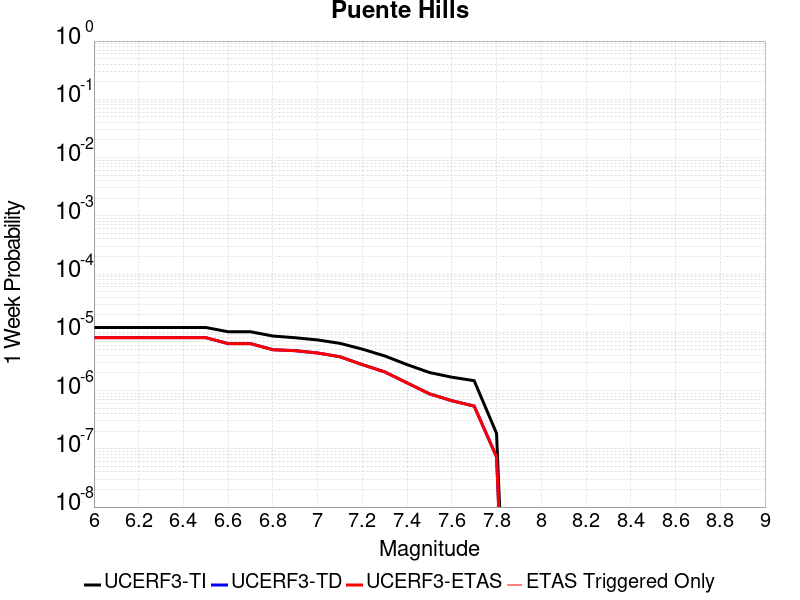 | 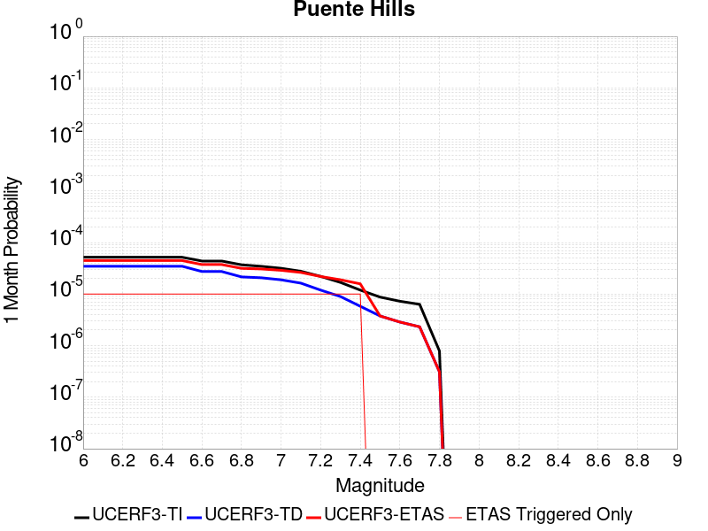 |  |  |

| Magnitude | 1 wk TI Prob | 1 wk TD Prob | 1 wk ETAS Prob | 1 wk ETAS/TD Gain | 1 wk ETAS Triggered Only | 1 mo TI Prob | 1 mo TD Prob | 1 mo ETAS Prob | 1 mo ETAS/TD Gain | 1 mo ETAS Triggered Only | 1 yr TI Prob | 1 yr TD Prob | 1 yr ETAS Prob | 1 yr ETAS/TD Gain | 1 yr ETAS Triggered Only | 10 yr TI Prob | 10 yr TD Prob | 10 yr ETAS Prob | 10 yr ETAS/TD Gain | 10 yr ETAS Triggered Only |
|-----|-----|-----|-----|-----|-----|-----|-----|-----|-----|-----|-----|-----|-----|-----|-----|-----|-----|-----|-----|-----|
| 6.0 | 1.2101656E-5 | 8.098625E-6 | 8.098625E-6 | 1.0 | 0.0 | 5.1863204E-5 | 3.4707962E-5 | 4.4707616E-5 | 1.2881083 | 1.0E-5 | 6.312516E-4 | 4.2249315E-4 | 4.3248892E-4 | 1.023659 | 1.0E-5 | 0.0062946146 | 0.0042174594 | 0.004227417 | 1.002361 | 1.0E-5 |
| 6.1 | 1.2101656E-5 | 8.098625E-6 | 8.098625E-6 | 1.0 | 0.0 | 5.1863204E-5 | 3.4707962E-5 | 4.4707616E-5 | 1.2881083 | 1.0E-5 | 6.312516E-4 | 4.2249315E-4 | 4.3248892E-4 | 1.023659 | 1.0E-5 | 0.0062946146 | 0.0042174594 | 0.004227417 | 1.002361 | 1.0E-5 |
| 6.2 | 1.2101656E-5 | 8.098625E-6 | 8.098625E-6 | 1.0 | 0.0 | 5.1863204E-5 | 3.4707962E-5 | 4.4707616E-5 | 1.2881083 | 1.0E-5 | 6.312516E-4 | 4.2249315E-4 | 4.3248892E-4 | 1.023659 | 1.0E-5 | 0.0062946146 | 0.0042174594 | 0.004227417 | 1.002361 | 1.0E-5 |
| 6.3 | 1.2101656E-5 | 8.098625E-6 | 8.098625E-6 | 1.0 | 0.0 | 5.1863204E-5 | 3.4707962E-5 | 4.4707616E-5 | 1.2881083 | 1.0E-5 | 6.312516E-4 | 4.2249315E-4 | 4.3248892E-4 | 1.023659 | 1.0E-5 | 0.0062946146 | 0.0042174594 | 0.004227417 | 1.002361 | 1.0E-5 |
| 6.4 | 1.2101656E-5 | 8.098625E-6 | 8.098625E-6 | 1.0 | 0.0 | 5.1863204E-5 | 3.4707962E-5 | 4.4707616E-5 | 1.2881083 | 1.0E-5 | 6.312516E-4 | 4.2249315E-4 | 4.3248892E-4 | 1.023659 | 1.0E-5 | 0.0062946146 | 0.0042174594 | 0.004227417 | 1.002361 | 1.0E-5 |
| 6.5 | 1.2101656E-5 | 8.098625E-6 | 8.098625E-6 | 1.0 | 0.0 | 5.1863204E-5 | 3.4707962E-5 | 4.4707616E-5 | 1.2881083 | 1.0E-5 | 6.312516E-4 | 4.2249315E-4 | 4.3248892E-4 | 1.023659 | 1.0E-5 | 0.0062946146 | 0.0042174594 | 0.004227417 | 1.002361 | 1.0E-5 |
| 6.6 | 1.0222488E-5 | 6.3991847E-6 | 6.3991847E-6 | 1.0 | 0.0 | 4.3809923E-5 | 2.7424803E-5 | 3.742453E-5 | 1.3646234 | 1.0E-5 | 5.332553E-4 | 3.3384826E-4 | 3.4384493E-4 | 1.0299437 | 1.0E-5 | 0.0053197746 | 0.0033337125 | 0.0033436792 | 1.0029896 | 1.0E-5 |
| 6.7 | 1.0222488E-5 | 6.3991847E-6 | 6.3991847E-6 | 1.0 | 0.0 | 4.3809923E-5 | 2.7424803E-5 | 3.742453E-5 | 1.3646234 | 1.0E-5 | 5.332553E-4 | 3.3384826E-4 | 3.4384493E-4 | 1.0299437 | 1.0E-5 | 0.0053197746 | 0.0033337125 | 0.0033436792 | 1.0029896 | 1.0E-5 |
| 6.8 | 8.6367845E-6 | 5.0282533E-6 | 5.0282533E-6 | 1.0 | 0.0 | 3.7014266E-5 | 2.1549482E-5 | 3.1549265E-5 | 1.4640383 | 1.0E-5 | 4.505555E-4 | 2.623339E-4 | 2.723313E-4 | 1.0381093 | 1.0E-5 | 0.004496431 | 0.0026202986 | 0.0026302724 | 1.0038064 | 1.0E-5 |
| 6.9 | 8.066481E-6 | 4.836117E-6 | 4.836117E-6 | 1.0 | 0.0 | 3.4570177E-5 | 2.0726053E-5 | 3.0725845E-5 | 1.4824746 | 1.0E-5 | 4.2081063E-4 | 2.52311E-4 | 2.623085E-4 | 1.0396236 | 1.0E-5 | 0.0042001465 | 0.0025202993 | 0.002530274 | 1.0039577 | 1.0E-5 |
| 7.0 | 7.393828E-6 | 4.417296E-6 | 4.417296E-6 | 1.0 | 0.0 | 3.168745E-5 | 1.8931134E-5 | 2.8930945E-5 | 1.5282203 | 1.0E-5 | 3.857264E-4 | 2.3046264E-4 | 2.4046033E-4 | 1.043381 | 1.0E-5 | 0.0038505755 | 0.0023022818 | 0.0023122588 | 1.0043335 | 1.0E-5 |
| 7.1 | 6.4660953E-6 | 3.8044495E-6 | 3.8044495E-6 | 1.0 | 0.0 | 2.7711543E-5 | 1.6304684E-5 | 2.630452E-5 | 1.6133107 | 1.0E-5 | 3.373358E-4 | 1.984918E-4 | 2.0848982E-4 | 1.0503699 | 1.0E-5 | 0.0033682417 | 0.001983181 | 0.0019931612 | 1.0050324 | 1.0E-5 |
| 7.2 | 5.143232E-6 | 2.7865456E-6 | 2.7865456E-6 | 1.0 | 0.0 | 2.2042237E-5 | 1.1942284E-5 | 2.1942164E-5 | 1.8373507 | 1.0E-5 | 2.6833118E-4 | 1.453877E-4 | 1.5538624E-4 | 1.0687716 | 1.0E-5 | 0.002680074 | 0.0014529356 | 0.001462921 | 1.0068727 | 1.0E-5 |
| 7.3 | 3.928255E-6 | 2.0913774E-6 | 2.0913774E-6 | 1.0 | 0.0 | 1.683527E-5 | 8.963015E-6 | 1.8962926E-5 | 2.115686 | 1.0E-5 | 2.0495013E-4 | 1.0911931E-4 | 1.1911822E-4 | 1.0916328 | 1.0E-5 | 0.002047612 | 0.001090664 | 0.0011006531 | 1.0091587 | 1.0E-5 |
| 7.4 | 2.7894434E-6 | 1.3546753E-6 | 1.3546753E-6 | 1.0 | 0.0 | 1.1954703E-5 | 5.8057385E-6 | 1.5805681E-5 | 2.7224238 | 1.0E-5 | 1.4553878E-4 | 7.068262E-5 | 8.0681915E-5 | 1.1414675 | 1.0E-5 | 0.001454435 | 7.066058E-4 | 7.165987E-4 | 1.0141422 | 1.0E-5 |
| 7.5 | 2.041735E-6 | 8.787305E-7 | 8.787305E-7 | 1.0 | 0.0 | 8.750263E-6 | 3.7659825E-6 | 3.7659825E-6 | 1.0 | 0.0 | 1.06529245E-4 | 4.5849905E-5 | 4.5849905E-5 | 1.0 | 0.0 | 0.0010647819 | 4.5840783E-4 | 4.5840783E-4 | 1.0 | 0.0 |
| 7.6 | 1.6959062E-6 | 6.6986263E-7 | 6.6986263E-7 | 1.0 | 0.0 | 7.268149E-6 | 2.8708366E-6 | 2.8708366E-6 | 1.0 | 0.0 | 8.848612E-5 | 3.4951907E-5 | 3.4951907E-5 | 1.0 | 0.0 | 8.84509E-4 | 3.4946698E-4 | 3.4946698E-4 | 1.0 | 0.0 |
| 7.7 | 1.4767965E-6 | 5.407607E-7 | 5.407607E-7 | 1.0 | 0.0 | 6.3291122E-6 | 2.317544E-6 | 2.317544E-6 | 1.0 | 0.0 | 7.705422E-5 | 2.8215758E-5 | 2.8215758E-5 | 1.0 | 0.0 | 7.702751E-4 | 2.8212433E-4 | 2.8212433E-4 | 1.0 | 0.0 |
| 7.8 | 1.8432911E-7 | 7.28201E-8 | 7.28201E-8 | 1.0 | 0.0 | 7.8998164E-7 | 3.1208612E-7 | 3.1208612E-7 | 1.0 | 0.0 | 9.617985E-6 | 3.7996451E-6 | 3.7996451E-6 | 1.0 | 0.0 | 9.617568E-5 | 3.7996128E-5 | 3.7996128E-5 | 1.0 | 0.0 |

## Robinson Creek
*[(top)](#table-of-contents)*

| 1 Week | 1 Month | 1 Year | 10 Year |
|-----|-----|-----|-----|
| 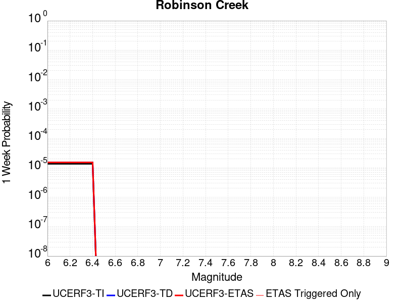 |  |  |  |

| Magnitude | 1 wk TI Prob | 1 wk TD Prob | 1 wk ETAS Prob | 1 wk ETAS/TD Gain | 1 wk ETAS Triggered Only | 1 mo TI Prob | 1 mo TD Prob | 1 mo ETAS Prob | 1 mo ETAS/TD Gain | 1 mo ETAS Triggered Only | 1 yr TI Prob | 1 yr TD Prob | 1 yr ETAS Prob | 1 yr ETAS/TD Gain | 1 yr ETAS Triggered Only | 10 yr TI Prob | 10 yr TD Prob | 10 yr ETAS Prob | 10 yr ETAS/TD Gain | 10 yr ETAS Triggered Only |
|-----|-----|-----|-----|-----|-----|-----|-----|-----|-----|-----|-----|-----|-----|-----|-----|-----|-----|-----|-----|-----|
| 6.0 | 1.3705327E-5 | 1.5285013E-5 | 1.5285013E-5 | 1.0 | 0.0 | 5.8735794E-5 | 6.55072E-5 | 6.55072E-5 | 1.0 | 0.0 | 7.1487366E-4 | 7.9755014E-4 | 8.075422E-4 | 1.0125284 | 1.0E-5 | 0.0071257832 | 0.007975501 | 0.007985421 | 1.0012438 | 1.0E-5 |
| 6.1 | 1.3705327E-5 | 1.5285013E-5 | 1.5285013E-5 | 1.0 | 0.0 | 5.8735794E-5 | 6.55072E-5 | 6.55072E-5 | 1.0 | 0.0 | 7.1487366E-4 | 7.9755014E-4 | 8.075422E-4 | 1.0125284 | 1.0E-5 | 0.0071257832 | 0.007975501 | 0.007985421 | 1.0012438 | 1.0E-5 |
| 6.2 | 1.3705327E-5 | 1.5285013E-5 | 1.5285013E-5 | 1.0 | 0.0 | 5.8735794E-5 | 6.55072E-5 | 6.55072E-5 | 1.0 | 0.0 | 7.1487366E-4 | 7.9755014E-4 | 8.075422E-4 | 1.0125284 | 1.0E-5 | 0.0071257832 | 0.007975501 | 0.007985421 | 1.0012438 | 1.0E-5 |
| 6.3 | 1.3705327E-5 | 1.5285013E-5 | 1.5285013E-5 | 1.0 | 0.0 | 5.8735794E-5 | 6.55072E-5 | 6.55072E-5 | 1.0 | 0.0 | 7.1487366E-4 | 7.9755014E-4 | 8.075422E-4 | 1.0125284 | 1.0E-5 | 0.0071257832 | 0.007975501 | 0.007985421 | 1.0012438 | 1.0E-5 |
| 6.4 | 1.3705327E-5 | 1.5285013E-5 | 1.5285013E-5 | 1.0 | 0.0 | 5.8735794E-5 | 6.55072E-5 | 6.55072E-5 | 1.0 | 0.0 | 7.1487366E-4 | 7.9755014E-4 | 8.075422E-4 | 1.0125284 | 1.0E-5 | 0.0071257832 | 0.007975501 | 0.007985421 | 1.0012438 | 1.0E-5 |

## San Andreas (North Coast) 2011 CFM
*[(top)](#table-of-contents)*

| 1 Week | 1 Month | 1 Year | 10 Year |
|-----|-----|-----|-----|
|  | 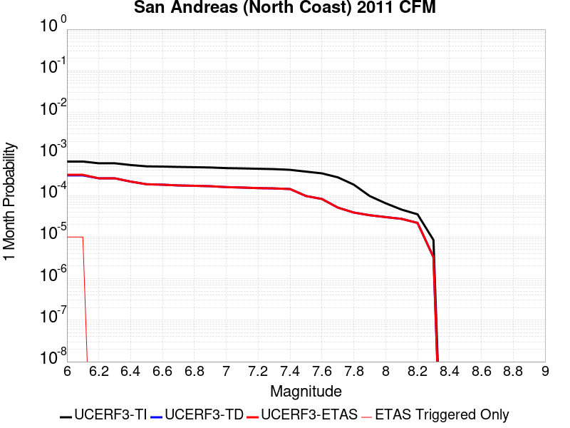 |  |  |

| Magnitude | 1 wk TI Prob | 1 wk TD Prob | 1 wk ETAS Prob | 1 wk ETAS/TD Gain | 1 wk ETAS Triggered Only | 1 mo TI Prob | 1 mo TD Prob | 1 mo ETAS Prob | 1 mo ETAS/TD Gain | 1 mo ETAS Triggered Only | 1 yr TI Prob | 1 yr TD Prob | 1 yr ETAS Prob | 1 yr ETAS/TD Gain | 1 yr ETAS Triggered Only | 10 yr TI Prob | 10 yr TD Prob | 10 yr ETAS Prob | 10 yr ETAS/TD Gain | 10 yr ETAS Triggered Only |
|-----|-----|-----|-----|-----|-----|-----|-----|-----|-----|-----|-----|-----|-----|-----|-----|-----|-----|-----|-----|-----|
| 6.0 | 1.5333705E-4 | 7.1106435E-5 | 8.1105725E-5 | 1.1406243 | 1.0E-5 | 6.5699324E-4 | 3.0470645E-4 | 3.147034E-4 | 1.0328084 | 1.0E-5 | 0.007969595 | 0.0037035241 | 0.0037134872 | 1.0026901 | 1.0E-5 | 0.0768977 | 0.03935284 | 0.03936245 | 1.0002441 | 1.0E-5 |
| 6.1 | 1.5333705E-4 | 7.1106435E-5 | 8.1105725E-5 | 1.1406243 | 1.0E-5 | 6.5699324E-4 | 3.0470645E-4 | 3.147034E-4 | 1.0328084 | 1.0E-5 | 0.007969595 | 0.0037035241 | 0.0037134872 | 1.0026901 | 1.0E-5 | 0.0768977 | 0.03935284 | 0.03936245 | 1.0002441 | 1.0E-5 |
| 6.2 | 1.3912938E-4 | 6.050204E-5 | 6.050204E-5 | 1.0 | 0.0 | 5.961325E-4 | 2.5926883E-4 | 2.5926883E-4 | 1.0 | 0.0 | 0.007233787 | 0.003152056 | 0.003152056 | 1.0 | 0.0 | 0.07002798 | 0.03369227 | 0.03369227 | 1.0 | 0.0 |
| 6.3 | 1.3912938E-4 | 6.050204E-5 | 6.050204E-5 | 1.0 | 0.0 | 5.961325E-4 | 2.5926883E-4 | 2.5926883E-4 | 1.0 | 0.0 | 0.007233787 | 0.003152056 | 0.003152056 | 1.0 | 0.0 | 0.07002798 | 0.03369227 | 0.03369227 | 1.0 | 0.0 |
| 6.4 | 1.2623647E-4 | 5.0442024E-5 | 5.0442024E-5 | 1.0 | 0.0 | 5.4090127E-4 | 2.161623E-4 | 2.161623E-4 | 1.0 | 0.0 | 0.0065656058 | 0.0026286195 | 0.0026286195 | 1.0 | 0.0 | 0.06374981 | 0.028303223 | 0.028303223 | 1.0 | 0.0 |
| 6.5 | 1.1736096E-4 | 4.3523814E-5 | 4.3523814E-5 | 1.0 | 0.0 | 5.028786E-4 | 1.8651738E-4 | 1.8651738E-4 | 1.0 | 0.0 | 0.006105373 | 0.0022685004 | 0.0022685004 | 1.0 | 0.0 | 0.05940335 | 0.024579322 | 0.024579322 | 1.0 | 0.0 |
| 6.6 | 1.1586959E-4 | 4.2423668E-5 | 4.2423668E-5 | 1.0 | 0.0 | 4.964894E-4 | 1.8180315E-4 | 1.8180315E-4 | 1.0 | 0.0 | 0.006028018 | 0.0022112224 | 0.0022112224 | 1.0 | 0.0 | 0.058671024 | 0.023984991 | 0.023984991 | 1.0 | 0.0 |
| 6.7 | 1.13693764E-4 | 4.073593E-5 | 4.073593E-5 | 1.0 | 0.0 | 4.87168E-4 | 1.7457096E-4 | 1.7457096E-4 | 1.0 | 0.0 | 0.005915152 | 0.0021233456 | 0.0021233456 | 1.0 | 0.0 | 0.057601593 | 0.023076393 | 0.023076393 | 1.0 | 0.0 |
| 6.8 | 1.1204889E-4 | 3.9953447E-5 | 3.9953447E-5 | 1.0 | 0.0 | 4.8012115E-4 | 1.7121792E-4 | 1.7121792E-4 | 1.0 | 0.0 | 0.005829819 | 0.002082601 | 0.002082601 | 1.0 | 0.0 | 0.05679232 | 0.022636656 | 0.022636656 | 1.0 | 0.0 |
| 6.9 | 1.1005794E-4 | 3.900957E-5 | 3.900957E-5 | 1.0 | 0.0 | 4.7159163E-4 | 1.6717325E-4 | 1.6717325E-4 | 1.0 | 0.0 | 0.0057265228 | 0.0020334502 | 0.0020334502 | 1.0 | 0.0 | 0.055811852 | 0.022102542 | 0.022102542 | 1.0 | 0.0 |
| 7.0 | 1.0647948E-4 | 3.7166337E-5 | 3.7166337E-5 | 1.0 | 0.0 | 4.562608E-4 | 1.5927466E-4 | 1.5927466E-4 | 1.0 | 0.0 | 0.0055408357 | 0.0019374598 | 0.0019374598 | 1.0 | 0.0 | 0.054047033 | 0.021062272 | 0.021062272 | 1.0 | 0.0 |
| 7.1 | 1.04795035E-4 | 3.6215948E-5 | 3.6215948E-5 | 1.0 | 0.0 | 4.4904428E-4 | 1.5520205E-4 | 1.5520205E-4 | 1.0 | 0.0 | 0.0054534175 | 0.0018879628 | 0.0018879628 | 1.0 | 0.0 | 0.053215165 | 0.020530313 | 0.020530313 | 1.0 | 0.0 |
| 7.2 | 1.02724036E-4 | 3.5124547E-5 | 3.5124547E-5 | 1.0 | 0.0 | 4.401716E-4 | 1.5052517E-4 | 1.5052517E-4 | 1.0 | 0.0 | 0.0053459285 | 0.0018311188 | 0.0018311188 | 1.0 | 0.0 | 0.052191395 | 0.019919246 | 0.019919246 | 1.0 | 0.0 |
| 7.3 | 1.00650694E-4 | 3.4592013E-5 | 3.4592013E-5 | 1.0 | 0.0 | 4.312888E-4 | 1.4824314E-4 | 1.4824314E-4 | 1.0 | 0.0 | 0.005238306 | 0.0018033815 | 0.0018033815 | 1.0 | 0.0 | 0.051165357 | 0.019596443 | 0.019596443 | 1.0 | 0.0 |
| 7.4 | 9.672919E-5 | 3.338123E-5 | 3.338123E-5 | 1.0 | 0.0 | 4.144878E-4 | 1.4305465E-4 | 1.4305465E-4 | 1.0 | 0.0 | 0.005034718 | 0.0017403142 | 0.0017403142 | 1.0 | 0.0 | 0.049221683 | 0.018869769 | 0.018869769 | 1.0 | 0.0 |
| 7.5 | 8.7600405E-5 | 2.2700917E-5 | 2.2700917E-5 | 1.0 | 0.0 | 3.753763E-4 | 9.728602E-5 | 9.728602E-5 | 1.0 | 0.0 | 0.0045606326 | 0.0011838155 | 0.0011838155 | 1.0 | 0.0 | 0.04468165 | 0.013130207 | 0.013130207 | 1.0 | 0.0 |
| 7.6 | 7.9562284E-5 | 1.9226305E-5 | 1.9226305E-5 | 1.0 | 0.0 | 3.4093665E-4 | 8.239586E-5 | 8.239586E-5 | 1.0 | 0.0 | 0.0041430052 | 0.0010027094 | 0.0010027094 | 1.0 | 0.0 | 0.040666126 | 0.011221658 | 0.011221658 | 1.0 | 0.0 |
| 7.7 | 6.3866544E-5 | 1.1941707E-5 | 1.1941707E-5 | 1.0 | 0.0 | 2.7368503E-4 | 5.117774E-5 | 5.117774E-5 | 1.0 | 0.0 | 0.0033270244 | 6.2291115E-4 | 6.2291115E-4 | 1.0 | 0.0 | 0.032776527 | 0.007210334 | 0.007210334 | 1.0 | 0.0 |
| 7.8 | 4.2543215E-5 | 9.076524E-6 | 9.076524E-6 | 1.0 | 0.0 | 1.8231533E-4 | 3.8898812E-5 | 3.8898812E-5 | 1.0 | 0.0 | 0.0022174292 | 4.7349022E-4 | 4.7349022E-4 | 1.0 | 0.0 | 0.021954332 | 0.005490525 | 0.005490525 | 1.0 | 0.0 |
| 7.9 | 2.2636612E-5 | 7.81435E-6 | 7.81435E-6 | 1.0 | 0.0 | 9.7010445E-5 | 3.3489643E-5 | 3.3489643E-5 | 1.0 | 0.0 | 0.0011804621 | 4.076602E-4 | 4.076602E-4 | 1.0 | 0.0 | 0.011742111 | 0.0046832846 | 0.0046832846 | 1.0 | 0.0 |
| 8.0 | 1.5167874E-5 | 7.0494675E-6 | 7.0494675E-6 | 1.0 | 0.0 | 6.500356E-5 | 3.0211655E-5 | 3.0211655E-5 | 1.0 | 0.0 | 7.9113094E-4 | 3.677649E-4 | 3.677649E-4 | 1.0 | 0.0 | 0.007883203 | 0.004215588 | 0.004215588 | 1.0 | 0.0 |
| 8.1 | 1.0681047E-5 | 6.386992E-6 | 6.386992E-6 | 1.0 | 0.0 | 4.5775112E-5 | 2.7372536E-5 | 2.7372536E-5 | 1.0 | 0.0 | 5.5716943E-4 | 3.3320975E-4 | 3.3320975E-4 | 1.0 | 0.0 | 0.0055577457 | 0.003817393 | 0.003817393 | 1.0 | 0.0 |
| 8.2 | 8.226114E-6 | 5.1150587E-6 | 5.1150587E-6 | 1.0 | 0.0 | 3.52543E-5 | 2.1921496E-5 | 2.1921496E-5 | 1.0 | 0.0 | 4.2913653E-4 | 2.668616E-4 | 2.668616E-4 | 1.0 | 0.0 | 0.004283088 | 0.0030450926 | 0.0030450926 | 1.0 | 0.0 |
| 8.3 | 1.983087E-6 | 7.6599065E-7 | 7.6599065E-7 | 1.0 | 0.0 | 8.498917E-6 | 3.282813E-6 | 3.282813E-6 | 1.0 | 0.0 | 1.034694E-4 | 3.9967534E-5 | 3.9967534E-5 | 1.0 | 0.0 | 0.0010342124 | 4.719687E-4 | 4.719687E-4 | 1.0 | 0.0 |

## Channel Islands Western Deep Ramp
*[(top)](#table-of-contents)*

| 1 Week | 1 Month | 1 Year | 10 Year |
|-----|-----|-----|-----|
|  |  |  |  |

| Magnitude | 1 wk TI Prob | 1 wk TD Prob | 1 wk ETAS Prob | 1 wk ETAS/TD Gain | 1 wk ETAS Triggered Only | 1 mo TI Prob | 1 mo TD Prob | 1 mo ETAS Prob | 1 mo ETAS/TD Gain | 1 mo ETAS Triggered Only | 1 yr TI Prob | 1 yr TD Prob | 1 yr ETAS Prob | 1 yr ETAS/TD Gain | 1 yr ETAS Triggered Only | 10 yr TI Prob | 10 yr TD Prob | 10 yr ETAS Prob | 10 yr ETAS/TD Gain | 10 yr ETAS Triggered Only |
|-----|-----|-----|-----|-----|-----|-----|-----|-----|-----|-----|-----|-----|-----|-----|-----|-----|-----|-----|-----|-----|
| 6.0 | 6.0213506E-6 | 6.2548684E-6 | 6.2548684E-6 | 1.0 | 0.0 | 2.5805533E-5 | 2.6806329E-5 | 2.6806329E-5 | 1.0 | 0.0 | 3.1413708E-4 | 3.2632265E-4 | 3.2632265E-4 | 1.0 | 0.0 | 0.0031369338 | 0.0032588763 | 0.0032688437 | 1.0030586 | 1.0E-5 |
| 6.1 | 6.0213506E-6 | 6.2548684E-6 | 6.2548684E-6 | 1.0 | 0.0 | 2.5805533E-5 | 2.6806329E-5 | 2.6806329E-5 | 1.0 | 0.0 | 3.1413708E-4 | 3.2632265E-4 | 3.2632265E-4 | 1.0 | 0.0 | 0.0031369338 | 0.0032588763 | 0.0032688437 | 1.0030586 | 1.0E-5 |
| 6.2 | 6.0213506E-6 | 6.2548684E-6 | 6.2548684E-6 | 1.0 | 0.0 | 2.5805533E-5 | 2.6806329E-5 | 2.6806329E-5 | 1.0 | 0.0 | 3.1413708E-4 | 3.2632265E-4 | 3.2632265E-4 | 1.0 | 0.0 | 0.0031369338 | 0.0032588763 | 0.0032688437 | 1.0030586 | 1.0E-5 |
| 6.3 | 6.0213506E-6 | 6.2548684E-6 | 6.2548684E-6 | 1.0 | 0.0 | 2.5805533E-5 | 2.6806329E-5 | 2.6806329E-5 | 1.0 | 0.0 | 3.1413708E-4 | 3.2632265E-4 | 3.2632265E-4 | 1.0 | 0.0 | 0.0031369338 | 0.0032588763 | 0.0032688437 | 1.0030586 | 1.0E-5 |
| 6.4 | 6.0213506E-6 | 6.2548684E-6 | 6.2548684E-6 | 1.0 | 0.0 | 2.5805533E-5 | 2.6806329E-5 | 2.6806329E-5 | 1.0 | 0.0 | 3.1413708E-4 | 3.2632265E-4 | 3.2632265E-4 | 1.0 | 0.0 | 0.0031369338 | 0.0032588763 | 0.0032688437 | 1.0030586 | 1.0E-5 |
| 6.5 | 6.0213506E-6 | 6.2548684E-6 | 6.2548684E-6 | 1.0 | 0.0 | 2.5805533E-5 | 2.6806329E-5 | 2.6806329E-5 | 1.0 | 0.0 | 3.1413708E-4 | 3.2632265E-4 | 3.2632265E-4 | 1.0 | 0.0 | 0.0031369338 | 0.0032588763 | 0.0032688437 | 1.0030586 | 1.0E-5 |
| 6.6 | 6.0213506E-6 | 6.2548684E-6 | 6.2548684E-6 | 1.0 | 0.0 | 2.5805533E-5 | 2.6806329E-5 | 2.6806329E-5 | 1.0 | 0.0 | 3.1413708E-4 | 3.2632265E-4 | 3.2632265E-4 | 1.0 | 0.0 | 0.0031369338 | 0.0032588763 | 0.0032688437 | 1.0030586 | 1.0E-5 |
| 6.7 | 5.313309E-6 | 5.5252403E-6 | 5.5252403E-6 | 1.0 | 0.0 | 2.2771126E-5 | 2.367941E-5 | 2.367941E-5 | 1.0 | 0.0 | 2.772032E-4 | 2.8826276E-4 | 2.8826276E-4 | 1.0 | 0.0 | 0.0027685766 | 0.0028792918 | 0.002889263 | 1.003463 | 1.0E-5 |
| 6.8 | 5.313309E-6 | 5.5252403E-6 | 5.5252403E-6 | 1.0 | 0.0 | 2.2771126E-5 | 2.367941E-5 | 2.367941E-5 | 1.0 | 0.0 | 2.772032E-4 | 2.8826276E-4 | 2.8826276E-4 | 1.0 | 0.0 | 0.0027685766 | 0.0028792918 | 0.002889263 | 1.003463 | 1.0E-5 |
| 6.9 | 4.744377E-6 | 4.9394303E-6 | 4.9394303E-6 | 1.0 | 0.0 | 2.0332885E-5 | 2.1168837E-5 | 2.1168837E-5 | 1.0 | 0.0 | 2.4752476E-4 | 2.5770385E-4 | 2.5770385E-4 | 1.0 | 0.0 | 0.0024724922 | 0.0025744175 | 0.0025843917 | 1.0038744 | 1.0E-5 |
| 7.0 | 4.722209E-6 | 4.9164732E-6 | 4.9164732E-6 | 1.0 | 0.0 | 2.0237881E-5 | 2.107045E-5 | 2.107045E-5 | 1.0 | 0.0 | 2.4636835E-4 | 2.5650626E-4 | 2.5650626E-4 | 1.0 | 0.0 | 0.002460954 | 0.0025624693 | 0.0025724438 | 1.0038925 | 1.0E-5 |
| 7.1 | 4.611174E-6 | 4.801409E-6 | 4.801409E-6 | 1.0 | 0.0 | 1.9762025E-5 | 2.0577325E-5 | 2.0577325E-5 | 1.0 | 0.0 | 2.4057609E-4 | 2.5050386E-4 | 2.5050386E-4 | 1.0 | 0.0 | 0.002403158 | 0.002502582 | 0.002512557 | 1.0039859 | 1.0E-5 |
| 7.2 | 4.043994E-6 | 4.2120264E-6 | 4.2120264E-6 | 1.0 | 0.0 | 1.7331287E-5 | 1.8051438E-5 | 1.8051438E-5 | 1.0 | 0.0 | 2.10988E-4 | 2.1975765E-4 | 2.1975765E-4 | 1.0 | 0.0 | 0.002107878 | 0.0021957543 | 0.0022057323 | 1.0045443 | 1.0E-5 |
| 7.3 | 2.1233036E-6 | 2.2297875E-6 | 2.2297875E-6 | 1.0 | 0.0 | 9.099841E-6 | 9.556197E-6 | 9.556197E-6 | 1.0 | 0.0 | 1.1078493E-4 | 1.1634055E-4 | 1.1634055E-4 | 1.0 | 0.0 | 0.0011072971 | 0.001162802 | 0.001162802 | 1.0 | 0.0 |
| 7.4 | 1.9051884E-6 | 2.0014973E-6 | 2.0014973E-6 | 1.0 | 0.0 | 8.165067E-6 | 8.577817E-6 | 8.577817E-6 | 1.0 | 0.0 | 9.940516E-5 | 1.0442998E-4 | 1.0442998E-4 | 1.0 | 0.0 | 9.93607E-4 | 0.0010438144 | 0.0010438144 | 1.0 | 0.0 |
| 7.5 | 1.2408497E-6 | 1.3038839E-6 | 1.3038839E-6 | 1.0 | 0.0 | 5.317916E-6 | 5.588062E-6 | 5.588062E-6 | 1.0 | 0.0 | 6.4743705E-5 | 6.8032554E-5 | 6.8032554E-5 | 1.0 | 0.0 | 6.4724847E-4 | 6.8011944E-4 | 6.8011944E-4 | 1.0 | 0.0 |
| 7.6 | 6.5440025E-7 | 6.886718E-7 | 6.886718E-7 | 1.0 | 0.0 | 2.8045695E-6 | 2.9514472E-6 | 2.9514472E-6 | 1.0 | 0.0 | 3.4145098E-5 | 3.593329E-5 | 3.593329E-5 | 1.0 | 0.0 | 3.4139853E-4 | 3.5927625E-4 | 3.5927625E-4 | 1.0 | 0.0 |
| 7.7 | 3.985963E-7 | 4.1930787E-7 | 4.1930787E-7 | 1.0 | 0.0 | 1.7082689E-6 | 1.7970326E-6 | 1.7970326E-6 | 1.0 | 0.0 | 2.0797976E-5 | 2.1878664E-5 | 2.1878664E-5 | 1.0 | 0.0 | 2.0796029E-4 | 2.1876628E-4 | 2.1876628E-4 | 1.0 | 0.0 |
| 7.8 | 3.706329E-8 | 3.8591796E-8 | 3.8591796E-8 | 1.0 | 0.0 | 1.5884267E-7 | 1.653934E-7 | 1.653934E-7 | 1.0 | 0.0 | 1.9339077E-6 | 2.0136629E-6 | 2.0136629E-6 | 1.0 | 0.0 | 1.933891E-5 | 2.0136458E-5 | 2.0136458E-5 | 1.0 | 0.0 |

## Fitzhugh Creek
*[(top)](#table-of-contents)*

| 1 Week | 1 Month | 1 Year | 10 Year |
|-----|-----|-----|-----|
|  |  |  |  |

| Magnitude | 1 wk TI Prob | 1 wk TD Prob | 1 wk ETAS Prob | 1 wk ETAS/TD Gain | 1 wk ETAS Triggered Only | 1 mo TI Prob | 1 mo TD Prob | 1 mo ETAS Prob | 1 mo ETAS/TD Gain | 1 mo ETAS Triggered Only | 1 yr TI Prob | 1 yr TD Prob | 1 yr ETAS Prob | 1 yr ETAS/TD Gain | 1 yr ETAS Triggered Only | 10 yr TI Prob | 10 yr TD Prob | 10 yr ETAS Prob | 10 yr ETAS/TD Gain | 10 yr ETAS Triggered Only |
|-----|-----|-----|-----|-----|-----|-----|-----|-----|-----|-----|-----|-----|-----|-----|-----|-----|-----|-----|-----|-----|
| 6.0 | 6.1090436E-6 | 6.2101562E-6 | 6.2101562E-6 | 1.0 | 0.0 | 2.6181353E-5 | 2.6614709E-5 | 2.6614709E-5 | 1.0 | 0.0 | 3.1871133E-4 | 3.239904E-4 | 3.3398715E-4 | 1.0308551 | 1.0E-5 | 0.0031825465 | 0.0032356246 | 0.0032455921 | 1.0030806 | 1.0E-5 |
| 6.1 | 2.9741811E-6 | 3.021581E-6 | 3.021581E-6 | 1.0 | 0.0 | 1.2746428E-5 | 1.2949574E-5 | 1.2949574E-5 | 1.0 | 0.0 | 1.5517672E-4 | 1.576506E-4 | 1.576506E-4 | 1.0 | 0.0 | 0.001550684 | 0.0015754806 | 0.0015754806 | 1.0 | 0.0 |
| 6.2 | 2.9741811E-6 | 3.021581E-6 | 3.021581E-6 | 1.0 | 0.0 | 1.2746428E-5 | 1.2949574E-5 | 1.2949574E-5 | 1.0 | 0.0 | 1.5517672E-4 | 1.576506E-4 | 1.576506E-4 | 1.0 | 0.0 | 0.001550684 | 0.0015754806 | 0.0015754806 | 1.0 | 0.0 |
| 6.3 | 1.4781198E-6 | 1.5012708E-6 | 1.5012708E-6 | 1.0 | 0.0 | 6.3347834E-6 | 6.4340034E-6 | 6.4340034E-6 | 1.0 | 0.0 | 7.712326E-5 | 7.833137E-5 | 7.833137E-5 | 1.0 | 0.0 | 7.70965E-4 | 7.830576E-4 | 7.830576E-4 | 1.0 | 0.0 |
| 6.4 | 1.4781198E-6 | 1.5012708E-6 | 1.5012708E-6 | 1.0 | 0.0 | 6.3347834E-6 | 6.4340034E-6 | 6.4340034E-6 | 1.0 | 0.0 | 7.712326E-5 | 7.833137E-5 | 7.833137E-5 | 1.0 | 0.0 | 7.70965E-4 | 7.830576E-4 | 7.830576E-4 | 1.0 | 0.0 |
| 6.5 | 9.5176676E-7 | 9.66606E-7 | 9.66606E-7 | 1.0 | 0.0 | 4.078994E-6 | 4.142591E-6 | 4.142591E-6 | 1.0 | 0.0 | 4.9660623E-5 | 5.0434985E-5 | 5.0434985E-5 | 1.0 | 0.0 | 4.964952E-4 | 5.042458E-4 | 5.042458E-4 | 1.0 | 0.0 |
| 6.6 | 6.21145E-7 | 6.3085855E-7 | 6.3085855E-7 | 1.0 | 0.0 | 2.662047E-6 | 2.7036772E-6 | 2.7036772E-6 | 1.0 | 0.0 | 3.2409942E-5 | 3.291684E-5 | 3.291684E-5 | 1.0 | 0.0 | 3.2405215E-4 | 3.2912623E-4 | 3.2912623E-4 | 1.0 | 0.0 |
| 6.7 | 2.2377962E-7 | 2.2734636E-7 | 2.2734636E-7 | 1.0 | 0.0 | 9.590551E-7 | 9.743413E-7 | 9.743413E-7 | 1.0 | 0.0 | 1.1676434E-5 | 1.1862574E-5 | 1.1862574E-5 | 1.0 | 0.0 | 1.1675821E-4 | 1.1862254E-4 | 1.1862254E-4 | 1.0 | 0.0 |
| 6.8 | 1.4785022E-7 | 1.5021492E-7 | 1.5021492E-7 | 1.0 | 0.0 | 6.3364365E-7 | 6.4377826E-7 | 6.4377826E-7 | 1.0 | 0.0 | 7.714584E-6 | 7.838E-6 | 7.838E-6 | 1.0 | 0.0 | 7.714316E-5 | 7.838E-5 | 7.838E-5 | 1.0 | 0.0 |

