# Parent Section Magnitude-Probability Distributions

Only fault sections with at least one triggered aftershock are plotted. Sections are sorted by total supraseismogenic trigger rate (decreasing)

## Table Of Contents

* [Garlock (Central)](#garlock-central)
* [Tank Canyon](#tank-canyon)
* [Little Lake](#little-lake)
* [Owl Lake](#owl-lake)
* [Airport Lake](#airport-lake)
* [Panamint Valley](#panamint-valley)
* [Garlock (East)](#garlock-east)
* [Hunter Mountain-Saline Valley](#hunter-mountain-saline-valley)
* [Ash Hill](#ash-hill)
* [Blackwater](#blackwater)
* [Garlock (West)](#garlock-west)
* [McLean Lake](#mclean-lake)
* [Goldstone Lake](#goldstone-lake)
* [Gravel Hills-Harper Lk](#gravel-hills-harper-lk)
* [So Sierra Nevada](#so-sierra-nevada)
* [San Andreas (Mojave N)](#san-andreas-mojave-n)
* [San Andreas (Mojave S)](#san-andreas-mojave-s)
* [Coyote Canyon](#coyote-canyon)
* [Death Valley (So)](#death-valley-so)
* [Nelson Lake](#nelson-lake)
* [Towne Pass](#towne-pass)
* [Lenwood-Lockhart-Old Woman Springs](#lenwood-lockhart-old-woman-springs)
* [San Andreas (San Bernardino N)](#san-andreas-san-bernardino-n)
* [Bicycle Lake](#bicycle-lake)
* [Paradise](#paradise)
* [Garlic Springs](#garlic-springs)
* [Death Valley (Black Mtns Frontal)](#death-valley-black-mtns-frontal)
* [San Andreas (San Bernardino S)](#san-andreas-san-bernardino-s)
* [Helendale-So Lockhart](#helendale-so-lockhart)
* [Coyote Lake](#coyote-lake)
* [San Andreas (Big Bend)](#san-andreas-big-bend)
* [Death Valley (No)](#death-valley-no)
* [San Andreas (Parkfield)](#san-andreas-parkfield)
* [Red Pass](#red-pass)
* [San Andreas (San Gorgonio Pass-Garnet HIll)](#san-andreas-san-gorgonio-pass-garnet-hill)
* [Sierra Nevada  (No Extension)](#sierra-nevada--no-extension)
* [Elsinore (Glen Ivy) rev](#elsinore-glen-ivy-rev)
* [Death Valley (Fish Lake Valley)](#death-valley-fish-lake-valley)
* [Baker](#baker)
* [San Jacinto (San Bernardino)](#san-jacinto-san-bernardino)
* [San Andreas (Coachella) rev](#san-andreas-coachella-rev)
* [Ludlow](#ludlow)
* [San Jacinto (San Jacinto Valley) rev](#san-jacinto-san-jacinto-valley-rev)
* [San Andreas (Cholame) rev](#san-andreas-cholame-rev)
* [San Andreas (Carrizo) rev](#san-andreas-carrizo-rev)
* [Cady](#cady)
* [White Wolf (Extension)](#white-wolf-extension)
* [Scodie Lineament](#scodie-lineament)
* [Calico-Hidalgo](#calico-hidalgo)
* [Manix-Afton Hills](#manix-afton-hills)
* [San Jacinto (Stepovers Combined)](#san-jacinto-stepovers-combined)
* [San Andreas (North Branch Mill Creek)](#san-andreas-north-branch-mill-creek)
* [Santa Ynez (East)](#santa-ynez-east)
* [Lake Isabella (Seismicity)](#lake-isabella-seismicity)
* [San Andreas (Creeping Section) 2011 CFM](#san-andreas-creeping-section-2011-cfm)
* [Cleghorn Pass](#cleghorn-pass)
* [San Jacinto (Anza) rev](#san-jacinto-anza-rev)
* [Santa Ynez (West)](#santa-ynez-west)
* [Pisgah-Bullion Mtn-Mesquite Lk](#pisgah-bullion-mtn-mesquite-lk)
* [Mission Ridge-Arroyo Parida-Santa Ana](#mission-ridge-arroyo-parida-santa-ana)
* [Cleghorn Lake](#cleghorn-lake)
* [Lost Hills](#lost-hills)
* [Mission Creek](#mission-creek)
* [Owens Valley](#owens-valley)
* [Red Mountain](#red-mountain)
* [Deep Springs](#deep-springs)
* [Rose Canyon](#rose-canyon)
* [Santa Rosa Island](#santa-rosa-island)
* [San Jacinto (Lytle Creek connector)](#san-jacinto-lytle-creek-connector)
* [San Jacinto (Coyote Creek)](#san-jacinto-coyote-creek)
* [Santa Cruz Island](#santa-cruz-island)
* [Pleito](#pleito)
* [Big Pine (East)](#big-pine-east)
* [Whittier alt 1](#whittier-alt-1)
* [San Diego Trough north alt1](#san-diego-trough-north-alt1)
* [Chino alt 1](#chino-alt-1)
* [Kern Canyon (South Kern) 2011](#kern-canyon-south-kern-2011)
* [Dry Mountain](#dry-mountain)
* [Kern Canyon (North Kern) 2011](#kern-canyon-north-kern-2011)
* [Brawley (Seismic Zone) alt 1](#brawley-seismic-zone-alt-1)
* [San Pedro Basin](#san-pedro-basin)
* [Ventura-Pitas Point](#ventura-pitas-point)
* [Imperial](#imperial)
* [Elysian Park (Upper)](#elysian-park-upper)
* [Cleghorn](#cleghorn)
* [Pinto Mtn](#pinto-mtn)
* [Blue Cut](#blue-cut)
* [Oceanic - West Huasna](#oceanic---west-huasna)
* [San Jacinto (Clark) rev](#san-jacinto-clark-rev)
* [Kern Canyon (Lake Isabella) 2011](#kern-canyon-lake-isabella-2011)
* [White Mountains](#white-mountains)
* [San Jacinto (Borrego)](#san-jacinto-borrego)
* [San Clemente](#san-clemente)
* [Tin Mountain](#tin-mountain)
* [Channel Islands Thrust](#channel-islands-thrust)
* [Big Pine (Central)](#big-pine-central)
* [Bullion Mountains](#bullion-mountains)
* [San Diego Trough south](#san-diego-trough-south)
* [Pine Mtn](#pine-mtn)
* [Independence rev 2011](#independence-rev-2011)
* [San Cayetano](#san-cayetano)
* [Palos Verdes](#palos-verdes)
* [Simi-Santa Rosa](#simi-santa-rosa)
* [San Luis Range 2011 CFM](#san-luis-range-2011-cfm)
* [Calaveras (Central) 2011 CFM](#calaveras-central-2011-cfm)
* [San Gabriel](#san-gabriel)
* [Coronado Bank alt1](#coronado-bank-alt1)
* [Hunting Creek - Berryessa 2011 CFM](#hunting-creek---berryessa-2011-cfm)
* [Cucamonga](#cucamonga)
* [Newport-Inglewood (Offshore)](#newport-inglewood-offshore)
* [San Gabriel (Extension)](#san-gabriel-extension)
* [Hector Mine](#hector-mine)
* [La Panza 2011](#la-panza-2011)
* [Santa Susana East (connector)](#santa-susana-east-connector)
* [Raymond](#raymond)
* [Calaveras (So) 2011 CFM](#calaveras-so-2011-cfm)
* [Oak Ridge (Onshore)](#oak-ridge-onshore)
* [Mono Lake 2011 CFM](#mono-lake-2011-cfm)
* [Hunting Creek - Bartlett Springs connector 2011](#hunting-creek---bartlett-springs-connector-2011)
* [Cerro Prieto](#cerro-prieto)
* [Calaveras (So) - Paicines extension 2011 CFM](#calaveras-so---paicines-extension-2011-cfm)
* [Camp Rock 2011](#camp-rock-2011)
* [Hayward (So) 2011 CFM](#hayward-so-2011-cfm)
* [Santa Cruz Catalina Ridge alt1](#santa-cruz-catalina-ridge-alt1)
* [Pitas Point (Lower West)](#pitas-point-lower-west)
* [Great Valley 07 (Orestimba)](#great-valley-07-orestimba)
* [Emerson-Copper Mtn 2011](#emerson-copper-mtn-2011)
* [South Klamath Lake West](#south-klamath-lake-west)
* [Los Osos 2011](#los-osos-2011)
* [Laguna Salada](#laguna-salada)
* [Great Valley 09 (Laguna Seca)](#great-valley-09-laguna-seca)
* [Ortigalita (North)](#ortigalita-north)
* [Burnt Mtn](#burnt-mtn)
* [Malibu Coast (Extension) alt 1](#malibu-coast-extension-alt-1)
* [San Juan](#san-juan)
* [Hosgri](#hosgri)
* [Malibu Coast alt 1](#malibu-coast-alt-1)
* [Sheephole](#sheephole)
* [Rinconada 2011 CFM](#rinconada-2011-cfm)
* [Great Valley 03 Mysterious Ridge](#great-valley-03-mysterious-ridge)
* [Sierra Madre](#sierra-madre)
* [Calaveras (No) 2011 CFM](#calaveras-no-2011-cfm)
* [San Andreas (Santa Cruz Mts) 2011 CFM](#san-andreas-santa-cruz-mts-2011-cfm)
* [Newport-Inglewood alt 1](#newport-inglewood-alt-1)
* [Monterey Bay-Tularcitos](#monterey-bay-tularcitos)
* [Great Valley 04b Gordon Valley](#great-valley-04b-gordon-valley)
* [Pitas Point (Lower)-Montalvo](#pitas-point-lower-montalvo)
* [South Cuyama](#south-cuyama)
* [Hayward (So) extension 2011 CFM](#hayward-so-extension-2011-cfm)
* [Oceanside alt1](#oceanside-alt1)
* [Surprise Valley 2011 CFM](#surprise-valley-2011-cfm)
* [Elsinore (Coyote Mountains)](#elsinore-coyote-mountains)
* [Ortigalita (South)](#ortigalita-south)
* [Santa Ynez River](#santa-ynez-river)
* [Davis Creek](#davis-creek)
* [Owens Valley Keough Hot Springs](#owens-valley-keough-hot-springs)
* [Sargent 2011 CFM](#sargent-2011-cfm)
* [South Klamath Lake East](#south-klamath-lake-east)
* [Casmalia 2011 CFM](#casmalia-2011-cfm)
* [North Frontal  (East)](#north-frontal--east)
* [Honey Lake 2011 CFM](#honey-lake-2011-cfm)
* [San Jacinto (Superstition Mtn)](#san-jacinto-superstition-mtn)
* [Verdugo](#verdugo)
* [Great Valley 08 (Quinto)](#great-valley-08-quinto)
* [Hayward (No) 2011 CFM](#hayward-no-2011-cfm)
* [White Wolf](#white-wolf)
* [Santa Susana alt 1](#santa-susana-alt-1)
* [Garberville - Briceland 2011 CFM](#garberville---briceland-2011-cfm)
* [Hat Creek-McArthur-Mayfield](#hat-creek-mcarthur-mayfield)
* [Earthquake Valley](#earthquake-valley)
* [Silver Creek 2011 CFM](#silver-creek-2011-cfm)
* [West Napa 2011 CFM](#west-napa-2011-cfm)
* [Elsinore (Temecula) rev](#elsinore-temecula-rev)
* [Compton](#compton)
* [Hartley Springs 2011 CFM](#hartley-springs-2011-cfm)
* [Pittville 2011 CFM](#pittville-2011-cfm)
* [Del Valle](#del-valle)
* [Elsinore (Stepovers Combined)](#elsinore-stepovers-combined)
* [Walker Spring 2011 CFM](#walker-spring-2011-cfm)
* [Los Alamos 2011 CFM](#los-alamos-2011-cfm)
* [North Salt Lake](#north-salt-lake)
* [Fitzhugh Creek](#fitzhugh-creek)
* [San Gregorio (South) 2011 CFM](#san-gregorio-south-2011-cfm)
* [Robinson Creek](#robinson-creek)
* [Fontana (Seismicity)](#fontana-seismicity)
* [Thirty Mile Bank](#thirty-mile-bank)
* [Butano 2011 CFM](#butano-2011-cfm)
* [Santa Monica alt 1](#santa-monica-alt-1)
* [San Joaquin Hills](#san-joaquin-hills)
* [San Andreas (Offshore) 2011 CFM](#san-andreas-offshore-2011-cfm)
* [Channel Islands Western Deep Ramp](#channel-islands-western-deep-ramp)
* [North Tahoe 2011 CFM](#north-tahoe-2011-cfm)
* [Eureka Peak](#eureka-peak)
* [Cedar Mtn-Mahogany Mtn](#cedar-mtn-mahogany-mtn)
* [Puente Hills](#puente-hills)
* [San Andreas (North Coast) 2011 CFM](#san-andreas-north-coast-2011-cfm)
* [Peralta Hills](#peralta-hills)
* [Hollywood](#hollywood)
* [Elysian Park (Lower CFM)](#elysian-park-lower-cfm)
* [Holser alt 1](#holser-alt-1)
* [Sierra Madre (San Fernando)](#sierra-madre-san-fernando)
* [Earthquake Valley (So Extension)](#earthquake-valley-so-extension)
* [Bartlett Springs 2011 CFM](#bartlett-springs-2011-cfm)
* [Likely 2011 CFM](#likely-2011-cfm)
* [Almanor 2011 CFM](#almanor-2011-cfm)
* [Superstition Hills](#superstition-hills)
* [Gillem - Big Crack 2011 CFM](#gillem---big-crack-2011-cfm)
* [Great Valley 02](#great-valley-02)
* [Great Valley 04a Trout Creek](#great-valley-04a-trout-creek)
* [Earthquake Valley (No  Extension)](#earthquake-valley-no--extension)
* [Rodgers Creek - Healdsburg 2011 CFM](#rodgers-creek---healdsburg-2011-cfm)
* [Northridge](#northridge)
* [Round Valley](#round-valley)
* [Mendocino](#mendocino)
* [Richfield](#richfield)
* [Great Valley 05 Pittsburg - Kirby Hills alt1](#great-valley-05-pittsburg---kirby-hills-alt1)
* [San Luis Range - Oceano 2011 CFM](#san-luis-range---oceano-2011-cfm)

## Garlock (Central)
*[(top)](#table-of-contents)*

| 1 Week | 1 Month | 1 Year | 10 Year |
|-----|-----|-----|-----|
| 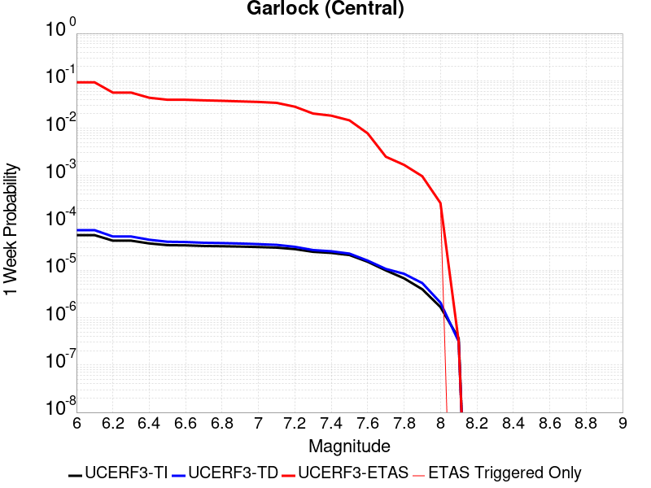 |  |  |  |

| Magnitude | 1 wk TI Prob | 1 wk TD Prob | 1 wk ETAS Prob | 1 wk ETAS/TD Gain | 1 wk ETAS Triggered Only | 1 mo TI Prob | 1 mo TD Prob | 1 mo ETAS Prob | 1 mo ETAS/TD Gain | 1 mo ETAS Triggered Only | 1 yr TI Prob | 1 yr TD Prob | 1 yr ETAS Prob | 1 yr ETAS/TD Gain | 1 yr ETAS Triggered Only | 10 yr TI Prob | 10 yr TD Prob | 10 yr ETAS Prob | 10 yr ETAS/TD Gain | 10 yr ETAS Triggered Only |
|-----|-----|-----|-----|-----|-----|-----|-----|-----|-----|-----|-----|-----|-----|-----|-----|-----|-----|-----|-----|-----|
| 6.0 | 5.5131142E-5 | 7.02476E-5 | 0.092583746 | 1317.9631 | 0.09252 | 2.3625491E-4 | 3.0102677E-4 | 0.11320703 | 376.06964 | 0.11294 | 0.0028726095 | 0.003658906 | 0.15177497 | 41.480972 | 0.14866 | 0.028357591 | 0.036136657 | 0.20979592 | 5.805626 | 0.18017 |
| 6.1 | 5.5131142E-5 | 7.02476E-5 | 0.092583746 | 1317.9631 | 0.09252 | 2.3625491E-4 | 3.0102677E-4 | 0.11320703 | 376.06964 | 0.11294 | 0.0028726095 | 0.003658906 | 0.15177497 | 41.480972 | 0.14866 | 0.028357591 | 0.036136657 | 0.20979592 | 5.805626 | 0.18017 |
| 6.2 | 4.216245E-5 | 5.1661802E-5 | 0.056338754 | 1090.5302 | 0.05629 | 1.806837E-4 | 2.213891E-4 | 0.069745995 | 315.03806 | 0.06954 | 0.0021976046 | 0.002692112 | 0.09437463 | 35.05598 | 0.09193 | 0.021759989 | 0.026701318 | 0.13625582 | 5.1029625 | 0.11256 |
| 6.3 | 4.216245E-5 | 5.1661802E-5 | 0.056338754 | 1090.5302 | 0.05629 | 1.806837E-4 | 2.213891E-4 | 0.069745995 | 315.03806 | 0.06954 | 0.0021976046 | 0.002692112 | 0.09437463 | 35.05598 | 0.09193 | 0.021759989 | 0.026701318 | 0.13625582 | 5.1029625 | 0.11256 |
| 6.4 | 3.6858168E-5 | 4.411026E-5 | 0.04383218 | 993.69574 | 0.04379 | 1.5795401E-4 | 1.8903041E-4 | 0.054068845 | 286.0325 | 0.05389 | 0.0019213937 | 0.0022990413 | 0.07374441 | 32.076157 | 0.07161 | 0.019048655 | 0.022866098 | 0.10834577 | 4.7382708 | 0.08748 |
| 6.5 | 3.39199E-5 | 4.0018425E-5 | 0.03975843 | 993.50305 | 0.03972 | 1.453629E-4 | 1.7149639E-4 | 0.04889314 | 285.0972 | 0.04873 | 0.0017683565 | 0.0020859907 | 0.066690944 | 31.970871 | 0.06474 | 0.017543508 | 0.020758783 | 0.09837344 | 4.738883 | 0.07926 |
| 6.6 | 3.3571985E-5 | 3.947258E-5 | 0.039707907 | 1005.9618 | 0.03967 | 1.4387199E-4 | 1.6915736E-4 | 0.048830923 | 288.6716 | 0.04867 | 0.0017502342 | 0.0020575672 | 0.06656457 | 32.3511 | 0.06464 | 0.017365133 | 0.020480042 | 0.09796007 | 4.783197 | 0.0791 |
| 6.7 | 3.2580007E-5 | 3.808902E-5 | 0.03864662 | 1014.63934 | 0.03861 | 1.3962112E-4 | 1.6322857E-4 | 0.047425512 | 290.54666 | 0.04727 | 0.0016985617 | 0.0019855178 | 0.06453109 | 32.500885 | 0.06267 | 0.016856372 | 0.019770874 | 0.094807416 | 4.795307 | 0.07655 |
| 6.8 | 3.2185937E-5 | 3.7516216E-5 | 0.0377561 | 1006.39417 | 0.03772 | 1.3793244E-4 | 1.60774E-4 | 0.04639334 | 288.56247 | 0.04624 | 0.0016780337 | 0.0019556875 | 0.06325557 | 32.344418 | 0.06142 | 0.016654192 | 0.019477878 | 0.093017034 | 4.775522 | 0.075 |
| 6.9 | 3.165394E-5 | 3.672075E-5 | 0.036705375 | 999.58124 | 0.03667 | 1.3565269E-4 | 1.5736527E-4 | 0.04509029 | 286.53268 | 0.04494 | 0.0016503202 | 0.00191426 | 0.06163971 | 32.200283 | 0.05984 | 0.01638118 | 0.019071518 | 0.09071854 | 4.756755 | 0.07304 |
| 7.0 | 3.0903822E-5 | 3.562591E-5 | 0.035734355 | 1003.04395 | 0.0357 | 1.3243823E-4 | 1.5267366E-4 | 0.043836005 | 287.12225 | 0.04369 | 0.0016112428 | 0.0018572382 | 0.059869297 | 32.235657 | 0.05812 | 0.015996104 | 0.018513493 | 0.08813033 | 4.7603297 | 0.07093 |
| 7.1 | 3.0069863E-5 | 3.4392175E-5 | 0.034173217 | 993.63354 | 0.03414 | 1.2886449E-4 | 1.4738683E-4 | 0.04197122 | 284.76917 | 0.04183 | 0.0015677959 | 0.0017929787 | 0.05739311 | 32.009922 | 0.0557 | 0.01556781 | 0.01788099 | 0.08469454 | 4.7365694 | 0.06803 |
| 7.2 | 2.7957109E-5 | 3.128141E-5 | 0.028350396 | 906.30164 | 0.02832 | 1.1981068E-4 | 1.3405642E-4 | 0.034829404 | 259.81152 | 0.0347 | 0.0014577188 | 0.0016309345 | 0.047965243 | 29.409668 | 0.04641 | 0.014481937 | 0.016284352 | 0.072041355 | 4.423962 | 0.05668 |
| 7.3 | 2.4519275E-5 | 2.6714602E-5 | 0.020346172 | 761.61237 | 0.02032 | 1.0507837E-4 | 1.1448621E-4 | 0.025181616 | 219.95326 | 0.02507 | 0.0012785783 | 0.001392993 | 0.034856316 | 25.022604 | 0.03351 | 0.012712469 | 0.01392861 | 0.054367397 | 3.9032896 | 0.04101 |
| 7.4 | 2.3225532E-5 | 2.5199166E-5 | 0.018344738 | 727.98987 | 0.01832 | 9.95342E-5 | 1.0799204E-4 | 0.022635559 | 209.60396 | 0.02253 | 0.0012111551 | 0.0013140244 | 0.031434394 | 23.922228 | 0.03016 | 0.012045753 | 0.013146196 | 0.049561102 | 3.7699957 | 0.0369 |
| 7.5 | 2.097765E-5 | 2.2483406E-5 | 0.014612155 | 649.90845 | 0.01459 | 8.9901114E-5 | 9.6353964E-5 | 0.018034626 | 187.17056 | 0.01794 | 0.0010939965 | 0.00117249 | 0.025124373 | 21.42822 | 0.02398 | 0.010886264 | 0.0117406575 | 0.04062748 | 3.4604092 | 0.02923 |
| 7.6 | 1.511254E-5 | 1.5990969E-5 | 0.007765867 | 485.6408 | 0.00775 | 6.476642E-5 | 6.8530964E-5 | 0.009657874 | 140.92715 | 0.00959 | 7.882459E-4 | 8.34053E-4 | 0.013773252 | 16.513641 | 0.01295 | 0.007854558 | 0.008383867 | 0.02408115 | 2.8723202 | 0.01583 |
| 7.7 | 9.934069E-6 | 1.0678523E-5 | 0.002490652 | 233.23938 | 0.00248 | 4.2573887E-5 | 4.5764296E-5 | 0.0030656261 | 66.98728 | 0.00302 | 5.182138E-4 | 5.570383E-4 | 0.0044748546 | 8.0332985 | 0.00392 | 0.00517007 | 0.005627419 | 0.010539619 | 1.8729047 | 0.00494 |
| 7.8 | 6.7562896E-6 | 8.42837E-6 | 0.0016784143 | 199.13866 | 0.00167 | 2.8955206E-5 | 3.6121084E-5 | 0.002056048 | 56.920994 | 0.00202 | 3.5247262E-4 | 4.3968562E-4 | 0.003078525 | 7.00165 | 0.00264 | 0.0035191406 | 0.004446416 | 0.007771565 | 1.7478267 | 0.00334 |
| 7.9 | 3.975453E-6 | 5.3710532E-6 | 9.653659E-4 | 179.73494 | 9.6E-4 | 1.7037546E-5 | 2.3018596E-5 | 0.0011829919 | 51.392876 | 0.00116 | 2.0741238E-4 | 2.8021546E-4 | 0.0018297811 | 6.5299077 | 0.00155 | 0.002072189 | 0.0028335669 | 0.00476807 | 1.6827095 | 0.00194 |
| 8.0 | 1.6729537E-6 | 2.0775192E-6 | 2.6207697E-4 | 126.149 | 2.6E-4 | 7.169782E-6 | 8.903624E-6 | 3.7890032E-4 | 42.555744 | 3.7E-4 | 8.7288594E-5 | 1.0839626E-4 | 6.0834206E-4 | 5.612205 | 5.0E-4 | 8.7254314E-4 | 0.001096854 | 0.001726163 | 1.57374 | 6.3E-4 |
| 8.1 | 3.6733252E-7 | 3.1489736E-7 | 3.1489736E-7 | 1.0 | 0.0 | 1.5742813E-6 | 1.3495595E-6 | 4.1349507E-5 | 30.63926 | 4.0E-5 | 1.9166706E-5 | 1.643078E-5 | 6.642996E-5 | 4.0430193 | 5.0E-5 | 1.9165053E-4 | 1.662928E-4 | 2.1628448E-4 | 1.3006245 | 5.0E-5 |

## Tank Canyon
*[(top)](#table-of-contents)*

| 1 Week | 1 Month | 1 Year | 10 Year |
|-----|-----|-----|-----|
|  |  |  |  |

| Magnitude | 1 wk TI Prob | 1 wk TD Prob | 1 wk ETAS Prob | 1 wk ETAS/TD Gain | 1 wk ETAS Triggered Only | 1 mo TI Prob | 1 mo TD Prob | 1 mo ETAS Prob | 1 mo ETAS/TD Gain | 1 mo ETAS Triggered Only | 1 yr TI Prob | 1 yr TD Prob | 1 yr ETAS Prob | 1 yr ETAS/TD Gain | 1 yr ETAS Triggered Only | 10 yr TI Prob | 10 yr TD Prob | 10 yr ETAS Prob | 10 yr ETAS/TD Gain | 10 yr ETAS Triggered Only |
|-----|-----|-----|-----|-----|-----|-----|-----|-----|-----|-----|-----|-----|-----|-----|-----|-----|-----|-----|-----|-----|
| 6.0 | 4.8284557E-5 | 5.796445E-5 | 0.041665554 | 718.8122 | 0.04161 | 2.0691741E-4 | 2.4839927E-4 | 0.05557465 | 223.73116 | 0.05534 | 0.0025163088 | 0.0030207336 | 0.08798331 | 29.12647 | 0.08522 | 0.02488006 | 0.029863616 | 0.14310764 | 4.79204 | 0.11673 |
| 6.1 | 1.7796336E-5 | 2.0873378E-5 | 0.014370574 | 688.46423 | 0.01435 | 7.626778E-5 | 8.945448E-5 | 0.019377729 | 216.62111 | 0.01929 | 9.281647E-4 | 0.0010886024 | 0.032084823 | 29.473412 | 0.03103 | 0.009242975 | 0.010836642 | 0.053647634 | 4.9505773 | 0.04328 |
| 6.2 | 1.7796336E-5 | 2.0873378E-5 | 0.014370574 | 688.46423 | 0.01435 | 7.626778E-5 | 8.945448E-5 | 0.019377729 | 216.62111 | 0.01929 | 9.281647E-4 | 0.0010886024 | 0.032084823 | 29.473412 | 0.03103 | 0.009242975 | 0.010836642 | 0.053647634 | 4.9505773 | 0.04328 |
| 6.3 | 1.3515912E-5 | 1.5759651E-5 | 0.0101356 | 643.13605 | 0.01012 | 5.792405E-5 | 6.7539746E-5 | 0.013816611 | 204.57007 | 0.01375 | 7.049971E-4 | 8.2200987E-4 | 0.023103679 | 28.106329 | 0.0223 | 0.007027647 | 0.008192157 | 0.039126642 | 4.77611 | 0.03119 |
| 6.4 | 1.0870146E-5 | 1.2618114E-5 | 0.007572523 | 600.1311 | 0.00756 | 4.658551E-5 | 5.4076605E-5 | 0.01033352 | 191.09041 | 0.01028 | 5.67031E-4 | 6.582015E-4 | 0.01734721 | 26.355469 | 0.0167 | 0.005655863 | 0.006564382 | 0.029622022 | 4.512538 | 0.02321 |
| 6.5 | 7.964826E-6 | 9.196184E-6 | 0.0048491517 | 527.3004 | 0.00484 | 3.4134522E-5 | 3.941168E-5 | 0.006459159 | 163.88945 | 0.00642 | 4.1550855E-4 | 4.797421E-4 | 0.010814781 | 22.542906 | 0.01034 | 0.0041473247 | 0.004788209 | 0.019009786 | 3.9701242 | 0.01429 |
| 6.6 | 6.6317E-6 | 7.612378E-6 | 0.003477586 | 456.83307 | 0.00347 | 2.8421264E-5 | 3.262412E-5 | 0.00476247 | 145.98003 | 0.00473 | 3.4597394E-4 | 3.9713533E-4 | 0.008004113 | 20.154623 | 0.00761 | 0.0034543579 | 0.0039652516 | 0.01424433 | 3.5922892 | 0.01032 |
| 6.7 | 4.793663E-6 | 5.4308593E-6 | 0.0018454209 | 339.80273 | 0.00184 | 2.0544108E-5 | 2.3274928E-5 | 0.002553216 | 109.69813 | 0.00253 | 2.500958E-4 | 2.833398E-4 | 0.0043621836 | 15.395593 | 0.00408 | 0.0024981452 | 0.0028303189 | 0.008374582 | 2.9588828 | 0.00556 |
| 6.8 | 4.382823E-6 | 4.969325E-6 | 0.0017349607 | 349.1341 | 0.00173 | 1.8783392E-5 | 2.1296957E-5 | 0.002361247 | 110.87251 | 0.00234 | 2.286638E-4 | 2.5926388E-4 | 0.003998294 | 15.421718 | 0.00374 | 0.0022842865 | 0.0025901233 | 0.0076469914 | 2.9523656 | 0.00507 |
| 6.9 | 2.729601E-6 | 3.0735862E-6 | 7.130714E-4 | 231.9998 | 7.1E-4 | 1.1698237E-5 | 1.3172453E-5 | 0.0010731585 | 81.46991 | 0.00106 | 1.4241673E-4 | 1.6036403E-4 | 0.001750109 | 10.913351 | 0.00159 | 0.001423255 | 0.0016024808 | 0.0037490355 | 2.3395197 | 0.00215 |
| 7.0 | 1.8987357E-6 | 2.126971E-6 | 3.0212634E-4 | 142.04535 | 3.0E-4 | 8.137413E-6 | 9.115562E-6 | 4.7911127E-4 | 52.559708 | 4.7E-4 | 9.90685E-5 | 1.1097702E-4 | 8.0090045E-4 | 7.2168136 | 6.9E-4 | 9.902435E-4 | 0.0011092846 | 0.002048242 | 1.846453 | 9.4E-4 |
| 7.1 | 1.4928986E-6 | 1.6641525E-6 | 1.0166399E-4 | 61.090546 | 1.0E-4 | 6.398121E-6 | 7.132066E-6 | 2.4713035E-4 | 34.650597 | 2.4E-4 | 7.789434E-5 | 8.6830034E-5 | 4.7679618E-4 | 5.491143 | 3.9E-4 | 7.786704E-4 | 8.6801895E-4 | 0.0014275329 | 1.6445872 | 5.6E-4 |
| 7.2 | 1.069082E-6 | 1.1828765E-6 | 4.118283E-5 | 34.81583 | 4.0E-5 | 4.581772E-6 | 5.0694644E-6 | 1.0506896E-4 | 20.725851 | 1.0E-4 | 5.5781646E-5 | 6.171951E-5 | 2.3170903E-4 | 3.7542264 | 1.7E-4 | 5.576765E-4 | 6.1707594E-4 | 8.869094E-4 | 1.4372774 | 2.7E-4 |
| 7.3 | 8.776551E-7 | 9.770151E-7 | 2.0976995E-5 | 21.470491 | 2.0E-5 | 3.7613736E-6 | 4.187204E-6 | 7.418691E-5 | 17.71753 | 7.0E-5 | 4.579376E-5 | 5.0978535E-5 | 1.7097242E-4 | 3.353812 | 1.2E-4 | 4.5784327E-4 | 5.097194E-4 | 6.9962256E-4 | 1.3725641 | 1.9E-4 |
| 7.4 | 7.55721E-7 | 8.5103835E-7 | 2.0851021E-5 | 24.500683 | 2.0E-5 | 3.2388E-6 | 3.6473052E-6 | 5.3647123E-5 | 14.708701 | 5.0E-5 | 3.9431678E-5 | 4.4405555E-5 | 1.24402E-4 | 2.8014965 | 8.0E-5 | 3.942468E-4 | 4.4401767E-4 | 5.7395996E-4 | 1.2926512 | 1.3E-4 |
| 7.5 | 5.587665E-7 | 6.305732E-7 | 1.0630567E-5 | 16.858578 | 1.0E-5 | 2.3947114E-6 | 2.7024564E-6 | 4.2702348E-5 | 15.801309 | 4.0E-5 | 2.915522E-5 | 3.2902408E-5 | 9.290043E-5 | 2.8235147 | 6.0E-5 | 2.9151395E-4 | 3.2902407E-4 | 4.289912E-4 | 1.3038291 | 1.0E-4 |

## Little Lake
*[(top)](#table-of-contents)*

| 1 Week | 1 Month | 1 Year | 10 Year |
|-----|-----|-----|-----|
|  |  |  |  |

| Magnitude | 1 wk TI Prob | 1 wk TD Prob | 1 wk ETAS Prob | 1 wk ETAS/TD Gain | 1 wk ETAS Triggered Only | 1 mo TI Prob | 1 mo TD Prob | 1 mo ETAS Prob | 1 mo ETAS/TD Gain | 1 mo ETAS Triggered Only | 1 yr TI Prob | 1 yr TD Prob | 1 yr ETAS Prob | 1 yr ETAS/TD Gain | 1 yr ETAS Triggered Only | 10 yr TI Prob | 10 yr TD Prob | 10 yr ETAS Prob | 10 yr ETAS/TD Gain | 10 yr ETAS Triggered Only |
|-----|-----|-----|-----|-----|-----|-----|-----|-----|-----|-----|-----|-----|-----|-----|-----|-----|-----|-----|-----|-----|
| 6.0 | 2.8424427E-5 | 3.1205716E-5 | 0.035910085 | 1150.7535 | 0.03588 | 1.2181328E-4 | 1.3373268E-4 | 0.04351793 | 325.40985 | 0.04339 | 0.0014820677 | 0.0016271125 | 0.058724057 | 36.090965 | 0.05719 | 0.014722223 | 0.016165398 | 0.085250266 | 5.273626 | 0.07022 |
| 6.1 | 2.8424427E-5 | 3.1205716E-5 | 0.035910085 | 1150.7535 | 0.03588 | 1.2181328E-4 | 1.3373268E-4 | 0.04351793 | 325.40985 | 0.04339 | 0.0014820677 | 0.0016271125 | 0.058724057 | 36.090965 | 0.05719 | 0.014722223 | 0.016165398 | 0.085250266 | 5.273626 | 0.07022 |
| 6.2 | 2.8424427E-5 | 3.1205716E-5 | 0.035910085 | 1150.7535 | 0.03588 | 1.2181328E-4 | 1.3373268E-4 | 0.04351793 | 325.40985 | 0.04339 | 0.0014820677 | 0.0016271125 | 0.058724057 | 36.090965 | 0.05719 | 0.014722223 | 0.016165398 | 0.085250266 | 5.273626 | 0.07022 |
| 6.3 | 1.48860645E-5 | 1.6081383E-5 | 0.024485689 | 1522.6107 | 0.02447 | 6.379586E-5 | 6.8918554E-5 | 0.029376898 | 426.25528 | 0.02931 | 7.7643775E-4 | 8.387886E-4 | 0.03921657 | 46.75382 | 0.03841 | 0.007737305 | 0.008359045 | 0.054698426 | 6.5436215 | 0.04673 |
| 6.4 | 1.48860645E-5 | 1.6081383E-5 | 0.024485689 | 1522.6107 | 0.02447 | 6.379586E-5 | 6.8918554E-5 | 0.029376898 | 426.25528 | 0.02931 | 7.7643775E-4 | 8.387886E-4 | 0.03921657 | 46.75382 | 0.03841 | 0.007737305 | 0.008359045 | 0.054698426 | 6.5436215 | 0.04673 |
| 6.5 | 1.2797581E-5 | 1.376556E-5 | 0.021983463 | 1596.9901 | 0.02197 | 5.4845623E-5 | 5.8994065E-5 | 0.026347443 | 446.61176 | 0.02629 | 6.675408E-4 | 7.1804173E-4 | 0.035033382 | 48.790176 | 0.03434 | 0.006655392 | 0.007159767 | 0.048491705 | 6.7728047 | 0.04163 |
| 6.6 | 9.661896E-6 | 1.0289033E-5 | 0.017750107 | 1725.1483 | 0.01774 | 4.1407468E-5 | 4.40952E-5 | 0.021133166 | 479.26227 | 0.02109 | 5.040193E-4 | 5.36743E-4 | 0.027892053 | 51.965374 | 0.02737 | 0.005028777 | 0.0053560715 | 0.03837825 | 7.165373 | 0.0332 |
| 6.7 | 7.767871E-6 | 8.199681E-6 | 0.015048076 | 1835.2026 | 0.01504 | 3.329045E-5 | 3.5141096E-5 | 0.017874515 | 508.6499 | 0.01784 | 4.0523586E-4 | 4.2777258E-4 | 0.023527887 | 55.000923 | 0.02311 | 0.004044977 | 0.004270843 | 0.0320019 | 7.4931107 | 0.02785 |
| 6.8 | 6.4235196E-6 | 6.735739E-6 | 0.011836656 | 1757.2914 | 0.01183 | 2.752908E-5 | 2.8867207E-5 | 0.014058462 | 487.0046 | 0.01403 | 3.35115E-4 | 3.5141438E-4 | 0.01848504 | 52.60183 | 0.01814 | 0.003346101 | 0.0035098472 | 0.025313051 | 7.2120094 | 0.02188 |
| 6.9 | 3.1283696E-6 | 3.1121751E-6 | 0.006453092 | 2073.499 | 0.00645 | 1.3407229E-5 | 1.33378335E-5 | 0.007723235 | 579.0472 | 0.00771 | 1.6322079E-4 | 1.6237753E-4 | 0.010110762 | 62.267002 | 0.00995 | 0.0016310095 | 0.0016227372 | 0.013503427 | 8.321388 | 0.0119 |
| 7.0 | 2.290603E-6 | 2.2286763E-6 | 0.00399222 | 1791.2965 | 0.00399 | 9.816834E-6 | 9.551441E-6 | 0.004809506 | 503.5372 | 0.0048 | 1.19513395E-4 | 1.1628362E-4 | 0.006295565 | 54.13974 | 0.00618 | 0.0011944914 | 0.0011623299 | 0.008653613 | 7.445057 | 0.0075 |
| 7.1 | 1.293693E-6 | 1.1776774E-6 | 0.0017111757 | 1453.0088 | 0.00171 | 5.5443866E-6 | 5.047183E-6 | 0.001995037 | 395.27734 | 0.00199 | 6.750081E-5 | 6.1448416E-5 | 0.002541296 | 41.35657 | 0.00248 | 6.7480316E-4 | 6.1438273E-4 | 0.003782435 | 6.15648 | 0.00317 |
| 7.2 | 4.715842E-7 | 3.091732E-7 | 1.3030913E-4 | 421.47617 | 1.3E-4 | 2.0210737E-6 | 1.3250274E-6 | 1.5132483E-4 | 114.20506 | 1.5E-4 | 2.4606294E-5 | 1.6132095E-5 | 1.7612951E-4 | 10.917957 | 1.6E-4 | 2.460357E-4 | 1.6130977E-4 | 3.812743E-4 | 2.3636155 | 2.2E-4 |
| 7.3 | 3.9430947E-7 | 2.3096938E-7 | 7.0230955E-5 | 304.0704 | 7.0E-5 | 1.6898966E-6 | 9.898685E-7 | 8.098979E-5 | 81.81874 | 8.0E-5 | 2.0574296E-5 | 1.2051582E-5 | 9.205062E-5 | 7.6380525 | 8.0E-5 | 2.0572392E-4 | 1.2050936E-4 | 2.504937E-4 | 2.0786245 | 1.3E-4 |
| 7.4 | 3.547123E-7 | 1.9678579E-7 | 7.019677E-5 | 356.71667 | 7.0E-5 | 1.5201948E-6 | 8.433674E-7 | 8.08433E-5 | 95.85775 | 8.0E-5 | 1.8508214E-5 | 1.02679505E-5 | 9.026713E-5 | 8.791154 | 8.0E-5 | 1.8506673E-4 | 1.0267482E-4 | 2.1266352E-4 | 2.0712335 | 1.1E-4 |
| 7.5 | 2.6354266E-7 | 1.4422719E-7 | 2.0144224E-5 | 139.67009 | 2.0E-5 | 1.129468E-6 | 6.1811636E-7 | 3.06181E-5 | 49.53452 | 3.0E-5 | 1.3751187E-5 | 7.525541E-6 | 3.7525315E-5 | 4.9863944 | 3.0E-5 | 1.3750336E-4 | 7.5252916E-5 | 1.1524991E-4 | 1.5315008 | 4.0E-5 |
| 7.6 | 1.269913E-7 | 7.572344E-8 | 7.572344E-8 | 1.0 | 0.0 | 5.4424834E-7 | 3.24529E-7 | 1.0324526E-5 | 31.813877 | 1.0E-5 | 6.6262032E-6 | 3.9511337E-6 | 1.3951094E-5 | 3.530909 | 1.0E-5 | 6.626006E-5 | 3.9510673E-5 | 5.950988E-5 | 1.5061724 | 2.0E-5 |

## Owl Lake
*[(top)](#table-of-contents)*

| 1 Week | 1 Month | 1 Year | 10 Year |
|-----|-----|-----|-----|
|  |  |  |  |

| Magnitude | 1 wk TI Prob | 1 wk TD Prob | 1 wk ETAS Prob | 1 wk ETAS/TD Gain | 1 wk ETAS Triggered Only | 1 mo TI Prob | 1 mo TD Prob | 1 mo ETAS Prob | 1 mo ETAS/TD Gain | 1 mo ETAS Triggered Only | 1 yr TI Prob | 1 yr TD Prob | 1 yr ETAS Prob | 1 yr ETAS/TD Gain | 1 yr ETAS Triggered Only | 10 yr TI Prob | 10 yr TD Prob | 10 yr ETAS Prob | 10 yr ETAS/TD Gain | 10 yr ETAS Triggered Only |
|-----|-----|-----|-----|-----|-----|-----|-----|-----|-----|-----|-----|-----|-----|-----|-----|-----|-----|-----|-----|-----|
| 6.0 | 5.0320643E-5 | 6.6358676E-5 | 0.021384943 | 322.26297 | 0.02132 | 2.1564208E-4 | 2.843643E-4 | 0.028166434 | 99.05052 | 0.02789 | 0.0026222812 | 0.003457547 | 0.04328935 | 12.520248 | 0.03997 | 0.02591553 | 0.034141295 | 0.085138634 | 2.4937143 | 0.0528 |
| 6.1 | 5.0320643E-5 | 6.6358676E-5 | 0.021384943 | 322.26297 | 0.02132 | 2.1564208E-4 | 2.843643E-4 | 0.028166434 | 99.05052 | 0.02789 | 0.0026222812 | 0.003457547 | 0.04328935 | 12.520248 | 0.03997 | 0.02591553 | 0.034141295 | 0.085138634 | 2.4937143 | 0.0528 |
| 6.2 | 2.4125871E-5 | 3.0980515E-5 | 0.01720045 | 555.20215 | 0.01717 | 1.0339249E-4 | 1.3276804E-4 | 0.022149844 | 166.83115 | 0.02202 | 0.0012580766 | 0.0016154252 | 0.03262525 | 20.196075 | 0.03106 | 0.012509781 | 0.016070755 | 0.05594941 | 3.4814422 | 0.04053 |
| 6.3 | 1.7433485E-5 | 2.2355545E-5 | 0.015522009 | 694.32477 | 0.0155 | 7.471279E-5 | 9.580685E-5 | 0.019703928 | 205.66304 | 0.01961 | 9.0924866E-4 | 0.001165962 | 0.02850405 | 24.44681 | 0.02737 | 0.009055373 | 0.0116291465 | 0.04629131 | 3.9806285 | 0.03507 |
| 6.4 | 1.7433485E-5 | 2.2355545E-5 | 0.015522009 | 694.32477 | 0.0155 | 7.471279E-5 | 9.580685E-5 | 0.019703928 | 205.66304 | 0.01961 | 9.0924866E-4 | 0.001165962 | 0.02850405 | 24.44681 | 0.02737 | 0.009055373 | 0.0116291465 | 0.04629131 | 3.9806285 | 0.03507 |
| 6.5 | 1.5182742E-5 | 1.9429277E-5 | 0.015059137 | 775.0745 | 0.01504 | 6.506727E-5 | 8.3266525E-5 | 0.019011691 | 228.32333 | 0.01893 | 7.919061E-4 | 0.0010134344 | 0.027176892 | 26.816628 | 0.02619 | 0.0078909 | 0.010118678 | 0.04320051 | 4.269383 | 0.03342 |
| 6.6 | 6.7271576E-6 | 8.547518E-6 | 0.012528441 | 1465.7402 | 0.01252 | 2.8830356E-5 | 3.6631736E-5 | 0.015506065 | 423.29593 | 0.01547 | 3.5095305E-4 | 4.4590578E-4 | 0.020896783 | 46.86367 | 0.02046 | 0.0035039932 | 0.0044680187 | 0.029346364 | 6.568093 | 0.02499 |
| 6.7 | 6.682835E-6 | 8.479961E-6 | 0.012528374 | 1477.4094 | 0.01252 | 2.8640408E-5 | 3.6342215E-5 | 0.0155057805 | 426.66028 | 0.01547 | 3.4864116E-4 | 4.423823E-4 | 0.020883335 | 47.206535 | 0.02045 | 0.003480947 | 0.0044329325 | 0.029282287 | 6.605624 | 0.02496 |
| 6.8 | 6.5774975E-6 | 8.326427E-6 | 0.012488223 | 1499.8297 | 0.01248 | 2.8188972E-5 | 3.5684232E-5 | 0.015465134 | 433.38846 | 0.01543 | 3.4314668E-4 | 4.3437455E-4 | 0.020825513 | 47.94368 | 0.0204 | 0.0034261728 | 0.0043531056 | 0.029134756 | 6.692867 | 0.02489 |
| 6.9 | 6.363419E-6 | 7.999591E-6 | 0.0124679 | 1558.5673 | 0.01246 | 2.727151E-5 | 3.428354E-5 | 0.015423756 | 449.8881 | 0.01539 | 3.3198006E-4 | 4.1732774E-4 | 0.020758836 | 49.742283 | 0.02035 | 0.0033148455 | 0.0041830647 | 0.028909199 | 6.9110093 | 0.02483 |
| 7.0 | 6.1342453E-6 | 7.631779E-6 | 0.012407538 | 1625.7726 | 0.0124 | 2.6289357E-5 | 3.2707245E-5 | 0.015312208 | 468.1595 | 0.01528 | 3.2002592E-4 | 3.9814346E-4 | 0.020550117 | 51.614853 | 0.02016 | 0.0031956544 | 0.003991739 | 0.028453702 | 7.1281466 | 0.02456 |
| 7.1 | 5.842926E-6 | 7.142312E-6 | 0.0118670575 | 1661.5149 | 0.01186 | 2.504087E-5 | 3.060958E-5 | 0.014660162 | 478.9403 | 0.01463 | 3.0482994E-4 | 3.7261334E-4 | 0.019595448 | 52.58923 | 0.01923 | 0.0030441214 | 0.0037371595 | 0.027069636 | 7.2433715 | 0.02342 |
| 7.2 | 4.77173E-6 | 5.358478E-6 | 0.0076153176 | 1421.1718 | 0.00761 | 2.045011E-5 | 2.2964727E-5 | 0.0093927495 | 409.00766 | 0.00937 | 2.4895166E-4 | 2.7956374E-4 | 0.012646105 | 45.23514 | 0.01237 | 0.0024867293 | 0.0028086212 | 0.01770666 | 6.304396 | 0.01494 |
| 7.3 | 3.0494948E-6 | 2.710356E-6 | 0.0022427044 | 827.4574 | 0.00224 | 1.3069198E-5 | 1.1615762E-5 | 0.0027815837 | 239.46632 | 0.00277 | 1.5910587E-4 | 1.4141288E-4 | 0.0036009236 | 25.463902 | 0.00346 | 0.0015899199 | 0.0014231089 | 0.0055871746 | 3.9260345 | 0.00417 |
| 7.4 | 2.7263884E-6 | 2.3055634E-6 | 0.0014723021 | 638.58673 | 0.00147 | 1.1684469E-5 | 9.880949E-6 | 0.001829863 | 185.19102 | 0.00182 | 1.4224913E-4 | 1.2029401E-4 | 0.002390021 | 19.868162 | 0.00227 | 0.0014215811 | 0.0012110578 | 0.0039277636 | 3.2432506 | 0.00272 |
| 7.5 | 2.6090431E-6 | 2.1655019E-6 | 0.0012921627 | 596.7036 | 0.00129 | 1.1181565E-5 | 9.2806895E-6 | 0.0016392656 | 176.63187 | 0.00163 | 1.3612706E-4 | 1.1298663E-4 | 0.002162755 | 19.14169 | 0.00205 | 0.001360437 | 0.0011378126 | 0.0035450705 | 3.115689 | 0.00241 |
| 7.6 | 2.3008756E-6 | 1.8726826E-6 | 9.7187085E-4 | 518.9726 | 9.7E-4 | 9.860858E-6 | 8.025758E-6 | 0.0011880163 | 148.02544 | 0.00118 | 1.20049335E-4 | 9.770931E-5 | 0.0016075617 | 16.452494 | 0.00151 | 0.001199845 | 9.848307E-4 | 0.002783058 | 2.8259254 | 0.0018 |
| 7.7 | 1.7184348E-6 | 1.341808E-6 | 4.613412E-4 | 343.82056 | 4.6E-4 | 7.3646997E-6 | 5.750593E-6 | 5.657474E-4 | 98.3807 | 5.6E-4 | 8.966153E-5 | 7.0011265E-5 | 7.8996085E-4 | 11.2833395 | 7.2E-4 | 8.962536E-4 | 7.0769014E-4 | 0.0015770745 | 2.2284815 | 8.7E-4 |
| 7.8 | 8.4612907E-7 | 8.4054994E-7 | 2.2084036E-4 | 262.7332 | 2.2E-4 | 3.6262625E-6 | 3.602352E-6 | 2.6360143E-4 | 73.174805 | 2.6E-4 | 4.4148852E-5 | 4.3857777E-5 | 3.8384285E-4 | 8.751991 | 3.4E-4 | 4.414008E-4 | 4.4386165E-4 | 8.636752E-4 | 1.9458208 | 4.2E-4 |
| 7.9 | 2.716738E-7 | 3.7681625E-7 | 8.037678E-5 | 213.305 | 8.0E-5 | 1.1643157E-6 | 1.6149258E-6 | 1.01614765E-4 | 62.92225 | 1.0E-4 | 1.4175452E-5 | 1.9661555E-5 | 1.49659E-4 | 7.6117578 | 1.3E-4 | 1.4174548E-4 | 1.9829652E-4 | 3.4826677E-4 | 1.7562929 | 1.5E-4 |
| 8.0 | 2.1995428E-8 | 3.3853325E-8 | 1.0033853E-5 | 296.39194 | 1.0E-5 | 9.426611E-8 | 1.4508568E-7 | 2.0145082E-5 | 138.84956 | 2.0E-5 | 1.1476893E-6 | 1.7664173E-6 | 2.1766382E-5 | 12.322332 | 2.0E-5 | 1.14768345E-5 | 1.7869768E-5 | 3.7869413E-5 | 2.1191885 | 2.0E-5 |

## Airport Lake
*[(top)](#table-of-contents)*

| 1 Week | 1 Month | 1 Year | 10 Year |
|-----|-----|-----|-----|
|  |  | 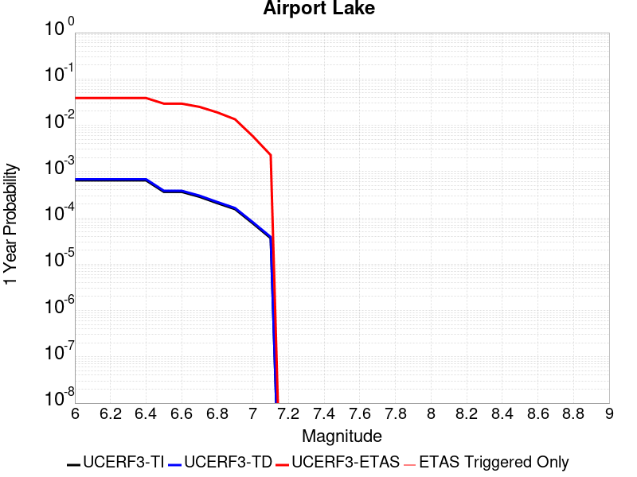 |  |

| Magnitude | 1 wk TI Prob | 1 wk TD Prob | 1 wk ETAS Prob | 1 wk ETAS/TD Gain | 1 wk ETAS Triggered Only | 1 mo TI Prob | 1 mo TD Prob | 1 mo ETAS Prob | 1 mo ETAS/TD Gain | 1 mo ETAS Triggered Only | 1 yr TI Prob | 1 yr TD Prob | 1 yr ETAS Prob | 1 yr ETAS/TD Gain | 1 yr ETAS Triggered Only | 10 yr TI Prob | 10 yr TD Prob | 10 yr ETAS Prob | 10 yr ETAS/TD Gain | 10 yr ETAS Triggered Only |
|-----|-----|-----|-----|-----|-----|-----|-----|-----|-----|-----|-----|-----|-----|-----|-----|-----|-----|-----|-----|-----|
| 6.0 | 1.2387061E-5 | 1.3103157E-5 | 0.024132786 | 1841.7537 | 0.02412 | 5.3086325E-5 | 5.615534E-5 | 0.029394507 | 523.44995 | 0.02934 | 6.461343E-4 | 6.8350515E-4 | 0.03874747 | 56.68936 | 0.03809 | 0.0064425888 | 0.0068168393 | 0.052612513 | 7.718022 | 0.04611 |
| 6.1 | 1.2387061E-5 | 1.3103157E-5 | 0.024132786 | 1841.7537 | 0.02412 | 5.3086325E-5 | 5.615534E-5 | 0.029394507 | 523.44995 | 0.02934 | 6.461343E-4 | 6.8350515E-4 | 0.03874747 | 56.68936 | 0.03809 | 0.0064425888 | 0.0068168393 | 0.052612513 | 7.718022 | 0.04611 |
| 6.2 | 1.2387061E-5 | 1.3103157E-5 | 0.024132786 | 1841.7537 | 0.02412 | 5.3086325E-5 | 5.615534E-5 | 0.029394507 | 523.44995 | 0.02934 | 6.461343E-4 | 6.8350515E-4 | 0.03874747 | 56.68936 | 0.03809 | 0.0064425888 | 0.0068168393 | 0.052612513 | 7.718022 | 0.04611 |
| 6.3 | 1.2387061E-5 | 1.3103157E-5 | 0.024132786 | 1841.7537 | 0.02412 | 5.3086325E-5 | 5.615534E-5 | 0.029394507 | 523.44995 | 0.02934 | 6.461343E-4 | 6.8350515E-4 | 0.03874747 | 56.68936 | 0.03809 | 0.0064425888 | 0.0068168393 | 0.052612513 | 7.718022 | 0.04611 |
| 6.4 | 1.2387061E-5 | 1.3103157E-5 | 0.024132786 | 1841.7537 | 0.02412 | 5.3086325E-5 | 5.615534E-5 | 0.029394507 | 523.44995 | 0.02934 | 6.461343E-4 | 6.8350515E-4 | 0.03874747 | 56.68936 | 0.03809 | 0.0064425888 | 0.0068168393 | 0.052612513 | 7.718022 | 0.04611 |
| 6.5 | 6.9922594E-6 | 7.384925E-6 | 0.018547248 | 2511.5012 | 0.01854 | 2.996648E-5 | 3.1649324E-5 | 0.022360943 | 706.5219 | 0.02233 | 3.6478083E-4 | 3.8526783E-4 | 0.029304123 | 76.06169 | 0.02893 | 0.003641826 | 0.0038465366 | 0.03872187 | 10.066684 | 0.03501 |
| 6.6 | 6.9922594E-6 | 7.384925E-6 | 0.018547248 | 2511.5012 | 0.01854 | 2.996648E-5 | 3.1649324E-5 | 0.022360943 | 706.5219 | 0.02233 | 3.6478083E-4 | 3.8526783E-4 | 0.029304123 | 76.06169 | 0.02893 | 0.003641826 | 0.0038465366 | 0.03872187 | 10.066684 | 0.03501 |
| 6.7 | 5.477277E-6 | 5.7860684E-6 | 0.015725695 | 2717.855 | 0.01572 | 2.3473833E-5 | 2.4797222E-5 | 0.018974327 | 765.17957 | 0.01895 | 2.8575645E-4 | 3.0186825E-4 | 0.024954423 | 82.66661 | 0.02466 | 0.0028538927 | 0.003014966 | 0.03278494 | 10.874066 | 0.02986 |
| 6.8 | 3.9950432E-6 | 4.2190873E-6 | 0.011874169 | 2814.393 | 0.01187 | 1.7121502E-5 | 1.8081691E-5 | 0.01444782 | 799.03033 | 0.01443 | 2.0843433E-4 | 2.2012512E-4 | 0.018956 | 86.11466 | 0.01874 | 0.0020823893 | 0.0021993418 | 0.024769593 | 11.262276 | 0.02262 |
| 6.9 | 2.95695E-6 | 3.1230243E-6 | 0.008393097 | 2687.49 | 0.00839 | 1.2672582E-5 | 1.3384334E-5 | 0.010203248 | 762.32764 | 0.01019 | 1.5427776E-4 | 1.6294434E-4 | 0.01344078 | 82.48694 | 0.01328 | 0.001541707 | 0.0016284712 | 0.01756248 | 10.784643 | 0.01596 |
| 7.0 | 1.456072E-6 | 1.540812E-6 | 0.0036415353 | 2363.3872 | 0.00364 | 6.2402937E-6 | 6.603469E-6 | 0.004406574 | 667.3121 | 0.0044 | 7.597293E-5 | 8.039528E-5 | 0.005779937 | 71.89399 | 0.0057 | 7.594696E-4 | 8.0376083E-4 | 0.007698215 | 9.577744 | 0.0069 |
| 7.1 | 6.995192E-7 | 7.4089746E-7 | 0.0015207398 | 2052.5645 | 0.00152 | 2.997936E-6 | 3.1752747E-6 | 0.0017731696 | 558.4303 | 0.00177 | 3.649926E-5 | 3.865897E-5 | 0.0022685728 | 58.681667 | 0.00223 | 3.6493264E-4 | 3.865897E-4 | 0.0032054996 | 8.291736 | 0.00282 |

## Panamint Valley
*[(top)](#table-of-contents)*

| 1 Week | 1 Month | 1 Year | 10 Year |
|-----|-----|-----|-----|
| 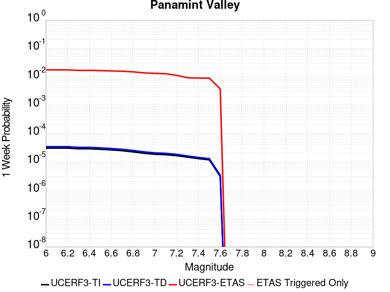 |  | 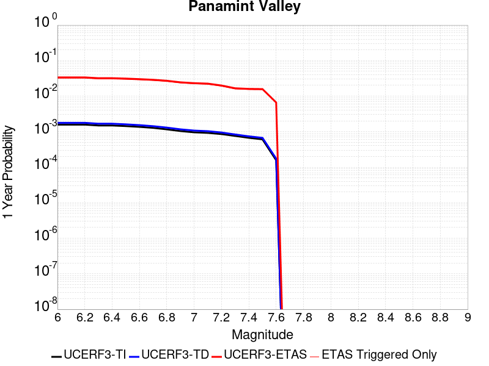 |  |

| Magnitude | 1 wk TI Prob | 1 wk TD Prob | 1 wk ETAS Prob | 1 wk ETAS/TD Gain | 1 wk ETAS Triggered Only | 1 mo TI Prob | 1 mo TD Prob | 1 mo ETAS Prob | 1 mo ETAS/TD Gain | 1 mo ETAS Triggered Only | 1 yr TI Prob | 1 yr TD Prob | 1 yr ETAS Prob | 1 yr ETAS/TD Gain | 1 yr ETAS Triggered Only | 10 yr TI Prob | 10 yr TD Prob | 10 yr ETAS Prob | 10 yr ETAS/TD Gain | 10 yr ETAS Triggered Only |
|-----|-----|-----|-----|-----|-----|-----|-----|-----|-----|-----|-----|-----|-----|-----|-----|-----|-----|-----|-----|-----|
| 6.0 | 3.0211835E-5 | 3.3984263E-5 | 0.017323397 | 509.74762 | 0.01729 | 1.2947287E-4 | 1.4563887E-4 | 0.022142434 | 152.03658 | 0.022 | 0.0015751923 | 0.0017717406 | 0.033675116 | 19.006798 | 0.03196 | 0.015640736 | 0.017583003 | 0.058156826 | 3.3075593 | 0.0413 |
| 6.1 | 3.0211835E-5 | 3.3984263E-5 | 0.017323397 | 509.74762 | 0.01729 | 1.2947287E-4 | 1.4563887E-4 | 0.022142434 | 152.03658 | 0.022 | 0.0015751923 | 0.0017717406 | 0.033675116 | 19.006798 | 0.03196 | 0.015640736 | 0.017583003 | 0.058156826 | 3.3075593 | 0.0413 |
| 6.2 | 3.0211835E-5 | 3.3984263E-5 | 0.017323397 | 509.74762 | 0.01729 | 1.2947287E-4 | 1.4563887E-4 | 0.022142434 | 152.03658 | 0.022 | 0.0015751923 | 0.0017717406 | 0.033675116 | 19.006798 | 0.03196 | 0.015640736 | 0.017583003 | 0.058156826 | 3.3075593 | 0.0413 |
| 6.3 | 2.8573924E-5 | 3.2102445E-5 | 0.016691567 | 519.94696 | 0.01666 | 1.2245393E-4 | 1.375748E-4 | 0.021194678 | 154.0593 | 0.02106 | 0.001489857 | 0.0016737141 | 0.03197292 | 19.102974 | 0.03035 | 0.01479908 | 0.016618038 | 0.055068273 | 3.313765 | 0.0391 |
| 6.4 | 2.8573924E-5 | 3.2102445E-5 | 0.016691567 | 519.94696 | 0.01666 | 1.2245393E-4 | 1.375748E-4 | 0.021194678 | 154.0593 | 0.02106 | 0.001489857 | 0.0016737141 | 0.03197292 | 19.102974 | 0.03035 | 0.01479908 | 0.016618038 | 0.055068273 | 3.313765 | 0.0391 |
| 6.5 | 2.7468774E-5 | 3.0828138E-5 | 0.016450321 | 533.61383 | 0.01642 | 1.1771801E-4 | 1.3211406E-4 | 0.020779386 | 157.28368 | 0.02065 | 0.0014322745 | 0.0016073292 | 0.03117972 | 19.398464 | 0.02962 | 0.014230782 | 0.015963882 | 0.053327736 | 3.3405242 | 0.03797 |
| 6.6 | 2.6135967E-5 | 2.9252153E-5 | 0.015968787 | 545.90125 | 0.01594 | 1.1200648E-4 | 1.2536049E-4 | 0.020162849 | 160.83894 | 0.02004 | 0.0013628257 | 0.0015252219 | 0.0300816 | 19.722769 | 0.0286 | 0.013544982 | 0.015154343 | 0.051012572 | 3.3662016 | 0.03641 |
| 6.7 | 2.4498746E-5 | 2.7341044E-5 | 0.015566916 | 569.3607 | 0.01554 | 1.04990395E-4 | 1.17170785E-4 | 0.019544894 | 166.80688 | 0.01943 | 0.0012775084 | 0.0014256459 | 0.028856484 | 20.24099 | 0.02747 | 0.012701893 | 0.014171593 | 0.048330545 | 3.4103823 | 0.03465 |
| 6.8 | 2.2244329E-5 | 2.4935374E-5 | 0.014804567 | 593.71747 | 0.01478 | 9.532935E-5 | 1.0686163E-4 | 0.018434903 | 172.51189 | 0.01833 | 0.0011600169 | 0.0013002857 | 0.027076725 | 20.823673 | 0.02581 | 0.011539802 | 0.012932955 | 0.044736255 | 3.45909 | 0.03222 |
| 6.9 | 1.9902658E-5 | 2.2290182E-5 | 0.013651987 | 612.4664 | 0.01363 | 8.529431E-5 | 9.552596E-5 | 0.016953915 | 177.47968 | 0.01686 | 0.0010379635 | 0.0011624265 | 0.024485284 | 21.063942 | 0.02335 | 0.010331288 | 0.011569021 | 0.040174212 | 3.472568 | 0.02894 |
| 7.0 | 1.8353881E-5 | 2.056605E-5 | 0.013080297 | 636.01404 | 0.01306 | 7.865712E-5 | 8.813734E-5 | 0.016146721 | 183.19955 | 0.01606 | 9.5722964E-4 | 0.0010725616 | 0.023178825 | 21.610718 | 0.02213 | 0.009531168 | 0.01067939 | 0.03768784 | 3.5290258 | 0.0273 |
| 7.1 | 1.7667631E-5 | 1.9772435E-5 | 0.012659523 | 640.26117 | 0.01264 | 7.571623E-5 | 8.4736355E-5 | 0.015653417 | 184.73083 | 0.01557 | 9.2145515E-4 | 0.0010311945 | 0.022489045 | 21.808733 | 0.02148 | 0.009176437 | 0.0102695925 | 0.03656673 | 3.5606797 | 0.02657 |
| 7.2 | 1.6381597E-5 | 1.8158042E-5 | 0.011157956 | 614.49115 | 0.01114 | 7.020495E-5 | 7.781795E-5 | 0.013756753 | 176.78122 | 0.01368 | 8.544101E-4 | 9.470391E-4 | 0.019899074 | 21.011883 | 0.01897 | 0.008511325 | 0.009435269 | 0.03273335 | 3.4692547 | 0.02352 |
| 7.3 | 1.4520491E-5 | 1.596657E-5 | 0.00918582 | 575.3158 | 0.00917 | 6.222919E-5 | 6.842646E-5 | 0.011397651 | 166.5679 | 0.01133 | 7.57377E-4 | 8.327899E-4 | 0.016639614 | 19.980568 | 0.01582 | 0.0075480095 | 0.008300399 | 0.027608791 | 3.3262002 | 0.01947 |
| 7.4 | 1.2852287E-5 | 1.41454875E-5 | 0.008934019 | 631.5809 | 0.00892 | 5.5080065E-5 | 6.06222E-5 | 0.011049956 | 182.27574 | 0.01099 | 6.7039346E-4 | 7.378411E-4 | 0.015986582 | 21.666698 | 0.01526 | 0.0066837464 | 0.007357429 | 0.025899991 | 3.5202503 | 0.01868 |
| 7.5 | 1.1637851E-5 | 1.2836868E-5 | 0.008862724 | 690.4116 | 0.00885 | 4.987555E-5 | 5.5014076E-5 | 0.0109544145 | 199.12021 | 0.0109 | 6.070656E-4 | 6.696062E-4 | 0.015779482 | 23.565315 | 0.01512 | 0.006054099 | 0.0066793845 | 0.025016082 | 3.7452679 | 0.01846 |
| 7.6 | 3.0068115E-6 | 3.3330623E-6 | 0.0037033206 | 1111.0865 | 0.0037 | 1.2886271E-5 | 1.4284516E-5 | 0.0045642196 | 319.5222 | 0.00455 | 1.5687906E-4 | 1.7390738E-4 | 0.006632784 | 38.13975 | 0.00646 | 0.0015676835 | 0.0017397973 | 0.009426401 | 5.4181027 | 0.0077 |

## Garlock (East)
*[(top)](#table-of-contents)*

| 1 Week | 1 Month | 1 Year | 10 Year |
|-----|-----|-----|-----|
|  | 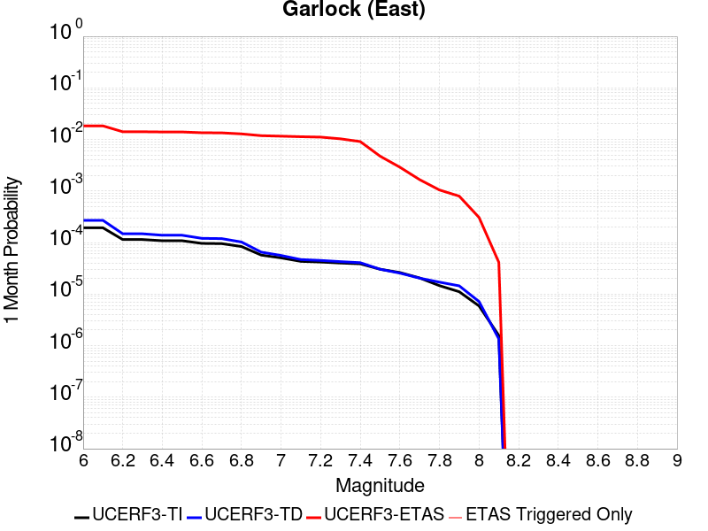 |  |  |

| Magnitude | 1 wk TI Prob | 1 wk TD Prob | 1 wk ETAS Prob | 1 wk ETAS/TD Gain | 1 wk ETAS Triggered Only | 1 mo TI Prob | 1 mo TD Prob | 1 mo ETAS Prob | 1 mo ETAS/TD Gain | 1 mo ETAS Triggered Only | 1 yr TI Prob | 1 yr TD Prob | 1 yr ETAS Prob | 1 yr ETAS/TD Gain | 1 yr ETAS Triggered Only | 10 yr TI Prob | 10 yr TD Prob | 10 yr ETAS Prob | 10 yr ETAS/TD Gain | 10 yr ETAS Triggered Only |
|-----|-----|-----|-----|-----|-----|-----|-----|-----|-----|-----|-----|-----|-----|-----|-----|-----|-----|-----|-----|-----|
| 6.0 | 4.5092507E-5 | 6.2904815E-5 | 0.013722045 | 218.13982 | 0.01366 | 1.9323928E-4 | 2.6956675E-4 | 0.018334696 | 68.01543 | 0.01807 | 0.0023501497 | 0.003277482 | 0.029710563 | 9.065058 | 0.02652 | 0.023254504 | 0.03235377 | 0.06685036 | 2.0662308 | 0.03565 |
| 6.1 | 4.5092507E-5 | 6.2904815E-5 | 0.013722045 | 218.13982 | 0.01366 | 1.9323928E-4 | 2.6956675E-4 | 0.018334696 | 68.01543 | 0.01807 | 0.0023501497 | 0.003277482 | 0.029710563 | 9.065058 | 0.02652 | 0.023254504 | 0.03235377 | 0.06685036 | 2.0662308 | 0.03565 |
| 6.2 | 2.6674514E-5 | 3.4511588E-5 | 0.0108941365 | 315.66605 | 0.01086 | 1.1431433E-4 | 1.4789861E-4 | 0.014095835 | 95.30743 | 0.01395 | 0.0013908884 | 0.0017992114 | 0.021363948 | 11.874062 | 0.0196 | 0.01382215 | 0.017872788 | 0.0431331 | 2.4133391 | 0.02572 |
| 6.3 | 2.6674514E-5 | 3.4511588E-5 | 0.0108941365 | 315.66605 | 0.01086 | 1.1431433E-4 | 1.4789861E-4 | 0.014095835 | 95.30743 | 0.01395 | 0.0013908884 | 0.0017992114 | 0.021363948 | 11.874062 | 0.0196 | 0.01382215 | 0.017872788 | 0.0431331 | 2.4133391 | 0.02572 |
| 6.4 | 2.5312667E-5 | 3.2340467E-5 | 0.010831991 | 334.93613 | 0.0108 | 1.0847834E-4 | 1.3859481E-4 | 0.013966678 | 100.77345 | 0.01383 | 0.0013199237 | 0.0016861152 | 0.021033438 | 12.474497 | 0.01938 | 0.013121112 | 0.016772287 | 0.04174627 | 2.489003 | 0.0254 |
| 6.5 | 2.5312667E-5 | 3.2340467E-5 | 0.010831991 | 334.93613 | 0.0108 | 1.0847834E-4 | 1.3859481E-4 | 0.013966678 | 100.77345 | 0.01383 | 0.0013199237 | 0.0016861152 | 0.021033438 | 12.474497 | 0.01938 | 0.013121112 | 0.016772287 | 0.04174627 | 2.489003 | 0.0254 |
| 6.6 | 2.246556E-5 | 2.8134691E-5 | 0.010587838 | 376.32678 | 0.01056 | 9.627742E-5 | 1.2057181E-4 | 0.0134889595 | 111.87491 | 0.01337 | 0.0011715472 | 0.0014669969 | 0.019989785 | 13.62633 | 0.01855 | 0.011653901 | 0.014613169 | 0.03830187 | 2.6210515 | 0.02404 |
| 6.7 | 2.2241198E-5 | 2.7804432E-5 | 0.010557512 | 379.7061 | 0.01053 | 9.531594E-5 | 1.1915654E-4 | 0.013417572 | 112.604576 | 0.0133 | 0.0011598538 | 0.0014497889 | 0.019902997 | 13.728203 | 0.01848 | 0.011538187 | 0.014442829 | 0.038027212 | 2.6329474 | 0.02393 |
| 6.8 | 1.9528685E-5 | 2.3898969E-5 | 0.010153657 | 424.85754 | 0.01013 | 8.369167E-5 | 1.0242024E-4 | 0.012811119 | 125.083855 | 0.01271 | 0.0010184698 | 0.0012462728 | 0.018734451 | 15.032384 | 0.01751 | 0.010138147 | 0.012436723 | 0.03464702 | 2.785864 | 0.02249 |
| 6.9 | 1.3318621E-5 | 1.5198818E-5 | 0.009495054 | 624.7232 | 0.00948 | 5.7078556E-5 | 6.51362E-5 | 0.01183437 | 181.68652 | 0.01177 | 6.9470983E-4 | 7.927504E-4 | 0.016590217 | 20.927416 | 0.01581 | 0.0069254204 | 0.007940721 | 0.027771985 | 3.4974139 | 0.01999 |
| 7.0 | 1.1760853E-5 | 1.3107653E-5 | 0.009302986 | 709.737 | 0.00929 | 5.0402683E-5 | 5.6174475E-5 | 0.0115755275 | 206.06383 | 0.01152 | 6.134799E-4 | 6.8371464E-4 | 0.016003232 | 23.406305 | 0.01533 | 0.0061178906 | 0.006857401 | 0.02600519 | 3.7922807 | 0.01928 |
| 7.1 | 1.0064758E-5 | 1.0902761E-5 | 0.009130803 | 837.47626 | 0.00912 | 4.3133965E-5 | 4.67253E-5 | 0.0112962 | 241.75768 | 0.01125 | 5.2502943E-4 | 5.6873553E-4 | 0.015400295 | 27.07813 | 0.01484 | 0.005237907 | 0.0057133473 | 0.024028108 | 4.2056093 | 0.01842 |
| 7.2 | 9.768808E-6 | 1.0498628E-5 | 0.008980405 | 855.3883 | 0.00897 | 4.186565E-5 | 4.499337E-5 | 0.011094497 | 246.5807 | 0.01105 | 5.095951E-4 | 5.4766005E-4 | 0.015089692 | 27.553026 | 0.01455 | 0.0050842804 | 0.005503584 | 0.023494024 | 4.268859 | 0.01809 |
| 7.3 | 9.344516E-6 | 9.9442705E-6 | 0.008259863 | 830.6152 | 0.00825 | 4.004731E-5 | 4.2617627E-5 | 0.010282181 | 241.26593 | 0.01024 | 4.8746695E-4 | 5.187495E-4 | 0.014001751 | 26.991354 | 0.01349 | 0.0048639905 | 0.005215269 | 0.021907756 | 4.2006955 | 0.01678 |
| 7.4 | 9.023491E-6 | 9.490441E-6 | 0.007319421 | 771.2414 | 0.00731 | 3.867153E-5 | 4.0672705E-5 | 0.009090304 | 223.4989 | 0.00905 | 4.7072413E-4 | 4.95081E-4 | 0.012479145 | 25.206268 | 0.01199 | 0.004697283 | 0.0049787266 | 0.019854294 | 3.9878259 | 0.01495 |
| 7.5 | 7.081253E-6 | 7.0873994E-6 | 0.0038070604 | 537.159 | 0.0038 | 3.0347876E-5 | 3.0374218E-5 | 0.004740231 | 156.061 | 0.00471 | 3.6942272E-4 | 3.697441E-4 | 0.006447496 | 17.437725 | 0.00608 | 0.003688092 | 0.0037244745 | 0.011336019 | 3.043656 | 0.00764 |
| 7.6 | 6.116396E-6 | 5.9589424E-6 | 0.0022659455 | 380.25967 | 0.00226 | 2.6212863E-5 | 2.5538076E-5 | 0.002895465 | 113.37834 | 0.00287 | 3.1909486E-4 | 3.1088197E-4 | 0.0039997348 | 12.865767 | 0.00369 | 0.0031863707 | 0.0031359126 | 0.0077414247 | 2.4686353 | 0.00462 |
| 7.7 | 4.797145E-6 | 4.7571157E-6 | 0.0013347508 | 280.57986 | 0.00133 | 2.055903E-5 | 2.0387479E-5 | 0.0016603541 | 81.43989 | 0.00164 | 2.5027743E-4 | 2.481894E-4 | 0.0023776607 | 9.580025 | 0.00213 | 0.0024999576 | 0.0025094065 | 0.005122832 | 2.0414515 | 0.00262 |
| 7.8 | 3.4028885E-6 | 3.978375E-6 | 8.339751E-4 | 209.62708 | 8.3E-4 | 1.4583726E-5 | 1.7050066E-5 | 0.0010470325 | 61.40929 | 0.00103 | 1.775424E-4 | 2.0756487E-4 | 0.0015472868 | 7.4544735 | 0.00134 | 0.0017740062 | 0.0021012141 | 0.003747747 | 1.7836103 | 0.00165 |
| 7.9 | 2.5928412E-6 | 3.372436E-6 | 6.2337035E-4 | 184.84276 | 6.2E-4 | 1.1112129E-5 | 1.4453217E-5 | 7.9444196E-4 | 54.966446 | 7.8E-4 | 1.3528178E-4 | 1.7595377E-4 | 0.0012157707 | 6.9096036 | 0.00104 | 0.0013519945 | 0.0017812426 | 0.003068945 | 1.7229235 | 0.00129 |
| 8.0 | 1.3743648E-6 | 1.6734741E-6 | 2.1167312E-4 | 126.48724 | 2.1E-4 | 5.8901214E-6 | 7.1720124E-6 | 3.0716986E-4 | 42.828964 | 3.0E-4 | 7.1709874E-5 | 8.731578E-5 | 5.072791E-4 | 5.809707 | 4.2E-4 | 7.1686733E-4 | 8.837377E-4 | 0.001393287 | 1.5765843 | 5.1E-4 |
| 8.1 | 3.6733252E-7 | 3.1489736E-7 | 3.1489736E-7 | 1.0 | 0.0 | 1.5742813E-6 | 1.3495595E-6 | 4.1349507E-5 | 30.63926 | 4.0E-5 | 1.9166706E-5 | 1.643078E-5 | 6.642996E-5 | 4.0430193 | 5.0E-5 | 1.9165053E-4 | 1.662928E-4 | 2.1628448E-4 | 1.3006245 | 5.0E-5 |

## Hunter Mountain-Saline Valley
*[(top)](#table-of-contents)*

| 1 Week | 1 Month | 1 Year | 10 Year |
|-----|-----|-----|-----|
| 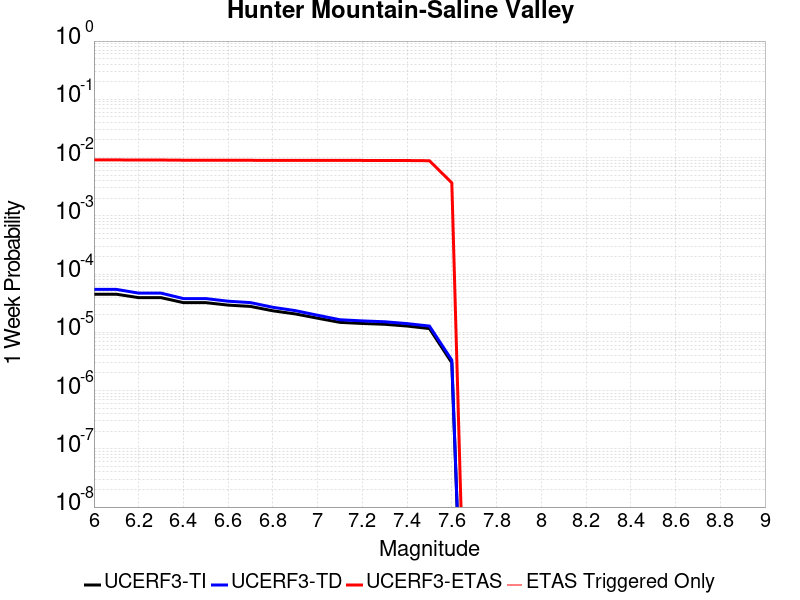 |  |  |  |

| Magnitude | 1 wk TI Prob | 1 wk TD Prob | 1 wk ETAS Prob | 1 wk ETAS/TD Gain | 1 wk ETAS Triggered Only | 1 mo TI Prob | 1 mo TD Prob | 1 mo ETAS Prob | 1 mo ETAS/TD Gain | 1 mo ETAS Triggered Only | 1 yr TI Prob | 1 yr TD Prob | 1 yr ETAS Prob | 1 yr ETAS/TD Gain | 1 yr ETAS Triggered Only | 10 yr TI Prob | 10 yr TD Prob | 10 yr ETAS Prob | 10 yr ETAS/TD Gain | 10 yr ETAS Triggered Only |
|-----|-----|-----|-----|-----|-----|-----|-----|-----|-----|-----|-----|-----|-----|-----|-----|-----|-----|-----|-----|-----|
| 6.0 | 4.5103672E-5 | 5.456906E-5 | 0.0091140745 | 167.01909 | 0.00906 | 1.9328714E-4 | 2.3384714E-4 | 0.011471218 | 49.054348 | 0.01124 | 0.002350731 | 0.0028435462 | 0.018449044 | 6.4880414 | 0.01565 | 0.023260195 | 0.028092625 | 0.046811562 | 1.6663293 | 0.01926 |
| 6.1 | 4.5103672E-5 | 5.456906E-5 | 0.0091140745 | 167.01909 | 0.00906 | 1.9328714E-4 | 2.3384714E-4 | 0.011471218 | 49.054348 | 0.01124 | 0.002350731 | 0.0028435462 | 0.018449044 | 6.4880414 | 0.01565 | 0.023260195 | 0.028092625 | 0.046811562 | 1.6663293 | 0.01926 |
| 6.2 | 3.9363465E-5 | 4.706271E-5 | 0.009076638 | 192.86263 | 0.00903 | 1.6868966E-4 | 2.016826E-4 | 0.011389426 | 56.472027 | 0.01119 | 0.002051862 | 0.0024528534 | 0.017984662 | 7.3321395 | 0.01557 | 0.020330196 | 0.024274187 | 0.042959336 | 1.7697538 | 0.01915 |
| 6.3 | 3.9363465E-5 | 4.706271E-5 | 0.009076638 | 192.86263 | 0.00903 | 1.6868966E-4 | 2.016826E-4 | 0.011389426 | 56.472027 | 0.01119 | 0.002051862 | 0.0024528534 | 0.017984662 | 7.3321395 | 0.01557 | 0.020330196 | 0.024274187 | 0.042959336 | 1.7697538 | 0.01915 |
| 6.4 | 3.2311684E-5 | 3.795112E-5 | 0.00900761 | 237.3477 | 0.00897 | 1.384713E-4 | 1.6263791E-4 | 0.011260833 | 69.23867 | 0.0111 | 0.0016845843 | 0.001978387 | 0.017407801 | 8.798986 | 0.01546 | 0.016718714 | 0.019617118 | 0.038244393 | 1.9495418 | 0.019 |
| 6.5 | 3.2311684E-5 | 3.795112E-5 | 0.00900761 | 237.3477 | 0.00897 | 1.384713E-4 | 1.6263791E-4 | 0.011260833 | 69.23867 | 0.0111 | 0.0016845843 | 0.001978387 | 0.017407801 | 8.798986 | 0.01546 | 0.016718714 | 0.019617118 | 0.038244393 | 1.9495418 | 0.019 |
| 6.6 | 2.9305844E-5 | 3.418196E-5 | 0.008983876 | 262.82504 | 0.00895 | 1.2559042E-4 | 1.4648624E-4 | 0.011214864 | 76.559166 | 0.01107 | 0.0015279909 | 0.0017820727 | 0.017174592 | 9.637425 | 0.01542 | 0.015175272 | 0.017686324 | 0.036281522 | 2.0513885 | 0.01893 |
| 6.7 | 2.7826512E-5 | 3.2344353E-5 | 0.008972055 | 277.3917 | 0.00894 | 1.19251024E-4 | 1.3861163E-4 | 0.01118708 | 80.70809 | 0.01105 | 0.0014509142 | 0.0016863506 | 0.01706038 | 10.116747 | 0.0154 | 0.014414776 | 0.016743818 | 0.03533719 | 2.110462 | 0.01891 |
| 6.8 | 2.3389874E-5 | 2.6866792E-5 | 0.008956627 | 333.37167 | 0.00893 | 1.0023846E-4 | 1.1513857E-4 | 0.0111538675 | 96.87342 | 0.01104 | 0.00121972 | 0.001400958 | 0.016719468 | 11.93431 | 0.01534 | 0.01213047 | 0.013928067 | 0.032515522 | 2.3345323 | 0.01885 |
| 6.9 | 2.069209E-5 | 2.357011E-5 | 0.00895336 | 379.86075 | 0.00893 | 8.867737E-5 | 1.0101105E-4 | 0.011129897 | 110.184944 | 0.01103 | 0.0010791123 | 0.0012291519 | 0.01654031 | 13.456685 | 0.01533 | 0.010738871 | 0.012229158 | 0.030809127 | 2.5193172 | 0.01881 |
| 7.0 | 1.7462342E-5 | 1.9633622E-5 | 0.008949459 | 455.82306 | 0.00893 | 7.483646E-5 | 8.414151E-5 | 0.011113213 | 132.07765 | 0.01103 | 9.1075303E-4 | 0.0010239641 | 0.016328277 | 15.946142 | 0.01532 | 0.009070295 | 0.010196688 | 0.028775295 | 2.8220239 | 0.01877 |
| 7.1 | 1.4807709E-5 | 1.6441827E-5 | 0.008936295 | 543.5099 | 0.00892 | 6.3460066E-5 | 7.046316E-5 | 0.011079688 | 157.24084 | 0.01101 | 7.723524E-4 | 8.575678E-4 | 0.016124465 | 18.802553 | 0.01528 | 0.007696735 | 0.008546168 | 0.027086355 | 3.1694152 | 0.0187 |
| 7.2 | 1.4180048E-5 | 1.5698413E-5 | 0.008925559 | 568.5644 | 0.00891 | 6.077022E-5 | 6.727727E-5 | 0.011066537 | 164.49147 | 0.011 | 7.396263E-4 | 8.1880915E-4 | 0.016076306 | 19.633764 | 0.01527 | 0.0073716943 | 0.008161469 | 0.026698932 | 3.2713387 | 0.01869 |
| 7.3 | 1.3730402E-5 | 1.5172151E-5 | 0.0089250365 | 588.2513 | 0.00891 | 5.8843252E-5 | 6.502197E-5 | 0.011064307 | 170.16258 | 0.011 | 7.161811E-4 | 7.9137104E-4 | 0.016049286 | 20.280355 | 0.01527 | 0.007138774 | 0.007889058 | 0.02643161 | 3.350414 | 0.01869 |
| 7.4 | 1.2810095E-5 | 1.4109353E-5 | 0.008893984 | 630.36084 | 0.00888 | 5.489925E-5 | 6.0467344E-5 | 0.011009805 | 182.07854 | 0.01095 | 6.681934E-4 | 7.3595706E-4 | 0.015934763 | 21.651756 | 0.01521 | 0.006661878 | 0.0073386896 | 0.025812116 | 3.517265 | 0.01861 |
| 7.5 | 1.1595659E-5 | 1.2800734E-5 | 0.008822688 | 689.233 | 0.00881 | 4.9694736E-5 | 5.485922E-5 | 0.010914263 | 198.9504 | 0.01086 | 6.0486543E-4 | 6.67722E-4 | 0.01572766 | 23.554203 | 0.01507 | 0.006032217 | 0.006660632 | 0.024928143 | 3.7426093 | 0.01839 |
| 7.6 | 2.997694E-6 | 3.3251877E-6 | 0.003683313 | 1107.7008 | 0.00368 | 1.28471975E-5 | 1.4250767E-5 | 0.0045441864 | 318.8731 | 0.00453 | 1.564034E-4 | 1.7349655E-4 | 0.006602381 | 38.054825 | 0.00643 | 0.0015629337 | 0.0017356955 | 0.009372418 | 5.399805 | 0.00765 |

## Ash Hill
*[(top)](#table-of-contents)*

| 1 Week | 1 Month | 1 Year | 10 Year |
|-----|-----|-----|-----|
|  |  |  |  |

| Magnitude | 1 wk TI Prob | 1 wk TD Prob | 1 wk ETAS Prob | 1 wk ETAS/TD Gain | 1 wk ETAS Triggered Only | 1 mo TI Prob | 1 mo TD Prob | 1 mo ETAS Prob | 1 mo ETAS/TD Gain | 1 mo ETAS Triggered Only | 1 yr TI Prob | 1 yr TD Prob | 1 yr ETAS Prob | 1 yr ETAS/TD Gain | 1 yr ETAS Triggered Only | 10 yr TI Prob | 10 yr TD Prob | 10 yr ETAS Prob | 10 yr ETAS/TD Gain | 10 yr ETAS Triggered Only |
|-----|-----|-----|-----|-----|-----|-----|-----|-----|-----|-----|-----|-----|-----|-----|-----|-----|-----|-----|-----|-----|
| 6.0 | 2.1545662E-5 | 2.3194447E-5 | 0.0042030974 | 181.21136 | 0.00418 | 9.2335285E-5 | 9.940143E-5 | 0.006068808 | 61.053524 | 0.00597 | 0.0011236023 | 0.0012096206 | 0.011127609 | 9.199256 | 0.00993 | 0.011179381 | 0.012038348 | 0.026067404 | 2.1653638 | 0.0142 |
| 6.1 | 2.1545662E-5 | 2.3194447E-5 | 0.0042030974 | 181.21136 | 0.00418 | 9.2335285E-5 | 9.940143E-5 | 0.006068808 | 61.053524 | 0.00597 | 0.0011236023 | 0.0012096206 | 0.011127609 | 9.199256 | 0.00993 | 0.011179381 | 0.012038348 | 0.026067404 | 2.1653638 | 0.0142 |
| 6.2 | 2.1545662E-5 | 2.3194447E-5 | 0.0042030974 | 181.21136 | 0.00418 | 9.2335285E-5 | 9.940143E-5 | 0.006068808 | 61.053524 | 0.00597 | 0.0011236023 | 0.0012096206 | 0.011127609 | 9.199256 | 0.00993 | 0.011179381 | 0.012038348 | 0.026067404 | 2.1653638 | 0.0142 |
| 6.3 | 1.0025529E-5 | 1.0746934E-5 | 0.0016907288 | 157.32198 | 0.00168 | 4.2965847E-5 | 4.605755E-5 | 0.0025859405 | 56.145855 | 0.00254 | 5.229836E-4 | 5.6061964E-4 | 0.004828226 | 8.612302 | 0.00427 | 0.005217545 | 0.0055933665 | 0.011659247 | 2.0844777 | 0.0061 |
| 6.4 | 1.0025529E-5 | 1.0746934E-5 | 0.0016907288 | 157.32198 | 0.00168 | 4.2965847E-5 | 4.605755E-5 | 0.0025859405 | 56.145855 | 0.00254 | 5.229836E-4 | 5.6061964E-4 | 0.004828226 | 8.612302 | 0.00427 | 0.005217545 | 0.0055933665 | 0.011659247 | 2.0844777 | 0.0061 |
| 6.5 | 6.9617327E-6 | 7.456634E-6 | 0.001157448 | 155.22394 | 0.00115 | 2.9835655E-5 | 3.195666E-5 | 0.0017919004 | 56.07283 | 0.00176 | 3.6318856E-4 | 3.8901155E-4 | 0.0032678912 | 8.400499 | 0.00288 | 0.0036259557 | 0.0038841602 | 0.007998119 | 2.0591629 | 0.00413 |
| 6.6 | 4.9919777E-6 | 5.3466883E-6 | 7.9534244E-4 | 148.75423 | 7.9E-4 | 2.1394015E-5 | 2.2914215E-5 | 0.0012828853 | 55.986443 | 0.00126 | 2.60441E-4 | 2.7895154E-4 | 0.0023383768 | 8.382735 | 0.00206 | 0.0026013597 | 0.0027866727 | 0.0057783127 | 2.0735528 | 0.003 |
| 6.7 | 3.6630722E-6 | 3.924624E-6 | 5.839224E-4 | 148.78429 | 5.8E-4 | 1.5698786E-5 | 1.681974E-5 | 9.368043E-4 | 55.696716 | 9.2E-4 | 1.9111596E-4 | 2.0476682E-4 | 0.0017344535 | 8.470384 | 0.00153 | 0.0019095168 | 0.0020463446 | 0.0043116994 | 2.1070251 | 0.00227 |
| 6.8 | 2.5599613E-6 | 2.744925E-6 | 4.127438E-4 | 150.36615 | 4.1E-4 | 1.0971216E-5 | 1.1763939E-5 | 6.317567E-4 | 53.702812 | 6.2E-4 | 1.3356637E-4 | 1.4322149E-4 | 0.0012030697 | 8.4000635 | 0.00106 | 0.0013348613 | 0.0014317769 | 0.0030294862 | 2.1158926 | 0.0016 |
| 6.9 | 1.7684905E-6 | 1.8968707E-6 | 2.8189633E-4 | 148.61125 | 2.8E-4 | 7.579223E-6 | 8.129446E-6 | 4.3812595E-4 | 53.893703 | 4.3E-4 | 9.2273134E-5 | 9.8976E-5 | 7.989067E-4 | 8.071721 | 7.0E-4 | 9.223483E-4 | 9.8976E-4 | 0.0020387208 | 2.0598133 | 0.00105 |

## Blackwater
*[(top)](#table-of-contents)*

| 1 Week | 1 Month | 1 Year | 10 Year |
|-----|-----|-----|-----|
|  |  |  |  |

| Magnitude | 1 wk TI Prob | 1 wk TD Prob | 1 wk ETAS Prob | 1 wk ETAS/TD Gain | 1 wk ETAS Triggered Only | 1 mo TI Prob | 1 mo TD Prob | 1 mo ETAS Prob | 1 mo ETAS/TD Gain | 1 mo ETAS Triggered Only | 1 yr TI Prob | 1 yr TD Prob | 1 yr ETAS Prob | 1 yr ETAS/TD Gain | 1 yr ETAS Triggered Only | 10 yr TI Prob | 10 yr TD Prob | 10 yr ETAS Prob | 10 yr ETAS/TD Gain | 10 yr ETAS Triggered Only |
|-----|-----|-----|-----|-----|-----|-----|-----|-----|-----|-----|-----|-----|-----|-----|-----|-----|-----|-----|-----|-----|
| 6.0 | 3.0708583E-5 | 3.3095846E-5 | 0.0043929517 | 132.73422 | 0.00436 | 1.3160157E-4 | 1.4183241E-4 | 0.006390946 | 45.05984 | 0.00625 | 0.0016010714 | 0.0017255784 | 0.011788185 | 6.8314395 | 0.01008 | 0.015895851 | 0.017135633 | 0.031229908 | 1.8225126 | 0.01434 |
| 6.1 | 3.0708583E-5 | 3.3095846E-5 | 0.0043929517 | 132.73422 | 0.00436 | 1.3160157E-4 | 1.4183241E-4 | 0.006390946 | 45.05984 | 0.00625 | 0.0016010714 | 0.0017255784 | 0.011788185 | 6.8314395 | 0.01008 | 0.015895851 | 0.017135633 | 0.031229908 | 1.8225126 | 0.01434 |
| 6.2 | 1.1707779E-5 | 1.2545122E-5 | 0.0017025239 | 135.71202 | 0.00169 | 5.017523E-5 | 5.3763757E-5 | 0.0024936325 | 46.381294 | 0.00244 | 6.107122E-4 | 6.5438676E-4 | 0.0046317824 | 7.07805 | 0.00398 | 0.006090366 | 0.0065255696 | 0.012238047 | 1.8753991 | 0.00575 |
| 6.3 | 1.1707779E-5 | 1.2545122E-5 | 0.0017025239 | 135.71202 | 0.00169 | 5.017523E-5 | 5.3763757E-5 | 0.0024936325 | 46.381294 | 0.00244 | 6.107122E-4 | 6.5438676E-4 | 0.0046317824 | 7.07805 | 0.00398 | 0.006090366 | 0.0065255696 | 0.012238047 | 1.8753991 | 0.00575 |
| 6.4 | 7.929244E-6 | 8.480098E-6 | 0.0011484704 | 135.43127 | 0.00114 | 3.3982033E-5 | 3.6342793E-5 | 0.001656284 | 45.57393 | 0.00162 | 4.136527E-4 | 4.423877E-4 | 0.0032311534 | 7.303895 | 0.00279 | 0.0041288356 | 0.0044154758 | 0.008417726 | 1.9064142 | 0.00402 |
| 6.5 | 5.8832115E-6 | 6.285991E-6 | 8.162809E-4 | 129.85716 | 8.1E-4 | 2.521352E-5 | 2.6939697E-5 | 0.0011969082 | 44.42916 | 0.00117 | 3.0693135E-4 | 3.27944E-4 | 0.0022773044 | 6.944187 | 0.00195 | 0.0030650778 | 0.0032748538 | 0.0061055534 | 1.8643743 | 0.00284 |
| 6.6 | 5.8832115E-6 | 6.285991E-6 | 8.162809E-4 | 129.85716 | 8.1E-4 | 2.521352E-5 | 2.6939697E-5 | 0.0011969082 | 44.42916 | 0.00117 | 3.0693135E-4 | 3.27944E-4 | 0.0022773044 | 6.944187 | 0.00195 | 0.0030650778 | 0.0032748538 | 0.0061055534 | 1.8643743 | 0.00284 |
| 6.7 | 3.0715053E-6 | 3.2814662E-6 | 3.7328026E-4 | 113.754105 | 3.7E-4 | 1.3163528E-5 | 1.4063357E-5 | 5.240562E-4 | 37.263947 | 5.1E-4 | 1.6025416E-4 | 1.7120909E-4 | 9.810705E-4 | 5.7302475 | 8.1E-4 | 0.0016013865 | 0.0017108864 | 0.002938782 | 1.7176956 | 0.00123 |
| 6.8 | 2.2722281E-6 | 2.4287538E-6 | 2.6242813E-4 | 108.05053 | 2.6E-4 | 9.738084E-6 | 1.0408908E-5 | 3.7040515E-4 | 35.5854 | 3.6E-4 | 1.1855473E-4 | 1.26722E-4 | 6.6665356E-4 | 5.2607565 | 5.4E-4 | 0.001184915 | 0.0012665876 | 0.0020955363 | 1.654474 | 8.3E-4 |
| 6.9 | 9.952399E-7 | 1.0653489E-6 | 1.3106522E-4 | 123.02563 | 1.3E-4 | 4.265307E-6 | 4.5657757E-6 | 1.9456491E-4 | 42.61377 | 1.9E-4 | 5.1928873E-5 | 5.5587418E-5 | 3.1557298E-4 | 5.6770573 | 2.6E-4 | 5.191674E-4 | 5.557858E-4 | 8.856023E-4 | 1.593424 | 3.3E-4 |
| 7.0 | 4.7385504E-7 | 5.0755597E-7 | 7.050752E-5 | 138.91576 | 7.0E-5 | 2.0308057E-6 | 2.1752398E-6 | 8.2175065E-5 | 37.777473 | 8.0E-5 | 2.4724779E-5 | 2.6483543E-5 | 1.4648036E-4 | 5.5309954 | 1.2E-4 | 2.4722028E-4 | 2.6483546E-4 | 4.0479837E-4 | 1.5284902 | 1.4E-4 |

## Garlock (West)
*[(top)](#table-of-contents)*

| 1 Week | 1 Month | 1 Year | 10 Year |
|-----|-----|-----|-----|
|  |  |  |  |

| Magnitude | 1 wk TI Prob | 1 wk TD Prob | 1 wk ETAS Prob | 1 wk ETAS/TD Gain | 1 wk ETAS Triggered Only | 1 mo TI Prob | 1 mo TD Prob | 1 mo ETAS Prob | 1 mo ETAS/TD Gain | 1 mo ETAS Triggered Only | 1 yr TI Prob | 1 yr TD Prob | 1 yr ETAS Prob | 1 yr ETAS/TD Gain | 1 yr ETAS Triggered Only | 10 yr TI Prob | 10 yr TD Prob | 10 yr ETAS Prob | 10 yr ETAS/TD Gain | 10 yr ETAS Triggered Only |
|-----|-----|-----|-----|-----|-----|-----|-----|-----|-----|-----|-----|-----|-----|-----|-----|-----|-----|-----|-----|-----|
| 6.0 | 2.5181727E-5 | 2.5197181E-5 | 0.0069350232 | 275.2301 | 0.00691 | 1.0791722E-4 | 1.0798347E-4 | 0.008647061 | 80.07764 | 0.00854 | 0.0013131002 | 0.0013139093 | 0.012399325 | 9.436972 | 0.0111 | 0.013053683 | 0.013141794 | 0.02688873 | 2.046047 | 0.01393 |
| 6.1 | 2.5077732E-5 | 2.5098223E-5 | 0.006934925 | 276.31137 | 0.00691 | 1.0747157E-4 | 1.075594E-4 | 0.008646641 | 80.38945 | 0.00854 | 0.001307681 | 0.0013087525 | 0.012394225 | 9.47026 | 0.0111 | 0.013000126 | 0.013090835 | 0.02683848 | 2.0501733 | 0.01393 |
| 6.2 | 2.494612E-5 | 2.4979914E-5 | 0.006934807 | 277.61533 | 0.00691 | 1.0690756E-4 | 1.070524E-4 | 0.008646138 | 80.76547 | 0.00854 | 0.0013008224 | 0.0013025872 | 0.012388129 | 9.510403 | 0.0111 | 0.012932341 | 0.013029906 | 0.0267784 | 2.055149 | 0.01393 |
| 6.3 | 2.4733758E-5 | 2.4799276E-5 | 0.006934628 | 279.63025 | 0.00691 | 1.0599751E-4 | 1.06278305E-4 | 0.008645371 | 81.34653 | 0.00854 | 0.0012897556 | 0.0012931736 | 0.012378819 | 9.572433 | 0.0111 | 0.012822957 | 0.0129368715 | 0.026686661 | 2.0628374 | 0.01393 |
| 6.4 | 2.3237335E-5 | 2.3178607E-5 | 0.0068830196 | 296.9557 | 0.00686 | 9.958477E-5 | 9.933313E-5 | 0.0085784905 | 86.360825 | 0.00848 | 0.0012117702 | 0.0012087126 | 0.012205405 | 10.097855 | 0.01101 | 0.012051838 | 0.012101731 | 0.025744606 | 2.127349 | 0.01381 |
| 6.5 | 2.2732203E-5 | 2.2992977E-5 | 0.006882835 | 299.34512 | 0.00686 | 9.742009E-5 | 9.8537625E-5 | 0.008577702 | 87.05002 | 0.00848 | 0.0011854442 | 0.0011990381 | 0.012195837 | 10.1713505 | 0.01101 | 0.011791403 | 0.012006035 | 0.025650233 | 2.1364448 | 0.01381 |
| 6.6 | 2.1319436E-5 | 2.1773201E-5 | 0.006881624 | 316.05936 | 0.00686 | 9.136581E-5 | 9.3310395E-5 | 0.008572519 | 91.870995 | 0.00848 | 0.001111811 | 0.0011354643 | 0.012122974 | 10.676666 | 0.011 | 0.011062649 | 0.011376952 | 0.02501995 | 2.1991787 | 0.0138 |
| 6.7 | 1.970802E-5 | 2.0393094E-5 | 0.0068702535 | 336.89117 | 0.00685 | 8.446021E-5 | 8.739606E-5 | 0.008556656 | 97.906654 | 0.00847 | 0.001027818 | 0.0010635294 | 0.012021862 | 11.303743 | 0.01097 | 0.010230771 | 0.0106646875 | 0.024287835 | 2.277407 | 0.01377 |
| 6.8 | 1.8744462E-5 | 1.9900775E-5 | 0.0068697645 | 345.20087 | 0.00685 | 8.033094E-5 | 8.528626E-5 | 0.008554564 | 100.30413 | 0.00847 | 9.775903E-4 | 0.0010378672 | 0.011986492 | 11.549158 | 0.01096 | 0.009733009 | 0.010410495 | 0.024027247 | 2.3079832 | 0.01376 |
| 6.9 | 1.7559682E-5 | 1.8953151E-5 | 0.0068688234 | 362.4106 | 0.00685 | 7.5253614E-5 | 8.122527E-5 | 0.008550538 | 105.269424 | 0.00847 | 9.158276E-4 | 9.884704E-4 | 0.011927647 | 12.0667715 | 0.01095 | 0.0091206245 | 0.009921073 | 0.023534657 | 2.3721888 | 0.01375 |
| 7.0 | 1.6794445E-5 | 1.8215967E-5 | 0.0068580913 | 376.48788 | 0.00684 | 7.197421E-5 | 7.806611E-5 | 0.008517407 | 109.105064 | 0.00844 | 8.759337E-4 | 9.5004175E-4 | 0.011849677 | 12.4727955 | 0.01091 | 0.008724891 | 0.009539958 | 0.023099355 | 2.4213269 | 0.01369 |
| 7.1 | 1.6337795E-5 | 1.771677E-5 | 0.0068575954 | 387.06808 | 0.00684 | 7.0017246E-5 | 7.592681E-5 | 0.008515286 | 112.151245 | 0.00844 | 8.521265E-4 | 9.2401815E-4 | 0.011823937 | 12.796217 | 0.01091 | 0.008488664 | 0.009281721 | 0.022834746 | 2.4601846 | 0.01368 |
| 7.2 | 1.5780008E-5 | 1.71654E-5 | 0.006847048 | 398.88663 | 0.00683 | 6.762685E-5 | 7.3563926E-5 | 0.008502943 | 115.58578 | 0.00843 | 8.2304585E-4 | 8.952741E-4 | 0.011785516 | 13.164143 | 0.0109 | 0.008200042 | 0.008996559 | 0.022533666 | 2.5046983 | 0.01366 |
| 7.3 | 1.5058865E-5 | 1.6618484E-5 | 0.0068265055 | 410.7779 | 0.00681 | 6.45364E-5 | 7.122013E-5 | 0.0084806215 | 119.07618 | 0.00841 | 7.854473E-4 | 8.667614E-4 | 0.01172734 | 13.530067 | 0.01087 | 0.00782677 | 0.008713263 | 0.022214588 | 2.5495143 | 0.01362 |
| 7.4 | 1.4887923E-5 | 1.6454453E-5 | 0.006656345 | 404.53156 | 0.00664 | 6.380382E-5 | 7.0517184E-5 | 0.00824994 | 116.99191 | 0.00818 | 7.7653467E-4 | 8.5820974E-4 | 0.011329216 | 13.200988 | 0.01048 | 0.0077382675 | 0.008628101 | 0.02171421 | 2.5166845 | 0.0132 |
| 7.5 | 1.4509299E-5 | 1.6046468E-5 | 0.0062159467 | 387.37164 | 0.0062 | 6.218123E-5 | 6.876877E-5 | 0.0077582397 | 112.81632 | 0.00769 | 7.567935E-4 | 8.369394E-4 | 0.010688687 | 12.77116 | 0.00986 | 0.0075422134 | 0.008416411 | 0.020612888 | 2.4491305 | 0.0123 |
| 7.6 | 1.2756717E-5 | 1.4050529E-5 | 0.004093993 | 291.37646 | 0.00408 | 5.4670498E-5 | 6.0215163E-5 | 0.00512991 | 85.192986 | 0.00507 | 6.6541E-4 | 7.328737E-4 | 0.007258088 | 9.9036 | 0.00653 | 0.006634211 | 0.007381374 | 0.0155208465 | 2.1027043 | 0.0082 |
| 7.7 | 1.0328985E-5 | 1.146033E-5 | 0.002491432 | 217.39618 | 0.00248 | 4.4266326E-5 | 4.9114777E-5 | 0.0030689666 | 62.485603 | 0.00302 | 5.388092E-4 | 5.9780874E-4 | 0.0045154653 | 7.553361 | 0.00392 | 0.0053750467 | 0.006038286 | 0.010948457 | 1.813173 | 0.00494 |
| 7.8 | 7.0306583E-6 | 8.899537E-6 | 0.0016788847 | 188.64854 | 0.00167 | 3.0131043E-5 | 3.8140315E-5 | 0.0020580632 | 53.96031 | 0.00202 | 3.667837E-4 | 4.6425956E-4 | 0.0031030339 | 6.6838346 | 0.00264 | 0.003661789 | 0.0046950667 | 0.008019385 | 1.708045 | 0.00334 |
| 7.9 | 4.060633E-6 | 5.465412E-6 | 9.6546015E-4 | 176.64911 | 9.6E-4 | 1.7402595E-5 | 2.3422985E-5 | 0.0011833959 | 50.522842 | 0.00116 | 2.11856E-4 | 2.8513762E-4 | 0.0018346957 | 6.4344215 | 0.00155 | 0.0021165414 | 0.002884143 | 0.004818548 | 1.6707035 | 0.00194 |
| 8.0 | 1.6729537E-6 | 2.0775192E-6 | 2.6207697E-4 | 126.149 | 2.6E-4 | 7.169782E-6 | 8.903624E-6 | 3.7890032E-4 | 42.555744 | 3.7E-4 | 8.7288594E-5 | 1.0839626E-4 | 6.0834206E-4 | 5.612205 | 5.0E-4 | 8.7254314E-4 | 0.001096854 | 0.001726163 | 1.57374 | 6.3E-4 |
| 8.1 | 3.6733252E-7 | 3.1489736E-7 | 3.1489736E-7 | 1.0 | 0.0 | 1.5742813E-6 | 1.3495595E-6 | 4.1349507E-5 | 30.63926 | 4.0E-5 | 1.9166706E-5 | 1.643078E-5 | 6.642996E-5 | 4.0430193 | 5.0E-5 | 1.9165053E-4 | 1.662928E-4 | 2.1628448E-4 | 1.3006245 | 5.0E-5 |

## McLean Lake
*[(top)](#table-of-contents)*

| 1 Week | 1 Month | 1 Year | 10 Year |
|-----|-----|-----|-----|
|  |  |  |  |

| Magnitude | 1 wk TI Prob | 1 wk TD Prob | 1 wk ETAS Prob | 1 wk ETAS/TD Gain | 1 wk ETAS Triggered Only | 1 mo TI Prob | 1 mo TD Prob | 1 mo ETAS Prob | 1 mo ETAS/TD Gain | 1 mo ETAS Triggered Only | 1 yr TI Prob | 1 yr TD Prob | 1 yr ETAS Prob | 1 yr ETAS/TD Gain | 1 yr ETAS Triggered Only | 10 yr TI Prob | 10 yr TD Prob | 10 yr ETAS Prob | 10 yr ETAS/TD Gain | 10 yr ETAS Triggered Only |
|-----|-----|-----|-----|-----|-----|-----|-----|-----|-----|-----|-----|-----|-----|-----|-----|-----|-----|-----|-----|-----|
| 6.0 | 1.7360222E-5 | 1.8501627E-5 | 0.0023884578 | 129.09447 | 0.00237 | 7.439883E-5 | 7.9290556E-5 | 0.0035890122 | 45.264057 | 0.00351 | 9.0542925E-4 | 9.6498354E-4 | 0.0073488173 | 7.615484 | 0.00639 | 0.009017491 | 0.0096127745 | 0.019605782 | 2.0395548 | 0.01009 |
| 6.1 | 9.062689E-6 | 9.592193E-6 | 0.00127958 | 133.39806 | 0.00127 | 3.8839516E-5 | 4.1108804E-5 | 0.0018210356 | 44.297947 | 0.00178 | 4.727685E-4 | 5.003936E-4 | 0.0037787524 | 7.55156 | 0.00328 | 0.0047176396 | 0.004993552 | 0.010227285 | 2.0480986 | 0.00526 |
| 6.2 | 9.062689E-6 | 9.592193E-6 | 0.00127958 | 133.39806 | 0.00127 | 3.8839516E-5 | 4.1108804E-5 | 0.0018210356 | 44.297947 | 0.00178 | 4.727685E-4 | 5.003936E-4 | 0.0037787524 | 7.55156 | 0.00328 | 0.0047176396 | 0.004993552 | 0.010227285 | 2.0480986 | 0.00526 |
| 6.3 | 7.2575485E-6 | 7.66771E-6 | 0.0010376598 | 135.32852 | 0.00103 | 3.110341E-5 | 3.2861237E-5 | 0.0014228156 | 43.297688 | 0.00139 | 3.786182E-4 | 4.0001926E-4 | 0.0029689912 | 7.422121 | 0.00257 | 0.0037797375 | 0.0039936965 | 0.008037482 | 2.012542 | 0.00406 |
| 6.4 | 7.2575485E-6 | 7.66771E-6 | 0.0010376598 | 135.32852 | 0.00103 | 3.110341E-5 | 3.2861237E-5 | 0.0014228156 | 43.297688 | 0.00139 | 3.786182E-4 | 4.0001926E-4 | 0.0029689912 | 7.422121 | 0.00257 | 0.0037797375 | 0.0039936965 | 0.008037482 | 2.012542 | 0.00406 |
| 6.5 | 6.06582E-6 | 6.4038773E-6 | 8.8639825E-4 | 138.41588 | 8.8E-4 | 2.5996113E-5 | 2.7444936E-5 | 0.001227412 | 44.722713 | 0.0012 | 3.164567E-4 | 3.3409733E-4 | 0.0025633522 | 7.6724715 | 0.00223 | 0.0031600643 | 0.0033365893 | 0.0067950115 | 2.0365143 | 0.00347 |
| 6.6 | 5.598744E-6 | 5.910262E-6 | 8.259054E-4 | 139.7409 | 8.2E-4 | 2.3994397E-5 | 2.5329486E-5 | 0.0011253016 | 44.426548 | 0.0011 | 2.9209262E-4 | 3.0834923E-4 | 0.0023577171 | 7.6462555 | 0.00205 | 0.0029170897 | 0.003079843 | 0.0062600183 | 2.032577 | 0.00319 |
| 6.7 | 5.246996E-6 | 5.539162E-6 | 7.6553493E-4 | 138.2041 | 7.6E-4 | 2.2486933E-5 | 2.3739085E-5 | 0.0010337151 | 43.544857 | 0.00101 | 2.73744E-4 | 2.8899137E-4 | 0.002158451 | 7.468911 | 0.00187 | 0.0027340704 | 0.0028867796 | 0.005768437 | 1.9982256 | 0.00289 |
| 6.8 | 4.02324E-6 | 4.2469046E-6 | 5.642445E-4 | 132.86018 | 5.6E-4 | 1.7242342E-5 | 1.8200926E-5 | 7.5818744E-4 | 41.656532 | 7.4E-4 | 2.099053E-4 | 2.2157968E-4 | 0.0016012739 | 7.226628 | 0.00138 | 0.0020970714 | 0.002214172 | 0.0043594115 | 1.9688677 | 0.00215 |
| 6.9 | 6.835972E-7 | 7.1399285E-7 | 9.0713926E-5 | 127.0516 | 9.0E-5 | 2.9296991E-6 | 3.0599674E-6 | 1.4305954E-4 | 46.75198 | 1.4E-4 | 3.56685E-5 | 3.7254784E-5 | 2.7724585E-4 | 7.4418855 | 2.4E-4 | 3.5662777E-4 | 3.7251666E-4 | 7.523751E-4 | 2.0197086 | 3.8E-4 |

## Goldstone Lake
*[(top)](#table-of-contents)*

| 1 Week | 1 Month | 1 Year | 10 Year |
|-----|-----|-----|-----|
|  |  |  |  |

| Magnitude | 1 wk TI Prob | 1 wk TD Prob | 1 wk ETAS Prob | 1 wk ETAS/TD Gain | 1 wk ETAS Triggered Only | 1 mo TI Prob | 1 mo TD Prob | 1 mo ETAS Prob | 1 mo ETAS/TD Gain | 1 mo ETAS Triggered Only | 1 yr TI Prob | 1 yr TD Prob | 1 yr ETAS Prob | 1 yr ETAS/TD Gain | 1 yr ETAS Triggered Only | 10 yr TI Prob | 10 yr TD Prob | 10 yr ETAS Prob | 10 yr ETAS/TD Gain | 10 yr ETAS Triggered Only |
|-----|-----|-----|-----|-----|-----|-----|-----|-----|-----|-----|-----|-----|-----|-----|-----|-----|-----|-----|-----|-----|
| 6.0 | 2.671352E-5 | 3.0376103E-5 | 0.0016203278 | 53.342186 | 0.00159 | 1.1448149E-4 | 1.3017791E-4 | 0.0024598746 | 18.896252 | 0.00233 | 0.001392921 | 0.0015839601 | 0.0060768323 | 3.8364806 | 0.0045 | 0.013842222 | 0.015746202 | 0.02306905 | 1.4650549 | 0.00744 |
| 6.1 | 2.671352E-5 | 3.0376103E-5 | 0.0016203278 | 53.342186 | 0.00159 | 1.1448149E-4 | 1.3017791E-4 | 0.0024598746 | 18.896252 | 0.00233 | 0.001392921 | 0.0015839601 | 0.0060768323 | 3.8364806 | 0.0045 | 0.013842222 | 0.015746202 | 0.02306905 | 1.4650549 | 0.00744 |
| 6.2 | 1.4197047E-5 | 1.6096254E-5 | 8.4608287E-4 | 52.56396 | 8.3E-4 | 6.0843064E-5 | 6.898268E-5 | 0.0012289026 | 17.814655 | 0.00116 | 7.4051257E-4 | 8.3963916E-4 | 0.003057775 | 3.641773 | 0.00222 | 0.007380498 | 0.008374364 | 0.012043379 | 1.4381245 | 0.0037 |
| 6.3 | 1.4197047E-5 | 1.6096254E-5 | 8.4608287E-4 | 52.56396 | 8.3E-4 | 6.0843064E-5 | 6.898268E-5 | 0.0012289026 | 17.814655 | 0.00116 | 7.4051257E-4 | 8.3963916E-4 | 0.003057775 | 3.641773 | 0.00222 | 0.007380498 | 0.008374364 | 0.012043379 | 1.4381245 | 0.0037 |
| 6.4 | 1.3238931E-5 | 1.500847E-5 | 8.049966E-4 | 53.636158 | 7.9E-4 | 5.6737044E-5 | 6.432098E-5 | 0.001184249 | 18.41155 | 0.00112 | 6.9055456E-4 | 7.8292453E-4 | 0.0029012647 | 3.705676 | 0.00212 | 0.006884126 | 0.007811289 | 0.011313715 | 1.4483801 | 0.00353 |
| 6.5 | 1.3238931E-5 | 1.500847E-5 | 8.049966E-4 | 53.636158 | 7.9E-4 | 5.6737044E-5 | 6.432098E-5 | 0.001184249 | 18.41155 | 0.00112 | 6.9055456E-4 | 7.8292453E-4 | 0.0029012647 | 3.705676 | 0.00212 | 0.006884126 | 0.007811289 | 0.011313715 | 1.4483801 | 0.00353 |
| 6.6 | 1.1328278E-5 | 1.2855176E-5 | 6.928464E-4 | 53.896305 | 6.8E-4 | 4.8548856E-5 | 5.5092984E-5 | 0.001035039 | 18.787128 | 9.8E-4 | 5.90922E-4 | 6.706464E-4 | 0.002499419 | 3.7268808 | 0.00183 | 0.0058935313 | 0.0066956137 | 0.009675527 | 1.4450545 | 0.003 |
| 6.7 | 8.651175E-6 | 9.824575E-6 | 5.4981926E-4 | 55.963673 | 5.4E-4 | 3.707594E-5 | 4.2105148E-5 | 8.320719E-4 | 19.76176 | 7.9E-4 | 4.5130608E-4 | 5.126002E-4 | 0.001951862 | 3.8077672 | 0.00144 | 0.0045039062 | 0.0051230565 | 0.007411273 | 1.4466507 | 0.0023 |
| 6.8 | 1.0215377E-6 | 1.1754802E-6 | 1.1754802E-6 | 1.0 | 0.0 | 4.378012E-6 | 5.037763E-6 | 1.5037713E-5 | 2.984998 | 1.0E-5 | 5.3300988E-5 | 6.133315E-5 | 1.1133009E-4 | 1.8151698 | 5.0E-5 | 5.3288206E-4 | 6.131735E-4 | 7.231061E-4 | 1.1792846 | 1.1E-4 |
| 6.9 | 7.9360774E-7 | 9.283496E-7 | 9.283496E-7 | 1.0 | 0.0 | 3.4011714E-6 | 3.9786355E-6 | 1.3978595E-5 | 3.5134146 | 1.0E-5 | 4.1408475E-5 | 4.843888E-5 | 7.843743E-5 | 1.6193072 | 3.0E-5 | 4.140076E-4 | 4.842902E-4 | 5.442612E-4 | 1.1238327 | 6.0E-5 |
| 7.0 | 7.4382757E-7 | 8.747428E-7 | 8.747428E-7 | 1.0 | 0.0 | 3.1878285E-6 | 3.7488926E-6 | 1.3748855E-5 | 3.6674442 | 1.0E-5 | 3.8811122E-5 | 4.564188E-5 | 7.564051E-5 | 1.657261 | 3.0E-5 | 3.8804344E-4 | 4.563317E-4 | 5.1630434E-4 | 1.1314234 | 6.0E-5 |
| 7.1 | 6.4709513E-7 | 7.711399E-7 | 7.711399E-7 | 1.0 | 0.0 | 2.773262E-6 | 3.3048816E-6 | 3.3048816E-6 | 1.0 | 0.0 | 3.376394E-5 | 4.023625E-5 | 6.0235445E-5 | 1.4970442 | 2.0E-5 | 3.375881E-4 | 4.022956E-4 | 4.522755E-4 | 1.1242367 | 5.0E-5 |
| 7.2 | 6.356704E-7 | 7.588459E-7 | 7.588459E-7 | 1.0 | 0.0 | 2.7242988E-6 | 3.252193E-6 | 3.252193E-6 | 1.0 | 0.0 | 3.3167835E-5 | 3.959479E-5 | 5.9594E-5 | 1.5050969 | 2.0E-5 | 3.3162883E-4 | 3.9588328E-4 | 4.458635E-4 | 1.1262498 | 5.0E-5 |
| 7.3 | 5.7695723E-7 | 6.896648E-7 | 6.896648E-7 | 1.0 | 0.0 | 2.4726714E-6 | 2.9557032E-6 | 2.9557032E-6 | 1.0 | 0.0 | 3.0104358E-5 | 3.598515E-5 | 5.598443E-5 | 1.5557648 | 2.0E-5 | 3.0100282E-4 | 3.5979896E-4 | 3.9978456E-4 | 1.1111332 | 4.0E-5 |
| 7.4 | 5.209647E-7 | 6.193583E-7 | 6.193583E-7 | 1.0 | 0.0 | 2.232704E-6 | 2.6543903E-6 | 2.6543903E-6 | 1.0 | 0.0 | 2.718283E-5 | 3.2316777E-5 | 5.2316132E-5 | 1.6188536 | 2.0E-5 | 2.7179506E-4 | 3.2312635E-4 | 3.6311342E-4 | 1.1237506 | 4.0E-5 |
| 7.5 | 4.512955E-7 | 5.3489487E-7 | 5.3489487E-7 | 1.0 | 0.0 | 1.934122E-6 | 2.2924048E-6 | 2.2924048E-6 | 1.0 | 0.0 | 2.3547682E-5 | 2.7909726E-5 | 3.790945E-5 | 1.358288 | 1.0E-5 | 2.3545188E-4 | 2.7906752E-4 | 2.9906194E-4 | 1.0716473 | 2.0E-5 |
| 7.6 | 2.21172E-7 | 2.6040198E-7 | 2.6040198E-7 | 1.0 | 0.0 | 9.478797E-7 | 1.1160082E-6 | 1.1160082E-6 | 1.0 | 0.0 | 1.1540374E-5 | 1.3587343E-5 | 1.3587343E-5 | 1.0 | 0.0 | 1.1539775E-4 | 1.3586794E-4 | 1.3586794E-4 | 1.0 | 0.0 |

## Gravel Hills-Harper Lk
*[(top)](#table-of-contents)*

| 1 Week | 1 Month | 1 Year | 10 Year |
|-----|-----|-----|-----|
|  | 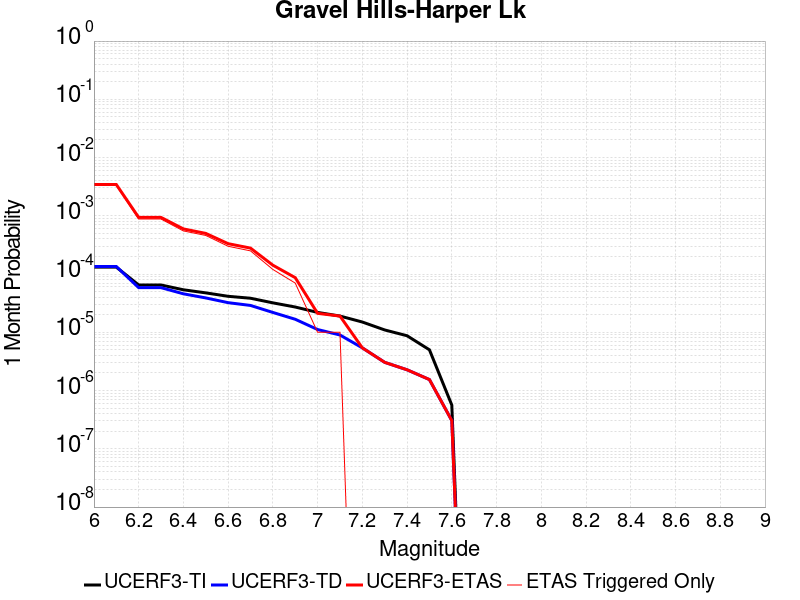 | 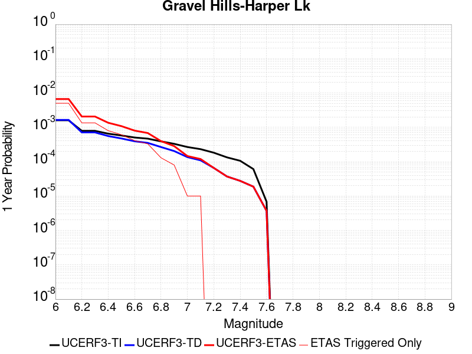 | 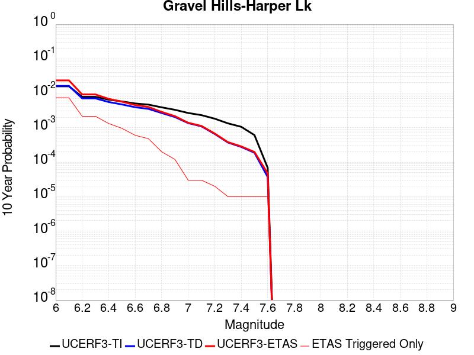 |

| Magnitude | 1 wk TI Prob | 1 wk TD Prob | 1 wk ETAS Prob | 1 wk ETAS/TD Gain | 1 wk ETAS Triggered Only | 1 mo TI Prob | 1 mo TD Prob | 1 mo ETAS Prob | 1 mo ETAS/TD Gain | 1 mo ETAS Triggered Only | 1 yr TI Prob | 1 yr TD Prob | 1 yr ETAS Prob | 1 yr ETAS/TD Gain | 1 yr ETAS Triggered Only | 10 yr TI Prob | 10 yr TD Prob | 10 yr ETAS Prob | 10 yr ETAS/TD Gain | 10 yr ETAS Triggered Only |
|-----|-----|-----|-----|-----|-----|-----|-----|-----|-----|-----|-----|-----|-----|-----|-----|-----|-----|-----|-----|-----|
| 6.0 | 3.0679566E-5 | 3.1464628E-5 | 0.0024313892 | 77.273735 | 0.0024 | 1.3147724E-4 | 1.3484266E-4 | 0.0034443964 | 25.54382 | 0.00331 | 0.0015995599 | 0.00164069 | 0.006662437 | 4.0607533 | 0.00503 | 0.015880952 | 0.016307337 | 0.023576826 | 1.4457803 | 0.00739 |
| 6.1 | 3.0679566E-5 | 3.1464628E-5 | 0.0024313892 | 77.273735 | 0.0024 | 1.3147724E-4 | 1.3484266E-4 | 0.0034443964 | 25.54382 | 0.00331 | 0.0015995599 | 0.00164069 | 0.006662437 | 4.0607533 | 0.00503 | 0.015880952 | 0.016307337 | 0.023576826 | 1.4457803 | 0.00739 |
| 6.2 | 1.514536E-5 | 1.36352E-5 | 6.2362687E-4 | 45.73654 | 6.1E-4 | 6.490707E-5 | 5.843533E-5 | 9.383839E-4 | 16.058502 | 8.8E-4 | 7.8995706E-4 | 7.112298E-4 | 0.0020602697 | 2.8967707 | 0.00135 | 0.007871548 | 0.007090737 | 0.009225492 | 1.3010625 | 0.00215 |
| 6.3 | 1.514536E-5 | 1.36352E-5 | 6.2362687E-4 | 45.73654 | 6.1E-4 | 6.490707E-5 | 5.843533E-5 | 9.383839E-4 | 16.058502 | 8.8E-4 | 7.8995706E-4 | 7.112298E-4 | 0.0020602697 | 2.8967707 | 0.00135 | 0.007871548 | 0.007090737 | 0.009225492 | 1.3010625 | 0.00215 |
| 6.4 | 1.2532521E-5 | 1.0689684E-5 | 3.9068563E-4 | 36.547913 | 3.8E-4 | 5.37097E-5 | 4.581216E-5 | 5.9578696E-4 | 13.004996 | 5.5E-4 | 6.537194E-4 | 5.5762613E-4 | 0.0013571801 | 2.433853 | 8.0E-4 | 0.0065179965 | 0.005562859 | 0.0068755164 | 1.235968 | 0.00132 |
| 6.5 | 1.1094058E-5 | 9.083657E-6 | 3.1908083E-4 | 35.126915 | 3.1E-4 | 4.7545094E-5 | 3.89294E-5 | 4.989115E-4 | 12.815803 | 4.6E-4 | 5.787078E-4 | 4.7386638E-4 | 0.0010835773 | 2.2866726 | 6.1E-4 | 0.0057720304 | 0.004728967 | 0.005684427 | 1.2020441 | 9.6E-4 |
| 6.6 | 9.688328E-6 | 7.531688E-6 | 1.8753033E-4 | 24.898844 | 1.8E-4 | 4.1520743E-5 | 3.227828E-5 | 3.322686E-4 | 10.293876 | 3.0E-4 | 5.053978E-4 | 3.9291973E-4 | 8.027586E-4 | 2.04306 | 4.1E-4 | 0.0050424994 | 0.0039225067 | 0.0045201536 | 1.1523634 | 6.0E-4 |
| 6.7 | 8.974824E-6 | 6.749406E-6 | 1.3674852E-4 | 20.260824 | 1.3E-4 | 3.8462964E-5 | 2.8925719E-5 | 2.7891848E-4 | 9.642578 | 2.5E-4 | 4.6818596E-4 | 3.5211592E-4 | 6.819997E-4 | 1.9368614 | 3.3E-4 | 0.004672008 | 0.003515801 | 0.0039941133 | 1.1360465 | 4.8E-4 |
| 6.8 | 7.4780046E-6 | 5.1161865E-6 | 6.511588E-5 | 12.727426 | 6.0E-5 | 3.20482E-5 | 2.1926337E-5 | 1.4192371E-4 | 6.4727507 | 1.2E-4 | 3.9011694E-4 | 2.6692182E-4 | 3.9688713E-4 | 1.486904 | 1.3E-4 | 0.0038943281 | 0.0026661505 | 0.0028656174 | 1.0748146 | 2.0E-4 |
| 6.9 | 6.3409307E-6 | 3.907489E-6 | 3.390737E-5 | 8.677535 | 3.0E-5 | 2.7175134E-5 | 1.674628E-5 | 8.674511E-5 | 5.179963 | 7.0E-5 | 3.3080703E-4 | 2.0386786E-4 | 2.8385155E-4 | 1.392331 | 8.0E-5 | 0.0033031502 | 0.0020369065 | 0.0021566623 | 1.0587928 | 1.2E-4 |
| 7.0 | 5.1239335E-6 | 2.6058492E-6 | 2.6058492E-6 | 1.0 | 0.0 | 2.195953E-5 | 1.1167879E-5 | 2.1167767E-5 | 1.8954152 | 1.0E-5 | 2.6732447E-4 | 1.359607E-4 | 1.4595933E-4 | 1.0735407 | 1.0E-5 | 0.0026700313 | 0.0013588005 | 0.0013887597 | 1.0220484 | 3.0E-5 |
| 7.1 | 4.438899E-6 | 2.0984692E-6 | 2.0984692E-6 | 1.0 | 0.0 | 1.9023713E-5 | 8.99341E-6 | 1.899332E-5 | 2.1119153 | 1.0E-5 | 2.315891E-4 | 1.0948948E-4 | 1.1948839E-4 | 1.091323 | 1.0E-5 | 0.002313479 | 0.0010943774 | 0.0011243445 | 1.0273829 | 3.0E-5 |
| 7.2 | 3.50367E-6 | 1.2615715E-6 | 1.2615715E-6 | 1.0 | 0.0 | 1.5015643E-5 | 5.406724E-6 | 5.406724E-6 | 1.0 | 0.0 | 1.8280011E-4 | 6.5824956E-5 | 6.5824956E-5 | 1.0 | 0.0 | 0.0018264982 | 6.580628E-4 | 6.780497E-4 | 1.0303723 | 2.0E-5 |
| 7.3 | 2.561638E-6 | 7.118686E-7 | 7.118686E-7 | 1.0 | 0.0 | 1.0978401E-5 | 3.050862E-6 | 3.050862E-6 | 1.0 | 0.0 | 1.3365384E-4 | 3.7143633E-5 | 3.7143633E-5 | 1.0 | 0.0 | 0.0013357349 | 3.7137623E-4 | 3.8137252E-4 | 1.0269169 | 1.0E-5 |
| 7.4 | 2.0368864E-6 | 5.304471E-7 | 5.304471E-7 | 1.0 | 0.0 | 8.729483E-6 | 2.2733427E-6 | 2.2733427E-6 | 1.0 | 0.0 | 1.06276275E-4 | 2.76776E-5 | 2.76776E-5 | 1.0 | 0.0 | 0.0010622547 | 2.767421E-4 | 2.8673932E-4 | 1.0361247 | 1.0E-5 |
| 7.5 | 1.1681728E-6 | 3.6028484E-7 | 3.6028484E-7 | 1.0 | 0.0 | 5.0064455E-6 | 1.544077E-6 | 1.544077E-6 | 1.0 | 0.0 | 6.0951766E-5 | 1.879898E-5 | 1.879898E-5 | 1.0 | 0.0 | 6.093505E-4 | 1.8797436E-4 | 1.9797249E-4 | 1.0531888 | 1.0E-5 |
| 7.6 | 1.3154387E-7 | 7.1196716E-8 | 7.1196716E-8 | 1.0 | 0.0 | 5.6375933E-7 | 3.0512876E-7 | 3.0512876E-7 | 1.0 | 0.0 | 6.863748E-6 | 3.714938E-6 | 3.714938E-6 | 1.0 | 0.0 | 6.863536E-5 | 3.7148915E-5 | 4.7148544E-5 | 1.2691768 | 1.0E-5 |

## So Sierra Nevada
*[(top)](#table-of-contents)*

| 1 Week | 1 Month | 1 Year | 10 Year |
|-----|-----|-----|-----|
|  |  |  |  |

| Magnitude | 1 wk TI Prob | 1 wk TD Prob | 1 wk ETAS Prob | 1 wk ETAS/TD Gain | 1 wk ETAS Triggered Only | 1 mo TI Prob | 1 mo TD Prob | 1 mo ETAS Prob | 1 mo ETAS/TD Gain | 1 mo ETAS Triggered Only | 1 yr TI Prob | 1 yr TD Prob | 1 yr ETAS Prob | 1 yr ETAS/TD Gain | 1 yr ETAS Triggered Only | 10 yr TI Prob | 10 yr TD Prob | 10 yr ETAS Prob | 10 yr ETAS/TD Gain | 10 yr ETAS Triggered Only |
|-----|-----|-----|-----|-----|-----|-----|-----|-----|-----|-----|-----|-----|-----|-----|-----|-----|-----|-----|-----|-----|
| 6.0 | 1.15488665E-5 | 1.1079612E-5 | 0.0021810555 | 196.85307 | 0.00217 | 4.9494203E-5 | 4.7483256E-5 | 0.0028273512 | 59.544174 | 0.00278 | 6.024253E-4 | 5.779681E-4 | 0.004735564 | 8.193469 | 0.00416 | 0.006007948 | 0.005765918 | 0.011671669 | 2.0242515 | 0.00594 |
| 6.1 | 1.15488665E-5 | 1.1079612E-5 | 0.0021810555 | 196.85307 | 0.00217 | 4.9494203E-5 | 4.7483256E-5 | 0.0028273512 | 59.544174 | 0.00278 | 6.024253E-4 | 5.779681E-4 | 0.004735564 | 8.193469 | 0.00416 | 0.006007948 | 0.005765918 | 0.011671669 | 2.0242515 | 0.00594 |
| 6.2 | 1.15488665E-5 | 1.1079612E-5 | 0.0021810555 | 196.85307 | 0.00217 | 4.9494203E-5 | 4.7483256E-5 | 0.0028273512 | 59.544174 | 0.00278 | 6.024253E-4 | 5.779681E-4 | 0.004735564 | 8.193469 | 0.00416 | 0.006007948 | 0.005765918 | 0.011671669 | 2.0242515 | 0.00594 |
| 6.3 | 1.15488665E-5 | 1.1079612E-5 | 0.0021810555 | 196.85307 | 0.00217 | 4.9494203E-5 | 4.7483256E-5 | 0.0028273512 | 59.544174 | 0.00278 | 6.024253E-4 | 5.779681E-4 | 0.004735564 | 8.193469 | 0.00416 | 0.006007948 | 0.005765918 | 0.011671669 | 2.0242515 | 0.00594 |
| 6.4 | 1.15488665E-5 | 1.1079612E-5 | 0.0021810555 | 196.85307 | 0.00217 | 4.9494203E-5 | 4.7483256E-5 | 0.0028273512 | 59.544174 | 0.00278 | 6.024253E-4 | 5.779681E-4 | 0.004735564 | 8.193469 | 0.00416 | 0.006007948 | 0.005765918 | 0.011671669 | 2.0242515 | 0.00594 |
| 6.5 | 1.15488665E-5 | 1.1079612E-5 | 0.0021810555 | 196.85307 | 0.00217 | 4.9494203E-5 | 4.7483256E-5 | 0.0028273512 | 59.544174 | 0.00278 | 6.024253E-4 | 5.779681E-4 | 0.004735564 | 8.193469 | 0.00416 | 0.006007948 | 0.005765918 | 0.011671669 | 2.0242515 | 0.00594 |
| 6.6 | 7.587044E-6 | 6.9356042E-6 | 0.0012669269 | 182.67 | 0.00126 | 3.2515498E-5 | 2.9723697E-5 | 0.0015796776 | 53.145397 | 0.00155 | 3.9580427E-4 | 3.6182883E-4 | 0.0026110148 | 7.21616 | 0.00225 | 0.003951 | 0.0036126887 | 0.006741345 | 1.8660188 | 0.00314 |
| 6.7 | 7.587044E-6 | 6.9356042E-6 | 0.0012669269 | 182.67 | 0.00126 | 3.2515498E-5 | 2.9723697E-5 | 0.0015796776 | 53.145397 | 0.00155 | 3.9580427E-4 | 3.6182883E-4 | 0.0026110148 | 7.21616 | 0.00225 | 0.003951 | 0.0036126887 | 0.006741345 | 1.8660188 | 0.00314 |
| 6.8 | 5.9026956E-6 | 5.179362E-6 | 9.351745E-4 | 180.55788 | 9.3E-4 | 2.5297022E-5 | 2.2197082E-5 | 0.001152172 | 51.90646 | 0.00113 | 3.0794772E-4 | 2.7021713E-4 | 0.0018997766 | 7.030556 | 0.00163 | 0.0030752132 | 0.002699002 | 0.0048631453 | 1.8018309 | 0.00217 |
| 6.9 | 5.0118915E-6 | 4.2523943E-6 | 7.842491E-4 | 184.4253 | 7.8E-4 | 2.1479358E-5 | 1.8224424E-5 | 9.282078E-4 | 50.93208 | 9.1E-4 | 2.614798E-4 | 2.2186051E-4 | 0.0015015765 | 6.7681108 | 0.00128 | 0.0026117235 | 0.0022164627 | 0.0038528277 | 1.7382777 | 0.00164 |
| 7.0 | 4.4924795E-6 | 3.7138868E-6 | 7.037113E-4 | 189.48108 | 7.0E-4 | 1.925334E-5 | 1.5916565E-5 | 7.9590414E-4 | 50.004772 | 7.8E-4 | 2.3438422E-4 | 1.9376757E-4 | 0.0012735584 | 6.572608 | 0.00108 | 0.0023413717 | 0.0019360491 | 0.0033632806 | 1.7371876 | 0.00143 |
| 7.1 | 3.9118436E-6 | 3.1119469E-6 | 5.1311037E-4 | 164.88403 | 5.1E-4 | 1.6764936E-5 | 1.333685E-5 | 5.733294E-4 | 42.988365 | 5.6E-4 | 2.0409399E-4 | 1.6236462E-4 | 9.5223635E-4 | 5.864802 | 7.9E-4 | 0.0020390663 | 0.0016225161 | 0.0026807962 | 1.6522464 | 0.00106 |
| 7.2 | 3.4200818E-6 | 2.6054236E-6 | 4.2260432E-4 | 162.20177 | 4.2E-4 | 1.4657411E-5 | 1.11660565E-5 | 4.7116092E-4 | 42.19582 | 4.6E-4 | 1.7843937E-4 | 1.3593875E-4 | 7.858504E-4 | 5.780915 | 6.5E-4 | 0.0017829615 | 0.0013586058 | 0.002207451 | 1.6247914 | 8.5E-4 |
| 7.3 | 2.6593618E-6 | 1.8283897E-6 | 1.9182805E-4 | 104.91639 | 1.9E-4 | 1.13972155E-5 | 7.8359335E-6 | 2.2783421E-4 | 29.075565 | 2.2E-4 | 1.3875226E-4 | 9.539862E-5 | 4.3536618E-4 | 4.563653 | 3.4E-4 | 0.0013866565 | 9.536055E-4 | 0.0014131669 | 1.4819198 | 4.6E-4 |
| 7.4 | 2.2577992E-6 | 1.4364078E-6 | 1.514362E-4 | 105.42702 | 1.5E-4 | 9.676246E-6 | 6.1560204E-6 | 1.7615498E-4 | 28.615074 | 1.7E-4 | 1.1780193E-4 | 7.4947224E-5 | 3.249285E-4 | 4.3354306 | 2.5E-4 | 0.001177395 | 7.4924453E-4 | 0.0010690048 | 1.4267769 | 3.2E-4 |
| 7.5 | 1.489319E-6 | 7.353661E-7 | 6.073532E-5 | 82.59196 | 6.0E-5 | 6.3827797E-6 | 3.1515651E-6 | 7.315134E-5 | 23.211117 | 7.0E-5 | 7.770758E-5 | 3.8369635E-5 | 1.5836503E-4 | 4.127353 | 1.2E-4 | 7.7680405E-4 | 3.8363054E-4 | 5.33573E-4 | 1.3908513 | 1.5E-4 |
| 7.6 | 1.0680322E-6 | 4.65941E-7 | 2.0465932E-5 | 43.92387 | 2.0E-5 | 4.577273E-6 | 1.9968884E-6 | 3.1996828E-5 | 16.023342 | 3.0E-5 | 5.5726876E-5 | 2.4311848E-5 | 9.431015E-5 | 3.8791845 | 7.0E-5 | 5.5712904E-4 | 2.4309216E-4 | 3.2307272E-4 | 1.3290133 | 8.0E-5 |
| 7.7 | 5.509146E-7 | 1.5578539E-7 | 1.01557835E-5 | 65.190865 | 1.0E-5 | 2.3610605E-6 | 6.676515E-7 | 1.0667645E-5 | 15.977864 | 1.0E-5 | 2.8745531E-5 | 8.128628E-6 | 4.8128302E-5 | 5.92084 | 4.0E-5 | 2.8741814E-4 | 8.128342E-5 | 1.2128017E-4 | 1.4920653 | 4.0E-5 |

## San Andreas (Mojave N)
*[(top)](#table-of-contents)*

| 1 Week | 1 Month | 1 Year | 10 Year |
|-----|-----|-----|-----|
| 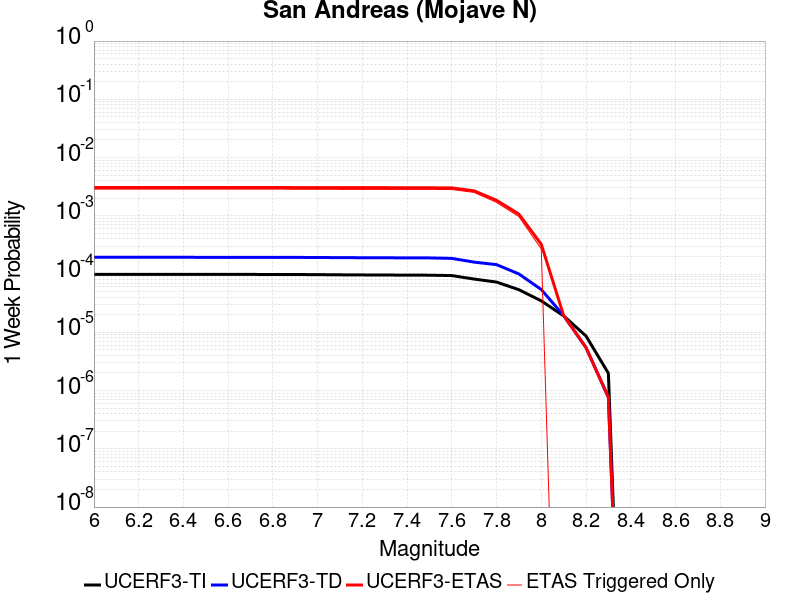 | 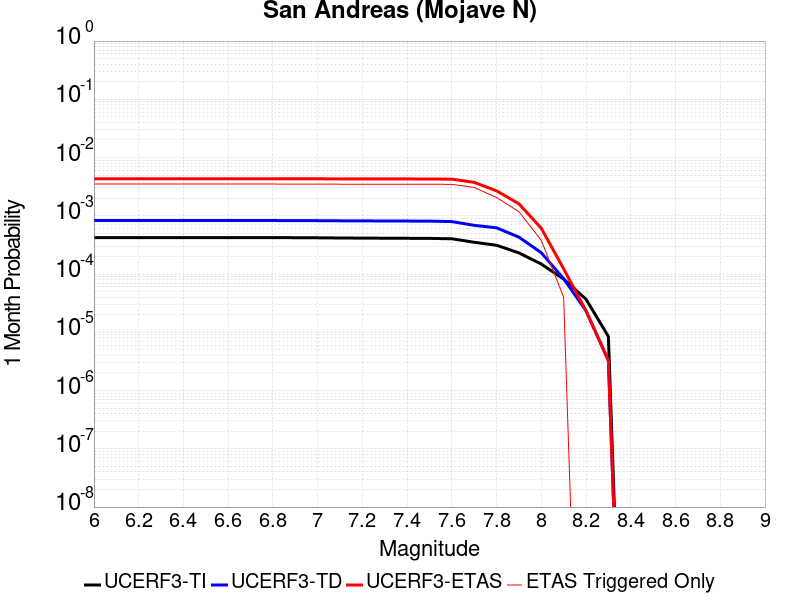 |  |  |

| Magnitude | 1 wk TI Prob | 1 wk TD Prob | 1 wk ETAS Prob | 1 wk ETAS/TD Gain | 1 wk ETAS Triggered Only | 1 mo TI Prob | 1 mo TD Prob | 1 mo ETAS Prob | 1 mo ETAS/TD Gain | 1 mo ETAS Triggered Only | 1 yr TI Prob | 1 yr TD Prob | 1 yr ETAS Prob | 1 yr ETAS/TD Gain | 1 yr ETAS Triggered Only | 10 yr TI Prob | 10 yr TD Prob | 10 yr ETAS Prob | 10 yr ETAS/TD Gain | 10 yr ETAS Triggered Only |
|-----|-----|-----|-----|-----|-----|-----|-----|-----|-----|-----|-----|-----|-----|-----|-----|-----|-----|-----|-----|-----|
| 6.0 | 9.877682E-5 | 1.9402112E-4 | 0.0030634643 | 15.789334 | 0.00287 | 4.2326056E-4 | 8.312543E-4 | 0.0043383366 | 5.2190247 | 0.00351 | 0.0051410277 | 0.010073684 | 0.014617446 | 1.4510527 | 0.00459 | 0.05023708 | 0.09832245 | 0.10354317 | 1.0530978 | 0.00579 |
| 6.1 | 9.877682E-5 | 1.9402112E-4 | 0.0030634643 | 15.789334 | 0.00287 | 4.2326056E-4 | 8.312543E-4 | 0.0043383366 | 5.2190247 | 0.00351 | 0.0051410277 | 0.010073684 | 0.014617446 | 1.4510527 | 0.00459 | 0.05023708 | 0.09832245 | 0.10354317 | 1.0530978 | 0.00579 |
| 6.2 | 9.877682E-5 | 1.9402112E-4 | 0.0030634643 | 15.789334 | 0.00287 | 4.2326056E-4 | 8.312543E-4 | 0.0043383366 | 5.2190247 | 0.00351 | 0.0051410277 | 0.010073684 | 0.014617446 | 1.4510527 | 0.00459 | 0.05023708 | 0.09832245 | 0.10354317 | 1.0530978 | 0.00579 |
| 6.3 | 9.877682E-5 | 1.9402112E-4 | 0.0030634643 | 15.789334 | 0.00287 | 4.2326056E-4 | 8.312543E-4 | 0.0043383366 | 5.2190247 | 0.00351 | 0.0051410277 | 0.010073684 | 0.014617446 | 1.4510527 | 0.00459 | 0.05023708 | 0.09832245 | 0.10354317 | 1.0530978 | 0.00579 |
| 6.4 | 9.877682E-5 | 1.9402112E-4 | 0.0030634643 | 15.789334 | 0.00287 | 4.2326056E-4 | 8.312543E-4 | 0.0043383366 | 5.2190247 | 0.00351 | 0.0051410277 | 0.010073684 | 0.014617446 | 1.4510527 | 0.00459 | 0.05023708 | 0.09832245 | 0.10354317 | 1.0530978 | 0.00579 |
| 6.5 | 9.861474E-5 | 1.937588E-4 | 0.0030632026 | 15.8093605 | 0.00287 | 4.2256617E-4 | 8.3013077E-4 | 0.004337217 | 5.2247396 | 0.00351 | 0.0051326132 | 0.0100601325 | 0.014603957 | 1.4516665 | 0.00459 | 0.050156746 | 0.09820035 | 0.10342177 | 1.053171 | 0.00579 |
| 6.6 | 9.861474E-5 | 1.937588E-4 | 0.0030632026 | 15.8093605 | 0.00287 | 4.2256617E-4 | 8.3013077E-4 | 0.004337217 | 5.2247396 | 0.00351 | 0.0051326132 | 0.0100601325 | 0.014603957 | 1.4516665 | 0.00459 | 0.050156746 | 0.09820035 | 0.10342177 | 1.053171 | 0.00579 |
| 6.7 | 9.8552715E-5 | 1.9365833E-4 | 0.0030631025 | 15.817045 | 0.00287 | 4.223004E-4 | 8.2970044E-4 | 0.0043367883 | 5.2269325 | 0.00351 | 0.0051293927 | 0.010054941 | 0.014598789 | 1.451902 | 0.00459 | 0.050125998 | 0.09815356 | 0.10337525 | 1.0531992 | 0.00579 |
| 6.8 | 9.8464974E-5 | 1.9350994E-4 | 0.0030629546 | 15.828409 | 0.00287 | 4.219245E-4 | 8.290649E-4 | 0.004336155 | 5.2301755 | 0.00351 | 0.0051248376 | 0.010047276 | 0.014591158 | 1.4522502 | 0.00459 | 0.05008251 | 0.09808378 | 0.103305876 | 1.0532411 | 0.00579 |
| 6.9 | 9.825824E-5 | 1.9319002E-4 | 0.0030526374 | 15.801217 | 0.00286 | 4.2103877E-4 | 8.276947E-4 | 0.0043247975 | 5.2251124 | 0.0035 | 0.0051141046 | 0.010030746 | 0.014564806 | 1.4520161 | 0.00458 | 0.049980022 | 0.097932965 | 0.10314691 | 1.05324 | 0.00578 |
| 7.0 | 9.781462E-5 | 1.9250368E-4 | 0.0030519532 | 15.853999 | 0.00286 | 4.1913814E-4 | 8.247551E-4 | 0.0043218685 | 5.240184 | 0.0035 | 0.005091073 | 0.009995285 | 0.014529508 | 1.453636 | 0.00458 | 0.04976007 | 0.09760912 | 0.10282494 | 1.0534358 | 0.00578 |
| 7.1 | 9.7121134E-5 | 1.9152075E-4 | 0.003040975 | 15.878044 | 0.00285 | 4.1616702E-4 | 8.205452E-4 | 0.0043076817 | 5.2497797 | 0.00349 | 0.005055068 | 0.0099444995 | 0.014469053 | 1.4549805 | 0.00457 | 0.04941613 | 0.09714571 | 0.102355175 | 1.0536253 | 0.00577 |
| 7.2 | 9.663819E-5 | 1.9082859E-4 | 0.0030402846 | 15.932019 | 0.00285 | 4.1409794E-4 | 8.175807E-4 | 0.0043047275 | 5.265202 | 0.00349 | 0.0050299936 | 0.009908735 | 0.014423551 | 1.45564 | 0.00456 | 0.049176537 | 0.09681883 | 0.10202115 | 1.0537325 | 0.00576 |
| 7.3 | 9.6277574E-5 | 1.9035369E-4 | 0.0030398113 | 15.969279 | 0.00285 | 4.125529E-4 | 8.1554666E-4 | 0.0043027005 | 5.2758484 | 0.00349 | 0.0050112694 | 0.009884195 | 0.014399123 | 1.4567826 | 0.00456 | 0.04899759 | 0.09659228 | 0.101795904 | 1.0538721 | 0.00576 |
| 7.4 | 9.593308E-5 | 1.8975153E-4 | 0.0030392108 | 16.016792 | 0.00285 | 4.1107697E-4 | 8.129676E-4 | 0.0043001305 | 5.289424 | 0.00349 | 0.0049933824 | 0.009853081 | 0.01436815 | 1.4582394 | 0.00456 | 0.04882661 | 0.09630986 | 0.10150608 | 1.0539532 | 0.00575 |
| 7.5 | 9.561707E-5 | 1.8921228E-4 | 0.003028675 | 16.006758 | 0.00284 | 4.0972308E-4 | 8.106579E-4 | 0.004287837 | 5.2893295 | 0.00348 | 0.0049769743 | 0.009825215 | 0.01433051 | 1.4585443 | 0.00455 | 0.048669744 | 0.096056245 | 0.10124488 | 1.0540167 | 0.00574 |
| 7.6 | 9.418194E-5 | 1.8573487E-4 | 0.0030152092 | 16.233942 | 0.00283 | 4.0357444E-4 | 7.95764E-4 | 0.0042630024 | 5.3571196 | 0.00347 | 0.004902454 | 0.009645499 | 0.014131805 | 1.4651191 | 0.00453 | 0.047957025 | 0.094437465 | 0.09960823 | 1.0547533 | 0.00571 |
| 7.7 | 8.202141E-5 | 1.6022482E-4 | 0.002679821 | 16.72538 | 0.00252 | 3.51473E-4 | 6.8649714E-4 | 0.0037543895 | 5.468908 | 0.00307 | 0.00427079 | 0.008326128 | 0.012342407 | 1.4823705 | 0.00405 | 0.04189639 | 0.082237914 | 0.086936854 | 1.0571384 | 0.00512 |
| 7.8 | 7.2859846E-5 | 1.4517571E-4 | 0.001844929 | 12.708248 | 0.0017 | 3.1221908E-4 | 6.2203326E-4 | 0.002680752 | 4.30966 | 0.00206 | 0.003794643 | 0.0075469986 | 0.010276245 | 1.3616333 | 0.00275 | 0.037304975 | 0.07472766 | 0.07797537 | 1.0434606 | 0.00351 |
| 7.9 | 5.3874453E-5 | 1.00462625E-4 | 0.0010703652 | 10.654362 | 9.7E-4 | 2.3087008E-4 | 4.3048308E-4 | 0.0016099751 | 3.7399266 | 0.00118 | 0.0028072202 | 0.0052285474 | 0.006840077 | 1.3082175 | 0.00162 | 0.02772022 | 0.052425884 | 0.054358933 | 1.036872 | 0.00204 |
| 8.0 | 3.468538E-5 | 5.4261534E-5 | 3.2424688E-4 | 5.9756303 | 2.7E-4 | 1.4864317E-4 | 2.3252872E-4 | 6.1244034E-4 | 2.6338267 | 3.8E-4 | 0.0018082283 | 0.0028273636 | 0.0033558651 | 1.1869237 | 5.3E-4 | 0.017935853 | 0.028948462 | 0.029599067 | 1.0224745 | 6.7E-4 |
| 8.1 | 1.9152367E-5 | 1.9401303E-5 | 1.9401303E-5 | 1.0 | 0.0 | 8.207899E-5 | 8.3145795E-5 | 1.2314247E-4 | 1.4810426 | 4.0E-5 | 9.988535E-4 | 0.0010118305 | 0.0010617799 | 1.0493654 | 5.0E-5 | 0.009943757 | 0.01085595 | 0.0109153 | 1.0054669 | 6.0E-5 |
| 8.2 | 8.643924E-6 | 5.473668E-6 | 5.473668E-6 | 1.0 | 0.0 | 3.704486E-5 | 2.3458366E-5 | 2.3458366E-5 | 1.0 | 0.0 | 4.5092785E-4 | 2.8556827E-4 | 2.8556827E-4 | 1.0 | 0.0 | 0.0045001395 | 0.0032481793 | 0.0032481793 | 1.0 | 0.0 |
| 8.3 | 1.983087E-6 | 7.6564595E-7 | 7.6564595E-7 | 1.0 | 0.0 | 8.498917E-6 | 3.281336E-6 | 3.281336E-6 | 1.0 | 0.0 | 1.034694E-4 | 3.9949547E-5 | 3.9949547E-5 | 1.0 | 0.0 | 0.0010342124 | 4.717979E-4 | 4.717979E-4 | 1.0 | 0.0 |

## San Andreas (Mojave S)
*[(top)](#table-of-contents)*

| 1 Week | 1 Month | 1 Year | 10 Year |
|-----|-----|-----|-----|
|  |  |  |  |

| Magnitude | 1 wk TI Prob | 1 wk TD Prob | 1 wk ETAS Prob | 1 wk ETAS/TD Gain | 1 wk ETAS Triggered Only | 1 mo TI Prob | 1 mo TD Prob | 1 mo ETAS Prob | 1 mo ETAS/TD Gain | 1 mo ETAS Triggered Only | 1 yr TI Prob | 1 yr TD Prob | 1 yr ETAS Prob | 1 yr ETAS/TD Gain | 1 yr ETAS Triggered Only | 10 yr TI Prob | 10 yr TD Prob | 10 yr ETAS Prob | 10 yr ETAS/TD Gain | 10 yr ETAS Triggered Only |
|-----|-----|-----|-----|-----|-----|-----|-----|-----|-----|-----|-----|-----|-----|-----|-----|-----|-----|-----|-----|-----|
| 6.0 | 3.1064058E-4 | 6.7462435E-4 | 0.003102985 | 4.5995746 | 0.00243 | 0.0013306376 | 0.002888172 | 0.0058894786 | 2.0391717 | 0.00301 | 0.016080605 | 0.034565594 | 0.038543187 | 1.1150737 | 0.00412 | 0.1496549 | 0.28654557 | 0.29034117 | 1.0132459 | 0.00532 |
| 6.1 | 3.1064058E-4 | 6.7462435E-4 | 0.003102985 | 4.5995746 | 0.00243 | 0.0013306376 | 0.002888172 | 0.0058894786 | 2.0391717 | 0.00301 | 0.016080605 | 0.034565594 | 0.038543187 | 1.1150737 | 0.00412 | 0.1496549 | 0.28654557 | 0.29034117 | 1.0132459 | 0.00532 |
| 6.2 | 3.1064058E-4 | 6.7462435E-4 | 0.003102985 | 4.5995746 | 0.00243 | 0.0013306376 | 0.002888172 | 0.0058894786 | 2.0391717 | 0.00301 | 0.016080605 | 0.034565594 | 0.038543187 | 1.1150737 | 0.00412 | 0.1496549 | 0.28654557 | 0.29034117 | 1.0132459 | 0.00532 |
| 6.3 | 3.1064058E-4 | 6.7462435E-4 | 0.003102985 | 4.5995746 | 0.00243 | 0.0013306376 | 0.002888172 | 0.0058894786 | 2.0391717 | 0.00301 | 0.016080605 | 0.034565594 | 0.038543187 | 1.1150737 | 0.00412 | 0.1496549 | 0.28654557 | 0.29034117 | 1.0132459 | 0.00532 |
| 6.4 | 1.9872203E-4 | 4.3181062E-4 | 0.002710826 | 6.2778125 | 0.00228 | 8.5138786E-4 | 0.0018493326 | 0.0046641175 | 2.5220544 | 0.00282 | 0.010316478 | 0.02228931 | 0.02600461 | 1.1666853 | 0.0038 | 0.098504856 | 0.19686839 | 0.20080374 | 1.0199897 | 0.0049 |
| 6.5 | 1.291105E-4 | 2.8754136E-4 | 0.0024869088 | 8.648873 | 0.0022 | 5.5321335E-4 | 0.0012317409 | 0.003938403 | 3.197428 | 0.00271 | 0.006714592 | 0.014894155 | 0.018410983 | 1.2361213 | 0.00357 | 0.065152965 | 0.13800792 | 0.14196448 | 1.028669 | 0.00459 |
| 6.6 | 1.291105E-4 | 2.8754136E-4 | 0.0024869088 | 8.648873 | 0.0022 | 5.5321335E-4 | 0.0012317409 | 0.003938403 | 3.197428 | 0.00271 | 0.006714592 | 0.014894155 | 0.018410983 | 1.2361213 | 0.00357 | 0.065152965 | 0.13800792 | 0.14196448 | 1.028669 | 0.00459 |
| 6.7 | 1.08001186E-4 | 2.4335351E-4 | 0.0023628375 | 9.709486 | 0.00212 | 4.6278012E-4 | 0.0010425274 | 0.0036398168 | 3.4913394 | 0.0026 | 0.0056198016 | 0.0126192 | 0.01601579 | 1.2691605 | 0.00344 | 0.054797906 | 0.11918431 | 0.1230599 | 1.0325176 | 0.0044 |
| 6.8 | 1.0624356E-4 | 2.3853009E-4 | 0.0023580245 | 9.885648 | 0.00212 | 4.5525006E-4 | 0.0010218718 | 0.003619215 | 3.5417504 | 0.0026 | 0.0055285925 | 0.012370593 | 0.015768038 | 1.2746389 | 0.00344 | 0.053930566 | 0.11713308 | 0.121017694 | 1.0331641 | 0.0044 |
| 6.9 | 1.0393785E-4 | 2.3223337E-4 | 0.0023417433 | 10.083578 | 0.00211 | 4.4537184E-4 | 9.949068E-4 | 0.00358233 | 3.6006691 | 0.00259 | 0.0054089287 | 0.012045963 | 0.015434645 | 1.2813127 | 0.00343 | 0.05279156 | 0.114433445 | 0.11832108 | 1.0339729 | 0.00439 |
| 7.0 | 1.0155622E-4 | 2.2592908E-4 | 0.0023254547 | 10.292852 | 0.0021 | 4.3516833E-4 | 9.6790853E-4 | 0.0035454114 | 3.662961 | 0.00258 | 0.005285311 | 0.011720838 | 0.01509087 | 1.2875248 | 0.00341 | 0.05161361 | 0.11169745 | 0.11557934 | 1.0347536 | 0.00437 |
| 7.1 | 9.885595E-5 | 2.188132E-4 | 0.0023183536 | 10.595127 | 0.0021 | 4.2359953E-4 | 9.374342E-4 | 0.003505025 | 3.7389557 | 0.00257 | 0.0051451353 | 0.011353733 | 0.01471513 | 1.2960609 | 0.0034 | 0.05027629 | 0.10857607 | 0.11246268 | 1.0357962 | 0.00436 |
| 7.2 | 9.6411415E-5 | 2.1244297E-4 | 0.0023119969 | 10.882906 | 0.0021 | 4.1312634E-4 | 9.101525E-4 | 0.0034778134 | 3.8211327 | 0.00257 | 0.005018219 | 0.011024987 | 0.014387502 | 1.3049904 | 0.0034 | 0.049064007 | 0.1057697 | 0.109659605 | 1.0367771 | 0.00435 |
| 7.3 | 9.1180635E-5 | 1.9472656E-4 | 0.0022643234 | 11.628221 | 0.00207 | 3.907156E-4 | 8.342756E-4 | 0.0033721565 | 4.0420175 | 0.00254 | 0.004746591 | 0.010110112 | 0.013446041 | 1.3299596 | 0.00337 | 0.046464786 | 0.09796176 | 0.10182249 | 1.0394105 | 0.00428 |
| 7.4 | 8.887388E-5 | 1.872126E-4 | 0.002256825 | 12.054877 | 0.00207 | 3.8083247E-4 | 8.020931E-4 | 0.0033400557 | 4.1641746 | 0.00254 | 0.0046267817 | 0.009721855 | 0.013059092 | 1.3432717 | 0.00337 | 0.045316286 | 0.094593845 | 0.09845993 | 1.0408703 | 0.00427 |
| 7.5 | 8.6750515E-5 | 1.80528E-4 | 0.002240156 | 12.408912 | 0.00206 | 3.7173493E-4 | 7.734621E-4 | 0.003291513 | 4.255558 | 0.00252 | 0.004516484 | 0.009376327 | 0.012694916 | 1.3539327 | 0.00335 | 0.04425787 | 0.09155606 | 0.09541694 | 1.0421697 | 0.00425 |
| 7.6 | 8.453092E-5 | 1.7440386E-4 | 0.0022240463 | 12.752276 | 0.00205 | 3.6222505E-4 | 7.4723107E-4 | 0.0032553556 | 4.356558 | 0.00251 | 0.0044011753 | 0.009059664 | 0.012369405 | 1.3653271 | 0.00334 | 0.04315024 | 0.08871447 | 0.0925601 | 1.0433483 | 0.00422 |
| 7.7 | 8.259102E-5 | 1.6962511E-4 | 0.0022192774 | 13.0834255 | 0.00205 | 3.539135E-4 | 7.267622E-4 | 0.003234938 | 4.4511642 | 0.00251 | 0.004300386 | 0.0088125 | 0.012123067 | 1.3756671 | 0.00334 | 0.042181134 | 0.086465426 | 0.09032054 | 1.0445856 | 0.00422 |
| 7.8 | 7.444844E-5 | 1.528469E-4 | 0.0018525871 | 12.120541 | 0.0017 | 3.1902574E-4 | 6.5489375E-4 | 0.0027135448 | 4.1434884 | 0.00206 | 0.0038772223 | 0.007944231 | 0.010672385 | 1.3434131 | 0.00275 | 0.03810269 | 0.078293875 | 0.081529066 | 1.041321 | 0.00351 |
| 7.9 | 5.2586525E-5 | 1.0007023E-4 | 0.0010699732 | 10.692223 | 9.7E-4 | 2.2535135E-4 | 4.2880196E-4 | 0.001608296 | 3.750673 | 0.00118 | 0.0027402006 | 0.005208178 | 0.0068197404 | 1.3094293 | 0.00162 | 0.027066574 | 0.052201588 | 0.0541351 | 1.0370393 | 0.00204 |
| 8.0 | 3.379877E-5 | 5.4075565E-5 | 3.2406097E-4 | 5.992743 | 2.7E-4 | 1.4484383E-4 | 2.3173184E-4 | 6.116438E-4 | 2.6394465 | 3.8E-4 | 0.0017620471 | 0.0028176866 | 0.0033461933 | 1.1875676 | 5.3E-4 | 0.017481409 | 0.028835917 | 0.029486597 | 1.0225649 | 6.7E-4 |
| 8.1 | 1.8668277E-5 | 1.9308145E-5 | 1.9308145E-5 | 1.0 | 0.0 | 8.000444E-5 | 8.274657E-5 | 1.2274327E-4 | 1.4833637 | 4.0E-5 | 9.736188E-4 | 0.0010069745 | 0.0010569241 | 1.0496037 | 5.0E-5 | 0.009693642 | 0.010798624 | 0.010857976 | 1.0054963 | 6.0E-5 |
| 8.2 | 8.541571E-6 | 5.4596358E-6 | 5.4596358E-6 | 1.0 | 0.0 | 3.660622E-5 | 2.339823E-5 | 2.339823E-5 | 1.0 | 0.0 | 4.455896E-4 | 2.848363E-4 | 2.848363E-4 | 1.0 | 0.0 | 0.0044469717 | 0.003240283 | 0.003240283 | 1.0 | 0.0 |
| 8.3 | 1.983087E-6 | 7.6564595E-7 | 7.6564595E-7 | 1.0 | 0.0 | 8.498917E-6 | 3.281336E-6 | 3.281336E-6 | 1.0 | 0.0 | 1.034694E-4 | 3.9949547E-5 | 3.9949547E-5 | 1.0 | 0.0 | 0.0010342124 | 4.717979E-4 | 4.717979E-4 | 1.0 | 0.0 |

## Coyote Canyon
*[(top)](#table-of-contents)*

| 1 Week | 1 Month | 1 Year | 10 Year |
|-----|-----|-----|-----|
| 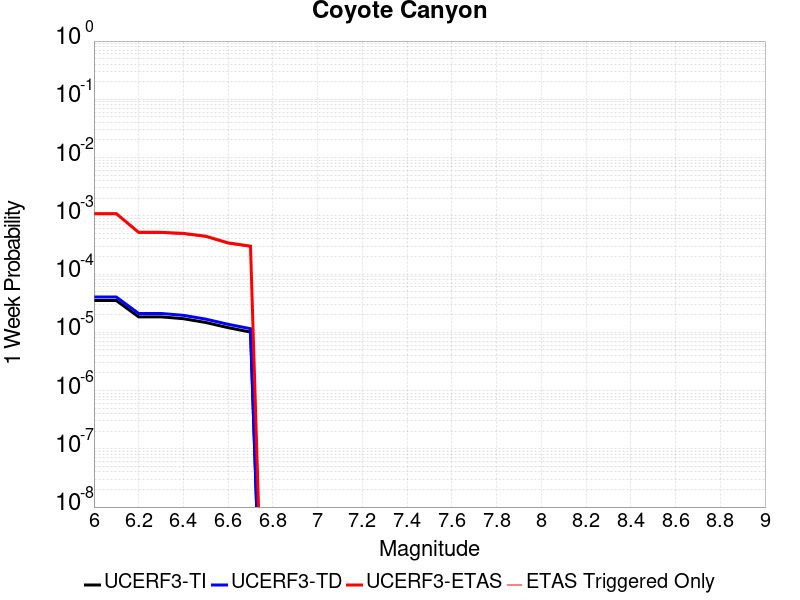 |  |  |  |

| Magnitude | 1 wk TI Prob | 1 wk TD Prob | 1 wk ETAS Prob | 1 wk ETAS/TD Gain | 1 wk ETAS Triggered Only | 1 mo TI Prob | 1 mo TD Prob | 1 mo ETAS Prob | 1 mo ETAS/TD Gain | 1 mo ETAS Triggered Only | 1 yr TI Prob | 1 yr TD Prob | 1 yr ETAS Prob | 1 yr ETAS/TD Gain | 1 yr ETAS Triggered Only | 10 yr TI Prob | 10 yr TD Prob | 10 yr ETAS Prob | 10 yr ETAS/TD Gain | 10 yr ETAS Triggered Only |
|-----|-----|-----|-----|-----|-----|-----|-----|-----|-----|-----|-----|-----|-----|-----|-----|-----|-----|-----|-----|-----|
| 6.0 | 3.5090034E-5 | 4.0364317E-5 | 0.0010903219 | 27.012026 | 0.00105 | 1.503772E-4 | 1.7297991E-4 | 0.0017427084 | 10.074629 | 0.00157 | 0.0018293047 | 0.0021042533 | 0.0051079197 | 2.427426 | 0.00301 | 0.018143194 | 0.020869205 | 0.025666945 | 1.2298957 | 0.0049 |
| 6.1 | 3.5090034E-5 | 4.0364317E-5 | 0.0010903219 | 27.012026 | 0.00105 | 1.503772E-4 | 1.7297991E-4 | 0.0017427084 | 10.074629 | 0.00157 | 0.0018293047 | 0.0021042533 | 0.0051079197 | 2.427426 | 0.00301 | 0.018143194 | 0.020869205 | 0.025666945 | 1.2298957 | 0.0049 |
| 6.2 | 1.841879E-5 | 2.1059794E-5 | 5.2104925E-4 | 24.741425 | 5.0E-4 | 7.8935285E-5 | 9.025371E-5 | 7.9019053E-4 | 8.755214 | 7.0E-4 | 9.606133E-4 | 0.0010983871 | 0.0025368053 | 2.3095734 | 0.00144 | 0.0095647145 | 0.010939668 | 0.013333194 | 1.2187933 | 0.00242 |
| 6.3 | 1.841879E-5 | 2.1059794E-5 | 5.2104925E-4 | 24.741425 | 5.0E-4 | 7.8935285E-5 | 9.025371E-5 | 7.9019053E-4 | 8.755214 | 7.0E-4 | 9.606133E-4 | 0.0010983871 | 0.0025368053 | 2.3095734 | 0.00144 | 0.0095647145 | 0.010939668 | 0.013333194 | 1.2187933 | 0.00242 |
| 6.4 | 1.712201E-5 | 1.9565212E-5 | 4.9955584E-4 | 25.53286 | 4.8E-4 | 7.337798E-5 | 8.3848776E-5 | 7.4379344E-4 | 8.870653 | 6.6E-4 | 8.930107E-4 | 0.0010204813 | 0.0023890834 | 2.3411338 | 0.00137 | 0.008894307 | 0.010167871 | 0.012444485 | 1.2239027 | 0.0023 |
| 6.5 | 1.4744935E-5 | 1.6836972E-5 | 4.4682974E-4 | 26.538605 | 4.3E-4 | 6.3191044E-5 | 7.215698E-5 | 6.82113E-4 | 9.45318 | 6.1E-4 | 7.6907943E-4 | 8.782507E-4 | 0.0021571266 | 2.4561627 | 0.00128 | 0.007664232 | 0.008756994 | 0.0108485175 | 1.2388402 | 0.00211 |
| 6.6 | 1.2017839E-5 | 1.3724089E-5 | 3.4371956E-4 | 25.044981 | 3.3E-4 | 5.150401E-5 | 5.88167E-5 | 5.3878844E-4 | 9.160468 | 4.8E-4 | 6.268809E-4 | 7.159466E-4 | 0.0017751877 | 2.4794974 | 0.00106 | 0.0062511545 | 0.0071450938 | 0.00888259 | 1.2431734 | 0.00175 |
| 6.7 | 1.00956095E-5 | 1.1533517E-5 | 3.0153018E-4 | 26.14382 | 2.9E-4 | 4.326618E-5 | 4.942891E-5 | 4.4940913E-4 | 9.092031 | 4.0E-4 | 5.266384E-4 | 6.017178E-4 | 0.0015211642 | 2.5280359 | 9.2E-4 | 0.005253921 | 0.0060094125 | 0.0075103384 | 1.2497625 | 0.00151 |

## Death Valley (So)
*[(top)](#table-of-contents)*

| 1 Week | 1 Month | 1 Year | 10 Year |
|-----|-----|-----|-----|
|  |  | 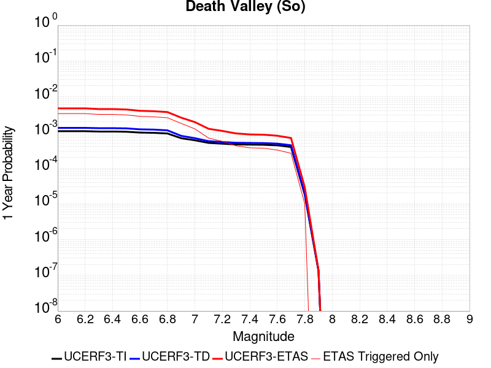 |  |

| Magnitude | 1 wk TI Prob | 1 wk TD Prob | 1 wk ETAS Prob | 1 wk ETAS/TD Gain | 1 wk ETAS Triggered Only | 1 mo TI Prob | 1 mo TD Prob | 1 mo ETAS Prob | 1 mo ETAS/TD Gain | 1 mo ETAS Triggered Only | 1 yr TI Prob | 1 yr TD Prob | 1 yr ETAS Prob | 1 yr ETAS/TD Gain | 1 yr ETAS Triggered Only | 10 yr TI Prob | 10 yr TD Prob | 10 yr ETAS Prob | 10 yr ETAS/TD Gain | 10 yr ETAS Triggered Only |
|-----|-----|-----|-----|-----|-----|-----|-----|-----|-----|-----|-----|-----|-----|-----|-----|-----|-----|-----|-----|-----|
| 6.0 | 2.0684236E-5 | 2.5618314E-5 | 0.0012755863 | 49.79197 | 0.00125 | 8.864371E-5 | 1.0978825E-4 | 0.0019495862 | 17.757694 | 0.00184 | 0.0010787029 | 0.0013358692 | 0.0046913805 | 3.5118563 | 0.00336 | 0.010734817 | 0.013279985 | 0.01861814 | 1.40197 | 0.00541 |
| 6.1 | 2.0684236E-5 | 2.5618314E-5 | 0.0012755863 | 49.79197 | 0.00125 | 8.864371E-5 | 1.0978825E-4 | 0.0019495862 | 17.757694 | 0.00184 | 0.0010787029 | 0.0013358692 | 0.0046913805 | 3.5118563 | 0.00336 | 0.010734817 | 0.013279985 | 0.01861814 | 1.40197 | 0.00541 |
| 6.2 | 2.0684236E-5 | 2.5618314E-5 | 0.0012755863 | 49.79197 | 0.00125 | 8.864371E-5 | 1.0978825E-4 | 0.0019495862 | 17.757694 | 0.00184 | 0.0010787029 | 0.0013358692 | 0.0046913805 | 3.5118563 | 0.00336 | 0.010734817 | 0.013279985 | 0.01861814 | 1.40197 | 0.00541 |
| 6.3 | 2.0240292E-5 | 2.51184E-5 | 0.0012150885 | 48.374443 | 0.00119 | 8.6741224E-5 | 1.0764593E-4 | 0.0018574576 | 17.25525 | 0.00175 | 0.0010555626 | 0.001309818 | 0.004485653 | 3.4246383 | 0.00318 | 0.010505628 | 0.013022543 | 0.018065998 | 1.3872864 | 0.00511 |
| 6.4 | 2.0240292E-5 | 2.51184E-5 | 0.0012150885 | 48.374443 | 0.00119 | 8.6741224E-5 | 1.0764593E-4 | 0.0018574576 | 17.25525 | 0.00175 | 0.0010555626 | 0.001309818 | 0.004485653 | 3.4246383 | 0.00318 | 0.010505628 | 0.013022543 | 0.018065998 | 1.3872864 | 0.00511 |
| 6.5 | 1.9962767E-5 | 2.4807652E-5 | 0.0011747791 | 47.355515 | 0.00115 | 8.55519E-5 | 1.0631427E-4 | 0.0018061335 | 16.988628 | 0.0017 | 0.0010410968 | 0.0012936244 | 0.00436964 | 3.3778276 | 0.00308 | 0.010362327 | 0.01286249 | 0.017758692 | 1.3806574 | 0.00496 |
| 6.6 | 1.8937297E-5 | 2.3311462E-5 | 0.0010432877 | 44.75428 | 0.00102 | 8.115732E-5 | 9.990252E-5 | 0.0016397487 | 16.413486 | 0.00154 | 9.876423E-4 | 0.0012156491 | 0.004012245 | 3.3004963 | 0.0028 | 0.009832645 | 0.0120915035 | 0.016507454 | 1.3652111 | 0.00447 |
| 6.7 | 1.8621096E-5 | 2.2912098E-5 | 9.928899E-4 | 43.334743 | 9.7E-4 | 7.980225E-5 | 9.8191085E-5 | 0.0015780458 | 16.07117 | 0.00148 | 9.711593E-4 | 0.0011948354 | 0.0039115855 | 3.273744 | 0.00272 | 0.009669261 | 0.011885625 | 0.016164161 | 1.3599756 | 0.00433 |
| 6.8 | 1.7830353E-5 | 2.1806083E-5 | 9.217865E-4 | 42.271984 | 9.0E-4 | 7.641356E-5 | 9.3451374E-5 | 0.0014833214 | 15.872655 | 0.00139 | 9.29938E-4 | 0.0011371907 | 0.0036942794 | 3.2486017 | 0.00256 | 0.009260561 | 0.01131609 | 0.015330146 | 1.3547212 | 0.00406 |
| 6.9 | 1.3135183E-5 | 1.5304031E-5 | 6.452944E-4 | 42.164997 | 6.3E-4 | 5.6292425E-5 | 6.558709E-5 | 0.0010255241 | 15.636067 | 9.6E-4 | 6.8514474E-4 | 7.982367E-4 | 0.002576816 | 3.2281349 | 0.00178 | 0.006830362 | 0.007955158 | 0.010713043 | 1.3466787 | 0.00278 |
| 7.0 | 1.1507512E-5 | 1.3154237E-5 | 4.4314857E-4 | 33.688656 | 4.3E-4 | 4.9316975E-5 | 5.637412E-5 | 7.3633576E-4 | 13.061593 | 6.8E-4 | 6.002687E-4 | 6.861445E-4 | 0.0019352868 | 2.8205235 | 0.00125 | 0.0059864987 | 0.0068414924 | 0.008827809 | 1.2903339 | 0.002 |
| 7.1 | 9.715903E-6 | 1.0865287E-5 | 2.3086289E-4 | 21.24775 | 2.2E-4 | 4.1638916E-5 | 4.6564706E-5 | 4.1654747E-4 | 8.945562 | 3.7E-4 | 5.068359E-4 | 5.667821E-4 | 0.001256391 | 2.2167091 | 6.9E-4 | 0.0050568148 | 0.005653834 | 0.0067277276 | 1.1899408 | 0.00108 |
| 7.2 | 9.233269E-6 | 1.0286314E-5 | 2.0028435E-4 | 19.470955 | 1.9E-4 | 3.9570554E-5 | 4.408348E-5 | 3.2407112E-4 | 7.3513055 | 2.8E-4 | 4.81665E-4 | 5.365884E-4 | 0.001096288 | 2.0430703 | 5.6E-4 | 0.0048062233 | 0.0053533595 | 0.0062584877 | 1.1690767 | 9.1E-4 |
| 7.3 | 8.8041315E-6 | 9.808164E-6 | 1.3980689E-4 | 14.254134 | 1.3E-4 | 3.7731446E-5 | 4.2034335E-5 | 2.2202676E-4 | 5.2820334 | 1.8E-4 | 4.592835E-4 | 5.1165203E-4 | 9.314372E-4 | 1.8204503 | 4.2E-4 | 0.0045833546 | 0.005105167 | 0.0057816957 | 1.1325184 | 6.8E-4 |
| 7.4 | 8.708749E-6 | 9.707175E-6 | 1.2970601E-4 | 13.36187 | 1.2E-4 | 3.7322676E-5 | 4.160154E-5 | 2.0159488E-4 | 4.8458514 | 1.6E-4 | 4.5430884E-4 | 5.0638523E-4 | 8.761979E-4 | 1.730299 | 3.7E-4 | 0.004533812 | 0.0050527398 | 0.0056795566 | 1.1240548 | 6.3E-4 |
| 7.5 | 8.612678E-6 | 9.604817E-6 | 1.1960376E-4 | 12.4524765 | 1.1E-4 | 3.6910955E-5 | 4.1162875E-5 | 1.9115671E-4 | 4.6439104 | 1.5E-4 | 4.492982E-4 | 5.01047E-4 | 8.608666E-4 | 1.7181355 | 3.6E-4 | 0.004483909 | 0.0049995985 | 0.005606549 | 1.1213998 | 6.1E-4 |
| 7.6 | 8.319024E-6 | 9.283916E-6 | 1.0928299E-4 | 11.771216 | 1.0E-4 | 3.5652476E-5 | 3.978763E-5 | 1.7978206E-4 | 4.5185413 | 1.4E-4 | 4.3398244E-4 | 4.8431093E-4 | 8.0415595E-4 | 1.6604125 | 3.2E-4 | 0.0043313587 | 0.0048329784 | 0.005350465 | 1.1070741 | 5.2E-4 |
| 7.7 | 7.4718328E-6 | 8.34517E-6 | 8.83445E-5 | 10.586304 | 8.0E-5 | 3.2021748E-5 | 3.5764548E-5 | 1.3576097E-4 | 3.7959652 | 1.0E-4 | 3.8979502E-4 | 4.353504E-4 | 6.952372E-4 | 1.5969601 | 2.6E-4 | 0.00389112 | 0.0043453807 | 0.0047635557 | 1.0962343 | 4.2E-4 |
| 7.8 | 3.4586725E-7 | 3.6482615E-7 | 3.6482615E-7 | 1.0 | 0.0 | 1.4822873E-6 | 1.5635396E-6 | 1.5635396E-6 | 1.0 | 0.0 | 1.80467E-5 | 1.9035933E-5 | 2.9035744E-5 | 1.5253123 | 1.0E-5 | 1.8045233E-4 | 1.9034347E-4 | 2.0034157E-4 | 1.0525266 | 1.0E-5 |
| 7.9 | 2.5591178E-9 | 2.6696718E-9 | 2.6696718E-9 | 1.0 | 0.0 | 1.0967647E-8 | 1.14414505E-8 | 1.14414505E-8 | 1.0 | 0.0 | 1.335311E-7 | 1.3929966E-7 | 1.3929966E-7 | 1.0 | 0.0 | 1.3353102E-6 | 1.3929966E-6 | 1.3929966E-6 | 1.0 | 0.0 |

## Nelson Lake
*[(top)](#table-of-contents)*

| 1 Week | 1 Month | 1 Year | 10 Year |
|-----|-----|-----|-----|
| 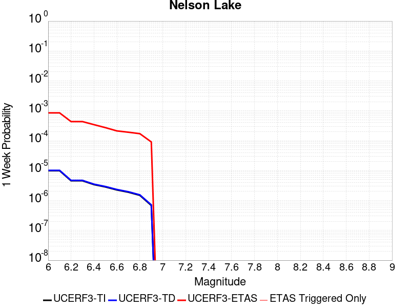 | 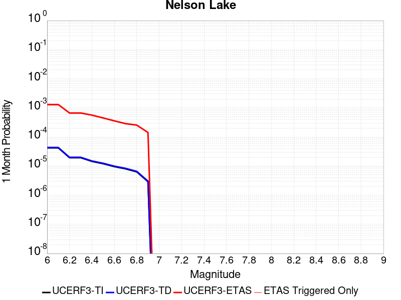 |  |  |

| Magnitude | 1 wk TI Prob | 1 wk TD Prob | 1 wk ETAS Prob | 1 wk ETAS/TD Gain | 1 wk ETAS Triggered Only | 1 mo TI Prob | 1 mo TD Prob | 1 mo ETAS Prob | 1 mo ETAS/TD Gain | 1 mo ETAS Triggered Only | 1 yr TI Prob | 1 yr TD Prob | 1 yr ETAS Prob | 1 yr ETAS/TD Gain | 1 yr ETAS Triggered Only | 10 yr TI Prob | 10 yr TD Prob | 10 yr ETAS Prob | 10 yr ETAS/TD Gain | 10 yr ETAS Triggered Only |
|-----|-----|-----|-----|-----|-----|-----|-----|-----|-----|-----|-----|-----|-----|-----|-----|-----|-----|-----|-----|-----|
| 6.0 | 9.913453E-6 | 1.0192255E-5 | 8.501837E-4 | 83.41468 | 8.4E-4 | 4.2485535E-5 | 4.3680422E-5 | 0.0013036254 | 29.844616 | 0.00126 | 5.1713863E-4 | 5.316897E-4 | 0.003110318 | 5.8498745 | 0.00258 | 0.0051593683 | 0.005305204 | 0.009592338 | 1.8080999 | 0.00431 |
| 6.1 | 9.913453E-6 | 1.0192255E-5 | 8.501837E-4 | 83.41468 | 8.4E-4 | 4.2485535E-5 | 4.3680422E-5 | 0.0013036254 | 29.844616 | 0.00126 | 5.1713863E-4 | 5.316897E-4 | 0.003110318 | 5.8498745 | 0.00258 | 0.0051593683 | 0.005305204 | 0.009592338 | 1.8080999 | 0.00431 |
| 6.2 | 4.5596407E-6 | 4.696313E-6 | 4.346943E-4 | 92.56076 | 4.3E-4 | 1.954117E-5 | 2.0126909E-5 | 6.7011383E-4 | 33.294426 | 6.5E-4 | 2.3788778E-4 | 2.4501883E-4 | 0.0015247052 | 6.2228084 | 0.00128 | 0.0023763329 | 0.0024476128 | 0.0044826195 | 1.8314252 | 0.00204 |
| 6.3 | 4.5596407E-6 | 4.696313E-6 | 4.346943E-4 | 92.56076 | 4.3E-4 | 1.954117E-5 | 2.0126909E-5 | 6.7011383E-4 | 33.294426 | 6.5E-4 | 2.3788778E-4 | 2.4501883E-4 | 0.0015247052 | 6.2228084 | 0.00128 | 0.0023763329 | 0.0024476128 | 0.0044826195 | 1.8314252 | 0.00204 |
| 6.4 | 3.4025713E-6 | 3.5098972E-6 | 3.435087E-4 | 97.86859 | 3.4E-4 | 1.4582367E-5 | 1.5042335E-5 | 5.6503405E-4 | 37.562923 | 5.5E-4 | 1.7752586E-4 | 1.8312587E-4 | 0.0011829428 | 6.459725 | 0.001 | 0.001773841 | 0.0018298327 | 0.0033769964 | 1.845522 | 0.00155 |
| 6.5 | 2.8352947E-6 | 2.927856E-6 | 2.7292708E-4 | 93.21738 | 2.7E-4 | 1.2151207E-5 | 1.2547898E-5 | 4.525424E-4 | 36.065193 | 4.4E-4 | 1.479309E-4 | 1.5276071E-4 | 9.3264156E-4 | 6.105245 | 7.8E-4 | 0.0014783246 | 0.0015266308 | 0.0027647377 | 1.8110062 | 0.00124 |
| 6.6 | 2.251518E-6 | 2.3290677E-6 | 2.1232858E-4 | 91.16463 | 2.1E-4 | 9.649328E-6 | 9.981683E-6 | 3.5997818E-4 | 36.063877 | 3.5E-4 | 1.1747423E-4 | 1.2152085E-4 | 7.214479E-4 | 5.9368243 | 6.0E-4 | 0.0011741214 | 0.0012146058 | 0.002213391 | 1.8223125 | 0.001 |
| 6.7 | 1.8911853E-6 | 1.9591396E-6 | 1.9195877E-4 | 97.981155 | 1.9E-4 | 8.105055E-6 | 8.39629E-6 | 2.8839393E-4 | 34.347786 | 2.8E-4 | 9.867457E-5 | 1.0222061E-4 | 5.921705E-4 | 5.7930636 | 4.9E-4 | 9.863076E-4 | 0.0010217935 | 0.0018609351 | 1.821244 | 8.4E-4 |
| 6.8 | 1.4874814E-6 | 1.5438305E-6 | 1.7154356E-4 | 111.11555 | 1.7E-4 | 6.374905E-6 | 6.6164025E-6 | 2.5661476E-4 | 38.784634 | 2.5E-4 | 7.76117E-5 | 8.055224E-5 | 5.30516E-4 | 6.5859866 | 4.5E-4 | 7.75846E-4 | 8.0528157E-4 | 0.0015446857 | 1.9181932 | 7.4E-4 |
| 6.9 | 6.835972E-7 | 7.1399285E-7 | 9.0713926E-5 | 127.0516 | 9.0E-5 | 2.9296991E-6 | 3.0599674E-6 | 1.4305954E-4 | 46.75198 | 1.4E-4 | 3.56685E-5 | 3.7254784E-5 | 2.7724585E-4 | 7.4418855 | 2.4E-4 | 3.5662777E-4 | 3.7251666E-4 | 7.523751E-4 | 2.0197086 | 3.8E-4 |

## Towne Pass
*[(top)](#table-of-contents)*

| 1 Week | 1 Month | 1 Year | 10 Year |
|-----|-----|-----|-----|
| 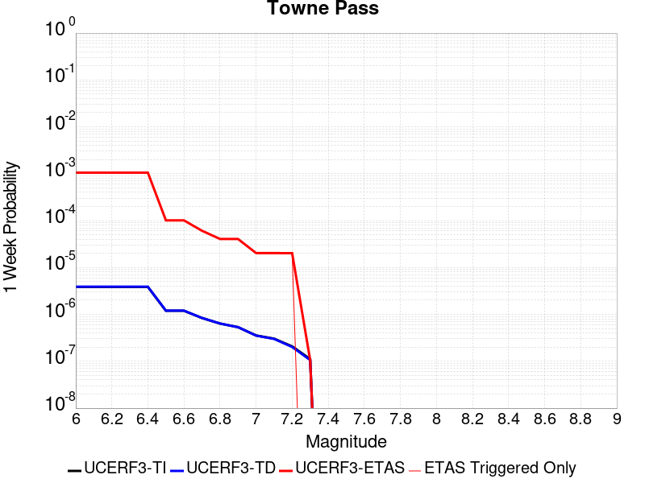 | 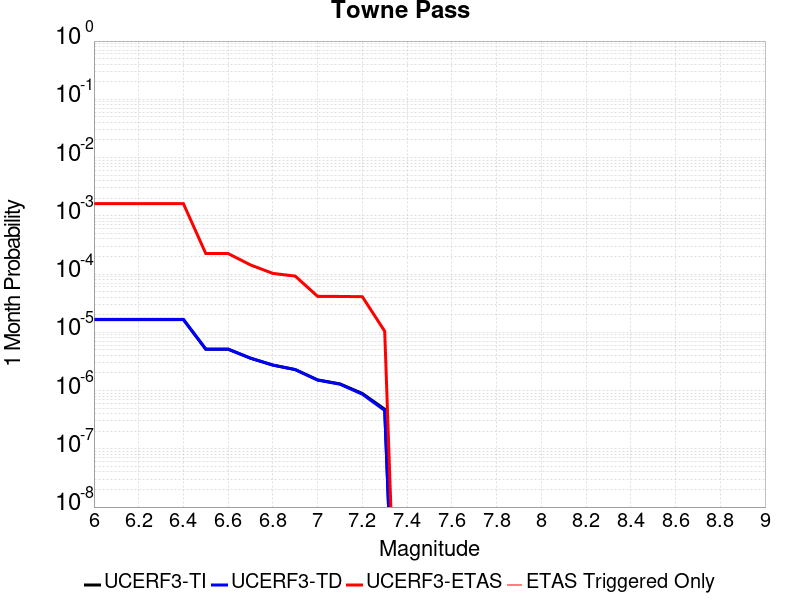 |  |  |

| Magnitude | 1 wk TI Prob | 1 wk TD Prob | 1 wk ETAS Prob | 1 wk ETAS/TD Gain | 1 wk ETAS Triggered Only | 1 mo TI Prob | 1 mo TD Prob | 1 mo ETAS Prob | 1 mo ETAS/TD Gain | 1 mo ETAS Triggered Only | 1 yr TI Prob | 1 yr TD Prob | 1 yr ETAS Prob | 1 yr ETAS/TD Gain | 1 yr ETAS Triggered Only | 10 yr TI Prob | 10 yr TD Prob | 10 yr ETAS Prob | 10 yr ETAS/TD Gain | 10 yr ETAS Triggered Only |
|-----|-----|-----|-----|-----|-----|-----|-----|-----|-----|-----|-----|-----|-----|-----|-----|-----|-----|-----|-----|-----|
| 6.0 | 3.849728E-6 | 3.894542E-6 | 0.0010538904 | 270.60703 | 0.00105 | 1.649873E-5 | 1.6690812E-5 | 0.0016166641 | 96.85953 | 0.0016 | 2.0085352E-4 | 2.0319606E-4 | 0.0031326008 | 15.416641 | 0.00293 | 0.0020067208 | 0.0020305319 | 0.006102247 | 3.005246 | 0.00408 |
| 6.1 | 3.849728E-6 | 3.894542E-6 | 0.0010538904 | 270.60703 | 0.00105 | 1.649873E-5 | 1.6690812E-5 | 0.0016166641 | 96.85953 | 0.0016 | 2.0085352E-4 | 2.0319606E-4 | 0.0031326008 | 15.416641 | 0.00293 | 0.0020067208 | 0.0020305319 | 0.006102247 | 3.005246 | 0.00408 |
| 6.2 | 3.849728E-6 | 3.894542E-6 | 0.0010538904 | 270.60703 | 0.00105 | 1.649873E-5 | 1.6690812E-5 | 0.0016166641 | 96.85953 | 0.0016 | 2.0085352E-4 | 2.0319606E-4 | 0.0031326008 | 15.416641 | 0.00293 | 0.0020067208 | 0.0020305319 | 0.006102247 | 3.005246 | 0.00408 |
| 6.3 | 3.849728E-6 | 3.894542E-6 | 0.0010538904 | 270.60703 | 0.00105 | 1.649873E-5 | 1.6690812E-5 | 0.0016166641 | 96.85953 | 0.0016 | 2.0085352E-4 | 2.0319606E-4 | 0.0031326008 | 15.416641 | 0.00293 | 0.0020067208 | 0.0020305319 | 0.006102247 | 3.005246 | 0.00408 |
| 6.4 | 3.849728E-6 | 3.894542E-6 | 0.0010538904 | 270.60703 | 0.00105 | 1.649873E-5 | 1.6690812E-5 | 0.0016166641 | 96.85953 | 0.0016 | 2.0085352E-4 | 2.0319606E-4 | 0.0031326008 | 15.416641 | 0.00293 | 0.0020067208 | 0.0020305319 | 0.006102247 | 3.005246 | 0.00408 |
| 6.5 | 1.1953545E-6 | 1.2030526E-6 | 1.0120293E-4 | 84.12179 | 1.0E-4 | 5.1229376E-6 | 5.15593E-6 | 2.251548E-4 | 43.669094 | 2.2E-4 | 6.236998E-5 | 6.277176E-5 | 5.0274417E-4 | 8.009082 | 4.4E-4 | 6.235248E-4 | 6.2755204E-4 | 0.001207188 | 1.9236462 | 5.8E-4 |
| 6.6 | 1.1953545E-6 | 1.2030526E-6 | 1.0120293E-4 | 84.12179 | 1.0E-4 | 5.1229376E-6 | 5.15593E-6 | 2.251548E-4 | 43.669094 | 2.2E-4 | 6.236998E-5 | 6.277176E-5 | 5.0274417E-4 | 8.009082 | 4.4E-4 | 6.235248E-4 | 6.2755204E-4 | 0.001207188 | 1.9236462 | 5.8E-4 |
| 6.7 | 8.375951E-7 | 8.410676E-7 | 6.0841016E-5 | 72.337845 | 6.0E-5 | 3.5896885E-6 | 3.6045708E-6 | 1.4360406E-4 | 39.839436 | 1.4E-4 | 4.370358E-5 | 4.3884826E-5 | 3.2387255E-4 | 7.380058 | 2.8E-4 | 4.3694986E-4 | 4.3876728E-4 | 8.0860493E-4 | 1.8429016 | 3.7E-4 |
| 6.8 | 6.38041E-7 | 6.3921624E-7 | 4.0639192E-5 | 63.576595 | 4.0E-5 | 2.7344586E-6 | 2.7394954E-6 | 1.0273922E-4 | 37.50297 | 1.0E-4 | 3.3291526E-5 | 3.3352884E-5 | 2.3334622E-4 | 6.9962826 | 2.0E-4 | 3.3286537E-4 | 3.334826E-4 | 6.0339255E-4 | 1.8093674 | 2.7E-4 |
| 6.9 | 5.3460053E-7 | 5.345339E-7 | 4.0534513E-5 | 75.83151 | 4.0E-5 | 2.2911431E-6 | 2.2908578E-6 | 9.2290655E-5 | 40.286507 | 9.0E-5 | 2.789431E-5 | 2.7890868E-5 | 2.0788585E-4 | 7.453545 | 1.8E-4 | 2.789081E-4 | 2.78877E-4 | 5.288073E-4 | 1.8962026 | 2.5E-4 |
| 7.0 | 3.557783E-7 | 3.5324283E-7 | 2.0353236E-5 | 57.618256 | 2.0E-5 | 1.5247632E-6 | 1.513897E-6 | 4.1513835E-5 | 27.421835 | 4.0E-5 | 1.8563835E-5 | 1.8431549E-5 | 1.2842953E-4 | 6.967918 | 1.1E-4 | 1.8562283E-4 | 1.8430105E-4 | 3.342734E-4 | 1.8137357 | 1.5E-4 |
| 7.1 | 3.037942E-7 | 3.0002275E-7 | 2.0300016E-5 | 67.66159 | 2.0E-5 | 1.3019744E-6 | 1.2858112E-6 | 4.128576E-5 | 32.108727 | 4.0E-5 | 1.5851423E-5 | 1.5654647E-5 | 1.1565308E-4 | 7.3877797 | 1.0E-4 | 1.5850292E-4 | 1.5653619E-4 | 2.9651428E-4 | 1.8942219 | 1.4E-4 |
| 7.2 | 2.0808248E-7 | 2.0217735E-7 | 2.0202173E-5 | 99.923035 | 2.0E-5 | 8.917818E-7 | 8.6647407E-7 | 4.086644E-5 | 47.164066 | 4.0E-5 | 1.0857389E-5 | 1.0549275E-5 | 1.0054833E-4 | 9.5313015 | 9.0E-5 | 1.0856859E-4 | 1.0548821E-4 | 2.354745E-4 | 2.2322352 | 1.3E-4 |
| 7.3 | 1.1162073E-7 | 1.0636902E-7 | 1.0636902E-7 | 1.0 | 0.0 | 4.7837443E-7 | 4.5586717E-7 | 1.0455863E-5 | 22.936205 | 1.0E-5 | 5.8241935E-6 | 5.5501705E-6 | 5.5549892E-5 | 10.008682 | 5.0E-5 | 5.8240406E-5 | 5.550052E-5 | 1.3549608E-4 | 2.4413478 | 8.0E-5 |

## Lenwood-Lockhart-Old Woman Springs
*[(top)](#table-of-contents)*

| 1 Week | 1 Month | 1 Year | 10 Year |
|-----|-----|-----|-----|
|  |  |  | 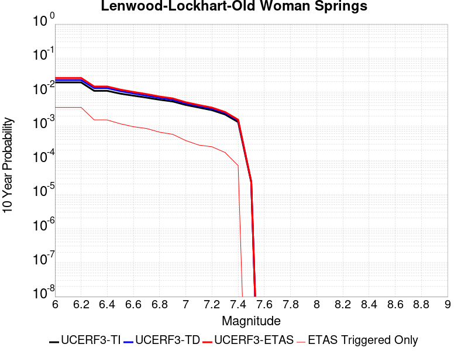 |

| Magnitude | 1 wk TI Prob | 1 wk TD Prob | 1 wk ETAS Prob | 1 wk ETAS/TD Gain | 1 wk ETAS Triggered Only | 1 mo TI Prob | 1 mo TD Prob | 1 mo ETAS Prob | 1 mo ETAS/TD Gain | 1 mo ETAS Triggered Only | 1 yr TI Prob | 1 yr TD Prob | 1 yr ETAS Prob | 1 yr ETAS/TD Gain | 1 yr ETAS Triggered Only | 10 yr TI Prob | 10 yr TD Prob | 10 yr ETAS Prob | 10 yr ETAS/TD Gain | 10 yr ETAS Triggered Only |
|-----|-----|-----|-----|-----|-----|-----|-----|-----|-----|-----|-----|-----|-----|-----|-----|-----|-----|-----|-----|-----|
| 6.0 | 3.744542E-5 | 4.396349E-5 | 0.0010239204 | 23.290245 | 9.8E-4 | 1.604705E-4 | 1.8840231E-4 | 0.0016581253 | 8.8009815 | 0.00147 | 0.0019519776 | 0.0022915571 | 0.004636172 | 2.0231535 | 0.00235 | 0.019349206 | 0.022697281 | 0.026186252 | 1.1537175 | 0.00357 |
| 6.1 | 3.744542E-5 | 4.396349E-5 | 0.0010239204 | 23.290245 | 9.8E-4 | 1.604705E-4 | 1.8840231E-4 | 0.0016581253 | 8.8009815 | 0.00147 | 0.0019519776 | 0.0022915571 | 0.004636172 | 2.0231535 | 0.00235 | 0.019349206 | 0.022697281 | 0.026186252 | 1.1537175 | 0.00357 |
| 6.2 | 3.744542E-5 | 4.396349E-5 | 0.0010239204 | 23.290245 | 9.8E-4 | 1.604705E-4 | 1.8840231E-4 | 0.0016581253 | 8.8009815 | 0.00147 | 0.0019519776 | 0.0022915571 | 0.004636172 | 2.0231535 | 0.00235 | 0.019349206 | 0.022697281 | 0.026186252 | 1.1537175 | 0.00357 |
| 6.3 | 2.1079984E-5 | 2.5354384E-5 | 4.953425E-4 | 19.536758 | 4.7E-4 | 9.0339665E-5 | 1.0865723E-4 | 7.8858336E-4 | 7.257532 | 6.8E-4 | 0.0010993304 | 0.0013221189 | 0.0022808497 | 1.7251471 | 9.6E-4 | 0.010939079 | 0.013144747 | 0.014654635 | 1.1148663 | 0.00153 |
| 6.4 | 2.1079984E-5 | 2.5354384E-5 | 4.953425E-4 | 19.536758 | 4.7E-4 | 9.0339665E-5 | 1.0865723E-4 | 7.8858336E-4 | 7.257532 | 6.8E-4 | 0.0010993304 | 0.0013221189 | 0.0022808497 | 1.7251471 | 9.6E-4 | 0.010939079 | 0.013144747 | 0.014654635 | 1.1148663 | 0.00153 |
| 6.5 | 1.7397282E-5 | 2.0663285E-5 | 3.7065605E-4 | 17.937906 | 3.5E-4 | 7.455765E-5 | 8.8554E-5 | 5.685115E-4 | 6.4199414 | 4.8E-4 | 9.073613E-4 | 0.0010776235 | 0.0017568907 | 1.6303382 | 6.8E-4 | 0.009036654 | 0.010725273 | 0.011892618 | 1.1088405 | 0.00118 |
| 6.6 | 1.52050325E-5 | 1.7680086E-5 | 3.1767477E-4 | 17.967943 | 3.0E-4 | 6.51628E-5 | 7.576964E-5 | 4.7573933E-4 | 6.2787595 | 4.0E-4 | 7.9306826E-4 | 9.221128E-4 | 0.0014815964 | 1.606741 | 5.6E-4 | 0.007902439 | 0.009183729 | 0.01014482 | 1.1046516 | 9.7E-4 |
| 6.7 | 1.332523E-5 | 1.5264379E-5 | 2.6526058E-4 | 17.377748 | 2.5E-4 | 5.7106878E-5 | 6.541716E-5 | 3.953956E-4 | 6.0442176 | 3.3E-4 | 6.950544E-4 | 7.9616875E-4 | 0.0012657946 | 1.5898571 | 4.7E-4 | 0.006928845 | 0.0079337945 | 0.008786971 | 1.107537 | 8.6E-4 |
| 6.8 | 1.1525329E-5 | 1.3031365E-5 | 1.8302914E-4 | 14.045279 | 1.7E-4 | 4.9393333E-5 | 5.5847537E-5 | 2.7583525E-4 | 4.9390764 | 2.2E-4 | 6.011979E-4 | 6.7973585E-4 | 0.001029498 | 1.5145559 | 3.5E-4 | 0.00599574 | 0.0067770192 | 0.0074424786 | 1.0981935 | 6.7E-4 |
| 6.9 | 1.0253909E-5 | 1.1514835E-5 | 1.615131E-4 | 14.026525 | 1.5E-4 | 4.3944583E-5 | 4.934838E-5 | 2.493385E-4 | 5.052618 | 2.0E-4 | 5.3489394E-4 | 6.006545E-4 | 9.204623E-4 | 1.5324322 | 3.2E-4 | 0.0053360825 | 0.0059906896 | 0.006567215 | 1.096237 | 5.8E-4 |
| 7.0 | 8.104563E-6 | 8.99143E-6 | 9.899062E-5 | 11.00944 | 9.0E-5 | 3.4733377E-5 | 3.853415E-5 | 1.7852875E-4 | 4.6330013 | 1.4E-4 | 4.2279682E-4 | 4.6905465E-4 | 7.0894207E-4 | 1.5114274 | 2.4E-4 | 0.0042199334 | 0.0046808943 | 0.0050591156 | 1.080801 | 3.8E-4 |
| 7.1 | 6.7986157E-6 | 7.5159796E-6 | 4.7515678E-5 | 6.3219543 | 4.0E-5 | 2.91366E-5 | 3.2210955E-5 | 1.2220806E-4 | 3.7939904 | 9.0E-5 | 3.5468035E-4 | 3.9209996E-4 | 5.720294E-4 | 1.4588866 | 1.8E-4 | 0.003541148 | 0.003914298 | 0.0041932017 | 1.0712526 | 2.8E-4 |
| 7.2 | 5.6893327E-6 | 6.280132E-6 | 3.6279944E-5 | 5.77694 | 3.0E-5 | 2.4382627E-5 | 2.6914584E-5 | 1.06912434E-4 | 3.9722862 | 8.0E-5 | 2.9681803E-4 | 3.276378E-4 | 4.7758865E-4 | 1.4576726 | 1.5E-4 | 0.002964219 | 0.003271746 | 0.003520928 | 1.0761617 | 2.5E-4 |
| 7.3 | 4.253348E-6 | 4.707075E-6 | 3.4706933E-5 | 7.3733554 | 3.0E-5 | 1.8228506E-5 | 2.017303E-5 | 7.017202E-5 | 3.4785066 | 5.0E-5 | 2.2190946E-4 | 2.455808E-4 | 3.4555624E-4 | 1.4070979 | 1.0E-4 | 0.00221688 | 0.0024532753 | 0.0026228582 | 1.0691252 | 1.7E-4 |
| 7.4 | 2.5448119E-6 | 2.8520594E-6 | 2.2852002E-5 | 8.012457 | 2.0E-5 | 1.0906291E-5 | 1.2223064E-5 | 4.22227E-5 | 3.4543464 | 3.0E-5 | 1.3277601E-4 | 1.4880729E-4 | 1.8880134E-4 | 1.268764 | 4.0E-5 | 0.001326967 | 0.0014872387 | 0.0015571346 | 1.0469971 | 7.0E-5 |
| 7.5 | 4.3706837E-8 | 4.562909E-8 | 4.562909E-8 | 1.0 | 0.0 | 1.8731501E-7 | 1.9555324E-7 | 1.9555324E-7 | 1.0 | 0.0 | 2.2805577E-6 | 2.3808586E-6 | 2.3808586E-6 | 1.0 | 0.0 | 2.2805343E-5 | 2.3808387E-5 | 2.3808387E-5 | 1.0 | 0.0 |

## San Andreas (San Bernardino N)
*[(top)](#table-of-contents)*

| 1 Week | 1 Month | 1 Year | 10 Year |
|-----|-----|-----|-----|
| 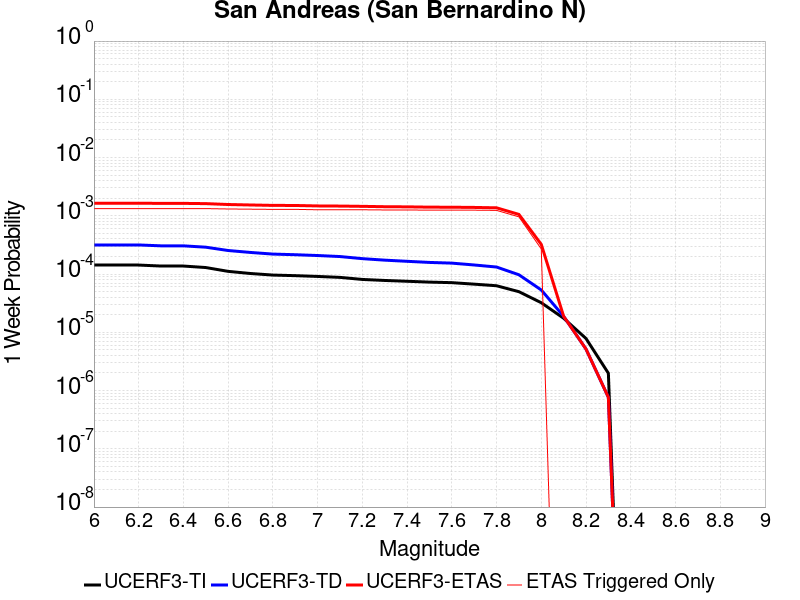 |  | 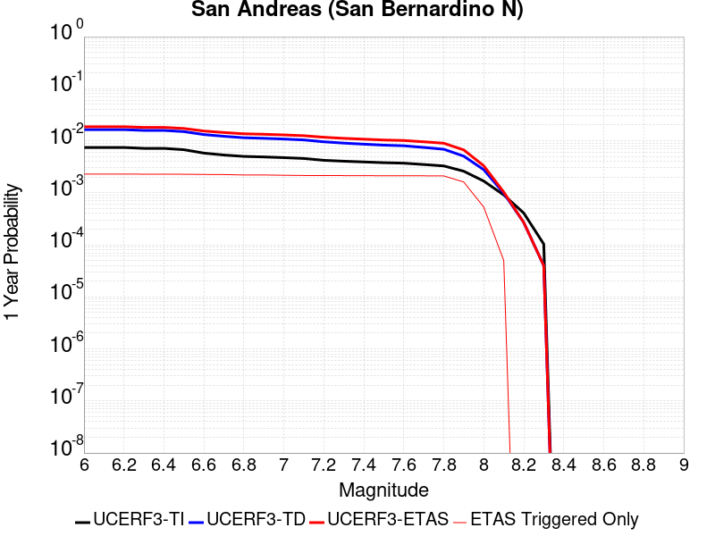 |  |

| Magnitude | 1 wk TI Prob | 1 wk TD Prob | 1 wk ETAS Prob | 1 wk ETAS/TD Gain | 1 wk ETAS Triggered Only | 1 mo TI Prob | 1 mo TD Prob | 1 mo ETAS Prob | 1 mo ETAS/TD Gain | 1 mo ETAS Triggered Only | 1 yr TI Prob | 1 yr TD Prob | 1 yr ETAS Prob | 1 yr ETAS/TD Gain | 1 yr ETAS Triggered Only | 10 yr TI Prob | 10 yr TD Prob | 10 yr ETAS Prob | 10 yr ETAS/TD Gain | 10 yr ETAS Triggered Only |
|-----|-----|-----|-----|-----|-----|-----|-----|-----|-----|-----|-----|-----|-----|-----|-----|-----|-----|-----|-----|-----|
| 6.0 | 1.4273766E-4 | 3.160784E-4 | 0.001645658 | 5.2064867 | 0.00133 | 6.115894E-4 | 0.0013539245 | 0.0030016904 | 2.2170296 | 0.00165 | 0.0074207084 | 0.016360939 | 0.018613473 | 1.1376776 | 0.00229 | 0.07177748 | 0.15021163 | 0.1527355 | 1.0168021 | 0.00297 |
| 6.1 | 1.4273766E-4 | 3.160784E-4 | 0.001645658 | 5.2064867 | 0.00133 | 6.115894E-4 | 0.0013539245 | 0.0030016904 | 2.2170296 | 0.00165 | 0.0074207084 | 0.016360939 | 0.018613473 | 1.1376776 | 0.00229 | 0.07177748 | 0.15021163 | 0.1527355 | 1.0168021 | 0.00297 |
| 6.2 | 1.4273766E-4 | 3.160784E-4 | 0.001645658 | 5.2064867 | 0.00133 | 6.115894E-4 | 0.0013539245 | 0.0030016904 | 2.2170296 | 0.00165 | 0.0074207084 | 0.016360939 | 0.018613473 | 1.1376776 | 0.00229 | 0.07177748 | 0.15021163 | 0.1527355 | 1.0168021 | 0.00297 |
| 6.3 | 1.3730655E-4 | 3.0512668E-4 | 0.0016347208 | 5.3575153 | 0.00133 | 5.883239E-4 | 0.001307036 | 0.0029548795 | 2.2607481 | 0.00165 | 0.0071393442 | 0.015798455 | 0.018042434 | 1.1420379 | 0.00228 | 0.06914291 | 0.1455135 | 0.14804278 | 1.0173818 | 0.00296 |
| 6.4 | 1.3730655E-4 | 3.0512668E-4 | 0.0016347208 | 5.3575153 | 0.00133 | 5.883239E-4 | 0.001307036 | 0.0029548795 | 2.2607481 | 0.00165 | 0.0071393442 | 0.015798455 | 0.018042434 | 1.1420379 | 0.00228 | 0.06914291 | 0.1455135 | 0.14804278 | 1.0173818 | 0.00296 |
| 6.5 | 1.2942807E-4 | 2.8927144E-4 | 0.0016188867 | 5.5964274 | 0.00133 | 5.545738E-4 | 0.0012391509 | 0.0028871063 | 2.329907 | 0.00165 | 0.0067310524 | 0.014983548 | 0.017219534 | 1.1492295 | 0.00227 | 0.06530788 | 0.13865088 | 0.14119186 | 1.0183264 | 0.00295 |
| 6.6 | 1.1125901E-4 | 2.5365927E-4 | 0.0015633269 | 6.1630983 | 0.00131 | 4.767372E-4 | 0.0010866605 | 0.0027148894 | 2.4983785 | 0.00163 | 0.005788839 | 0.0131504685 | 0.015370879 | 1.1688466 | 0.00225 | 0.056403454 | 0.12300496 | 0.1255307 | 1.0205337 | 0.00288 |
| 6.7 | 1.02209575E-4 | 2.3500937E-4 | 0.0015347039 | 6.530394 | 0.0013 | 4.3796748E-4 | 0.0010067957 | 0.0026251646 | 2.6074452 | 0.00162 | 0.0053192247 | 0.012189267 | 0.014401963 | 1.1815282 | 0.00224 | 0.051936906 | 0.114792764 | 0.11733331 | 1.0221316 | 0.00287 |
| 6.8 | 9.610582E-5 | 2.2026796E-4 | 0.0015099838 | 6.855213 | 0.00129 | 4.1181705E-4 | 9.436647E-4 | 0.0025321643 | 2.6833305 | 0.00159 | 0.0050023515 | 0.011428859 | 0.013603716 | 1.1902951 | 0.0022 | 0.048912346 | 0.10820469 | 0.11072847 | 1.0233241 | 0.00283 |
| 6.9 | 9.3877505E-5 | 2.1482339E-4 | 0.0015045463 | 7.0036426 | 0.00129 | 4.0227012E-4 | 9.203475E-4 | 0.002508884 | 2.7260182 | 0.00159 | 0.0048866454 | 0.011147907 | 0.013323382 | 1.1951464 | 0.0022 | 0.04780577 | 0.105798274 | 0.108328864 | 1.023919 | 0.00283 |
| 7.0 | 9.1019785E-5 | 2.0809306E-4 | 0.0014778288 | 7.101769 | 0.00127 | 3.900265E-4 | 8.915232E-4 | 0.0024601235 | 2.759461 | 0.00157 | 0.0047382377 | 0.0108004995 | 0.012947063 | 1.1987467 | 0.00217 | 0.046384744 | 0.10276815 | 0.1052804 | 1.0244458 | 0.0028 |
| 7.1 | 8.771155E-5 | 1.9983841E-4 | 0.0014695846 | 7.3538647 | 0.00127 | 3.758525E-4 | 8.5616973E-4 | 0.0024148342 | 2.8205085 | 0.00156 | 0.0045664064 | 0.010374243 | 0.012501938 | 1.205094 | 0.00215 | 0.044737056 | 0.09907644 | 0.10158101 | 1.0252792 | 0.00278 |
| 7.2 | 8.0830236E-5 | 1.8389444E-4 | 0.0014536609 | 7.904866 | 0.00127 | 3.4636928E-4 | 7.8788114E-4 | 0.002346652 | 2.978434 | 0.00156 | 0.0042088944 | 0.009550368 | 0.011679836 | 1.2229722 | 0.00215 | 0.041300658 | 0.09180518 | 0.094320886 | 1.0274026 | 0.00277 |
| 7.3 | 7.7668235E-5 | 1.7333007E-4 | 0.0014331117 | 8.268107 | 0.00126 | 3.328214E-4 | 7.426318E-4 | 0.0022914808 | 3.0856216 | 0.00155 | 0.0040445733 | 0.009004138 | 0.01112487 | 1.2355285 | 0.00214 | 0.03971748 | 0.08706761 | 0.08956905 | 1.0287298 | 0.00274 |
| 7.4 | 7.520177E-5 | 1.655312E-4 | 0.0014253226 | 8.610599 | 0.00126 | 3.2225347E-4 | 7.092266E-4 | 0.0022581273 | 3.1839292 | 0.00155 | 0.0039163795 | 0.008600714 | 0.0107223075 | 1.2466766 | 0.00214 | 0.038480744 | 0.08352157 | 0.08603272 | 1.0300659 | 0.00274 |
| 7.5 | 7.274697E-5 | 1.584075E-4 | 0.0014082094 | 8.889791 | 0.00125 | 3.1173544E-4 | 6.7871273E-4 | 0.0022076743 | 3.2527375 | 0.00153 | 0.003788775 | 0.008232076 | 0.010334624 | 1.2554092 | 0.00212 | 0.03724827 | 0.08023654 | 0.082738295 | 1.0311798 | 0.00272 |
| 7.6 | 7.1185845E-5 | 1.5410586E-4 | 0.0014039133 | 9.110058 | 0.00125 | 3.0504653E-4 | 6.602866E-4 | 0.0021892763 | 3.3156457 | 0.00153 | 0.0037076178 | 0.0080094095 | 0.010112429 | 1.2625687 | 0.00212 | 0.036463667 | 0.07822661 | 0.08072462 | 1.031933 | 0.00271 |
| 7.7 | 6.709961E-5 | 1.4319421E-4 | 0.0013930153 | 9.728153 | 0.00125 | 2.8753807E-4 | 6.135452E-4 | 0.0021426065 | 3.492174 | 0.00153 | 0.003495157 | 0.0074443663 | 0.009548584 | 1.282659 | 0.00212 | 0.034406938 | 0.07305558 | 0.0755676 | 1.0343851 | 0.00271 |
| 7.8 | 6.300812E-5 | 1.320343E-4 | 0.0013718706 | 10.390259 | 0.00124 | 2.7000686E-4 | 5.657386E-4 | 0.0020848787 | 3.685233 | 0.00152 | 0.0032823787 | 0.006866143 | 0.008961656 | 1.305195 | 0.00211 | 0.032343175 | 0.06771385 | 0.07023102 | 1.0371736 | 0.0027 |
| 7.9 | 4.983037E-5 | 9.7241085E-5 | 0.0010571477 | 10.87141 | 9.6E-4 | 2.1354125E-4 | 4.1668097E-4 | 0.0015861935 | 3.8067336 | 0.00117 | 0.0025967648 | 0.0050613005 | 0.0066631516 | 1.31649 | 0.00161 | 0.025666296 | 0.050650507 | 0.05257769 | 1.0380486 | 0.00203 |
| 8.0 | 3.2211527E-5 | 5.3306234E-5 | 3.2329184E-4 | 6.0648036 | 2.7E-4 | 1.380421E-4 | 2.2843528E-4 | 6.0834846E-4 | 2.6631107 | 3.8E-4 | 0.0016793669 | 0.0027776542 | 0.003306182 | 1.1902785 | 5.3E-4 | 0.016667323 | 0.028362568 | 0.029013565 | 1.0229527 | 6.7E-4 |
| 8.1 | 1.743376E-5 | 1.8823403E-5 | 1.8823403E-5 | 1.0 | 0.0 | 7.471398E-5 | 8.066923E-5 | 1.20666E-4 | 1.495812 | 4.0E-5 | 9.0926304E-4 | 9.81706E-4 | 0.0010316569 | 1.0508817 | 5.0E-5 | 0.009055517 | 0.010483979 | 0.01054335 | 1.005663 | 6.0E-5 |
| 8.2 | 7.831616E-6 | 5.1540533E-6 | 5.1540533E-6 | 1.0 | 0.0 | 3.3563636E-5 | 2.2088612E-5 | 2.2088612E-5 | 1.0 | 0.0 | 4.0856065E-4 | 2.6889573E-4 | 2.6889573E-4 | 1.0 | 0.0 | 0.004078103 | 0.0030413668 | 0.0030413668 | 1.0 | 0.0 |
| 8.3 | 1.983087E-6 | 7.6564595E-7 | 7.6564595E-7 | 1.0 | 0.0 | 8.498917E-6 | 3.281336E-6 | 3.281336E-6 | 1.0 | 0.0 | 1.034694E-4 | 3.9949547E-5 | 3.9949547E-5 | 1.0 | 0.0 | 0.0010342124 | 4.717979E-4 | 4.717979E-4 | 1.0 | 0.0 |

## Bicycle Lake
*[(top)](#table-of-contents)*

| 1 Week | 1 Month | 1 Year | 10 Year |
|-----|-----|-----|-----|
| 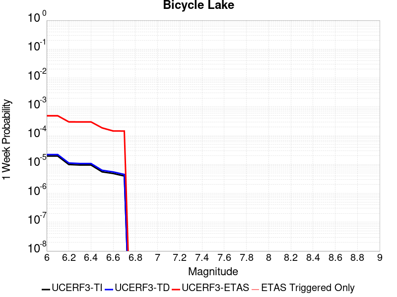 | 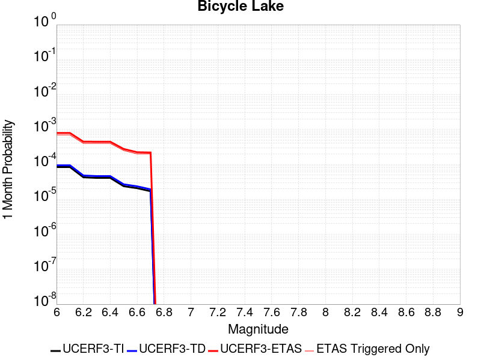 |  |  |

| Magnitude | 1 wk TI Prob | 1 wk TD Prob | 1 wk ETAS Prob | 1 wk ETAS/TD Gain | 1 wk ETAS Triggered Only | 1 mo TI Prob | 1 mo TD Prob | 1 mo ETAS Prob | 1 mo ETAS/TD Gain | 1 mo ETAS Triggered Only | 1 yr TI Prob | 1 yr TD Prob | 1 yr ETAS Prob | 1 yr ETAS/TD Gain | 1 yr ETAS Triggered Only | 10 yr TI Prob | 10 yr TD Prob | 10 yr ETAS Prob | 10 yr ETAS/TD Gain | 10 yr ETAS Triggered Only |
|-----|-----|-----|-----|-----|-----|-----|-----|-----|-----|-----|-----|-----|-----|-----|-----|-----|-----|-----|-----|-----|
| 6.0 | 1.9621975E-5 | 2.2097078E-5 | 4.920867E-4 | 22.26931 | 4.7E-4 | 8.4091465E-5 | 9.4699084E-5 | 7.9463277E-4 | 8.391135 | 7.0E-4 | 0.0010233327 | 0.0011524865 | 0.00257085 | 2.2306986 | 0.00142 | 0.01018633 | 0.011478408 | 0.013771778 | 1.1997986 | 0.00232 |
| 6.1 | 1.9621975E-5 | 2.2097078E-5 | 4.920867E-4 | 22.26931 | 4.7E-4 | 8.4091465E-5 | 9.4699084E-5 | 7.9463277E-4 | 8.391135 | 7.0E-4 | 0.0010233327 | 0.0011524865 | 0.00257085 | 2.2306986 | 0.00142 | 0.01018633 | 0.011478408 | 0.013771778 | 1.1997986 | 0.00232 |
| 6.2 | 9.9971285E-6 | 1.125564E-5 | 3.0125238E-4 | 26.764572 | 2.9E-4 | 4.2844134E-5 | 4.8237856E-5 | 4.4821858E-4 | 9.291842 | 4.0E-4 | 5.2150246E-4 | 5.871897E-4 | 0.0014266964 | 2.429703 | 8.4E-4 | 0.0052028033 | 0.005861487 | 0.007203574 | 1.228967 | 0.00135 |
| 6.3 | 9.589428E-6 | 1.0798346E-5 | 3.0079522E-4 | 27.855675 | 2.9E-4 | 4.10969E-5 | 4.62781E-5 | 4.462596E-4 | 9.642998 | 4.0E-4 | 5.002399E-4 | 5.6334207E-4 | 0.0013828801 | 2.4547787 | 8.2E-4 | 0.0049911533 | 0.0056242296 | 0.006936806 | 1.2333788 | 0.00132 |
| 6.4 | 9.589428E-6 | 1.0798346E-5 | 3.0079522E-4 | 27.855675 | 2.9E-4 | 4.10969E-5 | 4.62781E-5 | 4.462596E-4 | 9.642998 | 4.0E-4 | 5.002399E-4 | 5.6334207E-4 | 0.0013828801 | 2.4547787 | 8.2E-4 | 0.0049911533 | 0.0056242296 | 0.006936806 | 1.2333788 | 0.00132 |
| 6.5 | 5.557707E-6 | 6.2856016E-6 | 1.8628447E-4 | 29.636698 | 1.8E-4 | 2.3818526E-5 | 2.6938165E-5 | 2.7693145E-4 | 10.280263 | 2.5E-4 | 2.8995197E-4 | 3.279497E-4 | 8.4777916E-4 | 2.585089 | 5.2E-4 | 0.0028957394 | 0.0032772934 | 0.004074672 | 1.2433039 | 8.0E-4 |
| 6.6 | 4.8742945E-6 | 5.5132896E-6 | 1.4551252E-4 | 26.393047 | 1.4E-4 | 2.0889667E-5 | 2.3628318E-5 | 2.2362359E-4 | 9.464219 | 2.0E-4 | 2.54302E-4 | 2.87663E-4 | 7.2753645E-4 | 2.5291276 | 4.4E-4 | 0.002540112 | 0.0028754752 | 0.00355352 | 1.2358027 | 6.8E-4 |
| 6.7 | 3.991108E-6 | 4.5159104E-6 | 1.4451527E-4 | 32.00136 | 1.4E-4 | 1.7104636E-5 | 1.9353902E-5 | 2.1935003E-4 | 11.333633 | 2.0E-4 | 2.0822904E-4 | 2.3563375E-4 | 6.2554184E-4 | 2.654721 | 3.9E-4 | 0.0020803404 | 0.0023563374 | 0.0029549238 | 1.2540325 | 6.0E-4 |

## Paradise
*[(top)](#table-of-contents)*

| 1 Week | 1 Month | 1 Year | 10 Year |
|-----|-----|-----|-----|
|  |  |  |  |

| Magnitude | 1 wk TI Prob | 1 wk TD Prob | 1 wk ETAS Prob | 1 wk ETAS/TD Gain | 1 wk ETAS Triggered Only | 1 mo TI Prob | 1 mo TD Prob | 1 mo ETAS Prob | 1 mo ETAS/TD Gain | 1 mo ETAS Triggered Only | 1 yr TI Prob | 1 yr TD Prob | 1 yr ETAS Prob | 1 yr ETAS/TD Gain | 1 yr ETAS Triggered Only | 10 yr TI Prob | 10 yr TD Prob | 10 yr ETAS Prob | 10 yr ETAS/TD Gain | 10 yr ETAS Triggered Only |
|-----|-----|-----|-----|-----|-----|-----|-----|-----|-----|-----|-----|-----|-----|-----|-----|-----|-----|-----|-----|-----|
| 6.0 | 1.4851273E-5 | 1.6694768E-5 | 5.166864E-4 | 30.949001 | 5.0E-4 | 6.364676E-5 | 7.154718E-5 | 8.214935E-4 | 11.481843 | 7.5E-4 | 7.7462377E-4 | 8.707624E-4 | 0.0022395696 | 2.5719638 | 0.00137 | 0.0077192914 | 0.008675884 | 0.010807231 | 1.2456634 | 0.00215 |
| 6.1 | 1.4851273E-5 | 1.6694768E-5 | 5.166864E-4 | 30.949001 | 5.0E-4 | 6.364676E-5 | 7.154718E-5 | 8.214935E-4 | 11.481843 | 7.5E-4 | 7.7462377E-4 | 8.707624E-4 | 0.0022395696 | 2.5719638 | 0.00137 | 0.0077192914 | 0.008675884 | 0.010807231 | 1.2456634 | 0.00215 |
| 6.2 | 1.4851273E-5 | 1.6694768E-5 | 5.166864E-4 | 30.949001 | 5.0E-4 | 6.364676E-5 | 7.154718E-5 | 8.214935E-4 | 11.481843 | 7.5E-4 | 7.7462377E-4 | 8.707624E-4 | 0.0022395696 | 2.5719638 | 0.00137 | 0.0077192914 | 0.008675884 | 0.010807231 | 1.2456634 | 0.00215 |
| 6.3 | 1.0426831E-5 | 1.1888697E-5 | 2.718856E-4 | 22.869251 | 2.6E-4 | 4.4685654E-5 | 5.09506E-5 | 4.2093176E-4 | 8.261566 | 3.7E-4 | 5.43912E-4 | 6.201529E-4 | 0.0013197188 | 2.128054 | 7.0E-4 | 0.0054258266 | 0.0061848317 | 0.0072879666 | 1.1783613 | 0.00111 |
| 6.4 | 1.0426831E-5 | 1.1888697E-5 | 2.718856E-4 | 22.869251 | 2.6E-4 | 4.4685654E-5 | 5.09506E-5 | 4.2093176E-4 | 8.261566 | 3.7E-4 | 5.43912E-4 | 6.201529E-4 | 0.0013197188 | 2.128054 | 7.0E-4 | 0.0054258266 | 0.0061848317 | 0.0072879666 | 1.1783613 | 0.00111 |
| 6.5 | 9.25027E-6 | 1.0620037E-5 | 2.1061792E-4 | 19.832127 | 2.0E-4 | 3.964341E-5 | 4.551368E-5 | 3.1550138E-4 | 6.9320126 | 2.7E-4 | 4.8255164E-4 | 5.5399304E-4 | 0.001073705 | 1.9381199 | 5.2E-4 | 0.0048150513 | 0.0055266195 | 0.0063520325 | 1.1493522 | 8.3E-4 |
| 6.6 | 7.904275E-6 | 9.159602E-6 | 1.0915869E-4 | 11.917404 | 1.0E-4 | 3.3875025E-5 | 3.925487E-5 | 1.7924937E-4 | 4.5662966 | 1.4E-4 | 4.1235037E-4 | 4.7782718E-4 | 7.277077E-4 | 1.5229517 | 2.5E-4 | 0.0041158604 | 0.004768395 | 0.0051764394 | 1.0855728 | 4.1E-4 |
| 6.7 | 7.2061953E-6 | 8.407326E-6 | 7.840674E-5 | 9.326002 | 7.0E-5 | 3.088333E-5 | 3.603092E-5 | 1.2602768E-4 | 3.4977646 | 9.0E-5 | 3.7593965E-4 | 4.3859181E-4 | 6.1851286E-4 | 1.4102243 | 1.8E-4 | 0.003753043 | 0.004377631 | 0.0046663615 | 1.0659559 | 2.9E-4 |
| 6.8 | 6.6948724E-6 | 7.842242E-6 | 5.784185E-5 | 7.375678 | 5.0E-5 | 2.8691995E-5 | 3.3609194E-5 | 1.0360684E-4 | 3.0826933 | 7.0E-5 | 3.4926904E-4 | 4.091187E-4 | 5.490614E-4 | 1.342059 | 1.4E-4 | 0.003487206 | 0.0040840125 | 0.0043130736 | 1.0560871 | 2.3E-4 |
| 6.9 | 6.0421025E-6 | 7.1306963E-6 | 4.7130412E-5 | 6.6095104 | 4.0E-5 | 2.5894467E-5 | 3.0559786E-5 | 8.055826E-5 | 2.636087 | 5.0E-5 | 3.1521954E-4 | 3.7200528E-4 | 4.619718E-4 | 1.241842 | 9.0E-5 | 0.0031477278 | 0.0037141638 | 0.0038536438 | 1.0375535 | 1.4E-4 |
| 7.0 | 4.134091E-6 | 5.0803824E-6 | 1.5080332E-5 | 2.9683456 | 1.0E-5 | 1.7717413E-5 | 2.1772896E-5 | 4.177246E-5 | 1.9185534 | 2.0E-5 | 2.1568815E-4 | 2.650543E-4 | 3.250384E-4 | 1.2263087 | 6.0E-5 | 0.0021547892 | 0.0026475347 | 0.0027572436 | 1.0414381 | 1.1E-4 |
| 7.1 | 3.7674888E-6 | 4.631936E-6 | 1.463189E-5 | 3.1589146 | 1.0E-5 | 1.6146281E-5 | 1.9851012E-5 | 2.9850813E-5 | 1.5037427 | 1.0E-5 | 1.9656324E-4 | 2.4166079E-4 | 2.8165113E-4 | 1.1654812 | 4.0E-5 | 0.0019638946 | 0.0024141306 | 0.0025039134 | 1.0371906 | 9.0E-5 |
| 7.2 | 3.4065345E-6 | 4.156782E-6 | 1.4156741E-5 | 3.405697 | 1.0E-5 | 1.4599351E-5 | 1.7814667E-5 | 2.7814489E-5 | 1.5613252 | 1.0E-5 | 1.777326E-4 | 2.168735E-4 | 2.5686482E-4 | 1.1843994 | 4.0E-5 | 0.0017759053 | 0.0021667667 | 0.0022565715 | 1.0414466 | 9.0E-5 |
| 7.3 | 2.9934936E-6 | 3.6293673E-6 | 1.3629331E-5 | 3.7552912 | 1.0E-5 | 1.2829195E-5 | 1.5554348E-5 | 2.555419E-5 | 1.6428971 | 1.0E-5 | 1.5618425E-4 | 1.8935918E-4 | 2.2935162E-4 | 1.2111988 | 4.0E-5 | 0.0015607453 | 0.0018921237 | 0.0019719724 | 1.0422006 | 8.0E-5 |
| 7.4 | 2.4049796E-6 | 2.8890186E-6 | 1.288899E-5 | 4.4613733 | 1.0E-5 | 1.0307015E-5 | 1.2381457E-5 | 2.2381333E-5 | 1.8076494 | 1.0E-5 | 1.2548068E-4 | 1.5073526E-4 | 1.9072923E-4 | 1.2653259 | 4.0E-5 | 0.0012540985 | 0.0015064715 | 0.0015863511 | 1.0530242 | 8.0E-5 |
| 7.5 | 1.2710091E-6 | 1.5134859E-6 | 1.1513471E-5 | 7.6072536 | 1.0E-5 | 5.44717E-6 | 6.4863593E-6 | 1.6486294E-5 | 2.541687 | 1.0E-5 | 6.631728E-5 | 7.896981E-5 | 9.896823E-5 | 1.2532413 | 2.0E-5 | 6.6297496E-4 | 7.895401E-4 | 8.295085E-4 | 1.0506223 | 4.0E-5 |
| 7.6 | 2.21172E-7 | 2.6040198E-7 | 2.6040198E-7 | 1.0 | 0.0 | 9.478797E-7 | 1.1160082E-6 | 1.1160082E-6 | 1.0 | 0.0 | 1.1540374E-5 | 1.3587343E-5 | 1.3587343E-5 | 1.0 | 0.0 | 1.1539775E-4 | 1.3586794E-4 | 1.3586794E-4 | 1.0 | 0.0 |

## Garlic Springs
*[(top)](#table-of-contents)*

| 1 Week | 1 Month | 1 Year | 10 Year |
|-----|-----|-----|-----|
|  |  |  | 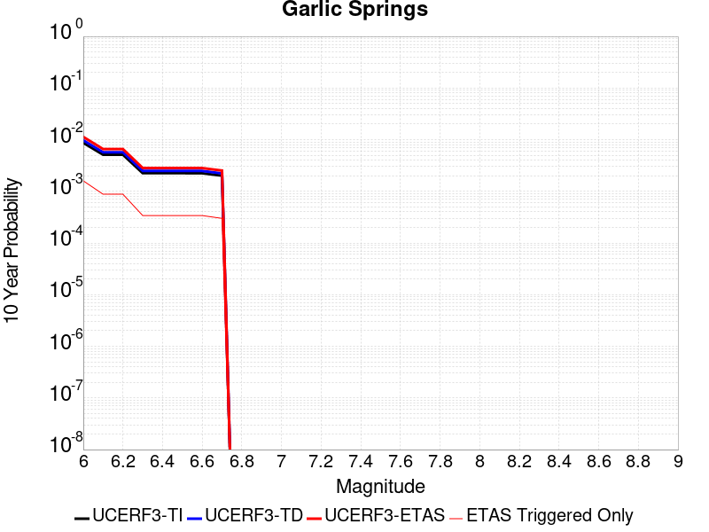 |

| Magnitude | 1 wk TI Prob | 1 wk TD Prob | 1 wk ETAS Prob | 1 wk ETAS/TD Gain | 1 wk ETAS Triggered Only | 1 mo TI Prob | 1 mo TD Prob | 1 mo ETAS Prob | 1 mo ETAS/TD Gain | 1 mo ETAS Triggered Only | 1 yr TI Prob | 1 yr TD Prob | 1 yr ETAS Prob | 1 yr ETAS/TD Gain | 1 yr ETAS Triggered Only | 10 yr TI Prob | 10 yr TD Prob | 10 yr ETAS Prob | 10 yr ETAS/TD Gain | 10 yr ETAS Triggered Only |
|-----|-----|-----|-----|-----|-----|-----|-----|-----|-----|-----|-----|-----|-----|-----|-----|-----|-----|-----|-----|-----|
| 6.0 | 1.6760017E-5 | 1.8776833E-5 | 2.2877289E-4 | 12.183785 | 2.1E-4 | 7.182667E-5 | 8.0470316E-5 | 4.5044054E-4 | 5.5975986 | 3.7E-4 | 8.7413884E-4 | 9.794032E-4 | 0.0018385609 | 1.8772258 | 8.6E-4 | 0.008707083 | 0.009762413 | 0.011346793 | 1.1622939 | 0.0016 |
| 6.1 | 9.852767E-6 | 1.0973587E-5 | 1.7097183E-4 | 15.580305 | 1.6E-4 | 4.222546E-5 | 4.702921E-5 | 3.0701698E-4 | 6.5282187 | 2.6E-4 | 5.139737E-4 | 5.7250116E-4 | 0.0010722149 | 1.8728607 | 5.0E-4 | 0.005127866 | 0.005717221 | 0.0065921904 | 1.1530409 | 8.8E-4 |
| 6.2 | 9.852767E-6 | 1.0973587E-5 | 1.7097183E-4 | 15.580305 | 1.6E-4 | 4.222546E-5 | 4.702921E-5 | 3.0701698E-4 | 6.5282187 | 2.6E-4 | 5.139737E-4 | 5.7250116E-4 | 0.0010722149 | 1.8728607 | 5.0E-4 | 0.005127866 | 0.005717221 | 0.0065921904 | 1.1530409 | 8.8E-4 |
| 6.3 | 4.3167724E-6 | 4.7780286E-6 | 7.4777694E-5 | 15.650324 | 7.0E-5 | 1.8500323E-5 | 2.0477235E-5 | 1.3047497E-4 | 6.3717093 | 1.1E-4 | 2.2521814E-4 | 2.4930484E-4 | 4.5925248E-4 | 1.8421322 | 2.1E-4 | 0.0022499003 | 0.00249251 | 0.0028316625 | 1.1360687 | 3.4E-4 |
| 6.4 | 4.3167724E-6 | 4.7780286E-6 | 7.4777694E-5 | 15.650324 | 7.0E-5 | 1.8500323E-5 | 2.0477235E-5 | 1.3047497E-4 | 6.3717093 | 1.1E-4 | 2.2521814E-4 | 2.4930484E-4 | 4.5925248E-4 | 1.8421322 | 2.1E-4 | 0.0022499003 | 0.00249251 | 0.0028316625 | 1.1360687 | 3.4E-4 |
| 6.5 | 4.3167724E-6 | 4.7780286E-6 | 7.4777694E-5 | 15.650324 | 7.0E-5 | 1.8500323E-5 | 2.0477235E-5 | 1.3047497E-4 | 6.3717093 | 1.1E-4 | 2.2521814E-4 | 2.4930484E-4 | 4.5925248E-4 | 1.8421322 | 2.1E-4 | 0.0022499003 | 0.00249251 | 0.0028316625 | 1.1360687 | 3.4E-4 |
| 6.6 | 4.301311E-6 | 4.760897E-6 | 7.4760566E-5 | 15.703041 | 7.0E-5 | 1.8434059E-5 | 2.0403815E-5 | 1.3040158E-4 | 6.391039 | 1.1E-4 | 2.2441156E-4 | 2.4841115E-4 | 4.58359E-4 | 1.8451626 | 2.1E-4 | 0.0022418506 | 0.002483593 | 0.0028227486 | 1.1365584 | 3.4E-4 |
| 6.7 | 3.8599724E-6 | 4.27106E-6 | 6.4270804E-5 | 15.047976 | 6.0E-5 | 1.6542634E-5 | 1.8304541E-5 | 1.1830271E-4 | 6.463025 | 1.0E-4 | 2.0138794E-4 | 2.228578E-4 | 4.0281768E-4 | 1.8075099 | 1.8E-4 | 0.0020120554 | 0.002228578 | 0.0025279094 | 1.134315 | 3.0E-4 |

## Death Valley (Black Mtns Frontal)
*[(top)](#table-of-contents)*

| 1 Week | 1 Month | 1 Year | 10 Year |
|-----|-----|-----|-----|
|  |  | 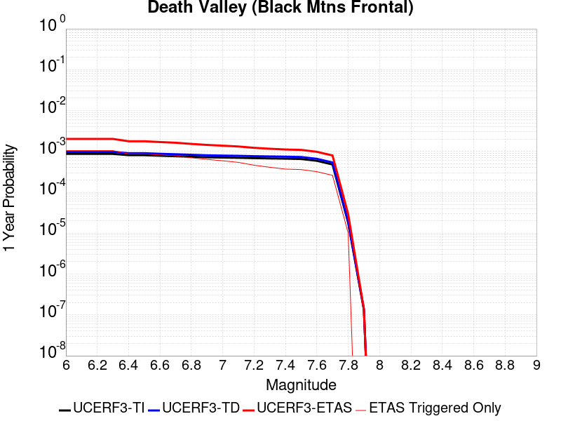 |  |

| Magnitude | 1 wk TI Prob | 1 wk TD Prob | 1 wk ETAS Prob | 1 wk ETAS/TD Gain | 1 wk ETAS Triggered Only | 1 mo TI Prob | 1 mo TD Prob | 1 mo ETAS Prob | 1 mo ETAS/TD Gain | 1 mo ETAS Triggered Only | 1 yr TI Prob | 1 yr TD Prob | 1 yr ETAS Prob | 1 yr ETAS/TD Gain | 1 yr ETAS Triggered Only | 10 yr TI Prob | 10 yr TD Prob | 10 yr ETAS Prob | 10 yr ETAS/TD Gain | 10 yr ETAS Triggered Only |
|-----|-----|-----|-----|-----|-----|-----|-----|-----|-----|-----|-----|-----|-----|-----|-----|-----|-----|-----|-----|-----|
| 6.0 | 1.6707214E-5 | 1.867027E-5 | 4.186628E-4 | 22.424038 | 4.0E-4 | 7.160038E-5 | 8.001303E-5 | 6.899642E-4 | 8.623149 | 6.1E-4 | 8.71386E-4 | 9.737309E-4 | 0.0020227085 | 2.0772767 | 0.00105 | 0.00867977 | 0.009695496 | 0.011161148 | 1.1511682 | 0.00148 |
| 6.1 | 1.6707214E-5 | 1.867027E-5 | 4.186628E-4 | 22.424038 | 4.0E-4 | 7.160038E-5 | 8.001303E-5 | 6.899642E-4 | 8.623149 | 6.1E-4 | 8.71386E-4 | 9.737309E-4 | 0.0020227085 | 2.0772767 | 0.00105 | 0.00867977 | 0.009695496 | 0.011161148 | 1.1511682 | 0.00148 |
| 6.2 | 1.6707214E-5 | 1.867027E-5 | 4.186628E-4 | 22.424038 | 4.0E-4 | 7.160038E-5 | 8.001303E-5 | 6.899642E-4 | 8.623149 | 6.1E-4 | 8.71386E-4 | 9.737309E-4 | 0.0020227085 | 2.0772767 | 0.00105 | 0.00867977 | 0.009695496 | 0.011161148 | 1.1511682 | 0.00148 |
| 6.3 | 1.6707214E-5 | 1.867027E-5 | 4.186628E-4 | 22.424038 | 4.0E-4 | 7.160038E-5 | 8.001303E-5 | 6.899642E-4 | 8.623149 | 6.1E-4 | 8.71386E-4 | 9.737309E-4 | 0.0020227085 | 2.0772767 | 0.00105 | 0.00867977 | 0.009695496 | 0.011161148 | 1.1511682 | 0.00148 |
| 6.4 | 1.5515609E-5 | 1.7338214E-5 | 3.2733285E-4 | 18.879272 | 3.1E-4 | 6.649377E-5 | 7.4304546E-5 | 5.6426815E-4 | 7.593992 | 4.9E-4 | 8.0926094E-4 | 9.042885E-4 | 0.0017735017 | 1.9612124 | 8.7E-4 | 0.008063202 | 0.009006773 | 0.0102653345 | 1.139735 | 0.00127 |
| 6.5 | 1.5515609E-5 | 1.7338214E-5 | 3.2733285E-4 | 18.879272 | 3.1E-4 | 6.649377E-5 | 7.4304546E-5 | 5.6426815E-4 | 7.593992 | 4.9E-4 | 8.0926094E-4 | 9.042885E-4 | 0.0017735017 | 1.9612124 | 8.7E-4 | 0.008063202 | 0.009006773 | 0.0102653345 | 1.139735 | 0.00127 |
| 6.6 | 1.5041828E-5 | 1.6809145E-5 | 2.9680444E-4 | 17.65732 | 2.8E-4 | 6.4463384E-5 | 7.203723E-5 | 5.320041E-4 | 7.3851266 | 4.6E-4 | 7.8455906E-4 | 8.767063E-4 | 0.0016959874 | 1.9344989 | 8.2E-4 | 0.00781795 | 0.008733132 | 0.0099127395 | 1.1350727 | 0.00119 |
| 6.7 | 1.4634985E-5 | 1.6356016E-5 | 2.863516E-4 | 17.507418 | 2.7E-4 | 6.271985E-5 | 7.009536E-5 | 5.1006454E-4 | 7.276723 | 4.4E-4 | 7.6334673E-4 | 8.5308263E-4 | 0.0016324172 | 1.9135511 | 7.8E-4 | 0.007607299 | 0.008498715 | 0.009629027 | 1.1329979 | 0.00114 |
| 6.8 | 1.4209158E-5 | 1.5882048E-5 | 2.7587792E-4 | 17.370424 | 2.6E-4 | 6.089497E-5 | 6.8064175E-5 | 4.7803627E-4 | 7.023317 | 4.1E-4 | 7.4114406E-4 | 8.2837185E-4 | 0.001527792 | 1.8443311 | 7.0E-4 | 0.007386771 | 0.008253456 | 0.009274955 | 1.1237662 | 0.00103 |
| 6.9 | 1.3780098E-5 | 1.5404594E-5 | 2.554009E-4 | 16.579529 | 2.4E-4 | 5.9056227E-5 | 6.6018045E-5 | 4.2599428E-4 | 6.4526944 | 3.6E-4 | 7.1877235E-4 | 8.0347876E-4 | 0.0014429645 | 1.7958963 | 6.4E-4 | 0.0071645193 | 0.008006332 | 0.008958647 | 1.1189451 | 9.6E-4 |
| 7.0 | 1.3585064E-5 | 1.5188155E-5 | 2.2518497E-4 | 14.826354 | 2.1E-4 | 5.8220405E-5 | 6.50905E-5 | 3.7507032E-4 | 5.7622895 | 3.1E-4 | 7.086029E-4 | 7.9219416E-4 | 0.0013817268 | 1.7441769 | 5.9E-4 | 0.007063476 | 0.007894293 | 0.008787189 | 1.1131064 | 9.0E-4 |
| 7.1 | 1.3398601E-5 | 1.49813395E-5 | 2.049785E-4 | 13.682254 | 1.9E-4 | 5.742131E-5 | 6.420419E-5 | 3.5418558E-4 | 5.516549 | 2.9E-4 | 6.9888023E-4 | 7.8141113E-4 | 0.0013209892 | 1.6905174 | 5.4E-4 | 0.0069668638 | 0.007787224 | 0.0086306045 | 1.1083032 | 8.5E-4 |
| 7.2 | 1.3126312E-5 | 1.4679561E-5 | 1.7467722E-4 | 11.899348 | 1.6E-4 | 5.6254412E-5 | 6.291092E-5 | 2.9289644E-4 | 4.655733 | 2.3E-4 | 6.846822E-4 | 7.6567667E-4 | 0.0012253245 | 1.6003158 | 4.6E-4 | 0.006825765 | 0.00763097 | 0.00838517 | 1.0988342 | 7.6E-4 |
| 7.3 | 1.2922429E-5 | 1.4453788E-5 | 1.4445191E-4 | 9.994052 | 1.3E-4 | 5.5380664E-5 | 6.194336E-5 | 2.4193221E-4 | 3.9057002 | 1.8E-4 | 6.74051E-4 | 7.53905E-4 | 0.0011635958 | 1.5434251 | 4.1E-4 | 0.006720101 | 0.007514055 | 0.008188945 | 1.089817 | 6.8E-4 |
| 7.4 | 1.2768878E-5 | 1.4283772E-5 | 1.3428206E-4 | 9.401023 | 1.2E-4 | 5.4722615E-5 | 6.1214756E-5 | 2.2120496E-4 | 3.6135888 | 1.6E-4 | 6.660441E-4 | 7.4504025E-4 | 0.0011147646 | 1.4962474 | 3.7E-4 | 0.0066405144 | 0.0074260035 | 0.008061251 | 1.0855436 | 6.4E-4 |
| 7.5 | 1.2521929E-5 | 1.40120155E-5 | 1.2401048E-4 | 8.850295 | 1.1E-4 | 5.366431E-5 | 6.005014E-5 | 2.1004114E-4 | 3.4977624 | 1.5E-4 | 6.531671E-4 | 7.3087064E-4 | 0.0010906075 | 1.4922032 | 3.6E-4 | 0.006512506 | 0.0072852457 | 0.007900729 | 1.0844835 | 6.2E-4 |
| 7.6 | 1.1301089E-5 | 1.2648149E-5 | 1.12646885E-4 | 8.906196 | 1.0E-4 | 4.8432343E-5 | 5.4205255E-5 | 1.9419767E-4 | 3.5826354 | 1.4E-4 | 5.895042E-4 | 6.5975444E-4 | 9.795433E-4 | 1.4847089 | 3.2E-4 | 0.0058794282 | 0.00657851 | 0.0071050236 | 1.0800353 | 5.3E-4 |
| 7.7 | 9.189108E-6 | 1.0283358E-5 | 9.0282534E-5 | 8.77948 | 8.0E-5 | 3.93813E-5 | 4.407082E-5 | 1.440664E-4 | 3.268975 | 1.0E-4 | 4.7936183E-4 | 5.3643517E-4 | 7.962957E-4 | 1.4844211 | 2.6E-4 | 0.004783291 | 0.005351914 | 0.0057796123 | 1.079915 | 4.3E-4 |
| 7.8 | 3.4586725E-7 | 3.6482615E-7 | 3.6482615E-7 | 1.0 | 0.0 | 1.4822873E-6 | 1.5635396E-6 | 1.5635396E-6 | 1.0 | 0.0 | 1.80467E-5 | 1.9035933E-5 | 2.9035744E-5 | 1.5253123 | 1.0E-5 | 1.8045233E-4 | 1.9034347E-4 | 2.0034157E-4 | 1.0525266 | 1.0E-5 |
| 7.9 | 2.5591178E-9 | 2.6696718E-9 | 2.6696718E-9 | 1.0 | 0.0 | 1.0967647E-8 | 1.14414505E-8 | 1.14414505E-8 | 1.0 | 0.0 | 1.335311E-7 | 1.3929966E-7 | 1.3929966E-7 | 1.0 | 0.0 | 1.3353102E-6 | 1.3929966E-6 | 1.3929966E-6 | 1.0 | 0.0 |

## San Andreas (San Bernardino S)
*[(top)](#table-of-contents)*

| 1 Week | 1 Month | 1 Year | 10 Year |
|-----|-----|-----|-----|
|  |  |  |  |

| Magnitude | 1 wk TI Prob | 1 wk TD Prob | 1 wk ETAS Prob | 1 wk ETAS/TD Gain | 1 wk ETAS Triggered Only | 1 mo TI Prob | 1 mo TD Prob | 1 mo ETAS Prob | 1 mo ETAS/TD Gain | 1 mo ETAS Triggered Only | 1 yr TI Prob | 1 yr TD Prob | 1 yr ETAS Prob | 1 yr ETAS/TD Gain | 1 yr ETAS Triggered Only | 10 yr TI Prob | 10 yr TD Prob | 10 yr ETAS Prob | 10 yr ETAS/TD Gain | 10 yr ETAS Triggered Only |
|-----|-----|-----|-----|-----|-----|-----|-----|-----|-----|-----|-----|-----|-----|-----|-----|-----|-----|-----|-----|-----|
| 6.0 | 1.2336002E-4 | 3.0005194E-4 | 9.198659E-4 | 3.065689 | 6.2E-4 | 5.2857865E-4 | 0.0012853292 | 0.0021042752 | 1.6371489 | 8.2E-4 | 0.006416472 | 0.015541554 | 0.016663836 | 1.0722117 | 0.00114 | 0.06234337 | 0.14294699 | 0.144224 | 1.0089334 | 0.00149 |
| 6.1 | 1.2336002E-4 | 3.0005194E-4 | 9.198659E-4 | 3.065689 | 6.2E-4 | 5.2857865E-4 | 0.0012853292 | 0.0021042752 | 1.6371489 | 8.2E-4 | 0.006416472 | 0.015541554 | 0.016663836 | 1.0722117 | 0.00114 | 0.06234337 | 0.14294699 | 0.144224 | 1.0089334 | 0.00149 |
| 6.2 | 1.2336002E-4 | 3.0005194E-4 | 9.198659E-4 | 3.065689 | 6.2E-4 | 5.2857865E-4 | 0.0012853292 | 0.0021042752 | 1.6371489 | 8.2E-4 | 0.006416472 | 0.015541554 | 0.016663836 | 1.0722117 | 0.00114 | 0.06234337 | 0.14294699 | 0.144224 | 1.0089334 | 0.00149 |
| 6.3 | 1.1712257E-4 | 2.8793467E-4 | 9.0775616E-4 | 3.1526463 | 6.2E-4 | 5.018573E-4 | 0.0012334478 | 0.0020524363 | 1.6639832 | 8.2E-4 | 0.006093008 | 0.014918666 | 0.016041659 | 1.0752743 | 0.00114 | 0.059286322 | 0.13765779 | 0.13893405 | 1.0092713 | 0.00148 |
| 6.4 | 1.1712257E-4 | 2.8793467E-4 | 9.0775616E-4 | 3.1526463 | 6.2E-4 | 5.018573E-4 | 0.0012334478 | 0.0020524363 | 1.6639832 | 8.2E-4 | 0.006093008 | 0.014918666 | 0.016041659 | 1.0752743 | 0.00114 | 0.059286322 | 0.13765779 | 0.13893405 | 1.0092713 | 0.00148 |
| 6.5 | 1.0689076E-4 | 2.6806415E-4 | 8.7790063E-4 | 3.2749646 | 6.1E-4 | 4.5802278E-4 | 0.0011483653 | 0.0019574352 | 1.7045405 | 8.1E-4 | 0.0055621783 | 0.013896335 | 0.015000772 | 1.0794768 | 0.00112 | 0.05425003 | 0.1288989 | 0.13017072 | 1.0098667 | 0.00146 |
| 6.6 | 9.7648895E-5 | 2.505129E-4 | 8.503626E-4 | 3.3944862 | 6.0E-4 | 4.1842813E-4 | 0.0010732086 | 0.0018723501 | 1.7446282 | 8.0E-4 | 0.005082469 | 0.012992399 | 0.014068237 | 1.0828052 | 0.00109 | 0.049677886 | 0.121077746 | 0.122325815 | 1.010308 | 0.00142 |
| 6.7 | 8.757013E-5 | 2.3122175E-4 | 8.2108536E-4 | 3.551073 | 5.9E-4 | 3.7524657E-4 | 9.905964E-4 | 0.0017798138 | 1.7967094 | 7.9E-4 | 0.00455906 | 0.011997902 | 0.013055064 | 1.0881122 | 0.00107 | 0.04466656 | 0.112373024 | 0.11359795 | 1.0109005 | 0.00138 |
| 6.8 | 8.562978E-5 | 2.2682057E-4 | 8.166867E-4 | 3.600585 | 5.9E-4 | 3.6693315E-4 | 9.7174826E-4 | 0.0017509903 | 1.801897 | 7.8E-4 | 0.004458263 | 0.011770921 | 0.012818444 | 1.0889925 | 0.00106 | 0.043698758 | 0.11037863 | 0.111588515 | 1.0109612 | 0.00136 |
| 6.9 | 6.124075E-5 | 1.7066885E-4 | 7.6056813E-4 | 4.456397 | 5.9E-4 | 2.6243398E-4 | 7.312337E-4 | 0.0014906779 | 2.0385795 | 7.6E-4 | 0.0031904527 | 0.008866636 | 0.009897415 | 1.1162536 | 0.00104 | 0.031450346 | 0.08420262 | 0.08542063 | 1.0144652 | 0.00133 |
| 7.0 | 5.8598747E-5 | 1.6495936E-4 | 7.448637E-4 | 4.5154376 | 5.8E-4 | 2.5111332E-4 | 7.067779E-4 | 0.0014462549 | 2.046265 | 7.4E-4 | 0.0030530186 | 0.008571265 | 0.009582522 | 1.1179823 | 0.00102 | 0.03011414 | 0.08151562 | 0.08271883 | 1.0147605 | 0.00131 |
| 7.1 | 5.613814E-5 | 1.5914452E-4 | 7.190554E-4 | 4.5182543 | 5.6E-4 | 2.4056983E-4 | 6.818704E-4 | 0.0013913863 | 2.0405436 | 7.1E-4 | 0.0029250039 | 0.008270353 | 0.009242248 | 1.1175156 | 9.8E-4 | 0.028868021 | 0.07881268 | 0.07998259 | 1.0148442 | 0.00127 |
| 7.2 | 4.991222E-5 | 1.4520933E-4 | 7.05128E-4 | 4.855942 | 5.6E-4 | 2.1389198E-4 | 6.221777E-4 | 0.0013317359 | 2.140443 | 7.1E-4 | 0.002601025 | 0.0075488063 | 0.008521408 | 1.1288419 | 9.8E-4 | 0.025707912 | 0.07226191 | 0.073421575 | 1.0160482 | 0.00125 |
| 7.3 | 4.7410045E-5 | 1.371513E-4 | 6.970745E-4 | 5.082522 | 5.6E-4 | 2.0317009E-4 | 5.8765925E-4 | 0.001297242 | 2.207473 | 7.1E-4 | 0.0024707897 | 0.0071313656 | 0.0081043765 | 1.1364411 | 9.8E-4 | 0.024434982 | 0.068541944 | 0.069687635 | 1.0167152 | 0.00123 |
| 7.4 | 4.5556746E-5 | 1.3123035E-4 | 6.9115683E-4 | 5.2667456 | 5.6E-4 | 1.952286E-4 | 5.6229485E-4 | 0.0012718956 | 2.2619727 | 7.1E-4 | 0.002374317 | 0.0068245293 | 0.00778791 | 1.1411643 | 9.7E-4 | 0.023491086 | 0.06579143 | 0.06692182 | 1.0171814 | 0.00121 |
| 7.5 | 4.3084514E-5 | 1.2358342E-4 | 6.7351543E-4 | 5.449885 | 5.5E-4 | 1.8463485E-4 | 5.2953605E-4 | 0.0012191706 | 2.3023374 | 6.9E-4 | 0.0022456115 | 0.0064281146 | 0.0073720077 | 1.1468383 | 9.5E-4 | 0.022230545 | 0.062190283 | 0.06330628 | 1.0179448 | 0.00119 |
| 7.6 | 3.408608E-5 | 9.836477E-5 | 6.4831064E-4 | 6.590883 | 5.5E-4 | 1.4607502E-4 | 4.214953E-4 | 0.0011112045 | 2.636339 | 6.9E-4 | 0.0017770125 | 0.005119656 | 0.006064792 | 1.1846093 | 9.5E-4 | 0.017628696 | 0.05002244 | 0.05115291 | 1.0225993 | 0.00119 |
| 7.7 | 2.8315713E-5 | 8.2495724E-5 | 6.224512E-4 | 7.5452538 | 5.4E-4 | 1.2134742E-4 | 3.5350522E-4 | 0.0010332648 | 2.9229124 | 6.8E-4 | 0.0014764034 | 0.004295442 | 0.0052314037 | 1.2178966 | 9.4E-4 | 0.01466633 | 0.042272415 | 0.043392956 | 1.0265076 | 0.00117 |
| 7.8 | 2.6222975E-5 | 7.463898E-5 | 6.045994E-4 | 8.100318 | 5.3E-4 | 1.1237934E-4 | 3.1984213E-4 | 9.896278E-4 | 3.0941133 | 6.7E-4 | 0.0013673597 | 0.003887131 | 0.004813516 | 1.238321 | 9.3E-4 | 0.013589768 | 0.038437475 | 0.039552886 | 1.0290189 | 0.00116 |
| 7.9 | 2.1469694E-5 | 5.7884805E-5 | 5.4785644E-4 | 9.464599 | 4.9E-4 | 9.200973E-5 | 2.4805416E-4 | 8.5790287E-4 | 3.4585304 | 6.1E-4 | 0.0011196428 | 0.00301588 | 0.0038433769 | 1.2743798 | 8.3E-4 | 0.011140184 | 0.030153265 | 0.031152207 | 1.0331289 | 0.00103 |
| 8.0 | 1.2420249E-5 | 3.1321662E-5 | 2.1131603E-4 | 6.746641 | 1.8E-4 | 5.322855E-5 | 1.342288E-4 | 3.8419524E-4 | 2.8622415 | 2.5E-4 | 6.478649E-4 | 0.0016330116 | 0.001952489 | 1.195637 | 3.2E-4 | 0.0064597935 | 0.01652369 | 0.016907247 | 1.0232124 | 3.9E-4 |
| 8.1 | 4.9197724E-6 | 7.822525E-6 | 7.822525E-6 | 1.0 | 0.0 | 2.1084568E-5 | 3.3524673E-5 | 3.3524673E-5 | 1.0 | 0.0 | 2.566744E-4 | 4.080866E-4 | 4.080866E-4 | 1.0 | 0.0 | 0.002563781 | 0.004384557 | 0.004394513 | 1.0022707 | 1.0E-5 |
| 8.2 | 2.5634774E-6 | 2.9065757E-6 | 2.9065757E-6 | 1.0 | 0.0 | 1.0986286E-5 | 1.2456694E-5 | 1.2456694E-5 | 1.0 | 0.0 | 1.3374983E-4 | 1.5164974E-4 | 1.5164974E-4 | 1.0 | 0.0 | 0.0013366934 | 0.001704941 | 0.001704941 | 1.0 | 0.0 |
| 8.3 | 5.2850464E-7 | 3.2080476E-7 | 3.2080476E-7 | 1.0 | 0.0 | 2.2650179E-6 | 1.3748769E-6 | 1.3748769E-6 | 1.0 | 0.0 | 2.7576245E-5 | 1.673901E-5 | 1.673901E-5 | 1.0 | 0.0 | 2.7572823E-4 | 1.986671E-4 | 1.986671E-4 | 1.0 | 0.0 |

## Helendale-So Lockhart
*[(top)](#table-of-contents)*

| 1 Week | 1 Month | 1 Year | 10 Year |
|-----|-----|-----|-----|
|  |  |  |  |

| Magnitude | 1 wk TI Prob | 1 wk TD Prob | 1 wk ETAS Prob | 1 wk ETAS/TD Gain | 1 wk ETAS Triggered Only | 1 mo TI Prob | 1 mo TD Prob | 1 mo ETAS Prob | 1 mo ETAS/TD Gain | 1 mo ETAS Triggered Only | 1 yr TI Prob | 1 yr TD Prob | 1 yr ETAS Prob | 1 yr ETAS/TD Gain | 1 yr ETAS Triggered Only | 10 yr TI Prob | 10 yr TD Prob | 10 yr ETAS Prob | 10 yr ETAS/TD Gain | 10 yr ETAS Triggered Only |
|-----|-----|-----|-----|-----|-----|-----|-----|-----|-----|-----|-----|-----|-----|-----|-----|-----|-----|-----|-----|-----|
| 6.0 | 1.7296055E-5 | 1.8103729E-5 | 3.4809776E-4 | 19.227959 | 3.3E-4 | 7.412385E-5 | 7.7585224E-5 | 5.075519E-4 | 6.5418625 | 4.3E-4 | 9.0208417E-4 | 9.4421144E-4 | 0.0016435505 | 1.7406594 | 7.0E-4 | 0.008984311 | 0.009404116 | 0.010592831 | 1.1264037 | 0.0012 |
| 6.1 | 1.7296055E-5 | 1.8103729E-5 | 3.4809776E-4 | 19.227959 | 3.3E-4 | 7.412385E-5 | 7.7585224E-5 | 5.075519E-4 | 6.5418625 | 4.3E-4 | 9.0208417E-4 | 9.4421144E-4 | 0.0016435505 | 1.7406594 | 7.0E-4 | 0.008984311 | 0.009404116 | 0.010592831 | 1.1264037 | 0.0012 |
| 6.2 | 1.7296055E-5 | 1.8103729E-5 | 3.4809776E-4 | 19.227959 | 3.3E-4 | 7.412385E-5 | 7.7585224E-5 | 5.075519E-4 | 6.5418625 | 4.3E-4 | 9.0208417E-4 | 9.4421144E-4 | 0.0016435505 | 1.7406594 | 7.0E-4 | 0.008984311 | 0.009404116 | 0.010592831 | 1.1264037 | 0.0012 |
| 6.3 | 1.0669118E-5 | 1.1135425E-5 | 2.3113297E-4 | 20.756548 | 2.2E-4 | 4.5723988E-5 | 4.772239E-5 | 3.27709E-4 | 6.8669868 | 2.8E-4 | 5.5654737E-4 | 5.80868E-4 | 9.806356E-4 | 1.6882246 | 4.0E-4 | 0.0055515557 | 0.0057937936 | 0.006519564 | 1.1252669 | 7.3E-4 |
| 6.4 | 1.0669118E-5 | 1.1135425E-5 | 2.3113297E-4 | 20.756548 | 2.2E-4 | 4.5723988E-5 | 4.772239E-5 | 3.27709E-4 | 6.8669868 | 2.8E-4 | 5.5654737E-4 | 5.80868E-4 | 9.806356E-4 | 1.6882246 | 4.0E-4 | 0.0055515557 | 0.0057937936 | 0.006519564 | 1.1252669 | 7.3E-4 |
| 6.5 | 8.790038E-6 | 9.170197E-6 | 2.0916836E-4 | 22.809584 | 2.0E-4 | 3.767105E-5 | 3.930026E-5 | 2.9929006E-4 | 7.6154723 | 2.6E-4 | 4.585485E-4 | 4.7837716E-4 | 8.5819536E-4 | 1.7939723 | 3.8E-4 | 0.0045760344 | 0.004773638 | 0.005450392 | 1.141769 | 6.8E-4 |
| 6.6 | 7.396949E-6 | 7.715537E-6 | 1.677143E-4 | 21.737217 | 1.6E-4 | 3.1700827E-5 | 3.3066175E-5 | 2.4305923E-4 | 7.3506913 | 2.1E-4 | 3.858892E-4 | 4.025073E-4 | 7.223785E-4 | 1.7946966 | 3.2E-4 | 0.003852198 | 0.00401789 | 0.004605519 | 1.1462532 | 5.9E-4 |
| 6.7 | 6.4600285E-6 | 6.738031E-6 | 1.3673716E-4 | 20.29334 | 1.3E-4 | 2.7685543E-5 | 2.887696E-5 | 2.0887176E-4 | 7.233163 | 1.8E-4 | 3.3701936E-4 | 3.5152107E-4 | 6.314226E-4 | 1.7962583 | 2.8E-4 | 0.0033650869 | 0.003509732 | 0.004037872 | 1.1504787 | 5.3E-4 |
| 6.8 | 5.600104E-6 | 5.836009E-6 | 9.583549E-5 | 16.421406 | 9.0E-5 | 2.4000226E-5 | 2.5011232E-5 | 1.5500798E-4 | 6.1975346 | 1.3E-4 | 2.9216358E-4 | 3.044698E-4 | 5.244028E-4 | 1.7223476 | 2.2E-4 | 0.0029177975 | 0.003040588 | 0.0034493415 | 1.1344323 | 4.1E-4 |
| 6.9 | 4.839122E-6 | 5.0395092E-6 | 9.503905E-5 | 18.858791 | 9.0E-5 | 2.0738931E-5 | 2.159772E-5 | 1.4159513E-4 | 6.5560217 | 1.2E-4 | 2.5246723E-4 | 2.6292098E-4 | 4.628684E-4 | 1.7604848 | 2.0E-4 | 0.002521806 | 0.002626147 | 0.0029852013 | 1.1367229 | 3.6E-4 |
| 7.0 | 3.6937633E-6 | 3.845208E-6 | 8.38449E-5 | 21.805037 | 8.0E-5 | 1.5830317E-5 | 1.647936E-5 | 1.2647755E-4 | 7.6749063 | 1.1E-4 | 1.9271708E-4 | 2.0061806E-4 | 3.6058595E-4 | 1.7973754 | 1.6E-4 | 0.0019255003 | 0.002004401 | 0.0022838397 | 1.1394126 | 2.8E-4 |
| 7.1 | 2.7858857E-6 | 2.8978538E-6 | 4.2897736E-5 | 14.803279 | 4.0E-5 | 1.1939455E-5 | 1.2419316E-5 | 8.2418446E-5 | 6.6363115 | 7.0E-5 | 1.4535317E-4 | 1.511949E-4 | 2.6117827E-4 | 1.7274278 | 1.1E-4 | 0.0014525814 | 0.0015109418 | 0.0017106396 | 1.1321678 | 2.0E-4 |
| 7.2 | 2.1672065E-6 | 2.2540128E-6 | 4.2253923E-5 | 18.746088 | 4.0E-5 | 9.2879945E-6 | 9.66002E-6 | 7.9659345E-5 | 8.246292 | 7.0E-5 | 1.1307546E-4 | 1.1760458E-4 | 2.2759165E-4 | 1.9352278 | 1.1E-4 | 0.0011301794 | 0.0011754417 | 0.0013652183 | 1.1614513 | 1.9E-4 |
| 7.3 | 1.4823496E-6 | 1.5422102E-6 | 2.1542179E-5 | 13.968381 | 2.0E-5 | 6.3529114E-6 | 6.6094562E-6 | 3.6609257E-5 | 5.5389214 | 3.0E-5 | 7.734395E-5 | 8.046731E-5 | 1.4046249E-4 | 1.7455844 | 6.0E-5 | 7.731704E-4 | 8.0439687E-4 | 9.143084E-4 | 1.1366384 | 1.1E-4 |
| 7.4 | 4.2321457E-7 | 4.4108765E-7 | 4.4108765E-7 | 1.0 | 0.0 | 1.8137755E-6 | 1.8903745E-6 | 1.8903745E-6 | 1.0 | 0.0 | 2.2082493E-5 | 2.3015113E-5 | 2.3015113E-5 | 1.0 | 0.0 | 2.2080299E-4 | 2.3013182E-4 | 2.4012952E-4 | 1.0434433 | 1.0E-5 |
| 7.5 | 5.6942316E-8 | 5.9415648E-8 | 5.9415648E-8 | 1.0 | 0.0 | 2.440385E-7 | 2.5463845E-7 | 2.5463845E-7 | 1.0 | 0.0 | 2.9711643E-6 | 3.1002196E-6 | 3.1002196E-6 | 1.0 | 0.0 | 2.9711247E-5 | 3.1001844E-5 | 3.1001844E-5 | 1.0 | 0.0 |

## Coyote Lake
*[(top)](#table-of-contents)*

| 1 Week | 1 Month | 1 Year | 10 Year |
|-----|-----|-----|-----|
|  | 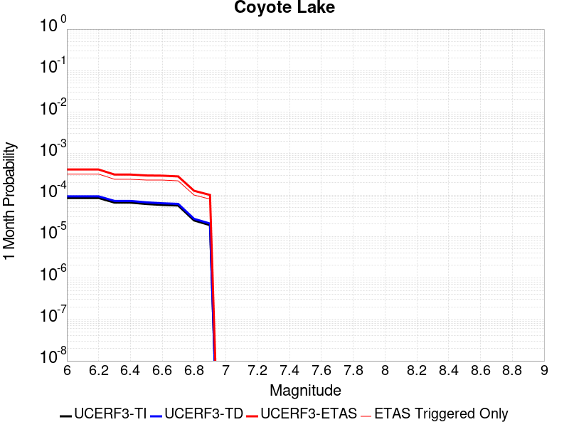 | 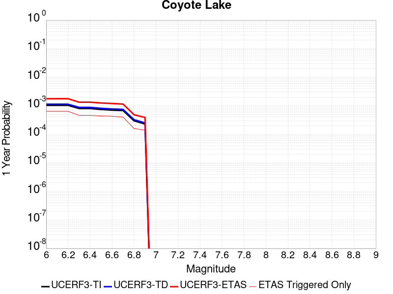 |  |

| Magnitude | 1 wk TI Prob | 1 wk TD Prob | 1 wk ETAS Prob | 1 wk ETAS/TD Gain | 1 wk ETAS Triggered Only | 1 mo TI Prob | 1 mo TD Prob | 1 mo ETAS Prob | 1 mo ETAS/TD Gain | 1 mo ETAS Triggered Only | 1 yr TI Prob | 1 yr TD Prob | 1 yr ETAS Prob | 1 yr ETAS/TD Gain | 1 yr ETAS Triggered Only | 10 yr TI Prob | 10 yr TD Prob | 10 yr ETAS Prob | 10 yr ETAS/TD Gain | 10 yr ETAS Triggered Only |
|-----|-----|-----|-----|-----|-----|-----|-----|-----|-----|-----|-----|-----|-----|-----|-----|-----|-----|-----|-----|-----|
| 6.0 | 1.980352E-5 | 2.1706745E-5 | 2.5170174E-4 | 11.595555 | 2.3E-4 | 8.486947E-5 | 9.302599E-5 | 4.1299622E-4 | 4.4395785 | 3.2E-4 | 0.0010327959 | 0.0011320751 | 0.0017713505 | 1.5646936 | 6.4E-4 | 0.010280091 | 0.011270258 | 0.012427072 | 1.102643 | 0.00117 |
| 6.1 | 1.980352E-5 | 2.1706745E-5 | 2.5170174E-4 | 11.595555 | 2.3E-4 | 8.486947E-5 | 9.302599E-5 | 4.1299622E-4 | 4.4395785 | 3.2E-4 | 0.0010327959 | 0.0011320751 | 0.0017713505 | 1.5646936 | 6.4E-4 | 0.010280091 | 0.011270258 | 0.012427072 | 1.102643 | 0.00117 |
| 6.2 | 1.980352E-5 | 2.1706745E-5 | 2.5170174E-4 | 11.595555 | 2.3E-4 | 8.486947E-5 | 9.302599E-5 | 4.1299622E-4 | 4.4395785 | 3.2E-4 | 0.0010327959 | 0.0011320751 | 0.0017713505 | 1.5646936 | 6.4E-4 | 0.010280091 | 0.011270258 | 0.012427072 | 1.102643 | 0.00117 |
| 6.3 | 1.5344787E-5 | 1.682067E-5 | 1.8681781E-4 | 11.106443 | 1.7E-4 | 6.576172E-5 | 7.2086936E-5 | 3.1206963E-4 | 4.3290734 | 2.4E-4 | 8.003548E-4 | 8.773662E-4 | 0.0013369627 | 1.5238365 | 4.6E-4 | 0.007974784 | 0.00874507 | 0.009587636 | 1.0963476 | 8.5E-4 |
| 6.4 | 1.5344787E-5 | 1.682067E-5 | 1.8681781E-4 | 11.106443 | 1.7E-4 | 6.576172E-5 | 7.2086936E-5 | 3.1206963E-4 | 4.3290734 | 2.4E-4 | 8.003548E-4 | 8.773662E-4 | 0.0013369627 | 1.5238365 | 4.6E-4 | 0.007974784 | 0.00874507 | 0.009587636 | 1.0963476 | 8.5E-4 |
| 6.5 | 1.4189697E-5 | 1.5557987E-5 | 1.755555E-4 | 11.283947 | 1.6E-4 | 6.081157E-5 | 6.6675726E-5 | 2.9666038E-4 | 4.4493012 | 2.3E-4 | 7.401293E-4 | 8.115349E-4 | 0.0012511777 | 1.5417424 | 4.4E-4 | 0.0073766913 | 0.008091656 | 0.008895102 | 1.0992931 | 8.1E-4 |
| 6.6 | 1.3469301E-5 | 1.4771577E-5 | 1.7476921E-4 | 11.831452 | 1.6E-4 | 5.7724297E-5 | 6.330556E-5 | 2.93291E-4 | 4.632942 | 2.3E-4 | 7.025667E-4 | 7.7053264E-4 | 0.0012002013 | 1.5576255 | 4.3E-4 | 0.0070034964 | 0.0076845144 | 0.008448597 | 1.0994315 | 7.7E-4 |
| 6.7 | 1.3027966E-5 | 1.4281745E-5 | 1.642796E-4 | 11.5027685 | 1.5E-4 | 5.5832945E-5 | 6.120638E-5 | 2.8119292E-4 | 4.594177 | 2.2E-4 | 6.7955407E-4 | 7.4499263E-4 | 0.0011446946 | 1.5365181 | 4.0E-4 | 0.006774798 | 0.0074308286 | 0.008155405 | 1.0975094 | 7.3E-4 |
| 6.8 | 5.695434E-6 | 6.2244176E-6 | 8.622392E-5 | 13.852528 | 8.0E-5 | 2.4408775E-5 | 2.6675973E-5 | 1.266733E-4 | 4.748592 | 1.0E-4 | 2.971363E-4 | 3.2476155E-4 | 4.847096E-4 | 1.4925091 | 1.6E-4 | 0.0029673933 | 0.0032458105 | 0.0035249016 | 1.0859851 | 2.8E-4 |
| 6.9 | 4.385688E-6 | 4.7930553E-6 | 7.479272E-5 | 15.604393 | 7.0E-5 | 1.879567E-5 | 2.0541665E-5 | 1.0054002E-4 | 4.8944435 | 8.0E-5 | 2.2881327E-4 | 2.5009477E-4 | 3.9005978E-4 | 1.5596478 | 1.4E-4 | 0.002285778 | 0.0025009478 | 0.0027303726 | 1.0917351 | 2.3E-4 |

## San Andreas (Big Bend)
*[(top)](#table-of-contents)*

| 1 Week | 1 Month | 1 Year | 10 Year |
|-----|-----|-----|-----|
|  |  |  |  |

| Magnitude | 1 wk TI Prob | 1 wk TD Prob | 1 wk ETAS Prob | 1 wk ETAS/TD Gain | 1 wk ETAS Triggered Only | 1 mo TI Prob | 1 mo TD Prob | 1 mo ETAS Prob | 1 mo ETAS/TD Gain | 1 mo ETAS Triggered Only | 1 yr TI Prob | 1 yr TD Prob | 1 yr ETAS Prob | 1 yr ETAS/TD Gain | 1 yr ETAS Triggered Only | 10 yr TI Prob | 10 yr TD Prob | 10 yr ETAS Prob | 10 yr ETAS/TD Gain | 10 yr ETAS Triggered Only |
|-----|-----|-----|-----|-----|-----|-----|-----|-----|-----|-----|-----|-----|-----|-----|-----|-----|-----|-----|-----|-----|
| 6.0 | 1.0179969E-4 | 2.0073925E-4 | 3.907011E-4 | 1.9463115 | 1.9E-4 | 4.362114E-4 | 8.6002843E-4 | 0.0011497791 | 1.3369081 | 2.9E-4 | 0.0052979486 | 0.010420859 | 0.010955232 | 1.0512792 | 5.4E-4 | 0.051734097 | 0.101455905 | 0.1021388 | 1.0067309 | 7.6E-4 |
| 6.1 | 1.0179969E-4 | 2.0073925E-4 | 3.907011E-4 | 1.9463115 | 1.9E-4 | 4.362114E-4 | 8.6002843E-4 | 0.0011497791 | 1.3369081 | 2.9E-4 | 0.0052979486 | 0.010420859 | 0.010955232 | 1.0512792 | 5.4E-4 | 0.051734097 | 0.101455905 | 0.1021388 | 1.0067309 | 7.6E-4 |
| 6.2 | 1.0179969E-4 | 2.0073925E-4 | 3.907011E-4 | 1.9463115 | 1.9E-4 | 4.362114E-4 | 8.6002843E-4 | 0.0011497791 | 1.3369081 | 2.9E-4 | 0.0052979486 | 0.010420859 | 0.010955232 | 1.0512792 | 5.4E-4 | 0.051734097 | 0.101455905 | 0.1021388 | 1.0067309 | 7.6E-4 |
| 6.3 | 1.0179969E-4 | 2.0073925E-4 | 3.907011E-4 | 1.9463115 | 1.9E-4 | 4.362114E-4 | 8.6002843E-4 | 0.0011497791 | 1.3369081 | 2.9E-4 | 0.0052979486 | 0.010420859 | 0.010955232 | 1.0512792 | 5.4E-4 | 0.051734097 | 0.101455905 | 0.1021388 | 1.0067309 | 7.6E-4 |
| 6.4 | 9.1639464E-5 | 1.8430917E-4 | 3.1428522E-4 | 1.7052066 | 1.3E-4 | 3.9268145E-4 | 7.896575E-4 | 9.695154E-4 | 1.2277669 | 1.8E-4 | 0.0047704205 | 0.009571818 | 0.009888755 | 1.0331115 | 3.2E-4 | 0.046693064 | 0.09378695 | 0.09415849 | 1.0039616 | 4.1E-4 |
| 6.5 | 9.1639464E-5 | 1.8430917E-4 | 3.1428522E-4 | 1.7052066 | 1.3E-4 | 3.9268145E-4 | 7.896575E-4 | 9.695154E-4 | 1.2277669 | 1.8E-4 | 0.0047704205 | 0.009571818 | 0.009888755 | 1.0331115 | 3.2E-4 | 0.046693064 | 0.09378695 | 0.09415849 | 1.0039616 | 4.1E-4 |
| 6.6 | 9.042622E-5 | 1.8238011E-4 | 3.0235824E-4 | 1.6578465 | 1.2E-4 | 3.8748336E-4 | 7.813951E-4 | 9.4127015E-4 | 1.204602 | 1.6E-4 | 0.0047074095 | 0.0094721 | 0.009729637 | 1.027189 | 2.6E-4 | 0.046089325 | 0.09287721 | 0.09318563 | 1.0033207 | 3.4E-4 |
| 6.7 | 8.9836685E-5 | 1.8152347E-4 | 3.0150168E-4 | 1.6609516 | 1.2E-4 | 3.8495753E-4 | 7.7772595E-4 | 9.3760155E-4 | 1.205568 | 1.6E-4 | 0.00467679 | 0.009427815 | 0.009685364 | 1.027318 | 2.6E-4 | 0.045795817 | 0.09247148 | 0.09278004 | 1.0033368 | 3.4E-4 |
| 6.8 | 8.9471854E-5 | 1.8099119E-4 | 2.9097128E-4 | 1.6076543 | 1.1E-4 | 3.8339442E-4 | 7.754462E-4 | 9.2532986E-4 | 1.193287 | 1.5E-4 | 0.004657841 | 0.009400298 | 0.009647948 | 1.0263449 | 2.5E-4 | 0.04561414 | 0.0922192 | 0.09251878 | 1.0032485 | 3.3E-4 |
| 6.9 | 8.858234E-5 | 1.7981093E-4 | 2.8979115E-4 | 1.6116437 | 1.1E-4 | 3.7958333E-4 | 7.7039085E-4 | 9.202753E-4 | 1.1945564 | 1.5E-4 | 0.004611638 | 0.009339278 | 0.009586943 | 1.0265187 | 2.5E-4 | 0.04517103 | 0.09165911 | 0.09195886 | 1.0032703 | 3.3E-4 |
| 7.0 | 8.7433385E-5 | 1.7819891E-4 | 2.7818108E-4 | 1.5610707 | 1.0E-4 | 3.746607E-4 | 7.6348626E-4 | 9.033794E-4 | 1.1832293 | 1.4E-4 | 0.004551957 | 0.009255932 | 0.0094937105 | 1.0256894 | 2.4E-4 | 0.044598386 | 0.09089323 | 0.09118414 | 1.0032007 | 3.2E-4 |
| 7.1 | 8.684964E-5 | 1.7731842E-4 | 2.6730247E-4 | 1.5074714 | 9.0E-5 | 3.7215967E-4 | 7.597149E-4 | 8.896162E-4 | 1.1709868 | 1.3E-4 | 0.0045216335 | 0.009210405 | 0.009438287 | 1.0247418 | 2.3E-4 | 0.04430731 | 0.09047475 | 0.0907567 | 1.0031164 | 3.1E-4 |
| 7.2 | 8.606521E-5 | 1.7622454E-4 | 2.6620866E-4 | 1.5106221 | 9.0E-5 | 3.6879873E-4 | 7.550296E-4 | 8.849314E-4 | 1.1720487 | 1.3E-4 | 0.0044808835 | 0.009153842 | 0.009371827 | 1.0238136 | 2.2E-4 | 0.043916024 | 0.08995518 | 0.09022819 | 1.003035 | 3.0E-4 |
| 7.3 | 8.568266E-5 | 1.7564454E-4 | 2.6562874E-4 | 1.5123085 | 9.0E-5 | 3.6715972E-4 | 7.5254537E-4 | 8.824475E-4 | 1.1726171 | 1.3E-4 | 0.0044610105 | 0.00912385 | 0.0093418425 | 1.0238926 | 2.2E-4 | 0.043725148 | 0.08967623 | 0.08994933 | 1.0030453 | 3.0E-4 |
| 7.4 | 8.5432206E-5 | 1.752704E-4 | 2.652546E-4 | 1.5134023 | 9.0E-5 | 3.6608664E-4 | 7.509428E-4 | 8.808452E-4 | 1.1729857 | 1.3E-4 | 0.004447999 | 0.009104501 | 0.009322499 | 1.0239439 | 2.2E-4 | 0.043600157 | 0.08949642 | 0.08976957 | 1.0030521 | 3.0E-4 |
| 7.5 | 8.4791965E-5 | 1.7396381E-4 | 2.539499E-4 | 1.4597857 | 8.0E-5 | 3.633435E-4 | 7.4534636E-4 | 8.6525694E-4 | 1.160879 | 1.2E-4 | 0.0044147377 | 0.009036932 | 0.009245035 | 1.023028 | 2.1E-4 | 0.043280575 | 0.08887209 | 0.08913632 | 1.0029731 | 2.9E-4 |
| 7.6 | 8.241105E-5 | 1.6841735E-4 | 2.3840556E-4 | 1.4155642 | 7.0E-5 | 3.531424E-4 | 7.2158914E-4 | 8.3150977E-4 | 1.1523314 | 1.1E-4 | 0.0042910352 | 0.008750047 | 0.008938384 | 1.0215242 | 1.9E-4 | 0.042091176 | 0.08625032 | 0.0864879 | 1.0027544 | 2.6E-4 |
| 7.7 | 7.00432E-5 | 1.4205615E-4 | 1.8205047E-4 | 1.2815388 | 4.0E-5 | 3.001506E-4 | 6.0867006E-4 | 6.586396E-4 | 1.0820963 | 5.0E-5 | 0.0036482112 | 0.0073854174 | 0.007514457 | 1.0174723 | 1.3E-4 | 0.035888977 | 0.07352299 | 0.07369902 | 1.0023942 | 1.9E-4 |
| 7.8 | 6.415362E-5 | 1.2969968E-4 | 1.5969579E-4 | 1.2312735 | 3.0E-5 | 2.749151E-4 | 5.557374E-4 | 5.9571513E-4 | 1.0719365 | 4.0E-5 | 0.0033419547 | 0.0067451415 | 0.0068543996 | 1.016198 | 1.1E-4 | 0.03292141 | 0.06725514 | 0.0674137 | 1.0023577 | 1.7E-4 |
| 7.9 | 4.939911E-5 | 9.341721E-5 | 1.03416285E-4 | 1.1070366 | 1.0E-5 | 2.116933E-4 | 4.0029807E-4 | 4.2029007E-4 | 1.0499427 | 2.0E-5 | 0.0025743195 | 0.004862747 | 0.004932407 | 1.0143251 | 7.0E-5 | 0.025447013 | 0.048915803 | 0.04901091 | 1.0019443 | 1.0E-4 |
| 8.0 | 3.344983E-5 | 5.2228E-5 | 6.2227475E-5 | 1.1914582 | 1.0E-5 | 1.4334853E-4 | 2.2381509E-4 | 2.3381285E-4 | 1.0446697 | 1.0E-5 | 0.0017438711 | 0.0027215453 | 0.0027514638 | 1.0109931 | 3.0E-5 | 0.017302496 | 0.027923161 | 0.027962044 | 1.0013925 | 4.0E-5 |
| 8.1 | 1.9104898E-5 | 1.9171663E-5 | 1.9171663E-5 | 1.0 | 0.0 | 8.1875565E-5 | 8.2161685E-5 | 8.2161685E-5 | 1.0 | 0.0 | 9.963791E-4 | 9.9986E-4 | 9.9986E-4 | 1.0 | 0.0 | 0.009919235 | 0.010749552 | 0.010759445 | 1.0009203 | 1.0E-5 |
| 8.2 | 8.643924E-6 | 5.473668E-6 | 5.473668E-6 | 1.0 | 0.0 | 3.704486E-5 | 2.3458366E-5 | 2.3458366E-5 | 1.0 | 0.0 | 4.5092785E-4 | 2.8556827E-4 | 2.8556827E-4 | 1.0 | 0.0 | 0.0045001395 | 0.0032481793 | 0.0032481793 | 1.0 | 0.0 |
| 8.3 | 1.983087E-6 | 7.6564595E-7 | 7.6564595E-7 | 1.0 | 0.0 | 8.498917E-6 | 3.281336E-6 | 3.281336E-6 | 1.0 | 0.0 | 1.034694E-4 | 3.9949547E-5 | 3.9949547E-5 | 1.0 | 0.0 | 0.0010342124 | 4.717979E-4 | 4.717979E-4 | 1.0 | 0.0 |

## Death Valley (No)
*[(top)](#table-of-contents)*

| 1 Week | 1 Month | 1 Year | 10 Year |
|-----|-----|-----|-----|
|  | 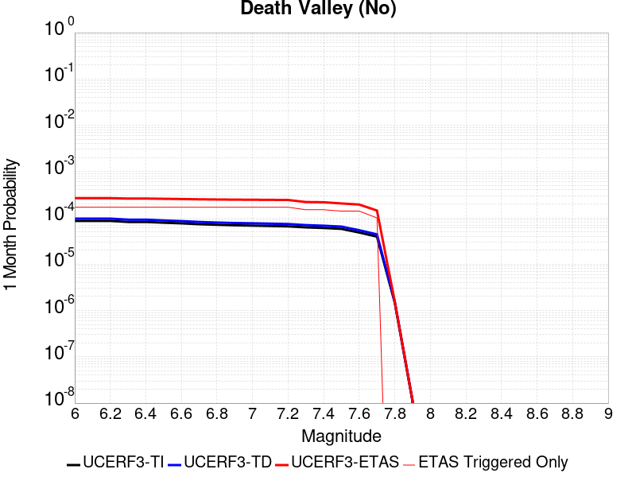 |  |  |

| Magnitude | 1 wk TI Prob | 1 wk TD Prob | 1 wk ETAS Prob | 1 wk ETAS/TD Gain | 1 wk ETAS Triggered Only | 1 mo TI Prob | 1 mo TD Prob | 1 mo ETAS Prob | 1 mo ETAS/TD Gain | 1 mo ETAS Triggered Only | 1 yr TI Prob | 1 yr TD Prob | 1 yr ETAS Prob | 1 yr ETAS/TD Gain | 1 yr ETAS Triggered Only | 10 yr TI Prob | 10 yr TD Prob | 10 yr ETAS Prob | 10 yr ETAS/TD Gain | 10 yr ETAS Triggered Only |
|-----|-----|-----|-----|-----|-----|-----|-----|-----|-----|-----|-----|-----|-----|-----|-----|-----|-----|-----|-----|-----|
| 6.0 | 2.0074807E-5 | 2.2500084E-5 | 1.4249739E-4 | 6.3331933 | 1.2E-4 | 8.603206E-5 | 9.642541E-5 | 2.66409E-4 | 2.7628508 | 1.7E-4 | 0.001046937 | 0.0011733545 | 0.0015728851 | 1.340503 | 4.0E-4 | 0.010420183 | 0.011672506 | 0.012344569 | 1.0575765 | 6.8E-4 |
| 6.1 | 2.0074807E-5 | 2.2500084E-5 | 1.4249739E-4 | 6.3331933 | 1.2E-4 | 8.603206E-5 | 9.642541E-5 | 2.66409E-4 | 2.7628508 | 1.7E-4 | 0.001046937 | 0.0011733545 | 0.0015728851 | 1.340503 | 4.0E-4 | 0.010420183 | 0.011672506 | 0.012344569 | 1.0575765 | 6.8E-4 |
| 6.2 | 2.0074807E-5 | 2.2500084E-5 | 1.4249739E-4 | 6.3331933 | 1.2E-4 | 8.603206E-5 | 9.642541E-5 | 2.66409E-4 | 2.7628508 | 1.7E-4 | 0.001046937 | 0.0011733545 | 0.0015728851 | 1.340503 | 4.0E-4 | 0.010420183 | 0.011672506 | 0.012344569 | 1.0575765 | 6.8E-4 |
| 6.3 | 1.9050609E-5 | 2.1336948E-5 | 1.4133439E-4 | 6.623927 | 1.2E-4 | 8.164292E-5 | 9.1440896E-5 | 2.6142536E-4 | 2.8589544 | 1.7E-4 | 9.935491E-4 | 0.001112731 | 0.0015122859 | 1.3590759 | 4.0E-4 | 0.009891188 | 0.011072419 | 0.011744889 | 1.0607339 | 6.8E-4 |
| 6.4 | 1.9050609E-5 | 2.1336948E-5 | 1.4133439E-4 | 6.623927 | 1.2E-4 | 8.164292E-5 | 9.1440896E-5 | 2.6142536E-4 | 2.8589544 | 1.7E-4 | 9.935491E-4 | 0.001112731 | 0.0015122859 | 1.3590759 | 4.0E-4 | 0.009891188 | 0.011072419 | 0.011744889 | 1.0607339 | 6.8E-4 |
| 6.5 | 1.8367004E-5 | 2.0561009E-5 | 1.4055854E-4 | 6.8361697 | 1.2E-4 | 7.8713354E-5 | 8.811567E-5 | 2.5810068E-4 | 2.9291124 | 1.7E-4 | 9.5791375E-4 | 0.0010722869 | 0.0014718579 | 1.3726345 | 4.0E-4 | 0.009537951 | 0.0106719155 | 0.011344658 | 1.0630386 | 6.8E-4 |
| 6.6 | 1.779439E-5 | 1.9910927E-5 | 1.3990854E-4 | 7.026721 | 1.2E-4 | 7.625944E-5 | 8.53298E-5 | 2.5531527E-4 | 2.9921002 | 1.7E-4 | 9.280632E-4 | 0.0010384015 | 0.0014279966 | 1.3751873 | 3.9E-4 | 0.009241969 | 0.010336253 | 0.01098943 | 1.063193 | 6.6E-4 |
| 6.7 | 1.7025437E-5 | 1.9043426E-5 | 1.3904113E-4 | 7.301267 | 1.2E-4 | 7.296412E-5 | 8.161216E-5 | 2.5159828E-4 | 3.0828528 | 1.7E-4 | 8.87976E-4 | 9.931813E-4 | 0.001382794 | 1.3922875 | 3.9E-4 | 0.008844362 | 0.009888145 | 0.010541619 | 1.0660866 | 6.6E-4 |
| 6.8 | 1.6545107E-5 | 1.8512545E-5 | 1.3851032E-4 | 7.481971 | 1.2E-4 | 7.090568E-5 | 7.93371E-5 | 2.493236E-4 | 3.1425853 | 1.7E-4 | 8.629347E-4 | 9.655073E-4 | 0.0013551307 | 1.4035428 | 3.9E-4 | 0.008595915 | 0.009613829 | 0.010267484 | 1.0679911 | 6.6E-4 |
| 6.9 | 1.615478E-5 | 1.8087594E-5 | 1.3808542E-4 | 7.6342616 | 1.2E-4 | 6.9232934E-5 | 7.751599E-5 | 2.4750282E-4 | 3.192926 | 1.7E-4 | 8.4258494E-4 | 9.433546E-4 | 0.0013329868 | 1.4130282 | 3.9E-4 | 0.008393973 | 0.009394196 | 0.0100479955 | 1.0695962 | 6.6E-4 |
| 7.0 | 1.5894311E-5 | 1.780555E-5 | 1.378034E-4 | 7.7393517 | 1.2E-4 | 6.81167E-5 | 7.6307304E-5 | 2.4629434E-4 | 3.227664 | 1.7E-4 | 8.2900526E-4 | 9.286515E-4 | 0.0013182893 | 1.4195738 | 3.9E-4 | 0.008259195 | 0.009248397 | 0.009892386 | 1.0696324 | 6.5E-4 |
| 7.1 | 1.5602263E-5 | 1.7483504E-5 | 1.374814E-4 | 7.863493 | 1.2E-4 | 6.6865134E-5 | 7.492718E-5 | 2.4491444E-4 | 3.2686996 | 1.7E-4 | 8.137789E-4 | 9.118627E-4 | 0.0013015071 | 1.4273059 | 3.9E-4 | 0.008108052 | 0.009081894 | 0.009725991 | 1.070921 | 6.5E-4 |
| 7.2 | 1.5323829E-5 | 1.717063E-5 | 1.3716856E-4 | 7.988558 | 1.2E-4 | 6.56719E-5 | 7.358637E-5 | 2.4357386E-4 | 3.3100402 | 1.7E-4 | 7.99262E-4 | 8.9555193E-4 | 0.0012852027 | 1.4350957 | 3.9E-4 | 0.007963934 | 0.008920107 | 0.009564308 | 1.0722191 | 6.5E-4 |
| 7.3 | 1.4556212E-5 | 1.6302456E-5 | 1.2630066E-4 | 7.7473397 | 1.1E-4 | 6.238227E-5 | 6.9865826E-5 | 2.1985534E-4 | 3.1468225 | 1.5E-4 | 7.592395E-4 | 8.5029035E-4 | 0.0012099842 | 1.4230248 | 3.6E-4 | 0.0075665074 | 0.008471014 | 0.009085762 | 1.0725708 | 6.2E-4 |
| 7.4 | 1.411725E-5 | 1.580796E-5 | 1.2580623E-4 | 7.95841 | 1.1E-4 | 6.0501097E-5 | 6.7746674E-5 | 2.1773651E-4 | 3.213981 | 1.5E-4 | 7.363519E-4 | 8.245094E-4 | 0.0011842126 | 1.4362632 | 3.6E-4 | 0.0073391674 | 0.008215138 | 0.008830044 | 1.0748504 | 6.2E-4 |
| 7.5 | 1.3503312E-5 | 1.5126289E-5 | 1.1512478E-4 | 7.6109066 | 1.0E-4 | 5.7870053E-5 | 6.482538E-5 | 2.048163E-4 | 3.1595082 | 1.4E-4 | 7.043401E-4 | 7.8896893E-4 | 0.0011386928 | 1.443267 | 3.5E-4 | 0.007021119 | 0.007862304 | 0.0084675085 | 1.0769753 | 6.1E-4 |
| 7.6 | 1.1279839E-5 | 1.2626327E-5 | 1.12625065E-4 | 8.91986 | 1.0E-4 | 4.834127E-5 | 5.4111737E-5 | 1.9410416E-4 | 3.587099 | 1.4E-4 | 5.88396E-4 | 6.5861654E-4 | 9.784058E-4 | 1.485547 | 3.2E-4 | 0.005868405 | 0.006567199 | 0.007093718 | 1.0801741 | 5.3E-4 |
| 7.7 | 9.189108E-6 | 1.0283358E-5 | 9.0282534E-5 | 8.77948 | 8.0E-5 | 3.93813E-5 | 4.407082E-5 | 1.440664E-4 | 3.268975 | 1.0E-4 | 4.7936183E-4 | 5.3643517E-4 | 7.962957E-4 | 1.4844211 | 2.6E-4 | 0.004783291 | 0.005351914 | 0.0057796123 | 1.079915 | 4.3E-4 |
| 7.8 | 3.4586725E-7 | 3.6482615E-7 | 3.6482615E-7 | 1.0 | 0.0 | 1.4822873E-6 | 1.5635396E-6 | 1.5635396E-6 | 1.0 | 0.0 | 1.80467E-5 | 1.9035933E-5 | 2.9035744E-5 | 1.5253123 | 1.0E-5 | 1.8045233E-4 | 1.9034347E-4 | 2.0034157E-4 | 1.0525266 | 1.0E-5 |
| 7.9 | 2.5591178E-9 | 2.6696718E-9 | 2.6696718E-9 | 1.0 | 0.0 | 1.0967647E-8 | 1.14414505E-8 | 1.14414505E-8 | 1.0 | 0.0 | 1.335311E-7 | 1.3929966E-7 | 1.3929966E-7 | 1.0 | 0.0 | 1.3353102E-6 | 1.3929966E-6 | 1.3929966E-6 | 1.0 | 0.0 |

## San Andreas (Parkfield)
*[(top)](#table-of-contents)*

| 1 Week | 1 Month | 1 Year | 10 Year |
|-----|-----|-----|-----|
|  | 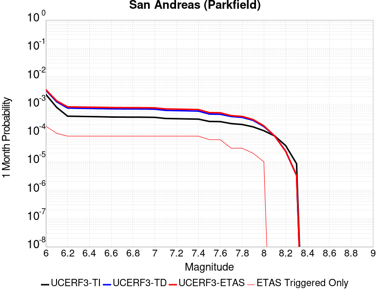 |  | 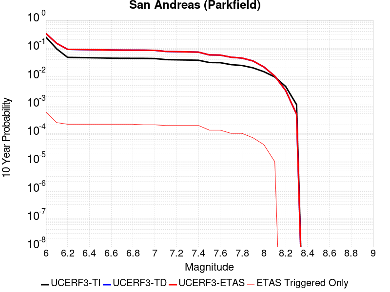 |

| Magnitude | 1 wk TI Prob | 1 wk TD Prob | 1 wk ETAS Prob | 1 wk ETAS/TD Gain | 1 wk ETAS Triggered Only | 1 mo TI Prob | 1 mo TD Prob | 1 mo ETAS Prob | 1 mo ETAS/TD Gain | 1 mo ETAS Triggered Only | 1 yr TI Prob | 1 yr TD Prob | 1 yr ETAS Prob | 1 yr ETAS/TD Gain | 1 yr ETAS Triggered Only | 10 yr TI Prob | 10 yr TD Prob | 10 yr ETAS Prob | 10 yr ETAS/TD Gain | 10 yr ETAS Triggered Only |
|-----|-----|-----|-----|-----|-----|-----|-----|-----|-----|-----|-----|-----|-----|-----|-----|-----|-----|-----|-----|-----|
| 6.0 | 5.556969E-4 | 7.778562E-4 | 8.877707E-4 | 1.1413043 | 1.1E-4 | 0.0023793848 | 0.0033299583 | 0.0035093587 | 1.0538747 | 1.8E-4 | 0.028586963 | 0.040235043 | 0.04057096 | 1.008349 | 3.5E-4 | 0.25176284 | 0.3371973 | 0.33758172 | 1.0011401 | 5.8E-4 |
| 6.1 | 1.925858E-4 | 3.0278185E-4 | 3.7276064E-4 | 1.2311195 | 7.0E-5 | 8.2510663E-4 | 0.001297085 | 0.0013969552 | 1.076996 | 1.0E-4 | 0.0099994885 | 0.01577393 | 0.015960934 | 1.0118552 | 1.9E-4 | 0.095613256 | 0.14975825 | 0.1499623 | 1.0013626 | 2.4E-4 |
| 6.2 | 9.4306815E-5 | 1.8243887E-4 | 2.4242792E-4 | 1.3288172 | 6.0E-5 | 4.0410945E-4 | 7.8164786E-4 | 8.615853E-4 | 1.1022679 | 8.0E-5 | 0.0049089384 | 0.009475246 | 0.00963373 | 1.0167261 | 1.6E-4 | 0.048019063 | 0.0918565 | 0.092047215 | 1.0020761 | 2.1E-4 |
| 6.3 | 9.283051E-5 | 1.794041E-4 | 2.3939334E-4 | 1.3343805 | 6.0E-5 | 3.9778434E-4 | 7.686494E-4 | 8.485879E-4 | 1.1039987 | 8.0E-5 | 0.0048322747 | 0.009318355 | 0.009476864 | 1.0170105 | 1.6E-4 | 0.047285385 | 0.090509474 | 0.09070046 | 1.0021102 | 2.1E-4 |
| 6.4 | 9.138826E-5 | 1.7702584E-4 | 2.370152E-4 | 1.3388736 | 6.0E-5 | 3.916052E-4 | 7.5846276E-4 | 8.384021E-4 | 1.1053965 | 8.0E-5 | 0.0047573745 | 0.009195387 | 0.009353916 | 1.01724 | 1.6E-4 | 0.046568092 | 0.0894136 | 0.08960482 | 1.0021386 | 2.1E-4 |
| 6.5 | 9.000255E-5 | 1.746064E-4 | 2.3459591E-4 | 1.34357 | 6.0E-5 | 3.8566816E-4 | 7.4809964E-4 | 8.2803983E-4 | 1.1068577 | 8.0E-5 | 0.0046854047 | 0.009070284 | 0.009228833 | 1.01748 | 1.6E-4 | 0.045878403 | 0.08829608 | 0.088487536 | 1.0021684 | 2.1E-4 |
| 6.6 | 8.8109264E-5 | 1.7141816E-4 | 2.3140787E-4 | 1.3499613 | 6.0E-5 | 3.7755648E-4 | 7.3444354E-4 | 8.143848E-4 | 1.108846 | 8.0E-5 | 0.0045870654 | 0.008905404 | 0.00906398 | 1.0178066 | 1.6E-4 | 0.04493529 | 0.08682707 | 0.08701884 | 1.0022086 | 2.1E-4 |
| 6.7 | 8.738073E-5 | 1.7008898E-4 | 2.3007879E-4 | 1.3526965 | 6.0E-5 | 3.7443507E-4 | 7.287503E-4 | 8.08692E-4 | 1.109697 | 8.0E-5 | 0.0045492216 | 0.008836695 | 0.008995281 | 1.0179464 | 1.6E-4 | 0.04457213 | 0.0862268 | 0.08641869 | 1.0022254 | 2.1E-4 |
| 6.8 | 8.710195E-5 | 1.6954402E-4 | 2.2953385E-4 | 1.3538305 | 6.0E-5 | 3.7324068E-4 | 7.26416E-4 | 8.063579E-4 | 1.1100497 | 8.0E-5 | 0.0045347405 | 0.008808513 | 0.008967103 | 1.0180043 | 1.6E-4 | 0.04443313 | 0.08597436 | 0.08616631 | 1.0022326 | 2.1E-4 |
| 6.9 | 8.6801556E-5 | 1.6895356E-4 | 2.2894342E-4 | 1.3550671 | 6.0E-5 | 3.7195362E-4 | 7.238869E-4 | 8.03829E-4 | 1.1104345 | 8.0E-5 | 0.0045191357 | 0.0087779695 | 0.008926652 | 1.0169382 | 1.5E-4 | 0.044283327 | 0.08570042 | 0.08588328 | 1.0021337 | 2.0E-4 |
| 7.0 | 8.5571606E-5 | 1.664819E-4 | 2.2647191E-4 | 1.3603395 | 6.0E-5 | 3.6668387E-4 | 7.132999E-4 | 7.932428E-4 | 1.1120747 | 8.0E-5 | 0.004455241 | 0.008650103 | 0.008798805 | 1.0171908 | 1.5E-4 | 0.043669727 | 0.08454836 | 0.08473145 | 1.0021656 | 2.0E-4 |
| 7.1 | 7.82589E-5 | 1.5128969E-4 | 2.112806E-4 | 1.3965302 | 6.0E-5 | 3.3535215E-4 | 6.4822397E-4 | 7.281721E-4 | 1.1233342 | 8.0E-5 | 0.0040752706 | 0.007863738 | 0.008002637 | 1.0176632 | 1.4E-4 | 0.040013418 | 0.077460445 | 0.07763573 | 1.0022628 | 1.9E-4 |
| 7.2 | 7.690929E-5 | 1.4866212E-4 | 2.0865319E-4 | 1.4035398 | 6.0E-5 | 3.2956956E-4 | 6.369685E-4 | 7.1691757E-4 | 1.1255149 | 8.0E-5 | 0.004005129 | 0.0077276826 | 0.0078666005 | 1.0179766 | 1.4E-4 | 0.0393371 | 0.07623341 | 0.07640892 | 1.0023023 | 1.9E-4 |
| 7.3 | 7.5543794E-5 | 1.4562748E-4 | 2.0561874E-4 | 1.4119501 | 6.0E-5 | 3.2371894E-4 | 6.239692E-4 | 7.039193E-4 | 1.1281315 | 8.0E-5 | 0.003934157 | 0.0075705256 | 0.007709466 | 1.0183527 | 1.4E-4 | 0.038652334 | 0.07479777 | 0.07497356 | 1.0023502 | 1.9E-4 |
| 7.4 | 7.4214564E-5 | 1.4263717E-4 | 2.0262861E-4 | 1.4205877 | 6.0E-5 | 3.1802364E-4 | 6.1115966E-4 | 6.911108E-4 | 1.1308187 | 8.0E-5 | 0.003865065 | 0.0074156416 | 0.0075546033 | 1.018739 | 1.4E-4 | 0.03798529 | 0.07337152 | 0.07354759 | 1.0023996 | 1.9E-4 |
| 7.5 | 6.149578E-5 | 1.1191443E-4 | 1.6190883E-4 | 1.4467199 | 5.0E-5 | 2.6352672E-4 | 4.795452E-4 | 5.3951645E-4 | 1.1250585 | 6.0E-5 | 0.0032037178 | 0.005822865 | 0.0059222826 | 1.0170736 | 1.0E-4 | 0.03157923 | 0.058559462 | 0.05868185 | 1.00209 | 1.3E-4 |
| 7.6 | 6.0643448E-5 | 1.102009E-4 | 1.6019538E-4 | 1.4536668 | 5.0E-5 | 2.598746E-4 | 4.7220418E-4 | 5.321758E-4 | 1.1270037 | 6.0E-5 | 0.0031593828 | 0.005733962 | 0.005833389 | 1.01734 | 1.0E-4 | 0.031148417 | 0.05772042 | 0.057842914 | 1.0021223 | 1.3E-4 |
| 7.7 | 5.1652263E-5 | 9.175265E-5 | 1.11750815E-4 | 1.2179574 | 2.0E-5 | 2.2134806E-4 | 3.9316638E-4 | 4.231546E-4 | 1.0762736 | 3.0E-5 | 0.002691582 | 0.0047763046 | 0.0048459703 | 1.0145857 | 7.0E-5 | 0.026592141 | 0.04853641 | 0.048631553 | 1.0019603 | 1.0E-4 |
| 7.8 | 4.8090482E-5 | 8.560165E-5 | 1.0559994E-4 | 1.2336204 | 2.0E-5 | 2.060858E-4 | 3.6681266E-4 | 3.9680165E-4 | 1.0817556 | 3.0E-5 | 0.0025062072 | 0.004456807 | 0.004526495 | 1.0156363 | 7.0E-5 | 0.024781305 | 0.045302264 | 0.045397736 | 1.0021074 | 1.0E-4 |
| 7.9 | 3.970278E-5 | 6.7507375E-5 | 7.75067E-5 | 1.148122 | 1.0E-5 | 1.7014367E-4 | 2.8928524E-4 | 3.0927945E-4 | 1.0691159 | 2.0E-5 | 0.002069531 | 0.0035163634 | 0.0035761525 | 1.017003 | 6.0E-5 | 0.020503636 | 0.03588176 | 0.03594925 | 1.0018809 | 7.0E-5 |
| 8.0 | 2.8982335E-5 | 4.0698153E-5 | 5.069775E-5 | 1.2457014 | 1.0E-5 | 1.2420409E-4 | 1.7440901E-4 | 1.8440725E-4 | 1.0573264 | 1.0E-5 | 0.0015111357 | 0.0021213628 | 0.0021512993 | 1.0141119 | 3.0E-5 | 0.015009012 | 0.02201118 | 0.0220503 | 1.0017773 | 4.0E-5 |
| 8.1 | 1.8836186E-5 | 1.867974E-5 | 1.867974E-5 | 1.0 | 0.0 | 8.0724014E-5 | 8.005358E-5 | 8.005358E-5 | 1.0 | 0.0 | 9.823717E-4 | 9.742171E-4 | 9.742171E-4 | 1.0 | 0.0 | 0.009780403 | 0.010487711 | 0.010497605 | 1.0009435 | 1.0E-5 |
| 8.2 | 8.643924E-6 | 5.473668E-6 | 5.473668E-6 | 1.0 | 0.0 | 3.704486E-5 | 2.3458366E-5 | 2.3458366E-5 | 1.0 | 0.0 | 4.5092785E-4 | 2.8556827E-4 | 2.8556827E-4 | 1.0 | 0.0 | 0.0045001395 | 0.0032481793 | 0.0032481793 | 1.0 | 0.0 |
| 8.3 | 1.983087E-6 | 7.6564595E-7 | 7.6564595E-7 | 1.0 | 0.0 | 8.498917E-6 | 3.281336E-6 | 3.281336E-6 | 1.0 | 0.0 | 1.034694E-4 | 3.9949547E-5 | 3.9949547E-5 | 1.0 | 0.0 | 0.0010342124 | 4.717979E-4 | 4.717979E-4 | 1.0 | 0.0 |

## Red Pass
*[(top)](#table-of-contents)*

| 1 Week | 1 Month | 1 Year | 10 Year |
|-----|-----|-----|-----|
|  |  |  | 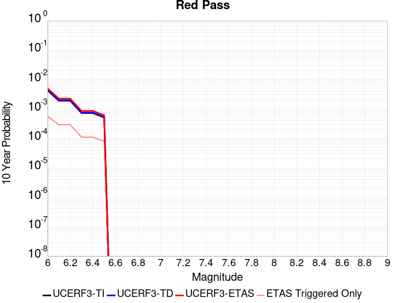 |

| Magnitude | 1 wk TI Prob | 1 wk TD Prob | 1 wk ETAS Prob | 1 wk ETAS/TD Gain | 1 wk ETAS Triggered Only | 1 mo TI Prob | 1 mo TD Prob | 1 mo ETAS Prob | 1 mo ETAS/TD Gain | 1 mo ETAS Triggered Only | 1 yr TI Prob | 1 yr TD Prob | 1 yr ETAS Prob | 1 yr ETAS/TD Gain | 1 yr ETAS Triggered Only | 10 yr TI Prob | 10 yr TD Prob | 10 yr ETAS Prob | 10 yr ETAS/TD Gain | 10 yr ETAS Triggered Only |
|-----|-----|-----|-----|-----|-----|-----|-----|-----|-----|-----|-----|-----|-----|-----|-----|-----|-----|-----|-----|-----|
| 6.0 | 8.258278E-6 | 8.551265E-6 | 1.4855007E-4 | 17.371706 | 1.4E-4 | 3.539214E-5 | 3.6647863E-5 | 2.3664054E-4 | 6.457144 | 2.0E-4 | 4.308141E-4 | 4.4611428E-4 | 7.659715E-4 | 1.716985 | 3.2E-4 | 0.0042997985 | 0.004453945 | 0.005021406 | 1.1274065 | 5.7E-4 |
| 6.1 | 3.649988E-6 | 3.7753161E-6 | 8.377501E-5 | 22.190199 | 8.0E-5 | 1.5642712E-5 | 1.6179853E-5 | 1.061784E-4 | 6.5623837 | 9.0E-5 | 1.9043336E-4 | 1.9697666E-4 | 3.469471E-4 | 1.7613615 | 1.5E-4 | 0.0019027026 | 0.001968488 | 0.002257917 | 1.1470312 | 2.9E-4 |
| 6.2 | 3.649988E-6 | 3.7753161E-6 | 8.377501E-5 | 22.190199 | 8.0E-5 | 1.5642712E-5 | 1.6179853E-5 | 1.061784E-4 | 6.5623837 | 9.0E-5 | 1.9043336E-4 | 1.9697666E-4 | 3.469471E-4 | 1.7613615 | 1.5E-4 | 0.0019027026 | 0.001968488 | 0.002257917 | 1.1470312 | 2.9E-4 |
| 6.3 | 1.3924937E-6 | 1.4411166E-6 | 2.1441088E-5 | 14.878107 | 2.0E-5 | 5.9678164E-6 | 6.1762075E-6 | 2.6176083E-5 | 4.238213 | 2.0E-5 | 7.265574E-5 | 7.519415E-5 | 1.3518964E-4 | 1.7978745 | 6.0E-5 | 7.263199E-4 | 7.518258E-4 | 8.617431E-4 | 1.1462005 | 1.1E-4 |
| 6.4 | 1.3924937E-6 | 1.4411166E-6 | 2.1441088E-5 | 14.878107 | 2.0E-5 | 5.9678164E-6 | 6.1762075E-6 | 2.6176083E-5 | 4.238213 | 2.0E-5 | 7.265574E-5 | 7.519415E-5 | 1.3518964E-4 | 1.7978745 | 6.0E-5 | 7.263199E-4 | 7.518258E-4 | 8.617431E-4 | 1.1462005 | 1.1E-4 |
| 6.5 | 9.876812E-7 | 1.0221912E-6 | 2.1022171E-5 | 20.56579 | 2.0E-5 | 4.2329125E-6 | 4.3808195E-6 | 2.4380732E-5 | 5.5653358 | 2.0E-5 | 5.153449E-5 | 5.3336476E-5 | 9.333435E-5 | 1.7499158 | 4.0E-5 | 5.1522546E-4 | 5.333648E-4 | 6.133221E-4 | 1.1499112 | 8.0E-5 |

## San Andreas (San Gorgonio Pass-Garnet HIll)
*[(top)](#table-of-contents)*

| 1 Week | 1 Month | 1 Year | 10 Year |
|-----|-----|-----|-----|
|  |  |  |  |

| Magnitude | 1 wk TI Prob | 1 wk TD Prob | 1 wk ETAS Prob | 1 wk ETAS/TD Gain | 1 wk ETAS Triggered Only | 1 mo TI Prob | 1 mo TD Prob | 1 mo ETAS Prob | 1 mo ETAS/TD Gain | 1 mo ETAS Triggered Only | 1 yr TI Prob | 1 yr TD Prob | 1 yr ETAS Prob | 1 yr ETAS/TD Gain | 1 yr ETAS Triggered Only | 10 yr TI Prob | 10 yr TD Prob | 10 yr ETAS Prob | 10 yr ETAS/TD Gain | 10 yr ETAS Triggered Only |
|-----|-----|-----|-----|-----|-----|-----|-----|-----|-----|-----|-----|-----|-----|-----|-----|-----|-----|-----|-----|-----|
| 6.0 | 8.31567E-5 | 2.3384395E-4 | 4.7378783E-4 | 2.0260854 | 2.4E-4 | 3.5633717E-4 | 0.0010018025 | 0.0013414619 | 1.3390483 | 3.4E-4 | 0.004329778 | 0.012128622 | 0.012573164 | 1.0366523 | 4.5E-4 | 0.042463828 | 0.11258187 | 0.1130877 | 1.004493 | 5.7E-4 |
| 6.1 | 8.31567E-5 | 2.3384395E-4 | 4.7378783E-4 | 2.0260854 | 2.4E-4 | 3.5633717E-4 | 0.0010018025 | 0.0013414619 | 1.3390483 | 3.4E-4 | 0.004329778 | 0.012128622 | 0.012573164 | 1.0366523 | 4.5E-4 | 0.042463828 | 0.11258187 | 0.1130877 | 1.004493 | 5.7E-4 |
| 6.2 | 8.31567E-5 | 2.3384395E-4 | 4.7378783E-4 | 2.0260854 | 2.4E-4 | 3.5633717E-4 | 0.0010018025 | 0.0013414619 | 1.3390483 | 3.4E-4 | 0.004329778 | 0.012128622 | 0.012573164 | 1.0366523 | 4.5E-4 | 0.042463828 | 0.11258187 | 0.1130877 | 1.004493 | 5.7E-4 |
| 6.3 | 8.31567E-5 | 2.3384395E-4 | 4.7378783E-4 | 2.0260854 | 2.4E-4 | 3.5633717E-4 | 0.0010018025 | 0.0013414619 | 1.3390483 | 3.4E-4 | 0.004329778 | 0.012128622 | 0.012573164 | 1.0366523 | 4.5E-4 | 0.042463828 | 0.11258187 | 0.1130877 | 1.004493 | 5.7E-4 |
| 6.4 | 8.059055E-5 | 2.2941893E-4 | 4.6936388E-4 | 2.0458813 | 2.4E-4 | 3.4534236E-4 | 9.828559E-4 | 0.0013225218 | 1.3455906 | 3.4E-4 | 0.0041964394 | 0.011900819 | 0.012345464 | 1.0373626 | 4.5E-4 | 0.041180745 | 0.110562965 | 0.11106994 | 1.0045854 | 5.7E-4 |
| 6.5 | 8.059055E-5 | 2.2941893E-4 | 4.6936388E-4 | 2.0458813 | 2.4E-4 | 3.4534236E-4 | 9.828559E-4 | 0.0013225218 | 1.3455906 | 3.4E-4 | 0.0041964394 | 0.011900819 | 0.012345464 | 1.0373626 | 4.5E-4 | 0.041180745 | 0.110562965 | 0.11106994 | 1.0045854 | 5.7E-4 |
| 6.6 | 7.619237E-5 | 2.2186468E-4 | 4.6181143E-4 | 2.0815005 | 2.4E-4 | 3.2649786E-4 | 9.5050444E-4 | 0.0012901813 | 1.3573648 | 3.4E-4 | 0.0039678677 | 0.0115115335 | 0.011956354 | 1.0386412 | 4.5E-4 | 0.03897764 | 0.10709954 | 0.1076085 | 1.0047522 | 5.7E-4 |
| 6.7 | 7.440636E-5 | 2.1862281E-4 | 4.5857034E-4 | 2.097541 | 2.4E-4 | 3.188454E-4 | 9.3662075E-4 | 0.0012763023 | 1.3626671 | 3.4E-4 | 0.0038750346 | 0.011344268 | 0.011789164 | 1.0392176 | 4.5E-4 | 0.038081564 | 0.1056081 | 0.106117904 | 1.0048273 | 5.7E-4 |
| 6.8 | 7.3735864E-5 | 2.1709445E-4 | 4.5704233E-4 | 2.1052697 | 2.4E-4 | 3.1597257E-4 | 9.300753E-4 | 0.001269759 | 1.3652219 | 3.4E-4 | 0.0038401815 | 0.011265406 | 0.011710337 | 1.0394953 | 4.5E-4 | 0.03774495 | 0.104909696 | 0.1054199 | 1.0048633 | 5.7E-4 |
| 6.9 | 7.27575E-5 | 2.1478413E-4 | 4.547326E-4 | 2.117161 | 2.4E-4 | 3.117806E-4 | 9.20181E-4 | 0.0012598681 | 1.3691525 | 3.4E-4 | 0.003789323 | 0.011146182 | 0.011591166 | 1.0399226 | 4.5E-4 | 0.037253562 | 0.10385753 | 0.10436833 | 1.0049183 | 5.7E-4 |
| 7.0 | 7.102591E-5 | 2.1062451E-4 | 4.5057395E-4 | 2.1392286 | 2.4E-4 | 3.0436125E-4 | 9.023664E-4 | 0.0012320686 | 1.365375 | 3.3E-4 | 0.003699303 | 0.010931484 | 0.011366675 | 1.0398107 | 4.4E-4 | 0.03638325 | 0.101959534 | 0.10246243 | 1.0049324 | 5.6E-4 |
| 7.1 | 7.028513E-5 | 2.0898094E-4 | 4.4893078E-4 | 2.14819 | 2.4E-4 | 3.0118722E-4 | 8.953274E-4 | 0.0012250319 | 1.3682503 | 3.3E-4 | 0.0036607897 | 0.010846641 | 0.011281868 | 1.0401256 | 4.4E-4 | 0.036010686 | 0.10120243 | 0.10169677 | 1.0048846 | 5.5E-4 |
| 7.2 | 6.8498244E-5 | 2.050596E-4 | 4.4501037E-4 | 2.1701515 | 2.4E-4 | 2.9353087E-4 | 8.7853306E-4 | 0.0012082432 | 1.3752961 | 3.3E-4 | 0.003567883 | 0.0106441835 | 0.0110794995 | 1.0408971 | 4.4E-4 | 0.035111405 | 0.09939449 | 0.09988982 | 1.0049835 | 5.5E-4 |
| 7.3 | 6.622592E-5 | 1.9733235E-4 | 4.37285E-4 | 2.2159822 | 2.4E-4 | 2.8379448E-4 | 8.4543816E-4 | 0.0011751591 | 1.3900001 | 3.3E-4 | 0.0034497243 | 0.010245111 | 0.010680603 | 1.0425073 | 4.4E-4 | 0.033966612 | 0.095891245 | 0.09638851 | 1.0051857 | 5.5E-4 |
| 7.4 | 5.1050705E-5 | 1.4690042E-4 | 3.7686664E-4 | 2.5654564 | 2.3E-4 | 2.1877038E-4 | 6.294222E-4 | 9.492208E-4 | 1.5080827 | 3.2E-4 | 0.002660276 | 0.007636482 | 0.008053275 | 1.0545791 | 4.2E-4 | 0.02628654 | 0.07286554 | 0.073338374 | 1.0064892 | 5.1E-4 |
| 7.5 | 3.9302922E-5 | 1.11307076E-4 | 3.312826E-4 | 2.976294 | 2.2E-4 | 1.6843023E-4 | 4.7694342E-4 | 7.768003E-4 | 1.6287054 | 3.0E-4 | 0.0020487092 | 0.0057913954 | 0.0061890786 | 1.068668 | 4.0E-4 | 0.020299247 | 0.05601151 | 0.056464624 | 1.0080897 | 4.8E-4 |
| 7.6 | 2.9851626E-5 | 8.4956984E-5 | 3.049383E-4 | 3.5893257 | 2.2E-4 | 1.2792926E-4 | 3.6405068E-4 | 6.639415E-4 | 1.8237611 | 3.0E-4 | 0.0015564259 | 0.0044233347 | 0.0048215655 | 1.0900295 | 4.0E-4 | 0.0154556995 | 0.043196145 | 0.043655414 | 1.0106322 | 4.8E-4 |
| 7.7 | 2.1135214E-5 | 6.353527E-5 | 2.7352193E-4 | 4.305041 | 2.1E-4 | 9.0576345E-5 | 2.722656E-4 | 5.6218664E-4 | 2.0648463 | 2.9E-4 | 0.0011022091 | 0.0033098008 | 0.00369851 | 1.1174419 | 3.9E-4 | 0.010967582 | 0.03258456 | 0.03302957 | 1.0136571 | 4.6E-4 |
| 7.8 | 1.883379E-5 | 5.564576E-5 | 2.5563463E-4 | 4.593964 | 2.0E-4 | 8.0713755E-5 | 2.3846005E-4 | 5.183933E-4 | 2.1739209 | 2.8E-4 | 9.822468E-4 | 0.002899389 | 0.0032782874 | 1.1306821 | 3.8E-4 | 0.0097791655 | 0.028696978 | 0.029134065 | 1.0152311 | 4.5E-4 |
| 7.9 | 1.5156185E-5 | 4.1662403E-5 | 2.4165407E-4 | 5.800291 | 2.0E-4 | 6.495346E-5 | 1.7854095E-4 | 4.5849095E-4 | 2.5679877 | 2.8E-4 | 7.9052144E-4 | 0.0021715704 | 0.002540767 | 1.1700137 | 3.7E-4 | 0.007877152 | 0.021760946 | 0.02219137 | 1.0197797 | 4.4E-4 |
| 8.0 | 1.1405907E-5 | 2.9976925E-5 | 1.8997212E-4 | 6.3372784 | 1.6E-4 | 4.8881542E-5 | 1.2846621E-4 | 3.4843796E-4 | 2.7122924 | 2.2E-4 | 5.9497025E-4 | 0.0015629551 | 0.001832533 | 1.1724796 | 2.7E-4 | 0.005933798 | 0.015774013 | 0.016098807 | 1.0205905 | 3.3E-4 |
| 8.1 | 4.3511436E-6 | 7.369465E-6 | 7.369465E-6 | 1.0 | 0.0 | 1.8647626E-5 | 3.158304E-5 | 3.158304E-5 | 1.0 | 0.0 | 2.2701119E-4 | 3.844558E-4 | 3.844558E-4 | 1.0 | 0.0 | 0.0022677942 | 0.0041165445 | 0.004126503 | 1.0024192 | 1.0E-5 |
| 8.2 | 2.3042528E-6 | 2.7328301E-6 | 2.7328301E-6 | 1.0 | 0.0 | 9.875332E-6 | 1.1712076E-5 | 1.1712076E-5 | 1.0 | 0.0 | 1.2022553E-4 | 1.4258524E-4 | 1.4258524E-4 | 1.0 | 0.0 | 0.0012016051 | 0.0015979637 | 0.0015979637 | 1.0 | 0.0 |
| 8.3 | 5.202968E-7 | 3.1590292E-7 | 3.1590292E-7 | 1.0 | 0.0 | 2.2298414E-6 | 1.353869E-6 | 1.353869E-6 | 1.0 | 0.0 | 2.714798E-5 | 1.6483244E-5 | 1.6483244E-5 | 1.0 | 0.0 | 2.7144665E-4 | 1.955901E-4 | 1.955901E-4 | 1.0 | 0.0 |

## Sierra Nevada  (No Extension)
*[(top)](#table-of-contents)*

| 1 Week | 1 Month | 1 Year | 10 Year |
|-----|-----|-----|-----|
|  |  |  |  |

| Magnitude | 1 wk TI Prob | 1 wk TD Prob | 1 wk ETAS Prob | 1 wk ETAS/TD Gain | 1 wk ETAS Triggered Only | 1 mo TI Prob | 1 mo TD Prob | 1 mo ETAS Prob | 1 mo ETAS/TD Gain | 1 mo ETAS Triggered Only | 1 yr TI Prob | 1 yr TD Prob | 1 yr ETAS Prob | 1 yr ETAS/TD Gain | 1 yr ETAS Triggered Only | 10 yr TI Prob | 10 yr TD Prob | 10 yr ETAS Prob | 10 yr ETAS/TD Gain | 10 yr ETAS Triggered Only |
|-----|-----|-----|-----|-----|-----|-----|-----|-----|-----|-----|-----|-----|-----|-----|-----|-----|-----|-----|-----|-----|
| 6.0 | 7.7690465E-6 | 6.9762887E-6 | 1.769751E-4 | 25.368088 | 1.7E-4 | 3.329549E-5 | 2.989824E-5 | 2.1989256E-4 | 7.354699 | 1.9E-4 | 4.0529718E-4 | 3.6398612E-4 | 6.738733E-4 | 1.8513708 | 3.1E-4 | 0.004045588 | 0.0036374154 | 0.004075815 | 1.120525 | 4.4E-4 |
| 6.1 | 7.7690465E-6 | 6.9762887E-6 | 1.769751E-4 | 25.368088 | 1.7E-4 | 3.329549E-5 | 2.989824E-5 | 2.1989256E-4 | 7.354699 | 1.9E-4 | 4.0529718E-4 | 3.6398612E-4 | 6.738733E-4 | 1.8513708 | 3.1E-4 | 0.004045588 | 0.0036374154 | 0.004075815 | 1.120525 | 4.4E-4 |
| 6.2 | 7.7690465E-6 | 6.9762887E-6 | 1.769751E-4 | 25.368088 | 1.7E-4 | 3.329549E-5 | 2.989824E-5 | 2.1989256E-4 | 7.354699 | 1.9E-4 | 4.0529718E-4 | 3.6398612E-4 | 6.738733E-4 | 1.8513708 | 3.1E-4 | 0.004045588 | 0.0036374154 | 0.004075815 | 1.120525 | 4.4E-4 |
| 6.3 | 7.7690465E-6 | 6.9762887E-6 | 1.769751E-4 | 25.368088 | 1.7E-4 | 3.329549E-5 | 2.989824E-5 | 2.1989256E-4 | 7.354699 | 1.9E-4 | 4.0529718E-4 | 3.6398612E-4 | 6.738733E-4 | 1.8513708 | 3.1E-4 | 0.004045588 | 0.0036374154 | 0.004075815 | 1.120525 | 4.4E-4 |
| 6.4 | 7.7690465E-6 | 6.9762887E-6 | 1.769751E-4 | 25.368088 | 1.7E-4 | 3.329549E-5 | 2.989824E-5 | 2.1989256E-4 | 7.354699 | 1.9E-4 | 4.0529718E-4 | 3.6398612E-4 | 6.738733E-4 | 1.8513708 | 3.1E-4 | 0.004045588 | 0.0036374154 | 0.004075815 | 1.120525 | 4.4E-4 |
| 6.5 | 7.7690465E-6 | 6.9762887E-6 | 1.769751E-4 | 25.368088 | 1.7E-4 | 3.329549E-5 | 2.989824E-5 | 2.1989256E-4 | 7.354699 | 1.9E-4 | 4.0529718E-4 | 3.6398612E-4 | 6.738733E-4 | 1.8513708 | 3.1E-4 | 0.004045588 | 0.0036374154 | 0.004075815 | 1.120525 | 4.4E-4 |
| 6.6 | 2.653E-6 | 1.6148208E-6 | 1.416146E-4 | 87.696785 | 1.4E-4 | 1.136995E-5 | 6.9206426E-6 | 1.569196E-4 | 22.674137 | 1.5E-4 | 1.3842035E-4 | 8.42556E-5 | 3.142362E-4 | 3.729559 | 2.3E-4 | 0.0013833415 | 8.4224E-4 | 0.0011519789 | 1.3677561 | 3.1E-4 |
| 6.7 | 2.5902466E-6 | 1.5501544E-6 | 1.4154994E-4 | 91.313446 | 1.4E-4 | 1.11010095E-5 | 6.643502E-6 | 1.566425E-4 | 23.578302 | 1.5E-4 | 1.351464E-4 | 8.088166E-5 | 3.1086305E-4 | 3.8434305 | 2.3E-4 | 0.0013506424 | 8.0852525E-4 | 0.0011182746 | 1.3831041 | 3.1E-4 |
| 6.8 | 2.5853892E-6 | 1.5469546E-6 | 1.4154674E-4 | 91.50025 | 1.4E-4 | 1.1080193E-5 | 6.629789E-6 | 1.566288E-4 | 23.625004 | 1.5E-4 | 1.34893E-4 | 8.071472E-5 | 3.1069617E-4 | 3.849312 | 2.3E-4 | 0.0013481114 | 8.06857E-4 | 0.0011166069 | 1.3838968 | 3.1E-4 |
| 6.9 | 2.458257E-6 | 1.422029E-6 | 1.4142183E-4 | 99.450745 | 1.4E-4 | 1.0535345E-5 | 6.0943958E-6 | 1.5609348E-4 | 25.612627 | 1.5E-4 | 1.2826028E-4 | 7.419676E-5 | 2.9418044E-4 | 3.964869 | 2.2E-4 | 0.0012818627 | 7.4172183E-4 | 0.0010414993 | 1.4041643 | 3.0E-4 |
| 7.0 | 2.4341468E-6 | 1.3989927E-6 | 1.4139879E-4 | 101.07186 | 1.4E-4 | 1.0432016E-5 | 5.9956697E-6 | 1.5599477E-4 | 26.017906 | 1.5E-4 | 1.270024E-4 | 7.299485E-5 | 2.929788E-4 | 4.0136914 | 2.2E-4 | 0.0012692984 | 7.297107E-4 | 0.0010294918 | 1.4108219 | 3.0E-4 |
| 7.1 | 2.3652476E-6 | 1.3339427E-6 | 1.4133376E-4 | 105.9519 | 1.4E-4 | 1.0136736E-5 | 5.716885E-6 | 1.5571603E-4 | 27.237915 | 1.5E-4 | 1.2340778E-4 | 6.9600865E-5 | 2.8958556E-4 | 4.1606603 | 2.2E-4 | 0.0012333926 | 6.957924E-4 | 9.955836E-4 | 1.4308631 | 3.0E-4 |
| 7.2 | 2.272158E-6 | 1.2502497E-6 | 1.4125007E-4 | 112.97749 | 1.4E-4 | 9.737784E-6 | 5.358202E-6 | 1.553574E-4 | 28.994314 | 1.5E-4 | 1.1855107E-4 | 6.523417E-5 | 2.852198E-4 | 4.372246 | 2.2E-4 | 0.0011848784 | 6.5215176E-4 | 9.519561E-4 | 1.4597156 | 3.0E-4 |
| 7.3 | 2.1382127E-6 | 1.1419382E-6 | 1.211418E-4 | 106.08437 | 1.2E-4 | 9.163737E-6 | 4.894012E-6 | 1.3489337E-4 | 27.562944 | 1.3E-4 | 1.1156279E-4 | 5.9582977E-5 | 2.4957166E-4 | 4.18864 | 1.9E-4 | 0.001115068 | 5.956712E-4 | 8.5551635E-4 | 1.4362224 | 2.6E-4 |
| 7.4 | 1.9048055E-6 | 9.574928E-7 | 1.20957375E-4 | 126.32719 | 1.2E-4 | 8.163426E-6 | 4.103534E-6 | 1.34103E-4 | 32.67988 | 1.3E-4 | 9.9385186E-5 | 4.995939E-5 | 2.299504E-4 | 4.602746 | 1.8E-4 | 9.934074E-4 | 4.9948227E-4 | 7.293674E-4 | 1.4602468 | 2.3E-4 |
| 7.5 | 1.5373403E-6 | 7.559763E-7 | 6.075593E-5 | 80.36751 | 6.0E-5 | 6.5885843E-6 | 3.2398946E-6 | 7.3239666E-5 | 22.605572 | 7.0E-5 | 8.021306E-5 | 3.9445007E-5 | 1.5944027E-4 | 4.0420904 | 1.2E-4 | 8.0184115E-4 | 3.9438053E-4 | 5.443214E-4 | 1.3801934 | 1.5E-4 |
| 7.6 | 1.0680322E-6 | 4.65941E-7 | 2.0465932E-5 | 43.92387 | 2.0E-5 | 4.577273E-6 | 1.9968884E-6 | 3.1996828E-5 | 16.023342 | 3.0E-5 | 5.5726876E-5 | 2.4311848E-5 | 9.431015E-5 | 3.8791845 | 7.0E-5 | 5.5712904E-4 | 2.4309216E-4 | 3.2307272E-4 | 1.3290133 | 8.0E-5 |
| 7.7 | 5.509146E-7 | 1.5578539E-7 | 1.01557835E-5 | 65.190865 | 1.0E-5 | 2.3610605E-6 | 6.676515E-7 | 1.0667645E-5 | 15.977864 | 1.0E-5 | 2.8745531E-5 | 8.128628E-6 | 4.8128302E-5 | 5.92084 | 4.0E-5 | 2.8741814E-4 | 8.128342E-5 | 1.2128017E-4 | 1.4920653 | 4.0E-5 |

## Elsinore (Glen Ivy) rev
*[(top)](#table-of-contents)*

| 1 Week | 1 Month | 1 Year | 10 Year |
|-----|-----|-----|-----|
| 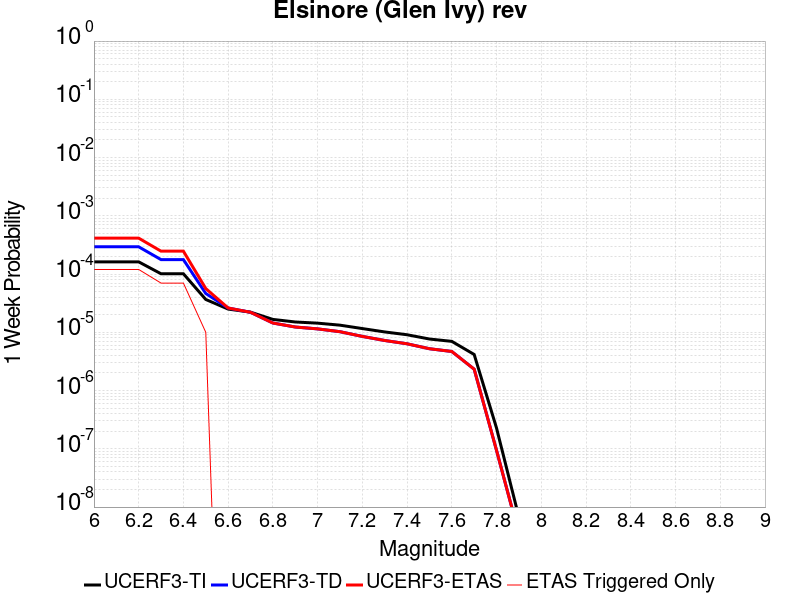 | 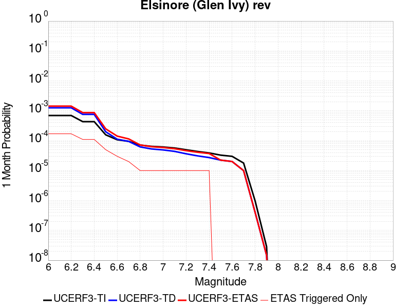 |  |  |

| Magnitude | 1 wk TI Prob | 1 wk TD Prob | 1 wk ETAS Prob | 1 wk ETAS/TD Gain | 1 wk ETAS Triggered Only | 1 mo TI Prob | 1 mo TD Prob | 1 mo ETAS Prob | 1 mo ETAS/TD Gain | 1 mo ETAS Triggered Only | 1 yr TI Prob | 1 yr TD Prob | 1 yr ETAS Prob | 1 yr ETAS/TD Gain | 1 yr ETAS Triggered Only | 10 yr TI Prob | 10 yr TD Prob | 10 yr ETAS Prob | 10 yr ETAS/TD Gain | 10 yr ETAS Triggered Only |
|-----|-----|-----|-----|-----|-----|-----|-----|-----|-----|-----|-----|-----|-----|-----|-----|-----|-----|-----|-----|-----|
| 6.0 | 1.6204086E-4 | 2.937271E-4 | 4.1369183E-4 | 1.4084225 | 1.2E-4 | 6.94276E-4 | 0.0012583778 | 0.001428164 | 1.1349245 | 1.7E-4 | 0.008420097 | 0.0152346175 | 0.015530048 | 1.019392 | 3.0E-4 | 0.081081145 | 0.13962454 | 0.13997729 | 1.0025264 | 4.1E-4 |
| 6.1 | 1.6204086E-4 | 2.937271E-4 | 4.1369183E-4 | 1.4084225 | 1.2E-4 | 6.94276E-4 | 0.0012583778 | 0.001428164 | 1.1349245 | 1.7E-4 | 0.008420097 | 0.0152346175 | 0.015530048 | 1.019392 | 3.0E-4 | 0.081081145 | 0.13962454 | 0.13997729 | 1.0025264 | 4.1E-4 |
| 6.2 | 1.6204086E-4 | 2.937271E-4 | 4.1369183E-4 | 1.4084225 | 1.2E-4 | 6.94276E-4 | 0.0012583778 | 0.001428164 | 1.1349245 | 1.7E-4 | 0.008420097 | 0.0152346175 | 0.015530048 | 1.019392 | 3.0E-4 | 0.081081145 | 0.13962454 | 0.13997729 | 1.0025264 | 4.1E-4 |
| 6.3 | 1.0111737E-4 | 1.7703463E-4 | 2.4702222E-4 | 1.3953329 | 7.0E-5 | 4.332882E-4 | 7.5861585E-4 | 8.685324E-4 | 1.1448909 | 1.1E-4 | 0.005262531 | 0.0092177205 | 0.009415877 | 1.0214974 | 2.0E-4 | 0.0513964 | 0.08707393 | 0.08733868 | 1.0030406 | 2.9E-4 |
| 6.4 | 1.0111737E-4 | 1.7703463E-4 | 2.4702222E-4 | 1.3953329 | 7.0E-5 | 4.332882E-4 | 7.5861585E-4 | 8.685324E-4 | 1.1448909 | 1.1E-4 | 0.005262531 | 0.0092177205 | 0.009415877 | 1.0214974 | 2.0E-4 | 0.0513964 | 0.08707393 | 0.08733868 | 1.0030406 | 2.9E-4 |
| 6.5 | 3.6624708E-5 | 4.6391986E-5 | 5.639152E-5 | 1.2155445 | 1.0E-5 | 1.569536E-4 | 1.9880968E-4 | 2.4879974E-4 | 1.2514468 | 5.0E-5 | 0.001909235 | 0.0024181814 | 0.002488012 | 1.0288774 | 7.0E-5 | 0.01892915 | 0.023697061 | 0.023784928 | 1.0037079 | 9.0E-5 |
| 6.6 | 2.5051324E-5 | 2.6147465E-5 | 2.6147465E-5 | 1.0 | 0.0 | 1.073584E-4 | 1.12056E-4 | 1.4205264E-4 | 1.2676933 | 3.0E-5 | 0.0013063047 | 0.0013634725 | 0.0013934316 | 1.0219727 | 3.0E-5 | 0.012986525 | 0.013565759 | 0.013615081 | 1.0036358 | 5.0E-5 |
| 6.7 | 2.2189772E-5 | 2.2072489E-5 | 2.2072489E-5 | 1.0 | 0.0 | 9.509556E-5 | 9.459316E-5 | 1.1459127E-4 | 1.2114118 | 2.0E-5 | 0.0011571734 | 0.0011510996 | 0.0011710766 | 1.0173547 | 2.0E-5 | 0.011511663 | 0.0114663225 | 0.011505865 | 1.0034485 | 4.0E-5 |
| 6.8 | 1.6654378E-5 | 1.44376E-5 | 1.44376E-5 | 1.0 | 0.0 | 7.137396E-5 | 6.187399E-5 | 7.187337E-5 | 1.1616088 | 1.0E-5 | 8.686314E-4 | 7.5306057E-4 | 7.630531E-4 | 1.0132692 | 1.0E-5 | 0.008652439 | 0.0075100763 | 0.0075200014 | 1.0013216 | 1.0E-5 |
| 6.9 | 1.5042909E-5 | 1.2331886E-5 | 1.2331886E-5 | 1.0 | 0.0 | 6.446802E-5 | 5.2849886E-5 | 6.284936E-5 | 1.1892052 | 1.0E-5 | 7.8461546E-4 | 6.4326054E-4 | 6.532541E-4 | 1.0155358 | 1.0E-5 | 0.007818509 | 0.006417925 | 0.006427861 | 1.0015482 | 1.0E-5 |
| 7.0 | 1.4361385E-5 | 1.1451172E-5 | 1.1451172E-5 | 1.0 | 0.0 | 6.154734E-5 | 4.9075545E-5 | 5.9075053E-5 | 1.2037575 | 1.0E-5 | 7.490812E-4 | 5.973339E-4 | 6.073279E-4 | 1.016731 | 1.0E-5 | 0.007465612 | 0.005960982 | 0.0059709223 | 1.0016676 | 1.0E-5 |
| 7.1 | 1.3265571E-5 | 1.0244736E-5 | 1.0244736E-5 | 1.0 | 0.0 | 5.6851208E-5 | 4.3905282E-5 | 5.3904845E-5 | 1.227753 | 1.0E-5 | 6.919436E-4 | 5.344183E-4 | 5.4441293E-4 | 1.0187019 | 1.0E-5 | 0.006897931 | 0.0053346003 | 0.005344547 | 1.0018646 | 1.0E-5 |
| 7.2 | 1.1596403E-5 | 8.504847E-6 | 8.504847E-6 | 1.0 | 0.0 | 4.9697923E-5 | 3.6448844E-5 | 4.644848E-5 | 1.2743471 | 1.0E-5 | 6.049042E-4 | 4.4367602E-4 | 4.536716E-4 | 1.022529 | 1.0E-5 | 0.006032603 | 0.004429357 | 0.0044393125 | 1.0022477 | 1.0E-5 |
| 7.3 | 1.0150827E-5 | 7.238537E-6 | 7.238537E-6 | 1.0 | 0.0 | 4.3502816E-5 | 3.102194E-5 | 4.102163E-5 | 1.3223425 | 1.0E-5 | 5.2951806E-4 | 3.776281E-4 | 3.8762434E-4 | 1.0264711 | 1.0E-5 | 0.005282581 | 0.003770271 | 0.0037802334 | 1.0026423 | 1.0E-5 |
| 7.4 | 9.080705E-6 | 6.352307E-6 | 6.352307E-6 | 1.0 | 0.0 | 3.8916725E-5 | 2.7223898E-5 | 3.7223625E-5 | 1.3673143 | 1.0E-5 | 4.7370812E-4 | 3.314019E-4 | 3.4139858E-4 | 1.0301648 | 1.0E-5 | 0.004726996 | 0.0033092257 | 0.0033191924 | 1.0030118 | 1.0E-5 |
| 7.5 | 7.671649E-6 | 5.225419E-6 | 5.225419E-6 | 1.0 | 0.0 | 3.287808E-5 | 2.2394468E-5 | 2.2394468E-5 | 1.0 | 0.0 | 4.0021708E-4 | 2.7261977E-4 | 2.7261977E-4 | 1.0 | 0.0 | 0.0039949706 | 0.0027229784 | 0.0027229784 | 1.0 | 0.0 |
| 7.6 | 6.990086E-6 | 4.687336E-6 | 4.687336E-6 | 1.0 | 0.0 | 2.9957167E-5 | 2.0088435E-5 | 2.0088435E-5 | 1.0 | 0.0 | 3.6466747E-4 | 2.445504E-4 | 2.445504E-4 | 1.0 | 0.0 | 0.0036406964 | 0.0024429292 | 0.0024429292 | 1.0 | 0.0 |
| 7.7 | 4.163505E-6 | 2.329331E-6 | 2.329331E-6 | 1.0 | 0.0 | 1.7843471E-5 | 9.982813E-6 | 9.982813E-6 | 1.0 | 0.0 | 2.172226E-4 | 1.2153471E-4 | 1.2153471E-4 | 1.0 | 0.0 | 0.0021701038 | 0.0012147555 | 0.0012147555 | 1.0 | 0.0 |
| 7.8 | 2.2692414E-7 | 9.384417E-8 | 9.384417E-8 | 1.0 | 0.0 | 9.725317E-7 | 4.0218927E-7 | 4.0218927E-7 | 1.0 | 0.0 | 1.1840509E-5 | 4.8966467E-6 | 4.8966467E-6 | 1.0 | 0.0 | 1.1839878E-4 | 4.8965718E-5 | 4.8965718E-5 | 1.0 | 0.0 |
| 7.9 | 6.676829E-9 | 3.4397174E-9 | 3.4397174E-9 | 1.0 | 0.0 | 2.861498E-8 | 1.4741646E-8 | 1.4741646E-8 | 1.0 | 0.0 | 3.4838732E-7 | 1.7947953E-7 | 1.7947953E-7 | 1.0 | 0.0 | 3.4838679E-6 | 1.794794E-6 | 1.794794E-6 | 1.0 | 0.0 |

## Death Valley (Fish Lake Valley)
*[(top)](#table-of-contents)*

| 1 Week | 1 Month | 1 Year | 10 Year |
|-----|-----|-----|-----|
| 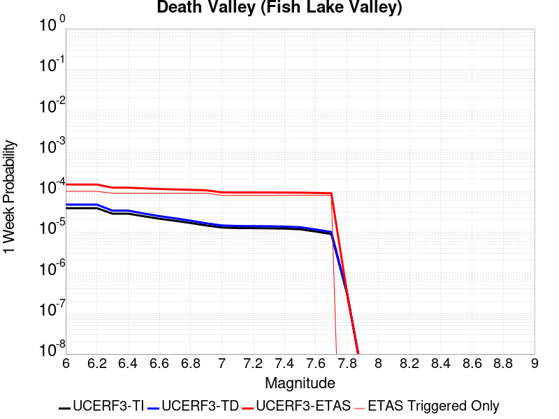 | 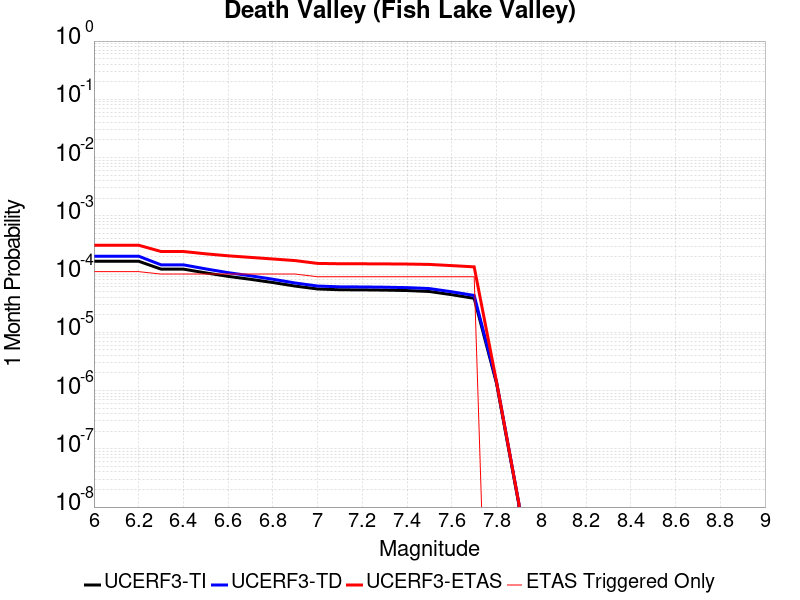 |  |  |

| Magnitude | 1 wk TI Prob | 1 wk TD Prob | 1 wk ETAS Prob | 1 wk ETAS/TD Gain | 1 wk ETAS Triggered Only | 1 mo TI Prob | 1 mo TD Prob | 1 mo ETAS Prob | 1 mo ETAS/TD Gain | 1 mo ETAS Triggered Only | 1 yr TI Prob | 1 yr TD Prob | 1 yr ETAS Prob | 1 yr ETAS/TD Gain | 1 yr ETAS Triggered Only | 10 yr TI Prob | 10 yr TD Prob | 10 yr ETAS Prob | 10 yr ETAS/TD Gain | 10 yr ETAS Triggered Only |
|-----|-----|-----|-----|-----|-----|-----|-----|-----|-----|-----|-----|-----|-----|-----|-----|-----|-----|-----|-----|-----|
| 6.0 | 3.872328E-5 | 4.7265705E-5 | 1.4726097E-4 | 3.115599 | 1.0E-4 | 1.6594635E-4 | 2.0255324E-4 | 3.1253096E-4 | 1.5429571 | 1.1E-4 | 0.0020185246 | 0.0024635606 | 0.0027229202 | 1.1052783 | 2.6E-4 | 0.02000288 | 0.024388338 | 0.02480785 | 1.0172014 | 4.3E-4 |
| 6.1 | 3.872328E-5 | 4.7265705E-5 | 1.4726097E-4 | 3.115599 | 1.0E-4 | 1.6594635E-4 | 2.0255324E-4 | 3.1253096E-4 | 1.5429571 | 1.1E-4 | 0.0020185246 | 0.0024635606 | 0.0027229202 | 1.1052783 | 2.6E-4 | 0.02000288 | 0.024388338 | 0.02480785 | 1.0172014 | 4.3E-4 |
| 6.2 | 3.872328E-5 | 4.7265705E-5 | 1.4726097E-4 | 3.115599 | 1.0E-4 | 1.6594635E-4 | 2.0255324E-4 | 3.1253096E-4 | 1.5429571 | 1.1E-4 | 0.0020185246 | 0.0024635606 | 0.0027229202 | 1.1052783 | 2.6E-4 | 0.02000288 | 0.024388338 | 0.02480785 | 1.0172014 | 4.3E-4 |
| 6.3 | 2.8356371E-5 | 3.360979E-5 | 1.2360676E-4 | 3.6777012 | 9.0E-5 | 1.2152165E-4 | 1.4403443E-4 | 2.4402003E-4 | 1.6941785 | 1.0E-4 | 0.0014785219 | 0.0017522788 | 0.0020018406 | 1.1424214 | 2.5E-4 | 0.014687235 | 0.017391816 | 0.017794685 | 1.0231643 | 4.1E-4 |
| 6.4 | 2.8356371E-5 | 3.360979E-5 | 1.2360676E-4 | 3.6777012 | 9.0E-5 | 1.2152165E-4 | 1.4403443E-4 | 2.4402003E-4 | 1.6941785 | 1.0E-4 | 0.0014785219 | 0.0017522788 | 0.0020018406 | 1.1424214 | 2.5E-4 | 0.014687235 | 0.017391816 | 0.017794685 | 1.0231643 | 4.1E-4 |
| 6.5 | 2.4448687E-5 | 2.8607585E-5 | 1.18605014E-4 | 4.145929 | 9.0E-5 | 1.0477588E-4 | 1.2259845E-4 | 2.2258618E-4 | 1.8155711 | 1.0E-4 | 0.0012748998 | 0.0014916616 | 0.0017412888 | 1.1673484 | 2.5E-4 | 0.012676105 | 0.014821392 | 0.015225315 | 1.0272527 | 4.1E-4 |
| 6.6 | 2.1298161E-5 | 2.4660083E-5 | 1.14657865E-4 | 4.649533 | 9.0E-5 | 9.127464E-5 | 1.0568197E-4 | 2.056714E-4 | 1.9461353 | 1.0E-4 | 0.0011107022 | 0.0012859512 | 0.0015356297 | 1.1941586 | 2.5E-4 | 0.011051672 | 0.01278853 | 0.013193287 | 1.03165 | 4.1E-4 |
| 6.7 | 1.8959729E-5 | 2.1781027E-5 | 1.1177907E-4 | 5.1319466 | 9.0E-5 | 8.125345E-5 | 9.334406E-5 | 1.9333472E-4 | 2.0712054 | 1.0E-4 | 9.888117E-4 | 0.001135897 | 0.001385613 | 1.2198404 | 2.5E-4 | 0.009844234 | 0.01130357 | 0.011708936 | 1.0358617 | 4.1E-4 |
| 6.8 | 1.6691629E-5 | 1.9018351E-5 | 1.0901664E-4 | 5.732181 | 9.0E-5 | 7.153359E-5 | 8.150477E-5 | 1.8149662E-4 | 2.2268221 | 1.0E-4 | 8.7057345E-4 | 9.918857E-4 | 0.0012416377 | 1.2517952 | 2.5E-4 | 0.008671708 | 0.009876343 | 0.010282294 | 1.0411034 | 4.1E-4 |
| 6.9 | 1.450505E-5 | 1.638954E-5 | 1.0638806E-4 | 6.491217 | 9.0E-5 | 6.216302E-5 | 7.0239046E-5 | 1.7023202E-4 | 2.4236095 | 1.0E-4 | 7.5657194E-4 | 8.5483363E-4 | 0.0011046199 | 1.2922046 | 2.5E-4 | 0.007540013 | 0.008516386 | 0.008922894 | 1.0477325 | 4.1E-4 |
| 7.0 | 1.2940855E-5 | 1.4537972E-5 | 9.453681E-5 | 6.502751 | 8.0E-5 | 5.545963E-5 | 6.230414E-5 | 1.5229853E-4 | 2.4444368 | 9.0E-5 | 6.750118E-4 | 7.5829466E-4 | 9.981127E-4 | 1.3162596 | 2.4E-4 | 0.006729651 | 0.0075576897 | 0.007954666 | 1.0525262 | 4.0E-4 |
| 7.1 | 1.2544658E-5 | 1.4078208E-5 | 9.4077084E-5 | 6.6824617 | 8.0E-5 | 5.3761712E-5 | 6.0333812E-5 | 1.5032839E-4 | 2.4916108 | 9.0E-5 | 6.5435225E-4 | 7.343222E-4 | 9.7414595E-4 | 1.326592 | 2.4E-4 | 0.006524288 | 0.007319551 | 0.007716623 | 1.0542482 | 4.0E-4 |
| 7.2 | 1.2489416E-5 | 1.4015674E-5 | 9.4014555E-5 | 6.707815 | 8.0E-5 | 5.3524967E-5 | 6.0065824E-5 | 1.5006041E-4 | 2.4982662 | 9.0E-5 | 6.514716E-4 | 7.310616E-4 | 9.708862E-4 | 1.3280497 | 2.4E-4 | 0.006495651 | 0.0072871596 | 0.007684245 | 1.054491 | 4.0E-4 |
| 7.3 | 1.2368307E-5 | 1.3879812E-5 | 9.3878705E-5 | 6.7636867 | 8.0E-5 | 5.3005948E-5 | 5.9483587E-5 | 1.4947823E-4 | 2.5129325 | 9.0E-5 | 6.451563E-4 | 7.2397763E-4 | 9.6380385E-4 | 1.331262 | 2.4E-4 | 0.0064328653 | 0.007216782 | 0.007613895 | 1.0550264 | 4.0E-4 |
| 7.4 | 1.2161707E-5 | 1.36478675E-5 | 9.364678E-5 | 6.8616414 | 8.0E-5 | 5.212056E-5 | 5.8489582E-5 | 1.4848432E-4 | 2.5386455 | 9.0E-5 | 6.3438306E-4 | 7.118836E-4 | 9.517127E-4 | 1.3368938 | 2.4E-4 | 0.006325751 | 0.0070966207 | 0.007493782 | 1.0559648 | 4.0E-4 |
| 7.5 | 1.1707948E-5 | 1.3145515E-5 | 9.314447E-5 | 7.0856457 | 8.0E-5 | 5.0175953E-5 | 5.6336736E-5 | 1.4633167E-4 | 2.5974467 | 9.0E-5 | 6.10721E-4 | 6.856895E-4 | 9.255249E-4 | 1.3497727 | 2.4E-4 | 0.0060904534 | 0.006836321 | 0.0072335866 | 1.058111 | 4.0E-4 |
| 7.6 | 1.0319538E-5 | 1.1579622E-5 | 9.1578695E-5 | 7.9086084 | 8.0E-5 | 4.4225842E-5 | 4.9626036E-5 | 1.3962157E-4 | 2.8134742 | 9.0E-5 | 5.383166E-4 | 6.040347E-4 | 8.438897E-4 | 1.3970882 | 2.4E-4 | 0.0053701443 | 0.0060244603 | 0.0064220508 | 1.0659959 | 4.0E-4 |
| 7.7 | 8.937764E-6 | 1.0022779E-5 | 9.0021975E-5 | 8.981738 | 8.0E-5 | 3.830414E-5 | 4.295409E-5 | 1.3295023E-4 | 3.0951703 | 9.0E-5 | 4.6625308E-4 | 5.228456E-4 | 7.5272535E-4 | 1.4396704 | 2.3E-4 | 0.0046527605 | 0.005216664 | 0.00560463 | 1.0743704 | 3.9E-4 |
| 7.8 | 3.108007E-7 | 3.284654E-7 | 3.284654E-7 | 1.0 | 0.0 | 1.3320023E-6 | 1.407708E-6 | 1.407708E-6 | 1.0 | 0.0 | 1.6217007E-5 | 1.7138715E-5 | 2.7138543E-5 | 1.5834643 | 1.0E-5 | 1.6215823E-4 | 1.7137431E-4 | 1.813726E-4 | 1.0583419 | 1.0E-5 |
| 7.9 | 2.5591178E-9 | 2.6696718E-9 | 2.6696718E-9 | 1.0 | 0.0 | 1.0967647E-8 | 1.14414505E-8 | 1.14414505E-8 | 1.0 | 0.0 | 1.335311E-7 | 1.3929966E-7 | 1.3929966E-7 | 1.0 | 0.0 | 1.3353102E-6 | 1.3929966E-6 | 1.3929966E-6 | 1.0 | 0.0 |

## Baker
*[(top)](#table-of-contents)*

| 1 Week | 1 Month | 1 Year | 10 Year |
|-----|-----|-----|-----|
|  | 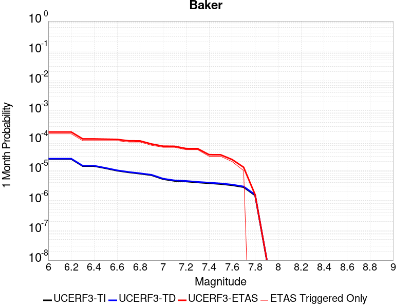 |  |  |

| Magnitude | 1 wk TI Prob | 1 wk TD Prob | 1 wk ETAS Prob | 1 wk ETAS/TD Gain | 1 wk ETAS Triggered Only | 1 mo TI Prob | 1 mo TD Prob | 1 mo ETAS Prob | 1 mo ETAS/TD Gain | 1 mo ETAS Triggered Only | 1 yr TI Prob | 1 yr TD Prob | 1 yr ETAS Prob | 1 yr ETAS/TD Gain | 1 yr ETAS Triggered Only | 10 yr TI Prob | 10 yr TD Prob | 10 yr ETAS Prob | 10 yr ETAS/TD Gain | 10 yr ETAS Triggered Only |
|-----|-----|-----|-----|-----|-----|-----|-----|-----|-----|-----|-----|-----|-----|-----|-----|-----|-----|-----|-----|-----|
| 6.0 | 5.695525E-6 | 5.8348373E-6 | 1.2583414E-4 | 21.566008 | 1.2E-4 | 2.4409164E-5 | 2.5006228E-5 | 1.9500198E-4 | 7.7981367 | 1.7E-4 | 2.9714106E-4 | 3.044123E-4 | 6.243149E-4 | 2.050886 | 3.2E-4 | 0.0029674405 | 0.0030403486 | 0.003479011 | 1.1442802 | 4.4E-4 |
| 6.1 | 5.695525E-6 | 5.8348373E-6 | 1.2583414E-4 | 21.566008 | 1.2E-4 | 2.4409164E-5 | 2.5006228E-5 | 1.9500198E-4 | 7.7981367 | 1.7E-4 | 2.9714106E-4 | 3.044123E-4 | 6.243149E-4 | 2.050886 | 3.2E-4 | 0.0029674405 | 0.0030403486 | 0.003479011 | 1.1442802 | 4.4E-4 |
| 6.2 | 5.695525E-6 | 5.8348373E-6 | 1.2583414E-4 | 21.566008 | 1.2E-4 | 2.4409164E-5 | 2.5006228E-5 | 1.9500198E-4 | 7.7981367 | 1.7E-4 | 2.9714106E-4 | 3.044123E-4 | 6.243149E-4 | 2.050886 | 3.2E-4 | 0.0029674405 | 0.0030403486 | 0.003479011 | 1.1442802 | 4.4E-4 |
| 6.3 | 3.2995713E-6 | 3.383667E-6 | 5.3383497E-5 | 15.776817 | 5.0E-5 | 1.4140943E-5 | 1.4501353E-5 | 1.14499904E-4 | 7.8958087 | 1.0E-4 | 1.7215237E-4 | 1.7654014E-4 | 3.965013E-4 | 2.2459555 | 2.2E-4 | 0.0017201907 | 0.001764046 | 0.0020734991 | 1.1754224 | 3.1E-4 |
| 6.4 | 3.2995713E-6 | 3.383667E-6 | 5.3383497E-5 | 15.776817 | 5.0E-5 | 1.4140943E-5 | 1.4501353E-5 | 1.14499904E-4 | 7.8958087 | 1.0E-4 | 1.7215237E-4 | 1.7654014E-4 | 3.965013E-4 | 2.2459555 | 2.2E-4 | 0.0017201907 | 0.001764046 | 0.0020734991 | 1.1754224 | 3.1E-4 |
| 6.5 | 2.782202E-6 | 2.8558404E-6 | 5.28557E-5 | 18.50793 | 5.0E-5 | 1.1923668E-5 | 1.223926E-5 | 1.12238034E-4 | 9.170328 | 1.0E-4 | 1.4516099E-4 | 1.4900314E-4 | 3.5897185E-4 | 2.4091563 | 2.1E-4 | 0.001450662 | 0.0014890651 | 0.0017886184 | 1.2011687 | 3.0E-4 |
| 6.6 | 2.3163404E-6 | 2.38092E-6 | 5.23808E-5 | 22.000237 | 5.0E-5 | 9.927136E-6 | 1.0203904E-5 | 1.10202884E-4 | 10.800071 | 1.0E-4 | 1.20856166E-4 | 1.2422565E-4 | 3.3419958E-4 | 2.690262 | 2.1E-4 | 0.0012079047 | 0.0012415823 | 0.0015312223 | 1.2332829 | 2.9E-4 |
| 6.7 | 2.037056E-6 | 2.0965003E-6 | 4.2096417E-5 | 20.079374 | 4.0E-5 | 8.7302105E-6 | 8.984972E-6 | 9.8984165E-5 | 11.016636 | 9.0E-5 | 1.0628513E-4 | 1.093867E-4 | 2.9936593E-4 | 2.736767 | 1.9E-4 | 0.0010623431 | 0.0010933448 | 0.0013630495 | 1.2466786 | 2.7E-4 |
| 6.8 | 1.8356744E-6 | 1.8915287E-6 | 4.1891453E-5 | 22.146877 | 4.0E-5 | 7.867153E-6 | 8.106527E-6 | 9.81058E-5 | 12.102075 | 9.0E-5 | 9.577837E-5 | 9.869264E-5 | 2.8867388E-4 | 2.924979 | 1.9E-4 | 9.57371E-4 | 9.86502E-4 | 0.0012562356 | 1.2734243 | 2.7E-4 |
| 6.9 | 1.6310546E-6 | 1.6832072E-6 | 4.168314E-5 | 24.764116 | 4.0E-5 | 6.9902153E-6 | 7.213726E-6 | 7.721322E-5 | 10.703653 | 7.0E-5 | 8.510255E-5 | 8.782368E-5 | 2.5780874E-4 | 2.9355264 | 1.7E-4 | 8.5069967E-4 | 8.7790104E-4 | 0.0011276816 | 1.2845201 | 2.5E-4 |
| 7.0 | 1.2058036E-6 | 1.2508665E-6 | 3.1250827E-5 | 24.983343 | 3.0E-5 | 5.1677193E-6 | 5.3608455E-6 | 6.5360524E-5 | 12.1922035 | 6.0E-5 | 6.291517E-5 | 6.5266366E-5 | 2.1525657E-4 | 3.298124 | 1.5E-4 | 6.289736E-4 | 6.524743E-4 | 8.8232424E-4 | 1.3522743 | 2.3E-4 |
| 7.1 | 1.052382E-6 | 1.0951609E-6 | 3.109513E-5 | 28.393206 | 3.0E-5 | 4.5102006E-6 | 4.693538E-6 | 6.469325E-5 | 13.783473 | 6.0E-5 | 5.491031E-5 | 5.7142337E-5 | 1.9713433E-4 | 3.4498823 | 1.4E-4 | 5.4896745E-4 | 5.7127734E-4 | 7.8115735E-4 | 1.3673873 | 2.1E-4 |
| 7.2 | 1.0067454E-6 | 1.0487711E-6 | 3.104874E-5 | 29.604877 | 3.0E-5 | 4.3146156E-6 | 4.4947255E-6 | 5.44945E-5 | 12.1241 | 5.0E-5 | 5.252918E-5 | 5.4721917E-5 | 1.8471481E-4 | 3.3755178 | 1.3E-4 | 5.251676E-4 | 5.470853E-4 | 7.269868E-4 | 1.3288363 | 1.8E-4 |
| 7.3 | 9.3596316E-7 | 9.767723E-7 | 3.0976742E-5 | 31.713371 | 3.0E-5 | 4.0112645E-6 | 4.1861604E-6 | 5.418595E-5 | 12.944069 | 5.0E-5 | 4.8836053E-5 | 5.096532E-5 | 1.709592E-4 | 3.3544223 | 1.2E-4 | 4.8825322E-4 | 5.095371E-4 | 6.5946067E-4 | 1.2942349 | 1.5E-4 |
| 7.4 | 8.8117395E-7 | 9.2076635E-7 | 2.0920748E-5 | 22.721018 | 2.0E-5 | 3.7764542E-6 | 3.9461356E-6 | 3.3946017E-5 | 8.6023445 | 3.0E-5 | 4.5977362E-5 | 4.8043148E-5 | 1.280393E-4 | 2.6650898 | 8.0E-5 | 4.596785E-4 | 4.8032837E-4 | 5.9027557E-4 | 1.2289 | 1.1E-4 |
| 7.5 | 8.292386E-7 | 8.6745956E-7 | 2.0867443E-5 | 24.055809 | 2.0E-5 | 3.5538749E-6 | 3.7176785E-6 | 3.3717566E-5 | 9.069522 | 3.0E-5 | 4.326757E-5 | 4.5261804E-5 | 1.2525819E-4 | 2.7674148 | 8.0E-5 | 4.3259145E-4 | 4.5252658E-4 | 5.5248133E-4 | 1.2208815 | 1.0E-4 |
| 7.6 | 7.553842E-7 | 7.9144706E-7 | 1.0791439E-5 | 13.635074 | 1.0E-5 | 3.2373566E-6 | 3.3919116E-6 | 2.3391844E-5 | 6.89636 | 2.0E-5 | 3.9414106E-5 | 4.129575E-5 | 1.0129327E-4 | 2.4528742 | 6.0E-5 | 3.9407116E-4 | 4.1288146E-4 | 4.928484E-4 | 1.1936802 | 8.0E-5 |
| 7.7 | 6.5285366E-7 | 6.852797E-7 | 6.852797E-7 | 1.0 | 0.0 | 2.797941E-6 | 2.9369096E-6 | 1.293688E-5 | 4.4049296 | 1.0E-5 | 3.40644E-5 | 3.5756293E-5 | 8.575451E-5 | 2.3983052 | 5.0E-5 | 3.405918E-4 | 3.5750607E-4 | 4.1748464E-4 | 1.1677693 | 6.0E-5 |
| 7.8 | 3.4586725E-7 | 3.6482615E-7 | 3.6482615E-7 | 1.0 | 0.0 | 1.4822873E-6 | 1.5635396E-6 | 1.5635396E-6 | 1.0 | 0.0 | 1.80467E-5 | 1.9035933E-5 | 2.9035744E-5 | 1.5253123 | 1.0E-5 | 1.8045233E-4 | 1.9034347E-4 | 2.0034157E-4 | 1.0525266 | 1.0E-5 |
| 7.9 | 2.5591178E-9 | 2.6696718E-9 | 2.6696718E-9 | 1.0 | 0.0 | 1.0967647E-8 | 1.14414505E-8 | 1.14414505E-8 | 1.0 | 0.0 | 1.335311E-7 | 1.3929966E-7 | 1.3929966E-7 | 1.0 | 0.0 | 1.3353102E-6 | 1.3929966E-6 | 1.3929966E-6 | 1.0 | 0.0 |

## San Jacinto (San Bernardino)
*[(top)](#table-of-contents)*

| 1 Week | 1 Month | 1 Year | 10 Year |
|-----|-----|-----|-----|
| 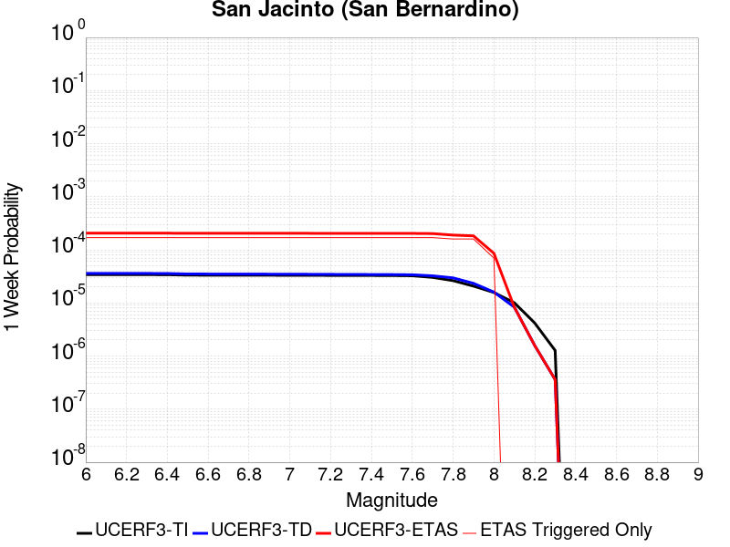 |  |  |  |

| Magnitude | 1 wk TI Prob | 1 wk TD Prob | 1 wk ETAS Prob | 1 wk ETAS/TD Gain | 1 wk ETAS Triggered Only | 1 mo TI Prob | 1 mo TD Prob | 1 mo ETAS Prob | 1 mo ETAS/TD Gain | 1 mo ETAS Triggered Only | 1 yr TI Prob | 1 yr TD Prob | 1 yr ETAS Prob | 1 yr ETAS/TD Gain | 1 yr ETAS Triggered Only | 10 yr TI Prob | 10 yr TD Prob | 10 yr ETAS Prob | 10 yr ETAS/TD Gain | 10 yr ETAS Triggered Only |
|-----|-----|-----|-----|-----|-----|-----|-----|-----|-----|-----|-----|-----|-----|-----|-----|-----|-----|-----|-----|-----|
| 6.0 | 3.409352E-5 | 3.598562E-5 | 2.0597951E-4 | 5.7239394 | 1.7E-4 | 1.461069E-4 | 1.5421498E-4 | 3.641826E-4 | 2.3615255 | 2.1E-4 | 0.0017774 | 0.0018759521 | 0.002205333 | 1.1755806 | 3.3E-4 | 0.01763251 | 0.019349992 | 0.019771673 | 1.0217922 | 4.3E-4 |
| 6.1 | 3.409352E-5 | 3.598562E-5 | 2.0597951E-4 | 5.7239394 | 1.7E-4 | 1.461069E-4 | 1.5421498E-4 | 3.641826E-4 | 2.3615255 | 2.1E-4 | 0.0017774 | 0.0018759521 | 0.002205333 | 1.1755806 | 3.3E-4 | 0.01763251 | 0.019349992 | 0.019771673 | 1.0217922 | 4.3E-4 |
| 6.2 | 3.409352E-5 | 3.598562E-5 | 2.0597951E-4 | 5.7239394 | 1.7E-4 | 1.461069E-4 | 1.5421498E-4 | 3.641826E-4 | 2.3615255 | 2.1E-4 | 0.0017774 | 0.0018759521 | 0.002205333 | 1.1755806 | 3.3E-4 | 0.01763251 | 0.019349992 | 0.019771673 | 1.0217922 | 4.3E-4 |
| 6.3 | 3.409352E-5 | 3.598562E-5 | 2.0597951E-4 | 5.7239394 | 1.7E-4 | 1.461069E-4 | 1.5421498E-4 | 3.641826E-4 | 2.3615255 | 2.1E-4 | 0.0017774 | 0.0018759521 | 0.002205333 | 1.1755806 | 3.3E-4 | 0.01763251 | 0.019349992 | 0.019771673 | 1.0217922 | 4.3E-4 |
| 6.4 | 3.400795E-5 | 3.5878285E-5 | 2.0587219E-4 | 5.7380724 | 1.7E-4 | 1.4574021E-4 | 1.5375503E-4 | 3.6372273E-4 | 2.365599 | 2.1E-4 | 0.0017729428 | 0.0018703619 | 0.0021997446 | 1.1761065 | 3.3E-4 | 0.017588645 | 0.019295074 | 0.019716777 | 1.0218555 | 4.3E-4 |
| 6.5 | 3.341482E-5 | 3.5138914E-5 | 2.0513294E-4 | 5.837771 | 1.7E-4 | 1.4319851E-4 | 1.5058667E-4 | 3.6055504E-4 | 2.3943357 | 2.1E-4 | 0.0017420477 | 0.0018318522 | 0.0021612477 | 1.1798155 | 3.3E-4 | 0.017284546 | 0.018916616 | 0.019338481 | 1.0223013 | 4.3E-4 |
| 6.6 | 3.3364955E-5 | 3.5076133E-5 | 2.0507017E-4 | 5.8464303 | 1.7E-4 | 1.4298483E-4 | 1.5031763E-4 | 3.6028607E-4 | 2.3968318 | 2.1E-4 | 0.0017394501 | 0.0018285823 | 0.002157979 | 1.1801376 | 3.3E-4 | 0.017258976 | 0.01888448 | 0.01930636 | 1.02234 | 4.3E-4 |
| 6.7 | 3.335922E-5 | 3.5065907E-5 | 2.0505994E-4 | 5.8478436 | 1.7E-4 | 1.4296026E-4 | 1.5027382E-4 | 3.6024227E-4 | 2.3972392 | 2.1E-4 | 0.0017391514 | 0.0018280497 | 0.0021574465 | 1.1801902 | 3.3E-4 | 0.017256035 | 0.018879272 | 0.019301154 | 1.0223463 | 4.3E-4 |
| 6.8 | 3.327683E-5 | 3.4959972E-5 | 2.0495403E-4 | 5.862534 | 1.7E-4 | 1.4260718E-4 | 1.4981985E-4 | 3.597884E-4 | 2.4014733 | 2.1E-4 | 0.0017348597 | 0.001822532 | 0.0021519307 | 1.1807368 | 3.3E-4 | 0.017213784 | 0.018825045 | 0.019246949 | 1.022412 | 4.3E-4 |
| 6.9 | 3.3235785E-5 | 3.4900928E-5 | 2.04895E-4 | 5.870761 | 1.7E-4 | 1.4243131E-4 | 1.4956683E-4 | 3.5953542E-4 | 2.4038446 | 2.1E-4 | 0.0017327217 | 0.0018194567 | 0.0021488562 | 1.1810428 | 3.3E-4 | 0.017192734 | 0.018794911 | 0.019216828 | 1.0224485 | 4.3E-4 |
| 7.0 | 3.3197095E-5 | 3.4840854E-5 | 2.0483493E-4 | 5.879159 | 1.7E-4 | 1.422655E-4 | 1.4930942E-4 | 3.5927806E-4 | 2.4062653 | 2.1E-4 | 0.0017307063 | 0.0018163278 | 0.0021457286 | 1.1813552 | 3.3E-4 | 0.017172894 | 0.01876429 | 0.019186221 | 1.0224859 | 4.3E-4 |
| 7.1 | 3.3129716E-5 | 3.4721066E-5 | 2.0471516E-4 | 5.895993 | 1.7E-4 | 1.4197677E-4 | 1.4879608E-4 | 3.5876484E-4 | 2.4111176 | 2.1E-4 | 0.0017271966 | 0.0018100884 | 0.002139491 | 1.1819816 | 3.3E-4 | 0.017138338 | 0.018703366 | 0.019125324 | 1.0225605 | 4.3E-4 |
| 7.2 | 3.3034008E-5 | 3.4588513E-5 | 2.0458263E-4 | 5.914757 | 1.7E-4 | 1.4156665E-4 | 1.4822806E-4 | 3.5819694E-4 | 2.4165258 | 2.1E-4 | 0.0017222111 | 0.0018031843 | 0.0021325892 | 1.1826795 | 3.3E-4 | 0.017089253 | 0.01863575 | 0.019057736 | 1.0226439 | 4.3E-4 |
| 7.3 | 3.2956614E-5 | 3.4456265E-5 | 2.044504E-4 | 5.9336205 | 1.7E-4 | 1.4123498E-4 | 1.4766137E-4 | 3.5763034E-4 | 2.421963 | 2.1E-4 | 0.0017181796 | 0.0017962961 | 0.0021257033 | 1.1833813 | 3.3E-4 | 0.017049557 | 0.018568495 | 0.018990511 | 1.0227275 | 4.3E-4 |
| 7.4 | 3.2915937E-5 | 3.4377957E-5 | 2.0437212E-4 | 5.944859 | 1.7E-4 | 1.4106068E-4 | 1.473258E-4 | 3.5729486E-4 | 2.4252024 | 2.1E-4 | 0.0017160608 | 0.0017922173 | 0.002121626 | 1.1837995 | 3.3E-4 | 0.017028693 | 0.018528769 | 0.018950801 | 1.0227772 | 4.3E-4 |
| 7.5 | 3.281791E-5 | 3.424287E-5 | 2.0423705E-4 | 5.964367 | 1.7E-4 | 1.406406E-4 | 1.4674691E-4 | 3.567161E-4 | 2.4308252 | 2.1E-4 | 0.0017109542 | 0.0017851809 | 0.002114592 | 1.1845253 | 3.3E-4 | 0.016978411 | 0.018459652 | 0.018881714 | 1.0228641 | 4.3E-4 |
| 7.6 | 3.2521442E-5 | 3.396782E-5 | 2.0396204E-4 | 6.004567 | 1.7E-4 | 1.3937015E-4 | 1.4556825E-4 | 3.555377E-4 | 2.4424121 | 2.1E-4 | 0.0016955109 | 0.0017708542 | 0.0021002698 | 1.1860207 | 3.3E-4 | 0.016826328 | 0.018317295 | 0.018739419 | 1.0230451 | 4.3E-4 |
| 7.7 | 3.0287873E-5 | 3.245191E-5 | 2.0244639E-4 | 6.2383504 | 1.7E-4 | 1.297987E-4 | 1.3907222E-4 | 3.49043E-4 | 2.5097969 | 2.1E-4 | 0.0015791537 | 0.0016918903 | 0.002021332 | 1.1947181 | 3.3E-4 | 0.01567979 | 0.017528199 | 0.017950661 | 1.0241019 | 4.3E-4 |
| 7.8 | 2.6316151E-5 | 2.9662837E-5 | 1.896581E-4 | 6.393795 | 1.6E-4 | 1.1277862E-4 | 1.2712025E-4 | 3.2709484E-4 | 2.5731134 | 2.0E-4 | 0.0013722149 | 0.0015465913 | 0.0018660964 | 1.2065866 | 3.2E-4 | 0.013637724 | 0.016069878 | 0.016483128 | 1.0257158 | 4.2E-4 |
| 7.9 | 2.0761147E-5 | 2.3417291E-5 | 1.8341355E-4 | 7.832398 | 1.6E-4 | 8.897331E-5 | 1.0035596E-4 | 3.003359E-4 | 2.992706 | 2.0E-4 | 0.0010827117 | 0.0012211498 | 0.0015407591 | 1.261728 | 3.2E-4 | 0.010774517 | 0.012793272 | 0.013188154 | 1.0308664 | 4.0E-4 |
| 8.0 | 1.5738568E-5 | 1.6032505E-5 | 8.603138E-5 | 5.36606 | 7.0E-5 | 6.744926E-5 | 6.8708934E-5 | 1.6870206E-4 | 2.4553149 | 1.0E-4 | 8.2088535E-4 | 8.3621085E-4 | 0.0010160604 | 1.2150767 | 1.8E-4 | 0.008178596 | 0.008865741 | 0.009093702 | 1.0257126 | 2.3E-4 |
| 8.1 | 1.0105832E-5 | 8.329479E-6 | 8.329479E-6 | 1.0 | 0.0 | 4.3309992E-5 | 3.569728E-5 | 6.569621E-5 | 1.8403702 | 3.0E-5 | 5.2717153E-4 | 4.3452822E-4 | 4.7451083E-4 | 1.0920138 | 4.0E-5 | 0.005259227 | 0.0046768794 | 0.004716692 | 1.0085127 | 4.0E-5 |
| 8.2 | 4.189207E-6 | 1.577699E-6 | 1.577699E-6 | 1.0 | 0.0 | 1.7953622E-5 | 6.7615497E-6 | 6.7615497E-6 | 1.0 | 0.0 | 2.1856341E-4 | 8.231879E-5 | 8.231879E-5 | 1.0 | 0.0 | 0.0021834858 | 9.562628E-4 | 9.562628E-4 | 1.0 | 0.0 |
| 8.3 | 1.2758221E-6 | 3.612677E-7 | 3.612677E-7 | 1.0 | 0.0 | 5.4677976E-6 | 1.5482892E-6 | 1.5482892E-6 | 1.0 | 0.0 | 6.65684E-5 | 1.8850264E-5 | 1.8850264E-5 | 1.0 | 0.0 | 6.6548464E-4 | 2.2739546E-4 | 2.2739546E-4 | 1.0 | 0.0 |

## San Andreas (Coachella) rev
*[(top)](#table-of-contents)*

| 1 Week | 1 Month | 1 Year | 10 Year |
|-----|-----|-----|-----|
| 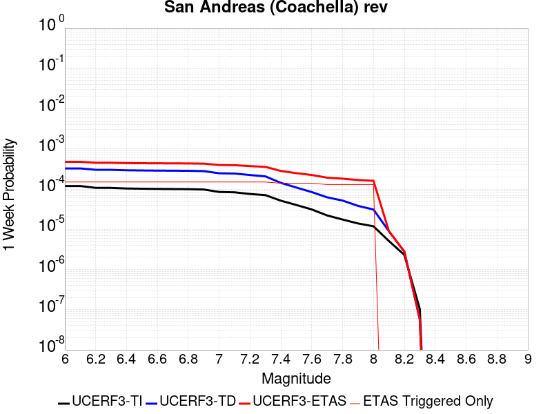 | 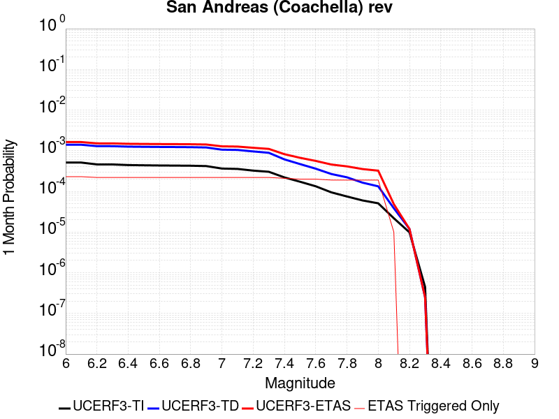 |  |  |

| Magnitude | 1 wk TI Prob | 1 wk TD Prob | 1 wk ETAS Prob | 1 wk ETAS/TD Gain | 1 wk ETAS Triggered Only | 1 mo TI Prob | 1 mo TD Prob | 1 mo ETAS Prob | 1 mo ETAS/TD Gain | 1 mo ETAS Triggered Only | 1 yr TI Prob | 1 yr TD Prob | 1 yr ETAS Prob | 1 yr ETAS/TD Gain | 1 yr ETAS Triggered Only | 10 yr TI Prob | 10 yr TD Prob | 10 yr ETAS Prob | 10 yr ETAS/TD Gain | 10 yr ETAS Triggered Only |
|-----|-----|-----|-----|-----|-----|-----|-----|-----|-----|-----|-----|-----|-----|-----|-----|-----|-----|-----|-----|-----|
| 6.0 | 1.1925945E-4 | 3.273077E-4 | 4.772586E-4 | 1.4581343 | 1.5E-4 | 5.110118E-4 | 0.001401998 | 0.0016316755 | 1.1638216 | 2.3E-4 | 0.0062038354 | 0.016937068 | 0.017231986 | 1.0174127 | 3.0E-4 | 0.060334753 | 0.15267672 | 0.1529987 | 1.0021089 | 3.8E-4 |
| 6.1 | 1.1925945E-4 | 3.273077E-4 | 4.772586E-4 | 1.4581343 | 1.5E-4 | 5.110118E-4 | 0.001401998 | 0.0016316755 | 1.1638216 | 2.3E-4 | 0.0062038354 | 0.016937068 | 0.017231986 | 1.0174127 | 3.0E-4 | 0.060334753 | 0.15267672 | 0.1529987 | 1.0021089 | 3.8E-4 |
| 6.2 | 1.07432395E-4 | 3.0231563E-4 | 4.5227027E-4 | 1.4960202 | 1.5E-4 | 4.603433E-4 | 0.001294999 | 0.0015147141 | 1.1696643 | 2.2E-4 | 0.005590286 | 0.015653731 | 0.015939191 | 1.0182359 | 2.9E-4 | 0.05451731 | 0.14182784 | 0.14214535 | 1.0022388 | 3.7E-4 |
| 6.3 | 1.0718766E-4 | 3.0176868E-4 | 4.517234E-4 | 1.4969195 | 1.5E-4 | 4.592948E-4 | 0.0012926573 | 0.001512373 | 1.1699721 | 2.2E-4 | 0.005577586 | 0.01562563 | 0.015911099 | 1.0182693 | 2.9E-4 | 0.054396555 | 0.14159605 | 0.14191367 | 1.002243 | 3.7E-4 |
| 6.4 | 1.0355944E-4 | 2.9384956E-4 | 4.4380547E-4 | 1.5103153 | 1.5E-4 | 4.4375064E-4 | 0.0012587514 | 0.0014784745 | 1.1745564 | 2.2E-4 | 0.0053892885 | 0.015218662 | 0.015504249 | 1.0187656 | 2.9E-4 | 0.052604496 | 0.13815795 | 0.13847683 | 1.0023081 | 3.7E-4 |
| 6.5 | 1.0227914E-4 | 2.9104383E-4 | 4.410002E-4 | 1.5152363 | 1.5E-4 | 4.382655E-4 | 0.0012467385 | 0.0014664641 | 1.1762404 | 2.2E-4 | 0.0053228354 | 0.015074439 | 0.015360068 | 1.0189478 | 2.9E-4 | 0.051971316 | 0.13694239 | 0.13726172 | 1.0023319 | 3.7E-4 |
| 6.6 | 1.0116757E-4 | 2.8870135E-4 | 4.3865805E-4 | 1.5194181 | 1.5E-4 | 4.3350324E-4 | 0.0012367087 | 0.0014564366 | 1.1776716 | 2.2E-4 | 0.0052651367 | 0.014954008 | 0.015239672 | 1.0191028 | 2.9E-4 | 0.051421247 | 0.13591973 | 0.13623945 | 1.0023522 | 3.7E-4 |
| 6.7 | 1.0050676E-4 | 2.8728697E-4 | 4.3724387E-4 | 1.521976 | 1.5E-4 | 4.3067214E-4 | 0.0012306528 | 0.001450382 | 1.1785469 | 2.2E-4 | 0.005230834 | 0.014881288 | 0.015166973 | 1.0191976 | 2.9E-4 | 0.051094085 | 0.13530464 | 0.13562459 | 1.0023645 | 3.7E-4 |
| 6.8 | 9.976819E-5 | 2.8532353E-4 | 4.3528073E-4 | 1.525569 | 1.5E-4 | 4.2750788E-4 | 0.001222246 | 0.0014419771 | 1.1797765 | 2.2E-4 | 0.0051924936 | 0.014780328 | 0.015066042 | 1.0193306 | 2.9E-4 | 0.050728295 | 0.13445628 | 0.13477653 | 1.0023818 | 3.7E-4 |
| 6.9 | 9.77719E-5 | 2.802926E-4 | 4.3025054E-4 | 1.5350051 | 1.5E-4 | 4.1895514E-4 | 0.0012007048 | 0.0014204406 | 1.1830057 | 2.2E-4 | 0.0050888555 | 0.0145215895 | 0.014807379 | 1.0196803 | 2.9E-4 | 0.049738888 | 0.13228476 | 0.13260582 | 1.002427 | 3.7E-4 |
| 7.0 | 8.500761E-5 | 2.4763815E-4 | 3.97601E-4 | 1.6055725 | 1.5E-4 | 3.6426744E-4 | 0.0010608779 | 0.0012806446 | 1.2071555 | 2.2E-4 | 0.0044259406 | 0.01284047 | 0.013126747 | 1.0222949 | 2.9E-4 | 0.04338823 | 0.11813616 | 0.11846244 | 1.002762 | 3.7E-4 |
| 7.1 | 8.319876E-5 | 2.4366553E-4 | 3.93629E-4 | 1.615448 | 1.5E-4 | 3.5651738E-4 | 0.0010438662 | 0.0012636365 | 1.210535 | 2.2E-4 | 0.004331963 | 0.012635773 | 0.012922109 | 1.0226607 | 2.9E-4 | 0.042484846 | 0.11635632 | 0.11667443 | 1.002734 | 3.6E-4 |
| 7.2 | 7.563917E-5 | 2.2414974E-4 | 3.7411612E-4 | 1.6690454 | 1.5E-4 | 3.2412758E-4 | 9.602912E-4 | 0.0011800799 | 1.2288772 | 2.2E-4 | 0.0039391145 | 0.011629559 | 0.011916187 | 1.0246464 | 2.9E-4 | 0.03870018 | 0.10776202 | 0.10808322 | 1.0029807 | 3.6E-4 |
| 7.3 | 7.082985E-5 | 2.07311E-4 | 3.572799E-4 | 1.7234006 | 1.5E-4 | 3.0352117E-4 | 8.881761E-4 | 0.0011079806 | 1.2474786 | 2.2E-4 | 0.0036891096 | 0.010760553 | 0.011047433 | 1.0266603 | 2.9E-4 | 0.03628465 | 0.10028403 | 0.10060793 | 1.0032299 | 3.6E-4 |
| 7.4 | 5.146215E-5 | 1.4274761E-4 | 2.8272762E-4 | 1.9806119 | 1.4E-4 | 2.2053342E-4 | 6.1163295E-4 | 8.215045E-4 | 1.3431332 | 2.1E-4 | 0.0026816884 | 0.0074213943 | 0.0076893903 | 1.0361114 | 2.7E-4 | 0.02649557 | 0.07085049 | 0.07115711 | 1.0043277 | 3.3E-4 |
| 7.5 | 4.0285166E-5 | 1.0942422E-4 | 2.4940888E-4 | 2.2792842 | 1.4E-4 | 1.7263928E-4 | 4.6887697E-4 | 6.687832E-4 | 1.4263512 | 2.0E-4 | 0.002099857 | 0.0056937044 | 0.005952224 | 1.0454044 | 2.6E-4 | 0.020801254 | 0.055013083 | 0.05530603 | 1.0053251 | 3.1E-4 |
| 7.6 | 3.1168736E-5 | 8.439599E-5 | 2.2438417E-4 | 2.6587064 | 1.4E-4 | 1.3357346E-4 | 3.616471E-4 | 5.6157477E-4 | 1.5528253 | 2.0E-4 | 0.0016250437 | 0.004394191 | 0.0046530482 | 1.058909 | 2.6E-4 | 0.016132116 | 0.042812478 | 0.043109205 | 1.0069308 | 3.1E-4 |
| 7.7 | 2.2100989E-5 | 6.239345E-5 | 1.9238534E-4 | 3.083422 | 1.3E-4 | 9.4715084E-5 | 2.6737314E-4 | 4.573223E-4 | 1.7104274 | 1.9E-4 | 0.001152546 | 0.0032504152 | 0.0034996024 | 1.0766633 | 2.5E-4 | 0.011465867 | 0.031902168 | 0.0321926 | 1.0091038 | 3.0E-4 |
| 7.8 | 1.7484861E-5 | 5.180078E-5 | 1.8179405E-4 | 3.5094845 | 1.3E-4 | 7.493296E-5 | 2.2198448E-4 | 4.119423E-4 | 1.8557258 | 1.9E-4 | 9.1192697E-4 | 0.0026993142 | 0.0029486394 | 1.0923661 | 2.5E-4 | 0.009081938 | 0.026641788 | 0.026933795 | 1.0109605 | 3.0E-4 |
| 7.9 | 1.3967285E-5 | 3.8226146E-5 | 1.6822117E-4 | 4.4006834 | 1.3E-4 | 5.985842E-5 | 1.6381606E-4 | 3.5378494E-4 | 2.1596475 | 1.9E-4 | 7.2853256E-4 | 0.0019926373 | 0.002232159 | 1.1202034 | 2.4E-4 | 0.0072614877 | 0.019911002 | 0.020195229 | 1.0142748 | 2.9E-4 |
| 8.0 | 1.1887396E-5 | 3.106798E-5 | 1.6106394E-4 | 5.1842422 | 1.3E-4 | 5.094499E-5 | 1.331417E-4 | 3.231164E-4 | 2.426861 | 1.9E-4 | 6.200787E-4 | 0.0016197958 | 0.001859407 | 1.1479268 | 2.4E-4 | 0.006183513 | 0.016280567 | 0.016565844 | 1.0175227 | 2.9E-4 |
| 8.1 | 5.100864E-6 | 8.973766E-6 | 8.973766E-6 | 1.0 | 0.0 | 2.1860664E-5 | 3.845843E-5 | 4.8458045E-5 | 1.2600111 | 1.0E-5 | 2.6612106E-4 | 4.6813092E-4 | 4.7812623E-4 | 1.0213516 | 1.0E-5 | 0.002658026 | 0.004918092 | 0.0049379934 | 1.0040466 | 2.0E-5 |
| 8.2 | 2.3004484E-6 | 2.7863473E-6 | 2.7863473E-6 | 1.0 | 0.0 | 9.859027E-6 | 1.19414335E-5 | 1.19414335E-5 | 1.0 | 0.0 | 1.2002704E-4 | 1.4537729E-4 | 1.4537729E-4 | 1.0 | 0.0 | 0.0011996223 | 0.0015973782 | 0.0015973782 | 1.0 | 0.0 |
| 8.3 | 1.0424446E-7 | 5.814421E-8 | 5.814421E-8 | 1.0 | 0.0 | 4.4676187E-7 | 2.4918944E-7 | 2.4918944E-7 | 1.0 | 0.0 | 5.439312E-6 | 3.0338776E-6 | 3.0338776E-6 | 1.0 | 0.0 | 5.4391792E-5 | 3.189592E-5 | 3.189592E-5 | 1.0 | 0.0 |

## Ludlow
*[(top)](#table-of-contents)*

| 1 Week | 1 Month | 1 Year | 10 Year |
|-----|-----|-----|-----|
|  |  |  |  |

| Magnitude | 1 wk TI Prob | 1 wk TD Prob | 1 wk ETAS Prob | 1 wk ETAS/TD Gain | 1 wk ETAS Triggered Only | 1 mo TI Prob | 1 mo TD Prob | 1 mo ETAS Prob | 1 mo ETAS/TD Gain | 1 mo ETAS Triggered Only | 1 yr TI Prob | 1 yr TD Prob | 1 yr ETAS Prob | 1 yr ETAS/TD Gain | 1 yr ETAS Triggered Only | 10 yr TI Prob | 10 yr TD Prob | 10 yr ETAS Prob | 10 yr ETAS/TD Gain | 10 yr ETAS Triggered Only |
|-----|-----|-----|-----|-----|-----|-----|-----|-----|-----|-----|-----|-----|-----|-----|-----|-----|-----|-----|-----|-----|
| 6.0 | 2.2407607E-5 | 2.3657254E-5 | 6.3656305E-5 | 2.6907732 | 4.0E-5 | 9.602906E-5 | 1.0138454E-4 | 2.3137136E-4 | 2.282117 | 1.3E-4 | 0.0011685267 | 0.001233702 | 0.0014634181 | 1.1862007 | 2.3E-4 | 0.011624013 | 0.012273042 | 0.012638501 | 1.0297774 | 3.7E-4 |
| 6.1 | 2.2407607E-5 | 2.3657254E-5 | 6.3656305E-5 | 2.6907732 | 4.0E-5 | 9.602906E-5 | 1.0138454E-4 | 2.3137136E-4 | 2.282117 | 1.3E-4 | 0.0011685267 | 0.001233702 | 0.0014634181 | 1.1862007 | 2.3E-4 | 0.011624013 | 0.012273042 | 0.012638501 | 1.0297774 | 3.7E-4 |
| 6.2 | 1.0781252E-5 | 1.1365663E-5 | 2.136555E-5 | 1.879833 | 1.0E-5 | 4.620455E-5 | 4.8709102E-5 | 8.870715E-5 | 1.8211617 | 4.0E-5 | 5.623952E-4 | 5.9287593E-4 | 6.828226E-4 | 1.1517124 | 9.0E-5 | 0.00560974 | 0.0059133614 | 0.0060326518 | 1.0201731 | 1.2E-4 |
| 6.3 | 1.0781252E-5 | 1.1365663E-5 | 2.136555E-5 | 1.879833 | 1.0E-5 | 4.620455E-5 | 4.8709102E-5 | 8.870715E-5 | 1.8211617 | 4.0E-5 | 5.623952E-4 | 5.9287593E-4 | 6.828226E-4 | 1.1517124 | 9.0E-5 | 0.00560974 | 0.0059133614 | 0.0060326518 | 1.0201731 | 1.2E-4 |
| 6.4 | 7.814439E-6 | 8.237729E-6 | 1.8237646E-5 | 2.2139168 | 1.0E-5 | 3.3490025E-5 | 3.530408E-5 | 5.5303375E-5 | 1.5664867 | 2.0E-5 | 4.0766477E-4 | 4.2974384E-4 | 4.8971805E-4 | 1.1395581 | 6.0E-5 | 0.0040691774 | 0.0042892746 | 0.0043689315 | 1.0185711 | 8.0E-5 |
| 6.5 | 6.4986366E-6 | 6.85092E-6 | 1.685085E-5 | 2.4596481 | 1.0E-5 | 2.7851002E-5 | 2.9360759E-5 | 4.9360173E-5 | 1.6811613 | 2.0E-5 | 3.390332E-4 | 3.5740953E-4 | 3.9739523E-4 | 1.1118765 | 4.0E-5 | 0.003385164 | 0.0035684432 | 0.0036182648 | 1.0139617 | 5.0E-5 |
| 6.6 | 5.582177E-6 | 5.8860055E-6 | 1.5885948E-5 | 2.698935 | 1.0E-5 | 2.3923398E-5 | 2.5225498E-5 | 3.5225246E-5 | 1.3964143 | 1.0E-5 | 2.9122844E-4 | 3.0707786E-4 | 3.3706866E-4 | 1.0976651 | 3.0E-5 | 0.0029084706 | 0.003066609 | 0.003096517 | 1.0097528 | 3.0E-5 |
| 6.7 | 4.6858763E-6 | 4.940427E-6 | 1.4940378E-5 | 3.0241065 | 1.0E-5 | 2.0082172E-5 | 2.1173091E-5 | 3.117288E-5 | 1.4722877 | 1.0E-5 | 2.4447302E-4 | 2.5775246E-4 | 2.877447E-4 | 1.1163608 | 3.0E-5 | 0.0024420423 | 0.0025745912 | 0.0026045141 | 1.0116223 | 3.0E-5 |
| 6.8 | 3.5584908E-6 | 3.7520183E-6 | 1.3751981E-5 | 3.6652222 | 1.0E-5 | 1.5250586E-5 | 1.6079981E-5 | 2.607982E-5 | 1.6218812 | 1.0E-5 | 1.8566006E-4 | 1.957566E-4 | 2.2575073E-4 | 1.1532215 | 3.0E-5 | 0.0018550502 | 0.0019558826 | 0.001985824 | 1.0153084 | 3.0E-5 |
| 6.9 | 2.532834E-6 | 2.6710034E-6 | 2.6710034E-6 | 1.0 | 0.0 | 1.0854958E-5 | 1.1447109E-5 | 1.1447109E-5 | 1.0 | 0.0 | 1.3215111E-4 | 1.3935992E-4 | 1.5935714E-4 | 1.1434933 | 2.0E-5 | 0.0013207254 | 0.0013927529 | 0.001412725 | 1.01434 | 2.0E-5 |
| 7.0 | 1.7083285E-6 | 1.8019439E-6 | 1.8019439E-6 | 1.0 | 0.0 | 7.3213873E-6 | 7.722595E-6 | 7.722595E-6 | 1.0 | 0.0 | 8.913424E-5 | 9.40187E-5 | 1.1401682E-4 | 1.2127036 | 2.0E-5 | 8.9098496E-4 | 9.3980576E-4 | 9.5978694E-4 | 1.021261 | 2.0E-5 |
| 7.1 | 1.0905424E-6 | 1.1497619E-6 | 1.1497619E-6 | 1.0 | 0.0 | 4.6737446E-6 | 4.9275427E-6 | 4.9275427E-6 | 1.0 | 0.0 | 5.6901354E-5 | 5.999128E-5 | 5.999128E-5 | 1.0 | 0.0 | 5.6886784E-4 | 5.997606E-4 | 5.997606E-4 | 1.0 | 0.0 |
| 7.2 | 6.06668E-7 | 6.387277E-7 | 6.387277E-7 | 1.0 | 0.0 | 2.600003E-6 | 2.7374022E-6 | 2.7374022E-6 | 1.0 | 0.0 | 3.1654577E-5 | 3.3327433E-5 | 3.3327433E-5 | 1.0 | 0.0 | 3.1650066E-4 | 3.3323118E-4 | 3.3323118E-4 | 1.0 | 0.0 |

## San Jacinto (San Jacinto Valley) rev
*[(top)](#table-of-contents)*

| 1 Week | 1 Month | 1 Year | 10 Year |
|-----|-----|-----|-----|
|  |  | 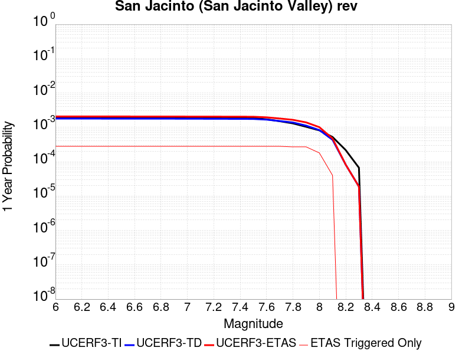 |  |

| Magnitude | 1 wk TI Prob | 1 wk TD Prob | 1 wk ETAS Prob | 1 wk ETAS/TD Gain | 1 wk ETAS Triggered Only | 1 mo TI Prob | 1 mo TD Prob | 1 mo ETAS Prob | 1 mo ETAS/TD Gain | 1 mo ETAS Triggered Only | 1 yr TI Prob | 1 yr TD Prob | 1 yr ETAS Prob | 1 yr ETAS/TD Gain | 1 yr ETAS Triggered Only | 10 yr TI Prob | 10 yr TD Prob | 10 yr ETAS Prob | 10 yr ETAS/TD Gain | 10 yr ETAS Triggered Only |
|-----|-----|-----|-----|-----|-----|-----|-----|-----|-----|-----|-----|-----|-----|-----|-----|-----|-----|-----|-----|-----|
| 6.0 | 3.652694E-5 | 3.4401106E-5 | 1.6439664E-4 | 4.778818 | 1.3E-4 | 1.5653463E-4 | 1.4742499E-4 | 3.173999E-4 | 2.1529589 | 1.7E-4 | 0.0019041431 | 0.0017934233 | 0.0020729213 | 1.155846 | 2.8E-4 | 0.018879099 | 0.018526303 | 0.018869817 | 1.018542 | 3.5E-4 |
| 6.1 | 3.652694E-5 | 3.4401106E-5 | 1.6439664E-4 | 4.778818 | 1.3E-4 | 1.5653463E-4 | 1.4742499E-4 | 3.173999E-4 | 2.1529589 | 1.7E-4 | 0.0019041431 | 0.0017934233 | 0.0020729213 | 1.155846 | 2.8E-4 | 0.018879099 | 0.018526303 | 0.018869817 | 1.018542 | 3.5E-4 |
| 6.2 | 3.652694E-5 | 3.4401106E-5 | 1.6439664E-4 | 4.778818 | 1.3E-4 | 1.5653463E-4 | 1.4742499E-4 | 3.173999E-4 | 2.1529589 | 1.7E-4 | 0.0019041431 | 0.0017934233 | 0.0020729213 | 1.155846 | 2.8E-4 | 0.018879099 | 0.018526303 | 0.018869817 | 1.018542 | 3.5E-4 |
| 6.3 | 3.652694E-5 | 3.4401106E-5 | 1.6439664E-4 | 4.778818 | 1.3E-4 | 1.5653463E-4 | 1.4742499E-4 | 3.173999E-4 | 2.1529589 | 1.7E-4 | 0.0019041431 | 0.0017934233 | 0.0020729213 | 1.155846 | 2.8E-4 | 0.018879099 | 0.018526303 | 0.018869817 | 1.018542 | 3.5E-4 |
| 6.4 | 3.646941E-5 | 3.432268E-5 | 1.6431822E-4 | 4.787453 | 1.3E-4 | 1.5628811E-4 | 1.4708891E-4 | 3.170639E-4 | 2.1555934 | 1.7E-4 | 0.0019011468 | 0.0017893389 | 0.0020688379 | 1.1562024 | 2.8E-4 | 0.018849645 | 0.018486181 | 0.018829713 | 1.018583 | 3.5E-4 |
| 6.5 | 3.646941E-5 | 3.432268E-5 | 1.6431822E-4 | 4.787453 | 1.3E-4 | 1.5628811E-4 | 1.4708891E-4 | 3.170639E-4 | 2.1555934 | 1.7E-4 | 0.0019011468 | 0.0017893389 | 0.0020688379 | 1.1562024 | 2.8E-4 | 0.018849645 | 0.018486181 | 0.018829713 | 1.018583 | 3.5E-4 |
| 6.6 | 3.6442503E-5 | 3.4286066E-5 | 1.642816E-4 | 4.7914977 | 1.3E-4 | 1.561728E-4 | 1.4693203E-4 | 3.1690704E-4 | 2.1568277 | 1.7E-4 | 0.0018997455 | 0.001787432 | 0.0020669315 | 1.1563693 | 2.8E-4 | 0.018835869 | 0.01846745 | 0.018810987 | 1.0186023 | 3.5E-4 |
| 6.7 | 3.6432113E-5 | 3.427164E-5 | 1.6426719E-4 | 4.7930937 | 1.3E-4 | 1.5612828E-4 | 1.4687021E-4 | 3.1684525E-4 | 2.1573145 | 1.7E-4 | 0.0018992044 | 0.0017866807 | 0.0020661803 | 1.1564351 | 2.8E-4 | 0.018830549 | 0.018460074 | 0.018803613 | 1.0186099 | 3.5E-4 |
| 6.8 | 3.6409598E-5 | 3.4240697E-5 | 1.6423625E-4 | 4.7965217 | 1.3E-4 | 1.560318E-4 | 1.4673761E-4 | 3.1671266E-4 | 2.1583605 | 1.7E-4 | 0.0018980318 | 0.0017850689 | 0.0020645692 | 1.1565766 | 2.8E-4 | 0.018819023 | 0.018444229 | 0.018787773 | 1.0186261 | 3.5E-4 |
| 6.9 | 3.638078E-5 | 3.4201123E-5 | 1.6419668E-4 | 4.800915 | 1.3E-4 | 1.5590832E-4 | 1.4656801E-4 | 3.165431E-4 | 2.159701 | 1.7E-4 | 0.0018965311 | 0.0017830075 | 0.0020625084 | 1.1567581 | 2.8E-4 | 0.018804269 | 0.018423963 | 0.018767515 | 1.018647 | 3.5E-4 |
| 7.0 | 3.6294874E-5 | 3.408314E-5 | 1.6407871E-4 | 4.8140726 | 1.3E-4 | 1.5554018E-4 | 1.4606243E-4 | 3.160376E-4 | 2.1637158 | 1.7E-4 | 0.0018920569 | 0.0017768623 | 0.0020563647 | 1.1573012 | 2.8E-4 | 0.018760284 | 0.018363545 | 0.018707117 | 1.0187095 | 3.5E-4 |
| 7.1 | 3.6260717E-5 | 3.403942E-5 | 1.64035E-4 | 4.818971 | 1.3E-4 | 1.5539382E-4 | 1.4587509E-4 | 3.158503E-4 | 2.1652105 | 1.7E-4 | 0.001890278 | 0.0017745851 | 0.0020540883 | 1.1575034 | 2.8E-4 | 0.018742796 | 0.018341139 | 0.018684719 | 1.0187328 | 3.5E-4 |
| 7.2 | 3.6210204E-5 | 3.397364E-5 | 1.6396922E-4 | 4.826366 | 1.3E-4 | 1.5517735E-4 | 1.455932E-4 | 3.1556847E-4 | 2.1674669 | 1.7E-4 | 0.001887647 | 0.0017711588 | 0.0020506629 | 1.1578085 | 2.8E-4 | 0.01871693 | 0.018307408 | 0.018651001 | 1.018768 | 3.5E-4 |
| 7.3 | 3.6119454E-5 | 3.386193E-5 | 1.6385752E-4 | 4.8389897 | 1.3E-4 | 1.5478847E-4 | 1.4511449E-4 | 3.1508983E-4 | 2.1713188 | 1.7E-4 | 0.0018829206 | 0.0017653398 | 0.0020448456 | 1.1583297 | 2.8E-4 | 0.018670462 | 0.01824996 | 0.018593572 | 1.0188282 | 3.5E-4 |
| 7.4 | 3.607848E-5 | 3.380943E-5 | 1.6380503E-4 | 4.844951 | 1.3E-4 | 1.5461289E-4 | 1.4488952E-4 | 3.1486488E-4 | 2.173138 | 1.7E-4 | 0.0018807866 | 0.0017626052 | 0.0020421117 | 1.1585758 | 2.8E-4 | 0.018649481 | 0.018222956 | 0.018566577 | 1.0188565 | 3.5E-4 |
| 7.5 | 3.5856774E-5 | 3.3619202E-5 | 1.6361484E-4 | 4.866708 | 1.3E-4 | 1.5366284E-4 | 1.4407437E-4 | 3.1404986E-4 | 2.1797762 | 1.7E-4 | 0.0018692396 | 0.0017526967 | 0.002032206 | 1.1594738 | 2.8E-4 | 0.018535944 | 0.018124057 | 0.018467713 | 1.0189613 | 3.5E-4 |
| 7.6 | 3.286655E-5 | 3.2142278E-5 | 1.621381E-4 | 5.0443873 | 1.3E-4 | 1.4084904E-4 | 1.3774536E-4 | 3.0772193E-4 | 2.2339914 | 1.7E-4 | 0.001713488 | 0.0016757617 | 0.0019552924 | 1.1668082 | 2.8E-4 | 0.017003361 | 0.017343804 | 0.017687732 | 1.0198301 | 3.5E-4 |
| 7.7 | 2.8882527E-5 | 2.9235205E-5 | 1.5923141E-4 | 5.4465637 | 1.3E-4 | 1.237764E-4 | 1.2528773E-4 | 2.9526642E-4 | 2.3567069 | 1.7E-4 | 0.0015059357 | 0.0015243118 | 0.001803885 | 1.1834095 | 2.8E-4 | 0.014957713 | 0.015830338 | 0.016174797 | 1.0217594 | 3.5E-4 |
| 7.8 | 2.4950225E-5 | 2.6526219E-5 | 1.4652303E-4 | 5.523706 | 1.2E-4 | 1.0692515E-4 | 1.1367885E-4 | 2.7366067E-4 | 2.4073138 | 1.6E-4 | 0.0013010362 | 0.0013831621 | 0.0016527887 | 1.1949348 | 2.7E-4 | 0.012934455 | 0.01441176 | 0.01474686 | 1.0232519 | 3.4E-4 |
| 7.9 | 1.9881603E-5 | 2.150649E-5 | 1.4150392E-4 | 6.579591 | 1.2E-4 | 8.520408E-5 | 9.216742E-5 | 2.5215268E-4 | 2.7358112 | 1.6E-4 | 0.001036866 | 0.0011215615 | 0.0013912587 | 1.2404658 | 2.7E-4 | 0.010320415 | 0.011776998 | 0.012112994 | 1.0285299 | 3.4E-4 |
| 8.0 | 1.563292E-5 | 1.5936288E-5 | 8.593517E-5 | 5.392421 | 7.0E-5 | 6.6996516E-5 | 6.829659E-5 | 1.6828976E-4 | 2.464102 | 1.0E-4 | 8.153773E-4 | 8.3119445E-4 | 0.0010110448 | 1.2163758 | 1.8E-4 | 0.00812392 | 0.008810331 | 0.009038305 | 1.0258757 | 2.3E-4 |
| 8.1 | 1.0045313E-5 | 8.300794E-6 | 8.300794E-6 | 1.0 | 0.0 | 4.305063E-5 | 3.557435E-5 | 6.557328E-5 | 1.8432742 | 3.0E-5 | 5.2401534E-4 | 4.3303217E-4 | 4.7301484E-4 | 1.0923319 | 4.0E-5 | 0.0052278144 | 0.0046587666 | 0.0046985806 | 1.008546 | 4.0E-5 |
| 8.2 | 4.1554413E-6 | 1.5648296E-6 | 1.5648296E-6 | 1.0 | 0.0 | 1.7808914E-5 | 6.7063957E-6 | 6.7063957E-6 | 1.0 | 0.0 | 2.1680194E-4 | 8.164734E-5 | 8.164734E-5 | 1.0 | 0.0 | 0.0021659054 | 9.479703E-4 | 9.479703E-4 | 1.0 | 0.0 |
| 8.3 | 1.2758221E-6 | 3.612677E-7 | 3.612677E-7 | 1.0 | 0.0 | 5.4677976E-6 | 1.5482892E-6 | 1.5482892E-6 | 1.0 | 0.0 | 6.65684E-5 | 1.8850264E-5 | 1.8850264E-5 | 1.0 | 0.0 | 6.6548464E-4 | 2.2739546E-4 | 2.2739546E-4 | 1.0 | 0.0 |

## San Andreas (Cholame) rev
*[(top)](#table-of-contents)*

| 1 Week | 1 Month | 1 Year | 10 Year |
|-----|-----|-----|-----|
|  |  |  |  |

| Magnitude | 1 wk TI Prob | 1 wk TD Prob | 1 wk ETAS Prob | 1 wk ETAS/TD Gain | 1 wk ETAS Triggered Only | 1 mo TI Prob | 1 mo TD Prob | 1 mo ETAS Prob | 1 mo ETAS/TD Gain | 1 mo ETAS Triggered Only | 1 yr TI Prob | 1 yr TD Prob | 1 yr ETAS Prob | 1 yr ETAS/TD Gain | 1 yr ETAS Triggered Only | 10 yr TI Prob | 10 yr TD Prob | 10 yr ETAS Prob | 10 yr ETAS/TD Gain | 10 yr ETAS Triggered Only |
|-----|-----|-----|-----|-----|-----|-----|-----|-----|-----|-----|-----|-----|-----|-----|-----|-----|-----|-----|-----|-----|
| 6.0 | 1.2302514E-4 | 2.5205986E-4 | 3.220422E-4 | 1.2776418 | 7.0E-5 | 5.27144E-4 | 0.0010798109 | 0.0011996814 | 1.1110106 | 1.2E-4 | 0.0063991086 | 0.013067958 | 0.01331469 | 1.0188807 | 2.5E-4 | 0.06217949 | 0.12438412 | 0.124690585 | 1.0024638 | 3.5E-4 |
| 6.1 | 1.2302514E-4 | 2.5205986E-4 | 3.220422E-4 | 1.2776418 | 7.0E-5 | 5.27144E-4 | 0.0010798109 | 0.0011996814 | 1.1110106 | 1.2E-4 | 0.0063991086 | 0.013067958 | 0.01331469 | 1.0188807 | 2.5E-4 | 0.06217949 | 0.12438412 | 0.124690585 | 1.0024638 | 3.5E-4 |
| 6.2 | 1.2203569E-4 | 2.502277E-4 | 3.2021018E-4 | 1.2796752 | 7.0E-5 | 5.2290526E-4 | 0.0010719653 | 0.0011918367 | 1.1118239 | 1.2E-4 | 0.006347804 | 0.012973578 | 0.013220334 | 1.01902 | 2.5E-4 | 0.061695136 | 0.123571314 | 0.12387806 | 1.0024824 | 3.5E-4 |
| 6.3 | 1.2142645E-4 | 2.4908737E-4 | 3.1906995E-4 | 1.2809559 | 7.0E-5 | 5.202953E-4 | 0.0010670823 | 0.0011869542 | 1.1123362 | 1.2E-4 | 0.006316212 | 0.012914834 | 0.013161604 | 1.0191076 | 2.5E-4 | 0.06139677 | 0.12306532 | 0.12337225 | 1.002494 | 3.5E-4 |
| 6.4 | 1.1865206E-4 | 2.4414246E-4 | 3.1412535E-4 | 1.2866478 | 7.0E-5 | 5.0840975E-4 | 0.0010459068 | 0.0011657813 | 1.1146129 | 1.2E-4 | 0.006172335 | 0.012660044 | 0.012906879 | 1.0194972 | 2.5E-4 | 0.060036868 | 0.12085904 | 0.12116674 | 1.002546 | 3.5E-4 |
| 6.5 | 1.17443946E-4 | 2.4207575E-4 | 3.120588E-4 | 1.2890956 | 7.0E-5 | 5.032341E-4 | 0.0010370566 | 0.0011569321 | 1.1155921 | 1.2E-4 | 0.006109677 | 0.012553536 | 0.012800397 | 1.0196648 | 2.5E-4 | 0.059444077 | 0.11993008 | 0.1202381 | 1.0025684 | 3.5E-4 |
| 6.6 | 1.13579066E-4 | 2.3516564E-4 | 3.0514918E-4 | 1.2975925 | 7.0E-5 | 4.866766E-4 | 0.001007465 | 0.0011273441 | 1.1189909 | 1.2E-4 | 0.0059092017 | 0.012197345 | 0.012444295 | 1.0202463 | 2.5E-4 | 0.057545185 | 0.1168492 | 0.11714947 | 1.0025697 | 3.4E-4 |
| 6.7 | 1.1271412E-4 | 2.336088E-4 | 3.0359245E-4 | 1.2995763 | 7.0E-5 | 4.829711E-4 | 0.001000798 | 0.0011206778 | 1.1197844 | 1.2E-4 | 0.005864331 | 0.012117079 | 0.01236405 | 1.020382 | 2.5E-4 | 0.057119697 | 0.11615275 | 0.11645326 | 1.0025872 | 3.4E-4 |
| 6.8 | 1.1217975E-4 | 2.3249313E-4 | 3.0247684E-4 | 1.3010142 | 7.0E-5 | 4.8068175E-4 | 9.960202E-4 | 0.0011159006 | 1.1203595 | 1.2E-4 | 0.005836608 | 0.012059555 | 0.01230654 | 1.0204804 | 2.5E-4 | 0.056856725 | 0.11565061 | 0.11595129 | 1.0025998 | 3.4E-4 |
| 6.9 | 1.1146753E-4 | 2.3098059E-4 | 3.0096443E-4 | 1.3029858 | 7.0E-5 | 4.7763053E-4 | 9.895428E-4 | 0.001109424 | 1.1211481 | 1.2E-4 | 0.0057996577 | 0.011981564 | 0.012218688 | 1.0197908 | 2.4E-4 | 0.056506127 | 0.11497027 | 0.11526232 | 1.0025403 | 3.3E-4 |
| 7.0 | 1.0965793E-4 | 2.2721413E-4 | 2.9719822E-4 | 1.3080094 | 7.0E-5 | 4.698779E-4 | 9.734129E-4 | 0.0010932961 | 1.1231576 | 1.2E-4 | 0.005705768 | 0.011787324 | 0.012024495 | 1.0201209 | 2.4E-4 | 0.055614736 | 0.11327011 | 0.11356273 | 1.0025834 | 3.3E-4 |
| 7.1 | 9.927982E-5 | 2.0540332E-4 | 2.7538894E-4 | 1.3407229 | 7.0E-5 | 4.2541555E-4 | 8.8000396E-4 | 9.998984E-4 | 1.136243 | 1.2E-4 | 0.0051671406 | 0.010661708 | 0.010889256 | 1.0213425 | 2.3E-4 | 0.05048634 | 0.10336573 | 0.10365265 | 1.0027758 | 3.2E-4 |
| 7.2 | 9.696786E-5 | 2.0044584E-4 | 2.704318E-4 | 1.3491515 | 7.0E-5 | 4.1551032E-4 | 8.587718E-4 | 9.786687E-4 | 1.1396145 | 1.2E-4 | 0.00504711 | 0.010405703 | 0.01063331 | 1.0218732 | 2.3E-4 | 0.04934009 | 0.10110233 | 0.10138998 | 1.0028452 | 3.2E-4 |
| 7.3 | 9.4727984E-5 | 1.9473763E-4 | 2.64724E-4 | 1.359388 | 7.0E-5 | 4.0591392E-4 | 8.343239E-4 | 9.5422374E-4 | 1.1437091 | 1.2E-4 | 0.0049308087 | 0.010110851 | 0.010338525 | 1.0225178 | 2.3E-4 | 0.048228268 | 0.09847412 | 0.09876261 | 1.0029296 | 3.2E-4 |
| 7.4 | 9.220358E-5 | 1.8844259E-4 | 2.5842938E-4 | 1.371396 | 7.0E-5 | 3.9509835E-4 | 8.07362E-4 | 9.2726515E-4 | 1.1485122 | 1.2E-4 | 0.004799717 | 0.009785578 | 0.010013327 | 1.023274 | 2.3E-4 | 0.046973653 | 0.09555831 | 0.095847726 | 1.0030288 | 3.2E-4 |
| 7.5 | 7.71631E-5 | 1.5179155E-4 | 2.1178245E-4 | 1.395219 | 6.0E-5 | 3.306571E-4 | 6.5037323E-4 | 7.5030816E-4 | 1.1536579 | 1.0E-4 | 0.0040183207 | 0.007889617 | 0.008078118 | 1.0238923 | 1.9E-4 | 0.03946433 | 0.078289196 | 0.078528844 | 1.003061 | 2.6E-4 |
| 7.6 | 7.5634416E-5 | 1.4838556E-4 | 2.0837666E-4 | 1.404292 | 6.0E-5 | 3.241072E-4 | 6.357833E-4 | 7.3571975E-4 | 1.1571863 | 1.0E-4 | 0.0039388672 | 0.007713256 | 0.007891867 | 1.0231564 | 1.8E-4 | 0.038697794 | 0.076654874 | 0.076885715 | 1.0030113 | 2.5E-4 |
| 7.7 | 6.3783E-5 | 1.2359623E-4 | 1.5359253E-4 | 1.2426958 | 3.0E-5 | 2.7332708E-4 | 5.2959064E-4 | 5.6956947E-4 | 1.07549 | 4.0E-5 | 0.0033226798 | 0.0064287307 | 0.006547959 | 1.0185462 | 1.2E-4 | 0.032734364 | 0.06454488 | 0.06471326 | 1.0026088 | 1.8E-4 |
| 7.8 | 5.863422E-5 | 1.14169685E-4 | 1.4416626E-4 | 1.2627368 | 3.0E-5 | 2.512653E-4 | 4.892069E-4 | 5.291874E-4 | 1.081725 | 4.0E-5 | 0.003054864 | 0.0059398497 | 0.0060491962 | 1.018409 | 1.1E-4 | 0.030132094 | 0.05966162 | 0.05982148 | 1.0026793 | 1.7E-4 |
| 7.9 | 4.595283E-5 | 8.426815E-5 | 9.426731E-5 | 1.1186588 | 1.0E-5 | 1.9692584E-4 | 3.6109926E-4 | 3.8109202E-4 | 1.0553664 | 2.0E-5 | 0.0023949358 | 0.0043875277 | 0.0044572204 | 1.0158843 | 7.0E-5 | 0.023692891 | 0.044363137 | 0.044458702 | 1.0021541 | 1.0E-4 |
| 8.0 | 3.2950178E-5 | 5.077396E-5 | 6.0773455E-5 | 1.1969414 | 1.0E-5 | 1.412074E-4 | 2.1758456E-4 | 2.2758238E-4 | 1.0459491 | 1.0E-5 | 0.0017178444 | 0.0026458753 | 0.002675796 | 1.0113084 | 3.0E-5 | 0.017046256 | 0.027181072 | 0.027219985 | 1.0014316 | 4.0E-5 |
| 8.1 | 1.9177472E-5 | 1.9183733E-5 | 1.9183733E-5 | 1.0 | 0.0 | 8.218658E-5 | 8.221342E-5 | 8.221342E-5 | 1.0 | 0.0 | 0.0010001622 | 0.0010004893 | 0.0010004893 | 1.0 | 0.0 | 0.009956728 | 0.010757887 | 0.010767779 | 1.0009196 | 1.0E-5 |
| 8.2 | 8.643924E-6 | 5.473668E-6 | 5.473668E-6 | 1.0 | 0.0 | 3.704486E-5 | 2.3458366E-5 | 2.3458366E-5 | 1.0 | 0.0 | 4.5092785E-4 | 2.8556827E-4 | 2.8556827E-4 | 1.0 | 0.0 | 0.0045001395 | 0.0032481793 | 0.0032481793 | 1.0 | 0.0 |
| 8.3 | 1.983087E-6 | 7.6564595E-7 | 7.6564595E-7 | 1.0 | 0.0 | 8.498917E-6 | 3.281336E-6 | 3.281336E-6 | 1.0 | 0.0 | 1.034694E-4 | 3.9949547E-5 | 3.9949547E-5 | 1.0 | 0.0 | 0.0010342124 | 4.717979E-4 | 4.717979E-4 | 1.0 | 0.0 |

## San Andreas (Carrizo) rev
*[(top)](#table-of-contents)*

| 1 Week | 1 Month | 1 Year | 10 Year |
|-----|-----|-----|-----|
|  | 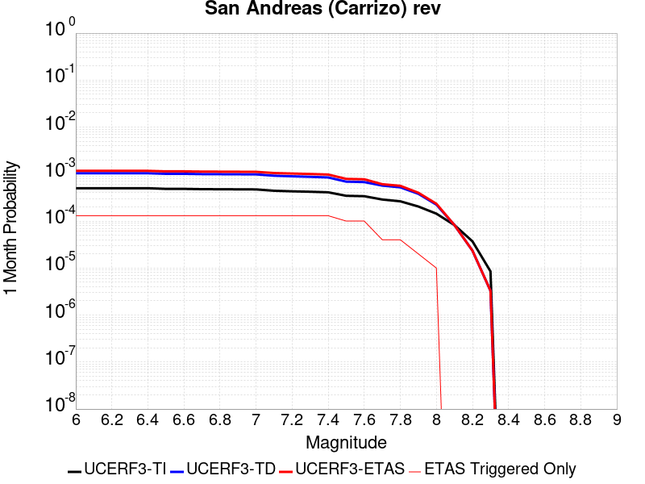 |  |  |

| Magnitude | 1 wk TI Prob | 1 wk TD Prob | 1 wk ETAS Prob | 1 wk ETAS/TD Gain | 1 wk ETAS Triggered Only | 1 mo TI Prob | 1 mo TD Prob | 1 mo ETAS Prob | 1 mo ETAS/TD Gain | 1 mo ETAS Triggered Only | 1 yr TI Prob | 1 yr TD Prob | 1 yr ETAS Prob | 1 yr ETAS/TD Gain | 1 yr ETAS Triggered Only | 10 yr TI Prob | 10 yr TD Prob | 10 yr ETAS Prob | 10 yr ETAS/TD Gain | 10 yr ETAS Triggered Only |
|-----|-----|-----|-----|-----|-----|-----|-----|-----|-----|-----|-----|-----|-----|-----|-----|-----|-----|-----|-----|-----|
| 6.0 | 1.1674632E-4 | 2.4324407E-4 | 3.232246E-4 | 1.3288078 | 8.0E-5 | 5.002454E-4 | 0.0010420597 | 0.0011719243 | 1.124623 | 1.3E-4 | 0.006073493 | 0.012613757 | 0.01285073 | 1.0187868 | 2.4E-4 | 0.0591016 | 0.120640226 | 0.120948 | 1.0025512 | 3.5E-4 |
| 6.1 | 1.1674632E-4 | 2.4324407E-4 | 3.232246E-4 | 1.3288078 | 8.0E-5 | 5.002454E-4 | 0.0010420597 | 0.0011719243 | 1.124623 | 1.3E-4 | 0.006073493 | 0.012613757 | 0.01285073 | 1.0187868 | 2.4E-4 | 0.0591016 | 0.120640226 | 0.120948 | 1.0025512 | 3.5E-4 |
| 6.2 | 1.1674632E-4 | 2.4324407E-4 | 3.232246E-4 | 1.3288078 | 8.0E-5 | 5.002454E-4 | 0.0010420597 | 0.0011719243 | 1.124623 | 1.3E-4 | 0.006073493 | 0.012613757 | 0.01285073 | 1.0187868 | 2.4E-4 | 0.0591016 | 0.120640226 | 0.120948 | 1.0025512 | 3.5E-4 |
| 6.3 | 1.1674632E-4 | 2.4324407E-4 | 3.232246E-4 | 1.3288078 | 8.0E-5 | 5.002454E-4 | 0.0010420597 | 0.0011719243 | 1.124623 | 1.3E-4 | 0.006073493 | 0.012613757 | 0.01285073 | 1.0187868 | 2.4E-4 | 0.0591016 | 0.120640226 | 0.120948 | 1.0025512 | 3.5E-4 |
| 6.4 | 1.1674632E-4 | 2.4324407E-4 | 3.232246E-4 | 1.3288078 | 8.0E-5 | 5.002454E-4 | 0.0010420597 | 0.0011719243 | 1.124623 | 1.3E-4 | 0.006073493 | 0.012613757 | 0.01285073 | 1.0187868 | 2.4E-4 | 0.0591016 | 0.120640226 | 0.120948 | 1.0025512 | 3.5E-4 |
| 6.5 | 1.13136164E-4 | 2.3644442E-4 | 3.164255E-4 | 1.3382659 | 8.0E-5 | 4.847792E-4 | 0.0010129412 | 0.0011428095 | 1.1282091 | 1.3E-4 | 0.0058862255 | 0.012263271 | 0.012500328 | 1.0193306 | 2.4E-4 | 0.057327334 | 0.11761008 | 0.117910095 | 1.002551 | 3.4E-4 |
| 6.6 | 1.13136164E-4 | 2.3644442E-4 | 3.164255E-4 | 1.3382659 | 8.0E-5 | 4.847792E-4 | 0.0010129412 | 0.0011428095 | 1.1282091 | 1.3E-4 | 0.0058862255 | 0.012263271 | 0.012500328 | 1.0193306 | 2.4E-4 | 0.057327334 | 0.11761008 | 0.117910095 | 1.002551 | 3.4E-4 |
| 6.7 | 1.1149675E-4 | 2.3335687E-4 | 3.133382E-4 | 1.3427426 | 8.0E-5 | 4.777557E-4 | 9.997191E-4 | 0.0011295892 | 1.1299065 | 1.3E-4 | 0.0058011734 | 0.012104088 | 0.012341184 | 1.019588 | 2.4E-4 | 0.05652051 | 0.1162291 | 0.116529584 | 1.0025853 | 3.4E-4 |
| 6.8 | 1.1103589E-4 | 2.3237852E-4 | 3.1235992E-4 | 1.344186 | 8.0E-5 | 4.7578133E-4 | 9.955293E-4 | 0.0011253998 | 1.1304538 | 1.3E-4 | 0.005777263 | 0.012053643 | 0.012290751 | 1.019671 | 2.4E-4 | 0.056293584 | 0.11578894 | 0.11608957 | 1.0025964 | 3.4E-4 |
| 6.9 | 1.1053259E-4 | 2.3130233E-4 | 3.1128383E-4 | 1.3457876 | 8.0E-5 | 4.7362508E-4 | 9.909206E-4 | 0.0011207918 | 1.1310611 | 1.3E-4 | 0.0057511497 | 0.011998152 | 0.012235273 | 1.0197631 | 2.4E-4 | 0.05604569 | 0.11530445 | 0.11560524 | 1.0026087 | 3.4E-4 |
| 7.0 | 1.1005377E-4 | 2.3031076E-4 | 3.1029235E-4 | 1.3472768 | 8.0E-5 | 4.7157376E-4 | 9.866742E-4 | 0.001116546 | 1.1316258 | 1.3E-4 | 0.0057263062 | 0.011947021 | 0.012184153 | 1.0198487 | 2.4E-4 | 0.055809796 | 0.11485658 | 0.11515753 | 1.0026202 | 3.4E-4 |
| 7.1 | 1.0308142E-4 | 2.1540876E-4 | 2.9539154E-4 | 1.3713069 | 8.0E-5 | 4.417027E-4 | 9.228548E-4 | 0.0010527349 | 1.1407372 | 1.3E-4 | 0.0053644776 | 0.011178188 | 0.011415506 | 1.0212303 | 2.4E-4 | 0.052368138 | 0.10809042 | 0.10839368 | 1.0028055 | 3.4E-4 |
| 7.2 | 1.0027479E-4 | 2.094876E-4 | 2.8947083E-4 | 1.3818042 | 8.0E-5 | 4.296783E-4 | 8.9749607E-4 | 0.0010273794 | 1.1447175 | 1.3E-4 | 0.0052187922 | 0.010872566 | 0.011109957 | 1.0218339 | 2.4E-4 | 0.050979212 | 0.10539086 | 0.10569503 | 1.002886 | 3.4E-4 |
| 7.3 | 9.816942E-5 | 2.0423878E-4 | 2.8422245E-4 | 1.3916184 | 8.0E-5 | 4.2065824E-4 | 8.7501644E-4 | 0.0010049026 | 1.1484387 | 1.3E-4 | 0.005109493 | 0.010601572 | 0.010839027 | 1.0223981 | 2.4E-4 | 0.049935985 | 0.10297546 | 0.10328045 | 1.0029618 | 3.4E-4 |
| 7.4 | 9.5634205E-5 | 1.9793298E-4 | 2.7791716E-4 | 1.4040972 | 8.0E-5 | 4.0979648E-4 | 8.4800937E-4 | 9.778992E-4 | 1.1531702 | 1.3E-4 | 0.0049778637 | 0.010275901 | 0.010513435 | 1.0231156 | 2.4E-4 | 0.048678253 | 0.100067884 | 0.100373864 | 1.0030577 | 3.4E-4 |
| 7.5 | 8.052417E-5 | 1.6113915E-4 | 2.2112949E-4 | 1.372289 | 6.0E-5 | 3.4505792E-4 | 6.9041376E-4 | 7.903447E-4 | 1.1447407 | 1.0E-4 | 0.0041929903 | 0.008373471 | 0.00856188 | 1.0225008 | 1.9E-4 | 0.04114753 | 0.082815245 | 0.08306289 | 1.0029902 | 2.7E-4 |
| 7.6 | 7.897024E-5 | 1.5767086E-4 | 2.1766139E-4 | 1.3804796 | 6.0E-5 | 3.384E-4 | 6.755574E-4 | 7.754899E-4 | 1.1479259 | 1.0E-4 | 0.0041122385 | 0.00819397 | 0.008372495 | 1.0217874 | 1.8E-4 | 0.040369697 | 0.08115866 | 0.08138837 | 1.0028304 | 2.5E-4 |
| 7.7 | 6.707427E-5 | 1.3277122E-4 | 1.6276725E-4 | 1.2259226 | 3.0E-5 | 2.8742946E-4 | 5.688955E-4 | 6.0887274E-4 | 1.0702717 | 4.0E-5 | 0.003493839 | 0.0069043385 | 0.00702351 | 1.0172604 | 1.2E-4 | 0.034394164 | 0.06905339 | 0.06922096 | 1.0024266 | 1.8E-4 |
| 7.8 | 6.147705E-5 | 1.2198445E-4 | 1.5198078E-4 | 1.245903 | 3.0E-5 | 2.6344648E-4 | 5.226858E-4 | 5.626649E-4 | 1.0764878 | 4.0E-5 | 0.0032027436 | 0.006345156 | 0.0064544585 | 1.0172261 | 1.1E-4 | 0.031569764 | 0.0635172 | 0.0636764 | 1.0025065 | 1.7E-4 |
| 7.9 | 4.7636717E-5 | 8.8802946E-5 | 9.880206E-5 | 1.1125989 | 1.0E-5 | 2.0414138E-4 | 3.8052857E-4 | 4.0052095E-4 | 1.0525385 | 2.0E-5 | 0.0024825884 | 0.004623101 | 0.0046927775 | 1.0150714 | 7.0E-5 | 0.024550365 | 0.046629366 | 0.046724703 | 1.0020446 | 1.0E-4 |
| 8.0 | 3.3554235E-5 | 5.2138024E-5 | 6.213751E-5 | 1.1917886 | 1.0E-5 | 1.4379594E-4 | 2.2342955E-4 | 2.3342732E-4 | 1.0447469 | 1.0E-5 | 0.0017493097 | 0.002716863 | 0.0027467816 | 1.0110122 | 3.0E-5 | 0.017356034 | 0.027881905 | 0.02792079 | 1.0013946 | 4.0E-5 |
| 8.1 | 1.9175432E-5 | 1.9183564E-5 | 1.9183564E-5 | 1.0 | 0.0 | 8.217783E-5 | 8.221269E-5 | 8.221269E-5 | 1.0 | 0.0 | 0.0010000558 | 0.0010004805 | 0.0010004805 | 1.0 | 0.0 | 0.009955673 | 0.010757771 | 0.010767664 | 1.0009196 | 1.0E-5 |
| 8.2 | 8.643924E-6 | 5.473668E-6 | 5.473668E-6 | 1.0 | 0.0 | 3.704486E-5 | 2.3458366E-5 | 2.3458366E-5 | 1.0 | 0.0 | 4.5092785E-4 | 2.8556827E-4 | 2.8556827E-4 | 1.0 | 0.0 | 0.0045001395 | 0.0032481793 | 0.0032481793 | 1.0 | 0.0 |
| 8.3 | 1.983087E-6 | 7.6564595E-7 | 7.6564595E-7 | 1.0 | 0.0 | 8.498917E-6 | 3.281336E-6 | 3.281336E-6 | 1.0 | 0.0 | 1.034694E-4 | 3.9949547E-5 | 3.9949547E-5 | 1.0 | 0.0 | 0.0010342124 | 4.717979E-4 | 4.717979E-4 | 1.0 | 0.0 |

## Cady
*[(top)](#table-of-contents)*

| 1 Week | 1 Month | 1 Year | 10 Year |
|-----|-----|-----|-----|
|  |  | 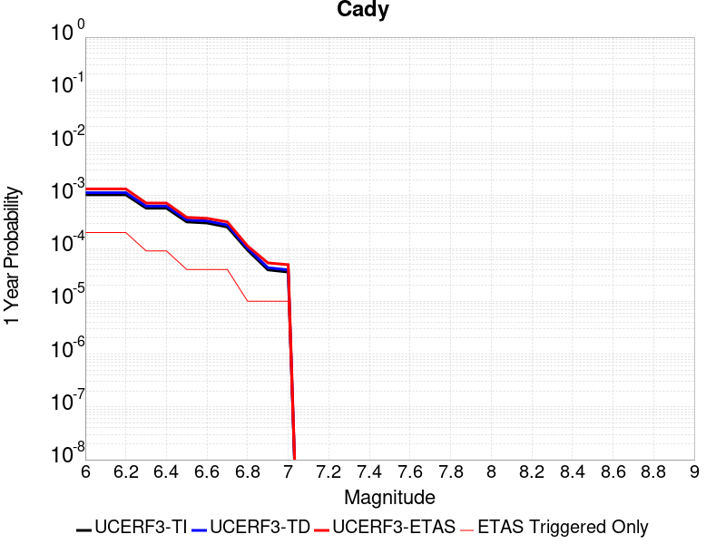 |  |

| Magnitude | 1 wk TI Prob | 1 wk TD Prob | 1 wk ETAS Prob | 1 wk ETAS/TD Gain | 1 wk ETAS Triggered Only | 1 mo TI Prob | 1 mo TD Prob | 1 mo ETAS Prob | 1 mo ETAS/TD Gain | 1 mo ETAS Triggered Only | 1 yr TI Prob | 1 yr TD Prob | 1 yr ETAS Prob | 1 yr ETAS/TD Gain | 1 yr ETAS Triggered Only | 10 yr TI Prob | 10 yr TD Prob | 10 yr ETAS Prob | 10 yr ETAS/TD Gain | 10 yr ETAS Triggered Only |
|-----|-----|-----|-----|-----|-----|-----|-----|-----|-----|-----|-----|-----|-----|-----|-----|-----|-----|-----|-----|-----|
| 6.0 | 1.9892565E-5 | 2.1858728E-5 | 1.0185698E-4 | 4.6597853 | 8.0E-5 | 8.525106E-5 | 9.3677416E-5 | 1.9366805E-4 | 2.067393 | 1.0E-4 | 0.0010374374 | 0.0011400167 | 0.0013397887 | 1.175236 | 2.0E-4 | 0.010326075 | 0.011350701 | 0.011696728 | 1.0304852 | 3.5E-4 |
| 6.1 | 1.9892565E-5 | 2.1858728E-5 | 1.0185698E-4 | 4.6597853 | 8.0E-5 | 8.525106E-5 | 9.3677416E-5 | 1.9366805E-4 | 2.067393 | 1.0E-4 | 0.0010374374 | 0.0011400167 | 0.0013397887 | 1.175236 | 2.0E-4 | 0.010326075 | 0.011350701 | 0.011696728 | 1.0304852 | 3.5E-4 |
| 6.2 | 1.9892565E-5 | 2.1858728E-5 | 1.0185698E-4 | 4.6597853 | 8.0E-5 | 8.525106E-5 | 9.3677416E-5 | 1.9366805E-4 | 2.067393 | 1.0E-4 | 0.0010374374 | 0.0011400167 | 0.0013397887 | 1.175236 | 2.0E-4 | 0.010326075 | 0.011350701 | 0.011696728 | 1.0304852 | 3.5E-4 |
| 6.3 | 1.1117327E-5 | 1.2176583E-5 | 6.2175975E-5 | 5.106192 | 5.0E-5 | 4.764482E-5 | 5.2184492E-5 | 1.1218136E-4 | 2.1497068 | 6.0E-5 | 5.7992124E-4 | 6.351925E-4 | 7.251353E-4 | 1.1415993 | 9.0E-5 | 0.0057841022 | 0.0063368753 | 0.006535608 | 1.0313613 | 2.0E-4 |
| 6.4 | 1.1117327E-5 | 1.2176583E-5 | 6.2175975E-5 | 5.106192 | 5.0E-5 | 4.764482E-5 | 5.2184492E-5 | 1.1218136E-4 | 2.1497068 | 6.0E-5 | 5.7992124E-4 | 6.351925E-4 | 7.251353E-4 | 1.1415993 | 9.0E-5 | 0.0057841022 | 0.0063368753 | 0.006535608 | 1.0313613 | 2.0E-4 |
| 6.5 | 6.103093E-6 | 6.672021E-6 | 1.6671955E-5 | 2.4987862 | 1.0E-5 | 2.615585E-5 | 2.8594131E-5 | 4.859356E-5 | 1.6994243 | 2.0E-5 | 3.1840094E-4 | 3.480905E-4 | 3.880766E-4 | 1.1148727 | 4.0E-5 | 0.0031794512 | 0.0034766865 | 0.0035863041 | 1.0315293 | 1.1E-4 |
| 6.6 | 5.817237E-6 | 6.3656585E-6 | 1.6365595E-5 | 2.5709193 | 1.0E-5 | 2.4930776E-5 | 2.728118E-5 | 4.728063E-5 | 1.7330861 | 2.0E-5 | 3.034899E-4 | 3.3211018E-4 | 3.720969E-4 | 1.120402 | 4.0E-5 | 0.0030307577 | 0.0033173605 | 0.0034269956 | 1.0330489 | 1.1E-4 |
| 6.7 | 4.8846314E-6 | 5.3405684E-6 | 1.5340514E-5 | 2.8724499 | 1.0E-5 | 2.0933967E-5 | 2.2888014E-5 | 4.2887557E-5 | 1.8737998 | 2.0E-5 | 2.5484123E-4 | 2.7863772E-4 | 3.1862658E-4 | 1.1435156 | 4.0E-5 | 0.0025454918 | 0.0027840391 | 0.0028737886 | 1.0322372 | 9.0E-5 |
| 6.8 | 1.7788773E-6 | 1.9399079E-6 | 1.9399079E-6 | 1.0 | 0.0 | 7.6237375E-6 | 8.313874E-6 | 1.831379E-5 | 2.2027988 | 1.0E-5 | 9.281505E-5 | 1.01218284E-4 | 1.11217276E-4 | 1.0987864 | 1.0E-5 | 9.2776294E-4 | 0.0010118765 | 0.0010418461 | 1.0296179 | 3.0E-5 |
| 6.9 | 7.5455404E-7 | 8.297092E-7 | 8.297092E-7 | 1.0 | 0.0 | 3.233799E-6 | 3.5558937E-6 | 1.35558585E-5 | 3.8122225 | 1.0E-5 | 3.937079E-5 | 4.3292483E-5 | 5.329205E-5 | 1.2309769 | 1.0E-5 | 3.9363815E-4 | 4.3287344E-4 | 4.428691E-4 | 1.0230914 | 1.0E-5 |
| 7.0 | 6.8578805E-7 | 7.541816E-7 | 7.541816E-7 | 1.0 | 0.0 | 2.9390883E-6 | 3.2322048E-6 | 1.3232172E-5 | 4.0938535 | 1.0E-5 | 3.578281E-5 | 3.9351715E-5 | 4.9351318E-5 | 1.2541085 | 1.0E-5 | 3.577705E-4 | 3.9347992E-4 | 4.0347598E-4 | 1.0254042 | 1.0E-5 |

## White Wolf (Extension)
*[(top)](#table-of-contents)*

| 1 Week | 1 Month | 1 Year | 10 Year |
|-----|-----|-----|-----|
| 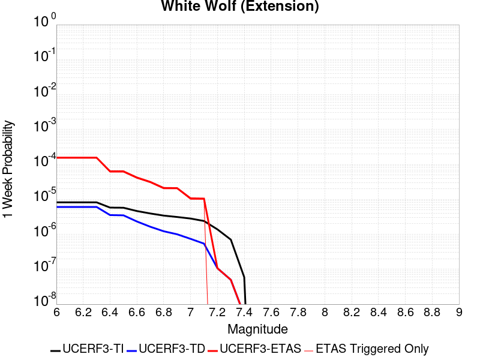 |  |  |  |

| Magnitude | 1 wk TI Prob | 1 wk TD Prob | 1 wk ETAS Prob | 1 wk ETAS/TD Gain | 1 wk ETAS Triggered Only | 1 mo TI Prob | 1 mo TD Prob | 1 mo ETAS Prob | 1 mo ETAS/TD Gain | 1 mo ETAS Triggered Only | 1 yr TI Prob | 1 yr TD Prob | 1 yr ETAS Prob | 1 yr ETAS/TD Gain | 1 yr ETAS Triggered Only | 10 yr TI Prob | 10 yr TD Prob | 10 yr ETAS Prob | 10 yr ETAS/TD Gain | 10 yr ETAS Triggered Only |
|-----|-----|-----|-----|-----|-----|-----|-----|-----|-----|-----|-----|-----|-----|-----|-----|-----|-----|-----|-----|-----|
| 6.0 | 8.222555E-6 | 6.066615E-6 | 1.5606571E-4 | 25.725336 | 1.5E-4 | 3.5239045E-5 | 2.5999556E-5 | 2.359941E-4 | 9.076851 | 2.1E-4 | 4.289509E-4 | 3.1650523E-4 | 5.864198E-4 | 1.8527964 | 2.7E-4 | 0.0042812387 | 0.0031611966 | 0.0034901535 | 1.1040609 | 3.3E-4 |
| 6.1 | 8.222555E-6 | 6.066615E-6 | 1.5606571E-4 | 25.725336 | 1.5E-4 | 3.5239045E-5 | 2.5999556E-5 | 2.359941E-4 | 9.076851 | 2.1E-4 | 4.289509E-4 | 3.1650523E-4 | 5.864198E-4 | 1.8527964 | 2.7E-4 | 0.0042812387 | 0.0031611966 | 0.0034901535 | 1.1040609 | 3.3E-4 |
| 6.2 | 8.222555E-6 | 6.066615E-6 | 1.5606571E-4 | 25.725336 | 1.5E-4 | 3.5239045E-5 | 2.5999556E-5 | 2.359941E-4 | 9.076851 | 2.1E-4 | 4.289509E-4 | 3.1650523E-4 | 5.864198E-4 | 1.8527964 | 2.7E-4 | 0.0042812387 | 0.0031611966 | 0.0034901535 | 1.1040609 | 3.3E-4 |
| 6.3 | 8.222555E-6 | 6.066615E-6 | 1.5606571E-4 | 25.725336 | 1.5E-4 | 3.5239045E-5 | 2.5999556E-5 | 2.359941E-4 | 9.076851 | 2.1E-4 | 4.289509E-4 | 3.1650523E-4 | 5.864198E-4 | 1.8527964 | 2.7E-4 | 0.0042812387 | 0.0031611966 | 0.0034901535 | 1.1040609 | 3.3E-4 |
| 6.4 | 5.821773E-6 | 3.5571256E-6 | 6.3556916E-5 | 17.86749 | 6.0E-5 | 2.4950215E-5 | 1.5244741E-5 | 1.0524337E-4 | 6.903585 | 9.0E-5 | 3.0372653E-4 | 1.8559002E-4 | 3.0556775E-4 | 1.6464665 | 1.2E-4 | 0.0030331176 | 0.0018544586 | 0.0020041803 | 1.0807362 | 1.5E-4 |
| 6.5 | 5.766023E-6 | 3.4990599E-6 | 6.349885E-5 | 18.147404 | 6.0E-5 | 2.4711293E-5 | 1.49958905E-5 | 8.499484E-5 | 5.667876 | 7.0E-5 | 3.0081844E-4 | 1.8256076E-4 | 2.8254252E-4 | 1.5476629 | 1.0E-4 | 0.0030041158 | 0.0018242161 | 0.001953979 | 1.0711335 | 1.3E-4 |
| 6.6 | 4.643576E-6 | 2.3325733E-6 | 4.233248E-5 | 18.148403 | 4.0E-5 | 1.9900888E-5 | 9.9967065E-6 | 4.9996306E-5 | 5.001278 | 4.0E-5 | 2.4226638E-4 | 1.2170354E-4 | 1.8169623E-4 | 1.4929413 | 6.0E-5 | 0.0024200242 | 0.0012164112 | 0.001296314 | 1.0656872 | 8.0E-5 |
| 6.7 | 3.9529173E-6 | 1.6482975E-6 | 3.1648247E-5 | 19.200567 | 3.0E-5 | 1.6940963E-5 | 7.064114E-6 | 3.7063903E-5 | 5.246787 | 3.0E-5 | 2.0623671E-4 | 8.600239E-5 | 1.2599894E-4 | 1.4650633 | 4.0E-5 | 0.002060454 | 8.597095E-4 | 9.1965793E-4 | 1.069731 | 6.0E-5 |
| 6.8 | 3.4377522E-6 | 1.2244764E-6 | 2.1224452E-5 | 17.333492 | 2.0E-5 | 1.473314E-5 | 5.247746E-6 | 2.524764E-5 | 4.81114 | 2.0E-5 | 1.7936122E-4 | 6.388952E-5 | 9.3887604E-5 | 1.4695306 | 3.0E-5 | 0.0017921652 | 6.3872064E-4 | 6.886887E-4 | 1.0782315 | 5.0E-5 |
| 6.9 | 3.1367306E-6 | 1.0033316E-6 | 2.1003312E-5 | 20.93357 | 2.0E-5 | 1.3443062E-5 | 4.299986E-6 | 2.42999E-5 | 5.6511583 | 2.0E-5 | 1.63657E-4 | 5.2351144E-5 | 8.234957E-5 | 1.5730233 | 3.0E-5 | 0.0016353652 | 5.233958E-4 | 5.733696E-4 | 1.09548 | 5.0E-5 |
| 7.0 | 2.8298145E-6 | 7.4282326E-7 | 1.0742816E-5 | 14.462142 | 1.0E-5 | 1.2127721E-5 | 3.1835248E-6 | 1.3183493E-5 | 4.1411624 | 1.0E-5 | 1.47645E-4 | 3.8758775E-5 | 5.8758E-5 | 1.5159922 | 2.0E-5 | 0.0014754693 | 3.8752513E-4 | 4.175135E-4 | 1.0773844 | 3.0E-5 |
| 7.1 | 2.4091064E-6 | 5.4223835E-7 | 1.0542233E-5 | 19.442064 | 1.0E-5 | 1.03247E-5 | 2.3238767E-6 | 1.2323853E-5 | 5.303144 | 1.0E-5 | 1.2569598E-4 | 2.8292874E-5 | 3.829259E-5 | 1.3534359 | 1.0E-5 | 0.001256249 | 2.8289677E-4 | 3.028911E-4 | 1.0706772 | 2.0E-5 |
| 7.2 | 1.3875518E-6 | 1.0740268E-7 | 1.0740268E-7 | 1.0 | 0.0 | 5.9466374E-6 | 4.6029712E-7 | 4.6029712E-7 | 1.0 | 0.0 | 7.23979E-5 | 5.604104E-6 | 5.604104E-6 | 1.0 | 0.0 | 7.2374323E-4 | 5.6039742E-5 | 5.6039742E-5 | 1.0 | 0.0 |
| 7.3 | 7.056077E-7 | 5.0002956E-8 | 5.0002956E-8 | 1.0 | 0.0 | 3.0240296E-6 | 2.1429837E-7 | 2.1429837E-7 | 1.0 | 0.0 | 3.681694E-5 | 2.60908E-6 | 2.60908E-6 | 1.0 | 0.0 | 3.681084E-4 | 2.609054E-5 | 2.609054E-5 | 1.0 | 0.0 |
| 7.4 | 5.9334678E-8 | 4.8638475E-9 | 4.8638475E-9 | 1.0 | 0.0 | 2.5429145E-7 | 2.084506E-8 | 2.084506E-8 | 1.0 | 0.0 | 3.095994E-6 | 2.5378858E-7 | 2.5378858E-7 | 1.0 | 0.0 | 3.095951E-5 | 2.5378843E-6 | 2.5378843E-6 | 1.0 | 0.0 |

## Scodie Lineament
*[(top)](#table-of-contents)*

| 1 Week | 1 Month | 1 Year | 10 Year |
|-----|-----|-----|-----|
| 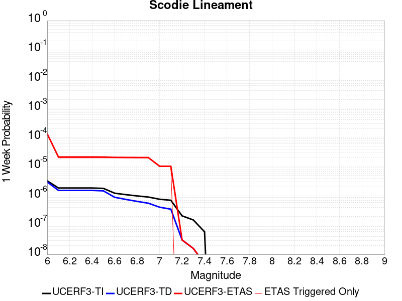 |  |  |  |

| Magnitude | 1 wk TI Prob | 1 wk TD Prob | 1 wk ETAS Prob | 1 wk ETAS/TD Gain | 1 wk ETAS Triggered Only | 1 mo TI Prob | 1 mo TD Prob | 1 mo ETAS Prob | 1 mo ETAS/TD Gain | 1 mo ETAS Triggered Only | 1 yr TI Prob | 1 yr TD Prob | 1 yr ETAS Prob | 1 yr ETAS/TD Gain | 1 yr ETAS Triggered Only | 10 yr TI Prob | 10 yr TD Prob | 10 yr ETAS Prob | 10 yr ETAS/TD Gain | 10 yr ETAS Triggered Only |
|-----|-----|-----|-----|-----|-----|-----|-----|-----|-----|-----|-----|-----|-----|-----|-----|-----|-----|-----|-----|-----|
| 6.0 | 3.2919327E-6 | 3.0133303E-6 | 1.3301295E-4 | 44.141502 | 1.3E-4 | 1.4108206E-5 | 1.2914227E-5 | 1.7291216E-4 | 13.3892765 | 1.6E-4 | 1.7175387E-4 | 1.5722254E-4 | 4.0718325E-4 | 2.5898528 | 2.5E-4 | 0.0017162118 | 0.0015714248 | 0.0019009062 | 1.2096705 | 3.3E-4 |
| 6.1 | 1.8663811E-6 | 1.5490382E-6 | 2.1549007E-5 | 13.911218 | 2.0E-5 | 7.998751E-6 | 6.6387206E-6 | 4.6638455E-5 | 7.025217 | 4.0E-5 | 9.738045E-5 | 8.082393E-5 | 1.3081988E-4 | 1.6185787 | 5.0E-5 | 9.7337784E-4 | 8.079941E-4 | 8.8792946E-4 | 1.0989306 | 8.0E-5 |
| 6.2 | 1.8663811E-6 | 1.5490382E-6 | 2.1549007E-5 | 13.911218 | 2.0E-5 | 7.998751E-6 | 6.6387206E-6 | 4.6638455E-5 | 7.025217 | 4.0E-5 | 9.738045E-5 | 8.082393E-5 | 1.3081988E-4 | 1.6185787 | 5.0E-5 | 9.7337784E-4 | 8.079941E-4 | 8.8792946E-4 | 1.0989306 | 8.0E-5 |
| 6.3 | 1.8663811E-6 | 1.5490382E-6 | 2.1549007E-5 | 13.911218 | 2.0E-5 | 7.998751E-6 | 6.6387206E-6 | 4.6638455E-5 | 7.025217 | 4.0E-5 | 9.738045E-5 | 8.082393E-5 | 1.3081988E-4 | 1.6185787 | 5.0E-5 | 9.7337784E-4 | 8.079941E-4 | 8.8792946E-4 | 1.0989306 | 8.0E-5 |
| 6.4 | 1.8663811E-6 | 1.5490382E-6 | 2.1549007E-5 | 13.911218 | 2.0E-5 | 7.998751E-6 | 6.6387206E-6 | 4.6638455E-5 | 7.025217 | 4.0E-5 | 9.738045E-5 | 8.082393E-5 | 1.3081988E-4 | 1.6185787 | 5.0E-5 | 9.7337784E-4 | 8.079941E-4 | 8.8792946E-4 | 1.0989306 | 8.0E-5 |
| 6.5 | 1.8106311E-6 | 1.4909722E-6 | 2.1490941E-5 | 14.414047 | 2.0E-5 | 7.759824E-6 | 6.389868E-6 | 2.638974E-5 | 4.1299353 | 2.0E-5 | 9.447177E-5 | 7.779436E-5 | 1.07792024E-4 | 1.3856021 | 3.0E-5 | 9.4431615E-4 | 7.7771995E-4 | 8.3767326E-4 | 1.0770886 | 6.0E-5 |
| 6.6 | 1.2414679E-6 | 8.9974395E-7 | 2.0899726E-5 | 23.228525 | 2.0E-5 | 5.320566E-6 | 3.85604E-6 | 2.3855962E-5 | 6.186648 | 2.0E-5 | 6.477596E-5 | 4.6946367E-5 | 7.694496E-5 | 1.6389971 | 3.0E-5 | 6.475708E-4 | 4.6937316E-4 | 5.193497E-4 | 1.106475 | 5.0E-5 |
| 6.7 | 1.1062215E-6 | 7.594193E-7 | 2.0759404E-5 | 27.335892 | 2.0E-5 | 4.7409408E-6 | 3.2546504E-6 | 2.3254586E-5 | 7.145033 | 2.0E-5 | 5.7719422E-5 | 3.962472E-5 | 6.962353E-5 | 1.7570732 | 3.0E-5 | 5.770443E-4 | 3.9618355E-4 | 4.4616373E-4 | 1.1261542 | 5.0E-5 |
| 6.8 | 1.0006736E-6 | 6.5002786E-7 | 2.0650015E-5 | 31.76789 | 2.0E-5 | 4.288594E-6 | 2.7858312E-6 | 2.2785776E-5 | 8.179166 | 2.0E-5 | 5.221238E-5 | 3.391703E-5 | 6.391601E-5 | 1.8844814 | 3.0E-5 | 5.220012E-4 | 3.3912458E-4 | 3.8910762E-4 | 1.1473885 | 5.0E-5 |
| 6.9 | 9.167364E-7 | 5.6315065E-7 | 2.0563139E-5 | 36.514454 | 2.0E-5 | 3.9288643E-6 | 2.413501E-6 | 2.2413453E-5 | 9.286697 | 2.0E-5 | 4.7832873E-5 | 2.9384037E-5 | 5.9383154E-5 | 2.0209324 | 3.0E-5 | 4.782258E-4 | 2.9380718E-4 | 3.437925E-4 | 1.1701297 | 5.0E-5 |
| 7.0 | 7.6987664E-7 | 4.113265E-7 | 1.0411322E-5 | 25.311577 | 1.0E-5 | 3.2994672E-6 | 1.7628269E-6 | 1.176281E-5 | 6.6726966 | 1.0E-5 | 4.0170275E-5 | 2.1462245E-5 | 4.1461815E-5 | 1.931849 | 2.0E-5 | 4.0163012E-4 | 2.1460558E-4 | 2.4459916E-4 | 1.1397613 | 3.0E-5 |
| 7.1 | 7.1038727E-7 | 3.5210306E-7 | 1.03521E-5 | 29.400766 | 1.0E-5 | 3.0445133E-6 | 1.5090123E-6 | 1.1508997E-5 | 7.626841 | 1.0E-5 | 3.706632E-5 | 1.8372106E-5 | 2.8371922E-5 | 1.5442934 | 1.0E-5 | 3.7060137E-4 | 1.8370937E-4 | 2.037057E-4 | 1.1088476 | 2.0E-5 |
| 7.2 | 2.0799602E-7 | 3.1178534E-8 | 3.1178534E-8 | 1.0 | 0.0 | 8.914113E-7 | 1.3362228E-7 | 1.3362228E-7 | 1.0 | 0.0 | 1.0852878E-5 | 1.6268501E-6 | 1.6268501E-6 | 1.0 | 0.0 | 1.08523476E-4 | 1.626839E-5 | 1.626839E-5 | 1.0 | 0.0 |
| 7.3 | 1.5048182E-7 | 1.5939106E-8 | 1.5939106E-8 | 1.0 | 0.0 | 6.449219E-7 | 6.8310456E-8 | 6.8310456E-8 | 1.0 | 0.0 | 7.851896E-6 | 8.316795E-7 | 8.316795E-7 | 1.0 | 0.0 | 7.851618E-5 | 8.316767E-6 | 8.316767E-6 | 1.0 | 0.0 |
| 7.4 | 5.9334678E-8 | 4.8638475E-9 | 4.8638475E-9 | 1.0 | 0.0 | 2.5429145E-7 | 2.084506E-8 | 2.084506E-8 | 1.0 | 0.0 | 3.095994E-6 | 2.5378858E-7 | 2.5378858E-7 | 1.0 | 0.0 | 3.095951E-5 | 2.5378843E-6 | 2.5378843E-6 | 1.0 | 0.0 |

## Calico-Hidalgo
*[(top)](#table-of-contents)*

| 1 Week | 1 Month | 1 Year | 10 Year |
|-----|-----|-----|-----|
|  |  |  |  |

| Magnitude | 1 wk TI Prob | 1 wk TD Prob | 1 wk ETAS Prob | 1 wk ETAS/TD Gain | 1 wk ETAS Triggered Only | 1 mo TI Prob | 1 mo TD Prob | 1 mo ETAS Prob | 1 mo ETAS/TD Gain | 1 mo ETAS Triggered Only | 1 yr TI Prob | 1 yr TD Prob | 1 yr ETAS Prob | 1 yr ETAS/TD Gain | 1 yr ETAS Triggered Only | 10 yr TI Prob | 10 yr TD Prob | 10 yr ETAS Prob | 10 yr ETAS/TD Gain | 10 yr ETAS Triggered Only |
|-----|-----|-----|-----|-----|-----|-----|-----|-----|-----|-----|-----|-----|-----|-----|-----|-----|-----|-----|-----|-----|
| 6.0 | 4.0906612E-5 | 5.0704355E-5 | 8.0702834E-5 | 1.5916351 | 3.0E-5 | 1.7530227E-4 | 2.1728857E-4 | 2.8727335E-4 | 1.3220823 | 7.0E-5 | 0.0021322158 | 0.002642678 | 0.0028122289 | 1.0641587 | 1.7E-4 | 0.02111873 | 0.026152814 | 0.026454708 | 1.0115434 | 3.1E-4 |
| 6.1 | 4.0906612E-5 | 5.0704355E-5 | 8.0702834E-5 | 1.5916351 | 3.0E-5 | 1.7530227E-4 | 2.1728857E-4 | 2.8727335E-4 | 1.3220823 | 7.0E-5 | 0.0021322158 | 0.002642678 | 0.0028122289 | 1.0641587 | 1.7E-4 | 0.02111873 | 0.026152814 | 0.026454708 | 1.0115434 | 3.1E-4 |
| 6.2 | 4.0906612E-5 | 5.0704355E-5 | 8.0702834E-5 | 1.5916351 | 3.0E-5 | 1.7530227E-4 | 2.1728857E-4 | 2.8727335E-4 | 1.3220823 | 7.0E-5 | 0.0021322158 | 0.002642678 | 0.0028122289 | 1.0641587 | 1.7E-4 | 0.02111873 | 0.026152814 | 0.026454708 | 1.0115434 | 3.1E-4 |
| 6.3 | 2.4242801E-5 | 3.0090967E-5 | 6.0090064E-5 | 1.9969469 | 3.0E-5 | 1.0389358E-4 | 1.289551E-4 | 1.8894736E-4 | 1.4652182 | 6.0E-5 | 0.0012641704 | 0.0015689312 | 0.0016987273 | 1.082729 | 1.3E-4 | 0.01257003 | 0.015582229 | 0.0157988 | 1.0138986 | 2.2E-4 |
| 6.4 | 2.4242801E-5 | 3.0090967E-5 | 6.0090064E-5 | 1.9969469 | 3.0E-5 | 1.0389358E-4 | 1.289551E-4 | 1.8894736E-4 | 1.4652182 | 6.0E-5 | 0.0012641704 | 0.0015689312 | 0.0016987273 | 1.082729 | 1.3E-4 | 0.01257003 | 0.015582229 | 0.0157988 | 1.0138986 | 2.2E-4 |
| 6.5 | 2.0286952E-5 | 2.5316054E-5 | 5.5315297E-5 | 2.1849887 | 3.0E-5 | 8.694118E-5 | 1.0849296E-4 | 1.4848862E-4 | 1.3686475 | 4.0E-5 | 0.0010579949 | 0.0013201186 | 0.0014299733 | 1.0832158 | 1.1E-4 | 0.010529719 | 0.013124701 | 0.013312207 | 1.0142865 | 1.9E-4 |
| 6.6 | 2.0269223E-5 | 2.5297004E-5 | 5.5296245E-5 | 2.1858811 | 3.0E-5 | 8.6865206E-5 | 1.08411325E-4 | 1.4840698E-4 | 1.3689251 | 4.0E-5 | 0.0010570707 | 0.0013191258 | 0.0014289806 | 1.0832785 | 1.1E-4 | 0.010520565 | 0.01311489 | 0.013302399 | 1.0142974 | 1.9E-4 |
| 6.7 | 1.799852E-5 | 2.2540933E-5 | 5.2540257E-5 | 2.330882 | 3.0E-5 | 7.713423E-5 | 9.660051E-5 | 1.3659665E-4 | 1.4140365 | 4.0E-5 | 9.3870464E-4 | 0.0011754911 | 0.0012753736 | 1.0849708 | 1.0E-4 | 0.009347493 | 0.011694346 | 0.01187224 | 1.015212 | 1.8E-4 |
| 6.8 | 1.7458793E-5 | 2.184258E-5 | 5.1841926E-5 | 2.373434 | 3.0E-5 | 7.4821255E-5 | 9.360778E-5 | 1.3360403E-4 | 1.427275 | 4.0E-5 | 9.10568E-4 | 0.0011390933 | 0.0012389794 | 1.0876892 | 1.0E-4 | 0.009068459 | 0.011334131 | 0.01151209 | 1.0157013 | 1.8E-4 |
| 6.9 | 1.542884E-5 | 1.9026285E-5 | 3.9025905E-5 | 2.0511572 | 2.0E-5 | 6.612192E-5 | 8.153875E-5 | 1.11536305E-4 | 1.3678932 | 3.0E-5 | 8.04737E-4 | 9.922953E-4 | 0.001082206 | 1.0906088 | 9.0E-5 | 0.008018291 | 0.009880043 | 0.0100384625 | 1.0160342 | 1.6E-4 |
| 7.0 | 1.468253E-5 | 1.803109E-5 | 3.8030732E-5 | 2.1091752 | 2.0E-5 | 6.292361E-5 | 7.727389E-5 | 1.07271575E-4 | 1.3881994 | 3.0E-5 | 7.658257E-4 | 9.4041653E-4 | 0.001030332 | 1.0956123 | 9.0E-5 | 0.0076319184 | 0.009365736 | 0.009524237 | 1.0169235 | 1.6E-4 |
| 7.1 | 1.3139281E-5 | 1.620139E-5 | 2.6201227E-5 | 1.617221 | 1.0E-5 | 5.6309986E-5 | 6.943275E-5 | 7.943205E-5 | 1.1440142 | 1.0E-5 | 6.853584E-4 | 8.4502844E-4 | 9.049777E-4 | 1.0709435 | 6.0E-5 | 0.0068324856 | 0.008419449 | 0.008538439 | 1.0141327 | 1.2E-4 |
| 7.2 | 1.1127404E-5 | 1.3867038E-5 | 2.38669E-5 | 1.7211245 | 1.0E-5 | 4.7688E-5 | 5.9428872E-5 | 6.942828E-5 | 1.1682584 | 1.0E-5 | 5.8044674E-4 | 7.233172E-4 | 7.8327383E-4 | 1.0828911 | 6.0E-5 | 0.0057893298 | 0.007210737 | 0.007329872 | 1.0165218 | 1.2E-4 |
| 7.3 | 9.808154E-6 | 1.2176586E-5 | 2.2176464E-5 | 1.8212383 | 1.0E-5 | 4.2034266E-5 | 5.2184383E-5 | 6.218386E-5 | 1.1916182 | 1.0E-5 | 5.11647E-4 | 6.351704E-4 | 6.851386E-4 | 1.0786691 | 5.0E-5 | 0.0051047057 | 0.006334625 | 0.0064339917 | 1.0156863 | 1.0E-4 |
| 7.4 | 7.942452E-6 | 9.792348E-6 | 1.979225E-5 | 2.0211957 | 1.0E-5 | 3.4038632E-5 | 4.1966585E-5 | 5.1966163E-5 | 1.2382748 | 1.0E-5 | 4.1434157E-4 | 5.108328E-4 | 5.608073E-4 | 1.0978293 | 5.0E-5 | 0.0041356985 | 0.005097527 | 0.0051970175 | 1.0195173 | 1.0E-4 |
| 7.5 | 4.7121216E-6 | 5.7729717E-6 | 1.5772914E-5 | 2.7322001 | 1.0E-5 | 2.019465E-5 | 2.4741115E-5 | 3.4740868E-5 | 1.4041755 | 1.0E-5 | 2.4584212E-4 | 3.011891E-4 | 3.3118005E-4 | 1.0995752 | 3.0E-5 | 0.0024557032 | 0.0030085614 | 0.003068381 | 1.019883 | 6.0E-5 |
| 7.6 | 2.21172E-7 | 2.6040198E-7 | 2.6040198E-7 | 1.0 | 0.0 | 9.478797E-7 | 1.1160082E-6 | 1.1160082E-6 | 1.0 | 0.0 | 1.1540374E-5 | 1.3587343E-5 | 1.3587343E-5 | 1.0 | 0.0 | 1.1539775E-4 | 1.3586794E-4 | 1.3586794E-4 | 1.0 | 0.0 |

## Manix-Afton Hills
*[(top)](#table-of-contents)*

| 1 Week | 1 Month | 1 Year | 10 Year |
|-----|-----|-----|-----|
|  | 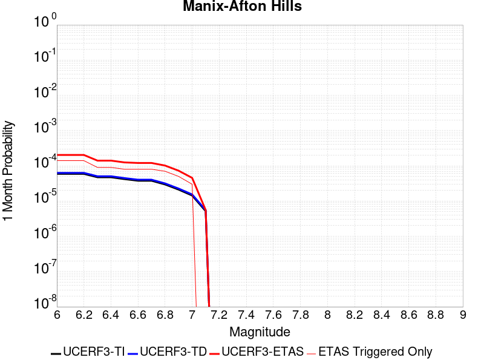 |  |  |

| Magnitude | 1 wk TI Prob | 1 wk TD Prob | 1 wk ETAS Prob | 1 wk ETAS/TD Gain | 1 wk ETAS Triggered Only | 1 mo TI Prob | 1 mo TD Prob | 1 mo ETAS Prob | 1 mo ETAS/TD Gain | 1 mo ETAS Triggered Only | 1 yr TI Prob | 1 yr TD Prob | 1 yr ETAS Prob | 1 yr ETAS/TD Gain | 1 yr ETAS Triggered Only | 10 yr TI Prob | 10 yr TD Prob | 10 yr ETAS Prob | 10 yr ETAS/TD Gain | 10 yr ETAS Triggered Only |
|-----|-----|-----|-----|-----|-----|-----|-----|-----|-----|-----|-----|-----|-----|-----|-----|-----|-----|-----|-----|-----|
| 6.0 | 1.3783202E-5 | 1.47110895E-5 | 1.3470932E-4 | 9.156991 | 1.2E-4 | 5.906953E-5 | 6.30461E-5 | 2.0303727E-4 | 3.2204573 | 1.4E-4 | 7.189342E-4 | 7.6733343E-4 | 9.4719534E-4 | 1.2343986 | 1.8E-4 | 0.0071661277 | 0.007648596 | 0.007946301 | 1.0389229 | 3.0E-4 |
| 6.1 | 1.3783202E-5 | 1.47110895E-5 | 1.3470932E-4 | 9.156991 | 1.2E-4 | 5.906953E-5 | 6.30461E-5 | 2.0303727E-4 | 3.2204573 | 1.4E-4 | 7.189342E-4 | 7.6733343E-4 | 9.4719534E-4 | 1.2343986 | 1.8E-4 | 0.0071661277 | 0.007648596 | 0.007946301 | 1.0389229 | 3.0E-4 |
| 6.2 | 1.3783202E-5 | 1.47110895E-5 | 1.3470932E-4 | 9.156991 | 1.2E-4 | 5.906953E-5 | 6.30461E-5 | 2.0303727E-4 | 3.2204573 | 1.4E-4 | 7.189342E-4 | 7.6733343E-4 | 9.4719534E-4 | 1.2343986 | 1.8E-4 | 0.0071661277 | 0.007648596 | 0.007946301 | 1.0389229 | 3.0E-4 |
| 6.3 | 1.10494875E-5 | 1.1793136E-5 | 8.1792314E-5 | 6.9355865 | 7.0E-5 | 4.7354086E-5 | 5.054109E-5 | 1.4053655E-4 | 2.7806394 | 9.0E-5 | 5.763835E-4 | 6.151744E-4 | 7.351006E-4 | 1.1949466 | 1.2E-4 | 0.005748908 | 0.0061357557 | 0.006344467 | 1.0340157 | 2.1E-4 |
| 6.4 | 1.10494875E-5 | 1.1793136E-5 | 8.1792314E-5 | 6.9355865 | 7.0E-5 | 4.7354086E-5 | 5.054109E-5 | 1.4053655E-4 | 2.7806394 | 9.0E-5 | 5.763835E-4 | 6.151744E-4 | 7.351006E-4 | 1.1949466 | 1.2E-4 | 0.005748908 | 0.0061357557 | 0.006344467 | 1.0340157 | 2.1E-4 |
| 6.5 | 9.788949E-6 | 1.045432E-5 | 7.0453694E-5 | 6.7391944 | 6.0E-5 | 4.1951964E-5 | 4.480351E-5 | 1.2479993E-4 | 2.7854943 | 8.0E-5 | 5.1064545E-4 | 5.453555E-4 | 6.4530096E-4 | 1.1832666 | 1.0E-4 | 0.0050947363 | 0.0054410985 | 0.0056101736 | 1.0310737 | 1.7E-4 |
| 6.6 | 8.810006E-6 | 9.4136285E-6 | 6.9413065E-5 | 7.373678 | 6.0E-5 | 3.775662E-5 | 4.0343548E-5 | 1.2034032E-4 | 2.982889 | 8.0E-5 | 4.5958988E-4 | 4.9108086E-4 | 5.810367E-4 | 1.1831793 | 9.0E-5 | 0.0045864056 | 0.004900839 | 0.005060055 | 1.0324875 | 1.6E-4 |
| 6.7 | 8.80128E-6 | 9.404108E-6 | 6.940354E-5 | 7.3801303 | 6.0E-5 | 3.7719226E-5 | 4.0302748E-5 | 1.20299526E-4 | 2.9848964 | 8.0E-5 | 4.591348E-4 | 4.9058435E-4 | 5.805402E-4 | 1.1833646 | 9.0E-5 | 0.004581874 | 0.0048958957 | 0.0050551128 | 1.0325204 | 1.6E-4 |
| 6.8 | 6.8994877E-6 | 7.380076E-6 | 5.7379708E-5 | 7.774948 | 5.0E-5 | 2.9568899E-5 | 3.162856E-5 | 1.0162635E-4 | 3.2131195 | 7.0E-5 | 3.5994186E-4 | 3.8501783E-4 | 4.549909E-4 | 1.1817398 | 7.0E-5 | 0.003593594 | 0.0038443129 | 0.0039837747 | 1.0362774 | 1.4E-4 |
| 6.9 | 4.9328037E-6 | 5.2709615E-6 | 3.5270805E-5 | 6.691531 | 3.0E-5 | 2.1140417E-5 | 2.2589675E-5 | 7.258855E-5 | 3.2133508 | 5.0E-5 | 2.5735417E-4 | 2.7500073E-4 | 3.24987E-4 | 1.1817677 | 5.0E-5 | 0.0025705635 | 0.0027472095 | 0.0028369622 | 1.0326705 | 9.0E-5 |
| 7.0 | 3.347973E-6 | 3.59003E-6 | 2.3589959E-5 | 6.5709643 | 2.0E-5 | 1.4348378E-5 | 1.5385775E-5 | 4.5385314E-5 | 2.949823 | 3.0E-5 | 1.746775E-4 | 1.8730981E-4 | 2.173042E-4 | 1.1601324 | 3.0E-5 | 0.0017454025 | 0.0018719219 | 0.0019218284 | 1.0266606 | 5.0E-5 |
| 7.1 | 1.2073567E-6 | 1.293482E-6 | 1.293482E-6 | 1.0 | 0.0 | 5.1743755E-6 | 5.543492E-6 | 5.543492E-6 | 1.0 | 0.0 | 6.29962E-5 | 6.749156E-5 | 6.749156E-5 | 1.0 | 0.0 | 6.297835E-4 | 6.7487074E-4 | 6.7487074E-4 | 1.0 | 0.0 |

## San Jacinto (Stepovers Combined)
*[(top)](#table-of-contents)*

| 1 Week | 1 Month | 1 Year | 10 Year |
|-----|-----|-----|-----|
|  |  |  |  |

| Magnitude | 1 wk TI Prob | 1 wk TD Prob | 1 wk ETAS Prob | 1 wk ETAS/TD Gain | 1 wk ETAS Triggered Only | 1 mo TI Prob | 1 mo TD Prob | 1 mo ETAS Prob | 1 mo ETAS/TD Gain | 1 mo ETAS Triggered Only | 1 yr TI Prob | 1 yr TD Prob | 1 yr ETAS Prob | 1 yr ETAS/TD Gain | 1 yr ETAS Triggered Only | 10 yr TI Prob | 10 yr TD Prob | 10 yr ETAS Prob | 10 yr ETAS/TD Gain | 10 yr ETAS Triggered Only |
|-----|-----|-----|-----|-----|-----|-----|-----|-----|-----|-----|-----|-----|-----|-----|-----|-----|-----|-----|-----|-----|
| 6.0 | 4.0667746E-5 | 3.5271103E-5 | 1.5526687E-4 | 4.4020987 | 1.2E-4 | 1.742787E-4 | 1.5115313E-4 | 3.1112894E-4 | 2.0583692 | 1.6E-4 | 0.0021197782 | 0.0018387372 | 0.002098259 | 1.1411414 | 2.6E-4 | 0.020996714 | 0.018986495 | 0.01929061 | 1.0160174 | 3.1E-4 |
| 6.1 | 4.0667746E-5 | 3.5271103E-5 | 1.5526687E-4 | 4.4020987 | 1.2E-4 | 1.742787E-4 | 1.5115313E-4 | 3.1112894E-4 | 2.0583692 | 1.6E-4 | 0.0021197782 | 0.0018387372 | 0.002098259 | 1.1411414 | 2.6E-4 | 0.020996714 | 0.018986495 | 0.01929061 | 1.0160174 | 3.1E-4 |
| 6.2 | 4.0667746E-5 | 3.5271103E-5 | 1.5526687E-4 | 4.4020987 | 1.2E-4 | 1.742787E-4 | 1.5115313E-4 | 3.1112894E-4 | 2.0583692 | 1.6E-4 | 0.0021197782 | 0.0018387372 | 0.002098259 | 1.1411414 | 2.6E-4 | 0.020996714 | 0.018986495 | 0.01929061 | 1.0160174 | 3.1E-4 |
| 6.3 | 4.0667746E-5 | 3.5271103E-5 | 1.5526687E-4 | 4.4020987 | 1.2E-4 | 1.742787E-4 | 1.5115313E-4 | 3.1112894E-4 | 2.0583692 | 1.6E-4 | 0.0021197782 | 0.0018387372 | 0.002098259 | 1.1411414 | 2.6E-4 | 0.020996714 | 0.018986495 | 0.01929061 | 1.0160174 | 3.1E-4 |
| 6.4 | 4.0577226E-5 | 3.5143014E-5 | 1.551388E-4 | 4.414499 | 1.2E-4 | 1.738908E-4 | 1.5060425E-4 | 3.1058016E-4 | 2.062227 | 1.6E-4 | 0.0021150648 | 0.0018320669 | 0.0020915905 | 1.1416562 | 2.6E-4 | 0.020950472 | 0.018921062 | 0.019225197 | 1.0160738 | 3.1E-4 |
| 6.5 | 4.0577226E-5 | 3.5143014E-5 | 1.551388E-4 | 4.414499 | 1.2E-4 | 1.738908E-4 | 1.5060425E-4 | 3.1058016E-4 | 2.062227 | 1.6E-4 | 0.0021150648 | 0.0018320669 | 0.0020915905 | 1.1416562 | 2.6E-4 | 0.020950472 | 0.018921062 | 0.019225197 | 1.0160738 | 3.1E-4 |
| 6.6 | 4.053861E-5 | 3.5088357E-5 | 1.5508414E-4 | 4.419818 | 1.2E-4 | 1.7372532E-4 | 1.5037002E-4 | 3.1034596E-4 | 2.0638819 | 1.6E-4 | 0.0021130538 | 0.0018292206 | 0.002088745 | 1.141877 | 2.6E-4 | 0.020930743 | 0.01889314 | 0.019197283 | 1.016098 | 3.1E-4 |
| 6.7 | 4.0516545E-5 | 3.505743E-5 | 1.5505322E-4 | 4.422835 | 1.2E-4 | 1.7363077E-4 | 1.502375E-4 | 3.1021345E-4 | 2.0648205 | 1.6E-4 | 0.002111905 | 0.0018276101 | 0.0020871349 | 1.1420023 | 2.6E-4 | 0.020919468 | 0.018877337 | 0.019181484 | 1.0161119 | 3.1E-4 |
| 6.8 | 4.049434E-5 | 3.5028992E-5 | 1.5502478E-4 | 4.4256134 | 1.2E-4 | 1.7353562E-4 | 1.5011564E-4 | 3.1009162E-4 | 2.065685 | 1.6E-4 | 0.0021107488 | 0.0018261289 | 0.002085654 | 1.1421177 | 2.6E-4 | 0.020908125 | 0.018862749 | 0.019166902 | 1.0161245 | 3.1E-4 |
| 6.9 | 4.046386E-5 | 3.4991554E-5 | 1.5498736E-4 | 4.429279 | 1.2E-4 | 1.73405E-4 | 1.499552E-4 | 3.099312E-4 | 2.0668254 | 1.6E-4 | 0.0021091616 | 0.0018241788 | 0.0020837046 | 1.1422698 | 2.6E-4 | 0.020892553 | 0.018843522 | 0.019147681 | 1.0161413 | 3.1E-4 |
| 7.0 | 4.036382E-5 | 3.4872126E-5 | 1.5486794E-4 | 4.441024 | 1.2E-4 | 1.7297632E-4 | 1.4944343E-4 | 3.094195E-4 | 2.0704794 | 1.6E-4 | 0.0021039525 | 0.0018179584 | 0.002077486 | 1.1427575 | 2.6E-4 | 0.02084144 | 0.018782137 | 0.019086314 | 1.016195 | 3.1E-4 |
| 7.1 | 4.0343282E-5 | 3.485059E-5 | 1.548464E-4 | 4.4431505 | 1.2E-4 | 1.7288832E-4 | 1.4935112E-4 | 3.0932724E-4 | 2.071141 | 1.6E-4 | 0.002102883 | 0.0018168368 | 0.0020763644 | 1.1428459 | 2.6E-4 | 0.020830948 | 0.018771008 | 0.019075189 | 1.0162048 | 3.1E-4 |
| 7.2 | 4.0257353E-5 | 3.475509E-5 | 1.5475092E-4 | 4.452612 | 1.2E-4 | 1.725201E-4 | 1.489419E-4 | 3.0891807E-4 | 2.0740845 | 1.6E-4 | 0.0020984085 | 0.0018118626 | 0.0020713916 | 1.1432388 | 2.6E-4 | 0.020787042 | 0.018721746 | 0.019025942 | 1.0162482 | 3.1E-4 |
| 7.3 | 3.9940667E-5 | 3.458276E-5 | 1.545786E-4 | 4.469817 | 1.2E-4 | 1.7116306E-4 | 1.4820343E-4 | 3.081797E-4 | 2.0794373 | 1.6E-4 | 0.0020819185 | 0.0018028866 | 0.0020624178 | 1.1439532 | 2.6E-4 | 0.020625217 | 0.018630387 | 0.018934611 | 1.0163295 | 3.1E-4 |
| 7.4 | 3.9721202E-5 | 3.4468165E-5 | 1.5446403E-4 | 4.4813533 | 1.2E-4 | 1.7022261E-4 | 1.4771236E-4 | 3.0768872E-4 | 2.0830262 | 1.6E-4 | 0.0020704903 | 0.0017969179 | 0.0020564506 | 1.1444322 | 2.6E-4 | 0.020513052 | 0.018569522 | 0.018873764 | 1.016384 | 3.1E-4 |
| 7.5 | 3.7036873E-5 | 3.3535776E-5 | 1.5353176E-4 | 4.5781484 | 1.2E-4 | 1.5871979E-4 | 1.4371685E-4 | 3.0369384E-4 | 2.1131403 | 1.6E-4 | 0.0019307006 | 0.0017483513 | 0.0020078968 | 1.1484516 | 2.6E-4 | 0.019140124 | 0.018071128 | 0.018375527 | 1.0168444 | 3.1E-4 |
| 7.6 | 3.2940967E-5 | 3.13167E-5 | 1.5131294E-4 | 4.8317013 | 1.2E-4 | 1.4116794E-4 | 1.3420754E-4 | 2.9418606E-4 | 2.1920233 | 1.6E-4 | 0.0017173645 | 0.0016327545 | 0.0018923299 | 1.1589801 | 2.6E-4 | 0.01704153 | 0.016904091 | 0.01720885 | 1.0180287 | 3.1E-4 |
| 7.7 | 2.8236149E-5 | 2.7882697E-5 | 1.4787936E-4 | 5.303624 | 1.2E-4 | 1.2100645E-4 | 1.1949181E-4 | 2.7947268E-4 | 2.338844 | 1.6E-4 | 0.0014722579 | 0.0014538429 | 0.0017134649 | 1.1785764 | 2.6E-4 | 0.014625421 | 0.015114912 | 0.015420226 | 1.0201995 | 3.1E-4 |
| 7.8 | 2.4329287E-5 | 2.5206451E-5 | 1.3520368E-4 | 5.3638525 | 1.1E-4 | 1.042642E-4 | 1.08023174E-4 | 2.5800697E-4 | 2.3884408 | 1.5E-4 | 0.0012686774 | 0.0013143895 | 0.0015640609 | 1.1899524 | 2.5E-4 | 0.012614589 | 0.013712341 | 0.014008227 | 1.0215781 | 3.0E-4 |
| 7.9 | 1.9370926E-5 | 2.0420413E-5 | 1.3041816E-4 | 6.3866568 | 1.1E-4 | 8.301561E-5 | 8.751312E-5 | 2.375E-4 | 2.7138786 | 1.5E-4 | 0.0010102465 | 0.0010649522 | 0.001314686 | 1.2345023 | 2.5E-4 | 0.0100566605 | 0.011199402 | 0.011496042 | 1.0264871 | 3.0E-4 |
| 8.0 | 1.5583017E-5 | 1.5885415E-5 | 8.5884305E-5 | 5.406488 | 7.0E-5 | 6.6782646E-5 | 6.807858E-5 | 1.6807177E-4 | 2.4687908 | 1.0E-4 | 8.127754E-4 | 8.2854216E-4 | 0.001008393 | 1.217069 | 1.8E-4 | 0.008098091 | 0.008781636 | 0.009009616 | 1.025961 | 2.3E-4 |
| 8.1 | 1.0024873E-5 | 8.291399E-6 | 8.291399E-6 | 1.0 | 0.0 | 4.2963035E-5 | 3.553409E-5 | 6.553302E-5 | 1.8442297 | 3.0E-5 | 5.229494E-4 | 4.3254215E-4 | 4.7252484E-4 | 1.0924366 | 4.0E-5 | 0.0052172043 | 0.0046530655 | 0.0046928795 | 1.0085565 | 4.0E-5 |
| 8.2 | 4.142796E-6 | 1.5602761E-6 | 1.5602761E-6 | 1.0 | 0.0 | 1.775472E-5 | 6.6868806E-6 | 6.6868806E-6 | 1.0 | 0.0 | 2.1614227E-4 | 8.140976E-5 | 8.140976E-5 | 1.0 | 0.0 | 0.0021593217 | 9.4514614E-4 | 9.4514614E-4 | 1.0 | 0.0 |
| 8.3 | 1.2750878E-6 | 3.609817E-7 | 3.609817E-7 | 1.0 | 0.0 | 5.4646503E-6 | 1.5470634E-6 | 1.5470634E-6 | 1.0 | 0.0 | 6.653009E-5 | 1.8835339E-5 | 1.8835339E-5 | 1.0 | 0.0 | 6.6510175E-4 | 2.272251E-4 | 2.272251E-4 | 1.0 | 0.0 |

## San Andreas (North Branch Mill Creek)
*[(top)](#table-of-contents)*

| 1 Week | 1 Month | 1 Year | 10 Year |
|-----|-----|-----|-----|
|  |  |  |  |

| Magnitude | 1 wk TI Prob | 1 wk TD Prob | 1 wk ETAS Prob | 1 wk ETAS/TD Gain | 1 wk ETAS Triggered Only | 1 mo TI Prob | 1 mo TD Prob | 1 mo ETAS Prob | 1 mo ETAS/TD Gain | 1 mo ETAS Triggered Only | 1 yr TI Prob | 1 yr TD Prob | 1 yr ETAS Prob | 1 yr ETAS/TD Gain | 1 yr ETAS Triggered Only | 10 yr TI Prob | 10 yr TD Prob | 10 yr ETAS Prob | 10 yr ETAS/TD Gain | 10 yr ETAS Triggered Only |
|-----|-----|-----|-----|-----|-----|-----|-----|-----|-----|-----|-----|-----|-----|-----|-----|-----|-----|-----|-----|-----|
| 6.0 | 1.3461156E-5 | 2.3500992E-5 | 1.4349817E-4 | 6.1060476 | 1.2E-4 | 5.7689394E-5 | 1.00714664E-4 | 2.4070057E-4 | 2.3899257 | 1.4E-4 | 7.02142E-4 | 0.0012255146 | 0.0014352573 | 1.1711466 | 2.1E-4 | 0.0069992766 | 0.012228744 | 0.012525075 | 1.0242324 | 3.0E-4 |
| 6.1 | 1.3461156E-5 | 2.3500992E-5 | 1.4349817E-4 | 6.1060476 | 1.2E-4 | 5.7689394E-5 | 1.00714664E-4 | 2.4070057E-4 | 2.3899257 | 1.4E-4 | 7.02142E-4 | 0.0012255146 | 0.0014352573 | 1.1711466 | 2.1E-4 | 0.0069992766 | 0.012228744 | 0.012525075 | 1.0242324 | 3.0E-4 |
| 6.2 | 1.3461156E-5 | 2.3500992E-5 | 1.4349817E-4 | 6.1060476 | 1.2E-4 | 5.7689394E-5 | 1.00714664E-4 | 2.4070057E-4 | 2.3899257 | 1.4E-4 | 7.02142E-4 | 0.0012255146 | 0.0014352573 | 1.1711466 | 2.1E-4 | 0.0069992766 | 0.012228744 | 0.012525075 | 1.0242324 | 3.0E-4 |
| 6.3 | 1.3461156E-5 | 2.3500992E-5 | 1.4349817E-4 | 6.1060476 | 1.2E-4 | 5.7689394E-5 | 1.00714664E-4 | 2.4070057E-4 | 2.3899257 | 1.4E-4 | 7.02142E-4 | 0.0012255146 | 0.0014352573 | 1.1711466 | 2.1E-4 | 0.0069992766 | 0.012228744 | 0.012525075 | 1.0242324 | 3.0E-4 |
| 6.4 | 1.3461156E-5 | 2.3500992E-5 | 1.4349817E-4 | 6.1060476 | 1.2E-4 | 5.7689394E-5 | 1.00714664E-4 | 2.4070057E-4 | 2.3899257 | 1.4E-4 | 7.02142E-4 | 0.0012255146 | 0.0014352573 | 1.1711466 | 2.1E-4 | 0.0069992766 | 0.012228744 | 0.012525075 | 1.0242324 | 3.0E-4 |
| 6.5 | 1.3450706E-5 | 2.348995E-5 | 1.4348714E-4 | 6.1084476 | 1.2E-4 | 5.764461E-5 | 1.00667356E-4 | 2.4065326E-4 | 2.390579 | 1.4E-4 | 7.0159714E-4 | 0.0012249392 | 0.001434682 | 1.1712271 | 2.1E-4 | 0.006993862 | 0.012223054 | 0.012519387 | 1.0242438 | 3.0E-4 |
| 6.6 | 1.3074523E-5 | 2.3104236E-5 | 1.4310147E-4 | 6.1937327 | 1.2E-4 | 5.6032466E-5 | 9.901441E-5 | 2.3900055E-4 | 2.4137955 | 1.4E-4 | 6.8198174E-4 | 0.001204837 | 0.001414584 | 1.1740874 | 2.1E-4 | 0.006798926 | 0.012024219 | 0.012320612 | 1.0246496 | 3.0E-4 |
| 6.7 | 1.3050216E-5 | 2.3079532E-5 | 1.4307676E-4 | 6.199292 | 1.2E-4 | 5.59283E-5 | 9.890855E-5 | 2.388947E-4 | 2.415309 | 1.4E-4 | 6.8071426E-4 | 0.0012035496 | 0.0014132968 | 1.1742738 | 2.1E-4 | 0.0067863287 | 0.012011484 | 0.01230788 | 1.0246761 | 3.0E-4 |
| 6.8 | 1.29049395E-5 | 2.2927941E-5 | 1.4292519E-4 | 6.233669 | 1.2E-4 | 5.530571E-5 | 9.825892E-5 | 2.3824516E-4 | 2.4246671 | 1.4E-4 | 6.73139E-4 | 0.001195649 | 0.0014053979 | 1.1754268 | 2.1E-4 | 0.0067110364 | 0.011933329 | 0.012229748 | 1.0248396 | 3.0E-4 |
| 6.9 | 1.2867369E-5 | 2.2887343E-5 | 1.428846E-4 | 6.2429523 | 1.2E-4 | 5.51447E-5 | 9.808494E-5 | 2.3807121E-4 | 2.4271944 | 1.4E-4 | 6.711799E-4 | 0.0011935332 | 0.0014032825 | 1.1757382 | 2.1E-4 | 0.006691564 | 0.011912397 | 0.012208824 | 1.0248839 | 3.0E-4 |
| 7.0 | 1.2495996E-5 | 2.2287419E-5 | 1.4228474E-4 | 6.3840833 | 1.2E-4 | 5.3553173E-5 | 9.551403E-5 | 2.3550066E-4 | 2.4656131 | 1.4E-4 | 6.518148E-4 | 0.0011622658 | 0.0013620333 | 1.1718776 | 2.0E-4 | 0.0064990623 | 0.011603 | 0.011889635 | 1.0247035 | 2.9E-4 |
| 7.1 | 1.2452067E-5 | 2.2232492E-5 | 1.4222982E-4 | 6.3973856 | 1.2E-4 | 5.3364907E-5 | 9.527864E-5 | 2.3526531E-4 | 2.4692345 | 1.4E-4 | 6.4952404E-4 | 0.001159403 | 0.0013591711 | 1.1723026 | 2.0E-4 | 0.0064762887 | 0.011574671 | 0.011861314 | 1.0247647 | 2.9E-4 |
| 7.2 | 1.2002777E-5 | 2.1611015E-5 | 1.3160864E-4 | 6.089887 | 1.1E-4 | 5.143946E-5 | 9.261536E-5 | 2.2260332E-4 | 2.4035249 | 1.3E-4 | 6.2609545E-4 | 0.0011270114 | 0.0013167972 | 1.1683974 | 1.9E-4 | 0.006243344 | 0.011254058 | 0.011530907 | 1.0245999 | 2.8E-4 |
| 7.3 | 1.1923425E-5 | 2.1480853E-5 | 1.3147849E-4 | 6.120729 | 1.1E-4 | 5.109939E-5 | 9.205757E-5 | 2.2204561E-4 | 2.4120297 | 1.3E-4 | 6.219575E-4 | 0.0011202273 | 0.0013100144 | 1.1694185 | 1.9E-4 | 0.0062021962 | 0.011186945 | 0.011463813 | 1.0247492 | 2.8E-4 |
| 7.4 | 1.16105175E-5 | 2.0854808E-5 | 1.3085251E-4 | 6.274453 | 1.1E-4 | 4.975841E-5 | 8.93747E-5 | 2.1936308E-4 | 2.4544203 | 1.3E-4 | 6.0564023E-4 | 0.0010875963 | 0.0012773897 | 1.1745071 | 1.9E-4 | 0.006039923 | 0.010864409 | 0.011141367 | 1.0254922 | 2.8E-4 |
| 7.5 | 1.1037265E-5 | 1.9554842E-5 | 1.2955269E-4 | 6.6250954 | 1.1E-4 | 4.7301706E-5 | 8.380379E-5 | 2.137929E-4 | 2.5511127 | 1.3E-4 | 5.757461E-4 | 0.0010198357 | 0.0012096419 | 1.1861145 | 1.9E-4 | 0.005742567 | 0.010195527 | 0.010472673 | 1.027183 | 2.8E-4 |
| 7.6 | 1.0720915E-5 | 1.8996727E-5 | 1.2899464E-4 | 6.790361 | 1.1E-4 | 4.5945973E-5 | 8.141202E-5 | 2.1140144E-4 | 2.596686 | 1.3E-4 | 5.592486E-4 | 9.907428E-4 | 0.0011805545 | 1.1915853 | 1.9E-4 | 0.005578433 | 0.009907238 | 0.010184465 | 1.0279821 | 2.8E-4 |
| 7.7 | 9.276279E-6 | 1.6442464E-5 | 1.2644066E-4 | 7.689885 | 1.1E-4 | 3.9754876E-5 | 7.046581E-5 | 2.0045665E-4 | 2.8447363 | 1.3E-4 | 4.839081E-4 | 8.5758517E-4 | 0.0010474223 | 1.2213624 | 1.9E-4 | 0.0048285574 | 0.008586576 | 0.008864172 | 1.0323291 | 2.8E-4 |
| 7.8 | 5.8346777E-6 | 1.11555855E-5 | 1.2115436E-4 | 10.860421 | 1.1E-4 | 2.5005522E-5 | 4.7808775E-5 | 1.7780256E-4 | 3.719036 | 1.3E-4 | 3.043997E-4 | 5.819165E-4 | 7.7180594E-4 | 1.3263173 | 1.9E-4 | 0.0030398308 | 0.0058473335 | 0.006125696 | 1.047605 | 2.8E-4 |
| 7.9 | 4.690204E-6 | 8.509473E-6 | 1.18508535E-4 | 13.926659 | 1.1E-4 | 2.0100719E-5 | 3.6468664E-5 | 1.6646393E-4 | 4.5645742 | 1.3E-4 | 2.4469878E-4 | 4.439156E-4 | 6.238357E-4 | 1.4053025 | 1.8E-4 | 0.002444295 | 0.004471165 | 0.004739958 | 1.060117 | 2.7E-4 |
| 8.0 | 2.9570454E-6 | 4.8470656E-6 | 2.484697E-5 | 5.126188 | 2.0E-5 | 1.267299E-5 | 2.0772974E-5 | 5.077235E-5 | 2.4441543 | 3.0E-5 | 1.5428272E-4 | 2.5288164E-4 | 2.8287404E-4 | 1.1186026 | 3.0E-5 | 0.0015417566 | 0.002549932 | 0.0025998047 | 1.0195583 | 5.0E-5 |
| 8.1 | 1.6376824E-6 | 2.1968672E-6 | 2.1968672E-6 | 1.0 | 0.0 | 7.01862E-6 | 9.415111E-6 | 1.9415018E-5 | 2.0621123 | 1.0E-5 | 8.544835E-5 | 1.1462297E-4 | 1.2462182E-4 | 1.0872326 | 1.0E-5 | 8.54155E-4 | 0.0011607445 | 0.0011707328 | 1.0086051 | 1.0E-5 |
| 8.2 | 6.9631557E-7 | 4.535001E-7 | 4.535001E-7 | 1.0 | 0.0 | 2.984206E-6 | 1.9435704E-6 | 1.9435704E-6 | 1.0 | 0.0 | 3.63321E-5 | 2.3662713E-5 | 2.3662713E-5 | 1.0 | 0.0 | 3.6326164E-4 | 2.4510184E-4 | 2.4510184E-4 | 1.0 | 0.0 |
| 8.3 | 1.7876137E-7 | 8.357368E-8 | 8.357368E-8 | 1.0 | 0.0 | 7.661199E-7 | 3.5817288E-7 | 3.5817288E-7 | 1.0 | 0.0 | 9.32747E-6 | 4.3607465E-6 | 4.3607465E-6 | 1.0 | 0.0 | 9.3270784E-5 | 4.5800018E-5 | 4.5800018E-5 | 1.0 | 0.0 |

## Santa Ynez (East)
*[(top)](#table-of-contents)*

| 1 Week | 1 Month | 1 Year | 10 Year |
|-----|-----|-----|-----|
| 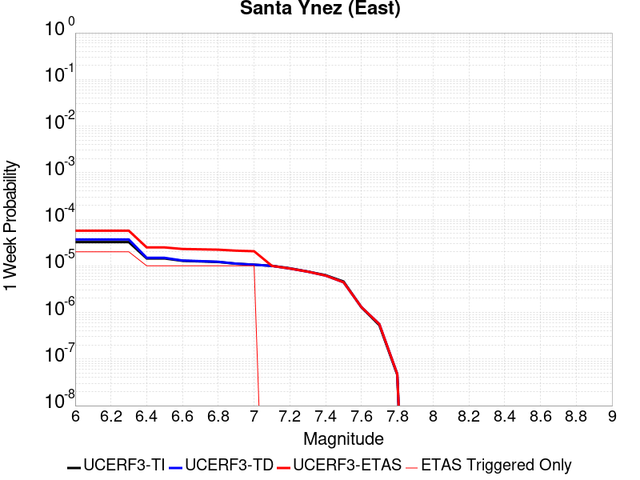 |  |  |  |

| Magnitude | 1 wk TI Prob | 1 wk TD Prob | 1 wk ETAS Prob | 1 wk ETAS/TD Gain | 1 wk ETAS Triggered Only | 1 mo TI Prob | 1 mo TD Prob | 1 mo ETAS Prob | 1 mo ETAS/TD Gain | 1 mo ETAS Triggered Only | 1 yr TI Prob | 1 yr TD Prob | 1 yr ETAS Prob | 1 yr ETAS/TD Gain | 1 yr ETAS Triggered Only | 10 yr TI Prob | 10 yr TD Prob | 10 yr ETAS Prob | 10 yr ETAS/TD Gain | 10 yr ETAS Triggered Only |
|-----|-----|-----|-----|-----|-----|-----|-----|-----|-----|-----|-----|-----|-----|-----|-----|-----|-----|-----|-----|-----|
| 6.0 | 3.2269712E-5 | 3.6750775E-5 | 5.675004E-5 | 1.5441862 | 2.0E-5 | 1.3829143E-4 | 1.5749714E-4 | 2.1748769E-4 | 1.3808993 | 6.0E-5 | 0.0016823979 | 0.0019164253 | 0.0020661377 | 1.0781207 | 1.5E-4 | 0.016697178 | 0.019056438 | 0.019311484 | 1.0133836 | 2.6E-4 |
| 6.1 | 3.2269712E-5 | 3.6750775E-5 | 5.675004E-5 | 1.5441862 | 2.0E-5 | 1.3829143E-4 | 1.5749714E-4 | 2.1748769E-4 | 1.3808993 | 6.0E-5 | 0.0016823979 | 0.0019164253 | 0.0020661377 | 1.0781207 | 1.5E-4 | 0.016697178 | 0.019056438 | 0.019311484 | 1.0133836 | 2.6E-4 |
| 6.2 | 3.2269712E-5 | 3.6750775E-5 | 5.675004E-5 | 1.5441862 | 2.0E-5 | 1.3829143E-4 | 1.5749714E-4 | 2.1748769E-4 | 1.3808993 | 6.0E-5 | 0.0016823979 | 0.0019164253 | 0.0020661377 | 1.0781207 | 1.5E-4 | 0.016697178 | 0.019056438 | 0.019311484 | 1.0133836 | 2.6E-4 |
| 6.3 | 3.2269712E-5 | 3.6750775E-5 | 5.675004E-5 | 1.5441862 | 2.0E-5 | 1.3829143E-4 | 1.5749714E-4 | 2.1748769E-4 | 1.3808993 | 6.0E-5 | 0.0016823979 | 0.0019164253 | 0.0020661377 | 1.0781207 | 1.5E-4 | 0.016697178 | 0.019056438 | 0.019311484 | 1.0133836 | 2.6E-4 |
| 6.4 | 1.4404779E-5 | 1.48492945E-5 | 2.4849145E-5 | 1.6734227 | 1.0E-5 | 6.1733306E-5 | 6.363831E-5 | 9.36364E-5 | 1.4713842 | 3.0E-5 | 7.513438E-4 | 7.7452604E-4 | 8.544641E-4 | 1.103209 | 8.0E-5 | 0.0074880854 | 0.007718817 | 0.007827967 | 1.0141408 | 1.1E-4 |
| 6.5 | 1.4404779E-5 | 1.48492945E-5 | 2.4849145E-5 | 1.6734227 | 1.0E-5 | 6.1733306E-5 | 6.363831E-5 | 9.36364E-5 | 1.4713842 | 3.0E-5 | 7.513438E-4 | 7.7452604E-4 | 8.544641E-4 | 1.103209 | 8.0E-5 | 0.0074880854 | 0.007718817 | 0.007827967 | 1.0141408 | 1.1E-4 |
| 6.6 | 1.280208E-5 | 1.301186E-5 | 2.301173E-5 | 1.7685196 | 1.0E-5 | 5.4864904E-5 | 5.5763932E-5 | 8.576226E-5 | 1.5379522 | 3.0E-5 | 6.6777546E-4 | 6.7871617E-4 | 7.5866183E-4 | 1.1177896 | 8.0E-5 | 0.006657724 | 0.0067666434 | 0.006875899 | 1.0161462 | 1.1E-4 |
| 6.7 | 1.2457027E-5 | 1.262838E-5 | 2.2628254E-5 | 1.7918572 | 1.0E-5 | 5.3386164E-5 | 5.4120515E-5 | 8.4118896E-5 | 1.5542884 | 3.0E-5 | 6.497827E-4 | 6.5871974E-4 | 7.3866703E-4 | 1.1213677 | 8.0E-5 | 0.00647886 | 0.00656787 | 0.006677147 | 1.0166382 | 1.1E-4 |
| 6.8 | 1.2095134E-5 | 1.2230827E-5 | 2.2230704E-5 | 1.8175962 | 1.0E-5 | 5.1835254E-5 | 5.2416784E-5 | 8.2415216E-5 | 1.5723057 | 3.0E-5 | 6.309115E-4 | 6.3798914E-4 | 7.1793806E-4 | 1.125314 | 8.0E-5 | 0.0062912325 | 0.006361764 | 0.006471064 | 1.0171808 | 1.1E-4 |
| 6.9 | 1.1104036E-5 | 1.115726E-5 | 2.1157148E-5 | 1.8962674 | 1.0E-5 | 4.758786E-5 | 4.781596E-5 | 6.7815E-5 | 1.4182504 | 2.0E-5 | 5.7922816E-4 | 5.82005E-4 | 6.519643E-4 | 1.1202039 | 7.0E-5 | 0.005777207 | 0.0058049536 | 0.0058745476 | 1.0119886 | 7.0E-5 |
| 7.0 | 1.0577444E-5 | 1.05815925E-5 | 2.0581487E-5 | 1.9450274 | 1.0E-5 | 4.5331115E-5 | 4.53489E-5 | 6.5347995E-5 | 1.441005 | 2.0E-5 | 5.5176654E-4 | 5.5198424E-4 | 6.219456E-4 | 1.1267452 | 7.0E-5 | 0.0055039856 | 0.00550627 | 0.0055758846 | 1.0126427 | 7.0E-5 |
| 7.1 | 1.0021775E-5 | 9.9809E-6 | 9.9809E-6 | 1.0 | 0.0 | 4.294976E-5 | 4.277459E-5 | 5.2774165E-5 | 1.2337736 | 1.0E-5 | 5.2278786E-4 | 5.206574E-4 | 5.7063135E-4 | 1.0959824 | 5.0E-5 | 0.0052155964 | 0.005194508 | 0.0052442485 | 1.0095756 | 5.0E-5 |
| 7.2 | 8.874109E-6 | 8.748706E-6 | 8.748706E-6 | 1.0 | 0.0 | 3.8031343E-5 | 3.7493923E-5 | 4.7493548E-5 | 1.2666999 | 1.0E-5 | 4.629332E-4 | 4.56394E-4 | 4.963757E-4 | 1.0876036 | 4.0E-5 | 0.0046197 | 0.0045546847 | 0.004594503 | 1.0087422 | 4.0E-5 |
| 7.3 | 7.5504267E-6 | 7.5050243E-6 | 7.5050243E-6 | 1.0 | 0.0 | 3.235857E-5 | 3.2164E-5 | 4.2163676E-5 | 1.3108966 | 1.0E-5 | 3.9389438E-4 | 3.9152734E-4 | 4.1151952E-4 | 1.051062 | 2.0E-5 | 0.0039319694 | 0.0039084824 | 0.0039284043 | 1.005097 | 2.0E-5 |
| 7.4 | 6.309394E-6 | 6.183062E-6 | 6.183062E-6 | 1.0 | 0.0 | 2.703998E-5 | 2.6498574E-5 | 2.6498574E-5 | 1.0 | 0.0 | 3.2916202E-4 | 3.2257332E-4 | 3.325701E-4 | 1.0309907 | 1.0E-5 | 0.003286749 | 0.0032211484 | 0.003231116 | 1.0030944 | 1.0E-5 |
| 7.5 | 4.6103073E-6 | 4.4408016E-6 | 4.4408016E-6 | 1.0 | 0.0 | 1.975831E-5 | 1.9031871E-5 | 1.9031871E-5 | 1.0 | 0.0 | 2.4053088E-4 | 2.316891E-4 | 2.316891E-4 | 1.0 | 0.0 | 0.002402707 | 0.002314545 | 0.002314545 | 1.0 | 0.0 |
| 7.6 | 1.2858658E-6 | 1.3008196E-6 | 1.3008196E-6 | 1.0 | 0.0 | 5.5108417E-6 | 5.574929E-6 | 5.574929E-6 | 1.0 | 0.0 | 6.7092435E-5 | 6.787272E-5 | 6.787272E-5 | 1.0 | 0.0 | 6.707218E-4 | 6.7852676E-4 | 6.7852676E-4 | 1.0 | 0.0 |
| 7.7 | 5.3302307E-7 | 5.612138E-7 | 5.612138E-7 | 1.0 | 0.0 | 2.2843826E-6 | 2.4052001E-6 | 2.4052001E-6 | 1.0 | 0.0 | 2.7812002E-5 | 2.9282955E-5 | 2.9282955E-5 | 1.0 | 0.0 | 2.7808524E-4 | 2.9279455E-4 | 2.9279455E-4 | 1.0 | 0.0 |
| 7.8 | 4.613933E-8 | 4.80301E-8 | 4.80301E-8 | 1.0 | 0.0 | 1.9773998E-7 | 2.0584326E-7 | 2.0584326E-7 | 1.0 | 0.0 | 2.4074816E-6 | 2.5061388E-6 | 2.5061388E-6 | 1.0 | 0.0 | 2.4074554E-5 | 2.5061116E-5 | 2.5061116E-5 | 1.0 | 0.0 |

## Lake Isabella (Seismicity)
*[(top)](#table-of-contents)*

| 1 Week | 1 Month | 1 Year | 10 Year |
|-----|-----|-----|-----|
| 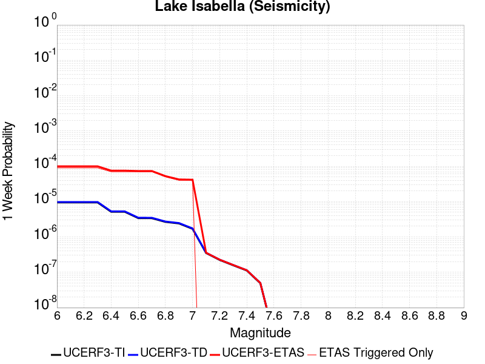 | 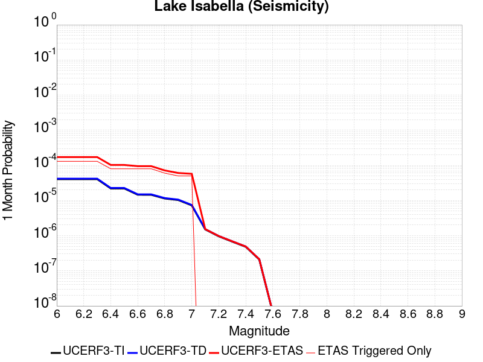 |  |  |

| Magnitude | 1 wk TI Prob | 1 wk TD Prob | 1 wk ETAS Prob | 1 wk ETAS/TD Gain | 1 wk ETAS Triggered Only | 1 mo TI Prob | 1 mo TD Prob | 1 mo ETAS Prob | 1 mo ETAS/TD Gain | 1 mo ETAS Triggered Only | 1 yr TI Prob | 1 yr TD Prob | 1 yr ETAS Prob | 1 yr ETAS/TD Gain | 1 yr ETAS Triggered Only | 10 yr TI Prob | 10 yr TD Prob | 10 yr ETAS Prob | 10 yr ETAS/TD Gain | 10 yr ETAS Triggered Only |
|-----|-----|-----|-----|-----|-----|-----|-----|-----|-----|-----|-----|-----|-----|-----|-----|-----|-----|-----|-----|-----|
| 6.0 | 9.431637E-6 | 9.741651E-6 | 9.974078E-5 | 10.238589 | 9.0E-5 | 4.0420677E-5 | 4.1749343E-5 | 1.7174392E-4 | 4.113692 | 1.3E-4 | 4.920106E-4 | 5.0819275E-4 | 7.18086E-4 | 1.4130191 | 2.1E-4 | 0.004909227 | 0.005071599 | 0.0053501786 | 1.0549294 | 2.8E-4 |
| 6.1 | 9.431637E-6 | 9.741651E-6 | 9.974078E-5 | 10.238589 | 9.0E-5 | 4.0420677E-5 | 4.1749343E-5 | 1.7174392E-4 | 4.113692 | 1.3E-4 | 4.920106E-4 | 5.0819275E-4 | 7.18086E-4 | 1.4130191 | 2.1E-4 | 0.004909227 | 0.005071599 | 0.0053501786 | 1.0549294 | 2.8E-4 |
| 6.2 | 9.431637E-6 | 9.741651E-6 | 9.974078E-5 | 10.238589 | 9.0E-5 | 4.0420677E-5 | 4.1749343E-5 | 1.7174392E-4 | 4.113692 | 1.3E-4 | 4.920106E-4 | 5.0819275E-4 | 7.18086E-4 | 1.4130191 | 2.1E-4 | 0.004909227 | 0.005071599 | 0.0053501786 | 1.0549294 | 2.8E-4 |
| 6.3 | 9.431637E-6 | 9.741651E-6 | 9.974078E-5 | 10.238589 | 9.0E-5 | 4.0420677E-5 | 4.1749343E-5 | 1.7174392E-4 | 4.113692 | 1.3E-4 | 4.920106E-4 | 5.0819275E-4 | 7.18086E-4 | 1.4130191 | 2.1E-4 | 0.004909227 | 0.005071599 | 0.0053501786 | 1.0549294 | 2.8E-4 |
| 6.4 | 5.144063E-6 | 5.3000763E-6 | 7.529971E-5 | 14.207288 | 7.0E-5 | 2.2045799E-5 | 2.2714434E-5 | 1.0271262E-4 | 4.5219097 | 8.0E-5 | 2.6837454E-4 | 2.765166E-4 | 3.964834E-4 | 1.4338503 | 1.2E-4 | 0.0026805066 | 0.0027620657 | 0.002901679 | 1.0505466 | 1.4E-4 |
| 6.5 | 5.144063E-6 | 5.3000763E-6 | 7.529971E-5 | 14.207288 | 7.0E-5 | 2.2045799E-5 | 2.2714434E-5 | 1.0271262E-4 | 4.5219097 | 8.0E-5 | 2.6837454E-4 | 2.765166E-4 | 3.964834E-4 | 1.4338503 | 1.2E-4 | 0.0026805066 | 0.0027620657 | 0.002901679 | 1.0505466 | 1.4E-4 |
| 6.6 | 3.4009804E-6 | 3.498786E-6 | 7.3498544E-5 | 21.006868 | 7.0E-5 | 1.4575549E-5 | 1.4994721E-5 | 9.499352E-5 | 6.335131 | 8.0E-5 | 1.7744285E-4 | 1.8254704E-4 | 2.9252697E-4 | 1.6024745 | 1.1E-4 | 0.0017730123 | 0.0018241286 | 0.0019538915 | 1.071137 | 1.3E-4 |
| 6.7 | 3.3880428E-6 | 3.4856528E-6 | 7.348541E-5 | 21.082253 | 7.0E-5 | 1.4520103E-5 | 1.4938435E-5 | 9.493724E-5 | 6.355233 | 8.0E-5 | 1.767679E-4 | 1.8186188E-4 | 2.9184186E-4 | 1.6047447 | 1.1E-4 | 0.0017662736 | 0.0018172882 | 0.001947052 | 1.0714052 | 1.3E-4 |
| 6.8 | 2.6582E-6 | 2.7337003E-6 | 5.2733565E-5 | 19.290178 | 5.0E-5 | 1.1392236E-5 | 1.1715813E-5 | 7.171511E-5 | 6.1212234 | 6.0E-5 | 1.3869164E-4 | 1.4263204E-4 | 2.3261919E-4 | 1.6309043 | 9.0E-5 | 0.0013860512 | 0.0014255369 | 0.0015353801 | 1.0770539 | 1.1E-4 |
| 6.9 | 2.406011E-6 | 2.4743288E-6 | 4.247423E-5 | 17.16596 | 4.0E-5 | 1.0311434E-5 | 1.0604231E-5 | 6.06037E-5 | 5.7150493 | 5.0E-5 | 1.2553448E-4 | 1.2910018E-4 | 2.0908985E-4 | 1.6195939 | 8.0E-5 | 0.0012546359 | 0.0012903814 | 0.0013902524 | 1.0773965 | 1.0E-4 |
| 7.0 | 1.6953097E-6 | 1.7429371E-6 | 4.1742867E-5 | 23.949726 | 4.0E-5 | 7.265593E-6 | 7.469715E-6 | 5.746934E-5 | 7.6936455 | 5.0E-5 | 8.8455E-5 | 9.094104E-5 | 1.6093467E-4 | 1.7696595 | 7.0E-5 | 8.84198E-4 | 9.09141E-4 | 9.990592E-4 | 1.0989046 | 9.0E-5 |
| 7.1 | 3.5013824E-7 | 3.5714822E-7 | 3.5714822E-7 | 1.0 | 0.0 | 1.5005916E-6 | 1.5306344E-6 | 1.5306344E-6 | 1.0 | 0.0 | 1.826955E-5 | 1.8635317E-5 | 2.8635131E-5 | 1.5366055 | 1.0E-5 | 1.8268047E-4 | 1.863378E-4 | 1.9633592E-4 | 1.053656 | 1.0E-5 |
| 7.2 | 2.2321095E-7 | 2.2750574E-7 | 2.2750574E-7 | 1.0 | 0.0 | 9.56618E-7 | 9.750242E-7 | 9.750242E-7 | 1.0 | 0.0 | 1.1646762E-5 | 1.1870856E-5 | 1.1870856E-5 | 1.0 | 0.0 | 1.1646151E-4 | 1.1870232E-4 | 1.1870232E-4 | 1.0 | 0.0 |
| 7.3 | 1.5760406E-7 | 1.6060922E-7 | 1.6060922E-7 | 1.0 | 0.0 | 6.7544585E-7 | 6.8832503E-7 | 6.8832503E-7 | 1.0 | 0.0 | 8.223522E-6 | 8.380326E-6 | 8.380326E-6 | 1.0 | 0.0 | 8.2232174E-5 | 8.3800165E-5 | 8.3800165E-5 | 1.0 | 0.0 |
| 7.4 | 1.1216497E-7 | 1.1431706E-7 | 1.1431706E-7 | 1.0 | 0.0 | 4.8070694E-7 | 4.899302E-7 | 4.899302E-7 | 1.0 | 0.0 | 5.852591E-6 | 5.964884E-6 | 5.964884E-6 | 1.0 | 0.0 | 5.8524372E-5 | 5.9647282E-5 | 5.9647282E-5 | 1.0 | 0.0 |
| 7.5 | 4.885185E-8 | 4.9787737E-8 | 4.9787737E-8 | 1.0 | 0.0 | 2.0936506E-7 | 2.13376E-7 | 2.13376E-7 | 1.0 | 0.0 | 2.5490165E-6 | 2.59785E-6 | 2.59785E-6 | 1.0 | 0.0 | 2.5489873E-5 | 2.5978214E-5 | 2.5978214E-5 | 1.0 | 0.0 |
| 7.6 | 1.504641E-9 | 1.5317903E-9 | 1.5317903E-9 | 1.0 | 0.0 | 6.4484613E-9 | 6.5648154E-9 | 6.5648154E-9 | 1.0 | 0.0 | 7.851001E-8 | 7.992663E-8 | 7.992663E-8 | 1.0 | 0.0 | 7.8509987E-7 | 7.992663E-7 | 7.992663E-7 | 1.0 | 0.0 |

## San Andreas (Creeping Section) 2011 CFM
*[(top)](#table-of-contents)*

| 1 Week | 1 Month | 1 Year | 10 Year |
|-----|-----|-----|-----|
|  | 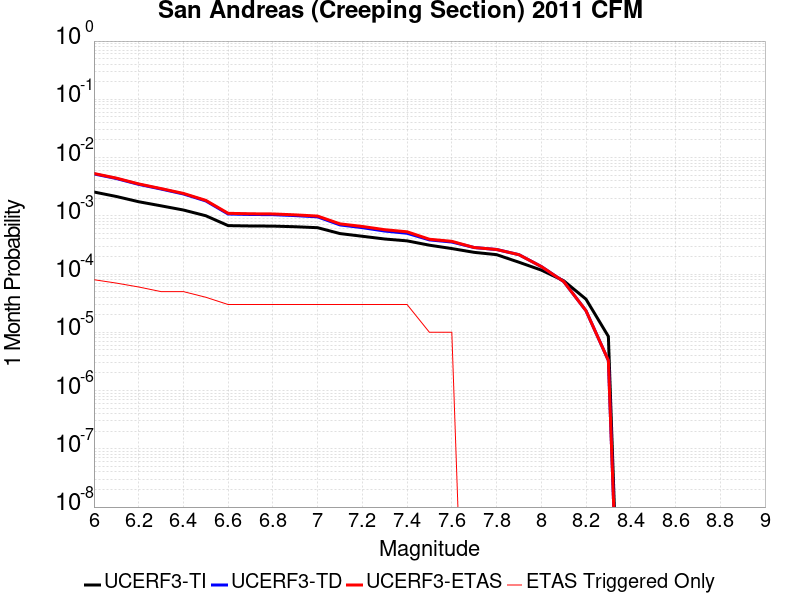 |  |  |

| Magnitude | 1 wk TI Prob | 1 wk TD Prob | 1 wk ETAS Prob | 1 wk ETAS/TD Gain | 1 wk ETAS Triggered Only | 1 mo TI Prob | 1 mo TD Prob | 1 mo ETAS Prob | 1 mo ETAS/TD Gain | 1 mo ETAS Triggered Only | 1 yr TI Prob | 1 yr TD Prob | 1 yr ETAS Prob | 1 yr ETAS/TD Gain | 1 yr ETAS Triggered Only | 10 yr TI Prob | 10 yr TD Prob | 10 yr ETAS Prob | 10 yr ETAS/TD Gain | 10 yr ETAS Triggered Only |
|-----|-----|-----|-----|-----|-----|-----|-----|-----|-----|-----|-----|-----|-----|-----|-----|-----|-----|-----|-----|-----|
| 6.0 | 5.986481E-4 | 0.0012275929 | 0.0012775315 | 1.0406802 | 5.0E-5 | 0.0025631124 | 0.005245547 | 0.005325127 | 1.015171 | 8.0E-5 | 0.030762846 | 0.06120491 | 0.061355118 | 1.0024542 | 1.6E-4 | 0.26835477 | 0.42593494 | 0.42606696 | 1.00031 | 2.3E-4 |
| 6.1 | 5.015945E-4 | 0.0010217986 | 0.0010717475 | 1.0488833 | 5.0E-5 | 0.00214792 | 0.0043678596 | 0.0044375537 | 1.0159562 | 7.0E-5 | 0.025839351 | 0.05124837 | 0.051381197 | 1.0025918 | 1.4E-4 | 0.23032776 | 0.37285668 | 0.37297583 | 1.0003196 | 1.9E-4 |
| 6.2 | 4.073338E-4 | 8.1073755E-4 | 8.60697E-4 | 1.0616223 | 5.0E-5 | 0.0017445484 | 0.0034671477 | 0.0035269395 | 1.0172453 | 6.0E-5 | 0.021034058 | 0.04093317 | 0.041057847 | 1.0030459 | 1.3E-4 | 0.19150782 | 0.31303346 | 0.3131571 | 1.000395 | 1.8E-4 |
| 6.3 | 3.464099E-4 | 6.7391695E-4 | 7.1389E-4 | 1.0593145 | 4.0E-5 | 0.0014837692 | 0.0028829593 | 0.002932815 | 1.0172933 | 5.0E-5 | 0.017915873 | 0.034189582 | 0.03429582 | 1.0031073 | 1.1E-4 | 0.16538359 | 0.2713166 | 0.27143317 | 1.0004297 | 1.6E-4 |
| 6.4 | 2.935057E-4 | 5.5442745E-4 | 5.944053E-4 | 1.0721065 | 4.0E-5 | 0.0012572751 | 0.0023725363 | 0.0024224177 | 1.0210245 | 5.0E-5 | 0.015200248 | 0.02826451 | 0.028371401 | 1.0037818 | 1.1E-4 | 0.14201577 | 0.23298529 | 0.23310801 | 1.0005268 | 1.6E-4 |
| 6.5 | 2.3409708E-4 | 4.2093755E-4 | 4.5092494E-4 | 1.0712395 | 3.0E-5 | 0.0010028875 | 0.0018019684 | 0.0018418964 | 1.0221579 | 4.0E-5 | 0.012141965 | 0.021587461 | 0.021685302 | 1.0045323 | 1.0E-4 | 0.11499573 | 0.18682368 | 0.18694566 | 1.0006529 | 1.5E-4 |
| 6.6 | 1.5842178E-4 | 2.506933E-4 | 2.706883E-4 | 1.0797588 | 2.0E-5 | 6.7877385E-4 | 0.0010739497 | 0.0011039175 | 1.0279043 | 3.0E-5 | 0.0082328 | 0.012995575 | 0.013074535 | 1.006076 | 8.0E-5 | 0.07934396 | 0.12314638 | 0.1232516 | 1.0008545 | 1.2E-4 |
| 6.7 | 1.5616413E-4 | 2.4605883E-4 | 2.660539E-4 | 1.0812614 | 2.0E-5 | 6.691031E-4 | 0.0010541069 | 0.0010840752 | 1.0284301 | 3.0E-5 | 0.0081159435 | 0.01275744 | 0.01283642 | 1.0061909 | 8.0E-5 | 0.0782586 | 0.12117351 | 0.12127897 | 1.0008703 | 1.2E-4 |
| 6.8 | 1.5538467E-4 | 2.4429744E-4 | 2.6429255E-4 | 1.0818474 | 2.0E-5 | 6.6576427E-4 | 0.0010465645 | 0.0010765331 | 1.0286353 | 3.0E-5 | 0.008075596 | 0.012666838 | 0.012745826 | 1.0062357 | 8.0E-5 | 0.07788358 | 0.120404355 | 0.12050991 | 1.0008767 | 1.2E-4 |
| 6.9 | 1.5153569E-4 | 2.3539034E-4 | 2.5538562E-4 | 1.0849452 | 2.0E-5 | 6.49277E-4 | 0.0010084276 | 0.0010383973 | 1.0297192 | 3.0E-5 | 0.007876333 | 0.01220901 | 0.012288034 | 1.0064726 | 8.0E-5 | 0.07602952 | 0.11647445 | 0.11658047 | 1.0009103 | 1.2E-4 |
| 7.0 | 1.4588932E-4 | 2.2396253E-4 | 2.4395806E-4 | 1.0892806 | 2.0E-5 | 6.250901E-4 | 9.5948833E-4 | 9.894596E-4 | 1.0312366 | 3.0E-5 | 0.0075839474 | 0.011619697 | 0.011698768 | 1.0068048 | 8.0E-5 | 0.073302895 | 0.11132046 | 0.1114271 | 1.000958 | 1.2E-4 |
| 7.1 | 1.1565079E-4 | 1.6281738E-4 | 1.8281412E-4 | 1.122817 | 2.0E-5 | 4.955521E-4 | 6.9760304E-4 | 7.275821E-4 | 1.0429744 | 3.0E-5 | 0.006016669 | 0.0084604435 | 0.008539766 | 1.0093758 | 8.0E-5 | 0.058563538 | 0.08367046 | 0.08378042 | 1.0013142 | 1.2E-4 |
| 7.2 | 1.0393792E-4 | 1.4615769E-4 | 1.6615476E-4 | 1.1368185 | 2.0E-5 | 4.4537216E-4 | 6.2624045E-4 | 6.562217E-4 | 1.0478749 | 3.0E-5 | 0.005408933 | 0.0075979927 | 0.0076773847 | 1.010449 | 8.0E-5 | 0.052791595 | 0.07561969 | 0.075730614 | 1.0014669 | 1.2E-4 |
| 7.3 | 9.332884E-5 | 1.2780898E-4 | 1.4780642E-4 | 1.1564635 | 2.0E-5 | 3.999194E-4 | 5.4763845E-4 | 5.77622E-4 | 1.0547507 | 3.0E-5 | 0.0048581534 | 0.006647249 | 0.006726717 | 1.011955 | 8.0E-5 | 0.047533102 | 0.06648326 | 0.06659528 | 1.001685 | 1.2E-4 |
| 7.4 | 8.670252E-5 | 1.17032345E-4 | 1.3703E-4 | 1.1708729 | 2.0E-5 | 3.715293E-4 | 5.0147134E-4 | 5.314563E-4 | 1.059794 | 3.0E-5 | 0.004513991 | 0.006088443 | 0.0061679557 | 1.0130596 | 8.0E-5 | 0.044233937 | 0.061151642 | 0.061264306 | 1.0018424 | 1.2E-4 |
| 7.5 | 7.3036405E-5 | 9.005856E-5 | 1.0005766E-4 | 1.1110289 | 1.0E-5 | 3.129756E-4 | 3.8590826E-4 | 3.959044E-4 | 1.0259029 | 1.0E-5 | 0.0038038217 | 0.0046883323 | 0.004728145 | 1.0084919 | 4.0E-5 | 0.03739367 | 0.047877792 | 0.04793492 | 1.0011932 | 6.0E-5 |
| 7.6 | 6.3935775E-5 | 8.280385E-5 | 9.280301E-5 | 1.1207573 | 1.0E-5 | 2.7398168E-4 | 3.5482543E-4 | 3.648219E-4 | 1.0281729 | 1.0E-5 | 0.0033306254 | 0.004311461 | 0.0043512885 | 1.0092376 | 4.0E-5 | 0.032811474 | 0.04399201 | 0.044049367 | 1.0013039 | 6.0E-5 |
| 7.7 | 5.5050095E-5 | 6.6618326E-5 | 6.6618326E-5 | 1.0 | 0.0 | 2.3590765E-4 | 2.854759E-4 | 2.854759E-4 | 1.0 | 0.0 | 0.0028683927 | 0.003470134 | 0.00350003 | 1.0086153 | 3.0E-5 | 0.0283165 | 0.035796214 | 0.035844423 | 1.0013468 | 5.0E-5 |
| 7.8 | 5.027131E-5 | 6.162871E-5 | 6.162871E-5 | 1.0 | 0.0 | 2.1543067E-4 | 2.640963E-4 | 2.640963E-4 | 1.0 | 0.0 | 0.0026197135 | 0.003210635 | 0.0032405388 | 1.009314 | 3.0E-5 | 0.025890453 | 0.03312666 | 0.033175003 | 1.0014594 | 5.0E-5 |
| 7.9 | 3.7271806E-5 | 5.022507E-5 | 5.022507E-5 | 1.0 | 0.0 | 1.5972654E-4 | 2.1523255E-4 | 2.1523255E-4 | 1.0 | 0.0 | 0.0019429359 | 0.002617309 | 0.0026472306 | 1.0114322 | 3.0E-5 | 0.019260362 | 0.027067466 | 0.027106382 | 1.0014378 | 4.0E-5 |
| 8.0 | 2.7310243E-5 | 3.1427757E-5 | 3.1427757E-5 | 1.0 | 0.0 | 1.17038646E-4 | 1.3468343E-4 | 1.3468343E-4 | 1.0 | 0.0 | 0.0014240141 | 0.0016385383 | 0.0016585055 | 1.012186 | 2.0E-5 | 0.014149235 | 0.01721386 | 0.017243344 | 1.0017128 | 3.0E-5 |
| 8.1 | 1.7940547E-5 | 1.7399378E-5 | 1.7399378E-5 | 1.0 | 0.0 | 7.688579E-5 | 7.456663E-5 | 7.456663E-5 | 1.0 | 0.0 | 9.3568244E-4 | 9.074711E-4 | 9.074711E-4 | 1.0 | 0.0 | 0.009317525 | 0.009798636 | 0.009808538 | 1.0010105 | 1.0E-5 |
| 8.2 | 8.643924E-6 | 5.473668E-6 | 5.473668E-6 | 1.0 | 0.0 | 3.704486E-5 | 2.3458366E-5 | 2.3458366E-5 | 1.0 | 0.0 | 4.5092785E-4 | 2.8556827E-4 | 2.8556827E-4 | 1.0 | 0.0 | 0.0045001395 | 0.0032481793 | 0.0032481793 | 1.0 | 0.0 |
| 8.3 | 1.983087E-6 | 7.6564595E-7 | 7.6564595E-7 | 1.0 | 0.0 | 8.498917E-6 | 3.281336E-6 | 3.281336E-6 | 1.0 | 0.0 | 1.034694E-4 | 3.9949547E-5 | 3.9949547E-5 | 1.0 | 0.0 | 0.0010342124 | 4.717979E-4 | 4.717979E-4 | 1.0 | 0.0 |

## Cleghorn Pass
*[(top)](#table-of-contents)*

| 1 Week | 1 Month | 1 Year | 10 Year |
|-----|-----|-----|-----|
|  |  |  |  |

| Magnitude | 1 wk TI Prob | 1 wk TD Prob | 1 wk ETAS Prob | 1 wk ETAS/TD Gain | 1 wk ETAS Triggered Only | 1 mo TI Prob | 1 mo TD Prob | 1 mo ETAS Prob | 1 mo ETAS/TD Gain | 1 mo ETAS Triggered Only | 1 yr TI Prob | 1 yr TD Prob | 1 yr ETAS Prob | 1 yr ETAS/TD Gain | 1 yr ETAS Triggered Only | 10 yr TI Prob | 10 yr TD Prob | 10 yr ETAS Prob | 10 yr ETAS/TD Gain | 10 yr ETAS Triggered Only |
|-----|-----|-----|-----|-----|-----|-----|-----|-----|-----|-----|-----|-----|-----|-----|-----|-----|-----|-----|-----|-----|
| 6.0 | 1.0522846E-5 | 1.1040642E-5 | 6.104009E-5 | 5.528672 | 5.0E-5 | 4.509713E-5 | 4.7316473E-5 | 1.1731316E-4 | 2.47933 | 7.0E-5 | 5.4891926E-4 | 5.759784E-4 | 6.959093E-4 | 1.2082211 | 1.2E-4 | 0.0054756533 | 0.005750022 | 0.0059389295 | 1.0328534 | 1.9E-4 |
| 6.1 | 1.0522846E-5 | 1.1040642E-5 | 6.104009E-5 | 5.528672 | 5.0E-5 | 4.509713E-5 | 4.7316473E-5 | 1.1731316E-4 | 2.47933 | 7.0E-5 | 5.4891926E-4 | 5.759784E-4 | 6.959093E-4 | 1.2082211 | 1.2E-4 | 0.0054756533 | 0.005750022 | 0.0059389295 | 1.0328534 | 1.9E-4 |
| 6.2 | 2.1045846E-6 | 2.2082024E-6 | 2.2082024E-6 | 1.0 | 0.0 | 9.019617E-6 | 9.463714E-6 | 9.463714E-6 | 1.0 | 0.0 | 1.098083E-4 | 1.1521882E-4 | 1.3521651E-4 | 1.1735628 | 2.0E-5 | 0.0010975406 | 0.0011520023 | 0.0011819677 | 1.0260116 | 3.0E-5 |
| 6.3 | 2.1045846E-6 | 2.2082024E-6 | 2.2082024E-6 | 1.0 | 0.0 | 9.019617E-6 | 9.463714E-6 | 9.463714E-6 | 1.0 | 0.0 | 1.098083E-4 | 1.1521882E-4 | 1.3521651E-4 | 1.1735628 | 2.0E-5 | 0.0010975406 | 0.0011520023 | 0.0011819677 | 1.0260116 | 3.0E-5 |
| 6.4 | 1.7259927E-6 | 1.810877E-6 | 1.810877E-6 | 1.0 | 0.0 | 7.3970905E-6 | 7.760902E-6 | 7.760902E-6 | 1.0 | 0.0 | 9.005586E-5 | 9.4488976E-5 | 1.1448709E-4 | 1.2116449 | 2.0E-5 | 9.001937E-4 | 9.448898E-4 | 9.7486144E-4 | 1.0317197 | 3.0E-5 |

## San Jacinto (Anza) rev
*[(top)](#table-of-contents)*

| 1 Week | 1 Month | 1 Year | 10 Year |
|-----|-----|-----|-----|
| 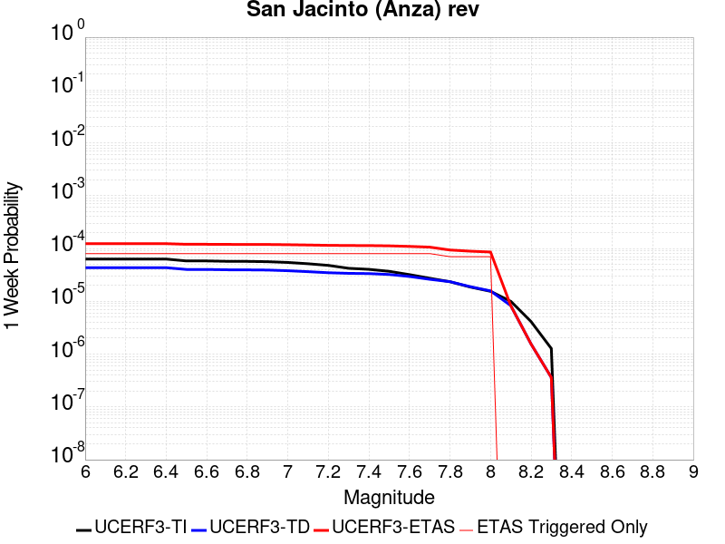 |  | 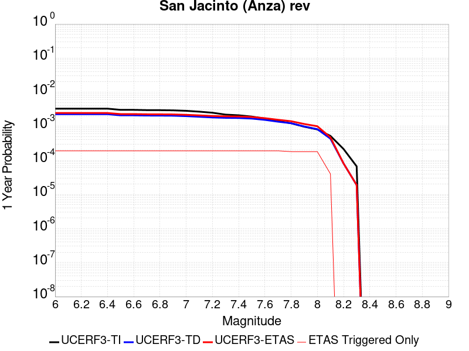 | 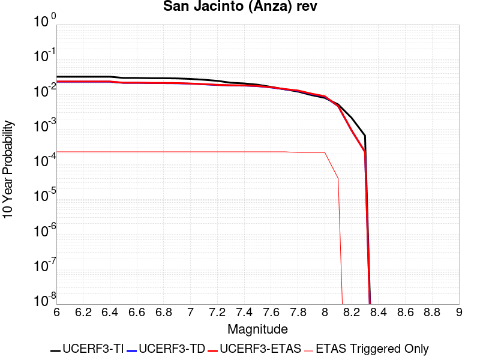 |

| Magnitude | 1 wk TI Prob | 1 wk TD Prob | 1 wk ETAS Prob | 1 wk ETAS/TD Gain | 1 wk ETAS Triggered Only | 1 mo TI Prob | 1 mo TD Prob | 1 mo ETAS Prob | 1 mo ETAS/TD Gain | 1 mo ETAS Triggered Only | 1 yr TI Prob | 1 yr TD Prob | 1 yr ETAS Prob | 1 yr ETAS/TD Gain | 1 yr ETAS Triggered Only | 10 yr TI Prob | 10 yr TD Prob | 10 yr ETAS Prob | 10 yr ETAS/TD Gain | 10 yr ETAS Triggered Only |
|-----|-----|-----|-----|-----|-----|-----|-----|-----|-----|-----|-----|-----|-----|-----|-----|-----|-----|-----|-----|-----|
| 6.0 | 6.3015636E-5 | 4.3298347E-5 | 1.2329489E-4 | 2.8475657 | 8.0E-5 | 2.7003905E-4 | 1.8555121E-4 | 2.955308E-4 | 1.5927182 | 1.1E-4 | 0.0032827691 | 0.0022567573 | 0.0024463285 | 1.0840015 | 1.9E-4 | 0.032346968 | 0.02329361 | 0.023518253 | 1.0096439 | 2.3E-4 |
| 6.1 | 6.3015636E-5 | 4.3298347E-5 | 1.2329489E-4 | 2.8475657 | 8.0E-5 | 2.7003905E-4 | 1.8555121E-4 | 2.955308E-4 | 1.5927182 | 1.1E-4 | 0.0032827691 | 0.0022567573 | 0.0024463285 | 1.0840015 | 1.9E-4 | 0.032346968 | 0.02329361 | 0.023518253 | 1.0096439 | 2.3E-4 |
| 6.2 | 6.3015636E-5 | 4.3298347E-5 | 1.2329489E-4 | 2.8475657 | 8.0E-5 | 2.7003905E-4 | 1.8555121E-4 | 2.955308E-4 | 1.5927182 | 1.1E-4 | 0.0032827691 | 0.0022567573 | 0.0024463285 | 1.0840015 | 1.9E-4 | 0.032346968 | 0.02329361 | 0.023518253 | 1.0096439 | 2.3E-4 |
| 6.3 | 6.3015636E-5 | 4.3298347E-5 | 1.2329489E-4 | 2.8475657 | 8.0E-5 | 2.7003905E-4 | 1.8555121E-4 | 2.955308E-4 | 1.5927182 | 1.1E-4 | 0.0032827691 | 0.0022567573 | 0.0024463285 | 1.0840015 | 1.9E-4 | 0.032346968 | 0.02329361 | 0.023518253 | 1.0096439 | 2.3E-4 |
| 6.4 | 6.3015636E-5 | 4.3298347E-5 | 1.2329489E-4 | 2.8475657 | 8.0E-5 | 2.7003905E-4 | 1.8555121E-4 | 2.955308E-4 | 1.5927182 | 1.1E-4 | 0.0032827691 | 0.0022567573 | 0.0024463285 | 1.0840015 | 1.9E-4 | 0.032346968 | 0.02329361 | 0.023518253 | 1.0096439 | 2.3E-4 |
| 6.5 | 5.811017E-5 | 4.0080286E-5 | 1.2007708E-4 | 2.9959137 | 8.0E-5 | 2.4901982E-4 | 1.7176138E-4 | 2.8174248E-4 | 1.6403134 | 1.1E-4 | 0.0030276014 | 0.0020891947 | 0.0022787978 | 1.0907542 | 1.9E-4 | 0.02986684 | 0.021590833 | 0.021815868 | 1.0104227 | 2.3E-4 |
| 6.6 | 5.811017E-5 | 4.0080286E-5 | 1.2007708E-4 | 2.9959137 | 8.0E-5 | 2.4901982E-4 | 1.7176138E-4 | 2.8174248E-4 | 1.6403134 | 1.1E-4 | 0.0030276014 | 0.0020891947 | 0.0022787978 | 1.0907542 | 1.9E-4 | 0.02986684 | 0.021590833 | 0.021815868 | 1.0104227 | 2.3E-4 |
| 6.7 | 5.712442E-5 | 3.950301E-5 | 1.19499855E-4 | 3.025082 | 8.0E-5 | 2.4479596E-4 | 1.6928767E-4 | 2.7926904E-4 | 1.6496716 | 1.1E-4 | 0.0029763177 | 0.0020591344 | 0.0022487433 | 1.0920818 | 1.9E-4 | 0.029367693 | 0.021282919 | 0.021508023 | 1.0105768 | 2.3E-4 |
| 6.8 | 5.6967532E-5 | 3.93593E-5 | 1.1935615E-4 | 3.0324764 | 8.0E-5 | 2.4412372E-4 | 1.6867183E-4 | 2.786533E-4 | 1.6520439 | 1.1E-4 | 0.0029681553 | 0.0020516508 | 0.002241261 | 1.0924183 | 1.9E-4 | 0.029288229 | 0.02120852 | 0.021433642 | 1.0106148 | 2.3E-4 |
| 6.9 | 5.6211324E-5 | 3.9064216E-5 | 1.1906109E-4 | 3.04783 | 8.0E-5 | 2.4088343E-4 | 1.6740736E-4 | 2.7738893E-4 | 1.6569698 | 1.1E-4 | 0.0029288116 | 0.0020362847 | 0.0022258977 | 1.0931172 | 1.9E-4 | 0.028905109 | 0.021047527 | 0.021272687 | 1.0106976 | 2.3E-4 |
| 7.0 | 5.4383527E-5 | 3.7925012E-5 | 1.17921976E-4 | 3.109346 | 8.0E-5 | 2.3305144E-4 | 1.6252567E-4 | 2.7250778E-4 | 1.6767062 | 1.1E-4 | 0.0028337094 | 0.001976959 | 0.0021665834 | 1.0959172 | 1.9E-4 | 0.027978465 | 0.02044095 | 0.02066625 | 1.011022 | 2.3E-4 |
| 7.1 | 5.1393665E-5 | 3.638787E-5 | 1.1638496E-4 | 3.1984549 | 8.0E-5 | 2.2023996E-4 | 1.5593872E-4 | 2.6592155E-4 | 1.7052953 | 1.1E-4 | 0.0026781242 | 0.0018969048 | 0.0020865444 | 1.0999732 | 1.9E-4 | 0.026460782 | 0.019616077 | 0.019841565 | 1.0114951 | 2.3E-4 |
| 7.2 | 4.785222E-5 | 3.4738845E-5 | 1.1473607E-4 | 3.3028176 | 8.0E-5 | 2.0506482E-4 | 1.4887229E-4 | 2.588559E-4 | 1.7387784 | 1.1E-4 | 0.0024938055 | 0.0018110167 | 0.0020006727 | 1.1047235 | 1.9E-4 | 0.024660049 | 0.018728783 | 0.018954474 | 1.0120505 | 2.3E-4 |
| 7.3 | 4.2143256E-5 | 3.3834414E-5 | 1.1383171E-4 | 3.3643765 | 8.0E-5 | 1.8060145E-4 | 1.449966E-4 | 2.5498064E-4 | 1.7585286 | 1.1E-4 | 0.002196605 | 0.0017639075 | 0.0019535723 | 1.1075253 | 1.9E-4 | 0.02175019 | 0.018236695 | 0.018462501 | 1.0123819 | 2.3E-4 |
| 7.4 | 4.0264713E-5 | 3.3472694E-5 | 1.13470014E-4 | 3.3899279 | 8.0E-5 | 1.7255165E-4 | 1.4344654E-4 | 2.5343074E-4 | 1.7667263 | 1.1E-4 | 0.002098792 | 0.0017450659 | 0.0019347344 | 1.1086884 | 1.9E-4 | 0.020790804 | 0.018041389 | 0.01826724 | 1.0125184 | 2.3E-4 |
| 7.5 | 3.694492E-5 | 3.2186905E-5 | 1.1218433E-4 | 3.4854028 | 8.0E-5 | 1.5832575E-4 | 1.379366E-4 | 2.4792145E-4 | 1.7973578 | 1.1E-4 | 0.0019259118 | 0.0016780876 | 0.0018677688 | 1.1130341 | 1.9E-4 | 0.01909306 | 0.017357888 | 0.017583895 | 1.0130205 | 2.3E-4 |
| 7.6 | 3.200565E-5 | 2.9502702E-5 | 1.0950034E-4 | 3.711536 | 8.0E-5 | 1.3715986E-4 | 1.2643404E-4 | 2.3642014E-4 | 1.8699089 | 1.1E-4 | 0.001668642 | 0.0015382497 | 0.0017279575 | 1.123327 | 1.9E-4 | 0.01656168 | 0.015946016 | 0.01617235 | 1.0141937 | 2.3E-4 |
| 7.7 | 2.731642E-5 | 2.6091477E-5 | 1.0608939E-4 | 4.0660553 | 8.0E-5 | 1.1706512E-4 | 1.11815825E-4 | 2.2180352E-4 | 1.9836506 | 1.1E-4 | 0.001424336 | 0.0013605085 | 0.00155025 | 1.1394637 | 1.9E-4 | 0.014152412 | 0.0141668 | 0.014393542 | 1.0160052 | 2.3E-4 |
| 7.8 | 2.3466424E-5 | 2.3503619E-5 | 9.350197E-5 | 3.9781947 | 7.0E-5 | 1.0056651E-4 | 1.0072591E-4 | 2.0071583E-4 | 1.9926932 | 1.0E-4 | 0.0012237094 | 0.0012256489 | 0.0014054283 | 1.146681 | 1.8E-4 | 0.012169928 | 0.012808796 | 0.013025979 | 1.0169557 | 2.2E-4 |
| 7.9 | 1.8611925E-5 | 1.890698E-5 | 8.8905654E-5 | 4.702266 | 7.0E-5 | 7.9762955E-5 | 8.10274E-5 | 1.8101929E-4 | 2.2340505 | 1.0E-4 | 9.7068126E-4 | 9.860628E-4 | 0.0011658854 | 1.1823641 | 1.8E-4 | 0.0096645225 | 0.010393705 | 0.010611419 | 1.0209466 | 2.2E-4 |
| 8.0 | 1.5460775E-5 | 1.5739915E-5 | 8.5738815E-5 | 5.4472218 | 7.0E-5 | 6.6258784E-5 | 6.745504E-5 | 1.6744829E-4 | 2.482369 | 1.0E-4 | 8.0640207E-4 | 8.2095637E-4 | 0.0010008086 | 1.2190765 | 1.8E-4 | 0.008034821 | 0.008702706 | 0.008920791 | 1.0250595 | 2.2E-4 |
| 8.1 | 9.983884E-6 | 8.268954E-6 | 8.268954E-6 | 1.0 | 0.0 | 4.2787375E-5 | 3.5437897E-5 | 6.5436834E-5 | 1.8465214 | 3.0E-5 | 5.2081177E-4 | 4.313715E-4 | 4.7135423E-4 | 1.0926875 | 4.0E-5 | 0.0051959283 | 0.00463968 | 0.0046794945 | 1.0085813 | 4.0E-5 |
| 8.2 | 4.1226E-6 | 1.5522551E-6 | 1.5522551E-6 | 1.0 | 0.0 | 1.7668166E-5 | 6.6525045E-6 | 6.6525045E-6 | 1.0 | 0.0 | 2.1508869E-4 | 8.099126E-5 | 8.099126E-5 | 1.0 | 0.0 | 0.0021488064 | 9.401847E-4 | 9.401847E-4 | 1.0 | 0.0 |
| 8.3 | 1.2750878E-6 | 3.609817E-7 | 3.609817E-7 | 1.0 | 0.0 | 5.4646503E-6 | 1.5470634E-6 | 1.5470634E-6 | 1.0 | 0.0 | 6.653009E-5 | 1.8835339E-5 | 1.8835339E-5 | 1.0 | 0.0 | 6.6510175E-4 | 2.272251E-4 | 2.272251E-4 | 1.0 | 0.0 |

## Santa Ynez (West)
*[(top)](#table-of-contents)*

| 1 Week | 1 Month | 1 Year | 10 Year |
|-----|-----|-----|-----|
| 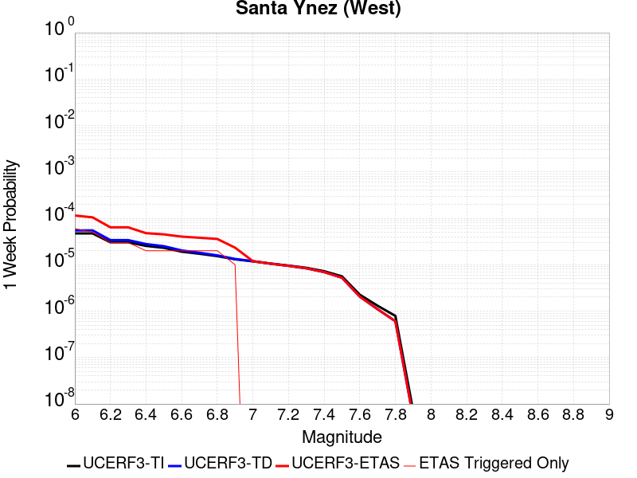 |  |  |  |

| Magnitude | 1 wk TI Prob | 1 wk TD Prob | 1 wk ETAS Prob | 1 wk ETAS/TD Gain | 1 wk ETAS Triggered Only | 1 mo TI Prob | 1 mo TD Prob | 1 mo ETAS Prob | 1 mo ETAS/TD Gain | 1 mo ETAS Triggered Only | 1 yr TI Prob | 1 yr TD Prob | 1 yr ETAS Prob | 1 yr ETAS/TD Gain | 1 yr ETAS Triggered Only | 10 yr TI Prob | 10 yr TD Prob | 10 yr ETAS Prob | 10 yr ETAS/TD Gain | 10 yr ETAS Triggered Only |
|-----|-----|-----|-----|-----|-----|-----|-----|-----|-----|-----|-----|-----|-----|-----|-----|-----|-----|-----|-----|-----|
| 6.0 | 4.7352758E-5 | 5.497084E-5 | 1.14967545E-4 | 2.0914278 | 6.0E-5 | 2.0292461E-4 | 2.3556968E-4 | 3.2554846E-4 | 1.3819625 | 9.0E-5 | 0.0024678076 | 0.002864558 | 0.0030240996 | 1.055695 | 1.6E-4 | 0.024405818 | 0.028304456 | 0.028489077 | 1.0065228 | 1.9E-4 |
| 6.1 | 4.7352758E-5 | 5.497084E-5 | 1.04968094E-4 | 1.9095231 | 5.0E-5 | 2.0292461E-4 | 2.3556968E-4 | 3.1555083E-4 | 1.3395222 | 8.0E-5 | 0.0024678076 | 0.002864558 | 0.003004157 | 1.0487331 | 1.4E-4 | 0.024405818 | 0.028304456 | 0.028459927 | 1.0054928 | 1.6E-4 |
| 6.2 | 3.0415853E-5 | 3.3925004E-5 | 6.392399E-5 | 1.8842735 | 3.0E-5 | 1.3034715E-4 | 1.4538495E-4 | 1.953777E-4 | 1.3438646 | 5.0E-5 | 0.0015858212 | 0.0017686592 | 0.0018784646 | 1.062084 | 1.1E-4 | 0.015745522 | 0.01754978 | 0.017667674 | 1.0067177 | 1.2E-4 |
| 6.3 | 3.0415853E-5 | 3.3925004E-5 | 6.392399E-5 | 1.8842735 | 3.0E-5 | 1.3034715E-4 | 1.4538495E-4 | 1.953777E-4 | 1.3438646 | 5.0E-5 | 0.0015858212 | 0.0017686592 | 0.0018784646 | 1.062084 | 1.1E-4 | 0.015745522 | 0.01754978 | 0.017667674 | 1.0067177 | 1.2E-4 |
| 6.4 | 2.5452082E-5 | 2.7912318E-5 | 4.791176E-5 | 1.7165095 | 2.0E-5 | 1.09075794E-4 | 1.1961885E-4 | 1.5961406E-4 | 1.3343555 | 4.0E-5 | 0.0013271887 | 0.0014554056 | 0.0015452746 | 1.0617484 | 9.0E-5 | 0.013192902 | 0.01446091 | 0.014559464 | 1.0068152 | 1.0E-4 |
| 6.5 | 2.3143784E-5 | 2.5128133E-5 | 4.512763E-5 | 1.7959007 | 2.0E-5 | 9.9183875E-5 | 1.07687636E-4 | 1.4768333E-4 | 1.3714046 | 4.0E-5 | 0.0012068948 | 0.001310323 | 0.0014002051 | 1.0685954 | 9.0E-5 | 0.012003611 | 0.013027638 | 0.013126335 | 1.007576 | 1.0E-4 |
| 6.6 | 1.9118515E-5 | 2.0354244E-5 | 4.0353836E-5 | 1.982576 | 2.0E-5 | 8.193392E-5 | 8.722961E-5 | 1.2722611E-4 | 1.4585199 | 4.0E-5 | 9.97089E-4 | 0.001061511 | 0.0011514154 | 1.0846949 | 9.0E-5 | 0.00992627 | 0.010565317 | 0.01066426 | 1.009365 | 1.0E-4 |
| 6.7 | 1.722807E-5 | 1.8146253E-5 | 3.814589E-5 | 2.102136 | 2.0E-5 | 7.3832496E-5 | 7.776737E-5 | 1.17764255E-4 | 1.5143145 | 4.0E-5 | 8.985399E-4 | 9.4641204E-4 | 0.0010363269 | 1.095006 | 9.0E-5 | 0.008949154 | 0.009424461 | 0.009523518 | 1.0105107 | 1.0E-4 |
| 6.8 | 1.5317364E-5 | 1.5926391E-5 | 3.5926074E-5 | 2.2557573 | 2.0E-5 | 6.56442E-5 | 6.82542E-5 | 1.0825147E-4 | 1.5860045 | 4.0E-5 | 7.98925E-4 | 8.3068234E-4 | 9.206076E-4 | 1.1082547 | 9.0E-5 | 0.007960589 | 0.008276261 | 0.008375433 | 1.0119828 | 1.0E-4 |
| 6.9 | 1.3071226E-5 | 1.332953E-5 | 2.3329396E-5 | 1.750204 | 1.0E-5 | 5.6018336E-5 | 5.712532E-5 | 7.7124176E-5 | 1.3500874 | 2.0E-5 | 6.8180985E-4 | 6.952811E-4 | 7.5523934E-4 | 1.086236 | 6.0E-5 | 0.0067972173 | 0.0069313184 | 0.0070008333 | 1.0100291 | 7.0E-5 |
| 7.0 | 1.1836986E-5 | 1.1932688E-5 | 1.1932688E-5 | 1.0 | 0.0 | 5.0728955E-5 | 5.1139097E-5 | 6.1138584E-5 | 1.1955351 | 1.0E-5 | 6.1745E-4 | 6.2244234E-4 | 6.6241744E-4 | 1.0642229 | 4.0E-5 | 0.006157372 | 0.0062071825 | 0.006246934 | 1.0064042 | 4.0E-5 |
| 7.1 | 1.0597169E-5 | 1.0542107E-5 | 1.0542107E-5 | 1.0 | 0.0 | 4.541565E-5 | 4.5179684E-5 | 5.5179233E-5 | 1.2213284 | 1.0E-5 | 5.5279525E-4 | 5.4992497E-4 | 5.7990843E-4 | 1.0545229 | 3.0E-5 | 0.0055142213 | 0.005485772 | 0.0055156075 | 1.0054387 | 3.0E-5 |
| 7.2 | 9.59113E-6 | 9.45905E-6 | 9.45905E-6 | 1.0 | 0.0 | 4.11042E-5 | 4.053816E-5 | 5.0537757E-5 | 1.2466712 | 1.0E-5 | 5.0032866E-4 | 4.934414E-4 | 5.234266E-4 | 1.0607675 | 3.0E-5 | 0.004992037 | 0.0049235765 | 0.0049534286 | 1.0060631 | 3.0E-5 |
| 7.3 | 8.586084E-6 | 8.379489E-6 | 8.379489E-6 | 1.0 | 0.0 | 3.679698E-5 | 3.591161E-5 | 4.591125E-5 | 1.2784514 | 1.0E-5 | 4.4791115E-4 | 4.3713715E-4 | 4.5712842E-4 | 1.0457323 | 2.0E-5 | 0.004470094 | 0.004362884 | 0.004382797 | 1.0045642 | 2.0E-5 |
| 7.4 | 7.2622997E-6 | 6.9514485E-6 | 6.9514485E-6 | 1.0 | 0.0 | 3.112377E-5 | 2.9791589E-5 | 2.9791589E-5 | 1.0 | 0.0 | 3.78866E-4 | 3.6265317E-4 | 3.7264955E-4 | 1.0275645 | 1.0E-5 | 0.0037822074 | 0.003620714 | 0.0036306777 | 1.0027518 | 1.0E-5 |
| 7.5 | 5.627296E-6 | 5.2514984E-6 | 5.2514984E-6 | 1.0 | 0.0 | 2.411676E-5 | 2.2506232E-5 | 2.2506232E-5 | 1.0 | 0.0 | 2.9358198E-4 | 2.7397962E-4 | 2.7397962E-4 | 1.0 | 0.0 | 0.0029319443 | 0.0027364905 | 0.0027364905 | 1.0 | 0.0 |
| 7.6 | 2.265244E-6 | 2.0608632E-6 | 2.0608632E-6 | 1.0 | 0.0 | 9.708152E-6 | 8.832241E-6 | 8.832241E-6 | 1.0 | 0.0 | 1.18190335E-4 | 1.0752732E-4 | 1.0752732E-4 | 1.0 | 0.0 | 0.001181275 | 0.0010747615 | 0.0010747615 | 1.0 | 0.0 |
| 7.7 | 1.3099874E-6 | 1.1016228E-6 | 1.1016228E-6 | 1.0 | 0.0 | 5.61422E-6 | 4.7212325E-6 | 4.7212325E-6 | 1.0 | 0.0 | 6.8350986E-5 | 5.7479516E-5 | 5.7479516E-5 | 1.0 | 0.0 | 6.832996E-4 | 5.7464885E-4 | 5.7464885E-4 | 1.0 | 0.0 |
| 7.8 | 7.903951E-7 | 6.0710704E-7 | 6.0710704E-7 | 1.0 | 0.0 | 3.3874032E-6 | 2.601885E-6 | 2.601885E-6 | 1.0 | 0.0 | 4.1240855E-5 | 3.16775E-5 | 3.16775E-5 | 1.0 | 0.0 | 4.12332E-4 | 3.167312E-4 | 3.167312E-4 | 1.0 | 0.0 |
| 7.9 | 7.0753297E-9 | 5.090092E-9 | 5.090092E-9 | 1.0 | 0.0 | 3.032284E-8 | 2.181468E-8 | 2.181468E-8 | 1.0 | 0.0 | 3.6918053E-7 | 2.655937E-7 | 2.655937E-7 | 1.0 | 0.0 | 3.691799E-6 | 2.6559348E-6 | 2.6559348E-6 | 1.0 | 0.0 |

## Pisgah-Bullion Mtn-Mesquite Lk
*[(top)](#table-of-contents)*

| 1 Week | 1 Month | 1 Year | 10 Year |
|-----|-----|-----|-----|
|  |  |  | 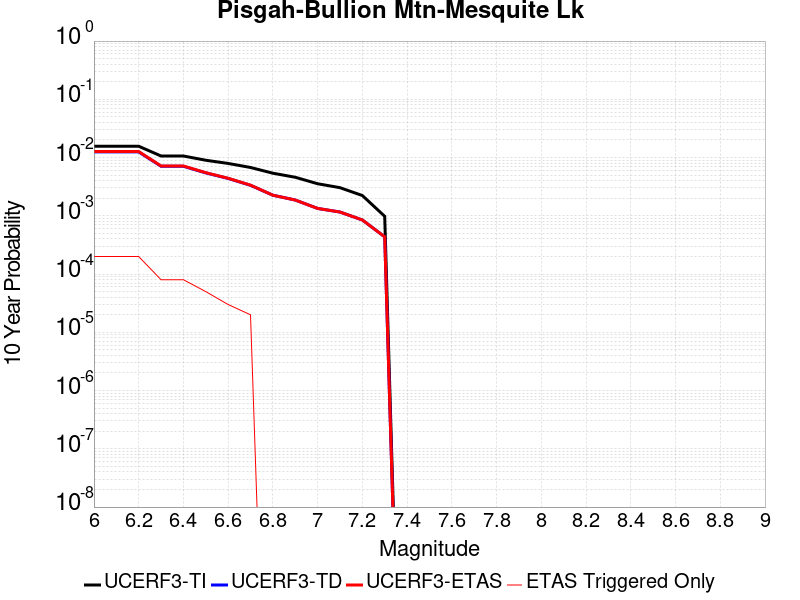 |

| Magnitude | 1 wk TI Prob | 1 wk TD Prob | 1 wk ETAS Prob | 1 wk ETAS/TD Gain | 1 wk ETAS Triggered Only | 1 mo TI Prob | 1 mo TD Prob | 1 mo ETAS Prob | 1 mo ETAS/TD Gain | 1 mo ETAS Triggered Only | 1 yr TI Prob | 1 yr TD Prob | 1 yr ETAS Prob | 1 yr ETAS/TD Gain | 1 yr ETAS Triggered Only | 10 yr TI Prob | 10 yr TD Prob | 10 yr ETAS Prob | 10 yr ETAS/TD Gain | 10 yr ETAS Triggered Only |
|-----|-----|-----|-----|-----|-----|-----|-----|-----|-----|-----|-----|-----|-----|-----|-----|-----|-----|-----|-----|-----|
| 6.0 | 3.0240792E-5 | 2.40909E-5 | 7.4089694E-5 | 3.0754225 | 5.0E-5 | 1.2959696E-4 | 1.032432E-4 | 1.63237E-4 | 1.5810921 | 6.0E-5 | 0.0015767008 | 0.0012563618 | 0.0013562362 | 1.079495 | 1.0E-4 | 0.015655609 | 0.012502613 | 0.012700113 | 1.0157967 | 2.0E-4 |
| 6.1 | 3.0240792E-5 | 2.40909E-5 | 7.4089694E-5 | 3.0754225 | 5.0E-5 | 1.2959696E-4 | 1.032432E-4 | 1.63237E-4 | 1.5810921 | 6.0E-5 | 0.0015767008 | 0.0012563618 | 0.0013562362 | 1.079495 | 1.0E-4 | 0.015655609 | 0.012502613 | 0.012700113 | 1.0157967 | 2.0E-4 |
| 6.2 | 3.0240792E-5 | 2.40909E-5 | 7.4089694E-5 | 3.0754225 | 5.0E-5 | 1.2959696E-4 | 1.032432E-4 | 1.63237E-4 | 1.5810921 | 6.0E-5 | 0.0015767008 | 0.0012563618 | 0.0013562362 | 1.079495 | 1.0E-4 | 0.015655609 | 0.012502613 | 0.012700113 | 1.0157967 | 2.0E-4 |
| 6.3 | 2.0498217E-5 | 1.3638054E-5 | 1.3638054E-5 | 1.0 | 0.0 | 8.784654E-5 | 5.8447586E-5 | 5.8447586E-5 | 1.0 | 0.0 | 0.0010690069 | 7.1138324E-4 | 7.31369E-4 | 1.0280943 | 2.0E-5 | 0.01063879 | 0.0070926864 | 0.0071721193 | 1.0111992 | 8.0E-5 |
| 6.4 | 2.0498217E-5 | 1.3638054E-5 | 1.3638054E-5 | 1.0 | 0.0 | 8.784654E-5 | 5.8447586E-5 | 5.8447586E-5 | 1.0 | 0.0 | 0.0010690069 | 7.1138324E-4 | 7.31369E-4 | 1.0280943 | 2.0E-5 | 0.01063879 | 0.0070926864 | 0.0071721193 | 1.0111992 | 8.0E-5 |
| 6.5 | 1.7316182E-5 | 1.04769715E-5 | 1.04769715E-5 | 1.0 | 0.0 | 7.42101E-5 | 4.490059E-5 | 4.490059E-5 | 1.0 | 0.0 | 9.0313336E-4 | 5.465376E-4 | 5.665266E-4 | 1.036574 | 2.0E-5 | 0.008994718 | 0.00545293 | 0.0055026575 | 1.0091194 | 5.0E-5 |
| 6.6 | 1.5251077E-5 | 8.414133E-6 | 8.414133E-6 | 1.0 | 0.0 | 6.536012E-5 | 3.606011E-5 | 3.606011E-5 | 1.0 | 0.0 | 7.9546886E-4 | 4.3895066E-4 | 4.5894188E-4 | 1.0455432 | 2.0E-5 | 0.007926274 | 0.0043815537 | 0.004411422 | 1.0068169 | 3.0E-5 |
| 6.7 | 1.2997425E-5 | 6.4112146E-6 | 6.4112146E-6 | 1.0 | 0.0 | 5.570206E-5 | 2.7476372E-5 | 2.7476372E-5 | 1.0 | 0.0 | 6.7796157E-4 | 3.3447813E-4 | 3.4447477E-4 | 1.0298873 | 1.0E-5 | 0.0067589693 | 0.003340207 | 0.0033601404 | 1.0059676 | 2.0E-5 |
| 6.8 | 1.035386E-5 | 4.333145E-6 | 4.333145E-6 | 1.0 | 0.0 | 4.437293E-5 | 1.8570496E-5 | 1.8570496E-5 | 1.0 | 0.0 | 5.401065E-4 | 2.260732E-4 | 2.260732E-4 | 1.0 | 0.0 | 0.0053879567 | 0.002258519 | 0.002258519 | 1.0 | 0.0 |
| 6.9 | 8.816252E-6 | 3.5805879E-6 | 3.5805879E-6 | 1.0 | 0.0 | 3.778339E-5 | 1.534529E-5 | 1.534529E-5 | 1.0 | 0.0 | 4.5991567E-4 | 1.8681347E-4 | 1.8681347E-4 | 1.0 | 0.0 | 0.00458965 | 0.0018666228 | 0.0018666228 | 1.0 | 0.0 |
| 7.0 | 6.8232207E-6 | 2.5674399E-6 | 2.5674399E-6 | 1.0 | 0.0 | 2.9242048E-5 | 1.100327E-5 | 1.100327E-5 | 1.0 | 0.0 | 3.5596377E-4 | 1.3395688E-4 | 1.3395688E-4 | 1.0 | 0.0 | 0.0035539411 | 0.0013387925 | 0.0013387925 | 1.0 | 0.0 |
| 7.1 | 5.837013E-6 | 2.2273143E-6 | 2.2273143E-6 | 1.0 | 0.0 | 2.501553E-5 | 9.5456E-6 | 9.5456E-6 | 1.0 | 0.0 | 3.045215E-4 | 1.1621177E-4 | 1.1621177E-4 | 1.0 | 0.0 | 0.0030410455 | 0.001161539 | 0.001161539 | 1.0 | 0.0 |
| 7.2 | 4.278052E-6 | 1.6275065E-6 | 1.6275065E-6 | 1.0 | 0.0 | 1.833438E-5 | 6.975011E-6 | 6.975011E-6 | 1.0 | 0.0 | 2.231982E-4 | 8.491768E-5 | 8.491768E-5 | 1.0 | 0.0 | 0.0022297418 | 8.4887556E-4 | 8.4887556E-4 | 1.0 | 0.0 |
| 7.3 | 1.8803692E-6 | 8.344788E-7 | 8.344788E-7 | 1.0 | 0.0 | 8.0587E-6 | 3.5763337E-6 | 3.5763337E-6 | 1.0 | 0.0 | 9.811026E-5 | 4.354114E-5 | 4.354114E-5 | 1.0 | 0.0 | 9.806695E-4 | 4.3534054E-4 | 4.3534054E-4 | 1.0 | 0.0 |

## Mission Ridge-Arroyo Parida-Santa Ana
*[(top)](#table-of-contents)*

| 1 Week | 1 Month | 1 Year | 10 Year |
|-----|-----|-----|-----|
| 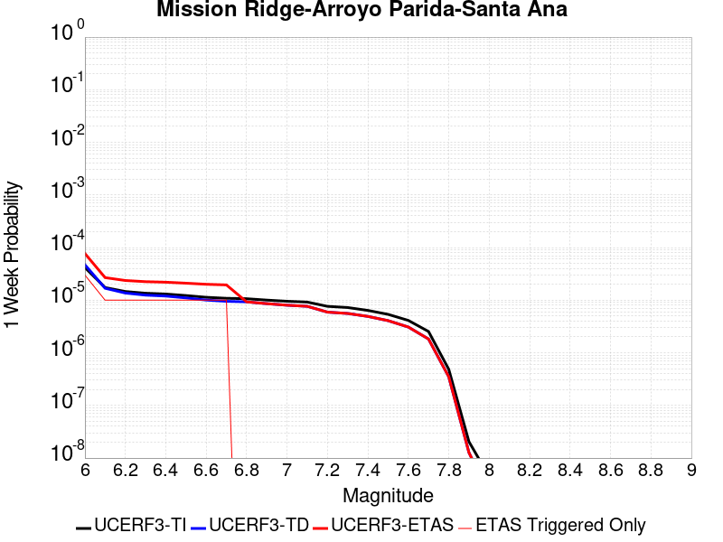 |  |  |  |

| Magnitude | 1 wk TI Prob | 1 wk TD Prob | 1 wk ETAS Prob | 1 wk ETAS/TD Gain | 1 wk ETAS Triggered Only | 1 mo TI Prob | 1 mo TD Prob | 1 mo ETAS Prob | 1 mo ETAS/TD Gain | 1 mo ETAS Triggered Only | 1 yr TI Prob | 1 yr TD Prob | 1 yr ETAS Prob | 1 yr ETAS/TD Gain | 1 yr ETAS Triggered Only | 10 yr TI Prob | 10 yr TD Prob | 10 yr ETAS Prob | 10 yr ETAS/TD Gain | 10 yr ETAS Triggered Only |
|-----|-----|-----|-----|-----|-----|-----|-----|-----|-----|-----|-----|-----|-----|-----|-----|-----|-----|-----|-----|-----|
| 6.0 | 4.169034E-5 | 4.7137048E-5 | 7.7135635E-5 | 1.636412 | 3.0E-5 | 1.7866064E-4 | 2.0200513E-4 | 2.5199502E-4 | 1.2474685 | 5.0E-5 | 0.0021730233 | 0.0024574657 | 0.0025671953 | 1.0446515 | 1.1E-4 | 0.021518968 | 0.02438483 | 0.024550684 | 1.0068016 | 1.7E-4 |
| 6.1 | 1.73813E-5 | 1.6854203E-5 | 2.6854035E-5 | 1.5933138 | 1.0E-5 | 7.4489166E-5 | 7.223036E-5 | 8.2229635E-5 | 1.138436 | 1.0E-5 | 9.065282E-4 | 8.790605E-4 | 9.090341E-4 | 1.0340973 | 3.0E-5 | 0.009028391 | 0.008757128 | 0.008826516 | 1.0079235 | 7.0E-5 |
| 6.2 | 1.4622182E-5 | 1.3673262E-5 | 2.3673127E-5 | 1.7313443 | 1.0E-5 | 6.2664985E-5 | 5.85984E-5 | 6.8597816E-5 | 1.1706431 | 1.0E-5 | 7.6267915E-4 | 7.132059E-4 | 7.331916E-4 | 1.0280224 | 2.0E-5 | 0.007600669 | 0.007109767 | 0.0071594114 | 1.0069826 | 5.0E-5 |
| 6.3 | 1.3552434E-5 | 1.2482174E-5 | 2.2482049E-5 | 1.8011326 | 1.0E-5 | 5.8080568E-5 | 5.349395E-5 | 6.349342E-5 | 1.1869271 | 1.0E-5 | 7.069015E-4 | 6.510974E-4 | 6.7108433E-4 | 1.0306973 | 2.0E-5 | 0.00704657 | 0.006492415 | 0.006532155 | 1.006121 | 4.0E-5 |
| 6.4 | 1.30977305E-5 | 1.1979128E-5 | 2.1979009E-5 | 1.8347752 | 1.0E-5 | 5.613192E-5 | 5.133813E-5 | 6.133762E-5 | 1.194777 | 1.0E-5 | 6.831918E-4 | 6.2486547E-4 | 6.44853E-4 | 1.0319868 | 2.0E-5 | 0.006810953 | 0.006231584 | 0.006271335 | 1.0063789 | 4.0E-5 |
| 6.5 | 1.225205E-5 | 1.1048776E-5 | 2.1048665E-5 | 1.9050677 | 1.0E-5 | 5.2507727E-5 | 4.735105E-5 | 5.735058E-5 | 1.2111785 | 1.0E-5 | 6.3909404E-4 | 5.7634927E-4 | 5.863435E-4 | 1.0173405 | 1.0E-5 | 0.006372592 | 0.005749009 | 0.0057688938 | 1.0034589 | 2.0E-5 |
| 6.6 | 1.1352241E-5 | 1.0063508E-5 | 2.0063408E-5 | 1.9936793 | 1.0E-5 | 4.8651553E-5 | 4.3128617E-5 | 5.3128188E-5 | 1.2318546 | 1.0E-5 | 5.921717E-4 | 5.249665E-4 | 5.349613E-4 | 1.0190388 | 1.0E-5 | 0.0059059616 | 0.0052376646 | 0.0052575595 | 1.0037985 | 2.0E-5 |
| 6.7 | 1.0864116E-5 | 9.517E-6 | 1.9516905E-5 | 2.0507412 | 1.0E-5 | 4.6559664E-5 | 4.0786515E-5 | 5.0786108E-5 | 1.245169 | 1.0E-5 | 5.667165E-4 | 4.964647E-4 | 5.0645974E-4 | 1.0201324 | 1.0E-5 | 0.005652734 | 0.0049539437 | 0.0049738446 | 1.0040172 | 2.0E-5 |
| 6.8 | 1.0666365E-5 | 9.299752E-6 | 9.299752E-6 | 1.0 | 0.0 | 4.571219E-5 | 3.985548E-5 | 3.985548E-5 | 1.0 | 0.0 | 5.564038E-4 | 4.8513446E-4 | 4.8513446E-4 | 1.0 | 0.0 | 0.005550127 | 0.00484114 | 0.0048510917 | 1.0020556 | 1.0E-5 |
| 6.9 | 1.0038665E-5 | 8.592018E-6 | 8.592018E-6 | 1.0 | 0.0 | 4.302214E-5 | 3.682243E-5 | 3.682243E-5 | 1.0 | 0.0 | 5.236687E-4 | 4.4822265E-4 | 4.4822265E-4 | 1.0 | 0.0 | 0.005224364 | 0.0044735507 | 0.0044735507 | 1.0 | 0.0 |
| 7.0 | 9.5379955E-6 | 8.025047E-6 | 8.025047E-6 | 1.0 | 0.0 | 4.0876483E-5 | 3.439261E-5 | 3.439261E-5 | 1.0 | 0.0 | 4.975576E-4 | 4.1865133E-4 | 4.1865133E-4 | 1.0 | 0.0 | 0.00496445 | 0.00417898 | 0.00417898 | 1.0 | 0.0 |
| 7.1 | 9.207389E-6 | 7.652347E-6 | 7.652347E-6 | 1.0 | 0.0 | 3.945964E-5 | 3.2795375E-5 | 3.2795375E-5 | 1.0 | 0.0 | 4.803152E-4 | 3.992122E-4 | 3.992122E-4 | 1.0 | 0.0 | 0.004792784 | 0.003985301 | 0.003985301 | 1.0 | 0.0 |
| 7.2 | 7.638091E-6 | 5.9310923E-6 | 5.9310923E-6 | 1.0 | 0.0 | 3.2734264E-5 | 2.5418722E-5 | 2.5418722E-5 | 1.0 | 0.0 | 3.984668E-4 | 3.094293E-4 | 3.094293E-4 | 1.0 | 0.0 | 0.0039775306 | 0.0030901956 | 0.0030901956 | 1.0 | 0.0 |
| 7.3 | 7.2500147E-6 | 5.596131E-6 | 5.596131E-6 | 1.0 | 0.0 | 3.1071122E-5 | 2.3983199E-5 | 2.3983199E-5 | 1.0 | 0.0 | 3.7822526E-4 | 2.9195662E-4 | 2.9195662E-4 | 1.0 | 0.0 | 0.0037758215 | 0.0029159402 | 0.0029159402 | 1.0 | 0.0 |
| 7.4 | 6.3899715E-6 | 4.9184864E-6 | 4.9184864E-6 | 1.0 | 0.0 | 2.7385306E-5 | 2.1079059E-5 | 2.1079059E-5 | 1.0 | 0.0 | 3.3336508E-4 | 2.566075E-4 | 2.566075E-4 | 1.0 | 0.0 | 0.0033286542 | 0.002563311 | 0.002563311 | 1.0 | 0.0 |
| 7.5 | 5.379025E-6 | 4.0838477E-6 | 4.0838477E-6 | 1.0 | 0.0 | 2.305276E-5 | 1.7502087E-5 | 1.7502087E-5 | 1.0 | 0.0 | 2.806312E-4 | 2.1306718E-4 | 2.1306718E-4 | 1.0 | 0.0 | 0.0028027708 | 0.0021286402 | 0.0021286402 | 1.0 | 0.0 |
| 7.6 | 4.1270696E-6 | 3.0883373E-6 | 3.0883373E-6 | 1.0 | 0.0 | 1.768732E-5 | 1.32356645E-5 | 1.32356645E-5 | 1.0 | 0.0 | 2.1532185E-4 | 1.6113237E-4 | 1.6113237E-4 | 1.0 | 0.0 | 0.0021511333 | 0.0016101635 | 0.0016101635 | 1.0 | 0.0 |
| 7.7 | 2.5406805E-6 | 1.8282044E-6 | 1.8282044E-6 | 1.0 | 0.0 | 1.0888585E-5 | 7.835139E-6 | 7.835139E-6 | 1.0 | 0.0 | 1.3256045E-4 | 9.53887E-5 | 9.53887E-5 | 1.0 | 0.0 | 0.0013248142 | 9.534837E-4 | 9.534837E-4 | 1.0 | 0.0 |
| 7.8 | 4.8608285E-7 | 3.509864E-7 | 3.509864E-7 | 1.0 | 0.0 | 2.0832106E-6 | 1.5042266E-6 | 1.5042266E-6 | 1.0 | 0.0 | 2.5362791E-5 | 1.8313805E-5 | 1.8313805E-5 | 1.0 | 0.0 | 2.5359896E-4 | 1.8312308E-4 | 1.8312308E-4 | 1.0 | 0.0 |
| 7.9 | 2.0472514E-8 | 1.2688718E-8 | 1.2688718E-8 | 1.0 | 0.0 | 8.7739345E-8 | 5.438022E-8 | 5.438022E-8 | 1.0 | 0.0 | 1.068226E-6 | 6.6207895E-7 | 6.6207895E-7 | 1.0 | 0.0 | 1.0682209E-5 | 6.620771E-6 | 6.620771E-6 | 1.0 | 0.0 |
| 8.0 | 4.443582E-9 | 2.032067E-9 | 2.032067E-9 | 1.0 | 0.0 | 1.9043922E-8 | 8.7088585E-9 | 8.7088585E-9 | 1.0 | 0.0 | 2.3185973E-7 | 1.0603035E-7 | 1.0603035E-7 | 1.0 | 0.0 | 2.3185949E-6 | 1.0603031E-6 | 1.0603031E-6 | 1.0 | 0.0 |

## Cleghorn Lake
*[(top)](#table-of-contents)*

| 1 Week | 1 Month | 1 Year | 10 Year |
|-----|-----|-----|-----|
| 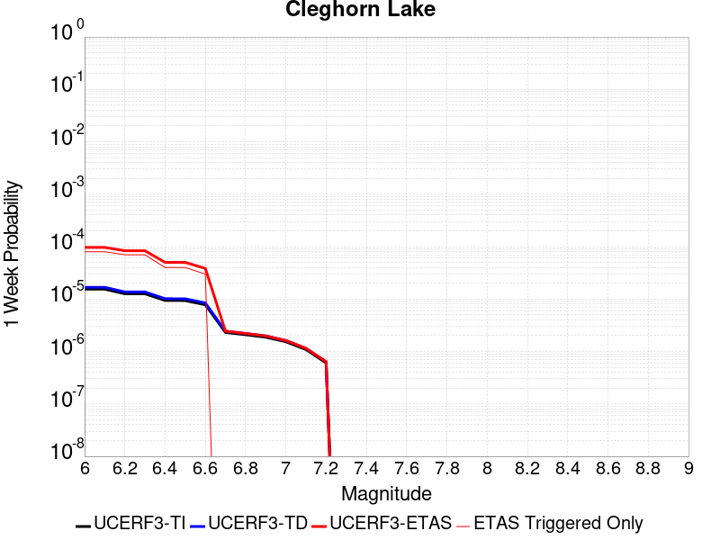 | 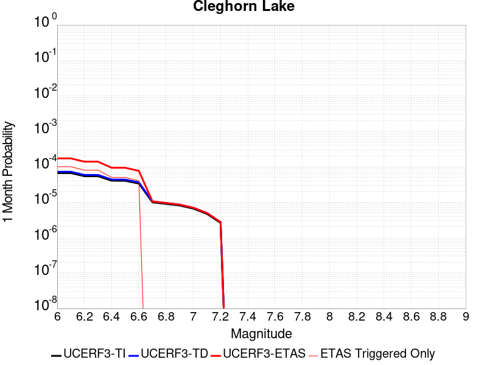 |  |  |

| Magnitude | 1 wk TI Prob | 1 wk TD Prob | 1 wk ETAS Prob | 1 wk ETAS/TD Gain | 1 wk ETAS Triggered Only | 1 mo TI Prob | 1 mo TD Prob | 1 mo ETAS Prob | 1 mo ETAS/TD Gain | 1 mo ETAS Triggered Only | 1 yr TI Prob | 1 yr TD Prob | 1 yr ETAS Prob | 1 yr ETAS/TD Gain | 1 yr ETAS Triggered Only | 10 yr TI Prob | 10 yr TD Prob | 10 yr ETAS Prob | 10 yr ETAS/TD Gain | 10 yr ETAS Triggered Only |
|-----|-----|-----|-----|-----|-----|-----|-----|-----|-----|-----|-----|-----|-----|-----|-----|-----|-----|-----|-----|-----|
| 6.0 | 1.5467183E-5 | 1.6794203E-5 | 9.679286E-5 | 5.7634683 | 8.0E-5 | 6.6286244E-5 | 7.197348E-5 | 1.7196628E-4 | 2.3893006 | 1.0E-4 | 8.067362E-4 | 8.759797E-4 | 0.0010258483 | 1.1710868 | 1.5E-4 | 0.008038137 | 0.008730696 | 0.008928949 | 1.0227077 | 2.0E-4 |
| 6.1 | 1.5467183E-5 | 1.6794203E-5 | 9.679286E-5 | 5.7634683 | 8.0E-5 | 6.6286244E-5 | 7.197348E-5 | 1.7196628E-4 | 2.3893006 | 1.0E-4 | 8.067362E-4 | 8.759797E-4 | 0.0010258483 | 1.1710868 | 1.5E-4 | 0.008038137 | 0.008730696 | 0.008928949 | 1.0227077 | 2.0E-4 |
| 6.2 | 1.2624631E-5 | 1.3681544E-5 | 8.3680585E-5 | 6.1163116 | 7.0E-5 | 5.410444E-5 | 5.863415E-5 | 1.3862946E-4 | 2.3643126 | 8.0E-5 | 6.585225E-4 | 7.1368564E-4 | 8.136142E-4 | 1.1400177 | 1.0E-4 | 0.0065657445 | 0.0071187317 | 0.0072577354 | 1.0195265 | 1.4E-4 |
| 6.3 | 1.2624631E-5 | 1.3681544E-5 | 8.3680585E-5 | 6.1163116 | 7.0E-5 | 5.410444E-5 | 5.863415E-5 | 1.3862946E-4 | 2.3643126 | 8.0E-5 | 6.585225E-4 | 7.1368564E-4 | 8.136142E-4 | 1.1400177 | 1.0E-4 | 0.0065657445 | 0.0071187317 | 0.0072577354 | 1.0195265 | 1.4E-4 |
| 6.4 | 9.417684E-6 | 1.0170118E-5 | 5.016971E-5 | 4.933051 | 4.0E-5 | 4.036088E-5 | 4.3585722E-5 | 9.358354E-5 | 2.1471148 | 5.0E-5 | 4.912829E-4 | 5.3056807E-4 | 6.005309E-4 | 1.1318641 | 7.0E-5 | 0.004901982 | 0.005297049 | 0.0053965193 | 1.0187784 | 1.0E-4 |
| 6.5 | 9.368219E-6 | 1.0117545E-5 | 5.0117138E-5 | 4.9534883 | 4.0E-5 | 4.014889E-5 | 4.3360415E-5 | 9.335825E-5 | 2.1530755 | 5.0E-5 | 4.8870314E-4 | 5.2782625E-4 | 5.977893E-4 | 1.1325494 | 7.0E-5 | 0.004876298 | 0.0052697617 | 0.0053692344 | 1.0188762 | 1.0E-4 |
| 6.6 | 7.803798E-6 | 8.441831E-6 | 3.8441576E-5 | 4.5537014 | 3.0E-5 | 3.3444423E-5 | 3.6179E-5 | 7.617755E-5 | 2.105574 | 4.0E-5 | 4.0710976E-4 | 4.4043022E-4 | 5.004038E-4 | 1.1361704 | 6.0E-5 | 0.0040636472 | 0.0043994905 | 0.0044791386 | 1.018104 | 8.0E-5 |
| 6.7 | 2.3108669E-6 | 2.4438336E-6 | 2.4438336E-6 | 1.0 | 0.0 | 9.903678E-6 | 1.0473532E-5 | 1.0473532E-5 | 1.0 | 0.0 | 1.205706E-4 | 1.2750797E-4 | 1.375067E-4 | 1.0784165 | 1.0E-5 | 0.001205052 | 0.0012743667 | 0.001284354 | 1.007837 | 1.0E-5 |
| 6.8 | 2.0882828E-6 | 2.2062823E-6 | 2.2062823E-6 | 1.0 | 0.0 | 8.949753E-6 | 9.455462E-6 | 9.455462E-6 | 1.0 | 0.0 | 1.08957785E-4 | 1.1511434E-4 | 1.2511319E-4 | 1.0868602 | 1.0E-5 | 0.0010890438 | 0.0011505639 | 0.0011605524 | 1.0086814 | 1.0E-5 |
| 6.9 | 1.876935E-6 | 1.981051E-6 | 1.981051E-6 | 1.0 | 0.0 | 8.043982E-6 | 8.490192E-6 | 8.490192E-6 | 1.0 | 0.0 | 9.7931086E-5 | 1.03363345E-4 | 1.1336231E-4 | 1.0967361 | 1.0E-5 | 9.788794E-4 | 0.0010331686 | 0.0010431584 | 1.009669 | 1.0E-5 |
| 7.0 | 1.5357559E-6 | 1.6202807E-6 | 1.6202807E-6 | 1.0 | 0.0 | 6.5817944E-6 | 6.9440425E-6 | 6.9440425E-6 | 1.0 | 0.0 | 8.01304E-5 | 8.454057E-5 | 9.453972E-5 | 1.1182764 | 1.0E-5 | 8.010151E-4 | 8.450965E-4 | 8.55088E-4 | 1.0118229 | 1.0E-5 |
| 7.1 | 1.0905424E-6 | 1.1497619E-6 | 1.1497619E-6 | 1.0 | 0.0 | 4.6737446E-6 | 4.9275427E-6 | 4.9275427E-6 | 1.0 | 0.0 | 5.6901354E-5 | 5.999128E-5 | 5.999128E-5 | 1.0 | 0.0 | 5.6886784E-4 | 5.997606E-4 | 5.997606E-4 | 1.0 | 0.0 |
| 7.2 | 6.06668E-7 | 6.387277E-7 | 6.387277E-7 | 1.0 | 0.0 | 2.600003E-6 | 2.7374022E-6 | 2.7374022E-6 | 1.0 | 0.0 | 3.1654577E-5 | 3.3327433E-5 | 3.3327433E-5 | 1.0 | 0.0 | 3.1650066E-4 | 3.3323118E-4 | 3.3323118E-4 | 1.0 | 0.0 |

## Lost Hills
*[(top)](#table-of-contents)*

| 1 Week | 1 Month | 1 Year | 10 Year |
|-----|-----|-----|-----|
|  |  | 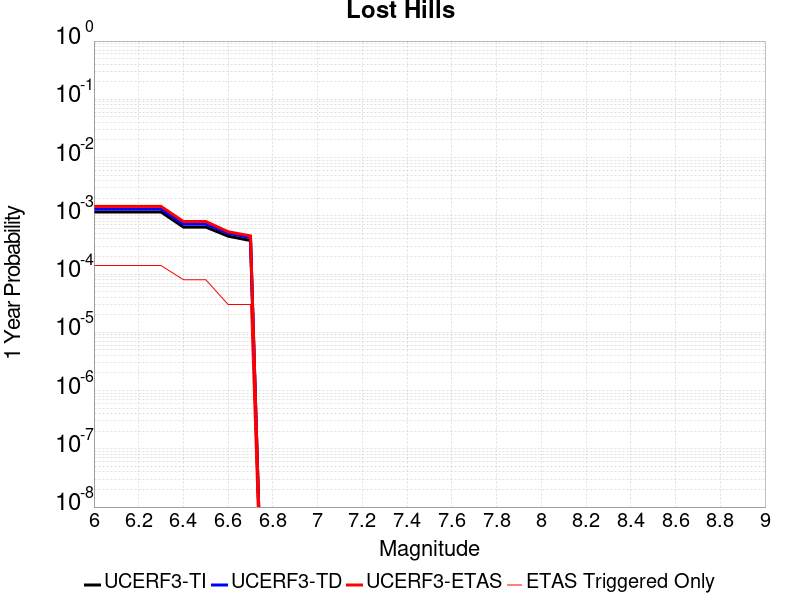 |  |

| Magnitude | 1 wk TI Prob | 1 wk TD Prob | 1 wk ETAS Prob | 1 wk ETAS/TD Gain | 1 wk ETAS Triggered Only | 1 mo TI Prob | 1 mo TD Prob | 1 mo ETAS Prob | 1 mo ETAS/TD Gain | 1 mo ETAS Triggered Only | 1 yr TI Prob | 1 yr TD Prob | 1 yr ETAS Prob | 1 yr ETAS/TD Gain | 1 yr ETAS Triggered Only | 10 yr TI Prob | 10 yr TD Prob | 10 yr ETAS Prob | 10 yr ETAS/TD Gain | 10 yr ETAS Triggered Only |
|-----|-----|-----|-----|-----|-----|-----|-----|-----|-----|-----|-----|-----|-----|-----|-----|-----|-----|-----|-----|-----|
| 6.0 | 2.233523E-5 | 2.5106583E-5 | 6.510558E-5 | 2.5931678 | 4.0E-5 | 9.571891E-5 | 1.0759615E-4 | 1.675897E-4 | 1.5575808 | 6.0E-5 | 0.0011647546 | 0.001309364 | 0.0014491807 | 1.1067821 | 1.4E-4 | 0.011586686 | 0.013033091 | 0.013210745 | 1.013631 | 1.8E-4 |
| 6.1 | 2.233523E-5 | 2.5106583E-5 | 6.510558E-5 | 2.5931678 | 4.0E-5 | 9.571891E-5 | 1.0759615E-4 | 1.675897E-4 | 1.5575808 | 6.0E-5 | 0.0011647546 | 0.001309364 | 0.0014491807 | 1.1067821 | 1.4E-4 | 0.011586686 | 0.013033091 | 0.013210745 | 1.013631 | 1.8E-4 |
| 6.2 | 2.233523E-5 | 2.5106583E-5 | 6.510558E-5 | 2.5931678 | 4.0E-5 | 9.571891E-5 | 1.0759615E-4 | 1.675897E-4 | 1.5575808 | 6.0E-5 | 0.0011647546 | 0.001309364 | 0.0014491807 | 1.1067821 | 1.4E-4 | 0.011586686 | 0.013033091 | 0.013210745 | 1.013631 | 1.8E-4 |
| 6.3 | 2.233523E-5 | 2.5106583E-5 | 6.510558E-5 | 2.5931678 | 4.0E-5 | 9.571891E-5 | 1.0759615E-4 | 1.675897E-4 | 1.5575808 | 6.0E-5 | 0.0011647546 | 0.001309364 | 0.0014491807 | 1.1067821 | 1.4E-4 | 0.011586686 | 0.013033091 | 0.013210745 | 1.013631 | 1.8E-4 |
| 6.4 | 1.2288092E-5 | 1.3781108E-5 | 4.3780696E-5 | 3.1768632 | 3.0E-5 | 5.2662188E-5 | 5.906108E-5 | 9.905872E-5 | 1.677225 | 4.0E-5 | 6.409735E-4 | 7.189252E-4 | 7.988677E-4 | 1.1111972 | 8.0E-5 | 0.006391279 | 0.0071752006 | 0.0072844117 | 1.0152205 | 1.1E-4 |
| 6.5 | 1.2288092E-5 | 1.3781108E-5 | 4.3780696E-5 | 3.1768632 | 3.0E-5 | 5.2662188E-5 | 5.906108E-5 | 9.905872E-5 | 1.677225 | 4.0E-5 | 6.409735E-4 | 7.189252E-4 | 7.988677E-4 | 1.1111972 | 8.0E-5 | 0.006391279 | 0.0071752006 | 0.0072844117 | 1.0152205 | 1.1E-4 |
| 6.6 | 8.58281E-6 | 9.63377E-6 | 2.9633577E-5 | 3.0760105 | 2.0E-5 | 3.6782953E-5 | 4.12874E-5 | 6.128658E-5 | 1.4843893 | 2.0E-5 | 4.4774043E-4 | 5.026414E-4 | 5.326263E-4 | 1.0596547 | 3.0E-5 | 0.0044683935 | 0.005023205 | 0.005072954 | 1.0099038 | 5.0E-5 |
| 6.7 | 7.205685E-6 | 8.088302E-6 | 2.808814E-5 | 3.472687 | 2.0E-5 | 3.088114E-5 | 3.466415E-5 | 5.466346E-5 | 1.576945 | 2.0E-5 | 3.7591302E-4 | 4.2203604E-4 | 4.5202338E-4 | 1.071054 | 3.0E-5 | 0.0037527776 | 0.0042203604 | 0.0042601917 | 1.0094379 | 4.0E-5 |

## Mission Creek
*[(top)](#table-of-contents)*

| 1 Week | 1 Month | 1 Year | 10 Year |
|-----|-----|-----|-----|
|  |  |  |  |

| Magnitude | 1 wk TI Prob | 1 wk TD Prob | 1 wk ETAS Prob | 1 wk ETAS/TD Gain | 1 wk ETAS Triggered Only | 1 mo TI Prob | 1 mo TD Prob | 1 mo ETAS Prob | 1 mo ETAS/TD Gain | 1 mo ETAS Triggered Only | 1 yr TI Prob | 1 yr TD Prob | 1 yr ETAS Prob | 1 yr ETAS/TD Gain | 1 yr ETAS Triggered Only | 10 yr TI Prob | 10 yr TD Prob | 10 yr ETAS Prob | 10 yr ETAS/TD Gain | 10 yr ETAS Triggered Only |
|-----|-----|-----|-----|-----|-----|-----|-----|-----|-----|-----|-----|-----|-----|-----|-----|-----|-----|-----|-----|-----|
| 6.0 | 1.1549387E-5 | 1.6322783E-5 | 1.2632099E-4 | 7.7389374 | 1.1E-4 | 4.9496433E-5 | 6.995299E-5 | 1.999439E-4 | 2.8582609 | 1.3E-4 | 6.0245243E-4 | 8.5135986E-4 | 0.0010212151 | 1.1995106 | 1.7E-4 | 0.006008218 | 0.008510157 | 0.00869854 | 1.0221362 | 1.9E-4 |
| 6.1 | 1.1549387E-5 | 1.6322783E-5 | 1.2632099E-4 | 7.7389374 | 1.1E-4 | 4.9496433E-5 | 6.995299E-5 | 1.999439E-4 | 2.8582609 | 1.3E-4 | 6.0245243E-4 | 8.5135986E-4 | 0.0010212151 | 1.1995106 | 1.7E-4 | 0.006008218 | 0.008510157 | 0.00869854 | 1.0221362 | 1.9E-4 |
| 6.2 | 1.1549387E-5 | 1.6322783E-5 | 1.2632099E-4 | 7.7389374 | 1.1E-4 | 4.9496433E-5 | 6.995299E-5 | 1.999439E-4 | 2.8582609 | 1.3E-4 | 6.0245243E-4 | 8.5135986E-4 | 0.0010212151 | 1.1995106 | 1.7E-4 | 0.006008218 | 0.008510157 | 0.00869854 | 1.0221362 | 1.9E-4 |
| 6.3 | 1.1549387E-5 | 1.6322783E-5 | 1.2632099E-4 | 7.7389374 | 1.1E-4 | 4.9496433E-5 | 6.995299E-5 | 1.999439E-4 | 2.8582609 | 1.3E-4 | 6.0245243E-4 | 8.5135986E-4 | 0.0010212151 | 1.1995106 | 1.7E-4 | 0.006008218 | 0.008510157 | 0.00869854 | 1.0221362 | 1.9E-4 |
| 6.4 | 1.1549387E-5 | 1.6322783E-5 | 1.2632099E-4 | 7.7389374 | 1.1E-4 | 4.9496433E-5 | 6.995299E-5 | 1.999439E-4 | 2.8582609 | 1.3E-4 | 6.0245243E-4 | 8.5135986E-4 | 0.0010212151 | 1.1995106 | 1.7E-4 | 0.006008218 | 0.008510157 | 0.00869854 | 1.0221362 | 1.9E-4 |
| 6.5 | 1.1549387E-5 | 1.6322783E-5 | 1.2632099E-4 | 7.7389374 | 1.1E-4 | 4.9496433E-5 | 6.995299E-5 | 1.999439E-4 | 2.8582609 | 1.3E-4 | 6.0245243E-4 | 8.5135986E-4 | 0.0010212151 | 1.1995106 | 1.7E-4 | 0.006008218 | 0.008510157 | 0.00869854 | 1.0221362 | 1.9E-4 |
| 6.6 | 9.202681E-6 | 1.3846059E-5 | 1.13844675E-4 | 8.222172 | 1.0E-4 | 3.9439463E-5 | 5.9338956E-5 | 1.7933184E-4 | 3.0221603 | 1.2E-4 | 4.800697E-4 | 7.2222133E-4 | 8.821058E-4 | 1.2213787 | 1.6E-4 | 0.004790339 | 0.0072273402 | 0.007406039 | 1.0247254 | 1.8E-4 |
| 6.7 | 9.019164E-6 | 1.3651728E-5 | 1.1365036E-4 | 8.32498 | 1.0E-4 | 3.8652986E-5 | 5.8506146E-5 | 1.7849913E-4 | 3.0509465 | 1.2E-4 | 4.7049852E-4 | 7.1208854E-4 | 8.719746E-4 | 1.2245312 | 1.6E-4 | 0.004695036 | 0.0071266647 | 0.007305382 | 1.0250772 | 1.8E-4 |
| 6.8 | 8.673558E-6 | 1.3273839E-5 | 1.1327251E-4 | 8.533516 | 1.0E-4 | 3.717186E-5 | 5.688669E-5 | 1.7687987E-4 | 3.1093366 | 1.2E-4 | 4.524734E-4 | 6.923842E-4 | 8.522734E-4 | 1.2309256 | 1.6E-4 | 0.0045155324 | 0.0069308523 | 0.007109605 | 1.0257908 | 1.8E-4 |
| 6.9 | 7.002255E-6 | 1.1478069E-5 | 1.1147692E-4 | 9.712168 | 1.0E-4 | 3.000932E-5 | 4.9190832E-5 | 1.6918493E-4 | 3.439359 | 1.2E-4 | 3.653022E-4 | 5.9874065E-4 | 7.5864483E-4 | 1.2670676 | 1.6E-4 | 0.0036470229 | 0.005999676 | 0.0061785956 | 1.0298216 | 1.8E-4 |
| 7.0 | 5.84644E-6 | 9.675359E-6 | 1.09674394E-4 | 11.335434 | 1.0E-4 | 2.5055931E-5 | 4.146519E-5 | 1.6146022E-4 | 3.8938737 | 1.2E-4 | 3.0501327E-4 | 5.047263E-4 | 6.646456E-4 | 1.3168435 | 1.6E-4 | 0.0030459496 | 0.005063994 | 0.0052430825 | 1.0353651 | 1.8E-4 |
| 7.1 | 5.54703E-6 | 9.329834E-6 | 9.9328994E-5 | 10.646384 | 9.0E-5 | 2.377277E-5 | 3.9984414E-5 | 1.4998001E-4 | 3.7509618 | 1.1E-4 | 2.8939504E-4 | 4.8670598E-4 | 6.3663296E-4 | 1.3080443 | 1.5E-4 | 0.0028901845 | 0.0048845876 | 0.005053757 | 1.0346334 | 1.7E-4 |
| 7.2 | 4.384709E-6 | 7.681918E-6 | 9.768123E-5 | 12.7157345 | 9.0E-5 | 1.8791474E-5 | 3.292211E-5 | 1.4291849E-4 | 4.3411098 | 1.1E-4 | 2.2876218E-4 | 4.0075663E-4 | 5.506965E-4 | 1.374142 | 1.5E-4 | 0.0022852682 | 0.004028542 | 0.004197857 | 1.0420289 | 1.7E-4 |
| 7.3 | 3.7888456E-6 | 6.915788E-6 | 9.6915166E-5 | 14.013611 | 9.0E-5 | 1.623781E-5 | 2.9638775E-5 | 1.3963551E-4 | 4.7112446 | 1.1E-4 | 1.9767738E-4 | 3.6079568E-4 | 5.1074155E-4 | 1.4155978 | 1.5E-4 | 0.0019750162 | 0.00363027 | 0.003799653 | 1.0466585 | 1.7E-4 |
| 7.4 | 2.1982462E-6 | 5.0241033E-6 | 9.502365E-5 | 18.913555 | 9.0E-5 | 9.421021E-6 | 2.1531694E-5 | 1.3152932E-4 | 6.108638 | 1.1E-4 | 1.1469489E-4 | 2.6211704E-4 | 4.120777E-4 | 1.5721135 | 1.5E-4 | 0.0011463572 | 0.0026460327 | 0.0028155828 | 1.0640771 | 1.7E-4 |
| 7.5 | 2.051923E-6 | 4.6153277E-6 | 9.4614916E-5 | 20.50015 | 9.0E-5 | 8.793926E-6 | 1.9779825E-5 | 1.2977765E-4 | 6.561112 | 1.1E-4 | 1.0706078E-4 | 2.4079291E-4 | 3.907568E-4 | 1.6227919 | 1.5E-4 | 0.0010700922 | 0.0024335932 | 0.0026031793 | 1.0696856 | 1.7E-4 |
| 7.6 | 1.8733427E-6 | 4.1236603E-6 | 9.412329E-5 | 22.825178 | 9.0E-5 | 8.028587E-6 | 1.7672712E-5 | 1.2767076E-4 | 7.2241755 | 1.1E-4 | 9.774366E-5 | 2.151441E-4 | 3.6511183E-4 | 1.6970571 | 1.5E-4 | 9.770069E-4 | 0.0021782513 | 0.002347881 | 1.0778743 | 1.7E-4 |
| 7.7 | 1.8411953E-6 | 4.0433315E-6 | 9.404297E-5 | 23.258781 | 9.0E-5 | 7.890813E-6 | 1.732845E-5 | 1.2732654E-4 | 7.347832 | 1.1E-4 | 9.606641E-5 | 2.1095353E-4 | 3.609219E-4 | 1.7109071 | 1.5E-4 | 9.6024893E-4 | 0.0021365292 | 0.0023061659 | 1.0793983 | 1.7E-4 |
| 7.8 | 1.7194251E-6 | 3.71068E-6 | 9.371035E-5 | 25.254225 | 9.0E-5 | 7.368944E-6 | 1.5902819E-5 | 1.2590108E-4 | 7.916903 | 1.1E-4 | 8.97132E-5 | 1.9359968E-4 | 3.4357063E-4 | 1.7746446 | 1.5E-4 | 8.967699E-4 | 0.0019624757 | 0.002132142 | 1.0864552 | 1.7E-4 |
| 7.9 | 1.4035052E-6 | 2.9502596E-6 | 9.2949995E-5 | 31.5057 | 9.0E-5 | 6.0150082E-6 | 1.2643909E-5 | 1.2264252E-4 | 9.699731 | 1.1E-4 | 7.3230265E-5 | 1.5392878E-4 | 3.039057E-4 | 1.9743266 | 1.5E-4 | 7.3206134E-4 | 0.0015631174 | 0.0017328516 | 1.108587 | 1.7E-4 |
| 8.0 | 3.9318823E-7 | 5.528477E-7 | 2.0552836E-5 | 37.176304 | 2.0E-5 | 1.6850913E-6 | 2.3693453E-6 | 3.2369273E-5 | 13.6616955 | 3.0E-5 | 2.0515794E-5 | 2.8846403E-5 | 6.884525E-5 | 2.3866146 | 4.0E-5 | 2.0513899E-4 | 2.990952E-4 | 3.4908025E-4 | 1.1671208 | 5.0E-5 |
| 8.1 | 1.596793E-7 | 1.13775044E-7 | 1.13775044E-7 | 1.0 | 0.0 | 6.8433974E-7 | 4.876072E-7 | 4.876072E-7 | 1.0 | 0.0 | 8.331805E-6 | 5.936602E-6 | 5.936602E-6 | 1.0 | 0.0 | 8.331492E-5 | 6.5494125E-5 | 6.5494125E-5 | 1.0 | 0.0 |
| 8.2 | 4.9003038E-8 | 2.5435753E-8 | 2.5435753E-8 | 1.0 | 0.0 | 2.10013E-7 | 1.09010365E-7 | 1.09010365E-7 | 1.0 | 0.0 | 2.5569052E-6 | 1.3272004E-6 | 1.3272004E-6 | 1.0 | 0.0 | 2.556876E-5 | 1.4952613E-5 | 1.4952613E-5 | 1.0 | 0.0 |

## Owens Valley
*[(top)](#table-of-contents)*

| 1 Week | 1 Month | 1 Year | 10 Year |
|-----|-----|-----|-----|
|  |  |  | 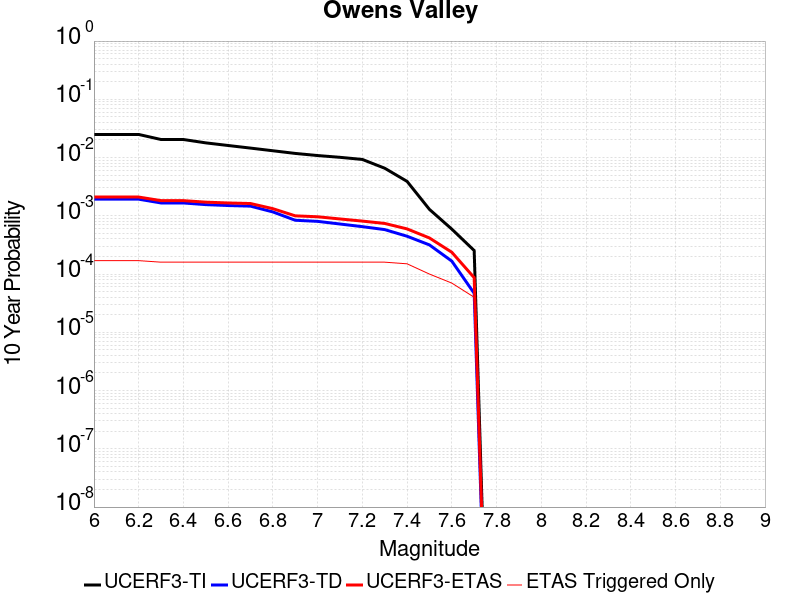 |

| Magnitude | 1 wk TI Prob | 1 wk TD Prob | 1 wk ETAS Prob | 1 wk ETAS/TD Gain | 1 wk ETAS Triggered Only | 1 mo TI Prob | 1 mo TD Prob | 1 mo ETAS Prob | 1 mo ETAS/TD Gain | 1 mo ETAS Triggered Only | 1 yr TI Prob | 1 yr TD Prob | 1 yr ETAS Prob | 1 yr ETAS/TD Gain | 1 yr ETAS Triggered Only | 10 yr TI Prob | 10 yr TD Prob | 10 yr ETAS Prob | 10 yr ETAS/TD Gain | 10 yr ETAS Triggered Only |
|-----|-----|-----|-----|-----|-----|-----|-----|-----|-----|-----|-----|-----|-----|-----|-----|-----|-----|-----|-----|-----|
| 6.0 | 4.83821E-5 | 3.6210524E-6 | 6.3620835E-5 | 17.569708 | 6.0E-5 | 2.0733538E-4 | 1.551871E-5 | 9.551747E-5 | 6.154988 | 8.0E-5 | 0.002521386 | 1.889249E-4 | 3.1890033E-4 | 1.6879741 | 1.3E-4 | 0.024929691 | 0.0019297141 | 0.0020993862 | 1.0879259 | 1.7E-4 |
| 6.1 | 4.83821E-5 | 3.6210524E-6 | 6.3620835E-5 | 17.569708 | 6.0E-5 | 2.0733538E-4 | 1.551871E-5 | 9.551747E-5 | 6.154988 | 8.0E-5 | 0.002521386 | 1.889249E-4 | 3.1890033E-4 | 1.6879741 | 1.3E-4 | 0.024929691 | 0.0019297141 | 0.0020993862 | 1.0879259 | 1.7E-4 |
| 6.2 | 4.83821E-5 | 3.6210524E-6 | 6.3620835E-5 | 17.569708 | 6.0E-5 | 2.0733538E-4 | 1.551871E-5 | 9.551747E-5 | 6.154988 | 8.0E-5 | 0.002521386 | 1.889249E-4 | 3.1890033E-4 | 1.6879741 | 1.3E-4 | 0.024929691 | 0.0019297141 | 0.0020993862 | 1.0879259 | 1.7E-4 |
| 6.3 | 3.953008E-5 | 3.1530958E-6 | 6.3152904E-5 | 20.028856 | 6.0E-5 | 1.6940363E-4 | 1.3513202E-5 | 8.3512256E-5 | 6.1800494 | 7.0E-5 | 0.002060538 | 1.6451156E-4 | 2.844918E-4 | 1.7293121 | 1.2E-4 | 0.020415364 | 0.0016621627 | 0.0018218968 | 1.0961001 | 1.6E-4 |
| 6.4 | 3.953008E-5 | 3.1530958E-6 | 6.3152904E-5 | 20.028856 | 6.0E-5 | 1.6940363E-4 | 1.3513202E-5 | 8.3512256E-5 | 6.1800494 | 7.0E-5 | 0.002060538 | 1.6451156E-4 | 2.844918E-4 | 1.7293121 | 1.2E-4 | 0.020415364 | 0.0016621627 | 0.0018218968 | 1.0961001 | 1.6E-4 |
| 6.5 | 3.457342E-5 | 2.9707387E-6 | 6.297056E-5 | 21.196936 | 6.0E-5 | 1.4816338E-4 | 1.273168E-5 | 8.273079E-5 | 6.4980264 | 7.0E-5 | 0.0018023965 | 1.5499788E-4 | 2.7497928E-4 | 1.7740842 | 1.2E-4 | 0.017878477 | 0.0015563119 | 0.0017160628 | 1.1026472 | 1.6E-4 |
| 6.6 | 3.1127765E-5 | 2.8737306E-6 | 6.287356E-5 | 21.878723 | 6.0E-5 | 1.3339789E-4 | 1.2315934E-5 | 8.231507E-5 | 6.683624 | 7.0E-5 | 0.0016229092 | 1.4993687E-4 | 2.6991888E-4 | 1.8002168 | 1.2E-4 | 0.016111081 | 0.0015013438 | 0.0016611036 | 1.1064112 | 1.6E-4 |
| 6.7 | 2.806885E-5 | 2.8101606E-6 | 6.2809995E-5 | 22.351034 | 6.0E-5 | 1.2028952E-4 | 1.2043493E-5 | 8.204265E-5 | 6.812197 | 7.0E-5 | 0.001463541 | 1.4662035E-4 | 2.6660276E-4 | 1.8183203 | 1.2E-4 | 0.014539397 | 0.0014656087 | 0.0016253742 | 1.1090096 | 1.6E-4 |
| 6.8 | 2.524524E-5 | 2.2351392E-6 | 6.2235005E-5 | 27.843906 | 6.0E-5 | 1.0818939E-4 | 9.579134E-6 | 7.9578465E-5 | 8.30748 | 7.0E-5 | 0.0013164099 | 1.16620016E-4 | 2.3660602E-4 | 2.028863 | 1.2E-4 | 0.01308639 | 0.001165827 | 0.0013256406 | 1.1370816 | 1.6E-4 |
| 6.9 | 2.2704568E-5 | 1.6079711E-6 | 6.1607876E-5 | 38.314045 | 6.0E-5 | 9.730166E-5 | 6.8912864E-6 | 7.689081E-5 | 11.157685 | 7.0E-5 | 0.0011840039 | 8.38982E-5 | 2.0388814E-4 | 2.4301848 | 1.2E-4 | 0.011777153 | 8.38853E-4 | 9.987188E-4 | 1.1905767 | 1.6E-4 |
| 7.0 | 2.0871712E-5 | 1.5393621E-6 | 6.153927E-5 | 39.977123 | 6.0E-5 | 8.944713E-5 | 6.5972495E-6 | 7.6596785E-5 | 11.610413 | 7.0E-5 | 0.0010884746 | 8.031857E-5 | 2.0030893E-4 | 2.4939306 | 1.2E-4 | 0.010831586 | 8.030395E-4 | 9.6291106E-4 | 1.199083 | 1.6E-4 |
| 7.1 | 1.944928E-5 | 1.3862556E-6 | 6.138617E-5 | 44.282 | 6.0E-5 | 8.335139E-5 | 5.941082E-6 | 7.594067E-5 | 12.782296 | 7.0E-5 | 0.0010143308 | 7.233028E-5 | 1.923216E-4 | 2.6589363 | 1.2E-4 | 0.010097133 | 7.2319806E-4 | 8.8308234E-4 | 1.2210796 | 1.6E-4 |
| 7.2 | 1.7876306E-5 | 1.2487686E-6 | 6.124869E-5 | 49.04727 | 6.0E-5 | 7.6610486E-5 | 5.3518543E-6 | 7.535148E-5 | 14.079509 | 7.0E-5 | 9.3233347E-4 | 6.515689E-5 | 1.8514907E-4 | 2.8415885 | 1.2E-4 | 0.009284316 | 6.5148395E-4 | 8.113797E-4 | 1.2454332 | 1.6E-4 |
| 7.3 | 1.2618672E-5 | 1.1113839E-6 | 6.1111314E-5 | 54.986687 | 6.0E-5 | 5.40789E-5 | 4.763065E-6 | 7.4762735E-5 | 15.696348 | 7.0E-5 | 6.582117E-4 | 5.7988782E-5 | 1.7798183E-4 | 3.0692458 | 1.2E-4 | 0.0065626553 | 5.7983754E-4 | 7.397448E-4 | 1.2757794 | 1.6E-4 |
| 7.4 | 7.4874442E-6 | 8.547518E-7 | 6.08547E-5 | 71.195755 | 6.0E-5 | 3.208865E-5 | 3.6632168E-6 | 7.366296E-5 | 20.108818 | 7.0E-5 | 3.906093E-4 | 4.4598757E-5 | 1.5459386E-4 | 3.4663265 | 1.1E-4 | 0.003899234 | 4.459579E-4 | 5.9589103E-4 | 1.3362046 | 1.5E-4 |
| 7.5 | 2.4734156E-6 | 6.0679935E-7 | 2.0606787E-5 | 33.959805 | 2.0E-5 | 1.060031E-5 | 2.6005662E-6 | 3.260049E-5 | 12.535919 | 3.0E-5 | 1.2905113E-4 | 3.1661435E-5 | 1.0165922E-4 | 3.2108214 | 7.0E-5 | 0.0012897621 | 3.1656958E-4 | 4.1653792E-4 | 1.3157864 | 1.0E-4 |
| 7.6 | 1.1328841E-6 | 3.1961991E-7 | 1.0319617E-5 | 32.28715 | 1.0E-5 | 4.8552088E-6 | 1.369799E-6 | 2.1369771E-5 | 15.600662 | 2.0E-5 | 5.9110564E-5 | 1.6677177E-5 | 7.667617E-5 | 4.597671 | 6.0E-5 | 5.9094845E-4 | 1.6675945E-4 | 2.3674777E-4 | 1.4196963 | 7.0E-5 |
| 7.7 | 4.8613185E-7 | 8.962742E-8 | 1.0089627E-5 | 112.57299 | 1.0E-5 | 2.0834207E-6 | 3.8411747E-7 | 1.0384114E-5 | 27.033693 | 1.0E-5 | 2.536535E-5 | 4.676621E-6 | 4.4676435E-5 | 9.553144 | 4.0E-5 | 2.5362454E-4 | 4.676529E-5 | 8.676342E-5 | 1.8552952 | 4.0E-5 |

## Red Mountain
*[(top)](#table-of-contents)*

| 1 Week | 1 Month | 1 Year | 10 Year |
|-----|-----|-----|-----|
|  |  | 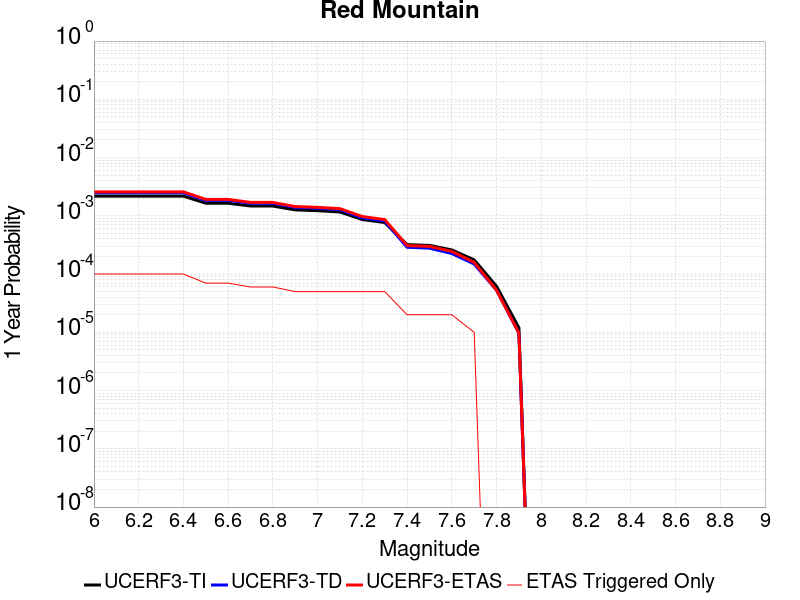 | 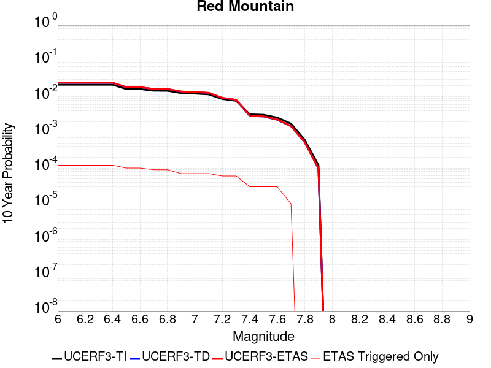 |

| Magnitude | 1 wk TI Prob | 1 wk TD Prob | 1 wk ETAS Prob | 1 wk ETAS/TD Gain | 1 wk ETAS Triggered Only | 1 mo TI Prob | 1 mo TD Prob | 1 mo ETAS Prob | 1 mo ETAS/TD Gain | 1 mo ETAS Triggered Only | 1 yr TI Prob | 1 yr TD Prob | 1 yr ETAS Prob | 1 yr ETAS/TD Gain | 1 yr ETAS Triggered Only | 10 yr TI Prob | 10 yr TD Prob | 10 yr ETAS Prob | 10 yr ETAS/TD Gain | 10 yr ETAS Triggered Only |
|-----|-----|-----|-----|-----|-----|-----|-----|-----|-----|-----|-----|-----|-----|-----|-----|-----|-----|-----|-----|-----|
| 6.0 | 4.1810763E-5 | 4.7590016E-5 | 1.0758716E-4 | 2.2607086 | 6.0E-5 | 1.7917668E-4 | 2.039422E-4 | 2.6392995E-4 | 1.294141 | 6.0E-5 | 0.0021792934 | 0.0024803334 | 0.0025800853 | 1.0402172 | 1.0E-4 | 0.021580452 | 0.02454411 | 0.024661165 | 1.0047692 | 1.2E-4 |
| 6.1 | 4.1810763E-5 | 4.7590016E-5 | 1.0758716E-4 | 2.2607086 | 6.0E-5 | 1.7917668E-4 | 2.039422E-4 | 2.6392995E-4 | 1.294141 | 6.0E-5 | 0.0021792934 | 0.0024803334 | 0.0025800853 | 1.0402172 | 1.0E-4 | 0.021580452 | 0.02454411 | 0.024661165 | 1.0047692 | 1.2E-4 |
| 6.2 | 4.1810763E-5 | 4.7590016E-5 | 1.0758716E-4 | 2.2607086 | 6.0E-5 | 1.7917668E-4 | 2.039422E-4 | 2.6392995E-4 | 1.294141 | 6.0E-5 | 0.0021792934 | 0.0024803334 | 0.0025800853 | 1.0402172 | 1.0E-4 | 0.021580452 | 0.02454411 | 0.024661165 | 1.0047692 | 1.2E-4 |
| 6.3 | 4.1810763E-5 | 4.7590016E-5 | 1.0758716E-4 | 2.2607086 | 6.0E-5 | 1.7917668E-4 | 2.039422E-4 | 2.6392995E-4 | 1.294141 | 6.0E-5 | 0.0021792934 | 0.0024803334 | 0.0025800853 | 1.0402172 | 1.0E-4 | 0.021580452 | 0.02454411 | 0.024661165 | 1.0047692 | 1.2E-4 |
| 6.4 | 4.1810763E-5 | 4.7590016E-5 | 1.0758716E-4 | 2.2607086 | 6.0E-5 | 1.7917668E-4 | 2.039422E-4 | 2.6392995E-4 | 1.294141 | 6.0E-5 | 0.0021792934 | 0.0024803334 | 0.0025800853 | 1.0402172 | 1.0E-4 | 0.021580452 | 0.02454411 | 0.024661165 | 1.0047692 | 1.2E-4 |
| 6.5 | 3.154503E-5 | 3.5359757E-5 | 6.53587E-5 | 1.8483921 | 3.0E-5 | 1.3518598E-4 | 1.5153353E-4 | 1.8152899E-4 | 1.197946 | 3.0E-5 | 0.0016446467 | 0.0018434518 | 0.0019133227 | 1.0379022 | 7.0E-5 | 0.01632528 | 0.018291244 | 0.018389415 | 1.005367 | 1.0E-4 |
| 6.6 | 3.1535834E-5 | 3.5349138E-5 | 6.534808E-5 | 1.848647 | 3.0E-5 | 1.3514658E-4 | 1.5148803E-4 | 1.8148348E-4 | 1.1980054 | 3.0E-5 | 0.0016441676 | 0.0018428987 | 0.0019127697 | 1.0379137 | 7.0E-5 | 0.01632056 | 0.018285805 | 0.018383976 | 1.0053687 | 1.0E-4 |
| 6.7 | 2.8267326E-5 | 3.1469353E-5 | 6.146841E-5 | 1.9532784 | 3.0E-5 | 1.2114006E-4 | 1.3486217E-4 | 1.6485812E-4 | 1.2224194 | 3.0E-5 | 0.0014738824 | 0.0016407954 | 0.0017006969 | 1.0365076 | 6.0E-5 | 0.014641452 | 0.01629557 | 0.016384104 | 1.005433 | 9.0E-5 |
| 6.8 | 2.8212884E-5 | 3.1407242E-5 | 6.1406296E-5 | 1.9551637 | 3.0E-5 | 1.20906756E-4 | 1.3459599E-4 | 1.6459195E-4 | 1.2228593 | 3.0E-5 | 0.0014710457 | 0.0016375595 | 0.0016974612 | 1.0365798 | 6.0E-5 | 0.014613459 | 0.016263688 | 0.016352223 | 1.0054438 | 9.0E-5 |
| 6.9 | 2.4227871E-5 | 2.6706994E-5 | 4.670646E-5 | 1.7488475 | 2.0E-5 | 1.03829596E-4 | 1.1445395E-4 | 1.3445166E-4 | 1.1747228 | 2.0E-5 | 0.0012633923 | 0.0013926621 | 0.0014425924 | 1.0358524 | 5.0E-5 | 0.012562336 | 0.0138470335 | 0.013916064 | 1.0049852 | 7.0E-5 |
| 7.0 | 2.348524E-5 | 2.5835778E-5 | 4.5835262E-5 | 1.7741003 | 2.0E-5 | 1.0064714E-4 | 1.10720495E-4 | 1.3071828E-4 | 1.1806151 | 2.0E-5 | 0.0012246901 | 0.001347264 | 0.0013971967 | 1.0370623 | 5.0E-5 | 0.012179627 | 0.013398598 | 0.01346766 | 1.0051544 | 7.0E-5 |
| 7.1 | 2.2311642E-5 | 2.4462845E-5 | 4.4462355E-5 | 1.8175464 | 2.0E-5 | 9.561782E-5 | 1.04836974E-4 | 1.2483487E-4 | 1.1907524 | 2.0E-5 | 0.0011635252 | 0.0012757176 | 0.0013256537 | 1.0391437 | 5.0E-5 | 0.01157452 | 0.01269146 | 0.012760571 | 1.0054455 | 7.0E-5 |
| 7.2 | 1.6533986E-5 | 1.7670362E-5 | 3.7670008E-5 | 2.1318188 | 2.0E-5 | 7.085802E-5 | 7.572828E-5 | 9.572677E-5 | 1.2640821 | 2.0E-5 | 8.623549E-4 | 9.2166534E-4 | 9.716192E-4 | 1.0541996 | 5.0E-5 | 0.008590161 | 0.009184707 | 0.009244156 | 1.0064726 | 6.0E-5 |
| 7.3 | 1.4703092E-5 | 1.5559537E-5 | 3.5559224E-5 | 2.2853653 | 2.0E-5 | 6.301173E-5 | 6.668237E-5 | 8.668104E-5 | 1.2999094 | 2.0E-5 | 7.668978E-4 | 8.1161706E-4 | 8.6157647E-4 | 1.0615554 | 5.0E-5 | 0.0076425658 | 0.008092604 | 0.008152118 | 1.0073541 | 6.0E-5 |
| 7.4 | 6.1331984E-6 | 5.5288874E-6 | 5.5288874E-6 | 1.0 | 0.0 | 2.6284872E-5 | 2.3695018E-5 | 2.3695018E-5 | 1.0 | 0.0 | 3.199713E-4 | 2.884492E-4 | 3.084434E-4 | 1.0693163 | 2.0E-5 | 0.0031951098 | 0.0028808024 | 0.002910716 | 1.0103837 | 3.0E-5 |
| 7.5 | 5.954766E-6 | 5.338517E-6 | 5.338517E-6 | 1.0 | 0.0 | 2.5520176E-5 | 2.2879161E-5 | 2.2879161E-5 | 1.0 | 0.0 | 3.1066386E-4 | 2.785187E-4 | 2.9851313E-4 | 1.0717884 | 2.0E-5 | 0.003102299 | 0.0027817504 | 0.0028116668 | 1.0107546 | 3.0E-5 |
| 7.6 | 4.9726646E-6 | 4.315309E-6 | 4.315309E-6 | 1.0 | 0.0 | 2.1311245E-5 | 1.8494053E-5 | 1.8494053E-5 | 1.0 | 0.0 | 2.5943352E-4 | 2.2514217E-4 | 2.4513766E-4 | 1.0888127 | 2.0E-5 | 0.0025913084 | 0.0022491754 | 0.002279108 | 1.0133082 | 3.0E-5 |
| 7.7 | 3.3613894E-6 | 2.8526886E-6 | 2.8526886E-6 | 1.0 | 0.0 | 1.4405875E-5 | 1.22257525E-5 | 1.22257525E-5 | 1.0 | 0.0 | 1.7537741E-4 | 1.4883863E-4 | 1.5883715E-4 | 1.0671768 | 1.0E-5 | 0.0017523908 | 0.0014874157 | 0.0014974009 | 1.006713 | 1.0E-5 |
| 7.8 | 1.1828961E-6 | 1.0122935E-6 | 1.0122935E-6 | 1.0 | 0.0 | 5.069545E-6 | 4.338394E-6 | 4.338394E-6 | 1.0 | 0.0 | 6.171996E-5 | 5.281869E-5 | 5.281869E-5 | 1.0 | 0.0 | 6.170282E-4 | 5.280643E-4 | 5.280643E-4 | 1.0 | 0.0 |
| 7.9 | 2.2967266E-7 | 1.861919E-7 | 1.861919E-7 | 1.0 | 0.0 | 9.843111E-7 | 7.97965E-7 | 7.97965E-7 | 1.0 | 0.0 | 1.19839215E-5 | 9.715184E-6 | 9.715184E-6 | 1.0 | 0.0 | 1.1983275E-4 | 9.714788E-5 | 9.714788E-5 | 1.0 | 0.0 |

## Deep Springs
*[(top)](#table-of-contents)*

| 1 Week | 1 Month | 1 Year | 10 Year |
|-----|-----|-----|-----|
|  | 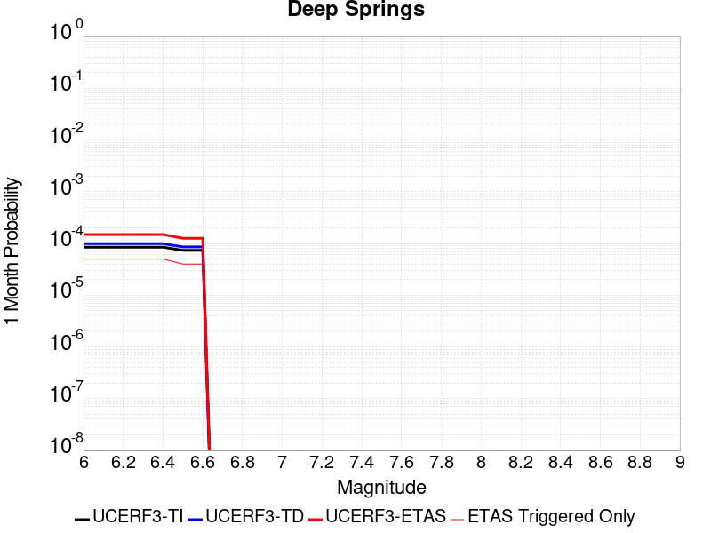 |  |  |

| Magnitude | 1 wk TI Prob | 1 wk TD Prob | 1 wk ETAS Prob | 1 wk ETAS/TD Gain | 1 wk ETAS Triggered Only | 1 mo TI Prob | 1 mo TD Prob | 1 mo ETAS Prob | 1 mo ETAS/TD Gain | 1 mo ETAS Triggered Only | 1 yr TI Prob | 1 yr TD Prob | 1 yr ETAS Prob | 1 yr ETAS/TD Gain | 1 yr ETAS Triggered Only | 10 yr TI Prob | 10 yr TD Prob | 10 yr ETAS Prob | 10 yr ETAS/TD Gain | 10 yr ETAS Triggered Only |
|-----|-----|-----|-----|-----|-----|-----|-----|-----|-----|-----|-----|-----|-----|-----|-----|-----|-----|-----|-----|-----|
| 6.0 | 1.9810619E-5 | 2.311252E-5 | 7.311136E-5 | 3.1632798 | 5.0E-5 | 8.489989E-5 | 9.9052755E-5 | 1.490478E-4 | 1.5047315 | 5.0E-5 | 0.001033166 | 0.0012058078 | 0.0013156752 | 1.0911151 | 1.1E-4 | 0.010283757 | 0.01204243 | 0.012200504 | 1.0131264 | 1.6E-4 |
| 6.1 | 1.9810619E-5 | 2.311252E-5 | 7.311136E-5 | 3.1632798 | 5.0E-5 | 8.489989E-5 | 9.9052755E-5 | 1.490478E-4 | 1.5047315 | 5.0E-5 | 0.001033166 | 0.0012058078 | 0.0013156752 | 1.0911151 | 1.1E-4 | 0.010283757 | 0.01204243 | 0.012200504 | 1.0131264 | 1.6E-4 |
| 6.2 | 1.9810619E-5 | 2.311252E-5 | 7.311136E-5 | 3.1632798 | 5.0E-5 | 8.489989E-5 | 9.9052755E-5 | 1.490478E-4 | 1.5047315 | 5.0E-5 | 0.001033166 | 0.0012058078 | 0.0013156752 | 1.0911151 | 1.1E-4 | 0.010283757 | 0.01204243 | 0.012200504 | 1.0131264 | 1.6E-4 |
| 6.3 | 1.9810619E-5 | 2.311252E-5 | 7.311136E-5 | 3.1632798 | 5.0E-5 | 8.489989E-5 | 9.9052755E-5 | 1.490478E-4 | 1.5047315 | 5.0E-5 | 0.001033166 | 0.0012058078 | 0.0013156752 | 1.0911151 | 1.1E-4 | 0.010283757 | 0.01204243 | 0.012200504 | 1.0131264 | 1.6E-4 |
| 6.4 | 1.9810619E-5 | 2.311252E-5 | 7.311136E-5 | 3.1632798 | 5.0E-5 | 8.489989E-5 | 9.9052755E-5 | 1.490478E-4 | 1.5047315 | 5.0E-5 | 0.001033166 | 0.0012058078 | 0.0013156752 | 1.0911151 | 1.1E-4 | 0.010283757 | 0.01204243 | 0.012200504 | 1.0131264 | 1.6E-4 |
| 6.5 | 1.7190405E-5 | 2.0050558E-5 | 6.0049755E-5 | 2.994917 | 4.0E-5 | 7.367108E-5 | 8.593096E-5 | 1.2592753E-4 | 1.4654499 | 4.0E-5 | 8.9657627E-4 | 0.0010462092 | 0.0011461047 | 1.0954832 | 1.0E-4 | 0.008929676 | 0.010462061 | 0.010600596 | 1.0132416 | 1.4E-4 |
| 6.6 | 1.7190405E-5 | 2.0050558E-5 | 6.0049755E-5 | 2.994917 | 4.0E-5 | 7.367108E-5 | 8.593096E-5 | 1.2592753E-4 | 1.4654499 | 4.0E-5 | 8.9657627E-4 | 0.0010462092 | 0.0011461047 | 1.0954832 | 1.0E-4 | 0.008929676 | 0.010462061 | 0.010600596 | 1.0132416 | 1.4E-4 |

## Rose Canyon
*[(top)](#table-of-contents)*

| 1 Week | 1 Month | 1 Year | 10 Year |
|-----|-----|-----|-----|
|  |  |  | 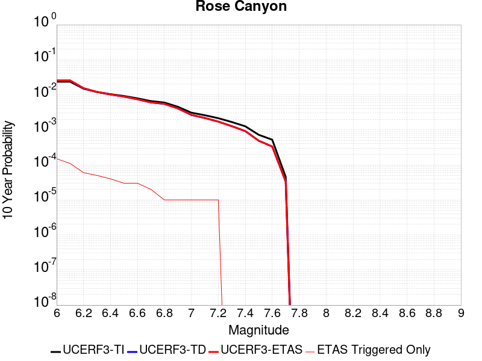 |

| Magnitude | 1 wk TI Prob | 1 wk TD Prob | 1 wk ETAS Prob | 1 wk ETAS/TD Gain | 1 wk ETAS Triggered Only | 1 mo TI Prob | 1 mo TD Prob | 1 mo ETAS Prob | 1 mo ETAS/TD Gain | 1 mo ETAS Triggered Only | 1 yr TI Prob | 1 yr TD Prob | 1 yr ETAS Prob | 1 yr ETAS/TD Gain | 1 yr ETAS Triggered Only | 10 yr TI Prob | 10 yr TD Prob | 10 yr ETAS Prob | 10 yr ETAS/TD Gain | 10 yr ETAS Triggered Only |
|-----|-----|-----|-----|-----|-----|-----|-----|-----|-----|-----|-----|-----|-----|-----|-----|-----|-----|-----|-----|-----|
| 6.0 | 4.5923203E-5 | 4.9714607E-5 | 1.1971113E-4 | 2.4079669 | 7.0E-5 | 1.9679888E-4 | 2.1304654E-4 | 2.8303164E-4 | 1.3284967 | 7.0E-5 | 0.0023933933 | 0.0025909478 | 0.002700663 | 1.0423455 | 1.1E-4 | 0.023677798 | 0.025618518 | 0.025764676 | 1.0057051 | 1.5E-4 |
| 6.1 | 4.5923203E-5 | 4.9714607E-5 | 9.9712124E-5 | 2.0056906 | 5.0E-5 | 1.9679888E-4 | 2.1304654E-4 | 2.630359E-4 | 1.2346405 | 5.0E-5 | 0.0023933933 | 0.0025909478 | 0.0026607665 | 1.0269471 | 7.0E-5 | 0.023677798 | 0.025618518 | 0.0257257 | 1.0041838 | 1.1E-4 |
| 6.2 | 2.8844734E-5 | 2.9669678E-5 | 5.966879E-5 | 2.0111034 | 3.0E-5 | 1.2361443E-4 | 1.2714976E-4 | 1.5714594E-4 | 1.2359122 | 3.0E-5 | 0.0015039665 | 0.001546976 | 0.0015869142 | 1.0258169 | 4.0E-5 | 0.0149382865 | 0.015364873 | 0.015423952 | 1.003845 | 6.0E-5 |
| 6.3 | 2.3171577E-5 | 2.3162425E-5 | 5.316173E-5 | 2.2951713 | 3.0E-5 | 9.9302975E-5 | 9.926383E-5 | 1.2926085E-4 | 1.3021948 | 3.0E-5 | 0.0012083431 | 0.0012078804 | 0.0012378442 | 1.0248069 | 3.0E-5 | 0.012017938 | 0.012012152 | 0.012061551 | 1.0041125 | 5.0E-5 |
| 6.4 | 2.0066604E-5 | 1.9668067E-5 | 3.9667673E-5 | 2.0168567 | 2.0E-5 | 8.599689E-5 | 8.428905E-5 | 1.0428736E-4 | 1.2372588 | 2.0E-5 | 0.0010465092 | 0.001025746 | 0.0010457255 | 1.019478 | 2.0E-5 | 0.010415946 | 0.010211479 | 0.01025107 | 1.0038772 | 4.0E-5 |
| 6.5 | 1.776989E-5 | 1.7115402E-5 | 3.711506E-5 | 2.168518 | 2.0E-5 | 7.615444E-5 | 7.33497E-5 | 9.334823E-5 | 1.2726464 | 2.0E-5 | 9.267859E-4 | 8.926737E-4 | 9.126558E-4 | 1.0223846 | 2.0E-5 | 0.009229303 | 0.008874663 | 0.0089043975 | 1.0033504 | 3.0E-5 |
| 6.6 | 1.5227364E-5 | 1.4340872E-5 | 3.4340585E-5 | 2.3945951 | 2.0E-5 | 6.52585E-5 | 6.145947E-5 | 8.145824E-5 | 1.3253977 | 2.0E-5 | 7.942326E-4 | 7.480173E-4 | 7.6800236E-4 | 1.0267173 | 2.0E-5 | 0.007914 | 0.0074410336 | 0.0074708103 | 1.0040017 | 3.0E-5 |
| 6.7 | 1.2703898E-5 | 1.1674277E-5 | 2.1674161E-5 | 1.856574 | 1.0E-5 | 5.4444143E-5 | 5.0031682E-5 | 6.003118E-5 | 1.1998633 | 1.0E-5 | 6.626558E-4 | 6.089697E-4 | 6.189636E-4 | 1.0164112 | 1.0E-5 | 0.006606833 | 0.0060623093 | 0.006082188 | 1.0032791 | 2.0E-5 |
| 6.8 | 1.1554917E-5 | 1.0610384E-5 | 1.0610384E-5 | 1.0 | 0.0 | 4.9520135E-5 | 4.547231E-5 | 4.547231E-5 | 1.0 | 0.0 | 6.0274085E-4 | 5.5348873E-4 | 5.5348873E-4 | 1.0 | 0.0 | 0.0060110865 | 0.005504414 | 0.005514359 | 1.0018067 | 1.0E-5 |
| 6.9 | 8.732078E-6 | 7.882285E-6 | 7.882285E-6 | 1.0 | 0.0 | 3.7422655E-5 | 3.37808E-5 | 3.37808E-5 | 1.0 | 0.0 | 4.5552556E-4 | 4.112066E-4 | 4.112066E-4 | 1.0 | 0.0 | 0.0045459294 | 0.004089515 | 0.0040994743 | 1.0024353 | 1.0E-5 |
| 7.0 | 5.9337494E-6 | 5.107436E-6 | 5.107436E-6 | 1.0 | 0.0 | 2.5430107E-5 | 2.1888829E-5 | 2.1888829E-5 | 1.0 | 0.0 | 3.0956755E-4 | 2.6646405E-4 | 2.6646405E-4 | 1.0 | 0.0 | 0.0030913667 | 0.002661461 | 0.0026714345 | 1.0037473 | 1.0E-5 |
| 7.1 | 5.013409E-6 | 4.17734E-6 | 4.17734E-6 | 1.0 | 0.0 | 2.1485863E-5 | 1.7902763E-5 | 1.7902763E-5 | 1.0 | 0.0 | 2.6155898E-4 | 2.1794444E-4 | 2.1794444E-4 | 1.0 | 0.0 | 0.0026125133 | 0.0021773188 | 0.002187297 | 1.0045828 | 1.0E-5 |
| 7.2 | 4.120763E-6 | 3.2820917E-6 | 3.2820917E-6 | 1.0 | 0.0 | 1.7660293E-5 | 1.4066032E-5 | 1.4066032E-5 | 1.0 | 0.0 | 2.1499286E-4 | 1.7124058E-4 | 1.7124058E-4 | 1.0 | 0.0 | 0.0021478499 | 0.0017110958 | 0.0017210786 | 1.0058342 | 1.0E-5 |
| 7.3 | 3.2081239E-6 | 2.4404965E-6 | 2.4404965E-6 | 1.0 | 0.0 | 1.374903E-5 | 1.0459229E-5 | 1.0459229E-5 | 1.0 | 0.0 | 1.6738157E-4 | 1.2733374E-4 | 1.2733374E-4 | 1.0 | 0.0 | 0.0016725556 | 0.0012726148 | 0.0012726148 | 1.0 | 0.0 |
| 7.4 | 2.4194755E-6 | 1.7680321E-6 | 1.7680321E-6 | 1.0 | 0.0 | 1.0369139E-5 | 7.5772587E-6 | 7.5772587E-6 | 1.0 | 0.0 | 1.2623696E-4 | 9.224927E-5 | 9.224927E-5 | 1.0 | 0.0 | 0.0012616527 | 9.221151E-4 | 9.221151E-4 | 1.0 | 0.0 |
| 7.5 | 1.3842889E-6 | 9.3782967E-7 | 9.3782967E-7 | 1.0 | 0.0 | 5.9326535E-6 | 4.019264E-6 | 4.019264E-6 | 1.0 | 0.0 | 7.222766E-5 | 4.8933474E-5 | 4.8933474E-5 | 1.0 | 0.0 | 7.220419E-4 | 4.8923056E-4 | 4.8923056E-4 | 1.0 | 0.0 |
| 7.6 | 1.0021575E-6 | 6.4113493E-7 | 6.4113493E-7 | 1.0 | 0.0 | 4.2949537E-6 | 2.7477186E-6 | 2.7477186E-6 | 1.0 | 0.0 | 5.2289808E-5 | 3.345298E-5 | 3.345298E-5 | 1.0 | 0.0 | 5.2277505E-4 | 3.344816E-4 | 3.344816E-4 | 1.0 | 0.0 |
| 7.7 | 8.7620116E-8 | 6.449304E-8 | 6.449304E-8 | 1.0 | 0.0 | 3.7551473E-7 | 2.763987E-7 | 2.763987E-7 | 1.0 | 0.0 | 4.5718825E-6 | 3.3651493E-6 | 3.3651493E-6 | 1.0 | 0.0 | 4.5717883E-5 | 3.3651013E-5 | 3.3651013E-5 | 1.0 | 0.0 |

## Santa Rosa Island
*[(top)](#table-of-contents)*

| 1 Week | 1 Month | 1 Year | 10 Year |
|-----|-----|-----|-----|
|  | 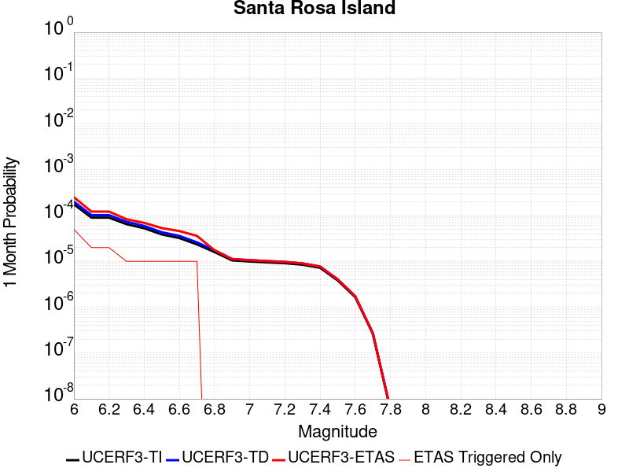 |  |  |

| Magnitude | 1 wk TI Prob | 1 wk TD Prob | 1 wk ETAS Prob | 1 wk ETAS/TD Gain | 1 wk ETAS Triggered Only | 1 mo TI Prob | 1 mo TD Prob | 1 mo ETAS Prob | 1 mo ETAS/TD Gain | 1 mo ETAS Triggered Only | 1 yr TI Prob | 1 yr TD Prob | 1 yr ETAS Prob | 1 yr ETAS/TD Gain | 1 yr ETAS Triggered Only | 10 yr TI Prob | 10 yr TD Prob | 10 yr ETAS Prob | 10 yr ETAS/TD Gain | 10 yr ETAS Triggered Only |
|-----|-----|-----|-----|-----|-----|-----|-----|-----|-----|-----|-----|-----|-----|-----|-----|-----|-----|-----|-----|-----|
| 6.0 | 4.1143165E-5 | 4.709113E-5 | 9.708877E-5 | 2.061721 | 5.0E-5 | 1.7631594E-4 | 2.0180462E-4 | 2.5179452E-4 | 1.2477144 | 5.0E-5 | 0.002144533 | 0.0024543991 | 0.0025541536 | 1.0406432 | 1.0E-4 | 0.021239553 | 0.024293557 | 0.024439912 | 1.0060245 | 1.5E-4 |
| 6.1 | 2.1061249E-5 | 2.3864959E-5 | 4.3864482E-5 | 1.8380288 | 2.0E-5 | 9.0259375E-5 | 1.0227455E-4 | 1.2227251E-4 | 1.1955321 | 2.0E-5 | 0.0010983539 | 0.0012445103 | 0.0012644854 | 1.0160506 | 2.0E-5 | 0.01092941 | 0.01237845 | 0.012408079 | 1.0023936 | 3.0E-5 |
| 6.2 | 2.1061249E-5 | 2.3864959E-5 | 4.3864482E-5 | 1.8380288 | 2.0E-5 | 9.0259375E-5 | 1.0227455E-4 | 1.2227251E-4 | 1.1955321 | 2.0E-5 | 0.0010983539 | 0.0012445103 | 0.0012644854 | 1.0160506 | 2.0E-5 | 0.01092941 | 0.01237845 | 0.012408079 | 1.0023936 | 3.0E-5 |
| 6.3 | 1.5158236E-5 | 1.7074419E-5 | 2.7074248E-5 | 1.5856615 | 1.0E-5 | 6.496225E-5 | 7.3174095E-5 | 8.317336E-5 | 1.1366504 | 1.0E-5 | 7.906284E-4 | 8.9054246E-4 | 9.005336E-4 | 1.0112191 | 1.0E-5 | 0.007878214 | 0.00887099 | 0.008890812 | 1.0022346 | 2.0E-5 |
| 6.4 | 1.2341918E-5 | 1.3852917E-5 | 2.3852777E-5 | 1.7218597 | 1.0E-5 | 5.2892858E-5 | 5.9368336E-5 | 6.936774E-5 | 1.16843 | 1.0E-5 | 6.437803E-4 | 7.225779E-4 | 7.325707E-4 | 1.0138294 | 1.0E-5 | 0.006419184 | 0.0072031217 | 0.0072130496 | 1.0013783 | 1.0E-5 |
| 6.5 | 9.061158E-6 | 1.0117032E-5 | 2.011693E-5 | 1.9884223 | 1.0E-5 | 3.883296E-5 | 4.3358017E-5 | 5.335758E-5 | 1.2306279 | 1.0E-5 | 4.726887E-4 | 5.277613E-4 | 5.37756E-4 | 1.018938 | 1.0E-5 | 0.004716845 | 0.0052656177 | 0.0052755647 | 1.0018891 | 1.0E-5 |
| 6.6 | 7.5461685E-6 | 8.400734E-6 | 1.840065E-5 | 2.1903622 | 1.0E-5 | 3.2340322E-5 | 3.600267E-5 | 4.600231E-5 | 1.2777472 | 1.0E-5 | 3.936723E-4 | 4.3824868E-4 | 4.4824427E-4 | 1.0228081 | 1.0E-5 | 0.003929756 | 0.0043742736 | 0.00438423 | 1.0022761 | 1.0E-5 |
| 6.7 | 5.5023775E-6 | 6.087381E-6 | 1.608732E-5 | 2.6427326 | 1.0E-5 | 2.3581404E-5 | 2.6088532E-5 | 3.6088273E-5 | 1.3833002 | 1.0E-5 | 2.8706578E-4 | 3.1758484E-4 | 3.2758166E-4 | 1.0314777 | 1.0E-5 | 0.0028669522 | 0.0031716316 | 0.0031815998 | 1.003143 | 1.0E-5 |
| 6.8 | 3.7351679E-6 | 4.0831405E-6 | 4.0831405E-6 | 1.0 | 0.0 | 1.6007763E-5 | 1.7499071E-5 | 1.7499071E-5 | 1.0 | 0.0 | 1.948771E-4 | 2.1303285E-4 | 2.1303285E-4 | 1.0 | 0.0 | 0.0019470629 | 0.0021285315 | 0.0021285315 | 1.0 | 0.0 |
| 6.9 | 2.456366E-6 | 2.6292707E-6 | 2.6292707E-6 | 1.0 | 0.0 | 1.0527241E-5 | 1.1268255E-5 | 1.1268255E-5 | 1.0 | 0.0 | 1.2816161E-4 | 1.3718239E-4 | 1.3718239E-4 | 1.0 | 0.0 | 0.0012808773 | 0.0013709799 | 0.0013709799 | 1.0 | 0.0 |
| 7.0 | 2.3245157E-6 | 2.4827784E-6 | 2.4827784E-6 | 1.0 | 0.0 | 9.962172E-6 | 1.0640436E-5 | 1.0640436E-5 | 1.0 | 0.0 | 1.2128269E-4 | 1.2953962E-4 | 1.2953962E-4 | 1.0 | 0.0 | 0.0012121652 | 0.0012946434 | 0.0012946434 | 1.0 | 0.0 |
| 7.1 | 2.2248344E-6 | 2.37325E-6 | 2.37325E-6 | 1.0 | 0.0 | 9.53497E-6 | 1.0171032E-5 | 1.0171032E-5 | 1.0 | 0.0 | 1.1608207E-4 | 1.238253E-4 | 1.238253E-4 | 1.0 | 0.0 | 0.0011602144 | 0.0012375651 | 0.0012375651 | 1.0 | 0.0 |
| 7.2 | 2.1350402E-6 | 2.2761542E-6 | 2.2761542E-6 | 1.0 | 0.0 | 9.150141E-6 | 9.75491E-6 | 9.75491E-6 | 1.0 | 0.0 | 1.1139726E-4 | 1.1875957E-4 | 1.1875957E-4 | 1.0 | 0.0 | 0.0011134144 | 0.0011869629 | 0.0011869629 | 1.0 | 0.0 |
| 7.3 | 1.9793572E-6 | 2.1087192E-6 | 2.1087192E-6 | 1.0 | 0.0 | 8.482932E-6 | 9.037337E-6 | 9.037337E-6 | 1.0 | 0.0 | 1.032748E-4 | 1.1002403E-4 | 1.1002403E-4 | 1.0 | 0.0 | 0.0010322682 | 0.0010996974 | 0.0010996974 | 1.0 | 0.0 |
| 7.4 | 1.6951194E-6 | 1.8045735E-6 | 1.8045735E-6 | 1.0 | 0.0 | 7.264777E-6 | 7.733864E-6 | 7.733864E-6 | 1.0 | 0.0 | 8.844508E-5 | 9.415574E-5 | 9.415574E-5 | 1.0 | 0.0 | 8.840988E-4 | 9.411601E-4 | 9.411601E-4 | 1.0 | 0.0 |
| 7.5 | 8.987207E-7 | 9.512216E-7 | 9.512216E-7 | 1.0 | 0.0 | 3.8516546E-6 | 4.0766577E-6 | 4.0766577E-6 | 1.0 | 0.0 | 4.6892885E-5 | 4.9632188E-5 | 4.9632188E-5 | 1.0 | 0.0 | 4.688299E-4 | 4.962122E-4 | 4.962122E-4 | 1.0 | 0.0 |
| 7.6 | 3.8783037E-7 | 4.0529335E-7 | 4.0529335E-7 | 1.0 | 0.0 | 1.6621291E-6 | 1.7369704E-6 | 1.7369704E-6 | 1.0 | 0.0 | 2.0236233E-5 | 2.1147416E-5 | 2.1147416E-5 | 1.0 | 0.0 | 2.023439E-4 | 2.114547E-4 | 2.114547E-4 | 1.0 | 0.0 |
| 7.7 | 6.181804E-8 | 6.339047E-8 | 6.339047E-8 | 1.0 | 0.0 | 2.6493444E-7 | 2.7167343E-7 | 2.7167343E-7 | 1.0 | 0.0 | 3.225572E-6 | 3.307619E-6 | 3.307619E-6 | 1.0 | 0.0 | 3.225525E-5 | 3.3075703E-5 | 3.3075703E-5 | 1.0 | 0.0 |
| 7.8 | 1.3704449E-9 | 1.3964153E-9 | 1.3964153E-9 | 1.0 | 0.0 | 5.873335E-9 | 5.984637E-9 | 5.984637E-9 | 1.0 | 0.0 | 7.1507856E-8 | 7.286295E-8 | 7.286295E-8 | 1.0 | 0.0 | 7.1507833E-7 | 7.286294E-7 | 7.286294E-7 | 1.0 | 0.0 |

## San Jacinto (Lytle Creek connector)
*[(top)](#table-of-contents)*

| 1 Week | 1 Month | 1 Year | 10 Year |
|-----|-----|-----|-----|
| 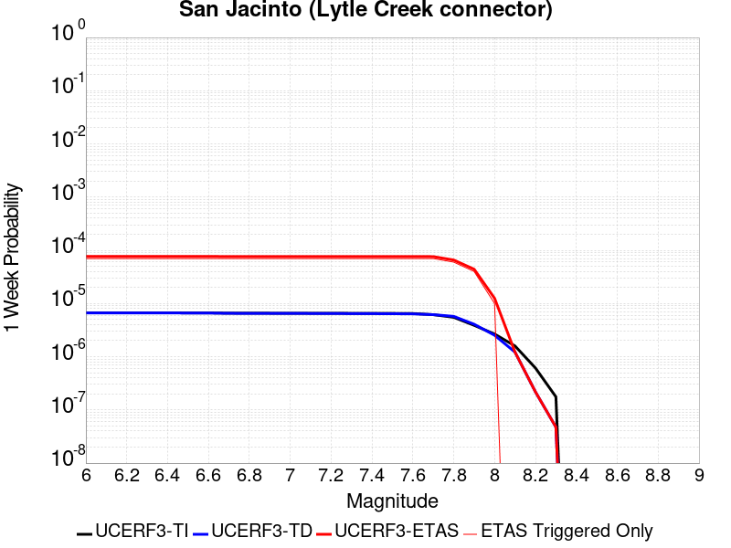 |  | 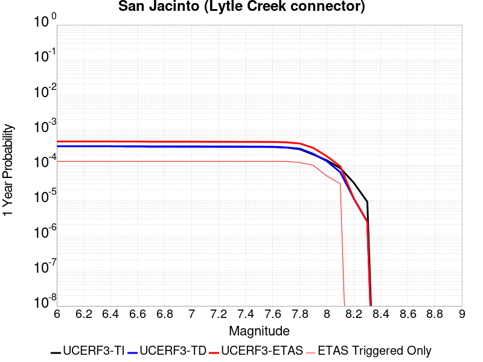 |  |

| Magnitude | 1 wk TI Prob | 1 wk TD Prob | 1 wk ETAS Prob | 1 wk ETAS/TD Gain | 1 wk ETAS Triggered Only | 1 mo TI Prob | 1 mo TD Prob | 1 mo ETAS Prob | 1 mo ETAS/TD Gain | 1 mo ETAS Triggered Only | 1 yr TI Prob | 1 yr TD Prob | 1 yr ETAS Prob | 1 yr ETAS/TD Gain | 1 yr ETAS Triggered Only | 10 yr TI Prob | 10 yr TD Prob | 10 yr ETAS Prob | 10 yr ETAS/TD Gain | 10 yr ETAS Triggered Only |
|-----|-----|-----|-----|-----|-----|-----|-----|-----|-----|-----|-----|-----|-----|-----|-----|-----|-----|-----|-----|-----|
| 6.0 | 6.693995E-6 | 6.660123E-6 | 7.665966E-5 | 11.510246 | 7.0E-5 | 2.8688235E-5 | 2.8543072E-5 | 1.2854021E-4 | 4.503377 | 1.0E-4 | 3.492233E-4 | 3.4745657E-4 | 4.774114E-4 | 1.3740175 | 1.3E-4 | 0.00348675 | 0.0035491167 | 0.0036985844 | 1.042114 | 1.5E-4 |
| 6.1 | 6.693995E-6 | 6.660123E-6 | 7.665966E-5 | 11.510246 | 7.0E-5 | 2.8688235E-5 | 2.8543072E-5 | 1.2854021E-4 | 4.503377 | 1.0E-4 | 3.492233E-4 | 3.4745657E-4 | 4.774114E-4 | 1.3740175 | 1.3E-4 | 0.00348675 | 0.0035491167 | 0.0036985844 | 1.042114 | 1.5E-4 |
| 6.2 | 6.693995E-6 | 6.660123E-6 | 7.665966E-5 | 11.510246 | 7.0E-5 | 2.8688235E-5 | 2.8543072E-5 | 1.2854021E-4 | 4.503377 | 1.0E-4 | 3.492233E-4 | 3.4745657E-4 | 4.774114E-4 | 1.3740175 | 1.3E-4 | 0.00348675 | 0.0035491167 | 0.0036985844 | 1.042114 | 1.5E-4 |
| 6.3 | 6.693995E-6 | 6.660123E-6 | 7.665966E-5 | 11.510246 | 7.0E-5 | 2.8688235E-5 | 2.8543072E-5 | 1.2854021E-4 | 4.503377 | 1.0E-4 | 3.492233E-4 | 3.4745657E-4 | 4.774114E-4 | 1.3740175 | 1.3E-4 | 0.00348675 | 0.0035491167 | 0.0036985844 | 1.042114 | 1.5E-4 |
| 6.4 | 6.693995E-6 | 6.660123E-6 | 7.665966E-5 | 11.510246 | 7.0E-5 | 2.8688235E-5 | 2.8543072E-5 | 1.2854021E-4 | 4.503377 | 1.0E-4 | 3.492233E-4 | 3.4745657E-4 | 4.774114E-4 | 1.3740175 | 1.3E-4 | 0.00348675 | 0.0035491167 | 0.0036985844 | 1.042114 | 1.5E-4 |
| 6.5 | 6.6561875E-6 | 6.620341E-6 | 7.661988E-5 | 11.573403 | 7.0E-5 | 2.8526205E-5 | 2.8372582E-5 | 1.2836975E-4 | 4.5244293 | 1.0E-4 | 3.472512E-4 | 3.453815E-4 | 4.7533662E-4 | 1.3762654 | 1.3E-4 | 0.0034670907 | 0.0035284322 | 0.003677903 | 1.0423619 | 1.5E-4 |
| 6.6 | 6.6561875E-6 | 6.620341E-6 | 7.661988E-5 | 11.573403 | 7.0E-5 | 2.8526205E-5 | 2.8372582E-5 | 1.2836975E-4 | 4.5244293 | 1.0E-4 | 3.472512E-4 | 3.453815E-4 | 4.7533662E-4 | 1.3762654 | 1.3E-4 | 0.0034670907 | 0.0035284322 | 0.003677903 | 1.0423619 | 1.5E-4 |
| 6.7 | 6.5802237E-6 | 6.539518E-6 | 7.653906E-5 | 11.704083 | 7.0E-5 | 2.8200653E-5 | 2.8026205E-5 | 1.280234E-4 | 4.5679893 | 1.0E-4 | 3.4328885E-4 | 3.4116567E-4 | 4.7112134E-4 | 1.3809165 | 1.3E-4 | 0.0034275902 | 0.0034864065 | 0.0036358836 | 1.0428742 | 1.5E-4 |
| 6.8 | 6.575632E-6 | 6.5340073E-6 | 7.653355E-5 | 11.71311 | 7.0E-5 | 2.8180975E-5 | 2.8002589E-5 | 1.2799978E-4 | 4.5709987 | 1.0E-4 | 3.4304935E-4 | 3.4087826E-4 | 4.7083394E-4 | 1.3812379 | 1.3E-4 | 0.0034252026 | 0.0034835413 | 0.0036330188 | 1.0429096 | 1.5E-4 |
| 6.9 | 6.570433E-6 | 6.525401E-6 | 7.652494E-5 | 11.72724 | 7.0E-5 | 2.8158694E-5 | 2.7965707E-5 | 1.279629E-4 | 4.575708 | 1.0E-4 | 3.4277816E-4 | 3.4042934E-4 | 4.703851E-4 | 1.3817407 | 1.3E-4 | 0.0034224992 | 0.0034790665 | 0.0036285445 | 1.042965 | 1.5E-4 |
| 7.0 | 6.5643826E-6 | 6.5155223E-6 | 7.651507E-5 | 11.743505 | 7.0E-5 | 2.8132765E-5 | 2.7923368E-5 | 1.2792058E-4 | 4.58113 | 1.0E-4 | 3.424626E-4 | 3.3991406E-4 | 4.6986988E-4 | 1.3823196 | 1.3E-4 | 0.0034193532 | 0.0034739296 | 0.0036234085 | 1.0430287 | 1.5E-4 |
| 7.1 | 6.557402E-6 | 6.504234E-6 | 7.650378E-5 | 11.762151 | 7.0E-5 | 2.8102848E-5 | 2.7874992E-5 | 1.278722E-4 | 4.587345 | 1.0E-4 | 3.4209844E-4 | 3.3932526E-4 | 4.6928113E-4 | 1.3829832 | 1.3E-4 | 0.0034157229 | 0.0034680606 | 0.0036175405 | 1.0431018 | 1.5E-4 |
| 7.2 | 6.546394E-6 | 6.4862006E-6 | 7.648575E-5 | 11.792072 | 7.0E-5 | 2.8055672E-5 | 2.7797707E-5 | 1.2779492E-4 | 4.597319 | 1.0E-4 | 3.4152428E-4 | 3.383846E-4 | 4.683406E-4 | 1.3840482 | 1.3E-4 | 0.0034099987 | 0.0034586883 | 0.0036081693 | 1.0432191 | 1.5E-4 |
| 7.3 | 6.5364216E-6 | 6.4669857E-6 | 7.646653E-5 | 11.824139 | 7.0E-5 | 2.8012933E-5 | 2.771536E-5 | 1.2771258E-4 | 4.608008 | 1.0E-4 | 3.4100408E-4 | 3.373823E-4 | 4.6733845E-4 | 1.3851895 | 1.3E-4 | 0.003404813 | 0.0034487103 | 0.003598193 | 1.0433445 | 1.5E-4 |
| 7.4 | 6.5269523E-6 | 6.4480723E-6 | 7.644762E-5 | 11.855887 | 7.0E-5 | 2.7972354E-5 | 2.7634303E-5 | 1.2763155E-4 | 4.618591 | 1.0E-4 | 3.4051016E-4 | 3.3639578E-4 | 4.6635204E-4 | 1.3863195 | 1.3E-4 | 0.0033998888 | 0.0034388923 | 0.0035883763 | 1.0434687 | 1.5E-4 |
| 7.5 | 6.5111835E-6 | 6.424346E-6 | 7.6423894E-5 | 11.895981 | 7.0E-5 | 2.7904773E-5 | 2.753262E-5 | 1.2752987E-4 | 4.631955 | 1.0E-4 | 3.3968766E-4 | 3.3515817E-4 | 4.651146E-4 | 1.3877466 | 1.3E-4 | 0.0033916887 | 0.0034265644 | 0.0035760503 | 1.0436256 | 1.5E-4 |
| 7.6 | 6.4768806E-6 | 6.383454E-6 | 7.638301E-5 | 11.965779 | 7.0E-5 | 2.7757764E-5 | 2.7357375E-5 | 1.2735464E-4 | 4.6552215 | 1.0E-4 | 3.3789838E-4 | 3.330252E-4 | 4.629819E-4 | 1.3902309 | 1.3E-4 | 0.0033738504 | 0.0034052972 | 0.0035448205 | 1.0409725 | 1.4E-4 |
| 7.7 | 6.1655364E-6 | 6.1759456E-6 | 7.6175515E-5 | 12.334227 | 7.0E-5 | 2.642346E-5 | 2.646807E-5 | 1.2646543E-4 | 4.778037 | 1.0E-4 | 3.2165812E-4 | 3.2220117E-4 | 4.521593E-4 | 1.4033446 | 1.3E-4 | 0.0032119295 | 0.0032969362 | 0.0034364746 | 1.0423237 | 1.4E-4 |
| 7.8 | 5.5043524E-6 | 5.7370175E-6 | 6.5736676E-5 | 11.458336 | 6.0E-5 | 2.3589868E-5 | 2.4586987E-5 | 1.1458477E-4 | 4.6603827 | 9.0E-5 | 2.871688E-4 | 2.993055E-4 | 4.1926958E-4 | 1.4008081 | 1.2E-4 | 0.0028679797 | 0.0030670585 | 0.0031966597 | 1.0422559 | 1.3E-4 |
| 7.9 | 3.889249E-6 | 4.0766436E-6 | 4.407648E-5 | 10.811954 | 4.0E-5 | 1.6668104E-5 | 1.7471213E-5 | 8.746999E-5 | 5.0065207 | 7.0E-5 | 2.0291525E-4 | 2.126913E-4 | 3.1267002E-4 | 1.470065 | 1.0E-4 | 0.0020273007 | 0.0021941073 | 0.002303866 | 1.0500243 | 1.1E-4 |
| 8.0 | 2.668535E-6 | 2.5313454E-6 | 1.253132E-5 | 4.9504585 | 1.0E-5 | 1.1436528E-5 | 1.0848577E-5 | 5.0848143E-5 | 4.6870794 | 4.0E-5 | 1.3923083E-4 | 1.3207346E-4 | 1.8206685E-4 | 1.3785272 | 5.0E-5 | 0.0013914363 | 0.0013755665 | 0.0014354839 | 1.0435584 | 6.0E-5 |
| 8.1 | 1.5911459E-6 | 1.2185134E-6 | 1.2185134E-6 | 1.0 | 0.0 | 6.8191785E-6 | 5.2221894E-6 | 3.5222034E-5 | 6.7446866 | 3.0E-5 | 8.3020335E-5 | 6.357832E-5 | 9.357642E-5 | 1.4718289 | 3.0E-5 | 8.298933E-4 | 6.6911156E-4 | 6.9909147E-4 | 1.0448055 | 3.0E-5 |
| 8.2 | 6.1294963E-7 | 2.1802066E-7 | 2.1802066E-7 | 1.0 | 0.0 | 2.6269242E-6 | 9.3437393E-7 | 9.3437393E-7 | 1.0 | 0.0 | 3.1982334E-5 | 1.1375943E-5 | 1.1375943E-5 | 1.0 | 0.0 | 3.1977732E-4 | 1.2778955E-4 | 1.2778955E-4 | 1.0 | 0.0 |
| 8.3 | 1.762871E-7 | 4.7516316E-8 | 4.7516316E-8 | 1.0 | 0.0 | 7.5551594E-7 | 2.0364133E-7 | 2.0364133E-7 | 1.0 | 0.0 | 9.1983675E-6 | 2.4793305E-6 | 2.4793305E-6 | 1.0 | 0.0 | 9.197987E-5 | 2.8671833E-5 | 2.8671833E-5 | 1.0 | 0.0 |

## San Jacinto (Coyote Creek)
*[(top)](#table-of-contents)*

| 1 Week | 1 Month | 1 Year | 10 Year |
|-----|-----|-----|-----|
|  | 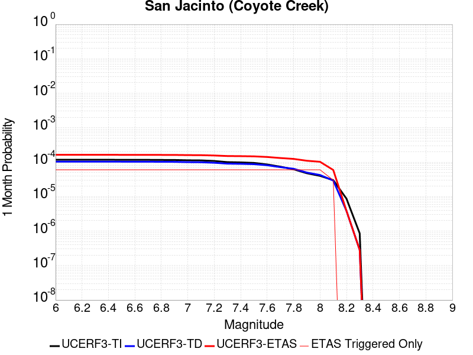 |  |  |

| Magnitude | 1 wk TI Prob | 1 wk TD Prob | 1 wk ETAS Prob | 1 wk ETAS/TD Gain | 1 wk ETAS Triggered Only | 1 mo TI Prob | 1 mo TD Prob | 1 mo ETAS Prob | 1 mo ETAS/TD Gain | 1 mo ETAS Triggered Only | 1 yr TI Prob | 1 yr TD Prob | 1 yr ETAS Prob | 1 yr ETAS/TD Gain | 1 yr ETAS Triggered Only | 10 yr TI Prob | 10 yr TD Prob | 10 yr ETAS Prob | 10 yr ETAS/TD Gain | 10 yr ETAS Triggered Only |
|-----|-----|-----|-----|-----|-----|-----|-----|-----|-----|-----|-----|-----|-----|-----|-----|-----|-----|-----|-----|-----|
| 6.0 | 2.7374346E-5 | 2.41444E-5 | 5.4143675E-5 | 2.242494 | 3.0E-5 | 1.1731335E-4 | 1.034719E-4 | 1.634657E-4 | 1.5798075 | 6.0E-5 | 0.0014273542 | 0.001259045 | 0.0013589191 | 1.0793253 | 1.0E-4 | 0.01418221 | 0.012928195 | 0.013056514 | 1.0099255 | 1.3E-4 |
| 6.1 | 2.7374346E-5 | 2.41444E-5 | 5.4143675E-5 | 2.242494 | 3.0E-5 | 1.1731335E-4 | 1.034719E-4 | 1.634657E-4 | 1.5798075 | 6.0E-5 | 0.0014273542 | 0.001259045 | 0.0013589191 | 1.0793253 | 1.0E-4 | 0.01418221 | 0.012928195 | 0.013056514 | 1.0099255 | 1.3E-4 |
| 6.2 | 2.7374346E-5 | 2.41444E-5 | 5.4143675E-5 | 2.242494 | 3.0E-5 | 1.1731335E-4 | 1.034719E-4 | 1.634657E-4 | 1.5798075 | 6.0E-5 | 0.0014273542 | 0.001259045 | 0.0013589191 | 1.0793253 | 1.0E-4 | 0.01418221 | 0.012928195 | 0.013056514 | 1.0099255 | 1.3E-4 |
| 6.3 | 2.7374346E-5 | 2.41444E-5 | 5.4143675E-5 | 2.242494 | 3.0E-5 | 1.1731335E-4 | 1.034719E-4 | 1.634657E-4 | 1.5798075 | 6.0E-5 | 0.0014273542 | 0.001259045 | 0.0013589191 | 1.0793253 | 1.0E-4 | 0.01418221 | 0.012928195 | 0.013056514 | 1.0099255 | 1.3E-4 |
| 6.4 | 2.7374346E-5 | 2.41444E-5 | 5.4143675E-5 | 2.242494 | 3.0E-5 | 1.1731335E-4 | 1.034719E-4 | 1.634657E-4 | 1.5798075 | 6.0E-5 | 0.0014273542 | 0.001259045 | 0.0013589191 | 1.0793253 | 1.0E-4 | 0.01418221 | 0.012928195 | 0.013056514 | 1.0099255 | 1.3E-4 |
| 6.5 | 2.7282445E-5 | 2.4030476E-5 | 5.4029755E-5 | 2.2483847 | 3.0E-5 | 1.16919524E-4 | 1.0298371E-4 | 1.6297752E-4 | 1.5825565 | 6.0E-5 | 0.0014225657 | 0.001253108 | 0.0013529827 | 1.0797015 | 1.0E-4 | 0.014134934 | 0.012869522 | 0.012997849 | 1.0099714 | 1.3E-4 |
| 6.6 | 2.7282445E-5 | 2.4030476E-5 | 5.4029755E-5 | 2.2483847 | 3.0E-5 | 1.16919524E-4 | 1.0298371E-4 | 1.6297752E-4 | 1.5825565 | 6.0E-5 | 0.0014225657 | 0.001253108 | 0.0013529827 | 1.0797015 | 1.0E-4 | 0.014134934 | 0.012869522 | 0.012997849 | 1.0099714 | 1.3E-4 |
| 6.7 | 2.7216198E-5 | 2.3955597E-5 | 5.395488E-5 | 2.252287 | 3.0E-5 | 1.1663563E-4 | 1.02662816E-4 | 1.6265667E-4 | 1.5843775 | 6.0E-5 | 0.0014191137 | 0.0012492058 | 0.0013490808 | 1.0799508 | 1.0E-4 | 0.014100855 | 0.012830934 | 0.012959266 | 1.0100018 | 1.3E-4 |
| 6.8 | 2.7078617E-5 | 2.3872815E-5 | 5.38721E-5 | 2.2566295 | 3.0E-5 | 1.1604605E-4 | 1.0230807E-4 | 1.6230193E-4 | 1.586404 | 6.0E-5 | 0.001411945 | 0.0012448917 | 0.0013447672 | 1.0802283 | 1.0E-4 | 0.014030075 | 0.0127880825 | 0.01291642 | 1.0100358 | 1.3E-4 |
| 6.9 | 2.6982952E-5 | 2.3792329E-5 | 5.3791617E-5 | 2.2608807 | 3.0E-5 | 1.15636096E-4 | 1.0196315E-4 | 1.6195704E-4 | 1.5883878 | 6.0E-5 | 0.0014069602 | 0.0012406971 | 0.0013405731 | 1.0804999 | 1.0E-4 | 0.013980856 | 0.012746378 | 0.012874722 | 1.010069 | 1.3E-4 |
| 7.0 | 2.6449972E-5 | 2.3369357E-5 | 5.3368654E-5 | 2.2837024 | 3.0E-5 | 1.1335209E-4 | 1.0015055E-4 | 1.6014454E-4 | 1.599038 | 6.0E-5 | 0.001379188 | 0.0012186535 | 0.0013185317 | 1.0819578 | 1.0E-4 | 0.0137065975 | 0.012527733 | 0.012656105 | 1.010247 | 1.3E-4 |
| 7.1 | 2.6257849E-5 | 2.3195396E-5 | 5.31947E-5 | 2.2933302 | 3.0E-5 | 1.1252879E-4 | 9.940507E-5 | 1.593991E-4 | 1.603531 | 6.0E-5 | 0.0013691769 | 0.0012095873 | 0.0013094664 | 1.0825728 | 1.0E-4 | 0.013607717 | 0.012437661 | 0.012566044 | 1.0103221 | 1.3E-4 |
| 7.2 | 2.5270041E-5 | 2.2390155E-5 | 5.2389485E-5 | 2.3398445 | 3.0E-5 | 1.0829568E-4 | 9.5954296E-5 | 1.5594854E-4 | 1.6252377 | 6.0E-5 | 0.0013177024 | 0.0011676198 | 0.001267503 | 1.0855443 | 1.0E-4 | 0.013099162 | 0.0120187905 | 0.012137348 | 1.0098643 | 1.2E-4 |
| 7.3 | 2.339701E-5 | 2.1122027E-5 | 5.1121395E-5 | 2.4202883 | 3.0E-5 | 1.0026905E-4 | 9.051985E-5 | 1.5051442E-4 | 1.6627781 | 6.0E-5 | 0.001220092 | 0.001101524 | 0.0012014138 | 1.0906833 | 1.0E-4 | 0.012134149 | 0.011357642 | 0.011476279 | 1.0104456 | 1.2E-4 |
| 7.4 | 2.296333E-5 | 2.0852396E-5 | 5.085177E-5 | 2.4386537 | 3.0E-5 | 9.841056E-5 | 8.936436E-5 | 1.49359E-4 | 1.6713486 | 6.0E-5 | 0.0011974899 | 0.0010874701 | 0.0011873613 | 1.0918566 | 1.0E-4 | 0.011910575 | 0.011216754 | 0.011335407 | 1.0105783 | 1.2E-4 |
| 7.5 | 2.2188895E-5 | 2.037534E-5 | 5.037473E-5 | 2.472338 | 3.0E-5 | 9.50918E-5 | 8.731998E-5 | 1.4731474E-4 | 1.687068 | 6.0E-5 | 0.0011571277 | 0.0010626042 | 0.001162498 | 1.0940084 | 1.0E-4 | 0.011511209 | 0.010966369 | 0.011085053 | 1.0108225 | 1.2E-4 |
| 7.6 | 2.0013189E-5 | 1.8961666E-5 | 4.8961097E-5 | 2.5821095 | 3.0E-5 | 8.5767984E-5 | 8.126176E-5 | 1.4125688E-4 | 1.7382947 | 6.0E-5 | 0.001043725 | 9.889146E-4 | 0.0010888157 | 1.1010209 | 1.0E-4 | 0.010388365 | 0.010224371 | 0.010343145 | 1.0116167 | 1.2E-4 |
| 7.7 | 1.7230794E-5 | 1.6743043E-5 | 4.674254E-5 | 2.791759 | 3.0E-5 | 7.384417E-5 | 7.175393E-5 | 1.3174962E-4 | 1.8361311 | 6.0E-5 | 8.986819E-4 | 8.732547E-4 | 9.731674E-4 | 1.1144141 | 1.0E-4 | 0.008950562 | 0.00906292 | 0.009181833 | 1.0131208 | 1.2E-4 |
| 7.8 | 1.4478809E-5 | 1.499039E-5 | 4.498994E-5 | 3.0012522 | 3.0E-5 | 6.205057E-5 | 6.424295E-5 | 1.242391E-4 | 1.9338946 | 6.0E-5 | 7.552038E-4 | 7.8187784E-4 | 8.817997E-4 | 1.1277972 | 1.0E-4 | 0.0075264242 | 0.008141388 | 0.008260411 | 1.0146195 | 1.2E-4 |
| 7.9 | 1.1114467E-5 | 1.1644517E-5 | 4.164417E-5 | 3.57629 | 3.0E-5 | 4.7632562E-5 | 4.990412E-5 | 1.0990113E-4 | 2.2022455 | 6.0E-5 | 5.797721E-4 | 6.074139E-4 | 7.073531E-4 | 1.1645324 | 1.0E-4 | 0.0057826187 | 0.0063803545 | 0.006499589 | 1.0186877 | 1.2E-4 |
| 8.0 | 9.327402E-6 | 9.8986575E-6 | 3.989836E-5 | 4.030684 | 3.0E-5 | 3.9973966E-5 | 4.2422133E-5 | 1.0241959E-4 | 2.4142962 | 6.0E-5 | 4.8657437E-4 | 5.163676E-4 | 6.16316E-4 | 1.1935605 | 1.0E-4 | 0.0048551033 | 0.00544994 | 0.005569286 | 1.0218986 | 1.2E-4 |
| 8.1 | 7.0235833E-6 | 6.826985E-6 | 6.826985E-6 | 1.0 | 0.0 | 3.0100724E-5 | 2.9258183E-5 | 5.9257305E-5 | 2.025324 | 3.0E-5 | 3.664147E-4 | 3.5616063E-4 | 3.961464E-4 | 1.1122689 | 4.0E-5 | 0.003658111 | 0.0037874572 | 0.0038273057 | 1.0105212 | 4.0E-5 |
| 8.2 | 2.0358202E-6 | 8.9912584E-7 | 8.9912584E-7 | 1.0 | 0.0 | 8.724915E-6 | 3.853391E-6 | 3.853391E-6 | 1.0 | 0.0 | 1.06220665E-4 | 4.6914047E-5 | 4.6914047E-5 | 1.0 | 0.0 | 0.001061699 | 5.3239096E-4 | 5.3239096E-4 | 1.0 | 0.0 |
| 8.3 | 2.0051264E-7 | 6.61379E-8 | 6.61379E-8 | 1.0 | 0.0 | 8.5933965E-7 | 2.8344812E-7 | 2.8344812E-7 | 1.0 | 0.0 | 1.046241E-5 | 3.450976E-6 | 3.450976E-6 | 1.0 | 0.0 | 1.0461917E-4 | 4.0120205E-5 | 4.0120205E-5 | 1.0 | 0.0 |

## Santa Cruz Island
*[(top)](#table-of-contents)*

| 1 Week | 1 Month | 1 Year | 10 Year |
|-----|-----|-----|-----|
|  | 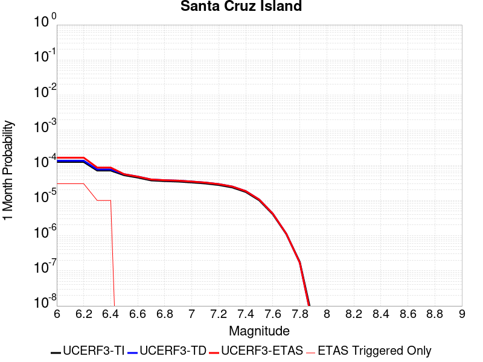 |  |  |

| Magnitude | 1 wk TI Prob | 1 wk TD Prob | 1 wk ETAS Prob | 1 wk ETAS/TD Gain | 1 wk ETAS Triggered Only | 1 mo TI Prob | 1 mo TD Prob | 1 mo ETAS Prob | 1 mo ETAS/TD Gain | 1 mo ETAS Triggered Only | 1 yr TI Prob | 1 yr TD Prob | 1 yr ETAS Prob | 1 yr ETAS/TD Gain | 1 yr ETAS Triggered Only | 10 yr TI Prob | 10 yr TD Prob | 10 yr ETAS Prob | 10 yr ETAS/TD Gain | 10 yr ETAS Triggered Only |
|-----|-----|-----|-----|-----|-----|-----|-----|-----|-----|-----|-----|-----|-----|-----|-----|-----|-----|-----|-----|-----|
| 6.0 | 2.9164563E-5 | 3.1599742E-5 | 5.1599112E-5 | 1.6328965 | 2.0E-5 | 1.2498499E-4 | 1.3542121E-4 | 1.6541715E-4 | 1.221501 | 3.0E-5 | 0.0015206301 | 0.0016476426 | 0.0016875766 | 1.0242372 | 4.0E-5 | 0.015102667 | 0.016368 | 0.016466362 | 1.0060095 | 1.0E-4 |
| 6.1 | 2.9164563E-5 | 3.1599742E-5 | 5.1599112E-5 | 1.6328965 | 2.0E-5 | 1.2498499E-4 | 1.3542121E-4 | 1.6541715E-4 | 1.221501 | 3.0E-5 | 0.0015206301 | 0.0016476426 | 0.0016875766 | 1.0242372 | 4.0E-5 | 0.015102667 | 0.016368 | 0.016466362 | 1.0060095 | 1.0E-4 |
| 6.2 | 2.9164563E-5 | 3.1599742E-5 | 5.1599112E-5 | 1.6328965 | 2.0E-5 | 1.2498499E-4 | 1.3542121E-4 | 1.6541715E-4 | 1.221501 | 3.0E-5 | 0.0015206301 | 0.0016476426 | 0.0016875766 | 1.0242372 | 4.0E-5 | 0.015102667 | 0.016368 | 0.016466362 | 1.0060095 | 1.0E-4 |
| 6.3 | 1.6635553E-5 | 1.780436E-5 | 1.780436E-5 | 1.0 | 0.0 | 7.1293274E-5 | 7.630227E-5 | 8.63015E-5 | 1.1310477 | 1.0E-5 | 8.6765E-4 | 9.286024E-4 | 9.485838E-4 | 1.0215178 | 2.0E-5 | 0.008642701 | 0.009249094 | 0.009318447 | 1.0074983 | 7.0E-5 |
| 6.4 | 1.6635553E-5 | 1.780436E-5 | 1.780436E-5 | 1.0 | 0.0 | 7.1293274E-5 | 7.630227E-5 | 8.63015E-5 | 1.1310477 | 1.0E-5 | 8.6765E-4 | 9.286024E-4 | 9.485838E-4 | 1.0215178 | 2.0E-5 | 0.008642701 | 0.009249094 | 0.009318447 | 1.0074983 | 7.0E-5 |
| 6.5 | 1.2238748E-5 | 1.3042996E-5 | 1.3042996E-5 | 1.0 | 0.0 | 5.2450723E-5 | 5.5897377E-5 | 5.5897377E-5 | 1.0 | 0.0 | 6.3840044E-4 | 6.8034173E-4 | 6.9033494E-4 | 1.0146885 | 1.0E-5 | 0.0063656955 | 0.006782988 | 0.0068227164 | 1.0058571 | 4.0E-5 |
| 6.6 | 1.0489767E-5 | 1.1156636E-5 | 1.1156636E-5 | 1.0 | 0.0 | 4.495537E-5 | 4.781329E-5 | 4.781329E-5 | 1.0 | 0.0 | 5.4719415E-4 | 5.819736E-4 | 5.819736E-4 | 1.0 | 0.0 | 0.005458487 | 0.005804736 | 0.00582462 | 1.0034255 | 2.0E-5 |
| 6.7 | 8.699222E-6 | 9.236783E-6 | 9.236783E-6 | 1.0 | 0.0 | 3.7281847E-5 | 3.958561E-5 | 3.958561E-5 | 1.0 | 0.0 | 4.5381195E-4 | 4.818488E-4 | 4.818488E-4 | 1.0 | 0.0 | 0.0045288634 | 0.004808108 | 0.00481806 | 1.0020698 | 1.0E-5 |
| 6.8 | 8.307732E-6 | 8.8169045E-6 | 8.8169045E-6 | 1.0 | 0.0 | 3.560408E-5 | 3.7786187E-5 | 3.7786187E-5 | 1.0 | 0.0 | 4.3339343E-4 | 4.5995016E-4 | 4.5995016E-4 | 1.0 | 0.0 | 0.004325492 | 0.0045900354 | 0.0045999894 | 1.0021687 | 1.0E-5 |
| 6.9 | 8.073121E-6 | 8.564939E-6 | 8.564939E-6 | 1.0 | 0.0 | 3.459863E-5 | 3.670637E-5 | 3.670637E-5 | 1.0 | 0.0 | 4.2115687E-4 | 4.4680882E-4 | 4.4680882E-4 | 1.0 | 0.0 | 0.004203596 | 0.004459156 | 0.0044691116 | 1.0022326 | 1.0E-5 |
| 7.0 | 7.617019E-6 | 8.074665E-6 | 8.074665E-6 | 1.0 | 0.0 | 3.264396E-5 | 3.4605247E-5 | 3.4605247E-5 | 1.0 | 0.0 | 3.9736772E-4 | 4.2123784E-4 | 4.2123784E-4 | 1.0 | 0.0 | 0.003966579 | 0.0042044413 | 0.0042143995 | 1.0023685 | 1.0E-5 |
| 7.1 | 7.1224836E-6 | 7.5457883E-6 | 7.5457883E-6 | 1.0 | 0.0 | 3.052457E-5 | 3.2338692E-5 | 3.2338692E-5 | 1.0 | 0.0 | 3.715733E-4 | 3.9365282E-4 | 3.9365282E-4 | 1.0 | 0.0 | 0.003709526 | 0.0039295983 | 0.0039395588 | 1.0025347 | 1.0E-5 |
| 7.2 | 6.441115E-6 | 6.8273835E-6 | 6.8273835E-6 | 1.0 | 0.0 | 2.7604487E-5 | 2.9259889E-5 | 2.9259889E-5 | 1.0 | 0.0 | 3.360328E-4 | 3.5618115E-4 | 3.5618115E-4 | 1.0 | 0.0 | 0.0033552512 | 0.0035561312 | 0.0035660956 | 1.002802 | 1.0E-5 |
| 7.3 | 5.494274E-6 | 5.8199944E-6 | 5.8199944E-6 | 1.0 | 0.0 | 2.3546674E-5 | 2.4942596E-5 | 2.4942596E-5 | 1.0 | 0.0 | 2.8664304E-4 | 3.03634E-4 | 3.03634E-4 | 1.0 | 0.0 | 0.002862736 | 0.0030322145 | 0.0030421843 | 1.0032879 | 1.0E-5 |
| 7.4 | 4.0802624E-6 | 4.3122564E-6 | 4.3122564E-6 | 1.0 | 0.0 | 1.7486722E-5 | 1.8480969E-5 | 1.8480969E-5 | 1.0 | 0.0 | 2.1288003E-4 | 2.2498264E-4 | 2.2498264E-4 | 1.0 | 0.0 | 0.0021267622 | 0.0022475577 | 0.0022575352 | 1.0044392 | 1.0E-5 |
| 7.5 | 2.3584746E-6 | 2.4753099E-6 | 2.4753099E-6 | 1.0 | 0.0 | 1.0107709E-5 | 1.0608428E-5 | 1.0608428E-5 | 1.0 | 0.0 | 1.2305441E-4 | 1.2915001E-4 | 1.2915001E-4 | 1.0 | 0.0 | 0.0012298629 | 0.0012907545 | 0.0012907545 | 1.0 | 0.0 |
| 7.6 | 9.4981914E-7 | 9.860934E-7 | 9.860934E-7 | 1.0 | 0.0 | 4.0706473E-6 | 4.2261076E-6 | 4.2261076E-6 | 1.0 | 0.0 | 4.9559E-5 | 5.1451658E-5 | 5.1451658E-5 | 1.0 | 0.0 | 4.954795E-4 | 5.1439874E-4 | 5.1439874E-4 | 1.0 | 0.0 |
| 7.7 | 2.6013532E-7 | 2.6416632E-7 | 2.6416632E-7 | 1.0 | 0.0 | 1.1148652E-6 | 1.1321408E-6 | 1.1321408E-6 | 1.0 | 0.0 | 1.3573399E-5 | 1.3783729E-5 | 1.3783729E-5 | 1.0 | 0.0 | 1.357257E-4 | 1.378288E-4 | 1.378288E-4 | 1.0 | 0.0 |
| 7.8 | 4.1522263E-8 | 3.965698E-8 | 3.965698E-8 | 1.0 | 0.0 | 1.7795254E-7 | 1.6995848E-7 | 1.6995848E-7 | 1.0 | 0.0 | 2.16657E-6 | 2.0692428E-6 | 2.0692428E-6 | 1.0 | 0.0 | 2.1665488E-5 | 2.0692256E-5 | 2.0692256E-5 | 1.0 | 0.0 |
| 7.9 | 7.7242046E-10 | 5.9475225E-10 | 5.9475225E-10 | 1.0 | 0.0 | 3.3103735E-9 | 2.5489382E-9 | 2.5489382E-9 | 1.0 | 0.0 | 4.0303796E-8 | 3.1033323E-8 | 3.1033323E-8 | 1.0 | 0.0 | 4.030379E-7 | 3.103332E-7 | 3.103332E-7 | 1.0 | 0.0 |

## Pleito
*[(top)](#table-of-contents)*

| 1 Week | 1 Month | 1 Year | 10 Year |
|-----|-----|-----|-----|
| 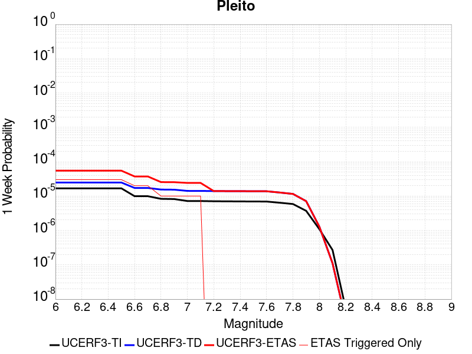 | 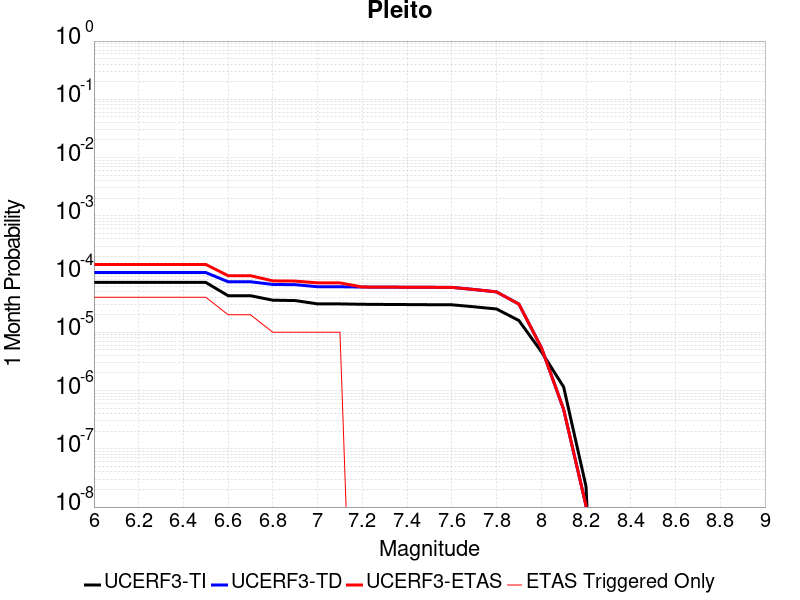 |  | 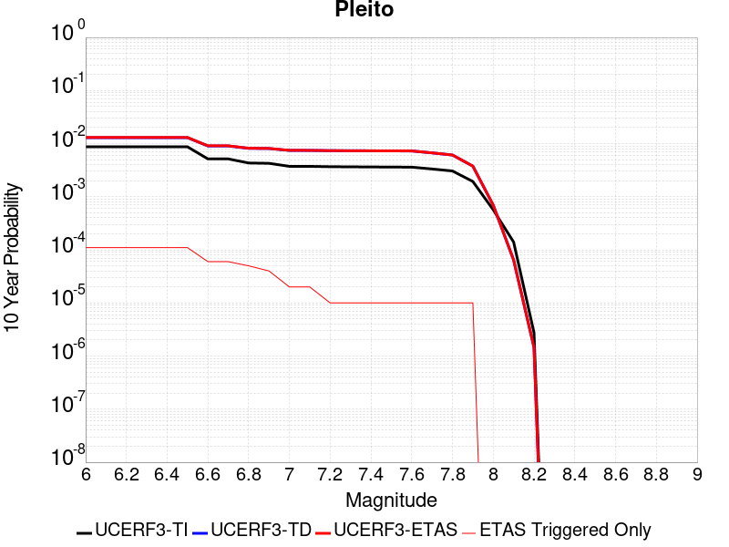 |

| Magnitude | 1 wk TI Prob | 1 wk TD Prob | 1 wk ETAS Prob | 1 wk ETAS/TD Gain | 1 wk ETAS Triggered Only | 1 mo TI Prob | 1 mo TD Prob | 1 mo ETAS Prob | 1 mo ETAS/TD Gain | 1 mo ETAS Triggered Only | 1 yr TI Prob | 1 yr TD Prob | 1 yr ETAS Prob | 1 yr ETAS/TD Gain | 1 yr ETAS Triggered Only | 10 yr TI Prob | 10 yr TD Prob | 10 yr ETAS Prob | 10 yr ETAS/TD Gain | 10 yr ETAS Triggered Only |
|-----|-----|-----|-----|-----|-----|-----|-----|-----|-----|-----|-----|-----|-----|-----|-----|-----|-----|-----|-----|-----|
| 6.0 | 1.6763008E-5 | 2.4764735E-5 | 5.4763994E-5 | 2.21137 | 3.0E-5 | 7.183948E-5 | 1.0613067E-4 | 1.4612642E-4 | 1.3768538 | 4.0E-5 | 8.742947E-4 | 0.001291447 | 0.0013613566 | 1.0541328 | 7.0E-5 | 0.00870863 | 0.012954412 | 0.013062987 | 1.0083814 | 1.1E-4 |
| 6.1 | 1.6763008E-5 | 2.4764735E-5 | 5.4763994E-5 | 2.21137 | 3.0E-5 | 7.183948E-5 | 1.0613067E-4 | 1.4612642E-4 | 1.3768538 | 4.0E-5 | 8.742947E-4 | 0.001291447 | 0.0013613566 | 1.0541328 | 7.0E-5 | 0.00870863 | 0.012954412 | 0.013062987 | 1.0083814 | 1.1E-4 |
| 6.2 | 1.6763008E-5 | 2.4764735E-5 | 5.4763994E-5 | 2.21137 | 3.0E-5 | 7.183948E-5 | 1.0613067E-4 | 1.4612642E-4 | 1.3768538 | 4.0E-5 | 8.742947E-4 | 0.001291447 | 0.0013613566 | 1.0541328 | 7.0E-5 | 0.00870863 | 0.012954412 | 0.013062987 | 1.0083814 | 1.1E-4 |
| 6.3 | 1.6763008E-5 | 2.4764735E-5 | 5.4763994E-5 | 2.21137 | 3.0E-5 | 7.183948E-5 | 1.0613067E-4 | 1.4612642E-4 | 1.3768538 | 4.0E-5 | 8.742947E-4 | 0.001291447 | 0.0013613566 | 1.0541328 | 7.0E-5 | 0.00870863 | 0.012954412 | 0.013062987 | 1.0083814 | 1.1E-4 |
| 6.4 | 1.6763008E-5 | 2.4764735E-5 | 5.4763994E-5 | 2.21137 | 3.0E-5 | 7.183948E-5 | 1.0613067E-4 | 1.4612642E-4 | 1.3768538 | 4.0E-5 | 8.742947E-4 | 0.001291447 | 0.0013613566 | 1.0541328 | 7.0E-5 | 0.00870863 | 0.012954412 | 0.013062987 | 1.0083814 | 1.1E-4 |
| 6.5 | 1.6763008E-5 | 2.4764735E-5 | 5.4763994E-5 | 2.21137 | 3.0E-5 | 7.183948E-5 | 1.0613067E-4 | 1.4612642E-4 | 1.3768538 | 4.0E-5 | 8.742947E-4 | 0.001291447 | 0.0013613566 | 1.0541328 | 7.0E-5 | 0.00870863 | 0.012954412 | 0.013062987 | 1.0083814 | 1.1E-4 |
| 6.6 | 9.910213E-6 | 1.721552E-5 | 3.7215177E-5 | 2.1617224 | 2.0E-5 | 4.247165E-5 | 7.3778734E-5 | 9.377726E-5 | 1.2710608 | 2.0E-5 | 5.169696E-4 | 8.9788967E-4 | 9.378537E-4 | 1.0445089 | 4.0E-5 | 0.0051576863 | 0.009051226 | 0.009110683 | 1.0065689 | 6.0E-5 |
| 6.7 | 9.910213E-6 | 1.721552E-5 | 3.7215177E-5 | 2.1617224 | 2.0E-5 | 4.247165E-5 | 7.3778734E-5 | 9.377726E-5 | 1.2710608 | 2.0E-5 | 5.169696E-4 | 8.9788967E-4 | 9.378537E-4 | 1.0445089 | 4.0E-5 | 0.0051576863 | 0.009051226 | 0.009110683 | 1.0065689 | 6.0E-5 |
| 6.8 | 8.300162E-6 | 1.5475129E-5 | 2.5474974E-5 | 1.6461881 | 1.0E-5 | 3.557164E-5 | 6.63203E-5 | 7.6319644E-5 | 1.1507734 | 1.0E-5 | 4.3299864E-4 | 8.07152E-4 | 8.371278E-4 | 1.0371377 | 3.0E-5 | 0.004321559 | 0.008150663 | 0.008200255 | 1.0060844 | 5.0E-5 |
| 6.9 | 8.183114E-6 | 1.5346344E-5 | 2.5346191E-5 | 1.651611 | 1.0E-5 | 3.5070017E-5 | 6.57684E-5 | 7.576774E-5 | 1.1520387 | 1.0E-5 | 4.2689382E-4 | 8.0043747E-4 | 8.204215E-4 | 1.0249664 | 2.0E-5 | 0.0042607468 | 0.008084008 | 0.008123685 | 1.0049081 | 4.0E-5 |
| 7.0 | 7.1748823E-6 | 1.4133306E-5 | 2.4133164E-5 | 1.7075386 | 1.0E-5 | 3.0749135E-5 | 6.0569906E-5 | 7.05693E-5 | 1.1650885 | 1.0E-5 | 3.743064E-4 | 7.3718966E-4 | 7.471823E-4 | 1.013555 | 1.0E-5 | 0.0037367654 | 0.0074553755 | 0.0074752267 | 1.0026627 | 2.0E-5 |
| 7.1 | 7.1671807E-6 | 1.4123676E-5 | 2.4123534E-5 | 1.708021 | 1.0E-5 | 3.0716128E-5 | 6.0528637E-5 | 7.052803E-5 | 1.1652011 | 1.0E-5 | 3.7390468E-4 | 7.366875E-4 | 7.4668013E-4 | 1.0135642 | 1.0E-5 | 0.0037327618 | 0.0074503883 | 0.007470239 | 1.0026644 | 2.0E-5 |
| 7.2 | 7.0649667E-6 | 1.3970962E-5 | 1.3970962E-5 | 1.0 | 0.0 | 3.0278077E-5 | 5.987418E-5 | 5.987418E-5 | 1.0 | 0.0 | 3.6857324E-4 | 7.287248E-4 | 7.287248E-4 | 1.0 | 0.0 | 0.0036796255 | 0.0073711374 | 0.007381064 | 1.0013466 | 1.0E-5 |
| 7.3 | 7.02082E-6 | 1.3914415E-5 | 1.3914415E-5 | 1.0 | 0.0 | 3.008888E-5 | 5.9631846E-5 | 5.9631846E-5 | 1.0 | 0.0 | 3.6627054E-4 | 7.257764E-4 | 7.257764E-4 | 1.0 | 0.0 | 0.0036566744 | 0.0073416373 | 0.0073515642 | 1.0013521 | 1.0E-5 |
| 7.4 | 6.987146E-6 | 1.3873975E-5 | 1.3873975E-5 | 1.0 | 0.0 | 2.9944567E-5 | 5.9458544E-5 | 5.9458544E-5 | 1.0 | 0.0 | 3.6451413E-4 | 7.2366785E-4 | 7.2366785E-4 | 1.0 | 0.0 | 0.0036391679 | 0.007320571 | 0.007330498 | 1.001356 | 1.0E-5 |
| 7.5 | 6.9494554E-6 | 1.383088E-5 | 1.383088E-5 | 1.0 | 0.0 | 2.9783041E-5 | 5.9273858E-5 | 5.9273858E-5 | 1.0 | 0.0 | 3.625482E-4 | 7.2142074E-4 | 7.2142074E-4 | 1.0 | 0.0 | 0.0036195726 | 0.007298199 | 0.007308126 | 1.0013602 | 1.0E-5 |
| 7.6 | 6.92694E-6 | 1.3789992E-5 | 1.3789992E-5 | 1.0 | 0.0 | 2.9686547E-5 | 5.909863E-5 | 5.909863E-5 | 1.0 | 0.0 | 3.6137376E-4 | 7.192888E-4 | 7.192888E-4 | 1.0 | 0.0 | 0.0036078666 | 0.007276951 | 0.0072868783 | 1.0013642 | 1.0E-5 |
| 7.7 | 6.395867E-6 | 1.26690065E-5 | 1.26690065E-5 | 1.0 | 0.0 | 2.741057E-5 | 5.4294615E-5 | 5.4294615E-5 | 1.0 | 0.0 | 3.336726E-4 | 6.6083675E-4 | 6.6083675E-4 | 1.0 | 0.0 | 0.0033317201 | 0.0066955453 | 0.0067054783 | 1.0014836 | 1.0E-5 |
| 7.8 | 5.8664327E-6 | 1.1536581E-5 | 1.1536581E-5 | 1.0 | 0.0 | 2.5141611E-5 | 4.9441554E-5 | 4.9441554E-5 | 1.0 | 0.0 | 3.060561E-4 | 6.0178485E-4 | 6.0178485E-4 | 1.0 | 0.0 | 0.0030563495 | 0.0061010164 | 0.0061109555 | 1.0016291 | 1.0E-5 |
| 7.9 | 3.7167474E-6 | 7.1145205E-6 | 7.1145205E-6 | 1.0 | 0.0 | 1.592882E-5 | 3.0490448E-5 | 3.0490448E-5 | 1.0 | 0.0 | 1.9391612E-4 | 3.7115812E-4 | 3.7115812E-4 | 1.0 | 0.0 | 0.0019374699 | 0.0037676243 | 0.0037775866 | 1.0026442 | 1.0E-5 |
| 8.0 | 1.0903841E-6 | 1.2879104E-6 | 1.2879104E-6 | 1.0 | 0.0 | 4.6730665E-6 | 5.5196047E-6 | 5.5196047E-6 | 1.0 | 0.0 | 5.68931E-5 | 6.719913E-5 | 6.719913E-5 | 1.0 | 0.0 | 5.6878536E-4 | 6.942094E-4 | 6.942094E-4 | 1.0 | 0.0 |
| 8.1 | 2.6894583E-7 | 1.1056095E-7 | 1.1056095E-7 | 1.0 | 0.0 | 1.1526245E-6 | 4.7383253E-7 | 4.7383253E-7 | 1.0 | 0.0 | 1.4033113E-5 | 5.768896E-6 | 5.768896E-6 | 1.0 | 0.0 | 1.4032227E-4 | 6.454915E-5 | 6.454915E-5 | 1.0 | 0.0 |
| 8.2 | 5.2967013E-9 | 2.4567874E-9 | 2.4567874E-9 | 1.0 | 0.0 | 2.2700148E-8 | 1.0529089E-8 | 1.0529089E-8 | 1.0 | 0.0 | 2.7637427E-7 | 1.2819166E-7 | 1.2819166E-7 | 1.0 | 0.0 | 2.7637393E-6 | 1.4588004E-6 | 1.4588004E-6 | 1.0 | 0.0 |

## Big Pine (East)
*[(top)](#table-of-contents)*

| 1 Week | 1 Month | 1 Year | 10 Year |
|-----|-----|-----|-----|
|  | 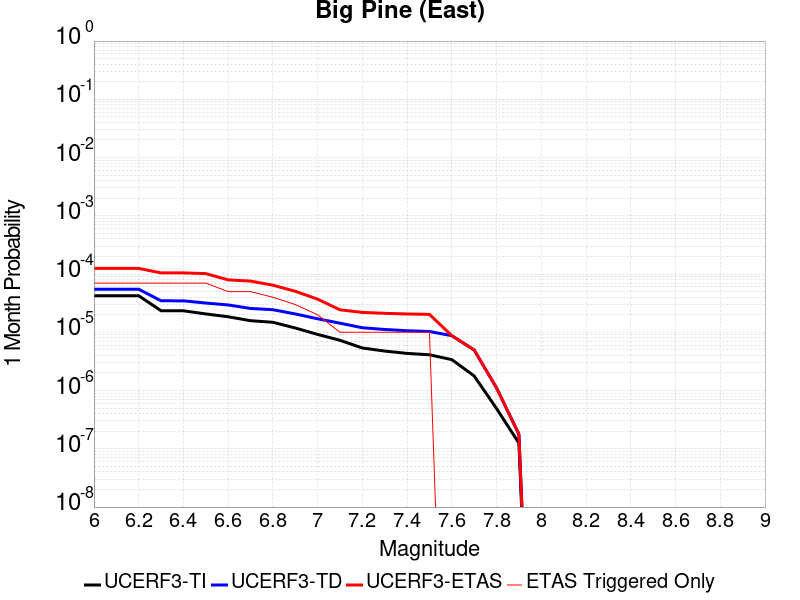 |  |  |

| Magnitude | 1 wk TI Prob | 1 wk TD Prob | 1 wk ETAS Prob | 1 wk ETAS/TD Gain | 1 wk ETAS Triggered Only | 1 mo TI Prob | 1 mo TD Prob | 1 mo ETAS Prob | 1 mo ETAS/TD Gain | 1 mo ETAS Triggered Only | 1 yr TI Prob | 1 yr TD Prob | 1 yr ETAS Prob | 1 yr ETAS/TD Gain | 1 yr ETAS Triggered Only | 10 yr TI Prob | 10 yr TD Prob | 10 yr ETAS Prob | 10 yr ETAS/TD Gain | 10 yr ETAS Triggered Only |
|-----|-----|-----|-----|-----|-----|-----|-----|-----|-----|-----|-----|-----|-----|-----|-----|-----|-----|-----|-----|-----|
| 6.0 | 9.916913E-6 | 1.28172705E-5 | 6.281663E-5 | 4.9009366 | 5.0E-5 | 4.250036E-5 | 5.493013E-5 | 1.2492629E-4 | 2.2742763 | 7.0E-5 | 5.173191E-4 | 6.685912E-4 | 7.5853104E-4 | 1.1345214 | 9.0E-5 | 0.0051611643 | 0.006670449 | 0.0067896484 | 1.0178698 | 1.2E-4 |
| 6.1 | 9.916913E-6 | 1.28172705E-5 | 6.281663E-5 | 4.9009366 | 5.0E-5 | 4.250036E-5 | 5.493013E-5 | 1.2492629E-4 | 2.2742763 | 7.0E-5 | 5.173191E-4 | 6.685912E-4 | 7.5853104E-4 | 1.1345214 | 9.0E-5 | 0.0051611643 | 0.006670449 | 0.0067896484 | 1.0178698 | 1.2E-4 |
| 6.2 | 9.916913E-6 | 1.28172705E-5 | 6.281663E-5 | 4.9009366 | 5.0E-5 | 4.250036E-5 | 5.493013E-5 | 1.2492629E-4 | 2.2742763 | 7.0E-5 | 5.173191E-4 | 6.685912E-4 | 7.5853104E-4 | 1.1345214 | 9.0E-5 | 0.0051611643 | 0.006670449 | 0.0067896484 | 1.0178698 | 1.2E-4 |
| 6.3 | 5.479711E-6 | 8.1132375E-6 | 5.8112833E-5 | 7.162718 | 5.0E-5 | 2.3484265E-5 | 3.4770575E-5 | 1.04768136E-4 | 3.0131266 | 7.0E-5 | 2.858834E-4 | 4.232527E-4 | 5.132146E-4 | 1.212549 | 9.0E-5 | 0.0028551589 | 0.0042272513 | 0.004316871 | 1.0212004 | 9.0E-5 |
| 6.4 | 5.465009E-6 | 8.0975315E-6 | 5.8097125E-5 | 7.1746716 | 5.0E-5 | 2.3421257E-5 | 3.4703262E-5 | 1.0470083E-4 | 3.0170314 | 7.0E-5 | 2.851165E-4 | 4.2243348E-4 | 5.1239546E-4 | 1.2129613 | 9.0E-5 | 0.0028475097 | 0.00421909 | 0.004308711 | 1.0212417 | 9.0E-5 |
| 6.5 | 4.826767E-6 | 7.4225877E-6 | 5.7422218E-5 | 7.7361455 | 5.0E-5 | 2.068598E-5 | 3.1810716E-5 | 1.0180849E-4 | 3.2004461 | 7.0E-5 | 2.518227E-4 | 3.8722943E-4 | 4.6719846E-4 | 1.2065159 | 8.0E-5 | 0.0025153751 | 0.0038682907 | 0.003947981 | 1.0206009 | 8.0E-5 |
| 6.6 | 4.3146847E-6 | 6.8825234E-6 | 5.6882178E-5 | 8.264728 | 5.0E-5 | 1.8491375E-5 | 2.949621E-5 | 7.9494734E-5 | 2.6950831 | 5.0E-5 | 2.2510924E-4 | 3.5905963E-4 | 4.190381E-4 | 1.1670432 | 6.0E-5 | 0.0022488134 | 0.0035875062 | 0.0036472909 | 1.0166647 | 6.0E-5 |
| 6.7 | 3.6968106E-6 | 5.9957474E-6 | 5.5995446E-5 | 9.339193 | 5.0E-5 | 1.5843378E-5 | 2.5695816E-5 | 7.569453E-5 | 2.945792 | 5.0E-5 | 1.9287605E-4 | 3.128032E-4 | 3.7278442E-4 | 1.1917539 | 6.0E-5 | 0.0019270873 | 0.0031262499 | 0.0031860624 | 1.0191324 | 6.0E-5 |
| 6.8 | 3.4671132E-6 | 5.7024477E-6 | 4.5702218E-5 | 8.014492 | 4.0E-5 | 1.4858972E-5 | 2.4438841E-5 | 6.443786E-5 | 2.636699 | 4.0E-5 | 1.8089297E-4 | 2.9750372E-4 | 3.4748882E-4 | 1.1680151 | 5.0E-5 | 0.0018074579 | 0.0029736666 | 0.003023518 | 1.0167643 | 5.0E-5 |
| 6.9 | 2.7686972E-6 | 4.8254797E-6 | 3.4825334E-5 | 7.2169685 | 3.0E-5 | 1.1865792E-5 | 2.0680467E-5 | 5.0679846E-5 | 2.4506142 | 3.0E-5 | 1.4445644E-4 | 2.5175634E-4 | 2.9174628E-4 | 1.1588438 | 4.0E-5 | 0.0014436257 | 0.002517256 | 0.0025571552 | 1.0158503 | 4.0E-5 |
| 7.0 | 2.1472624E-6 | 3.985277E-6 | 2.3985198E-5 | 6.0184517 | 2.0E-5 | 9.20252E-6 | 1.707965E-5 | 3.707931E-5 | 2.1709642 | 2.0E-5 | 1.12034926E-4 | 2.0792543E-4 | 2.3791919E-4 | 1.1442525 | 3.0E-5 | 0.0011197845 | 0.0020798238 | 0.0021097613 | 1.0143943 | 3.0E-5 |
| 7.1 | 1.7018335E-6 | 3.3450835E-6 | 1.334505E-5 | 3.989452 | 1.0E-5 | 7.293552E-6 | 1.4335996E-5 | 2.4335852E-5 | 1.6975348 | 1.0E-5 | 8.879537E-5 | 1.7452713E-4 | 1.9452363E-4 | 1.1145754 | 2.0E-5 | 8.87599E-4 | 0.0017463792 | 0.0017663443 | 1.0114323 | 2.0E-5 |
| 7.2 | 1.25603E-6 | 2.794679E-6 | 1.2794651E-5 | 4.5782185 | 1.0E-5 | 5.3829745E-6 | 1.1977142E-5 | 2.1977023E-5 | 1.8349137 | 1.0E-5 | 6.553574E-5 | 1.4581217E-4 | 1.5581072E-4 | 1.0685713 | 1.0E-5 | 6.551642E-4 | 0.0014596173 | 0.0014696027 | 1.0068411 | 1.0E-5 |
| 7.3 | 1.112297E-6 | 2.610519E-6 | 1.2610492E-5 | 4.830646 | 1.0E-5 | 4.7669787E-6 | 1.1187892E-5 | 2.118778E-5 | 1.8938135 | 1.0E-5 | 5.803642E-5 | 1.3620428E-4 | 1.4620292E-4 | 1.0734091 | 1.0E-5 | 5.802127E-4 | 0.001363502 | 0.0013734883 | 1.0073241 | 1.0E-5 |
| 7.4 | 1.0137181E-6 | 2.4836752E-6 | 1.2483651E-5 | 5.0262814 | 1.0E-5 | 4.3444993E-6 | 1.064428E-5 | 2.0644173E-5 | 1.9394617 | 1.0E-5 | 5.2892992E-5 | 1.2958662E-4 | 1.3958532E-4 | 1.0771585 | 1.0E-5 | 5.288041E-4 | 0.0012971918 | 0.0013071789 | 1.007699 | 1.0E-5 |
| 7.5 | 9.598608E-7 | 2.407328E-6 | 1.2407304E-5 | 5.153973 | 1.0E-5 | 4.1136827E-6 | 1.03170805E-5 | 2.0316978E-5 | 1.9692564 | 1.0E-5 | 5.0082934E-5 | 1.2560343E-4 | 1.3560218E-4 | 1.0796057 | 1.0E-5 | 5.007165E-4 | 0.0012572132 | 0.0012672007 | 1.0079441 | 1.0E-5 |
| 7.6 | 7.929459E-7 | 2.0450152E-6 | 2.0450152E-6 | 1.0 | 0.0 | 3.3983351E-6 | 8.764322E-6 | 8.764322E-6 | 1.0 | 0.0 | 4.1373947E-5 | 1.0670057E-4 | 1.0670057E-4 | 1.0 | 0.0 | 4.1366243E-4 | 0.0010685825 | 0.0010685825 | 1.0 | 0.0 |
| 7.7 | 4.155788E-7 | 1.1606729E-6 | 1.1606729E-6 | 1.0 | 0.0 | 1.7810507E-6 | 4.974303E-6 | 4.974303E-6 | 1.0 | 0.0 | 2.1684076E-5 | 6.05605E-5 | 6.05605E-5 | 1.0 | 0.0 | 2.1681961E-4 | 6.085995E-4 | 6.085995E-4 | 1.0 | 0.0 |
| 7.8 | 1.14666925E-7 | 2.592197E-7 | 2.592197E-7 | 1.0 | 0.0 | 4.914296E-7 | 1.1109411E-6 | 1.1109411E-6 | 1.0 | 0.0 | 5.9831386E-6 | 1.3525627E-5 | 1.3525627E-5 | 1.0 | 0.0 | 5.9829777E-5 | 1.3636416E-4 | 1.3636416E-4 | 1.0 | 0.0 |
| 7.9 | 2.9231824E-8 | 4.1462318E-8 | 4.1462318E-8 | 1.0 | 0.0 | 1.2527924E-7 | 1.7769564E-7 | 1.7769564E-7 | 1.0 | 0.0 | 1.5252737E-6 | 2.1634426E-6 | 2.1634426E-6 | 1.0 | 0.0 | 1.5252632E-5 | 2.197062E-5 | 2.197062E-5 | 1.0 | 0.0 |

## Whittier alt 1
*[(top)](#table-of-contents)*

| 1 Week | 1 Month | 1 Year | 10 Year |
|-----|-----|-----|-----|
|  | 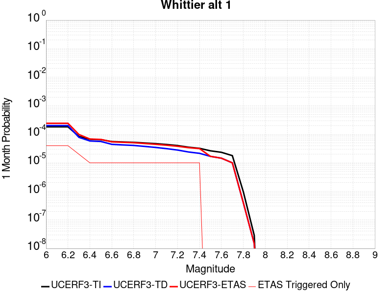 | 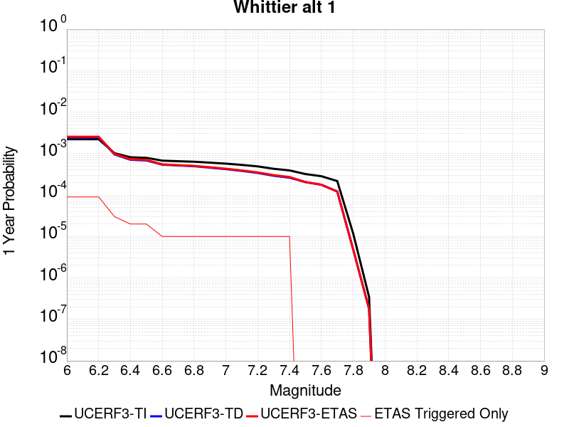 |  |

| Magnitude | 1 wk TI Prob | 1 wk TD Prob | 1 wk ETAS Prob | 1 wk ETAS/TD Gain | 1 wk ETAS Triggered Only | 1 mo TI Prob | 1 mo TD Prob | 1 mo ETAS Prob | 1 mo ETAS/TD Gain | 1 mo ETAS Triggered Only | 1 yr TI Prob | 1 yr TD Prob | 1 yr ETAS Prob | 1 yr ETAS/TD Gain | 1 yr ETAS Triggered Only | 10 yr TI Prob | 10 yr TD Prob | 10 yr ETAS Prob | 10 yr ETAS/TD Gain | 10 yr ETAS Triggered Only |
|-----|-----|-----|-----|-----|-----|-----|-----|-----|-----|-----|-----|-----|-----|-----|-----|-----|-----|-----|-----|-----|
| 6.0 | 4.2554693E-5 | 4.7252182E-5 | 5.725171E-5 | 1.2116205 | 1.0E-5 | 1.8236451E-4 | 2.0249544E-4 | 2.4248734E-4 | 1.1974953 | 4.0E-5 | 0.002218027 | 0.0024629163 | 0.0025526946 | 1.036452 | 9.0E-5 | 0.02196019 | 0.024390263 | 0.024497582 | 1.0044 | 1.1E-4 |
| 6.1 | 4.2554693E-5 | 4.7252182E-5 | 5.725171E-5 | 1.2116205 | 1.0E-5 | 1.8236451E-4 | 2.0249544E-4 | 2.4248734E-4 | 1.1974953 | 4.0E-5 | 0.002218027 | 0.0024629163 | 0.0025526946 | 1.036452 | 9.0E-5 | 0.02196019 | 0.024390263 | 0.024497582 | 1.0044 | 1.1E-4 |
| 6.2 | 4.2554693E-5 | 4.7252182E-5 | 5.725171E-5 | 1.2116205 | 1.0E-5 | 1.8236451E-4 | 2.0249544E-4 | 2.4248734E-4 | 1.1974953 | 4.0E-5 | 0.002218027 | 0.0024629163 | 0.0025526946 | 1.036452 | 9.0E-5 | 0.02196019 | 0.024390263 | 0.024497582 | 1.0044 | 1.1E-4 |
| 6.3 | 1.9617712E-5 | 1.826841E-5 | 2.8268229E-5 | 1.547383 | 1.0E-5 | 8.40732E-5 | 7.829095E-5 | 9.8289376E-5 | 1.2554374 | 2.0E-5 | 0.0010231105 | 9.527944E-4 | 9.827658E-4 | 1.0314564 | 3.0E-5 | 0.01018413 | 0.0094904 | 0.00953002 | 1.0041748 | 4.0E-5 |
| 6.4 | 1.5611336E-5 | 1.3604089E-5 | 1.3604089E-5 | 1.0 | 0.0 | 6.690401E-5 | 5.8301972E-5 | 6.8301386E-5 | 1.1715108 | 1.0E-5 | 8.142519E-4 | 7.096013E-4 | 7.295871E-4 | 1.0281649 | 2.0E-5 | 0.008112748 | 0.0070753377 | 0.0071051256 | 1.0042101 | 3.0E-5 |
| 6.5 | 1.5150166E-5 | 1.3100744E-5 | 1.3100744E-5 | 1.0 | 0.0 | 6.492767E-5 | 5.614487E-5 | 6.6144305E-5 | 1.1781007 | 1.0E-5 | 7.9020765E-4 | 6.8335526E-4 | 7.033416E-4 | 1.0292474 | 2.0E-5 | 0.007874036 | 0.006814508 | 0.006844303 | 1.0043724 | 3.0E-5 |
| 6.6 | 1.295588E-5 | 1.0380544E-5 | 1.0380544E-5 | 1.0 | 0.0 | 5.552402E-5 | 4.44873E-5 | 5.4486853E-5 | 1.2247733 | 1.0E-5 | 6.7579525E-4 | 5.415002E-4 | 5.5149477E-4 | 1.0184572 | 1.0E-5 | 0.006737438 | 0.005403343 | 0.0054232352 | 1.0036814 | 2.0E-5 |
| 6.7 | 1.2542085E-5 | 9.899189E-6 | 9.899189E-6 | 1.0 | 0.0 | 5.3750682E-5 | 4.2424414E-5 | 5.242399E-5 | 1.2357033 | 1.0E-5 | 6.542181E-4 | 5.163967E-4 | 5.2639155E-4 | 1.0193549 | 1.0E-5 | 0.006522954 | 0.005153464 | 0.0051733614 | 1.0038608 | 2.0E-5 |
| 6.8 | 1.2195878E-5 | 9.49523E-6 | 9.49523E-6 | 1.0 | 0.0 | 5.2267E-5 | 4.069322E-5 | 5.069281E-5 | 1.2457312 | 1.0E-5 | 6.36165E-4 | 4.9532915E-4 | 5.053242E-4 | 1.0201786 | 1.0E-5 | 0.0063434686 | 0.0049436963 | 0.004953647 | 1.0020127 | 1.0E-5 |
| 6.9 | 1.1580298E-5 | 8.772739E-6 | 8.772739E-6 | 1.0 | 0.0 | 4.9628903E-5 | 3.759692E-5 | 4.7596546E-5 | 1.2659692 | 1.0E-5 | 6.040644E-4 | 4.5764804E-4 | 4.6764346E-4 | 1.0218408 | 1.0E-5 | 0.00602425 | 0.0045684646 | 0.0045784186 | 1.0021789 | 1.0E-5 |
| 7.0 | 1.0964795E-5 | 8.083794E-6 | 8.083794E-6 | 1.0 | 0.0 | 4.6991136E-5 | 3.4644378E-5 | 4.464403E-5 | 1.2886372 | 1.0E-5 | 5.7196687E-4 | 4.217152E-4 | 4.3171097E-4 | 1.0237027 | 1.0E-5 | 0.0057049696 | 0.004210459 | 0.004220417 | 1.002365 | 1.0E-5 |
| 7.1 | 1.0230601E-5 | 7.32646E-6 | 7.32646E-6 | 1.0 | 0.0 | 4.3844695E-5 | 3.1398744E-5 | 4.139843E-5 | 1.318474 | 1.0E-5 | 5.336784E-4 | 3.8221394E-4 | 3.9221012E-4 | 1.0261533 | 1.0E-5 | 0.005323986 | 0.0038167592 | 0.003826721 | 1.00261 | 1.0E-5 |
| 7.2 | 9.40865E-6 | 6.5430822E-6 | 6.5430822E-6 | 1.0 | 0.0 | 4.032216E-5 | 2.8041486E-5 | 3.8041206E-5 | 1.3566045 | 1.0E-5 | 4.908117E-4 | 3.4135283E-4 | 3.5134942E-4 | 1.0292852 | 1.0E-5 | 0.0048972913 | 0.0034094024 | 0.0034193683 | 1.002923 | 1.0E-5 |
| 7.3 | 8.237384E-6 | 5.5975433E-6 | 5.5975433E-6 | 1.0 | 0.0 | 3.5302593E-5 | 2.3989258E-5 | 3.3989018E-5 | 1.4168433 | 1.0E-5 | 4.2972428E-4 | 2.920311E-4 | 3.020282E-4 | 1.034233 | 1.0E-5 | 0.0042889426 | 0.0029167992 | 0.0029267701 | 1.0034184 | 1.0E-5 |
| 7.4 | 7.5316966E-6 | 5.0276153E-6 | 5.0276153E-6 | 1.0 | 0.0 | 3.2278298E-5 | 2.154675E-5 | 3.1546533E-5 | 1.4640971 | 1.0E-5 | 3.9291743E-4 | 2.623011E-4 | 2.722985E-4 | 1.0381141 | 1.0E-5 | 0.0039222343 | 0.0026200267 | 0.0026300005 | 1.0038067 | 1.0E-5 |
| 7.5 | 6.149649E-6 | 3.9336355E-6 | 3.9336355E-6 | 1.0 | 0.0 | 2.6355372E-5 | 1.6858336E-5 | 1.6858336E-5 | 1.0 | 0.0 | 3.208294E-4 | 2.052318E-4 | 2.052318E-4 | 1.0 | 0.0 | 0.003203666 | 0.0020505118 | 0.0020505118 | 1.0 | 0.0 |
| 7.6 | 5.457711E-6 | 3.3951796E-6 | 3.3951796E-6 | 1.0 | 0.0 | 2.338998E-5 | 1.4550694E-5 | 1.4550694E-5 | 1.0 | 0.0 | 2.8473578E-4 | 1.771411E-4 | 1.771411E-4 | 1.0 | 0.0 | 0.0028437122 | 0.0017700798 | 0.0017700798 | 1.0 | 0.0 |
| 7.7 | 4.1676276E-6 | 2.3329922E-6 | 2.3329922E-6 | 1.0 | 0.0 | 1.7861139E-5 | 9.998504E-6 | 9.998504E-6 | 1.0 | 0.0 | 2.1743766E-4 | 1.2172572E-4 | 1.2172572E-4 | 1.0 | 0.0 | 0.0021722503 | 0.0012166635 | 0.0012166635 | 1.0 | 0.0 |
| 7.8 | 2.2692414E-7 | 9.384417E-8 | 9.384417E-8 | 1.0 | 0.0 | 9.725317E-7 | 4.0218927E-7 | 4.0218927E-7 | 1.0 | 0.0 | 1.1840509E-5 | 4.8966467E-6 | 4.8966467E-6 | 1.0 | 0.0 | 1.1839878E-4 | 4.8965718E-5 | 4.8965718E-5 | 1.0 | 0.0 |
| 7.9 | 6.676829E-9 | 3.4397174E-9 | 3.4397174E-9 | 1.0 | 0.0 | 2.861498E-8 | 1.4741646E-8 | 1.4741646E-8 | 1.0 | 0.0 | 3.4838732E-7 | 1.7947953E-7 | 1.7947953E-7 | 1.0 | 0.0 | 3.4838679E-6 | 1.794794E-6 | 1.794794E-6 | 1.0 | 0.0 |

## San Diego Trough north alt1
*[(top)](#table-of-contents)*

| 1 Week | 1 Month | 1 Year | 10 Year |
|-----|-----|-----|-----|
|  |  | 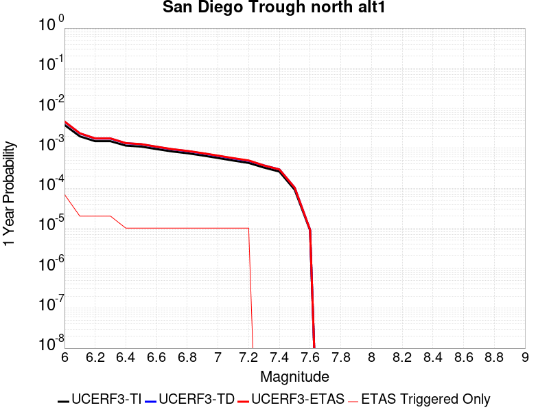 | 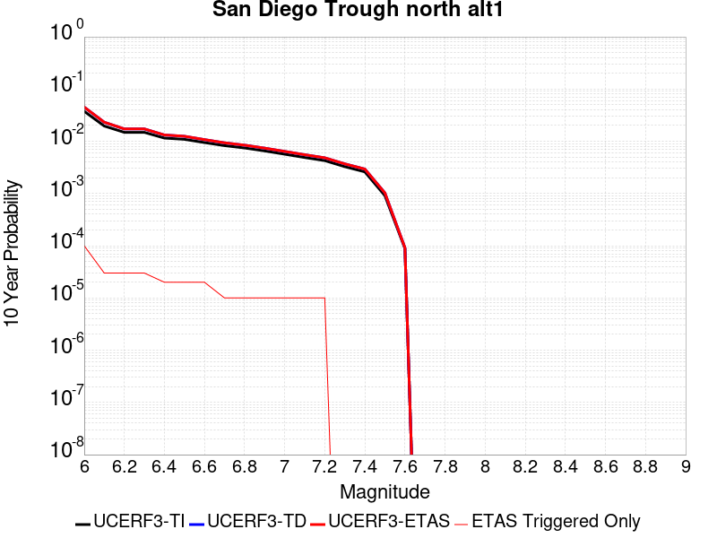 |

| Magnitude | 1 wk TI Prob | 1 wk TD Prob | 1 wk ETAS Prob | 1 wk ETAS/TD Gain | 1 wk ETAS Triggered Only | 1 mo TI Prob | 1 mo TD Prob | 1 mo ETAS Prob | 1 mo ETAS/TD Gain | 1 mo ETAS Triggered Only | 1 yr TI Prob | 1 yr TD Prob | 1 yr ETAS Prob | 1 yr ETAS/TD Gain | 1 yr ETAS Triggered Only | 10 yr TI Prob | 10 yr TD Prob | 10 yr ETAS Prob | 10 yr ETAS/TD Gain | 10 yr ETAS Triggered Only |
|-----|-----|-----|-----|-----|-----|-----|-----|-----|-----|-----|-----|-----|-----|-----|-----|-----|-----|-----|-----|-----|
| 6.0 | 7.329252E-5 | 8.821269E-5 | 1.0821093E-4 | 1.2267047 | 2.0E-5 | 3.14073E-4 | 3.7800326E-4 | 4.1798814E-4 | 1.1057792 | 4.0E-5 | 0.0038171355 | 0.0045930487 | 0.004662727 | 1.0151705 | 7.0E-5 | 0.03752231 | 0.045045137 | 0.04514063 | 1.00212 | 1.0E-4 |
| 6.1 | 3.7940346E-5 | 4.4884906E-5 | 5.488446E-5 | 1.222782 | 1.0E-5 | 1.6259136E-4 | 1.9235026E-4 | 2.1234641E-4 | 1.1039569 | 2.0E-5 | 0.0019777524 | 0.002339431 | 0.0023593842 | 1.0085291 | 2.0E-5 | 0.019602431 | 0.023156732 | 0.023186037 | 1.0012655 | 3.0E-5 |
| 6.2 | 2.8645263E-5 | 3.329672E-5 | 4.329639E-5 | 1.3003199 | 1.0E-5 | 1.2275964E-4 | 1.4269259E-4 | 1.6268973E-4 | 1.1401415 | 2.0E-5 | 0.0014935739 | 0.0017359206 | 0.0017558859 | 1.0115013 | 2.0E-5 | 0.0148357535 | 0.017226268 | 0.01725575 | 1.0017115 | 3.0E-5 |
| 6.3 | 2.8645263E-5 | 3.329672E-5 | 4.329639E-5 | 1.3003199 | 1.0E-5 | 1.2275964E-4 | 1.4269259E-4 | 1.6268973E-4 | 1.1401415 | 2.0E-5 | 0.0014935739 | 0.0017359206 | 0.0017558859 | 1.0115013 | 2.0E-5 | 0.0148357535 | 0.017226268 | 0.01725575 | 1.0017115 | 3.0E-5 |
| 6.4 | 2.2204576E-5 | 2.544832E-5 | 2.544832E-5 | 1.0 | 0.0 | 9.5159E-5 | 1.0905972E-4 | 1.1905863E-4 | 1.0916829 | 1.0E-5 | 0.001157945 | 0.0013270028 | 0.0013369895 | 1.0075258 | 1.0E-5 | 0.011519298 | 0.013191959 | 0.013211695 | 1.0014961 | 2.0E-5 |
| 6.5 | 2.1004838E-5 | 2.4024695E-5 | 2.4024695E-5 | 1.0 | 0.0 | 9.0017624E-5 | 1.0295897E-4 | 1.1295794E-4 | 1.0971161 | 1.0E-5 | 0.0010954136 | 0.0012528135 | 0.001262801 | 1.007972 | 1.0E-5 | 0.010900296 | 0.012458592 | 0.012478342 | 1.0015854 | 2.0E-5 |
| 6.6 | 1.820557E-5 | 2.070479E-5 | 2.070479E-5 | 1.0 | 0.0 | 7.802154E-5 | 8.8731824E-5 | 9.873094E-5 | 1.1126891 | 1.0E-5 | 9.4949827E-4 | 0.0010797799 | 0.0010897692 | 1.0092511 | 1.0E-5 | 0.009454516 | 0.010746005 | 0.010765791 | 1.0018412 | 2.0E-5 |
| 6.7 | 1.5884485E-5 | 1.7983646E-5 | 1.7983646E-5 | 1.0 | 0.0 | 6.807459E-5 | 7.707051E-5 | 8.706974E-5 | 1.1297413 | 1.0E-5 | 8.284929E-4 | 9.3793223E-4 | 9.479229E-4 | 1.0106517 | 1.0E-5 | 0.008254109 | 0.009340104 | 0.00935001 | 1.0010606 | 1.0E-5 |
| 6.8 | 1.4331171E-5 | 1.6201066E-5 | 1.6201066E-5 | 1.0 | 0.0 | 6.141786E-5 | 6.94313E-5 | 7.94306E-5 | 1.1440172 | 1.0E-5 | 7.4750587E-4 | 8.450002E-4 | 8.549917E-4 | 1.0118244 | 1.0E-5 | 0.0074499645 | 0.008418139 | 0.008428055 | 1.0011779 | 1.0E-5 |
| 6.9 | 1.2574203E-5 | 1.4205835E-5 | 1.4205835E-5 | 1.0 | 0.0 | 5.3888325E-5 | 6.0880735E-5 | 7.088013E-5 | 1.1642456 | 1.0E-5 | 6.558929E-4 | 7.409723E-4 | 7.5096486E-4 | 1.0134858 | 1.0E-5 | 0.0065396037 | 0.007385203 | 0.0073951297 | 1.0013441 | 1.0E-5 |
| 7.0 | 1.0883844E-5 | 1.2289262E-5 | 1.2289262E-5 | 1.0 | 0.0 | 4.664421E-5 | 5.2667205E-5 | 6.266668E-5 | 1.1898614 | 1.0E-5 | 5.677453E-4 | 6.4103556E-4 | 6.510292E-4 | 1.0155897 | 1.0E-5 | 0.00566297 | 0.006391993 | 0.0064019286 | 1.0015545 | 1.0E-5 |
| 7.1 | 9.393088E-6 | 1.060702E-5 | 1.060702E-5 | 1.0 | 0.0 | 4.025547E-5 | 4.545787E-5 | 5.5457414E-5 | 1.2199739 | 1.0E-5 | 4.900001E-4 | 5.533098E-4 | 5.6330423E-4 | 1.0180631 | 1.0E-5 | 0.0048892107 | 0.005519418 | 0.0055293627 | 1.0018017 | 1.0E-5 |
| 7.2 | 8.190791E-6 | 9.258625E-6 | 9.258625E-6 | 1.0 | 0.0 | 3.510292E-5 | 3.9679224E-5 | 4.9678827E-5 | 1.2520111 | 1.0E-5 | 4.2729423E-4 | 4.8298817E-4 | 4.929833E-4 | 1.0206945 | 1.0E-5 | 0.0042647356 | 0.004819465 | 0.0048294165 | 1.002065 | 1.0E-5 |
| 7.3 | 6.268162E-6 | 7.089716E-6 | 7.089716E-6 | 1.0 | 0.0 | 2.6863276E-5 | 3.0384144E-5 | 3.0384144E-5 | 1.0 | 0.0 | 3.2701128E-4 | 3.6986457E-4 | 3.6986457E-4 | 1.0 | 0.0 | 0.003265305 | 0.003692536 | 0.003692536 | 1.0 | 0.0 |
| 7.4 | 4.985186E-6 | 5.6426816E-6 | 5.6426816E-6 | 1.0 | 0.0 | 2.1364907E-5 | 2.4182698E-5 | 2.4182698E-5 | 1.0 | 0.0 | 2.600867E-4 | 2.9438498E-4 | 2.9438498E-4 | 1.0 | 0.0 | 0.002597825 | 0.0029399914 | 0.0029399914 | 1.0 | 0.0 |
| 7.5 | 1.7489613E-6 | 1.969678E-6 | 1.969678E-6 | 1.0 | 0.0 | 7.495527E-6 | 8.4414505E-6 | 8.4414505E-6 | 1.0 | 0.0 | 9.125422E-5 | 1.02770035E-4 | 1.02770035E-4 | 1.0 | 0.0 | 9.1216754E-4 | 0.0010272472 | 0.0010272472 | 1.0 | 0.0 |
| 7.6 | 1.6988751E-7 | 1.7533823E-7 | 1.7533823E-7 | 1.0 | 0.0 | 7.2808916E-7 | 7.5144936E-7 | 7.5144936E-7 | 1.0 | 0.0 | 8.864449E-6 | 9.14886E-6 | 9.14886E-6 | 1.0 | 0.0 | 8.8640954E-5 | 9.1485024E-5 | 9.1485024E-5 | 1.0 | 0.0 |

## Chino alt 1
*[(top)](#table-of-contents)*

| 1 Week | 1 Month | 1 Year | 10 Year |
|-----|-----|-----|-----|
| 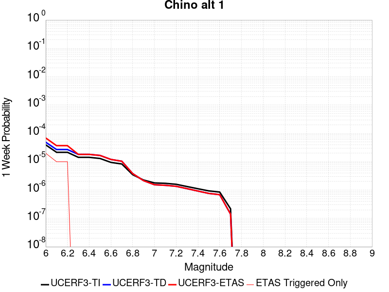 | 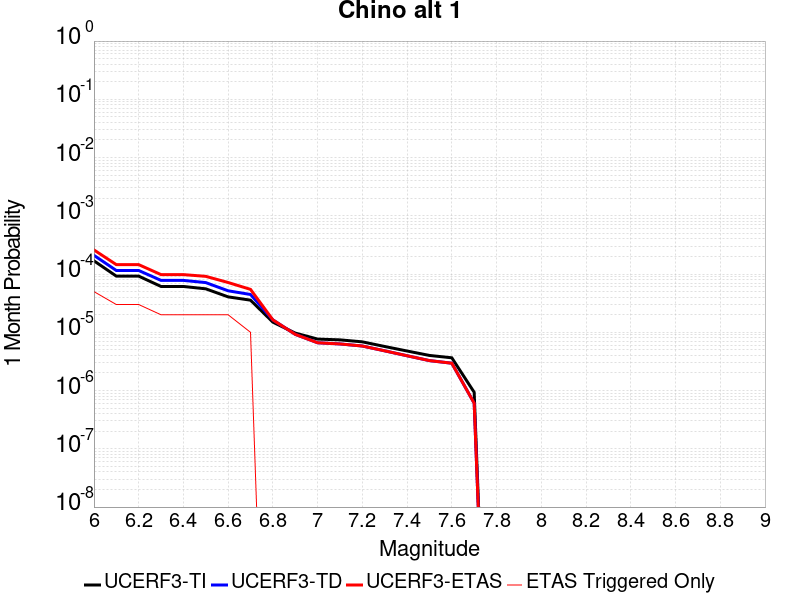 |  | 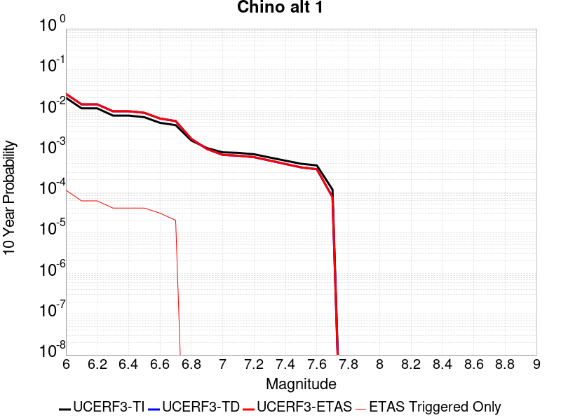 |

| Magnitude | 1 wk TI Prob | 1 wk TD Prob | 1 wk ETAS Prob | 1 wk ETAS/TD Gain | 1 wk ETAS Triggered Only | 1 mo TI Prob | 1 mo TD Prob | 1 mo ETAS Prob | 1 mo ETAS/TD Gain | 1 mo ETAS Triggered Only | 1 yr TI Prob | 1 yr TD Prob | 1 yr ETAS Prob | 1 yr ETAS/TD Gain | 1 yr ETAS Triggered Only | 10 yr TI Prob | 10 yr TD Prob | 10 yr ETAS Prob | 10 yr ETAS/TD Gain | 10 yr ETAS Triggered Only |
|-----|-----|-----|-----|-----|-----|-----|-----|-----|-----|-----|-----|-----|-----|-----|-----|-----|-----|-----|-----|-----|
| 6.0 | 3.939946E-5 | 4.894798E-5 | 6.8947E-5 | 1.4085771 | 2.0E-5 | 1.6884391E-4 | 2.0976314E-4 | 2.5975265E-4 | 1.2383142 | 5.0E-5 | 0.0020537362 | 0.002551385 | 0.002631181 | 1.0312755 | 8.0E-5 | 0.020348595 | 0.025280168 | 0.025387388 | 1.0042412 | 1.1E-4 |
| 6.1 | 2.1505624E-5 | 2.6878823E-5 | 3.6878555E-5 | 1.3720301 | 1.0E-5 | 9.2163704E-5 | 1.15190494E-4 | 1.4518703E-4 | 1.2604082 | 3.0E-5 | 0.0011215154 | 0.0014016517 | 0.0014515815 | 1.0356222 | 5.0E-5 | 0.011158722 | 0.013947425 | 0.014006589 | 1.0042418 | 6.0E-5 |
| 6.2 | 2.1505624E-5 | 2.6878823E-5 | 3.6878555E-5 | 1.3720301 | 1.0E-5 | 9.2163704E-5 | 1.15190494E-4 | 1.4518703E-4 | 1.2604082 | 3.0E-5 | 0.0011215154 | 0.0014016517 | 0.0014515815 | 1.0356222 | 5.0E-5 | 0.011158722 | 0.013947425 | 0.014006589 | 1.0042418 | 6.0E-5 |
| 6.3 | 1.4290785E-5 | 1.8164832E-5 | 1.8164832E-5 | 1.0 | 0.0 | 6.1244784E-5 | 7.784722E-5 | 9.784566E-5 | 1.2568935 | 2.0E-5 | 7.454001E-4 | 9.4742293E-4 | 9.773945E-4 | 1.0316348 | 3.0E-5 | 0.007429048 | 0.00944674 | 0.009486362 | 1.0041943 | 4.0E-5 |
| 6.4 | 1.4290785E-5 | 1.8164832E-5 | 1.8164832E-5 | 1.0 | 0.0 | 6.1244784E-5 | 7.784722E-5 | 9.784566E-5 | 1.2568935 | 2.0E-5 | 7.454001E-4 | 9.4742293E-4 | 9.773945E-4 | 1.0316348 | 3.0E-5 | 0.007429048 | 0.00944674 | 0.009486362 | 1.0041943 | 4.0E-5 |
| 6.5 | 1.3017944E-5 | 1.6651793E-5 | 1.6651793E-5 | 1.0 | 0.0 | 5.5789995E-5 | 7.1363116E-5 | 9.136169E-5 | 1.2802368 | 2.0E-5 | 6.790315E-4 | 8.6854334E-4 | 8.985173E-4 | 1.0345106 | 3.0E-5 | 0.0067696036 | 0.008664233 | 0.0087038865 | 1.0045767 | 4.0E-5 |
| 6.6 | 9.470016E-6 | 1.2039209E-5 | 1.2039209E-5 | 1.0 | 0.0 | 4.058515E-5 | 5.159578E-5 | 7.1594746E-5 | 1.3876086 | 2.0E-5 | 4.940122E-4 | 6.280315E-4 | 6.4801896E-4 | 1.0318255 | 2.0E-5 | 0.004929154 | 0.006273248 | 0.0063030594 | 1.0047522 | 3.0E-5 |
| 6.7 | 8.314155E-6 | 1.040749E-5 | 1.040749E-5 | 1.0 | 0.0 | 3.5631605E-5 | 4.4602948E-5 | 5.4602504E-5 | 1.2241905 | 1.0E-5 | 4.3372845E-4 | 5.4293784E-4 | 5.529324E-4 | 1.0184083 | 1.0E-5 | 0.004328829 | 0.0054270807 | 0.0054469723 | 1.0036652 | 2.0E-5 |
| 6.8 | 3.4856364E-6 | 3.8134033E-6 | 3.8134033E-6 | 1.0 | 0.0 | 1.4938357E-5 | 1.6343065E-5 | 1.6343065E-5 | 1.0 | 0.0 | 1.8185932E-4 | 1.9896074E-4 | 1.9896074E-4 | 1.0 | 0.0 | 0.0018171056 | 0.0019894529 | 0.0019894529 | 1.0 | 0.0 |
| 6.9 | 2.2645952E-6 | 2.152909E-6 | 2.152909E-6 | 1.0 | 0.0 | 9.705372E-6 | 9.226722E-6 | 9.226722E-6 | 1.0 | 0.0 | 1.18156495E-4 | 1.12329755E-4 | 1.12329755E-4 | 1.0 | 0.0 | 0.0011809369 | 0.0011233138 | 0.0011233138 | 1.0 | 0.0 |
| 7.0 | 1.7864003E-6 | 1.5430741E-6 | 1.5430741E-6 | 1.0 | 0.0 | 7.655979E-6 | 6.613158E-6 | 6.613158E-6 | 1.0 | 0.0 | 9.3207556E-5 | 8.051228E-5 | 8.051228E-5 | 1.0 | 0.0 | 9.316847E-4 | 8.052856E-4 | 8.052856E-4 | 1.0 | 0.0 |
| 7.1 | 1.7315456E-6 | 1.4733466E-6 | 1.4733466E-6 | 1.0 | 0.0 | 7.420889E-6 | 6.314328E-6 | 6.314328E-6 | 1.0 | 0.0 | 9.034557E-5 | 7.687428E-5 | 7.687428E-5 | 1.0 | 0.0 | 9.0308854E-4 | 7.68921E-4 | 7.68921E-4 | 1.0 | 0.0 |
| 7.2 | 1.6008337E-6 | 1.3574178E-6 | 1.3574178E-6 | 1.0 | 0.0 | 6.860698E-6 | 5.817492E-6 | 5.817492E-6 | 1.0 | 0.0 | 8.352579E-5 | 7.082572E-5 | 7.082572E-5 | 1.0 | 0.0 | 8.34944E-4 | 7.0846075E-4 | 7.0846075E-4 | 1.0 | 0.0 |
| 7.3 | 1.3320939E-6 | 1.1217794E-6 | 1.1217794E-6 | 1.0 | 0.0 | 5.7089615E-6 | 4.8076176E-6 | 4.8076176E-6 | 1.0 | 0.0 | 6.9504385E-5 | 5.853122E-5 | 5.853122E-5 | 1.0 | 0.0 | 6.9482654E-4 | 5.8530655E-4 | 5.8530655E-4 | 1.0 | 0.0 |
| 7.4 | 1.114294E-6 | 9.237087E-7 | 9.237087E-7 | 1.0 | 0.0 | 4.775537E-6 | 3.9587458E-6 | 3.9587458E-6 | 1.0 | 0.0 | 5.8140613E-5 | 4.81967E-5 | 4.81967E-5 | 1.0 | 0.0 | 5.81254E-4 | 4.8187698E-4 | 4.8187698E-4 | 1.0 | 0.0 |
| 7.5 | 9.354081E-7 | 7.6233886E-7 | 7.6233886E-7 | 1.0 | 0.0 | 4.0088858E-6 | 3.2671626E-6 | 3.2671626E-6 | 1.0 | 0.0 | 4.8807087E-5 | 3.9777013E-5 | 3.9777013E-5 | 1.0 | 0.0 | 4.879637E-4 | 3.9770233E-4 | 3.9770233E-4 | 1.0 | 0.0 |
| 7.6 | 8.521771E-7 | 6.880688E-7 | 6.880688E-7 | 1.0 | 0.0 | 3.6521824E-6 | 2.948863E-6 | 2.948863E-6 | 1.0 | 0.0 | 4.4464414E-5 | 3.590185E-5 | 3.590185E-5 | 1.0 | 0.0 | 4.4455516E-4 | 3.5896365E-4 | 3.5896365E-4 | 1.0 | 0.0 |
| 7.7 | 2.1803626E-7 | 1.4186368E-7 | 1.4186368E-7 | 1.0 | 0.0 | 9.344408E-7 | 6.0798715E-7 | 6.0798715E-7 | 1.0 | 0.0 | 1.1376757E-5 | 7.4022278E-6 | 7.4022278E-6 | 1.0 | 0.0 | 1.13761744E-4 | 7.402077E-5 | 7.402077E-5 | 1.0 | 0.0 |

## Kern Canyon (South Kern) 2011
*[(top)](#table-of-contents)*

| 1 Week | 1 Month | 1 Year | 10 Year |
|-----|-----|-----|-----|
|  |  |  |  |

| Magnitude | 1 wk TI Prob | 1 wk TD Prob | 1 wk ETAS Prob | 1 wk ETAS/TD Gain | 1 wk ETAS Triggered Only | 1 mo TI Prob | 1 mo TD Prob | 1 mo ETAS Prob | 1 mo ETAS/TD Gain | 1 mo ETAS Triggered Only | 1 yr TI Prob | 1 yr TD Prob | 1 yr ETAS Prob | 1 yr ETAS/TD Gain | 1 yr ETAS Triggered Only | 10 yr TI Prob | 10 yr TD Prob | 10 yr ETAS Prob | 10 yr ETAS/TD Gain | 10 yr ETAS Triggered Only |
|-----|-----|-----|-----|-----|-----|-----|-----|-----|-----|-----|-----|-----|-----|-----|-----|-----|-----|-----|-----|-----|
| 6.0 | 4.105075E-6 | 4.113726E-6 | 5.411352E-5 | 13.154382 | 5.0E-5 | 1.7593058E-5 | 1.7630138E-5 | 9.762873E-5 | 5.5376043 | 8.0E-5 | 2.1417443E-4 | 2.1462643E-4 | 3.0460712E-4 | 1.4192432 | 9.0E-5 | 0.0021396813 | 0.0021442554 | 0.0022540195 | 1.0511899 | 1.1E-4 |
| 6.1 | 4.105075E-6 | 4.113726E-6 | 5.411352E-5 | 13.154382 | 5.0E-5 | 1.7593058E-5 | 1.7630138E-5 | 9.762873E-5 | 5.5376043 | 8.0E-5 | 2.1417443E-4 | 2.1462643E-4 | 3.0460712E-4 | 1.4192432 | 9.0E-5 | 0.0021396813 | 0.0021442554 | 0.0022540195 | 1.0511899 | 1.1E-4 |
| 6.2 | 4.105075E-6 | 4.113726E-6 | 5.411352E-5 | 13.154382 | 5.0E-5 | 1.7593058E-5 | 1.7630138E-5 | 9.762873E-5 | 5.5376043 | 8.0E-5 | 2.1417443E-4 | 2.1462643E-4 | 3.0460712E-4 | 1.4192432 | 9.0E-5 | 0.0021396813 | 0.0021442554 | 0.0022540195 | 1.0511899 | 1.1E-4 |
| 6.3 | 4.105075E-6 | 4.113726E-6 | 5.411352E-5 | 13.154382 | 5.0E-5 | 1.7593058E-5 | 1.7630138E-5 | 9.762873E-5 | 5.5376043 | 8.0E-5 | 2.1417443E-4 | 2.1462643E-4 | 3.0460712E-4 | 1.4192432 | 9.0E-5 | 0.0021396813 | 0.0021442554 | 0.0022540195 | 1.0511899 | 1.1E-4 |
| 6.4 | 4.105075E-6 | 4.113726E-6 | 5.411352E-5 | 13.154382 | 5.0E-5 | 1.7593058E-5 | 1.7630138E-5 | 9.762873E-5 | 5.5376043 | 8.0E-5 | 2.1417443E-4 | 2.1462643E-4 | 3.0460712E-4 | 1.4192432 | 9.0E-5 | 0.0021396813 | 0.0021442554 | 0.0022540195 | 1.0511899 | 1.1E-4 |
| 6.5 | 2.9849807E-6 | 2.973154E-6 | 4.2973035E-5 | 14.453686 | 4.0E-5 | 1.2792712E-5 | 1.2742028E-5 | 6.274139E-5 | 4.923972 | 5.0E-5 | 1.5574014E-4 | 1.551233E-4 | 2.0511553E-4 | 1.3222742 | 5.0E-5 | 0.0015563103 | 0.0015501654 | 0.0016200568 | 1.0450865 | 7.0E-5 |
| 6.6 | 2.9849807E-6 | 2.973154E-6 | 4.2973035E-5 | 14.453686 | 4.0E-5 | 1.2792712E-5 | 1.2742028E-5 | 6.274139E-5 | 4.923972 | 5.0E-5 | 1.5574014E-4 | 1.551233E-4 | 2.0511553E-4 | 1.3222742 | 5.0E-5 | 0.0015563103 | 0.0015501654 | 0.0016200568 | 1.0450865 | 7.0E-5 |
| 6.7 | 2.6756725E-6 | 2.6582202E-6 | 4.2658114E-5 | 16.047623 | 4.0E-5 | 1.1467117E-5 | 1.1392323E-5 | 6.139175E-5 | 5.3888707 | 5.0E-5 | 1.396032E-4 | 1.386928E-4 | 1.8868588E-4 | 1.360459 | 5.0E-5 | 0.0013951553 | 0.0013860734 | 0.0014559764 | 1.0504323 | 7.0E-5 |
| 6.8 | 2.3283721E-6 | 2.3047783E-6 | 4.2304688E-5 | 18.35521 | 4.0E-5 | 9.9787E-6 | 9.877584E-6 | 4.9877188E-5 | 5.0495334 | 4.0E-5 | 1.214839E-4 | 1.2025302E-4 | 1.6024821E-4 | 1.332592 | 4.0E-5 | 0.001214175 | 0.001201887 | 0.0012618148 | 1.0498616 | 6.0E-5 |
| 6.9 | 2.0972677E-6 | 2.0696405E-6 | 4.2069558E-5 | 20.326988 | 4.0E-5 | 8.988259E-6 | 8.869858E-6 | 4.8869504E-5 | 5.509615 | 4.0E-5 | 1.0942656E-4 | 1.0798523E-4 | 1.4798091E-4 | 1.370381 | 4.0E-5 | 0.0010937268 | 0.0010793334 | 0.0011392686 | 1.0555298 | 6.0E-5 |
| 7.0 | 1.7132242E-6 | 1.6787029E-6 | 3.1678654E-5 | 18.87091 | 3.0E-5 | 7.3423685E-6 | 7.1944214E-6 | 3.7194204E-5 | 5.1698675 | 3.0E-5 | 8.938967E-5 | 8.75886E-5 | 1.1758597E-4 | 1.3424803 | 3.0E-5 | 8.935372E-4 | 8.755446E-4 | 9.255009E-4 | 1.0570573 | 5.0E-5 |
| 7.1 | 1.4215541E-6 | 1.3815746E-6 | 2.1381547E-5 | 15.476216 | 2.0E-5 | 6.0923603E-6 | 5.9210206E-6 | 2.5920903E-5 | 4.377776 | 2.0E-5 | 7.417196E-5 | 7.208607E-5 | 9.208463E-5 | 1.2774261 | 2.0E-5 | 7.414721E-4 | 7.206296E-4 | 7.606007E-4 | 1.055467 | 4.0E-5 |
| 7.2 | 9.097853E-7 | 8.60377E-7 | 8.60377E-7 | 1.0 | 0.0 | 3.899074E-6 | 3.6873246E-6 | 3.6873246E-6 | 1.0 | 0.0 | 4.7470192E-5 | 4.4892266E-5 | 4.4892266E-5 | 1.0 | 0.0 | 4.7460053E-4 | 4.4883305E-4 | 4.4883305E-4 | 1.0 | 0.0 |
| 7.3 | 6.144169E-7 | 5.628199E-7 | 5.628199E-7 | 1.0 | 0.0 | 2.6332125E-6 | 2.4120832E-6 | 2.4120832E-6 | 1.0 | 0.0 | 3.205889E-5 | 2.9366722E-5 | 2.9366722E-5 | 1.0 | 0.0 | 3.2054266E-4 | 2.9362892E-4 | 2.9362892E-4 | 1.0 | 0.0 |
| 7.4 | 4.049844E-7 | 3.5728252E-7 | 3.5728252E-7 | 1.0 | 0.0 | 1.7356463E-6 | 1.5312098E-6 | 1.5312098E-6 | 1.0 | 0.0 | 2.1131287E-5 | 1.8642324E-5 | 1.8642324E-5 | 1.0 | 0.0 | 2.1129279E-4 | 1.8640784E-4 | 1.8640784E-4 | 1.0 | 0.0 |
| 7.5 | 1.9871162E-7 | 1.5830383E-7 | 1.5830383E-7 | 1.0 | 0.0 | 8.5162094E-7 | 6.784448E-7 | 6.784448E-7 | 1.0 | 0.0 | 1.0368436E-5 | 8.260035E-6 | 8.260035E-6 | 1.0 | 0.0 | 1.0367952E-4 | 8.259736E-5 | 8.259736E-5 | 1.0 | 0.0 |
| 7.6 | 2.572245E-8 | 1.735264E-8 | 1.735264E-8 | 1.0 | 0.0 | 1.10239064E-7 | 7.436845E-8 | 7.436845E-8 | 1.0 | 0.0 | 1.3421597E-6 | 9.0543557E-7 | 9.0543557E-7 | 1.0 | 0.0 | 1.3421517E-5 | 9.054324E-6 | 9.054324E-6 | 1.0 | 0.0 |

## Dry Mountain
*[(top)](#table-of-contents)*

| 1 Week | 1 Month | 1 Year | 10 Year |
|-----|-----|-----|-----|
|  |  |  | 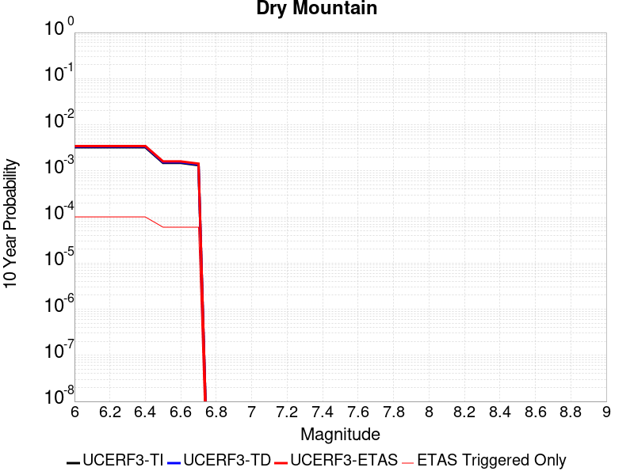 |

| Magnitude | 1 wk TI Prob | 1 wk TD Prob | 1 wk ETAS Prob | 1 wk ETAS/TD Gain | 1 wk ETAS Triggered Only | 1 mo TI Prob | 1 mo TD Prob | 1 mo ETAS Prob | 1 mo ETAS/TD Gain | 1 mo ETAS Triggered Only | 1 yr TI Prob | 1 yr TD Prob | 1 yr ETAS Prob | 1 yr ETAS/TD Gain | 1 yr ETAS Triggered Only | 10 yr TI Prob | 10 yr TD Prob | 10 yr ETAS Prob | 10 yr ETAS/TD Gain | 10 yr ETAS Triggered Only |
|-----|-----|-----|-----|-----|-----|-----|-----|-----|-----|-----|-----|-----|-----|-----|-----|-----|-----|-----|-----|-----|
| 6.0 | 6.222801E-6 | 6.439381E-6 | 1.6439317E-5 | 2.5529342 | 1.0E-5 | 2.6668875E-5 | 2.7597147E-5 | 3.759687E-5 | 1.3623463 | 1.0E-5 | 3.2464517E-4 | 3.3595937E-4 | 3.9593922E-4 | 1.1785331 | 6.0E-5 | 0.0032417132 | 0.0033560768 | 0.0034557413 | 1.0296967 | 1.0E-4 |
| 6.1 | 6.222801E-6 | 6.439381E-6 | 1.6439317E-5 | 2.5529342 | 1.0E-5 | 2.6668875E-5 | 2.7597147E-5 | 3.759687E-5 | 1.3623463 | 1.0E-5 | 3.2464517E-4 | 3.3595937E-4 | 3.9593922E-4 | 1.1785331 | 6.0E-5 | 0.0032417132 | 0.0033560768 | 0.0034557413 | 1.0296967 | 1.0E-4 |
| 6.2 | 6.222801E-6 | 6.439381E-6 | 1.6439317E-5 | 2.5529342 | 1.0E-5 | 2.6668875E-5 | 2.7597147E-5 | 3.759687E-5 | 1.3623463 | 1.0E-5 | 3.2464517E-4 | 3.3595937E-4 | 3.9593922E-4 | 1.1785331 | 6.0E-5 | 0.0032417132 | 0.0033560768 | 0.0034557413 | 1.0296967 | 1.0E-4 |
| 6.3 | 6.222801E-6 | 6.439381E-6 | 1.6439317E-5 | 2.5529342 | 1.0E-5 | 2.6668875E-5 | 2.7597147E-5 | 3.759687E-5 | 1.3623463 | 1.0E-5 | 3.2464517E-4 | 3.3595937E-4 | 3.9593922E-4 | 1.1785331 | 6.0E-5 | 0.0032417132 | 0.0033560768 | 0.0034557413 | 1.0296967 | 1.0E-4 |
| 6.4 | 6.222801E-6 | 6.439381E-6 | 1.6439317E-5 | 2.5529342 | 1.0E-5 | 2.6668875E-5 | 2.7597147E-5 | 3.759687E-5 | 1.3623463 | 1.0E-5 | 3.2464517E-4 | 3.3595937E-4 | 3.9593922E-4 | 1.1785331 | 6.0E-5 | 0.0032417132 | 0.0033560768 | 0.0034557413 | 1.0296967 | 1.0E-4 |
| 6.5 | 2.8528623E-6 | 2.9521684E-6 | 1.2952139E-5 | 4.3873305 | 1.0E-5 | 1.22264955E-5 | 1.2652138E-5 | 2.2652011E-5 | 1.7903702 | 1.0E-5 | 1.4884741E-4 | 1.540376E-4 | 1.9403143E-4 | 1.2596369 | 4.0E-5 | 0.0014874774 | 0.0015401616 | 0.0016000692 | 1.0388969 | 6.0E-5 |
| 6.6 | 2.8528623E-6 | 2.9521684E-6 | 1.2952139E-5 | 4.3873305 | 1.0E-5 | 1.22264955E-5 | 1.2652138E-5 | 2.2652011E-5 | 1.7903702 | 1.0E-5 | 1.4884741E-4 | 1.540376E-4 | 1.9403143E-4 | 1.2596369 | 4.0E-5 | 0.0014874774 | 0.0015401616 | 0.0016000692 | 1.0388969 | 6.0E-5 |
| 6.7 | 2.541E-6 | 2.6293578E-6 | 1.2629332E-5 | 4.8032 | 1.0E-5 | 1.0889954E-5 | 1.1268677E-5 | 2.1268565E-5 | 1.8874056 | 1.0E-5 | 1.3257713E-4 | 1.3719614E-4 | 1.7719065E-4 | 1.2915134 | 4.0E-5 | 0.0013249806 | 0.0013719613 | 0.001431879 | 1.043673 | 6.0E-5 |

## Kern Canyon (North Kern) 2011
*[(top)](#table-of-contents)*

| 1 Week | 1 Month | 1 Year | 10 Year |
|-----|-----|-----|-----|
|  |  |  |  |

| Magnitude | 1 wk TI Prob | 1 wk TD Prob | 1 wk ETAS Prob | 1 wk ETAS/TD Gain | 1 wk ETAS Triggered Only | 1 mo TI Prob | 1 mo TD Prob | 1 mo ETAS Prob | 1 mo ETAS/TD Gain | 1 mo ETAS Triggered Only | 1 yr TI Prob | 1 yr TD Prob | 1 yr ETAS Prob | 1 yr ETAS/TD Gain | 1 yr ETAS Triggered Only | 10 yr TI Prob | 10 yr TD Prob | 10 yr ETAS Prob | 10 yr ETAS/TD Gain | 10 yr ETAS Triggered Only |
|-----|-----|-----|-----|-----|-----|-----|-----|-----|-----|-----|-----|-----|-----|-----|-----|-----|-----|-----|-----|-----|
| 6.0 | 6.6264497E-6 | 6.75733E-6 | 6.6756926E-5 | 9.879187 | 6.0E-5 | 2.8398761E-5 | 2.895971E-5 | 9.895768E-5 | 3.4170814 | 7.0E-5 | 3.4570007E-4 | 3.5253543E-4 | 4.3250722E-4 | 1.2268475 | 8.0E-5 | 0.0034516277 | 0.0035205502 | 0.003630163 | 1.0311351 | 1.1E-4 |
| 6.1 | 6.6264497E-6 | 6.75733E-6 | 6.6756926E-5 | 9.879187 | 6.0E-5 | 2.8398761E-5 | 2.895971E-5 | 9.895768E-5 | 3.4170814 | 7.0E-5 | 3.4570007E-4 | 3.5253543E-4 | 4.3250722E-4 | 1.2268475 | 8.0E-5 | 0.0034516277 | 0.0035205502 | 0.003630163 | 1.0311351 | 1.1E-4 |
| 6.2 | 6.6264497E-6 | 6.75733E-6 | 6.6756926E-5 | 9.879187 | 6.0E-5 | 2.8398761E-5 | 2.895971E-5 | 9.895768E-5 | 3.4170814 | 7.0E-5 | 3.4570007E-4 | 3.5253543E-4 | 4.3250722E-4 | 1.2268475 | 8.0E-5 | 0.0034516277 | 0.0035205502 | 0.003630163 | 1.0311351 | 1.1E-4 |
| 6.3 | 6.6264497E-6 | 6.75733E-6 | 6.6756926E-5 | 9.879187 | 6.0E-5 | 2.8398761E-5 | 2.895971E-5 | 9.895768E-5 | 3.4170814 | 7.0E-5 | 3.4570007E-4 | 3.5253543E-4 | 4.3250722E-4 | 1.2268475 | 8.0E-5 | 0.0034516277 | 0.0035205502 | 0.003630163 | 1.0311351 | 1.1E-4 |
| 6.4 | 6.6264497E-6 | 6.75733E-6 | 6.6756926E-5 | 9.879187 | 6.0E-5 | 2.8398761E-5 | 2.895971E-5 | 9.895768E-5 | 3.4170814 | 7.0E-5 | 3.4570007E-4 | 3.5253543E-4 | 4.3250722E-4 | 1.2268475 | 8.0E-5 | 0.0034516277 | 0.0035205502 | 0.003630163 | 1.0311351 | 1.1E-4 |
| 6.5 | 3.2162225E-6 | 3.2570915E-6 | 5.325693E-5 | 16.351068 | 5.0E-5 | 1.3783738E-5 | 1.3958894E-5 | 6.395819E-5 | 4.581896 | 5.0E-5 | 1.6780409E-4 | 1.6993708E-4 | 2.1992858E-4 | 1.2941766 | 5.0E-5 | 0.0016767744 | 0.001698151 | 0.0017680322 | 1.0411513 | 7.0E-5 |
| 6.6 | 3.2162225E-6 | 3.2570915E-6 | 5.325693E-5 | 16.351068 | 5.0E-5 | 1.3783738E-5 | 1.3958894E-5 | 6.395819E-5 | 4.581896 | 5.0E-5 | 1.6780409E-4 | 1.6993708E-4 | 2.1992858E-4 | 1.2941766 | 5.0E-5 | 0.0016767744 | 0.001698151 | 0.0017680322 | 1.0411513 | 7.0E-5 |
| 6.7 | 2.1908265E-6 | 2.2071222E-6 | 4.2207033E-5 | 19.123106 | 4.0E-5 | 9.389223E-6 | 9.459062E-6 | 4.9458682E-5 | 5.228709 | 4.0E-5 | 1.1430779E-4 | 1.1515819E-4 | 1.5515358E-4 | 1.3473083 | 4.0E-5 | 0.0011424901 | 0.0011510046 | 0.001200947 | 1.0433903 | 5.0E-5 |
| 6.8 | 1.7303895E-6 | 1.736553E-6 | 3.17365E-5 | 18.275574 | 3.0E-5 | 7.415934E-6 | 7.442349E-6 | 3.7442125E-5 | 5.0309553 | 3.0E-5 | 9.028525E-5 | 9.060693E-5 | 1.20604214E-4 | 1.3310705 | 3.0E-5 | 9.024858E-4 | 9.0570963E-4 | 9.456734E-4 | 1.0441242 | 4.0E-5 |
| 6.9 | 1.3700314E-6 | 1.3688623E-6 | 3.136882E-5 | 22.91598 | 3.0E-5 | 5.87155E-6 | 5.86654E-6 | 3.5866364E-5 | 6.113717 | 3.0E-5 | 7.148377E-5 | 7.142283E-5 | 1.0142069E-4 | 1.4200038 | 3.0E-5 | 7.146078E-4 | 7.140033E-4 | 7.539747E-4 | 1.0559821 | 4.0E-5 |
| 7.0 | 1.1467797E-6 | 1.1413805E-6 | 2.1141357E-5 | 18.52262 | 2.0E-5 | 4.9147607E-6 | 4.8916218E-6 | 2.4891524E-5 | 5.0886035 | 2.0E-5 | 5.983557E-5 | 5.95539E-5 | 7.955271E-5 | 1.3358102 | 2.0E-5 | 5.981946E-4 | 5.9538253E-4 | 6.253647E-4 | 1.0503578 | 3.0E-5 |
| 7.1 | 9.3952065E-7 | 9.3026915E-7 | 2.093025E-5 | 22.499134 | 2.0E-5 | 4.026511E-6 | 3.986862E-6 | 2.3986782E-5 | 6.016457 | 2.0E-5 | 4.9021666E-5 | 4.853898E-5 | 6.853801E-5 | 1.41202 | 2.0E-5 | 4.901085E-4 | 4.8528553E-4 | 5.15271E-4 | 1.0617893 | 3.0E-5 |
| 7.2 | 6.858055E-7 | 6.7193014E-7 | 6.7193014E-7 | 1.0 | 0.0 | 2.939163E-6 | 2.8796974E-6 | 2.8796974E-6 | 1.0 | 0.0 | 3.5783723E-5 | 3.5059762E-5 | 3.5059762E-5 | 1.0 | 0.0 | 3.5777962E-4 | 3.5054318E-4 | 3.5054318E-4 | 1.0 | 0.0 |
| 7.3 | 5.1101983E-7 | 4.939301E-7 | 4.939301E-7 | 1.0 | 0.0 | 2.1900833E-6 | 2.1168414E-6 | 2.1168414E-6 | 1.0 | 0.0 | 2.6663936E-5 | 2.5772246E-5 | 2.5772246E-5 | 1.0 | 0.0 | 2.6660739E-4 | 2.5769303E-4 | 2.5769303E-4 | 1.0 | 0.0 |
| 7.4 | 3.4999414E-7 | 3.2995916E-7 | 3.2995916E-7 | 1.0 | 0.0 | 1.499974E-6 | 1.4141099E-6 | 1.4141099E-6 | 1.0 | 0.0 | 1.8262032E-5 | 1.7216655E-5 | 1.7216655E-5 | 1.0 | 0.0 | 1.826053E-4 | 1.7215345E-4 | 1.7215345E-4 | 1.0 | 0.0 |
| 7.5 | 1.7021522E-7 | 1.4750053E-7 | 1.4750053E-7 | 1.0 | 0.0 | 7.2949354E-7 | 6.32145E-7 | 6.32145E-7 | 1.0 | 0.0 | 8.881548E-6 | 7.696339E-6 | 7.696339E-6 | 1.0 | 0.0 | 8.8811925E-5 | 7.696081E-5 | 7.696081E-5 | 1.0 | 0.0 |
| 7.6 | 2.572245E-8 | 1.735264E-8 | 1.735264E-8 | 1.0 | 0.0 | 1.10239064E-7 | 7.436845E-8 | 7.436845E-8 | 1.0 | 0.0 | 1.3421597E-6 | 9.0543557E-7 | 9.0543557E-7 | 1.0 | 0.0 | 1.3421517E-5 | 9.054324E-6 | 9.054324E-6 | 1.0 | 0.0 |

## Brawley (Seismic Zone) alt 1
*[(top)](#table-of-contents)*

| 1 Week | 1 Month | 1 Year | 10 Year |
|-----|-----|-----|-----|
|  | 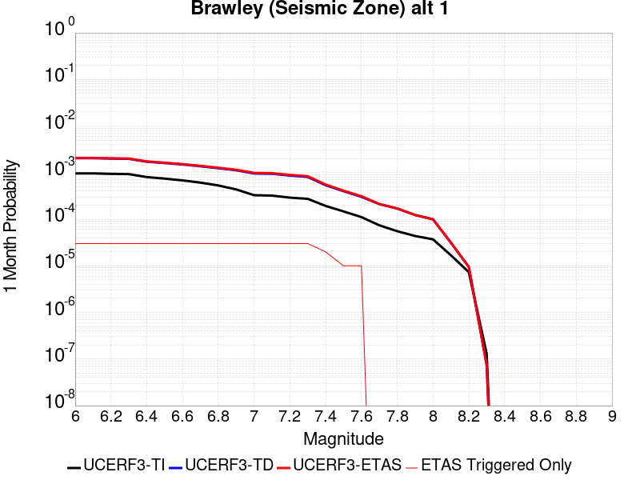 | 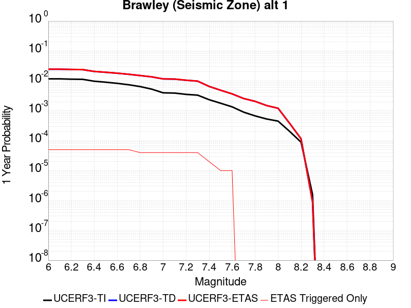 |  |

| Magnitude | 1 wk TI Prob | 1 wk TD Prob | 1 wk ETAS Prob | 1 wk ETAS/TD Gain | 1 wk ETAS Triggered Only | 1 mo TI Prob | 1 mo TD Prob | 1 mo ETAS Prob | 1 mo ETAS/TD Gain | 1 mo ETAS Triggered Only | 1 yr TI Prob | 1 yr TD Prob | 1 yr ETAS Prob | 1 yr ETAS/TD Gain | 1 yr ETAS Triggered Only | 10 yr TI Prob | 10 yr TD Prob | 10 yr ETAS Prob | 10 yr ETAS/TD Gain | 10 yr ETAS Triggered Only |
|-----|-----|-----|-----|-----|-----|-----|-----|-----|-----|-----|-----|-----|-----|-----|-----|-----|-----|-----|-----|-----|
| 6.0 | 2.2521618E-4 | 4.763429E-4 | 4.9633335E-4 | 1.0419666 | 2.0E-5 | 9.6485513E-4 | 0.0020399094 | 0.0020698481 | 1.0146766 | 3.0E-5 | 0.011683988 | 0.024544531 | 0.024593305 | 1.0019871 | 5.0E-5 | 0.11088423 | 0.21349923 | 0.21357788 | 1.0003684 | 1.0E-4 |
| 6.1 | 2.2521618E-4 | 4.763429E-4 | 4.9633335E-4 | 1.0419666 | 2.0E-5 | 9.6485513E-4 | 0.0020399094 | 0.0020698481 | 1.0146766 | 3.0E-5 | 0.011683988 | 0.024544531 | 0.024593305 | 1.0019871 | 5.0E-5 | 0.11088423 | 0.21349923 | 0.21357001 | 1.0003315 | 9.0E-5 |
| 6.2 | 2.198148E-4 | 4.6718874E-4 | 4.8717938E-4 | 1.0427892 | 2.0E-5 | 9.417233E-4 | 0.0020007377 | 0.0020306776 | 1.0149645 | 3.0E-5 | 0.011405343 | 0.024078513 | 0.02412731 | 1.0020266 | 5.0E-5 | 0.10837428 | 0.20993572 | 0.20999894 | 1.0003011 | 8.0E-5 |
| 6.3 | 2.1704129E-4 | 4.615455E-4 | 4.8153626E-4 | 1.0433127 | 2.0E-5 | 9.298453E-4 | 0.0019765892 | 0.00200653 | 1.0151477 | 3.0E-5 | 0.011262234 | 0.023792034 | 0.023840845 | 1.0020516 | 5.0E-5 | 0.107082725 | 0.20782684 | 0.20789021 | 1.0003049 | 8.0E-5 |
| 6.4 | 1.876142E-4 | 4.004663E-4 | 4.204583E-4 | 1.0499218 | 2.0E-5 | 8.038131E-4 | 0.0017151695 | 0.0017451181 | 1.017461 | 3.0E-5 | 0.00974259 | 0.020678662 | 0.020727627 | 1.002368 | 5.0E-5 | 0.093263686 | 0.18457787 | 0.1846431 | 1.0003535 | 8.0E-5 |
| 6.5 | 1.7390939E-4 | 3.7478763E-4 | 3.9478013E-4 | 1.0533435 | 2.0E-5 | 7.45113E-4 | 0.0016052561 | 0.001635208 | 1.0186586 | 3.0E-5 | 0.009034078 | 0.019367293 | 0.019416325 | 1.0025316 | 5.0E-5 | 0.086755216 | 0.17440015 | 0.1744662 | 1.0003787 | 8.0E-5 |
| 6.6 | 1.591791E-4 | 3.4893592E-4 | 3.6892894E-4 | 1.0572971 | 2.0E-5 | 6.8201777E-4 | 0.0014945926 | 0.0015245478 | 1.0200423 | 3.0E-5 | 0.008271996 | 0.018045008 | 0.018094106 | 1.0027208 | 5.0E-5 | 0.07970774 | 0.16380787 | 0.16387476 | 1.0004084 | 8.0E-5 |
| 6.7 | 1.4268003E-4 | 3.2059717E-4 | 3.4059078E-4 | 1.0623636 | 2.0E-5 | 6.1134255E-4 | 0.0013732726 | 0.0014032314 | 1.0218157 | 3.0E-5 | 0.007417723 | 0.01659171 | 0.01664088 | 1.0029635 | 5.0E-5 | 0.07174956 | 0.15193594 | 0.15200378 | 1.0004466 | 8.0E-5 |
| 6.8 | 1.239713E-4 | 2.9055026E-4 | 3.1054445E-4 | 1.0688149 | 2.0E-5 | 5.3119735E-4 | 0.0012446274 | 0.00127459 | 1.0240736 | 3.0E-5 | 0.0064481674 | 0.015049482 | 0.01508888 | 1.002618 | 4.0E-5 | 0.06264243 | 0.13838051 | 0.13844082 | 1.0004358 | 7.0E-5 |
| 6.9 | 1.0180238E-4 | 2.6255674E-4 | 2.825515E-4 | 1.076154 | 2.0E-5 | 4.3622297E-4 | 0.0011247622 | 0.0011547285 | 1.0266423 | 3.0E-5 | 0.005298089 | 0.013608998 | 0.013648453 | 1.0028993 | 4.0E-5 | 0.05173543 | 0.12496473 | 0.12502597 | 1.0004902 | 7.0E-5 |
| 7.0 | 7.6619996E-5 | 2.2400476E-4 | 2.4400029E-4 | 1.0892638 | 2.0E-5 | 3.283301E-4 | 9.596704E-4 | 9.896416E-4 | 1.0312307 | 3.0E-5 | 0.0039900932 | 0.011622103 | 0.011661638 | 1.0034018 | 4.0E-5 | 0.039192066 | 0.10726982 | 0.10733232 | 1.0005826 | 7.0E-5 |
| 7.1 | 7.5127435E-5 | 2.2083633E-4 | 2.4083191E-4 | 1.0905448 | 2.0E-5 | 3.2193496E-4 | 9.461013E-4 | 9.760729E-4 | 1.031679 | 3.0E-5 | 0.0039125155 | 0.011458648 | 0.0114981895 | 1.0034509 | 4.0E-5 | 0.038443442 | 0.10583378 | 0.10589637 | 1.0005914 | 7.0E-5 |
| 7.2 | 6.788582E-5 | 2.0211334E-4 | 2.221093E-4 | 1.0989344 | 2.0E-5 | 2.9090676E-4 | 8.6591556E-4 | 8.9588953E-4 | 1.0346154 | 3.0E-5 | 0.0035360386 | 0.0104922 | 0.01053178 | 1.0037724 | 4.0E-5 | 0.034803 | 0.097503684 | 0.09756686 | 1.0006479 | 7.0E-5 |
| 7.3 | 6.399602E-5 | 1.8842232E-4 | 2.0841854E-4 | 1.1061245 | 2.0E-5 | 2.7423984E-4 | 8.0727716E-4 | 8.3725294E-4 | 1.0371319 | 3.0E-5 | 0.0033337586 | 0.009784897 | 0.009824505 | 1.004048 | 4.0E-5 | 0.03284188 | 0.091397986 | 0.09146159 | 1.0006958 | 7.0E-5 |
| 7.4 | 4.506759E-5 | 1.2530042E-4 | 1.3529917E-4 | 1.0797982 | 1.0E-5 | 1.9313251E-4 | 5.3689216E-4 | 5.568814E-4 | 1.0372314 | 2.0E-5 | 0.0023488526 | 0.006517245 | 0.0065371147 | 1.0030488 | 2.0E-5 | 0.023241805 | 0.062364522 | 0.06240203 | 1.0006014 | 4.0E-5 |
| 7.5 | 3.43289E-5 | 9.336103E-5 | 1.0336009E-4 | 1.1071011 | 1.0E-5 | 1.4711556E-4 | 4.0005764E-4 | 4.1005365E-4 | 1.0249864 | 1.0E-5 | 0.0017896603 | 0.004859886 | 0.004869838 | 1.0020477 | 1.0E-5 | 0.01775316 | 0.047057066 | 0.047076125 | 1.0004051 | 2.0E-5 |
| 7.6 | 2.5980507E-5 | 7.053672E-5 | 8.053602E-5 | 1.1417601 | 1.0E-5 | 1.1134028E-4 | 3.0226534E-4 | 3.1226233E-4 | 1.0330735 | 1.0E-5 | 0.001354725 | 0.0036738948 | 0.003683858 | 1.0027119 | 1.0E-5 | 0.013464959 | 0.03584298 | 0.035862263 | 1.000538 | 2.0E-5 |
| 7.7 | 1.7292105E-5 | 4.9412036E-5 | 4.9412036E-5 | 1.0 | 0.0 | 7.4106916E-5 | 2.1174872E-4 | 2.1174872E-4 | 1.0 | 0.0 | 9.018782E-4 | 0.0025749984 | 0.0025749984 | 1.0 | 0.0 | 0.008982267 | 0.025292097 | 0.025301844 | 1.0003854 | 1.0E-5 |
| 7.8 | 1.2927471E-5 | 3.9697254E-5 | 3.9697254E-5 | 1.0 | 0.0 | 5.5402274E-5 | 1.7012001E-4 | 1.7012001E-4 | 1.0 | 0.0 | 6.743139E-4 | 0.0020692463 | 0.0020692463 | 1.0 | 0.0 | 0.0067227143 | 0.020433145 | 0.02044294 | 1.0004795 | 1.0E-5 |
| 7.9 | 1.0200774E-5 | 2.8748475E-5 | 2.8748475E-5 | 1.0 | 0.0 | 4.371687E-5 | 1.2320194E-4 | 1.2320194E-4 | 1.0 | 0.0 | 5.321229E-4 | 0.0014989526 | 0.0014989526 | 1.0 | 0.0 | 0.005308505 | 0.014992895 | 0.015002744 | 1.000657 | 1.0E-5 |
| 8.0 | 8.650396E-6 | 2.3279512E-5 | 2.3279512E-5 | 1.0 | 0.0 | 3.70726E-5 | 9.976552E-5 | 9.976552E-5 | 1.0 | 0.0 | 4.5126543E-4 | 0.0012139693 | 0.0012139693 | 1.0 | 0.0 | 0.0045035016 | 0.012212164 | 0.012222041 | 1.0008088 | 1.0E-5 |
| 8.1 | 3.9368224E-6 | 7.3283345E-6 | 7.3283345E-6 | 1.0 | 0.0 | 1.6871985E-5 | 3.1406773E-5 | 3.1406773E-5 | 1.0 | 0.0 | 2.0539707E-4 | 3.8231048E-4 | 3.8231048E-4 | 1.0 | 0.0 | 0.0020520731 | 0.0040015313 | 0.0040114913 | 1.0024891 | 1.0E-5 |
| 8.2 | 1.7101195E-6 | 2.2178374E-6 | 2.2178374E-6 | 1.0 | 0.0 | 7.329063E-6 | 9.504983E-6 | 9.504983E-6 | 1.0 | 0.0 | 8.922769E-5 | 1.15717055E-4 | 1.15717055E-4 | 1.0 | 0.0 | 8.9191867E-4 | 0.00126669 | 0.00126669 | 1.0 | 0.0 |
| 8.3 | 3.0346666E-8 | 1.721086E-8 | 1.721086E-8 | 1.0 | 0.0 | 1.3005713E-7 | 7.376083E-8 | 7.376083E-8 | 1.0 | 0.0 | 1.5834444E-6 | 8.98038E-7 | 8.98038E-7 | 1.0 | 0.0 | 1.5834332E-5 | 9.36379E-6 | 9.36379E-6 | 1.0 | 0.0 |

## San Pedro Basin
*[(top)](#table-of-contents)*

| 1 Week | 1 Month | 1 Year | 10 Year |
|-----|-----|-----|-----|
|  |  |  | 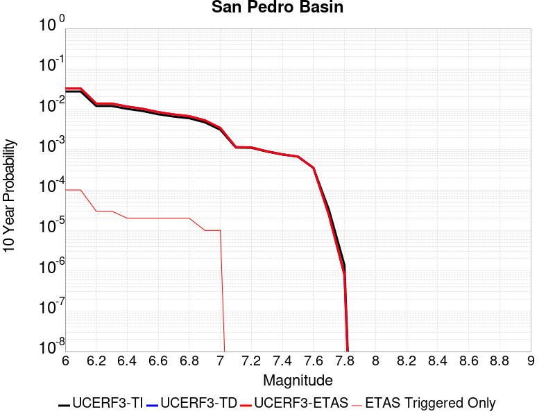 |

| Magnitude | 1 wk TI Prob | 1 wk TD Prob | 1 wk ETAS Prob | 1 wk ETAS/TD Gain | 1 wk ETAS Triggered Only | 1 mo TI Prob | 1 mo TD Prob | 1 mo ETAS Prob | 1 mo ETAS/TD Gain | 1 mo ETAS Triggered Only | 1 yr TI Prob | 1 yr TD Prob | 1 yr ETAS Prob | 1 yr ETAS/TD Gain | 1 yr ETAS Triggered Only | 10 yr TI Prob | 10 yr TD Prob | 10 yr ETAS Prob | 10 yr ETAS/TD Gain | 10 yr ETAS Triggered Only |
|-----|-----|-----|-----|-----|-----|-----|-----|-----|-----|-----|-----|-----|-----|-----|-----|-----|-----|-----|-----|-----|
| 6.0 | 5.3449043E-5 | 6.337018E-5 | 1.13367016E-4 | 1.7889646 | 5.0E-5 | 2.2904722E-4 | 2.7156167E-4 | 3.315454E-4 | 1.2208843 | 6.0E-5 | 0.0027850836 | 0.0033018515 | 0.0033716203 | 1.0211302 | 7.0E-5 | 0.027504366 | 0.03258948 | 0.032686222 | 1.0029684 | 1.0E-4 |
| 6.1 | 5.3449043E-5 | 6.337018E-5 | 1.13367016E-4 | 1.7889646 | 5.0E-5 | 2.2904722E-4 | 2.7156167E-4 | 3.315454E-4 | 1.2208843 | 6.0E-5 | 0.0027850836 | 0.0033018515 | 0.0033716203 | 1.0211302 | 7.0E-5 | 0.027504366 | 0.03258948 | 0.032686222 | 1.0029684 | 1.0E-4 |
| 6.2 | 2.3189454E-5 | 2.6642829E-5 | 3.6642563E-5 | 1.3753256 | 1.0E-5 | 9.9379584E-5 | 1.1417881E-4 | 1.3417653E-4 | 1.1751438 | 2.0E-5 | 0.0012092749 | 0.0013892875 | 0.0014092597 | 1.0143759 | 2.0E-5 | 0.012027155 | 0.01381089 | 0.013840476 | 1.0021422 | 3.0E-5 |
| 6.3 | 2.3189454E-5 | 2.6642829E-5 | 3.6642563E-5 | 1.3753256 | 1.0E-5 | 9.9379584E-5 | 1.1417881E-4 | 1.3417653E-4 | 1.1751438 | 2.0E-5 | 0.0012092749 | 0.0013892875 | 0.0014092597 | 1.0143759 | 2.0E-5 | 0.012027155 | 0.01381089 | 0.013840476 | 1.0021422 | 3.0E-5 |
| 6.4 | 1.966056E-5 | 2.246342E-5 | 2.246342E-5 | 1.0 | 0.0 | 8.425682E-5 | 9.626848E-5 | 1.06267515E-4 | 1.1038662 | 1.0E-5 | 0.001025344 | 0.0011714787 | 0.001181467 | 1.0085262 | 1.0E-5 | 0.010206259 | 0.011657119 | 0.011676886 | 1.0016956 | 2.0E-5 |
| 6.5 | 1.7342953E-5 | 1.9745152E-5 | 1.9745152E-5 | 1.0 | 0.0 | 7.4324824E-5 | 8.461954E-5 | 9.46187E-5 | 1.118166 | 1.0E-5 | 9.04529E-4 | 0.0010297929 | 0.0010397827 | 1.0097007 | 1.0E-5 | 0.009008561 | 0.010253932 | 0.010273728 | 1.0019305 | 2.0E-5 |
| 6.6 | 1.439804E-5 | 1.6322716E-5 | 1.6322716E-5 | 1.0 | 0.0 | 6.170443E-5 | 6.99528E-5 | 7.995211E-5 | 1.1429435 | 1.0E-5 | 7.509924E-4 | 8.513747E-4 | 8.613662E-4 | 1.0117357 | 1.0E-5 | 0.0074845953 | 0.008484333 | 0.0085041635 | 1.0023373 | 2.0E-5 |
| 6.7 | 1.2634884E-5 | 1.4285298E-5 | 1.4285298E-5 | 1.0 | 0.0 | 5.414838E-5 | 6.122144E-5 | 7.122083E-5 | 1.1633315 | 1.0E-5 | 6.590571E-4 | 7.451466E-4 | 7.5513916E-4 | 1.0134102 | 1.0E-5 | 0.006571059 | 0.007429502 | 0.007449353 | 1.002672 | 2.0E-5 |
| 6.8 | 1.146091E-5 | 1.2933193E-5 | 1.2933193E-5 | 1.0 | 0.0 | 4.911726E-5 | 5.542696E-5 | 6.542641E-5 | 1.1804076 | 1.0E-5 | 5.9783855E-4 | 6.74644E-4 | 6.846373E-4 | 1.0148126 | 1.0E-5 | 0.0059623276 | 0.0067288997 | 0.0067487652 | 1.0029522 | 2.0E-5 |
| 6.9 | 9.109035E-6 | 1.0235013E-5 | 1.0235013E-5 | 1.0 | 0.0 | 3.9038136E-5 | 4.386376E-5 | 5.386332E-5 | 1.2279686 | 1.0E-5 | 4.7518566E-4 | 5.339384E-4 | 5.4393307E-4 | 1.0187187 | 1.0E-5 | 0.0047417083 | 0.0053293095 | 0.005339256 | 1.0018665 | 1.0E-5 |
| 7.0 | 5.9351028E-6 | 6.583965E-6 | 6.583965E-6 | 1.0 | 0.0 | 2.5435906E-5 | 2.821682E-5 | 3.8216538E-5 | 1.3543885 | 1.0E-5 | 3.0963816E-4 | 3.4350925E-4 | 3.5350583E-4 | 1.0291013 | 1.0E-5 | 0.0030920706 | 0.0034320997 | 0.0034420653 | 1.0029037 | 1.0E-5 |
| 7.1 | 2.1557585E-6 | 2.2096492E-6 | 2.2096492E-6 | 1.0 | 0.0 | 9.238933E-6 | 9.469892E-6 | 9.469892E-6 | 1.0 | 0.0 | 1.1247819E-4 | 1.15289986E-4 | 1.15289986E-4 | 1.0 | 0.0 | 0.0011242128 | 0.0011523172 | 0.0011523172 | 1.0 | 0.0 |
| 7.2 | 2.1251979E-6 | 2.1779954E-6 | 2.1779954E-6 | 1.0 | 0.0 | 9.107958E-6 | 9.334234E-6 | 9.334234E-6 | 1.0 | 0.0 | 1.1088375E-4 | 1.13638525E-4 | 1.13638525E-4 | 1.0 | 0.0 | 0.0011082845 | 0.0011358195 | 0.0011358195 | 1.0 | 0.0 |
| 7.3 | 1.7145798E-6 | 1.7442885E-6 | 1.7442885E-6 | 1.0 | 0.0 | 7.3481783E-6 | 7.475501E-6 | 7.475501E-6 | 1.0 | 0.0 | 8.94604E-5 | 9.1010515E-5 | 9.1010515E-5 | 1.0 | 0.0 | 8.9424395E-4 | 9.0974156E-4 | 9.0974156E-4 | 1.0 | 0.0 |
| 7.4 | 1.4467993E-6 | 1.4641878E-6 | 1.4641878E-6 | 1.0 | 0.0 | 6.200554E-6 | 6.275076E-6 | 6.275076E-6 | 1.0 | 0.0 | 7.548913E-5 | 7.639644E-5 | 7.639644E-5 | 1.0 | 0.0 | 7.546349E-4 | 7.6370913E-4 | 7.6370913E-4 | 1.0 | 0.0 |
| 7.5 | 1.2803735E-6 | 1.2931506E-6 | 1.2931506E-6 | 1.0 | 0.0 | 5.487303E-6 | 5.5420624E-6 | 5.5420624E-6 | 1.0 | 0.0 | 6.680587E-5 | 6.747259E-5 | 6.747259E-5 | 1.0 | 0.0 | 6.678579E-4 | 6.745281E-4 | 6.745281E-4 | 1.0 | 0.0 |
| 7.6 | 6.755009E-7 | 6.76947E-7 | 6.76947E-7 | 1.0 | 0.0 | 2.8950008E-6 | 2.9011985E-6 | 2.9011985E-6 | 1.0 | 0.0 | 3.5246063E-5 | 3.532158E-5 | 3.532158E-5 | 1.0 | 0.0 | 3.5240475E-4 | 3.5316538E-4 | 3.5316538E-4 | 1.0 | 0.0 |
| 7.7 | 6.211885E-8 | 4.5699714E-8 | 4.5699714E-8 | 1.0 | 0.0 | 2.6622362E-7 | 1.9585592E-7 | 1.9585592E-7 | 1.0 | 0.0 | 3.2412677E-6 | 2.3845432E-6 | 2.3845432E-6 | 1.0 | 0.0 | 3.2412205E-5 | 2.3845198E-5 | 2.3845198E-5 | 1.0 | 0.0 |
| 7.8 | 2.6580573E-9 | 1.5138054E-9 | 1.5138054E-9 | 1.0 | 0.0 | 1.1391674E-8 | 6.4877375E-9 | 6.4877375E-9 | 1.0 | 0.0 | 1.3869362E-7 | 7.89882E-8 | 7.89882E-8 | 1.0 | 0.0 | 1.3869354E-6 | 7.89882E-7 | 7.89882E-7 | 1.0 | 0.0 |

## Ventura-Pitas Point
*[(top)](#table-of-contents)*

| 1 Week | 1 Month | 1 Year | 10 Year |
|-----|-----|-----|-----|
|  |  |  |  |

| Magnitude | 1 wk TI Prob | 1 wk TD Prob | 1 wk ETAS Prob | 1 wk ETAS/TD Gain | 1 wk ETAS Triggered Only | 1 mo TI Prob | 1 mo TD Prob | 1 mo ETAS Prob | 1 mo ETAS/TD Gain | 1 mo ETAS Triggered Only | 1 yr TI Prob | 1 yr TD Prob | 1 yr ETAS Prob | 1 yr ETAS/TD Gain | 1 yr ETAS Triggered Only | 10 yr TI Prob | 10 yr TD Prob | 10 yr ETAS Prob | 10 yr ETAS/TD Gain | 10 yr ETAS Triggered Only |
|-----|-----|-----|-----|-----|-----|-----|-----|-----|-----|-----|-----|-----|-----|-----|-----|-----|-----|-----|-----|-----|
| 6.0 | 3.3179622E-5 | 3.373519E-5 | 7.373384E-5 | 2.1856656 | 4.0E-5 | 1.4219063E-4 | 1.4457281E-4 | 1.8456703E-4 | 1.2766372 | 4.0E-5 | 0.0017297962 | 0.0017590097 | 0.0018089217 | 1.028375 | 5.0E-5 | 0.017163932 | 0.017476497 | 0.01757475 | 1.005622 | 1.0E-4 |
| 6.1 | 3.3179622E-5 | 3.373519E-5 | 7.373384E-5 | 2.1856656 | 4.0E-5 | 1.4219063E-4 | 1.4457281E-4 | 1.8456703E-4 | 1.2766372 | 4.0E-5 | 0.0017297962 | 0.0017590097 | 0.0018089217 | 1.028375 | 5.0E-5 | 0.017163932 | 0.017476497 | 0.01757475 | 1.005622 | 1.0E-4 |
| 6.2 | 3.3179622E-5 | 3.373519E-5 | 7.373384E-5 | 2.1856656 | 4.0E-5 | 1.4219063E-4 | 1.4457281E-4 | 1.8456703E-4 | 1.2766372 | 4.0E-5 | 0.0017297962 | 0.0017590097 | 0.0018089217 | 1.028375 | 5.0E-5 | 0.017163932 | 0.017476497 | 0.01757475 | 1.005622 | 1.0E-4 |
| 6.3 | 3.3179622E-5 | 3.373519E-5 | 7.373384E-5 | 2.1856656 | 4.0E-5 | 1.4219063E-4 | 1.4457281E-4 | 1.8456703E-4 | 1.2766372 | 4.0E-5 | 0.0017297962 | 0.0017590097 | 0.0018089217 | 1.028375 | 5.0E-5 | 0.017163932 | 0.017476497 | 0.01757475 | 1.005622 | 1.0E-4 |
| 6.4 | 1.8754668E-5 | 1.7019594E-5 | 1.7019594E-5 | 1.0 | 0.0 | 8.037467E-5 | 7.2939205E-5 | 7.2939205E-5 | 1.0 | 0.0 | 9.781223E-4 | 8.8769617E-4 | 8.8769617E-4 | 1.0 | 0.0 | 0.009738282 | 0.008843943 | 0.008853854 | 1.0011207 | 1.0E-5 |
| 6.5 | 1.8754668E-5 | 1.7019594E-5 | 1.7019594E-5 | 1.0 | 0.0 | 8.037467E-5 | 7.2939205E-5 | 7.2939205E-5 | 1.0 | 0.0 | 9.781223E-4 | 8.8769617E-4 | 8.8769617E-4 | 1.0 | 0.0 | 0.009738282 | 0.008843943 | 0.008853854 | 1.0011207 | 1.0E-5 |
| 6.6 | 1.4361558E-5 | 1.2122258E-5 | 1.2122258E-5 | 1.0 | 0.0 | 6.154808E-5 | 5.1951512E-5 | 5.1951512E-5 | 1.0 | 0.0 | 7.490902E-4 | 6.323284E-4 | 6.323284E-4 | 1.0 | 0.0 | 0.0074657016 | 0.006305652 | 0.0063155894 | 1.0015758 | 1.0E-5 |
| 6.7 | 1.4361558E-5 | 1.2122258E-5 | 1.2122258E-5 | 1.0 | 0.0 | 6.154808E-5 | 5.1951512E-5 | 5.1951512E-5 | 1.0 | 0.0 | 7.490902E-4 | 6.323284E-4 | 6.323284E-4 | 1.0 | 0.0 | 0.0074657016 | 0.006305652 | 0.0063155894 | 1.0015758 | 1.0E-5 |
| 6.8 | 1.3663846E-5 | 1.1344401E-5 | 1.1344401E-5 | 1.0 | 0.0 | 5.8558027E-5 | 4.8617967E-5 | 4.8617967E-5 | 1.0 | 0.0 | 7.127108E-4 | 5.917649E-4 | 5.917649E-4 | 1.0 | 0.0 | 0.007104293 | 0.0059022107 | 0.0059121517 | 1.0016843 | 1.0E-5 |
| 6.9 | 1.3644157E-5 | 1.1322501E-5 | 1.1322501E-5 | 1.0 | 0.0 | 5.8473648E-5 | 4.8524114E-5 | 4.8524114E-5 | 1.0 | 0.0 | 7.116841E-4 | 5.906229E-4 | 5.906229E-4 | 1.0 | 0.0 | 0.007094092 | 0.0058908514 | 0.0059007923 | 1.0016875 | 1.0E-5 |
| 7.0 | 1.3568845E-5 | 1.12420685E-5 | 1.12420685E-5 | 1.0 | 0.0 | 5.8150898E-5 | 4.8179416E-5 | 4.8179416E-5 | 1.0 | 0.0 | 7.077572E-4 | 5.8642845E-4 | 5.8642845E-4 | 1.0 | 0.0 | 0.007055073 | 0.005849128 | 0.0058590695 | 1.0016997 | 1.0E-5 |
| 7.1 | 1.306572E-5 | 1.0720521E-5 | 1.0720521E-5 | 1.0 | 0.0 | 5.599474E-5 | 4.594429E-5 | 4.594429E-5 | 1.0 | 0.0 | 6.815227E-4 | 5.5923004E-4 | 5.5923004E-4 | 1.0 | 0.0 | 0.0067943637 | 0.005578536 | 0.0055884803 | 1.0017825 | 1.0E-5 |
| 7.2 | 1.232604E-5 | 9.995121E-6 | 9.995121E-6 | 1.0 | 0.0 | 5.2824813E-5 | 4.283554E-5 | 4.283554E-5 | 1.0 | 0.0 | 6.429523E-4 | 5.2139966E-4 | 5.2139966E-4 | 1.0 | 0.0 | 0.0064109527 | 0.005202059 | 0.005202059 | 1.0 | 0.0 |
| 7.3 | 1.0917261E-5 | 8.843812E-6 | 8.843812E-6 | 1.0 | 0.0 | 4.678742E-5 | 3.7901507E-5 | 3.7901507E-5 | 1.0 | 0.0 | 5.69488E-4 | 4.6135474E-4 | 4.6135474E-4 | 1.0 | 0.0 | 0.0056803077 | 0.004604239 | 0.004604239 | 1.0 | 0.0 |
| 7.4 | 1.039959E-5 | 8.42354E-6 | 8.42354E-6 | 1.0 | 0.0 | 4.456891E-5 | 3.6100395E-5 | 3.6100395E-5 | 1.0 | 0.0 | 5.424914E-4 | 4.394352E-4 | 4.394352E-4 | 1.0 | 0.0 | 0.0054116896 | 0.0043859277 | 0.0043859277 | 1.0 | 0.0 |
| 7.5 | 9.015877E-6 | 7.29752E-6 | 7.29752E-6 | 1.0 | 0.0 | 3.86389E-5 | 3.1274718E-5 | 3.1274718E-5 | 1.0 | 0.0 | 4.7032707E-4 | 3.8070456E-4 | 3.8070456E-4 | 1.0 | 0.0 | 0.004693329 | 0.003800772 | 0.003800772 | 1.0 | 0.0 |
| 7.6 | 4.900162E-6 | 3.874119E-6 | 3.874119E-6 | 1.0 | 0.0 | 2.1000526E-5 | 1.6603262E-5 | 1.6603262E-5 | 1.0 | 0.0 | 2.556514E-4 | 2.0212609E-4 | 2.0212609E-4 | 1.0 | 0.0 | 0.0025535747 | 0.002019436 | 0.002019436 | 1.0 | 0.0 |
| 7.7 | 3.8850626E-6 | 3.12676E-6 | 3.12676E-6 | 1.0 | 0.0 | 1.6650163E-5 | 1.3400332E-5 | 1.3400332E-5 | 1.0 | 0.0 | 2.0269687E-4 | 1.6313691E-4 | 1.6313691E-4 | 1.0 | 0.0 | 0.002025121 | 0.0016301809 | 0.0016301809 | 1.0 | 0.0 |
| 7.8 | 2.4654719E-6 | 2.029902E-6 | 2.029902E-6 | 1.0 | 0.0 | 1.0566265E-5 | 8.699551E-6 | 8.699551E-6 | 1.0 | 0.0 | 1.2863669E-4 | 1.0591193E-4 | 1.0591193E-4 | 1.0 | 0.0 | 0.0012856225 | 0.0010586192 | 0.0010586192 | 1.0 | 0.0 |
| 7.9 | 4.095894E-7 | 3.2765078E-7 | 3.2765078E-7 | 1.0 | 0.0 | 1.7553821E-6 | 1.4042168E-6 | 1.4042168E-6 | 1.0 | 0.0 | 2.1371567E-5 | 1.709621E-5 | 1.709621E-5 | 1.0 | 0.0 | 2.1369511E-4 | 1.7094925E-4 | 1.7094925E-4 | 1.0 | 0.0 |
| 8.0 | 7.791402E-9 | 5.6836056E-9 | 5.6836056E-9 | 1.0 | 0.0 | 3.3391725E-8 | 2.4358311E-8 | 2.4358311E-8 | 1.0 | 0.0 | 4.0654416E-7 | 2.965624E-7 | 2.965624E-7 | 1.0 | 0.0 | 4.065434E-6 | 2.9656223E-6 | 2.9656223E-6 | 1.0 | 0.0 |

## Imperial
*[(top)](#table-of-contents)*

| 1 Week | 1 Month | 1 Year | 10 Year |
|-----|-----|-----|-----|
|  |  | 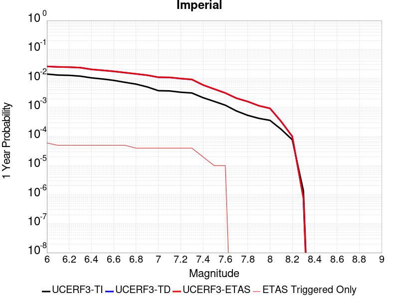 |  |

| Magnitude | 1 wk TI Prob | 1 wk TD Prob | 1 wk ETAS Prob | 1 wk ETAS/TD Gain | 1 wk ETAS Triggered Only | 1 mo TI Prob | 1 mo TD Prob | 1 mo ETAS Prob | 1 mo ETAS/TD Gain | 1 mo ETAS Triggered Only | 1 yr TI Prob | 1 yr TD Prob | 1 yr ETAS Prob | 1 yr ETAS/TD Gain | 1 yr ETAS Triggered Only | 10 yr TI Prob | 10 yr TD Prob | 10 yr ETAS Prob | 10 yr ETAS/TD Gain | 10 yr ETAS Triggered Only |
|-----|-----|-----|-----|-----|-----|-----|-----|-----|-----|-----|-----|-----|-----|-----|-----|-----|-----|-----|-----|-----|
| 6.0 | 2.7496446E-4 | 5.055345E-4 | 5.2552443E-4 | 1.0395421 | 2.0E-5 | 0.0011778869 | 0.002164817 | 0.0022047304 | 1.0184373 | 4.0E-5 | 0.0142467655 | 0.026048409 | 0.026106847 | 1.0022434 | 6.0E-5 | 0.13367249 | 0.22807029 | 0.22814748 | 1.0003384 | 1.0E-4 |
| 6.1 | 2.5356023E-4 | 4.8657708E-4 | 5.0656736E-4 | 1.0410835 | 2.0E-5 | 0.001086234 | 0.002083702 | 0.0021136396 | 1.0143675 | 3.0E-5 | 0.013144928 | 0.02507094 | 0.025119685 | 1.0019443 | 5.0E-5 | 0.123940155 | 0.21949561 | 0.21956587 | 1.0003201 | 9.0E-5 |
| 6.2 | 2.4820742E-4 | 4.775311E-4 | 4.9752154E-4 | 1.0418621 | 2.0E-5 | 0.0010633124 | 0.0020449946 | 0.0020749334 | 1.01464 | 3.0E-5 | 0.01286919 | 0.024610676 | 0.024659446 | 1.0019816 | 5.0E-5 | 0.12148927 | 0.21600136 | 0.2160641 | 1.0002904 | 8.0E-5 |
| 6.3 | 2.3205351E-4 | 4.5892023E-4 | 4.7891107E-4 | 1.0435605 | 2.0E-5 | 9.94136E-4 | 0.0019653554 | 0.0019952965 | 1.0152345 | 3.0E-5 | 0.012036599 | 0.023661187 | 0.023710003 | 1.0020632 | 5.0E-5 | 0.11405133 | 0.20793827 | 0.20800163 | 1.0003047 | 8.0E-5 |
| 6.4 | 2.0304754E-4 | 3.9878016E-4 | 4.1877216E-4 | 1.050133 | 2.0E-5 | 8.6991355E-4 | 0.0017079529 | 0.0017379017 | 1.0175349 | 3.0E-5 | 0.010539869 | 0.020595418 | 0.02064439 | 1.0023777 | 5.0E-5 | 0.100537635 | 0.18507113 | 0.18513632 | 1.0003523 | 8.0E-5 |
| 6.5 | 1.854992E-4 | 3.6990462E-4 | 3.8989724E-4 | 1.054048 | 2.0E-5 | 7.9475436E-4 | 0.0015843548 | 0.0016143072 | 1.0189052 | 3.0E-5 | 0.009633281 | 0.01911443 | 0.019163473 | 1.0025659 | 5.0E-5 | 0.0922623 | 0.1733039 | 0.17337003 | 1.0003816 | 8.0E-5 |
| 6.6 | 1.6586106E-4 | 3.4036173E-4 | 3.6035493E-4 | 1.058741 | 2.0E-5 | 7.106394E-4 | 0.0014578878 | 0.0014878442 | 1.0205477 | 3.0E-5 | 0.008617763 | 0.017607626 | 0.017656744 | 1.0027897 | 5.0E-5 | 0.08291132 | 0.16078055 | 0.16084768 | 1.0004176 | 8.0E-5 |
| 6.7 | 1.4224656E-4 | 3.076812E-4 | 3.2767505E-4 | 1.0649823 | 2.0E-5 | 6.094856E-4 | 0.0013179756 | 0.001347936 | 1.0227321 | 3.0E-5 | 0.0073952693 | 0.015928522 | 0.015977725 | 1.0030891 | 5.0E-5 | 0.07153955 | 0.14648798 | 0.14655626 | 1.0004661 | 8.0E-5 |
| 6.8 | 1.2317259E-4 | 2.779231E-4 | 2.9791755E-4 | 1.0719423 | 2.0E-5 | 5.2777573E-4 | 0.0011905615 | 0.0012205257 | 1.0251682 | 3.0E-5 | 0.0064067547 | 0.014400131 | 0.014439555 | 1.0027378 | 4.0E-5 | 0.06225166 | 0.13294089 | 0.13300158 | 1.0004566 | 7.0E-5 |
| 6.9 | 9.859898E-5 | 2.5015484E-4 | 2.7014982E-4 | 1.0799305 | 2.0E-5 | 4.2249862E-4 | 0.0010716559 | 0.0011016238 | 1.0279641 | 3.0E-5 | 0.0051317946 | 0.012970319 | 0.0130098 | 1.003044 | 4.0E-5 | 0.05014893 | 0.119408876 | 0.119470514 | 1.0005162 | 7.0E-5 |
| 7.0 | 7.3191884E-5 | 2.1267848E-4 | 2.3267423E-4 | 1.0940187 | 2.0E-5 | 3.136418E-4 | 9.11164E-4 | 9.411367E-4 | 1.032895 | 3.0E-5 | 0.003811904 | 0.011037681 | 0.011077239 | 1.0035839 | 4.0E-5 | 0.037471764 | 0.10206756 | 0.10213042 | 1.0006158 | 7.0E-5 |
| 7.1 | 7.1760296E-5 | 2.0969207E-4 | 2.2968788E-4 | 1.0953579 | 2.0E-5 | 3.0750787E-4 | 8.9837395E-4 | 9.28347E-4 | 1.0333637 | 3.0E-5 | 0.003737482 | 0.010883528 | 0.010923092 | 1.0036353 | 4.0E-5 | 0.03675245 | 0.10070406 | 0.10076701 | 1.0006251 | 7.0E-5 |
| 7.2 | 6.46614E-5 | 1.9137723E-4 | 2.113734E-4 | 1.1044856 | 2.0E-5 | 2.7709085E-4 | 8.199333E-4 | 8.4990874E-4 | 1.0365584 | 3.0E-5 | 0.0033683628 | 0.009937617 | 0.00997722 | 1.0039852 | 4.0E-5 | 0.033177625 | 0.092511006 | 0.09257453 | 1.0006866 | 7.0E-5 |
| 7.3 | 6.088115E-5 | 1.780939E-4 | 1.9809033E-4 | 1.1122802 | 2.0E-5 | 2.6089314E-4 | 7.6303916E-4 | 7.930163E-4 | 1.0392865 | 3.0E-5 | 0.0031717476 | 0.009251006 | 0.009290636 | 1.0042839 | 4.0E-5 | 0.031268585 | 0.08656135 | 0.08662529 | 1.0007386 | 7.0E-5 |
| 7.4 | 4.199346E-5 | 1.1511097E-4 | 1.2510981E-4 | 1.0868627 | 1.0E-5 | 1.7995955E-4 | 4.932403E-4 | 5.1323045E-4 | 1.0405282 | 2.0E-5 | 0.0021888057 | 0.005988835 | 0.0060087154 | 1.0033195 | 2.0E-5 | 0.02167372 | 0.05744024 | 0.057477944 | 1.0006564 | 4.0E-5 |
| 7.5 | 3.130448E-5 | 8.333871E-5 | 9.3337876E-5 | 1.1199822 | 1.0E-5 | 1.3415517E-4 | 3.5711733E-4 | 3.6711377E-4 | 1.027992 | 1.0E-5 | 0.0016321153 | 0.0043392954 | 0.0043492517 | 1.0022945 | 1.0E-5 | 0.016201803 | 0.042133506 | 0.04215266 | 1.0004547 | 2.0E-5 |
| 7.6 | 2.3074248E-5 | 6.0849357E-5 | 7.084875E-5 | 1.1643302 | 1.0E-5 | 9.888588E-5 | 2.6075702E-4 | 2.7075442E-4 | 1.0383399 | 1.0E-5 | 0.0012032706 | 0.0031701182 | 0.0031800866 | 1.0031445 | 1.0E-5 | 0.011967761 | 0.03102816 | 0.03104754 | 1.0006245 | 2.0E-5 |
| 7.7 | 1.45864815E-5 | 4.0128452E-5 | 4.0128452E-5 | 1.0 | 0.0 | 6.2511994E-5 | 1.7196777E-4 | 1.7196777E-4 | 1.0 | 0.0 | 7.608177E-4 | 0.0020917025 | 0.0020917025 | 1.0 | 0.0 | 0.007582182 | 0.02062909 | 0.020638883 | 1.0004748 | 1.0E-5 |
| 7.8 | 1.0352979E-5 | 3.096395E-5 | 3.096395E-5 | 1.0 | 0.0 | 4.4369157E-5 | 1.326959E-4 | 1.326959E-4 | 1.0 | 0.0 | 5.400606E-4 | 0.0016143778 | 0.0016143778 | 1.0 | 0.0 | 0.0053875 | 0.016017893 | 0.016027732 | 1.0006143 | 1.0E-5 |
| 7.9 | 8.137906E-6 | 2.2151205E-5 | 2.2151205E-5 | 1.0 | 0.0 | 3.4876273E-5 | 9.493029E-5 | 9.493029E-5 | 1.0 | 0.0 | 4.2453592E-4 | 0.0011551644 | 0.0011551644 | 1.0 | 0.0 | 0.004237258 | 0.011618842 | 0.0116287265 | 1.0008507 | 1.0E-5 |
| 8.0 | 6.93792E-6 | 1.8010365E-5 | 1.8010365E-5 | 1.0 | 0.0 | 2.9733603E-5 | 7.7185E-5 | 7.7185E-5 | 1.0 | 0.0 | 3.6194647E-4 | 9.3932304E-4 | 9.3932304E-4 | 1.0 | 0.0 | 0.0036135751 | 0.009502415 | 0.00951232 | 1.0010424 | 1.0E-5 |
| 8.1 | 3.4286315E-6 | 6.380179E-6 | 6.380179E-6 | 1.0 | 0.0 | 1.4694053E-5 | 2.734334E-5 | 2.734334E-5 | 1.0 | 0.0 | 1.7888541E-4 | 3.3285443E-4 | 3.3285443E-4 | 1.0 | 0.0 | 0.0017874148 | 0.0034863674 | 0.0034963326 | 1.0028583 | 1.0E-5 |
| 8.2 | 1.4906886E-6 | 1.936633E-6 | 1.936633E-6 | 1.0 | 0.0 | 6.3886496E-6 | 8.2998295E-6 | 8.2998295E-6 | 1.0 | 0.0 | 7.7779034E-5 | 1.0104576E-4 | 1.0104576E-4 | 1.0 | 0.0 | 7.775182E-4 | 0.0011075423 | 0.0011075423 | 1.0 | 0.0 |
| 8.3 | 2.5758007E-8 | 1.4495866E-8 | 1.4495866E-8 | 1.0 | 0.0 | 1.10391454E-7 | 6.212514E-8 | 6.212514E-8 | 1.0 | 0.0 | 1.3440151E-6 | 7.563736E-7 | 7.563736E-7 | 1.0 | 0.0 | 1.344007E-5 | 7.884359E-6 | 7.884359E-6 | 1.0 | 0.0 |

## Elysian Park (Upper)
*[(top)](#table-of-contents)*

| 1 Week | 1 Month | 1 Year | 10 Year |
|-----|-----|-----|-----|
|  |  | 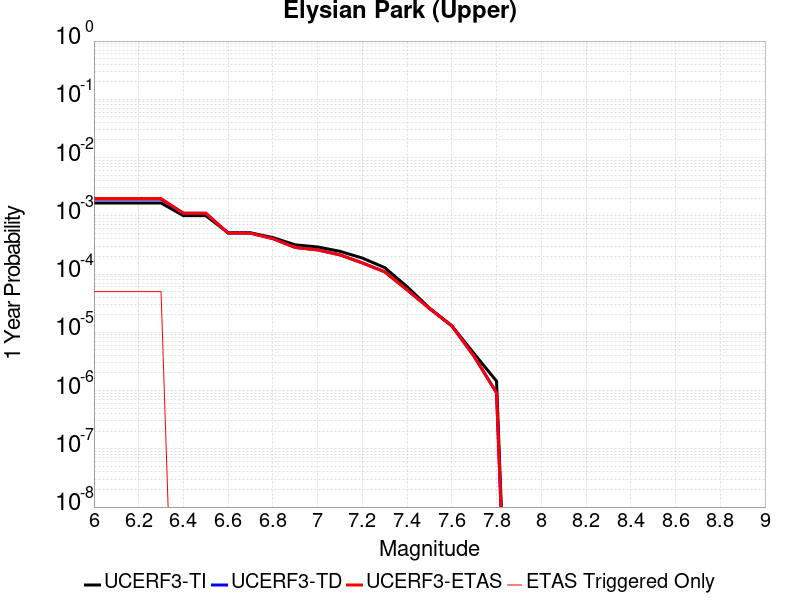 |  |

| Magnitude | 1 wk TI Prob | 1 wk TD Prob | 1 wk ETAS Prob | 1 wk ETAS/TD Gain | 1 wk ETAS Triggered Only | 1 mo TI Prob | 1 mo TD Prob | 1 mo ETAS Prob | 1 mo ETAS/TD Gain | 1 mo ETAS Triggered Only | 1 yr TI Prob | 1 yr TD Prob | 1 yr ETAS Prob | 1 yr ETAS/TD Gain | 1 yr ETAS Triggered Only | 10 yr TI Prob | 10 yr TD Prob | 10 yr ETAS Prob | 10 yr ETAS/TD Gain | 10 yr ETAS Triggered Only |
|-----|-----|-----|-----|-----|-----|-----|-----|-----|-----|-----|-----|-----|-----|-----|-----|-----|-----|-----|-----|-----|
| 6.0 | 3.1876025E-5 | 3.7035275E-5 | 4.7034904E-5 | 1.2700028 | 1.0E-5 | 1.3660437E-4 | 1.5871569E-4 | 1.7871251E-4 | 1.1259915 | 2.0E-5 | 0.0016618895 | 0.001931122 | 0.0019810256 | 1.0258417 | 5.0E-5 | 0.016495159 | 0.019189863 | 0.019278135 | 1.0045999 | 9.0E-5 |
| 6.1 | 3.1876025E-5 | 3.7035275E-5 | 4.7034904E-5 | 1.2700028 | 1.0E-5 | 1.3660437E-4 | 1.5871569E-4 | 1.7871251E-4 | 1.1259915 | 2.0E-5 | 0.0016618895 | 0.001931122 | 0.0019810256 | 1.0258417 | 5.0E-5 | 0.016495159 | 0.019189863 | 0.019278135 | 1.0045999 | 9.0E-5 |
| 6.2 | 3.1876025E-5 | 3.7035275E-5 | 4.7034904E-5 | 1.2700028 | 1.0E-5 | 1.3660437E-4 | 1.5871569E-4 | 1.7871251E-4 | 1.1259915 | 2.0E-5 | 0.0016618895 | 0.001931122 | 0.0019810256 | 1.0258417 | 5.0E-5 | 0.016495159 | 0.019189863 | 0.019278135 | 1.0045999 | 9.0E-5 |
| 6.3 | 3.1876025E-5 | 3.7035275E-5 | 4.7034904E-5 | 1.2700028 | 1.0E-5 | 1.3660437E-4 | 1.5871569E-4 | 1.7871251E-4 | 1.1259915 | 2.0E-5 | 0.0016618895 | 0.001931122 | 0.0019810256 | 1.0258417 | 5.0E-5 | 0.016495159 | 0.019189863 | 0.019278135 | 1.0045999 | 9.0E-5 |
| 6.4 | 1.9273462E-5 | 2.120244E-5 | 2.120244E-5 | 1.0 | 0.0 | 8.259794E-5 | 9.086542E-5 | 9.086542E-5 | 1.0 | 0.0 | 0.001005166 | 0.0011058967 | 0.0011058967 | 1.0 | 0.0 | 0.010006315 | 0.011020744 | 0.011030634 | 1.0008974 | 1.0E-5 |
| 6.5 | 1.9273462E-5 | 2.120244E-5 | 2.120244E-5 | 1.0 | 0.0 | 8.259794E-5 | 9.086542E-5 | 9.086542E-5 | 1.0 | 0.0 | 0.001005166 | 0.0011058967 | 0.0011058967 | 1.0 | 0.0 | 0.010006315 | 0.011020744 | 0.011030634 | 1.0008974 | 1.0E-5 |
| 6.6 | 9.813258E-6 | 9.665589E-6 | 9.665589E-6 | 1.0 | 0.0 | 4.205614E-5 | 4.1423333E-5 | 4.1423333E-5 | 1.0 | 0.0 | 5.119132E-4 | 5.042196E-4 | 5.042196E-4 | 1.0 | 0.0 | 0.005107356 | 0.0050314795 | 0.0050414293 | 1.0019774 | 1.0E-5 |
| 6.7 | 9.801478E-6 | 9.653158E-6 | 9.653158E-6 | 1.0 | 0.0 | 4.2005657E-5 | 4.137006E-5 | 4.137006E-5 | 1.0 | 0.0 | 5.112989E-4 | 5.0357135E-4 | 5.0357135E-4 | 1.0 | 0.0 | 0.0051012407 | 0.005025026 | 0.0050349757 | 1.0019801 | 1.0E-5 |
| 6.8 | 8.102489E-6 | 7.772994E-6 | 7.772994E-6 | 1.0 | 0.0 | 3.4724493E-5 | 3.3312434E-5 | 3.3312434E-5 | 1.0 | 0.0 | 4.2268867E-4 | 4.0550836E-4 | 4.0550836E-4 | 1.0 | 0.0 | 0.004218856 | 0.0040481784 | 0.0040581375 | 1.0024602 | 1.0E-5 |
| 6.9 | 6.08275E-6 | 5.481441E-6 | 5.481441E-6 | 1.0 | 0.0 | 2.6068668E-5 | 2.3491682E-5 | 2.3491682E-5 | 1.0 | 0.0 | 3.173398E-4 | 2.8597447E-4 | 2.8597447E-4 | 1.0 | 0.0 | 0.0031688702 | 0.0028561424 | 0.0028561424 | 1.0 | 0.0 |
| 7.0 | 5.5995934E-6 | 4.9827686E-6 | 4.9827686E-6 | 1.0 | 0.0 | 2.3998036E-5 | 2.1354552E-5 | 2.1354552E-5 | 1.0 | 0.0 | 2.9213692E-4 | 2.5996132E-4 | 2.5996132E-4 | 1.0 | 0.0 | 0.0029175316 | 0.0025966396 | 0.0025966396 | 1.0 | 0.0 |
| 7.1 | 4.709881E-6 | 4.0873906E-6 | 4.0873906E-6 | 1.0 | 0.0 | 2.0185047E-5 | 1.7517272E-5 | 1.7517272E-5 | 1.0 | 0.0 | 2.4572524E-4 | 2.1325232E-4 | 2.1325232E-4 | 1.0 | 0.0 | 0.002454537 | 0.0021305184 | 0.0021305184 | 1.0 | 0.0 |
| 7.2 | 3.6063436E-6 | 2.9779412E-6 | 2.9779412E-6 | 1.0 | 0.0 | 1.5455667E-5 | 1.27625435E-5 | 1.27625435E-5 | 1.0 | 0.0 | 1.881565E-4 | 1.55373E-4 | 1.55373E-4 | 1.0 | 0.0 | 0.0018799726 | 0.0015526549 | 0.0015526549 | 1.0 | 0.0 |
| 7.3 | 2.471135E-6 | 2.0954562E-6 | 2.0954562E-6 | 1.0 | 0.0 | 1.0590536E-5 | 8.980496E-6 | 8.980496E-6 | 1.0 | 0.0 | 1.2893214E-4 | 1.0933213E-4 | 1.0933213E-4 | 1.0 | 0.0 | 0.0012885736 | 0.0010927906 | 0.0010927906 | 1.0 | 0.0 |
| 7.4 | 1.163943E-6 | 1.0275061E-6 | 1.0275061E-6 | 1.0 | 0.0 | 4.988318E-6 | 4.40359E-6 | 4.40359E-6 | 1.0 | 0.0 | 6.0731076E-5 | 5.361242E-5 | 5.361242E-5 | 1.0 | 0.0 | 6.071448E-4 | 5.3599785E-4 | 5.3599785E-4 | 1.0 | 0.0 |
| 7.5 | 4.99459E-7 | 4.917601E-7 | 4.917601E-7 | 1.0 | 0.0 | 2.140537E-6 | 2.1075416E-6 | 2.1075416E-6 | 1.0 | 0.0 | 2.6060725E-5 | 2.5659032E-5 | 2.5659032E-5 | 1.0 | 0.0 | 2.605767E-4 | 2.5656226E-4 | 2.5656226E-4 | 1.0 | 0.0 |
| 7.6 | 2.4667852E-7 | 2.4778313E-7 | 2.4778313E-7 | 1.0 | 0.0 | 1.0571932E-6 | 1.0619274E-6 | 1.0619274E-6 | 1.0 | 0.0 | 1.2871251E-5 | 1.2928893E-5 | 1.2928893E-5 | 1.0 | 0.0 | 1.2870505E-4 | 1.2928178E-4 | 1.2928178E-4 | 1.0 | 0.0 |
| 7.7 | 8.2312795E-8 | 7.3864214E-8 | 7.3864214E-8 | 1.0 | 0.0 | 3.527691E-7 | 3.165609E-7 | 3.165609E-7 | 1.0 | 0.0 | 4.294955E-6 | 3.854123E-6 | 3.854123E-6 | 1.0 | 0.0 | 4.2948723E-5 | 3.854068E-5 | 3.854068E-5 | 1.0 | 0.0 |
| 7.8 | 2.7819295E-8 | 1.7565618E-8 | 1.7565618E-8 | 1.0 | 0.0 | 1.1922555E-7 | 7.528122E-8 | 7.528122E-8 | 1.0 | 0.0 | 1.45157E-6 | 9.1654863E-7 | 9.1654863E-7 | 1.0 | 0.0 | 1.45156055E-5 | 9.165463E-6 | 9.165463E-6 | 1.0 | 0.0 |

## Cleghorn
*[(top)](#table-of-contents)*

| 1 Week | 1 Month | 1 Year | 10 Year |
|-----|-----|-----|-----|
|  | 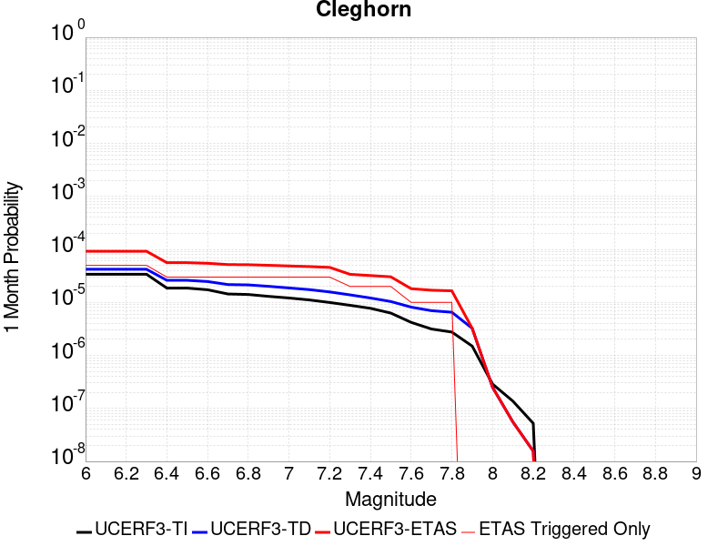 |  |  |

| Magnitude | 1 wk TI Prob | 1 wk TD Prob | 1 wk ETAS Prob | 1 wk ETAS/TD Gain | 1 wk ETAS Triggered Only | 1 mo TI Prob | 1 mo TD Prob | 1 mo ETAS Prob | 1 mo ETAS/TD Gain | 1 mo ETAS Triggered Only | 1 yr TI Prob | 1 yr TD Prob | 1 yr ETAS Prob | 1 yr ETAS/TD Gain | 1 yr ETAS Triggered Only | 10 yr TI Prob | 10 yr TD Prob | 10 yr ETAS Prob | 10 yr ETAS/TD Gain | 10 yr ETAS Triggered Only |
|-----|-----|-----|-----|-----|-----|-----|-----|-----|-----|-----|-----|-----|-----|-----|-----|-----|-----|-----|-----|-----|
| 6.0 | 7.9267165E-6 | 9.831764E-6 | 2.9831568E-5 | 3.0342028 | 2.0E-5 | 3.39712E-5 | 4.2135514E-5 | 9.213341E-5 | 2.1865976 | 5.0E-5 | 4.1352084E-4 | 5.1288976E-4 | 5.928487E-4 | 1.1558989 | 8.0E-5 | 0.004127522 | 0.005132214 | 0.0052217524 | 1.0174463 | 9.0E-5 |
| 6.1 | 7.9267165E-6 | 9.831764E-6 | 2.9831568E-5 | 3.0342028 | 2.0E-5 | 3.39712E-5 | 4.2135514E-5 | 9.213341E-5 | 2.1865976 | 5.0E-5 | 4.1352084E-4 | 5.1288976E-4 | 5.928487E-4 | 1.1558989 | 8.0E-5 | 0.004127522 | 0.005132214 | 0.0052217524 | 1.0174463 | 9.0E-5 |
| 6.2 | 7.9267165E-6 | 9.831764E-6 | 2.9831568E-5 | 3.0342028 | 2.0E-5 | 3.39712E-5 | 4.2135514E-5 | 9.213341E-5 | 2.1865976 | 5.0E-5 | 4.1352084E-4 | 5.1288976E-4 | 5.928487E-4 | 1.1558989 | 8.0E-5 | 0.004127522 | 0.005132214 | 0.0052217524 | 1.0174463 | 9.0E-5 |
| 6.3 | 7.9267165E-6 | 9.831764E-6 | 2.9831568E-5 | 3.0342028 | 2.0E-5 | 3.39712E-5 | 4.2135514E-5 | 9.213341E-5 | 2.1865976 | 5.0E-5 | 4.1352084E-4 | 5.1288976E-4 | 5.928487E-4 | 1.1558989 | 8.0E-5 | 0.004127522 | 0.005132214 | 0.0052217524 | 1.0174463 | 9.0E-5 |
| 6.4 | 4.3445207E-6 | 6.0916254E-6 | 2.6091504E-5 | 4.283176 | 2.0E-5 | 1.8619241E-5 | 2.6106709E-5 | 5.6105928E-5 | 2.1490998 | 3.0E-5 | 2.2666567E-4 | 3.1780385E-4 | 3.4779432E-4 | 1.0943679 | 3.0E-5 | 0.0022643462 | 0.0031877246 | 0.003217629 | 1.009381 | 3.0E-5 |
| 6.5 | 4.3445207E-6 | 6.0916254E-6 | 2.6091504E-5 | 4.283176 | 2.0E-5 | 1.8619241E-5 | 2.6106709E-5 | 5.6105928E-5 | 2.1490998 | 3.0E-5 | 2.2666567E-4 | 3.1780385E-4 | 3.4779432E-4 | 1.0943679 | 3.0E-5 | 0.0022643462 | 0.0031877246 | 0.003217629 | 1.009381 | 3.0E-5 |
| 6.6 | 4.040109E-6 | 5.774033E-6 | 2.5773918E-5 | 4.463763 | 2.0E-5 | 1.7314638E-5 | 2.4745626E-5 | 5.4744884E-5 | 2.2123055 | 3.0E-5 | 2.1078532E-4 | 3.0123728E-4 | 3.3122825E-4 | 1.0995593 | 3.0E-5 | 0.002105855 | 0.0030225143 | 0.0030524237 | 1.0098956 | 3.0E-5 |
| 6.7 | 3.3632055E-6 | 5.06753E-6 | 2.506743E-5 | 4.9466763 | 2.0E-5 | 1.4413658E-5 | 2.1717806E-5 | 5.1717154E-5 | 2.381325 | 3.0E-5 | 1.7547216E-4 | 2.643825E-4 | 2.943746E-4 | 1.113442 | 3.0E-5 | 0.0017533366 | 0.0026548486 | 0.002684769 | 1.01127 | 3.0E-5 |
| 6.8 | 3.2902772E-6 | 4.9894375E-6 | 2.4989338E-5 | 5.008448 | 2.0E-5 | 1.4101111E-5 | 2.138313E-5 | 5.138249E-5 | 2.402945 | 3.0E-5 | 1.716675E-4 | 2.6030882E-4 | 2.9030102E-4 | 1.1152177 | 3.0E-5 | 0.0017153495 | 0.0026142076 | 0.002644129 | 1.0114458 | 3.0E-5 |
| 6.9 | 3.031547E-6 | 4.6911987E-6 | 2.4691104E-5 | 5.263283 | 2.0E-5 | 1.299228E-5 | 2.0104984E-5 | 5.010438E-5 | 2.4921372 | 3.0E-5 | 1.5816953E-4 | 2.4475096E-4 | 2.7474362E-4 | 1.1225436 | 3.0E-5 | 0.00158057 | 0.0024589805 | 0.0024889067 | 1.0121702 | 3.0E-5 |
| 7.0 | 2.8259715E-6 | 4.3707637E-6 | 2.4370676E-5 | 5.575839 | 2.0E-5 | 1.211125E-5 | 1.8731711E-5 | 4.8731148E-5 | 2.6015322 | 3.0E-5 | 1.4744449E-4 | 2.2803496E-4 | 2.5802813E-4 | 1.1315287 | 3.0E-5 | 0.001473467 | 0.0022921748 | 0.002322106 | 1.0130581 | 3.0E-5 |
| 7.1 | 2.5962665E-6 | 4.065983E-6 | 2.4065901E-5 | 5.91884 | 2.0E-5 | 1.1126809E-5 | 1.7425526E-5 | 4.7425005E-5 | 2.7215824 | 3.0E-5 | 1.3546048E-4 | 2.1213535E-4 | 2.4212898E-4 | 1.1413891 | 3.0E-5 | 0.0013537793 | 0.0021334959 | 0.0021634318 | 1.0140314 | 3.0E-5 |
| 7.2 | 2.3247253E-6 | 3.6765352E-6 | 2.3676463E-5 | 6.439884 | 2.0E-5 | 9.96307E-6 | 1.5756486E-5 | 4.5756013E-5 | 2.9039478 | 3.0E-5 | 1.21293626E-4 | 1.9181852E-4 | 2.2181276E-4 | 1.1563678 | 3.0E-5 | 0.0012122744 | 0.0019307166 | 0.0019606587 | 1.0155083 | 3.0E-5 |
| 7.3 | 2.056928E-6 | 3.235253E-6 | 1.3235221E-5 | 4.0909386 | 1.0E-5 | 8.815376E-6 | 1.3865297E-5 | 3.386502E-5 | 2.4424303 | 2.0E-5 | 1.0732192E-4 | 1.6879707E-4 | 1.887937E-4 | 1.1184654 | 2.0E-5 | 0.001072701 | 0.0017009423 | 0.0017209083 | 1.0117382 | 2.0E-5 |
| 7.4 | 1.8055999E-6 | 2.8256538E-6 | 1.2825625E-5 | 4.538994 | 1.0E-5 | 7.738263E-6 | 1.210989E-5 | 3.210965E-5 | 2.6515226 | 2.0E-5 | 9.4209274E-5 | 1.4742807E-4 | 1.6742513E-4 | 1.1356394 | 2.0E-5 | 9.4169343E-4 | 0.0014876705 | 0.0015076407 | 1.0134238 | 2.0E-5 |
| 7.5 | 1.4683443E-6 | 2.4248943E-6 | 1.242487E-5 | 5.123881 | 1.0E-5 | 6.292889E-6 | 1.0392363E-5 | 3.0392155E-5 | 2.92447 | 2.0E-5 | 7.661323E-5 | 1.2651978E-4 | 1.4651724E-4 | 1.158058 | 2.0E-5 | 7.658682E-4 | 0.0012788812 | 0.0012988556 | 1.0156187 | 2.0E-5 |
| 7.6 | 9.804088E-7 | 1.9004091E-6 | 1.190039E-5 | 6.262015 | 1.0E-5 | 4.201745E-6 | 8.144585E-6 | 1.8144503E-5 | 2.2277997 | 1.0E-5 | 5.1155046E-5 | 9.915586E-5 | 1.0915487E-4 | 1.1008413 | 1.0E-5 | 5.114327E-4 | 0.0010055583 | 0.0010155482 | 1.0099348 | 1.0E-5 |
| 7.7 | 7.3434086E-7 | 1.6285549E-6 | 1.1628538E-5 | 7.1404033 | 1.0E-5 | 3.1471714E-6 | 6.9795024E-6 | 1.6979433E-5 | 2.432757 | 1.0E-5 | 3.831614E-5 | 8.4972155E-5 | 9.497131E-5 | 1.1176757 | 1.0E-5 | 3.8309532E-4 | 8.6387293E-4 | 8.738643E-4 | 1.0115658 | 1.0E-5 |
| 7.8 | 6.434184E-7 | 1.5221389E-6 | 1.1522124E-5 | 7.569693 | 1.0E-5 | 2.7575045E-6 | 6.523436E-6 | 1.652337E-5 | 2.5329244 | 1.0E-5 | 3.35721E-5 | 7.9419966E-5 | 8.941917E-5 | 1.1259029 | 1.0E-5 | 3.3567028E-4 | 8.080443E-4 | 8.180362E-4 | 1.0123656 | 1.0E-5 |
| 7.9 | 3.4943926E-7 | 7.5750586E-7 | 7.5750586E-7 | 1.0 | 0.0 | 1.497596E-6 | 3.2464498E-6 | 3.2464498E-6 | 1.0 | 0.0 | 1.8233079E-5 | 3.9524817E-5 | 3.9524817E-5 | 1.0 | 0.0 | 1.8231584E-4 | 4.0401975E-4 | 4.0401975E-4 | 1.0 | 0.0 |
| 8.0 | 6.717524E-8 | 5.837515E-8 | 5.837515E-8 | 1.0 | 0.0 | 2.8789387E-7 | 2.501792E-7 | 2.501792E-7 | 1.0 | 0.0 | 3.505102E-6 | 3.0459275E-6 | 3.0459275E-6 | 1.0 | 0.0 | 3.5050467E-5 | 3.2751934E-5 | 3.2751934E-5 | 1.0 | 0.0 |
| 8.1 | 3.1984914E-8 | 1.2949885E-8 | 1.2949885E-8 | 1.0 | 0.0 | 1.370782E-7 | 5.549951E-8 | 5.549951E-8 | 1.0 | 0.0 | 1.6689258E-6 | 6.757063E-7 | 6.757063E-7 | 1.0 | 0.0 | 1.6689133E-5 | 7.741151E-6 | 7.741151E-6 | 1.0 | 0.0 |
| 8.2 | 1.21887656E-8 | 3.6471115E-9 | 3.6471115E-9 | 1.0 | 0.0 | 5.2237567E-8 | 1.563048E-8 | 1.563048E-8 | 1.0 | 0.0 | 6.359922E-7 | 1.9030107E-7 | 1.9030107E-7 | 1.0 | 0.0 | 6.3599036E-6 | 2.245849E-6 | 2.245849E-6 | 1.0 | 0.0 |

## Pinto Mtn
*[(top)](#table-of-contents)*

| 1 Week | 1 Month | 1 Year | 10 Year |
|-----|-----|-----|-----|
| 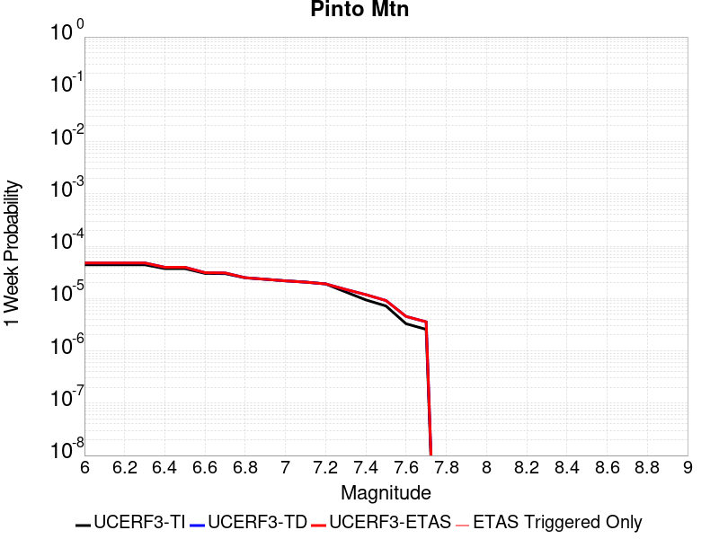 |  |  |  |

| Magnitude | 1 wk TI Prob | 1 wk TD Prob | 1 wk ETAS Prob | 1 wk ETAS/TD Gain | 1 wk ETAS Triggered Only | 1 mo TI Prob | 1 mo TD Prob | 1 mo ETAS Prob | 1 mo ETAS/TD Gain | 1 mo ETAS Triggered Only | 1 yr TI Prob | 1 yr TD Prob | 1 yr ETAS Prob | 1 yr ETAS/TD Gain | 1 yr ETAS Triggered Only | 10 yr TI Prob | 10 yr TD Prob | 10 yr ETAS Prob | 10 yr ETAS/TD Gain | 10 yr ETAS Triggered Only |
|-----|-----|-----|-----|-----|-----|-----|-----|-----|-----|-----|-----|-----|-----|-----|-----|-----|-----|-----|-----|-----|
| 6.0 | 4.4194956E-5 | 4.7853926E-5 | 4.7853926E-5 | 1.0 | 0.0 | 1.893932E-4 | 2.0507304E-4 | 2.0507304E-4 | 1.0 | 0.0 | 0.0023034236 | 0.0024940688 | 0.0025239938 | 1.0119985 | 3.0E-5 | 0.022796938 | 0.024678305 | 0.024756331 | 1.0031617 | 8.0E-5 |
| 6.1 | 4.4194956E-5 | 4.7853926E-5 | 4.7853926E-5 | 1.0 | 0.0 | 1.893932E-4 | 2.0507304E-4 | 2.0507304E-4 | 1.0 | 0.0 | 0.0023034236 | 0.0024940688 | 0.0025239938 | 1.0119985 | 3.0E-5 | 0.022796938 | 0.024678305 | 0.024756331 | 1.0031617 | 8.0E-5 |
| 6.2 | 4.4194956E-5 | 4.7853926E-5 | 4.7853926E-5 | 1.0 | 0.0 | 1.893932E-4 | 2.0507304E-4 | 2.0507304E-4 | 1.0 | 0.0 | 0.0023034236 | 0.0024940688 | 0.0025239938 | 1.0119985 | 3.0E-5 | 0.022796938 | 0.024678305 | 0.024756331 | 1.0031617 | 8.0E-5 |
| 6.3 | 4.4194956E-5 | 4.7853926E-5 | 4.7853926E-5 | 1.0 | 0.0 | 1.893932E-4 | 2.0507304E-4 | 2.0507304E-4 | 1.0 | 0.0 | 0.0023034236 | 0.0024940688 | 0.0025239938 | 1.0119985 | 3.0E-5 | 0.022796938 | 0.024678305 | 0.024756331 | 1.0031617 | 8.0E-5 |
| 6.4 | 3.729929E-5 | 3.960349E-5 | 3.960349E-5 | 1.0 | 0.0 | 1.5984432E-4 | 1.6971873E-4 | 1.6971873E-4 | 1.0 | 0.0 | 0.0019443673 | 0.0020644604 | 0.0020844191 | 1.0096678 | 2.0E-5 | 0.019274427 | 0.020462848 | 0.02052162 | 1.0028721 | 6.0E-5 |
| 6.5 | 3.729929E-5 | 3.960349E-5 | 3.960349E-5 | 1.0 | 0.0 | 1.5984432E-4 | 1.6971873E-4 | 1.6971873E-4 | 1.0 | 0.0 | 0.0019443673 | 0.0020644604 | 0.0020844191 | 1.0096678 | 2.0E-5 | 0.019274427 | 0.020462848 | 0.02052162 | 1.0028721 | 6.0E-5 |
| 6.6 | 3.0204548E-5 | 3.12056E-5 | 3.12056E-5 | 1.0 | 0.0 | 1.2944164E-4 | 1.3373162E-4 | 1.3373162E-4 | 1.0 | 0.0 | 0.0015748127 | 0.0016270012 | 0.0016469687 | 1.0122726 | 2.0E-5 | 0.015636992 | 0.016154764 | 0.016203957 | 1.0030451 | 5.0E-5 |
| 6.7 | 2.9857754E-5 | 3.0814987E-5 | 3.0814987E-5 | 1.0 | 0.0 | 1.2795553E-4 | 1.3205773E-4 | 1.3205773E-4 | 1.0 | 0.0 | 0.0015567453 | 0.0016066517 | 0.0016166356 | 1.0062141 | 1.0E-5 | 0.015458848 | 0.015954204 | 0.015993565 | 1.0024672 | 4.0E-5 |
| 6.8 | 2.4819734E-5 | 2.5009665E-5 | 2.5009665E-5 | 1.0 | 0.0 | 1.0636595E-4 | 1.0718E-4 | 1.0718E-4 | 1.0 | 0.0 | 0.0012942362 | 0.001304157 | 0.001314144 | 1.0076578 | 1.0E-5 | 0.012867244 | 0.012967403 | 0.013006885 | 1.0030446 | 4.0E-5 |
| 6.9 | 2.331124E-5 | 2.3337945E-5 | 2.3337945E-5 | 1.0 | 0.0 | 9.990149E-5 | 1.0001605E-4 | 1.0001605E-4 | 1.0 | 0.0 | 0.001215622 | 0.0012170355 | 0.0012270233 | 1.0082067 | 1.0E-5 | 0.012089936 | 0.012105897 | 0.012145413 | 1.0032642 | 4.0E-5 |
| 7.0 | 2.1818534E-5 | 2.1761074E-5 | 2.1761074E-5 | 1.0 | 0.0 | 9.3504656E-5 | 9.3258524E-5 | 9.3258524E-5 | 1.0 | 0.0 | 0.0011378246 | 0.0011348509 | 0.0011448396 | 1.0088017 | 1.0E-5 | 0.011320163 | 0.01129266 | 0.011332207 | 1.0035021 | 4.0E-5 |
| 7.1 | 2.066081E-5 | 2.0540718E-5 | 2.0540718E-5 | 1.0 | 0.0 | 8.854332E-5 | 8.8028784E-5 | 8.8028784E-5 | 1.0 | 0.0 | 0.0010774818 | 0.0010712431 | 0.0010812324 | 1.0093249 | 1.0E-5 | 0.010722724 | 0.0106628435 | 0.010702417 | 1.0037113 | 4.0E-5 |
| 7.2 | 1.8990233E-5 | 1.9054001E-5 | 1.9054001E-5 | 1.0 | 0.0 | 8.138417E-5 | 8.165756E-5 | 8.165756E-5 | 1.0 | 0.0 | 9.904018E-4 | 9.937467E-4 | 0.0010037367 | 1.0100529 | 1.0E-5 | 0.009859995 | 0.009895029 | 0.009934633 | 1.0040025 | 4.0E-5 |
| 7.3 | 1.3335872E-5 | 1.4906713E-5 | 1.4906713E-5 | 1.0 | 0.0 | 5.7152483E-5 | 6.388442E-5 | 6.388442E-5 | 1.0 | 0.0 | 6.956093E-4 | 7.77528E-4 | 7.875202E-4 | 1.0128512 | 1.0E-5 | 0.006934359 | 0.007749376 | 0.0077890656 | 1.0051217 | 4.0E-5 |
| 7.4 | 9.414066E-6 | 1.186096E-5 | 1.186096E-5 | 1.0 | 0.0 | 4.0345374E-5 | 5.083175E-5 | 5.083175E-5 | 1.0 | 0.0 | 4.910942E-4 | 6.1871024E-4 | 6.2870403E-4 | 1.0161526 | 1.0E-5 | 0.0049001034 | 0.0061708256 | 0.0062105786 | 1.0064421 | 4.0E-5 |
| 7.5 | 7.2101157E-6 | 9.158192E-6 | 9.158192E-6 | 1.0 | 0.0 | 3.090013E-5 | 3.9248847E-5 | 3.9248847E-5 | 1.0 | 0.0 | 3.7614413E-4 | 4.7775774E-4 | 4.87753E-4 | 1.0209211 | 1.0E-5 | 0.0037550807 | 0.004768082 | 0.0048078913 | 1.0083491 | 4.0E-5 |
| 7.6 | 3.296375E-6 | 4.5455017E-6 | 4.5455017E-6 | 1.0 | 0.0 | 1.4127245E-5 | 1.9480583E-5 | 1.9480583E-5 | 1.0 | 0.0 | 1.7198564E-4 | 2.3715167E-4 | 2.3715167E-4 | 1.0 | 0.0 | 0.0017185259 | 0.0023691233 | 0.0023790996 | 1.004211 | 1.0E-5 |
| 7.7 | 2.5741092E-6 | 3.5844084E-6 | 3.5844084E-6 | 1.0 | 0.0 | 1.103185E-5 | 1.5361667E-5 | 1.5361667E-5 | 1.0 | 0.0 | 1.3430449E-4 | 1.8701357E-4 | 1.8701357E-4 | 1.0 | 0.0 | 0.0013422335 | 0.0018686918 | 0.0018686918 | 1.0 | 0.0 |

## Blue Cut
*[(top)](#table-of-contents)*

| 1 Week | 1 Month | 1 Year | 10 Year |
|-----|-----|-----|-----|
| 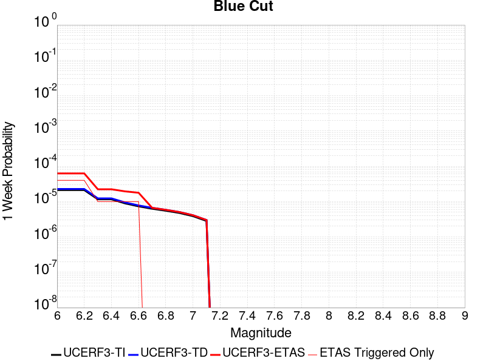 |  |  |  |

| Magnitude | 1 wk TI Prob | 1 wk TD Prob | 1 wk ETAS Prob | 1 wk ETAS/TD Gain | 1 wk ETAS Triggered Only | 1 mo TI Prob | 1 mo TD Prob | 1 mo ETAS Prob | 1 mo ETAS/TD Gain | 1 mo ETAS Triggered Only | 1 yr TI Prob | 1 yr TD Prob | 1 yr ETAS Prob | 1 yr ETAS/TD Gain | 1 yr ETAS Triggered Only | 10 yr TI Prob | 10 yr TD Prob | 10 yr ETAS Prob | 10 yr ETAS/TD Gain | 10 yr ETAS Triggered Only |
|-----|-----|-----|-----|-----|-----|-----|-----|-----|-----|-----|-----|-----|-----|-----|-----|-----|-----|-----|-----|-----|
| 6.0 | 2.1227985E-5 | 2.2719574E-5 | 6.271867E-5 | 2.7605565 | 4.0E-5 | 9.097391E-5 | 9.73663E-5 | 1.5736045E-4 | 1.6161697 | 6.0E-5 | 0.0011070445 | 0.0011848481 | 0.0012547652 | 1.0590093 | 7.0E-5 | 0.011015458 | 0.011791152 | 0.01188009 | 1.0075428 | 9.0E-5 |
| 6.1 | 2.1227985E-5 | 2.2719574E-5 | 6.271867E-5 | 2.7605565 | 4.0E-5 | 9.097391E-5 | 9.73663E-5 | 1.5736045E-4 | 1.6161697 | 6.0E-5 | 0.0011070445 | 0.0011848481 | 0.0012547652 | 1.0590093 | 7.0E-5 | 0.011015458 | 0.011791152 | 0.01188009 | 1.0075428 | 9.0E-5 |
| 6.2 | 2.1227985E-5 | 2.2719574E-5 | 6.271867E-5 | 2.7605565 | 4.0E-5 | 9.097391E-5 | 9.73663E-5 | 1.5736045E-4 | 1.6161697 | 6.0E-5 | 0.0011070445 | 0.0011848481 | 0.0012547652 | 1.0590093 | 7.0E-5 | 0.011015458 | 0.011791152 | 0.01188009 | 1.0075428 | 9.0E-5 |
| 6.3 | 1.1613981E-5 | 1.2353542E-5 | 2.2353419E-5 | 1.8094745 | 1.0E-5 | 4.9773254E-5 | 5.2942745E-5 | 7.2941686E-5 | 1.3777466 | 2.0E-5 | 6.0582085E-4 | 6.443998E-4 | 6.643869E-4 | 1.0310166 | 2.0E-5 | 0.0060417196 | 0.0064265593 | 0.0064563663 | 1.0046381 | 3.0E-5 |
| 6.4 | 1.1613981E-5 | 1.2353542E-5 | 2.2353419E-5 | 1.8094745 | 1.0E-5 | 4.9773254E-5 | 5.2942745E-5 | 7.2941686E-5 | 1.3777466 | 2.0E-5 | 6.0582085E-4 | 6.443998E-4 | 6.643869E-4 | 1.0310166 | 2.0E-5 | 0.0060417196 | 0.0064265593 | 0.0064563663 | 1.0046381 | 3.0E-5 |
| 6.5 | 8.931326E-6 | 9.4816E-6 | 1.9481506E-5 | 2.0546644 | 1.0E-5 | 3.8276554E-5 | 4.0634844E-5 | 5.063444E-5 | 1.2460842 | 1.0E-5 | 4.6591737E-4 | 4.946261E-4 | 5.0462113E-4 | 1.0202073 | 1.0E-5 | 0.0046494175 | 0.004936161 | 0.0049560624 | 1.0040318 | 2.0E-5 |
| 6.6 | 7.345353E-6 | 7.79028E-6 | 1.7790202E-5 | 2.283641 | 1.0E-5 | 3.1479703E-5 | 3.338653E-5 | 4.3386193E-5 | 1.299512 | 1.0E-5 | 3.83198E-4 | 4.064132E-4 | 4.164091E-4 | 1.0245955 | 1.0E-5 | 0.0038253788 | 0.0040574907 | 0.00407741 | 1.0049092 | 2.0E-5 |
| 6.7 | 6.2775666E-6 | 6.655149E-6 | 6.655149E-6 | 1.0 | 0.0 | 2.690358E-5 | 2.8521798E-5 | 2.8521798E-5 | 1.0 | 0.0 | 3.2750185E-4 | 3.472051E-4 | 3.472051E-4 | 1.0 | 0.0 | 0.0032701963 | 0.003467367 | 0.003467367 | 1.0 | 0.0 |
| 6.8 | 5.5234095E-6 | 5.8551113E-6 | 5.8551113E-6 | 1.0 | 0.0 | 2.367154E-5 | 2.5093133E-5 | 2.5093133E-5 | 1.0 | 0.0 | 2.8816288E-4 | 3.0547334E-4 | 3.0547334E-4 | 1.0 | 0.0 | 0.002877895 | 0.0030512505 | 0.0030512505 | 1.0 | 0.0 |
| 6.9 | 4.7780054E-6 | 5.0654203E-6 | 5.0654203E-6 | 1.0 | 0.0 | 2.0477004E-5 | 2.1708804E-5 | 2.1708804E-5 | 1.0 | 0.0 | 2.4927902E-4 | 2.642797E-4 | 2.642797E-4 | 1.0 | 0.0 | 0.0024899957 | 0.002640346 | 0.002640346 | 1.0 | 0.0 |
| 7.0 | 3.883171E-6 | 4.118487E-6 | 4.118487E-6 | 1.0 | 0.0 | 1.6642054E-5 | 1.7650578E-5 | 1.7650578E-5 | 1.0 | 0.0 | 2.0259817E-4 | 2.1488148E-4 | 2.1488148E-4 | 1.0 | 0.0 | 0.0020241356 | 0.0021474129 | 0.0021474129 | 1.0 | 0.0 |
| 7.1 | 2.8358215E-6 | 3.0097158E-6 | 3.0097158E-6 | 1.0 | 0.0 | 1.2153464E-5 | 1.2898756E-5 | 1.2898756E-5 | 1.0 | 0.0 | 1.4795837E-4 | 1.5703762E-4 | 1.5703762E-4 | 1.0 | 0.0 | 0.001478599 | 0.0015699116 | 0.0015699116 | 1.0 | 0.0 |

## Oceanic - West Huasna
*[(top)](#table-of-contents)*

| 1 Week | 1 Month | 1 Year | 10 Year |
|-----|-----|-----|-----|
| 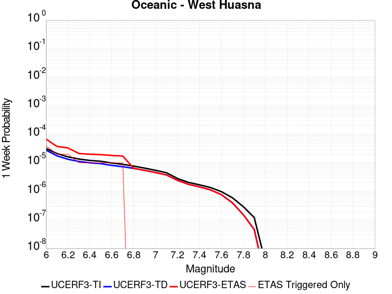 |  |  |  |

| Magnitude | 1 wk TI Prob | 1 wk TD Prob | 1 wk ETAS Prob | 1 wk ETAS/TD Gain | 1 wk ETAS Triggered Only | 1 mo TI Prob | 1 mo TD Prob | 1 mo ETAS Prob | 1 mo ETAS/TD Gain | 1 mo ETAS Triggered Only | 1 yr TI Prob | 1 yr TD Prob | 1 yr ETAS Prob | 1 yr ETAS/TD Gain | 1 yr ETAS Triggered Only | 10 yr TI Prob | 10 yr TD Prob | 10 yr ETAS Prob | 10 yr ETAS/TD Gain | 10 yr ETAS Triggered Only |
|-----|-----|-----|-----|-----|-----|-----|-----|-----|-----|-----|-----|-----|-----|-----|-----|-----|-----|-----|-----|-----|
| 6.0 | 3.195567E-5 | 2.7926368E-5 | 6.792525E-5 | 2.4322982 | 4.0E-5 | 1.3694567E-4 | 1.19679185E-4 | 1.596744E-4 | 1.3341869 | 4.0E-5 | 0.0016660384 | 0.0014561634 | 0.0015260613 | 1.0480015 | 7.0E-5 | 0.016536033 | 0.01447077 | 0.014559468 | 1.0061294 | 9.0E-5 |
| 6.1 | 2.1156782E-5 | 1.7573117E-5 | 3.7572765E-5 | 2.138082 | 2.0E-5 | 9.066878E-5 | 7.531123E-5 | 9.530973E-5 | 1.2655447 | 2.0E-5 | 0.0011033333 | 9.1653795E-4 | 9.565013E-4 | 1.0436025 | 4.0E-5 | 0.010978713 | 0.009128587 | 0.009188039 | 1.0065128 | 6.0E-5 |
| 6.2 | 1.6195117E-5 | 1.3327227E-5 | 3.332696E-5 | 2.5006673 | 2.0E-5 | 6.9405796E-5 | 5.7115452E-5 | 7.711431E-5 | 1.350148 | 2.0E-5 | 8.44688E-4 | 6.9516135E-4 | 7.251405E-4 | 1.0431254 | 3.0E-5 | 0.008414844 | 0.0069301617 | 0.006979815 | 1.0071648 | 5.0E-5 |
| 6.3 | 1.3559345E-5 | 1.1179013E-5 | 2.1178901E-5 | 1.8945234 | 1.0E-5 | 5.811018E-5 | 4.7909183E-5 | 5.7908703E-5 | 1.2087183 | 1.0E-5 | 7.072618E-4 | 5.8313913E-4 | 5.931333E-4 | 1.0171386 | 1.0E-5 | 0.0070501505 | 0.005816208 | 0.0058460333 | 1.005128 | 3.0E-5 |
| 6.4 | 1.2120619E-5 | 1.0000874E-5 | 2.0000774E-5 | 1.9999026 | 1.0E-5 | 5.1944477E-5 | 4.2860185E-5 | 5.285976E-5 | 1.2333068 | 1.0E-5 | 6.322405E-4 | 5.216983E-4 | 5.316931E-4 | 1.0191581 | 1.0E-5 | 0.006304447 | 0.005204804 | 0.0052346475 | 1.0057338 | 3.0E-5 |
| 6.5 | 1.13511915E-5 | 9.367378E-6 | 1.9367284E-5 | 2.0675244 | 1.0E-5 | 4.8647056E-5 | 4.0145293E-5 | 5.0144892E-5 | 1.2490852 | 1.0E-5 | 5.9211696E-4 | 4.886598E-4 | 4.9865484E-4 | 1.0204542 | 1.0E-5 | 0.0059054173 | 0.0048759114 | 0.004905765 | 1.0061227 | 3.0E-5 |
| 6.6 | 9.850605E-6 | 8.1353155E-6 | 1.8135233E-5 | 2.2291987 | 1.0E-5 | 4.2216197E-5 | 3.4865174E-5 | 4.4864824E-5 | 1.2868092 | 1.0E-5 | 5.1386096E-4 | 4.2440102E-4 | 4.343968E-4 | 1.0235527 | 1.0E-5 | 0.0051267436 | 0.0042359377 | 0.004265811 | 1.0070523 | 3.0E-5 |
| 6.7 | 8.8558645E-6 | 7.318341E-6 | 1.7318267E-5 | 2.36642 | 1.0E-5 | 3.7953152E-5 | 3.1363943E-5 | 4.136363E-5 | 1.3188275 | 1.0E-5 | 4.6198163E-4 | 3.8178926E-4 | 3.9178543E-4 | 1.0261824 | 1.0E-5 | 0.004610224 | 0.0038113592 | 0.003831283 | 1.0052274 | 2.0E-5 |
| 6.8 | 7.67136E-6 | 6.39169E-6 | 6.39169E-6 | 1.0 | 0.0 | 3.2876844E-5 | 2.739267E-5 | 2.739267E-5 | 1.0 | 0.0 | 4.0020206E-4 | 3.3345487E-4 | 3.3345487E-4 | 1.0 | 0.0 | 0.003994821 | 0.0033295664 | 0.0033295664 | 1.0 | 0.0 |
| 6.9 | 6.534529E-6 | 5.458261E-6 | 5.458261E-6 | 1.0 | 0.0 | 2.8004823E-5 | 2.3392338E-5 | 2.3392338E-5 | 1.0 | 0.0 | 3.4090536E-4 | 2.8476462E-4 | 2.8476462E-4 | 1.0 | 0.0 | 0.0034038287 | 0.002844014 | 0.002844014 | 1.0 | 0.0 |
| 7.0 | 5.460525E-6 | 4.5699203E-6 | 4.5699203E-6 | 1.0 | 0.0 | 2.3402039E-5 | 1.9585226E-5 | 1.9585226E-5 | 1.0 | 0.0 | 2.8488258E-4 | 2.3842414E-4 | 2.3842414E-4 | 1.0 | 0.0 | 0.0028451765 | 0.0023816973 | 0.0023816973 | 1.0 | 0.0 |
| 7.1 | 4.4825083E-6 | 3.7524153E-6 | 3.7524153E-6 | 1.0 | 0.0 | 1.9210609E-5 | 1.6081682E-5 | 1.6081682E-5 | 1.0 | 0.0 | 2.3386406E-4 | 1.9577699E-4 | 1.9577699E-4 | 1.0 | 0.0 | 0.002336181 | 0.001956057 | 0.001956057 | 1.0 | 0.0 |
| 7.2 | 2.821708E-6 | 2.424941E-6 | 2.424941E-6 | 1.0 | 0.0 | 1.2092979E-5 | 1.0392562E-5 | 1.0392562E-5 | 1.0 | 0.0 | 1.4722206E-4 | 1.265221E-4 | 1.265221E-4 | 1.0 | 0.0 | 0.0014712457 | 0.0012645032 | 0.0012645032 | 1.0 | 0.0 |
| 7.3 | 2.0644757E-6 | 1.7687502E-6 | 1.7687502E-6 | 1.0 | 0.0 | 8.847723E-6 | 7.580336E-6 | 7.580336E-6 | 1.0 | 0.0 | 1.0771569E-4 | 9.228668E-5 | 9.228668E-5 | 1.0 | 0.0 | 0.001076635 | 9.224854E-4 | 9.224854E-4 | 1.0 | 0.0 |
| 7.4 | 1.6980367E-6 | 1.4379966E-6 | 1.4379966E-6 | 1.0 | 0.0 | 7.27728E-6 | 6.1628284E-6 | 6.1628284E-6 | 1.0 | 0.0 | 8.8597284E-5 | 7.502986E-5 | 7.502986E-5 | 1.0 | 0.0 | 8.8561967E-4 | 7.5004686E-4 | 7.5004686E-4 | 1.0 | 0.0 |
| 7.5 | 1.3637683E-6 | 1.1302697E-6 | 1.1302697E-6 | 1.0 | 0.0 | 5.844708E-6 | 4.844004E-6 | 4.844004E-6 | 1.0 | 0.0 | 7.1156996E-5 | 5.897415E-5 | 5.897415E-5 | 1.0 | 0.0 | 7.1134215E-4 | 5.8958656E-4 | 5.8958656E-4 | 1.0 | 0.0 |
| 7.6 | 9.802994E-7 | 7.6772847E-7 | 7.6772847E-7 | 1.0 | 0.0 | 4.2012766E-6 | 3.2902608E-6 | 3.2902608E-6 | 1.0 | 0.0 | 5.1149345E-5 | 4.005819E-5 | 4.005819E-5 | 1.0 | 0.0 | 5.113757E-4 | 4.0051117E-4 | 4.0051117E-4 | 1.0 | 0.0 |
| 7.7 | 5.986191E-7 | 4.0050708E-7 | 4.0050708E-7 | 1.0 | 0.0 | 2.5655079E-6 | 1.7164577E-6 | 1.7164577E-6 | 1.0 | 0.0 | 3.1234613E-5 | 2.0897673E-5 | 2.0897673E-5 | 1.0 | 0.0 | 3.123022E-4 | 2.0895849E-4 | 2.0895849E-4 | 1.0 | 0.0 |
| 7.8 | 2.9189815E-7 | 1.5285202E-7 | 1.5285202E-7 | 1.0 | 0.0 | 1.2509914E-6 | 6.5507993E-7 | 6.5507993E-7 | 1.0 | 0.0 | 1.5230714E-5 | 7.975569E-6 | 7.975569E-6 | 1.0 | 0.0 | 1.522967E-4 | 7.97542E-5 | 7.97542E-5 | 1.0 | 0.0 |
| 7.9 | 1.2057845E-7 | 4.6208047E-8 | 4.6208047E-8 | 1.0 | 0.0 | 5.1676466E-7 | 1.9803447E-7 | 1.9803447E-7 | 1.0 | 0.0 | 6.2915915E-6 | 2.411067E-6 | 2.411067E-6 | 1.0 | 0.0 | 6.2914136E-5 | 2.4111772E-5 | 2.4111772E-5 | 1.0 | 0.0 |
| 8.0 | 3.3806387E-9 | 9.0093144E-10 | 9.0093144E-10 | 1.0 | 0.0 | 1.4488451E-8 | 3.8611354E-9 | 3.8611354E-9 | 1.0 | 0.0 | 1.7639688E-7 | 4.7009323E-8 | 4.7009323E-8 | 1.0 | 0.0 | 1.7639674E-6 | 4.712806E-7 | 4.712806E-7 | 1.0 | 0.0 |

## San Jacinto (Clark) rev
*[(top)](#table-of-contents)*

| 1 Week | 1 Month | 1 Year | 10 Year |
|-----|-----|-----|-----|
|  | 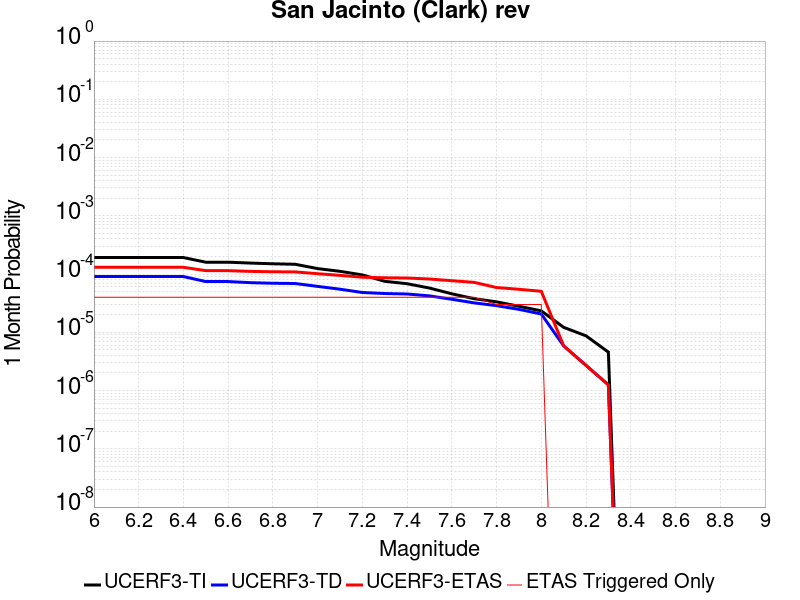 |  |  |

| Magnitude | 1 wk TI Prob | 1 wk TD Prob | 1 wk ETAS Prob | 1 wk ETAS/TD Gain | 1 wk ETAS Triggered Only | 1 mo TI Prob | 1 mo TD Prob | 1 mo ETAS Prob | 1 mo ETAS/TD Gain | 1 mo ETAS Triggered Only | 1 yr TI Prob | 1 yr TD Prob | 1 yr ETAS Prob | 1 yr ETAS/TD Gain | 1 yr ETAS Triggered Only | 10 yr TI Prob | 10 yr TD Prob | 10 yr ETAS Prob | 10 yr ETAS/TD Gain | 10 yr ETAS Triggered Only |
|-----|-----|-----|-----|-----|-----|-----|-----|-----|-----|-----|-----|-----|-----|-----|-----|-----|-----|-----|-----|-----|
| 6.0 | 4.482615E-5 | 2.1153059E-5 | 6.115221E-5 | 2.8909395 | 4.0E-5 | 1.9209793E-4 | 9.065287E-5 | 1.3064925E-4 | 1.4412036 | 4.0E-5 | 0.0023362834 | 0.0011031491 | 0.0011730719 | 1.0633847 | 7.0E-5 | 0.02311874 | 0.011485709 | 0.011574675 | 1.0077459 | 9.0E-5 |
| 6.1 | 4.482615E-5 | 2.1153059E-5 | 6.115221E-5 | 2.8909395 | 4.0E-5 | 1.9209793E-4 | 9.065287E-5 | 1.3064925E-4 | 1.4412036 | 4.0E-5 | 0.0023362834 | 0.0011031491 | 0.0011730719 | 1.0633847 | 7.0E-5 | 0.02311874 | 0.011485709 | 0.011574675 | 1.0077459 | 9.0E-5 |
| 6.2 | 4.482615E-5 | 2.1153059E-5 | 6.115221E-5 | 2.8909395 | 4.0E-5 | 1.9209793E-4 | 9.065287E-5 | 1.3064925E-4 | 1.4412036 | 4.0E-5 | 0.0023362834 | 0.0011031491 | 0.0011730719 | 1.0633847 | 7.0E-5 | 0.02311874 | 0.011485709 | 0.011574675 | 1.0077459 | 9.0E-5 |
| 6.3 | 4.482615E-5 | 2.1153059E-5 | 6.115221E-5 | 2.8909395 | 4.0E-5 | 1.9209793E-4 | 9.065287E-5 | 1.3064925E-4 | 1.4412036 | 4.0E-5 | 0.0023362834 | 0.0011031491 | 0.0011730719 | 1.0633847 | 7.0E-5 | 0.02311874 | 0.011485709 | 0.011574675 | 1.0077459 | 9.0E-5 |
| 6.4 | 4.482615E-5 | 2.1153059E-5 | 6.115221E-5 | 2.8909395 | 4.0E-5 | 1.9209793E-4 | 9.065287E-5 | 1.3064925E-4 | 1.4412036 | 4.0E-5 | 0.0023362834 | 0.0011031491 | 0.0011730719 | 1.0633847 | 7.0E-5 | 0.02311874 | 0.011485709 | 0.011574675 | 1.0077459 | 9.0E-5 |
| 6.5 | 3.7294863E-5 | 1.7354667E-5 | 5.7353973E-5 | 3.3048155 | 4.0E-5 | 1.5982533E-4 | 7.437504E-5 | 1.1437207E-4 | 1.5377748 | 4.0E-5 | 0.0019441366 | 9.051445E-4 | 9.750811E-4 | 1.0772657 | 7.0E-5 | 0.01927216 | 0.009485902 | 0.009575049 | 1.0093977 | 9.0E-5 |
| 6.6 | 3.7294863E-5 | 1.7354667E-5 | 5.7353973E-5 | 3.3048155 | 4.0E-5 | 1.5982533E-4 | 7.437504E-5 | 1.1437207E-4 | 1.5377748 | 4.0E-5 | 0.0019441366 | 9.051445E-4 | 9.750811E-4 | 1.0772657 | 7.0E-5 | 0.01927216 | 0.009485902 | 0.009575049 | 1.0093977 | 9.0E-5 |
| 6.7 | 3.6039248E-5 | 1.6602684E-5 | 5.660202E-5 | 3.409209 | 4.0E-5 | 1.5444479E-4 | 7.115244E-5 | 1.11149595E-4 | 1.5621333 | 4.0E-5 | 0.0018787434 | 8.659408E-4 | 9.358802E-4 | 1.0807669 | 7.0E-5 | 0.01862939 | 0.009088189 | 0.009167463 | 1.0087227 | 8.0E-5 |
| 6.8 | 3.5031844E-5 | 1.6231123E-5 | 5.6230474E-5 | 3.4643612 | 4.0E-5 | 1.5012783E-4 | 6.956012E-5 | 1.0955734E-4 | 1.5750021 | 4.0E-5 | 0.0018262739 | 8.4656954E-4 | 9.1651024E-4 | 1.0826167 | 7.0E-5 | 0.01811338 | 0.008888788 | 0.008968077 | 1.0089201 | 8.0E-5 |
| 6.9 | 3.435112E-5 | 1.6061658E-5 | 5.6061017E-5 | 3.490363 | 4.0E-5 | 1.4721078E-4 | 6.8833884E-5 | 1.0883113E-4 | 1.5810691 | 4.0E-5 | 0.0017908178 | 8.377344E-4 | 9.0767577E-4 | 1.0834887 | 7.0E-5 | 0.017764548 | 0.008796512 | 0.008875808 | 1.0090145 | 8.0E-5 |
| 7.0 | 2.8959772E-5 | 1.43355255E-5 | 5.4334952E-5 | 3.790231 | 4.0E-5 | 1.241074E-4 | 6.1436534E-5 | 1.01434074E-4 | 1.6510384 | 4.0E-5 | 0.0015099603 | 7.477359E-4 | 8.176835E-4 | 1.0935459 | 7.0E-5 | 0.014997416 | 0.007868331 | 0.007947702 | 1.0100874 | 8.0E-5 |
| 7.1 | 2.6002877E-5 | 1.2827699E-5 | 5.2827185E-5 | 4.118212 | 4.0E-5 | 1.11436144E-4 | 5.4974706E-5 | 9.497251E-5 | 1.7275673 | 4.0E-5 | 0.0013558907 | 6.6911365E-4 | 7.390668E-4 | 1.1045461 | 7.0E-5 | 0.013476475 | 0.0070483433 | 0.0071277795 | 1.0112702 | 8.0E-5 |
| 7.2 | 2.2544838E-5 | 1.1260331E-5 | 5.125988E-5 | 4.5522532 | 4.0E-5 | 9.661716E-5 | 4.825768E-5 | 8.825575E-5 | 1.8288436 | 4.0E-5 | 0.001175679 | 5.873803E-4 | 6.573392E-4 | 1.1191032 | 7.0E-5 | 0.011694785 | 0.00619256 | 0.0062720645 | 1.0128387 | 8.0E-5 |
| 7.3 | 1.75334E-5 | 1.0810585E-5 | 5.081015E-5 | 4.7000375 | 4.0E-5 | 7.514098E-5 | 4.6330264E-5 | 8.632841E-5 | 1.8633265 | 4.0E-5 | 9.144575E-4 | 5.6392635E-4 | 6.338869E-4 | 1.1240597 | 7.0E-5 | 0.009107036 | 0.0059332196 | 0.0060127447 | 1.0134034 | 8.0E-5 |
| 7.4 | 1.5924552E-5 | 1.0610475E-5 | 5.061005E-5 | 4.7698193 | 4.0E-5 | 6.82463E-5 | 4.547268E-5 | 8.547086E-5 | 1.8796091 | 4.0E-5 | 8.305819E-4 | 5.534906E-4 | 6.234519E-4 | 1.1264001 | 7.0E-5 | 0.008274844 | 0.0058205863 | 0.0059001204 | 1.0136644 | 8.0E-5 |
| 7.5 | 1.3428931E-5 | 9.851045E-6 | 4.9850652E-5 | 5.060443 | 4.0E-5 | 5.7551293E-5 | 4.221809E-5 | 8.22164E-5 | 1.9474212 | 4.0E-5 | 7.004617E-4 | 5.1388505E-4 | 5.838491E-4 | 1.1361473 | 7.0E-5 | 0.006982579 | 0.005406209 | 0.0054857763 | 1.0147178 | 8.0E-5 |
| 7.6 | 1.0688787E-5 | 8.614091E-6 | 4.8613747E-5 | 5.6435146 | 4.0E-5 | 4.5808283E-5 | 3.6917012E-5 | 7.691553E-5 | 2.0834713 | 4.0E-5 | 5.5757316E-4 | 4.4937237E-4 | 5.193409E-4 | 1.1557028 | 7.0E-5 | 0.005561762 | 0.0047413614 | 0.004820982 | 1.0167928 | 8.0E-5 |
| 7.7 | 8.81236E-6 | 7.4673385E-6 | 4.746704E-5 | 6.356621 | 4.0E-5 | 3.776671E-5 | 3.200249E-5 | 7.200121E-5 | 2.249863 | 4.0E-5 | 4.597127E-4 | 3.8956082E-4 | 4.5953356E-4 | 1.1796196 | 7.0E-5 | 0.0045876284 | 0.0041344194 | 0.0042140884 | 1.0192697 | 8.0E-5 |
| 7.8 | 7.780431E-6 | 6.695928E-6 | 3.669573E-5 | 5.480305 | 3.0E-5 | 3.3344273E-5 | 2.8696519E-5 | 5.8695656E-5 | 2.045393 | 3.0E-5 | 4.0589093E-4 | 3.4932428E-4 | 4.0930332E-4 | 1.1717001 | 6.0E-5 | 0.0040515037 | 0.0037226272 | 0.0037923667 | 1.018734 | 7.0E-5 |
| 7.9 | 6.5437994E-6 | 5.7797783E-6 | 3.5779605E-5 | 6.1904807 | 3.0E-5 | 2.8044553E-5 | 2.4770245E-5 | 5.47695E-5 | 2.2111006 | 3.0E-5 | 3.4138895E-4 | 3.0153614E-4 | 3.6151806E-4 | 1.1989211 | 6.0E-5 | 0.0034086495 | 0.0032343294 | 0.003304103 | 1.0215728 | 7.0E-5 |
| 8.0 | 5.4488164E-6 | 4.812793E-6 | 3.481265E-5 | 7.2333565 | 3.0E-5 | 2.3351862E-5 | 2.0626094E-5 | 5.0625476E-5 | 2.4544384 | 3.0E-5 | 2.8427184E-4 | 2.510939E-4 | 3.1107882E-4 | 1.2388945 | 6.0E-5 | 0.0028390845 | 0.0027107038 | 0.0027805138 | 1.0257535 | 7.0E-5 |
| 8.1 | 2.8397242E-6 | 1.3665673E-6 | 1.3665673E-6 | 1.0 | 0.0 | 1.217019E-5 | 5.856704E-6 | 5.856704E-6 | 1.0 | 0.0 | 1.4816198E-4 | 7.1303046E-5 | 7.1303046E-5 | 1.0 | 0.0 | 0.0014806325 | 8.113543E-4 | 8.113543E-4 | 1.0 | 0.0 |
| 8.2 | 2.030244E-6 | 6.3151083E-7 | 6.3151083E-7 | 1.0 | 0.0 | 8.701017E-6 | 2.7064723E-6 | 2.7064723E-6 | 1.0 | 0.0 | 1.05929736E-4 | 3.2950808E-5 | 3.2950808E-5 | 1.0 | 0.0 | 0.0010587925 | 3.9470522E-4 | 3.9470522E-4 | 1.0 | 0.0 |
| 8.3 | 1.0659804E-6 | 2.9230563E-7 | 2.9230563E-7 | 1.0 | 0.0 | 4.568479E-6 | 1.2527379E-6 | 1.2527379E-6 | 1.0 | 0.0 | 5.5619817E-5 | 1.5251981E-5 | 1.5251981E-5 | 1.0 | 0.0 | 5.5605895E-4 | 1.8556409E-4 | 1.8556409E-4 | 1.0 | 0.0 |

## Kern Canyon (Lake Isabella) 2011
*[(top)](#table-of-contents)*

| 1 Week | 1 Month | 1 Year | 10 Year |
|-----|-----|-----|-----|
|  | 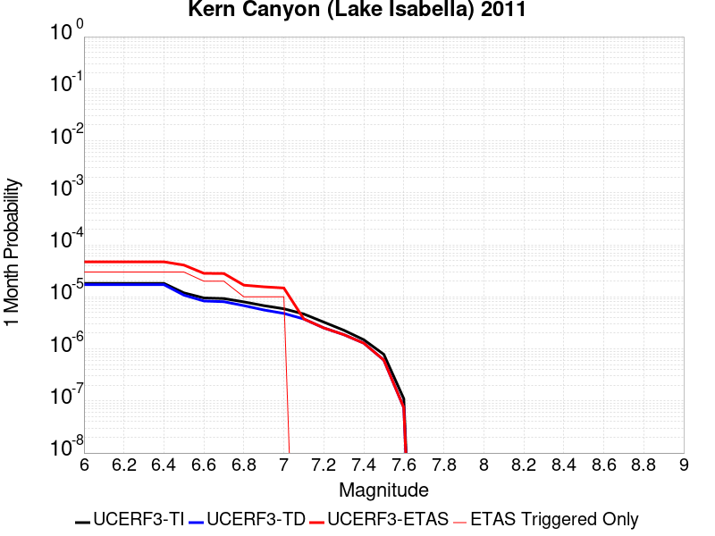 | 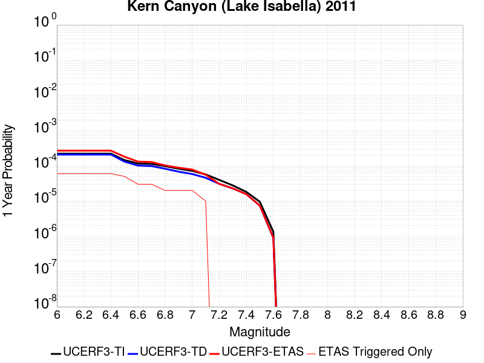 |  |

| Magnitude | 1 wk TI Prob | 1 wk TD Prob | 1 wk ETAS Prob | 1 wk ETAS/TD Gain | 1 wk ETAS Triggered Only | 1 mo TI Prob | 1 mo TD Prob | 1 mo ETAS Prob | 1 mo ETAS/TD Gain | 1 mo ETAS Triggered Only | 1 yr TI Prob | 1 yr TD Prob | 1 yr ETAS Prob | 1 yr ETAS/TD Gain | 1 yr ETAS Triggered Only | 10 yr TI Prob | 10 yr TD Prob | 10 yr ETAS Prob | 10 yr ETAS/TD Gain | 10 yr ETAS Triggered Only |
|-----|-----|-----|-----|-----|-----|-----|-----|-----|-----|-----|-----|-----|-----|-----|-----|-----|-----|-----|-----|-----|
| 6.0 | 4.2387383E-6 | 4.0016344E-6 | 2.4001554E-5 | 5.997938 | 2.0E-5 | 1.8165894E-5 | 1.7149758E-5 | 4.7149242E-5 | 2.7492657 | 3.0E-5 | 2.2114732E-4 | 2.0878017E-4 | 2.6876765E-4 | 1.2873236 | 6.0E-5 | 0.0022092736 | 0.002086024 | 0.0021658572 | 1.0382705 | 8.0E-5 |
| 6.1 | 4.2387383E-6 | 4.0016344E-6 | 2.4001554E-5 | 5.997938 | 2.0E-5 | 1.8165894E-5 | 1.7149758E-5 | 4.7149242E-5 | 2.7492657 | 3.0E-5 | 2.2114732E-4 | 2.0878017E-4 | 2.6876765E-4 | 1.2873236 | 6.0E-5 | 0.0022092736 | 0.002086024 | 0.0021658572 | 1.0382705 | 8.0E-5 |
| 6.2 | 4.2387383E-6 | 4.0016344E-6 | 2.4001554E-5 | 5.997938 | 2.0E-5 | 1.8165894E-5 | 1.7149758E-5 | 4.7149242E-5 | 2.7492657 | 3.0E-5 | 2.2114732E-4 | 2.0878017E-4 | 2.6876765E-4 | 1.2873236 | 6.0E-5 | 0.0022092736 | 0.002086024 | 0.0021658572 | 1.0382705 | 8.0E-5 |
| 6.3 | 4.2387383E-6 | 4.0016344E-6 | 2.4001554E-5 | 5.997938 | 2.0E-5 | 1.8165894E-5 | 1.7149758E-5 | 4.7149242E-5 | 2.7492657 | 3.0E-5 | 2.2114732E-4 | 2.0878017E-4 | 2.6876765E-4 | 1.2873236 | 6.0E-5 | 0.0022092736 | 0.002086024 | 0.0021658572 | 1.0382705 | 8.0E-5 |
| 6.4 | 4.2387383E-6 | 4.0016344E-6 | 2.4001554E-5 | 5.997938 | 2.0E-5 | 1.8165894E-5 | 1.7149758E-5 | 4.7149242E-5 | 2.7492657 | 3.0E-5 | 2.2114732E-4 | 2.0878017E-4 | 2.6876765E-4 | 1.2873236 | 6.0E-5 | 0.0022092736 | 0.002086024 | 0.0021658572 | 1.0382705 | 8.0E-5 |
| 6.5 | 2.7857532E-6 | 2.5178624E-6 | 2.2517812E-5 | 8.943226 | 2.0E-5 | 1.1938888E-5 | 1.0790796E-5 | 4.0790474E-5 | 3.780117 | 3.0E-5 | 1.4534626E-4 | 1.3137035E-4 | 1.8136378E-4 | 1.3805534 | 5.0E-5 | 0.0014525123 | 0.0013129596 | 0.0013728809 | 1.0456383 | 6.0E-5 |
| 6.6 | 2.2233348E-6 | 1.944119E-6 | 1.1944099E-5 | 6.1437078 | 1.0E-5 | 9.528543E-6 | 8.331913E-6 | 2.8331746E-5 | 3.4003892 | 2.0E-5 | 1.1600384E-4 | 1.014364E-4 | 1.3143336E-4 | 1.2957218 | 3.0E-5 | 0.001159433 | 0.0010139096 | 0.001053869 | 1.0394113 | 4.0E-5 |
| 6.7 | 2.1635126E-6 | 1.8834991E-6 | 1.18834805E-5 | 6.3092575 | 1.0E-5 | 9.272164E-6 | 8.072114E-6 | 2.8071952E-5 | 3.4776456 | 2.0E-5 | 1.1288274E-4 | 9.827364E-5 | 1.282707E-4 | 1.30524 | 3.0E-5 | 0.0011282542 | 9.8231E-4 | 0.0010222706 | 1.0406803 | 4.0E-5 |
| 6.8 | 1.8685711E-6 | 1.583138E-6 | 1.1583122E-5 | 7.316559 | 1.0E-5 | 8.008137E-6 | 6.7848596E-6 | 1.6784792E-5 | 2.4738598 | 1.0E-5 | 9.74947E-5 | 8.2602586E-5 | 1.02600934E-4 | 1.2421032 | 2.0E-5 | 9.745194E-4 | 8.2572375E-4 | 8.5569895E-4 | 1.0363017 | 3.0E-5 |
| 6.9 | 1.5815071E-6 | 1.3064887E-6 | 1.1306475E-5 | 8.654094 | 1.0E-5 | 6.77787E-6 | 5.5992255E-6 | 1.559917E-5 | 2.7859514 | 1.0E-5 | 8.251744E-5 | 6.816846E-5 | 8.81671E-5 | 1.2933708 | 2.0E-5 | 8.248681E-4 | 6.8147824E-4 | 7.114578E-4 | 1.0439919 | 3.0E-5 |
| 7.0 | 1.3772564E-6 | 1.1210681E-6 | 1.1121057E-5 | 9.920054 | 1.0E-5 | 5.9025137E-6 | 4.8045686E-6 | 1.4804521E-5 | 3.0813422 | 1.0E-5 | 7.186073E-5 | 5.8494075E-5 | 7.849291E-5 | 1.341895 | 2.0E-5 | 7.18375E-4 | 5.8478885E-4 | 6.1477127E-4 | 1.0512706 | 3.0E-5 |
| 7.1 | 1.0916998E-6 | 8.7637505E-7 | 8.7637505E-7 | 1.0 | 0.0 | 4.678705E-6 | 3.7558877E-6 | 3.7558877E-6 | 1.0 | 0.0 | 5.6961744E-5 | 4.5726985E-5 | 5.572653E-5 | 1.2186792 | 1.0E-5 | 5.6947145E-4 | 4.571771E-4 | 4.7716798E-4 | 1.0437267 | 2.0E-5 |
| 7.2 | 7.6277024E-7 | 5.901439E-7 | 5.901439E-7 | 1.0 | 0.0 | 3.2690114E-6 | 2.5291856E-6 | 2.5291856E-6 | 1.0 | 0.0 | 3.9799485E-5 | 3.0792406E-5 | 3.0792406E-5 | 1.0 | 0.0 | 3.9792358E-4 | 3.07882E-4 | 3.07882E-4 | 1.0 | 0.0 |
| 7.3 | 5.3265916E-7 | 4.3824264E-7 | 4.3824264E-7 | 1.0 | 0.0 | 2.282823E-6 | 1.8781814E-6 | 1.8781814E-6 | 1.0 | 0.0 | 2.7793016E-5 | 2.2866623E-5 | 2.2866623E-5 | 1.0 | 0.0 | 2.778954E-4 | 2.2864307E-4 | 2.2864307E-4 | 1.0 | 0.0 |
| 7.4 | 3.4946007E-7 | 3.0065647E-7 | 3.0065647E-7 | 1.0 | 0.0 | 1.497685E-6 | 1.2885271E-6 | 1.2885271E-6 | 1.0 | 0.0 | 1.8234163E-5 | 1.5687707E-5 | 1.5687707E-5 | 1.0 | 0.0 | 1.8232666E-4 | 1.5686621E-4 | 1.5686621E-4 | 1.0 | 0.0 |
| 7.5 | 1.8317026E-7 | 1.4244755E-7 | 1.4244755E-7 | 1.0 | 0.0 | 7.850152E-7 | 6.1048934E-7 | 6.1048934E-7 | 1.0 | 0.0 | 9.557518E-6 | 7.432683E-6 | 7.432683E-6 | 1.0 | 0.0 | 9.5571064E-5 | 7.432442E-5 | 7.432442E-5 | 1.0 | 0.0 |
| 7.6 | 2.572245E-8 | 1.735264E-8 | 1.735264E-8 | 1.0 | 0.0 | 1.10239064E-7 | 7.436845E-8 | 7.436845E-8 | 1.0 | 0.0 | 1.3421597E-6 | 9.0543557E-7 | 9.0543557E-7 | 1.0 | 0.0 | 1.3421517E-5 | 9.054324E-6 | 9.054324E-6 | 1.0 | 0.0 |

## White Mountains
*[(top)](#table-of-contents)*

| 1 Week | 1 Month | 1 Year | 10 Year |
|-----|-----|-----|-----|
|  | 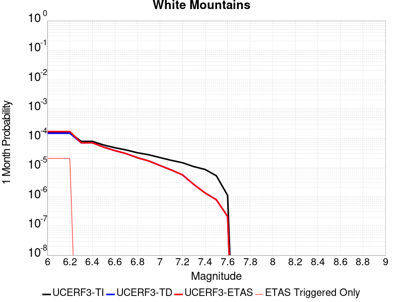 | 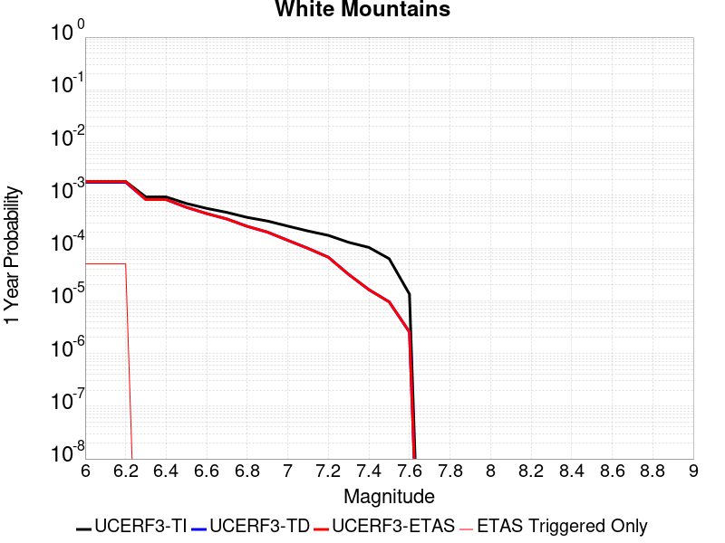 |  |

| Magnitude | 1 wk TI Prob | 1 wk TD Prob | 1 wk ETAS Prob | 1 wk ETAS/TD Gain | 1 wk ETAS Triggered Only | 1 mo TI Prob | 1 mo TD Prob | 1 mo ETAS Prob | 1 mo ETAS/TD Gain | 1 mo ETAS Triggered Only | 1 yr TI Prob | 1 yr TD Prob | 1 yr ETAS Prob | 1 yr ETAS/TD Gain | 1 yr ETAS Triggered Only | 10 yr TI Prob | 10 yr TD Prob | 10 yr ETAS Prob | 10 yr ETAS/TD Gain | 10 yr ETAS Triggered Only |
|-----|-----|-----|-----|-----|-----|-----|-----|-----|-----|-----|-----|-----|-----|-----|-----|-----|-----|-----|-----|-----|
| 6.0 | 3.503579E-5 | 3.3784127E-5 | 5.378345E-5 | 1.591974 | 2.0E-5 | 1.5014476E-4 | 1.4478175E-4 | 1.6477886E-4 | 1.138119 | 2.0E-5 | 0.0018264796 | 0.0017614134 | 0.0018113253 | 1.0283363 | 5.0E-5 | 0.018115403 | 0.017486857 | 0.017565457 | 1.0044949 | 8.0E-5 |
| 6.1 | 3.503579E-5 | 3.3784127E-5 | 5.378345E-5 | 1.591974 | 2.0E-5 | 1.5014476E-4 | 1.4478175E-4 | 1.6477886E-4 | 1.138119 | 2.0E-5 | 0.0018264796 | 0.0017614134 | 0.0018113253 | 1.0283363 | 5.0E-5 | 0.018115403 | 0.017486857 | 0.017565457 | 1.0044949 | 8.0E-5 |
| 6.2 | 3.503579E-5 | 3.3784127E-5 | 5.378345E-5 | 1.591974 | 2.0E-5 | 1.5014476E-4 | 1.4478175E-4 | 1.6477886E-4 | 1.138119 | 2.0E-5 | 0.0018264796 | 0.0017614134 | 0.0018113253 | 1.0283363 | 5.0E-5 | 0.018115403 | 0.017486857 | 0.017565457 | 1.0044949 | 8.0E-5 |
| 6.3 | 1.7818425E-5 | 1.591616E-5 | 1.591616E-5 | 1.0 | 0.0 | 7.636245E-5 | 6.821041E-5 | 6.821041E-5 | 1.0 | 0.0 | 9.293162E-4 | 8.301596E-4 | 8.301596E-4 | 1.0 | 0.0 | 0.009254395 | 0.0082720425 | 0.008291877 | 1.0023978 | 2.0E-5 |
| 6.4 | 1.7818425E-5 | 1.591616E-5 | 1.591616E-5 | 1.0 | 0.0 | 7.636245E-5 | 6.821041E-5 | 6.821041E-5 | 1.0 | 0.0 | 9.293162E-4 | 8.301596E-4 | 8.301596E-4 | 1.0 | 0.0 | 0.009254395 | 0.0082720425 | 0.008291877 | 1.0023978 | 2.0E-5 |
| 6.5 | 1.3397557E-5 | 1.1336374E-5 | 1.1336374E-5 | 1.0 | 0.0 | 5.741684E-5 | 4.8583595E-5 | 4.8583595E-5 | 1.0 | 0.0 | 6.988258E-4 | 5.913517E-4 | 5.913517E-4 | 1.0 | 0.0 | 0.006966323 | 0.005898487 | 0.0059183687 | 1.0033706 | 2.0E-5 |
| 6.6 | 1.0818695E-5 | 8.625434E-6 | 8.625434E-6 | 1.0 | 0.0 | 4.6365014E-5 | 3.6965648E-5 | 3.6965648E-5 | 1.0 | 0.0 | 5.6434784E-4 | 4.4996818E-4 | 4.4996818E-4 | 1.0 | 0.0 | 0.005629168 | 0.0044910074 | 0.0045109177 | 1.0044334 | 2.0E-5 |
| 6.7 | 9.067908E-6 | 6.802476E-6 | 6.802476E-6 | 1.0 | 0.0 | 3.8861883E-5 | 2.915316E-5 | 2.915316E-5 | 1.0 | 0.0 | 4.7304068E-4 | 3.548851E-4 | 3.548851E-4 | 1.0 | 0.0 | 0.00472035 | 0.003543501 | 0.0035534655 | 1.002812 | 1.0E-5 |
| 6.8 | 7.295947E-6 | 4.9364285E-6 | 4.9364285E-6 | 1.0 | 0.0 | 3.126797E-5 | 2.1155956E-5 | 2.1155956E-5 | 1.0 | 0.0 | 3.8062103E-4 | 2.5754445E-4 | 2.5754445E-4 | 1.0 | 0.0 | 0.0037996976 | 0.0025725728 | 0.002582547 | 1.0038772 | 1.0E-5 |
| 6.9 | 6.2243444E-6 | 3.8322546E-6 | 3.8322546E-6 | 1.0 | 0.0 | 2.6675489E-5 | 1.6423846E-5 | 1.6423846E-5 | 1.0 | 0.0 | 3.2472567E-4 | 1.9994251E-4 | 1.9994251E-4 | 1.0 | 0.0 | 0.0032425157 | 0.001997679 | 0.002007659 | 1.0049958 | 1.0E-5 |
| 7.0 | 4.9878413E-6 | 2.679564E-6 | 2.679564E-6 | 1.0 | 0.0 | 2.1376287E-5 | 1.1483797E-5 | 1.1483797E-5 | 1.0 | 0.0 | 2.602252E-4 | 1.3980652E-4 | 1.3980652E-4 | 1.0 | 0.0 | 0.002599207 | 0.0013972119 | 0.0013972119 | 1.0 | 0.0 |
| 7.1 | 4.0252844E-6 | 1.885702E-6 | 1.885702E-6 | 1.0 | 0.0 | 1.7251105E-5 | 8.081555E-6 | 8.081555E-6 | 1.0 | 0.0 | 2.1001195E-4 | 9.838863E-5 | 9.838863E-5 | 1.0 | 0.0 | 0.0020981359 | 9.834635E-4 | 9.834635E-4 | 1.0 | 0.0 |
| 7.2 | 3.3284066E-6 | 1.2818929E-6 | 1.2818929E-6 | 1.0 | 0.0 | 1.4264522E-5 | 5.4938155E-6 | 5.4938155E-6 | 1.0 | 0.0 | 1.736567E-4 | 6.688525E-5 | 6.688525E-5 | 1.0 | 0.0 | 0.0017352107 | 6.6866126E-4 | 6.6866126E-4 | 1.0 | 0.0 |
| 7.3 | 2.458226E-6 | 6.056684E-7 | 6.056684E-7 | 1.0 | 0.0 | 1.0535211E-5 | 2.5957193E-6 | 2.5957193E-6 | 1.0 | 0.0 | 1.2825865E-4 | 3.160246E-5 | 3.160246E-5 | 1.0 | 0.0 | 0.0012818464 | 3.1598343E-4 | 3.1598343E-4 | 1.0 | 0.0 |
| 7.4 | 1.965953E-6 | 3.1084684E-7 | 3.1084684E-7 | 1.0 | 0.0 | 8.425486E-6 | 1.3322001E-6 | 1.3322001E-6 | 1.0 | 0.0 | 1.0257547E-4 | 1.6219417E-5 | 1.6219417E-5 | 1.0 | 0.0 | 0.0010252813 | 1.6218246E-4 | 1.6218246E-4 | 1.0 | 0.0 |
| 7.5 | 1.2014192E-6 | 1.8241002E-7 | 1.8241002E-7 | 1.0 | 0.0 | 5.148929E-6 | 7.8175697E-7 | 7.8175697E-7 | 1.0 | 0.0 | 6.2686406E-5 | 9.51785E-6 | 9.51785E-6 | 1.0 | 0.0 | 6.266873E-4 | 9.517451E-5 | 9.517451E-5 | 1.0 | 0.0 |
| 7.6 | 2.5612175E-7 | 4.893784E-8 | 4.893784E-8 | 1.0 | 0.0 | 1.0976642E-6 | 2.0973359E-7 | 2.0973359E-7 | 1.0 | 0.0 | 1.3363979E-5 | 2.5535037E-6 | 2.5535037E-6 | 1.0 | 0.0 | 1.3363175E-4 | 2.553478E-5 | 2.553478E-5 | 1.0 | 0.0 |

## San Jacinto (Borrego)
*[(top)](#table-of-contents)*

| 1 Week | 1 Month | 1 Year | 10 Year |
|-----|-----|-----|-----|
|  |  |  |  |

| Magnitude | 1 wk TI Prob | 1 wk TD Prob | 1 wk ETAS Prob | 1 wk ETAS/TD Gain | 1 wk ETAS Triggered Only | 1 mo TI Prob | 1 mo TD Prob | 1 mo ETAS Prob | 1 mo ETAS/TD Gain | 1 mo ETAS Triggered Only | 1 yr TI Prob | 1 yr TD Prob | 1 yr ETAS Prob | 1 yr ETAS/TD Gain | 1 yr ETAS Triggered Only | 10 yr TI Prob | 10 yr TD Prob | 10 yr ETAS Prob | 10 yr ETAS/TD Gain | 10 yr ETAS Triggered Only |
|-----|-----|-----|-----|-----|-----|-----|-----|-----|-----|-----|-----|-----|-----|-----|-----|-----|-----|-----|-----|-----|
| 6.0 | 3.543992E-5 | 2.7925962E-5 | 3.792568E-5 | 1.3580797 | 1.0E-5 | 1.5187653E-4 | 1.1967727E-4 | 1.5967249E-4 | 1.3341922 | 4.0E-5 | 0.0018475284 | 0.0014561092 | 0.0015160218 | 1.0411457 | 6.0E-5 | 0.018322436 | 0.01486815 | 0.014946962 | 1.0053006 | 8.0E-5 |
| 6.1 | 3.542281E-5 | 2.7925962E-5 | 3.792568E-5 | 1.3580797 | 1.0E-5 | 1.5180321E-4 | 1.1967727E-4 | 1.5967249E-4 | 1.3341922 | 4.0E-5 | 0.0018466372 | 0.0014561092 | 0.0015160218 | 1.0411457 | 6.0E-5 | 0.018313672 | 0.01486815 | 0.014946962 | 1.0053006 | 8.0E-5 |
| 6.2 | 3.4688688E-5 | 2.7925962E-5 | 3.792568E-5 | 1.3580797 | 1.0E-5 | 1.4865733E-4 | 1.1967727E-4 | 1.5967249E-4 | 1.3341923 | 4.0E-5 | 0.0018084005 | 0.0014561091 | 0.0015160218 | 1.0411457 | 6.0E-5 | 0.017937548 | 0.01486815 | 0.014946961 | 1.0053006 | 8.0E-5 |
| 6.3 | 3.2087122E-5 | 2.7771312E-5 | 3.7771035E-5 | 1.3600738 | 1.0E-5 | 1.3750899E-4 | 1.1901455E-4 | 1.5900978E-4 | 1.3360534 | 4.0E-5 | 0.0016728862 | 0.0014480512 | 0.0015079643 | 1.041375 | 6.0E-5 | 0.016603488 | 0.014789308 | 0.014868125 | 1.0053294 | 8.0E-5 |
| 6.4 | 3.1828724E-5 | 2.773829E-5 | 3.7738013E-5 | 1.3605025 | 1.0E-5 | 1.364017E-4 | 1.1887303E-4 | 1.5886828E-4 | 1.3364534 | 4.0E-5 | 0.0016594254 | 0.0014463306 | 0.0015062437 | 1.0414243 | 6.0E-5 | 0.016470885 | 0.014772502 | 0.01485132 | 1.0053355 | 8.0E-5 |
| 6.5 | 3.1563577E-5 | 2.7477974E-5 | 3.7477697E-5 | 1.3639178 | 1.0E-5 | 1.3526545E-4 | 1.17757496E-4 | 1.5775279E-4 | 1.3396411 | 4.0E-5 | 0.0016456128 | 0.0014327668 | 0.0014926809 | 1.0418171 | 6.0E-5 | 0.0163348 | 0.01463991 | 0.014718738 | 1.0053846 | 8.0E-5 |
| 6.6 | 3.1467625E-5 | 2.7322194E-5 | 3.7321923E-5 | 1.3659928 | 1.0E-5 | 1.3485427E-4 | 1.17089934E-4 | 1.5708525E-4 | 1.3415778 | 4.0E-5 | 0.0016406142 | 0.0014246498 | 0.0014845644 | 1.0420556 | 6.0E-5 | 0.016285548 | 0.014560228 | 0.014639063 | 1.0054144 | 8.0E-5 |
| 6.7 | 3.1223695E-5 | 2.6940217E-5 | 3.693995E-5 | 1.3711822 | 1.0E-5 | 1.3380898E-4 | 1.1545303E-4 | 1.5544842E-4 | 1.3464212 | 4.0E-5 | 0.0016279068 | 0.0014047464 | 0.0014646621 | 1.0426524 | 6.0E-5 | 0.01616033 | 0.01436451 | 0.01444336 | 1.0054892 | 8.0E-5 |
| 6.8 | 3.1015585E-5 | 2.6761221E-5 | 3.6760954E-5 | 1.373665 | 1.0E-5 | 1.3291716E-4 | 1.1468597E-4 | 1.5468139E-4 | 1.3487384 | 4.0E-5 | 0.001617065 | 0.0013954195 | 0.0014453497 | 1.0357815 | 5.0E-5 | 0.016053487 | 0.014271772 | 0.014340772 | 1.0048348 | 7.0E-5 |
| 6.9 | 2.6641965E-5 | 2.2183434E-5 | 3.2183212E-5 | 1.4507768 | 1.0E-5 | 1.1417485E-4 | 9.506842E-5 | 1.3506462E-4 | 1.4207096 | 4.0E-5 | 0.0013891924 | 0.0011568473 | 0.0012067895 | 1.0431709 | 5.0E-5 | 0.0138054015 | 0.011882191 | 0.011951359 | 1.0058212 | 7.0E-5 |
| 7.0 | 2.3854353E-5 | 2.047825E-5 | 3.0478046E-5 | 1.488313 | 1.0E-5 | 1.02228936E-4 | 8.776099E-5 | 1.2775748E-4 | 1.4557433 | 4.0E-5 | 0.0012439266 | 0.0010679689 | 0.0011179155 | 1.0467678 | 5.0E-5 | 0.012369866 | 0.0109826205 | 0.011051851 | 1.0063037 | 7.0E-5 |
| 7.1 | 2.3672901E-5 | 2.0314741E-5 | 3.0314537E-5 | 1.4922434 | 1.0E-5 | 1.0145135E-4 | 8.706028E-5 | 1.270568E-4 | 1.4594117 | 4.0E-5 | 0.0012344702 | 0.0010594461 | 0.0011093931 | 1.0471445 | 5.0E-5 | 0.0122763505 | 0.010897858 | 0.010967095 | 1.0063533 | 7.0E-5 |
| 7.2 | 2.2717244E-5 | 1.9542116E-5 | 2.9541921E-5 | 1.5117053 | 1.0E-5 | 9.735599E-5 | 8.3749255E-5 | 1.2374591E-4 | 1.4775763 | 4.0E-5 | 0.0011846646 | 0.0010191725 | 0.0010691215 | 1.0490094 | 5.0E-5 | 0.01178369 | 0.010495322 | 0.010554692 | 1.0056568 | 6.0E-5 |
| 7.3 | 2.1016205E-5 | 1.8383771E-5 | 2.8383587E-5 | 1.543948 | 1.0E-5 | 9.006634E-5 | 7.878522E-5 | 1.1878207E-4 | 1.5076694 | 4.0E-5 | 0.001096006 | 9.5879E-4 | 0.0010087421 | 1.0520991 | 5.0E-5 | 0.010906163 | 0.009890901 | 0.009950307 | 1.0060062 | 6.0E-5 |
| 7.4 | 2.0683625E-5 | 1.8186302E-5 | 2.818612E-5 | 1.5498544 | 1.0E-5 | 8.86411E-5 | 7.7938974E-5 | 1.1793586E-4 | 1.513182 | 4.0E-5 | 0.001078671 | 9.48496E-4 | 9.984486E-4 | 1.052665 | 5.0E-5 | 0.010734501 | 0.0097876275 | 0.00984704 | 1.0060701 | 6.0E-5 |
| 7.5 | 1.9993966E-5 | 1.7781347E-5 | 2.7781169E-5 | 1.5623771 | 1.0E-5 | 8.568561E-5 | 7.6203556E-5 | 1.16200514E-4 | 1.5248699 | 4.0E-5 | 0.001042723 | 9.2738547E-4 | 9.773391E-4 | 1.053865 | 5.0E-5 | 0.010378438 | 0.009574548 | 0.009633974 | 1.0062066 | 6.0E-5 |
| 7.6 | 1.788966E-5 | 1.6434618E-5 | 2.6434454E-5 | 1.6084617 | 1.0E-5 | 7.666772E-5 | 7.043219E-5 | 1.1042937E-4 | 1.5678822 | 4.0E-5 | 9.3302975E-4 | 8.5717626E-4 | 9.071334E-4 | 1.0582811 | 5.0E-5 | 0.00929122 | 0.008866415 | 0.008925883 | 1.0067071 | 6.0E-5 |
| 7.7 | 1.5125781E-5 | 1.4236738E-5 | 2.4236595E-5 | 1.7023981 | 1.0E-5 | 6.4823165E-5 | 6.101317E-5 | 1.0101073E-4 | 1.6555562 | 4.0E-5 | 7.889362E-4 | 7.4258295E-4 | 7.9254585E-4 | 1.0672826 | 5.0E-5 | 0.007861412 | 0.007714161 | 0.0077736983 | 1.0077178 | 6.0E-5 |
| 7.8 | 1.250089E-5 | 1.262994E-5 | 2.2629814E-5 | 1.7917594 | 1.0E-5 | 5.3574146E-5 | 5.4127195E-5 | 9.412503E-5 | 1.73896 | 4.0E-5 | 6.5207E-4 | 6.588E-4 | 7.0876704E-4 | 1.0758456 | 5.0E-5 | 0.006501599 | 0.006867759 | 0.006927347 | 1.0086765 | 6.0E-5 |
| 7.9 | 9.561E-6 | 9.754065E-6 | 1.9753967E-5 | 2.0252037 | 1.0E-5 | 4.0975072E-5 | 4.180247E-5 | 8.18008E-5 | 1.9568412 | 4.0E-5 | 4.987573E-4 | 5.0882675E-4 | 5.5880134E-4 | 1.0982152 | 5.0E-5 | 0.0049763937 | 0.0053523607 | 0.0054120393 | 1.01115 | 6.0E-5 |
| 8.0 | 8.01699E-6 | 8.292994E-6 | 1.829291E-5 | 2.2058272 | 1.0E-5 | 3.4358076E-5 | 3.554092E-5 | 7.55395E-5 | 2.1254232 | 4.0E-5 | 4.1822926E-4 | 4.3262533E-4 | 4.8260367E-4 | 1.1155235 | 5.0E-5 | 0.0041744304 | 0.0045733186 | 0.0046330444 | 1.0130596 | 6.0E-5 |
| 8.1 | 6.541947E-6 | 6.461784E-6 | 6.461784E-6 | 1.0 | 0.0 | 2.8036617E-5 | 2.7693068E-5 | 5.769224E-5 | 2.0832736 | 3.0E-5 | 3.4129233E-4 | 3.3711144E-4 | 3.7709795E-4 | 1.1186152 | 4.0E-5 | 0.0034076865 | 0.0035805756 | 0.0036204322 | 1.0111314 | 4.0E-5 |
| 8.2 | 1.7968189E-6 | 7.9684827E-7 | 7.9684827E-7 | 1.0 | 0.0 | 7.70063E-6 | 3.4150596E-6 | 3.4150596E-6 | 1.0 | 0.0 | 9.3751136E-5 | 4.157758E-5 | 4.157758E-5 | 1.0 | 0.0 | 9.371159E-4 | 4.7107413E-4 | 4.7107413E-4 | 1.0 | 0.0 |
| 8.3 | 1.5167889E-7 | 4.8951257E-8 | 4.8951257E-8 | 1.0 | 0.0 | 6.500522E-7 | 2.0979108E-7 | 2.0979108E-7 | 1.0 | 0.0 | 7.9143565E-6 | 2.5542038E-6 | 2.5542038E-6 | 1.0 | 0.0 | 7.914075E-5 | 2.9679897E-5 | 2.9679897E-5 | 1.0 | 0.0 |

## San Clemente
*[(top)](#table-of-contents)*

| 1 Week | 1 Month | 1 Year | 10 Year |
|-----|-----|-----|-----|
|  |  |  | 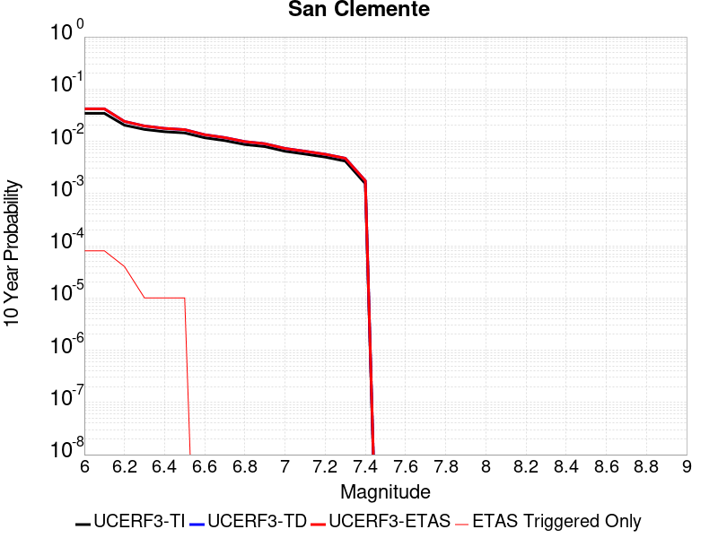 |

| Magnitude | 1 wk TI Prob | 1 wk TD Prob | 1 wk ETAS Prob | 1 wk ETAS/TD Gain | 1 wk ETAS Triggered Only | 1 mo TI Prob | 1 mo TD Prob | 1 mo ETAS Prob | 1 mo ETAS/TD Gain | 1 mo ETAS Triggered Only | 1 yr TI Prob | 1 yr TD Prob | 1 yr ETAS Prob | 1 yr ETAS/TD Gain | 1 yr ETAS Triggered Only | 10 yr TI Prob | 10 yr TD Prob | 10 yr ETAS Prob | 10 yr ETAS/TD Gain | 10 yr ETAS Triggered Only |
|-----|-----|-----|-----|-----|-----|-----|-----|-----|-----|-----|-----|-----|-----|-----|-----|-----|-----|-----|-----|-----|
| 6.0 | 6.681379E-5 | 8.163834E-5 | 1.2163507E-4 | 1.4899259 | 4.0E-5 | 2.8631336E-4 | 3.4983488E-4 | 3.898209E-4 | 1.1142997 | 4.0E-5 | 0.003480294 | 0.00425141 | 0.0043211123 | 1.0163951 | 7.0E-5 | 0.03426291 | 0.04175603 | 0.04183269 | 1.001836 | 8.0E-5 |
| 6.1 | 6.681379E-5 | 8.163834E-5 | 1.2163507E-4 | 1.4899259 | 4.0E-5 | 2.8631336E-4 | 3.4983488E-4 | 3.898209E-4 | 1.1142997 | 4.0E-5 | 0.003480294 | 0.00425141 | 0.0043211123 | 1.0163951 | 7.0E-5 | 0.03426291 | 0.04175603 | 0.04183269 | 1.001836 | 8.0E-5 |
| 6.2 | 3.9400576E-5 | 4.6452373E-5 | 6.6451445E-5 | 1.4305285 | 2.0E-5 | 1.6884868E-4 | 1.9906677E-4 | 2.1906279E-4 | 1.1004488 | 2.0E-5 | 0.0020537945 | 0.0024209984 | 0.002450926 | 1.0123615 | 3.0E-5 | 0.020349167 | 0.023952903 | 0.023991946 | 1.00163 | 4.0E-5 |
| 6.3 | 3.2590255E-5 | 3.792912E-5 | 4.7928737E-5 | 1.2636397 | 1.0E-5 | 1.3966505E-4 | 1.6254342E-4 | 1.725418E-4 | 1.061512 | 1.0E-5 | 0.0016990956 | 0.0019772002 | 0.0019871802 | 1.0050477 | 1.0E-5 | 0.01686163 | 0.019599883 | 0.019609686 | 1.0005002 | 1.0E-5 |
| 6.4 | 2.9454652E-5 | 3.4097764E-5 | 4.409742E-5 | 1.2932644 | 1.0E-5 | 1.2622811E-4 | 1.4612524E-4 | 1.5612377E-4 | 1.0684245 | 1.0E-5 | 0.0015357438 | 0.0017776493 | 0.0017876315 | 1.0056154 | 1.0E-5 | 0.015251739 | 0.01763747 | 0.017647294 | 1.000557 | 1.0E-5 |
| 6.5 | 2.790836E-5 | 3.2247463E-5 | 4.224714E-5 | 1.310092 | 1.0E-5 | 1.1960178E-4 | 1.3819624E-4 | 1.4819486E-4 | 1.0723509 | 1.0E-5 | 0.001455179 | 0.0016812662 | 0.0016912494 | 1.0059379 | 1.0E-5 | 0.014456868 | 0.016688485 | 0.016698318 | 1.0005893 | 1.0E-5 |
| 6.6 | 2.2492153E-5 | 2.5762702E-5 | 2.5762702E-5 | 1.0 | 0.0 | 9.639138E-5 | 1.1040699E-4 | 1.1040699E-4 | 1.0 | 0.0 | 0.0011729331 | 0.0013433909 | 0.0013433909 | 1.0 | 0.0 | 0.011667615 | 0.013354417 | 0.013354417 | 1.0 | 0.0 |
| 6.7 | 1.9862755E-5 | 2.2666423E-5 | 2.2666423E-5 | 1.0 | 0.0 | 8.512331E-5 | 9.713826E-5 | 9.713826E-5 | 1.0 | 0.0 | 0.0010358836 | 0.0011820279 | 0.0011820279 | 1.0 | 0.0 | 0.010310682 | 0.011758701 | 0.011758701 | 1.0 | 0.0 |
| 6.8 | 1.6697575E-5 | 1.897771E-5 | 1.897771E-5 | 1.0 | 0.0 | 7.155907E-5 | 8.133056E-5 | 8.133056E-5 | 1.0 | 0.0 | 8.7088346E-4 | 9.897591E-4 | 9.897591E-4 | 1.0 | 0.0 | 0.008674784 | 0.0098545365 | 0.0098545365 | 1.0 | 0.0 |
| 6.9 | 1.5218415E-5 | 1.72694E-5 | 1.72694E-5 | 1.0 | 0.0 | 6.522015E-5 | 7.4009666E-5 | 7.4009666E-5 | 1.0 | 0.0 | 7.93766E-4 | 9.00704E-4 | 9.00704E-4 | 1.0 | 0.0 | 0.007909367 | 0.008971481 | 0.008971481 | 1.0 | 0.0 |
| 7.0 | 1.2392958E-5 | 1.4033016E-5 | 1.4033016E-5 | 1.0 | 0.0 | 5.3111595E-5 | 6.014015E-5 | 6.014015E-5 | 1.0 | 0.0 | 6.4644177E-4 | 7.319679E-4 | 7.319679E-4 | 1.0 | 0.0 | 0.0064456454 | 0.0072963564 | 0.0072963564 | 1.0 | 0.0 |
| 7.1 | 1.0934128E-5 | 1.2375138E-5 | 1.2375138E-5 | 1.0 | 0.0 | 4.6859706E-5 | 5.303527E-5 | 5.303527E-5 | 1.0 | 0.0 | 5.7036756E-4 | 6.455204E-4 | 6.455204E-4 | 1.0 | 0.0 | 0.0056890585 | 0.0064371997 | 0.0064371997 | 1.0 | 0.0 |
| 7.2 | 9.5798805E-6 | 1.0844935E-5 | 1.0844935E-5 | 1.0 | 0.0 | 4.1055984E-5 | 4.6477508E-5 | 4.6477508E-5 | 1.0 | 0.0 | 4.9974193E-4 | 5.657239E-4 | 5.657239E-4 | 1.0 | 0.0 | 0.0049861963 | 0.0056435615 | 0.0056435615 | 1.0 | 0.0 |
| 7.3 | 8.0167365E-6 | 9.083918E-6 | 9.083918E-6 | 1.0 | 0.0 | 3.4356988E-5 | 3.8930535E-5 | 3.8930535E-5 | 1.0 | 0.0 | 4.1821605E-4 | 4.7388324E-4 | 4.7388324E-4 | 1.0 | 0.0 | 0.0041742986 | 0.0047294297 | 0.0047294297 | 1.0 | 0.0 |
| 7.4 | 2.9581017E-6 | 3.3623792E-6 | 3.3623792E-6 | 1.0 | 0.0 | 1.2677518E-5 | 1.4410146E-5 | 1.4410146E-5 | 1.0 | 0.0 | 1.5433785E-4 | 1.7543444E-4 | 1.7543444E-4 | 1.0 | 0.0 | 0.001542307 | 0.0017534546 | 0.0017534546 | 1.0 | 0.0 |

## Tin Mountain
*[(top)](#table-of-contents)*

| 1 Week | 1 Month | 1 Year | 10 Year |
|-----|-----|-----|-----|
|  | 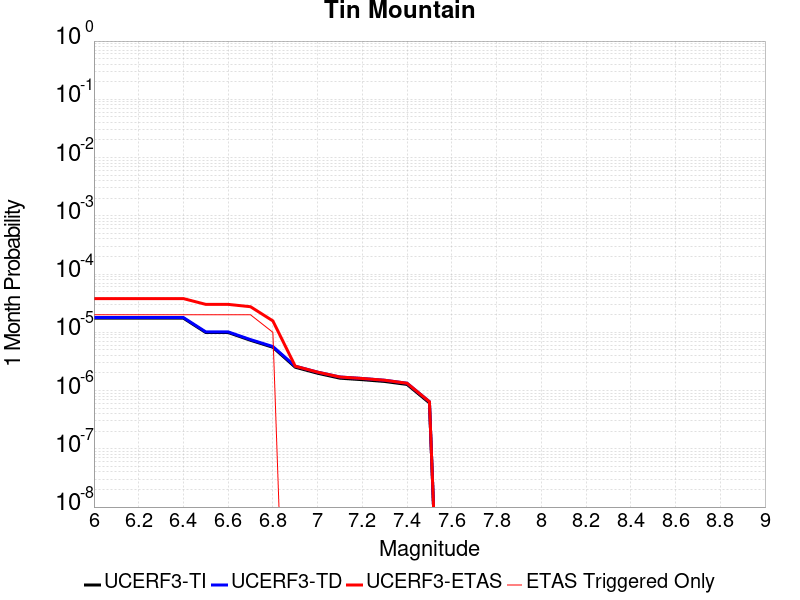 | 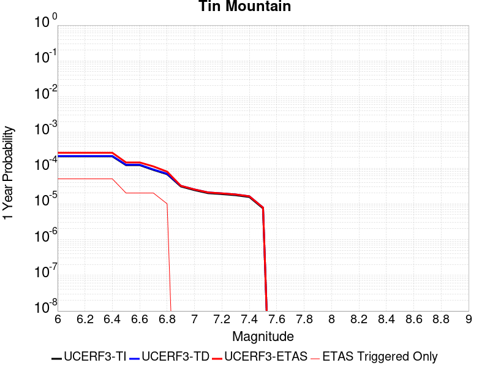 |  |

| Magnitude | 1 wk TI Prob | 1 wk TD Prob | 1 wk ETAS Prob | 1 wk ETAS/TD Gain | 1 wk ETAS Triggered Only | 1 mo TI Prob | 1 mo TD Prob | 1 mo ETAS Prob | 1 mo ETAS/TD Gain | 1 mo ETAS Triggered Only | 1 yr TI Prob | 1 yr TD Prob | 1 yr ETAS Prob | 1 yr ETAS/TD Gain | 1 yr ETAS Triggered Only | 10 yr TI Prob | 10 yr TD Prob | 10 yr ETAS Prob | 10 yr ETAS/TD Gain | 10 yr ETAS Triggered Only |
|-----|-----|-----|-----|-----|-----|-----|-----|-----|-----|-----|-----|-----|-----|-----|-----|-----|-----|-----|-----|-----|
| 6.0 | 4.083776E-6 | 4.1815365E-6 | 1.4181494E-5 | 3.3914554 | 1.0E-5 | 1.750178E-5 | 1.792077E-5 | 3.792041E-5 | 2.1160035 | 2.0E-5 | 2.1306332E-4 | 2.1816725E-4 | 2.6815635E-4 | 1.2291319 | 5.0E-5 | 0.0021285915 | 0.0021798965 | 0.0022497438 | 1.0320417 | 7.0E-5 |
| 6.1 | 4.083776E-6 | 4.1815365E-6 | 1.4181494E-5 | 3.3914554 | 1.0E-5 | 1.750178E-5 | 1.792077E-5 | 3.792041E-5 | 2.1160035 | 2.0E-5 | 2.1306332E-4 | 2.1816725E-4 | 2.6815635E-4 | 1.2291319 | 5.0E-5 | 0.0021285915 | 0.0021798965 | 0.0022497438 | 1.0320417 | 7.0E-5 |
| 6.2 | 4.083776E-6 | 4.1815365E-6 | 1.4181494E-5 | 3.3914554 | 1.0E-5 | 1.750178E-5 | 1.792077E-5 | 3.792041E-5 | 2.1160035 | 2.0E-5 | 2.1306332E-4 | 2.1816725E-4 | 2.6815635E-4 | 1.2291319 | 5.0E-5 | 0.0021285915 | 0.0021798965 | 0.0022497438 | 1.0320417 | 7.0E-5 |
| 6.3 | 4.083776E-6 | 4.1815365E-6 | 1.4181494E-5 | 3.3914554 | 1.0E-5 | 1.750178E-5 | 1.792077E-5 | 3.792041E-5 | 2.1160035 | 2.0E-5 | 2.1306332E-4 | 2.1816725E-4 | 2.6815635E-4 | 1.2291319 | 5.0E-5 | 0.0021285915 | 0.0021798965 | 0.0022497438 | 1.0320417 | 7.0E-5 |
| 6.4 | 4.083776E-6 | 4.1815365E-6 | 1.4181494E-5 | 3.3914554 | 1.0E-5 | 1.750178E-5 | 1.792077E-5 | 3.792041E-5 | 2.1160035 | 2.0E-5 | 2.1306332E-4 | 2.1816725E-4 | 2.6815635E-4 | 1.2291319 | 5.0E-5 | 0.0021285915 | 0.0021798965 | 0.0022497438 | 1.0320417 | 7.0E-5 |
| 6.5 | 2.3143427E-6 | 2.3731573E-6 | 1.2373133E-5 | 5.213786 | 1.0E-5 | 9.9185745E-6 | 1.0170638E-5 | 3.0170435E-5 | 2.966425 | 2.0E-5 | 1.2075195E-4 | 1.2382126E-4 | 1.4381878E-4 | 1.1615032 | 2.0E-5 | 0.0012068636 | 0.0012375986 | 0.0012575738 | 1.0161403 | 2.0E-5 |
| 6.6 | 2.3143427E-6 | 2.3731573E-6 | 1.2373133E-5 | 5.213786 | 1.0E-5 | 9.9185745E-6 | 1.0170638E-5 | 3.0170435E-5 | 2.966425 | 2.0E-5 | 1.2075195E-4 | 1.2382126E-4 | 1.4381878E-4 | 1.1615032 | 2.0E-5 | 0.0012068636 | 0.0012375986 | 0.0012575738 | 1.0161403 | 2.0E-5 |
| 6.7 | 1.7029532E-6 | 1.7497915E-6 | 1.1749774E-5 | 6.7149568 | 1.0E-5 | 7.2983503E-6 | 7.499088E-6 | 2.7498938E-5 | 3.666971 | 2.0E-5 | 8.885379E-5 | 9.1298105E-5 | 1.1129628E-4 | 1.2190425 | 2.0E-5 | 8.881827E-4 | 9.1265864E-4 | 9.3264034E-4 | 1.021894 | 2.0E-5 |
| 6.8 | 1.2914646E-6 | 1.3299378E-6 | 1.3299378E-6 | 1.0 | 0.0 | 5.534837E-6 | 5.6997237E-6 | 1.5699667E-5 | 2.754461 | 1.0E-5 | 6.738455E-5 | 6.939237E-5 | 7.939168E-5 | 1.144098 | 1.0E-5 | 6.736412E-4 | 6.9375033E-4 | 7.037434E-4 | 1.0144044 | 1.0E-5 |
| 6.9 | 5.8708974E-7 | 6.1169936E-7 | 6.1169936E-7 | 1.0 | 0.0 | 2.5160964E-6 | 2.6215664E-6 | 2.6215664E-6 | 1.0 | 0.0 | 3.0633044E-5 | 3.1917145E-5 | 3.1917145E-5 | 1.0 | 0.0 | 3.0628822E-4 | 3.191297E-4 | 3.191297E-4 | 1.0 | 0.0 |
| 7.0 | 4.6248786E-7 | 4.832015E-7 | 4.832015E-7 | 1.0 | 0.0 | 1.9820893E-6 | 2.0708624E-6 | 2.0708624E-6 | 1.0 | 0.0 | 2.413167E-5 | 2.5212494E-5 | 2.5212494E-5 | 1.0 | 0.0 | 2.412905E-4 | 2.5210003E-4 | 2.5210003E-4 | 1.0 | 0.0 |
| 7.1 | 3.804606E-7 | 3.987147E-7 | 3.987147E-7 | 1.0 | 0.0 | 1.6305444E-6 | 1.7087764E-6 | 1.7087764E-6 | 1.0 | 0.0 | 1.9851697E-5 | 2.0804187E-5 | 2.0804187E-5 | 1.0 | 0.0 | 1.9849923E-4 | 2.0802575E-4 | 2.0802575E-4 | 1.0 | 0.0 |
| 7.2 | 3.5864858E-7 | 3.7616863E-7 | 3.7616863E-7 | 1.0 | 0.0 | 1.5370645E-6 | 1.6121504E-6 | 1.6121504E-6 | 1.0 | 0.0 | 1.87136E-5 | 1.9627789E-5 | 1.9627789E-5 | 1.0 | 0.0 | 1.8712023E-4 | 1.9626386E-4 | 1.9626386E-4 | 1.0 | 0.0 |
| 7.3 | 3.342063E-7 | 3.506347E-7 | 3.506347E-7 | 1.0 | 0.0 | 1.4323119E-6 | 1.5027196E-6 | 1.5027196E-6 | 1.0 | 0.0 | 1.7438259E-5 | 1.829549E-5 | 1.829549E-5 | 1.0 | 0.0 | 1.743689E-4 | 1.8294314E-4 | 1.8294314E-4 | 1.0 | 0.0 |
| 7.4 | 2.971242E-7 | 3.1165817E-7 | 3.1165817E-7 | 1.0 | 0.0 | 1.2733886E-6 | 1.3356774E-6 | 1.3356774E-6 | 1.0 | 0.0 | 1.5503398E-5 | 1.6261785E-5 | 1.6261785E-5 | 1.0 | 0.0 | 1.5502315E-4 | 1.6260923E-4 | 1.6260923E-4 | 1.0 | 0.0 |
| 7.5 | 1.4326713E-7 | 1.5012525E-7 | 1.5012525E-7 | 1.0 | 0.0 | 6.140018E-7 | 6.433939E-7 | 6.433939E-7 | 1.0 | 0.0 | 7.4754466E-6 | 7.8333205E-6 | 7.8333205E-6 | 1.0 | 0.0 | 7.475195E-5 | 7.833321E-5 | 7.833321E-5 | 1.0 | 0.0 |

## Channel Islands Thrust
*[(top)](#table-of-contents)*

| 1 Week | 1 Month | 1 Year | 10 Year |
|-----|-----|-----|-----|
| 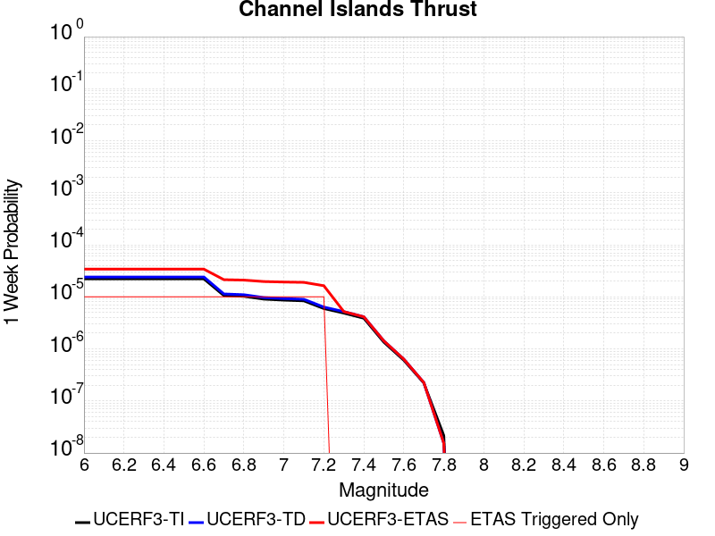 |  |  | 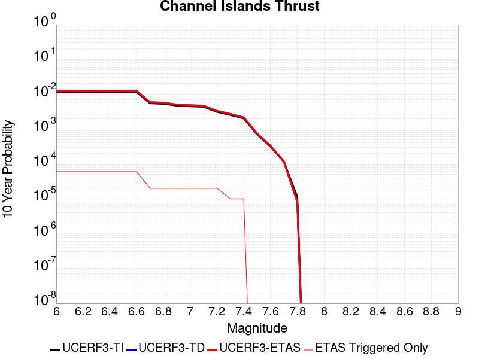 |

| Magnitude | 1 wk TI Prob | 1 wk TD Prob | 1 wk ETAS Prob | 1 wk ETAS/TD Gain | 1 wk ETAS Triggered Only | 1 mo TI Prob | 1 mo TD Prob | 1 mo ETAS Prob | 1 mo ETAS/TD Gain | 1 mo ETAS Triggered Only | 1 yr TI Prob | 1 yr TD Prob | 1 yr ETAS Prob | 1 yr ETAS/TD Gain | 1 yr ETAS Triggered Only | 10 yr TI Prob | 10 yr TD Prob | 10 yr ETAS Prob | 10 yr ETAS/TD Gain | 10 yr ETAS Triggered Only |
|-----|-----|-----|-----|-----|-----|-----|-----|-----|-----|-----|-----|-----|-----|-----|-----|-----|-----|-----|-----|-----|
| 6.0 | 2.2156251E-5 | 2.4092022E-5 | 3.409178E-5 | 1.4150652 | 1.0E-5 | 9.495191E-5 | 1.03248036E-4 | 1.2324598E-4 | 1.1936883 | 2.0E-5 | 0.0011554264 | 0.0012564266 | 0.0012863888 | 1.0238472 | 3.0E-5 | 0.011494373 | 0.0125038205 | 0.01256307 | 1.0047386 | 6.0E-5 |
| 6.1 | 2.2156251E-5 | 2.4092022E-5 | 3.409178E-5 | 1.4150652 | 1.0E-5 | 9.495191E-5 | 1.03248036E-4 | 1.2324598E-4 | 1.1936883 | 2.0E-5 | 0.0011554264 | 0.0012564266 | 0.0012863888 | 1.0238472 | 3.0E-5 | 0.011494373 | 0.0125038205 | 0.01256307 | 1.0047386 | 6.0E-5 |
| 6.2 | 2.2156251E-5 | 2.4092022E-5 | 3.409178E-5 | 1.4150652 | 1.0E-5 | 9.495191E-5 | 1.03248036E-4 | 1.2324598E-4 | 1.1936883 | 2.0E-5 | 0.0011554264 | 0.0012564266 | 0.0012863888 | 1.0238472 | 3.0E-5 | 0.011494373 | 0.0125038205 | 0.01256307 | 1.0047386 | 6.0E-5 |
| 6.3 | 2.2156251E-5 | 2.4092022E-5 | 3.409178E-5 | 1.4150652 | 1.0E-5 | 9.495191E-5 | 1.03248036E-4 | 1.2324598E-4 | 1.1936883 | 2.0E-5 | 0.0011554264 | 0.0012564266 | 0.0012863888 | 1.0238472 | 3.0E-5 | 0.011494373 | 0.0125038205 | 0.01256307 | 1.0047386 | 6.0E-5 |
| 6.4 | 2.2156251E-5 | 2.4092022E-5 | 3.409178E-5 | 1.4150652 | 1.0E-5 | 9.495191E-5 | 1.03248036E-4 | 1.2324598E-4 | 1.1936883 | 2.0E-5 | 0.0011554264 | 0.0012564266 | 0.0012863888 | 1.0238472 | 3.0E-5 | 0.011494373 | 0.0125038205 | 0.01256307 | 1.0047386 | 6.0E-5 |
| 6.5 | 2.2156251E-5 | 2.4092022E-5 | 3.409178E-5 | 1.4150652 | 1.0E-5 | 9.495191E-5 | 1.03248036E-4 | 1.2324598E-4 | 1.1936883 | 2.0E-5 | 0.0011554264 | 0.0012564266 | 0.0012863888 | 1.0238472 | 3.0E-5 | 0.011494373 | 0.0125038205 | 0.01256307 | 1.0047386 | 6.0E-5 |
| 6.6 | 2.2156251E-5 | 2.4092022E-5 | 3.409178E-5 | 1.4150652 | 1.0E-5 | 9.495191E-5 | 1.03248036E-4 | 1.2324598E-4 | 1.1936883 | 2.0E-5 | 0.0011554264 | 0.0012564266 | 0.0012863888 | 1.0238472 | 3.0E-5 | 0.011494373 | 0.0125038205 | 0.01256307 | 1.0047386 | 6.0E-5 |
| 6.7 | 1.0601296E-5 | 1.1379544E-5 | 2.137943E-5 | 1.8787599 | 1.0E-5 | 4.5433335E-5 | 4.876859E-5 | 5.8768102E-5 | 1.20504 | 1.0E-5 | 5.5301044E-4 | 5.936007E-4 | 6.0359476E-4 | 1.0168363 | 1.0E-5 | 0.005516363 | 0.005920653 | 0.005940535 | 1.003358 | 2.0E-5 |
| 6.8 | 1.0246747E-5 | 1.0996669E-5 | 2.0996558E-5 | 1.9093562 | 1.0E-5 | 4.391389E-5 | 4.7127756E-5 | 5.7127287E-5 | 1.2121792 | 1.0E-5 | 5.345204E-4 | 5.7363417E-4 | 5.836284E-4 | 1.0174227 | 1.0E-5 | 0.0053323656 | 0.005722025 | 0.0057419105 | 1.0034753 | 2.0E-5 |
| 6.9 | 9.049551E-6 | 9.699645E-6 | 1.9699548E-5 | 2.0309556 | 1.0E-5 | 3.878322E-5 | 4.1569267E-5 | 5.156885E-5 | 1.2405523 | 1.0E-5 | 4.7208337E-4 | 5.059924E-4 | 5.1598734E-4 | 1.0197531 | 1.0E-5 | 0.0047108172 | 0.0050488203 | 0.0050687194 | 1.0039413 | 2.0E-5 |
| 7.0 | 8.6542195E-6 | 9.274603E-6 | 1.927451E-5 | 2.0782032 | 1.0E-5 | 3.7088983E-5 | 3.9747716E-5 | 4.974732E-5 | 1.2515768 | 1.0E-5 | 4.5146482E-4 | 4.8382508E-4 | 4.9382023E-4 | 1.0206586 | 1.0E-5 | 0.004505487 | 0.0048281294 | 0.0048480327 | 1.0041224 | 2.0E-5 |
| 7.1 | 8.391028E-6 | 8.992925E-6 | 1.8992836E-5 | 2.1119752 | 1.0E-5 | 3.5961057E-5 | 3.8540562E-5 | 4.8540176E-5 | 1.2594569 | 1.0E-5 | 4.3773788E-4 | 4.6913436E-4 | 4.791297E-4 | 1.0213058 | 1.0E-5 | 0.004368766 | 0.0046818503 | 0.004701757 | 1.0042518 | 2.0E-5 |
| 7.2 | 5.965188E-6 | 6.3716957E-6 | 1.6371632E-5 | 2.569431 | 1.0E-5 | 2.556484E-5 | 2.7306984E-5 | 3.7306712E-5 | 1.3661966 | 1.0E-5 | 3.1120746E-4 | 3.3241237E-4 | 3.4240904E-4 | 1.0300732 | 1.0E-5 | 0.00310772 | 0.0033192094 | 0.003339143 | 1.0060055 | 2.0E-5 |
| 7.3 | 4.877518E-6 | 5.206007E-6 | 5.206007E-6 | 1.0 | 0.0 | 2.0903482E-5 | 2.231127E-5 | 2.231127E-5 | 1.0 | 0.0 | 2.5447016E-4 | 2.716063E-4 | 2.716063E-4 | 1.0 | 0.0 | 0.0025417898 | 0.0027127897 | 0.0027227625 | 1.0036763 | 1.0E-5 |
| 7.4 | 3.8829853E-6 | 4.141863E-6 | 4.141863E-6 | 1.0 | 0.0 | 1.664126E-5 | 1.7750723E-5 | 1.7750723E-5 | 1.0 | 0.0 | 2.0258849E-4 | 2.1609403E-4 | 2.1609403E-4 | 1.0 | 0.0 | 0.002024039 | 0.002158881 | 0.0021688591 | 1.004622 | 1.0E-5 |
| 7.5 | 1.3489616E-6 | 1.4277905E-6 | 1.4277905E-6 | 1.0 | 0.0 | 5.7812517E-6 | 6.119088E-6 | 6.119088E-6 | 1.0 | 0.0 | 7.038446E-5 | 7.449739E-5 | 7.449739E-5 | 1.0 | 0.0 | 7.036218E-4 | 7.4472814E-4 | 7.4472814E-4 | 1.0 | 0.0 |
| 7.6 | 6.058192E-7 | 6.35378E-7 | 6.35378E-7 | 1.0 | 0.0 | 2.5963652E-6 | 2.7230458E-6 | 2.7230458E-6 | 1.0 | 0.0 | 3.161029E-5 | 3.3152595E-5 | 3.3152595E-5 | 1.0 | 0.0 | 3.1605794E-4 | 3.314781E-4 | 3.314781E-4 | 1.0 | 0.0 |
| 7.7 | 2.2170494E-7 | 2.2607924E-7 | 2.2607924E-7 | 1.0 | 0.0 | 9.5016367E-7 | 9.689107E-7 | 9.689107E-7 | 1.0 | 0.0 | 1.1568181E-5 | 1.17964355E-5 | 1.17964355E-5 | 1.0 | 0.0 | 1.1567579E-4 | 1.179592E-4 | 1.179592E-4 | 1.0 | 0.0 |
| 7.8 | 2.1613102E-8 | 1.5466837E-8 | 1.5466837E-8 | 1.0 | 0.0 | 9.262757E-8 | 6.628645E-8 | 6.628645E-8 | 1.0 | 0.0 | 1.1277401E-6 | 8.070372E-7 | 8.070372E-7 | 1.0 | 0.0 | 1.1277344E-5 | 8.07035E-6 | 8.07035E-6 | 1.0 | 0.0 |

## Big Pine (Central)
*[(top)](#table-of-contents)*

| 1 Week | 1 Month | 1 Year | 10 Year |
|-----|-----|-----|-----|
|  |  | 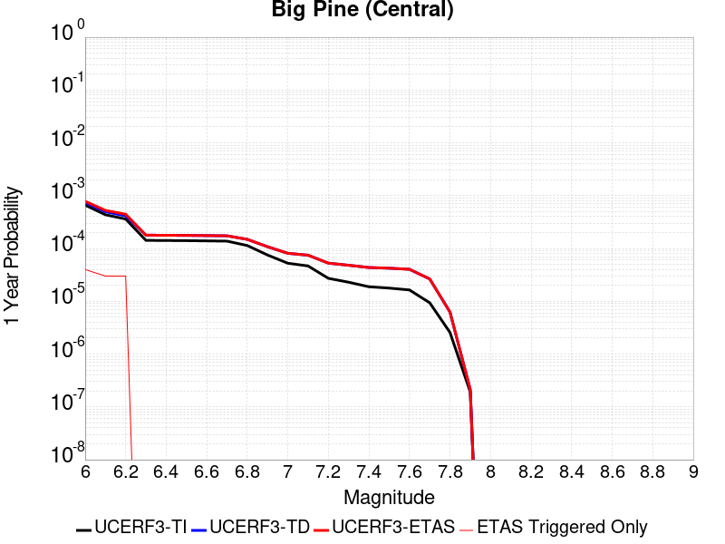 |  |

| Magnitude | 1 wk TI Prob | 1 wk TD Prob | 1 wk ETAS Prob | 1 wk ETAS/TD Gain | 1 wk ETAS Triggered Only | 1 mo TI Prob | 1 mo TD Prob | 1 mo ETAS Prob | 1 mo ETAS/TD Gain | 1 mo ETAS Triggered Only | 1 yr TI Prob | 1 yr TD Prob | 1 yr ETAS Prob | 1 yr ETAS/TD Gain | 1 yr ETAS Triggered Only | 10 yr TI Prob | 10 yr TD Prob | 10 yr ETAS Prob | 10 yr ETAS/TD Gain | 10 yr ETAS Triggered Only |
|-----|-----|-----|-----|-----|-----|-----|-----|-----|-----|-----|-----|-----|-----|-----|-----|-----|-----|-----|-----|-----|
| 6.0 | 1.2706755E-5 | 1.4250602E-5 | 3.425032E-5 | 2.4034295 | 2.0E-5 | 5.4456385E-5 | 6.107279E-5 | 1.0107034E-4 | 1.6549162 | 4.0E-5 | 6.628048E-4 | 7.433441E-4 | 7.8331435E-4 | 1.0537709 | 4.0E-5 | 0.006608314 | 0.007413639 | 0.00748312 | 1.0093721 | 7.0E-5 |
| 6.1 | 8.342579E-6 | 9.510835E-6 | 1.951074E-5 | 2.0514224 | 1.0E-5 | 3.5753423E-5 | 4.076021E-5 | 7.0758986E-5 | 1.735982 | 3.0E-5 | 4.3521097E-4 | 4.9616426E-4 | 5.261494E-4 | 1.0604339 | 3.0E-5 | 0.0043435963 | 0.004954155 | 0.0049840063 | 1.0060256 | 3.0E-5 |
| 6.2 | 6.923899E-6 | 7.967221E-6 | 1.7967142E-5 | 2.2551327 | 1.0E-5 | 2.9673516E-5 | 3.4144894E-5 | 6.4143875E-5 | 1.8785787 | 3.0E-5 | 3.6121515E-4 | 4.1565404E-4 | 4.4564158E-4 | 1.0721455 | 3.0E-5 | 0.003606286 | 0.0041521094 | 0.004181985 | 1.0071952 | 3.0E-5 |
| 6.3 | 2.728396E-6 | 3.4243646E-6 | 3.4243646E-6 | 1.0 | 0.0 | 1.1693074E-5 | 1.4675771E-5 | 1.4675771E-5 | 1.0 | 0.0 | 1.4235388E-4 | 1.7866373E-4 | 1.7866373E-4 | 1.0 | 0.0 | 0.0014226272 | 0.0017867433 | 0.0017867433 | 1.0 | 0.0 |
| 6.4 | 2.7136944E-6 | 3.4086581E-6 | 3.4086581E-6 | 1.0 | 0.0 | 1.1630066E-5 | 1.4608458E-5 | 1.4608458E-5 | 1.0 | 0.0 | 1.4158686E-4 | 1.7784433E-4 | 1.7784433E-4 | 1.0 | 0.0 | 0.0014149669 | 0.0017785623 | 0.0017785623 | 1.0 | 0.0 |
| 6.5 | 2.6971882E-6 | 3.3910032E-6 | 3.3910032E-6 | 1.0 | 0.0 | 1.1559327E-5 | 1.4532795E-5 | 1.4532795E-5 | 1.0 | 0.0 | 1.4072572E-4 | 1.7692328E-4 | 1.7692328E-4 | 1.0 | 0.0 | 0.0014063664 | 0.0017693666 | 0.0017693666 | 1.0 | 0.0 |
| 6.6 | 2.669092E-6 | 3.3610236E-6 | 3.3610236E-6 | 1.0 | 0.0 | 1.1438916E-5 | 1.4404312E-5 | 1.4404312E-5 | 1.0 | 0.0 | 1.3925991E-4 | 1.7535927E-4 | 1.7535927E-4 | 1.0 | 0.0 | 0.0013917267 | 0.0017537511 | 0.0017537511 | 1.0 | 0.0 |
| 6.7 | 2.6408059E-6 | 3.3310494E-6 | 3.3310494E-6 | 1.0 | 0.0 | 1.1317691E-5 | 1.4275853E-5 | 1.4275853E-5 | 1.0 | 0.0 | 1.3778417E-4 | 1.737955E-4 | 1.737955E-4 | 1.0 | 0.0 | 0.0013769877 | 0.0017381381 | 0.0017381381 | 1.0 | 0.0 |
| 6.8 | 2.1786943E-6 | 2.8545066E-6 | 2.8545066E-6 | 1.0 | 0.0 | 9.337228E-6 | 1.2233547E-5 | 1.2233547E-5 | 1.0 | 0.0 | 1.1367482E-4 | 1.4893398E-4 | 1.4893398E-4 | 1.0 | 0.0 | 0.0011361669 | 0.0014898704 | 0.0014898704 | 1.0 | 0.0 |
| 6.9 | 1.4411696E-6 | 2.0685677E-6 | 2.0685677E-6 | 1.0 | 0.0 | 6.1764263E-6 | 8.865261E-6 | 8.865261E-6 | 1.0 | 0.0 | 7.51954E-5 | 1.0792949E-4 | 1.0792949E-4 | 1.0 | 0.0 | 7.5169955E-4 | 0.0010802548 | 0.0010802548 | 1.0 | 0.0 |
| 7.0 | 1.0073411E-6 | 1.5543274E-6 | 1.5543274E-6 | 1.0 | 0.0 | 4.317169E-6 | 6.661387E-6 | 6.661387E-6 | 1.0 | 0.0 | 5.2560266E-5 | 8.109952E-5 | 8.109952E-5 | 1.0 | 0.0 | 5.2547833E-4 | 8.1217213E-4 | 8.1217213E-4 | 1.0 | 0.0 |
| 7.1 | 8.947104E-7 | 1.430316E-6 | 1.430316E-6 | 1.0 | 0.0 | 3.834468E-6 | 6.1299124E-6 | 6.1299124E-6 | 1.0 | 0.0 | 4.6683643E-5 | 7.462928E-5 | 7.462928E-5 | 1.0 | 0.0 | 4.6673836E-4 | 7.4751483E-4 | 7.4751483E-4 | 1.0 | 0.0 |
| 7.2 | 5.215166E-7 | 1.0112277E-6 | 1.0112277E-6 | 1.0 | 0.0 | 2.2350691E-6 | 4.333826E-6 | 4.333826E-6 | 1.0 | 0.0 | 2.7211627E-5 | 5.27631E-5 | 5.27631E-5 | 1.0 | 0.0 | 2.7208295E-4 | 5.289683E-4 | 5.289683E-4 | 1.0 | 0.0 |
| 7.3 | 4.4024807E-7 | 9.220183E-7 | 9.220183E-7 | 1.0 | 0.0 | 1.8867761E-6 | 3.951501E-6 | 3.951501E-6 | 1.0 | 0.0 | 2.2971257E-5 | 4.8108504E-5 | 4.8108504E-5 | 1.0 | 0.0 | 2.2968883E-4 | 4.824433E-4 | 4.824433E-4 | 1.0 | 0.0 |
| 7.4 | 3.6130905E-7 | 8.359109E-7 | 8.359109E-7 | 1.0 | 0.0 | 1.5484665E-6 | 3.5824705E-6 | 3.5824705E-6 | 1.0 | 0.0 | 1.8852415E-5 | 4.3615746E-5 | 4.3615746E-5 | 1.0 | 0.0 | 1.8850817E-4 | 4.3752496E-4 | 4.3752496E-4 | 1.0 | 0.0 |
| 7.5 | 3.408184E-7 | 8.1087245E-7 | 8.1087245E-7 | 1.0 | 0.0 | 1.4606494E-6 | 3.475163E-6 | 3.475163E-6 | 1.0 | 0.0 | 1.7783263E-5 | 4.230933E-5 | 4.230933E-5 | 1.0 | 0.0 | 1.778184E-4 | 4.2444657E-4 | 4.2444657E-4 | 1.0 | 0.0 |
| 7.6 | 3.1428627E-7 | 7.732167E-7 | 7.732167E-7 | 1.0 | 0.0 | 1.3469405E-6 | 3.313782E-6 | 3.313782E-6 | 1.0 | 0.0 | 1.6398877E-5 | 4.0344585E-5 | 4.0344585E-5 | 1.0 | 0.0 | 1.6397667E-4 | 4.0477706E-4 | 4.0477706E-4 | 1.0 | 0.0 |
| 7.7 | 1.7972785E-7 | 5.0782415E-7 | 5.0782415E-7 | 1.0 | 0.0 | 7.70262E-7 | 2.1763874E-6 | 2.1763874E-6 | 1.0 | 0.0 | 9.377899E-6 | 2.6497206E-5 | 2.6497206E-5 | 1.0 | 0.0 | 9.377503E-5 | 2.6633305E-4 | 2.6633305E-4 | 1.0 | 0.0 |
| 7.8 | 4.9230927E-8 | 1.1981747E-7 | 1.1981747E-7 | 1.0 | 0.0 | 2.1098968E-7 | 5.135033E-7 | 5.135033E-7 | 1.0 | 0.0 | 2.5687964E-6 | 6.2518866E-6 | 6.2518866E-6 | 1.0 | 0.0 | 2.5687666E-5 | 6.2971965E-5 | 6.2971965E-5 | 1.0 | 0.0 |
| 7.9 | 3.6805972E-9 | 4.1051638E-9 | 4.1051638E-9 | 1.0 | 0.0 | 1.5773987E-8 | 1.7593557E-8 | 1.7593557E-8 | 1.0 | 0.0 | 1.9204828E-7 | 2.1420155E-7 | 2.1420155E-7 | 1.0 | 0.0 | 1.920481E-6 | 2.1898923E-6 | 2.1898923E-6 | 1.0 | 0.0 |

## Bullion Mountains
*[(top)](#table-of-contents)*

| 1 Week | 1 Month | 1 Year | 10 Year |
|-----|-----|-----|-----|
| 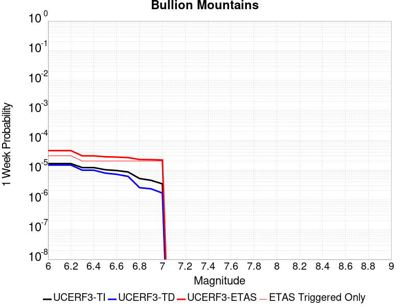 | 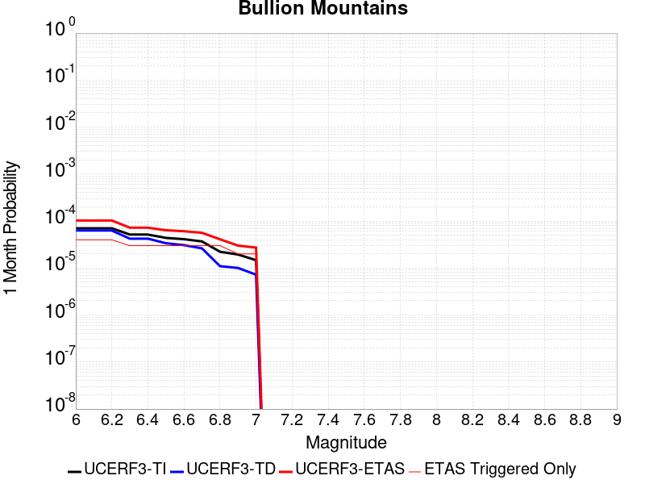 |  |  |

| Magnitude | 1 wk TI Prob | 1 wk TD Prob | 1 wk ETAS Prob | 1 wk ETAS/TD Gain | 1 wk ETAS Triggered Only | 1 mo TI Prob | 1 mo TD Prob | 1 mo ETAS Prob | 1 mo ETAS/TD Gain | 1 mo ETAS Triggered Only | 1 yr TI Prob | 1 yr TD Prob | 1 yr ETAS Prob | 1 yr ETAS/TD Gain | 1 yr ETAS Triggered Only | 10 yr TI Prob | 10 yr TD Prob | 10 yr ETAS Prob | 10 yr ETAS/TD Gain | 10 yr ETAS Triggered Only |
|-----|-----|-----|-----|-----|-----|-----|-----|-----|-----|-----|-----|-----|-----|-----|-----|-----|-----|-----|-----|-----|
| 6.0 | 1.6420427E-5 | 1.4692009E-5 | 4.469157E-5 | 3.0418963 | 3.0E-5 | 7.037136E-5 | 6.296445E-5 | 1.0296193E-4 | 1.6352391 | 4.0E-5 | 8.5643446E-4 | 7.6636096E-4 | 8.2631496E-4 | 1.078232 | 6.0E-5 | 0.008531413 | 0.0076409746 | 0.00771044 | 1.0090911 | 7.0E-5 |
| 6.1 | 1.6420427E-5 | 1.4692009E-5 | 4.469157E-5 | 3.0418963 | 3.0E-5 | 7.037136E-5 | 6.296445E-5 | 1.0296193E-4 | 1.6352391 | 4.0E-5 | 8.5643446E-4 | 7.6636096E-4 | 8.2631496E-4 | 1.078232 | 6.0E-5 | 0.008531413 | 0.0076409746 | 0.00771044 | 1.0090911 | 7.0E-5 |
| 6.2 | 1.6420427E-5 | 1.4692009E-5 | 4.469157E-5 | 3.0418963 | 3.0E-5 | 7.037136E-5 | 6.296445E-5 | 1.0296193E-4 | 1.6352391 | 4.0E-5 | 8.5643446E-4 | 7.6636096E-4 | 8.2631496E-4 | 1.078232 | 6.0E-5 | 0.008531413 | 0.0076409746 | 0.00771044 | 1.0090911 | 7.0E-5 |
| 6.3 | 1.2046778E-5 | 9.862255E-6 | 2.9862058E-5 | 3.0279138 | 2.0E-5 | 5.1628023E-5 | 4.2266256E-5 | 7.2264986E-5 | 1.7097561 | 3.0E-5 | 6.283899E-4 | 5.144933E-4 | 5.644676E-4 | 1.097133 | 5.0E-5 | 0.0062661595 | 0.0051353034 | 0.0051850467 | 1.0096865 | 5.0E-5 |
| 6.4 | 1.2046778E-5 | 9.862255E-6 | 2.9862058E-5 | 3.0279138 | 2.0E-5 | 5.1628023E-5 | 4.2266256E-5 | 7.2264986E-5 | 1.7097561 | 3.0E-5 | 6.283899E-4 | 5.144933E-4 | 5.644676E-4 | 1.097133 | 5.0E-5 | 0.0062661595 | 0.0051353034 | 0.0051850467 | 1.0096865 | 5.0E-5 |
| 6.5 | 1.0244343E-5 | 7.879378E-6 | 2.7879221E-5 | 3.5382512 | 2.0E-5 | 4.390359E-5 | 3.3768443E-5 | 6.376743E-5 | 1.8883734 | 3.0E-5 | 5.343951E-4 | 4.1107394E-4 | 4.5105748E-4 | 1.0972661 | 4.0E-5 | 0.005331118 | 0.0041051665 | 0.0041450025 | 1.0097039 | 4.0E-5 |
| 6.6 | 9.605408E-6 | 7.1774166E-6 | 2.7177273E-5 | 3.7864978 | 2.0E-5 | 4.1165385E-5 | 3.0760108E-5 | 6.0759186E-5 | 1.9752591 | 3.0E-5 | 5.010733E-4 | 3.7446033E-4 | 4.1444536E-4 | 1.1067804 | 4.0E-5 | 0.00499945 | 0.0037402906 | 0.003780141 | 1.0106543 | 4.0E-5 |
| 6.7 | 8.60418E-6 | 6.123926E-6 | 2.6123804E-5 | 4.2658587 | 2.0E-5 | 3.687454E-5 | 2.6245243E-5 | 5.6244455E-5 | 2.1430342 | 3.0E-5 | 4.48855E-4 | 3.195085E-4 | 3.594957E-4 | 1.1251523 | 4.0E-5 | 0.004479495 | 0.0031924031 | 0.0032322754 | 1.0124898 | 4.0E-5 |
| 6.8 | 5.187994E-6 | 2.563117E-6 | 2.2563067E-5 | 8.802979 | 2.0E-5 | 2.223407E-5 | 1.0984763E-5 | 4.0984432E-5 | 3.7310255 | 3.0E-5 | 2.7066618E-4 | 1.3373529E-4 | 1.7372993E-4 | 1.2990583 | 4.0E-5 | 0.0027033675 | 0.0013369396 | 0.0013768862 | 1.0298791 | 4.0E-5 |
| 6.9 | 4.5302368E-6 | 2.3442778E-6 | 2.2344231E-5 | 9.531392 | 2.0E-5 | 1.9415156E-5 | 1.0046889E-5 | 3.0046687E-5 | 2.990646 | 2.0E-5 | 2.3635388E-4 | 1.2231797E-4 | 1.523143E-4 | 1.2452323 | 3.0E-5 | 0.0023610266 | 0.0012228956 | 0.0012528589 | 1.0245019 | 3.0E-5 |
| 7.0 | 3.431668E-6 | 1.6882177E-6 | 2.1688184E-5 | 12.846793 | 2.0E-5 | 1.4707065E-5 | 7.2352186E-6 | 2.7235074E-5 | 3.7642365 | 2.0E-5 | 1.7904381E-4 | 8.808879E-5 | 1.1808614E-4 | 1.3405355 | 3.0E-5 | 0.0017889962 | 8.8088785E-4 | 9.108614E-4 | 1.0340265 | 3.0E-5 |

## San Diego Trough south
*[(top)](#table-of-contents)*

| 1 Week | 1 Month | 1 Year | 10 Year |
|-----|-----|-----|-----|
|  |  | 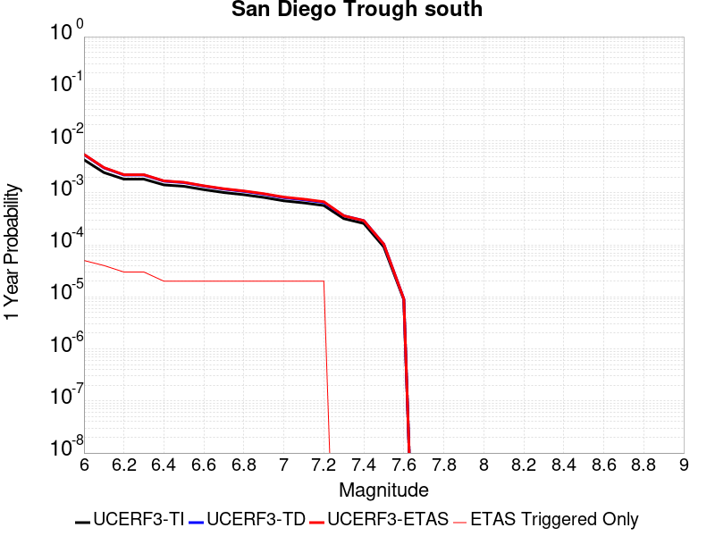 |  |

| Magnitude | 1 wk TI Prob | 1 wk TD Prob | 1 wk ETAS Prob | 1 wk ETAS/TD Gain | 1 wk ETAS Triggered Only | 1 mo TI Prob | 1 mo TD Prob | 1 mo ETAS Prob | 1 mo ETAS/TD Gain | 1 mo ETAS Triggered Only | 1 yr TI Prob | 1 yr TD Prob | 1 yr ETAS Prob | 1 yr ETAS/TD Gain | 1 yr ETAS Triggered Only | 10 yr TI Prob | 10 yr TD Prob | 10 yr ETAS Prob | 10 yr ETAS/TD Gain | 10 yr ETAS Triggered Only |
|-----|-----|-----|-----|-----|-----|-----|-----|-----|-----|-----|-----|-----|-----|-----|-----|-----|-----|-----|-----|-----|
| 6.0 | 8.279495E-5 | 1.0425541E-4 | 1.0425541E-4 | 1.0 | 0.0 | 3.5478722E-4 | 4.4673498E-4 | 4.6672602E-4 | 1.0447493 | 2.0E-5 | 0.004310982 | 0.0054259133 | 0.005475642 | 1.009165 | 5.0E-5 | 0.042283054 | 0.05299303 | 0.05305932 | 1.001251 | 7.0E-5 |
| 6.1 | 4.6961468E-5 | 5.773024E-5 | 5.773024E-5 | 1.0 | 0.0 | 2.0124791E-4 | 2.473905E-4 | 2.5738802E-4 | 1.040412 | 1.0E-5 | 0.00244744 | 0.003007886 | 0.0030477657 | 1.0132583 | 4.0E-5 | 0.024206603 | 0.029679636 | 0.029728152 | 1.0016346 | 5.0E-5 |
| 6.2 | 3.5079658E-5 | 4.214258E-5 | 4.214258E-5 | 1.0 | 0.0 | 1.5033272E-4 | 1.8059829E-4 | 1.9059649E-4 | 1.0553615 | 1.0E-5 | 0.0018287642 | 0.002196587 | 0.002226521 | 1.0136275 | 3.0E-5 | 0.018137876 | 0.021751188 | 0.021790316 | 1.001799 | 4.0E-5 |
| 6.3 | 3.5079658E-5 | 4.214258E-5 | 4.214258E-5 | 1.0 | 0.0 | 1.5033272E-4 | 1.8059829E-4 | 1.9059649E-4 | 1.0553615 | 1.0E-5 | 0.0018287642 | 0.002196587 | 0.002226521 | 1.0136275 | 3.0E-5 | 0.018137876 | 0.021751188 | 0.021790316 | 1.001799 | 4.0E-5 |
| 6.4 | 2.7196904E-5 | 3.208715E-5 | 3.208715E-5 | 1.0 | 0.0 | 1.16552954E-4 | 1.3750911E-4 | 1.4750773E-4 | 1.0727124 | 1.0E-5 | 0.0014181085 | 0.0016728995 | 0.001692866 | 1.0119352 | 2.0E-5 | 0.014090929 | 0.016604666 | 0.016634168 | 1.0017767 | 3.0E-5 |
| 6.5 | 2.5584688E-5 | 3.0101632E-5 | 3.0101632E-5 | 1.0 | 0.0 | 1.0964406E-4 | 1.2900059E-4 | 1.3899931E-4 | 1.077509 | 1.0E-5 | 0.0013340989 | 0.0015694627 | 0.0015894313 | 1.0127232 | 2.0E-5 | 0.013261181 | 0.015585332 | 0.015614864 | 1.0018948 | 3.0E-5 |
| 6.6 | 2.2034688E-5 | 2.574271E-5 | 2.574271E-5 | 1.0 | 0.0 | 9.443096E-5 | 1.1032127E-4 | 1.2032017E-4 | 1.0906343 | 1.0E-5 | 0.0011490905 | 0.0013423412 | 0.0013623143 | 1.0148793 | 2.0E-5 | 0.011431668 | 0.013343325 | 0.013363058 | 1.0014789 | 2.0E-5 |
| 6.7 | 1.9394853E-5 | 2.254176E-5 | 2.254176E-5 | 1.0 | 0.0 | 8.311815E-5 | 9.6604E-5 | 1.0660303E-4 | 1.1035054 | 1.0E-5 | 0.0010114936 | 0.0011755243 | 0.0011955008 | 1.0169936 | 2.0E-5 | 0.01006902 | 0.011693766 | 0.011713533 | 1.0016903 | 2.0E-5 |
| 6.8 | 1.7615313E-5 | 2.0403182E-5 | 2.0403182E-5 | 1.0 | 0.0 | 7.549201E-5 | 8.743931E-5 | 9.743843E-5 | 1.1143551 | 1.0E-5 | 9.1872766E-4 | 0.0010640579 | 0.0010840367 | 1.0187759 | 2.0E-5 | 0.009149387 | 0.010590198 | 0.010609986 | 1.0018685 | 2.0E-5 |
| 6.9 | 1.5621423E-5 | 1.8026114E-5 | 1.8026114E-5 | 1.0 | 0.0 | 6.6947236E-5 | 7.725251E-5 | 8.7251734E-5 | 1.1294357 | 1.0E-5 | 8.147778E-4 | 9.40147E-4 | 9.601282E-4 | 1.0212532 | 2.0E-5 | 0.008117969 | 0.009362142 | 0.009381955 | 1.0021163 | 2.0E-5 |
| 7.0 | 1.3444376E-5 | 1.544809E-5 | 1.544809E-5 | 1.0 | 0.0 | 5.7617483E-5 | 6.620443E-5 | 7.620377E-5 | 1.1510373 | 1.0E-5 | 7.0126704E-4 | 8.057436E-4 | 8.2572753E-4 | 1.0248019 | 2.0E-5 | 0.006990582 | 0.008028555 | 0.008048395 | 1.0024711 | 2.0E-5 |
| 7.1 | 1.2268361E-5 | 1.407303E-5 | 1.407303E-5 | 1.0 | 0.0 | 5.2577634E-5 | 6.0311606E-5 | 7.0311005E-5 | 1.1657956 | 1.0E-5 | 6.399447E-4 | 7.3404907E-4 | 7.540344E-4 | 1.0272261 | 2.0E-5 | 0.0063810493 | 0.0073165493 | 0.007336403 | 1.0027136 | 2.0E-5 |
| 7.2 | 1.0922655E-5 | 1.2513563E-5 | 1.2513563E-5 | 1.0 | 0.0 | 4.681054E-5 | 5.3628468E-5 | 6.362793E-5 | 1.1864581 | 1.0E-5 | 5.697693E-4 | 6.5273355E-4 | 6.727205E-4 | 1.0306203 | 2.0E-5 | 0.0056831064 | 0.0065084435 | 0.0065283137 | 1.003053 | 2.0E-5 |
| 7.3 | 6.1106753E-6 | 6.928925E-6 | 6.928925E-6 | 1.0 | 0.0 | 2.6188345E-5 | 2.9695057E-5 | 2.9695057E-5 | 1.0 | 0.0 | 3.1879646E-4 | 3.6147775E-4 | 3.6147775E-4 | 1.0 | 0.0 | 0.0031833951 | 0.003608943 | 0.003608943 | 1.0 | 0.0 |
| 7.4 | 4.933187E-6 | 5.5895525E-6 | 5.5895525E-6 | 1.0 | 0.0 | 2.114206E-5 | 2.3955008E-5 | 2.3955008E-5 | 1.0 | 0.0 | 2.5737417E-4 | 2.9161357E-4 | 2.9161357E-4 | 1.0 | 0.0 | 0.002570763 | 0.0029123505 | 0.0029123505 | 1.0 | 0.0 |
| 7.5 | 1.7489613E-6 | 1.969678E-6 | 1.969678E-6 | 1.0 | 0.0 | 7.495527E-6 | 8.4414505E-6 | 8.4414505E-6 | 1.0 | 0.0 | 9.125422E-5 | 1.02770035E-4 | 1.02770035E-4 | 1.0 | 0.0 | 9.1216754E-4 | 0.0010272472 | 0.0010272472 | 1.0 | 0.0 |
| 7.6 | 1.6988751E-7 | 1.7533823E-7 | 1.7533823E-7 | 1.0 | 0.0 | 7.2808916E-7 | 7.5144936E-7 | 7.5144936E-7 | 1.0 | 0.0 | 8.864449E-6 | 9.14886E-6 | 9.14886E-6 | 1.0 | 0.0 | 8.8640954E-5 | 9.1485024E-5 | 9.1485024E-5 | 1.0 | 0.0 |

## Pine Mtn
*[(top)](#table-of-contents)*

| 1 Week | 1 Month | 1 Year | 10 Year |
|-----|-----|-----|-----|
|  |  |  |  |

| Magnitude | 1 wk TI Prob | 1 wk TD Prob | 1 wk ETAS Prob | 1 wk ETAS/TD Gain | 1 wk ETAS Triggered Only | 1 mo TI Prob | 1 mo TD Prob | 1 mo ETAS Prob | 1 mo ETAS/TD Gain | 1 mo ETAS Triggered Only | 1 yr TI Prob | 1 yr TD Prob | 1 yr ETAS Prob | 1 yr ETAS/TD Gain | 1 yr ETAS Triggered Only | 10 yr TI Prob | 10 yr TD Prob | 10 yr ETAS Prob | 10 yr ETAS/TD Gain | 10 yr ETAS Triggered Only |
|-----|-----|-----|-----|-----|-----|-----|-----|-----|-----|-----|-----|-----|-----|-----|-----|-----|-----|-----|-----|-----|
| 6.0 | 6.894797E-6 | 7.2254716E-6 | 1.72254E-5 | 2.3839827 | 1.0E-5 | 2.9548795E-5 | 3.0965955E-5 | 4.0965646E-5 | 1.3229253 | 1.0E-5 | 3.596972E-4 | 3.7694827E-4 | 3.9694074E-4 | 1.0530376 | 2.0E-5 | 0.0035911554 | 0.0037633865 | 0.0038231607 | 1.0158831 | 6.0E-5 |
| 6.1 | 6.894797E-6 | 7.2254716E-6 | 1.72254E-5 | 2.3839827 | 1.0E-5 | 2.9548795E-5 | 3.0965955E-5 | 4.0965646E-5 | 1.3229253 | 1.0E-5 | 3.596972E-4 | 3.7694827E-4 | 3.9694074E-4 | 1.0530376 | 2.0E-5 | 0.0035911554 | 0.0037633865 | 0.0038231607 | 1.0158831 | 6.0E-5 |
| 6.2 | 6.894797E-6 | 7.2254716E-6 | 1.72254E-5 | 2.3839827 | 1.0E-5 | 2.9548795E-5 | 3.0965955E-5 | 4.0965646E-5 | 1.3229253 | 1.0E-5 | 3.596972E-4 | 3.7694827E-4 | 3.9694074E-4 | 1.0530376 | 2.0E-5 | 0.0035911554 | 0.0037633865 | 0.0038231607 | 1.0158831 | 6.0E-5 |
| 6.3 | 6.894797E-6 | 7.2254716E-6 | 1.72254E-5 | 2.3839827 | 1.0E-5 | 2.9548795E-5 | 3.0965955E-5 | 4.0965646E-5 | 1.3229253 | 1.0E-5 | 3.596972E-4 | 3.7694827E-4 | 3.9694074E-4 | 1.0530376 | 2.0E-5 | 0.0035911554 | 0.0037633865 | 0.0038231607 | 1.0158831 | 6.0E-5 |
| 6.4 | 6.894797E-6 | 7.2254716E-6 | 1.72254E-5 | 2.3839827 | 1.0E-5 | 2.9548795E-5 | 3.0965955E-5 | 4.0965646E-5 | 1.3229253 | 1.0E-5 | 3.596972E-4 | 3.7694827E-4 | 3.9694074E-4 | 1.0530376 | 2.0E-5 | 0.0035911554 | 0.0037633865 | 0.0038231607 | 1.0158831 | 6.0E-5 |
| 6.5 | 6.894797E-6 | 7.2254716E-6 | 1.72254E-5 | 2.3839827 | 1.0E-5 | 2.9548795E-5 | 3.0965955E-5 | 4.0965646E-5 | 1.3229253 | 1.0E-5 | 3.596972E-4 | 3.7694827E-4 | 3.9694074E-4 | 1.0530376 | 2.0E-5 | 0.0035911554 | 0.0037633865 | 0.0038231607 | 1.0158831 | 6.0E-5 |
| 6.6 | 6.894797E-6 | 7.2254716E-6 | 1.72254E-5 | 2.3839827 | 1.0E-5 | 2.9548795E-5 | 3.0965955E-5 | 4.0965646E-5 | 1.3229253 | 1.0E-5 | 3.596972E-4 | 3.7694827E-4 | 3.9694074E-4 | 1.0530376 | 2.0E-5 | 0.0035911554 | 0.0037633865 | 0.0038231607 | 1.0158831 | 6.0E-5 |
| 6.7 | 6.0867933E-6 | 6.397124E-6 | 1.639706E-5 | 2.5631926 | 1.0E-5 | 2.6085996E-5 | 2.7415968E-5 | 3.7415695E-5 | 1.364741 | 1.0E-5 | 3.1755073E-4 | 3.337405E-4 | 3.537338E-4 | 1.0599068 | 2.0E-5 | 0.0031709734 | 0.0033326119 | 0.0033824453 | 1.0149533 | 5.0E-5 |
| 6.8 | 5.6530425E-6 | 5.950606E-6 | 1.5950547E-5 | 2.6804912 | 1.0E-5 | 2.42271E-5 | 2.5502359E-5 | 3.5502104E-5 | 1.3921106 | 1.0E-5 | 2.94925E-4 | 3.1044905E-4 | 3.3044282E-4 | 1.0644028 | 2.0E-5 | 0.002945339 | 0.0031003582 | 0.0031502033 | 1.0160772 | 5.0E-5 |
| 6.9 | 4.6015225E-6 | 4.8638444E-6 | 1.48637955E-5 | 3.0559769 | 1.0E-5 | 1.9720663E-5 | 2.084489E-5 | 3.084468E-5 | 1.4797239 | 1.0E-5 | 2.4007261E-4 | 2.5375842E-4 | 2.7375337E-4 | 1.0787951 | 2.0E-5 | 0.0023981342 | 0.002534831 | 0.0025747295 | 1.0157402 | 4.0E-5 |
| 7.0 | 4.4875965E-6 | 4.7474837E-6 | 1.4747436E-5 | 3.106369 | 1.0E-5 | 1.9232413E-5 | 2.0346208E-5 | 3.0346004E-5 | 1.4914821 | 1.0E-5 | 2.3412947E-4 | 2.4768838E-4 | 2.676834E-4 | 1.0807266 | 2.0E-5 | 0.0023388295 | 0.0024742668 | 0.002514168 | 1.0161264 | 4.0E-5 |
| 7.1 | 3.203907E-6 | 3.42942E-6 | 3.42942E-6 | 1.0 | 0.0 | 1.3730958E-5 | 1.4697435E-5 | 1.4697435E-5 | 1.0 | 0.0 | 1.6716159E-4 | 1.7892725E-4 | 1.8892546E-4 | 1.0558786 | 1.0E-5 | 0.0016703589 | 0.001787898 | 0.0017978802 | 1.0055832 | 1.0E-5 |
| 7.2 | 2.2060601E-6 | 2.3784874E-6 | 2.3784874E-6 | 1.0 | 0.0 | 9.4545085E-6 | 1.019348E-5 | 1.019348E-5 | 1.0 | 0.0 | 1.15102564E-4 | 1.2409901E-4 | 1.3409776E-4 | 1.0805708 | 1.0E-5 | 0.0011504296 | 0.0012403419 | 0.0012503295 | 1.0080523 | 1.0E-5 |
| 7.3 | 1.3765207E-6 | 1.5216535E-6 | 1.5216535E-6 | 1.0 | 0.0 | 5.899361E-6 | 6.5213567E-6 | 6.5213567E-6 | 1.0 | 0.0 | 7.182235E-5 | 7.939472E-5 | 7.939472E-5 | 1.0 | 0.0 | 7.1799144E-4 | 7.9367263E-4 | 7.9367263E-4 | 1.0 | 0.0 |
| 7.4 | 1.1245983E-6 | 1.2587126E-6 | 1.2587126E-6 | 1.0 | 0.0 | 4.819698E-6 | 5.394472E-6 | 5.394472E-6 | 1.0 | 0.0 | 5.8678244E-5 | 6.56758E-5 | 6.56758E-5 | 1.0 | 0.0 | 5.866275E-4 | 6.565722E-4 | 6.565722E-4 | 1.0 | 0.0 |
| 7.5 | 8.031682E-7 | 9.276999E-7 | 9.276999E-7 | 1.0 | 0.0 | 3.4421448E-6 | 3.975851E-6 | 3.975851E-6 | 1.0 | 0.0 | 4.1907308E-5 | 4.840498E-5 | 4.840498E-5 | 1.0 | 0.0 | 4.1899405E-4 | 4.8395112E-4 | 4.8395112E-4 | 1.0 | 0.0 |
| 7.6 | 4.8953444E-7 | 6.0030544E-7 | 6.0030544E-7 | 1.0 | 0.0 | 2.098003E-6 | 2.5727354E-6 | 2.5727354E-6 | 1.0 | 0.0 | 2.5542888E-5 | 3.1322652E-5 | 3.1322652E-5 | 1.0 | 0.0 | 2.5539953E-4 | 3.1318725E-4 | 3.1318725E-4 | 1.0 | 0.0 |
| 7.7 | 6.634529E-8 | 6.788826E-8 | 6.788826E-8 | 1.0 | 0.0 | 2.843369E-7 | 2.9094966E-7 | 2.9094966E-7 | 1.0 | 0.0 | 3.4617963E-6 | 3.5423066E-6 | 3.5423066E-6 | 1.0 | 0.0 | 3.4617424E-5 | 3.542255E-5 | 3.542255E-5 | 1.0 | 0.0 |
| 7.8 | 9.235578E-9 | 9.488566E-9 | 9.488566E-9 | 1.0 | 0.0 | 3.9581046E-8 | 4.0665284E-8 | 4.0665284E-8 | 1.0 | 0.0 | 4.818991E-7 | 4.950997E-7 | 4.950997E-7 | 1.0 | 0.0 | 4.8189804E-6 | 4.950988E-6 | 4.950988E-6 | 1.0 | 0.0 |

## Independence rev 2011
*[(top)](#table-of-contents)*

| 1 Week | 1 Month | 1 Year | 10 Year |
|-----|-----|-----|-----|
|  |  | 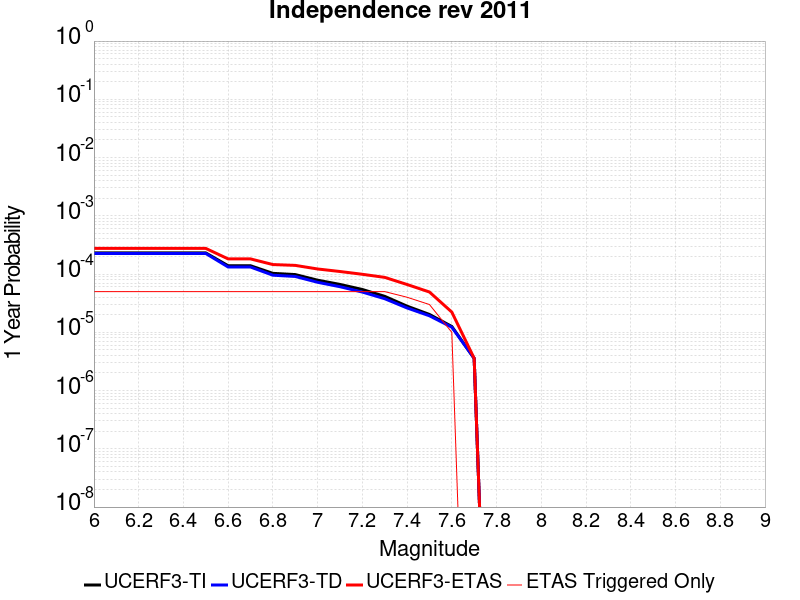 | 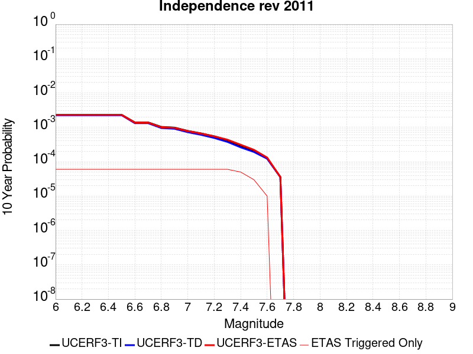 |

| Magnitude | 1 wk TI Prob | 1 wk TD Prob | 1 wk ETAS Prob | 1 wk ETAS/TD Gain | 1 wk ETAS Triggered Only | 1 mo TI Prob | 1 mo TD Prob | 1 mo ETAS Prob | 1 mo ETAS/TD Gain | 1 mo ETAS Triggered Only | 1 yr TI Prob | 1 yr TD Prob | 1 yr ETAS Prob | 1 yr ETAS/TD Gain | 1 yr ETAS Triggered Only | 10 yr TI Prob | 10 yr TD Prob | 10 yr ETAS Prob | 10 yr ETAS/TD Gain | 10 yr ETAS Triggered Only |
|-----|-----|-----|-----|-----|-----|-----|-----|-----|-----|-----|-----|-----|-----|-----|-----|-----|-----|-----|-----|-----|
| 6.0 | 4.422171E-6 | 4.3262253E-6 | 4.432605E-5 | 10.245895 | 4.0E-5 | 1.8952025E-5 | 1.8540852E-5 | 5.854011E-5 | 3.1573584 | 4.0E-5 | 2.3071647E-4 | 2.2571447E-4 | 2.7570318E-4 | 1.2214688 | 5.0E-5 | 0.0023047708 | 0.0022551457 | 0.0023150104 | 1.0265458 | 6.0E-5 |
| 6.1 | 4.422171E-6 | 4.3262253E-6 | 4.432605E-5 | 10.245895 | 4.0E-5 | 1.8952025E-5 | 1.8540852E-5 | 5.854011E-5 | 3.1573584 | 4.0E-5 | 2.3071647E-4 | 2.2571447E-4 | 2.7570318E-4 | 1.2214688 | 5.0E-5 | 0.0023047708 | 0.0022551457 | 0.0023150104 | 1.0265458 | 6.0E-5 |
| 6.2 | 4.422171E-6 | 4.3262253E-6 | 4.432605E-5 | 10.245895 | 4.0E-5 | 1.8952025E-5 | 1.8540852E-5 | 5.854011E-5 | 3.1573584 | 4.0E-5 | 2.3071647E-4 | 2.2571447E-4 | 2.7570318E-4 | 1.2214688 | 5.0E-5 | 0.0023047708 | 0.0022551457 | 0.0023150104 | 1.0265458 | 6.0E-5 |
| 6.3 | 4.422171E-6 | 4.3262253E-6 | 4.432605E-5 | 10.245895 | 4.0E-5 | 1.8952025E-5 | 1.8540852E-5 | 5.854011E-5 | 3.1573584 | 4.0E-5 | 2.3071647E-4 | 2.2571447E-4 | 2.7570318E-4 | 1.2214688 | 5.0E-5 | 0.0023047708 | 0.0022551457 | 0.0023150104 | 1.0265458 | 6.0E-5 |
| 6.4 | 4.422171E-6 | 4.3262253E-6 | 4.432605E-5 | 10.245895 | 4.0E-5 | 1.8952025E-5 | 1.8540852E-5 | 5.854011E-5 | 3.1573584 | 4.0E-5 | 2.3071647E-4 | 2.2571447E-4 | 2.7570318E-4 | 1.2214688 | 5.0E-5 | 0.0023047708 | 0.0022551457 | 0.0023150104 | 1.0265458 | 6.0E-5 |
| 6.5 | 4.422171E-6 | 4.3262253E-6 | 4.432605E-5 | 10.245895 | 4.0E-5 | 1.8952025E-5 | 1.8540852E-5 | 5.854011E-5 | 3.1573584 | 4.0E-5 | 2.3071647E-4 | 2.2571447E-4 | 2.7570318E-4 | 1.2214688 | 5.0E-5 | 0.0023047708 | 0.0022551457 | 0.0023150104 | 1.0265458 | 6.0E-5 |
| 6.6 | 2.663744E-6 | 2.5319846E-6 | 4.2531883E-5 | 16.797844 | 4.0E-5 | 1.1415996E-5 | 1.08513195E-5 | 5.0850886E-5 | 4.6861477 | 4.0E-5 | 1.3898089E-4 | 1.321073E-4 | 1.8210069E-4 | 1.3784302 | 5.0E-5 | 0.0013889399 | 0.0013203359 | 0.0013802567 | 1.045383 | 6.0E-5 |
| 6.7 | 2.663744E-6 | 2.5319846E-6 | 4.2531883E-5 | 16.797844 | 4.0E-5 | 1.1415996E-5 | 1.08513195E-5 | 5.0850886E-5 | 4.6861477 | 4.0E-5 | 1.3898089E-4 | 1.321073E-4 | 1.8210069E-4 | 1.3784302 | 5.0E-5 | 0.0013889399 | 0.0013203359 | 0.0013802567 | 1.045383 | 6.0E-5 |
| 6.8 | 1.9716529E-6 | 1.8322567E-6 | 4.1832183E-5 | 22.830963 | 4.0E-5 | 8.449913E-6 | 7.852505E-6 | 4.785219E-5 | 6.0938754 | 4.0E-5 | 1.0287284E-4 | 9.560019E-5 | 1.455954E-4 | 1.5229615 | 5.0E-5 | 0.0010282523 | 9.5560355E-4 | 0.0010155461 | 1.0627276 | 6.0E-5 |
| 6.9 | 1.8788617E-6 | 1.7429976E-6 | 4.174293E-5 | 23.94893 | 4.0E-5 | 8.0522395E-6 | 7.4699688E-6 | 4.746967E-5 | 6.354735 | 4.0E-5 | 9.80316E-5 | 9.09432E-5 | 1.4093865E-4 | 1.5497438 | 5.0E-5 | 9.798837E-4 | 9.090718E-4 | 9.690173E-4 | 1.0659413 | 6.0E-5 |
| 7.0 | 1.5045488E-6 | 1.3849498E-6 | 4.1384894E-5 | 29.881874 | 4.0E-5 | 6.44805E-6 | 5.9354857E-6 | 4.593525E-5 | 7.7390885 | 4.0E-5 | 7.8502184E-5 | 7.226219E-5 | 1.2225859E-4 | 1.6918747 | 5.0E-5 | 7.8474457E-4 | 7.223921E-4 | 7.8234874E-4 | 1.0829974 | 6.0E-5 |
| 7.1 | 1.272341E-6 | 1.1625089E-6 | 4.1162464E-5 | 35.4083 | 4.0E-5 | 5.4528787E-6 | 4.9821715E-6 | 4.498197E-5 | 9.028587 | 4.0E-5 | 6.6386776E-5 | 6.0656283E-5 | 1.1065325E-4 | 1.8242669 | 5.0E-5 | 6.636695E-4 | 6.064005E-4 | 6.663641E-4 | 1.0988845 | 6.0E-5 |
| 7.2 | 1.0416892E-6 | 9.409871E-7 | 4.0940948E-5 | 43.508514 | 4.0E-5 | 4.464375E-6 | 4.032796E-6 | 4.4032633E-5 | 10.918637 | 4.0E-5 | 5.4352407E-5 | 4.9098202E-5 | 9.909575E-5 | 2.0183172 | 5.0E-5 | 5.4339116E-4 | 4.908754E-4 | 5.508459E-4 | 1.1221706 | 6.0E-5 |
| 7.3 | 7.9450155E-7 | 7.2350036E-7 | 4.0723473E-5 | 56.28673 | 4.0E-5 | 3.4050022E-6 | 3.1007123E-6 | 4.3100586E-5 | 13.900222 | 4.0E-5 | 4.1455114E-5 | 3.7750528E-5 | 8.774864E-5 | 2.3244348 | 5.0E-5 | 4.144738E-4 | 3.7744228E-4 | 4.3741963E-4 | 1.1589047 | 6.0E-5 |
| 7.4 | 5.3893444E-7 | 5.0195166E-7 | 4.050193E-5 | 80.68891 | 4.0E-5 | 2.309717E-6 | 2.1512196E-6 | 4.2151132E-5 | 19.594063 | 4.0E-5 | 2.8120441E-5 | 2.6190788E-5 | 6.618974E-5 | 2.5272145 | 4.0E-5 | 2.8116882E-4 | 2.6187746E-4 | 3.1186437E-4 | 1.190879 | 5.0E-5 |
| 7.5 | 3.8852085E-7 | 3.6825622E-7 | 3.0368245E-5 | 82.46499 | 3.0E-5 | 1.6650882E-6 | 1.57824E-6 | 3.1578194E-5 | 20.008486 | 3.0E-5 | 2.027226E-5 | 1.9214905E-5 | 4.921433E-5 | 2.5612578 | 3.0E-5 | 2.0270412E-4 | 1.9213265E-4 | 2.221269E-4 | 1.1561121 | 3.0E-5 |
| 7.6 | 2.414929E-7 | 2.3457605E-7 | 1.0234574E-5 | 43.63009 | 1.0E-5 | 1.0349692E-6 | 1.0053255E-6 | 1.1005315E-5 | 10.947017 | 1.0E-5 | 1.2600677E-5 | 1.2239771E-5 | 2.2239648E-5 | 1.8169987 | 1.0E-5 | 1.2599962E-4 | 1.223911E-4 | 1.3238986E-4 | 1.0816953 | 1.0E-5 |
| 7.7 | 6.8298014E-8 | 6.8589785E-8 | 6.8589785E-8 | 1.0 | 0.0 | 2.9270575E-7 | 2.939562E-7 | 2.939562E-7 | 1.0 | 0.0 | 3.5636867E-6 | 3.5789112E-6 | 3.5789112E-6 | 1.0 | 0.0 | 3.5636294E-5 | 3.5788584E-5 | 3.5788584E-5 | 1.0 | 0.0 |

## San Cayetano
*[(top)](#table-of-contents)*

| 1 Week | 1 Month | 1 Year | 10 Year |
|-----|-----|-----|-----|
|  |  |  |  |

| Magnitude | 1 wk TI Prob | 1 wk TD Prob | 1 wk ETAS Prob | 1 wk ETAS/TD Gain | 1 wk ETAS Triggered Only | 1 mo TI Prob | 1 mo TD Prob | 1 mo ETAS Prob | 1 mo ETAS/TD Gain | 1 mo ETAS Triggered Only | 1 yr TI Prob | 1 yr TD Prob | 1 yr ETAS Prob | 1 yr ETAS/TD Gain | 1 yr ETAS Triggered Only | 10 yr TI Prob | 10 yr TD Prob | 10 yr ETAS Prob | 10 yr ETAS/TD Gain | 10 yr ETAS Triggered Only |
|-----|-----|-----|-----|-----|-----|-----|-----|-----|-----|-----|-----|-----|-----|-----|-----|-----|-----|-----|-----|-----|
| 6.0 | 2.3476267E-5 | 1.8169216E-5 | 1.8169216E-5 | 1.0 | 0.0 | 1.0060869E-4 | 7.786576E-5 | 8.786499E-5 | 1.1284162 | 1.0E-5 | 0.0012242225 | 9.4760704E-4 | 9.6758804E-4 | 1.0210857 | 2.0E-5 | 0.012175002 | 0.00943675 | 0.009496184 | 1.0062981 | 6.0E-5 |
| 6.1 | 2.3476267E-5 | 1.8169216E-5 | 1.8169216E-5 | 1.0 | 0.0 | 1.0060869E-4 | 7.786576E-5 | 8.786499E-5 | 1.1284162 | 1.0E-5 | 0.0012242225 | 9.4760704E-4 | 9.6758804E-4 | 1.0210857 | 2.0E-5 | 0.012175002 | 0.00943675 | 0.009496184 | 1.0062981 | 6.0E-5 |
| 6.2 | 2.3476267E-5 | 1.8169216E-5 | 1.8169216E-5 | 1.0 | 0.0 | 1.0060869E-4 | 7.786576E-5 | 8.786499E-5 | 1.1284162 | 1.0E-5 | 0.0012242225 | 9.4760704E-4 | 9.6758804E-4 | 1.0210857 | 2.0E-5 | 0.012175002 | 0.00943675 | 0.009496184 | 1.0062981 | 6.0E-5 |
| 6.3 | 2.3476267E-5 | 1.8169216E-5 | 1.8169216E-5 | 1.0 | 0.0 | 1.0060869E-4 | 7.786576E-5 | 8.786499E-5 | 1.1284162 | 1.0E-5 | 0.0012242225 | 9.4760704E-4 | 9.6758804E-4 | 1.0210857 | 2.0E-5 | 0.012175002 | 0.00943675 | 0.009496184 | 1.0062981 | 6.0E-5 |
| 6.4 | 2.3476267E-5 | 1.8169216E-5 | 1.8169216E-5 | 1.0 | 0.0 | 1.0060869E-4 | 7.786576E-5 | 8.786499E-5 | 1.1284162 | 1.0E-5 | 0.0012242225 | 9.4760704E-4 | 9.6758804E-4 | 1.0210857 | 2.0E-5 | 0.012175002 | 0.00943675 | 0.009496184 | 1.0062981 | 6.0E-5 |
| 6.5 | 2.3476267E-5 | 1.8169216E-5 | 1.8169216E-5 | 1.0 | 0.0 | 1.0060869E-4 | 7.786576E-5 | 8.786499E-5 | 1.1284162 | 1.0E-5 | 0.0012242225 | 9.4760704E-4 | 9.6758804E-4 | 1.0210857 | 2.0E-5 | 0.012175002 | 0.00943675 | 0.009496184 | 1.0062981 | 6.0E-5 |
| 6.6 | 2.3476267E-5 | 1.8169216E-5 | 1.8169216E-5 | 1.0 | 0.0 | 1.0060869E-4 | 7.786576E-5 | 8.786499E-5 | 1.1284162 | 1.0E-5 | 0.0012242225 | 9.4760704E-4 | 9.6758804E-4 | 1.0210857 | 2.0E-5 | 0.012175002 | 0.00943675 | 0.009496184 | 1.0062981 | 6.0E-5 |
| 6.7 | 2.3476267E-5 | 1.8169216E-5 | 1.8169216E-5 | 1.0 | 0.0 | 1.0060869E-4 | 7.786576E-5 | 8.786499E-5 | 1.1284162 | 1.0E-5 | 0.0012242225 | 9.4760704E-4 | 9.6758804E-4 | 1.0210857 | 2.0E-5 | 0.012175002 | 0.00943675 | 0.009496184 | 1.0062981 | 6.0E-5 |
| 6.8 | 2.3241924E-5 | 1.7936945E-5 | 1.7936945E-5 | 1.0 | 0.0 | 9.960445E-5 | 7.687038E-5 | 7.687038E-5 | 1.0 | 0.0 | 0.0012120095 | 9.354987E-4 | 9.4548933E-4 | 1.0106795 | 1.0E-5 | 0.012054204 | 0.0093166195 | 0.009356246 | 1.0042534 | 4.0E-5 |
| 6.9 | 2.2761007E-5 | 1.7432383E-5 | 1.7432383E-5 | 1.0 | 0.0 | 9.7543525E-5 | 7.47081E-5 | 7.47081E-5 | 1.0 | 0.0 | 0.0011869454 | 9.09195E-4 | 9.1918587E-4 | 1.0109887 | 1.0E-5 | 0.011806256 | 0.009055741 | 0.00908547 | 1.0032828 | 3.0E-5 |
| 7.0 | 2.240283E-5 | 1.7066137E-5 | 1.7066137E-5 | 1.0 | 0.0 | 9.600859E-5 | 7.313856E-5 | 7.313856E-5 | 1.0 | 0.0 | 0.0011682777 | 8.9010154E-4 | 9.0009265E-4 | 1.0112246 | 1.0E-5 | 0.011621549 | 0.008866336 | 0.0088960705 | 1.0033536 | 3.0E-5 |
| 7.1 | 2.1871154E-5 | 1.658602E-5 | 1.658602E-5 | 1.0 | 0.0 | 9.373015E-5 | 7.108103E-5 | 7.108103E-5 | 1.0 | 0.0 | 0.0011405671 | 8.6507126E-4 | 8.750626E-4 | 1.0115497 | 1.0E-5 | 0.011347309 | 0.008617996 | 0.008647738 | 1.0034511 | 3.0E-5 |
| 7.2 | 2.0714133E-5 | 1.5564563E-5 | 1.5564563E-5 | 1.0 | 0.0 | 8.8771834E-5 | 6.670358E-5 | 6.670358E-5 | 1.0 | 0.0 | 0.0010802611 | 8.118168E-4 | 8.118168E-4 | 1.0 | 0.0 | 0.010750249 | 0.008089443 | 0.008099362 | 1.0012262 | 1.0E-5 |
| 7.3 | 1.8408395E-5 | 1.3996829E-5 | 1.3996829E-5 | 1.0 | 0.0 | 7.8890735E-5 | 5.9985046E-5 | 5.9985046E-5 | 1.0 | 0.0 | 9.600714E-4 | 7.300762E-4 | 7.300762E-4 | 1.0 | 0.0 | 0.009559342 | 0.0072776447 | 0.0072875717 | 1.0013641 | 1.0E-5 |
| 7.4 | 1.6856795E-5 | 1.285006E-5 | 1.285006E-5 | 1.0 | 0.0 | 7.2241404E-5 | 5.5070537E-5 | 5.5070537E-5 | 1.0 | 0.0 | 8.7918417E-4 | 6.7028037E-4 | 6.7028037E-4 | 1.0 | 0.0 | 0.00875714 | 0.0066834087 | 0.006693342 | 1.0014863 | 1.0E-5 |
| 7.5 | 1.2822778E-5 | 9.577415E-6 | 9.577415E-6 | 1.0 | 0.0 | 5.495361E-5 | 4.1045427E-5 | 4.1045427E-5 | 1.0 | 0.0 | 6.688548E-4 | 4.9961504E-4 | 4.9961504E-4 | 1.0 | 0.0 | 0.006668452 | 0.0049851923 | 0.0049851923 | 1.0 | 0.0 |
| 7.6 | 5.6272684E-6 | 3.854899E-6 | 3.854899E-6 | 1.0 | 0.0 | 2.4116642E-5 | 1.6520893E-5 | 1.6520893E-5 | 1.0 | 0.0 | 2.9358055E-4 | 2.0112342E-4 | 2.0112342E-4 | 1.0 | 0.0 | 0.0029319301 | 0.0020094248 | 0.0020094248 | 1.0 | 0.0 |
| 7.7 | 3.5261346E-6 | 2.3407094E-6 | 2.3407094E-6 | 1.0 | 0.0 | 1.5111918E-5 | 1.0031574E-5 | 1.0031574E-5 | 1.0 | 0.0 | 1.8397206E-4 | 1.2212765E-4 | 1.2212765E-4 | 1.0 | 0.0 | 0.0018381984 | 0.0012206127 | 0.0012206127 | 1.0 | 0.0 |
| 7.8 | 1.4826929E-6 | 1.0564395E-6 | 1.0564395E-6 | 1.0 | 0.0 | 6.354383E-6 | 4.52759E-6 | 4.52759E-6 | 1.0 | 0.0 | 7.736187E-5 | 5.5122033E-5 | 5.5122033E-5 | 1.0 | 0.0 | 7.733494E-4 | 5.510856E-4 | 5.510856E-4 | 1.0 | 0.0 |
| 7.9 | 2.7568166E-7 | 1.6977887E-7 | 1.6977887E-7 | 1.0 | 0.0 | 1.1814923E-6 | 7.276235E-7 | 7.276235E-7 | 1.0 | 0.0 | 1.4384574E-5 | 8.85878E-6 | 8.85878E-6 | 1.0 | 0.0 | 1.4383643E-4 | 8.858431E-5 | 8.858431E-5 | 1.0 | 0.0 |
| 8.0 | 5.407832E-8 | 2.688677E-8 | 2.688677E-8 | 1.0 | 0.0 | 2.3176422E-7 | 1.15229014E-7 | 1.15229014E-7 | 1.0 | 0.0 | 2.8217257E-6 | 1.4029123E-6 | 1.4029123E-6 | 1.0 | 0.0 | 2.8216898E-5 | 1.40290385E-5 | 1.40290385E-5 | 1.0 | 0.0 |

## Palos Verdes
*[(top)](#table-of-contents)*

| 1 Week | 1 Month | 1 Year | 10 Year |
|-----|-----|-----|-----|
| 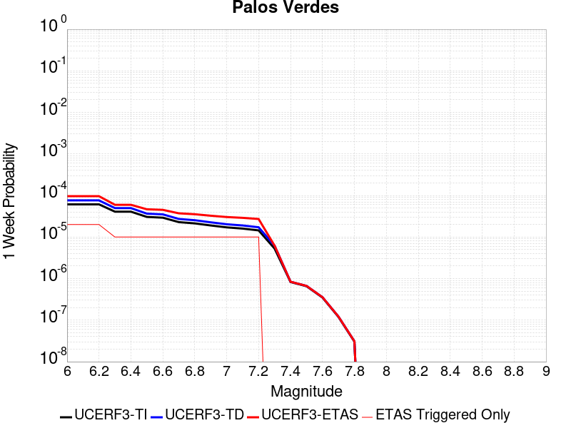 |  |  |  |

| Magnitude | 1 wk TI Prob | 1 wk TD Prob | 1 wk ETAS Prob | 1 wk ETAS/TD Gain | 1 wk ETAS Triggered Only | 1 mo TI Prob | 1 mo TD Prob | 1 mo ETAS Prob | 1 mo ETAS/TD Gain | 1 mo ETAS Triggered Only | 1 yr TI Prob | 1 yr TD Prob | 1 yr ETAS Prob | 1 yr ETAS/TD Gain | 1 yr ETAS Triggered Only | 10 yr TI Prob | 10 yr TD Prob | 10 yr ETAS Prob | 10 yr ETAS/TD Gain | 10 yr ETAS Triggered Only |
|-----|-----|-----|-----|-----|-----|-----|-----|-----|-----|-----|-----|-----|-----|-----|-----|-----|-----|-----|-----|-----|
| 6.0 | 6.126063E-5 | 7.622572E-5 | 9.62242E-5 | 1.2623587 | 2.0E-5 | 2.6251914E-4 | 3.266441E-4 | 3.466376E-4 | 1.0612087 | 2.0E-5 | 0.0031914865 | 0.0039701737 | 0.004010015 | 1.0100352 | 4.0E-5 | 0.031460393 | 0.03904909 | 0.039106745 | 1.0014765 | 6.0E-5 |
| 6.1 | 6.126063E-5 | 7.622572E-5 | 9.62242E-5 | 1.2623587 | 2.0E-5 | 2.6251914E-4 | 3.266441E-4 | 3.466376E-4 | 1.0612087 | 2.0E-5 | 0.0031914865 | 0.0039701737 | 0.004010015 | 1.0100352 | 4.0E-5 | 0.031460393 | 0.03904909 | 0.039106745 | 1.0014765 | 6.0E-5 |
| 6.2 | 6.126063E-5 | 7.622572E-5 | 9.62242E-5 | 1.2623587 | 2.0E-5 | 2.6251914E-4 | 3.266441E-4 | 3.466376E-4 | 1.0612087 | 2.0E-5 | 0.0031914865 | 0.0039701737 | 0.004010015 | 1.0100352 | 4.0E-5 | 0.031460393 | 0.03904909 | 0.039106745 | 1.0014765 | 6.0E-5 |
| 6.3 | 4.0838047E-5 | 4.9749007E-5 | 5.974851E-5 | 1.200999 | 1.0E-5 | 1.7500846E-4 | 2.1319388E-4 | 2.2319175E-4 | 1.0468956 | 1.0E-5 | 0.0021286458 | 0.002592754 | 0.0026027283 | 1.0038469 | 1.0E-5 | 0.021083709 | 0.025646746 | 0.025675977 | 1.0011398 | 3.0E-5 |
| 6.4 | 4.0838047E-5 | 4.9749007E-5 | 5.974851E-5 | 1.200999 | 1.0E-5 | 1.7500846E-4 | 2.1319388E-4 | 2.2319175E-4 | 1.0468956 | 1.0E-5 | 0.0021286458 | 0.002592754 | 0.0026027283 | 1.0038469 | 1.0E-5 | 0.021083709 | 0.025646746 | 0.025675977 | 1.0011398 | 3.0E-5 |
| 6.5 | 3.0512005E-5 | 3.6561592E-5 | 4.656123E-5 | 1.273501 | 1.0E-5 | 1.3075917E-4 | 1.566838E-4 | 1.6668225E-4 | 1.0638129 | 1.0E-5 | 0.0015908304 | 0.001906072 | 0.001916053 | 1.0052364 | 1.0E-5 | 0.015794903 | 0.018909173 | 0.018928794 | 1.0010377 | 2.0E-5 |
| 6.6 | 2.9255087E-5 | 3.5154393E-5 | 4.515404E-5 | 1.2844495 | 1.0E-5 | 1.2537291E-4 | 1.5065364E-4 | 1.6065213E-4 | 1.0663674 | 1.0E-5 | 0.0015253464 | 0.0018327782 | 0.0018427599 | 1.0054462 | 1.0E-5 | 0.015149189 | 0.018188244 | 0.01820788 | 1.0010796 | 2.0E-5 |
| 6.7 | 2.287198E-5 | 2.724828E-5 | 3.7248006E-5 | 1.3669857 | 1.0E-5 | 9.801909E-5 | 1.16773626E-4 | 1.2677246E-4 | 1.0856258 | 1.0E-5 | 0.001192729 | 0.0014208833 | 0.0014308692 | 1.0070279 | 1.0E-5 | 0.011863477 | 0.014127217 | 0.014146935 | 1.0013957 | 2.0E-5 |
| 6.8 | 2.1325764E-5 | 2.5431878E-5 | 3.5431625E-5 | 1.3931973 | 1.0E-5 | 9.139293E-5 | 1.0898972E-4 | 1.18988624E-4 | 1.0917418 | 1.0E-5 | 0.001112141 | 0.0013262323 | 0.001336219 | 1.0075302 | 1.0E-5 | 0.011065915 | 0.013192211 | 0.013211948 | 1.0014961 | 2.0E-5 |
| 6.9 | 1.9009392E-5 | 2.2613547E-5 | 3.2613323E-5 | 1.4422028 | 1.0E-5 | 8.1466285E-5 | 9.6912096E-5 | 1.0691113E-4 | 1.1031762 | 1.0E-5 | 9.914007E-4 | 0.0011793535 | 0.0011893417 | 1.0084692 | 1.0E-5 | 0.009869894 | 0.011739633 | 0.011759398 | 1.0016836 | 2.0E-5 |
| 7.0 | 1.7098473E-5 | 2.0319356E-5 | 3.0319152E-5 | 1.4921316 | 1.0E-5 | 7.3277115E-5 | 8.708052E-5 | 9.7079654E-5 | 1.1148262 | 1.0E-5 | 8.917837E-4 | 0.001059775 | 0.0010697644 | 1.009426 | 1.0E-5 | 0.008882134 | 0.010555646 | 0.010575435 | 1.0018747 | 2.0E-5 |
| 7.1 | 1.5982785E-5 | 1.899476E-5 | 2.8994571E-5 | 1.526451 | 1.0E-5 | 6.849585E-5 | 8.1404054E-5 | 9.1403235E-5 | 1.122834 | 1.0E-5 | 8.336179E-4 | 9.907284E-4 | 0.0010007184 | 1.0100836 | 1.0E-5 | 0.008304977 | 0.009871479 | 0.009891282 | 1.002006 | 2.0E-5 |
| 7.2 | 1.4468002E-5 | 1.7197237E-5 | 2.7197064E-5 | 1.5814788 | 1.0E-5 | 6.200425E-5 | 7.370083E-5 | 8.370009E-5 | 1.1356736 | 1.0E-5 | 7.546402E-4 | 8.970222E-4 | 9.0701325E-4 | 1.011138 | 1.0E-5 | 0.007520827 | 0.008942284 | 0.008962105 | 1.0022166 | 2.0E-5 |
| 7.3 | 5.288233E-6 | 6.2036747E-6 | 6.2036747E-6 | 1.0 | 0.0 | 2.2663658E-5 | 2.6587102E-5 | 2.6587102E-5 | 1.0 | 0.0 | 2.7589512E-4 | 3.236848E-4 | 3.236848E-4 | 1.0 | 0.0 | 0.0027555283 | 0.0032355562 | 0.0032355562 | 1.0 | 0.0 |
| 7.4 | 8.279556E-7 | 8.408347E-7 | 8.408347E-7 | 1.0 | 0.0 | 3.5483763E-6 | 3.6035726E-6 | 3.6035726E-6 | 1.0 | 0.0 | 4.3200624E-5 | 4.3872686E-5 | 4.3872686E-5 | 1.0 | 0.0 | 4.3192226E-4 | 4.3864746E-4 | 4.3864746E-4 | 1.0 | 0.0 |
| 7.5 | 6.559831E-7 | 6.667229E-7 | 6.667229E-7 | 1.0 | 0.0 | 2.8113532E-6 | 2.857381E-6 | 2.857381E-6 | 1.0 | 0.0 | 3.4227687E-5 | 3.4788125E-5 | 3.4788125E-5 | 1.0 | 0.0 | 3.4222414E-4 | 3.4783344E-4 | 3.4783344E-4 | 1.0 | 0.0 |
| 7.6 | 3.5018968E-7 | 3.5620027E-7 | 3.5620027E-7 | 1.0 | 0.0 | 1.500812E-6 | 1.526572E-6 | 1.526572E-6 | 1.0 | 0.0 | 1.8272232E-5 | 1.8585903E-5 | 1.8585903E-5 | 1.0 | 0.0 | 1.8270731E-4 | 1.8584808E-4 | 1.8584808E-4 | 1.0 | 0.0 |
| 7.7 | 1.1986104E-7 | 1.2198376E-7 | 1.2198376E-7 | 1.0 | 0.0 | 5.1369005E-7 | 5.2278745E-7 | 5.2278745E-7 | 1.0 | 0.0 | 6.2541585E-6 | 6.364919E-6 | 6.364919E-6 | 1.0 | 0.0 | 6.2539824E-5 | 6.364741E-5 | 6.364741E-5 | 1.0 | 0.0 |
| 7.8 | 3.0445005E-8 | 3.1027582E-8 | 3.1027582E-8 | 1.0 | 0.0 | 1.3047858E-7 | 1.3297536E-7 | 1.3297536E-7 | 1.0 | 0.0 | 1.5885756E-6 | 1.6189739E-6 | 1.6189739E-6 | 1.0 | 0.0 | 1.5885644E-5 | 1.6189642E-5 | 1.6189642E-5 | 1.0 | 0.0 |

## Simi-Santa Rosa
*[(top)](#table-of-contents)*

| 1 Week | 1 Month | 1 Year | 10 Year |
|-----|-----|-----|-----|
|  |  |  |  |

| Magnitude | 1 wk TI Prob | 1 wk TD Prob | 1 wk ETAS Prob | 1 wk ETAS/TD Gain | 1 wk ETAS Triggered Only | 1 mo TI Prob | 1 mo TD Prob | 1 mo ETAS Prob | 1 mo ETAS/TD Gain | 1 mo ETAS Triggered Only | 1 yr TI Prob | 1 yr TD Prob | 1 yr ETAS Prob | 1 yr ETAS/TD Gain | 1 yr ETAS Triggered Only | 10 yr TI Prob | 10 yr TD Prob | 10 yr ETAS Prob | 10 yr ETAS/TD Gain | 10 yr ETAS Triggered Only |
|-----|-----|-----|-----|-----|-----|-----|-----|-----|-----|-----|-----|-----|-----|-----|-----|-----|-----|-----|-----|-----|
| 6.0 | 2.198912E-5 | 2.2275388E-5 | 4.2274944E-5 | 1.8978319 | 2.0E-5 | 9.4235686E-5 | 9.54627E-5 | 1.15460796E-4 | 1.2094859 | 2.0E-5 | 0.0011467156 | 0.0011616825 | 0.0012016362 | 1.0343928 | 4.0E-5 | 0.011408163 | 0.011560547 | 0.011619854 | 1.00513 | 6.0E-5 |
| 6.1 | 2.198912E-5 | 2.2275388E-5 | 4.2274944E-5 | 1.8978319 | 2.0E-5 | 9.4235686E-5 | 9.54627E-5 | 1.15460796E-4 | 1.2094859 | 2.0E-5 | 0.0011467156 | 0.0011616825 | 0.0012016362 | 1.0343928 | 4.0E-5 | 0.011408163 | 0.011560547 | 0.011619854 | 1.00513 | 6.0E-5 |
| 6.2 | 1.69983E-5 | 1.6668506E-5 | 3.666817E-5 | 2.1998477 | 2.0E-5 | 7.284782E-5 | 7.143466E-5 | 9.1433234E-5 | 1.2799561 | 2.0E-5 | 8.865613E-4 | 8.6939917E-4 | 8.993731E-4 | 1.0344766 | 3.0E-5 | 0.008830327 | 0.0086629 | 0.008702553 | 1.0045774 | 4.0E-5 |
| 6.3 | 1.69983E-5 | 1.6668506E-5 | 3.666817E-5 | 2.1998477 | 2.0E-5 | 7.284782E-5 | 7.143466E-5 | 9.1433234E-5 | 1.2799561 | 2.0E-5 | 8.865613E-4 | 8.6939917E-4 | 8.993731E-4 | 1.0344766 | 3.0E-5 | 0.008830327 | 0.0086629 | 0.008702553 | 1.0045774 | 4.0E-5 |
| 6.4 | 1.4666188E-5 | 1.4052489E-5 | 3.405221E-5 | 2.4232154 | 2.0E-5 | 6.285358E-5 | 6.0223705E-5 | 8.02225E-5 | 1.3320751 | 2.0E-5 | 7.6497364E-4 | 7.330018E-4 | 7.6297985E-4 | 1.0408976 | 3.0E-5 | 0.0076234564 | 0.0073083164 | 0.007348024 | 1.0054332 | 4.0E-5 |
| 6.5 | 1.4666188E-5 | 1.4052489E-5 | 3.405221E-5 | 2.4232154 | 2.0E-5 | 6.285358E-5 | 6.0223705E-5 | 8.02225E-5 | 1.3320751 | 2.0E-5 | 7.6497364E-4 | 7.330018E-4 | 7.6297985E-4 | 1.0408976 | 3.0E-5 | 0.0076234564 | 0.0073083164 | 0.007348024 | 1.0054332 | 4.0E-5 |
| 6.6 | 1.4377586E-5 | 1.3729529E-5 | 3.3729255E-5 | 2.4566941 | 2.0E-5 | 6.1616774E-5 | 5.883965E-5 | 7.883847E-5 | 1.3398869 | 2.0E-5 | 7.4992597E-4 | 7.1616215E-4 | 7.4614066E-4 | 1.04186 | 3.0E-5 | 0.007474003 | 0.0071410104 | 0.0071807248 | 1.0055615 | 4.0E-5 |
| 6.7 | 1.3881404E-5 | 1.3207497E-5 | 3.3207234E-5 | 2.5142715 | 2.0E-5 | 5.9490372E-5 | 5.6602472E-5 | 7.660134E-5 | 1.3533214 | 2.0E-5 | 7.240546E-4 | 6.889419E-4 | 7.1892125E-4 | 1.0435151 | 3.0E-5 | 0.007217 | 0.0068705105 | 0.006910236 | 1.005782 | 4.0E-5 |
| 6.8 | 1.0176516E-5 | 9.1541E-6 | 1.9154008E-5 | 2.0923967 | 1.0E-5 | 4.3612912E-5 | 3.923136E-5 | 4.9230966E-5 | 1.2548882 | 1.0E-5 | 5.308578E-4 | 4.775537E-4 | 4.975441E-4 | 1.0418601 | 2.0E-5 | 0.0052959146 | 0.004766908 | 0.004796765 | 1.0062634 | 3.0E-5 |
| 6.9 | 9.699797E-6 | 8.774672E-6 | 1.8774585E-5 | 2.1396337 | 1.0E-5 | 4.15699E-5 | 3.760529E-5 | 4.760491E-5 | 1.26591 | 1.0E-5 | 5.05996E-4 | 4.5776463E-4 | 4.7775547E-4 | 1.0436705 | 2.0E-5 | 0.005048454 | 0.0045698346 | 0.0045996974 | 1.0065348 | 3.0E-5 |
| 7.0 | 7.4049476E-6 | 6.559291E-6 | 1.6559225E-5 | 2.5245452 | 1.0E-5 | 3.1735104E-5 | 2.8111013E-5 | 3.811073E-5 | 1.3557224 | 1.0E-5 | 3.8630638E-4 | 3.422105E-4 | 3.6220363E-4 | 1.0584235 | 2.0E-5 | 0.0038563553 | 0.0034180775 | 0.0034380092 | 1.0058312 | 2.0E-5 |
| 7.1 | 3.873439E-6 | 2.759473E-6 | 2.759473E-6 | 1.0 | 0.0 | 1.6600346E-5 | 1.1826261E-5 | 1.1826261E-5 | 1.0 | 0.0 | 2.0209046E-4 | 1.4397544E-4 | 1.53974E-4 | 1.0694463 | 1.0E-5 | 0.0020190678 | 0.0014388453 | 0.0014488308 | 1.00694 | 1.0E-5 |
| 7.2 | 3.417706E-6 | 2.367616E-6 | 2.367616E-6 | 1.0 | 0.0 | 1.4647229E-5 | 1.0146887E-5 | 1.0146887E-5 | 1.0 | 0.0 | 1.7831543E-4 | 1.2353157E-4 | 1.3353034E-4 | 1.080941 | 1.0E-5 | 0.0017817242 | 0.0012346513 | 0.0012446389 | 1.0080894 | 1.0E-5 |
| 7.3 | 1.90225E-6 | 1.4073756E-6 | 1.4073756E-6 | 1.0 | 0.0 | 8.152474E-6 | 6.031596E-6 | 6.031596E-6 | 1.0 | 0.0 | 9.9251854E-5 | 7.343223E-5 | 8.343149E-5 | 1.13617 | 1.0E-5 | 9.920754E-4 | 7.340819E-4 | 7.440745E-4 | 1.0136125 | 1.0E-5 |
| 7.4 | 1.5170556E-6 | 1.1024792E-6 | 1.1024792E-6 | 1.0 | 0.0 | 6.5016507E-6 | 4.7249023E-6 | 4.7249023E-6 | 1.0 | 0.0 | 7.915472E-5 | 5.752418E-5 | 5.752418E-5 | 1.0 | 0.0 | 7.9126534E-4 | 5.75094E-4 | 5.75094E-4 | 1.0 | 0.0 |
| 7.5 | 1.178732E-6 | 8.5351127E-7 | 8.5351127E-7 | 1.0 | 0.0 | 5.0516987E-6 | 3.6579004E-6 | 3.6579004E-6 | 1.0 | 0.0 | 6.1502695E-5 | 4.4534037E-5 | 4.4534037E-5 | 1.0 | 0.0 | 6.148568E-4 | 4.4525208E-4 | 4.4525208E-4 | 1.0 | 0.0 |
| 7.6 | 6.8722386E-7 | 4.793211E-7 | 4.793211E-7 | 1.0 | 0.0 | 2.9452417E-6 | 2.0542318E-6 | 2.0542318E-6 | 1.0 | 0.0 | 3.5857727E-5 | 2.5009986E-5 | 2.5009986E-5 | 1.0 | 0.0 | 3.5851944E-4 | 2.5007184E-4 | 2.5007184E-4 | 1.0 | 0.0 |
| 7.7 | 5.5126515E-7 | 3.6731117E-7 | 3.6731117E-7 | 1.0 | 0.0 | 2.3625628E-6 | 1.5741898E-6 | 1.5741898E-6 | 1.0 | 0.0 | 2.8763823E-5 | 1.9165593E-5 | 1.9165593E-5 | 1.0 | 0.0 | 2.87601E-4 | 1.9163951E-4 | 1.9163951E-4 | 1.0 | 0.0 |
| 7.8 | 3.3860243E-7 | 2.0075514E-7 | 2.0075514E-7 | 1.0 | 0.0 | 1.4511525E-6 | 8.6037886E-7 | 8.6037886E-7 | 1.0 | 0.0 | 1.7667637E-5 | 1.0475063E-5 | 1.0475063E-5 | 1.0 | 0.0 | 1.7666233E-4 | 1.0474575E-4 | 1.0474575E-4 | 1.0 | 0.0 |
| 7.9 | 2.7955386E-7 | 1.4648724E-7 | 1.4648724E-7 | 1.0 | 0.0 | 1.1980875E-6 | 6.278023E-7 | 6.278023E-7 | 1.0 | 0.0 | 1.4586617E-5 | 7.643467E-6 | 7.643467E-6 | 1.0 | 0.0 | 1.458566E-4 | 7.643208E-5 | 7.643208E-5 | 1.0 | 0.0 |
| 8.0 | 5.6259015E-8 | 3.335318E-8 | 3.335318E-8 | 1.0 | 0.0 | 2.4111003E-7 | 1.429422E-7 | 1.429422E-7 | 1.0 | 0.0 | 2.9355108E-6 | 1.7403199E-6 | 1.7403199E-6 | 1.0 | 0.0 | 2.935472E-5 | 1.7403077E-5 | 1.7403077E-5 | 1.0 | 0.0 |

## San Luis Range 2011 CFM
*[(top)](#table-of-contents)*

| 1 Week | 1 Month | 1 Year | 10 Year |
|-----|-----|-----|-----|
|  |  |  |  |

| Magnitude | 1 wk TI Prob | 1 wk TD Prob | 1 wk ETAS Prob | 1 wk ETAS/TD Gain | 1 wk ETAS Triggered Only | 1 mo TI Prob | 1 mo TD Prob | 1 mo ETAS Prob | 1 mo ETAS/TD Gain | 1 mo ETAS Triggered Only | 1 yr TI Prob | 1 yr TD Prob | 1 yr ETAS Prob | 1 yr ETAS/TD Gain | 1 yr ETAS Triggered Only | 10 yr TI Prob | 10 yr TD Prob | 10 yr ETAS Prob | 10 yr ETAS/TD Gain | 10 yr ETAS Triggered Only |
|-----|-----|-----|-----|-----|-----|-----|-----|-----|-----|-----|-----|-----|-----|-----|-----|-----|-----|-----|-----|-----|
| 6.0 | 8.8368415E-6 | 8.965455E-6 | 8.965455E-6 | 1.0 | 0.0 | 3.787163E-5 | 3.8422855E-5 | 3.8422855E-5 | 1.0 | 0.0 | 4.609895E-4 | 4.6770574E-4 | 4.8769638E-4 | 1.0427419 | 2.0E-5 | 0.0046003438 | 0.004667997 | 0.0047177635 | 1.0106612 | 5.0E-5 |
| 6.1 | 8.8368415E-6 | 8.965455E-6 | 8.965455E-6 | 1.0 | 0.0 | 3.787163E-5 | 3.8422855E-5 | 3.8422855E-5 | 1.0 | 0.0 | 4.609895E-4 | 4.6770574E-4 | 4.8769638E-4 | 1.0427419 | 2.0E-5 | 0.0046003438 | 0.004667997 | 0.0047177635 | 1.0106612 | 5.0E-5 |
| 6.2 | 8.8368415E-6 | 8.965455E-6 | 8.965455E-6 | 1.0 | 0.0 | 3.787163E-5 | 3.8422855E-5 | 3.8422855E-5 | 1.0 | 0.0 | 4.609895E-4 | 4.6770574E-4 | 4.8769638E-4 | 1.0427419 | 2.0E-5 | 0.0046003438 | 0.004667997 | 0.0047177635 | 1.0106612 | 5.0E-5 |
| 6.3 | 8.8368415E-6 | 8.965455E-6 | 8.965455E-6 | 1.0 | 0.0 | 3.787163E-5 | 3.8422855E-5 | 3.8422855E-5 | 1.0 | 0.0 | 4.609895E-4 | 4.6770574E-4 | 4.8769638E-4 | 1.0427419 | 2.0E-5 | 0.0046003438 | 0.004667997 | 0.0047177635 | 1.0106612 | 5.0E-5 |
| 6.4 | 3.9094193E-6 | 3.941204E-6 | 3.941204E-6 | 1.0 | 0.0 | 1.6754546E-5 | 1.6890766E-5 | 1.6890766E-5 | 1.0 | 0.0 | 2.039675E-4 | 2.0562594E-4 | 2.0562594E-4 | 1.0 | 0.0 | 0.0020378039 | 0.0020543856 | 0.0020743445 | 1.0097153 | 2.0E-5 |
| 6.5 | 3.9094193E-6 | 3.941204E-6 | 3.941204E-6 | 1.0 | 0.0 | 1.6754546E-5 | 1.6890766E-5 | 1.6890766E-5 | 1.0 | 0.0 | 2.039675E-4 | 2.0562594E-4 | 2.0562594E-4 | 1.0 | 0.0 | 0.0020378039 | 0.0020543856 | 0.0020743445 | 1.0097153 | 2.0E-5 |
| 6.6 | 3.0587726E-6 | 3.0753893E-6 | 3.0753893E-6 | 1.0 | 0.0 | 1.3108959E-5 | 1.3180174E-5 | 1.3180174E-5 | 1.0 | 0.0 | 1.595899E-4 | 1.6045693E-4 | 1.6045693E-4 | 1.0 | 0.0 | 0.0015947534 | 0.0016034227 | 0.0016134066 | 1.0062267 | 1.0E-5 |
| 6.7 | 2.6160574E-6 | 2.6251284E-6 | 2.6251284E-6 | 1.0 | 0.0 | 1.1211626E-5 | 1.1250502E-5 | 1.1250502E-5 | 1.0 | 0.0 | 1.3649299E-4 | 1.3696631E-4 | 1.3696631E-4 | 1.0 | 0.0 | 0.0013640919 | 0.0013688251 | 0.0013688251 | 1.0 | 0.0 |
| 6.8 | 2.5110312E-6 | 2.5181412E-6 | 2.5181412E-6 | 1.0 | 0.0 | 1.0761518E-5 | 1.079199E-5 | 1.079199E-5 | 1.0 | 0.0 | 1.310136E-4 | 1.313846E-4 | 1.313846E-4 | 1.0 | 0.0 | 0.0013093639 | 0.0013130752 | 0.0013130752 | 1.0 | 0.0 |
| 6.9 | 1.8564405E-6 | 1.852488E-6 | 1.852488E-6 | 1.0 | 0.0 | 7.95615E-6 | 7.93921E-6 | 7.93921E-6 | 1.0 | 0.0 | 9.686181E-5 | 9.665562E-5 | 9.665562E-5 | 1.0 | 0.0 | 9.68196E-4 | 9.6613786E-4 | 9.6613786E-4 | 1.0 | 0.0 |
| 7.0 | 1.546127E-6 | 1.5369549E-6 | 1.5369549E-6 | 1.0 | 0.0 | 6.626242E-6 | 6.5869326E-6 | 6.5869326E-6 | 1.0 | 0.0 | 8.06715E-5 | 8.019296E-5 | 8.019296E-5 | 1.0 | 0.0 | 8.0642226E-4 | 8.016409E-4 | 8.016409E-4 | 1.0 | 0.0 |
| 7.1 | 1.3368208E-6 | 1.3235336E-6 | 1.3235336E-6 | 1.0 | 0.0 | 5.7292195E-6 | 5.6722747E-6 | 5.6722747E-6 | 1.0 | 0.0 | 6.975101E-5 | 6.905776E-5 | 6.905776E-5 | 1.0 | 0.0 | 6.972912E-4 | 6.903635E-4 | 6.903635E-4 | 1.0 | 0.0 |
| 7.2 | 1.0623363E-6 | 1.0454378E-6 | 1.0454378E-6 | 1.0 | 0.0 | 4.5528623E-6 | 4.4804397E-6 | 4.4804397E-6 | 1.0 | 0.0 | 5.5429686E-5 | 5.4547992E-5 | 5.4547992E-5 | 1.0 | 0.0 | 5.5415864E-4 | 5.453463E-4 | 5.453463E-4 | 1.0 | 0.0 |
| 7.3 | 7.831679E-7 | 7.727399E-7 | 7.727399E-7 | 1.0 | 0.0 | 3.3564295E-6 | 3.3117383E-6 | 3.3117383E-6 | 1.0 | 0.0 | 4.086376E-5 | 4.031967E-5 | 4.031967E-5 | 1.0 | 0.0 | 4.0856248E-4 | 4.0312367E-4 | 4.0312367E-4 | 1.0 | 0.0 |
| 7.4 | 5.9558846E-7 | 5.910646E-7 | 5.910646E-7 | 1.0 | 0.0 | 2.5525194E-6 | 2.5331315E-6 | 2.5331315E-6 | 1.0 | 0.0 | 3.107648E-5 | 3.084044E-5 | 3.084044E-5 | 1.0 | 0.0 | 3.1072134E-4 | 3.083617E-4 | 3.083617E-4 | 1.0 | 0.0 |
| 7.5 | 4.1616502E-7 | 4.1196404E-7 | 4.1196404E-7 | 1.0 | 0.0 | 1.7835631E-6 | 1.765559E-6 | 1.765559E-6 | 1.0 | 0.0 | 2.1714664E-5 | 2.1495469E-5 | 2.1495469E-5 | 1.0 | 0.0 | 2.1712543E-4 | 2.1493394E-4 | 2.1493394E-4 | 1.0 | 0.0 |
| 7.6 | 2.3816014E-7 | 2.3376614E-7 | 2.3376614E-7 | 1.0 | 0.0 | 1.0206859E-6 | 1.0018545E-6 | 1.0018545E-6 | 1.0 | 0.0 | 1.242678E-5 | 1.219751E-5 | 1.219751E-5 | 1.0 | 0.0 | 1.2426086E-4 | 1.2196843E-4 | 1.2196843E-4 | 1.0 | 0.0 |
| 7.7 | 9.918777E-8 | 9.3868096E-8 | 9.3868096E-8 | 1.0 | 0.0 | 4.2509038E-7 | 4.022918E-7 | 4.022918E-7 | 1.0 | 0.0 | 5.1754632E-6 | 4.8978914E-6 | 4.8978914E-6 | 1.0 | 0.0 | 5.1753424E-5 | 4.897784E-5 | 4.897784E-5 | 1.0 | 0.0 |
| 7.8 | 3.4982556E-8 | 2.968672E-8 | 2.968672E-8 | 1.0 | 0.0 | 1.4992524E-7 | 1.272288E-7 | 1.272288E-7 | 1.0 | 0.0 | 1.8253382E-6 | 1.5490094E-6 | 1.5490094E-6 | 1.0 | 0.0 | 1.8253233E-5 | 1.5489988E-5 | 1.5489988E-5 | 1.0 | 0.0 |
| 7.9 | 1.6624908E-8 | 1.1476994E-8 | 1.1476994E-8 | 1.0 | 0.0 | 7.12496E-8 | 4.9187115E-8 | 4.9187115E-8 | 1.0 | 0.0 | 8.6746354E-7 | 5.988529E-7 | 5.988529E-7 | 1.0 | 0.0 | 8.674601E-6 | 5.9885133E-6 | 5.9885133E-6 | 1.0 | 0.0 |
| 8.0 | 6.3352315E-9 | 3.0886564E-9 | 3.0886564E-9 | 1.0 | 0.0 | 2.715099E-8 | 1.32370985E-8 | 1.32370985E-8 | 1.0 | 0.0 | 3.3056327E-7 | 1.6116167E-7 | 1.6116167E-7 | 1.0 | 0.0 | 3.3056278E-6 | 1.6116155E-6 | 1.6116155E-6 | 1.0 | 0.0 |

## Calaveras (Central) 2011 CFM
*[(top)](#table-of-contents)*

| 1 Week | 1 Month | 1 Year | 10 Year |
|-----|-----|-----|-----|
| 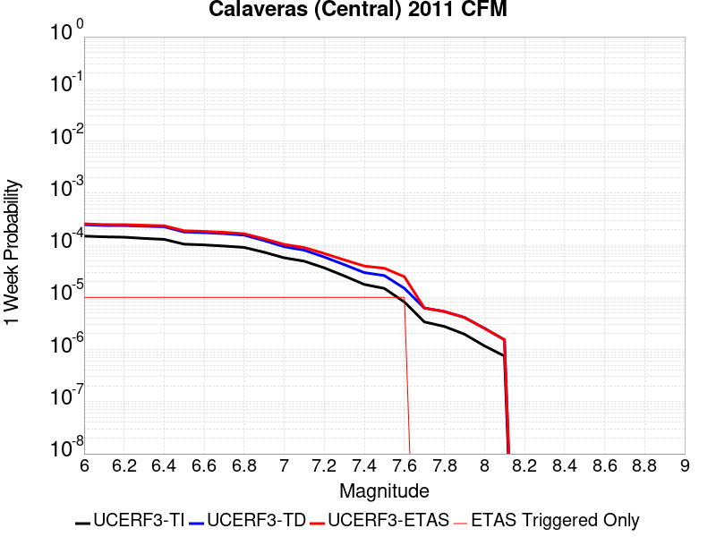 |  |  |  |

| Magnitude | 1 wk TI Prob | 1 wk TD Prob | 1 wk ETAS Prob | 1 wk ETAS/TD Gain | 1 wk ETAS Triggered Only | 1 mo TI Prob | 1 mo TD Prob | 1 mo ETAS Prob | 1 mo ETAS/TD Gain | 1 mo ETAS Triggered Only | 1 yr TI Prob | 1 yr TD Prob | 1 yr ETAS Prob | 1 yr ETAS/TD Gain | 1 yr ETAS Triggered Only | 10 yr TI Prob | 10 yr TD Prob | 10 yr ETAS Prob | 10 yr ETAS/TD Gain | 10 yr ETAS Triggered Only |
|-----|-----|-----|-----|-----|-----|-----|-----|-----|-----|-----|-----|-----|-----|-----|-----|-----|-----|-----|-----|-----|
| 6.0 | 1.5010907E-4 | 2.4804124E-4 | 2.5803875E-4 | 1.0403059 | 1.0E-5 | 6.4316596E-4 | 0.001062498 | 0.0010824767 | 1.0188036 | 2.0E-5 | 0.0078024664 | 0.012850443 | 0.012880058 | 1.0023046 | 3.0E-5 | 0.07534136 | 0.120411225 | 0.12044641 | 1.0002922 | 4.0E-5 |
| 6.1 | 1.4521465E-4 | 2.3965565E-4 | 2.4965324E-4 | 1.0417166 | 1.0E-5 | 6.222001E-4 | 0.0010265942 | 0.0010465736 | 1.0194619 | 2.0E-5 | 0.0075490056 | 0.012419763 | 0.01244939 | 1.0023855 | 3.0E-5 | 0.07297657 | 0.11668273 | 0.11671806 | 1.0003028 | 4.0E-5 |
| 6.2 | 1.429998E-4 | 2.3896809E-4 | 2.489657E-4 | 1.0418366 | 1.0E-5 | 6.127123E-4 | 0.0010236499 | 0.0010436295 | 1.0195179 | 2.0E-5 | 0.007434286 | 0.012384372 | 0.012414 | 1.0023924 | 3.0E-5 | 0.07190444 | 0.11633677 | 0.116372116 | 1.0003039 | 4.0E-5 |
| 6.3 | 1.3536277E-4 | 2.3227946E-4 | 2.4227714E-4 | 1.0430416 | 1.0E-5 | 5.799972E-4 | 9.950127E-4 | 0.0010149928 | 1.0200802 | 2.0E-5 | 0.0070386264 | 0.012040534 | 0.012070173 | 1.0024616 | 3.0E-5 | 0.0681982 | 0.113249525 | 0.113285 | 1.0003132 | 4.0E-5 |
| 6.4 | 1.2993296E-4 | 2.2651516E-4 | 2.3651289E-4 | 1.0441371 | 1.0E-5 | 5.5673666E-4 | 9.703276E-4 | 9.903081E-4 | 1.0205916 | 2.0E-5 | 0.006757223 | 0.011743338 | 0.011772986 | 1.0025246 | 3.0E-5 | 0.06555412 | 0.11052752 | 0.1105631 | 1.0003219 | 4.0E-5 |
| 6.5 | 1.0498927E-4 | 1.7981966E-4 | 1.8981787E-4 | 1.0556012 | 1.0E-5 | 4.498764E-4 | 7.7042676E-4 | 7.904113E-4 | 1.0259396 | 2.0E-5 | 0.005463498 | 0.00933952 | 0.00936924 | 1.0031822 | 3.0E-5 | 0.053311124 | 0.08920739 | 0.08924382 | 1.0004084 | 4.0E-5 |
| 6.6 | 1.0157505E-4 | 1.7469494E-4 | 1.8469318E-4 | 1.0572326 | 1.0E-5 | 4.35249E-4 | 7.4847665E-4 | 7.684617E-4 | 1.026701 | 2.0E-5 | 0.0052862884 | 0.009074567 | 0.009104294 | 1.003276 | 3.0E-5 | 0.05162293 | 0.08678487 | 0.0868214 | 1.0004209 | 4.0E-5 |
| 6.7 | 9.660386E-5 | 1.6728783E-4 | 1.7728616E-4 | 1.0597672 | 1.0E-5 | 4.1395082E-4 | 7.167497E-4 | 7.3673535E-4 | 1.0278838 | 2.0E-5 | 0.0050282106 | 0.008691474 | 0.008721213 | 1.0034217 | 3.0E-5 | 0.049159497 | 0.08327401 | 0.08331068 | 1.0004404 | 4.0E-5 |
| 6.8 | 9.089927E-5 | 1.5643238E-4 | 1.6643082E-4 | 1.0639154 | 1.0E-5 | 3.8951015E-4 | 6.702511E-4 | 6.902377E-4 | 1.0298196 | 2.0E-5 | 0.0047319788 | 0.008129742 | 0.008159498 | 1.0036602 | 3.0E-5 | 0.046324775 | 0.078163 | 0.07819987 | 1.0004717 | 4.0E-5 |
| 6.9 | 7.353187E-5 | 1.2295779E-4 | 1.3295656E-4 | 1.0813187 | 1.0E-5 | 3.150985E-4 | 5.2685605E-4 | 5.4684555E-4 | 1.037941 | 2.0E-5 | 0.0038295772 | 0.006395728 | 0.006425536 | 1.0046606 | 3.0E-5 | 0.037642512 | 0.06218928 | 0.06222679 | 1.0006032 | 4.0E-5 |
| 7.0 | 5.746064E-5 | 9.3890936E-5 | 1.0389E-4 | 1.1064966 | 1.0E-5 | 2.4623662E-4 | 4.0232803E-4 | 4.2231998E-4 | 1.0496907 | 2.0E-5 | 0.0029938098 | 0.0048874132 | 0.004917267 | 1.0061082 | 3.0E-5 | 0.02953797 | 0.04798713 | 0.048015688 | 1.0005952 | 3.0E-5 |
| 7.1 | 4.9557195E-5 | 8.052768E-5 | 9.0526875E-5 | 1.1241709 | 1.0E-5 | 2.123707E-4 | 3.4507332E-4 | 3.6506643E-4 | 1.0579387 | 2.0E-5 | 0.0025825473 | 0.004193237 | 0.004223111 | 1.0071244 | 3.0E-5 | 0.0255274 | 0.041373473 | 0.041402232 | 1.0006951 | 3.0E-5 |
| 7.2 | 3.687595E-5 | 5.952694E-5 | 6.9526344E-5 | 1.1679811 | 1.0E-5 | 1.5803022E-4 | 2.5509068E-4 | 2.7508556E-4 | 1.0783834 | 2.0E-5 | 0.0019223199 | 0.003101335 | 0.0031312418 | 1.0096432 | 3.0E-5 | 0.01905776 | 0.030883823 | 0.030912895 | 1.0009414 | 3.0E-5 |
| 7.3 | 2.5846984E-5 | 4.2473923E-5 | 5.2473497E-5 | 1.2354286 | 1.0E-5 | 1.1076809E-4 | 1.820185E-4 | 1.9201667E-4 | 1.0549295 | 1.0E-5 | 0.0013477671 | 0.0022138404 | 0.002223818 | 1.0045071 | 1.0E-5 | 0.013396223 | 0.022175217 | 0.022184996 | 1.000441 | 1.0E-5 |
| 7.4 | 1.7747854E-5 | 2.993759E-5 | 3.993729E-5 | 1.3340182 | 1.0E-5 | 7.6060016E-5 | 1.2829766E-4 | 1.3829638E-4 | 1.0779338 | 1.0E-5 | 9.2563726E-4 | 0.0015609078 | 0.0015708922 | 1.0063965 | 1.0E-5 | 0.009217911 | 0.015708687 | 0.015718529 | 1.0006266 | 1.0E-5 |
| 7.5 | 1.4883479E-5 | 2.6244672E-5 | 3.6244408E-5 | 1.3810197 | 1.0E-5 | 6.378478E-5 | 1.12472335E-4 | 1.224712E-4 | 1.0889008 | 1.0E-5 | 7.76303E-4 | 0.0013684932 | 0.0013784795 | 1.0072973 | 1.0E-5 | 0.0077359667 | 0.013801667 | 0.013811529 | 1.0007145 | 1.0E-5 |
| 7.6 | 8.166975E-6 | 1.4964299E-5 | 2.4964149E-5 | 1.6682471 | 1.0E-5 | 3.5000852E-5 | 6.413114E-5 | 7.41305E-5 | 1.1559205 | 1.0E-5 | 4.2605202E-4 | 7.805183E-4 | 7.905105E-4 | 1.012802 | 1.0E-5 | 0.004252361 | 0.007939203 | 0.007949124 | 1.0012496 | 1.0E-5 |
| 7.7 | 3.3858064E-6 | 6.254251E-6 | 6.254251E-6 | 1.0 | 0.0 | 1.4510518E-5 | 2.6803657E-5 | 2.6803657E-5 | 1.0 | 0.0 | 1.7665124E-4 | 3.2628572E-4 | 3.2628572E-4 | 1.0 | 0.0 | 0.0017651088 | 0.003388363 | 0.003388363 | 1.0 | 0.0 |
| 7.8 | 2.7721615E-6 | 5.366695E-6 | 5.366695E-6 | 1.0 | 0.0 | 1.1880637E-5 | 2.2999919E-5 | 2.2999919E-5 | 1.0 | 0.0 | 1.4463716E-4 | 2.7998807E-4 | 2.7998807E-4 | 1.0 | 0.0 | 0.0014454306 | 0.002907615 | 0.002907615 | 1.0 | 0.0 |
| 7.9 | 1.9736292E-6 | 4.128705E-6 | 4.128705E-6 | 1.0 | 0.0 | 8.4583835E-6 | 1.769433E-5 | 1.769433E-5 | 1.0 | 0.0 | 1.0297595E-4 | 2.1540721E-4 | 2.1540721E-4 | 1.0 | 0.0 | 0.0010292825 | 0.0022237299 | 0.0022237299 | 1.0 | 0.0 |
| 8.0 | 1.1767289E-6 | 2.5546633E-6 | 2.5546633E-6 | 1.0 | 0.0 | 5.0431145E-6 | 1.0948511E-5 | 1.0948511E-5 | 1.0 | 0.0 | 6.139818E-5 | 1.3329E-4 | 1.3329E-4 | 1.0 | 0.0 | 6.1381224E-4 | 0.001366126 | 0.001366126 | 1.0 | 0.0 |
| 8.1 | 7.5112825E-7 | 1.541076E-6 | 1.541076E-6 | 1.0 | 0.0 | 3.2191172E-6 | 6.604595E-6 | 6.604595E-6 | 1.0 | 0.0 | 3.9192048E-5 | 8.0408E-5 | 8.0408E-5 | 1.0 | 0.0 | 3.9185135E-4 | 8.2356273E-4 | 8.2356273E-4 | 1.0 | 0.0 |

## San Gabriel
*[(top)](#table-of-contents)*

| 1 Week | 1 Month | 1 Year | 10 Year |
|-----|-----|-----|-----|
|  | 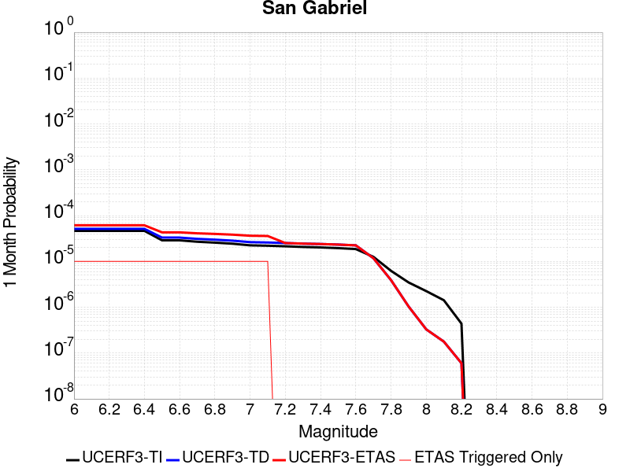 |  |  |

| Magnitude | 1 wk TI Prob | 1 wk TD Prob | 1 wk ETAS Prob | 1 wk ETAS/TD Gain | 1 wk ETAS Triggered Only | 1 mo TI Prob | 1 mo TD Prob | 1 mo ETAS Prob | 1 mo ETAS/TD Gain | 1 mo ETAS Triggered Only | 1 yr TI Prob | 1 yr TD Prob | 1 yr ETAS Prob | 1 yr ETAS/TD Gain | 1 yr ETAS Triggered Only | 10 yr TI Prob | 10 yr TD Prob | 10 yr ETAS Prob | 10 yr ETAS/TD Gain | 10 yr ETAS Triggered Only |
|-----|-----|-----|-----|-----|-----|-----|-----|-----|-----|-----|-----|-----|-----|-----|-----|-----|-----|-----|-----|-----|
| 6.0 | 1.083775E-5 | 1.198525E-5 | 2.198513E-5 | 1.8343489 | 1.0E-5 | 4.6446676E-5 | 5.1364408E-5 | 6.13639E-5 | 1.1946774 | 1.0E-5 | 5.653415E-4 | 6.251936E-4 | 6.6516857E-4 | 1.0639402 | 4.0E-5 | 0.0056390543 | 0.0062463325 | 0.00629602 | 1.0079547 | 5.0E-5 |
| 6.1 | 1.083775E-5 | 1.198525E-5 | 2.198513E-5 | 1.8343489 | 1.0E-5 | 4.6446676E-5 | 5.1364408E-5 | 6.13639E-5 | 1.1946774 | 1.0E-5 | 5.653415E-4 | 6.251936E-4 | 6.6516857E-4 | 1.0639402 | 4.0E-5 | 0.0056390543 | 0.0062463325 | 0.00629602 | 1.0079547 | 5.0E-5 |
| 6.2 | 1.083775E-5 | 1.198525E-5 | 2.198513E-5 | 1.8343489 | 1.0E-5 | 4.6446676E-5 | 5.1364408E-5 | 6.13639E-5 | 1.1946774 | 1.0E-5 | 5.653415E-4 | 6.251936E-4 | 6.6516857E-4 | 1.0639402 | 4.0E-5 | 0.0056390543 | 0.0062463325 | 0.00629602 | 1.0079547 | 5.0E-5 |
| 6.3 | 1.083775E-5 | 1.198525E-5 | 2.198513E-5 | 1.8343489 | 1.0E-5 | 4.6446676E-5 | 5.1364408E-5 | 6.13639E-5 | 1.1946774 | 1.0E-5 | 5.653415E-4 | 6.251936E-4 | 6.6516857E-4 | 1.0639402 | 4.0E-5 | 0.0056390543 | 0.0062463325 | 0.00629602 | 1.0079547 | 5.0E-5 |
| 6.4 | 1.083775E-5 | 1.198525E-5 | 2.198513E-5 | 1.8343489 | 1.0E-5 | 4.6446676E-5 | 5.1364408E-5 | 6.13639E-5 | 1.1946774 | 1.0E-5 | 5.653415E-4 | 6.251936E-4 | 6.6516857E-4 | 1.0639402 | 4.0E-5 | 0.0056390543 | 0.0062463325 | 0.00629602 | 1.0079547 | 5.0E-5 |
| 6.5 | 6.7317824E-6 | 7.717007E-6 | 1.771693E-5 | 2.295829 | 1.0E-5 | 2.8850178E-5 | 3.3072472E-5 | 4.3072145E-5 | 1.3023562 | 1.0E-5 | 3.511943E-4 | 4.0258403E-4 | 4.2257598E-4 | 1.049659 | 2.0E-5 | 0.003506398 | 0.004029533 | 0.004059412 | 1.007415 | 3.0E-5 |
| 6.6 | 6.7317824E-6 | 7.717007E-6 | 1.771693E-5 | 2.295829 | 1.0E-5 | 2.8850178E-5 | 3.3072472E-5 | 4.3072145E-5 | 1.3023562 | 1.0E-5 | 3.511943E-4 | 4.0258403E-4 | 4.2257598E-4 | 1.049659 | 2.0E-5 | 0.003506398 | 0.004029533 | 0.004059412 | 1.007415 | 3.0E-5 |
| 6.7 | 6.274881E-6 | 7.2459275E-6 | 1.7245855E-5 | 2.3800757 | 1.0E-5 | 2.6892068E-5 | 3.105361E-5 | 4.10533E-5 | 1.3220137 | 1.0E-5 | 3.2736175E-4 | 3.7801306E-4 | 3.980055E-4 | 1.0528883 | 2.0E-5 | 0.0032687993 | 0.0037846796 | 0.0038046038 | 1.0052645 | 2.0E-5 |
| 6.8 | 5.996209E-6 | 6.958647E-6 | 1.6958578E-5 | 2.4370508 | 1.0E-5 | 2.5697784E-5 | 2.9822439E-5 | 3.9822142E-5 | 1.335308 | 1.0E-5 | 3.128256E-4 | 3.6302864E-4 | 3.8302137E-4 | 1.0550721 | 2.0E-5 | 0.003123856 | 0.0036353325 | 0.0036552597 | 1.0054816 | 2.0E-5 |
| 6.9 | 5.686331E-6 | 6.6236917E-6 | 1.6623626E-5 | 2.509722 | 1.0E-5 | 2.4369761E-5 | 2.8386947E-5 | 3.8386665E-5 | 1.3522646 | 1.0E-5 | 2.9666146E-4 | 3.4555717E-4 | 3.6555025E-4 | 1.0578575 | 2.0E-5 | 0.0029626573 | 0.0034611735 | 0.0034811043 | 1.0057584 | 2.0E-5 |
| 7.0 | 5.2329838E-6 | 6.1475757E-6 | 1.6147515E-5 | 2.6266475 | 1.0E-5 | 2.242688E-5 | 2.6346492E-5 | 3.6346228E-5 | 1.3795471 | 1.0E-5 | 2.7301308E-4 | 3.207221E-4 | 3.4071566E-4 | 1.0623393 | 2.0E-5 | 0.002726779 | 0.0032135549 | 0.0032334907 | 1.0062037 | 2.0E-5 |
| 7.1 | 5.135671E-6 | 6.0377E-6 | 1.603764E-5 | 2.6562498 | 1.0E-5 | 2.2009834E-5 | 2.5875606E-5 | 3.5875346E-5 | 1.3864543 | 1.0E-5 | 2.6793676E-4 | 3.1499073E-4 | 3.3498442E-4 | 1.0634739 | 2.0E-5 | 0.0026761394 | 0.0031564054 | 0.0031763422 | 1.0063163 | 2.0E-5 |
| 7.2 | 4.989062E-6 | 5.8710784E-6 | 5.8710784E-6 | 1.0 | 0.0 | 2.1381518E-5 | 2.5161527E-5 | 2.5161527E-5 | 1.0 | 0.0 | 2.6028889E-4 | 3.0629928E-4 | 3.162962E-4 | 1.0326378 | 1.0E-5 | 0.0025998424 | 0.003069734 | 0.0030797033 | 1.0032476 | 1.0E-5 |
| 7.3 | 4.8219395E-6 | 5.7026323E-6 | 5.7026323E-6 | 1.0 | 0.0 | 2.0665291E-5 | 2.4439627E-5 | 2.4439627E-5 | 1.0 | 0.0 | 2.5157086E-4 | 2.975126E-4 | 3.0750962E-4 | 1.033602 | 1.0E-5 | 0.0025128627 | 0.002982106 | 0.0029920763 | 1.0033433 | 1.0E-5 |
| 7.4 | 4.7118383E-6 | 5.5911896E-6 | 5.5911896E-6 | 1.0 | 0.0 | 2.0193436E-5 | 2.3962024E-5 | 2.3962024E-5 | 1.0 | 0.0 | 2.4582737E-4 | 2.9169934E-4 | 3.0169642E-4 | 1.0342718 | 1.0E-5 | 0.002455556 | 0.0029241266 | 0.0029340973 | 1.0034099 | 1.0E-5 |
| 7.5 | 4.5506545E-6 | 5.4365555E-6 | 5.4365555E-6 | 1.0 | 0.0 | 1.9502659E-5 | 2.329932E-5 | 2.329932E-5 | 1.0 | 0.0 | 2.37419E-4 | 2.8363304E-4 | 2.936302E-4 | 1.0352468 | 1.0E-5 | 0.002371655 | 0.0028436715 | 0.0028536431 | 1.0035065 | 1.0E-5 |
| 7.6 | 4.343636E-6 | 5.2294336E-6 | 5.2294336E-6 | 1.0 | 0.0 | 1.861545E-5 | 2.241167E-5 | 2.241167E-5 | 1.0 | 0.0 | 2.2661954E-4 | 2.7282868E-4 | 2.8282593E-4 | 1.036643 | 1.0E-5 | 0.0022638857 | 0.0027358893 | 0.002745862 | 1.0036451 | 1.0E-5 |
| 7.7 | 2.936235E-6 | 2.743946E-6 | 2.743946E-6 | 1.0 | 0.0 | 1.2583803E-5 | 1.1759716E-5 | 1.1759716E-5 | 1.0 | 0.0 | 1.5319703E-4 | 1.4316518E-4 | 1.5316374E-4 | 1.0698394 | 1.0E-5 | 0.0015309147 | 0.0014379849 | 0.0014479705 | 1.0069442 | 1.0E-5 |
| 7.8 | 1.4541639E-6 | 9.122518E-7 | 9.122518E-7 | 1.0 | 0.0 | 6.232116E-6 | 3.9096444E-6 | 3.9096444E-6 | 1.0 | 0.0 | 7.587337E-5 | 4.7598885E-5 | 4.7598885E-5 | 1.0 | 0.0 | 7.584747E-4 | 4.8078224E-4 | 4.8078224E-4 | 1.0 | 0.0 |
| 7.9 | 8.098958E-7 | 2.4165956E-7 | 2.4165956E-7 | 1.0 | 0.0 | 3.4709774E-6 | 1.0356835E-6 | 1.0356835E-6 | 1.0 | 0.0 | 4.225833E-5 | 1.2609373E-5 | 1.2609373E-5 | 1.0 | 0.0 | 4.2250296E-4 | 1.2917137E-4 | 1.2917137E-4 | 1.0 | 0.0 |
| 8.0 | 5.2473234E-7 | 7.672734E-8 | 7.672734E-8 | 1.0 | 0.0 | 2.248851E-6 | 3.2883142E-7 | 3.2883142E-7 | 1.0 | 0.0 | 2.7379416E-5 | 4.003515E-6 | 4.003515E-6 | 1.0 | 0.0 | 2.7376044E-4 | 4.215796E-5 | 4.215796E-5 | 1.0 | 0.0 |
| 8.1 | 3.3162388E-7 | 4.1457096E-8 | 4.1457096E-8 | 1.0 | 0.0 | 1.4212444E-6 | 1.7767324E-7 | 1.7767324E-7 | 1.0 | 0.0 | 1.7303513E-5 | 2.1631695E-6 | 2.1631695E-6 | 1.0 | 0.0 | 1.7302166E-4 | 2.294416E-5 | 2.294416E-5 | 1.0 | 0.0 |
| 8.2 | 1.0235345E-7 | 1.4032201E-8 | 1.4032201E-8 | 1.0 | 0.0 | 4.3865757E-7 | 6.013801E-8 | 6.013801E-8 | 1.0 | 0.0 | 5.340643E-6 | 7.3217996E-7 | 7.3217996E-7 | 1.0 | 0.0 | 5.3405143E-5 | 7.921925E-6 | 7.921925E-6 | 1.0 | 0.0 |

## Coronado Bank alt1
*[(top)](#table-of-contents)*

| 1 Week | 1 Month | 1 Year | 10 Year |
|-----|-----|-----|-----|
| 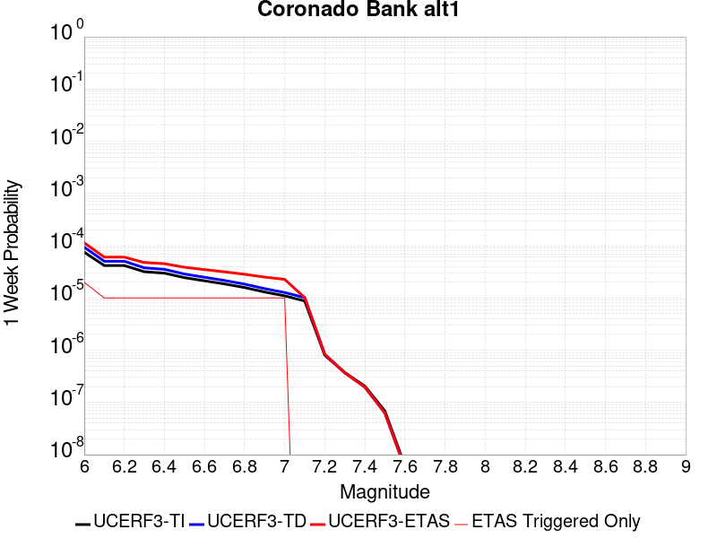 |  |  |  |

| Magnitude | 1 wk TI Prob | 1 wk TD Prob | 1 wk ETAS Prob | 1 wk ETAS/TD Gain | 1 wk ETAS Triggered Only | 1 mo TI Prob | 1 mo TD Prob | 1 mo ETAS Prob | 1 mo ETAS/TD Gain | 1 mo ETAS Triggered Only | 1 yr TI Prob | 1 yr TD Prob | 1 yr ETAS Prob | 1 yr ETAS/TD Gain | 1 yr ETAS Triggered Only | 10 yr TI Prob | 10 yr TD Prob | 10 yr ETAS Prob | 10 yr ETAS/TD Gain | 10 yr ETAS Triggered Only |
|-----|-----|-----|-----|-----|-----|-----|-----|-----|-----|-----|-----|-----|-----|-----|-----|-----|-----|-----|-----|-----|
| 6.0 | 7.533492E-5 | 9.3951705E-5 | 1.1394983E-4 | 1.2128553 | 2.0E-5 | 3.22824E-4 | 4.025903E-4 | 4.325782E-4 | 1.0744874 | 3.0E-5 | 0.0039233007 | 0.004891121 | 0.0049408763 | 1.0101726 | 5.0E-5 | 0.03854755 | 0.047904 | 0.047951605 | 1.0009937 | 5.0E-5 |
| 6.1 | 4.1807285E-5 | 5.0493105E-5 | 6.04926E-5 | 1.1980368 | 1.0E-5 | 1.7916178E-4 | 2.1638138E-4 | 2.3637705E-4 | 1.0924094 | 2.0E-5 | 0.0021791123 | 0.0026313365 | 0.0026712313 | 1.0151614 | 4.0E-5 | 0.021578677 | 0.026011124 | 0.026050083 | 1.0014977 | 4.0E-5 |
| 6.2 | 4.1807285E-5 | 5.0493105E-5 | 6.04926E-5 | 1.1980368 | 1.0E-5 | 1.7916178E-4 | 2.1638138E-4 | 2.3637705E-4 | 1.0924094 | 2.0E-5 | 0.0021791123 | 0.0026313365 | 0.0026712313 | 1.0151614 | 4.0E-5 | 0.021578677 | 0.026011124 | 0.026050083 | 1.0014977 | 4.0E-5 |
| 6.3 | 3.1793104E-5 | 3.7711125E-5 | 4.771075E-5 | 1.2651638 | 1.0E-5 | 1.3624904E-4 | 1.6160926E-4 | 1.8160602E-4 | 1.1237353 | 2.0E-5 | 0.0016575698 | 0.001965849 | 0.00199579 | 1.0152305 | 3.0E-5 | 0.016452603 | 0.019488495 | 0.01951791 | 1.0015094 | 3.0E-5 |
| 6.4 | 2.9878007E-5 | 3.5335797E-5 | 4.5335444E-5 | 1.2829891 | 1.0E-5 | 1.2804232E-4 | 1.5143053E-4 | 1.714275E-4 | 1.1320537 | 2.0E-5 | 0.0015578003 | 0.0018421395 | 0.0018720842 | 1.0162554 | 3.0E-5 | 0.015469253 | 0.018272463 | 0.018301915 | 1.0016118 | 3.0E-5 |
| 6.5 | 2.4512565E-5 | 2.8764101E-5 | 3.8763814E-5 | 1.3476455 | 1.0E-5 | 1.0504962E-4 | 1.2326906E-4 | 1.4326659E-4 | 1.1622267 | 2.0E-5 | 0.0012782287 | 0.0014997943 | 0.0015297494 | 1.0199728 | 3.0E-5 | 0.012709012 | 0.0148996925 | 0.014929246 | 1.0019835 | 3.0E-5 |
| 6.6 | 2.1317413E-5 | 2.490667E-5 | 3.490642E-5 | 1.4014889 | 1.0E-5 | 9.135714E-5 | 1.0673863E-4 | 1.267365E-4 | 1.1873536 | 2.0E-5 | 0.0011117056 | 0.0012987903 | 0.0013187644 | 1.015379 | 2.0E-5 | 0.011061605 | 0.012914407 | 0.012934149 | 1.0015286 | 2.0E-5 |
| 6.7 | 1.8585655E-5 | 2.1634882E-5 | 3.1634663E-5 | 1.4622066 | 1.0E-5 | 7.9650374E-5 | 9.271774E-5 | 1.0271681E-4 | 1.1078442 | 1.0E-5 | 9.6931186E-4 | 0.0011282744 | 0.001138263 | 1.0088531 | 1.0E-5 | 0.0096509475 | 0.011227623 | 0.0112375105 | 1.0008807 | 1.0E-5 |
| 6.8 | 1.5862879E-5 | 1.8419476E-5 | 2.8419292E-5 | 1.5428936 | 1.0E-5 | 6.798199E-5 | 7.8938334E-5 | 8.8937544E-5 | 1.1266712 | 1.0E-5 | 8.273665E-4 | 9.606697E-4 | 9.7066007E-4 | 1.0103995 | 1.0E-5 | 0.008242928 | 0.009567151 | 0.0095770545 | 1.0010352 | 1.0E-5 |
| 6.9 | 1.3021509E-5 | 1.5095266E-5 | 2.5095114E-5 | 1.6624494 | 1.0E-5 | 5.5805274E-5 | 6.46925E-5 | 7.4691845E-5 | 1.1545675 | 1.0E-5 | 6.792174E-4 | 7.873646E-4 | 7.973567E-4 | 1.0126905 | 1.0E-5 | 0.006771452 | 0.007847573 | 0.007857494 | 1.0012643 | 1.0E-5 |
| 7.0 | 1.0974371E-5 | 1.2720105E-5 | 2.2719978E-5 | 1.786147 | 1.0E-5 | 4.7032172E-5 | 5.4513697E-5 | 6.451315E-5 | 1.1834302 | 1.0E-5 | 5.7246623E-4 | 6.635197E-4 | 6.7351304E-4 | 1.0150611 | 1.0E-5 | 0.0057099373 | 0.0066171354 | 0.0066270693 | 1.0015012 | 1.0E-5 |
| 7.1 | 8.766221E-6 | 1.0163833E-5 | 1.0163833E-5 | 1.0 | 0.0 | 3.7568978E-5 | 4.3558655E-5 | 4.3558655E-5 | 1.0 | 0.0 | 4.573063E-4 | 5.302148E-4 | 5.302148E-4 | 1.0 | 0.0 | 0.0045636636 | 0.005291197 | 0.005291197 | 1.0 | 0.0 |
| 7.2 | 8.026024E-7 | 8.331776E-7 | 8.331776E-7 | 1.0 | 0.0 | 3.43972E-6 | 3.5707562E-6 | 3.5707562E-6 | 1.0 | 0.0 | 4.1877785E-5 | 4.34731E-5 | 4.34731E-5 | 1.0 | 0.0 | 4.1869894E-4 | 4.3464705E-4 | 4.3464705E-4 | 1.0 | 0.0 |
| 7.3 | 3.7293114E-7 | 3.700106E-7 | 3.700106E-7 | 1.0 | 0.0 | 1.5982754E-6 | 1.5857588E-6 | 1.5857588E-6 | 1.0 | 0.0 | 1.9458828E-5 | 1.9306442E-5 | 1.9306442E-5 | 1.0 | 0.0 | 1.9457124E-4 | 1.9304773E-4 | 1.9304773E-4 | 1.0 | 0.0 |
| 7.4 | 2.0557036E-7 | 1.9674441E-7 | 1.9674441E-7 | 1.0 | 0.0 | 8.810155E-7 | 8.4319004E-7 | 8.4319004E-7 | 1.0 | 0.0 | 1.0726311E-5 | 1.02657905E-5 | 1.02657905E-5 | 1.0 | 0.0 | 1.0725793E-4 | 1.026532E-4 | 1.026532E-4 | 1.0 | 0.0 |
| 7.5 | 6.845446E-8 | 6.2794086E-8 | 6.2794086E-8 | 1.0 | 0.0 | 2.9337625E-7 | 2.6911746E-7 | 2.6911746E-7 | 1.0 | 0.0 | 3.5718497E-6 | 3.2765004E-6 | 3.2765004E-6 | 1.0 | 0.0 | 3.5717923E-5 | 3.276453E-5 | 3.276453E-5 | 1.0 | 0.0 |
| 7.6 | 6.0975145E-9 | 5.531901E-9 | 5.531901E-9 | 1.0 | 0.0 | 2.6132206E-8 | 2.3708148E-8 | 2.3708148E-8 | 1.0 | 0.0 | 3.1815955E-7 | 2.8864667E-7 | 2.8864667E-7 | 1.0 | 0.0 | 3.181591E-6 | 2.886464E-6 | 2.886464E-6 | 1.0 | 0.0 |

## Hunting Creek - Berryessa 2011 CFM
*[(top)](#table-of-contents)*

| 1 Week | 1 Month | 1 Year | 10 Year |
|-----|-----|-----|-----|
|  |  |  |  |

| Magnitude | 1 wk TI Prob | 1 wk TD Prob | 1 wk ETAS Prob | 1 wk ETAS/TD Gain | 1 wk ETAS Triggered Only | 1 mo TI Prob | 1 mo TD Prob | 1 mo ETAS Prob | 1 mo ETAS/TD Gain | 1 mo ETAS Triggered Only | 1 yr TI Prob | 1 yr TD Prob | 1 yr ETAS Prob | 1 yr ETAS/TD Gain | 1 yr ETAS Triggered Only | 10 yr TI Prob | 10 yr TD Prob | 10 yr ETAS Prob | 10 yr ETAS/TD Gain | 10 yr ETAS Triggered Only |
|-----|-----|-----|-----|-----|-----|-----|-----|-----|-----|-----|-----|-----|-----|-----|-----|-----|-----|-----|-----|-----|
| 6.0 | 1.1270982E-4 | 2.0028367E-4 | 2.1028167E-4 | 1.0499191 | 1.0E-5 | 4.8295266E-4 | 8.579912E-4 | 8.879655E-4 | 1.0349354 | 3.0E-5 | 0.0058641075 | 0.010386173 | 0.01041586 | 1.0028584 | 3.0E-5 | 0.057117578 | 0.09804048 | 0.09807656 | 1.000368 | 4.0E-5 |
| 6.1 | 1.1239393E-4 | 1.9976508E-4 | 1.9976508E-4 | 1.0 | 0.0 | 4.8159933E-4 | 8.557703E-4 | 8.657618E-4 | 1.0116754 | 1.0E-5 | 0.0058477195 | 0.010359417 | 0.010369313 | 1.0009553 | 1.0E-5 | 0.056962132 | 0.09779895 | 0.097817 | 1.0001845 | 2.0E-5 |
| 6.2 | 7.596265E-5 | 1.2933646E-4 | 1.2933646E-4 | 1.0 | 0.0 | 3.2551357E-4 | 5.5415573E-4 | 5.5415573E-4 | 1.0 | 0.0 | 0.0039559277 | 0.0067213587 | 0.0067213587 | 1.0 | 0.0 | 0.038862433 | 0.06459229 | 0.06459229 | 1.0 | 0.0 |
| 6.3 | 6.78794E-5 | 1.1448377E-4 | 1.1448377E-4 | 1.0 | 0.0 | 2.9087928E-4 | 4.9052597E-4 | 4.9052597E-4 | 1.0 | 0.0 | 0.003535705 | 0.005952661 | 0.005952661 | 1.0 | 0.0 | 0.034799766 | 0.057466213 | 0.057466213 | 1.0 | 0.0 |
| 6.4 | 6.2165134E-5 | 1.0434825E-4 | 1.0434825E-4 | 1.0 | 0.0 | 2.6639478E-4 | 4.4711027E-4 | 4.4711027E-4 | 1.0 | 0.0 | 0.0032385332 | 0.0054274183 | 0.0054274183 | 1.0 | 0.0 | 0.03191742 | 0.05255138 | 0.05255138 | 1.0 | 0.0 |
| 6.5 | 5.4368087E-5 | 9.070258E-5 | 9.070258E-5 | 1.0 | 0.0 | 2.3298527E-4 | 3.886537E-4 | 3.886537E-4 | 1.0 | 0.0 | 0.0028329059 | 0.0047197016 | 0.0047197016 | 1.0 | 0.0 | 0.027970633 | 0.045881182 | 0.045881182 | 1.0 | 0.0 |
| 6.6 | 4.729947E-5 | 7.847101E-5 | 7.847101E-5 | 1.0 | 0.0 | 2.0269625E-4 | 3.3624718E-4 | 3.3624718E-4 | 1.0 | 0.0 | 0.002465034 | 0.004084746 | 0.004084746 | 1.0 | 0.0 | 0.02437869 | 0.03985269 | 0.03985269 | 1.0 | 0.0 |
| 6.7 | 3.6875328E-5 | 6.0443555E-5 | 6.0443555E-5 | 1.0 | 0.0 | 1.5802756E-4 | 2.5900968E-4 | 2.5900968E-4 | 1.0 | 0.0 | 0.0019222875 | 0.0031482724 | 0.0031482724 | 1.0 | 0.0 | 0.019057442 | 0.03089371 | 0.03089371 | 1.0 | 0.0 |
| 6.8 | 2.0292036E-5 | 2.8976721E-5 | 2.8976721E-5 | 1.0 | 0.0 | 8.6962966E-5 | 1.2417998E-4 | 1.2417998E-4 | 1.0 | 0.0 | 0.0010582599 | 0.0015108302 | 0.0015108302 | 1.0 | 0.0 | 0.010532344 | 0.0149790775 | 0.0149790775 | 1.0 | 0.0 |
| 6.9 | 1.7871042E-5 | 2.4472653E-5 | 2.4472653E-5 | 1.0 | 0.0 | 7.658793E-5 | 1.04878585E-4 | 1.04878585E-4 | 1.0 | 0.0 | 9.320591E-4 | 0.0012761486 | 0.0012761486 | 1.0 | 0.0 | 0.009281595 | 0.012680395 | 0.012680395 | 1.0 | 0.0 |
| 7.0 | 1.6415532E-5 | 2.1906566E-5 | 2.1906566E-5 | 1.0 | 0.0 | 7.035038E-5 | 9.388191E-5 | 9.388191E-5 | 1.0 | 0.0 | 8.561793E-4 | 0.0011424144 | 0.0011424144 | 1.0 | 0.0 | 0.008528882 | 0.011365017 | 0.011365017 | 1.0 | 0.0 |
| 7.1 | 1.5409885E-5 | 2.0346588E-5 | 2.0346588E-5 | 1.0 | 0.0 | 6.6040695E-5 | 8.719676E-5 | 8.719676E-5 | 1.0 | 0.0 | 8.0374884E-4 | 0.0010611062 | 0.0010611062 | 1.0 | 0.0 | 0.00800848 | 0.010560924 | 0.010560924 | 1.0 | 0.0 |
| 7.2 | 1.4497423E-5 | 1.905519E-5 | 1.905519E-5 | 1.0 | 0.0 | 6.213033E-5 | 8.166256E-5 | 8.166256E-5 | 1.0 | 0.0 | 7.5617427E-4 | 9.937913E-4 | 9.937913E-4 | 1.0 | 0.0 | 0.0075360634 | 0.00989425 | 0.00989425 | 1.0 | 0.0 |
| 7.3 | 1.3615175E-5 | 1.7826347E-5 | 1.7826347E-5 | 1.0 | 0.0 | 5.8349444E-5 | 7.6396405E-5 | 7.6396405E-5 | 1.0 | 0.0 | 7.101729E-4 | 9.297323E-4 | 9.297323E-4 | 1.0 | 0.0 | 0.0070790765 | 0.009259124 | 0.009259124 | 1.0 | 0.0 |
| 7.4 | 1.2252825E-5 | 1.6026455E-5 | 1.6026455E-5 | 1.0 | 0.0 | 5.251105E-5 | 6.868302E-5 | 6.868302E-5 | 1.0 | 0.0 | 6.391345E-4 | 8.3589775E-4 | 8.3589775E-4 | 1.0 | 0.0 | 0.0063729943 | 0.008328172 | 0.008328172 | 1.0 | 0.0 |
| 7.5 | 1.0913301E-5 | 1.4241286E-5 | 1.4241286E-5 | 1.0 | 0.0 | 4.6770452E-5 | 6.103267E-5 | 6.103267E-5 | 1.0 | 0.0 | 5.6928146E-4 | 7.428222E-4 | 7.428222E-4 | 1.0 | 0.0 | 0.0056782532 | 0.0074039865 | 0.0074039865 | 1.0 | 0.0 |
| 7.6 | 8.623192E-6 | 1.12347825E-5 | 1.12347825E-5 | 1.0 | 0.0 | 3.6956015E-5 | 4.8148195E-5 | 4.8148195E-5 | 1.0 | 0.0 | 4.4984656E-4 | 5.8604917E-4 | 5.8604917E-4 | 1.0 | 0.0 | 0.00448937 | 0.005845504 | 0.005845504 | 1.0 | 0.0 |
| 7.7 | 2.0993634E-6 | 2.66264E-6 | 2.66264E-6 | 1.0 | 0.0 | 8.997241E-6 | 1.1411265E-5 | 1.1411265E-5 | 1.0 | 0.0 | 1.09535904E-4 | 1.3892337E-4 | 1.3892337E-4 | 1.0 | 0.0 | 0.0010948193 | 0.0013883994 | 0.0013883994 | 1.0 | 0.0 |
| 7.8 | 1.8428308E-7 | 2.1674624E-7 | 2.1674624E-7 | 1.0 | 0.0 | 7.897844E-7 | 9.289122E-7 | 9.289122E-7 | 1.0 | 0.0 | 9.615583E-6 | 1.130945E-5 | 1.130945E-5 | 1.0 | 0.0 | 9.615166E-5 | 1.1308173E-4 | 1.1308173E-4 | 1.0 | 0.0 |

## Cucamonga
*[(top)](#table-of-contents)*

| 1 Week | 1 Month | 1 Year | 10 Year |
|-----|-----|-----|-----|
| 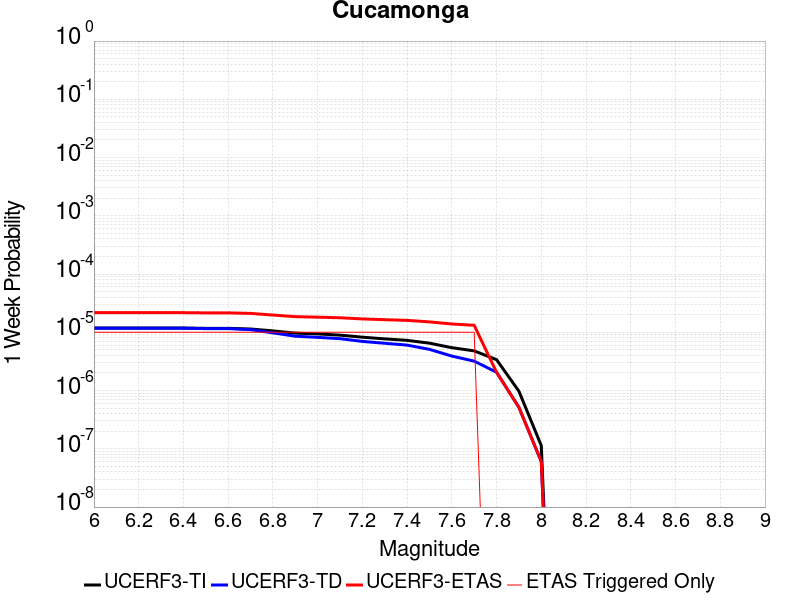 |  |  |  |

| Magnitude | 1 wk TI Prob | 1 wk TD Prob | 1 wk ETAS Prob | 1 wk ETAS/TD Gain | 1 wk ETAS Triggered Only | 1 mo TI Prob | 1 mo TD Prob | 1 mo ETAS Prob | 1 mo ETAS/TD Gain | 1 mo ETAS Triggered Only | 1 yr TI Prob | 1 yr TD Prob | 1 yr ETAS Prob | 1 yr ETAS/TD Gain | 1 yr ETAS Triggered Only | 10 yr TI Prob | 10 yr TD Prob | 10 yr ETAS Prob | 10 yr ETAS/TD Gain | 10 yr ETAS Triggered Only |
|-----|-----|-----|-----|-----|-----|-----|-----|-----|-----|-----|-----|-----|-----|-----|-----|-----|-----|-----|-----|-----|
| 6.0 | 1.1848348E-5 | 1.1737109E-5 | 2.1736992E-5 | 1.8519886 | 1.0E-5 | 5.0777642E-5 | 5.0300943E-5 | 7.029994E-5 | 1.3975868 | 2.0E-5 | 6.180424E-4 | 6.122446E-4 | 6.522201E-4 | 1.0652933 | 4.0E-5 | 0.0061632637 | 0.006106745 | 0.0061564394 | 1.0081377 | 5.0E-5 |
| 6.1 | 1.1848348E-5 | 1.1737109E-5 | 2.1736992E-5 | 1.8519886 | 1.0E-5 | 5.0777642E-5 | 5.0300943E-5 | 7.029994E-5 | 1.3975868 | 2.0E-5 | 6.180424E-4 | 6.122446E-4 | 6.522201E-4 | 1.0652933 | 4.0E-5 | 0.0061632637 | 0.006106745 | 0.0061564394 | 1.0081377 | 5.0E-5 |
| 6.2 | 1.1848348E-5 | 1.1737109E-5 | 2.1736992E-5 | 1.8519886 | 1.0E-5 | 5.0777642E-5 | 5.0300943E-5 | 7.029994E-5 | 1.3975868 | 2.0E-5 | 6.180424E-4 | 6.122446E-4 | 6.522201E-4 | 1.0652933 | 4.0E-5 | 0.0061632637 | 0.006106745 | 0.0061564394 | 1.0081377 | 5.0E-5 |
| 6.3 | 1.1848348E-5 | 1.1737109E-5 | 2.1736992E-5 | 1.8519886 | 1.0E-5 | 5.0777642E-5 | 5.0300943E-5 | 7.029994E-5 | 1.3975868 | 2.0E-5 | 6.180424E-4 | 6.122446E-4 | 6.522201E-4 | 1.0652933 | 4.0E-5 | 0.0061632637 | 0.006106745 | 0.0061564394 | 1.0081377 | 5.0E-5 |
| 6.4 | 1.1848348E-5 | 1.1737109E-5 | 2.1736992E-5 | 1.8519886 | 1.0E-5 | 5.0777642E-5 | 5.0300943E-5 | 7.029994E-5 | 1.3975868 | 2.0E-5 | 6.180424E-4 | 6.122446E-4 | 6.522201E-4 | 1.0652933 | 4.0E-5 | 0.0061632637 | 0.006106745 | 0.0061564394 | 1.0081377 | 5.0E-5 |
| 6.5 | 1.16988695E-5 | 1.157614E-5 | 2.1576025E-5 | 1.8638358 | 1.0E-5 | 5.013705E-5 | 4.9611102E-5 | 6.9610105E-5 | 1.4031156 | 2.0E-5 | 6.102476E-4 | 6.0385047E-4 | 6.4382626E-4 | 1.0662016 | 4.0E-5 | 0.006085745 | 0.0060232594 | 0.006072958 | 1.0082512 | 5.0E-5 |
| 6.6 | 1.16988695E-5 | 1.157614E-5 | 2.1576025E-5 | 1.8638358 | 1.0E-5 | 5.013705E-5 | 4.9611102E-5 | 6.9610105E-5 | 1.4031156 | 2.0E-5 | 6.102476E-4 | 6.0385047E-4 | 6.4382626E-4 | 1.0662016 | 4.0E-5 | 0.006085745 | 0.0060232594 | 0.006072958 | 1.0082512 | 5.0E-5 |
| 6.7 | 1.1397107E-5 | 1.1115039E-5 | 2.1114927E-5 | 1.8996719 | 1.0E-5 | 4.884383E-5 | 4.7635025E-5 | 6.763407E-5 | 1.4198391 | 2.0E-5 | 5.9451134E-4 | 5.798046E-4 | 6.1978144E-4 | 1.0689487 | 4.0E-5 | 0.005929234 | 0.005784061 | 0.0058337715 | 1.0085944 | 5.0E-5 |
| 6.8 | 1.058387E-5 | 9.785037E-6 | 1.9784939E-5 | 2.0219586 | 1.0E-5 | 4.5358654E-5 | 4.1935207E-5 | 6.193437E-5 | 1.4769062 | 2.0E-5 | 5.521017E-4 | 5.1044265E-4 | 5.5042224E-4 | 1.0783234 | 4.0E-5 | 0.00550732 | 0.005093702 | 0.0051434473 | 1.0097661 | 5.0E-5 |
| 6.9 | 9.690046E-6 | 8.579504E-6 | 1.8579418E-5 | 2.1655586 | 1.0E-5 | 4.1528107E-5 | 3.6768783E-5 | 5.6768047E-5 | 1.5439197 | 2.0E-5 | 5.054874E-4 | 4.475684E-4 | 4.8755048E-4 | 1.0893319 | 4.0E-5 | 0.005043391 | 0.0044675954 | 0.004517372 | 1.0111417 | 5.0E-5 |
| 7.0 | 9.381461E-6 | 8.18712E-6 | 1.8187038E-5 | 2.2214208 | 1.0E-5 | 4.020564E-5 | 3.508719E-5 | 5.5086486E-5 | 1.5699886 | 2.0E-5 | 4.893937E-4 | 4.2710314E-4 | 4.6708604E-4 | 1.0936142 | 4.0E-5 | 0.0048831734 | 0.004263747 | 0.004313534 | 1.0116768 | 5.0E-5 |
| 7.1 | 8.946492E-6 | 7.781904E-6 | 1.7781826E-5 | 2.2850225 | 1.0E-5 | 3.8341543E-5 | 3.3350592E-5 | 5.3349926E-5 | 1.5996695 | 2.0E-5 | 4.667083E-4 | 4.0596814E-4 | 4.4595188E-4 | 1.0984899 | 4.0E-5 | 0.0046572937 | 0.0040531927 | 0.00410299 | 1.012286 | 5.0E-5 |
| 7.2 | 8.251016E-6 | 6.9752878E-6 | 1.6975218E-5 | 2.4336226 | 1.0E-5 | 3.5361016E-5 | 2.9893748E-5 | 4.989315E-5 | 1.6690162 | 2.0E-5 | 4.3043532E-4 | 3.6389584E-4 | 4.038813E-4 | 1.1098815 | 4.0E-5 | 0.0042960253 | 0.0036339252 | 0.0036837435 | 1.0137092 | 5.0E-5 |
| 7.3 | 7.717881E-6 | 6.4863584E-6 | 1.6486294E-5 | 2.541687 | 1.0E-5 | 3.3076216E-5 | 2.7798384E-5 | 4.779783E-5 | 1.7194463 | 2.0E-5 | 4.026285E-4 | 3.38393E-4 | 3.7837945E-4 | 1.1181657 | 4.0E-5 | 0.004018998 | 0.0033797103 | 0.0034295414 | 1.0147442 | 5.0E-5 |
| 7.4 | 7.275623E-6 | 6.032004E-6 | 1.6031943E-5 | 2.6578138 | 1.0E-5 | 3.118087E-5 | 2.5851192E-5 | 4.5850673E-5 | 1.7736387 | 2.0E-5 | 3.7956095E-4 | 3.1469302E-4 | 3.5468044E-4 | 1.127068 | 4.0E-5 | 0.0037891332 | 0.0031434046 | 0.0031932476 | 1.0158563 | 5.0E-5 |
| 7.5 | 6.5109502E-6 | 5.100593E-6 | 1.5100542E-5 | 2.9605463 | 1.0E-5 | 2.7903774E-5 | 2.1859503E-5 | 4.1859064E-5 | 1.9149139 | 2.0E-5 | 3.3967546E-4 | 2.661071E-4 | 3.0609645E-4 | 1.1502755 | 4.0E-5 | 0.0033915674 | 0.0026588016 | 0.0027086688 | 1.0187554 | 5.0E-5 |
| 7.6 | 5.4495326E-6 | 3.908547E-6 | 1.3908508E-5 | 3.5584855 | 1.0E-5 | 2.335493E-5 | 1.6750808E-5 | 2.675064E-5 | 1.5969762 | 1.0E-5 | 2.8430918E-4 | 2.0392207E-4 | 2.3391595E-4 | 1.1470851 | 3.0E-5 | 0.0028394572 | 0.0020382616 | 0.00207818 | 1.0195845 | 4.0E-5 |
| 7.7 | 4.7997164E-6 | 3.2002263E-6 | 1.3200194E-5 | 4.124769 | 1.0E-5 | 2.057005E-5 | 1.3715184E-5 | 2.3715047E-5 | 1.7291089 | 1.0E-5 | 2.504116E-4 | 1.6696959E-4 | 1.969646E-4 | 1.1796434 | 3.0E-5 | 0.002501296 | 0.0016693701 | 0.00169932 | 1.0179409 | 3.0E-5 |
| 7.8 | 3.3941733E-6 | 2.0641678E-6 | 2.0641678E-6 | 1.0 | 0.0 | 1.4546376E-5 | 8.846404E-6 | 8.846404E-6 | 1.0 | 0.0 | 1.7708774E-4 | 1.07699656E-4 | 1.17698575E-4 | 1.0928408 | 1.0E-5 | 0.0017694668 | 0.0010766032 | 0.0010865924 | 1.0092784 | 1.0E-5 |
| 7.9 | 9.750552E-7 | 5.155798E-7 | 5.155798E-7 | 1.0 | 0.0 | 4.178801E-6 | 2.2096258E-6 | 2.2096258E-6 | 1.0 | 0.0 | 5.0875715E-5 | 2.6901867E-5 | 2.6901867E-5 | 1.0 | 0.0 | 5.086407E-4 | 2.689865E-4 | 2.689865E-4 | 1.0 | 0.0 |
| 8.0 | 1.133857E-7 | 6.053372E-8 | 6.053372E-8 | 1.0 | 0.0 | 4.8593864E-7 | 2.594302E-7 | 2.594302E-7 | 1.0 | 0.0 | 5.9162867E-6 | 3.1585582E-6 | 3.1585582E-6 | 1.0 | 0.0 | 5.916129E-5 | 3.158515E-5 | 3.158515E-5 | 1.0 | 0.0 |

## Newport-Inglewood (Offshore)
*[(top)](#table-of-contents)*

| 1 Week | 1 Month | 1 Year | 10 Year |
|-----|-----|-----|-----|
| 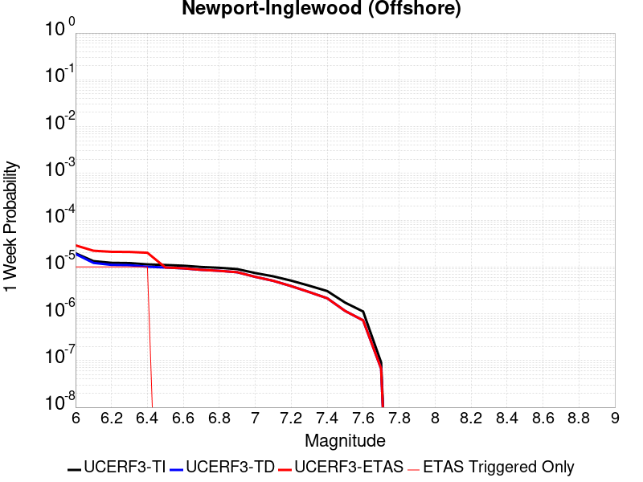 |  |  |  |

| Magnitude | 1 wk TI Prob | 1 wk TD Prob | 1 wk ETAS Prob | 1 wk ETAS/TD Gain | 1 wk ETAS Triggered Only | 1 mo TI Prob | 1 mo TD Prob | 1 mo ETAS Prob | 1 mo ETAS/TD Gain | 1 mo ETAS Triggered Only | 1 yr TI Prob | 1 yr TD Prob | 1 yr ETAS Prob | 1 yr ETAS/TD Gain | 1 yr ETAS Triggered Only | 10 yr TI Prob | 10 yr TD Prob | 10 yr ETAS Prob | 10 yr ETAS/TD Gain | 10 yr ETAS Triggered Only |
|-----|-----|-----|-----|-----|-----|-----|-----|-----|-----|-----|-----|-----|-----|-----|-----|-----|-----|-----|-----|-----|
| 6.0 | 1.9626508E-5 | 1.8965342E-5 | 2.8965153E-5 | 1.5272676 | 1.0E-5 | 8.411089E-5 | 8.1277576E-5 | 9.1276765E-5 | 1.1230252 | 1.0E-5 | 0.001023569 | 9.891179E-4 | 0.0010190882 | 1.0303 | 3.0E-5 | 0.010188672 | 0.009848497 | 0.009888102 | 1.0040215 | 4.0E-5 |
| 6.1 | 1.331886E-5 | 1.2218078E-5 | 2.2217957E-5 | 1.8184493 | 1.0E-5 | 5.707958E-5 | 5.2362153E-5 | 6.236163E-5 | 1.1909677 | 1.0E-5 | 6.947222E-4 | 6.3732424E-4 | 6.4731785E-4 | 1.0156806 | 1.0E-5 | 0.006925544 | 0.006355142 | 0.006375015 | 1.0031271 | 2.0E-5 |
| 6.2 | 1.2250852E-5 | 1.1076016E-5 | 2.1075904E-5 | 1.9028417 | 1.0E-5 | 5.2502597E-5 | 4.746778E-5 | 5.7467307E-5 | 1.2106593 | 1.0E-5 | 6.3903164E-4 | 5.7776796E-4 | 5.877622E-4 | 1.017298 | 1.0E-5 | 0.006371971 | 0.0057627796 | 0.0057826643 | 1.0034505 | 2.0E-5 |
| 6.3 | 1.2106258E-5 | 1.0918878E-5 | 2.091877E-5 | 1.915835 | 1.0E-5 | 5.1882926E-5 | 4.6794354E-5 | 5.6793888E-5 | 1.213691 | 1.0E-5 | 6.3149154E-4 | 5.695733E-4 | 5.795676E-4 | 1.017547 | 1.0E-5 | 0.0062970007 | 0.005681252 | 0.0057011386 | 1.0035003 | 2.0E-5 |
| 6.4 | 1.1348758E-5 | 1.0109348E-5 | 2.0109248E-5 | 1.9891734 | 1.0E-5 | 4.8636626E-5 | 4.3325064E-5 | 5.332463E-5 | 1.2308033 | 1.0E-5 | 5.919901E-4 | 5.2735576E-4 | 5.3735054E-4 | 1.0189525 | 1.0E-5 | 0.005904155 | 0.0052611395 | 0.0052810344 | 1.0037814 | 2.0E-5 |
| 6.5 | 1.100837E-5 | 9.743376E-6 | 9.743376E-6 | 1.0 | 0.0 | 4.7177873E-5 | 4.175666E-5 | 4.175666E-5 | 1.0 | 0.0 | 5.7423924E-4 | 5.082695E-4 | 5.082695E-4 | 1.0 | 0.0 | 0.005727576 | 0.005071162 | 0.005081111 | 1.001962 | 1.0E-5 |
| 6.6 | 1.0634696E-5 | 9.34553E-6 | 9.34553E-6 | 1.0 | 0.0 | 4.557647E-5 | 4.0051662E-5 | 4.0051662E-5 | 1.0 | 0.0 | 5.5475225E-4 | 4.875206E-4 | 4.875206E-4 | 1.0 | 0.0 | 0.0055336943 | 0.0048645977 | 0.004874549 | 1.0020456 | 1.0E-5 |
| 6.7 | 9.9780855E-6 | 8.667898E-6 | 8.667898E-6 | 1.0 | 0.0 | 4.276252E-5 | 3.7147613E-5 | 3.7147613E-5 | 1.0 | 0.0 | 5.205093E-4 | 4.5217903E-4 | 4.5217903E-4 | 1.0 | 0.0 | 0.0051929182 | 0.0045126686 | 0.0045226235 | 1.002206 | 1.0E-5 |
| 6.8 | 9.59546E-6 | 8.272933E-6 | 8.272933E-6 | 1.0 | 0.0 | 4.1122752E-5 | 3.545495E-5 | 3.545495E-5 | 1.0 | 0.0 | 5.0055445E-4 | 4.3157916E-4 | 4.3157916E-4 | 1.0 | 0.0 | 0.004994285 | 0.004307486 | 0.004317443 | 1.0023116 | 1.0E-5 |
| 6.9 | 9.000614E-6 | 7.706823E-6 | 7.706823E-6 | 1.0 | 0.0 | 3.857349E-5 | 3.3028828E-5 | 3.3028828E-5 | 1.0 | 0.0 | 4.6953102E-4 | 4.0205245E-4 | 4.0205245E-4 | 1.0 | 0.0 | 0.004685402 | 0.0040133223 | 0.004023282 | 1.0024817 | 1.0E-5 |
| 7.0 | 7.4070194E-6 | 6.148865E-6 | 6.148865E-6 | 1.0 | 0.0 | 3.1743984E-5 | 2.6352012E-5 | 2.6352012E-5 | 1.0 | 0.0 | 3.8641447E-4 | 3.2078868E-4 | 3.2078868E-4 | 1.0 | 0.0 | 0.0038574322 | 0.0032032758 | 0.0032132438 | 1.0031118 | 1.0E-5 |
| 7.1 | 6.299615E-6 | 5.0565613E-6 | 5.0565613E-6 | 1.0 | 0.0 | 2.699807E-5 | 2.1670798E-5 | 2.1670798E-5 | 1.0 | 0.0 | 3.2865192E-4 | 2.6381016E-4 | 2.6381016E-4 | 1.0 | 0.0 | 0.003281663 | 0.0026349847 | 0.0026449582 | 1.0037851 | 1.0E-5 |
| 7.2 | 5.096653E-6 | 3.892733E-6 | 3.892733E-6 | 1.0 | 0.0 | 2.1842614E-5 | 1.6683034E-5 | 1.6683034E-5 | 1.0 | 0.0 | 2.6590136E-4 | 2.0309711E-4 | 2.0309711E-4 | 1.0 | 0.0 | 0.0026558342 | 0.0020291263 | 0.0020391059 | 1.0049182 | 1.0E-5 |
| 7.3 | 3.9753018E-6 | 2.9098787E-6 | 2.9098787E-6 | 1.0 | 0.0 | 1.7036897E-5 | 1.24708495E-5 | 1.24708495E-5 | 1.0 | 0.0 | 2.0740448E-4 | 1.518221E-4 | 1.518221E-4 | 1.0 | 0.0 | 0.00207211 | 0.0015171919 | 0.0015171919 | 1.0 | 0.0 |
| 7.4 | 3.0568392E-6 | 2.1449732E-6 | 2.1449732E-6 | 1.0 | 0.0 | 1.3100675E-5 | 9.19271E-6 | 9.19271E-6 | 1.0 | 0.0 | 1.5948903E-4 | 1.11915564E-4 | 1.11915564E-4 | 1.0 | 0.0 | 0.0015937461 | 0.0011185983 | 0.0011185983 | 1.0 | 0.0 |
| 7.5 | 1.7279019E-6 | 1.1469651E-6 | 1.1469651E-6 | 1.0 | 0.0 | 7.405273E-6 | 4.9155556E-6 | 4.9155556E-6 | 1.0 | 0.0 | 9.015547E-5 | 5.9845286E-5 | 5.9845286E-5 | 1.0 | 0.0 | 9.01189E-4 | 5.982956E-4 | 5.982956E-4 | 1.0 | 0.0 |
| 7.6 | 1.1156416E-6 | 7.222962E-7 | 7.222962E-7 | 1.0 | 0.0 | 4.7813123E-6 | 3.0955514E-6 | 3.0955514E-6 | 1.0 | 0.0 | 5.821092E-5 | 3.768771E-5 | 3.768771E-5 | 1.0 | 0.0 | 5.8195676E-4 | 3.7681553E-4 | 3.7681553E-4 | 1.0 | 0.0 |
| 7.7 | 9.117973E-8 | 6.7342256E-8 | 6.7342256E-8 | 1.0 | 0.0 | 3.907702E-7 | 2.8860964E-7 | 2.8860964E-7 | 1.0 | 0.0 | 4.757617E-6 | 3.5138169E-6 | 3.5138169E-6 | 1.0 | 0.0 | 4.7575148E-5 | 3.5137644E-5 | 3.5137644E-5 | 1.0 | 0.0 |

## San Gabriel (Extension)
*[(top)](#table-of-contents)*

| 1 Week | 1 Month | 1 Year | 10 Year |
|-----|-----|-----|-----|
|  |  |  | 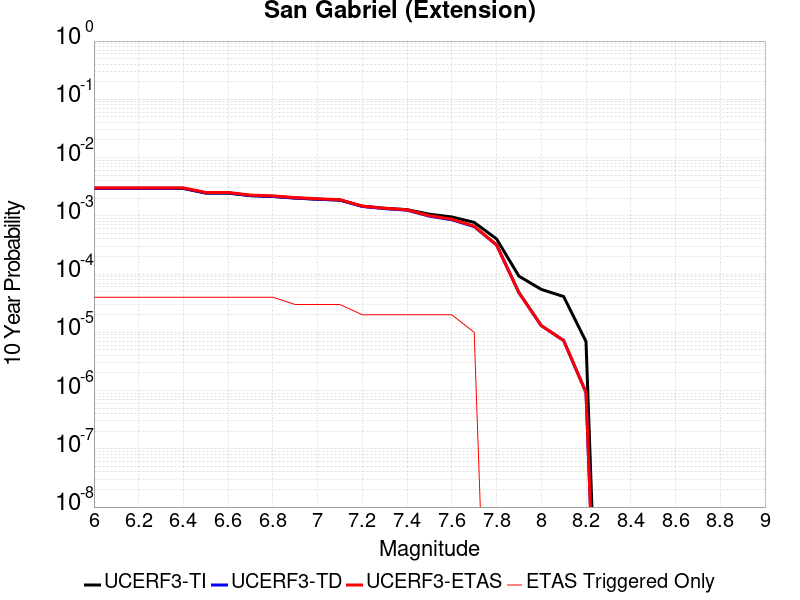 |

| Magnitude | 1 wk TI Prob | 1 wk TD Prob | 1 wk ETAS Prob | 1 wk ETAS/TD Gain | 1 wk ETAS Triggered Only | 1 mo TI Prob | 1 mo TD Prob | 1 mo ETAS Prob | 1 mo ETAS/TD Gain | 1 mo ETAS Triggered Only | 1 yr TI Prob | 1 yr TD Prob | 1 yr ETAS Prob | 1 yr ETAS/TD Gain | 1 yr ETAS Triggered Only | 10 yr TI Prob | 10 yr TD Prob | 10 yr ETAS Prob | 10 yr ETAS/TD Gain | 10 yr ETAS Triggered Only |
|-----|-----|-----|-----|-----|-----|-----|-----|-----|-----|-----|-----|-----|-----|-----|-----|-----|-----|-----|-----|-----|
| 6.0 | 5.6486106E-6 | 5.7168368E-6 | 1.571678E-5 | 2.7492092 | 1.0E-5 | 2.4208108E-5 | 2.4500505E-5 | 3.450026E-5 | 1.4081448 | 1.0E-5 | 2.9469383E-4 | 2.9825408E-4 | 3.1824812E-4 | 1.0670369 | 2.0E-5 | 0.0029430336 | 0.0029786646 | 0.0030185455 | 1.0133889 | 4.0E-5 |
| 6.1 | 5.6486106E-6 | 5.7168368E-6 | 1.571678E-5 | 2.7492092 | 1.0E-5 | 2.4208108E-5 | 2.4500505E-5 | 3.450026E-5 | 1.4081448 | 1.0E-5 | 2.9469383E-4 | 2.9825408E-4 | 3.1824812E-4 | 1.0670369 | 2.0E-5 | 0.0029430336 | 0.0029786646 | 0.0030185455 | 1.0133889 | 4.0E-5 |
| 6.2 | 5.6486106E-6 | 5.7168368E-6 | 1.571678E-5 | 2.7492092 | 1.0E-5 | 2.4208108E-5 | 2.4500505E-5 | 3.450026E-5 | 1.4081448 | 1.0E-5 | 2.9469383E-4 | 2.9825408E-4 | 3.1824812E-4 | 1.0670369 | 2.0E-5 | 0.0029430336 | 0.0029786646 | 0.0030185455 | 1.0133889 | 4.0E-5 |
| 6.3 | 5.6486106E-6 | 5.7168368E-6 | 1.571678E-5 | 2.7492092 | 1.0E-5 | 2.4208108E-5 | 2.4500505E-5 | 3.450026E-5 | 1.4081448 | 1.0E-5 | 2.9469383E-4 | 2.9825408E-4 | 3.1824812E-4 | 1.0670369 | 2.0E-5 | 0.0029430336 | 0.0029786646 | 0.0030185455 | 1.0133889 | 4.0E-5 |
| 6.4 | 5.6486106E-6 | 5.7168368E-6 | 1.571678E-5 | 2.7492092 | 1.0E-5 | 2.4208108E-5 | 2.4500505E-5 | 3.450026E-5 | 1.4081448 | 1.0E-5 | 2.9469383E-4 | 2.9825408E-4 | 3.1824812E-4 | 1.0670369 | 2.0E-5 | 0.0029430336 | 0.0029786646 | 0.0030185455 | 1.0133889 | 4.0E-5 |
| 6.5 | 4.7134554E-6 | 4.7542608E-6 | 1.4754213E-5 | 3.1033664 | 1.0E-5 | 2.0200367E-5 | 2.0375248E-5 | 3.0375044E-5 | 1.4907815 | 1.0E-5 | 2.459117E-4 | 2.4804127E-4 | 2.680363E-4 | 1.0806117 | 2.0E-5 | 0.0024563975 | 0.0024777285 | 0.0025176294 | 1.0161039 | 4.0E-5 |
| 6.6 | 4.7134554E-6 | 4.7542608E-6 | 1.4754213E-5 | 3.1033664 | 1.0E-5 | 2.0200367E-5 | 2.0375248E-5 | 3.0375044E-5 | 1.4907815 | 1.0E-5 | 2.459117E-4 | 2.4804127E-4 | 2.680363E-4 | 1.0806117 | 2.0E-5 | 0.0024563975 | 0.0024777285 | 0.0025176294 | 1.0161039 | 4.0E-5 |
| 6.7 | 4.2468837E-6 | 4.274078E-6 | 1.42740355E-5 | 3.339676 | 1.0E-5 | 1.8200803E-5 | 1.8317352E-5 | 2.8317168E-5 | 1.5459204 | 1.0E-5 | 2.2157225E-4 | 2.2299167E-4 | 2.4298721E-4 | 1.0896695 | 2.0E-5 | 0.0022135144 | 0.0022277513 | 0.0022676622 | 1.0179154 | 4.0E-5 |
| 6.8 | 4.1180615E-6 | 4.1414673E-6 | 1.4141426E-5 | 3.414593 | 1.0E-5 | 1.7648716E-5 | 1.774903E-5 | 2.7748853E-5 | 1.5634011 | 1.0E-5 | 2.1485193E-4 | 2.1607373E-4 | 2.360694E-4 | 1.092541 | 2.0E-5 | 0.0021464431 | 0.0021587077 | 0.0021986214 | 1.0184896 | 4.0E-5 |
| 6.9 | 3.863861E-6 | 3.879783E-6 | 3.879783E-6 | 1.0 | 0.0 | 1.65593E-5 | 1.6627539E-5 | 1.6627539E-5 | 1.0 | 0.0 | 2.0159081E-4 | 2.0242216E-4 | 2.1242014E-4 | 1.0493917 | 1.0E-5 | 0.0020140803 | 0.0020224454 | 0.002052385 | 1.0148035 | 3.0E-5 |
| 7.0 | 3.6947372E-6 | 3.705682E-6 | 3.705682E-6 | 1.0 | 0.0 | 1.5834492E-5 | 1.5881402E-5 | 1.5881402E-5 | 1.0 | 0.0 | 1.9276788E-4 | 1.9333958E-4 | 2.0333765E-4 | 1.0517125 | 1.0E-5 | 0.0019260074 | 0.0019317803 | 0.0019617223 | 1.0154997 | 3.0E-5 |
| 7.1 | 3.5686835E-6 | 3.5729024E-6 | 3.5729024E-6 | 1.0 | 0.0 | 1.5294268E-5 | 1.5312353E-5 | 1.5312353E-5 | 1.0 | 0.0 | 1.861918E-4 | 1.8641262E-4 | 1.9641075E-4 | 1.0536344 | 1.0E-5 | 0.0018603588 | 0.0018626284 | 0.0018925725 | 1.0160763 | 3.0E-5 |
| 7.2 | 2.8023446E-6 | 2.776794E-6 | 2.776794E-6 | 1.0 | 0.0 | 1.2009994E-5 | 1.1900492E-5 | 1.1900492E-5 | 1.0 | 0.0 | 1.4621185E-4 | 1.4487897E-4 | 1.5487752E-4 | 1.0690131 | 1.0E-5 | 0.001461157 | 0.001447856 | 0.001467827 | 1.0137936 | 2.0E-5 |
| 7.3 | 2.5843012E-6 | 2.5459692E-6 | 2.5459692E-6 | 1.0 | 0.0 | 1.1075529E-5 | 1.0911252E-5 | 1.0911252E-5 | 1.0 | 0.0 | 1.3483623E-4 | 1.3283649E-4 | 1.4283515E-4 | 1.0752705 | 1.0E-5 | 0.0013475444 | 0.0013275805 | 0.001347554 | 1.015045 | 2.0E-5 |
| 7.4 | 2.4464468E-6 | 2.396669E-6 | 2.396669E-6 | 1.0 | 0.0 | 1.04847295E-5 | 1.0271398E-5 | 1.0271398E-5 | 1.0 | 0.0 | 1.276441E-4 | 1.250472E-4 | 1.3504595E-4 | 1.0799598 | 1.0E-5 | 0.0012757082 | 0.001249778 | 0.001269753 | 1.0159829 | 2.0E-5 |
| 7.5 | 2.0420266E-6 | 1.8910376E-6 | 1.8910376E-6 | 1.0 | 0.0 | 8.751514E-6 | 8.104422E-6 | 8.104422E-6 | 1.0 | 0.0 | 1.0654447E-4 | 9.866691E-5 | 1.08665925E-4 | 1.1013411 | 1.0E-5 | 0.001064934 | 9.862344E-4 | 0.0010062146 | 1.0202591 | 2.0E-5 |
| 7.6 | 1.8326596E-6 | 1.6398233E-6 | 1.6398233E-6 | 1.0 | 0.0 | 7.854232E-6 | 7.027795E-6 | 7.027795E-6 | 1.0 | 0.0 | 9.562107E-5 | 8.556007E-5 | 9.555921E-5 | 1.116867 | 1.0E-5 | 9.5579936E-4 | 8.552735E-4 | 8.7525643E-4 | 1.0233643 | 2.0E-5 |
| 7.7 | 1.4786998E-6 | 1.2523672E-6 | 1.2523672E-6 | 1.0 | 0.0 | 6.3372695E-6 | 5.3672766E-6 | 5.3672766E-6 | 1.0 | 0.0 | 7.715353E-5 | 6.534465E-5 | 7.534399E-5 | 1.1530247 | 1.0E-5 | 7.7126746E-4 | 6.5325975E-4 | 6.6325325E-4 | 1.0152979 | 1.0E-5 |
| 7.8 | 7.6975533E-7 | 6.069207E-7 | 6.069207E-7 | 1.0 | 0.0 | 3.2989474E-6 | 2.6010862E-6 | 2.6010862E-6 | 1.0 | 0.0 | 4.0163945E-5 | 3.1667765E-5 | 3.1667765E-5 | 1.0 | 0.0 | 4.0156685E-4 | 3.166365E-4 | 3.166365E-4 | 1.0 | 0.0 |
| 7.9 | 1.7645915E-7 | 9.211899E-8 | 9.211899E-8 | 1.0 | 0.0 | 7.562533E-7 | 3.947956E-7 | 3.947956E-7 | 1.0 | 0.0 | 9.207345E-6 | 4.806626E-6 | 4.806626E-6 | 1.0 | 0.0 | 9.206964E-5 | 4.8069025E-5 | 4.8069025E-5 | 1.0 | 0.0 |
| 8.0 | 1.0463461E-7 | 2.4937416E-8 | 2.4937416E-8 | 1.0 | 0.0 | 4.4843398E-7 | 1.0687464E-7 | 1.0687464E-7 | 1.0 | 0.0 | 5.45967E-6 | 1.3011979E-6 | 1.3011979E-6 | 1.0 | 0.0 | 5.459536E-5 | 1.3015701E-5 | 1.3015701E-5 | 1.0 | 0.0 |
| 8.1 | 7.875717E-8 | 1.3857542E-8 | 1.3857542E-8 | 1.0 | 0.0 | 3.3753068E-7 | 5.9389468E-8 | 5.9389468E-8 | 1.0 | 0.0 | 4.109428E-6 | 7.2306653E-7 | 7.2306653E-7 | 1.0 | 0.0 | 4.109352E-5 | 7.234439E-6 | 7.234439E-6 | 1.0 | 0.0 |
| 8.2 | 1.33163E-8 | 1.7720816E-9 | 1.7720816E-9 | 1.0 | 0.0 | 5.7069855E-8 | 7.594638E-9 | 7.594638E-9 | 1.0 | 0.0 | 6.9482525E-7 | 9.246471E-8 | 9.246471E-8 | 1.0 | 0.0 | 6.9482307E-6 | 9.2664203E-7 | 9.2664203E-7 | 1.0 | 0.0 |

## Hector Mine
*[(top)](#table-of-contents)*

| 1 Week | 1 Month | 1 Year | 10 Year |
|-----|-----|-----|-----|
|  | 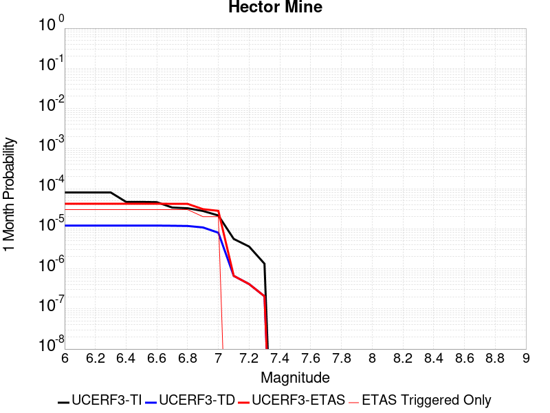 |  | 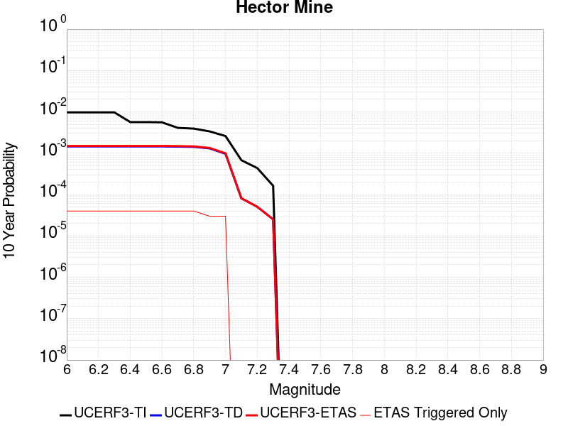 |

| Magnitude | 1 wk TI Prob | 1 wk TD Prob | 1 wk ETAS Prob | 1 wk ETAS/TD Gain | 1 wk ETAS Triggered Only | 1 mo TI Prob | 1 mo TD Prob | 1 mo ETAS Prob | 1 mo ETAS/TD Gain | 1 mo ETAS Triggered Only | 1 yr TI Prob | 1 yr TD Prob | 1 yr ETAS Prob | 1 yr ETAS/TD Gain | 1 yr ETAS Triggered Only | 10 yr TI Prob | 10 yr TD Prob | 10 yr ETAS Prob | 10 yr ETAS/TD Gain | 10 yr ETAS Triggered Only |
|-----|-----|-----|-----|-----|-----|-----|-----|-----|-----|-----|-----|-----|-----|-----|-----|-----|-----|-----|-----|-----|
| 6.0 | 1.8760093E-5 | 2.7962699E-6 | 2.2796214E-5 | 8.152366 | 2.0E-5 | 8.039792E-5 | 1.19839815E-5 | 4.198362E-5 | 3.5033116 | 3.0E-5 | 9.78405E-4 | 1.458992E-4 | 1.8589337E-4 | 1.2741219 | 4.0E-5 | 0.009741086 | 0.0014584264 | 0.001498368 | 1.0273868 | 4.0E-5 |
| 6.1 | 1.8760093E-5 | 2.7962699E-6 | 2.2796214E-5 | 8.152366 | 2.0E-5 | 8.039792E-5 | 1.19839815E-5 | 4.198362E-5 | 3.5033116 | 3.0E-5 | 9.78405E-4 | 1.458992E-4 | 1.8589337E-4 | 1.2741219 | 4.0E-5 | 0.009741086 | 0.0014584264 | 0.001498368 | 1.0273868 | 4.0E-5 |
| 6.2 | 1.8760093E-5 | 2.7962699E-6 | 2.2796214E-5 | 8.152366 | 2.0E-5 | 8.039792E-5 | 1.19839815E-5 | 4.198362E-5 | 3.5033116 | 3.0E-5 | 9.78405E-4 | 1.458992E-4 | 1.8589337E-4 | 1.2741219 | 4.0E-5 | 0.009741086 | 0.0014584264 | 0.001498368 | 1.0273868 | 4.0E-5 |
| 6.3 | 1.8760093E-5 | 2.7962699E-6 | 2.2796214E-5 | 8.152366 | 2.0E-5 | 8.039792E-5 | 1.19839815E-5 | 4.198362E-5 | 3.5033116 | 3.0E-5 | 9.78405E-4 | 1.458992E-4 | 1.8589337E-4 | 1.2741219 | 4.0E-5 | 0.009741086 | 0.0014584264 | 0.001498368 | 1.0273868 | 4.0E-5 |
| 6.4 | 1.0888055E-5 | 2.7962699E-6 | 2.2796214E-5 | 8.152366 | 2.0E-5 | 4.666226E-5 | 1.19839815E-5 | 4.198362E-5 | 3.5033116 | 3.0E-5 | 5.679649E-4 | 1.458992E-4 | 1.8589337E-4 | 1.2741219 | 4.0E-5 | 0.0056651547 | 0.0014584264 | 0.001498368 | 1.0273868 | 4.0E-5 |
| 6.5 | 1.0888055E-5 | 2.7962699E-6 | 2.2796214E-5 | 8.152366 | 2.0E-5 | 4.666226E-5 | 1.19839815E-5 | 4.198362E-5 | 3.5033116 | 3.0E-5 | 5.679649E-4 | 1.458992E-4 | 1.8589337E-4 | 1.2741219 | 4.0E-5 | 0.0056651547 | 0.0014584264 | 0.001498368 | 1.0273868 | 4.0E-5 |
| 6.6 | 1.0730738E-5 | 2.7962699E-6 | 2.2796214E-5 | 8.152366 | 2.0E-5 | 4.5988065E-5 | 1.19839815E-5 | 4.198362E-5 | 3.5033116 | 3.0E-5 | 5.5976084E-4 | 1.458992E-4 | 1.8589337E-4 | 1.2741219 | 4.0E-5 | 0.0055835294 | 0.0014584264 | 0.001498368 | 1.0273868 | 4.0E-5 |
| 6.7 | 7.881326E-6 | 2.770952E-6 | 2.2770897E-5 | 8.217715 | 2.0E-5 | 3.3776672E-5 | 1.1875478E-5 | 4.1875122E-5 | 3.526184 | 3.0E-5 | 4.111534E-4 | 1.4457834E-4 | 1.8457256E-4 | 1.2766266 | 4.0E-5 | 0.0041039353 | 0.001445235 | 0.0014851772 | 1.0276371 | 4.0E-5 |
| 6.8 | 7.5683483E-6 | 2.7327321E-6 | 2.2732678E-5 | 8.318663 | 2.0E-5 | 3.2435375E-5 | 1.1711679E-5 | 4.1711326E-5 | 3.5615156 | 3.0E-5 | 3.9482914E-4 | 1.4258435E-4 | 1.8257866E-4 | 1.2804956 | 4.0E-5 | 0.0039412836 | 0.0014253207 | 0.0014652638 | 1.0280238 | 4.0E-5 |
| 6.9 | 6.473048E-6 | 2.513824E-6 | 2.2513774E-5 | 8.955986 | 2.0E-5 | 2.7741338E-5 | 1.07735095E-5 | 3.0773295E-5 | 2.8563852 | 2.0E-5 | 3.3769844E-4 | 1.3116356E-4 | 1.6115962E-4 | 1.228692 | 3.0E-5 | 0.0033718573 | 0.001311251 | 0.0013412116 | 1.022849 | 3.0E-5 |
| 7.0 | 4.9959954E-6 | 1.8564588E-6 | 2.1856422E-5 | 11.773179 | 2.0E-5 | 2.1411232E-5 | 7.956248E-6 | 2.7956088E-5 | 3.5137277 | 2.0E-5 | 2.6065056E-4 | 9.686658E-5 | 1.2686367E-4 | 1.3096744 | 3.0E-5 | 0.0026034506 | 9.685931E-4 | 9.985641E-4 | 1.0309428 | 3.0E-5 |
| 7.1 | 1.2997541E-6 | 1.5599346E-7 | 1.5599346E-7 | 1.0 | 0.0 | 5.5703626E-6 | 6.685433E-7 | 6.685433E-7 | 1.0 | 0.0 | 6.7817055E-5 | 8.139488E-6 | 8.139488E-6 | 1.0 | 0.0 | 6.779636E-4 | 8.1392296E-5 | 8.1392296E-5 | 1.0 | 0.0 |
| 7.2 | 8.392699E-7 | 9.725453E-8 | 9.725453E-8 | 1.0 | 0.0 | 3.596866E-6 | 4.1680505E-7 | 4.1680505E-7 | 1.0 | 0.0 | 4.3790962E-5 | 5.0745916E-6 | 5.0745916E-6 | 1.0 | 0.0 | 4.3782333E-4 | 5.074495E-5 | 5.074495E-5 | 1.0 | 0.0 |
| 7.3 | 3.13015E-7 | 4.8283802E-8 | 4.8283802E-8 | 1.0 | 0.0 | 1.3414921E-6 | 2.0693057E-7 | 2.0693057E-7 | 1.0 | 0.0 | 1.6332544E-5 | 2.5193776E-6 | 2.5193776E-6 | 1.0 | 0.0 | 1.6331344E-4 | 2.5193574E-5 | 2.5193574E-5 | 1.0 | 0.0 |

## La Panza 2011
*[(top)](#table-of-contents)*

| 1 Week | 1 Month | 1 Year | 10 Year |
|-----|-----|-----|-----|
|  |  |  |  |

| Magnitude | 1 wk TI Prob | 1 wk TD Prob | 1 wk ETAS Prob | 1 wk ETAS/TD Gain | 1 wk ETAS Triggered Only | 1 mo TI Prob | 1 mo TD Prob | 1 mo ETAS Prob | 1 mo ETAS/TD Gain | 1 mo ETAS Triggered Only | 1 yr TI Prob | 1 yr TD Prob | 1 yr ETAS Prob | 1 yr ETAS/TD Gain | 1 yr ETAS Triggered Only | 10 yr TI Prob | 10 yr TD Prob | 10 yr ETAS Prob | 10 yr ETAS/TD Gain | 10 yr ETAS Triggered Only |
|-----|-----|-----|-----|-----|-----|-----|-----|-----|-----|-----|-----|-----|-----|-----|-----|-----|-----|-----|-----|-----|
| 6.0 | 4.6754544E-6 | 4.7175886E-6 | 1.47175415E-5 | 3.119717 | 1.0E-5 | 2.0037509E-5 | 2.021809E-5 | 3.0217889E-5 | 1.4945965 | 1.0E-5 | 2.4392935E-4 | 2.4612944E-4 | 2.5612698E-4 | 1.040619 | 1.0E-5 | 0.0024366176 | 0.0024587628 | 0.002488689 | 1.0121713 | 3.0E-5 |
| 6.1 | 4.6754544E-6 | 4.7175886E-6 | 1.47175415E-5 | 3.119717 | 1.0E-5 | 2.0037509E-5 | 2.021809E-5 | 3.0217889E-5 | 1.4945965 | 1.0E-5 | 2.4392935E-4 | 2.4612944E-4 | 2.5612698E-4 | 1.040619 | 1.0E-5 | 0.0024366176 | 0.0024587628 | 0.002488689 | 1.0121713 | 3.0E-5 |
| 6.2 | 4.6754544E-6 | 4.7175886E-6 | 1.47175415E-5 | 3.119717 | 1.0E-5 | 2.0037509E-5 | 2.021809E-5 | 3.0217889E-5 | 1.4945965 | 1.0E-5 | 2.4392935E-4 | 2.4612944E-4 | 2.5612698E-4 | 1.040619 | 1.0E-5 | 0.0024366176 | 0.0024587628 | 0.002488689 | 1.0121713 | 3.0E-5 |
| 6.3 | 4.6754544E-6 | 4.7175886E-6 | 1.47175415E-5 | 3.119717 | 1.0E-5 | 2.0037509E-5 | 2.021809E-5 | 3.0217889E-5 | 1.4945965 | 1.0E-5 | 2.4392935E-4 | 2.4612944E-4 | 2.5612698E-4 | 1.040619 | 1.0E-5 | 0.0024366176 | 0.0024587628 | 0.002488689 | 1.0121713 | 3.0E-5 |
| 6.4 | 4.6754544E-6 | 4.7175886E-6 | 1.47175415E-5 | 3.119717 | 1.0E-5 | 2.0037509E-5 | 2.021809E-5 | 3.0217889E-5 | 1.4945965 | 1.0E-5 | 2.4392935E-4 | 2.4612944E-4 | 2.5612698E-4 | 1.040619 | 1.0E-5 | 0.0024366176 | 0.0024587628 | 0.002488689 | 1.0121713 | 3.0E-5 |
| 6.5 | 2.485343E-6 | 2.5006007E-6 | 2.5006007E-6 | 1.0 | 0.0 | 1.0651426E-5 | 1.0716818E-5 | 1.0716818E-5 | 1.0 | 0.0 | 1.296734E-4 | 1.3046984E-4 | 1.3046984E-4 | 1.0 | 0.0 | 0.0012959775 | 0.0013039707 | 0.0013239447 | 1.0153178 | 2.0E-5 |
| 6.6 | 2.485343E-6 | 2.5006007E-6 | 2.5006007E-6 | 1.0 | 0.0 | 1.0651426E-5 | 1.0716818E-5 | 1.0716818E-5 | 1.0 | 0.0 | 1.296734E-4 | 1.3046984E-4 | 1.3046984E-4 | 1.0 | 0.0 | 0.0012959775 | 0.0013039707 | 0.0013239447 | 1.0153178 | 2.0E-5 |
| 6.7 | 1.5108508E-6 | 1.514639E-6 | 1.514639E-6 | 1.0 | 0.0 | 6.4750584E-6 | 6.4912947E-6 | 6.4912947E-6 | 1.0 | 0.0 | 7.8830984E-5 | 7.902876E-5 | 7.902876E-5 | 1.0 | 0.0 | 7.880303E-4 | 7.9001737E-4 | 8.0000947E-4 | 1.012648 | 1.0E-5 |
| 6.8 | 1.3865837E-6 | 1.3885118E-6 | 1.3885118E-6 | 1.0 | 0.0 | 5.942488E-6 | 5.950752E-6 | 5.950752E-6 | 1.0 | 0.0 | 7.234739E-5 | 7.244809E-5 | 7.244809E-5 | 1.0 | 0.0 | 7.232384E-4 | 7.242546E-4 | 7.342473E-4 | 1.0137973 | 1.0E-5 |
| 6.9 | 9.826583E-7 | 9.796303E-7 | 9.796303E-7 | 1.0 | 0.0 | 4.2113857E-6 | 4.198409E-6 | 4.198409E-6 | 1.0 | 0.0 | 5.1272415E-5 | 5.1114486E-5 | 5.1114486E-5 | 1.0 | 0.0 | 5.126059E-4 | 5.1103265E-4 | 5.2102754E-4 | 1.0195582 | 1.0E-5 |
| 7.0 | 6.7797646E-7 | 6.710231E-7 | 6.710231E-7 | 1.0 | 0.0 | 2.9056102E-6 | 2.8758104E-6 | 2.8758104E-6 | 1.0 | 0.0 | 3.537523E-5 | 3.501246E-5 | 3.501246E-5 | 1.0 | 0.0 | 3.5369597E-4 | 3.5007254E-4 | 3.5007254E-4 | 1.0 | 0.0 |
| 7.1 | 3.4979826E-7 | 3.3874045E-7 | 3.3874045E-7 | 1.0 | 0.0 | 1.4991346E-6 | 1.4517441E-6 | 1.4517441E-6 | 1.0 | 0.0 | 1.825181E-5 | 1.7674853E-5 | 1.7674853E-5 | 1.0 | 0.0 | 1.825031E-4 | 1.7673563E-4 | 1.7673563E-4 | 1.0 | 0.0 |
| 7.2 | 2.5088332E-7 | 2.3832064E-7 | 2.3832064E-7 | 1.0 | 0.0 | 1.0752137E-6 | 1.0213738E-6 | 1.0213738E-6 | 1.0 | 0.0 | 1.3090649E-5 | 1.2435164E-5 | 1.2435164E-5 | 1.0 | 0.0 | 1.3089878E-4 | 1.2434553E-4 | 1.2434553E-4 | 1.0 | 0.0 |
| 7.3 | 1.0159086E-7 | 8.644785E-8 | 8.644785E-8 | 1.0 | 0.0 | 4.3538932E-7 | 3.704907E-7 | 3.704907E-7 | 1.0 | 0.0 | 5.300852E-6 | 4.510716E-6 | 4.510716E-6 | 1.0 | 0.0 | 5.3007258E-5 | 4.510628E-5 | 4.510628E-5 | 1.0 | 0.0 |
| 7.4 | 3.5006252E-8 | 1.9403883E-8 | 1.9403883E-8 | 1.0 | 0.0 | 1.5002678E-7 | 8.315949E-8 | 8.315949E-8 | 1.0 | 0.0 | 1.8265745E-6 | 1.0124663E-6 | 1.0124663E-6 | 1.0 | 0.0 | 1.8265595E-5 | 1.012462E-5 | 1.012462E-5 | 1.0 | 0.0 |
| 7.5 | 2.592274E-8 | 1.0238468E-8 | 1.0238468E-8 | 1.0 | 0.0 | 1.1109746E-7 | 4.3879147E-8 | 4.3879147E-8 | 1.0 | 0.0 | 1.3526106E-6 | 5.342285E-7 | 5.342285E-7 | 1.0 | 0.0 | 1.3526024E-5 | 5.342273E-6 | 5.342273E-6 | 1.0 | 0.0 |
| 7.6 | 1.9016717E-8 | 5.2442264E-9 | 5.2442264E-9 | 1.0 | 0.0 | 8.150022E-8 | 2.2475257E-8 | 2.2475257E-8 | 1.0 | 0.0 | 9.922647E-7 | 2.736362E-7 | 2.736362E-7 | 1.0 | 0.0 | 9.922603E-6 | 2.736359E-6 | 2.736359E-6 | 1.0 | 0.0 |
| 7.7 | 1.17738495E-8 | 1.2393437E-9 | 1.2393437E-9 | 1.0 | 0.0 | 5.0459356E-8 | 5.3114735E-9 | 5.3114735E-9 | 1.0 | 0.0 | 6.1434247E-7 | 6.466719E-8 | 6.466719E-8 | 1.0 | 0.0 | 6.143408E-6 | 6.466717E-7 | 6.466717E-7 | 1.0 | 0.0 |
| 7.8 | 5.489079E-9 | 2.009185E-10 | 2.009185E-10 | 1.0 | 0.0 | 2.3524624E-8 | 8.61079E-10 | 8.61079E-10 | 1.0 | 0.0 | 2.8641225E-7 | 1.0483639E-8 | 1.0483639E-8 | 1.0 | 0.0 | 2.8641189E-6 | 1.0483638E-7 | 1.0483638E-7 | 1.0 | 0.0 |
| 7.9 | 2.5081048E-9 | 6.675449E-11 | 6.675449E-11 | 1.0 | 0.0 | 1.0749021E-8 | 2.8609015E-10 | 2.8609015E-10 | 1.0 | 0.0 | 1.3086932E-7 | 3.483148E-9 | 3.483148E-9 | 1.0 | 0.0 | 1.3086925E-6 | 3.483148E-8 | 3.483148E-8 | 1.0 | 0.0 |

## Santa Susana East (connector)
*[(top)](#table-of-contents)*

| 1 Week | 1 Month | 1 Year | 10 Year |
|-----|-----|-----|-----|
|  | 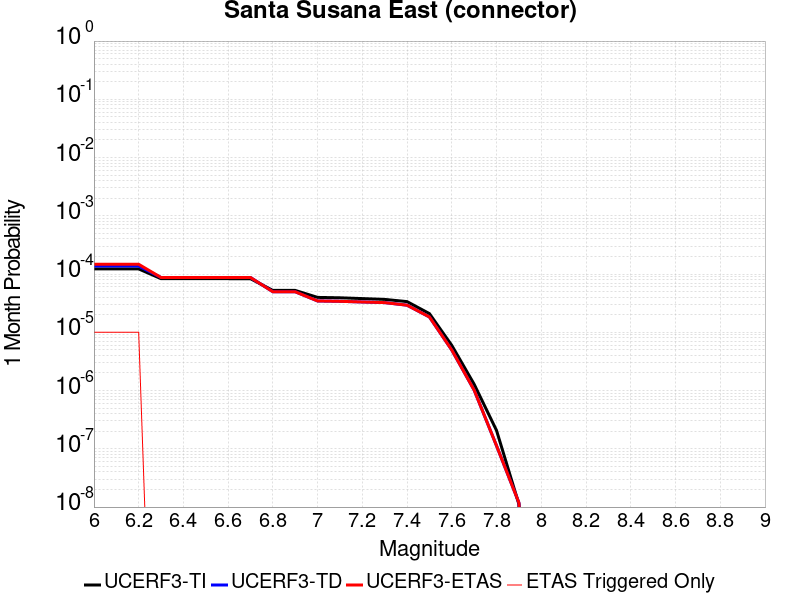 |  |  |

| Magnitude | 1 wk TI Prob | 1 wk TD Prob | 1 wk ETAS Prob | 1 wk ETAS/TD Gain | 1 wk ETAS Triggered Only | 1 mo TI Prob | 1 mo TD Prob | 1 mo ETAS Prob | 1 mo ETAS/TD Gain | 1 mo ETAS Triggered Only | 1 yr TI Prob | 1 yr TD Prob | 1 yr ETAS Prob | 1 yr ETAS/TD Gain | 1 yr ETAS Triggered Only | 10 yr TI Prob | 10 yr TD Prob | 10 yr ETAS Prob | 10 yr ETAS/TD Gain | 10 yr ETAS Triggered Only |
|-----|-----|-----|-----|-----|-----|-----|-----|-----|-----|-----|-----|-----|-----|-----|-----|-----|-----|-----|-----|-----|
| 6.0 | 2.858397E-5 | 3.2021693E-5 | 4.2021373E-5 | 1.3122783 | 1.0E-5 | 1.2249697E-4 | 1.3723019E-4 | 1.4722883E-4 | 1.0728602 | 1.0E-5 | 0.0014903803 | 0.00166977 | 0.0016897366 | 1.0119576 | 2.0E-5 | 0.014804244 | 0.016599316 | 0.016638653 | 1.0023698 | 4.0E-5 |
| 6.1 | 2.858397E-5 | 3.2021693E-5 | 4.2021373E-5 | 1.3122783 | 1.0E-5 | 1.2249697E-4 | 1.3723019E-4 | 1.4722883E-4 | 1.0728602 | 1.0E-5 | 0.0014903803 | 0.00166977 | 0.0016897366 | 1.0119576 | 2.0E-5 | 0.014804244 | 0.016599316 | 0.016638653 | 1.0023698 | 4.0E-5 |
| 6.2 | 2.858397E-5 | 3.2021693E-5 | 4.2021373E-5 | 1.3122783 | 1.0E-5 | 1.2249697E-4 | 1.3723019E-4 | 1.4722883E-4 | 1.0728602 | 1.0E-5 | 0.0014903803 | 0.00166977 | 0.0016897366 | 1.0119576 | 2.0E-5 | 0.014804244 | 0.016599316 | 0.016638653 | 1.0023698 | 4.0E-5 |
| 6.3 | 1.943582E-5 | 2.0367343E-5 | 2.0367343E-5 | 1.0 | 0.0 | 8.329371E-5 | 8.7286324E-5 | 8.7286324E-5 | 1.0 | 0.0 | 0.001013629 | 0.001062305 | 0.0010722943 | 1.0094035 | 1.0E-5 | 0.010090181 | 0.010583852 | 0.01060364 | 1.0018697 | 2.0E-5 |
| 6.4 | 1.943582E-5 | 2.0367343E-5 | 2.0367343E-5 | 1.0 | 0.0 | 8.329371E-5 | 8.7286324E-5 | 8.7286324E-5 | 1.0 | 0.0 | 0.001013629 | 0.001062305 | 0.0010722943 | 1.0094035 | 1.0E-5 | 0.010090181 | 0.010583852 | 0.01060364 | 1.0018697 | 2.0E-5 |
| 6.5 | 1.943582E-5 | 2.0367343E-5 | 2.0367343E-5 | 1.0 | 0.0 | 8.329371E-5 | 8.7286324E-5 | 8.7286324E-5 | 1.0 | 0.0 | 0.001013629 | 0.001062305 | 0.0010722943 | 1.0094035 | 1.0E-5 | 0.010090181 | 0.010583852 | 0.01060364 | 1.0018697 | 2.0E-5 |
| 6.6 | 1.943582E-5 | 2.0367343E-5 | 2.0367343E-5 | 1.0 | 0.0 | 8.329371E-5 | 8.7286324E-5 | 8.7286324E-5 | 1.0 | 0.0 | 0.001013629 | 0.001062305 | 0.0010722943 | 1.0094035 | 1.0E-5 | 0.010090181 | 0.010583852 | 0.01060364 | 1.0018697 | 2.0E-5 |
| 6.7 | 1.9404439E-5 | 2.0354766E-5 | 2.0354766E-5 | 1.0 | 0.0 | 8.3159226E-5 | 8.723242E-5 | 8.723242E-5 | 1.0 | 0.0 | 0.0010119933 | 0.0010616493 | 0.0010716388 | 1.0094093 | 1.0E-5 | 0.010073971 | 0.010577358 | 0.010597147 | 1.0018709 | 2.0E-5 |
| 6.8 | 1.2217526E-5 | 1.1593157E-5 | 1.1593157E-5 | 1.0 | 0.0 | 5.2359774E-5 | 4.9684106E-5 | 4.9684106E-5 | 1.0 | 0.0 | 6.372938E-4 | 6.047529E-4 | 6.047529E-4 | 1.0 | 0.0 | 0.0063546924 | 0.006033274 | 0.006043214 | 1.0016475 | 1.0E-5 |
| 6.9 | 1.2217526E-5 | 1.1593157E-5 | 1.1593157E-5 | 1.0 | 0.0 | 5.2359774E-5 | 4.9684106E-5 | 4.9684106E-5 | 1.0 | 0.0 | 6.372938E-4 | 6.047529E-4 | 6.047529E-4 | 1.0 | 0.0 | 0.0063546924 | 0.006033274 | 0.006043214 | 1.0016475 | 1.0E-5 |
| 7.0 | 9.276017E-6 | 8.059273E-6 | 8.059273E-6 | 1.0 | 0.0 | 3.9753755E-5 | 3.4539302E-5 | 3.4539302E-5 | 1.0 | 0.0 | 4.8389446E-4 | 4.2043833E-4 | 4.2043833E-4 | 1.0 | 0.0 | 0.0048284214 | 0.0041973097 | 0.004207268 | 1.0023725 | 1.0E-5 |
| 7.1 | 9.130355E-6 | 7.942446E-6 | 7.942446E-6 | 1.0 | 0.0 | 3.9129503E-5 | 3.4038632E-5 | 3.4038632E-5 | 1.0 | 0.0 | 4.7629757E-4 | 4.1434498E-4 | 4.1434498E-4 | 1.0 | 0.0 | 0.00475278 | 0.0041366047 | 0.0041465634 | 1.0024074 | 1.0E-5 |
| 7.2 | 8.851015E-6 | 7.741608E-6 | 7.741608E-6 | 1.0 | 0.0 | 3.7932372E-5 | 3.317792E-5 | 3.317792E-5 | 1.0 | 0.0 | 4.6172875E-4 | 4.038697E-4 | 4.038697E-4 | 1.0 | 0.0 | 0.0046077054 | 0.0040322347 | 0.004042194 | 1.00247 | 1.0E-5 |
| 7.3 | 8.573006E-6 | 7.5503312E-6 | 7.5503312E-6 | 1.0 | 0.0 | 3.6740938E-5 | 3.235818E-5 | 3.235818E-5 | 1.0 | 0.0 | 4.472291E-4 | 3.9389305E-4 | 3.9389305E-4 | 1.0 | 0.0 | 0.004463301 | 0.003932817 | 0.0039427774 | 1.0025327 | 1.0E-5 |
| 7.4 | 7.852282E-6 | 6.8178556E-6 | 6.8178556E-6 | 1.0 | 0.0 | 3.36522E-5 | 2.921907E-5 | 2.921907E-5 | 1.0 | 0.0 | 4.096385E-4 | 3.5568717E-4 | 3.5568717E-4 | 1.0 | 0.0 | 0.0040888423 | 0.0035519868 | 0.0035619512 | 1.0028054 | 1.0E-5 |
| 7.5 | 4.8869324E-6 | 4.2790975E-6 | 4.2790975E-6 | 1.0 | 0.0 | 2.0943828E-5 | 1.833887E-5 | 1.833887E-5 | 1.0 | 0.0 | 2.5496128E-4 | 2.2325452E-4 | 2.2325452E-4 | 1.0 | 0.0 | 0.0025466895 | 0.00223057 | 0.00223057 | 1.0 | 0.0 |
| 7.6 | 1.3894544E-6 | 1.1568394E-6 | 1.1568394E-6 | 1.0 | 0.0 | 5.954791E-6 | 4.957875E-6 | 4.957875E-6 | 1.0 | 0.0 | 7.249717E-5 | 6.036068E-5 | 6.036068E-5 | 1.0 | 0.0 | 7.247352E-4 | 6.0346466E-4 | 6.0346466E-4 | 1.0 | 0.0 |
| 7.7 | 2.9924632E-7 | 2.3719332E-7 | 2.3719332E-7 | 1.0 | 0.0 | 1.2824837E-6 | 1.0165425E-6 | 1.0165425E-6 | 1.0 | 0.0 | 1.5614127E-5 | 1.2376341E-5 | 1.2376341E-5 | 1.0 | 0.0 | 1.5613029E-4 | 1.2375724E-4 | 1.2375724E-4 | 1.0 | 0.0 |
| 7.8 | 4.8188564E-8 | 2.6321862E-8 | 2.6321862E-8 | 1.0 | 0.0 | 2.065224E-7 | 1.12807975E-7 | 1.12807975E-7 | 1.0 | 0.0 | 2.5144072E-6 | 1.3734362E-6 | 1.3734362E-6 | 1.0 | 0.0 | 2.5143789E-5 | 1.3734286E-5 | 1.3734286E-5 | 1.0 | 0.0 |
| 7.9 | 2.6127251E-9 | 2.7681102E-9 | 2.7681102E-9 | 1.0 | 0.0 | 1.1197393E-8 | 1.186333E-8 | 1.186333E-8 | 1.0 | 0.0 | 1.3632825E-7 | 1.4443603E-7 | 1.4443603E-7 | 1.0 | 0.0 | 1.3632817E-6 | 1.4443604E-6 | 1.4443604E-6 | 1.0 | 0.0 |

## Raymond
*[(top)](#table-of-contents)*

| 1 Week | 1 Month | 1 Year | 10 Year |
|-----|-----|-----|-----|
|  |  | 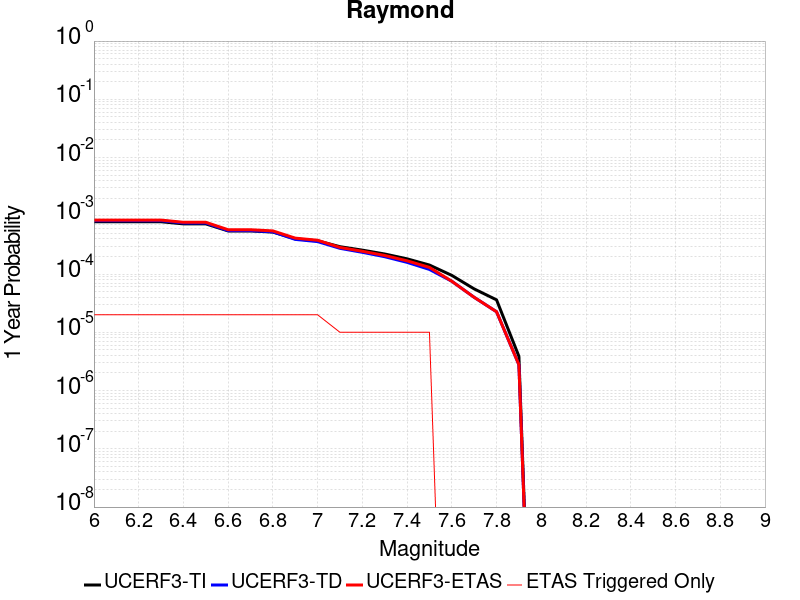 |  |

| Magnitude | 1 wk TI Prob | 1 wk TD Prob | 1 wk ETAS Prob | 1 wk ETAS/TD Gain | 1 wk ETAS Triggered Only | 1 mo TI Prob | 1 mo TD Prob | 1 mo ETAS Prob | 1 mo ETAS/TD Gain | 1 mo ETAS Triggered Only | 1 yr TI Prob | 1 yr TD Prob | 1 yr ETAS Prob | 1 yr ETAS/TD Gain | 1 yr ETAS Triggered Only | 10 yr TI Prob | 10 yr TD Prob | 10 yr ETAS Prob | 10 yr ETAS/TD Gain | 10 yr ETAS Triggered Only |
|-----|-----|-----|-----|-----|-----|-----|-----|-----|-----|-----|-----|-----|-----|-----|-----|-----|-----|-----|-----|-----|
| 6.0 | 1.5157413E-5 | 1.5810125E-5 | 1.5810125E-5 | 1.0 | 0.0 | 6.4958724E-5 | 6.775606E-5 | 7.775539E-5 | 1.1475782 | 1.0E-5 | 7.905855E-4 | 8.246429E-4 | 8.446264E-4 | 1.0242329 | 2.0E-5 | 0.007877788 | 0.008218355 | 0.008258026 | 1.0048271 | 4.0E-5 |
| 6.1 | 1.5157413E-5 | 1.5810125E-5 | 1.5810125E-5 | 1.0 | 0.0 | 6.4958724E-5 | 6.775606E-5 | 7.775539E-5 | 1.1475782 | 1.0E-5 | 7.905855E-4 | 8.246429E-4 | 8.446264E-4 | 1.0242329 | 2.0E-5 | 0.007877788 | 0.008218355 | 0.008258026 | 1.0048271 | 4.0E-5 |
| 6.2 | 1.5157413E-5 | 1.5810125E-5 | 1.5810125E-5 | 1.0 | 0.0 | 6.4958724E-5 | 6.775606E-5 | 7.775539E-5 | 1.1475782 | 1.0E-5 | 7.905855E-4 | 8.246429E-4 | 8.446264E-4 | 1.0242329 | 2.0E-5 | 0.007877788 | 0.008218355 | 0.008258026 | 1.0048271 | 4.0E-5 |
| 6.3 | 1.5157413E-5 | 1.5810125E-5 | 1.5810125E-5 | 1.0 | 0.0 | 6.4958724E-5 | 6.775606E-5 | 7.775539E-5 | 1.1475782 | 1.0E-5 | 7.905855E-4 | 8.246429E-4 | 8.446264E-4 | 1.0242329 | 2.0E-5 | 0.007877788 | 0.008218355 | 0.008258026 | 1.0048271 | 4.0E-5 |
| 6.4 | 1.3941944E-5 | 1.4454688E-5 | 1.4454688E-5 | 1.0 | 0.0 | 5.9749822E-5 | 6.194732E-5 | 7.1946706E-5 | 1.1614175 | 1.0E-5 | 7.2721124E-4 | 7.53971E-4 | 7.7395595E-4 | 1.0265062 | 2.0E-5 | 0.007248361 | 0.007516471 | 0.0075462456 | 1.0039612 | 3.0E-5 |
| 6.5 | 1.3941944E-5 | 1.4454688E-5 | 1.4454688E-5 | 1.0 | 0.0 | 5.9749822E-5 | 6.194732E-5 | 7.1946706E-5 | 1.1614175 | 1.0E-5 | 7.2721124E-4 | 7.53971E-4 | 7.7395595E-4 | 1.0265062 | 2.0E-5 | 0.007248361 | 0.007516471 | 0.0075462456 | 1.0039612 | 3.0E-5 |
| 6.6 | 1.0542609E-5 | 1.067111E-5 | 1.067111E-5 | 1.0 | 0.0 | 4.5181827E-5 | 4.573256E-5 | 5.57321E-5 | 1.2186526 | 1.0E-5 | 5.499499E-4 | 5.566571E-4 | 5.76646E-4 | 1.0359088 | 2.0E-5 | 0.005485909 | 0.0055531966 | 0.0055830297 | 1.0053723 | 3.0E-5 |
| 6.7 | 1.0542609E-5 | 1.067111E-5 | 1.067111E-5 | 1.0 | 0.0 | 4.5181827E-5 | 4.573256E-5 | 5.57321E-5 | 1.2186526 | 1.0E-5 | 5.499499E-4 | 5.566571E-4 | 5.76646E-4 | 1.0359088 | 2.0E-5 | 0.005485909 | 0.0055531966 | 0.0055830297 | 1.0053723 | 3.0E-5 |
| 6.8 | 1.0079132E-5 | 1.0176644E-5 | 1.0176644E-5 | 1.0 | 0.0 | 4.3195567E-5 | 4.3613487E-5 | 5.361305E-5 | 1.2292769 | 1.0E-5 | 5.257791E-4 | 5.308702E-4 | 5.508596E-4 | 1.037654 | 2.0E-5 | 0.0052453685 | 0.0052965777 | 0.0053264187 | 1.0056341 | 3.0E-5 |
| 6.9 | 7.721598E-6 | 7.548902E-6 | 7.548902E-6 | 1.0 | 0.0 | 3.3092143E-5 | 3.2352043E-5 | 4.235172E-5 | 1.3090895 | 1.0E-5 | 4.0282236E-4 | 3.9381615E-4 | 4.1380827E-4 | 1.0507652 | 2.0E-5 | 0.0040209293 | 0.003931324 | 0.0039512455 | 1.0050673 | 2.0E-5 |
| 7.0 | 7.137566E-6 | 6.911303E-6 | 6.911303E-6 | 1.0 | 0.0 | 3.058921E-5 | 2.961954E-5 | 3.9619244E-5 | 1.337605 | 1.0E-5 | 3.7236E-4 | 3.605593E-4 | 3.8055208E-4 | 1.0554494 | 2.0E-5 | 0.0037173668 | 0.003599869 | 0.003619797 | 1.0055357 | 2.0E-5 |
| 7.1 | 5.654976E-6 | 5.299538E-6 | 5.299538E-6 | 1.0 | 0.0 | 2.4235387E-5 | 2.2712107E-5 | 3.271188E-5 | 1.4402838 | 1.0E-5 | 2.9502588E-4 | 2.7648505E-4 | 2.8648227E-4 | 1.0361583 | 1.0E-5 | 0.0029463451 | 0.0027614492 | 0.0027714216 | 1.0036113 | 1.0E-5 |
| 7.2 | 4.9358455E-6 | 4.526655E-6 | 4.526655E-6 | 1.0 | 0.0 | 2.1153453E-5 | 1.9399806E-5 | 2.9399613E-5 | 1.5154591 | 1.0E-5 | 2.5751285E-4 | 2.3616718E-4 | 2.4616483E-4 | 1.0423329 | 1.0E-5 | 0.0025721465 | 0.002359192 | 0.0023691682 | 1.0042287 | 1.0E-5 |
| 7.3 | 4.2368597E-6 | 3.8056128E-6 | 3.8056128E-6 | 1.0 | 0.0 | 1.8157843E-5 | 1.6309668E-5 | 2.6309504E-5 | 1.6131233 | 1.0E-5 | 2.2104931E-4 | 1.9855222E-4 | 2.0855023E-4 | 1.0503546 | 1.0E-5 | 0.0022082955 | 0.0019837746 | 0.0019937549 | 1.0050309 | 1.0E-5 |
| 7.4 | 3.4999923E-6 | 3.0437407E-6 | 3.0437407E-6 | 1.0 | 0.0 | 1.49998805E-5 | 1.3044538E-5 | 2.3044407E-5 | 1.7665944 | 1.0E-5 | 1.8260824E-4 | 1.5880575E-4 | 1.6880417E-4 | 1.06296 | 1.0E-5 | 0.0018245826 | 0.0015869461 | 0.0015969302 | 1.0062914 | 1.0E-5 |
| 7.5 | 2.738017E-6 | 2.3020405E-6 | 2.3020405E-6 | 1.0 | 0.0 | 1.1734306E-5 | 9.865851E-6 | 1.9865753E-5 | 2.0135872 | 1.0E-5 | 1.428558E-4 | 1.20110184E-4 | 1.3010898E-4 | 1.083247 | 1.0E-5 | 0.0014276401 | 0.0012004747 | 0.0012104627 | 1.0083201 | 1.0E-5 |
| 7.6 | 1.8186392E-6 | 1.442302E-6 | 1.442302E-6 | 1.0 | 0.0 | 7.794145E-6 | 6.1812802E-6 | 6.1812802E-6 | 1.0 | 0.0 | 9.488958E-5 | 7.5254524E-5 | 7.5254524E-5 | 1.0 | 0.0 | 9.4849075E-4 | 7.5230957E-4 | 7.5230957E-4 | 1.0 | 0.0 |
| 7.7 | 1.0660348E-6 | 7.6437E-7 | 7.6437E-7 | 1.0 | 0.0 | 4.5687125E-6 | 3.2758674E-6 | 3.2758674E-6 | 1.0 | 0.0 | 5.5622655E-5 | 3.988297E-5 | 3.988297E-5 | 1.0 | 0.0 | 5.5608735E-4 | 3.9877492E-4 | 3.9877492E-4 | 1.0 | 0.0 |
| 7.8 | 6.913602E-7 | 4.3202903E-7 | 4.3202903E-7 | 1.0 | 0.0 | 2.962969E-6 | 1.8515517E-6 | 1.8515517E-6 | 1.0 | 0.0 | 3.607355E-5 | 2.2542416E-5 | 2.2542416E-5 | 1.0 | 0.0 | 3.6067693E-4 | 2.2541684E-4 | 2.2541684E-4 | 1.0 | 0.0 |
| 7.9 | 7.425201E-8 | 5.322267E-8 | 5.322267E-8 | 1.0 | 0.0 | 3.1822285E-7 | 2.2809714E-7 | 2.2809714E-7 | 1.0 | 0.0 | 3.874356E-6 | 2.7770805E-6 | 2.7770805E-6 | 1.0 | 0.0 | 3.8742884E-5 | 2.7770588E-5 | 2.7770588E-5 | 1.0 | 0.0 |

## Calaveras (So) 2011 CFM
*[(top)](#table-of-contents)*

| 1 Week | 1 Month | 1 Year | 10 Year |
|-----|-----|-----|-----|
|  |  |  | 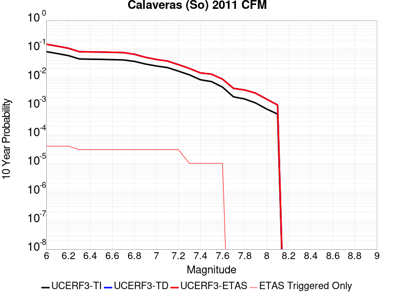 |

| Magnitude | 1 wk TI Prob | 1 wk TD Prob | 1 wk ETAS Prob | 1 wk ETAS/TD Gain | 1 wk ETAS Triggered Only | 1 mo TI Prob | 1 mo TD Prob | 1 mo ETAS Prob | 1 mo ETAS/TD Gain | 1 mo ETAS Triggered Only | 1 yr TI Prob | 1 yr TD Prob | 1 yr ETAS Prob | 1 yr ETAS/TD Gain | 1 yr ETAS Triggered Only | 10 yr TI Prob | 10 yr TD Prob | 10 yr ETAS Prob | 10 yr ETAS/TD Gain | 10 yr ETAS Triggered Only |
|-----|-----|-----|-----|-----|-----|-----|-----|-----|-----|-----|-----|-----|-----|-----|-----|-----|-----|-----|-----|-----|
| 6.0 | 1.5950744E-4 | 3.0713255E-4 | 3.271264E-4 | 1.0650985 | 2.0E-5 | 6.834242E-4 | 0.001315409 | 0.0013453695 | 1.0227766 | 3.0E-5 | 0.00828899 | 0.015858326 | 0.015897691 | 1.0024823 | 4.0E-5 | 0.079865426 | 0.14440185 | 0.14443608 | 1.000237 | 4.0E-5 |
| 6.1 | 1.3584697E-4 | 2.603514E-4 | 2.8034617E-4 | 1.0767993 | 2.0E-5 | 5.8207137E-4 | 0.0011151754 | 0.001145142 | 1.0268716 | 3.0E-5 | 0.007063716 | 0.013461385 | 0.013500846 | 1.0029315 | 4.0E-5 | 0.06843361 | 0.124029994 | 0.124065034 | 1.0002825 | 4.0E-5 |
| 6.2 | 1.14676266E-4 | 2.1714384E-4 | 2.371395E-4 | 1.0920849 | 2.0E-5 | 4.9137714E-4 | 9.30223E-4 | 9.601951E-4 | 1.0322204 | 3.0E-5 | 0.0059661185 | 0.011245058 | 0.011284608 | 1.0035172 | 4.0E-5 | 0.058084648 | 0.10502057 | 0.10505637 | 1.0003408 | 4.0E-5 |
| 6.3 | 8.691518E-5 | 1.5987935E-4 | 1.6987773E-4 | 1.0625372 | 1.0E-5 | 3.7244044E-4 | 6.849807E-4 | 7.04967E-4 | 1.0291779 | 2.0E-5 | 0.004525038 | 0.008301122 | 0.008330873 | 1.003584 | 3.0E-5 | 0.044339992 | 0.0793365 | 0.07936412 | 1.0003481 | 3.0E-5 |
| 6.4 | 8.50982E-5 | 1.5694331E-4 | 1.6694174E-4 | 1.0637072 | 1.0E-5 | 3.646556E-4 | 6.724042E-4 | 6.923908E-4 | 1.029724 | 2.0E-5 | 0.0044306475 | 0.008149155 | 0.008178911 | 1.0036514 | 3.0E-5 | 0.04343345 | 0.07794268 | 0.07797033 | 1.0003549 | 3.0E-5 |
| 6.5 | 8.4062965E-5 | 1.5518743E-4 | 1.6518588E-4 | 1.0644282 | 1.0E-5 | 3.602201E-4 | 6.6488347E-4 | 6.848702E-4 | 1.0300604 | 2.0E-5 | 0.004376863 | 0.008058365 | 0.008088123 | 1.0036929 | 3.0E-5 | 0.042916555 | 0.07711388 | 0.07714157 | 1.000359 | 3.0E-5 |
| 6.6 | 8.194716E-5 | 1.5154552E-4 | 1.6154401E-4 | 1.0659767 | 1.0E-5 | 3.5115483E-4 | 6.492843E-4 | 6.6927134E-4 | 1.0307832 | 2.0E-5 | 0.0042669317 | 0.007870209 | 0.007899973 | 1.0037818 | 3.0E-5 | 0.04185927 | 0.07539919 | 0.07542693 | 1.0003679 | 3.0E-5 |
| 6.7 | 8.012326E-5 | 1.4822475E-4 | 1.5822327E-4 | 1.0674552 | 1.0E-5 | 3.433402E-4 | 6.350612E-4 | 6.550485E-4 | 1.031473 | 2.0E-5 | 0.004172157 | 0.007698701 | 0.00772847 | 1.0038668 | 3.0E-5 | 0.040946912 | 0.07384132 | 0.0738691 | 1.0003762 | 3.0E-5 |
| 6.8 | 7.119773E-5 | 1.2881879E-4 | 1.388175E-4 | 1.0776185 | 1.0E-5 | 3.0509746E-4 | 5.519494E-4 | 5.719383E-4 | 1.0362152 | 2.0E-5 | 0.0037082357 | 0.006696066 | 0.006725865 | 1.0044502 | 3.0E-5 | 0.036469642 | 0.06468575 | 0.064713806 | 1.0004338 | 3.0E-5 |
| 6.9 | 5.7343088E-5 | 9.919277E-5 | 1.0919179E-4 | 1.1008037 | 1.0E-5 | 2.4573295E-4 | 4.25043E-4 | 4.4503447E-4 | 1.047034 | 2.0E-5 | 0.0029876942 | 0.005162694 | 0.005192539 | 1.0057809 | 3.0E-5 | 0.02947844 | 0.05051036 | 0.050538845 | 1.000564 | 3.0E-5 |
| 7.0 | 4.8746577E-5 | 8.2850725E-5 | 9.284989E-5 | 1.120689 | 1.0E-5 | 2.0889717E-4 | 3.5502657E-4 | 3.7501947E-4 | 1.0563139 | 2.0E-5 | 0.0025403565 | 0.004313948 | 0.0043438184 | 1.0069242 | 3.0E-5 | 0.025115121 | 0.042485245 | 0.04251397 | 1.0006762 | 3.0E-5 |
| 7.1 | 4.2998014E-5 | 7.265203E-5 | 8.2651306E-5 | 1.1376324 | 1.0E-5 | 1.8426418E-4 | 3.1132903E-4 | 3.313228E-4 | 1.0642207 | 2.0E-5 | 0.002241108 | 0.003783903 | 0.0038137897 | 1.0078983 | 3.0E-5 | 0.022186412 | 0.037423562 | 0.03745244 | 1.0007716 | 3.0E-5 |
| 7.2 | 3.221292E-5 | 5.390791E-5 | 6.390737E-5 | 1.1854916 | 1.0E-5 | 1.3804805E-4 | 2.3101359E-4 | 2.5100895E-4 | 1.086555 | 2.0E-5 | 0.0016794393 | 0.0028089907 | 0.0028389066 | 1.01065 | 3.0E-5 | 0.016668037 | 0.02803602 | 0.02806518 | 1.0010401 | 3.0E-5 |
| 7.3 | 2.3756531E-5 | 3.9473416E-5 | 4.9473023E-5 | 1.253325 | 1.0E-5 | 1.0180973E-4 | 1.6916092E-4 | 1.7915922E-4 | 1.0591053 | 1.0E-5 | 0.0012388286 | 0.0020576057 | 0.0020675852 | 1.00485 | 1.0E-5 | 0.012319452 | 0.020643145 | 0.020652939 | 1.0004745 | 1.0E-5 |
| 7.4 | 1.5997684E-5 | 2.7342163E-5 | 3.7341888E-5 | 1.3657255 | 1.0E-5 | 6.8559704E-5 | 1.1717545E-4 | 1.2717428E-4 | 1.0853322 | 1.0E-5 | 8.343947E-4 | 0.00142568 | 0.0014356658 | 1.0070041 | 1.0E-5 | 0.008312687 | 0.014376011 | 0.014385867 | 1.0006856 | 1.0E-5 |
| 7.5 | 1.3814293E-5 | 2.4783874E-5 | 3.478363E-5 | 1.4034781 | 1.0E-5 | 5.9202768E-5 | 1.062123E-4 | 1.1621123E-4 | 1.094141 | 1.0E-5 | 7.205553E-4 | 0.00129237 | 0.0013023571 | 1.0077277 | 1.0E-5 | 0.007182234 | 0.013055085 | 0.013064954 | 1.000756 | 1.0E-5 |
| 7.6 | 8.817309E-6 | 1.6430757E-5 | 2.6430593E-5 | 1.6086047 | 1.0E-5 | 3.7787922E-5 | 7.0415634E-5 | 8.041493E-5 | 1.1420039 | 1.0E-5 | 4.5997082E-4 | 8.569745E-4 | 8.669659E-4 | 1.0116589 | 1.0E-5 | 0.004590199 | 0.008719284 | 0.008729197 | 1.0011369 | 1.0E-5 |
| 7.7 | 4.0352206E-6 | 7.707318E-6 | 7.707318E-6 | 1.0 | 0.0 | 1.7293689E-5 | 3.3030945E-5 | 3.3030945E-5 | 1.0 | 0.0 | 2.1053031E-4 | 4.0207763E-4 | 4.0207763E-4 | 1.0 | 0.0 | 0.0021033096 | 0.004165172 | 0.004165172 | 1.0 | 0.0 |
| 7.8 | 3.413169E-6 | 6.787282E-6 | 6.787282E-6 | 1.0 | 0.0 | 1.4627784E-5 | 2.9088029E-5 | 2.9088029E-5 | 1.0 | 0.0 | 1.7807873E-4 | 3.5408925E-4 | 3.5408925E-4 | 1.0 | 0.0 | 0.0017793609 | 0.0036665166 | 0.0036665166 | 1.0 | 0.0 |
| 7.9 | 2.4740732E-6 | 5.2791843E-6 | 5.2791843E-6 | 1.0 | 0.0 | 1.06031275E-5 | 2.262488E-5 | 2.262488E-5 | 1.0 | 0.0 | 1.2908543E-4 | 2.7542314E-4 | 2.7542314E-4 | 1.0 | 0.0 | 0.0012901047 | 0.0028347955 | 0.0028347955 | 1.0 | 0.0 |
| 8.0 | 1.5231818E-6 | 3.2889548E-6 | 3.2889548E-6 | 1.0 | 0.0 | 6.527906E-6 | 1.40954435E-5 | 1.40954435E-5 | 1.0 | 0.0 | 7.9474354E-5 | 1.7159856E-4 | 1.7159856E-4 | 1.0 | 0.0 | 7.944594E-4 | 0.0017564303 | 0.0017564303 | 1.0 | 0.0 |
| 8.1 | 1.0104524E-6 | 2.045782E-6 | 2.045782E-6 | 1.0 | 0.0 | 4.330503E-6 | 8.767608E-6 | 8.767608E-6 | 1.0 | 0.0 | 5.2722597E-5 | 1.0674043E-4 | 1.0674043E-4 | 1.0 | 0.0 | 5.271009E-4 | 0.001092934 | 0.001092934 | 1.0 | 0.0 |

## Oak Ridge (Onshore)
*[(top)](#table-of-contents)*

| 1 Week | 1 Month | 1 Year | 10 Year |
|-----|-----|-----|-----|
| 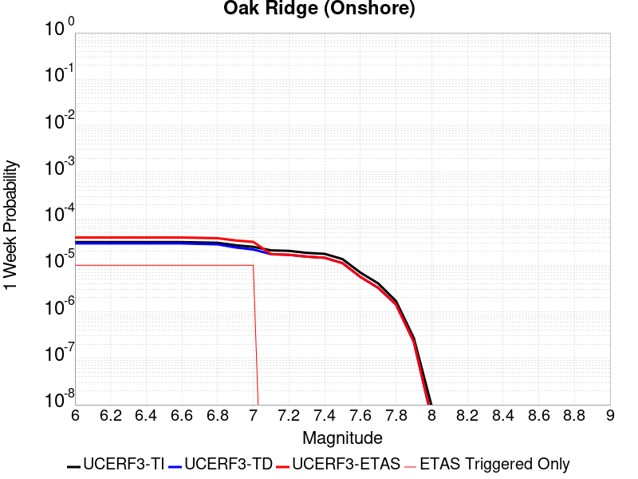 |  |  |  |

| Magnitude | 1 wk TI Prob | 1 wk TD Prob | 1 wk ETAS Prob | 1 wk ETAS/TD Gain | 1 wk ETAS Triggered Only | 1 mo TI Prob | 1 mo TD Prob | 1 mo ETAS Prob | 1 mo ETAS/TD Gain | 1 mo ETAS Triggered Only | 1 yr TI Prob | 1 yr TD Prob | 1 yr ETAS Prob | 1 yr ETAS/TD Gain | 1 yr ETAS Triggered Only | 10 yr TI Prob | 10 yr TD Prob | 10 yr ETAS Prob | 10 yr ETAS/TD Gain | 10 yr ETAS Triggered Only |
|-----|-----|-----|-----|-----|-----|-----|-----|-----|-----|-----|-----|-----|-----|-----|-----|-----|-----|-----|-----|-----|
| 6.0 | 3.155064E-5 | 2.9526076E-5 | 3.952578E-5 | 1.3386737 | 1.0E-5 | 1.3521002E-4 | 1.265344E-4 | 1.3653314E-4 | 1.0790199 | 1.0E-5 | 0.001644939 | 0.0015395058 | 0.001559475 | 1.0129712 | 2.0E-5 | 0.01632816 | 0.015293054 | 0.015332443 | 1.0025755 | 4.0E-5 |
| 6.1 | 3.155064E-5 | 2.9526076E-5 | 3.952578E-5 | 1.3386737 | 1.0E-5 | 1.3521002E-4 | 1.265344E-4 | 1.3653314E-4 | 1.0790199 | 1.0E-5 | 0.001644939 | 0.0015395058 | 0.001559475 | 1.0129712 | 2.0E-5 | 0.01632816 | 0.015293054 | 0.015332443 | 1.0025755 | 4.0E-5 |
| 6.2 | 3.155064E-5 | 2.9526076E-5 | 3.952578E-5 | 1.3386737 | 1.0E-5 | 1.3521002E-4 | 1.265344E-4 | 1.3653314E-4 | 1.0790199 | 1.0E-5 | 0.001644939 | 0.0015395058 | 0.001559475 | 1.0129712 | 2.0E-5 | 0.01632816 | 0.015293054 | 0.015332443 | 1.0025755 | 4.0E-5 |
| 6.3 | 3.155064E-5 | 2.9526076E-5 | 3.952578E-5 | 1.3386737 | 1.0E-5 | 1.3521002E-4 | 1.265344E-4 | 1.3653314E-4 | 1.0790199 | 1.0E-5 | 0.001644939 | 0.0015395058 | 0.001559475 | 1.0129712 | 2.0E-5 | 0.01632816 | 0.015293054 | 0.015332443 | 1.0025755 | 4.0E-5 |
| 6.4 | 3.155064E-5 | 2.9526076E-5 | 3.952578E-5 | 1.3386737 | 1.0E-5 | 1.3521002E-4 | 1.265344E-4 | 1.3653314E-4 | 1.0790199 | 1.0E-5 | 0.001644939 | 0.0015395058 | 0.001559475 | 1.0129712 | 2.0E-5 | 0.01632816 | 0.015293054 | 0.015332443 | 1.0025755 | 4.0E-5 |
| 6.5 | 3.155064E-5 | 2.9526076E-5 | 3.952578E-5 | 1.3386737 | 1.0E-5 | 1.3521002E-4 | 1.265344E-4 | 1.3653314E-4 | 1.0790199 | 1.0E-5 | 0.001644939 | 0.0015395058 | 0.001559475 | 1.0129712 | 2.0E-5 | 0.01632816 | 0.015293054 | 0.015332443 | 1.0025755 | 4.0E-5 |
| 6.6 | 3.155064E-5 | 2.9526076E-5 | 3.952578E-5 | 1.3386737 | 1.0E-5 | 1.3521002E-4 | 1.265344E-4 | 1.3653314E-4 | 1.0790199 | 1.0E-5 | 0.001644939 | 0.0015395058 | 0.001559475 | 1.0129712 | 2.0E-5 | 0.01632816 | 0.015293054 | 0.015332443 | 1.0025755 | 4.0E-5 |
| 6.7 | 3.098897E-5 | 2.8864279E-5 | 3.886399E-5 | 1.346439 | 1.0E-5 | 1.328031E-4 | 1.236984E-4 | 1.3369716E-4 | 1.0808318 | 1.0E-5 | 0.0016156785 | 0.0015050253 | 0.0015249952 | 1.0132688 | 2.0E-5 | 0.016039822 | 0.014952909 | 0.014992312 | 1.0026351 | 4.0E-5 |
| 6.8 | 3.0449872E-5 | 2.8239476E-5 | 3.8239195E-5 | 1.3541042 | 1.0E-5 | 1.3049292E-4 | 1.2102092E-4 | 1.3101971E-4 | 1.0826204 | 1.0E-5 | 0.0015875935 | 0.001472471 | 0.0014924416 | 1.0135626 | 2.0E-5 | 0.015762992 | 0.014631658 | 0.014671072 | 1.0026938 | 4.0E-5 |
| 6.9 | 2.697928E-5 | 2.4219877E-5 | 3.4219636E-5 | 1.412874 | 1.0E-5 | 1.15620365E-4 | 1.03795464E-4 | 1.1379443E-4 | 1.0963333 | 1.0E-5 | 0.0014067689 | 0.0012629988 | 0.0012829734 | 1.0158154 | 2.0E-5 | 0.0139789665 | 0.012561066 | 0.0126005635 | 1.0031445 | 4.0E-5 |
| 7.0 | 2.4893961E-5 | 2.1862146E-5 | 3.1861928E-5 | 1.4574016 | 1.0E-5 | 1.0668404E-4 | 9.369165E-5 | 1.0369071E-4 | 1.1067231 | 1.0E-5 | 0.0012981043 | 0.0011401166 | 0.0011600938 | 1.0175221 | 2.0E-5 | 0.012905477 | 0.011345102 | 0.011374762 | 1.0026143 | 3.0E-5 |
| 7.1 | 2.0945363E-5 | 1.7354592E-5 | 1.7354592E-5 | 1.0 | 0.0 | 8.976275E-5 | 7.437473E-5 | 7.437473E-5 | 1.0 | 0.0 | 0.0010923136 | 9.0514094E-4 | 9.151319E-4 | 1.011038 | 1.0E-5 | 0.0108696 | 0.009015621 | 0.00903544 | 1.0021983 | 2.0E-5 |
| 7.2 | 2.0439404E-5 | 1.680953E-5 | 1.680953E-5 | 1.0 | 0.0 | 8.7594504E-5 | 7.203888E-5 | 7.203888E-5 | 1.0 | 0.0 | 0.0010659413 | 8.767251E-4 | 8.8671636E-4 | 1.011396 | 1.0E-5 | 0.010608427 | 0.008733723 | 0.008753548 | 1.00227 | 2.0E-5 |
| 7.3 | 1.8463334E-5 | 1.5381947E-5 | 1.5381947E-5 | 1.0 | 0.0 | 7.912617E-5 | 6.592098E-5 | 6.592098E-5 | 1.0 | 0.0 | 9.6293533E-4 | 8.0229685E-4 | 8.1228884E-4 | 1.0124543 | 1.0E-5 | 0.009587734 | 0.0079950085 | 0.008014848 | 1.0024816 | 2.0E-5 |
| 7.4 | 1.763139E-5 | 1.4516977E-5 | 1.4516977E-5 | 1.0 | 0.0 | 7.556091E-5 | 6.221415E-5 | 6.221415E-5 | 1.0 | 0.0 | 9.1956573E-4 | 7.57198E-4 | 7.671905E-4 | 1.0131966 | 1.0E-5 | 0.009157699 | 0.007547126 | 0.007566975 | 1.00263 | 2.0E-5 |
| 7.5 | 1.3594944E-5 | 1.1163363E-5 | 1.1163363E-5 | 1.0 | 0.0 | 5.8262744E-5 | 4.7842117E-5 | 4.7842117E-5 | 1.0 | 0.0 | 7.0911803E-4 | 5.8232463E-4 | 5.9231883E-4 | 1.0171626 | 1.0E-5 | 0.007068595 | 0.005808362 | 0.0058183037 | 1.0017116 | 1.0E-5 |
| 7.6 | 6.9889534E-6 | 5.6367194E-6 | 5.6367194E-6 | 1.0 | 0.0 | 2.9952313E-5 | 2.4157147E-5 | 2.4157147E-5 | 1.0 | 0.0 | 3.646084E-4 | 2.94074E-4 | 3.0407106E-4 | 1.033995 | 1.0E-5 | 0.0036401073 | 0.0029368924 | 0.0029468632 | 1.003395 | 1.0E-5 |
| 7.7 | 4.0824193E-6 | 3.2832731E-6 | 3.2832731E-6 | 1.0 | 0.0 | 1.7495966E-5 | 1.4071096E-5 | 1.4071096E-5 | 1.0 | 0.0 | 2.1299256E-4 | 1.7130225E-4 | 1.8130054E-4 | 1.0583663 | 1.0E-5 | 0.0021278851 | 0.0017117155 | 0.0017216984 | 1.0058321 | 1.0E-5 |
| 7.8 | 1.7023609E-6 | 1.43706E-6 | 1.43706E-6 | 1.0 | 0.0 | 7.295812E-6 | 6.158814E-6 | 6.158814E-6 | 1.0 | 0.0 | 8.882289E-5 | 7.4981006E-5 | 7.4981006E-5 | 1.0 | 0.0 | 8.8787393E-4 | 7.4955984E-4 | 7.4955984E-4 | 1.0 | 0.0 |
| 7.9 | 2.721225E-7 | 2.261692E-7 | 2.261692E-7 | 1.0 | 0.0 | 1.1662388E-6 | 9.692963E-7 | 9.692963E-7 | 1.0 | 0.0 | 1.4198865E-5 | 1.1801121E-5 | 1.1801121E-5 | 1.0 | 0.0 | 1.4197957E-4 | 1.1800523E-4 | 1.1800523E-4 | 1.0 | 0.0 |
| 8.0 | 9.364255E-9 | 5.1204916E-9 | 5.1204916E-9 | 1.0 | 0.0 | 4.0132523E-8 | 2.1944963E-8 | 2.1944963E-8 | 1.0 | 0.0 | 4.8861335E-7 | 2.671799E-7 | 2.671799E-7 | 1.0 | 0.0 | 4.8861225E-6 | 2.6717962E-6 | 2.6717962E-6 | 1.0 | 0.0 |

## Mono Lake 2011 CFM
*[(top)](#table-of-contents)*

| 1 Week | 1 Month | 1 Year | 10 Year |
|-----|-----|-----|-----|
|  |  |  |  |

| Magnitude | 1 wk TI Prob | 1 wk TD Prob | 1 wk ETAS Prob | 1 wk ETAS/TD Gain | 1 wk ETAS Triggered Only | 1 mo TI Prob | 1 mo TD Prob | 1 mo ETAS Prob | 1 mo ETAS/TD Gain | 1 mo ETAS Triggered Only | 1 yr TI Prob | 1 yr TD Prob | 1 yr ETAS Prob | 1 yr ETAS/TD Gain | 1 yr ETAS Triggered Only | 10 yr TI Prob | 10 yr TD Prob | 10 yr ETAS Prob | 10 yr ETAS/TD Gain | 10 yr ETAS Triggered Only |
|-----|-----|-----|-----|-----|-----|-----|-----|-----|-----|-----|-----|-----|-----|-----|-----|-----|-----|-----|-----|-----|
| 6.0 | 2.0341662E-5 | 2.3828192E-5 | 4.3827713E-5 | 1.839322 | 2.0E-5 | 8.717564E-5 | 1.0211982E-4 | 1.2211778E-4 | 1.1958283 | 2.0E-5 | 0.0010608466 | 0.0012431308 | 0.0012631059 | 1.0160685 | 2.0E-5 | 0.010557966 | 0.012413842 | 0.012453345 | 1.0031822 | 4.0E-5 |
| 6.1 | 2.0341662E-5 | 2.3828192E-5 | 4.3827713E-5 | 1.839322 | 2.0E-5 | 8.717564E-5 | 1.0211982E-4 | 1.2211778E-4 | 1.1958283 | 2.0E-5 | 0.0010608466 | 0.0012431308 | 0.0012631059 | 1.0160685 | 2.0E-5 | 0.010557966 | 0.012413842 | 0.012453345 | 1.0031822 | 4.0E-5 |
| 6.2 | 2.0341662E-5 | 2.3828192E-5 | 4.3827713E-5 | 1.839322 | 2.0E-5 | 8.717564E-5 | 1.0211982E-4 | 1.2211778E-4 | 1.1958283 | 2.0E-5 | 0.0010608466 | 0.0012431308 | 0.0012631059 | 1.0160685 | 2.0E-5 | 0.010557966 | 0.012413842 | 0.012453345 | 1.0031822 | 4.0E-5 |
| 6.3 | 2.0341662E-5 | 2.3828192E-5 | 4.3827713E-5 | 1.839322 | 2.0E-5 | 8.717564E-5 | 1.0211982E-4 | 1.2211778E-4 | 1.1958283 | 2.0E-5 | 0.0010608466 | 0.0012431308 | 0.0012631059 | 1.0160685 | 2.0E-5 | 0.010557966 | 0.012413842 | 0.012453345 | 1.0031822 | 4.0E-5 |
| 6.4 | 1.749821E-5 | 2.049101E-5 | 3.0490804E-5 | 1.4880089 | 1.0E-5 | 7.499018E-5 | 8.781861E-5 | 9.7817734E-5 | 1.1138611 | 1.0E-5 | 9.1262296E-4 | 0.0010691914 | 0.0010791807 | 1.0093429 | 1.0E-5 | 0.009088841 | 0.01069187 | 0.010711657 | 1.0018506 | 2.0E-5 |
| 6.5 | 1.749821E-5 | 2.049101E-5 | 3.0490804E-5 | 1.4880089 | 1.0E-5 | 7.499018E-5 | 8.781861E-5 | 9.7817734E-5 | 1.1138611 | 1.0E-5 | 9.1262296E-4 | 0.0010691914 | 0.0010791807 | 1.0093429 | 1.0E-5 | 0.009088841 | 0.01069187 | 0.010711657 | 1.0018506 | 2.0E-5 |

## Hunting Creek - Bartlett Springs connector 2011
*[(top)](#table-of-contents)*

| 1 Week | 1 Month | 1 Year | 10 Year |
|-----|-----|-----|-----|
|  | 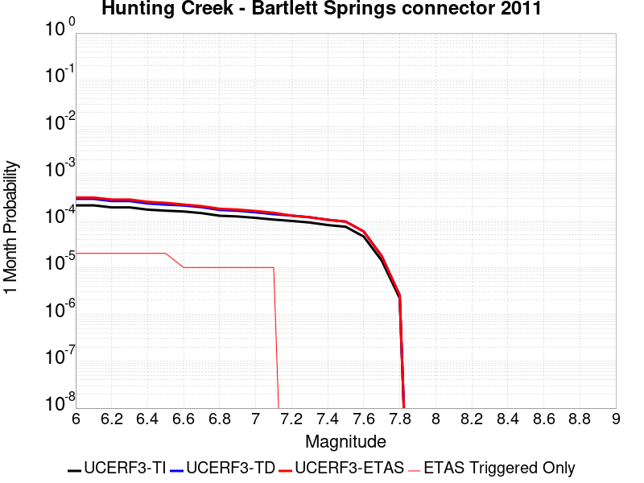 |  |  |

| Magnitude | 1 wk TI Prob | 1 wk TD Prob | 1 wk ETAS Prob | 1 wk ETAS/TD Gain | 1 wk ETAS Triggered Only | 1 mo TI Prob | 1 mo TD Prob | 1 mo ETAS Prob | 1 mo ETAS/TD Gain | 1 mo ETAS Triggered Only | 1 yr TI Prob | 1 yr TD Prob | 1 yr ETAS Prob | 1 yr ETAS/TD Gain | 1 yr ETAS Triggered Only | 10 yr TI Prob | 10 yr TD Prob | 10 yr ETAS Prob | 10 yr ETAS/TD Gain | 10 yr ETAS Triggered Only |
|-----|-----|-----|-----|-----|-----|-----|-----|-----|-----|-----|-----|-----|-----|-----|-----|-----|-----|-----|-----|-----|
| 6.0 | 4.940016E-5 | 6.7870766E-5 | 6.7870766E-5 | 1.0 | 0.0 | 2.1169778E-4 | 2.9084194E-4 | 3.1083613E-4 | 1.0687459 | 2.0E-5 | 0.002574374 | 0.0035350819 | 0.003555011 | 1.0056375 | 2.0E-5 | 0.025447546 | 0.03477475 | 0.03481336 | 1.0011103 | 4.0E-5 |
| 6.1 | 4.940016E-5 | 6.7870766E-5 | 6.7870766E-5 | 1.0 | 0.0 | 2.1169778E-4 | 2.9084194E-4 | 3.1083613E-4 | 1.0687459 | 2.0E-5 | 0.002574374 | 0.0035350819 | 0.003555011 | 1.0056375 | 2.0E-5 | 0.025447546 | 0.03477475 | 0.03481336 | 1.0011103 | 4.0E-5 |
| 6.2 | 4.472471E-5 | 6.100572E-5 | 6.100572E-5 | 1.0 | 0.0 | 1.9166325E-4 | 2.6142647E-4 | 2.8142123E-4 | 1.0764834 | 2.0E-5 | 0.0023310026 | 0.0031781218 | 0.0031980583 | 1.006273 | 2.0E-5 | 0.02306703 | 0.031317808 | 0.03134687 | 1.0009279 | 3.0E-5 |
| 6.3 | 4.472471E-5 | 6.100572E-5 | 6.100572E-5 | 1.0 | 0.0 | 1.9166325E-4 | 2.6142647E-4 | 2.8142123E-4 | 1.0764834 | 2.0E-5 | 0.0023310026 | 0.0031781218 | 0.0031980583 | 1.006273 | 2.0E-5 | 0.02306703 | 0.031317808 | 0.03134687 | 1.0009279 | 3.0E-5 |
| 6.4 | 4.0001003E-5 | 5.410516E-5 | 5.410516E-5 | 1.0 | 0.0 | 1.714216E-4 | 2.318579E-4 | 2.518533E-4 | 1.0862397 | 2.0E-5 | 0.0020850603 | 0.0028191686 | 0.0028391122 | 1.0070742 | 2.0E-5 | 0.02065605 | 0.027829198 | 0.027848642 | 1.0006987 | 2.0E-5 |
| 6.5 | 3.8033053E-5 | 5.126649E-5 | 5.126649E-5 | 1.0 | 0.0 | 1.6298861E-4 | 2.1969521E-4 | 2.3969082E-4 | 1.0910152 | 2.0E-5 | 0.0019825802 | 0.0026714848 | 0.0026914314 | 1.0074664 | 2.0E-5 | 0.019649856 | 0.026391273 | 0.026410745 | 1.0007378 | 2.0E-5 |
| 6.6 | 3.653754E-5 | 4.912955E-5 | 4.912955E-5 | 1.0 | 0.0 | 1.5658008E-4 | 2.1053842E-4 | 2.2053631E-4 | 1.0474873 | 1.0E-5 | 0.0019046954 | 0.0025602889 | 0.002570263 | 1.0038958 | 1.0E-5 | 0.018884527 | 0.025307199 | 0.025316946 | 1.0003852 | 1.0E-5 |
| 6.7 | 3.372024E-5 | 4.5140216E-5 | 4.5140216E-5 | 1.0 | 0.0 | 1.4450731E-4 | 1.9344388E-4 | 2.0344194E-4 | 1.0516846 | 1.0E-5 | 0.0017579567 | 0.0023526535 | 0.00236263 | 1.0042405 | 1.0E-5 | 0.017441148 | 0.023278862 | 0.023288628 | 1.0004196 | 1.0E-5 |
| 6.8 | 2.9650024E-5 | 3.9411647E-5 | 3.9411647E-5 | 1.0 | 0.0 | 1.2706534E-4 | 1.6889606E-4 | 1.7889438E-4 | 1.059198 | 1.0E-5 | 0.0015459227 | 0.0020543607 | 0.00206434 | 1.0048577 | 1.0E-5 | 0.015352124 | 0.020351961 | 0.020361759 | 1.0004814 | 1.0E-5 |
| 6.9 | 2.860775E-5 | 3.7812886E-5 | 3.7812886E-5 | 1.0 | 0.0 | 1.2259888E-4 | 1.620452E-4 | 1.7204358E-4 | 1.0617012 | 1.0E-5 | 0.0014916194 | 0.0019711219 | 0.0019811022 | 1.0050633 | 1.0E-5 | 0.014816469 | 0.019536555 | 0.01954636 | 1.0005019 | 1.0E-5 |
| 7.0 | 2.6696067E-5 | 3.5067544E-5 | 3.5067544E-5 | 1.0 | 0.0 | 1.144067E-4 | 1.5028086E-4 | 1.6027936E-4 | 1.066532 | 1.0E-5 | 0.0013920115 | 0.0018281427 | 0.0018381244 | 1.00546 | 1.0E-5 | 0.013833242 | 0.01813184 | 0.018141657 | 1.0005416 | 1.0E-5 |
| 7.1 | 2.456087E-5 | 3.2013326E-5 | 3.2013326E-5 | 1.0 | 0.0 | 1.0525662E-4 | 1.3719281E-4 | 1.4719143E-4 | 1.0728801 | 1.0E-5 | 0.001280746 | 0.0016690517 | 0.001679035 | 1.0059814 | 1.0E-5 | 0.012733897 | 0.016566671 | 0.016576506 | 1.0005937 | 1.0E-5 |
| 7.2 | 2.295761E-5 | 2.9823148E-5 | 2.9823148E-5 | 1.0 | 0.0 | 9.8386045E-5 | 1.2780727E-4 | 1.2780727E-4 | 1.0 | 0.0 | 0.0011971919 | 0.0015549522 | 0.0015549522 | 1.0 | 0.0 | 0.011907627 | 0.015442378 | 0.015442378 | 1.0 | 0.0 |
| 7.3 | 2.1256936E-5 | 2.7542124E-5 | 2.7542124E-5 | 1.0 | 0.0 | 9.109797E-5 | 1.1803238E-4 | 1.1803238E-4 | 1.0 | 0.0 | 0.0011085535 | 0.0014361058 | 0.0014361058 | 1.0 | 0.0 | 0.011030397 | 0.014269741 | 0.014269741 | 1.0 | 0.0 |
| 7.4 | 1.8784336E-5 | 2.430697E-5 | 2.430697E-5 | 1.0 | 0.0 | 8.050181E-5 | 1.0416861E-4 | 1.0416861E-4 | 1.0 | 0.0 | 9.796688E-4 | 0.0012675226 | 0.0012675226 | 1.0 | 0.0 | 0.009753612 | 0.012604194 | 0.012604194 | 1.0 | 0.0 |
| 7.5 | 1.7248298E-5 | 2.2269056E-5 | 2.2269056E-5 | 1.0 | 0.0 | 7.391918E-5 | 9.543537E-5 | 9.543537E-5 | 1.0 | 0.0 | 8.9959445E-4 | 0.0011613137 | 0.0011613137 | 1.0 | 0.0 | 0.008959615 | 0.011553645 | 0.011553645 | 1.0 | 0.0 |
| 7.6 | 1.0653709E-5 | 1.3722259E-5 | 1.3722259E-5 | 1.0 | 0.0 | 4.5657955E-5 | 5.880837E-5 | 5.880837E-5 | 1.0 | 0.0 | 5.557438E-4 | 7.157594E-4 | 7.157594E-4 | 1.0 | 0.0 | 0.0055435603 | 0.0071350415 | 0.0071350415 | 1.0 | 0.0 |
| 7.7 | 3.286316E-6 | 4.0903997E-6 | 4.0903997E-6 | 1.0 | 0.0 | 1.4084137E-5 | 1.7530168E-5 | 1.7530168E-5 | 1.0 | 0.0 | 1.7146087E-4 | 2.1340905E-4 | 2.1340905E-4 | 1.0 | 0.0 | 0.0017132863 | 0.0021320845 | 0.0021320845 | 1.0 | 0.0 |
| 7.8 | 5.1855085E-7 | 5.972095E-7 | 5.972095E-7 | 1.0 | 0.0 | 2.222359E-6 | 2.5594668E-6 | 2.5594668E-6 | 1.0 | 0.0 | 2.7056883E-5 | 3.1161075E-5 | 3.1161075E-5 | 1.0 | 0.0 | 2.705359E-4 | 3.1156064E-4 | 3.1156064E-4 | 1.0 | 0.0 |

## Cerro Prieto
*[(top)](#table-of-contents)*

| 1 Week | 1 Month | 1 Year | 10 Year |
|-----|-----|-----|-----|
|  |  |  |  |

| Magnitude | 1 wk TI Prob | 1 wk TD Prob | 1 wk ETAS Prob | 1 wk ETAS/TD Gain | 1 wk ETAS Triggered Only | 1 mo TI Prob | 1 mo TD Prob | 1 mo ETAS Prob | 1 mo ETAS/TD Gain | 1 mo ETAS Triggered Only | 1 yr TI Prob | 1 yr TD Prob | 1 yr ETAS Prob | 1 yr ETAS/TD Gain | 1 yr ETAS Triggered Only | 10 yr TI Prob | 10 yr TD Prob | 10 yr ETAS Prob | 10 yr ETAS/TD Gain | 10 yr ETAS Triggered Only |
|-----|-----|-----|-----|-----|-----|-----|-----|-----|-----|-----|-----|-----|-----|-----|-----|-----|-----|-----|-----|-----|
| 6.0 | 2.9101528E-4 | 5.9654453E-4 | 5.9654453E-4 | 1.0 | 0.0 | 0.0012466122 | 0.0025543566 | 0.0025543566 | 1.0 | 0.0 | 0.015072231 | 0.030802928 | 0.03081262 | 1.0003146 | 1.0E-5 | 0.14089979 | 0.25386256 | 0.25388497 | 1.0000882 | 3.0E-5 |
| 6.1 | 2.9101528E-4 | 5.9654453E-4 | 5.9654453E-4 | 1.0 | 0.0 | 0.0012466122 | 0.0025543566 | 0.0025543566 | 1.0 | 0.0 | 0.015072231 | 0.030802928 | 0.03081262 | 1.0003146 | 1.0E-5 | 0.14089979 | 0.25386256 | 0.25388497 | 1.0000882 | 3.0E-5 |
| 6.2 | 2.9101528E-4 | 5.9654453E-4 | 5.9654453E-4 | 1.0 | 0.0 | 0.0012466122 | 0.0025543566 | 0.0025543566 | 1.0 | 0.0 | 0.015072231 | 0.030802928 | 0.03081262 | 1.0003146 | 1.0E-5 | 0.14089979 | 0.25386256 | 0.25388497 | 1.0000882 | 3.0E-5 |
| 6.3 | 2.9101528E-4 | 5.9654453E-4 | 5.9654453E-4 | 1.0 | 0.0 | 0.0012466122 | 0.0025543566 | 0.0025543566 | 1.0 | 0.0 | 0.015072231 | 0.030802928 | 0.03081262 | 1.0003146 | 1.0E-5 | 0.14089979 | 0.25386256 | 0.25388497 | 1.0000882 | 3.0E-5 |
| 6.4 | 2.508648E-4 | 5.140412E-4 | 5.140412E-4 | 1.0 | 0.0 | 0.0010746918 | 0.0022013725 | 0.0022013725 | 1.0 | 0.0 | 0.013006088 | 0.026629416 | 0.02663915 | 1.0003655 | 1.0E-5 | 0.12270685 | 0.2242222 | 0.22424546 | 1.0001038 | 3.0E-5 |
| 6.5 | 2.508648E-4 | 5.140412E-4 | 5.140412E-4 | 1.0 | 0.0 | 0.0010746918 | 0.0022013725 | 0.0022013725 | 1.0 | 0.0 | 0.013006088 | 0.026629416 | 0.02663915 | 1.0003655 | 1.0E-5 | 0.12270685 | 0.2242222 | 0.22424546 | 1.0001038 | 3.0E-5 |
| 6.6 | 2.294914E-4 | 4.7123645E-4 | 4.7123645E-4 | 1.0 | 0.0 | 9.831638E-4 | 0.0020182093 | 0.0020182093 | 1.0 | 0.0 | 0.011904482 | 0.024394194 | 0.02440395 | 1.0004 | 1.0E-5 | 0.11286586 | 0.20837563 | 0.20839937 | 1.000114 | 3.0E-5 |
| 6.7 | 1.9621674E-4 | 4.0426268E-4 | 4.0426268E-4 | 1.0 | 0.0 | 8.4065786E-4 | 0.0017315624 | 0.0017315624 | 1.0 | 0.0 | 0.010187071 | 0.020888962 | 0.020898754 | 1.0004687 | 1.0E-5 | 0.09732539 | 0.18264732 | 0.18267183 | 1.0001342 | 3.0E-5 |
| 6.8 | 1.5476145E-4 | 3.0572579E-4 | 3.0572579E-4 | 1.0 | 0.0 | 6.6309475E-4 | 0.0013096977 | 0.0013096977 | 1.0 | 0.0 | 0.008043335 | 0.015826825 | 0.015836667 | 1.0006218 | 1.0E-5 | 0.07758363 | 0.14310057 | 0.1431263 | 1.0001796 | 3.0E-5 |
| 6.9 | 1.20509176E-4 | 2.2588465E-4 | 2.2588465E-4 | 1.0 | 0.0 | 5.1636563E-4 | 9.6778123E-4 | 9.6778123E-4 | 1.0 | 0.0 | 0.006268645 | 0.011734025 | 0.011743907 | 1.0008422 | 1.0E-5 | 0.060947374 | 0.10917958 | 0.10919739 | 1.0001632 | 2.0E-5 |
| 7.0 | 9.3269155E-5 | 1.6721459E-4 | 1.6721459E-4 | 1.0 | 0.0 | 3.9966372E-4 | 7.1648025E-4 | 7.1648025E-4 | 1.0 | 0.0 | 0.0048550544 | 0.008695914 | 0.008705827 | 1.00114 | 1.0E-5 | 0.04750344 | 0.082943216 | 0.08295239 | 1.0001105 | 1.0E-5 |
| 7.1 | 5.029709E-5 | 8.174011E-5 | 8.174011E-5 | 1.0 | 0.0 | 2.1554115E-4 | 3.50287E-4 | 3.50287E-4 | 1.0 | 0.0 | 0.0026210553 | 0.004259821 | 0.0042697787 | 1.0023376 | 1.0E-5 | 0.025903556 | 0.04226813 | 0.04227771 | 1.0002266 | 1.0E-5 |
| 7.2 | 6.5445185E-8 | 6.824737E-8 | 6.824737E-8 | 1.0 | 0.0 | 2.8047933E-7 | 2.9248872E-7 | 2.9248872E-7 | 1.0 | 0.0 | 3.4148304E-6 | 3.56105E-6 | 3.56105E-6 | 1.0 | 0.0 | 3.414778E-5 | 3.56105E-5 | 3.56105E-5 | 1.0 | 0.0 |

## Calaveras (So) - Paicines extension 2011 CFM
*[(top)](#table-of-contents)*

| 1 Week | 1 Month | 1 Year | 10 Year |
|-----|-----|-----|-----|
|  |  | 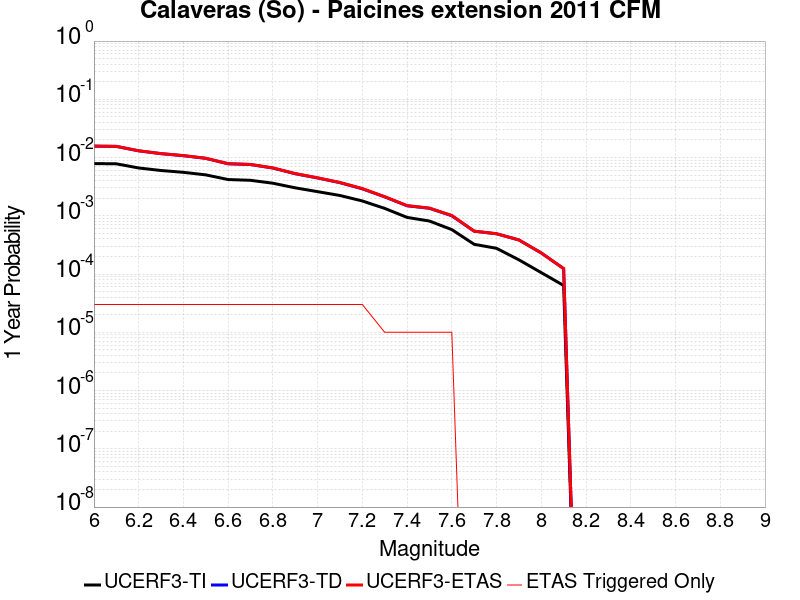 | 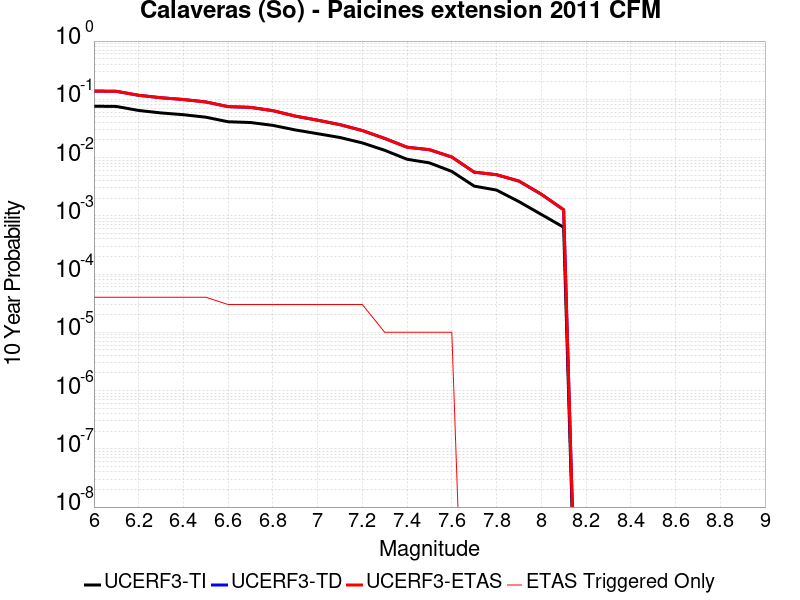 |

| Magnitude | 1 wk TI Prob | 1 wk TD Prob | 1 wk ETAS Prob | 1 wk ETAS/TD Gain | 1 wk ETAS Triggered Only | 1 mo TI Prob | 1 mo TD Prob | 1 mo ETAS Prob | 1 mo ETAS/TD Gain | 1 mo ETAS Triggered Only | 1 yr TI Prob | 1 yr TD Prob | 1 yr ETAS Prob | 1 yr ETAS/TD Gain | 1 yr ETAS Triggered Only | 10 yr TI Prob | 10 yr TD Prob | 10 yr ETAS Prob | 10 yr ETAS/TD Gain | 10 yr ETAS Triggered Only |
|-----|-----|-----|-----|-----|-----|-----|-----|-----|-----|-----|-----|-----|-----|-----|-----|-----|-----|-----|-----|-----|
| 6.0 | 1.5183659E-4 | 3.0520977E-4 | 3.1520674E-4 | 1.0327543 | 1.0E-5 | 6.5056595E-4 | 0.0013068188 | 0.0013267926 | 1.0152843 | 2.0E-5 | 0.007891912 | 0.015696203 | 0.015725734 | 1.0018812 | 3.0E-5 | 0.076174594 | 0.13848905 | 0.1385235 | 1.0002488 | 4.0E-5 |
| 6.1 | 1.5024997E-4 | 3.021517E-4 | 3.1214865E-4 | 1.033086 | 1.0E-5 | 6.437695E-4 | 0.0012937278 | 0.001313702 | 1.0154392 | 2.0E-5 | 0.0078097614 | 0.015539596 | 0.01556913 | 1.0019006 | 3.0E-5 | 0.075409345 | 0.13715863 | 0.13719314 | 1.0002517 | 4.0E-5 |
| 6.2 | 1.2743923E-4 | 2.5313982E-4 | 2.6313728E-4 | 1.0394939 | 1.0E-5 | 5.460538E-4 | 0.0010839999 | 0.0011039783 | 1.0184302 | 2.0E-5 | 0.0066279583 | 0.013046881 | 0.01307649 | 1.0022694 | 3.0E-5 | 0.064337276 | 0.117256075 | 0.11729138 | 1.0003011 | 4.0E-5 |
| 6.3 | 1.1525114E-4 | 2.2599236E-4 | 2.359901E-4 | 1.0442393 | 1.0E-5 | 4.9383997E-4 | 9.678718E-4 | 9.878525E-4 | 1.020644 | 2.0E-5 | 0.0059959386 | 0.011668079 | 0.011697729 | 1.0025411 | 3.0E-5 | 0.058367174 | 0.106372125 | 0.106407866 | 1.000336 | 4.0E-5 |
| 6.4 | 1.07200925E-4 | 2.0840544E-4 | 2.1840337E-4 | 1.0479734 | 1.0E-5 | 4.5935164E-4 | 8.926123E-4 | 9.1259443E-4 | 1.0223862 | 2.0E-5 | 0.0055782744 | 0.010772959 | 0.010802636 | 1.0027548 | 3.0E-5 | 0.0544031 | 0.099194765 | 0.0992308 | 1.0003632 | 4.0E-5 |
| 6.5 | 9.69631E-5 | 1.8734725E-4 | 1.9734538E-4 | 1.0533668 | 1.0E-5 | 4.1548995E-4 | 8.024631E-4 | 8.22447E-4 | 1.0249033 | 2.0E-5 | 0.0050468626 | 0.009694842 | 0.009724551 | 1.0030644 | 3.0E-5 | 0.04933773 | 0.090086564 | 0.09012296 | 1.000404 | 4.0E-5 |
| 6.6 | 8.0552316E-5 | 1.507068E-4 | 1.6070528E-4 | 1.066344 | 1.0E-5 | 3.4517853E-4 | 6.4569083E-4 | 6.656779E-4 | 1.0309546 | 2.0E-5 | 0.0041944524 | 0.007826508 | 0.007856273 | 1.0038031 | 3.0E-5 | 0.04116161 | 0.0748563 | 0.07488406 | 1.0003707 | 3.0E-5 |
| 6.7 | 7.815757E-5 | 1.4611272E-4 | 1.5611126E-4 | 1.0684303 | 1.0E-5 | 3.34918E-4 | 6.26014E-4 | 6.4600154E-4 | 1.0319282 | 2.0E-5 | 0.004070005 | 0.007589312 | 0.007619084 | 1.0039229 | 3.0E-5 | 0.039962657 | 0.07270582 | 0.07273364 | 1.0003827 | 3.0E-5 |
| 6.8 | 6.965264E-5 | 1.2722758E-4 | 1.3722632E-4 | 1.0785893 | 1.0E-5 | 2.9847719E-4 | 5.4513285E-4 | 5.6512194E-4 | 1.0366683 | 2.0E-5 | 0.0036279052 | 0.0066135945 | 0.006643396 | 1.0045061 | 3.0E-5 | 0.03569247 | 0.063801065 | 0.063829154 | 1.0004402 | 3.0E-5 |
| 6.9 | 5.8000453E-5 | 1.01439E-4 | 1.1143799E-4 | 1.0985714 | 1.0E-5 | 2.4854968E-4 | 4.346666E-4 | 4.5465791E-4 | 1.0459923 | 2.0E-5 | 0.0030218933 | 0.005279322 | 0.005309164 | 1.0056525 | 3.0E-5 | 0.029811295 | 0.051502965 | 0.05153142 | 1.0005525 | 3.0E-5 |
| 7.0 | 4.9865852E-5 | 8.568029E-5 | 9.5679425E-5 | 1.1167029 | 1.0E-5 | 2.1369329E-4 | 3.6715003E-4 | 3.8714267E-4 | 1.0544536 | 2.0E-5 | 0.0025986114 | 0.004460979 | 0.004490845 | 1.006695 | 3.0E-5 | 0.025684336 | 0.043782018 | 0.043810703 | 1.0006552 | 3.0E-5 |
| 7.1 | 4.283875E-5 | 7.1124625E-5 | 8.1123915E-5 | 1.1405883 | 1.0E-5 | 1.8358172E-4 | 3.0478454E-4 | 3.2477843E-4 | 1.0656002 | 2.0E-5 | 0.0022328163 | 0.003704494 | 0.003734383 | 1.0080683 | 3.0E-5 | 0.022105146 | 0.03673582 | 0.036764722 | 1.0007867 | 3.0E-5 |
| 7.2 | 3.450115E-5 | 5.5778568E-5 | 6.577801E-5 | 1.1792704 | 1.0E-5 | 1.478537E-4 | 2.3902925E-4 | 2.5902447E-4 | 1.0836518 | 2.0E-5 | 0.0017986323 | 0.0029063264 | 0.0029362394 | 1.0102923 | 3.0E-5 | 0.017841442 | 0.029079042 | 0.02910817 | 1.0010017 | 3.0E-5 |
| 7.3 | 2.5709045E-5 | 4.059001E-5 | 5.0589606E-5 | 1.246356 | 1.0E-5 | 1.1017697E-4 | 1.7394568E-4 | 1.8394395E-4 | 1.0574793 | 1.0E-5 | 0.0013405791 | 0.0021157486 | 0.0021257275 | 1.0047165 | 1.0E-5 | 0.013325208 | 0.02129686 | 0.021306649 | 1.0004596 | 1.0E-5 |
| 7.4 | 1.8003093E-5 | 2.8511378E-5 | 3.8511094E-5 | 1.3507272 | 1.0E-5 | 7.715383E-5 | 1.2218591E-4 | 1.321847E-4 | 1.0818325 | 1.0E-5 | 9.3894306E-4 | 0.0014866006 | 0.0014965858 | 1.0067167 | 1.0E-5 | 0.009349857 | 0.015051589 | 0.015061439 | 1.0006543 | 1.0E-5 |
| 7.5 | 1.5595824E-5 | 2.5823752E-5 | 3.5823494E-5 | 1.3872304 | 1.0E-5 | 6.683753E-5 | 1.10668545E-4 | 1.20667435E-4 | 1.0903499 | 1.0E-5 | 8.134431E-4 | 0.0013465589 | 0.0013565455 | 1.0074164 | 1.0E-5 | 0.008104719 | 0.013651571 | 0.013661435 | 1.0007225 | 1.0E-5 |
| 7.6 | 1.1110309E-5 | 1.9223195E-5 | 2.9223003E-5 | 1.5201949 | 1.0E-5 | 4.761474E-5 | 8.2382525E-5 | 9.2381706E-5 | 1.121375 | 1.0E-5 | 5.795553E-4 | 0.0010025471 | 0.001012537 | 1.0099646 | 1.0E-5 | 0.0057804612 | 0.01020344 | 0.010213338 | 1.00097 | 1.0E-5 |
| 7.7 | 6.2140443E-6 | 1.04376995E-5 | 1.04376995E-5 | 1.0 | 0.0 | 2.6631347E-5 | 4.4732235E-5 | 4.4732235E-5 | 1.0 | 0.0 | 3.241884E-4 | 5.4447894E-4 | 5.4447894E-4 | 1.0 | 0.0 | 0.0032371588 | 0.005620102 | 0.005620102 | 1.0 | 0.0 |
| 7.8 | 5.305533E-6 | 9.433651E-6 | 9.433651E-6 | 1.0 | 0.0 | 2.27378E-5 | 4.0429306E-5 | 4.0429306E-5 | 1.0 | 0.0 | 2.7679754E-4 | 4.9211574E-4 | 4.9211574E-4 | 1.0 | 0.0 | 0.0027645302 | 0.005074622 | 0.005074622 | 1.0 | 0.0 |
| 7.9 | 3.363505E-6 | 7.3854467E-6 | 7.3854467E-6 | 1.0 | 0.0 | 1.4414942E-5 | 3.1651532E-5 | 3.1651532E-5 | 1.0 | 0.0 | 1.7548777E-4 | 3.8528934E-4 | 3.8528934E-4 | 1.0 | 0.0 | 0.0017534926 | 0.003948784 | 0.003948784 | 1.0 | 0.0 |
| 8.0 | 2.0271132E-6 | 4.4134235E-6 | 4.4134235E-6 | 1.0 | 0.0 | 8.687599E-6 | 1.8914534E-5 | 1.8914534E-5 | 1.0 | 0.0 | 1.05766376E-4 | 2.3026018E-4 | 2.3026018E-4 | 1.0 | 0.0 | 0.0010571606 | 0.002351194 | 0.002351194 | 1.0 | 0.0 |
| 8.1 | 1.2206116E-6 | 2.3752666E-6 | 2.3752666E-6 | 1.0 | 0.0 | 5.2311816E-6 | 1.0179674E-5 | 1.0179674E-5 | 1.0 | 0.0 | 6.3687774E-5 | 1.2393051E-4 | 1.2393051E-4 | 1.0 | 0.0 | 6.366953E-4 | 0.0012705618 | 0.0012705618 | 1.0 | 0.0 |

## Camp Rock 2011
*[(top)](#table-of-contents)*

| 1 Week | 1 Month | 1 Year | 10 Year |
|-----|-----|-----|-----|
|  |  |  |  |

| Magnitude | 1 wk TI Prob | 1 wk TD Prob | 1 wk ETAS Prob | 1 wk ETAS/TD Gain | 1 wk ETAS Triggered Only | 1 mo TI Prob | 1 mo TD Prob | 1 mo ETAS Prob | 1 mo ETAS/TD Gain | 1 mo ETAS Triggered Only | 1 yr TI Prob | 1 yr TD Prob | 1 yr ETAS Prob | 1 yr ETAS/TD Gain | 1 yr ETAS Triggered Only | 10 yr TI Prob | 10 yr TD Prob | 10 yr ETAS Prob | 10 yr ETAS/TD Gain | 10 yr ETAS Triggered Only |
|-----|-----|-----|-----|-----|-----|-----|-----|-----|-----|-----|-----|-----|-----|-----|-----|-----|-----|-----|-----|-----|
| 6.0 | 1.6710783E-5 | 4.249999E-6 | 4.249999E-6 | 1.0 | 0.0 | 7.161568E-5 | 1.8214158E-5 | 2.8213975E-5 | 1.5490135 | 1.0E-5 | 8.7157206E-4 | 2.2173533E-4 | 2.417309E-4 | 1.0901777 | 2.0E-5 | 0.008681616 | 0.0022151938 | 0.0022551052 | 1.018017 | 4.0E-5 |
| 6.1 | 1.6710783E-5 | 4.249999E-6 | 4.249999E-6 | 1.0 | 0.0 | 7.161568E-5 | 1.8214158E-5 | 2.8213975E-5 | 1.5490135 | 1.0E-5 | 8.7157206E-4 | 2.2173533E-4 | 2.417309E-4 | 1.0901777 | 2.0E-5 | 0.008681616 | 0.0022151938 | 0.0022551052 | 1.018017 | 4.0E-5 |
| 6.2 | 1.6710783E-5 | 4.249999E-6 | 4.249999E-6 | 1.0 | 0.0 | 7.161568E-5 | 1.8214158E-5 | 2.8213975E-5 | 1.5490135 | 1.0E-5 | 8.7157206E-4 | 2.2173533E-4 | 2.417309E-4 | 1.0901777 | 2.0E-5 | 0.008681616 | 0.0022151938 | 0.0022551052 | 1.018017 | 4.0E-5 |
| 6.3 | 1.6710783E-5 | 4.249999E-6 | 4.249999E-6 | 1.0 | 0.0 | 7.161568E-5 | 1.8214158E-5 | 2.8213975E-5 | 1.5490135 | 1.0E-5 | 8.7157206E-4 | 2.2173533E-4 | 2.417309E-4 | 1.0901777 | 2.0E-5 | 0.008681616 | 0.0022151938 | 0.0022551052 | 1.018017 | 4.0E-5 |
| 6.4 | 7.982846E-6 | 3.6820359E-6 | 3.6820359E-6 | 1.0 | 0.0 | 3.421175E-5 | 1.578006E-5 | 2.5779902E-5 | 1.6337011 | 1.0E-5 | 4.1644843E-4 | 1.9210564E-4 | 2.0210372E-4 | 1.0520447 | 1.0E-5 | 0.0041566887 | 0.0019194306 | 0.001949373 | 1.0155996 | 3.0E-5 |
| 6.5 | 7.982846E-6 | 3.6820359E-6 | 3.6820359E-6 | 1.0 | 0.0 | 3.421175E-5 | 1.578006E-5 | 2.5779902E-5 | 1.6337011 | 1.0E-5 | 4.1644843E-4 | 1.9210564E-4 | 2.0210372E-4 | 1.0520447 | 1.0E-5 | 0.0041566887 | 0.0019194306 | 0.001949373 | 1.0155996 | 3.0E-5 |
| 6.6 | 7.048869E-6 | 3.4242998E-6 | 3.4242998E-6 | 1.0 | 0.0 | 3.0209088E-5 | 1.467549E-5 | 2.4675343E-5 | 1.6813983 | 1.0E-5 | 3.677336E-4 | 1.7865976E-4 | 1.8865797E-4 | 1.0559623 | 1.0E-5 | 0.0036712566 | 0.0017851929 | 0.0018151393 | 1.0167749 | 3.0E-5 |
| 6.7 | 6.987307E-6 | 3.3622775E-6 | 3.3622775E-6 | 1.0 | 0.0 | 2.9945259E-5 | 1.4409683E-5 | 2.4409539E-5 | 1.6939678 | 1.0E-5 | 3.6452254E-4 | 1.7542407E-4 | 1.8542232E-4 | 1.0569947 | 1.0E-5 | 0.0036392517 | 0.0017528872 | 0.0017828345 | 1.0170846 | 3.0E-5 |
| 6.8 | 6.3737602E-6 | 3.1178672E-6 | 3.1178672E-6 | 1.0 | 0.0 | 2.731583E-5 | 1.3362222E-5 | 2.3362089E-5 | 1.7483685 | 1.0E-5 | 3.3251947E-4 | 1.6267318E-4 | 1.7267156E-4 | 1.061463 | 1.0E-5 | 0.0033202237 | 0.0016255698 | 0.001655521 | 1.0184251 | 3.0E-5 |
| 6.9 | 6.112211E-6 | 2.933078E-6 | 2.933078E-6 | 1.0 | 0.0 | 2.6194928E-5 | 1.2570275E-5 | 2.257015E-5 | 1.7955176 | 1.0E-5 | 3.1887658E-4 | 1.5303263E-4 | 1.630311E-4 | 1.0653355 | 1.0E-5 | 0.003184194 | 0.0015293002 | 0.0015592544 | 1.0195868 | 3.0E-5 |
| 7.0 | 5.5140117E-6 | 2.64191E-6 | 2.64191E-6 | 1.0 | 0.0 | 2.3631264E-5 | 1.1322423E-5 | 2.132231E-5 | 1.8831931 | 1.0E-5 | 2.8767265E-4 | 1.3784204E-4 | 1.4784066E-4 | 1.0725368 | 1.0E-5 | 0.0028730053 | 0.0013775907 | 0.0014075494 | 1.0217471 | 3.0E-5 |
| 7.1 | 4.8151105E-6 | 2.1342612E-6 | 2.1342612E-6 | 1.0 | 0.0 | 2.0636026E-5 | 9.146803E-6 | 1.9146712E-5 | 2.0932682 | 1.0E-5 | 2.5121463E-4 | 1.1135685E-4 | 1.2135574E-4 | 1.0897914 | 1.0E-5 | 0.0025093083 | 0.0011130325 | 0.001142999 | 1.0269234 | 3.0E-5 |
| 7.2 | 3.818335E-6 | 1.2937372E-6 | 1.2937372E-6 | 1.0 | 0.0 | 1.6364189E-5 | 5.5445767E-6 | 5.5445767E-6 | 1.0 | 0.0 | 1.9921579E-4 | 6.750321E-5 | 6.750321E-5 | 1.0 | 0.0 | 0.0019903728 | 6.7483535E-4 | 6.948218E-4 | 1.0296168 | 2.0E-5 |
| 7.3 | 2.7166698E-6 | 7.383078E-7 | 7.383078E-7 | 1.0 | 0.0 | 1.1642818E-5 | 3.1641725E-6 | 3.1641725E-6 | 1.0 | 0.0 | 1.4174209E-4 | 3.852314E-5 | 3.852314E-5 | 1.0 | 0.0 | 0.0014165172 | 3.8516664E-4 | 3.951628E-4 | 1.0259528 | 1.0E-5 |
| 7.4 | 2.0893426E-6 | 5.4614605E-7 | 5.4614605E-7 | 1.0 | 0.0 | 8.954295E-6 | 2.340624E-6 | 2.340624E-6 | 1.0 | 0.0 | 1.0901308E-4 | 2.8496728E-5 | 2.8496728E-5 | 1.0 | 0.0 | 0.0010895962 | 2.849313E-4 | 2.9492844E-4 | 1.0350862 | 1.0E-5 |
| 7.5 | 1.1681728E-6 | 3.6028484E-7 | 3.6028484E-7 | 1.0 | 0.0 | 5.0064455E-6 | 1.544077E-6 | 1.544077E-6 | 1.0 | 0.0 | 6.0951766E-5 | 1.879898E-5 | 1.879898E-5 | 1.0 | 0.0 | 6.093505E-4 | 1.8797436E-4 | 1.9797249E-4 | 1.0531888 | 1.0E-5 |
| 7.6 | 1.3154387E-7 | 7.1196716E-8 | 7.1196716E-8 | 1.0 | 0.0 | 5.6375933E-7 | 3.0512876E-7 | 3.0512876E-7 | 1.0 | 0.0 | 6.863748E-6 | 3.714938E-6 | 3.714938E-6 | 1.0 | 0.0 | 6.863536E-5 | 3.7148915E-5 | 4.7148544E-5 | 1.2691768 | 1.0E-5 |

## Hayward (So) 2011 CFM
*[(top)](#table-of-contents)*

| 1 Week | 1 Month | 1 Year | 10 Year |
|-----|-----|-----|-----|
|  |  | 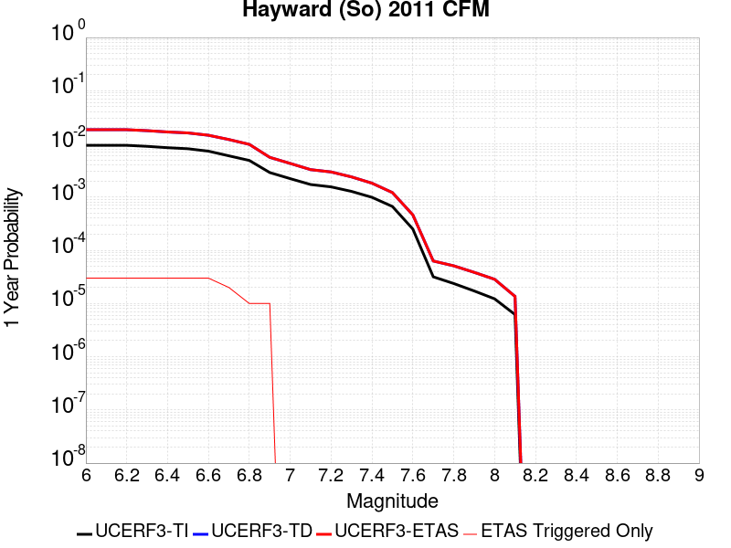 |  |

| Magnitude | 1 wk TI Prob | 1 wk TD Prob | 1 wk ETAS Prob | 1 wk ETAS/TD Gain | 1 wk ETAS Triggered Only | 1 mo TI Prob | 1 mo TD Prob | 1 mo ETAS Prob | 1 mo ETAS/TD Gain | 1 mo ETAS Triggered Only | 1 yr TI Prob | 1 yr TD Prob | 1 yr ETAS Prob | 1 yr ETAS/TD Gain | 1 yr ETAS Triggered Only | 10 yr TI Prob | 10 yr TD Prob | 10 yr ETAS Prob | 10 yr ETAS/TD Gain | 10 yr ETAS Triggered Only |
|-----|-----|-----|-----|-----|-----|-----|-----|-----|-----|-----|-----|-----|-----|-----|-----|-----|-----|-----|-----|-----|
| 6.0 | 1.8091932E-4 | 3.570673E-4 | 3.670637E-4 | 1.027996 | 1.0E-5 | 7.751381E-4 | 0.0015294008 | 0.0015493702 | 1.013057 | 2.0E-5 | 0.00939654 | 0.018463885 | 0.01849333 | 1.0015948 | 3.0E-5 | 0.090090066 | 0.1667085 | 0.16674182 | 1.0001999 | 4.0E-5 |
| 6.1 | 1.8091932E-4 | 3.570673E-4 | 3.670637E-4 | 1.027996 | 1.0E-5 | 7.751381E-4 | 0.0015294008 | 0.0015493702 | 1.013057 | 2.0E-5 | 0.00939654 | 0.018463885 | 0.01849333 | 1.0015948 | 3.0E-5 | 0.090090066 | 0.1667085 | 0.16674182 | 1.0001999 | 4.0E-5 |
| 6.2 | 1.8091932E-4 | 3.570673E-4 | 3.670637E-4 | 1.027996 | 1.0E-5 | 7.751381E-4 | 0.0015294008 | 0.0015493702 | 1.013057 | 2.0E-5 | 0.00939654 | 0.018463885 | 0.01849333 | 1.0015948 | 3.0E-5 | 0.090090066 | 0.1667085 | 0.16674182 | 1.0001999 | 4.0E-5 |
| 6.3 | 1.7322872E-4 | 3.4263515E-4 | 3.5263173E-4 | 1.0291755 | 1.0E-5 | 7.4219756E-4 | 0.0014676197 | 0.0014875903 | 1.0136075 | 2.0E-5 | 0.0089988755 | 0.017724147 | 0.017753616 | 1.0016626 | 3.0E-5 | 0.08643075 | 0.16065954 | 0.16069311 | 1.000209 | 4.0E-5 |
| 6.4 | 1.6334097E-4 | 3.2345165E-4 | 3.334484E-4 | 1.0309066 | 1.0E-5 | 6.998449E-4 | 0.0013854936 | 0.0014054659 | 1.0144153 | 2.0E-5 | 0.008487372 | 0.016739927 | 0.016769424 | 1.0017622 | 3.0E-5 | 0.081704415 | 0.15256606 | 0.15259995 | 1.0002222 | 4.0E-5 |
| 6.5 | 1.5600289E-4 | 3.101982E-4 | 3.2019507E-4 | 1.0322274 | 1.0E-5 | 6.684125E-4 | 0.0013287518 | 0.0013487253 | 1.0150317 | 2.0E-5 | 0.008107598 | 0.016059443 | 0.016088963 | 1.0018381 | 3.0E-5 | 0.078181036 | 0.14684291 | 0.14687704 | 1.0002325 | 4.0E-5 |
| 6.6 | 1.4046066E-4 | 2.8034003E-4 | 2.9033722E-4 | 1.035661 | 1.0E-5 | 6.018354E-4 | 0.0012009109 | 0.0012208868 | 1.016634 | 2.0E-5 | 0.0073027555 | 0.014524571 | 0.014554135 | 1.0020355 | 3.0E-5 | 0.07067384 | 0.13393044 | 0.13396509 | 1.0002587 | 4.0E-5 |
| 6.7 | 1.14696966E-4 | 2.3272466E-4 | 2.4272234E-4 | 1.0429592 | 1.0E-5 | 4.914658E-4 | 9.970153E-4 | 0.0010169953 | 1.0200399 | 2.0E-5 | 0.0059671924 | 0.012072163 | 0.012091922 | 1.0016367 | 2.0E-5 | 0.058094822 | 0.11274141 | 0.11276803 | 1.0002362 | 3.0E-5 |
| 6.8 | 9.3874296E-5 | 1.8862431E-4 | 1.9862242E-4 | 1.0530055 | 1.0E-5 | 4.0225635E-4 | 8.081431E-4 | 8.1813504E-4 | 1.012364 | 1.0E-5 | 0.0048864787 | 0.009795489 | 0.009805392 | 1.0010109 | 1.0E-5 | 0.047804173 | 0.092592984 | 0.092611134 | 1.000196 | 2.0E-5 |
| 6.9 | 5.551852E-5 | 1.0729875E-4 | 1.1729768E-4 | 1.0931877 | 1.0E-5 | 2.3791482E-4 | 4.5977137E-4 | 4.6976676E-4 | 1.02174 | 1.0E-5 | 0.0028927654 | 0.005583468 | 0.0055934116 | 1.001781 | 1.0E-5 | 0.028553981 | 0.054246075 | 0.05425553 | 1.0001744 | 1.0E-5 |
| 7.0 | 4.2662363E-5 | 8.246792E-5 | 8.246792E-5 | 1.0 | 0.0 | 1.8282588E-4 | 3.5338648E-4 | 3.5338648E-4 | 1.0 | 0.0 | 0.0022236328 | 0.0042940658 | 0.0042940658 | 1.0 | 0.0 | 0.022015138 | 0.04206509 | 0.04206509 | 1.0 | 0.0 |
| 7.1 | 3.305886E-5 | 6.302183E-5 | 6.302183E-5 | 1.0 | 0.0 | 1.4167312E-4 | 2.7006568E-4 | 2.7006568E-4 | 1.0 | 0.0 | 0.0017235056 | 0.003283111 | 0.003283111 | 1.0 | 0.0 | 0.017101998 | 0.032453902 | 0.032453902 | 1.0 | 0.0 |
| 7.2 | 2.9856887E-5 | 5.701622E-5 | 5.701622E-5 | 1.0 | 0.0 | 1.2795182E-4 | 2.4433242E-4 | 2.4433242E-4 | 1.0 | 0.0 | 0.0015567001 | 0.0029707062 | 0.0029707062 | 1.0 | 0.0 | 0.015458403 | 0.029454801 | 0.029454801 | 1.0 | 0.0 |
| 7.3 | 2.4559737E-5 | 4.599286E-5 | 4.599286E-5 | 1.0 | 0.0 | 1.0525176E-4 | 1.9709744E-4 | 1.9709744E-4 | 1.0 | 0.0 | 0.0012806869 | 0.0023970334 | 0.0023970334 | 1.0 | 0.0 | 0.012733313 | 0.023858516 | 0.023858516 | 1.0 | 0.0 |
| 7.4 | 1.9002231E-5 | 3.505084E-5 | 3.505084E-5 | 1.0 | 0.0 | 8.143559E-5 | 1.502093E-4 | 1.502093E-4 | 1.0 | 0.0 | 9.910273E-4 | 0.001827274 | 0.001827274 | 1.0 | 0.0 | 0.009866194 | 0.018258808 | 0.018258808 | 1.0 | 0.0 |
| 7.5 | 1.2783333E-5 | 2.3331182E-5 | 2.3331182E-5 | 1.0 | 0.0 | 5.4784563E-5 | 9.998698E-5 | 9.998698E-5 | 1.0 | 0.0 | 6.667979E-4 | 0.0012166675 | 0.0012166675 | 1.0 | 0.0 | 0.006648007 | 0.012209443 | 0.012209443 | 1.0 | 0.0 |
| 7.6 | 4.8149627E-6 | 8.888056E-6 | 8.888056E-6 | 1.0 | 0.0 | 2.063539E-5 | 3.8091122E-5 | 3.8091122E-5 | 1.0 | 0.0 | 2.5120692E-4 | 4.6366194E-4 | 4.6366194E-4 | 1.0 | 0.0 | 0.0025092314 | 0.0046805087 | 0.0046805087 | 1.0 | 0.0 |
| 7.7 | 6.0838227E-7 | 1.205754E-6 | 1.205754E-6 | 1.0 | 0.0 | 2.6073499E-6 | 5.1675065E-6 | 5.1675065E-6 | 1.0 | 0.0 | 3.174402E-5 | 6.291258E-5 | 6.291258E-5 | 1.0 | 0.0 | 3.1739488E-4 | 6.5296254E-4 | 6.5296254E-4 | 1.0 | 0.0 |
| 7.8 | 4.5542808E-7 | 9.792941E-7 | 9.792941E-7 | 1.0 | 0.0 | 1.9518332E-6 | 4.196968E-6 | 4.196968E-6 | 1.0 | 0.0 | 2.376331E-5 | 5.109689E-5 | 5.109689E-5 | 1.0 | 0.0 | 2.3760769E-4 | 5.321693E-4 | 5.321693E-4 | 1.0 | 0.0 |
| 7.9 | 3.3016747E-7 | 7.3869535E-7 | 7.3869535E-7 | 1.0 | 0.0 | 1.4150027E-6 | 3.1658333E-6 | 3.1658333E-6 | 1.0 | 0.0 | 1.7227521E-5 | 3.854334E-5 | 3.854334E-5 | 1.0 | 0.0 | 1.7226185E-4 | 3.9932923E-4 | 3.9932923E-4 | 1.0 | 0.0 |
| 8.0 | 2.347038E-7 | 5.471963E-7 | 5.471963E-7 | 1.0 | 0.0 | 1.0058731E-6 | 2.3451248E-6 | 2.3451248E-6 | 1.0 | 0.0 | 1.2246436E-5 | 2.8551523E-5 | 2.8551523E-5 | 1.0 | 0.0 | 1.2245761E-4 | 2.9357258E-4 | 2.9357258E-4 | 1.0 | 0.0 |
| 8.1 | 1.18822804E-7 | 2.6060948E-7 | 2.6060948E-7 | 1.0 | 0.0 | 5.092405E-7 | 1.1168972E-6 | 1.1168972E-6 | 1.0 | 0.0 | 6.1999854E-6 | 1.359814E-5 | 1.359814E-5 | 1.0 | 0.0 | 6.199812E-5 | 1.3918082E-4 | 1.3918082E-4 | 1.0 | 0.0 |

## Santa Cruz Catalina Ridge alt1
*[(top)](#table-of-contents)*

| 1 Week | 1 Month | 1 Year | 10 Year |
|-----|-----|-----|-----|
|  |  |  |  |

| Magnitude | 1 wk TI Prob | 1 wk TD Prob | 1 wk ETAS Prob | 1 wk ETAS/TD Gain | 1 wk ETAS Triggered Only | 1 mo TI Prob | 1 mo TD Prob | 1 mo ETAS Prob | 1 mo ETAS/TD Gain | 1 mo ETAS Triggered Only | 1 yr TI Prob | 1 yr TD Prob | 1 yr ETAS Prob | 1 yr ETAS/TD Gain | 1 yr ETAS Triggered Only | 10 yr TI Prob | 10 yr TD Prob | 10 yr ETAS Prob | 10 yr ETAS/TD Gain | 10 yr ETAS Triggered Only |
|-----|-----|-----|-----|-----|-----|-----|-----|-----|-----|-----|-----|-----|-----|-----|-----|-----|-----|-----|-----|-----|
| 6.0 | 3.2833184E-5 | 3.6558402E-5 | 4.6558034E-5 | 1.273525 | 1.0E-5 | 1.4070606E-4 | 1.5667039E-4 | 1.6666882E-4 | 1.0638182 | 1.0E-5 | 0.00171175 | 0.0019059594 | 0.0019259213 | 1.0104734 | 2.0E-5 | 0.016986247 | 0.018913032 | 0.018952277 | 1.002075 | 4.0E-5 |
| 6.1 | 1.9835548E-5 | 2.1659505E-5 | 2.1659505E-5 | 1.0 | 0.0 | 8.500672E-5 | 9.282326E-5 | 9.282326E-5 | 1.0 | 0.0 | 0.0010344655 | 0.0011295575 | 0.0011295575 | 1.0 | 0.0 | 0.010296632 | 0.011240296 | 0.011260071 | 1.0017593 | 2.0E-5 |
| 6.2 | 1.9835548E-5 | 2.1659505E-5 | 2.1659505E-5 | 1.0 | 0.0 | 8.500672E-5 | 9.282326E-5 | 9.282326E-5 | 1.0 | 0.0 | 0.0010344655 | 0.0011295575 | 0.0011295575 | 1.0 | 0.0 | 0.010296632 | 0.011240296 | 0.011260071 | 1.0017593 | 2.0E-5 |
| 6.3 | 1.5728183E-5 | 1.703395E-5 | 1.703395E-5 | 1.0 | 0.0 | 6.7404755E-5 | 7.300063E-5 | 7.300063E-5 | 1.0 | 0.0 | 8.2034385E-4 | 8.884264E-4 | 8.884264E-4 | 1.0 | 0.0 | 0.008173222 | 0.008849427 | 0.00886925 | 1.0022401 | 2.0E-5 |
| 6.4 | 1.5728183E-5 | 1.703395E-5 | 1.703395E-5 | 1.0 | 0.0 | 6.7404755E-5 | 7.300063E-5 | 7.300063E-5 | 1.0 | 0.0 | 8.2034385E-4 | 8.884264E-4 | 8.884264E-4 | 1.0 | 0.0 | 0.008173222 | 0.008849427 | 0.00886925 | 1.0022401 | 2.0E-5 |
| 6.5 | 1.3707734E-5 | 1.4794522E-5 | 1.4794522E-5 | 1.0 | 0.0 | 5.8746107E-5 | 6.3403575E-5 | 6.3403575E-5 | 1.0 | 0.0 | 7.1499916E-4 | 7.716686E-4 | 7.716686E-4 | 1.0 | 0.0 | 0.0071270303 | 0.0076902895 | 0.007710136 | 1.0025806 | 2.0E-5 |
| 6.6 | 1.2539813E-5 | 1.3510219E-5 | 1.3510219E-5 | 1.0 | 0.0 | 5.3740947E-5 | 5.789967E-5 | 5.789967E-5 | 1.0 | 0.0 | 6.540996E-4 | 7.0470315E-4 | 7.0470315E-4 | 1.0 | 0.0 | 0.0065217763 | 0.0070249885 | 0.007044848 | 1.0028269 | 2.0E-5 |
| 6.7 | 1.1504083E-5 | 1.2377375E-5 | 1.2377375E-5 | 1.0 | 0.0 | 4.930228E-5 | 5.3044827E-5 | 5.3044827E-5 | 1.0 | 0.0 | 6.0008996E-4 | 6.456314E-4 | 6.456314E-4 | 1.0 | 0.0 | 0.005984721 | 0.006437786 | 0.006457657 | 1.0030867 | 2.0E-5 |
| 6.8 | 1.012739E-5 | 1.0877071E-5 | 1.0877071E-5 | 1.0 | 0.0 | 4.340238E-5 | 4.6615194E-5 | 4.6615194E-5 | 1.0 | 0.0 | 5.282958E-4 | 5.673937E-4 | 5.673937E-4 | 1.0 | 0.0 | 0.0052704164 | 0.0056596193 | 0.0056795063 | 1.0035138 | 2.0E-5 |
| 6.9 | 8.9607865E-6 | 9.609117E-6 | 9.609117E-6 | 1.0 | 0.0 | 3.8402806E-5 | 4.1181287E-5 | 4.1181287E-5 | 1.0 | 0.0 | 4.6745385E-4 | 5.012679E-4 | 5.012679E-4 | 1.0 | 0.0 | 0.0046647177 | 0.005001492 | 0.005021392 | 1.0039788 | 2.0E-5 |
| 7.0 | 8.046829E-6 | 8.619746E-6 | 8.619746E-6 | 1.0 | 0.0 | 3.4485955E-5 | 3.694125E-5 | 3.694125E-5 | 1.0 | 0.0 | 4.1978562E-4 | 4.496677E-4 | 4.496677E-4 | 1.0 | 0.0 | 0.004189935 | 0.0044876686 | 0.004507579 | 1.0044366 | 2.0E-5 |
| 7.1 | 7.136131E-6 | 7.637656E-6 | 7.637656E-6 | 1.0 | 0.0 | 3.0583058E-5 | 3.2732405E-5 | 3.2732405E-5 | 1.0 | 0.0 | 3.7228514E-4 | 3.9844486E-4 | 3.9844486E-4 | 1.0 | 0.0 | 0.0037166206 | 0.003977381 | 0.0039973017 | 1.0050085 | 2.0E-5 |
| 7.2 | 6.362014E-6 | 6.8049585E-6 | 6.8049585E-6 | 1.0 | 0.0 | 2.726549E-5 | 2.9163786E-5 | 2.9163786E-5 | 1.0 | 0.0 | 3.3190678E-4 | 3.550119E-4 | 3.550119E-4 | 1.0 | 0.0 | 0.0033141149 | 0.003544516 | 0.003564445 | 1.0056225 | 2.0E-5 |
| 7.3 | 5.004101E-6 | 5.351715E-6 | 5.351715E-6 | 1.0 | 0.0 | 2.1445969E-5 | 2.2935723E-5 | 2.2935723E-5 | 1.0 | 0.0 | 2.6107338E-4 | 2.792072E-4 | 2.792072E-4 | 1.0 | 0.0 | 0.002607669 | 0.0027886187 | 0.0027985908 | 1.003576 | 1.0E-5 |
| 7.4 | 3.4901443E-6 | 3.7320526E-6 | 3.7320526E-6 | 1.0 | 0.0 | 1.4957676E-5 | 1.5994416E-5 | 1.5994416E-5 | 1.0 | 0.0 | 1.8209449E-4 | 1.9471499E-4 | 1.9471499E-4 | 1.0 | 0.0 | 0.0018194534 | 0.0019454823 | 0.0019554629 | 1.0051302 | 1.0E-5 |
| 7.5 | 1.1215045E-6 | 1.189387E-6 | 1.189387E-6 | 1.0 | 0.0 | 4.806439E-6 | 5.097363E-6 | 5.097363E-6 | 1.0 | 0.0 | 5.851682E-5 | 6.205866E-5 | 6.205866E-5 | 1.0 | 0.0 | 5.850142E-4 | 6.2041637E-4 | 6.2041637E-4 | 1.0 | 0.0 |
| 7.6 | 2.8599047E-7 | 2.9951994E-7 | 2.9951994E-7 | 1.0 | 0.0 | 1.2256729E-6 | 1.2836562E-6 | 1.2836562E-6 | 1.0 | 0.0 | 1.4922465E-5 | 1.5628404E-5 | 1.5628404E-5 | 1.0 | 0.0 | 1.4921463E-4 | 1.5627318E-4 | 1.5627318E-4 | 1.0 | 0.0 |
| 7.7 | 2.0781519E-7 | 2.1744323E-7 | 2.1744323E-7 | 1.0 | 0.0 | 8.906362E-7 | 9.3189925E-7 | 9.3189925E-7 | 1.0 | 0.0 | 1.08434415E-5 | 1.13458145E-5 | 1.13458145E-5 | 1.0 | 0.0 | 1.0842913E-4 | 1.1345245E-4 | 1.1345245E-4 | 1.0 | 0.0 |
| 7.8 | 3.614776E-8 | 3.764102E-8 | 3.764102E-8 | 1.0 | 0.0 | 1.5491896E-7 | 1.6131864E-7 | 1.6131864E-7 | 1.0 | 0.0 | 1.8861368E-6 | 1.9640527E-6 | 1.9640527E-6 | 1.0 | 0.0 | 1.8861208E-5 | 1.9640367E-5 | 1.9640367E-5 | 1.0 | 0.0 |

## Pitas Point (Lower West)
*[(top)](#table-of-contents)*

| 1 Week | 1 Month | 1 Year | 10 Year |
|-----|-----|-----|-----|
|  |  |  | 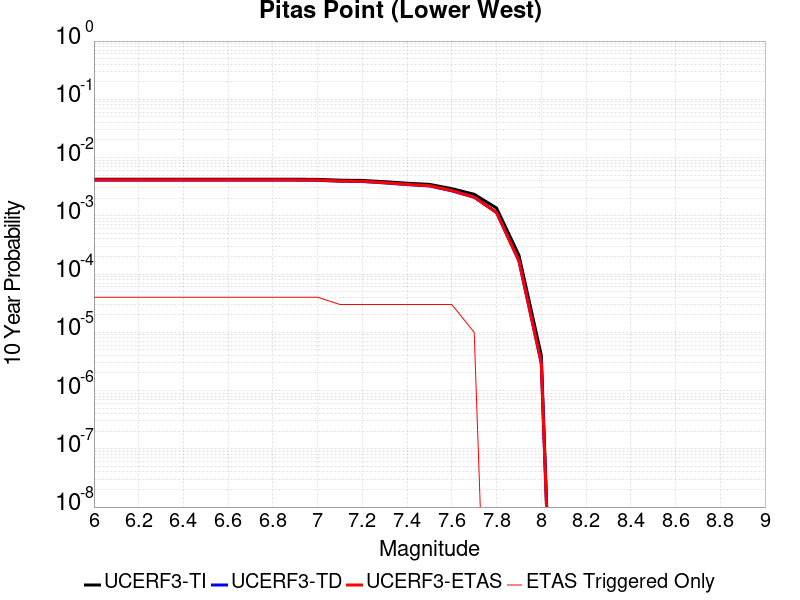 |

| Magnitude | 1 wk TI Prob | 1 wk TD Prob | 1 wk ETAS Prob | 1 wk ETAS/TD Gain | 1 wk ETAS Triggered Only | 1 mo TI Prob | 1 mo TD Prob | 1 mo ETAS Prob | 1 mo ETAS/TD Gain | 1 mo ETAS Triggered Only | 1 yr TI Prob | 1 yr TD Prob | 1 yr ETAS Prob | 1 yr ETAS/TD Gain | 1 yr ETAS Triggered Only | 10 yr TI Prob | 10 yr TD Prob | 10 yr ETAS Prob | 10 yr ETAS/TD Gain | 10 yr ETAS Triggered Only |
|-----|-----|-----|-----|-----|-----|-----|-----|-----|-----|-----|-----|-----|-----|-----|-----|-----|-----|-----|-----|-----|
| 6.0 | 8.151497E-6 | 7.855796E-6 | 7.855796E-6 | 1.0 | 0.0 | 3.493452E-5 | 3.3667267E-5 | 3.3667267E-5 | 1.0 | 0.0 | 4.252448E-4 | 4.0982262E-4 | 4.2981442E-4 | 1.0487816 | 2.0E-5 | 0.0042443196 | 0.004090749 | 0.0041305856 | 1.0097382 | 4.0E-5 |
| 6.1 | 8.151497E-6 | 7.855796E-6 | 7.855796E-6 | 1.0 | 0.0 | 3.493452E-5 | 3.3667267E-5 | 3.3667267E-5 | 1.0 | 0.0 | 4.252448E-4 | 4.0982262E-4 | 4.2981442E-4 | 1.0487816 | 2.0E-5 | 0.0042443196 | 0.004090749 | 0.0041305856 | 1.0097382 | 4.0E-5 |
| 6.2 | 8.151497E-6 | 7.855796E-6 | 7.855796E-6 | 1.0 | 0.0 | 3.493452E-5 | 3.3667267E-5 | 3.3667267E-5 | 1.0 | 0.0 | 4.252448E-4 | 4.0982262E-4 | 4.2981442E-4 | 1.0487816 | 2.0E-5 | 0.0042443196 | 0.004090749 | 0.0041305856 | 1.0097382 | 4.0E-5 |
| 6.3 | 8.151497E-6 | 7.855796E-6 | 7.855796E-6 | 1.0 | 0.0 | 3.493452E-5 | 3.3667267E-5 | 3.3667267E-5 | 1.0 | 0.0 | 4.252448E-4 | 4.0982262E-4 | 4.2981442E-4 | 1.0487816 | 2.0E-5 | 0.0042443196 | 0.004090749 | 0.0041305856 | 1.0097382 | 4.0E-5 |
| 6.4 | 8.151497E-6 | 7.855796E-6 | 7.855796E-6 | 1.0 | 0.0 | 3.493452E-5 | 3.3667267E-5 | 3.3667267E-5 | 1.0 | 0.0 | 4.252448E-4 | 4.0982262E-4 | 4.2981442E-4 | 1.0487816 | 2.0E-5 | 0.0042443196 | 0.004090749 | 0.0041305856 | 1.0097382 | 4.0E-5 |
| 6.5 | 8.151497E-6 | 7.855796E-6 | 7.855796E-6 | 1.0 | 0.0 | 3.493452E-5 | 3.3667267E-5 | 3.3667267E-5 | 1.0 | 0.0 | 4.252448E-4 | 4.0982262E-4 | 4.2981442E-4 | 1.0487816 | 2.0E-5 | 0.0042443196 | 0.004090749 | 0.0041305856 | 1.0097382 | 4.0E-5 |
| 6.6 | 8.151497E-6 | 7.855796E-6 | 7.855796E-6 | 1.0 | 0.0 | 3.493452E-5 | 3.3667267E-5 | 3.3667267E-5 | 1.0 | 0.0 | 4.252448E-4 | 4.0982262E-4 | 4.2981442E-4 | 1.0487816 | 2.0E-5 | 0.0042443196 | 0.004090749 | 0.0041305856 | 1.0097382 | 4.0E-5 |
| 6.7 | 8.151497E-6 | 7.855796E-6 | 7.855796E-6 | 1.0 | 0.0 | 3.493452E-5 | 3.3667267E-5 | 3.3667267E-5 | 1.0 | 0.0 | 4.252448E-4 | 4.0982262E-4 | 4.2981442E-4 | 1.0487816 | 2.0E-5 | 0.0042443196 | 0.004090749 | 0.0041305856 | 1.0097382 | 4.0E-5 |
| 6.8 | 8.151497E-6 | 7.855796E-6 | 7.855796E-6 | 1.0 | 0.0 | 3.493452E-5 | 3.3667267E-5 | 3.3667267E-5 | 1.0 | 0.0 | 4.252448E-4 | 4.0982262E-4 | 4.2981442E-4 | 1.0487816 | 2.0E-5 | 0.0042443196 | 0.004090749 | 0.0041305856 | 1.0097382 | 4.0E-5 |
| 6.9 | 8.151497E-6 | 7.855796E-6 | 7.855796E-6 | 1.0 | 0.0 | 3.493452E-5 | 3.3667267E-5 | 3.3667267E-5 | 1.0 | 0.0 | 4.252448E-4 | 4.0982262E-4 | 4.2981442E-4 | 1.0487816 | 2.0E-5 | 0.0042443196 | 0.004090749 | 0.0041305856 | 1.0097382 | 4.0E-5 |
| 7.0 | 8.103535E-6 | 7.805226E-6 | 7.805226E-6 | 1.0 | 0.0 | 3.4728975E-5 | 3.3450542E-5 | 3.3450542E-5 | 1.0 | 0.0 | 4.2274324E-4 | 4.07185E-4 | 4.2717686E-4 | 1.0490978 | 2.0E-5 | 0.0042193993 | 0.0040644696 | 0.004104307 | 1.0098014 | 4.0E-5 |
| 7.1 | 7.853298E-6 | 7.540917E-6 | 7.540917E-6 | 1.0 | 0.0 | 3.3656554E-5 | 3.2317817E-5 | 3.2317817E-5 | 1.0 | 0.0 | 4.096915E-4 | 3.9339912E-4 | 4.1339124E-4 | 1.0508189 | 2.0E-5 | 0.00408937 | 0.0039271032 | 0.003956985 | 1.0076092 | 3.0E-5 |
| 7.2 | 7.771102E-6 | 7.453199E-6 | 7.453199E-6 | 1.0 | 0.0 | 3.33043E-5 | 3.1941894E-5 | 3.1941894E-5 | 1.0 | 0.0 | 4.0540437E-4 | 3.8882386E-4 | 4.088161E-4 | 1.0514172 | 2.0E-5 | 0.0040466557 | 0.003881511 | 0.0039113946 | 1.0076989 | 3.0E-5 |
| 7.3 | 7.3945344E-6 | 7.0493033E-6 | 7.0493033E-6 | 1.0 | 0.0 | 3.1690477E-5 | 3.0210955E-5 | 3.0210955E-5 | 1.0 | 0.0 | 3.8576324E-4 | 3.677569E-4 | 3.8774955E-4 | 1.0543637 | 2.0E-5 | 0.0038509427 | 0.003671551 | 0.0037014408 | 1.0081409 | 3.0E-5 |
| 7.4 | 6.964645E-6 | 6.5901527E-6 | 6.5901527E-6 | 1.0 | 0.0 | 2.9848137E-5 | 2.8243208E-5 | 2.8243208E-5 | 1.0 | 0.0 | 3.6334046E-4 | 3.438073E-4 | 3.638004E-4 | 1.0581521 | 2.0E-5 | 0.0036274698 | 0.0034328073 | 0.0034627041 | 1.0087092 | 3.0E-5 |
| 7.5 | 6.6525035E-6 | 6.259191E-6 | 6.259191E-6 | 1.0 | 0.0 | 2.851042E-5 | 2.6824831E-5 | 2.6824831E-5 | 1.0 | 0.0 | 3.4705905E-4 | 3.2654387E-4 | 3.4653733E-4 | 1.0612276 | 2.0E-5 | 0.0034651754 | 0.0032606919 | 0.003290594 | 1.0091705 | 3.0E-5 |
| 7.6 | 5.613338E-6 | 5.15142E-6 | 5.15142E-6 | 1.0 | 0.0 | 2.405694E-5 | 2.2077327E-5 | 2.2077327E-5 | 1.0 | 0.0 | 2.928539E-4 | 2.6875862E-4 | 2.8875325E-4 | 1.0743963 | 2.0E-5 | 0.0029246826 | 0.0026843674 | 0.002714287 | 1.0111458 | 3.0E-5 |
| 7.7 | 4.494704E-6 | 3.996945E-6 | 3.996945E-6 | 1.0 | 0.0 | 1.9262876E-5 | 1.7129652E-5 | 1.7129652E-5 | 1.0 | 0.0 | 2.3450027E-4 | 2.0853379E-4 | 2.185317E-4 | 1.0479438 | 1.0E-5 | 0.0023425296 | 0.0020834052 | 0.0020933843 | 1.0047898 | 1.0E-5 |
| 7.8 | 2.6075882E-6 | 2.1836663E-6 | 2.1836663E-6 | 1.0 | 0.0 | 1.117533E-5 | 9.358537E-6 | 9.358537E-6 | 1.0 | 0.0 | 1.3605114E-4 | 1.1393427E-4 | 1.1393427E-4 | 1.0 | 0.0 | 0.0013596788 | 0.0011387634 | 0.0011387634 | 1.0 | 0.0 |
| 7.9 | 4.045984E-7 | 3.2424057E-7 | 3.2424057E-7 | 1.0 | 0.0 | 1.733992E-6 | 1.3896017E-6 | 1.3896017E-6 | 1.0 | 0.0 | 2.1111147E-5 | 1.6918271E-5 | 1.6918271E-5 | 1.0 | 0.0 | 2.1109142E-4 | 1.6917015E-4 | 1.6917015E-4 | 1.0 | 0.0 |
| 8.0 | 7.791402E-9 | 5.6836056E-9 | 5.6836056E-9 | 1.0 | 0.0 | 3.3391725E-8 | 2.4358311E-8 | 2.4358311E-8 | 1.0 | 0.0 | 4.0654416E-7 | 2.965624E-7 | 2.965624E-7 | 1.0 | 0.0 | 4.065434E-6 | 2.9656223E-6 | 2.9656223E-6 | 1.0 | 0.0 |

## Great Valley 07 (Orestimba)
*[(top)](#table-of-contents)*

| 1 Week | 1 Month | 1 Year | 10 Year |
|-----|-----|-----|-----|
|  |  |  | 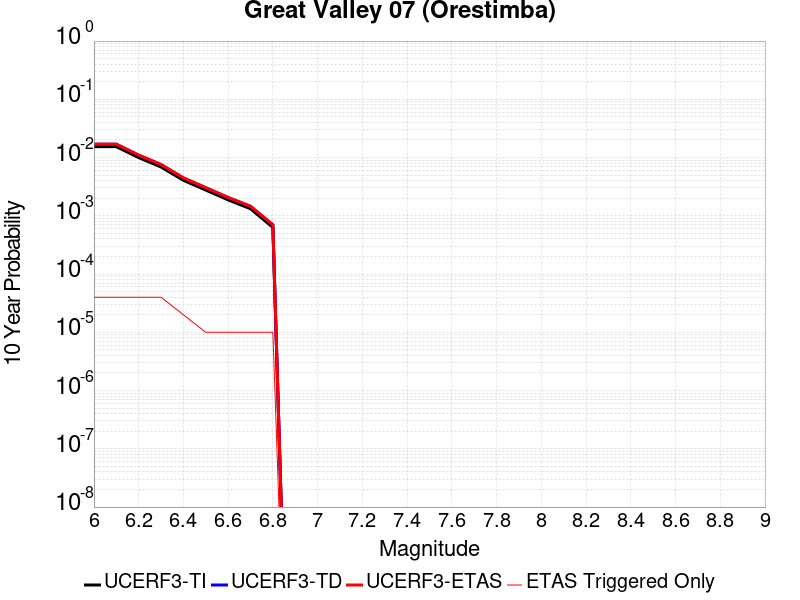 |

| Magnitude | 1 wk TI Prob | 1 wk TD Prob | 1 wk ETAS Prob | 1 wk ETAS/TD Gain | 1 wk ETAS Triggered Only | 1 mo TI Prob | 1 mo TD Prob | 1 mo ETAS Prob | 1 mo ETAS/TD Gain | 1 mo ETAS Triggered Only | 1 yr TI Prob | 1 yr TD Prob | 1 yr ETAS Prob | 1 yr ETAS/TD Gain | 1 yr ETAS Triggered Only | 10 yr TI Prob | 10 yr TD Prob | 10 yr ETAS Prob | 10 yr ETAS/TD Gain | 10 yr ETAS Triggered Only |
|-----|-----|-----|-----|-----|-----|-----|-----|-----|-----|-----|-----|-----|-----|-----|-----|-----|-----|-----|-----|-----|
| 6.0 | 2.9687902E-5 | 3.27575E-5 | 3.27575E-5 | 1.0 | 0.0 | 1.2722766E-4 | 1.4038214E-4 | 1.6037932E-4 | 1.1424483 | 2.0E-5 | 0.0015478961 | 0.0017078844 | 0.0017378331 | 1.0175356 | 3.0E-5 | 0.015371585 | 0.016955135 | 0.016994458 | 1.0023192 | 4.0E-5 |
| 6.1 | 2.9687902E-5 | 3.27575E-5 | 3.27575E-5 | 1.0 | 0.0 | 1.2722766E-4 | 1.4038214E-4 | 1.6037932E-4 | 1.1424483 | 2.0E-5 | 0.0015478961 | 0.0017078844 | 0.0017378331 | 1.0175356 | 3.0E-5 | 0.015371585 | 0.016955135 | 0.016994458 | 1.0023192 | 4.0E-5 |
| 6.2 | 1.9231524E-5 | 2.1159167E-5 | 2.1159167E-5 | 1.0 | 0.0 | 8.2418206E-5 | 9.067912E-5 | 1.10677305E-4 | 1.2205379 | 2.0E-5 | 0.0010029797 | 0.0011034822 | 0.0011334491 | 1.0271567 | 3.0E-5 | 0.00998465 | 0.010982441 | 0.011022001 | 1.0036021 | 4.0E-5 |
| 6.3 | 1.324766E-5 | 1.4548534E-5 | 1.4548534E-5 | 1.0 | 0.0 | 5.6774446E-5 | 6.234942E-5 | 8.2348175E-5 | 1.3207529 | 2.0E-5 | 6.910097E-4 | 7.5884897E-4 | 7.888262E-4 | 1.0395036 | 3.0E-5 | 0.006888649 | 0.0075635235 | 0.007603221 | 1.0052485 | 4.0E-5 |
| 6.4 | 7.818645E-6 | 8.57284E-6 | 8.57284E-6 | 1.0 | 0.0 | 3.3508048E-5 | 3.6740246E-5 | 4.673988E-5 | 1.2721711 | 1.0E-5 | 4.078841E-4 | 4.4722404E-4 | 4.6721508E-4 | 1.0447003 | 2.0E-5 | 0.004071363 | 0.0044635804 | 0.004483491 | 1.0044607 | 2.0E-5 |
| 6.5 | 5.3076565E-6 | 5.8178007E-6 | 5.8178007E-6 | 1.0 | 0.0 | 2.27469E-5 | 2.4933206E-5 | 3.4932957E-5 | 1.4010615 | 1.0E-5 | 2.7690834E-4 | 3.035216E-4 | 3.1351857E-4 | 1.0329366 | 1.0E-5 | 0.0027656353 | 0.00303128 | 0.0030412497 | 1.003289 | 1.0E-5 |
| 6.6 | 3.6003578E-6 | 3.9484953E-6 | 3.9484953E-6 | 1.0 | 0.0 | 1.5430012E-5 | 1.6922022E-5 | 2.6921853E-5 | 1.590936 | 1.0E-5 | 1.8784421E-4 | 2.0600771E-4 | 2.1600565E-4 | 1.0485319 | 1.0E-5 | 0.0018768552 | 0.0020583214 | 0.0020683007 | 1.0048484 | 1.0E-5 |
| 6.7 | 2.5361826E-6 | 2.7834678E-6 | 2.7834678E-6 | 1.0 | 0.0 | 1.0869308E-5 | 1.1929101E-5 | 2.1928981E-5 | 1.8382761 | 1.0E-5 | 1.3232579E-4 | 1.4522845E-4 | 1.55227E-4 | 1.0688471 | 1.0E-5 | 0.0013224703 | 0.0014514653 | 0.0014614508 | 1.0068796 | 1.0E-5 |
| 6.8 | 1.2115831E-6 | 1.3313797E-6 | 1.3313797E-6 | 1.0 | 0.0 | 5.1924885E-6 | 5.7059065E-6 | 1.570585E-5 | 2.75256 | 1.0E-5 | 6.3216714E-5 | 6.9468166E-5 | 7.946747E-5 | 1.1439408 | 1.0E-5 | 6.3198735E-4 | 6.945596E-4 | 7.045527E-4 | 1.0143876 | 1.0E-5 |

## Emerson-Copper Mtn 2011
*[(top)](#table-of-contents)*

| 1 Week | 1 Month | 1 Year | 10 Year |
|-----|-----|-----|-----|
|  |  |  |  |

| Magnitude | 1 wk TI Prob | 1 wk TD Prob | 1 wk ETAS Prob | 1 wk ETAS/TD Gain | 1 wk ETAS Triggered Only | 1 mo TI Prob | 1 mo TD Prob | 1 mo ETAS Prob | 1 mo ETAS/TD Gain | 1 mo ETAS Triggered Only | 1 yr TI Prob | 1 yr TD Prob | 1 yr ETAS Prob | 1 yr ETAS/TD Gain | 1 yr ETAS Triggered Only | 10 yr TI Prob | 10 yr TD Prob | 10 yr ETAS Prob | 10 yr ETAS/TD Gain | 10 yr ETAS Triggered Only |
|-----|-----|-----|-----|-----|-----|-----|-----|-----|-----|-----|-----|-----|-----|-----|-----|-----|-----|-----|-----|-----|
| 6.0 | 2.1364202E-5 | 9.967999E-6 | 9.967999E-6 | 1.0 | 0.0 | 9.1557646E-5 | 4.2719344E-5 | 4.2719344E-5 | 1.0 | 0.0 | 0.0011141442 | 5.1999267E-4 | 5.2998745E-4 | 1.0192211 | 1.0E-5 | 0.011085749 | 0.0051886286 | 0.005218473 | 1.0057518 | 3.0E-5 |
| 6.1 | 2.1364202E-5 | 9.967999E-6 | 9.967999E-6 | 1.0 | 0.0 | 9.1557646E-5 | 4.2719344E-5 | 4.2719344E-5 | 1.0 | 0.0 | 0.0011141442 | 5.1999267E-4 | 5.2998745E-4 | 1.0192211 | 1.0E-5 | 0.011085749 | 0.0051886286 | 0.005218473 | 1.0057518 | 3.0E-5 |
| 6.2 | 2.1364202E-5 | 9.967999E-6 | 9.967999E-6 | 1.0 | 0.0 | 9.1557646E-5 | 4.2719344E-5 | 4.2719344E-5 | 1.0 | 0.0 | 0.0011141442 | 5.1999267E-4 | 5.2998745E-4 | 1.0192211 | 1.0E-5 | 0.011085749 | 0.0051886286 | 0.005218473 | 1.0057518 | 3.0E-5 |
| 6.3 | 1.7751237E-5 | 8.089109E-6 | 8.089109E-6 | 1.0 | 0.0 | 7.607452E-5 | 3.4667184E-5 | 3.4667184E-5 | 1.0 | 0.0 | 9.258136E-4 | 4.2199748E-4 | 4.3199325E-4 | 1.0236868 | 1.0E-5 | 0.00921966 | 0.004212584 | 0.0042424574 | 1.0070915 | 3.0E-5 |
| 6.4 | 1.7751237E-5 | 8.089109E-6 | 8.089109E-6 | 1.0 | 0.0 | 7.607452E-5 | 3.4667184E-5 | 3.4667184E-5 | 1.0 | 0.0 | 9.258136E-4 | 4.2199748E-4 | 4.3199325E-4 | 1.0236868 | 1.0E-5 | 0.00921966 | 0.004212584 | 0.0042424574 | 1.0070915 | 3.0E-5 |
| 6.5 | 1.5886664E-5 | 6.6037437E-6 | 6.6037437E-6 | 1.0 | 0.0 | 6.808392E-5 | 2.830148E-5 | 2.830148E-5 | 1.0 | 0.0 | 8.286065E-4 | 3.4452073E-4 | 3.5451728E-4 | 1.0290158 | 1.0E-5 | 0.008255237 | 0.0034403303 | 0.0034602615 | 1.0057935 | 2.0E-5 |
| 6.6 | 1.5886664E-5 | 6.6037437E-6 | 6.6037437E-6 | 1.0 | 0.0 | 6.808392E-5 | 2.830148E-5 | 2.830148E-5 | 1.0 | 0.0 | 8.286065E-4 | 3.4452073E-4 | 3.5451728E-4 | 1.0290158 | 1.0E-5 | 0.008255237 | 0.0034403303 | 0.0034602615 | 1.0057935 | 2.0E-5 |
| 6.7 | 1.428471E-5 | 5.4703055E-6 | 5.4703055E-6 | 1.0 | 0.0 | 6.121875E-5 | 2.3443978E-5 | 2.3443978E-5 | 1.0 | 0.0 | 7.450834E-4 | 2.8539696E-4 | 2.9539413E-4 | 1.0350289 | 1.0E-5 | 0.007425902 | 0.0028506925 | 0.0028706356 | 1.0069958 | 2.0E-5 |
| 6.8 | 1.3490684E-5 | 5.0735894E-6 | 5.0735894E-6 | 1.0 | 0.0 | 5.7815934E-5 | 2.1743796E-5 | 2.1743796E-5 | 1.0 | 0.0 | 7.0368167E-4 | 2.6470242E-4 | 2.7469976E-4 | 1.0377682 | 1.0E-5 | 0.007014576 | 0.002644252 | 0.002664199 | 1.0075436 | 2.0E-5 |
| 6.9 | 1.2235421E-5 | 4.289545E-6 | 4.289545E-6 | 1.0 | 0.0 | 5.2436466E-5 | 1.8383655E-5 | 1.8383655E-5 | 1.0 | 0.0 | 6.38227E-4 | 2.238016E-4 | 2.238016E-4 | 1.0 | 0.0 | 0.0063639707 | 0.0022361164 | 0.0022460942 | 1.004462 | 1.0E-5 |
| 7.0 | 1.1009851E-5 | 3.7188345E-6 | 3.7188345E-6 | 1.0 | 0.0 | 4.7184225E-5 | 1.5937783E-5 | 1.5937783E-5 | 1.0 | 0.0 | 5.743165E-4 | 1.9402867E-4 | 1.9402867E-4 | 1.0 | 0.0 | 0.005728345 | 0.0019389305 | 0.0019489111 | 1.0051475 | 1.0E-5 |
| 7.1 | 9.726373E-6 | 3.2115693E-6 | 3.2115693E-6 | 1.0 | 0.0 | 4.168379E-5 | 1.3763814E-5 | 1.3763814E-5 | 1.0 | 0.0 | 5.07382E-4 | 1.6756494E-4 | 1.6756494E-4 | 1.0 | 0.0 | 0.0050622504 | 0.0016747171 | 0.0016847003 | 1.0059612 | 1.0E-5 |
| 7.2 | 3.9335127E-6 | 1.1524114E-6 | 1.1524114E-6 | 1.0 | 0.0 | 1.6857803E-5 | 4.9388973E-6 | 4.9388973E-6 | 1.0 | 0.0 | 2.0522442E-4 | 6.0129474E-5 | 6.0129474E-5 | 1.0 | 0.0 | 0.00205035 | 6.01138E-4 | 6.11132E-4 | 1.0166252 | 1.0E-5 |
| 7.3 | 2.661632E-6 | 6.91098E-7 | 6.91098E-7 | 1.0 | 0.0 | 1.14069435E-5 | 2.9618452E-6 | 2.9618452E-6 | 1.0 | 0.0 | 1.3887069E-4 | 3.605988E-5 | 3.605988E-5 | 1.0 | 0.0 | 0.0013878393 | 3.6054134E-4 | 3.7053772E-4 | 1.027726 | 1.0E-5 |
| 7.4 | 2.0893426E-6 | 5.4614605E-7 | 5.4614605E-7 | 1.0 | 0.0 | 8.954295E-6 | 2.340624E-6 | 2.340624E-6 | 1.0 | 0.0 | 1.0901308E-4 | 2.8496728E-5 | 2.8496728E-5 | 1.0 | 0.0 | 0.0010895962 | 2.849313E-4 | 2.9492844E-4 | 1.0350862 | 1.0E-5 |
| 7.5 | 1.1681728E-6 | 3.6028484E-7 | 3.6028484E-7 | 1.0 | 0.0 | 5.0064455E-6 | 1.544077E-6 | 1.544077E-6 | 1.0 | 0.0 | 6.0951766E-5 | 1.879898E-5 | 1.879898E-5 | 1.0 | 0.0 | 6.093505E-4 | 1.8797436E-4 | 1.9797249E-4 | 1.0531888 | 1.0E-5 |
| 7.6 | 1.3154387E-7 | 7.1196716E-8 | 7.1196716E-8 | 1.0 | 0.0 | 5.6375933E-7 | 3.0512876E-7 | 3.0512876E-7 | 1.0 | 0.0 | 6.863748E-6 | 3.714938E-6 | 3.714938E-6 | 1.0 | 0.0 | 6.863536E-5 | 3.7148915E-5 | 4.7148544E-5 | 1.2691768 | 1.0E-5 |

## South Klamath Lake West
*[(top)](#table-of-contents)*

| 1 Week | 1 Month | 1 Year | 10 Year |
|-----|-----|-----|-----|
|  | 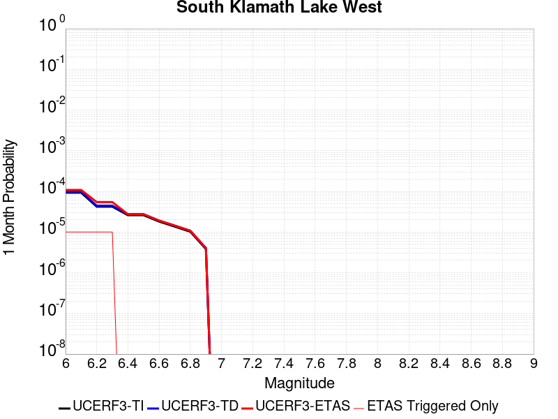 |  |  |

| Magnitude | 1 wk TI Prob | 1 wk TD Prob | 1 wk ETAS Prob | 1 wk ETAS/TD Gain | 1 wk ETAS Triggered Only | 1 mo TI Prob | 1 mo TD Prob | 1 mo ETAS Prob | 1 mo ETAS/TD Gain | 1 mo ETAS Triggered Only | 1 yr TI Prob | 1 yr TD Prob | 1 yr ETAS Prob | 1 yr ETAS/TD Gain | 1 yr ETAS Triggered Only | 10 yr TI Prob | 10 yr TD Prob | 10 yr ETAS Prob | 10 yr ETAS/TD Gain | 10 yr ETAS Triggered Only |
|-----|-----|-----|-----|-----|-----|-----|-----|-----|-----|-----|-----|-----|-----|-----|-----|-----|-----|-----|-----|-----|
| 6.0 | 2.174025E-5 | 2.3042025E-5 | 2.3042025E-5 | 1.0 | 0.0 | 9.3169176E-5 | 9.874817E-5 | 1.0874718E-4 | 1.1012577 | 1.0E-5 | 0.0011337444 | 0.0012016617 | 0.0012116497 | 1.0083119 | 1.0E-5 | 0.011279777 | 0.0119582405 | 0.011978001 | 1.0016525 | 2.0E-5 |
| 6.1 | 2.174025E-5 | 2.3042025E-5 | 2.3042025E-5 | 1.0 | 0.0 | 9.3169176E-5 | 9.874817E-5 | 1.0874718E-4 | 1.1012577 | 1.0E-5 | 0.0011337444 | 0.0012016617 | 0.0012116497 | 1.0083119 | 1.0E-5 | 0.011279777 | 0.0119582405 | 0.011978001 | 1.0016525 | 2.0E-5 |
| 6.2 | 9.834929E-6 | 1.0393841E-5 | 1.0393841E-5 | 1.0 | 0.0 | 4.2149015E-5 | 4.4544326E-5 | 5.4543878E-5 | 1.2244855 | 1.0E-5 | 5.1304343E-4 | 5.422012E-4 | 5.521958E-4 | 1.0184333 | 1.0E-5 | 0.0051186057 | 0.0054096854 | 0.005429577 | 1.0036771 | 2.0E-5 |
| 6.3 | 9.834929E-6 | 1.0393841E-5 | 1.0393841E-5 | 1.0 | 0.0 | 4.2149015E-5 | 4.4544326E-5 | 5.4543878E-5 | 1.2244855 | 1.0E-5 | 5.1304343E-4 | 5.422012E-4 | 5.521958E-4 | 1.0184333 | 1.0E-5 | 0.0051186057 | 0.0054096854 | 0.005429577 | 1.0036771 | 2.0E-5 |
| 6.4 | 6.066321E-6 | 6.40043E-6 | 6.40043E-6 | 1.0 | 0.0 | 2.5998259E-5 | 2.743014E-5 | 2.743014E-5 | 1.0 | 0.0 | 3.1648282E-4 | 3.3391351E-4 | 3.3391351E-4 | 1.0 | 0.0 | 0.0031603249 | 0.0033343881 | 0.0033443547 | 1.002989 | 1.0E-5 |
| 6.5 | 6.066321E-6 | 6.40043E-6 | 6.40043E-6 | 1.0 | 0.0 | 2.5998259E-5 | 2.743014E-5 | 2.743014E-5 | 1.0 | 0.0 | 3.1648282E-4 | 3.3391351E-4 | 3.3391351E-4 | 1.0 | 0.0 | 0.0031603249 | 0.0033343881 | 0.0033443547 | 1.002989 | 1.0E-5 |
| 6.6 | 4.2321803E-6 | 4.461291E-6 | 4.461291E-6 | 1.0 | 0.0 | 1.8137789E-5 | 1.9119685E-5 | 1.9119685E-5 | 1.0 | 0.0 | 2.208052E-4 | 2.3275832E-4 | 2.3275832E-4 | 1.0 | 0.0 | 0.0022058594 | 0.0023252473 | 0.002335224 | 1.0042906 | 1.0E-5 |
| 6.7 | 3.186646E-6 | 3.360305E-6 | 3.360305E-6 | 1.0 | 0.0 | 1.3656982E-5 | 1.4401232E-5 | 1.4401232E-5 | 1.0 | 0.0 | 1.6626107E-4 | 1.7532158E-4 | 1.7532158E-4 | 1.0 | 0.0 | 0.0016613674 | 0.0017518997 | 0.0017518997 | 1.0 | 0.0 |
| 6.8 | 2.380121E-6 | 2.510907E-6 | 2.510907E-6 | 1.0 | 0.0 | 1.0200479E-5 | 1.07609885E-5 | 1.07609885E-5 | 1.0 | 0.0 | 1.2418375E-4 | 1.3100762E-4 | 1.3100762E-4 | 1.0 | 0.0 | 0.0012411437 | 0.0013093497 | 0.0013093497 | 1.0 | 0.0 |
| 6.9 | 8.928287E-7 | 9.4302504E-7 | 9.4302504E-7 | 1.0 | 0.0 | 3.826403E-6 | 4.0415307E-6 | 4.0415307E-6 | 1.0 | 0.0 | 4.658546E-5 | 4.9204747E-5 | 4.9204747E-5 | 1.0 | 0.0 | 4.6575698E-4 | 4.9196015E-4 | 4.9196015E-4 | 1.0 | 0.0 |

## Los Osos 2011
*[(top)](#table-of-contents)*

| 1 Week | 1 Month | 1 Year | 10 Year |
|-----|-----|-----|-----|
| 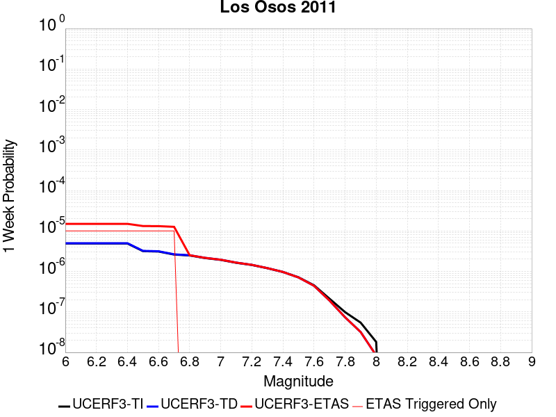 | 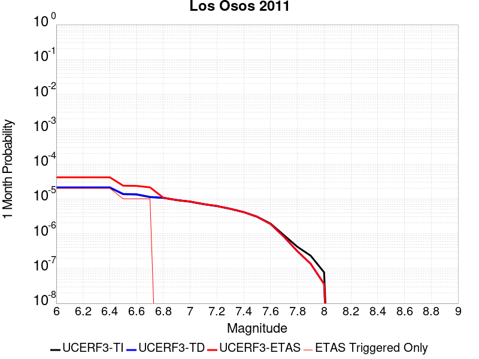 |  |  |

| Magnitude | 1 wk TI Prob | 1 wk TD Prob | 1 wk ETAS Prob | 1 wk ETAS/TD Gain | 1 wk ETAS Triggered Only | 1 mo TI Prob | 1 mo TD Prob | 1 mo ETAS Prob | 1 mo ETAS/TD Gain | 1 mo ETAS Triggered Only | 1 yr TI Prob | 1 yr TD Prob | 1 yr ETAS Prob | 1 yr ETAS/TD Gain | 1 yr ETAS Triggered Only | 10 yr TI Prob | 10 yr TD Prob | 10 yr ETAS Prob | 10 yr ETAS/TD Gain | 10 yr ETAS Triggered Only |
|-----|-----|-----|-----|-----|-----|-----|-----|-----|-----|-----|-----|-----|-----|-----|-----|-----|-----|-----|-----|-----|
| 6.0 | 4.8871775E-6 | 4.9814826E-6 | 1.4981433E-5 | 3.0074244 | 1.0E-5 | 2.0944879E-5 | 2.1349053E-5 | 4.1348627E-5 | 1.9367898 | 2.0E-5 | 2.5497406E-4 | 2.598965E-4 | 2.898887E-4 | 1.1154006 | 3.0E-5 | 0.002546817 | 0.0025962 | 0.0026261222 | 1.0115254 | 3.0E-5 |
| 6.1 | 4.8871775E-6 | 4.9814826E-6 | 1.4981433E-5 | 3.0074244 | 1.0E-5 | 2.0944879E-5 | 2.1349053E-5 | 4.1348627E-5 | 1.9367898 | 2.0E-5 | 2.5497406E-4 | 2.598965E-4 | 2.898887E-4 | 1.1154006 | 3.0E-5 | 0.002546817 | 0.0025962 | 0.0026261222 | 1.0115254 | 3.0E-5 |
| 6.2 | 4.8871775E-6 | 4.9814826E-6 | 1.4981433E-5 | 3.0074244 | 1.0E-5 | 2.0944879E-5 | 2.1349053E-5 | 4.1348627E-5 | 1.9367898 | 2.0E-5 | 2.5497406E-4 | 2.598965E-4 | 2.898887E-4 | 1.1154006 | 3.0E-5 | 0.002546817 | 0.0025962 | 0.0026261222 | 1.0115254 | 3.0E-5 |
| 6.3 | 4.8871775E-6 | 4.9814826E-6 | 1.4981433E-5 | 3.0074244 | 1.0E-5 | 2.0944879E-5 | 2.1349053E-5 | 4.1348627E-5 | 1.9367898 | 2.0E-5 | 2.5497406E-4 | 2.598965E-4 | 2.898887E-4 | 1.1154006 | 3.0E-5 | 0.002546817 | 0.0025962 | 0.0026261222 | 1.0115254 | 3.0E-5 |
| 6.4 | 4.8871775E-6 | 4.9814826E-6 | 1.4981433E-5 | 3.0074244 | 1.0E-5 | 2.0944879E-5 | 2.1349053E-5 | 4.1348627E-5 | 1.9367898 | 2.0E-5 | 2.5497406E-4 | 2.598965E-4 | 2.898887E-4 | 1.1154006 | 3.0E-5 | 0.002546817 | 0.0025962 | 0.0026261222 | 1.0115254 | 3.0E-5 |
| 6.5 | 3.1724062E-6 | 3.2233943E-6 | 1.3223362E-5 | 4.1023097 | 1.0E-5 | 1.3595956E-5 | 1.3814474E-5 | 2.3814337E-5 | 1.7238684 | 1.0E-5 | 1.6551818E-4 | 1.6817838E-4 | 1.8817502E-4 | 1.1189014 | 2.0E-5 | 0.0016539496 | 0.0016805246 | 0.001700491 | 1.011881 | 2.0E-5 |
| 6.6 | 3.1022591E-6 | 3.1511038E-6 | 1.3151072E-5 | 4.173481 | 1.0E-5 | 1.3295328E-5 | 1.3504661E-5 | 2.3504526E-5 | 1.740475 | 1.0E-5 | 1.618586E-4 | 1.6440697E-4 | 1.8440369E-4 | 1.1216294 | 2.0E-5 | 0.0016174077 | 0.0016428662 | 0.0016628334 | 1.0121539 | 2.0E-5 |
| 6.7 | 2.611518E-6 | 2.6491825E-6 | 1.2649156E-5 | 4.7747393 | 1.0E-5 | 1.1192172E-5 | 1.1353591E-5 | 2.1353477E-5 | 1.8807687 | 1.0E-5 | 1.3625617E-4 | 1.3822124E-4 | 1.5821848E-4 | 1.1446756 | 2.0E-5 | 0.0013617266 | 0.0013813572 | 0.0014013295 | 1.0144585 | 2.0E-5 |
| 6.8 | 2.4780884E-6 | 2.5121587E-6 | 2.5121587E-6 | 1.0 | 0.0 | 1.0620336E-5 | 1.076635E-5 | 1.076635E-5 | 1.0 | 0.0 | 1.2929492E-4 | 1.3107246E-4 | 1.4107116E-4 | 1.0762837 | 1.0E-5 | 0.0012921972 | 0.0013099556 | 0.0013199425 | 1.0076238 | 1.0E-5 |
| 6.9 | 2.1376322E-6 | 2.1635049E-6 | 2.1635049E-6 | 1.0 | 0.0 | 9.161248E-6 | 9.272131E-6 | 9.272131E-6 | 1.0 | 0.0 | 1.1153249E-4 | 1.1288237E-4 | 1.2288123E-4 | 1.0885777 | 1.0E-5 | 0.0011147653 | 0.0011282521 | 0.0011382409 | 1.0088533 | 1.0E-5 |
| 7.0 | 1.9282882E-6 | 1.949458E-6 | 1.949458E-6 | 1.0 | 0.0 | 8.264066E-6 | 8.354793E-6 | 8.354793E-6 | 1.0 | 0.0 | 1.0061036E-4 | 1.0171487E-4 | 1.1171385E-4 | 1.098304 | 1.0E-5 | 0.0010056482 | 0.0010166845 | 0.0010266743 | 1.009826 | 1.0E-5 |
| 7.1 | 1.6353226E-6 | 1.6501111E-6 | 1.6501111E-6 | 1.0 | 0.0 | 7.0085066E-6 | 7.0718856E-6 | 7.0718856E-6 | 1.0 | 0.0 | 8.532523E-5 | 8.6096814E-5 | 9.609595E-5 | 1.1161383 | 1.0E-5 | 8.529247E-4 | 8.6063537E-4 | 8.7062677E-4 | 1.0116093 | 1.0E-5 |
| 7.2 | 1.4446276E-6 | 1.4553335E-6 | 1.4553335E-6 | 1.0 | 0.0 | 6.191247E-6 | 6.2371287E-6 | 6.2371287E-6 | 1.0 | 0.0 | 7.537582E-5 | 7.59344E-5 | 8.5933636E-5 | 1.1316826 | 1.0E-5 | 7.535026E-4 | 7.590851E-4 | 7.690775E-4 | 1.0131638 | 1.0E-5 |
| 7.3 | 1.2014582E-6 | 1.2069066E-6 | 1.2069066E-6 | 1.0 | 0.0 | 5.149096E-6 | 5.172447E-6 | 5.172447E-6 | 1.0 | 0.0 | 6.268844E-5 | 6.297272E-5 | 7.297209E-5 | 1.1587889 | 1.0E-5 | 6.267076E-4 | 6.295492E-4 | 6.395429E-4 | 1.0158744 | 1.0E-5 |
| 7.4 | 9.707733E-7 | 9.709767E-7 | 9.709767E-7 | 1.0 | 0.0 | 4.16045E-6 | 4.161322E-6 | 4.161322E-6 | 1.0 | 0.0 | 5.0652303E-5 | 5.066292E-5 | 6.0662413E-5 | 1.197373 | 1.0E-5 | 5.064076E-4 | 5.065139E-4 | 5.165089E-4 | 1.0197328 | 1.0E-5 |
| 7.5 | 7.174908E-7 | 7.114907E-7 | 7.114907E-7 | 1.0 | 0.0 | 3.074957E-6 | 3.0492424E-6 | 3.0492424E-6 | 1.0 | 0.0 | 3.743696E-5 | 3.7123897E-5 | 4.7123525E-5 | 1.2693583 | 1.0E-5 | 3.7430652E-4 | 3.7117713E-4 | 3.811734E-4 | 1.0269313 | 1.0E-5 |
| 7.6 | 4.5535776E-7 | 4.4207857E-7 | 4.4207857E-7 | 1.0 | 0.0 | 1.9515319E-6 | 1.8946212E-6 | 1.8946212E-6 | 1.0 | 0.0 | 2.3759641E-5 | 2.3066768E-5 | 2.3066768E-5 | 1.0 | 0.0 | 2.37571E-4 | 2.3064384E-4 | 2.3064384E-4 | 1.0 | 0.0 |
| 7.7 | 2.1173553E-7 | 1.9060734E-7 | 1.9060734E-7 | 1.0 | 0.0 | 9.0743765E-7 | 8.1688836E-7 | 8.1688836E-7 | 1.0 | 0.0 | 1.1047998E-5 | 9.94557E-6 | 9.94557E-6 | 1.0 | 0.0 | 1.1047449E-4 | 9.945128E-5 | 9.945128E-5 | 1.0 | 0.0 |
| 7.8 | 9.873608E-8 | 7.367457E-8 | 7.367457E-8 | 1.0 | 0.0 | 4.2315455E-7 | 3.1574814E-7 | 3.1574814E-7 | 1.0 | 0.0 | 5.1518946E-6 | 3.8442267E-6 | 3.8442267E-6 | 1.0 | 0.0 | 5.1517753E-5 | 3.844161E-5 | 3.844161E-5 | 1.0 | 0.0 |
| 7.9 | 5.4399106E-8 | 3.187941E-8 | 3.187941E-8 | 1.0 | 0.0 | 2.33139E-7 | 1.3662603E-7 | 1.3662603E-7 | 1.0 | 0.0 | 2.8384638E-6 | 1.6634207E-6 | 1.6634207E-6 | 1.0 | 0.0 | 2.8384275E-5 | 1.6634083E-5 | 1.6634083E-5 | 1.0 | 0.0 |
| 8.0 | 1.817203E-8 | 8.420079E-9 | 8.420079E-9 | 1.0 | 0.0 | 7.7880124E-8 | 3.6086053E-8 | 3.6086053E-8 | 1.0 | 0.0 | 9.481901E-7 | 4.393476E-7 | 4.393476E-7 | 1.0 | 0.0 | 9.481861E-6 | 4.393468E-6 | 4.393468E-6 | 1.0 | 0.0 |

## Laguna Salada
*[(top)](#table-of-contents)*

| 1 Week | 1 Month | 1 Year | 10 Year |
|-----|-----|-----|-----|
|  | 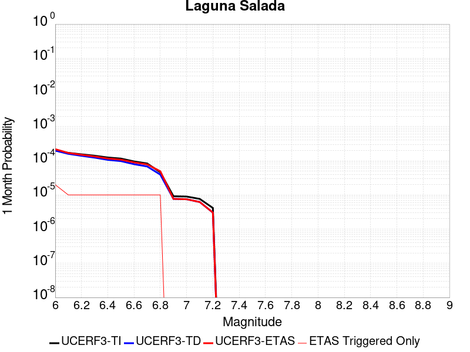 |  |  |

| Magnitude | 1 wk TI Prob | 1 wk TD Prob | 1 wk ETAS Prob | 1 wk ETAS/TD Gain | 1 wk ETAS Triggered Only | 1 mo TI Prob | 1 mo TD Prob | 1 mo ETAS Prob | 1 mo ETAS/TD Gain | 1 mo ETAS Triggered Only | 1 yr TI Prob | 1 yr TD Prob | 1 yr ETAS Prob | 1 yr ETAS/TD Gain | 1 yr ETAS Triggered Only | 10 yr TI Prob | 10 yr TD Prob | 10 yr ETAS Prob | 10 yr ETAS/TD Gain | 10 yr ETAS Triggered Only |
|-----|-----|-----|-----|-----|-----|-----|-----|-----|-----|-----|-----|-----|-----|-----|-----|-----|-----|-----|-----|-----|
| 6.0 | 4.6465593E-5 | 4.634507E-5 | 4.634507E-5 | 1.0 | 0.0 | 1.9912305E-4 | 1.9860751E-4 | 2.1860354E-4 | 1.1006812 | 2.0E-5 | 0.0024216278 | 0.0024154421 | 0.0024353939 | 1.00826 | 2.0E-5 | 0.02395408 | 0.023965387 | 0.023994667 | 1.0012218 | 3.0E-5 |
| 6.1 | 3.982297E-5 | 3.7244878E-5 | 3.7244878E-5 | 1.0 | 0.0 | 1.706587E-4 | 1.5961178E-4 | 1.6961018E-4 | 1.062642 | 1.0E-5 | 0.0020757897 | 0.0019416384 | 0.001951619 | 1.0051403 | 1.0E-5 | 0.020565065 | 0.019322045 | 0.019341659 | 1.0010151 | 2.0E-5 |
| 6.2 | 3.6067784E-5 | 3.2600165E-5 | 3.2600165E-5 | 1.0 | 0.0 | 1.5456705E-4 | 1.3970808E-4 | 1.4970668E-4 | 1.0715678 | 1.0E-5 | 0.0018802295 | 0.0016997134 | 0.0017096964 | 1.0058733 | 1.0E-5 | 0.018644003 | 0.016963193 | 0.016982853 | 1.0011591 | 2.0E-5 |
| 6.3 | 3.2859112E-5 | 2.8847233E-5 | 2.8847233E-5 | 1.0 | 0.0 | 1.4081717E-4 | 1.2362566E-4 | 1.3362443E-4 | 1.0808793 | 1.0E-5 | 0.0017131006 | 0.0015041964 | 0.0015141814 | 1.006638 | 1.0E-5 | 0.016999546 | 0.015031838 | 0.015051537 | 1.0013105 | 2.0E-5 |
| 6.4 | 2.9132116E-5 | 2.4851877E-5 | 2.4851877E-5 | 1.0 | 0.0 | 1.2484594E-4 | 1.0650421E-4 | 1.1650314E-4 | 1.093883 | 1.0E-5 | 0.0015189396 | 0.001296006 | 0.0013059931 | 1.007706 | 1.0E-5 | 0.015085992 | 0.012965128 | 0.012984869 | 1.0015225 | 2.0E-5 |
| 6.5 | 2.7075037E-5 | 2.2824677E-5 | 2.2824677E-5 | 1.0 | 0.0 | 1.1603071E-4 | 9.7816875E-5 | 1.078159E-4 | 1.1022218 | 1.0E-5 | 0.0014117584 | 0.0011903581 | 0.0012003462 | 1.0083908 | 1.0E-5 | 0.014028233 | 0.011916272 | 0.011926153 | 1.0008292 | 1.0E-5 |
| 6.6 | 2.2367465E-5 | 1.8572848E-5 | 1.8572848E-5 | 1.0 | 0.0 | 9.5857045E-5 | 7.959595E-5 | 8.959515E-5 | 1.1256245 | 1.0E-5 | 0.0011664346 | 9.687322E-4 | 9.787225E-4 | 1.0103128 | 1.0E-5 | 0.011603311 | 0.009708806 | 0.00971871 | 1.00102 | 1.0E-5 |
| 6.7 | 1.9458053E-5 | 1.5913607E-5 | 1.5913607E-5 | 1.0 | 0.0 | 8.338899E-5 | 6.819984E-5 | 7.819916E-5 | 1.1466179 | 1.0E-5 | 0.001014788 | 8.300971E-4 | 8.400888E-4 | 1.0120368 | 1.0E-5 | 0.010101665 | 0.008315945 | 0.008325862 | 1.0011925 | 1.0E-5 |
| 6.8 | 1.0767866E-5 | 9.183346E-6 | 9.183346E-6 | 1.0 | 0.0 | 4.614718E-5 | 3.9356994E-5 | 4.93566E-5 | 1.2540745 | 1.0E-5 | 5.6169706E-4 | 4.7913467E-4 | 4.8912986E-4 | 1.0208609 | 1.0E-5 | 0.0056027942 | 0.0048085325 | 0.004818484 | 1.0020696 | 1.0E-5 |
| 6.9 | 2.1384765E-6 | 1.7913964E-6 | 1.7913964E-6 | 1.0 | 0.0 | 9.164866E-6 | 7.677392E-6 | 7.677392E-6 | 1.0 | 0.0 | 1.1157654E-4 | 9.346863E-5 | 9.346863E-5 | 1.0 | 0.0 | 0.0011152053 | 9.343315E-4 | 9.343315E-4 | 1.0 | 0.0 |
| 7.0 | 2.0952946E-6 | 1.7493335E-6 | 1.7493335E-6 | 1.0 | 0.0 | 8.979802E-6 | 7.497124E-6 | 7.497124E-6 | 1.0 | 0.0 | 1.0932361E-4 | 9.127405E-5 | 9.127405E-5 | 1.0 | 0.0 | 0.0010926984 | 9.124038E-4 | 9.124038E-4 | 1.0 | 0.0 |
| 7.1 | 1.7887576E-6 | 1.4500541E-6 | 1.4500541E-6 | 1.0 | 0.0 | 7.666081E-6 | 6.2145045E-6 | 6.2145045E-6 | 1.0 | 0.0 | 9.333054E-5 | 7.565928E-5 | 7.565928E-5 | 1.0 | 0.0 | 9.329135E-4 | 7.5636554E-4 | 7.5636554E-4 | 1.0 | 0.0 |
| 7.2 | 9.723109E-7 | 7.135829E-7 | 7.135829E-7 | 1.0 | 0.0 | 4.16704E-6 | 3.0582096E-6 | 3.0582096E-6 | 1.0 | 0.0 | 5.073253E-5 | 3.7233232E-5 | 3.7233232E-5 | 1.0 | 0.0 | 5.072095E-4 | 3.722862E-4 | 3.722862E-4 | 1.0 | 0.0 |

## Great Valley 09 (Laguna Seca)
*[(top)](#table-of-contents)*

| 1 Week | 1 Month | 1 Year | 10 Year |
|-----|-----|-----|-----|
|  |  | 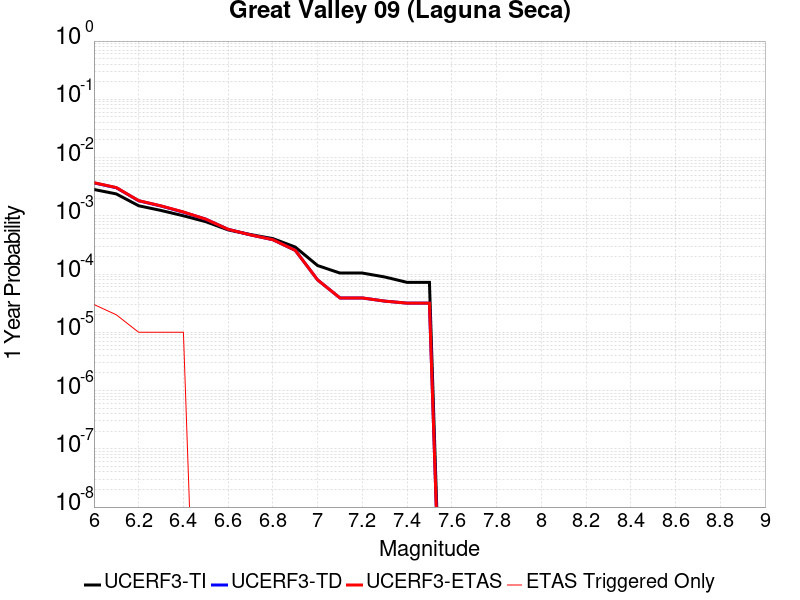 |  |

| Magnitude | 1 wk TI Prob | 1 wk TD Prob | 1 wk ETAS Prob | 1 wk ETAS/TD Gain | 1 wk ETAS Triggered Only | 1 mo TI Prob | 1 mo TD Prob | 1 mo ETAS Prob | 1 mo ETAS/TD Gain | 1 mo ETAS Triggered Only | 1 yr TI Prob | 1 yr TD Prob | 1 yr ETAS Prob | 1 yr ETAS/TD Gain | 1 yr ETAS Triggered Only | 10 yr TI Prob | 10 yr TD Prob | 10 yr ETAS Prob | 10 yr ETAS/TD Gain | 10 yr ETAS Triggered Only |
|-----|-----|-----|-----|-----|-----|-----|-----|-----|-----|-----|-----|-----|-----|-----|-----|-----|-----|-----|-----|-----|
| 6.0 | 5.4353277E-5 | 7.050019E-5 | 9.0498776E-5 | 1.2836672 | 2.0E-5 | 2.3292181E-4 | 3.0211007E-4 | 3.3210102E-4 | 1.0992715 | 3.0E-5 | 0.0028321352 | 0.0036720056 | 0.0037018955 | 1.00814 | 3.0E-5 | 0.02796312 | 0.036115844 | 0.03614476 | 1.0008006 | 3.0E-5 |
| 6.1 | 4.5578287E-5 | 5.822054E-5 | 6.821996E-5 | 1.1717507 | 1.0E-5 | 1.953209E-4 | 2.4949352E-4 | 2.6948852E-4 | 1.0801424 | 2.0E-5 | 0.0023754383 | 0.0030333549 | 0.0030532943 | 1.0065733 | 2.0E-5 | 0.023502063 | 0.029919893 | 0.029939294 | 1.0006485 | 2.0E-5 |
| 6.2 | 2.8536782E-5 | 3.4736422E-5 | 3.4736422E-5 | 1.0 | 0.0 | 1.2229476E-4 | 1.4886161E-4 | 1.5886012E-4 | 1.0671664 | 1.0E-5 | 0.0014879217 | 0.0018108576 | 0.0018208395 | 1.0055122 | 1.0E-5 | 0.014779986 | 0.017958276 | 0.017968098 | 1.0005468 | 1.0E-5 |
| 6.3 | 2.3698774E-5 | 2.8213344E-5 | 2.8213344E-5 | 1.0 | 0.0 | 1.01562226E-4 | 1.2090833E-4 | 1.3090711E-4 | 1.0826973 | 1.0E-5 | 0.0012358186 | 0.001471051 | 0.0014810363 | 1.0067879 | 1.0E-5 | 0.012289686 | 0.014611455 | 0.014621308 | 1.0006744 | 1.0E-5 |
| 6.4 | 1.9191197E-5 | 2.212289E-5 | 2.212289E-5 | 1.0 | 0.0 | 8.2245395E-5 | 9.4808805E-5 | 1.04807856E-4 | 1.1054654 | 1.0E-5 | 0.0010008777 | 0.0011536906 | 0.0011636791 | 1.0086578 | 1.0E-5 | 0.009963818 | 0.011477022 | 0.0114869075 | 1.0008613 | 1.0E-5 |
| 6.5 | 1.5203241E-5 | 1.6801298E-5 | 1.6801298E-5 | 1.0 | 0.0 | 6.5155116E-5 | 7.200338E-5 | 7.200338E-5 | 1.0 | 0.0 | 7.9297484E-4 | 8.76301E-4 | 8.76301E-4 | 1.0 | 0.0 | 0.007901512 | 0.008729581 | 0.008729581 | 1.0 | 0.0 |
| 6.6 | 1.0984925E-5 | 1.12425605E-5 | 1.12425605E-5 | 1.0 | 0.0 | 4.70774E-5 | 4.8181533E-5 | 4.8181533E-5 | 1.0 | 0.0 | 5.730166E-4 | 5.8645604E-4 | 5.8645604E-4 | 1.0 | 0.0 | 0.005715413 | 0.0058494755 | 0.0058494755 | 1.0 | 0.0 |
| 6.7 | 9.134616E-6 | 9.019868E-6 | 9.019868E-6 | 1.0 | 0.0 | 3.9147766E-5 | 3.865602E-5 | 3.865602E-5 | 1.0 | 0.0 | 4.7651984E-4 | 4.7053778E-4 | 4.7053778E-4 | 1.0 | 0.0 | 0.004754993 | 0.00469566 | 0.00469566 | 1.0 | 0.0 |
| 6.8 | 7.785589E-6 | 7.4519185E-6 | 7.4519185E-6 | 1.0 | 0.0 | 3.3366385E-5 | 3.1936415E-5 | 3.1936415E-5 | 1.0 | 0.0 | 4.0616E-4 | 3.887585E-4 | 3.887585E-4 | 1.0 | 0.0 | 0.0040541845 | 0.003880988 | 0.003880988 | 1.0 | 0.0 |
| 6.9 | 5.579095E-6 | 4.8984666E-6 | 4.8984666E-6 | 1.0 | 0.0 | 2.3910188E-5 | 2.0993268E-5 | 2.0993268E-5 | 1.0 | 0.0 | 2.9106764E-4 | 2.5556443E-4 | 2.5556443E-4 | 1.0 | 0.0 | 0.002906867 | 0.0025528427 | 0.0025528427 | 1.0 | 0.0 |
| 7.0 | 2.6816688E-6 | 1.521587E-6 | 1.521587E-6 | 1.0 | 0.0 | 1.1492816E-5 | 6.521071E-6 | 6.521071E-6 | 1.0 | 0.0 | 1.3991605E-4 | 7.939124E-5 | 7.939124E-5 | 1.0 | 0.0 | 0.0013982799 | 7.936375E-4 | 7.936375E-4 | 1.0 | 0.0 |
| 7.1 | 1.9951021E-6 | 7.45357E-7 | 7.45357E-7 | 1.0 | 0.0 | 8.55041E-6 | 3.1943835E-6 | 3.1943835E-6 | 1.0 | 0.0 | 1.0409627E-4 | 3.889097E-5 | 3.889097E-5 | 1.0 | 0.0 | 0.0010404752 | 3.8884574E-4 | 3.8884574E-4 | 1.0 | 0.0 |
| 7.2 | 1.9951021E-6 | 7.45357E-7 | 7.45357E-7 | 1.0 | 0.0 | 8.55041E-6 | 3.1943835E-6 | 3.1943835E-6 | 1.0 | 0.0 | 1.0409627E-4 | 3.889097E-5 | 3.889097E-5 | 1.0 | 0.0 | 0.0010404752 | 3.8884574E-4 | 3.8884574E-4 | 1.0 | 0.0 |
| 7.3 | 1.7087556E-6 | 6.578663E-7 | 6.578663E-7 | 1.0 | 0.0 | 7.3232177E-6 | 2.819424E-6 | 2.819424E-6 | 1.0 | 0.0 | 8.915652E-5 | 3.432599E-5 | 3.432599E-5 | 1.0 | 0.0 | 8.9120766E-4 | 3.432109E-4 | 3.432109E-4 | 1.0 | 0.0 |
| 7.4 | 1.3804846E-6 | 6.0737113E-7 | 6.0737113E-7 | 1.0 | 0.0 | 5.916349E-6 | 2.6030168E-6 | 2.6030168E-6 | 1.0 | 0.0 | 7.2029165E-5 | 3.169131E-5 | 3.169131E-5 | 1.0 | 0.0 | 7.200583E-4 | 3.168719E-4 | 3.168719E-4 | 1.0 | 0.0 |
| 7.5 | 1.3804846E-6 | 6.0737113E-7 | 6.0737113E-7 | 1.0 | 0.0 | 5.916349E-6 | 2.6030168E-6 | 2.6030168E-6 | 1.0 | 0.0 | 7.2029165E-5 | 3.169131E-5 | 3.169131E-5 | 1.0 | 0.0 | 7.200583E-4 | 3.168719E-4 | 3.168719E-4 | 1.0 | 0.0 |

## Ortigalita (North)
*[(top)](#table-of-contents)*

| 1 Week | 1 Month | 1 Year | 10 Year |
|-----|-----|-----|-----|
|  | 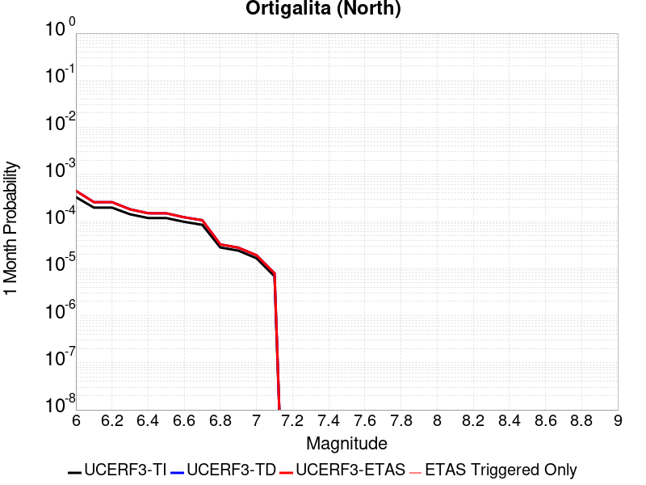 | 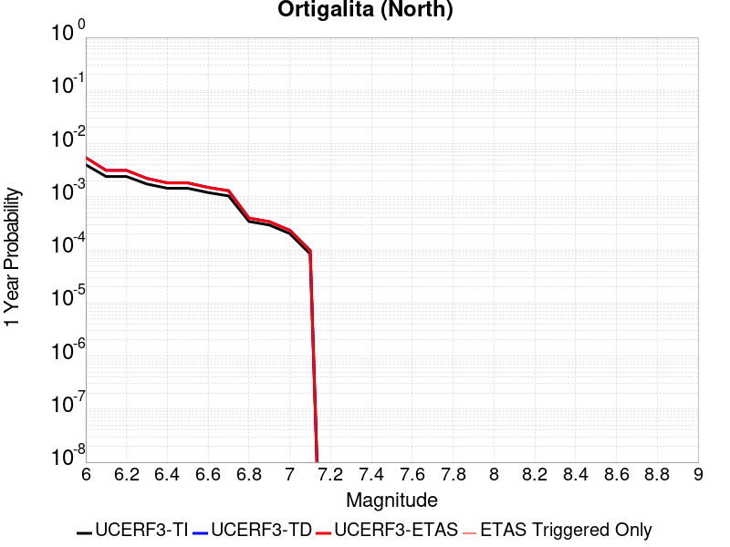 |  |

| Magnitude | 1 wk TI Prob | 1 wk TD Prob | 1 wk ETAS Prob | 1 wk ETAS/TD Gain | 1 wk ETAS Triggered Only | 1 mo TI Prob | 1 mo TD Prob | 1 mo ETAS Prob | 1 mo ETAS/TD Gain | 1 mo ETAS Triggered Only | 1 yr TI Prob | 1 yr TD Prob | 1 yr ETAS Prob | 1 yr ETAS/TD Gain | 1 yr ETAS Triggered Only | 10 yr TI Prob | 10 yr TD Prob | 10 yr ETAS Prob | 10 yr ETAS/TD Gain | 10 yr ETAS Triggered Only |
|-----|-----|-----|-----|-----|-----|-----|-----|-----|-----|-----|-----|-----|-----|-----|-----|-----|-----|-----|-----|-----|
| 6.0 | 7.711876E-5 | 1.0505308E-4 | 1.0505308E-4 | 1.0 | 0.0 | 3.3046713E-4 | 4.501601E-4 | 4.501601E-4 | 1.0 | 0.0 | 0.004016016 | 0.0054680547 | 0.0054680547 | 1.0 | 0.0 | 0.039442103 | 0.053455614 | 0.05347454 | 1.0003542 | 2.0E-5 |
| 6.1 | 4.607858E-5 | 6.0239887E-5 | 6.0239887E-5 | 1.0 | 0.0 | 1.9746469E-4 | 2.5814763E-4 | 2.5814763E-4 | 1.0 | 0.0 | 0.0024014818 | 0.0031387366 | 0.0031387366 | 1.0 | 0.0 | 0.023756953 | 0.030975312 | 0.030994693 | 1.0006257 | 2.0E-5 |
| 6.2 | 4.607858E-5 | 6.0239887E-5 | 6.0239887E-5 | 1.0 | 0.0 | 1.9746469E-4 | 2.5814763E-4 | 2.5814763E-4 | 1.0 | 0.0 | 0.0024014818 | 0.0031387366 | 0.0031387366 | 1.0 | 0.0 | 0.023756953 | 0.030975312 | 0.030994693 | 1.0006257 | 2.0E-5 |
| 6.3 | 3.327423E-5 | 4.2476124E-5 | 4.2476124E-5 | 1.0 | 0.0 | 1.4259605E-4 | 1.8202956E-4 | 1.8202956E-4 | 1.0 | 0.0 | 0.0017347244 | 0.002214206 | 0.002214206 | 1.0 | 0.0 | 0.017212452 | 0.02194574 | 0.0219653 | 1.0008913 | 2.0E-5 |
| 6.4 | 2.7732503E-5 | 3.4999008E-5 | 3.4999008E-5 | 1.0 | 0.0 | 1.1884817E-4 | 1.499886E-4 | 1.499886E-4 | 1.0 | 0.0 | 0.001446016 | 0.0018248158 | 0.0018248158 | 1.0 | 0.0 | 0.014366428 | 0.018121297 | 0.018131116 | 1.0005418 | 1.0E-5 |
| 6.5 | 2.7689714E-5 | 3.4948822E-5 | 3.4948822E-5 | 1.0 | 0.0 | 1.186648E-4 | 1.4977354E-4 | 1.4977354E-4 | 1.0 | 0.0 | 0.0014437864 | 0.0018222018 | 0.0018222018 | 1.0 | 0.0 | 0.014344421 | 0.018095585 | 0.018105403 | 1.0005426 | 1.0E-5 |
| 6.6 | 2.2976905E-5 | 2.871829E-5 | 2.871829E-5 | 1.0 | 0.0 | 9.846873E-5 | 1.23074E-4 | 1.23074E-4 | 1.0 | 0.0 | 0.0011981975 | 0.0014976348 | 0.0014976348 | 1.0 | 0.0 | 0.011917574 | 0.014898733 | 0.014908585 | 1.0006613 | 1.0E-5 |
| 6.7 | 1.9871539E-5 | 2.4904637E-5 | 2.4904637E-5 | 1.0 | 0.0 | 8.516096E-5 | 1.067312E-4 | 1.067312E-4 | 1.0 | 0.0 | 0.0010363415 | 0.0012989199 | 0.0012989199 | 1.0 | 0.0 | 0.010315218 | 0.012936938 | 0.012946809 | 1.0007629 | 1.0E-5 |
| 6.8 | 6.5640475E-6 | 7.6054926E-6 | 7.6054926E-6 | 1.0 | 0.0 | 2.813133E-5 | 3.2594577E-5 | 3.2594577E-5 | 1.0 | 0.0 | 3.424451E-4 | 3.9676955E-4 | 3.9676955E-4 | 1.0 | 0.0 | 0.0034191788 | 0.003960899 | 0.003970859 | 1.0025147 | 1.0E-5 |
| 6.9 | 5.6219683E-6 | 6.5018376E-6 | 6.5018376E-6 | 1.0 | 0.0 | 2.4093928E-5 | 2.7864735E-5 | 2.7864735E-5 | 1.0 | 0.0 | 2.933041E-4 | 3.3920293E-4 | 3.3920293E-4 | 1.0 | 0.0 | 0.0029291727 | 0.003387109 | 0.003397075 | 1.0029423 | 1.0E-5 |
| 7.0 | 3.875591E-6 | 4.4847548E-6 | 4.4847548E-6 | 1.0 | 0.0 | 1.6609569E-5 | 1.9220248E-5 | 1.9220248E-5 | 1.0 | 0.0 | 2.0220275E-4 | 2.339835E-4 | 2.339835E-4 | 1.0 | 0.0 | 0.0020201886 | 0.0023375798 | 0.0023475564 | 1.0042679 | 1.0E-5 |
| 7.1 | 1.6017933E-6 | 1.8570418E-6 | 1.8570418E-6 | 1.0 | 0.0 | 6.8648105E-6 | 7.958732E-6 | 7.958732E-6 | 1.0 | 0.0 | 8.357586E-5 | 9.689432E-5 | 9.689432E-5 | 1.0 | 0.0 | 8.3544437E-4 | 9.686254E-4 | 9.786157E-4 | 1.0103139 | 1.0E-5 |

## Burnt Mtn
*[(top)](#table-of-contents)*

| 1 Week | 1 Month | 1 Year | 10 Year |
|-----|-----|-----|-----|
|  |  |  | 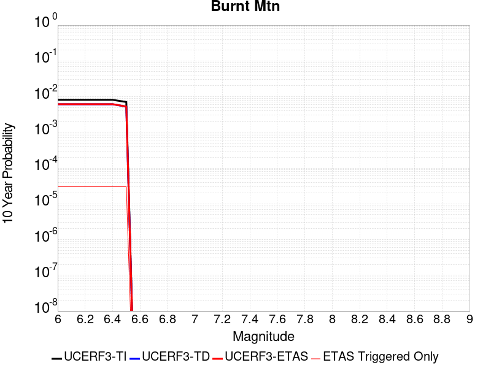 |

| Magnitude | 1 wk TI Prob | 1 wk TD Prob | 1 wk ETAS Prob | 1 wk ETAS/TD Gain | 1 wk ETAS Triggered Only | 1 mo TI Prob | 1 mo TD Prob | 1 mo ETAS Prob | 1 mo ETAS/TD Gain | 1 mo ETAS Triggered Only | 1 yr TI Prob | 1 yr TD Prob | 1 yr ETAS Prob | 1 yr ETAS/TD Gain | 1 yr ETAS Triggered Only | 10 yr TI Prob | 10 yr TD Prob | 10 yr ETAS Prob | 10 yr ETAS/TD Gain | 10 yr ETAS Triggered Only |
|-----|-----|-----|-----|-----|-----|-----|-----|-----|-----|-----|-----|-----|-----|-----|-----|-----|-----|-----|-----|-----|
| 6.0 | 1.5673151E-5 | 1.1749247E-5 | 2.1749129E-5 | 1.8511083 | 1.0E-5 | 6.716892E-5 | 5.0353672E-5 | 6.0353166E-5 | 1.1985853 | 1.0E-5 | 8.1747473E-4 | 6.130124E-4 | 6.42994E-4 | 1.0489087 | 3.0E-5 | 0.008144741 | 0.006125855 | 0.0061556706 | 1.0048673 | 3.0E-5 |
| 6.1 | 1.5673151E-5 | 1.1749247E-5 | 2.1749129E-5 | 1.8511083 | 1.0E-5 | 6.716892E-5 | 5.0353672E-5 | 6.0353166E-5 | 1.1985853 | 1.0E-5 | 8.1747473E-4 | 6.130124E-4 | 6.42994E-4 | 1.0489087 | 3.0E-5 | 0.008144741 | 0.006125855 | 0.0061556706 | 1.0048673 | 3.0E-5 |
| 6.2 | 1.5673151E-5 | 1.1749247E-5 | 2.1749129E-5 | 1.8511083 | 1.0E-5 | 6.716892E-5 | 5.0353672E-5 | 6.0353166E-5 | 1.1985853 | 1.0E-5 | 8.1747473E-4 | 6.130124E-4 | 6.42994E-4 | 1.0489087 | 3.0E-5 | 0.008144741 | 0.006125855 | 0.0061556706 | 1.0048673 | 3.0E-5 |
| 6.3 | 1.5673151E-5 | 1.1749247E-5 | 2.1749129E-5 | 1.8511083 | 1.0E-5 | 6.716892E-5 | 5.0353672E-5 | 6.0353166E-5 | 1.1985853 | 1.0E-5 | 8.1747473E-4 | 6.130124E-4 | 6.42994E-4 | 1.0489087 | 3.0E-5 | 0.008144741 | 0.006125855 | 0.0061556706 | 1.0048673 | 3.0E-5 |
| 6.4 | 1.5673151E-5 | 1.1749247E-5 | 2.1749129E-5 | 1.8511083 | 1.0E-5 | 6.716892E-5 | 5.0353672E-5 | 6.0353166E-5 | 1.1985853 | 1.0E-5 | 8.1747473E-4 | 6.130124E-4 | 6.42994E-4 | 1.0489087 | 3.0E-5 | 0.008144741 | 0.006125855 | 0.0061556706 | 1.0048673 | 3.0E-5 |
| 6.5 | 1.36191375E-5 | 1.007816E-5 | 2.007806E-5 | 1.9922347 | 1.0E-5 | 5.8366426E-5 | 4.319211E-5 | 5.319168E-5 | 1.2315137 | 1.0E-5 | 7.103795E-4 | 5.2586396E-4 | 5.558482E-4 | 1.057019 | 3.0E-5 | 0.0070811296 | 0.00525864 | 0.0052884817 | 1.0056748 | 3.0E-5 |

## Malibu Coast (Extension) alt 1
*[(top)](#table-of-contents)*

| 1 Week | 1 Month | 1 Year | 10 Year |
|-----|-----|-----|-----|
|  |  |  |  |

| Magnitude | 1 wk TI Prob | 1 wk TD Prob | 1 wk ETAS Prob | 1 wk ETAS/TD Gain | 1 wk ETAS Triggered Only | 1 mo TI Prob | 1 mo TD Prob | 1 mo ETAS Prob | 1 mo ETAS/TD Gain | 1 mo ETAS Triggered Only | 1 yr TI Prob | 1 yr TD Prob | 1 yr ETAS Prob | 1 yr ETAS/TD Gain | 1 yr ETAS Triggered Only | 10 yr TI Prob | 10 yr TD Prob | 10 yr ETAS Prob | 10 yr ETAS/TD Gain | 10 yr ETAS Triggered Only |
|-----|-----|-----|-----|-----|-----|-----|-----|-----|-----|-----|-----|-----|-----|-----|-----|-----|-----|-----|-----|-----|
| 6.0 | 8.930738E-6 | 9.3292765E-6 | 1.9329183E-5 | 2.0718844 | 1.0E-5 | 3.827403E-5 | 3.998201E-5 | 4.9981612E-5 | 1.2501025 | 1.0E-5 | 4.6588664E-4 | 4.86674E-4 | 5.166594E-4 | 1.061613 | 3.0E-5 | 0.0046491115 | 0.004856264 | 0.0048861187 | 1.0061476 | 3.0E-5 |
| 6.1 | 7.199952E-6 | 7.5302974E-6 | 1.7530221E-5 | 2.3279588 | 1.0E-5 | 3.0856572E-5 | 3.2272306E-5 | 4.2271986E-5 | 1.3098532 | 1.0E-5 | 3.75614E-4 | 3.928451E-4 | 4.1283725E-4 | 1.0508907 | 2.0E-5 | 0.0037497976 | 0.0039215726 | 0.0039414945 | 1.00508 | 2.0E-5 |
| 6.2 | 6.3721413E-6 | 6.666792E-6 | 1.6666725E-5 | 2.4999616 | 1.0E-5 | 2.7308892E-5 | 2.8571656E-5 | 3.8571372E-5 | 1.3499873 | 1.0E-5 | 3.3243504E-4 | 3.4780474E-4 | 3.677978E-4 | 1.0574836 | 2.0E-5 | 0.0033193815 | 0.0034726441 | 0.0034925747 | 1.0057393 | 2.0E-5 |
| 6.3 | 6.016345E-6 | 6.295159E-6 | 1.6295096E-5 | 2.5885122 | 1.0E-5 | 2.578408E-5 | 2.6978976E-5 | 3.6978705E-5 | 1.370649 | 1.0E-5 | 3.1387596E-4 | 3.2841985E-4 | 3.3841658E-4 | 1.0304388 | 1.0E-5 | 0.00313433 | 0.0032793812 | 0.0032893484 | 1.0030394 | 1.0E-5 |
| 6.4 | 5.8104883E-6 | 6.0795455E-6 | 1.6079484E-5 | 2.6448498 | 1.0E-5 | 2.4901856E-5 | 2.6054937E-5 | 3.6054676E-5 | 1.3837944 | 1.0E-5 | 3.031379E-4 | 3.17173E-4 | 3.271698E-4 | 1.0315186 | 1.0E-5 | 0.0030272473 | 0.0031672379 | 0.003177206 | 1.0031474 | 1.0E-5 |
| 6.5 | 5.476925E-6 | 5.727514E-6 | 1.5727457E-5 | 2.745948 | 1.0E-5 | 2.3472323E-5 | 2.454626E-5 | 3.4546014E-5 | 1.407384 | 1.0E-5 | 2.8573806E-4 | 2.9881002E-4 | 3.0880704E-4 | 1.0334561 | 1.0E-5 | 0.0028537093 | 0.0029841145 | 0.0029940845 | 1.0033411 | 1.0E-5 |
| 6.6 | 5.222387E-6 | 5.4585807E-6 | 1.5458527E-5 | 2.831968 | 1.0E-5 | 2.2381464E-5 | 2.3393708E-5 | 3.3393473E-5 | 1.4274553 | 1.0E-5 | 2.7246025E-4 | 2.8478145E-4 | 2.947786E-4 | 1.0351046 | 1.0E-5 | 0.0027212645 | 0.002844196 | 0.0028541675 | 1.003506 | 1.0E-5 |
| 6.7 | 5.0337076E-6 | 5.259104E-6 | 1.5259051E-5 | 2.9014547 | 1.0E-5 | 2.1572854E-5 | 2.2538823E-5 | 3.25386E-5 | 1.4436688 | 1.0E-5 | 2.6261783E-4 | 2.743759E-4 | 2.8437315E-4 | 1.0364363 | 1.0E-5 | 0.002623077 | 0.0027404015 | 0.0027503741 | 1.0036391 | 1.0E-5 |
| 6.8 | 4.5675624E-6 | 4.7587173E-6 | 1.475867E-5 | 3.1013966 | 1.0E-5 | 1.9575122E-5 | 2.0394344E-5 | 3.039414E-5 | 1.490322 | 1.0E-5 | 2.3830103E-4 | 2.4827302E-4 | 2.5827056E-4 | 1.0402682 | 1.0E-5 | 0.0023804565 | 0.0024799763 | 0.0024899517 | 1.0040222 | 1.0E-5 |
| 6.9 | 4.2802412E-6 | 4.4520216E-6 | 1.4451977E-5 | 3.2461607 | 1.0E-5 | 1.8343762E-5 | 1.9079953E-5 | 2.9079762E-5 | 1.5241003 | 1.0E-5 | 2.2331243E-4 | 2.3227383E-4 | 2.422715E-4 | 1.0430427 | 1.0E-5 | 0.0022308815 | 0.0023203273 | 0.0023303041 | 1.0042998 | 1.0E-5 |
| 7.0 | 3.9794063E-6 | 4.1301E-6 | 1.4130059E-5 | 3.421239 | 1.0E-5 | 1.7054486E-5 | 1.770031E-5 | 2.7700133E-5 | 1.5649519 | 1.0E-5 | 2.0761859E-4 | 2.1548007E-4 | 2.2547792E-4 | 1.046398 | 1.0E-5 | 0.0020742472 | 0.002152725 | 0.0021627033 | 1.0046353 | 1.0E-5 |
| 7.1 | 3.7730424E-6 | 3.911218E-6 | 1.3911179E-5 | 3.5567384 | 1.0E-5 | 1.6170083E-5 | 1.6762255E-5 | 2.6762087E-5 | 1.5965685 | 1.0E-5 | 1.9685295E-4 | 2.0406146E-4 | 2.1405943E-4 | 1.0489949 | 1.0E-5 | 0.0019667868 | 0.0020387538 | 0.0020487334 | 1.004895 | 1.0E-5 |
| 7.2 | 3.424985E-6 | 3.541338E-6 | 1.3541303E-5 | 3.8237815 | 1.0E-5 | 1.4678424E-5 | 1.5177075E-5 | 2.5176923E-5 | 1.6588784 | 1.0E-5 | 1.7869516E-4 | 1.8476533E-4 | 1.9476349E-4 | 1.0541127 | 1.0E-5 | 0.0017855153 | 0.0018461292 | 0.0018561108 | 1.0054067 | 1.0E-5 |
| 7.3 | 2.6966375E-6 | 2.759654E-6 | 2.759654E-6 | 1.0 | 0.0 | 1.15569665E-5 | 1.1827035E-5 | 1.1827035E-5 | 1.0 | 0.0 | 1.4069698E-4 | 1.4398468E-4 | 1.4398468E-4 | 1.0 | 0.0 | 0.0014060794 | 0.001438918 | 0.001438918 | 1.0 | 0.0 |
| 7.4 | 2.215957E-6 | 2.249379E-6 | 2.249379E-6 | 1.0 | 0.0 | 9.496924E-6 | 9.64016E-6 | 9.64016E-6 | 1.0 | 0.0 | 1.1561892E-4 | 1.1736266E-4 | 1.1736266E-4 | 1.0 | 0.0 | 0.0011555878 | 0.0011730106 | 0.0011730106 | 1.0 | 0.0 |
| 7.5 | 1.2040218E-6 | 1.2219067E-6 | 1.2219067E-6 | 1.0 | 0.0 | 5.160083E-6 | 5.2367327E-6 | 5.2367327E-6 | 1.0 | 0.0 | 6.2822204E-5 | 6.3755375E-5 | 6.3755375E-5 | 1.0 | 0.0 | 6.280445E-4 | 6.3737266E-4 | 6.3737266E-4 | 1.0 | 0.0 |
| 7.6 | 6.6157446E-7 | 6.6789755E-7 | 6.6789755E-7 | 1.0 | 0.0 | 2.835316E-6 | 2.8624152E-6 | 2.8624152E-6 | 1.0 | 0.0 | 3.4519428E-5 | 3.4849363E-5 | 3.4849363E-5 | 1.0 | 0.0 | 3.4514067E-4 | 3.484405E-4 | 3.484405E-4 | 1.0 | 0.0 |
| 7.7 | 2.6012302E-7 | 2.4357584E-7 | 2.4357584E-7 | 1.0 | 0.0 | 1.1148124E-6 | 1.0438962E-6 | 1.0438962E-6 | 1.0 | 0.0 | 1.3572758E-5 | 1.2709373E-5 | 1.2709373E-5 | 1.0 | 0.0 | 1.3571928E-4 | 1.2708752E-4 | 1.2708752E-4 | 1.0 | 0.0 |
| 7.8 | 2.8323132E-8 | 2.0266642E-8 | 2.0266642E-8 | 1.0 | 0.0 | 1.2138484E-7 | 8.685703E-8 | 8.685703E-8 | 1.0 | 0.0 | 1.4778595E-6 | 1.0574839E-6 | 1.0574839E-6 | 1.0 | 0.0 | 1.4778497E-5 | 1.0574797E-5 | 1.0574797E-5 | 1.0 | 0.0 |

## San Juan
*[(top)](#table-of-contents)*

| 1 Week | 1 Month | 1 Year | 10 Year |
|-----|-----|-----|-----|
|  |  |  |  |

| Magnitude | 1 wk TI Prob | 1 wk TD Prob | 1 wk ETAS Prob | 1 wk ETAS/TD Gain | 1 wk ETAS Triggered Only | 1 mo TI Prob | 1 mo TD Prob | 1 mo ETAS Prob | 1 mo ETAS/TD Gain | 1 mo ETAS Triggered Only | 1 yr TI Prob | 1 yr TD Prob | 1 yr ETAS Prob | 1 yr ETAS/TD Gain | 1 yr ETAS Triggered Only | 10 yr TI Prob | 10 yr TD Prob | 10 yr ETAS Prob | 10 yr ETAS/TD Gain | 10 yr ETAS Triggered Only |
|-----|-----|-----|-----|-----|-----|-----|-----|-----|-----|-----|-----|-----|-----|-----|-----|-----|-----|-----|-----|-----|
| 6.0 | 8.682808E-6 | 8.74917E-6 | 8.74917E-6 | 1.0 | 0.0 | 3.72115E-5 | 3.749593E-5 | 3.749593E-5 | 1.0 | 0.0 | 4.5295584E-4 | 4.5642213E-4 | 4.6641758E-4 | 1.0218996 | 1.0E-5 | 0.004520337 | 0.004555389 | 0.004585252 | 1.0065556 | 3.0E-5 |
| 6.1 | 8.682808E-6 | 8.74917E-6 | 8.74917E-6 | 1.0 | 0.0 | 3.72115E-5 | 3.749593E-5 | 3.749593E-5 | 1.0 | 0.0 | 4.5295584E-4 | 4.5642213E-4 | 4.6641758E-4 | 1.0218996 | 1.0E-5 | 0.004520337 | 0.004555389 | 0.004585252 | 1.0065556 | 3.0E-5 |
| 6.2 | 8.682808E-6 | 8.74917E-6 | 8.74917E-6 | 1.0 | 0.0 | 3.72115E-5 | 3.749593E-5 | 3.749593E-5 | 1.0 | 0.0 | 4.5295584E-4 | 4.5642213E-4 | 4.6641758E-4 | 1.0218996 | 1.0E-5 | 0.004520337 | 0.004555389 | 0.004585252 | 1.0065556 | 3.0E-5 |
| 6.3 | 6.3054235E-6 | 6.282591E-6 | 6.282591E-6 | 1.0 | 0.0 | 2.7022963E-5 | 2.692512E-5 | 2.692512E-5 | 1.0 | 0.0 | 3.2895492E-4 | 3.2776545E-4 | 3.3776215E-4 | 1.0304996 | 1.0E-5 | 0.003284684 | 0.0032730205 | 0.0033029222 | 1.0091358 | 3.0E-5 |
| 6.4 | 6.1490473E-6 | 6.1144706E-6 | 6.1144706E-6 | 1.0 | 0.0 | 2.6352795E-5 | 2.6204618E-5 | 2.6204618E-5 | 1.0 | 0.0 | 3.2079802E-4 | 3.189959E-4 | 3.289927E-4 | 1.0313383 | 1.0E-5 | 0.0032033534 | 0.0031855768 | 0.003215481 | 1.0093875 | 3.0E-5 |
| 6.5 | 5.204848E-6 | 5.137238E-6 | 5.137238E-6 | 1.0 | 0.0 | 2.23063E-5 | 2.2016555E-5 | 2.2016555E-5 | 1.0 | 0.0 | 2.7154534E-4 | 2.6801953E-4 | 2.7801684E-4 | 1.0373007 | 1.0E-5 | 0.0027121378 | 0.0026771172 | 0.002707037 | 1.0111761 | 3.0E-5 |
| 6.6 | 4.5179986E-6 | 4.415036E-6 | 4.415036E-6 | 1.0 | 0.0 | 1.9362706E-5 | 1.892145E-5 | 1.892145E-5 | 1.0 | 0.0 | 2.3571544E-4 | 2.303451E-4 | 2.403428E-4 | 1.0434031 | 1.0E-5 | 0.0023546559 | 0.0023012008 | 0.0023311318 | 1.0130067 | 3.0E-5 |
| 6.7 | 3.9442616E-6 | 3.8198336E-6 | 3.8198336E-6 | 1.0 | 0.0 | 1.6903869E-5 | 1.6370615E-5 | 1.6370615E-5 | 1.0 | 0.0 | 2.0578515E-4 | 1.9929469E-4 | 2.092927E-4 | 1.050167 | 1.0E-5 | 0.002055947 | 0.001991285 | 0.0020212252 | 1.0150356 | 3.0E-5 |
| 6.8 | 3.4536245E-6 | 3.3163408E-6 | 3.3163408E-6 | 1.0 | 0.0 | 1.4801163E-5 | 1.4212815E-5 | 1.4212815E-5 | 1.0 | 0.0 | 1.8018926E-4 | 1.7302789E-4 | 1.8302616E-4 | 1.0577842 | 1.0E-5 | 0.0018004322 | 0.001729051 | 0.0017589991 | 1.0173205 | 3.0E-5 |
| 6.9 | 3.059865E-6 | 2.9120363E-6 | 2.9120363E-6 | 1.0 | 0.0 | 1.3113641E-5 | 1.2480099E-5 | 1.2480099E-5 | 1.0 | 0.0 | 1.596469E-4 | 1.5193518E-4 | 1.6193367E-4 | 1.0658076 | 1.0E-5 | 0.0015953224 | 0.0015184281 | 0.0015483826 | 1.0197272 | 3.0E-5 |
| 7.0 | 2.6504351E-6 | 2.492005E-6 | 2.492005E-6 | 1.0 | 0.0 | 1.1358958E-5 | 1.0679981E-5 | 1.0679981E-5 | 1.0 | 0.0 | 1.3828653E-4 | 1.3002155E-4 | 1.4002025E-4 | 1.0769004 | 1.0E-5 | 0.0013820052 | 0.001299567 | 0.001319541 | 1.0153698 | 2.0E-5 |
| 7.1 | 2.2039317E-6 | 2.0338366E-6 | 2.0338366E-6 | 1.0 | 0.0 | 9.445387E-6 | 8.716416E-6 | 8.716416E-6 | 1.0 | 0.0 | 1.1499152E-4 | 1.0611773E-4 | 1.1611667E-4 | 1.0942249 | 1.0E-5 | 0.0011493203 | 0.0010607811 | 0.0010807598 | 1.018834 | 2.0E-5 |
| 7.2 | 1.0786707E-6 | 8.770239E-7 | 8.770239E-7 | 1.0 | 0.0 | 4.622866E-6 | 3.7586685E-6 | 3.7586685E-6 | 1.0 | 0.0 | 5.628194E-5 | 4.576084E-5 | 4.576084E-5 | 1.0 | 0.0 | 5.6267687E-4 | 4.5757365E-4 | 4.5757365E-4 | 1.0 | 0.0 |
| 7.3 | 6.846433E-7 | 4.868812E-7 | 4.868812E-7 | 1.0 | 0.0 | 2.9341822E-6 | 2.086632E-6 | 2.086632E-6 | 1.0 | 0.0 | 3.5723086E-5 | 2.5404452E-5 | 2.5404452E-5 | 1.0 | 0.0 | 3.571734E-4 | 2.5405022E-4 | 2.5405022E-4 | 1.0 | 0.0 |
| 7.4 | 5.23043E-7 | 3.2627884E-7 | 3.2627884E-7 | 1.0 | 0.0 | 2.2416111E-6 | 1.3983371E-6 | 1.3983371E-6 | 1.0 | 0.0 | 2.7291273E-5 | 1.7024622E-5 | 1.7024622E-5 | 1.0 | 0.0 | 2.7287923E-4 | 1.7026608E-4 | 1.7026608E-4 | 1.0 | 0.0 |
| 7.5 | 4.648444E-7 | 2.723464E-7 | 2.723464E-7 | 1.0 | 0.0 | 1.9921886E-6 | 1.1671983E-6 | 1.1671983E-6 | 1.0 | 0.0 | 2.4254627E-5 | 1.4210547E-5 | 1.4210547E-5 | 1.0 | 0.0 | 2.425198E-4 | 1.4212691E-4 | 1.4212691E-4 | 1.0 | 0.0 |
| 7.6 | 3.9906567E-7 | 2.2083036E-7 | 2.2083036E-7 | 1.0 | 0.0 | 1.7102802E-6 | 9.4641547E-7 | 9.4641547E-7 | 1.0 | 0.0 | 2.0822463E-5 | 1.1522548E-5 | 1.1522548E-5 | 1.0 | 0.0 | 2.0820512E-4 | 1.15244526E-4 | 1.15244526E-4 | 1.0 | 0.0 |
| 7.7 | 1.8784601E-7 | 5.366277E-8 | 5.366277E-8 | 1.0 | 0.0 | 8.0505407E-7 | 2.2998329E-7 | 2.2998329E-7 | 1.0 | 0.0 | 9.80149E-6 | 2.800043E-6 | 2.800043E-6 | 1.0 | 0.0 | 9.801057E-5 | 2.8008939E-5 | 2.8008939E-5 | 1.0 | 0.0 |
| 7.8 | 1.00154914E-7 | 1.2412917E-8 | 1.2412917E-8 | 1.0 | 0.0 | 4.2923529E-7 | 5.3198217E-8 | 5.3198217E-8 | 1.0 | 0.0 | 5.225927E-6 | 6.476881E-7 | 6.476881E-7 | 1.0 | 0.0 | 5.225804E-5 | 6.4827886E-6 | 6.4827886E-6 | 1.0 | 0.0 |
| 7.9 | 6.171429E-8 | 4.2946513E-9 | 4.2946513E-9 | 1.0 | 0.0 | 2.6448978E-7 | 1.8405647E-8 | 1.8405647E-8 | 1.0 | 0.0 | 3.2201583E-6 | 2.2408874E-7 | 2.2408874E-7 | 1.0 | 0.0 | 3.2201115E-5 | 2.2462114E-6 | 2.2462114E-6 | 1.0 | 0.0 |
| 8.0 | 1.3974572E-8 | 3.3737857E-10 | 3.3737857E-10 | 1.0 | 0.0 | 5.989102E-8 | 1.4459075E-9 | 1.4459075E-9 | 1.0 | 0.0 | 7.2917294E-7 | 1.760392E-8 | 1.760392E-8 | 1.0 | 0.0 | 7.2917055E-6 | 1.8038004E-7 | 1.8038004E-7 | 1.0 | 0.0 |
| 8.1 | 1.8403477E-9 | 1.1291601E-10 | 1.1291601E-10 | 1.0 | 0.0 | 7.887204E-9 | 4.839261E-10 | 4.839261E-10 | 1.0 | 0.0 | 9.602671E-8 | 5.8917977E-9 | 5.8917977E-9 | 1.0 | 0.0 | 9.602667E-7 | 6.0206084E-8 | 6.0206084E-8 | 1.0 | 0.0 |

## Hosgri
*[(top)](#table-of-contents)*

| 1 Week | 1 Month | 1 Year | 10 Year |
|-----|-----|-----|-----|
| 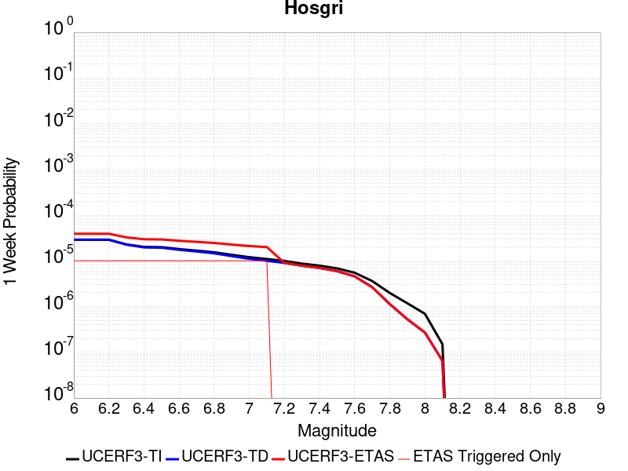 |  |  |  |

| Magnitude | 1 wk TI Prob | 1 wk TD Prob | 1 wk ETAS Prob | 1 wk ETAS/TD Gain | 1 wk ETAS Triggered Only | 1 mo TI Prob | 1 mo TD Prob | 1 mo ETAS Prob | 1 mo ETAS/TD Gain | 1 mo ETAS Triggered Only | 1 yr TI Prob | 1 yr TD Prob | 1 yr ETAS Prob | 1 yr ETAS/TD Gain | 1 yr ETAS Triggered Only | 10 yr TI Prob | 10 yr TD Prob | 10 yr ETAS Prob | 10 yr ETAS/TD Gain | 10 yr ETAS Triggered Only |
|-----|-----|-----|-----|-----|-----|-----|-----|-----|-----|-----|-----|-----|-----|-----|-----|-----|-----|-----|-----|-----|
| 6.0 | 2.883978E-5 | 2.9128403E-5 | 3.912811E-5 | 1.3432975 | 1.0E-5 | 1.235932E-4 | 1.248302E-4 | 1.3482895E-4 | 1.0800989 | 1.0E-5 | 0.0015037085 | 0.0015187752 | 0.0015387449 | 1.0131485 | 2.0E-5 | 0.01493574 | 0.01508773 | 0.015117277 | 1.0019584 | 3.0E-5 |
| 6.1 | 2.883978E-5 | 2.9128403E-5 | 3.912811E-5 | 1.3432975 | 1.0E-5 | 1.235932E-4 | 1.248302E-4 | 1.3482895E-4 | 1.0800989 | 1.0E-5 | 0.0015037085 | 0.0015187752 | 0.0015387449 | 1.0131485 | 2.0E-5 | 0.01493574 | 0.01508773 | 0.015117277 | 1.0019584 | 3.0E-5 |
| 6.2 | 2.883978E-5 | 2.9128403E-5 | 3.912811E-5 | 1.3432975 | 1.0E-5 | 1.235932E-4 | 1.248302E-4 | 1.3482895E-4 | 1.0800989 | 1.0E-5 | 0.0015037085 | 0.0015187752 | 0.0015387449 | 1.0131485 | 2.0E-5 | 0.01493574 | 0.01508773 | 0.015117277 | 1.0019584 | 3.0E-5 |
| 6.3 | 2.2914428E-5 | 2.2641956E-5 | 3.264173E-5 | 1.441648 | 1.0E-5 | 9.8200995E-5 | 9.703337E-5 | 1.0703241E-4 | 1.1030474 | 1.0E-5 | 0.0011949413 | 0.001180746 | 0.0012007224 | 1.0169184 | 2.0E-5 | 0.011885363 | 0.011746123 | 0.01177577 | 1.002524 | 3.0E-5 |
| 6.4 | 2.0195741E-5 | 1.9696547E-5 | 2.969635E-5 | 1.5076932 | 1.0E-5 | 8.65503E-5 | 8.4411055E-5 | 9.441021E-5 | 1.1184579 | 1.0E-5 | 0.0010532405 | 0.001027222 | 0.0010472015 | 1.01945 | 2.0E-5 | 0.010482626 | 0.010225783 | 0.010255476 | 1.0029038 | 3.0E-5 |
| 6.5 | 1.9924333E-5 | 1.9408968E-5 | 2.9408775E-5 | 1.5152158 | 1.0E-5 | 8.53872E-5 | 8.317865E-5 | 9.317782E-5 | 1.1202132 | 1.0E-5 | 0.0010390934 | 0.0010122315 | 0.0010322112 | 1.0197383 | 2.0E-5 | 0.010342481 | 0.010077244 | 0.010106941 | 1.002947 | 3.0E-5 |
| 6.6 | 1.809694E-5 | 1.7458287E-5 | 2.7458113E-5 | 1.5727838 | 1.0E-5 | 7.7556004E-5 | 7.4819094E-5 | 8.481834E-5 | 1.1336458 | 1.0E-5 | 9.438353E-4 | 9.105431E-4 | 9.2053396E-4 | 1.0109725 | 1.0E-5 | 0.009398366 | 0.009069063 | 0.009088881 | 1.0021853 | 2.0E-5 |
| 6.7 | 1.675989E-5 | 1.6042752E-5 | 2.6042591E-5 | 1.6233245 | 1.0E-5 | 7.182612E-5 | 6.8752845E-5 | 7.875216E-5 | 1.1454386 | 1.0E-5 | 8.7413215E-4 | 8.3674554E-4 | 8.467372E-4 | 1.0119411 | 1.0E-5 | 0.008707017 | 0.008336853 | 0.008356687 | 1.002379 | 2.0E-5 |
| 6.8 | 1.5401129E-5 | 1.4614069E-5 | 2.4613923E-5 | 1.6842622 | 1.0E-5 | 6.6003166E-5 | 6.263023E-5 | 7.26296E-5 | 1.1596574 | 1.0E-5 | 8.032922E-4 | 7.6225714E-4 | 7.722495E-4 | 1.013109 | 1.0E-5 | 0.008003947 | 0.0075972863 | 0.0076171346 | 1.0026125 | 2.0E-5 |
| 6.9 | 1.356559E-5 | 1.2689955E-5 | 2.2689828E-5 | 1.7880149 | 1.0E-5 | 5.8136946E-5 | 5.438439E-5 | 6.438384E-5 | 1.1838663 | 1.0E-5 | 7.0758746E-4 | 6.6192925E-4 | 6.7192264E-4 | 1.0150974 | 1.0E-5 | 0.007053386 | 0.006600378 | 0.006610312 | 1.001505 | 1.0E-5 |
| 7.0 | 1.2030819E-5 | 1.1095949E-5 | 2.1095839E-5 | 1.9012198 | 1.0E-5 | 5.155963E-5 | 4.75532E-5 | 5.7552727E-5 | 1.2102808 | 1.0E-5 | 6.275577E-4 | 5.788065E-4 | 5.8880076E-4 | 1.017267 | 1.0E-5 | 0.006257884 | 0.0057737473 | 0.0057836897 | 1.001722 | 1.0E-5 |
| 7.1 | 1.0972698E-5 | 1.0022167E-5 | 2.0022067E-5 | 1.9977782 | 1.0E-5 | 4.7025E-5 | 4.2951437E-5 | 5.2951007E-5 | 1.2328111 | 1.0E-5 | 5.72379E-4 | 5.2280835E-4 | 5.328031E-4 | 1.0191175 | 1.0E-5 | 0.0057090693 | 0.005216533 | 0.005226481 | 1.001907 | 1.0E-5 |
| 7.2 | 9.961926E-6 | 9.034732E-6 | 9.034732E-6 | 1.0 | 0.0 | 4.2693267E-5 | 3.8719707E-5 | 3.8719707E-5 | 1.0 | 0.0 | 5.1966653E-4 | 4.7131052E-4 | 4.7131052E-4 | 1.0 | 0.0 | 0.00518453 | 0.0047038523 | 0.0047038523 | 1.0 | 0.0 |
| 7.3 | 8.700929E-6 | 7.828089E-6 | 7.828089E-6 | 1.0 | 0.0 | 3.7289166E-5 | 3.354852E-5 | 3.354852E-5 | 1.0 | 0.0 | 4.53901E-4 | 4.083767E-4 | 4.083767E-4 | 1.0 | 0.0 | 0.00452975 | 0.004076999 | 0.004076999 | 1.0 | 0.0 |
| 7.4 | 7.866285E-6 | 6.9987263E-6 | 6.9987263E-6 | 1.0 | 0.0 | 3.3712215E-5 | 2.9994197E-5 | 2.9994197E-5 | 1.0 | 0.0 | 4.103689E-4 | 3.6511818E-4 | 3.6511818E-4 | 1.0 | 0.0 | 0.004096119 | 0.0036459167 | 0.0036459167 | 1.0 | 0.0 |
| 7.5 | 6.8381305E-6 | 5.9596814E-6 | 5.9596814E-6 | 1.0 | 0.0 | 2.9305946E-5 | 2.5541241E-5 | 2.5541241E-5 | 1.0 | 0.0 | 3.5674145E-4 | 3.1092027E-4 | 3.1092027E-4 | 1.0 | 0.0 | 0.0035616932 | 0.003105584 | 0.003105584 | 1.0 | 0.0 |
| 7.6 | 5.503376E-6 | 4.595227E-6 | 4.595227E-6 | 1.0 | 0.0 | 2.3585684E-5 | 1.9693682E-5 | 1.9693682E-5 | 1.0 | 0.0 | 2.8711787E-4 | 2.397442E-4 | 2.397442E-4 | 1.0 | 0.0 | 0.002867472 | 0.0023955852 | 0.0023955852 | 1.0 | 0.0 |
| 7.7 | 3.6144982E-6 | 2.6521896E-6 | 2.6521896E-6 | 1.0 | 0.0 | 1.5490614E-5 | 1.1366477E-5 | 1.1366477E-5 | 1.0 | 0.0 | 1.8858191E-4 | 1.3837808E-4 | 1.3837808E-4 | 1.0 | 0.0 | 0.0018842196 | 0.001383647 | 0.001383647 | 1.0 | 0.0 |
| 7.8 | 1.9853494E-6 | 1.1360784E-6 | 1.1360784E-6 | 1.0 | 0.0 | 8.508612E-6 | 4.8688985E-6 | 4.8688985E-6 | 1.0 | 0.0 | 1.0358743E-4 | 5.9277223E-5 | 5.9277223E-5 | 1.0 | 0.0 | 0.0010353916 | 5.933389E-4 | 5.933389E-4 | 1.0 | 0.0 |
| 7.9 | 1.1818757E-6 | 5.29477E-7 | 5.29477E-7 | 1.0 | 0.0 | 5.0651715E-6 | 2.269185E-6 | 2.269185E-6 | 1.0 | 0.0 | 6.1666724E-5 | 2.7626977E-5 | 2.7626977E-5 | 1.0 | 0.0 | 6.1649614E-4 | 2.7691363E-4 | 2.7691363E-4 | 1.0 | 0.0 |
| 8.0 | 6.962958E-7 | 2.71365E-7 | 2.71365E-7 | 1.0 | 0.0 | 2.9841215E-6 | 1.1629924E-6 | 1.1629924E-6 | 1.0 | 0.0 | 3.6331072E-5 | 1.415934E-5 | 1.415934E-5 | 1.0 | 0.0 | 3.6325134E-4 | 1.4215276E-4 | 1.4215276E-4 | 1.0 | 0.0 |
| 8.1 | 1.5033264E-7 | 6.52693E-8 | 6.52693E-8 | 1.0 | 0.0 | 6.442826E-7 | 2.7972553E-7 | 2.7972553E-7 | 1.0 | 0.0 | 7.844113E-6 | 3.4056532E-6 | 3.4056532E-6 | 1.0 | 0.0 | 7.843835E-5 | 3.4072833E-5 | 3.4072833E-5 | 1.0 | 0.0 |

## Malibu Coast alt 1
*[(top)](#table-of-contents)*

| 1 Week | 1 Month | 1 Year | 10 Year |
|-----|-----|-----|-----|
|  |  |  |  |

| Magnitude | 1 wk TI Prob | 1 wk TD Prob | 1 wk ETAS Prob | 1 wk ETAS/TD Gain | 1 wk ETAS Triggered Only | 1 mo TI Prob | 1 mo TD Prob | 1 mo ETAS Prob | 1 mo ETAS/TD Gain | 1 mo ETAS Triggered Only | 1 yr TI Prob | 1 yr TD Prob | 1 yr ETAS Prob | 1 yr ETAS/TD Gain | 1 yr ETAS Triggered Only | 10 yr TI Prob | 10 yr TD Prob | 10 yr ETAS Prob | 10 yr ETAS/TD Gain | 10 yr ETAS Triggered Only |
|-----|-----|-----|-----|-----|-----|-----|-----|-----|-----|-----|-----|-----|-----|-----|-----|-----|-----|-----|-----|-----|
| 6.0 | 1.6572556E-5 | 1.759807E-5 | 2.7597893E-5 | 1.5682342 | 1.0E-5 | 7.102331E-5 | 7.5418226E-5 | 8.5417465E-5 | 1.132584 | 1.0E-5 | 8.6436566E-4 | 9.1784896E-4 | 9.378306E-4 | 1.0217701 | 2.0E-5 | 0.0086101135 | 0.009142514 | 0.00917224 | 1.0032513 | 3.0E-5 |
| 6.1 | 1.6572556E-5 | 1.759807E-5 | 2.7597893E-5 | 1.5682342 | 1.0E-5 | 7.102331E-5 | 7.5418226E-5 | 8.5417465E-5 | 1.132584 | 1.0E-5 | 8.6436566E-4 | 9.1784896E-4 | 9.278398E-4 | 1.010885 | 1.0E-5 | 0.0086101135 | 0.009142514 | 0.009152423 | 1.0010837 | 1.0E-5 |
| 6.2 | 1.1085717E-5 | 1.155715E-5 | 1.155715E-5 | 1.0 | 0.0 | 4.750935E-5 | 4.9529724E-5 | 4.9529724E-5 | 1.0 | 0.0 | 5.782728E-4 | 6.0286105E-4 | 6.0286105E-4 | 1.0 | 0.0 | 0.0057677035 | 0.0060126274 | 0.0060126274 | 1.0 | 0.0 |
| 6.3 | 1.0208568E-5 | 1.0592241E-5 | 1.0592241E-5 | 1.0 | 0.0 | 4.375027E-5 | 4.5394543E-5 | 4.5394543E-5 | 1.0 | 0.0 | 5.325294E-4 | 5.5254134E-4 | 5.5254134E-4 | 1.0 | 0.0 | 0.0053125503 | 0.0055119833 | 0.0055119833 | 1.0 | 0.0 |
| 6.4 | 9.0682315E-6 | 9.342641E-6 | 9.342641E-6 | 1.0 | 0.0 | 3.8863272E-5 | 4.0039286E-5 | 4.0039286E-5 | 1.0 | 0.0 | 4.730576E-4 | 4.873713E-4 | 4.873713E-4 | 1.0 | 0.0 | 0.0047205184 | 0.004863238 | 0.004863238 | 1.0 | 0.0 |
| 6.5 | 7.605796E-6 | 7.74859E-6 | 7.74859E-6 | 1.0 | 0.0 | 3.259586E-5 | 3.320783E-5 | 3.320783E-5 | 1.0 | 0.0 | 3.9678233E-4 | 4.0423166E-4 | 4.0423166E-4 | 1.0 | 0.0 | 0.0039607463 | 0.0040351013 | 0.0040351013 | 1.0 | 0.0 |
| 6.6 | 5.889873E-6 | 5.8795417E-6 | 5.8795417E-6 | 1.0 | 0.0 | 2.5242069E-5 | 2.5197793E-5 | 2.5197793E-5 | 1.0 | 0.0 | 3.0727885E-4 | 3.0674002E-4 | 3.0674002E-4 | 1.0 | 0.0 | 0.003068543 | 0.0030631793 | 0.0030631793 | 1.0 | 0.0 |
| 6.7 | 5.66586E-6 | 5.6416443E-6 | 5.6416443E-6 | 1.0 | 0.0 | 2.428203E-5 | 2.4178253E-5 | 2.4178253E-5 | 1.0 | 0.0 | 2.955936E-4 | 2.9433056E-4 | 2.9433056E-4 | 1.0 | 0.0 | 0.0029520073 | 0.0029394194 | 0.0029394194 | 1.0 | 0.0 |
| 6.8 | 5.521556E-6 | 5.48943E-6 | 5.48943E-6 | 1.0 | 0.0 | 2.3663597E-5 | 2.3525918E-5 | 2.3525918E-5 | 1.0 | 0.0 | 2.880662E-4 | 2.8639048E-4 | 2.8639048E-4 | 1.0 | 0.0 | 0.0028769306 | 0.0028602257 | 0.0028602257 | 1.0 | 0.0 |
| 6.9 | 5.29752E-6 | 5.2499345E-6 | 5.2499345E-6 | 1.0 | 0.0 | 2.270346E-5 | 2.2499526E-5 | 2.2499526E-5 | 1.0 | 0.0 | 2.7637955E-4 | 2.7389737E-4 | 2.7389737E-4 | 1.0 | 0.0 | 0.0027603607 | 0.0027356083 | 0.0027356083 | 1.0 | 0.0 |
| 7.0 | 5.106743E-6 | 5.0476815E-6 | 5.0476815E-6 | 1.0 | 0.0 | 2.1885859E-5 | 2.1632743E-5 | 2.1632743E-5 | 1.0 | 0.0 | 2.6642776E-4 | 2.6334688E-4 | 2.6334688E-4 | 1.0 | 0.0 | 0.0026610855 | 0.0026303576 | 0.0026303576 | 1.0 | 0.0 |
| 7.1 | 4.8469647E-6 | 4.770376E-6 | 4.770376E-6 | 1.0 | 0.0 | 2.0772539E-5 | 2.044431E-5 | 2.044431E-5 | 1.0 | 0.0 | 2.528763E-4 | 2.488811E-4 | 2.488811E-4 | 1.0 | 0.0 | 0.0025258875 | 0.0024860317 | 0.0024860317 | 1.0 | 0.0 |
| 7.2 | 4.545514E-6 | 4.4481967E-6 | 4.4481967E-6 | 1.0 | 0.0 | 1.9480629E-5 | 1.906356E-5 | 1.906356E-5 | 1.0 | 0.0 | 2.3715083E-4 | 2.3207419E-4 | 2.3207419E-4 | 1.0 | 0.0 | 0.0023689792 | 0.002318326 | 0.002318326 | 1.0 | 0.0 |
| 7.3 | 3.794097E-6 | 3.6519373E-6 | 3.6519373E-6 | 1.0 | 0.0 | 1.6260314E-5 | 1.5651065E-5 | 1.5651065E-5 | 1.0 | 0.0 | 1.9795135E-4 | 1.9053511E-4 | 1.9053511E-4 | 1.0 | 0.0 | 0.001977751 | 0.0019037221 | 0.0019037221 | 1.0 | 0.0 |
| 7.4 | 2.808217E-6 | 2.7190777E-6 | 2.7190777E-6 | 1.0 | 0.0 | 1.203516E-5 | 1.1653137E-5 | 1.1653137E-5 | 1.0 | 0.0 | 1.4651821E-4 | 1.4186774E-4 | 1.4186774E-4 | 1.0 | 0.0 | 0.0014642165 | 0.0014177744 | 0.0014177744 | 1.0 | 0.0 |
| 7.5 | 1.83809E-6 | 1.8190703E-6 | 1.8190703E-6 | 1.0 | 0.0 | 7.877505E-6 | 7.795992E-6 | 7.795992E-6 | 1.0 | 0.0 | 9.59044E-5 | 9.4912095E-5 | 9.4912095E-5 | 1.0 | 0.0 | 9.5863023E-4 | 9.487176E-4 | 9.487176E-4 | 1.0 | 0.0 |
| 7.6 | 1.1292672E-6 | 1.1001456E-6 | 1.1001456E-6 | 1.0 | 0.0 | 4.839708E-6 | 4.7149015E-6 | 4.7149015E-6 | 1.0 | 0.0 | 5.8921847E-5 | 5.7402427E-5 | 5.7402427E-5 | 1.0 | 0.0 | 5.890623E-4 | 5.7387765E-4 | 5.7387765E-4 | 1.0 | 0.0 |
| 7.7 | 5.065272E-7 | 4.6091537E-7 | 4.6091537E-7 | 1.0 | 0.0 | 2.170829E-6 | 1.9753502E-6 | 1.9753502E-6 | 1.0 | 0.0 | 2.6429525E-5 | 2.4049634E-5 | 2.4049634E-5 | 1.0 | 0.0 | 2.642638E-4 | 2.4047145E-4 | 2.4047145E-4 | 1.0 | 0.0 |
| 7.8 | 8.952991E-8 | 6.707853E-8 | 6.707853E-8 | 1.0 | 0.0 | 3.8369956E-7 | 2.874794E-7 | 2.874794E-7 | 1.0 | 0.0 | 4.671532E-6 | 3.5000562E-6 | 3.5000562E-6 | 1.0 | 0.0 | 4.671434E-5 | 3.500003E-5 | 3.500003E-5 | 1.0 | 0.0 |
| 7.9 | 8.007447E-10 | 6.161581E-10 | 6.161581E-10 | 1.0 | 0.0 | 3.4317629E-9 | 2.640678E-9 | 2.640678E-9 | 1.0 | 0.0 | 4.1781714E-8 | 3.2150254E-8 | 3.2150254E-8 | 1.0 | 0.0 | 4.1781706E-7 | 3.2150248E-7 | 3.2150248E-7 | 1.0 | 0.0 |

## Sheephole
*[(top)](#table-of-contents)*

| 1 Week | 1 Month | 1 Year | 10 Year |
|-----|-----|-----|-----|
|  |  |  |  |

| Magnitude | 1 wk TI Prob | 1 wk TD Prob | 1 wk ETAS Prob | 1 wk ETAS/TD Gain | 1 wk ETAS Triggered Only | 1 mo TI Prob | 1 mo TD Prob | 1 mo ETAS Prob | 1 mo ETAS/TD Gain | 1 mo ETAS Triggered Only | 1 yr TI Prob | 1 yr TD Prob | 1 yr ETAS Prob | 1 yr ETAS/TD Gain | 1 yr ETAS Triggered Only | 10 yr TI Prob | 10 yr TD Prob | 10 yr ETAS Prob | 10 yr ETAS/TD Gain | 10 yr ETAS Triggered Only |
|-----|-----|-----|-----|-----|-----|-----|-----|-----|-----|-----|-----|-----|-----|-----|-----|-----|-----|-----|-----|-----|
| 6.0 | 4.5579695E-6 | 4.7412627E-6 | 2.4741168E-5 | 5.2182655 | 2.0E-5 | 1.9534009E-5 | 2.031957E-5 | 4.0319163E-5 | 1.9842528 | 2.0E-5 | 2.3780059E-4 | 2.473682E-4 | 2.6736327E-4 | 1.0808312 | 2.0E-5 | 0.0023754628 | 0.002471473 | 0.0024914236 | 1.0080724 | 2.0E-5 |
| 6.1 | 4.5579695E-6 | 4.7412627E-6 | 2.4741168E-5 | 5.2182655 | 2.0E-5 | 1.9534009E-5 | 2.031957E-5 | 4.0319163E-5 | 1.9842528 | 2.0E-5 | 2.3780059E-4 | 2.473682E-4 | 2.6736327E-4 | 1.0808312 | 2.0E-5 | 0.0023754628 | 0.002471473 | 0.0024914236 | 1.0080724 | 2.0E-5 |
| 6.2 | 2.6677674E-6 | 2.7873941E-6 | 1.2787366E-5 | 4.58757 | 1.0E-5 | 1.1433239E-5 | 1.1945926E-5 | 2.1945807E-5 | 1.8370954 | 1.0E-5 | 1.3919079E-4 | 1.4543302E-4 | 1.5543157E-4 | 1.0687501 | 1.0E-5 | 0.0013910364 | 0.0014534844 | 0.0014634698 | 1.00687 | 1.0E-5 |
| 6.3 | 2.6677674E-6 | 2.7873941E-6 | 1.2787366E-5 | 4.58757 | 1.0E-5 | 1.1433239E-5 | 1.1945926E-5 | 2.1945807E-5 | 1.8370954 | 1.0E-5 | 1.3919079E-4 | 1.4543302E-4 | 1.5543157E-4 | 1.0687501 | 1.0E-5 | 0.0013910364 | 0.0014534844 | 0.0014634698 | 1.00687 | 1.0E-5 |
| 6.4 | 2.2159759E-6 | 2.3228788E-6 | 2.3228788E-6 | 1.0 | 0.0 | 9.497005E-6 | 9.955161E-6 | 9.955161E-6 | 1.0 | 0.0 | 1.156199E-4 | 1.2119815E-4 | 1.2119815E-4 | 1.0 | 0.0 | 0.0011555976 | 0.0012113999 | 0.0012113999 | 1.0 | 0.0 |
| 6.5 | 2.1986082E-6 | 2.304759E-6 | 2.304759E-6 | 1.0 | 0.0 | 9.4225725E-6 | 9.877506E-6 | 9.877506E-6 | 1.0 | 0.0 | 1.1471378E-4 | 1.2025281E-4 | 1.2025281E-4 | 1.0 | 0.0 | 0.0011465458 | 0.0012019566 | 0.0012019566 | 1.0 | 0.0 |
| 6.6 | 1.5232331E-6 | 1.6018919E-6 | 1.6018919E-6 | 1.0 | 0.0 | 6.5281256E-6 | 6.865234E-6 | 6.865234E-6 | 1.0 | 0.0 | 7.947703E-5 | 8.35812E-5 | 8.35812E-5 | 1.0 | 0.0 | 7.9448614E-4 | 8.3551643E-4 | 8.3551643E-4 | 1.0 | 0.0 |
| 6.7 | 1.3137362E-6 | 1.382819E-6 | 1.382819E-6 | 1.0 | 0.0 | 5.6302856E-6 | 5.926355E-6 | 5.926355E-6 | 1.0 | 0.0 | 6.854657E-5 | 7.215112E-5 | 7.215112E-5 | 1.0 | 0.0 | 6.8525434E-4 | 7.212908E-4 | 7.212908E-4 | 1.0 | 0.0 |
| 6.8 | 1.2275751E-6 | 1.2922847E-6 | 1.2922847E-6 | 1.0 | 0.0 | 5.2610258E-6 | 5.5383516E-6 | 5.5383516E-6 | 1.0 | 0.0 | 6.4051106E-5 | 6.7427485E-5 | 6.7427485E-5 | 1.0 | 0.0 | 6.4032647E-4 | 6.740836E-4 | 6.740836E-4 | 1.0 | 0.0 |
| 6.9 | 1.1837088E-6 | 1.246102E-6 | 1.246102E-6 | 1.0 | 0.0 | 5.0730278E-6 | 5.340427E-6 | 5.340427E-6 | 1.0 | 0.0 | 6.176237E-5 | 6.501789E-5 | 6.501789E-5 | 1.0 | 0.0 | 6.17452E-4 | 6.5000186E-4 | 6.5000186E-4 | 1.0 | 0.0 |
| 7.0 | 9.849371E-7 | 1.0366288E-6 | 1.0366288E-6 | 1.0 | 0.0 | 4.2211523E-6 | 4.442688E-6 | 4.442688E-6 | 1.0 | 0.0 | 5.1391315E-5 | 5.4088487E-5 | 5.4088487E-5 | 1.0 | 0.0 | 5.137943E-4 | 5.407633E-4 | 5.407633E-4 | 1.0 | 0.0 |
| 7.1 | 8.1643645E-7 | 8.591669E-7 | 8.591669E-7 | 1.0 | 0.0 | 3.4990085E-6 | 3.682139E-6 | 3.682139E-6 | 1.0 | 0.0 | 4.2599597E-5 | 4.482921E-5 | 4.482921E-5 | 1.0 | 0.0 | 4.259143E-4 | 4.4821028E-4 | 4.4821028E-4 | 1.0 | 0.0 |
| 7.2 | 5.7295756E-7 | 6.029502E-7 | 6.029502E-7 | 1.0 | 0.0 | 2.45553E-6 | 2.58407E-6 | 2.58407E-6 | 1.0 | 0.0 | 2.9895667E-5 | 3.1460666E-5 | 3.1460666E-5 | 1.0 | 0.0 | 2.9891645E-4 | 3.145688E-4 | 3.145688E-4 | 1.0 | 0.0 |

## Rinconada 2011 CFM
*[(top)](#table-of-contents)*

| 1 Week | 1 Month | 1 Year | 10 Year |
|-----|-----|-----|-----|
|  |  |  | 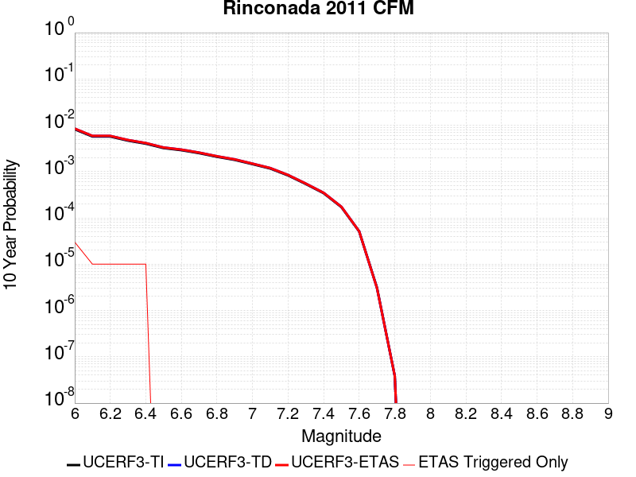 |

| Magnitude | 1 wk TI Prob | 1 wk TD Prob | 1 wk ETAS Prob | 1 wk ETAS/TD Gain | 1 wk ETAS Triggered Only | 1 mo TI Prob | 1 mo TD Prob | 1 mo ETAS Prob | 1 mo ETAS/TD Gain | 1 mo ETAS Triggered Only | 1 yr TI Prob | 1 yr TD Prob | 1 yr ETAS Prob | 1 yr ETAS/TD Gain | 1 yr ETAS Triggered Only | 10 yr TI Prob | 10 yr TD Prob | 10 yr ETAS Prob | 10 yr ETAS/TD Gain | 10 yr ETAS Triggered Only |
|-----|-----|-----|-----|-----|-----|-----|-----|-----|-----|-----|-----|-----|-----|-----|-----|-----|-----|-----|-----|-----|
| 6.0 | 1.5752368E-5 | 1.6274716E-5 | 1.6274716E-5 | 1.0 | 0.0 | 6.75084E-5 | 6.974694E-5 | 7.9746234E-5 | 1.1433655 | 1.0E-5 | 8.2160486E-4 | 8.488413E-4 | 8.6882425E-4 | 1.0235416 | 2.0E-5 | 0.008185739 | 0.00845637 | 0.008486116 | 1.0035176 | 3.0E-5 |
| 6.1 | 1.0966133E-5 | 1.1323029E-5 | 1.1323029E-5 | 1.0 | 0.0 | 4.6996865E-5 | 4.852637E-5 | 4.852637E-5 | 1.0 | 0.0 | 5.720366E-4 | 5.9064914E-4 | 6.006432E-4 | 1.0169206 | 1.0E-5 | 0.0057056635 | 0.005890889 | 0.00590083 | 1.0016875 | 1.0E-5 |
| 6.2 | 1.0966133E-5 | 1.1323029E-5 | 1.1323029E-5 | 1.0 | 0.0 | 4.6996865E-5 | 4.852637E-5 | 4.852637E-5 | 1.0 | 0.0 | 5.720366E-4 | 5.9064914E-4 | 6.006432E-4 | 1.0169206 | 1.0E-5 | 0.0057056635 | 0.005890889 | 0.00590083 | 1.0016875 | 1.0E-5 |
| 6.3 | 8.926149E-6 | 9.212772E-6 | 9.212772E-6 | 1.0 | 0.0 | 3.8254362E-5 | 3.948271E-5 | 3.948271E-5 | 1.0 | 0.0 | 4.6564735E-4 | 4.8059633E-4 | 4.905915E-4 | 1.0207975 | 1.0E-5 | 0.0046467283 | 0.0047956146 | 0.0048055667 | 1.0020752 | 1.0E-5 |
| 6.4 | 7.676955E-6 | 7.920191E-6 | 7.920191E-6 | 1.0 | 0.0 | 3.290082E-5 | 3.3943234E-5 | 3.3943234E-5 | 1.0 | 0.0 | 4.0049385E-4 | 4.131807E-4 | 4.2317656E-4 | 1.0241925 | 1.0E-5 | 0.0039977287 | 0.004124151 | 0.00413411 | 1.0024147 | 1.0E-5 |
| 6.5 | 6.1671026E-6 | 6.358955E-6 | 6.358955E-6 | 1.0 | 0.0 | 2.6430173E-5 | 2.725238E-5 | 2.725238E-5 | 1.0 | 0.0 | 3.2173982E-4 | 3.317473E-4 | 3.317473E-4 | 1.0 | 0.0 | 0.003212744 | 0.0033125326 | 0.0033125326 | 1.0 | 0.0 |
| 6.6 | 5.553456E-6 | 5.7248126E-6 | 5.7248126E-6 | 1.0 | 0.0 | 2.3800309E-5 | 2.4534682E-5 | 2.4534682E-5 | 1.0 | 0.0 | 2.897302E-4 | 2.9866886E-4 | 2.9866886E-4 | 1.0 | 0.0 | 0.0028935277 | 0.0029826832 | 0.0029826832 | 1.0 | 0.0 |
| 6.7 | 4.787857E-6 | 4.93331E-6 | 4.93331E-6 | 1.0 | 0.0 | 2.0519226E-5 | 2.1142585E-5 | 2.1142585E-5 | 1.0 | 0.0 | 2.4979294E-4 | 2.573806E-4 | 2.573806E-4 | 1.0 | 0.0 | 0.0024951235 | 0.002570831 | 0.002570831 | 1.0 | 0.0 |
| 6.8 | 3.9955166E-6 | 4.1134763E-6 | 4.1134763E-6 | 1.0 | 0.0 | 1.7123532E-5 | 1.7629065E-5 | 1.7629065E-5 | 1.0 | 0.0 | 2.0845905E-4 | 2.1461275E-4 | 2.1461275E-4 | 1.0 | 0.0 | 0.002082636 | 0.0021440587 | 0.0021440587 | 1.0 | 0.0 |
| 6.9 | 3.4250072E-6 | 3.5224466E-6 | 3.5224466E-6 | 1.0 | 0.0 | 1.46785205E-5 | 1.5096112E-5 | 1.5096112E-5 | 1.0 | 0.0 | 1.7869633E-4 | 1.8377969E-4 | 1.8377969E-4 | 1.0 | 0.0 | 0.001785527 | 0.0018362795 | 0.0018362795 | 1.0 | 0.0 |
| 7.0 | 2.7712713E-6 | 2.8467002E-6 | 2.8467002E-6 | 1.0 | 0.0 | 1.1876823E-5 | 1.22000865E-5 | 1.22000865E-5 | 1.0 | 0.0 | 1.4459073E-4 | 1.4852594E-4 | 1.4852594E-4 | 1.0 | 0.0 | 0.0014449668 | 0.0014842683 | 0.0014842683 | 1.0 | 0.0 |
| 7.1 | 2.227358E-6 | 2.2856987E-6 | 2.2856987E-6 | 1.0 | 0.0 | 9.545785E-6 | 9.795815E-6 | 9.795815E-6 | 1.0 | 0.0 | 1.16213734E-4 | 1.1925753E-4 | 1.1925753E-4 | 1.0 | 0.0 | 0.0011615298 | 0.0011919363 | 0.0011919363 | 1.0 | 0.0 |
| 7.2 | 1.581796E-6 | 1.6209015E-6 | 1.6209015E-6 | 1.0 | 0.0 | 6.779108E-6 | 6.946702E-6 | 6.946702E-6 | 1.0 | 0.0 | 8.253252E-5 | 8.4572814E-5 | 8.4572814E-5 | 1.0 | 0.0 | 8.250187E-4 | 8.4540684E-4 | 8.4540684E-4 | 1.0 | 0.0 |
| 7.3 | 1.0306567E-6 | 1.054648E-6 | 1.054648E-6 | 1.0 | 0.0 | 4.4170924E-6 | 4.519912E-6 | 4.519912E-6 | 1.0 | 0.0 | 5.3776774E-5 | 5.502854E-5 | 5.502854E-5 | 1.0 | 0.0 | 5.376376E-4 | 5.501494E-4 | 5.501494E-4 | 1.0 | 0.0 |
| 7.4 | 6.535541E-7 | 6.682744E-7 | 6.682744E-7 | 1.0 | 0.0 | 2.800943E-6 | 2.8640302E-6 | 2.8640302E-6 | 1.0 | 0.0 | 3.4100947E-5 | 3.4869012E-5 | 3.4869012E-5 | 1.0 | 0.0 | 3.4095717E-4 | 3.486355E-4 | 3.486355E-4 | 1.0 | 0.0 |
| 7.5 | 3.2656962E-7 | 3.3316712E-7 | 3.3316712E-7 | 1.0 | 0.0 | 1.3995833E-6 | 1.4278584E-6 | 1.4278584E-6 | 1.0 | 0.0 | 1.7039794E-5 | 1.7384036E-5 | 1.7384036E-5 | 1.0 | 0.0 | 1.7038487E-4 | 1.738268E-4 | 1.738268E-4 | 1.0 | 0.0 |
| 7.6 | 9.754343E-8 | 9.821017E-8 | 9.821017E-8 | 1.0 | 0.0 | 4.180432E-7 | 4.2090065E-7 | 4.2090065E-7 | 1.0 | 0.0 | 5.089664E-6 | 5.1244533E-6 | 5.1244533E-6 | 1.0 | 0.0 | 5.0895473E-5 | 5.124336E-5 | 5.124336E-5 | 1.0 | 0.0 |
| 7.7 | 6.0001453E-9 | 5.8491207E-9 | 5.8491207E-9 | 1.0 | 0.0 | 2.5714908E-8 | 2.506766E-8 | 2.506766E-8 | 1.0 | 0.0 | 3.1307894E-7 | 3.051987E-7 | 3.051987E-7 | 1.0 | 0.0 | 3.1307852E-6 | 3.0519832E-6 | 3.0519832E-6 | 1.0 | 0.0 |
| 7.8 | 7.400003E-11 | 7.4654505E-11 | 7.4654505E-11 | 1.0 | 0.0 | 3.171432E-10 | 3.1994773E-10 | 3.1994773E-10 | 1.0 | 0.0 | 3.861218E-9 | 3.895363E-9 | 3.895363E-9 | 1.0 | 0.0 | 3.861218E-8 | 3.895363E-8 | 3.895363E-8 | 1.0 | 0.0 |

## Great Valley 03 Mysterious Ridge
*[(top)](#table-of-contents)*

| 1 Week | 1 Month | 1 Year | 10 Year |
|-----|-----|-----|-----|
|  |  |  |  |

| Magnitude | 1 wk TI Prob | 1 wk TD Prob | 1 wk ETAS Prob | 1 wk ETAS/TD Gain | 1 wk ETAS Triggered Only | 1 mo TI Prob | 1 mo TD Prob | 1 mo ETAS Prob | 1 mo ETAS/TD Gain | 1 mo ETAS Triggered Only | 1 yr TI Prob | 1 yr TD Prob | 1 yr ETAS Prob | 1 yr ETAS/TD Gain | 1 yr ETAS Triggered Only | 10 yr TI Prob | 10 yr TD Prob | 10 yr ETAS Prob | 10 yr ETAS/TD Gain | 10 yr ETAS Triggered Only |
|-----|-----|-----|-----|-----|-----|-----|-----|-----|-----|-----|-----|-----|-----|-----|-----|-----|-----|-----|-----|-----|
| 6.0 | 3.1182444E-5 | 3.6034133E-5 | 4.6033772E-5 | 1.2775047 | 1.0E-5 | 1.336322E-4 | 1.5442389E-4 | 1.7442081E-4 | 1.1294936 | 2.0E-5 | 0.0016257578 | 0.0018786751 | 0.0018986375 | 1.0106258 | 2.0E-5 | 0.016139153 | 0.018646672 | 0.018666299 | 1.0010526 | 2.0E-5 |
| 6.1 | 3.1182444E-5 | 3.6034133E-5 | 4.6033772E-5 | 1.2775047 | 1.0E-5 | 1.336322E-4 | 1.5442389E-4 | 1.7442081E-4 | 1.1294936 | 2.0E-5 | 0.0016257578 | 0.0018786751 | 0.0018986375 | 1.0106258 | 2.0E-5 | 0.016139153 | 0.018646672 | 0.018666299 | 1.0010526 | 2.0E-5 |
| 6.2 | 3.1182444E-5 | 3.6034133E-5 | 4.6033772E-5 | 1.2775047 | 1.0E-5 | 1.336322E-4 | 1.5442389E-4 | 1.7442081E-4 | 1.1294936 | 2.0E-5 | 0.0016257578 | 0.0018786751 | 0.0018986375 | 1.0106258 | 2.0E-5 | 0.016139153 | 0.018646672 | 0.018666299 | 1.0010526 | 2.0E-5 |
| 6.3 | 2.106934E-5 | 2.3850303E-5 | 3.3850065E-5 | 1.4192718 | 1.0E-5 | 9.0294045E-5 | 1.0221176E-4 | 1.12210735E-4 | 1.0978261 | 1.0E-5 | 0.0010987755 | 0.0012437488 | 0.0012537364 | 1.0080302 | 1.0E-5 | 0.010933585 | 0.0123711275 | 0.01239088 | 1.0015967 | 2.0E-5 |
| 6.4 | 2.106934E-5 | 2.3850303E-5 | 3.3850065E-5 | 1.4192718 | 1.0E-5 | 9.0294045E-5 | 1.0221176E-4 | 1.12210735E-4 | 1.0978261 | 1.0E-5 | 0.0010987755 | 0.0012437488 | 0.0012537364 | 1.0080302 | 1.0E-5 | 0.010933585 | 0.0123711275 | 0.01239088 | 1.0015967 | 2.0E-5 |
| 6.5 | 1.9389783E-5 | 2.1884982E-5 | 3.1884763E-5 | 1.4569243 | 1.0E-5 | 8.309642E-5 | 9.378956E-5 | 1.03788625E-4 | 1.1066117 | 1.0E-5 | 0.0010112294 | 0.0011413175 | 0.0011513061 | 1.0087517 | 1.0E-5 | 0.010066401 | 0.011357434 | 0.011377207 | 1.0017409 | 2.0E-5 |
| 6.6 | 1.9370193E-5 | 2.1864902E-5 | 3.1864685E-5 | 1.4573439 | 1.0E-5 | 8.301247E-5 | 9.3703515E-5 | 1.0370258E-4 | 1.1067096 | 1.0E-5 | 0.0010102082 | 0.001140271 | 0.0011502596 | 1.0087599 | 1.0E-5 | 0.010056281 | 0.011347076 | 0.011366849 | 1.0017426 | 2.0E-5 |
| 6.7 | 1.6723505E-5 | 1.8799281E-5 | 2.8799093E-5 | 1.5319252 | 1.0E-5 | 7.16702E-5 | 8.056597E-5 | 9.056517E-5 | 1.1241119 | 1.0E-5 | 8.722353E-4 | 9.804688E-4 | 9.90459E-4 | 1.0101892 | 1.0E-5 | 0.008688197 | 0.009763439 | 0.009773342 | 1.0010142 | 1.0E-5 |
| 6.8 | 1.426937E-5 | 1.599721E-5 | 2.599705E-5 | 1.6250991 | 1.0E-5 | 6.115301E-5 | 6.855775E-5 | 7.855707E-5 | 1.1458524 | 1.0E-5 | 7.4428355E-4 | 8.343854E-4 | 8.443771E-4 | 1.0119748 | 1.0E-5 | 0.007417957 | 0.008314005 | 0.008323922 | 1.0011928 | 1.0E-5 |
| 6.9 | 1.2469891E-5 | 1.3956928E-5 | 2.3956789E-5 | 1.71648 | 1.0E-5 | 5.3441294E-5 | 5.9814105E-5 | 6.9813505E-5 | 1.1671747 | 1.0E-5 | 6.504535E-4 | 7.280055E-4 | 7.3799817E-4 | 1.0137261 | 1.0E-5 | 0.006485529 | 0.00725743 | 0.0072673573 | 1.0013679 | 1.0E-5 |
| 7.0 | 8.7746275E-6 | 9.791734E-6 | 1.9791636E-5 | 2.0212595 | 1.0E-5 | 3.7605005E-5 | 4.196394E-5 | 5.1963518E-5 | 1.2382898 | 1.0E-5 | 4.5774475E-4 | 5.1079853E-4 | 5.2079343E-4 | 1.0195671 | 1.0E-5 | 0.00456803 | 0.005096977 | 0.0051069264 | 1.0019519 | 1.0E-5 |
| 7.1 | 6.1067153E-6 | 6.813725E-6 | 1.6813658E-5 | 2.4676158 | 1.0E-5 | 2.6171374E-5 | 2.9201385E-5 | 3.920109E-5 | 1.3424395 | 1.0E-5 | 3.1858988E-4 | 3.5547445E-4 | 3.6547089E-4 | 1.0281215 | 1.0E-5 | 0.0031813353 | 0.003549609 | 0.0035595736 | 1.0028073 | 1.0E-5 |
| 7.2 | 2.939283E-6 | 3.2741057E-6 | 1.3274073E-5 | 4.0542593 | 1.0E-5 | 1.2596866E-5 | 1.4031816E-5 | 2.4031677E-5 | 1.7126561 | 1.0E-5 | 1.5335606E-4 | 1.7082572E-4 | 1.80824E-4 | 1.0585291 | 1.0E-5 | 0.0015325027 | 0.001707116 | 0.001717099 | 1.0058478 | 1.0E-5 |
| 7.3 | 7.2387763E-7 | 8.008505E-7 | 8.008505E-7 | 1.0 | 0.0 | 3.102329E-6 | 3.4322145E-6 | 3.4322145E-6 | 1.0 | 0.0 | 3.77702E-5 | 4.178687E-5 | 4.178687E-5 | 1.0 | 0.0 | 3.7763783E-4 | 4.1783508E-4 | 4.1783508E-4 | 1.0 | 0.0 |
| 7.4 | 3.112171E-8 | 3.2068368E-8 | 3.2068368E-8 | 1.0 | 0.0 | 1.3337875E-7 | 1.3743585E-7 | 1.3743585E-7 | 1.0 | 0.0 | 1.6238852E-6 | 1.6732803E-6 | 1.6732803E-6 | 1.0 | 0.0 | 1.6238733E-5 | 1.6732685E-5 | 1.6732685E-5 | 1.0 | 0.0 |

## Sierra Madre
*[(top)](#table-of-contents)*

| 1 Week | 1 Month | 1 Year | 10 Year |
|-----|-----|-----|-----|
|  |  | 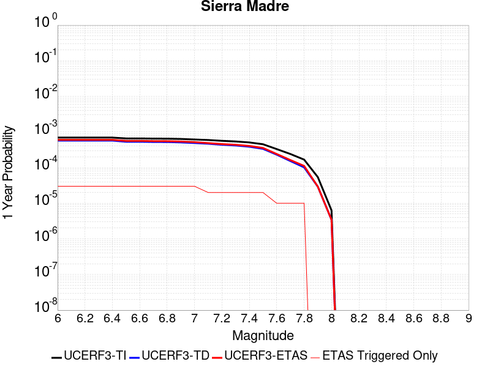 |  |

| Magnitude | 1 wk TI Prob | 1 wk TD Prob | 1 wk ETAS Prob | 1 wk ETAS/TD Gain | 1 wk ETAS Triggered Only | 1 mo TI Prob | 1 mo TD Prob | 1 mo ETAS Prob | 1 mo ETAS/TD Gain | 1 mo ETAS Triggered Only | 1 yr TI Prob | 1 yr TD Prob | 1 yr ETAS Prob | 1 yr ETAS/TD Gain | 1 yr ETAS Triggered Only | 10 yr TI Prob | 10 yr TD Prob | 10 yr ETAS Prob | 10 yr ETAS/TD Gain | 10 yr ETAS Triggered Only |
|-----|-----|-----|-----|-----|-----|-----|-----|-----|-----|-----|-----|-----|-----|-----|-----|-----|-----|-----|-----|-----|
| 6.0 | 1.3379373E-5 | 1.1000776E-5 | 1.1000776E-5 | 1.0 | 0.0 | 5.7338908E-5 | 4.714534E-5 | 5.714487E-5 | 1.2121 | 1.0E-5 | 6.978776E-4 | 5.738448E-4 | 6.038276E-4 | 1.052249 | 3.0E-5 | 0.0069569005 | 0.0057238447 | 0.005753673 | 1.0052112 | 3.0E-5 |
| 6.1 | 1.3379373E-5 | 1.1000776E-5 | 1.1000776E-5 | 1.0 | 0.0 | 5.7338908E-5 | 4.714534E-5 | 5.714487E-5 | 1.2121 | 1.0E-5 | 6.978776E-4 | 5.738448E-4 | 6.038276E-4 | 1.052249 | 3.0E-5 | 0.0069569005 | 0.0057238447 | 0.005753673 | 1.0052112 | 3.0E-5 |
| 6.2 | 1.3379373E-5 | 1.1000776E-5 | 1.1000776E-5 | 1.0 | 0.0 | 5.7338908E-5 | 4.714534E-5 | 5.714487E-5 | 1.2121 | 1.0E-5 | 6.978776E-4 | 5.738448E-4 | 6.038276E-4 | 1.052249 | 3.0E-5 | 0.0069569005 | 0.0057238447 | 0.005753673 | 1.0052112 | 3.0E-5 |
| 6.3 | 1.3379373E-5 | 1.1000776E-5 | 1.1000776E-5 | 1.0 | 0.0 | 5.7338908E-5 | 4.714534E-5 | 5.714487E-5 | 1.2121 | 1.0E-5 | 6.978776E-4 | 5.738448E-4 | 6.038276E-4 | 1.052249 | 3.0E-5 | 0.0069569005 | 0.0057238447 | 0.005753673 | 1.0052112 | 3.0E-5 |
| 6.4 | 1.3379373E-5 | 1.1000776E-5 | 1.1000776E-5 | 1.0 | 0.0 | 5.7338908E-5 | 4.714534E-5 | 5.714487E-5 | 1.2121 | 1.0E-5 | 6.978776E-4 | 5.738448E-4 | 6.038276E-4 | 1.052249 | 3.0E-5 | 0.0069569005 | 0.0057238447 | 0.005753673 | 1.0052112 | 3.0E-5 |
| 6.5 | 1.26563245E-5 | 1.0230232E-5 | 1.0230232E-5 | 1.0 | 0.0 | 5.4240263E-5 | 4.384312E-5 | 5.3842683E-5 | 1.228076 | 1.0E-5 | 6.601751E-4 | 5.3366035E-4 | 5.6364434E-4 | 1.0561855 | 3.0E-5 | 0.006582173 | 0.0053239604 | 0.0053538005 | 1.0056049 | 3.0E-5 |
| 6.6 | 1.26563245E-5 | 1.0230232E-5 | 1.0230232E-5 | 1.0 | 0.0 | 5.4240263E-5 | 4.384312E-5 | 5.3842683E-5 | 1.228076 | 1.0E-5 | 6.601751E-4 | 5.3366035E-4 | 5.6364434E-4 | 1.0561855 | 3.0E-5 | 0.006582173 | 0.0053239604 | 0.0053538005 | 1.0056049 | 3.0E-5 |
| 6.7 | 1.2502474E-5 | 1.00663765E-5 | 1.00663765E-5 | 1.0 | 0.0 | 5.3580934E-5 | 4.3140906E-5 | 5.3140473E-5 | 1.2317885 | 1.0E-5 | 6.521526E-4 | 5.25115E-4 | 5.550992E-4 | 1.0571003 | 3.0E-5 | 0.0065024206 | 0.0052389116 | 0.0052687544 | 1.0056964 | 3.0E-5 |
| 6.8 | 1.2454966E-5 | 1.0018662E-5 | 1.0018662E-5 | 1.0 | 0.0 | 5.3377335E-5 | 4.293642E-5 | 5.293599E-5 | 1.2328925 | 1.0E-5 | 6.4967526E-4 | 5.226266E-4 | 5.526109E-4 | 1.0573723 | 3.0E-5 | 0.006477792 | 0.0052141445 | 0.005243988 | 1.0057236 | 3.0E-5 |
| 6.9 | 1.2225574E-5 | 9.792639E-6 | 9.792639E-6 | 1.0 | 0.0 | 5.2394265E-5 | 4.196778E-5 | 5.1967363E-5 | 1.238268 | 1.0E-5 | 6.3771347E-4 | 5.10839E-4 | 5.408237E-4 | 1.0586969 | 3.0E-5 | 0.006358865 | 0.0050968137 | 0.0051266607 | 1.005856 | 3.0E-5 |
| 7.0 | 1.182946E-5 | 9.399179E-6 | 9.399179E-6 | 1.0 | 0.0 | 5.06967E-5 | 4.0281582E-5 | 5.0281178E-5 | 1.2482424 | 1.0E-5 | 6.1705755E-4 | 4.903189E-4 | 5.203042E-4 | 1.0611547 | 3.0E-5 | 0.006153469 | 0.004892533 | 0.0049223863 | 1.0061018 | 3.0E-5 |
| 7.1 | 1.14369095E-5 | 8.986194E-6 | 8.986194E-6 | 1.0 | 0.0 | 4.9014405E-5 | 3.85117E-5 | 4.8511312E-5 | 1.2596513 | 1.0E-5 | 5.9658696E-4 | 4.6878002E-4 | 4.8877066E-4 | 1.0426439 | 2.0E-5 | 0.005949879 | 0.0046780678 | 0.0046979743 | 1.0042553 | 2.0E-5 |
| 7.2 | 1.0836419E-5 | 8.39959E-6 | 8.39959E-6 | 1.0 | 0.0 | 4.644097E-5 | 3.599775E-5 | 4.599739E-5 | 1.2777852 | 1.0E-5 | 5.652721E-4 | 4.3818538E-4 | 4.5817663E-4 | 1.0456228 | 2.0E-5 | 0.0056383642 | 0.0043733614 | 0.004393274 | 1.0045532 | 2.0E-5 |
| 7.3 | 1.0403439E-5 | 8.020854E-6 | 8.020854E-6 | 1.0 | 0.0 | 4.4585406E-5 | 3.437464E-5 | 4.4374297E-5 | 1.2909021 | 1.0E-5 | 5.426921E-4 | 4.184318E-4 | 4.3842342E-4 | 1.0477775 | 2.0E-5 | 0.005413687 | 0.004176585 | 0.0041965013 | 1.0047686 | 2.0E-5 |
| 7.4 | 9.768864E-6 | 7.4144855E-6 | 7.4144855E-6 | 1.0 | 0.0 | 4.186589E-5 | 3.1775984E-5 | 4.1775667E-5 | 1.3146931 | 1.0E-5 | 5.09598E-4 | 3.868048E-4 | 4.0679707E-4 | 1.0516857 | 2.0E-5 | 0.0050843097 | 0.0038614576 | 0.0038813804 | 1.0051594 | 2.0E-5 |
| 7.5 | 8.687089E-6 | 6.450183E-6 | 6.450183E-6 | 1.0 | 0.0 | 3.722985E-5 | 2.7643353E-5 | 3.7643076E-5 | 1.3617406 | 1.0E-5 | 4.5317915E-4 | 3.3650672E-4 | 3.5649998E-4 | 1.0594141 | 2.0E-5 | 0.004522561 | 0.003360109 | 0.0033800418 | 1.0059322 | 2.0E-5 |
| 7.6 | 6.3506063E-6 | 4.430329E-6 | 4.430329E-6 | 1.0 | 0.0 | 2.72166E-5 | 1.8986988E-5 | 1.8986988E-5 | 1.0 | 0.0 | 3.3131172E-4 | 2.3114232E-4 | 2.4114E-4 | 1.0432534 | 1.0E-5 | 0.003308182 | 0.0023090935 | 0.0023190705 | 1.0043207 | 1.0E-5 |
| 7.7 | 4.62223E-6 | 2.9329542E-6 | 2.9329542E-6 | 1.0 | 0.0 | 1.9809406E-5 | 1.2569743E-5 | 1.2569743E-5 | 1.0 | 0.0 | 2.4115283E-4 | 1.5302589E-4 | 1.6302436E-4 | 1.0653384 | 1.0E-5 | 0.0024089129 | 0.0015292577 | 0.0015392425 | 1.0065291 | 1.0E-5 |
| 7.8 | 3.2145008E-6 | 1.949411E-6 | 1.949411E-6 | 1.0 | 0.0 | 1.3776359E-5 | 8.354592E-6 | 8.354592E-6 | 1.0 | 0.0 | 1.6771426E-4 | 1.01712416E-4 | 1.117114E-4 | 1.0983064 | 1.0E-5 | 0.0016758774 | 0.0010166786 | 0.0010266685 | 1.009826 | 1.0E-5 |
| 7.9 | 1.0391769E-6 | 5.602482E-7 | 5.602482E-7 | 1.0 | 0.0 | 4.4536077E-6 | 2.4010617E-6 | 2.4010617E-6 | 1.0 | 0.0 | 5.4221324E-5 | 2.9232539E-5 | 2.9232539E-5 | 1.0 | 0.0 | 5.4208096E-4 | 2.9228735E-4 | 2.9228735E-4 | 1.0 | 0.0 |
| 8.0 | 1.210983E-7 | 6.613497E-8 | 6.613497E-8 | 1.0 | 0.0 | 5.1899264E-7 | 2.8343558E-7 | 2.8343558E-7 | 1.0 | 0.0 | 6.3187167E-6 | 3.4508228E-6 | 3.4508228E-6 | 1.0 | 0.0 | 6.318537E-5 | 3.450771E-5 | 3.450771E-5 | 1.0 | 0.0 |

## Calaveras (No) 2011 CFM
*[(top)](#table-of-contents)*

| 1 Week | 1 Month | 1 Year | 10 Year |
|-----|-----|-----|-----|
|  |  |  |  |

| Magnitude | 1 wk TI Prob | 1 wk TD Prob | 1 wk ETAS Prob | 1 wk ETAS/TD Gain | 1 wk ETAS Triggered Only | 1 mo TI Prob | 1 mo TD Prob | 1 mo ETAS Prob | 1 mo ETAS/TD Gain | 1 mo ETAS Triggered Only | 1 yr TI Prob | 1 yr TD Prob | 1 yr ETAS Prob | 1 yr ETAS/TD Gain | 1 yr ETAS Triggered Only | 10 yr TI Prob | 10 yr TD Prob | 10 yr ETAS Prob | 10 yr ETAS/TD Gain | 10 yr ETAS Triggered Only |
|-----|-----|-----|-----|-----|-----|-----|-----|-----|-----|-----|-----|-----|-----|-----|-----|-----|-----|-----|-----|-----|
| 6.0 | 4.8694856E-5 | 6.747457E-5 | 6.747457E-5 | 1.0 | 0.0 | 2.0867554E-4 | 2.891453E-4 | 2.991424E-4 | 1.0345746 | 1.0E-5 | 0.0025376645 | 0.0035146773 | 0.003534607 | 1.0056704 | 2.0E-5 | 0.02508881 | 0.034771074 | 0.03480003 | 1.0008328 | 3.0E-5 |
| 6.1 | 4.8694856E-5 | 6.747457E-5 | 6.747457E-5 | 1.0 | 0.0 | 2.0867554E-4 | 2.891453E-4 | 2.991424E-4 | 1.0345746 | 1.0E-5 | 0.0025376645 | 0.0035146773 | 0.003534607 | 1.0056704 | 2.0E-5 | 0.02508881 | 0.034771074 | 0.03480003 | 1.0008328 | 3.0E-5 |
| 6.2 | 4.7541962E-5 | 6.5805805E-5 | 6.5805805E-5 | 1.0 | 0.0 | 2.0373536E-4 | 2.8199502E-4 | 2.9199218E-4 | 1.0354517 | 1.0E-5 | 0.0024776561 | 0.003427919 | 0.0034478505 | 1.0058144 | 2.0E-5 | 0.024502134 | 0.0339325 | 0.03396148 | 1.0008541 | 3.0E-5 |
| 6.3 | 4.6717287E-5 | 6.463939E-5 | 6.463939E-5 | 1.0 | 0.0 | 2.0020158E-4 | 2.7699716E-4 | 2.869944E-4 | 1.0360914 | 1.0E-5 | 0.0024347296 | 0.0033672696 | 0.0033872023 | 1.0059196 | 2.0E-5 | 0.024082264 | 0.033345006 | 0.033374008 | 1.0008696 | 3.0E-5 |
| 6.4 | 4.6276386E-5 | 6.400103E-5 | 6.400103E-5 | 1.0 | 0.0 | 1.983123E-4 | 2.7426204E-4 | 2.842593E-4 | 1.0364515 | 1.0E-5 | 0.0024117786 | 0.00333408 | 0.0033540134 | 1.0059787 | 2.0E-5 | 0.02385771 | 0.03302388 | 0.033052888 | 1.0008785 | 3.0E-5 |
| 6.5 | 4.5720994E-5 | 6.32025E-5 | 6.32025E-5 | 1.0 | 0.0 | 1.9593239E-4 | 2.7084045E-4 | 2.8083773E-4 | 1.0369121 | 1.0E-5 | 0.002382867 | 0.0032925585 | 0.0033124927 | 1.0060543 | 2.0E-5 | 0.023574775 | 0.032621842 | 0.032650862 | 1.0008897 | 3.0E-5 |
| 6.6 | 4.549134E-5 | 6.285557E-5 | 6.285557E-5 | 1.0 | 0.0 | 1.949483E-4 | 2.693539E-4 | 2.7935122E-4 | 1.0371159 | 1.0E-5 | 0.0023709119 | 0.0032745146 | 0.003294449 | 1.0060878 | 2.0E-5 | 0.023457756 | 0.03244731 | 0.032476336 | 1.0008945 | 3.0E-5 |
| 6.7 | 3.701047E-5 | 5.03607E-5 | 5.03607E-5 | 1.0 | 0.0 | 1.5860666E-4 | 2.1581395E-4 | 2.258118E-4 | 1.0463262 | 1.0E-5 | 0.0019293258 | 0.002624412 | 0.0026443596 | 1.0076008 | 2.0E-5 | 0.019126613 | 0.026125198 | 0.026154416 | 1.0011183 | 3.0E-5 |
| 6.8 | 3.5523568E-5 | 4.834225E-5 | 4.834225E-5 | 1.0 | 0.0 | 1.5223498E-4 | 2.0716486E-4 | 2.1716279E-4 | 1.0482607 | 1.0E-5 | 0.0018518851 | 0.0025193577 | 0.0025393073 | 1.0079185 | 2.0E-5 | 0.018365284 | 0.025097623 | 0.02512687 | 1.0011654 | 3.0E-5 |
| 6.9 | 3.2946147E-5 | 4.4663826E-5 | 4.4663826E-5 | 1.0 | 0.0 | 1.4119013E-4 | 1.9140259E-4 | 2.0140067E-4 | 1.0522358 | 1.0E-5 | 0.0017176344 | 0.0023278783 | 0.0023478316 | 1.0085715 | 2.0E-5 | 0.017044188 | 0.023219762 | 0.023249066 | 1.001262 | 3.0E-5 |
| 7.0 | 2.7682381E-5 | 3.7023216E-5 | 3.7023216E-5 | 1.0 | 0.0 | 1.1863338E-4 | 1.5866144E-4 | 1.6865986E-4 | 1.0630172 | 1.0E-5 | 0.0014434044 | 0.0019300217 | 0.0019499831 | 1.0103426 | 2.0E-5 | 0.01434065 | 0.019311164 | 0.019330777 | 1.0010157 | 2.0E-5 |
| 7.1 | 2.471967E-5 | 3.328756E-5 | 3.328756E-5 | 1.0 | 0.0 | 1.05937135E-4 | 1.4265333E-4 | 1.526519E-4 | 1.07009 | 1.0E-5 | 0.0012890215 | 0.0017354497 | 0.0017554149 | 1.0115044 | 2.0E-5 | 0.0128157 | 0.017386293 | 0.017405946 | 1.0011303 | 2.0E-5 |
| 7.2 | 1.9748062E-5 | 2.6775411E-5 | 2.6775411E-5 | 1.0 | 0.0 | 8.463181E-5 | 1.1474685E-4 | 1.247457E-4 | 1.0871384 | 1.0E-5 | 0.0010299052 | 0.001396171 | 0.0014161431 | 1.0143049 | 2.0E-5 | 0.01025145 | 0.014031046 | 0.014050766 | 1.0014054 | 2.0E-5 |
| 7.3 | 1.1603734E-5 | 1.5784257E-5 | 1.5784257E-5 | 1.0 | 0.0 | 4.9729337E-5 | 6.7645145E-5 | 6.7645145E-5 | 1.0 | 0.0 | 6.052865E-4 | 8.232826E-4 | 8.232826E-4 | 1.0 | 0.0 | 0.0060364045 | 0.008308739 | 0.008308739 | 1.0 | 0.0 |
| 7.4 | 4.885381E-6 | 6.035117E-6 | 6.035117E-6 | 1.0 | 0.0 | 2.0937177E-5 | 2.5864532E-5 | 2.5864532E-5 | 1.0 | 0.0 | 2.5488032E-4 | 3.1485534E-4 | 3.1485534E-4 | 1.0 | 0.0 | 0.0025458818 | 0.0032009764 | 0.0032009764 | 1.0 | 0.0 |
| 7.5 | 3.0571264E-6 | 4.1554085E-6 | 4.1554085E-6 | 1.0 | 0.0 | 1.3101904E-5 | 1.7808772E-5 | 1.7808772E-5 | 1.0 | 0.0 | 1.5950401E-4 | 2.1680034E-4 | 2.1680034E-4 | 1.0 | 0.0 | 0.0015938957 | 0.0022209007 | 0.0022209007 | 1.0 | 0.0 |
| 7.6 | 1.764948E-6 | 2.795641E-6 | 2.795641E-6 | 1.0 | 0.0 | 7.564041E-6 | 1.1981264E-5 | 1.1981264E-5 | 1.0 | 0.0 | 9.208831E-5 | 1.458622E-4 | 1.458622E-4 | 1.0 | 0.0 | 9.205016E-4 | 0.0015124046 | 0.0015124046 | 1.0 | 0.0 |
| 7.7 | 1.3173734E-6 | 2.0585271E-6 | 2.0585271E-6 | 1.0 | 0.0 | 5.645874E-6 | 8.82223E-6 | 8.82223E-6 | 1.0 | 0.0 | 6.873634E-5 | 1.0740537E-4 | 1.0740537E-4 | 1.0 | 0.0 | 6.8715087E-4 | 0.0011261607 | 0.0011261607 | 1.0 | 0.0 |
| 7.8 | 9.4429885E-7 | 1.5490102E-6 | 1.5490102E-6 | 1.0 | 0.0 | 4.0469886E-6 | 6.6385983E-6 | 6.6385983E-6 | 1.0 | 0.0 | 4.9270973E-5 | 8.082195E-5 | 8.082195E-5 | 1.0 | 0.0 | 4.926005E-4 | 8.501931E-4 | 8.501931E-4 | 1.0 | 0.0 |
| 7.9 | 6.388233E-7 | 1.11492E-6 | 1.11492E-6 | 1.0 | 0.0 | 2.7378112E-6 | 4.7782196E-6 | 4.7782196E-6 | 1.0 | 0.0 | 3.3332344E-5 | 5.8173282E-5 | 5.8173282E-5 | 1.0 | 0.0 | 3.3327343E-4 | 6.096674E-4 | 6.096674E-4 | 1.0 | 0.0 |
| 8.0 | 3.087986E-7 | 5.754721E-7 | 5.754721E-7 | 1.0 | 0.0 | 1.323422E-6 | 2.4663066E-6 | 2.4663066E-6 | 1.0 | 0.0 | 1.6112543E-5 | 3.0026871E-5 | 3.0026871E-5 | 1.0 | 0.0 | 1.6111376E-4 | 3.110238E-4 | 3.110238E-4 | 1.0 | 0.0 |
| 8.1 | 1.6725647E-7 | 2.7410795E-7 | 2.7410795E-7 | 1.0 | 0.0 | 7.168133E-7 | 1.1747478E-6 | 1.1747478E-6 | 1.0 | 0.0 | 8.7271665E-6 | 1.4302462E-5 | 1.4302462E-5 | 1.0 | 0.0 | 8.726824E-5 | 1.4847395E-4 | 1.4847395E-4 | 1.0 | 0.0 |

## San Andreas (Santa Cruz Mts) 2011 CFM
*[(top)](#table-of-contents)*

| 1 Week | 1 Month | 1 Year | 10 Year |
|-----|-----|-----|-----|
|  |  |  | 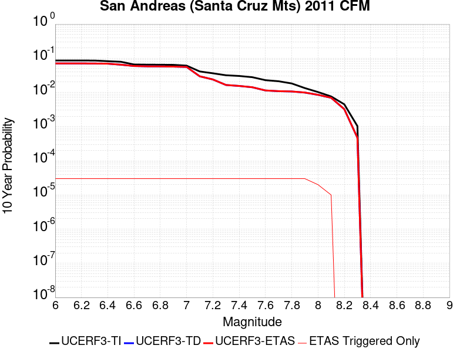 |

| Magnitude | 1 wk TI Prob | 1 wk TD Prob | 1 wk ETAS Prob | 1 wk ETAS/TD Gain | 1 wk ETAS Triggered Only | 1 mo TI Prob | 1 mo TD Prob | 1 mo ETAS Prob | 1 mo ETAS/TD Gain | 1 mo ETAS Triggered Only | 1 yr TI Prob | 1 yr TD Prob | 1 yr ETAS Prob | 1 yr ETAS/TD Gain | 1 yr ETAS Triggered Only | 10 yr TI Prob | 10 yr TD Prob | 10 yr ETAS Prob | 10 yr ETAS/TD Gain | 10 yr ETAS Triggered Only |
|-----|-----|-----|-----|-----|-----|-----|-----|-----|-----|-----|-----|-----|-----|-----|-----|-----|-----|-----|-----|-----|
| 6.0 | 1.7221631E-4 | 1.3792426E-4 | 1.3792426E-4 | 1.0 | 0.0 | 7.378611E-4 | 5.9097214E-4 | 5.9097214E-4 | 1.0 | 0.0 | 0.008946515 | 0.0071717235 | 0.0071915803 | 1.0027688 | 2.0E-5 | 0.08594794 | 0.07054796 | 0.07057585 | 1.0003953 | 3.0E-5 |
| 6.1 | 1.7221631E-4 | 1.3792426E-4 | 1.3792426E-4 | 1.0 | 0.0 | 7.378611E-4 | 5.9097214E-4 | 5.9097214E-4 | 1.0 | 0.0 | 0.008946515 | 0.0071717235 | 0.0071915803 | 1.0027688 | 2.0E-5 | 0.08594794 | 0.07054796 | 0.07057585 | 1.0003953 | 3.0E-5 |
| 6.2 | 1.7221631E-4 | 1.3792426E-4 | 1.3792426E-4 | 1.0 | 0.0 | 7.378611E-4 | 5.9097214E-4 | 5.9097214E-4 | 1.0 | 0.0 | 0.008946515 | 0.0071717235 | 0.0071915803 | 1.0027688 | 2.0E-5 | 0.08594794 | 0.07054796 | 0.07057585 | 1.0003953 | 3.0E-5 |
| 6.3 | 1.716926E-4 | 1.3711878E-4 | 1.3711878E-4 | 1.0 | 0.0 | 7.3561794E-4 | 5.8752164E-4 | 5.8752164E-4 | 1.0 | 0.0 | 0.008919428 | 0.007129989 | 0.0071498468 | 1.0027851 | 2.0E-5 | 0.08569809 | 0.07015993 | 0.07018782 | 1.0003976 | 3.0E-5 |
| 6.4 | 1.6392978E-4 | 1.3587909E-4 | 1.3587909E-4 | 1.0 | 0.0 | 7.02367E-4 | 5.82211E-4 | 5.82211E-4 | 1.0 | 0.0 | 0.008517839 | 0.0070657525 | 0.007085611 | 1.0028106 | 2.0E-5 | 0.08198654 | 0.069394976 | 0.06942289 | 1.0004023 | 3.0E-5 |
| 6.5 | 1.5742714E-4 | 1.2647794E-4 | 1.2647794E-4 | 1.0 | 0.0 | 6.745133E-4 | 5.419374E-4 | 5.419374E-4 | 1.0 | 0.0 | 0.00818132 | 0.0065784375 | 0.006598306 | 1.0030203 | 2.0E-5 | 0.078865945 | 0.06486093 | 0.064888984 | 1.0004325 | 3.0E-5 |
| 6.6 | 1.3038084E-4 | 1.1587992E-4 | 1.1587992E-4 | 1.0 | 0.0 | 5.5865536E-4 | 4.96535E-4 | 4.96535E-4 | 1.0 | 0.0 | 0.006780438 | 0.006028784 | 0.0060486635 | 1.0032974 | 2.0E-5 | 0.0657725 | 0.059330538 | 0.059358757 | 1.0004756 | 3.0E-5 |
| 6.7 | 1.2867592E-4 | 1.1314491E-4 | 1.1314491E-4 | 1.0 | 0.0 | 5.5135164E-4 | 4.8481792E-4 | 4.8481792E-4 | 1.0 | 0.0 | 0.0066920654 | 0.005886907 | 0.0059067896 | 1.0033773 | 2.0E-5 | 0.06494093 | 0.058041416 | 0.058069672 | 1.0004869 | 3.0E-5 |
| 6.8 | 1.2801298E-4 | 1.12520516E-4 | 1.12520516E-4 | 1.0 | 0.0 | 5.485117E-4 | 4.8214293E-4 | 4.8214293E-4 | 1.0 | 0.0 | 0.0066577005 | 0.0058545293 | 0.0058744126 | 1.0033962 | 2.0E-5 | 0.06461738 | 0.05775524 | 0.057783507 | 1.0004895 | 3.0E-5 |
| 6.9 | 1.269149E-4 | 1.1094256E-4 | 1.1094256E-4 | 1.0 | 0.0 | 5.4380763E-4 | 4.7538272E-4 | 4.7538272E-4 | 1.0 | 0.0 | 0.006600777 | 0.005772663 | 0.0057925475 | 1.0034446 | 2.0E-5 | 0.06408122 | 0.057027116 | 0.057055406 | 1.000496 | 3.0E-5 |
| 7.0 | 1.2030331E-4 | 1.0824356E-4 | 1.0824356E-4 | 1.0 | 0.0 | 5.154837E-4 | 4.638198E-4 | 4.638198E-4 | 1.0 | 0.0 | 0.006257969 | 0.0056326203 | 0.0056525073 | 1.0035307 | 2.0E-5 | 0.06084648 | 0.055699922 | 0.055728253 | 1.0005085 | 3.0E-5 |
| 7.1 | 8.049617E-5 | 5.392429E-5 | 5.392429E-5 | 1.0 | 0.0 | 3.4493793E-4 | 2.3108382E-4 | 2.3108382E-4 | 1.0 | 0.0 | 0.0041915346 | 0.0028098505 | 0.0028297943 | 1.0070978 | 2.0E-5 | 0.041133516 | 0.029618833 | 0.029647944 | 1.0009829 | 3.0E-5 |
| 7.2 | 7.093979E-5 | 4.2935415E-5 | 4.2935415E-5 | 1.0 | 0.0 | 3.0399222E-4 | 1.8399608E-4 | 1.8399608E-4 | 1.0 | 0.0 | 0.0036948253 | 0.0022378736 | 0.0022578288 | 1.0089171 | 2.0E-5 | 0.03633994 | 0.023941126 | 0.023970408 | 1.0012231 | 3.0E-5 |
| 7.3 | 6.193693E-5 | 2.8891074E-5 | 2.8891074E-5 | 1.0 | 0.0 | 2.6541698E-4 | 1.2381302E-4 | 1.2381302E-4 | 1.0 | 0.0 | 0.0032266637 | 0.001506383 | 0.0015263528 | 1.0132568 | 2.0E-5 | 0.031802133 | 0.016497677 | 0.016527183 | 1.0017885 | 3.0E-5 |
| 7.4 | 5.906492E-5 | 2.7020369E-5 | 2.7020369E-5 | 1.0 | 0.0 | 2.5311083E-4 | 1.1579645E-4 | 1.1579645E-4 | 1.0 | 0.0 | 0.0030772698 | 0.0014089114 | 0.0014288833 | 1.0141754 | 2.0E-5 | 0.030350044 | 0.0154695045 | 0.0154990405 | 1.0019093 | 3.0E-5 |
| 7.5 | 5.424296E-5 | 2.4675093E-5 | 2.4675093E-5 | 1.0 | 0.0 | 2.324491E-4 | 1.0574612E-4 | 1.0574612E-4 | 1.0 | 0.0 | 0.002826395 | 0.0012866998 | 0.0013066741 | 1.0155237 | 2.0E-5 | 0.027907165 | 0.014161854 | 0.014191429 | 1.0020883 | 3.0E-5 |
| 7.6 | 4.43084E-5 | 1.990151E-5 | 1.990151E-5 | 1.0 | 0.0 | 1.8987931E-4 | 8.528939E-5 | 8.528939E-5 | 1.0 | 0.0 | 0.0023093296 | 0.001037904 | 0.0010578833 | 1.0192496 | 2.0E-5 | 0.022854783 | 0.011411123 | 0.011440781 | 1.002599 | 3.0E-5 |
| 7.7 | 4.118098E-5 | 1.8933848E-5 | 1.8933848E-5 | 1.0 | 0.0 | 1.7647797E-4 | 8.1142534E-5 | 8.1142534E-5 | 1.0 | 0.0 | 0.002146502 | 9.874629E-4 | 0.0010074432 | 1.0202339 | 2.0E-5 | 0.021258866 | 0.010868995 | 0.010898669 | 1.0027301 | 3.0E-5 |
| 7.8 | 3.5408906E-5 | 1.856201E-5 | 1.856201E-5 | 1.0 | 0.0 | 1.5174363E-4 | 7.954905E-5 | 7.954905E-5 | 1.0 | 0.0 | 0.0018459131 | 9.6807955E-4 | 9.880601E-4 | 1.0206394 | 2.0E-5 | 0.018306552 | 0.0106506655 | 0.010680346 | 1.0027868 | 3.0E-5 |
| 7.9 | 2.5860836E-5 | 1.7313954E-5 | 1.7313954E-5 | 1.0 | 0.0 | 1.10827445E-4 | 7.420055E-5 | 7.420055E-5 | 1.0 | 0.0 | 0.001348489 | 9.030175E-4 | 9.2299946E-4 | 1.022128 | 2.0E-5 | 0.013403354 | 0.009906601 | 0.009936304 | 1.0029982 | 3.0E-5 |
| 8.0 | 1.9777332E-5 | 1.4837888E-5 | 1.4837888E-5 | 1.0 | 0.0 | 8.4757245E-5 | 6.3589396E-5 | 6.3589396E-5 | 1.0 | 0.0 | 0.0010314309 | 7.739261E-4 | 7.8391837E-4 | 1.0129111 | 1.0E-5 | 0.010266567 | 0.008508087 | 0.008527917 | 1.0023307 | 2.0E-5 |
| 8.1 | 1.468494E-5 | 1.2105831E-5 | 1.2105831E-5 | 1.0 | 0.0 | 6.293394E-5 | 5.1881103E-5 | 5.1881103E-5 | 1.0 | 0.0 | 7.6595135E-4 | 6.3146953E-4 | 6.3146953E-4 | 1.0 | 0.0 | 0.0076331664 | 0.0069684954 | 0.006978426 | 1.001425 | 1.0E-5 |
| 8.2 | 8.63836E-6 | 5.4678667E-6 | 5.4678667E-6 | 1.0 | 0.0 | 3.7021015E-5 | 2.3433504E-5 | 2.3433504E-5 | 1.0 | 0.0 | 4.5063766E-4 | 2.8526565E-4 | 2.8526565E-4 | 1.0 | 0.0 | 0.004497249 | 0.003245162 | 0.003245162 | 1.0 | 0.0 |
| 8.3 | 1.983087E-6 | 7.6564595E-7 | 7.6564595E-7 | 1.0 | 0.0 | 8.498917E-6 | 3.281336E-6 | 3.281336E-6 | 1.0 | 0.0 | 1.034694E-4 | 3.9949547E-5 | 3.9949547E-5 | 1.0 | 0.0 | 0.0010342124 | 4.717979E-4 | 4.717979E-4 | 1.0 | 0.0 |

## Newport-Inglewood alt 1
*[(top)](#table-of-contents)*

| 1 Week | 1 Month | 1 Year | 10 Year |
|-----|-----|-----|-----|
|  |  |  |  |

| Magnitude | 1 wk TI Prob | 1 wk TD Prob | 1 wk ETAS Prob | 1 wk ETAS/TD Gain | 1 wk ETAS Triggered Only | 1 mo TI Prob | 1 mo TD Prob | 1 mo ETAS Prob | 1 mo ETAS/TD Gain | 1 mo ETAS Triggered Only | 1 yr TI Prob | 1 yr TD Prob | 1 yr ETAS Prob | 1 yr ETAS/TD Gain | 1 yr ETAS Triggered Only | 10 yr TI Prob | 10 yr TD Prob | 10 yr ETAS Prob | 10 yr ETAS/TD Gain | 10 yr ETAS Triggered Only |
|-----|-----|-----|-----|-----|-----|-----|-----|-----|-----|-----|-----|-----|-----|-----|-----|-----|-----|-----|-----|-----|
| 6.0 | 2.9668912E-5 | 3.0404828E-5 | 5.0404222E-5 | 1.6577703 | 2.0E-5 | 1.2714628E-4 | 1.3030265E-4 | 1.6029873E-4 | 1.2302033 | 3.0E-5 | 0.0015469068 | 0.0015857654 | 0.0016157179 | 1.0188884 | 3.0E-5 | 0.015361829 | 0.01579211 | 0.015821636 | 1.0018697 | 3.0E-5 |
| 6.1 | 2.9668912E-5 | 3.0404828E-5 | 5.0404222E-5 | 1.6577703 | 2.0E-5 | 1.2714628E-4 | 1.3030265E-4 | 1.6029873E-4 | 1.2302033 | 3.0E-5 | 0.0015469068 | 0.0015857654 | 0.0016157179 | 1.0188884 | 3.0E-5 | 0.015361829 | 0.01579211 | 0.015821636 | 1.0018697 | 3.0E-5 |
| 6.2 | 2.9668912E-5 | 3.0404828E-5 | 5.0404222E-5 | 1.6577703 | 2.0E-5 | 1.2714628E-4 | 1.3030265E-4 | 1.6029873E-4 | 1.2302033 | 3.0E-5 | 0.0015469068 | 0.0015857654 | 0.0016157179 | 1.0188884 | 3.0E-5 | 0.015361829 | 0.01579211 | 0.015821636 | 1.0018697 | 3.0E-5 |
| 6.3 | 2.9668912E-5 | 3.0404828E-5 | 5.0404222E-5 | 1.6577703 | 2.0E-5 | 1.2714628E-4 | 1.3030265E-4 | 1.6029873E-4 | 1.2302033 | 3.0E-5 | 0.0015469068 | 0.0015857654 | 0.0016157179 | 1.0188884 | 3.0E-5 | 0.015361829 | 0.01579211 | 0.015821636 | 1.0018697 | 3.0E-5 |
| 6.4 | 1.275942E-5 | 1.02725335E-5 | 2.0272431E-5 | 1.9734597 | 1.0E-5 | 5.4682085E-5 | 4.4024422E-5 | 6.4023545E-5 | 1.4542733 | 2.0E-5 | 6.65551E-4 | 5.358697E-4 | 5.55859E-4 | 1.0373025 | 2.0E-5 | 0.0066356123 | 0.0053462 | 0.005366093 | 1.003721 | 2.0E-5 |
| 6.5 | 1.275942E-5 | 1.02725335E-5 | 2.0272431E-5 | 1.9734597 | 1.0E-5 | 5.4682085E-5 | 4.4024422E-5 | 6.4023545E-5 | 1.4542733 | 2.0E-5 | 6.65551E-4 | 5.358697E-4 | 5.55859E-4 | 1.0373025 | 2.0E-5 | 0.0066356123 | 0.0053462 | 0.005366093 | 1.003721 | 2.0E-5 |
| 6.6 | 1.1255358E-5 | 8.661911E-6 | 1.8661825E-5 | 2.1544695 | 1.0E-5 | 4.8236358E-5 | 3.7121958E-5 | 5.7121215E-5 | 1.5387447 | 2.0E-5 | 5.871194E-4 | 4.5186782E-4 | 4.7185877E-4 | 1.0442407 | 2.0E-5 | 0.005855706 | 0.0045096674 | 0.004529577 | 1.0044149 | 2.0E-5 |
| 6.7 | 1.0504745E-5 | 7.8998455E-6 | 7.8998455E-6 | 1.0 | 0.0 | 4.5019555E-5 | 3.385605E-5 | 4.385571E-5 | 1.2953582 | 1.0E-5 | 5.4797524E-4 | 4.121207E-4 | 4.2211654E-4 | 1.0242547 | 1.0E-5 | 0.0054662596 | 0.004113694 | 0.004123653 | 1.0024209 | 1.0E-5 |
| 6.8 | 1.0476007E-5 | 7.881227E-6 | 7.881227E-6 | 1.0 | 0.0 | 4.4896402E-5 | 3.3776258E-5 | 4.377592E-5 | 1.2960559 | 1.0E-5 | 5.464766E-4 | 4.1114958E-4 | 4.2114547E-4 | 1.024312 | 1.0E-5 | 0.005451347 | 0.004104019 | 0.004113978 | 1.0024266 | 1.0E-5 |
| 6.9 | 9.076797E-6 | 6.4896567E-6 | 6.4896567E-6 | 1.0 | 0.0 | 3.889998E-5 | 2.7812519E-5 | 2.7812519E-5 | 1.0 | 0.0 | 4.7350433E-4 | 3.3856515E-4 | 3.3856515E-4 | 1.0 | 0.0 | 0.004724967 | 0.003380531 | 0.003380531 | 1.0 | 0.0 |
| 7.0 | 8.73795E-6 | 6.2120503E-6 | 6.2120503E-6 | 1.0 | 0.0 | 3.7447822E-5 | 2.6622802E-5 | 2.6622802E-5 | 1.0 | 0.0 | 4.5583185E-4 | 3.2408469E-4 | 3.2408469E-4 | 1.0 | 0.0 | 0.0045489795 | 0.0032361522 | 0.0032361522 | 1.0 | 0.0 |
| 7.1 | 8.391299E-6 | 5.9557533E-6 | 5.9557533E-6 | 1.0 | 0.0 | 3.5962214E-5 | 2.5524409E-5 | 2.5524409E-5 | 1.0 | 0.0 | 4.37752E-4 | 3.1071564E-4 | 3.1071564E-4 | 1.0 | 0.0 | 0.004368907 | 0.0031028416 | 0.0031028416 | 1.0 | 0.0 |
| 7.2 | 7.796882E-6 | 5.4964826E-6 | 5.4964826E-6 | 1.0 | 0.0 | 3.341478E-5 | 2.3556144E-5 | 2.3556144E-5 | 1.0 | 0.0 | 4.06749E-4 | 2.867585E-4 | 2.867585E-4 | 1.0 | 0.0 | 0.0040600533 | 0.002863909 | 0.002863909 | 1.0 | 0.0 |
| 7.3 | 6.4738833E-6 | 4.6477753E-6 | 4.6477753E-6 | 1.0 | 0.0 | 2.774492E-5 | 1.9918885E-5 | 1.9918885E-5 | 1.0 | 0.0 | 3.3774204E-4 | 2.424856E-4 | 2.424856E-4 | 1.0 | 0.0 | 0.0033722918 | 0.0024222268 | 0.0024222268 | 1.0 | 0.0 |
| 7.4 | 5.382145E-6 | 3.8857215E-6 | 3.8857215E-6 | 1.0 | 0.0 | 2.3066134E-5 | 1.6652988E-5 | 1.6652988E-5 | 1.0 | 0.0 | 2.8079396E-4 | 2.0273139E-4 | 2.0273139E-4 | 1.0 | 0.0 | 0.0028043943 | 0.002025479 | 0.002025479 | 1.0 | 0.0 |
| 7.5 | 3.648244E-6 | 2.5737634E-6 | 2.5737634E-6 | 1.0 | 0.0 | 1.5635238E-5 | 1.1030369E-5 | 1.1030369E-5 | 1.0 | 0.0 | 1.9034238E-4 | 1.3428657E-4 | 1.3428657E-4 | 1.0 | 0.0 | 0.0019017943 | 0.0013420646 | 0.0013420646 | 1.0 | 0.0 |
| 7.6 | 2.2906888E-6 | 1.547986E-6 | 1.547986E-6 | 1.0 | 0.0 | 9.817201E-6 | 6.634209E-6 | 6.634209E-6 | 1.0 | 0.0 | 1.1951787E-4 | 8.076857E-5 | 8.076857E-5 | 1.0 | 0.0 | 0.0011945361 | 8.073989E-4 | 8.073989E-4 | 1.0 | 0.0 |
| 7.7 | 6.0479874E-7 | 3.397468E-7 | 3.397468E-7 | 1.0 | 0.0 | 2.5919921E-6 | 1.456057E-6 | 1.456057E-6 | 1.0 | 0.0 | 3.1557047E-5 | 1.7727363E-5 | 1.7727363E-5 | 1.0 | 0.0 | 3.1552566E-4 | 1.7726087E-4 | 1.7726087E-4 | 1.0 | 0.0 |
| 7.8 | 1.16056995E-8 | 9.782997E-9 | 9.782997E-9 | 1.0 | 0.0 | 4.9738713E-8 | 4.1927127E-8 | 4.1927127E-8 | 1.0 | 0.0 | 6.0556863E-7 | 5.1046277E-7 | 5.1046277E-7 | 1.0 | 0.0 | 6.05567E-6 | 5.1046277E-6 | 5.1046277E-6 | 1.0 | 0.0 |

## Monterey Bay-Tularcitos
*[(top)](#table-of-contents)*

| 1 Week | 1 Month | 1 Year | 10 Year |
|-----|-----|-----|-----|
|  |  | 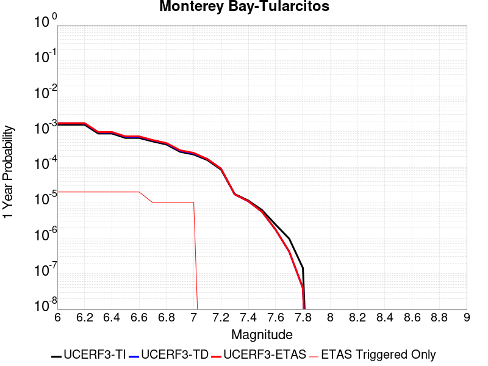 |  |

| Magnitude | 1 wk TI Prob | 1 wk TD Prob | 1 wk ETAS Prob | 1 wk ETAS/TD Gain | 1 wk ETAS Triggered Only | 1 mo TI Prob | 1 mo TD Prob | 1 mo ETAS Prob | 1 mo ETAS/TD Gain | 1 mo ETAS Triggered Only | 1 yr TI Prob | 1 yr TD Prob | 1 yr ETAS Prob | 1 yr ETAS/TD Gain | 1 yr ETAS Triggered Only | 10 yr TI Prob | 10 yr TD Prob | 10 yr ETAS Prob | 10 yr ETAS/TD Gain | 10 yr ETAS Triggered Only |
|-----|-----|-----|-----|-----|-----|-----|-----|-----|-----|-----|-----|-----|-----|-----|-----|-----|-----|-----|-----|-----|
| 6.0 | 3.0131365E-5 | 3.279877E-5 | 3.279877E-5 | 1.0 | 0.0 | 1.2912804E-4 | 1.4055918E-4 | 1.4055918E-4 | 1.0 | 0.0 | 0.001571 | 0.0017100703 | 0.001730036 | 1.0116755 | 2.0E-5 | 0.015599402 | 0.016979916 | 0.017009407 | 1.0017368 | 3.0E-5 |
| 6.1 | 3.0131365E-5 | 3.279877E-5 | 3.279877E-5 | 1.0 | 0.0 | 1.2912804E-4 | 1.4055918E-4 | 1.4055918E-4 | 1.0 | 0.0 | 0.001571 | 0.0017100703 | 0.001730036 | 1.0116755 | 2.0E-5 | 0.015599402 | 0.016979916 | 0.017009407 | 1.0017368 | 3.0E-5 |
| 6.2 | 3.0131365E-5 | 3.279877E-5 | 3.279877E-5 | 1.0 | 0.0 | 1.2912804E-4 | 1.4055918E-4 | 1.4055918E-4 | 1.0 | 0.0 | 0.001571 | 0.0017100703 | 0.001730036 | 1.0116755 | 2.0E-5 | 0.015599402 | 0.016979916 | 0.017009407 | 1.0017368 | 3.0E-5 |
| 6.3 | 1.6998249E-5 | 1.8330798E-5 | 1.8330798E-5 | 1.0 | 0.0 | 7.28476E-5 | 7.85583E-5 | 7.85583E-5 | 1.0 | 0.0 | 8.865586E-4 | 9.5604634E-4 | 9.760272E-4 | 1.0208995 | 2.0E-5 | 0.0088303005 | 0.009521258 | 0.009550973 | 1.0031209 | 3.0E-5 |
| 6.4 | 1.6998249E-5 | 1.8330798E-5 | 1.8330798E-5 | 1.0 | 0.0 | 7.28476E-5 | 7.85583E-5 | 7.85583E-5 | 1.0 | 0.0 | 8.865586E-4 | 9.5604634E-4 | 9.760272E-4 | 1.0208995 | 2.0E-5 | 0.0088303005 | 0.009521258 | 0.009550973 | 1.0031209 | 3.0E-5 |
| 6.5 | 1.27470785E-5 | 1.3693312E-5 | 1.3693312E-5 | 1.0 | 0.0 | 5.4629192E-5 | 5.8684363E-5 | 5.8684363E-5 | 1.0 | 0.0 | 6.649074E-4 | 7.1425823E-4 | 7.3424395E-4 | 1.027981 | 2.0E-5 | 0.0066292146 | 0.007120678 | 0.0071504647 | 1.004183 | 3.0E-5 |
| 6.6 | 1.2739422E-5 | 1.36854E-5 | 1.36854E-5 | 1.0 | 0.0 | 5.4596385E-5 | 5.8650454E-5 | 5.8650454E-5 | 1.0 | 0.0 | 6.645082E-4 | 7.1384566E-4 | 7.338314E-4 | 1.0279973 | 2.0E-5 | 0.0066252467 | 0.007116579 | 0.0071463655 | 1.0041856 | 3.0E-5 |
| 6.7 | 1.0160109E-5 | 1.0885755E-5 | 1.0885755E-5 | 1.0 | 0.0 | 4.35426E-5 | 4.665244E-5 | 4.665244E-5 | 1.0 | 0.0 | 5.300022E-4 | 5.6785246E-4 | 5.778468E-4 | 1.0176002 | 1.0E-5 | 0.005287399 | 0.0056647263 | 0.005684613 | 1.0035106 | 2.0E-5 |
| 6.8 | 8.349859E-6 | 8.932587E-6 | 8.932587E-6 | 1.0 | 0.0 | 3.578462E-5 | 3.8281985E-5 | 3.8281985E-5 | 1.0 | 0.0 | 4.3559066E-4 | 4.6598914E-4 | 4.759845E-4 | 1.0214497 | 1.0E-5 | 0.004347378 | 0.004650685 | 0.0046606385 | 1.0021402 | 1.0E-5 |
| 6.9 | 5.193639E-6 | 5.53643E-6 | 5.53643E-6 | 1.0 | 0.0 | 2.2258262E-5 | 2.372736E-5 | 2.372736E-5 | 1.0 | 0.0 | 2.7096065E-4 | 2.8884556E-4 | 2.9884267E-4 | 1.0346106 | 1.0E-5 | 0.0027063051 | 0.0028850224 | 0.0028949934 | 1.0034562 | 1.0E-5 |
| 7.0 | 4.359381E-6 | 4.643366E-6 | 4.643366E-6 | 1.0 | 0.0 | 1.8682927E-5 | 1.9900004E-5 | 1.9900004E-5 | 1.0 | 0.0 | 2.274409E-4 | 2.422586E-4 | 2.5225617E-4 | 1.0412682 | 1.0E-5 | 0.0022720827 | 0.002420238 | 0.0024302138 | 1.0041218 | 1.0E-5 |
| 7.1 | 3.0398533E-6 | 3.2310427E-6 | 3.2310427E-6 | 1.0 | 0.0 | 1.3027877E-5 | 1.3847267E-5 | 1.3847267E-5 | 1.0 | 0.0 | 1.5860285E-4 | 1.6858005E-4 | 1.6858005E-4 | 1.0 | 0.0 | 0.001584897 | 0.0016847793 | 0.0016847793 | 1.0 | 0.0 |
| 7.2 | 1.642335E-6 | 1.7333153E-6 | 1.7333153E-6 | 1.0 | 0.0 | 7.0385595E-6 | 7.428485E-6 | 7.428485E-6 | 1.0 | 0.0 | 8.569109E-5 | 9.044012E-5 | 9.044012E-5 | 1.0 | 0.0 | 8.5658056E-4 | 9.042358E-4 | 9.042358E-4 | 1.0 | 0.0 |
| 7.3 | 3.356842E-7 | 3.2952389E-7 | 3.2952389E-7 | 1.0 | 0.0 | 1.4386458E-6 | 1.4122445E-6 | 1.4122445E-6 | 1.0 | 0.0 | 1.7515373E-5 | 1.7193941E-5 | 1.7193941E-5 | 1.0 | 0.0 | 1.7513991E-4 | 1.719262E-4 | 1.719262E-4 | 1.0 | 0.0 |
| 7.4 | 2.1973483E-7 | 2.1006414E-7 | 2.1006414E-7 | 1.0 | 0.0 | 9.417204E-7 | 9.002746E-7 | 9.002746E-7 | 1.0 | 0.0 | 1.1465385E-5 | 1.0960788E-5 | 1.0960788E-5 | 1.0 | 0.0 | 1.1464794E-4 | 1.0960251E-4 | 1.0960251E-4 | 1.0 | 0.0 |
| 7.5 | 1.1944135E-7 | 1.0696035E-7 | 1.0696035E-7 | 1.0 | 0.0 | 5.118914E-7 | 4.5840142E-7 | 4.5840142E-7 | 1.0 | 0.0 | 6.23226E-6 | 5.581023E-6 | 5.581023E-6 | 1.0 | 0.0 | 6.2320854E-5 | 5.5808843E-5 | 5.5808843E-5 | 1.0 | 0.0 |
| 7.6 | 4.636058E-8 | 3.3364433E-8 | 3.3364433E-8 | 1.0 | 0.0 | 1.9868818E-7 | 1.4299042E-7 | 1.4299042E-7 | 1.0 | 0.0 | 2.419026E-6 | 1.740907E-6 | 1.740907E-6 | 1.0 | 0.0 | 2.4189996E-5 | 1.7408936E-5 | 1.7408936E-5 | 1.0 | 0.0 |
| 7.7 | 1.8588572E-8 | 8.003168E-9 | 8.003168E-9 | 1.0 | 0.0 | 7.9665305E-8 | 3.429929E-8 | 3.429929E-8 | 1.0 | 0.0 | 9.699246E-7 | 4.1759378E-7 | 4.1759378E-7 | 1.0 | 0.0 | 9.699204E-6 | 4.1759304E-6 | 4.1759304E-6 | 1.0 | 0.0 |
| 7.8 | 2.7960154E-9 | 7.608624E-10 | 7.608624E-10 | 1.0 | 0.0 | 1.1982923E-8 | 3.2608392E-9 | 3.2608392E-9 | 1.0 | 0.0 | 1.4589209E-7 | 3.9700716E-8 | 3.9700716E-8 | 1.0 | 0.0 | 1.4589199E-6 | 3.970071E-7 | 3.970071E-7 | 1.0 | 0.0 |

## Great Valley 04b Gordon Valley
*[(top)](#table-of-contents)*

| 1 Week | 1 Month | 1 Year | 10 Year |
|-----|-----|-----|-----|
|  | 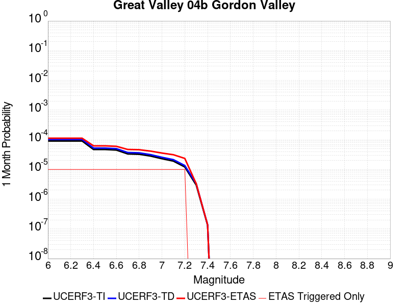 |  |  |

| Magnitude | 1 wk TI Prob | 1 wk TD Prob | 1 wk ETAS Prob | 1 wk ETAS/TD Gain | 1 wk ETAS Triggered Only | 1 mo TI Prob | 1 mo TD Prob | 1 mo ETAS Prob | 1 mo ETAS/TD Gain | 1 mo ETAS Triggered Only | 1 yr TI Prob | 1 yr TD Prob | 1 yr ETAS Prob | 1 yr ETAS/TD Gain | 1 yr ETAS Triggered Only | 10 yr TI Prob | 10 yr TD Prob | 10 yr ETAS Prob | 10 yr ETAS/TD Gain | 10 yr ETAS Triggered Only |
|-----|-----|-----|-----|-----|-----|-----|-----|-----|-----|-----|-----|-----|-----|-----|-----|-----|-----|-----|-----|-----|
| 6.0 | 2.1181217E-5 | 2.3981951E-5 | 3.3981712E-5 | 1.4169703 | 1.0E-5 | 9.077348E-5 | 1.02776685E-4 | 1.12775655E-4 | 1.0972884 | 1.0E-5 | 0.0011046068 | 0.0012507545 | 0.001280717 | 1.0239555 | 3.0E-5 | 0.010991322 | 0.0124536 | 0.012483226 | 1.002379 | 3.0E-5 |
| 6.1 | 2.1181217E-5 | 2.3981951E-5 | 3.3981712E-5 | 1.4169703 | 1.0E-5 | 9.077348E-5 | 1.02776685E-4 | 1.12775655E-4 | 1.0972884 | 1.0E-5 | 0.0011046068 | 0.0012507545 | 0.001280717 | 1.0239555 | 3.0E-5 | 0.010991322 | 0.0124536 | 0.012483226 | 1.002379 | 3.0E-5 |
| 6.2 | 2.1181217E-5 | 2.3981951E-5 | 3.3981712E-5 | 1.4169703 | 1.0E-5 | 9.077348E-5 | 1.02776685E-4 | 1.12775655E-4 | 1.0972884 | 1.0E-5 | 0.0011046068 | 0.0012507545 | 0.001280717 | 1.0239555 | 3.0E-5 | 0.010991322 | 0.0124536 | 0.012483226 | 1.002379 | 3.0E-5 |
| 6.3 | 2.1181217E-5 | 2.3981951E-5 | 3.3981712E-5 | 1.4169703 | 1.0E-5 | 9.077348E-5 | 1.02776685E-4 | 1.12775655E-4 | 1.0972884 | 1.0E-5 | 0.0011046068 | 0.0012507545 | 0.001280717 | 1.0239555 | 3.0E-5 | 0.010991322 | 0.0124536 | 0.012483226 | 1.002379 | 3.0E-5 |
| 6.4 | 1.0988268E-5 | 1.2254499E-5 | 2.2254377E-5 | 1.8160169 | 1.0E-5 | 4.7091726E-5 | 5.2518313E-5 | 6.2517785E-5 | 1.1903998 | 1.0E-5 | 5.731909E-4 | 6.392388E-4 | 6.492324E-4 | 1.0156336 | 1.0E-5 | 0.005717147 | 0.0063755875 | 0.006385524 | 1.0015585 | 1.0E-5 |
| 6.5 | 1.0988268E-5 | 1.2254499E-5 | 2.2254377E-5 | 1.8160169 | 1.0E-5 | 4.7091726E-5 | 5.2518313E-5 | 6.2517785E-5 | 1.1903998 | 1.0E-5 | 5.731909E-4 | 6.392388E-4 | 6.492324E-4 | 1.0156336 | 1.0E-5 | 0.005717147 | 0.0063755875 | 0.006385524 | 1.0015585 | 1.0E-5 |
| 6.6 | 1.0517822E-5 | 1.1724062E-5 | 2.1723945E-5 | 1.8529367 | 1.0E-5 | 4.5075605E-5 | 5.02451E-5 | 6.0244598E-5 | 1.1990144 | 1.0E-5 | 5.4865726E-4 | 6.11578E-4 | 6.215719E-4 | 1.0163411 | 1.0E-5 | 0.0054730466 | 0.0061005033 | 0.0061104423 | 1.0016292 | 1.0E-5 |
| 6.7 | 7.789219E-6 | 8.6776445E-6 | 1.8677558E-5 | 2.1523764 | 1.0E-5 | 3.3381937E-5 | 3.7189402E-5 | 4.718903E-5 | 1.2688838 | 1.0E-5 | 4.063493E-4 | 4.526921E-4 | 4.6268757E-4 | 1.0220801 | 1.0E-5 | 0.004056071 | 0.0045182165 | 0.0045281714 | 1.0022032 | 1.0E-5 |
| 6.8 | 7.5850853E-6 | 8.452389E-6 | 1.8452305E-5 | 2.1830876 | 1.0E-5 | 3.2507105E-5 | 3.622405E-5 | 4.6223686E-5 | 1.2760497 | 1.0E-5 | 3.957021E-4 | 4.409437E-4 | 4.509393E-4 | 1.0226686 | 1.0E-5 | 0.0039499826 | 0.0044012 | 0.0044111563 | 1.0022621 | 1.0E-5 |
| 6.9 | 6.604105E-6 | 7.3585493E-6 | 1.7358476E-5 | 2.3589535 | 1.0E-5 | 2.8303E-5 | 3.153628E-5 | 4.1535965E-5 | 1.3170851 | 1.0E-5 | 3.4453452E-4 | 3.8389044E-4 | 3.938866E-4 | 1.0260391 | 1.0E-5 | 0.0034400085 | 0.0038326595 | 0.003842621 | 1.0025991 | 1.0E-5 |
| 7.0 | 5.3701115E-6 | 5.9884183E-6 | 1.5988358E-5 | 2.66988 | 1.0E-5 | 2.301456E-5 | 2.5664414E-5 | 3.5664158E-5 | 1.3896346 | 1.0E-5 | 2.8016625E-4 | 3.1242234E-4 | 3.2241922E-4 | 1.0319979 | 1.0E-5 | 0.0027981328 | 0.00312012 | 0.0031300886 | 1.003195 | 1.0E-5 |
| 7.1 | 4.4685607E-6 | 4.986478E-6 | 1.4986428E-5 | 3.0054135 | 1.0E-5 | 1.9150835E-5 | 2.1370459E-5 | 3.1370244E-5 | 1.4679257 | 1.0E-5 | 2.3313647E-4 | 2.6015675E-4 | 2.7015415E-4 | 1.0384283 | 1.0E-5 | 0.0023289204 | 0.0025987667 | 0.002608741 | 1.003838 | 1.0E-5 |
| 7.2 | 2.833378E-6 | 3.164419E-6 | 1.3164387E-5 | 4.1601276 | 1.0E-5 | 1.2142991E-5 | 1.3561736E-5 | 2.3561599E-5 | 1.7373588 | 1.0E-5 | 1.4783088E-4 | 1.6510337E-4 | 1.7510171E-4 | 1.0605581 | 1.0E-5 | 0.0014773258 | 0.0016499789 | 0.0016599623 | 1.0060507 | 1.0E-5 |
| 7.3 | 7.0087293E-7 | 7.7728157E-7 | 7.7728157E-7 | 1.0 | 0.0 | 3.0037377E-6 | 3.3312049E-6 | 3.3312049E-6 | 1.0 | 0.0 | 3.656989E-5 | 4.0557123E-5 | 4.0557123E-5 | 1.0 | 0.0 | 3.6563876E-4 | 4.055422E-4 | 4.055422E-4 | 1.0 | 0.0 |
| 7.4 | 3.112171E-8 | 3.2068368E-8 | 3.2068368E-8 | 1.0 | 0.0 | 1.3337875E-7 | 1.3743585E-7 | 1.3743585E-7 | 1.0 | 0.0 | 1.6238852E-6 | 1.6732803E-6 | 1.6732803E-6 | 1.0 | 0.0 | 1.6238733E-5 | 1.6732685E-5 | 1.6732685E-5 | 1.0 | 0.0 |

## Pitas Point (Lower)-Montalvo
*[(top)](#table-of-contents)*

| 1 Week | 1 Month | 1 Year | 10 Year |
|-----|-----|-----|-----|
|  |  |  |  |

| Magnitude | 1 wk TI Prob | 1 wk TD Prob | 1 wk ETAS Prob | 1 wk ETAS/TD Gain | 1 wk ETAS Triggered Only | 1 mo TI Prob | 1 mo TD Prob | 1 mo ETAS Prob | 1 mo ETAS/TD Gain | 1 mo ETAS Triggered Only | 1 yr TI Prob | 1 yr TD Prob | 1 yr ETAS Prob | 1 yr ETAS/TD Gain | 1 yr ETAS Triggered Only | 10 yr TI Prob | 10 yr TD Prob | 10 yr ETAS Prob | 10 yr ETAS/TD Gain | 10 yr ETAS Triggered Only |
|-----|-----|-----|-----|-----|-----|-----|-----|-----|-----|-----|-----|-----|-----|-----|-----|-----|-----|-----|-----|-----|
| 6.0 | 5.2543637E-6 | 4.8379025E-6 | 4.8379025E-6 | 1.0 | 0.0 | 2.2518509E-5 | 2.0733705E-5 | 2.0733705E-5 | 1.0 | 0.0 | 2.7412834E-4 | 2.5240393E-4 | 2.723989E-4 | 1.079218 | 2.0E-5 | 0.0027379042 | 0.0025212052 | 0.0025511296 | 1.0118691 | 3.0E-5 |
| 6.1 | 5.2543637E-6 | 4.8379025E-6 | 4.8379025E-6 | 1.0 | 0.0 | 2.2518509E-5 | 2.0733705E-5 | 2.0733705E-5 | 1.0 | 0.0 | 2.7412834E-4 | 2.5240393E-4 | 2.723989E-4 | 1.079218 | 2.0E-5 | 0.0027379042 | 0.0025212052 | 0.0025511296 | 1.0118691 | 3.0E-5 |
| 6.2 | 5.2543637E-6 | 4.8379025E-6 | 4.8379025E-6 | 1.0 | 0.0 | 2.2518509E-5 | 2.0733705E-5 | 2.0733705E-5 | 1.0 | 0.0 | 2.7412834E-4 | 2.5240393E-4 | 2.723989E-4 | 1.079218 | 2.0E-5 | 0.0027379042 | 0.0025212052 | 0.0025511296 | 1.0118691 | 3.0E-5 |
| 6.3 | 5.2543637E-6 | 4.8379025E-6 | 4.8379025E-6 | 1.0 | 0.0 | 2.2518509E-5 | 2.0733705E-5 | 2.0733705E-5 | 1.0 | 0.0 | 2.7412834E-4 | 2.5240393E-4 | 2.723989E-4 | 1.079218 | 2.0E-5 | 0.0027379042 | 0.0025212052 | 0.0025511296 | 1.0118691 | 3.0E-5 |
| 6.4 | 5.2543637E-6 | 4.8379025E-6 | 4.8379025E-6 | 1.0 | 0.0 | 2.2518509E-5 | 2.0733705E-5 | 2.0733705E-5 | 1.0 | 0.0 | 2.7412834E-4 | 2.5240393E-4 | 2.723989E-4 | 1.079218 | 2.0E-5 | 0.0027379042 | 0.0025212052 | 0.0025511296 | 1.0118691 | 3.0E-5 |
| 6.5 | 5.2543637E-6 | 4.8379025E-6 | 4.8379025E-6 | 1.0 | 0.0 | 2.2518509E-5 | 2.0733705E-5 | 2.0733705E-5 | 1.0 | 0.0 | 2.7412834E-4 | 2.5240393E-4 | 2.723989E-4 | 1.079218 | 2.0E-5 | 0.0027379042 | 0.0025212052 | 0.0025511296 | 1.0118691 | 3.0E-5 |
| 6.6 | 5.2543637E-6 | 4.8379025E-6 | 4.8379025E-6 | 1.0 | 0.0 | 2.2518509E-5 | 2.0733705E-5 | 2.0733705E-5 | 1.0 | 0.0 | 2.7412834E-4 | 2.5240393E-4 | 2.723989E-4 | 1.079218 | 2.0E-5 | 0.0027379042 | 0.0025212052 | 0.0025511296 | 1.0118691 | 3.0E-5 |
| 6.7 | 5.2543637E-6 | 4.8379025E-6 | 4.8379025E-6 | 1.0 | 0.0 | 2.2518509E-5 | 2.0733705E-5 | 2.0733705E-5 | 1.0 | 0.0 | 2.7412834E-4 | 2.5240393E-4 | 2.723989E-4 | 1.079218 | 2.0E-5 | 0.0027379042 | 0.0025212052 | 0.0025511296 | 1.0118691 | 3.0E-5 |
| 6.8 | 5.2543637E-6 | 4.8379025E-6 | 4.8379025E-6 | 1.0 | 0.0 | 2.2518509E-5 | 2.0733705E-5 | 2.0733705E-5 | 1.0 | 0.0 | 2.7412834E-4 | 2.5240393E-4 | 2.723989E-4 | 1.079218 | 2.0E-5 | 0.0027379042 | 0.0025212052 | 0.0025511296 | 1.0118691 | 3.0E-5 |
| 6.9 | 5.2543637E-6 | 4.8379025E-6 | 4.8379025E-6 | 1.0 | 0.0 | 2.2518509E-5 | 2.0733705E-5 | 2.0733705E-5 | 1.0 | 0.0 | 2.7412834E-4 | 2.5240393E-4 | 2.723989E-4 | 1.079218 | 2.0E-5 | 0.0027379042 | 0.0025212052 | 0.0025511296 | 1.0118691 | 3.0E-5 |
| 7.0 | 5.2543637E-6 | 4.8379025E-6 | 4.8379025E-6 | 1.0 | 0.0 | 2.2518509E-5 | 2.0733705E-5 | 2.0733705E-5 | 1.0 | 0.0 | 2.7412834E-4 | 2.5240393E-4 | 2.723989E-4 | 1.079218 | 2.0E-5 | 0.0027379042 | 0.0025212052 | 0.0025511296 | 1.0118691 | 3.0E-5 |
| 7.1 | 5.2543637E-6 | 4.8379025E-6 | 4.8379025E-6 | 1.0 | 0.0 | 2.2518509E-5 | 2.0733705E-5 | 2.0733705E-5 | 1.0 | 0.0 | 2.7412834E-4 | 2.5240393E-4 | 2.723989E-4 | 1.079218 | 2.0E-5 | 0.0027379042 | 0.0025212052 | 0.0025511296 | 1.0118691 | 3.0E-5 |
| 7.2 | 5.2458695E-6 | 4.8290563E-6 | 4.8290563E-6 | 1.0 | 0.0 | 2.2482105E-5 | 2.0695794E-5 | 2.0695794E-5 | 1.0 | 0.0 | 2.7368523E-4 | 2.5194246E-4 | 2.7193743E-4 | 1.0793632 | 2.0E-5 | 0.0027334841 | 0.002516601 | 0.0025465253 | 1.0118909 | 3.0E-5 |
| 7.3 | 5.22665E-6 | 4.8089737E-6 | 4.8089737E-6 | 1.0 | 0.0 | 2.2399736E-5 | 2.0609727E-5 | 2.0609727E-5 | 1.0 | 0.0 | 2.7268266E-4 | 2.5089484E-4 | 2.708898E-4 | 1.0796946 | 2.0E-5 | 0.002723483 | 0.0025061483 | 0.002536073 | 1.0119406 | 3.0E-5 |
| 7.4 | 5.210642E-6 | 4.7921862E-6 | 4.7921862E-6 | 1.0 | 0.0 | 2.233113E-5 | 2.053778E-5 | 2.053778E-5 | 1.0 | 0.0 | 2.718476E-4 | 2.500191E-4 | 2.700141E-4 | 1.0799739 | 2.0E-5 | 0.002715153 | 0.0024974106 | 0.0025273357 | 1.0119824 | 3.0E-5 |
| 7.5 | 5.1226016E-6 | 4.7000726E-6 | 4.7000726E-6 | 1.0 | 0.0 | 2.1953823E-5 | 2.0143016E-5 | 2.0143016E-5 | 1.0 | 0.0 | 2.67255E-4 | 2.4521392E-4 | 2.65209E-4 | 1.0815414 | 2.0E-5 | 0.0026693381 | 0.002449465 | 0.0024793916 | 1.0122175 | 3.0E-5 |
| 7.6 | 4.8796987E-6 | 4.4449725E-6 | 4.4449725E-6 | 1.0 | 0.0 | 2.0912828E-5 | 1.9049745E-5 | 1.9049745E-5 | 1.0 | 0.0 | 2.5458392E-4 | 2.3190626E-4 | 2.5190163E-4 | 1.0862217 | 2.0E-5 | 0.0025429246 | 0.0023166733 | 0.0023466037 | 1.0129195 | 3.0E-5 |
| 7.7 | 4.0834398E-6 | 3.6091444E-6 | 3.6091444E-6 | 1.0 | 0.0 | 1.7500339E-5 | 1.546767E-5 | 1.546767E-5 | 1.0 | 0.0 | 2.1304579E-4 | 1.8830286E-4 | 1.9830097E-4 | 1.0530959 | 1.0E-5 | 0.0021284167 | 0.0018814567 | 0.0018914379 | 1.005305 | 1.0E-5 |
| 7.8 | 2.5445438E-6 | 2.1212566E-6 | 2.1212566E-6 | 1.0 | 0.0 | 1.0905142E-5 | 9.091068E-6 | 9.091068E-6 | 1.0 | 0.0 | 1.3276201E-4 | 1.1067818E-4 | 1.1067818E-4 | 1.0 | 0.0 | 0.0013268272 | 0.0011062352 | 0.0011062352 | 1.0 | 0.0 |
| 7.9 | 4.1677114E-7 | 3.3294015E-7 | 3.3294015E-7 | 1.0 | 0.0 | 1.7861609E-6 | 1.4268857E-6 | 1.4268857E-6 | 1.0 | 0.0 | 2.1746291E-5 | 1.7372196E-5 | 1.7372196E-5 | 1.0 | 0.0 | 2.1744163E-4 | 1.737087E-4 | 1.737087E-4 | 1.0 | 0.0 |
| 8.0 | 7.791402E-9 | 5.6836056E-9 | 5.6836056E-9 | 1.0 | 0.0 | 3.3391725E-8 | 2.4358311E-8 | 2.4358311E-8 | 1.0 | 0.0 | 4.0654416E-7 | 2.965624E-7 | 2.965624E-7 | 1.0 | 0.0 | 4.065434E-6 | 2.9656223E-6 | 2.9656223E-6 | 1.0 | 0.0 |

## South Cuyama
*[(top)](#table-of-contents)*

| 1 Week | 1 Month | 1 Year | 10 Year |
|-----|-----|-----|-----|
|  |  |  |  |

| Magnitude | 1 wk TI Prob | 1 wk TD Prob | 1 wk ETAS Prob | 1 wk ETAS/TD Gain | 1 wk ETAS Triggered Only | 1 mo TI Prob | 1 mo TD Prob | 1 mo ETAS Prob | 1 mo ETAS/TD Gain | 1 mo ETAS Triggered Only | 1 yr TI Prob | 1 yr TD Prob | 1 yr ETAS Prob | 1 yr ETAS/TD Gain | 1 yr ETAS Triggered Only | 10 yr TI Prob | 10 yr TD Prob | 10 yr ETAS Prob | 10 yr ETAS/TD Gain | 10 yr ETAS Triggered Only |
|-----|-----|-----|-----|-----|-----|-----|-----|-----|-----|-----|-----|-----|-----|-----|-----|-----|-----|-----|-----|-----|
| 6.0 | 1.2747308E-6 | 1.2818697E-6 | 1.2818697E-6 | 1.0 | 0.0 | 5.4631205E-6 | 5.4937163E-6 | 5.4937163E-6 | 1.0 | 0.0 | 6.6511464E-5 | 6.6884015E-5 | 7.688334E-5 | 1.1495025 | 1.0E-5 | 6.649156E-4 | 6.686458E-4 | 6.886324E-4 | 1.0298913 | 2.0E-5 |
| 6.1 | 1.2747308E-6 | 1.2818697E-6 | 1.2818697E-6 | 1.0 | 0.0 | 5.4631205E-6 | 5.4937163E-6 | 5.4937163E-6 | 1.0 | 0.0 | 6.6511464E-5 | 6.6884015E-5 | 7.688334E-5 | 1.1495025 | 1.0E-5 | 6.649156E-4 | 6.686458E-4 | 6.886324E-4 | 1.0298913 | 2.0E-5 |
| 6.2 | 1.2747308E-6 | 1.2818697E-6 | 1.2818697E-6 | 1.0 | 0.0 | 5.4631205E-6 | 5.4937163E-6 | 5.4937163E-6 | 1.0 | 0.0 | 6.6511464E-5 | 6.6884015E-5 | 7.688334E-5 | 1.1495025 | 1.0E-5 | 6.649156E-4 | 6.686458E-4 | 6.886324E-4 | 1.0298913 | 2.0E-5 |
| 6.3 | 1.2747308E-6 | 1.2818697E-6 | 1.2818697E-6 | 1.0 | 0.0 | 5.4631205E-6 | 5.4937163E-6 | 5.4937163E-6 | 1.0 | 0.0 | 6.6511464E-5 | 6.6884015E-5 | 7.688334E-5 | 1.1495025 | 1.0E-5 | 6.649156E-4 | 6.686458E-4 | 6.886324E-4 | 1.0298913 | 2.0E-5 |
| 6.4 | 1.2747308E-6 | 1.2818697E-6 | 1.2818697E-6 | 1.0 | 0.0 | 5.4631205E-6 | 5.4937163E-6 | 5.4937163E-6 | 1.0 | 0.0 | 6.6511464E-5 | 6.6884015E-5 | 7.688334E-5 | 1.1495025 | 1.0E-5 | 6.649156E-4 | 6.686458E-4 | 6.886324E-4 | 1.0298913 | 2.0E-5 |
| 6.5 | 1.2747308E-6 | 1.2818697E-6 | 1.2818697E-6 | 1.0 | 0.0 | 5.4631205E-6 | 5.4937163E-6 | 5.4937163E-6 | 1.0 | 0.0 | 6.6511464E-5 | 6.6884015E-5 | 7.688334E-5 | 1.1495025 | 1.0E-5 | 6.649156E-4 | 6.686458E-4 | 6.886324E-4 | 1.0298913 | 2.0E-5 |
| 6.6 | 1.2747308E-6 | 1.2818697E-6 | 1.2818697E-6 | 1.0 | 0.0 | 5.4631205E-6 | 5.4937163E-6 | 5.4937163E-6 | 1.0 | 0.0 | 6.6511464E-5 | 6.6884015E-5 | 7.688334E-5 | 1.1495025 | 1.0E-5 | 6.649156E-4 | 6.686458E-4 | 6.886324E-4 | 1.0298913 | 2.0E-5 |
| 6.7 | 1.2747308E-6 | 1.2818697E-6 | 1.2818697E-6 | 1.0 | 0.0 | 5.4631205E-6 | 5.4937163E-6 | 5.4937163E-6 | 1.0 | 0.0 | 6.6511464E-5 | 6.6884015E-5 | 7.688334E-5 | 1.1495025 | 1.0E-5 | 6.649156E-4 | 6.686458E-4 | 6.886324E-4 | 1.0298913 | 2.0E-5 |
| 6.8 | 1.2747308E-6 | 1.2818697E-6 | 1.2818697E-6 | 1.0 | 0.0 | 5.4631205E-6 | 5.4937163E-6 | 5.4937163E-6 | 1.0 | 0.0 | 6.6511464E-5 | 6.6884015E-5 | 7.688334E-5 | 1.1495025 | 1.0E-5 | 6.649156E-4 | 6.686458E-4 | 6.886324E-4 | 1.0298913 | 2.0E-5 |
| 6.9 | 8.4566324E-7 | 8.507883E-7 | 8.507883E-7 | 1.0 | 0.0 | 3.624266E-6 | 3.6462304E-6 | 3.6462304E-6 | 1.0 | 0.0 | 4.4124543E-5 | 4.439196E-5 | 5.4391516E-5 | 1.225256 | 1.0E-5 | 4.4115784E-4 | 4.4383196E-4 | 4.5382752E-4 | 1.022521 | 1.0E-5 |
| 7.0 | 8.2277904E-7 | 8.27782E-7 | 8.27782E-7 | 1.0 | 0.0 | 3.526191E-6 | 3.5476323E-6 | 3.5476323E-6 | 1.0 | 0.0 | 4.293053E-5 | 4.3191576E-5 | 5.3191146E-5 | 1.2315166 | 1.0E-5 | 4.292224E-4 | 4.3183283E-4 | 4.418285E-4 | 1.0231471 | 1.0E-5 |
| 7.1 | 6.7661887E-7 | 6.80913E-7 | 6.80913E-7 | 1.0 | 0.0 | 2.899792E-6 | 2.9181954E-6 | 2.9181954E-6 | 1.0 | 0.0 | 3.5304394E-5 | 3.5528454E-5 | 4.5528097E-5 | 1.2814546 | 1.0E-5 | 3.5298787E-4 | 3.552281E-4 | 3.6522458E-4 | 1.0281409 | 1.0E-5 |
| 7.2 | 5.783336E-7 | 5.8211907E-7 | 5.8211907E-7 | 1.0 | 0.0 | 2.4785702E-6 | 2.4947938E-6 | 2.4947938E-6 | 1.0 | 0.0 | 3.0176174E-5 | 3.0373692E-5 | 4.0373387E-5 | 1.3292223 | 1.0E-5 | 3.0172078E-4 | 3.0369565E-4 | 3.136926E-4 | 1.0329177 | 1.0E-5 |
| 7.3 | 5.136759E-7 | 5.170938E-7 | 5.170938E-7 | 1.0 | 0.0 | 2.2014663E-6 | 2.2161144E-6 | 2.2161144E-6 | 1.0 | 0.0 | 2.6802521E-5 | 2.698086E-5 | 3.698059E-5 | 1.3706231 | 1.0E-5 | 2.679929E-4 | 2.6977606E-4 | 2.7977335E-4 | 1.0370578 | 1.0E-5 |
| 7.4 | 4.3370295E-7 | 4.3665364E-7 | 4.3665364E-7 | 1.0 | 0.0 | 1.8587256E-6 | 1.8713713E-6 | 1.8713713E-6 | 1.0 | 0.0 | 2.2629749E-5 | 2.278371E-5 | 3.2783482E-5 | 1.4389001 | 1.0E-5 | 2.2627445E-4 | 2.278139E-4 | 2.3781162E-4 | 1.0438855 | 1.0E-5 |
| 7.5 | 3.3242574E-7 | 3.3476465E-7 | 3.3476465E-7 | 1.0 | 0.0 | 1.4246809E-6 | 1.4347048E-6 | 1.4347048E-6 | 1.0 | 0.0 | 1.7345352E-5 | 1.7467393E-5 | 2.7467218E-5 | 1.5724853 | 1.0E-5 | 1.7343998E-4 | 1.7466032E-4 | 1.8465858E-4 | 1.057244 | 1.0E-5 |
| 7.6 | 2.0627535E-7 | 2.07789E-7 | 2.07789E-7 | 1.0 | 0.0 | 8.840369E-7 | 8.90524E-7 | 8.90524E-7 | 1.0 | 0.0 | 1.0763096E-5 | 1.0842076E-5 | 1.0842076E-5 | 1.0 | 0.0 | 1.0762575E-4 | 1.0841556E-4 | 1.0841556E-4 | 1.0 | 0.0 |
| 7.7 | 6.15236E-8 | 6.1983044E-8 | 6.1983044E-8 | 1.0 | 0.0 | 2.6367252E-7 | 2.656416E-7 | 2.656416E-7 | 1.0 | 0.0 | 3.2102084E-6 | 3.2341818E-6 | 3.2341818E-6 | 1.0 | 0.0 | 3.210162E-5 | 3.234136E-5 | 3.234136E-5 | 1.0 | 0.0 |
| 7.8 | 1.1765573E-8 | 1.1873414E-8 | 1.1873414E-8 | 1.0 | 0.0 | 5.0423886E-8 | 5.0886058E-8 | 5.0886058E-8 | 1.0 | 0.0 | 6.1391063E-7 | 6.195376E-7 | 6.195376E-7 | 1.0 | 0.0 | 6.1390897E-6 | 6.19536E-6 | 6.19536E-6 | 1.0 | 0.0 |
| 7.9 | 6.0381755E-10 | 6.10058E-10 | 6.10058E-10 | 1.0 | 0.0 | 2.5877895E-9 | 2.614534E-9 | 2.614534E-9 | 1.0 | 0.0 | 3.1506335E-8 | 3.1831952E-8 | 3.1831952E-8 | 1.0 | 0.0 | 3.1506332E-7 | 3.183195E-7 | 3.183195E-7 | 1.0 | 0.0 |

## Hayward (So) extension 2011 CFM
*[(top)](#table-of-contents)*

| 1 Week | 1 Month | 1 Year | 10 Year |
|-----|-----|-----|-----|
|  |  |  | 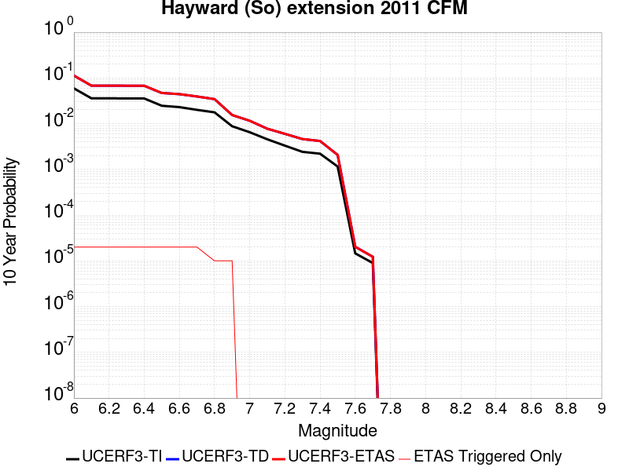 |

| Magnitude | 1 wk TI Prob | 1 wk TD Prob | 1 wk ETAS Prob | 1 wk ETAS/TD Gain | 1 wk ETAS Triggered Only | 1 mo TI Prob | 1 mo TD Prob | 1 mo ETAS Prob | 1 mo ETAS/TD Gain | 1 mo ETAS Triggered Only | 1 yr TI Prob | 1 yr TD Prob | 1 yr ETAS Prob | 1 yr ETAS/TD Gain | 1 yr ETAS Triggered Only | 10 yr TI Prob | 10 yr TD Prob | 10 yr ETAS Prob | 10 yr ETAS/TD Gain | 10 yr ETAS Triggered Only |
|-----|-----|-----|-----|-----|-----|-----|-----|-----|-----|-----|-----|-----|-----|-----|-----|-----|-----|-----|-----|-----|
| 6.0 | 1.1721256E-4 | 2.3671088E-4 | 2.3671088E-4 | 1.0 | 0.0 | 5.022428E-4 | 0.0010138806 | 0.0010238704 | 1.0098531 | 1.0E-5 | 0.0060976758 | 0.012250609 | 0.012260486 | 1.0008063 | 1.0E-5 | 0.0593305 | 0.11284437 | 0.11286212 | 1.0001572 | 2.0E-5 |
| 6.1 | 6.99169E-5 | 1.3808164E-4 | 1.3808164E-4 | 1.0 | 0.0 | 2.9960944E-4 | 5.9155683E-4 | 6.015509E-4 | 1.0168946 | 1.0E-5 | 0.0036416445 | 0.0071723475 | 0.007182276 | 1.0013843 | 1.0E-5 | 0.035825435 | 0.067804344 | 0.067822985 | 1.000275 | 2.0E-5 |
| 6.2 | 6.99169E-5 | 1.3808164E-4 | 1.3808164E-4 | 1.0 | 0.0 | 2.9960944E-4 | 5.9155683E-4 | 6.015509E-4 | 1.0168946 | 1.0E-5 | 0.0036416445 | 0.0071723475 | 0.007182276 | 1.0013843 | 1.0E-5 | 0.035825435 | 0.067804344 | 0.067822985 | 1.000275 | 2.0E-5 |
| 6.3 | 6.970908E-5 | 1.3776305E-4 | 1.3776305E-4 | 1.0 | 0.0 | 2.9871898E-4 | 5.9019245E-4 | 6.001865E-4 | 1.0169337 | 1.0E-5 | 0.0036308395 | 0.007155884 | 0.007165813 | 1.0013875 | 1.0E-5 | 0.035720866 | 0.0676533 | 0.06767195 | 1.0002756 | 2.0E-5 |
| 6.4 | 6.9517155E-5 | 1.3743227E-4 | 1.3743227E-4 | 1.0 | 0.0 | 2.9789665E-4 | 5.8877567E-4 | 5.987698E-4 | 1.0169744 | 1.0E-5 | 0.0036208609 | 0.0071387975 | 0.0071487264 | 1.0013908 | 1.0E-5 | 0.03562429 | 0.06749734 | 0.06751599 | 1.0002763 | 2.0E-5 |
| 6.5 | 4.786248E-5 | 9.415232E-5 | 9.415232E-5 | 1.0 | 0.0 | 2.0510878E-4 | 4.0344993E-4 | 4.1344587E-4 | 1.0247762 | 1.0E-5 | 0.0024943394 | 0.0049013784 | 0.0049113296 | 1.0020303 | 1.0E-5 | 0.02466527 | 0.046900697 | 0.04691976 | 1.0004064 | 2.0E-5 |
| 6.6 | 4.4662214E-5 | 8.8819244E-5 | 8.8819244E-5 | 1.0 | 0.0 | 1.9139545E-4 | 3.80601E-4 | 3.9059718E-4 | 1.0262642 | 1.0E-5 | 0.0023277493 | 0.0046244357 | 0.004634389 | 1.0021524 | 1.0E-5 | 0.02303517 | 0.04429206 | 0.044311173 | 1.0004315 | 2.0E-5 |
| 6.7 | 3.884542E-5 | 7.8650686E-5 | 7.8650686E-5 | 1.0 | 0.0 | 1.6646975E-4 | 3.3703333E-4 | 3.4702994E-4 | 1.0296607 | 1.0E-5 | 0.002024885 | 0.0040961048 | 0.004106064 | 1.0024314 | 1.0E-5 | 0.020065336 | 0.039332055 | 0.039351266 | 1.0004885 | 2.0E-5 |
| 6.8 | 3.4221863E-5 | 6.855886E-5 | 6.855886E-5 | 1.0 | 0.0 | 1.4665688E-4 | 2.9379298E-4 | 2.9379298E-4 | 1.0 | 0.0 | 0.0017840851 | 0.0035714838 | 0.0035714838 | 1.0 | 0.0 | 0.017698295 | 0.034419462 | 0.034429118 | 1.0002805 | 1.0E-5 |
| 6.9 | 1.6927712E-5 | 3.006262E-5 | 3.006262E-5 | 1.0 | 0.0 | 7.2545314E-5 | 1.2883375E-4 | 1.2883375E-4 | 1.0 | 0.0 | 8.828813E-4 | 0.0015674793 | 0.0015674793 | 1.0 | 0.0 | 0.008793819 | 0.015463544 | 0.015473389 | 1.0006367 | 1.0E-5 |
| 7.0 | 1.2509653E-5 | 2.246337E-5 | 2.246337E-5 | 1.0 | 0.0 | 5.3611697E-5 | 9.626828E-5 | 9.626828E-5 | 1.0 | 0.0 | 6.525269E-4 | 0.0011714802 | 0.0011714802 | 1.0 | 0.0 | 0.0065061417 | 0.011583166 | 0.011583166 | 1.0 | 0.0 |
| 7.1 | 8.751583E-6 | 1.4926157E-5 | 1.4926157E-5 | 1.0 | 0.0 | 3.750624E-5 | 6.396771E-5 | 6.396771E-5 | 1.0 | 0.0 | 4.5654282E-4 | 7.785344E-4 | 7.785344E-4 | 1.0 | 0.0 | 0.0045560603 | 0.007764457 | 0.007764457 | 1.0 | 0.0 |
| 7.2 | 6.354379E-6 | 1.1499087E-5 | 1.1499087E-5 | 1.0 | 0.0 | 2.7232769E-5 | 4.9280898E-5 | 4.9280898E-5 | 1.0 | 0.0 | 3.3150852E-4 | 5.9983454E-4 | 5.9983454E-4 | 1.0 | 0.0 | 0.0033101442 | 0.006001243 | 0.006001243 | 1.0 | 0.0 |
| 7.3 | 4.645554E-6 | 8.818441E-6 | 8.818441E-6 | 1.0 | 0.0 | 1.9909365E-5 | 3.7792794E-5 | 3.7792794E-5 | 1.0 | 0.0 | 2.4236954E-4 | 4.6003403E-4 | 4.6003403E-4 | 1.0 | 0.0 | 0.0024210536 | 0.004611421 | 0.004611421 | 1.0 | 0.0 |
| 7.4 | 4.23437E-6 | 7.992759E-6 | 7.992759E-6 | 1.0 | 0.0 | 1.8147173E-5 | 3.425425E-5 | 3.425425E-5 | 1.0 | 0.0 | 2.2091944E-4 | 4.1696956E-4 | 4.1696956E-4 | 1.0 | 0.0 | 0.0022069993 | 0.0041826614 | 0.0041826614 | 1.0 | 0.0 |
| 7.5 | 2.2187417E-6 | 3.952336E-6 | 3.952336E-6 | 1.0 | 0.0 | 9.508858E-6 | 1.6938488E-5 | 1.6938488E-5 | 1.0 | 0.0 | 1.157642E-4 | 2.0620918E-4 | 2.0620918E-4 | 1.0 | 0.0 | 0.0011570391 | 0.0020739497 | 0.0020739497 | 1.0 | 0.0 |
| 7.6 | 2.7952495E-8 | 3.8785874E-8 | 3.8785874E-8 | 1.0 | 0.0 | 1.1979641E-7 | 1.6622516E-7 | 1.6622516E-7 | 1.0 | 0.0 | 1.4585203E-6 | 2.0237894E-6 | 2.0237894E-6 | 1.0 | 0.0 | 1.4585107E-5 | 2.0317146E-5 | 2.0317146E-5 | 1.0 | 0.0 |
| 7.7 | 1.7192724E-8 | 2.3436652E-8 | 2.3436652E-8 | 1.0 | 0.0 | 7.36831E-8 | 1.0044278E-7 | 1.0044278E-7 | 1.0 | 0.0 | 8.9709135E-7 | 1.2228902E-6 | 1.2228902E-6 | 1.0 | 0.0 | 8.970877E-6 | 1.2285953E-5 | 1.2285953E-5 | 1.0 | 0.0 |

## Oceanside alt1
*[(top)](#table-of-contents)*

| 1 Week | 1 Month | 1 Year | 10 Year |
|-----|-----|-----|-----|
|  |  |  |  |

| Magnitude | 1 wk TI Prob | 1 wk TD Prob | 1 wk ETAS Prob | 1 wk ETAS/TD Gain | 1 wk ETAS Triggered Only | 1 mo TI Prob | 1 mo TD Prob | 1 mo ETAS Prob | 1 mo ETAS/TD Gain | 1 mo ETAS Triggered Only | 1 yr TI Prob | 1 yr TD Prob | 1 yr ETAS Prob | 1 yr ETAS/TD Gain | 1 yr ETAS Triggered Only | 10 yr TI Prob | 10 yr TD Prob | 10 yr ETAS Prob | 10 yr ETAS/TD Gain | 10 yr ETAS Triggered Only |
|-----|-----|-----|-----|-----|-----|-----|-----|-----|-----|-----|-----|-----|-----|-----|-----|-----|-----|-----|-----|-----|
| 6.0 | 1.1617542E-5 | 1.1423485E-5 | 1.1423485E-5 | 1.0 | 0.0 | 4.9788516E-5 | 4.8956965E-5 | 4.8956965E-5 | 1.0 | 0.0 | 6.060066E-4 | 5.9590413E-4 | 5.9590413E-4 | 1.0 | 0.0 | 0.0060435664 | 0.0059446604 | 0.005964542 | 1.0033444 | 2.0E-5 |
| 6.1 | 1.1617542E-5 | 1.1423485E-5 | 1.1423485E-5 | 1.0 | 0.0 | 4.9788516E-5 | 4.8956965E-5 | 4.8956965E-5 | 1.0 | 0.0 | 6.060066E-4 | 5.9590413E-4 | 5.9590413E-4 | 1.0 | 0.0 | 0.0060435664 | 0.0059446604 | 0.005964542 | 1.0033444 | 2.0E-5 |
| 6.2 | 1.1617542E-5 | 1.1423485E-5 | 1.1423485E-5 | 1.0 | 0.0 | 4.9788516E-5 | 4.8956965E-5 | 4.8956965E-5 | 1.0 | 0.0 | 6.060066E-4 | 5.9590413E-4 | 5.9590413E-4 | 1.0 | 0.0 | 0.0060435664 | 0.0059446604 | 0.005964542 | 1.0033444 | 2.0E-5 |
| 6.3 | 1.1617542E-5 | 1.1423485E-5 | 1.1423485E-5 | 1.0 | 0.0 | 4.9788516E-5 | 4.8956965E-5 | 4.8956965E-5 | 1.0 | 0.0 | 6.060066E-4 | 5.9590413E-4 | 5.9590413E-4 | 1.0 | 0.0 | 0.0060435664 | 0.0059446604 | 0.005964542 | 1.0033444 | 2.0E-5 |
| 6.4 | 1.1617542E-5 | 1.1423485E-5 | 1.1423485E-5 | 1.0 | 0.0 | 4.9788516E-5 | 4.8956965E-5 | 4.8956965E-5 | 1.0 | 0.0 | 6.060066E-4 | 5.9590413E-4 | 5.9590413E-4 | 1.0 | 0.0 | 0.0060435664 | 0.0059446604 | 0.005964542 | 1.0033444 | 2.0E-5 |
| 6.5 | 1.1617542E-5 | 1.1423485E-5 | 1.1423485E-5 | 1.0 | 0.0 | 4.9788516E-5 | 4.8956965E-5 | 4.8956965E-5 | 1.0 | 0.0 | 6.060066E-4 | 5.9590413E-4 | 5.9590413E-4 | 1.0 | 0.0 | 0.0060435664 | 0.0059446604 | 0.005964542 | 1.0033444 | 2.0E-5 |
| 6.6 | 7.561768E-6 | 7.1336085E-6 | 7.1336085E-6 | 1.0 | 0.0 | 3.2407173E-5 | 3.0572253E-5 | 3.0572253E-5 | 1.0 | 0.0 | 3.9448592E-4 | 3.721547E-4 | 3.721547E-4 | 1.0 | 0.0 | 0.0039378637 | 0.0037154262 | 0.003725389 | 1.0026815 | 1.0E-5 |
| 6.7 | 7.1042605E-6 | 6.6556786E-6 | 6.6556786E-6 | 1.0 | 0.0 | 3.0446476E-5 | 2.852403E-5 | 2.852403E-5 | 1.0 | 0.0 | 3.706228E-4 | 3.4722552E-4 | 3.4722552E-4 | 1.0 | 0.0 | 0.0037000529 | 0.0034669132 | 0.0034768786 | 1.0028744 | 1.0E-5 |
| 6.8 | 6.285554E-6 | 5.7996986E-6 | 5.7996986E-6 | 1.0 | 0.0 | 2.693781E-5 | 2.4855617E-5 | 2.4855617E-5 | 1.0 | 0.0 | 3.2791847E-4 | 3.0257567E-4 | 3.0257567E-4 | 1.0 | 0.0 | 0.0032743502 | 0.0030216945 | 0.0030316643 | 1.0032994 | 1.0E-5 |
| 6.9 | 6.148883E-6 | 5.6565373E-6 | 5.6565373E-6 | 1.0 | 0.0 | 2.635209E-5 | 2.4242081E-5 | 2.4242081E-5 | 1.0 | 0.0 | 3.2078946E-4 | 2.951079E-4 | 2.951079E-4 | 1.0 | 0.0 | 0.003203268 | 0.002947217 | 0.0029571876 | 1.003383 | 1.0E-5 |
| 7.0 | 5.253857E-6 | 4.7223966E-6 | 4.7223966E-6 | 1.0 | 0.0 | 2.2516335E-5 | 2.0238687E-5 | 2.0238687E-5 | 1.0 | 0.0 | 2.7410188E-4 | 2.4637848E-4 | 2.4637848E-4 | 1.0 | 0.0 | 0.0027376404 | 0.0024610846 | 0.00247106 | 1.0040532 | 1.0E-5 |
| 7.1 | 4.730754E-6 | 4.1785024E-6 | 4.1785024E-6 | 1.0 | 0.0 | 2.0274503E-5 | 1.7907745E-5 | 1.7907745E-5 | 1.0 | 0.0 | 2.468141E-4 | 2.1800524E-4 | 2.1800524E-4 | 1.0 | 0.0 | 0.0024654015 | 0.0021779404 | 0.0021879186 | 1.0045815 | 1.0E-5 |
| 7.2 | 3.7998386E-6 | 3.2140165E-6 | 3.2140165E-6 | 1.0 | 0.0 | 1.6284921E-5 | 1.37742845E-5 | 1.37742845E-5 | 1.0 | 0.0 | 1.9825088E-4 | 1.6768913E-4 | 1.6768913E-4 | 1.0 | 0.0 | 0.001980741 | 0.0016756381 | 0.0016856213 | 1.0059578 | 1.0E-5 |
| 7.3 | 3.2656465E-6 | 2.6983669E-6 | 2.6983669E-6 | 1.0 | 0.0 | 1.3995553E-5 | 1.1564379E-5 | 1.1564379E-5 | 1.0 | 0.0 | 1.7038253E-4 | 1.4078732E-4 | 1.4078732E-4 | 1.0 | 0.0 | 0.0017025196 | 0.0014069924 | 0.0014169783 | 1.0070974 | 1.0E-5 |
| 7.4 | 2.593703E-6 | 2.0680227E-6 | 2.0680227E-6 | 1.0 | 0.0 | 1.1115822E-5 | 8.862925E-6 | 8.862925E-6 | 1.0 | 0.0 | 1.3532673E-4 | 1.0790086E-4 | 1.0790086E-4 | 1.0 | 0.0 | 0.0013524436 | 0.0010784935 | 0.0010784935 | 1.0 | 0.0 |
| 7.5 | 1.8715585E-6 | 1.4137277E-6 | 1.4137277E-6 | 1.0 | 0.0 | 8.020941E-6 | 6.058819E-6 | 6.058819E-6 | 1.0 | 0.0 | 9.7650576E-5 | 7.376369E-5 | 7.376369E-5 | 1.0 | 0.0 | 9.7607676E-4 | 7.373981E-4 | 7.373981E-4 | 1.0 | 0.0 |
| 7.6 | 1.2246786E-6 | 8.526946E-7 | 8.526946E-7 | 1.0 | 0.0 | 5.248612E-6 | 3.6544006E-6 | 3.6544006E-6 | 1.0 | 0.0 | 6.389998E-5 | 4.4491466E-5 | 4.4491466E-5 | 1.0 | 0.0 | 6.3881604E-4 | 4.4483008E-4 | 4.4483008E-4 | 1.0 | 0.0 |
| 7.7 | 5.140719E-7 | 2.7346528E-7 | 2.7346528E-7 | 1.0 | 0.0 | 2.2031636E-6 | 1.1719936E-6 | 1.1719936E-6 | 1.0 | 0.0 | 2.6823185E-5 | 1.4268943E-5 | 1.4268943E-5 | 1.0 | 0.0 | 2.6819948E-4 | 1.4268162E-4 | 1.4268162E-4 | 1.0 | 0.0 |
| 7.8 | 1.16056995E-8 | 9.782997E-9 | 9.782997E-9 | 1.0 | 0.0 | 4.9738713E-8 | 4.1927127E-8 | 4.1927127E-8 | 1.0 | 0.0 | 6.0556863E-7 | 5.1046277E-7 | 5.1046277E-7 | 1.0 | 0.0 | 6.05567E-6 | 5.1046277E-6 | 5.1046277E-6 | 1.0 | 0.0 |

## Surprise Valley 2011 CFM
*[(top)](#table-of-contents)*

| 1 Week | 1 Month | 1 Year | 10 Year |
|-----|-----|-----|-----|
|  |  |  |  |

| Magnitude | 1 wk TI Prob | 1 wk TD Prob | 1 wk ETAS Prob | 1 wk ETAS/TD Gain | 1 wk ETAS Triggered Only | 1 mo TI Prob | 1 mo TD Prob | 1 mo ETAS Prob | 1 mo ETAS/TD Gain | 1 mo ETAS Triggered Only | 1 yr TI Prob | 1 yr TD Prob | 1 yr ETAS Prob | 1 yr ETAS/TD Gain | 1 yr ETAS Triggered Only | 10 yr TI Prob | 10 yr TD Prob | 10 yr ETAS Prob | 10 yr ETAS/TD Gain | 10 yr ETAS Triggered Only |
|-----|-----|-----|-----|-----|-----|-----|-----|-----|-----|-----|-----|-----|-----|-----|-----|-----|-----|-----|-----|-----|
| 6.0 | 4.0396248E-5 | 4.485131E-5 | 5.485086E-5 | 1.2229489 | 1.0E-5 | 1.7311527E-4 | 1.9220692E-4 | 2.02205E-4 | 1.0520172 | 1.0E-5 | 0.002105641 | 0.0023378176 | 0.0023477941 | 1.0042675 | 1.0E-5 | 0.020858008 | 0.023153966 | 0.023173504 | 1.0008438 | 2.0E-5 |
| 6.1 | 4.0396248E-5 | 4.485131E-5 | 5.485086E-5 | 1.2229489 | 1.0E-5 | 1.7311527E-4 | 1.9220692E-4 | 2.02205E-4 | 1.0520172 | 1.0E-5 | 0.002105641 | 0.0023378176 | 0.0023477941 | 1.0042675 | 1.0E-5 | 0.020858008 | 0.023153966 | 0.023173504 | 1.0008438 | 2.0E-5 |
| 6.2 | 2.2295266E-5 | 2.440125E-5 | 3.4401004E-5 | 1.409805 | 1.0E-5 | 9.554764E-5 | 1.0457276E-4 | 1.1457172E-4 | 1.0956172 | 1.0E-5 | 0.0011626717 | 0.0012724606 | 0.0012824478 | 1.0078487 | 1.0E-5 | 0.011566074 | 0.012654981 | 0.0126648545 | 1.0007802 | 1.0E-5 |
| 6.3 | 1.572643E-5 | 1.7096807E-5 | 2.7096636E-5 | 1.5848945 | 1.0E-5 | 6.7397246E-5 | 7.327003E-5 | 8.32693E-5 | 1.1364714 | 1.0E-5 | 8.202525E-4 | 8.91708E-4 | 9.016991E-4 | 1.0112045 | 1.0E-5 | 0.008172315 | 0.008882407 | 0.008892318 | 1.0011158 | 1.0E-5 |
| 6.4 | 1.5714395E-5 | 1.7084629E-5 | 2.7084458E-5 | 1.5853114 | 1.0E-5 | 6.734567E-5 | 7.3217845E-5 | 8.3217106E-5 | 1.1365688 | 1.0E-5 | 8.1962504E-4 | 8.9107314E-4 | 9.0106425E-4 | 1.0112125 | 1.0E-5 | 0.008166086 | 0.008876109 | 0.00888602 | 1.0011166 | 1.0E-5 |
| 6.5 | 1.2733495E-5 | 1.38016E-5 | 2.3801462E-5 | 1.7245437 | 1.0E-5 | 5.457098E-5 | 5.9148413E-5 | 6.914782E-5 | 1.1690563 | 1.0E-5 | 6.641992E-4 | 7.1990065E-4 | 7.2989345E-4 | 1.0138808 | 1.0E-5 | 0.0066221743 | 0.0071763797 | 0.007186308 | 1.0013834 | 1.0E-5 |
| 6.6 | 1.0983784E-5 | 1.1886554E-5 | 2.1886435E-5 | 1.8412768 | 1.0E-5 | 4.7072506E-5 | 5.094141E-5 | 6.09409E-5 | 1.196294 | 1.0E-5 | 5.7295704E-4 | 6.200405E-4 | 6.300343E-4 | 1.0161179 | 1.0E-5 | 0.0057148207 | 0.0061836545 | 0.0061935927 | 1.0016072 | 1.0E-5 |
| 6.7 | 9.104806E-6 | 9.839491E-6 | 1.9839394E-5 | 2.0163028 | 1.0E-5 | 3.902001E-5 | 4.2168587E-5 | 5.2168165E-5 | 1.2371334 | 1.0E-5 | 4.7496508E-4 | 5.132855E-4 | 5.232804E-4 | 1.0194724 | 1.0E-5 | 0.004739512 | 0.005121397 | 0.0051313457 | 1.0019426 | 1.0E-5 |
| 6.8 | 6.2162403E-6 | 6.7041337E-6 | 6.7041337E-6 | 1.0 | 0.0 | 2.6640759E-5 | 2.8731698E-5 | 2.8731698E-5 | 1.0 | 0.0 | 3.2430296E-4 | 3.497545E-4 | 3.497545E-4 | 1.0 | 0.0 | 0.003238301 | 0.0034922638 | 0.0034922638 | 1.0 | 0.0 |
| 6.9 | 4.1792696E-6 | 4.50323E-6 | 4.50323E-6 | 1.0 | 0.0 | 1.7911032E-5 | 1.9299423E-5 | 1.9299423E-5 | 1.0 | 0.0 | 2.1804498E-4 | 2.3494668E-4 | 2.3494668E-4 | 1.0 | 0.0 | 0.0021783116 | 0.0023471361 | 0.0023471361 | 1.0 | 0.0 |
| 7.0 | 2.7478413E-6 | 2.9622424E-6 | 2.9622424E-6 | 1.0 | 0.0 | 1.177641E-5 | 1.269527E-5 | 1.269527E-5 | 1.0 | 0.0 | 1.4336836E-4 | 1.545552E-4 | 1.545552E-4 | 1.0 | 0.0 | 0.001432759 | 0.0015445995 | 0.0015445995 | 1.0 | 0.0 |
| 7.1 | 8.128648E-7 | 8.724922E-7 | 8.724922E-7 | 1.0 | 0.0 | 3.4837017E-6 | 3.7392501E-6 | 3.7392501E-6 | 1.0 | 0.0 | 4.2413245E-5 | 4.552502E-5 | 4.552502E-5 | 1.0 | 0.0 | 4.2405148E-4 | 4.5521575E-4 | 4.5521575E-4 | 1.0 | 0.0 |
| 7.2 | 4.8641045E-8 | 4.9402068E-8 | 4.9402068E-8 | 1.0 | 0.0 | 2.084616E-7 | 2.1172312E-7 | 2.1172312E-7 | 1.0 | 0.0 | 2.538017E-6 | 2.577726E-6 | 2.577726E-6 | 1.0 | 0.0 | 2.537988E-5 | 2.5776973E-5 | 2.5776973E-5 | 1.0 | 0.0 |
| 7.3 | 5.3911844E-9 | 5.4758145E-9 | 5.4758145E-9 | 1.0 | 0.0 | 2.3105075E-8 | 2.3467775E-8 | 2.3467775E-8 | 1.0 | 0.0 | 2.8130427E-7 | 2.8572015E-7 | 2.8572015E-7 | 1.0 | 0.0 | 2.8130391E-6 | 2.8571992E-6 | 2.8571992E-6 | 1.0 | 0.0 |

## Elsinore (Coyote Mountains)
*[(top)](#table-of-contents)*

| 1 Week | 1 Month | 1 Year | 10 Year |
|-----|-----|-----|-----|
|  |  |  |  |

| Magnitude | 1 wk TI Prob | 1 wk TD Prob | 1 wk ETAS Prob | 1 wk ETAS/TD Gain | 1 wk ETAS Triggered Only | 1 mo TI Prob | 1 mo TD Prob | 1 mo ETAS Prob | 1 mo ETAS/TD Gain | 1 mo ETAS Triggered Only | 1 yr TI Prob | 1 yr TD Prob | 1 yr ETAS Prob | 1 yr ETAS/TD Gain | 1 yr ETAS Triggered Only | 10 yr TI Prob | 10 yr TD Prob | 10 yr ETAS Prob | 10 yr ETAS/TD Gain | 10 yr ETAS Triggered Only |
|-----|-----|-----|-----|-----|-----|-----|-----|-----|-----|-----|-----|-----|-----|-----|-----|-----|-----|-----|-----|-----|
| 6.0 | 4.20513E-5 | 4.8630944E-5 | 5.8630456E-5 | 1.2056204 | 1.0E-5 | 1.8020741E-4 | 2.0840492E-4 | 2.1840284E-4 | 1.0479735 | 1.0E-5 | 0.0021918174 | 0.0025349057 | 0.0025448804 | 1.0039349 | 1.0E-5 | 0.021703249 | 0.025111204 | 0.0251307 | 1.0007764 | 2.0E-5 |
| 6.1 | 4.20513E-5 | 4.8630944E-5 | 5.8630456E-5 | 1.2056204 | 1.0E-5 | 1.8020741E-4 | 2.0840492E-4 | 2.1840284E-4 | 1.0479735 | 1.0E-5 | 0.0021918174 | 0.0025349057 | 0.0025448804 | 1.0039349 | 1.0E-5 | 0.021703249 | 0.025111204 | 0.0251307 | 1.0007764 | 2.0E-5 |
| 6.2 | 2.3413893E-5 | 2.4695422E-5 | 3.4695175E-5 | 1.4049233 | 1.0E-5 | 1.0034139E-4 | 1.0583377E-4 | 1.15832714E-4 | 1.0944778 | 1.0E-5 | 0.0012209718 | 0.0012878523 | 0.0012978393 | 1.0077549 | 1.0E-5 | 0.012142851 | 0.012812569 | 0.012832313 | 1.001541 | 2.0E-5 |
| 6.3 | 2.3413893E-5 | 2.4695422E-5 | 3.4695175E-5 | 1.4049233 | 1.0E-5 | 1.0034139E-4 | 1.0583377E-4 | 1.15832714E-4 | 1.0944778 | 1.0E-5 | 0.0012209718 | 0.0012878523 | 0.0012978393 | 1.0077549 | 1.0E-5 | 0.012142851 | 0.012812569 | 0.012832313 | 1.001541 | 2.0E-5 |
| 6.4 | 1.6894814E-5 | 1.6568214E-5 | 1.6568214E-5 | 1.0 | 0.0 | 7.240433E-5 | 7.100491E-5 | 7.100491E-5 | 1.0 | 0.0 | 8.811662E-4 | 8.641788E-4 | 8.641788E-4 | 1.0 | 0.0 | 0.0087768035 | 0.008611842 | 0.008621756 | 1.0011512 | 1.0E-5 |
| 6.5 | 1.6894814E-5 | 1.6568214E-5 | 1.6568214E-5 | 1.0 | 0.0 | 7.240433E-5 | 7.100491E-5 | 7.100491E-5 | 1.0 | 0.0 | 8.811662E-4 | 8.641788E-4 | 8.641788E-4 | 1.0 | 0.0 | 0.0087768035 | 0.008611842 | 0.008621756 | 1.0011512 | 1.0E-5 |
| 6.6 | 1.1910969E-5 | 1.0530538E-5 | 1.0530538E-5 | 1.0 | 0.0 | 5.1046012E-5 | 4.513017E-5 | 4.513017E-5 | 1.0 | 0.0 | 6.21308E-4 | 5.493346E-4 | 5.493346E-4 | 1.0 | 0.0 | 0.0061957375 | 0.0054810685 | 0.0054910136 | 1.0018145 | 1.0E-5 |
| 6.7 | 9.1486E-6 | 7.2026473E-6 | 7.2026473E-6 | 1.0 | 0.0 | 3.9207694E-5 | 3.0868145E-5 | 3.0868145E-5 | 1.0 | 0.0 | 4.7724912E-4 | 3.7575865E-4 | 3.7575865E-4 | 1.0 | 0.0 | 0.0047622547 | 0.0037516125 | 0.0037516125 | 1.0 | 0.0 |
| 6.8 | 7.90441E-6 | 5.7288153E-6 | 5.7288153E-6 | 1.0 | 0.0 | 3.3875604E-5 | 2.4551842E-5 | 2.4551842E-5 | 1.0 | 0.0 | 4.1235742E-4 | 2.9887896E-4 | 2.9887896E-4 | 1.0 | 0.0 | 0.0041159308 | 0.0029848986 | 0.0029848986 | 1.0 | 0.0 |
| 6.9 | 7.77015E-6 | 5.5827695E-6 | 5.5827695E-6 | 1.0 | 0.0 | 3.3300217E-5 | 2.3925944E-5 | 2.3925944E-5 | 1.0 | 0.0 | 4.0535472E-4 | 2.912607E-4 | 2.912607E-4 | 1.0 | 0.0 | 0.004046161 | 0.0029089167 | 0.0029089167 | 1.0 | 0.0 |
| 7.0 | 7.675798E-6 | 5.4796283E-6 | 5.4796283E-6 | 1.0 | 0.0 | 3.289586E-5 | 2.3483917E-5 | 2.3483917E-5 | 1.0 | 0.0 | 4.004335E-4 | 2.8588044E-4 | 2.8588044E-4 | 1.0 | 0.0 | 0.003997127 | 0.0028552532 | 0.0028552532 | 1.0 | 0.0 |
| 7.1 | 7.447814E-6 | 5.2385003E-6 | 5.2385003E-6 | 1.0 | 0.0 | 3.191881E-5 | 2.245053E-5 | 2.245053E-5 | 1.0 | 0.0 | 3.8854225E-4 | 2.7330214E-4 | 2.7330214E-4 | 1.0 | 0.0 | 0.003878636 | 0.0027297847 | 0.0027297847 | 1.0 | 0.0 |
| 7.2 | 7.128185E-6 | 4.905146E-6 | 4.905146E-6 | 1.0 | 0.0 | 3.0549007E-5 | 2.1021891E-5 | 2.1021891E-5 | 1.0 | 0.0 | 3.7187067E-4 | 2.5591266E-4 | 2.5591266E-4 | 1.0 | 0.0 | 0.00371249 | 0.002556298 | 0.002556298 | 1.0 | 0.0 |
| 7.3 | 7.0913875E-6 | 4.873821E-6 | 4.873821E-6 | 1.0 | 0.0 | 3.0391306E-5 | 2.0887644E-5 | 2.0887644E-5 | 1.0 | 0.0 | 3.6995133E-4 | 2.542786E-4 | 2.542786E-4 | 1.0 | 0.0 | 0.0036933604 | 0.0025399947 | 0.0025399947 | 1.0 | 0.0 |
| 7.4 | 7.051521E-6 | 4.837673E-6 | 4.837673E-6 | 1.0 | 0.0 | 3.0220453E-5 | 2.0732725E-5 | 2.0732725E-5 | 1.0 | 0.0 | 3.6787192E-4 | 2.5239287E-4 | 2.5239287E-4 | 1.0 | 0.0 | 0.0036726352 | 0.0025211805 | 0.0025211805 | 1.0 | 0.0 |
| 7.5 | 6.910666E-6 | 4.7332255E-6 | 4.7332255E-6 | 1.0 | 0.0 | 2.9616802E-5 | 2.02851E-5 | 2.02851E-5 | 1.0 | 0.0 | 3.605249E-4 | 2.4694428E-4 | 2.4694428E-4 | 1.0 | 0.0 | 0.0035994058 | 0.002466817 | 0.002466817 | 1.0 | 0.0 |
| 7.6 | 6.341753E-6 | 4.306345E-6 | 4.306345E-6 | 1.0 | 0.0 | 2.7178658E-5 | 1.8455641E-5 | 1.8455641E-5 | 1.0 | 0.0 | 3.3084993E-4 | 2.2467543E-4 | 2.2467543E-4 | 1.0 | 0.0 | 0.0033035777 | 0.002244598 | 0.002244598 | 1.0 | 0.0 |
| 7.7 | 3.9205916E-6 | 2.2437468E-6 | 2.2437468E-6 | 1.0 | 0.0 | 1.6802427E-5 | 9.616027E-6 | 9.616027E-6 | 1.0 | 0.0 | 2.0455034E-4 | 1.17069576E-4 | 1.17069576E-4 | 1.0 | 0.0 | 0.0020436216 | 0.001170152 | 0.001170152 | 1.0 | 0.0 |
| 7.8 | 2.0846227E-7 | 8.4853966E-8 | 8.4853966E-8 | 1.0 | 0.0 | 8.9340944E-7 | 3.6365984E-7 | 3.6365984E-7 | 1.0 | 0.0 | 1.0877206E-5 | 4.427553E-6 | 4.427553E-6 | 1.0 | 0.0 | 1.0876673E-4 | 4.4274973E-5 | 4.4274973E-5 | 1.0 | 0.0 |
| 7.9 | 4.4969806E-9 | 2.269088E-9 | 2.269088E-9 | 1.0 | 0.0 | 1.9272775E-8 | 9.724664E-9 | 9.724664E-9 | 1.0 | 0.0 | 2.3464601E-7 | 1.1839777E-7 | 1.1839777E-7 | 1.0 | 0.0 | 2.3464577E-6 | 1.1839772E-6 | 1.1839772E-6 | 1.0 | 0.0 |

## Ortigalita (South)
*[(top)](#table-of-contents)*

| 1 Week | 1 Month | 1 Year | 10 Year |
|-----|-----|-----|-----|
| 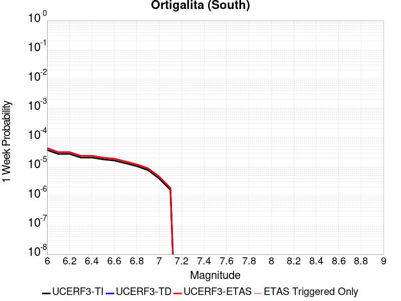 |  |  |  |

| Magnitude | 1 wk TI Prob | 1 wk TD Prob | 1 wk ETAS Prob | 1 wk ETAS/TD Gain | 1 wk ETAS Triggered Only | 1 mo TI Prob | 1 mo TD Prob | 1 mo ETAS Prob | 1 mo ETAS/TD Gain | 1 mo ETAS Triggered Only | 1 yr TI Prob | 1 yr TD Prob | 1 yr ETAS Prob | 1 yr ETAS/TD Gain | 1 yr ETAS Triggered Only | 10 yr TI Prob | 10 yr TD Prob | 10 yr ETAS Prob | 10 yr ETAS/TD Gain | 10 yr ETAS Triggered Only |
|-----|-----|-----|-----|-----|-----|-----|-----|-----|-----|-----|-----|-----|-----|-----|-----|-----|-----|-----|-----|-----|
| 6.0 | 3.72394E-5 | 4.32556E-5 | 4.32556E-5 | 1.0 | 0.0 | 1.5958765E-4 | 1.8536886E-4 | 1.95367E-4 | 1.0539365 | 1.0E-5 | 0.0019412481 | 0.0022546863 | 0.0022646638 | 1.0044252 | 1.0E-5 | 0.019243775 | 0.022334501 | 0.022354055 | 1.0008755 | 2.0E-5 |
| 6.1 | 2.7299884E-5 | 3.1492036E-5 | 3.1492036E-5 | 1.0 | 0.0 | 1.16994255E-4 | 1.349592E-4 | 1.349592E-4 | 1.0 | 0.0 | 0.0014234743 | 0.0016419457 | 0.0016419457 | 1.0 | 0.0 | 0.014143906 | 0.016304072 | 0.016313909 | 1.0006033 | 1.0E-5 |
| 6.2 | 2.7299884E-5 | 3.1492036E-5 | 3.1492036E-5 | 1.0 | 0.0 | 1.16994255E-4 | 1.349592E-4 | 1.349592E-4 | 1.0 | 0.0 | 0.0014234743 | 0.0016419457 | 0.0016419457 | 1.0 | 0.0 | 0.014143906 | 0.016304072 | 0.016313909 | 1.0006033 | 1.0E-5 |
| 6.3 | 2.0546433E-5 | 2.3631454E-5 | 2.3631454E-5 | 1.0 | 0.0 | 8.805317E-5 | 1.0127383E-4 | 1.0127383E-4 | 1.0 | 0.0 | 0.00107152 | 0.0012323305 | 0.0012323305 | 1.0 | 0.0 | 0.010663681 | 0.012257031 | 0.012266909 | 1.0008059 | 1.0E-5 |
| 6.4 | 2.0546433E-5 | 2.3631454E-5 | 2.3631454E-5 | 1.0 | 0.0 | 8.805317E-5 | 1.0127383E-4 | 1.0127383E-4 | 1.0 | 0.0 | 0.00107152 | 0.0012323305 | 0.0012323305 | 1.0 | 0.0 | 0.010663681 | 0.012257031 | 0.012266909 | 1.0008059 | 1.0E-5 |
| 6.5 | 1.7779594E-5 | 2.0446974E-5 | 2.0446974E-5 | 1.0 | 0.0 | 7.619603E-5 | 8.762703E-5 | 8.762703E-5 | 1.0 | 0.0 | 9.272918E-4 | 0.0010663505 | 0.0010663505 | 1.0 | 0.0 | 0.009234319 | 0.010613804 | 0.010623697 | 1.0009322 | 1.0E-5 |
| 6.6 | 1.6272212E-5 | 1.8714967E-5 | 1.8714967E-5 | 1.0 | 0.0 | 6.973618E-5 | 8.0204605E-5 | 8.0204605E-5 | 1.0 | 0.0 | 8.487073E-4 | 9.760659E-4 | 9.760659E-4 | 1.0 | 0.0 | 0.008454733 | 0.009719091 | 0.009728993 | 1.0010189 | 1.0E-5 |
| 6.7 | 1.3051484E-5 | 1.5038758E-5 | 1.5038758E-5 | 1.0 | 0.0 | 5.593373E-5 | 6.445028E-5 | 6.445028E-5 | 1.0 | 0.0 | 6.807804E-4 | 7.844092E-4 | 7.844092E-4 | 1.0 | 0.0 | 0.006786986 | 0.007817388 | 0.00782731 | 1.0012692 | 1.0E-5 |
| 6.8 | 1.04277415E-5 | 1.1987235E-5 | 1.1987235E-5 | 1.0 | 0.0 | 4.4689557E-5 | 5.1372896E-5 | 5.1372896E-5 | 1.0 | 0.0 | 5.439595E-4 | 6.2529295E-4 | 6.2529295E-4 | 1.0 | 0.0 | 0.0054262993 | 0.00623609 | 0.0062460275 | 1.0015936 | 1.0E-5 |
| 6.9 | 7.639968E-6 | 8.791503E-6 | 8.791503E-6 | 1.0 | 0.0 | 3.274231E-5 | 3.767736E-5 | 3.767736E-5 | 1.0 | 0.0 | 3.9856473E-4 | 4.586312E-4 | 4.586312E-4 | 1.0 | 0.0 | 0.003978506 | 0.004577433 | 0.004587387 | 1.0021746 | 1.0E-5 |
| 7.0 | 3.919831E-6 | 4.5334014E-6 | 4.5334014E-6 | 1.0 | 0.0 | 1.679917E-5 | 1.942873E-5 | 1.942873E-5 | 1.0 | 0.0 | 2.045107E-4 | 2.3652123E-4 | 2.3652123E-4 | 1.0 | 0.0 | 0.0020432258 | 0.0023629034 | 0.0023728798 | 1.004222 | 1.0E-5 |
| 7.1 | 1.6017933E-6 | 1.8570418E-6 | 1.8570418E-6 | 1.0 | 0.0 | 6.8648105E-6 | 7.958732E-6 | 7.958732E-6 | 1.0 | 0.0 | 8.357586E-5 | 9.689432E-5 | 9.689432E-5 | 1.0 | 0.0 | 8.3544437E-4 | 9.686254E-4 | 9.786157E-4 | 1.0103139 | 1.0E-5 |

## Santa Ynez River
*[(top)](#table-of-contents)*

| 1 Week | 1 Month | 1 Year | 10 Year |
|-----|-----|-----|-----|
|  |  |  |  |

| Magnitude | 1 wk TI Prob | 1 wk TD Prob | 1 wk ETAS Prob | 1 wk ETAS/TD Gain | 1 wk ETAS Triggered Only | 1 mo TI Prob | 1 mo TD Prob | 1 mo ETAS Prob | 1 mo ETAS/TD Gain | 1 mo ETAS Triggered Only | 1 yr TI Prob | 1 yr TD Prob | 1 yr ETAS Prob | 1 yr ETAS/TD Gain | 1 yr ETAS Triggered Only | 10 yr TI Prob | 10 yr TD Prob | 10 yr ETAS Prob | 10 yr ETAS/TD Gain | 10 yr ETAS Triggered Only |
|-----|-----|-----|-----|-----|-----|-----|-----|-----|-----|-----|-----|-----|-----|-----|-----|-----|-----|-----|-----|-----|
| 6.0 | 1.6396456E-5 | 1.7209444E-5 | 1.7209444E-5 | 1.0 | 0.0 | 7.026863E-5 | 7.3752875E-5 | 7.3752875E-5 | 1.0 | 0.0 | 8.551848E-4 | 8.976069E-4 | 9.1758894E-4 | 1.0222615 | 2.0E-5 | 0.0085190125 | 0.008943363 | 0.0089631835 | 1.0022163 | 2.0E-5 |
| 6.1 | 1.6396456E-5 | 1.7209444E-5 | 1.7209444E-5 | 1.0 | 0.0 | 7.026863E-5 | 7.3752875E-5 | 7.3752875E-5 | 1.0 | 0.0 | 8.551848E-4 | 8.976069E-4 | 9.1758894E-4 | 1.0222615 | 2.0E-5 | 0.0085190125 | 0.008943363 | 0.0089631835 | 1.0022163 | 2.0E-5 |
| 6.2 | 1.6396456E-5 | 1.7209444E-5 | 1.7209444E-5 | 1.0 | 0.0 | 7.026863E-5 | 7.3752875E-5 | 7.3752875E-5 | 1.0 | 0.0 | 8.551848E-4 | 8.976069E-4 | 9.1758894E-4 | 1.0222615 | 2.0E-5 | 0.0085190125 | 0.008943363 | 0.0089631835 | 1.0022163 | 2.0E-5 |
| 6.3 | 9.736976E-6 | 1.01223395E-5 | 1.01223395E-5 | 1.0 | 0.0 | 4.172923E-5 | 4.338076E-5 | 4.338076E-5 | 1.0 | 0.0 | 5.0793495E-4 | 5.280378E-4 | 5.480272E-4 | 1.0378561 | 2.0E-5 | 0.005067755 | 0.0052683367 | 0.005288231 | 1.0037763 | 2.0E-5 |
| 6.4 | 9.736976E-6 | 1.01223395E-5 | 1.01223395E-5 | 1.0 | 0.0 | 4.172923E-5 | 4.338076E-5 | 4.338076E-5 | 1.0 | 0.0 | 5.0793495E-4 | 5.280378E-4 | 5.480272E-4 | 1.0378561 | 2.0E-5 | 0.005067755 | 0.0052683367 | 0.005288231 | 1.0037763 | 2.0E-5 |
| 6.5 | 7.081964E-6 | 7.329905E-6 | 7.329905E-6 | 1.0 | 0.0 | 3.035092E-5 | 3.141351E-5 | 3.141351E-5 | 1.0 | 0.0 | 3.694598E-4 | 3.8239395E-4 | 4.023863E-4 | 1.0522821 | 2.0E-5 | 0.0036884616 | 0.0038175215 | 0.003837445 | 1.005219 | 2.0E-5 |
| 6.6 | 5.873247E-6 | 6.0597517E-6 | 6.0597517E-6 | 1.0 | 0.0 | 2.5170815E-5 | 2.5970112E-5 | 2.5970112E-5 | 1.0 | 0.0 | 3.064116E-4 | 3.161411E-4 | 3.3613478E-4 | 1.0632429 | 2.0E-5 | 0.0030598943 | 0.003157001 | 0.0031769378 | 1.0063151 | 2.0E-5 |
| 6.7 | 4.973277E-6 | 5.11591E-6 | 5.11591E-6 | 1.0 | 0.0 | 2.1313872E-5 | 2.1925147E-5 | 2.1925147E-5 | 1.0 | 0.0 | 2.5946548E-4 | 2.6690646E-4 | 2.869011E-4 | 1.0749127 | 2.0E-5 | 0.0025916274 | 0.0026659078 | 0.0026858544 | 1.0074822 | 2.0E-5 |
| 6.8 | 4.396492E-6 | 4.510987E-6 | 4.510987E-6 | 1.0 | 0.0 | 1.884197E-5 | 1.933266E-5 | 1.933266E-5 | 1.0 | 0.0 | 2.2937685E-4 | 2.3535005E-4 | 2.5534534E-4 | 1.0849597 | 2.0E-5 | 0.0022914023 | 0.0023510433 | 0.0023709964 | 1.0084869 | 2.0E-5 |
| 6.9 | 3.5255632E-6 | 3.6013423E-6 | 3.6013423E-6 | 1.0 | 0.0 | 1.5109469E-5 | 1.5434234E-5 | 1.5434234E-5 | 1.0 | 0.0 | 1.8394225E-4 | 1.8789574E-4 | 2.07892E-4 | 1.106422 | 2.0E-5 | 0.0018379007 | 0.001877385 | 0.0018973474 | 1.0106331 | 2.0E-5 |
| 7.0 | 3.211603E-6 | 3.273663E-6 | 3.273663E-6 | 1.0 | 0.0 | 1.376394E-5 | 1.402991E-5 | 1.402991E-5 | 1.0 | 0.0 | 1.6756308E-4 | 1.708009E-4 | 1.9079748E-4 | 1.1170754 | 2.0E-5 | 0.0016743679 | 0.0017067104 | 0.0017266762 | 1.0116985 | 2.0E-5 |
| 7.1 | 2.5094619E-6 | 2.5409295E-6 | 2.5409295E-6 | 1.0 | 0.0 | 1.0754793E-5 | 1.0889652E-5 | 1.0889652E-5 | 1.0 | 0.0 | 1.3093173E-4 | 1.325735E-4 | 1.5257086E-4 | 1.1508397 | 2.0E-5 | 0.0013085462 | 0.0013249503 | 0.0013449237 | 1.0150748 | 2.0E-5 |
| 7.2 | 2.0515774E-6 | 2.0619466E-6 | 2.0619466E-6 | 1.0 | 0.0 | 8.792445E-6 | 8.836884E-6 | 8.836884E-6 | 1.0 | 0.0 | 1.0704277E-4 | 1.0758379E-4 | 1.2758165E-4 | 1.1858816 | 2.0E-5 | 0.0010699122 | 0.0010753215 | 0.0010952998 | 1.0185791 | 2.0E-5 |
| 7.3 | 1.6845745E-6 | 1.6773996E-6 | 1.6773996E-6 | 1.0 | 0.0 | 7.219585E-6 | 7.1888358E-6 | 7.1888358E-6 | 1.0 | 0.0 | 8.78949E-5 | 8.752059E-5 | 9.751971E-5 | 1.1142489 | 1.0E-5 | 8.7860145E-4 | 8.7486405E-4 | 8.8485534E-4 | 1.0114204 | 1.0E-5 |
| 7.4 | 1.3600285E-6 | 1.3333447E-6 | 1.3333447E-6 | 1.0 | 0.0 | 5.82868E-6 | 5.714322E-6 | 5.714322E-6 | 1.0 | 0.0 | 7.096187E-5 | 6.956967E-5 | 7.956898E-5 | 1.1437308 | 1.0E-5 | 7.0939213E-4 | 6.9548114E-4 | 7.054742E-4 | 1.0143685 | 1.0E-5 |
| 7.5 | 9.735342E-7 | 9.2901894E-7 | 9.2901894E-7 | 1.0 | 0.0 | 4.172283E-6 | 3.9815036E-6 | 3.9815036E-6 | 1.0 | 0.0 | 5.079636E-5 | 4.8473747E-5 | 4.8473747E-5 | 1.0 | 0.0 | 5.0784746E-4 | 4.8463346E-4 | 4.8463346E-4 | 1.0 | 0.0 |
| 7.6 | 5.067187E-7 | 4.778609E-7 | 4.778609E-7 | 1.0 | 0.0 | 2.1716498E-6 | 2.0479738E-6 | 2.0479738E-6 | 1.0 | 0.0 | 2.6439517E-5 | 2.4933803E-5 | 2.4933803E-5 | 1.0 | 0.0 | 2.643637E-4 | 2.493108E-4 | 2.493108E-4 | 1.0 | 0.0 |
| 7.7 | 2.769089E-7 | 2.5759346E-7 | 2.5759346E-7 | 1.0 | 0.0 | 1.1867519E-6 | 1.1039714E-6 | 1.1039714E-6 | 1.0 | 0.0 | 1.4448608E-5 | 1.344077E-5 | 1.344077E-5 | 1.0 | 0.0 | 1.444767E-4 | 1.343996E-4 | 1.343996E-4 | 1.0 | 0.0 |
| 7.8 | 1.7044663E-7 | 1.5449208E-7 | 1.5449208E-7 | 1.0 | 0.0 | 7.3048534E-7 | 6.6210873E-7 | 6.6210873E-7 | 1.0 | 0.0 | 8.893623E-6 | 8.061144E-6 | 8.061144E-6 | 1.0 | 0.0 | 8.893267E-5 | 8.060854E-5 | 8.060854E-5 | 1.0 | 0.0 |
| 7.9 | 4.8344287E-8 | 4.0911143E-8 | 4.0911143E-8 | 1.0 | 0.0 | 2.0718979E-7 | 1.7533345E-7 | 1.7533345E-7 | 1.0 | 0.0 | 2.5225327E-6 | 2.1346827E-6 | 2.1346827E-6 | 1.0 | 0.0 | 2.5225041E-5 | 2.1346626E-5 | 2.1346626E-5 | 1.0 | 0.0 |

## Davis Creek
*[(top)](#table-of-contents)*

| 1 Week | 1 Month | 1 Year | 10 Year |
|-----|-----|-----|-----|
|  |  |  |  |

| Magnitude | 1 wk TI Prob | 1 wk TD Prob | 1 wk ETAS Prob | 1 wk ETAS/TD Gain | 1 wk ETAS Triggered Only | 1 mo TI Prob | 1 mo TD Prob | 1 mo ETAS Prob | 1 mo ETAS/TD Gain | 1 mo ETAS Triggered Only | 1 yr TI Prob | 1 yr TD Prob | 1 yr ETAS Prob | 1 yr ETAS/TD Gain | 1 yr ETAS Triggered Only | 10 yr TI Prob | 10 yr TD Prob | 10 yr ETAS Prob | 10 yr ETAS/TD Gain | 10 yr ETAS Triggered Only |
|-----|-----|-----|-----|-----|-----|-----|-----|-----|-----|-----|-----|-----|-----|-----|-----|-----|-----|-----|-----|-----|
| 6.0 | 2.331472E-5 | 2.5417214E-5 | 2.5417214E-5 | 1.0 | 0.0 | 9.99164E-5 | 1.0892704E-4 | 1.0892704E-4 | 1.0 | 0.0 | 0.0012158032 | 0.0013254983 | 0.0013354851 | 1.0075344 | 1.0E-5 | 0.01209173 | 0.013187704 | 0.013197572 | 1.0007483 | 1.0E-5 |
| 6.1 | 1.0407654E-5 | 1.1316986E-5 | 1.1316986E-5 | 1.0 | 0.0 | 4.4603472E-5 | 4.8500624E-5 | 4.8500624E-5 | 1.0 | 0.0 | 5.4291193E-4 | 5.9036224E-4 | 6.003563E-4 | 1.0169288 | 1.0E-5 | 0.0054158745 | 0.005890611 | 0.005900552 | 1.0016876 | 1.0E-5 |
| 6.2 | 1.0407654E-5 | 1.1316986E-5 | 1.1316986E-5 | 1.0 | 0.0 | 4.4603472E-5 | 4.8500624E-5 | 4.8500624E-5 | 1.0 | 0.0 | 5.4291193E-4 | 5.9036224E-4 | 6.003563E-4 | 1.0169288 | 1.0E-5 | 0.0054158745 | 0.005890611 | 0.005900552 | 1.0016876 | 1.0E-5 |
| 6.3 | 5.1323277E-6 | 5.568556E-6 | 5.568556E-6 | 1.0 | 0.0 | 2.1995505E-5 | 2.386507E-5 | 2.386507E-5 | 1.0 | 0.0 | 2.6776237E-4 | 2.905271E-4 | 3.005242E-4 | 1.0344102 | 1.0E-5 | 0.0026743996 | 0.0029023192 | 0.0029122902 | 1.0034355 | 1.0E-5 |
| 6.4 | 2.4985154E-6 | 2.704538E-6 | 2.704538E-6 | 1.0 | 0.0 | 1.07078795E-5 | 1.1590847E-5 | 1.1590847E-5 | 1.0 | 0.0 | 1.3036063E-4 | 1.4111304E-4 | 1.4111304E-4 | 1.0 | 0.0 | 0.0013028418 | 0.001410589 | 0.001410589 | 1.0 | 0.0 |
| 6.5 | 2.4846438E-6 | 2.6904722E-6 | 2.6904722E-6 | 1.0 | 0.0 | 1.064843E-5 | 1.1530565E-5 | 1.1530565E-5 | 1.0 | 0.0 | 1.2963692E-4 | 1.403792E-4 | 1.403792E-4 | 1.0 | 0.0 | 0.0012956132 | 0.0014032599 | 0.0014032599 | 1.0 | 0.0 |
| 6.6 | 2.072566E-7 | 2.1018087E-7 | 2.1018087E-7 | 1.0 | 0.0 | 8.882423E-7 | 9.0077486E-7 | 9.0077486E-7 | 1.0 | 0.0 | 1.0814296E-5 | 1.0966881E-5 | 1.0966881E-5 | 1.0 | 0.0 | 1.081377E-4 | 1.09663575E-4 | 1.09663575E-4 | 1.0 | 0.0 |
| 6.7 | 1.7544528E-7 | 1.7790826E-7 | 1.7790826E-7 | 1.0 | 0.0 | 7.5190815E-7 | 7.6246374E-7 | 7.6246374E-7 | 1.0 | 0.0 | 9.154443E-6 | 9.282958E-6 | 9.282958E-6 | 1.0 | 0.0 | 9.1540656E-5 | 9.282586E-5 | 9.282586E-5 | 1.0 | 0.0 |
| 6.8 | 1.2320395E-7 | 1.2481138E-7 | 1.2481138E-7 | 1.0 | 0.0 | 5.280168E-7 | 5.349058E-7 | 5.349058E-7 | 1.0 | 0.0 | 6.428586E-6 | 6.5124595E-6 | 6.5124595E-6 | 1.0 | 0.0 | 6.4284E-5 | 6.5122804E-5 | 6.5122804E-5 | 1.0 | 0.0 |
| 6.9 | 6.399997E-8 | 6.486058E-8 | 6.486058E-8 | 1.0 | 0.0 | 2.7428555E-7 | 2.7797387E-7 | 2.7797387E-7 | 1.0 | 0.0 | 3.3394215E-6 | 3.3843273E-6 | 3.3843273E-6 | 1.0 | 0.0 | 3.3393713E-5 | 3.384282E-5 | 3.384282E-5 | 1.0 | 0.0 |
| 7.0 | 6.4455685E-9 | 6.535264E-9 | 6.535264E-9 | 1.0 | 0.0 | 2.7623864E-8 | 2.8008275E-8 | 2.8008275E-8 | 1.0 | 0.0 | 3.3632048E-7 | 3.4100074E-7 | 3.4100074E-7 | 1.0 | 0.0 | 3.3631998E-6 | 3.4100074E-6 | 3.4100074E-6 | 1.0 | 0.0 |

## Owens Valley Keough Hot Springs
*[(top)](#table-of-contents)*

| 1 Week | 1 Month | 1 Year | 10 Year |
|-----|-----|-----|-----|
|  |  |  |  |

| Magnitude | 1 wk TI Prob | 1 wk TD Prob | 1 wk ETAS Prob | 1 wk ETAS/TD Gain | 1 wk ETAS Triggered Only | 1 mo TI Prob | 1 mo TD Prob | 1 mo ETAS Prob | 1 mo ETAS/TD Gain | 1 mo ETAS Triggered Only | 1 yr TI Prob | 1 yr TD Prob | 1 yr ETAS Prob | 1 yr ETAS/TD Gain | 1 yr ETAS Triggered Only | 10 yr TI Prob | 10 yr TD Prob | 10 yr ETAS Prob | 10 yr ETAS/TD Gain | 10 yr ETAS Triggered Only |
|-----|-----|-----|-----|-----|-----|-----|-----|-----|-----|-----|-----|-----|-----|-----|-----|-----|-----|-----|-----|-----|
| 6.0 | 1.5708529E-5 | 4.950463E-6 | 4.950463E-6 | 1.0 | 0.0 | 6.7320536E-5 | 2.1216127E-5 | 2.1216127E-5 | 1.0 | 0.0 | 8.193192E-4 | 2.5828084E-4 | 2.782757E-4 | 1.0774151 | 2.0E-5 | 0.008163051 | 0.0025804387 | 0.0026003872 | 1.0077306 | 2.0E-5 |
| 6.1 | 1.5708529E-5 | 4.950463E-6 | 4.950463E-6 | 1.0 | 0.0 | 6.7320536E-5 | 2.1216127E-5 | 2.1216127E-5 | 1.0 | 0.0 | 8.193192E-4 | 2.5828084E-4 | 2.782757E-4 | 1.0774151 | 2.0E-5 | 0.008163051 | 0.0025804387 | 0.0026003872 | 1.0077306 | 2.0E-5 |
| 6.2 | 1.5708529E-5 | 4.950463E-6 | 4.950463E-6 | 1.0 | 0.0 | 6.7320536E-5 | 2.1216127E-5 | 2.1216127E-5 | 1.0 | 0.0 | 8.193192E-4 | 2.5828084E-4 | 2.782757E-4 | 1.0774151 | 2.0E-5 | 0.008163051 | 0.0025804387 | 0.0026003872 | 1.0077306 | 2.0E-5 |
| 6.3 | 1.5708529E-5 | 4.950463E-6 | 4.950463E-6 | 1.0 | 0.0 | 6.7320536E-5 | 2.1216127E-5 | 2.1216127E-5 | 1.0 | 0.0 | 8.193192E-4 | 2.5828084E-4 | 2.782757E-4 | 1.0774151 | 2.0E-5 | 0.008163051 | 0.0025804387 | 0.0026003872 | 1.0077306 | 2.0E-5 |
| 6.4 | 1.4622509E-5 | 3.7263276E-6 | 3.7263276E-6 | 1.0 | 0.0 | 6.266639E-5 | 1.5969896E-5 | 1.5969896E-5 | 1.0 | 0.0 | 7.626962E-4 | 1.9441944E-4 | 2.1441556E-4 | 1.1028503 | 2.0E-5 | 0.007600839 | 0.0019429466 | 0.0019629078 | 1.0102737 | 2.0E-5 |
| 6.5 | 1.3335527E-5 | 2.2775241E-6 | 2.2775241E-6 | 1.0 | 0.0 | 5.7151006E-5 | 9.760785E-6 | 9.760785E-6 | 1.0 | 0.0 | 6.955913E-4 | 1.1883176E-4 | 1.3882939E-4 | 1.1682851 | 2.0E-5 | 0.0069341804 | 0.001187878 | 0.0012078542 | 1.0168167 | 2.0E-5 |
| 6.6 | 1.3332855E-5 | 2.2746733E-6 | 2.2746733E-6 | 1.0 | 0.0 | 5.7139558E-5 | 9.748568E-6 | 9.748568E-6 | 1.0 | 0.0 | 6.9545204E-4 | 1.1868303E-4 | 1.3868065E-4 | 1.1684961 | 2.0E-5 | 0.0069327964 | 0.0011863923 | 0.0012063686 | 1.0168378 | 2.0E-5 |
| 6.7 | 1.3318214E-5 | 2.2639038E-6 | 2.2639038E-6 | 1.0 | 0.0 | 5.707681E-5 | 9.702413E-6 | 9.702413E-6 | 1.0 | 0.0 | 6.946886E-4 | 1.18121156E-4 | 1.3811879E-4 | 1.1692977 | 2.0E-5 | 0.0069252094 | 0.0011807795 | 0.0012007558 | 1.016918 | 2.0E-5 |
| 6.8 | 1.2441338E-5 | 1.677594E-6 | 1.677594E-6 | 1.0 | 0.0 | 5.331893E-5 | 7.1896707E-6 | 7.1896707E-6 | 1.0 | 0.0 | 6.489646E-4 | 8.753102E-5 | 1.07529275E-4 | 1.2284704 | 2.0E-5 | 0.0064707273 | 8.751236E-4 | 8.951061E-4 | 1.022834 | 2.0E-5 |
| 6.9 | 1.1130476E-5 | 1.0302234E-6 | 1.0302234E-6 | 1.0 | 0.0 | 4.7701167E-5 | 4.4152357E-6 | 4.4152357E-6 | 1.0 | 0.0 | 5.806069E-4 | 5.3754186E-5 | 7.375311E-5 | 1.3720441 | 2.0E-5 | 0.0057909233 | 5.375404E-4 | 5.575297E-4 | 1.0371865 | 2.0E-5 |
| 7.0 | 1.0986073E-5 | 9.577824E-7 | 9.577824E-7 | 1.0 | 0.0 | 4.7082318E-5 | 4.1047756E-6 | 4.1047756E-6 | 1.0 | 0.0 | 5.730765E-4 | 4.9974507E-5 | 6.997351E-5 | 1.400184 | 2.0E-5 | 0.0057160086 | 4.997603E-4 | 5.1975035E-4 | 1.0399991 | 2.0E-5 |
| 7.1 | 1.0451338E-5 | 7.9988575E-7 | 7.9988575E-7 | 1.0 | 0.0 | 4.4790682E-5 | 3.4280772E-6 | 3.4280772E-6 | 1.0 | 0.0 | 5.451901E-4 | 4.1736046E-5 | 6.173521E-5 | 1.4791821 | 2.0E-5 | 0.005438545 | 4.1740583E-4 | 4.3739748E-4 | 1.047895 | 2.0E-5 |
| 7.2 | 9.989061E-6 | 6.543693E-7 | 6.543693E-7 | 1.0 | 0.0 | 4.280956E-5 | 2.8044367E-6 | 2.8044367E-6 | 1.0 | 0.0 | 5.2108173E-4 | 3.4143486E-5 | 5.41428E-5 | 1.5857433 | 2.0E-5 | 0.0051986156 | 3.41488E-4 | 3.6148116E-4 | 1.0585473 | 2.0E-5 |
| 7.3 | 9.465365E-6 | 5.458855E-7 | 5.458855E-7 | 1.0 | 0.0 | 4.056522E-5 | 2.3395073E-6 | 2.3395073E-6 | 1.0 | 0.0 | 4.937696E-4 | 2.8483131E-5 | 4.848256E-5 | 1.70215 | 2.0E-5 | 0.0049267393 | 2.8489542E-4 | 3.0488972E-4 | 1.0701813 | 2.0E-5 |
| 7.4 | 6.3824805E-6 | 4.0153776E-7 | 4.0153776E-7 | 1.0 | 0.0 | 2.73532E-5 | 1.7208749E-6 | 1.7208749E-6 | 1.0 | 0.0 | 3.3297433E-4 | 2.0951453E-5 | 4.0951036E-5 | 1.9545677 | 2.0E-5 | 0.0033247585 | 2.0955436E-4 | 2.2955018E-4 | 1.0954206 | 2.0E-5 |
| 7.5 | 1.6192645E-6 | 2.5156373E-7 | 2.5156373E-7 | 1.0 | 0.0 | 6.9396865E-6 | 1.0781299E-6 | 1.0781299E-6 | 1.0 | 0.0 | 8.448741E-5 | 1.3126153E-5 | 3.3125893E-5 | 2.5236557 | 2.0E-5 | 8.4455294E-4 | 1.3125391E-4 | 1.5125128E-4 | 1.1523564 | 2.0E-5 |
| 7.6 | 5.7062545E-7 | 1.0790214E-7 | 1.0790214E-7 | 1.0 | 0.0 | 2.4455355E-6 | 4.6243767E-7 | 4.6243767E-7 | 1.0 | 0.0 | 2.9773988E-5 | 5.630165E-6 | 2.5630052E-5 | 4.5522738 | 2.0E-5 | 2.977E-4 | 5.6300305E-5 | 7.629918E-5 | 1.3552178 | 2.0E-5 |
| 7.7 | 2.5988817E-7 | 4.5445965E-8 | 4.5445965E-8 | 1.0 | 0.0 | 1.113806E-6 | 1.9476842E-7 | 1.9476842E-7 | 1.0 | 0.0 | 1.3560503E-5 | 2.3713033E-6 | 2.2371256E-5 | 9.43416 | 2.0E-5 | 1.3559677E-4 | 2.3712824E-5 | 4.371235E-5 | 1.8434055 | 2.0E-5 |

## Sargent 2011 CFM
*[(top)](#table-of-contents)*

| 1 Week | 1 Month | 1 Year | 10 Year |
|-----|-----|-----|-----|
|  | 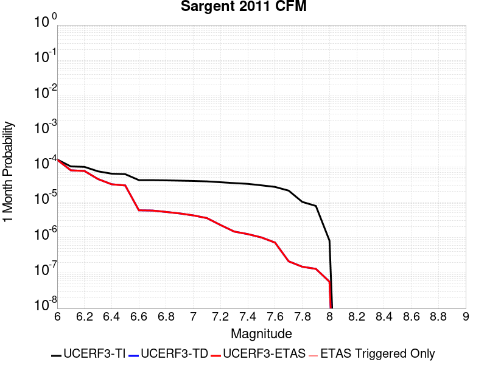 |  |  |

| Magnitude | 1 wk TI Prob | 1 wk TD Prob | 1 wk ETAS Prob | 1 wk ETAS/TD Gain | 1 wk ETAS Triggered Only | 1 mo TI Prob | 1 mo TD Prob | 1 mo ETAS Prob | 1 mo ETAS/TD Gain | 1 mo ETAS Triggered Only | 1 yr TI Prob | 1 yr TD Prob | 1 yr ETAS Prob | 1 yr ETAS/TD Gain | 1 yr ETAS Triggered Only | 10 yr TI Prob | 10 yr TD Prob | 10 yr ETAS Prob | 10 yr ETAS/TD Gain | 10 yr ETAS Triggered Only |
|-----|-----|-----|-----|-----|-----|-----|-----|-----|-----|-----|-----|-----|-----|-----|-----|-----|-----|-----|-----|-----|
| 6.0 | 3.7327867E-5 | 3.665065E-5 | 3.665065E-5 | 1.0 | 0.0 | 1.5996677E-4 | 1.5706717E-4 | 1.5706717E-4 | 1.0 | 0.0 | 0.0019458556 | 0.0019110267 | 0.0019110267 | 1.0 | 0.0 | 0.01928905 | 0.019017996 | 0.019037616 | 1.0010316 | 2.0E-5 |
| 6.1 | 2.3771476E-5 | 1.8478724E-5 | 1.8478724E-5 | 1.0 | 0.0 | 1.01873775E-4 | 7.919262E-5 | 7.919262E-5 | 1.0 | 0.0 | 0.0012396075 | 9.638239E-4 | 9.638239E-4 | 1.0 | 0.0 | 0.012327154 | 0.009635902 | 0.009645806 | 1.0010278 | 1.0E-5 |
| 6.2 | 2.3112721E-5 | 1.7710081E-5 | 1.7710081E-5 | 1.0 | 0.0 | 9.9050754E-5 | 7.5898635E-5 | 7.5898635E-5 | 1.0 | 0.0 | 0.0012052758 | 9.2375383E-4 | 9.2375383E-4 | 1.0 | 0.0 | 0.011987597 | 0.009238554 | 0.009248462 | 1.0010724 | 1.0E-5 |
| 6.3 | 1.728509E-5 | 1.0458513E-5 | 1.0458513E-5 | 1.0 | 0.0 | 7.407686E-5 | 4.4821696E-5 | 4.4821696E-5 | 1.0 | 0.0 | 9.015125E-4 | 5.456136E-4 | 5.456136E-4 | 1.0 | 0.0 | 0.008978641 | 0.0054789106 | 0.0054789106 | 1.0 | 0.0 |
| 6.4 | 1.48395575E-5 | 7.4555796E-6 | 7.4555796E-6 | 1.0 | 0.0 | 6.3596555E-5 | 3.195231E-5 | 3.195231E-5 | 1.0 | 0.0 | 7.7401294E-4 | 3.889874E-4 | 3.889874E-4 | 1.0 | 0.0 | 0.0077132257 | 0.00391845 | 0.00391845 | 1.0 | 0.0 |
| 6.5 | 1.4358964E-5 | 6.894356E-6 | 6.894356E-6 | 1.0 | 0.0 | 6.1536964E-5 | 2.9547118E-5 | 2.9547118E-5 | 1.0 | 0.0 | 7.48955E-4 | 3.5971415E-4 | 3.5971415E-4 | 1.0 | 0.0 | 0.0074643586 | 0.0036266989 | 0.0036266989 | 1.0 | 0.0 |
| 6.6 | 9.772591E-6 | 1.3732375E-6 | 1.3732375E-6 | 1.0 | 0.0 | 4.188186E-5 | 5.8852906E-6 | 5.8852906E-6 | 1.0 | 0.0 | 5.097923E-4 | 7.165109E-5 | 7.165109E-5 | 1.0 | 0.0 | 0.005086244 | 7.480871E-4 | 7.480871E-4 | 1.0 | 0.0 |
| 6.7 | 9.752745E-6 | 1.3519289E-6 | 1.3519289E-6 | 1.0 | 0.0 | 4.179681E-5 | 5.7939683E-6 | 5.7939683E-6 | 1.0 | 0.0 | 5.0875737E-4 | 7.053931E-5 | 7.053931E-5 | 1.0 | 0.0 | 0.005075942 | 7.369768E-4 | 7.369768E-4 | 1.0 | 0.0 |
| 6.8 | 9.608213E-6 | 1.235796E-6 | 1.235796E-6 | 1.0 | 0.0 | 4.1177405E-5 | 5.296258E-6 | 5.296258E-6 | 1.0 | 0.0 | 5.012196E-4 | 6.448006E-5 | 6.448006E-5 | 1.0 | 0.0 | 0.005000906 | 6.7611714E-4 | 6.7611714E-4 | 1.0 | 0.0 |
| 6.9 | 9.427164E-6 | 1.1205796E-6 | 1.1205796E-6 | 1.0 | 0.0 | 4.04015E-5 | 4.8024754E-6 | 4.8024754E-6 | 1.0 | 0.0 | 4.9177726E-4 | 5.8468588E-5 | 5.8468588E-5 | 1.0 | 0.0 | 0.004906904 | 6.1537215E-4 | 6.1537215E-4 | 1.0 | 0.0 |
| 7.0 | 9.247601E-6 | 9.87042E-7 | 9.87042E-7 | 1.0 | 0.0 | 3.9631974E-5 | 4.2301726E-6 | 4.2301726E-6 | 1.0 | 0.0 | 4.8241246E-4 | 5.1501152E-5 | 5.1501152E-5 | 1.0 | 0.0 | 0.0048136655 | 5.452185E-4 | 5.452185E-4 | 1.0 | 0.0 |
| 7.1 | 8.995454E-6 | 8.267614E-7 | 8.267614E-7 | 1.0 | 0.0 | 3.8551374E-5 | 3.5432583E-6 | 3.5432583E-6 | 1.0 | 0.0 | 4.6926187E-4 | 4.313833E-5 | 4.313833E-5 | 1.0 | 0.0 | 0.004682722 | 4.6070307E-4 | 4.6070307E-4 | 1.0 | 0.0 |
| 7.2 | 8.520861E-6 | 5.27322E-7 | 5.27322E-7 | 1.0 | 0.0 | 3.6517464E-5 | 2.2599497E-6 | 2.2599497E-6 | 1.0 | 0.0 | 4.445094E-4 | 2.7514547E-5 | 2.7514547E-5 | 1.0 | 0.0 | 0.004436213 | 3.0276953E-4 | 3.0276953E-4 | 1.0 | 0.0 |
| 7.3 | 8.043592E-6 | 3.453237E-7 | 3.453237E-7 | 1.0 | 0.0 | 3.4472083E-5 | 1.4799579E-6 | 1.4799579E-6 | 1.0 | 0.0 | 4.196168E-4 | 1.801834E-5 | 1.801834E-5 | 1.0 | 0.0 | 0.004188253 | 2.0650218E-4 | 2.0650218E-4 | 1.0 | 0.0 |
| 7.4 | 7.662316E-6 | 2.9259107E-7 | 2.9259107E-7 | 1.0 | 0.0 | 3.2838085E-5 | 1.2539612E-6 | 1.2539612E-6 | 1.0 | 0.0 | 3.9973034E-4 | 1.526687E-5 | 1.526687E-5 | 1.0 | 0.0 | 0.0039901207 | 1.7718194E-4 | 1.7718194E-4 | 1.0 | 0.0 |
| 7.5 | 6.961638E-6 | 2.3549052E-7 | 2.3549052E-7 | 1.0 | 0.0 | 2.9835252E-5 | 1.0092447E-6 | 1.0092447E-6 | 1.0 | 0.0 | 3.6318362E-4 | 1.2287485E-5 | 1.2287485E-5 | 1.0 | 0.0 | 0.0036259065 | 1.4393168E-4 | 1.4393168E-4 | 1.0 | 0.0 |
| 7.6 | 6.282332E-6 | 1.6871925E-7 | 1.6871925E-7 | 1.0 | 0.0 | 2.6924003E-5 | 7.230823E-7 | 7.230823E-7 | 1.0 | 0.0 | 3.2775043E-4 | 8.803492E-6 | 8.803492E-6 | 1.0 | 0.0 | 0.0032726745 | 1.0492336E-4 | 1.0492336E-4 | 1.0 | 0.0 |
| 7.7 | 4.934408E-6 | 4.9918345E-8 | 4.9918345E-8 | 1.0 | 0.0 | 2.114729E-5 | 2.1393575E-7 | 2.1393575E-7 | 1.0 | 0.0 | 2.5743784E-4 | 2.6046646E-6 | 2.6046646E-6 | 1.0 | 0.0 | 0.0025713982 | 3.2479504E-5 | 3.2479504E-5 | 1.0 | 0.0 |
| 7.8 | 2.373212E-6 | 3.5100808E-8 | 3.5100808E-8 | 1.0 | 0.0 | 1.0170869E-5 | 1.5043203E-7 | 1.5043203E-7 | 1.0 | 0.0 | 1.238233E-4 | 1.8315084E-6 | 1.8315084E-6 | 1.0 | 0.0 | 0.0012375432 | 2.4073881E-5 | 2.4073881E-5 | 1.0 | 0.0 |
| 7.9 | 1.8227792E-6 | 3.055616E-8 | 3.055616E-8 | 1.0 | 0.0 | 7.811887E-6 | 1.3095496E-7 | 1.3095496E-7 | 1.0 | 0.0 | 9.510558E-5 | 1.5943755E-6 | 1.5943755E-6 | 1.0 | 0.0 | 9.5064886E-4 | 2.1365537E-5 | 2.1365537E-5 | 1.0 | 0.0 |
| 8.0 | 1.9095137E-7 | 1.3250629E-8 | 1.3250629E-8 | 1.0 | 0.0 | 8.1836276E-7 | 5.678841E-8 | 5.678841E-8 | 1.0 | 0.0 | 9.963521E-6 | 6.9139867E-7 | 6.9139867E-7 | 1.0 | 0.0 | 9.963074E-5 | 8.455456E-6 | 8.455456E-6 | 1.0 | 0.0 |

## South Klamath Lake East
*[(top)](#table-of-contents)*

| 1 Week | 1 Month | 1 Year | 10 Year |
|-----|-----|-----|-----|
|  |  |  |  |

| Magnitude | 1 wk TI Prob | 1 wk TD Prob | 1 wk ETAS Prob | 1 wk ETAS/TD Gain | 1 wk ETAS Triggered Only | 1 mo TI Prob | 1 mo TD Prob | 1 mo ETAS Prob | 1 mo ETAS/TD Gain | 1 mo ETAS Triggered Only | 1 yr TI Prob | 1 yr TD Prob | 1 yr ETAS Prob | 1 yr ETAS/TD Gain | 1 yr ETAS Triggered Only | 10 yr TI Prob | 10 yr TD Prob | 10 yr ETAS Prob | 10 yr ETAS/TD Gain | 10 yr ETAS Triggered Only |
|-----|-----|-----|-----|-----|-----|-----|-----|-----|-----|-----|-----|-----|-----|-----|-----|-----|-----|-----|-----|-----|
| 6.0 | 2.3539369E-5 | 2.5047308E-5 | 3.504706E-5 | 1.3992345 | 1.0E-5 | 1.0087911E-4 | 1.0734166E-4 | 1.1734058E-4 | 1.0931505 | 1.0E-5 | 0.0012275111 | 0.0013061843 | 0.0013161713 | 1.0076458 | 1.0E-5 | 0.012207527 | 0.012993417 | 0.013003287 | 1.0007596 | 1.0E-5 |
| 6.1 | 2.3539369E-5 | 2.5047308E-5 | 3.504706E-5 | 1.3992345 | 1.0E-5 | 1.0087911E-4 | 1.0734166E-4 | 1.1734058E-4 | 1.0931505 | 1.0E-5 | 0.0012275111 | 0.0013061843 | 0.0013161713 | 1.0076458 | 1.0E-5 | 0.012207527 | 0.012993417 | 0.013003287 | 1.0007596 | 1.0E-5 |
| 6.2 | 2.3539369E-5 | 2.5047308E-5 | 3.504706E-5 | 1.3992345 | 1.0E-5 | 1.0087911E-4 | 1.0734166E-4 | 1.1734058E-4 | 1.0931505 | 1.0E-5 | 0.0012275111 | 0.0013061843 | 0.0013161713 | 1.0076458 | 1.0E-5 | 0.012207527 | 0.012993417 | 0.013003287 | 1.0007596 | 1.0E-5 |
| 6.3 | 9.807823E-6 | 1.0396044E-5 | 1.0396044E-5 | 1.0 | 0.0 | 4.2032847E-5 | 4.455376E-5 | 5.455331E-5 | 1.224438 | 1.0E-5 | 5.1162974E-4 | 5.4231536E-4 | 5.5230997E-4 | 1.0184294 | 1.0E-5 | 0.005104534 | 0.005410756 | 0.005420702 | 1.0018382 | 1.0E-5 |
| 6.4 | 9.807823E-6 | 1.0396044E-5 | 1.0396044E-5 | 1.0 | 0.0 | 4.2032847E-5 | 4.455376E-5 | 5.455331E-5 | 1.224438 | 1.0E-5 | 5.1162974E-4 | 5.4231536E-4 | 5.5230997E-4 | 1.0184294 | 1.0E-5 | 0.005104534 | 0.005410756 | 0.005420702 | 1.0018382 | 1.0E-5 |
| 6.5 | 6.191981E-6 | 6.5508398E-6 | 6.5508398E-6 | 1.0 | 0.0 | 2.653679E-5 | 2.8074743E-5 | 3.807446E-5 | 1.3561821 | 1.0E-5 | 3.2303753E-4 | 3.4175918E-4 | 3.5175576E-4 | 1.0292504 | 1.0E-5 | 0.0032256835 | 0.003412614 | 0.00342258 | 1.0029203 | 1.0E-5 |
| 6.6 | 4.3693776E-6 | 4.6165574E-6 | 4.6165574E-6 | 1.0 | 0.0 | 1.8725768E-5 | 1.9785102E-5 | 2.9784906E-5 | 1.5054208 | 1.0E-5 | 2.2796239E-4 | 2.4085813E-4 | 2.5085572E-4 | 1.0415082 | 1.0E-5 | 0.0022772867 | 0.0024060833 | 0.0024160594 | 1.0041461 | 1.0E-5 |
| 6.7 | 3.360834E-6 | 3.5512403E-6 | 3.5512403E-6 | 1.0 | 0.0 | 1.4403494E-5 | 1.5219517E-5 | 2.5219364E-5 | 1.6570411 | 1.0E-5 | 1.7534842E-4 | 1.8528267E-4 | 1.9528082E-4 | 1.0539616 | 1.0E-5 | 0.0017521014 | 0.0018513618 | 0.0018613433 | 1.0053915 | 1.0E-5 |
| 6.8 | 2.57873E-6 | 2.7251708E-6 | 2.7251708E-6 | 1.0 | 0.0 | 1.1051653E-5 | 1.1679254E-5 | 2.1679138E-5 | 1.856209 | 1.0E-5 | 1.3454557E-4 | 1.4218627E-4 | 1.5218485E-4 | 1.0703202 | 1.0E-5 | 0.0013446413 | 0.0014210136 | 0.0014309994 | 1.0070273 | 1.0E-5 |
| 6.9 | 9.987825E-7 | 1.0566213E-6 | 1.0566213E-6 | 1.0 | 0.0 | 4.2804895E-6 | 4.528371E-6 | 4.528371E-6 | 1.0 | 0.0 | 5.211371E-5 | 5.5131848E-5 | 5.5131848E-5 | 1.0 | 0.0 | 5.210149E-4 | 5.5121386E-4 | 5.5121386E-4 | 1.0 | 0.0 |

## Casmalia 2011 CFM
*[(top)](#table-of-contents)*

| 1 Week | 1 Month | 1 Year | 10 Year |
|-----|-----|-----|-----|
|  | 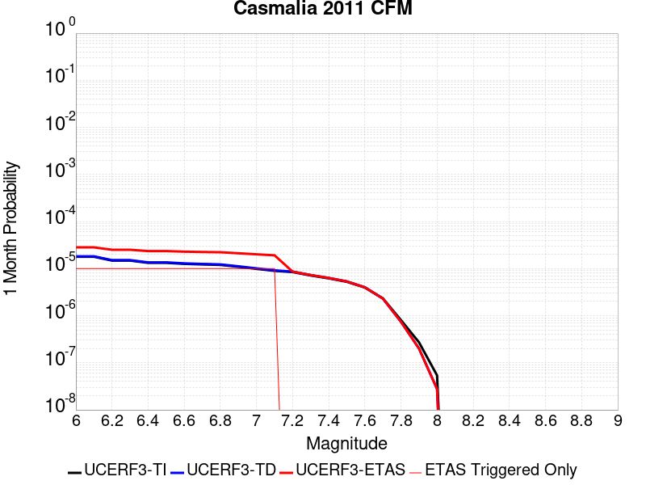 |  |  |

| Magnitude | 1 wk TI Prob | 1 wk TD Prob | 1 wk ETAS Prob | 1 wk ETAS/TD Gain | 1 wk ETAS Triggered Only | 1 mo TI Prob | 1 mo TD Prob | 1 mo ETAS Prob | 1 mo ETAS/TD Gain | 1 mo ETAS Triggered Only | 1 yr TI Prob | 1 yr TD Prob | 1 yr ETAS Prob | 1 yr ETAS/TD Gain | 1 yr ETAS Triggered Only | 10 yr TI Prob | 10 yr TD Prob | 10 yr ETAS Prob | 10 yr ETAS/TD Gain | 10 yr ETAS Triggered Only |
|-----|-----|-----|-----|-----|-----|-----|-----|-----|-----|-----|-----|-----|-----|-----|-----|-----|-----|-----|-----|-----|
| 6.0 | 4.1704893E-6 | 4.2624843E-6 | 1.4262441E-5 | 3.3460398 | 1.0E-5 | 1.7873403E-5 | 1.8267663E-5 | 2.826748E-5 | 1.5474054 | 1.0E-5 | 2.1758694E-4 | 2.223863E-4 | 2.4238185E-4 | 1.0899136 | 2.0E-5 | 0.0021737402 | 0.0022216584 | 0.002241614 | 1.0089823 | 2.0E-5 |
| 6.1 | 4.1704893E-6 | 4.2624843E-6 | 1.4262441E-5 | 3.3460398 | 1.0E-5 | 1.7873403E-5 | 1.8267663E-5 | 2.826748E-5 | 1.5474054 | 1.0E-5 | 2.1758694E-4 | 2.223863E-4 | 2.4238185E-4 | 1.0899136 | 2.0E-5 | 0.0021737402 | 0.0022216584 | 0.002241614 | 1.0089823 | 2.0E-5 |
| 6.2 | 3.457312E-6 | 3.537023E-6 | 1.3536987E-5 | 3.8272262 | 1.0E-5 | 1.4816967E-5 | 1.5158583E-5 | 2.5158432E-5 | 1.6596823 | 1.0E-5 | 1.8038164E-4 | 1.845402E-4 | 2.0453651E-4 | 1.1083574 | 2.0E-5 | 0.001802353 | 0.0018438791 | 0.0018638422 | 1.0108267 | 2.0E-5 |
| 6.3 | 3.457312E-6 | 3.537023E-6 | 1.3536987E-5 | 3.8272262 | 1.0E-5 | 1.4816967E-5 | 1.5158583E-5 | 2.5158432E-5 | 1.6596823 | 1.0E-5 | 1.8038164E-4 | 1.845402E-4 | 2.0453651E-4 | 1.1083574 | 2.0E-5 | 0.001802353 | 0.0018438791 | 0.0018638422 | 1.0108267 | 2.0E-5 |
| 6.4 | 3.0957337E-6 | 3.169227E-6 | 1.3169195E-5 | 4.1553335 | 1.0E-5 | 1.3267363E-5 | 1.3582331E-5 | 2.3582195E-5 | 1.7362406 | 1.0E-5 | 1.6151817E-4 | 1.653524E-4 | 1.8534908E-4 | 1.1209338 | 2.0E-5 | 0.0016140083 | 0.0016522998 | 0.0016722667 | 1.0120844 | 2.0E-5 |
| 6.5 | 3.0957337E-6 | 3.169227E-6 | 1.3169195E-5 | 4.1553335 | 1.0E-5 | 1.3267363E-5 | 1.3582331E-5 | 2.3582195E-5 | 1.7362406 | 1.0E-5 | 1.6151817E-4 | 1.653524E-4 | 1.8534908E-4 | 1.1209338 | 2.0E-5 | 0.0016140083 | 0.0016522998 | 0.0016722667 | 1.0120844 | 2.0E-5 |
| 6.6 | 2.9459152E-6 | 3.0165766E-6 | 1.3016546E-5 | 4.3150063 | 1.0E-5 | 1.262529E-5 | 1.2928121E-5 | 2.2927992E-5 | 1.7734976 | 1.0E-5 | 1.5370206E-4 | 1.5738855E-4 | 1.773854E-4 | 1.1270541 | 2.0E-5 | 0.0015359579 | 0.0015727765 | 0.0015927451 | 1.0126964 | 2.0E-5 |
| 6.7 | 2.8634809E-6 | 2.932474E-6 | 1.2932444E-5 | 4.41008 | 1.0E-5 | 1.2272003E-5 | 1.2567685E-5 | 2.256756E-5 | 1.7956815 | 1.0E-5 | 1.4940138E-4 | 1.5300087E-4 | 1.7299781E-4 | 1.1306982 | 2.0E-5 | 0.0014930099 | 0.0015289608 | 0.0015489302 | 1.0130608 | 2.0E-5 |
| 6.8 | 2.7999822E-6 | 2.867598E-6 | 1.2867569E-5 | 4.4872293 | 1.0E-5 | 1.1999869E-5 | 1.2289648E-5 | 2.2289525E-5 | 1.8136829 | 1.0E-5 | 1.460886E-4 | 1.4961624E-4 | 1.6961325E-4 | 1.1336553 | 2.0E-5 | 0.001459926 | 0.0014951604 | 0.0015151305 | 1.0133564 | 2.0E-5 |
| 6.9 | 2.551052E-6 | 2.6119662E-6 | 1.261194E-5 | 4.8285236 | 1.0E-5 | 1.0933034E-5 | 1.1194093E-5 | 2.119398E-5 | 1.8933183 | 1.0E-5 | 1.3310155E-4 | 1.3627959E-4 | 1.4627824E-4 | 1.0733685 | 1.0E-5 | 0.0013302186 | 0.0013619643 | 0.0013719506 | 1.0073323 | 1.0E-5 |
| 7.0 | 2.3081875E-6 | 2.3624102E-6 | 1.2362387E-5 | 5.232955 | 1.0E-5 | 9.892195E-6 | 1.0124576E-5 | 2.0124475E-5 | 1.9876857 | 1.0E-5 | 1.20430814E-4 | 1.2325977E-4 | 1.3325854E-4 | 1.0811194 | 1.0E-5 | 0.0012036557 | 0.0012319168 | 0.0012419046 | 1.0081074 | 1.0E-5 |
| 7.1 | 2.093245E-6 | 2.1417256E-6 | 1.2141704E-5 | 5.669122 | 1.0E-5 | 8.971019E-6 | 9.1787915E-6 | 1.91787E-5 | 2.089458 | 1.0E-5 | 1.09216686E-4 | 1.1174608E-4 | 1.2174496E-4 | 1.0894786 | 1.0E-5 | 0.0010916302 | 0.0011169009 | 0.0011268897 | 1.0089433 | 1.0E-5 |
| 7.2 | 1.9714576E-6 | 2.0165105E-6 | 2.0165105E-6 | 1.0 | 0.0 | 8.449076E-6 | 8.642159E-6 | 8.642159E-6 | 1.0 | 0.0 | 1.0286264E-4 | 1.0521322E-4 | 1.0521322E-4 | 1.0 | 0.0 | 0.0010281504 | 0.001051636 | 0.001051636 | 1.0 | 0.0 |
| 7.3 | 1.6689512E-6 | 1.7047145E-6 | 1.7047145E-6 | 1.0 | 0.0 | 7.1526288E-6 | 7.3058986E-6 | 7.3058986E-6 | 1.0 | 0.0 | 8.7079774E-5 | 8.894569E-5 | 8.894569E-5 | 1.0 | 0.0 | 8.7045657E-4 | 8.891017E-4 | 8.891017E-4 | 1.0 | 0.0 |
| 7.4 | 1.4490954E-6 | 1.4778922E-6 | 1.4778922E-6 | 1.0 | 0.0 | 6.210394E-6 | 6.333808E-6 | 6.333808E-6 | 1.0 | 0.0 | 7.560892E-5 | 7.711139E-5 | 7.711139E-5 | 1.0 | 0.0 | 7.55832E-4 | 7.7084696E-4 | 7.7084696E-4 | 1.0 | 0.0 |
| 7.5 | 1.226873E-6 | 1.2481714E-6 | 1.2481714E-6 | 1.0 | 0.0 | 5.2580162E-6 | 5.3492954E-6 | 5.3492954E-6 | 1.0 | 0.0 | 6.401447E-5 | 6.512573E-5 | 6.512573E-5 | 1.0 | 0.0 | 6.399603E-4 | 6.5106695E-4 | 6.5106695E-4 | 1.0 | 0.0 |
| 7.6 | 9.2561345E-7 | 9.3619366E-7 | 9.3619366E-7 | 1.0 | 0.0 | 3.966909E-6 | 4.0122522E-6 | 4.0122522E-6 | 1.0 | 0.0 | 4.8296046E-5 | 4.884808E-5 | 4.884808E-5 | 1.0 | 0.0 | 4.828555E-4 | 4.8837386E-4 | 4.8837386E-4 | 1.0 | 0.0 |
| 7.7 | 5.4367933E-7 | 5.3929017E-7 | 5.3929017E-7 | 1.0 | 0.0 | 2.3300522E-6 | 2.3112416E-6 | 2.3112416E-6 | 1.0 | 0.0 | 2.8368017E-5 | 2.8139004E-5 | 2.8139004E-5 | 1.0 | 0.0 | 2.8364395E-4 | 2.8135453E-4 | 2.8135453E-4 | 1.0 | 0.0 |
| 7.8 | 1.8825742E-7 | 1.7342425E-7 | 1.7342425E-7 | 1.0 | 0.0 | 8.068173E-7 | 7.432466E-7 | 7.432466E-7 | 1.0 | 0.0 | 9.822956E-6 | 9.048989E-6 | 9.048989E-6 | 1.0 | 0.0 | 9.822522E-5 | 9.048623E-5 | 9.048623E-5 | 1.0 | 0.0 |
| 7.9 | 6.342771E-8 | 4.679002E-8 | 4.679002E-8 | 1.0 | 0.0 | 2.7183304E-7 | 2.0052863E-7 | 2.0052863E-7 | 1.0 | 0.0 | 3.3095623E-6 | 2.4414335E-6 | 2.4414335E-6 | 1.0 | 0.0 | 3.309513E-5 | 2.441407E-5 | 2.441407E-5 | 1.0 | 0.0 |
| 8.0 | 1.2574819E-8 | 6.4727095E-9 | 6.4727095E-9 | 1.0 | 0.0 | 5.3892084E-8 | 2.7740182E-8 | 2.7740182E-8 | 1.0 | 0.0 | 6.561359E-7 | 3.3773665E-7 | 3.3773665E-7 | 1.0 | 0.0 | 6.56134E-6 | 3.3773617E-6 | 3.3773617E-6 | 1.0 | 0.0 |

## North Frontal  (East)
*[(top)](#table-of-contents)*

| 1 Week | 1 Month | 1 Year | 10 Year |
|-----|-----|-----|-----|
|  |  |  |  |

| Magnitude | 1 wk TI Prob | 1 wk TD Prob | 1 wk ETAS Prob | 1 wk ETAS/TD Gain | 1 wk ETAS Triggered Only | 1 mo TI Prob | 1 mo TD Prob | 1 mo ETAS Prob | 1 mo ETAS/TD Gain | 1 mo ETAS Triggered Only | 1 yr TI Prob | 1 yr TD Prob | 1 yr ETAS Prob | 1 yr ETAS/TD Gain | 1 yr ETAS Triggered Only | 10 yr TI Prob | 10 yr TD Prob | 10 yr ETAS Prob | 10 yr ETAS/TD Gain | 10 yr ETAS Triggered Only |
|-----|-----|-----|-----|-----|-----|-----|-----|-----|-----|-----|-----|-----|-----|-----|-----|-----|-----|-----|-----|-----|
| 6.0 | 7.135738E-6 | 7.4771765E-6 | 7.4771765E-6 | 1.0 | 0.0 | 3.0581377E-5 | 3.204476E-5 | 3.204476E-5 | 1.0 | 0.0 | 3.7226462E-4 | 3.9009505E-4 | 4.0009117E-4 | 1.0256248 | 1.0E-5 | 0.0037164164 | 0.0038960609 | 0.003915983 | 1.0051134 | 2.0E-5 |
| 6.1 | 7.135738E-6 | 7.4771765E-6 | 7.4771765E-6 | 1.0 | 0.0 | 3.0581377E-5 | 3.204476E-5 | 3.204476E-5 | 1.0 | 0.0 | 3.7226462E-4 | 3.9009505E-4 | 4.0009117E-4 | 1.0256248 | 1.0E-5 | 0.0037164164 | 0.0038960609 | 0.003915983 | 1.0051134 | 2.0E-5 |
| 6.2 | 7.135738E-6 | 7.4771765E-6 | 7.4771765E-6 | 1.0 | 0.0 | 3.0581377E-5 | 3.204476E-5 | 3.204476E-5 | 1.0 | 0.0 | 3.7226462E-4 | 3.9009505E-4 | 4.0009117E-4 | 1.0256248 | 1.0E-5 | 0.0037164164 | 0.0038960609 | 0.003915983 | 1.0051134 | 2.0E-5 |
| 6.3 | 7.135738E-6 | 7.4771765E-6 | 7.4771765E-6 | 1.0 | 0.0 | 3.0581377E-5 | 3.204476E-5 | 3.204476E-5 | 1.0 | 0.0 | 3.7226462E-4 | 3.9009505E-4 | 4.0009117E-4 | 1.0256248 | 1.0E-5 | 0.0037164164 | 0.0038960609 | 0.003915983 | 1.0051134 | 2.0E-5 |
| 6.4 | 7.135738E-6 | 7.4771765E-6 | 7.4771765E-6 | 1.0 | 0.0 | 3.0581377E-5 | 3.204476E-5 | 3.204476E-5 | 1.0 | 0.0 | 3.7226462E-4 | 3.9009505E-4 | 4.0009117E-4 | 1.0256248 | 1.0E-5 | 0.0037164164 | 0.0038960609 | 0.003915983 | 1.0051134 | 2.0E-5 |
| 6.5 | 7.135738E-6 | 7.4771765E-6 | 7.4771765E-6 | 1.0 | 0.0 | 3.0581377E-5 | 3.204476E-5 | 3.204476E-5 | 1.0 | 0.0 | 3.7226462E-4 | 3.9009505E-4 | 4.0009117E-4 | 1.0256248 | 1.0E-5 | 0.0037164164 | 0.0038960609 | 0.003915983 | 1.0051134 | 2.0E-5 |
| 6.6 | 7.135738E-6 | 7.4771765E-6 | 7.4771765E-6 | 1.0 | 0.0 | 3.0581377E-5 | 3.204476E-5 | 3.204476E-5 | 1.0 | 0.0 | 3.7226462E-4 | 3.9009505E-4 | 4.0009117E-4 | 1.0256248 | 1.0E-5 | 0.0037164164 | 0.0038960609 | 0.003915983 | 1.0051134 | 2.0E-5 |
| 6.7 | 7.135738E-6 | 7.4771765E-6 | 7.4771765E-6 | 1.0 | 0.0 | 3.0581377E-5 | 3.204476E-5 | 3.204476E-5 | 1.0 | 0.0 | 3.7226462E-4 | 3.9009505E-4 | 4.0009117E-4 | 1.0256248 | 1.0E-5 | 0.0037164164 | 0.0038960609 | 0.003915983 | 1.0051134 | 2.0E-5 |
| 6.8 | 5.959142E-6 | 6.236683E-6 | 6.236683E-6 | 1.0 | 0.0 | 2.553893E-5 | 2.6728469E-5 | 2.6728469E-5 | 1.0 | 0.0 | 3.108921E-4 | 3.253886E-4 | 3.253886E-4 | 1.0 | 0.0 | 0.0031045752 | 0.0032508948 | 0.0032608623 | 1.0030661 | 1.0E-5 |
| 6.9 | 2.2946929E-6 | 2.3824605E-6 | 2.3824605E-6 | 1.0 | 0.0 | 9.834361E-6 | 1.0210508E-5 | 1.0210508E-5 | 1.0 | 0.0 | 1.1972676E-4 | 1.2430632E-4 | 1.2430632E-4 | 1.0 | 0.0 | 0.0011966228 | 0.0012424142 | 0.0012424142 | 1.0 | 0.0 |
| 7.0 | 2.2468673E-6 | 2.3321538E-6 | 2.3321538E-6 | 1.0 | 0.0 | 9.629396E-6 | 9.994909E-6 | 9.994909E-6 | 1.0 | 0.0 | 1.1723159E-4 | 1.21681696E-4 | 1.21681696E-4 | 1.0 | 0.0 | 0.0011716976 | 0.0012161969 | 0.0012161969 | 1.0 | 0.0 |
| 7.1 | 1.9921076E-6 | 2.0646032E-6 | 2.0646032E-6 | 1.0 | 0.0 | 8.537577E-6 | 8.848272E-6 | 8.848272E-6 | 1.0 | 0.0 | 1.0394004E-4 | 1.0772282E-4 | 1.0772282E-4 | 1.0 | 0.0 | 0.0010389143 | 0.0010767487 | 0.0010767487 | 1.0 | 0.0 |
| 7.2 | 1.4524545E-6 | 1.5045148E-6 | 1.5045148E-6 | 1.0 | 0.0 | 6.2247905E-6 | 6.447906E-6 | 6.447906E-6 | 1.0 | 0.0 | 7.5784184E-5 | 7.850068E-5 | 7.850068E-5 | 1.0 | 0.0 | 7.575835E-4 | 7.8475394E-4 | 7.8475394E-4 | 1.0 | 0.0 |
| 7.3 | 8.9802575E-7 | 9.3087283E-7 | 9.3087283E-7 | 1.0 | 0.0 | 3.848676E-6 | 3.9894494E-6 | 3.9894494E-6 | 1.0 | 0.0 | 4.685662E-5 | 4.857058E-5 | 4.857058E-5 | 1.0 | 0.0 | 4.6846745E-4 | 4.8561094E-4 | 4.8561094E-4 | 1.0 | 0.0 |
| 7.4 | 7.776139E-7 | 8.0604747E-7 | 8.0604747E-7 | 1.0 | 0.0 | 3.3326266E-6 | 3.4544853E-6 | 3.4544853E-6 | 1.0 | 0.0 | 4.0573974E-5 | 4.2057654E-5 | 4.2057654E-5 | 1.0 | 0.0 | 4.0566566E-4 | 4.205077E-4 | 4.205077E-4 | 1.0 | 0.0 |
| 7.5 | 5.244417E-7 | 5.441219E-7 | 5.441219E-7 | 1.0 | 0.0 | 2.2476054E-6 | 2.3319494E-6 | 2.3319494E-6 | 1.0 | 0.0 | 2.7364253E-5 | 2.839118E-5 | 2.839118E-5 | 1.0 | 0.0 | 2.7360884E-4 | 2.8388205E-4 | 2.8388205E-4 | 1.0 | 0.0 |
| 7.6 | 1.5489647E-7 | 1.6089504E-7 | 1.6089504E-7 | 1.0 | 0.0 | 6.6384183E-7 | 6.895501E-7 | 6.895501E-7 | 1.0 | 0.0 | 8.082245E-6 | 8.395261E-6 | 8.395261E-6 | 1.0 | 0.0 | 8.08195E-5 | 8.395143E-5 | 8.395143E-5 | 1.0 | 0.0 |

## Honey Lake 2011 CFM
*[(top)](#table-of-contents)*

| 1 Week | 1 Month | 1 Year | 10 Year |
|-----|-----|-----|-----|
| 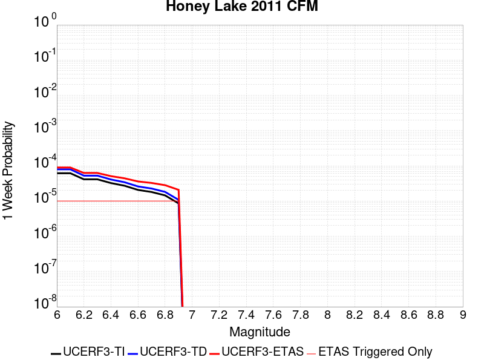 |  |  | 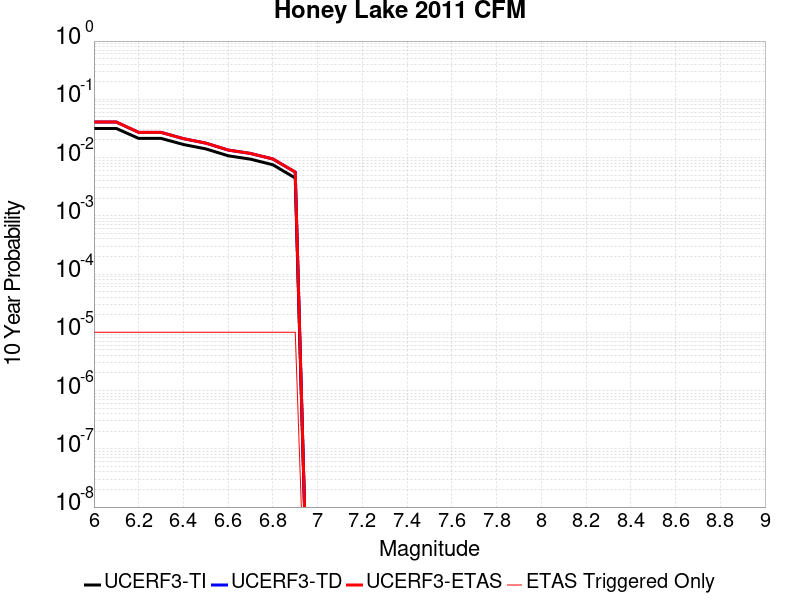 |

| Magnitude | 1 wk TI Prob | 1 wk TD Prob | 1 wk ETAS Prob | 1 wk ETAS/TD Gain | 1 wk ETAS Triggered Only | 1 mo TI Prob | 1 mo TD Prob | 1 mo ETAS Prob | 1 mo ETAS/TD Gain | 1 mo ETAS Triggered Only | 1 yr TI Prob | 1 yr TD Prob | 1 yr ETAS Prob | 1 yr ETAS/TD Gain | 1 yr ETAS Triggered Only | 10 yr TI Prob | 10 yr TD Prob | 10 yr ETAS Prob | 10 yr ETAS/TD Gain | 10 yr ETAS Triggered Only |
|-----|-----|-----|-----|-----|-----|-----|-----|-----|-----|-----|-----|-----|-----|-----|-----|-----|-----|-----|-----|-----|
| 6.0 | 6.155506E-5 | 7.954708E-5 | 8.954628E-5 | 1.1257017 | 1.0E-5 | 2.6378073E-4 | 3.4087323E-4 | 3.508698E-4 | 1.0293264 | 1.0E-5 | 0.0032068014 | 0.0041426765 | 0.004152635 | 1.0024039 | 1.0E-5 | 0.03160919 | 0.040703055 | 0.040712647 | 1.0002357 | 1.0E-5 |
| 6.1 | 6.155506E-5 | 7.954708E-5 | 8.954628E-5 | 1.1257017 | 1.0E-5 | 2.6378073E-4 | 3.4087323E-4 | 3.508698E-4 | 1.0293264 | 1.0E-5 | 0.0032068014 | 0.0041426765 | 0.004152635 | 1.0024039 | 1.0E-5 | 0.03160919 | 0.040703055 | 0.040712647 | 1.0002357 | 1.0E-5 |
| 6.2 | 4.1335024E-5 | 5.257652E-5 | 6.257599E-5 | 1.190189 | 1.0E-5 | 1.7713808E-4 | 2.2530954E-4 | 2.3530729E-4 | 1.0443734 | 1.0E-5 | 0.0021545228 | 0.0027398444 | 0.002749817 | 1.0036398 | 1.0E-5 | 0.021337535 | 0.027076809 | 0.027086537 | 1.0003593 | 1.0E-5 |
| 6.3 | 4.1335024E-5 | 5.257652E-5 | 6.257599E-5 | 1.190189 | 1.0E-5 | 1.7713808E-4 | 2.2530954E-4 | 2.3530729E-4 | 1.0443734 | 1.0E-5 | 0.0021545228 | 0.0027398444 | 0.002749817 | 1.0036398 | 1.0E-5 | 0.021337535 | 0.027076809 | 0.027086537 | 1.0003593 | 1.0E-5 |
| 6.4 | 3.2393702E-5 | 4.0887273E-5 | 5.0886865E-5 | 1.2445649 | 1.0E-5 | 1.3882275E-4 | 1.7522006E-4 | 1.852183E-4 | 1.0570611 | 1.0E-5 | 0.0016888566 | 0.0021313233 | 0.002141302 | 1.004682 | 1.0E-5 | 0.016760793 | 0.021119867 | 0.021129655 | 1.0004635 | 1.0E-5 |
| 6.5 | 2.7205504E-5 | 3.4211767E-5 | 4.4211425E-5 | 1.2922871 | 1.0E-5 | 1.1658981E-4 | 1.4661417E-4 | 1.566127E-4 | 1.0681962 | 1.0E-5 | 0.0014185566 | 0.0017836596 | 0.0017936417 | 1.0055964 | 1.0E-5 | 0.014095354 | 0.017702963 | 0.017712785 | 1.0005549 | 1.0E-5 |
| 6.6 | 2.069265E-5 | 2.5955416E-5 | 3.5955156E-5 | 1.3852661 | 1.0E-5 | 8.867977E-5 | 1.1123324E-4 | 1.2123213E-4 | 1.0898912 | 1.0E-5 | 0.0010791414 | 0.0013535074 | 0.0013634939 | 1.0073782 | 1.0E-5 | 0.010739161 | 0.0134610105 | 0.013470876 | 1.0007329 | 1.0E-5 |
| 6.7 | 1.8060919E-5 | 2.265683E-5 | 3.2656604E-5 | 1.441358 | 1.0E-5 | 7.7401644E-5 | 9.7097545E-5 | 1.0709657E-4 | 1.1029792 | 1.0E-5 | 9.419576E-4 | 0.0011816025 | 0.0011915907 | 1.0084531 | 1.0E-5 | 0.009379748 | 0.0117612425 | 0.011771125 | 1.0008403 | 1.0E-5 |
| 6.8 | 1.4474663E-5 | 1.8181274E-5 | 2.8181092E-5 | 1.5500065 | 1.0E-5 | 6.203279E-5 | 7.791785E-5 | 8.791708E-5 | 1.1283303 | 1.0E-5 | 7.5498753E-4 | 9.4831345E-4 | 9.583039E-4 | 1.010535 | 1.0E-5 | 0.007524277 | 0.009450195 | 0.009460101 | 1.0010482 | 1.0E-5 |
| 6.9 | 8.564552E-6 | 1.0802311E-5 | 2.0802203E-5 | 1.9257178 | 1.0E-5 | 3.6704707E-5 | 4.6295176E-5 | 5.6294713E-5 | 1.2159952 | 1.0E-5 | 4.4678818E-4 | 5.635644E-4 | 5.735588E-4 | 1.0177342 | 1.0E-5 | 0.0044589094 | 0.0056278505 | 0.0056377943 | 1.0017669 | 1.0E-5 |

## San Jacinto (Superstition Mtn)
*[(top)](#table-of-contents)*

| 1 Week | 1 Month | 1 Year | 10 Year |
|-----|-----|-----|-----|
|  |  |  |  |

| Magnitude | 1 wk TI Prob | 1 wk TD Prob | 1 wk ETAS Prob | 1 wk ETAS/TD Gain | 1 wk ETAS Triggered Only | 1 mo TI Prob | 1 mo TD Prob | 1 mo ETAS Prob | 1 mo ETAS/TD Gain | 1 mo ETAS Triggered Only | 1 yr TI Prob | 1 yr TD Prob | 1 yr ETAS Prob | 1 yr ETAS/TD Gain | 1 yr ETAS Triggered Only | 10 yr TI Prob | 10 yr TD Prob | 10 yr ETAS Prob | 10 yr ETAS/TD Gain | 10 yr ETAS Triggered Only |
|-----|-----|-----|-----|-----|-----|-----|-----|-----|-----|-----|-----|-----|-----|-----|-----|-----|-----|-----|-----|-----|
| 6.0 | 6.4193904E-5 | 9.599558E-5 | 9.599558E-5 | 1.0 | 0.0 | 2.7508775E-4 | 4.1135435E-4 | 4.1135435E-4 | 1.0 | 0.0 | 0.0033440501 | 0.0049981694 | 0.005008119 | 1.0019907 | 1.0E-5 | 0.03294174 | 0.048820045 | 0.04883907 | 1.0003897 | 2.0E-5 |
| 6.1 | 6.4193904E-5 | 9.599558E-5 | 9.599558E-5 | 1.0 | 0.0 | 2.7508775E-4 | 4.1135435E-4 | 4.1135435E-4 | 1.0 | 0.0 | 0.0033440501 | 0.0049981694 | 0.005008119 | 1.0019907 | 1.0E-5 | 0.03294174 | 0.048820045 | 0.04883907 | 1.0003897 | 2.0E-5 |
| 6.2 | 5.7023593E-5 | 8.3144616E-5 | 8.3144616E-5 | 1.0 | 0.0 | 2.4436394E-4 | 3.5629462E-4 | 3.5629462E-4 | 1.0 | 0.0 | 0.002971072 | 0.0043309047 | 0.0043408615 | 1.002299 | 1.0E-5 | 0.029316625 | 0.042502448 | 0.0425216 | 1.0004506 | 2.0E-5 |
| 6.3 | 5.6940098E-5 | 8.298998E-5 | 8.298998E-5 | 1.0 | 0.0 | 2.4400617E-4 | 3.5563204E-4 | 3.5563204E-4 | 1.0 | 0.0 | 0.002966728 | 0.00432287 | 0.004332827 | 1.0023032 | 1.0E-5 | 0.029274331 | 0.04242582 | 0.04244497 | 1.0004514 | 2.0E-5 |
| 6.4 | 5.4171585E-5 | 7.748391E-5 | 7.748391E-5 | 1.0 | 0.0 | 2.3214328E-4 | 3.3204095E-4 | 3.3204095E-4 | 1.0 | 0.0 | 0.0028226813 | 0.0040367534 | 0.004046713 | 1.0024673 | 1.0E-5 | 0.02787096 | 0.039715026 | 0.039734233 | 1.0004836 | 2.0E-5 |
| 6.5 | 4.375144E-5 | 5.6421442E-5 | 5.6421442E-5 | 1.0 | 0.0 | 1.874927E-4 | 2.417904E-4 | 2.417904E-4 | 1.0 | 0.0 | 0.0022803338 | 0.002941 | 0.0029509705 | 1.0033902 | 1.0E-5 | 0.022570757 | 0.029235592 | 0.029255008 | 1.0006641 | 2.0E-5 |
| 6.6 | 2.772192E-5 | 2.5488029E-5 | 2.5488029E-5 | 1.0 | 0.0 | 1.1880282E-4 | 1.0922994E-4 | 1.0922994E-4 | 1.0 | 0.0 | 0.0014454646 | 0.0013290826 | 0.0013390693 | 1.007514 | 1.0E-5 | 0.014360986 | 0.013540891 | 0.01356062 | 1.001457 | 2.0E-5 |
| 6.7 | 2.7124124E-5 | 2.4699055E-5 | 2.4699055E-5 | 1.0 | 0.0 | 1.1624106E-4 | 1.0584891E-4 | 1.0584891E-4 | 1.0 | 0.0 | 0.0014143161 | 0.0012879678 | 0.0012979549 | 1.0077542 | 1.0E-5 | 0.014053487 | 0.013134248 | 0.013153985 | 1.0015028 | 2.0E-5 |
| 6.8 | 2.5475807E-5 | 2.2164071E-5 | 2.2164071E-5 | 1.0 | 0.0 | 1.0917746E-4 | 9.498548E-5 | 9.498548E-5 | 1.0 | 0.0 | 0.001328425 | 0.0011558468 | 0.0011558468 | 1.0 | 0.0 | 0.0132051185 | 0.011821818 | 0.0118317 | 1.0008359 | 1.0E-5 |
| 6.9 | 2.1162023E-5 | 1.762564E-5 | 1.762564E-5 | 1.0 | 0.0 | 9.069123E-5 | 7.553629E-5 | 7.553629E-5 | 1.0 | 0.0 | 0.0011036064 | 9.1927015E-4 | 9.1927015E-4 | 1.0 | 0.0 | 0.010981417 | 0.009446762 | 0.009456667 | 1.0010486 | 1.0E-5 |
| 7.0 | 1.8754288E-5 | 1.616099E-5 | 1.616099E-5 | 1.0 | 0.0 | 8.037304E-5 | 6.9259564E-5 | 6.9259564E-5 | 1.0 | 0.0 | 9.781026E-4 | 8.429114E-4 | 8.429114E-4 | 1.0 | 0.0 | 0.009738087 | 0.008669995 | 0.008679908 | 1.0011435 | 1.0E-5 |
| 7.1 | 1.8678527E-5 | 1.6086136E-5 | 1.6086136E-5 | 1.0 | 0.0 | 8.0048376E-5 | 6.8938774E-5 | 6.8938774E-5 | 1.0 | 0.0 | 9.7415317E-4 | 8.3900883E-4 | 8.3900883E-4 | 1.0 | 0.0 | 0.009698939 | 0.008631011 | 0.0086409245 | 1.0011486 | 1.0E-5 |
| 7.2 | 1.7804578E-5 | 1.5380709E-5 | 1.5380709E-5 | 1.0 | 0.0 | 7.6303106E-5 | 6.591567E-5 | 6.591567E-5 | 1.0 | 0.0 | 9.285943E-4 | 8.022301E-4 | 8.022301E-4 | 1.0 | 0.0 | 0.009247236 | 0.008262424 | 0.008262424 | 1.0 | 0.0 |
| 7.3 | 1.6583685E-5 | 1.4529837E-5 | 1.4529837E-5 | 1.0 | 0.0 | 7.1070994E-5 | 6.226926E-5 | 6.226926E-5 | 1.0 | 0.0 | 8.649459E-4 | 7.5786654E-4 | 7.5786654E-4 | 1.0 | 0.0 | 0.00861587 | 0.007817646 | 0.007817646 | 1.0 | 0.0 |
| 7.4 | 1.6387552E-5 | 1.4394727E-5 | 1.4394727E-5 | 1.0 | 0.0 | 7.023047E-5 | 6.169024E-5 | 6.169024E-5 | 1.0 | 0.0 | 8.5472054E-4 | 7.508219E-4 | 7.508219E-4 | 1.0 | 0.0 | 0.008514405 | 0.0077470187 | 0.0077470187 | 1.0 | 0.0 |
| 7.5 | 1.5790754E-5 | 1.40354305E-5 | 1.40354305E-5 | 1.0 | 0.0 | 6.767291E-5 | 6.015047E-5 | 6.015047E-5 | 1.0 | 0.0 | 8.236062E-4 | 7.320879E-4 | 7.320879E-4 | 1.0 | 0.0 | 0.008205604 | 0.007557581 | 0.007557581 | 1.0 | 0.0 |
| 7.6 | 1.4248672E-5 | 1.3054444E-5 | 1.3054444E-5 | 1.0 | 0.0 | 6.106431E-5 | 5.5946428E-5 | 5.5946428E-5 | 1.0 | 0.0 | 7.432043E-4 | 6.809366E-4 | 6.809366E-4 | 1.0 | 0.0 | 0.007407237 | 0.007040175 | 0.007040175 | 1.0 | 0.0 |
| 7.7 | 1.15449975E-5 | 1.0903222E-5 | 1.0903222E-5 | 1.0 | 0.0 | 4.947762E-5 | 4.672726E-5 | 4.672726E-5 | 1.0 | 0.0 | 6.022235E-4 | 5.6875666E-4 | 5.6875666E-4 | 1.0 | 0.0 | 0.006005941 | 0.0059102564 | 0.0059102564 | 1.0 | 0.0 |
| 7.8 | 9.1391985E-6 | 9.5139185E-6 | 9.5139185E-6 | 1.0 | 0.0 | 3.9167408E-5 | 4.0773306E-5 | 4.0773306E-5 | 1.0 | 0.0 | 4.767588E-4 | 4.963025E-4 | 4.963025E-4 | 1.0 | 0.0 | 0.0047573727 | 0.005176809 | 0.005176809 | 1.0 | 0.0 |
| 7.9 | 6.973017E-6 | 7.3817937E-6 | 7.3817937E-6 | 1.0 | 0.0 | 2.9884017E-5 | 3.163588E-5 | 3.163588E-5 | 1.0 | 0.0 | 3.6377716E-4 | 3.8509927E-4 | 3.8509927E-4 | 1.0 | 0.0 | 0.0036318225 | 0.004051976 | 0.004051976 | 1.0 | 0.0 |
| 8.0 | 5.7638235E-6 | 6.259641E-6 | 6.259641E-6 | 1.0 | 0.0 | 2.4701867E-5 | 2.682676E-5 | 2.682676E-5 | 1.0 | 0.0 | 3.0070372E-4 | 3.2656736E-4 | 3.2656736E-4 | 1.0 | 0.0 | 0.0030029714 | 0.0034535413 | 0.0034535413 | 1.0 | 0.0 |
| 8.1 | 5.1124434E-6 | 5.4953657E-6 | 5.4953657E-6 | 1.0 | 0.0 | 2.1910288E-5 | 2.3551356E-5 | 2.3551356E-5 | 1.0 | 0.0 | 2.6672508E-4 | 2.8670052E-4 | 2.8670052E-4 | 1.0 | 0.0 | 0.0026640517 | 0.0030403896 | 0.0030403896 | 1.0 | 0.0 |
| 8.2 | 1.1075938E-6 | 5.3348367E-7 | 5.3348367E-7 | 1.0 | 0.0 | 4.7468216E-6 | 2.2863567E-6 | 2.2863567E-6 | 1.0 | 0.0 | 5.779102E-5 | 2.7836059E-5 | 2.7836059E-5 | 1.0 | 0.0 | 5.777599E-4 | 3.133962E-4 | 3.133962E-4 | 1.0 | 0.0 |
| 8.3 | 1.3584393E-8 | 4.4718784E-9 | 4.4718784E-9 | 1.0 | 0.0 | 5.8218827E-8 | 1.9165192E-8 | 1.9165192E-8 | 1.0 | 0.0 | 7.0881396E-7 | 2.3333622E-7 | 2.3333622E-7 | 1.0 | 0.0 | 7.0881174E-6 | 2.6140672E-6 | 2.6140672E-6 | 1.0 | 0.0 |

## Verdugo
*[(top)](#table-of-contents)*

| 1 Week | 1 Month | 1 Year | 10 Year |
|-----|-----|-----|-----|
|  |  | 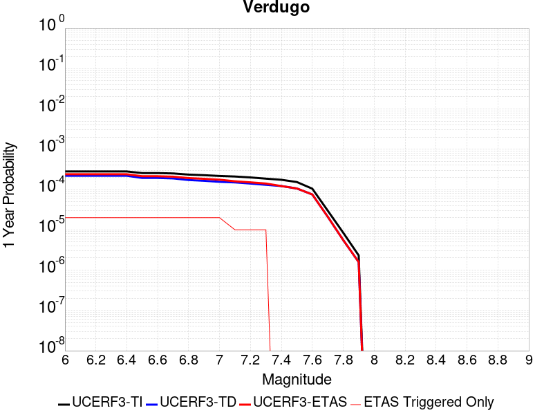 |  |

| Magnitude | 1 wk TI Prob | 1 wk TD Prob | 1 wk ETAS Prob | 1 wk ETAS/TD Gain | 1 wk ETAS Triggered Only | 1 mo TI Prob | 1 mo TD Prob | 1 mo ETAS Prob | 1 mo ETAS/TD Gain | 1 mo ETAS Triggered Only | 1 yr TI Prob | 1 yr TD Prob | 1 yr ETAS Prob | 1 yr ETAS/TD Gain | 1 yr ETAS Triggered Only | 10 yr TI Prob | 10 yr TD Prob | 10 yr ETAS Prob | 10 yr ETAS/TD Gain | 10 yr ETAS Triggered Only |
|-----|-----|-----|-----|-----|-----|-----|-----|-----|-----|-----|-----|-----|-----|-----|-----|-----|-----|-----|-----|-----|
| 6.0 | 5.392987E-6 | 4.2164934E-6 | 4.2164934E-6 | 1.0 | 0.0 | 2.3112598E-5 | 1.8070563E-5 | 1.8070563E-5 | 1.0 | 0.0 | 2.8135953E-4 | 2.1998737E-4 | 2.3998297E-4 | 1.0908943 | 2.0E-5 | 0.0028100356 | 0.0021977439 | 0.0022176998 | 1.0090803 | 2.0E-5 |
| 6.1 | 5.392987E-6 | 4.2164934E-6 | 4.2164934E-6 | 1.0 | 0.0 | 2.3112598E-5 | 1.8070563E-5 | 1.8070563E-5 | 1.0 | 0.0 | 2.8135953E-4 | 2.1998737E-4 | 2.3998297E-4 | 1.0908943 | 2.0E-5 | 0.0028100356 | 0.0021977439 | 0.0022176998 | 1.0090803 | 2.0E-5 |
| 6.2 | 5.392987E-6 | 4.2164934E-6 | 4.2164934E-6 | 1.0 | 0.0 | 2.3112598E-5 | 1.8070563E-5 | 1.8070563E-5 | 1.0 | 0.0 | 2.8135953E-4 | 2.1998737E-4 | 2.3998297E-4 | 1.0908943 | 2.0E-5 | 0.0028100356 | 0.0021977439 | 0.0022176998 | 1.0090803 | 2.0E-5 |
| 6.3 | 5.392987E-6 | 4.2164934E-6 | 4.2164934E-6 | 1.0 | 0.0 | 2.3112598E-5 | 1.8070563E-5 | 1.8070563E-5 | 1.0 | 0.0 | 2.8135953E-4 | 2.1998737E-4 | 2.3998297E-4 | 1.0908943 | 2.0E-5 | 0.0028100356 | 0.0021977439 | 0.0022176998 | 1.0090803 | 2.0E-5 |
| 6.4 | 5.392987E-6 | 4.2164934E-6 | 4.2164934E-6 | 1.0 | 0.0 | 2.3112598E-5 | 1.8070563E-5 | 1.8070563E-5 | 1.0 | 0.0 | 2.8135953E-4 | 2.1998737E-4 | 2.3998297E-4 | 1.0908943 | 2.0E-5 | 0.0028100356 | 0.0021977439 | 0.0022176998 | 1.0090803 | 2.0E-5 |
| 6.5 | 4.9154837E-6 | 3.7224413E-6 | 3.7224413E-6 | 1.0 | 0.0 | 2.1066187E-5 | 1.5953223E-5 | 1.5953223E-5 | 1.0 | 0.0 | 2.5645064E-4 | 1.9421338E-4 | 2.142095E-4 | 1.1029595 | 2.0E-5 | 0.002561549 | 0.0019404575 | 0.0019604187 | 1.0102868 | 2.0E-5 |
| 6.6 | 4.9154837E-6 | 3.7224413E-6 | 3.7224413E-6 | 1.0 | 0.0 | 2.1066187E-5 | 1.5953223E-5 | 1.5953223E-5 | 1.0 | 0.0 | 2.5645064E-4 | 1.9421338E-4 | 2.142095E-4 | 1.1029595 | 2.0E-5 | 0.002561549 | 0.0019404575 | 0.0019604187 | 1.0102868 | 2.0E-5 |
| 6.7 | 4.817006E-6 | 3.620628E-6 | 3.620628E-6 | 1.0 | 0.0 | 2.0644147E-5 | 1.5516885E-5 | 1.5516885E-5 | 1.0 | 0.0 | 2.513135E-4 | 1.889019E-4 | 2.0889813E-4 | 1.1058551 | 2.0E-5 | 0.0025102948 | 0.0018874329 | 0.0019073952 | 1.0105764 | 2.0E-5 |
| 6.8 | 4.507407E-6 | 3.3070805E-6 | 3.3070805E-6 | 1.0 | 0.0 | 1.9317316E-5 | 1.4173126E-5 | 1.4173126E-5 | 1.0 | 0.0 | 2.3516294E-4 | 1.7254429E-4 | 1.9254083E-4 | 1.1158923 | 2.0E-5 | 0.0023491425 | 0.0017241176 | 0.001744083 | 1.0115801 | 2.0E-5 |
| 6.9 | 4.3573054E-6 | 3.1609877E-6 | 3.1609877E-6 | 1.0 | 0.0 | 1.8674033E-5 | 1.354702E-5 | 1.354702E-5 | 1.0 | 0.0 | 2.2733262E-4 | 1.649226E-4 | 1.849193E-4 | 1.121249 | 2.0E-5 | 0.0022710022 | 0.0016480145 | 0.0016679816 | 1.0121158 | 2.0E-5 |
| 7.0 | 4.171527E-6 | 2.9836467E-6 | 2.9836467E-6 | 1.0 | 0.0 | 1.787785E-5 | 1.2786995E-5 | 1.2786995E-5 | 1.0 | 0.0 | 2.1764109E-4 | 1.5567066E-4 | 1.7566755E-4 | 1.1284564 | 2.0E-5 | 0.0021742806 | 0.0015556274 | 0.0015755963 | 1.0128366 | 2.0E-5 |
| 7.1 | 4.0405484E-6 | 2.882238E-6 | 2.882238E-6 | 1.0 | 0.0 | 1.731652E-5 | 1.23523905E-5 | 1.23523905E-5 | 1.0 | 0.0 | 2.1080824E-4 | 1.5038009E-4 | 1.6037858E-4 | 1.0664881 | 1.0E-5 | 0.0021060838 | 0.0015027943 | 0.0015127793 | 1.0066442 | 1.0E-5 |
| 7.2 | 3.8306007E-6 | 2.701823E-6 | 2.701823E-6 | 1.0 | 0.0 | 1.6416758E-5 | 1.157919E-5 | 1.157919E-5 | 1.0 | 0.0 | 1.9985568E-4 | 1.4096762E-4 | 1.5096621E-4 | 1.0709282 | 1.0E-5 | 0.0019967605 | 0.0014087928 | 0.0014187787 | 1.0070883 | 1.0E-5 |
| 7.3 | 3.5750938E-6 | 2.512154E-6 | 2.512154E-6 | 1.0 | 0.0 | 1.532174E-5 | 1.076633E-5 | 1.076633E-5 | 1.0 | 0.0 | 1.8652623E-4 | 1.3107229E-4 | 1.4107098E-4 | 1.0762838 | 1.0E-5 | 0.0018636974 | 0.0013099604 | 0.0013199473 | 1.0076238 | 1.0E-5 |
| 7.4 | 3.3510041E-6 | 2.340838E-6 | 2.340838E-6 | 1.0 | 0.0 | 1.4361368E-5 | 1.0032124E-5 | 1.0032124E-5 | 1.0 | 0.0 | 1.7483562E-4 | 1.2213437E-4 | 1.2213437E-4 | 1.0 | 0.0 | 0.0017469813 | 0.0012206829 | 0.0012206829 | 1.0 | 0.0 |
| 7.5 | 2.948287E-6 | 2.0390912E-6 | 2.0390912E-6 | 1.0 | 0.0 | 1.2635454E-5 | 8.7389335E-6 | 8.7389335E-6 | 1.0 | 0.0 | 1.538258E-4 | 1.06391424E-4 | 1.06391424E-4 | 1.0 | 0.0 | 0.0015371935 | 0.0010634151 | 0.0010634151 | 1.0 | 0.0 |
| 7.6 | 2.0134323E-6 | 1.4471086E-6 | 1.4471086E-6 | 1.0 | 0.0 | 8.628967E-6 | 6.20188E-6 | 6.20188E-6 | 1.0 | 0.0 | 1.05052604E-4 | 7.550536E-5 | 7.550536E-5 | 1.0 | 0.0 | 0.0010500296 | 7.548059E-4 | 7.548059E-4 | 1.0 | 0.0 |
| 7.7 | 5.726436E-7 | 4.0453273E-7 | 4.0453273E-7 | 1.0 | 0.0 | 2.4541846E-6 | 1.7337106E-6 | 1.7337106E-6 | 1.0 | 0.0 | 2.9879287E-5 | 2.110775E-5 | 2.110775E-5 | 1.0 | 0.0 | 2.987527E-4 | 2.1105999E-4 | 2.1105999E-4 | 1.0 | 0.0 |
| 7.8 | 1.6248204E-7 | 1.06879604E-7 | 1.06879604E-7 | 1.0 | 0.0 | 6.963514E-7 | 4.5805535E-7 | 4.5805535E-7 | 1.0 | 0.0 | 8.478045E-6 | 5.57681E-6 | 5.57681E-6 | 1.0 | 0.0 | 8.477722E-5 | 5.5766737E-5 | 5.5766737E-5 | 1.0 | 0.0 |
| 7.9 | 4.4475744E-8 | 3.037888E-8 | 3.037888E-8 | 1.0 | 0.0 | 1.9061031E-7 | 1.301952E-7 | 1.301952E-7 | 1.0 | 0.0 | 2.320678E-6 | 1.5851255E-6 | 1.5851255E-6 | 1.0 | 0.0 | 2.3206538E-5 | 1.5851156E-5 | 1.5851156E-5 | 1.0 | 0.0 |

## Great Valley 08 (Quinto)
*[(top)](#table-of-contents)*

| 1 Week | 1 Month | 1 Year | 10 Year |
|-----|-----|-----|-----|
|  |  |  |  |

| Magnitude | 1 wk TI Prob | 1 wk TD Prob | 1 wk ETAS Prob | 1 wk ETAS/TD Gain | 1 wk ETAS Triggered Only | 1 mo TI Prob | 1 mo TD Prob | 1 mo ETAS Prob | 1 mo ETAS/TD Gain | 1 mo ETAS Triggered Only | 1 yr TI Prob | 1 yr TD Prob | 1 yr ETAS Prob | 1 yr ETAS/TD Gain | 1 yr ETAS Triggered Only | 10 yr TI Prob | 10 yr TD Prob | 10 yr ETAS Prob | 10 yr ETAS/TD Gain | 10 yr ETAS Triggered Only |
|-----|-----|-----|-----|-----|-----|-----|-----|-----|-----|-----|-----|-----|-----|-----|-----|-----|-----|-----|-----|-----|
| 6.0 | 7.737697E-6 | 8.253038E-6 | 8.253038E-6 | 1.0 | 0.0 | 3.3161137E-5 | 3.536979E-5 | 3.536979E-5 | 1.0 | 0.0 | 4.0366207E-4 | 4.3056096E-4 | 4.4055664E-4 | 1.0232155 | 1.0E-5 | 0.004029296 | 0.0042991205 | 0.0043190345 | 1.0046321 | 2.0E-5 |
| 6.1 | 7.737697E-6 | 8.253038E-6 | 8.253038E-6 | 1.0 | 0.0 | 3.3161137E-5 | 3.536979E-5 | 3.536979E-5 | 1.0 | 0.0 | 4.0366207E-4 | 4.3056096E-4 | 4.4055664E-4 | 1.0232155 | 1.0E-5 | 0.004029296 | 0.0042991205 | 0.0043190345 | 1.0046321 | 2.0E-5 |
| 6.2 | 7.737697E-6 | 8.253038E-6 | 8.253038E-6 | 1.0 | 0.0 | 3.3161137E-5 | 3.536979E-5 | 3.536979E-5 | 1.0 | 0.0 | 4.0366207E-4 | 4.3056096E-4 | 4.4055664E-4 | 1.0232155 | 1.0E-5 | 0.004029296 | 0.0042991205 | 0.0043190345 | 1.0046321 | 2.0E-5 |
| 6.3 | 5.374012E-6 | 5.7505736E-6 | 5.7505736E-6 | 1.0 | 0.0 | 2.3031276E-5 | 2.4645145E-5 | 2.4645145E-5 | 1.0 | 0.0 | 2.803697E-4 | 3.0002446E-4 | 3.0002446E-4 | 1.0 | 0.0 | 0.0028001624 | 0.0029972875 | 0.0029972875 | 1.0 | 0.0 |
| 6.4 | 5.374012E-6 | 5.7505736E-6 | 5.7505736E-6 | 1.0 | 0.0 | 2.3031276E-5 | 2.4645145E-5 | 2.4645145E-5 | 1.0 | 0.0 | 2.803697E-4 | 3.0002446E-4 | 3.0002446E-4 | 1.0 | 0.0 | 0.0028001624 | 0.0029972875 | 0.0029972875 | 1.0 | 0.0 |
| 6.5 | 3.65427E-6 | 3.941324E-6 | 3.941324E-6 | 1.0 | 0.0 | 1.5661062E-5 | 1.689132E-5 | 1.689132E-5 | 1.0 | 0.0 | 1.9065675E-4 | 2.0563944E-4 | 2.0563944E-4 | 1.0 | 0.0 | 0.0019049325 | 0.0020551833 | 0.0020551833 | 1.0 | 0.0 |
| 6.6 | 3.6143538E-6 | 3.8985104E-6 | 3.8985104E-6 | 1.0 | 0.0 | 1.5489995E-5 | 1.6707834E-5 | 1.6707834E-5 | 1.0 | 0.0 | 1.8857437E-4 | 2.0340596E-4 | 2.0340596E-4 | 1.0 | 0.0 | 0.0018841444 | 0.0020328893 | 0.0020328893 | 1.0 | 0.0 |
| 6.7 | 2.4821015E-6 | 2.6857067E-6 | 2.6857067E-6 | 1.0 | 0.0 | 1.0637535E-5 | 1.1510153E-5 | 1.1510153E-5 | 1.0 | 0.0 | 1.2950429E-4 | 1.4013276E-4 | 1.4013276E-4 | 1.0 | 0.0 | 0.0012942884 | 0.0014009989 | 0.0014009989 | 1.0 | 0.0 |
| 6.8 | 4.7110538E-7 | 5.193021E-7 | 5.193021E-7 | 1.0 | 0.0 | 2.0190216E-6 | 2.2255786E-6 | 2.2255786E-6 | 1.0 | 0.0 | 2.458131E-5 | 2.70961E-5 | 2.70961E-5 | 1.0 | 0.0 | 2.457859E-4 | 2.7092977E-4 | 2.7092977E-4 | 1.0 | 0.0 |
| 6.9 | 3.958685E-7 | 4.3703452E-7 | 4.3703452E-7 | 1.0 | 0.0 | 1.6965782E-6 | 1.8730038E-6 | 1.8730038E-6 | 1.0 | 0.0 | 2.0655643E-5 | 2.28036E-5 | 2.28036E-5 | 1.0 | 0.0 | 2.0653724E-4 | 2.2801422E-4 | 2.2801422E-4 | 1.0 | 0.0 |
| 7.0 | 2.70294E-7 | 2.9920008E-7 | 2.9920008E-7 | 1.0 | 0.0 | 1.1584025E-6 | 1.2822856E-6 | 1.2822856E-6 | 1.0 | 0.0 | 1.4103458E-5 | 1.5611728E-5 | 1.5611728E-5 | 1.0 | 0.0 | 1.4102564E-4 | 1.5610759E-4 | 1.5610759E-4 | 1.0 | 0.0 |
| 7.1 | 1.4828602E-7 | 1.6469107E-7 | 1.6469107E-7 | 1.0 | 0.0 | 6.3551136E-7 | 7.058187E-7 | 7.058187E-7 | 1.0 | 0.0 | 7.737323E-6 | 8.593317E-6 | 8.593317E-6 | 1.0 | 0.0 | 7.737054E-5 | 8.593065E-5 | 8.593065E-5 | 1.0 | 0.0 |

## Hayward (No) 2011 CFM
*[(top)](#table-of-contents)*

| 1 Week | 1 Month | 1 Year | 10 Year |
|-----|-----|-----|-----|
|  |  | 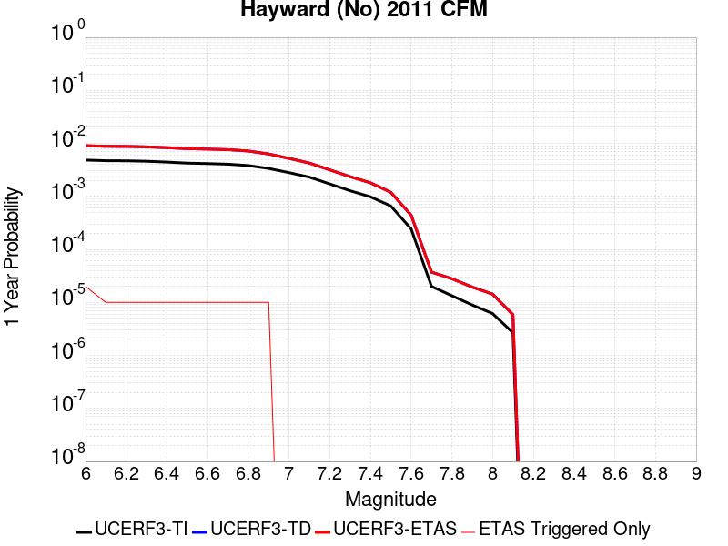 |  |

| Magnitude | 1 wk TI Prob | 1 wk TD Prob | 1 wk ETAS Prob | 1 wk ETAS/TD Gain | 1 wk ETAS Triggered Only | 1 mo TI Prob | 1 mo TD Prob | 1 mo ETAS Prob | 1 mo ETAS/TD Gain | 1 mo ETAS Triggered Only | 1 yr TI Prob | 1 yr TD Prob | 1 yr ETAS Prob | 1 yr ETAS/TD Gain | 1 yr ETAS Triggered Only | 10 yr TI Prob | 10 yr TD Prob | 10 yr ETAS Prob | 10 yr ETAS/TD Gain | 10 yr ETAS Triggered Only |
|-----|-----|-----|-----|-----|-----|-----|-----|-----|-----|-----|-----|-----|-----|-----|-----|-----|-----|-----|-----|-----|
| 6.0 | 9.3068506E-5 | 1.739643E-4 | 1.8396258E-4 | 1.0574731 | 1.0E-5 | 3.9880406E-4 | 7.453474E-4 | 7.653325E-4 | 1.0268131 | 2.0E-5 | 0.0048446343 | 0.009036727 | 0.009056547 | 1.0021932 | 2.0E-5 | 0.047403704 | 0.086396605 | 0.08641488 | 1.0002115 | 2.0E-5 |
| 6.1 | 9.055486E-5 | 1.6947639E-4 | 1.794747E-4 | 1.0589952 | 1.0E-5 | 3.880345E-4 | 7.2612526E-4 | 7.36118E-4 | 1.0137618 | 1.0E-5 | 0.0047140904 | 0.008804814 | 0.008814726 | 1.0011257 | 1.0E-5 | 0.046153355 | 0.08428568 | 0.08429483 | 1.0001086 | 1.0E-5 |
| 6.2 | 9.006742E-5 | 1.6868232E-4 | 1.7868062E-4 | 1.059273 | 1.0E-5 | 3.859461E-4 | 7.227246E-4 | 7.327174E-4 | 1.0138265 | 1.0E-5 | 0.0046887742 | 0.00876378 | 0.008773692 | 1.001131 | 1.0E-5 | 0.0459107 | 0.08390991 | 0.08391907 | 1.0001092 | 1.0E-5 |
| 6.3 | 8.8336754E-5 | 1.6547782E-4 | 1.7547616E-4 | 1.0604211 | 1.0E-5 | 3.7853114E-4 | 7.0899865E-4 | 7.1899156E-4 | 1.0140944 | 1.0E-5 | 0.004598882 | 0.008598051 | 0.008607965 | 1.0011531 | 1.0E-5 | 0.04504866 | 0.08240195 | 0.082411125 | 1.0001113 | 1.0E-5 |
| 6.4 | 8.526157E-5 | 1.5974796E-4 | 1.6974636E-4 | 1.0625886 | 1.0E-5 | 3.6535555E-4 | 6.844552E-4 | 6.9444836E-4 | 1.0146002 | 1.0E-5 | 0.0044391346 | 0.00830156 | 0.008311477 | 1.0011946 | 1.0E-5 | 0.043514993 | 0.07968467 | 0.07969387 | 1.0001155 | 1.0E-5 |
| 6.5 | 8.152396E-5 | 1.5307199E-4 | 1.6307046E-4 | 1.0653187 | 1.0E-5 | 3.493416E-4 | 6.558586E-4 | 6.6585204E-4 | 1.0152372 | 1.0E-5 | 0.0042449418 | 0.007955993 | 0.007965913 | 1.0012469 | 1.0E-5 | 0.04164765 | 0.07651448 | 0.07652372 | 1.0001206 | 1.0E-5 |
| 6.6 | 7.987405E-5 | 1.5011412E-4 | 1.6011261E-4 | 1.066606 | 1.0E-5 | 3.4227243E-4 | 6.431883E-4 | 6.5318187E-4 | 1.0155375 | 1.0E-5 | 0.0041592065 | 0.007802858 | 0.00781278 | 1.0012716 | 1.0E-5 | 0.04082218 | 0.075105876 | 0.07511512 | 1.0001231 | 1.0E-5 |
| 6.7 | 7.777665E-5 | 1.4650672E-4 | 1.5650525E-4 | 1.0682462 | 1.0E-5 | 3.332859E-4 | 6.277355E-4 | 6.3772924E-4 | 1.0159203 | 1.0E-5 | 0.004050208 | 0.007616053 | 0.0076259766 | 1.001303 | 1.0E-5 | 0.039771806 | 0.0733825 | 0.073391765 | 1.0001262 | 1.0E-5 |
| 6.8 | 7.3284005E-5 | 1.3801287E-4 | 1.4801149E-4 | 1.0724471 | 1.0E-5 | 3.140365E-4 | 5.9135025E-4 | 6.0134433E-4 | 1.0169004 | 1.0E-5 | 0.0038166929 | 0.007176059 | 0.007185987 | 1.0013835 | 1.0E-5 | 0.037518036 | 0.06929624 | 0.069305554 | 1.0001343 | 1.0E-5 |
| 6.9 | 6.458263E-5 | 1.21319164E-4 | 1.3131795E-4 | 1.0824172 | 1.0E-5 | 2.7675333E-4 | 5.1983615E-4 | 5.298309E-4 | 1.0192268 | 1.0E-5 | 0.0033642664 | 0.0063107396 | 0.0063206763 | 1.0015746 | 1.0E-5 | 0.033137884 | 0.061224625 | 0.061234012 | 1.0001533 | 1.0E-5 |
| 7.0 | 5.3853604E-5 | 1.00254634E-4 | 1.00254634E-4 | 1.0 | 0.0 | 2.3078074E-4 | 4.295923E-4 | 4.295923E-4 | 1.0 | 0.0 | 0.0028061352 | 0.0052178074 | 0.0052178074 | 1.0 | 0.0 | 0.027709642 | 0.050957024 | 0.050957024 | 1.0 | 0.0 |
| 7.1 | 4.4308683E-5 | 8.17098E-5 | 8.17098E-5 | 1.0 | 0.0 | 1.8988053E-4 | 3.5013806E-4 | 3.5013806E-4 | 1.0 | 0.0 | 0.0023093442 | 0.0042546396 | 0.0042546396 | 1.0 | 0.0 | 0.022854926 | 0.041824497 | 0.041824497 | 1.0 | 0.0 |
| 7.2 | 3.295973E-5 | 6.0774026E-5 | 6.0774026E-5 | 1.0 | 0.0 | 1.4124835E-4 | 2.6043423E-4 | 2.6043423E-4 | 1.0 | 0.0 | 0.0017183421 | 0.0031661994 | 0.0031661994 | 1.0 | 0.0 | 0.017051157 | 0.031370014 | 0.031370014 | 1.0 | 0.0 |
| 7.3 | 2.452256E-5 | 4.518223E-5 | 4.518223E-5 | 1.0 | 0.0 | 1.05092455E-4 | 1.9362383E-4 | 1.9362383E-4 | 1.0 | 0.0 | 0.0012787496 | 0.0023548352 | 0.0023548352 | 1.0 | 0.0 | 0.0127141625 | 0.023442036 | 0.023442036 | 1.0 | 0.0 |
| 7.4 | 1.8829967E-5 | 3.4604043E-5 | 3.4604043E-5 | 1.0 | 0.0 | 8.069736E-5 | 1.4829468E-4 | 1.4829468E-4 | 1.0 | 0.0 | 9.820475E-4 | 0.0018040023 | 0.0018040023 | 1.0 | 0.0 | 0.009777189 | 0.01802003 | 0.01802003 | 1.0 | 0.0 |
| 7.5 | 1.26374125E-5 | 2.292219E-5 | 2.292219E-5 | 1.0 | 0.0 | 5.4159216E-5 | 9.823428E-5 | 9.823428E-5 | 1.0 | 0.0 | 6.5918895E-4 | 0.0011953521 | 0.0011953521 | 1.0 | 0.0 | 0.00657237 | 0.011988704 | 0.011988704 | 1.0 | 0.0 |
| 7.6 | 4.666429E-6 | 8.479636E-6 | 8.479636E-6 | 1.0 | 0.0 | 1.9998828E-5 | 3.6340796E-5 | 3.6340796E-5 | 1.0 | 0.0 | 2.4345852E-4 | 4.423606E-4 | 4.423606E-4 | 1.0 | 0.0 | 0.0024319198 | 0.004458377 | 0.004458377 | 1.0 | 0.0 |
| 7.7 | 3.8399318E-7 | 7.1343146E-7 | 7.1343146E-7 | 1.0 | 0.0 | 1.6456839E-6 | 3.0575598E-6 | 3.0575598E-6 | 1.0 | 0.0 | 2.003602E-5 | 3.7225156E-5 | 3.7225156E-5 | 1.0 | 0.0 | 2.0034213E-4 | 3.86166E-4 | 3.86166E-4 | 1.0 | 0.0 |
| 7.8 | 2.5637698E-7 | 5.3666145E-7 | 5.3666145E-7 | 1.0 | 0.0 | 1.098758E-6 | 2.2999754E-6 | 2.2999754E-6 | 1.0 | 0.0 | 1.3377297E-5 | 2.8001843E-5 | 2.8001843E-5 | 1.0 | 0.0 | 1.3376492E-4 | 2.9246495E-4 | 2.9246495E-4 | 1.0 | 0.0 |
| 7.9 | 1.7141245E-7 | 3.7293606E-7 | 3.7293606E-7 | 1.0 | 0.0 | 7.3462456E-7 | 1.5982963E-6 | 1.5982963E-6 | 1.0 | 0.0 | 8.944017E-6 | 1.9459085E-5 | 1.9459085E-5 | 1.0 | 0.0 | 8.943657E-5 | 2.0246378E-4 | 2.0246378E-4 | 1.0 | 0.0 |
| 8.0 | 1.1808895E-7 | 2.7512246E-7 | 2.7512246E-7 | 1.0 | 0.0 | 5.060954E-7 | 1.1790958E-6 | 1.1790958E-6 | 1.0 | 0.0 | 6.161694E-6 | 1.4355397E-5 | 1.4355397E-5 | 1.0 | 0.0 | 6.161523E-5 | 1.4817173E-4 | 1.4817173E-4 | 1.0 | 0.0 |
| 8.1 | 5.138535E-8 | 1.12307575E-7 | 1.12307575E-7 | 1.0 | 0.0 | 2.2022292E-7 | 4.8131807E-7 | 4.8131807E-7 | 1.0 | 0.0 | 2.6812106E-6 | 5.860032E-6 | 5.860032E-6 | 1.0 | 0.0 | 2.6811784E-5 | 6.0156468E-5 | 6.0156468E-5 | 1.0 | 0.0 |

## White Wolf
*[(top)](#table-of-contents)*

| 1 Week | 1 Month | 1 Year | 10 Year |
|-----|-----|-----|-----|
|  |  |  |  |

| Magnitude | 1 wk TI Prob | 1 wk TD Prob | 1 wk ETAS Prob | 1 wk ETAS/TD Gain | 1 wk ETAS Triggered Only | 1 mo TI Prob | 1 mo TD Prob | 1 mo ETAS Prob | 1 mo ETAS/TD Gain | 1 mo ETAS Triggered Only | 1 yr TI Prob | 1 yr TD Prob | 1 yr ETAS Prob | 1 yr ETAS/TD Gain | 1 yr ETAS Triggered Only | 10 yr TI Prob | 10 yr TD Prob | 10 yr ETAS Prob | 10 yr ETAS/TD Gain | 10 yr ETAS Triggered Only |
|-----|-----|-----|-----|-----|-----|-----|-----|-----|-----|-----|-----|-----|-----|-----|-----|-----|-----|-----|-----|-----|
| 6.0 | 2.0037822E-5 | 1.0468583E-6 | 1.1046848E-5 | 10.5523815 | 1.0E-5 | 8.587355E-5 | 4.4865283E-6 | 1.4486483E-5 | 3.228885 | 1.0E-5 | 0.001045009 | 5.4622164E-5 | 6.4621614E-5 | 1.1830659 | 1.0E-5 | 0.010401085 | 5.4609246E-4 | 5.660815E-4 | 1.0366038 | 2.0E-5 |
| 6.1 | 2.0037822E-5 | 1.0468583E-6 | 1.1046848E-5 | 10.5523815 | 1.0E-5 | 8.587355E-5 | 4.4865283E-6 | 1.4486483E-5 | 3.228885 | 1.0E-5 | 0.001045009 | 5.4622164E-5 | 6.4621614E-5 | 1.1830659 | 1.0E-5 | 0.010401085 | 5.4609246E-4 | 5.660815E-4 | 1.0366038 | 2.0E-5 |
| 6.2 | 2.0037822E-5 | 1.0468583E-6 | 1.1046848E-5 | 10.5523815 | 1.0E-5 | 8.587355E-5 | 4.4865283E-6 | 1.4486483E-5 | 3.228885 | 1.0E-5 | 0.001045009 | 5.4622164E-5 | 6.4621614E-5 | 1.1830659 | 1.0E-5 | 0.010401085 | 5.4609246E-4 | 5.660815E-4 | 1.0366038 | 2.0E-5 |
| 6.3 | 2.0037822E-5 | 1.0468583E-6 | 1.1046848E-5 | 10.5523815 | 1.0E-5 | 8.587355E-5 | 4.4865283E-6 | 1.4486483E-5 | 3.228885 | 1.0E-5 | 0.001045009 | 5.4622164E-5 | 6.4621614E-5 | 1.1830659 | 1.0E-5 | 0.010401085 | 5.4609246E-4 | 5.660815E-4 | 1.0366038 | 2.0E-5 |
| 6.4 | 1.132487E-5 | 1.0468583E-6 | 1.1046848E-5 | 10.5523815 | 1.0E-5 | 4.8534253E-5 | 4.4865283E-6 | 1.4486483E-5 | 3.228885 | 1.0E-5 | 5.907443E-4 | 5.4622164E-5 | 6.4621614E-5 | 1.1830659 | 1.0E-5 | 0.005891764 | 5.4609246E-4 | 5.660815E-4 | 1.0366038 | 2.0E-5 |
| 6.5 | 1.132487E-5 | 1.0468583E-6 | 1.1046848E-5 | 10.5523815 | 1.0E-5 | 4.8534253E-5 | 4.4865283E-6 | 1.4486483E-5 | 3.228885 | 1.0E-5 | 5.907443E-4 | 5.4622164E-5 | 6.4621614E-5 | 1.1830659 | 1.0E-5 | 0.005891764 | 5.4609246E-4 | 5.660815E-4 | 1.0366038 | 2.0E-5 |
| 6.6 | 9.347473E-6 | 1.0468583E-6 | 1.1046848E-5 | 10.5523815 | 1.0E-5 | 4.0059982E-5 | 4.4865283E-6 | 1.4486483E-5 | 3.228885 | 1.0E-5 | 4.8762115E-4 | 5.4622164E-5 | 6.4621614E-5 | 1.1830659 | 1.0E-5 | 0.0048655253 | 5.4609246E-4 | 5.660815E-4 | 1.0366038 | 2.0E-5 |
| 6.7 | 7.842647E-6 | 1.0047773E-6 | 1.1004768E-5 | 10.952444 | 1.0E-5 | 3.361091E-5 | 4.306182E-6 | 1.4306139E-5 | 3.322233 | 1.0E-5 | 4.0913603E-4 | 5.2426552E-5 | 6.242603E-5 | 1.1907331 | 1.0E-5 | 0.004083836 | 5.241468E-4 | 5.4413633E-4 | 1.0381372 | 2.0E-5 |
| 6.8 | 6.26597E-6 | 9.734289E-7 | 1.0973419E-5 | 11.272955 | 1.0E-5 | 2.685388E-5 | 4.1718313E-6 | 1.417179E-5 | 3.3970187 | 1.0E-5 | 3.2689696E-4 | 5.0790914E-5 | 6.0790408E-5 | 1.1968756 | 1.0E-5 | 0.003264165 | 5.07798E-4 | 5.2778784E-4 | 1.0393658 | 2.0E-5 |
| 6.9 | 5.258436E-6 | 9.1827343E-7 | 1.0918264E-5 | 11.889993 | 1.0E-5 | 2.2535958E-5 | 3.935452E-6 | 1.3935412E-5 | 3.5409942 | 1.0E-5 | 2.7434074E-4 | 4.7913123E-5 | 5.7912643E-5 | 1.2087011 | 1.0E-5 | 0.0027400232 | 4.7903272E-4 | 4.990231E-4 | 1.0417308 | 2.0E-5 |
| 7.0 | 4.675028E-6 | 8.660704E-7 | 1.08660615E-5 | 12.546395 | 1.0E-5 | 2.003568E-5 | 3.7117254E-6 | 1.3711689E-5 | 3.694155 | 1.0E-5 | 2.4390711E-4 | 4.518937E-5 | 5.5188913E-5 | 1.221281 | 1.0E-5 | 0.0024363957 | 4.518065E-4 | 4.7179745E-4 | 1.0442468 | 2.0E-5 |
| 7.1 | 2.8270078E-6 | 6.8737717E-7 | 1.068737E-5 | 15.548044 | 1.0E-5 | 1.2115692E-5 | 2.945899E-6 | 1.29458695E-5 | 4.3945394 | 1.0E-5 | 1.4749856E-4 | 3.586577E-5 | 4.5865414E-5 | 1.2788074 | 1.0E-5 | 0.001474007 | 3.5860392E-4 | 3.7859674E-4 | 1.0557518 | 2.0E-5 |
| 7.2 | 1.6881406E-6 | 2.2703432E-7 | 2.2703432E-7 | 1.0 | 0.0 | 7.2348685E-6 | 9.730038E-7 | 9.730038E-7 | 1.0 | 0.0 | 8.808096E-5 | 1.1846259E-5 | 1.1846259E-5 | 1.0 | 0.0 | 8.8046055E-4 | 1.1845643E-4 | 1.1845643E-4 | 1.0 | 0.0 |
| 7.3 | 9.086107E-7 | 1.5264496E-7 | 1.5264496E-7 | 1.0 | 0.0 | 3.8940398E-6 | 6.5419255E-7 | 6.5419255E-7 | 1.0 | 0.0 | 4.7408903E-5 | 7.964766E-6 | 7.964766E-6 | 1.0 | 0.0 | 4.739879E-4 | 7.964489E-5 | 7.964489E-5 | 1.0 | 0.0 |
| 7.4 | 1.9717383E-7 | 9.003399E-8 | 9.003399E-8 | 1.0 | 0.0 | 8.450304E-7 | 3.8585992E-7 | 3.8585992E-7 | 1.0 | 0.0 | 1.0288197E-5 | 4.697835E-6 | 4.697835E-6 | 1.0 | 0.0 | 1.028772E-4 | 4.6977384E-5 | 4.6977384E-5 | 1.0 | 0.0 |
| 7.5 | 1.086975E-7 | 6.659662E-8 | 6.659662E-8 | 1.0 | 0.0 | 4.6584634E-7 | 2.8541407E-7 | 2.8541407E-7 | 1.0 | 0.0 | 5.6716644E-6 | 3.474911E-6 | 3.474911E-6 | 1.0 | 0.0 | 5.6715195E-5 | 3.474859E-5 | 3.474859E-5 | 1.0 | 0.0 |
| 7.6 | 2.4217808E-8 | 1.5820849E-8 | 1.5820849E-8 | 1.0 | 0.0 | 1.03790605E-7 | 6.780364E-8 | 6.780364E-8 | 1.0 | 0.0 | 1.2636499E-6 | 8.25509E-7 | 8.25509E-7 | 1.0 | 0.0 | 1.2636427E-5 | 8.255064E-6 | 8.255064E-6 | 1.0 | 0.0 |

## Santa Susana alt 1
*[(top)](#table-of-contents)*

| 1 Week | 1 Month | 1 Year | 10 Year |
|-----|-----|-----|-----|
|  |  |  |  |

| Magnitude | 1 wk TI Prob | 1 wk TD Prob | 1 wk ETAS Prob | 1 wk ETAS/TD Gain | 1 wk ETAS Triggered Only | 1 mo TI Prob | 1 mo TD Prob | 1 mo ETAS Prob | 1 mo ETAS/TD Gain | 1 mo ETAS Triggered Only | 1 yr TI Prob | 1 yr TD Prob | 1 yr ETAS Prob | 1 yr ETAS/TD Gain | 1 yr ETAS Triggered Only | 10 yr TI Prob | 10 yr TD Prob | 10 yr ETAS Prob | 10 yr ETAS/TD Gain | 10 yr ETAS Triggered Only |
|-----|-----|-----|-----|-----|-----|-----|-----|-----|-----|-----|-----|-----|-----|-----|-----|-----|-----|-----|-----|-----|
| 6.0 | 2.674877E-5 | 2.7198214E-5 | 2.7198214E-5 | 1.0 | 0.0 | 1.1463255E-4 | 1.16559204E-4 | 1.16559204E-4 | 1.0 | 0.0 | 0.0013947578 | 0.0014182981 | 0.001428284 | 1.0070407 | 1.0E-5 | 0.013860362 | 0.014104388 | 0.014124106 | 1.001398 | 2.0E-5 |
| 6.1 | 2.674877E-5 | 2.7198214E-5 | 2.7198214E-5 | 1.0 | 0.0 | 1.1463255E-4 | 1.16559204E-4 | 1.16559204E-4 | 1.0 | 0.0 | 0.0013947578 | 0.0014182981 | 0.001428284 | 1.0070407 | 1.0E-5 | 0.013860362 | 0.014104388 | 0.014124106 | 1.001398 | 2.0E-5 |
| 6.2 | 2.674877E-5 | 2.7198214E-5 | 2.7198214E-5 | 1.0 | 0.0 | 1.1463255E-4 | 1.16559204E-4 | 1.16559204E-4 | 1.0 | 0.0 | 0.0013947578 | 0.0014182981 | 0.001428284 | 1.0070407 | 1.0E-5 | 0.013860362 | 0.014104388 | 0.014124106 | 1.001398 | 2.0E-5 |
| 6.3 | 2.674877E-5 | 2.7198214E-5 | 2.7198214E-5 | 1.0 | 0.0 | 1.1463255E-4 | 1.16559204E-4 | 1.16559204E-4 | 1.0 | 0.0 | 0.0013947578 | 0.0014182981 | 0.001428284 | 1.0070407 | 1.0E-5 | 0.013860362 | 0.014104388 | 0.014124106 | 1.001398 | 2.0E-5 |
| 6.4 | 2.674877E-5 | 2.7198214E-5 | 2.7198214E-5 | 1.0 | 0.0 | 1.1463255E-4 | 1.16559204E-4 | 1.16559204E-4 | 1.0 | 0.0 | 0.0013947578 | 0.0014182981 | 0.001428284 | 1.0070407 | 1.0E-5 | 0.013860362 | 0.014104388 | 0.014124106 | 1.001398 | 2.0E-5 |
| 6.5 | 2.674877E-5 | 2.7198214E-5 | 2.7198214E-5 | 1.0 | 0.0 | 1.1463255E-4 | 1.16559204E-4 | 1.16559204E-4 | 1.0 | 0.0 | 0.0013947578 | 0.0014182981 | 0.001428284 | 1.0070407 | 1.0E-5 | 0.013860362 | 0.014104388 | 0.014124106 | 1.001398 | 2.0E-5 |
| 6.6 | 2.6647976E-5 | 2.7074553E-5 | 2.7074553E-5 | 1.0 | 0.0 | 1.14200615E-4 | 1.16029274E-4 | 1.16029274E-4 | 1.0 | 0.0 | 0.0013895056 | 0.0014118546 | 0.0014218405 | 1.0070729 | 1.0E-5 | 0.013808494 | 0.014040773 | 0.014060492 | 1.0014044 | 2.0E-5 |
| 6.7 | 2.6647976E-5 | 2.7074553E-5 | 2.7074553E-5 | 1.0 | 0.0 | 1.14200615E-4 | 1.16029274E-4 | 1.16029274E-4 | 1.0 | 0.0 | 0.0013895056 | 0.0014118546 | 0.0014218405 | 1.0070729 | 1.0E-5 | 0.013808494 | 0.014040773 | 0.014060492 | 1.0014044 | 2.0E-5 |
| 6.8 | 1.9073179E-5 | 1.7637467E-5 | 1.7637467E-5 | 1.0 | 0.0 | 8.1739636E-5 | 7.558706E-5 | 7.558706E-5 | 1.0 | 0.0 | 9.947256E-4 | 9.19902E-4 | 9.19902E-4 | 1.0 | 0.0 | 0.009902848 | 0.009163361 | 0.009173269 | 1.0010813 | 1.0E-5 |
| 6.9 | 1.9041876E-5 | 1.7619597E-5 | 1.7619597E-5 | 1.0 | 0.0 | 8.160549E-5 | 7.551048E-5 | 7.551048E-5 | 1.0 | 0.0 | 9.930939E-4 | 9.189705E-4 | 9.189705E-4 | 1.0 | 0.0 | 0.0098866755 | 0.009154123 | 0.009164032 | 1.0010824 | 1.0E-5 |
| 7.0 | 1.5917482E-5 | 1.3864049E-5 | 1.3864049E-5 | 1.0 | 0.0 | 6.8215995E-5 | 5.9416023E-5 | 5.9416023E-5 | 1.0 | 0.0 | 8.302132E-4 | 7.2315463E-4 | 7.2315463E-4 | 1.0 | 0.0 | 0.008271185 | 0.0072090672 | 0.007218995 | 1.0013771 | 1.0E-5 |
| 7.1 | 1.577788E-5 | 1.3744056E-5 | 1.3744056E-5 | 1.0 | 0.0 | 6.761774E-5 | 5.890179E-5 | 5.890179E-5 | 1.0 | 0.0 | 8.2293496E-4 | 7.16898E-4 | 7.16898E-4 | 1.0 | 0.0 | 0.008198941 | 0.0071469042 | 0.007156833 | 1.0013893 | 1.0E-5 |
| 7.2 | 1.5416446E-5 | 1.34701295E-5 | 1.34701295E-5 | 1.0 | 0.0 | 6.606882E-5 | 5.7727877E-5 | 5.7727877E-5 | 1.0 | 0.0 | 8.0409093E-4 | 7.026149E-4 | 7.026149E-4 | 1.0 | 0.0 | 0.008011877 | 0.0070049763 | 0.0070149065 | 1.0014175 | 1.0E-5 |
| 7.3 | 1.4534083E-5 | 1.2718032E-5 | 1.2718032E-5 | 1.0 | 0.0 | 6.228744E-5 | 5.4504737E-5 | 5.4504737E-5 | 1.0 | 0.0 | 7.580857E-4 | 6.633976E-4 | 6.633976E-4 | 1.0 | 0.0 | 0.007555048 | 0.0066151717 | 0.0066251056 | 1.0015017 | 1.0E-5 |
| 7.4 | 1.2858995E-5 | 1.1229814E-5 | 1.1229814E-5 | 1.0 | 0.0 | 5.5108816E-5 | 4.812691E-5 | 4.812691E-5 | 1.0 | 0.0 | 6.7074323E-4 | 5.8579154E-4 | 5.8579154E-4 | 1.0 | 0.0 | 0.0066872234 | 0.0058433902 | 0.005853332 | 1.0017014 | 1.0E-5 |
| 7.5 | 8.827668E-6 | 7.805494E-6 | 7.805494E-6 | 1.0 | 0.0 | 3.7832317E-5 | 3.3451703E-5 | 3.3451703E-5 | 1.0 | 0.0 | 4.605111E-4 | 4.072008E-4 | 4.072008E-4 | 1.0 | 0.0 | 0.0045955796 | 0.0040648985 | 0.0040648985 | 1.0 | 0.0 |
| 7.6 | 3.2533426E-6 | 2.8720106E-6 | 2.8720106E-6 | 1.0 | 0.0 | 1.3942822E-5 | 1.230856E-5 | 1.230856E-5 | 1.0 | 0.0 | 1.6974064E-4 | 1.4984679E-4 | 1.4984679E-4 | 1.0 | 0.0 | 0.0016961104 | 0.0014974943 | 0.0014974943 | 1.0 | 0.0 |
| 7.7 | 1.2751709E-6 | 1.1491339E-6 | 1.1491339E-6 | 1.0 | 0.0 | 5.4650063E-6 | 4.9248506E-6 | 4.9248506E-6 | 1.0 | 0.0 | 6.653442E-5 | 5.99585E-5 | 5.99585E-5 | 1.0 | 0.0 | 6.6514505E-4 | 5.9943215E-4 | 5.9943215E-4 | 1.0 | 0.0 |
| 7.8 | 3.067544E-7 | 3.240052E-7 | 3.240052E-7 | 1.0 | 0.0 | 1.3146611E-6 | 1.3885931E-6 | 1.3885931E-6 | 1.0 | 0.0 | 1.600588E-5 | 1.6906E-5 | 1.6906E-5 | 1.0 | 0.0 | 1.6004729E-4 | 1.6904817E-4 | 1.6904817E-4 | 1.0 | 0.0 |
| 7.9 | 7.622999E-8 | 8.0879715E-8 | 8.0879715E-8 | 1.0 | 0.0 | 3.2669993E-7 | 3.4662733E-7 | 3.4662733E-7 | 1.0 | 0.0 | 3.977564E-6 | 4.220182E-6 | 4.220182E-6 | 1.0 | 0.0 | 3.977493E-5 | 4.2201224E-5 | 4.2201224E-5 | 1.0 | 0.0 |

## Garberville - Briceland 2011 CFM
*[(top)](#table-of-contents)*

| 1 Week | 1 Month | 1 Year | 10 Year |
|-----|-----|-----|-----|
|  |  |  |  |

| Magnitude | 1 wk TI Prob | 1 wk TD Prob | 1 wk ETAS Prob | 1 wk ETAS/TD Gain | 1 wk ETAS Triggered Only | 1 mo TI Prob | 1 mo TD Prob | 1 mo ETAS Prob | 1 mo ETAS/TD Gain | 1 mo ETAS Triggered Only | 1 yr TI Prob | 1 yr TD Prob | 1 yr ETAS Prob | 1 yr ETAS/TD Gain | 1 yr ETAS Triggered Only | 10 yr TI Prob | 10 yr TD Prob | 10 yr ETAS Prob | 10 yr ETAS/TD Gain | 10 yr ETAS Triggered Only |
|-----|-----|-----|-----|-----|-----|-----|-----|-----|-----|-----|-----|-----|-----|-----|-----|-----|-----|-----|-----|-----|
| 6.0 | 4.8399295E-5 | 6.4527754E-5 | 6.4527754E-5 | 1.0 | 0.0 | 2.0740906E-4 | 2.765224E-4 | 2.8651961E-4 | 1.0361534 | 1.0E-5 | 0.002522281 | 0.0033621131 | 0.0033720795 | 1.0029644 | 1.0E-5 | 0.024938442 | 0.03317879 | 0.03318846 | 1.0002913 | 1.0E-5 |
| 6.1 | 4.8399295E-5 | 6.4527754E-5 | 6.4527754E-5 | 1.0 | 0.0 | 2.0740906E-4 | 2.765224E-4 | 2.8651961E-4 | 1.0361534 | 1.0E-5 | 0.002522281 | 0.0033621131 | 0.0033720795 | 1.0029644 | 1.0E-5 | 0.024938442 | 0.03317879 | 0.03318846 | 1.0002913 | 1.0E-5 |
| 6.2 | 4.8399295E-5 | 6.4527754E-5 | 6.4527754E-5 | 1.0 | 0.0 | 2.0740906E-4 | 2.765224E-4 | 2.8651961E-4 | 1.0361534 | 1.0E-5 | 0.002522281 | 0.0033621131 | 0.0033720795 | 1.0029644 | 1.0E-5 | 0.024938442 | 0.03317879 | 0.03318846 | 1.0002913 | 1.0E-5 |
| 6.3 | 4.8399295E-5 | 6.4527754E-5 | 6.4527754E-5 | 1.0 | 0.0 | 2.0740906E-4 | 2.765224E-4 | 2.8651961E-4 | 1.0361534 | 1.0E-5 | 0.002522281 | 0.0033621131 | 0.0033720795 | 1.0029644 | 1.0E-5 | 0.024938442 | 0.03317879 | 0.03318846 | 1.0002913 | 1.0E-5 |
| 6.4 | 4.8399295E-5 | 6.4527754E-5 | 6.4527754E-5 | 1.0 | 0.0 | 2.0740906E-4 | 2.765224E-4 | 2.8651961E-4 | 1.0361534 | 1.0E-5 | 0.002522281 | 0.0033621131 | 0.0033720795 | 1.0029644 | 1.0E-5 | 0.024938442 | 0.03317879 | 0.03318846 | 1.0002913 | 1.0E-5 |
| 6.5 | 4.8399295E-5 | 6.4527754E-5 | 6.4527754E-5 | 1.0 | 0.0 | 2.0740906E-4 | 2.765224E-4 | 2.8651961E-4 | 1.0361534 | 1.0E-5 | 0.002522281 | 0.0033621131 | 0.0033720795 | 1.0029644 | 1.0E-5 | 0.024938442 | 0.03317879 | 0.03318846 | 1.0002913 | 1.0E-5 |
| 6.6 | 4.8399295E-5 | 6.4527754E-5 | 6.4527754E-5 | 1.0 | 0.0 | 2.0740906E-4 | 2.765224E-4 | 2.8651961E-4 | 1.0361534 | 1.0E-5 | 0.002522281 | 0.0033621131 | 0.0033720795 | 1.0029644 | 1.0E-5 | 0.024938442 | 0.03317879 | 0.03318846 | 1.0002913 | 1.0E-5 |
| 6.7 | 3.495179E-5 | 4.630908E-5 | 4.630908E-5 | 1.0 | 0.0 | 1.4978478E-4 | 1.9845538E-4 | 2.0845339E-4 | 1.0503792 | 1.0E-5 | 0.0018221042 | 0.0024140473 | 0.002424023 | 1.0041324 | 1.0E-5 | 0.018072363 | 0.023930654 | 0.023940416 | 1.0004078 | 1.0E-5 |
| 6.8 | 2.7517597E-5 | 3.62417E-5 | 3.62417E-5 | 1.0 | 0.0 | 1.1792722E-4 | 1.5531495E-4 | 1.5531495E-4 | 1.0 | 0.0 | 0.0014348183 | 0.0018897917 | 0.0018897917 | 1.0 | 0.0 | 0.014255894 | 0.01878354 | 0.01878354 | 1.0 | 0.0 |
| 6.9 | 2.74461E-5 | 3.6159425E-5 | 3.6159425E-5 | 1.0 | 0.0 | 1.1762084E-4 | 1.5496238E-4 | 1.5496238E-4 | 1.0 | 0.0 | 0.001431093 | 0.0018855067 | 0.0018855067 | 1.0 | 0.0 | 0.014219119 | 0.018741412 | 0.018741412 | 1.0 | 0.0 |
| 7.0 | 1.9023773E-5 | 2.4707771E-5 | 2.4707771E-5 | 1.0 | 0.0 | 8.152791E-5 | 1.0588833E-4 | 1.0588833E-4 | 1.0 | 0.0 | 9.921503E-4 | 0.0012888273 | 0.0012888273 | 1.0 | 0.0 | 0.009877323 | 0.012852578 | 0.012852578 | 1.0 | 0.0 |
| 7.1 | 5.566844E-6 | 6.512147E-6 | 6.512147E-6 | 1.0 | 0.0 | 2.3857683E-5 | 2.7908927E-5 | 2.7908927E-5 | 1.0 | 0.0 | 2.9042858E-4 | 3.3974246E-4 | 3.3974246E-4 | 1.0 | 0.0 | 0.002900493 | 0.0033926512 | 0.0033926512 | 1.0 | 0.0 |
| 7.2 | 4.011353E-6 | 4.6746213E-6 | 4.6746213E-6 | 1.0 | 0.0 | 1.7191402E-5 | 2.0033956E-5 | 2.0033956E-5 | 1.0 | 0.0 | 2.0928521E-4 | 2.4388955E-4 | 2.4388955E-4 | 1.0 | 0.0 | 0.0020908823 | 0.0024365564 | 0.0024365564 | 1.0 | 0.0 |
| 7.3 | 2.0974871E-6 | 2.4395908E-6 | 2.4395908E-6 | 1.0 | 0.0 | 8.989199E-6 | 1.0455362E-5 | 1.0455362E-5 | 1.0 | 0.0 | 1.09438006E-4 | 1.272891E-4 | 1.272891E-4 | 1.0 | 0.0 | 0.0010938413 | 0.0012724071 | 0.0012724071 | 1.0 | 0.0 |

## Hat Creek-McArthur-Mayfield
*[(top)](#table-of-contents)*

| 1 Week | 1 Month | 1 Year | 10 Year |
|-----|-----|-----|-----|
|  |  |  |  |

| Magnitude | 1 wk TI Prob | 1 wk TD Prob | 1 wk ETAS Prob | 1 wk ETAS/TD Gain | 1 wk ETAS Triggered Only | 1 mo TI Prob | 1 mo TD Prob | 1 mo ETAS Prob | 1 mo ETAS/TD Gain | 1 mo ETAS Triggered Only | 1 yr TI Prob | 1 yr TD Prob | 1 yr ETAS Prob | 1 yr ETAS/TD Gain | 1 yr ETAS Triggered Only | 10 yr TI Prob | 10 yr TD Prob | 10 yr ETAS Prob | 10 yr ETAS/TD Gain | 10 yr ETAS Triggered Only |
|-----|-----|-----|-----|-----|-----|-----|-----|-----|-----|-----|-----|-----|-----|-----|-----|-----|-----|-----|-----|-----|
| 6.0 | 3.967457E-5 | 4.315831E-5 | 4.315831E-5 | 1.0 | 0.0 | 1.7002279E-4 | 1.8495171E-4 | 1.8495171E-4 | 1.0 | 0.0 | 0.002068062 | 0.002249576 | 0.002249576 | 1.0 | 0.0 | 0.02048922 | 0.022280399 | 0.022290176 | 1.0004388 | 1.0E-5 |
| 6.1 | 2.5044013E-5 | 2.7071164E-5 | 2.7071164E-5 | 1.0 | 0.0 | 1.0732707E-4 | 1.1601429E-4 | 1.1601429E-4 | 1.0 | 0.0 | 0.0013059238 | 0.0014115906 | 0.0014115906 | 1.0 | 0.0 | 0.01298276 | 0.01402966 | 0.01403952 | 1.0007027 | 1.0E-5 |
| 6.2 | 2.5044013E-5 | 2.7071164E-5 | 2.7071164E-5 | 1.0 | 0.0 | 1.0732707E-4 | 1.1601429E-4 | 1.1601429E-4 | 1.0 | 0.0 | 0.0013059238 | 0.0014115906 | 0.0014115906 | 1.0 | 0.0 | 0.01298276 | 0.01402966 | 0.01403952 | 1.0007027 | 1.0E-5 |
| 6.3 | 1.6624012E-5 | 1.7891072E-5 | 1.7891072E-5 | 1.0 | 0.0 | 7.124382E-5 | 7.6673816E-5 | 7.6673816E-5 | 1.0 | 0.0 | 8.670483E-4 | 9.331125E-4 | 9.331125E-4 | 1.0 | 0.0 | 0.008636732 | 0.009292879 | 0.009292879 | 1.0 | 0.0 |
| 6.4 | 1.6624012E-5 | 1.7891072E-5 | 1.7891072E-5 | 1.0 | 0.0 | 7.124382E-5 | 7.6673816E-5 | 7.6673816E-5 | 1.0 | 0.0 | 8.670483E-4 | 9.331125E-4 | 9.331125E-4 | 1.0 | 0.0 | 0.008636732 | 0.009292879 | 0.009292879 | 1.0 | 0.0 |
| 6.5 | 1.3394842E-5 | 1.4392137E-5 | 1.4392137E-5 | 1.0 | 0.0 | 5.7405203E-5 | 6.167916E-5 | 6.167916E-5 | 1.0 | 0.0 | 6.986842E-4 | 7.506906E-4 | 7.506906E-4 | 1.0 | 0.0 | 0.006964916 | 0.0074821403 | 0.0074821403 | 1.0 | 0.0 |
| 6.6 | 1.1137514E-5 | 1.1954546E-5 | 1.1954546E-5 | 1.0 | 0.0 | 4.7731326E-5 | 5.1232782E-5 | 5.1232782E-5 | 1.0 | 0.0 | 5.809739E-4 | 6.2358467E-4 | 6.2358467E-4 | 1.0 | 0.0 | 0.005794574 | 0.00621877 | 0.00621877 | 1.0 | 0.0 |
| 6.7 | 7.0200663E-6 | 7.5242897E-6 | 7.5242897E-6 | 1.0 | 0.0 | 3.008565E-5 | 3.2246568E-5 | 3.2246568E-5 | 1.0 | 0.0 | 3.6623122E-4 | 3.925328E-4 | 3.925328E-4 | 1.0 | 0.0 | 0.0036562826 | 0.0039185574 | 0.0039185574 | 1.0 | 0.0 |
| 6.8 | 5.940172E-6 | 6.3654766E-6 | 6.3654766E-6 | 1.0 | 0.0 | 2.545763E-5 | 2.7280335E-5 | 2.7280335E-5 | 1.0 | 0.0 | 3.0990256E-4 | 3.3208873E-4 | 3.3208873E-4 | 1.0 | 0.0 | 0.0030947074 | 0.0033160534 | 0.0033160534 | 1.0 | 0.0 |
| 6.9 | 4.129831E-6 | 4.423547E-6 | 4.423547E-6 | 1.0 | 0.0 | 1.7699154E-5 | 1.8957926E-5 | 1.8957926E-5 | 1.0 | 0.0 | 2.154659E-4 | 2.3078908E-4 | 2.3078908E-4 | 1.0 | 0.0 | 0.002152571 | 0.0023055724 | 0.0023055724 | 1.0 | 0.0 |
| 7.0 | 2.6512955E-6 | 2.8374002E-6 | 2.8374002E-6 | 1.0 | 0.0 | 1.1362646E-5 | 1.2160232E-5 | 1.2160232E-5 | 1.0 | 0.0 | 1.3833142E-4 | 1.480412E-4 | 1.480412E-4 | 1.0 | 0.0 | 0.0013824535 | 0.0014794683 | 0.0014794683 | 1.0 | 0.0 |
| 7.1 | 1.2992575E-6 | 1.3909317E-6 | 1.3909317E-6 | 1.0 | 0.0 | 5.568235E-6 | 5.961124E-6 | 5.961124E-6 | 1.0 | 0.0 | 6.779115E-5 | 7.257448E-5 | 7.257448E-5 | 1.0 | 0.0 | 6.7770475E-4 | 7.2552945E-4 | 7.2552945E-4 | 1.0 | 0.0 |
| 7.2 | 4.968191E-7 | 5.3271475E-7 | 5.3271475E-7 | 1.0 | 0.0 | 2.1292228E-6 | 2.283062E-6 | 2.283062E-6 | 1.0 | 0.0 | 2.592298E-5 | 2.7796052E-5 | 2.7796052E-5 | 1.0 | 0.0 | 2.5919956E-4 | 2.7793812E-4 | 2.7793812E-4 | 1.0 | 0.0 |

## Earthquake Valley
*[(top)](#table-of-contents)*

| 1 Week | 1 Month | 1 Year | 10 Year |
|-----|-----|-----|-----|
|  |  |  |  |

| Magnitude | 1 wk TI Prob | 1 wk TD Prob | 1 wk ETAS Prob | 1 wk ETAS/TD Gain | 1 wk ETAS Triggered Only | 1 mo TI Prob | 1 mo TD Prob | 1 mo ETAS Prob | 1 mo ETAS/TD Gain | 1 mo ETAS Triggered Only | 1 yr TI Prob | 1 yr TD Prob | 1 yr ETAS Prob | 1 yr ETAS/TD Gain | 1 yr ETAS Triggered Only | 10 yr TI Prob | 10 yr TD Prob | 10 yr ETAS Prob | 10 yr ETAS/TD Gain | 10 yr ETAS Triggered Only |
|-----|-----|-----|-----|-----|-----|-----|-----|-----|-----|-----|-----|-----|-----|-----|-----|-----|-----|-----|-----|-----|
| 6.0 | 1.9416384E-5 | 2.258411E-5 | 2.258411E-5 | 1.0 | 0.0 | 8.321042E-5 | 9.6786134E-5 | 9.6786134E-5 | 1.0 | 0.0 | 0.001012616 | 0.001177854 | 0.001177854 | 1.0 | 0.0 | 0.010080142 | 0.011727945 | 0.011737828 | 1.0008427 | 1.0E-5 |
| 6.1 | 1.9416384E-5 | 2.258411E-5 | 2.258411E-5 | 1.0 | 0.0 | 8.321042E-5 | 9.6786134E-5 | 9.6786134E-5 | 1.0 | 0.0 | 0.001012616 | 0.001177854 | 0.001177854 | 1.0 | 0.0 | 0.010080142 | 0.011727945 | 0.011737828 | 1.0008427 | 1.0E-5 |
| 6.2 | 1.9416384E-5 | 2.258411E-5 | 2.258411E-5 | 1.0 | 0.0 | 8.321042E-5 | 9.6786134E-5 | 9.6786134E-5 | 1.0 | 0.0 | 0.001012616 | 0.001177854 | 0.001177854 | 1.0 | 0.0 | 0.010080142 | 0.011727945 | 0.011737828 | 1.0008427 | 1.0E-5 |
| 6.3 | 1.9416384E-5 | 2.258411E-5 | 2.258411E-5 | 1.0 | 0.0 | 8.321042E-5 | 9.6786134E-5 | 9.6786134E-5 | 1.0 | 0.0 | 0.001012616 | 0.001177854 | 0.001177854 | 1.0 | 0.0 | 0.010080142 | 0.011727945 | 0.011737828 | 1.0008427 | 1.0E-5 |
| 6.4 | 1.9416384E-5 | 2.258411E-5 | 2.258411E-5 | 1.0 | 0.0 | 8.321042E-5 | 9.6786134E-5 | 9.6786134E-5 | 1.0 | 0.0 | 0.001012616 | 0.001177854 | 0.001177854 | 1.0 | 0.0 | 0.010080142 | 0.011727945 | 0.011737828 | 1.0008427 | 1.0E-5 |
| 6.5 | 1.9389157E-5 | 2.25527E-5 | 2.25527E-5 | 1.0 | 0.0 | 8.309374E-5 | 9.665152E-5 | 9.665152E-5 | 1.0 | 0.0 | 0.0010111968 | 0.001176217 | 0.001176217 | 1.0 | 0.0 | 0.010066078 | 0.011711747 | 0.01172163 | 1.0008439 | 1.0E-5 |
| 6.6 | 1.9389157E-5 | 2.25527E-5 | 2.25527E-5 | 1.0 | 0.0 | 8.309374E-5 | 9.665152E-5 | 9.665152E-5 | 1.0 | 0.0 | 0.0010111968 | 0.001176217 | 0.001176217 | 1.0 | 0.0 | 0.010066078 | 0.011711747 | 0.01172163 | 1.0008439 | 1.0E-5 |
| 6.7 | 1.4925434E-5 | 1.720822E-5 | 1.720822E-5 | 1.0 | 0.0 | 6.396457E-5 | 7.374791E-5 | 7.374791E-5 | 1.0 | 0.0 | 7.7849044E-4 | 8.97596E-4 | 8.97596E-4 | 1.0 | 0.0 | 0.007757689 | 0.008948081 | 0.008957992 | 1.0011076 | 1.0E-5 |
| 6.8 | 1.3570335E-5 | 1.5616837E-5 | 1.5616837E-5 | 1.0 | 0.0 | 5.8157282E-5 | 6.692804E-5 | 6.692804E-5 | 1.0 | 0.0 | 7.0783484E-4 | 8.146264E-4 | 8.146264E-4 | 1.0 | 0.0 | 0.0070558446 | 0.008124473 | 0.008134392 | 1.0012208 | 1.0E-5 |
| 6.9 | 1.3570335E-5 | 1.5616837E-5 | 1.5616837E-5 | 1.0 | 0.0 | 5.8157282E-5 | 6.692804E-5 | 6.692804E-5 | 1.0 | 0.0 | 7.0783484E-4 | 8.146264E-4 | 8.146264E-4 | 1.0 | 0.0 | 0.0070558446 | 0.008124473 | 0.008134392 | 1.0012208 | 1.0E-5 |
| 7.0 | 1.3433392E-5 | 1.546038E-5 | 1.546038E-5 | 1.0 | 0.0 | 5.757041E-5 | 6.6257555E-5 | 6.6257555E-5 | 1.0 | 0.0 | 7.0069433E-4 | 8.064692E-4 | 8.064692E-4 | 1.0 | 0.0 | 0.006984891 | 0.008043493 | 0.008053413 | 1.0012332 | 1.0E-5 |
| 7.1 | 8.181609E-6 | 9.4168445E-6 | 9.4168445E-6 | 1.0 | 0.0 | 3.5063567E-5 | 4.0357656E-5 | 4.0357656E-5 | 1.0 | 0.0 | 4.268153E-4 | 4.913108E-4 | 4.913108E-4 | 1.0 | 0.0 | 0.0042599645 | 0.004908822 | 0.004908822 | 1.0 | 0.0 |
| 7.2 | 2.0663983E-7 | 1.7262263E-7 | 1.7262263E-7 | 1.0 | 0.0 | 8.855989E-7 | 7.398111E-7 | 7.398111E-7 | 1.0 | 0.0 | 1.0782113E-5 | 9.007167E-6 | 9.007167E-6 | 1.0 | 0.0 | 1.07815904E-4 | 9.006837E-5 | 9.006837E-5 | 1.0 | 0.0 |
| 7.3 | 2.0462376E-7 | 1.7077758E-7 | 1.7077758E-7 | 1.0 | 0.0 | 8.7695867E-7 | 7.319037E-7 | 7.319037E-7 | 1.0 | 0.0 | 1.0676919E-5 | 8.910895E-6 | 8.910895E-6 | 1.0 | 0.0 | 1.0676406E-4 | 8.9105735E-5 | 8.9105735E-5 | 1.0 | 0.0 |
| 7.4 | 2.0171088E-7 | 1.6860244E-7 | 1.6860244E-7 | 1.0 | 0.0 | 8.644749E-7 | 7.2258166E-7 | 7.2258166E-7 | 1.0 | 0.0 | 1.0524931E-5 | 8.7974E-6 | 8.7974E-6 | 1.0 | 0.0 | 1.05244326E-4 | 8.7970875E-5 | 8.7970875E-5 | 1.0 | 0.0 |
| 7.5 | 1.4847944E-7 | 1.2558573E-7 | 1.2558573E-7 | 1.0 | 0.0 | 6.363403E-7 | 5.382244E-7 | 5.382244E-7 | 1.0 | 0.0 | 7.747416E-6 | 6.5528648E-6 | 6.5528648E-6 | 1.0 | 0.0 | 7.747146E-5 | 6.552693E-5 | 6.552693E-5 | 1.0 | 0.0 |
| 7.6 | 1.3185847E-7 | 1.1122516E-7 | 1.1122516E-7 | 1.0 | 0.0 | 5.6510765E-7 | 4.766792E-7 | 4.766792E-7 | 1.0 | 0.0 | 6.8801637E-6 | 5.803556E-6 | 5.803556E-6 | 1.0 | 0.0 | 6.8799505E-5 | 5.8034257E-5 | 5.8034257E-5 | 1.0 | 0.0 |
| 7.7 | 2.8609954E-8 | 1.4170218E-8 | 1.4170218E-8 | 1.0 | 0.0 | 1.2261408E-7 | 6.0729505E-8 | 6.0729505E-8 | 1.0 | 0.0 | 1.4928254E-6 | 7.393815E-7 | 7.393815E-7 | 1.0 | 0.0 | 1.4928154E-5 | 7.393796E-6 | 7.393796E-6 | 1.0 | 0.0 |
| 7.8 | 6.527266E-9 | 2.9232412E-9 | 2.9232412E-9 | 1.0 | 0.0 | 2.7973995E-8 | 1.2528178E-8 | 1.2528178E-8 | 1.0 | 0.0 | 3.4058334E-7 | 1.5253055E-7 | 1.5253055E-7 | 1.0 | 0.0 | 3.4058282E-6 | 1.5253047E-6 | 1.5253047E-6 | 1.0 | 0.0 |
| 7.9 | 1.2898267E-9 | 7.127704E-10 | 7.127704E-10 | 1.0 | 0.0 | 5.527829E-9 | 3.0547302E-9 | 3.0547302E-9 | 1.0 | 0.0 | 6.7301315E-8 | 3.719134E-8 | 3.719134E-8 | 1.0 | 0.0 | 6.7301295E-7 | 3.7191342E-7 | 3.7191342E-7 | 1.0 | 0.0 |

## Silver Creek 2011 CFM
*[(top)](#table-of-contents)*

| 1 Week | 1 Month | 1 Year | 10 Year |
|-----|-----|-----|-----|
| 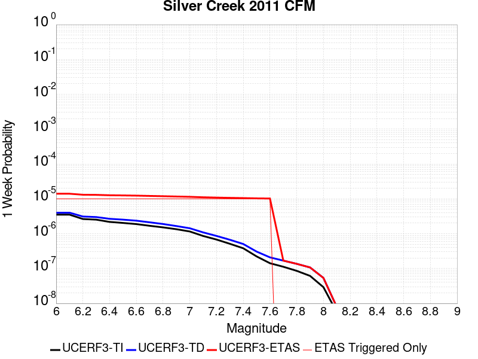 | 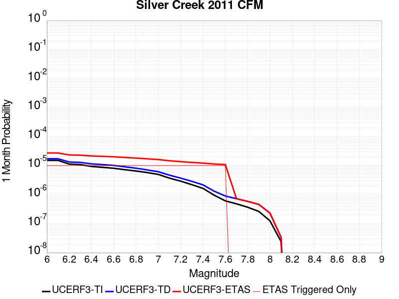 |  |  |

| Magnitude | 1 wk TI Prob | 1 wk TD Prob | 1 wk ETAS Prob | 1 wk ETAS/TD Gain | 1 wk ETAS Triggered Only | 1 mo TI Prob | 1 mo TD Prob | 1 mo ETAS Prob | 1 mo ETAS/TD Gain | 1 mo ETAS Triggered Only | 1 yr TI Prob | 1 yr TD Prob | 1 yr ETAS Prob | 1 yr ETAS/TD Gain | 1 yr ETAS Triggered Only | 10 yr TI Prob | 10 yr TD Prob | 10 yr ETAS Prob | 10 yr ETAS/TD Gain | 10 yr ETAS Triggered Only |
|-----|-----|-----|-----|-----|-----|-----|-----|-----|-----|-----|-----|-----|-----|-----|-----|-----|-----|-----|-----|-----|
| 6.0 | 3.5229125E-6 | 4.008142E-6 | 1.4008102E-5 | 3.4949117 | 1.0E-5 | 1.5098109E-5 | 1.717764E-5 | 2.7177468E-5 | 1.5821422 | 1.0E-5 | 1.8380396E-4 | 2.0911806E-4 | 2.1911597E-4 | 1.0478098 | 1.0E-5 | 0.0018365202 | 0.0020895726 | 0.0020995517 | 1.0047756 | 1.0E-5 |
| 6.1 | 3.5229125E-6 | 4.008142E-6 | 1.4008102E-5 | 3.4949117 | 1.0E-5 | 1.5098109E-5 | 1.717764E-5 | 2.7177468E-5 | 1.5821422 | 1.0E-5 | 1.8380396E-4 | 2.0911806E-4 | 2.1911597E-4 | 1.0478098 | 1.0E-5 | 0.0018365202 | 0.0020895726 | 0.0020995517 | 1.0047756 | 1.0E-5 |
| 6.2 | 2.6363234E-6 | 3.1105278E-6 | 1.3110497E-5 | 4.2148786 | 1.0E-5 | 1.129848E-5 | 1.3330766E-5 | 2.3330633E-5 | 1.7501345 | 1.0E-5 | 1.375503E-4 | 1.6229005E-4 | 1.7228843E-4 | 1.0616081 | 1.0E-5 | 0.0013746519 | 0.0016220442 | 0.001632028 | 1.006155 | 1.0E-5 |
| 6.3 | 2.5275126E-6 | 3.0001668E-6 | 1.3000137E-5 | 4.333138 | 1.0E-5 | 1.0832152E-5 | 1.2857795E-5 | 2.2857666E-5 | 1.7777283 | 1.0E-5 | 1.3187347E-4 | 1.5653246E-4 | 1.665309E-4 | 1.0638745 | 1.0E-5 | 0.0013179524 | 0.00156455 | 0.0015745343 | 1.0063816 | 1.0E-5 |
| 6.4 | 2.178732E-6 | 2.6707307E-6 | 1.2670704E-5 | 4.7442837 | 1.0E-5 | 9.337389E-6 | 1.1445939E-5 | 2.1445825E-5 | 1.8736624 | 1.0E-5 | 1.1367678E-4 | 1.3934543E-4 | 1.4934404E-4 | 1.0717541 | 1.0E-5 | 0.0011361865 | 0.0013929061 | 0.0014028922 | 1.0071692 | 1.0E-5 |
| 6.5 | 2.0341574E-6 | 2.5298211E-6 | 1.2529796E-5 | 4.952839 | 1.0E-5 | 8.717788E-6 | 1.0842045E-5 | 2.0841937E-5 | 1.9223251 | 1.0E-5 | 1.061339E-4 | 1.3199393E-4 | 1.4199261E-4 | 1.0757511 | 1.0E-5 | 0.0010608323 | 0.0013194805 | 0.0013294673 | 1.0075687 | 1.0E-5 |
| 6.6 | 1.8856827E-6 | 2.3613982E-6 | 1.23613745E-5 | 5.2347693 | 1.0E-5 | 8.0814725E-6 | 1.0120239E-5 | 2.0120136E-5 | 1.988109 | 1.0E-5 | 9.838748E-5 | 1.2320696E-4 | 1.3320573E-4 | 1.0811542 | 1.0E-5 | 9.834393E-4 | 0.0012317112 | 0.0012416989 | 1.0081087 | 1.0E-5 |
| 6.7 | 1.6844668E-6 | 2.1197875E-6 | 1.2119766E-5 | 5.717444 | 1.0E-5 | 7.2191233E-6 | 9.0847725E-6 | 1.9084682E-5 | 2.100733 | 1.0E-5 | 8.788928E-5 | 1.10601504E-4 | 1.206004E-4 | 1.0904046 | 1.0E-5 | 8.785453E-4 | 0.0011057886 | 0.0011157775 | 1.0090333 | 1.0E-5 |
| 6.8 | 1.5177161E-6 | 1.8953942E-6 | 1.1895375E-5 | 6.275937 | 1.0E-5 | 6.504481E-6 | 8.123093E-6 | 1.8123012E-5 | 2.231048 | 1.0E-5 | 7.918918E-5 | 9.8894176E-5 | 1.0889319E-4 | 1.1011082 | 1.0E-5 | 7.9160964E-4 | 9.888251E-4 | 9.988153E-4 | 1.010103 | 1.0E-5 |
| 6.9 | 1.3437394E-6 | 1.6561632E-6 | 1.1656147E-5 | 7.038042 | 1.0E-5 | 5.7588704E-6 | 7.097823E-6 | 1.7097753E-5 | 2.4088726 | 1.0E-5 | 7.011199E-5 | 8.6412576E-5 | 9.641171E-5 | 1.115714 | 1.0E-5 | 7.0089876E-4 | 8.6411275E-4 | 8.7410415E-4 | 1.0115626 | 1.0E-5 |
| 7.0 | 1.1563575E-6 | 1.4313372E-6 | 1.14313225E-5 | 7.986464 | 1.0E-5 | 4.9558084E-6 | 6.1342876E-6 | 1.6134227E-5 | 2.630171 | 1.0E-5 | 6.03353E-5 | 7.46824E-5 | 8.468165E-5 | 1.1338904 | 1.0E-5 | 6.0318917E-4 | 7.4689585E-4 | 7.568884E-4 | 1.0133787 | 1.0E-5 |
| 7.1 | 8.602183E-7 | 1.0891652E-6 | 1.1089154E-5 | 10.181334 | 1.0E-5 | 3.6866445E-6 | 4.6678424E-6 | 1.4667796E-5 | 3.1423075 | 1.0E-5 | 4.4883975E-5 | 5.68295E-5 | 6.682893E-5 | 1.1759549 | 1.0E-5 | 4.4874908E-4 | 5.684724E-4 | 5.784667E-4 | 1.017581 | 1.0E-5 |
| 7.2 | 6.788407E-7 | 8.6221576E-7 | 1.0862207E-5 | 12.598016 | 1.0E-5 | 2.9093142E-6 | 3.695205E-6 | 1.3695168E-5 | 3.7062 | 1.0E-5 | 3.5420322E-5 | 4.498819E-5 | 5.4987744E-5 | 1.2222705 | 1.0E-5 | 3.541468E-4 | 4.5011353E-4 | 4.60109E-4 | 1.0222067 | 1.0E-5 |
| 7.3 | 5.1292045E-7 | 6.693958E-7 | 1.0669389E-5 | 15.938836 | 1.0E-5 | 2.1982287E-6 | 2.8688357E-6 | 1.2868807E-5 | 4.4857244 | 1.0E-5 | 2.6763106E-5 | 3.4927514E-5 | 4.492717E-5 | 1.2862972 | 1.0E-5 | 2.6759884E-4 | 3.495429E-4 | 3.5953944E-4 | 1.0285988 | 1.0E-5 |
| 7.4 | 3.820994E-7 | 5.0624527E-7 | 1.050624E-5 | 20.753262 | 1.0E-5 | 1.6375678E-6 | 2.1696205E-6 | 1.2169599E-5 | 5.609091 | 1.0E-5 | 1.9937206E-5 | 2.6414811E-5 | 3.641455E-5 | 1.3785654 | 1.0E-5 | 1.9935417E-4 | 2.6443938E-4 | 2.7443672E-4 | 1.0378058 | 1.0E-5 |
| 7.5 | 2.2292595E-7 | 3.066783E-7 | 1.0306675E-5 | 33.60745 | 1.0E-5 | 9.553966E-7 | 1.3143348E-6 | 1.13143215E-5 | 8.608401 | 1.0E-5 | 1.16318915E-5 | 1.600191E-5 | 2.600175E-5 | 1.6249155 | 1.0E-5 | 1.16312825E-4 | 1.6033021E-4 | 1.7032861E-4 | 1.0623612 | 1.0E-5 |
| 7.6 | 1.420587E-7 | 2.0913494E-7 | 1.0209133E-5 | 48.81601 | 1.0E-5 | 6.088228E-7 | 8.9629225E-7 | 1.0896283E-5 | 12.157065 | 1.0E-5 | 7.4123927E-6 | 1.0912303E-5 | 2.0912194E-5 | 1.9163868 | 1.0E-5 | 7.412145E-5 | 1.0944006E-4 | 1.1943896E-4 | 1.0913643 | 1.0E-5 |
| 7.7 | 1.1250075E-7 | 1.6871893E-7 | 1.6871893E-7 | 1.0 | 0.0 | 4.82146E-7 | 7.230809E-7 | 7.230809E-7 | 1.0 | 0.0 | 5.8701116E-6 | 8.803475E-6 | 8.803475E-6 | 1.0 | 0.0 | 5.8699567E-5 | 8.834876E-5 | 8.834876E-5 | 1.0 | 0.0 |
| 7.8 | 8.592761E-8 | 1.3650167E-7 | 1.3650167E-7 | 1.0 | 0.0 | 3.682611E-7 | 5.8500706E-7 | 5.8500706E-7 | 1.0 | 0.0 | 4.48357E-6 | 7.122437E-6 | 7.122437E-6 | 1.0 | 0.0 | 4.4834796E-5 | 7.152824E-5 | 7.152824E-5 | 1.0 | 0.0 |
| 7.9 | 6.156529E-8 | 1.0743081E-7 | 1.0743081E-7 | 1.0 | 0.0 | 2.638512E-7 | 4.6041765E-7 | 4.6041765E-7 | 1.0 | 0.0 | 3.212384E-6 | 5.6055705E-6 | 5.6055705E-6 | 1.0 | 0.0 | 3.2123375E-5 | 5.6315246E-5 | 5.6315246E-5 | 1.0 | 0.0 |
| 8.0 | 2.9230547E-8 | 5.3892336E-8 | 5.3892336E-8 | 1.0 | 0.0 | 1.2527377E-7 | 2.3096713E-7 | 2.3096713E-7 | 1.0 | 0.0 | 1.525207E-6 | 2.8120212E-6 | 2.8120212E-6 | 1.0 | 0.0 | 1.5251966E-5 | 2.8256853E-5 | 2.8256853E-5 | 1.0 | 0.0 |
| 8.1 | 5.6062213E-9 | 7.9031315E-9 | 7.9031315E-9 | 1.0 | 0.0 | 2.4026663E-8 | 3.387056E-8 | 3.387056E-8 | 1.0 | 0.0 | 2.925246E-7 | 4.1237402E-7 | 4.1237402E-7 | 1.0 | 0.0 | 2.925242E-6 | 4.1619833E-6 | 4.1619833E-6 | 1.0 | 0.0 |

## West Napa 2011 CFM
*[(top)](#table-of-contents)*

| 1 Week | 1 Month | 1 Year | 10 Year |
|-----|-----|-----|-----|
|  |  |  |  |

| Magnitude | 1 wk TI Prob | 1 wk TD Prob | 1 wk ETAS Prob | 1 wk ETAS/TD Gain | 1 wk ETAS Triggered Only | 1 mo TI Prob | 1 mo TD Prob | 1 mo ETAS Prob | 1 mo ETAS/TD Gain | 1 mo ETAS Triggered Only | 1 yr TI Prob | 1 yr TD Prob | 1 yr ETAS Prob | 1 yr ETAS/TD Gain | 1 yr ETAS Triggered Only | 10 yr TI Prob | 10 yr TD Prob | 10 yr ETAS Prob | 10 yr ETAS/TD Gain | 10 yr ETAS Triggered Only |
|-----|-----|-----|-----|-----|-----|-----|-----|-----|-----|-----|-----|-----|-----|-----|-----|-----|-----|-----|-----|-----|
| 6.0 | 3.773104E-5 | 4.4528504E-5 | 5.4528056E-5 | 1.2245653 | 1.0E-5 | 1.6169442E-4 | 1.9082428E-4 | 2.0082238E-4 | 1.0523943 | 1.0E-5 | 0.001966852 | 0.0023211278 | 0.0023311046 | 1.0042982 | 1.0E-5 | 0.019495348 | 0.023002012 | 0.023011781 | 1.0004247 | 1.0E-5 |
| 6.1 | 3.773104E-5 | 4.4528504E-5 | 5.4528056E-5 | 1.2245653 | 1.0E-5 | 1.6169442E-4 | 1.9082428E-4 | 2.0082238E-4 | 1.0523943 | 1.0E-5 | 0.001966852 | 0.0023211278 | 0.0023311046 | 1.0042982 | 1.0E-5 | 0.019495348 | 0.023002012 | 0.023011781 | 1.0004247 | 1.0E-5 |
| 6.2 | 3.773104E-5 | 4.4528504E-5 | 5.4528056E-5 | 1.2245653 | 1.0E-5 | 1.6169442E-4 | 1.9082428E-4 | 2.0082238E-4 | 1.0523943 | 1.0E-5 | 0.001966852 | 0.0023211278 | 0.0023311046 | 1.0042982 | 1.0E-5 | 0.019495348 | 0.023002012 | 0.023011781 | 1.0004247 | 1.0E-5 |
| 6.3 | 2.147964E-5 | 2.4987066E-5 | 2.4987066E-5 | 1.0 | 0.0 | 9.2052345E-5 | 1.0708355E-4 | 1.0708355E-4 | 1.0 | 0.0 | 0.001120161 | 0.0013030542 | 0.0013030542 | 1.0 | 0.0 | 0.011145315 | 0.012964482 | 0.012964482 | 1.0 | 0.0 |
| 6.4 | 2.147964E-5 | 2.4987066E-5 | 2.4987066E-5 | 1.0 | 0.0 | 9.2052345E-5 | 1.0708355E-4 | 1.0708355E-4 | 1.0 | 0.0 | 0.001120161 | 0.0013030542 | 0.0013030542 | 1.0 | 0.0 | 0.011145315 | 0.012964482 | 0.012964482 | 1.0 | 0.0 |
| 6.5 | 1.688201E-5 | 1.9547371E-5 | 1.9547371E-5 | 1.0 | 0.0 | 7.234947E-5 | 8.377217E-5 | 8.377217E-5 | 1.0 | 0.0 | 8.804988E-4 | 0.0010195216 | 0.0010195216 | 1.0 | 0.0 | 0.008770182 | 0.01015684 | 0.01015684 | 1.0 | 0.0 |
| 6.6 | 1.6846381E-5 | 1.9507064E-5 | 1.9507064E-5 | 1.0 | 0.0 | 7.219678E-5 | 8.3599436E-5 | 8.3599436E-5 | 1.0 | 0.0 | 8.7864127E-4 | 0.0010174206 | 0.0010174206 | 1.0 | 0.0 | 0.008751754 | 0.010136021 | 0.010136021 | 1.0 | 0.0 |
| 6.7 | 1.3396501E-5 | 1.5467684E-5 | 1.5467684E-5 | 1.0 | 0.0 | 5.7412315E-5 | 6.628875E-5 | 6.628875E-5 | 1.0 | 0.0 | 6.9877075E-4 | 8.068302E-4 | 8.068302E-4 | 1.0 | 0.0 | 0.0069657755 | 0.008046459 | 0.008046459 | 1.0 | 0.0 |
| 6.8 | 1.0139058E-5 | 1.16721785E-5 | 1.16721785E-5 | 1.0 | 0.0 | 4.3452383E-5 | 5.0022976E-5 | 5.0022976E-5 | 1.0 | 0.0 | 5.289043E-4 | 6.0891506E-4 | 6.0891506E-4 | 1.0 | 0.0 | 0.005276473 | 0.0060791126 | 0.0060791126 | 1.0 | 0.0 |
| 6.9 | 7.761281E-6 | 8.890723E-6 | 8.890723E-6 | 1.0 | 0.0 | 3.326221E-5 | 3.810283E-5 | 3.810283E-5 | 1.0 | 0.0 | 4.0489217E-4 | 4.6385458E-4 | 4.6385458E-4 | 1.0 | 0.0 | 0.0040415525 | 0.0046351026 | 0.0046351026 | 1.0 | 0.0 |
| 7.0 | 2.2109202E-6 | 2.3666319E-6 | 2.3666319E-6 | 1.0 | 0.0 | 9.475338E-6 | 1.01426685E-5 | 1.01426685E-5 | 1.0 | 0.0 | 1.1535613E-4 | 1.2348007E-4 | 1.2348007E-4 | 1.0 | 0.0 | 0.0011529627 | 0.0012353238 | 0.0012353238 | 1.0 | 0.0 |
| 7.1 | 1.9008926E-6 | 2.0133207E-6 | 2.0133207E-6 | 1.0 | 0.0 | 8.146657E-6 | 8.628488E-6 | 8.628488E-6 | 1.0 | 0.0 | 9.918104E-5 | 1.05046805E-4 | 1.05046805E-4 | 1.0 | 0.0 | 9.913679E-4 | 0.0010511756 | 0.0010511756 | 1.0 | 0.0 |
| 7.2 | 1.8495944E-6 | 1.9561273E-6 | 1.9561273E-6 | 1.0 | 0.0 | 7.926808E-6 | 8.383376E-6 | 8.383376E-6 | 1.0 | 0.0 | 9.650462E-5 | 1.0206285E-4 | 1.0206285E-4 | 1.0 | 0.0 | 9.6462725E-4 | 0.0010213639 | 0.0010213639 | 1.0 | 0.0 |
| 7.3 | 1.7883189E-6 | 1.8880897E-6 | 1.8880897E-6 | 1.0 | 0.0 | 7.664201E-6 | 8.091788E-6 | 8.091788E-6 | 1.0 | 0.0 | 9.330765E-5 | 9.85131E-5 | 9.85131E-5 | 1.0 | 0.0 | 9.3268487E-4 | 9.858976E-4 | 9.858976E-4 | 1.0 | 0.0 |
| 7.4 | 1.6520572E-6 | 1.7415113E-6 | 1.7415113E-6 | 1.0 | 0.0 | 7.0802257E-6 | 7.463598E-6 | 7.463598E-6 | 1.0 | 0.0 | 8.6198335E-5 | 9.086554E-5 | 9.086554E-5 | 1.0 | 0.0 | 8.616491E-4 | 9.0948684E-4 | 9.0948684E-4 | 1.0 | 0.0 |
| 7.5 | 1.4040345E-6 | 1.4800271E-6 | 1.4800271E-6 | 1.0 | 0.0 | 6.0172765E-6 | 6.342958E-6 | 6.342958E-6 | 1.0 | 0.0 | 7.325788E-5 | 7.72228E-5 | 7.72228E-5 | 1.0 | 0.0 | 7.3233736E-4 | 7.7311805E-4 | 7.7311805E-4 | 1.0 | 0.0 |
| 7.6 | 1.3013842E-7 | 1.4416163E-7 | 1.4416163E-7 | 1.0 | 0.0 | 5.57736E-7 | 6.178354E-7 | 6.178354E-7 | 1.0 | 0.0 | 6.790414E-6 | 7.52212E-6 | 7.52212E-6 | 1.0 | 0.0 | 6.790207E-5 | 7.61463E-5 | 7.61463E-5 | 1.0 | 0.0 |
| 7.7 | 8.541512E-8 | 9.716462E-8 | 9.716462E-8 | 1.0 | 0.0 | 3.6606474E-7 | 4.1641974E-7 | 4.1641974E-7 | 1.0 | 0.0 | 4.456829E-6 | 5.069898E-6 | 5.069898E-6 | 1.0 | 0.0 | 4.4567398E-5 | 5.160189E-5 | 5.160189E-5 | 1.0 | 0.0 |
| 7.8 | 5.6074793E-8 | 6.895456E-8 | 6.895456E-8 | 1.0 | 0.0 | 2.403205E-7 | 2.955195E-7 | 2.955195E-7 | 1.0 | 0.0 | 2.9258983E-6 | 3.597944E-6 | 3.597944E-6 | 1.0 | 0.0 | 2.9258597E-5 | 3.6812045E-5 | 3.6812045E-5 | 1.0 | 0.0 |
| 7.9 | 2.9475839E-8 | 3.8567407E-8 | 3.8567407E-8 | 1.0 | 0.0 | 1.2632502E-7 | 1.6528887E-7 | 1.6528887E-7 | 1.0 | 0.0 | 1.538006E-6 | 2.01239E-6 | 2.01239E-6 | 1.0 | 0.0 | 1.5379954E-5 | 2.0664074E-5 | 2.0664074E-5 | 1.0 | 0.0 |
| 8.0 | 1.3337122E-8 | 2.1632943E-8 | 2.1632943E-8 | 1.0 | 0.0 | 5.7159088E-8 | 9.2712604E-8 | 9.2712604E-8 | 1.0 | 0.0 | 6.959117E-7 | 1.1287754E-6 | 1.1287754E-6 | 1.0 | 0.0 | 6.959095E-6 | 1.1644432E-5 | 1.1644432E-5 | 1.0 | 0.0 |
| 8.1 | 2.6589986E-10 | 4.8617654E-10 | 4.8617654E-10 | 1.0 | 0.0 | 1.1395708E-9 | 2.0836133E-9 | 2.0836133E-9 | 1.0 | 0.0 | 1.3874274E-8 | 2.536799E-8 | 2.536799E-8 | 1.0 | 0.0 | 1.3874273E-7 | 2.6036727E-7 | 2.6036727E-7 | 1.0 | 0.0 |

## Elsinore (Temecula) rev
*[(top)](#table-of-contents)*

| 1 Week | 1 Month | 1 Year | 10 Year |
|-----|-----|-----|-----|
|  |  |  | 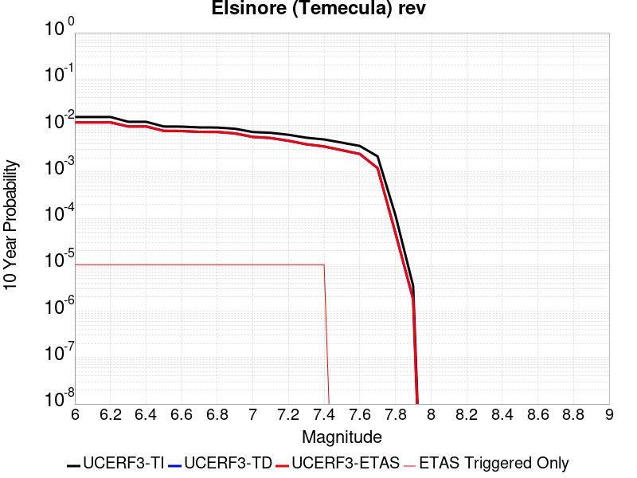 |

| Magnitude | 1 wk TI Prob | 1 wk TD Prob | 1 wk ETAS Prob | 1 wk ETAS/TD Gain | 1 wk ETAS Triggered Only | 1 mo TI Prob | 1 mo TD Prob | 1 mo ETAS Prob | 1 mo ETAS/TD Gain | 1 mo ETAS Triggered Only | 1 yr TI Prob | 1 yr TD Prob | 1 yr ETAS Prob | 1 yr ETAS/TD Gain | 1 yr ETAS Triggered Only | 10 yr TI Prob | 10 yr TD Prob | 10 yr ETAS Prob | 10 yr ETAS/TD Gain | 10 yr ETAS Triggered Only |
|-----|-----|-----|-----|-----|-----|-----|-----|-----|-----|-----|-----|-----|-----|-----|-----|-----|-----|-----|-----|-----|
| 6.0 | 2.9514995E-5 | 2.251887E-5 | 2.251887E-5 | 1.0 | 0.0 | 1.264867E-4 | 9.6505995E-5 | 1.0650503E-4 | 1.1036105 | 1.0E-5 | 0.0015388876 | 0.0011743492 | 0.0011843374 | 1.0085053 | 1.0E-5 | 0.015282745 | 0.011688135 | 0.011698018 | 1.0008456 | 1.0E-5 |
| 6.1 | 2.9514995E-5 | 2.251887E-5 | 2.251887E-5 | 1.0 | 0.0 | 1.264867E-4 | 9.6505995E-5 | 1.0650503E-4 | 1.1036105 | 1.0E-5 | 0.0015388876 | 0.0011743492 | 0.0011843374 | 1.0085053 | 1.0E-5 | 0.015282745 | 0.011688135 | 0.011698018 | 1.0008456 | 1.0E-5 |
| 6.2 | 2.9514995E-5 | 2.251887E-5 | 2.251887E-5 | 1.0 | 0.0 | 1.264867E-4 | 9.6505995E-5 | 1.0650503E-4 | 1.1036105 | 1.0E-5 | 0.0015388876 | 0.0011743492 | 0.0011843374 | 1.0085053 | 1.0E-5 | 0.015282745 | 0.011688135 | 0.011698018 | 1.0008456 | 1.0E-5 |
| 6.3 | 2.3223649E-5 | 1.840822E-5 | 1.840822E-5 | 1.0 | 0.0 | 9.952613E-5 | 7.889008E-5 | 8.888929E-5 | 1.1267487 | 1.0E-5 | 0.001211057 | 9.600807E-4 | 9.700711E-4 | 1.0104058 | 1.0E-5 | 0.012044783 | 0.009551284 | 0.0095611885 | 1.001037 | 1.0E-5 |
| 6.4 | 2.3223649E-5 | 1.840822E-5 | 1.840822E-5 | 1.0 | 0.0 | 9.952613E-5 | 7.889008E-5 | 8.888929E-5 | 1.1267487 | 1.0E-5 | 0.001211057 | 9.600807E-4 | 9.700711E-4 | 1.0104058 | 1.0E-5 | 0.012044783 | 0.009551284 | 0.0095611885 | 1.001037 | 1.0E-5 |
| 6.5 | 1.8338875E-5 | 1.4750074E-5 | 1.4750074E-5 | 1.0 | 0.0 | 7.8592806E-5 | 6.321312E-5 | 7.321249E-5 | 1.158185 | 1.0E-5 | 9.5644733E-4 | 7.6935673E-4 | 7.7934907E-4 | 1.0129879 | 1.0E-5 | 0.009523412 | 0.0076699676 | 0.007679891 | 1.0012938 | 1.0E-5 |
| 6.6 | 1.8223333E-5 | 1.461263E-5 | 1.461263E-5 | 1.0 | 0.0 | 7.809766E-5 | 6.26241E-5 | 7.262348E-5 | 1.159673 | 1.0E-5 | 9.504242E-4 | 7.621905E-4 | 7.721829E-4 | 1.01311 | 1.0E-5 | 0.009463696 | 0.007598796 | 0.00760872 | 1.001306 | 1.0E-5 |
| 6.7 | 1.7512752E-5 | 1.4026963E-5 | 1.4026963E-5 | 1.0 | 0.0 | 7.505249E-5 | 6.0114216E-5 | 7.0113616E-5 | 1.16634 | 1.0E-5 | 9.13381E-4 | 7.316534E-4 | 7.416461E-4 | 1.0136577 | 1.0E-5 | 0.00909636 | 0.0072983317 | 0.0073082587 | 1.0013602 | 1.0E-5 |
| 6.8 | 1.7417142E-5 | 1.395093E-5 | 1.395093E-5 | 1.0 | 0.0 | 7.4642754E-5 | 5.978838E-5 | 6.9787784E-5 | 1.1672466 | 1.0E-5 | 9.083966E-4 | 7.27689E-4 | 7.376817E-4 | 1.0137321 | 1.0E-5 | 0.009046922 | 0.007259359 | 0.0072692866 | 1.0013676 | 1.0E-5 |
| 6.9 | 1.6402591E-5 | 1.29883665E-5 | 1.29883665E-5 | 1.0 | 0.0 | 7.0294926E-5 | 5.5663284E-5 | 6.566273E-5 | 1.1796416 | 1.0E-5 | 8.5550465E-4 | 6.774974E-4 | 6.874907E-4 | 1.0147502 | 1.0E-5 | 0.008522186 | 0.0067598647 | 0.006769797 | 1.0014694 | 1.0E-5 |
| 7.0 | 1.3912486E-5 | 1.0878067E-5 | 1.0878067E-5 | 1.0 | 0.0 | 5.9623577E-5 | 4.661947E-5 | 5.6619003E-5 | 1.2144927 | 1.0E-5 | 7.2567526E-4 | 5.674469E-4 | 5.774413E-4 | 1.0176128 | 1.0E-5 | 0.0072331014 | 0.0056635314 | 0.005673475 | 1.0017557 | 1.0E-5 |
| 7.1 | 1.3405147E-5 | 1.0327192E-5 | 1.0327192E-5 | 1.0 | 0.0 | 5.7449364E-5 | 4.4258657E-5 | 5.4258217E-5 | 1.2259345 | 1.0E-5 | 6.9922156E-4 | 5.3871854E-4 | 5.4871314E-4 | 1.0185525 | 1.0E-5 | 0.0069702556 | 0.005377366 | 0.0053873123 | 1.0018497 | 1.0E-5 |
| 7.2 | 1.21402E-5 | 8.996479E-6 | 8.996479E-6 | 1.0 | 0.0 | 5.202839E-5 | 3.8555776E-5 | 4.855539E-5 | 1.2593545 | 1.0E-5 | 6.332616E-4 | 4.6931725E-4 | 4.7931256E-4 | 1.0212976 | 1.0E-5 | 0.0063146 | 0.0046847262 | 0.0046946793 | 1.0021245 | 1.0E-5 |
| 7.3 | 1.05047775E-5 | 7.571515E-6 | 7.571515E-6 | 1.0 | 0.0 | 4.5019697E-5 | 3.2448956E-5 | 4.244863E-5 | 1.3081663 | 1.0E-5 | 5.4797693E-4 | 3.9499588E-4 | 4.0499194E-4 | 1.0253067 | 1.0E-5 | 0.005466277 | 0.003943348 | 0.0039533083 | 1.0025259 | 1.0E-5 |
| 7.4 | 9.624483E-6 | 6.786621E-6 | 6.786621E-6 | 1.0 | 0.0 | 4.124713E-5 | 2.90852E-5 | 3.908491E-5 | 1.3438075 | 1.0E-5 | 5.0206814E-4 | 3.5405616E-4 | 3.6405263E-4 | 1.0282341 | 1.0E-5 | 0.005009353 | 0.0035350726 | 0.0035450372 | 1.0028188 | 1.0E-5 |
| 7.5 | 8.215151E-6 | 5.6353133E-6 | 5.6353133E-6 | 1.0 | 0.0 | 3.5207315E-5 | 2.4151126E-5 | 2.4151126E-5 | 1.0 | 0.0 | 4.2856473E-4 | 2.9400157E-4 | 2.9400157E-4 | 1.0 | 0.0 | 0.004277392 | 0.002936254 | 0.002936254 | 1.0 | 0.0 |
| 7.6 | 6.975058E-6 | 4.675836E-6 | 4.675836E-6 | 1.0 | 0.0 | 2.9892764E-5 | 2.003915E-5 | 2.003915E-5 | 1.0 | 0.0 | 3.6388362E-4 | 2.439505E-4 | 2.439505E-4 | 1.0 | 0.0 | 0.0036328835 | 0.0024369434 | 0.0024369434 | 1.0 | 0.0 |
| 7.7 | 4.159604E-6 | 2.326789E-6 | 2.326789E-6 | 1.0 | 0.0 | 1.7826753E-5 | 9.971919E-6 | 9.971919E-6 | 1.0 | 0.0 | 2.1701909E-4 | 1.2140209E-4 | 1.2140209E-4 | 1.0 | 0.0 | 0.0021680726 | 0.0012134308 | 0.0012134308 | 1.0 | 0.0 |
| 7.8 | 2.2692414E-7 | 9.384417E-8 | 9.384417E-8 | 1.0 | 0.0 | 9.725317E-7 | 4.0218927E-7 | 4.0218927E-7 | 1.0 | 0.0 | 1.1840509E-5 | 4.8966467E-6 | 4.8966467E-6 | 1.0 | 0.0 | 1.1839878E-4 | 4.8965718E-5 | 4.8965718E-5 | 1.0 | 0.0 |
| 7.9 | 6.676829E-9 | 3.4397174E-9 | 3.4397174E-9 | 1.0 | 0.0 | 2.861498E-8 | 1.4741646E-8 | 1.4741646E-8 | 1.0 | 0.0 | 3.4838732E-7 | 1.7947953E-7 | 1.7947953E-7 | 1.0 | 0.0 | 3.4838679E-6 | 1.794794E-6 | 1.794794E-6 | 1.0 | 0.0 |

## Compton
*[(top)](#table-of-contents)*

| 1 Week | 1 Month | 1 Year | 10 Year |
|-----|-----|-----|-----|
|  |  |  |  |

| Magnitude | 1 wk TI Prob | 1 wk TD Prob | 1 wk ETAS Prob | 1 wk ETAS/TD Gain | 1 wk ETAS Triggered Only | 1 mo TI Prob | 1 mo TD Prob | 1 mo ETAS Prob | 1 mo ETAS/TD Gain | 1 mo ETAS Triggered Only | 1 yr TI Prob | 1 yr TD Prob | 1 yr ETAS Prob | 1 yr ETAS/TD Gain | 1 yr ETAS Triggered Only | 10 yr TI Prob | 10 yr TD Prob | 10 yr ETAS Prob | 10 yr ETAS/TD Gain | 10 yr ETAS Triggered Only |
|-----|-----|-----|-----|-----|-----|-----|-----|-----|-----|-----|-----|-----|-----|-----|-----|-----|-----|-----|-----|-----|
| 6.0 | 1.06050875E-5 | 6.35892E-6 | 1.6358856E-5 | 2.5725842 | 1.0E-5 | 4.5449582E-5 | 2.7252245E-5 | 3.725197E-5 | 1.3669323 | 1.0E-5 | 5.5320817E-4 | 3.3174842E-4 | 3.4174512E-4 | 1.0301334 | 1.0E-5 | 0.0055183303 | 0.003312816 | 0.0033227827 | 1.0030086 | 1.0E-5 |
| 6.1 | 1.06050875E-5 | 6.35892E-6 | 1.6358856E-5 | 2.5725842 | 1.0E-5 | 4.5449582E-5 | 2.7252245E-5 | 3.725197E-5 | 1.3669323 | 1.0E-5 | 5.5320817E-4 | 3.3174842E-4 | 3.4174512E-4 | 1.0301334 | 1.0E-5 | 0.0055183303 | 0.003312816 | 0.0033227827 | 1.0030086 | 1.0E-5 |
| 6.2 | 1.06050875E-5 | 6.35892E-6 | 1.6358856E-5 | 2.5725842 | 1.0E-5 | 4.5449582E-5 | 2.7252245E-5 | 3.725197E-5 | 1.3669323 | 1.0E-5 | 5.5320817E-4 | 3.3174842E-4 | 3.4174512E-4 | 1.0301334 | 1.0E-5 | 0.0055183303 | 0.003312816 | 0.0033227827 | 1.0030086 | 1.0E-5 |
| 6.3 | 1.06050875E-5 | 6.35892E-6 | 1.6358856E-5 | 2.5725842 | 1.0E-5 | 4.5449582E-5 | 2.7252245E-5 | 3.725197E-5 | 1.3669323 | 1.0E-5 | 5.5320817E-4 | 3.3174842E-4 | 3.4174512E-4 | 1.0301334 | 1.0E-5 | 0.0055183303 | 0.003312816 | 0.0033227827 | 1.0030086 | 1.0E-5 |
| 6.4 | 1.06050875E-5 | 6.35892E-6 | 1.6358856E-5 | 2.5725842 | 1.0E-5 | 4.5449582E-5 | 2.7252245E-5 | 3.725197E-5 | 1.3669323 | 1.0E-5 | 5.5320817E-4 | 3.3174842E-4 | 3.4174512E-4 | 1.0301334 | 1.0E-5 | 0.0055183303 | 0.003312816 | 0.0033227827 | 1.0030086 | 1.0E-5 |
| 6.5 | 1.06050875E-5 | 6.35892E-6 | 1.6358856E-5 | 2.5725842 | 1.0E-5 | 4.5449582E-5 | 2.7252245E-5 | 3.725197E-5 | 1.3669323 | 1.0E-5 | 5.5320817E-4 | 3.3174842E-4 | 3.4174512E-4 | 1.0301334 | 1.0E-5 | 0.0055183303 | 0.003312816 | 0.0033227827 | 1.0030086 | 1.0E-5 |
| 6.6 | 1.06050875E-5 | 6.35892E-6 | 1.6358856E-5 | 2.5725842 | 1.0E-5 | 4.5449582E-5 | 2.7252245E-5 | 3.725197E-5 | 1.3669323 | 1.0E-5 | 5.5320817E-4 | 3.3174842E-4 | 3.4174512E-4 | 1.0301334 | 1.0E-5 | 0.0055183303 | 0.003312816 | 0.0033227827 | 1.0030086 | 1.0E-5 |
| 6.7 | 1.06050875E-5 | 6.35892E-6 | 1.6358856E-5 | 2.5725842 | 1.0E-5 | 4.5449582E-5 | 2.7252245E-5 | 3.725197E-5 | 1.3669323 | 1.0E-5 | 5.5320817E-4 | 3.3174842E-4 | 3.4174512E-4 | 1.0301334 | 1.0E-5 | 0.0055183303 | 0.003312816 | 0.0033227827 | 1.0030086 | 1.0E-5 |
| 6.8 | 1.06050875E-5 | 6.35892E-6 | 1.6358856E-5 | 2.5725842 | 1.0E-5 | 4.5449582E-5 | 2.7252245E-5 | 3.725197E-5 | 1.3669323 | 1.0E-5 | 5.5320817E-4 | 3.3174842E-4 | 3.4174512E-4 | 1.0301334 | 1.0E-5 | 0.0055183303 | 0.003312816 | 0.0033227827 | 1.0030086 | 1.0E-5 |
| 6.9 | 1.06050875E-5 | 6.35892E-6 | 1.6358856E-5 | 2.5725842 | 1.0E-5 | 4.5449582E-5 | 2.7252245E-5 | 3.725197E-5 | 1.3669323 | 1.0E-5 | 5.5320817E-4 | 3.3174842E-4 | 3.4174512E-4 | 1.0301334 | 1.0E-5 | 0.0055183303 | 0.003312816 | 0.0033227827 | 1.0030086 | 1.0E-5 |
| 7.0 | 7.672486E-6 | 4.272077E-6 | 4.272077E-6 | 1.0 | 0.0 | 3.288167E-5 | 1.8308778E-5 | 1.8308778E-5 | 1.0 | 0.0 | 4.0026082E-4 | 2.2288719E-4 | 2.2288719E-4 | 1.0 | 0.0 | 0.0039954064 | 0.0022266984 | 0.0022266984 | 1.0 | 0.0 |
| 7.1 | 7.163992E-6 | 3.883783E-6 | 3.883783E-6 | 1.0 | 0.0 | 3.0702464E-5 | 1.664468E-5 | 1.664468E-5 | 1.0 | 0.0 | 3.7373835E-4 | 2.0263072E-4 | 2.0263072E-4 | 1.0 | 0.0 | 0.0037311043 | 0.0020245167 | 0.0020245167 | 1.0 | 0.0 |
| 7.2 | 6.3689185E-6 | 3.3101053E-6 | 3.3101053E-6 | 1.0 | 0.0 | 2.729508E-5 | 1.4186091E-5 | 1.4186091E-5 | 1.0 | 0.0 | 3.322669E-4 | 1.7270239E-4 | 1.7270239E-4 | 1.0 | 0.0 | 0.0033177056 | 0.0017257235 | 0.0017257235 | 1.0 | 0.0 |
| 7.3 | 4.4987873E-6 | 2.4480198E-6 | 2.4480198E-6 | 1.0 | 0.0 | 1.9280375E-5 | 1.0491473E-5 | 1.0491473E-5 | 1.0 | 0.0 | 2.3471327E-4 | 1.2772651E-4 | 1.2772651E-4 | 1.0 | 0.0 | 0.002344655 | 0.0012765612 | 0.0012765612 | 1.0 | 0.0 |
| 7.4 | 2.987296E-6 | 1.7394043E-6 | 1.7394043E-6 | 1.0 | 0.0 | 1.2802635E-5 | 7.4545687E-6 | 7.4545687E-6 | 1.0 | 0.0 | 1.5586092E-4 | 9.075565E-5 | 9.075565E-5 | 1.0 | 0.0 | 0.0015575165 | 9.071917E-4 | 9.071917E-4 | 1.0 | 0.0 |
| 7.5 | 2.4111696E-6 | 1.4471991E-6 | 1.4471991E-6 | 1.0 | 0.0 | 1.0333543E-5 | 6.2022677E-6 | 6.2022677E-6 | 1.0 | 0.0 | 1.2580362E-4 | 7.551004E-5 | 7.551004E-5 | 1.0 | 0.0 | 0.0012573242 | 7.548485E-4 | 7.548485E-4 | 1.0 | 0.0 |
| 7.6 | 1.8783096E-6 | 1.1360306E-6 | 1.1360306E-6 | 1.0 | 0.0 | 8.049874E-6 | 4.868694E-6 | 4.868694E-6 | 1.0 | 0.0 | 9.8002805E-5 | 5.9274775E-5 | 5.9274775E-5 | 1.0 | 0.0 | 9.795959E-4 | 5.925936E-4 | 5.925936E-4 | 1.0 | 0.0 |
| 7.7 | 6.6646817E-7 | 3.5601457E-7 | 3.5601457E-7 | 1.0 | 0.0 | 2.856289E-6 | 1.5257759E-6 | 1.5257759E-6 | 1.0 | 0.0 | 3.4774763E-5 | 1.8576176E-5 | 1.8576176E-5 | 1.0 | 0.0 | 3.4769322E-4 | 1.8574759E-4 | 1.8574759E-4 | 1.0 | 0.0 |
| 7.8 | 7.054689E-8 | 4.1342012E-8 | 4.1342012E-8 | 1.0 | 0.0 | 3.0234378E-7 | 1.7718004E-7 | 1.7718004E-7 | 1.0 | 0.0 | 3.6810293E-6 | 2.157165E-6 | 2.157165E-6 | 1.0 | 0.0 | 3.6809684E-5 | 2.157145E-5 | 2.157145E-5 | 1.0 | 0.0 |
| 7.9 | 7.420925E-9 | 4.0130637E-9 | 4.0130637E-9 | 1.0 | 0.0 | 3.1803964E-8 | 1.7198845E-8 | 1.7198845E-8 | 1.0 | 0.0 | 3.872132E-7 | 2.0939592E-7 | 2.0939592E-7 | 1.0 | 0.0 | 3.872125E-6 | 2.0939574E-6 | 2.0939574E-6 | 1.0 | 0.0 |

## Hartley Springs 2011 CFM
*[(top)](#table-of-contents)*

| 1 Week | 1 Month | 1 Year | 10 Year |
|-----|-----|-----|-----|
|  |  |  |  |

| Magnitude | 1 wk TI Prob | 1 wk TD Prob | 1 wk ETAS Prob | 1 wk ETAS/TD Gain | 1 wk ETAS Triggered Only | 1 mo TI Prob | 1 mo TD Prob | 1 mo ETAS Prob | 1 mo ETAS/TD Gain | 1 mo ETAS Triggered Only | 1 yr TI Prob | 1 yr TD Prob | 1 yr ETAS Prob | 1 yr ETAS/TD Gain | 1 yr ETAS Triggered Only | 10 yr TI Prob | 10 yr TD Prob | 10 yr ETAS Prob | 10 yr ETAS/TD Gain | 10 yr ETAS Triggered Only |
|-----|-----|-----|-----|-----|-----|-----|-----|-----|-----|-----|-----|-----|-----|-----|-----|-----|-----|-----|-----|-----|
| 6.0 | 1.4352418E-5 | 1.4434111E-5 | 1.4434111E-5 | 1.0 | 0.0 | 6.1508916E-5 | 6.185994E-5 | 6.185994E-5 | 1.0 | 0.0 | 7.486137E-4 | 7.5304887E-4 | 7.630413E-4 | 1.0132693 | 1.0E-5 | 0.007460968 | 0.007521092 | 0.0075310166 | 1.0013196 | 1.0E-5 |
| 6.1 | 1.4352418E-5 | 1.4434111E-5 | 1.4434111E-5 | 1.0 | 0.0 | 6.1508916E-5 | 6.185994E-5 | 6.185994E-5 | 1.0 | 0.0 | 7.486137E-4 | 7.5304887E-4 | 7.630413E-4 | 1.0132693 | 1.0E-5 | 0.007460968 | 0.007521092 | 0.0075310166 | 1.0013196 | 1.0E-5 |
| 6.2 | 1.4352418E-5 | 1.4434111E-5 | 1.4434111E-5 | 1.0 | 0.0 | 6.1508916E-5 | 6.185994E-5 | 6.185994E-5 | 1.0 | 0.0 | 7.486137E-4 | 7.5304887E-4 | 7.630413E-4 | 1.0132693 | 1.0E-5 | 0.007460968 | 0.007521092 | 0.0075310166 | 1.0013196 | 1.0E-5 |
| 6.3 | 1.4352418E-5 | 1.4434111E-5 | 1.4434111E-5 | 1.0 | 0.0 | 6.1508916E-5 | 6.185994E-5 | 6.185994E-5 | 1.0 | 0.0 | 7.486137E-4 | 7.5304887E-4 | 7.630413E-4 | 1.0132693 | 1.0E-5 | 0.007460968 | 0.007521092 | 0.0075310166 | 1.0013196 | 1.0E-5 |
| 6.4 | 1.4352418E-5 | 1.4434111E-5 | 1.4434111E-5 | 1.0 | 0.0 | 6.1508916E-5 | 6.185994E-5 | 6.185994E-5 | 1.0 | 0.0 | 7.486137E-4 | 7.5304887E-4 | 7.630413E-4 | 1.0132693 | 1.0E-5 | 0.007460968 | 0.007521092 | 0.0075310166 | 1.0013196 | 1.0E-5 |
| 6.5 | 1.2279858E-5 | 1.2133036E-5 | 1.2133036E-5 | 1.0 | 0.0 | 5.26269E-5 | 5.199858E-5 | 5.199858E-5 | 1.0 | 0.0 | 6.4054417E-4 | 6.33057E-4 | 6.33057E-4 | 1.0 | 0.0 | 0.0063870098 | 0.006328048 | 0.006328048 | 1.0 | 0.0 |
| 6.6 | 1.2279858E-5 | 1.2133036E-5 | 1.2133036E-5 | 1.0 | 0.0 | 5.26269E-5 | 5.199858E-5 | 5.199858E-5 | 1.0 | 0.0 | 6.4054417E-4 | 6.33057E-4 | 6.33057E-4 | 1.0 | 0.0 | 0.0063870098 | 0.006328048 | 0.006328048 | 1.0 | 0.0 |
| 6.7 | 2.1282601E-6 | 8.894127E-7 | 8.894127E-7 | 1.0 | 0.0 | 9.121083E-6 | 3.8117648E-6 | 3.8117648E-6 | 1.0 | 0.0 | 1.11043526E-4 | 4.6407506E-5 | 4.6407506E-5 | 1.0 | 0.0 | 0.0011098806 | 4.6400347E-4 | 4.6400347E-4 | 1.0 | 0.0 |
| 6.8 | 2.00516E-6 | 8.516916E-7 | 8.516916E-7 | 1.0 | 0.0 | 8.593515E-6 | 3.6501033E-6 | 3.6501033E-6 | 1.0 | 0.0 | 1.04621024E-4 | 4.443936E-5 | 4.443936E-5 | 1.0 | 0.0 | 0.0010457177 | 4.4432987E-4 | 4.4432987E-4 | 1.0 | 0.0 |
| 6.9 | 2.00516E-6 | 8.516916E-7 | 8.516916E-7 | 1.0 | 0.0 | 8.593515E-6 | 3.6501033E-6 | 3.6501033E-6 | 1.0 | 0.0 | 1.04621024E-4 | 4.443936E-5 | 4.443936E-5 | 1.0 | 0.0 | 0.0010457177 | 4.4432987E-4 | 4.4432987E-4 | 1.0 | 0.0 |
| 7.0 | 1.8366732E-6 | 8.2366813E-7 | 8.2366813E-7 | 1.0 | 0.0 | 7.871433E-6 | 3.5300031E-6 | 3.5300031E-6 | 1.0 | 0.0 | 9.583048E-5 | 4.2977194E-5 | 4.2977194E-5 | 1.0 | 0.0 | 9.5789164E-4 | 4.297139E-4 | 4.297139E-4 | 1.0 | 0.0 |
| 7.1 | 1.5097997E-6 | 7.1897E-7 | 7.1897E-7 | 1.0 | 0.0 | 6.470554E-6 | 3.0812978E-6 | 3.0812978E-6 | 1.0 | 0.0 | 7.877615E-5 | 3.7514397E-5 | 3.7514397E-5 | 1.0 | 0.0 | 7.874823E-4 | 3.7510434E-4 | 3.7510434E-4 | 1.0 | 0.0 |
| 7.2 | 1.3490993E-6 | 6.404769E-7 | 6.404769E-7 | 1.0 | 0.0 | 5.7818415E-6 | 2.7448996E-6 | 2.7448996E-6 | 1.0 | 0.0 | 7.0391645E-5 | 3.3418873E-5 | 3.3418873E-5 | 1.0 | 0.0 | 7.0369354E-4 | 3.3416142E-4 | 3.3416142E-4 | 1.0 | 0.0 |
| 7.3 | 7.900015E-7 | 4.0888176E-7 | 4.0888176E-7 | 1.0 | 0.0 | 3.3857161E-6 | 1.7523504E-6 | 1.7523504E-6 | 1.0 | 0.0 | 4.1220315E-5 | 2.1334865E-5 | 2.1334865E-5 | 1.0 | 0.0 | 4.121267E-4 | 2.1334866E-4 | 2.1334866E-4 | 1.0 | 0.0 |

## Pittville 2011 CFM
*[(top)](#table-of-contents)*

| 1 Week | 1 Month | 1 Year | 10 Year |
|-----|-----|-----|-----|
|  | 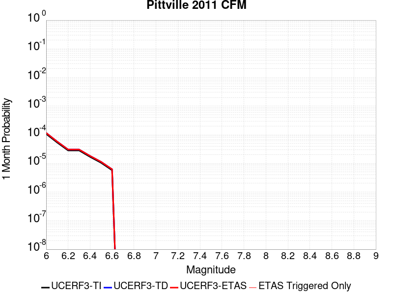 |  | 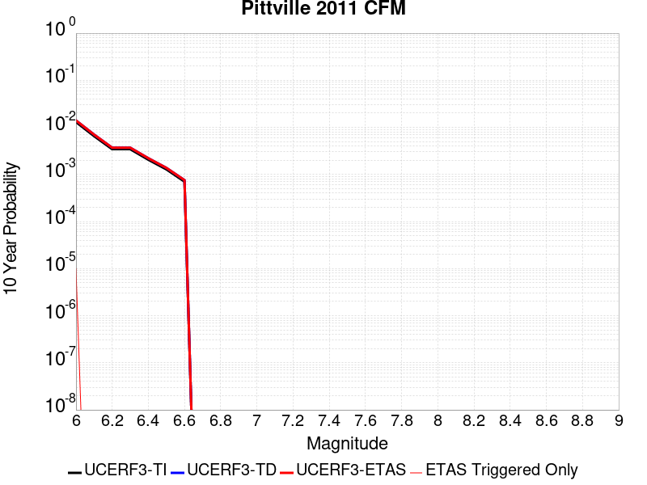 |

| Magnitude | 1 wk TI Prob | 1 wk TD Prob | 1 wk ETAS Prob | 1 wk ETAS/TD Gain | 1 wk ETAS Triggered Only | 1 mo TI Prob | 1 mo TD Prob | 1 mo ETAS Prob | 1 mo ETAS/TD Gain | 1 mo ETAS Triggered Only | 1 yr TI Prob | 1 yr TD Prob | 1 yr ETAS Prob | 1 yr ETAS/TD Gain | 1 yr ETAS Triggered Only | 10 yr TI Prob | 10 yr TD Prob | 10 yr ETAS Prob | 10 yr ETAS/TD Gain | 10 yr ETAS Triggered Only |
|-----|-----|-----|-----|-----|-----|-----|-----|-----|-----|-----|-----|-----|-----|-----|-----|-----|-----|-----|-----|-----|
| 6.0 | 2.5031832E-5 | 2.7056969E-5 | 2.7056969E-5 | 1.0 | 0.0 | 1.0727487E-4 | 1.1595384E-4 | 1.1595384E-4 | 1.0 | 0.0 | 0.001305289 | 0.0014109211 | 0.0014109211 | 1.0 | 0.0 | 0.012976485 | 0.014029415 | 0.014039275 | 1.0007027 | 1.0E-5 |
| 6.1 | 1.2540113E-5 | 1.3513067E-5 | 1.3513067E-5 | 1.0 | 0.0 | 5.3742235E-5 | 5.7911984E-5 | 5.7911984E-5 | 1.0 | 0.0 | 6.541153E-4 | 7.048728E-4 | 7.048728E-4 | 1.0 | 0.0 | 0.0065219323 | 0.0070286044 | 0.0070286044 | 1.0 | 0.0 |
| 6.2 | 6.603218E-6 | 7.107189E-6 | 7.107189E-6 | 1.0 | 0.0 | 2.8299199E-5 | 3.0459063E-5 | 3.0459063E-5 | 1.0 | 0.0 | 3.4448825E-4 | 3.7078248E-4 | 3.7078248E-4 | 1.0 | 0.0 | 0.0034395473 | 0.0037022792 | 0.0037022792 | 1.0 | 0.0 |
| 6.3 | 6.603218E-6 | 7.107189E-6 | 7.107189E-6 | 1.0 | 0.0 | 2.8299199E-5 | 3.0459063E-5 | 3.0459063E-5 | 1.0 | 0.0 | 3.4448825E-4 | 3.7078248E-4 | 3.7078248E-4 | 1.0 | 0.0 | 0.0034395473 | 0.0037022792 | 0.0037022792 | 1.0 | 0.0 |
| 6.4 | 3.9389015E-6 | 4.239175E-6 | 4.239175E-6 | 1.0 | 0.0 | 1.6880897E-5 | 1.8167784E-5 | 1.8167784E-5 | 1.0 | 0.0 | 2.0550552E-4 | 2.2117342E-4 | 2.2117342E-4 | 1.0 | 0.0 | 0.0020531558 | 0.002209838 | 0.002209838 | 1.0 | 0.0 |
| 6.5 | 2.4533072E-6 | 2.6412686E-6 | 2.6412686E-6 | 1.0 | 0.0 | 1.0514132E-5 | 1.1319685E-5 | 1.1319685E-5 | 1.0 | 0.0 | 1.2800204E-4 | 1.3781038E-4 | 1.3781038E-4 | 1.0 | 0.0 | 0.0012792832 | 0.0013774394 | 0.0013774394 | 1.0 | 0.0 |
| 6.6 | 1.3482367E-6 | 1.452993E-6 | 1.452993E-6 | 1.0 | 0.0 | 5.778144E-6 | 6.2271047E-6 | 6.2271047E-6 | 1.0 | 0.0 | 7.0346636E-5 | 7.58135E-5 | 7.58135E-5 | 1.0 | 0.0 | 7.032437E-4 | 7.5798744E-4 | 7.5798744E-4 | 1.0 | 0.0 |

## Del Valle
*[(top)](#table-of-contents)*

| 1 Week | 1 Month | 1 Year | 10 Year |
|-----|-----|-----|-----|
|  |  |  |  |

| Magnitude | 1 wk TI Prob | 1 wk TD Prob | 1 wk ETAS Prob | 1 wk ETAS/TD Gain | 1 wk ETAS Triggered Only | 1 mo TI Prob | 1 mo TD Prob | 1 mo ETAS Prob | 1 mo ETAS/TD Gain | 1 mo ETAS Triggered Only | 1 yr TI Prob | 1 yr TD Prob | 1 yr ETAS Prob | 1 yr ETAS/TD Gain | 1 yr ETAS Triggered Only | 10 yr TI Prob | 10 yr TD Prob | 10 yr ETAS Prob | 10 yr ETAS/TD Gain | 10 yr ETAS Triggered Only |
|-----|-----|-----|-----|-----|-----|-----|-----|-----|-----|-----|-----|-----|-----|-----|-----|-----|-----|-----|-----|-----|
| 6.0 | 1.0716125E-5 | 8.767882E-6 | 8.767882E-6 | 1.0 | 0.0 | 4.592544E-5 | 3.7576207E-5 | 3.7576207E-5 | 1.0 | 0.0 | 5.589988E-4 | 4.5741402E-4 | 4.5741402E-4 | 1.0 | 0.0 | 0.0055759475 | 0.004566694 | 0.0045766486 | 1.0021797 | 1.0E-5 |
| 6.1 | 1.0716125E-5 | 8.767882E-6 | 8.767882E-6 | 1.0 | 0.0 | 4.592544E-5 | 3.7576207E-5 | 3.7576207E-5 | 1.0 | 0.0 | 5.589988E-4 | 4.5741402E-4 | 4.5741402E-4 | 1.0 | 0.0 | 0.0055759475 | 0.004566694 | 0.0045766486 | 1.0021797 | 1.0E-5 |
| 6.2 | 1.0716125E-5 | 8.767882E-6 | 8.767882E-6 | 1.0 | 0.0 | 4.592544E-5 | 3.7576207E-5 | 3.7576207E-5 | 1.0 | 0.0 | 5.589988E-4 | 4.5741402E-4 | 4.5741402E-4 | 1.0 | 0.0 | 0.0055759475 | 0.004566694 | 0.0045766486 | 1.0021797 | 1.0E-5 |
| 6.3 | 7.1293784E-6 | 4.8658226E-6 | 4.8658226E-6 | 1.0 | 0.0 | 3.055412E-5 | 2.0853362E-5 | 2.0853362E-5 | 1.0 | 0.0 | 3.7193293E-4 | 2.5386084E-4 | 2.5386084E-4 | 1.0 | 0.0 | 0.0037131102 | 0.0025358086 | 0.0025358086 | 1.0 | 0.0 |
| 6.4 | 7.1293784E-6 | 4.8658226E-6 | 4.8658226E-6 | 1.0 | 0.0 | 3.055412E-5 | 2.0853362E-5 | 2.0853362E-5 | 1.0 | 0.0 | 3.7193293E-4 | 2.5386084E-4 | 2.5386084E-4 | 1.0 | 0.0 | 0.0037131102 | 0.0025358086 | 0.0025358086 | 1.0 | 0.0 |
| 6.5 | 7.1293784E-6 | 4.8658226E-6 | 4.8658226E-6 | 1.0 | 0.0 | 3.055412E-5 | 2.0853362E-5 | 2.0853362E-5 | 1.0 | 0.0 | 3.7193293E-4 | 2.5386084E-4 | 2.5386084E-4 | 1.0 | 0.0 | 0.0037131102 | 0.0025358086 | 0.0025358086 | 1.0 | 0.0 |
| 6.6 | 7.1293784E-6 | 4.8658226E-6 | 4.8658226E-6 | 1.0 | 0.0 | 3.055412E-5 | 2.0853362E-5 | 2.0853362E-5 | 1.0 | 0.0 | 3.7193293E-4 | 2.5386084E-4 | 2.5386084E-4 | 1.0 | 0.0 | 0.0037131102 | 0.0025358086 | 0.0025358086 | 1.0 | 0.0 |
| 6.7 | 7.12272E-6 | 4.8631982E-6 | 4.8631982E-6 | 1.0 | 0.0 | 3.0525585E-5 | 2.0842115E-5 | 2.0842115E-5 | 1.0 | 0.0 | 3.7158563E-4 | 2.5372393E-4 | 2.5372393E-4 | 1.0 | 0.0 | 0.003709649 | 0.0025344428 | 0.0025344428 | 1.0 | 0.0 |
| 6.8 | 6.7558703E-6 | 4.559404E-6 | 4.559404E-6 | 1.0 | 0.0 | 2.895341E-5 | 1.954016E-5 | 1.954016E-5 | 1.0 | 0.0 | 3.5245073E-4 | 2.3787611E-4 | 2.3787611E-4 | 1.0 | 0.0 | 0.0035189227 | 0.0023763045 | 0.0023763045 | 1.0 | 0.0 |
| 6.9 | 6.6700386E-6 | 4.5025436E-6 | 4.5025436E-6 | 1.0 | 0.0 | 2.8585566E-5 | 1.9296476E-5 | 1.9296476E-5 | 1.0 | 0.0 | 3.479737E-4 | 2.349099E-4 | 2.349099E-4 | 1.0 | 0.0 | 0.003474293 | 0.0023467052 | 0.0023467052 | 1.0 | 0.0 |
| 7.0 | 6.3181424E-6 | 4.098708E-6 | 4.098708E-6 | 1.0 | 0.0 | 2.7077473E-5 | 1.7565775E-5 | 1.7565775E-5 | 1.0 | 0.0 | 3.2961834E-4 | 2.1384275E-4 | 2.1384275E-4 | 1.0 | 0.0 | 0.0032912986 | 0.0021364389 | 0.0021364389 | 1.0 | 0.0 |
| 7.1 | 6.248759E-6 | 4.033899E-6 | 4.033899E-6 | 1.0 | 0.0 | 2.678012E-5 | 1.7288028E-5 | 1.7288028E-5 | 1.0 | 0.0 | 3.2599916E-4 | 2.1046183E-4 | 2.1046183E-4 | 1.0 | 0.0 | 0.0032552136 | 0.0021026938 | 0.0021026938 | 1.0 | 0.0 |
| 7.2 | 6.0411944E-6 | 3.869892E-6 | 3.869892E-6 | 1.0 | 0.0 | 2.5890577E-5 | 1.658515E-5 | 1.658515E-5 | 1.0 | 0.0 | 3.1517216E-4 | 2.019059E-4 | 2.019059E-4 | 1.0 | 0.0 | 0.0031472554 | 0.0020172922 | 0.0020172922 | 1.0 | 0.0 |
| 7.3 | 4.7691183E-6 | 3.0780905E-6 | 3.0780905E-6 | 1.0 | 0.0 | 2.0438918E-5 | 1.3191751E-5 | 1.3191751E-5 | 1.0 | 0.0 | 2.488154E-4 | 1.6059795E-4 | 1.6059795E-4 | 1.0 | 0.0 | 0.00248537 | 0.0016048512 | 0.0016048512 | 1.0 | 0.0 |
| 7.4 | 3.5524722E-6 | 2.1893159E-6 | 2.1893159E-6 | 1.0 | 0.0 | 1.5224792E-5 | 9.382749E-6 | 9.382749E-6 | 1.0 | 0.0 | 1.8534607E-4 | 1.14229064E-4 | 1.14229064E-4 | 1.0 | 0.0 | 0.0018519156 | 0.0011417117 | 0.0011417117 | 1.0 | 0.0 |
| 7.5 | 2.7133442E-6 | 1.5915855E-6 | 1.5915855E-6 | 1.0 | 0.0 | 1.1628566E-5 | 6.821063E-6 | 6.821063E-6 | 1.0 | 0.0 | 1.415686E-4 | 8.30433E-5 | 8.30433E-5 | 1.0 | 0.0 | 0.0014147845 | 8.301246E-4 | 8.301246E-4 | 1.0 | 0.0 |
| 7.6 | 1.915338E-6 | 1.1738952E-6 | 1.1738952E-6 | 1.0 | 0.0 | 8.208566E-6 | 5.0309695E-6 | 5.0309695E-6 | 1.0 | 0.0 | 9.993471E-5 | 6.125034E-5 | 6.125034E-5 | 1.0 | 0.0 | 9.988978E-4 | 6.123355E-4 | 6.123355E-4 | 1.0 | 0.0 |
| 7.7 | 1.2120448E-6 | 7.1801645E-7 | 7.1801645E-7 | 1.0 | 0.0 | 5.194467E-6 | 3.0772098E-6 | 3.0772098E-6 | 1.0 | 0.0 | 6.3240805E-5 | 3.746439E-5 | 3.746439E-5 | 1.0 | 0.0 | 6.322281E-4 | 3.745811E-4 | 3.745811E-4 | 1.0 | 0.0 |
| 7.8 | 6.272381E-7 | 3.93245E-7 | 3.93245E-7 | 1.0 | 0.0 | 2.6881603E-6 | 1.6853346E-6 | 1.6853346E-6 | 1.0 | 0.0 | 3.272786E-5 | 2.0518757E-5 | 2.0518757E-5 | 1.0 | 0.0 | 3.272304E-4 | 2.0516879E-4 | 2.0516879E-4 | 1.0 | 0.0 |
| 7.9 | 2.0292627E-7 | 1.2004223E-7 | 1.2004223E-7 | 1.0 | 0.0 | 8.6968373E-7 | 5.144666E-7 | 5.144666E-7 | 1.0 | 0.0 | 1.0588348E-5 | 6.2636127E-6 | 6.2636127E-6 | 1.0 | 0.0 | 1.0587843E-4 | 6.263438E-5 | 6.263438E-5 | 1.0 | 0.0 |
| 8.0 | 4.374492E-8 | 2.1898856E-8 | 2.1898856E-8 | 1.0 | 0.0 | 1.8747821E-7 | 9.3852236E-8 | 9.3852236E-8 | 1.0 | 0.0 | 2.2825448E-6 | 1.1426505E-6 | 1.1426505E-6 | 1.0 | 0.0 | 2.2825214E-5 | 1.1426449E-5 | 1.1426449E-5 | 1.0 | 0.0 |

## Elsinore (Stepovers Combined)
*[(top)](#table-of-contents)*

| 1 Week | 1 Month | 1 Year | 10 Year |
|-----|-----|-----|-----|
|  | 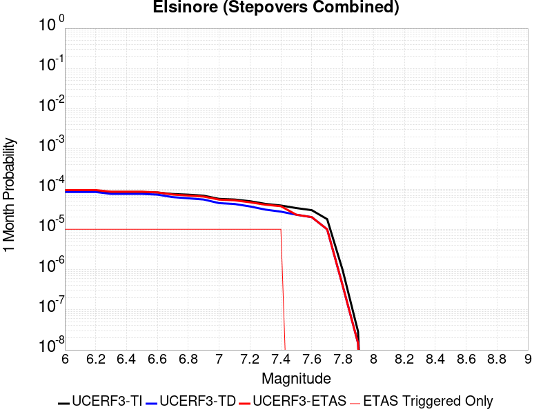 |  |  |

| Magnitude | 1 wk TI Prob | 1 wk TD Prob | 1 wk ETAS Prob | 1 wk ETAS/TD Gain | 1 wk ETAS Triggered Only | 1 mo TI Prob | 1 mo TD Prob | 1 mo ETAS Prob | 1 mo ETAS/TD Gain | 1 mo ETAS Triggered Only | 1 yr TI Prob | 1 yr TD Prob | 1 yr ETAS Prob | 1 yr ETAS/TD Gain | 1 yr ETAS Triggered Only | 10 yr TI Prob | 10 yr TD Prob | 10 yr ETAS Prob | 10 yr ETAS/TD Gain | 10 yr ETAS Triggered Only |
|-----|-----|-----|-----|-----|-----|-----|-----|-----|-----|-----|-----|-----|-----|-----|-----|-----|-----|-----|-----|-----|
| 6.0 | 2.144392E-5 | 1.976007E-5 | 1.976007E-5 | 1.0 | 0.0 | 9.189928E-5 | 8.468338E-5 | 9.468253E-5 | 1.1180769 | 1.0E-5 | 0.0011182994 | 0.0010305515 | 0.0010405412 | 1.0096935 | 1.0E-5 | 0.011126885 | 0.010264617 | 0.010274515 | 1.0009642 | 1.0E-5 |
| 6.1 | 2.144392E-5 | 1.976007E-5 | 1.976007E-5 | 1.0 | 0.0 | 9.189928E-5 | 8.468338E-5 | 9.468253E-5 | 1.1180769 | 1.0E-5 | 0.0011182994 | 0.0010305515 | 0.0010405412 | 1.0096935 | 1.0E-5 | 0.011126885 | 0.010264617 | 0.010274515 | 1.0009642 | 1.0E-5 |
| 6.2 | 2.144392E-5 | 1.976007E-5 | 1.976007E-5 | 1.0 | 0.0 | 9.189928E-5 | 8.468338E-5 | 9.468253E-5 | 1.1180769 | 1.0E-5 | 0.0011182994 | 0.0010305515 | 0.0010405412 | 1.0096935 | 1.0E-5 | 0.011126885 | 0.010264617 | 0.010274515 | 1.0009642 | 1.0E-5 |
| 6.3 | 1.9751555E-5 | 1.7741326E-5 | 1.7741326E-5 | 1.0 | 0.0 | 8.4646774E-5 | 7.603211E-5 | 8.603135E-5 | 1.1315134 | 1.0E-5 | 0.0010300872 | 9.25312E-4 | 9.353027E-4 | 1.0107971 | 1.0E-5 | 0.010253254 | 0.0092209745 | 0.009230883 | 1.0010744 | 1.0E-5 |
| 6.4 | 1.9751555E-5 | 1.7741326E-5 | 1.7741326E-5 | 1.0 | 0.0 | 8.4646774E-5 | 7.603211E-5 | 8.603135E-5 | 1.1315134 | 1.0E-5 | 0.0010300872 | 9.25312E-4 | 9.353027E-4 | 1.0107971 | 1.0E-5 | 0.010253254 | 0.0092209745 | 0.009230883 | 1.0010744 | 1.0E-5 |
| 6.5 | 1.9751555E-5 | 1.7741326E-5 | 1.7741326E-5 | 1.0 | 0.0 | 8.4646774E-5 | 7.603211E-5 | 8.603135E-5 | 1.1315134 | 1.0E-5 | 0.0010300872 | 9.25312E-4 | 9.353027E-4 | 1.0107971 | 1.0E-5 | 0.010253254 | 0.0092209745 | 0.009230883 | 1.0010744 | 1.0E-5 |
| 6.6 | 1.9188685E-5 | 1.7003247E-5 | 1.7003247E-5 | 1.0 | 0.0 | 8.2234634E-5 | 7.2869116E-5 | 8.2868384E-5 | 1.1372224 | 1.0E-5 | 0.0010007467 | 8.8683655E-4 | 8.9682767E-4 | 1.011266 | 1.0E-5 | 0.00996252 | 0.008839546 | 0.008849458 | 1.0011213 | 1.0E-5 |
| 6.7 | 1.7608272E-5 | 1.4732402E-5 | 1.4732402E-5 | 1.0 | 0.0 | 7.546184E-5 | 6.313739E-5 | 7.313676E-5 | 1.1583748 | 1.0E-5 | 9.183606E-4 | 7.684364E-4 | 7.7842874E-4 | 1.0130035 | 1.0E-5 | 0.009145746 | 0.007664441 | 0.0076743644 | 1.0012947 | 1.0E-5 |
| 6.8 | 1.697165E-5 | 1.3783126E-5 | 1.3783126E-5 | 1.0 | 0.0 | 7.273361E-5 | 5.906925E-5 | 6.9068665E-5 | 1.1692828 | 1.0E-5 | 8.8517193E-4 | 7.189395E-4 | 7.289323E-4 | 1.0138993 | 1.0E-5 | 0.008816543 | 0.0071722106 | 0.007182139 | 1.0013843 | 1.0E-5 |
| 6.9 | 1.600365E-5 | 1.2846429E-5 | 1.2846429E-5 | 1.0 | 0.0 | 6.858527E-5 | 5.5055007E-5 | 6.505445E-5 | 1.1816266 | 1.0E-5 | 8.347058E-4 | 6.700963E-4 | 6.8008964E-4 | 1.0149132 | 1.0E-5 | 0.008315775 | 0.006686422 | 0.006696355 | 1.0014856 | 1.0E-5 |
| 7.0 | 1.3314581E-5 | 1.044738E-5 | 1.044738E-5 | 1.0 | 0.0 | 5.7061243E-5 | 4.4773733E-5 | 5.4773285E-5 | 1.2233353 | 1.0E-5 | 6.944992E-4 | 5.449866E-4 | 5.549811E-4 | 1.018339 | 1.0E-5 | 0.006923327 | 0.005440055 | 0.005450001 | 1.0018282 | 1.0E-5 |
| 7.1 | 1.2865345E-5 | 9.937339E-6 | 9.937339E-6 | 1.0 | 0.0 | 5.5136024E-5 | 4.258792E-5 | 5.2587493E-5 | 1.2347984 | 1.0E-5 | 6.710743E-4 | 5.1838707E-4 | 5.283819E-4 | 1.0192806 | 1.0E-5 | 0.0066905143 | 0.005175021 | 0.0051849694 | 1.0019224 | 1.0E-5 |
| 7.2 | 1.1650051E-5 | 8.633585E-6 | 8.633585E-6 | 1.0 | 0.0 | 4.9927836E-5 | 3.7000562E-5 | 4.7000194E-5 | 1.2702562 | 1.0E-5 | 6.0770183E-4 | 4.503905E-4 | 4.60386E-4 | 1.022193 | 1.0E-5 | 0.0060604266 | 0.00449624 | 0.0045061954 | 1.0022141 | 1.0E-5 |
| 7.3 | 1.0008533E-5 | 7.2008215E-6 | 7.2008215E-6 | 1.0 | 0.0 | 4.2893007E-5 | 3.0860305E-5 | 4.086E-5 | 1.3240309 | 1.0E-5 | 5.220972E-4 | 3.756609E-4 | 3.8565713E-4 | 1.0266098 | 1.0E-5 | 0.005208723 | 0.0037506663 | 0.0037606286 | 1.0026562 | 1.0E-5 |
| 7.4 | 9.116759E-6 | 6.409854E-6 | 6.409854E-6 | 1.0 | 0.0 | 3.907124E-5 | 2.7470522E-5 | 3.7470247E-5 | 1.3640165 | 1.0E-5 | 4.7558855E-4 | 3.3440365E-4 | 3.444003E-4 | 1.029894 | 1.0E-5 | 0.00474572 | 0.0033391542 | 0.0033491207 | 1.0029848 | 1.0E-5 |
| 7.5 | 7.870524E-6 | 5.382316E-6 | 5.382316E-6 | 1.0 | 0.0 | 3.3730383E-5 | 2.306687E-5 | 2.306687E-5 | 1.0 | 0.0 | 4.1059E-4 | 2.8080423E-4 | 2.8080423E-4 | 1.0 | 0.0 | 0.0040983222 | 0.0028046207 | 0.0028046207 | 1.0 | 0.0 |
| 7.6 | 6.9774537E-6 | 4.677398E-6 | 4.677398E-6 | 1.0 | 0.0 | 2.990303E-5 | 2.0045845E-5 | 2.0045845E-5 | 1.0 | 0.0 | 3.640086E-4 | 2.44032E-4 | 2.44032E-4 | 1.0 | 0.0 | 0.003634129 | 0.0024377564 | 0.0024377564 | 1.0 | 0.0 |
| 7.7 | 4.1616954E-6 | 2.3281368E-6 | 2.3281368E-6 | 1.0 | 0.0 | 1.7835715E-5 | 9.977695E-6 | 9.977695E-6 | 1.0 | 0.0 | 2.171282E-4 | 1.2147242E-4 | 1.2147242E-4 | 1.0 | 0.0 | 0.0021691616 | 0.0012141332 | 0.0012141332 | 1.0 | 0.0 |
| 7.8 | 2.2692414E-7 | 9.384417E-8 | 9.384417E-8 | 1.0 | 0.0 | 9.725317E-7 | 4.0218927E-7 | 4.0218927E-7 | 1.0 | 0.0 | 1.1840509E-5 | 4.8966467E-6 | 4.8966467E-6 | 1.0 | 0.0 | 1.1839878E-4 | 4.8965718E-5 | 4.8965718E-5 | 1.0 | 0.0 |
| 7.9 | 6.676829E-9 | 3.4397174E-9 | 3.4397174E-9 | 1.0 | 0.0 | 2.861498E-8 | 1.4741646E-8 | 1.4741646E-8 | 1.0 | 0.0 | 3.4838732E-7 | 1.7947953E-7 | 1.7947953E-7 | 1.0 | 0.0 | 3.4838679E-6 | 1.794794E-6 | 1.794794E-6 | 1.0 | 0.0 |

## Walker Spring 2011 CFM
*[(top)](#table-of-contents)*

| 1 Week | 1 Month | 1 Year | 10 Year |
|-----|-----|-----|-----|
| 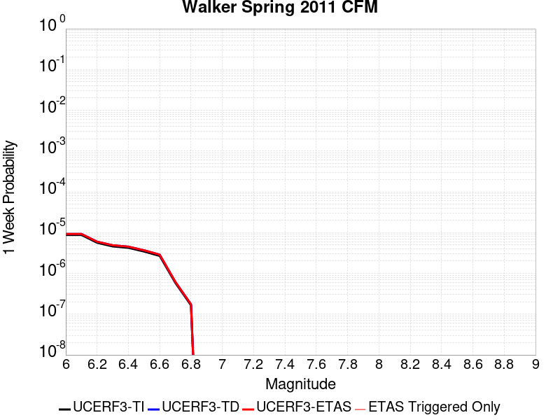 |  |  |  |

| Magnitude | 1 wk TI Prob | 1 wk TD Prob | 1 wk ETAS Prob | 1 wk ETAS/TD Gain | 1 wk ETAS Triggered Only | 1 mo TI Prob | 1 mo TD Prob | 1 mo ETAS Prob | 1 mo ETAS/TD Gain | 1 mo ETAS Triggered Only | 1 yr TI Prob | 1 yr TD Prob | 1 yr ETAS Prob | 1 yr ETAS/TD Gain | 1 yr ETAS Triggered Only | 10 yr TI Prob | 10 yr TD Prob | 10 yr ETAS Prob | 10 yr ETAS/TD Gain | 10 yr ETAS Triggered Only |
|-----|-----|-----|-----|-----|-----|-----|-----|-----|-----|-----|-----|-----|-----|-----|-----|-----|-----|-----|-----|-----|
| 6.0 | 8.791276E-6 | 9.264088E-6 | 9.264088E-6 | 1.0 | 0.0 | 3.767635E-5 | 3.970269E-5 | 3.970269E-5 | 1.0 | 0.0 | 4.58613E-4 | 4.832839E-4 | 4.832839E-4 | 1.0 | 0.0 | 0.004576677 | 0.0048234025 | 0.004833354 | 1.0020633 | 1.0E-5 |
| 6.1 | 8.791276E-6 | 9.264088E-6 | 9.264088E-6 | 1.0 | 0.0 | 3.767635E-5 | 3.970269E-5 | 3.970269E-5 | 1.0 | 0.0 | 4.58613E-4 | 4.832839E-4 | 4.832839E-4 | 1.0 | 0.0 | 0.004576677 | 0.0048234025 | 0.0048234025 | 1.0 | 0.0 |
| 6.2 | 5.654515E-6 | 5.99876E-6 | 5.99876E-6 | 1.0 | 0.0 | 2.4233412E-5 | 2.5708747E-5 | 2.5708747E-5 | 1.0 | 0.0 | 2.9500184E-4 | 3.1296405E-4 | 3.1296405E-4 | 1.0 | 0.0 | 0.0029461053 | 0.0031257276 | 0.0031257276 | 1.0 | 0.0 |
| 6.3 | 4.591685E-6 | 4.8947268E-6 | 4.8947268E-6 | 1.0 | 0.0 | 1.96785E-5 | 2.0977257E-5 | 2.0977257E-5 | 1.0 | 0.0 | 2.395594E-4 | 2.5537255E-4 | 2.5537255E-4 | 1.0 | 0.0 | 0.002393013 | 0.0025512208 | 0.0025512208 | 1.0 | 0.0 |
| 6.4 | 4.243283E-6 | 4.52266E-6 | 4.52266E-6 | 1.0 | 0.0 | 1.8185372E-5 | 1.938271E-5 | 1.938271E-5 | 1.0 | 0.0 | 2.2138441E-4 | 2.3596318E-4 | 2.3596318E-4 | 1.0 | 0.0 | 0.00221164 | 0.0023575418 | 0.0023575418 | 1.0 | 0.0 |
| 6.5 | 3.4445666E-6 | 3.6860924E-6 | 3.6860924E-6 | 1.0 | 0.0 | 1.4762345E-5 | 1.5797466E-5 | 1.5797466E-5 | 1.0 | 0.0 | 1.7971672E-4 | 1.923212E-4 | 1.923212E-4 | 1.0 | 0.0 | 0.0017957145 | 0.0019219425 | 0.0019219425 | 1.0 | 0.0 |
| 6.6 | 2.68766E-6 | 2.8794348E-6 | 2.8794348E-6 | 1.0 | 0.0 | 1.1518492E-5 | 1.2340398E-5 | 1.2340398E-5 | 1.0 | 0.0 | 1.4022861E-4 | 1.502378E-4 | 1.502378E-4 | 1.0 | 0.0 | 0.0014014016 | 0.0015017362 | 0.0015017362 | 1.0 | 0.0 |
| 6.7 | 5.880964E-7 | 6.1997474E-7 | 6.1997474E-7 | 1.0 | 0.0 | 2.5204106E-6 | 2.6570326E-6 | 2.6570326E-6 | 1.0 | 0.0 | 3.0685565E-5 | 3.2348988E-5 | 3.2348988E-5 | 1.0 | 0.0 | 3.068133E-4 | 3.2345214E-4 | 3.2345214E-4 | 1.0 | 0.0 |
| 6.8 | 1.6514163E-7 | 1.7409117E-7 | 1.7409117E-7 | 1.0 | 0.0 | 7.077497E-7 | 7.46105E-7 | 7.46105E-7 | 1.0 | 0.0 | 8.616818E-6 | 9.083828E-6 | 9.083828E-6 | 1.0 | 0.0 | 8.616484E-5 | 9.0838286E-5 | 9.0838286E-5 | 1.0 | 0.0 |

## Los Alamos 2011 CFM
*[(top)](#table-of-contents)*

| 1 Week | 1 Month | 1 Year | 10 Year |
|-----|-----|-----|-----|
|  |  |  |  |

| Magnitude | 1 wk TI Prob | 1 wk TD Prob | 1 wk ETAS Prob | 1 wk ETAS/TD Gain | 1 wk ETAS Triggered Only | 1 mo TI Prob | 1 mo TD Prob | 1 mo ETAS Prob | 1 mo ETAS/TD Gain | 1 mo ETAS Triggered Only | 1 yr TI Prob | 1 yr TD Prob | 1 yr ETAS Prob | 1 yr ETAS/TD Gain | 1 yr ETAS Triggered Only | 10 yr TI Prob | 10 yr TD Prob | 10 yr ETAS Prob | 10 yr ETAS/TD Gain | 10 yr ETAS Triggered Only |
|-----|-----|-----|-----|-----|-----|-----|-----|-----|-----|-----|-----|-----|-----|-----|-----|-----|-----|-----|-----|-----|
| 6.0 | 4.6284417E-6 | 4.7517333E-6 | 4.7517333E-6 | 1.0 | 0.0 | 1.9836029E-5 | 2.0364423E-5 | 2.0364423E-5 | 1.0 | 0.0 | 2.4147688E-4 | 2.479104E-4 | 2.5790793E-4 | 1.0403272 | 1.0E-5 | 0.0024121467 | 0.0024765125 | 0.0024864879 | 1.004028 | 1.0E-5 |
| 6.1 | 4.6284417E-6 | 4.7517333E-6 | 4.7517333E-6 | 1.0 | 0.0 | 1.9836029E-5 | 2.0364423E-5 | 2.0364423E-5 | 1.0 | 0.0 | 2.4147688E-4 | 2.479104E-4 | 2.5790793E-4 | 1.0403272 | 1.0E-5 | 0.0024121467 | 0.0024765125 | 0.0024864879 | 1.004028 | 1.0E-5 |
| 6.2 | 4.6284417E-6 | 4.7517333E-6 | 4.7517333E-6 | 1.0 | 0.0 | 1.9836029E-5 | 2.0364423E-5 | 2.0364423E-5 | 1.0 | 0.0 | 2.4147688E-4 | 2.479104E-4 | 2.5790793E-4 | 1.0403272 | 1.0E-5 | 0.0024121467 | 0.0024765125 | 0.0024864879 | 1.004028 | 1.0E-5 |
| 6.3 | 4.6284417E-6 | 4.7517333E-6 | 4.7517333E-6 | 1.0 | 0.0 | 1.9836029E-5 | 2.0364423E-5 | 2.0364423E-5 | 1.0 | 0.0 | 2.4147688E-4 | 2.479104E-4 | 2.5790793E-4 | 1.0403272 | 1.0E-5 | 0.0024121467 | 0.0024765125 | 0.0024864879 | 1.004028 | 1.0E-5 |
| 6.4 | 4.6284417E-6 | 4.7517333E-6 | 4.7517333E-6 | 1.0 | 0.0 | 1.9836029E-5 | 2.0364423E-5 | 2.0364423E-5 | 1.0 | 0.0 | 2.4147688E-4 | 2.479104E-4 | 2.5790793E-4 | 1.0403272 | 1.0E-5 | 0.0024121467 | 0.0024765125 | 0.0024864879 | 1.004028 | 1.0E-5 |
| 6.5 | 4.6284417E-6 | 4.7517333E-6 | 4.7517333E-6 | 1.0 | 0.0 | 1.9836029E-5 | 2.0364423E-5 | 2.0364423E-5 | 1.0 | 0.0 | 2.4147688E-4 | 2.479104E-4 | 2.5790793E-4 | 1.0403272 | 1.0E-5 | 0.0024121467 | 0.0024765125 | 0.0024864879 | 1.004028 | 1.0E-5 |
| 6.6 | 4.6284417E-6 | 4.7517333E-6 | 4.7517333E-6 | 1.0 | 0.0 | 1.9836029E-5 | 2.0364423E-5 | 2.0364423E-5 | 1.0 | 0.0 | 2.4147688E-4 | 2.479104E-4 | 2.5790793E-4 | 1.0403272 | 1.0E-5 | 0.0024121467 | 0.0024765125 | 0.0024864879 | 1.004028 | 1.0E-5 |
| 6.7 | 4.062321E-6 | 4.166351E-6 | 4.166351E-6 | 1.0 | 0.0 | 1.7409831E-5 | 1.7855677E-5 | 1.7855677E-5 | 1.0 | 0.0 | 2.1194408E-4 | 2.1737268E-4 | 2.2737052E-4 | 1.0459939 | 1.0E-5 | 0.0021174205 | 0.0021717504 | 0.0021817286 | 1.0045946 | 1.0E-5 |
| 6.8 | 4.062321E-6 | 4.166351E-6 | 4.166351E-6 | 1.0 | 0.0 | 1.7409831E-5 | 1.7855677E-5 | 1.7855677E-5 | 1.0 | 0.0 | 2.1194408E-4 | 2.1737268E-4 | 2.2737052E-4 | 1.0459939 | 1.0E-5 | 0.0021174205 | 0.0021717504 | 0.0021817286 | 1.0045946 | 1.0E-5 |
| 6.9 | 3.2936077E-6 | 3.37296E-6 | 3.37296E-6 | 1.0 | 0.0 | 1.4115385E-5 | 1.4455468E-5 | 1.4455468E-5 | 1.0 | 0.0 | 1.7184127E-4 | 1.7598206E-4 | 1.7598206E-4 | 1.0 | 0.0 | 0.0017170844 | 0.0017585196 | 0.0017585196 | 1.0 | 0.0 |
| 7.0 | 3.1687898E-6 | 3.2448177E-6 | 3.2448177E-6 | 1.0 | 0.0 | 1.3580457E-5 | 1.3906293E-5 | 1.3906293E-5 | 1.0 | 0.0 | 1.6532952E-4 | 1.692969E-4 | 1.692969E-4 | 1.0 | 0.0 | 0.0016520657 | 0.0016917707 | 0.0016917707 | 1.0 | 0.0 |
| 7.1 | 2.9379228E-6 | 3.007328E-6 | 3.007328E-6 | 1.0 | 0.0 | 1.25910365E-5 | 1.288849E-5 | 1.288849E-5 | 1.0 | 0.0 | 1.5328509E-4 | 1.5690697E-4 | 1.5690697E-4 | 1.0 | 0.0 | 0.001531794 | 0.001568051 | 0.001568051 | 1.0 | 0.0 |
| 7.2 | 2.0020686E-6 | 2.041632E-6 | 2.041632E-6 | 1.0 | 0.0 | 8.580266E-6 | 8.749822E-6 | 8.749822E-6 | 1.0 | 0.0 | 1.0445973E-4 | 1.0652392E-4 | 1.0652392E-4 | 1.0 | 0.0 | 0.0010441064 | 0.001064733 | 0.001064733 | 1.0 | 0.0 |
| 7.3 | 1.7364243E-6 | 1.7678824E-6 | 1.7678824E-6 | 1.0 | 0.0 | 7.441797E-6 | 7.576617E-6 | 7.576617E-6 | 1.0 | 0.0 | 9.0600115E-5 | 9.224144E-5 | 9.224144E-5 | 1.0 | 0.0 | 9.0563187E-4 | 9.2203467E-4 | 9.2203467E-4 | 1.0 | 0.0 |
| 7.4 | 1.5718434E-6 | 1.5983198E-6 | 1.5983198E-6 | 1.0 | 0.0 | 6.7364545E-6 | 6.8499244E-6 | 6.8499244E-6 | 1.0 | 0.0 | 8.201325E-5 | 8.339467E-5 | 8.339467E-5 | 1.0 | 0.0 | 8.198299E-4 | 8.3363673E-4 | 8.3363673E-4 | 1.0 | 0.0 |
| 7.5 | 1.3841119E-6 | 1.4042814E-6 | 1.4042814E-6 | 1.0 | 0.0 | 5.9318945E-6 | 6.018335E-6 | 6.018335E-6 | 1.0 | 0.0 | 7.221842E-5 | 7.327079E-5 | 7.327079E-5 | 1.0 | 0.0 | 7.2194956E-4 | 7.3246926E-4 | 7.3246926E-4 | 1.0 | 0.0 |
| 7.6 | 1.0843726E-6 | 1.0934443E-6 | 1.0934443E-6 | 1.0 | 0.0 | 4.647303E-6 | 4.6861815E-6 | 4.6861815E-6 | 1.0 | 0.0 | 5.6579443E-5 | 5.705279E-5 | 5.705279E-5 | 1.0 | 0.0 | 5.656504E-4 | 5.70384E-4 | 5.70384E-4 | 1.0 | 0.0 |
| 7.7 | 5.544814E-7 | 5.501884E-7 | 5.501884E-7 | 1.0 | 0.0 | 2.3763469E-6 | 2.3579482E-6 | 2.3579482E-6 | 1.0 | 0.0 | 2.8931638E-5 | 2.8707644E-5 | 2.8707644E-5 | 1.0 | 0.0 | 2.8927872E-4 | 2.870395E-4 | 2.870395E-4 | 1.0 | 0.0 |
| 7.8 | 2.0707465E-7 | 1.9778598E-7 | 1.9778598E-7 | 1.0 | 0.0 | 8.874625E-7 | 8.476539E-7 | 8.476539E-7 | 1.0 | 0.0 | 1.08048025E-5 | 1.0320137E-5 | 1.0320137E-5 | 1.0 | 0.0 | 1.0804277E-4 | 1.0319663E-4 | 1.0319663E-4 | 1.0 | 0.0 |
| 7.9 | 3.9821284E-8 | 3.4331528E-8 | 3.4331528E-8 | 1.0 | 0.0 | 1.7066264E-7 | 1.4713511E-7 | 1.4713511E-7 | 1.0 | 0.0 | 2.0778157E-6 | 1.7913685E-6 | 1.7913685E-6 | 1.0 | 0.0 | 2.0777963E-5 | 1.7913546E-5 | 1.7913546E-5 | 1.0 | 0.0 |
| 8.0 | 7.880441E-11 | 8.2353124E-11 | 8.2353124E-11 | 1.0 | 0.0 | 3.3773329E-10 | 3.52942E-10 | 3.52942E-10 | 1.0 | 0.0 | 4.1119033E-9 | 4.2970694E-9 | 4.2970694E-9 | 1.0 | 0.0 | 4.1119034E-8 | 4.2970694E-8 | 4.2970694E-8 | 1.0 | 0.0 |

## North Salt Lake
*[(top)](#table-of-contents)*

| 1 Week | 1 Month | 1 Year | 10 Year |
|-----|-----|-----|-----|
| 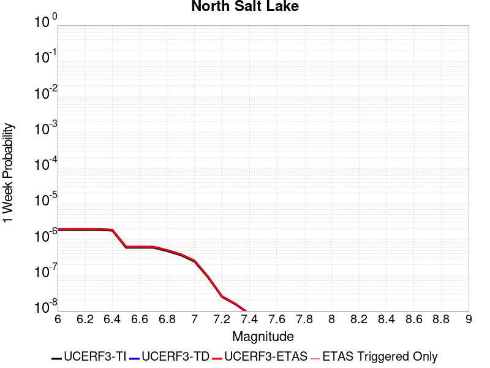 |  |  |  |

| Magnitude | 1 wk TI Prob | 1 wk TD Prob | 1 wk ETAS Prob | 1 wk ETAS/TD Gain | 1 wk ETAS Triggered Only | 1 mo TI Prob | 1 mo TD Prob | 1 mo ETAS Prob | 1 mo ETAS/TD Gain | 1 mo ETAS Triggered Only | 1 yr TI Prob | 1 yr TD Prob | 1 yr ETAS Prob | 1 yr ETAS/TD Gain | 1 yr ETAS Triggered Only | 10 yr TI Prob | 10 yr TD Prob | 10 yr ETAS Prob | 10 yr ETAS/TD Gain | 10 yr ETAS Triggered Only |
|-----|-----|-----|-----|-----|-----|-----|-----|-----|-----|-----|-----|-----|-----|-----|-----|-----|-----|-----|-----|-----|
| 6.0 | 1.849599E-6 | 1.955571E-6 | 1.955571E-6 | 1.0 | 0.0 | 7.926829E-6 | 8.381003E-6 | 1.8380919E-5 | 2.1931646 | 1.0E-5 | 9.650487E-5 | 1.0203594E-4 | 1.12034926E-4 | 1.0979947 | 1.0E-5 | 9.646297E-4 | 0.0010200888 | 0.0010300786 | 1.009793 | 1.0E-5 |
| 6.1 | 1.849599E-6 | 1.955571E-6 | 1.955571E-6 | 1.0 | 0.0 | 7.926829E-6 | 8.381003E-6 | 8.381003E-6 | 1.0 | 0.0 | 9.650487E-5 | 1.0203594E-4 | 1.0203594E-4 | 1.0 | 0.0 | 9.646297E-4 | 0.0010200888 | 0.0010200888 | 1.0 | 0.0 |
| 6.2 | 1.849599E-6 | 1.955571E-6 | 1.955571E-6 | 1.0 | 0.0 | 7.926829E-6 | 8.381003E-6 | 8.381003E-6 | 1.0 | 0.0 | 9.650487E-5 | 1.0203594E-4 | 1.0203594E-4 | 1.0 | 0.0 | 9.646297E-4 | 0.0010200888 | 0.0010200888 | 1.0 | 0.0 |
| 6.3 | 1.849599E-6 | 1.955571E-6 | 1.955571E-6 | 1.0 | 0.0 | 7.926829E-6 | 8.381003E-6 | 8.381003E-6 | 1.0 | 0.0 | 9.650487E-5 | 1.0203594E-4 | 1.0203594E-4 | 1.0 | 0.0 | 9.646297E-4 | 0.0010200888 | 0.0010200888 | 1.0 | 0.0 |
| 6.4 | 1.7803909E-6 | 1.8860707E-6 | 1.8860707E-6 | 1.0 | 0.0 | 7.630225E-6 | 8.083147E-6 | 8.083147E-6 | 1.0 | 0.0 | 9.289402E-5 | 9.840987E-5 | 9.840987E-5 | 1.0 | 0.0 | 9.28552E-4 | 9.838602E-4 | 9.838602E-4 | 1.0 | 0.0 |
| 6.5 | 5.9157696E-7 | 6.3001835E-7 | 6.3001835E-7 | 1.0 | 0.0 | 2.5353274E-6 | 2.7000763E-6 | 2.7000763E-6 | 1.0 | 0.0 | 3.0867173E-5 | 3.2872973E-5 | 3.2872973E-5 | 1.0 | 0.0 | 3.0862886E-4 | 3.28685E-4 | 3.28685E-4 | 1.0 | 0.0 |
| 6.6 | 5.9157696E-7 | 6.3001835E-7 | 6.3001835E-7 | 1.0 | 0.0 | 2.5353274E-6 | 2.7000763E-6 | 2.7000763E-6 | 1.0 | 0.0 | 3.0867173E-5 | 3.2872973E-5 | 3.2872973E-5 | 1.0 | 0.0 | 3.0862886E-4 | 3.28685E-4 | 3.28685E-4 | 1.0 | 0.0 |
| 6.7 | 5.9157696E-7 | 6.3001835E-7 | 6.3001835E-7 | 1.0 | 0.0 | 2.5353274E-6 | 2.7000763E-6 | 2.7000763E-6 | 1.0 | 0.0 | 3.0867173E-5 | 3.2872973E-5 | 3.2872973E-5 | 1.0 | 0.0 | 3.0862886E-4 | 3.28685E-4 | 3.28685E-4 | 1.0 | 0.0 |
| 6.8 | 4.7536267E-7 | 5.066019E-7 | 5.066019E-7 | 1.0 | 0.0 | 2.037267E-6 | 2.1711494E-6 | 2.1711494E-6 | 1.0 | 0.0 | 2.4803443E-5 | 2.6433447E-5 | 2.6433447E-5 | 1.0 | 0.0 | 2.4800675E-4 | 2.6430548E-4 | 2.6430548E-4 | 1.0 | 0.0 |
| 6.9 | 3.6345344E-7 | 3.8750048E-7 | 3.8750048E-7 | 1.0 | 0.0 | 1.5576567E-6 | 1.6607154E-6 | 1.6607154E-6 | 1.0 | 0.0 | 1.8964305E-5 | 2.021904E-5 | 2.021904E-5 | 1.0 | 0.0 | 1.8962687E-4 | 2.021737E-4 | 2.021737E-4 | 1.0 | 0.0 |
| 7.0 | 2.4087325E-7 | 2.5709335E-7 | 2.5709335E-7 | 1.0 | 0.0 | 1.0323135E-6 | 1.1018283E-6 | 1.1018283E-6 | 1.0 | 0.0 | 1.25683455E-5 | 1.3414689E-5 | 1.3414689E-5 | 1.0 | 0.0 | 1.2567634E-4 | 1.3414006E-4 | 1.3414006E-4 | 1.0 | 0.0 |
| 7.1 | 8.551555E-8 | 9.044477E-8 | 9.044477E-8 | 1.0 | 0.0 | 3.6649516E-7 | 3.876204E-7 | 3.876204E-7 | 1.0 | 0.0 | 4.4620692E-6 | 4.7192693E-6 | 4.7192693E-6 | 1.0 | 0.0 | 4.46198E-5 | 4.719181E-5 | 4.719181E-5 | 1.0 | 0.0 |
| 7.2 | 2.475279E-8 | 2.5893172E-8 | 2.5893172E-8 | 1.0 | 0.0 | 1.0608338E-7 | 1.1097074E-7 | 1.1097074E-7 | 1.0 | 0.0 | 1.2915643E-6 | 1.3510679E-6 | 1.3510679E-6 | 1.0 | 0.0 | 1.2915569E-5 | 1.3510604E-5 | 1.3510604E-5 | 1.0 | 0.0 |
| 7.3 | 1.5212393E-8 | 1.5847489E-8 | 1.5847489E-8 | 1.0 | 0.0 | 6.519597E-8 | 6.791781E-8 | 6.791781E-8 | 1.0 | 0.0 | 7.9376065E-7 | 8.2689905E-7 | 8.2689905E-7 | 1.0 | 0.0 | 7.937579E-6 | 8.268963E-6 | 8.268963E-6 | 1.0 | 0.0 |
| 7.4 | 8.182E-9 | 8.447294E-9 | 8.447294E-9 | 1.0 | 0.0 | 3.5065714E-8 | 3.620269E-8 | 3.620269E-8 | 1.0 | 0.0 | 4.26925E-7 | 4.4076765E-7 | 4.4076765E-7 | 1.0 | 0.0 | 4.269242E-6 | 4.4076683E-6 | 4.4076683E-6 | 1.0 | 0.0 |
| 7.5 | 5.479913E-9 | 5.6680434E-9 | 5.6680434E-9 | 1.0 | 0.0 | 2.3485342E-8 | 2.4291614E-8 | 2.4291614E-8 | 1.0 | 0.0 | 2.85934E-7 | 2.9575037E-7 | 2.9575037E-7 | 1.0 | 0.0 | 2.8593363E-6 | 2.9575E-6 | 2.9575E-6 | 1.0 | 0.0 |
| 7.6 | 2.6813562E-10 | 2.773195E-10 | 2.773195E-10 | 1.0 | 0.0 | 1.1491527E-9 | 1.1885122E-9 | 1.1885122E-9 | 1.0 | 0.0 | 1.3990933E-8 | 1.4470135E-8 | 1.4470135E-8 | 1.0 | 0.0 | 1.3990932E-7 | 1.4470135E-7 | 1.4470135E-7 | 1.0 | 0.0 |

## Fitzhugh Creek
*[(top)](#table-of-contents)*

| 1 Week | 1 Month | 1 Year | 10 Year |
|-----|-----|-----|-----|
|  |  |  |  |

| Magnitude | 1 wk TI Prob | 1 wk TD Prob | 1 wk ETAS Prob | 1 wk ETAS/TD Gain | 1 wk ETAS Triggered Only | 1 mo TI Prob | 1 mo TD Prob | 1 mo ETAS Prob | 1 mo ETAS/TD Gain | 1 mo ETAS Triggered Only | 1 yr TI Prob | 1 yr TD Prob | 1 yr ETAS Prob | 1 yr ETAS/TD Gain | 1 yr ETAS Triggered Only | 10 yr TI Prob | 10 yr TD Prob | 10 yr ETAS Prob | 10 yr ETAS/TD Gain | 10 yr ETAS Triggered Only |
|-----|-----|-----|-----|-----|-----|-----|-----|-----|-----|-----|-----|-----|-----|-----|-----|-----|-----|-----|-----|-----|
| 6.0 | 6.1090436E-6 | 6.2101562E-6 | 6.2101562E-6 | 1.0 | 0.0 | 2.6181353E-5 | 2.6614709E-5 | 2.6614709E-5 | 1.0 | 0.0 | 3.1871133E-4 | 3.239904E-4 | 3.3398715E-4 | 1.0308551 | 1.0E-5 | 0.0031825465 | 0.0032356246 | 0.0032455921 | 1.0030806 | 1.0E-5 |
| 6.1 | 2.9741811E-6 | 3.021581E-6 | 3.021581E-6 | 1.0 | 0.0 | 1.2746428E-5 | 1.2949574E-5 | 1.2949574E-5 | 1.0 | 0.0 | 1.5517672E-4 | 1.576506E-4 | 1.576506E-4 | 1.0 | 0.0 | 0.001550684 | 0.0015754806 | 0.0015754806 | 1.0 | 0.0 |
| 6.2 | 2.9741811E-6 | 3.021581E-6 | 3.021581E-6 | 1.0 | 0.0 | 1.2746428E-5 | 1.2949574E-5 | 1.2949574E-5 | 1.0 | 0.0 | 1.5517672E-4 | 1.576506E-4 | 1.576506E-4 | 1.0 | 0.0 | 0.001550684 | 0.0015754806 | 0.0015754806 | 1.0 | 0.0 |
| 6.3 | 1.4781198E-6 | 1.5012708E-6 | 1.5012708E-6 | 1.0 | 0.0 | 6.3347834E-6 | 6.4340034E-6 | 6.4340034E-6 | 1.0 | 0.0 | 7.712326E-5 | 7.833137E-5 | 7.833137E-5 | 1.0 | 0.0 | 7.70965E-4 | 7.830576E-4 | 7.830576E-4 | 1.0 | 0.0 |
| 6.4 | 1.4781198E-6 | 1.5012708E-6 | 1.5012708E-6 | 1.0 | 0.0 | 6.3347834E-6 | 6.4340034E-6 | 6.4340034E-6 | 1.0 | 0.0 | 7.712326E-5 | 7.833137E-5 | 7.833137E-5 | 1.0 | 0.0 | 7.70965E-4 | 7.830576E-4 | 7.830576E-4 | 1.0 | 0.0 |
| 6.5 | 9.5176676E-7 | 9.66606E-7 | 9.66606E-7 | 1.0 | 0.0 | 4.078994E-6 | 4.142591E-6 | 4.142591E-6 | 1.0 | 0.0 | 4.9660623E-5 | 5.0434985E-5 | 5.0434985E-5 | 1.0 | 0.0 | 4.964952E-4 | 5.042458E-4 | 5.042458E-4 | 1.0 | 0.0 |
| 6.6 | 6.21145E-7 | 6.3085855E-7 | 6.3085855E-7 | 1.0 | 0.0 | 2.662047E-6 | 2.7036772E-6 | 2.7036772E-6 | 1.0 | 0.0 | 3.2409942E-5 | 3.291684E-5 | 3.291684E-5 | 1.0 | 0.0 | 3.2405215E-4 | 3.2912623E-4 | 3.2912623E-4 | 1.0 | 0.0 |
| 6.7 | 2.2377962E-7 | 2.2734636E-7 | 2.2734636E-7 | 1.0 | 0.0 | 9.590551E-7 | 9.743413E-7 | 9.743413E-7 | 1.0 | 0.0 | 1.1676434E-5 | 1.1862574E-5 | 1.1862574E-5 | 1.0 | 0.0 | 1.1675821E-4 | 1.1862254E-4 | 1.1862254E-4 | 1.0 | 0.0 |
| 6.8 | 1.4785022E-7 | 1.5021492E-7 | 1.5021492E-7 | 1.0 | 0.0 | 6.3364365E-7 | 6.4377826E-7 | 6.4377826E-7 | 1.0 | 0.0 | 7.714584E-6 | 7.838E-6 | 7.838E-6 | 1.0 | 0.0 | 7.714316E-5 | 7.838E-5 | 7.838E-5 | 1.0 | 0.0 |

## San Gregorio (South) 2011 CFM
*[(top)](#table-of-contents)*

| 1 Week | 1 Month | 1 Year | 10 Year |
|-----|-----|-----|-----|
|  | 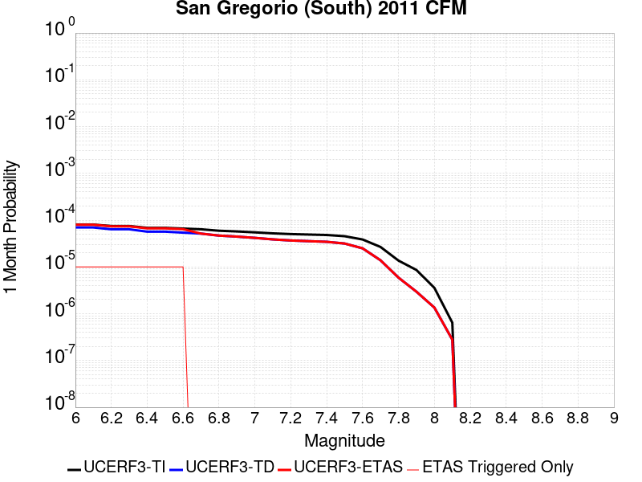 |  |  |

| Magnitude | 1 wk TI Prob | 1 wk TD Prob | 1 wk ETAS Prob | 1 wk ETAS/TD Gain | 1 wk ETAS Triggered Only | 1 mo TI Prob | 1 mo TD Prob | 1 mo ETAS Prob | 1 mo ETAS/TD Gain | 1 mo ETAS Triggered Only | 1 yr TI Prob | 1 yr TD Prob | 1 yr ETAS Prob | 1 yr ETAS/TD Gain | 1 yr ETAS Triggered Only | 10 yr TI Prob | 10 yr TD Prob | 10 yr ETAS Prob | 10 yr ETAS/TD Gain | 10 yr ETAS Triggered Only |
|-----|-----|-----|-----|-----|-----|-----|-----|-----|-----|-----|-----|-----|-----|-----|-----|-----|-----|-----|-----|-----|
| 6.0 | 1.8770423E-5 | 1.6279559E-5 | 2.6279396E-5 | 1.6142572 | 1.0E-5 | 8.044219E-5 | 6.9767695E-5 | 7.976699E-5 | 1.1433228 | 1.0E-5 | 9.789435E-4 | 8.490944E-4 | 8.5908594E-4 | 1.0117673 | 1.0E-5 | 0.009746423 | 0.008471475 | 0.008481391 | 1.0011704 | 1.0E-5 |
| 6.1 | 1.8770423E-5 | 1.6279559E-5 | 2.6279396E-5 | 1.6142572 | 1.0E-5 | 8.044219E-5 | 6.9767695E-5 | 7.976699E-5 | 1.1433228 | 1.0E-5 | 9.789435E-4 | 8.490944E-4 | 8.5908594E-4 | 1.0117673 | 1.0E-5 | 0.009746423 | 0.008471475 | 0.008481391 | 1.0011704 | 1.0E-5 |
| 6.2 | 1.7508692E-5 | 1.4899064E-5 | 2.4898914E-5 | 1.6711731 | 1.0E-5 | 7.5035096E-5 | 6.3851585E-5 | 7.385095E-5 | 1.1566032 | 1.0E-5 | 9.1316935E-4 | 7.7711884E-4 | 7.8711106E-4 | 1.012858 | 1.0E-5 | 0.00909426 | 0.007756904 | 0.007766826 | 1.0012791 | 1.0E-5 |
| 6.3 | 1.7508692E-5 | 1.4899064E-5 | 2.4898914E-5 | 1.6711731 | 1.0E-5 | 7.5035096E-5 | 6.3851585E-5 | 7.385095E-5 | 1.1566032 | 1.0E-5 | 9.1316935E-4 | 7.7711884E-4 | 7.8711106E-4 | 1.012858 | 1.0E-5 | 0.00909426 | 0.007756904 | 0.007766826 | 1.0012791 | 1.0E-5 |
| 6.4 | 1.6004591E-5 | 1.3248901E-5 | 2.324877E-5 | 1.7547696 | 1.0E-5 | 6.85893E-5 | 5.6779776E-5 | 6.677921E-5 | 1.1761091 | 1.0E-5 | 8.347548E-4 | 6.910755E-4 | 7.010686E-4 | 1.0144602 | 1.0E-5 | 0.008316261 | 0.0069019548 | 0.006911886 | 1.0014389 | 1.0E-5 |
| 6.5 | 1.6004591E-5 | 1.3248901E-5 | 2.324877E-5 | 1.7547696 | 1.0E-5 | 6.85893E-5 | 5.6779776E-5 | 6.677921E-5 | 1.1761091 | 1.0E-5 | 8.347548E-4 | 6.910755E-4 | 7.010686E-4 | 1.0144602 | 1.0E-5 | 0.008316261 | 0.0069019548 | 0.006911886 | 1.0014389 | 1.0E-5 |
| 6.6 | 1.5442201E-5 | 1.2633533E-5 | 2.2633407E-5 | 1.7915342 | 1.0E-5 | 6.617918E-5 | 5.414259E-5 | 6.414205E-5 | 1.1846875 | 1.0E-5 | 8.0543366E-4 | 6.5898756E-4 | 6.6898094E-4 | 1.0151649 | 1.0E-5 | 0.008025207 | 0.0065830066 | 0.0065929405 | 1.0015091 | 1.0E-5 |
| 6.7 | 1.489921E-5 | 1.2042042E-5 | 1.2042042E-5 | 1.0 | 0.0 | 6.3852196E-5 | 5.1607734E-5 | 5.1607734E-5 | 1.0 | 0.0 | 7.7712315E-4 | 6.281437E-4 | 6.281437E-4 | 1.0 | 0.0 | 0.0077441116 | 0.0062763398 | 0.0062763398 | 1.0 | 0.0 |
| 6.8 | 1.3876024E-5 | 1.0920992E-5 | 1.0920992E-5 | 1.0 | 0.0 | 5.9467322E-5 | 4.6803412E-5 | 4.6803412E-5 | 1.0 | 0.0 | 7.237741E-4 | 5.696829E-4 | 5.696829E-4 | 1.0 | 0.0 | 0.0072142133 | 0.005694849 | 0.005694849 | 1.0 | 0.0 |
| 6.9 | 1.33922495E-5 | 1.0392495E-5 | 1.0392495E-5 | 1.0 | 0.0 | 5.7394092E-5 | 4.4538505E-5 | 4.4538505E-5 | 1.0 | 0.0 | 6.9854903E-4 | 5.4212165E-4 | 5.4212165E-4 | 1.0 | 0.0 | 0.0069635725 | 0.0054206066 | 0.0054206066 | 1.0 | 0.0 |
| 7.0 | 1.2807324E-5 | 9.752456E-6 | 9.752456E-6 | 1.0 | 0.0 | 5.4887376E-5 | 4.179557E-5 | 4.179557E-5 | 1.0 | 0.0 | 6.680489E-4 | 5.0874247E-4 | 5.0874247E-4 | 1.0 | 0.0 | 0.006660442 | 0.0050883847 | 0.0050883847 | 1.0 | 0.0 |
| 7.1 | 1.2191438E-5 | 9.061344E-6 | 9.061344E-6 | 1.0 | 0.0 | 5.224797E-5 | 3.8833754E-5 | 3.8833754E-5 | 1.0 | 0.0 | 6.3593336E-4 | 4.7269845E-4 | 4.7269845E-4 | 1.0 | 0.0 | 0.0063411663 | 0.004729529 | 0.004729529 | 1.0 | 0.0 |
| 7.2 | 1.1769438E-5 | 8.581538E-6 | 8.581538E-6 | 1.0 | 0.0 | 5.0439474E-5 | 3.6777503E-5 | 3.6777503E-5 | 1.0 | 0.0 | 6.1392755E-4 | 4.476742E-4 | 4.476742E-4 | 1.0 | 0.0 | 0.0061223423 | 0.0044803214 | 0.0044803214 | 1.0 | 0.0 |
| 7.3 | 1.150374E-5 | 8.296966E-6 | 8.296966E-6 | 1.0 | 0.0 | 4.9300812E-5 | 3.5557943E-5 | 3.5557943E-5 | 1.0 | 0.0 | 6.0007203E-4 | 4.3283202E-4 | 4.3283202E-4 | 1.0 | 0.0 | 0.0059845424 | 0.004332466 | 0.004332466 | 1.0 | 0.0 |
| 7.4 | 1.12514E-5 | 8.042707E-6 | 8.042707E-6 | 1.0 | 0.0 | 4.8219394E-5 | 3.446829E-5 | 3.446829E-5 | 1.0 | 0.0 | 5.8691297E-4 | 4.1957066E-4 | 4.1957066E-4 | 1.0 | 0.0 | 0.005853653 | 0.0042003556 | 0.0042003556 | 1.0 | 0.0 |
| 7.5 | 1.059696E-5 | 7.39299E-6 | 7.39299E-6 | 1.0 | 0.0 | 4.5414752E-5 | 3.168386E-5 | 3.168386E-5 | 1.0 | 0.0 | 5.5278436E-4 | 3.8568274E-4 | 3.8568274E-4 | 1.0 | 0.0 | 0.0055141128 | 0.003862607 | 0.003862607 | 1.0 | 0.0 |
| 7.6 | 9.018592E-6 | 5.836751E-6 | 5.836751E-6 | 1.0 | 0.0 | 3.8650534E-5 | 2.5014408E-5 | 2.5014408E-5 | 1.0 | 0.0 | 4.7046866E-4 | 3.0450788E-4 | 3.0450788E-4 | 1.0 | 0.0 | 0.004694739 | 0.0030530049 | 0.0030530049 | 1.0 | 0.0 |
| 7.7 | 6.243489E-6 | 3.239351E-6 | 3.239351E-6 | 1.0 | 0.0 | 2.6757538E-5 | 1.3882858E-5 | 1.3882858E-5 | 1.0 | 0.0 | 3.257243E-4 | 1.690107E-4 | 1.690107E-4 | 1.0 | 0.0 | 0.003252473 | 0.0016990631 | 0.0016990631 | 1.0 | 0.0 |
| 7.8 | 3.1941963E-6 | 1.380876E-6 | 1.380876E-6 | 1.0 | 0.0 | 1.368934E-5 | 5.9180265E-6 | 5.9180265E-6 | 1.0 | 0.0 | 1.6665498E-4 | 7.2049595E-5 | 7.2049595E-5 | 1.0 | 0.0 | 0.0016653005 | 7.2625576E-4 | 7.2625576E-4 | 1.0 | 0.0 |
| 7.9 | 2.0098398E-6 | 6.915071E-7 | 6.915071E-7 | 1.0 | 0.0 | 8.6135715E-6 | 2.9635985E-6 | 2.9635985E-6 | 1.0 | 0.0 | 1.0486518E-4 | 3.6081216E-5 | 3.6081216E-5 | 1.0 | 0.0 | 0.0010481571 | 3.6566515E-4 | 3.6566515E-4 | 1.0 | 0.0 |
| 8.0 | 8.353119E-7 | 3.1619197E-7 | 3.1619197E-7 | 1.0 | 0.0 | 3.579903E-6 | 1.3551078E-6 | 1.3551078E-6 | 1.0 | 0.0 | 4.358445E-5 | 1.6498312E-5 | 1.6498312E-5 | 1.0 | 0.0 | 4.3575902E-4 | 1.6616881E-4 | 1.6616881E-4 | 1.0 | 0.0 |
| 8.1 | 1.5033264E-7 | 6.52693E-8 | 6.52693E-8 | 1.0 | 0.0 | 6.442826E-7 | 2.7972553E-7 | 2.7972553E-7 | 1.0 | 0.0 | 7.844113E-6 | 3.4056532E-6 | 3.4056532E-6 | 1.0 | 0.0 | 7.843835E-5 | 3.4072833E-5 | 3.4072833E-5 | 1.0 | 0.0 |

## Robinson Creek
*[(top)](#table-of-contents)*

| 1 Week | 1 Month | 1 Year | 10 Year |
|-----|-----|-----|-----|
|  |  |  |  |

| Magnitude | 1 wk TI Prob | 1 wk TD Prob | 1 wk ETAS Prob | 1 wk ETAS/TD Gain | 1 wk ETAS Triggered Only | 1 mo TI Prob | 1 mo TD Prob | 1 mo ETAS Prob | 1 mo ETAS/TD Gain | 1 mo ETAS Triggered Only | 1 yr TI Prob | 1 yr TD Prob | 1 yr ETAS Prob | 1 yr ETAS/TD Gain | 1 yr ETAS Triggered Only | 10 yr TI Prob | 10 yr TD Prob | 10 yr ETAS Prob | 10 yr ETAS/TD Gain | 10 yr ETAS Triggered Only |
|-----|-----|-----|-----|-----|-----|-----|-----|-----|-----|-----|-----|-----|-----|-----|-----|-----|-----|-----|-----|-----|
| 6.0 | 1.3705327E-5 | 1.5285013E-5 | 1.5285013E-5 | 1.0 | 0.0 | 5.8735794E-5 | 6.55072E-5 | 6.55072E-5 | 1.0 | 0.0 | 7.1487366E-4 | 7.9755014E-4 | 8.075422E-4 | 1.0125284 | 1.0E-5 | 0.0071257832 | 0.007975501 | 0.007985421 | 1.0012438 | 1.0E-5 |
| 6.1 | 1.3705327E-5 | 1.5285013E-5 | 1.5285013E-5 | 1.0 | 0.0 | 5.8735794E-5 | 6.55072E-5 | 6.55072E-5 | 1.0 | 0.0 | 7.1487366E-4 | 7.9755014E-4 | 8.075422E-4 | 1.0125284 | 1.0E-5 | 0.0071257832 | 0.007975501 | 0.007985421 | 1.0012438 | 1.0E-5 |
| 6.2 | 1.3705327E-5 | 1.5285013E-5 | 1.5285013E-5 | 1.0 | 0.0 | 5.8735794E-5 | 6.55072E-5 | 6.55072E-5 | 1.0 | 0.0 | 7.1487366E-4 | 7.9755014E-4 | 8.075422E-4 | 1.0125284 | 1.0E-5 | 0.0071257832 | 0.007975501 | 0.007985421 | 1.0012438 | 1.0E-5 |
| 6.3 | 1.3705327E-5 | 1.5285013E-5 | 1.5285013E-5 | 1.0 | 0.0 | 5.8735794E-5 | 6.55072E-5 | 6.55072E-5 | 1.0 | 0.0 | 7.1487366E-4 | 7.9755014E-4 | 8.075422E-4 | 1.0125284 | 1.0E-5 | 0.0071257832 | 0.007975501 | 0.007985421 | 1.0012438 | 1.0E-5 |
| 6.4 | 1.3705327E-5 | 1.5285013E-5 | 1.5285013E-5 | 1.0 | 0.0 | 5.8735794E-5 | 6.55072E-5 | 6.55072E-5 | 1.0 | 0.0 | 7.1487366E-4 | 7.9755014E-4 | 8.075422E-4 | 1.0125284 | 1.0E-5 | 0.0071257832 | 0.007975501 | 0.007985421 | 1.0012438 | 1.0E-5 |

## Fontana (Seismicity)
*[(top)](#table-of-contents)*

| 1 Week | 1 Month | 1 Year | 10 Year |
|-----|-----|-----|-----|
|  |  |  |  |

| Magnitude | 1 wk TI Prob | 1 wk TD Prob | 1 wk ETAS Prob | 1 wk ETAS/TD Gain | 1 wk ETAS Triggered Only | 1 mo TI Prob | 1 mo TD Prob | 1 mo ETAS Prob | 1 mo ETAS/TD Gain | 1 mo ETAS Triggered Only | 1 yr TI Prob | 1 yr TD Prob | 1 yr ETAS Prob | 1 yr ETAS/TD Gain | 1 yr ETAS Triggered Only | 10 yr TI Prob | 10 yr TD Prob | 10 yr ETAS Prob | 10 yr ETAS/TD Gain | 10 yr ETAS Triggered Only |
|-----|-----|-----|-----|-----|-----|-----|-----|-----|-----|-----|-----|-----|-----|-----|-----|-----|-----|-----|-----|-----|
| 6.0 | 7.1789214E-6 | 7.5520006E-6 | 7.5520006E-6 | 1.0 | 0.0 | 3.076644E-5 | 3.2365548E-5 | 3.2365548E-5 | 1.0 | 0.0 | 3.7451705E-4 | 3.9402005E-4 | 4.0401611E-4 | 1.0253694 | 1.0E-5 | 0.003738865 | 0.003937214 | 0.0039471746 | 1.0025299 | 1.0E-5 |
| 6.1 | 7.1789214E-6 | 7.5520006E-6 | 7.5520006E-6 | 1.0 | 0.0 | 3.076644E-5 | 3.2365548E-5 | 3.2365548E-5 | 1.0 | 0.0 | 3.7451705E-4 | 3.9402005E-4 | 4.0401611E-4 | 1.0253694 | 1.0E-5 | 0.003738865 | 0.003937214 | 0.0039471746 | 1.0025299 | 1.0E-5 |
| 6.2 | 7.1789214E-6 | 7.5520006E-6 | 7.5520006E-6 | 1.0 | 0.0 | 3.076644E-5 | 3.2365548E-5 | 3.2365548E-5 | 1.0 | 0.0 | 3.7451705E-4 | 3.9402005E-4 | 4.0401611E-4 | 1.0253694 | 1.0E-5 | 0.003738865 | 0.003937214 | 0.0039471746 | 1.0025299 | 1.0E-5 |
| 6.3 | 7.1789214E-6 | 7.5520006E-6 | 7.5520006E-6 | 1.0 | 0.0 | 3.076644E-5 | 3.2365548E-5 | 3.2365548E-5 | 1.0 | 0.0 | 3.7451705E-4 | 3.9402005E-4 | 4.0401611E-4 | 1.0253694 | 1.0E-5 | 0.003738865 | 0.003937214 | 0.0039471746 | 1.0025299 | 1.0E-5 |
| 6.4 | 7.1789214E-6 | 7.5520006E-6 | 7.5520006E-6 | 1.0 | 0.0 | 3.076644E-5 | 3.2365548E-5 | 3.2365548E-5 | 1.0 | 0.0 | 3.7451705E-4 | 3.9402005E-4 | 4.0401611E-4 | 1.0253694 | 1.0E-5 | 0.003738865 | 0.003937214 | 0.0039471746 | 1.0025299 | 1.0E-5 |
| 6.5 | 5.2611317E-6 | 5.532726E-6 | 5.532726E-6 | 1.0 | 0.0 | 2.2547512E-5 | 2.3711682E-5 | 2.3711682E-5 | 1.0 | 0.0 | 2.744814E-4 | 2.8868974E-4 | 2.8868974E-4 | 1.0 | 0.0 | 0.002741426 | 0.0028868972 | 0.0028868972 | 1.0 | 0.0 |
| 6.6 | 5.2611317E-6 | 5.532726E-6 | 5.532726E-6 | 1.0 | 0.0 | 2.2547512E-5 | 2.3711682E-5 | 2.3711682E-5 | 1.0 | 0.0 | 2.744814E-4 | 2.8868974E-4 | 2.8868974E-4 | 1.0 | 0.0 | 0.002741426 | 0.0028868972 | 0.0028868972 | 1.0 | 0.0 |

## Thirty Mile Bank
*[(top)](#table-of-contents)*

| 1 Week | 1 Month | 1 Year | 10 Year |
|-----|-----|-----|-----|
|  |  |  |  |

| Magnitude | 1 wk TI Prob | 1 wk TD Prob | 1 wk ETAS Prob | 1 wk ETAS/TD Gain | 1 wk ETAS Triggered Only | 1 mo TI Prob | 1 mo TD Prob | 1 mo ETAS Prob | 1 mo ETAS/TD Gain | 1 mo ETAS Triggered Only | 1 yr TI Prob | 1 yr TD Prob | 1 yr ETAS Prob | 1 yr ETAS/TD Gain | 1 yr ETAS Triggered Only | 10 yr TI Prob | 10 yr TD Prob | 10 yr ETAS Prob | 10 yr ETAS/TD Gain | 10 yr ETAS Triggered Only |
|-----|-----|-----|-----|-----|-----|-----|-----|-----|-----|-----|-----|-----|-----|-----|-----|-----|-----|-----|-----|-----|
| 6.0 | 6.5124755E-6 | 6.6592643E-6 | 6.6592643E-6 | 1.0 | 0.0 | 2.791031E-5 | 2.8539416E-5 | 2.8539416E-5 | 1.0 | 0.0 | 3.3975503E-4 | 3.4741635E-4 | 3.5741288E-4 | 1.0287739 | 1.0E-5 | 0.0033923604 | 0.003469164 | 0.0034791294 | 1.0028726 | 1.0E-5 |
| 6.1 | 6.5124755E-6 | 6.6592643E-6 | 6.6592643E-6 | 1.0 | 0.0 | 2.791031E-5 | 2.8539416E-5 | 2.8539416E-5 | 1.0 | 0.0 | 3.3975503E-4 | 3.4741635E-4 | 3.5741288E-4 | 1.0287739 | 1.0E-5 | 0.0033923604 | 0.003469164 | 0.0034791294 | 1.0028726 | 1.0E-5 |
| 6.2 | 6.5124755E-6 | 6.6592643E-6 | 6.6592643E-6 | 1.0 | 0.0 | 2.791031E-5 | 2.8539416E-5 | 2.8539416E-5 | 1.0 | 0.0 | 3.3975503E-4 | 3.4741635E-4 | 3.5741288E-4 | 1.0287739 | 1.0E-5 | 0.0033923604 | 0.003469164 | 0.0034791294 | 1.0028726 | 1.0E-5 |
| 6.3 | 6.5124755E-6 | 6.6592643E-6 | 6.6592643E-6 | 1.0 | 0.0 | 2.791031E-5 | 2.8539416E-5 | 2.8539416E-5 | 1.0 | 0.0 | 3.3975503E-4 | 3.4741635E-4 | 3.5741288E-4 | 1.0287739 | 1.0E-5 | 0.0033923604 | 0.003469164 | 0.0034791294 | 1.0028726 | 1.0E-5 |
| 6.4 | 6.5124755E-6 | 6.6592643E-6 | 6.6592643E-6 | 1.0 | 0.0 | 2.791031E-5 | 2.8539416E-5 | 2.8539416E-5 | 1.0 | 0.0 | 3.3975503E-4 | 3.4741635E-4 | 3.5741288E-4 | 1.0287739 | 1.0E-5 | 0.0033923604 | 0.003469164 | 0.0034791294 | 1.0028726 | 1.0E-5 |
| 6.5 | 6.5124755E-6 | 6.6592643E-6 | 6.6592643E-6 | 1.0 | 0.0 | 2.791031E-5 | 2.8539416E-5 | 2.8539416E-5 | 1.0 | 0.0 | 3.3975503E-4 | 3.4741635E-4 | 3.5741288E-4 | 1.0287739 | 1.0E-5 | 0.0033923604 | 0.003469164 | 0.0034791294 | 1.0028726 | 1.0E-5 |
| 6.6 | 6.5124755E-6 | 6.6592643E-6 | 6.6592643E-6 | 1.0 | 0.0 | 2.791031E-5 | 2.8539416E-5 | 2.8539416E-5 | 1.0 | 0.0 | 3.3975503E-4 | 3.4741635E-4 | 3.5741288E-4 | 1.0287739 | 1.0E-5 | 0.0033923604 | 0.003469164 | 0.0034791294 | 1.0028726 | 1.0E-5 |
| 6.7 | 3.5261137E-6 | 3.6098995E-6 | 3.6098995E-6 | 1.0 | 0.0 | 1.5111828E-5 | 1.547091E-5 | 1.547091E-5 | 1.0 | 0.0 | 1.8397097E-4 | 1.883427E-4 | 1.883427E-4 | 1.0 | 0.0 | 0.0018381875 | 0.0018818958 | 0.0018818958 | 1.0 | 0.0 |
| 6.8 | 3.370743E-6 | 3.4509355E-6 | 3.4509355E-6 | 1.0 | 0.0 | 1.4445961E-5 | 1.47896435E-5 | 1.47896435E-5 | 1.0 | 0.0 | 1.7586538E-4 | 1.8004965E-4 | 1.8004965E-4 | 1.0 | 0.0 | 0.0017572626 | 0.0017990996 | 0.0017990996 | 1.0 | 0.0 |
| 6.9 | 2.2756835E-6 | 2.333161E-6 | 2.333161E-6 | 1.0 | 0.0 | 9.752893E-6 | 9.999225E-6 | 9.999225E-6 | 1.0 | 0.0 | 1.18735006E-4 | 1.2173401E-4 | 1.2173401E-4 | 1.0 | 0.0 | 0.0011867158 | 0.0012166979 | 0.0012166979 | 1.0 | 0.0 |
| 7.0 | 2.1617404E-6 | 2.21598E-6 | 2.21598E-6 | 1.0 | 0.0 | 9.264569E-6 | 9.497024E-6 | 9.497024E-6 | 1.0 | 0.0 | 1.1279029E-4 | 1.1562037E-4 | 1.1562037E-4 | 1.0 | 0.0 | 0.0011273306 | 0.0011556263 | 0.0011556263 | 1.0 | 0.0 |
| 7.1 | 1.5900777E-6 | 1.6327014E-6 | 1.6327014E-6 | 1.0 | 0.0 | 6.814601E-6 | 6.997274E-6 | 6.997274E-6 | 1.0 | 0.0 | 8.296461E-5 | 8.518861E-5 | 8.518861E-5 | 1.0 | 0.0 | 8.293364E-4 | 8.5157226E-4 | 8.5157226E-4 | 1.0 | 0.0 |
| 7.2 | 1.2971728E-6 | 1.3328992E-6 | 1.3328992E-6 | 1.0 | 0.0 | 5.5593005E-6 | 5.712413E-6 | 5.712413E-6 | 1.0 | 0.0 | 6.768238E-5 | 6.954651E-5 | 6.954651E-5 | 1.0 | 0.0 | 6.7661767E-4 | 6.952578E-4 | 6.952578E-4 | 1.0 | 0.0 |
| 7.3 | 8.2454284E-7 | 8.448891E-7 | 8.448891E-7 | 1.0 | 0.0 | 3.5337503E-6 | 3.6209485E-6 | 3.6209485E-6 | 1.0 | 0.0 | 4.302256E-5 | 4.408422E-5 | 4.408422E-5 | 1.0 | 0.0 | 4.301423E-4 | 4.4076078E-4 | 4.4076078E-4 | 1.0 | 0.0 |
| 7.4 | 4.2619024E-7 | 4.3863466E-7 | 4.3863466E-7 | 1.0 | 0.0 | 1.8265283E-6 | 1.8798615E-6 | 1.8798615E-6 | 1.0 | 0.0 | 2.2237757E-5 | 2.2887078E-5 | 2.2887078E-5 | 1.0 | 0.0 | 2.223553E-4 | 2.288476E-4 | 2.288476E-4 | 1.0 | 0.0 |
| 7.5 | 2.993922E-7 | 3.086453E-7 | 3.086453E-7 | 1.0 | 0.0 | 1.2831089E-6 | 1.3227649E-6 | 1.3227649E-6 | 1.0 | 0.0 | 1.5621737E-5 | 1.6104546E-5 | 1.6104546E-5 | 1.0 | 0.0 | 1.562064E-4 | 1.6103406E-4 | 1.6103406E-4 | 1.0 | 0.0 |
| 7.6 | 1.6988751E-7 | 1.7533823E-7 | 1.7533823E-7 | 1.0 | 0.0 | 7.2808916E-7 | 7.5144936E-7 | 7.5144936E-7 | 1.0 | 0.0 | 8.864449E-6 | 9.14886E-6 | 9.14886E-6 | 1.0 | 0.0 | 8.8640954E-5 | 9.1485024E-5 | 9.1485024E-5 | 1.0 | 0.0 |

## Butano 2011 CFM
*[(top)](#table-of-contents)*

| 1 Week | 1 Month | 1 Year | 10 Year |
|-----|-----|-----|-----|
|  | 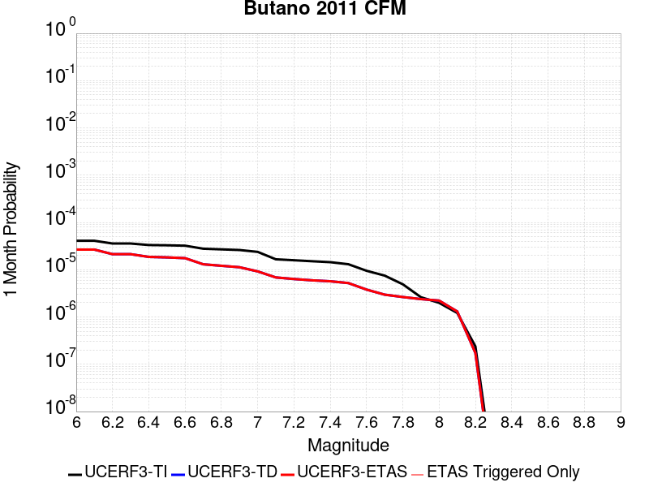 | 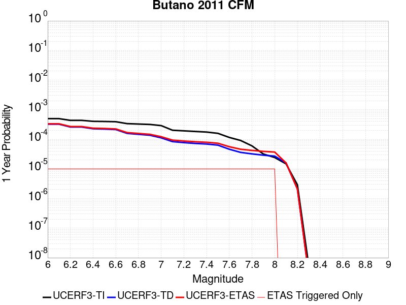 |  |

| Magnitude | 1 wk TI Prob | 1 wk TD Prob | 1 wk ETAS Prob | 1 wk ETAS/TD Gain | 1 wk ETAS Triggered Only | 1 mo TI Prob | 1 mo TD Prob | 1 mo ETAS Prob | 1 mo ETAS/TD Gain | 1 mo ETAS Triggered Only | 1 yr TI Prob | 1 yr TD Prob | 1 yr ETAS Prob | 1 yr ETAS/TD Gain | 1 yr ETAS Triggered Only | 10 yr TI Prob | 10 yr TD Prob | 10 yr ETAS Prob | 10 yr ETAS/TD Gain | 10 yr ETAS Triggered Only |
|-----|-----|-----|-----|-----|-----|-----|-----|-----|-----|-----|-----|-----|-----|-----|-----|-----|-----|-----|-----|-----|
| 6.0 | 9.561135E-6 | 6.2254967E-6 | 6.2254967E-6 | 1.0 | 0.0 | 4.097565E-5 | 2.6680438E-5 | 2.6680438E-5 | 1.0 | 0.0 | 4.9876433E-4 | 3.2478812E-4 | 3.3478488E-4 | 1.0307794 | 1.0E-5 | 0.004976464 | 0.0032607901 | 0.0032707574 | 1.0030568 | 1.0E-5 |
| 6.1 | 9.561135E-6 | 6.2254967E-6 | 6.2254967E-6 | 1.0 | 0.0 | 4.097565E-5 | 2.6680438E-5 | 2.6680438E-5 | 1.0 | 0.0 | 4.9876433E-4 | 3.2478812E-4 | 3.3478488E-4 | 1.0307794 | 1.0E-5 | 0.004976464 | 0.0032607901 | 0.0032707574 | 1.0030568 | 1.0E-5 |
| 6.2 | 8.364741E-6 | 4.9785817E-6 | 4.9785817E-6 | 1.0 | 0.0 | 3.5848396E-5 | 2.1336613E-5 | 2.1336613E-5 | 1.0 | 0.0 | 4.3636683E-4 | 2.5974386E-4 | 2.697413E-4 | 1.0384895 | 1.0E-5 | 0.0043551093 | 0.0026120064 | 0.0026219804 | 1.0038185 | 1.0E-5 |
| 6.3 | 8.364741E-6 | 4.9785817E-6 | 4.9785817E-6 | 1.0 | 0.0 | 3.5848396E-5 | 2.1336613E-5 | 2.1336613E-5 | 1.0 | 0.0 | 4.3636683E-4 | 2.5974386E-4 | 2.697413E-4 | 1.0384895 | 1.0E-5 | 0.0043551093 | 0.0026120064 | 0.0026219804 | 1.0038185 | 1.0E-5 |
| 6.4 | 7.768282E-6 | 4.3565296E-6 | 4.3565296E-6 | 1.0 | 0.0 | 3.329221E-5 | 1.8670715E-5 | 1.8670715E-5 | 1.0 | 0.0 | 4.0525728E-4 | 2.272936E-4 | 2.3729133E-4 | 1.043986 | 1.0E-5 | 0.0040451903 | 0.0022881997 | 0.0022981768 | 1.0043602 | 1.0E-5 |
| 6.5 | 7.673437E-6 | 4.256093E-6 | 4.256093E-6 | 1.0 | 0.0 | 3.2885746E-5 | 1.8240276E-5 | 1.8240276E-5 | 1.0 | 0.0 | 4.0031038E-4 | 2.2205409E-4 | 2.3205187E-4 | 1.045024 | 1.0E-5 | 0.0039959005 | 0.0022359102 | 0.0022458876 | 1.0044625 | 1.0E-5 |
| 6.6 | 7.5244197E-6 | 4.101056E-6 | 4.101056E-6 | 1.0 | 0.0 | 3.2247113E-5 | 1.7575843E-5 | 1.7575843E-5 | 1.0 | 0.0 | 3.9253788E-4 | 2.1396621E-4 | 2.2396407E-4 | 1.0467263 | 1.0E-5 | 0.003918452 | 0.00215519 | 0.0021651685 | 1.00463 | 1.0E-5 |
| 6.7 | 6.4921405E-6 | 3.0411225E-6 | 3.0411225E-6 | 1.0 | 0.0 | 2.7823162E-5 | 1.30333165E-5 | 1.30333165E-5 | 1.0 | 0.0 | 3.3869434E-4 | 1.5866917E-4 | 1.6866757E-4 | 1.0630143 | 1.0E-5 | 0.003381786 | 0.0016030329 | 0.0016130169 | 1.0062282 | 1.0E-5 |
| 6.8 | 6.2890294E-6 | 2.8278887E-6 | 2.8278887E-6 | 1.0 | 0.0 | 2.6952705E-5 | 1.2119467E-5 | 1.2119467E-5 | 1.0 | 0.0 | 3.2809976E-4 | 1.475446E-4 | 1.5754312E-4 | 1.0677661 | 1.0E-5 | 0.0032761577 | 0.0014919417 | 0.0015019268 | 1.0066926 | 1.0E-5 |
| 6.9 | 6.0965517E-6 | 2.6344032E-6 | 2.6344032E-6 | 1.0 | 0.0 | 2.6127816E-5 | 1.129025E-5 | 1.129025E-5 | 1.0 | 0.0 | 3.1805973E-4 | 1.3745019E-4 | 1.4744882E-4 | 1.0727437 | 1.0E-5 | 0.0031760489 | 0.0013911276 | 0.0014011137 | 1.0071784 | 1.0E-5 |
| 7.0 | 5.566252E-6 | 2.1518151E-6 | 2.1518151E-6 | 1.0 | 0.0 | 2.3855147E-5 | 9.2220325E-6 | 9.2220325E-6 | 1.0 | 0.0 | 2.9039773E-4 | 1.122725E-4 | 1.2227138E-4 | 1.089059 | 1.0E-5 | 0.0029001853 | 0.0011396318 | 0.0011496205 | 1.0087647 | 1.0E-5 |
| 7.1 | 3.878588E-6 | 1.6032967E-6 | 1.6032967E-6 | 1.0 | 0.0 | 1.6622414E-5 | 6.871253E-6 | 6.871253E-6 | 1.0 | 0.0 | 2.023591E-4 | 8.36543E-5 | 9.365346E-5 | 1.1195296 | 1.0E-5 | 0.0020217493 | 8.53303E-4 | 8.632945E-4 | 1.0117092 | 1.0E-5 |
| 7.2 | 3.7038085E-6 | 1.4843619E-6 | 1.4843619E-6 | 1.0 | 0.0 | 1.587337E-5 | 6.361535E-6 | 6.361535E-6 | 1.0 | 0.0 | 1.9324113E-4 | 7.744894E-5 | 8.744816E-5 | 1.1291074 | 1.0E-5 | 0.0019307317 | 7.912618E-4 | 8.012539E-4 | 1.0126281 | 1.0E-5 |
| 7.3 | 3.5277278E-6 | 1.3924841E-6 | 1.3924841E-6 | 1.0 | 0.0 | 1.5118746E-5 | 5.9677755E-6 | 5.9677755E-6 | 1.0 | 0.0 | 1.8405518E-4 | 7.2655246E-5 | 8.2654515E-5 | 1.1376263 | 1.0E-5 | 0.0018390282 | 7.432707E-4 | 7.5326324E-4 | 1.0134441 | 1.0E-5 |
| 7.4 | 3.3711294E-6 | 1.3297448E-6 | 1.3297448E-6 | 1.0 | 0.0 | 1.4447617E-5 | 5.6988933E-6 | 5.6988933E-6 | 1.0 | 0.0 | 1.7588554E-4 | 6.938182E-5 | 7.938113E-5 | 1.14412 | 1.0E-5 | 0.0017574639 | 7.1050716E-4 | 7.205001E-4 | 1.0140644 | 1.0E-5 |
| 7.5 | 3.0496426E-6 | 1.218759E-6 | 1.218759E-6 | 1.0 | 0.0 | 1.3069831E-5 | 5.2232426E-6 | 5.2232426E-6 | 1.0 | 0.0 | 1.5911358E-4 | 6.359112E-5 | 7.359049E-5 | 1.1572447 | 1.0E-5 | 0.001589997 | 6.525681E-4 | 6.625616E-4 | 1.0153141 | 1.0E-5 |
| 7.6 | 2.2179781E-6 | 8.869861E-7 | 8.869861E-7 | 1.0 | 0.0 | 9.505586E-6 | 3.8013632E-6 | 3.8013632E-6 | 1.0 | 0.0 | 1.1572436E-4 | 4.6280613E-5 | 5.628015E-5 | 1.2160631 | 1.0E-5 | 0.0011566412 | 4.794437E-4 | 4.894389E-4 | 1.0208476 | 1.0E-5 |
| 7.7 | 1.7519328E-6 | 6.930116E-7 | 6.930116E-7 | 1.0 | 0.0 | 7.508262E-6 | 2.9700464E-6 | 2.9700464E-6 | 1.0 | 0.0 | 9.140925E-5 | 3.6159712E-5 | 4.615935E-5 | 1.2765409 | 1.0E-5 | 9.137166E-4 | 3.7754176E-4 | 3.87538E-4 | 1.0264771 | 1.0E-5 |
| 7.8 | 1.1478974E-6 | 6.1734966E-7 | 6.1734966E-7 | 1.0 | 0.0 | 4.9195505E-6 | 2.6457815E-6 | 2.6457815E-6 | 1.0 | 0.0 | 5.9893882E-5 | 3.2211912E-5 | 4.221159E-5 | 1.3104341 | 1.0E-5 | 5.9877743E-4 | 3.377461E-4 | 3.4774272E-4 | 1.029598 | 1.0E-5 |
| 7.9 | 6.1154634E-7 | 5.5814814E-7 | 5.5814814E-7 | 1.0 | 0.0 | 2.6209104E-6 | 2.392061E-6 | 2.392061E-6 | 1.0 | 0.0 | 3.1909116E-5 | 2.9122955E-5 | 3.9122664E-5 | 1.3433617 | 1.0E-5 | 3.1904536E-4 | 3.0562587E-4 | 3.156228E-4 | 1.0327097 | 1.0E-5 |
| 8.0 | 4.6520046E-7 | 5.189108E-7 | 5.189108E-7 | 1.0 | 0.0 | 1.9937147E-6 | 2.2239014E-6 | 2.2239014E-6 | 1.0 | 0.0 | 2.4273206E-5 | 2.7075665E-5 | 3.7075395E-5 | 1.3693254 | 1.0E-5 | 2.4270554E-4 | 2.841832E-4 | 2.9418035E-4 | 1.0351785 | 1.0E-5 |
| 8.1 | 2.8425194E-7 | 3.0568935E-7 | 3.0568935E-7 | 1.0 | 0.0 | 1.218222E-6 | 1.3100965E-6 | 1.3100965E-6 | 1.0 | 0.0 | 1.4831752E-5 | 1.5950309E-5 | 1.5950309E-5 | 1.0 | 0.0 | 1.4830762E-4 | 1.673984E-4 | 1.673984E-4 | 1.0 | 0.0 |
| 8.2 | 5.585778E-8 | 4.051519E-8 | 4.051519E-8 | 1.0 | 0.0 | 2.3939046E-7 | 1.7363652E-7 | 1.7363652E-7 | 1.0 | 0.0 | 2.914575E-6 | 2.1140224E-6 | 2.1140224E-6 | 1.0 | 0.0 | 2.9145367E-5 | 2.2970038E-5 | 2.2970038E-5 | 1.0 | 0.0 |
| 8.3 | 1.0371215E-10 | 5.3552607E-11 | 5.3552607E-11 | 1.0 | 0.0 | 4.4448079E-10 | 2.2951097E-10 | 2.2951097E-10 | 1.0 | 0.0 | 5.4115543E-9 | 2.7942968E-9 | 2.7942968E-9 | 1.0 | 0.0 | 5.4115542E-8 | 3.213309E-8 | 3.213309E-8 | 1.0 | 0.0 |

## Santa Monica alt 1
*[(top)](#table-of-contents)*

| 1 Week | 1 Month | 1 Year | 10 Year |
|-----|-----|-----|-----|
|  |  |  |  |

| Magnitude | 1 wk TI Prob | 1 wk TD Prob | 1 wk ETAS Prob | 1 wk ETAS/TD Gain | 1 wk ETAS Triggered Only | 1 mo TI Prob | 1 mo TD Prob | 1 mo ETAS Prob | 1 mo ETAS/TD Gain | 1 mo ETAS Triggered Only | 1 yr TI Prob | 1 yr TD Prob | 1 yr ETAS Prob | 1 yr ETAS/TD Gain | 1 yr ETAS Triggered Only | 10 yr TI Prob | 10 yr TD Prob | 10 yr ETAS Prob | 10 yr ETAS/TD Gain | 10 yr ETAS Triggered Only |
|-----|-----|-----|-----|-----|-----|-----|-----|-----|-----|-----|-----|-----|-----|-----|-----|-----|-----|-----|-----|-----|
| 6.0 | 1.1066008E-5 | 1.1480312E-5 | 1.1480312E-5 | 1.0 | 0.0 | 4.742488E-5 | 4.920049E-5 | 5.92E-5 | 1.20324 | 1.0E-5 | 5.7724497E-4 | 5.9886527E-4 | 6.088593E-4 | 1.0166882 | 1.0E-5 | 0.005757478 | 0.0059739016 | 0.0059838416 | 1.0016639 | 1.0E-5 |
| 6.1 | 1.1066008E-5 | 1.1480312E-5 | 1.1480312E-5 | 1.0 | 0.0 | 4.742488E-5 | 4.920049E-5 | 5.92E-5 | 1.20324 | 1.0E-5 | 5.7724497E-4 | 5.9886527E-4 | 6.088593E-4 | 1.0166882 | 1.0E-5 | 0.005757478 | 0.0059739016 | 0.0059838416 | 1.0016639 | 1.0E-5 |
| 6.2 | 1.1066008E-5 | 1.1480312E-5 | 1.1480312E-5 | 1.0 | 0.0 | 4.742488E-5 | 4.920049E-5 | 5.92E-5 | 1.20324 | 1.0E-5 | 5.7724497E-4 | 5.9886527E-4 | 6.088593E-4 | 1.0166882 | 1.0E-5 | 0.005757478 | 0.0059739016 | 0.0059838416 | 1.0016639 | 1.0E-5 |
| 6.3 | 1.1066008E-5 | 1.1480312E-5 | 1.1480312E-5 | 1.0 | 0.0 | 4.742488E-5 | 4.920049E-5 | 5.92E-5 | 1.20324 | 1.0E-5 | 5.7724497E-4 | 5.9886527E-4 | 6.088593E-4 | 1.0166882 | 1.0E-5 | 0.005757478 | 0.0059739016 | 0.0059838416 | 1.0016639 | 1.0E-5 |
| 6.4 | 1.1066008E-5 | 1.1480312E-5 | 1.1480312E-5 | 1.0 | 0.0 | 4.742488E-5 | 4.920049E-5 | 5.92E-5 | 1.20324 | 1.0E-5 | 5.7724497E-4 | 5.9886527E-4 | 6.088593E-4 | 1.0166882 | 1.0E-5 | 0.005757478 | 0.0059739016 | 0.0059838416 | 1.0016639 | 1.0E-5 |
| 6.5 | 8.183544E-6 | 8.335434E-6 | 8.335434E-6 | 1.0 | 0.0 | 3.5071862E-5 | 3.572281E-5 | 4.5722452E-5 | 1.2799232 | 1.0E-5 | 4.2691626E-4 | 4.3483998E-4 | 4.4483563E-4 | 1.022987 | 1.0E-5 | 0.0042609703 | 0.004340057 | 0.0043500136 | 1.0022941 | 1.0E-5 |
| 6.6 | 8.1543285E-6 | 8.303648E-6 | 8.303648E-6 | 1.0 | 0.0 | 3.4946657E-5 | 3.558659E-5 | 4.5586232E-5 | 1.2809948 | 1.0E-5 | 4.2539247E-4 | 4.3318217E-4 | 4.4317782E-4 | 1.023075 | 1.0E-5 | 0.0042457907 | 0.004323543 | 0.0043335 | 1.0023029 | 1.0E-5 |
| 6.7 | 8.110878E-6 | 8.257045E-6 | 8.257045E-6 | 1.0 | 0.0 | 3.4760444E-5 | 3.5386864E-5 | 4.538651E-5 | 1.2825807 | 1.0E-5 | 4.231262E-4 | 4.3075148E-4 | 4.407472E-4 | 1.0232053 | 1.0E-5 | 0.0042232145 | 0.004299331 | 0.0043092878 | 1.002316 | 1.0E-5 |
| 6.8 | 7.644036E-6 | 7.751063E-6 | 7.751063E-6 | 1.0 | 0.0 | 3.275974E-5 | 3.3218425E-5 | 4.3218093E-5 | 1.3010278 | 1.0E-5 | 3.9877684E-4 | 4.043607E-4 | 4.1435665E-4 | 1.0247204 | 1.0E-5 | 0.00398062 | 0.004036396 | 0.0040463554 | 1.0024675 | 1.0E-5 |
| 6.9 | 7.3698293E-6 | 7.4557215E-6 | 7.4557215E-6 | 1.0 | 0.0 | 3.15846E-5 | 3.195271E-5 | 4.195239E-5 | 1.3129525 | 1.0E-5 | 3.8447464E-4 | 3.889562E-4 | 3.9895228E-4 | 1.0256999 | 1.0E-5 | 0.0038381014 | 0.0038828978 | 0.003892859 | 1.0025654 | 1.0E-5 |
| 7.0 | 7.209872E-6 | 7.2856283E-6 | 7.2856283E-6 | 1.0 | 0.0 | 3.0899086E-5 | 3.1223753E-5 | 4.1223444E-5 | 1.320259 | 1.0E-5 | 3.7613141E-4 | 3.800843E-4 | 3.900805E-4 | 1.0263 | 1.0E-5 | 0.0037549543 | 0.003794485 | 0.003804447 | 1.0026253 | 1.0E-5 |
| 7.1 | 5.603456E-6 | 5.5238947E-6 | 5.5238947E-6 | 1.0 | 0.0 | 2.4014591E-5 | 2.3673623E-5 | 3.3673386E-5 | 1.4224011 | 1.0E-5 | 2.923384E-4 | 2.8818863E-4 | 2.9818574E-4 | 1.0346895 | 1.0E-5 | 0.0029195412 | 0.002878191 | 0.0028881622 | 1.0034645 | 1.0E-5 |
| 7.2 | 4.7483613E-6 | 4.591135E-6 | 4.591135E-6 | 1.0 | 0.0 | 2.0349962E-5 | 1.9676147E-5 | 2.967595E-5 | 1.5082196 | 1.0E-5 | 2.4773262E-4 | 2.3953087E-4 | 2.4952847E-4 | 1.0417383 | 1.0E-5 | 0.0024745662 | 0.0023927412 | 0.0024027172 | 1.0041693 | 1.0E-5 |
| 7.3 | 3.829015E-6 | 3.6342271E-6 | 3.6342271E-6 | 1.0 | 0.0 | 1.6409962E-5 | 1.5575166E-5 | 2.5575011E-5 | 1.6420377 | 1.0E-5 | 1.9977297E-4 | 1.8961124E-4 | 1.9960933E-4 | 1.0527295 | 1.0E-5 | 0.0019959346 | 0.0018945034 | 0.0019044845 | 1.0052685 | 1.0E-5 |
| 7.4 | 2.610755E-6 | 2.4995722E-6 | 2.4995722E-6 | 1.0 | 0.0 | 1.1188902E-5 | 1.0712408E-5 | 2.0712301E-5 | 1.9334869 | 1.0E-5 | 1.3621636E-4 | 1.304158E-4 | 1.404145E-4 | 1.0766678 | 1.0E-5 | 0.001361329 | 0.0013033971 | 0.0013133842 | 1.0076623 | 1.0E-5 |
| 7.5 | 1.792146E-6 | 1.7584194E-6 | 1.7584194E-6 | 1.0 | 0.0 | 7.680603E-6 | 7.5360617E-6 | 1.7535986E-5 | 2.326943 | 1.0E-5 | 9.3507326E-5 | 9.174772E-5 | 1.017468E-4 | 1.1089846 | 1.0E-5 | 9.3467993E-4 | 9.1710157E-4 | 9.270924E-4 | 1.010894 | 1.0E-5 |
| 7.6 | 1.1473018E-6 | 1.102916E-6 | 1.102916E-6 | 1.0 | 0.0 | 4.9169985E-6 | 4.7267745E-6 | 4.7267745E-6 | 1.0 | 0.0 | 5.986281E-5 | 5.7546975E-5 | 5.7546975E-5 | 1.0 | 0.0 | 5.984669E-4 | 5.753224E-4 | 5.753224E-4 | 1.0 | 0.0 |
| 7.7 | 5.330919E-7 | 4.7452562E-7 | 4.7452562E-7 | 1.0 | 0.0 | 2.2846775E-6 | 2.0336797E-6 | 2.0336797E-6 | 1.0 | 0.0 | 2.7815593E-5 | 2.4759782E-5 | 2.4759782E-5 | 1.0 | 0.0 | 2.7812112E-4 | 2.4757136E-4 | 2.4757136E-4 | 1.0 | 0.0 |
| 7.8 | 1.1668574E-7 | 8.296564E-8 | 8.296564E-8 | 1.0 | 0.0 | 5.000816E-7 | 3.5556698E-7 | 3.5556698E-7 | 1.0 | 0.0 | 6.0884768E-6 | 4.3290197E-6 | 4.3290197E-6 | 1.0 | 0.0 | 6.08831E-5 | 4.3289383E-5 | 4.3289383E-5 | 1.0 | 0.0 |
| 7.9 | 8.007447E-10 | 6.161581E-10 | 6.161581E-10 | 1.0 | 0.0 | 3.4317629E-9 | 2.640678E-9 | 2.640678E-9 | 1.0 | 0.0 | 4.1781714E-8 | 3.2150254E-8 | 3.2150254E-8 | 1.0 | 0.0 | 4.1781706E-7 | 3.2150248E-7 | 3.2150248E-7 | 1.0 | 0.0 |

## San Joaquin Hills
*[(top)](#table-of-contents)*

| 1 Week | 1 Month | 1 Year | 10 Year |
|-----|-----|-----|-----|
|  |  | 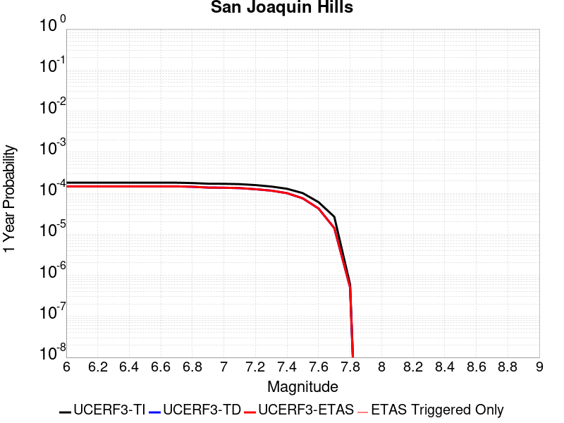 |  |

| Magnitude | 1 wk TI Prob | 1 wk TD Prob | 1 wk ETAS Prob | 1 wk ETAS/TD Gain | 1 wk ETAS Triggered Only | 1 mo TI Prob | 1 mo TD Prob | 1 mo ETAS Prob | 1 mo ETAS/TD Gain | 1 mo ETAS Triggered Only | 1 yr TI Prob | 1 yr TD Prob | 1 yr ETAS Prob | 1 yr ETAS/TD Gain | 1 yr ETAS Triggered Only | 10 yr TI Prob | 10 yr TD Prob | 10 yr ETAS Prob | 10 yr ETAS/TD Gain | 10 yr ETAS Triggered Only |
|-----|-----|-----|-----|-----|-----|-----|-----|-----|-----|-----|-----|-----|-----|-----|-----|-----|-----|-----|-----|-----|
| 6.0 | 3.4525704E-6 | 2.8139727E-6 | 2.8139727E-6 | 1.0 | 0.0 | 1.4796647E-5 | 1.2059828E-5 | 1.2059828E-5 | 1.0 | 0.0 | 1.8013427E-4 | 1.4681864E-4 | 1.4681864E-4 | 1.0 | 0.0 | 0.0017998833 | 0.0014672297 | 0.0014772151 | 1.0068055 | 1.0E-5 |
| 6.1 | 3.4525704E-6 | 2.8139727E-6 | 2.8139727E-6 | 1.0 | 0.0 | 1.4796647E-5 | 1.2059828E-5 | 1.2059828E-5 | 1.0 | 0.0 | 1.8013427E-4 | 1.4681864E-4 | 1.4681864E-4 | 1.0 | 0.0 | 0.0017998833 | 0.0014672297 | 0.0014772151 | 1.0068055 | 1.0E-5 |
| 6.2 | 3.4525704E-6 | 2.8139727E-6 | 2.8139727E-6 | 1.0 | 0.0 | 1.4796647E-5 | 1.2059828E-5 | 1.2059828E-5 | 1.0 | 0.0 | 1.8013427E-4 | 1.4681864E-4 | 1.4681864E-4 | 1.0 | 0.0 | 0.0017998833 | 0.0014672297 | 0.0014772151 | 1.0068055 | 1.0E-5 |
| 6.3 | 3.4525704E-6 | 2.8139727E-6 | 2.8139727E-6 | 1.0 | 0.0 | 1.4796647E-5 | 1.2059828E-5 | 1.2059828E-5 | 1.0 | 0.0 | 1.8013427E-4 | 1.4681864E-4 | 1.4681864E-4 | 1.0 | 0.0 | 0.0017998833 | 0.0014672297 | 0.0014772151 | 1.0068055 | 1.0E-5 |
| 6.4 | 3.4525704E-6 | 2.8139727E-6 | 2.8139727E-6 | 1.0 | 0.0 | 1.4796647E-5 | 1.2059828E-5 | 1.2059828E-5 | 1.0 | 0.0 | 1.8013427E-4 | 1.4681864E-4 | 1.4681864E-4 | 1.0 | 0.0 | 0.0017998833 | 0.0014672297 | 0.0014772151 | 1.0068055 | 1.0E-5 |
| 6.5 | 3.4525704E-6 | 2.8139727E-6 | 2.8139727E-6 | 1.0 | 0.0 | 1.4796647E-5 | 1.2059828E-5 | 1.2059828E-5 | 1.0 | 0.0 | 1.8013427E-4 | 1.4681864E-4 | 1.4681864E-4 | 1.0 | 0.0 | 0.0017998833 | 0.0014672297 | 0.0014772151 | 1.0068055 | 1.0E-5 |
| 6.6 | 3.4525704E-6 | 2.8139727E-6 | 2.8139727E-6 | 1.0 | 0.0 | 1.4796647E-5 | 1.2059828E-5 | 1.2059828E-5 | 1.0 | 0.0 | 1.8013427E-4 | 1.4681864E-4 | 1.4681864E-4 | 1.0 | 0.0 | 0.0017998833 | 0.0014672297 | 0.0014772151 | 1.0068055 | 1.0E-5 |
| 6.7 | 3.4525704E-6 | 2.8139727E-6 | 2.8139727E-6 | 1.0 | 0.0 | 1.4796647E-5 | 1.2059828E-5 | 1.2059828E-5 | 1.0 | 0.0 | 1.8013427E-4 | 1.4681864E-4 | 1.4681864E-4 | 1.0 | 0.0 | 0.0017998833 | 0.0014672297 | 0.0014772151 | 1.0068055 | 1.0E-5 |
| 6.8 | 3.388654E-6 | 2.7484111E-6 | 2.7484111E-6 | 1.0 | 0.0 | 1.4522722E-5 | 1.1778852E-5 | 1.1778852E-5 | 1.0 | 0.0 | 1.767998E-4 | 1.4339821E-4 | 1.4339821E-4 | 1.0 | 0.0 | 0.001766592 | 0.0014330697 | 0.0014430553 | 1.006968 | 1.0E-5 |
| 6.9 | 3.2694352E-6 | 2.6283255E-6 | 2.6283255E-6 | 1.0 | 0.0 | 1.401179E-5 | 1.1264204E-5 | 1.1264204E-5 | 1.0 | 0.0 | 1.7058018E-4 | 1.3713316E-4 | 1.3713316E-4 | 1.0 | 0.0 | 0.0017044931 | 0.0013704967 | 0.001380483 | 1.0072867 | 1.0E-5 |
| 7.0 | 3.246912E-6 | 2.6069824E-6 | 2.6069824E-6 | 1.0 | 0.0 | 1.39152635E-5 | 1.1172735E-5 | 1.1172735E-5 | 1.0 | 0.0 | 1.6940516E-4 | 1.3601968E-4 | 1.3601968E-4 | 1.0 | 0.0 | 0.0016927607 | 0.0013593754 | 0.0013693619 | 1.0073463 | 1.0E-5 |
| 7.1 | 3.1864927E-6 | 2.5523102E-6 | 2.5523102E-6 | 1.0 | 0.0 | 1.3656326E-5 | 1.0938427E-5 | 1.0938427E-5 | 1.0 | 0.0 | 1.6625308E-4 | 1.3316733E-4 | 1.3316733E-4 | 1.0 | 0.0 | 0.0016612876 | 0.0013308863 | 0.001340873 | 1.0075037 | 1.0E-5 |
| 7.2 | 3.0220644E-6 | 2.3991581E-6 | 2.3991581E-6 | 1.0 | 0.0 | 1.295164E-5 | 1.0282067E-5 | 1.0282067E-5 | 1.0 | 0.0 | 1.576748E-4 | 1.2517707E-4 | 1.2517707E-4 | 1.0 | 0.0 | 0.0015756298 | 0.001251076 | 0.0012610634 | 1.0079831 | 1.0E-5 |
| 7.3 | 2.787619E-6 | 2.2173751E-6 | 2.2173751E-6 | 1.0 | 0.0 | 1.1946884E-5 | 9.503003E-6 | 9.503003E-6 | 1.0 | 0.0 | 1.454436E-4 | 1.1569301E-4 | 1.1569301E-4 | 1.0 | 0.0 | 0.0014534845 | 0.0011563377 | 0.0011663261 | 1.008638 | 1.0E-5 |
| 7.4 | 2.4593792E-6 | 1.9226163E-6 | 1.9226163E-6 | 1.0 | 0.0 | 1.0540153E-5 | 8.239759E-6 | 8.239759E-6 | 1.0 | 0.0 | 1.2831882E-4 | 1.0031454E-4 | 1.0031454E-4 | 1.0 | 0.0 | 0.0012824474 | 0.0010027013 | 0.0010027013 | 1.0 | 0.0 |
| 7.5 | 1.926764E-6 | 1.4383043E-6 | 1.4383043E-6 | 1.0 | 0.0 | 8.257534E-6 | 6.1641467E-6 | 6.1641467E-6 | 1.0 | 0.0 | 1.00530844E-4 | 7.5045966E-5 | 7.5045966E-5 | 1.0 | 0.0 | 0.0010048538 | 7.502126E-4 | 7.502126E-4 | 1.0 | 0.0 |
| 7.6 | 1.1609359E-6 | 8.145649E-7 | 8.145649E-7 | 1.0 | 0.0 | 4.97543E-6 | 3.4909879E-6 | 3.4909879E-6 | 1.0 | 0.0 | 6.0574173E-5 | 4.2501993E-5 | 4.2501993E-5 | 1.0 | 0.0 | 6.055767E-4 | 4.24943E-4 | 4.24943E-4 | 1.0 | 0.0 |
| 7.7 | 5.1168536E-7 | 2.7155397E-7 | 2.7155397E-7 | 1.0 | 0.0 | 2.1929354E-6 | 1.1638023E-6 | 1.1638023E-6 | 1.0 | 0.0 | 2.669866E-5 | 1.4169214E-5 | 1.4169214E-5 | 1.0 | 0.0 | 2.6695454E-4 | 1.4168446E-4 | 1.4168446E-4 | 1.0 | 0.0 |
| 7.8 | 1.16056995E-8 | 9.782997E-9 | 9.782997E-9 | 1.0 | 0.0 | 4.9738713E-8 | 4.1927127E-8 | 4.1927127E-8 | 1.0 | 0.0 | 6.0556863E-7 | 5.1046277E-7 | 5.1046277E-7 | 1.0 | 0.0 | 6.05567E-6 | 5.1046277E-6 | 5.1046277E-6 | 1.0 | 0.0 |

## San Andreas (Offshore) 2011 CFM
*[(top)](#table-of-contents)*

| 1 Week | 1 Month | 1 Year | 10 Year |
|-----|-----|-----|-----|
|  |  |  |  |

| Magnitude | 1 wk TI Prob | 1 wk TD Prob | 1 wk ETAS Prob | 1 wk ETAS/TD Gain | 1 wk ETAS Triggered Only | 1 mo TI Prob | 1 mo TD Prob | 1 mo ETAS Prob | 1 mo ETAS/TD Gain | 1 mo ETAS Triggered Only | 1 yr TI Prob | 1 yr TD Prob | 1 yr ETAS Prob | 1 yr ETAS/TD Gain | 1 yr ETAS Triggered Only | 10 yr TI Prob | 10 yr TD Prob | 10 yr ETAS Prob | 10 yr ETAS/TD Gain | 10 yr ETAS Triggered Only |
|-----|-----|-----|-----|-----|-----|-----|-----|-----|-----|-----|-----|-----|-----|-----|-----|-----|-----|-----|-----|-----|
| 6.0 | 1.7072787E-4 | 1.9226626E-4 | 2.0226435E-4 | 1.0520012 | 1.0E-5 | 7.3148566E-4 | 8.237405E-4 | 8.3373225E-4 | 1.0121298 | 1.0E-5 | 0.008869528 | 0.009983436 | 0.009993336 | 1.0009917 | 1.0E-5 | 0.085237645 | 0.09681613 | 0.09682517 | 1.0000933 | 1.0E-5 |
| 6.1 | 1.7072787E-4 | 1.9226626E-4 | 2.0226435E-4 | 1.0520012 | 1.0E-5 | 7.3148566E-4 | 8.237405E-4 | 8.3373225E-4 | 1.0121298 | 1.0E-5 | 0.008869528 | 0.009983436 | 0.009993336 | 1.0009917 | 1.0E-5 | 0.085237645 | 0.09681613 | 0.09682517 | 1.0000933 | 1.0E-5 |
| 6.2 | 1.6312556E-4 | 1.8408237E-4 | 1.9408052E-4 | 1.0543135 | 1.0E-5 | 6.989222E-4 | 7.8868825E-4 | 7.9868035E-4 | 1.0126693 | 1.0E-5 | 0.008476226 | 0.0095605 | 0.009570405 | 1.0010359 | 1.0E-5 | 0.08160117 | 0.092837214 | 0.09284629 | 1.0000978 | 1.0E-5 |
| 6.3 | 1.5103363E-4 | 1.6881147E-4 | 1.7880979E-4 | 1.0592277 | 1.0E-5 | 6.471264E-4 | 7.232793E-4 | 7.332721E-4 | 1.0138159 | 1.0E-5 | 0.007850339 | 0.008770814 | 0.008780727 | 1.0011301 | 1.0E-5 | 0.075787395 | 0.08546859 | 0.08547774 | 1.000107 | 1.0E-5 |
| 6.4 | 1.5047993E-4 | 1.6767075E-4 | 1.7766906E-4 | 1.0596308 | 1.0E-5 | 6.4475456E-4 | 7.183932E-4 | 7.28386E-4 | 1.0139099 | 1.0E-5 | 0.007821669 | 0.008711802 | 0.008721715 | 1.0011379 | 1.0E-5 | 0.0755203 | 0.08494888 | 0.08495803 | 1.0001078 | 1.0E-5 |
| 6.5 | 1.2760791E-4 | 1.3734949E-4 | 1.4734811E-4 | 1.072797 | 1.0E-5 | 5.467764E-4 | 5.8850925E-4 | 5.985034E-4 | 1.0169821 | 1.0E-5 | 0.0066367025 | 0.007141834 | 0.007151763 | 1.0013902 | 1.0E-5 | 0.064419635 | 0.07024954 | 0.07025884 | 1.0001323 | 1.0E-5 |
| 6.6 | 1.1063525E-4 | 1.15565475E-4 | 1.15565475E-4 | 1.0 | 0.0 | 4.740649E-4 | 4.9518765E-4 | 4.9518765E-4 | 1.0 | 0.0 | 0.0057564764 | 0.006012446 | 0.006012446 | 1.0 | 0.0 | 0.05609626 | 0.059496127 | 0.059496127 | 1.0 | 0.0 |
| 6.7 | 1.0391049E-4 | 1.0645875E-4 | 1.0645875E-4 | 1.0 | 0.0 | 4.4525467E-4 | 4.56173E-4 | 4.56173E-4 | 1.0 | 0.0 | 0.0054075094 | 0.0055399504 | 0.0055399504 | 1.0 | 0.0 | 0.052778035 | 0.05498844 | 0.05498844 | 1.0 | 0.0 |
| 6.8 | 1.0096706E-4 | 1.01582154E-4 | 1.01582154E-4 | 1.0 | 0.0 | 4.3264418E-4 | 4.3528038E-4 | 4.3528038E-4 | 1.0 | 0.0 | 0.0052547283 | 0.0052868384 | 0.0052868384 | 1.0 | 0.0 | 0.051321987 | 0.052686825 | 0.052686825 | 1.0 | 0.0 |
| 6.9 | 9.800265E-5 | 9.588697E-5 | 9.588697E-5 | 1.0 | 0.0 | 4.1994374E-4 | 4.1088034E-4 | 4.1088034E-4 | 1.0 | 0.0 | 0.0051008356 | 0.004991162 | 0.004991162 | 1.0 | 0.0 | 0.049853306 | 0.05001508 | 0.05001508 | 1.0 | 0.0 |
| 7.0 | 9.4642375E-5 | 9.002096E-5 | 9.002096E-5 | 1.0 | 0.0 | 4.0554712E-4 | 3.8574796E-4 | 3.8574796E-4 | 1.0 | 0.0 | 0.004926363 | 0.00468653 | 0.00468653 | 1.0 | 0.0 | 0.048185747 | 0.047194667 | 0.047194667 | 1.0 | 0.0 |
| 7.1 | 9.0996844E-5 | 8.354119E-5 | 8.354119E-5 | 1.0 | 0.0 | 3.8992817E-4 | 3.579854E-4 | 3.579854E-4 | 1.0 | 0.0 | 0.004737046 | 0.0043499186 | 0.0043499186 | 1.0 | 0.0 | 0.04637333 | 0.04404688 | 0.04404688 | 1.0 | 0.0 |
| 7.2 | 8.848287E-5 | 7.981761E-5 | 7.981761E-5 | 1.0 | 0.0 | 3.791572E-4 | 3.420315E-4 | 3.420315E-4 | 1.0 | 0.0 | 0.004606472 | 0.0041564363 | 0.0041564363 | 1.0 | 0.0 | 0.045121472 | 0.042189904 | 0.042189904 | 1.0 | 0.0 |
| 7.3 | 7.9280784E-5 | 6.1274885E-5 | 6.1274885E-5 | 1.0 | 0.0 | 3.3973053E-4 | 2.6258078E-4 | 2.6258078E-4 | 1.0 | 0.0 | 0.004128377 | 0.003192337 | 0.003192337 | 1.0 | 0.0 | 0.040525194 | 0.03290183 | 0.03290183 | 1.0 | 0.0 |
| 7.4 | 6.468038E-5 | 3.7930724E-5 | 3.7930724E-5 | 1.0 | 0.0 | 2.771722E-4 | 1.6255044E-4 | 1.6255044E-4 | 1.0 | 0.0 | 0.0033693502 | 0.0019773128 | 0.0019773128 | 1.0 | 0.0 | 0.0331872 | 0.02081734 | 0.02081734 | 1.0 | 0.0 |
| 7.5 | 4.930574E-5 | 1.2699263E-5 | 1.2699263E-5 | 1.0 | 0.0 | 2.1129321E-4 | 5.4424287E-5 | 5.4424287E-5 | 1.0 | 0.0 | 0.0025694598 | 6.6241587E-4 | 6.6241587E-4 | 1.0 | 0.0 | 0.02539953 | 0.0074798525 | 0.0074798525 | 1.0 | 0.0 |
| 7.6 | 4.612566E-5 | 1.0332297E-5 | 1.0332297E-5 | 1.0 | 0.0 | 1.9766642E-4 | 4.428053E-5 | 4.428053E-5 | 1.0 | 0.0 | 0.0024039324 | 5.3898344E-4 | 5.3898344E-4 | 1.0 | 0.0 | 0.023780935 | 0.006170428 | 0.006170428 | 1.0 | 0.0 |
| 7.7 | 3.9435414E-5 | 5.5710498E-6 | 5.5710498E-6 | 1.0 | 0.0 | 1.6899795E-4 | 2.3875711E-5 | 2.3875711E-5 | 1.0 | 0.0 | 0.0020556084 | 2.906482E-4 | 2.906482E-4 | 1.0 | 0.0 | 0.020366974 | 0.0035397834 | 0.0035397834 | 1.0 | 0.0 |
| 7.8 | 2.7787428E-5 | 3.7526645E-6 | 3.7526645E-6 | 1.0 | 0.0 | 1.1908354E-4 | 1.6082748E-5 | 1.6082748E-5 | 1.0 | 0.0 | 0.0014488777 | 1.9578991E-4 | 1.9578991E-4 | 1.0 | 0.0 | 0.014394675 | 0.0023862 | 0.0023862 | 1.0 | 0.0 |
| 7.9 | 1.590671E-5 | 3.0391298E-6 | 3.0391298E-6 | 1.0 | 0.0 | 6.816983E-5 | 1.3024777E-5 | 1.3024777E-5 | 1.0 | 0.0 | 8.2965166E-4 | 1.5856515E-4 | 1.5856515E-4 | 1.0 | 0.0 | 0.008265611 | 0.0019033558 | 0.0019033558 | 1.0 | 0.0 |
| 8.0 | 9.193638E-6 | 2.5908973E-6 | 2.5908973E-6 | 1.0 | 0.0 | 3.940071E-5 | 1.1103798E-5 | 1.1103798E-5 | 1.0 | 0.0 | 4.7959806E-4 | 1.3518038E-4 | 1.3518038E-4 | 1.0 | 0.0 | 0.0047856434 | 0.0016108477 | 0.0016108477 | 1.0 | 0.0 |
| 8.1 | 5.601576E-6 | 2.2333788E-6 | 2.2333788E-6 | 1.0 | 0.0 | 2.4006533E-5 | 9.571589E-6 | 9.571589E-6 | 1.0 | 0.0 | 2.9224035E-4 | 1.1652788E-4 | 1.1652788E-4 | 1.0 | 0.0 | 0.0029185633 | 0.0014015464 | 0.0014015464 | 1.0 | 0.0 |
| 8.2 | 4.3508785E-6 | 1.8568232E-6 | 1.8568232E-6 | 1.0 | 0.0 | 1.864649E-5 | 7.957789E-6 | 7.957789E-6 | 1.0 | 0.0 | 2.2699735E-4 | 9.6881806E-5 | 9.6881806E-5 | 1.0 | 0.0 | 0.0022676561 | 0.0011590312 | 0.0011590312 | 1.0 | 0.0 |
| 8.3 | 1.9573292E-6 | 7.511501E-7 | 7.511501E-7 | 1.0 | 0.0 | 8.388526E-6 | 3.2192108E-6 | 3.2192108E-6 | 1.0 | 0.0 | 1.0212552E-4 | 3.9193204E-5 | 3.9193204E-5 | 1.0 | 0.0 | 0.001020786 | 4.6391718E-4 | 4.6391718E-4 | 1.0 | 0.0 |

## Channel Islands Western Deep Ramp
*[(top)](#table-of-contents)*

| 1 Week | 1 Month | 1 Year | 10 Year |
|-----|-----|-----|-----|
|  |  |  |  |

| Magnitude | 1 wk TI Prob | 1 wk TD Prob | 1 wk ETAS Prob | 1 wk ETAS/TD Gain | 1 wk ETAS Triggered Only | 1 mo TI Prob | 1 mo TD Prob | 1 mo ETAS Prob | 1 mo ETAS/TD Gain | 1 mo ETAS Triggered Only | 1 yr TI Prob | 1 yr TD Prob | 1 yr ETAS Prob | 1 yr ETAS/TD Gain | 1 yr ETAS Triggered Only | 10 yr TI Prob | 10 yr TD Prob | 10 yr ETAS Prob | 10 yr ETAS/TD Gain | 10 yr ETAS Triggered Only |
|-----|-----|-----|-----|-----|-----|-----|-----|-----|-----|-----|-----|-----|-----|-----|-----|-----|-----|-----|-----|-----|
| 6.0 | 6.0213506E-6 | 6.2548684E-6 | 6.2548684E-6 | 1.0 | 0.0 | 2.5805533E-5 | 2.6806329E-5 | 2.6806329E-5 | 1.0 | 0.0 | 3.1413708E-4 | 3.2632265E-4 | 3.2632265E-4 | 1.0 | 0.0 | 0.0031369338 | 0.0032588763 | 0.0032688437 | 1.0030586 | 1.0E-5 |
| 6.1 | 6.0213506E-6 | 6.2548684E-6 | 6.2548684E-6 | 1.0 | 0.0 | 2.5805533E-5 | 2.6806329E-5 | 2.6806329E-5 | 1.0 | 0.0 | 3.1413708E-4 | 3.2632265E-4 | 3.2632265E-4 | 1.0 | 0.0 | 0.0031369338 | 0.0032588763 | 0.0032688437 | 1.0030586 | 1.0E-5 |
| 6.2 | 6.0213506E-6 | 6.2548684E-6 | 6.2548684E-6 | 1.0 | 0.0 | 2.5805533E-5 | 2.6806329E-5 | 2.6806329E-5 | 1.0 | 0.0 | 3.1413708E-4 | 3.2632265E-4 | 3.2632265E-4 | 1.0 | 0.0 | 0.0031369338 | 0.0032588763 | 0.0032688437 | 1.0030586 | 1.0E-5 |
| 6.3 | 6.0213506E-6 | 6.2548684E-6 | 6.2548684E-6 | 1.0 | 0.0 | 2.5805533E-5 | 2.6806329E-5 | 2.6806329E-5 | 1.0 | 0.0 | 3.1413708E-4 | 3.2632265E-4 | 3.2632265E-4 | 1.0 | 0.0 | 0.0031369338 | 0.0032588763 | 0.0032688437 | 1.0030586 | 1.0E-5 |
| 6.4 | 6.0213506E-6 | 6.2548684E-6 | 6.2548684E-6 | 1.0 | 0.0 | 2.5805533E-5 | 2.6806329E-5 | 2.6806329E-5 | 1.0 | 0.0 | 3.1413708E-4 | 3.2632265E-4 | 3.2632265E-4 | 1.0 | 0.0 | 0.0031369338 | 0.0032588763 | 0.0032688437 | 1.0030586 | 1.0E-5 |
| 6.5 | 6.0213506E-6 | 6.2548684E-6 | 6.2548684E-6 | 1.0 | 0.0 | 2.5805533E-5 | 2.6806329E-5 | 2.6806329E-5 | 1.0 | 0.0 | 3.1413708E-4 | 3.2632265E-4 | 3.2632265E-4 | 1.0 | 0.0 | 0.0031369338 | 0.0032588763 | 0.0032688437 | 1.0030586 | 1.0E-5 |
| 6.6 | 6.0213506E-6 | 6.2548684E-6 | 6.2548684E-6 | 1.0 | 0.0 | 2.5805533E-5 | 2.6806329E-5 | 2.6806329E-5 | 1.0 | 0.0 | 3.1413708E-4 | 3.2632265E-4 | 3.2632265E-4 | 1.0 | 0.0 | 0.0031369338 | 0.0032588763 | 0.0032688437 | 1.0030586 | 1.0E-5 |
| 6.7 | 5.313309E-6 | 5.5252403E-6 | 5.5252403E-6 | 1.0 | 0.0 | 2.2771126E-5 | 2.367941E-5 | 2.367941E-5 | 1.0 | 0.0 | 2.772032E-4 | 2.8826276E-4 | 2.8826276E-4 | 1.0 | 0.0 | 0.0027685766 | 0.0028792918 | 0.002889263 | 1.003463 | 1.0E-5 |
| 6.8 | 5.313309E-6 | 5.5252403E-6 | 5.5252403E-6 | 1.0 | 0.0 | 2.2771126E-5 | 2.367941E-5 | 2.367941E-5 | 1.0 | 0.0 | 2.772032E-4 | 2.8826276E-4 | 2.8826276E-4 | 1.0 | 0.0 | 0.0027685766 | 0.0028792918 | 0.002889263 | 1.003463 | 1.0E-5 |
| 6.9 | 4.744377E-6 | 4.9394303E-6 | 4.9394303E-6 | 1.0 | 0.0 | 2.0332885E-5 | 2.1168837E-5 | 2.1168837E-5 | 1.0 | 0.0 | 2.4752476E-4 | 2.5770385E-4 | 2.5770385E-4 | 1.0 | 0.0 | 0.0024724922 | 0.0025744175 | 0.0025843917 | 1.0038744 | 1.0E-5 |
| 7.0 | 4.722209E-6 | 4.9164732E-6 | 4.9164732E-6 | 1.0 | 0.0 | 2.0237881E-5 | 2.107045E-5 | 2.107045E-5 | 1.0 | 0.0 | 2.4636835E-4 | 2.5650626E-4 | 2.5650626E-4 | 1.0 | 0.0 | 0.002460954 | 0.0025624693 | 0.0025724438 | 1.0038925 | 1.0E-5 |
| 7.1 | 4.611174E-6 | 4.801409E-6 | 4.801409E-6 | 1.0 | 0.0 | 1.9762025E-5 | 2.0577325E-5 | 2.0577325E-5 | 1.0 | 0.0 | 2.4057609E-4 | 2.5050386E-4 | 2.5050386E-4 | 1.0 | 0.0 | 0.002403158 | 0.002502582 | 0.002512557 | 1.0039859 | 1.0E-5 |
| 7.2 | 4.043994E-6 | 4.2120264E-6 | 4.2120264E-6 | 1.0 | 0.0 | 1.7331287E-5 | 1.8051438E-5 | 1.8051438E-5 | 1.0 | 0.0 | 2.10988E-4 | 2.1975765E-4 | 2.1975765E-4 | 1.0 | 0.0 | 0.002107878 | 0.0021957543 | 0.0022057323 | 1.0045443 | 1.0E-5 |
| 7.3 | 2.1233036E-6 | 2.2297875E-6 | 2.2297875E-6 | 1.0 | 0.0 | 9.099841E-6 | 9.556197E-6 | 9.556197E-6 | 1.0 | 0.0 | 1.1078493E-4 | 1.1634055E-4 | 1.1634055E-4 | 1.0 | 0.0 | 0.0011072971 | 0.001162802 | 0.001162802 | 1.0 | 0.0 |
| 7.4 | 1.9051884E-6 | 2.0014973E-6 | 2.0014973E-6 | 1.0 | 0.0 | 8.165067E-6 | 8.577817E-6 | 8.577817E-6 | 1.0 | 0.0 | 9.940516E-5 | 1.0442998E-4 | 1.0442998E-4 | 1.0 | 0.0 | 9.93607E-4 | 0.0010438144 | 0.0010438144 | 1.0 | 0.0 |
| 7.5 | 1.2408497E-6 | 1.3038839E-6 | 1.3038839E-6 | 1.0 | 0.0 | 5.317916E-6 | 5.588062E-6 | 5.588062E-6 | 1.0 | 0.0 | 6.4743705E-5 | 6.8032554E-5 | 6.8032554E-5 | 1.0 | 0.0 | 6.4724847E-4 | 6.8011944E-4 | 6.8011944E-4 | 1.0 | 0.0 |
| 7.6 | 6.5440025E-7 | 6.886718E-7 | 6.886718E-7 | 1.0 | 0.0 | 2.8045695E-6 | 2.9514472E-6 | 2.9514472E-6 | 1.0 | 0.0 | 3.4145098E-5 | 3.593329E-5 | 3.593329E-5 | 1.0 | 0.0 | 3.4139853E-4 | 3.5927625E-4 | 3.5927625E-4 | 1.0 | 0.0 |
| 7.7 | 3.985963E-7 | 4.1930787E-7 | 4.1930787E-7 | 1.0 | 0.0 | 1.7082689E-6 | 1.7970326E-6 | 1.7970326E-6 | 1.0 | 0.0 | 2.0797976E-5 | 2.1878664E-5 | 2.1878664E-5 | 1.0 | 0.0 | 2.0796029E-4 | 2.1876628E-4 | 2.1876628E-4 | 1.0 | 0.0 |
| 7.8 | 3.706329E-8 | 3.8591796E-8 | 3.8591796E-8 | 1.0 | 0.0 | 1.5884267E-7 | 1.653934E-7 | 1.653934E-7 | 1.0 | 0.0 | 1.9339077E-6 | 2.0136629E-6 | 2.0136629E-6 | 1.0 | 0.0 | 1.933891E-5 | 2.0136458E-5 | 2.0136458E-5 | 1.0 | 0.0 |

## North Tahoe 2011 CFM
*[(top)](#table-of-contents)*

| 1 Week | 1 Month | 1 Year | 10 Year |
|-----|-----|-----|-----|
|  |  |  |  |

| Magnitude | 1 wk TI Prob | 1 wk TD Prob | 1 wk ETAS Prob | 1 wk ETAS/TD Gain | 1 wk ETAS Triggered Only | 1 mo TI Prob | 1 mo TD Prob | 1 mo ETAS Prob | 1 mo ETAS/TD Gain | 1 mo ETAS Triggered Only | 1 yr TI Prob | 1 yr TD Prob | 1 yr ETAS Prob | 1 yr ETAS/TD Gain | 1 yr ETAS Triggered Only | 10 yr TI Prob | 10 yr TD Prob | 10 yr ETAS Prob | 10 yr ETAS/TD Gain | 10 yr ETAS Triggered Only |
|-----|-----|-----|-----|-----|-----|-----|-----|-----|-----|-----|-----|-----|-----|-----|-----|-----|-----|-----|-----|-----|
| 6.0 | 2.150391E-5 | 2.2165179E-5 | 2.2165179E-5 | 1.0 | 0.0 | 9.215636E-5 | 9.499127E-5 | 9.499127E-5 | 1.0 | 0.0 | 0.0011214261 | 0.001156101 | 0.001156101 | 1.0 | 0.0 | 0.011157839 | 0.011520122 | 0.011530007 | 1.0008581 | 1.0E-5 |
| 6.1 | 2.150391E-5 | 2.2165179E-5 | 2.2165179E-5 | 1.0 | 0.0 | 9.215636E-5 | 9.499127E-5 | 9.499127E-5 | 1.0 | 0.0 | 0.0011214261 | 0.001156101 | 0.001156101 | 1.0 | 0.0 | 0.011157839 | 0.011520122 | 0.011530007 | 1.0008581 | 1.0E-5 |
| 6.2 | 2.150391E-5 | 2.2165179E-5 | 2.2165179E-5 | 1.0 | 0.0 | 9.215636E-5 | 9.499127E-5 | 9.499127E-5 | 1.0 | 0.0 | 0.0011214261 | 0.001156101 | 0.001156101 | 1.0 | 0.0 | 0.011157839 | 0.011520122 | 0.011530007 | 1.0008581 | 1.0E-5 |
| 6.3 | 2.150391E-5 | 2.2165179E-5 | 2.2165179E-5 | 1.0 | 0.0 | 9.215636E-5 | 9.499127E-5 | 9.499127E-5 | 1.0 | 0.0 | 0.0011214261 | 0.001156101 | 0.001156101 | 1.0 | 0.0 | 0.011157839 | 0.011520122 | 0.011530007 | 1.0008581 | 1.0E-5 |
| 6.4 | 7.3563056E-6 | 6.4450423E-6 | 6.4450423E-6 | 1.0 | 0.0 | 3.1526644E-5 | 2.762149E-5 | 2.762149E-5 | 1.0 | 0.0 | 3.8376928E-4 | 3.362703E-4 | 3.362703E-4 | 1.0 | 0.0 | 0.003831072 | 0.0033606114 | 0.0033606114 | 1.0 | 0.0 |
| 6.5 | 7.3563056E-6 | 6.4450423E-6 | 6.4450423E-6 | 1.0 | 0.0 | 3.1526644E-5 | 2.762149E-5 | 2.762149E-5 | 1.0 | 0.0 | 3.8376928E-4 | 3.362703E-4 | 3.362703E-4 | 1.0 | 0.0 | 0.003831072 | 0.0033606114 | 0.0033606114 | 1.0 | 0.0 |
| 6.6 | 6.8508816E-6 | 5.8842134E-6 | 5.8842134E-6 | 1.0 | 0.0 | 2.936059E-5 | 2.5217983E-5 | 2.5217983E-5 | 1.0 | 0.0 | 3.5740656E-4 | 3.0701605E-4 | 3.0701605E-4 | 1.0 | 0.0 | 0.0035683226 | 0.0030688962 | 0.0030688962 | 1.0 | 0.0 |
| 6.7 | 1.8511148E-6 | 6.101134E-7 | 6.101134E-7 | 1.0 | 0.0 | 7.933325E-6 | 2.6147716E-6 | 2.6147716E-6 | 1.0 | 0.0 | 9.658395E-5 | 3.1834847E-5 | 3.1834847E-5 | 1.0 | 0.0 | 9.6541987E-4 | 3.1834844E-4 | 3.1834844E-4 | 1.0 | 0.0 |

## Eureka Peak
*[(top)](#table-of-contents)*

| 1 Week | 1 Month | 1 Year | 10 Year |
|-----|-----|-----|-----|
|  |  |  |  |

| Magnitude | 1 wk TI Prob | 1 wk TD Prob | 1 wk ETAS Prob | 1 wk ETAS/TD Gain | 1 wk ETAS Triggered Only | 1 mo TI Prob | 1 mo TD Prob | 1 mo ETAS Prob | 1 mo ETAS/TD Gain | 1 mo ETAS Triggered Only | 1 yr TI Prob | 1 yr TD Prob | 1 yr ETAS Prob | 1 yr ETAS/TD Gain | 1 yr ETAS Triggered Only | 10 yr TI Prob | 10 yr TD Prob | 10 yr ETAS Prob | 10 yr ETAS/TD Gain | 10 yr ETAS Triggered Only |
|-----|-----|-----|-----|-----|-----|-----|-----|-----|-----|-----|-----|-----|-----|-----|-----|-----|-----|-----|-----|-----|
| 6.0 | 3.1949054E-5 | 9.310979E-6 | 9.310979E-6 | 1.0 | 0.0 | 1.3691733E-4 | 3.9904025E-5 | 3.9904025E-5 | 1.0 | 0.0 | 0.0016656938 | 4.858013E-4 | 4.9579644E-4 | 1.0205746 | 1.0E-5 | 0.016532637 | 0.004921293 | 0.0049312436 | 1.002022 | 1.0E-5 |
| 6.1 | 3.1949054E-5 | 9.310979E-6 | 9.310979E-6 | 1.0 | 0.0 | 1.3691733E-4 | 3.9904025E-5 | 3.9904025E-5 | 1.0 | 0.0 | 0.0016656938 | 4.858013E-4 | 4.9579644E-4 | 1.0205746 | 1.0E-5 | 0.016532637 | 0.004921293 | 0.0049312436 | 1.002022 | 1.0E-5 |
| 6.2 | 3.1949054E-5 | 9.310979E-6 | 9.310979E-6 | 1.0 | 0.0 | 1.3691733E-4 | 3.9904025E-5 | 3.9904025E-5 | 1.0 | 0.0 | 0.0016656938 | 4.858013E-4 | 4.9579644E-4 | 1.0205746 | 1.0E-5 | 0.016532637 | 0.004921293 | 0.0049312436 | 1.002022 | 1.0E-5 |
| 6.3 | 2.7339745E-5 | 7.980821E-6 | 7.980821E-6 | 1.0 | 0.0 | 1.1716507E-4 | 3.4203495E-5 | 3.4203495E-5 | 1.0 | 0.0 | 0.0014255513 | 4.164239E-4 | 4.2641972E-4 | 1.024004 | 1.0E-5 | 0.0141644105 | 0.0042259954 | 0.004235953 | 1.0023563 | 1.0E-5 |
| 6.4 | 2.7339745E-5 | 7.980821E-6 | 7.980821E-6 | 1.0 | 0.0 | 1.1716507E-4 | 3.4203495E-5 | 3.4203495E-5 | 1.0 | 0.0 | 0.0014255513 | 4.164239E-4 | 4.2641972E-4 | 1.024004 | 1.0E-5 | 0.0141644105 | 0.0042259954 | 0.004235953 | 1.0023563 | 1.0E-5 |
| 6.5 | 9.738388E-8 | 1.8620014E-7 | 1.8620014E-7 | 1.0 | 0.0 | 4.1735944E-7 | 7.980003E-7 | 7.980003E-7 | 1.0 | 0.0 | 5.081339E-6 | 9.715612E-6 | 9.715612E-6 | 1.0 | 0.0 | 5.0812232E-5 | 9.715195E-5 | 9.715195E-5 | 1.0 | 0.0 |
| 6.6 | 9.3495956E-8 | 1.8328839E-7 | 1.8328839E-7 | 1.0 | 0.0 | 4.0069688E-7 | 7.855215E-7 | 7.855215E-7 | 1.0 | 0.0 | 4.8784736E-6 | 9.563682E-6 | 9.563682E-6 | 1.0 | 0.0 | 4.8783666E-5 | 9.563279E-5 | 9.563279E-5 | 1.0 | 0.0 |
| 6.7 | 9.3495956E-8 | 1.8328839E-7 | 1.8328839E-7 | 1.0 | 0.0 | 4.0069688E-7 | 7.855215E-7 | 7.855215E-7 | 1.0 | 0.0 | 4.8784736E-6 | 9.563682E-6 | 9.563682E-6 | 1.0 | 0.0 | 4.8783666E-5 | 9.563279E-5 | 9.563279E-5 | 1.0 | 0.0 |
| 6.8 | 8.591428E-8 | 1.8021817E-7 | 1.8021817E-7 | 1.0 | 0.0 | 3.68204E-7 | 7.7236336E-7 | 7.7236336E-7 | 1.0 | 0.0 | 4.4828744E-6 | 9.403484E-6 | 9.403484E-6 | 1.0 | 0.0 | 4.482784E-5 | 9.403094E-5 | 9.403094E-5 | 1.0 | 0.0 |
| 6.9 | 7.749723E-8 | 1.7439834E-7 | 1.7439834E-7 | 1.0 | 0.0 | 3.3213098E-7 | 7.4742127E-7 | 7.4742127E-7 | 1.0 | 0.0 | 4.043687E-6 | 9.099816E-6 | 9.099816E-6 | 1.0 | 0.0 | 4.0436134E-5 | 9.0994516E-5 | 9.0994516E-5 | 1.0 | 0.0 |
| 7.0 | 6.897872E-8 | 1.6416043E-7 | 1.6416043E-7 | 1.0 | 0.0 | 2.9562307E-7 | 7.035445E-7 | 7.035445E-7 | 1.0 | 0.0 | 3.5992048E-6 | 8.565621E-6 | 8.565621E-6 | 1.0 | 0.0 | 3.5991467E-5 | 8.565299E-5 | 8.565299E-5 | 1.0 | 0.0 |
| 7.1 | 5.859318E-8 | 1.4787899E-7 | 1.4787899E-7 | 1.0 | 0.0 | 2.5111362E-7 | 6.33767E-7 | 6.33767E-7 | 1.0 | 0.0 | 3.057304E-6 | 7.716087E-6 | 7.716087E-6 | 1.0 | 0.0 | 3.0572617E-5 | 7.715825E-5 | 7.715825E-5 | 1.0 | 0.0 |
| 7.2 | 5.1375338E-8 | 1.3421746E-7 | 1.3421746E-7 | 1.0 | 0.0 | 2.2018E-7 | 5.7521754E-7 | 5.7521754E-7 | 1.0 | 0.0 | 2.680688E-6 | 7.003252E-6 | 7.003252E-6 | 1.0 | 0.0 | 2.6806558E-5 | 7.003037E-5 | 7.003037E-5 | 1.0 | 0.0 |
| 7.3 | 4.5441396E-8 | 1.1636931E-7 | 1.1636931E-7 | 1.0 | 0.0 | 1.9474882E-7 | 4.987255E-7 | 4.987255E-7 | 1.0 | 0.0 | 2.3710643E-6 | 6.0719667E-6 | 6.0719667E-6 | 1.0 | 0.0 | 2.371039E-5 | 6.0718063E-5 | 6.0718063E-5 | 1.0 | 0.0 |
| 7.4 | 2.981918E-8 | 6.911723E-8 | 6.911723E-8 | 1.0 | 0.0 | 1.2779647E-7 | 2.9621668E-7 | 2.9621668E-7 | 1.0 | 0.0 | 1.5559209E-6 | 3.6064325E-6 | 3.6064325E-6 | 1.0 | 0.0 | 1.55591E-5 | 3.6063782E-5 | 3.6063782E-5 | 1.0 | 0.0 |
| 7.5 | 4.24214E-9 | 8.34289E-9 | 8.34289E-9 | 1.0 | 0.0 | 1.81806E-8 | 3.5755242E-8 | 3.5755242E-8 | 1.0 | 0.0 | 2.213488E-7 | 4.3532006E-7 | 4.3532006E-7 | 1.0 | 0.0 | 2.2134857E-6 | 4.3531986E-6 | 4.3531986E-6 | 1.0 | 0.0 |

## Cedar Mtn-Mahogany Mtn
*[(top)](#table-of-contents)*

| 1 Week | 1 Month | 1 Year | 10 Year |
|-----|-----|-----|-----|
|  |  |  | 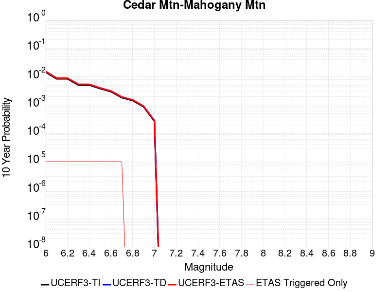 |

| Magnitude | 1 wk TI Prob | 1 wk TD Prob | 1 wk ETAS Prob | 1 wk ETAS/TD Gain | 1 wk ETAS Triggered Only | 1 mo TI Prob | 1 mo TD Prob | 1 mo ETAS Prob | 1 mo ETAS/TD Gain | 1 mo ETAS Triggered Only | 1 yr TI Prob | 1 yr TD Prob | 1 yr ETAS Prob | 1 yr ETAS/TD Gain | 1 yr ETAS Triggered Only | 10 yr TI Prob | 10 yr TD Prob | 10 yr ETAS Prob | 10 yr ETAS/TD Gain | 10 yr ETAS Triggered Only |
|-----|-----|-----|-----|-----|-----|-----|-----|-----|-----|-----|-----|-----|-----|-----|-----|-----|-----|-----|-----|-----|
| 6.0 | 2.7763876E-5 | 2.9588866E-5 | 2.9588866E-5 | 1.0 | 0.0 | 1.1898261E-4 | 1.2680366E-4 | 1.3680238E-4 | 1.078852 | 1.0E-5 | 0.0014476506 | 0.0015428112 | 0.0015527958 | 1.0064716 | 1.0E-5 | 0.0143825635 | 0.015328225 | 0.015338072 | 1.0006424 | 1.0E-5 |
| 6.1 | 1.6162443E-5 | 1.7142966E-5 | 1.7142966E-5 | 1.0 | 0.0 | 6.926578E-5 | 7.346788E-5 | 8.346715E-5 | 1.1361039 | 1.0E-5 | 8.4298453E-4 | 8.941221E-4 | 9.0411317E-4 | 1.0111742 | 1.0E-5 | 0.008397939 | 0.008907059 | 0.008916969 | 1.0011127 | 1.0E-5 |
| 6.2 | 1.6162443E-5 | 1.7142966E-5 | 1.7142966E-5 | 1.0 | 0.0 | 6.926578E-5 | 7.346788E-5 | 8.346715E-5 | 1.1361039 | 1.0E-5 | 8.4298453E-4 | 8.941221E-4 | 9.0411317E-4 | 1.0111742 | 1.0E-5 | 0.008397939 | 0.008907059 | 0.008916969 | 1.0011127 | 1.0E-5 |
| 6.3 | 9.746053E-6 | 1.0303152E-5 | 1.0303152E-5 | 1.0 | 0.0 | 4.1768133E-5 | 4.415564E-5 | 5.41552E-5 | 1.2264616 | 1.0E-5 | 5.0840835E-4 | 5.3746643E-4 | 5.4746104E-4 | 1.0185958 | 1.0E-5 | 0.0050724675 | 0.005362084 | 0.0053720307 | 1.0018549 | 1.0E-5 |
| 6.4 | 9.746053E-6 | 1.0303152E-5 | 1.0303152E-5 | 1.0 | 0.0 | 4.1768133E-5 | 4.415564E-5 | 5.41552E-5 | 1.2264616 | 1.0E-5 | 5.0840835E-4 | 5.3746643E-4 | 5.4746104E-4 | 1.0185958 | 1.0E-5 | 0.0050724675 | 0.005362084 | 0.0053720307 | 1.0018549 | 1.0E-5 |
| 6.5 | 7.290083E-6 | 7.695325E-6 | 7.695325E-6 | 1.0 | 0.0 | 3.124284E-5 | 3.297956E-5 | 4.2979227E-5 | 1.3032081 | 1.0E-5 | 3.8031515E-4 | 4.014543E-4 | 4.1145028E-4 | 1.0248995 | 1.0E-5 | 0.0037966494 | 0.004007511 | 0.004017471 | 1.0024853 | 1.0E-5 |
| 6.6 | 5.67907E-6 | 5.9891527E-6 | 5.9891527E-6 | 1.0 | 0.0 | 2.4338644E-5 | 2.5667552E-5 | 3.5667297E-5 | 1.3895869 | 1.0E-5 | 2.962827E-4 | 3.12459E-4 | 3.2245586E-4 | 1.0319942 | 1.0E-5 | 0.0029588798 | 0.003120333 | 0.0031303016 | 1.0031948 | 1.0E-5 |
| 6.7 | 3.4853963E-6 | 3.672631E-6 | 3.672631E-6 | 1.0 | 0.0 | 1.4937327E-5 | 1.5739755E-5 | 2.5739599E-5 | 1.6353239 | 1.0E-5 | 1.8184677E-4 | 1.916153E-4 | 2.0161338E-4 | 1.0521779 | 1.0E-5 | 0.0018169804 | 0.0019145629 | 0.0019245436 | 1.0052131 | 1.0E-5 |
| 6.8 | 2.7535168E-6 | 2.9015764E-6 | 2.9015764E-6 | 1.0 | 0.0 | 1.1800733E-5 | 1.2435271E-5 | 1.2435271E-5 | 1.0 | 0.0 | 1.4366445E-4 | 1.5138938E-4 | 1.5138938E-4 | 1.0 | 0.0 | 0.0014357162 | 0.0015129098 | 0.0015129098 | 1.0 | 0.0 |
| 6.9 | 1.6594106E-6 | 1.7496985E-6 | 1.7496985E-6 | 1.0 | 0.0 | 7.1117406E-6 | 7.4986883E-6 | 7.4986883E-6 | 1.0 | 0.0 | 8.6582E-5 | 9.129302E-5 | 9.129302E-5 | 1.0 | 0.0 | 8.654827E-4 | 9.125856E-4 | 9.125856E-4 | 1.0 | 0.0 |
| 7.0 | 5.10215E-7 | 5.389254E-7 | 5.389254E-7 | 1.0 | 0.0 | 2.186634E-6 | 2.3096788E-6 | 2.3096788E-6 | 1.0 | 0.0 | 2.6621943E-5 | 2.8120105E-5 | 2.8120105E-5 | 1.0 | 0.0 | 2.6618753E-4 | 2.81178E-4 | 2.81178E-4 | 1.0 | 0.0 |

## Puente Hills
*[(top)](#table-of-contents)*

| 1 Week | 1 Month | 1 Year | 10 Year |
|-----|-----|-----|-----|
|  |  |  |  |

| Magnitude | 1 wk TI Prob | 1 wk TD Prob | 1 wk ETAS Prob | 1 wk ETAS/TD Gain | 1 wk ETAS Triggered Only | 1 mo TI Prob | 1 mo TD Prob | 1 mo ETAS Prob | 1 mo ETAS/TD Gain | 1 mo ETAS Triggered Only | 1 yr TI Prob | 1 yr TD Prob | 1 yr ETAS Prob | 1 yr ETAS/TD Gain | 1 yr ETAS Triggered Only | 10 yr TI Prob | 10 yr TD Prob | 10 yr ETAS Prob | 10 yr ETAS/TD Gain | 10 yr ETAS Triggered Only |
|-----|-----|-----|-----|-----|-----|-----|-----|-----|-----|-----|-----|-----|-----|-----|-----|-----|-----|-----|-----|-----|
| 6.0 | 1.2101656E-5 | 8.098448E-6 | 8.098448E-6 | 1.0 | 0.0 | 5.1863204E-5 | 3.4707205E-5 | 4.4706856E-5 | 1.2881147 | 1.0E-5 | 6.312516E-4 | 4.2248392E-4 | 4.324797E-4 | 1.0236596 | 1.0E-5 | 0.0062946146 | 0.0042173676 | 0.0042273253 | 1.0023612 | 1.0E-5 |
| 6.1 | 1.2101656E-5 | 8.098448E-6 | 8.098448E-6 | 1.0 | 0.0 | 5.1863204E-5 | 3.4707205E-5 | 4.4706856E-5 | 1.2881147 | 1.0E-5 | 6.312516E-4 | 4.2248392E-4 | 4.324797E-4 | 1.0236596 | 1.0E-5 | 0.0062946146 | 0.0042173676 | 0.0042273253 | 1.0023612 | 1.0E-5 |
| 6.2 | 1.2101656E-5 | 8.098448E-6 | 8.098448E-6 | 1.0 | 0.0 | 5.1863204E-5 | 3.4707205E-5 | 4.4706856E-5 | 1.2881147 | 1.0E-5 | 6.312516E-4 | 4.2248392E-4 | 4.324797E-4 | 1.0236596 | 1.0E-5 | 0.0062946146 | 0.0042173676 | 0.0042273253 | 1.0023612 | 1.0E-5 |
| 6.3 | 1.2101656E-5 | 8.098448E-6 | 8.098448E-6 | 1.0 | 0.0 | 5.1863204E-5 | 3.4707205E-5 | 4.4706856E-5 | 1.2881147 | 1.0E-5 | 6.312516E-4 | 4.2248392E-4 | 4.324797E-4 | 1.0236596 | 1.0E-5 | 0.0062946146 | 0.0042173676 | 0.0042273253 | 1.0023612 | 1.0E-5 |
| 6.4 | 1.2101656E-5 | 8.098448E-6 | 8.098448E-6 | 1.0 | 0.0 | 5.1863204E-5 | 3.4707205E-5 | 4.4706856E-5 | 1.2881147 | 1.0E-5 | 6.312516E-4 | 4.2248392E-4 | 4.324797E-4 | 1.0236596 | 1.0E-5 | 0.0062946146 | 0.0042173676 | 0.0042273253 | 1.0023612 | 1.0E-5 |
| 6.5 | 1.2101656E-5 | 8.098448E-6 | 8.098448E-6 | 1.0 | 0.0 | 5.1863204E-5 | 3.4707205E-5 | 4.4706856E-5 | 1.2881147 | 1.0E-5 | 6.312516E-4 | 4.2248392E-4 | 4.324797E-4 | 1.0236596 | 1.0E-5 | 0.0062946146 | 0.0042173676 | 0.0042273253 | 1.0023612 | 1.0E-5 |
| 6.6 | 1.0222488E-5 | 6.399079E-6 | 6.399079E-6 | 1.0 | 0.0 | 4.3809923E-5 | 2.742435E-5 | 3.7424077E-5 | 1.3646294 | 1.0E-5 | 5.332553E-4 | 3.3384276E-4 | 3.4383943E-4 | 1.0299442 | 1.0E-5 | 0.0053197746 | 0.0033336577 | 0.0033436243 | 1.0029896 | 1.0E-5 |
| 6.7 | 1.0222488E-5 | 6.399079E-6 | 6.399079E-6 | 1.0 | 0.0 | 4.3809923E-5 | 2.742435E-5 | 3.7424077E-5 | 1.3646294 | 1.0E-5 | 5.332553E-4 | 3.3384276E-4 | 3.4383943E-4 | 1.0299442 | 1.0E-5 | 0.0053197746 | 0.0033336577 | 0.0033436243 | 1.0029896 | 1.0E-5 |
| 6.8 | 8.6367845E-6 | 5.028129E-6 | 5.028129E-6 | 1.0 | 0.0 | 3.7014266E-5 | 2.1548949E-5 | 3.1548734E-5 | 1.4640497 | 1.0E-5 | 4.505555E-4 | 2.6232743E-4 | 2.723248E-4 | 1.0381103 | 1.0E-5 | 0.004496431 | 0.002620234 | 0.0026302077 | 1.0038065 | 1.0E-5 |
| 6.9 | 8.066481E-6 | 4.8360116E-6 | 4.8360116E-6 | 1.0 | 0.0 | 3.4570177E-5 | 2.0725602E-5 | 3.0725394E-5 | 1.482485 | 1.0E-5 | 4.2081063E-4 | 2.523055E-4 | 2.62303E-4 | 1.0396245 | 1.0E-5 | 0.0042001465 | 0.0025202443 | 0.0025302193 | 1.0039579 | 1.0E-5 |
| 7.0 | 7.393828E-6 | 4.4172275E-6 | 4.4172275E-6 | 1.0 | 0.0 | 3.168745E-5 | 1.8930841E-5 | 2.8930652E-5 | 1.5282285 | 1.0E-5 | 3.857264E-4 | 2.3045906E-4 | 2.4045675E-4 | 1.0433817 | 1.0E-5 | 0.0038505755 | 0.0023022462 | 0.0023122232 | 1.0043336 | 1.0E-5 |
| 7.1 | 6.4660953E-6 | 3.8043859E-6 | 3.8043859E-6 | 1.0 | 0.0 | 2.7711543E-5 | 1.630441E-5 | 2.6304248E-5 | 1.613321 | 1.0E-5 | 3.373358E-4 | 1.9848847E-4 | 2.0848648E-4 | 1.0503708 | 1.0E-5 | 0.0033682417 | 0.0019831478 | 0.0019931279 | 1.0050325 | 1.0E-5 |
| 7.2 | 5.143232E-6 | 2.7864896E-6 | 2.7864896E-6 | 1.0 | 0.0 | 2.2042237E-5 | 1.1942045E-5 | 2.1941925E-5 | 1.8373675 | 1.0E-5 | 2.6833118E-4 | 1.453848E-4 | 1.5538334E-4 | 1.068773 | 1.0E-5 | 0.002680074 | 0.0014529065 | 0.001462892 | 1.0068728 | 1.0E-5 |
| 7.3 | 3.928255E-6 | 2.091338E-6 | 2.091338E-6 | 1.0 | 0.0 | 1.683527E-5 | 8.962847E-6 | 1.8962757E-5 | 2.115707 | 1.0E-5 | 2.0495013E-4 | 1.0911726E-4 | 1.1911617E-4 | 1.0916345 | 1.0E-5 | 0.002047612 | 0.0010906435 | 0.0011006326 | 1.0091588 | 1.0E-5 |
| 7.4 | 2.7894434E-6 | 1.3546429E-6 | 1.3546429E-6 | 1.0 | 0.0 | 1.1954703E-5 | 5.8056E-6 | 1.580554E-5 | 2.722465 | 1.0E-5 | 1.4553878E-4 | 7.068093E-5 | 8.068022E-5 | 1.1414709 | 1.0E-5 | 0.001454435 | 7.0658885E-4 | 7.1658177E-4 | 1.0141425 | 1.0E-5 |
| 7.5 | 2.041735E-6 | 8.786996E-7 | 8.786996E-7 | 1.0 | 0.0 | 8.750263E-6 | 3.7658504E-6 | 3.7658504E-6 | 1.0 | 0.0 | 1.06529245E-4 | 4.5848297E-5 | 4.5848297E-5 | 1.0 | 0.0 | 0.0010647819 | 4.5839173E-4 | 4.5839173E-4 | 1.0 | 0.0 |
| 7.6 | 1.6959062E-6 | 6.698339E-7 | 6.698339E-7 | 1.0 | 0.0 | 7.268149E-6 | 2.8707138E-6 | 2.8707138E-6 | 1.0 | 0.0 | 8.848612E-5 | 3.4950408E-5 | 3.4950408E-5 | 1.0 | 0.0 | 8.84509E-4 | 3.4945202E-4 | 3.4945202E-4 | 1.0 | 0.0 |
| 7.7 | 1.4767965E-6 | 5.407146E-7 | 5.407146E-7 | 1.0 | 0.0 | 6.3291122E-6 | 2.3173466E-6 | 2.3173466E-6 | 1.0 | 0.0 | 7.705422E-5 | 2.8213353E-5 | 2.8213353E-5 | 1.0 | 0.0 | 7.702751E-4 | 2.8210029E-4 | 2.8210029E-4 | 1.0 | 0.0 |
| 7.8 | 1.8432911E-7 | 7.2811105E-8 | 7.2811105E-8 | 1.0 | 0.0 | 7.8998164E-7 | 3.1204758E-7 | 3.1204758E-7 | 1.0 | 0.0 | 9.617985E-6 | 3.799176E-6 | 3.799176E-6 | 1.0 | 0.0 | 9.617568E-5 | 3.7991435E-5 | 3.7991435E-5 | 1.0 | 0.0 |

## San Andreas (North Coast) 2011 CFM
*[(top)](#table-of-contents)*

| 1 Week | 1 Month | 1 Year | 10 Year |
|-----|-----|-----|-----|
| 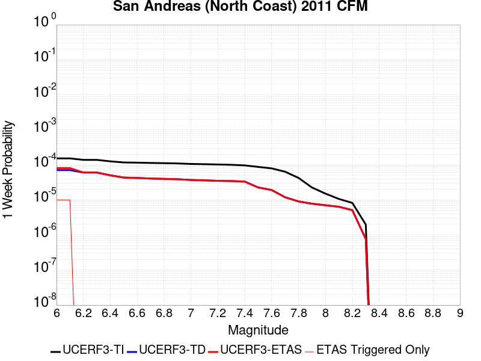 |  |  | 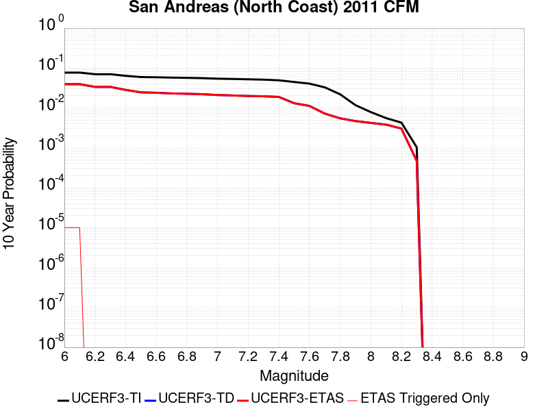 |

| Magnitude | 1 wk TI Prob | 1 wk TD Prob | 1 wk ETAS Prob | 1 wk ETAS/TD Gain | 1 wk ETAS Triggered Only | 1 mo TI Prob | 1 mo TD Prob | 1 mo ETAS Prob | 1 mo ETAS/TD Gain | 1 mo ETAS Triggered Only | 1 yr TI Prob | 1 yr TD Prob | 1 yr ETAS Prob | 1 yr ETAS/TD Gain | 1 yr ETAS Triggered Only | 10 yr TI Prob | 10 yr TD Prob | 10 yr ETAS Prob | 10 yr ETAS/TD Gain | 10 yr ETAS Triggered Only |
|-----|-----|-----|-----|-----|-----|-----|-----|-----|-----|-----|-----|-----|-----|-----|-----|-----|-----|-----|-----|-----|
| 6.0 | 1.5333705E-4 | 7.109695E-5 | 8.109623E-5 | 1.140643 | 1.0E-5 | 6.5699324E-4 | 3.046658E-4 | 3.1466273E-4 | 1.0328128 | 1.0E-5 | 0.007969595 | 0.0037030308 | 0.0037129938 | 1.0026904 | 1.0E-5 | 0.0768977 | 0.039364267 | 0.039373875 | 1.000244 | 1.0E-5 |
| 6.1 | 1.5333705E-4 | 7.109695E-5 | 8.109623E-5 | 1.140643 | 1.0E-5 | 6.5699324E-4 | 3.046658E-4 | 3.1466273E-4 | 1.0328128 | 1.0E-5 | 0.007969595 | 0.0037030308 | 0.0037129938 | 1.0026904 | 1.0E-5 | 0.0768977 | 0.039364267 | 0.039373875 | 1.000244 | 1.0E-5 |
| 6.2 | 1.3912938E-4 | 6.049243E-5 | 6.049243E-5 | 1.0 | 0.0 | 5.961325E-4 | 2.5922767E-4 | 2.5922767E-4 | 1.0 | 0.0 | 0.007233787 | 0.0031515562 | 0.0031515562 | 1.0 | 0.0 | 0.07002798 | 0.03369792 | 0.03369792 | 1.0 | 0.0 |
| 6.3 | 1.3912938E-4 | 6.049243E-5 | 6.049243E-5 | 1.0 | 0.0 | 5.961325E-4 | 2.5922767E-4 | 2.5922767E-4 | 1.0 | 0.0 | 0.007233787 | 0.0031515562 | 0.0031515562 | 1.0 | 0.0 | 0.07002798 | 0.03369792 | 0.03369792 | 1.0 | 0.0 |
| 6.4 | 1.2623647E-4 | 5.0433562E-5 | 5.0433562E-5 | 1.0 | 0.0 | 5.4090127E-4 | 2.1612605E-4 | 2.1612605E-4 | 1.0 | 0.0 | 0.0065656058 | 0.0026281793 | 0.0026281793 | 1.0 | 0.0 | 0.06374981 | 0.02830552 | 0.02830552 | 1.0 | 0.0 |
| 6.5 | 1.1736096E-4 | 4.3516375E-5 | 4.3516375E-5 | 1.0 | 0.0 | 5.028786E-4 | 1.8648551E-4 | 1.8648551E-4 | 1.0 | 0.0 | 0.006105373 | 0.0022681132 | 0.0022681132 | 1.0 | 0.0 | 0.05940335 | 0.024576947 | 0.024576947 | 1.0 | 0.0 |
| 6.6 | 1.1586959E-4 | 4.2416294E-5 | 4.2416294E-5 | 1.0 | 0.0 | 4.964894E-4 | 1.8177154E-4 | 1.8177154E-4 | 1.0 | 0.0 | 0.006028018 | 0.0022108385 | 0.0022108385 | 1.0 | 0.0 | 0.058671024 | 0.023982164 | 0.023982164 | 1.0 | 0.0 |
| 6.7 | 1.13693764E-4 | 4.0728228E-5 | 4.0728228E-5 | 1.0 | 0.0 | 4.87168E-4 | 1.7453796E-4 | 1.7453796E-4 | 1.0 | 0.0 | 0.005915152 | 0.0021229447 | 0.0021229447 | 1.0 | 0.0 | 0.057601593 | 0.023075242 | 0.023075242 | 1.0 | 0.0 |
| 6.8 | 1.1204889E-4 | 3.9945848E-5 | 3.9945848E-5 | 1.0 | 0.0 | 4.8012115E-4 | 1.7118535E-4 | 1.7118535E-4 | 1.0 | 0.0 | 0.005829819 | 0.0020822054 | 0.0020822054 | 1.0 | 0.0 | 0.05679232 | 0.022635331 | 0.022635331 | 1.0 | 0.0 |
| 6.9 | 1.1005794E-4 | 3.9001738E-5 | 3.9001738E-5 | 1.0 | 0.0 | 4.7159163E-4 | 1.6713967E-4 | 1.6713967E-4 | 1.0 | 0.0 | 0.0057265228 | 0.0020330423 | 0.0020330423 | 1.0 | 0.0 | 0.055811852 | 0.02210134 | 0.02210134 | 1.0 | 0.0 |
| 7.0 | 1.0647948E-4 | 3.7159174E-5 | 3.7159174E-5 | 1.0 | 0.0 | 4.562608E-4 | 1.5924397E-4 | 1.5924397E-4 | 1.0 | 0.0 | 0.0055408357 | 0.0019370868 | 0.0019370868 | 1.0 | 0.0 | 0.054047033 | 0.02105931 | 0.02105931 | 1.0 | 0.0 |
| 7.1 | 1.04795035E-4 | 3.620866E-5 | 3.620866E-5 | 1.0 | 0.0 | 4.4904428E-4 | 1.5517084E-4 | 1.5517084E-4 | 1.0 | 0.0 | 0.0054534175 | 0.0018875834 | 0.0018875834 | 1.0 | 0.0 | 0.053215165 | 0.02052821 | 0.02052821 | 1.0 | 0.0 |
| 7.2 | 1.02724036E-4 | 3.5117457E-5 | 3.5117457E-5 | 1.0 | 0.0 | 4.401716E-4 | 1.5049479E-4 | 1.5049479E-4 | 1.0 | 0.0 | 0.0053459285 | 0.0018307496 | 0.0018307496 | 1.0 | 0.0 | 0.052191395 | 0.01991573 | 0.01991573 | 1.0 | 0.0 |
| 7.3 | 1.00650694E-4 | 3.45853E-5 | 3.45853E-5 | 1.0 | 0.0 | 4.312888E-4 | 1.4821437E-4 | 1.4821437E-4 | 1.0 | 0.0 | 0.005238306 | 0.0018030318 | 0.0018030318 | 1.0 | 0.0 | 0.051165357 | 0.01959264 | 0.01959264 | 1.0 | 0.0 |
| 7.4 | 9.672919E-5 | 3.3374814E-5 | 3.3374814E-5 | 1.0 | 0.0 | 4.144878E-4 | 1.4302715E-4 | 1.4302715E-4 | 1.0 | 0.0 | 0.005034718 | 0.00173998 | 0.00173998 | 1.0 | 0.0 | 0.049221683 | 0.01886682 | 0.01886682 | 1.0 | 0.0 |
| 7.5 | 8.7600405E-5 | 2.2694192E-5 | 2.2694192E-5 | 1.0 | 0.0 | 3.753763E-4 | 9.725721E-5 | 9.725721E-5 | 1.0 | 0.0 | 0.0045606326 | 0.0011834651 | 0.0011834651 | 1.0 | 0.0 | 0.04468165 | 0.013127938 | 0.013127938 | 1.0 | 0.0 |
| 7.6 | 7.9562284E-5 | 1.922004E-5 | 1.922004E-5 | 1.0 | 0.0 | 3.4093665E-4 | 8.236901E-5 | 8.236901E-5 | 1.0 | 0.0 | 0.0041430052 | 0.0010023828 | 0.0010023828 | 1.0 | 0.0 | 0.040666126 | 0.0112194 | 0.0112194 | 1.0 | 0.0 |
| 7.7 | 6.3866544E-5 | 1.1936281E-5 | 1.1936281E-5 | 1.0 | 0.0 | 2.7368503E-4 | 5.115449E-5 | 5.115449E-5 | 1.0 | 0.0 | 0.0033270244 | 6.226282E-4 | 6.226282E-4 | 1.0 | 0.0 | 0.032776527 | 0.0072073294 | 0.0072073294 | 1.0 | 0.0 |
| 7.8 | 4.2543215E-5 | 9.0726735E-6 | 9.0726735E-6 | 1.0 | 0.0 | 1.8231533E-4 | 3.888231E-5 | 3.888231E-5 | 1.0 | 0.0 | 0.0022174292 | 4.7328937E-4 | 4.7328937E-4 | 1.0 | 0.0 | 0.021954332 | 0.0054884683 | 0.0054884683 | 1.0 | 0.0 |
| 7.9 | 2.2636612E-5 | 7.811842E-6 | 7.811842E-6 | 1.0 | 0.0 | 9.7010445E-5 | 3.3478893E-5 | 3.3478893E-5 | 1.0 | 0.0 | 0.0011804621 | 4.0752938E-4 | 4.0752938E-4 | 1.0 | 0.0 | 0.011742111 | 0.0046821116 | 0.0046821116 | 1.0 | 0.0 |
| 8.0 | 1.5167874E-5 | 7.0475517E-6 | 7.0475517E-6 | 1.0 | 0.0 | 6.500356E-5 | 3.0203442E-5 | 3.0203442E-5 | 1.0 | 0.0 | 7.9113094E-4 | 3.6766496E-4 | 3.6766496E-4 | 1.0 | 0.0 | 0.007883203 | 0.004214701 | 0.004214701 | 1.0 | 0.0 |
| 8.1 | 1.0681047E-5 | 6.3854363E-6 | 6.3854363E-6 | 1.0 | 0.0 | 4.5775112E-5 | 2.7365868E-5 | 2.7365868E-5 | 1.0 | 0.0 | 5.5716943E-4 | 3.331286E-4 | 3.331286E-4 | 1.0 | 0.0 | 0.0055577457 | 0.003816698 | 0.003816698 | 1.0 | 0.0 |
| 8.2 | 8.226114E-6 | 5.1139064E-6 | 5.1139064E-6 | 1.0 | 0.0 | 3.52543E-5 | 2.1916558E-5 | 2.1916558E-5 | 1.0 | 0.0 | 4.2913653E-4 | 2.6680148E-4 | 2.6680148E-4 | 1.0 | 0.0 | 0.004283088 | 0.0030445685 | 0.0030445685 | 1.0 | 0.0 |
| 8.3 | 1.983087E-6 | 7.6564595E-7 | 7.6564595E-7 | 1.0 | 0.0 | 8.498917E-6 | 3.281336E-6 | 3.281336E-6 | 1.0 | 0.0 | 1.034694E-4 | 3.9949547E-5 | 3.9949547E-5 | 1.0 | 0.0 | 0.0010342124 | 4.717979E-4 | 4.717979E-4 | 1.0 | 0.0 |

## Peralta Hills
*[(top)](#table-of-contents)*

| 1 Week | 1 Month | 1 Year | 10 Year |
|-----|-----|-----|-----|
|  |  |  |  |

| Magnitude | 1 wk TI Prob | 1 wk TD Prob | 1 wk ETAS Prob | 1 wk ETAS/TD Gain | 1 wk ETAS Triggered Only | 1 mo TI Prob | 1 mo TD Prob | 1 mo ETAS Prob | 1 mo ETAS/TD Gain | 1 mo ETAS Triggered Only | 1 yr TI Prob | 1 yr TD Prob | 1 yr ETAS Prob | 1 yr ETAS/TD Gain | 1 yr ETAS Triggered Only | 10 yr TI Prob | 10 yr TD Prob | 10 yr ETAS Prob | 10 yr ETAS/TD Gain | 10 yr ETAS Triggered Only |
|-----|-----|-----|-----|-----|-----|-----|-----|-----|-----|-----|-----|-----|-----|-----|-----|-----|-----|-----|-----|-----|
| 6.0 | 3.8850067E-6 | 3.8395046E-6 | 3.8395046E-6 | 1.0 | 0.0 | 1.6649923E-5 | 1.6454958E-5 | 1.6454958E-5 | 1.0 | 0.0 | 2.0269395E-4 | 2.0032811E-4 | 2.1032612E-4 | 1.0499082 | 1.0E-5 | 0.0020250916 | 0.002002203 | 0.002012183 | 1.0049845 | 1.0E-5 |
| 6.1 | 3.8850067E-6 | 3.8395046E-6 | 3.8395046E-6 | 1.0 | 0.0 | 1.6649923E-5 | 1.6454958E-5 | 1.6454958E-5 | 1.0 | 0.0 | 2.0269395E-4 | 2.0032811E-4 | 2.1032612E-4 | 1.0499082 | 1.0E-5 | 0.0020250916 | 0.002002203 | 0.002012183 | 1.0049845 | 1.0E-5 |
| 6.2 | 3.8850067E-6 | 3.8395046E-6 | 3.8395046E-6 | 1.0 | 0.0 | 1.6649923E-5 | 1.6454958E-5 | 1.6454958E-5 | 1.0 | 0.0 | 2.0269395E-4 | 2.0032811E-4 | 2.1032612E-4 | 1.0499082 | 1.0E-5 | 0.0020250916 | 0.002002203 | 0.002012183 | 1.0049845 | 1.0E-5 |
| 6.3 | 3.8850067E-6 | 3.8395046E-6 | 3.8395046E-6 | 1.0 | 0.0 | 1.6649923E-5 | 1.6454958E-5 | 1.6454958E-5 | 1.0 | 0.0 | 2.0269395E-4 | 2.0032811E-4 | 2.1032612E-4 | 1.0499082 | 1.0E-5 | 0.0020250916 | 0.002002203 | 0.002012183 | 1.0049845 | 1.0E-5 |
| 6.4 | 3.8850067E-6 | 3.8395046E-6 | 3.8395046E-6 | 1.0 | 0.0 | 1.6649923E-5 | 1.6454958E-5 | 1.6454958E-5 | 1.0 | 0.0 | 2.0269395E-4 | 2.0032811E-4 | 2.1032612E-4 | 1.0499082 | 1.0E-5 | 0.0020250916 | 0.002002203 | 0.002012183 | 1.0049845 | 1.0E-5 |
| 6.5 | 1.5587785E-6 | 1.4430725E-6 | 1.4430725E-6 | 1.0 | 0.0 | 6.6804623E-6 | 6.184583E-6 | 6.184583E-6 | 1.0 | 0.0 | 8.133159E-5 | 7.529494E-5 | 7.529494E-5 | 1.0 | 0.0 | 8.1301836E-4 | 7.527183E-4 | 7.527183E-4 | 1.0 | 0.0 |
| 6.6 | 1.5587785E-6 | 1.4430725E-6 | 1.4430725E-6 | 1.0 | 0.0 | 6.6804623E-6 | 6.184583E-6 | 6.184583E-6 | 1.0 | 0.0 | 8.133159E-5 | 7.529494E-5 | 7.529494E-5 | 1.0 | 0.0 | 8.1301836E-4 | 7.527183E-4 | 7.527183E-4 | 1.0 | 0.0 |
| 6.7 | 1.5018579E-6 | 1.3836951E-6 | 1.3836951E-6 | 1.0 | 0.0 | 6.436518E-6 | 5.9301096E-6 | 5.9301096E-6 | 1.0 | 0.0 | 7.836179E-5 | 7.219693E-5 | 7.219693E-5 | 1.0 | 0.0 | 7.833416E-4 | 7.2175835E-4 | 7.2175835E-4 | 1.0 | 0.0 |
| 6.8 | 1.4584314E-6 | 1.3381272E-6 | 1.3381272E-6 | 1.0 | 0.0 | 6.250405E-6 | 5.7348193E-6 | 5.7348193E-6 | 1.0 | 0.0 | 7.6096025E-5 | 6.981943E-5 | 6.981943E-5 | 1.0 | 0.0 | 7.6069974E-4 | 6.9799833E-4 | 6.9799833E-4 | 1.0 | 0.0 |
| 6.9 | 1.1382393E-6 | 9.862176E-7 | 9.862176E-7 | 1.0 | 0.0 | 4.8781594E-6 | 4.2266406E-6 | 4.2266406E-6 | 1.0 | 0.0 | 5.9389975E-5 | 5.145822E-5 | 5.145822E-5 | 1.0 | 0.0 | 5.93741E-4 | 5.1447126E-4 | 5.1447126E-4 | 1.0 | 0.0 |
| 7.0 | 9.970413E-7 | 8.3095136E-7 | 8.3095136E-7 | 1.0 | 0.0 | 4.273027E-6 | 3.5612156E-6 | 3.5612156E-6 | 1.0 | 0.0 | 5.2022864E-5 | 4.3357006E-5 | 4.3357006E-5 | 1.0 | 0.0 | 5.2010687E-4 | 4.3349227E-4 | 4.3349227E-4 | 1.0 | 0.0 |
| 7.1 | 9.684443E-7 | 7.993957E-7 | 7.993957E-7 | 1.0 | 0.0 | 4.150469E-6 | 3.4259774E-6 | 3.4259774E-6 | 1.0 | 0.0 | 5.053079E-5 | 4.1710548E-5 | 4.1710548E-5 | 1.0 | 0.0 | 5.05193E-4 | 4.170339E-4 | 4.170339E-4 | 1.0 | 0.0 |
| 7.2 | 9.240811E-7 | 7.503015E-7 | 7.503015E-7 | 1.0 | 0.0 | 3.960342E-6 | 3.2155742E-6 | 3.2155742E-6 | 1.0 | 0.0 | 4.8216094E-5 | 3.914898E-5 | 3.914898E-5 | 1.0 | 0.0 | 4.8205635E-4 | 3.9142737E-4 | 3.9142737E-4 | 1.0 | 0.0 |
| 7.3 | 8.158643E-7 | 6.34986E-7 | 6.34986E-7 | 1.0 | 0.0 | 3.4965567E-6 | 2.7213662E-6 | 2.7213662E-6 | 1.0 | 0.0 | 4.2569747E-5 | 3.3132193E-5 | 3.3132193E-5 | 1.0 | 0.0 | 4.2561593E-4 | 3.3127866E-4 | 3.3127866E-4 | 1.0 | 0.0 |
| 7.4 | 6.3822824E-7 | 4.79557E-7 | 4.79557E-7 | 1.0 | 0.0 | 2.7352612E-6 | 2.0552432E-6 | 2.0552432E-6 | 1.0 | 0.0 | 3.3301294E-5 | 2.502235E-5 | 2.502235E-5 | 1.0 | 0.0 | 3.3296304E-4 | 2.5020045E-4 | 2.5020045E-4 | 1.0 | 0.0 |
| 7.5 | 4.0292628E-7 | 2.7844956E-7 | 2.7844956E-7 | 1.0 | 0.0 | 1.7268258E-6 | 1.1933548E-6 | 1.1933548E-6 | 1.0 | 0.0 | 2.1023901E-5 | 1.4529027E-5 | 1.4529027E-5 | 1.0 | 0.0 | 2.1021912E-4 | 1.4528356E-4 | 1.4528356E-4 | 1.0 | 0.0 |
| 7.6 | 3.672993E-7 | 2.4854202E-7 | 2.4854202E-7 | 1.0 | 0.0 | 1.5741389E-6 | 1.0651798E-6 | 1.0651798E-6 | 1.0 | 0.0 | 1.9164972E-5 | 1.2968516E-5 | 1.2968516E-5 | 1.0 | 0.0 | 1.916332E-4 | 1.2968031E-4 | 1.2968031E-4 | 1.0 | 0.0 |
| 7.7 | 2.8466823E-7 | 1.7858805E-7 | 1.7858805E-7 | 1.0 | 0.0 | 1.2200061E-6 | 7.653773E-7 | 7.653773E-7 | 1.0 | 0.0 | 1.4853474E-5 | 9.318455E-6 | 9.318455E-6 | 1.0 | 0.0 | 1.485248E-4 | 9.318324E-5 | 9.318324E-5 | 1.0 | 0.0 |

## Hollywood
*[(top)](#table-of-contents)*

| 1 Week | 1 Month | 1 Year | 10 Year |
|-----|-----|-----|-----|
|  | 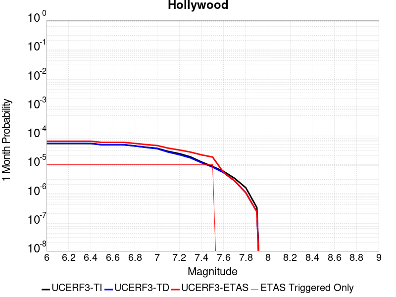 |  | 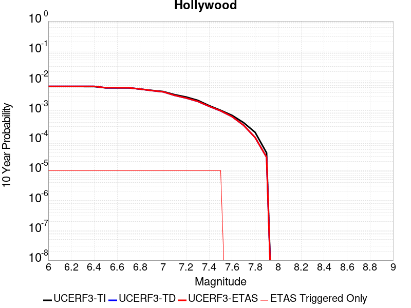 |

| Magnitude | 1 wk TI Prob | 1 wk TD Prob | 1 wk ETAS Prob | 1 wk ETAS/TD Gain | 1 wk ETAS Triggered Only | 1 mo TI Prob | 1 mo TD Prob | 1 mo ETAS Prob | 1 mo ETAS/TD Gain | 1 mo ETAS Triggered Only | 1 yr TI Prob | 1 yr TD Prob | 1 yr ETAS Prob | 1 yr ETAS/TD Gain | 1 yr ETAS Triggered Only | 10 yr TI Prob | 10 yr TD Prob | 10 yr ETAS Prob | 10 yr ETAS/TD Gain | 10 yr ETAS Triggered Only |
|-----|-----|-----|-----|-----|-----|-----|-----|-----|-----|-----|-----|-----|-----|-----|-----|-----|-----|-----|-----|-----|
| 6.0 | 1.24487615E-5 | 1.2593229E-5 | 1.2593229E-5 | 1.0 | 0.0 | 5.3350745E-5 | 5.3969892E-5 | 6.396935E-5 | 1.1852785 | 1.0E-5 | 6.4935174E-4 | 6.5689E-4 | 6.668834E-4 | 1.0152133 | 1.0E-5 | 0.0064745755 | 0.0065499707 | 0.006559905 | 1.0015167 | 1.0E-5 |
| 6.1 | 1.24487615E-5 | 1.2593229E-5 | 1.2593229E-5 | 1.0 | 0.0 | 5.3350745E-5 | 5.3969892E-5 | 6.396935E-5 | 1.1852785 | 1.0E-5 | 6.4935174E-4 | 6.5689E-4 | 6.668834E-4 | 1.0152133 | 1.0E-5 | 0.0064745755 | 0.0065499707 | 0.006559905 | 1.0015167 | 1.0E-5 |
| 6.2 | 1.24487615E-5 | 1.2593229E-5 | 1.2593229E-5 | 1.0 | 0.0 | 5.3350745E-5 | 5.3969892E-5 | 6.396935E-5 | 1.1852785 | 1.0E-5 | 6.4935174E-4 | 6.5689E-4 | 6.668834E-4 | 1.0152133 | 1.0E-5 | 0.0064745755 | 0.0065499707 | 0.006559905 | 1.0015167 | 1.0E-5 |
| 6.3 | 1.24487615E-5 | 1.2593229E-5 | 1.2593229E-5 | 1.0 | 0.0 | 5.3350745E-5 | 5.3969892E-5 | 6.396935E-5 | 1.1852785 | 1.0E-5 | 6.4935174E-4 | 6.5689E-4 | 6.668834E-4 | 1.0152133 | 1.0E-5 | 0.0064745755 | 0.0065499707 | 0.006559905 | 1.0015167 | 1.0E-5 |
| 6.4 | 1.2431024E-5 | 1.25738425E-5 | 1.25738425E-5 | 1.0 | 0.0 | 5.327473E-5 | 5.388681E-5 | 6.388627E-5 | 1.1855642 | 1.0E-5 | 6.4842677E-4 | 6.558791E-4 | 6.6587253E-4 | 1.0152367 | 1.0E-5 | 0.0064653796 | 0.0065399213 | 0.0065498557 | 1.0015191 | 1.0E-5 |
| 6.5 | 1.1242222E-5 | 1.1317804E-5 | 1.1317804E-5 | 1.0 | 0.0 | 4.8180063E-5 | 4.8503985E-5 | 5.85035E-5 | 1.2061586 | 1.0E-5 | 5.864344E-4 | 5.903787E-4 | 6.003728E-4 | 1.0169283 | 1.0E-5 | 0.0058488925 | 0.00588839 | 0.005898331 | 1.0016882 | 1.0E-5 |
| 6.6 | 1.1234066E-5 | 1.1308918E-5 | 1.1308918E-5 | 1.0 | 0.0 | 4.8145106E-5 | 4.8465907E-5 | 5.846542E-5 | 1.2063206 | 1.0E-5 | 5.86009E-4 | 5.899153E-4 | 5.999094E-4 | 1.0169415 | 1.0E-5 | 0.005844661 | 0.0058837803 | 0.0058937217 | 1.0016896 | 1.0E-5 |
| 6.7 | 1.12294E-5 | 1.1303661E-5 | 1.1303661E-5 | 1.0 | 0.0 | 4.812511E-5 | 4.8443377E-5 | 5.8442893E-5 | 1.2064166 | 1.0E-5 | 5.857657E-4 | 5.896412E-4 | 5.996353E-4 | 1.0169494 | 1.0E-5 | 0.0058422405 | 0.005881054 | 0.005890995 | 1.0016904 | 1.0E-5 |
| 6.8 | 1.0252819E-5 | 1.0218449E-5 | 1.0218449E-5 | 1.0 | 0.0 | 4.3939912E-5 | 4.3792625E-5 | 5.3792188E-5 | 1.228339 | 1.0E-5 | 5.3483713E-4 | 5.330469E-4 | 5.4304156E-4 | 1.0187501 | 1.0E-5 | 0.005335517 | 0.0053179096 | 0.005327856 | 1.0018704 | 1.0E-5 |
| 6.9 | 9.252289E-6 | 9.110309E-6 | 9.110309E-6 | 1.0 | 0.0 | 3.9652066E-5 | 3.9043607E-5 | 4.9043218E-5 | 1.2561139 | 1.0E-5 | 4.8265693E-4 | 4.752539E-4 | 4.8524915E-4 | 1.0210314 | 1.0E-5 | 0.0048161 | 0.004742549 | 0.0047525014 | 1.0020986 | 1.0E-5 |
| 7.0 | 8.474604E-6 | 8.25826E-6 | 8.25826E-6 | 1.0 | 0.0 | 3.6319227E-5 | 3.5392073E-5 | 4.539172E-5 | 1.2825391 | 1.0E-5 | 4.4209688E-4 | 4.3081472E-4 | 4.4081043E-4 | 1.0232018 | 1.0E-5 | 0.004412184 | 0.0042999457 | 0.004309903 | 1.0023156 | 1.0E-5 |
| 7.1 | 6.643643E-6 | 6.2683707E-6 | 6.2683707E-6 | 1.0 | 0.0 | 2.8472443E-5 | 2.686417E-5 | 3.68639E-5 | 1.372233 | 1.0E-5 | 3.4659685E-4 | 3.2702263E-4 | 3.3701936E-4 | 1.030569 | 1.0E-5 | 0.0034605677 | 0.0032654598 | 0.0032754273 | 1.0030524 | 1.0E-5 |
| 7.2 | 5.549002E-6 | 5.1087086E-6 | 5.1087086E-6 | 1.0 | 0.0 | 2.378122E-5 | 2.1894282E-5 | 3.1894062E-5 | 1.4567302 | 1.0E-5 | 2.8949787E-4 | 2.665304E-4 | 2.7652775E-4 | 1.0375092 | 1.0E-5 | 0.0028912104 | 0.002662124 | 0.0026720974 | 1.0037464 | 1.0E-5 |
| 7.3 | 4.3059727E-6 | 3.9598913E-6 | 3.9598913E-6 | 1.0 | 0.0 | 1.8454039E-5 | 1.6970853E-5 | 2.6970683E-5 | 1.5892355 | 1.0E-5 | 2.2465475E-4 | 2.0660064E-4 | 2.1659858E-4 | 1.0483925 | 1.0E-5 | 0.0022442779 | 0.0020640958 | 0.0020740752 | 1.0048348 | 1.0E-5 |
| 7.4 | 2.8550733E-6 | 2.7013002E-6 | 2.7013002E-6 | 1.0 | 0.0 | 1.2235971E-5 | 1.1576949E-5 | 2.1576834E-5 | 1.8637754 | 1.0E-5 | 1.4896276E-4 | 1.4094029E-4 | 1.5093888E-4 | 1.070942 | 1.0E-5 | 0.0014886294 | 0.0014085141 | 0.0014185001 | 1.0070897 | 1.0E-5 |
| 7.5 | 1.9927045E-6 | 1.8976393E-6 | 1.8976393E-6 | 1.0 | 0.0 | 8.540134E-6 | 8.132714E-6 | 1.8132634E-5 | 2.2295918 | 1.0E-5 | 1.0397117E-4 | 9.901134E-5 | 1.0901035E-4 | 1.1009885 | 1.0E-5 | 0.0010392254 | 9.896759E-4 | 9.996659E-4 | 1.0100943 | 1.0E-5 |
| 7.6 | 1.345084E-6 | 1.2216018E-6 | 1.2216018E-6 | 1.0 | 0.0 | 5.764633E-6 | 5.2354258E-6 | 5.2354258E-6 | 1.0 | 0.0 | 7.018215E-5 | 6.373946E-5 | 6.373946E-5 | 1.0 | 0.0 | 7.0159987E-4 | 6.372138E-4 | 6.372138E-4 | 1.0 | 0.0 |
| 7.7 | 7.6835164E-7 | 6.2777013E-7 | 6.2777013E-7 | 1.0 | 0.0 | 3.2929315E-6 | 2.6904406E-6 | 2.6904406E-6 | 1.0 | 0.0 | 4.00907E-5 | 3.2755637E-5 | 3.2755637E-5 | 1.0 | 0.0 | 4.0083472E-4 | 3.2750957E-4 | 3.2750957E-4 | 1.0 | 0.0 |
| 7.8 | 3.6562128E-7 | 2.4534745E-7 | 2.4534745E-7 | 1.0 | 0.0 | 1.5669474E-6 | 1.0514887E-6 | 1.0514887E-6 | 1.0 | 0.0 | 1.9077417E-5 | 1.2801803E-5 | 1.2801803E-5 | 1.0 | 0.0 | 1.907578E-4 | 1.2801103E-4 | 1.2801103E-4 | 1.0 | 0.0 |
| 7.9 | 7.5024424E-8 | 5.381742E-8 | 5.381742E-8 | 1.0 | 0.0 | 3.215332E-7 | 2.3064608E-7 | 2.3064608E-7 | 1.0 | 0.0 | 3.91466E-6 | 2.8081138E-6 | 2.8081138E-6 | 1.0 | 0.0 | 3.9145907E-5 | 2.8080913E-5 | 2.8080913E-5 | 1.0 | 0.0 |

## Elysian Park (Lower CFM)
*[(top)](#table-of-contents)*

| 1 Week | 1 Month | 1 Year | 10 Year |
|-----|-----|-----|-----|
|  | 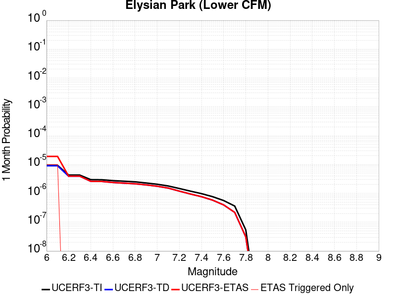 |  |  |

| Magnitude | 1 wk TI Prob | 1 wk TD Prob | 1 wk ETAS Prob | 1 wk ETAS/TD Gain | 1 wk ETAS Triggered Only | 1 mo TI Prob | 1 mo TD Prob | 1 mo ETAS Prob | 1 mo ETAS/TD Gain | 1 mo ETAS Triggered Only | 1 yr TI Prob | 1 yr TD Prob | 1 yr ETAS Prob | 1 yr ETAS/TD Gain | 1 yr ETAS Triggered Only | 10 yr TI Prob | 10 yr TD Prob | 10 yr ETAS Prob | 10 yr ETAS/TD Gain | 10 yr ETAS Triggered Only |
|-----|-----|-----|-----|-----|-----|-----|-----|-----|-----|-----|-----|-----|-----|-----|-----|-----|-----|-----|-----|-----|
| 6.0 | 2.1766498E-6 | 2.1037895E-6 | 2.1037895E-6 | 1.0 | 0.0 | 9.328466E-6 | 9.0162175E-6 | 1.9016126E-5 | 2.1091025 | 1.0E-5 | 1.1356815E-4 | 1.0976836E-4 | 1.1976726E-4 | 1.0910909 | 1.0E-5 | 0.0011351013 | 0.0010972833 | 0.0011072723 | 1.0091034 | 1.0E-5 |
| 6.1 | 2.1766498E-6 | 2.1037895E-6 | 2.1037895E-6 | 1.0 | 0.0 | 9.328466E-6 | 9.0162175E-6 | 1.9016126E-5 | 2.1091025 | 1.0E-5 | 1.1356815E-4 | 1.0976836E-4 | 1.1976726E-4 | 1.0910909 | 1.0E-5 | 0.0011351013 | 0.0010972833 | 0.0011072723 | 1.0091034 | 1.0E-5 |
| 6.2 | 1.0031182E-6 | 9.186213E-7 | 9.186213E-7 | 1.0 | 0.0 | 4.299071E-6 | 3.936943E-6 | 3.936943E-6 | 1.0 | 0.0 | 5.2339932E-5 | 4.7931328E-5 | 4.7931328E-5 | 1.0 | 0.0 | 5.2327604E-4 | 4.7921969E-4 | 4.7921969E-4 | 1.0 | 0.0 |
| 6.3 | 1.0031182E-6 | 9.186213E-7 | 9.186213E-7 | 1.0 | 0.0 | 4.299071E-6 | 3.936943E-6 | 3.936943E-6 | 1.0 | 0.0 | 5.2339932E-5 | 4.7931328E-5 | 4.7931328E-5 | 1.0 | 0.0 | 5.2327604E-4 | 4.7921969E-4 | 4.7921969E-4 | 1.0 | 0.0 |
| 6.4 | 6.9606244E-7 | 6.091942E-7 | 6.091942E-7 | 1.0 | 0.0 | 2.9831212E-6 | 2.6108296E-6 | 2.6108296E-6 | 1.0 | 0.0 | 3.6318896E-5 | 3.178639E-5 | 3.178639E-5 | 1.0 | 0.0 | 3.6312963E-4 | 3.1781866E-4 | 3.1781866E-4 | 1.0 | 0.0 |
| 6.5 | 6.901879E-7 | 6.0326255E-7 | 6.0326255E-7 | 1.0 | 0.0 | 2.9579448E-6 | 2.5854083E-6 | 2.5854083E-6 | 1.0 | 0.0 | 3.6012385E-5 | 3.1476895E-5 | 3.1476895E-5 | 1.0 | 0.0 | 3.600655E-4 | 3.147246E-4 | 3.147246E-4 | 1.0 | 0.0 |
| 6.6 | 6.4198554E-7 | 5.5466086E-7 | 5.5466086E-7 | 1.0 | 0.0 | 2.7513638E-6 | 2.3771156E-6 | 2.3771156E-6 | 1.0 | 0.0 | 3.3497337E-5 | 2.8941E-5 | 2.8941E-5 | 1.0 | 0.0 | 3.349229E-4 | 2.8937246E-4 | 2.8937246E-4 | 1.0 | 0.0 |
| 6.7 | 6.138733E-7 | 5.263416E-7 | 5.263416E-7 | 1.0 | 0.0 | 2.6308828E-6 | 2.2557474E-6 | 2.2557474E-6 | 1.0 | 0.0 | 3.203053E-5 | 2.746338E-5 | 2.746338E-5 | 1.0 | 0.0 | 3.2025913E-4 | 2.746E-4 | 2.746E-4 | 1.0 | 0.0 |
| 6.8 | 5.84778E-7 | 5.0029365E-7 | 5.0029365E-7 | 1.0 | 0.0 | 2.506189E-6 | 2.1441138E-6 | 2.1441138E-6 | 1.0 | 0.0 | 3.0512423E-5 | 2.6104273E-5 | 2.6104273E-5 | 1.0 | 0.0 | 3.0508233E-4 | 2.6101217E-4 | 2.6101217E-4 | 1.0 | 0.0 |
| 6.9 | 5.322785E-7 | 4.5800792E-7 | 4.5800792E-7 | 1.0 | 0.0 | 2.2811914E-6 | 1.9628894E-6 | 1.9628894E-6 | 1.0 | 0.0 | 2.7773152E-5 | 2.389792E-5 | 2.389792E-5 | 1.0 | 0.0 | 2.7769682E-4 | 2.3895358E-4 | 2.3895358E-4 | 1.0 | 0.0 |
| 7.0 | 4.8147206E-7 | 4.1124093E-7 | 4.1124093E-7 | 1.0 | 0.0 | 2.06345E-6 | 1.7624599E-6 | 1.7624599E-6 | 1.0 | 0.0 | 2.5122214E-5 | 2.1457738E-5 | 2.1457738E-5 | 1.0 | 0.0 | 2.5119373E-4 | 2.1455674E-4 | 2.1455674E-4 | 1.0 | 0.0 |
| 7.1 | 4.1932955E-7 | 3.5455687E-7 | 3.5455687E-7 | 1.0 | 0.0 | 1.7971255E-6 | 1.5195285E-6 | 1.5195285E-6 | 1.0 | 0.0 | 2.1879783E-5 | 1.8500103E-5 | 1.8500103E-5 | 1.0 | 0.0 | 2.1877629E-4 | 1.8498568E-4 | 1.8498568E-4 | 1.0 | 0.0 |
| 7.2 | 3.426051E-7 | 2.7810242E-7 | 2.7810242E-7 | 1.0 | 0.0 | 1.4683067E-6 | 1.1918669E-6 | 1.1918669E-6 | 1.0 | 0.0 | 1.7876488E-5 | 1.45108825E-5 | 1.45108825E-5 | 1.0 | 0.0 | 1.787505E-4 | 1.4509937E-4 | 1.4509937E-4 | 1.0 | 0.0 |
| 7.3 | 2.7771645E-7 | 2.2096455E-7 | 2.2096455E-7 | 1.0 | 0.0 | 1.1902127E-6 | 9.4699055E-7 | 9.4699055E-7 | 1.0 | 0.0 | 1.4490744E-5 | 1.1529549E-5 | 1.1529549E-5 | 1.0 | 0.0 | 1.4489799E-4 | 1.1528953E-4 | 1.1528953E-4 | 1.0 | 0.0 |
| 7.4 | 2.2756493E-7 | 1.7839739E-7 | 1.7839739E-7 | 1.0 | 0.0 | 9.752779E-7 | 7.6455996E-7 | 7.6455996E-7 | 1.0 | 0.0 | 1.1873944E-5 | 9.308478E-6 | 9.308478E-6 | 1.0 | 0.0 | 1.18733085E-4 | 9.30809E-5 | 9.30809E-5 | 1.0 | 0.0 |
| 7.5 | 1.7874558E-7 | 1.354262E-7 | 1.354262E-7 | 1.0 | 0.0 | 7.660522E-7 | 5.803979E-7 | 5.803979E-7 | 1.0 | 0.0 | 9.326646E-6 | 7.0663214E-6 | 7.0663214E-6 | 1.0 | 0.0 | 9.326255E-5 | 7.0660986E-5 | 7.0660986E-5 | 1.0 | 0.0 |
| 7.6 | 1.3124549E-7 | 9.250717E-8 | 9.250717E-8 | 1.0 | 0.0 | 5.624805E-7 | 3.9645926E-7 | 3.9645926E-7 | 1.0 | 0.0 | 6.8481786E-6 | 4.8268807E-6 | 4.8268807E-6 | 1.0 | 0.0 | 6.8479676E-5 | 4.8267775E-5 | 4.8267775E-5 | 1.0 | 0.0 |
| 7.7 | 8.439993E-8 | 5.0898713E-8 | 5.0898713E-8 | 1.0 | 0.0 | 3.6171392E-7 | 2.1813733E-7 | 2.1813733E-7 | 1.0 | 0.0 | 4.403858E-6 | 2.655819E-6 | 2.655819E-6 | 1.0 | 0.0 | 4.4037708E-5 | 2.6557884E-5 | 2.6557884E-5 | 1.0 | 0.0 |
| 7.8 | 1.2591407E-8 | 7.2273507E-9 | 7.2273507E-9 | 1.0 | 0.0 | 5.3963173E-8 | 3.0974363E-8 | 3.0974363E-8 | 1.0 | 0.0 | 6.570014E-7 | 3.7711277E-7 | 3.7711277E-7 | 1.0 | 0.0 | 6.5699946E-6 | 3.7711216E-6 | 3.7711216E-6 | 1.0 | 0.0 |
| 7.9 | 2.8324232E-11 | 2.1405877E-11 | 2.1405877E-11 | 1.0 | 0.0 | 1.2138957E-10 | 9.1739616E-11 | 9.1739616E-11 | 1.0 | 0.0 | 1.4779177E-9 | 1.1169302E-9 | 1.1169302E-9 | 1.0 | 0.0 | 1.4779177E-8 | 1.1169303E-8 | 1.1169303E-8 | 1.0 | 0.0 |

## Holser alt 1
*[(top)](#table-of-contents)*

| 1 Week | 1 Month | 1 Year | 10 Year |
|-----|-----|-----|-----|
|  |  |  |  |

| Magnitude | 1 wk TI Prob | 1 wk TD Prob | 1 wk ETAS Prob | 1 wk ETAS/TD Gain | 1 wk ETAS Triggered Only | 1 mo TI Prob | 1 mo TD Prob | 1 mo ETAS Prob | 1 mo ETAS/TD Gain | 1 mo ETAS Triggered Only | 1 yr TI Prob | 1 yr TD Prob | 1 yr ETAS Prob | 1 yr ETAS/TD Gain | 1 yr ETAS Triggered Only | 10 yr TI Prob | 10 yr TD Prob | 10 yr ETAS Prob | 10 yr ETAS/TD Gain | 10 yr ETAS Triggered Only |
|-----|-----|-----|-----|-----|-----|-----|-----|-----|-----|-----|-----|-----|-----|-----|-----|-----|-----|-----|-----|-----|
| 6.0 | 6.2746653E-6 | 5.7899742E-6 | 5.7899742E-6 | 1.0 | 0.0 | 2.6891146E-5 | 2.4814004E-5 | 2.4814004E-5 | 1.0 | 0.0 | 3.273505E-4 | 3.0208015E-4 | 3.1207714E-4 | 1.0330938 | 1.0E-5 | 0.0032686873 | 0.003017828 | 0.003027798 | 1.0033036 | 1.0E-5 |
| 6.1 | 6.2746653E-6 | 5.7899742E-6 | 5.7899742E-6 | 1.0 | 0.0 | 2.6891146E-5 | 2.4814004E-5 | 2.4814004E-5 | 1.0 | 0.0 | 3.273505E-4 | 3.0208015E-4 | 3.1207714E-4 | 1.0330938 | 1.0E-5 | 0.0032686873 | 0.003017828 | 0.003027798 | 1.0033036 | 1.0E-5 |
| 6.2 | 6.2746653E-6 | 5.7899742E-6 | 5.7899742E-6 | 1.0 | 0.0 | 2.6891146E-5 | 2.4814004E-5 | 2.4814004E-5 | 1.0 | 0.0 | 3.273505E-4 | 3.0208015E-4 | 3.1207714E-4 | 1.0330938 | 1.0E-5 | 0.0032686873 | 0.003017828 | 0.003027798 | 1.0033036 | 1.0E-5 |
| 6.3 | 6.2746653E-6 | 5.7899742E-6 | 5.7899742E-6 | 1.0 | 0.0 | 2.6891146E-5 | 2.4814004E-5 | 2.4814004E-5 | 1.0 | 0.0 | 3.273505E-4 | 3.0208015E-4 | 3.1207714E-4 | 1.0330938 | 1.0E-5 | 0.0032686873 | 0.003017828 | 0.003027798 | 1.0033036 | 1.0E-5 |
| 6.4 | 6.2746653E-6 | 5.7899742E-6 | 5.7899742E-6 | 1.0 | 0.0 | 2.6891146E-5 | 2.4814004E-5 | 2.4814004E-5 | 1.0 | 0.0 | 3.273505E-4 | 3.0208015E-4 | 3.1207714E-4 | 1.0330938 | 1.0E-5 | 0.0032686873 | 0.003017828 | 0.003027798 | 1.0033036 | 1.0E-5 |
| 6.5 | 6.2746653E-6 | 5.7899742E-6 | 5.7899742E-6 | 1.0 | 0.0 | 2.6891146E-5 | 2.4814004E-5 | 2.4814004E-5 | 1.0 | 0.0 | 3.273505E-4 | 3.0208015E-4 | 3.1207714E-4 | 1.0330938 | 1.0E-5 | 0.0032686873 | 0.003017828 | 0.003027798 | 1.0033036 | 1.0E-5 |
| 6.6 | 3.375825E-6 | 2.7711988E-6 | 2.7711988E-6 | 1.0 | 0.0 | 1.4467741E-5 | 1.1876513E-5 | 1.1876513E-5 | 1.0 | 0.0 | 1.761305E-4 | 1.4458712E-4 | 1.5458568E-4 | 1.0691525 | 1.0E-5 | 0.0017599097 | 0.0014449474 | 0.001454933 | 1.0069107 | 1.0E-5 |
| 6.7 | 3.375825E-6 | 2.7711988E-6 | 2.7711988E-6 | 1.0 | 0.0 | 1.4467741E-5 | 1.1876513E-5 | 1.1876513E-5 | 1.0 | 0.0 | 1.761305E-4 | 1.4458712E-4 | 1.5458568E-4 | 1.0691525 | 1.0E-5 | 0.0017599097 | 0.0014449474 | 0.001454933 | 1.0069107 | 1.0E-5 |
| 6.8 | 3.366533E-6 | 2.7615984E-6 | 2.7615984E-6 | 1.0 | 0.0 | 1.4427919E-5 | 1.1835369E-5 | 1.1835369E-5 | 1.0 | 0.0 | 1.7564575E-4 | 1.4408625E-4 | 1.5408482E-4 | 1.0693929 | 1.0E-5 | 0.0017550698 | 0.0014399453 | 0.0014499308 | 1.0069348 | 1.0E-5 |
| 6.9 | 3.253174E-6 | 2.6438204E-6 | 2.6438204E-6 | 1.0 | 0.0 | 1.39421E-5 | 1.13306105E-5 | 1.13306105E-5 | 1.0 | 0.0 | 1.6973184E-4 | 1.379416E-4 | 1.4794023E-4 | 1.0724845 | 1.0E-5 | 0.0016960226 | 0.0013785758 | 0.001388562 | 1.0072439 | 1.0E-5 |
| 7.0 | 2.9336593E-6 | 2.3118082E-6 | 2.3118082E-6 | 1.0 | 0.0 | 1.2572766E-5 | 9.907712E-6 | 9.907712E-6 | 1.0 | 0.0 | 1.5306266E-4 | 1.2061974E-4 | 1.3061853E-4 | 1.0828952 | 1.0E-5 | 0.0015295728 | 0.0012055453 | 0.0012155332 | 1.008285 | 1.0E-5 |
| 7.1 | 2.9087812E-6 | 2.2876604E-6 | 2.2876604E-6 | 1.0 | 0.0 | 1.2466146E-5 | 9.804223E-6 | 9.804223E-6 | 1.0 | 0.0 | 1.5176475E-4 | 1.19359895E-4 | 1.293587E-4 | 1.0837703 | 1.0E-5 | 0.0015166114 | 0.0011929603 | 0.0012029484 | 1.0083725 | 1.0E-5 |
| 7.2 | 2.8674524E-6 | 2.247552E-6 | 2.247552E-6 | 1.0 | 0.0 | 1.2289024E-5 | 9.63233E-6 | 9.63233E-6 | 1.0 | 0.0 | 1.4960859E-4 | 1.1726733E-4 | 1.2726616E-4 | 1.0852653 | 1.0E-5 | 0.0014950791 | 0.0011720568 | 0.0011820451 | 1.008522 | 1.0E-5 |
| 7.3 | 2.8057775E-6 | 2.1954418E-6 | 2.1954418E-6 | 1.0 | 0.0 | 1.2024705E-5 | 9.409002E-6 | 9.409002E-6 | 1.0 | 0.0 | 1.4639096E-4 | 1.145486E-4 | 1.2454746E-4 | 1.0872892 | 1.0E-5 | 0.0014629456 | 0.0011448979 | 0.0011548864 | 1.0087245 | 1.0E-5 |
| 7.4 | 2.683666E-6 | 2.1092408E-6 | 2.1092408E-6 | 1.0 | 0.0 | 1.1501375E-5 | 9.0395715E-6 | 9.0395715E-6 | 1.0 | 0.0 | 1.4002025E-4 | 1.1005125E-4 | 1.2005015E-4 | 1.0908568 | 1.0E-5 | 0.0013993206 | 0.0010999697 | 0.0011099587 | 1.0090811 | 1.0E-5 |
| 7.5 | 2.434495E-6 | 1.9195488E-6 | 1.9195488E-6 | 1.0 | 0.0 | 1.0433508E-5 | 8.226612E-6 | 8.226612E-6 | 1.0 | 0.0 | 1.2702055E-4 | 1.0015442E-4 | 1.1015342E-4 | 1.0998359 | 1.0E-5 | 0.0012694797 | 0.0010010948 | 0.0010110849 | 1.009979 | 1.0E-5 |
| 7.6 | 1.9914562E-6 | 1.5731545E-6 | 1.5731545E-6 | 1.0 | 0.0 | 8.534785E-6 | 6.7420733E-6 | 6.7420733E-6 | 1.0 | 0.0 | 1.03906044E-4 | 8.2081664E-5 | 9.2080845E-5 | 1.1218199 | 1.0E-5 | 0.0010385747 | 8.2051504E-4 | 8.3050685E-4 | 1.0121775 | 1.0E-5 |
| 7.7 | 1.5229501E-6 | 1.1896134E-6 | 1.1896134E-6 | 1.0 | 0.0 | 6.526913E-6 | 5.098333E-6 | 5.098333E-6 | 1.0 | 0.0 | 7.946226E-5 | 6.207045E-5 | 7.206983E-5 | 1.1610973 | 1.0E-5 | 7.943385E-4 | 6.2053243E-4 | 6.305262E-4 | 1.0161052 | 1.0E-5 |
| 7.8 | 6.3489426E-7 | 4.6878412E-7 | 4.6878412E-7 | 1.0 | 0.0 | 2.7209726E-6 | 2.0090733E-6 | 2.0090733E-6 | 1.0 | 0.0 | 3.312734E-5 | 2.4460194E-5 | 2.4460194E-5 | 1.0 | 0.0 | 3.31224E-4 | 2.445752E-4 | 2.445752E-4 | 1.0 | 0.0 |
| 7.9 | 1.5459432E-7 | 1.01936465E-7 | 1.01936465E-7 | 1.0 | 0.0 | 6.6254694E-7 | 4.3687047E-7 | 4.3687047E-7 | 1.0 | 0.0 | 8.066479E-6 | 5.318885E-6 | 5.318885E-6 | 1.0 | 0.0 | 8.066186E-5 | 5.3187596E-5 | 5.3187596E-5 | 1.0 | 0.0 |
| 8.0 | 1.8307812E-8 | 9.690041E-9 | 9.690041E-9 | 1.0 | 0.0 | 7.846205E-8 | 4.1528747E-8 | 4.1528747E-8 | 1.0 | 0.0 | 9.55275E-7 | 5.056124E-7 | 5.056124E-7 | 1.0 | 0.0 | 9.552709E-6 | 5.0561125E-6 | 5.0561125E-6 | 1.0 | 0.0 |

## Sierra Madre (San Fernando)
*[(top)](#table-of-contents)*

| 1 Week | 1 Month | 1 Year | 10 Year |
|-----|-----|-----|-----|
|  |  |  |  |

| Magnitude | 1 wk TI Prob | 1 wk TD Prob | 1 wk ETAS Prob | 1 wk ETAS/TD Gain | 1 wk ETAS Triggered Only | 1 mo TI Prob | 1 mo TD Prob | 1 mo ETAS Prob | 1 mo ETAS/TD Gain | 1 mo ETAS Triggered Only | 1 yr TI Prob | 1 yr TD Prob | 1 yr ETAS Prob | 1 yr ETAS/TD Gain | 1 yr ETAS Triggered Only | 10 yr TI Prob | 10 yr TD Prob | 10 yr ETAS Prob | 10 yr ETAS/TD Gain | 10 yr ETAS Triggered Only |
|-----|-----|-----|-----|-----|-----|-----|-----|-----|-----|-----|-----|-----|-----|-----|-----|-----|-----|-----|-----|-----|
| 6.0 | 1.0346413E-5 | 6.2872386E-6 | 6.2872386E-6 | 1.0 | 0.0 | 4.4341014E-5 | 2.6945036E-5 | 2.6945036E-5 | 1.0 | 0.0 | 5.3971814E-4 | 3.2800753E-4 | 3.3800426E-4 | 1.030477 | 1.0E-5 | 0.0053840918 | 0.0032753467 | 0.003285314 | 1.003043 | 1.0E-5 |
| 6.1 | 1.0346413E-5 | 6.2872386E-6 | 6.2872386E-6 | 1.0 | 0.0 | 4.4341014E-5 | 2.6945036E-5 | 2.6945036E-5 | 1.0 | 0.0 | 5.3971814E-4 | 3.2800753E-4 | 3.3800426E-4 | 1.030477 | 1.0E-5 | 0.0053840918 | 0.0032753467 | 0.003285314 | 1.003043 | 1.0E-5 |
| 6.2 | 1.0346413E-5 | 6.2872386E-6 | 6.2872386E-6 | 1.0 | 0.0 | 4.4341014E-5 | 2.6945036E-5 | 2.6945036E-5 | 1.0 | 0.0 | 5.3971814E-4 | 3.2800753E-4 | 3.3800426E-4 | 1.030477 | 1.0E-5 | 0.0053840918 | 0.0032753467 | 0.003285314 | 1.003043 | 1.0E-5 |
| 6.3 | 1.0346413E-5 | 6.2872386E-6 | 6.2872386E-6 | 1.0 | 0.0 | 4.4341014E-5 | 2.6945036E-5 | 2.6945036E-5 | 1.0 | 0.0 | 5.3971814E-4 | 3.2800753E-4 | 3.3800426E-4 | 1.030477 | 1.0E-5 | 0.0053840918 | 0.0032753467 | 0.003285314 | 1.003043 | 1.0E-5 |
| 6.4 | 1.0249558E-5 | 6.2872386E-6 | 6.2872386E-6 | 1.0 | 0.0 | 4.392594E-5 | 2.6945036E-5 | 2.6945036E-5 | 1.0 | 0.0 | 5.3466705E-4 | 3.2800753E-4 | 3.3800426E-4 | 1.030477 | 1.0E-5 | 0.0053338245 | 0.0032753467 | 0.003285314 | 1.003043 | 1.0E-5 |
| 6.5 | 1.0249558E-5 | 6.2872386E-6 | 6.2872386E-6 | 1.0 | 0.0 | 4.392594E-5 | 2.6945036E-5 | 2.6945036E-5 | 1.0 | 0.0 | 5.3466705E-4 | 3.2800753E-4 | 3.3800426E-4 | 1.030477 | 1.0E-5 | 0.0053338245 | 0.0032753467 | 0.003285314 | 1.003043 | 1.0E-5 |
| 6.6 | 9.9035515E-6 | 6.2872386E-6 | 6.2872386E-6 | 1.0 | 0.0 | 4.2443102E-5 | 2.6945036E-5 | 2.6945036E-5 | 1.0 | 0.0 | 5.166222E-4 | 3.2800753E-4 | 3.3800426E-4 | 1.030477 | 1.0E-5 | 0.0051542283 | 0.0032753467 | 0.003285314 | 1.003043 | 1.0E-5 |
| 6.7 | 9.87217E-6 | 6.274661E-6 | 6.274661E-6 | 1.0 | 0.0 | 4.2308613E-5 | 2.6891132E-5 | 2.6891132E-5 | 1.0 | 0.0 | 5.149856E-4 | 3.2735144E-4 | 3.3734817E-4 | 1.0305382 | 1.0E-5 | 0.005137938 | 0.003268805 | 0.0032787723 | 1.0030493 | 1.0E-5 |
| 6.8 | 9.4359175E-6 | 6.1786473E-6 | 6.1786473E-6 | 1.0 | 0.0 | 4.043902E-5 | 2.6479653E-5 | 2.6479653E-5 | 1.0 | 0.0 | 4.9223384E-4 | 3.223432E-4 | 3.3233996E-4 | 1.0310129 | 1.0E-5 | 0.0049114493 | 0.0032188678 | 0.0032288358 | 1.0030967 | 1.0E-5 |
| 6.9 | 8.700447E-6 | 6.0399334E-6 | 6.0399334E-6 | 1.0 | 0.0 | 3.72871E-5 | 2.5885178E-5 | 2.5885178E-5 | 1.0 | 0.0 | 4.5387587E-4 | 3.1510755E-4 | 3.251044E-4 | 1.0317252 | 1.0E-5 | 0.0045295 | 0.0031467169 | 0.0031566853 | 1.0031679 | 1.0E-5 |
| 7.0 | 8.648878E-6 | 6.014848E-6 | 6.014848E-6 | 1.0 | 0.0 | 3.7066096E-5 | 2.5777672E-5 | 2.5777672E-5 | 1.0 | 0.0 | 4.5118626E-4 | 3.1379904E-4 | 3.2379592E-4 | 1.0318575 | 1.0E-5 | 0.004502713 | 0.0031336688 | 0.0031436374 | 1.0031811 | 1.0E-5 |
| 7.1 | 8.505786E-6 | 5.9244794E-6 | 5.9244794E-6 | 1.0 | 0.0 | 3.645286E-5 | 2.5390384E-5 | 2.5390384E-5 | 1.0 | 0.0 | 4.437232E-4 | 3.0908515E-4 | 3.1908206E-4 | 1.0323435 | 1.0E-5 | 0.0044283825 | 0.0030866617 | 0.0030966308 | 1.0032297 | 1.0E-5 |
| 7.2 | 8.139752E-6 | 5.698777E-6 | 5.698777E-6 | 1.0 | 0.0 | 3.4884186E-5 | 2.4423107E-5 | 2.4423107E-5 | 1.0 | 0.0 | 4.246322E-4 | 2.973118E-4 | 3.0730883E-4 | 1.0336248 | 1.0E-5 | 0.004238217 | 0.0029692466 | 0.0029792169 | 1.0033579 | 1.0E-5 |
| 7.3 | 7.8816E-6 | 5.5520936E-6 | 5.5520936E-6 | 1.0 | 0.0 | 3.3777847E-5 | 2.3794475E-5 | 2.3794475E-5 | 1.0 | 0.0 | 4.111677E-4 | 2.8966027E-4 | 2.9965737E-4 | 1.0345132 | 1.0E-5 | 0.004104078 | 0.0028929329 | 0.0029029038 | 1.0034467 | 1.0E-5 |
| 7.4 | 7.5810603E-6 | 5.356333E-6 | 5.356333E-6 | 1.0 | 0.0 | 3.2489854E-5 | 2.2955517E-5 | 2.2955517E-5 | 1.0 | 0.0 | 3.9549218E-4 | 2.7944864E-4 | 2.8944583E-4 | 1.0357747 | 1.0E-5 | 0.0039478904 | 0.0027910774 | 0.0028010495 | 1.0035728 | 1.0E-5 |
| 7.5 | 6.349153E-6 | 4.4075887E-6 | 4.4075887E-6 | 1.0 | 0.0 | 2.7210372E-5 | 1.8889532E-5 | 1.8889532E-5 | 1.0 | 0.0 | 3.312359E-4 | 2.2995661E-4 | 2.3995432E-4 | 1.0434765 | 1.0E-5 | 0.0033074263 | 0.0022972687 | 0.0023072457 | 1.004343 | 1.0E-5 |
| 7.6 | 4.430576E-6 | 2.8905786E-6 | 2.8905786E-6 | 1.0 | 0.0 | 1.8988047E-5 | 1.23881355E-5 | 1.23881355E-5 | 1.0 | 0.0 | 2.3115493E-4 | 1.5081534E-4 | 1.6081383E-4 | 1.0662962 | 1.0E-5 | 0.0023091463 | 0.0015071525 | 0.0015171374 | 1.006625 | 1.0E-5 |
| 7.7 | 3.005066E-6 | 1.7509823E-6 | 1.7509823E-6 | 1.0 | 0.0 | 1.2878791E-5 | 7.504188E-6 | 7.504188E-6 | 1.0 | 0.0 | 1.56788E-4 | 9.135967E-5 | 1.0135875E-4 | 1.1094475 | 1.0E-5 | 0.0015667742 | 9.1322226E-4 | 9.2321314E-4 | 1.0109402 | 1.0E-5 |
| 7.8 | 1.8459098E-6 | 1.0581826E-6 | 1.0581826E-6 | 1.0 | 0.0 | 7.911018E-6 | 4.5350607E-6 | 4.5350607E-6 | 1.0 | 0.0 | 9.631238E-5 | 5.5212968E-5 | 6.5212414E-5 | 1.1811069 | 1.0E-5 | 9.627065E-4 | 5.5199297E-4 | 5.6198746E-4 | 1.0181062 | 1.0E-5 |
| 7.9 | 9.839262E-7 | 5.2340516E-7 | 5.2340516E-7 | 1.0 | 0.0 | 4.2168194E-6 | 2.243163E-6 | 2.243163E-6 | 1.0 | 0.0 | 5.1338568E-5 | 2.731017E-5 | 2.731017E-5 | 1.0 | 0.0 | 5.132671E-4 | 2.7306844E-4 | 2.7306844E-4 | 1.0 | 0.0 |
| 8.0 | 1.210983E-7 | 6.613497E-8 | 6.613497E-8 | 1.0 | 0.0 | 5.1899264E-7 | 2.8343558E-7 | 2.8343558E-7 | 1.0 | 0.0 | 6.3187167E-6 | 3.4508228E-6 | 3.4508228E-6 | 1.0 | 0.0 | 6.318537E-5 | 3.450771E-5 | 3.450771E-5 | 1.0 | 0.0 |

## Earthquake Valley (So Extension)
*[(top)](#table-of-contents)*

| 1 Week | 1 Month | 1 Year | 10 Year |
|-----|-----|-----|-----|
|  |  |  |  |

| Magnitude | 1 wk TI Prob | 1 wk TD Prob | 1 wk ETAS Prob | 1 wk ETAS/TD Gain | 1 wk ETAS Triggered Only | 1 mo TI Prob | 1 mo TD Prob | 1 mo ETAS Prob | 1 mo ETAS/TD Gain | 1 mo ETAS Triggered Only | 1 yr TI Prob | 1 yr TD Prob | 1 yr ETAS Prob | 1 yr ETAS/TD Gain | 1 yr ETAS Triggered Only | 10 yr TI Prob | 10 yr TD Prob | 10 yr ETAS Prob | 10 yr ETAS/TD Gain | 10 yr ETAS Triggered Only |
|-----|-----|-----|-----|-----|-----|-----|-----|-----|-----|-----|-----|-----|-----|-----|-----|-----|-----|-----|-----|-----|
| 6.0 | 3.0194888E-5 | 3.707208E-5 | 3.707208E-5 | 1.0 | 0.0 | 1.2940024E-4 | 1.5887374E-4 | 1.5887374E-4 | 1.0 | 0.0 | 0.0015743093 | 0.0019330877 | 0.0019330877 | 1.0 | 0.0 | 0.01563203 | 0.0192131 | 0.01922291 | 1.0005105 | 1.0E-5 |
| 6.1 | 3.0194888E-5 | 3.707208E-5 | 3.707208E-5 | 1.0 | 0.0 | 1.2940024E-4 | 1.5887374E-4 | 1.5887374E-4 | 1.0 | 0.0 | 0.0015743093 | 0.0019330877 | 0.0019330877 | 1.0 | 0.0 | 0.01563203 | 0.0192131 | 0.01922291 | 1.0005105 | 1.0E-5 |
| 6.2 | 3.0194888E-5 | 3.707208E-5 | 3.707208E-5 | 1.0 | 0.0 | 1.2940024E-4 | 1.5887374E-4 | 1.5887374E-4 | 1.0 | 0.0 | 0.0015743093 | 0.0019330877 | 0.0019330877 | 1.0 | 0.0 | 0.01563203 | 0.0192131 | 0.01922291 | 1.0005105 | 1.0E-5 |
| 6.3 | 1.5795305E-5 | 1.8446612E-5 | 1.8446612E-5 | 1.0 | 0.0 | 6.769241E-5 | 7.905514E-5 | 7.905514E-5 | 1.0 | 0.0 | 8.238434E-4 | 9.621823E-4 | 9.621823E-4 | 1.0 | 0.0 | 0.008207959 | 0.0095910635 | 0.0095910635 | 1.0 | 0.0 |
| 6.4 | 1.5795305E-5 | 1.8446612E-5 | 1.8446612E-5 | 1.0 | 0.0 | 6.769241E-5 | 7.905514E-5 | 7.905514E-5 | 1.0 | 0.0 | 8.238434E-4 | 9.621823E-4 | 9.621823E-4 | 1.0 | 0.0 | 0.008207959 | 0.0095910635 | 0.0095910635 | 1.0 | 0.0 |
| 6.5 | 1.5795305E-5 | 1.8446612E-5 | 1.8446612E-5 | 1.0 | 0.0 | 6.769241E-5 | 7.905514E-5 | 7.905514E-5 | 1.0 | 0.0 | 8.238434E-4 | 9.621823E-4 | 9.621823E-4 | 1.0 | 0.0 | 0.008207959 | 0.0095910635 | 0.0095910635 | 1.0 | 0.0 |
| 6.6 | 1.5795305E-5 | 1.8446612E-5 | 1.8446612E-5 | 1.0 | 0.0 | 6.769241E-5 | 7.905514E-5 | 7.905514E-5 | 1.0 | 0.0 | 8.238434E-4 | 9.621823E-4 | 9.621823E-4 | 1.0 | 0.0 | 0.008207959 | 0.0095910635 | 0.0095910635 | 1.0 | 0.0 |
| 6.7 | 1.1363076E-5 | 1.3138288E-5 | 1.3138288E-5 | 1.0 | 0.0 | 4.8697988E-5 | 5.6306162E-5 | 5.6306162E-5 | 1.0 | 0.0 | 5.927367E-4 | 6.8538805E-4 | 6.8538805E-4 | 1.0 | 0.0 | 0.0059115817 | 0.006840215 | 0.006840215 | 1.0 | 0.0 |
| 6.8 | 1.0049611E-5 | 1.1594328E-5 | 1.1594328E-5 | 1.0 | 0.0 | 4.306905E-5 | 4.968944E-5 | 4.968944E-5 | 1.0 | 0.0 | 5.242395E-4 | 6.0487416E-4 | 6.0487416E-4 | 1.0 | 0.0 | 0.0052300454 | 0.0060394546 | 0.0060394546 | 1.0 | 0.0 |
| 6.9 | 1.0049611E-5 | 1.1594328E-5 | 1.1594328E-5 | 1.0 | 0.0 | 4.306905E-5 | 4.968944E-5 | 4.968944E-5 | 1.0 | 0.0 | 5.242395E-4 | 6.0487416E-4 | 6.0487416E-4 | 1.0 | 0.0 | 0.0052300454 | 0.0060394546 | 0.0060394546 | 1.0 | 0.0 |
| 7.0 | 1.0049611E-5 | 1.1594328E-5 | 1.1594328E-5 | 1.0 | 0.0 | 4.306905E-5 | 4.968944E-5 | 4.968944E-5 | 1.0 | 0.0 | 5.242395E-4 | 6.0487416E-4 | 6.0487416E-4 | 1.0 | 0.0 | 0.0052300454 | 0.0060394546 | 0.0060394546 | 1.0 | 0.0 |
| 7.1 | 8.140254E-6 | 9.3834515E-6 | 9.3834515E-6 | 1.0 | 0.0 | 3.4886336E-5 | 4.021455E-5 | 4.021455E-5 | 1.0 | 0.0 | 4.2465836E-4 | 4.895692E-4 | 4.895692E-4 | 1.0 | 0.0 | 0.0042384774 | 0.004891483 | 0.004891483 | 1.0 | 0.0 |
| 7.2 | 1.673835E-7 | 1.4153493E-7 | 1.4153493E-7 | 1.0 | 0.0 | 7.173577E-7 | 6.065781E-7 | 6.065781E-7 | 1.0 | 0.0 | 8.733795E-6 | 7.3850674E-6 | 7.3850674E-6 | 1.0 | 0.0 | 8.733451E-5 | 7.3848576E-5 | 7.3848576E-5 | 1.0 | 0.0 |
| 7.3 | 1.6632116E-7 | 1.4051723E-7 | 1.4051723E-7 | 1.0 | 0.0 | 7.1280476E-7 | 6.022166E-7 | 6.022166E-7 | 1.0 | 0.0 | 8.678364E-6 | 7.331966E-6 | 7.331966E-6 | 1.0 | 0.0 | 8.6780245E-5 | 7.33176E-5 | 7.33176E-5 | 1.0 | 0.0 |
| 7.4 | 1.6569169E-7 | 1.3996352E-7 | 1.3996352E-7 | 1.0 | 0.0 | 7.1010703E-7 | 5.9984353E-7 | 5.9984353E-7 | 1.0 | 0.0 | 8.645519E-6 | 7.303074E-6 | 7.303074E-6 | 1.0 | 0.0 | 8.645182E-5 | 7.30287E-5 | 7.30287E-5 | 1.0 | 0.0 |
| 7.5 | 1.1764555E-7 | 1.0095245E-7 | 1.0095245E-7 | 1.0 | 0.0 | 5.041951E-7 | 4.3265328E-7 | 4.3265328E-7 | 1.0 | 0.0 | 6.138558E-6 | 5.267543E-6 | 5.267543E-6 | 1.0 | 0.0 | 6.1383886E-5 | 5.2674397E-5 | 5.2674397E-5 | 1.0 | 0.0 |
| 7.6 | 1.07927605E-7 | 9.2600665E-8 | 9.2600665E-8 | 1.0 | 0.0 | 4.6254678E-7 | 3.9685995E-7 | 3.9685995E-7 | 1.0 | 0.0 | 5.6314925E-6 | 4.8317615E-6 | 4.8317615E-6 | 1.0 | 0.0 | 5.63135E-5 | 4.831677E-5 | 4.831677E-5 | 1.0 | 0.0 |
| 7.7 | 2.1826905E-8 | 1.1179958E-8 | 1.1179958E-8 | 1.0 | 0.0 | 9.3543875E-8 | 4.791411E-8 | 4.791411E-8 | 1.0 | 0.0 | 1.1388961E-6 | 5.8335416E-7 | 5.8335416E-7 | 1.0 | 0.0 | 1.1388902E-5 | 5.8335318E-6 | 5.8335318E-6 | 1.0 | 0.0 |
| 7.8 | 2.6169649E-9 | 1.1968753E-9 | 1.1968753E-9 | 1.0 | 0.0 | 1.1215564E-8 | 5.1294657E-9 | 5.1294657E-9 | 1.0 | 0.0 | 1.3654947E-7 | 6.245124E-8 | 6.245124E-8 | 1.0 | 0.0 | 1.365494E-6 | 6.2451244E-7 | 6.2451244E-7 | 1.0 | 0.0 |

## Bartlett Springs 2011 CFM
*[(top)](#table-of-contents)*

| 1 Week | 1 Month | 1 Year | 10 Year |
|-----|-----|-----|-----|
|  |  |  |  |

| Magnitude | 1 wk TI Prob | 1 wk TD Prob | 1 wk ETAS Prob | 1 wk ETAS/TD Gain | 1 wk ETAS Triggered Only | 1 mo TI Prob | 1 mo TD Prob | 1 mo ETAS Prob | 1 mo ETAS/TD Gain | 1 mo ETAS Triggered Only | 1 yr TI Prob | 1 yr TD Prob | 1 yr ETAS Prob | 1 yr ETAS/TD Gain | 1 yr ETAS Triggered Only | 10 yr TI Prob | 10 yr TD Prob | 10 yr ETAS Prob | 10 yr ETAS/TD Gain | 10 yr ETAS Triggered Only |
|-----|-----|-----|-----|-----|-----|-----|-----|-----|-----|-----|-----|-----|-----|-----|-----|-----|-----|-----|-----|-----|
| 6.0 | 6.2326144E-5 | 8.060668E-5 | 8.060668E-5 | 1.0 | 0.0 | 2.6708472E-4 | 3.4541206E-4 | 3.554086E-4 | 1.0289409 | 1.0E-5 | 0.003246908 | 0.0041973754 | 0.0042073335 | 1.0023724 | 1.0E-5 | 0.031998757 | 0.041198105 | 0.041207694 | 1.0002327 | 1.0E-5 |
| 6.1 | 6.227657E-5 | 8.054418E-5 | 8.054418E-5 | 1.0 | 0.0 | 2.668723E-4 | 3.4514428E-4 | 3.5514083E-4 | 1.0289634 | 1.0E-5 | 0.0032443295 | 0.004194128 | 0.004204086 | 1.0023743 | 1.0E-5 | 0.031973712 | 0.041166842 | 0.04117643 | 1.0002329 | 1.0E-5 |
| 6.2 | 6.22452E-5 | 8.050479E-5 | 8.050479E-5 | 1.0 | 0.0 | 2.6673786E-4 | 3.449755E-4 | 3.5497203E-4 | 1.0289775 | 1.0E-5 | 0.0032426978 | 0.004192081 | 0.004202039 | 1.0023755 | 1.0E-5 | 0.03195787 | 0.04114713 | 0.04115672 | 1.000233 | 1.0E-5 |
| 6.3 | 6.219006E-5 | 8.043463E-5 | 8.043463E-5 | 1.0 | 0.0 | 2.6650162E-4 | 3.4467486E-4 | 3.546714E-4 | 1.0290029 | 1.0E-5 | 0.00323983 | 0.0041884347 | 0.004198393 | 1.0023775 | 1.0E-5 | 0.031930014 | 0.04111203 | 0.04112162 | 1.0002333 | 1.0E-5 |
| 6.4 | 5.2175856E-5 | 6.7254E-5 | 6.7254E-5 | 1.0 | 0.0 | 2.2359163E-4 | 2.8819984E-4 | 2.9819697E-4 | 1.0346881 | 1.0E-5 | 0.0027188298 | 0.0035032362 | 0.0035132011 | 1.0028445 | 1.0E-5 | 0.026858058 | 0.03448956 | 0.034499217 | 1.0002799 | 1.0E-5 |
| 6.5 | 5.205166E-5 | 6.709666E-5 | 6.709666E-5 | 1.0 | 0.0 | 2.2305945E-4 | 2.875257E-4 | 2.9752284E-4 | 1.0347695 | 1.0E-5 | 0.0027123666 | 0.0034950553 | 0.0035050202 | 1.0028511 | 1.0E-5 | 0.026794989 | 0.034410305 | 0.03441996 | 1.0002806 | 1.0E-5 |
| 6.6 | 5.0085426E-5 | 6.449303E-5 | 6.449303E-5 | 1.0 | 0.0 | 2.1463417E-4 | 2.7636968E-4 | 2.863669E-4 | 1.0361735 | 1.0E-5 | 0.0026100394 | 0.0033596596 | 0.003369626 | 1.0029665 | 1.0E-5 | 0.025795965 | 0.03309789 | 0.03310756 | 1.0002922 | 1.0E-5 |
| 6.7 | 4.8930866E-5 | 6.30177E-5 | 6.30177E-5 | 1.0 | 0.0 | 2.0968684E-4 | 2.700482E-4 | 2.8004547E-4 | 1.0370204 | 1.0E-5 | 0.0025499484 | 0.0032829295 | 0.0032928968 | 1.003036 | 1.0E-5 | 0.025208864 | 0.032353252 | 0.032362927 | 1.0002991 | 1.0E-5 |
| 6.8 | 4.5679535E-5 | 5.874213E-5 | 5.874213E-5 | 1.0 | 0.0 | 1.9575475E-4 | 2.517279E-4 | 2.6172536E-4 | 1.0397154 | 1.0E-5 | 0.002380709 | 0.0030605178 | 0.0030704872 | 1.0032574 | 1.0E-5 | 0.023553653 | 0.030190729 | 0.030200427 | 1.0003213 | 1.0E-5 |
| 6.9 | 4.1439176E-5 | 5.3220345E-5 | 5.3220345E-5 | 1.0 | 0.0 | 1.7758438E-4 | 2.2806737E-4 | 2.3806508E-4 | 1.0438367 | 1.0E-5 | 0.002159946 | 0.00277321 | 0.0027831823 | 1.003596 | 1.0E-5 | 0.021390721 | 0.02739108 | 0.027400805 | 1.0003551 | 1.0E-5 |
| 7.0 | 3.5920104E-5 | 4.6008958E-5 | 4.6008958E-5 | 1.0 | 0.0 | 1.5393422E-4 | 1.9716643E-4 | 2.0716446E-4 | 1.0507085 | 1.0E-5 | 0.001872538 | 0.0023978746 | 0.0024078505 | 1.0041604 | 1.0E-5 | 0.018568378 | 0.023723308 | 0.02373307 | 1.0004115 | 1.0E-5 |
| 7.1 | 3.338812E-5 | 4.2689815E-5 | 4.2689815E-5 | 1.0 | 0.0 | 1.430841E-4 | 1.829436E-4 | 1.9294176E-4 | 1.0546516 | 1.0E-5 | 0.0017406568 | 0.0022250775 | 0.0022350552 | 1.0044842 | 1.0E-5 | 0.017270854 | 0.02203084 | 0.02204062 | 1.0004439 | 1.0E-5 |
| 7.2 | 2.8619615E-5 | 3.640186E-5 | 3.640186E-5 | 1.0 | 0.0 | 1.2264973E-4 | 1.559987E-4 | 1.559987E-4 | 1.0 | 0.0 | 0.0014922376 | 0.0018976394 | 0.0018976394 | 1.0 | 0.0 | 0.014822568 | 0.018816413 | 0.018816413 | 1.0 | 0.0 |
| 7.3 | 2.6376783E-5 | 3.3422963E-5 | 3.3422963E-5 | 1.0 | 0.0 | 1.13038455E-4 | 1.4323345E-4 | 1.4323345E-4 | 1.0 | 0.0 | 0.0013753743 | 0.0017424817 | 0.0017424817 | 1.0 | 0.0 | 0.01366893 | 0.017289983 | 0.017289983 | 1.0 | 0.0 |
| 7.4 | 2.3738676E-5 | 2.9979174E-5 | 2.9979174E-5 | 1.0 | 0.0 | 1.0173322E-4 | 1.2847589E-4 | 1.2847589E-4 | 1.0 | 0.0 | 0.0012378981 | 0.0015630797 | 0.0015630797 | 1.0 | 0.0 | 0.012310251 | 0.01552236 | 0.01552236 | 1.0 | 0.0 |
| 7.5 | 2.1789481E-5 | 2.7439555E-5 | 2.7439555E-5 | 1.0 | 0.0 | 9.338015E-5 | 1.1759284E-4 | 1.1759284E-4 | 1.0 | 0.0 | 0.0011363103 | 0.0014307604 | 0.0014307604 | 1.0 | 0.0 | 0.011305175 | 0.014216874 | 0.014216874 | 1.0 | 0.0 |
| 7.6 | 1.3895281E-5 | 1.7368566E-5 | 1.7368566E-5 | 1.0 | 0.0 | 5.9549846E-5 | 7.44346E-5 | 7.44346E-5 | 1.0 | 0.0 | 7.2477816E-4 | 9.058674E-4 | 9.058674E-4 | 1.0 | 0.0 | 0.0072241887 | 0.009022309 | 0.009022309 | 1.0 | 0.0 |
| 7.7 | 4.245981E-6 | 5.1625234E-6 | 5.1625234E-6 | 1.0 | 0.0 | 1.8196934E-5 | 2.2124914E-5 | 2.2124914E-5 | 1.0 | 0.0 | 2.2152514E-4 | 2.693377E-4 | 2.693377E-4 | 1.0 | 0.0 | 0.0022130446 | 0.00269016 | 0.00269016 | 1.0 | 0.0 |
| 7.8 | 6.145192E-7 | 7.0470315E-7 | 7.0470315E-7 | 1.0 | 0.0 | 2.633651E-6 | 3.020153E-6 | 3.020153E-6 | 1.0 | 0.0 | 3.206423E-5 | 3.6769754E-5 | 3.6769754E-5 | 1.0 | 0.0 | 3.2059604E-4 | 3.6763048E-4 | 3.6763048E-4 | 1.0 | 0.0 |

## Likely 2011 CFM
*[(top)](#table-of-contents)*

| 1 Week | 1 Month | 1 Year | 10 Year |
|-----|-----|-----|-----|
|  |  |  | 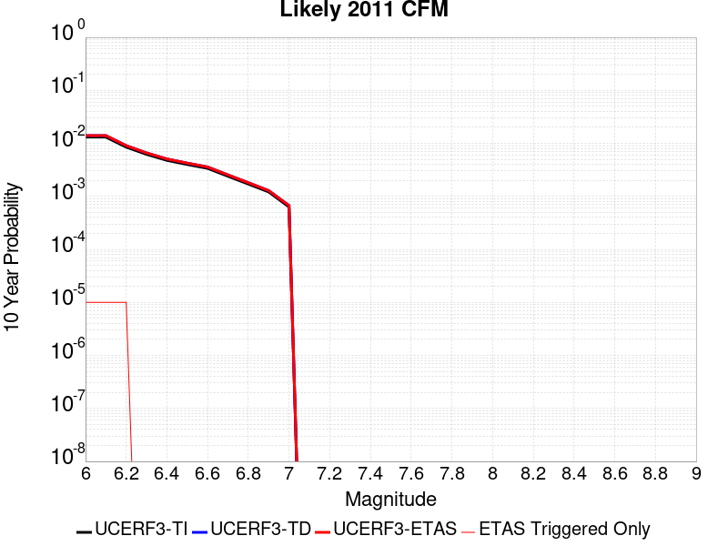 |

| Magnitude | 1 wk TI Prob | 1 wk TD Prob | 1 wk ETAS Prob | 1 wk ETAS/TD Gain | 1 wk ETAS Triggered Only | 1 mo TI Prob | 1 mo TD Prob | 1 mo ETAS Prob | 1 mo ETAS/TD Gain | 1 mo ETAS Triggered Only | 1 yr TI Prob | 1 yr TD Prob | 1 yr ETAS Prob | 1 yr ETAS/TD Gain | 1 yr ETAS Triggered Only | 10 yr TI Prob | 10 yr TD Prob | 10 yr ETAS Prob | 10 yr ETAS/TD Gain | 10 yr ETAS Triggered Only |
|-----|-----|-----|-----|-----|-----|-----|-----|-----|-----|-----|-----|-----|-----|-----|-----|-----|-----|-----|-----|-----|
| 6.0 | 2.5315949E-5 | 2.7104748E-5 | 2.7104748E-5 | 1.0 | 0.0 | 1.0849241E-4 | 1.16158284E-4 | 1.16158284E-4 | 1.0 | 0.0 | 0.0013200947 | 0.0014133542 | 0.00142334 | 1.0070654 | 1.0E-5 | 0.013122803 | 0.01404831 | 0.01405817 | 1.0007018 | 1.0E-5 |
| 6.1 | 2.5315949E-5 | 2.7104748E-5 | 2.7104748E-5 | 1.0 | 0.0 | 1.0849241E-4 | 1.16158284E-4 | 1.16158284E-4 | 1.0 | 0.0 | 0.0013200947 | 0.0014133542 | 0.00142334 | 1.0070654 | 1.0E-5 | 0.013122803 | 0.01404831 | 0.01405817 | 1.0007018 | 1.0E-5 |
| 6.2 | 1.6375941E-5 | 1.7465842E-5 | 1.7465842E-5 | 1.0 | 0.0 | 7.0180715E-5 | 7.485153E-5 | 7.485153E-5 | 1.0 | 0.0 | 8.5411523E-4 | 9.109487E-4 | 9.2093955E-4 | 1.0109676 | 1.0E-5 | 0.008508399 | 0.009073433 | 0.009083342 | 1.0010921 | 1.0E-5 |
| 6.3 | 1.1945543E-5 | 1.2712587E-5 | 1.2712587E-5 | 1.0 | 0.0 | 5.119418E-5 | 5.4481407E-5 | 5.4481407E-5 | 1.0 | 0.0 | 6.2311086E-4 | 6.631146E-4 | 6.631146E-4 | 1.0 | 0.0 | 0.0062136655 | 0.0066119144 | 0.0066119144 | 1.0 | 0.0 |
| 6.4 | 9.192729E-6 | 9.768488E-6 | 9.768488E-6 | 1.0 | 0.0 | 3.939681E-5 | 4.1864292E-5 | 4.1864292E-5 | 1.0 | 0.0 | 4.7955062E-4 | 5.0958124E-4 | 5.0958124E-4 | 1.0 | 0.0 | 0.004785171 | 0.0050844094 | 0.0050844094 | 1.0 | 0.0 |
| 6.5 | 7.67906E-6 | 8.152622E-6 | 8.152622E-6 | 1.0 | 0.0 | 3.2909844E-5 | 3.4939352E-5 | 3.4939352E-5 | 1.0 | 0.0 | 4.006037E-4 | 4.2530545E-4 | 4.2530545E-4 | 1.0 | 0.0 | 0.0039988225 | 0.004245108 | 0.004245108 | 1.0 | 0.0 |
| 6.6 | 6.4884057E-6 | 6.8847507E-6 | 6.8847507E-6 | 1.0 | 0.0 | 2.7807157E-5 | 2.9505749E-5 | 2.9505749E-5 | 1.0 | 0.0 | 3.3849955E-4 | 3.591747E-4 | 3.591747E-4 | 1.0 | 0.0 | 0.003379844 | 0.0035860867 | 0.0035860867 | 1.0 | 0.0 |
| 6.7 | 4.6060636E-6 | 4.884041E-6 | 4.884041E-6 | 1.0 | 0.0 | 1.9740122E-5 | 2.0931442E-5 | 2.0931442E-5 | 1.0 | 0.0 | 2.403095E-4 | 2.5481134E-4 | 2.5481134E-4 | 1.0 | 0.0 | 0.002400498 | 0.0025452746 | 0.0025452746 | 1.0 | 0.0 |
| 6.8 | 3.2795615E-6 | 3.4773732E-6 | 3.4773732E-6 | 1.0 | 0.0 | 1.4055187E-5 | 1.4902946E-5 | 1.4902946E-5 | 1.0 | 0.0 | 1.7110848E-4 | 1.8142881E-4 | 1.8142881E-4 | 1.0 | 0.0 | 0.0017097679 | 0.0018128622 | 0.0018128622 | 1.0 | 0.0 |
| 6.9 | 2.3289967E-6 | 2.4705569E-6 | 2.4705569E-6 | 1.0 | 0.0 | 9.981376E-6 | 1.058806E-5 | 1.058806E-5 | 1.0 | 0.0 | 1.2151648E-4 | 1.2890245E-4 | 1.2890245E-4 | 1.0 | 0.0 | 0.0012145005 | 0.0012883197 | 0.0012883197 | 1.0 | 0.0 |
| 7.0 | 1.211292E-6 | 1.2863958E-6 | 1.2863958E-6 | 1.0 | 0.0 | 5.1912407E-6 | 5.5131145E-6 | 5.5131145E-6 | 1.0 | 0.0 | 6.320152E-5 | 6.712041E-5 | 6.712041E-5 | 1.0 | 0.0 | 6.3183554E-4 | 6.710312E-4 | 6.710312E-4 | 1.0 | 0.0 |

## Almanor 2011 CFM
*[(top)](#table-of-contents)*

| 1 Week | 1 Month | 1 Year | 10 Year |
|-----|-----|-----|-----|
|  |  |  |  |

| Magnitude | 1 wk TI Prob | 1 wk TD Prob | 1 wk ETAS Prob | 1 wk ETAS/TD Gain | 1 wk ETAS Triggered Only | 1 mo TI Prob | 1 mo TD Prob | 1 mo ETAS Prob | 1 mo ETAS/TD Gain | 1 mo ETAS Triggered Only | 1 yr TI Prob | 1 yr TD Prob | 1 yr ETAS Prob | 1 yr ETAS/TD Gain | 1 yr ETAS Triggered Only | 10 yr TI Prob | 10 yr TD Prob | 10 yr ETAS Prob | 10 yr ETAS/TD Gain | 10 yr ETAS Triggered Only |
|-----|-----|-----|-----|-----|-----|-----|-----|-----|-----|-----|-----|-----|-----|-----|-----|-----|-----|-----|-----|-----|
| 6.0 | 6.1479834E-5 | 8.327245E-5 | 8.327245E-5 | 1.0 | 0.0 | 2.6345838E-4 | 3.5683523E-4 | 3.5683523E-4 | 1.0 | 0.0 | 0.0032028882 | 0.004336495 | 0.0043464517 | 1.002296 | 1.0E-5 | 0.031571172 | 0.04258658 | 0.042596154 | 1.0002248 | 1.0E-5 |
| 6.1 | 4.4387216E-5 | 5.9767433E-5 | 5.9767433E-5 | 1.0 | 0.0 | 1.9021705E-4 | 2.561236E-4 | 2.561236E-4 | 1.0 | 0.0 | 0.0023134327 | 0.003114351 | 0.0031243197 | 1.0032009 | 1.0E-5 | 0.022894967 | 0.030755581 | 0.030765275 | 1.0003152 | 1.0E-5 |
| 6.2 | 4.4387216E-5 | 5.9767433E-5 | 5.9767433E-5 | 1.0 | 0.0 | 1.9021705E-4 | 2.561236E-4 | 2.561236E-4 | 1.0 | 0.0 | 0.0023134327 | 0.003114351 | 0.0031243197 | 1.0032009 | 1.0E-5 | 0.022894967 | 0.030755581 | 0.030765275 | 1.0003152 | 1.0E-5 |
| 6.3 | 2.9523822E-5 | 3.9546965E-5 | 3.9546965E-5 | 1.0 | 0.0 | 1.2652454E-4 | 1.6947731E-4 | 1.6947731E-4 | 1.0 | 0.0 | 0.0015393476 | 0.0020617929 | 0.0020617929 | 1.0 | 0.0 | 0.015287281 | 0.020461112 | 0.020461112 | 1.0 | 0.0 |
| 6.4 | 2.0512744E-5 | 2.7430639E-5 | 2.7430639E-5 | 1.0 | 0.0 | 8.79088E-5 | 1.17555675E-4 | 1.17555675E-4 | 1.0 | 0.0 | 0.001069764 | 0.0014306171 | 0.0014306171 | 1.0 | 0.0 | 0.010646289 | 0.01424458 | 0.01424458 | 1.0 | 0.0 |
| 6.5 | 1.6750226E-5 | 2.2390364E-5 | 2.2390364E-5 | 1.0 | 0.0 | 7.178471E-5 | 9.595619E-5 | 9.595619E-5 | 1.0 | 0.0 | 8.7362836E-4 | 0.0011679606 | 0.0011679606 | 1.0 | 0.0 | 0.008702018 | 0.011649196 | 0.011649196 | 1.0 | 0.0 |
| 6.6 | 1.4745303E-5 | 1.970686E-5 | 1.970686E-5 | 1.0 | 0.0 | 6.319262E-5 | 8.445639E-5 | 8.445639E-5 | 1.0 | 0.0 | 7.690986E-4 | 0.0010280984 | 0.0010280984 | 1.0 | 0.0 | 0.0076644225 | 0.01026513 | 0.01026513 | 1.0 | 0.0 |
| 6.7 | 9.951145E-7 | 1.1616347E-6 | 1.1616347E-6 | 1.0 | 0.0 | 4.26477E-6 | 4.9784257E-6 | 4.9784257E-6 | 1.0 | 0.0 | 5.1922336E-5 | 6.0610826E-5 | 6.0610826E-5 | 1.0 | 0.0 | 5.1910203E-4 | 6.059602E-4 | 6.059602E-4 | 1.0 | 0.0 |
| 6.8 | 5.866312E-7 | 6.849384E-7 | 6.849384E-7 | 1.0 | 0.0 | 2.5141312E-6 | 2.9354478E-6 | 2.9354478E-6 | 1.0 | 0.0 | 3.0609117E-5 | 3.5738623E-5 | 3.5738623E-5 | 1.0 | 0.0 | 3.06049E-4 | 3.5734157E-4 | 3.5734157E-4 | 1.0 | 0.0 |

## Superstition Hills
*[(top)](#table-of-contents)*

| 1 Week | 1 Month | 1 Year | 10 Year |
|-----|-----|-----|-----|
|  |  |  |  |

| Magnitude | 1 wk TI Prob | 1 wk TD Prob | 1 wk ETAS Prob | 1 wk ETAS/TD Gain | 1 wk ETAS Triggered Only | 1 mo TI Prob | 1 mo TD Prob | 1 mo ETAS Prob | 1 mo ETAS/TD Gain | 1 mo ETAS Triggered Only | 1 yr TI Prob | 1 yr TD Prob | 1 yr ETAS Prob | 1 yr ETAS/TD Gain | 1 yr ETAS Triggered Only | 10 yr TI Prob | 10 yr TD Prob | 10 yr ETAS Prob | 10 yr ETAS/TD Gain | 10 yr ETAS Triggered Only |
|-----|-----|-----|-----|-----|-----|-----|-----|-----|-----|-----|-----|-----|-----|-----|-----|-----|-----|-----|-----|-----|
| 6.0 | 6.6865185E-5 | 1.4137668E-5 | 1.4137668E-5 | 1.0 | 0.0 | 2.8653358E-4 | 6.058869E-5 | 6.058869E-5 | 1.0 | 0.0 | 0.0034829667 | 7.374338E-4 | 7.374338E-4 | 1.0 | 0.0 | 0.03428881 | 0.007520696 | 0.007530621 | 1.0013196 | 1.0E-5 |
| 6.1 | 6.544851E-5 | 1.4137668E-5 | 1.4137668E-5 | 1.0 | 0.0 | 2.8046346E-4 | 6.058869E-5 | 6.058869E-5 | 1.0 | 0.0 | 0.0034092965 | 7.374338E-4 | 7.374338E-4 | 1.0 | 0.0 | 0.033574644 | 0.0075206957 | 0.0075306203 | 1.0013196 | 1.0E-5 |
| 6.2 | 6.544851E-5 | 1.4137668E-5 | 1.4137668E-5 | 1.0 | 0.0 | 2.8046346E-4 | 6.058869E-5 | 6.058869E-5 | 1.0 | 0.0 | 0.0034092965 | 7.374338E-4 | 7.374338E-4 | 1.0 | 0.0 | 0.033574644 | 0.0075206957 | 0.0075306203 | 1.0013196 | 1.0E-5 |
| 6.3 | 5.2402065E-5 | 1.4137667E-5 | 1.4137667E-5 | 1.0 | 0.0 | 2.2456095E-4 | 6.0588685E-5 | 6.0588685E-5 | 1.0 | 0.0 | 0.0027306017 | 7.374338E-4 | 7.374338E-4 | 1.0 | 0.0 | 0.02697292 | 0.0075206906 | 0.007530615 | 1.0013196 | 1.0E-5 |
| 6.4 | 4.542238E-5 | 1.4137666E-5 | 1.4137666E-5 | 1.0 | 0.0 | 1.9465282E-4 | 6.058868E-5 | 6.058868E-5 | 1.0 | 0.0 | 0.0023673223 | 7.3743373E-4 | 7.3743373E-4 | 1.0 | 0.0 | 0.023422617 | 0.007520688 | 0.007530613 | 1.0013196 | 1.0E-5 |
| 6.5 | 2.9672969E-5 | 1.4137665E-5 | 1.4137665E-5 | 1.0 | 0.0 | 1.2716366E-4 | 6.0588678E-5 | 6.0588678E-5 | 1.0 | 0.0 | 0.0015471181 | 7.374337E-4 | 7.374337E-4 | 1.0 | 0.0 | 0.015363912 | 0.0075206826 | 0.0075306077 | 1.0013196 | 1.0E-5 |
| 6.6 | 2.6056105E-5 | 1.3803436E-5 | 1.3803436E-5 | 1.0 | 0.0 | 1.1166424E-4 | 5.915633E-5 | 5.915633E-5 | 1.0 | 0.0 | 0.0013586642 | 7.200064E-4 | 7.200064E-4 | 1.0 | 0.0 | 0.013503874 | 0.0073450673 | 0.007354994 | 1.0013515 | 1.0E-5 |
| 6.7 | 1.4611248E-5 | 1.338333E-5 | 1.338333E-5 | 1.0 | 0.0 | 6.261813E-5 | 5.7355956E-5 | 5.7355956E-5 | 1.0 | 0.0 | 7.6210906E-4 | 6.9810095E-4 | 6.9810095E-4 | 1.0 | 0.0 | 0.0075950073 | 0.0071262526 | 0.0071361815 | 1.0013933 | 1.0E-5 |
| 6.8 | 1.30607E-5 | 1.09787115E-5 | 1.09787115E-5 | 1.0 | 0.0 | 5.597323E-5 | 4.705082E-5 | 4.705082E-5 | 1.0 | 0.0 | 6.8126095E-4 | 5.727019E-4 | 5.727019E-4 | 1.0 | 0.0 | 0.006791762 | 0.005873964 | 0.0058839056 | 1.0016924 | 1.0E-5 |
| 6.9 | 1.0443096E-5 | 8.19507E-6 | 8.19507E-6 | 1.0 | 0.0 | 4.4755358E-5 | 3.512127E-5 | 3.512127E-5 | 1.0 | 0.0 | 5.447602E-4 | 4.2751993E-4 | 4.2751993E-4 | 1.0 | 0.0 | 0.005434267 | 0.004409497 | 0.004419453 | 1.0022578 | 1.0E-5 |
| 7.0 | 8.045912E-6 | 6.739447E-6 | 6.739447E-6 | 1.0 | 0.0 | 3.4482026E-5 | 2.888303E-5 | 2.888303E-5 | 1.0 | 0.0 | 4.197378E-4 | 3.5159517E-4 | 3.5159517E-4 | 1.0 | 0.0 | 0.0041894587 | 0.0036335257 | 0.0036434894 | 1.0027422 | 1.0E-5 |
| 7.1 | 8.045912E-6 | 6.739447E-6 | 6.739447E-6 | 1.0 | 0.0 | 3.4482026E-5 | 2.888303E-5 | 2.888303E-5 | 1.0 | 0.0 | 4.197378E-4 | 3.5159517E-4 | 3.5159517E-4 | 1.0 | 0.0 | 0.0041894587 | 0.0036335257 | 0.0036434894 | 1.0027422 | 1.0E-5 |
| 7.2 | 7.375506E-6 | 6.2463805E-6 | 6.2463805E-6 | 1.0 | 0.0 | 3.1608928E-5 | 2.6769932E-5 | 2.6769932E-5 | 1.0 | 0.0 | 3.8477074E-4 | 3.2587603E-4 | 3.2587603E-4 | 1.0 | 0.0 | 0.003841052 | 0.0033741172 | 0.0033741172 | 1.0 | 0.0 |
| 7.3 | 6.6063913E-6 | 5.798824E-6 | 5.798824E-6 | 1.0 | 0.0 | 2.8312797E-5 | 2.4851872E-5 | 2.4851872E-5 | 1.0 | 0.0 | 3.446538E-4 | 3.0253024E-4 | 3.0253024E-4 | 1.0 | 0.0 | 0.0034411973 | 0.0031383524 | 0.0031383524 | 1.0 | 0.0 |
| 7.4 | 6.4313126E-6 | 5.6802523E-6 | 5.6802523E-6 | 1.0 | 0.0 | 2.7562477E-5 | 2.4343715E-5 | 2.4343715E-5 | 1.0 | 0.0 | 3.355215E-4 | 2.963451E-4 | 2.963451E-4 | 1.0 | 0.0 | 0.0033501536 | 0.003076105 | 0.003076105 | 1.0 | 0.0 |
| 7.5 | 6.0742927E-6 | 5.476088E-6 | 5.476088E-6 | 1.0 | 0.0 | 2.6032423E-5 | 2.3468741E-5 | 2.3468741E-5 | 1.0 | 0.0 | 3.1689866E-4 | 2.8569513E-4 | 2.8569513E-4 | 1.0 | 0.0 | 0.0031644711 | 0.0029679502 | 0.0029679502 | 1.0 | 0.0 |
| 7.6 | 5.6987187E-6 | 5.2943155E-6 | 5.2943155E-6 | 1.0 | 0.0 | 2.4422852E-5 | 2.268973E-5 | 2.268973E-5 | 1.0 | 0.0 | 2.9730765E-4 | 2.762131E-4 | 2.762131E-4 | 1.0 | 0.0 | 0.002969102 | 0.0028712032 | 0.0028712032 | 1.0 | 0.0 |
| 7.7 | 5.1658035E-6 | 4.925336E-6 | 4.925336E-6 | 1.0 | 0.0 | 2.2138971E-5 | 2.1108413E-5 | 2.1108413E-5 | 1.0 | 0.0 | 2.6950863E-4 | 2.5696523E-4 | 2.5696523E-4 | 1.0 | 0.0 | 0.00269182 | 0.0026763005 | 0.0026763005 | 1.0 | 0.0 |
| 7.8 | 3.6864697E-6 | 4.1963563E-6 | 4.1963563E-6 | 1.0 | 0.0 | 1.579906E-5 | 1.7984263E-5 | 1.7984263E-5 | 1.0 | 0.0 | 1.9233658E-4 | 2.1893687E-4 | 2.1893687E-4 | 1.0 | 0.0 | 0.0019217018 | 0.0022895595 | 0.0022895595 | 1.0 | 0.0 |
| 7.9 | 3.0265903E-6 | 3.5636078E-6 | 3.5636078E-6 | 1.0 | 0.0 | 1.2971037E-5 | 1.5272519E-5 | 1.5272519E-5 | 1.0 | 0.0 | 1.5791094E-4 | 1.8592748E-4 | 1.8592748E-4 | 1.0 | 0.0 | 0.0015779877 | 0.0019537222 | 0.0019537222 | 1.0 | 0.0 |
| 8.0 | 2.5271493E-6 | 3.0866524E-6 | 3.0866524E-6 | 1.0 | 0.0 | 1.0830595E-5 | 1.3228446E-5 | 1.3228446E-5 | 1.0 | 0.0 | 1.3185451E-4 | 1.6104484E-4 | 1.6104484E-4 | 1.0 | 0.0 | 0.0013177631 | 0.0016975543 | 0.0016975543 | 1.0 | 0.0 |
| 8.1 | 2.3749135E-6 | 2.9172957E-6 | 2.9172957E-6 | 1.0 | 0.0 | 1.0178161E-5 | 1.2502638E-5 | 1.2502638E-5 | 1.0 | 0.0 | 1.2391206E-4 | 1.522094E-4 | 1.522094E-4 | 1.0 | 0.0 | 0.0012384299 | 0.0016051348 | 0.0016051348 | 1.0 | 0.0 |
| 8.2 | 1.7186406E-9 | 1.1438838E-9 | 1.1438838E-9 | 1.0 | 0.0 | 7.3656024E-9 | 4.902359E-9 | 4.902359E-9 | 1.0 | 0.0 | 8.9676206E-8 | 5.968622E-8 | 5.968622E-8 | 1.0 | 0.0 | 8.9676166E-7 | 6.386644E-7 | 6.386644E-7 | 1.0 | 0.0 |

## Gillem - Big Crack 2011 CFM
*[(top)](#table-of-contents)*

| 1 Week | 1 Month | 1 Year | 10 Year |
|-----|-----|-----|-----|
|  |  |  | 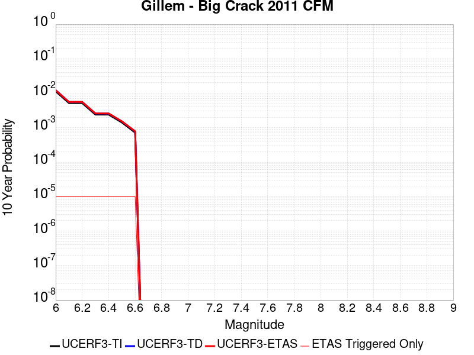 |

| Magnitude | 1 wk TI Prob | 1 wk TD Prob | 1 wk ETAS Prob | 1 wk ETAS/TD Gain | 1 wk ETAS Triggered Only | 1 mo TI Prob | 1 mo TD Prob | 1 mo ETAS Prob | 1 mo ETAS/TD Gain | 1 mo ETAS Triggered Only | 1 yr TI Prob | 1 yr TD Prob | 1 yr ETAS Prob | 1 yr ETAS/TD Gain | 1 yr ETAS Triggered Only | 10 yr TI Prob | 10 yr TD Prob | 10 yr ETAS Prob | 10 yr ETAS/TD Gain | 10 yr ETAS Triggered Only |
|-----|-----|-----|-----|-----|-----|-----|-----|-----|-----|-----|-----|-----|-----|-----|-----|-----|-----|-----|-----|-----|
| 6.0 | 2.196852E-5 | 2.3604485E-5 | 2.3604485E-5 | 1.0 | 0.0 | 9.4147406E-5 | 1.01158665E-4 | 1.01158665E-4 | 1.0 | 0.0 | 0.0011456419 | 0.0012309998 | 0.0012309998 | 1.0 | 0.0 | 0.011397537 | 0.012250669 | 0.012260547 | 1.0008063 | 1.0E-5 |
| 6.1 | 9.992795E-6 | 1.071189E-5 | 1.071189E-5 | 1.0 | 0.0 | 4.2825563E-5 | 4.5907396E-5 | 4.5907396E-5 | 1.0 | 0.0 | 5.2127644E-4 | 5.587975E-4 | 5.587975E-4 | 1.0 | 0.0 | 0.0052005537 | 0.0055757347 | 0.005585679 | 1.0017835 | 1.0E-5 |
| 6.2 | 9.992795E-6 | 1.071189E-5 | 1.071189E-5 | 1.0 | 0.0 | 4.2825563E-5 | 4.5907396E-5 | 4.5907396E-5 | 1.0 | 0.0 | 5.2127644E-4 | 5.587975E-4 | 5.587975E-4 | 1.0 | 0.0 | 0.0052005537 | 0.0055757347 | 0.005585679 | 1.0017835 | 1.0E-5 |
| 6.3 | 4.6127884E-6 | 4.942657E-6 | 4.942657E-6 | 1.0 | 0.0 | 1.9768944E-5 | 2.1182668E-5 | 2.1182668E-5 | 1.0 | 0.0 | 2.406603E-4 | 2.5787292E-4 | 2.5787292E-4 | 1.0 | 0.0 | 0.0024039985 | 0.0025761751 | 0.0025861494 | 1.0038717 | 1.0E-5 |
| 6.4 | 4.6127884E-6 | 4.942657E-6 | 4.942657E-6 | 1.0 | 0.0 | 1.9768944E-5 | 2.1182668E-5 | 2.1182668E-5 | 1.0 | 0.0 | 2.406603E-4 | 2.5787292E-4 | 2.5787292E-4 | 1.0 | 0.0 | 0.0024039985 | 0.0025761751 | 0.0025861494 | 1.0038717 | 1.0E-5 |
| 6.5 | 2.716712E-6 | 2.9111113E-6 | 2.9111113E-6 | 1.0 | 0.0 | 1.1643E-5 | 1.24761455E-5 | 1.24761455E-5 | 1.0 | 0.0 | 1.417443E-4 | 1.5188892E-4 | 1.5188892E-4 | 1.0 | 0.0 | 0.0014165393 | 0.001518089 | 0.0015280738 | 1.0065773 | 1.0E-5 |
| 6.6 | 1.3818255E-6 | 1.4820689E-6 | 1.4820689E-6 | 1.0 | 0.0 | 5.922096E-6 | 6.3517155E-6 | 6.3517155E-6 | 1.0 | 0.0 | 7.209913E-5 | 7.7330624E-5 | 7.7330624E-5 | 1.0 | 0.0 | 7.2075747E-4 | 7.7315804E-4 | 7.831503E-4 | 1.012924 | 1.0E-5 |

## Great Valley 02
*[(top)](#table-of-contents)*

| 1 Week | 1 Month | 1 Year | 10 Year |
|-----|-----|-----|-----|
|  |  |  |  |

| Magnitude | 1 wk TI Prob | 1 wk TD Prob | 1 wk ETAS Prob | 1 wk ETAS/TD Gain | 1 wk ETAS Triggered Only | 1 mo TI Prob | 1 mo TD Prob | 1 mo ETAS Prob | 1 mo ETAS/TD Gain | 1 mo ETAS Triggered Only | 1 yr TI Prob | 1 yr TD Prob | 1 yr ETAS Prob | 1 yr ETAS/TD Gain | 1 yr ETAS Triggered Only | 10 yr TI Prob | 10 yr TD Prob | 10 yr ETAS Prob | 10 yr ETAS/TD Gain | 10 yr ETAS Triggered Only |
|-----|-----|-----|-----|-----|-----|-----|-----|-----|-----|-----|-----|-----|-----|-----|-----|-----|-----|-----|-----|-----|
| 6.0 | 2.2243487E-6 | 2.281768E-6 | 1.22817455E-5 | 5.3825564 | 1.0E-5 | 9.532888E-6 | 9.778972E-6 | 1.9778874E-5 | 2.0225923 | 1.0E-5 | 1.1605673E-4 | 1.1905298E-4 | 1.290518E-4 | 1.0839862 | 1.0E-5 | 0.0011599615 | 0.0011899419 | 0.0011999301 | 1.0083938 | 1.0E-5 |
| 6.1 | 2.2243487E-6 | 2.281768E-6 | 1.22817455E-5 | 5.3825564 | 1.0E-5 | 9.532888E-6 | 9.778972E-6 | 1.9778874E-5 | 2.0225923 | 1.0E-5 | 1.1605673E-4 | 1.1905298E-4 | 1.290518E-4 | 1.0839862 | 1.0E-5 | 0.0011599615 | 0.0011899419 | 0.0011999301 | 1.0083938 | 1.0E-5 |
| 6.2 | 1.5787732E-6 | 1.6272533E-6 | 1.6272533E-6 | 1.0 | 0.0 | 6.7661535E-6 | 6.9739244E-6 | 6.9739244E-6 | 1.0 | 0.0 | 8.2374805E-5 | 8.490427E-5 | 8.490427E-5 | 1.0 | 0.0 | 8.2344277E-4 | 8.4872305E-4 | 8.4872305E-4 | 1.0 | 0.0 |
| 6.3 | 1.4850314E-6 | 1.5322953E-6 | 1.5322953E-6 | 1.0 | 0.0 | 6.3644047E-6 | 6.5669637E-6 | 6.5669637E-6 | 1.0 | 0.0 | 7.748387E-5 | 7.994989E-5 | 7.994989E-5 | 1.0 | 0.0 | 7.745686E-4 | 7.992151E-4 | 7.992151E-4 | 1.0 | 0.0 |
| 6.4 | 1.4266972E-6 | 1.4734348E-6 | 1.4734348E-6 | 1.0 | 0.0 | 6.114402E-6 | 6.314706E-6 | 6.314706E-6 | 1.0 | 0.0 | 7.44403E-5 | 7.687887E-5 | 7.687887E-5 | 1.0 | 0.0 | 7.441537E-4 | 7.685261E-4 | 7.685261E-4 | 1.0 | 0.0 |
| 6.5 | 1.2728015E-6 | 1.3171256E-6 | 1.3171256E-6 | 1.0 | 0.0 | 5.4548523E-6 | 5.6448116E-6 | 5.6448116E-6 | 1.0 | 0.0 | 6.64108E-5 | 6.872344E-5 | 6.872344E-5 | 1.0 | 0.0 | 6.639096E-4 | 6.870245E-4 | 6.870245E-4 | 1.0 | 0.0 |
| 6.6 | 1.1857247E-6 | 1.2289391E-6 | 1.2289391E-6 | 1.0 | 0.0 | 5.0816675E-6 | 5.2668715E-6 | 5.2668715E-6 | 1.0 | 0.0 | 6.186755E-5 | 6.41223E-5 | 6.41223E-5 | 1.0 | 0.0 | 6.1850325E-4 | 6.4104045E-4 | 6.4104045E-4 | 1.0 | 0.0 |
| 6.7 | 1.0550715E-6 | 1.0953329E-6 | 1.0953329E-6 | 1.0 | 0.0 | 4.521727E-6 | 4.6942755E-6 | 4.6942755E-6 | 1.0 | 0.0 | 5.5050637E-5 | 5.715133E-5 | 5.715133E-5 | 1.0 | 0.0 | 5.5037E-4 | 5.7136844E-4 | 5.7136844E-4 | 1.0 | 0.0 |
| 6.8 | 8.9881183E-7 | 9.355551E-7 | 9.355551E-7 | 1.0 | 0.0 | 3.8520448E-6 | 4.0095156E-6 | 4.0095156E-6 | 1.0 | 0.0 | 4.689764E-5 | 4.8814778E-5 | 4.8814778E-5 | 1.0 | 0.0 | 4.688774E-4 | 4.880423E-4 | 4.880423E-4 | 1.0 | 0.0 |
| 6.9 | 7.5417256E-7 | 7.8710764E-7 | 7.8710764E-7 | 1.0 | 0.0 | 3.232164E-6 | 3.373314E-6 | 3.373314E-6 | 1.0 | 0.0 | 3.9350885E-5 | 4.106934E-5 | 4.106934E-5 | 1.0 | 0.0 | 3.934392E-4 | 4.1061893E-4 | 4.1061893E-4 | 1.0 | 0.0 |
| 7.0 | 5.909726E-7 | 6.177937E-7 | 6.177937E-7 | 1.0 | 0.0 | 2.5327372E-6 | 2.6476848E-6 | 2.6476848E-6 | 1.0 | 0.0 | 3.083564E-5 | 3.2235093E-5 | 3.2235093E-5 | 1.0 | 0.0 | 3.083136E-4 | 3.223052E-4 | 3.223052E-4 | 1.0 | 0.0 |
| 7.1 | 4.4054178E-7 | 4.617082E-7 | 4.617082E-7 | 1.0 | 0.0 | 1.8880348E-6 | 1.978748E-6 | 1.978748E-6 | 1.0 | 0.0 | 2.2986582E-5 | 2.4090998E-5 | 2.4090998E-5 | 1.0 | 0.0 | 2.2984203E-4 | 2.4088458E-4 | 2.4088458E-4 | 1.0 | 0.0 |
| 7.2 | 3.029834E-7 | 3.1821946E-7 | 3.1821946E-7 | 1.0 | 0.0 | 1.2984997E-6 | 1.363797E-6 | 1.363797E-6 | 1.0 | 0.0 | 1.5809119E-5 | 1.6604106E-5 | 1.6604106E-5 | 1.0 | 0.0 | 1.5807994E-4 | 1.660291E-4 | 1.660291E-4 | 1.0 | 0.0 |
| 7.3 | 1.8700909E-7 | 1.9680154E-7 | 1.9680154E-7 | 1.0 | 0.0 | 8.0146725E-7 | 8.434349E-7 | 8.434349E-7 | 1.0 | 0.0 | 9.75782E-6 | 1.02687745E-5 | 1.02687745E-5 | 1.0 | 0.0 | 9.757392E-5 | 1.02683276E-4 | 1.02683276E-4 | 1.0 | 0.0 |
| 7.4 | 3.112171E-8 | 3.2068368E-8 | 3.2068368E-8 | 1.0 | 0.0 | 1.3337875E-7 | 1.3743585E-7 | 1.3743585E-7 | 1.0 | 0.0 | 1.6238852E-6 | 1.6732803E-6 | 1.6732803E-6 | 1.0 | 0.0 | 1.6238733E-5 | 1.6732685E-5 | 1.6732685E-5 | 1.0 | 0.0 |

## Great Valley 04a Trout Creek
*[(top)](#table-of-contents)*

| 1 Week | 1 Month | 1 Year | 10 Year |
|-----|-----|-----|-----|
|  |  |  |  |

| Magnitude | 1 wk TI Prob | 1 wk TD Prob | 1 wk ETAS Prob | 1 wk ETAS/TD Gain | 1 wk ETAS Triggered Only | 1 mo TI Prob | 1 mo TD Prob | 1 mo ETAS Prob | 1 mo ETAS/TD Gain | 1 mo ETAS Triggered Only | 1 yr TI Prob | 1 yr TD Prob | 1 yr ETAS Prob | 1 yr ETAS/TD Gain | 1 yr ETAS Triggered Only | 10 yr TI Prob | 10 yr TD Prob | 10 yr ETAS Prob | 10 yr ETAS/TD Gain | 10 yr ETAS Triggered Only |
|-----|-----|-----|-----|-----|-----|-----|-----|-----|-----|-----|-----|-----|-----|-----|-----|-----|-----|-----|-----|-----|
| 6.0 | 1.4088538E-5 | 1.5719554E-5 | 2.5719397E-5 | 1.6361403 | 1.0E-5 | 6.037805E-5 | 6.7367844E-5 | 7.736717E-5 | 1.1484288 | 1.0E-5 | 7.3485484E-4 | 8.199074E-4 | 8.2989916E-4 | 1.0121865 | 1.0E-5 | 0.007324295 | 0.008170108 | 0.008180026 | 1.001214 | 1.0E-5 |
| 6.1 | 1.4088538E-5 | 1.5719554E-5 | 2.5719397E-5 | 1.6361403 | 1.0E-5 | 6.037805E-5 | 6.7367844E-5 | 7.736717E-5 | 1.1484288 | 1.0E-5 | 7.3485484E-4 | 8.199074E-4 | 8.2989916E-4 | 1.0121865 | 1.0E-5 | 0.007324295 | 0.008170108 | 0.008180026 | 1.001214 | 1.0E-5 |
| 6.2 | 1.4088538E-5 | 1.5719554E-5 | 2.5719397E-5 | 1.6361403 | 1.0E-5 | 6.037805E-5 | 6.7367844E-5 | 7.736717E-5 | 1.1484288 | 1.0E-5 | 7.3485484E-4 | 8.199074E-4 | 8.2989916E-4 | 1.0121865 | 1.0E-5 | 0.007324295 | 0.008170108 | 0.008180026 | 1.001214 | 1.0E-5 |
| 6.3 | 1.2882862E-5 | 1.4378603E-5 | 2.4378458E-5 | 1.6954678 | 1.0E-5 | 5.5211098E-5 | 6.1621184E-5 | 7.162057E-5 | 1.1622719 | 1.0E-5 | 6.7198783E-4 | 7.4999005E-4 | 7.5998256E-4 | 1.0133235 | 1.0E-5 | 0.0066995937 | 0.0074756527 | 0.0074855783 | 1.0013276 | 1.0E-5 |
| 6.4 | 1.2882862E-5 | 1.4378603E-5 | 2.4378458E-5 | 1.6954678 | 1.0E-5 | 5.5211098E-5 | 6.1621184E-5 | 7.162057E-5 | 1.1622719 | 1.0E-5 | 6.7198783E-4 | 7.4999005E-4 | 7.5998256E-4 | 1.0133235 | 1.0E-5 | 0.0066995937 | 0.0074756527 | 0.0074855783 | 1.0013276 | 1.0E-5 |
| 6.5 | 1.2762329E-5 | 1.424516E-5 | 2.4245017E-5 | 1.7019829 | 1.0E-5 | 5.469455E-5 | 6.1049315E-5 | 7.10487E-5 | 1.163792 | 1.0E-5 | 6.657027E-4 | 7.430323E-4 | 7.530249E-4 | 1.0134484 | 1.0E-5 | 0.00663712 | 0.0074065393 | 0.007416465 | 1.0013402 | 1.0E-5 |
| 6.6 | 1.2762329E-5 | 1.424516E-5 | 2.4245017E-5 | 1.7019829 | 1.0E-5 | 5.469455E-5 | 6.1049315E-5 | 7.10487E-5 | 1.163792 | 1.0E-5 | 6.657027E-4 | 7.430323E-4 | 7.530249E-4 | 1.0134484 | 1.0E-5 | 0.00663712 | 0.0074065393 | 0.007416465 | 1.0013402 | 1.0E-5 |
| 6.7 | 1.2557959E-5 | 1.4019395E-5 | 2.4019255E-5 | 1.7132876 | 1.0E-5 | 5.3818712E-5 | 6.0081795E-5 | 7.0081194E-5 | 1.1664298 | 1.0E-5 | 6.5504585E-4 | 7.312607E-4 | 7.412534E-4 | 1.013665 | 1.0E-5 | 0.006531183 | 0.007289598 | 0.007299525 | 1.0013618 | 1.0E-5 |
| 6.8 | 1.1871544E-5 | 1.3258823E-5 | 2.325869E-5 | 1.7542048 | 1.0E-5 | 5.0877054E-5 | 5.6822348E-5 | 6.6821776E-5 | 1.1759771 | 1.0E-5 | 6.1925204E-4 | 6.916025E-4 | 7.0159556E-4 | 1.0144491 | 1.0E-5 | 0.0061752927 | 0.0068955184 | 0.0069054496 | 1.0014402 | 1.0E-5 |
| 6.9 | 1.0500373E-5 | 1.1731261E-5 | 2.1731144E-5 | 1.8524133 | 1.0E-5 | 4.5000823E-5 | 5.0275914E-5 | 6.027541E-5 | 1.1988924 | 1.0E-5 | 5.4774724E-4 | 6.119459E-4 | 6.219398E-4 | 1.0163313 | 1.0E-5 | 0.005463991 | 0.0061034737 | 0.006113413 | 1.0016284 | 1.0E-5 |
| 7.0 | 8.524332E-6 | 9.5334835E-6 | 1.9533389E-5 | 2.0489244 | 1.0E-5 | 3.653234E-5 | 4.0857187E-5 | 5.085678E-5 | 1.244745 | 1.0E-5 | 4.4469046E-4 | 4.9733004E-4 | 5.073251E-4 | 1.0200974 | 1.0E-5 | 0.0044380166 | 0.004962902 | 0.0049728523 | 1.002005 | 1.0E-5 |
| 7.1 | 6.006849E-6 | 6.711559E-6 | 1.6711492E-5 | 2.4899569 | 1.0E-5 | 2.5743384E-5 | 2.876354E-5 | 3.876325E-5 | 1.3476523 | 1.0E-5 | 3.1338062E-4 | 3.501454E-4 | 3.601419E-4 | 1.0285496 | 1.0E-5 | 0.0031293905 | 0.0034964874 | 0.0035064525 | 1.00285 | 1.0E-5 |
| 7.2 | 2.9122193E-6 | 3.2465305E-6 | 1.3246498E-5 | 4.0802016 | 1.0E-5 | 1.248088E-5 | 1.3913637E-5 | 2.3913499E-5 | 1.7187093 | 1.0E-5 | 1.5194413E-4 | 1.6938712E-4 | 1.7938543E-4 | 1.0590264 | 1.0E-5 | 0.0015184027 | 0.0016927521 | 0.0017027352 | 1.0058975 | 1.0E-5 |
| 7.3 | 7.2194007E-7 | 7.988761E-7 | 7.988761E-7 | 1.0 | 0.0 | 3.0940253E-6 | 3.4237528E-6 | 3.4237528E-6 | 1.0 | 0.0 | 3.7669106E-5 | 4.1683852E-5 | 4.1683852E-5 | 1.0 | 0.0 | 3.766272E-4 | 4.168053E-4 | 4.168053E-4 | 1.0 | 0.0 |
| 7.4 | 3.112171E-8 | 3.2068368E-8 | 3.2068368E-8 | 1.0 | 0.0 | 1.3337875E-7 | 1.3743585E-7 | 1.3743585E-7 | 1.0 | 0.0 | 1.6238852E-6 | 1.6732803E-6 | 1.6732803E-6 | 1.0 | 0.0 | 1.6238733E-5 | 1.6732685E-5 | 1.6732685E-5 | 1.0 | 0.0 |

## Earthquake Valley (No  Extension)
*[(top)](#table-of-contents)*

| 1 Week | 1 Month | 1 Year | 10 Year |
|-----|-----|-----|-----|
|  |  |  |  |

| Magnitude | 1 wk TI Prob | 1 wk TD Prob | 1 wk ETAS Prob | 1 wk ETAS/TD Gain | 1 wk ETAS Triggered Only | 1 mo TI Prob | 1 mo TD Prob | 1 mo ETAS Prob | 1 mo ETAS/TD Gain | 1 mo ETAS Triggered Only | 1 yr TI Prob | 1 yr TD Prob | 1 yr ETAS Prob | 1 yr ETAS/TD Gain | 1 yr ETAS Triggered Only | 10 yr TI Prob | 10 yr TD Prob | 10 yr ETAS Prob | 10 yr ETAS/TD Gain | 10 yr ETAS Triggered Only |
|-----|-----|-----|-----|-----|-----|-----|-----|-----|-----|-----|-----|-----|-----|-----|-----|-----|-----|-----|-----|-----|
| 6.0 | 2.1859703E-5 | 2.5198351E-5 | 2.5198351E-5 | 1.0 | 0.0 | 9.3681076E-5 | 1.0798928E-4 | 1.0798928E-4 | 1.0 | 0.0 | 0.0011399703 | 0.0013141216 | 0.0013141216 | 1.0 | 0.0 | 0.011341401 | 0.013077869 | 0.013087738 | 1.0007546 | 1.0E-5 |
| 6.1 | 2.1859703E-5 | 2.5198351E-5 | 2.5198351E-5 | 1.0 | 0.0 | 9.3681076E-5 | 1.0798928E-4 | 1.0798928E-4 | 1.0 | 0.0 | 0.0011399703 | 0.0013141216 | 0.0013141216 | 1.0 | 0.0 | 0.011341401 | 0.013077869 | 0.013087738 | 1.0007546 | 1.0E-5 |
| 6.2 | 2.1859703E-5 | 2.5198351E-5 | 2.5198351E-5 | 1.0 | 0.0 | 9.3681076E-5 | 1.0798928E-4 | 1.0798928E-4 | 1.0 | 0.0 | 0.0011399703 | 0.0013141216 | 0.0013141216 | 1.0 | 0.0 | 0.011341401 | 0.013077869 | 0.013087738 | 1.0007546 | 1.0E-5 |
| 6.3 | 2.1859703E-5 | 2.5198351E-5 | 2.5198351E-5 | 1.0 | 0.0 | 9.3681076E-5 | 1.0798928E-4 | 1.0798928E-4 | 1.0 | 0.0 | 0.0011399703 | 0.0013141216 | 0.0013141216 | 1.0 | 0.0 | 0.011341401 | 0.013077869 | 0.013087738 | 1.0007546 | 1.0E-5 |
| 6.4 | 2.1859703E-5 | 2.5198351E-5 | 2.5198351E-5 | 1.0 | 0.0 | 9.3681076E-5 | 1.0798928E-4 | 1.0798928E-4 | 1.0 | 0.0 | 0.0011399703 | 0.0013141216 | 0.0013141216 | 1.0 | 0.0 | 0.011341401 | 0.013077869 | 0.013087738 | 1.0007546 | 1.0E-5 |
| 6.5 | 2.1859703E-5 | 2.5198351E-5 | 2.5198351E-5 | 1.0 | 0.0 | 9.3681076E-5 | 1.0798928E-4 | 1.0798928E-4 | 1.0 | 0.0 | 0.0011399703 | 0.0013141216 | 0.0013141216 | 1.0 | 0.0 | 0.011341401 | 0.013077869 | 0.013087738 | 1.0007546 | 1.0E-5 |
| 6.6 | 1.597E-5 | 1.835627E-5 | 1.835627E-5 | 1.0 | 0.0 | 6.8441055E-5 | 7.866784E-5 | 7.866784E-5 | 1.0 | 0.0 | 8.329513E-4 | 9.5744745E-4 | 9.5744745E-4 | 1.0 | 0.0 | 0.008298361 | 0.009541833 | 0.009551737 | 1.0010381 | 1.0E-5 |
| 6.7 | 1.597E-5 | 1.835627E-5 | 1.835627E-5 | 1.0 | 0.0 | 6.8441055E-5 | 7.866784E-5 | 7.866784E-5 | 1.0 | 0.0 | 8.329513E-4 | 9.5744745E-4 | 9.5744745E-4 | 1.0 | 0.0 | 0.008298361 | 0.009541833 | 0.009551737 | 1.0010381 | 1.0E-5 |
| 6.8 | 1.5315149E-5 | 1.7602086E-5 | 1.7602086E-5 | 1.0 | 0.0 | 6.5634704E-5 | 7.543582E-5 | 7.543582E-5 | 1.0 | 0.0 | 7.988095E-4 | 9.1813074E-4 | 9.1813074E-4 | 1.0 | 0.0 | 0.007959441 | 0.009151915 | 0.009161824 | 1.0010827 | 1.0E-5 |
| 6.9 | 1.3634728E-5 | 1.5675814E-5 | 1.5675814E-5 | 1.0 | 0.0 | 5.8433237E-5 | 6.7180794E-5 | 6.7180794E-5 | 1.0 | 0.0 | 7.1119244E-4 | 8.1770134E-4 | 8.1770134E-4 | 1.0 | 0.0 | 0.007089207 | 0.008154998 | 0.008164915 | 1.0012163 | 1.0E-5 |
| 7.0 | 1.3496271E-5 | 1.5517848E-5 | 1.5517848E-5 | 1.0 | 0.0 | 5.783988E-5 | 6.6503824E-5 | 6.6503824E-5 | 1.0 | 0.0 | 7.03973E-4 | 8.0946536E-4 | 8.0946536E-4 | 1.0 | 0.0 | 0.007017471 | 0.008073238 | 0.008083156 | 1.0012287 | 1.0E-5 |
| 7.1 | 8.242798E-6 | 9.472594E-6 | 9.472594E-6 | 1.0 | 0.0 | 3.53258E-5 | 4.0596577E-5 | 4.0596577E-5 | 1.0 | 0.0 | 4.300067E-4 | 4.9421826E-4 | 4.9421826E-4 | 1.0 | 0.0 | 0.004291756 | 0.0049377684 | 0.0049377684 | 1.0 | 0.0 |
| 7.2 | 2.6506527E-7 | 2.2559628E-7 | 2.2559628E-7 | 1.0 | 0.0 | 1.1359936E-6 | 9.668408E-7 | 9.668408E-7 | 1.0 | 0.0 | 1.3830633E-5 | 1.1771229E-5 | 1.1771229E-5 | 1.0 | 0.0 | 1.3829772E-4 | 1.1770646E-4 | 1.1770646E-4 | 1.0 | 0.0 |
| 7.3 | 2.5810488E-7 | 2.1954757E-7 | 2.1954757E-7 | 1.0 | 0.0 | 1.1061633E-6 | 9.4091786E-7 | 9.4091786E-7 | 1.0 | 0.0 | 1.3467455E-5 | 1.1455619E-5 | 1.1455619E-5 | 1.0 | 0.0 | 1.3466639E-4 | 1.145507E-4 | 1.145507E-4 | 1.0 | 0.0 |
| 7.4 | 2.2676066E-7 | 1.9109943E-7 | 1.9109943E-7 | 1.0 | 0.0 | 9.71831E-7 | 8.189973E-7 | 8.189973E-7 | 1.0 | 0.0 | 1.1831979E-5 | 9.971251E-6 | 9.971251E-6 | 1.0 | 0.0 | 1.1831349E-4 | 9.970842E-5 | 9.970842E-5 | 1.0 | 0.0 |
| 7.5 | 1.5553917E-7 | 1.311138E-7 | 1.311138E-7 | 1.0 | 0.0 | 6.6659624E-7 | 5.619162E-7 | 5.619162E-7 | 1.0 | 0.0 | 8.115779E-6 | 6.84131E-6 | 6.84131E-6 | 1.0 | 0.0 | 8.115482E-5 | 6.841121E-5 | 6.841121E-5 | 1.0 | 0.0 |
| 7.6 | 1.3448629E-7 | 1.1287708E-7 | 1.1287708E-7 | 1.0 | 0.0 | 5.7636964E-7 | 4.8375887E-7 | 4.8375887E-7 | 1.0 | 0.0 | 7.017278E-6 | 5.8897504E-6 | 5.8897504E-6 | 1.0 | 0.0 | 7.0170565E-5 | 5.8896156E-5 | 5.8896156E-5 | 1.0 | 0.0 |
| 7.7 | 2.9719402E-8 | 1.4581234E-8 | 1.4581234E-8 | 1.0 | 0.0 | 1.2736886E-7 | 6.2491004E-8 | 6.2491004E-8 | 1.0 | 0.0 | 1.5507147E-6 | 7.6082773E-7 | 7.6082773E-7 | 1.0 | 0.0 | 1.550704E-5 | 7.608257E-6 | 7.608257E-6 | 1.0 | 0.0 |
| 7.8 | 7.4390196E-9 | 3.249962E-9 | 3.249962E-9 | 1.0 | 0.0 | 3.1881513E-8 | 1.39284095E-8 | 1.39284095E-8 | 1.0 | 0.0 | 3.8815733E-7 | 1.6957837E-7 | 1.6957837E-7 | 1.0 | 0.0 | 3.8815665E-6 | 1.6957828E-6 | 1.6957828E-6 | 1.0 | 0.0 |
| 7.9 | 1.5373532E-9 | 8.4400953E-10 | 8.4400953E-10 | 1.0 | 0.0 | 6.5886567E-9 | 3.6171839E-9 | 3.6171839E-9 | 1.0 | 0.0 | 8.021689E-8 | 4.403921E-8 | 4.403921E-8 | 1.0 | 0.0 | 8.0216864E-7 | 4.403921E-7 | 4.403921E-7 | 1.0 | 0.0 |

## Rodgers Creek - Healdsburg 2011 CFM
*[(top)](#table-of-contents)*

| 1 Week | 1 Month | 1 Year | 10 Year |
|-----|-----|-----|-----|
|  |  |  |  |

| Magnitude | 1 wk TI Prob | 1 wk TD Prob | 1 wk ETAS Prob | 1 wk ETAS/TD Gain | 1 wk ETAS Triggered Only | 1 mo TI Prob | 1 mo TD Prob | 1 mo ETAS Prob | 1 mo ETAS/TD Gain | 1 mo ETAS Triggered Only | 1 yr TI Prob | 1 yr TD Prob | 1 yr ETAS Prob | 1 yr ETAS/TD Gain | 1 yr ETAS Triggered Only | 10 yr TI Prob | 10 yr TD Prob | 10 yr ETAS Prob | 10 yr ETAS/TD Gain | 10 yr ETAS Triggered Only |
|-----|-----|-----|-----|-----|-----|-----|-----|-----|-----|-----|-----|-----|-----|-----|-----|-----|-----|-----|-----|-----|
| 6.0 | 7.390182E-5 | 1.3137296E-4 | 1.3137296E-4 | 1.0 | 0.0 | 3.1668364E-4 | 5.629057E-4 | 5.629057E-4 | 1.0 | 0.0 | 0.0038488081 | 0.0068318076 | 0.0068318076 | 1.0 | 0.0 | 0.037828278 | 0.06618395 | 0.06619328 | 1.0001411 | 1.0E-5 |
| 6.1 | 7.318768E-5 | 1.303531E-4 | 1.303531E-4 | 1.0 | 0.0 | 3.1362378E-4 | 5.585369E-4 | 5.585369E-4 | 1.0 | 0.0 | 0.0038116854 | 0.006778966 | 0.006778966 | 1.0 | 0.0 | 0.037469655 | 0.06568854 | 0.06568854 | 1.0 | 0.0 |
| 6.2 | 7.1379836E-5 | 1.2728151E-4 | 1.2728151E-4 | 1.0 | 0.0 | 3.058777E-4 | 5.453785E-4 | 5.453785E-4 | 1.0 | 0.0 | 0.003717703 | 0.0066197454 | 0.0066197454 | 1.0 | 0.0 | 0.0365612 | 0.06421061 | 0.06421061 | 1.0 | 0.0 |
| 6.3 | 6.9255926E-5 | 1.2382482E-4 | 1.2382482E-4 | 1.0 | 0.0 | 2.9677735E-4 | 5.305703E-4 | 5.305703E-4 | 1.0 | 0.0 | 0.0036072785 | 0.0064406106 | 0.0064406106 | 1.0 | 0.0 | 0.035492823 | 0.062541805 | 0.062541805 | 1.0 | 0.0 |
| 6.4 | 6.6757144E-5 | 1.195919E-4 | 1.195919E-4 | 1.0 | 0.0 | 2.8607066E-4 | 5.1243644E-4 | 5.1243644E-4 | 1.0 | 0.0 | 0.0034773487 | 0.00622114 | 0.00622114 | 1.0 | 0.0 | 0.034234364 | 0.060491614 | 0.060491614 | 1.0 | 0.0 |
| 6.5 | 6.5735134E-5 | 1.180849E-4 | 1.180849E-4 | 1.0 | 0.0 | 2.8169158E-4 | 5.059804E-4 | 5.059804E-4 | 1.0 | 0.0 | 0.003424202 | 0.0061429944 | 0.0061429944 | 1.0 | 0.0 | 0.03371918 | 0.059755705 | 0.059755705 | 1.0 | 0.0 |
| 6.6 | 6.289601E-5 | 1.13442366E-4 | 1.13442366E-4 | 1.0 | 0.0 | 2.6952647E-4 | 4.8609133E-4 | 4.8609133E-4 | 1.0 | 0.0 | 0.0032765474 | 0.005902183 | 0.005902183 | 1.0 | 0.0 | 0.032286562 | 0.057495043 | 0.057495043 | 1.0 | 0.0 |
| 6.7 | 6.115274E-5 | 1.106132E-4 | 1.106132E-4 | 1.0 | 0.0 | 2.6205686E-4 | 4.739708E-4 | 4.739708E-4 | 1.0 | 0.0 | 0.0031858748 | 0.0057554054 | 0.0057554054 | 1.0 | 0.0 | 0.031405866 | 0.05611361 | 0.05611361 | 1.0 | 0.0 |
| 6.8 | 5.9232367E-5 | 1.0728657E-4 | 1.0728657E-4 | 1.0 | 0.0 | 2.538283E-4 | 4.5971893E-4 | 4.5971893E-4 | 1.0 | 0.0 | 0.0030859804 | 0.005582791 | 0.005582791 | 1.0 | 0.0 | 0.030434765 | 0.05448041 | 0.05448041 | 1.0 | 0.0 |
| 6.9 | 5.4030377E-5 | 9.8228295E-5 | 9.8228295E-5 | 1.0 | 0.0 | 2.315382E-4 | 4.209108E-4 | 4.209108E-4 | 1.0 | 0.0 | 0.0028153337 | 0.0051126136 | 0.0051126136 | 1.0 | 0.0 | 0.027799325 | 0.05001572 | 0.05001572 | 1.0 | 0.0 |
| 7.0 | 4.8260714E-5 | 8.7408924E-5 | 8.7408924E-5 | 1.0 | 0.0 | 2.0681522E-4 | 3.7455617E-4 | 3.7455617E-4 | 1.0 | 0.0 | 0.0025150678 | 0.0045507406 | 0.0045507406 | 1.0 | 0.0 | 0.024867928 | 0.044667073 | 0.044667073 | 1.0 | 0.0 |
| 7.1 | 4.0294493E-5 | 7.389363E-5 | 7.389363E-5 | 1.0 | 0.0 | 1.7267925E-4 | 3.1664874E-4 | 3.1664874E-4 | 1.0 | 0.0 | 0.0021003427 | 0.0038484214 | 0.0038484214 | 1.0 | 0.0 | 0.02080602 | 0.037923187 | 0.037923187 | 1.0 | 0.0 |
| 7.2 | 3.096388E-5 | 5.698023E-5 | 5.698023E-5 | 1.0 | 0.0 | 1.326956E-4 | 2.4417826E-4 | 2.4417826E-4 | 1.0 | 0.0 | 0.0016143717 | 0.0029688394 | 0.0029688394 | 1.0 | 0.0 | 0.01602694 | 0.029437006 | 0.029437006 | 1.0 | 0.0 |
| 7.3 | 2.3615226E-5 | 4.3629818E-5 | 4.3629818E-5 | 1.0 | 0.0 | 1.0120418E-4 | 1.869716E-4 | 1.869716E-4 | 1.0 | 0.0 | 0.0012314644 | 0.0022740164 | 0.0022740164 | 1.0 | 0.0 | 0.0122466255 | 0.022637889 | 0.022637889 | 1.0 | 0.0 |
| 7.4 | 1.8251132E-5 | 3.3542477E-5 | 3.3542477E-5 | 1.0 | 0.0 | 7.821679E-5 | 1.4374561E-4 | 1.4374561E-4 | 1.0 | 0.0 | 9.518733E-4 | 0.0017487077 | 0.0017487077 | 1.0 | 0.0 | 0.009478063 | 0.017466031 | 0.017466031 | 1.0 | 0.0 |
| 7.5 | 1.2411432E-5 | 2.2461069E-5 | 2.2461069E-5 | 1.0 | 0.0 | 5.3190768E-5 | 9.6258205E-5 | 9.6258205E-5 | 1.0 | 0.0 | 6.4740516E-4 | 0.0011713194 | 0.0011713194 | 1.0 | 0.0 | 0.006455223 | 0.011743137 | 0.011743137 | 1.0 | 0.0 |
| 7.6 | 4.4771446E-6 | 8.08443E-6 | 8.08443E-6 | 1.0 | 0.0 | 1.918762E-5 | 3.4647102E-5 | 3.4647102E-5 | 1.0 | 0.0 | 2.3358424E-4 | 4.2174806E-4 | 4.2174806E-4 | 1.0 | 0.0 | 0.0023333887 | 0.0042453306 | 0.0042453306 | 1.0 | 0.0 |
| 7.7 | 2.157941E-7 | 3.5350925E-7 | 3.5350925E-7 | 1.0 | 0.0 | 9.248315E-7 | 1.5150388E-6 | 1.5150388E-6 | 1.0 | 0.0 | 1.1259765E-5 | 1.844544E-5 | 1.844544E-5 | 1.0 | 0.0 | 1.1259195E-4 | 1.9069649E-4 | 1.9069649E-4 | 1.0 | 0.0 |
| 7.8 | 9.9623286E-8 | 1.9900986E-7 | 1.9900986E-7 | 1.0 | 0.0 | 4.269569E-7 | 8.528991E-7 | 8.528991E-7 | 1.0 | 0.0 | 5.1981874E-6 | 1.03839975E-5 | 1.03839975E-5 | 1.0 | 0.0 | 5.198066E-5 | 1.0902916E-4 | 1.0902916E-4 | 1.0 | 0.0 |
| 7.9 | 5.6745257E-8 | 1.1774714E-7 | 1.1774714E-7 | 1.0 | 0.0 | 2.4319394E-7 | 5.046305E-7 | 5.046305E-7 | 1.0 | 0.0 | 2.960882E-6 | 6.143859E-6 | 6.143859E-6 | 1.0 | 0.0 | 2.9608427E-5 | 6.471445E-5 | 6.471445E-5 | 1.0 | 0.0 |
| 8.0 | 2.8614323E-8 | 6.5789635E-8 | 6.5789635E-8 | 1.0 | 0.0 | 1.2263281E-7 | 2.8195555E-7 | 2.8195555E-7 | 1.0 | 0.0 | 1.4930534E-6 | 3.4328034E-6 | 3.4328034E-6 | 1.0 | 0.0 | 1.4930434E-5 | 3.5830046E-5 | 3.5830046E-5 | 1.0 | 0.0 |
| 8.1 | 3.5045191E-9 | 8.966459E-9 | 8.966459E-9 | 1.0 | 0.0 | 1.5019367E-8 | 3.8427682E-8 | 3.8427682E-8 | 1.0 | 0.0 | 1.8286079E-7 | 4.6785692E-7 | 4.6785692E-7 | 1.0 | 0.0 | 1.8286064E-6 | 4.834128E-6 | 4.834128E-6 | 1.0 | 0.0 |

## Northridge
*[(top)](#table-of-contents)*

| 1 Week | 1 Month | 1 Year | 10 Year |
|-----|-----|-----|-----|
|  |  |  |  |

| Magnitude | 1 wk TI Prob | 1 wk TD Prob | 1 wk ETAS Prob | 1 wk ETAS/TD Gain | 1 wk ETAS Triggered Only | 1 mo TI Prob | 1 mo TD Prob | 1 mo ETAS Prob | 1 mo ETAS/TD Gain | 1 mo ETAS Triggered Only | 1 yr TI Prob | 1 yr TD Prob | 1 yr ETAS Prob | 1 yr ETAS/TD Gain | 1 yr ETAS Triggered Only | 10 yr TI Prob | 10 yr TD Prob | 10 yr ETAS Prob | 10 yr ETAS/TD Gain | 10 yr ETAS Triggered Only |
|-----|-----|-----|-----|-----|-----|-----|-----|-----|-----|-----|-----|-----|-----|-----|-----|-----|-----|-----|-----|-----|
| 6.0 | 1.8340852E-5 | 7.5878907E-6 | 7.5878907E-6 | 1.0 | 0.0 | 7.860128E-5 | 3.251914E-5 | 3.251914E-5 | 1.0 | 0.0 | 9.565505E-4 | 3.9585077E-4 | 4.0584683E-4 | 1.0252521 | 1.0E-5 | 0.009524435 | 0.0039516874 | 0.003961648 | 1.0025206 | 1.0E-5 |
| 6.1 | 1.8340852E-5 | 7.5878907E-6 | 7.5878907E-6 | 1.0 | 0.0 | 7.860128E-5 | 3.251914E-5 | 3.251914E-5 | 1.0 | 0.0 | 9.565505E-4 | 3.9585077E-4 | 4.0584683E-4 | 1.0252521 | 1.0E-5 | 0.009524435 | 0.0039516874 | 0.003961648 | 1.0025206 | 1.0E-5 |
| 6.2 | 1.8340852E-5 | 7.5878907E-6 | 7.5878907E-6 | 1.0 | 0.0 | 7.860128E-5 | 3.251914E-5 | 3.251914E-5 | 1.0 | 0.0 | 9.565505E-4 | 3.9585077E-4 | 4.0584683E-4 | 1.0252521 | 1.0E-5 | 0.009524435 | 0.0039516874 | 0.003961648 | 1.0025206 | 1.0E-5 |
| 6.3 | 1.8340852E-5 | 7.5878907E-6 | 7.5878907E-6 | 1.0 | 0.0 | 7.860128E-5 | 3.251914E-5 | 3.251914E-5 | 1.0 | 0.0 | 9.565505E-4 | 3.9585077E-4 | 4.0584683E-4 | 1.0252521 | 1.0E-5 | 0.009524435 | 0.0039516874 | 0.003961648 | 1.0025206 | 1.0E-5 |
| 6.4 | 1.7361892E-5 | 7.5878907E-6 | 7.5878907E-6 | 1.0 | 0.0 | 7.440598E-5 | 3.251914E-5 | 3.251914E-5 | 1.0 | 0.0 | 9.055163E-4 | 3.9585077E-4 | 4.0584683E-4 | 1.0252521 | 1.0E-5 | 0.009018354 | 0.0039516874 | 0.003961648 | 1.0025206 | 1.0E-5 |
| 6.5 | 1.7361892E-5 | 7.5878907E-6 | 7.5878907E-6 | 1.0 | 0.0 | 7.440598E-5 | 3.251914E-5 | 3.251914E-5 | 1.0 | 0.0 | 9.055163E-4 | 3.9585077E-4 | 4.0584683E-4 | 1.0252521 | 1.0E-5 | 0.009018354 | 0.0039516874 | 0.003961648 | 1.0025206 | 1.0E-5 |
| 6.6 | 1.5458201E-5 | 7.5878907E-6 | 7.5878907E-6 | 1.0 | 0.0 | 6.624775E-5 | 3.251914E-5 | 3.251914E-5 | 1.0 | 0.0 | 8.0626784E-4 | 3.9585077E-4 | 4.0584683E-4 | 1.0252521 | 1.0E-5 | 0.008033488 | 0.0039516874 | 0.003961648 | 1.0025206 | 1.0E-5 |
| 6.7 | 1.2538368E-5 | 6.381497E-6 | 6.381497E-6 | 1.0 | 0.0 | 5.3734755E-5 | 2.7348988E-5 | 2.7348988E-5 | 1.0 | 0.0 | 6.5402425E-4 | 3.329235E-4 | 3.4292016E-4 | 1.0300269 | 1.0E-5 | 0.0065210275 | 0.0033243035 | 0.0033342703 | 1.0029981 | 1.0E-5 |
| 6.8 | 1.1438097E-5 | 6.350156E-6 | 6.350156E-6 | 1.0 | 0.0 | 4.9019498E-5 | 2.7214674E-5 | 2.7214674E-5 | 1.0 | 0.0 | 5.9664896E-4 | 3.3128873E-4 | 3.412854E-4 | 1.0301752 | 1.0E-5 | 0.005950495 | 0.0033080047 | 0.0033179715 | 1.003013 | 1.0E-5 |
| 6.9 | 1.1204891E-5 | 6.2866116E-6 | 6.2866116E-6 | 1.0 | 0.0 | 4.8020076E-5 | 2.6942345E-5 | 2.6942345E-5 | 1.0 | 0.0 | 5.8448757E-4 | 3.2797412E-4 | 3.3797082E-4 | 1.0304803 | 1.0E-5 | 0.0058295266 | 0.0032749567 | 0.003284924 | 1.0030435 | 1.0E-5 |
| 7.0 | 1.061046E-5 | 6.1152687E-6 | 6.1152687E-6 | 1.0 | 0.0 | 4.5472607E-5 | 2.6208034E-5 | 2.6208034E-5 | 1.0 | 0.0 | 5.534883E-4 | 3.190365E-4 | 3.2903333E-4 | 1.0313344 | 1.0E-5 | 0.0055211177 | 0.0031858315 | 0.0031957994 | 1.0031289 | 1.0E-5 |
| 7.1 | 1.0266979E-5 | 6.0041907E-6 | 6.0041907E-6 | 1.0 | 0.0 | 4.40006E-5 | 2.5731995E-5 | 2.5731995E-5 | 1.0 | 0.0 | 5.355756E-4 | 3.1324243E-4 | 3.2323928E-4 | 1.0319141 | 1.0E-5 | 0.0053428668 | 0.0031280548 | 0.0031380234 | 1.0031868 | 1.0E-5 |
| 7.2 | 9.91273E-6 | 5.819906E-6 | 5.819906E-6 | 1.0 | 0.0 | 4.248244E-5 | 2.4942217E-5 | 2.4942217E-5 | 1.0 | 0.0 | 5.171009E-4 | 3.036296E-4 | 3.1362657E-4 | 1.0329249 | 1.0E-5 | 0.0051589934 | 0.0030321924 | 0.0030421622 | 1.0032879 | 1.0E-5 |
| 7.3 | 8.4959265E-6 | 5.1930183E-6 | 5.1930183E-6 | 1.0 | 0.0 | 3.6410605E-5 | 2.2255605E-5 | 2.2255605E-5 | 1.0 | 0.0 | 4.4320893E-4 | 2.7092852E-4 | 2.8092583E-4 | 1.0369002 | 1.0E-5 | 0.00442326 | 0.0027060085 | 0.0027159813 | 1.0036855 | 1.0E-5 |
| 7.4 | 8.0847185E-6 | 4.9818977E-6 | 4.9818977E-6 | 1.0 | 0.0 | 3.4648332E-5 | 2.1350817E-5 | 2.1350817E-5 | 1.0 | 0.0 | 4.2176177E-4 | 2.5991542E-4 | 2.5991542E-4 | 1.0 | 0.0 | 0.0042096223 | 0.0025961401 | 0.0025961401 | 1.0 | 0.0 |
| 7.5 | 6.8220684E-6 | 4.2532647E-6 | 4.2532647E-6 | 1.0 | 0.0 | 2.9237108E-5 | 1.8228153E-5 | 1.8228153E-5 | 1.0 | 0.0 | 3.5590364E-4 | 2.2190536E-4 | 2.2190536E-4 | 1.0 | 0.0 | 0.0035533418 | 0.0022168586 | 0.0022168586 | 1.0 | 0.0 |
| 7.6 | 4.4224143E-6 | 2.8999295E-6 | 2.8999295E-6 | 1.0 | 0.0 | 1.8953066E-5 | 1.24282105E-5 | 1.24282105E-5 | 1.0 | 0.0 | 2.3072914E-4 | 1.5130307E-4 | 1.5130307E-4 | 1.0 | 0.0 | 0.0023048974 | 0.0015120122 | 0.0015120122 | 1.0 | 0.0 |
| 7.7 | 2.5297056E-6 | 1.6045943E-6 | 1.6045943E-6 | 1.0 | 0.0 | 1.0841551E-5 | 6.876815E-6 | 6.876815E-6 | 1.0 | 0.0 | 1.319879E-4 | 8.372205E-5 | 8.372205E-5 | 1.0 | 0.0 | 0.0013190953 | 8.369098E-4 | 8.369098E-4 | 1.0 | 0.0 |
| 7.8 | 1.2508156E-6 | 8.780148E-7 | 8.780148E-7 | 1.0 | 0.0 | 5.3606273E-6 | 3.7629154E-6 | 3.7629154E-6 | 1.0 | 0.0 | 6.526368E-5 | 4.5812543E-5 | 4.5812543E-5 | 1.0 | 0.0 | 6.524452E-4 | 4.580323E-4 | 4.580323E-4 | 1.0 | 0.0 |
| 7.9 | 2.262199E-7 | 1.466491E-7 | 1.466491E-7 | 1.0 | 0.0 | 9.695135E-7 | 6.2849597E-7 | 6.2849597E-7 | 1.0 | 0.0 | 1.1803763E-5 | 7.651913E-6 | 7.651913E-6 | 1.0 | 0.0 | 1.1803136E-4 | 7.651657E-5 | 7.651657E-5 | 1.0 | 0.0 |
| 8.0 | 2.865362E-9 | 1.27525E-9 | 1.27525E-9 | 1.0 | 0.0 | 1.2280123E-8 | 5.465357E-9 | 5.465357E-9 | 1.0 | 0.0 | 1.4951048E-7 | 6.654073E-8 | 6.654073E-8 | 1.0 | 0.0 | 1.4951038E-6 | 6.6540724E-7 | 6.6540724E-7 | 1.0 | 0.0 |

## Round Valley
*[(top)](#table-of-contents)*

| 1 Week | 1 Month | 1 Year | 10 Year |
|-----|-----|-----|-----|
|  |  |  |  |

| Magnitude | 1 wk TI Prob | 1 wk TD Prob | 1 wk ETAS Prob | 1 wk ETAS/TD Gain | 1 wk ETAS Triggered Only | 1 mo TI Prob | 1 mo TD Prob | 1 mo ETAS Prob | 1 mo ETAS/TD Gain | 1 mo ETAS Triggered Only | 1 yr TI Prob | 1 yr TD Prob | 1 yr ETAS Prob | 1 yr ETAS/TD Gain | 1 yr ETAS Triggered Only | 10 yr TI Prob | 10 yr TD Prob | 10 yr ETAS Prob | 10 yr ETAS/TD Gain | 10 yr ETAS Triggered Only |
|-----|-----|-----|-----|-----|-----|-----|-----|-----|-----|-----|-----|-----|-----|-----|-----|-----|-----|-----|-----|-----|
| 6.0 | 1.588152E-5 | 1.3670525E-5 | 1.3670525E-5 | 1.0 | 0.0 | 6.806188E-5 | 5.8586873E-5 | 5.8586873E-5 | 1.0 | 0.0 | 8.283384E-4 | 7.131011E-4 | 7.131011E-4 | 1.0 | 0.0 | 0.008252576 | 0.0071120164 | 0.0071219453 | 1.0013961 | 1.0E-5 |
| 6.1 | 1.588152E-5 | 1.3670525E-5 | 1.3670525E-5 | 1.0 | 0.0 | 6.806188E-5 | 5.8586873E-5 | 5.8586873E-5 | 1.0 | 0.0 | 8.283384E-4 | 7.131011E-4 | 7.131011E-4 | 1.0 | 0.0 | 0.008252576 | 0.0071120164 | 0.0071219453 | 1.0013961 | 1.0E-5 |
| 6.2 | 1.588152E-5 | 1.3670525E-5 | 1.3670525E-5 | 1.0 | 0.0 | 6.806188E-5 | 5.8586873E-5 | 5.8586873E-5 | 1.0 | 0.0 | 8.283384E-4 | 7.131011E-4 | 7.131011E-4 | 1.0 | 0.0 | 0.008252576 | 0.0071120164 | 0.0071219453 | 1.0013961 | 1.0E-5 |
| 6.3 | 1.588152E-5 | 1.3670525E-5 | 1.3670525E-5 | 1.0 | 0.0 | 6.806188E-5 | 5.8586873E-5 | 5.8586873E-5 | 1.0 | 0.0 | 8.283384E-4 | 7.131011E-4 | 7.131011E-4 | 1.0 | 0.0 | 0.008252576 | 0.0071120164 | 0.0071219453 | 1.0013961 | 1.0E-5 |
| 6.4 | 1.588152E-5 | 1.3670525E-5 | 1.3670525E-5 | 1.0 | 0.0 | 6.806188E-5 | 5.8586873E-5 | 5.8586873E-5 | 1.0 | 0.0 | 8.283384E-4 | 7.131011E-4 | 7.131011E-4 | 1.0 | 0.0 | 0.008252576 | 0.0071120164 | 0.0071219453 | 1.0013961 | 1.0E-5 |
| 6.5 | 1.0646776E-5 | 7.952847E-6 | 7.952847E-6 | 1.0 | 0.0 | 4.5628243E-5 | 3.4083234E-5 | 3.4083234E-5 | 1.0 | 0.0 | 5.553823E-4 | 4.1489274E-4 | 4.1489274E-4 | 1.0 | 0.0 | 0.005539963 | 0.00414201 | 0.00414201 | 1.0 | 0.0 |
| 6.6 | 8.632956E-6 | 5.768552E-6 | 5.768552E-6 | 1.0 | 0.0 | 3.6997862E-5 | 2.4722152E-5 | 2.4722152E-5 | 1.0 | 0.0 | 4.5035584E-4 | 3.0095447E-4 | 3.0095447E-4 | 1.0 | 0.0 | 0.0044944426 | 0.0030058469 | 0.0030058469 | 1.0 | 0.0 |
| 6.7 | 8.632956E-6 | 5.768552E-6 | 5.768552E-6 | 1.0 | 0.0 | 3.6997862E-5 | 2.4722152E-5 | 2.4722152E-5 | 1.0 | 0.0 | 4.5035584E-4 | 3.0095447E-4 | 3.0095447E-4 | 1.0 | 0.0 | 0.0044944426 | 0.0030058469 | 0.0030058469 | 1.0 | 0.0 |
| 6.8 | 7.143895E-6 | 4.201644E-6 | 4.201644E-6 | 1.0 | 0.0 | 3.0616335E-5 | 1.8006931E-5 | 1.8006931E-5 | 1.0 | 0.0 | 3.726901E-4 | 2.19214E-4 | 2.19214E-4 | 1.0 | 0.0 | 0.0037206567 | 0.0021901424 | 0.0021901424 | 1.0 | 0.0 |
| 6.9 | 6.5120694E-6 | 3.6642807E-6 | 3.6642807E-6 | 1.0 | 0.0 | 2.790857E-5 | 1.5703974E-5 | 1.5703974E-5 | 1.0 | 0.0 | 3.3973387E-4 | 1.9118062E-4 | 1.9118062E-4 | 1.0 | 0.0 | 0.0033921495 | 0.0019103106 | 0.0019103106 | 1.0 | 0.0 |
| 7.0 | 5.0614435E-6 | 2.6834869E-6 | 2.6834869E-6 | 1.0 | 0.0 | 2.169172E-5 | 1.1500612E-5 | 1.1500612E-5 | 1.0 | 0.0 | 2.6406467E-4 | 1.40012E-4 | 1.40012E-4 | 1.0 | 0.0 | 0.0026375111 | 0.0013993392 | 0.0013993392 | 1.0 | 0.0 |
| 7.1 | 4.41728E-6 | 2.3573243E-6 | 2.3573243E-6 | 1.0 | 0.0 | 1.8931061E-5 | 1.01027845E-5 | 1.01027845E-5 | 1.0 | 0.0 | 2.304613E-4 | 1.2299545E-4 | 1.2299545E-4 | 1.0 | 0.0 | 0.0023022245 | 0.0012293702 | 0.0012293702 | 1.0 | 0.0 |
| 7.2 | 2.535495E-6 | 1.120784E-6 | 1.120784E-6 | 1.0 | 0.0 | 1.0866362E-5 | 4.803354E-6 | 4.803354E-6 | 1.0 | 0.0 | 1.3228992E-4 | 5.8479785E-5 | 5.8479785E-5 | 1.0 | 0.0 | 0.0013221119 | 5.846952E-4 | 5.846952E-4 | 1.0 | 0.0 |
| 7.3 | 7.900015E-7 | 4.0888176E-7 | 4.0888176E-7 | 1.0 | 0.0 | 3.3857161E-6 | 1.7523504E-6 | 1.7523504E-6 | 1.0 | 0.0 | 4.1220315E-5 | 2.1334865E-5 | 2.1334865E-5 | 1.0 | 0.0 | 4.121267E-4 | 2.1334866E-4 | 2.1334866E-4 | 1.0 | 0.0 |

## Mendocino
*[(top)](#table-of-contents)*

| 1 Week | 1 Month | 1 Year | 10 Year |
|-----|-----|-----|-----|
| 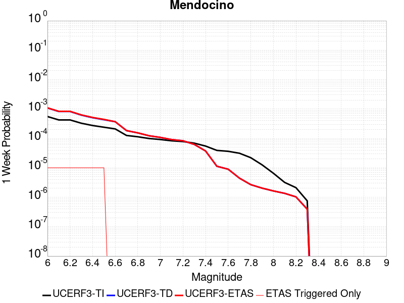 |  |  | 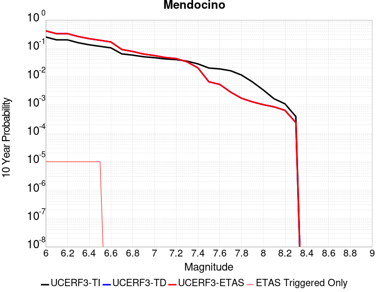 |

| Magnitude | 1 wk TI Prob | 1 wk TD Prob | 1 wk ETAS Prob | 1 wk ETAS/TD Gain | 1 wk ETAS Triggered Only | 1 mo TI Prob | 1 mo TD Prob | 1 mo ETAS Prob | 1 mo ETAS/TD Gain | 1 mo ETAS Triggered Only | 1 yr TI Prob | 1 yr TD Prob | 1 yr ETAS Prob | 1 yr ETAS/TD Gain | 1 yr ETAS Triggered Only | 10 yr TI Prob | 10 yr TD Prob | 10 yr ETAS Prob | 10 yr ETAS/TD Gain | 10 yr ETAS Triggered Only |
|-----|-----|-----|-----|-----|-----|-----|-----|-----|-----|-----|-----|-----|-----|-----|-----|-----|-----|-----|-----|-----|
| 6.0 | 5.5409013E-4 | 0.0010840978 | 0.0010940869 | 1.0092143 | 1.0E-5 | 0.0023725112 | 0.0046357135 | 0.004645667 | 1.0021472 | 1.0E-5 | 0.028505474 | 0.054677837 | 0.054687288 | 1.0001729 | 1.0E-5 | 0.25113493 | 0.41188422 | 0.4118901 | 1.0000143 | 1.0E-5 |
| 6.1 | 4.2515888E-4 | 8.229105E-4 | 8.3290227E-4 | 1.012142 | 1.0E-5 | 0.0018208373 | 0.003520157 | 0.0035301216 | 1.0028307 | 1.0E-5 | 0.021944538 | 0.041751582 | 0.041761164 | 1.0002295 | 1.0E-5 | 0.19899574 | 0.32995522 | 0.3299619 | 1.0000203 | 1.0E-5 |
| 6.2 | 4.2515888E-4 | 8.229105E-4 | 8.3290227E-4 | 1.012142 | 1.0E-5 | 0.0018208373 | 0.003520157 | 0.0035301216 | 1.0028307 | 1.0E-5 | 0.021944538 | 0.041751582 | 0.041761164 | 1.0002295 | 1.0E-5 | 0.19899574 | 0.32995522 | 0.3299619 | 1.0000203 | 1.0E-5 |
| 6.3 | 3.2773745E-4 | 6.193633E-4 | 6.293571E-4 | 1.0161356 | 1.0E-5 | 0.0014038329 | 0.0026503794 | 0.0026603527 | 1.0037631 | 1.0E-5 | 0.016958237 | 0.031593565 | 0.03160325 | 1.0003065 | 1.0E-5 | 0.1572094 | 0.26077798 | 0.26078537 | 1.0000284 | 1.0E-5 |
| 6.4 | 2.7417165E-4 | 5.04789E-4 | 5.1478395E-4 | 1.0198003 | 1.0E-5 | 0.0011744922 | 0.002160561 | 0.0021705395 | 1.0046184 | 1.0E-5 | 0.014205975 | 0.02583886 | 0.025848601 | 1.000377 | 1.0E-5 | 0.13331394 | 0.21948014 | 0.21948795 | 1.0000355 | 1.0E-5 |
| 6.5 | 2.3984899E-4 | 4.323638E-4 | 4.4235948E-4 | 1.0231186 | 1.0E-5 | 0.0010275192 | 0.0018508366 | 0.0018608181 | 1.0053929 | 1.0E-5 | 0.012438473 | 0.02218166 | 0.022191437 | 1.0004408 | 1.0E-5 | 0.11764851 | 0.19203737 | 0.19204545 | 1.0000421 | 1.0E-5 |
| 6.6 | 2.1023539E-4 | 3.6936256E-4 | 3.6936256E-4 | 1.0 | 0.0 | 9.0069766E-4 | 0.0015813457 | 0.0015813457 | 1.0 | 0.0 | 0.010910975 | 0.018990727 | 0.018990727 | 1.0 | 0.0 | 0.10390546 | 0.16749373 | 0.16749373 | 1.0 | 0.0 |
| 6.7 | 1.2592976E-4 | 1.8425964E-4 | 1.8425964E-4 | 1.0 | 0.0 | 5.395873E-4 | 7.8937394E-4 | 7.8937394E-4 | 1.0 | 0.0 | 0.006549705 | 0.009556835 | 0.009556835 | 1.0 | 0.0 | 0.063599944 | 0.09096922 | 0.09096922 | 1.0 | 0.0 |
| 6.8 | 1.13663555E-4 | 1.5401552E-4 | 1.5401552E-4 | 1.0 | 0.0 | 4.8703855E-4 | 6.5987057E-4 | 6.5987057E-4 | 1.0 | 0.0 | 0.0059135845 | 0.008000202 | 0.008000202 | 1.0 | 0.0 | 0.057586733 | 0.07739247 | 0.07739247 | 1.0 | 0.0 |
| 6.9 | 9.926894E-5 | 1.2300287E-4 | 1.2300287E-4 | 1.0 | 0.0 | 4.2536893E-4 | 5.2704377E-4 | 5.2704377E-4 | 1.0 | 0.0 | 0.0051665753 | 0.006396927 | 0.006396927 | 1.0 | 0.0 | 0.050480947 | 0.06285957 | 0.06285957 | 1.0 | 0.0 |
| 7.0 | 9.168125E-5 | 1.0784103E-4 | 1.0784103E-4 | 1.0 | 0.0 | 3.9286047E-4 | 4.6208999E-4 | 4.6208999E-4 | 1.0 | 0.0 | 0.004772591 | 0.005611076 | 0.005611076 | 1.0 | 0.0 | 0.04671385 | 0.0556208 | 0.0556208 | 1.0 | 0.0 |
| 7.1 | 8.2854116E-5 | 9.1051006E-5 | 9.1051006E-5 | 1.0 | 0.0 | 3.5504074E-4 | 3.9016042E-4 | 3.9016042E-4 | 1.0 | 0.0 | 0.004314056 | 0.0047399225 | 0.0047399225 | 1.0 | 0.0 | 0.042312626 | 0.047480468 | 0.047480468 | 1.0 | 0.0 |
| 7.2 | 7.8255274E-5 | 8.300352E-5 | 8.300352E-5 | 1.0 | 0.0 | 3.3533663E-4 | 3.556817E-4 | 3.556817E-4 | 1.0 | 0.0 | 0.0040750825 | 0.004321974 | 0.004321974 | 1.0 | 0.0 | 0.040011603 | 0.043524873 | 0.043524873 | 1.0 | 0.0 |
| 7.3 | 6.887904E-5 | 6.258733E-5 | 6.258733E-5 | 1.0 | 0.0 | 2.9516246E-4 | 2.6820437E-4 | 2.6820437E-4 | 1.0 | 0.0 | 0.0035876823 | 0.0032605957 | 0.0032605957 | 1.0 | 0.0 | 0.035303112 | 0.03335046 | 0.03335046 | 1.0 | 0.0 |
| 7.4 | 5.4898497E-5 | 3.7397505E-5 | 3.7397505E-5 | 1.0 | 0.0 | 2.3525805E-4 | 1.6026547E-4 | 1.6026547E-4 | 1.0 | 0.0 | 0.0028605047 | 0.0019495422 | 0.0019495422 | 1.0 | 0.0 | 0.02823963 | 0.020406872 | 0.020406872 | 1.0 | 0.0 |
| 7.5 | 3.9103943E-5 | 1.1304096E-5 | 1.1304096E-5 | 1.0 | 0.0 | 1.6757756E-4 | 4.8445232E-5 | 4.8445232E-5 | 1.0 | 0.0 | 0.0020383475 | 5.896627E-4 | 5.896627E-4 | 1.0 | 0.0 | 0.020197518 | 0.0066229533 | 0.0066229533 | 1.0 | 0.0 |
| 7.6 | 3.641042E-5 | 8.981182E-6 | 8.981182E-6 | 1.0 | 0.0 | 1.5603533E-4 | 3.849022E-5 | 3.849022E-5 | 1.0 | 0.0 | 0.0018980748 | 4.6851902E-4 | 4.6851902E-4 | 1.0 | 0.0 | 0.018819444 | 0.0053467555 | 0.0053467555 | 1.0 | 0.0 |
| 7.7 | 3.1318774E-5 | 4.452091E-6 | 4.452091E-6 | 1.0 | 0.0 | 1.342164E-4 | 1.9080253E-5 | 1.9080253E-5 | 1.0 | 0.0 | 0.0016328598 | 2.322775E-4 | 2.322775E-4 | 1.0 | 0.0 | 0.016209139 | 0.0028640495 | 0.0028640495 | 1.0 | 0.0 |
| 7.8 | 2.209241E-5 | 2.679371E-6 | 2.679371E-6 | 1.0 | 0.0 | 9.467832E-5 | 1.1482968E-5 | 1.1482968E-5 | 1.0 | 0.0 | 0.001152099 | 1.397962E-4 | 1.397962E-4 | 1.0 | 0.0 | 0.011461443 | 0.001736627 | 0.001736627 | 1.0 | 0.0 |
| 7.9 | 1.2640477E-5 | 2.041037E-6 | 2.041037E-6 | 1.0 | 0.0 | 5.4172346E-5 | 8.747273E-6 | 8.747273E-6 | 1.0 | 0.0 | 6.593487E-4 | 1.06492866E-4 | 1.06492866E-4 | 1.0 | 0.0 | 0.006573958 | 0.0012974226 | 0.0012974226 | 1.0 | 0.0 |
| 8.0 | 6.5548907E-6 | 1.6379622E-6 | 1.6379622E-6 | 1.0 | 0.0 | 2.8092087E-5 | 7.019819E-6 | 7.019819E-6 | 1.0 | 0.0 | 3.4196748E-4 | 8.546297E-5 | 8.546297E-5 | 1.0 | 0.0 | 0.0034144172 | 0.0010306032 | 0.0010306032 | 1.0 | 0.0 |
| 8.1 | 3.1916707E-6 | 1.357735E-6 | 1.357735E-6 | 1.0 | 0.0 | 1.3678517E-5 | 5.818851E-6 | 5.818851E-6 | 1.0 | 0.0 | 1.6652321E-4 | 7.084223E-5 | 7.084223E-5 | 1.0 | 0.0 | 0.0016639848 | 8.624329E-4 | 8.624329E-4 | 1.0 | 0.0 |
| 8.2 | 2.1193785E-6 | 1.0297509E-6 | 1.0297509E-6 | 1.0 | 0.0 | 9.083019E-6 | 4.413211E-6 | 4.413211E-6 | 1.0 | 0.0 | 1.1058014E-4 | 5.372954E-5 | 5.372954E-5 | 1.0 | 0.0 | 0.0011052513 | 6.500931E-4 | 6.500931E-4 | 1.0 | 0.0 |
| 8.3 | 7.536878E-7 | 3.9261332E-7 | 3.9261332E-7 | 1.0 | 0.0 | 3.2300866E-6 | 1.6826275E-6 | 1.6826275E-6 | 1.0 | 0.0 | 3.9325594E-5 | 2.048581E-5 | 2.048581E-5 | 1.0 | 0.0 | 3.9318635E-4 | 2.4124846E-4 | 2.4124846E-4 | 1.0 | 0.0 |

## Richfield
*[(top)](#table-of-contents)*

| 1 Week | 1 Month | 1 Year | 10 Year |
|-----|-----|-----|-----|
|  |  |  |  |

| Magnitude | 1 wk TI Prob | 1 wk TD Prob | 1 wk ETAS Prob | 1 wk ETAS/TD Gain | 1 wk ETAS Triggered Only | 1 mo TI Prob | 1 mo TD Prob | 1 mo ETAS Prob | 1 mo ETAS/TD Gain | 1 mo ETAS Triggered Only | 1 yr TI Prob | 1 yr TD Prob | 1 yr ETAS Prob | 1 yr ETAS/TD Gain | 1 yr ETAS Triggered Only | 10 yr TI Prob | 10 yr TD Prob | 10 yr ETAS Prob | 10 yr ETAS/TD Gain | 10 yr ETAS Triggered Only |
|-----|-----|-----|-----|-----|-----|-----|-----|-----|-----|-----|-----|-----|-----|-----|-----|-----|-----|-----|-----|-----|
| 6.0 | 1.5166896E-6 | 1.5392679E-6 | 1.1539252E-5 | 7.496585 | 1.0E-5 | 6.5000822E-6 | 6.596852E-6 | 1.6596787E-5 | 2.5158646 | 1.0E-5 | 7.913562E-5 | 8.0314814E-5 | 9.031401E-5 | 1.1245 | 1.0E-5 | 7.910745E-4 | 8.0296566E-4 | 8.129576E-4 | 1.0124438 | 1.0E-5 |
| 6.1 | 1.5166896E-6 | 1.5392679E-6 | 1.1539252E-5 | 7.496585 | 1.0E-5 | 6.5000822E-6 | 6.596852E-6 | 1.6596787E-5 | 2.5158646 | 1.0E-5 | 7.913562E-5 | 8.0314814E-5 | 9.031401E-5 | 1.1245 | 1.0E-5 | 7.910745E-4 | 8.0296566E-4 | 8.129576E-4 | 1.0124438 | 1.0E-5 |
| 6.2 | 6.473272E-7 | 6.598479E-7 | 6.598479E-7 | 1.0 | 0.0 | 2.7742565E-6 | 2.8279171E-6 | 2.8279171E-6 | 1.0 | 0.0 | 3.377605E-5 | 3.442948E-5 | 3.442948E-5 | 1.0 | 0.0 | 3.3770915E-4 | 3.4425448E-4 | 3.4425448E-4 | 1.0 | 0.0 |
| 6.3 | 6.473272E-7 | 6.598479E-7 | 6.598479E-7 | 1.0 | 0.0 | 2.7742565E-6 | 2.8279171E-6 | 2.8279171E-6 | 1.0 | 0.0 | 3.377605E-5 | 3.442948E-5 | 3.442948E-5 | 1.0 | 0.0 | 3.3770915E-4 | 3.4425448E-4 | 3.4425448E-4 | 1.0 | 0.0 |
| 6.4 | 6.473272E-7 | 6.598479E-7 | 6.598479E-7 | 1.0 | 0.0 | 2.7742565E-6 | 2.8279171E-6 | 2.8279171E-6 | 1.0 | 0.0 | 3.377605E-5 | 3.442948E-5 | 3.442948E-5 | 1.0 | 0.0 | 3.3770915E-4 | 3.4425448E-4 | 3.4425448E-4 | 1.0 | 0.0 |
| 6.5 | 2.7954403E-7 | 2.85316E-7 | 2.85316E-7 | 1.0 | 0.0 | 1.1980452E-6 | 1.2227825E-6 | 1.2227825E-6 | 1.0 | 0.0 | 1.4586103E-5 | 1.4887319E-5 | 1.4887319E-5 | 1.0 | 0.0 | 1.4585146E-4 | 1.4886746E-4 | 1.4886746E-4 | 1.0 | 0.0 |
| 6.6 | 2.7954403E-7 | 2.85316E-7 | 2.85316E-7 | 1.0 | 0.0 | 1.1980452E-6 | 1.2227825E-6 | 1.2227825E-6 | 1.0 | 0.0 | 1.4586103E-5 | 1.4887319E-5 | 1.4887319E-5 | 1.0 | 0.0 | 1.4585146E-4 | 1.4886746E-4 | 1.4886746E-4 | 1.0 | 0.0 |
| 6.7 | 1.0777299E-7 | 1.0878809E-7 | 1.0878809E-7 | 1.0 | 0.0 | 4.6188418E-7 | 4.662346E-7 | 4.662346E-7 | 1.0 | 0.0 | 5.6234253E-6 | 5.676396E-6 | 5.676396E-6 | 1.0 | 0.0 | 5.623283E-5 | 5.676294E-5 | 5.676294E-5 | 1.0 | 0.0 |
| 6.8 | 2.1301874E-8 | 2.0666132E-8 | 2.0666132E-8 | 1.0 | 0.0 | 9.129375E-8 | 8.856914E-8 | 8.856914E-8 | 1.0 | 0.0 | 1.1115008E-6 | 1.0783288E-6 | 1.0783288E-6 | 1.0 | 0.0 | 1.1114952E-5 | 1.0783239E-5 | 1.0783239E-5 | 1.0 | 0.0 |
| 6.9 | 1.8413502E-8 | 1.7751097E-8 | 1.7751097E-8 | 1.0 | 0.0 | 7.891501E-8 | 7.607613E-8 | 7.607613E-8 | 1.0 | 0.0 | 9.607899E-7 | 9.2622645E-7 | 9.2622645E-7 | 1.0 | 0.0 | 9.607857E-6 | 9.2622295E-6 | 9.2622295E-6 | 1.0 | 0.0 |
| 7.0 | 1.2290541E-8 | 1.1574315E-8 | 1.1574315E-8 | 1.0 | 0.0 | 5.2673748E-8 | 4.9604207E-8 | 4.9604207E-8 | 1.0 | 0.0 | 6.413027E-7 | 6.03931E-7 | 6.03931E-7 | 1.0 | 0.0 | 6.4130086E-6 | 6.0392954E-6 | 6.0392954E-6 | 1.0 | 0.0 |
| 7.1 | 6.373573E-9 | 6.155758E-9 | 6.155758E-9 | 1.0 | 0.0 | 2.7315311E-8 | 2.6381821E-8 | 2.6381821E-8 | 1.0 | 0.0 | 3.3256384E-7 | 3.2119863E-7 | 3.2119863E-7 | 1.0 | 0.0 | 3.3256335E-6 | 3.211982E-6 | 3.211982E-6 | 1.0 | 0.0 |
| 7.2 | 3.6989944E-9 | 3.7360146E-9 | 3.7360146E-9 | 1.0 | 0.0 | 1.5852834E-8 | 1.6011493E-8 | 1.6011493E-8 | 1.0 | 0.0 | 1.9300822E-7 | 1.9493989E-7 | 1.9493989E-7 | 1.0 | 0.0 | 1.9300805E-6 | 1.9493975E-6 | 1.9493975E-6 | 1.0 | 0.0 |
| 7.3 | 2.097397E-9 | 2.1200501E-9 | 2.1200501E-9 | 1.0 | 0.0 | 8.9888434E-9 | 9.085929E-9 | 9.085929E-9 | 1.0 | 0.0 | 1.0943917E-7 | 1.1062118E-7 | 1.1062118E-7 | 1.0 | 0.0 | 1.0943911E-6 | 1.1062115E-6 | 1.1062115E-6 | 1.0 | 0.0 |
| 7.4 | 5.8314464E-12 | 5.8918426E-12 | 5.8918426E-12 | 1.0 | 0.0 | 2.4991786E-11 | 2.5250912E-11 | 2.5250912E-11 | 1.0 | 0.0 | 3.0427527E-10 | 3.0742975E-10 | 3.0742975E-10 | 1.0 | 0.0 | 3.0427532E-9 | 3.0742973E-9 | 3.0742973E-9 | 1.0 | 0.0 |

## Great Valley 05 Pittsburg - Kirby Hills alt1
*[(top)](#table-of-contents)*

| 1 Week | 1 Month | 1 Year | 10 Year |
|-----|-----|-----|-----|
|  |  |  |  |

| Magnitude | 1 wk TI Prob | 1 wk TD Prob | 1 wk ETAS Prob | 1 wk ETAS/TD Gain | 1 wk ETAS Triggered Only | 1 mo TI Prob | 1 mo TD Prob | 1 mo ETAS Prob | 1 mo ETAS/TD Gain | 1 mo ETAS Triggered Only | 1 yr TI Prob | 1 yr TD Prob | 1 yr ETAS Prob | 1 yr ETAS/TD Gain | 1 yr ETAS Triggered Only | 10 yr TI Prob | 10 yr TD Prob | 10 yr ETAS Prob | 10 yr ETAS/TD Gain | 10 yr ETAS Triggered Only |
|-----|-----|-----|-----|-----|-----|-----|-----|-----|-----|-----|-----|-----|-----|-----|-----|-----|-----|-----|-----|-----|
| 6.0 | 4.187212E-5 | 5.344289E-5 | 5.344289E-5 | 1.0 | 0.0 | 1.794396E-4 | 2.2902661E-4 | 2.2902661E-4 | 1.0 | 0.0 | 0.002182488 | 0.0027857998 | 0.0027857998 | 1.0 | 0.0 | 0.021611776 | 0.027603218 | 0.027612941 | 1.0003523 | 1.0E-5 |
| 6.1 | 4.187212E-5 | 5.344289E-5 | 5.344289E-5 | 1.0 | 0.0 | 1.794396E-4 | 2.2902661E-4 | 2.2902661E-4 | 1.0 | 0.0 | 0.002182488 | 0.0027857998 | 0.0027857998 | 1.0 | 0.0 | 0.021611776 | 0.027603218 | 0.027612941 | 1.0003523 | 1.0E-5 |
| 6.2 | 1.7353306E-5 | 2.2154672E-5 | 2.2154672E-5 | 1.0 | 0.0 | 7.436919E-5 | 9.4947456E-5 | 9.4947456E-5 | 1.0 | 0.0 | 9.050688E-4 | 0.0011557573 | 0.0011557573 | 1.0 | 0.0 | 0.009013915 | 0.0115352 | 0.0115352 | 1.0 | 0.0 |
| 6.3 | 1.7353306E-5 | 2.2154672E-5 | 2.2154672E-5 | 1.0 | 0.0 | 7.436919E-5 | 9.4947456E-5 | 9.4947456E-5 | 1.0 | 0.0 | 9.050688E-4 | 0.0011557573 | 0.0011557573 | 1.0 | 0.0 | 0.009013915 | 0.0115352 | 0.0115352 | 1.0 | 0.0 |
| 6.4 | 1.4028824E-5 | 1.7901062E-5 | 1.7901062E-5 | 1.0 | 0.0 | 6.0122147E-5 | 7.671883E-5 | 7.671883E-5 | 1.0 | 0.0 | 7.3174125E-4 | 9.340303E-4 | 9.340303E-4 | 1.0 | 0.0 | 0.0072933645 | 0.009338211 | 0.009338211 | 1.0 | 0.0 |

## San Luis Range - Oceano 2011 CFM
*[(top)](#table-of-contents)*

| 1 Week | 1 Month | 1 Year | 10 Year |
|-----|-----|-----|-----|
|  |  |  |  |

| Magnitude | 1 wk TI Prob | 1 wk TD Prob | 1 wk ETAS Prob | 1 wk ETAS/TD Gain | 1 wk ETAS Triggered Only | 1 mo TI Prob | 1 mo TD Prob | 1 mo ETAS Prob | 1 mo ETAS/TD Gain | 1 mo ETAS Triggered Only | 1 yr TI Prob | 1 yr TD Prob | 1 yr ETAS Prob | 1 yr ETAS/TD Gain | 1 yr ETAS Triggered Only | 10 yr TI Prob | 10 yr TD Prob | 10 yr ETAS Prob | 10 yr ETAS/TD Gain | 10 yr ETAS Triggered Only |
|-----|-----|-----|-----|-----|-----|-----|-----|-----|-----|-----|-----|-----|-----|-----|-----|-----|-----|-----|-----|-----|
| 6.0 | 1.6025788E-6 | 1.620119E-6 | 1.620119E-6 | 1.0 | 0.0 | 6.8681766E-6 | 6.943351E-6 | 6.943351E-6 | 1.0 | 0.0 | 8.361684E-5 | 8.453243E-5 | 9.4531584E-5 | 1.1182878 | 1.0E-5 | 8.3585386E-4 | 8.4504357E-4 | 8.5503515E-4 | 1.0118237 | 1.0E-5 |
| 6.1 | 1.6025788E-6 | 1.620119E-6 | 1.620119E-6 | 1.0 | 0.0 | 6.8681766E-6 | 6.943351E-6 | 6.943351E-6 | 1.0 | 0.0 | 8.361684E-5 | 8.453243E-5 | 9.4531584E-5 | 1.1182878 | 1.0E-5 | 8.3585386E-4 | 8.4504357E-4 | 8.5503515E-4 | 1.0118237 | 1.0E-5 |
| 6.2 | 1.6025788E-6 | 1.620119E-6 | 1.620119E-6 | 1.0 | 0.0 | 6.8681766E-6 | 6.943351E-6 | 6.943351E-6 | 1.0 | 0.0 | 8.361684E-5 | 8.453243E-5 | 9.4531584E-5 | 1.1182878 | 1.0E-5 | 8.3585386E-4 | 8.4504357E-4 | 8.5503515E-4 | 1.0118237 | 1.0E-5 |
| 6.3 | 1.6025788E-6 | 1.620119E-6 | 1.620119E-6 | 1.0 | 0.0 | 6.8681766E-6 | 6.943351E-6 | 6.943351E-6 | 1.0 | 0.0 | 8.361684E-5 | 8.453243E-5 | 9.4531584E-5 | 1.1182878 | 1.0E-5 | 8.3585386E-4 | 8.4504357E-4 | 8.5503515E-4 | 1.0118237 | 1.0E-5 |
| 6.4 | 1.1621186E-6 | 1.1749894E-6 | 1.1749894E-6 | 1.0 | 0.0 | 4.980499E-6 | 5.0356607E-6 | 5.0356607E-6 | 1.0 | 0.0 | 6.0635884E-5 | 6.130771E-5 | 7.1307106E-5 | 1.1631016 | 1.0E-5 | 6.0619344E-4 | 6.1293464E-4 | 6.229285E-4 | 1.016305 | 1.0E-5 |
| 6.5 | 1.1621186E-6 | 1.1749894E-6 | 1.1749894E-6 | 1.0 | 0.0 | 4.980499E-6 | 5.0356607E-6 | 5.0356607E-6 | 1.0 | 0.0 | 6.0635884E-5 | 6.130771E-5 | 7.1307106E-5 | 1.1631016 | 1.0E-5 | 6.0619344E-4 | 6.1293464E-4 | 6.229285E-4 | 1.016305 | 1.0E-5 |
| 6.6 | 7.164729E-7 | 7.2485784E-7 | 7.2485784E-7 | 1.0 | 0.0 | 3.0705946E-6 | 3.10653E-6 | 3.10653E-6 | 1.0 | 0.0 | 3.738385E-5 | 3.7821363E-5 | 4.7820984E-5 | 1.2643908 | 1.0E-5 | 3.737756E-4 | 3.7815105E-4 | 3.8814725E-4 | 1.0264344 | 1.0E-5 |
| 6.7 | 7.164729E-7 | 7.2485784E-7 | 7.2485784E-7 | 1.0 | 0.0 | 3.0705946E-6 | 3.10653E-6 | 3.10653E-6 | 1.0 | 0.0 | 3.738385E-5 | 3.7821363E-5 | 4.7820984E-5 | 1.2643908 | 1.0E-5 | 3.737756E-4 | 3.7815105E-4 | 3.8814725E-4 | 1.0264344 | 1.0E-5 |
| 6.8 | 6.700177E-7 | 6.7774397E-7 | 6.7774397E-7 | 1.0 | 0.0 | 2.8715012E-6 | 2.904614E-6 | 2.904614E-6 | 1.0 | 0.0 | 3.495997E-5 | 3.536312E-5 | 4.536276E-5 | 1.2827705 | 1.0E-5 | 3.495447E-4 | 3.5357653E-4 | 3.63573E-4 | 1.0282724 | 1.0E-5 |
| 6.9 | 5.657865E-7 | 5.7217864E-7 | 5.7217864E-7 | 1.0 | 0.0 | 2.424797E-6 | 2.452192E-6 | 2.452192E-6 | 1.0 | 0.0 | 2.9521503E-5 | 2.9855039E-5 | 3.9854738E-5 | 1.3349419 | 1.0E-5 | 2.9517582E-4 | 2.9851135E-4 | 3.0850834E-4 | 1.0334896 | 1.0E-5 |
| 7.0 | 4.608413E-7 | 4.660169E-7 | 4.660169E-7 | 1.0 | 0.0 | 1.9750328E-6 | 1.9972138E-6 | 1.9972138E-6 | 1.0 | 0.0 | 2.4045758E-5 | 2.431581E-5 | 3.4315566E-5 | 1.4112451 | 1.0E-5 | 2.4043156E-4 | 2.4313178E-4 | 2.5312934E-4 | 1.0411199 | 1.0E-5 |
| 7.1 | 3.9177846E-7 | 3.9621602E-7 | 3.9621602E-7 | 1.0 | 0.0 | 1.6790494E-6 | 1.6980675E-6 | 1.6980675E-6 | 1.0 | 0.0 | 2.0442236E-5 | 2.0673779E-5 | 3.067357E-5 | 1.4836946 | 1.0E-5 | 2.0440355E-4 | 2.067187E-4 | 2.1671664E-4 | 1.0483649 | 1.0E-5 |
| 7.2 | 3.3974752E-7 | 3.436653E-7 | 3.436653E-7 | 1.0 | 0.0 | 1.45606E-6 | 1.4728505E-6 | 1.4728505E-6 | 1.0 | 0.0 | 1.7727387E-5 | 1.7931809E-5 | 2.7931628E-5 | 1.5576583 | 1.0E-5 | 1.7725973E-4 | 1.7930372E-4 | 1.8930192E-4 | 1.0557613 | 1.0E-5 |
| 7.3 | 2.8900928E-7 | 2.923402E-7 | 2.923402E-7 | 1.0 | 0.0 | 1.2386106E-6 | 1.2528859E-6 | 1.2528859E-6 | 1.0 | 0.0 | 1.5079979E-5 | 1.525378E-5 | 2.5253627E-5 | 1.6555653 | 1.0E-5 | 1.5078956E-4 | 1.5252741E-4 | 1.6252589E-4 | 1.065552 | 1.0E-5 |
| 7.4 | 2.1881527E-7 | 2.2139594E-7 | 2.2139594E-7 | 1.0 | 0.0 | 9.3777936E-7 | 9.488394E-7 | 9.488394E-7 | 1.0 | 0.0 | 1.14174045E-5 | 1.1552059E-5 | 2.1551943E-5 | 1.8656366 | 1.0E-5 | 1.1416818E-4 | 1.1551464E-4 | 1.2551348E-4 | 1.086559 | 1.0E-5 |
| 7.5 | 1.356398E-7 | 1.3718639E-7 | 1.3718639E-7 | 1.0 | 0.0 | 5.813133E-7 | 5.8794154E-7 | 5.8794154E-7 | 1.0 | 0.0 | 7.0774663E-6 | 7.158165E-6 | 1.7158094E-5 | 2.396996 | 1.0E-5 | 7.077241E-5 | 7.157937E-5 | 8.157866E-5 | 1.139695 | 1.0E-5 |
| 7.6 | 5.9269272E-8 | 6.001364E-8 | 6.001364E-8 | 1.0 | 0.0 | 2.5401116E-7 | 2.572013E-7 | 2.572013E-7 | 1.0 | 0.0 | 3.0925814E-6 | 3.1314214E-6 | 3.1314214E-6 | 1.0 | 0.0 | 3.0925385E-5 | 3.1313786E-5 | 3.1313786E-5 | 1.0 | 0.0 |
| 7.7 | 5.946232E-9 | 6.036928E-9 | 6.036928E-9 | 1.0 | 0.0 | 2.5483851E-8 | 2.5872547E-8 | 2.5872547E-8 | 1.0 | 0.0 | 3.1026585E-7 | 3.1499823E-7 | 3.1499823E-7 | 1.0 | 0.0 | 3.102654E-6 | 3.1499787E-6 | 3.1499787E-6 | 1.0 | 0.0 |

