# Parent Section Magnitude-Probability Distributions

Only fault sections with at least one triggered aftershock are plotted. Sections are sorted by total supraseismogenic trigger rate (decreasing)

## Table Of Contents

* [Garlock (Central)](#garlock-central)
* [Tank Canyon](#tank-canyon)
* [Little Lake](#little-lake)
* [Owl Lake](#owl-lake)
* [Airport Lake](#airport-lake)
* [Panamint Valley](#panamint-valley)
* [Garlock (East)](#garlock-east)
* [Hunter Mountain-Saline Valley](#hunter-mountain-saline-valley)
* [Ash Hill](#ash-hill)
* [Blackwater](#blackwater)
* [Garlock (West)](#garlock-west)
* [McLean Lake](#mclean-lake)
* [Gravel Hills-Harper Lk](#gravel-hills-harper-lk)
* [Goldstone Lake](#goldstone-lake)
* [So Sierra Nevada](#so-sierra-nevada)
* [San Andreas (Mojave N)](#san-andreas-mojave-n)
* [San Andreas (Mojave S)](#san-andreas-mojave-s)
* [Death Valley (So)](#death-valley-so)
* [Coyote Canyon](#coyote-canyon)
* [Nelson Lake](#nelson-lake)
* [Towne Pass](#towne-pass)
* [Lenwood-Lockhart-Old Woman Springs](#lenwood-lockhart-old-woman-springs)
* [San Andreas (San Bernardino N)](#san-andreas-san-bernardino-n)
* [Paradise](#paradise)
* [Bicycle Lake](#bicycle-lake)
* [Garlic Springs](#garlic-springs)
* [San Andreas (San Bernardino S)](#san-andreas-san-bernardino-s)
* [Death Valley (Black Mtns Frontal)](#death-valley-black-mtns-frontal)
* [Coyote Lake](#coyote-lake)
* [San Andreas (Big Bend)](#san-andreas-big-bend)
* [Helendale-So Lockhart](#helendale-so-lockhart)
* [San Andreas (Parkfield)](#san-andreas-parkfield)
* [Sierra Nevada  (No Extension)](#sierra-nevada--no-extension)
* [Death Valley (No)](#death-valley-no)
* [San Andreas (San Gorgonio Pass-Garnet HIll)](#san-andreas-san-gorgonio-pass-garnet-hill)
* [Red Pass](#red-pass)
* [Elsinore (Glen Ivy) rev](#elsinore-glen-ivy-rev)
* [San Andreas (Creeping Section) 2011 CFM](#san-andreas-creeping-section-2011-cfm)
* [Calico-Hidalgo](#calico-hidalgo)
* [Baker](#baker)
* [San Andreas (Carrizo) rev](#san-andreas-carrizo-rev)
* [Death Valley (Fish Lake Valley)](#death-valley-fish-lake-valley)
* [Cady](#cady)
* [Scodie Lineament](#scodie-lineament)
* [San Andreas (Cholame) rev](#san-andreas-cholame-rev)
* [San Jacinto (San Bernardino)](#san-jacinto-san-bernardino)
* [White Wolf (Extension)](#white-wolf-extension)
* [Lake Isabella (Seismicity)](#lake-isabella-seismicity)
* [San Andreas (Coachella) rev](#san-andreas-coachella-rev)
* [White Mountains](#white-mountains)
* [Owens Valley](#owens-valley)
* [Manix-Afton Hills](#manix-afton-hills)
* [Cleghorn Pass](#cleghorn-pass)
* [Santa Rosa Island](#santa-rosa-island)
* [Cleghorn Lake](#cleghorn-lake)
* [San Andreas (North Branch Mill Creek)](#san-andreas-north-branch-mill-creek)
* [Independence rev 2011](#independence-rev-2011)
* [San Jacinto (San Jacinto Valley) rev](#san-jacinto-san-jacinto-valley-rev)
* [Calaveras (So) - Paicines extension 2011 CFM](#calaveras-so---paicines-extension-2011-cfm)
* [Pinto Mtn](#pinto-mtn)
* [Lost Hills](#lost-hills)
* [Elysian Park (Upper)](#elysian-park-upper)
* [Mission Creek](#mission-creek)
* [Brawley (Seismic Zone) alt 1](#brawley-seismic-zone-alt-1)
* [San Jacinto (Stepovers Combined)](#san-jacinto-stepovers-combined)
* [Kern Canyon (North Kern) 2011](#kern-canyon-north-kern-2011)
* [San Jacinto (Lytle Creek connector)](#san-jacinto-lytle-creek-connector)
* [Chino alt 1](#chino-alt-1)
* [Rose Canyon](#rose-canyon)
* [Pleito](#pleito)
* [Ludlow](#ludlow)
* [Imperial](#imperial)
* [Tin Mountain](#tin-mountain)
* [Calaveras (So) 2011 CFM](#calaveras-so-2011-cfm)
* [Channel Islands Thrust](#channel-islands-thrust)
* [San Jacinto (Anza) rev](#san-jacinto-anza-rev)
* [Ventura-Pitas Point](#ventura-pitas-point)
* [Palos Verdes](#palos-verdes)
* [Kern Canyon (South Kern) 2011](#kern-canyon-south-kern-2011)
* [Raymond](#raymond)
* [Camp Rock 2011](#camp-rock-2011)
* [Big Pine (Central)](#big-pine-central)
* [Santa Cruz Island](#santa-cruz-island)
* [Hollywood](#hollywood)
* [Santa Ynez (East)](#santa-ynez-east)
* [Big Pine (East)](#big-pine-east)
* [Deep Springs](#deep-springs)
* [Great Valley 03a Dunnigan Hills](#great-valley-03a-dunnigan-hills)
* [Coronado Bank alt1](#coronado-bank-alt1)
* [Santa Ynez (West)](#santa-ynez-west)
* [Dry Mountain](#dry-mountain)
* [Calaveras (Central) 2011 CFM](#calaveras-central-2011-cfm)
* [Santa Monica alt 1](#santa-monica-alt-1)
* [Blue Cut](#blue-cut)
* [Pisgah-Bullion Mtn-Mesquite Lk](#pisgah-bullion-mtn-mesquite-lk)
* [San Pedro Basin](#san-pedro-basin)
* [Channel Islands Western Deep Ramp](#channel-islands-western-deep-ramp)
* [Bullion Mountains](#bullion-mountains)
* [Hunting Creek - Berryessa 2011 CFM](#hunting-creek---berryessa-2011-cfm)
* [San Juan](#san-juan)
* [Sheephole](#sheephole)
* [San Jacinto (Coyote Creek)](#san-jacinto-coyote-creek)
* [Cucamonga](#cucamonga)
* [Owens Valley Keough Hot Springs](#owens-valley-keough-hot-springs)
* [Newport-Inglewood (Offshore)](#newport-inglewood-offshore)
* [Puente Hills](#puente-hills)
* [Malibu Coast alt 1](#malibu-coast-alt-1)
* [Mission Ridge-Arroyo Parida-Santa Ana](#mission-ridge-arroyo-parida-santa-ana)
* [San Diego Trough north alt1](#san-diego-trough-north-alt1)
* [Hunting Creek - Bartlett Springs connector 2011](#hunting-creek---bartlett-springs-connector-2011)
* [Great Valley 07 (Orestimba)](#great-valley-07-orestimba)
* [White Wolf](#white-wolf)
* [Oceanic - West Huasna](#oceanic---west-huasna)
* [San Jacinto (Borrego)](#san-jacinto-borrego)
* [Santa Ynez River](#santa-ynez-river)
* [Santa Cruz Catalina Ridge alt1](#santa-cruz-catalina-ridge-alt1)
* [Sierra Madre](#sierra-madre)
* [Pine Mtn](#pine-mtn)
* [San Jacinto (Clark) rev](#san-jacinto-clark-rev)
* [San Diego Trough south](#san-diego-trough-south)
* [Rinconada 2011 CFM](#rinconada-2011-cfm)
* [Simi-Santa Rosa](#simi-santa-rosa)
* [Emerson-Copper Mtn 2011](#emerson-copper-mtn-2011)
* [Homestead Valley 2011](#homestead-valley-2011)
* [San Andreas (Offshore) 2011 CFM](#san-andreas-offshore-2011-cfm)
* [San Andreas (Santa Cruz Mts) 2011 CFM](#san-andreas-santa-cruz-mts-2011-cfm)
* [Kern Canyon (Lake Isabella) 2011](#kern-canyon-lake-isabella-2011)
* [Whittier alt 1](#whittier-alt-1)
* [San Gabriel](#san-gabriel)
* [Hayward (So) 2011 CFM](#hayward-so-2011-cfm)
* [Verdugo](#verdugo)
* [San Jacinto (Superstition Mtn)](#san-jacinto-superstition-mtn)
* [Elsinore (Temecula) rev](#elsinore-temecula-rev)
* [San Gabriel (Extension)](#san-gabriel-extension)
* [Round Valley](#round-valley)
* [Hosgri (Extension)](#hosgri-extension)
* [Likely 2011 CFM](#likely-2011-cfm)
* [Santa Susana East (connector)](#santa-susana-east-connector)
* [San Clemente](#san-clemente)
* [Big Lagoon - Bald Mtn 2011 CFM](#big-lagoon---bald-mtn-2011-cfm)
* [East Huasna 2011 CFM](#east-huasna-2011-cfm)
* [Newport-Inglewood alt 1](#newport-inglewood-alt-1)
* [Red Mountain](#red-mountain)
* [Fish Slough 2011 CFM](#fish-slough-2011-cfm)
* [San Andreas (North Coast) 2011 CFM](#san-andreas-north-coast-2011-cfm)
* [Great Valley 03 Mysterious Ridge](#great-valley-03-mysterious-ridge)
* [Earthquake Valley (So Extension)](#earthquake-valley-so-extension)
* [San Cayetano](#san-cayetano)
* [Rodgers Creek - Healdsburg 2011 CFM](#rodgers-creek---healdsburg-2011-cfm)
* [San Luis Range 2011 CFM](#san-luis-range-2011-cfm)
* [Gillem - Big Crack 2011 CFM](#gillem---big-crack-2011-cfm)
* [Maacama 2011 CFM](#maacama-2011-cfm)
* [Hilton Creek 2011 CFM](#hilton-creek-2011-cfm)
* [Great Valley 09 (Laguna Seca)](#great-valley-09-laguna-seca)
* [Great Valley 05 Pittsburg - Kirby Hills alt1](#great-valley-05-pittsburg---kirby-hills-alt1)
* [Elsinore (Coyote Mountains)](#elsinore-coyote-mountains)
* [Fontana (Seismicity)](#fontana-seismicity)
* [San Gregorio (South) 2011 CFM](#san-gregorio-south-2011-cfm)
* [West Napa 2011 CFM](#west-napa-2011-cfm)
* [Pittville 2011 CFM](#pittville-2011-cfm)
* [Hayward (So) extension 2011 CFM](#hayward-so-extension-2011-cfm)
* [Honey Lake 2011 CFM](#honey-lake-2011-cfm)
* [Los Alamos extension](#los-alamos-extension)
* [Great Valley 04b Gordon Valley](#great-valley-04b-gordon-valley)
* [Robinson Creek](#robinson-creek)
* [Los Alamos 2011 CFM](#los-alamos-2011-cfm)
* [Great Valley 04a Trout Creek](#great-valley-04a-trout-creek)
* [Malibu Coast (Extension) alt 1](#malibu-coast-extension-alt-1)
* [Little Salmon (Onshore)](#little-salmon-onshore)
* [Monterey Bay-Tularcitos](#monterey-bay-tularcitos)
* [Cerro Prieto](#cerro-prieto)
* [Antelope Valley 2011](#antelope-valley-2011)
* [Carson Range (Genoa)](#carson-range-genoa)
* [Cleghorn](#cleghorn)
* [Mono Lake 2011 CFM](#mono-lake-2011-cfm)
* [Anaheim](#anaheim)
* [Greenville (So) 2011 CFM](#greenville-so-2011-cfm)
* [Peralta Hills](#peralta-hills)
* [Burnt Mtn](#burnt-mtn)
* [Sargent 2011 CFM](#sargent-2011-cfm)
* [Oceanside alt1](#oceanside-alt1)
* [Lions Head 2011 CFM](#lions-head-2011-cfm)
* [Bennett Valley 2011 CFM](#bennett-valley-2011-cfm)
* [Hosgri](#hosgri)
* [Johnson Valley (No) 2011 rev](#johnson-valley-no-2011-rev)
* [Hayward (No) 2011 CFM](#hayward-no-2011-cfm)

## Garlock (Central)
*[(top)](#table-of-contents)*

| 1 Week | 1 Month | 1 Year | 10 Year |
|-----|-----|-----|-----|
|  |  |  |  |

| Magnitude | 1 wk TI Prob | 1 wk TD Prob | 1 wk ETAS Prob | 1 wk ETAS/TD Gain | 1 wk ETAS Triggered Only | 1 mo TI Prob | 1 mo TD Prob | 1 mo ETAS Prob | 1 mo ETAS/TD Gain | 1 mo ETAS Triggered Only | 1 yr TI Prob | 1 yr TD Prob | 1 yr ETAS Prob | 1 yr ETAS/TD Gain | 1 yr ETAS Triggered Only | 10 yr TI Prob | 10 yr TD Prob | 10 yr ETAS Prob | 10 yr ETAS/TD Gain | 10 yr ETAS Triggered Only |
|-----|-----|-----|-----|-----|-----|-----|-----|-----|-----|-----|-----|-----|-----|-----|-----|-----|-----|-----|-----|-----|
| 6.0 | 5.5131142E-5 | 7.0252936E-5 | 0.009629581 | 137.07016 | 0.00956 | 2.3625491E-4 | 3.0104961E-4 | 0.022774283 | 75.6496 | 0.02248 | 0.0028726095 | 0.0036591832 | 0.056574844 | 15.461058 | 0.05311 | 0.028357591 | 0.0361412 | 0.11630534 | 3.2180817 | 0.08317 |
| 6.1 | 5.5131142E-5 | 7.0252936E-5 | 0.009629581 | 137.07016 | 0.00956 | 2.3625491E-4 | 3.0104961E-4 | 0.022774283 | 75.6496 | 0.02248 | 0.0028726095 | 0.0036591832 | 0.056574844 | 15.461058 | 0.05311 | 0.028357591 | 0.0361412 | 0.11630534 | 3.2180817 | 0.08317 |
| 6.2 | 4.216245E-5 | 5.166702E-5 | 0.006031358 | 116.73517 | 0.00598 | 1.806837E-4 | 2.2141145E-4 | 0.014168323 | 63.99092 | 0.01395 | 0.0021976046 | 0.0026923835 | 0.035473883 | 13.175644 | 0.03287 | 0.021759989 | 0.026704067 | 0.07692614 | 2.8806899 | 0.0516 |
| 6.3 | 4.216245E-5 | 5.166702E-5 | 0.006031358 | 116.73517 | 0.00598 | 1.806837E-4 | 2.2141145E-4 | 0.014168323 | 63.99092 | 0.01395 | 0.0021976046 | 0.0026923835 | 0.035473883 | 13.175644 | 0.03287 | 0.021759989 | 0.026704067 | 0.07692614 | 2.8806899 | 0.0516 |
| 6.4 | 3.6858168E-5 | 4.411544E-5 | 0.004743908 | 107.533966 | 0.0047 | 1.5795401E-4 | 1.890526E-4 | 0.01120697 | 59.279633 | 0.01102 | 0.0019213937 | 0.0022993109 | 0.027890334 | 12.129866 | 0.02565 | 0.019048655 | 0.022868566 | 0.06214925 | 2.7176714 | 0.0402 |
| 6.5 | 3.39199E-5 | 4.0023602E-5 | 0.004159859 | 103.93514 | 0.00412 | 1.453629E-4 | 1.7151856E-4 | 0.009989834 | 58.243454 | 0.00982 | 0.0017683565 | 0.0020862604 | 0.02509815 | 12.0302105 | 0.02306 | 0.017543508 | 0.020761253 | 0.056454506 | 2.7192242 | 0.03645 |
| 6.6 | 3.3571985E-5 | 3.9477756E-5 | 0.004159315 | 105.35845 | 0.00412 | 1.4387199E-4 | 1.6917953E-4 | 0.009987518 | 59.035027 | 0.00982 | 0.0017502342 | 0.0020578366 | 0.025030466 | 12.163486 | 0.02302 | 0.017365133 | 0.020482505 | 0.05609776 | 2.7388134 | 0.03636 |
| 6.7 | 3.2580007E-5 | 3.8094186E-5 | 0.0039679445 | 104.161415 | 0.00393 | 1.3962112E-4 | 1.632507E-4 | 0.009541719 | 58.448257 | 0.00938 | 0.0016985617 | 0.001985787 | 0.02403192 | 12.101964 | 0.02209 | 0.016856372 | 0.019771622 | 0.05392278 | 2.7272816 | 0.03484 |
| 6.8 | 3.2185937E-5 | 3.7521368E-5 | 0.0038773774 | 103.337845 | 0.00384 | 1.3793244E-4 | 1.6079607E-4 | 0.009329322 | 58.019585 | 0.00917 | 0.0016780337 | 0.0019559558 | 0.02360353 | 12.067517 | 0.02169 | 0.016654192 | 0.01947876 | 0.052953757 | 2.7185383 | 0.03414 |
| 6.9 | 3.165394E-5 | 3.672589E-5 | 0.003786588 | 103.10405 | 0.00375 | 1.3565269E-4 | 1.573873E-4 | 0.00903599 | 57.412445 | 0.00888 | 0.0016503202 | 0.0019145276 | 0.023034016 | 12.031175 | 0.02116 | 0.01638118 | 0.01907232 | 0.051835306 | 2.717829 | 0.0334 |
| 7.0 | 3.0903822E-5 | 3.5631027E-5 | 0.0036755013 | 103.15452 | 0.00364 | 1.3243823E-4 | 1.5269557E-4 | 0.008811373 | 57.70549 | 0.00866 | 0.0016112428 | 0.0018575046 | 0.022309445 | 12.010438 | 0.02049 | 0.015996104 | 0.018513773 | 0.050333556 | 2.7187088 | 0.03242 |
| 7.1 | 3.0069863E-5 | 3.439724E-5 | 0.0035242771 | 102.458145 | 0.00349 | 1.2886449E-4 | 1.4740853E-4 | 0.008316204 | 56.416035 | 0.00817 | 0.0015677959 | 0.0017932425 | 0.021278238 | 11.86579 | 0.01952 | 0.01556781 | 0.017881477 | 0.04816019 | 2.6933005 | 0.03083 |
| 7.2 | 2.7957109E-5 | 3.1286352E-5 | 0.0029411954 | 94.00889 | 0.00291 | 1.1981068E-4 | 1.3407759E-4 | 0.0068531767 | 51.11351 | 0.00672 | 0.0014577188 | 0.0016311919 | 0.017874653 | 10.958032 | 0.01627 | 0.014481937 | 0.01628507 | 0.04174361 | 2.5633056 | 0.02588 |
| 7.3 | 2.4519275E-5 | 2.6719234E-5 | 0.0020466652 | 76.59895 | 0.00202 | 1.0507837E-4 | 1.1450605E-4 | 0.0047539747 | 41.517235 | 0.00464 | 0.0012785783 | 0.0013932344 | 0.012827282 | 9.206838 | 0.01145 | 0.012712469 | 0.013929329 | 0.032043446 | 2.30043 | 0.01837 |
| 7.4 | 2.3225532E-5 | 2.52037E-5 | 0.0018451578 | 73.20979 | 0.00182 | 9.95342E-5 | 1.08011474E-4 | 0.0042975587 | 39.787987 | 0.00419 | 0.0012111551 | 0.0013142608 | 0.011590737 | 8.819206 | 0.01029 | 0.012045753 | 0.013146927 | 0.029607635 | 2.2520576 | 0.01668 |
| 7.5 | 2.097765E-5 | 2.2487684E-5 | 0.0014224562 | 63.2549 | 0.0014 | 8.9901114E-5 | 9.637229E-5 | 0.003306063 | 34.30512 | 0.00321 | 0.0010939965 | 0.0011727129 | 0.009283191 | 7.915996 | 0.00812 | 0.010886264 | 0.011741684 | 0.024875637 | 2.1185749 | 0.01329 |
| 7.6 | 1.511254E-5 | 1.599496E-5 | 8.3598186E-4 | 52.26533 | 8.2E-4 | 6.476642E-5 | 6.854807E-5 | 0.0018884233 | 27.548893 | 0.00182 | 7.882459E-4 | 8.34261E-4 | 0.0051906235 | 6.2218223 | 0.00436 | 0.007854558 | 0.008384922 | 0.0152667295 | 1.8207363 | 0.00694 |
| 7.7 | 9.934069E-6 | 1.0682194E-5 | 2.7067942E-4 | 25.339308 | 2.6E-4 | 4.2573887E-5 | 4.578003E-5 | 6.1575393E-4 | 13.4502735 | 5.7E-4 | 5.182138E-4 | 5.5722974E-4 | 0.0018465109 | 3.3137336 | 0.00129 | 0.00517007 | 0.0056296214 | 0.007687968 | 1.3656279 | 0.00207 |
| 7.8 | 6.7562896E-6 | 8.431359E-6 | 1.7842992E-4 | 21.162653 | 1.7E-4 | 2.8955206E-5 | 3.6133893E-5 | 3.8612125E-4 | 10.685846 | 3.5E-4 | 3.5247262E-4 | 4.3984153E-4 | 0.0011895116 | 2.7044096 | 7.5E-4 | 0.0035191406 | 0.004448285 | 0.0056927246 | 1.2797571 | 0.00125 |
| 7.9 | 3.975453E-6 | 5.3728804E-6 | 9.5372394E-5 | 17.750702 | 9.0E-5 | 1.7037546E-5 | 2.3026427E-5 | 2.330216E-4 | 10.119746 | 2.1E-4 | 2.0741238E-4 | 2.8031078E-4 | 7.3018466E-4 | 2.604911 | 4.5E-4 | 0.002072189 | 0.00283465 | 0.003612439 | 1.2743863 | 7.8E-4 |
| 8.0 | 1.6729537E-6 | 2.0781215E-6 | 1.2078101E-5 | 5.8120284 | 1.0E-5 | 7.169782E-6 | 8.906205E-6 | 4.8905848E-5 | 5.491211 | 4.0E-5 | 8.7288594E-5 | 1.0842768E-4 | 2.1841575E-4 | 2.0143912 | 1.1E-4 | 8.7254314E-4 | 0.0010973068 | 0.0013170654 | 1.2002709 | 2.2E-4 |
| 8.1 | 3.6733252E-7 | 3.1497066E-7 | 3.1497066E-7 | 1.0 | 0.0 | 1.5742813E-6 | 1.3498736E-6 | 1.134986E-5 | 8.408091 | 1.0E-5 | 1.9166706E-5 | 1.6434604E-5 | 4.643411E-5 | 2.8253868 | 3.0E-5 | 1.9165053E-4 | 1.6648426E-4 | 1.9647926E-4 | 1.1801672 | 3.0E-5 |

## Tank Canyon
*[(top)](#table-of-contents)*

| 1 Week | 1 Month | 1 Year | 10 Year |
|-----|-----|-----|-----|
|  |  |  |  |

| Magnitude | 1 wk TI Prob | 1 wk TD Prob | 1 wk ETAS Prob | 1 wk ETAS/TD Gain | 1 wk ETAS Triggered Only | 1 mo TI Prob | 1 mo TD Prob | 1 mo ETAS Prob | 1 mo ETAS/TD Gain | 1 mo ETAS Triggered Only | 1 yr TI Prob | 1 yr TD Prob | 1 yr ETAS Prob | 1 yr ETAS/TD Gain | 1 yr ETAS Triggered Only | 10 yr TI Prob | 10 yr TD Prob | 10 yr ETAS Prob | 10 yr ETAS/TD Gain | 10 yr ETAS Triggered Only |
|-----|-----|-----|-----|-----|-----|-----|-----|-----|-----|-----|-----|-----|-----|-----|-----|-----|-----|-----|-----|-----|
| 6.0 | 4.8284557E-5 | 5.7965928E-5 | 0.0043077194 | 74.31468 | 0.00425 | 2.0691741E-4 | 2.484056E-4 | 0.012405385 | 49.940037 | 0.01216 | 0.0025163088 | 0.00302081 | 0.036509342 | 12.085944 | 0.03359 | 0.02488006 | 0.029864373 | 0.08765535 | 2.9351144 | 0.05957 |
| 6.1 | 1.7796336E-5 | 2.0873778E-5 | 0.0014408441 | 69.02651 | 0.00142 | 7.626778E-5 | 8.94562E-5 | 0.0042890804 | 47.946148 | 0.0042 | 9.281647E-4 | 0.0010886233 | 0.013025614 | 11.965218 | 0.01195 | 0.009242975 | 0.010836863 | 0.032964442 | 3.0418806 | 0.02237 |
| 6.2 | 1.7796336E-5 | 2.0873778E-5 | 0.0014408441 | 69.02651 | 0.00142 | 7.626778E-5 | 8.94562E-5 | 0.0042890804 | 47.946148 | 0.0042 | 9.281647E-4 | 0.0010886233 | 0.013025614 | 11.965218 | 0.01195 | 0.009242975 | 0.010836863 | 0.032964442 | 3.0418806 | 0.02237 |
| 6.3 | 1.3515912E-5 | 1.575992E-5 | 9.957445E-4 | 63.18207 | 9.8E-4 | 5.792405E-5 | 6.754091E-5 | 0.0031573323 | 46.746964 | 0.00309 | 7.049971E-4 | 8.2202395E-4 | 0.009774659 | 11.890965 | 0.00896 | 0.007027647 | 0.00819231 | 0.024586892 | 3.001216 | 0.01653 |
| 6.4 | 1.0870146E-5 | 1.2618305E-5 | 7.426091E-4 | 58.85173 | 7.3E-4 | 4.658551E-5 | 5.407743E-5 | 0.0023039558 | 42.604755 | 0.00225 | 5.67031E-4 | 6.5821153E-4 | 0.0073038344 | 11.096485 | 0.00665 | 0.005655863 | 0.006564494 | 0.01871421 | 2.850823 | 0.01223 |
| 6.5 | 7.964826E-6 | 9.196297E-6 | 4.6919208E-4 | 51.019676 | 4.6E-4 | 3.4134522E-5 | 3.9412163E-5 | 0.0015993507 | 40.580128 | 0.00156 | 4.1550855E-4 | 4.79748E-4 | 0.0046977233 | 9.792065 | 0.00422 | 0.0041473247 | 0.004788282 | 0.012600694 | 2.631569 | 0.00785 |
| 6.6 | 6.6317E-6 | 7.6124547E-6 | 3.8760956E-4 | 50.917816 | 3.8E-4 | 2.8421264E-5 | 3.2624448E-5 | 0.0012025862 | 36.861504 | 0.00117 | 3.4597394E-4 | 3.9713932E-4 | 0.0035358923 | 8.903405 | 0.00314 | 0.0034543579 | 0.0039653047 | 0.009762227 | 2.4619107 | 0.00582 |
| 6.7 | 4.793663E-6 | 5.4308844E-6 | 2.4542958E-4 | 45.19146 | 2.4E-4 | 2.0544108E-5 | 2.3275035E-5 | 7.032592E-4 | 30.215172 | 6.8E-4 | 2.500958E-4 | 2.833411E-4 | 0.001952868 | 6.8922863 | 0.00167 | 0.0024981452 | 0.0028303456 | 0.0060212887 | 2.127404 | 0.0032 |
| 6.8 | 4.382823E-6 | 4.969349E-6 | 2.349682E-4 | 47.283497 | 2.3E-4 | 1.8783392E-5 | 2.129706E-5 | 6.312841E-4 | 29.64184 | 6.1E-4 | 2.286638E-4 | 2.5926513E-4 | 0.001778871 | 6.861204 | 0.00152 | 0.0022842865 | 0.0025901678 | 0.0054726824 | 2.1128678 | 0.00289 |
| 6.9 | 2.729601E-6 | 3.0735978E-6 | 1.2307323E-4 | 40.042072 | 1.2E-4 | 1.1698237E-5 | 1.3172503E-5 | 3.1316854E-4 | 23.774416 | 3.0E-4 | 1.4241673E-4 | 1.6036464E-4 | 9.1024436E-4 | 5.6760917 | 7.5E-4 | 0.001423255 | 0.0016027512 | 0.0029605713 | 1.847181 | 0.00136 |
| 7.0 | 1.8987357E-6 | 2.1269796E-6 | 4.2126896E-5 | 19.805971 | 4.0E-5 | 8.137413E-6 | 9.115598E-6 | 1.4911432E-4 | 16.35815 | 1.4E-4 | 9.90685E-5 | 1.1097746E-4 | 4.3094193E-4 | 3.8831484 | 3.2E-4 | 9.902435E-4 | 0.001109289 | 0.0016387011 | 1.4772536 | 5.3E-4 |
| 7.1 | 1.4928986E-6 | 1.6641586E-6 | 2.1664126E-5 | 13.0180645 | 2.0E-5 | 6.398121E-6 | 7.1320924E-6 | 7.713159E-5 | 10.814721 | 7.0E-5 | 7.789434E-5 | 8.6830354E-5 | 2.6681472E-4 | 3.0728278 | 1.8E-4 | 7.786704E-4 | 8.6802215E-4 | 0.0011677617 | 1.3453133 | 3.0E-4 |
| 7.2 | 1.069082E-6 | 1.1828818E-6 | 1.1828818E-6 | 1.0 | 0.0 | 4.581772E-6 | 5.069486E-6 | 1.5069436E-5 | 2.9725764 | 1.0E-5 | 5.5781646E-5 | 6.171978E-5 | 1.117167E-4 | 1.810063 | 5.0E-5 | 5.576765E-4 | 6.170787E-4 | 7.370046E-4 | 1.1943446 | 1.2E-4 |
| 7.3 | 8.776551E-7 | 9.770191E-7 | 9.770191E-7 | 1.0 | 0.0 | 3.7613736E-6 | 4.1872213E-6 | 1.4187179E-5 | 3.3882089 | 1.0E-5 | 4.579376E-5 | 5.0978742E-5 | 7.097772E-5 | 1.3923004 | 2.0E-5 | 4.5784327E-4 | 5.097215E-4 | 5.8968074E-4 | 1.1568685 | 8.0E-5 |
| 7.4 | 7.55721E-7 | 8.510419E-7 | 8.510419E-7 | 1.0 | 0.0 | 3.2388E-6 | 3.64732E-6 | 3.64732E-6 | 1.0 | 0.0 | 3.9431678E-5 | 4.4405737E-5 | 5.4405293E-5 | 1.2251861 | 1.0E-5 | 3.942468E-4 | 4.4401948E-4 | 5.0399284E-4 | 1.1350693 | 6.0E-5 |
| 7.5 | 5.587665E-7 | 6.3057325E-7 | 6.3057325E-7 | 1.0 | 0.0 | 2.3947114E-6 | 2.7024569E-6 | 2.7024569E-6 | 1.0 | 0.0 | 2.915522E-5 | 3.290241E-5 | 4.2902084E-5 | 1.3039191 | 1.0E-5 | 2.9151395E-4 | 3.2902413E-4 | 3.890044E-4 | 1.1822975 | 6.0E-5 |

## Little Lake
*[(top)](#table-of-contents)*

| 1 Week | 1 Month | 1 Year | 10 Year |
|-----|-----|-----|-----|
|  |  |  |  |

| Magnitude | 1 wk TI Prob | 1 wk TD Prob | 1 wk ETAS Prob | 1 wk ETAS/TD Gain | 1 wk ETAS Triggered Only | 1 mo TI Prob | 1 mo TD Prob | 1 mo ETAS Prob | 1 mo ETAS/TD Gain | 1 mo ETAS Triggered Only | 1 yr TI Prob | 1 yr TD Prob | 1 yr ETAS Prob | 1 yr ETAS/TD Gain | 1 yr ETAS Triggered Only | 10 yr TI Prob | 10 yr TD Prob | 10 yr ETAS Prob | 10 yr ETAS/TD Gain | 10 yr ETAS Triggered Only |
|-----|-----|-----|-----|-----|-----|-----|-----|-----|-----|-----|-----|-----|-----|-----|-----|-----|-----|-----|-----|-----|
| 6.0 | 2.8424427E-5 | 3.1206153E-5 | 0.0038110882 | 122.126175 | 0.00378 | 1.2181328E-4 | 1.3373456E-4 | 0.009122532 | 68.21372 | 0.00899 | 0.0014820677 | 0.0016271353 | 0.023551403 | 14.474152 | 0.02196 | 0.014722223 | 0.016165623 | 0.05016694 | 3.1033099 | 0.03456 |
| 6.1 | 2.8424427E-5 | 3.1206153E-5 | 0.0038110882 | 122.126175 | 0.00378 | 1.2181328E-4 | 1.3373456E-4 | 0.009122532 | 68.21372 | 0.00899 | 0.0014820677 | 0.0016271353 | 0.023551403 | 14.474152 | 0.02196 | 0.014722223 | 0.016165623 | 0.05016694 | 3.1033099 | 0.03456 |
| 6.2 | 2.8424427E-5 | 3.1206153E-5 | 0.0038110882 | 122.126175 | 0.00378 | 1.2181328E-4 | 1.3373456E-4 | 0.009122532 | 68.21372 | 0.00899 | 0.0014820677 | 0.0016271353 | 0.023551403 | 14.474152 | 0.02196 | 0.014722223 | 0.016165623 | 0.05016694 | 3.1033099 | 0.03456 |
| 6.3 | 1.48860645E-5 | 1.6081587E-5 | 0.002486042 | 154.58932 | 0.00247 | 6.379586E-5 | 6.891943E-5 | 0.0058585205 | 85.005356 | 0.00579 | 7.7643775E-4 | 8.387992E-4 | 0.015016897 | 17.902851 | 0.01419 | 0.007737305 | 0.00835915 | 0.030314079 | 3.6264546 | 0.02214 |
| 6.4 | 1.48860645E-5 | 1.6081587E-5 | 0.002486042 | 154.58932 | 0.00247 | 6.379586E-5 | 6.891943E-5 | 0.0058585205 | 85.005356 | 0.00579 | 7.7643775E-4 | 8.387992E-4 | 0.015016897 | 17.902851 | 0.01419 | 0.007737305 | 0.00835915 | 0.030314079 | 3.6264546 | 0.02214 |
| 6.5 | 1.2797581E-5 | 1.376573E-5 | 0.0022237352 | 161.54141 | 0.00221 | 5.4845623E-5 | 5.8994796E-5 | 0.005158694 | 87.44321 | 0.0051 | 6.675408E-4 | 7.1805064E-4 | 0.013318996 | 18.548826 | 0.01261 | 0.006655392 | 0.0071598557 | 0.02668902 | 3.7275922 | 0.01967 |
| 6.6 | 9.661896E-6 | 1.0289153E-5 | 0.0018002708 | 174.96783 | 0.00179 | 4.1407468E-5 | 4.4095712E-5 | 0.004123916 | 93.52192 | 0.00408 | 5.040193E-4 | 5.367493E-4 | 0.010581355 | 19.713776 | 0.01005 | 0.005028777 | 0.005356134 | 0.020842738 | 3.8913774 | 0.01557 |
| 6.7 | 7.767871E-6 | 8.199772E-6 | 0.0015581871 | 190.02808 | 0.00155 | 3.329045E-5 | 3.5141486E-5 | 0.003525019 | 100.309326 | 0.00349 | 4.0523586E-4 | 4.2777733E-4 | 0.008944132 | 20.908384 | 0.00852 | 0.004044977 | 0.0042708907 | 0.0173946 | 4.0728273 | 0.01318 |
| 6.8 | 6.4235196E-6 | 6.7358133E-6 | 0.0012367276 | 183.60478 | 0.00123 | 2.752908E-5 | 2.8867524E-5 | 0.0029487833 | 102.14881 | 0.00292 | 3.35115E-4 | 3.5141825E-4 | 0.00742893 | 21.139853 | 0.00708 | 0.003346101 | 0.0035098856 | 0.014351699 | 4.088936 | 0.01088 |
| 6.9 | 3.1283696E-6 | 3.112201E-6 | 6.3311023E-4 | 203.42845 | 6.3E-4 | 1.3407229E-5 | 1.3337944E-5 | 0.0016333164 | 122.456375 | 0.00162 | 1.6322079E-4 | 1.6237888E-4 | 0.0042117215 | 25.937616 | 0.00405 | 0.0016310095 | 0.0016227507 | 0.0078027057 | 4.808321 | 0.00619 |
| 7.0 | 2.290603E-6 | 2.2286956E-6 | 3.2222798E-4 | 144.58142 | 3.2E-4 | 9.816834E-6 | 9.551524E-6 | 9.3954266E-4 | 98.36573 | 9.3E-4 | 1.19513395E-4 | 1.1628464E-4 | 0.0026259928 | 22.582457 | 0.00251 | 0.0011944914 | 0.00116234 | 0.0048380625 | 4.162347 | 0.00368 |
| 7.1 | 1.293693E-6 | 1.1776893E-6 | 1.21177545E-4 | 102.894325 | 1.2E-4 | 5.5443866E-6 | 5.047234E-6 | 3.9504527E-4 | 78.26965 | 3.9E-4 | 6.750081E-5 | 6.144904E-5 | 0.0012713746 | 20.689903 | 0.00121 | 6.7480316E-4 | 6.1438896E-4 | 0.0023833015 | 3.879141 | 0.00177 |
| 7.2 | 4.715842E-7 | 3.0917863E-7 | 1.0309175E-5 | 33.34375 | 1.0E-5 | 2.0210737E-6 | 1.3250507E-6 | 3.132501E-5 | 23.640614 | 3.0E-5 | 2.4606294E-5 | 1.6132379E-5 | 7.613141E-5 | 4.7191687 | 6.0E-5 | 2.460357E-4 | 1.6131261E-4 | 2.512981E-4 | 1.557833 | 9.0E-5 |
| 7.3 | 3.9430947E-7 | 2.3097442E-7 | 1.0230972E-5 | 44.294827 | 1.0E-5 | 1.6898966E-6 | 9.8989E-7 | 2.098987E-5 | 21.204245 | 2.0E-5 | 2.0574296E-5 | 1.2051845E-5 | 6.2051244E-5 | 5.148692 | 5.0E-5 | 2.0572392E-4 | 1.2051199E-4 | 2.0050234E-4 | 1.6637543 | 8.0E-5 |
| 7.4 | 3.547123E-7 | 1.9679048E-7 | 1.0196789E-5 | 51.815456 | 1.0E-5 | 1.5201948E-6 | 8.433875E-7 | 2.084337E-5 | 24.713873 | 2.0E-5 | 1.8508214E-5 | 1.0268195E-5 | 5.0267783E-5 | 4.895484 | 4.0E-5 | 1.8506673E-4 | 1.0267727E-4 | 1.6267112E-4 | 1.5842953 | 6.0E-5 |
| 7.5 | 2.6354266E-7 | 1.4423068E-7 | 1.0144229E-5 | 70.33337 | 1.0E-5 | 1.129468E-6 | 6.1813137E-7 | 2.061812E-5 | 33.355564 | 2.0E-5 | 1.3751187E-5 | 7.525724E-6 | 3.7525497E-5 | 4.9862976 | 3.0E-5 | 1.3750336E-4 | 7.525474E-5 | 1.2525098E-4 | 1.6643599 | 5.0E-5 |
| 7.6 | 1.269913E-7 | 7.572499E-8 | 7.572499E-8 | 1.0 | 0.0 | 5.4424834E-7 | 3.2453565E-7 | 1.0324532E-5 | 31.813246 | 1.0E-5 | 6.6262032E-6 | 3.9512147E-6 | 1.3951175E-5 | 3.5308573 | 1.0E-5 | 6.626006E-5 | 3.951148E-5 | 5.951069E-5 | 1.506162 | 2.0E-5 |

## Owl Lake
*[(top)](#table-of-contents)*

| 1 Week | 1 Month | 1 Year | 10 Year |
|-----|-----|-----|-----|
|  |  |  |  |

| Magnitude | 1 wk TI Prob | 1 wk TD Prob | 1 wk ETAS Prob | 1 wk ETAS/TD Gain | 1 wk ETAS Triggered Only | 1 mo TI Prob | 1 mo TD Prob | 1 mo ETAS Prob | 1 mo ETAS/TD Gain | 1 mo ETAS Triggered Only | 1 yr TI Prob | 1 yr TD Prob | 1 yr ETAS Prob | 1 yr ETAS/TD Gain | 1 yr ETAS Triggered Only | 10 yr TI Prob | 10 yr TD Prob | 10 yr ETAS Prob | 10 yr ETAS/TD Gain | 10 yr ETAS Triggered Only |
|-----|-----|-----|-----|-----|-----|-----|-----|-----|-----|-----|-----|-----|-----|-----|-----|-----|-----|-----|-----|-----|
| 6.0 | 5.0320643E-5 | 6.636041E-5 | 0.0023362099 | 35.204872 | 0.00227 | 2.1564208E-4 | 2.84377E-4 | 0.0058727874 | 20.651415 | 0.00559 | 0.0026222812 | 0.0034577118 | 0.017768059 | 5.1386757 | 0.01436 | 0.02591553 | 0.034142397 | 0.05733264 | 1.6792213 | 0.02401 |
| 6.1 | 5.0320643E-5 | 6.636041E-5 | 0.0023362099 | 35.204872 | 0.00227 | 2.1564208E-4 | 2.84377E-4 | 0.0058727874 | 20.651415 | 0.00559 | 0.0026222812 | 0.0034577118 | 0.017768059 | 5.1386757 | 0.01436 | 0.02591553 | 0.034142397 | 0.05733264 | 1.6792213 | 0.02401 |
| 6.2 | 2.4125871E-5 | 3.098217E-5 | 0.0018109271 | 58.450623 | 0.00178 | 1.0339249E-4 | 1.3277512E-4 | 0.0046421764 | 34.962696 | 0.00451 | 0.0012580766 | 0.0016155102 | 0.01298711 | 8.039015 | 0.01139 | 0.012509781 | 0.016071098 | 0.0343033 | 2.1344717 | 0.01853 |
| 6.3 | 1.7433485E-5 | 2.2356866E-5 | 0.0016123214 | 72.1175 | 0.00159 | 7.471279E-5 | 9.58125E-5 | 0.0041954196 | 43.78781 | 0.0041 | 9.0924866E-4 | 0.0011660301 | 0.011254253 | 9.65177 | 0.0101 | 0.009055373 | 0.011629325 | 0.027631046 | 2.3759801 | 0.01619 |
| 6.4 | 1.7433485E-5 | 2.2356866E-5 | 0.0016123214 | 72.1175 | 0.00159 | 7.471279E-5 | 9.58125E-5 | 0.0041954196 | 43.78781 | 0.0041 | 9.0924866E-4 | 0.0011660301 | 0.011254253 | 9.65177 | 0.0101 | 0.009055373 | 0.011629325 | 0.027631046 | 2.3759801 | 0.01619 |
| 6.5 | 1.5182742E-5 | 1.9430483E-5 | 0.0015494007 | 79.74072 | 0.00153 | 6.506727E-5 | 8.32717E-5 | 0.0040629404 | 48.79137 | 0.00398 | 7.919061E-4 | 0.0010134967 | 0.010733635 | 10.590695 | 0.00973 | 0.0078909 | 0.010118797 | 0.025471855 | 2.5172808 | 0.01551 |
| 6.6 | 6.7271576E-6 | 8.548313E-6 | 0.0013585368 | 158.92455 | 0.00135 | 2.8830356E-5 | 3.6635145E-5 | 0.0033065153 | 90.25528 | 0.00327 | 3.5095305E-4 | 4.4594728E-4 | 0.008142513 | 18.258915 | 0.0077 | 0.0035039932 | 0.004467926 | 0.016215205 | 3.6292462 | 0.0118 |
| 6.7 | 6.682835E-6 | 8.480754E-6 | 0.0013584692 | 160.1826 | 0.00135 | 2.8640408E-5 | 3.6345617E-5 | 0.0033062268 | 90.96632 | 0.00327 | 3.4864116E-4 | 4.4242368E-4 | 0.008139017 | 18.396431 | 0.0077 | 0.003480947 | 0.00443287 | 0.016170606 | 3.6478863 | 0.01179 |
| 6.8 | 6.5774975E-6 | 8.32722E-6 | 0.0013583159 | 163.1176 | 0.00135 | 2.8188972E-5 | 3.5687626E-5 | 0.003305571 | 92.62513 | 0.00327 | 3.4314668E-4 | 4.3441588E-4 | 0.008121075 | 18.69424 | 0.00769 | 0.0034261728 | 0.0043530487 | 0.016061857 | 3.6897948 | 0.01176 |
| 6.9 | 6.363419E-6 | 8.000376E-6 | 0.0013579896 | 169.74072 | 0.00135 | 2.727151E-5 | 3.4286906E-5 | 0.0033041749 | 96.368416 | 0.00327 | 3.3198006E-4 | 4.173687E-4 | 0.008084168 | 19.369368 | 0.00767 | 0.0033148455 | 0.004183012 | 0.015844028 | 3.7877083 | 0.01171 |
| 7.0 | 6.1342453E-6 | 7.632552E-6 | 0.0013376224 | 175.25232 | 0.00133 | 2.6289357E-5 | 3.271056E-5 | 0.0032526052 | 99.43594 | 0.00322 | 3.2002592E-4 | 3.9818377E-4 | 0.007975166 | 20.028856 | 0.00758 | 0.0031956544 | 0.003991678 | 0.015515494 | 3.8869605 | 0.01157 |
| 7.1 | 5.842926E-6 | 7.1430604E-6 | 0.0013271336 | 185.79343 | 0.00132 | 2.504087E-5 | 3.0612788E-5 | 0.003130518 | 102.26177 | 0.0031 | 3.0482994E-4 | 3.7265237E-4 | 0.007629947 | 20.474705 | 0.00726 | 0.0030441214 | 0.0037372818 | 0.0147559475 | 3.9483101 | 0.01106 |
| 7.2 | 4.77173E-6 | 5.359158E-6 | 9.0535433E-4 | 168.93593 | 9.0E-4 | 2.045011E-5 | 2.296764E-5 | 0.0020729206 | 90.25396 | 0.00205 | 2.4895166E-4 | 2.795992E-4 | 0.005208221 | 18.627453 | 0.00493 | 0.0024867293 | 0.002808747 | 0.01022785 | 3.641428 | 0.00744 |
| 7.3 | 3.0494948E-6 | 2.7108347E-6 | 2.5271016E-4 | 93.22227 | 2.5E-4 | 1.3069198E-5 | 1.1617813E-5 | 6.116108E-4 | 52.644238 | 6.0E-4 | 1.5910587E-4 | 1.4143785E-4 | 0.0015312412 | 10.826248 | 0.00139 | 0.0015899199 | 0.0014233418 | 0.0033905378 | 2.3820968 | 0.00197 |
| 7.4 | 2.7263884E-6 | 2.3060104E-6 | 1.9230557E-4 | 83.393196 | 1.9E-4 | 1.1684469E-5 | 9.882864E-6 | 4.398786E-4 | 44.509224 | 4.3E-4 | 1.4224913E-4 | 1.2031734E-4 | 0.0011101982 | 9.227251 | 9.9E-4 | 0.0014215811 | 0.0012113012 | 0.0026195932 | 2.1626275 | 0.00141 |
| 7.5 | 2.6090431E-6 | 2.1659357E-6 | 1.7216557E-4 | 79.48785 | 1.7E-4 | 1.1181565E-5 | 9.282549E-6 | 3.592793E-4 | 38.70481 | 3.5E-4 | 1.3612706E-4 | 1.1300927E-4 | 9.7291206E-4 | 8.609135 | 8.6E-4 | 0.001360437 | 0.0011380832 | 0.0023766719 | 2.0883112 | 0.00124 |
| 7.6 | 2.3008756E-6 | 1.8730968E-6 | 1.3187285E-4 | 70.40365 | 1.3E-4 | 9.860858E-6 | 8.027534E-6 | 2.6802544E-4 | 33.388268 | 2.6E-4 | 1.20049335E-4 | 9.7730925E-5 | 7.176703E-4 | 7.343329 | 6.2E-4 | 0.001199845 | 9.851726E-4 | 0.0018643056 | 1.8923645 | 8.8E-4 |
| 7.7 | 1.7184348E-6 | 1.3421906E-6 | 7.1342096E-5 | 53.153477 | 7.0E-5 | 7.3646997E-6 | 5.752233E-6 | 1.4575143E-4 | 25.338234 | 1.4E-4 | 8.966153E-5 | 7.003123E-5 | 3.8000953E-4 | 5.4262867 | 3.1E-4 | 8.962536E-4 | 7.08018E-4 | 0.001197671 | 1.6915828 | 4.9E-4 |
| 7.8 | 8.4612907E-7 | 8.408234E-7 | 2.0840807E-5 | 24.786186 | 2.0E-5 | 3.6262625E-6 | 3.6035242E-6 | 5.3603344E-5 | 14.875257 | 5.0E-5 | 4.4148852E-5 | 4.3872045E-5 | 1.6386677E-4 | 3.735107 | 1.2E-4 | 4.414008E-4 | 4.440713E-4 | 6.5397803E-4 | 1.472687 | 2.1E-4 |
| 7.9 | 2.716738E-7 | 3.7693766E-7 | 3.7693766E-7 | 1.0 | 0.0 | 1.1643157E-6 | 1.6154462E-6 | 1.161543E-5 | 7.19023 | 1.0E-5 | 1.4175452E-5 | 1.9667892E-5 | 3.96675E-5 | 2.0168657 | 2.0E-5 | 1.4174548E-4 | 1.9836401E-4 | 2.6835012E-4 | 1.3528166 | 7.0E-5 |
| 8.0 | 2.1995428E-8 | 3.38572E-8 | 3.38572E-8 | 1.0 | 0.0 | 9.426611E-8 | 1.4510229E-7 | 1.4510229E-7 | 1.0 | 0.0 | 1.1476893E-6 | 1.7666197E-6 | 1.7666197E-6 | 1.0 | 0.0 | 1.14768345E-5 | 1.7871007E-5 | 2.7870828E-5 | 1.5595555 | 1.0E-5 |

## Airport Lake
*[(top)](#table-of-contents)*

| 1 Week | 1 Month | 1 Year | 10 Year |
|-----|-----|-----|-----|
|  |  |  |  |

| Magnitude | 1 wk TI Prob | 1 wk TD Prob | 1 wk ETAS Prob | 1 wk ETAS/TD Gain | 1 wk ETAS Triggered Only | 1 mo TI Prob | 1 mo TD Prob | 1 mo ETAS Prob | 1 mo ETAS/TD Gain | 1 mo ETAS Triggered Only | 1 yr TI Prob | 1 yr TD Prob | 1 yr ETAS Prob | 1 yr ETAS/TD Gain | 1 yr ETAS Triggered Only | 10 yr TI Prob | 10 yr TD Prob | 10 yr ETAS Prob | 10 yr ETAS/TD Gain | 10 yr ETAS Triggered Only |
|-----|-----|-----|-----|-----|-----|-----|-----|-----|-----|-----|-----|-----|-----|-----|-----|-----|-----|-----|-----|-----|
| 6.0 | 1.2387061E-5 | 1.31032575E-5 | 0.0025730697 | 196.36871 | 0.00256 | 5.3086325E-5 | 5.6155768E-5 | 0.005905827 | 105.16866 | 0.00585 | 6.461343E-4 | 6.835104E-4 | 0.015083661 | 22.067932 | 0.01441 | 0.0064425888 | 0.0068168915 | 0.029123785 | 4.272297 | 0.02246 |
| 6.1 | 1.2387061E-5 | 1.31032575E-5 | 0.0025730697 | 196.36871 | 0.00256 | 5.3086325E-5 | 5.6155768E-5 | 0.005905827 | 105.16866 | 0.00585 | 6.461343E-4 | 6.835104E-4 | 0.015083661 | 22.067932 | 0.01441 | 0.0064425888 | 0.0068168915 | 0.029123785 | 4.272297 | 0.02246 |
| 6.2 | 1.2387061E-5 | 1.31032575E-5 | 0.0025730697 | 196.36871 | 0.00256 | 5.3086325E-5 | 5.6155768E-5 | 0.005905827 | 105.16866 | 0.00585 | 6.461343E-4 | 6.835104E-4 | 0.015083661 | 22.067932 | 0.01441 | 0.0064425888 | 0.0068168915 | 0.029123785 | 4.272297 | 0.02246 |
| 6.3 | 1.2387061E-5 | 1.31032575E-5 | 0.0025730697 | 196.36871 | 0.00256 | 5.3086325E-5 | 5.6155768E-5 | 0.005905827 | 105.16866 | 0.00585 | 6.461343E-4 | 6.835104E-4 | 0.015083661 | 22.067932 | 0.01441 | 0.0064425888 | 0.0068168915 | 0.029123785 | 4.272297 | 0.02246 |
| 6.4 | 1.2387061E-5 | 1.31032575E-5 | 0.0025730697 | 196.36871 | 0.00256 | 5.3086325E-5 | 5.6155768E-5 | 0.005905827 | 105.16866 | 0.00585 | 6.461343E-4 | 6.835104E-4 | 0.015083661 | 22.067932 | 0.01441 | 0.0064425888 | 0.0068168915 | 0.029123785 | 4.272297 | 0.02246 |
| 6.5 | 6.9922594E-6 | 7.38498E-6 | 0.0018373715 | 248.79843 | 0.00183 | 2.996648E-5 | 3.164956E-5 | 0.004401511 | 139.0702 | 0.00437 | 3.6478083E-4 | 3.8527072E-4 | 0.011091145 | 28.787926 | 0.01071 | 0.003641826 | 0.0038465653 | 0.020203404 | 5.2523236 | 0.01642 |
| 6.6 | 6.9922594E-6 | 7.38498E-6 | 0.0018373715 | 248.79843 | 0.00183 | 2.996648E-5 | 3.164956E-5 | 0.004401511 | 139.0702 | 0.00437 | 3.6478083E-4 | 3.8527072E-4 | 0.011091145 | 28.787926 | 0.01071 | 0.003641826 | 0.0038465653 | 0.020203404 | 5.2523236 | 0.01642 |
| 6.7 | 5.477277E-6 | 5.7861116E-6 | 0.0015357772 | 265.42474 | 0.00153 | 2.3473833E-5 | 2.4797408E-5 | 0.0038147033 | 153.83476 | 0.00379 | 2.8575645E-4 | 3.0187052E-4 | 0.009539081 | 31.59991 | 0.00924 | 0.0028538927 | 0.0030149885 | 0.017082447 | 5.6658416 | 0.01411 |
| 6.8 | 3.9950432E-6 | 4.2191186E-6 | 0.0011742142 | 278.30795 | 0.00117 | 1.7121502E-5 | 1.8081826E-5 | 0.0030380273 | 168.0155 | 0.00302 | 2.0843433E-4 | 2.2012675E-4 | 0.007398546 | 33.61039 | 0.00718 | 0.0020823893 | 0.002199358 | 0.013195121 | 5.9995327 | 0.01102 |
| 6.9 | 2.95695E-6 | 3.1230477E-6 | 8.0312055E-4 | 257.15924 | 8.0E-4 | 1.2672582E-5 | 1.3384434E-5 | 0.0021133563 | 157.89658 | 0.0021 | 1.5427776E-4 | 1.6294557E-4 | 0.0052521164 | 32.232338 | 0.00509 | 0.001541707 | 0.0016284833 | 0.009455716 | 5.8064556 | 0.00784 |
| 7.0 | 1.456072E-6 | 1.5408239E-6 | 2.815404E-4 | 182.72069 | 2.8E-4 | 6.2402937E-6 | 6.60352E-6 | 8.265981E-4 | 125.17538 | 8.2E-4 | 7.597293E-5 | 8.03959E-5 | 0.0023602126 | 29.357376 | 0.00228 | 7.594696E-4 | 8.03767E-4 | 0.004151074 | 5.1645246 | 0.00335 |
| 7.1 | 6.995192E-7 | 7.4090326E-7 | 1.10740824E-4 | 149.46732 | 1.1E-4 | 2.997936E-6 | 3.1752998E-6 | 3.431742E-4 | 108.07617 | 3.4E-4 | 3.649926E-5 | 3.8659273E-5 | 0.0011286171 | 29.193956 | 0.00109 | 3.6493264E-4 | 3.8659273E-4 | 0.0019859741 | 5.137122 | 0.0016 |

## Panamint Valley
*[(top)](#table-of-contents)*

| 1 Week | 1 Month | 1 Year | 10 Year |
|-----|-----|-----|-----|
|  |  |  |  |

| Magnitude | 1 wk TI Prob | 1 wk TD Prob | 1 wk ETAS Prob | 1 wk ETAS/TD Gain | 1 wk ETAS Triggered Only | 1 mo TI Prob | 1 mo TD Prob | 1 mo ETAS Prob | 1 mo ETAS/TD Gain | 1 mo ETAS Triggered Only | 1 yr TI Prob | 1 yr TD Prob | 1 yr ETAS Prob | 1 yr ETAS/TD Gain | 1 yr ETAS Triggered Only | 10 yr TI Prob | 10 yr TD Prob | 10 yr ETAS Prob | 10 yr ETAS/TD Gain | 10 yr ETAS Triggered Only |
|-----|-----|-----|-----|-----|-----|-----|-----|-----|-----|-----|-----|-----|-----|-----|-----|-----|-----|-----|-----|-----|
| 6.0 | 3.0211835E-5 | 3.3984965E-5 | 0.0016839289 | 49.549232 | 0.00165 | 1.2947287E-4 | 1.4564188E-4 | 0.004455014 | 30.588825 | 0.00431 | 0.0015751923 | 0.0017717773 | 0.0132514015 | 7.479158 | 0.0115 | 0.015640736 | 0.017582124 | 0.037171535 | 2.1141665 | 0.01994 |
| 6.1 | 3.0211835E-5 | 3.3984965E-5 | 0.0016839289 | 49.549232 | 0.00165 | 1.2947287E-4 | 1.4564188E-4 | 0.004455014 | 30.588825 | 0.00431 | 0.0015751923 | 0.0017717773 | 0.0132514015 | 7.479158 | 0.0115 | 0.015640736 | 0.017582124 | 0.037171535 | 2.1141665 | 0.01994 |
| 6.2 | 3.0211835E-5 | 3.3984965E-5 | 0.0016839289 | 49.549232 | 0.00165 | 1.2947287E-4 | 1.4564188E-4 | 0.004455014 | 30.588825 | 0.00431 | 0.0015751923 | 0.0017717773 | 0.0132514015 | 7.479158 | 0.0115 | 0.015640736 | 0.017582124 | 0.037171535 | 2.1141665 | 0.01994 |
| 6.3 | 2.8573924E-5 | 3.2103115E-5 | 0.0016320518 | 50.837803 | 0.0016 | 1.2245393E-4 | 1.3757768E-4 | 0.004277008 | 31.087952 | 0.00414 | 0.001489857 | 0.0016737491 | 0.012655338 | 7.5610723 | 0.011 | 0.01479908 | 0.01661714 | 0.035281748 | 2.1232142 | 0.01898 |
| 6.4 | 2.8573924E-5 | 3.2103115E-5 | 0.0016320518 | 50.837803 | 0.0016 | 1.2245393E-4 | 1.3757768E-4 | 0.004277008 | 31.087952 | 0.00414 | 0.001489857 | 0.0016737491 | 0.012655338 | 7.5610723 | 0.011 | 0.01479908 | 0.01661714 | 0.035281748 | 2.1232142 | 0.01898 |
| 6.5 | 2.7468774E-5 | 3.0828793E-5 | 0.0016007804 | 51.92485 | 0.00157 | 1.1771801E-4 | 1.3211685E-4 | 0.004231575 | 32.029034 | 0.0041 | 0.0014322745 | 0.0016073632 | 0.012270196 | 7.6337423 | 0.01068 | 0.014230782 | 0.015962977 | 0.03410862 | 2.136733 | 0.01844 |
| 6.6 | 2.6135967E-5 | 2.925278E-5 | 0.001559208 | 53.301193 | 0.00153 | 1.1200648E-4 | 1.2536318E-4 | 0.0041348604 | 32.983055 | 0.00401 | 0.0013628257 | 0.0015252546 | 0.011839499 | 7.7623096 | 0.01033 | 0.013544982 | 0.015153424 | 0.032693543 | 2.157502 | 0.01781 |
| 6.7 | 2.4498746E-5 | 2.7341659E-5 | 0.001477302 | 54.031178 | 0.00145 | 1.04990395E-4 | 1.1717342E-4 | 0.003946725 | 33.682762 | 0.00383 | 0.0012775084 | 0.0014256779 | 0.011251649 | 7.89214 | 0.00984 | 0.012701893 | 0.014170669 | 0.030811468 | 2.1743128 | 0.01688 |
| 6.8 | 2.2244329E-5 | 2.4935984E-5 | 0.0014049016 | 56.340332 | 0.00138 | 9.532935E-5 | 1.06864245E-4 | 0.0036764827 | 34.4033 | 0.00357 | 0.0011600169 | 0.0013003175 | 0.010408458 | 8.004552 | 0.00912 | 0.011539802 | 0.012932051 | 0.028310569 | 2.1891787 | 0.01558 |
| 6.9 | 1.9902658E-5 | 2.2290773E-5 | 0.0012822627 | 57.52437 | 0.00126 | 8.529431E-5 | 9.552849E-5 | 0.0033152208 | 34.704002 | 0.00322 | 0.0010379635 | 0.0011624574 | 0.00944282 | 8.123155 | 0.00829 | 0.010331288 | 0.011568334 | 0.025327303 | 2.189365 | 0.01392 |
| 7.0 | 1.8353881E-5 | 2.0566635E-5 | 0.0011605432 | 56.428444 | 0.00114 | 7.865712E-5 | 8.8139845E-5 | 0.0030778763 | 34.920376 | 0.00299 | 9.5722964E-4 | 0.001072592 | 0.008744354 | 8.152545 | 0.00768 | 0.009531168 | 0.010678438 | 0.023321968 | 2.1840243 | 0.01278 |
| 7.1 | 1.7667631E-5 | 1.9773011E-5 | 0.0011197513 | 56.630283 | 0.0011 | 7.571623E-5 | 8.473882E-5 | 0.0029644947 | 34.983902 | 0.00288 | 9.2145515E-4 | 0.0010312245 | 0.008453563 | 8.197597 | 0.00743 | 0.009176437 | 0.010268626 | 0.02248191 | 2.1893787 | 0.01234 |
| 7.2 | 1.6381597E-5 | 1.8158586E-5 | 9.481417E-4 | 52.21451 | 9.3E-4 | 7.020495E-5 | 7.782029E-5 | 0.0025176303 | 32.351852 | 0.00244 | 8.544101E-4 | 9.4706746E-4 | 0.0073410063 | 7.7513022 | 0.0064 | 0.008511325 | 0.009434342 | 0.020172074 | 2.1381538 | 0.01084 |
| 7.3 | 1.4520491E-5 | 1.596705E-5 | 8.0595445E-4 | 50.476097 | 7.9E-4 | 6.222919E-5 | 6.842852E-5 | 0.0020682917 | 30.22558 | 0.002 | 7.57377E-4 | 8.3281496E-4 | 0.006168368 | 7.4066486 | 0.00534 | 0.0075480095 | 0.008299384 | 0.017333778 | 2.0885618 | 0.00911 |
| 7.4 | 1.2852287E-5 | 1.4145931E-5 | 7.541355E-4 | 53.311123 | 7.4E-4 | 5.5080065E-5 | 6.06241E-5 | 0.001960509 | 32.33877 | 0.0019 | 6.7039346E-4 | 7.378643E-4 | 0.00575416 | 7.798399 | 0.00502 | 0.0066837464 | 0.0073563983 | 0.015922913 | 2.1644986 | 0.00863 |
| 7.5 | 1.1637851E-5 | 1.28372185E-5 | 7.4282783E-4 | 57.86517 | 7.3E-4 | 4.987555E-5 | 5.501558E-5 | 0.0019249127 | 34.988503 | 0.00187 | 6.070656E-4 | 6.696245E-4 | 0.00555635 | 8.29771 | 0.00489 | 0.006054099 | 0.0066782837 | 0.015091719 | 2.25982 | 0.00847 |
| 7.6 | 3.0068115E-6 | 3.3332262E-6 | 3.9333192E-4 | 118.00337 | 3.9E-4 | 1.2886271E-5 | 1.4285218E-5 | 9.6427166E-4 | 67.50136 | 9.5E-4 | 1.5687906E-4 | 1.7391593E-4 | 0.0023735333 | 13.64759 | 0.0022 | 0.0015676835 | 0.0017386783 | 0.005332419 | 3.0669382 | 0.0036 |

## Garlock (East)
*[(top)](#table-of-contents)*

| 1 Week | 1 Month | 1 Year | 10 Year |
|-----|-----|-----|-----|
|  |  |  | 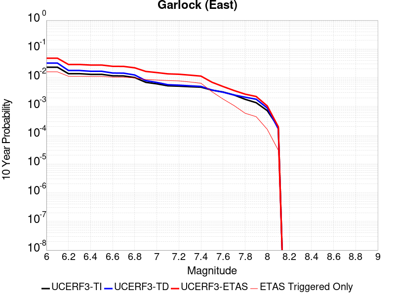 |

| Magnitude | 1 wk TI Prob | 1 wk TD Prob | 1 wk ETAS Prob | 1 wk ETAS/TD Gain | 1 wk ETAS Triggered Only | 1 mo TI Prob | 1 mo TD Prob | 1 mo ETAS Prob | 1 mo ETAS/TD Gain | 1 mo ETAS Triggered Only | 1 yr TI Prob | 1 yr TD Prob | 1 yr ETAS Prob | 1 yr ETAS/TD Gain | 1 yr ETAS Triggered Only | 10 yr TI Prob | 10 yr TD Prob | 10 yr ETAS Prob | 10 yr ETAS/TD Gain | 10 yr ETAS Triggered Only |
|-----|-----|-----|-----|-----|-----|-----|-----|-----|-----|-----|-----|-----|-----|-----|-----|-----|-----|-----|-----|-----|
| 6.0 | 4.5092507E-5 | 6.290799E-5 | 0.0016028112 | 25.478659 | 0.00154 | 1.9323928E-4 | 2.695803E-4 | 0.003808626 | 14.127982 | 0.00354 | 0.0023501497 | 0.0032776468 | 0.012597001 | 3.8433063 | 0.00935 | 0.023254504 | 0.032344494 | 0.04785601 | 1.4795722 | 0.01603 |
| 6.1 | 4.5092507E-5 | 6.290799E-5 | 0.0016028112 | 25.478659 | 0.00154 | 1.9323928E-4 | 2.695803E-4 | 0.003808626 | 14.127982 | 0.00354 | 0.0023501497 | 0.0032776468 | 0.012597001 | 3.8433063 | 0.00935 | 0.023254504 | 0.032344494 | 0.04785601 | 1.4795722 | 0.01603 |
| 6.2 | 2.6674514E-5 | 3.451465E-5 | 0.0012344732 | 35.766644 | 0.0012 | 1.1431433E-4 | 1.4791173E-4 | 0.002817517 | 19.048637 | 0.00267 | 0.0013908884 | 0.0017993709 | 0.008487315 | 4.7168236 | 0.0067 | 0.01382215 | 0.017863318 | 0.028912354 | 1.6185322 | 0.01125 |
| 6.3 | 2.6674514E-5 | 3.451465E-5 | 0.0012344732 | 35.766644 | 0.0012 | 1.1431433E-4 | 1.4791173E-4 | 0.002817517 | 19.048637 | 0.00267 | 0.0013908884 | 0.0017993709 | 0.008487315 | 4.7168236 | 0.0067 | 0.01382215 | 0.017863318 | 0.028912354 | 1.6185322 | 0.01125 |
| 6.4 | 2.5312667E-5 | 3.2343483E-5 | 0.0012123053 | 37.482212 | 0.00118 | 1.0847834E-4 | 1.3860772E-4 | 0.0027782419 | 20.043917 | 0.00264 | 0.0013199237 | 0.0016862722 | 0.008275143 | 4.907359 | 0.0066 | 0.013121112 | 0.016764186 | 0.027638774 | 1.6486797 | 0.01106 |
| 6.5 | 2.5312667E-5 | 3.2343483E-5 | 0.0012123053 | 37.482212 | 0.00118 | 1.0847834E-4 | 1.3860772E-4 | 0.0027782419 | 20.043917 | 0.00264 | 0.0013199237 | 0.0016862722 | 0.008275143 | 4.907359 | 0.0066 | 0.013121112 | 0.016764186 | 0.027638774 | 1.6486797 | 0.01106 |
| 6.6 | 2.246556E-5 | 2.8137678E-5 | 0.0011581059 | 41.158546 | 0.00113 | 9.627742E-5 | 1.20584606E-4 | 0.0026402806 | 21.89567 | 0.00252 | 0.0011715472 | 0.0014671524 | 0.007727953 | 5.267315 | 0.00627 | 0.011653901 | 0.014604934 | 0.024951583 | 1.7084352 | 0.0105 |
| 6.7 | 2.2241198E-5 | 2.7807404E-5 | 0.001157776 | 41.63553 | 0.00113 | 9.531594E-5 | 1.1916928E-4 | 0.00262887 | 22.059965 | 0.00251 | 0.0011598538 | 0.0014499439 | 0.007690882 | 5.3042617 | 0.00625 | 0.011538187 | 0.014434824 | 0.024743835 | 1.7141765 | 0.01046 |
| 6.8 | 1.9528685E-5 | 2.3901322E-5 | 0.0011338748 | 47.439835 | 0.00111 | 8.369167E-5 | 1.0243033E-4 | 0.0025621783 | 25.013865 | 0.00246 | 0.0010184698 | 0.0012463954 | 0.0072489046 | 5.8158946 | 0.00601 | 0.010138147 | 0.012438075 | 0.022135934 | 1.7796912 | 0.00982 |
| 6.9 | 1.3318621E-5 | 1.5200952E-5 | 0.0010751848 | 70.731415 | 0.00106 | 5.7078556E-5 | 6.514534E-5 | 0.0023649954 | 36.30337 | 0.0023 | 6.9470983E-4 | 7.928616E-4 | 0.006298493 | 7.9440002 | 0.00551 | 0.0069254204 | 0.007940963 | 0.016561955 | 2.085636 | 0.00869 |
| 7.0 | 1.1760853E-5 | 1.3109707E-5 | 0.0010430962 | 79.56671 | 0.00103 | 5.0402683E-5 | 5.6183275E-5 | 0.002306057 | 41.045258 | 0.00225 | 6.134799E-4 | 6.838217E-4 | 0.005950218 | 8.701417 | 0.00527 | 0.0061178906 | 0.006857492 | 0.015120437 | 2.2049515 | 0.00832 |
| 7.1 | 1.0064758E-5 | 1.0904764E-5 | 0.0010108938 | 92.702034 | 0.001 | 4.3133965E-5 | 4.6733887E-5 | 0.002226632 | 47.644913 | 0.00218 | 5.2502943E-4 | 5.6884E-4 | 0.0056459503 | 9.925374 | 0.00508 | 0.005237907 | 0.005713798 | 0.013638259 | 2.386899 | 0.00797 |
| 7.2 | 9.768808E-6 | 1.0500609E-5 | 9.804905E-4 | 93.374626 | 9.7E-4 | 4.186565E-5 | 4.5001856E-5 | 0.0021649064 | 48.107048 | 0.00212 | 5.095951E-4 | 5.477633E-4 | 0.005495052 | 10.031799 | 0.00495 | 0.0050842804 | 0.0055042095 | 0.013221497 | 2.40207 | 0.00776 |
| 7.3 | 9.344516E-6 | 9.946213E-6 | 8.7993755E-4 | 88.469604 | 8.7E-4 | 4.004731E-5 | 4.262595E-5 | 0.0019525446 | 45.806477 | 0.00191 | 4.8746695E-4 | 5.188508E-4 | 0.0050764848 | 9.784093 | 0.00456 | 0.0048639905 | 0.005215881 | 0.012298744 | 2.3579419 | 0.00712 |
| 7.4 | 9.023491E-6 | 9.492341E-6 | 7.7948504E-4 | 82.11726 | 7.7E-4 | 3.867153E-5 | 4.0680847E-5 | 0.0017506112 | 43.032814 | 0.00171 | 4.7072413E-4 | 4.951801E-4 | 0.0045531695 | 9.194977 | 0.00406 | 0.004697283 | 0.0049793427 | 0.011377325 | 2.2849052 | 0.00643 |
| 7.5 | 7.081253E-6 | 7.089067E-6 | 3.7708646E-4 | 53.192677 | 3.7E-4 | 3.0347876E-5 | 3.0381365E-5 | 8.303571E-4 | 27.331131 | 8.0E-4 | 3.6942272E-4 | 3.6983108E-4 | 0.0024090766 | 6.513992 | 0.00204 | 0.003688092 | 0.0037253548 | 0.0069532846 | 1.8664758 | 0.00324 |
| 7.6 | 6.116396E-6 | 5.960529E-6 | 2.0595934E-4 | 34.55387 | 2.0E-4 | 2.6212863E-5 | 2.5544876E-5 | 4.5553388E-4 | 17.832691 | 4.3E-4 | 3.1909486E-4 | 3.1096474E-4 | 0.001470604 | 4.7291665 | 0.00116 | 0.0031863707 | 0.003136776 | 0.0049410984 | 1.5752156 | 0.00181 |
| 7.7 | 4.797145E-6 | 4.758607E-6 | 9.475818E-5 | 19.913008 | 9.0E-5 | 2.055903E-5 | 2.039387E-5 | 2.8038857E-4 | 13.748669 | 2.6E-4 | 2.5027743E-4 | 2.4826723E-4 | 8.9810585E-4 | 3.6174967 | 6.5E-4 | 0.0024999576 | 0.002510294 | 0.003577608 | 1.425175 | 0.00107 |
| 7.8 | 3.4028885E-6 | 3.9797173E-6 | 6.397948E-5 | 16.076387 | 6.0E-5 | 1.4583726E-5 | 1.7055821E-5 | 1.6705327E-4 | 9.794501 | 1.5E-4 | 1.775424E-4 | 2.076349E-4 | 5.475643E-4 | 2.6371496 | 3.4E-4 | 0.0017740062 | 0.00210206 | 0.002680841 | 1.2753398 | 5.8E-4 |
| 7.9 | 2.5928412E-6 | 3.3735669E-6 | 5.33734E-5 | 15.821058 | 5.0E-5 | 1.1112129E-5 | 1.4458064E-5 | 1.3445634E-4 | 9.2997465 | 1.2E-4 | 1.3528178E-4 | 1.7601276E-4 | 4.4596524E-4 | 2.5337095 | 2.7E-4 | 0.0013519945 | 0.0017819697 | 0.0022211855 | 1.2464778 | 4.4E-4 |
| 8.0 | 1.3743648E-6 | 1.6739597E-6 | 1.1673943E-5 | 6.97385 | 1.0E-5 | 5.8901214E-6 | 7.1740933E-6 | 4.7173806E-5 | 6.5755777 | 4.0E-5 | 7.1709874E-5 | 8.734111E-5 | 1.8733238E-4 | 2.1448362 | 1.0E-4 | 7.1686733E-4 | 8.841624E-4 | 0.0010440209 | 1.1808022 | 1.6E-4 |
| 8.1 | 3.6733252E-7 | 3.1497066E-7 | 3.1497066E-7 | 1.0 | 0.0 | 1.5742813E-6 | 1.3498736E-6 | 1.134986E-5 | 8.408091 | 1.0E-5 | 1.9166706E-5 | 1.6434604E-5 | 4.643411E-5 | 2.8253868 | 3.0E-5 | 1.9165053E-4 | 1.6648426E-4 | 1.9647926E-4 | 1.1801672 | 3.0E-5 |

## Hunter Mountain-Saline Valley
*[(top)](#table-of-contents)*

| 1 Week | 1 Month | 1 Year | 10 Year |
|-----|-----|-----|-----|
|  |  |  |  |

| Magnitude | 1 wk TI Prob | 1 wk TD Prob | 1 wk ETAS Prob | 1 wk ETAS/TD Gain | 1 wk ETAS Triggered Only | 1 mo TI Prob | 1 mo TD Prob | 1 mo ETAS Prob | 1 mo ETAS/TD Gain | 1 mo ETAS Triggered Only | 1 yr TI Prob | 1 yr TD Prob | 1 yr ETAS Prob | 1 yr ETAS/TD Gain | 1 yr ETAS Triggered Only | 10 yr TI Prob | 10 yr TD Prob | 10 yr ETAS Prob | 10 yr ETAS/TD Gain | 10 yr ETAS Triggered Only |
|-----|-----|-----|-----|-----|-----|-----|-----|-----|-----|-----|-----|-----|-----|-----|-----|-----|-----|-----|-----|-----|
| 6.0 | 4.5103672E-5 | 5.4570846E-5 | 8.4452773E-4 | 15.475804 | 7.9E-4 | 1.9328714E-4 | 2.3385457E-4 | 0.0022433845 | 9.593076 | 0.00201 | 0.002350731 | 0.0028436389 | 0.008148511 | 2.8655224 | 0.00532 | 0.023260195 | 0.02809229 | 0.03693665 | 1.3148323 | 0.0091 |
| 6.1 | 4.5103672E-5 | 5.4570846E-5 | 8.4452773E-4 | 15.475804 | 7.9E-4 | 1.9328714E-4 | 2.3385457E-4 | 0.0022433845 | 9.593076 | 0.00201 | 0.002350731 | 0.0028436389 | 0.008148511 | 2.8655224 | 0.00532 | 0.023260195 | 0.02809229 | 0.03693665 | 1.3148323 | 0.0091 |
| 6.2 | 3.9363465E-5 | 4.7064215E-5 | 8.270275E-4 | 17.57232 | 7.8E-4 | 1.6868966E-4 | 2.0168893E-4 | 0.0021812895 | 10.815118 | 0.00198 | 0.002051862 | 0.0024529307 | 0.0077100038 | 3.1431804 | 0.00527 | 0.020330196 | 0.024273701 | 0.03308451 | 1.3629775 | 0.00903 |
| 6.3 | 3.9363465E-5 | 4.7064215E-5 | 8.270275E-4 | 17.57232 | 7.8E-4 | 1.6868966E-4 | 2.0168893E-4 | 0.0021812895 | 10.815118 | 0.00198 | 0.002051862 | 0.0024529307 | 0.0077100038 | 3.1431804 | 0.00527 | 0.020330196 | 0.024273701 | 0.03308451 | 1.3629775 | 0.00903 |
| 6.4 | 3.2311684E-5 | 3.7952268E-5 | 8.0792303E-4 | 21.287874 | 7.7E-4 | 1.384713E-4 | 1.6264283E-4 | 0.002122324 | 13.048986 | 0.00196 | 0.0016845843 | 0.0019784467 | 0.0071980995 | 3.638258 | 0.00523 | 0.016718714 | 0.019616457 | 0.028390888 | 1.4472996 | 0.00895 |
| 6.5 | 3.2311684E-5 | 3.7952268E-5 | 8.0792303E-4 | 21.287874 | 7.7E-4 | 1.384713E-4 | 1.6264283E-4 | 0.002122324 | 13.048986 | 0.00196 | 0.0016845843 | 0.0019784467 | 0.0071980995 | 3.638258 | 0.00523 | 0.016718714 | 0.019616457 | 0.028390888 | 1.4472996 | 0.00895 |
| 6.6 | 2.9305844E-5 | 3.4182984E-5 | 7.8415737E-4 | 22.939991 | 7.5E-4 | 1.2559042E-4 | 1.4649061E-4 | 0.002076208 | 14.172976 | 0.00193 | 0.0015279909 | 0.0017821258 | 0.0069528944 | 3.9014611 | 0.00518 | 0.015175272 | 0.017685596 | 0.026418371 | 1.493779 | 0.00889 |
| 6.7 | 2.7826512E-5 | 3.2345313E-5 | 7.8232103E-4 | 24.186533 | 7.5E-4 | 1.19251024E-4 | 1.3861575E-4 | 0.0020683482 | 14.921452 | 0.00193 | 0.0014509142 | 0.0016864006 | 0.006847682 | 4.060531 | 0.00517 | 0.014414776 | 0.01674306 | 0.02547438 | 1.521489 | 0.00888 |
| 6.8 | 2.3389874E-5 | 2.6867581E-5 | 7.768474E-4 | 28.91393 | 7.5E-4 | 1.0023846E-4 | 1.15141964E-4 | 0.0020449196 | 17.759987 | 0.00193 | 0.00121972 | 0.0014009993 | 0.006513826 | 4.6494145 | 0.00512 | 0.01213047 | 0.0139272185 | 0.02260466 | 1.6230563 | 0.0088 |
| 6.9 | 2.069209E-5 | 2.3570803E-5 | 7.6355337E-4 | 32.39403 | 7.4E-4 | 8.867737E-5 | 1.0101402E-4 | 0.00202082 | 20.005342 | 0.00192 | 0.0010791123 | 0.0012291879 | 0.006322919 | 5.1439805 | 0.0051 | 0.010738871 | 0.012228257 | 0.020881137 | 1.7076136 | 0.00876 |
| 7.0 | 1.7462342E-5 | 1.9634203E-5 | 7.596197E-4 | 38.688595 | 7.4E-4 | 7.483646E-5 | 8.4144E-5 | 0.0019939833 | 23.697273 | 0.00191 | 9.1075303E-4 | 0.0010239943 | 0.0060987924 | 5.955885 | 0.00508 | 0.009070295 | 0.0101957265 | 0.01882682 | 1.8465403 | 0.00872 |
| 7.1 | 1.4807709E-5 | 1.644232E-5 | 7.5643015E-4 | 46.005074 | 7.4E-4 | 6.3460066E-5 | 7.046528E-5 | 0.0019803308 | 28.10364 | 0.00191 | 7.723524E-4 | 8.5759355E-4 | 0.0059132543 | 6.8951707 | 0.00506 | 0.007696735 | 0.00854516 | 0.017150989 | 2.0070996 | 0.00868 |
| 7.2 | 1.4180048E-5 | 1.5698888E-5 | 7.5568724E-4 | 48.136353 | 7.4E-4 | 6.077022E-5 | 6.727931E-5 | 0.0019671514 | 29.23858 | 0.0019 | 7.396263E-4 | 8.1883394E-4 | 0.005854707 | 7.150054 | 0.00504 | 0.0073716943 | 0.008160452 | 0.016729945 | 2.050125 | 0.00864 |
| 7.3 | 1.3730402E-5 | 1.5172614E-5 | 7.551614E-4 | 49.771343 | 7.4E-4 | 5.8843252E-5 | 6.502396E-5 | 0.0019649004 | 30.218098 | 0.0019 | 7.161811E-4 | 7.9139526E-4 | 0.0058274064 | 7.363459 | 0.00504 | 0.007138774 | 0.007888035 | 0.016459882 | 2.08669 | 0.00864 |
| 7.4 | 1.2810095E-5 | 1.4109794E-5 | 7.440995E-4 | 52.736378 | 7.3E-4 | 5.489925E-5 | 6.0469236E-5 | 0.0019503549 | 32.253674 | 0.00189 | 6.681934E-4 | 7.359801E-4 | 0.005742293 | 7.8022394 | 0.00501 | 0.006661878 | 0.007337654 | 0.01587455 | 2.1634367 | 0.0086 |
| 7.5 | 1.1595659E-5 | 1.2801082E-5 | 7.3279184E-4 | 57.244526 | 7.2E-4 | 4.9694736E-5 | 5.4860713E-5 | 0.0019147587 | 34.902184 | 0.00186 | 6.0486543E-4 | 6.677402E-4 | 0.005544482 | 8.303351 | 0.00488 | 0.006032217 | 0.006659527 | 0.01504332 | 2.2589173 | 0.00844 |
| 7.6 | 2.997694E-6 | 3.3253514E-6 | 3.9332407E-4 | 118.28045 | 3.9E-4 | 1.28471975E-5 | 1.4251469E-5 | 9.6423796E-4 | 67.658844 | 9.5E-4 | 1.564034E-4 | 1.735051E-4 | 0.0023731233 | 13.677543 | 0.0022 | 0.0015629337 | 0.0017345662 | 0.005318339 | 3.0660918 | 0.00359 |

## Ash Hill
*[(top)](#table-of-contents)*

| 1 Week | 1 Month | 1 Year | 10 Year |
|-----|-----|-----|-----|
| 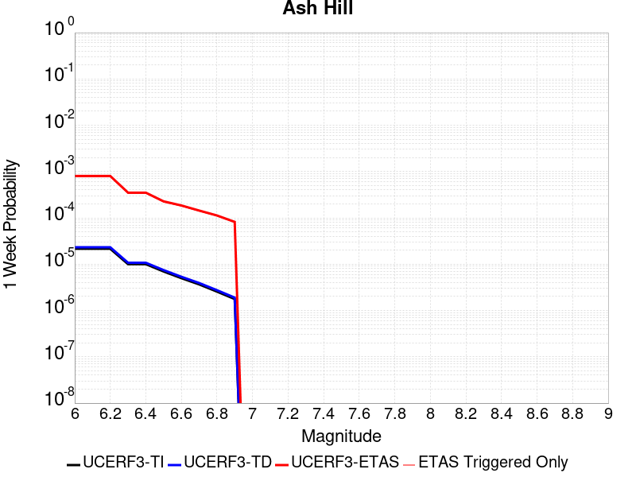 | 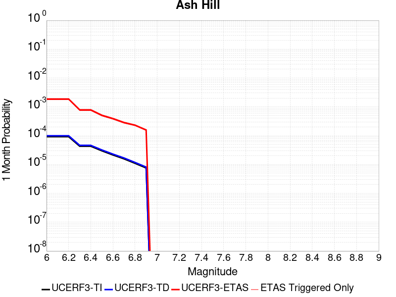 |  |  |

| Magnitude | 1 wk TI Prob | 1 wk TD Prob | 1 wk ETAS Prob | 1 wk ETAS/TD Gain | 1 wk ETAS Triggered Only | 1 mo TI Prob | 1 mo TD Prob | 1 mo ETAS Prob | 1 mo ETAS/TD Gain | 1 mo ETAS Triggered Only | 1 yr TI Prob | 1 yr TD Prob | 1 yr ETAS Prob | 1 yr ETAS/TD Gain | 1 yr ETAS Triggered Only | 10 yr TI Prob | 10 yr TD Prob | 10 yr ETAS Prob | 10 yr ETAS/TD Gain | 10 yr ETAS Triggered Only |
|-----|-----|-----|-----|-----|-----|-----|-----|-----|-----|-----|-----|-----|-----|-----|-----|-----|-----|-----|-----|-----|
| 6.0 | 2.1545662E-5 | 2.3194681E-5 | 8.031766E-4 | 34.627617 | 7.8E-4 | 9.2335285E-5 | 9.9402445E-5 | 0.0018692265 | 18.804632 | 0.00177 | 0.0011236023 | 0.0012096328 | 0.0060038264 | 4.963346 | 0.0048 | 0.011179381 | 0.01203847 | 0.020455902 | 1.6992111 | 0.00852 |
| 6.1 | 2.1545662E-5 | 2.3194681E-5 | 8.031766E-4 | 34.627617 | 7.8E-4 | 9.2335285E-5 | 9.9402445E-5 | 0.0018692265 | 18.804632 | 0.00177 | 0.0011236023 | 0.0012096328 | 0.0060038264 | 4.963346 | 0.0048 | 0.011179381 | 0.01203847 | 0.020455902 | 1.6992111 | 0.00852 |
| 6.2 | 2.1545662E-5 | 2.3194681E-5 | 8.031766E-4 | 34.627617 | 7.8E-4 | 9.2335285E-5 | 9.9402445E-5 | 0.0018692265 | 18.804632 | 0.00177 | 0.0011236023 | 0.0012096328 | 0.0060038264 | 4.963346 | 0.0048 | 0.011179381 | 0.01203847 | 0.020455902 | 1.6992111 | 0.00852 |
| 6.3 | 1.0025529E-5 | 1.0747037E-5 | 3.507434E-4 | 32.636288 | 3.4E-4 | 4.2965847E-5 | 4.605799E-5 | 7.860239E-4 | 17.065962 | 7.4E-4 | 5.229836E-4 | 5.60625E-4 | 0.002389599 | 4.262384 | 0.00183 | 0.005217545 | 0.0055934195 | 0.009133507 | 1.6329021 | 0.00356 |
| 6.4 | 1.0025529E-5 | 1.0747037E-5 | 3.507434E-4 | 32.636288 | 3.4E-4 | 4.2965847E-5 | 4.605799E-5 | 7.860239E-4 | 17.065962 | 7.4E-4 | 5.229836E-4 | 5.60625E-4 | 0.002389599 | 4.262384 | 0.00183 | 0.005217545 | 0.0055934195 | 0.009133507 | 1.6329021 | 0.00356 |
| 6.5 | 6.9617327E-6 | 7.456704E-6 | 2.2745506E-4 | 30.503431 | 2.2E-4 | 2.9835655E-5 | 3.1956963E-5 | 5.119416E-4 | 16.019722 | 4.8E-4 | 3.6318856E-4 | 3.8901521E-4 | 0.0015985445 | 4.109208 | 0.00121 | 0.0036259557 | 0.0038841967 | 0.006264914 | 1.6129239 | 0.00239 |
| 6.6 | 4.9919777E-6 | 5.346739E-6 | 1.8534578E-4 | 34.665203 | 1.8E-4 | 2.1394015E-5 | 2.2914432E-5 | 3.9290596E-4 | 17.14666 | 3.7E-4 | 2.60441E-4 | 2.789542E-4 | 0.0011187198 | 4.010407 | 8.4E-4 | 0.0026013597 | 0.0027866988 | 0.0045617386 | 1.6369686 | 0.00178 |
| 6.7 | 3.6630722E-6 | 3.9246606E-6 | 1.4392412E-4 | 36.671734 | 1.4E-4 | 1.5698786E-5 | 1.6819899E-5 | 2.8681537E-4 | 17.052145 | 2.7E-4 | 1.9111596E-4 | 2.0476876E-4 | 8.3463977E-4 | 4.076011 | 6.3E-4 | 0.0019095168 | 0.002046364 | 0.003353683 | 1.6388499 | 0.00131 |
| 6.8 | 2.5599613E-6 | 2.7449514E-6 | 1.1274465E-4 | 41.07346 | 1.1E-4 | 1.0971216E-5 | 1.1764052E-5 | 2.3176147E-4 | 19.700819 | 2.2E-4 | 1.3356637E-4 | 1.4322287E-4 | 6.1315554E-4 | 4.281129 | 4.7E-4 | 0.0013348613 | 0.0014317906 | 0.0024203733 | 1.6904519 | 9.9E-4 |
| 6.9 | 1.7684905E-6 | 1.896889E-6 | 8.189674E-5 | 43.17424 | 8.0E-5 | 7.579223E-6 | 8.129524E-6 | 1.581283E-4 | 19.451115 | 1.5E-4 | 9.2273134E-5 | 9.8976954E-5 | 4.6894033E-4 | 4.737874 | 3.7E-4 | 9.223483E-4 | 9.897696E-4 | 0.0017190471 | 1.7368155 | 7.3E-4 |

## Blackwater
*[(top)](#table-of-contents)*

| 1 Week | 1 Month | 1 Year | 10 Year |
|-----|-----|-----|-----|
|  |  | 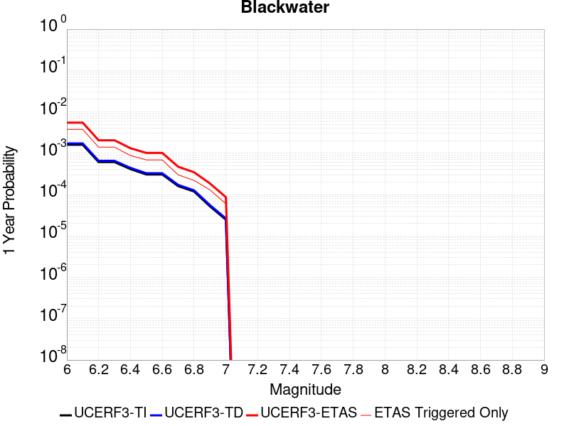 | 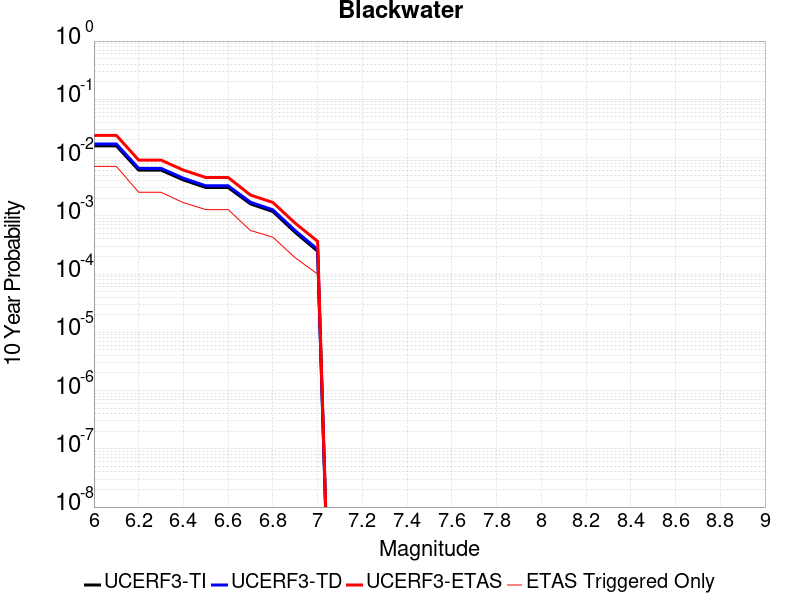 |

| Magnitude | 1 wk TI Prob | 1 wk TD Prob | 1 wk ETAS Prob | 1 wk ETAS/TD Gain | 1 wk ETAS Triggered Only | 1 mo TI Prob | 1 mo TD Prob | 1 mo ETAS Prob | 1 mo ETAS/TD Gain | 1 mo ETAS Triggered Only | 1 yr TI Prob | 1 yr TD Prob | 1 yr ETAS Prob | 1 yr ETAS/TD Gain | 1 yr ETAS Triggered Only | 10 yr TI Prob | 10 yr TD Prob | 10 yr ETAS Prob | 10 yr ETAS/TD Gain | 10 yr ETAS Triggered Only |
|-----|-----|-----|-----|-----|-----|-----|-----|-----|-----|-----|-----|-----|-----|-----|-----|-----|-----|-----|-----|-----|
| 6.0 | 3.0708583E-5 | 3.309619E-5 | 4.3308295E-4 | 13.085584 | 4.0E-4 | 1.3160157E-4 | 1.4183388E-4 | 0.001191685 | 8.401978 | 0.00105 | 0.0016010714 | 0.0017255963 | 0.005489091 | 3.180982 | 0.00377 | 0.015895851 | 0.017135808 | 0.02407483 | 1.4049428 | 0.00706 |
| 6.1 | 3.0708583E-5 | 3.309619E-5 | 4.3308295E-4 | 13.085584 | 4.0E-4 | 1.3160157E-4 | 1.4183388E-4 | 0.001191685 | 8.401978 | 0.00105 | 0.0016010714 | 0.0017255963 | 0.005489091 | 3.180982 | 0.00377 | 0.015895851 | 0.017135808 | 0.02407483 | 1.4049428 | 0.00706 |
| 6.2 | 1.1707779E-5 | 1.2545242E-5 | 1.425436E-4 | 11.362365 | 1.3E-4 | 5.017523E-5 | 5.3764266E-5 | 4.2374438E-4 | 7.8815246 | 3.7E-4 | 6.107122E-4 | 6.5439293E-4 | 0.0020534769 | 3.1379874 | 0.0014 | 0.006090366 | 0.006525631 | 0.009049056 | 1.3866944 | 0.00254 |
| 6.3 | 1.1707779E-5 | 1.2545242E-5 | 1.425436E-4 | 11.362365 | 1.3E-4 | 5.017523E-5 | 5.3764266E-5 | 4.2374438E-4 | 7.8815246 | 3.7E-4 | 6.107122E-4 | 6.5439293E-4 | 0.0020534769 | 3.1379874 | 0.0014 | 0.006090366 | 0.006525631 | 0.009049056 | 1.3866944 | 0.00254 |
| 6.4 | 7.929244E-6 | 8.480176E-6 | 1.08479326E-4 | 12.792108 | 1.0E-4 | 3.3982033E-5 | 3.6343128E-5 | 2.6633477E-4 | 7.328339 | 2.3E-4 | 4.136527E-4 | 4.4239179E-4 | 0.0013220025 | 2.988307 | 8.8E-4 | 0.0041288356 | 0.0044155167 | 0.0060880985 | 1.3787965 | 0.00168 |
| 6.5 | 5.8832115E-6 | 6.286048E-6 | 7.628561E-5 | 12.135702 | 7.0E-5 | 2.521352E-5 | 2.6939942E-5 | 1.9693536E-4 | 7.310163 | 1.7E-4 | 3.0693135E-4 | 3.2794697E-4 | 0.0010177207 | 3.1033087 | 6.9E-4 | 0.0030650778 | 0.0032748834 | 0.0045506917 | 1.3895736 | 0.00128 |
| 6.6 | 5.8832115E-6 | 6.286048E-6 | 7.628561E-5 | 12.135702 | 7.0E-5 | 2.521352E-5 | 2.6939942E-5 | 1.9693536E-4 | 7.310163 | 1.7E-4 | 3.0693135E-4 | 3.2794697E-4 | 0.0010177207 | 3.1033087 | 6.9E-4 | 0.0030650778 | 0.0032748834 | 0.0045506917 | 1.3895736 | 0.00128 |
| 6.7 | 3.0715053E-6 | 3.281496E-6 | 3.3281398E-5 | 10.142142 | 3.0E-5 | 1.3163528E-5 | 1.4063485E-5 | 9.406236E-5 | 6.6884108 | 8.0E-5 | 1.6025416E-4 | 1.7121063E-4 | 4.7115926E-4 | 2.7519276 | 3.0E-4 | 0.0016013865 | 0.0017109019 | 0.0022699437 | 1.3267528 | 5.6E-4 |
| 6.8 | 2.2722281E-6 | 2.4287758E-6 | 1.2428752E-5 | 5.1172905 | 1.0E-5 | 9.738084E-6 | 1.0409003E-5 | 6.040848E-5 | 5.803484 | 5.0E-5 | 1.1855473E-4 | 1.2672316E-4 | 3.4669528E-4 | 2.7358477 | 2.2E-4 | 0.001184915 | 0.0012665992 | 0.0016960545 | 1.3390617 | 4.3E-4 |
| 6.9 | 9.952399E-7 | 1.0653588E-6 | 1.0653588E-6 | 1.0 | 0.0 | 4.265307E-6 | 4.5658185E-6 | 3.456568E-5 | 7.5705338 | 3.0E-5 | 5.1928873E-5 | 5.5587938E-5 | 1.855807E-4 | 3.338507 | 1.3E-4 | 5.191674E-4 | 5.5579096E-4 | 7.4568536E-4 | 1.3416651 | 1.9E-4 |
| 7.0 | 4.7385504E-7 | 5.0756074E-7 | 5.0756074E-7 | 1.0 | 0.0 | 2.0308057E-6 | 2.1752603E-6 | 1.2175238E-5 | 5.597141 | 1.0E-5 | 2.4724779E-5 | 2.6483794E-5 | 8.648221E-5 | 3.2654765 | 6.0E-5 | 2.4722028E-4 | 2.6483793E-4 | 3.6481145E-4 | 1.3774894 | 1.0E-4 |

## Garlock (West)
*[(top)](#table-of-contents)*

| 1 Week | 1 Month | 1 Year | 10 Year |
|-----|-----|-----|-----|
|  |  | 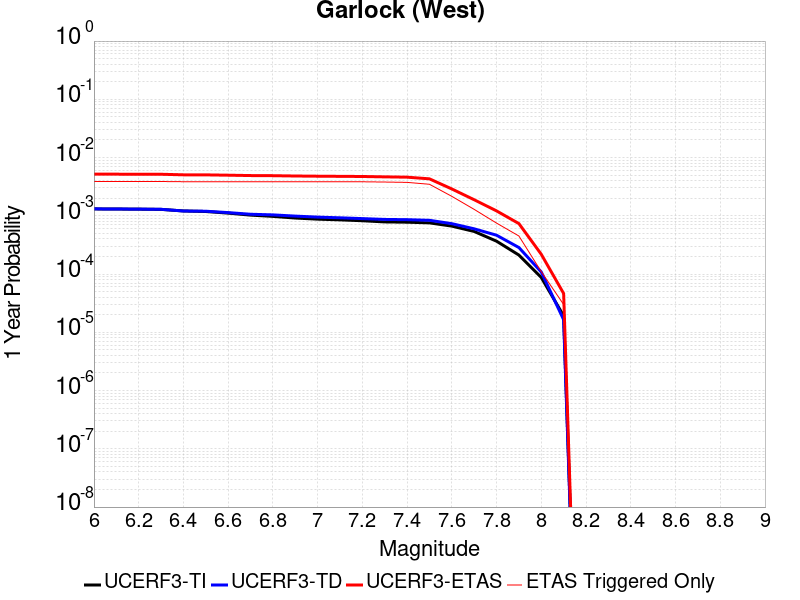 | 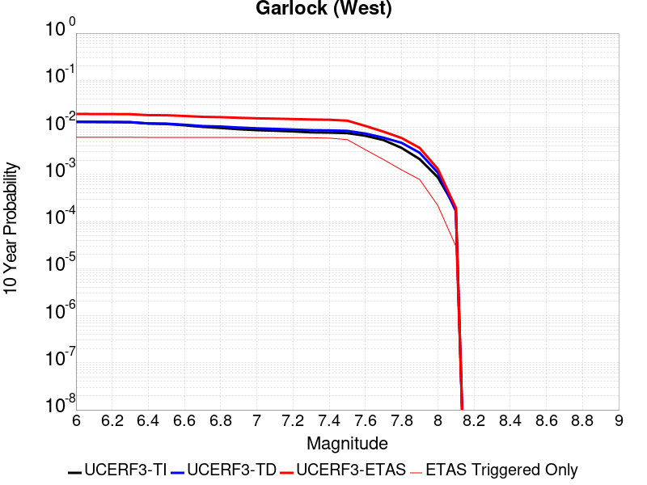 |

| Magnitude | 1 wk TI Prob | 1 wk TD Prob | 1 wk ETAS Prob | 1 wk ETAS/TD Gain | 1 wk ETAS Triggered Only | 1 mo TI Prob | 1 mo TD Prob | 1 mo ETAS Prob | 1 mo ETAS/TD Gain | 1 mo ETAS Triggered Only | 1 yr TI Prob | 1 yr TD Prob | 1 yr ETAS Prob | 1 yr ETAS/TD Gain | 1 yr ETAS Triggered Only | 10 yr TI Prob | 10 yr TD Prob | 10 yr ETAS Prob | 10 yr ETAS/TD Gain | 10 yr ETAS Triggered Only |
|-----|-----|-----|-----|-----|-----|-----|-----|-----|-----|-----|-----|-----|-----|-----|-----|-----|-----|-----|-----|-----|
| 6.0 | 2.5181727E-5 | 2.5201914E-5 | 7.6518324E-4 | 30.362108 | 7.4E-4 | 1.0791722E-4 | 1.08003755E-4 | 0.0016778342 | 15.534962 | 0.00157 | 0.0013131002 | 0.0013141559 | 0.005189057 | 3.9485855 | 0.00388 | 0.013053683 | 0.01314424 | 0.01923314 | 1.4632372 | 0.00617 |
| 6.1 | 2.5077732E-5 | 2.5102956E-5 | 7.650844E-4 | 30.477861 | 7.4E-4 | 1.0747157E-4 | 1.07579675E-4 | 0.0016774108 | 15.592264 | 0.00157 | 0.001307681 | 0.001308999 | 0.0051839203 | 3.960217 | 0.00388 | 0.013000126 | 0.013093281 | 0.019182494 | 1.465064 | 0.00617 |
| 6.2 | 2.494612E-5 | 2.4984645E-5 | 7.649661E-4 | 30.617453 | 7.4E-4 | 1.0690756E-4 | 1.0707267E-4 | 0.0016769046 | 15.661368 | 0.00157 | 0.0013008224 | 0.0013028337 | 0.0051777787 | 3.9742439 | 0.00388 | 0.012932341 | 0.013032351 | 0.019121941 | 1.4672673 | 0.00617 |
| 6.3 | 2.4733758E-5 | 2.4804003E-5 | 7.647856E-4 | 30.833153 | 7.4E-4 | 1.0599751E-4 | 1.0629856E-4 | 0.0016761316 | 15.76815 | 0.00157 | 0.0012897556 | 0.0012934201 | 0.0051684016 | 3.9959188 | 0.00388 | 0.012822957 | 0.012939315 | 0.01902948 | 1.4706713 | 0.00617 |
| 6.4 | 2.3237335E-5 | 2.3183304E-5 | 7.631662E-4 | 32.918785 | 7.4E-4 | 9.958477E-5 | 9.9353245E-5 | 0.0016591982 | 16.699991 | 0.00156 | 0.0012117702 | 0.0012089573 | 0.005054303 | 4.180712 | 0.00385 | 0.012051838 | 0.01210416 | 0.018159961 | 1.5003074 | 0.00613 |
| 6.5 | 2.2732203E-5 | 2.299767E-5 | 7.6298066E-4 | 33.176434 | 7.4E-4 | 9.742009E-5 | 9.8557735E-5 | 0.001658404 | 16.826727 | 0.00156 | 0.0011854442 | 0.0011992827 | 0.0050446657 | 4.2064023 | 0.00385 | 0.011791403 | 0.012008464 | 0.018064851 | 1.5043433 | 0.00613 |
| 6.6 | 2.1319436E-5 | 2.1777872E-5 | 7.6176174E-4 | 34.978706 | 7.4E-4 | 9.136581E-5 | 9.333041E-5 | 0.0016531848 | 17.71325 | 0.00156 | 0.001111811 | 0.0011357077 | 0.0049813353 | 4.3861065 | 0.00385 | 0.011062649 | 0.01137937 | 0.017439613 | 1.5325642 | 0.00613 |
| 6.7 | 1.970802E-5 | 2.039774E-5 | 7.603826E-4 | 37.27779 | 7.4E-4 | 8.446021E-5 | 8.741597E-5 | 0.0016472796 | 18.84415 | 0.00156 | 0.001027818 | 0.0010637715 | 0.004909676 | 4.6153483 | 0.00385 | 0.010230771 | 0.010667094 | 0.016731706 | 1.5685345 | 0.00613 |
| 6.8 | 1.8744462E-5 | 1.9905396E-5 | 7.5989065E-4 | 38.17511 | 7.4E-4 | 8.033094E-5 | 8.530606E-5 | 0.001645173 | 19.285534 | 0.00156 | 9.775903E-4 | 0.0010381081 | 0.004884111 | 4.7048197 | 0.00385 | 0.009733009 | 0.010412897 | 0.01646917 | 1.5816127 | 0.00612 |
| 6.9 | 1.7559682E-5 | 1.8957733E-5 | 7.5894373E-4 | 40.033463 | 7.4E-4 | 7.5253614E-5 | 8.124491E-5 | 0.0016411182 | 20.199644 | 0.00156 | 9.158276E-4 | 9.887093E-4 | 0.0048249126 | 4.8800116 | 0.00384 | 0.0091206245 | 0.009923427 | 0.015972795 | 1.6096047 | 0.00611 |
| 7.0 | 1.6794445E-5 | 1.8220519E-5 | 7.5820705E-4 | 41.612816 | 7.4E-4 | 7.197421E-5 | 7.8085606E-5 | 0.0016379638 | 20.976515 | 0.00156 | 8.759337E-4 | 9.5027895E-4 | 0.0047866297 | 5.037079 | 0.00384 | 0.008724891 | 0.009542331 | 0.015574218 | 1.6321188 | 0.00609 |
| 7.1 | 1.6337795E-5 | 1.7721295E-5 | 7.5770816E-4 | 42.756927 | 7.4E-4 | 7.0017246E-5 | 7.5946205E-5 | 0.0016358277 | 21.539295 | 0.00156 | 8.521265E-4 | 9.242542E-4 | 0.004760705 | 5.1508613 | 0.00384 | 0.008488664 | 0.0092840865 | 0.015297732 | 1.6477369 | 0.00607 |
| 7.2 | 1.5780008E-5 | 1.716991E-5 | 7.571572E-4 | 44.09791 | 7.4E-4 | 6.762685E-5 | 7.358326E-5 | 0.0016334684 | 22.198914 | 0.00156 | 8.2304585E-4 | 8.9550926E-4 | 0.0047320705 | 5.2842226 | 0.00384 | 0.008200042 | 0.008998912 | 0.015014288 | 1.6684561 | 0.00607 |
| 7.3 | 1.5058865E-5 | 1.6622957E-5 | 7.466108E-4 | 44.914444 | 7.3E-4 | 6.45364E-5 | 7.12393E-5 | 0.0016011304 | 22.475378 | 0.00153 | 7.854473E-4 | 8.669946E-4 | 0.0046637 | 5.379157 | 0.0038 | 0.00782677 | 0.00871559 | 0.014693036 | 1.6858336 | 0.00603 |
| 7.4 | 1.4887923E-5 | 1.6458913E-5 | 7.464469E-4 | 45.35214 | 7.3E-4 | 6.380382E-5 | 7.05363E-5 | 0.0015904291 | 22.547668 | 0.00152 | 7.7653467E-4 | 8.584423E-4 | 0.004605223 | 5.364628 | 0.00375 | 0.0077382675 | 0.008630417 | 0.014489411 | 1.6788772 | 0.00591 |
| 7.5 | 1.4509299E-5 | 1.6050892E-5 | 7.160397E-4 | 44.610584 | 7.0E-4 | 6.218123E-5 | 6.8787725E-5 | 0.00148869 | 21.641798 | 0.00142 | 7.567935E-4 | 8.3716994E-4 | 0.004314257 | 5.153382 | 0.00348 | 0.0075422134 | 0.008418757 | 0.013862537 | 1.6466253 | 0.00549 |
| 7.6 | 1.2756717E-5 | 1.40547745E-5 | 4.4404872E-4 | 31.594156 | 4.3E-4 | 5.4670498E-5 | 6.023336E-5 | 9.3018095E-4 | 15.442953 | 8.7E-4 | 6.6541E-4 | 7.3309505E-4 | 0.0028915117 | 3.9442518 | 0.00216 | 0.006634211 | 0.00738374 | 0.0107090045 | 1.4503496 | 0.00335 |
| 7.7 | 1.0328985E-5 | 1.1464304E-5 | 2.7146132E-4 | 23.678831 | 2.6E-4 | 4.4266326E-5 | 4.913181E-5 | 6.191038E-4 | 12.600876 | 5.7E-4 | 5.388092E-4 | 5.98016E-4 | 0.0018872445 | 3.155843 | 0.00129 | 0.0053750467 | 0.0060406122 | 0.008098108 | 1.3406105 | 0.00207 |
| 7.8 | 7.0306583E-6 | 8.902713E-6 | 1.789012E-4 | 20.095133 | 1.7E-4 | 3.0131043E-5 | 3.815393E-5 | 3.881406E-4 | 10.1730175 | 3.5E-4 | 3.667837E-4 | 4.6442522E-4 | 0.0012140769 | 2.6141493 | 7.5E-4 | 0.003661789 | 0.004697 | 0.005941129 | 1.2648773 | 0.00125 |
| 7.9 | 4.060633E-6 | 5.467275E-6 | 9.5466785E-5 | 17.461493 | 9.0E-5 | 1.7402595E-5 | 2.3430968E-5 | 2.3342605E-4 | 9.962288 | 2.1E-4 | 2.11856E-4 | 2.852348E-4 | 7.351064E-4 | 2.5771976 | 4.5E-4 | 0.0021165414 | 0.0028852404 | 0.0036629897 | 1.2695614 | 7.8E-4 |
| 8.0 | 1.6729537E-6 | 2.0781215E-6 | 1.2078101E-5 | 5.8120284 | 1.0E-5 | 7.169782E-6 | 8.906205E-6 | 4.8905848E-5 | 5.491211 | 4.0E-5 | 8.7288594E-5 | 1.0842768E-4 | 2.1841575E-4 | 2.0143912 | 1.1E-4 | 8.7254314E-4 | 0.0010973068 | 0.0013170654 | 1.2002709 | 2.2E-4 |
| 8.1 | 3.6733252E-7 | 3.1497066E-7 | 3.1497066E-7 | 1.0 | 0.0 | 1.5742813E-6 | 1.3498736E-6 | 1.134986E-5 | 8.408091 | 1.0E-5 | 1.9166706E-5 | 1.6434604E-5 | 4.643411E-5 | 2.8253868 | 3.0E-5 | 1.9165053E-4 | 1.6648426E-4 | 1.9647926E-4 | 1.1801672 | 3.0E-5 |

## McLean Lake
*[(top)](#table-of-contents)*

| 1 Week | 1 Month | 1 Year | 10 Year |
|-----|-----|-----|-----|
|  | 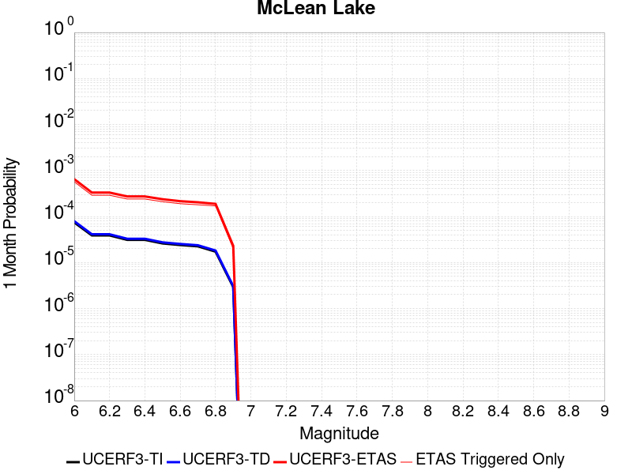 |  |  |

| Magnitude | 1 wk TI Prob | 1 wk TD Prob | 1 wk ETAS Prob | 1 wk ETAS/TD Gain | 1 wk ETAS Triggered Only | 1 mo TI Prob | 1 mo TD Prob | 1 mo ETAS Prob | 1 mo ETAS/TD Gain | 1 mo ETAS Triggered Only | 1 yr TI Prob | 1 yr TD Prob | 1 yr ETAS Prob | 1 yr ETAS/TD Gain | 1 yr ETAS Triggered Only | 10 yr TI Prob | 10 yr TD Prob | 10 yr ETAS Prob | 10 yr ETAS/TD Gain | 10 yr ETAS Triggered Only |
|-----|-----|-----|-----|-----|-----|-----|-----|-----|-----|-----|-----|-----|-----|-----|-----|-----|-----|-----|-----|-----|
| 6.0 | 1.7360222E-5 | 1.8501789E-5 | 2.5849734E-4 | 13.971478 | 2.4E-4 | 7.439883E-5 | 7.929125E-5 | 6.4924604E-4 | 8.188118 | 5.7E-4 | 9.0542925E-4 | 9.64992E-4 | 0.003102927 | 3.2154949 | 0.00214 | 0.009017491 | 0.009612858 | 0.013851715 | 1.440957 | 0.00428 |
| 6.1 | 9.062689E-6 | 9.592268E-6 | 1.6959073E-4 | 17.679941 | 1.6E-4 | 3.8839516E-5 | 4.110912E-5 | 3.310972E-4 | 8.054106 | 2.9E-4 | 4.727685E-4 | 5.003975E-4 | 0.001619837 | 3.2371006 | 0.00112 | 0.0047176396 | 0.0049935905 | 0.0071726544 | 1.4363722 | 0.00219 |
| 6.2 | 9.062689E-6 | 9.592268E-6 | 1.6959073E-4 | 17.679941 | 1.6E-4 | 3.8839516E-5 | 4.110912E-5 | 3.310972E-4 | 8.054106 | 2.9E-4 | 4.727685E-4 | 5.003975E-4 | 0.001619837 | 3.2371006 | 0.00112 | 0.0047176396 | 0.0049935905 | 0.0071726544 | 1.4363722 | 0.00219 |
| 6.3 | 7.2575485E-6 | 7.667767E-6 | 1.2766685E-4 | 16.649809 | 1.2E-4 | 3.110341E-5 | 3.2861484E-5 | 2.728536E-4 | 8.303143 | 2.4E-4 | 3.786182E-4 | 4.0002225E-4 | 0.0012796703 | 3.1989977 | 8.8E-4 | 0.0037797375 | 0.003993727 | 0.005776578 | 1.4464129 | 0.00179 |
| 6.4 | 7.2575485E-6 | 7.667767E-6 | 1.2766685E-4 | 16.649809 | 1.2E-4 | 3.110341E-5 | 3.2861484E-5 | 2.728536E-4 | 8.303143 | 2.4E-4 | 3.786182E-4 | 4.0002225E-4 | 0.0012796703 | 3.1989977 | 8.8E-4 | 0.0037797375 | 0.003993727 | 0.005776578 | 1.4464129 | 0.00179 |
| 6.5 | 6.06582E-6 | 6.4039245E-6 | 1.1640322E-4 | 18.176857 | 1.1E-4 | 2.5996113E-5 | 2.7445138E-5 | 2.3743938E-4 | 8.651419 | 2.1E-4 | 3.164567E-4 | 3.340998E-4 | 0.0010438625 | 3.1244035 | 7.1E-4 | 0.0031600643 | 0.0033366138 | 0.0048116758 | 1.4420835 | 0.00148 |
| 6.6 | 5.598744E-6 | 5.910306E-6 | 9.5909774E-5 | 16.227549 | 9.0E-5 | 2.3994397E-5 | 2.5329673E-5 | 2.1532486E-4 | 8.500894 | 1.9E-4 | 2.9209262E-4 | 3.083515E-4 | 9.68148E-4 | 3.1397543 | 6.6E-4 | 0.0029170897 | 0.0030798658 | 0.004475554 | 1.4531653 | 0.0014 |
| 6.7 | 5.246996E-6 | 5.539203E-6 | 8.553876E-5 | 15.442431 | 8.0E-5 | 2.2486933E-5 | 2.3739261E-5 | 2.0373499E-4 | 8.582196 | 1.8E-4 | 2.73744E-4 | 2.8899353E-4 | 8.888201E-4 | 3.075571 | 6.0E-4 | 0.0027340704 | 0.002886801 | 0.004183048 | 1.4490255 | 0.0013 |
| 6.8 | 4.02324E-6 | 4.246936E-6 | 8.4246596E-5 | 19.83703 | 8.0E-5 | 1.7242342E-5 | 1.820106E-5 | 1.8819797E-4 | 10.339946 | 1.7E-4 | 2.099053E-4 | 2.2158133E-4 | 7.514639E-4 | 3.3913684 | 5.3E-4 | 0.0020970714 | 0.0022141882 | 0.003291797 | 1.4866834 | 0.00108 |
| 6.9 | 6.835972E-7 | 7.1399705E-7 | 1.07139895E-5 | 15.0056505 | 1.0E-5 | 2.9296991E-6 | 3.0599856E-6 | 2.3059923E-5 | 7.535959 | 2.0E-5 | 3.56685E-5 | 3.7255006E-5 | 1.1725203E-4 | 3.1472824 | 8.0E-5 | 3.5662777E-4 | 3.7251884E-4 | 5.424555E-4 | 1.4561827 | 1.7E-4 |

## Gravel Hills-Harper Lk
*[(top)](#table-of-contents)*

| 1 Week | 1 Month | 1 Year | 10 Year |
|-----|-----|-----|-----|
|  |  |  |  |

| Magnitude | 1 wk TI Prob | 1 wk TD Prob | 1 wk ETAS Prob | 1 wk ETAS/TD Gain | 1 wk ETAS Triggered Only | 1 mo TI Prob | 1 mo TD Prob | 1 mo ETAS Prob | 1 mo ETAS/TD Gain | 1 mo ETAS Triggered Only | 1 yr TI Prob | 1 yr TD Prob | 1 yr ETAS Prob | 1 yr ETAS/TD Gain | 1 yr ETAS Triggered Only | 10 yr TI Prob | 10 yr TD Prob | 10 yr ETAS Prob | 10 yr ETAS/TD Gain | 10 yr ETAS Triggered Only |
|-----|-----|-----|-----|-----|-----|-----|-----|-----|-----|-----|-----|-----|-----|-----|-----|-----|-----|-----|-----|-----|
| 6.0 | 3.0679566E-5 | 3.146516E-5 | 1.7146075E-4 | 5.449226 | 1.4E-4 | 1.3147724E-4 | 1.3484493E-4 | 7.5476133E-4 | 5.597254 | 6.2E-4 | 0.0015995599 | 0.0016407177 | 0.0036074854 | 2.198724 | 0.00197 | 0.015880952 | 0.016307613 | 0.019730862 | 1.2099173 | 0.00348 |
| 6.1 | 3.0679566E-5 | 3.146516E-5 | 1.7146075E-4 | 5.449226 | 1.4E-4 | 1.3147724E-4 | 1.3484493E-4 | 7.5476133E-4 | 5.597254 | 6.2E-4 | 0.0015995599 | 0.0016407177 | 0.0036074854 | 2.198724 | 0.00197 | 0.015880952 | 0.016307613 | 0.019730862 | 1.2099173 | 0.00348 |
| 6.2 | 1.514536E-5 | 1.363538E-5 | 6.3634696E-5 | 4.666881 | 5.0E-5 | 6.490707E-5 | 5.84361E-5 | 2.48425E-4 | 4.251225 | 1.9E-4 | 7.8995706E-4 | 7.112392E-4 | 0.0012808337 | 1.8008482 | 5.7E-4 | 0.007871548 | 0.0070908302 | 0.008083739 | 1.1400272 | 0.001 |
| 6.3 | 1.514536E-5 | 1.363538E-5 | 6.3634696E-5 | 4.666881 | 5.0E-5 | 6.490707E-5 | 5.84361E-5 | 2.48425E-4 | 4.251225 | 1.9E-4 | 7.8995706E-4 | 7.112392E-4 | 0.0012808337 | 1.8008482 | 5.7E-4 | 0.007871548 | 0.0070908302 | 0.008083739 | 1.1400272 | 0.001 |
| 6.4 | 1.2532521E-5 | 1.0689813E-5 | 3.06896E-5 | 2.87092 | 2.0E-5 | 5.37097E-5 | 4.5812714E-5 | 1.3580859E-4 | 2.96443 | 9.0E-5 | 6.537194E-4 | 5.576329E-4 | 8.474712E-4 | 1.5197654 | 2.9E-4 | 0.0065179965 | 0.0055629266 | 0.0061595887 | 1.1072569 | 6.0E-4 |
| 6.5 | 1.1094058E-5 | 9.083761E-6 | 2.908358E-5 | 3.2017112 | 2.0E-5 | 4.7545094E-5 | 3.8929848E-5 | 9.8927514E-5 | 2.541174 | 6.0E-5 | 5.787078E-4 | 4.7387183E-4 | 6.837723E-4 | 1.4429477 | 2.1E-4 | 0.0057720304 | 0.0047290213 | 0.0051470352 | 1.0883933 | 4.2E-4 |
| 6.6 | 9.688328E-6 | 7.531771E-6 | 7.531771E-6 | 1.0 | 0.0 | 4.1520743E-5 | 3.2278636E-5 | 6.2277664E-5 | 1.9293773 | 3.0E-5 | 5.053978E-4 | 3.9292406E-4 | 5.0288084E-4 | 1.2798423 | 1.1E-4 | 0.0050424994 | 0.00392255 | 0.0041715694 | 1.0634841 | 2.5E-4 |
| 6.7 | 8.974824E-6 | 6.7494793E-6 | 6.7494793E-6 | 1.0 | 0.0 | 3.8462964E-5 | 2.8926032E-5 | 4.8925453E-5 | 1.6913987 | 2.0E-5 | 4.6818596E-4 | 3.521197E-4 | 4.120986E-4 | 1.1703366 | 6.0E-5 | 0.004672008 | 0.0035158389 | 0.003685241 | 1.0481826 | 1.7E-4 |
| 6.8 | 7.4780046E-6 | 5.1162397E-6 | 5.1162397E-6 | 1.0 | 0.0 | 3.20482E-5 | 2.1926564E-5 | 2.1926564E-5 | 1.0 | 0.0 | 3.9011694E-4 | 2.6692462E-4 | 2.6692462E-4 | 1.0 | 0.0 | 0.0038943281 | 0.0026661782 | 0.0027060716 | 1.0149628 | 4.0E-5 |
| 6.9 | 6.3409307E-6 | 3.9075294E-6 | 3.9075294E-6 | 1.0 | 0.0 | 2.7175134E-5 | 1.6746453E-5 | 1.6746453E-5 | 1.0 | 0.0 | 3.3080703E-4 | 2.0386997E-4 | 2.0386997E-4 | 1.0 | 0.0 | 0.0033031502 | 0.0020369277 | 0.002076846 | 1.0195974 | 4.0E-5 |
| 7.0 | 5.1239335E-6 | 2.605876E-6 | 2.605876E-6 | 1.0 | 0.0 | 2.195953E-5 | 1.1167994E-5 | 1.1167994E-5 | 1.0 | 0.0 | 2.6732447E-4 | 1.359621E-4 | 1.359621E-4 | 1.0 | 0.0 | 0.0026700313 | 0.0013588143 | 0.0013887736 | 1.0220481 | 3.0E-5 |
| 7.1 | 4.438899E-6 | 2.0984924E-6 | 2.0984924E-6 | 1.0 | 0.0 | 1.9023713E-5 | 8.993509E-6 | 8.993509E-6 | 1.0 | 0.0 | 2.315891E-4 | 1.0949069E-4 | 1.0949069E-4 | 1.0 | 0.0 | 0.002313479 | 0.0010943894 | 0.0011243565 | 1.0273825 | 3.0E-5 |
| 7.2 | 3.50367E-6 | 1.2615886E-6 | 1.2615886E-6 | 1.0 | 0.0 | 1.5015643E-5 | 5.4067978E-6 | 5.4067978E-6 | 1.0 | 0.0 | 1.8280011E-4 | 6.582586E-5 | 6.582586E-5 | 1.0 | 0.0 | 0.0018264982 | 6.5807183E-4 | 6.680652E-4 | 1.015186 | 1.0E-5 |
| 7.3 | 2.561638E-6 | 7.1188435E-7 | 7.1188435E-7 | 1.0 | 0.0 | 1.0978401E-5 | 3.0509295E-6 | 3.0509295E-6 | 1.0 | 0.0 | 1.3365384E-4 | 3.7144455E-5 | 3.7144455E-5 | 1.0 | 0.0 | 0.0013357349 | 3.7138443E-4 | 3.7138443E-4 | 1.0 | 0.0 |
| 7.4 | 2.0368864E-6 | 5.3046045E-7 | 5.3046045E-7 | 1.0 | 0.0 | 8.729483E-6 | 2.2734E-6 | 2.2734E-6 | 1.0 | 0.0 | 1.06276275E-4 | 2.7678298E-5 | 2.7678298E-5 | 1.0 | 0.0 | 0.0010622547 | 2.7674905E-4 | 2.7674905E-4 | 1.0 | 0.0 |
| 7.5 | 1.1681728E-6 | 3.6029326E-7 | 3.6029326E-7 | 1.0 | 0.0 | 5.0064455E-6 | 1.544113E-6 | 1.544113E-6 | 1.0 | 0.0 | 6.0951766E-5 | 1.879942E-5 | 1.879942E-5 | 1.0 | 0.0 | 6.093505E-4 | 1.8797876E-4 | 1.8797876E-4 | 1.0 | 0.0 |
| 7.6 | 1.3154387E-7 | 7.119745E-8 | 7.119745E-8 | 1.0 | 0.0 | 5.6375933E-7 | 3.051319E-7 | 3.051319E-7 | 1.0 | 0.0 | 6.863748E-6 | 3.7149762E-6 | 3.7149762E-6 | 1.0 | 0.0 | 6.863536E-5 | 3.7149297E-5 | 3.7149297E-5 | 1.0 | 0.0 |

## Goldstone Lake
*[(top)](#table-of-contents)*

| 1 Week | 1 Month | 1 Year | 10 Year |
|-----|-----|-----|-----|
| 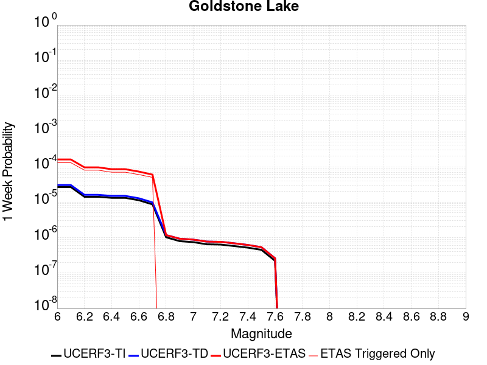 |  |  |  |

| Magnitude | 1 wk TI Prob | 1 wk TD Prob | 1 wk ETAS Prob | 1 wk ETAS/TD Gain | 1 wk ETAS Triggered Only | 1 mo TI Prob | 1 mo TD Prob | 1 mo ETAS Prob | 1 mo ETAS/TD Gain | 1 mo ETAS Triggered Only | 1 yr TI Prob | 1 yr TD Prob | 1 yr ETAS Prob | 1 yr ETAS/TD Gain | 1 yr ETAS Triggered Only | 10 yr TI Prob | 10 yr TD Prob | 10 yr ETAS Prob | 10 yr ETAS/TD Gain | 10 yr ETAS Triggered Only |
|-----|-----|-----|-----|-----|-----|-----|-----|-----|-----|-----|-----|-----|-----|-----|-----|-----|-----|-----|-----|-----|
| 6.0 | 2.671352E-5 | 3.0376643E-5 | 1.603727E-4 | 5.279474 | 1.3E-4 | 1.1448149E-4 | 1.3018023E-4 | 4.5013856E-4 | 3.4578106 | 3.2E-4 | 0.001392921 | 0.0015839882 | 0.0030816123 | 1.9454768 | 0.0015 | 0.013842222 | 0.01574648 | 0.018974831 | 1.2050205 | 0.00328 |
| 6.1 | 2.671352E-5 | 3.0376643E-5 | 1.603727E-4 | 5.279474 | 1.3E-4 | 1.1448149E-4 | 1.3018023E-4 | 4.5013856E-4 | 3.4578106 | 3.2E-4 | 0.001392921 | 0.0015839882 | 0.0030816123 | 1.9454768 | 0.0015 | 0.013842222 | 0.01574648 | 0.018974831 | 1.2050205 | 0.00328 |
| 6.2 | 1.4197047E-5 | 1.6096526E-5 | 9.609524E-5 | 5.9699364 | 8.0E-5 | 6.0843064E-5 | 6.898385E-5 | 2.6897006E-4 | 3.8990295 | 2.0E-4 | 7.4051257E-4 | 8.396533E-4 | 0.0016389816 | 1.9519742 | 8.0E-4 | 0.007380498 | 0.008374506 | 0.010070185 | 1.2024812 | 0.00171 |
| 6.3 | 1.4197047E-5 | 1.6096526E-5 | 9.609524E-5 | 5.9699364 | 8.0E-5 | 6.0843064E-5 | 6.898385E-5 | 2.6897006E-4 | 3.8990295 | 2.0E-4 | 7.4051257E-4 | 8.396533E-4 | 0.0016389816 | 1.9519742 | 8.0E-4 | 0.007380498 | 0.008374506 | 0.010070185 | 1.2024812 | 0.00171 |
| 6.4 | 1.3238931E-5 | 1.5008722E-5 | 8.500767E-5 | 5.6638846 | 7.0E-5 | 5.6737044E-5 | 6.432206E-5 | 2.5430985E-4 | 3.9536955 | 1.9E-4 | 6.9055456E-4 | 7.8293774E-4 | 0.001562327 | 1.9954678 | 7.8E-4 | 0.006884126 | 0.0078114197 | 0.009418765 | 1.2057687 | 0.00162 |
| 6.5 | 1.3238931E-5 | 1.5008722E-5 | 8.500767E-5 | 5.6638846 | 7.0E-5 | 5.6737044E-5 | 6.432206E-5 | 2.5430985E-4 | 3.9536955 | 1.9E-4 | 6.9055456E-4 | 7.8293774E-4 | 0.001562327 | 1.9954678 | 7.8E-4 | 0.006884126 | 0.0078114197 | 0.009418765 | 1.2057687 | 0.00162 |
| 6.6 | 1.1328278E-5 | 1.2855392E-5 | 7.285462E-5 | 5.6672425 | 6.0E-5 | 4.8548856E-5 | 5.509391E-5 | 2.35084E-4 | 4.2669687 | 1.8E-4 | 5.90922E-4 | 6.706576E-4 | 0.0013601949 | 2.0281508 | 6.9E-4 | 0.0058935313 | 0.006695726 | 0.008066486 | 1.2047216 | 0.00138 |
| 6.7 | 8.651175E-6 | 9.824737E-6 | 5.9824248E-5 | 6.089144 | 5.0E-5 | 3.707594E-5 | 4.210585E-5 | 1.7210038E-4 | 4.087327 | 1.3E-4 | 4.5130608E-4 | 5.126087E-4 | 0.0010323421 | 2.013899 | 5.2E-4 | 0.0045039062 | 0.005123141 | 0.006167762 | 1.2039024 | 0.00105 |
| 6.8 | 1.0215377E-6 | 1.1754901E-6 | 1.1754901E-6 | 1.0 | 0.0 | 4.378012E-6 | 5.0378057E-6 | 5.0378057E-6 | 1.0 | 0.0 | 5.3300988E-5 | 6.1333674E-5 | 7.133306E-5 | 1.1630325 | 1.0E-5 | 5.3288206E-4 | 6.131787E-4 | 6.5315416E-4 | 1.0651939 | 4.0E-5 |
| 6.9 | 7.9360774E-7 | 9.2835677E-7 | 9.2835677E-7 | 1.0 | 0.0 | 3.4011714E-6 | 3.978666E-6 | 3.978666E-6 | 1.0 | 0.0 | 4.1408475E-5 | 4.8439255E-5 | 4.8439255E-5 | 1.0 | 0.0 | 4.140076E-4 | 4.8429397E-4 | 5.042843E-4 | 1.0412773 | 2.0E-5 |
| 7.0 | 7.4382757E-7 | 8.747494E-7 | 8.747494E-7 | 1.0 | 0.0 | 3.1878285E-6 | 3.748921E-6 | 3.748921E-6 | 1.0 | 0.0 | 3.8811122E-5 | 4.5642224E-5 | 4.5642224E-5 | 1.0 | 0.0 | 3.8804344E-4 | 4.5633517E-4 | 4.7632604E-4 | 1.0438074 | 2.0E-5 |
| 7.1 | 6.4709513E-7 | 7.711456E-7 | 7.711456E-7 | 1.0 | 0.0 | 2.773262E-6 | 3.3049057E-6 | 3.3049057E-6 | 1.0 | 0.0 | 3.376394E-5 | 4.0236544E-5 | 4.0236544E-5 | 1.0 | 0.0 | 3.375881E-4 | 4.0229855E-4 | 4.1229452E-4 | 1.0248471 | 1.0E-5 |
| 7.2 | 6.356704E-7 | 7.588514E-7 | 7.588514E-7 | 1.0 | 0.0 | 2.7242988E-6 | 3.2522166E-6 | 3.2522166E-6 | 1.0 | 0.0 | 3.3167835E-5 | 3.9595077E-5 | 3.9595077E-5 | 1.0 | 0.0 | 3.3162883E-4 | 3.9588616E-4 | 3.9588616E-4 | 1.0 | 0.0 |
| 7.3 | 5.7695723E-7 | 6.896703E-7 | 6.896703E-7 | 1.0 | 0.0 | 2.4726714E-6 | 2.9557268E-6 | 2.9557268E-6 | 1.0 | 0.0 | 3.0104358E-5 | 3.598544E-5 | 3.598544E-5 | 1.0 | 0.0 | 3.0100282E-4 | 3.5980184E-4 | 3.5980184E-4 | 1.0 | 0.0 |
| 7.4 | 5.209647E-7 | 6.1936277E-7 | 6.1936277E-7 | 1.0 | 0.0 | 2.232704E-6 | 2.6544094E-6 | 2.6544094E-6 | 1.0 | 0.0 | 2.718283E-5 | 3.231701E-5 | 3.231701E-5 | 1.0 | 0.0 | 2.7179506E-4 | 3.2312868E-4 | 3.2312868E-4 | 1.0 | 0.0 |
| 7.5 | 4.512955E-7 | 5.3489794E-7 | 5.3489794E-7 | 1.0 | 0.0 | 1.934122E-6 | 2.292418E-6 | 2.292418E-6 | 1.0 | 0.0 | 2.3547682E-5 | 2.7909884E-5 | 2.7909884E-5 | 1.0 | 0.0 | 2.3545188E-4 | 2.790691E-4 | 2.790691E-4 | 1.0 | 0.0 |
| 7.6 | 2.21172E-7 | 2.6040198E-7 | 2.6040198E-7 | 1.0 | 0.0 | 9.478797E-7 | 1.1160082E-6 | 1.1160082E-6 | 1.0 | 0.0 | 1.1540374E-5 | 1.3587343E-5 | 1.3587343E-5 | 1.0 | 0.0 | 1.1539775E-4 | 1.3586794E-4 | 1.3586794E-4 | 1.0 | 0.0 |

## So Sierra Nevada
*[(top)](#table-of-contents)*

| 1 Week | 1 Month | 1 Year | 10 Year |
|-----|-----|-----|-----|
|  |  | 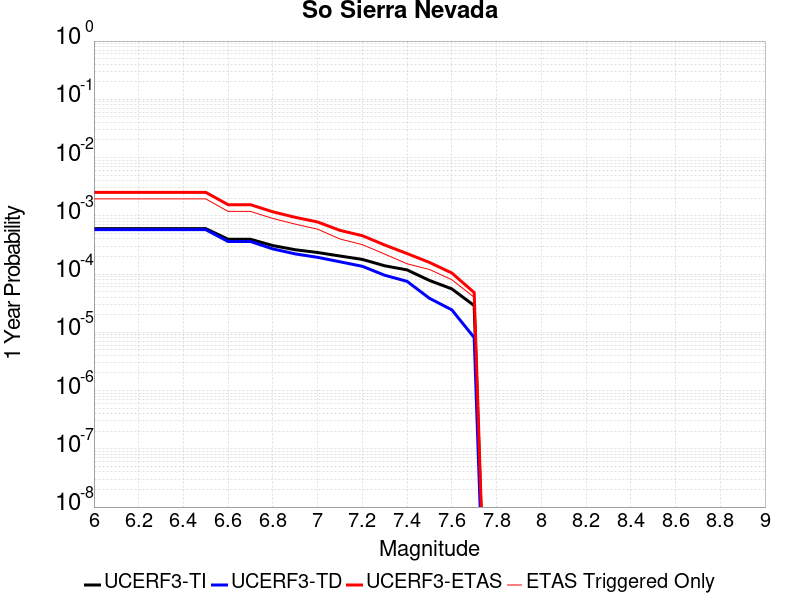 | 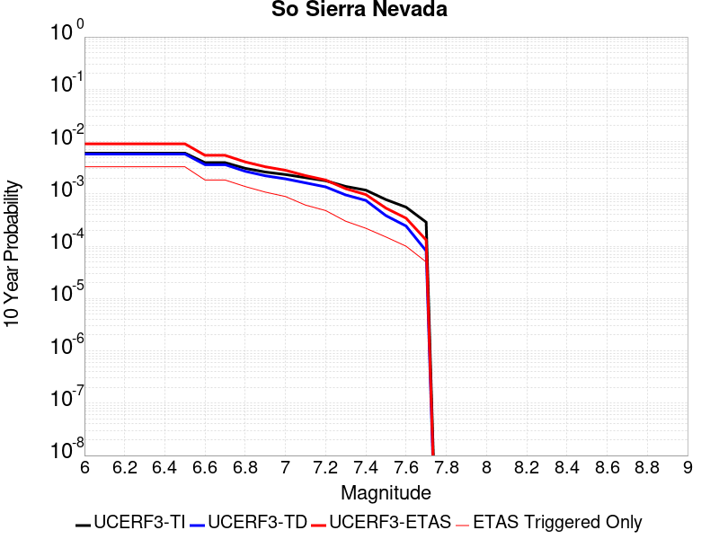 |

| Magnitude | 1 wk TI Prob | 1 wk TD Prob | 1 wk ETAS Prob | 1 wk ETAS/TD Gain | 1 wk ETAS Triggered Only | 1 mo TI Prob | 1 mo TD Prob | 1 mo ETAS Prob | 1 mo ETAS/TD Gain | 1 mo ETAS Triggered Only | 1 yr TI Prob | 1 yr TD Prob | 1 yr ETAS Prob | 1 yr ETAS/TD Gain | 1 yr ETAS Triggered Only | 10 yr TI Prob | 10 yr TD Prob | 10 yr ETAS Prob | 10 yr ETAS/TD Gain | 10 yr ETAS Triggered Only |
|-----|-----|-----|-----|-----|-----|-----|-----|-----|-----|-----|-----|-----|-----|-----|-----|-----|-----|-----|-----|-----|
| 6.0 | 1.15488665E-5 | 1.1079688E-5 | 2.4107714E-4 | 21.758478 | 2.3E-4 | 4.9494203E-5 | 4.7483583E-5 | 7.574499E-4 | 15.951826 | 7.1E-4 | 6.024253E-4 | 5.7797204E-4 | 0.002526845 | 4.371916 | 0.00195 | 0.006007948 | 0.0057659578 | 0.009036988 | 1.5673004 | 0.00329 |
| 6.1 | 1.15488665E-5 | 1.1079688E-5 | 2.4107714E-4 | 21.758478 | 2.3E-4 | 4.9494203E-5 | 4.7483583E-5 | 7.574499E-4 | 15.951826 | 7.1E-4 | 6.024253E-4 | 5.7797204E-4 | 0.002526845 | 4.371916 | 0.00195 | 0.006007948 | 0.0057659578 | 0.009036988 | 1.5673004 | 0.00329 |
| 6.2 | 1.15488665E-5 | 1.1079688E-5 | 2.4107714E-4 | 21.758478 | 2.3E-4 | 4.9494203E-5 | 4.7483583E-5 | 7.574499E-4 | 15.951826 | 7.1E-4 | 6.024253E-4 | 5.7797204E-4 | 0.002526845 | 4.371916 | 0.00195 | 0.006007948 | 0.0057659578 | 0.009036988 | 1.5673004 | 0.00329 |
| 6.3 | 1.15488665E-5 | 1.1079688E-5 | 2.4107714E-4 | 21.758478 | 2.3E-4 | 4.9494203E-5 | 4.7483583E-5 | 7.574499E-4 | 15.951826 | 7.1E-4 | 6.024253E-4 | 5.7797204E-4 | 0.002526845 | 4.371916 | 0.00195 | 0.006007948 | 0.0057659578 | 0.009036988 | 1.5673004 | 0.00329 |
| 6.4 | 1.15488665E-5 | 1.1079688E-5 | 2.4107714E-4 | 21.758478 | 2.3E-4 | 4.9494203E-5 | 4.7483583E-5 | 7.574499E-4 | 15.951826 | 7.1E-4 | 6.024253E-4 | 5.7797204E-4 | 0.002526845 | 4.371916 | 0.00195 | 0.006007948 | 0.0057659578 | 0.009036988 | 1.5673004 | 0.00329 |
| 6.5 | 1.15488665E-5 | 1.1079688E-5 | 2.4107714E-4 | 21.758478 | 2.3E-4 | 4.9494203E-5 | 4.7483583E-5 | 7.574499E-4 | 15.951826 | 7.1E-4 | 6.024253E-4 | 5.7797204E-4 | 0.002526845 | 4.371916 | 0.00195 | 0.006007948 | 0.0057659578 | 0.009036988 | 1.5673004 | 0.00329 |
| 6.6 | 7.587044E-6 | 6.935655E-6 | 1.8693441E-4 | 26.952667 | 1.8E-4 | 3.2515498E-5 | 2.9723915E-5 | 4.4971143E-4 | 15.129617 | 4.2E-4 | 3.9580427E-4 | 3.6183148E-4 | 0.0015514009 | 4.287634 | 0.00119 | 0.003951 | 0.0036127153 | 0.005446068 | 1.5074722 | 0.00184 |
| 6.7 | 7.587044E-6 | 6.935655E-6 | 1.8693441E-4 | 26.952667 | 1.8E-4 | 3.2515498E-5 | 2.9723915E-5 | 4.4971143E-4 | 15.129617 | 4.2E-4 | 3.9580427E-4 | 3.6183148E-4 | 0.0015514009 | 4.287634 | 0.00119 | 0.003951 | 0.0036127153 | 0.005446068 | 1.5074722 | 0.00184 |
| 6.8 | 5.9026956E-6 | 5.179403E-6 | 1.4517868E-4 | 28.030003 | 1.4E-4 | 2.5297022E-5 | 2.2197259E-5 | 3.6218972E-4 | 16.316866 | 3.4E-4 | 3.0794772E-4 | 2.702193E-4 | 0.0011699761 | 4.3297286 | 9.0E-4 | 0.0030752132 | 0.0026990233 | 0.0040752986 | 1.5099161 | 0.00138 |
| 6.9 | 5.0118915E-6 | 4.2524307E-6 | 1.0425201E-4 | 24.515863 | 1.0E-4 | 2.1479358E-5 | 1.8224579E-5 | 2.8821966E-4 | 15.814887 | 2.7E-4 | 2.614798E-4 | 2.2186238E-4 | 9.4170263E-4 | 4.244535 | 7.2E-4 | 0.0026117235 | 0.0022164814 | 0.0032940877 | 1.4861788 | 0.00108 |
| 7.0 | 4.4924795E-6 | 3.7139203E-6 | 1.0371355E-4 | 27.925627 | 1.0E-4 | 1.925334E-5 | 1.5916707E-5 | 2.2591336E-4 | 14.193474 | 2.1E-4 | 2.3438422E-4 | 1.9376932E-4 | 7.83655E-4 | 4.0442677 | 5.9E-4 | 0.0023413717 | 0.0019360665 | 0.0028243435 | 1.458805 | 8.9E-4 |
| 7.1 | 3.9118436E-6 | 3.111977E-6 | 6.311179E-5 | 20.280287 | 6.0E-5 | 1.6764936E-5 | 1.33369795E-5 | 1.4333524E-4 | 10.747205 | 1.3E-4 | 2.0409399E-4 | 1.623662E-4 | 5.6230125E-4 | 3.463167 | 4.0E-4 | 0.0020390663 | 0.0016225318 | 0.002231542 | 1.3753457 | 6.1E-4 |
| 7.2 | 3.4200818E-6 | 2.6054513E-6 | 6.260529E-5 | 24.02858 | 6.0E-5 | 1.4657411E-5 | 1.1166175E-5 | 1.2116494E-4 | 10.85107 | 1.1E-4 | 1.7843937E-4 | 1.359402E-4 | 4.558967E-4 | 3.3536563 | 3.2E-4 | 0.0017829615 | 0.0013586201 | 0.001837968 | 1.3528197 | 4.8E-4 |
| 7.3 | 2.6593618E-6 | 1.8284135E-6 | 4.182834E-5 | 22.876848 | 4.0E-5 | 1.13972155E-5 | 7.836036E-6 | 7.783549E-5 | 9.933018 | 7.0E-5 | 1.3875226E-4 | 9.539985E-5 | 3.1537886E-4 | 3.3058631 | 2.2E-4 | 0.0013866565 | 9.53618E-4 | 0.0012533319 | 1.3142914 | 3.0E-4 |
| 7.4 | 2.2577992E-6 | 1.4364293E-6 | 3.1436386E-5 | 21.885092 | 3.0E-5 | 9.676246E-6 | 6.1561127E-6 | 4.6155867E-5 | 7.497567 | 4.0E-5 | 1.1780193E-4 | 7.4948344E-5 | 2.249371E-4 | 3.0012283 | 1.5E-4 | 0.001177395 | 7.4925576E-4 | 9.690909E-4 | 1.2934047 | 2.2E-4 |
| 7.5 | 1.489319E-6 | 7.35383E-7 | 3.0735362E-5 | 41.795036 | 3.0E-5 | 6.3827797E-6 | 3.1516379E-6 | 4.315151E-5 | 13.691773 | 4.0E-5 | 7.770758E-5 | 3.837052E-5 | 1.5836592E-4 | 4.127281 | 1.2E-4 | 7.7680405E-4 | 3.836394E-4 | 5.335818E-4 | 1.3908422 | 1.5E-4 |
| 7.6 | 1.0680322E-6 | 4.6595343E-7 | 1.0465948E-5 | 22.461363 | 1.0E-5 | 4.577273E-6 | 1.9969418E-6 | 2.1996902E-5 | 11.015294 | 2.0E-5 | 5.5726876E-5 | 2.4312498E-5 | 1.0431055E-4 | 4.2904086 | 8.0E-5 | 5.5712904E-4 | 2.4309864E-4 | 3.4307432E-4 | 1.4112556 | 1.0E-4 |
| 7.7 | 5.509146E-7 | 1.5579108E-7 | 1.015579E-5 | 65.188515 | 1.0E-5 | 2.3610605E-6 | 6.676759E-7 | 1.0667669E-5 | 15.977316 | 1.0E-5 | 2.8745531E-5 | 8.128925E-6 | 4.81286E-5 | 5.9206595 | 4.0E-5 | 2.8741814E-4 | 8.1286395E-5 | 1.3128233E-4 | 1.615059 | 5.0E-5 |

## San Andreas (Mojave N)
*[(top)](#table-of-contents)*

| 1 Week | 1 Month | 1 Year | 10 Year |
|-----|-----|-----|-----|
|  |  |  | 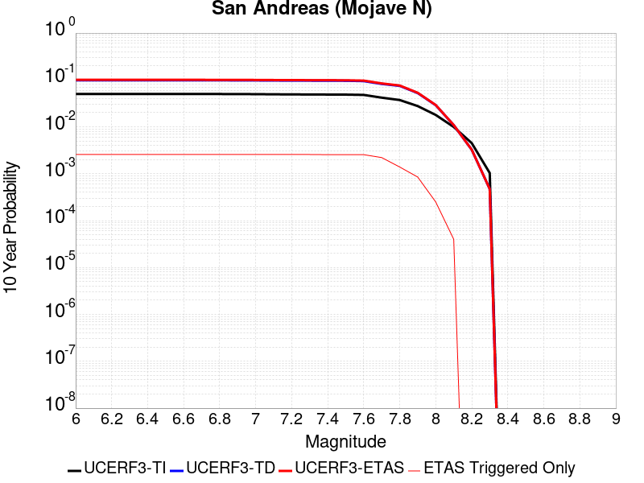 |

| Magnitude | 1 wk TI Prob | 1 wk TD Prob | 1 wk ETAS Prob | 1 wk ETAS/TD Gain | 1 wk ETAS Triggered Only | 1 mo TI Prob | 1 mo TD Prob | 1 mo ETAS Prob | 1 mo ETAS/TD Gain | 1 mo ETAS Triggered Only | 1 yr TI Prob | 1 yr TD Prob | 1 yr ETAS Prob | 1 yr ETAS/TD Gain | 1 yr ETAS Triggered Only | 10 yr TI Prob | 10 yr TD Prob | 10 yr ETAS Prob | 10 yr ETAS/TD Gain | 10 yr ETAS Triggered Only |
|-----|-----|-----|-----|-----|-----|-----|-----|-----|-----|-----|-----|-----|-----|-----|-----|-----|-----|-----|-----|-----|
| 6.0 | 9.877682E-5 | 1.9410432E-4 | 4.8404804E-4 | 2.493752 | 2.9E-4 | 4.2326056E-4 | 8.3161064E-4 | 0.001451095 | 1.7449212 | 6.2E-4 | 0.0051410277 | 0.010077983 | 0.011622261 | 1.1532329 | 0.00156 | 0.05023708 | 0.098361015 | 0.10067822 | 1.0235583 | 0.00257 |
| 6.1 | 9.877682E-5 | 1.9410432E-4 | 4.8404804E-4 | 2.493752 | 2.9E-4 | 4.2326056E-4 | 8.3161064E-4 | 0.001451095 | 1.7449212 | 6.2E-4 | 0.0051410277 | 0.010077983 | 0.011622261 | 1.1532329 | 0.00156 | 0.05023708 | 0.098361015 | 0.10067822 | 1.0235583 | 0.00257 |
| 6.2 | 9.877682E-5 | 1.9410432E-4 | 4.8404804E-4 | 2.493752 | 2.9E-4 | 4.2326056E-4 | 8.3161064E-4 | 0.001451095 | 1.7449212 | 6.2E-4 | 0.0051410277 | 0.010077983 | 0.011622261 | 1.1532329 | 0.00156 | 0.05023708 | 0.098361015 | 0.10067822 | 1.0235583 | 0.00257 |
| 6.3 | 9.877682E-5 | 1.9410432E-4 | 4.8404804E-4 | 2.493752 | 2.9E-4 | 4.2326056E-4 | 8.3161064E-4 | 0.001451095 | 1.7449212 | 6.2E-4 | 0.0051410277 | 0.010077983 | 0.011622261 | 1.1532329 | 0.00156 | 0.05023708 | 0.098361015 | 0.10067822 | 1.0235583 | 0.00257 |
| 6.4 | 9.877682E-5 | 1.9410432E-4 | 4.8404804E-4 | 2.493752 | 2.9E-4 | 4.2326056E-4 | 8.3161064E-4 | 0.001451095 | 1.7449212 | 6.2E-4 | 0.0051410277 | 0.010077983 | 0.011622261 | 1.1532329 | 0.00156 | 0.05023708 | 0.098361015 | 0.10067822 | 1.0235583 | 0.00257 |
| 6.5 | 9.861474E-5 | 1.9384196E-4 | 4.8378576E-4 | 2.495774 | 2.9E-4 | 4.2256617E-4 | 8.3048694E-4 | 0.001449972 | 1.74593 | 6.2E-4 | 0.0051326132 | 0.010064429 | 0.011608728 | 1.1534413 | 0.00156 | 0.050156746 | 0.09823856 | 0.10055608 | 1.0235908 | 0.00257 |
| 6.6 | 9.861474E-5 | 1.9384196E-4 | 4.8378576E-4 | 2.495774 | 2.9E-4 | 4.2256617E-4 | 8.3048694E-4 | 0.001449972 | 1.74593 | 6.2E-4 | 0.0051326132 | 0.010064429 | 0.011608728 | 1.1534413 | 0.00156 | 0.050156746 | 0.09823856 | 0.10055608 | 1.0235908 | 0.00257 |
| 6.7 | 9.8552715E-5 | 1.9374148E-4 | 4.836853E-4 | 2.49655 | 2.9E-4 | 4.223004E-4 | 8.300566E-4 | 0.001449542 | 1.746317 | 6.2E-4 | 0.0051293927 | 0.0100592375 | 0.011603545 | 1.1535213 | 0.00156 | 0.050125998 | 0.098191775 | 0.10050942 | 1.0236033 | 0.00257 |
| 6.8 | 9.8464974E-5 | 1.9359306E-4 | 4.8353692E-4 | 2.4976976 | 2.9E-4 | 4.219245E-4 | 8.294209E-4 | 0.0014489067 | 1.7468895 | 6.2E-4 | 0.0051248376 | 0.01005157 | 0.011595889 | 1.1536397 | 0.00156 | 0.05008251 | 0.09812213 | 0.10043995 | 1.0236218 | 0.00257 |
| 6.9 | 9.825824E-5 | 1.9327311E-4 | 4.8321707E-4 | 2.5001774 | 2.9E-4 | 4.2103877E-4 | 8.2805054E-4 | 0.0014475371 | 1.7481265 | 6.2E-4 | 0.0051141046 | 0.010035039 | 0.011579384 | 1.1538953 | 0.00156 | 0.049980022 | 0.09797137 | 0.10028958 | 1.0236622 | 0.00257 |
| 7.0 | 9.781462E-5 | 1.9258665E-4 | 4.825308E-4 | 2.5055256 | 2.9E-4 | 4.1913814E-4 | 8.251105E-4 | 0.0014445989 | 1.7507945 | 6.2E-4 | 0.005091073 | 0.009999573 | 0.011543973 | 1.1544467 | 0.00156 | 0.04976007 | 0.09764758 | 0.09996662 | 1.0237491 | 0.00257 |
| 7.1 | 9.7121134E-5 | 1.9160361E-4 | 4.8154805E-4 | 2.5132513 | 2.9E-4 | 4.1616702E-4 | 8.2090014E-4 | 0.0014403912 | 1.7546484 | 6.2E-4 | 0.005055068 | 0.009948781 | 0.011493261 | 1.1552432 | 0.00156 | 0.04941613 | 0.09718397 | 0.09950421 | 1.0238746 | 0.00257 |
| 7.2 | 9.663819E-5 | 1.9091136E-4 | 4.80856E-4 | 2.5187395 | 2.9E-4 | 4.1409794E-4 | 8.179352E-4 | 0.001437428 | 1.7573862 | 6.2E-4 | 0.0050299936 | 0.009913012 | 0.011457548 | 1.1558089 | 0.00156 | 0.049176537 | 0.09685706 | 0.09917814 | 1.0239639 | 0.00257 |
| 7.3 | 9.6277574E-5 | 1.9043636E-4 | 4.8038113E-4 | 2.5225284 | 2.9E-4 | 4.125529E-4 | 8.1590074E-4 | 0.0014353949 | 1.7592764 | 6.2E-4 | 0.0050112694 | 0.009888468 | 0.011433042 | 1.1561996 | 0.00156 | 0.04899759 | 0.09663044 | 0.0989521 | 1.0240262 | 0.00257 |
| 7.4 | 9.593308E-5 | 1.8983395E-4 | 4.697808E-4 | 2.4746933 | 2.8E-4 | 4.1107697E-4 | 8.133206E-4 | 0.0014228245 | 1.7494017 | 6.1E-4 | 0.0049933824 | 0.00985734 | 0.011392061 | 1.1556933 | 0.00155 | 0.04882661 | 0.09634874 | 0.098653056 | 1.0239164 | 0.00255 |
| 7.5 | 9.561707E-5 | 1.892946E-4 | 4.6924158E-4 | 2.478896 | 2.8E-4 | 4.0972308E-4 | 8.1101054E-4 | 0.0014205158 | 1.751538 | 6.1E-4 | 0.0049769743 | 0.009829468 | 0.011364233 | 1.1561391 | 0.00155 | 0.048669744 | 0.09609495 | 0.09839991 | 1.0239862 | 0.00255 |
| 7.6 | 9.418194E-5 | 1.858169E-4 | 4.6576487E-4 | 2.5065796 | 2.8E-4 | 4.0357444E-4 | 7.961153E-4 | 0.0014056297 | 1.7656107 | 6.1E-4 | 0.004902454 | 0.009649739 | 0.011184782 | 1.1590761 | 0.00155 | 0.047957025 | 0.094475985 | 0.09678507 | 1.024441 | 0.00255 |
| 7.7 | 8.202141E-5 | 1.6029968E-4 | 4.20258E-4 | 2.621702 | 2.6E-4 | 3.51473E-4 | 6.868178E-4 | 0.0012564263 | 1.8293444 | 5.7E-4 | 0.00427079 | 0.008330002 | 0.009648924 | 1.1583338 | 0.00133 | 0.04189639 | 0.08226986 | 0.08429805 | 1.0246528 | 0.00221 |
| 7.8 | 7.2859846E-5 | 1.452426E-4 | 3.152179E-4 | 2.1702855 | 1.7E-4 | 3.1221908E-4 | 6.223198E-4 | 9.72102E-4 | 1.5620618 | 3.5E-4 | 0.003794643 | 0.007550463 | 0.008344422 | 1.1051538 | 8.0E-4 | 0.037304975 | 0.074759446 | 0.07604553 | 1.017203 | 0.00139 |
| 7.9 | 5.3874453E-5 | 1.0051061E-4 | 1.9050157E-4 | 1.8953378 | 9.0E-5 | 2.3087008E-4 | 4.3068864E-4 | 6.405982E-4 | 1.4873812 | 2.1E-4 | 0.0028072202 | 0.005231038 | 0.00569858 | 1.0893784 | 4.7E-4 | 0.02772022 | 0.052449387 | 0.053254806 | 1.0153561 | 8.5E-4 |
| 8.0 | 3.468538E-5 | 5.4289703E-5 | 6.428916E-5 | 1.1841869 | 1.0E-5 | 1.4864317E-4 | 2.3264941E-4 | 2.726401E-4 | 1.1718925 | 4.0E-5 | 0.0018082283 | 0.0028288292 | 0.00294849 | 1.0423003 | 1.2E-4 | 0.017935853 | 0.028961731 | 0.029204492 | 1.0083821 | 2.5E-4 |
| 8.1 | 1.9152367E-5 | 1.9414629E-5 | 1.9414629E-5 | 1.0 | 0.0 | 8.207899E-5 | 8.3202896E-5 | 9.320206E-5 | 1.1201781 | 1.0E-5 | 9.988535E-4 | 0.0010125252 | 0.0010524846 | 1.0394652 | 4.0E-5 | 0.009943757 | 0.010862543 | 0.01090211 | 1.0036423 | 4.0E-5 |
| 8.2 | 8.643924E-6 | 5.478665E-6 | 5.478665E-6 | 1.0 | 0.0 | 3.704486E-5 | 2.3479783E-5 | 2.3479783E-5 | 1.0 | 0.0 | 4.5092785E-4 | 2.8582895E-4 | 2.8582895E-4 | 1.0 | 0.0 | 0.0045001395 | 0.0032508469 | 0.0032508469 | 1.0 | 0.0 |
| 8.3 | 1.983087E-6 | 7.6647797E-7 | 7.6647797E-7 | 1.0 | 0.0 | 8.498917E-6 | 3.2849016E-6 | 3.2849016E-6 | 1.0 | 0.0 | 1.034694E-4 | 3.999296E-5 | 3.999296E-5 | 1.0 | 0.0 | 0.0010342124 | 4.7228087E-4 | 4.7228087E-4 | 1.0 | 0.0 |

## San Andreas (Mojave S)
*[(top)](#table-of-contents)*

| 1 Week | 1 Month | 1 Year | 10 Year |
|-----|-----|-----|-----|
|  |  | 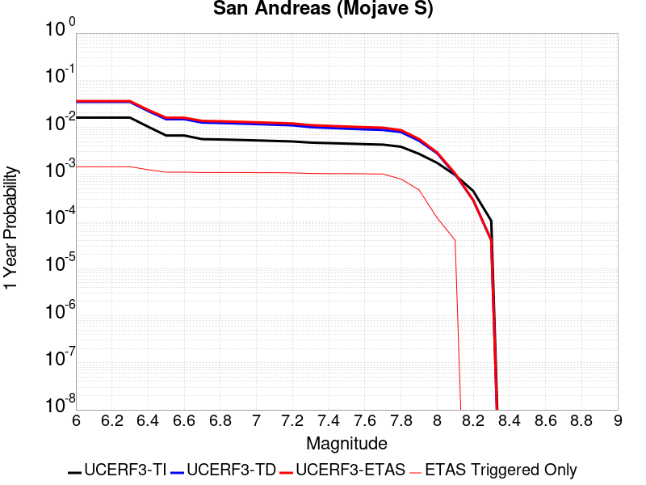 |  |

| Magnitude | 1 wk TI Prob | 1 wk TD Prob | 1 wk ETAS Prob | 1 wk ETAS/TD Gain | 1 wk ETAS Triggered Only | 1 mo TI Prob | 1 mo TD Prob | 1 mo ETAS Prob | 1 mo ETAS/TD Gain | 1 mo ETAS Triggered Only | 1 yr TI Prob | 1 yr TD Prob | 1 yr ETAS Prob | 1 yr ETAS/TD Gain | 1 yr ETAS Triggered Only | 10 yr TI Prob | 10 yr TD Prob | 10 yr ETAS Prob | 10 yr ETAS/TD Gain | 10 yr ETAS Triggered Only |
|-----|-----|-----|-----|-----|-----|-----|-----|-----|-----|-----|-----|-----|-----|-----|-----|-----|-----|-----|-----|-----|
| 6.0 | 3.1064058E-4 | 6.7471585E-4 | 9.1455394E-4 | 1.3554653 | 2.4E-4 | 0.0013306376 | 0.0028885633 | 0.0035167434 | 1.2174715 | 6.3E-4 | 0.016080605 | 0.03457021 | 0.035979737 | 1.0407729 | 0.00146 | 0.1496549 | 0.2866514 | 0.2883563 | 1.0059477 | 0.00239 |
| 6.1 | 3.1064058E-4 | 6.7471585E-4 | 9.1455394E-4 | 1.3554653 | 2.4E-4 | 0.0013306376 | 0.0028885633 | 0.0035167434 | 1.2174715 | 6.3E-4 | 0.016080605 | 0.03457021 | 0.035979737 | 1.0407729 | 0.00146 | 0.1496549 | 0.2866514 | 0.2883563 | 1.0059477 | 0.00239 |
| 6.2 | 3.1064058E-4 | 6.7471585E-4 | 9.1455394E-4 | 1.3554653 | 2.4E-4 | 0.0013306376 | 0.0028885633 | 0.0035167434 | 1.2174715 | 6.3E-4 | 0.016080605 | 0.03457021 | 0.035979737 | 1.0407729 | 0.00146 | 0.1496549 | 0.2866514 | 0.2883563 | 1.0059477 | 0.00239 |
| 6.3 | 3.1064058E-4 | 6.7471585E-4 | 9.1455394E-4 | 1.3554653 | 2.4E-4 | 0.0013306376 | 0.0028885633 | 0.0035167434 | 1.2174715 | 6.3E-4 | 0.016080605 | 0.03457021 | 0.035979737 | 1.0407729 | 0.00146 | 0.1496549 | 0.2866514 | 0.2883563 | 1.0059477 | 0.00239 |
| 6.4 | 1.9872203E-4 | 4.31896E-4 | 6.7179237E-4 | 1.5554492 | 2.4E-4 | 8.5138786E-4 | 0.0018496981 | 0.0024186438 | 1.3075883 | 5.7E-4 | 0.010316478 | 0.02229367 | 0.023525579 | 1.0552583 | 0.00126 | 0.098504856 | 0.19705607 | 0.19874226 | 1.0085568 | 0.0021 |
| 6.5 | 1.291105E-4 | 2.8762486E-4 | 5.175587E-4 | 1.7994226 | 2.3E-4 | 5.5321335E-4 | 0.0012320984 | 0.0017414701 | 1.4134179 | 5.1E-4 | 0.006714592 | 0.014898448 | 0.016001761 | 1.0740557 | 0.00112 | 0.065152965 | 0.138118 | 0.13971248 | 1.0115443 | 0.00185 |
| 6.6 | 1.291105E-4 | 2.8762486E-4 | 5.175587E-4 | 1.7994226 | 2.3E-4 | 5.5321335E-4 | 0.0012320984 | 0.0017414701 | 1.4134179 | 5.1E-4 | 0.006714592 | 0.014898448 | 0.016001761 | 1.0740557 | 0.00112 | 0.065152965 | 0.138118 | 0.13971248 | 1.0115443 | 0.00185 |
| 6.7 | 1.08001186E-4 | 2.4343564E-4 | 4.7337965E-4 | 1.9445783 | 2.3E-4 | 4.6278012E-4 | 0.0010428791 | 0.0015523472 | 1.4885209 | 5.1E-4 | 0.0056198016 | 0.012623432 | 0.013709546 | 1.0860395 | 0.0011 | 0.054797906 | 0.119228184 | 0.12084 | 1.0135187 | 0.00183 |
| 6.8 | 1.0624356E-4 | 2.3861213E-4 | 4.6855726E-4 | 1.9636774 | 2.3E-4 | 4.5525006E-4 | 0.0010222232 | 0.0015317019 | 1.4984026 | 5.1E-4 | 0.0055285925 | 0.012374822 | 0.01346121 | 1.0877901 | 0.0011 | 0.053930566 | 0.117172524 | 0.11878809 | 1.013788 | 0.00183 |
| 6.9 | 1.0393785E-4 | 2.3231508E-4 | 4.6226164E-4 | 1.9898047 | 2.3E-4 | 4.4537184E-4 | 9.952566E-4 | 0.0015047491 | 1.5119207 | 5.1E-4 | 0.0054089287 | 0.012050176 | 0.0131369205 | 1.0901849 | 0.0011 | 0.05279156 | 0.11446828 | 0.1160888 | 1.0141569 | 0.00183 |
| 7.0 | 1.0155622E-4 | 2.2601044E-4 | 4.5595845E-4 | 2.0174222 | 2.3E-4 | 4.3516833E-4 | 9.68257E-4 | 0.0014777632 | 1.5262097 | 5.1E-4 | 0.005285311 | 0.011725035 | 0.012802254 | 1.0918735 | 0.00109 | 0.05161361 | 0.11172433 | 0.113340996 | 1.0144701 | 0.00182 |
| 7.1 | 9.885595E-5 | 2.188942E-4 | 4.4884384E-4 | 2.0505059 | 2.3E-4 | 4.2359953E-4 | 9.3778106E-4 | 0.0014473028 | 1.543327 | 5.1E-4 | 0.0051451353 | 0.011357912 | 0.012435532 | 1.0948783 | 0.00109 | 0.05027629 | 0.108605 | 0.11022734 | 1.014938 | 0.00182 |
| 7.2 | 9.6411415E-5 | 2.1252372E-4 | 4.3247695E-4 | 2.0349586 | 2.2E-4 | 4.1312634E-4 | 9.104983E-4 | 0.0014100431 | 1.5486498 | 5.0E-4 | 0.005018219 | 0.011029154 | 0.012097243 | 1.0968423 | 0.00108 | 0.049064007 | 0.10579592 | 0.107414424 | 1.0152984 | 0.00181 |
| 7.3 | 9.1180635E-5 | 1.9480525E-4 | 4.147624E-4 | 2.129113 | 2.2E-4 | 3.907156E-4 | 8.3461264E-4 | 0.0013242037 | 1.5866086 | 4.9E-4 | 0.004746591 | 0.010114178 | 0.011153558 | 1.1027647 | 0.00105 | 0.046464786 | 0.09798997 | 0.09959555 | 1.0163851 | 0.00178 |
| 7.4 | 8.887388E-5 | 1.8729005E-4 | 3.9725073E-4 | 2.1210456 | 2.1E-4 | 3.8083247E-4 | 8.024248E-4 | 0.0012820397 | 1.5977069 | 4.8E-4 | 0.0046267817 | 0.0097258575 | 0.010755742 | 1.1058915 | 0.00104 | 0.045316286 | 0.0946256 | 0.096219055 | 1.0168396 | 0.00176 |
| 7.5 | 8.6750515E-5 | 1.8060463E-4 | 3.905667E-4 | 2.162551 | 2.1E-4 | 3.7173493E-4 | 7.7379035E-4 | 0.001253419 | 1.619843 | 4.8E-4 | 0.004516484 | 0.009380288 | 0.010410533 | 1.1098307 | 0.00104 | 0.04425787 | 0.09158909 | 0.093178816 | 1.0173571 | 0.00175 |
| 7.6 | 8.453092E-5 | 1.7447997E-4 | 3.8444332E-4 | 2.2033665 | 2.1E-4 | 3.6222505E-4 | 7.4755703E-4 | 0.0012172057 | 1.6282445 | 4.7E-4 | 0.0044011753 | 0.0090636 | 0.010084264 | 1.1126114 | 0.00103 | 0.04315024 | 0.08874676 | 0.09033234 | 1.0178664 | 0.00174 |
| 7.7 | 8.259102E-5 | 1.6970029E-4 | 3.7966465E-4 | 2.2372658 | 2.1E-4 | 3.539135E-4 | 7.270843E-4 | 0.0011967425 | 1.6459475 | 4.7E-4 | 0.004300386 | 0.008816389 | 0.009827397 | 1.1146736 | 0.00102 | 0.042181134 | 0.08649703 | 0.088077396 | 1.0182707 | 0.00173 |
| 7.8 | 7.444844E-5 | 1.5291499E-4 | 3.2288898E-4 | 2.1115587 | 1.7E-4 | 3.1902574E-4 | 6.5518543E-4 | 0.0010049561 | 1.53385 | 3.5E-4 | 0.0038772223 | 0.007947756 | 0.008741398 | 1.0998573 | 8.0E-4 | 0.03810269 | 0.078325555 | 0.07960668 | 1.0163565 | 0.00139 |
| 7.9 | 5.2586525E-5 | 1.0011774E-4 | 1.9010872E-4 | 1.8988516 | 9.0E-5 | 2.2535135E-4 | 4.2900548E-4 | 6.389154E-4 | 1.4892943 | 2.1E-4 | 0.0027402006 | 0.005210644 | 0.005678195 | 1.08973 | 4.7E-4 | 0.027066574 | 0.052224807 | 0.053030416 | 1.0154258 | 8.5E-4 |
| 8.0 | 3.379877E-5 | 5.4103475E-5 | 6.410293E-5 | 1.184821 | 1.0E-5 | 1.4484383E-4 | 2.3185145E-4 | 2.7184217E-4 | 1.1724843 | 4.0E-5 | 0.0017620471 | 0.002819139 | 0.0029388007 | 1.0424461 | 1.2E-4 | 0.017481409 | 0.028849052 | 0.029091839 | 1.0084158 | 2.5E-4 |
| 8.1 | 1.8668277E-5 | 1.9321345E-5 | 1.9321345E-5 | 1.0 | 0.0 | 8.000444E-5 | 8.280314E-5 | 9.2802315E-5 | 1.1207584 | 1.0E-5 | 9.736188E-4 | 0.0010076626 | 0.0010476223 | 1.0396558 | 4.0E-5 | 0.009693642 | 0.010805132 | 0.010844699 | 1.003662 | 4.0E-5 |
| 8.2 | 8.541571E-6 | 5.4646152E-6 | 5.4646152E-6 | 1.0 | 0.0 | 3.660622E-5 | 2.341957E-5 | 2.341957E-5 | 1.0 | 0.0 | 4.455896E-4 | 2.8509603E-4 | 2.8509603E-4 | 1.0 | 0.0 | 0.0044469717 | 0.0032429425 | 0.0032429425 | 1.0 | 0.0 |
| 8.3 | 1.983087E-6 | 7.6647797E-7 | 7.6647797E-7 | 1.0 | 0.0 | 8.498917E-6 | 3.2849016E-6 | 3.2849016E-6 | 1.0 | 0.0 | 1.034694E-4 | 3.999296E-5 | 3.999296E-5 | 1.0 | 0.0 | 0.0010342124 | 4.7228087E-4 | 4.7228087E-4 | 1.0 | 0.0 |

## Death Valley (So)
*[(top)](#table-of-contents)*

| 1 Week | 1 Month | 1 Year | 10 Year |
|-----|-----|-----|-----|
|  |  |  |  |

| Magnitude | 1 wk TI Prob | 1 wk TD Prob | 1 wk ETAS Prob | 1 wk ETAS/TD Gain | 1 wk ETAS Triggered Only | 1 mo TI Prob | 1 mo TD Prob | 1 mo ETAS Prob | 1 mo ETAS/TD Gain | 1 mo ETAS Triggered Only | 1 yr TI Prob | 1 yr TD Prob | 1 yr ETAS Prob | 1 yr ETAS/TD Gain | 1 yr ETAS Triggered Only | 10 yr TI Prob | 10 yr TD Prob | 10 yr ETAS Prob | 10 yr ETAS/TD Gain | 10 yr ETAS Triggered Only |
|-----|-----|-----|-----|-----|-----|-----|-----|-----|-----|-----|-----|-----|-----|-----|-----|-----|-----|-----|-----|-----|
| 6.0 | 2.0684236E-5 | 2.5618914E-5 | 1.5561559E-4 | 6.074246 | 1.3E-4 | 8.864371E-5 | 1.09790824E-4 | 4.4975348E-4 | 4.096458 | 3.4E-4 | 0.0010787029 | 0.0013359005 | 0.002604204 | 1.9493996 | 0.00127 | 0.010734817 | 0.01328137 | 0.015817236 | 1.1909342 | 0.00257 |
| 6.1 | 2.0684236E-5 | 2.5618914E-5 | 1.5561559E-4 | 6.074246 | 1.3E-4 | 8.864371E-5 | 1.09790824E-4 | 4.4975348E-4 | 4.096458 | 3.4E-4 | 0.0010787029 | 0.0013359005 | 0.002604204 | 1.9493996 | 0.00127 | 0.010734817 | 0.01328137 | 0.015817236 | 1.1909342 | 0.00257 |
| 6.2 | 2.0684236E-5 | 2.5618914E-5 | 1.5561559E-4 | 6.074246 | 1.3E-4 | 8.864371E-5 | 1.09790824E-4 | 4.4975348E-4 | 4.096458 | 3.4E-4 | 0.0010787029 | 0.0013359005 | 0.002604204 | 1.9493996 | 0.00127 | 0.010734817 | 0.01328137 | 0.015817236 | 1.1909342 | 0.00257 |
| 6.3 | 2.0240292E-5 | 2.511899E-5 | 1.4511598E-4 | 5.777142 | 1.2E-4 | 8.6741224E-5 | 1.0764847E-4 | 4.1761508E-4 | 3.8794336 | 3.1E-4 | 0.0010555626 | 0.0013098489 | 0.002528251 | 1.9301852 | 0.00122 | 0.010505628 | 0.013023925 | 0.015343319 | 1.1780871 | 0.00235 |
| 6.4 | 2.0240292E-5 | 2.511899E-5 | 1.4511598E-4 | 5.777142 | 1.2E-4 | 8.6741224E-5 | 1.0764847E-4 | 4.1761508E-4 | 3.8794336 | 3.1E-4 | 0.0010555626 | 0.0013098489 | 0.002528251 | 1.9301852 | 0.00122 | 0.010505628 | 0.013023925 | 0.015343319 | 1.1780871 | 0.00235 |
| 6.5 | 1.9962767E-5 | 2.4808238E-5 | 1.3480551E-4 | 5.433901 | 1.1E-4 | 8.55519E-5 | 1.0631679E-4 | 3.8628702E-4 | 3.6333587 | 2.8E-4 | 0.0010410968 | 0.0012936549 | 0.0024421671 | 1.8878042 | 0.00115 | 0.010362327 | 0.012863869 | 0.015094797 | 1.1734259 | 0.00226 |
| 6.6 | 1.8937297E-5 | 2.331202E-5 | 1.3330946E-4 | 5.718486 | 1.1E-4 | 8.115732E-5 | 9.9904915E-5 | 3.7987693E-4 | 3.8023849 | 2.8E-4 | 9.876423E-4 | 0.0012156782 | 0.002254414 | 1.8544495 | 0.00104 | 0.009832645 | 0.012092765 | 0.014098217 | 1.165839 | 0.00203 |
| 6.7 | 1.8621096E-5 | 2.2912649E-5 | 1.3291014E-4 | 5.8007317 | 1.1E-4 | 7.980225E-5 | 9.819346E-5 | 3.7816595E-4 | 3.851234 | 2.8E-4 | 9.711593E-4 | 0.0011948642 | 0.0022336214 | 1.8693519 | 0.00104 | 0.009669261 | 0.011886865 | 0.013833447 | 1.1637591 | 0.00197 |
| 6.8 | 1.7830353E-5 | 2.1806614E-5 | 1.3180422E-4 | 6.044231 | 1.1E-4 | 7.641356E-5 | 9.345365E-5 | 3.634284E-4 | 3.8888626 | 2.7E-4 | 9.29938E-4 | 0.0011372183 | 0.0021460697 | 1.887122 | 0.00101 | 0.009260561 | 0.011316919 | 0.013175643 | 1.164243 | 0.00188 |
| 6.9 | 1.3135183E-5 | 1.5304342E-5 | 1.1530281E-4 | 7.5339937 | 1.0E-4 | 5.6292425E-5 | 6.558842E-5 | 2.455766E-4 | 3.744207 | 1.8E-4 | 6.8514474E-4 | 7.9825294E-4 | 0.0014777101 | 1.8511803 | 6.8E-4 | 0.006830362 | 0.007954868 | 0.009165163 | 1.1521453 | 0.00122 |
| 7.0 | 1.1507512E-5 | 1.315447E-5 | 6.315381E-5 | 4.800939 | 5.0E-5 | 4.9316975E-5 | 5.6375116E-5 | 1.5636948E-4 | 2.7737322 | 1.0E-4 | 6.002687E-4 | 6.861567E-4 | 0.0010758891 | 1.5679933 | 3.9E-4 | 0.0059864987 | 0.0068410533 | 0.0076256488 | 1.1146894 | 7.9E-4 |
| 7.1 | 9.715903E-6 | 1.086547E-5 | 3.0865252E-5 | 2.8406734 | 2.0E-5 | 4.1638916E-5 | 4.6565492E-5 | 1.065627E-4 | 2.2884479 | 6.0E-5 | 5.068359E-4 | 5.667917E-4 | 7.766726E-4 | 1.3702965 | 2.1E-4 | 0.0050568148 | 0.0056537534 | 0.006081322 | 1.0756257 | 4.3E-4 |
| 7.2 | 9.233269E-6 | 1.0286476E-5 | 3.028627E-5 | 2.9442804 | 2.0E-5 | 3.9570554E-5 | 4.4084176E-5 | 9.4081974E-5 | 2.1341438 | 5.0E-5 | 4.81665E-4 | 5.365969E-4 | 6.765218E-4 | 1.2607635 | 1.4E-4 | 0.0048062233 | 0.005353444 | 0.0056319446 | 1.0520228 | 2.8E-4 |
| 7.3 | 8.8041315E-6 | 9.808313E-6 | 2.9808118E-5 | 3.0390666 | 2.0E-5 | 3.7731446E-5 | 4.2034975E-5 | 6.203413E-5 | 1.4757743 | 2.0E-5 | 4.592835E-4 | 5.1165983E-4 | 6.016138E-4 | 1.1758081 | 9.0E-5 | 0.0045833546 | 0.0051052445 | 0.0053042234 | 1.0389754 | 2.0E-4 |
| 7.4 | 8.708749E-6 | 9.707323E-6 | 2.970713E-5 | 3.06028 | 2.0E-5 | 3.7322676E-5 | 4.1602176E-5 | 6.160134E-5 | 1.4807241 | 2.0E-5 | 4.5430884E-4 | 5.06393E-4 | 5.963474E-4 | 1.1776376 | 9.0E-5 | 0.004533812 | 0.0050528166 | 0.005251806 | 1.0393819 | 2.0E-4 |
| 7.5 | 8.612678E-6 | 9.604964E-6 | 2.9604773E-5 | 3.0822365 | 2.0E-5 | 3.6910955E-5 | 4.116351E-5 | 6.116268E-5 | 1.4858472 | 2.0E-5 | 4.492982E-4 | 5.010547E-4 | 5.9100956E-4 | 1.1795311 | 9.0E-5 | 0.004483909 | 0.0049996753 | 0.005198675 | 1.0398026 | 2.0E-4 |
| 7.6 | 8.319024E-6 | 9.28406E-6 | 2.9283874E-5 | 3.15421 | 2.0E-5 | 3.5652476E-5 | 3.9788243E-5 | 5.978745E-5 | 1.5026411 | 2.0E-5 | 4.3398244E-4 | 4.8431839E-4 | 5.742748E-4 | 1.1857382 | 9.0E-5 | 0.0043313587 | 0.004833053 | 0.0050221346 | 1.0391226 | 1.9E-4 |
| 7.7 | 7.4718328E-6 | 8.3453E-6 | 1.8345216E-5 | 2.1982694 | 1.0E-5 | 3.2021748E-5 | 3.57651E-5 | 4.5764744E-5 | 1.2795922 | 1.0E-5 | 3.8979502E-4 | 4.3535716E-4 | 5.0532667E-4 | 1.1607175 | 7.0E-5 | 0.00389112 | 0.004345448 | 0.004494796 | 1.0343689 | 1.5E-4 |
| 7.8 | 3.4586725E-7 | 3.648288E-7 | 3.648288E-7 | 1.0 | 0.0 | 1.4822873E-6 | 1.5635511E-6 | 1.5635511E-6 | 1.0 | 0.0 | 1.80467E-5 | 1.9036073E-5 | 1.9036073E-5 | 1.0 | 0.0 | 1.8045233E-4 | 1.9034486E-4 | 1.9034486E-4 | 1.0 | 0.0 |
| 7.9 | 2.5591178E-9 | 2.6696871E-9 | 2.6696871E-9 | 1.0 | 0.0 | 1.0967647E-8 | 1.1441516E-8 | 1.1441516E-8 | 1.0 | 0.0 | 1.335311E-7 | 1.3930045E-7 | 1.3930045E-7 | 1.0 | 0.0 | 1.3353102E-6 | 1.3930046E-6 | 1.3930046E-6 | 1.0 | 0.0 |

## Coyote Canyon
*[(top)](#table-of-contents)*

| 1 Week | 1 Month | 1 Year | 10 Year |
|-----|-----|-----|-----|
| 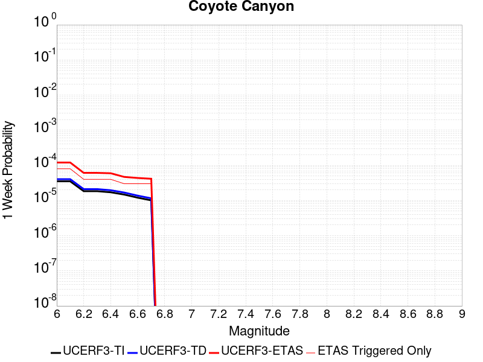 |  |  | 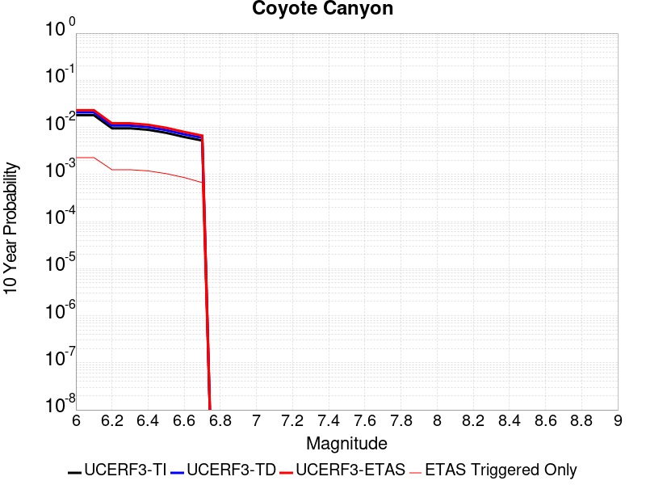 |

| Magnitude | 1 wk TI Prob | 1 wk TD Prob | 1 wk ETAS Prob | 1 wk ETAS/TD Gain | 1 wk ETAS Triggered Only | 1 mo TI Prob | 1 mo TD Prob | 1 mo ETAS Prob | 1 mo ETAS/TD Gain | 1 mo ETAS Triggered Only | 1 yr TI Prob | 1 yr TD Prob | 1 yr ETAS Prob | 1 yr ETAS/TD Gain | 1 yr ETAS Triggered Only | 10 yr TI Prob | 10 yr TD Prob | 10 yr ETAS Prob | 10 yr ETAS/TD Gain | 10 yr ETAS Triggered Only |
|-----|-----|-----|-----|-----|-----|-----|-----|-----|-----|-----|-----|-----|-----|-----|-----|-----|-----|-----|-----|-----|
| 6.0 | 3.5090034E-5 | 4.036512E-5 | 1.20361896E-4 | 2.9818292 | 8.0E-5 | 1.503772E-4 | 1.7298336E-4 | 4.6293318E-4 | 2.6761718 | 2.9E-4 | 0.0018293047 | 0.0021042954 | 0.0031620648 | 1.5026716 | 0.00106 | 0.018143194 | 0.020869616 | 0.023102034 | 1.1069697 | 0.00228 |
| 6.1 | 3.5090034E-5 | 4.036512E-5 | 1.20361896E-4 | 2.9818292 | 8.0E-5 | 1.503772E-4 | 1.7298336E-4 | 4.6293318E-4 | 2.6761718 | 2.9E-4 | 0.0018293047 | 0.0021042954 | 0.0031620648 | 1.5026716 | 0.00106 | 0.018143194 | 0.020869616 | 0.023102034 | 1.1069697 | 0.00228 |
| 6.2 | 1.841879E-5 | 2.1060194E-5 | 6.105935E-5 | 2.8992777 | 4.0E-5 | 7.8935285E-5 | 9.0255424E-5 | 2.702392E-4 | 2.99416 | 1.8E-4 | 9.606133E-4 | 0.0010984079 | 0.001737705 | 1.5820215 | 6.4E-4 | 0.0095647145 | 0.010939875 | 0.01218609 | 1.113915 | 0.00126 |
| 6.3 | 1.841879E-5 | 2.1060194E-5 | 6.105935E-5 | 2.8992777 | 4.0E-5 | 7.8935285E-5 | 9.0255424E-5 | 2.702392E-4 | 2.99416 | 1.8E-4 | 9.606133E-4 | 0.0010984079 | 0.001737705 | 1.5820215 | 6.4E-4 | 0.0095647145 | 0.010939875 | 0.01218609 | 1.113915 | 0.00126 |
| 6.4 | 1.712201E-5 | 1.9565581E-5 | 5.9564798E-5 | 3.0443664 | 4.0E-5 | 7.337798E-5 | 8.385037E-5 | 2.538361E-4 | 3.027251 | 1.7E-4 | 8.930107E-4 | 0.0010205007 | 0.0016298782 | 1.5971358 | 6.1E-4 | 0.008894307 | 0.0101680625 | 0.011345963 | 1.115843 | 0.00119 |
| 6.5 | 1.4744935E-5 | 1.6837288E-5 | 4.6836783E-5 | 2.7817295 | 3.0E-5 | 6.3191044E-5 | 7.215834E-5 | 2.0214896E-4 | 2.8014636 | 1.3E-4 | 7.6907943E-4 | 8.782672E-4 | 0.001417793 | 1.614307 | 5.4E-4 | 0.007664232 | 0.008757159 | 0.009788051 | 1.11772 | 0.00104 |
| 6.6 | 1.2017839E-5 | 1.3724348E-5 | 4.3723936E-5 | 3.1858664 | 3.0E-5 | 5.150401E-5 | 5.8817805E-5 | 1.7881075E-4 | 3.0400784 | 1.2E-4 | 6.268809E-4 | 7.159601E-4 | 0.0011556451 | 1.6141194 | 4.4E-4 | 0.0062511545 | 0.0071452283 | 0.007999083 | 1.1195 | 8.6E-4 |
| 6.7 | 1.00956095E-5 | 1.1533734E-5 | 4.153339E-5 | 3.6010356 | 3.0E-5 | 4.326618E-5 | 4.9429844E-5 | 1.494249E-4 | 3.0229692 | 1.0E-4 | 5.266384E-4 | 6.0172915E-4 | 9.5151854E-4 | 1.581307 | 3.5E-4 | 0.005253921 | 0.006009526 | 0.0066754995 | 1.1108197 | 6.7E-4 |

## Nelson Lake
*[(top)](#table-of-contents)*

| 1 Week | 1 Month | 1 Year | 10 Year |
|-----|-----|-----|-----|
|  |  | 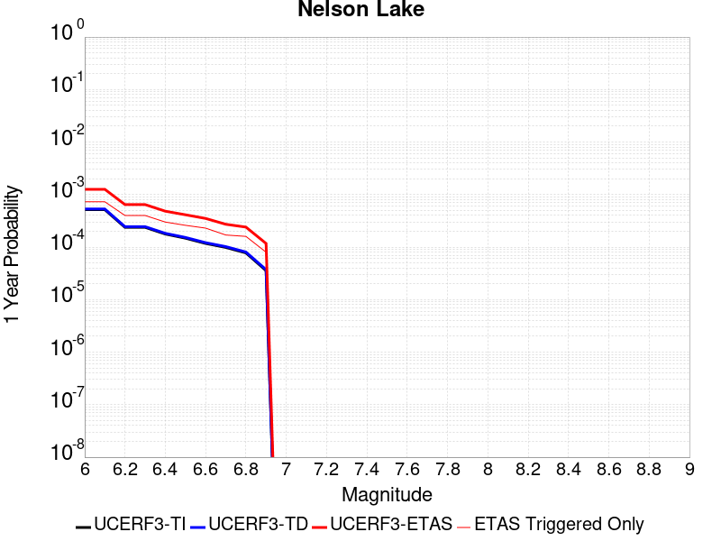 |  |

| Magnitude | 1 wk TI Prob | 1 wk TD Prob | 1 wk ETAS Prob | 1 wk ETAS/TD Gain | 1 wk ETAS Triggered Only | 1 mo TI Prob | 1 mo TD Prob | 1 mo ETAS Prob | 1 mo ETAS/TD Gain | 1 mo ETAS Triggered Only | 1 yr TI Prob | 1 yr TD Prob | 1 yr ETAS Prob | 1 yr ETAS/TD Gain | 1 yr ETAS Triggered Only | 10 yr TI Prob | 10 yr TD Prob | 10 yr ETAS Prob | 10 yr ETAS/TD Gain | 10 yr ETAS Triggered Only |
|-----|-----|-----|-----|-----|-----|-----|-----|-----|-----|-----|-----|-----|-----|-----|-----|-----|-----|-----|-----|-----|
| 6.0 | 9.913453E-6 | 1.0192293E-5 | 1.1019127E-4 | 10.811234 | 1.0E-4 | 4.2485535E-5 | 4.3680586E-5 | 2.836701E-4 | 6.494192 | 2.4E-4 | 5.1713863E-4 | 5.316917E-4 | 0.0012613036 | 2.372246 | 7.3E-4 | 0.0051593683 | 0.0053052236 | 0.007135462 | 1.344988 | 0.00184 |
| 6.1 | 9.913453E-6 | 1.0192293E-5 | 1.1019127E-4 | 10.811234 | 1.0E-4 | 4.2485535E-5 | 4.3680586E-5 | 2.836701E-4 | 6.494192 | 2.4E-4 | 5.1713863E-4 | 5.316917E-4 | 0.0012613036 | 2.372246 | 7.3E-4 | 0.0051593683 | 0.0053052236 | 0.007135462 | 1.344988 | 0.00184 |
| 6.2 | 4.5596407E-6 | 4.696332E-6 | 7.4696E-5 | 15.90518 | 7.0E-5 | 1.954117E-5 | 2.0126989E-5 | 1.8012377E-4 | 8.949366 | 1.6E-4 | 2.3788778E-4 | 2.450198E-4 | 6.449218E-4 | 2.632121 | 4.0E-4 | 0.0023763329 | 0.0024476226 | 0.003405273 | 1.3912573 | 9.6E-4 |
| 6.3 | 4.5596407E-6 | 4.696332E-6 | 7.4696E-5 | 15.90518 | 7.0E-5 | 1.954117E-5 | 2.0126989E-5 | 1.8012377E-4 | 8.949366 | 1.6E-4 | 2.3788778E-4 | 2.450198E-4 | 6.449218E-4 | 2.632121 | 4.0E-4 | 0.0023763329 | 0.0024476226 | 0.003405273 | 1.3912573 | 9.6E-4 |
| 6.4 | 3.4025713E-6 | 3.509912E-6 | 4.350977E-5 | 12.396257 | 4.0E-5 | 1.4582367E-5 | 1.50423975E-5 | 1.1504089E-4 | 7.647776 | 1.0E-4 | 1.7752586E-4 | 1.8312664E-4 | 4.830717E-4 | 2.6379106 | 3.0E-4 | 0.001773841 | 0.0018298404 | 0.0024986144 | 1.3654822 | 6.7E-4 |
| 6.5 | 2.8352947E-6 | 2.9278688E-6 | 4.2927753E-5 | 14.661775 | 4.0E-5 | 1.2151207E-5 | 1.2547953E-5 | 1.0254682E-4 | 8.172395 | 9.0E-5 | 1.479309E-4 | 1.5276136E-4 | 4.1272165E-4 | 2.701741 | 2.6E-4 | 0.0014783246 | 0.0015266375 | 0.0021157367 | 1.3858802 | 5.9E-4 |
| 6.6 | 2.251518E-6 | 2.3290781E-6 | 3.2329008E-5 | 13.880602 | 3.0E-5 | 9.649328E-6 | 9.981729E-6 | 7.998103E-5 | 8.012743 | 7.0E-5 | 1.1747423E-4 | 1.2152141E-4 | 3.5149345E-4 | 2.8924408 | 2.3E-4 | 0.0011741214 | 0.0012146112 | 0.0016840404 | 1.3864851 | 4.7E-4 |
| 6.7 | 1.8911853E-6 | 1.9591491E-6 | 2.195911E-5 | 11.208494 | 2.0E-5 | 8.105055E-6 | 8.39633E-6 | 5.8395908E-5 | 6.954933 | 5.0E-5 | 9.867457E-5 | 1.022211E-4 | 2.7220373E-4 | 2.6628919 | 1.7E-4 | 9.863076E-4 | 0.0010217984 | 0.00140141 | 1.3715134 | 3.8E-4 |
| 6.8 | 1.4874814E-6 | 1.5438383E-6 | 2.1543807E-5 | 13.954705 | 2.0E-5 | 6.374905E-6 | 6.6164357E-6 | 5.6616103E-5 | 8.556889 | 5.0E-5 | 7.76117E-5 | 8.055265E-5 | 2.4053977E-4 | 2.9861186 | 1.6E-4 | 7.75846E-4 | 8.052856E-4 | 0.0011550038 | 1.4342784 | 3.5E-4 |
| 6.9 | 6.835972E-7 | 7.1399705E-7 | 1.07139895E-5 | 15.0056505 | 1.0E-5 | 2.9296991E-6 | 3.0599856E-6 | 2.3059923E-5 | 7.535959 | 2.0E-5 | 3.56685E-5 | 3.7255006E-5 | 1.1725203E-4 | 3.1472824 | 8.0E-5 | 3.5662777E-4 | 3.7251884E-4 | 5.424555E-4 | 1.4561827 | 1.7E-4 |

## Towne Pass
*[(top)](#table-of-contents)*

| 1 Week | 1 Month | 1 Year | 10 Year |
|-----|-----|-----|-----|
|  |  | 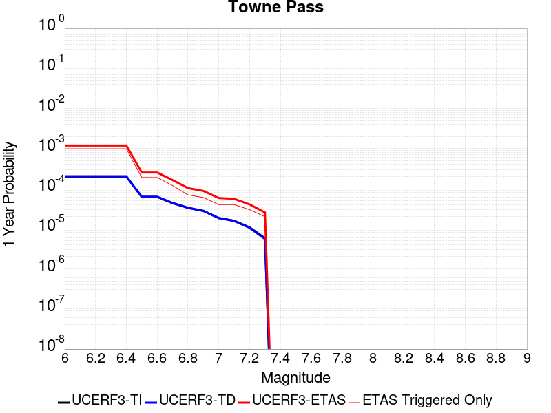 | 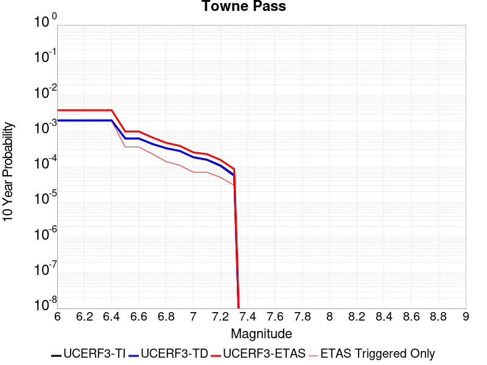 |

| Magnitude | 1 wk TI Prob | 1 wk TD Prob | 1 wk ETAS Prob | 1 wk ETAS/TD Gain | 1 wk ETAS Triggered Only | 1 mo TI Prob | 1 mo TD Prob | 1 mo ETAS Prob | 1 mo ETAS/TD Gain | 1 mo ETAS Triggered Only | 1 yr TI Prob | 1 yr TD Prob | 1 yr ETAS Prob | 1 yr ETAS/TD Gain | 1 yr ETAS Triggered Only | 10 yr TI Prob | 10 yr TD Prob | 10 yr ETAS Prob | 10 yr ETAS/TD Gain | 10 yr ETAS Triggered Only |
|-----|-----|-----|-----|-----|-----|-----|-----|-----|-----|-----|-----|-----|-----|-----|-----|-----|-----|-----|-----|-----|
| 6.0 | 3.849728E-6 | 3.8945495E-6 | 1.0389416E-4 | 26.67681 | 1.0E-4 | 1.649873E-5 | 1.6690845E-5 | 3.06686E-4 | 18.374504 | 2.9E-4 | 2.0085352E-4 | 2.0319647E-4 | 0.0011929953 | 5.871142 | 9.9E-4 | 0.0020067208 | 0.0020305358 | 0.0039366577 | 1.9387285 | 0.00191 |
| 6.1 | 3.849728E-6 | 3.8945495E-6 | 1.0389416E-4 | 26.67681 | 1.0E-4 | 1.649873E-5 | 1.6690845E-5 | 3.06686E-4 | 18.374504 | 2.9E-4 | 2.0085352E-4 | 2.0319647E-4 | 0.0011929953 | 5.871142 | 9.9E-4 | 0.0020067208 | 0.0020305358 | 0.0039366577 | 1.9387285 | 0.00191 |
| 6.2 | 3.849728E-6 | 3.8945495E-6 | 1.0389416E-4 | 26.67681 | 1.0E-4 | 1.649873E-5 | 1.6690845E-5 | 3.06686E-4 | 18.374504 | 2.9E-4 | 2.0085352E-4 | 2.0319647E-4 | 0.0011929953 | 5.871142 | 9.9E-4 | 0.0020067208 | 0.0020305358 | 0.0039366577 | 1.9387285 | 0.00191 |
| 6.3 | 3.849728E-6 | 3.8945495E-6 | 1.0389416E-4 | 26.67681 | 1.0E-4 | 1.649873E-5 | 1.6690845E-5 | 3.06686E-4 | 18.374504 | 2.9E-4 | 2.0085352E-4 | 2.0319647E-4 | 0.0011929953 | 5.871142 | 9.9E-4 | 0.0020067208 | 0.0020305358 | 0.0039366577 | 1.9387285 | 0.00191 |
| 6.4 | 3.849728E-6 | 3.8945495E-6 | 1.0389416E-4 | 26.67681 | 1.0E-4 | 1.649873E-5 | 1.6690845E-5 | 3.06686E-4 | 18.374504 | 2.9E-4 | 2.0085352E-4 | 2.0319647E-4 | 0.0011929953 | 5.871142 | 9.9E-4 | 0.0020067208 | 0.0020305358 | 0.0039366577 | 1.9387285 | 0.00191 |
| 6.5 | 1.1953545E-6 | 1.2030554E-6 | 3.120302E-5 | 25.936478 | 3.0E-5 | 5.1229376E-6 | 5.1559423E-6 | 6.515563E-5 | 12.636998 | 6.0E-5 | 6.236998E-5 | 6.2771906E-5 | 2.5276E-4 | 4.026642 | 1.9E-4 | 6.235248E-4 | 6.275535E-4 | 9.873275E-4 | 1.5732963 | 3.6E-4 |
| 6.6 | 1.1953545E-6 | 1.2030554E-6 | 3.120302E-5 | 25.936478 | 3.0E-5 | 5.1229376E-6 | 5.1559423E-6 | 6.515563E-5 | 12.636998 | 6.0E-5 | 6.236998E-5 | 6.2771906E-5 | 2.5276E-4 | 4.026642 | 1.9E-4 | 6.235248E-4 | 6.275535E-4 | 9.873275E-4 | 1.5732963 | 3.6E-4 |
| 6.7 | 8.375951E-7 | 8.4106983E-7 | 2.0841053E-5 | 24.779219 | 2.0E-5 | 3.5896885E-6 | 3.6045803E-6 | 3.3604472E-5 | 9.322714 | 3.0E-5 | 4.370358E-5 | 4.388494E-5 | 1.6387967E-4 | 3.7343032 | 1.2E-4 | 4.3694986E-4 | 4.3876845E-4 | 6.6866755E-4 | 1.5239645 | 2.3E-4 |
| 6.8 | 6.38041E-7 | 6.392181E-7 | 6.392181E-7 | 1.0 | 0.0 | 2.7344586E-6 | 2.7395035E-6 | 1.2739476E-5 | 4.650286 | 1.0E-5 | 3.3291526E-5 | 3.3352986E-5 | 1.0335065E-4 | 3.0986927 | 7.0E-5 | 3.3286537E-4 | 3.334836E-4 | 4.734369E-4 | 1.4196707 | 1.4E-4 |
| 6.9 | 5.3460053E-7 | 5.345356E-7 | 5.345356E-7 | 1.0 | 0.0 | 2.2911431E-6 | 2.290865E-6 | 1.2290842E-5 | 5.3651533 | 1.0E-5 | 2.789431E-5 | 2.789096E-5 | 8.788929E-5 | 3.1511748 | 6.0E-5 | 2.789081E-4 | 2.788779E-4 | 3.8884723E-4 | 1.3943279 | 1.1E-4 |
| 7.0 | 3.557783E-7 | 3.5324425E-7 | 3.5324425E-7 | 1.0 | 0.0 | 1.5247632E-6 | 1.513903E-6 | 1.1513888E-5 | 7.6054325 | 1.0E-5 | 1.8563835E-5 | 1.8431623E-5 | 5.8430884E-5 | 3.1701434 | 4.0E-5 | 1.8562283E-4 | 1.8430178E-4 | 2.5428887E-4 | 1.3797419 | 7.0E-5 |
| 7.1 | 3.037942E-7 | 3.00024E-7 | 3.00024E-7 | 1.0 | 0.0 | 1.3019744E-6 | 1.2858166E-6 | 1.1285803E-5 | 8.777149 | 1.0E-5 | 1.5851423E-5 | 1.5654712E-5 | 5.5654084E-5 | 3.5551014 | 4.0E-5 | 1.5850292E-4 | 1.5653683E-4 | 2.2652588E-4 | 1.4471091 | 7.0E-5 |
| 7.2 | 2.0808248E-7 | 2.0217831E-7 | 2.0217831E-7 | 1.0 | 0.0 | 8.917818E-7 | 8.664782E-7 | 1.086647E-5 | 12.540961 | 1.0E-5 | 1.0857389E-5 | 1.0549326E-5 | 4.054901E-5 | 3.8437536 | 3.0E-5 | 1.0856859E-4 | 1.0548872E-4 | 1.5548345E-4 | 1.4739343 | 5.0E-5 |
| 7.3 | 1.1162073E-7 | 1.0636953E-7 | 1.0636953E-7 | 1.0 | 0.0 | 4.7837443E-7 | 4.5586933E-7 | 1.0455865E-5 | 22.9361 | 1.0E-5 | 5.8241935E-6 | 5.550197E-6 | 2.5550085E-5 | 4.6034555 | 2.0E-5 | 5.8240406E-5 | 5.5500783E-5 | 8.5499116E-5 | 1.5405029 | 3.0E-5 |

## Lenwood-Lockhart-Old Woman Springs
*[(top)](#table-of-contents)*

| 1 Week | 1 Month | 1 Year | 10 Year |
|-----|-----|-----|-----|
|  |  | 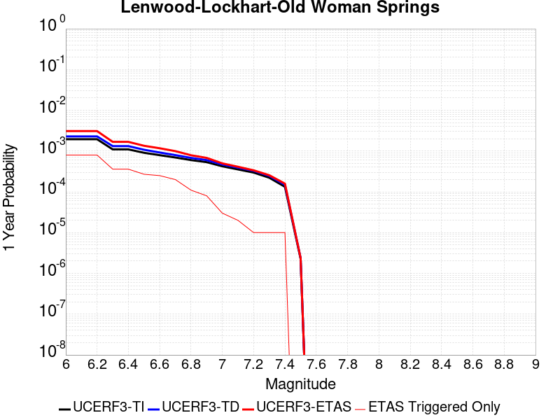 |  |

| Magnitude | 1 wk TI Prob | 1 wk TD Prob | 1 wk ETAS Prob | 1 wk ETAS/TD Gain | 1 wk ETAS Triggered Only | 1 mo TI Prob | 1 mo TD Prob | 1 mo ETAS Prob | 1 mo ETAS/TD Gain | 1 mo ETAS Triggered Only | 1 yr TI Prob | 1 yr TD Prob | 1 yr ETAS Prob | 1 yr ETAS/TD Gain | 1 yr ETAS Triggered Only | 10 yr TI Prob | 10 yr TD Prob | 10 yr ETAS Prob | 10 yr ETAS/TD Gain | 10 yr ETAS Triggered Only |
|-----|-----|-----|-----|-----|-----|-----|-----|-----|-----|-----|-----|-----|-----|-----|-----|-----|-----|-----|-----|-----|
| 6.0 | 3.744542E-5 | 4.3963868E-5 | 1.8395772E-4 | 4.1842933 | 1.4E-4 | 1.604705E-4 | 1.8840394E-4 | 4.4835496E-4 | 2.3797536 | 2.6E-4 | 0.0019519776 | 0.002291577 | 0.0030897437 | 1.3483046 | 8.0E-4 | 0.019349206 | 0.022697475 | 0.024310024 | 1.0710453 | 0.00165 |
| 6.1 | 3.744542E-5 | 4.3963868E-5 | 1.8395772E-4 | 4.1842933 | 1.4E-4 | 1.604705E-4 | 1.8840394E-4 | 4.4835496E-4 | 2.3797536 | 2.6E-4 | 0.0019519776 | 0.002291577 | 0.0030897437 | 1.3483046 | 8.0E-4 | 0.019349206 | 0.022697475 | 0.024310024 | 1.0710453 | 0.00165 |
| 6.2 | 3.744542E-5 | 4.3963868E-5 | 1.8395772E-4 | 4.1842933 | 1.4E-4 | 1.604705E-4 | 1.8840394E-4 | 4.4835496E-4 | 2.3797536 | 2.6E-4 | 0.0019519776 | 0.002291577 | 0.0030897437 | 1.3483046 | 8.0E-4 | 0.019349206 | 0.022697475 | 0.024310024 | 1.0710453 | 0.00165 |
| 6.3 | 2.1079984E-5 | 2.5354482E-5 | 1.05352454E-4 | 4.1551805 | 8.0E-5 | 9.0339665E-5 | 1.0865765E-4 | 2.2864461E-4 | 2.1042662 | 1.2E-4 | 0.0010993304 | 0.0013221242 | 0.0016816482 | 1.2719291 | 3.6E-4 | 0.010939079 | 0.013144798 | 0.013815859 | 1.0510515 | 6.8E-4 |
| 6.4 | 2.1079984E-5 | 2.5354482E-5 | 1.05352454E-4 | 4.1551805 | 8.0E-5 | 9.0339665E-5 | 1.0865765E-4 | 2.2864461E-4 | 2.1042662 | 1.2E-4 | 0.0010993304 | 0.0013221242 | 0.0016816482 | 1.2719291 | 3.6E-4 | 0.010939079 | 0.013144798 | 0.013815859 | 1.0510515 | 6.8E-4 |
| 6.5 | 1.7397282E-5 | 2.0663358E-5 | 7.0662325E-5 | 3.4196923 | 5.0E-5 | 7.455765E-5 | 8.855431E-5 | 1.7854634E-4 | 2.0162354 | 9.0E-5 | 9.073613E-4 | 0.0010776272 | 0.0013473362 | 1.2502805 | 2.7E-4 | 0.009036654 | 0.010725311 | 0.01119027 | 1.0433515 | 4.7E-4 |
| 6.6 | 1.52050325E-5 | 1.7680148E-5 | 5.767944E-5 | 3.2623847 | 4.0E-5 | 6.51628E-5 | 7.57699E-5 | 1.457646E-4 | 1.9237796 | 7.0E-5 | 7.9306826E-4 | 9.2211604E-4 | 0.0011718855 | 1.2708656 | 2.5E-4 | 0.007902439 | 0.009183761 | 0.00961972 | 1.0474707 | 4.4E-4 |
| 6.7 | 1.332523E-5 | 1.5264432E-5 | 4.5263976E-5 | 2.9653232 | 3.0E-5 | 5.7106878E-5 | 6.5417385E-5 | 1.2541347E-4 | 1.9171274 | 6.0E-5 | 6.950544E-4 | 7.961715E-4 | 9.960122E-4 | 1.2510022 | 2.0E-4 | 0.006928845 | 0.0079338215 | 0.008310807 | 1.0475162 | 3.8E-4 |
| 6.8 | 1.1525329E-5 | 1.3031408E-5 | 3.303115E-5 | 2.5347335 | 2.0E-5 | 4.9393333E-5 | 5.584772E-5 | 9.5845484E-5 | 1.7161933 | 4.0E-5 | 6.011979E-4 | 6.797381E-4 | 7.8966335E-4 | 1.161717 | 1.1E-4 | 0.00599574 | 0.0067770416 | 0.0070452117 | 1.0395705 | 2.7E-4 |
| 6.9 | 1.0253909E-5 | 1.15148705E-5 | 3.151464E-5 | 2.7368643 | 2.0E-5 | 4.3944583E-5 | 4.9348535E-5 | 8.934656E-5 | 1.8105211 | 4.0E-5 | 5.3489394E-4 | 6.006564E-4 | 6.806083E-4 | 1.1331077 | 8.0E-5 | 0.0053360825 | 0.0059907082 | 0.00618951 | 1.033185 | 2.0E-4 |
| 7.0 | 8.104563E-6 | 8.9914565E-6 | 2.8991277E-5 | 3.2243137 | 2.0E-5 | 3.4733377E-5 | 3.8534257E-5 | 6.85331E-5 | 1.778498 | 3.0E-5 | 4.2279682E-4 | 4.69056E-4 | 4.990419E-4 | 1.0639282 | 3.0E-5 | 0.0042199334 | 0.004680908 | 0.0048003457 | 1.025516 | 1.2E-4 |
| 7.1 | 6.7986157E-6 | 7.5159987E-6 | 1.7515924E-5 | 2.330485 | 1.0E-5 | 2.91366E-5 | 3.221104E-5 | 5.2210395E-5 | 1.6208851 | 2.0E-5 | 3.5468035E-4 | 3.9210095E-4 | 4.1209313E-4 | 1.0509872 | 2.0E-5 | 0.003541148 | 0.003914308 | 0.0039939946 | 1.0203578 | 8.0E-5 |
| 7.2 | 5.6893327E-6 | 6.2801455E-6 | 1.6280082E-5 | 2.5923097 | 1.0E-5 | 2.4382627E-5 | 2.6914644E-5 | 3.6914375E-5 | 1.371535 | 1.0E-5 | 2.9681803E-4 | 3.276385E-4 | 3.3763523E-4 | 1.0305115 | 1.0E-5 | 0.002964219 | 0.0032717532 | 0.003331557 | 1.0182788 | 6.0E-5 |
| 7.3 | 4.253348E-6 | 4.707082E-6 | 1.4707035E-5 | 3.1244483 | 1.0E-5 | 1.8228506E-5 | 2.0173064E-5 | 3.0172861E-5 | 1.4957005 | 1.0E-5 | 2.2190946E-4 | 2.455812E-4 | 2.5557875E-4 | 1.0407097 | 1.0E-5 | 0.00221688 | 0.0024532792 | 0.0025031564 | 1.0203309 | 5.0E-5 |
| 7.4 | 2.5448119E-6 | 2.8520615E-6 | 1.2852033E-5 | 4.5062256 | 1.0E-5 | 1.0906291E-5 | 1.2223072E-5 | 2.222295E-5 | 1.8181149 | 1.0E-5 | 1.3277601E-4 | 1.488074E-4 | 1.5880591E-4 | 1.067191 | 1.0E-5 | 0.001326967 | 0.0014872397 | 0.0015271802 | 1.0268555 | 4.0E-5 |
| 7.5 | 4.3706837E-8 | 4.5629356E-8 | 4.5629356E-8 | 1.0 | 0.0 | 1.8731501E-7 | 1.9555438E-7 | 1.9555438E-7 | 1.0 | 0.0 | 2.2805577E-6 | 2.3808725E-6 | 2.3808725E-6 | 1.0 | 0.0 | 2.2805343E-5 | 2.3808525E-5 | 2.3808525E-5 | 1.0 | 0.0 |

## San Andreas (San Bernardino N)
*[(top)](#table-of-contents)*

| 1 Week | 1 Month | 1 Year | 10 Year |
|-----|-----|-----|-----|
|  |  |  |  |

| Magnitude | 1 wk TI Prob | 1 wk TD Prob | 1 wk ETAS Prob | 1 wk ETAS/TD Gain | 1 wk ETAS Triggered Only | 1 mo TI Prob | 1 mo TD Prob | 1 mo ETAS Prob | 1 mo ETAS/TD Gain | 1 mo ETAS Triggered Only | 1 yr TI Prob | 1 yr TD Prob | 1 yr ETAS Prob | 1 yr ETAS/TD Gain | 1 yr ETAS Triggered Only | 10 yr TI Prob | 10 yr TD Prob | 10 yr ETAS Prob | 10 yr ETAS/TD Gain | 10 yr ETAS Triggered Only |
|-----|-----|-----|-----|-----|-----|-----|-----|-----|-----|-----|-----|-----|-----|-----|-----|-----|-----|-----|-----|-----|
| 6.0 | 1.4273766E-4 | 3.1614845E-4 | 4.561042E-4 | 1.4426899 | 1.4E-4 | 6.115894E-4 | 0.0013542244 | 0.0016438316 | 1.2138547 | 2.9E-4 | 0.0074207084 | 0.016364535 | 0.016984226 | 1.0378679 | 6.3E-4 | 0.07177748 | 0.15036654 | 0.15134361 | 1.006498 | 0.00115 |
| 6.1 | 1.4273766E-4 | 3.1614845E-4 | 4.561042E-4 | 1.4426899 | 1.4E-4 | 6.115894E-4 | 0.0013542244 | 0.0016438316 | 1.2138547 | 2.9E-4 | 0.0074207084 | 0.016364535 | 0.016984226 | 1.0378679 | 6.3E-4 | 0.07177748 | 0.15036654 | 0.15134361 | 1.006498 | 0.00115 |
| 6.2 | 1.4273766E-4 | 3.1614845E-4 | 4.561042E-4 | 1.4426899 | 1.4E-4 | 6.115894E-4 | 0.0013542244 | 0.0016438316 | 1.2138547 | 2.9E-4 | 0.0074207084 | 0.016364535 | 0.016984226 | 1.0378679 | 6.3E-4 | 0.07177748 | 0.15036654 | 0.15134361 | 1.006498 | 0.00115 |
| 6.3 | 1.3730655E-4 | 3.051962E-4 | 4.451535E-4 | 1.4585813 | 1.4E-4 | 5.883239E-4 | 0.0013073338 | 0.0015969547 | 1.2215356 | 2.9E-4 | 0.0071393442 | 0.015802028 | 0.016422072 | 1.0392383 | 6.3E-4 | 0.06914291 | 0.14567827 | 0.14665219 | 1.0066855 | 0.00114 |
| 6.4 | 1.3730655E-4 | 3.051962E-4 | 4.451535E-4 | 1.4585813 | 1.4E-4 | 5.883239E-4 | 0.0013073338 | 0.0015969547 | 1.2215356 | 2.9E-4 | 0.0071393442 | 0.015802028 | 0.016422072 | 1.0392383 | 6.3E-4 | 0.06914291 | 0.14567827 | 0.14665219 | 1.0066855 | 0.00114 |
| 6.5 | 1.2942807E-4 | 2.893405E-4 | 4.2929998E-4 | 1.483719 | 1.4E-4 | 5.545738E-4 | 0.0012394466 | 0.0015290871 | 1.2336854 | 2.9E-4 | 0.0067310524 | 0.014987098 | 0.015607656 | 1.0414062 | 6.3E-4 | 0.06530788 | 0.13881195 | 0.13979371 | 1.0070726 | 0.00114 |
| 6.6 | 1.1125901E-4 | 2.537283E-4 | 3.9369278E-4 | 1.5516313 | 1.4E-4 | 4.767372E-4 | 0.0010869562 | 0.0013566627 | 1.2481301 | 2.7E-4 | 0.005788839 | 0.013154025 | 0.013756001 | 1.0457636 | 6.1E-4 | 0.056403454 | 0.123056285 | 0.12402092 | 1.007839 | 0.0011 |
| 6.7 | 1.02209575E-4 | 2.3507705E-4 | 3.7504415E-4 | 1.5954094 | 1.4E-4 | 4.3796748E-4 | 0.0010070855 | 0.0012768136 | 1.2678304 | 2.7E-4 | 0.0053192247 | 0.012192756 | 0.01278544 | 1.0486095 | 6.0E-4 | 0.051936906 | 0.11485627 | 0.11581223 | 1.0083231 | 0.00108 |
| 6.8 | 9.610582E-5 | 2.2033554E-4 | 3.603047E-4 | 1.6352545 | 1.4E-4 | 4.1181705E-4 | 9.4395416E-4 | 0.0012136992 | 1.2857609 | 2.7E-4 | 0.0050023515 | 0.011432346 | 0.012025487 | 1.0518826 | 6.0E-4 | 0.048912346 | 0.10822741 | 0.10919053 | 1.008899 | 0.00108 |
| 6.9 | 9.3877505E-5 | 2.1489074E-4 | 3.5486065E-4 | 1.6513538 | 1.4E-4 | 4.0227012E-4 | 9.2063594E-4 | 0.0011903873 | 1.2930056 | 2.7E-4 | 0.0048866454 | 0.011151383 | 0.011744692 | 1.053205 | 6.0E-4 | 0.04780577 | 0.105814084 | 0.10677981 | 1.0091265 | 0.00108 |
| 7.0 | 9.1019785E-5 | 2.0815943E-4 | 3.481303E-4 | 1.6724215 | 1.4E-4 | 3.900265E-4 | 8.9180743E-4 | 0.0011615667 | 1.302486 | 2.7E-4 | 0.0047382377 | 0.010803926 | 0.011387551 | 1.0540198 | 5.9E-4 | 0.046384744 | 0.10278599 | 0.10374601 | 1.0093399 | 0.00107 |
| 7.1 | 8.771155E-5 | 1.9990467E-4 | 3.398767E-4 | 1.7001939 | 1.4E-4 | 3.758525E-4 | 8.564535E-4 | 0.0011262223 | 1.3149835 | 2.7E-4 | 0.0045664064 | 0.010377665 | 0.010961542 | 1.0562629 | 5.9E-4 | 0.044737056 | 0.099094115 | 0.10005808 | 1.0097278 | 0.00107 |
| 7.2 | 8.0830236E-5 | 1.8396029E-4 | 3.1393638E-4 | 1.7065443 | 1.3E-4 | 3.4636928E-4 | 7.8816316E-4 | 0.0010479583 | 1.329621 | 2.6E-4 | 0.0042088944 | 0.009553772 | 0.010128232 | 1.060129 | 5.8E-4 | 0.041300658 | 0.09182046 | 0.09278313 | 1.0104842 | 0.00106 |
| 7.3 | 7.7668235E-5 | 1.7339372E-4 | 3.033712E-4 | 1.7496088 | 1.3E-4 | 3.328214E-4 | 7.4290443E-4 | 0.0010027112 | 1.3497177 | 2.6E-4 | 0.0040445733 | 0.009007431 | 0.009582206 | 1.0638113 | 5.8E-4 | 0.03971748 | 0.0870959 | 0.08806358 | 1.0111105 | 0.00106 |
| 7.4 | 7.520177E-5 | 1.6559374E-4 | 2.9557222E-4 | 1.7849239 | 1.3E-4 | 3.2225347E-4 | 7.0949446E-4 | 9.6931E-4 | 1.3661981 | 2.6E-4 | 0.0039163795 | 0.008603949 | 0.009178959 | 1.0668309 | 5.8E-4 | 0.038480744 | 0.083552666 | 0.0845241 | 1.0116266 | 0.00106 |
| 7.5 | 7.274697E-5 | 1.5846924E-4 | 2.8844865E-4 | 1.8202184 | 1.3E-4 | 3.1173544E-4 | 6.789772E-4 | 9.3880063E-4 | 1.382669 | 2.6E-4 | 0.003788775 | 0.008235271 | 0.008810495 | 1.0698488 | 5.8E-4 | 0.03724827 | 0.08026917 | 0.08123489 | 1.012031 | 0.00105 |
| 7.6 | 7.1185845E-5 | 1.541672E-4 | 2.8414716E-4 | 1.8431103 | 1.3E-4 | 3.0504653E-4 | 6.605493E-4 | 9.103842E-4 | 1.3782228 | 2.5E-4 | 0.0037076178 | 0.008012585 | 0.008578018 | 1.0705681 | 5.7E-4 | 0.036463667 | 0.078258425 | 0.07921703 | 1.0122494 | 0.00104 |
| 7.7 | 6.709961E-5 | 1.4325391E-4 | 2.732353E-4 | 1.9073496 | 1.3E-4 | 2.8753807E-4 | 6.1380095E-4 | 8.636475E-4 | 1.4070482 | 2.5E-4 | 0.003495157 | 0.007447459 | 0.008013214 | 1.0759661 | 5.7E-4 | 0.034406938 | 0.07308612 | 0.07405011 | 1.0131898 | 0.00104 |
| 7.8 | 6.300812E-5 | 1.3209098E-4 | 2.6207382E-4 | 1.9840401 | 1.3E-4 | 2.7000686E-4 | 5.6598143E-4 | 8.158399E-4 | 1.4414606 | 2.5E-4 | 0.0032823787 | 0.006869081 | 0.0074351653 | 1.0824106 | 5.7E-4 | 0.032343175 | 0.0677427 | 0.06871224 | 1.0143123 | 0.00104 |
| 7.9 | 4.983037E-5 | 9.7286385E-5 | 1.8727763E-4 | 1.9250138 | 9.0E-5 | 2.1354125E-4 | 4.1687503E-4 | 6.267875E-4 | 1.5035381 | 2.1E-4 | 0.0025967648 | 0.005063652 | 0.0055312724 | 1.0923483 | 4.7E-4 | 0.025666296 | 0.050672647 | 0.051479574 | 1.0159243 | 8.5E-4 |
| 8.0 | 3.2211527E-5 | 5.3333257E-5 | 6.333272E-5 | 1.1874902 | 1.0E-5 | 1.380421E-4 | 2.2855109E-4 | 2.6854195E-4 | 1.1749755 | 4.0E-5 | 0.0016793669 | 0.0027790607 | 0.002898727 | 1.0430601 | 1.2E-4 | 0.016667323 | 0.028375156 | 0.028618064 | 1.0085605 | 2.5E-4 |
| 8.1 | 1.743376E-5 | 1.8835979E-5 | 1.8835979E-5 | 1.0 | 0.0 | 7.471398E-5 | 8.0723126E-5 | 9.072232E-5 | 1.1238703 | 1.0E-5 | 9.0926304E-4 | 9.823616E-4 | 0.0010223223 | 1.0406783 | 4.0E-5 | 0.009055517 | 0.010490086 | 0.010529666 | 1.0037731 | 4.0E-5 |
| 8.2 | 7.831616E-6 | 5.158648E-6 | 5.158648E-6 | 1.0 | 0.0 | 3.3563636E-5 | 2.2108305E-5 | 2.2108305E-5 | 1.0 | 0.0 | 4.0856065E-4 | 2.6913546E-4 | 2.6913546E-4 | 1.0 | 0.0 | 0.004078103 | 0.003043787 | 0.003043787 | 1.0 | 0.0 |
| 8.3 | 1.983087E-6 | 7.6647797E-7 | 7.6647797E-7 | 1.0 | 0.0 | 8.498917E-6 | 3.2849016E-6 | 3.2849016E-6 | 1.0 | 0.0 | 1.034694E-4 | 3.999296E-5 | 3.999296E-5 | 1.0 | 0.0 | 0.0010342124 | 4.7228087E-4 | 4.7228087E-4 | 1.0 | 0.0 |

## Paradise
*[(top)](#table-of-contents)*

| 1 Week | 1 Month | 1 Year | 10 Year |
|-----|-----|-----|-----|
| 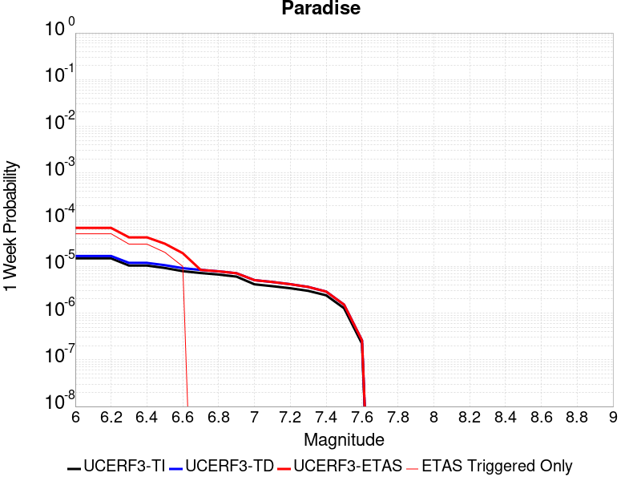 |  |  |  |

| Magnitude | 1 wk TI Prob | 1 wk TD Prob | 1 wk ETAS Prob | 1 wk ETAS/TD Gain | 1 wk ETAS Triggered Only | 1 mo TI Prob | 1 mo TD Prob | 1 mo ETAS Prob | 1 mo ETAS/TD Gain | 1 mo ETAS Triggered Only | 1 yr TI Prob | 1 yr TD Prob | 1 yr ETAS Prob | 1 yr ETAS/TD Gain | 1 yr ETAS Triggered Only | 10 yr TI Prob | 10 yr TD Prob | 10 yr ETAS Prob | 10 yr ETAS/TD Gain | 10 yr ETAS Triggered Only |
|-----|-----|-----|-----|-----|-----|-----|-----|-----|-----|-----|-----|-----|-----|-----|-----|-----|-----|-----|-----|-----|
| 6.0 | 1.4851273E-5 | 1.6694923E-5 | 6.669409E-5 | 3.9948723 | 5.0E-5 | 6.364676E-5 | 7.1547845E-5 | 2.215371E-4 | 3.0963492 | 1.5E-4 | 7.7462377E-4 | 8.707705E-4 | 0.0014103003 | 1.6196004 | 5.4E-4 | 0.0077192914 | 0.008675965 | 0.009815987 | 1.1314001 | 0.00115 |
| 6.1 | 1.4851273E-5 | 1.6694923E-5 | 6.669409E-5 | 3.9948723 | 5.0E-5 | 6.364676E-5 | 7.1547845E-5 | 2.215371E-4 | 3.0963492 | 1.5E-4 | 7.7462377E-4 | 8.707705E-4 | 0.0014103003 | 1.6196004 | 5.4E-4 | 0.0077192914 | 0.008675965 | 0.009815987 | 1.1314001 | 0.00115 |
| 6.2 | 1.4851273E-5 | 1.6694923E-5 | 6.669409E-5 | 3.9948723 | 5.0E-5 | 6.364676E-5 | 7.1547845E-5 | 2.215371E-4 | 3.0963492 | 1.5E-4 | 7.7462377E-4 | 8.707705E-4 | 0.0014103003 | 1.6196004 | 5.4E-4 | 0.0077192914 | 0.008675965 | 0.009815987 | 1.1314001 | 0.00115 |
| 6.3 | 1.0426831E-5 | 1.1888797E-5 | 4.188844E-5 | 3.5233538 | 3.0E-5 | 4.4685654E-5 | 5.095103E-5 | 1.20947465E-4 | 2.3737981 | 7.0E-5 | 5.43912E-4 | 6.2015816E-4 | 8.7000313E-4 | 1.4028729 | 2.5E-4 | 0.0054258266 | 0.0061848834 | 0.006671853 | 1.0787355 | 4.9E-4 |
| 6.4 | 1.0426831E-5 | 1.1888797E-5 | 4.188844E-5 | 3.5233538 | 3.0E-5 | 4.4685654E-5 | 5.095103E-5 | 1.20947465E-4 | 2.3737981 | 7.0E-5 | 5.43912E-4 | 6.2015816E-4 | 8.7000313E-4 | 1.4028729 | 2.5E-4 | 0.0054258266 | 0.0061848834 | 0.006671853 | 1.0787355 | 4.9E-4 |
| 6.5 | 9.25027E-6 | 1.0620124E-5 | 3.061991E-5 | 2.883197 | 2.0E-5 | 3.964341E-5 | 4.551405E-5 | 9.551177E-5 | 2.098512 | 5.0E-5 | 4.8255164E-4 | 5.539976E-4 | 7.5388676E-4 | 1.3608124 | 2.0E-4 | 0.0048150513 | 0.0055266647 | 0.0059145093 | 1.070177 | 3.9E-4 |
| 6.6 | 7.904275E-6 | 9.159673E-6 | 1.9159581E-5 | 2.091732 | 1.0E-5 | 3.3875025E-5 | 3.925517E-5 | 6.925399E-5 | 1.7642006 | 3.0E-5 | 4.1235037E-4 | 4.7783085E-4 | 6.1776396E-4 | 1.2928507 | 1.4E-4 | 0.0041158604 | 0.004768431 | 0.005057048 | 1.0605266 | 2.9E-4 |
| 6.7 | 7.2061953E-6 | 8.407388E-6 | 8.407388E-6 | 1.0 | 0.0 | 3.088333E-5 | 3.6031186E-5 | 5.6030465E-5 | 1.5550547 | 2.0E-5 | 3.7593965E-4 | 4.3859507E-4 | 5.4854684E-4 | 1.2506908 | 1.1E-4 | 0.003753043 | 0.0043776636 | 0.0045767883 | 1.0454865 | 2.0E-4 |
| 6.8 | 6.6948724E-6 | 7.842299E-6 | 7.842299E-6 | 1.0 | 0.0 | 2.8691995E-5 | 3.360944E-5 | 5.360877E-5 | 1.5950509 | 2.0E-5 | 3.4926904E-4 | 4.0912168E-4 | 5.1907665E-4 | 1.2687587 | 1.1E-4 | 0.003487206 | 0.0040840427 | 0.0042732665 | 1.0463325 | 1.9E-4 |
| 6.9 | 6.0421025E-6 | 7.130747E-6 | 7.130747E-6 | 1.0 | 0.0 | 2.5894467E-5 | 3.0560004E-5 | 5.0559393E-5 | 1.6544302 | 2.0E-5 | 3.1521954E-4 | 3.7200793E-4 | 4.6197444E-4 | 1.2418404 | 9.0E-5 | 0.0031477278 | 0.0037141903 | 0.003873596 | 1.0429181 | 1.6E-4 |
| 7.0 | 4.134091E-6 | 5.080416E-6 | 5.080416E-6 | 1.0 | 0.0 | 1.7717413E-5 | 2.1773038E-5 | 3.177282E-5 | 1.4592736 | 1.0E-5 | 2.1568815E-4 | 2.6505603E-4 | 2.9504808E-4 | 1.1131536 | 3.0E-5 | 0.0021547892 | 0.0026475522 | 0.0027472873 | 1.0376707 | 1.0E-4 |
| 7.1 | 3.7674888E-6 | 4.6319656E-6 | 4.6319656E-6 | 1.0 | 0.0 | 1.6146281E-5 | 1.9851139E-5 | 1.9851139E-5 | 1.0 | 0.0 | 1.9656324E-4 | 2.4166232E-4 | 2.616575E-4 | 1.0827401 | 2.0E-5 | 0.0019638946 | 0.002414146 | 0.002483977 | 1.0289258 | 7.0E-5 |
| 7.2 | 3.4065345E-6 | 4.156807E-6 | 4.156807E-6 | 1.0 | 0.0 | 1.4599351E-5 | 1.7814775E-5 | 1.7814775E-5 | 1.0 | 0.0 | 1.777326E-4 | 2.1687479E-4 | 2.3687044E-4 | 1.0921991 | 2.0E-5 | 0.0017759053 | 0.0021667795 | 0.0022166714 | 1.0230258 | 5.0E-5 |
| 7.3 | 2.9934936E-6 | 3.6293877E-6 | 3.6293877E-6 | 1.0 | 0.0 | 1.2829195E-5 | 1.5554435E-5 | 1.5554435E-5 | 1.0 | 0.0 | 1.5618425E-4 | 1.8936026E-4 | 1.9935836E-4 | 1.0527993 | 1.0E-5 | 0.0015607453 | 0.0018921344 | 0.0019320587 | 1.0211002 | 4.0E-5 |
| 7.4 | 2.4049796E-6 | 2.8890327E-6 | 2.8890327E-6 | 1.0 | 0.0 | 1.0307015E-5 | 1.2381518E-5 | 1.2381518E-5 | 1.0 | 0.0 | 1.2548068E-4 | 1.5073598E-4 | 1.6073449E-4 | 1.0663311 | 1.0E-5 | 0.0012540985 | 0.001506479 | 0.0015464186 | 1.026512 | 4.0E-5 |
| 7.5 | 1.2710091E-6 | 1.513489E-6 | 1.513489E-6 | 1.0 | 0.0 | 5.44717E-6 | 6.486372E-6 | 6.486372E-6 | 1.0 | 0.0 | 6.631728E-5 | 7.896997E-5 | 8.896918E-5 | 1.1266204 | 1.0E-5 | 6.6297496E-4 | 7.895417E-4 | 8.19518E-4 | 1.0379667 | 3.0E-5 |
| 7.6 | 2.21172E-7 | 2.6040198E-7 | 2.6040198E-7 | 1.0 | 0.0 | 9.478797E-7 | 1.1160082E-6 | 1.1160082E-6 | 1.0 | 0.0 | 1.1540374E-5 | 1.3587343E-5 | 1.3587343E-5 | 1.0 | 0.0 | 1.1539775E-4 | 1.3586794E-4 | 1.3586794E-4 | 1.0 | 0.0 |

## Bicycle Lake
*[(top)](#table-of-contents)*

| 1 Week | 1 Month | 1 Year | 10 Year |
|-----|-----|-----|-----|
| 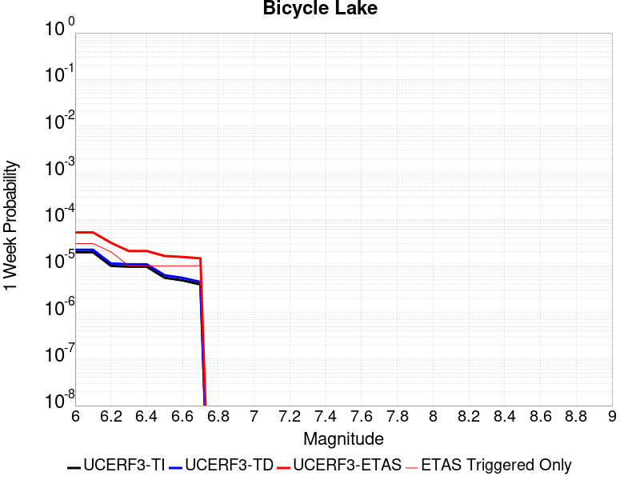 |  |  |  |

| Magnitude | 1 wk TI Prob | 1 wk TD Prob | 1 wk ETAS Prob | 1 wk ETAS/TD Gain | 1 wk ETAS Triggered Only | 1 mo TI Prob | 1 mo TD Prob | 1 mo ETAS Prob | 1 mo ETAS/TD Gain | 1 mo ETAS Triggered Only | 1 yr TI Prob | 1 yr TD Prob | 1 yr ETAS Prob | 1 yr ETAS/TD Gain | 1 yr ETAS Triggered Only | 10 yr TI Prob | 10 yr TD Prob | 10 yr ETAS Prob | 10 yr ETAS/TD Gain | 10 yr ETAS Triggered Only |
|-----|-----|-----|-----|-----|-----|-----|-----|-----|-----|-----|-----|-----|-----|-----|-----|-----|-----|-----|-----|-----|
| 6.0 | 1.9621975E-5 | 2.2097447E-5 | 5.2096784E-5 | 2.3575928 | 3.0E-5 | 8.4091465E-5 | 9.470067E-5 | 1.946912E-4 | 2.0558586 | 1.0E-4 | 0.0010233327 | 0.0011525059 | 0.001681895 | 1.4593375 | 5.3E-4 | 0.01018633 | 0.011478599 | 0.012457236 | 1.0852574 | 9.9E-4 |
| 6.1 | 1.9621975E-5 | 2.2097447E-5 | 5.2096784E-5 | 2.3575928 | 3.0E-5 | 8.4091465E-5 | 9.470067E-5 | 1.946912E-4 | 2.0558586 | 1.0E-4 | 0.0010233327 | 0.0011525059 | 0.001681895 | 1.4593375 | 5.3E-4 | 0.01018633 | 0.011478599 | 0.012457236 | 1.0852574 | 9.9E-4 |
| 6.2 | 9.9971285E-6 | 1.1255827E-5 | 3.1255604E-5 | 2.7768373 | 2.0E-5 | 4.2844134E-5 | 4.8238664E-5 | 9.823625E-5 | 2.036463 | 5.0E-5 | 5.2150246E-4 | 5.8719947E-4 | 8.970174E-4 | 1.5276196 | 3.1E-4 | 0.0052028033 | 0.0058615846 | 0.006497833 | 1.1085455 | 6.4E-4 |
| 6.3 | 9.589428E-6 | 1.0798527E-5 | 2.079842E-5 | 1.9260422 | 1.0E-5 | 4.10969E-5 | 4.627887E-5 | 8.627702E-5 | 1.8642853 | 4.0E-5 | 5.002399E-4 | 5.633515E-4 | 8.531881E-4 | 1.5144863 | 2.9E-4 | 0.0049911533 | 0.0056243236 | 0.0062308926 | 1.1078475 | 6.1E-4 |
| 6.4 | 9.589428E-6 | 1.0798527E-5 | 2.079842E-5 | 1.9260422 | 1.0E-5 | 4.10969E-5 | 4.627887E-5 | 8.627702E-5 | 1.8642853 | 4.0E-5 | 5.002399E-4 | 5.633515E-4 | 8.531881E-4 | 1.5144863 | 2.9E-4 | 0.0049911533 | 0.0056243236 | 0.0062308926 | 1.1078475 | 6.1E-4 |
| 6.5 | 5.557707E-6 | 6.2857107E-6 | 1.6285649E-5 | 2.5909 | 1.0E-5 | 2.3818526E-5 | 2.6938633E-5 | 5.6937824E-5 | 2.1136122 | 3.0E-5 | 2.8995197E-4 | 3.2795538E-4 | 5.0789636E-4 | 1.5486752 | 1.8E-4 | 0.0028957394 | 0.0032773504 | 0.0036860066 | 1.124691 | 4.1E-4 |
| 6.6 | 4.8742945E-6 | 5.5133855E-6 | 1.5513331E-5 | 2.8137577 | 1.0E-5 | 2.0889667E-5 | 2.3628729E-5 | 5.362802E-5 | 2.269611 | 3.0E-5 | 2.54302E-4 | 2.87668E-4 | 4.4762198E-4 | 1.5560367 | 1.6E-4 | 0.002540112 | 0.0028755253 | 0.0032444613 | 1.1283021 | 3.7E-4 |
| 6.7 | 3.991108E-6 | 4.515989E-6 | 1.4515944E-5 | 3.2143443 | 1.0E-5 | 1.7104636E-5 | 1.9354238E-5 | 3.935385E-5 | 2.0333455 | 2.0E-5 | 2.0822904E-4 | 2.3563785E-4 | 3.5560958E-4 | 1.5091361 | 1.2E-4 | 0.0020803404 | 0.0023563786 | 0.0026357188 | 1.1185464 | 2.8E-4 |

## Garlic Springs
*[(top)](#table-of-contents)*

| 1 Week | 1 Month | 1 Year | 10 Year |
|-----|-----|-----|-----|
|  |  |  |  |

| Magnitude | 1 wk TI Prob | 1 wk TD Prob | 1 wk ETAS Prob | 1 wk ETAS/TD Gain | 1 wk ETAS Triggered Only | 1 mo TI Prob | 1 mo TD Prob | 1 mo ETAS Prob | 1 mo ETAS/TD Gain | 1 mo ETAS Triggered Only | 1 yr TI Prob | 1 yr TD Prob | 1 yr ETAS Prob | 1 yr ETAS/TD Gain | 1 yr ETAS Triggered Only | 10 yr TI Prob | 10 yr TD Prob | 10 yr ETAS Prob | 10 yr ETAS/TD Gain | 10 yr ETAS Triggered Only |
|-----|-----|-----|-----|-----|-----|-----|-----|-----|-----|-----|-----|-----|-----|-----|-----|-----|-----|-----|-----|-----|
| 6.0 | 1.6760017E-5 | 1.8777133E-5 | 1.8777133E-5 | 1.0 | 0.0 | 7.182667E-5 | 8.0471604E-5 | 1.3046758E-4 | 1.6212872 | 5.0E-5 | 8.7413884E-4 | 9.794187E-4 | 0.0013590467 | 1.3876052 | 3.8E-4 | 0.008707083 | 0.009762568 | 0.0105250515 | 1.0781027 | 7.7E-4 |
| 6.1 | 9.852767E-6 | 1.0973753E-5 | 1.0973753E-5 | 1.0 | 0.0 | 4.222546E-5 | 4.702992E-5 | 8.702804E-5 | 1.8504823 | 4.0E-5 | 5.139737E-4 | 5.7250983E-4 | 7.9238386E-4 | 1.3840529 | 2.2E-4 | 0.005127866 | 0.0057173073 | 0.0061746775 | 1.0799974 | 4.6E-4 |
| 6.2 | 9.852767E-6 | 1.0973753E-5 | 1.0973753E-5 | 1.0 | 0.0 | 4.222546E-5 | 4.702992E-5 | 8.702804E-5 | 1.8504823 | 4.0E-5 | 5.139737E-4 | 5.7250983E-4 | 7.9238386E-4 | 1.3840529 | 2.2E-4 | 0.005127866 | 0.0057173073 | 0.0061746775 | 1.0799974 | 4.6E-4 |
| 6.3 | 4.3167724E-6 | 4.7780964E-6 | 4.7780964E-6 | 1.0 | 0.0 | 1.8500323E-5 | 2.0477524E-5 | 3.047732E-5 | 1.4883302 | 1.0E-5 | 2.2521814E-4 | 2.4930836E-4 | 3.2928842E-4 | 1.3208077 | 8.0E-5 | 0.0022499003 | 0.0024925452 | 0.0027419222 | 1.1000491 | 2.5E-4 |
| 6.4 | 4.3167724E-6 | 4.7780964E-6 | 4.7780964E-6 | 1.0 | 0.0 | 1.8500323E-5 | 2.0477524E-5 | 3.047732E-5 | 1.4883302 | 1.0E-5 | 2.2521814E-4 | 2.4930836E-4 | 3.2928842E-4 | 1.3208077 | 8.0E-5 | 0.0022499003 | 0.0024925452 | 0.0027419222 | 1.1000491 | 2.5E-4 |
| 6.5 | 4.3167724E-6 | 4.7780964E-6 | 4.7780964E-6 | 1.0 | 0.0 | 1.8500323E-5 | 2.0477524E-5 | 3.047732E-5 | 1.4883302 | 1.0E-5 | 2.2521814E-4 | 2.4930836E-4 | 3.2928842E-4 | 1.3208077 | 8.0E-5 | 0.0022499003 | 0.0024925452 | 0.0027419222 | 1.1000491 | 2.5E-4 |
| 6.6 | 4.301311E-6 | 4.7609647E-6 | 4.7609647E-6 | 1.0 | 0.0 | 1.8434059E-5 | 2.0404104E-5 | 3.04039E-5 | 1.4900875 | 1.0E-5 | 2.2441156E-4 | 2.4841467E-4 | 3.2839482E-4 | 1.3219621 | 8.0E-5 | 0.0022418506 | 0.0024836282 | 0.0027330073 | 1.1004092 | 2.5E-4 |
| 6.7 | 3.8599724E-6 | 4.2711204E-6 | 4.2711204E-6 | 1.0 | 0.0 | 1.6542634E-5 | 1.8304801E-5 | 2.8304617E-5 | 1.5462948 | 1.0E-5 | 2.0138794E-4 | 2.2286095E-4 | 2.9284536E-4 | 1.3140272 | 7.0E-5 | 0.0020120554 | 0.0022286095 | 0.0024680747 | 1.1074505 | 2.4E-4 |

## San Andreas (San Bernardino S)
*[(top)](#table-of-contents)*

| 1 Week | 1 Month | 1 Year | 10 Year |
|-----|-----|-----|-----|
|  |  |  |  |

| Magnitude | 1 wk TI Prob | 1 wk TD Prob | 1 wk ETAS Prob | 1 wk ETAS/TD Gain | 1 wk ETAS Triggered Only | 1 mo TI Prob | 1 mo TD Prob | 1 mo ETAS Prob | 1 mo ETAS/TD Gain | 1 mo ETAS Triggered Only | 1 yr TI Prob | 1 yr TD Prob | 1 yr ETAS Prob | 1 yr ETAS/TD Gain | 1 yr ETAS Triggered Only | 10 yr TI Prob | 10 yr TD Prob | 10 yr ETAS Prob | 10 yr ETAS/TD Gain | 10 yr ETAS Triggered Only |
|-----|-----|-----|-----|-----|-----|-----|-----|-----|-----|-----|-----|-----|-----|-----|-----|-----|-----|-----|-----|-----|
| 6.0 | 1.2336002E-4 | 3.000988E-4 | 3.500838E-4 | 1.1665618 | 5.0E-5 | 5.2857865E-4 | 0.0012855299 | 0.0014253499 | 1.1087645 | 1.4E-4 | 0.006416472 | 0.015543964 | 0.01585899 | 1.0202668 | 3.2E-4 | 0.06234337 | 0.14291926 | 0.14348494 | 1.003958 | 6.6E-4 |
| 6.1 | 1.2336002E-4 | 3.000988E-4 | 3.500838E-4 | 1.1665618 | 5.0E-5 | 5.2857865E-4 | 0.0012855299 | 0.0014253499 | 1.1087645 | 1.4E-4 | 0.006416472 | 0.015543964 | 0.01585899 | 1.0202668 | 3.2E-4 | 0.06234337 | 0.14291926 | 0.14348494 | 1.003958 | 6.6E-4 |
| 6.2 | 1.2336002E-4 | 3.000988E-4 | 3.500838E-4 | 1.1665618 | 5.0E-5 | 5.2857865E-4 | 0.0012855299 | 0.0014253499 | 1.1087645 | 1.4E-4 | 0.006416472 | 0.015543964 | 0.01585899 | 1.0202668 | 3.2E-4 | 0.06234337 | 0.14291926 | 0.14348494 | 1.003958 | 6.6E-4 |
| 6.3 | 1.1712257E-4 | 2.879813E-4 | 3.379669E-4 | 1.1735724 | 5.0E-5 | 5.018573E-4 | 0.0012336475 | 0.0013634871 | 1.1052486 | 1.3E-4 | 0.006093008 | 0.0149210645 | 0.015226439 | 1.020466 | 3.1E-4 | 0.059286322 | 0.13763407 | 0.1381946 | 1.0040727 | 6.5E-4 |
| 6.4 | 1.1712257E-4 | 2.879813E-4 | 3.379669E-4 | 1.1735724 | 5.0E-5 | 5.018573E-4 | 0.0012336475 | 0.0013634871 | 1.1052486 | 1.3E-4 | 0.006093008 | 0.0149210645 | 0.015226439 | 1.020466 | 3.1E-4 | 0.059286322 | 0.13763407 | 0.1381946 | 1.0040727 | 6.5E-4 |
| 6.5 | 1.0689076E-4 | 2.6810818E-4 | 3.1809477E-4 | 1.1864419 | 5.0E-5 | 4.5802278E-4 | 0.0011485539 | 0.0012784045 | 1.1130558 | 1.3E-4 | 0.0055621783 | 0.013898602 | 0.014204293 | 1.0219944 | 3.1E-4 | 0.05425003 | 0.12891594 | 0.12946472 | 1.004257 | 6.3E-4 |
| 6.6 | 9.7648895E-5 | 2.5055694E-4 | 3.005444E-4 | 1.1995054 | 5.0E-5 | 4.1842813E-4 | 0.0010733972 | 0.0012032576 | 1.1209809 | 1.3E-4 | 0.005082469 | 0.012994667 | 0.013300639 | 1.023546 | 3.1E-4 | 0.049677886 | 0.12101118 | 0.12156495 | 1.0045761 | 6.3E-4 |
| 6.7 | 8.757013E-5 | 2.3126253E-4 | 2.8125098E-4 | 1.2161545 | 5.0E-5 | 3.7524657E-4 | 9.90771E-4 | 0.0010906719 | 1.1008315 | 1.0E-4 | 0.00455906 | 0.012000005 | 0.012276644 | 1.0230533 | 2.8E-4 | 0.04466656 | 0.11236583 | 0.11289841 | 1.0047396 | 6.0E-4 |
| 6.8 | 8.562978E-5 | 2.268613E-4 | 2.7684995E-4 | 1.220349 | 5.0E-5 | 3.6693315E-4 | 9.719227E-4 | 0.0010718255 | 1.1027888 | 1.0E-4 | 0.004458263 | 0.011773022 | 0.012049726 | 1.0235032 | 2.8E-4 | 0.043698758 | 0.11037151 | 0.11090529 | 1.0048362 | 6.0E-4 |
| 6.9 | 6.124075E-5 | 1.7070957E-4 | 2.2070104E-4 | 1.2928451 | 5.0E-5 | 2.6243398E-4 | 7.3140813E-4 | 8.31335E-4 | 1.1366225 | 1.0E-4 | 0.0031904527 | 0.008868743 | 0.009116526 | 1.0279388 | 2.5E-4 | 0.031450346 | 0.08419216 | 0.08467754 | 1.0057651 | 5.3E-4 |
| 7.0 | 5.8598747E-5 | 1.6499894E-4 | 2.149907E-4 | 1.3029822 | 5.0E-5 | 2.5111332E-4 | 7.069475E-4 | 8.068768E-4 | 1.1413532 | 1.0E-4 | 0.0030530186 | 0.008573314 | 0.008821171 | 1.0289103 | 2.5E-4 | 0.03011414 | 0.08151563 | 0.08200243 | 1.0059718 | 5.3E-4 |
| 7.1 | 5.613814E-5 | 1.5918406E-4 | 2.091761E-4 | 1.3140519 | 5.0E-5 | 2.4056983E-4 | 6.8203977E-4 | 7.8197155E-4 | 1.1465191 | 1.0E-4 | 0.0029250039 | 0.008272399 | 0.008520331 | 1.029971 | 2.5E-4 | 0.028868021 | 0.07881265 | 0.07930088 | 1.0061948 | 5.3E-4 |
| 7.2 | 4.991222E-5 | 1.452485E-4 | 1.9524124E-4 | 1.3441876 | 5.0E-5 | 2.1389198E-4 | 6.223455E-4 | 7.222832E-4 | 1.1605824 | 1.0E-4 | 0.002601025 | 0.007550835 | 0.0077989474 | 1.032859 | 2.5E-4 | 0.025707912 | 0.07226236 | 0.07274479 | 1.006676 | 5.2E-4 |
| 7.3 | 4.7410045E-5 | 1.3718859E-4 | 1.8718174E-4 | 1.3644118 | 5.0E-5 | 2.0317009E-4 | 5.8781897E-4 | 6.877602E-4 | 1.1700205 | 1.0E-4 | 0.0024707897 | 0.007133297 | 0.0073815137 | 1.034797 | 2.5E-4 | 0.024434982 | 0.068555124 | 0.06903947 | 1.0070652 | 5.2E-4 |
| 7.4 | 4.5556746E-5 | 1.312667E-4 | 1.8126014E-4 | 1.3808539 | 5.0E-5 | 1.952286E-4 | 5.624506E-4 | 6.6239433E-4 | 1.1776934 | 1.0E-4 | 0.002374317 | 0.006826414 | 0.007074707 | 1.0363724 | 2.5E-4 | 0.023491086 | 0.0658083 | 0.06629408 | 1.0073818 | 5.2E-4 |
| 7.5 | 4.3084514E-5 | 1.2361899E-4 | 1.6361404E-4 | 1.323535 | 4.0E-5 | 1.8463485E-4 | 5.296884E-4 | 6.196407E-4 | 1.1698213 | 9.0E-5 | 0.0022456115 | 0.006429958 | 0.006668415 | 1.0370853 | 2.4E-4 | 0.022230545 | 0.062208522 | 0.06267742 | 1.0075375 | 5.0E-4 |
| 7.6 | 3.408608E-5 | 9.8397344E-5 | 1.3839341E-4 | 1.4064751 | 4.0E-5 | 1.4607502E-4 | 4.2163485E-4 | 5.0160114E-4 | 1.1896577 | 8.0E-5 | 0.0017770125 | 0.0051213475 | 0.0053501693 | 1.04468 | 2.3E-4 | 0.017628696 | 0.050038666 | 0.050504144 | 1.0093024 | 4.9E-4 |
| 7.7 | 2.8315713E-5 | 8.252603E-5 | 1.2252273E-4 | 1.4846555 | 4.0E-5 | 1.2134742E-4 | 3.5363509E-4 | 4.336068E-4 | 1.2261419 | 8.0E-5 | 0.0014764034 | 0.004297016 | 0.004526028 | 1.0532955 | 2.3E-4 | 0.01466633 | 0.042289194 | 0.042748895 | 1.0108705 | 4.8E-4 |
| 7.8 | 2.6222975E-5 | 7.466726E-5 | 1.14664275E-4 | 1.53567 | 4.0E-5 | 1.1237934E-4 | 3.1996332E-4 | 3.9993774E-4 | 1.2499486 | 8.0E-5 | 0.0013673597 | 0.0038886012 | 0.004117707 | 1.0589173 | 2.3E-4 | 0.013589768 | 0.03845329 | 0.03891483 | 1.0120027 | 4.8E-4 |
| 7.9 | 2.1469694E-5 | 5.7908495E-5 | 9.790618E-5 | 1.690705 | 4.0E-5 | 9.200973E-5 | 2.4815567E-4 | 3.2813582E-4 | 1.3222983 | 8.0E-5 | 0.0011196428 | 0.0030171126 | 0.0032264788 | 1.0693929 | 2.1E-4 | 0.011140184 | 0.030165782 | 0.030563414 | 1.0131816 | 4.1E-4 |
| 8.0 | 1.2420249E-5 | 3.1335217E-5 | 3.1335217E-5 | 1.0 | 0.0 | 5.322855E-5 | 1.3428688E-4 | 1.4428554E-4 | 1.0744574 | 1.0E-5 | 6.478649E-4 | 0.0016337177 | 0.0016936196 | 1.036666 | 6.0E-5 | 0.0064597935 | 0.01652998 | 0.0166775 | 1.0089244 | 1.5E-4 |
| 8.1 | 4.9197724E-6 | 7.827452E-6 | 7.827452E-6 | 1.0 | 0.0 | 2.1084568E-5 | 3.354579E-5 | 3.354579E-5 | 1.0 | 0.0 | 2.566744E-4 | 4.0834362E-4 | 4.1833954E-4 | 1.0244792 | 1.0E-5 | 0.002563781 | 0.004386937 | 0.0043968926 | 1.0022695 | 1.0E-5 |
| 8.2 | 2.5634774E-6 | 2.9088305E-6 | 2.9088305E-6 | 1.0 | 0.0 | 1.0986286E-5 | 1.24663575E-5 | 1.24663575E-5 | 1.0 | 0.0 | 1.3374983E-4 | 1.5176737E-4 | 1.5176737E-4 | 1.0 | 0.0 | 0.0013366934 | 0.0017061312 | 0.0017061312 | 1.0 | 0.0 |
| 8.3 | 5.2850464E-7 | 3.2110069E-7 | 3.2110069E-7 | 1.0 | 0.0 | 2.2650179E-6 | 1.3761452E-6 | 1.3761452E-6 | 1.0 | 0.0 | 2.7576245E-5 | 1.6754451E-5 | 1.6754451E-5 | 1.0 | 0.0 | 2.7572823E-4 | 1.9885681E-4 | 1.9885681E-4 | 1.0 | 0.0 |

## Death Valley (Black Mtns Frontal)
*[(top)](#table-of-contents)*

| 1 Week | 1 Month | 1 Year | 10 Year |
|-----|-----|-----|-----|
|  |  |  |  |

| Magnitude | 1 wk TI Prob | 1 wk TD Prob | 1 wk ETAS Prob | 1 wk ETAS/TD Gain | 1 wk ETAS Triggered Only | 1 mo TI Prob | 1 mo TD Prob | 1 mo ETAS Prob | 1 mo ETAS/TD Gain | 1 mo ETAS Triggered Only | 1 yr TI Prob | 1 yr TD Prob | 1 yr ETAS Prob | 1 yr ETAS/TD Gain | 1 yr ETAS Triggered Only | 10 yr TI Prob | 10 yr TD Prob | 10 yr ETAS Prob | 10 yr ETAS/TD Gain | 10 yr ETAS Triggered Only |
|-----|-----|-----|-----|-----|-----|-----|-----|-----|-----|-----|-----|-----|-----|-----|-----|-----|-----|-----|-----|-----|
| 6.0 | 1.6707214E-5 | 1.867056E-5 | 6.866963E-5 | 3.6779628 | 5.0E-5 | 7.160038E-5 | 8.001427E-5 | 1.6000787E-4 | 1.9997416 | 8.0E-5 | 8.71386E-4 | 9.7374606E-4 | 0.0012235026 | 1.2564905 | 2.5E-4 | 0.00867977 | 0.009695647 | 0.010270024 | 1.0592407 | 5.8E-4 |
| 6.1 | 1.6707214E-5 | 1.867056E-5 | 6.866963E-5 | 3.6779628 | 5.0E-5 | 7.160038E-5 | 8.001427E-5 | 1.6000787E-4 | 1.9997416 | 8.0E-5 | 8.71386E-4 | 9.7374606E-4 | 0.0012235026 | 1.2564905 | 2.5E-4 | 0.00867977 | 0.009695647 | 0.010270024 | 1.0592407 | 5.8E-4 |
| 6.2 | 1.6707214E-5 | 1.867056E-5 | 6.866963E-5 | 3.6779628 | 5.0E-5 | 7.160038E-5 | 8.001427E-5 | 1.6000787E-4 | 1.9997416 | 8.0E-5 | 8.71386E-4 | 9.7374606E-4 | 0.0012235026 | 1.2564905 | 2.5E-4 | 0.00867977 | 0.009695647 | 0.010270024 | 1.0592407 | 5.8E-4 |
| 6.3 | 1.6707214E-5 | 1.867056E-5 | 6.866963E-5 | 3.6779628 | 5.0E-5 | 7.160038E-5 | 8.001427E-5 | 1.6000787E-4 | 1.9997416 | 8.0E-5 | 8.71386E-4 | 9.7374606E-4 | 0.0012235026 | 1.2564905 | 2.5E-4 | 0.00867977 | 0.009695647 | 0.010270024 | 1.0592407 | 5.8E-4 |
| 6.4 | 1.5515609E-5 | 1.7338483E-5 | 5.733779E-5 | 3.3069668 | 4.0E-5 | 6.649377E-5 | 7.430571E-5 | 1.3430126E-4 | 1.807415 | 6.0E-5 | 8.0926094E-4 | 9.0430264E-4 | 0.0011041218 | 1.2209649 | 2.0E-4 | 0.008063202 | 0.009006913 | 0.009472679 | 1.0517122 | 4.7E-4 |
| 6.5 | 1.5515609E-5 | 1.7338483E-5 | 5.733779E-5 | 3.3069668 | 4.0E-5 | 6.649377E-5 | 7.430571E-5 | 1.3430126E-4 | 1.807415 | 6.0E-5 | 8.0926094E-4 | 9.0430264E-4 | 0.0011041218 | 1.2209649 | 2.0E-4 | 0.008063202 | 0.009006913 | 0.009472679 | 1.0517122 | 4.7E-4 |
| 6.6 | 1.5041828E-5 | 1.6809407E-5 | 5.6808734E-5 | 3.3795798 | 4.0E-5 | 6.4463384E-5 | 7.203836E-5 | 1.2203476E-4 | 1.6940247 | 5.0E-5 | 7.8455906E-4 | 8.7672E-4 | 0.0010565622 | 1.2051307 | 1.8E-4 | 0.00781795 | 0.008733268 | 0.009159513 | 1.048807 | 4.3E-4 |
| 6.7 | 1.4634985E-5 | 1.6356273E-5 | 5.6355617E-5 | 3.4455051 | 4.0E-5 | 6.271985E-5 | 7.009646E-5 | 1.20092955E-4 | 1.7132528 | 5.0E-5 | 7.6334673E-4 | 8.53096E-4 | 0.0010329424 | 1.2108161 | 1.8E-4 | 0.007607299 | 0.008498848 | 0.008905363 | 1.0478318 | 4.1E-4 |
| 6.8 | 1.4209158E-5 | 1.5882297E-5 | 5.588166E-5 | 3.5184875 | 4.0E-5 | 6.089497E-5 | 6.806524E-5 | 1.08062515E-4 | 1.5876315 | 4.0E-5 | 7.4114406E-4 | 8.2838483E-4 | 9.882523E-4 | 1.192987 | 1.6E-4 | 0.007386771 | 0.008253585 | 0.008630449 | 1.0456606 | 3.8E-4 |
| 6.9 | 1.3780098E-5 | 1.5404834E-5 | 5.540422E-5 | 3.5965474 | 4.0E-5 | 5.9056227E-5 | 6.601908E-5 | 1.06016436E-4 | 1.6058455 | 4.0E-5 | 7.1877235E-4 | 8.0349133E-4 | 9.633628E-4 | 1.1989709 | 1.6E-4 | 0.0071645193 | 0.008006458 | 0.008343736 | 1.0421257 | 3.4E-4 |
| 7.0 | 1.3585064E-5 | 1.5188394E-5 | 4.518794E-5 | 2.9751625 | 3.0E-5 | 5.8220405E-5 | 6.5091524E-5 | 9.508957E-5 | 1.4608595 | 3.0E-5 | 7.086029E-4 | 7.922066E-4 | 9.420878E-4 | 1.1891946 | 1.5E-4 | 0.007063476 | 0.007894417 | 0.008211891 | 1.040215 | 3.2E-4 |
| 7.1 | 1.3398601E-5 | 1.4981575E-5 | 4.4981127E-5 | 3.0024297 | 3.0E-5 | 5.742131E-5 | 6.4205204E-5 | 9.420327E-5 | 1.4672219 | 3.0E-5 | 6.9888023E-4 | 7.814234E-4 | 9.313062E-4 | 1.1918074 | 1.5E-4 | 0.0069668638 | 0.007787346 | 0.008104854 | 1.0407723 | 3.2E-4 |
| 7.2 | 1.3126312E-5 | 1.4679792E-5 | 4.4679353E-5 | 3.0435958 | 3.0E-5 | 5.6254412E-5 | 6.291191E-5 | 9.291002E-5 | 1.4768273 | 3.0E-5 | 6.846822E-4 | 7.656887E-4 | 8.955892E-4 | 1.1696517 | 1.3E-4 | 0.006825765 | 0.00763109 | 0.007899029 | 1.0351115 | 2.7E-4 |
| 7.3 | 1.2922429E-5 | 1.4454016E-5 | 4.4453584E-5 | 3.0755177 | 3.0E-5 | 5.5380664E-5 | 6.1944345E-5 | 9.1942486E-5 | 1.4842757 | 3.0E-5 | 6.74051E-4 | 7.5391686E-4 | 8.538414E-4 | 1.1325406 | 1.0E-4 | 0.006720101 | 0.0075141727 | 0.0077424445 | 1.0303788 | 2.3E-4 |
| 7.4 | 1.2768878E-5 | 1.4283997E-5 | 4.428357E-5 | 3.1002226 | 3.0E-5 | 5.4722615E-5 | 6.1215724E-5 | 9.1213886E-5 | 1.4900402 | 3.0E-5 | 6.660441E-4 | 7.45052E-4 | 8.449775E-4 | 1.1341188 | 1.0E-4 | 0.0066405144 | 0.0074261203 | 0.007654412 | 1.0307418 | 2.3E-4 |
| 7.5 | 1.2521929E-5 | 1.40122365E-5 | 4.4011816E-5 | 3.1409557 | 3.0E-5 | 5.366431E-5 | 6.0051094E-5 | 9.004929E-5 | 1.4995446 | 3.0E-5 | 6.531671E-4 | 7.308822E-4 | 8.308091E-4 | 1.1367209 | 1.0E-4 | 0.006512506 | 0.0072853607 | 0.007513685 | 1.0313401 | 2.3E-4 |
| 7.6 | 1.1301089E-5 | 1.2648349E-5 | 3.2648095E-5 | 2.581214 | 2.0E-5 | 4.8432343E-5 | 5.4206117E-5 | 7.420503E-5 | 1.368942 | 2.0E-5 | 5.895042E-4 | 6.597649E-4 | 7.4970553E-4 | 1.1363223 | 9.0E-5 | 0.0058794282 | 0.0065786145 | 0.0067772986 | 1.0302016 | 2.0E-4 |
| 7.7 | 9.189108E-6 | 1.0283521E-5 | 2.0283418E-5 | 1.9724195 | 1.0E-5 | 3.93813E-5 | 4.407152E-5 | 5.4071075E-5 | 1.2268939 | 1.0E-5 | 4.7936183E-4 | 5.3644367E-4 | 6.0640613E-4 | 1.130419 | 7.0E-5 | 0.004783291 | 0.0053519984 | 0.005501196 | 1.027877 | 1.5E-4 |
| 7.8 | 3.4586725E-7 | 3.648288E-7 | 3.648288E-7 | 1.0 | 0.0 | 1.4822873E-6 | 1.5635511E-6 | 1.5635511E-6 | 1.0 | 0.0 | 1.80467E-5 | 1.9036073E-5 | 1.9036073E-5 | 1.0 | 0.0 | 1.8045233E-4 | 1.9034486E-4 | 1.9034486E-4 | 1.0 | 0.0 |
| 7.9 | 2.5591178E-9 | 2.6696871E-9 | 2.6696871E-9 | 1.0 | 0.0 | 1.0967647E-8 | 1.1441516E-8 | 1.1441516E-8 | 1.0 | 0.0 | 1.335311E-7 | 1.3930045E-7 | 1.3930045E-7 | 1.0 | 0.0 | 1.3353102E-6 | 1.3930046E-6 | 1.3930046E-6 | 1.0 | 0.0 |

## Coyote Lake
*[(top)](#table-of-contents)*

| 1 Week | 1 Month | 1 Year | 10 Year |
|-----|-----|-----|-----|
|  |  |  |  |

| Magnitude | 1 wk TI Prob | 1 wk TD Prob | 1 wk ETAS Prob | 1 wk ETAS/TD Gain | 1 wk ETAS Triggered Only | 1 mo TI Prob | 1 mo TD Prob | 1 mo ETAS Prob | 1 mo ETAS/TD Gain | 1 mo ETAS Triggered Only | 1 yr TI Prob | 1 yr TD Prob | 1 yr ETAS Prob | 1 yr ETAS/TD Gain | 1 yr ETAS Triggered Only | 10 yr TI Prob | 10 yr TD Prob | 10 yr ETAS Prob | 10 yr ETAS/TD Gain | 10 yr ETAS Triggered Only |
|-----|-----|-----|-----|-----|-----|-----|-----|-----|-----|-----|-----|-----|-----|-----|-----|-----|-----|-----|-----|-----|
| 6.0 | 1.980352E-5 | 2.1707021E-5 | 2.1707021E-5 | 1.0 | 0.0 | 8.486947E-5 | 9.302718E-5 | 1.230244E-4 | 1.3224564 | 3.0E-5 | 0.0010327959 | 0.0011320895 | 0.0013418518 | 1.1852877 | 2.1E-4 | 0.010280091 | 0.011270401 | 0.01182409 | 1.0491277 | 5.6E-4 |
| 6.1 | 1.980352E-5 | 2.1707021E-5 | 2.1707021E-5 | 1.0 | 0.0 | 8.486947E-5 | 9.302718E-5 | 1.230244E-4 | 1.3224564 | 3.0E-5 | 0.0010327959 | 0.0011320895 | 0.0013418518 | 1.1852877 | 2.1E-4 | 0.010280091 | 0.011270401 | 0.01182409 | 1.0491277 | 5.6E-4 |
| 6.2 | 1.980352E-5 | 2.1707021E-5 | 2.1707021E-5 | 1.0 | 0.0 | 8.486947E-5 | 9.302718E-5 | 1.230244E-4 | 1.3224564 | 3.0E-5 | 0.0010327959 | 0.0011320895 | 0.0013418518 | 1.1852877 | 2.1E-4 | 0.010280091 | 0.011270401 | 0.01182409 | 1.0491277 | 5.6E-4 |
| 6.3 | 1.5344787E-5 | 1.6820884E-5 | 1.6820884E-5 | 1.0 | 0.0 | 6.576172E-5 | 7.208785E-5 | 9.208641E-5 | 1.2774192 | 2.0E-5 | 8.003548E-4 | 8.7737746E-4 | 0.0010572195 | 1.2049769 | 1.8E-4 | 0.007974784 | 0.00874518 | 0.00917142 | 1.0487399 | 4.3E-4 |
| 6.4 | 1.5344787E-5 | 1.6820884E-5 | 1.6820884E-5 | 1.0 | 0.0 | 6.576172E-5 | 7.208785E-5 | 9.208641E-5 | 1.2774192 | 2.0E-5 | 8.003548E-4 | 8.7737746E-4 | 0.0010572195 | 1.2049769 | 1.8E-4 | 0.007974784 | 0.00874518 | 0.00917142 | 1.0487399 | 4.3E-4 |
| 6.5 | 1.4189697E-5 | 1.5558186E-5 | 1.5558186E-5 | 1.0 | 0.0 | 6.081157E-5 | 6.667658E-5 | 8.6675245E-5 | 1.2999355 | 2.0E-5 | 7.401293E-4 | 8.1154524E-4 | 9.814072E-4 | 1.209307 | 1.7E-4 | 0.0073766913 | 0.008091759 | 0.008498441 | 1.0502589 | 4.1E-4 |
| 6.6 | 1.3469301E-5 | 1.47717665E-5 | 1.47717665E-5 | 1.0 | 0.0 | 5.7724297E-5 | 6.3306376E-5 | 8.330511E-5 | 1.3159039 | 2.0E-5 | 7.025667E-4 | 7.7054254E-4 | 9.404115E-4 | 1.2204537 | 1.7E-4 | 0.0070034964 | 0.0076846126 | 0.008081539 | 1.0516521 | 4.0E-4 |
| 6.7 | 1.3027966E-5 | 1.4281927E-5 | 1.4281927E-5 | 1.0 | 0.0 | 5.5832945E-5 | 6.120716E-5 | 8.120594E-5 | 1.3267392 | 2.0E-5 | 6.7955407E-4 | 7.450021E-4 | 9.0488297E-4 | 1.2146045 | 1.6E-4 | 0.006774798 | 0.007430923 | 0.007818026 | 1.0520934 | 3.9E-4 |
| 6.8 | 5.695434E-6 | 6.2244944E-6 | 6.2244944E-6 | 1.0 | 0.0 | 2.4408775E-5 | 2.6676302E-5 | 2.6676302E-5 | 1.0 | 0.0 | 2.971363E-4 | 3.2476554E-4 | 3.9474282E-4 | 1.2154701 | 7.0E-5 | 0.0029673933 | 0.0032458503 | 0.0033654608 | 1.0368503 | 1.2E-4 |
| 6.9 | 4.385688E-6 | 4.7931144E-6 | 4.7931144E-6 | 1.0 | 0.0 | 1.879567E-5 | 2.0541918E-5 | 2.0541918E-5 | 1.0 | 0.0 | 2.2881327E-4 | 2.5009786E-4 | 3.2008035E-4 | 1.2798204 | 7.0E-5 | 0.002285778 | 0.0025009785 | 0.0025907536 | 1.035896 | 9.0E-5 |

## San Andreas (Big Bend)
*[(top)](#table-of-contents)*

| 1 Week | 1 Month | 1 Year | 10 Year |
|-----|-----|-----|-----|
|  |  |  | 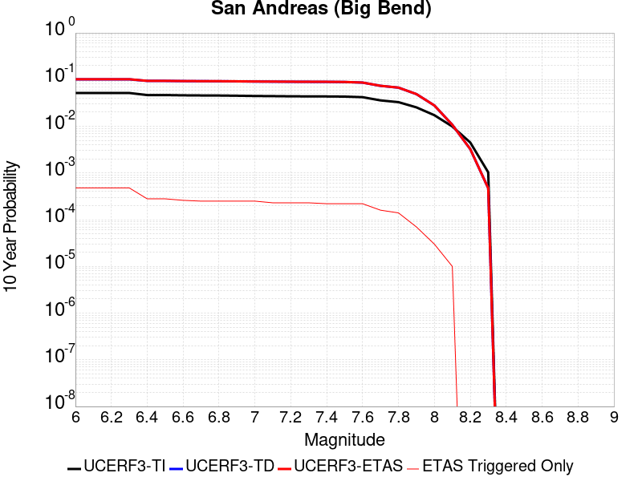 |

| Magnitude | 1 wk TI Prob | 1 wk TD Prob | 1 wk ETAS Prob | 1 wk ETAS/TD Gain | 1 wk ETAS Triggered Only | 1 mo TI Prob | 1 mo TD Prob | 1 mo ETAS Prob | 1 mo ETAS/TD Gain | 1 mo ETAS Triggered Only | 1 yr TI Prob | 1 yr TD Prob | 1 yr ETAS Prob | 1 yr ETAS/TD Gain | 1 yr ETAS Triggered Only | 10 yr TI Prob | 10 yr TD Prob | 10 yr ETAS Prob | 10 yr ETAS/TD Gain | 10 yr ETAS Triggered Only |
|-----|-----|-----|-----|-----|-----|-----|-----|-----|-----|-----|-----|-----|-----|-----|-----|-----|-----|-----|-----|-----|
| 6.0 | 1.0179969E-4 | 2.0081972E-4 | 2.2081571E-4 | 1.0995718 | 2.0E-5 | 4.362114E-4 | 8.603731E-4 | 9.203215E-4 | 1.0696772 | 6.0E-5 | 0.0052979486 | 0.010425015 | 0.010692201 | 1.0256293 | 2.7E-4 | 0.051734097 | 0.101484396 | 0.10191569 | 1.0042498 | 4.8E-4 |
| 6.1 | 1.0179969E-4 | 2.0081972E-4 | 2.2081571E-4 | 1.0995718 | 2.0E-5 | 4.362114E-4 | 8.603731E-4 | 9.203215E-4 | 1.0696772 | 6.0E-5 | 0.0052979486 | 0.010425015 | 0.010692201 | 1.0256293 | 2.7E-4 | 0.051734097 | 0.101484396 | 0.10191569 | 1.0042498 | 4.8E-4 |
| 6.2 | 1.0179969E-4 | 2.0081972E-4 | 2.2081571E-4 | 1.0995718 | 2.0E-5 | 4.362114E-4 | 8.603731E-4 | 9.203215E-4 | 1.0696772 | 6.0E-5 | 0.0052979486 | 0.010425015 | 0.010692201 | 1.0256293 | 2.7E-4 | 0.051734097 | 0.101484396 | 0.10191569 | 1.0042498 | 4.8E-4 |
| 6.3 | 1.0179969E-4 | 2.0081972E-4 | 2.2081571E-4 | 1.0995718 | 2.0E-5 | 4.362114E-4 | 8.603731E-4 | 9.203215E-4 | 1.0696772 | 6.0E-5 | 0.0052979486 | 0.010425015 | 0.010692201 | 1.0256293 | 2.7E-4 | 0.051734097 | 0.101484396 | 0.10191569 | 1.0042498 | 4.8E-4 |
| 6.4 | 9.1639464E-5 | 1.8438944E-4 | 1.943876E-4 | 1.0542231 | 1.0E-5 | 3.9268145E-4 | 7.9000136E-4 | 8.0998556E-4 | 1.0252964 | 2.0E-5 | 0.0047704205 | 0.009575968 | 0.009704723 | 1.0134456 | 1.3E-4 | 0.046693064 | 0.09381712 | 0.09407085 | 1.0027045 | 2.8E-4 |
| 6.5 | 9.1639464E-5 | 1.8438944E-4 | 1.943876E-4 | 1.0542231 | 1.0E-5 | 3.9268145E-4 | 7.9000136E-4 | 8.0998556E-4 | 1.0252964 | 2.0E-5 | 0.0047704205 | 0.009575968 | 0.009704723 | 1.0134456 | 1.3E-4 | 0.046693064 | 0.09381712 | 0.09407085 | 1.0027045 | 2.8E-4 |
| 6.6 | 9.042622E-5 | 1.8245954E-4 | 1.9245771E-4 | 1.0547967 | 1.0E-5 | 3.8748336E-4 | 7.817353E-4 | 8.0171967E-4 | 1.0255641 | 2.0E-5 | 0.0047074095 | 0.009476205 | 0.009604974 | 1.0135885 | 1.3E-4 | 0.046089325 | 0.09291417 | 0.09315001 | 1.0025383 | 2.6E-4 |
| 6.7 | 8.9836685E-5 | 1.8160277E-4 | 1.9160095E-4 | 1.0550553 | 1.0E-5 | 3.8495753E-4 | 7.7806565E-4 | 7.980501E-4 | 1.0256847 | 2.0E-5 | 0.00467679 | 0.0094319135 | 0.009550782 | 1.0126028 | 1.2E-4 | 0.045795817 | 0.0925084 | 0.09273527 | 1.0024525 | 2.5E-4 |
| 6.8 | 8.9471854E-5 | 1.8107046E-4 | 1.9106866E-4 | 1.0552171 | 1.0E-5 | 3.8339442E-4 | 7.7578565E-4 | 7.9577015E-4 | 1.0257603 | 2.0E-5 | 0.004657841 | 0.009404396 | 0.009523267 | 1.01264 | 1.2E-4 | 0.04561414 | 0.092256 | 0.09248293 | 1.0024599 | 2.5E-4 |
| 6.9 | 8.858234E-5 | 1.7989E-4 | 1.898882E-4 | 1.0555795 | 1.0E-5 | 3.7958333E-4 | 7.7072956E-4 | 7.9071417E-4 | 1.0259295 | 2.0E-5 | 0.004611638 | 0.009343366 | 0.009462246 | 1.0127233 | 1.2E-4 | 0.04517103 | 0.0916962 | 0.091923274 | 1.0024765 | 2.5E-4 |
| 7.0 | 8.7433385E-5 | 1.7827768E-4 | 1.8827591E-4 | 1.0560822 | 1.0E-5 | 3.746607E-4 | 7.638237E-4 | 7.838084E-4 | 1.026164 | 2.0E-5 | 0.004551957 | 0.009260005 | 0.009378894 | 1.012839 | 1.2E-4 | 0.044598386 | 0.09093105 | 0.09115832 | 1.0024993 | 2.5E-4 |
| 7.1 | 8.684964E-5 | 1.7739709E-4 | 1.8739532E-4 | 1.0563607 | 1.0E-5 | 3.7215967E-4 | 7.6005195E-4 | 7.7004434E-4 | 1.013147 | 1.0E-5 | 0.0045216335 | 0.009214473 | 0.009313552 | 1.0107524 | 1.0E-4 | 0.04430731 | 0.09051253 | 0.09072171 | 1.0023111 | 2.3E-4 |
| 7.2 | 8.606521E-5 | 1.7630306E-4 | 1.8630129E-4 | 1.0567105 | 1.0E-5 | 3.6879873E-4 | 7.553659E-4 | 7.6535833E-4 | 1.0132287 | 1.0E-5 | 0.0044808835 | 0.009157902 | 0.009256986 | 1.0108196 | 1.0E-4 | 0.043916024 | 0.08999327 | 0.09020257 | 1.0023258 | 2.3E-4 |
| 7.3 | 8.568266E-5 | 1.7572299E-4 | 1.8572123E-4 | 1.0568978 | 1.0E-5 | 3.6715972E-4 | 7.528814E-4 | 7.6287385E-4 | 1.0132723 | 1.0E-5 | 0.0044610105 | 0.0091279065 | 0.009226994 | 1.0108554 | 1.0E-4 | 0.043725148 | 0.08971421 | 0.089923576 | 1.0023336 | 2.3E-4 |
| 7.4 | 8.5432206E-5 | 1.7534874E-4 | 1.7534874E-4 | 1.0 | 0.0 | 3.6608664E-4 | 7.5127836E-4 | 7.5127836E-4 | 1.0 | 0.0 | 0.004447999 | 0.009108554 | 0.009197734 | 1.0097908 | 9.0E-5 | 0.043600157 | 0.08953439 | 0.08973469 | 1.0022372 | 2.2E-4 |
| 7.5 | 8.4791965E-5 | 1.7404204E-4 | 1.7404204E-4 | 1.0 | 0.0 | 3.633435E-4 | 7.456814E-4 | 7.456814E-4 | 1.0 | 0.0 | 0.0044147377 | 0.009040978 | 0.009130164 | 1.0098647 | 9.0E-5 | 0.043280575 | 0.088910125 | 0.08911056 | 1.0022544 | 2.2E-4 |
| 7.6 | 8.241105E-5 | 1.6849465E-4 | 1.6849465E-4 | 1.0 | 0.0 | 3.531424E-4 | 7.219202E-4 | 7.219202E-4 | 1.0 | 0.0 | 0.0042910352 | 0.008754046 | 0.008843258 | 1.010191 | 9.0E-5 | 0.042091176 | 0.08628652 | 0.08648755 | 1.0023296 | 2.2E-4 |
| 7.7 | 7.00432E-5 | 1.4212567E-4 | 1.4212567E-4 | 1.0 | 0.0 | 3.001506E-4 | 6.089679E-4 | 6.089679E-4 | 1.0 | 0.0 | 0.0036482112 | 0.0073890192 | 0.007448576 | 1.0080602 | 6.0E-5 | 0.035888977 | 0.073552616 | 0.073700845 | 1.0020154 | 1.6E-4 |
| 7.8 | 6.415362E-5 | 1.2976197E-4 | 1.2976197E-4 | 1.0 | 0.0 | 2.749151E-4 | 5.5600423E-4 | 5.5600423E-4 | 1.0 | 0.0 | 0.0033419547 | 0.0067483704 | 0.006807965 | 1.008831 | 6.0E-5 | 0.03292141 | 0.06728497 | 0.06741556 | 1.0019407 | 1.4E-4 |
| 7.9 | 4.939911E-5 | 9.346299E-5 | 9.346299E-5 | 1.0 | 0.0 | 2.116933E-4 | 4.004942E-4 | 4.004942E-4 | 1.0 | 0.0 | 0.0025743195 | 0.0048651244 | 0.004885027 | 1.0040909 | 2.0E-5 | 0.025447013 | 0.048938233 | 0.049004808 | 1.0013604 | 7.0E-5 |
| 8.0 | 3.344983E-5 | 5.2255753E-5 | 5.2255753E-5 | 1.0 | 0.0 | 1.4334853E-4 | 2.2393401E-4 | 2.2393401E-4 | 1.0 | 0.0 | 0.0017438711 | 0.0027229895 | 0.0027329624 | 1.0036625 | 1.0E-5 | 0.017302496 | 0.02793611 | 0.027965272 | 1.0010439 | 3.0E-5 |
| 8.1 | 1.9104898E-5 | 1.9185067E-5 | 1.9185067E-5 | 1.0 | 0.0 | 8.1875565E-5 | 8.221913E-5 | 8.221913E-5 | 1.0 | 0.0 | 9.963791E-4 | 0.0010005588 | 0.0010105488 | 1.0099844 | 1.0E-5 | 0.009919235 | 0.010756051 | 0.010765944 | 1.0009197 | 1.0E-5 |
| 8.2 | 8.643924E-6 | 5.478665E-6 | 5.478665E-6 | 1.0 | 0.0 | 3.704486E-5 | 2.3479783E-5 | 2.3479783E-5 | 1.0 | 0.0 | 4.5092785E-4 | 2.8582895E-4 | 2.8582895E-4 | 1.0 | 0.0 | 0.0045001395 | 0.0032508469 | 0.0032508469 | 1.0 | 0.0 |
| 8.3 | 1.983087E-6 | 7.6647797E-7 | 7.6647797E-7 | 1.0 | 0.0 | 8.498917E-6 | 3.2849016E-6 | 3.2849016E-6 | 1.0 | 0.0 | 1.034694E-4 | 3.999296E-5 | 3.999296E-5 | 1.0 | 0.0 | 0.0010342124 | 4.7228087E-4 | 4.7228087E-4 | 1.0 | 0.0 |

## Helendale-So Lockhart
*[(top)](#table-of-contents)*

| 1 Week | 1 Month | 1 Year | 10 Year |
|-----|-----|-----|-----|
|  |  |  |  |

| Magnitude | 1 wk TI Prob | 1 wk TD Prob | 1 wk ETAS Prob | 1 wk ETAS/TD Gain | 1 wk ETAS Triggered Only | 1 mo TI Prob | 1 mo TD Prob | 1 mo ETAS Prob | 1 mo ETAS/TD Gain | 1 mo ETAS Triggered Only | 1 yr TI Prob | 1 yr TD Prob | 1 yr ETAS Prob | 1 yr ETAS/TD Gain | 1 yr ETAS Triggered Only | 10 yr TI Prob | 10 yr TD Prob | 10 yr ETAS Prob | 10 yr ETAS/TD Gain | 10 yr ETAS Triggered Only |
|-----|-----|-----|-----|-----|-----|-----|-----|-----|-----|-----|-----|-----|-----|-----|-----|-----|-----|-----|-----|-----|
| 6.0 | 1.7296055E-5 | 1.8103841E-5 | 5.8103116E-5 | 3.2094357 | 4.0E-5 | 7.412385E-5 | 7.7585704E-5 | 1.5757949E-4 | 2.0310378 | 8.0E-5 | 9.0208417E-4 | 9.442173E-4 | 0.0012339435 | 1.3068427 | 2.9E-4 | 0.008984311 | 0.009404174 | 0.009889566 | 1.0516145 | 4.9E-4 |
| 6.1 | 1.7296055E-5 | 1.8103841E-5 | 5.8103116E-5 | 3.2094357 | 4.0E-5 | 7.412385E-5 | 7.7585704E-5 | 1.5757949E-4 | 2.0310378 | 8.0E-5 | 9.0208417E-4 | 9.442173E-4 | 0.0012339435 | 1.3068427 | 2.9E-4 | 0.008984311 | 0.009404174 | 0.009889566 | 1.0516145 | 4.9E-4 |
| 6.2 | 1.7296055E-5 | 1.8103841E-5 | 5.8103116E-5 | 3.2094357 | 4.0E-5 | 7.412385E-5 | 7.7585704E-5 | 1.5757949E-4 | 2.0310378 | 8.0E-5 | 9.0208417E-4 | 9.442173E-4 | 0.0012339435 | 1.3068427 | 2.9E-4 | 0.008984311 | 0.009404174 | 0.009889566 | 1.0516145 | 4.9E-4 |
| 6.3 | 1.0669118E-5 | 1.1135489E-5 | 4.1135154E-5 | 3.6940591 | 3.0E-5 | 4.5723988E-5 | 4.7722668E-5 | 8.772076E-5 | 1.8381361 | 4.0E-5 | 5.5654737E-4 | 5.8087136E-4 | 7.507726E-4 | 1.2924937 | 1.7E-4 | 0.0055515557 | 0.005793827 | 0.0060920888 | 1.0514792 | 3.0E-4 |
| 6.4 | 1.0669118E-5 | 1.1135489E-5 | 4.1135154E-5 | 3.6940591 | 3.0E-5 | 4.5723988E-5 | 4.7722668E-5 | 8.772076E-5 | 1.8381361 | 4.0E-5 | 5.5654737E-4 | 5.8087136E-4 | 7.507726E-4 | 1.2924937 | 1.7E-4 | 0.0055515557 | 0.005793827 | 0.0060920888 | 1.0514792 | 3.0E-4 |
| 6.5 | 8.790038E-6 | 9.1702495E-6 | 3.9169976E-5 | 4.2714186 | 3.0E-5 | 3.767105E-5 | 3.9300485E-5 | 7.9298916E-5 | 2.017759 | 4.0E-5 | 4.585485E-4 | 4.7837992E-4 | 6.183129E-4 | 1.2925144 | 1.4E-4 | 0.0045760344 | 0.0047736657 | 0.00501252 | 1.0500358 | 2.4E-4 |
| 6.6 | 7.396949E-6 | 7.715581E-6 | 2.7715427E-5 | 3.5921373 | 2.0E-5 | 3.1700827E-5 | 3.3066364E-5 | 6.3065374E-5 | 1.9072365 | 3.0E-5 | 3.858892E-4 | 4.025096E-4 | 5.124653E-4 | 1.2731754 | 1.1E-4 | 0.003852198 | 0.004017913 | 0.004217109 | 1.0495771 | 2.0E-4 |
| 6.7 | 6.4600285E-6 | 6.7380697E-6 | 2.6737935E-5 | 3.9681892 | 2.0E-5 | 2.7685543E-5 | 2.8877126E-5 | 5.887626E-5 | 2.0388546 | 3.0E-5 | 3.3701936E-4 | 3.5152308E-4 | 4.5148793E-4 | 1.2843764 | 1.0E-4 | 0.0033650869 | 0.003509752 | 0.0036990852 | 1.0539448 | 1.9E-4 |
| 6.8 | 5.600104E-6 | 5.836042E-6 | 2.5835925E-5 | 4.42696 | 2.0E-5 | 2.4000226E-5 | 2.5011372E-5 | 4.501087E-5 | 1.7996162 | 2.0E-5 | 2.9216358E-4 | 3.044715E-4 | 3.5445628E-4 | 1.164169 | 5.0E-5 | 0.0029177975 | 0.003040605 | 0.0031801793 | 1.0459034 | 1.4E-4 |
| 6.9 | 4.839122E-6 | 5.039537E-6 | 2.5039437E-5 | 4.9685984 | 2.0E-5 | 2.0738931E-5 | 2.159784E-5 | 4.1597406E-5 | 1.9259986 | 2.0E-5 | 2.5246723E-4 | 2.6292243E-4 | 3.1290928E-4 | 1.1901201 | 5.0E-5 | 0.002521806 | 0.002626161 | 0.002745846 | 1.0455741 | 1.2E-4 |
| 7.0 | 3.6937633E-6 | 3.845229E-6 | 2.3845152E-5 | 6.201231 | 2.0E-5 | 1.5830317E-5 | 1.6479451E-5 | 3.647912E-5 | 2.2136128 | 2.0E-5 | 1.9271708E-4 | 2.0061915E-4 | 2.3061312E-4 | 1.149507 | 3.0E-5 | 0.0019255003 | 0.0020044118 | 0.0020742714 | 1.034853 | 7.0E-5 |
| 7.1 | 2.7858857E-6 | 2.8978693E-6 | 1.289784E-5 | 4.4508014 | 1.0E-5 | 1.1939455E-5 | 1.2419382E-5 | 2.2419257E-5 | 1.805183 | 1.0E-5 | 1.4535317E-4 | 1.511957E-4 | 1.6119418E-4 | 1.0661294 | 1.0E-5 | 0.0014525814 | 0.0015109498 | 0.0015409045 | 1.0198251 | 3.0E-5 |
| 7.2 | 2.1672065E-6 | 2.2540248E-6 | 1.2254002E-5 | 5.4364986 | 1.0E-5 | 9.2879945E-6 | 9.660072E-6 | 1.9659974E-5 | 2.0351791 | 1.0E-5 | 1.1307546E-4 | 1.176052E-4 | 1.2760403E-4 | 1.0850203 | 1.0E-5 | 0.0011301794 | 0.0011754478 | 0.0011954244 | 1.0169948 | 2.0E-5 |
| 7.3 | 1.4823496E-6 | 1.5422185E-6 | 1.1542203E-5 | 7.4841557 | 1.0E-5 | 6.3529114E-6 | 6.6094917E-6 | 1.6609425E-5 | 2.5129657 | 1.0E-5 | 7.734395E-5 | 8.046775E-5 | 9.046694E-5 | 1.1242634 | 1.0E-5 | 7.731704E-4 | 8.044012E-4 | 8.243851E-4 | 1.0248432 | 2.0E-5 |
| 7.4 | 4.2321457E-7 | 4.4109012E-7 | 1.0441086E-5 | 23.671093 | 1.0E-5 | 1.8137755E-6 | 1.8903852E-6 | 1.1890366E-5 | 6.2899175 | 1.0E-5 | 2.2082493E-5 | 2.3015242E-5 | 3.301501E-5 | 1.4344847 | 1.0E-5 | 2.2080299E-4 | 2.3013311E-4 | 2.501285E-4 | 1.0868862 | 2.0E-5 |
| 7.5 | 5.6942316E-8 | 5.941599E-8 | 5.941599E-8 | 1.0 | 0.0 | 2.440385E-7 | 2.5463993E-7 | 2.5463993E-7 | 1.0 | 0.0 | 2.9711643E-6 | 3.1002376E-6 | 3.1002376E-6 | 1.0 | 0.0 | 2.9711247E-5 | 3.1002022E-5 | 3.1002022E-5 | 1.0 | 0.0 |

## San Andreas (Parkfield)
*[(top)](#table-of-contents)*

| 1 Week | 1 Month | 1 Year | 10 Year |
|-----|-----|-----|-----|
|  | 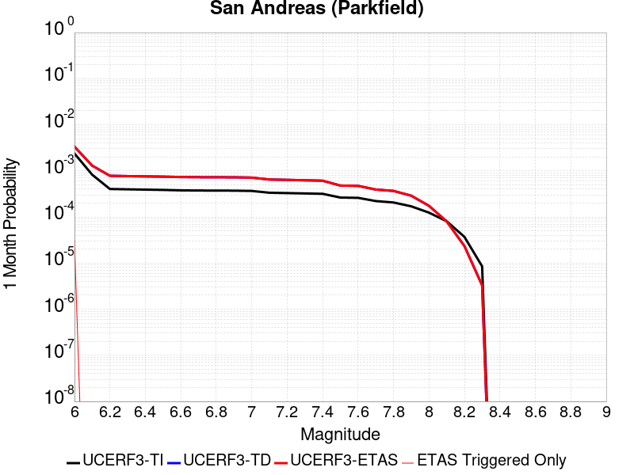 |  | 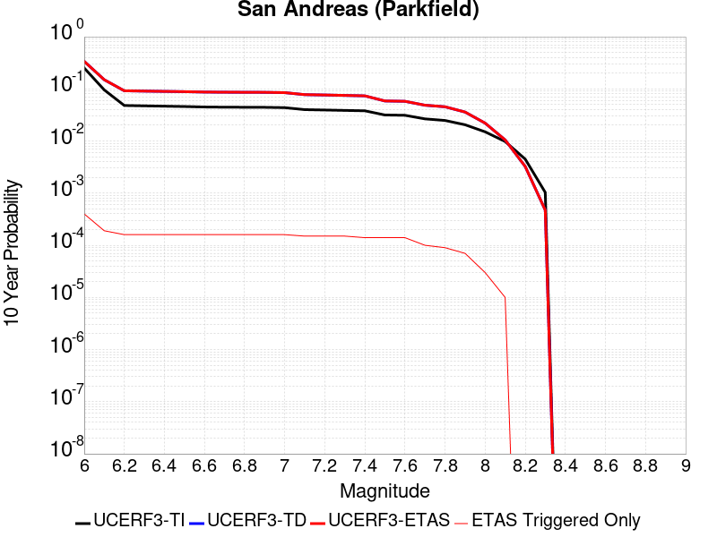 |

| Magnitude | 1 wk TI Prob | 1 wk TD Prob | 1 wk ETAS Prob | 1 wk ETAS/TD Gain | 1 wk ETAS Triggered Only | 1 mo TI Prob | 1 mo TD Prob | 1 mo ETAS Prob | 1 mo ETAS/TD Gain | 1 mo ETAS Triggered Only | 1 yr TI Prob | 1 yr TD Prob | 1 yr ETAS Prob | 1 yr ETAS/TD Gain | 1 yr ETAS Triggered Only | 10 yr TI Prob | 10 yr TD Prob | 10 yr ETAS Prob | 10 yr ETAS/TD Gain | 10 yr ETAS Triggered Only |
|-----|-----|-----|-----|-----|-----|-----|-----|-----|-----|-----|-----|-----|-----|-----|-----|-----|-----|-----|-----|-----|
| 6.0 | 5.556969E-4 | 7.787764E-4 | 8.08753E-4 | 1.038492 | 3.0E-5 | 0.0023793848 | 0.0033338934 | 0.0033637933 | 1.0089685 | 3.0E-5 | 0.028586963 | 0.04027906 | 0.04042302 | 1.003574 | 1.5E-4 | 0.25176284 | 0.3373374 | 0.33760247 | 1.0007857 | 4.0E-4 |
| 6.1 | 1.925858E-4 | 3.0300187E-4 | 3.0300187E-4 | 1.0 | 0.0 | 8.2510663E-4 | 0.0012980271 | 0.0012980271 | 1.0 | 0.0 | 0.0099994885 | 0.01578479 | 0.015853686 | 1.0043646 | 7.0E-5 | 0.095613256 | 0.14981315 | 0.14997467 | 1.0010782 | 1.9E-4 |
| 6.2 | 9.4306815E-5 | 1.8251229E-4 | 1.8251229E-4 | 1.0 | 0.0 | 4.0410945E-4 | 7.8196224E-4 | 7.8196224E-4 | 1.0 | 0.0 | 0.0049089384 | 0.009479025 | 0.009548362 | 1.0073147 | 7.0E-5 | 0.048019063 | 0.09188695 | 0.09203225 | 1.0015813 | 1.6E-4 |
| 6.3 | 9.283051E-5 | 1.7947727E-4 | 1.7947727E-4 | 1.0 | 0.0 | 3.9778434E-4 | 7.689627E-4 | 7.689627E-4 | 1.0 | 0.0 | 0.0048322747 | 0.0093221245 | 0.009391472 | 1.007439 | 7.0E-5 | 0.047285385 | 0.09053988 | 0.0906854 | 1.0016072 | 1.6E-4 |
| 6.4 | 9.138826E-5 | 1.7709887E-4 | 1.7709887E-4 | 1.0 | 0.0 | 3.916052E-4 | 7.5877557E-4 | 7.5877557E-4 | 1.0 | 0.0 | 0.0047573745 | 0.009199142 | 0.009268498 | 1.0075394 | 7.0E-5 | 0.046568092 | 0.08944346 | 0.08958915 | 1.0016289 | 1.6E-4 |
| 6.5 | 9.000255E-5 | 1.7467843E-4 | 1.7467843E-4 | 1.0 | 0.0 | 3.8566816E-4 | 7.484082E-4 | 7.484082E-4 | 1.0 | 0.0 | 0.0046854047 | 0.009074002 | 0.0091433665 | 1.0076443 | 7.0E-5 | 0.045878403 | 0.08833238 | 0.08847824 | 1.0016513 | 1.6E-4 |
| 6.6 | 8.8109264E-5 | 1.7148908E-4 | 1.7148908E-4 | 1.0 | 0.0 | 3.7755648E-4 | 7.347474E-4 | 7.347474E-4 | 1.0 | 0.0 | 0.0045870654 | 0.008909067 | 0.008978444 | 1.0077871 | 7.0E-5 | 0.04493529 | 0.08686431 | 0.087010406 | 1.0016819 | 1.6E-4 |
| 6.7 | 8.738073E-5 | 1.7015962E-4 | 1.7015962E-4 | 1.0 | 0.0 | 3.7443507E-4 | 7.290529E-4 | 7.290529E-4 | 1.0 | 0.0 | 0.0045492216 | 0.008840349 | 0.00890973 | 1.0078483 | 7.0E-5 | 0.04457213 | 0.08626531 | 0.08641151 | 1.0016948 | 1.6E-4 |
| 6.8 | 8.710195E-5 | 1.6961442E-4 | 1.6961442E-4 | 1.0 | 0.0 | 3.7324068E-4 | 7.267176E-4 | 7.267176E-4 | 1.0 | 0.0 | 0.0045347405 | 0.008812156 | 0.008881538 | 1.0078735 | 7.0E-5 | 0.04443313 | 0.086012915 | 0.086159155 | 1.0017002 | 1.6E-4 |
| 6.9 | 8.6801556E-5 | 1.6902383E-4 | 1.6902383E-4 | 1.0 | 0.0 | 3.7195362E-4 | 7.241879E-4 | 7.241879E-4 | 1.0 | 0.0 | 0.0045191357 | 0.0087816045 | 0.00885099 | 1.0079012 | 7.0E-5 | 0.044283327 | 0.08573886 | 0.085885145 | 1.0017061 | 1.6E-4 |
| 7.0 | 8.5571606E-5 | 1.6655146E-4 | 1.6655146E-4 | 1.0 | 0.0 | 3.6668387E-4 | 7.1359787E-4 | 7.1359787E-4 | 1.0 | 0.0 | 0.004455241 | 0.008653701 | 0.008723096 | 1.008019 | 7.0E-5 | 0.043669727 | 0.08458771 | 0.08473418 | 1.0017315 | 1.6E-4 |
| 7.1 | 7.82589E-5 | 1.513576E-4 | 1.513576E-4 | 1.0 | 0.0 | 3.3535215E-4 | 6.485149E-4 | 6.485149E-4 | 1.0 | 0.0 | 0.0040752706 | 0.007867255 | 0.007936704 | 1.0088277 | 7.0E-5 | 0.040013418 | 0.07750286 | 0.077641234 | 1.0017854 | 1.5E-4 |
| 7.2 | 7.690929E-5 | 1.4872964E-4 | 1.4872964E-4 | 1.0 | 0.0 | 3.2956956E-4 | 6.3725776E-4 | 6.3725776E-4 | 1.0 | 0.0 | 0.004005129 | 0.0077311797 | 0.007800638 | 1.0089842 | 7.0E-5 | 0.0393371 | 0.07627582 | 0.07641438 | 1.0018165 | 1.5E-4 |
| 7.3 | 7.5543794E-5 | 1.4569426E-4 | 1.4569426E-4 | 1.0 | 0.0 | 3.2371894E-4 | 6.242553E-4 | 6.242553E-4 | 1.0 | 0.0 | 0.003934157 | 0.0075739846 | 0.0076434542 | 1.0091722 | 7.0E-5 | 0.038652334 | 0.07484126 | 0.07498003 | 1.0018543 | 1.5E-4 |
| 7.4 | 7.4214564E-5 | 1.4270298E-4 | 1.4270298E-4 | 1.0 | 0.0 | 3.1802364E-4 | 6.1144156E-4 | 6.1144156E-4 | 1.0 | 0.0 | 0.003865065 | 0.00741905 | 0.007478605 | 1.0080273 | 6.0E-5 | 0.03798529 | 0.07341491 | 0.07354463 | 1.0017669 | 1.4E-4 |
| 7.5 | 6.149578E-5 | 1.1197151E-4 | 1.1197151E-4 | 1.0 | 0.0 | 2.6352672E-4 | 4.7978974E-4 | 4.7978974E-4 | 1.0 | 0.0 | 0.0032037178 | 0.0058258264 | 0.0058854767 | 1.010239 | 6.0E-5 | 0.03157923 | 0.058584794 | 0.05871659 | 1.0022497 | 1.4E-4 |
| 7.6 | 6.0643448E-5 | 1.10257475E-4 | 1.10257475E-4 | 1.0 | 0.0 | 2.598746E-4 | 4.7244655E-4 | 4.7244655E-4 | 1.0 | 0.0 | 0.0031593828 | 0.0057368972 | 0.005796553 | 1.0103986 | 6.0E-5 | 0.031148417 | 0.0577456 | 0.057877515 | 1.0022844 | 1.4E-4 |
| 7.7 | 5.1652263E-5 | 9.180402E-5 | 9.180402E-5 | 1.0 | 0.0 | 2.2134806E-4 | 3.933865E-4 | 3.933865E-4 | 1.0 | 0.0 | 0.002691582 | 0.0047789724 | 0.0048187813 | 1.00833 | 4.0E-5 | 0.026592141 | 0.048558682 | 0.048653826 | 1.0019593 | 1.0E-4 |
| 7.8 | 4.8090482E-5 | 8.564889E-5 | 8.564889E-5 | 1.0 | 0.0 | 2.060858E-4 | 3.6701505E-4 | 3.6701505E-4 | 1.0 | 0.0 | 0.0025062072 | 0.0044592614 | 0.004499083 | 1.0089301 | 4.0E-5 | 0.024781305 | 0.04532328 | 0.0454092 | 1.0018958 | 9.0E-5 |
| 7.9 | 3.970278E-5 | 6.754373E-5 | 6.754373E-5 | 1.0 | 0.0 | 1.7014367E-4 | 2.8944103E-4 | 2.8944103E-4 | 1.0 | 0.0 | 0.002069531 | 0.003518254 | 0.0035381836 | 1.0056646 | 2.0E-5 | 0.020503636 | 0.03590036 | 0.03596785 | 1.0018798 | 7.0E-5 |
| 8.0 | 2.8982335E-5 | 4.072156E-5 | 4.072156E-5 | 1.0 | 0.0 | 1.2420409E-4 | 1.745093E-4 | 1.745093E-4 | 1.0 | 0.0 | 0.0015111357 | 0.0021225815 | 0.0021325604 | 1.0047013 | 1.0E-5 | 0.015009012 | 0.022022424 | 0.022051763 | 1.0013323 | 3.0E-5 |
| 8.1 | 1.8836186E-5 | 1.8692857E-5 | 1.8692857E-5 | 1.0 | 0.0 | 8.0724014E-5 | 8.0109785E-5 | 8.0109785E-5 | 1.0 | 0.0 | 9.823717E-4 | 9.7490085E-4 | 9.848911E-4 | 1.0102475 | 1.0E-5 | 0.009780403 | 0.010494427 | 0.010504322 | 1.000943 | 1.0E-5 |
| 8.2 | 8.643924E-6 | 5.478665E-6 | 5.478665E-6 | 1.0 | 0.0 | 3.704486E-5 | 2.3479783E-5 | 2.3479783E-5 | 1.0 | 0.0 | 4.5092785E-4 | 2.8582895E-4 | 2.8582895E-4 | 1.0 | 0.0 | 0.0045001395 | 0.0032508469 | 0.0032508469 | 1.0 | 0.0 |
| 8.3 | 1.983087E-6 | 7.6647797E-7 | 7.6647797E-7 | 1.0 | 0.0 | 8.498917E-6 | 3.2849016E-6 | 3.2849016E-6 | 1.0 | 0.0 | 1.034694E-4 | 3.999296E-5 | 3.999296E-5 | 1.0 | 0.0 | 0.0010342124 | 4.7228087E-4 | 4.7228087E-4 | 1.0 | 0.0 |

## Sierra Nevada  (No Extension)
*[(top)](#table-of-contents)*

| 1 Week | 1 Month | 1 Year | 10 Year |
|-----|-----|-----|-----|
| 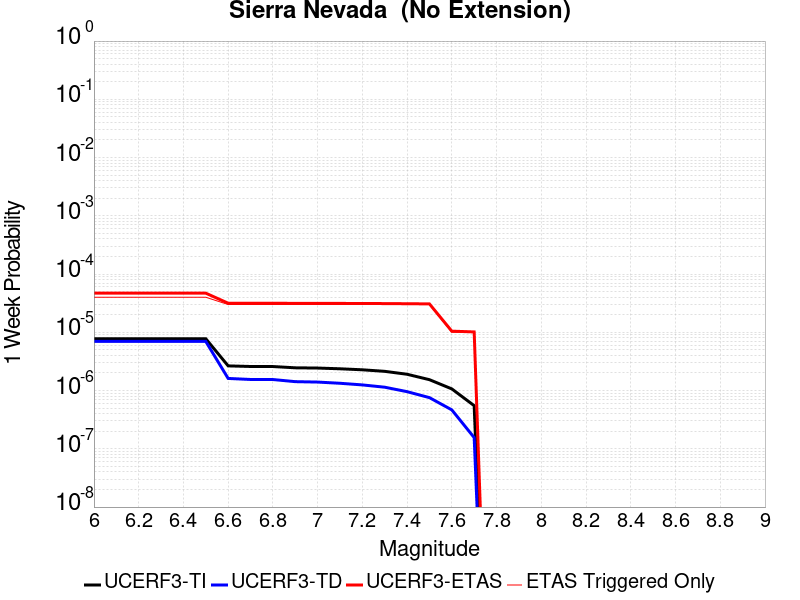 | 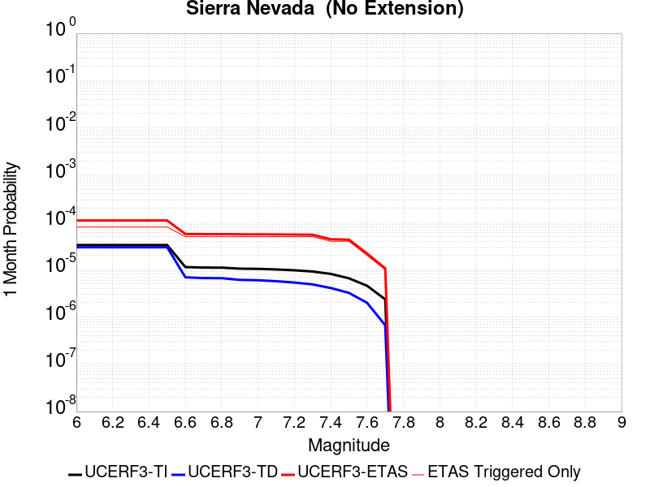 |  |  |

| Magnitude | 1 wk TI Prob | 1 wk TD Prob | 1 wk ETAS Prob | 1 wk ETAS/TD Gain | 1 wk ETAS Triggered Only | 1 mo TI Prob | 1 mo TD Prob | 1 mo ETAS Prob | 1 mo ETAS/TD Gain | 1 mo ETAS Triggered Only | 1 yr TI Prob | 1 yr TD Prob | 1 yr ETAS Prob | 1 yr ETAS/TD Gain | 1 yr ETAS Triggered Only | 10 yr TI Prob | 10 yr TD Prob | 10 yr ETAS Prob | 10 yr ETAS/TD Gain | 10 yr ETAS Triggered Only |
|-----|-----|-----|-----|-----|-----|-----|-----|-----|-----|-----|-----|-----|-----|-----|-----|-----|-----|-----|-----|-----|
| 6.0 | 7.7690465E-6 | 6.9763464E-6 | 4.6976067E-5 | 6.73362 | 4.0E-5 | 3.329549E-5 | 2.9898487E-5 | 1.0989609E-4 | 3.6756406 | 8.0E-5 | 4.0529718E-4 | 3.6398912E-4 | 5.6391634E-4 | 1.5492669 | 2.0E-4 | 0.004045588 | 0.0036374456 | 0.003926391 | 1.0794363 | 2.9E-4 |
| 6.1 | 7.7690465E-6 | 6.9763464E-6 | 4.6976067E-5 | 6.73362 | 4.0E-5 | 3.329549E-5 | 2.9898487E-5 | 1.0989609E-4 | 3.6756406 | 8.0E-5 | 4.0529718E-4 | 3.6398912E-4 | 5.6391634E-4 | 1.5492669 | 2.0E-4 | 0.004045588 | 0.0036374456 | 0.003926391 | 1.0794363 | 2.9E-4 |
| 6.2 | 7.7690465E-6 | 6.9763464E-6 | 4.6976067E-5 | 6.73362 | 4.0E-5 | 3.329549E-5 | 2.9898487E-5 | 1.0989609E-4 | 3.6756406 | 8.0E-5 | 4.0529718E-4 | 3.6398912E-4 | 5.6391634E-4 | 1.5492669 | 2.0E-4 | 0.004045588 | 0.0036374456 | 0.003926391 | 1.0794363 | 2.9E-4 |
| 6.3 | 7.7690465E-6 | 6.9763464E-6 | 4.6976067E-5 | 6.73362 | 4.0E-5 | 3.329549E-5 | 2.9898487E-5 | 1.0989609E-4 | 3.6756406 | 8.0E-5 | 4.0529718E-4 | 3.6398912E-4 | 5.6391634E-4 | 1.5492669 | 2.0E-4 | 0.004045588 | 0.0036374456 | 0.003926391 | 1.0794363 | 2.9E-4 |
| 6.4 | 7.7690465E-6 | 6.9763464E-6 | 4.6976067E-5 | 6.73362 | 4.0E-5 | 3.329549E-5 | 2.9898487E-5 | 1.0989609E-4 | 3.6756406 | 8.0E-5 | 4.0529718E-4 | 3.6398912E-4 | 5.6391634E-4 | 1.5492669 | 2.0E-4 | 0.004045588 | 0.0036374456 | 0.003926391 | 1.0794363 | 2.9E-4 |
| 6.5 | 7.7690465E-6 | 6.9763464E-6 | 4.6976067E-5 | 6.73362 | 4.0E-5 | 3.329549E-5 | 2.9898487E-5 | 1.0989609E-4 | 3.6756406 | 8.0E-5 | 4.0529718E-4 | 3.6398912E-4 | 5.6391634E-4 | 1.5492669 | 2.0E-4 | 0.004045588 | 0.0036374456 | 0.003926391 | 1.0794363 | 2.9E-4 |
| 6.6 | 2.653E-6 | 1.6148447E-6 | 3.1614796E-5 | 19.577608 | 3.0E-5 | 1.136995E-5 | 6.9207445E-6 | 5.69204E-5 | 8.2246065 | 5.0E-5 | 1.3842035E-4 | 8.425684E-5 | 2.4424336E-4 | 2.8987956 | 1.6E-4 | 0.0013833415 | 8.422524E-4 | 0.001042084 | 1.2372586 | 2.0E-4 |
| 6.7 | 2.5902466E-6 | 1.5501779E-6 | 3.155013E-5 | 20.352587 | 3.0E-5 | 1.11010095E-5 | 6.643603E-6 | 5.664327E-5 | 8.525987 | 5.0E-5 | 1.351464E-4 | 8.088289E-5 | 2.4086995E-4 | 2.9780085 | 1.6E-4 | 0.0013506424 | 8.0853753E-4 | 0.0010083758 | 1.2471602 | 2.0E-4 |
| 6.8 | 2.5853892E-6 | 1.5469781E-6 | 3.1546933E-5 | 20.392616 | 3.0E-5 | 1.1080193E-5 | 6.6298894E-6 | 5.6629557E-5 | 8.5415535 | 5.0E-5 | 1.34893E-4 | 8.0715945E-5 | 2.4070303E-4 | 2.9821002 | 1.6E-4 | 0.0013481114 | 8.0686924E-4 | 0.0010067079 | 1.2476716 | 2.0E-4 |
| 6.9 | 2.458257E-6 | 1.4220519E-6 | 3.142201E-5 | 22.096247 | 3.0E-5 | 1.0535345E-5 | 6.094494E-6 | 5.6094188E-5 | 9.204077 | 5.0E-5 | 1.2826028E-4 | 7.419796E-5 | 2.3418608E-4 | 3.1562335 | 1.6E-4 | 0.0012818627 | 7.417338E-4 | 9.4158546E-4 | 1.2694385 | 2.0E-4 |
| 7.0 | 2.4341468E-6 | 1.3990157E-6 | 3.1398973E-5 | 22.443619 | 3.0E-5 | 1.0432016E-5 | 5.995768E-6 | 5.5995468E-5 | 9.339166 | 5.0E-5 | 1.270024E-4 | 7.2996045E-5 | 2.3298437E-4 | 3.1917396 | 1.6E-4 | 0.0012692984 | 7.297226E-4 | 9.2957664E-4 | 1.2738768 | 2.0E-4 |
| 7.1 | 2.3652476E-6 | 1.3339652E-6 | 3.1333926E-5 | 23.489313 | 3.0E-5 | 1.0136736E-5 | 5.716981E-6 | 5.5716697E-5 | 9.745825 | 5.0E-5 | 1.2340778E-4 | 6.9602036E-5 | 2.295909E-4 | 3.2986233 | 1.6E-4 | 0.0012333926 | 6.958041E-4 | 8.956649E-4 | 1.2872373 | 2.0E-4 |
| 7.2 | 2.272158E-6 | 1.2502717E-6 | 3.1250234E-5 | 24.994755 | 3.0E-5 | 9.737784E-6 | 5.358296E-6 | 5.535803E-5 | 10.331274 | 5.0E-5 | 1.1855107E-4 | 6.523532E-5 | 2.2522488E-4 | 3.4524992 | 1.6E-4 | 0.0011848784 | 6.521632E-4 | 8.5203274E-4 | 1.3064717 | 2.0E-4 |
| 7.3 | 2.1382127E-6 | 1.1419595E-6 | 3.1141924E-5 | 27.270603 | 3.0E-5 | 9.163737E-6 | 4.8941033E-6 | 5.489386E-5 | 11.216327 | 5.0E-5 | 1.1156279E-4 | 5.9584087E-5 | 2.0957516E-4 | 3.5173006 | 1.5E-4 | 0.001115068 | 5.956823E-4 | 7.8556914E-4 | 1.318772 | 1.9E-4 |
| 7.4 | 1.9048055E-6 | 9.57513E-7 | 3.0957483E-5 | 32.33114 | 3.0E-5 | 8.163426E-6 | 4.1036205E-6 | 4.4103457E-5 | 10.747451 | 4.0E-5 | 9.9385186E-5 | 4.996044E-5 | 1.7995395E-4 | 3.6019287 | 1.3E-4 | 9.934074E-4 | 4.9949274E-4 | 6.594128E-4 | 1.3201649 | 1.6E-4 |
| 7.5 | 1.5373403E-6 | 7.559938E-7 | 3.075597E-5 | 40.682835 | 3.0E-5 | 6.5885843E-6 | 3.2399694E-6 | 4.323984E-5 | 13.345756 | 4.0E-5 | 8.021306E-5 | 3.944592E-5 | 1.5944119E-4 | 4.04202 | 1.2E-4 | 8.0184115E-4 | 3.9438964E-4 | 5.4433045E-4 | 1.3801845 | 1.5E-4 |
| 7.6 | 1.0680322E-6 | 4.6595343E-7 | 1.0465948E-5 | 22.461363 | 1.0E-5 | 4.577273E-6 | 1.9969418E-6 | 2.1996902E-5 | 11.015294 | 2.0E-5 | 5.5726876E-5 | 2.4312498E-5 | 1.0431055E-4 | 4.2904086 | 8.0E-5 | 5.5712904E-4 | 2.4309864E-4 | 3.4307432E-4 | 1.4112556 | 1.0E-4 |
| 7.7 | 5.509146E-7 | 1.5579108E-7 | 1.015579E-5 | 65.188515 | 1.0E-5 | 2.3610605E-6 | 6.676759E-7 | 1.0667669E-5 | 15.977316 | 1.0E-5 | 2.8745531E-5 | 8.128925E-6 | 4.81286E-5 | 5.9206595 | 4.0E-5 | 2.8741814E-4 | 8.1286395E-5 | 1.3128233E-4 | 1.615059 | 5.0E-5 |

## Death Valley (No)
*[(top)](#table-of-contents)*

| 1 Week | 1 Month | 1 Year | 10 Year |
|-----|-----|-----|-----|
| 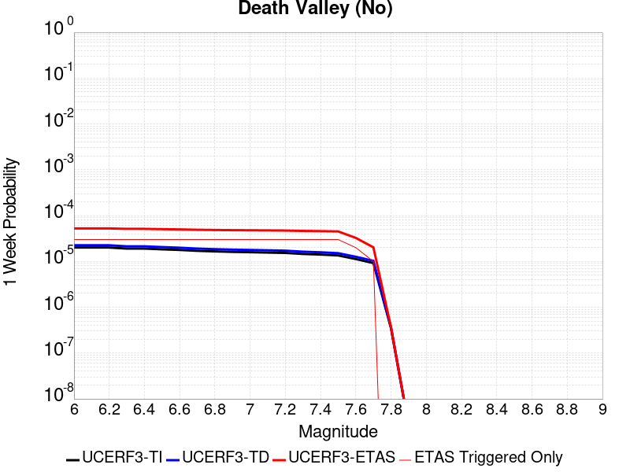 |  |  | 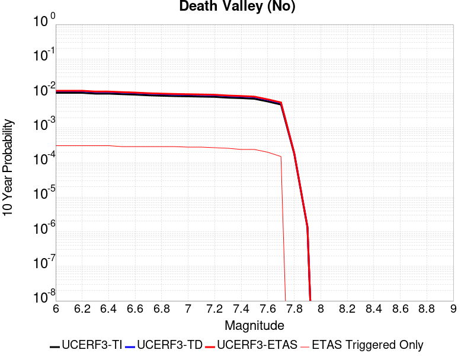 |

| Magnitude | 1 wk TI Prob | 1 wk TD Prob | 1 wk ETAS Prob | 1 wk ETAS/TD Gain | 1 wk ETAS Triggered Only | 1 mo TI Prob | 1 mo TD Prob | 1 mo ETAS Prob | 1 mo ETAS/TD Gain | 1 mo ETAS Triggered Only | 1 yr TI Prob | 1 yr TD Prob | 1 yr ETAS Prob | 1 yr ETAS/TD Gain | 1 yr ETAS Triggered Only | 10 yr TI Prob | 10 yr TD Prob | 10 yr ETAS Prob | 10 yr ETAS/TD Gain | 10 yr ETAS Triggered Only |
|-----|-----|-----|-----|-----|-----|-----|-----|-----|-----|-----|-----|-----|-----|-----|-----|-----|-----|-----|-----|-----|
| 6.0 | 2.0074807E-5 | 2.2500446E-5 | 5.249977E-5 | 2.333277 | 3.0E-5 | 8.603206E-5 | 9.642696E-5 | 1.364231E-4 | 1.4147817 | 4.0E-5 | 0.001046937 | 0.0011733733 | 0.0012932325 | 1.1021492 | 1.2E-4 | 0.010420183 | 0.011672693 | 0.011979075 | 1.0262477 | 3.1E-4 |
| 6.1 | 2.0074807E-5 | 2.2500446E-5 | 5.249977E-5 | 2.333277 | 3.0E-5 | 8.603206E-5 | 9.642696E-5 | 1.364231E-4 | 1.4147817 | 4.0E-5 | 0.001046937 | 0.0011733733 | 0.0012932325 | 1.1021492 | 1.2E-4 | 0.010420183 | 0.011672693 | 0.011979075 | 1.0262477 | 3.1E-4 |
| 6.2 | 2.0074807E-5 | 2.2500446E-5 | 5.249977E-5 | 2.333277 | 3.0E-5 | 8.603206E-5 | 9.642696E-5 | 1.364231E-4 | 1.4147817 | 4.0E-5 | 0.001046937 | 0.0011733733 | 0.0012932325 | 1.1021492 | 1.2E-4 | 0.010420183 | 0.011672693 | 0.011979075 | 1.0262477 | 3.1E-4 |
| 6.3 | 1.9050609E-5 | 2.1337288E-5 | 5.1336647E-5 | 2.4059594 | 3.0E-5 | 8.164292E-5 | 9.144236E-5 | 1.314387E-4 | 1.437394 | 4.0E-5 | 9.935491E-4 | 0.0011127489 | 0.0012326153 | 1.1077211 | 1.2E-4 | 0.009891188 | 0.011072595 | 0.011379163 | 1.0276871 | 3.1E-4 |
| 6.4 | 1.9050609E-5 | 2.1337288E-5 | 5.1336647E-5 | 2.4059594 | 3.0E-5 | 8.164292E-5 | 9.144236E-5 | 1.314387E-4 | 1.437394 | 4.0E-5 | 9.935491E-4 | 0.0011127489 | 0.0012326153 | 1.1077211 | 1.2E-4 | 0.009891188 | 0.011072595 | 0.011379163 | 1.0276871 | 3.1E-4 |
| 6.5 | 1.8367004E-5 | 2.0561336E-5 | 5.056072E-5 | 2.4590192 | 3.0E-5 | 7.8713354E-5 | 8.811707E-5 | 1.18114425E-4 | 1.3404262 | 3.0E-5 | 9.5791375E-4 | 0.0010723039 | 0.001182186 | 1.1024729 | 1.1E-4 | 0.009537951 | 0.010672085 | 0.01095899 | 1.0268837 | 2.9E-4 |
| 6.6 | 1.779439E-5 | 1.9911244E-5 | 4.9910646E-5 | 2.5066564 | 3.0E-5 | 7.625944E-5 | 8.533114E-5 | 1.15328585E-4 | 1.3515415 | 3.0E-5 | 9.280632E-4 | 0.0010384179 | 0.0011483037 | 1.1058204 | 1.1E-4 | 0.009241969 | 0.010336416 | 0.010623418 | 1.0277661 | 2.9E-4 |
| 6.7 | 1.7025437E-5 | 1.9043726E-5 | 4.9043156E-5 | 2.5752919 | 3.0E-5 | 7.296412E-5 | 8.161345E-5 | 1.11611E-4 | 1.3675565 | 3.0E-5 | 8.87976E-4 | 9.93197E-4 | 0.0011030877 | 1.1106435 | 1.1E-4 | 0.008844362 | 0.009888301 | 0.010175433 | 1.0290376 | 2.9E-4 |
| 6.8 | 1.6545107E-5 | 1.851284E-5 | 4.8512284E-5 | 2.620467 | 3.0E-5 | 7.090568E-5 | 7.933836E-5 | 1.0933598E-4 | 1.3780973 | 3.0E-5 | 8.629347E-4 | 9.655226E-4 | 0.0010754163 | 1.1138179 | 1.1E-4 | 0.008595915 | 0.009613981 | 0.009901192 | 1.0298744 | 2.9E-4 |
| 6.9 | 1.615478E-5 | 1.8087881E-5 | 4.808734E-5 | 2.658539 | 3.0E-5 | 6.9232934E-5 | 7.751722E-5 | 1.075149E-4 | 1.3869808 | 3.0E-5 | 8.4258494E-4 | 9.433697E-4 | 0.0010532659 | 1.1164932 | 1.1E-4 | 0.008393973 | 0.009394345 | 0.009681621 | 1.0305797 | 2.9E-4 |
| 7.0 | 1.5894311E-5 | 1.7805834E-5 | 4.78053E-5 | 2.6848109 | 3.0E-5 | 6.81167E-5 | 7.6308526E-5 | 1.0630624E-4 | 1.3931109 | 3.0E-5 | 8.2900526E-4 | 9.286663E-4 | 0.0010385643 | 1.1183394 | 1.1E-4 | 0.008259195 | 0.009248544 | 0.009525956 | 1.0299951 | 2.8E-4 |
| 7.1 | 1.5602263E-5 | 1.7483784E-5 | 4.748326E-5 | 2.7158458 | 3.0E-5 | 6.6865134E-5 | 7.4928386E-5 | 1.04926134E-4 | 1.4003524 | 3.0E-5 | 8.137789E-4 | 9.118773E-4 | 0.001021777 | 1.1205202 | 1.1E-4 | 0.008108052 | 0.009082039 | 0.009359496 | 1.0305501 | 2.8E-4 |
| 7.2 | 1.5323829E-5 | 1.7170905E-5 | 4.717039E-5 | 2.7471113 | 3.0E-5 | 6.56719E-5 | 7.358755E-5 | 1.0358535E-4 | 1.4076476 | 3.0E-5 | 7.99262E-4 | 8.9556625E-4 | 0.0010054677 | 1.1227173 | 1.1E-4 | 0.007963934 | 0.008920249 | 0.009187841 | 1.0299982 | 2.7E-4 |
| 7.3 | 1.4556212E-5 | 1.6302716E-5 | 4.6302226E-5 | 2.8401542 | 3.0E-5 | 6.238227E-5 | 6.986695E-5 | 9.986485E-5 | 1.4293576 | 3.0E-5 | 7.592395E-4 | 8.503039E-4 | 9.502189E-4 | 1.117505 | 1.0E-4 | 0.0075665074 | 0.008471149 | 0.008728947 | 1.0304325 | 2.6E-4 |
| 7.4 | 1.411725E-5 | 1.5808211E-5 | 4.5807737E-5 | 2.897718 | 3.0E-5 | 6.0501097E-5 | 6.774775E-5 | 9.7745724E-5 | 1.4427891 | 3.0E-5 | 7.363519E-4 | 8.245226E-4 | 9.244401E-4 | 1.1211823 | 1.0E-4 | 0.0073391674 | 0.008215268 | 0.0084532965 | 1.0289739 | 2.4E-4 |
| 7.5 | 1.3503312E-5 | 1.5126531E-5 | 4.512608E-5 | 2.9832404 | 3.0E-5 | 5.7870053E-5 | 6.482641E-5 | 9.482446E-5 | 1.4627444 | 3.0E-5 | 7.043401E-4 | 7.8898156E-4 | 8.889027E-4 | 1.1266457 | 1.0E-4 | 0.007021119 | 0.007862429 | 0.008100542 | 1.0302849 | 2.4E-4 |
| 7.6 | 1.1279839E-5 | 1.2626528E-5 | 3.2626274E-5 | 2.5839467 | 2.0E-5 | 4.834127E-5 | 5.4112596E-5 | 7.4111515E-5 | 1.3695797 | 2.0E-5 | 5.88396E-4 | 6.58627E-4 | 7.4856775E-4 | 1.1365579 | 9.0E-5 | 0.005868405 | 0.0065673026 | 0.006765989 | 1.0302539 | 2.0E-4 |
| 7.7 | 9.189108E-6 | 1.0283521E-5 | 2.0283418E-5 | 1.9724195 | 1.0E-5 | 3.93813E-5 | 4.407152E-5 | 5.4071075E-5 | 1.2268939 | 1.0E-5 | 4.7936183E-4 | 5.3644367E-4 | 6.0640613E-4 | 1.130419 | 7.0E-5 | 0.004783291 | 0.0053519984 | 0.005501196 | 1.027877 | 1.5E-4 |
| 7.8 | 3.4586725E-7 | 3.648288E-7 | 3.648288E-7 | 1.0 | 0.0 | 1.4822873E-6 | 1.5635511E-6 | 1.5635511E-6 | 1.0 | 0.0 | 1.80467E-5 | 1.9036073E-5 | 1.9036073E-5 | 1.0 | 0.0 | 1.8045233E-4 | 1.9034486E-4 | 1.9034486E-4 | 1.0 | 0.0 |
| 7.9 | 2.5591178E-9 | 2.6696871E-9 | 2.6696871E-9 | 1.0 | 0.0 | 1.0967647E-8 | 1.1441516E-8 | 1.1441516E-8 | 1.0 | 0.0 | 1.335311E-7 | 1.3930045E-7 | 1.3930045E-7 | 1.0 | 0.0 | 1.3353102E-6 | 1.3930046E-6 | 1.3930046E-6 | 1.0 | 0.0 |

## San Andreas (San Gorgonio Pass-Garnet HIll)
*[(top)](#table-of-contents)*

| 1 Week | 1 Month | 1 Year | 10 Year |
|-----|-----|-----|-----|
| 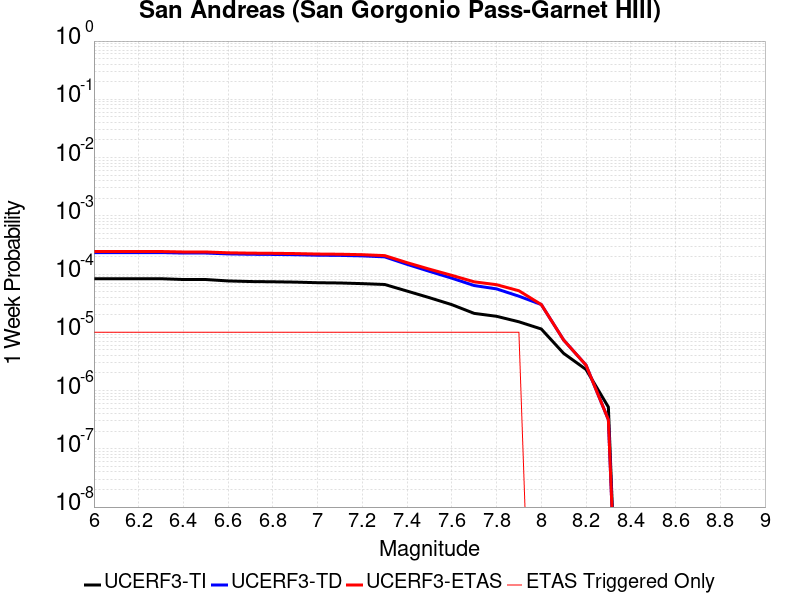 |  |  | 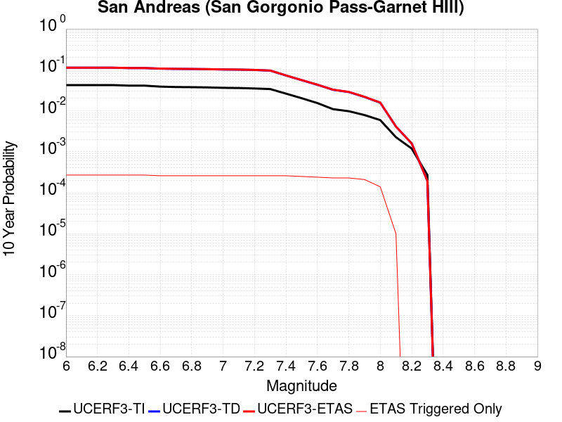 |

| Magnitude | 1 wk TI Prob | 1 wk TD Prob | 1 wk ETAS Prob | 1 wk ETAS/TD Gain | 1 wk ETAS Triggered Only | 1 mo TI Prob | 1 mo TD Prob | 1 mo ETAS Prob | 1 mo ETAS/TD Gain | 1 mo ETAS Triggered Only | 1 yr TI Prob | 1 yr TD Prob | 1 yr ETAS Prob | 1 yr ETAS/TD Gain | 1 yr ETAS Triggered Only | 10 yr TI Prob | 10 yr TD Prob | 10 yr ETAS Prob | 10 yr ETAS/TD Gain | 10 yr ETAS Triggered Only |
|-----|-----|-----|-----|-----|-----|-----|-----|-----|-----|-----|-----|-----|-----|-----|-----|-----|-----|-----|-----|-----|
| 6.0 | 8.31567E-5 | 2.338839E-4 | 2.4388156E-4 | 1.0427463 | 1.0E-5 | 3.5633717E-4 | 0.0010019708 | 0.0010419308 | 1.0398813 | 4.0E-5 | 0.004329778 | 0.01213065 | 0.012259074 | 1.0105866 | 1.3E-4 | 0.042463828 | 0.11259771 | 0.112837315 | 1.0021279 | 2.7E-4 |
| 6.1 | 8.31567E-5 | 2.338839E-4 | 2.4388156E-4 | 1.0427463 | 1.0E-5 | 3.5633717E-4 | 0.0010019708 | 0.0010419308 | 1.0398813 | 4.0E-5 | 0.004329778 | 0.01213065 | 0.012259074 | 1.0105866 | 1.3E-4 | 0.042463828 | 0.11259771 | 0.112837315 | 1.0021279 | 2.7E-4 |
| 6.2 | 8.31567E-5 | 2.338839E-4 | 2.4388156E-4 | 1.0427463 | 1.0E-5 | 3.5633717E-4 | 0.0010019708 | 0.0010419308 | 1.0398813 | 4.0E-5 | 0.004329778 | 0.01213065 | 0.012259074 | 1.0105866 | 1.3E-4 | 0.042463828 | 0.11259771 | 0.112837315 | 1.0021279 | 2.7E-4 |
| 6.3 | 8.31567E-5 | 2.338839E-4 | 2.4388156E-4 | 1.0427463 | 1.0E-5 | 3.5633717E-4 | 0.0010019708 | 0.0010419308 | 1.0398813 | 4.0E-5 | 0.004329778 | 0.01213065 | 0.012259074 | 1.0105866 | 1.3E-4 | 0.042463828 | 0.11259771 | 0.112837315 | 1.0021279 | 2.7E-4 |
| 6.4 | 8.059055E-5 | 2.2945837E-4 | 2.3945607E-4 | 1.0435709 | 1.0E-5 | 3.4534236E-4 | 9.830239E-4 | 0.0010229846 | 1.0406507 | 4.0E-5 | 0.0041964394 | 0.011902837 | 0.01203129 | 1.0107918 | 1.3E-4 | 0.041180745 | 0.11057874 | 0.110818885 | 1.0021718 | 2.7E-4 |
| 6.5 | 8.059055E-5 | 2.2945837E-4 | 2.3945607E-4 | 1.0435709 | 1.0E-5 | 3.4534236E-4 | 9.830239E-4 | 0.0010229846 | 1.0406507 | 4.0E-5 | 0.0041964394 | 0.011902837 | 0.01203129 | 1.0107918 | 1.3E-4 | 0.041180745 | 0.11057874 | 0.110818885 | 1.0021718 | 2.7E-4 |
| 6.6 | 7.619237E-5 | 2.2190346E-4 | 2.3190124E-4 | 1.0450547 | 1.0E-5 | 3.2649786E-4 | 9.5067057E-4 | 9.906326E-4 | 1.0420356 | 4.0E-5 | 0.0039678677 | 0.011513535 | 0.011632153 | 1.0103025 | 1.2E-4 | 0.03897764 | 0.107115194 | 0.10734735 | 1.0021673 | 2.6E-4 |
| 6.7 | 7.440636E-5 | 2.1866155E-4 | 2.2865935E-4 | 1.0457227 | 1.0E-5 | 3.188454E-4 | 9.367866E-4 | 9.767491E-4 | 1.0426592 | 4.0E-5 | 0.0038750346 | 0.011346267 | 0.011464905 | 1.0104562 | 1.2E-4 | 0.038081564 | 0.105623715 | 0.105856255 | 1.0022016 | 2.6E-4 |
| 6.8 | 7.3735864E-5 | 2.1713313E-4 | 2.2713096E-4 | 1.0460447 | 1.0E-5 | 3.1597257E-4 | 9.3024096E-4 | 9.702038E-4 | 1.0429596 | 4.0E-5 | 0.0038401815 | 0.011267403 | 0.011386051 | 1.0105302 | 1.2E-4 | 0.03774495 | 0.10492511 | 0.10515783 | 1.002218 | 2.6E-4 |
| 6.9 | 7.27575E-5 | 2.1482276E-4 | 2.2482061E-4 | 1.04654 | 1.0E-5 | 3.117806E-4 | 9.203464E-4 | 9.603096E-4 | 1.0434219 | 4.0E-5 | 0.003789323 | 0.011148175 | 0.011266838 | 1.0106441 | 1.2E-4 | 0.037253562 | 0.103873 | 0.104105994 | 1.002243 | 2.6E-4 |
| 7.0 | 7.102591E-5 | 2.10663E-4 | 2.2066089E-4 | 1.0474591 | 1.0E-5 | 3.0436125E-4 | 9.0253126E-4 | 9.424951E-4 | 1.0442798 | 4.0E-5 | 0.003699303 | 0.010933471 | 0.011052159 | 1.0108554 | 1.2E-4 | 0.03638325 | 0.10197552 | 0.10220901 | 1.0022897 | 2.6E-4 |
| 7.1 | 7.028513E-5 | 2.0901936E-4 | 2.1901727E-4 | 1.0478325 | 1.0E-5 | 3.0118722E-4 | 8.95492E-4 | 9.3545613E-4 | 1.0446281 | 4.0E-5 | 0.0036607897 | 0.010848625 | 0.010967323 | 1.0109413 | 1.2E-4 | 0.036010686 | 0.10121833 | 0.101452015 | 1.0023087 | 2.6E-4 |
| 7.2 | 6.8498244E-5 | 2.0509785E-4 | 2.150958E-4 | 1.0487472 | 1.0E-5 | 2.9353087E-4 | 8.786969E-4 | 9.1866177E-4 | 1.0454819 | 4.0E-5 | 0.003567883 | 0.010646159 | 0.010764881 | 1.0111517 | 1.2E-4 | 0.035111405 | 0.09941009 | 0.099644236 | 1.0023555 | 2.6E-4 |
| 7.3 | 6.622592E-5 | 1.9737013E-4 | 2.0736815E-4 | 1.0506562 | 1.0E-5 | 2.8379448E-4 | 8.455999E-4 | 8.855661E-4 | 1.0472637 | 4.0E-5 | 0.0034497243 | 0.010247062 | 0.010365832 | 1.0115907 | 1.2E-4 | 0.033966612 | 0.09590662 | 0.09614169 | 1.002451 | 2.6E-4 |
| 7.4 | 5.1050705E-5 | 1.4693316E-4 | 1.569317E-4 | 1.0680481 | 1.0E-5 | 2.1877038E-4 | 6.295625E-4 | 6.695373E-4 | 1.0634962 | 4.0E-5 | 0.002660276 | 0.0076381783 | 0.0077572614 | 1.0155905 | 1.2E-4 | 0.02628654 | 0.07287833 | 0.07311939 | 1.0033076 | 2.6E-4 |
| 7.5 | 3.9302922E-5 | 1.1133535E-4 | 1.2133423E-4 | 1.0898087 | 1.0E-5 | 1.6843023E-4 | 4.7706455E-4 | 5.170455E-4 | 1.083806 | 4.0E-5 | 0.0020487092 | 0.0057928623 | 0.005912167 | 1.0205952 | 1.2E-4 | 0.020299247 | 0.056023482 | 0.05625948 | 1.0042124 | 2.5E-4 |
| 7.6 | 2.9851626E-5 | 8.498211E-5 | 9.498126E-5 | 1.1176618 | 1.0E-5 | 1.2792926E-4 | 3.6415833E-4 | 3.9414738E-4 | 1.0823518 | 3.0E-5 | 0.0015564259 | 0.00442464 | 0.0045341533 | 1.0247508 | 1.1E-4 | 0.0154556995 | 0.043206394 | 0.043436024 | 1.0053147 | 2.4E-4 |
| 7.7 | 2.1135214E-5 | 6.355745E-5 | 7.355681E-5 | 1.157328 | 1.0E-5 | 9.0576345E-5 | 2.7236066E-4 | 3.0235248E-4 | 1.110118 | 3.0E-5 | 0.0011022091 | 0.0033109542 | 0.00342059 | 1.033113 | 1.1E-4 | 0.010967582 | 0.03259442 | 0.03281692 | 1.0068264 | 2.3E-4 |
| 7.8 | 1.883379E-5 | 5.5666103E-5 | 6.566555E-5 | 1.1796325 | 1.0E-5 | 8.0713755E-5 | 2.3854722E-4 | 2.6854005E-4 | 1.1257312 | 3.0E-5 | 9.822468E-4 | 0.0029004475 | 0.0030101284 | 1.0378152 | 1.1E-4 | 0.0097791655 | 0.02870594 | 0.028929338 | 1.0077822 | 2.3E-4 |
| 7.9 | 1.5156185E-5 | 4.167907E-5 | 5.1678657E-5 | 1.2399186 | 1.0E-5 | 6.495346E-5 | 1.7861238E-4 | 2.0860702E-4 | 1.1679314 | 3.0E-5 | 7.9052144E-4 | 0.0021724382 | 0.002272221 | 1.0459312 | 1.0E-4 | 0.007877152 | 0.021768799 | 0.021974226 | 1.0094368 | 2.1E-4 |
| 8.0 | 1.1405907E-5 | 2.9989498E-5 | 2.9989498E-5 | 1.0 | 0.0 | 4.8881542E-5 | 1.2852009E-4 | 1.3851881E-4 | 1.0777988 | 1.0E-5 | 5.9497025E-4 | 0.00156361 | 0.0016135318 | 1.0319272 | 5.0E-5 | 0.005933798 | 0.015779829 | 0.01591762 | 1.0087321 | 1.4E-4 |
| 8.1 | 4.3511436E-6 | 7.3739657E-6 | 7.3739657E-6 | 1.0 | 0.0 | 1.8647626E-5 | 3.160233E-5 | 3.160233E-5 | 1.0 | 0.0 | 2.2701119E-4 | 3.8469053E-4 | 3.9468668E-4 | 1.0259849 | 1.0E-5 | 0.0022677942 | 0.0041186865 | 0.0041286456 | 1.0024179 | 1.0E-5 |
| 8.2 | 2.3042528E-6 | 2.7349201E-6 | 2.7349201E-6 | 1.0 | 0.0 | 9.875332E-6 | 1.1721034E-5 | 1.1721034E-5 | 1.0 | 0.0 | 1.2022553E-4 | 1.4269429E-4 | 1.4269429E-4 | 1.0 | 0.0 | 0.0012016051 | 0.0015990431 | 0.0015990431 | 1.0 | 0.0 |
| 8.3 | 5.202968E-7 | 3.1619535E-7 | 3.1619535E-7 | 1.0 | 0.0 | 2.2298414E-6 | 1.3551223E-6 | 1.3551223E-6 | 1.0 | 0.0 | 2.714798E-5 | 1.6498503E-5 | 1.6498503E-5 | 1.0 | 0.0 | 2.7144665E-4 | 1.9577713E-4 | 1.9577713E-4 | 1.0 | 0.0 |

## Red Pass
*[(top)](#table-of-contents)*

| 1 Week | 1 Month | 1 Year | 10 Year |
|-----|-----|-----|-----|
|  |  | 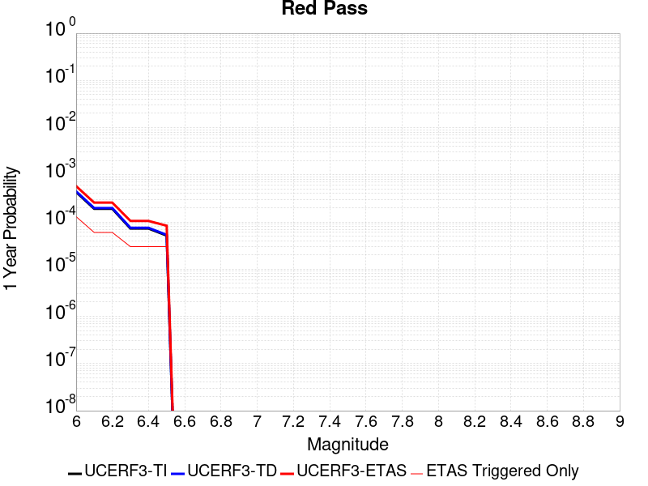 |  |

| Magnitude | 1 wk TI Prob | 1 wk TD Prob | 1 wk ETAS Prob | 1 wk ETAS/TD Gain | 1 wk ETAS Triggered Only | 1 mo TI Prob | 1 mo TD Prob | 1 mo ETAS Prob | 1 mo ETAS/TD Gain | 1 mo ETAS Triggered Only | 1 yr TI Prob | 1 yr TD Prob | 1 yr ETAS Prob | 1 yr ETAS/TD Gain | 1 yr ETAS Triggered Only | 10 yr TI Prob | 10 yr TD Prob | 10 yr ETAS Prob | 10 yr ETAS/TD Gain | 10 yr ETAS Triggered Only |
|-----|-----|-----|-----|-----|-----|-----|-----|-----|-----|-----|-----|-----|-----|-----|-----|-----|-----|-----|-----|-----|
| 6.0 | 8.258278E-6 | 8.551305E-6 | 8.551305E-6 | 1.0 | 0.0 | 3.539214E-5 | 3.6648038E-5 | 5.6647303E-5 | 1.5457119 | 2.0E-5 | 4.308141E-4 | 4.4611638E-4 | 5.760584E-4 | 1.2912738 | 1.3E-4 | 0.0042997985 | 0.004453966 | 0.0047227633 | 1.0603502 | 2.7E-4 |
| 6.1 | 3.649988E-6 | 3.7753332E-6 | 3.7753332E-6 | 1.0 | 0.0 | 1.5642712E-5 | 1.6179927E-5 | 3.61796E-5 | 2.2360797 | 2.0E-5 | 1.9043336E-4 | 1.9697756E-4 | 2.5696575E-4 | 1.3045433 | 6.0E-5 | 0.0019027026 | 0.001968497 | 0.0020882608 | 1.0608402 | 1.2E-4 |
| 6.2 | 3.649988E-6 | 3.7753332E-6 | 3.7753332E-6 | 1.0 | 0.0 | 1.5642712E-5 | 1.6179927E-5 | 3.61796E-5 | 2.2360797 | 2.0E-5 | 1.9043336E-4 | 1.9697756E-4 | 2.5696575E-4 | 1.3045433 | 6.0E-5 | 0.0019027026 | 0.001968497 | 0.0020882608 | 1.0608402 | 1.2E-4 |
| 6.3 | 1.3924937E-6 | 1.4411233E-6 | 1.4411233E-6 | 1.0 | 0.0 | 5.9678164E-6 | 6.176236E-6 | 2.6176112E-5 | 4.2381983 | 2.0E-5 | 7.265574E-5 | 7.51945E-5 | 1.0519224E-4 | 1.3989354 | 3.0E-5 | 7.263199E-4 | 7.518293E-4 | 8.117842E-4 | 1.0797453 | 6.0E-5 |
| 6.4 | 1.3924937E-6 | 1.4411233E-6 | 1.4411233E-6 | 1.0 | 0.0 | 5.9678164E-6 | 6.176236E-6 | 2.6176112E-5 | 4.2381983 | 2.0E-5 | 7.265574E-5 | 7.51945E-5 | 1.0519224E-4 | 1.3989354 | 3.0E-5 | 7.263199E-4 | 7.518293E-4 | 8.117842E-4 | 1.0797453 | 6.0E-5 |
| 6.5 | 9.876812E-7 | 1.022196E-6 | 1.022196E-6 | 1.0 | 0.0 | 4.2329125E-6 | 4.38084E-6 | 2.4380752E-5 | 5.565315 | 2.0E-5 | 5.153449E-5 | 5.3336724E-5 | 8.333512E-5 | 1.5624342 | 3.0E-5 | 5.1522546E-4 | 5.333672E-4 | 5.9333525E-4 | 1.1124328 | 6.0E-5 |

## Elsinore (Glen Ivy) rev
*[(top)](#table-of-contents)*

| 1 Week | 1 Month | 1 Year | 10 Year |
|-----|-----|-----|-----|
|  |  |  | 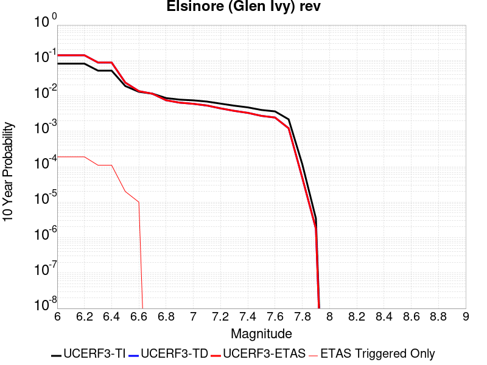 |

| Magnitude | 1 wk TI Prob | 1 wk TD Prob | 1 wk ETAS Prob | 1 wk ETAS/TD Gain | 1 wk ETAS Triggered Only | 1 mo TI Prob | 1 mo TD Prob | 1 mo ETAS Prob | 1 mo ETAS/TD Gain | 1 mo ETAS Triggered Only | 1 yr TI Prob | 1 yr TD Prob | 1 yr ETAS Prob | 1 yr ETAS/TD Gain | 1 yr ETAS Triggered Only | 10 yr TI Prob | 10 yr TD Prob | 10 yr ETAS Prob | 10 yr ETAS/TD Gain | 10 yr ETAS Triggered Only |
|-----|-----|-----|-----|-----|-----|-----|-----|-----|-----|-----|-----|-----|-----|-----|-----|-----|-----|-----|-----|-----|
| 6.0 | 1.6204086E-4 | 2.9373635E-4 | 3.037334E-4 | 1.0340341 | 1.0E-5 | 6.94276E-4 | 0.0012584174 | 0.001298367 | 1.0317459 | 4.0E-5 | 0.008420097 | 0.01523484 | 0.015343165 | 1.0071102 | 1.1E-4 | 0.081081145 | 0.13962553 | 0.139789 | 1.0011708 | 1.9E-4 |
| 6.1 | 1.6204086E-4 | 2.9373635E-4 | 3.037334E-4 | 1.0340341 | 1.0E-5 | 6.94276E-4 | 0.0012584174 | 0.001298367 | 1.0317459 | 4.0E-5 | 0.008420097 | 0.01523484 | 0.015343165 | 1.0071102 | 1.1E-4 | 0.081081145 | 0.13962553 | 0.139789 | 1.0011708 | 1.9E-4 |
| 6.2 | 1.6204086E-4 | 2.9373635E-4 | 3.037334E-4 | 1.0340341 | 1.0E-5 | 6.94276E-4 | 0.0012584174 | 0.001298367 | 1.0317459 | 4.0E-5 | 0.008420097 | 0.01523484 | 0.015343165 | 1.0071102 | 1.1E-4 | 0.081081145 | 0.13962553 | 0.139789 | 1.0011708 | 1.9E-4 |
| 6.3 | 1.0111737E-4 | 1.7703637E-4 | 1.7703637E-4 | 1.0 | 0.0 | 4.332882E-4 | 7.586233E-4 | 7.7860814E-4 | 1.0263436 | 2.0E-5 | 0.005262531 | 0.009217811 | 0.009267351 | 1.0053743 | 5.0E-5 | 0.0513964 | 0.08707389 | 0.08717431 | 1.0011533 | 1.1E-4 |
| 6.4 | 1.0111737E-4 | 1.7703637E-4 | 1.7703637E-4 | 1.0 | 0.0 | 4.332882E-4 | 7.586233E-4 | 7.7860814E-4 | 1.0263436 | 2.0E-5 | 0.005262531 | 0.009217811 | 0.009267351 | 1.0053743 | 5.0E-5 | 0.0513964 | 0.08707389 | 0.08717431 | 1.0011533 | 1.1E-4 |
| 6.5 | 3.6624708E-5 | 4.6393732E-5 | 4.6393732E-5 | 1.0 | 0.0 | 1.569536E-4 | 1.9881714E-4 | 1.9881714E-4 | 1.0 | 0.0 | 0.001909235 | 0.0024182722 | 0.002428248 | 1.0041252 | 1.0E-5 | 0.01892915 | 0.023697015 | 0.023716541 | 1.000824 | 2.0E-5 |
| 6.6 | 2.5051324E-5 | 2.6148944E-5 | 2.6148944E-5 | 1.0 | 0.0 | 1.073584E-4 | 1.1206234E-4 | 1.1206234E-4 | 1.0 | 0.0 | 0.0013063047 | 0.0013635496 | 0.001373536 | 1.0073237 | 1.0E-5 | 0.012986525 | 0.013565712 | 0.013575575 | 1.0007272 | 1.0E-5 |
| 6.7 | 2.2189772E-5 | 2.2073793E-5 | 2.2073793E-5 | 1.0 | 0.0 | 9.509556E-5 | 9.459874E-5 | 9.459874E-5 | 1.0 | 0.0 | 0.0011571734 | 0.0011511676 | 0.0011511676 | 1.0 | 0.0 | 0.011511663 | 0.011466403 | 0.011466403 | 1.0 | 0.0 |
| 6.8 | 1.6654378E-5 | 1.4438363E-5 | 1.4438363E-5 | 1.0 | 0.0 | 7.137396E-5 | 6.187726E-5 | 6.187726E-5 | 1.0 | 0.0 | 8.686314E-4 | 7.5310044E-4 | 7.5310044E-4 | 1.0 | 0.0 | 0.008652439 | 0.0075102663 | 0.0075102663 | 1.0 | 0.0 |
| 6.9 | 1.5042909E-5 | 1.2332568E-5 | 1.2332568E-5 | 1.0 | 0.0 | 6.446802E-5 | 5.285281E-5 | 5.285281E-5 | 1.0 | 0.0 | 7.8461546E-4 | 6.432961E-4 | 6.432961E-4 | 1.0 | 0.0 | 0.007818509 | 0.0064180964 | 0.0064180964 | 1.0 | 0.0 |
| 7.0 | 1.4361385E-5 | 1.1451833E-5 | 1.1451833E-5 | 1.0 | 0.0 | 6.154734E-5 | 4.907838E-5 | 4.907838E-5 | 1.0 | 0.0 | 7.490812E-4 | 5.973684E-4 | 5.973684E-4 | 1.0 | 0.0 | 0.007465612 | 0.0059608603 | 0.0059608603 | 1.0 | 0.0 |
| 7.1 | 1.3265571E-5 | 1.0245265E-5 | 1.0245265E-5 | 1.0 | 0.0 | 5.6851208E-5 | 4.3907552E-5 | 4.3907552E-5 | 1.0 | 0.0 | 6.919436E-4 | 5.3444586E-4 | 5.3444586E-4 | 1.0 | 0.0 | 0.006897931 | 0.005334682 | 0.005334682 | 1.0 | 0.0 |
| 7.2 | 1.1596403E-5 | 8.505279E-6 | 8.505279E-6 | 1.0 | 0.0 | 4.9697923E-5 | 3.6450696E-5 | 3.6450696E-5 | 1.0 | 0.0 | 6.049042E-4 | 4.4369852E-4 | 4.4369852E-4 | 1.0 | 0.0 | 0.006032603 | 0.004429451 | 0.004429451 | 1.0 | 0.0 |
| 7.3 | 1.0150827E-5 | 7.238911E-6 | 7.238911E-6 | 1.0 | 0.0 | 4.3502816E-5 | 3.1023545E-5 | 3.1023545E-5 | 1.0 | 0.0 | 5.2951806E-4 | 3.7764764E-4 | 3.7764764E-4 | 1.0 | 0.0 | 0.005282581 | 0.003770453 | 0.003770453 | 1.0 | 0.0 |
| 7.4 | 9.080705E-6 | 6.352632E-6 | 6.352632E-6 | 1.0 | 0.0 | 3.8916725E-5 | 2.7225291E-5 | 2.7225291E-5 | 1.0 | 0.0 | 4.7370812E-4 | 3.3141885E-4 | 3.3141885E-4 | 1.0 | 0.0 | 0.004726996 | 0.0033093947 | 0.0033093947 | 1.0 | 0.0 |
| 7.5 | 7.671649E-6 | 5.2257096E-6 | 5.2257096E-6 | 1.0 | 0.0 | 3.287808E-5 | 2.2395712E-5 | 2.2395712E-5 | 1.0 | 0.0 | 4.0021708E-4 | 2.7263493E-4 | 2.7263493E-4 | 1.0 | 0.0 | 0.0039949706 | 0.0027231297 | 0.0027231297 | 1.0 | 0.0 |
| 7.6 | 6.990086E-6 | 4.6875944E-6 | 4.6875944E-6 | 1.0 | 0.0 | 2.9957167E-5 | 2.0089543E-5 | 2.0089543E-5 | 1.0 | 0.0 | 3.6466747E-4 | 2.445639E-4 | 2.445639E-4 | 1.0 | 0.0 | 0.0036406964 | 0.0024430638 | 0.0024430638 | 1.0 | 0.0 |
| 7.7 | 4.163505E-6 | 2.3295045E-6 | 2.3295045E-6 | 1.0 | 0.0 | 1.7843471E-5 | 9.983556E-6 | 9.983556E-6 | 1.0 | 0.0 | 2.172226E-4 | 1.2154376E-4 | 1.2154376E-4 | 1.0 | 0.0 | 0.0021701038 | 0.0012148459 | 0.0012148459 | 1.0 | 0.0 |
| 7.8 | 2.2692414E-7 | 9.384624E-8 | 9.384624E-8 | 1.0 | 0.0 | 9.725317E-7 | 4.021981E-7 | 4.021981E-7 | 1.0 | 0.0 | 1.1840509E-5 | 4.8967545E-6 | 4.8967545E-6 | 1.0 | 0.0 | 1.1839878E-4 | 4.8966795E-5 | 4.8966795E-5 | 1.0 | 0.0 |
| 7.9 | 6.676829E-9 | 3.4397993E-9 | 3.4397993E-9 | 1.0 | 0.0 | 2.861498E-8 | 1.4741998E-8 | 1.4741998E-8 | 1.0 | 0.0 | 3.4838732E-7 | 1.794838E-7 | 1.794838E-7 | 1.0 | 0.0 | 3.4838679E-6 | 1.7948367E-6 | 1.7948367E-6 | 1.0 | 0.0 |

## San Andreas (Creeping Section) 2011 CFM
*[(top)](#table-of-contents)*

| 1 Week | 1 Month | 1 Year | 10 Year |
|-----|-----|-----|-----|
| 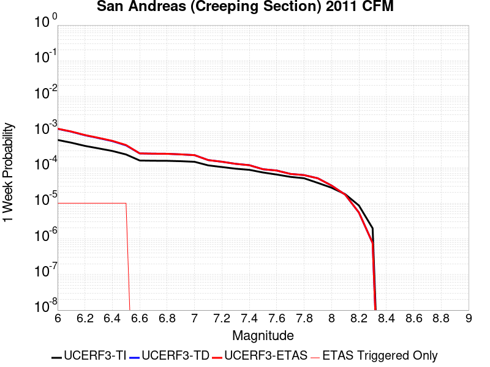 |  |  |  |

| Magnitude | 1 wk TI Prob | 1 wk TD Prob | 1 wk ETAS Prob | 1 wk ETAS/TD Gain | 1 wk ETAS Triggered Only | 1 mo TI Prob | 1 mo TD Prob | 1 mo ETAS Prob | 1 mo ETAS/TD Gain | 1 mo ETAS Triggered Only | 1 yr TI Prob | 1 yr TD Prob | 1 yr ETAS Prob | 1 yr ETAS/TD Gain | 1 yr ETAS Triggered Only | 10 yr TI Prob | 10 yr TD Prob | 10 yr ETAS Prob | 10 yr ETAS/TD Gain | 10 yr ETAS Triggered Only |
|-----|-----|-----|-----|-----|-----|-----|-----|-----|-----|-----|-----|-----|-----|-----|-----|-----|-----|-----|-----|-----|
| 6.0 | 5.986481E-4 | 0.001227701 | 0.0012376886 | 1.0081353 | 1.0E-5 | 0.0025631124 | 0.005246098 | 0.0052560456 | 1.0018961 | 1.0E-5 | 0.030762846 | 0.061211813 | 0.06130569 | 1.0015336 | 1.0E-4 | 0.26835477 | 0.42596716 | 0.42607048 | 1.0002426 | 1.8E-4 |
| 6.1 | 5.015945E-4 | 0.0010218859 | 0.0010318757 | 1.0097759 | 1.0E-5 | 0.00214792 | 0.0043683136 | 0.00437827 | 1.0022792 | 1.0E-5 | 0.025839351 | 0.051254056 | 0.051329955 | 1.0014808 | 8.0E-5 | 0.23032776 | 0.3728875 | 0.3729878 | 1.000269 | 1.6E-4 |
| 6.2 | 4.073338E-4 | 8.1082666E-4 | 8.208186E-4 | 1.0123231 | 1.0E-5 | 0.0017445484 | 0.003467598 | 0.0034775634 | 1.0028739 | 1.0E-5 | 0.021034058 | 0.040938858 | 0.041005995 | 1.0016398 | 7.0E-5 | 0.19150782 | 0.31306726 | 0.31317028 | 1.0003291 | 1.5E-4 |
| 6.3 | 3.464099E-4 | 6.740175E-4 | 6.8401074E-4 | 1.0148264 | 1.0E-5 | 0.0014837692 | 0.0028834257 | 0.002893397 | 1.0034581 | 1.0E-5 | 0.017915873 | 0.034195323 | 0.03426293 | 1.0019771 | 7.0E-5 | 0.16538359 | 0.27135244 | 0.27145445 | 1.000376 | 1.4E-4 |
| 6.4 | 2.935057E-4 | 5.545179E-4 | 5.645124E-4 | 1.0180237 | 1.0E-5 | 0.0012572751 | 0.002372998 | 0.0023829744 | 1.004204 | 1.0E-5 | 0.015200248 | 0.028270293 | 0.028338313 | 1.0024061 | 7.0E-5 | 0.14201577 | 0.23302312 | 0.2331305 | 1.0004607 | 1.4E-4 |
| 6.5 | 2.3409708E-4 | 4.2102532E-4 | 4.3102112E-4 | 1.0237415 | 1.0E-5 | 0.0010028875 | 0.0018024362 | 0.0018124182 | 1.0055381 | 1.0E-5 | 0.012141965 | 0.021593295 | 0.021661784 | 1.0031718 | 7.0E-5 | 0.11499573 | 0.18686365 | 0.18697749 | 1.0006092 | 1.4E-4 |
| 6.6 | 1.5842178E-4 | 2.5080625E-4 | 2.5080625E-4 | 1.0 | 0.0 | 6.7877385E-4 | 0.0010744325 | 0.0010744325 | 1.0 | 0.0 | 0.0082328 | 0.013001433 | 0.013060653 | 1.0045549 | 6.0E-5 | 0.07934396 | 0.12318965 | 0.12330364 | 1.0009253 | 1.3E-4 |
| 6.7 | 1.5616413E-4 | 2.4617155E-4 | 2.4617155E-4 | 1.0 | 0.0 | 6.691031E-4 | 0.0010545887 | 0.0010545887 | 1.0 | 0.0 | 0.0081159435 | 0.012763296 | 0.01282253 | 1.0046409 | 6.0E-5 | 0.0782586 | 0.121216856 | 0.121331096 | 1.0009425 | 1.3E-4 |
| 6.8 | 1.5538467E-4 | 2.4440986E-4 | 2.4440986E-4 | 1.0 | 0.0 | 6.6576427E-4 | 0.0010470453 | 0.0010470453 | 1.0 | 0.0 | 0.008075596 | 0.012672617 | 0.012731857 | 1.0046747 | 6.0E-5 | 0.07788358 | 0.12044768 | 0.120562024 | 1.0009493 | 1.3E-4 |
| 6.9 | 1.5153569E-4 | 2.3550174E-4 | 2.3550174E-4 | 1.0 | 0.0 | 6.49277E-4 | 0.0010089047 | 0.0010089047 | 1.0 | 0.0 | 0.007876333 | 0.012214754 | 0.012274021 | 1.004852 | 6.0E-5 | 0.07602952 | 0.1165177 | 0.11663256 | 1.0009857 | 1.3E-4 |
| 7.0 | 1.4588932E-4 | 2.2407302E-4 | 2.2407302E-4 | 1.0 | 0.0 | 6.250901E-4 | 9.599615E-4 | 9.599615E-4 | 1.0 | 0.0 | 0.0075839474 | 0.011625397 | 0.011684699 | 1.0051011 | 6.0E-5 | 0.073302895 | 0.1113634 | 0.111478925 | 1.0010374 | 1.3E-4 |
| 7.1 | 1.1565079E-4 | 1.6291256E-4 | 1.6291256E-4 | 1.0 | 0.0 | 4.955521E-4 | 6.980107E-4 | 6.980107E-4 | 1.0 | 0.0 | 0.006016669 | 0.008465368 | 0.00852486 | 1.0070277 | 6.0E-5 | 0.058563538 | 0.083707 | 0.08382612 | 1.001423 | 1.3E-4 |
| 7.2 | 1.0393792E-4 | 1.4624851E-4 | 1.4624851E-4 | 1.0 | 0.0 | 4.4537216E-4 | 6.2662957E-4 | 6.2662957E-4 | 1.0 | 0.0 | 0.005408933 | 0.007602697 | 0.007662241 | 1.0078319 | 6.0E-5 | 0.052791595 | 0.0756556 | 0.07577577 | 1.0015883 | 1.3E-4 |
| 7.3 | 9.332884E-5 | 1.2788622E-4 | 1.2788622E-4 | 1.0 | 0.0 | 3.999194E-4 | 5.479693E-4 | 5.479693E-4 | 1.0 | 0.0 | 0.0048581534 | 0.006651253 | 0.006710854 | 1.0089608 | 6.0E-5 | 0.047533102 | 0.06651429 | 0.06663564 | 1.0018245 | 1.3E-4 |
| 7.4 | 8.670252E-5 | 1.1709979E-4 | 1.1709979E-4 | 1.0 | 0.0 | 3.715293E-4 | 5.0176034E-4 | 5.0176034E-4 | 1.0 | 0.0 | 0.004513991 | 0.0060919416 | 0.006141637 | 1.0081576 | 5.0E-5 | 0.044233937 | 0.0611787 | 0.06129136 | 1.0018414 | 1.2E-4 |
| 7.5 | 7.3036405E-5 | 9.011361E-5 | 9.011361E-5 | 1.0 | 0.0 | 3.129756E-4 | 3.861441E-4 | 3.861441E-4 | 1.0 | 0.0 | 0.0038038217 | 0.0046911915 | 0.0047409567 | 1.0106083 | 5.0E-5 | 0.03739367 | 0.047902368 | 0.04801662 | 1.0023851 | 1.2E-4 |
| 7.6 | 6.3935775E-5 | 8.285012E-5 | 8.285012E-5 | 1.0 | 0.0 | 2.7398168E-4 | 3.5502372E-4 | 3.5502372E-4 | 1.0 | 0.0 | 0.0033306254 | 0.0043138657 | 0.00436365 | 1.0115405 | 5.0E-5 | 0.032811474 | 0.044012927 | 0.044127643 | 1.0026065 | 1.2E-4 |
| 7.7 | 5.5050095E-5 | 6.6658926E-5 | 6.6658926E-5 | 1.0 | 0.0 | 2.3590765E-4 | 2.8564985E-4 | 2.8564985E-4 | 1.0 | 0.0 | 0.0028683927 | 0.0034722448 | 0.0035021408 | 1.0086099 | 3.0E-5 | 0.0283165 | 0.03581521 | 0.035901986 | 1.0024229 | 9.0E-5 |
| 7.8 | 5.027131E-5 | 6.166573E-5 | 6.166573E-5 | 1.0 | 0.0 | 2.1543067E-4 | 2.6425492E-4 | 2.6425492E-4 | 1.0 | 0.0 | 0.0026197135 | 0.0032125604 | 0.003242464 | 1.0093083 | 3.0E-5 | 0.025890453 | 0.03314427 | 0.033221617 | 1.0023336 | 8.0E-5 |
| 7.9 | 3.7271806E-5 | 5.0254795E-5 | 5.0254795E-5 | 1.0 | 0.0 | 1.5972654E-4 | 2.1535992E-4 | 2.1535992E-4 | 1.0 | 0.0 | 0.0019429359 | 0.0026188563 | 0.002638804 | 1.0076169 | 2.0E-5 | 0.019260362 | 0.027081393 | 0.027149497 | 1.0025148 | 7.0E-5 |
| 8.0 | 2.7310243E-5 | 3.1447296E-5 | 3.1447296E-5 | 1.0 | 0.0 | 1.17038646E-4 | 1.3476716E-4 | 1.3476716E-4 | 1.0 | 0.0 | 0.0014240141 | 0.0016395561 | 0.0016495398 | 1.0060892 | 1.0E-5 | 0.014149235 | 0.017223299 | 0.017252782 | 1.0017118 | 3.0E-5 |
| 8.1 | 1.7940547E-5 | 1.7411876E-5 | 1.7411876E-5 | 1.0 | 0.0 | 7.688579E-5 | 7.46202E-5 | 7.46202E-5 | 1.0 | 0.0 | 9.3568244E-4 | 9.0812275E-4 | 9.181137E-4 | 1.0110017 | 1.0E-5 | 0.009317525 | 0.009804959 | 0.009814861 | 1.00101 | 1.0E-5 |
| 8.2 | 8.643924E-6 | 5.478665E-6 | 5.478665E-6 | 1.0 | 0.0 | 3.704486E-5 | 2.3479783E-5 | 2.3479783E-5 | 1.0 | 0.0 | 4.5092785E-4 | 2.8582895E-4 | 2.8582895E-4 | 1.0 | 0.0 | 0.0045001395 | 0.0032508469 | 0.0032508469 | 1.0 | 0.0 |
| 8.3 | 1.983087E-6 | 7.6647797E-7 | 7.6647797E-7 | 1.0 | 0.0 | 8.498917E-6 | 3.2849016E-6 | 3.2849016E-6 | 1.0 | 0.0 | 1.034694E-4 | 3.999296E-5 | 3.999296E-5 | 1.0 | 0.0 | 0.0010342124 | 4.7228087E-4 | 4.7228087E-4 | 1.0 | 0.0 |

## Calico-Hidalgo
*[(top)](#table-of-contents)*

| 1 Week | 1 Month | 1 Year | 10 Year |
|-----|-----|-----|-----|
|  |  |  |  |

| Magnitude | 1 wk TI Prob | 1 wk TD Prob | 1 wk ETAS Prob | 1 wk ETAS/TD Gain | 1 wk ETAS Triggered Only | 1 mo TI Prob | 1 mo TD Prob | 1 mo ETAS Prob | 1 mo ETAS/TD Gain | 1 mo ETAS Triggered Only | 1 yr TI Prob | 1 yr TD Prob | 1 yr ETAS Prob | 1 yr ETAS/TD Gain | 1 yr ETAS Triggered Only | 10 yr TI Prob | 10 yr TD Prob | 10 yr ETAS Prob | 10 yr ETAS/TD Gain | 10 yr ETAS Triggered Only |
|-----|-----|-----|-----|-----|-----|-----|-----|-----|-----|-----|-----|-----|-----|-----|-----|-----|-----|-----|-----|-----|
| 6.0 | 4.0906612E-5 | 5.0705254E-5 | 7.0704235E-5 | 1.3944165 | 2.0E-5 | 1.7530227E-4 | 2.172924E-4 | 2.6728155E-4 | 1.2300547 | 5.0E-5 | 0.0021322158 | 0.0026427244 | 0.002772381 | 1.0490617 | 1.3E-4 | 0.02111873 | 0.026153268 | 0.026367513 | 1.008192 | 2.2E-4 |
| 6.1 | 4.0906612E-5 | 5.0705254E-5 | 7.0704235E-5 | 1.3944165 | 2.0E-5 | 1.7530227E-4 | 2.172924E-4 | 2.6728155E-4 | 1.2300547 | 5.0E-5 | 0.0021322158 | 0.0026427244 | 0.002772381 | 1.0490617 | 1.3E-4 | 0.02111873 | 0.026153268 | 0.026367513 | 1.008192 | 2.2E-4 |
| 6.2 | 4.0906612E-5 | 5.0705254E-5 | 7.0704235E-5 | 1.3944165 | 2.0E-5 | 1.7530227E-4 | 2.172924E-4 | 2.6728155E-4 | 1.2300547 | 5.0E-5 | 0.0021322158 | 0.0026427244 | 0.002772381 | 1.0490617 | 1.3E-4 | 0.02111873 | 0.026153268 | 0.026367513 | 1.008192 | 2.2E-4 |
| 6.3 | 2.4242801E-5 | 3.0091267E-5 | 4.0090967E-5 | 1.3323123 | 1.0E-5 | 1.0389358E-4 | 1.2895638E-4 | 1.5895252E-4 | 1.2326068 | 3.0E-5 | 0.0012641704 | 0.0015689468 | 0.0016388369 | 1.0445459 | 7.0E-5 | 0.01257003 | 0.015582383 | 0.015720202 | 1.0088445 | 1.4E-4 |
| 6.4 | 2.4242801E-5 | 3.0091267E-5 | 4.0090967E-5 | 1.3323123 | 1.0E-5 | 1.0389358E-4 | 1.2895638E-4 | 1.5895252E-4 | 1.2326068 | 3.0E-5 | 0.0012641704 | 0.0015689468 | 0.0016388369 | 1.0445459 | 7.0E-5 | 0.01257003 | 0.015582383 | 0.015720202 | 1.0088445 | 1.4E-4 |
| 6.5 | 2.0286952E-5 | 2.531624E-5 | 3.531599E-5 | 1.3949934 | 1.0E-5 | 8.694118E-5 | 1.08493754E-4 | 1.384905E-4 | 1.2764837 | 3.0E-5 | 0.0010579949 | 0.0013201282 | 0.0013900357 | 1.0529552 | 7.0E-5 | 0.010529719 | 0.013124796 | 0.01325309 | 1.0097749 | 1.3E-4 |
| 6.6 | 2.0269223E-5 | 2.529719E-5 | 3.5296936E-5 | 1.3952909 | 1.0E-5 | 8.6865206E-5 | 1.0841212E-4 | 1.3840887E-4 | 1.2766918 | 3.0E-5 | 0.0010570707 | 0.0013191354 | 0.001389043 | 1.0529951 | 7.0E-5 | 0.010520565 | 0.013114986 | 0.01324328 | 1.0097823 | 1.3E-4 |
| 6.7 | 1.799852E-5 | 2.2541075E-5 | 3.254085E-5 | 1.4436245 | 1.0E-5 | 7.713423E-5 | 9.6601114E-5 | 1.2659821E-4 | 1.3105254 | 3.0E-5 | 9.3870464E-4 | 0.0011754986 | 0.0012454164 | 1.0594792 | 7.0E-5 | 0.009347493 | 0.011694419 | 0.011822899 | 1.0109864 | 1.3E-4 |
| 6.8 | 1.7458793E-5 | 2.1842718E-5 | 3.18425E-5 | 1.4578085 | 1.0E-5 | 7.4821255E-5 | 9.360837E-5 | 1.2360555E-4 | 1.3204541 | 3.0E-5 | 9.10568E-4 | 0.0011391005 | 0.0012090207 | 1.061382 | 7.0E-5 | 0.009068459 | 0.011334201 | 0.0114627285 | 1.0113397 | 1.3E-4 |
| 6.9 | 1.542884E-5 | 1.9026409E-5 | 2.9026218E-5 | 1.5255753 | 1.0E-5 | 6.612192E-5 | 8.153928E-5 | 1.1153683E-4 | 1.3678908 | 3.0E-5 | 8.04737E-4 | 9.923017E-4 | 0.0010622323 | 1.0704731 | 7.0E-5 | 0.008018291 | 0.009880107 | 0.010008822 | 1.0130278 | 1.3E-4 |
| 7.0 | 1.468253E-5 | 1.8031209E-5 | 2.8031029E-5 | 1.554584 | 1.0E-5 | 6.292361E-5 | 7.7274395E-5 | 1.0727208E-4 | 1.388197 | 3.0E-5 | 7.658257E-4 | 9.404227E-4 | 0.0010003663 | 1.0637411 | 6.0E-5 | 0.0076319184 | 0.009365797 | 0.009484673 | 1.0126926 | 1.2E-4 |
| 7.1 | 1.3139281E-5 | 1.620149E-5 | 2.6201327E-5 | 1.6172172 | 1.0E-5 | 5.6309986E-5 | 6.9433176E-5 | 9.943109E-5 | 1.4320401 | 3.0E-5 | 6.853584E-4 | 8.450336E-4 | 9.049829E-4 | 1.0709431 | 6.0E-5 | 0.0068324856 | 0.008419501 | 0.008528575 | 1.012955 | 1.1E-4 |
| 7.2 | 1.1127404E-5 | 1.3867119E-5 | 2.386698E-5 | 1.7211204 | 1.0E-5 | 4.7688E-5 | 5.9429218E-5 | 7.942803E-5 | 1.3365148 | 2.0E-5 | 5.8044674E-4 | 7.233214E-4 | 7.732853E-4 | 1.0690756 | 5.0E-5 | 0.0057893298 | 0.007210779 | 0.007290202 | 1.0110145 | 8.0E-5 |
| 7.3 | 9.808154E-6 | 1.2176658E-5 | 2.2176537E-5 | 1.8212334 | 1.0E-5 | 4.2034266E-5 | 5.2184692E-5 | 7.218365E-5 | 1.3832341 | 2.0E-5 | 5.11647E-4 | 6.3517416E-4 | 6.7514874E-4 | 1.0629349 | 4.0E-5 | 0.0051047057 | 0.006334663 | 0.006404219 | 1.0109804 | 7.0E-5 |
| 7.4 | 7.942452E-6 | 9.792409E-6 | 1.9792311E-5 | 2.0211892 | 1.0E-5 | 3.4038632E-5 | 4.1966847E-5 | 6.1966006E-5 | 1.4765466 | 2.0E-5 | 4.1434157E-4 | 5.10836E-4 | 5.508156E-4 | 1.078263 | 4.0E-5 | 0.0041356985 | 0.005097559 | 0.005167202 | 1.0136621 | 7.0E-5 |
| 7.5 | 4.7121216E-6 | 5.7729853E-6 | 1.5772928E-5 | 2.732196 | 1.0E-5 | 2.019465E-5 | 2.4741174E-5 | 4.474068E-5 | 1.8083491 | 2.0E-5 | 2.4584212E-4 | 3.011898E-4 | 3.3118078E-4 | 1.0995749 | 3.0E-5 | 0.0024557032 | 0.0030085684 | 0.0030584182 | 1.0165693 | 5.0E-5 |
| 7.6 | 2.21172E-7 | 2.6040198E-7 | 2.6040198E-7 | 1.0 | 0.0 | 9.478797E-7 | 1.1160082E-6 | 1.1160082E-6 | 1.0 | 0.0 | 1.1540374E-5 | 1.3587343E-5 | 1.3587343E-5 | 1.0 | 0.0 | 1.1539775E-4 | 1.3586794E-4 | 1.3586794E-4 | 1.0 | 0.0 |

## Baker
*[(top)](#table-of-contents)*

| 1 Week | 1 Month | 1 Year | 10 Year |
|-----|-----|-----|-----|
|  |  | 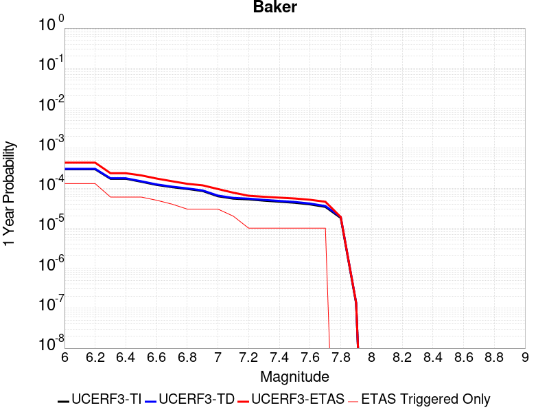 | 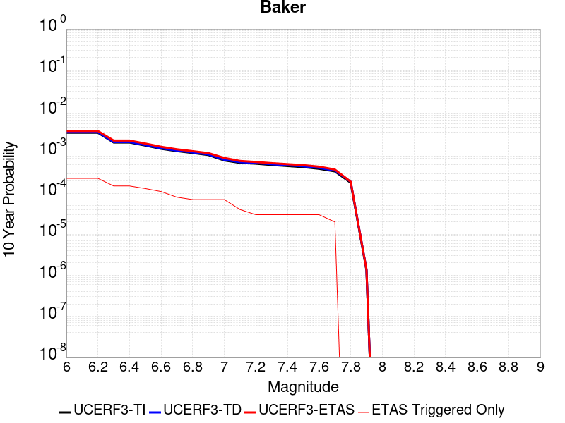 |

| Magnitude | 1 wk TI Prob | 1 wk TD Prob | 1 wk ETAS Prob | 1 wk ETAS/TD Gain | 1 wk ETAS Triggered Only | 1 mo TI Prob | 1 mo TD Prob | 1 mo ETAS Prob | 1 mo ETAS/TD Gain | 1 mo ETAS Triggered Only | 1 yr TI Prob | 1 yr TD Prob | 1 yr ETAS Prob | 1 yr ETAS/TD Gain | 1 yr ETAS Triggered Only | 10 yr TI Prob | 10 yr TD Prob | 10 yr ETAS Prob | 10 yr ETAS/TD Gain | 10 yr ETAS Triggered Only |
|-----|-----|-----|-----|-----|-----|-----|-----|-----|-----|-----|-----|-----|-----|-----|-----|-----|-----|-----|-----|-----|
| 6.0 | 5.695525E-6 | 5.834856E-6 | 2.5834739E-5 | 4.4276567 | 2.0E-5 | 2.4409164E-5 | 2.500631E-5 | 5.500556E-5 | 2.1996672 | 3.0E-5 | 2.9714106E-4 | 3.044133E-4 | 4.343737E-4 | 1.426921 | 1.3E-4 | 0.0029674405 | 0.0030403587 | 0.0032696594 | 1.075419 | 2.3E-4 |
| 6.1 | 5.695525E-6 | 5.834856E-6 | 2.5834739E-5 | 4.4276567 | 2.0E-5 | 2.4409164E-5 | 2.500631E-5 | 5.500556E-5 | 2.1996672 | 3.0E-5 | 2.9714106E-4 | 3.044133E-4 | 4.343737E-4 | 1.426921 | 1.3E-4 | 0.0029674405 | 0.0030403587 | 0.0032696594 | 1.075419 | 2.3E-4 |
| 6.2 | 5.695525E-6 | 5.834856E-6 | 2.5834739E-5 | 4.4276567 | 2.0E-5 | 2.4409164E-5 | 2.500631E-5 | 5.500556E-5 | 2.1996672 | 3.0E-5 | 2.9714106E-4 | 3.044133E-4 | 4.343737E-4 | 1.426921 | 1.3E-4 | 0.0029674405 | 0.0030403587 | 0.0032696594 | 1.075419 | 2.3E-4 |
| 6.3 | 3.2995713E-6 | 3.3836786E-6 | 1.3383645E-5 | 3.9553535 | 1.0E-5 | 1.4140943E-5 | 1.4501402E-5 | 3.450111E-5 | 2.379157 | 2.0E-5 | 1.7215237E-4 | 1.7654074E-4 | 2.3653015E-4 | 1.3398049 | 6.0E-5 | 0.0017201907 | 0.0017640521 | 0.0019137874 | 1.0848815 | 1.5E-4 |
| 6.4 | 3.2995713E-6 | 3.3836786E-6 | 1.3383645E-5 | 3.9553535 | 1.0E-5 | 1.4140943E-5 | 1.4501402E-5 | 3.450111E-5 | 2.379157 | 2.0E-5 | 1.7215237E-4 | 1.7654074E-4 | 2.3653015E-4 | 1.3398049 | 6.0E-5 | 0.0017201907 | 0.0017640521 | 0.0019137874 | 1.0848815 | 1.5E-4 |
| 6.5 | 2.782202E-6 | 2.8558507E-6 | 1.2855822E-5 | 4.5015736 | 1.0E-5 | 1.1923668E-5 | 1.2239304E-5 | 3.223906E-5 | 2.63406 | 2.0E-5 | 1.4516099E-4 | 1.4900367E-4 | 2.0899472E-4 | 1.4026147 | 6.0E-5 | 0.001450662 | 0.0014890704 | 0.0016188768 | 1.0871727 | 1.3E-4 |
| 6.6 | 2.3163404E-6 | 2.380929E-6 | 1.2380905E-5 | 5.2000313 | 1.0E-5 | 9.927136E-6 | 1.0203942E-5 | 3.0203739E-5 | 2.9600067 | 2.0E-5 | 1.20856166E-4 | 1.2422612E-4 | 1.7421991E-4 | 1.4024419 | 5.0E-5 | 0.0012079047 | 0.001241587 | 0.0013514503 | 1.0884863 | 1.1E-4 |
| 6.7 | 2.037056E-6 | 2.0965088E-6 | 1.2096488E-5 | 5.769825 | 1.0E-5 | 8.7302105E-6 | 8.985007E-6 | 1.8984918E-5 | 2.112955 | 1.0E-5 | 1.0628513E-4 | 1.0938713E-4 | 1.4938276E-4 | 1.3656337 | 4.0E-5 | 0.0010623431 | 0.0010933491 | 0.0011732616 | 1.0730897 | 8.0E-5 |
| 6.8 | 1.8356744E-6 | 1.8915364E-6 | 1.1891518E-5 | 6.286698 | 1.0E-5 | 7.867153E-6 | 8.10656E-6 | 1.8106479E-5 | 2.233559 | 1.0E-5 | 9.577837E-5 | 9.869304E-5 | 1.2869008E-4 | 1.3039428 | 3.0E-5 | 9.57371E-4 | 9.865061E-4 | 0.001056437 | 1.0708874 | 7.0E-5 |
| 6.9 | 1.6310546E-6 | 1.6832144E-6 | 1.1683198E-5 | 6.941004 | 1.0E-5 | 6.9902153E-6 | 7.213757E-6 | 1.7213684E-5 | 2.3862302 | 1.0E-5 | 8.510255E-5 | 8.782406E-5 | 1.1782143E-4 | 1.341562 | 3.0E-5 | 8.5069967E-4 | 8.779048E-4 | 9.4784336E-4 | 1.0796653 | 7.0E-5 |
| 7.0 | 1.2058036E-6 | 1.2508729E-6 | 1.1250861E-5 | 8.994408 | 1.0E-5 | 5.1677193E-6 | 5.3608724E-6 | 1.536082E-5 | 2.8653579 | 1.0E-5 | 6.291517E-5 | 6.526669E-5 | 9.526473E-5 | 1.4596225 | 3.0E-5 | 6.289736E-4 | 6.5247755E-4 | 7.2243187E-4 | 1.1072134 | 7.0E-5 |
| 7.1 | 1.052382E-6 | 1.0951668E-6 | 1.1095156E-5 | 10.131019 | 1.0E-5 | 4.5102006E-6 | 4.693564E-6 | 1.4693516E-5 | 3.1305673 | 1.0E-5 | 5.491031E-5 | 5.7142646E-5 | 7.714151E-5 | 1.3499813 | 2.0E-5 | 5.4896745E-4 | 5.712804E-4 | 6.1125756E-4 | 1.0699781 | 4.0E-5 |
| 7.2 | 1.0067454E-6 | 1.0487769E-6 | 1.1048766E-5 | 10.534906 | 1.0E-5 | 4.3146156E-6 | 4.4947506E-6 | 1.4494705E-5 | 3.2248075 | 1.0E-5 | 5.252918E-5 | 5.4722223E-5 | 6.472167E-5 | 1.1827312 | 1.0E-5 | 5.251676E-4 | 5.4708833E-4 | 5.770719E-4 | 1.0548058 | 3.0E-5 |
| 7.3 | 9.3596316E-7 | 9.76778E-7 | 1.0976768E-5 | 11.237731 | 1.0E-5 | 4.0112645E-6 | 4.186185E-6 | 1.4186143E-5 | 3.3888 | 1.0E-5 | 4.8836053E-5 | 5.0965617E-5 | 6.0965107E-5 | 1.1962007 | 1.0E-5 | 4.8825322E-4 | 5.095401E-4 | 5.395248E-4 | 1.0588466 | 3.0E-5 |
| 7.4 | 8.8117395E-7 | 9.2077187E-7 | 1.0920763E-5 | 11.860443 | 1.0E-5 | 3.7764542E-6 | 3.9461593E-6 | 1.394612E-5 | 3.5340996 | 1.0E-5 | 4.5977362E-5 | 4.8043436E-5 | 5.8042955E-5 | 1.208135 | 1.0E-5 | 4.596785E-4 | 4.8033125E-4 | 5.1031687E-4 | 1.0624269 | 3.0E-5 |
| 7.5 | 8.292386E-7 | 8.674649E-7 | 1.0867456E-5 | 12.527834 | 1.0E-5 | 3.5538749E-6 | 3.7177015E-6 | 1.3717664E-5 | 3.689824 | 1.0E-5 | 4.326757E-5 | 4.5262084E-5 | 5.526163E-5 | 1.2209255 | 1.0E-5 | 4.3259145E-4 | 4.5252938E-4 | 4.825158E-4 | 1.066264 | 3.0E-5 |
| 7.6 | 7.553842E-7 | 7.9145207E-7 | 1.0791444E-5 | 13.634994 | 1.0E-5 | 3.2373566E-6 | 3.3919332E-6 | 1.3391899E-5 | 3.9481614 | 1.0E-5 | 3.9414106E-5 | 4.129601E-5 | 5.12956E-5 | 1.2421441 | 1.0E-5 | 3.9407116E-4 | 4.1288408E-4 | 4.4287168E-4 | 1.0726296 | 3.0E-5 |
| 7.7 | 6.5285366E-7 | 6.852842E-7 | 1.0685278E-5 | 15.592476 | 1.0E-5 | 2.797941E-6 | 2.9369291E-6 | 1.29369E-5 | 4.404907 | 1.0E-5 | 3.40644E-5 | 3.5756533E-5 | 4.5756173E-5 | 1.2796592 | 1.0E-5 | 3.405918E-4 | 3.5750846E-4 | 3.775013E-4 | 1.0559227 | 2.0E-5 |
| 7.8 | 3.4586725E-7 | 3.648288E-7 | 3.648288E-7 | 1.0 | 0.0 | 1.4822873E-6 | 1.5635511E-6 | 1.5635511E-6 | 1.0 | 0.0 | 1.80467E-5 | 1.9036073E-5 | 1.9036073E-5 | 1.0 | 0.0 | 1.8045233E-4 | 1.9034486E-4 | 1.9034486E-4 | 1.0 | 0.0 |
| 7.9 | 2.5591178E-9 | 2.6696871E-9 | 2.6696871E-9 | 1.0 | 0.0 | 1.0967647E-8 | 1.1441516E-8 | 1.1441516E-8 | 1.0 | 0.0 | 1.335311E-7 | 1.3930045E-7 | 1.3930045E-7 | 1.0 | 0.0 | 1.3353102E-6 | 1.3930046E-6 | 1.3930046E-6 | 1.0 | 0.0 |

## San Andreas (Carrizo) rev
*[(top)](#table-of-contents)*

| 1 Week | 1 Month | 1 Year | 10 Year |
|-----|-----|-----|-----|
|  |  | 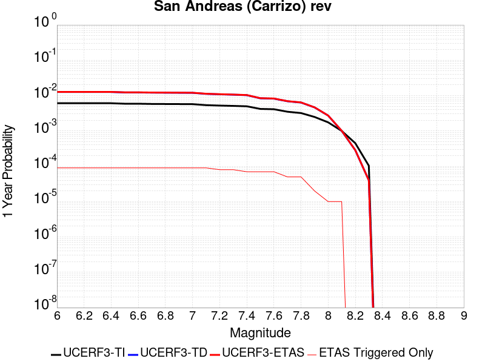 | 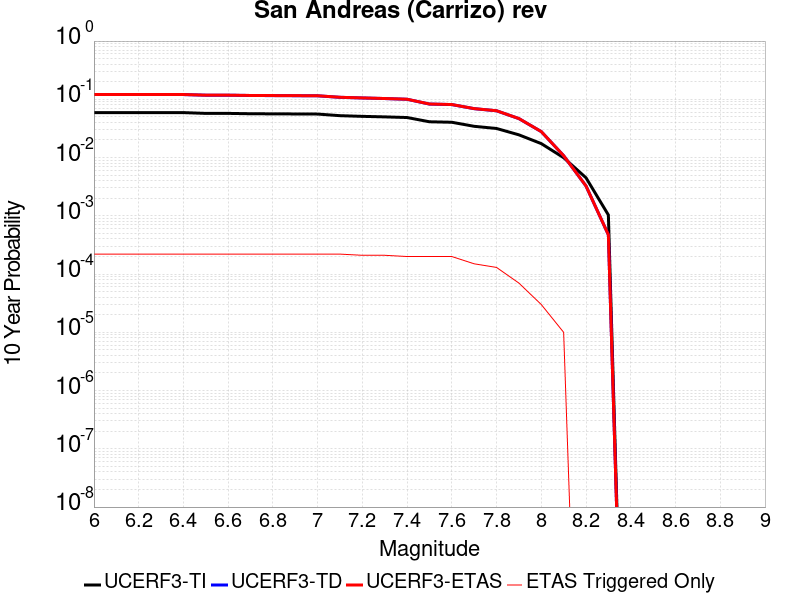 |

| Magnitude | 1 wk TI Prob | 1 wk TD Prob | 1 wk ETAS Prob | 1 wk ETAS/TD Gain | 1 wk ETAS Triggered Only | 1 mo TI Prob | 1 mo TD Prob | 1 mo ETAS Prob | 1 mo ETAS/TD Gain | 1 mo ETAS Triggered Only | 1 yr TI Prob | 1 yr TD Prob | 1 yr ETAS Prob | 1 yr ETAS/TD Gain | 1 yr ETAS Triggered Only | 10 yr TI Prob | 10 yr TD Prob | 10 yr ETAS Prob | 10 yr ETAS/TD Gain | 10 yr ETAS Triggered Only |
|-----|-----|-----|-----|-----|-----|-----|-----|-----|-----|-----|-----|-----|-----|-----|-----|-----|-----|-----|-----|-----|
| 6.0 | 1.1674632E-4 | 2.4333803E-4 | 2.533356E-4 | 1.0410851 | 1.0E-5 | 5.002454E-4 | 0.0010424621 | 0.0010524517 | 1.0095826 | 1.0E-5 | 0.006073493 | 0.012618599 | 0.012707463 | 1.0070423 | 9.0E-5 | 0.0591016 | 0.12066075 | 0.12085421 | 1.0016032 | 2.2E-4 |
| 6.1 | 1.1674632E-4 | 2.4333803E-4 | 2.533356E-4 | 1.0410851 | 1.0E-5 | 5.002454E-4 | 0.0010424621 | 0.0010524517 | 1.0095826 | 1.0E-5 | 0.006073493 | 0.012618599 | 0.012707463 | 1.0070423 | 9.0E-5 | 0.0591016 | 0.12066075 | 0.12085421 | 1.0016032 | 2.2E-4 |
| 6.2 | 1.1674632E-4 | 2.4333803E-4 | 2.533356E-4 | 1.0410851 | 1.0E-5 | 5.002454E-4 | 0.0010424621 | 0.0010524517 | 1.0095826 | 1.0E-5 | 0.006073493 | 0.012618599 | 0.012707463 | 1.0070423 | 9.0E-5 | 0.0591016 | 0.12066075 | 0.12085421 | 1.0016032 | 2.2E-4 |
| 6.3 | 1.1674632E-4 | 2.4333803E-4 | 2.533356E-4 | 1.0410851 | 1.0E-5 | 5.002454E-4 | 0.0010424621 | 0.0010524517 | 1.0095826 | 1.0E-5 | 0.006073493 | 0.012618599 | 0.012707463 | 1.0070423 | 9.0E-5 | 0.0591016 | 0.12066075 | 0.12085421 | 1.0016032 | 2.2E-4 |
| 6.4 | 1.1674632E-4 | 2.4333803E-4 | 2.533356E-4 | 1.0410851 | 1.0E-5 | 5.002454E-4 | 0.0010424621 | 0.0010524517 | 1.0095826 | 1.0E-5 | 0.006073493 | 0.012618599 | 0.012707463 | 1.0070423 | 9.0E-5 | 0.0591016 | 0.12066075 | 0.12085421 | 1.0016032 | 2.2E-4 |
| 6.5 | 1.13136164E-4 | 2.3653745E-4 | 2.4653508E-4 | 1.0422666 | 1.0E-5 | 4.847792E-4 | 0.0010133396 | 0.0010233296 | 1.0098584 | 1.0E-5 | 0.0058862255 | 0.012268067 | 0.012356963 | 1.0072461 | 9.0E-5 | 0.057327334 | 0.11763024 | 0.11782437 | 1.0016502 | 2.2E-4 |
| 6.6 | 1.13136164E-4 | 2.3653745E-4 | 2.4653508E-4 | 1.0422666 | 1.0E-5 | 4.847792E-4 | 0.0010133396 | 0.0010233296 | 1.0098584 | 1.0E-5 | 0.0058862255 | 0.012268067 | 0.012356963 | 1.0072461 | 9.0E-5 | 0.057327334 | 0.11763024 | 0.11782437 | 1.0016502 | 2.2E-4 |
| 6.7 | 1.1149675E-4 | 2.334492E-4 | 2.4344686E-4 | 1.0428258 | 1.0E-5 | 4.777557E-4 | 0.0010001145 | 0.0010101044 | 1.0099889 | 1.0E-5 | 0.0058011734 | 0.012108848 | 0.012197759 | 1.0073426 | 9.0E-5 | 0.05652051 | 0.11625791 | 0.11645234 | 1.0016724 | 2.2E-4 |
| 6.8 | 1.1103589E-4 | 2.324707E-4 | 2.4246838E-4 | 1.0430062 | 1.0E-5 | 4.7578133E-4 | 9.959241E-4 | 0.0010059141 | 1.010031 | 1.0E-5 | 0.005777263 | 0.012058397 | 0.012147311 | 1.0073737 | 9.0E-5 | 0.056293584 | 0.11581856 | 0.11601308 | 1.0016795 | 2.2E-4 |
| 6.9 | 1.1053259E-4 | 2.3139441E-4 | 2.413921E-4 | 1.0432062 | 1.0E-5 | 4.7362508E-4 | 9.91315E-4 | 0.0010013051 | 1.0100776 | 1.0E-5 | 0.0057511497 | 0.0120029 | 0.01209182 | 1.0074081 | 9.0E-5 | 0.05604569 | 0.115334466 | 0.11552909 | 1.0016875 | 2.2E-4 |
| 7.0 | 1.1005377E-4 | 2.304026E-4 | 2.4040029E-4 | 1.0433923 | 1.0E-5 | 4.7157376E-4 | 9.870676E-4 | 9.970577E-4 | 1.010121 | 1.0E-5 | 0.0057263062 | 0.011951757 | 0.012040681 | 1.0074403 | 9.0E-5 | 0.055809796 | 0.1148876 | 0.11508233 | 1.0016949 | 2.2E-4 |
| 7.1 | 1.0308142E-4 | 2.154949E-4 | 2.2549275E-4 | 1.0463948 | 1.0E-5 | 4.417027E-4 | 9.2322374E-4 | 9.332145E-4 | 1.0108216 | 1.0E-5 | 0.0053644776 | 0.011182634 | 0.011271628 | 1.0079582 | 9.0E-5 | 0.052368138 | 0.10815858 | 0.108354785 | 1.001814 | 2.2E-4 |
| 7.2 | 1.0027479E-4 | 2.0957364E-4 | 2.0957364E-4 | 1.0 | 0.0 | 4.296783E-4 | 8.978646E-4 | 8.978646E-4 | 1.0 | 0.0 | 0.0052187922 | 0.010877009 | 0.010956138 | 1.007275 | 8.0E-5 | 0.050979212 | 0.10545821 | 0.10564606 | 1.0017813 | 2.1E-4 |
| 7.3 | 9.816942E-5 | 2.0432367E-4 | 2.0432367E-4 | 1.0 | 0.0 | 4.2065824E-4 | 8.7538E-4 | 8.7538E-4 | 1.0 | 0.0 | 0.005109493 | 0.0106059555 | 0.010685108 | 1.007463 | 8.0E-5 | 0.049935985 | 0.10304579 | 0.10323416 | 1.001828 | 2.1E-4 |
| 7.4 | 9.5634205E-5 | 1.980169E-4 | 1.980169E-4 | 1.0 | 0.0 | 4.0979648E-4 | 8.4836874E-4 | 8.4836874E-4 | 1.0 | 0.0 | 0.0049778637 | 0.010280236 | 0.010349516 | 1.0067391 | 7.0E-5 | 0.048678253 | 0.100126535 | 0.10030651 | 1.0017974 | 2.0E-4 |
| 7.5 | 8.052417E-5 | 1.612143E-4 | 1.612143E-4 | 1.0 | 0.0 | 3.4505792E-4 | 6.9073564E-4 | 6.9073564E-4 | 1.0 | 0.0 | 0.0041929903 | 0.00837736 | 0.0084467735 | 1.0082859 | 7.0E-5 | 0.04114753 | 0.08285146 | 0.083034895 | 1.002214 | 2.0E-4 |
| 7.6 | 7.897024E-5 | 1.5774513E-4 | 1.5774513E-4 | 1.0 | 0.0 | 3.384E-4 | 6.758756E-4 | 6.758756E-4 | 1.0 | 0.0 | 0.0041122385 | 0.008197814 | 0.008267241 | 1.0084689 | 7.0E-5 | 0.040369697 | 0.08119292 | 0.08137668 | 1.0022633 | 2.0E-4 |
| 7.7 | 6.707427E-5 | 1.3283793E-4 | 1.3283793E-4 | 1.0 | 0.0 | 2.8742946E-4 | 5.691813E-4 | 5.691813E-4 | 1.0 | 0.0 | 0.003493839 | 0.0069077956 | 0.0069574504 | 1.0071882 | 5.0E-5 | 0.034394164 | 0.069081694 | 0.06922133 | 1.0020213 | 1.5E-4 |
| 7.8 | 6.147705E-5 | 1.2204444E-4 | 1.2204444E-4 | 1.0 | 0.0 | 2.6344648E-4 | 5.229428E-4 | 5.229428E-4 | 1.0 | 0.0 | 0.0032027436 | 0.0063482667 | 0.0063979495 | 1.0078262 | 5.0E-5 | 0.031569764 | 0.06354592 | 0.063667655 | 1.0019158 | 1.3E-4 |
| 7.9 | 4.7636717E-5 | 8.8847315E-5 | 8.8847315E-5 | 1.0 | 0.0 | 2.0414138E-4 | 3.8071864E-4 | 3.8071864E-4 | 1.0 | 0.0 | 0.0024825884 | 0.0046254057 | 0.004645313 | 1.0043039 | 2.0E-5 | 0.024550365 | 0.046651114 | 0.04671785 | 1.0014305 | 7.0E-5 |
| 8.0 | 3.3554235E-5 | 5.216579E-5 | 5.216579E-5 | 1.0 | 0.0 | 1.4379594E-4 | 2.2354853E-4 | 2.2354853E-4 | 1.0 | 0.0 | 0.0017493097 | 0.002718308 | 0.0027282808 | 1.0036688 | 1.0E-5 | 0.017356034 | 0.027894866 | 0.02792403 | 1.0010455 | 3.0E-5 |
| 8.1 | 1.9175432E-5 | 1.9196985E-5 | 1.9196985E-5 | 1.0 | 0.0 | 8.217783E-5 | 8.22702E-5 | 8.22702E-5 | 1.0 | 0.0 | 0.0010000558 | 0.00100118 | 0.00101117 | 1.0099782 | 1.0E-5 | 0.009955673 | 0.010764282 | 0.010774175 | 1.000919 | 1.0E-5 |
| 8.2 | 8.643924E-6 | 5.478665E-6 | 5.478665E-6 | 1.0 | 0.0 | 3.704486E-5 | 2.3479783E-5 | 2.3479783E-5 | 1.0 | 0.0 | 4.5092785E-4 | 2.8582895E-4 | 2.8582895E-4 | 1.0 | 0.0 | 0.0045001395 | 0.0032508469 | 0.0032508469 | 1.0 | 0.0 |
| 8.3 | 1.983087E-6 | 7.6647797E-7 | 7.6647797E-7 | 1.0 | 0.0 | 8.498917E-6 | 3.2849016E-6 | 3.2849016E-6 | 1.0 | 0.0 | 1.034694E-4 | 3.999296E-5 | 3.999296E-5 | 1.0 | 0.0 | 0.0010342124 | 4.7228087E-4 | 4.7228087E-4 | 1.0 | 0.0 |

## Death Valley (Fish Lake Valley)
*[(top)](#table-of-contents)*

| 1 Week | 1 Month | 1 Year | 10 Year |
|-----|-----|-----|-----|
|  |  | 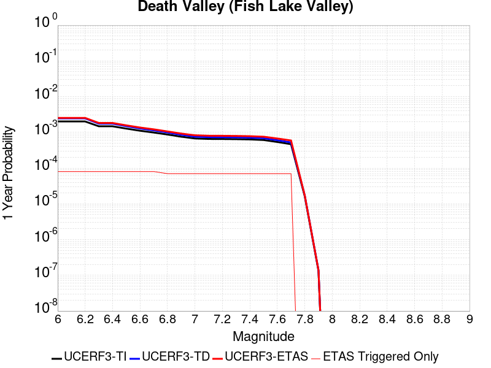 |  |

| Magnitude | 1 wk TI Prob | 1 wk TD Prob | 1 wk ETAS Prob | 1 wk ETAS/TD Gain | 1 wk ETAS Triggered Only | 1 mo TI Prob | 1 mo TD Prob | 1 mo ETAS Prob | 1 mo ETAS/TD Gain | 1 mo ETAS Triggered Only | 1 yr TI Prob | 1 yr TD Prob | 1 yr ETAS Prob | 1 yr ETAS/TD Gain | 1 yr ETAS Triggered Only | 10 yr TI Prob | 10 yr TD Prob | 10 yr ETAS Prob | 10 yr ETAS/TD Gain | 10 yr ETAS Triggered Only |
|-----|-----|-----|-----|-----|-----|-----|-----|-----|-----|-----|-----|-----|-----|-----|-----|-----|-----|-----|-----|-----|
| 6.0 | 3.872328E-5 | 4.7267124E-5 | 5.726665E-5 | 1.2115536 | 1.0E-5 | 1.6594635E-4 | 2.0255933E-4 | 2.2255527E-4 | 1.0987165 | 2.0E-5 | 0.0020185246 | 0.002463633 | 0.002543436 | 1.0323924 | 8.0E-5 | 0.02000288 | 0.024389042 | 0.024603676 | 1.0088004 | 2.2E-4 |
| 6.1 | 3.872328E-5 | 4.7267124E-5 | 5.726665E-5 | 1.2115536 | 1.0E-5 | 1.6594635E-4 | 2.0255933E-4 | 2.2255527E-4 | 1.0987165 | 2.0E-5 | 0.0020185246 | 0.002463633 | 0.002543436 | 1.0323924 | 8.0E-5 | 0.02000288 | 0.024389042 | 0.024603676 | 1.0088004 | 2.2E-4 |
| 6.2 | 3.872328E-5 | 4.7267124E-5 | 5.726665E-5 | 1.2115536 | 1.0E-5 | 1.6594635E-4 | 2.0255933E-4 | 2.2255527E-4 | 1.0987165 | 2.0E-5 | 0.0020185246 | 0.002463633 | 0.002543436 | 1.0323924 | 8.0E-5 | 0.02000288 | 0.024389042 | 0.024603676 | 1.0088004 | 2.2E-4 |
| 6.3 | 2.8356371E-5 | 3.361063E-5 | 4.3610296E-5 | 1.2975149 | 1.0E-5 | 1.2152165E-4 | 1.4403803E-4 | 1.6403515E-4 | 1.1388322 | 2.0E-5 | 0.0014785219 | 0.0017523223 | 0.0018321822 | 1.0455737 | 8.0E-5 | 0.014687235 | 0.017392244 | 0.017608417 | 1.0124294 | 2.2E-4 |
| 6.4 | 2.8356371E-5 | 3.361063E-5 | 4.3610296E-5 | 1.2975149 | 1.0E-5 | 1.2152165E-4 | 1.4403803E-4 | 1.6403515E-4 | 1.1388322 | 2.0E-5 | 0.0014785219 | 0.0017523223 | 0.0018321822 | 1.0455737 | 8.0E-5 | 0.014687235 | 0.017392244 | 0.017608417 | 1.0124294 | 2.2E-4 |
| 6.5 | 2.4448687E-5 | 2.8608241E-5 | 3.8607956E-5 | 1.3495396 | 1.0E-5 | 1.0477588E-4 | 1.2260124E-4 | 1.4259879E-4 | 1.1631105 | 2.0E-5 | 0.0012748998 | 0.0014916958 | 0.0015715763 | 1.0535502 | 8.0E-5 | 0.012676105 | 0.014821727 | 0.015038466 | 1.014623 | 2.2E-4 |
| 6.6 | 2.1298161E-5 | 2.4660607E-5 | 3.466036E-5 | 1.405495 | 1.0E-5 | 9.127464E-5 | 1.05684194E-4 | 1.2568208E-4 | 1.189223 | 2.0E-5 | 0.0011107022 | 0.0012859785 | 0.0013658756 | 1.0621295 | 8.0E-5 | 0.011051672 | 0.0127888 | 0.013005986 | 1.0169826 | 2.2E-4 |
| 6.7 | 1.8959729E-5 | 2.178146E-5 | 3.178124E-5 | 1.4590961 | 1.0E-5 | 8.125345E-5 | 9.334592E-5 | 1.1334405E-4 | 1.2142369 | 2.0E-5 | 9.888117E-4 | 0.0011359196 | 0.0012158287 | 1.0703475 | 8.0E-5 | 0.009844234 | 0.011303795 | 0.011521308 | 1.0192425 | 2.2E-4 |
| 6.8 | 1.6691629E-5 | 1.9018706E-5 | 2.9018516E-5 | 1.5257881 | 1.0E-5 | 7.153359E-5 | 8.150629E-5 | 9.150548E-5 | 1.12268 | 1.0E-5 | 8.7057345E-4 | 9.919042E-4 | 0.0010618347 | 1.0705013 | 7.0E-5 | 0.008671708 | 0.009876527 | 0.010074551 | 1.02005 | 2.0E-4 |
| 6.9 | 1.450505E-5 | 1.6389824E-5 | 2.638966E-5 | 1.6101247 | 1.0E-5 | 6.216302E-5 | 7.024026E-5 | 8.023956E-5 | 1.1423585 | 1.0E-5 | 7.5657194E-4 | 8.548484E-4 | 9.247886E-4 | 1.0818158 | 7.0E-5 | 0.007540013 | 0.008516532 | 0.00871483 | 1.0232837 | 2.0E-4 |
| 7.0 | 1.2940855E-5 | 1.453821E-5 | 2.4538065E-5 | 1.6878326 | 1.0E-5 | 5.545963E-5 | 6.230516E-5 | 7.230454E-5 | 1.1604904 | 1.0E-5 | 6.750118E-4 | 7.583071E-4 | 8.2825404E-4 | 1.0922409 | 7.0E-5 | 0.006729651 | 0.0075578135 | 0.0077463775 | 1.0249496 | 1.9E-4 |
| 7.1 | 1.2544658E-5 | 1.4078437E-5 | 2.4078296E-5 | 1.7102962 | 1.0E-5 | 5.3761712E-5 | 6.033479E-5 | 7.033419E-5 | 1.1657319 | 1.0E-5 | 6.5435225E-4 | 7.343341E-4 | 8.042827E-4 | 1.0952544 | 7.0E-5 | 0.006524288 | 0.0073196692 | 0.007508279 | 1.0257674 | 1.9E-4 |
| 7.2 | 1.2489416E-5 | 1.4015902E-5 | 2.4015762E-5 | 1.7134653 | 1.0E-5 | 5.3524967E-5 | 6.00668E-5 | 7.00662E-5 | 1.1664714 | 1.0E-5 | 6.514716E-4 | 7.310735E-4 | 8.0102234E-4 | 1.0956796 | 7.0E-5 | 0.006495651 | 0.007287278 | 0.007475893 | 1.0258828 | 1.9E-4 |
| 7.3 | 1.2368307E-5 | 1.3880038E-5 | 2.3879898E-5 | 1.7204491 | 1.0E-5 | 5.3005948E-5 | 5.948455E-5 | 6.9483955E-5 | 1.1681008 | 1.0E-5 | 6.451563E-4 | 7.239894E-4 | 7.939387E-4 | 1.0966165 | 7.0E-5 | 0.0064328653 | 0.0072168987 | 0.0074055274 | 1.0261371 | 1.9E-4 |
| 7.4 | 1.2161707E-5 | 1.3648089E-5 | 2.3647954E-5 | 1.7326933 | 1.0E-5 | 5.212056E-5 | 5.8490532E-5 | 6.848995E-5 | 1.1709578 | 1.0E-5 | 6.3438306E-4 | 7.118952E-4 | 7.818453E-4 | 1.0982591 | 7.0E-5 | 0.006325751 | 0.0070967353 | 0.007275458 | 1.0251838 | 1.8E-4 |
| 7.5 | 1.1707948E-5 | 1.314573E-5 | 2.3145598E-5 | 1.7606933 | 1.0E-5 | 5.0175953E-5 | 5.6337656E-5 | 6.6337096E-5 | 1.1774912 | 1.0E-5 | 6.10721E-4 | 6.857007E-4 | 7.5565267E-4 | 1.1020154 | 7.0E-5 | 0.0060904534 | 0.0068364325 | 0.0070152017 | 1.0261495 | 1.8E-4 |
| 7.6 | 1.0319538E-5 | 1.157981E-5 | 2.1579694E-5 | 1.863562 | 1.0E-5 | 4.4225842E-5 | 4.9626844E-5 | 5.9626345E-5 | 1.2014939 | 1.0E-5 | 5.383166E-4 | 6.040445E-4 | 6.740022E-4 | 1.1158155 | 7.0E-5 | 0.0053701443 | 0.0060245576 | 0.0061935335 | 1.0280478 | 1.7E-4 |
| 7.7 | 8.937764E-6 | 1.0022941E-5 | 2.002284E-5 | 1.9977012 | 1.0E-5 | 3.830414E-5 | 4.295478E-5 | 5.295435E-5 | 1.232793 | 1.0E-5 | 4.6625308E-4 | 5.2285404E-4 | 5.9281744E-4 | 1.1338106 | 7.0E-5 | 0.0046527605 | 0.005216748 | 0.0053659654 | 1.0286036 | 1.5E-4 |
| 7.8 | 3.108007E-7 | 3.2846788E-7 | 3.2846788E-7 | 1.0 | 0.0 | 1.3320023E-6 | 1.4077187E-6 | 1.4077187E-6 | 1.0 | 0.0 | 1.6217007E-5 | 1.7138846E-5 | 1.7138846E-5 | 1.0 | 0.0 | 1.6215823E-4 | 1.713756E-4 | 1.713756E-4 | 1.0 | 0.0 |
| 7.9 | 2.5591178E-9 | 2.6696871E-9 | 2.6696871E-9 | 1.0 | 0.0 | 1.0967647E-8 | 1.1441516E-8 | 1.1441516E-8 | 1.0 | 0.0 | 1.335311E-7 | 1.3930045E-7 | 1.3930045E-7 | 1.0 | 0.0 | 1.3353102E-6 | 1.3930046E-6 | 1.3930046E-6 | 1.0 | 0.0 |

## Cady
*[(top)](#table-of-contents)*

| 1 Week | 1 Month | 1 Year | 10 Year |
|-----|-----|-----|-----|
|  |  |  |  |

| Magnitude | 1 wk TI Prob | 1 wk TD Prob | 1 wk ETAS Prob | 1 wk ETAS/TD Gain | 1 wk ETAS Triggered Only | 1 mo TI Prob | 1 mo TD Prob | 1 mo ETAS Prob | 1 mo ETAS/TD Gain | 1 mo ETAS Triggered Only | 1 yr TI Prob | 1 yr TD Prob | 1 yr ETAS Prob | 1 yr ETAS/TD Gain | 1 yr ETAS Triggered Only | 10 yr TI Prob | 10 yr TD Prob | 10 yr ETAS Prob | 10 yr ETAS/TD Gain | 10 yr ETAS Triggered Only |
|-----|-----|-----|-----|-----|-----|-----|-----|-----|-----|-----|-----|-----|-----|-----|-----|-----|-----|-----|-----|-----|
| 6.0 | 1.9892565E-5 | 2.1859016E-5 | 4.1858577E-5 | 1.9149343 | 2.0E-5 | 8.525106E-5 | 9.3678645E-5 | 1.2367584E-4 | 1.3202138 | 3.0E-5 | 0.0010374374 | 0.0011400316 | 0.0012499063 | 1.0963786 | 1.1E-4 | 0.010326075 | 0.011350849 | 0.011568352 | 1.0191618 | 2.2E-4 |
| 6.1 | 1.9892565E-5 | 2.1859016E-5 | 4.1858577E-5 | 1.9149343 | 2.0E-5 | 8.525106E-5 | 9.3678645E-5 | 1.2367584E-4 | 1.3202138 | 3.0E-5 | 0.0010374374 | 0.0011400316 | 0.0012499063 | 1.0963786 | 1.1E-4 | 0.010326075 | 0.011350849 | 0.011568352 | 1.0191618 | 2.2E-4 |
| 6.2 | 1.9892565E-5 | 2.1859016E-5 | 4.1858577E-5 | 1.9149343 | 2.0E-5 | 8.525106E-5 | 9.3678645E-5 | 1.2367584E-4 | 1.3202138 | 3.0E-5 | 0.0010374374 | 0.0011400316 | 0.0012499063 | 1.0963786 | 1.1E-4 | 0.010326075 | 0.011350849 | 0.011568352 | 1.0191618 | 2.2E-4 |
| 6.3 | 1.1117327E-5 | 1.2176738E-5 | 2.2176615E-5 | 1.821228 | 1.0E-5 | 4.764482E-5 | 5.218515E-5 | 6.218463E-5 | 1.1916153 | 1.0E-5 | 5.7992124E-4 | 6.3520053E-4 | 6.851688E-4 | 1.0786653 | 5.0E-5 | 0.0057841022 | 0.0063369554 | 0.006426385 | 1.0141124 | 9.0E-5 |
| 6.4 | 1.1117327E-5 | 1.2176738E-5 | 2.2176615E-5 | 1.821228 | 1.0E-5 | 4.764482E-5 | 5.218515E-5 | 6.218463E-5 | 1.1916153 | 1.0E-5 | 5.7992124E-4 | 6.3520053E-4 | 6.851688E-4 | 1.0786653 | 5.0E-5 | 0.0057841022 | 0.0063369554 | 0.006426385 | 1.0141124 | 9.0E-5 |
| 6.5 | 6.103093E-6 | 6.672103E-6 | 1.6672037E-5 | 2.4987679 | 1.0E-5 | 2.615585E-5 | 2.8594486E-5 | 3.85942E-5 | 1.3497077 | 1.0E-5 | 3.1840094E-4 | 3.4809482E-4 | 3.7808437E-4 | 1.0861534 | 3.0E-5 | 0.0031794512 | 0.0034767296 | 0.003536521 | 1.0171976 | 6.0E-5 |
| 6.6 | 5.817237E-6 | 6.365738E-6 | 1.6365675E-5 | 2.5708997 | 1.0E-5 | 2.4930776E-5 | 2.728152E-5 | 3.7281246E-5 | 1.3665385 | 1.0E-5 | 3.034899E-4 | 3.3211432E-4 | 3.6210436E-4 | 1.0903003 | 3.0E-5 | 0.0030307577 | 0.003317402 | 0.003377203 | 1.0180265 | 6.0E-5 |
| 6.7 | 4.8846314E-6 | 5.3406343E-6 | 1.5340582E-5 | 2.8724267 | 1.0E-5 | 2.0933967E-5 | 2.2888298E-5 | 3.288807E-5 | 1.4368944 | 1.0E-5 | 2.5484123E-4 | 2.7864118E-4 | 2.986356E-4 | 1.071757 | 2.0E-5 | 0.0025454918 | 0.0027840736 | 0.0028339343 | 1.0179093 | 5.0E-5 |
| 6.8 | 1.7788773E-6 | 1.9399313E-6 | 1.9399313E-6 | 1.0 | 0.0 | 7.6237375E-6 | 8.313974E-6 | 8.313974E-6 | 1.0 | 0.0 | 9.281505E-5 | 1.01219506E-4 | 1.1121849E-4 | 1.0987852 | 1.0E-5 | 9.2776294E-4 | 0.0010118886 | 0.0010318684 | 1.019745 | 2.0E-5 |
| 6.9 | 7.5455404E-7 | 8.297202E-7 | 8.297202E-7 | 1.0 | 0.0 | 3.233799E-6 | 3.5559406E-6 | 3.5559406E-6 | 1.0 | 0.0 | 3.937079E-5 | 4.3293054E-5 | 4.3293054E-5 | 1.0 | 0.0 | 3.9363815E-4 | 4.3287914E-4 | 4.3287914E-4 | 1.0 | 0.0 |
| 7.0 | 6.8578805E-7 | 7.541916E-7 | 7.541916E-7 | 1.0 | 0.0 | 2.9390883E-6 | 3.2322475E-6 | 3.2322475E-6 | 1.0 | 0.0 | 3.578281E-5 | 3.9352235E-5 | 3.9352235E-5 | 1.0 | 0.0 | 3.577705E-4 | 3.9348513E-4 | 3.9348513E-4 | 1.0 | 0.0 |

## Scodie Lineament
*[(top)](#table-of-contents)*

| 1 Week | 1 Month | 1 Year | 10 Year |
|-----|-----|-----|-----|
|  |  |  |  |

| Magnitude | 1 wk TI Prob | 1 wk TD Prob | 1 wk ETAS Prob | 1 wk ETAS/TD Gain | 1 wk ETAS Triggered Only | 1 mo TI Prob | 1 mo TD Prob | 1 mo ETAS Prob | 1 mo ETAS/TD Gain | 1 mo ETAS Triggered Only | 1 yr TI Prob | 1 yr TD Prob | 1 yr ETAS Prob | 1 yr ETAS/TD Gain | 1 yr ETAS Triggered Only | 10 yr TI Prob | 10 yr TD Prob | 10 yr ETAS Prob | 10 yr ETAS/TD Gain | 10 yr ETAS Triggered Only |
|-----|-----|-----|-----|-----|-----|-----|-----|-----|-----|-----|-----|-----|-----|-----|-----|-----|-----|-----|-----|-----|
| 6.0 | 3.2919327E-6 | 3.0133451E-6 | 2.3013285E-5 | 7.637122 | 2.0E-5 | 1.4108206E-5 | 1.2914291E-5 | 6.291364E-5 | 4.87163 | 5.0E-5 | 1.7175387E-4 | 1.5722332E-4 | 2.972013E-4 | 1.8903131 | 1.4E-4 | 0.0017162118 | 0.0015714325 | 0.0017811024 | 1.1334261 | 2.1E-4 |
| 6.1 | 1.8663811E-6 | 1.5490476E-6 | 1.1549032E-5 | 7.4555697 | 1.0E-5 | 7.998751E-6 | 6.6387615E-6 | 3.663856E-5 | 5.518885 | 3.0E-5 | 9.738045E-5 | 8.082442E-5 | 1.5081876E-4 | 1.866005 | 7.0E-5 | 9.7337784E-4 | 8.0799905E-4 | 9.0791826E-4 | 1.1236625 | 1.0E-4 |
| 6.2 | 1.8663811E-6 | 1.5490476E-6 | 1.1549032E-5 | 7.4555697 | 1.0E-5 | 7.998751E-6 | 6.6387615E-6 | 3.663856E-5 | 5.518885 | 3.0E-5 | 9.738045E-5 | 8.082442E-5 | 1.5081876E-4 | 1.866005 | 7.0E-5 | 9.7337784E-4 | 8.0799905E-4 | 9.0791826E-4 | 1.1236625 | 1.0E-4 |
| 6.3 | 1.8663811E-6 | 1.5490476E-6 | 1.1549032E-5 | 7.4555697 | 1.0E-5 | 7.998751E-6 | 6.6387615E-6 | 3.663856E-5 | 5.518885 | 3.0E-5 | 9.738045E-5 | 8.082442E-5 | 1.5081876E-4 | 1.866005 | 7.0E-5 | 9.7337784E-4 | 8.0799905E-4 | 9.0791826E-4 | 1.1236625 | 1.0E-4 |
| 6.4 | 1.8663811E-6 | 1.5490476E-6 | 1.1549032E-5 | 7.4555697 | 1.0E-5 | 7.998751E-6 | 6.6387615E-6 | 3.663856E-5 | 5.518885 | 3.0E-5 | 9.738045E-5 | 8.082442E-5 | 1.5081876E-4 | 1.866005 | 7.0E-5 | 9.7337784E-4 | 8.0799905E-4 | 9.0791826E-4 | 1.1236625 | 1.0E-4 |
| 6.5 | 1.8106311E-6 | 1.4909813E-6 | 1.1490966E-5 | 7.706982 | 1.0E-5 | 7.759824E-6 | 6.389907E-6 | 3.6389716E-5 | 5.694874 | 3.0E-5 | 9.447177E-5 | 7.779484E-5 | 1.477894E-4 | 1.8997327 | 7.0E-5 | 9.4431615E-4 | 7.777247E-4 | 8.776469E-4 | 1.1284802 | 1.0E-4 |
| 6.6 | 1.2414679E-6 | 8.997501E-7 | 8.997501E-7 | 1.0 | 0.0 | 5.320566E-6 | 3.8560665E-6 | 2.385599E-5 | 6.1866126 | 2.0E-5 | 6.477596E-5 | 4.6946687E-5 | 7.694528E-5 | 1.6389928 | 3.0E-5 | 6.475708E-4 | 4.6937633E-4 | 5.1935285E-4 | 1.1064743 | 5.0E-5 |
| 6.7 | 1.1062215E-6 | 7.594247E-7 | 7.594247E-7 | 1.0 | 0.0 | 4.7409408E-6 | 3.2546736E-6 | 2.3254608E-5 | 7.1449895 | 2.0E-5 | 5.7719422E-5 | 3.9625003E-5 | 6.962381E-5 | 1.7570677 | 3.0E-5 | 5.770443E-4 | 3.9618637E-4 | 4.4616655E-4 | 1.1261532 | 5.0E-5 |
| 6.8 | 1.0006736E-6 | 6.5003275E-7 | 6.5003275E-7 | 1.0 | 0.0 | 4.288594E-6 | 2.785852E-6 | 1.2785824E-5 | 4.589556 | 1.0E-5 | 5.221238E-5 | 3.3917284E-5 | 5.3916603E-5 | 1.5896499 | 2.0E-5 | 5.220012E-4 | 3.3912715E-4 | 3.7911357E-4 | 1.1179099 | 4.0E-5 |
| 6.9 | 9.167364E-7 | 5.6315514E-7 | 5.6315514E-7 | 1.0 | 0.0 | 3.9288643E-6 | 2.4135202E-6 | 1.2413496E-5 | 5.143316 | 1.0E-5 | 4.7832873E-5 | 2.938427E-5 | 4.938368E-5 | 1.6806163 | 2.0E-5 | 4.782258E-4 | 2.938095E-4 | 3.3379777E-4 | 1.1361027 | 4.0E-5 |
| 7.0 | 7.6987664E-7 | 4.113303E-7 | 4.113303E-7 | 1.0 | 0.0 | 3.2994672E-6 | 1.7628431E-6 | 1.1762825E-5 | 6.6726446 | 1.0E-5 | 4.0170275E-5 | 2.1462443E-5 | 4.1462015E-5 | 1.9318403 | 2.0E-5 | 4.0163012E-4 | 2.1460756E-4 | 2.4460113E-4 | 1.13976 | 3.0E-5 |
| 7.1 | 7.1038727E-7 | 3.521066E-7 | 3.521066E-7 | 1.0 | 0.0 | 3.0445133E-6 | 1.5090276E-6 | 1.1509012E-5 | 7.626774 | 1.0E-5 | 3.706632E-5 | 1.8372291E-5 | 3.8371923E-5 | 2.0885758 | 2.0E-5 | 3.7060137E-4 | 1.8371122E-4 | 2.1370572E-4 | 1.1632698 | 3.0E-5 |
| 7.2 | 2.0799602E-7 | 3.1178946E-8 | 3.1178946E-8 | 1.0 | 0.0 | 8.914113E-7 | 1.3362404E-7 | 1.3362404E-7 | 1.0 | 0.0 | 1.0852878E-5 | 1.6268716E-6 | 1.6268716E-6 | 1.0 | 0.0 | 1.08523476E-4 | 1.6268605E-5 | 1.6268605E-5 | 1.0 | 0.0 |
| 7.3 | 1.5048182E-7 | 1.5939344E-8 | 1.5939344E-8 | 1.0 | 0.0 | 6.449219E-7 | 6.831147E-8 | 6.831147E-8 | 1.0 | 0.0 | 7.851896E-6 | 8.316919E-7 | 8.316919E-7 | 1.0 | 0.0 | 7.851618E-5 | 8.316891E-6 | 8.316891E-6 | 1.0 | 0.0 |
| 7.4 | 5.9334678E-8 | 4.8638475E-9 | 4.8638475E-9 | 1.0 | 0.0 | 2.5429145E-7 | 2.084506E-8 | 2.084506E-8 | 1.0 | 0.0 | 3.095994E-6 | 2.5378858E-7 | 2.5378858E-7 | 1.0 | 0.0 | 3.095951E-5 | 2.5378843E-6 | 2.5378843E-6 | 1.0 | 0.0 |

## San Andreas (Cholame) rev
*[(top)](#table-of-contents)*

| 1 Week | 1 Month | 1 Year | 10 Year |
|-----|-----|-----|-----|
| 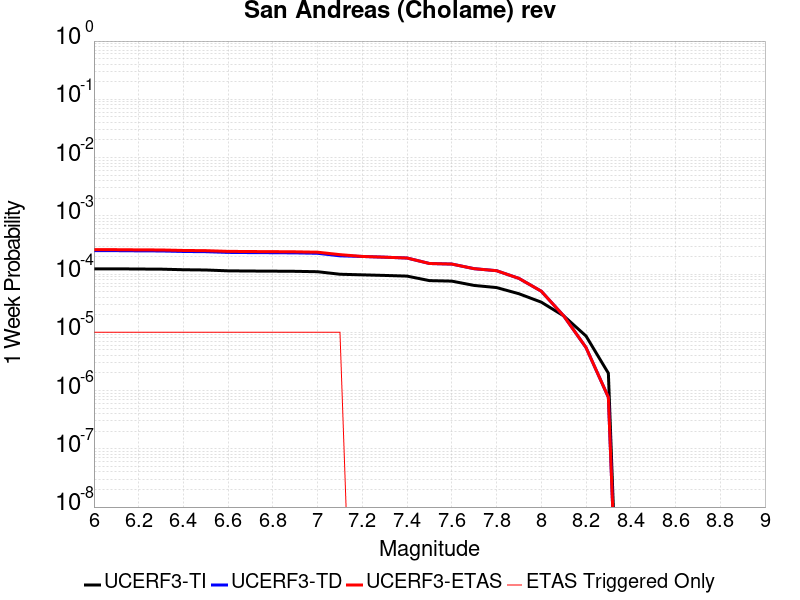 |  |  |  |

| Magnitude | 1 wk TI Prob | 1 wk TD Prob | 1 wk ETAS Prob | 1 wk ETAS/TD Gain | 1 wk ETAS Triggered Only | 1 mo TI Prob | 1 mo TD Prob | 1 mo ETAS Prob | 1 mo ETAS/TD Gain | 1 mo ETAS Triggered Only | 1 yr TI Prob | 1 yr TD Prob | 1 yr ETAS Prob | 1 yr ETAS/TD Gain | 1 yr ETAS Triggered Only | 10 yr TI Prob | 10 yr TD Prob | 10 yr ETAS Prob | 10 yr ETAS/TD Gain | 10 yr ETAS Triggered Only |
|-----|-----|-----|-----|-----|-----|-----|-----|-----|-----|-----|-----|-----|-----|-----|-----|-----|-----|-----|-----|-----|
| 6.0 | 1.2302514E-4 | 2.5215113E-4 | 2.6214862E-4 | 1.0396488 | 1.0E-5 | 5.27144E-4 | 0.0010802018 | 0.001090191 | 1.0092475 | 1.0E-5 | 0.0063991086 | 0.013072659 | 0.013151613 | 1.0060396 | 8.0E-5 | 0.06217949 | 0.12442699 | 0.1246021 | 1.0014074 | 2.0E-4 |
| 6.1 | 1.2302514E-4 | 2.5215113E-4 | 2.6214862E-4 | 1.0396488 | 1.0E-5 | 5.27144E-4 | 0.0010802018 | 0.001090191 | 1.0092475 | 1.0E-5 | 0.0063991086 | 0.013072659 | 0.013151613 | 1.0060396 | 8.0E-5 | 0.06217949 | 0.12442699 | 0.1246021 | 1.0014074 | 2.0E-4 |
| 6.2 | 1.2203569E-4 | 2.5031884E-4 | 2.6031636E-4 | 1.039939 | 1.0E-5 | 5.2290526E-4 | 0.0010723557 | 0.0010823449 | 1.0093153 | 1.0E-5 | 0.006347804 | 0.012978274 | 0.013057237 | 1.0060842 | 8.0E-5 | 0.061695136 | 0.12361445 | 0.12378973 | 1.0014179 | 2.0E-4 |
| 6.3 | 1.2142645E-4 | 2.4917856E-4 | 2.5917604E-4 | 1.0401219 | 1.0E-5 | 5.202953E-4 | 0.0010674726 | 0.001077462 | 1.0093579 | 1.0E-5 | 0.006316212 | 0.01291953 | 0.012998496 | 1.0061122 | 8.0E-5 | 0.06139677 | 0.1231077 | 0.12328308 | 1.0014246 | 2.0E-4 |
| 6.4 | 1.1865206E-4 | 2.4423326E-4 | 2.542308E-4 | 1.0409344 | 1.0E-5 | 5.0840975E-4 | 0.0010462956 | 0.0010562852 | 1.0095475 | 1.0E-5 | 0.006172335 | 0.012664723 | 0.012743711 | 1.0062368 | 8.0E-5 | 0.060036868 | 0.12090532 | 0.121081136 | 1.0014542 | 2.0E-4 |
| 6.5 | 1.17443946E-4 | 2.4216558E-4 | 2.5216315E-4 | 1.0412841 | 1.0E-5 | 5.032341E-4 | 0.0010374413 | 0.0010474309 | 1.0096291 | 1.0E-5 | 0.006109677 | 0.012558166 | 0.012637161 | 1.0062903 | 8.0E-5 | 0.059444077 | 0.11998259 | 0.1201586 | 1.0014669 | 2.0E-4 |
| 6.6 | 1.13579066E-4 | 2.3525437E-4 | 2.45252E-4 | 1.0424972 | 1.0E-5 | 4.866766E-4 | 0.0010078449 | 0.0010178349 | 1.0099121 | 1.0E-5 | 0.0059092017 | 0.012201919 | 0.012280944 | 1.0064764 | 8.0E-5 | 0.057545185 | 0.11690384 | 0.11708046 | 1.0015109 | 2.0E-4 |
| 6.7 | 1.1271412E-4 | 2.3369725E-4 | 2.4369491E-4 | 1.0427804 | 1.0E-5 | 4.829711E-4 | 0.0010011768 | 0.0010111667 | 1.0099783 | 1.0E-5 | 0.005864331 | 0.01212164 | 0.012200671 | 1.0065198 | 8.0E-5 | 0.057119697 | 0.11620769 | 0.11638445 | 1.0015211 | 2.0E-4 |
| 6.8 | 1.1217975E-4 | 2.325812E-4 | 2.4257887E-4 | 1.0429857 | 1.0E-5 | 4.8068175E-4 | 9.963973E-4 | 0.0010063873 | 1.0100262 | 1.0E-5 | 0.005836608 | 0.0120640965 | 0.012143131 | 1.0065513 | 8.0E-5 | 0.056856725 | 0.11570667 | 0.11588353 | 1.0015285 | 2.0E-4 |
| 6.9 | 1.1146753E-4 | 2.3106842E-4 | 2.4106611E-4 | 1.0432673 | 1.0E-5 | 4.7763053E-4 | 9.89919E-4 | 9.99909E-4 | 1.0100918 | 1.0E-5 | 0.0057996577 | 0.011986093 | 0.012065134 | 1.0065944 | 8.0E-5 | 0.056506127 | 0.11502693 | 0.115203924 | 1.0015388 | 2.0E-4 |
| 7.0 | 1.0965793E-4 | 2.2730078E-4 | 2.3729852E-4 | 1.0439845 | 1.0E-5 | 4.698779E-4 | 9.737841E-4 | 9.837743E-4 | 1.0102593 | 1.0E-5 | 0.005705768 | 0.011791794 | 0.011870851 | 1.0067043 | 8.0E-5 | 0.055614736 | 0.1133308 | 0.11350813 | 1.0015647 | 2.0E-4 |
| 7.1 | 9.927982E-5 | 2.0548643E-4 | 2.1548438E-4 | 1.048655 | 1.0E-5 | 4.2541555E-4 | 8.8035996E-4 | 8.9035113E-4 | 1.011349 | 1.0E-5 | 0.0051671406 | 0.010666 | 0.010745146 | 1.0074204 | 8.0E-5 | 0.05048634 | 0.10343333 | 0.10361265 | 1.0017337 | 2.0E-4 |
| 7.2 | 9.696786E-5 | 2.005288E-4 | 2.005288E-4 | 1.0 | 0.0 | 4.1551032E-4 | 8.591271E-4 | 8.591271E-4 | 1.0 | 0.0 | 0.00504711 | 0.010409988 | 0.010479259 | 1.0066543 | 7.0E-5 | 0.04934009 | 0.10116881 | 0.101339586 | 1.001688 | 1.9E-4 |
| 7.3 | 9.4727984E-5 | 1.9481927E-4 | 1.9481927E-4 | 1.0 | 0.0 | 4.0591392E-4 | 8.346735E-4 | 8.346735E-4 | 1.0 | 0.0 | 0.0049308087 | 0.010115068 | 0.010184361 | 1.0068504 | 7.0E-5 | 0.048228268 | 0.09854372 | 0.09871499 | 1.0017381 | 1.9E-4 |
| 7.4 | 9.220358E-5 | 1.8852325E-4 | 1.8852325E-4 | 1.0 | 0.0 | 3.9509835E-4 | 8.077075E-4 | 8.077075E-4 | 1.0 | 0.0 | 0.004799717 | 0.009789746 | 0.009849159 | 1.0060688 | 6.0E-5 | 0.046973653 | 0.095616065 | 0.09577885 | 1.0017025 | 1.8E-4 |
| 7.5 | 7.71631E-5 | 1.5186344E-4 | 1.5186344E-4 | 1.0 | 0.0 | 3.306571E-4 | 6.5068115E-4 | 6.5068115E-4 | 1.0 | 0.0 | 0.0040183207 | 0.007893339 | 0.007952865 | 1.0075413 | 6.0E-5 | 0.03946433 | 0.07832433 | 0.078490235 | 1.0021181 | 1.8E-4 |
| 7.6 | 7.5634416E-5 | 1.484566E-4 | 1.484566E-4 | 1.0 | 0.0 | 3.241072E-4 | 6.360876E-4 | 6.360876E-4 | 1.0 | 0.0 | 0.0039388672 | 0.007716934 | 0.0077764713 | 1.0077151 | 6.0E-5 | 0.038697794 | 0.07668804 | 0.07685424 | 1.0021672 | 1.8E-4 |
| 7.7 | 6.3783E-5 | 1.2365977E-4 | 1.2365977E-4 | 1.0 | 0.0 | 2.7332708E-4 | 5.298629E-4 | 5.298629E-4 | 1.0 | 0.0 | 0.0033226798 | 0.006432025 | 0.006471768 | 1.0061789 | 4.0E-5 | 0.032734364 | 0.06457185 | 0.06469346 | 1.0018833 | 1.3E-4 |
| 7.8 | 5.863422E-5 | 1.1422686E-4 | 1.1422686E-4 | 1.0 | 0.0 | 2.512653E-4 | 4.8945186E-4 | 4.8945186E-4 | 1.0 | 0.0 | 0.003054864 | 0.0059428154 | 0.005982578 | 1.0066909 | 4.0E-5 | 0.030132094 | 0.05968955 | 0.059792988 | 1.0017328 | 1.1E-4 |
| 7.9 | 4.595283E-5 | 8.431093E-5 | 8.431093E-5 | 1.0 | 0.0 | 1.9692584E-4 | 3.6128255E-4 | 3.6128255E-4 | 1.0 | 0.0 | 0.0023949358 | 0.0043897503 | 0.0044096624 | 1.004536 | 2.0E-5 | 0.023692891 | 0.044384085 | 0.044450976 | 1.0015072 | 7.0E-5 |
| 8.0 | 3.2950178E-5 | 5.08012E-5 | 5.08012E-5 | 1.0 | 0.0 | 1.412074E-4 | 2.1770128E-4 | 2.1770128E-4 | 1.0 | 0.0 | 0.0017178444 | 0.002647293 | 0.0026572666 | 1.0037675 | 1.0E-5 | 0.017046256 | 0.02719375 | 0.027222933 | 1.0010732 | 3.0E-5 |
| 8.1 | 1.9177472E-5 | 1.9197154E-5 | 1.9197154E-5 | 1.0 | 0.0 | 8.218658E-5 | 8.2270926E-5 | 8.2270926E-5 | 1.0 | 0.0 | 0.0010001622 | 0.0010011889 | 0.001011179 | 1.0099782 | 1.0E-5 | 0.009956728 | 0.010764398 | 0.01077429 | 1.000919 | 1.0E-5 |
| 8.2 | 8.643924E-6 | 5.478665E-6 | 5.478665E-6 | 1.0 | 0.0 | 3.704486E-5 | 2.3479783E-5 | 2.3479783E-5 | 1.0 | 0.0 | 4.5092785E-4 | 2.8582895E-4 | 2.8582895E-4 | 1.0 | 0.0 | 0.0045001395 | 0.0032508469 | 0.0032508469 | 1.0 | 0.0 |
| 8.3 | 1.983087E-6 | 7.6647797E-7 | 7.6647797E-7 | 1.0 | 0.0 | 8.498917E-6 | 3.2849016E-6 | 3.2849016E-6 | 1.0 | 0.0 | 1.034694E-4 | 3.999296E-5 | 3.999296E-5 | 1.0 | 0.0 | 0.0010342124 | 4.7228087E-4 | 4.7228087E-4 | 1.0 | 0.0 |

## San Jacinto (San Bernardino)
*[(top)](#table-of-contents)*

| 1 Week | 1 Month | 1 Year | 10 Year |
|-----|-----|-----|-----|
|  |  |  |  |

| Magnitude | 1 wk TI Prob | 1 wk TD Prob | 1 wk ETAS Prob | 1 wk ETAS/TD Gain | 1 wk ETAS Triggered Only | 1 mo TI Prob | 1 mo TD Prob | 1 mo ETAS Prob | 1 mo ETAS/TD Gain | 1 mo ETAS Triggered Only | 1 yr TI Prob | 1 yr TD Prob | 1 yr ETAS Prob | 1 yr ETAS/TD Gain | 1 yr ETAS Triggered Only | 10 yr TI Prob | 10 yr TD Prob | 10 yr ETAS Prob | 10 yr ETAS/TD Gain | 10 yr ETAS Triggered Only |
|-----|-----|-----|-----|-----|-----|-----|-----|-----|-----|-----|-----|-----|-----|-----|-----|-----|-----|-----|-----|-----|
| 6.0 | 3.409352E-5 | 3.6001682E-5 | 5.600096E-5 | 1.5555096 | 2.0E-5 | 1.461069E-4 | 1.542838E-4 | 1.8427917E-4 | 1.1944169 | 3.0E-5 | 0.0017774 | 0.0018767886 | 0.0019666196 | 1.0478642 | 9.0E-5 | 0.01763251 | 0.01935761 | 0.01952432 | 1.008612 | 1.7E-4 |
| 6.1 | 3.409352E-5 | 3.6001682E-5 | 5.600096E-5 | 1.5555096 | 2.0E-5 | 1.461069E-4 | 1.542838E-4 | 1.8427917E-4 | 1.1944169 | 3.0E-5 | 0.0017774 | 0.0018767886 | 0.0019666196 | 1.0478642 | 9.0E-5 | 0.01763251 | 0.01935761 | 0.01952432 | 1.008612 | 1.7E-4 |
| 6.2 | 3.409352E-5 | 3.6001682E-5 | 5.600096E-5 | 1.5555096 | 2.0E-5 | 1.461069E-4 | 1.542838E-4 | 1.8427917E-4 | 1.1944169 | 3.0E-5 | 0.0017774 | 0.0018767886 | 0.0019666196 | 1.0478642 | 9.0E-5 | 0.01763251 | 0.01935761 | 0.01952432 | 1.008612 | 1.7E-4 |
| 6.3 | 3.409352E-5 | 3.6001682E-5 | 5.600096E-5 | 1.5555096 | 2.0E-5 | 1.461069E-4 | 1.542838E-4 | 1.8427917E-4 | 1.1944169 | 3.0E-5 | 0.0017774 | 0.0018767886 | 0.0019666196 | 1.0478642 | 9.0E-5 | 0.01763251 | 0.01935761 | 0.01952432 | 1.008612 | 1.7E-4 |
| 6.4 | 3.400795E-5 | 3.5894343E-5 | 5.5893623E-5 | 1.5571709 | 2.0E-5 | 1.4574021E-4 | 1.5382383E-4 | 1.8381923E-4 | 1.1949983 | 3.0E-5 | 0.0017729428 | 0.0018711982 | 0.0019610298 | 1.0480075 | 9.0E-5 | 0.017588645 | 0.01930269 | 0.019469408 | 1.0086371 | 1.7E-4 |
| 6.5 | 3.341482E-5 | 3.515495E-5 | 5.5154247E-5 | 1.56889 | 2.0E-5 | 1.4319851E-4 | 1.5065537E-4 | 1.8065085E-4 | 1.1991 | 3.0E-5 | 0.0017420477 | 0.0018326874 | 0.0019225224 | 1.0490183 | 9.0E-5 | 0.017284546 | 0.018924221 | 0.019091005 | 1.0088131 | 1.7E-4 |
| 6.6 | 3.3364955E-5 | 3.5092165E-5 | 5.5091463E-5 | 1.5699078 | 2.0E-5 | 1.4298483E-4 | 1.5038633E-4 | 1.8038182E-4 | 1.1994562 | 3.0E-5 | 0.0017394501 | 0.0018294173 | 0.0019192527 | 1.049106 | 9.0E-5 | 0.017258976 | 0.018892085 | 0.019058874 | 1.0088285 | 1.7E-4 |
| 6.7 | 3.335922E-5 | 3.508194E-5 | 5.5081236E-5 | 1.570074 | 2.0E-5 | 1.4296026E-4 | 1.503425E-4 | 1.80338E-4 | 1.1995144 | 3.0E-5 | 0.0017391514 | 0.0018288847 | 0.0019187201 | 1.0491203 | 9.0E-5 | 0.017256035 | 0.018886877 | 0.019053666 | 1.0088309 | 1.7E-4 |
| 6.8 | 3.327683E-5 | 3.4976E-5 | 5.49753E-5 | 1.5718007 | 2.0E-5 | 1.4260718E-4 | 1.4988854E-4 | 1.7988404E-4 | 1.2001188 | 3.0E-5 | 0.0017348597 | 0.0018233669 | 0.0019132028 | 1.0492692 | 9.0E-5 | 0.017213784 | 0.018832648 | 0.018989634 | 1.0083358 | 1.6E-4 |
| 6.9 | 3.3235785E-5 | 3.491695E-5 | 5.4916254E-5 | 1.5727677 | 2.0E-5 | 1.4243131E-4 | 1.496355E-4 | 1.7963101E-4 | 1.2004572 | 3.0E-5 | 0.0017327217 | 0.0018202913 | 0.0019101275 | 1.0493526 | 9.0E-5 | 0.017192734 | 0.018802516 | 0.018959507 | 1.0083495 | 1.6E-4 |
| 7.0 | 3.3197095E-5 | 3.485688E-5 | 5.485618E-5 | 1.5737549 | 2.0E-5 | 1.422655E-4 | 1.4937807E-4 | 1.7937359E-4 | 1.2008027 | 3.0E-5 | 0.0017307063 | 0.0018171624 | 0.001897017 | 1.0439447 | 8.0E-5 | 0.017172894 | 0.01877189 | 0.018919075 | 1.0078406 | 1.5E-4 |
| 7.1 | 3.3129716E-5 | 3.473708E-5 | 5.4736385E-5 | 1.5757337 | 2.0E-5 | 1.4197677E-4 | 1.4886471E-4 | 1.7886025E-4 | 1.2014953 | 3.0E-5 | 0.0017271966 | 0.0018109226 | 0.0018907777 | 1.0440964 | 8.0E-5 | 0.017138338 | 0.01871097 | 0.018858165 | 1.0078667 | 1.5E-4 |
| 7.2 | 3.3034008E-5 | 3.4604524E-5 | 5.460383E-5 | 1.5779392 | 2.0E-5 | 1.4156665E-4 | 1.4829668E-4 | 1.7829222E-4 | 1.2022672 | 3.0E-5 | 0.0017222111 | 0.0018040182 | 0.001883874 | 1.0442655 | 8.0E-5 | 0.017089253 | 0.018643353 | 0.018790556 | 1.0078957 | 1.5E-4 |
| 7.3 | 3.2956614E-5 | 3.447227E-5 | 5.4471577E-5 | 1.5801566 | 2.0E-5 | 1.4123498E-4 | 1.4772992E-4 | 1.777255E-4 | 1.2030432 | 3.0E-5 | 0.0017181796 | 0.0017971295 | 0.0018769858 | 1.0444354 | 8.0E-5 | 0.017049557 | 0.018576099 | 0.01872331 | 1.0079249 | 1.5E-4 |
| 7.4 | 3.2915937E-5 | 3.4393954E-5 | 5.4393266E-5 | 1.5814775 | 2.0E-5 | 1.4106068E-4 | 1.4739433E-4 | 1.7738991E-4 | 1.2035056 | 3.0E-5 | 0.0017160608 | 0.0017930503 | 0.0018729069 | 1.0445367 | 8.0E-5 | 0.017028693 | 0.01853637 | 0.01868359 | 1.0079422 | 1.5E-4 |
| 7.5 | 3.281791E-5 | 3.4258854E-5 | 5.4258166E-5 | 1.5837708 | 2.0E-5 | 1.406406E-4 | 1.468154E-4 | 1.76811E-4 | 1.2043083 | 3.0E-5 | 0.0017109542 | 0.0017860134 | 0.0018658706 | 1.0447125 | 8.0E-5 | 0.016978411 | 0.01846725 | 0.01861448 | 1.0079725 | 1.5E-4 |
| 7.6 | 3.2521442E-5 | 3.3983775E-5 | 5.3983094E-5 | 1.5884961 | 2.0E-5 | 1.3937015E-4 | 1.4563663E-4 | 1.7563226E-4 | 1.2059622 | 3.0E-5 | 0.0016955109 | 0.0017716853 | 0.0018515436 | 1.0450747 | 8.0E-5 | 0.016826328 | 0.018324887 | 0.018472139 | 1.0080355 | 1.5E-4 |
| 7.7 | 3.0287873E-5 | 3.2467702E-5 | 5.2467054E-5 | 1.6159768 | 2.0E-5 | 1.297987E-4 | 1.3913988E-4 | 1.6913572E-4 | 1.2155803 | 3.0E-5 | 0.0015791537 | 0.001692713 | 0.0017725775 | 1.0471814 | 8.0E-5 | 0.01567979 | 0.017535618 | 0.017682988 | 1.008404 | 1.5E-4 |
| 7.8 | 2.6316151E-5 | 2.9678076E-5 | 4.9677485E-5 | 1.6738781 | 2.0E-5 | 1.1277862E-4 | 1.2718556E-4 | 1.5718174E-4 | 1.2358458 | 3.0E-5 | 0.0013722149 | 0.0015473852 | 0.0016272615 | 1.0516201 | 8.0E-5 | 0.013637724 | 0.016076857 | 0.016224446 | 1.0091802 | 1.5E-4 |
| 7.9 | 2.0761147E-5 | 2.343051E-5 | 4.3430042E-5 | 1.8535678 | 2.0E-5 | 8.897331E-5 | 1.0041261E-4 | 1.304096E-4 | 1.2987373 | 3.0E-5 | 0.0010827117 | 0.0012218388 | 0.001301741 | 1.0653951 | 8.0E-5 | 0.010774517 | 0.012799647 | 0.012937855 | 1.0107979 | 1.4E-4 |
| 8.0 | 1.5738568E-5 | 1.604239E-5 | 1.604239E-5 | 1.0 | 0.0 | 6.744926E-5 | 6.875129E-5 | 7.87506E-5 | 1.1454418 | 1.0E-5 | 8.2088535E-4 | 8.3672616E-4 | 8.766927E-4 | 1.0477654 | 4.0E-5 | 0.008178596 | 0.008870586 | 0.008930054 | 1.006704 | 6.0E-5 |
| 8.1 | 1.0105832E-5 | 8.335246E-6 | 8.335246E-6 | 1.0 | 0.0 | 4.3309992E-5 | 3.5721994E-5 | 4.5721637E-5 | 1.2799295 | 1.0E-5 | 5.2717153E-4 | 4.34829E-4 | 4.6481597E-4 | 1.0689627 | 3.0E-5 | 0.005259227 | 0.0046798005 | 0.00470966 | 1.0063806 | 3.0E-5 |
| 8.2 | 4.189207E-6 | 1.5793896E-6 | 1.5793896E-6 | 1.0 | 0.0 | 1.7953622E-5 | 6.768795E-6 | 6.768795E-6 | 1.0 | 0.0 | 2.1856341E-4 | 8.2406994E-5 | 8.2406994E-5 | 1.0 | 0.0 | 0.0021834858 | 9.571454E-4 | 9.571454E-4 | 1.0 | 0.0 |
| 8.3 | 1.2758221E-6 | 3.6171858E-7 | 3.6171858E-7 | 1.0 | 0.0 | 5.4677976E-6 | 1.5502216E-6 | 1.5502216E-6 | 1.0 | 0.0 | 6.65684E-5 | 1.8873789E-5 | 1.8873789E-5 | 1.0 | 0.0 | 6.6548464E-4 | 2.2764095E-4 | 2.2764095E-4 | 1.0 | 0.0 |

## White Wolf (Extension)
*[(top)](#table-of-contents)*

| 1 Week | 1 Month | 1 Year | 10 Year |
|-----|-----|-----|-----|
|  |  | 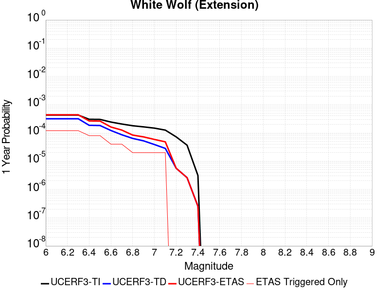 | 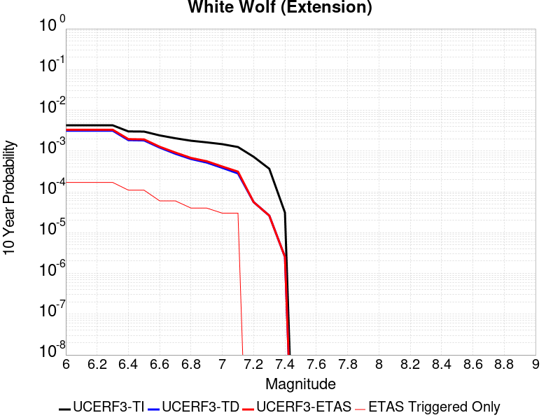 |

| Magnitude | 1 wk TI Prob | 1 wk TD Prob | 1 wk ETAS Prob | 1 wk ETAS/TD Gain | 1 wk ETAS Triggered Only | 1 mo TI Prob | 1 mo TD Prob | 1 mo ETAS Prob | 1 mo ETAS/TD Gain | 1 mo ETAS Triggered Only | 1 yr TI Prob | 1 yr TD Prob | 1 yr ETAS Prob | 1 yr ETAS/TD Gain | 1 yr ETAS Triggered Only | 10 yr TI Prob | 10 yr TD Prob | 10 yr ETAS Prob | 10 yr ETAS/TD Gain | 10 yr ETAS Triggered Only |
|-----|-----|-----|-----|-----|-----|-----|-----|-----|-----|-----|-----|-----|-----|-----|-----|-----|-----|-----|-----|-----|
| 6.0 | 8.222555E-6 | 6.0666557E-6 | 1.6066595E-5 | 2.6483445 | 1.0E-5 | 3.5239045E-5 | 2.5999732E-5 | 5.5998953E-5 | 2.1538281 | 3.0E-5 | 4.289509E-4 | 3.165074E-4 | 4.364694E-4 | 1.3790181 | 1.2E-4 | 0.0042812387 | 0.0031612178 | 0.0033306805 | 1.0536067 | 1.7E-4 |
| 6.1 | 8.222555E-6 | 6.0666557E-6 | 1.6066595E-5 | 2.6483445 | 1.0E-5 | 3.5239045E-5 | 2.5999732E-5 | 5.5998953E-5 | 2.1538281 | 3.0E-5 | 4.289509E-4 | 3.165074E-4 | 4.364694E-4 | 1.3790181 | 1.2E-4 | 0.0042812387 | 0.0031612178 | 0.0033306805 | 1.0536067 | 1.7E-4 |
| 6.2 | 8.222555E-6 | 6.0666557E-6 | 1.6066595E-5 | 2.6483445 | 1.0E-5 | 3.5239045E-5 | 2.5999732E-5 | 5.5998953E-5 | 2.1538281 | 3.0E-5 | 4.289509E-4 | 3.165074E-4 | 4.364694E-4 | 1.3790181 | 1.2E-4 | 0.0042812387 | 0.0031612178 | 0.0033306805 | 1.0536067 | 1.7E-4 |
| 6.3 | 8.222555E-6 | 6.0666557E-6 | 1.6066595E-5 | 2.6483445 | 1.0E-5 | 3.5239045E-5 | 2.5999732E-5 | 5.5998953E-5 | 2.1538281 | 3.0E-5 | 4.289509E-4 | 3.165074E-4 | 4.364694E-4 | 1.3790181 | 1.2E-4 | 0.0042812387 | 0.0031612178 | 0.0033306805 | 1.0536067 | 1.7E-4 |
| 6.4 | 5.821773E-6 | 3.5571516E-6 | 1.3557116E-5 | 3.811228 | 1.0E-5 | 2.4950215E-5 | 1.5244852E-5 | 4.5244396E-5 | 2.9678473 | 3.0E-5 | 3.0372653E-4 | 1.8559136E-4 | 2.6557653E-4 | 1.4309745 | 8.0E-5 | 0.0030331176 | 0.0018544721 | 0.001964268 | 1.0592061 | 1.1E-4 |
| 6.5 | 5.766023E-6 | 3.4990853E-6 | 1.34990505E-5 | 3.8578796 | 1.0E-5 | 2.4711293E-5 | 1.4996E-5 | 4.499555E-5 | 3.0005035 | 3.0E-5 | 3.0081844E-4 | 1.825621E-4 | 2.625475E-4 | 1.438127 | 8.0E-5 | 0.0030041158 | 0.0018242294 | 0.0019340287 | 1.0601895 | 1.1E-4 |
| 6.6 | 4.643576E-6 | 2.3325927E-6 | 2.3325927E-6 | 1.0 | 0.0 | 1.9900888E-5 | 9.99679E-6 | 2.999659E-5 | 3.0006223 | 2.0E-5 | 2.4226638E-4 | 1.2170455E-4 | 1.6169969E-4 | 1.3286248 | 4.0E-5 | 0.0024200242 | 0.0012164214 | 0.0012763485 | 1.049265 | 6.0E-5 |
| 6.7 | 3.9529173E-6 | 1.6483134E-6 | 1.6483134E-6 | 1.0 | 0.0 | 1.6940963E-5 | 7.0641822E-6 | 2.7064041E-5 | 3.831164 | 2.0E-5 | 2.0623671E-4 | 8.6003216E-5 | 1.2599978E-4 | 1.4650589 | 4.0E-5 | 0.002060454 | 8.5971784E-4 | 9.1966626E-4 | 1.0697303 | 6.0E-5 |
| 6.8 | 3.4377522E-6 | 1.2244896E-6 | 1.2244896E-6 | 1.0 | 0.0 | 1.473314E-5 | 5.247802E-6 | 1.524775E-5 | 2.9055495 | 1.0E-5 | 1.7936122E-4 | 6.389021E-5 | 8.388893E-5 | 1.313017 | 2.0E-5 | 0.0017921652 | 6.3872756E-4 | 6.78702E-4 | 1.0625845 | 4.0E-5 |
| 6.9 | 3.1367306E-6 | 1.0033432E-6 | 1.0033432E-6 | 1.0 | 0.0 | 1.3443062E-5 | 4.300036E-6 | 1.42999925E-5 | 3.325552 | 1.0E-5 | 1.63657E-4 | 5.2351756E-5 | 7.235071E-5 | 1.3820112 | 2.0E-5 | 0.0016353652 | 5.234019E-4 | 5.6338095E-4 | 1.0763831 | 4.0E-5 |
| 7.0 | 2.8298145E-6 | 7.4283355E-7 | 7.4283355E-7 | 1.0 | 0.0 | 1.2127721E-5 | 3.1835689E-6 | 1.3183537E-5 | 4.141119 | 1.0E-5 | 1.47645E-4 | 3.875931E-5 | 5.875854E-5 | 1.515985 | 2.0E-5 | 0.0014754693 | 3.875305E-4 | 4.175189E-4 | 1.0773833 | 3.0E-5 |
| 7.1 | 2.4091064E-6 | 5.422472E-7 | 5.422472E-7 | 1.0 | 0.0 | 1.03247E-5 | 2.323915E-6 | 1.23238915E-5 | 5.3030734 | 1.0E-5 | 1.2569598E-4 | 2.8293338E-5 | 4.829277E-5 | 1.7068602 | 2.0E-5 | 0.001256249 | 2.829014E-4 | 3.128929E-4 | 1.106014 | 3.0E-5 |
| 7.2 | 1.3875518E-6 | 1.074062E-7 | 1.074062E-7 | 1.0 | 0.0 | 5.9466374E-6 | 4.603122E-7 | 4.603122E-7 | 1.0 | 0.0 | 7.23979E-5 | 5.604288E-6 | 5.604288E-6 | 1.0 | 0.0 | 7.2374323E-4 | 5.604158E-5 | 5.604158E-5 | 1.0 | 0.0 |
| 7.3 | 7.056077E-7 | 5.0005806E-8 | 5.0005806E-8 | 1.0 | 0.0 | 3.0240296E-6 | 2.1431059E-7 | 2.1431059E-7 | 1.0 | 0.0 | 3.681694E-5 | 2.6092287E-6 | 2.6092287E-6 | 1.0 | 0.0 | 3.681084E-4 | 2.6092028E-5 | 2.6092028E-5 | 1.0 | 0.0 |
| 7.4 | 5.9334678E-8 | 4.8638475E-9 | 4.8638475E-9 | 1.0 | 0.0 | 2.5429145E-7 | 2.084506E-8 | 2.084506E-8 | 1.0 | 0.0 | 3.095994E-6 | 2.5378858E-7 | 2.5378858E-7 | 1.0 | 0.0 | 3.095951E-5 | 2.5378843E-6 | 2.5378843E-6 | 1.0 | 0.0 |

## Lake Isabella (Seismicity)
*[(top)](#table-of-contents)*

| 1 Week | 1 Month | 1 Year | 10 Year |
|-----|-----|-----|-----|
|  |  |  |  |

| Magnitude | 1 wk TI Prob | 1 wk TD Prob | 1 wk ETAS Prob | 1 wk ETAS/TD Gain | 1 wk ETAS Triggered Only | 1 mo TI Prob | 1 mo TD Prob | 1 mo ETAS Prob | 1 mo ETAS/TD Gain | 1 mo ETAS Triggered Only | 1 yr TI Prob | 1 yr TD Prob | 1 yr ETAS Prob | 1 yr ETAS/TD Gain | 1 yr ETAS Triggered Only | 10 yr TI Prob | 10 yr TD Prob | 10 yr ETAS Prob | 10 yr ETAS/TD Gain | 10 yr ETAS Triggered Only |
|-----|-----|-----|-----|-----|-----|-----|-----|-----|-----|-----|-----|-----|-----|-----|-----|-----|-----|-----|-----|-----|
| 6.0 | 9.431637E-6 | 9.741694E-6 | 3.97414E-5 | 4.0795164 | 3.0E-5 | 4.0420677E-5 | 4.1749525E-5 | 7.174827E-5 | 1.718541 | 3.0E-5 | 4.920106E-4 | 5.0819496E-4 | 6.0814415E-4 | 1.1966748 | 1.0E-4 | 0.004909227 | 0.005071621 | 0.0052308096 | 1.031388 | 1.6E-4 |
| 6.1 | 9.431637E-6 | 9.741694E-6 | 3.97414E-5 | 4.0795164 | 3.0E-5 | 4.0420677E-5 | 4.1749525E-5 | 7.174827E-5 | 1.718541 | 3.0E-5 | 4.920106E-4 | 5.0819496E-4 | 6.0814415E-4 | 1.1966748 | 1.0E-4 | 0.004909227 | 0.005071621 | 0.0052308096 | 1.031388 | 1.6E-4 |
| 6.2 | 9.431637E-6 | 9.741694E-6 | 3.97414E-5 | 4.0795164 | 3.0E-5 | 4.0420677E-5 | 4.1749525E-5 | 7.174827E-5 | 1.718541 | 3.0E-5 | 4.920106E-4 | 5.0819496E-4 | 6.0814415E-4 | 1.1966748 | 1.0E-4 | 0.004909227 | 0.005071621 | 0.0052308096 | 1.031388 | 1.6E-4 |
| 6.3 | 9.431637E-6 | 9.741694E-6 | 3.97414E-5 | 4.0795164 | 3.0E-5 | 4.0420677E-5 | 4.1749525E-5 | 7.174827E-5 | 1.718541 | 3.0E-5 | 4.920106E-4 | 5.0819496E-4 | 6.0814415E-4 | 1.1966748 | 1.0E-4 | 0.004909227 | 0.005071621 | 0.0052308096 | 1.031388 | 1.6E-4 |
| 6.4 | 5.144063E-6 | 5.3000977E-6 | 3.5299938E-5 | 6.660243 | 3.0E-5 | 2.2045799E-5 | 2.2714525E-5 | 5.2713844E-5 | 2.320711 | 3.0E-5 | 2.6837454E-4 | 2.765177E-4 | 3.1650663E-4 | 1.1446162 | 4.0E-5 | 0.0026805066 | 0.002762077 | 0.0028318835 | 1.0252732 | 7.0E-5 |
| 6.5 | 5.144063E-6 | 5.3000977E-6 | 3.5299938E-5 | 6.660243 | 3.0E-5 | 2.2045799E-5 | 2.2714525E-5 | 5.2713844E-5 | 2.320711 | 3.0E-5 | 2.6837454E-4 | 2.765177E-4 | 3.1650663E-4 | 1.1446162 | 4.0E-5 | 0.0026805066 | 0.002762077 | 0.0028318835 | 1.0252732 | 7.0E-5 |
| 6.6 | 3.4009804E-6 | 3.4987995E-6 | 3.3498694E-5 | 9.57434 | 3.0E-5 | 1.4575549E-5 | 1.4994778E-5 | 4.499433E-5 | 3.0006666 | 3.0E-5 | 1.7744285E-4 | 1.8254772E-4 | 2.1254225E-4 | 1.1643106 | 3.0E-5 | 0.0017730123 | 0.0018241355 | 0.0018740443 | 1.0273602 | 5.0E-5 |
| 6.7 | 3.3880428E-6 | 3.4856662E-6 | 3.348556E-5 | 9.606647 | 3.0E-5 | 1.4520103E-5 | 1.4938492E-5 | 4.4938046E-5 | 3.0082047 | 3.0E-5 | 1.767679E-4 | 1.8186258E-4 | 2.1185711E-4 | 1.1649297 | 3.0E-5 | 0.0017662736 | 0.0018172951 | 0.0018672043 | 1.0274634 | 5.0E-5 |
| 6.8 | 2.6582E-6 | 2.7337105E-6 | 2.2733655E-5 | 8.316044 | 2.0E-5 | 1.1392236E-5 | 1.1715857E-5 | 3.1715623E-5 | 2.707068 | 2.0E-5 | 1.3869164E-4 | 1.4263256E-4 | 1.6262972E-4 | 1.1402004 | 2.0E-5 | 0.0013860512 | 0.0014255423 | 0.0014654853 | 1.0280195 | 4.0E-5 |
| 6.9 | 2.406011E-6 | 2.474338E-6 | 2.2474289E-5 | 9.08295 | 2.0E-5 | 1.0311434E-5 | 1.0604271E-5 | 3.060406E-5 | 2.8860126 | 2.0E-5 | 1.2553448E-4 | 1.2910066E-4 | 1.4909808E-4 | 1.1548978 | 2.0E-5 | 0.0012546359 | 0.0012903863 | 0.0013303347 | 1.0309584 | 4.0E-5 |
| 7.0 | 1.6953097E-6 | 1.7429437E-6 | 1.7429437E-6 | 1.0 | 0.0 | 7.265593E-6 | 7.469743E-6 | 7.469743E-6 | 1.0 | 0.0 | 8.8455E-5 | 9.094137E-5 | 9.094137E-5 | 1.0 | 0.0 | 8.84198E-4 | 9.0914435E-4 | 9.0914435E-4 | 1.0 | 0.0 |
| 7.1 | 3.5013824E-7 | 3.571492E-7 | 3.571492E-7 | 1.0 | 0.0 | 1.5005916E-6 | 1.5306384E-6 | 1.5306384E-6 | 1.0 | 0.0 | 1.826955E-5 | 1.8635366E-5 | 1.8635366E-5 | 1.0 | 0.0 | 1.8268047E-4 | 1.863383E-4 | 1.863383E-4 | 1.0 | 0.0 |
| 7.2 | 2.2321095E-7 | 2.2750632E-7 | 2.2750632E-7 | 1.0 | 0.0 | 9.56618E-7 | 9.750268E-7 | 9.750268E-7 | 1.0 | 0.0 | 1.1646762E-5 | 1.1870887E-5 | 1.1870887E-5 | 1.0 | 0.0 | 1.1646151E-4 | 1.1870263E-4 | 1.1870263E-4 | 1.0 | 0.0 |
| 7.3 | 1.5760406E-7 | 1.6060963E-7 | 1.6060963E-7 | 1.0 | 0.0 | 6.7544585E-7 | 6.883268E-7 | 6.883268E-7 | 1.0 | 0.0 | 8.223522E-6 | 8.380347E-6 | 8.380347E-6 | 1.0 | 0.0 | 8.2232174E-5 | 8.3800376E-5 | 8.3800376E-5 | 1.0 | 0.0 |
| 7.4 | 1.1216497E-7 | 1.1431735E-7 | 1.1431735E-7 | 1.0 | 0.0 | 4.8070694E-7 | 4.8993144E-7 | 4.8993144E-7 | 1.0 | 0.0 | 5.852591E-6 | 5.964899E-6 | 5.964899E-6 | 1.0 | 0.0 | 5.8524372E-5 | 5.9647435E-5 | 5.9647435E-5 | 1.0 | 0.0 |
| 7.5 | 4.885185E-8 | 4.9787864E-8 | 4.9787864E-8 | 1.0 | 0.0 | 2.0936506E-7 | 2.1337654E-7 | 2.1337654E-7 | 1.0 | 0.0 | 2.5490165E-6 | 2.5978566E-6 | 2.5978566E-6 | 1.0 | 0.0 | 2.5489873E-5 | 2.597828E-5 | 2.597828E-5 | 1.0 | 0.0 |
| 7.6 | 1.504641E-9 | 1.5317939E-9 | 1.5317939E-9 | 1.0 | 0.0 | 6.4484613E-9 | 6.5648313E-9 | 6.5648313E-9 | 1.0 | 0.0 | 7.851001E-8 | 7.992682E-8 | 7.992682E-8 | 1.0 | 0.0 | 7.8509987E-7 | 7.992682E-7 | 7.992682E-7 | 1.0 | 0.0 |

## San Andreas (Coachella) rev
*[(top)](#table-of-contents)*

| 1 Week | 1 Month | 1 Year | 10 Year |
|-----|-----|-----|-----|
| 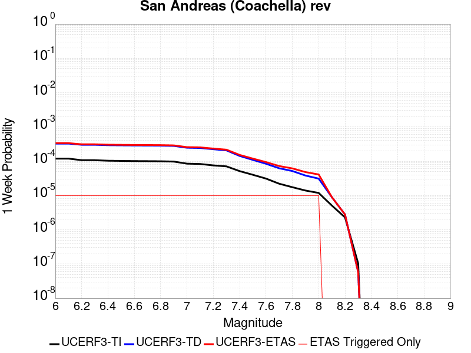 |  | 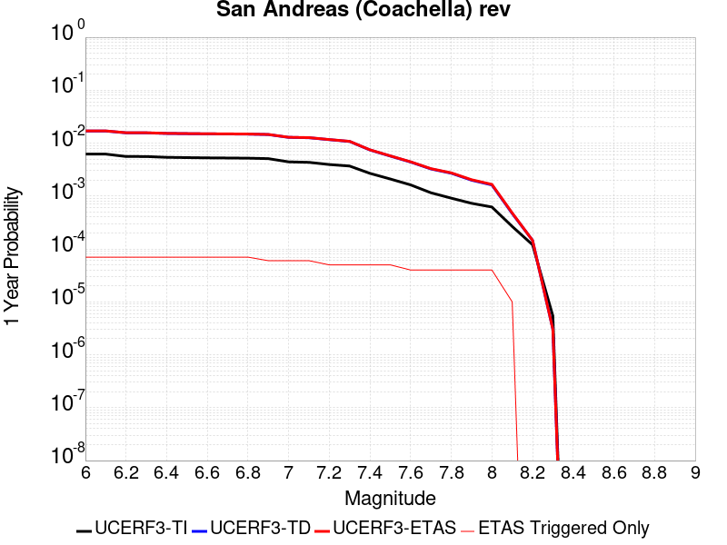 |  |

| Magnitude | 1 wk TI Prob | 1 wk TD Prob | 1 wk ETAS Prob | 1 wk ETAS/TD Gain | 1 wk ETAS Triggered Only | 1 mo TI Prob | 1 mo TD Prob | 1 mo ETAS Prob | 1 mo ETAS/TD Gain | 1 mo ETAS Triggered Only | 1 yr TI Prob | 1 yr TD Prob | 1 yr ETAS Prob | 1 yr ETAS/TD Gain | 1 yr ETAS Triggered Only | 10 yr TI Prob | 10 yr TD Prob | 10 yr ETAS Prob | 10 yr ETAS/TD Gain | 10 yr ETAS Triggered Only |
|-----|-----|-----|-----|-----|-----|-----|-----|-----|-----|-----|-----|-----|-----|-----|-----|-----|-----|-----|-----|-----|
| 6.0 | 1.1925945E-4 | 3.2735174E-4 | 3.3734847E-4 | 1.0305382 | 1.0E-5 | 5.110118E-4 | 0.0014021865 | 0.0014221584 | 1.0142435 | 2.0E-5 | 0.0062038354 | 0.016939327 | 0.01700814 | 1.0040624 | 7.0E-5 | 0.060334753 | 0.15269604 | 0.15283161 | 1.0008879 | 1.6E-4 |
| 6.1 | 1.1925945E-4 | 3.2735174E-4 | 3.3734847E-4 | 1.0305382 | 1.0E-5 | 5.110118E-4 | 0.0014021865 | 0.0014221584 | 1.0142435 | 2.0E-5 | 0.0062038354 | 0.016939327 | 0.01700814 | 1.0040624 | 7.0E-5 | 0.060334753 | 0.15269604 | 0.15283161 | 1.0008879 | 1.6E-4 |
| 6.2 | 1.07432395E-4 | 3.023596E-4 | 3.1235657E-4 | 1.0330632 | 1.0E-5 | 4.603433E-4 | 0.0012951873 | 0.0013151615 | 1.0154217 | 2.0E-5 | 0.005590286 | 0.01565599 | 0.015724894 | 1.0044011 | 7.0E-5 | 0.05451731 | 0.14184935 | 0.14198665 | 1.000968 | 1.6E-4 |
| 6.3 | 1.0718766E-4 | 3.0181266E-4 | 3.1180962E-4 | 1.0331231 | 1.0E-5 | 4.592948E-4 | 0.0012928456 | 0.0013128198 | 1.0154498 | 2.0E-5 | 0.005577586 | 0.015627889 | 0.015696796 | 1.0044092 | 7.0E-5 | 0.054396555 | 0.14161763 | 0.14175497 | 1.0009698 | 1.6E-4 |
| 6.4 | 1.0355944E-4 | 2.9389336E-4 | 3.0389044E-4 | 1.0340159 | 1.0E-5 | 4.4375064E-4 | 0.001258939 | 0.0012789138 | 1.0158664 | 2.0E-5 | 0.0053892885 | 0.015220915 | 0.01528985 | 1.0045289 | 7.0E-5 | 0.052604496 | 0.13817544 | 0.13831332 | 1.0009979 | 1.6E-4 |
| 6.5 | 1.0227914E-4 | 2.9108766E-4 | 3.0108477E-4 | 1.034344 | 1.0E-5 | 4.382655E-4 | 0.0012469261 | 0.0012669011 | 1.0160195 | 2.0E-5 | 0.0053228354 | 0.015076692 | 0.015145637 | 1.004573 | 7.0E-5 | 0.051971316 | 0.13695958 | 0.13709767 | 1.0010083 | 1.6E-4 |
| 6.6 | 1.0116757E-4 | 2.8874516E-4 | 2.9874226E-4 | 1.0346227 | 1.0E-5 | 4.3350324E-4 | 0.0012368963 | 0.0012568715 | 1.0161495 | 2.0E-5 | 0.0052651367 | 0.014956261 | 0.015025214 | 1.0046103 | 7.0E-5 | 0.051421247 | 0.1359371 | 0.13607535 | 1.001017 | 1.6E-4 |
| 6.7 | 1.0050676E-4 | 2.8733077E-4 | 2.973279E-4 | 1.0347931 | 1.0E-5 | 4.3067214E-4 | 0.0012308403 | 0.0012508158 | 1.016229 | 2.0E-5 | 0.005230834 | 0.01488354 | 0.0149524985 | 1.0046332 | 7.0E-5 | 0.051094085 | 0.13532192 | 0.13546027 | 1.0010223 | 1.6E-4 |
| 6.8 | 9.976819E-5 | 2.8536728E-4 | 2.953644E-4 | 1.0350325 | 1.0E-5 | 4.2750788E-4 | 0.0012224333 | 0.0012424089 | 1.0163409 | 2.0E-5 | 0.0051924936 | 0.014782578 | 0.014851543 | 1.0046653 | 7.0E-5 | 0.050728295 | 0.13447334 | 0.13461182 | 1.0010298 | 1.6E-4 |
| 6.9 | 9.77719E-5 | 2.8033604E-4 | 2.9033324E-4 | 1.0356615 | 1.0E-5 | 4.1895514E-4 | 0.0012008909 | 0.0012208669 | 1.0166343 | 2.0E-5 | 0.0050888555 | 0.014523826 | 0.014582954 | 1.0040711 | 6.0E-5 | 0.049738888 | 0.13230172 | 0.13243188 | 1.0009837 | 1.5E-4 |
| 7.0 | 8.500761E-5 | 2.476793E-4 | 2.5767682E-4 | 1.0403647 | 1.0E-5 | 3.6426744E-4 | 0.0010610541 | 0.0010810329 | 1.0188292 | 2.0E-5 | 0.0044259406 | 0.01284259 | 0.01290182 | 1.004612 | 6.0E-5 | 0.04338823 | 0.118151076 | 0.118283354 | 1.0011196 | 1.5E-4 |
| 7.1 | 8.319876E-5 | 2.4370618E-4 | 2.5370374E-4 | 1.041023 | 1.0E-5 | 3.5651738E-4 | 0.0010440402 | 0.0010640193 | 1.0191363 | 2.0E-5 | 0.004331963 | 0.0126378685 | 0.01269711 | 1.0046877 | 6.0E-5 | 0.042484846 | 0.11637106 | 0.1165036 | 1.0011389 | 1.5E-4 |
| 7.2 | 7.563917E-5 | 2.2418915E-4 | 2.3418691E-4 | 1.0445952 | 1.0E-5 | 3.2412758E-4 | 9.604599E-4 | 9.804406E-4 | 1.0208033 | 2.0E-5 | 0.0039391145 | 0.011631592 | 0.01168101 | 1.0042486 | 5.0E-5 | 0.03870018 | 0.107777216 | 0.107902125 | 1.001159 | 1.4E-4 |
| 7.3 | 7.082985E-5 | 2.0734889E-4 | 2.1734682E-4 | 1.0482179 | 1.0E-5 | 3.0352117E-4 | 8.8833837E-4 | 9.083206E-4 | 1.022494 | 2.0E-5 | 0.0036891096 | 0.01076251 | 0.010811972 | 1.0045958 | 5.0E-5 | 0.03628465 | 0.10029867 | 0.10042463 | 1.0012559 | 1.4E-4 |
| 7.4 | 5.146215E-5 | 1.4277869E-4 | 1.5277727E-4 | 1.0700284 | 1.0E-5 | 2.2053342E-4 | 6.1176607E-4 | 6.317538E-4 | 1.0326723 | 2.0E-5 | 0.0026816884 | 0.007423004 | 0.007472633 | 1.0066859 | 5.0E-5 | 0.02649557 | 0.07086286 | 0.07099294 | 1.0018357 | 1.4E-4 |
| 7.5 | 4.0285166E-5 | 1.09450986E-4 | 1.1944989E-4 | 1.0913551 | 1.0E-5 | 1.7263928E-4 | 4.6899164E-4 | 4.8898224E-4 | 1.0426247 | 2.0E-5 | 0.002099857 | 0.0056950934 | 0.005744809 | 1.0087295 | 5.0E-5 | 0.020801254 | 0.055024315 | 0.05515661 | 1.0024043 | 1.4E-4 |
| 7.6 | 3.1168736E-5 | 8.441976E-5 | 9.441891E-5 | 1.1184456 | 1.0E-5 | 1.3357346E-4 | 3.617489E-4 | 3.717453E-4 | 1.0276334 | 1.0E-5 | 0.0016250437 | 0.0043954253 | 0.0044352496 | 1.0090604 | 4.0E-5 | 0.016132116 | 0.042821974 | 0.04294641 | 1.0029058 | 1.3E-4 |
| 7.7 | 2.2100989E-5 | 6.241421E-5 | 7.241359E-5 | 1.1602099 | 1.0E-5 | 9.4715084E-5 | 2.674621E-4 | 2.7745942E-4 | 1.0373784 | 1.0E-5 | 0.001152546 | 0.003251495 | 0.0032913652 | 1.012262 | 4.0E-5 | 0.011465867 | 0.031911246 | 0.032027416 | 1.0036404 | 1.2E-4 |
| 7.8 | 1.7484861E-5 | 5.181932E-5 | 6.18188E-5 | 1.1929682 | 1.0E-5 | 7.493296E-5 | 2.220639E-4 | 2.3206169E-4 | 1.0450221 | 1.0E-5 | 9.1192697E-4 | 0.002700279 | 0.0027401708 | 1.0147732 | 4.0E-5 | 0.009081938 | 0.026649911 | 0.026766712 | 1.0043828 | 1.2E-4 |
| 7.9 | 1.3967285E-5 | 3.8241284E-5 | 4.82409E-5 | 1.2614875 | 1.0E-5 | 5.985842E-5 | 1.6388092E-4 | 1.7387928E-4 | 1.0610099 | 1.0E-5 | 7.2853256E-4 | 0.0019934257 | 0.0020333459 | 1.020026 | 4.0E-5 | 0.0072614877 | 0.019917965 | 0.020025775 | 1.0054127 | 1.1E-4 |
| 8.0 | 1.1887396E-5 | 3.1081006E-5 | 4.1080697E-5 | 1.3217299 | 1.0E-5 | 5.094499E-5 | 1.3319752E-4 | 1.4319619E-4 | 1.0750664 | 1.0E-5 | 6.200787E-4 | 0.0016204745 | 0.0016604096 | 1.0246441 | 4.0E-5 | 0.006183513 | 0.016286531 | 0.01639474 | 1.006644 | 1.1E-4 |
| 8.1 | 5.100864E-6 | 8.979058E-6 | 8.979058E-6 | 1.0 | 0.0 | 2.1860664E-5 | 3.8481114E-5 | 3.8481114E-5 | 1.0 | 0.0 | 2.6612106E-4 | 4.6840697E-4 | 4.7840227E-4 | 1.0213389 | 1.0E-5 | 0.002658026 | 0.0049204906 | 0.0049304413 | 1.0020223 | 1.0E-5 |
| 8.2 | 2.3004484E-6 | 2.7884673E-6 | 2.7884673E-6 | 1.0 | 0.0 | 9.859027E-6 | 1.195052E-5 | 1.195052E-5 | 1.0 | 0.0 | 1.2002704E-4 | 1.454879E-4 | 1.454879E-4 | 1.0 | 0.0 | 0.0011996223 | 0.0015984424 | 0.0015984424 | 1.0 | 0.0 |
| 8.3 | 1.0424446E-7 | 5.820319E-8 | 5.820319E-8 | 1.0 | 0.0 | 4.4676187E-7 | 2.4944222E-7 | 2.4944222E-7 | 1.0 | 0.0 | 5.439312E-6 | 3.0369551E-6 | 3.0369551E-6 | 1.0 | 0.0 | 5.4391792E-5 | 3.1931086E-5 | 3.1931086E-5 | 1.0 | 0.0 |

## White Mountains
*[(top)](#table-of-contents)*

| 1 Week | 1 Month | 1 Year | 10 Year |
|-----|-----|-----|-----|
| 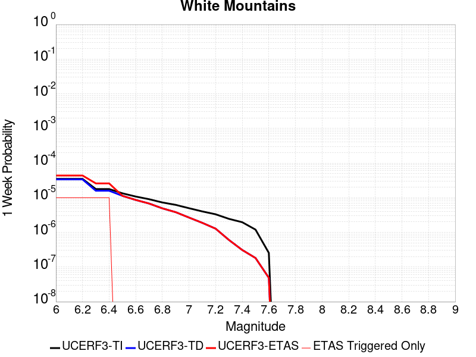 | 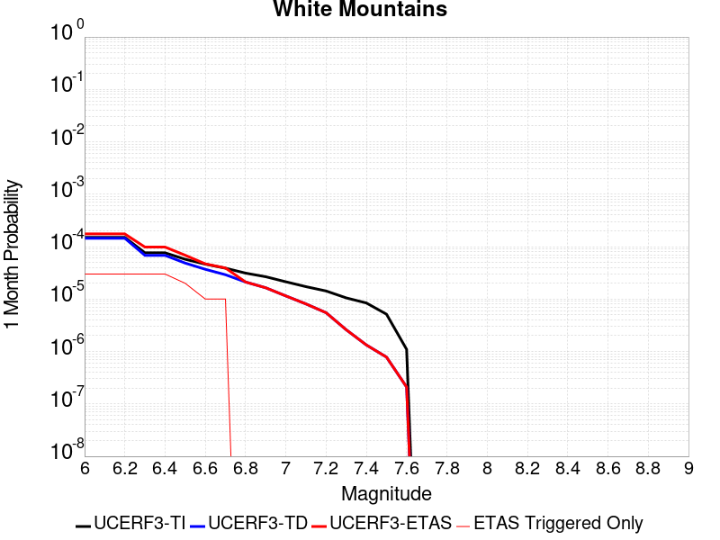 |  |  |

| Magnitude | 1 wk TI Prob | 1 wk TD Prob | 1 wk ETAS Prob | 1 wk ETAS/TD Gain | 1 wk ETAS Triggered Only | 1 mo TI Prob | 1 mo TD Prob | 1 mo ETAS Prob | 1 mo ETAS/TD Gain | 1 mo ETAS Triggered Only | 1 yr TI Prob | 1 yr TD Prob | 1 yr ETAS Prob | 1 yr ETAS/TD Gain | 1 yr ETAS Triggered Only | 10 yr TI Prob | 10 yr TD Prob | 10 yr ETAS Prob | 10 yr ETAS/TD Gain | 10 yr ETAS Triggered Only |
|-----|-----|-----|-----|-----|-----|-----|-----|-----|-----|-----|-----|-----|-----|-----|-----|-----|-----|-----|-----|-----|
| 6.0 | 3.503579E-5 | 3.3784498E-5 | 4.378416E-5 | 1.2959838 | 1.0E-5 | 1.5014476E-4 | 1.4478335E-4 | 1.7477901E-4 | 1.2071762 | 3.0E-5 | 0.0018264796 | 0.0017614327 | 0.0018313095 | 1.0396703 | 7.0E-5 | 0.018115403 | 0.017487047 | 0.017634425 | 1.0084277 | 1.5E-4 |
| 6.1 | 3.503579E-5 | 3.3784498E-5 | 4.378416E-5 | 1.2959838 | 1.0E-5 | 1.5014476E-4 | 1.4478335E-4 | 1.7477901E-4 | 1.2071762 | 3.0E-5 | 0.0018264796 | 0.0017614327 | 0.0018313095 | 1.0396703 | 7.0E-5 | 0.018115403 | 0.017487047 | 0.017634425 | 1.0084277 | 1.5E-4 |
| 6.2 | 3.503579E-5 | 3.3784498E-5 | 4.378416E-5 | 1.2959838 | 1.0E-5 | 1.5014476E-4 | 1.4478335E-4 | 1.7477901E-4 | 1.2071762 | 3.0E-5 | 0.0018264796 | 0.0017614327 | 0.0018313095 | 1.0396703 | 7.0E-5 | 0.018115403 | 0.017487047 | 0.017634425 | 1.0084277 | 1.5E-4 |
| 6.3 | 1.7818425E-5 | 1.591632E-5 | 2.591616E-5 | 1.628276 | 1.0E-5 | 7.636245E-5 | 6.821109E-5 | 9.820905E-5 | 1.4397812 | 3.0E-5 | 9.293162E-4 | 8.301679E-4 | 8.7013474E-4 | 1.048143 | 4.0E-5 | 0.009254395 | 0.008272125 | 0.008331629 | 1.0071933 | 6.0E-5 |
| 6.4 | 1.7818425E-5 | 1.591632E-5 | 2.591616E-5 | 1.628276 | 1.0E-5 | 7.636245E-5 | 6.821109E-5 | 9.820905E-5 | 1.4397812 | 3.0E-5 | 9.293162E-4 | 8.301679E-4 | 8.7013474E-4 | 1.048143 | 4.0E-5 | 0.009254395 | 0.008272125 | 0.008331629 | 1.0071933 | 6.0E-5 |
| 6.5 | 1.3397557E-5 | 1.1336486E-5 | 1.1336486E-5 | 1.0 | 0.0 | 5.741684E-5 | 4.8584072E-5 | 6.8583104E-5 | 1.4116375 | 2.0E-5 | 6.988258E-4 | 5.9135753E-4 | 6.113457E-4 | 1.0338005 | 2.0E-5 | 0.006966323 | 0.0058985446 | 0.005938309 | 1.0067413 | 4.0E-5 |
| 6.6 | 1.0818695E-5 | 8.625519E-6 | 8.625519E-6 | 1.0 | 0.0 | 4.6365014E-5 | 3.696601E-5 | 4.696564E-5 | 1.2705088 | 1.0E-5 | 5.6434784E-4 | 4.4997258E-4 | 4.5996808E-4 | 1.0222136 | 1.0E-5 | 0.005629168 | 0.004491051 | 0.0045109615 | 1.0044333 | 2.0E-5 |
| 6.7 | 9.067908E-6 | 6.802544E-6 | 6.802544E-6 | 1.0 | 0.0 | 3.8861883E-5 | 2.915345E-5 | 3.915316E-5 | 1.3430026 | 1.0E-5 | 4.7304068E-4 | 3.5488865E-4 | 3.648851E-4 | 1.0281678 | 1.0E-5 | 0.00472035 | 0.0035435364 | 0.0035634656 | 1.005624 | 2.0E-5 |
| 6.8 | 7.295947E-6 | 4.9364785E-6 | 4.9364785E-6 | 1.0 | 0.0 | 3.126797E-5 | 2.1156171E-5 | 2.1156171E-5 | 1.0 | 0.0 | 3.8062103E-4 | 2.5754707E-4 | 2.5754707E-4 | 1.0 | 0.0 | 0.0037996976 | 0.0025725989 | 0.002582573 | 1.0038772 | 1.0E-5 |
| 6.9 | 6.2243444E-6 | 3.8322955E-6 | 3.8322955E-6 | 1.0 | 0.0 | 2.6675489E-5 | 1.6424025E-5 | 1.6424025E-5 | 1.0 | 0.0 | 3.2472567E-4 | 1.9994467E-4 | 1.9994467E-4 | 1.0 | 0.0 | 0.0032425157 | 0.0019977004 | 0.0019977004 | 1.0 | 0.0 |
| 7.0 | 4.9878413E-6 | 2.6796004E-6 | 2.6796004E-6 | 1.0 | 0.0 | 2.1376287E-5 | 1.1483952E-5 | 1.1483952E-5 | 1.0 | 0.0 | 2.602252E-4 | 1.3980841E-4 | 1.3980841E-4 | 1.0 | 0.0 | 0.002599207 | 0.0013972308 | 0.0013972308 | 1.0 | 0.0 |
| 7.1 | 4.0252844E-6 | 1.885737E-6 | 1.885737E-6 | 1.0 | 0.0 | 1.7251105E-5 | 8.081706E-6 | 8.081706E-6 | 1.0 | 0.0 | 2.1001195E-4 | 9.8390454E-5 | 9.8390454E-5 | 1.0 | 0.0 | 0.0020981359 | 9.834818E-4 | 9.834818E-4 | 1.0 | 0.0 |
| 7.2 | 3.3284066E-6 | 1.2819264E-6 | 1.2819264E-6 | 1.0 | 0.0 | 1.4264522E-5 | 5.493959E-6 | 5.493959E-6 | 1.0 | 0.0 | 1.736567E-4 | 6.6887005E-5 | 6.6887005E-5 | 1.0 | 0.0 | 0.0017352107 | 6.686788E-4 | 6.686788E-4 | 1.0 | 0.0 |
| 7.3 | 2.458226E-6 | 6.0570005E-7 | 6.0570005E-7 | 1.0 | 0.0 | 1.0535211E-5 | 2.595855E-6 | 2.595855E-6 | 1.0 | 0.0 | 1.2825865E-4 | 3.1604115E-5 | 3.1604115E-5 | 1.0 | 0.0 | 0.0012818464 | 3.1599996E-4 | 3.1599996E-4 | 1.0 | 0.0 |
| 7.4 | 1.965953E-6 | 3.1087455E-7 | 3.1087455E-7 | 1.0 | 0.0 | 8.425486E-6 | 1.3323188E-6 | 1.3323188E-6 | 1.0 | 0.0 | 1.0257547E-4 | 1.6220862E-5 | 1.6220862E-5 | 1.0 | 0.0 | 0.0010252813 | 1.6219691E-4 | 1.6219691E-4 | 1.0 | 0.0 |
| 7.5 | 1.2014192E-6 | 1.8242919E-7 | 1.8242919E-7 | 1.0 | 0.0 | 5.148929E-6 | 7.8183916E-7 | 7.8183916E-7 | 1.0 | 0.0 | 6.2686406E-5 | 9.518851E-6 | 9.518851E-6 | 1.0 | 0.0 | 6.266873E-4 | 9.5184514E-5 | 9.5184514E-5 | 1.0 | 0.0 |
| 7.6 | 2.5612175E-7 | 4.8943498E-8 | 4.8943498E-8 | 1.0 | 0.0 | 1.0976642E-6 | 2.0975783E-7 | 2.0975783E-7 | 1.0 | 0.0 | 1.3363979E-5 | 2.553799E-6 | 2.553799E-6 | 1.0 | 0.0 | 1.3363175E-4 | 2.5537733E-5 | 2.5537733E-5 | 1.0 | 0.0 |

## Owens Valley
*[(top)](#table-of-contents)*

| 1 Week | 1 Month | 1 Year | 10 Year |
|-----|-----|-----|-----|
|  |  |  |  |

| Magnitude | 1 wk TI Prob | 1 wk TD Prob | 1 wk ETAS Prob | 1 wk ETAS/TD Gain | 1 wk ETAS Triggered Only | 1 mo TI Prob | 1 mo TD Prob | 1 mo ETAS Prob | 1 mo ETAS/TD Gain | 1 mo ETAS Triggered Only | 1 yr TI Prob | 1 yr TD Prob | 1 yr ETAS Prob | 1 yr ETAS/TD Gain | 1 yr ETAS Triggered Only | 10 yr TI Prob | 10 yr TD Prob | 10 yr ETAS Prob | 10 yr ETAS/TD Gain | 10 yr ETAS Triggered Only |
|-----|-----|-----|-----|-----|-----|-----|-----|-----|-----|-----|-----|-----|-----|-----|-----|-----|-----|-----|-----|-----|
| 6.0 | 4.83821E-5 | 3.621193E-6 | 2.362112E-5 | 6.5230217 | 2.0E-5 | 2.0733538E-4 | 1.5519312E-5 | 4.5518846E-5 | 2.9330454 | 3.0E-5 | 0.002521386 | 1.8893222E-4 | 3.0890954E-4 | 1.6350284 | 1.2E-4 | 0.024929691 | 0.001929822 | 0.002069552 | 1.0724056 | 1.4E-4 |
| 6.1 | 4.83821E-5 | 3.621193E-6 | 2.362112E-5 | 6.5230217 | 2.0E-5 | 2.0733538E-4 | 1.5519312E-5 | 4.5518846E-5 | 2.9330454 | 3.0E-5 | 0.002521386 | 1.8893222E-4 | 3.0890954E-4 | 1.6350284 | 1.2E-4 | 0.024929691 | 0.001929822 | 0.002069552 | 1.0724056 | 1.4E-4 |
| 6.2 | 4.83821E-5 | 3.621193E-6 | 2.362112E-5 | 6.5230217 | 2.0E-5 | 2.0733538E-4 | 1.5519312E-5 | 4.5518846E-5 | 2.9330454 | 3.0E-5 | 0.002521386 | 1.8893222E-4 | 3.0890954E-4 | 1.6350284 | 1.2E-4 | 0.024929691 | 0.001929822 | 0.002069552 | 1.0724056 | 1.4E-4 |
| 6.3 | 3.953008E-5 | 3.153231E-6 | 2.3153169E-5 | 7.3426805 | 2.0E-5 | 1.6940363E-4 | 1.3513782E-5 | 4.3513377E-5 | 3.2199259 | 3.0E-5 | 0.002060538 | 1.645186E-4 | 2.8449885E-4 | 1.7292808 | 1.2E-4 | 0.020415364 | 0.0016622683 | 0.0018020356 | 1.0840822 | 1.4E-4 |
| 6.4 | 3.953008E-5 | 3.153231E-6 | 2.3153169E-5 | 7.3426805 | 2.0E-5 | 1.6940363E-4 | 1.3513782E-5 | 4.3513377E-5 | 3.2199259 | 3.0E-5 | 0.002060538 | 1.645186E-4 | 2.8449885E-4 | 1.7292808 | 1.2E-4 | 0.020415364 | 0.0016622683 | 0.0018020356 | 1.0840822 | 1.4E-4 |
| 6.5 | 3.457342E-5 | 2.970874E-6 | 2.2970815E-5 | 7.7320056 | 2.0E-5 | 1.4816338E-4 | 1.2732259E-5 | 4.2731877E-5 | 3.3561897 | 3.0E-5 | 0.0018023965 | 1.5500492E-4 | 2.6498787E-4 | 1.7095449 | 1.1E-4 | 0.017878477 | 0.0015564174 | 0.001686215 | 1.0833951 | 1.3E-4 |
| 6.6 | 3.1127765E-5 | 2.8738657E-6 | 2.2873808E-5 | 7.959247 | 2.0E-5 | 1.3339789E-4 | 1.2316514E-5 | 4.2316144E-5 | 3.4357243 | 3.0E-5 | 0.0016229092 | 1.4994392E-4 | 2.5992742E-4 | 1.7334976 | 1.1E-4 | 0.016111081 | 0.001501446 | 0.0016312508 | 1.0864532 | 1.3E-4 |
| 6.7 | 2.806885E-5 | 2.8102859E-6 | 2.2810229E-5 | 8.1166935 | 2.0E-5 | 1.2028952E-4 | 1.204403E-5 | 4.204367E-5 | 3.4908304 | 3.0E-5 | 0.001463541 | 1.4662689E-4 | 2.5661077E-4 | 1.7500935 | 1.1E-4 | 0.014539397 | 0.0014657174 | 0.0015955269 | 1.0885638 | 1.3E-4 |
| 6.8 | 2.524524E-5 | 2.2352563E-6 | 2.2235212E-5 | 9.9475 | 2.0E-5 | 1.0818939E-4 | 9.579636E-6 | 3.957935E-5 | 4.131613 | 3.0E-5 | 0.0013164099 | 1.1662613E-4 | 2.2661331E-4 | 1.9430748 | 1.1E-4 | 0.01308639 | 0.0011659319 | 0.0012957803 | 1.1113688 | 1.3E-4 |
| 6.9 | 2.2704568E-5 | 1.6080646E-6 | 2.1608033E-5 | 13.437291 | 2.0E-5 | 9.730166E-5 | 6.8916875E-6 | 3.689148E-5 | 5.35304 | 3.0E-5 | 0.0011840039 | 8.390308E-5 | 1.9389385E-4 | 2.3109264 | 1.1E-4 | 0.011777153 | 8.3894585E-4 | 9.688368E-4 | 1.1548264 | 1.3E-4 |
| 7.0 | 2.0871712E-5 | 1.5394511E-6 | 2.1539421E-5 | 13.991624 | 2.0E-5 | 8.944713E-5 | 6.597631E-6 | 3.6597434E-5 | 5.5470567 | 3.0E-5 | 0.0010884746 | 8.032321E-5 | 1.9031439E-4 | 2.369357 | 1.1E-4 | 0.010831586 | 8.0313E-4 | 9.3302556E-4 | 1.1617367 | 1.3E-4 |
| 7.1 | 1.944928E-5 | 1.3863316E-6 | 2.1386304E-5 | 15.426542 | 2.0E-5 | 8.335139E-5 | 5.941408E-6 | 3.594123E-5 | 6.0492783 | 3.0E-5 | 0.0010143308 | 7.233425E-5 | 1.823263E-4 | 2.520608 | 1.1E-4 | 0.010097133 | 7.232817E-4 | 8.5318764E-4 | 1.1796063 | 1.3E-4 |
| 7.2 | 1.7876306E-5 | 1.2488347E-6 | 2.124881E-5 | 17.01491 | 2.0E-5 | 7.6610486E-5 | 5.352138E-6 | 3.535198E-5 | 6.605207 | 3.0E-5 | 9.3233347E-4 | 6.516034E-5 | 1.7515317E-4 | 2.6880336 | 1.1E-4 | 0.009284316 | 6.5157266E-4 | 7.814879E-4 | 1.1993873 | 1.3E-4 |
| 7.3 | 1.2618672E-5 | 1.1114453E-6 | 2.1111424E-5 | 18.994568 | 2.0E-5 | 5.40789E-5 | 4.763328E-6 | 3.4763187E-5 | 7.2980876 | 3.0E-5 | 6.582117E-4 | 5.7991983E-5 | 1.5798619E-4 | 2.7242763 | 1.0E-4 | 0.0065626553 | 5.7992374E-4 | 6.9985416E-4 | 1.2068038 | 1.2E-4 |
| 7.4 | 7.4874442E-6 | 8.548014E-7 | 2.0854784E-5 | 24.397228 | 2.0E-5 | 3.208865E-5 | 3.6634294E-6 | 2.3663357E-5 | 6.4593453 | 2.0E-5 | 3.906093E-4 | 4.4601344E-5 | 1.2459778E-4 | 2.793588 | 8.0E-5 | 0.003899234 | 4.4603736E-4 | 5.359972E-4 | 1.2016869 | 9.0E-5 |
| 7.5 | 2.4734156E-6 | 6.0683584E-7 | 2.0606823E-5 | 33.957825 | 2.0E-5 | 1.060031E-5 | 2.6007224E-6 | 2.260067E-5 | 8.690151 | 2.0E-5 | 1.2905113E-4 | 3.1663338E-5 | 1.0166112E-4 | 3.2106886 | 7.0E-5 | 0.0012897621 | 3.165886E-4 | 3.9656326E-4 | 1.2526139 | 8.0E-5 |
| 7.6 | 1.1328841E-6 | 3.1963748E-7 | 1.0319634E-5 | 32.28543 | 1.0E-5 | 4.8552088E-6 | 1.3698742E-6 | 1.1369861E-5 | 8.299931 | 1.0E-5 | 5.9110564E-5 | 1.6678092E-5 | 5.6677425E-5 | 3.398316 | 4.0E-5 | 5.9094845E-4 | 1.667686E-4 | 2.1676027E-4 | 1.2997667 | 5.0E-5 |
| 7.7 | 4.8613185E-7 | 8.9632934E-8 | 1.0089632E-5 | 112.566124 | 1.0E-5 | 2.0834207E-6 | 3.8414112E-7 | 1.0384138E-5 | 27.032091 | 1.0E-5 | 2.536535E-5 | 4.6769087E-6 | 2.4676816E-5 | 5.276309 | 2.0E-5 | 2.5362454E-4 | 4.676817E-5 | 7.6766766E-5 | 1.6414319 | 3.0E-5 |

## Manix-Afton Hills
*[(top)](#table-of-contents)*

| 1 Week | 1 Month | 1 Year | 10 Year |
|-----|-----|-----|-----|
| 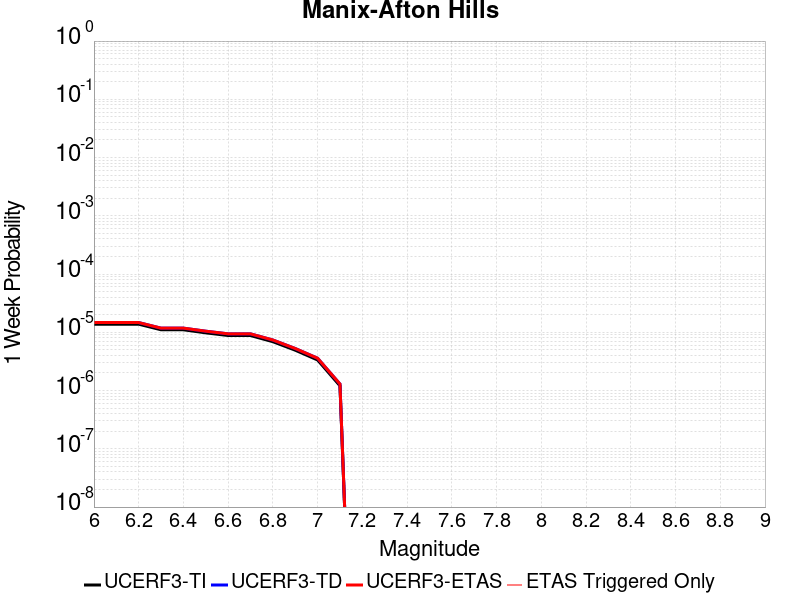 |  |  |  |

| Magnitude | 1 wk TI Prob | 1 wk TD Prob | 1 wk ETAS Prob | 1 wk ETAS/TD Gain | 1 wk ETAS Triggered Only | 1 mo TI Prob | 1 mo TD Prob | 1 mo ETAS Prob | 1 mo ETAS/TD Gain | 1 mo ETAS Triggered Only | 1 yr TI Prob | 1 yr TD Prob | 1 yr ETAS Prob | 1 yr ETAS/TD Gain | 1 yr ETAS Triggered Only | 10 yr TI Prob | 10 yr TD Prob | 10 yr ETAS Prob | 10 yr ETAS/TD Gain | 10 yr ETAS Triggered Only |
|-----|-----|-----|-----|-----|-----|-----|-----|-----|-----|-----|-----|-----|-----|-----|-----|-----|-----|-----|-----|-----|
| 6.0 | 1.3783202E-5 | 1.4711221E-5 | 1.4711221E-5 | 1.0 | 0.0 | 5.906953E-5 | 6.304667E-5 | 8.304541E-5 | 1.3172053 | 2.0E-5 | 7.189342E-4 | 7.673403E-4 | 8.372866E-4 | 1.0911542 | 7.0E-5 | 0.0071661277 | 0.007648664 | 0.007787593 | 1.0181638 | 1.4E-4 |
| 6.1 | 1.3783202E-5 | 1.4711221E-5 | 1.4711221E-5 | 1.0 | 0.0 | 5.906953E-5 | 6.304667E-5 | 8.304541E-5 | 1.3172053 | 2.0E-5 | 7.189342E-4 | 7.673403E-4 | 8.372866E-4 | 1.0911542 | 7.0E-5 | 0.0071661277 | 0.007648664 | 0.007787593 | 1.0181638 | 1.4E-4 |
| 6.2 | 1.3783202E-5 | 1.4711221E-5 | 1.4711221E-5 | 1.0 | 0.0 | 5.906953E-5 | 6.304667E-5 | 8.304541E-5 | 1.3172053 | 2.0E-5 | 7.189342E-4 | 7.673403E-4 | 8.372866E-4 | 1.0911542 | 7.0E-5 | 0.0071661277 | 0.007648664 | 0.007787593 | 1.0181638 | 1.4E-4 |
| 6.3 | 1.10494875E-5 | 1.1793241E-5 | 1.1793241E-5 | 1.0 | 0.0 | 4.7354086E-5 | 5.054154E-5 | 6.0541035E-5 | 1.197847 | 1.0E-5 | 5.763835E-4 | 6.151799E-4 | 6.651491E-4 | 1.0812271 | 5.0E-5 | 0.005748908 | 0.00613581 | 0.0062451353 | 1.0178175 | 1.1E-4 |
| 6.4 | 1.10494875E-5 | 1.1793241E-5 | 1.1793241E-5 | 1.0 | 0.0 | 4.7354086E-5 | 5.054154E-5 | 6.0541035E-5 | 1.197847 | 1.0E-5 | 5.763835E-4 | 6.151799E-4 | 6.651491E-4 | 1.0812271 | 5.0E-5 | 0.005748908 | 0.00613581 | 0.0062451353 | 1.0178175 | 1.1E-4 |
| 6.5 | 9.788949E-6 | 1.0454414E-5 | 1.0454414E-5 | 1.0 | 0.0 | 4.1951964E-5 | 4.4803914E-5 | 5.4803466E-5 | 1.2231848 | 1.0E-5 | 5.1064545E-4 | 5.4536044E-4 | 5.953332E-4 | 1.0916325 | 5.0E-5 | 0.0050947363 | 0.005441148 | 0.005550549 | 1.0201063 | 1.1E-4 |
| 6.6 | 8.810006E-6 | 9.413714E-6 | 9.413714E-6 | 1.0 | 0.0 | 3.775662E-5 | 4.0343915E-5 | 5.034351E-5 | 1.2478589 | 1.0E-5 | 4.5958988E-4 | 4.9108535E-4 | 5.310657E-4 | 1.0814122 | 4.0E-5 | 0.0045864056 | 0.004900884 | 0.0050003934 | 1.0203044 | 1.0E-4 |
| 6.7 | 8.80128E-6 | 9.404193E-6 | 9.404193E-6 | 1.0 | 0.0 | 3.7719226E-5 | 4.0303115E-5 | 5.030271E-5 | 1.2481098 | 1.0E-5 | 4.591348E-4 | 4.9058883E-4 | 5.305692E-4 | 1.0814947 | 4.0E-5 | 0.004581874 | 0.0048959404 | 0.004995451 | 1.0203251 | 1.0E-4 |
| 6.8 | 6.8994877E-6 | 7.3801443E-6 | 7.3801443E-6 | 1.0 | 0.0 | 2.9568899E-5 | 3.1628853E-5 | 4.1628537E-5 | 1.316157 | 1.0E-5 | 3.5994186E-4 | 3.850214E-4 | 4.25006E-4 | 1.1038504 | 4.0E-5 | 0.003593594 | 0.0038443485 | 0.0039340025 | 1.023321 | 9.0E-5 |
| 6.9 | 4.9328037E-6 | 5.2710093E-6 | 5.2710093E-6 | 1.0 | 0.0 | 2.1140417E-5 | 2.258988E-5 | 3.2589654E-5 | 1.442666 | 1.0E-5 | 2.5735417E-4 | 2.7500323E-4 | 2.9499774E-4 | 1.0727065 | 2.0E-5 | 0.0025705635 | 0.0027472344 | 0.0027970972 | 1.0181501 | 5.0E-5 |
| 7.0 | 3.347973E-6 | 3.5900646E-6 | 3.5900646E-6 | 1.0 | 0.0 | 1.4348378E-5 | 1.5385924E-5 | 2.5385769E-5 | 1.6499348 | 1.0E-5 | 1.746775E-4 | 1.8731161E-4 | 1.9730974E-4 | 1.0533769 | 1.0E-5 | 0.0017454025 | 0.00187194 | 0.0018919025 | 1.0106641 | 2.0E-5 |
| 7.1 | 1.2073567E-6 | 1.2934943E-6 | 1.2934943E-6 | 1.0 | 0.0 | 5.1743755E-6 | 5.5435444E-6 | 1.5543488E-5 | 2.80389 | 1.0E-5 | 6.29962E-5 | 6.74922E-5 | 7.7491524E-5 | 1.1481553 | 1.0E-5 | 6.297835E-4 | 6.7487714E-4 | 6.848704E-4 | 1.0148075 | 1.0E-5 |

## Cleghorn Pass
*[(top)](#table-of-contents)*

| 1 Week | 1 Month | 1 Year | 10 Year |
|-----|-----|-----|-----|
|  |  |  |  |

| Magnitude | 1 wk TI Prob | 1 wk TD Prob | 1 wk ETAS Prob | 1 wk ETAS/TD Gain | 1 wk ETAS Triggered Only | 1 mo TI Prob | 1 mo TD Prob | 1 mo ETAS Prob | 1 mo ETAS/TD Gain | 1 mo ETAS Triggered Only | 1 yr TI Prob | 1 yr TD Prob | 1 yr ETAS Prob | 1 yr ETAS/TD Gain | 1 yr ETAS Triggered Only | 10 yr TI Prob | 10 yr TD Prob | 10 yr ETAS Prob | 10 yr ETAS/TD Gain | 10 yr ETAS Triggered Only |
|-----|-----|-----|-----|-----|-----|-----|-----|-----|-----|-----|-----|-----|-----|-----|-----|-----|-----|-----|-----|-----|
| 6.0 | 1.0522846E-5 | 1.1040714E-5 | 1.1040714E-5 | 1.0 | 0.0 | 4.509713E-5 | 4.7316782E-5 | 4.7316782E-5 | 1.0 | 0.0 | 5.4891926E-4 | 5.759822E-4 | 6.359476E-4 | 1.1041099 | 6.0E-5 | 0.0054756533 | 0.005750059 | 0.0058693695 | 1.0207493 | 1.2E-4 |
| 6.1 | 1.0522846E-5 | 1.1040714E-5 | 1.1040714E-5 | 1.0 | 0.0 | 4.509713E-5 | 4.7316782E-5 | 4.7316782E-5 | 1.0 | 0.0 | 5.4891926E-4 | 5.759822E-4 | 6.359476E-4 | 1.1041099 | 6.0E-5 | 0.0054756533 | 0.005750059 | 0.0058693695 | 1.0207493 | 1.2E-4 |
| 6.2 | 2.1045846E-6 | 2.2082168E-6 | 2.2082168E-6 | 1.0 | 0.0 | 9.019617E-6 | 9.463776E-6 | 9.463776E-6 | 1.0 | 0.0 | 1.098083E-4 | 1.1521958E-4 | 1.2521842E-4 | 1.0867808 | 1.0E-5 | 0.0010975406 | 0.0011520098 | 0.0011919637 | 1.0346819 | 4.0E-5 |
| 6.3 | 2.1045846E-6 | 2.2082168E-6 | 2.2082168E-6 | 1.0 | 0.0 | 9.019617E-6 | 9.463776E-6 | 9.463776E-6 | 1.0 | 0.0 | 1.098083E-4 | 1.1521958E-4 | 1.2521842E-4 | 1.0867808 | 1.0E-5 | 0.0010975406 | 0.0011520098 | 0.0011919637 | 1.0346819 | 4.0E-5 |
| 6.4 | 1.7259927E-6 | 1.8108889E-6 | 1.8108889E-6 | 1.0 | 0.0 | 7.3970905E-6 | 7.760952E-6 | 7.760952E-6 | 1.0 | 0.0 | 9.005586E-5 | 9.4489595E-5 | 1.0448865E-4 | 1.1058217 | 1.0E-5 | 9.001937E-4 | 9.4489596E-4 | 9.848581E-4 | 1.0422927 | 4.0E-5 |

## Santa Rosa Island
*[(top)](#table-of-contents)*

| 1 Week | 1 Month | 1 Year | 10 Year |
|-----|-----|-----|-----|
|  | 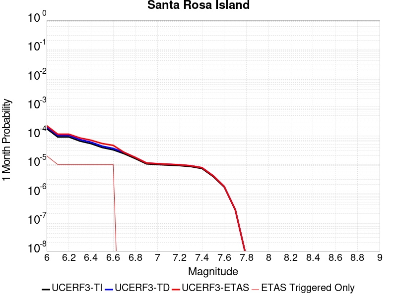 | 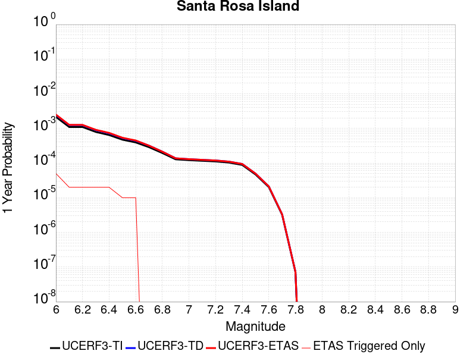 |  |

| Magnitude | 1 wk TI Prob | 1 wk TD Prob | 1 wk ETAS Prob | 1 wk ETAS/TD Gain | 1 wk ETAS Triggered Only | 1 mo TI Prob | 1 mo TD Prob | 1 mo ETAS Prob | 1 mo ETAS/TD Gain | 1 mo ETAS Triggered Only | 1 yr TI Prob | 1 yr TD Prob | 1 yr ETAS Prob | 1 yr ETAS/TD Gain | 1 yr ETAS Triggered Only | 10 yr TI Prob | 10 yr TD Prob | 10 yr ETAS Prob | 10 yr ETAS/TD Gain | 10 yr ETAS Triggered Only |
|-----|-----|-----|-----|-----|-----|-----|-----|-----|-----|-----|-----|-----|-----|-----|-----|-----|-----|-----|-----|-----|
| 6.0 | 4.1143165E-5 | 4.7092035E-5 | 6.7091096E-5 | 1.4246802 | 2.0E-5 | 1.7631594E-4 | 2.018085E-4 | 2.2180447E-4 | 1.0990839 | 2.0E-5 | 0.002144533 | 0.0024544464 | 0.0025043236 | 1.0203212 | 5.0E-5 | 0.021239553 | 0.024294019 | 0.024401346 | 1.0044179 | 1.1E-4 |
| 6.1 | 2.1061249E-5 | 2.3865383E-5 | 3.3865144E-5 | 1.419007 | 1.0E-5 | 9.0259375E-5 | 1.0227637E-4 | 1.12275346E-4 | 1.0977643 | 1.0E-5 | 0.0010983539 | 0.0012445324 | 0.0012645075 | 1.0160503 | 2.0E-5 | 0.01092941 | 0.012378668 | 0.012437926 | 1.0047871 | 6.0E-5 |
| 6.2 | 2.1061249E-5 | 2.3865383E-5 | 3.3865144E-5 | 1.419007 | 1.0E-5 | 9.0259375E-5 | 1.0227637E-4 | 1.12275346E-4 | 1.0977643 | 1.0E-5 | 0.0010983539 | 0.0012445324 | 0.0012645075 | 1.0160503 | 2.0E-5 | 0.01092941 | 0.012378668 | 0.012437926 | 1.0047871 | 6.0E-5 |
| 6.3 | 1.5158236E-5 | 1.7074706E-5 | 2.7074535E-5 | 1.5856516 | 1.0E-5 | 6.496225E-5 | 7.317533E-5 | 8.31746E-5 | 1.136648 | 1.0E-5 | 7.906284E-4 | 8.905575E-4 | 9.1053965E-4 | 1.0224378 | 2.0E-5 | 0.007878214 | 0.008871139 | 0.008920696 | 1.0055863 | 5.0E-5 |
| 6.4 | 1.2341918E-5 | 1.3853143E-5 | 2.3853005E-5 | 1.7218479 | 1.0E-5 | 5.2892858E-5 | 5.9369308E-5 | 6.936872E-5 | 1.1684272 | 1.0E-5 | 6.437803E-4 | 7.225897E-4 | 7.4257527E-4 | 1.0276582 | 2.0E-5 | 0.006419184 | 0.007203239 | 0.0072429506 | 1.0055131 | 4.0E-5 |
| 6.5 | 9.061158E-6 | 1.0117189E-5 | 2.0117088E-5 | 1.9884069 | 1.0E-5 | 3.883296E-5 | 4.335869E-5 | 5.3358257E-5 | 1.2306243 | 1.0E-5 | 4.726887E-4 | 5.277695E-4 | 5.377642E-4 | 1.0189377 | 1.0E-5 | 0.004716845 | 0.0052656992 | 0.0052955416 | 1.0056672 | 3.0E-5 |
| 6.6 | 7.5461685E-6 | 8.400862E-6 | 1.8400777E-5 | 2.190344 | 1.0E-5 | 3.2340322E-5 | 3.6003217E-5 | 4.6002857E-5 | 1.277743 | 1.0E-5 | 3.936723E-4 | 4.3825532E-4 | 4.4825094E-4 | 1.0228077 | 1.0E-5 | 0.003929756 | 0.00437434 | 0.0043942523 | 1.0045521 | 2.0E-5 |
| 6.7 | 5.5023775E-6 | 6.0874677E-6 | 6.0874677E-6 | 1.0 | 0.0 | 2.3581404E-5 | 2.6088905E-5 | 2.6088905E-5 | 1.0 | 0.0 | 2.8706578E-4 | 3.1758938E-4 | 3.1758938E-4 | 1.0 | 0.0 | 0.0028669522 | 0.0031716768 | 0.0031716768 | 1.0 | 0.0 |
| 6.8 | 3.7351679E-6 | 4.083192E-6 | 4.083192E-6 | 1.0 | 0.0 | 1.6007763E-5 | 1.749929E-5 | 1.749929E-5 | 1.0 | 0.0 | 1.948771E-4 | 2.1303551E-4 | 2.1303551E-4 | 1.0 | 0.0 | 0.0019470629 | 0.0021285582 | 0.0021285582 | 1.0 | 0.0 |
| 6.9 | 2.456366E-6 | 2.6292955E-6 | 2.6292955E-6 | 1.0 | 0.0 | 1.0527241E-5 | 1.1268361E-5 | 1.1268361E-5 | 1.0 | 0.0 | 1.2816161E-4 | 1.3718368E-4 | 1.3718368E-4 | 1.0 | 0.0 | 0.0012808773 | 0.0013709929 | 0.0013709929 | 1.0 | 0.0 |
| 7.0 | 2.3245157E-6 | 2.4828012E-6 | 2.4828012E-6 | 1.0 | 0.0 | 9.962172E-6 | 1.0640533E-5 | 1.0640533E-5 | 1.0 | 0.0 | 1.2128269E-4 | 1.295408E-4 | 1.295408E-4 | 1.0 | 0.0 | 0.0012121652 | 0.0012946553 | 0.0012946553 | 1.0 | 0.0 |
| 7.1 | 2.2248344E-6 | 2.3732714E-6 | 2.3732714E-6 | 1.0 | 0.0 | 9.53497E-6 | 1.0171123E-5 | 1.0171123E-5 | 1.0 | 0.0 | 1.1608207E-4 | 1.2382641E-4 | 1.2382641E-4 | 1.0 | 0.0 | 0.0011602144 | 0.0012375761 | 0.0012375761 | 1.0 | 0.0 |
| 7.2 | 2.1350402E-6 | 2.2761742E-6 | 2.2761742E-6 | 1.0 | 0.0 | 9.150141E-6 | 9.754996E-6 | 9.754996E-6 | 1.0 | 0.0 | 1.1139726E-4 | 1.18760625E-4 | 1.18760625E-4 | 1.0 | 0.0 | 0.0011134144 | 0.0011869734 | 0.0011869734 | 1.0 | 0.0 |
| 7.3 | 1.9793572E-6 | 2.1087376E-6 | 2.1087376E-6 | 1.0 | 0.0 | 8.482932E-6 | 9.037416E-6 | 9.037416E-6 | 1.0 | 0.0 | 1.032748E-4 | 1.10025E-4 | 1.10025E-4 | 1.0 | 0.0 | 0.0010322682 | 0.0010997071 | 0.0010997071 | 1.0 | 0.0 |
| 7.4 | 1.6951194E-6 | 1.8045891E-6 | 1.8045891E-6 | 1.0 | 0.0 | 7.264777E-6 | 7.733931E-6 | 7.733931E-6 | 1.0 | 0.0 | 8.844508E-5 | 9.415655E-5 | 9.415655E-5 | 1.0 | 0.0 | 8.840988E-4 | 9.411683E-4 | 9.411683E-4 | 1.0 | 0.0 |
| 7.5 | 8.987207E-7 | 9.5122914E-7 | 9.5122914E-7 | 1.0 | 0.0 | 3.8516546E-6 | 4.07669E-6 | 4.07669E-6 | 1.0 | 0.0 | 4.6892885E-5 | 4.963258E-5 | 4.963258E-5 | 1.0 | 0.0 | 4.688299E-4 | 4.962162E-4 | 4.962162E-4 | 1.0 | 0.0 |
| 7.6 | 3.8783037E-7 | 4.0529594E-7 | 4.0529594E-7 | 1.0 | 0.0 | 1.6621291E-6 | 1.7369814E-6 | 1.7369814E-6 | 1.0 | 0.0 | 2.0236233E-5 | 2.114755E-5 | 2.114755E-5 | 1.0 | 0.0 | 2.023439E-4 | 2.1145603E-4 | 2.1145603E-4 | 1.0 | 0.0 |
| 7.7 | 6.181804E-8 | 6.339078E-8 | 6.339078E-8 | 1.0 | 0.0 | 2.6493444E-7 | 2.7167474E-7 | 2.7167474E-7 | 1.0 | 0.0 | 3.225572E-6 | 3.3076349E-6 | 3.3076349E-6 | 1.0 | 0.0 | 3.225525E-5 | 3.3075863E-5 | 3.3075863E-5 | 1.0 | 0.0 |
| 7.8 | 1.3704449E-9 | 1.3964188E-9 | 1.3964188E-9 | 1.0 | 0.0 | 5.873335E-9 | 5.984652E-9 | 5.984652E-9 | 1.0 | 0.0 | 7.1507856E-8 | 7.286314E-8 | 7.286314E-8 | 1.0 | 0.0 | 7.1507833E-7 | 7.286312E-7 | 7.286312E-7 | 1.0 | 0.0 |

## Cleghorn Lake
*[(top)](#table-of-contents)*

| 1 Week | 1 Month | 1 Year | 10 Year |
|-----|-----|-----|-----|
|  |  |  |  |

| Magnitude | 1 wk TI Prob | 1 wk TD Prob | 1 wk ETAS Prob | 1 wk ETAS/TD Gain | 1 wk ETAS Triggered Only | 1 mo TI Prob | 1 mo TD Prob | 1 mo ETAS Prob | 1 mo ETAS/TD Gain | 1 mo ETAS Triggered Only | 1 yr TI Prob | 1 yr TD Prob | 1 yr ETAS Prob | 1 yr ETAS/TD Gain | 1 yr ETAS Triggered Only | 10 yr TI Prob | 10 yr TD Prob | 10 yr ETAS Prob | 10 yr ETAS/TD Gain | 10 yr ETAS Triggered Only |
|-----|-----|-----|-----|-----|-----|-----|-----|-----|-----|-----|-----|-----|-----|-----|-----|-----|-----|-----|-----|-----|
| 6.0 | 1.5467183E-5 | 1.6794396E-5 | 1.6794396E-5 | 1.0 | 0.0 | 6.6286244E-5 | 7.1974304E-5 | 8.197359E-5 | 1.1389285 | 1.0E-5 | 8.067362E-4 | 8.7598973E-4 | 9.7590213E-4 | 1.1140566 | 1.0E-4 | 0.008038137 | 0.008730795 | 0.0088497475 | 1.0136244 | 1.2E-4 |
| 6.1 | 1.5467183E-5 | 1.6794396E-5 | 1.6794396E-5 | 1.0 | 0.0 | 6.6286244E-5 | 7.1974304E-5 | 8.197359E-5 | 1.1389285 | 1.0E-5 | 8.067362E-4 | 8.7598973E-4 | 9.7590213E-4 | 1.1140566 | 1.0E-4 | 0.008038137 | 0.008730795 | 0.0088497475 | 1.0136244 | 1.2E-4 |
| 6.2 | 1.2624631E-5 | 1.3681697E-5 | 1.3681697E-5 | 1.0 | 0.0 | 5.410444E-5 | 5.86348E-5 | 6.863422E-5 | 1.1705372 | 1.0E-5 | 6.585225E-4 | 7.1369356E-4 | 8.136222E-4 | 1.1400162 | 1.0E-4 | 0.0065657445 | 0.007118811 | 0.007228028 | 1.015342 | 1.1E-4 |
| 6.3 | 1.2624631E-5 | 1.3681697E-5 | 1.3681697E-5 | 1.0 | 0.0 | 5.410444E-5 | 5.86348E-5 | 6.863422E-5 | 1.1705372 | 1.0E-5 | 6.585225E-4 | 7.1369356E-4 | 8.136222E-4 | 1.1400162 | 1.0E-4 | 0.0065657445 | 0.007118811 | 0.007228028 | 1.015342 | 1.1E-4 |
| 6.4 | 9.417684E-6 | 1.0170226E-5 | 1.0170226E-5 | 1.0 | 0.0 | 4.036088E-5 | 4.3586184E-5 | 5.358575E-5 | 1.2294205 | 1.0E-5 | 4.912829E-4 | 5.305737E-4 | 6.1053125E-4 | 1.1507002 | 8.0E-5 | 0.004901982 | 0.0052971053 | 0.0053866287 | 1.0169004 | 9.0E-5 |
| 6.5 | 9.368219E-6 | 1.0117652E-5 | 1.0117652E-5 | 1.0 | 0.0 | 4.014889E-5 | 4.3360877E-5 | 5.3360443E-5 | 1.2306126 | 1.0E-5 | 4.8870314E-4 | 5.278319E-4 | 6.0778967E-4 | 1.1514834 | 8.0E-5 | 0.004876298 | 0.0052698175 | 0.0053593433 | 1.0169884 | 9.0E-5 |
| 6.6 | 7.803798E-6 | 8.441923E-6 | 8.441923E-6 | 1.0 | 0.0 | 3.3444423E-5 | 3.6179394E-5 | 4.617903E-5 | 1.2763904 | 1.0E-5 | 4.0710976E-4 | 4.40435E-4 | 5.004086E-4 | 1.136169 | 6.0E-5 | 0.0040636472 | 0.004399538 | 0.0044692303 | 1.0158408 | 7.0E-5 |
| 6.7 | 2.3108669E-6 | 2.4438523E-6 | 2.4438523E-6 | 1.0 | 0.0 | 9.903678E-6 | 1.0473612E-5 | 1.0473612E-5 | 1.0 | 0.0 | 1.205706E-4 | 1.2750895E-4 | 1.2750895E-4 | 1.0 | 0.0 | 0.001205052 | 0.0012743765 | 0.0012743765 | 1.0 | 0.0 |
| 6.8 | 2.0882828E-6 | 2.2062986E-6 | 2.2062986E-6 | 1.0 | 0.0 | 8.949753E-6 | 9.455533E-6 | 9.455533E-6 | 1.0 | 0.0 | 1.08957785E-4 | 1.15115196E-4 | 1.15115196E-4 | 1.0 | 0.0 | 0.0010890438 | 0.0011505726 | 0.0011505726 | 1.0 | 0.0 |
| 6.9 | 1.876935E-6 | 1.9810657E-6 | 1.9810657E-6 | 1.0 | 0.0 | 8.043982E-6 | 8.490254E-6 | 8.490254E-6 | 1.0 | 0.0 | 9.7931086E-5 | 1.033641E-4 | 1.033641E-4 | 1.0 | 0.0 | 9.788794E-4 | 0.0010331762 | 0.0010331762 | 1.0 | 0.0 |
| 7.0 | 1.5357559E-6 | 1.6202926E-6 | 1.6202926E-6 | 1.0 | 0.0 | 6.5817944E-6 | 6.944093E-6 | 6.944093E-6 | 1.0 | 0.0 | 8.01304E-5 | 8.454118E-5 | 8.454118E-5 | 1.0 | 0.0 | 8.010151E-4 | 8.4510265E-4 | 8.4510265E-4 | 1.0 | 0.0 |
| 7.1 | 1.0905424E-6 | 1.1497702E-6 | 1.1497702E-6 | 1.0 | 0.0 | 4.6737446E-6 | 4.927578E-6 | 4.927578E-6 | 1.0 | 0.0 | 5.6901354E-5 | 5.999171E-5 | 5.999171E-5 | 1.0 | 0.0 | 5.6886784E-4 | 5.997649E-4 | 5.997649E-4 | 1.0 | 0.0 |
| 7.2 | 6.06668E-7 | 6.387322E-7 | 6.387322E-7 | 1.0 | 0.0 | 2.600003E-6 | 2.7374213E-6 | 2.7374213E-6 | 1.0 | 0.0 | 3.1654577E-5 | 3.3327666E-5 | 3.3327666E-5 | 1.0 | 0.0 | 3.1650066E-4 | 3.332335E-4 | 3.332335E-4 | 1.0 | 0.0 |

## San Andreas (North Branch Mill Creek)
*[(top)](#table-of-contents)*

| 1 Week | 1 Month | 1 Year | 10 Year |
|-----|-----|-----|-----|
|  | 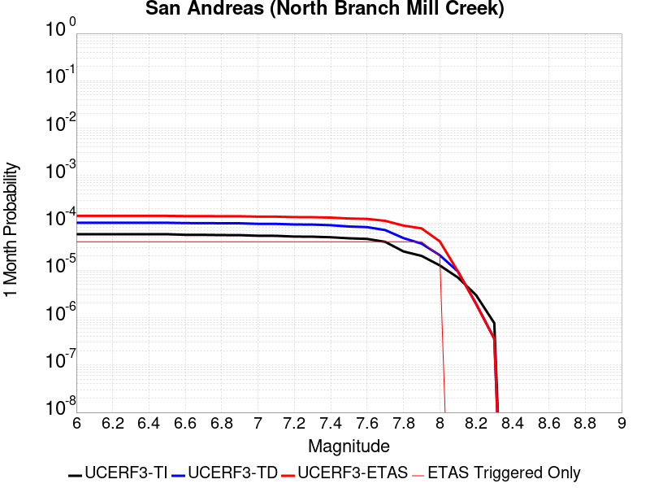 |  | 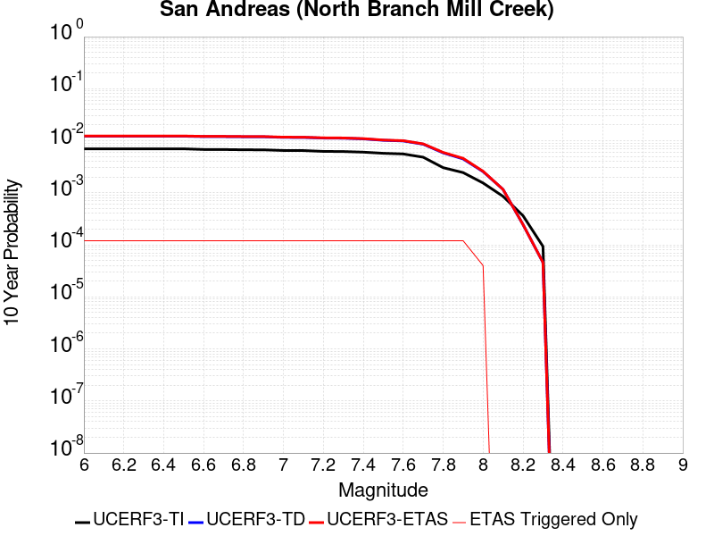 |

| Magnitude | 1 wk TI Prob | 1 wk TD Prob | 1 wk ETAS Prob | 1 wk ETAS/TD Gain | 1 wk ETAS Triggered Only | 1 mo TI Prob | 1 mo TD Prob | 1 mo ETAS Prob | 1 mo ETAS/TD Gain | 1 mo ETAS Triggered Only | 1 yr TI Prob | 1 yr TD Prob | 1 yr ETAS Prob | 1 yr ETAS/TD Gain | 1 yr ETAS Triggered Only | 10 yr TI Prob | 10 yr TD Prob | 10 yr ETAS Prob | 10 yr ETAS/TD Gain | 10 yr ETAS Triggered Only |
|-----|-----|-----|-----|-----|-----|-----|-----|-----|-----|-----|-----|-----|-----|-----|-----|-----|-----|-----|-----|-----|
| 6.0 | 1.3461156E-5 | 2.350783E-5 | 3.3507593E-5 | 1.4253802 | 1.0E-5 | 5.7689394E-5 | 1.0074397E-4 | 1.4073994E-4 | 1.3970062 | 4.0E-5 | 7.02142E-4 | 0.001225871 | 0.0012758097 | 1.0407373 | 5.0E-5 | 0.0069992766 | 0.012232522 | 0.012351054 | 1.0096899 | 1.2E-4 |
| 6.1 | 1.3461156E-5 | 2.350783E-5 | 3.3507593E-5 | 1.4253802 | 1.0E-5 | 5.7689394E-5 | 1.0074397E-4 | 1.4073994E-4 | 1.3970062 | 4.0E-5 | 7.02142E-4 | 0.001225871 | 0.0012758097 | 1.0407373 | 5.0E-5 | 0.0069992766 | 0.012232522 | 0.012351054 | 1.0096899 | 1.2E-4 |
| 6.2 | 1.3461156E-5 | 2.350783E-5 | 3.3507593E-5 | 1.4253802 | 1.0E-5 | 5.7689394E-5 | 1.0074397E-4 | 1.4073994E-4 | 1.3970062 | 4.0E-5 | 7.02142E-4 | 0.001225871 | 0.0012758097 | 1.0407373 | 5.0E-5 | 0.0069992766 | 0.012232522 | 0.012351054 | 1.0096899 | 1.2E-4 |
| 6.3 | 1.3461156E-5 | 2.350783E-5 | 3.3507593E-5 | 1.4253802 | 1.0E-5 | 5.7689394E-5 | 1.0074397E-4 | 1.4073994E-4 | 1.3970062 | 4.0E-5 | 7.02142E-4 | 0.001225871 | 0.0012758097 | 1.0407373 | 5.0E-5 | 0.0069992766 | 0.012232522 | 0.012351054 | 1.0096899 | 1.2E-4 |
| 6.4 | 1.3461156E-5 | 2.350783E-5 | 3.3507593E-5 | 1.4253802 | 1.0E-5 | 5.7689394E-5 | 1.0074397E-4 | 1.4073994E-4 | 1.3970062 | 4.0E-5 | 7.02142E-4 | 0.001225871 | 0.0012758097 | 1.0407373 | 5.0E-5 | 0.0069992766 | 0.012232522 | 0.012351054 | 1.0096899 | 1.2E-4 |
| 6.5 | 1.3450706E-5 | 2.349679E-5 | 3.3496555E-5 | 1.42558 | 1.0E-5 | 5.764461E-5 | 1.00696656E-4 | 1.4069263E-4 | 1.3971926 | 4.0E-5 | 7.0159714E-4 | 0.0012252956 | 0.0012752344 | 1.0407565 | 5.0E-5 | 0.006993862 | 0.012226831 | 0.012345364 | 1.0096945 | 1.2E-4 |
| 6.6 | 1.3074523E-5 | 2.3111072E-5 | 3.311084E-5 | 1.4326831 | 1.0E-5 | 5.6032466E-5 | 9.9043704E-5 | 1.3903974E-4 | 1.4038221 | 4.0E-5 | 6.8198174E-4 | 0.0012051932 | 0.0012551331 | 1.0414371 | 5.0E-5 | 0.006798926 | 0.012027997 | 0.012146553 | 1.0098567 | 1.2E-4 |
| 6.7 | 1.3050216E-5 | 2.3086368E-5 | 3.3086137E-5 | 1.433146 | 1.0E-5 | 5.59283E-5 | 9.893784E-5 | 1.3893389E-4 | 1.4042542 | 4.0E-5 | 6.8071426E-4 | 0.0012039058 | 0.0012538456 | 1.0414815 | 5.0E-5 | 0.0067863287 | 0.012015262 | 0.012133819 | 1.0098673 | 1.2E-4 |
| 6.8 | 1.29049395E-5 | 2.2934775E-5 | 3.2934546E-5 | 1.436009 | 1.0E-5 | 5.530571E-5 | 9.8288205E-5 | 1.3828427E-4 | 1.4069264 | 4.0E-5 | 6.73139E-4 | 0.0011960051 | 0.0012459455 | 1.0417558 | 5.0E-5 | 0.0067110364 | 0.011937105 | 0.012055673 | 1.0099326 | 1.2E-4 |
| 6.9 | 1.2867369E-5 | 2.2894177E-5 | 3.289395E-5 | 1.4367822 | 1.0E-5 | 5.51447E-5 | 9.811423E-5 | 1.381103E-4 | 1.4076481 | 4.0E-5 | 6.711799E-4 | 0.0011938893 | 0.0012438296 | 1.04183 | 5.0E-5 | 0.006691564 | 0.011916174 | 0.012034744 | 1.0099504 | 1.2E-4 |
| 7.0 | 1.2495996E-5 | 2.2294238E-5 | 3.2294014E-5 | 1.4485364 | 1.0E-5 | 5.3553173E-5 | 9.5543255E-5 | 1.3553943E-4 | 1.4186186 | 4.0E-5 | 6.518148E-4 | 0.0011626212 | 0.001212563 | 1.0429562 | 5.0E-5 | 0.0064990623 | 0.011606771 | 0.011725377 | 1.0102187 | 1.2E-4 |
| 7.1 | 1.2452067E-5 | 2.2239308E-5 | 3.2239088E-5 | 1.4496442 | 1.0E-5 | 5.3364907E-5 | 9.5307856E-5 | 1.3530404E-4 | 1.4196526 | 4.0E-5 | 6.4952404E-4 | 0.0011597583 | 0.0012097004 | 1.0430624 | 5.0E-5 | 0.0064762887 | 0.01157844 | 0.011697051 | 1.0102441 | 1.2E-4 |
| 7.2 | 1.2002777E-5 | 2.1617801E-5 | 3.1617587E-5 | 1.4625717 | 1.0E-5 | 5.143946E-5 | 9.264445E-5 | 1.3264074E-4 | 1.4317182 | 4.0E-5 | 6.2609545E-4 | 0.0011273652 | 0.0011773087 | 1.0443012 | 5.0E-5 | 0.006243344 | 0.01125784 | 0.01137649 | 1.0105393 | 1.2E-4 |
| 7.3 | 1.1923425E-5 | 2.1487636E-5 | 3.148742E-5 | 1.4653739 | 1.0E-5 | 5.109939E-5 | 9.208664E-5 | 1.3208295E-4 | 1.4343336 | 4.0E-5 | 6.219575E-4 | 0.0011205808 | 0.0011705247 | 1.0445697 | 5.0E-5 | 0.0062021962 | 0.011190712 | 0.0113093695 | 1.0106032 | 1.2E-4 |
| 7.4 | 1.16105175E-5 | 2.0861535E-5 | 3.0861327E-5 | 1.4793411 | 1.0E-5 | 4.975841E-5 | 8.9403526E-5 | 1.2939995E-4 | 1.4473697 | 4.0E-5 | 6.0564023E-4 | 0.0010879469 | 0.0011378926 | 1.0459081 | 5.0E-5 | 0.006039923 | 0.010868174 | 0.01098687 | 1.0109214 | 1.2E-4 |
| 7.5 | 1.1037265E-5 | 1.9561343E-5 | 2.9561148E-5 | 1.5112023 | 1.0E-5 | 4.7301706E-5 | 8.383165E-5 | 1.2382829E-4 | 1.4771068 | 4.0E-5 | 5.757461E-4 | 0.0010201746 | 0.0010701235 | 1.0489612 | 5.0E-5 | 0.005742567 | 0.010198631 | 0.010317408 | 1.0116463 | 1.2E-4 |
| 7.6 | 1.0720915E-5 | 1.9003148E-5 | 2.9002957E-5 | 1.5262187 | 1.0E-5 | 4.5945973E-5 | 8.143953E-5 | 1.2143627E-4 | 1.491122 | 4.0E-5 | 5.592486E-4 | 9.910774E-4 | 0.0010410278 | 1.0504001 | 5.0E-5 | 0.005578433 | 0.009910301 | 0.010029112 | 1.0119886 | 1.2E-4 |
| 7.7 | 9.276279E-6 | 1.6448577E-5 | 2.6448412E-5 | 1.6079453 | 1.0E-5 | 3.9754876E-5 | 7.0492E-5 | 1.10489185E-4 | 1.5674002 | 4.0E-5 | 4.839081E-4 | 8.579039E-4 | 9.07861E-4 | 1.0582316 | 5.0E-5 | 0.0048285574 | 0.008589426 | 0.008708396 | 1.0138507 | 1.2E-4 |
| 7.8 | 5.8346777E-6 | 1.1160578E-5 | 2.1160466E-5 | 1.896001 | 1.0E-5 | 2.5005522E-5 | 4.783017E-5 | 8.782826E-5 | 1.8362522 | 4.0E-5 | 3.043997E-4 | 5.8217684E-4 | 6.321477E-4 | 1.0858345 | 5.0E-5 | 0.0030398308 | 0.0058496357 | 0.005968934 | 1.0203941 | 1.2E-4 |
| 7.9 | 4.690204E-6 | 8.513636E-6 | 1.851355E-5 | 2.1745763 | 1.0E-5 | 2.0100719E-5 | 3.64865E-5 | 7.648504E-5 | 2.0962558 | 4.0E-5 | 2.4469878E-4 | 4.4413272E-4 | 4.941105E-4 | 1.1125289 | 5.0E-5 | 0.002444295 | 0.004473071 | 0.004592534 | 1.0267072 | 1.2E-4 |
| 8.0 | 2.9570454E-6 | 4.8496286E-6 | 1.484958E-5 | 3.0620036 | 1.0E-5 | 1.267299E-5 | 2.0783957E-5 | 4.0783543E-5 | 1.9622606 | 2.0E-5 | 1.5428272E-4 | 2.530153E-4 | 2.7301026E-4 | 1.0790266 | 2.0E-5 | 0.0015417566 | 0.0025509798 | 0.002590878 | 1.0156403 | 4.0E-5 |
| 8.1 | 1.6376824E-6 | 2.1982057E-6 | 2.1982057E-6 | 1.0 | 0.0 | 7.01862E-6 | 9.420847E-6 | 9.420847E-6 | 1.0 | 0.0 | 8.544835E-5 | 1.146928E-4 | 1.146928E-4 | 1.0 | 0.0 | 8.54155E-4 | 0.0011613306 | 0.0011613306 | 1.0 | 0.0 |
| 8.2 | 6.9631557E-7 | 4.5391383E-7 | 4.5391383E-7 | 1.0 | 0.0 | 2.984206E-6 | 1.9453435E-6 | 1.9453435E-6 | 1.0 | 0.0 | 3.63321E-5 | 2.36843E-5 | 2.36843E-5 | 1.0 | 0.0 | 3.6326164E-4 | 2.4532314E-4 | 2.4532314E-4 | 1.0 | 0.0 |
| 8.3 | 1.7876137E-7 | 8.3658875E-8 | 8.3658875E-8 | 1.0 | 0.0 | 7.661199E-7 | 3.58538E-7 | 3.58538E-7 | 1.0 | 0.0 | 9.32747E-6 | 4.3651917E-6 | 4.3651917E-6 | 1.0 | 0.0 | 9.3270784E-5 | 4.5847937E-5 | 4.5847937E-5 | 1.0 | 0.0 |

## Independence rev 2011
*[(top)](#table-of-contents)*

| 1 Week | 1 Month | 1 Year | 10 Year |
|-----|-----|-----|-----|
|  |  |  | 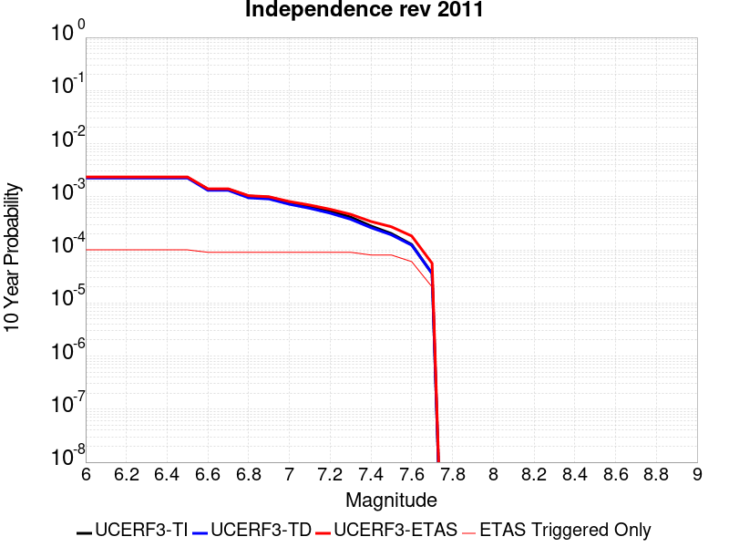 |

| Magnitude | 1 wk TI Prob | 1 wk TD Prob | 1 wk ETAS Prob | 1 wk ETAS/TD Gain | 1 wk ETAS Triggered Only | 1 mo TI Prob | 1 mo TD Prob | 1 mo ETAS Prob | 1 mo ETAS/TD Gain | 1 mo ETAS Triggered Only | 1 yr TI Prob | 1 yr TD Prob | 1 yr ETAS Prob | 1 yr ETAS/TD Gain | 1 yr ETAS Triggered Only | 10 yr TI Prob | 10 yr TD Prob | 10 yr ETAS Prob | 10 yr ETAS/TD Gain | 10 yr ETAS Triggered Only |
|-----|-----|-----|-----|-----|-----|-----|-----|-----|-----|-----|-----|-----|-----|-----|-----|-----|-----|-----|-----|-----|
| 6.0 | 4.422171E-6 | 4.3262453E-6 | 1.4326202E-5 | 3.311463 | 1.0E-5 | 1.8952025E-5 | 1.8540937E-5 | 4.854038E-5 | 2.6180112 | 3.0E-5 | 2.3071647E-4 | 2.257155E-4 | 2.956997E-4 | 1.3100549 | 7.0E-5 | 0.0023047708 | 0.0022551562 | 0.0023549306 | 1.0442429 | 1.0E-4 |
| 6.1 | 4.422171E-6 | 4.3262453E-6 | 1.4326202E-5 | 3.311463 | 1.0E-5 | 1.8952025E-5 | 1.8540937E-5 | 4.854038E-5 | 2.6180112 | 3.0E-5 | 2.3071647E-4 | 2.257155E-4 | 2.956997E-4 | 1.3100549 | 7.0E-5 | 0.0023047708 | 0.0022551562 | 0.0023549306 | 1.0442429 | 1.0E-4 |
| 6.2 | 4.422171E-6 | 4.3262453E-6 | 1.4326202E-5 | 3.311463 | 1.0E-5 | 1.8952025E-5 | 1.8540937E-5 | 4.854038E-5 | 2.6180112 | 3.0E-5 | 2.3071647E-4 | 2.257155E-4 | 2.956997E-4 | 1.3100549 | 7.0E-5 | 0.0023047708 | 0.0022551562 | 0.0023549306 | 1.0442429 | 1.0E-4 |
| 6.3 | 4.422171E-6 | 4.3262453E-6 | 1.4326202E-5 | 3.311463 | 1.0E-5 | 1.8952025E-5 | 1.8540937E-5 | 4.854038E-5 | 2.6180112 | 3.0E-5 | 2.3071647E-4 | 2.257155E-4 | 2.956997E-4 | 1.3100549 | 7.0E-5 | 0.0023047708 | 0.0022551562 | 0.0023549306 | 1.0442429 | 1.0E-4 |
| 6.4 | 4.422171E-6 | 4.3262453E-6 | 1.4326202E-5 | 3.311463 | 1.0E-5 | 1.8952025E-5 | 1.8540937E-5 | 4.854038E-5 | 2.6180112 | 3.0E-5 | 2.3071647E-4 | 2.257155E-4 | 2.956997E-4 | 1.3100549 | 7.0E-5 | 0.0023047708 | 0.0022551562 | 0.0023549306 | 1.0442429 | 1.0E-4 |
| 6.5 | 4.422171E-6 | 4.3262453E-6 | 1.4326202E-5 | 3.311463 | 1.0E-5 | 1.8952025E-5 | 1.8540937E-5 | 4.854038E-5 | 2.6180112 | 3.0E-5 | 2.3071647E-4 | 2.257155E-4 | 2.956997E-4 | 1.3100549 | 7.0E-5 | 0.0023047708 | 0.0022551562 | 0.0023549306 | 1.0442429 | 1.0E-4 |
| 6.6 | 2.663744E-6 | 2.5319996E-6 | 1.2531975E-5 | 4.9494376 | 1.0E-5 | 1.1415996E-5 | 1.0851385E-5 | 4.085106E-5 | 3.764594 | 3.0E-5 | 1.3898089E-4 | 1.3210809E-4 | 2.0209885E-4 | 1.5297991 | 7.0E-5 | 0.0013889399 | 0.0013203438 | 0.0014102249 | 1.0680741 | 9.0E-5 |
| 6.7 | 2.663744E-6 | 2.5319996E-6 | 1.2531975E-5 | 4.9494376 | 1.0E-5 | 1.1415996E-5 | 1.0851385E-5 | 4.085106E-5 | 3.764594 | 3.0E-5 | 1.3898089E-4 | 1.3210809E-4 | 2.0209885E-4 | 1.5297991 | 7.0E-5 | 0.0013889399 | 0.0013203438 | 0.0014102249 | 1.0680741 | 9.0E-5 |
| 6.8 | 1.9716529E-6 | 1.8322698E-6 | 1.1832251E-5 | 6.4577017 | 1.0E-5 | 8.449913E-6 | 7.852562E-6 | 3.7852325E-5 | 4.8203793 | 3.0E-5 | 1.0287284E-4 | 9.560088E-5 | 1.6559419E-4 | 1.7321409 | 7.0E-5 | 0.0010282523 | 9.556104E-4 | 0.0010455244 | 1.0940906 | 9.0E-5 |
| 6.9 | 1.8788617E-6 | 1.7430103E-6 | 1.1742993E-5 | 6.7371907 | 1.0E-5 | 8.0522395E-6 | 7.4700233E-6 | 3.74698E-5 | 5.0160217 | 3.0E-5 | 9.80316E-5 | 9.094386E-5 | 1.6093749E-4 | 1.7696356 | 7.0E-5 | 9.798837E-4 | 9.0907846E-4 | 9.989967E-4 | 1.0989114 | 9.0E-5 |
| 7.0 | 1.5045488E-6 | 1.3849603E-6 | 1.1384946E-5 | 8.220413 | 1.0E-5 | 6.44805E-6 | 5.935531E-6 | 3.5935354E-5 | 6.0542774 | 3.0E-5 | 7.8502184E-5 | 7.226275E-5 | 1.4225769E-4 | 1.9686172 | 7.0E-5 | 7.8474457E-4 | 7.2239764E-4 | 8.123326E-4 | 1.1244951 | 9.0E-5 |
| 7.1 | 1.272341E-6 | 1.1625186E-6 | 1.1162507E-5 | 9.602003 | 1.0E-5 | 5.4528787E-6 | 4.9822133E-6 | 3.4982062E-5 | 7.0213904 | 3.0E-5 | 6.6386776E-5 | 6.065679E-5 | 1.3065254E-4 | 2.153964 | 7.0E-5 | 6.636695E-4 | 6.0640555E-4 | 6.9635094E-4 | 1.1483256 | 9.0E-5 |
| 7.2 | 1.0416892E-6 | 9.4099533E-7 | 1.0940986E-5 | 11.627035 | 1.0E-5 | 4.464375E-6 | 4.032831E-6 | 3.403271E-5 | 8.438912 | 3.0E-5 | 5.4352407E-5 | 4.909863E-5 | 1.19095195E-4 | 2.4256318 | 7.0E-5 | 5.4339116E-4 | 4.908797E-4 | 5.808355E-4 | 1.1832544 | 9.0E-5 |
| 7.3 | 7.9450155E-7 | 7.2350707E-7 | 1.07235E-5 | 14.821555 | 1.0E-5 | 3.4050022E-6 | 3.100741E-6 | 3.310065E-5 | 10.6750765 | 3.0E-5 | 4.1455114E-5 | 3.7750877E-5 | 1.0774824E-4 | 2.8541915 | 7.0E-5 | 4.144738E-4 | 3.7744577E-4 | 4.674118E-4 | 1.2383548 | 9.0E-5 |
| 7.4 | 5.3893444E-7 | 5.0195547E-7 | 1.0501951E-5 | 20.922077 | 1.0E-5 | 2.309717E-6 | 2.1512358E-6 | 2.2151193E-5 | 10.296962 | 2.0E-5 | 2.8120441E-5 | 2.6190986E-5 | 8.6189415E-5 | 3.2908044 | 6.0E-5 | 2.8116882E-4 | 2.6187944E-4 | 3.418585E-4 | 1.3054041 | 8.0E-5 |
| 7.5 | 3.8852085E-7 | 3.6825836E-7 | 1.0368255E-5 | 28.154839 | 1.0E-5 | 1.6650882E-6 | 1.5782492E-6 | 2.1578218E-5 | 13.67225 | 2.0E-5 | 2.027226E-5 | 1.9215016E-5 | 7.921387E-5 | 4.122498 | 6.0E-5 | 2.0270412E-4 | 1.9213377E-4 | 2.721184E-4 | 1.4162966 | 8.0E-5 |
| 7.6 | 2.414929E-7 | 2.3457733E-7 | 2.3457733E-7 | 1.0 | 0.0 | 1.0349692E-6 | 1.005331E-6 | 1.1005321E-5 | 10.946962 | 1.0E-5 | 1.2600677E-5 | 1.2239838E-5 | 6.2239225E-5 | 5.0849714 | 5.0E-5 | 1.2599962E-4 | 1.2239176E-4 | 1.8238442E-4 | 1.490169 | 6.0E-5 |
| 7.7 | 6.8298014E-8 | 6.858997E-8 | 6.858997E-8 | 1.0 | 0.0 | 2.9270575E-7 | 2.93957E-7 | 2.93957E-7 | 1.0 | 0.0 | 3.5636867E-6 | 3.578921E-6 | 2.357885E-5 | 6.5882564 | 2.0E-5 | 3.5636294E-5 | 3.5788682E-5 | 5.5787965E-5 | 1.558816 | 2.0E-5 |

## San Jacinto (San Jacinto Valley) rev
*[(top)](#table-of-contents)*

| 1 Week | 1 Month | 1 Year | 10 Year |
|-----|-----|-----|-----|
|  |  |  | 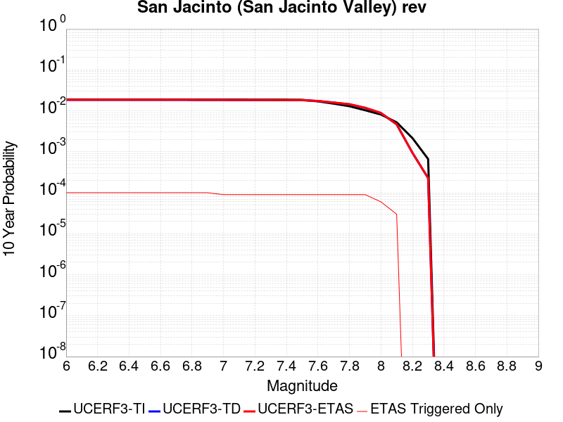 |

| Magnitude | 1 wk TI Prob | 1 wk TD Prob | 1 wk ETAS Prob | 1 wk ETAS/TD Gain | 1 wk ETAS Triggered Only | 1 mo TI Prob | 1 mo TD Prob | 1 mo ETAS Prob | 1 mo ETAS/TD Gain | 1 mo ETAS Triggered Only | 1 yr TI Prob | 1 yr TD Prob | 1 yr ETAS Prob | 1 yr ETAS/TD Gain | 1 yr ETAS Triggered Only | 10 yr TI Prob | 10 yr TD Prob | 10 yr ETAS Prob | 10 yr ETAS/TD Gain | 10 yr ETAS Triggered Only |
|-----|-----|-----|-----|-----|-----|-----|-----|-----|-----|-----|-----|-----|-----|-----|-----|-----|-----|-----|-----|-----|
| 6.0 | 3.652694E-5 | 3.441575E-5 | 5.441506E-5 | 1.5811093 | 2.0E-5 | 1.5653463E-4 | 1.4748774E-4 | 1.774833E-4 | 1.2033768 | 3.0E-5 | 0.0019041431 | 0.0017941861 | 0.0018640604 | 1.038945 | 7.0E-5 | 0.018879099 | 0.01853357 | 0.018631717 | 1.0052956 | 1.0E-4 |
| 6.1 | 3.652694E-5 | 3.441575E-5 | 5.441506E-5 | 1.5811093 | 2.0E-5 | 1.5653463E-4 | 1.4748774E-4 | 1.774833E-4 | 1.2033768 | 3.0E-5 | 0.0019041431 | 0.0017941861 | 0.0018640604 | 1.038945 | 7.0E-5 | 0.018879099 | 0.01853357 | 0.018631717 | 1.0052956 | 1.0E-4 |
| 6.2 | 3.652694E-5 | 3.441575E-5 | 5.441506E-5 | 1.5811093 | 2.0E-5 | 1.5653463E-4 | 1.4748774E-4 | 1.774833E-4 | 1.2033768 | 3.0E-5 | 0.0019041431 | 0.0017941861 | 0.0018640604 | 1.038945 | 7.0E-5 | 0.018879099 | 0.01853357 | 0.018631717 | 1.0052956 | 1.0E-4 |
| 6.3 | 3.652694E-5 | 3.441575E-5 | 5.441506E-5 | 1.5811093 | 2.0E-5 | 1.5653463E-4 | 1.4748774E-4 | 1.774833E-4 | 1.2033768 | 3.0E-5 | 0.0019041431 | 0.0017941861 | 0.0018640604 | 1.038945 | 7.0E-5 | 0.018879099 | 0.01853357 | 0.018631717 | 1.0052956 | 1.0E-4 |
| 6.4 | 3.646941E-5 | 3.4337318E-5 | 5.4336633E-5 | 1.5824367 | 2.0E-5 | 1.5628811E-4 | 1.4715164E-4 | 1.7714723E-4 | 1.2038413 | 3.0E-5 | 0.0019011468 | 0.0017901013 | 0.0018599761 | 1.0390339 | 7.0E-5 | 0.018849645 | 0.01849345 | 0.0185916 | 1.0053073 | 1.0E-4 |
| 6.5 | 3.646941E-5 | 3.4337318E-5 | 5.4336633E-5 | 1.5824367 | 2.0E-5 | 1.5628811E-4 | 1.4715164E-4 | 1.7714723E-4 | 1.2038413 | 3.0E-5 | 0.0019011468 | 0.0017901013 | 0.0018599761 | 1.0390339 | 7.0E-5 | 0.018849645 | 0.01849345 | 0.0185916 | 1.0053073 | 1.0E-4 |
| 6.6 | 3.6442503E-5 | 3.4300705E-5 | 5.4300017E-5 | 1.5830584 | 2.0E-5 | 1.561728E-4 | 1.4699475E-4 | 1.7699035E-4 | 1.2040589 | 3.0E-5 | 0.0018997455 | 0.0017881944 | 0.0018580692 | 1.0390756 | 7.0E-5 | 0.018835869 | 0.018474717 | 0.01857287 | 1.0053128 | 1.0E-4 |
| 6.7 | 3.6432113E-5 | 3.428628E-5 | 5.4285592E-5 | 1.5833037 | 2.0E-5 | 1.5612828E-4 | 1.4693293E-4 | 1.7692853E-4 | 1.2041448 | 3.0E-5 | 0.0018992044 | 0.0017874431 | 0.001857318 | 1.0390921 | 7.0E-5 | 0.018830549 | 0.01846734 | 0.018565495 | 1.005315 | 1.0E-4 |
| 6.8 | 3.6409598E-5 | 3.4255332E-5 | 5.4254648E-5 | 1.5838307 | 2.0E-5 | 1.560318E-4 | 1.4680032E-4 | 1.7679592E-4 | 1.2043293 | 3.0E-5 | 0.0018980318 | 0.0017858313 | 0.0018557062 | 1.0391275 | 7.0E-5 | 0.018819023 | 0.018451495 | 0.018549649 | 1.0053196 | 1.0E-4 |
| 6.9 | 3.638078E-5 | 3.4215755E-5 | 5.421507E-5 | 1.584506 | 2.0E-5 | 1.5590832E-4 | 1.4663071E-4 | 1.7662632E-4 | 1.2045656 | 3.0E-5 | 0.0018965311 | 0.0017837697 | 0.0018536448 | 1.0391728 | 7.0E-5 | 0.018804269 | 0.018431228 | 0.018529383 | 1.0053256 | 1.0E-4 |
| 7.0 | 3.6294874E-5 | 3.4097768E-5 | 5.4097087E-5 | 1.5865287 | 2.0E-5 | 1.5554018E-4 | 1.4612512E-4 | 1.7612074E-4 | 1.2052735 | 3.0E-5 | 0.0018920569 | 0.0017776241 | 0.0018375175 | 1.033693 | 6.0E-5 | 0.018760284 | 0.018370807 | 0.018459152 | 1.004809 | 9.0E-5 |
| 7.1 | 3.6260717E-5 | 3.4054046E-5 | 5.4053366E-5 | 1.5872817 | 2.0E-5 | 1.5539382E-4 | 1.4593777E-4 | 1.759334E-4 | 1.2055371 | 3.0E-5 | 0.001890278 | 0.0017753469 | 0.0018352405 | 1.0337362 | 6.0E-5 | 0.018742796 | 0.018348401 | 0.018436749 | 1.0048151 | 9.0E-5 |
| 7.2 | 3.6210204E-5 | 3.3988264E-5 | 5.3987584E-5 | 1.5884184 | 2.0E-5 | 1.5517735E-4 | 1.4565587E-4 | 1.756515E-4 | 1.2059349 | 3.0E-5 | 0.001887647 | 0.0017719205 | 0.0018318142 | 1.0338016 | 6.0E-5 | 0.01871693 | 0.018314669 | 0.01840302 | 1.004824 | 9.0E-5 |
| 7.3 | 3.6119454E-5 | 3.3876542E-5 | 5.3875865E-5 | 1.590359 | 2.0E-5 | 1.5478847E-4 | 1.4517711E-4 | 1.7517275E-4 | 1.2066141 | 3.0E-5 | 0.0018829206 | 0.0017661011 | 0.001825995 | 1.0339131 | 6.0E-5 | 0.018670462 | 0.01825722 | 0.018345578 | 1.0048395 | 9.0E-5 |
| 7.4 | 3.607848E-5 | 3.382404E-5 | 5.382336E-5 | 1.5912755 | 2.0E-5 | 1.5461289E-4 | 1.4495212E-4 | 1.7494777E-4 | 1.2069349 | 3.0E-5 | 0.0018807866 | 0.0017633662 | 0.0018232604 | 1.0339658 | 6.0E-5 | 0.018649481 | 0.018230215 | 0.018318573 | 1.0048468 | 9.0E-5 |
| 7.5 | 3.5856774E-5 | 3.363379E-5 | 5.3633117E-5 | 1.5946201 | 2.0E-5 | 1.5366284E-4 | 1.4413687E-4 | 1.7413254E-4 | 1.2081054 | 3.0E-5 | 0.0018692396 | 0.0017534565 | 0.0018133513 | 1.0341581 | 6.0E-5 | 0.018535944 | 0.018131303 | 0.01821967 | 1.0048738 | 9.0E-5 |
| 7.6 | 3.286655E-5 | 3.2156633E-5 | 5.2155992E-5 | 1.6219356 | 2.0E-5 | 1.4084904E-4 | 1.3780687E-4 | 1.6780275E-4 | 1.2176659 | 3.0E-5 | 0.001713488 | 0.0016765095 | 0.0017364089 | 1.0357287 | 6.0E-5 | 0.017003361 | 0.01735091 | 0.017439349 | 1.005097 | 9.0E-5 |
| 7.7 | 2.8882527E-5 | 2.9249288E-5 | 4.92487E-5 | 1.6837573 | 2.0E-5 | 1.237764E-4 | 1.2534807E-4 | 1.5534431E-4 | 1.2393036 | 3.0E-5 | 0.0015059357 | 0.0015250455 | 0.001584954 | 1.039283 | 6.0E-5 | 0.014957713 | 0.015837153 | 0.015925728 | 1.0055928 | 9.0E-5 |
| 7.8 | 2.4950225E-5 | 2.6539781E-5 | 4.653925E-5 | 1.7535657 | 2.0E-5 | 1.0692515E-4 | 1.1373697E-4 | 1.4373356E-4 | 1.2637365 | 3.0E-5 | 0.0013010362 | 0.0013838689 | 0.0014437858 | 1.0432967 | 6.0E-5 | 0.012934455 | 0.014418158 | 0.01450686 | 1.0061522 | 9.0E-5 |
| 7.9 | 1.9881603E-5 | 2.1518656E-5 | 4.1518226E-5 | 1.9294062 | 2.0E-5 | 8.520408E-5 | 9.2219554E-5 | 1.2221679E-4 | 1.3252807 | 3.0E-5 | 0.001036866 | 0.0011221955 | 0.0011821282 | 1.0534066 | 6.0E-5 | 0.010320415 | 0.011782875 | 0.011871815 | 1.0075482 | 9.0E-5 |
| 8.0 | 1.563292E-5 | 1.5946089E-5 | 1.5946089E-5 | 1.0 | 0.0 | 6.6996516E-5 | 6.8338595E-5 | 7.8337915E-5 | 1.1463202 | 1.0E-5 | 8.153773E-4 | 8.3170546E-4 | 8.716722E-4 | 1.048054 | 4.0E-5 | 0.00812392 | 0.00881513 | 0.008874602 | 1.0067465 | 6.0E-5 |
| 8.1 | 1.0045313E-5 | 8.306527E-6 | 8.306527E-6 | 1.0 | 0.0 | 4.305063E-5 | 3.5598918E-5 | 4.559856E-5 | 1.2808974 | 1.0E-5 | 5.2401534E-4 | 4.3333112E-4 | 4.6331814E-4 | 1.0692011 | 3.0E-5 | 0.0052278144 | 0.0046616676 | 0.0046915277 | 1.0064055 | 3.0E-5 |
| 8.2 | 4.1554413E-6 | 1.5665041E-6 | 1.5665041E-6 | 1.0 | 0.0 | 1.7808914E-5 | 6.713572E-6 | 6.713572E-6 | 1.0 | 0.0 | 2.1680194E-4 | 8.17347E-5 | 8.17347E-5 | 1.0 | 0.0 | 0.0021659054 | 9.488419E-4 | 9.488419E-4 | 1.0 | 0.0 |
| 8.3 | 1.2758221E-6 | 3.6171858E-7 | 3.6171858E-7 | 1.0 | 0.0 | 5.4677976E-6 | 1.5502216E-6 | 1.5502216E-6 | 1.0 | 0.0 | 6.65684E-5 | 1.8873789E-5 | 1.8873789E-5 | 1.0 | 0.0 | 6.6548464E-4 | 2.2764095E-4 | 2.2764095E-4 | 1.0 | 0.0 |

## Calaveras (So) - Paicines extension 2011 CFM
*[(top)](#table-of-contents)*

| 1 Week | 1 Month | 1 Year | 10 Year |
|-----|-----|-----|-----|
| 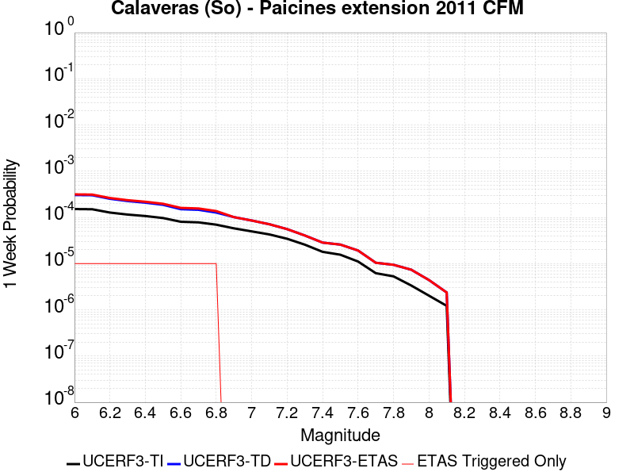 |  |  |  |

| Magnitude | 1 wk TI Prob | 1 wk TD Prob | 1 wk ETAS Prob | 1 wk ETAS/TD Gain | 1 wk ETAS Triggered Only | 1 mo TI Prob | 1 mo TD Prob | 1 mo ETAS Prob | 1 mo ETAS/TD Gain | 1 mo ETAS Triggered Only | 1 yr TI Prob | 1 yr TD Prob | 1 yr ETAS Prob | 1 yr ETAS/TD Gain | 1 yr ETAS Triggered Only | 10 yr TI Prob | 10 yr TD Prob | 10 yr ETAS Prob | 10 yr ETAS/TD Gain | 10 yr ETAS Triggered Only |
|-----|-----|-----|-----|-----|-----|-----|-----|-----|-----|-----|-----|-----|-----|-----|-----|-----|-----|-----|-----|-----|
| 6.0 | 1.5183659E-4 | 3.0524618E-4 | 3.1524312E-4 | 1.0327505 | 1.0E-5 | 6.5056595E-4 | 0.001306982 | 0.0013169689 | 1.0076412 | 1.0E-5 | 0.007891912 | 0.015698127 | 0.015757184 | 1.0037621 | 6.0E-5 | 0.076174594 | 0.13851054 | 0.13857946 | 1.0004976 | 8.0E-5 |
| 6.1 | 1.5024997E-4 | 3.0218763E-4 | 3.1218462E-4 | 1.033082 | 1.0E-5 | 6.437695E-4 | 0.001293891 | 0.001303878 | 1.0077187 | 1.0E-5 | 0.0078097614 | 0.0155415125 | 0.01560058 | 1.0038006 | 6.0E-5 | 0.075409345 | 0.1371801 | 0.13724914 | 1.0005032 | 8.0E-5 |
| 6.2 | 1.2743923E-4 | 2.5316005E-4 | 2.631575E-4 | 1.0394907 | 1.0E-5 | 5.460538E-4 | 0.0010841485 | 0.0010941377 | 1.0092138 | 1.0E-5 | 0.0066279583 | 0.013048763 | 0.013098111 | 1.0037818 | 5.0E-5 | 0.064337276 | 0.11727778 | 0.117339574 | 1.0005269 | 7.0E-5 |
| 6.3 | 1.1525114E-4 | 2.2602278E-4 | 2.3602051E-4 | 1.0442333 | 1.0E-5 | 4.9383997E-4 | 9.680288E-4 | 9.780191E-4 | 1.0103203 | 1.0E-5 | 0.0059959386 | 0.011669963 | 0.01171938 | 1.0042346 | 5.0E-5 | 0.058367174 | 0.10639406 | 0.106456615 | 1.0005879 | 7.0E-5 |
| 6.4 | 1.07200925E-4 | 2.0843073E-4 | 2.1842866E-4 | 1.0479676 | 1.0E-5 | 4.5935164E-4 | 8.9276396E-4 | 9.02755E-4 | 1.0111911 | 1.0E-5 | 0.0055782744 | 0.010774835 | 0.010824296 | 1.0045904 | 5.0E-5 | 0.0544031 | 0.09921681 | 0.099279866 | 1.0006355 | 7.0E-5 |
| 6.5 | 9.69631E-5 | 1.8736755E-4 | 1.9736568E-4 | 1.053361 | 1.0E-5 | 4.1548995E-4 | 8.026078E-4 | 8.125998E-4 | 1.0124494 | 1.0E-5 | 0.0050468626 | 0.009696688 | 0.009746202 | 1.0051064 | 5.0E-5 | 0.04933773 | 0.09010862 | 0.09017231 | 1.0007068 | 7.0E-5 |
| 6.6 | 8.0552316E-5 | 1.5074162E-4 | 1.607401E-4 | 1.0663286 | 1.0E-5 | 3.4517853E-4 | 6.458456E-4 | 6.5583916E-4 | 1.0154736 | 1.0E-5 | 0.0041944524 | 0.007828356 | 0.0078779645 | 1.006337 | 5.0E-5 | 0.04116161 | 0.07487867 | 0.07494343 | 1.0008649 | 7.0E-5 |
| 6.7 | 7.815757E-5 | 1.4614697E-4 | 1.561455E-4 | 1.0684143 | 1.0E-5 | 3.34918E-4 | 6.2616763E-4 | 6.3616136E-4 | 1.0159602 | 1.0E-5 | 0.004070005 | 0.007591149 | 0.0076407692 | 1.0065366 | 5.0E-5 | 0.039962657 | 0.07272815 | 0.07279306 | 1.0008925 | 7.0E-5 |
| 6.8 | 6.965264E-5 | 1.2726107E-4 | 1.372598E-4 | 1.0785686 | 1.0E-5 | 2.9847719E-4 | 5.452736E-4 | 5.5526814E-4 | 1.0183294 | 1.0E-5 | 0.0036279052 | 0.00661528 | 0.0066550155 | 1.0060066 | 4.0E-5 | 0.03569247 | 0.06382228 | 0.06387845 | 1.0008801 | 6.0E-5 |
| 6.9 | 5.8000453E-5 | 1.0146304E-4 | 1.0146304E-4 | 1.0 | 0.0 | 2.4854968E-4 | 4.3476955E-4 | 4.3476955E-4 | 1.0 | 0.0 | 0.0030218933 | 0.0052805697 | 0.005310411 | 1.0056512 | 3.0E-5 | 0.029811295 | 0.05151412 | 0.051561546 | 1.0009207 | 5.0E-5 |
| 7.0 | 4.9865852E-5 | 8.570392E-5 | 8.570392E-5 | 1.0 | 0.0 | 2.1369329E-4 | 3.6725128E-4 | 3.6725128E-4 | 1.0 | 0.0 | 0.0025986114 | 0.0044622063 | 0.004482117 | 1.0044621 | 2.0E-5 | 0.025684336 | 0.043793347 | 0.043831594 | 1.0008733 | 4.0E-5 |
| 7.1 | 4.283875E-5 | 7.114092E-5 | 7.114092E-5 | 1.0 | 0.0 | 1.8358172E-4 | 3.0485436E-4 | 3.0485436E-4 | 1.0 | 0.0 | 0.0022328163 | 0.0037053414 | 0.0037153044 | 1.0026888 | 1.0E-5 | 0.022105146 | 0.036744222 | 0.03677312 | 1.0007864 | 3.0E-5 |
| 7.2 | 3.450115E-5 | 5.5794262E-5 | 5.5794262E-5 | 1.0 | 0.0 | 1.478537E-4 | 2.3909652E-4 | 2.3909652E-4 | 1.0 | 0.0 | 0.0017986323 | 0.0029071432 | 0.0029171142 | 1.0034298 | 1.0E-5 | 0.017841442 | 0.029087404 | 0.02911653 | 1.0010014 | 3.0E-5 |
| 7.3 | 2.5709045E-5 | 4.060424E-5 | 4.060424E-5 | 1.0 | 0.0 | 1.1017697E-4 | 1.7400667E-4 | 1.7400667E-4 | 1.0 | 0.0 | 0.0013405791 | 0.0021164897 | 0.0021264683 | 1.0047148 | 1.0E-5 | 0.013325208 | 0.021304648 | 0.02133401 | 1.0013782 | 3.0E-5 |
| 7.4 | 1.8003093E-5 | 2.8519447E-5 | 2.8519447E-5 | 1.0 | 0.0 | 7.715383E-5 | 1.2222049E-4 | 1.2222049E-4 | 1.0 | 0.0 | 9.3894306E-4 | 0.0014870211 | 0.0014970062 | 1.0067148 | 1.0E-5 | 0.009349857 | 0.015055191 | 0.01508474 | 1.0019627 | 3.0E-5 |
| 7.5 | 1.5595824E-5 | 2.5831554E-5 | 2.5831554E-5 | 1.0 | 0.0 | 6.683753E-5 | 1.1070197E-4 | 1.1070197E-4 | 1.0 | 0.0 | 8.134431E-4 | 0.0013469654 | 0.001356952 | 1.0074141 | 1.0E-5 | 0.008104719 | 0.013655182 | 0.013684772 | 1.002167 | 3.0E-5 |
| 7.6 | 1.1110309E-5 | 1.9230012E-5 | 1.9230012E-5 | 1.0 | 0.0 | 4.761474E-5 | 8.241174E-5 | 8.241174E-5 | 1.0 | 0.0 | 5.795553E-4 | 0.0010029024 | 0.0010128923 | 1.009961 | 1.0E-5 | 0.0057804612 | 0.010206583 | 0.010236277 | 1.0029093 | 3.0E-5 |
| 7.7 | 6.2140443E-6 | 1.04432265E-5 | 1.04432265E-5 | 1.0 | 0.0 | 2.6631347E-5 | 4.4755914E-5 | 4.4755914E-5 | 1.0 | 0.0 | 3.241884E-4 | 5.447671E-4 | 5.547617E-4 | 1.0183464 | 1.0E-5 | 0.0032371588 | 0.0056228107 | 0.0056526423 | 1.0053054 | 3.0E-5 |
| 7.8 | 5.305533E-6 | 9.438617E-6 | 9.438617E-6 | 1.0 | 0.0 | 2.27378E-5 | 4.0450588E-5 | 4.0450588E-5 | 1.0 | 0.0 | 2.7679754E-4 | 4.923747E-4 | 5.0236983E-4 | 1.0202998 | 1.0E-5 | 0.0027645302 | 0.005077038 | 0.0051068855 | 1.0058789 | 3.0E-5 |
| 7.9 | 3.363505E-6 | 7.389195E-6 | 7.389195E-6 | 1.0 | 0.0 | 1.4414942E-5 | 3.1667594E-5 | 3.1667594E-5 | 1.0 | 0.0 | 1.7548777E-4 | 3.8548483E-4 | 3.8548483E-4 | 1.0 | 0.0 | 0.0017534926 | 0.0039506406 | 0.0039705615 | 1.0050424 | 2.0E-5 |
| 8.0 | 2.0271132E-6 | 4.4155477E-6 | 4.4155477E-6 | 1.0 | 0.0 | 8.687599E-6 | 1.8923638E-5 | 1.8923638E-5 | 1.0 | 0.0 | 1.05766376E-4 | 2.3037099E-4 | 2.3037099E-4 | 1.0 | 0.0 | 0.0010571606 | 0.0023523099 | 0.0023523099 | 1.0 | 0.0 |
| 8.1 | 1.2206116E-6 | 2.3764833E-6 | 2.3764833E-6 | 1.0 | 0.0 | 5.2311816E-6 | 1.0184889E-5 | 1.0184889E-5 | 1.0 | 0.0 | 6.3687774E-5 | 1.23994E-4 | 1.23994E-4 | 1.0 | 0.0 | 6.366953E-4 | 0.0012712508 | 0.0012712508 | 1.0 | 0.0 |

## Pinto Mtn
*[(top)](#table-of-contents)*

| 1 Week | 1 Month | 1 Year | 10 Year |
|-----|-----|-----|-----|
|  |  |  |  |

| Magnitude | 1 wk TI Prob | 1 wk TD Prob | 1 wk ETAS Prob | 1 wk ETAS/TD Gain | 1 wk ETAS Triggered Only | 1 mo TI Prob | 1 mo TD Prob | 1 mo ETAS Prob | 1 mo ETAS/TD Gain | 1 mo ETAS Triggered Only | 1 yr TI Prob | 1 yr TD Prob | 1 yr ETAS Prob | 1 yr ETAS/TD Gain | 1 yr ETAS Triggered Only | 10 yr TI Prob | 10 yr TD Prob | 10 yr ETAS Prob | 10 yr ETAS/TD Gain | 10 yr ETAS Triggered Only |
|-----|-----|-----|-----|-----|-----|-----|-----|-----|-----|-----|-----|-----|-----|-----|-----|-----|-----|-----|-----|-----|
| 6.0 | 4.4194956E-5 | 4.7855512E-5 | 6.7854555E-5 | 1.4179047 | 2.0E-5 | 1.893932E-4 | 2.0507984E-4 | 2.3507368E-4 | 1.1462545 | 3.0E-5 | 0.0023034236 | 0.0024941512 | 0.0025540015 | 1.0239962 | 6.0E-5 | 0.022796938 | 0.024679113 | 0.024766892 | 1.0035568 | 9.0E-5 |
| 6.1 | 4.4194956E-5 | 4.7855512E-5 | 6.7854555E-5 | 1.4179047 | 2.0E-5 | 1.893932E-4 | 2.0507984E-4 | 2.3507368E-4 | 1.1462545 | 3.0E-5 | 0.0023034236 | 0.0024941512 | 0.0025540015 | 1.0239962 | 6.0E-5 | 0.022796938 | 0.024679113 | 0.024766892 | 1.0035568 | 9.0E-5 |
| 6.2 | 4.4194956E-5 | 4.7855512E-5 | 6.7854555E-5 | 1.4179047 | 2.0E-5 | 1.893932E-4 | 2.0507984E-4 | 2.3507368E-4 | 1.1462545 | 3.0E-5 | 0.0023034236 | 0.0024941512 | 0.0025540015 | 1.0239962 | 6.0E-5 | 0.022796938 | 0.024679113 | 0.024766892 | 1.0035568 | 9.0E-5 |
| 6.3 | 4.4194956E-5 | 4.7855512E-5 | 6.7854555E-5 | 1.4179047 | 2.0E-5 | 1.893932E-4 | 2.0507984E-4 | 2.3507368E-4 | 1.1462545 | 3.0E-5 | 0.0023034236 | 0.0024941512 | 0.0025540015 | 1.0239962 | 6.0E-5 | 0.022796938 | 0.024679113 | 0.024766892 | 1.0035568 | 9.0E-5 |
| 6.4 | 3.729929E-5 | 3.960486E-5 | 5.960407E-5 | 1.5049685 | 2.0E-5 | 1.5984432E-4 | 1.697246E-4 | 1.997195E-4 | 1.1767269 | 3.0E-5 | 0.0019443673 | 0.002064532 | 0.0021044493 | 1.0193349 | 4.0E-5 | 0.019274427 | 0.02046355 | 0.020532116 | 1.0033507 | 7.0E-5 |
| 6.5 | 3.729929E-5 | 3.960486E-5 | 5.960407E-5 | 1.5049685 | 2.0E-5 | 1.5984432E-4 | 1.697246E-4 | 1.997195E-4 | 1.1767269 | 3.0E-5 | 0.0019443673 | 0.002064532 | 0.0021044493 | 1.0193349 | 4.0E-5 | 0.019274427 | 0.02046355 | 0.020532116 | 1.0033507 | 7.0E-5 |
| 6.6 | 3.0204548E-5 | 3.1206768E-5 | 4.1206455E-5 | 1.3204334 | 1.0E-5 | 1.2944164E-4 | 1.3373663E-4 | 1.5373396E-4 | 1.1495277 | 2.0E-5 | 0.0015748127 | 0.001627062 | 0.0016570132 | 1.0184082 | 3.0E-5 | 0.015636992 | 0.016155364 | 0.016204556 | 1.003045 | 5.0E-5 |
| 6.7 | 2.9857754E-5 | 3.0816143E-5 | 4.0815838E-5 | 1.3244952 | 1.0E-5 | 1.2795553E-4 | 1.320627E-4 | 1.5206006E-4 | 1.1514232 | 2.0E-5 | 0.0015567453 | 0.0016067121 | 0.0016366639 | 1.0186417 | 3.0E-5 | 0.015458848 | 0.0159548 | 0.016004002 | 1.0030838 | 5.0E-5 |
| 6.8 | 2.4819734E-5 | 2.5010708E-5 | 3.5010456E-5 | 1.3998188 | 1.0E-5 | 1.0636595E-4 | 1.0718447E-4 | 1.2718233E-4 | 1.1865742 | 2.0E-5 | 0.0012942362 | 0.0013042113 | 0.0013341722 | 1.0229725 | 3.0E-5 | 0.012867244 | 0.0129679395 | 0.013007421 | 1.0030445 | 4.0E-5 |
| 6.9 | 2.331124E-5 | 2.3338964E-5 | 3.333873E-5 | 1.4284581 | 1.0E-5 | 9.990149E-5 | 1.0002041E-4 | 1.20018405E-4 | 1.1999393 | 2.0E-5 | 0.001215622 | 0.0012170885 | 0.001247052 | 1.024619 | 3.0E-5 | 0.012089936 | 0.012106422 | 0.012136059 | 1.0024481 | 3.0E-5 |
| 7.0 | 2.1818534E-5 | 2.176207E-5 | 3.1761854E-5 | 1.4595051 | 1.0E-5 | 9.3504656E-5 | 9.3262795E-5 | 1.1326093E-4 | 1.2144278 | 2.0E-5 | 0.0011378246 | 0.0011349028 | 0.0011648688 | 1.026404 | 3.0E-5 | 0.011320163 | 0.011293174 | 0.0113228345 | 1.0026264 | 3.0E-5 |
| 7.1 | 2.066081E-5 | 2.0541695E-5 | 3.054149E-5 | 1.4868047 | 1.0E-5 | 8.854332E-5 | 8.8032975E-5 | 1.08031214E-4 | 1.2271676 | 2.0E-5 | 0.0010774818 | 0.001071294 | 0.0011012618 | 1.0279735 | 3.0E-5 | 0.010722724 | 0.010663347 | 0.010693028 | 1.0027834 | 3.0E-5 |
| 7.2 | 1.8990233E-5 | 1.905496E-5 | 2.905477E-5 | 1.5247878 | 1.0E-5 | 8.138417E-5 | 8.166167E-5 | 1.01660036E-4 | 1.244893 | 2.0E-5 | 9.904018E-4 | 9.937966E-4 | 0.0010237668 | 1.0301572 | 3.0E-5 | 0.009859995 | 0.009895524 | 0.009925228 | 1.0030017 | 3.0E-5 |
| 7.3 | 1.3335872E-5 | 1.4907597E-5 | 2.4907447E-5 | 1.6707889 | 1.0E-5 | 5.7152483E-5 | 6.388821E-5 | 8.388693E-5 | 1.3130268 | 2.0E-5 | 6.956093E-4 | 7.7757414E-4 | 8.075508E-4 | 1.0385516 | 3.0E-5 | 0.006934359 | 0.007749834 | 0.0077796015 | 1.003841 | 3.0E-5 |
| 7.4 | 9.414066E-6 | 1.1861796E-5 | 2.1861677E-5 | 1.8430326 | 1.0E-5 | 4.0345374E-5 | 5.0835333E-5 | 7.0834314E-5 | 1.3934071 | 2.0E-5 | 4.910942E-4 | 6.1875384E-4 | 6.4873527E-4 | 1.0484545 | 3.0E-5 | 0.0049001034 | 0.006171259 | 0.006201074 | 1.0048312 | 3.0E-5 |
| 7.5 | 7.2101157E-6 | 9.15899E-6 | 1.9158899E-5 | 2.0918133 | 1.0E-5 | 3.090013E-5 | 3.925227E-5 | 5.9251484E-5 | 1.5095047 | 2.0E-5 | 3.7614413E-4 | 4.777994E-4 | 4.977898E-4 | 1.0418385 | 2.0E-5 | 0.0037550807 | 0.004768497 | 0.004788401 | 1.0041742 | 2.0E-5 |
| 7.6 | 3.296375E-6 | 4.546278E-6 | 4.546278E-6 | 1.0 | 0.0 | 1.4127245E-5 | 1.948391E-5 | 1.948391E-5 | 1.0 | 0.0 | 1.7198564E-4 | 2.3719217E-4 | 2.3719217E-4 | 1.0 | 0.0 | 0.0017185259 | 0.0023695275 | 0.0023695275 | 1.0 | 0.0 |
| 7.7 | 2.5741092E-6 | 3.5851394E-6 | 3.5851394E-6 | 1.0 | 0.0 | 1.103185E-5 | 1.53648E-5 | 1.53648E-5 | 1.0 | 0.0 | 1.3430449E-4 | 1.870517E-4 | 1.870517E-4 | 1.0 | 0.0 | 0.0013422335 | 0.0018690726 | 0.0018690726 | 1.0 | 0.0 |

## Lost Hills
*[(top)](#table-of-contents)*

| 1 Week | 1 Month | 1 Year | 10 Year |
|-----|-----|-----|-----|
|  |  |  |  |

| Magnitude | 1 wk TI Prob | 1 wk TD Prob | 1 wk ETAS Prob | 1 wk ETAS/TD Gain | 1 wk ETAS Triggered Only | 1 mo TI Prob | 1 mo TD Prob | 1 mo ETAS Prob | 1 mo ETAS/TD Gain | 1 mo ETAS Triggered Only | 1 yr TI Prob | 1 yr TD Prob | 1 yr ETAS Prob | 1 yr ETAS/TD Gain | 1 yr ETAS Triggered Only | 10 yr TI Prob | 10 yr TD Prob | 10 yr ETAS Prob | 10 yr ETAS/TD Gain | 10 yr ETAS Triggered Only |
|-----|-----|-----|-----|-----|-----|-----|-----|-----|-----|-----|-----|-----|-----|-----|-----|-----|-----|-----|-----|-----|
| 6.0 | 2.233523E-5 | 2.5106996E-5 | 2.5106996E-5 | 1.0 | 0.0 | 9.571891E-5 | 1.0759792E-4 | 1.2759576E-4 | 1.1858572 | 2.0E-5 | 0.0011647546 | 0.0013093855 | 0.0013693069 | 1.045763 | 6.0E-5 | 0.011586686 | 0.013033304 | 0.013122131 | 1.0068154 | 9.0E-5 |
| 6.1 | 2.233523E-5 | 2.5106996E-5 | 2.5106996E-5 | 1.0 | 0.0 | 9.571891E-5 | 1.0759792E-4 | 1.2759576E-4 | 1.1858572 | 2.0E-5 | 0.0011647546 | 0.0013093855 | 0.0013693069 | 1.045763 | 6.0E-5 | 0.011586686 | 0.013033304 | 0.013122131 | 1.0068154 | 9.0E-5 |
| 6.2 | 2.233523E-5 | 2.5106996E-5 | 2.5106996E-5 | 1.0 | 0.0 | 9.571891E-5 | 1.0759792E-4 | 1.2759576E-4 | 1.1858572 | 2.0E-5 | 0.0011647546 | 0.0013093855 | 0.0013693069 | 1.045763 | 6.0E-5 | 0.011586686 | 0.013033304 | 0.013122131 | 1.0068154 | 9.0E-5 |
| 6.3 | 2.233523E-5 | 2.5106996E-5 | 2.5106996E-5 | 1.0 | 0.0 | 9.571891E-5 | 1.0759792E-4 | 1.2759576E-4 | 1.1858572 | 2.0E-5 | 0.0011647546 | 0.0013093855 | 0.0013693069 | 1.045763 | 6.0E-5 | 0.011586686 | 0.013033304 | 0.013122131 | 1.0068154 | 9.0E-5 |
| 6.4 | 1.2288092E-5 | 1.37813295E-5 | 1.37813295E-5 | 1.0 | 0.0 | 5.2662188E-5 | 5.9062033E-5 | 6.906144E-5 | 1.1693035 | 1.0E-5 | 6.409735E-4 | 7.189368E-4 | 7.5890805E-4 | 1.0555977 | 4.0E-5 | 0.006391279 | 0.007175316 | 0.007234886 | 1.008302 | 6.0E-5 |
| 6.5 | 1.2288092E-5 | 1.37813295E-5 | 1.37813295E-5 | 1.0 | 0.0 | 5.2662188E-5 | 5.9062033E-5 | 6.906144E-5 | 1.1693035 | 1.0E-5 | 6.409735E-4 | 7.189368E-4 | 7.5890805E-4 | 1.0555977 | 4.0E-5 | 0.006391279 | 0.007175316 | 0.007234886 | 1.008302 | 6.0E-5 |
| 6.6 | 8.58281E-6 | 9.633926E-6 | 9.633926E-6 | 1.0 | 0.0 | 3.6782953E-5 | 4.1288073E-5 | 5.1287658E-5 | 1.2421907 | 1.0E-5 | 4.4774043E-4 | 5.026495E-4 | 5.3263444E-4 | 1.0596538 | 3.0E-5 | 0.0044683935 | 0.0050232867 | 0.005063086 | 1.0079229 | 4.0E-5 |
| 6.7 | 7.205685E-6 | 8.088433E-6 | 8.088433E-6 | 1.0 | 0.0 | 3.088114E-5 | 3.4664714E-5 | 4.4664368E-5 | 1.2884678 | 1.0E-5 | 3.7591302E-4 | 4.2204288E-4 | 4.5203022E-4 | 1.0710528 | 3.0E-5 | 0.0037527776 | 0.004220429 | 0.0042503024 | 1.0070783 | 3.0E-5 |

## Elysian Park (Upper)
*[(top)](#table-of-contents)*

| 1 Week | 1 Month | 1 Year | 10 Year |
|-----|-----|-----|-----|
|  |  |  |  |

| Magnitude | 1 wk TI Prob | 1 wk TD Prob | 1 wk ETAS Prob | 1 wk ETAS/TD Gain | 1 wk ETAS Triggered Only | 1 mo TI Prob | 1 mo TD Prob | 1 mo ETAS Prob | 1 mo ETAS/TD Gain | 1 mo ETAS Triggered Only | 1 yr TI Prob | 1 yr TD Prob | 1 yr ETAS Prob | 1 yr ETAS/TD Gain | 1 yr ETAS Triggered Only | 10 yr TI Prob | 10 yr TD Prob | 10 yr ETAS Prob | 10 yr ETAS/TD Gain | 10 yr ETAS Triggered Only |
|-----|-----|-----|-----|-----|-----|-----|-----|-----|-----|-----|-----|-----|-----|-----|-----|-----|-----|-----|-----|-----|
| 6.0 | 3.1876025E-5 | 3.703628E-5 | 4.703591E-5 | 1.2699956 | 1.0E-5 | 1.3660437E-4 | 1.5871998E-4 | 1.687184E-4 | 1.062994 | 1.0E-5 | 0.0016618895 | 0.0019311737 | 0.0019710965 | 1.0206728 | 4.0E-5 | 0.016495159 | 0.019190373 | 0.019278646 | 1.0045998 | 9.0E-5 |
| 6.1 | 3.1876025E-5 | 3.703628E-5 | 4.703591E-5 | 1.2699956 | 1.0E-5 | 1.3660437E-4 | 1.5871998E-4 | 1.687184E-4 | 1.062994 | 1.0E-5 | 0.0016618895 | 0.0019311737 | 0.0019710965 | 1.0206728 | 4.0E-5 | 0.016495159 | 0.019190373 | 0.019278646 | 1.0045998 | 9.0E-5 |
| 6.2 | 3.1876025E-5 | 3.703628E-5 | 4.703591E-5 | 1.2699956 | 1.0E-5 | 1.3660437E-4 | 1.5871998E-4 | 1.687184E-4 | 1.062994 | 1.0E-5 | 0.0016618895 | 0.0019311737 | 0.0019710965 | 1.0206728 | 4.0E-5 | 0.016495159 | 0.019190373 | 0.019278646 | 1.0045998 | 9.0E-5 |
| 6.3 | 3.1876025E-5 | 3.703628E-5 | 4.703591E-5 | 1.2699956 | 1.0E-5 | 1.3660437E-4 | 1.5871998E-4 | 1.687184E-4 | 1.062994 | 1.0E-5 | 0.0016618895 | 0.0019311737 | 0.0019710965 | 1.0206728 | 4.0E-5 | 0.016495159 | 0.019190373 | 0.019278646 | 1.0045998 | 9.0E-5 |
| 6.4 | 1.9273462E-5 | 2.1202904E-5 | 3.1202693E-5 | 1.4716235 | 1.0E-5 | 8.259794E-5 | 9.0867405E-5 | 1.008665E-4 | 1.1100404 | 1.0E-5 | 0.001005166 | 0.0011059209 | 0.0011358877 | 1.0270967 | 3.0E-5 | 0.010006315 | 0.011020984 | 0.011100101 | 1.0071789 | 8.0E-5 |
| 6.5 | 1.9273462E-5 | 2.1202904E-5 | 3.1202693E-5 | 1.4716235 | 1.0E-5 | 8.259794E-5 | 9.0867405E-5 | 1.008665E-4 | 1.1100404 | 1.0E-5 | 0.001005166 | 0.0011059209 | 0.0011358877 | 1.0270967 | 3.0E-5 | 0.010006315 | 0.011020984 | 0.011100101 | 1.0071789 | 8.0E-5 |
| 6.6 | 9.813258E-6 | 9.665716E-6 | 9.665716E-6 | 1.0 | 0.0 | 4.205614E-5 | 4.1423882E-5 | 4.1423882E-5 | 1.0 | 0.0 | 5.119132E-4 | 5.042263E-4 | 5.1422126E-4 | 1.0198224 | 1.0E-5 | 0.005107356 | 0.005031546 | 0.005071345 | 1.0079099 | 4.0E-5 |
| 6.7 | 9.801478E-6 | 9.653286E-6 | 9.653286E-6 | 1.0 | 0.0 | 4.2005657E-5 | 4.1370608E-5 | 4.1370608E-5 | 1.0 | 0.0 | 5.112989E-4 | 5.03578E-4 | 5.1357294E-4 | 1.0198479 | 1.0E-5 | 0.0051012407 | 0.0050250925 | 0.005064891 | 1.00792 | 4.0E-5 |
| 6.8 | 8.102489E-6 | 7.773095E-6 | 7.773095E-6 | 1.0 | 0.0 | 3.4724493E-5 | 3.3312866E-5 | 3.3312866E-5 | 1.0 | 0.0 | 4.2268867E-4 | 4.0551362E-4 | 4.1550957E-4 | 1.0246501 | 1.0E-5 | 0.004218856 | 0.0040482306 | 0.0040681497 | 1.0049205 | 2.0E-5 |
| 6.9 | 6.08275E-6 | 5.481501E-6 | 5.481501E-6 | 1.0 | 0.0 | 2.6068668E-5 | 2.349194E-5 | 2.349194E-5 | 1.0 | 0.0 | 3.173398E-4 | 2.859776E-4 | 2.9597475E-4 | 1.0349578 | 1.0E-5 | 0.0031688702 | 0.0028561736 | 0.0028761164 | 1.0069823 | 2.0E-5 |
| 7.0 | 5.5995934E-6 | 4.982823E-6 | 4.982823E-6 | 1.0 | 0.0 | 2.3998036E-5 | 2.1354786E-5 | 2.1354786E-5 | 1.0 | 0.0 | 2.9213692E-4 | 2.5996417E-4 | 2.6996157E-4 | 1.0384568 | 1.0E-5 | 0.0029175316 | 0.002596668 | 0.002616616 | 1.0076822 | 2.0E-5 |
| 7.1 | 4.709881E-6 | 4.0874347E-6 | 4.0874347E-6 | 1.0 | 0.0 | 2.0185047E-5 | 1.7517461E-5 | 1.7517461E-5 | 1.0 | 0.0 | 2.4572524E-4 | 2.1325464E-4 | 2.232525E-4 | 1.0468823 | 1.0E-5 | 0.002454537 | 0.0021305413 | 0.0021405201 | 1.0046836 | 1.0E-5 |
| 7.2 | 3.6063436E-6 | 2.9779728E-6 | 2.9779728E-6 | 1.0 | 0.0 | 1.5455667E-5 | 1.2762678E-5 | 1.2762678E-5 | 1.0 | 0.0 | 1.881565E-4 | 1.5537464E-4 | 1.6537309E-4 | 1.0643506 | 1.0E-5 | 0.0018799726 | 0.0015526713 | 0.0015626558 | 1.0064305 | 1.0E-5 |
| 7.3 | 2.471135E-6 | 2.0954792E-6 | 2.0954792E-6 | 1.0 | 0.0 | 1.0590536E-5 | 8.980594E-6 | 8.980594E-6 | 1.0 | 0.0 | 1.2893214E-4 | 1.0933332E-4 | 1.0933332E-4 | 1.0 | 0.0 | 0.0012885736 | 0.0010928025 | 0.0010928025 | 1.0 | 0.0 |
| 7.4 | 1.163943E-6 | 1.0275194E-6 | 1.0275194E-6 | 1.0 | 0.0 | 4.988318E-6 | 4.4036474E-6 | 4.4036474E-6 | 1.0 | 0.0 | 6.0731076E-5 | 5.3613116E-5 | 5.3613116E-5 | 1.0 | 0.0 | 6.071448E-4 | 5.360048E-4 | 5.360048E-4 | 1.0 | 0.0 |
| 7.5 | 4.99459E-7 | 4.917662E-7 | 4.917662E-7 | 1.0 | 0.0 | 2.140537E-6 | 2.1075678E-6 | 2.1075678E-6 | 1.0 | 0.0 | 2.6060725E-5 | 2.565935E-5 | 2.565935E-5 | 1.0 | 0.0 | 2.605767E-4 | 2.5656543E-4 | 2.5656543E-4 | 1.0 | 0.0 |
| 7.6 | 2.4667852E-7 | 2.4778686E-7 | 2.4778686E-7 | 1.0 | 0.0 | 1.0571932E-6 | 1.0619433E-6 | 1.0619433E-6 | 1.0 | 0.0 | 1.2871251E-5 | 1.2929087E-5 | 1.2929087E-5 | 1.0 | 0.0 | 1.2870505E-4 | 1.2928371E-4 | 1.2928371E-4 | 1.0 | 0.0 |
| 7.7 | 8.2312795E-8 | 7.386639E-8 | 7.386639E-8 | 1.0 | 0.0 | 3.527691E-7 | 3.165702E-7 | 3.165702E-7 | 1.0 | 0.0 | 4.294955E-6 | 3.8542366E-6 | 3.8542366E-6 | 1.0 | 0.0 | 4.2948723E-5 | 3.8541813E-5 | 3.8541813E-5 | 1.0 | 0.0 |
| 7.8 | 2.7819295E-8 | 1.7567253E-8 | 1.7567253E-8 | 1.0 | 0.0 | 1.1922555E-7 | 7.528822E-8 | 7.528822E-8 | 1.0 | 0.0 | 1.45157E-6 | 9.166339E-7 | 9.166339E-7 | 1.0 | 0.0 | 1.45156055E-5 | 9.166316E-6 | 9.166316E-6 | 1.0 | 0.0 |

## Mission Creek
*[(top)](#table-of-contents)*

| 1 Week | 1 Month | 1 Year | 10 Year |
|-----|-----|-----|-----|
|  |  |  |  |

| Magnitude | 1 wk TI Prob | 1 wk TD Prob | 1 wk ETAS Prob | 1 wk ETAS/TD Gain | 1 wk ETAS Triggered Only | 1 mo TI Prob | 1 mo TD Prob | 1 mo ETAS Prob | 1 mo ETAS/TD Gain | 1 mo ETAS Triggered Only | 1 yr TI Prob | 1 yr TD Prob | 1 yr ETAS Prob | 1 yr ETAS/TD Gain | 1 yr ETAS Triggered Only | 10 yr TI Prob | 10 yr TD Prob | 10 yr ETAS Prob | 10 yr ETAS/TD Gain | 10 yr ETAS Triggered Only |
|-----|-----|-----|-----|-----|-----|-----|-----|-----|-----|-----|-----|-----|-----|-----|-----|-----|-----|-----|-----|-----|
| 6.0 | 1.1549387E-5 | 1.6325142E-5 | 2.6324979E-5 | 1.612542 | 1.0E-5 | 4.9496433E-5 | 6.9963105E-5 | 8.99617E-5 | 1.2858449 | 2.0E-5 | 6.0245243E-4 | 8.514829E-4 | 9.0144033E-4 | 1.0586711 | 5.0E-5 | 0.006008218 | 0.008511699 | 0.008600933 | 1.0104837 | 9.0E-5 |
| 6.1 | 1.1549387E-5 | 1.6325142E-5 | 2.6324979E-5 | 1.612542 | 1.0E-5 | 4.9496433E-5 | 6.9963105E-5 | 8.99617E-5 | 1.2858449 | 2.0E-5 | 6.0245243E-4 | 8.514829E-4 | 9.0144033E-4 | 1.0586711 | 5.0E-5 | 0.006008218 | 0.008511699 | 0.008600933 | 1.0104837 | 9.0E-5 |
| 6.2 | 1.1549387E-5 | 1.6325142E-5 | 2.6324979E-5 | 1.612542 | 1.0E-5 | 4.9496433E-5 | 6.9963105E-5 | 8.99617E-5 | 1.2858449 | 2.0E-5 | 6.0245243E-4 | 8.514829E-4 | 9.0144033E-4 | 1.0586711 | 5.0E-5 | 0.006008218 | 0.008511699 | 0.008600933 | 1.0104837 | 9.0E-5 |
| 6.3 | 1.1549387E-5 | 1.6325142E-5 | 2.6324979E-5 | 1.612542 | 1.0E-5 | 4.9496433E-5 | 6.9963105E-5 | 8.99617E-5 | 1.2858449 | 2.0E-5 | 6.0245243E-4 | 8.514829E-4 | 9.0144033E-4 | 1.0586711 | 5.0E-5 | 0.006008218 | 0.008511699 | 0.008600933 | 1.0104837 | 9.0E-5 |
| 6.4 | 1.1549387E-5 | 1.6325142E-5 | 2.6324979E-5 | 1.612542 | 1.0E-5 | 4.9496433E-5 | 6.9963105E-5 | 8.99617E-5 | 1.2858449 | 2.0E-5 | 6.0245243E-4 | 8.514829E-4 | 9.0144033E-4 | 1.0586711 | 5.0E-5 | 0.006008218 | 0.008511699 | 0.008600933 | 1.0104837 | 9.0E-5 |
| 6.5 | 1.1549387E-5 | 1.6325142E-5 | 2.6324979E-5 | 1.612542 | 1.0E-5 | 4.9496433E-5 | 6.9963105E-5 | 8.99617E-5 | 1.2858449 | 2.0E-5 | 6.0245243E-4 | 8.514829E-4 | 9.0144033E-4 | 1.0586711 | 5.0E-5 | 0.006008218 | 0.008511699 | 0.008600933 | 1.0104837 | 9.0E-5 |
| 6.6 | 9.202681E-6 | 1.3848401E-5 | 2.3848263E-5 | 1.722095 | 1.0E-5 | 3.9439463E-5 | 5.934899E-5 | 7.93478E-5 | 1.3369697 | 2.0E-5 | 4.800697E-4 | 7.2234345E-4 | 7.723073E-4 | 1.0691692 | 5.0E-5 | 0.004790339 | 0.0072288746 | 0.0073182243 | 1.0123601 | 9.0E-5 |
| 6.7 | 9.019164E-6 | 1.3654068E-5 | 2.3653933E-5 | 1.7323724 | 1.0E-5 | 3.8652986E-5 | 5.8516176E-5 | 7.8515004E-5 | 1.3417659 | 2.0E-5 | 4.7049852E-4 | 7.1221055E-4 | 7.6217495E-4 | 1.070154 | 5.0E-5 | 0.004695036 | 0.0071281986 | 0.007217557 | 1.0125359 | 9.0E-5 |
| 6.8 | 8.673558E-6 | 1.3276174E-5 | 2.3276041E-5 | 1.753219 | 1.0E-5 | 3.717186E-5 | 5.68967E-5 | 7.689556E-5 | 1.3514942 | 2.0E-5 | 4.524734E-4 | 6.92506E-4 | 7.4247137E-4 | 1.0721515 | 5.0E-5 | 0.0045155324 | 0.0069323843 | 0.0070217606 | 1.0128926 | 9.0E-5 |
| 6.9 | 7.002255E-6 | 1.1480386E-5 | 2.1480271E-5 | 1.8710408 | 1.0E-5 | 3.000932E-5 | 4.9200764E-5 | 6.919978E-5 | 1.4064778 | 2.0E-5 | 3.653022E-4 | 5.988615E-4 | 6.4883154E-4 | 1.0834417 | 5.0E-5 | 0.0036470229 | 0.0060011996 | 0.0060807196 | 1.0132507 | 8.0E-5 |
| 7.0 | 5.84644E-6 | 9.677556E-6 | 1.9677458E-5 | 2.0333087 | 1.0E-5 | 2.5055931E-5 | 4.1474606E-5 | 6.147377E-5 | 1.4822028 | 2.0E-5 | 3.0501327E-4 | 5.0484086E-4 | 5.5481563E-4 | 1.0989912 | 5.0E-5 | 0.0030459496 | 0.0050654565 | 0.005145051 | 1.0157132 | 8.0E-5 |
| 7.1 | 5.54703E-6 | 9.332022E-6 | 1.9331928E-5 | 2.0715692 | 1.0E-5 | 2.377277E-5 | 3.9993793E-5 | 5.999299E-5 | 1.5000576 | 2.0E-5 | 2.8939504E-4 | 4.868201E-4 | 5.3679576E-4 | 1.1026573 | 5.0E-5 | 0.0028901845 | 0.004886046 | 0.004965655 | 1.0162932 | 8.0E-5 |
| 7.2 | 4.384709E-6 | 7.683992E-6 | 1.7683915E-5 | 2.3013968 | 1.0E-5 | 1.8791474E-5 | 3.2931002E-5 | 5.2930343E-5 | 1.6073104 | 2.0E-5 | 2.2876218E-4 | 4.0086484E-4 | 4.508448E-4 | 1.1246803 | 5.0E-5 | 0.0022852682 | 0.0040298863 | 0.004109564 | 1.0197717 | 8.0E-5 |
| 7.3 | 3.7888456E-6 | 6.917821E-6 | 1.6917751E-5 | 2.4455318 | 1.0E-5 | 1.623781E-5 | 2.9647486E-5 | 4.9646893E-5 | 1.6745734 | 2.0E-5 | 1.9767738E-4 | 3.609017E-4 | 4.1088366E-4 | 1.1384919 | 5.0E-5 | 0.0019750162 | 0.0036316153 | 0.003711325 | 1.0219488 | 8.0E-5 |
| 7.4 | 2.1982462E-6 | 5.026073E-6 | 1.5026023E-5 | 2.989615 | 1.0E-5 | 9.421021E-6 | 2.1540136E-5 | 4.1539704E-5 | 1.9284792 | 2.0E-5 | 1.1469489E-4 | 2.6221978E-4 | 3.1220668E-4 | 1.1906297 | 5.0E-5 | 0.0011463572 | 0.0026473494 | 0.0027271376 | 1.0301389 | 8.0E-5 |
| 7.5 | 2.051923E-6 | 4.617237E-6 | 1.46171915E-5 | 3.1657872 | 1.0E-5 | 8.793926E-6 | 1.978801E-5 | 3.9787614E-5 | 2.010693 | 2.0E-5 | 1.0706078E-4 | 2.4089254E-4 | 2.908805E-4 | 1.2075114 | 5.0E-5 | 0.0010700922 | 0.0024350125 | 0.0025148178 | 1.0327741 | 8.0E-5 |
| 7.6 | 1.8733427E-6 | 4.125508E-6 | 1.4125467E-5 | 3.4239337 | 1.0E-5 | 8.028587E-6 | 1.768063E-5 | 3.7680275E-5 | 2.1311615 | 2.0E-5 | 9.774366E-5 | 2.1524049E-4 | 2.6522973E-4 | 1.2322483 | 5.0E-5 | 9.770069E-4 | 0.002179529 | 0.0022593546 | 1.0366251 | 8.0E-5 |
| 7.7 | 1.8411953E-6 | 4.0451673E-6 | 1.4045127E-5 | 3.4720757 | 1.0E-5 | 7.890813E-6 | 1.7336315E-5 | 3.733597E-5 | 2.1536276 | 2.0E-5 | 9.606641E-5 | 2.1104928E-4 | 2.6103875E-4 | 1.2368615 | 5.0E-5 | 9.6024893E-4 | 0.0021378102 | 0.0022176392 | 1.0373415 | 8.0E-5 |
| 7.8 | 1.7194251E-6 | 3.7123866E-6 | 1.371235E-5 | 3.6936748 | 1.0E-5 | 7.368944E-6 | 1.5910133E-5 | 3.5909812E-5 | 2.2570405 | 2.0E-5 | 8.97132E-5 | 1.9368871E-4 | 2.4367902E-4 | 1.2580962 | 5.0E-5 | 8.967699E-4 | 0.0019636988 | 0.0020435418 | 1.0406594 | 8.0E-5 |
| 7.9 | 1.4035052E-6 | 2.9516495E-6 | 1.295162E-5 | 4.387926 | 1.0E-5 | 6.0150082E-6 | 1.2649865E-5 | 3.2649612E-5 | 2.5810244 | 2.0E-5 | 7.3230265E-5 | 1.5400129E-4 | 2.039936E-4 | 1.3246226 | 5.0E-5 | 7.3206134E-4 | 0.0015642311 | 0.0016441059 | 1.0510633 | 8.0E-5 |
| 8.0 | 3.9318823E-7 | 5.531722E-7 | 5.531722E-7 | 1.0 | 0.0 | 1.6850913E-6 | 2.370736E-6 | 2.370736E-6 | 1.0 | 0.0 | 2.0515794E-5 | 2.8863333E-5 | 3.8863043E-5 | 1.3464503 | 1.0E-5 | 2.0513899E-4 | 2.9927568E-4 | 3.0927267E-4 | 1.033404 | 1.0E-5 |
| 8.1 | 1.596793E-7 | 1.13891964E-7 | 1.13891964E-7 | 1.0 | 0.0 | 6.8433974E-7 | 4.881083E-7 | 4.881083E-7 | 1.0 | 0.0 | 8.331805E-6 | 5.942703E-6 | 5.942703E-6 | 1.0 | 0.0 | 8.331492E-5 | 6.555237E-5 | 6.555237E-5 | 1.0 | 0.0 |
| 8.2 | 4.9003038E-8 | 2.5465459E-8 | 2.5465459E-8 | 1.0 | 0.0 | 2.10013E-7 | 1.0913767E-7 | 1.0913767E-7 | 1.0 | 0.0 | 2.5569052E-6 | 1.3287504E-6 | 1.3287504E-6 | 1.0 | 0.0 | 2.556876E-5 | 1.49686575E-5 | 1.49686575E-5 | 1.0 | 0.0 |

## Brawley (Seismic Zone) alt 1
*[(top)](#table-of-contents)*

| 1 Week | 1 Month | 1 Year | 10 Year |
|-----|-----|-----|-----|
|  |  | 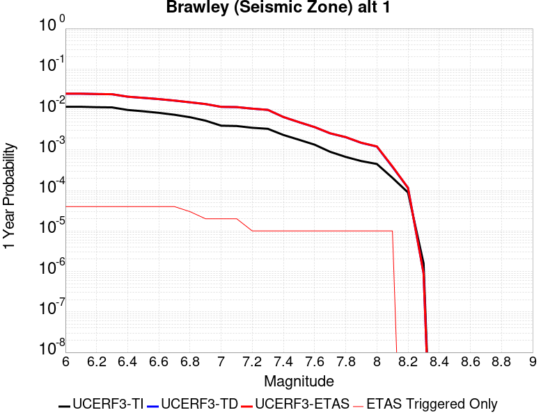 | 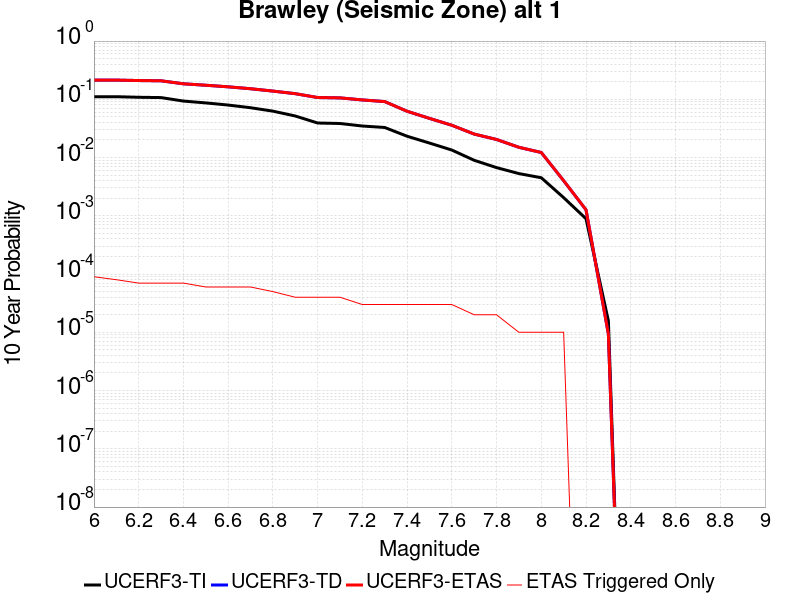 |

| Magnitude | 1 wk TI Prob | 1 wk TD Prob | 1 wk ETAS Prob | 1 wk ETAS/TD Gain | 1 wk ETAS Triggered Only | 1 mo TI Prob | 1 mo TD Prob | 1 mo ETAS Prob | 1 mo ETAS/TD Gain | 1 mo ETAS Triggered Only | 1 yr TI Prob | 1 yr TD Prob | 1 yr ETAS Prob | 1 yr ETAS/TD Gain | 1 yr ETAS Triggered Only | 10 yr TI Prob | 10 yr TD Prob | 10 yr ETAS Prob | 10 yr ETAS/TD Gain | 10 yr ETAS Triggered Only |
|-----|-----|-----|-----|-----|-----|-----|-----|-----|-----|-----|-----|-----|-----|-----|-----|-----|-----|-----|-----|-----|
| 6.0 | 2.2521618E-4 | 4.7643206E-4 | 4.7643206E-4 | 1.0 | 0.0 | 9.6485513E-4 | 0.002040291 | 0.002040291 | 1.0 | 0.0 | 0.011683988 | 0.024554973 | 0.02459399 | 1.001589 | 4.0E-5 | 0.11088423 | 0.21353106 | 0.21360186 | 1.0003315 | 9.0E-5 |
| 6.1 | 2.2521618E-4 | 4.7643206E-4 | 4.7643206E-4 | 1.0 | 0.0 | 9.6485513E-4 | 0.002040291 | 0.002040291 | 1.0 | 0.0 | 0.011683988 | 0.024554973 | 0.02459399 | 1.001589 | 4.0E-5 | 0.11088423 | 0.21353106 | 0.21359399 | 1.0002947 | 8.0E-5 |
| 6.2 | 2.198148E-4 | 4.672759E-4 | 4.672759E-4 | 1.0 | 0.0 | 9.417233E-4 | 0.0020011107 | 0.0020011107 | 1.0 | 0.0 | 0.011405343 | 0.024089037 | 0.024128072 | 1.0016205 | 4.0E-5 | 0.10837428 | 0.20996717 | 0.21002246 | 1.0002633 | 7.0E-5 |
| 6.3 | 2.1704129E-4 | 4.6163241E-4 | 4.6163241E-4 | 1.0 | 0.0 | 9.298453E-4 | 0.001976961 | 0.001976961 | 1.0 | 0.0 | 0.011262234 | 0.023802388 | 0.023841437 | 1.0016406 | 4.0E-5 | 0.107082725 | 0.20785816 | 0.20791362 | 1.0002668 | 7.0E-5 |
| 6.4 | 1.876142E-4 | 4.0055066E-4 | 4.0055066E-4 | 1.0 | 0.0 | 8.038131E-4 | 0.0017155306 | 0.0017155306 | 1.0 | 0.0 | 0.00974259 | 0.020688837 | 0.02072801 | 1.0018934 | 4.0E-5 | 0.093263686 | 0.18460822 | 0.18466529 | 1.0003092 | 7.0E-5 |
| 6.5 | 1.7390939E-4 | 3.7486907E-4 | 3.7486907E-4 | 1.0 | 0.0 | 7.45113E-4 | 0.0016056047 | 0.0016056047 | 1.0 | 0.0 | 0.009034078 | 0.019377038 | 0.019416263 | 1.0020243 | 4.0E-5 | 0.086755216 | 0.17442968 | 0.17447923 | 1.000284 | 6.0E-5 |
| 6.6 | 1.591791E-4 | 3.490135E-4 | 3.490135E-4 | 1.0 | 0.0 | 6.8201777E-4 | 0.0014949249 | 0.0014949249 | 1.0 | 0.0 | 0.008271996 | 0.018051691 | 0.01809097 | 1.0021758 | 4.0E-5 | 0.07970774 | 0.16383655 | 0.16388673 | 1.0003062 | 6.0E-5 |
| 6.7 | 1.4268003E-4 | 3.2067046E-4 | 3.2067046E-4 | 1.0 | 0.0 | 6.1134255E-4 | 0.0013735864 | 0.0013735864 | 1.0 | 0.0 | 0.007417723 | 0.016597226 | 0.016636562 | 1.00237 | 4.0E-5 | 0.07174956 | 0.15196328 | 0.15201415 | 1.0003349 | 6.0E-5 |
| 6.8 | 1.239713E-4 | 2.906121E-4 | 2.906121E-4 | 1.0 | 0.0 | 5.3119735E-4 | 0.0012448921 | 0.0012448921 | 1.0 | 0.0 | 0.0064481674 | 0.015052661 | 0.015082209 | 1.001963 | 3.0E-5 | 0.06264243 | 0.13840474 | 0.13844782 | 1.0003113 | 5.0E-5 |
| 6.9 | 1.0180238E-4 | 2.6260383E-4 | 2.6260383E-4 | 1.0 | 0.0 | 4.3622297E-4 | 0.0011249639 | 0.0011249639 | 1.0 | 0.0 | 0.005298089 | 0.013611422 | 0.01363115 | 1.0014493 | 2.0E-5 | 0.05173543 | 0.12498361 | 0.12501861 | 1.00028 | 4.0E-5 |
| 7.0 | 7.6619996E-5 | 2.2404084E-4 | 2.2404084E-4 | 1.0 | 0.0 | 3.283301E-4 | 9.598249E-4 | 9.598249E-4 | 1.0 | 0.0 | 0.0039900932 | 0.011623963 | 0.011643731 | 1.0017006 | 2.0E-5 | 0.039192066 | 0.10728301 | 0.10731872 | 1.0003328 | 4.0E-5 |
| 7.1 | 7.5127435E-5 | 2.2087194E-4 | 2.2087194E-4 | 1.0 | 0.0 | 3.2193496E-4 | 9.462538E-4 | 9.462538E-4 | 1.0 | 0.0 | 0.0039125155 | 0.011460485 | 0.011480255 | 1.0017251 | 2.0E-5 | 0.038443442 | 0.105846815 | 0.105882585 | 1.000338 | 4.0E-5 |
| 7.2 | 6.788582E-5 | 2.0214771E-4 | 2.0214771E-4 | 1.0 | 0.0 | 2.9090676E-4 | 8.660627E-4 | 8.660627E-4 | 1.0 | 0.0 | 0.0035360386 | 0.010493974 | 0.0105038695 | 1.000943 | 1.0E-5 | 0.034803 | 0.09751713 | 0.09754421 | 1.0002776 | 3.0E-5 |
| 7.3 | 6.399602E-5 | 1.884553E-4 | 1.884553E-4 | 1.0 | 0.0 | 2.7423984E-4 | 8.074185E-4 | 8.074185E-4 | 1.0 | 0.0 | 0.0033337586 | 0.009786601 | 0.009796504 | 1.0010118 | 1.0E-5 | 0.03284188 | 0.09141058 | 0.09143784 | 1.0002981 | 3.0E-5 |
| 7.4 | 4.506759E-5 | 1.2532667E-4 | 1.2532667E-4 | 1.0 | 0.0 | 1.9313251E-4 | 5.370046E-4 | 5.370046E-4 | 1.0 | 0.0 | 0.0023488526 | 0.006518606 | 0.006528541 | 1.0015241 | 1.0E-5 | 0.023241805 | 0.06237464 | 0.062402766 | 1.000451 | 3.0E-5 |
| 7.5 | 3.43289E-5 | 9.338305E-5 | 9.338305E-5 | 1.0 | 0.0 | 1.4711556E-4 | 4.00152E-4 | 4.00152E-4 | 1.0 | 0.0 | 0.0017896603 | 0.00486103 | 0.0048709814 | 1.0020472 | 1.0E-5 | 0.01775316 | 0.04706593 | 0.047094516 | 1.0006074 | 3.0E-5 |
| 7.6 | 2.5980507E-5 | 7.055588E-5 | 7.055588E-5 | 1.0 | 0.0 | 1.1134028E-4 | 3.023474E-4 | 3.023474E-4 | 1.0 | 0.0 | 0.001354725 | 0.0036748908 | 0.0036848541 | 1.0027112 | 1.0E-5 | 0.013464959 | 0.035850268 | 0.03587919 | 1.0008068 | 3.0E-5 |
| 7.7 | 1.7292105E-5 | 4.9428265E-5 | 4.9428265E-5 | 1.0 | 0.0 | 7.4106916E-5 | 2.1181825E-4 | 2.1181825E-4 | 1.0 | 0.0 | 9.018782E-4 | 0.002575843 | 0.0025858171 | 1.0038723 | 1.0E-5 | 0.008982267 | 0.025298944 | 0.025318438 | 1.0007706 | 2.0E-5 |
| 7.8 | 1.2927471E-5 | 3.971141E-5 | 3.971141E-5 | 1.0 | 0.0 | 5.5402274E-5 | 1.7018066E-4 | 1.7018066E-4 | 1.0 | 0.0 | 6.743139E-4 | 0.0020699832 | 0.0020799625 | 1.004821 | 1.0E-5 | 0.0067227143 | 0.020439085 | 0.020458676 | 1.0009586 | 2.0E-5 |
| 7.9 | 1.0200774E-5 | 2.8759863E-5 | 2.8759863E-5 | 1.0 | 0.0 | 4.371687E-5 | 1.2325073E-4 | 1.2325073E-4 | 1.0 | 0.0 | 5.321229E-4 | 0.0014995459 | 0.0015095309 | 1.0066587 | 1.0E-5 | 0.005308505 | 0.0149981035 | 0.015007953 | 1.0006567 | 1.0E-5 |
| 8.0 | 8.650396E-6 | 2.3289316E-5 | 2.3289316E-5 | 1.0 | 0.0 | 3.70726E-5 | 9.980754E-5 | 9.980754E-5 | 1.0 | 0.0 | 4.5126543E-4 | 0.0012144803 | 0.0012244681 | 1.008224 | 1.0E-5 | 0.0045035016 | 0.012216583 | 0.0122264605 | 1.0008086 | 1.0E-5 |
| 8.1 | 3.9368224E-6 | 7.3325436E-6 | 7.3325436E-6 | 1.0 | 0.0 | 1.6871985E-5 | 3.142481E-5 | 3.142481E-5 | 1.0 | 0.0 | 2.0539707E-4 | 3.8253E-4 | 3.9252618E-4 | 1.0261317 | 1.0E-5 | 0.0020520731 | 0.0040034265 | 0.0040133866 | 1.0024879 | 1.0E-5 |
| 8.2 | 1.7101195E-6 | 2.21947E-6 | 2.21947E-6 | 1.0 | 0.0 | 7.329063E-6 | 9.511979E-6 | 9.511979E-6 | 1.0 | 0.0 | 8.922769E-5 | 1.1580222E-4 | 1.1580222E-4 | 1.0 | 0.0 | 8.9191867E-4 | 0.0012675131 | 0.0012675131 | 1.0 | 0.0 |
| 8.3 | 3.0346666E-8 | 1.7229212E-8 | 1.7229212E-8 | 1.0 | 0.0 | 1.3005713E-7 | 7.383948E-8 | 7.383948E-8 | 1.0 | 0.0 | 1.5834444E-6 | 8.9899555E-7 | 8.9899555E-7 | 1.0 | 0.0 | 1.5834332E-5 | 9.375523E-6 | 9.375523E-6 | 1.0 | 0.0 |

## San Jacinto (Stepovers Combined)
*[(top)](#table-of-contents)*

| 1 Week | 1 Month | 1 Year | 10 Year |
|-----|-----|-----|-----|
|  | 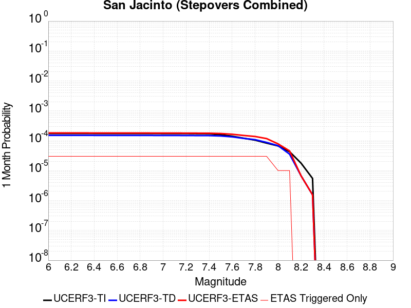 |  |  |

| Magnitude | 1 wk TI Prob | 1 wk TD Prob | 1 wk ETAS Prob | 1 wk ETAS/TD Gain | 1 wk ETAS Triggered Only | 1 mo TI Prob | 1 mo TD Prob | 1 mo ETAS Prob | 1 mo ETAS/TD Gain | 1 mo ETAS Triggered Only | 1 yr TI Prob | 1 yr TD Prob | 1 yr ETAS Prob | 1 yr ETAS/TD Gain | 1 yr ETAS Triggered Only | 10 yr TI Prob | 10 yr TD Prob | 10 yr ETAS Prob | 10 yr ETAS/TD Gain | 10 yr ETAS Triggered Only |
|-----|-----|-----|-----|-----|-----|-----|-----|-----|-----|-----|-----|-----|-----|-----|-----|-----|-----|-----|-----|-----|
| 6.0 | 4.0667746E-5 | 3.5285528E-5 | 5.528482E-5 | 1.5667846 | 2.0E-5 | 1.742787E-4 | 1.5121493E-4 | 1.812104E-4 | 1.1983631 | 3.0E-5 | 0.0021197782 | 0.0018394884 | 0.001899378 | 1.0325577 | 6.0E-5 | 0.020996714 | 0.018993655 | 0.019072134 | 1.0041319 | 8.0E-5 |
| 6.1 | 4.0667746E-5 | 3.5285528E-5 | 5.528482E-5 | 1.5667846 | 2.0E-5 | 1.742787E-4 | 1.5121493E-4 | 1.812104E-4 | 1.1983631 | 3.0E-5 | 0.0021197782 | 0.0018394884 | 0.001899378 | 1.0325577 | 6.0E-5 | 0.020996714 | 0.018993655 | 0.019072134 | 1.0041319 | 8.0E-5 |
| 6.2 | 4.0667746E-5 | 3.5285528E-5 | 5.528482E-5 | 1.5667846 | 2.0E-5 | 1.742787E-4 | 1.5121493E-4 | 1.812104E-4 | 1.1983631 | 3.0E-5 | 0.0021197782 | 0.0018394884 | 0.001899378 | 1.0325577 | 6.0E-5 | 0.020996714 | 0.018993655 | 0.019072134 | 1.0041319 | 8.0E-5 |
| 6.3 | 4.0667746E-5 | 3.5285528E-5 | 5.528482E-5 | 1.5667846 | 2.0E-5 | 1.742787E-4 | 1.5121493E-4 | 1.812104E-4 | 1.1983631 | 3.0E-5 | 0.0021197782 | 0.0018394884 | 0.001899378 | 1.0325577 | 6.0E-5 | 0.020996714 | 0.018993655 | 0.019072134 | 1.0041319 | 8.0E-5 |
| 6.4 | 4.0577226E-5 | 3.515743E-5 | 5.515673E-5 | 1.5688498 | 2.0E-5 | 1.738908E-4 | 1.5066602E-4 | 1.806615E-4 | 1.199086 | 3.0E-5 | 0.0021150648 | 0.0018328178 | 0.0018927079 | 1.0326765 | 6.0E-5 | 0.020950472 | 0.018928219 | 0.019006705 | 1.0041465 | 8.0E-5 |
| 6.5 | 4.0577226E-5 | 3.515743E-5 | 5.515673E-5 | 1.5688498 | 2.0E-5 | 1.738908E-4 | 1.5066602E-4 | 1.806615E-4 | 1.199086 | 3.0E-5 | 0.0021150648 | 0.0018328178 | 0.0018927079 | 1.0326765 | 6.0E-5 | 0.020950472 | 0.018928219 | 0.019006705 | 1.0041465 | 8.0E-5 |
| 6.6 | 4.053861E-5 | 3.510277E-5 | 5.5102068E-5 | 1.5697356 | 2.0E-5 | 1.7372532E-4 | 1.5043179E-4 | 1.8042728E-4 | 1.1993959 | 3.0E-5 | 0.0021130538 | 0.0018299713 | 0.0018898615 | 1.0327274 | 6.0E-5 | 0.020930743 | 0.018900296 | 0.018978784 | 1.0041528 | 8.0E-5 |
| 6.7 | 4.0516545E-5 | 3.5071844E-5 | 5.507114E-5 | 1.570238 | 2.0E-5 | 1.7363077E-4 | 1.5029925E-4 | 1.8029475E-4 | 1.1995717 | 3.0E-5 | 0.002111905 | 0.0018283607 | 0.001888251 | 1.0327563 | 6.0E-5 | 0.020919468 | 0.018884491 | 0.018962981 | 1.0041562 | 8.0E-5 |
| 6.8 | 4.049434E-5 | 3.5043406E-5 | 5.5042703E-5 | 1.5707008 | 2.0E-5 | 1.7353562E-4 | 1.501774E-4 | 1.8017288E-4 | 1.1997337 | 3.0E-5 | 0.0021107488 | 0.0018268795 | 0.0018867699 | 1.0327829 | 6.0E-5 | 0.020908125 | 0.018869905 | 0.018948395 | 1.0041596 | 8.0E-5 |
| 6.9 | 4.046386E-5 | 3.5005964E-5 | 5.500526E-5 | 1.5713112 | 2.0E-5 | 1.73405E-4 | 1.5001695E-4 | 1.8001244E-4 | 1.1999474 | 3.0E-5 | 0.0021091616 | 0.0018249294 | 0.0018848198 | 1.032818 | 6.0E-5 | 0.020892553 | 0.018850677 | 0.018929169 | 1.0041639 | 8.0E-5 |
| 7.0 | 4.036382E-5 | 3.4886525E-5 | 5.488583E-5 | 1.5732672 | 2.0E-5 | 1.7297632E-4 | 1.4950513E-4 | 1.7950064E-4 | 1.200632 | 3.0E-5 | 0.0021039525 | 0.0018187086 | 0.0018785994 | 1.0329305 | 6.0E-5 | 0.02084144 | 0.018789288 | 0.018867785 | 1.0041777 | 8.0E-5 |
| 7.1 | 4.0343282E-5 | 3.486499E-5 | 5.486429E-5 | 1.5736214 | 2.0E-5 | 1.7288832E-4 | 1.4941284E-4 | 1.7940835E-4 | 1.200756 | 3.0E-5 | 0.002102883 | 0.0018175867 | 0.0018774777 | 1.0329508 | 6.0E-5 | 0.020830948 | 0.018778158 | 0.018856656 | 1.0041803 | 8.0E-5 |
| 7.2 | 4.0257353E-5 | 3.476948E-5 | 5.4768785E-5 | 1.5751971 | 2.0E-5 | 1.725201E-4 | 1.4900356E-4 | 1.7899911E-4 | 1.2013074 | 3.0E-5 | 0.0020984085 | 0.0018126123 | 0.0018725035 | 1.0330414 | 6.0E-5 | 0.020787042 | 0.018728893 | 0.018807394 | 1.0041915 | 8.0E-5 |
| 7.3 | 3.9940667E-5 | 3.459712E-5 | 5.459643E-5 | 1.5780628 | 2.0E-5 | 1.7116306E-4 | 1.4826495E-4 | 1.7826051E-4 | 1.2023104 | 3.0E-5 | 0.0020819185 | 0.0018036346 | 0.0018635264 | 1.0332061 | 6.0E-5 | 0.020625217 | 0.018637514 | 0.018716022 | 1.0042124 | 8.0E-5 |
| 7.4 | 3.9721202E-5 | 3.44825E-5 | 5.4481807E-5 | 1.5799844 | 2.0E-5 | 1.7022261E-4 | 1.4777378E-4 | 1.7776935E-4 | 1.202983 | 3.0E-5 | 0.0020704903 | 0.0017976643 | 0.0018575565 | 1.0333166 | 6.0E-5 | 0.020513052 | 0.018576635 | 0.01865515 | 1.0042264 | 8.0E-5 |
| 7.5 | 3.7036873E-5 | 3.354985E-5 | 5.354918E-5 | 1.5961078 | 2.0E-5 | 1.5871979E-4 | 1.4377717E-4 | 1.7377286E-4 | 1.2086263 | 3.0E-5 | 0.0019307006 | 0.0017490846 | 0.0018089795 | 1.0342437 | 6.0E-5 | 0.019140124 | 0.018078115 | 0.018156668 | 1.0043453 | 8.0E-5 |
| 7.6 | 3.2940967E-5 | 3.1330474E-5 | 5.1329847E-5 | 1.6383361 | 2.0E-5 | 1.4116794E-4 | 1.3426656E-4 | 1.6426254E-4 | 1.2234061 | 3.0E-5 | 0.0017173645 | 0.001633472 | 0.001693374 | 1.0366715 | 6.0E-5 | 0.01704153 | 0.01691088 | 0.016989527 | 1.0046507 | 8.0E-5 |
| 7.7 | 2.8236149E-5 | 2.7896147E-5 | 4.7895588E-5 | 1.7169249 | 2.0E-5 | 1.2100645E-4 | 1.1954944E-4 | 1.4954586E-4 | 1.2509122 | 3.0E-5 | 0.0014722579 | 0.0014545437 | 0.0015144565 | 1.04119 | 6.0E-5 | 0.014625421 | 0.015121453 | 0.015200243 | 1.0052105 | 8.0E-5 |
| 7.8 | 2.4329287E-5 | 2.5219388E-5 | 4.5218883E-5 | 1.7930206 | 2.0E-5 | 1.042642E-4 | 1.0807862E-4 | 1.3807538E-4 | 1.2775457 | 3.0E-5 | 0.0012686774 | 0.0013150638 | 0.0013749849 | 1.0455651 | 6.0E-5 | 0.012614589 | 0.013718468 | 0.013797371 | 1.0057516 | 8.0E-5 |
| 7.9 | 1.9370926E-5 | 2.0432055E-5 | 4.0431645E-5 | 1.9788342 | 2.0E-5 | 8.301561E-5 | 8.7563014E-5 | 1.1756038E-4 | 1.3425804 | 3.0E-5 | 0.0010102465 | 0.001065559 | 0.0011254951 | 1.0562484 | 6.0E-5 | 0.0100566605 | 0.011205053 | 0.011284157 | 1.0070597 | 8.0E-5 |
| 8.0 | 1.5583017E-5 | 1.5895175E-5 | 1.5895175E-5 | 1.0 | 0.0 | 6.6782646E-5 | 6.8120404E-5 | 7.811972E-5 | 1.146789 | 1.0E-5 | 8.127754E-4 | 8.29051E-4 | 8.6901785E-4 | 1.0482079 | 4.0E-5 | 0.008098091 | 0.008786416 | 0.008845888 | 1.0067687 | 6.0E-5 |
| 8.1 | 1.0024873E-5 | 8.297121E-6 | 8.297121E-6 | 1.0 | 0.0 | 4.2963035E-5 | 3.5558605E-5 | 4.5558252E-5 | 1.2812159 | 1.0E-5 | 5.229494E-4 | 4.3284055E-4 | 4.6282756E-4 | 1.0692796 | 3.0E-5 | 0.0052172043 | 0.00465596 | 0.00468582 | 1.0064133 | 3.0E-5 |
| 8.2 | 4.142796E-6 | 1.5619446E-6 | 1.5619446E-6 | 1.0 | 0.0 | 1.775472E-5 | 6.6940315E-6 | 6.6940315E-6 | 1.0 | 0.0 | 2.1614227E-4 | 8.1496815E-5 | 8.1496815E-5 | 1.0 | 0.0 | 0.0021593217 | 9.4601413E-4 | 9.4601413E-4 | 1.0 | 0.0 |
| 8.3 | 1.2750878E-6 | 3.6143226E-7 | 3.6143226E-7 | 1.0 | 0.0 | 5.4646503E-6 | 1.5489944E-6 | 1.5489944E-6 | 1.0 | 0.0 | 6.653009E-5 | 1.8858847E-5 | 1.8858847E-5 | 1.0 | 0.0 | 6.6510175E-4 | 2.2747046E-4 | 2.2747046E-4 | 1.0 | 0.0 |

## Kern Canyon (North Kern) 2011
*[(top)](#table-of-contents)*

| 1 Week | 1 Month | 1 Year | 10 Year |
|-----|-----|-----|-----|
|  |  | 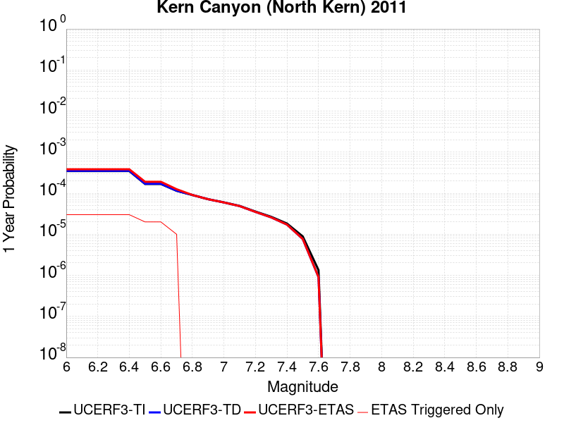 | 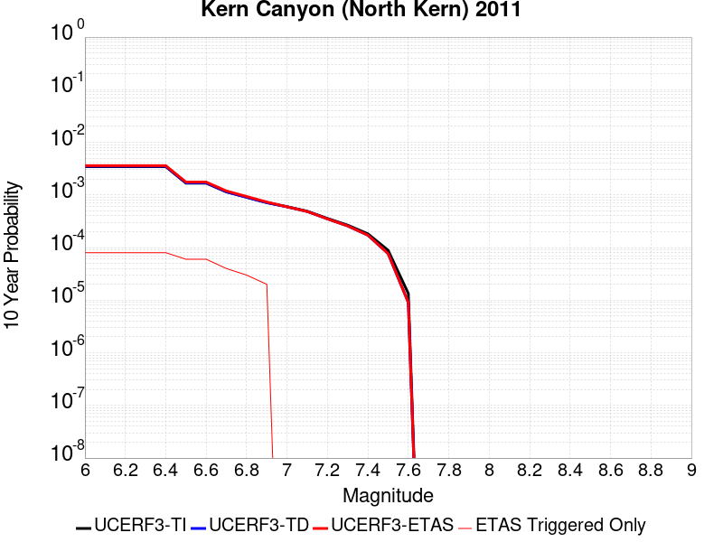 |

| Magnitude | 1 wk TI Prob | 1 wk TD Prob | 1 wk ETAS Prob | 1 wk ETAS/TD Gain | 1 wk ETAS Triggered Only | 1 mo TI Prob | 1 mo TD Prob | 1 mo ETAS Prob | 1 mo ETAS/TD Gain | 1 mo ETAS Triggered Only | 1 yr TI Prob | 1 yr TD Prob | 1 yr ETAS Prob | 1 yr ETAS/TD Gain | 1 yr ETAS Triggered Only | 10 yr TI Prob | 10 yr TD Prob | 10 yr ETAS Prob | 10 yr ETAS/TD Gain | 10 yr ETAS Triggered Only |
|-----|-----|-----|-----|-----|-----|-----|-----|-----|-----|-----|-----|-----|-----|-----|-----|-----|-----|-----|-----|-----|
| 6.0 | 6.6264497E-6 | 6.7573515E-6 | 1.6757283E-5 | 2.4798598 | 1.0E-5 | 2.8398761E-5 | 2.8959801E-5 | 3.895951E-5 | 1.3452963 | 1.0E-5 | 3.4570007E-4 | 3.5253656E-4 | 3.8252596E-4 | 1.0850675 | 3.0E-5 | 0.0034516277 | 0.0035205614 | 0.0036002798 | 1.0226437 | 8.0E-5 |
| 6.1 | 6.6264497E-6 | 6.7573515E-6 | 1.6757283E-5 | 2.4798598 | 1.0E-5 | 2.8398761E-5 | 2.8959801E-5 | 3.895951E-5 | 1.3452963 | 1.0E-5 | 3.4570007E-4 | 3.5253656E-4 | 3.8252596E-4 | 1.0850675 | 3.0E-5 | 0.0034516277 | 0.0035205614 | 0.0036002798 | 1.0226437 | 8.0E-5 |
| 6.2 | 6.6264497E-6 | 6.7573515E-6 | 1.6757283E-5 | 2.4798598 | 1.0E-5 | 2.8398761E-5 | 2.8959801E-5 | 3.895951E-5 | 1.3452963 | 1.0E-5 | 3.4570007E-4 | 3.5253656E-4 | 3.8252596E-4 | 1.0850675 | 3.0E-5 | 0.0034516277 | 0.0035205614 | 0.0036002798 | 1.0226437 | 8.0E-5 |
| 6.3 | 6.6264497E-6 | 6.7573515E-6 | 1.6757283E-5 | 2.4798598 | 1.0E-5 | 2.8398761E-5 | 2.8959801E-5 | 3.895951E-5 | 1.3452963 | 1.0E-5 | 3.4570007E-4 | 3.5253656E-4 | 3.8252596E-4 | 1.0850675 | 3.0E-5 | 0.0034516277 | 0.0035205614 | 0.0036002798 | 1.0226437 | 8.0E-5 |
| 6.4 | 6.6264497E-6 | 6.7573515E-6 | 1.6757283E-5 | 2.4798598 | 1.0E-5 | 2.8398761E-5 | 2.8959801E-5 | 3.895951E-5 | 1.3452963 | 1.0E-5 | 3.4570007E-4 | 3.5253656E-4 | 3.8252596E-4 | 1.0850675 | 3.0E-5 | 0.0034516277 | 0.0035205614 | 0.0036002798 | 1.0226437 | 8.0E-5 |
| 6.5 | 3.2162225E-6 | 3.2571006E-6 | 3.2571006E-6 | 1.0 | 0.0 | 1.3783738E-5 | 1.3958933E-5 | 1.3958933E-5 | 1.0 | 0.0 | 1.6780409E-4 | 1.6993756E-4 | 1.8993416E-4 | 1.1176703 | 2.0E-5 | 0.0016767744 | 0.0016981558 | 0.0017580539 | 1.0352725 | 6.0E-5 |
| 6.6 | 3.2162225E-6 | 3.2571006E-6 | 3.2571006E-6 | 1.0 | 0.0 | 1.3783738E-5 | 1.3958933E-5 | 1.3958933E-5 | 1.0 | 0.0 | 1.6780409E-4 | 1.6993756E-4 | 1.8993416E-4 | 1.1176703 | 2.0E-5 | 0.0016767744 | 0.0016981558 | 0.0017580539 | 1.0352725 | 6.0E-5 |
| 6.7 | 2.1908265E-6 | 2.207128E-6 | 2.207128E-6 | 1.0 | 0.0 | 9.389223E-6 | 9.459087E-6 | 9.459087E-6 | 1.0 | 0.0 | 1.1430779E-4 | 1.15158495E-4 | 1.2515734E-4 | 1.0868268 | 1.0E-5 | 0.0011424901 | 0.0011510076 | 0.0011909616 | 1.0347122 | 4.0E-5 |
| 6.8 | 1.7303895E-6 | 1.7365575E-6 | 1.7365575E-6 | 1.0 | 0.0 | 7.415934E-6 | 7.4423683E-6 | 7.4423683E-6 | 1.0 | 0.0 | 9.028525E-5 | 9.0607165E-5 | 9.0607165E-5 | 1.0 | 0.0 | 9.024858E-4 | 9.0571196E-4 | 9.356848E-4 | 1.0330931 | 3.0E-5 |
| 6.9 | 1.3700314E-6 | 1.3688658E-6 | 1.3688658E-6 | 1.0 | 0.0 | 5.87155E-6 | 5.8665546E-6 | 5.8665546E-6 | 1.0 | 0.0 | 7.148377E-5 | 7.142301E-5 | 7.142301E-5 | 1.0 | 0.0 | 7.146078E-4 | 7.140051E-4 | 7.3399086E-4 | 1.027991 | 2.0E-5 |
| 7.0 | 1.1467797E-6 | 1.1413834E-6 | 1.1413834E-6 | 1.0 | 0.0 | 4.9147607E-6 | 4.8916345E-6 | 4.8916345E-6 | 1.0 | 0.0 | 5.983557E-5 | 5.955405E-5 | 5.955405E-5 | 1.0 | 0.0 | 5.981946E-4 | 5.9538404E-4 | 5.9538404E-4 | 1.0 | 0.0 |
| 7.1 | 9.3952065E-7 | 9.3027154E-7 | 9.3027154E-7 | 1.0 | 0.0 | 4.026511E-6 | 3.986872E-6 | 3.986872E-6 | 1.0 | 0.0 | 4.9021666E-5 | 4.8539103E-5 | 4.8539103E-5 | 1.0 | 0.0 | 4.901085E-4 | 4.852868E-4 | 4.852868E-4 | 1.0 | 0.0 |
| 7.2 | 6.858055E-7 | 6.719319E-7 | 6.719319E-7 | 1.0 | 0.0 | 2.939163E-6 | 2.879705E-6 | 2.879705E-6 | 1.0 | 0.0 | 3.5783723E-5 | 3.5059853E-5 | 3.5059853E-5 | 1.0 | 0.0 | 3.5777962E-4 | 3.505441E-4 | 3.505441E-4 | 1.0 | 0.0 |
| 7.3 | 5.1101983E-7 | 4.939314E-7 | 4.939314E-7 | 1.0 | 0.0 | 2.1900833E-6 | 2.116847E-6 | 2.116847E-6 | 1.0 | 0.0 | 2.6663936E-5 | 2.5772315E-5 | 2.5772315E-5 | 1.0 | 0.0 | 2.6660739E-4 | 2.5769373E-4 | 2.5769373E-4 | 1.0 | 0.0 |
| 7.4 | 3.4999414E-7 | 3.2996007E-7 | 3.2996007E-7 | 1.0 | 0.0 | 1.499974E-6 | 1.4141139E-6 | 1.4141139E-6 | 1.0 | 0.0 | 1.8262032E-5 | 1.7216704E-5 | 1.7216704E-5 | 1.0 | 0.0 | 1.826053E-4 | 1.7215393E-4 | 1.7215393E-4 | 1.0 | 0.0 |
| 7.5 | 1.7021522E-7 | 1.4750101E-7 | 1.4750101E-7 | 1.0 | 0.0 | 7.2949354E-7 | 6.321471E-7 | 6.321471E-7 | 1.0 | 0.0 | 8.881548E-6 | 7.696364E-6 | 7.696364E-6 | 1.0 | 0.0 | 8.8811925E-5 | 7.696106E-5 | 7.696106E-5 | 1.0 | 0.0 |
| 7.6 | 2.572245E-8 | 1.7352718E-8 | 1.7352718E-8 | 1.0 | 0.0 | 1.10239064E-7 | 7.436879E-8 | 7.436879E-8 | 1.0 | 0.0 | 1.3421597E-6 | 9.054397E-7 | 9.054397E-7 | 1.0 | 0.0 | 1.3421517E-5 | 9.054365E-6 | 9.054365E-6 | 1.0 | 0.0 |

## San Jacinto (Lytle Creek connector)
*[(top)](#table-of-contents)*

| 1 Week | 1 Month | 1 Year | 10 Year |
|-----|-----|-----|-----|
|  |  |  |  |

| Magnitude | 1 wk TI Prob | 1 wk TD Prob | 1 wk ETAS Prob | 1 wk ETAS/TD Gain | 1 wk ETAS Triggered Only | 1 mo TI Prob | 1 mo TD Prob | 1 mo ETAS Prob | 1 mo ETAS/TD Gain | 1 mo ETAS Triggered Only | 1 yr TI Prob | 1 yr TD Prob | 1 yr ETAS Prob | 1 yr ETAS/TD Gain | 1 yr ETAS Triggered Only | 10 yr TI Prob | 10 yr TD Prob | 10 yr ETAS Prob | 10 yr ETAS/TD Gain | 10 yr ETAS Triggered Only |
|-----|-----|-----|-----|-----|-----|-----|-----|-----|-----|-----|-----|-----|-----|-----|-----|-----|-----|-----|-----|-----|
| 6.0 | 6.693995E-6 | 6.6628318E-6 | 1.6662765E-5 | 2.5008533 | 1.0E-5 | 2.8688235E-5 | 2.8554681E-5 | 4.855411E-5 | 1.7003906 | 2.0E-5 | 3.492233E-4 | 3.4759787E-4 | 4.07577E-4 | 1.1725533 | 6.0E-5 | 0.00348675 | 0.0035508901 | 0.0036206415 | 1.0196434 | 7.0E-5 |
| 6.1 | 6.693995E-6 | 6.6628318E-6 | 1.6662765E-5 | 2.5008533 | 1.0E-5 | 2.8688235E-5 | 2.8554681E-5 | 4.855411E-5 | 1.7003906 | 2.0E-5 | 3.492233E-4 | 3.4759787E-4 | 4.07577E-4 | 1.1725533 | 6.0E-5 | 0.00348675 | 0.0035508901 | 0.0036206415 | 1.0196434 | 7.0E-5 |
| 6.2 | 6.693995E-6 | 6.6628318E-6 | 1.6662765E-5 | 2.5008533 | 1.0E-5 | 2.8688235E-5 | 2.8554681E-5 | 4.855411E-5 | 1.7003906 | 2.0E-5 | 3.492233E-4 | 3.4759787E-4 | 4.07577E-4 | 1.1725533 | 6.0E-5 | 0.00348675 | 0.0035508901 | 0.0036206415 | 1.0196434 | 7.0E-5 |
| 6.3 | 6.693995E-6 | 6.6628318E-6 | 1.6662765E-5 | 2.5008533 | 1.0E-5 | 2.8688235E-5 | 2.8554681E-5 | 4.855411E-5 | 1.7003906 | 2.0E-5 | 3.492233E-4 | 3.4759787E-4 | 4.07577E-4 | 1.1725533 | 6.0E-5 | 0.00348675 | 0.0035508901 | 0.0036206415 | 1.0196434 | 7.0E-5 |
| 6.4 | 6.693995E-6 | 6.6628318E-6 | 1.6662765E-5 | 2.5008533 | 1.0E-5 | 2.8688235E-5 | 2.8554681E-5 | 4.855411E-5 | 1.7003906 | 2.0E-5 | 3.492233E-4 | 3.4759787E-4 | 4.07577E-4 | 1.1725533 | 6.0E-5 | 0.00348675 | 0.0035508901 | 0.0036206415 | 1.0196434 | 7.0E-5 |
| 6.5 | 6.6561875E-6 | 6.6230496E-6 | 1.6622984E-5 | 2.5098684 | 1.0E-5 | 2.8526205E-5 | 2.838419E-5 | 4.8383623E-5 | 1.7045976 | 2.0E-5 | 3.472512E-4 | 3.455228E-4 | 4.0550207E-4 | 1.17359 | 6.0E-5 | 0.0034670907 | 0.0035302055 | 0.0035999585 | 1.0197588 | 7.0E-5 |
| 6.6 | 6.6561875E-6 | 6.6230496E-6 | 1.6622984E-5 | 2.5098684 | 1.0E-5 | 2.8526205E-5 | 2.838419E-5 | 4.8383623E-5 | 1.7045976 | 2.0E-5 | 3.472512E-4 | 3.455228E-4 | 4.0550207E-4 | 1.17359 | 6.0E-5 | 0.0034670907 | 0.0035302055 | 0.0035999585 | 1.0197588 | 7.0E-5 |
| 6.7 | 6.5802237E-6 | 6.5422255E-6 | 1.654216E-5 | 2.5285218 | 1.0E-5 | 2.8200653E-5 | 2.803781E-5 | 4.8037247E-5 | 1.7133025 | 2.0E-5 | 3.4328885E-4 | 3.4130694E-4 | 4.0128644E-4 | 1.1757349 | 6.0E-5 | 0.0034275902 | 0.0034881798 | 0.0035579356 | 1.0199977 | 7.0E-5 |
| 6.8 | 6.575632E-6 | 6.5367153E-6 | 1.653665E-5 | 2.5298104 | 1.0E-5 | 2.8180975E-5 | 2.8014192E-5 | 4.8013633E-5 | 1.7139038 | 2.0E-5 | 3.4304935E-4 | 3.410195E-4 | 4.0099904E-4 | 1.175883 | 6.0E-5 | 0.0034252026 | 0.0034853143 | 0.0035550704 | 1.0200143 | 7.0E-5 |
| 6.9 | 6.570433E-6 | 6.5281088E-6 | 1.6528043E-5 | 2.5318272 | 1.0E-5 | 2.8158694E-5 | 2.7977308E-5 | 4.797675E-5 | 1.7148451 | 2.0E-5 | 3.4277816E-4 | 3.4057058E-4 | 4.0055014E-4 | 1.1761149 | 6.0E-5 | 0.0034224992 | 0.0034808393 | 0.0035505956 | 1.02004 | 7.0E-5 |
| 7.0 | 6.5643826E-6 | 6.5182294E-6 | 1.6518165E-5 | 2.534149 | 1.0E-5 | 2.8132765E-5 | 2.793497E-5 | 4.793441E-5 | 1.7159286 | 2.0E-5 | 3.424626E-4 | 3.4005524E-4 | 3.9003824E-4 | 1.1469849 | 5.0E-5 | 0.0034193532 | 0.0034757021 | 0.0035354937 | 1.0172027 | 6.0E-5 |
| 7.1 | 6.557402E-6 | 6.5069403E-6 | 1.6506876E-5 | 2.5368106 | 1.0E-5 | 2.8102848E-5 | 2.788659E-5 | 4.788603E-5 | 1.7171706 | 2.0E-5 | 3.4209844E-4 | 3.394664E-4 | 3.8944944E-4 | 1.1472399 | 5.0E-5 | 0.0034157229 | 0.0034698334 | 0.0035296252 | 1.017232 | 6.0E-5 |
| 7.2 | 6.546394E-6 | 6.488906E-6 | 1.648884E-5 | 2.541082 | 1.0E-5 | 2.8055672E-5 | 2.7809301E-5 | 4.7808746E-5 | 1.7191639 | 2.0E-5 | 3.4152428E-4 | 3.3852572E-4 | 3.8850878E-4 | 1.1476493 | 5.0E-5 | 0.0034099987 | 0.0034604599 | 0.0035202524 | 1.0172788 | 6.0E-5 |
| 7.3 | 6.5364216E-6 | 6.469689E-6 | 1.6469625E-5 | 2.5456593 | 1.0E-5 | 2.8012933E-5 | 2.7726945E-5 | 4.772639E-5 | 1.7213 | 2.0E-5 | 3.4100408E-4 | 3.3752335E-4 | 3.8750647E-4 | 1.1480879 | 5.0E-5 | 0.003404813 | 0.003450482 | 0.003510275 | 1.0173289 | 6.0E-5 |
| 7.4 | 6.5269523E-6 | 6.450774E-6 | 1.645071E-5 | 2.5501916 | 1.0E-5 | 2.7972354E-5 | 2.7645881E-5 | 4.7645328E-5 | 1.723415 | 2.0E-5 | 3.4051016E-4 | 3.365367E-4 | 3.8651985E-4 | 1.1485223 | 5.0E-5 | 0.0033998888 | 0.0034406635 | 0.003500457 | 1.0173784 | 6.0E-5 |
| 7.5 | 6.5111835E-6 | 6.4270453E-6 | 1.642698E-5 | 2.5559149 | 1.0E-5 | 2.7904773E-5 | 2.7544189E-5 | 4.754364E-5 | 1.7260859 | 2.0E-5 | 3.3968766E-4 | 3.3529897E-4 | 3.852822E-4 | 1.1490706 | 5.0E-5 | 0.0033916887 | 0.0034283353 | 0.0034881297 | 1.0174412 | 6.0E-5 |
| 7.6 | 6.4768806E-6 | 6.3861507E-6 | 1.6386086E-5 | 2.5658786 | 1.0E-5 | 2.7757764E-5 | 2.736893E-5 | 4.7368383E-5 | 1.7307357 | 2.0E-5 | 3.3789838E-4 | 3.3316584E-4 | 3.831492E-4 | 1.1500254 | 5.0E-5 | 0.0033738504 | 0.0034070655 | 0.0034668613 | 1.0175505 | 6.0E-5 |
| 7.7 | 6.1655364E-6 | 6.1786222E-6 | 1.6178561E-5 | 2.6184738 | 1.0E-5 | 2.642346E-5 | 2.6479542E-5 | 4.647901E-5 | 1.7552801 | 2.0E-5 | 3.2165812E-4 | 3.2234078E-4 | 3.7232466E-4 | 1.1550653 | 5.0E-5 | 0.0032119295 | 0.0032986694 | 0.0033584714 | 1.0181291 | 6.0E-5 |
| 7.8 | 5.5043524E-6 | 5.739622E-6 | 1.5739564E-5 | 2.742265 | 1.0E-5 | 2.3589868E-5 | 2.4598148E-5 | 4.4597655E-5 | 1.8130493 | 2.0E-5 | 2.871688E-4 | 2.9944137E-4 | 3.4942638E-4 | 1.1669276 | 5.0E-5 | 0.0028679797 | 0.003068756 | 0.0031285721 | 1.0194919 | 6.0E-5 |
| 7.9 | 3.889249E-6 | 4.0787854E-6 | 1.4078745E-5 | 3.4517002 | 1.0E-5 | 1.6668104E-5 | 1.7480392E-5 | 3.7480044E-5 | 2.144119 | 2.0E-5 | 2.0291525E-4 | 2.1280303E-4 | 2.627924E-4 | 1.234909 | 5.0E-5 | 0.0020273007 | 0.0021955092 | 0.0022553774 | 1.0272685 | 6.0E-5 |
| 8.0 | 2.668535E-6 | 2.5328056E-6 | 2.5328056E-6 | 1.0 | 0.0 | 1.1436528E-5 | 1.0854836E-5 | 2.0854728E-5 | 1.9212384 | 1.0E-5 | 1.3923083E-4 | 1.3214964E-4 | 1.6214568E-4 | 1.2269853 | 3.0E-5 | 0.0013914363 | 0.0013765903 | 0.0014165353 | 1.0290173 | 4.0E-5 |
| 8.1 | 1.5911459E-6 | 1.2193005E-6 | 1.2193005E-6 | 1.0 | 0.0 | 6.8191785E-6 | 5.225563E-6 | 1.5225511E-5 | 2.9136593 | 1.0E-5 | 8.3020335E-5 | 6.3619394E-5 | 8.361813E-5 | 1.3143495 | 2.0E-5 | 8.298933E-4 | 6.697524E-4 | 6.89739E-4 | 1.0298418 | 2.0E-5 |
| 8.2 | 6.1294963E-7 | 2.1825215E-7 | 2.1825215E-7 | 1.0 | 0.0 | 2.6269242E-6 | 9.35366E-7 | 9.35366E-7 | 1.0 | 0.0 | 3.1982334E-5 | 1.1388021E-5 | 1.1388021E-5 | 1.0 | 0.0 | 3.1977732E-4 | 1.279216E-4 | 1.279216E-4 | 1.0 | 0.0 |
| 8.3 | 1.762871E-7 | 4.757476E-8 | 4.757476E-8 | 1.0 | 0.0 | 7.5551594E-7 | 2.038918E-7 | 2.038918E-7 | 1.0 | 0.0 | 9.1983675E-6 | 2.4823798E-6 | 2.4823798E-6 | 1.0 | 0.0 | 9.197987E-5 | 2.8703373E-5 | 2.8703373E-5 | 1.0 | 0.0 |

## Chino alt 1
*[(top)](#table-of-contents)*

| 1 Week | 1 Month | 1 Year | 10 Year |
|-----|-----|-----|-----|
|  |  | 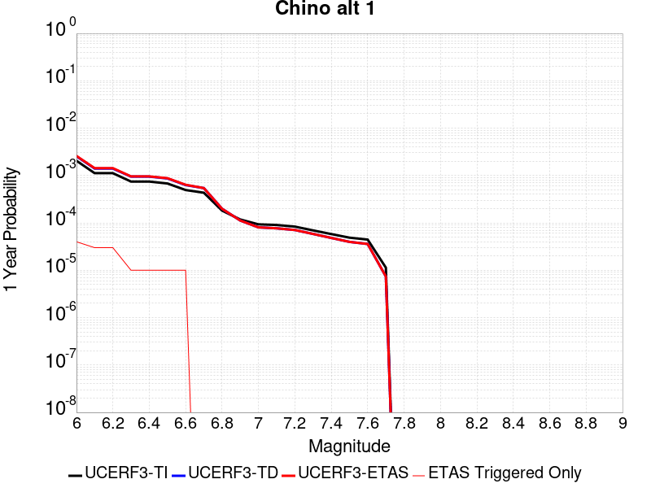 |  |

| Magnitude | 1 wk TI Prob | 1 wk TD Prob | 1 wk ETAS Prob | 1 wk ETAS/TD Gain | 1 wk ETAS Triggered Only | 1 mo TI Prob | 1 mo TD Prob | 1 mo ETAS Prob | 1 mo ETAS/TD Gain | 1 mo ETAS Triggered Only | 1 yr TI Prob | 1 yr TD Prob | 1 yr ETAS Prob | 1 yr ETAS/TD Gain | 1 yr ETAS Triggered Only | 10 yr TI Prob | 10 yr TD Prob | 10 yr ETAS Prob | 10 yr ETAS/TD Gain | 10 yr ETAS Triggered Only |
|-----|-----|-----|-----|-----|-----|-----|-----|-----|-----|-----|-----|-----|-----|-----|-----|-----|-----|-----|-----|-----|
| 6.0 | 3.939946E-5 | 4.8949914E-5 | 4.8949914E-5 | 1.0 | 0.0 | 1.6884391E-4 | 2.0977142E-4 | 2.0977142E-4 | 1.0 | 0.0 | 0.0020537362 | 0.0025514853 | 0.0025913832 | 1.0156372 | 4.0E-5 | 0.020348595 | 0.025280792 | 0.025339276 | 1.0023134 | 6.0E-5 |
| 6.1 | 2.1505624E-5 | 2.688007E-5 | 2.688007E-5 | 1.0 | 0.0 | 9.2163704E-5 | 1.1519585E-4 | 1.1519585E-4 | 1.0 | 0.0 | 0.0011215154 | 0.0014017166 | 0.0014316746 | 1.0213723 | 3.0E-5 | 0.011158722 | 0.013947706 | 0.013977287 | 1.0021209 | 3.0E-5 |
| 6.2 | 2.1505624E-5 | 2.688007E-5 | 2.688007E-5 | 1.0 | 0.0 | 9.2163704E-5 | 1.1519585E-4 | 1.1519585E-4 | 1.0 | 0.0 | 0.0011215154 | 0.0014017166 | 0.0014316746 | 1.0213723 | 3.0E-5 | 0.011158722 | 0.013947706 | 0.013977287 | 1.0021209 | 3.0E-5 |
| 6.3 | 1.4290785E-5 | 1.816584E-5 | 1.816584E-5 | 1.0 | 0.0 | 6.1244784E-5 | 7.785153E-5 | 7.785153E-5 | 1.0 | 0.0 | 7.454001E-4 | 9.4747543E-4 | 9.5746596E-4 | 1.0105444 | 1.0E-5 | 0.007429048 | 0.009446898 | 0.009456803 | 1.0010486 | 1.0E-5 |
| 6.4 | 1.4290785E-5 | 1.816584E-5 | 1.816584E-5 | 1.0 | 0.0 | 6.1244784E-5 | 7.785153E-5 | 7.785153E-5 | 1.0 | 0.0 | 7.454001E-4 | 9.4747543E-4 | 9.5746596E-4 | 1.0105444 | 1.0E-5 | 0.007429048 | 0.009446898 | 0.009456803 | 1.0010486 | 1.0E-5 |
| 6.5 | 1.3017944E-5 | 1.6652762E-5 | 1.6652762E-5 | 1.0 | 0.0 | 5.5789995E-5 | 7.136728E-5 | 7.136728E-5 | 1.0 | 0.0 | 6.790315E-4 | 8.685939E-4 | 8.785852E-4 | 1.0115029 | 1.0E-5 | 0.0067696036 | 0.008664371 | 0.008674284 | 1.0011442 | 1.0E-5 |
| 6.6 | 9.470016E-6 | 1.2039946E-5 | 1.2039946E-5 | 1.0 | 0.0 | 4.058515E-5 | 5.159894E-5 | 5.159894E-5 | 1.0 | 0.0 | 4.940122E-4 | 6.2807E-4 | 6.380637E-4 | 1.0159118 | 1.0E-5 | 0.004929154 | 0.006273371 | 0.0062833084 | 1.001584 | 1.0E-5 |
| 6.7 | 8.314155E-6 | 1.0408143E-5 | 1.0408143E-5 | 1.0 | 0.0 | 3.5631605E-5 | 4.4605746E-5 | 4.4605746E-5 | 1.0 | 0.0 | 4.3372845E-4 | 5.429719E-4 | 5.429719E-4 | 1.0 | 0.0 | 0.004328829 | 0.005427294 | 0.005427294 | 1.0 | 0.0 |
| 6.8 | 3.4856364E-6 | 3.8135686E-6 | 3.8135686E-6 | 1.0 | 0.0 | 1.4938357E-5 | 1.6343774E-5 | 1.6343774E-5 | 1.0 | 0.0 | 1.8185932E-4 | 1.9896936E-4 | 1.9896936E-4 | 1.0 | 0.0 | 0.0018171056 | 0.0019897262 | 0.0019897262 | 1.0 | 0.0 |
| 6.9 | 2.2645952E-6 | 2.153006E-6 | 2.153006E-6 | 1.0 | 0.0 | 9.705372E-6 | 9.2271375E-6 | 9.2271375E-6 | 1.0 | 0.0 | 1.18156495E-4 | 1.1233483E-4 | 1.1233483E-4 | 1.0 | 0.0 | 0.0011809369 | 0.0011235814 | 0.0011235814 | 1.0 | 0.0 |
| 7.0 | 1.7864003E-6 | 1.5431655E-6 | 1.5431655E-6 | 1.0 | 0.0 | 7.655979E-6 | 6.61355E-6 | 6.61355E-6 | 1.0 | 0.0 | 9.3207556E-5 | 8.051705E-5 | 8.051705E-5 | 1.0 | 0.0 | 9.316847E-4 | 8.0526597E-4 | 8.0526597E-4 | 1.0 | 0.0 |
| 7.1 | 1.7315456E-6 | 1.4734359E-6 | 1.4734359E-6 | 1.0 | 0.0 | 7.420889E-6 | 6.31471E-6 | 6.31471E-6 | 1.0 | 0.0 | 9.034557E-5 | 7.687894E-5 | 7.687894E-5 | 1.0 | 0.0 | 9.0308854E-4 | 7.689018E-4 | 7.689018E-4 | 1.0 | 0.0 |
| 7.2 | 1.6008337E-6 | 1.3574833E-6 | 1.3574833E-6 | 1.0 | 0.0 | 6.860698E-6 | 5.817773E-6 | 5.817773E-6 | 1.0 | 0.0 | 8.352579E-5 | 7.082913E-5 | 7.082913E-5 | 1.0 | 0.0 | 8.34944E-4 | 7.084325E-4 | 7.084325E-4 | 1.0 | 0.0 |
| 7.3 | 1.3320939E-6 | 1.1218311E-6 | 1.1218311E-6 | 1.0 | 0.0 | 5.7089615E-6 | 4.807839E-6 | 4.807839E-6 | 1.0 | 0.0 | 6.9504385E-5 | 5.8533915E-5 | 5.8533915E-5 | 1.0 | 0.0 | 6.9482654E-4 | 5.8530783E-4 | 5.8530783E-4 | 1.0 | 0.0 |
| 7.4 | 1.114294E-6 | 9.2374944E-7 | 9.2374944E-7 | 1.0 | 0.0 | 4.775537E-6 | 3.9589204E-6 | 3.9589204E-6 | 1.0 | 0.0 | 5.8140613E-5 | 4.8198825E-5 | 4.8198825E-5 | 1.0 | 0.0 | 5.81254E-4 | 4.8189829E-4 | 4.8189829E-4 | 1.0 | 0.0 |
| 7.5 | 9.354081E-7 | 7.623722E-7 | 7.623722E-7 | 1.0 | 0.0 | 4.0088858E-6 | 3.2673056E-6 | 3.2673056E-6 | 1.0 | 0.0 | 4.8807087E-5 | 3.9778755E-5 | 3.9778755E-5 | 1.0 | 0.0 | 4.879637E-4 | 3.9771973E-4 | 3.9771973E-4 | 1.0 | 0.0 |
| 7.6 | 8.521771E-7 | 6.880951E-7 | 6.880951E-7 | 1.0 | 0.0 | 3.6521824E-6 | 2.9489759E-6 | 2.9489759E-6 | 1.0 | 0.0 | 4.4464414E-5 | 3.590322E-5 | 3.590322E-5 | 1.0 | 0.0 | 4.4455516E-4 | 3.5897738E-4 | 3.5897738E-4 | 1.0 | 0.0 |
| 7.7 | 2.1803626E-7 | 1.418694E-7 | 1.418694E-7 | 1.0 | 0.0 | 9.344408E-7 | 6.0801165E-7 | 6.0801165E-7 | 1.0 | 0.0 | 1.1376757E-5 | 7.4025265E-6 | 7.4025265E-6 | 1.0 | 0.0 | 1.13761744E-4 | 7.402376E-5 | 7.402376E-5 | 1.0 | 0.0 |

## Rose Canyon
*[(top)](#table-of-contents)*

| 1 Week | 1 Month | 1 Year | 10 Year |
|-----|-----|-----|-----|
| 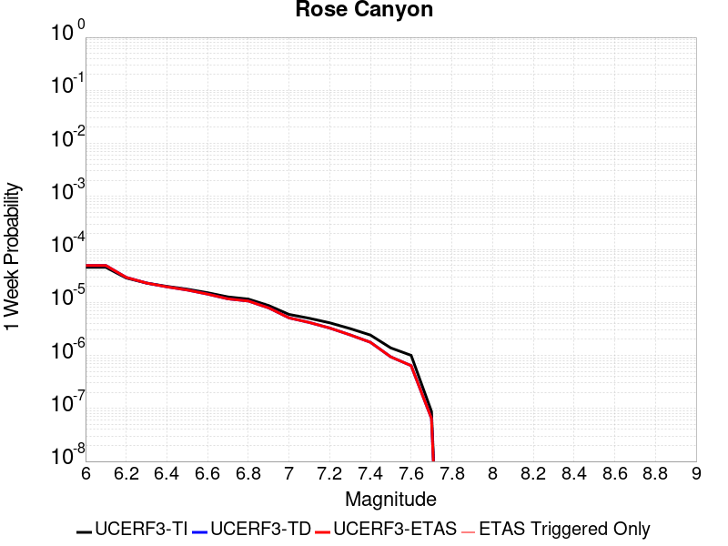 |  |  | 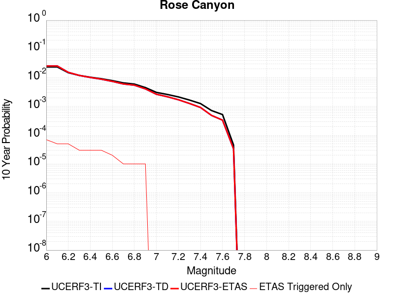 |

| Magnitude | 1 wk TI Prob | 1 wk TD Prob | 1 wk ETAS Prob | 1 wk ETAS/TD Gain | 1 wk ETAS Triggered Only | 1 mo TI Prob | 1 mo TD Prob | 1 mo ETAS Prob | 1 mo ETAS/TD Gain | 1 mo ETAS Triggered Only | 1 yr TI Prob | 1 yr TD Prob | 1 yr ETAS Prob | 1 yr ETAS/TD Gain | 1 yr ETAS Triggered Only | 10 yr TI Prob | 10 yr TD Prob | 10 yr ETAS Prob | 10 yr ETAS/TD Gain | 10 yr ETAS Triggered Only |
|-----|-----|-----|-----|-----|-----|-----|-----|-----|-----|-----|-----|-----|-----|-----|-----|-----|-----|-----|-----|-----|
| 6.0 | 4.5923203E-5 | 4.9717553E-5 | 4.9717553E-5 | 1.0 | 0.0 | 1.9679888E-4 | 2.1305913E-4 | 2.1305913E-4 | 1.0 | 0.0 | 0.0023933933 | 0.0025910994 | 0.0026010734 | 1.0038494 | 1.0E-5 | 0.023677798 | 0.025618313 | 0.025686521 | 1.0026624 | 7.0E-5 |
| 6.1 | 4.5923203E-5 | 4.9717553E-5 | 4.9717553E-5 | 1.0 | 0.0 | 1.9679888E-4 | 2.1305913E-4 | 2.1305913E-4 | 1.0 | 0.0 | 0.0023933933 | 0.0025910994 | 0.0025910994 | 1.0 | 0.0 | 0.023677798 | 0.025618313 | 0.025667032 | 1.0019017 | 5.0E-5 |
| 6.2 | 2.8844734E-5 | 2.9670837E-5 | 2.9670837E-5 | 1.0 | 0.0 | 1.2361443E-4 | 1.2715468E-4 | 1.2715468E-4 | 1.0 | 0.0 | 0.0015039665 | 0.0015470362 | 0.0015470362 | 1.0 | 0.0 | 0.0149382865 | 0.015357477 | 0.015406708 | 1.0032058 | 5.0E-5 |
| 6.3 | 2.3171577E-5 | 2.3163399E-5 | 2.3163399E-5 | 1.0 | 0.0 | 9.9302975E-5 | 9.9268E-5 | 9.9268E-5 | 1.0 | 0.0 | 0.0012083431 | 0.0012079312 | 0.0012079312 | 1.0 | 0.0 | 0.012017938 | 0.012004637 | 0.012034277 | 1.0024691 | 3.0E-5 |
| 6.4 | 2.0066604E-5 | 1.966902E-5 | 1.966902E-5 | 1.0 | 0.0 | 8.599689E-5 | 8.429313E-5 | 8.429313E-5 | 1.0 | 0.0 | 0.0010465092 | 0.0010257957 | 0.0010257957 | 1.0 | 0.0 | 0.010415946 | 0.010203916 | 0.01023361 | 1.00291 | 3.0E-5 |
| 6.5 | 1.776989E-5 | 1.7115479E-5 | 1.7115479E-5 | 1.0 | 0.0 | 7.615444E-5 | 7.3350035E-5 | 7.3350035E-5 | 1.0 | 0.0 | 9.267859E-4 | 8.926777E-4 | 8.926777E-4 | 1.0 | 0.0 | 0.009229303 | 0.008879829 | 0.008909563 | 1.0033485 | 3.0E-5 |
| 6.6 | 1.5227364E-5 | 1.4340938E-5 | 1.4340938E-5 | 1.0 | 0.0 | 6.52585E-5 | 6.1459745E-5 | 6.1459745E-5 | 1.0 | 0.0 | 7.942326E-4 | 7.480207E-4 | 7.480207E-4 | 1.0 | 0.0 | 0.007914 | 0.00744577 | 0.007465621 | 1.0026661 | 2.0E-5 |
| 6.7 | 1.2703898E-5 | 1.167434E-5 | 1.167434E-5 | 1.0 | 0.0 | 5.4444143E-5 | 5.0031955E-5 | 5.0031955E-5 | 1.0 | 0.0 | 6.626558E-4 | 6.0897303E-4 | 6.0897303E-4 | 1.0 | 0.0 | 0.006606833 | 0.00606576 | 0.0060756993 | 1.0016387 | 1.0E-5 |
| 6.8 | 1.1554917E-5 | 1.0610447E-5 | 1.0610447E-5 | 1.0 | 0.0 | 4.9520135E-5 | 4.5472574E-5 | 4.5472574E-5 | 1.0 | 0.0 | 6.0274085E-4 | 5.53492E-4 | 5.53492E-4 | 1.0 | 0.0 | 0.0060110865 | 0.005507283 | 0.005517228 | 1.0018058 | 1.0E-5 |
| 6.9 | 8.732078E-6 | 7.882343E-6 | 7.882343E-6 | 1.0 | 0.0 | 3.7422655E-5 | 3.378105E-5 | 3.378105E-5 | 1.0 | 0.0 | 4.5552556E-4 | 4.112096E-4 | 4.112096E-4 | 1.0 | 0.0 | 0.0045459294 | 0.004089545 | 0.004099504 | 1.0024352 | 1.0E-5 |
| 7.0 | 5.9337494E-6 | 5.1074826E-6 | 5.1074826E-6 | 1.0 | 0.0 | 2.5430107E-5 | 2.1889029E-5 | 2.1889029E-5 | 1.0 | 0.0 | 3.0956755E-4 | 2.6646646E-4 | 2.6646646E-4 | 1.0 | 0.0 | 0.0030913667 | 0.0026614852 | 0.0026614852 | 1.0 | 0.0 |
| 7.1 | 5.013409E-6 | 4.177376E-6 | 4.177376E-6 | 1.0 | 0.0 | 2.1485863E-5 | 1.7902918E-5 | 1.7902918E-5 | 1.0 | 0.0 | 2.6155898E-4 | 2.1794632E-4 | 2.1794632E-4 | 1.0 | 0.0 | 0.0026125133 | 0.0021773374 | 0.0021773374 | 1.0 | 0.0 |
| 7.2 | 4.120763E-6 | 3.2821204E-6 | 3.2821204E-6 | 1.0 | 0.0 | 1.7660293E-5 | 1.4066155E-5 | 1.4066155E-5 | 1.0 | 0.0 | 2.1499286E-4 | 1.7124206E-4 | 1.7124206E-4 | 1.0 | 0.0 | 0.0021478499 | 0.0017111107 | 0.0017111107 | 1.0 | 0.0 |
| 7.3 | 3.2081239E-6 | 2.440515E-6 | 2.440515E-6 | 1.0 | 0.0 | 1.374903E-5 | 1.0459307E-5 | 1.0459307E-5 | 1.0 | 0.0 | 1.6738157E-4 | 1.273347E-4 | 1.273347E-4 | 1.0 | 0.0 | 0.0016725556 | 0.0012726244 | 0.0012726244 | 1.0 | 0.0 |
| 7.4 | 2.4194755E-6 | 1.7680458E-6 | 1.7680458E-6 | 1.0 | 0.0 | 1.0369139E-5 | 7.5773173E-6 | 7.5773173E-6 | 1.0 | 0.0 | 1.2623696E-4 | 9.224998E-5 | 9.224998E-5 | 1.0 | 0.0 | 0.0012616527 | 9.221223E-4 | 9.221223E-4 | 1.0 | 0.0 |
| 7.5 | 1.3842889E-6 | 9.378391E-7 | 9.378391E-7 | 1.0 | 0.0 | 5.9326535E-6 | 4.0193045E-6 | 4.0193045E-6 | 1.0 | 0.0 | 7.222766E-5 | 4.893397E-5 | 4.893397E-5 | 1.0 | 0.0 | 7.220419E-4 | 4.8923545E-4 | 4.8923545E-4 | 1.0 | 0.0 |
| 7.6 | 1.0021575E-6 | 6.4114187E-7 | 6.4114187E-7 | 1.0 | 0.0 | 4.2949537E-6 | 2.7477479E-6 | 2.7477479E-6 | 1.0 | 0.0 | 5.2289808E-5 | 3.345334E-5 | 3.345334E-5 | 1.0 | 0.0 | 5.2277505E-4 | 3.3448517E-4 | 3.3448517E-4 | 1.0 | 0.0 |
| 7.7 | 8.7620116E-8 | 6.449342E-8 | 6.449342E-8 | 1.0 | 0.0 | 3.7551473E-7 | 2.7640036E-7 | 2.7640036E-7 | 1.0 | 0.0 | 4.5718825E-6 | 3.3651693E-6 | 3.3651693E-6 | 1.0 | 0.0 | 4.5717883E-5 | 3.3651213E-5 | 3.3651213E-5 | 1.0 | 0.0 |

## Pleito
*[(top)](#table-of-contents)*

| 1 Week | 1 Month | 1 Year | 10 Year |
|-----|-----|-----|-----|
|  | 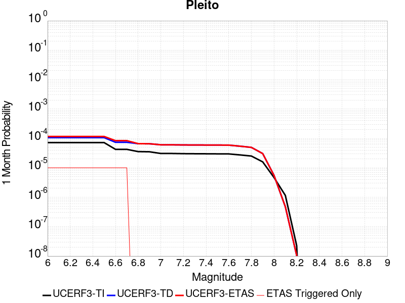 |  |  |

| Magnitude | 1 wk TI Prob | 1 wk TD Prob | 1 wk ETAS Prob | 1 wk ETAS/TD Gain | 1 wk ETAS Triggered Only | 1 mo TI Prob | 1 mo TD Prob | 1 mo ETAS Prob | 1 mo ETAS/TD Gain | 1 mo ETAS Triggered Only | 1 yr TI Prob | 1 yr TD Prob | 1 yr ETAS Prob | 1 yr ETAS/TD Gain | 1 yr ETAS Triggered Only | 10 yr TI Prob | 10 yr TD Prob | 10 yr ETAS Prob | 10 yr ETAS/TD Gain | 10 yr ETAS Triggered Only |
|-----|-----|-----|-----|-----|-----|-----|-----|-----|-----|-----|-----|-----|-----|-----|-----|-----|-----|-----|-----|-----|
| 6.0 | 1.6763008E-5 | 2.4771325E-5 | 2.4771325E-5 | 1.0 | 0.0 | 7.183948E-5 | 1.0615891E-4 | 1.1615785E-4 | 1.0941885 | 1.0E-5 | 8.742947E-4 | 0.0012917904 | 0.0013117646 | 1.0154624 | 2.0E-5 | 0.00870863 | 0.01295784 | 0.013026933 | 1.0053321 | 7.0E-5 |
| 6.1 | 1.6763008E-5 | 2.4771325E-5 | 2.4771325E-5 | 1.0 | 0.0 | 7.183948E-5 | 1.0615891E-4 | 1.1615785E-4 | 1.0941885 | 1.0E-5 | 8.742947E-4 | 0.0012917904 | 0.0013117646 | 1.0154624 | 2.0E-5 | 0.00870863 | 0.01295784 | 0.013026933 | 1.0053321 | 7.0E-5 |
| 6.2 | 1.6763008E-5 | 2.4771325E-5 | 2.4771325E-5 | 1.0 | 0.0 | 7.183948E-5 | 1.0615891E-4 | 1.1615785E-4 | 1.0941885 | 1.0E-5 | 8.742947E-4 | 0.0012917904 | 0.0013117646 | 1.0154624 | 2.0E-5 | 0.00870863 | 0.01295784 | 0.013026933 | 1.0053321 | 7.0E-5 |
| 6.3 | 1.6763008E-5 | 2.4771325E-5 | 2.4771325E-5 | 1.0 | 0.0 | 7.183948E-5 | 1.0615891E-4 | 1.1615785E-4 | 1.0941885 | 1.0E-5 | 8.742947E-4 | 0.0012917904 | 0.0013117646 | 1.0154624 | 2.0E-5 | 0.00870863 | 0.01295784 | 0.013026933 | 1.0053321 | 7.0E-5 |
| 6.4 | 1.6763008E-5 | 2.4771325E-5 | 2.4771325E-5 | 1.0 | 0.0 | 7.183948E-5 | 1.0615891E-4 | 1.1615785E-4 | 1.0941885 | 1.0E-5 | 8.742947E-4 | 0.0012917904 | 0.0013117646 | 1.0154624 | 2.0E-5 | 0.00870863 | 0.01295784 | 0.013026933 | 1.0053321 | 7.0E-5 |
| 6.5 | 1.6763008E-5 | 2.4771325E-5 | 2.4771325E-5 | 1.0 | 0.0 | 7.183948E-5 | 1.0615891E-4 | 1.1615785E-4 | 1.0941885 | 1.0E-5 | 8.742947E-4 | 0.0012917904 | 0.0013117646 | 1.0154624 | 2.0E-5 | 0.00870863 | 0.01295784 | 0.013026933 | 1.0053321 | 7.0E-5 |
| 6.6 | 9.910213E-6 | 1.7222008E-5 | 1.7222008E-5 | 1.0 | 0.0 | 4.247165E-5 | 7.380654E-5 | 8.3805804E-5 | 1.1354793 | 1.0E-5 | 5.169696E-4 | 8.982279E-4 | 9.182099E-4 | 1.0222461 | 2.0E-5 | 0.0051576863 | 0.009054615 | 0.009094252 | 1.0043776 | 4.0E-5 |
| 6.7 | 9.910213E-6 | 1.7222008E-5 | 1.7222008E-5 | 1.0 | 0.0 | 4.247165E-5 | 7.380654E-5 | 8.3805804E-5 | 1.1354793 | 1.0E-5 | 5.169696E-4 | 8.982279E-4 | 9.182099E-4 | 1.0222461 | 2.0E-5 | 0.0051576863 | 0.009054615 | 0.009094252 | 1.0043776 | 4.0E-5 |
| 6.8 | 8.300162E-6 | 1.5481599E-5 | 1.5481599E-5 | 1.0 | 0.0 | 3.557164E-5 | 6.634803E-5 | 6.634803E-5 | 1.0 | 0.0 | 4.3299864E-4 | 8.074893E-4 | 8.074893E-4 | 1.0 | 0.0 | 0.004321559 | 0.008154046 | 0.008163964 | 1.0012164 | 1.0E-5 |
| 6.9 | 8.183114E-6 | 1.535281E-5 | 1.535281E-5 | 1.0 | 0.0 | 3.5070017E-5 | 6.5796106E-5 | 6.5796106E-5 | 1.0 | 0.0 | 4.2689382E-4 | 8.007746E-4 | 8.007746E-4 | 1.0 | 0.0 | 0.0042607468 | 0.008087389 | 0.008097308 | 1.0012265 | 1.0E-5 |
| 7.0 | 7.1748823E-6 | 1.41397095E-5 | 1.41397095E-5 | 1.0 | 0.0 | 3.0749135E-5 | 6.059735E-5 | 6.059735E-5 | 1.0 | 0.0 | 3.743064E-4 | 7.3752354E-4 | 7.3752354E-4 | 1.0 | 0.0 | 0.0037367654 | 0.0074588493 | 0.007468775 | 1.0013307 | 1.0E-5 |
| 7.1 | 7.1671807E-6 | 1.4130079E-5 | 1.4130079E-5 | 1.0 | 0.0 | 3.0716128E-5 | 6.0556078E-5 | 6.0556078E-5 | 1.0 | 0.0 | 3.7390468E-4 | 7.370214E-4 | 7.370214E-4 | 1.0 | 0.0 | 0.0037327618 | 0.0074538616 | 0.007463787 | 1.0013316 | 1.0E-5 |
| 7.2 | 7.0649667E-6 | 1.3977344E-5 | 1.3977344E-5 | 1.0 | 0.0 | 3.0278077E-5 | 5.990153E-5 | 5.990153E-5 | 1.0 | 0.0 | 3.6857324E-4 | 7.290576E-4 | 7.290576E-4 | 1.0 | 0.0 | 0.0036796255 | 0.007374603 | 0.007384529 | 1.001346 | 1.0E-5 |
| 7.3 | 7.02082E-6 | 1.3920784E-5 | 1.3920784E-5 | 1.0 | 0.0 | 3.008888E-5 | 5.965914E-5 | 5.965914E-5 | 1.0 | 0.0 | 3.6627054E-4 | 7.261085E-4 | 7.261085E-4 | 1.0 | 0.0 | 0.0036566744 | 0.007345096 | 0.0073550227 | 1.0013515 | 1.0E-5 |
| 7.4 | 6.987146E-6 | 1.3880338E-5 | 1.3880338E-5 | 1.0 | 0.0 | 2.9944567E-5 | 5.948581E-5 | 5.948581E-5 | 1.0 | 0.0 | 3.6451413E-4 | 7.239996E-4 | 7.239996E-4 | 1.0 | 0.0 | 0.0036391679 | 0.0073240283 | 0.007333955 | 1.0013554 | 1.0E-5 |
| 7.5 | 6.9494554E-6 | 1.3837237E-5 | 1.3837237E-5 | 1.0 | 0.0 | 2.9783041E-5 | 5.93011E-5 | 5.93011E-5 | 1.0 | 0.0 | 3.625482E-4 | 7.2175224E-4 | 7.2175224E-4 | 1.0 | 0.0 | 0.0036195726 | 0.0073016533 | 0.0073115802 | 1.0013596 | 1.0E-5 |
| 7.6 | 6.92694E-6 | 1.3796339E-5 | 1.3796339E-5 | 1.0 | 0.0 | 2.9686547E-5 | 5.9125832E-5 | 5.9125832E-5 | 1.0 | 0.0 | 3.6137376E-4 | 7.1961974E-4 | 7.1961974E-4 | 1.0 | 0.0 | 0.0036078666 | 0.0072804 | 0.007290327 | 1.0013635 | 1.0E-5 |
| 7.7 | 6.395867E-6 | 1.2675077E-5 | 1.2675077E-5 | 1.0 | 0.0 | 2.741057E-5 | 5.4320633E-5 | 5.4320633E-5 | 1.0 | 0.0 | 3.336726E-4 | 6.6115335E-4 | 6.6115335E-4 | 1.0 | 0.0 | 0.0033317201 | 0.0066988943 | 0.0067088273 | 1.0014827 | 1.0E-5 |
| 7.8 | 5.8664327E-6 | 1.15421135E-5 | 1.15421135E-5 | 1.0 | 0.0 | 2.5141611E-5 | 4.9465263E-5 | 4.9465263E-5 | 1.0 | 0.0 | 3.060561E-4 | 6.020734E-4 | 6.020734E-4 | 1.0 | 0.0 | 0.0030563495 | 0.0061040027 | 0.0061139413 | 1.0016283 | 1.0E-5 |
| 7.9 | 3.7167474E-6 | 7.117878E-6 | 7.117878E-6 | 1.0 | 0.0 | 1.592882E-5 | 3.0504834E-5 | 3.0504834E-5 | 1.0 | 0.0 | 1.9391612E-4 | 3.713332E-4 | 3.713332E-4 | 1.0 | 0.0 | 0.0019374699 | 0.0037694757 | 0.0037694757 | 1.0 | 0.0 |
| 8.0 | 1.0903841E-6 | 1.2886559E-6 | 1.2886559E-6 | 1.0 | 0.0 | 4.6730665E-6 | 5.5227993E-6 | 5.5227993E-6 | 1.0 | 0.0 | 5.68931E-5 | 6.723802E-5 | 6.723802E-5 | 1.0 | 0.0 | 5.6878536E-4 | 6.9462E-4 | 6.9462E-4 | 1.0 | 0.0 |
| 8.1 | 2.6894583E-7 | 1.106846E-7 | 1.106846E-7 | 1.0 | 0.0 | 1.1526245E-6 | 4.7436248E-7 | 4.7436248E-7 | 1.0 | 0.0 | 1.4033113E-5 | 5.775348E-6 | 5.775348E-6 | 1.0 | 0.0 | 1.4032227E-4 | 6.461821E-5 | 6.461821E-5 | 1.0 | 0.0 |
| 8.2 | 5.2967013E-9 | 2.4599007E-9 | 2.4599007E-9 | 1.0 | 0.0 | 2.2700148E-8 | 1.0542432E-8 | 1.0542432E-8 | 1.0 | 0.0 | 2.7637427E-7 | 1.283541E-7 | 1.283541E-7 | 1.0 | 0.0 | 2.7637393E-6 | 1.4601666E-6 | 1.4601666E-6 | 1.0 | 0.0 |

## Ludlow
*[(top)](#table-of-contents)*

| 1 Week | 1 Month | 1 Year | 10 Year |
|-----|-----|-----|-----|
|  | 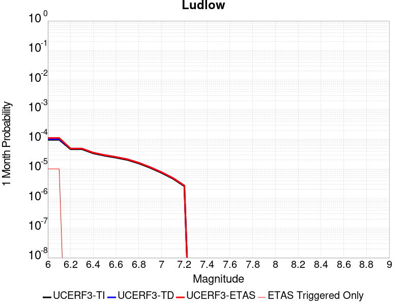 |  |  |

| Magnitude | 1 wk TI Prob | 1 wk TD Prob | 1 wk ETAS Prob | 1 wk ETAS/TD Gain | 1 wk ETAS Triggered Only | 1 mo TI Prob | 1 mo TD Prob | 1 mo ETAS Prob | 1 mo ETAS/TD Gain | 1 mo ETAS Triggered Only | 1 yr TI Prob | 1 yr TD Prob | 1 yr ETAS Prob | 1 yr ETAS/TD Gain | 1 yr ETAS Triggered Only | 10 yr TI Prob | 10 yr TD Prob | 10 yr ETAS Prob | 10 yr ETAS/TD Gain | 10 yr ETAS Triggered Only |
|-----|-----|-----|-----|-----|-----|-----|-----|-----|-----|-----|-----|-----|-----|-----|-----|-----|-----|-----|-----|-----|
| 6.0 | 2.2407607E-5 | 2.3657429E-5 | 2.3657429E-5 | 1.0 | 0.0 | 9.602906E-5 | 1.0138529E-4 | 1.1138427E-4 | 1.0986236 | 1.0E-5 | 0.0011685267 | 0.001233711 | 0.0012536864 | 1.0161912 | 2.0E-5 | 0.011624013 | 0.012273132 | 0.012342273 | 1.0056335 | 7.0E-5 |
| 6.1 | 2.2407607E-5 | 2.3657429E-5 | 2.3657429E-5 | 1.0 | 0.0 | 9.602906E-5 | 1.0138529E-4 | 1.1138427E-4 | 1.0986236 | 1.0E-5 | 0.0011685267 | 0.001233711 | 0.0012536864 | 1.0161912 | 2.0E-5 | 0.011624013 | 0.012273132 | 0.012342273 | 1.0056335 | 7.0E-5 |
| 6.2 | 1.0781252E-5 | 1.1365745E-5 | 1.1365745E-5 | 1.0 | 0.0 | 4.620455E-5 | 4.870945E-5 | 4.870945E-5 | 1.0 | 0.0 | 5.623952E-4 | 5.9288024E-4 | 6.028743E-4 | 1.0168568 | 1.0E-5 | 0.00560974 | 0.005913404 | 0.005933285 | 1.0033622 | 2.0E-5 |
| 6.3 | 1.0781252E-5 | 1.1365745E-5 | 1.1365745E-5 | 1.0 | 0.0 | 4.620455E-5 | 4.870945E-5 | 4.870945E-5 | 1.0 | 0.0 | 5.623952E-4 | 5.9288024E-4 | 6.028743E-4 | 1.0168568 | 1.0E-5 | 0.00560974 | 0.005913404 | 0.005933285 | 1.0033622 | 2.0E-5 |
| 6.4 | 7.814439E-6 | 8.237788E-6 | 8.237788E-6 | 1.0 | 0.0 | 3.3490025E-5 | 3.5304336E-5 | 3.5304336E-5 | 1.0 | 0.0 | 4.0766477E-4 | 4.2974693E-4 | 4.397426E-4 | 1.0232595 | 1.0E-5 | 0.0040691774 | 0.0042893053 | 0.0043092193 | 1.0046427 | 2.0E-5 |
| 6.5 | 6.4986366E-6 | 6.850969E-6 | 6.850969E-6 | 1.0 | 0.0 | 2.7851002E-5 | 2.936097E-5 | 2.936097E-5 | 1.0 | 0.0 | 3.390332E-4 | 3.574121E-4 | 3.6740853E-4 | 1.0279689 | 1.0E-5 | 0.003385164 | 0.0035684688 | 0.0035784333 | 1.0027924 | 1.0E-5 |
| 6.6 | 5.582177E-6 | 5.8860483E-6 | 5.8860483E-6 | 1.0 | 0.0 | 2.3923398E-5 | 2.522568E-5 | 2.522568E-5 | 1.0 | 0.0 | 2.9122844E-4 | 3.070801E-4 | 3.17077E-4 | 1.0325547 | 1.0E-5 | 0.0029084706 | 0.003066631 | 0.0030766004 | 1.003251 | 1.0E-5 |
| 6.7 | 4.6858763E-6 | 4.940463E-6 | 4.940463E-6 | 1.0 | 0.0 | 2.0082172E-5 | 2.1173244E-5 | 2.1173244E-5 | 1.0 | 0.0 | 2.4447302E-4 | 2.577543E-4 | 2.6775172E-4 | 1.0387866 | 1.0E-5 | 0.0024420423 | 0.0025746098 | 0.002584584 | 1.0038741 | 1.0E-5 |
| 6.8 | 3.5584908E-6 | 3.7520454E-6 | 3.7520454E-6 | 1.0 | 0.0 | 1.5250586E-5 | 1.6080097E-5 | 1.6080097E-5 | 1.0 | 0.0 | 1.8566006E-4 | 1.9575801E-4 | 2.0575605E-4 | 1.0510734 | 1.0E-5 | 0.0018550502 | 0.0019558968 | 0.0019658771 | 1.0051028 | 1.0E-5 |
| 6.9 | 2.532834E-6 | 2.6710227E-6 | 2.6710227E-6 | 1.0 | 0.0 | 1.0854958E-5 | 1.1447192E-5 | 1.1447192E-5 | 1.0 | 0.0 | 1.3215111E-4 | 1.3936093E-4 | 1.4935953E-4 | 1.0717461 | 1.0E-5 | 0.0013207254 | 0.0013927629 | 0.001402749 | 1.00717 | 1.0E-5 |
| 7.0 | 1.7083285E-6 | 1.801957E-6 | 1.801957E-6 | 1.0 | 0.0 | 7.3213873E-6 | 7.7226505E-6 | 7.7226505E-6 | 1.0 | 0.0 | 8.913424E-5 | 9.4019386E-5 | 9.4019386E-5 | 1.0 | 0.0 | 8.9098496E-4 | 9.3981257E-4 | 9.3981257E-4 | 1.0 | 0.0 |
| 7.1 | 1.0905424E-6 | 1.1497702E-6 | 1.1497702E-6 | 1.0 | 0.0 | 4.6737446E-6 | 4.927578E-6 | 4.927578E-6 | 1.0 | 0.0 | 5.6901354E-5 | 5.999171E-5 | 5.999171E-5 | 1.0 | 0.0 | 5.6886784E-4 | 5.997649E-4 | 5.997649E-4 | 1.0 | 0.0 |
| 7.2 | 6.06668E-7 | 6.387322E-7 | 6.387322E-7 | 1.0 | 0.0 | 2.600003E-6 | 2.7374213E-6 | 2.7374213E-6 | 1.0 | 0.0 | 3.1654577E-5 | 3.3327666E-5 | 3.3327666E-5 | 1.0 | 0.0 | 3.1650066E-4 | 3.332335E-4 | 3.332335E-4 | 1.0 | 0.0 |

## Imperial
*[(top)](#table-of-contents)*

| 1 Week | 1 Month | 1 Year | 10 Year |
|-----|-----|-----|-----|
|  |  |  |  |

| Magnitude | 1 wk TI Prob | 1 wk TD Prob | 1 wk ETAS Prob | 1 wk ETAS/TD Gain | 1 wk ETAS Triggered Only | 1 mo TI Prob | 1 mo TD Prob | 1 mo ETAS Prob | 1 mo ETAS/TD Gain | 1 mo ETAS Triggered Only | 1 yr TI Prob | 1 yr TD Prob | 1 yr ETAS Prob | 1 yr ETAS/TD Gain | 1 yr ETAS Triggered Only | 10 yr TI Prob | 10 yr TD Prob | 10 yr ETAS Prob | 10 yr ETAS/TD Gain | 10 yr ETAS Triggered Only |
|-----|-----|-----|-----|-----|-----|-----|-----|-----|-----|-----|-----|-----|-----|-----|-----|-----|-----|-----|-----|-----|
| 6.0 | 2.7496446E-4 | 5.0567614E-4 | 5.0567614E-4 | 1.0 | 0.0 | 0.0011778869 | 0.0021654228 | 0.0021654228 | 1.0 | 0.0 | 0.0142467655 | 0.02603894 | 0.026058419 | 1.000748 | 2.0E-5 | 0.13367249 | 0.22807938 | 0.22813341 | 1.0002369 | 7.0E-5 |
| 6.1 | 2.5356023E-4 | 4.8670304E-4 | 4.8670304E-4 | 1.0 | 0.0 | 0.001086234 | 0.002084241 | 0.002084241 | 1.0 | 0.0 | 0.013144928 | 0.025080038 | 0.025099536 | 1.0007775 | 2.0E-5 | 0.123940155 | 0.21950823 | 0.21956286 | 1.0002489 | 7.0E-5 |
| 6.2 | 2.4820742E-4 | 4.776551E-4 | 4.776551E-4 | 1.0 | 0.0 | 0.0010633124 | 0.0020455252 | 0.0020455252 | 1.0 | 0.0 | 0.01286919 | 0.024619855 | 0.024639362 | 1.0007924 | 2.0E-5 | 0.12148927 | 0.21601348 | 0.21606052 | 1.0002178 | 6.0E-5 |
| 6.3 | 2.3205351E-4 | 4.590242E-4 | 4.590242E-4 | 1.0 | 0.0 | 9.94136E-4 | 0.0019658 | 0.0019658 | 1.0 | 0.0 | 0.012036599 | 0.023666015 | 0.023685541 | 1.000825 | 2.0E-5 | 0.11405133 | 0.20796531 | 0.20801283 | 1.0002285 | 6.0E-5 |
| 6.4 | 2.0304754E-4 | 3.988816E-4 | 3.988816E-4 | 1.0 | 0.0 | 8.6991355E-4 | 0.001708387 | 0.001708387 | 1.0 | 0.0 | 0.010539869 | 0.02060005 | 0.020619638 | 1.0009508 | 2.0E-5 | 0.100537635 | 0.185097 | 0.18514588 | 1.0002642 | 6.0E-5 |
| 6.5 | 1.854992E-4 | 3.6999586E-4 | 3.6999586E-4 | 1.0 | 0.0 | 7.9475436E-4 | 0.0015847452 | 0.0015847452 | 1.0 | 0.0 | 0.009633281 | 0.019126106 | 0.019145723 | 1.0010257 | 2.0E-5 | 0.0922623 | 0.17332682 | 0.17336814 | 1.0002384 | 5.0E-5 |
| 6.6 | 1.6586106E-4 | 3.4044893E-4 | 3.4044893E-4 | 1.0 | 0.0 | 7.106394E-4 | 0.001458261 | 0.001458261 | 1.0 | 0.0 | 0.008617763 | 0.017607149 | 0.017626796 | 1.0011159 | 2.0E-5 | 0.08291132 | 0.16080214 | 0.1608441 | 1.000261 | 5.0E-5 |
| 6.7 | 1.4224656E-4 | 3.0775566E-4 | 3.0775566E-4 | 1.0 | 0.0 | 6.094856E-4 | 0.0013182943 | 0.0013182943 | 1.0 | 0.0 | 0.0073952693 | 0.015934104 | 0.015953785 | 1.0012351 | 2.0E-5 | 0.07153955 | 0.146514 | 0.14654814 | 1.000233 | 4.0E-5 |
| 6.8 | 1.2317259E-4 | 2.7798547E-4 | 2.7798547E-4 | 1.0 | 0.0 | 5.2777573E-4 | 0.0011908285 | 0.0011908285 | 1.0 | 0.0 | 0.0064067547 | 0.01440334 | 0.014413197 | 1.0006843 | 1.0E-5 | 0.06225166 | 0.13296336 | 0.13298938 | 1.0001956 | 3.0E-5 |
| 6.9 | 9.859898E-5 | 2.5019908E-4 | 2.5019908E-4 | 1.0 | 0.0 | 4.2249862E-4 | 0.0010718454 | 0.0010718454 | 1.0 | 0.0 | 0.0051317946 | 0.012972599 | 0.012982469 | 1.0007609 | 1.0E-5 | 0.05014893 | 0.119427115 | 0.11945353 | 1.0002213 | 3.0E-5 |
| 7.0 | 7.3191884E-5 | 2.1271173E-4 | 2.1271173E-4 | 1.0 | 0.0 | 3.136418E-4 | 9.113064E-4 | 9.113064E-4 | 1.0 | 0.0 | 0.003811904 | 0.011039398 | 0.011049286 | 1.0008959 | 1.0E-5 | 0.037471764 | 0.10207956 | 0.1021065 | 1.0002639 | 3.0E-5 |
| 7.1 | 7.1760296E-5 | 2.0972485E-4 | 2.0972485E-4 | 1.0 | 0.0 | 3.0750787E-4 | 8.9851435E-4 | 8.9851435E-4 | 1.0 | 0.0 | 0.003737482 | 0.01088522 | 0.010895112 | 1.0009087 | 1.0E-5 | 0.03675245 | 0.1007159 | 0.10074288 | 1.0002679 | 3.0E-5 |
| 7.2 | 6.46614E-5 | 1.9140878E-4 | 1.9140878E-4 | 1.0 | 0.0 | 2.7709085E-4 | 8.2006847E-4 | 8.2006847E-4 | 1.0 | 0.0 | 0.0033683628 | 0.009939248 | 0.009939248 | 1.0 | 0.0 | 0.033177625 | 0.092523254 | 0.092541404 | 1.0001962 | 2.0E-5 |
| 7.3 | 6.088115E-5 | 1.781241E-4 | 1.781241E-4 | 1.0 | 0.0 | 2.6089314E-4 | 7.631685E-4 | 7.631685E-4 | 1.0 | 0.0 | 0.0031717476 | 0.009252568 | 0.009252568 | 1.0 | 0.0 | 0.031268585 | 0.08657277 | 0.086591035 | 1.000211 | 2.0E-5 |
| 7.4 | 4.199346E-5 | 1.1513443E-4 | 1.1513443E-4 | 1.0 | 0.0 | 1.7995955E-4 | 4.9334083E-4 | 4.9334083E-4 | 1.0 | 0.0 | 0.0021888057 | 0.005990052 | 0.005990052 | 1.0 | 0.0 | 0.02167372 | 0.057449117 | 0.057467967 | 1.0003282 | 2.0E-5 |
| 7.5 | 3.130448E-5 | 8.3357954E-5 | 8.3357954E-5 | 1.0 | 0.0 | 1.3415517E-4 | 3.5719978E-4 | 3.5719978E-4 | 1.0 | 0.0 | 0.0016321153 | 0.0043402947 | 0.0043402947 | 1.0 | 0.0 | 0.016201803 | 0.042141106 | 0.04216026 | 1.0004545 | 2.0E-5 |
| 7.6 | 2.3074248E-5 | 6.086575E-5 | 6.086575E-5 | 1.0 | 0.0 | 9.888588E-5 | 2.6082728E-4 | 2.6082728E-4 | 1.0 | 0.0 | 0.0012032706 | 0.003170971 | 0.003170971 | 1.0 | 0.0 | 0.011967761 | 0.031034198 | 0.031053578 | 1.0006244 | 2.0E-5 |
| 7.7 | 1.45864815E-5 | 4.0141942E-5 | 4.0141942E-5 | 1.0 | 0.0 | 6.2511994E-5 | 1.7202558E-4 | 1.7202558E-4 | 1.0 | 0.0 | 7.608177E-4 | 0.002092405 | 0.002092405 | 1.0 | 0.0 | 0.007582182 | 0.02063468 | 0.020644473 | 1.0004746 | 1.0E-5 |
| 7.8 | 1.0352979E-5 | 3.097546E-5 | 3.097546E-5 | 1.0 | 0.0 | 4.4369157E-5 | 1.3274523E-4 | 1.3274523E-4 | 1.0 | 0.0 | 5.400606E-4 | 0.0016149776 | 0.0016149776 | 1.0 | 0.0 | 0.0053875 | 0.016022595 | 0.016032435 | 1.0006142 | 1.0E-5 |
| 7.9 | 8.137906E-6 | 2.216039E-5 | 2.216039E-5 | 1.0 | 0.0 | 3.4876273E-5 | 9.496964E-5 | 9.496964E-5 | 1.0 | 0.0 | 4.2453592E-4 | 0.001155643 | 0.001155643 | 1.0 | 0.0 | 0.004237258 | 0.011622993 | 0.011622993 | 1.0 | 0.0 |
| 8.0 | 6.93792E-6 | 1.8018303E-5 | 1.8018303E-5 | 1.0 | 0.0 | 2.9733603E-5 | 7.721902E-5 | 7.721902E-5 | 1.0 | 0.0 | 3.6194647E-4 | 9.397368E-4 | 9.397368E-4 | 1.0 | 0.0 | 0.0036135751 | 0.009505922 | 0.009505922 | 1.0 | 0.0 |
| 8.1 | 3.4286315E-6 | 6.383862E-6 | 6.383862E-6 | 1.0 | 0.0 | 1.4694053E-5 | 2.7359121E-5 | 2.7359121E-5 | 1.0 | 0.0 | 1.7888541E-4 | 3.330465E-4 | 3.330465E-4 | 1.0 | 0.0 | 0.0017874148 | 0.0034880012 | 0.0034880012 | 1.0 | 0.0 |
| 8.2 | 1.4906886E-6 | 1.9380652E-6 | 1.9380652E-6 | 1.0 | 0.0 | 6.3886496E-6 | 8.305968E-6 | 8.305968E-6 | 1.0 | 0.0 | 7.7779034E-5 | 1.01120495E-4 | 1.01120495E-4 | 1.0 | 0.0 | 7.775182E-4 | 0.0011082697 | 0.0011082697 | 1.0 | 0.0 |
| 8.3 | 2.5758007E-8 | 1.4511432E-8 | 1.4511432E-8 | 1.0 | 0.0 | 1.10391454E-7 | 6.219185E-8 | 6.219185E-8 | 1.0 | 0.0 | 1.3440151E-6 | 7.5718583E-7 | 7.5718583E-7 | 1.0 | 0.0 | 1.344007E-5 | 7.894757E-6 | 7.894757E-6 | 1.0 | 0.0 |

## Tin Mountain
*[(top)](#table-of-contents)*

| 1 Week | 1 Month | 1 Year | 10 Year |
|-----|-----|-----|-----|
|  |  |  |  |

| Magnitude | 1 wk TI Prob | 1 wk TD Prob | 1 wk ETAS Prob | 1 wk ETAS/TD Gain | 1 wk ETAS Triggered Only | 1 mo TI Prob | 1 mo TD Prob | 1 mo ETAS Prob | 1 mo ETAS/TD Gain | 1 mo ETAS Triggered Only | 1 yr TI Prob | 1 yr TD Prob | 1 yr ETAS Prob | 1 yr ETAS/TD Gain | 1 yr ETAS Triggered Only | 10 yr TI Prob | 10 yr TD Prob | 10 yr ETAS Prob | 10 yr ETAS/TD Gain | 10 yr ETAS Triggered Only |
|-----|-----|-----|-----|-----|-----|-----|-----|-----|-----|-----|-----|-----|-----|-----|-----|-----|-----|-----|-----|-----|
| 6.0 | 4.083776E-6 | 4.18155E-6 | 4.18155E-6 | 1.0 | 0.0 | 1.750178E-5 | 1.7920827E-5 | 1.7920827E-5 | 1.0 | 0.0 | 2.1306332E-4 | 2.1816794E-4 | 2.481614E-4 | 1.1374787 | 3.0E-5 | 0.0021285915 | 0.0021799032 | 0.0022497508 | 1.0320415 | 7.0E-5 |
| 6.1 | 4.083776E-6 | 4.18155E-6 | 4.18155E-6 | 1.0 | 0.0 | 1.750178E-5 | 1.7920827E-5 | 1.7920827E-5 | 1.0 | 0.0 | 2.1306332E-4 | 2.1816794E-4 | 2.481614E-4 | 1.1374787 | 3.0E-5 | 0.0021285915 | 0.0021799032 | 0.0022497508 | 1.0320415 | 7.0E-5 |
| 6.2 | 4.083776E-6 | 4.18155E-6 | 4.18155E-6 | 1.0 | 0.0 | 1.750178E-5 | 1.7920827E-5 | 1.7920827E-5 | 1.0 | 0.0 | 2.1306332E-4 | 2.1816794E-4 | 2.481614E-4 | 1.1374787 | 3.0E-5 | 0.0021285915 | 0.0021799032 | 0.0022497508 | 1.0320415 | 7.0E-5 |
| 6.3 | 4.083776E-6 | 4.18155E-6 | 4.18155E-6 | 1.0 | 0.0 | 1.750178E-5 | 1.7920827E-5 | 1.7920827E-5 | 1.0 | 0.0 | 2.1306332E-4 | 2.1816794E-4 | 2.481614E-4 | 1.1374787 | 3.0E-5 | 0.0021285915 | 0.0021799032 | 0.0022497508 | 1.0320415 | 7.0E-5 |
| 6.4 | 4.083776E-6 | 4.18155E-6 | 4.18155E-6 | 1.0 | 0.0 | 1.750178E-5 | 1.7920827E-5 | 1.7920827E-5 | 1.0 | 0.0 | 2.1306332E-4 | 2.1816794E-4 | 2.481614E-4 | 1.1374787 | 3.0E-5 | 0.0021285915 | 0.0021799032 | 0.0022497508 | 1.0320415 | 7.0E-5 |
| 6.5 | 2.3143427E-6 | 2.3731652E-6 | 2.3731652E-6 | 1.0 | 0.0 | 9.9185745E-6 | 1.0170673E-5 | 1.0170673E-5 | 1.0 | 0.0 | 1.2075195E-4 | 1.2382168E-4 | 1.2382168E-4 | 1.0 | 0.0 | 0.0012068636 | 0.0012376028 | 0.0012475904 | 1.0080701 | 1.0E-5 |
| 6.6 | 2.3143427E-6 | 2.3731652E-6 | 2.3731652E-6 | 1.0 | 0.0 | 9.9185745E-6 | 1.0170673E-5 | 1.0170673E-5 | 1.0 | 0.0 | 1.2075195E-4 | 1.2382168E-4 | 1.2382168E-4 | 1.0 | 0.0 | 0.0012068636 | 0.0012376028 | 0.0012475904 | 1.0080701 | 1.0E-5 |
| 6.7 | 1.7029532E-6 | 1.7497979E-6 | 1.7497979E-6 | 1.0 | 0.0 | 7.2983503E-6 | 7.4991153E-6 | 7.4991153E-6 | 1.0 | 0.0 | 8.885379E-5 | 9.129844E-5 | 9.129844E-5 | 1.0 | 0.0 | 8.881827E-4 | 9.1266196E-4 | 9.2265283E-4 | 1.010947 | 1.0E-5 |
| 6.8 | 1.2914646E-6 | 1.3299432E-6 | 1.3299432E-6 | 1.0 | 0.0 | 5.534837E-6 | 5.6997465E-6 | 5.6997465E-6 | 1.0 | 0.0 | 6.738455E-5 | 6.939264E-5 | 6.939264E-5 | 1.0 | 0.0 | 6.736412E-4 | 6.937531E-4 | 7.0374616E-4 | 1.0144043 | 1.0E-5 |
| 6.9 | 5.8708974E-7 | 6.117028E-7 | 6.117028E-7 | 1.0 | 0.0 | 2.5160964E-6 | 2.621581E-6 | 2.621581E-6 | 1.0 | 0.0 | 3.0633044E-5 | 3.1917323E-5 | 3.1917323E-5 | 1.0 | 0.0 | 3.0628822E-4 | 3.191315E-4 | 3.291283E-4 | 1.0313251 | 1.0E-5 |
| 7.0 | 4.6248786E-7 | 4.832044E-7 | 4.832044E-7 | 1.0 | 0.0 | 1.9820893E-6 | 2.0708746E-6 | 2.0708746E-6 | 1.0 | 0.0 | 2.413167E-5 | 2.5212645E-5 | 2.5212645E-5 | 1.0 | 0.0 | 2.412905E-4 | 2.5210154E-4 | 2.5210154E-4 | 1.0 | 0.0 |
| 7.1 | 3.804606E-7 | 3.9871725E-7 | 3.9871725E-7 | 1.0 | 0.0 | 1.6305444E-6 | 1.7087873E-6 | 1.7087873E-6 | 1.0 | 0.0 | 1.9851697E-5 | 2.080432E-5 | 2.080432E-5 | 1.0 | 0.0 | 1.9849923E-4 | 2.080271E-4 | 2.080271E-4 | 1.0 | 0.0 |
| 7.2 | 3.5864858E-7 | 3.7617107E-7 | 3.7617107E-7 | 1.0 | 0.0 | 1.5370645E-6 | 1.6121609E-6 | 1.6121609E-6 | 1.0 | 0.0 | 1.87136E-5 | 1.9627916E-5 | 1.9627916E-5 | 1.0 | 0.0 | 1.8712023E-4 | 1.9626514E-4 | 1.9626514E-4 | 1.0 | 0.0 |
| 7.3 | 3.342063E-7 | 3.50637E-7 | 3.50637E-7 | 1.0 | 0.0 | 1.4323119E-6 | 1.5027293E-6 | 1.5027293E-6 | 1.0 | 0.0 | 1.7438259E-5 | 1.829561E-5 | 1.829561E-5 | 1.0 | 0.0 | 1.743689E-4 | 1.8294434E-4 | 1.8294434E-4 | 1.0 | 0.0 |
| 7.4 | 2.971242E-7 | 3.116602E-7 | 3.116602E-7 | 1.0 | 0.0 | 1.2733886E-6 | 1.3356861E-6 | 1.3356861E-6 | 1.0 | 0.0 | 1.5503398E-5 | 1.626189E-5 | 1.626189E-5 | 1.0 | 0.0 | 1.5502315E-4 | 1.6261027E-4 | 1.6261027E-4 | 1.0 | 0.0 |
| 7.5 | 1.4326713E-7 | 1.501262E-7 | 1.501262E-7 | 1.0 | 0.0 | 6.140018E-7 | 6.43398E-7 | 6.43398E-7 | 1.0 | 0.0 | 7.4754466E-6 | 7.833371E-6 | 7.833371E-6 | 1.0 | 0.0 | 7.475195E-5 | 7.83337E-5 | 7.83337E-5 | 1.0 | 0.0 |

## Calaveras (So) 2011 CFM
*[(top)](#table-of-contents)*

| 1 Week | 1 Month | 1 Year | 10 Year |
|-----|-----|-----|-----|
|  |  |  |  |

| Magnitude | 1 wk TI Prob | 1 wk TD Prob | 1 wk ETAS Prob | 1 wk ETAS/TD Gain | 1 wk ETAS Triggered Only | 1 mo TI Prob | 1 mo TD Prob | 1 mo ETAS Prob | 1 mo ETAS/TD Gain | 1 mo ETAS Triggered Only | 1 yr TI Prob | 1 yr TD Prob | 1 yr ETAS Prob | 1 yr ETAS/TD Gain | 1 yr ETAS Triggered Only | 10 yr TI Prob | 10 yr TD Prob | 10 yr ETAS Prob | 10 yr ETAS/TD Gain | 10 yr ETAS Triggered Only |
|-----|-----|-----|-----|-----|-----|-----|-----|-----|-----|-----|-----|-----|-----|-----|-----|-----|-----|-----|-----|-----|
| 6.0 | 1.5950744E-4 | 3.07182E-4 | 3.1717893E-4 | 1.032544 | 1.0E-5 | 6.834242E-4 | 0.0013155838 | 0.0013255706 | 1.0075912 | 1.0E-5 | 0.00828899 | 0.01586041 | 0.015909616 | 1.0031025 | 5.0E-5 | 0.079865426 | 0.14442472 | 0.14447606 | 1.0003555 | 6.0E-5 |
| 6.1 | 1.3584697E-4 | 2.6039843E-4 | 2.7039583E-4 | 1.0383927 | 1.0E-5 | 5.8207137E-4 | 0.0011153528 | 0.0011253417 | 1.0089557 | 1.0E-5 | 0.007063716 | 0.013463387 | 0.013512714 | 1.0036638 | 5.0E-5 | 0.06843361 | 0.1240527 | 0.12410526 | 1.0004237 | 6.0E-5 |
| 6.2 | 1.14676266E-4 | 2.171953E-4 | 2.2719312E-4 | 1.0460315 | 1.0E-5 | 4.9137714E-4 | 9.3039346E-4 | 9.4038417E-4 | 1.0107381 | 1.0E-5 | 0.0059661185 | 0.011246999 | 0.011296436 | 1.0043956 | 5.0E-5 | 0.058084648 | 0.10504322 | 0.105096914 | 1.0005112 | 6.0E-5 |
| 6.3 | 8.691518E-5 | 1.5991413E-4 | 1.6991253E-4 | 1.0625236 | 1.0E-5 | 3.7244044E-4 | 6.85134E-4 | 6.951271E-4 | 1.0145857 | 1.0E-5 | 0.004525038 | 0.008302956 | 0.00835254 | 1.0059719 | 5.0E-5 | 0.044339992 | 0.07935925 | 0.07941449 | 1.0006961 | 6.0E-5 |
| 6.4 | 8.50982E-5 | 1.5697793E-4 | 1.6697636E-4 | 1.0636932 | 1.0E-5 | 3.646556E-4 | 6.725568E-4 | 6.8255013E-4 | 1.0148586 | 1.0E-5 | 0.0044306475 | 0.008150981 | 0.008200574 | 1.0060842 | 5.0E-5 | 0.04343345 | 0.07796543 | 0.07802075 | 1.0007095 | 6.0E-5 |
| 6.5 | 8.4062965E-5 | 1.5522187E-4 | 1.6522034E-4 | 1.0644139 | 1.0E-5 | 3.602201E-4 | 6.6503574E-4 | 6.750291E-4 | 1.0150268 | 1.0E-5 | 0.004376863 | 0.008060186 | 0.008109783 | 1.0061533 | 5.0E-5 | 0.042916555 | 0.0771368 | 0.07719217 | 1.0007179 | 6.0E-5 |
| 6.6 | 8.194716E-5 | 1.5157944E-4 | 1.6157793E-4 | 1.065962 | 1.0E-5 | 3.5115483E-4 | 6.494359E-4 | 6.594294E-4 | 1.015388 | 1.0E-5 | 0.0042669317 | 0.007872019 | 0.007921625 | 1.0063016 | 5.0E-5 | 0.04185927 | 0.07542207 | 0.07547754 | 1.0007355 | 6.0E-5 |
| 6.7 | 8.012326E-5 | 1.4825833E-4 | 1.5825684E-4 | 1.0674398 | 1.0E-5 | 3.433402E-4 | 6.3521194E-4 | 6.4520555E-4 | 1.0157328 | 1.0E-5 | 0.004172157 | 0.007700504 | 0.0077501186 | 1.006443 | 5.0E-5 | 0.040946912 | 0.07386414 | 0.073919706 | 1.0007523 | 6.0E-5 |
| 6.8 | 7.119773E-5 | 1.2885146E-4 | 1.3885017E-4 | 1.0775987 | 1.0E-5 | 3.0509746E-4 | 5.5208657E-4 | 5.6208106E-4 | 1.0181031 | 1.0E-5 | 0.0037082357 | 0.0066977087 | 0.006737441 | 1.0059322 | 4.0E-5 | 0.036469642 | 0.06470736 | 0.06475413 | 1.0007228 | 5.0E-5 |
| 6.9 | 5.7343088E-5 | 9.9215715E-5 | 9.9215715E-5 | 1.0 | 0.0 | 2.4573295E-4 | 4.2514122E-4 | 4.2514122E-4 | 1.0 | 0.0 | 0.0029876942 | 0.0051638843 | 0.0051937294 | 1.0057796 | 3.0E-5 | 0.02947844 | 0.050521772 | 0.05055975 | 1.0007517 | 4.0E-5 |
| 7.0 | 4.8746577E-5 | 8.2872946E-5 | 8.2872946E-5 | 1.0 | 0.0 | 2.0889717E-4 | 3.5512177E-4 | 3.5512177E-4 | 1.0 | 0.0 | 0.0025403565 | 0.0043151025 | 0.0043350165 | 1.0046148 | 2.0E-5 | 0.025115121 | 0.042496696 | 0.04252542 | 1.0006759 | 3.0E-5 |
| 7.1 | 4.2998014E-5 | 7.266674E-5 | 7.266674E-5 | 1.0 | 0.0 | 1.8426418E-4 | 3.1139204E-4 | 3.1139204E-4 | 1.0 | 0.0 | 0.002241108 | 0.0037846677 | 0.0037946298 | 1.0026323 | 1.0E-5 | 0.022186412 | 0.03743137 | 0.03745062 | 1.0005143 | 2.0E-5 |
| 7.2 | 3.221292E-5 | 5.3921813E-5 | 5.3921813E-5 | 1.0 | 0.0 | 1.3804805E-4 | 2.3107318E-4 | 2.3107318E-4 | 1.0 | 0.0 | 0.0016794393 | 0.0028097143 | 0.0028196862 | 1.0035491 | 1.0E-5 | 0.016668037 | 0.028043631 | 0.028063072 | 1.0006932 | 2.0E-5 |
| 7.3 | 2.3756531E-5 | 3.9486065E-5 | 3.9486065E-5 | 1.0 | 0.0 | 1.0180973E-4 | 1.6921511E-4 | 1.6921511E-4 | 1.0 | 0.0 | 0.0012388286 | 0.0020582643 | 0.0020682437 | 1.0048485 | 1.0E-5 | 0.012319452 | 0.020650236 | 0.020669824 | 1.0009485 | 2.0E-5 |
| 7.4 | 1.5997684E-5 | 2.734871E-5 | 2.734871E-5 | 1.0 | 0.0 | 6.8559704E-5 | 1.172035E-4 | 1.172035E-4 | 1.0 | 0.0 | 8.343947E-4 | 0.001426021 | 0.0014360067 | 1.0070025 | 1.0E-5 | 0.008312687 | 0.014378974 | 0.014398687 | 1.0013709 | 2.0E-5 |
| 7.5 | 1.3814293E-5 | 2.4790226E-5 | 2.4790226E-5 | 1.0 | 0.0 | 5.9202768E-5 | 1.0623951E-4 | 1.0623951E-4 | 1.0 | 0.0 | 7.205553E-4 | 0.001292701 | 0.001302688 | 1.0077257 | 1.0E-5 | 0.007182234 | 0.013058075 | 0.013077814 | 1.0015116 | 2.0E-5 |
| 7.6 | 8.817309E-6 | 1.6436143E-5 | 1.6436143E-5 | 1.0 | 0.0 | 3.7787922E-5 | 7.043872E-5 | 7.043872E-5 | 1.0 | 0.0 | 4.5997082E-4 | 8.5725536E-4 | 8.6724677E-4 | 1.0116551 | 1.0E-5 | 0.004590199 | 0.008721771 | 0.008741597 | 1.0022731 | 2.0E-5 |
| 7.7 | 4.0352206E-6 | 7.711456E-6 | 7.711456E-6 | 1.0 | 0.0 | 1.7293689E-5 | 3.304868E-5 | 3.304868E-5 | 1.0 | 0.0 | 2.1053031E-4 | 4.0229346E-4 | 4.1228943E-4 | 1.0248475 | 1.0E-5 | 0.0021033096 | 0.004167241 | 0.0041871574 | 1.0047793 | 2.0E-5 |
| 7.8 | 3.413169E-6 | 6.79093E-6 | 6.79093E-6 | 1.0 | 0.0 | 1.4627784E-5 | 2.9103661E-5 | 2.9103661E-5 | 1.0 | 0.0 | 1.7807873E-4 | 3.5427953E-4 | 3.64276E-4 | 1.0282162 | 1.0E-5 | 0.0017793609 | 0.0036683267 | 0.0036882532 | 1.0054321 | 2.0E-5 |
| 7.9 | 2.4740732E-6 | 5.28193E-6 | 5.28193E-6 | 1.0 | 0.0 | 1.06031275E-5 | 2.2636646E-5 | 2.2636646E-5 | 1.0 | 0.0 | 1.2908543E-4 | 2.7556636E-4 | 2.7556636E-4 | 1.0 | 0.0 | 0.0012901047 | 0.002836207 | 0.0028461786 | 1.0035158 | 1.0E-5 |
| 8.0 | 1.5231818E-6 | 3.2905639E-6 | 3.2905639E-6 | 1.0 | 0.0 | 6.527906E-6 | 1.4102341E-5 | 1.4102341E-5 | 1.0 | 0.0 | 7.9474354E-5 | 1.716825E-4 | 1.716825E-4 | 1.0 | 0.0 | 7.944594E-4 | 0.0017573038 | 0.0017573038 | 1.0 | 0.0 |
| 8.1 | 1.0104524E-6 | 2.046827E-6 | 2.046827E-6 | 1.0 | 0.0 | 4.330503E-6 | 8.7720855E-6 | 8.7720855E-6 | 1.0 | 0.0 | 5.2722597E-5 | 1.0679494E-4 | 1.0679494E-4 | 1.0 | 0.0 | 5.271009E-4 | 0.0010935272 | 0.0010935272 | 1.0 | 0.0 |

## Channel Islands Thrust
*[(top)](#table-of-contents)*

| 1 Week | 1 Month | 1 Year | 10 Year |
|-----|-----|-----|-----|
| 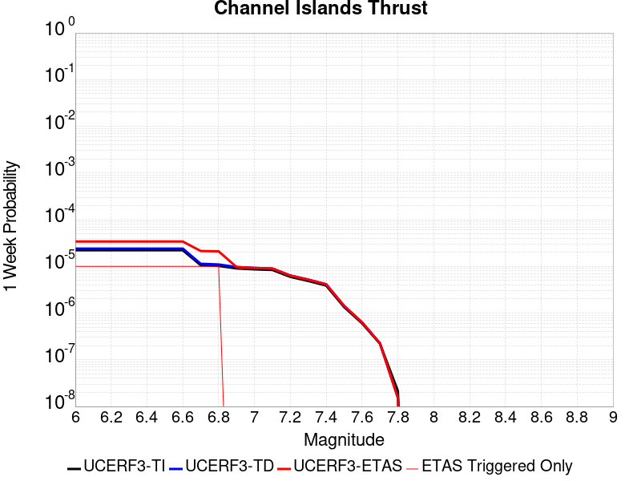 | 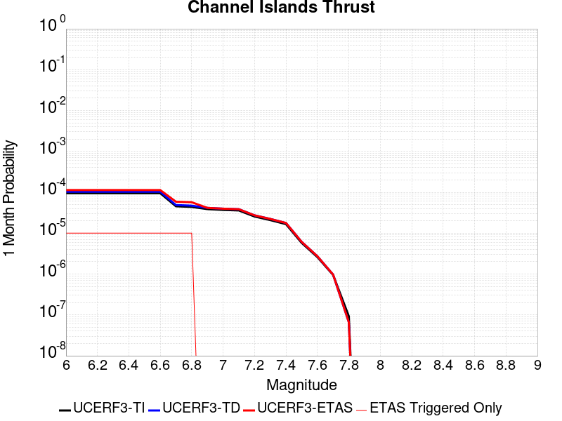 | 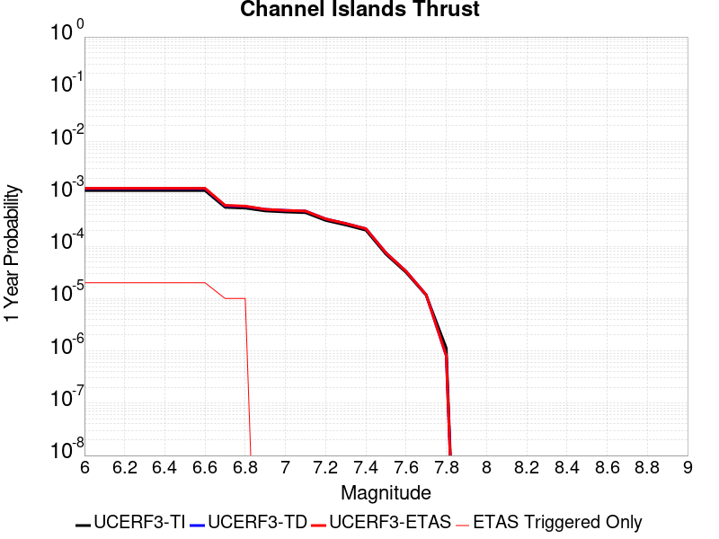 |  |

| Magnitude | 1 wk TI Prob | 1 wk TD Prob | 1 wk ETAS Prob | 1 wk ETAS/TD Gain | 1 wk ETAS Triggered Only | 1 mo TI Prob | 1 mo TD Prob | 1 mo ETAS Prob | 1 mo ETAS/TD Gain | 1 mo ETAS Triggered Only | 1 yr TI Prob | 1 yr TD Prob | 1 yr ETAS Prob | 1 yr ETAS/TD Gain | 1 yr ETAS Triggered Only | 10 yr TI Prob | 10 yr TD Prob | 10 yr ETAS Prob | 10 yr ETAS/TD Gain | 10 yr ETAS Triggered Only |
|-----|-----|-----|-----|-----|-----|-----|-----|-----|-----|-----|-----|-----|-----|-----|-----|-----|-----|-----|-----|-----|
| 6.0 | 2.2156251E-5 | 2.4092304E-5 | 3.4092063E-5 | 1.4150603 | 1.0E-5 | 9.495191E-5 | 1.03249244E-4 | 1.13248214E-4 | 1.096843 | 1.0E-5 | 0.0011554264 | 0.0012564411 | 0.001276416 | 1.015898 | 2.0E-5 | 0.011494373 | 0.012503966 | 0.012563216 | 1.0047385 | 6.0E-5 |
| 6.1 | 2.2156251E-5 | 2.4092304E-5 | 3.4092063E-5 | 1.4150603 | 1.0E-5 | 9.495191E-5 | 1.03249244E-4 | 1.13248214E-4 | 1.096843 | 1.0E-5 | 0.0011554264 | 0.0012564411 | 0.001276416 | 1.015898 | 2.0E-5 | 0.011494373 | 0.012503966 | 0.012563216 | 1.0047385 | 6.0E-5 |
| 6.2 | 2.2156251E-5 | 2.4092304E-5 | 3.4092063E-5 | 1.4150603 | 1.0E-5 | 9.495191E-5 | 1.03249244E-4 | 1.13248214E-4 | 1.096843 | 1.0E-5 | 0.0011554264 | 0.0012564411 | 0.001276416 | 1.015898 | 2.0E-5 | 0.011494373 | 0.012503966 | 0.012563216 | 1.0047385 | 6.0E-5 |
| 6.3 | 2.2156251E-5 | 2.4092304E-5 | 3.4092063E-5 | 1.4150603 | 1.0E-5 | 9.495191E-5 | 1.03249244E-4 | 1.13248214E-4 | 1.096843 | 1.0E-5 | 0.0011554264 | 0.0012564411 | 0.001276416 | 1.015898 | 2.0E-5 | 0.011494373 | 0.012503966 | 0.012563216 | 1.0047385 | 6.0E-5 |
| 6.4 | 2.2156251E-5 | 2.4092304E-5 | 3.4092063E-5 | 1.4150603 | 1.0E-5 | 9.495191E-5 | 1.03249244E-4 | 1.13248214E-4 | 1.096843 | 1.0E-5 | 0.0011554264 | 0.0012564411 | 0.001276416 | 1.015898 | 2.0E-5 | 0.011494373 | 0.012503966 | 0.012563216 | 1.0047385 | 6.0E-5 |
| 6.5 | 2.2156251E-5 | 2.4092304E-5 | 3.4092063E-5 | 1.4150603 | 1.0E-5 | 9.495191E-5 | 1.03249244E-4 | 1.13248214E-4 | 1.096843 | 1.0E-5 | 0.0011554264 | 0.0012564411 | 0.001276416 | 1.015898 | 2.0E-5 | 0.011494373 | 0.012503966 | 0.012563216 | 1.0047385 | 6.0E-5 |
| 6.6 | 2.2156251E-5 | 2.4092304E-5 | 3.4092063E-5 | 1.4150603 | 1.0E-5 | 9.495191E-5 | 1.03249244E-4 | 1.13248214E-4 | 1.096843 | 1.0E-5 | 0.0011554264 | 0.0012564411 | 0.001276416 | 1.015898 | 2.0E-5 | 0.011494373 | 0.012503966 | 0.012563216 | 1.0047385 | 6.0E-5 |
| 6.7 | 1.0601296E-5 | 1.1379656E-5 | 2.1379543E-5 | 1.8787512 | 1.0E-5 | 4.5433335E-5 | 4.876907E-5 | 5.8768583E-5 | 1.205038 | 1.0E-5 | 5.5301044E-4 | 5.9360656E-4 | 6.0360064E-4 | 1.0168362 | 1.0E-5 | 0.005516363 | 0.0059207114 | 0.0059604747 | 1.0067159 | 4.0E-5 |
| 6.8 | 1.0246747E-5 | 1.0996777E-5 | 2.0996667E-5 | 1.9093473 | 1.0E-5 | 4.391389E-5 | 4.7128222E-5 | 5.712775E-5 | 1.212177 | 1.0E-5 | 5.345204E-4 | 5.736398E-4 | 5.836341E-4 | 1.0174226 | 1.0E-5 | 0.0053323656 | 0.005722081 | 0.005761852 | 1.0069505 | 4.0E-5 |
| 6.9 | 9.049551E-6 | 9.699738E-6 | 9.699738E-6 | 1.0 | 0.0 | 3.878322E-5 | 4.1569667E-5 | 4.1569667E-5 | 1.0 | 0.0 | 4.7208337E-4 | 5.059973E-4 | 5.059973E-4 | 1.0 | 0.0 | 0.0047108172 | 0.005048869 | 0.0050787176 | 1.005912 | 3.0E-5 |
| 7.0 | 8.6542195E-6 | 9.274693E-6 | 9.274693E-6 | 1.0 | 0.0 | 3.7088983E-5 | 3.97481E-5 | 3.97481E-5 | 1.0 | 0.0 | 4.5146482E-4 | 4.8382976E-4 | 4.8382976E-4 | 1.0 | 0.0 | 0.004505487 | 0.0048281755 | 0.004858031 | 1.0061835 | 3.0E-5 |
| 7.1 | 8.391028E-6 | 8.993012E-6 | 8.993012E-6 | 1.0 | 0.0 | 3.5961057E-5 | 3.8540933E-5 | 3.8540933E-5 | 1.0 | 0.0 | 4.3773788E-4 | 4.691389E-4 | 4.691389E-4 | 1.0 | 0.0 | 0.004368766 | 0.0046818955 | 0.004711755 | 1.0063777 | 3.0E-5 |
| 7.2 | 5.965188E-6 | 6.3717544E-6 | 6.3717544E-6 | 1.0 | 0.0 | 2.556484E-5 | 2.7307236E-5 | 2.7307236E-5 | 1.0 | 0.0 | 3.1120746E-4 | 3.3241542E-4 | 3.3241542E-4 | 1.0 | 0.0 | 0.00310772 | 0.00331924 | 0.0033391735 | 1.0060055 | 2.0E-5 |
| 7.3 | 4.877518E-6 | 5.2060545E-6 | 5.2060545E-6 | 1.0 | 0.0 | 2.0903482E-5 | 2.2311473E-5 | 2.2311473E-5 | 1.0 | 0.0 | 2.5447016E-4 | 2.716088E-4 | 2.716088E-4 | 1.0 | 0.0 | 0.0025417898 | 0.0027128146 | 0.0027227874 | 1.0036762 | 1.0E-5 |
| 7.4 | 3.8829853E-6 | 4.1419007E-6 | 4.1419007E-6 | 1.0 | 0.0 | 1.664126E-5 | 1.7750885E-5 | 1.7750885E-5 | 1.0 | 0.0 | 2.0258849E-4 | 2.1609601E-4 | 2.1609601E-4 | 1.0 | 0.0 | 0.002024039 | 0.0021589005 | 0.002168879 | 1.004622 | 1.0E-5 |
| 7.5 | 1.3489616E-6 | 1.4278028E-6 | 1.4278028E-6 | 1.0 | 0.0 | 5.7812517E-6 | 6.119141E-6 | 6.119141E-6 | 1.0 | 0.0 | 7.038446E-5 | 7.449803E-5 | 7.449803E-5 | 1.0 | 0.0 | 7.036218E-4 | 7.4473454E-4 | 7.547271E-4 | 1.0134176 | 1.0E-5 |
| 7.6 | 6.058192E-7 | 6.353833E-7 | 6.353833E-7 | 1.0 | 0.0 | 2.5963652E-6 | 2.7230685E-6 | 2.7230685E-6 | 1.0 | 0.0 | 3.161029E-5 | 3.315287E-5 | 3.315287E-5 | 1.0 | 0.0 | 3.1605794E-4 | 3.3148087E-4 | 3.4147754E-4 | 1.0301577 | 1.0E-5 |
| 7.7 | 2.2170494E-7 | 2.2608089E-7 | 2.2608089E-7 | 1.0 | 0.0 | 9.5016367E-7 | 9.689178E-7 | 9.689178E-7 | 1.0 | 0.0 | 1.1568181E-5 | 1.1796522E-5 | 1.1796522E-5 | 1.0 | 0.0 | 1.1567579E-4 | 1.17960066E-4 | 1.17960066E-4 | 1.0 | 0.0 |
| 7.8 | 2.1613102E-8 | 1.5466844E-8 | 1.5466844E-8 | 1.0 | 0.0 | 9.262757E-8 | 6.6286475E-8 | 6.6286475E-8 | 1.0 | 0.0 | 1.1277401E-6 | 8.070376E-7 | 8.070376E-7 | 1.0 | 0.0 | 1.1277344E-5 | 8.070355E-6 | 8.070355E-6 | 1.0 | 0.0 |

## San Jacinto (Anza) rev
*[(top)](#table-of-contents)*

| 1 Week | 1 Month | 1 Year | 10 Year |
|-----|-----|-----|-----|
|  |  | 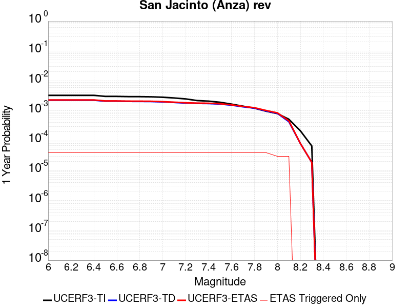 |  |

| Magnitude | 1 wk TI Prob | 1 wk TD Prob | 1 wk ETAS Prob | 1 wk ETAS/TD Gain | 1 wk ETAS Triggered Only | 1 mo TI Prob | 1 mo TD Prob | 1 mo ETAS Prob | 1 mo ETAS/TD Gain | 1 mo ETAS Triggered Only | 1 yr TI Prob | 1 yr TD Prob | 1 yr ETAS Prob | 1 yr ETAS/TD Gain | 1 yr ETAS Triggered Only | 10 yr TI Prob | 10 yr TD Prob | 10 yr ETAS Prob | 10 yr ETAS/TD Gain | 10 yr ETAS Triggered Only |
|-----|-----|-----|-----|-----|-----|-----|-----|-----|-----|-----|-----|-----|-----|-----|-----|-----|-----|-----|-----|-----|
| 6.0 | 6.3015636E-5 | 4.3312386E-5 | 5.3311953E-5 | 1.2308708 | 1.0E-5 | 2.7003905E-4 | 1.8561137E-4 | 2.0560765E-4 | 1.107732 | 2.0E-5 | 0.0032827691 | 0.0022574882 | 0.002297398 | 1.0176789 | 4.0E-5 | 0.032346968 | 0.023307782 | 0.023366382 | 1.0025142 | 6.0E-5 |
| 6.1 | 6.3015636E-5 | 4.3312386E-5 | 5.3311953E-5 | 1.2308708 | 1.0E-5 | 2.7003905E-4 | 1.8561137E-4 | 2.0560765E-4 | 1.107732 | 2.0E-5 | 0.0032827691 | 0.0022574882 | 0.002297398 | 1.0176789 | 4.0E-5 | 0.032346968 | 0.023307782 | 0.023366382 | 1.0025142 | 6.0E-5 |
| 6.2 | 6.3015636E-5 | 4.3312386E-5 | 5.3311953E-5 | 1.2308708 | 1.0E-5 | 2.7003905E-4 | 1.8561137E-4 | 2.0560765E-4 | 1.107732 | 2.0E-5 | 0.0032827691 | 0.0022574882 | 0.002297398 | 1.0176789 | 4.0E-5 | 0.032346968 | 0.023307782 | 0.023366382 | 1.0025142 | 6.0E-5 |
| 6.3 | 6.3015636E-5 | 4.3312386E-5 | 5.3311953E-5 | 1.2308708 | 1.0E-5 | 2.7003905E-4 | 1.8561137E-4 | 2.0560765E-4 | 1.107732 | 2.0E-5 | 0.0032827691 | 0.0022574882 | 0.002297398 | 1.0176789 | 4.0E-5 | 0.032346968 | 0.023307782 | 0.023366382 | 1.0025142 | 6.0E-5 |
| 6.4 | 6.3015636E-5 | 4.3312386E-5 | 5.3311953E-5 | 1.2308708 | 1.0E-5 | 2.7003905E-4 | 1.8561137E-4 | 2.0560765E-4 | 1.107732 | 2.0E-5 | 0.0032827691 | 0.0022574882 | 0.002297398 | 1.0176789 | 4.0E-5 | 0.032346968 | 0.023307782 | 0.023366382 | 1.0025142 | 6.0E-5 |
| 6.5 | 5.811017E-5 | 4.009432E-5 | 5.009392E-5 | 1.2494019 | 1.0E-5 | 2.4901982E-4 | 1.7182152E-4 | 1.918181E-4 | 1.1163799 | 2.0E-5 | 0.0030276014 | 0.0020899256 | 0.002129842 | 1.0190995 | 4.0E-5 | 0.02986684 | 0.021605028 | 0.021663731 | 1.0027171 | 6.0E-5 |
| 6.6 | 5.811017E-5 | 4.009432E-5 | 5.009392E-5 | 1.2494019 | 1.0E-5 | 2.4901982E-4 | 1.7182152E-4 | 1.918181E-4 | 1.1163799 | 2.0E-5 | 0.0030276014 | 0.0020899256 | 0.002129842 | 1.0190995 | 4.0E-5 | 0.02986684 | 0.021605028 | 0.021663731 | 1.0027171 | 6.0E-5 |
| 6.7 | 5.712442E-5 | 3.951705E-5 | 4.9516653E-5 | 1.2530453 | 1.0E-5 | 2.4479596E-4 | 1.6934783E-4 | 1.8934443E-4 | 1.1180801 | 2.0E-5 | 0.0029763177 | 0.0020598655 | 0.0020997832 | 1.0193788 | 4.0E-5 | 0.029367693 | 0.021297079 | 0.021355802 | 1.0027573 | 6.0E-5 |
| 6.8 | 5.6967532E-5 | 3.9373335E-5 | 4.9372942E-5 | 1.253969 | 1.0E-5 | 2.4412372E-4 | 1.6873197E-4 | 1.887286E-4 | 1.1185112 | 2.0E-5 | 0.0029681553 | 0.0020523819 | 0.0020922998 | 1.0194496 | 4.0E-5 | 0.029288229 | 0.02122268 | 0.021281408 | 1.0027672 | 6.0E-5 |
| 6.9 | 5.6211324E-5 | 3.9078248E-5 | 4.907786E-5 | 1.2558868 | 1.0E-5 | 2.4088343E-4 | 1.6746749E-4 | 1.8746415E-4 | 1.1194062 | 2.0E-5 | 0.0029288116 | 0.0020370155 | 0.0020769339 | 1.0195966 | 4.0E-5 | 0.028905109 | 0.021060992 | 0.021119729 | 1.0027889 | 6.0E-5 |
| 7.0 | 5.4383527E-5 | 3.793897E-5 | 4.7938593E-5 | 1.2635713 | 1.0E-5 | 2.3305144E-4 | 1.6258548E-4 | 1.8258224E-4 | 1.1229922 | 2.0E-5 | 0.0028337094 | 0.001977686 | 0.002017607 | 1.0201857 | 4.0E-5 | 0.027978465 | 0.020454587 | 0.02051336 | 1.0028733 | 6.0E-5 |
| 7.1 | 5.1393665E-5 | 3.6401827E-5 | 4.6401463E-5 | 1.2747015 | 1.0E-5 | 2.2023996E-4 | 1.5599852E-4 | 1.759954E-4 | 1.1281863 | 2.0E-5 | 0.0026781242 | 0.0018976318 | 0.0019375558 | 1.0210389 | 4.0E-5 | 0.026460782 | 0.019625481 | 0.019684304 | 1.0029973 | 6.0E-5 |
| 7.2 | 4.785222E-5 | 3.4752728E-5 | 4.475238E-5 | 1.2877371 | 1.0E-5 | 2.0506482E-4 | 1.4893178E-4 | 1.689288E-4 | 1.1342697 | 2.0E-5 | 0.0024938055 | 0.0018117399 | 0.0018516674 | 1.0220382 | 4.0E-5 | 0.024660049 | 0.018735653 | 0.018794527 | 1.0031425 | 6.0E-5 |
| 7.3 | 4.2143256E-5 | 3.384821E-5 | 4.384787E-5 | 1.2954266 | 1.0E-5 | 1.8060145E-4 | 1.4505572E-4 | 1.6505281E-4 | 1.137858 | 2.0E-5 | 0.002196605 | 0.0017646261 | 0.0018045555 | 1.0226277 | 4.0E-5 | 0.02175019 | 0.018243507 | 0.018302413 | 1.0032288 | 6.0E-5 |
| 7.4 | 4.0264713E-5 | 3.348636E-5 | 4.3486027E-5 | 1.298619 | 1.0E-5 | 1.7255165E-4 | 1.4350511E-4 | 1.6350223E-4 | 1.1393479 | 2.0E-5 | 0.002098792 | 0.0017457779 | 0.001785708 | 1.0228724 | 4.0E-5 | 0.020790804 | 0.018048115 | 0.018107032 | 1.0032644 | 6.0E-5 |
| 7.5 | 3.694492E-5 | 3.2200267E-5 | 4.2199943E-5 | 1.3105464 | 1.0E-5 | 1.5832575E-4 | 1.3799386E-4 | 1.579911E-4 | 1.144914 | 2.0E-5 | 0.0019259118 | 0.0016787836 | 0.0017187165 | 1.0237868 | 4.0E-5 | 0.01909306 | 0.017364455 | 0.017423414 | 1.0033953 | 6.0E-5 |
| 7.6 | 3.200565E-5 | 2.9515684E-5 | 3.9515387E-5 | 1.3387929 | 1.0E-5 | 1.3715986E-4 | 1.2648967E-4 | 1.4648713E-4 | 1.1580957 | 2.0E-5 | 0.001668642 | 0.001538926 | 0.0015788645 | 1.0259521 | 4.0E-5 | 0.01656168 | 0.015952358 | 0.0160114 | 1.0037012 | 6.0E-5 |
| 7.7 | 2.731642E-5 | 2.6104135E-5 | 3.6103873E-5 | 1.3830711 | 1.0E-5 | 1.1706512E-4 | 1.11870075E-4 | 1.3186784E-4 | 1.1787589 | 2.0E-5 | 0.001424336 | 0.0013611682 | 0.0014011137 | 1.0293465 | 4.0E-5 | 0.014152412 | 0.014172893 | 0.014232042 | 1.0041734 | 6.0E-5 |
| 7.8 | 2.3466424E-5 | 2.3515782E-5 | 3.351555E-5 | 1.4252363 | 1.0E-5 | 1.0056651E-4 | 1.0077804E-4 | 1.2077602E-4 | 1.1984359 | 2.0E-5 | 0.0012237094 | 0.0012262828 | 0.0012662337 | 1.032579 | 4.0E-5 | 0.012169928 | 0.012814545 | 0.012873776 | 1.0046222 | 6.0E-5 |
| 7.9 | 1.8611925E-5 | 1.8917919E-5 | 2.891773E-5 | 1.5285894 | 1.0E-5 | 7.9762955E-5 | 8.107428E-5 | 1.01072656E-4 | 1.2466674 | 2.0E-5 | 9.7068126E-4 | 9.86633E-4 | 0.0010265936 | 1.040502 | 4.0E-5 | 0.0096645225 | 0.010399014 | 0.01045839 | 1.0057098 | 6.0E-5 |
| 8.0 | 1.5460775E-5 | 1.5749598E-5 | 1.5749598E-5 | 1.0 | 0.0 | 6.6258784E-5 | 6.7496534E-5 | 7.749586E-5 | 1.1481458 | 1.0E-5 | 8.0640207E-4 | 8.2146114E-4 | 8.514365E-4 | 1.0364903 | 3.0E-5 | 0.008034821 | 0.008707448 | 0.008757013 | 1.0056922 | 5.0E-5 |
| 8.1 | 9.983884E-6 | 8.274653E-6 | 8.274653E-6 | 1.0 | 0.0 | 4.2787375E-5 | 3.546232E-5 | 4.5461962E-5 | 1.2819794 | 1.0E-5 | 5.2081177E-4 | 4.316687E-4 | 4.6165576E-4 | 1.0694678 | 3.0E-5 | 0.0051959283 | 0.0046425606 | 0.004672421 | 1.0064319 | 3.0E-5 |
| 8.2 | 4.1226E-6 | 1.5539142E-6 | 1.5539142E-6 | 1.0 | 0.0 | 1.7668166E-5 | 6.6596153E-6 | 6.6596153E-6 | 1.0 | 0.0 | 2.1508869E-4 | 8.107783E-5 | 8.107783E-5 | 1.0 | 0.0 | 0.0021488064 | 9.410467E-4 | 9.410467E-4 | 1.0 | 0.0 |
| 8.3 | 1.2750878E-6 | 3.6143226E-7 | 3.6143226E-7 | 1.0 | 0.0 | 5.4646503E-6 | 1.5489944E-6 | 1.5489944E-6 | 1.0 | 0.0 | 6.653009E-5 | 1.8858847E-5 | 1.8858847E-5 | 1.0 | 0.0 | 6.6510175E-4 | 2.2747046E-4 | 2.2747046E-4 | 1.0 | 0.0 |

## Ventura-Pitas Point
*[(top)](#table-of-contents)*

| 1 Week | 1 Month | 1 Year | 10 Year |
|-----|-----|-----|-----|
|  | 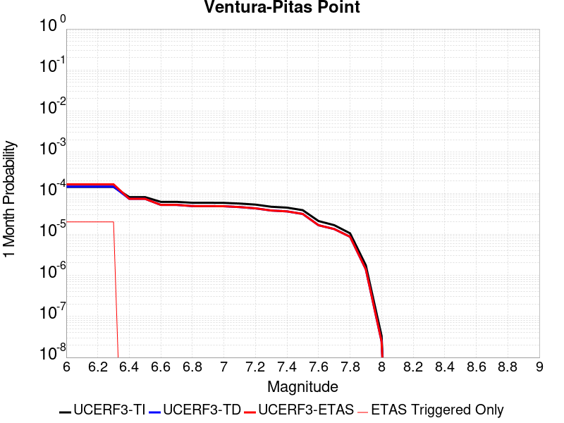 |  |  |

| Magnitude | 1 wk TI Prob | 1 wk TD Prob | 1 wk ETAS Prob | 1 wk ETAS/TD Gain | 1 wk ETAS Triggered Only | 1 mo TI Prob | 1 mo TD Prob | 1 mo ETAS Prob | 1 mo ETAS/TD Gain | 1 mo ETAS Triggered Only | 1 yr TI Prob | 1 yr TD Prob | 1 yr ETAS Prob | 1 yr ETAS/TD Gain | 1 yr ETAS Triggered Only | 10 yr TI Prob | 10 yr TD Prob | 10 yr ETAS Prob | 10 yr ETAS/TD Gain | 10 yr ETAS Triggered Only |
|-----|-----|-----|-----|-----|-----|-----|-----|-----|-----|-----|-----|-----|-----|-----|-----|-----|-----|-----|-----|-----|
| 6.0 | 3.3179622E-5 | 3.37358E-5 | 3.37358E-5 | 1.0 | 0.0 | 1.4219063E-4 | 1.4457543E-4 | 1.6457254E-4 | 1.138316 | 2.0E-5 | 0.0017297962 | 0.0017590416 | 0.0017989712 | 1.0226997 | 4.0E-5 | 0.017163932 | 0.01747688 | 0.017526006 | 1.002811 | 5.0E-5 |
| 6.1 | 3.3179622E-5 | 3.37358E-5 | 3.37358E-5 | 1.0 | 0.0 | 1.4219063E-4 | 1.4457543E-4 | 1.6457254E-4 | 1.138316 | 2.0E-5 | 0.0017297962 | 0.0017590416 | 0.0017989712 | 1.0226997 | 4.0E-5 | 0.017163932 | 0.01747688 | 0.017526006 | 1.002811 | 5.0E-5 |
| 6.2 | 3.3179622E-5 | 3.37358E-5 | 3.37358E-5 | 1.0 | 0.0 | 1.4219063E-4 | 1.4457543E-4 | 1.6457254E-4 | 1.138316 | 2.0E-5 | 0.0017297962 | 0.0017590416 | 0.0017989712 | 1.0226997 | 4.0E-5 | 0.017163932 | 0.01747688 | 0.017526006 | 1.002811 | 5.0E-5 |
| 6.3 | 3.3179622E-5 | 3.37358E-5 | 3.37358E-5 | 1.0 | 0.0 | 1.4219063E-4 | 1.4457543E-4 | 1.6457254E-4 | 1.138316 | 2.0E-5 | 0.0017297962 | 0.0017590416 | 0.0017989712 | 1.0226997 | 4.0E-5 | 0.017163932 | 0.01747688 | 0.017526006 | 1.002811 | 5.0E-5 |
| 6.4 | 1.8754668E-5 | 1.7019853E-5 | 1.7019853E-5 | 1.0 | 0.0 | 8.037467E-5 | 7.294031E-5 | 7.294031E-5 | 1.0 | 0.0 | 9.781223E-4 | 8.877096E-4 | 8.977007E-4 | 1.0112549 | 1.0E-5 | 0.009738282 | 0.008844146 | 0.008854057 | 1.0011207 | 1.0E-5 |
| 6.5 | 1.8754668E-5 | 1.7019853E-5 | 1.7019853E-5 | 1.0 | 0.0 | 8.037467E-5 | 7.294031E-5 | 7.294031E-5 | 1.0 | 0.0 | 9.781223E-4 | 8.877096E-4 | 8.977007E-4 | 1.0112549 | 1.0E-5 | 0.009738282 | 0.008844146 | 0.008854057 | 1.0011207 | 1.0E-5 |
| 6.6 | 1.4361558E-5 | 1.2122441E-5 | 1.2122441E-5 | 1.0 | 0.0 | 6.154808E-5 | 5.19523E-5 | 5.19523E-5 | 1.0 | 0.0 | 7.490902E-4 | 6.32338E-4 | 6.32338E-4 | 1.0 | 0.0 | 0.0074657016 | 0.0063058166 | 0.0063058166 | 1.0 | 0.0 |
| 6.7 | 1.4361558E-5 | 1.2122441E-5 | 1.2122441E-5 | 1.0 | 0.0 | 6.154808E-5 | 5.19523E-5 | 5.19523E-5 | 1.0 | 0.0 | 7.490902E-4 | 6.32338E-4 | 6.32338E-4 | 1.0 | 0.0 | 0.0074657016 | 0.0063058166 | 0.0063058166 | 1.0 | 0.0 |
| 6.8 | 1.3663846E-5 | 1.1344573E-5 | 1.1344573E-5 | 1.0 | 0.0 | 5.8558027E-5 | 4.8618702E-5 | 4.8618702E-5 | 1.0 | 0.0 | 7.127108E-4 | 5.917739E-4 | 5.917739E-4 | 1.0 | 0.0 | 0.007104293 | 0.0059023695 | 0.0059023695 | 1.0 | 0.0 |
| 6.9 | 1.3644157E-5 | 1.1322673E-5 | 1.1322673E-5 | 1.0 | 0.0 | 5.8473648E-5 | 4.852485E-5 | 4.852485E-5 | 1.0 | 0.0 | 7.116841E-4 | 5.9063185E-4 | 5.9063185E-4 | 1.0 | 0.0 | 0.007094092 | 0.0058910097 | 0.0058910097 | 1.0 | 0.0 |
| 7.0 | 1.3568845E-5 | 1.12422385E-5 | 1.12422385E-5 | 1.0 | 0.0 | 5.8150898E-5 | 4.8180143E-5 | 4.8180143E-5 | 1.0 | 0.0 | 7.077572E-4 | 5.864373E-4 | 5.864373E-4 | 1.0 | 0.0 | 0.007055073 | 0.0058492855 | 0.0058492855 | 1.0 | 0.0 |
| 7.1 | 1.306572E-5 | 1.072068E-5 | 1.072068E-5 | 1.0 | 0.0 | 5.599474E-5 | 4.5944973E-5 | 4.5944973E-5 | 1.0 | 0.0 | 6.815227E-4 | 5.5923837E-4 | 5.5923837E-4 | 1.0 | 0.0 | 0.0067943637 | 0.005578688 | 0.005578688 | 1.0 | 0.0 |
| 7.2 | 1.232604E-5 | 9.9952695E-6 | 9.9952695E-6 | 1.0 | 0.0 | 5.2824813E-5 | 4.2836175E-5 | 4.2836175E-5 | 1.0 | 0.0 | 6.429523E-4 | 5.214074E-4 | 5.214074E-4 | 1.0 | 0.0 | 0.0064109527 | 0.0052022054 | 0.0052022054 | 1.0 | 0.0 |
| 7.3 | 1.0917261E-5 | 8.843945E-6 | 8.843945E-6 | 1.0 | 0.0 | 4.678742E-5 | 3.790208E-5 | 3.790208E-5 | 1.0 | 0.0 | 5.69488E-4 | 4.6136163E-4 | 4.6136163E-4 | 1.0 | 0.0 | 0.0056803077 | 0.0046043773 | 0.0046043773 | 1.0 | 0.0 |
| 7.4 | 1.039959E-5 | 8.423664E-6 | 8.423664E-6 | 1.0 | 0.0 | 4.456891E-5 | 3.6100926E-5 | 3.6100926E-5 | 1.0 | 0.0 | 5.424914E-4 | 4.3944168E-4 | 4.3944168E-4 | 1.0 | 0.0 | 0.0054116896 | 0.004386062 | 0.004386062 | 1.0 | 0.0 |
| 7.5 | 9.015877E-6 | 7.297624E-6 | 7.297624E-6 | 1.0 | 0.0 | 3.86389E-5 | 3.1275165E-5 | 3.1275165E-5 | 1.0 | 0.0 | 4.7032707E-4 | 3.8071E-4 | 3.8071E-4 | 1.0 | 0.0 | 0.004693329 | 0.0038008976 | 0.0038008976 | 1.0 | 0.0 |
| 7.6 | 4.900162E-6 | 3.874157E-6 | 3.874157E-6 | 1.0 | 0.0 | 2.1000526E-5 | 1.6603424E-5 | 1.6603424E-5 | 1.0 | 0.0 | 2.556514E-4 | 2.0212808E-4 | 2.0212808E-4 | 1.0 | 0.0 | 0.0025535747 | 0.002019456 | 0.002019456 | 1.0 | 0.0 |
| 7.7 | 3.8850626E-6 | 3.1267878E-6 | 3.1267878E-6 | 1.0 | 0.0 | 1.6650163E-5 | 1.3400451E-5 | 1.3400451E-5 | 1.0 | 0.0 | 2.0269687E-4 | 1.6313836E-4 | 1.6313836E-4 | 1.0 | 0.0 | 0.002025121 | 0.0016301954 | 0.0016301954 | 1.0 | 0.0 |
| 7.8 | 2.4654719E-6 | 2.0299206E-6 | 2.0299206E-6 | 1.0 | 0.0 | 1.0566265E-5 | 8.6996315E-6 | 8.6996315E-6 | 1.0 | 0.0 | 1.2863669E-4 | 1.05912906E-4 | 1.05912906E-4 | 1.0 | 0.0 | 0.0012856225 | 0.001058629 | 0.001058629 | 1.0 | 0.0 |
| 7.9 | 4.095894E-7 | 3.2765396E-7 | 3.2765396E-7 | 1.0 | 0.0 | 1.7553821E-6 | 1.4042306E-6 | 1.4042306E-6 | 1.0 | 0.0 | 2.1371567E-5 | 1.7096376E-5 | 1.7096376E-5 | 1.0 | 0.0 | 2.1369511E-4 | 1.7095092E-4 | 1.7095092E-4 | 1.0 | 0.0 |
| 8.0 | 7.791402E-9 | 5.6836416E-9 | 5.6836416E-9 | 1.0 | 0.0 | 3.3391725E-8 | 2.4358464E-8 | 2.4358464E-8 | 1.0 | 0.0 | 4.0654416E-7 | 2.9656428E-7 | 2.9656428E-7 | 1.0 | 0.0 | 4.065434E-6 | 2.9656408E-6 | 2.9656408E-6 | 1.0 | 0.0 |

## Palos Verdes
*[(top)](#table-of-contents)*

| 1 Week | 1 Month | 1 Year | 10 Year |
|-----|-----|-----|-----|
|  |  | 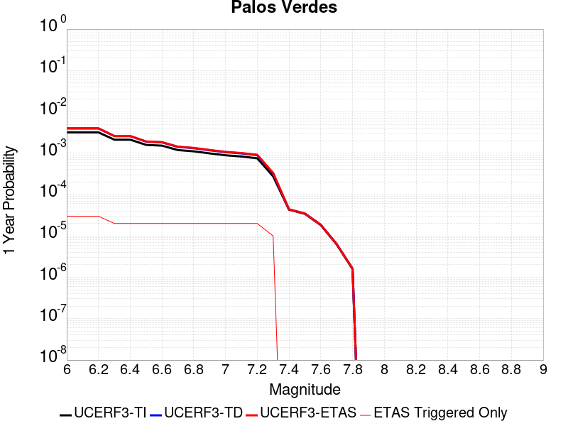 |  |

| Magnitude | 1 wk TI Prob | 1 wk TD Prob | 1 wk ETAS Prob | 1 wk ETAS/TD Gain | 1 wk ETAS Triggered Only | 1 mo TI Prob | 1 mo TD Prob | 1 mo ETAS Prob | 1 mo ETAS/TD Gain | 1 mo ETAS Triggered Only | 1 yr TI Prob | 1 yr TD Prob | 1 yr ETAS Prob | 1 yr ETAS/TD Gain | 1 yr ETAS Triggered Only | 10 yr TI Prob | 10 yr TD Prob | 10 yr ETAS Prob | 10 yr ETAS/TD Gain | 10 yr ETAS Triggered Only |
|-----|-----|-----|-----|-----|-----|-----|-----|-----|-----|-----|-----|-----|-----|-----|-----|-----|-----|-----|-----|-----|
| 6.0 | 6.126063E-5 | 7.622823E-5 | 7.622823E-5 | 1.0 | 0.0 | 2.6251914E-4 | 3.2665484E-4 | 3.2665484E-4 | 1.0 | 0.0 | 0.0031914865 | 0.0039703017 | 0.0040001823 | 1.0075262 | 3.0E-5 | 0.031460393 | 0.03905032 | 0.039098363 | 1.0012304 | 5.0E-5 |
| 6.1 | 6.126063E-5 | 7.622823E-5 | 7.622823E-5 | 1.0 | 0.0 | 2.6251914E-4 | 3.2665484E-4 | 3.2665484E-4 | 1.0 | 0.0 | 0.0031914865 | 0.0039703017 | 0.0040001823 | 1.0075262 | 3.0E-5 | 0.031460393 | 0.03905032 | 0.039098363 | 1.0012304 | 5.0E-5 |
| 6.2 | 6.126063E-5 | 7.622823E-5 | 7.622823E-5 | 1.0 | 0.0 | 2.6251914E-4 | 3.2665484E-4 | 3.2665484E-4 | 1.0 | 0.0 | 0.0031914865 | 0.0039703017 | 0.0040001823 | 1.0075262 | 3.0E-5 | 0.031460393 | 0.03905032 | 0.039098363 | 1.0012304 | 5.0E-5 |
| 6.3 | 4.0838047E-5 | 4.9750462E-5 | 4.9750462E-5 | 1.0 | 0.0 | 1.7500846E-4 | 2.1320012E-4 | 2.1320012E-4 | 1.0 | 0.0 | 0.0021286458 | 0.0025928293 | 0.0026127775 | 1.0076935 | 2.0E-5 | 0.021083709 | 0.02564748 | 0.02567671 | 1.0011398 | 3.0E-5 |
| 6.4 | 4.0838047E-5 | 4.9750462E-5 | 4.9750462E-5 | 1.0 | 0.0 | 1.7500846E-4 | 2.1320012E-4 | 2.1320012E-4 | 1.0 | 0.0 | 0.0021286458 | 0.0025928293 | 0.0026127775 | 1.0076935 | 2.0E-5 | 0.021083709 | 0.02564748 | 0.02567671 | 1.0011398 | 3.0E-5 |
| 6.5 | 3.0512005E-5 | 3.6562564E-5 | 3.6562564E-5 | 1.0 | 0.0 | 1.3075917E-4 | 1.5668797E-4 | 1.5668797E-4 | 1.0 | 0.0 | 0.0015908304 | 0.0019061224 | 0.0019260843 | 1.0104725 | 2.0E-5 | 0.015794903 | 0.018909669 | 0.01892929 | 1.0010377 | 2.0E-5 |
| 6.6 | 2.9255087E-5 | 3.515534E-5 | 3.515534E-5 | 1.0 | 0.0 | 1.2537291E-4 | 1.506577E-4 | 1.506577E-4 | 1.0 | 0.0 | 0.0015253464 | 0.0018328275 | 0.0018527908 | 1.0108922 | 2.0E-5 | 0.015149189 | 0.018188728 | 0.018208364 | 1.0010796 | 2.0E-5 |
| 6.7 | 2.287198E-5 | 2.7248976E-5 | 2.7248976E-5 | 1.0 | 0.0 | 9.801909E-5 | 1.1677662E-4 | 1.1677662E-4 | 1.0 | 0.0 | 0.001192729 | 0.0014209197 | 0.0014408913 | 1.0140554 | 2.0E-5 | 0.011863477 | 0.014127577 | 0.014147294 | 1.0013957 | 2.0E-5 |
| 6.8 | 2.1325764E-5 | 2.5432533E-5 | 2.5432533E-5 | 1.0 | 0.0 | 9.139293E-5 | 1.0899252E-4 | 1.0899252E-4 | 1.0 | 0.0 | 0.001112141 | 0.0013262664 | 0.0013462399 | 1.01506 | 2.0E-5 | 0.011065915 | 0.013192549 | 0.013212285 | 1.001496 | 2.0E-5 |
| 6.9 | 1.9009392E-5 | 2.2614122E-5 | 2.2614122E-5 | 1.0 | 0.0 | 8.1466285E-5 | 9.6914555E-5 | 9.6914555E-5 | 1.0 | 0.0 | 9.914007E-4 | 0.0011793834 | 0.0011993598 | 1.016938 | 2.0E-5 | 0.009869894 | 0.011739929 | 0.011759694 | 1.0016836 | 2.0E-5 |
| 7.0 | 1.7098473E-5 | 2.0319867E-5 | 2.0319867E-5 | 1.0 | 0.0 | 7.3277115E-5 | 8.708272E-5 | 8.708272E-5 | 1.0 | 0.0 | 8.917837E-4 | 0.0010598017 | 0.0010797805 | 1.0188514 | 2.0E-5 | 0.008882134 | 0.010555912 | 0.010575701 | 1.0018747 | 2.0E-5 |
| 7.1 | 1.5982785E-5 | 1.8995239E-5 | 1.8995239E-5 | 1.0 | 0.0 | 6.849585E-5 | 8.1406106E-5 | 8.1406106E-5 | 1.0 | 0.0 | 8.336179E-4 | 9.907534E-4 | 0.0010107335 | 1.0201666 | 2.0E-5 | 0.008304977 | 0.009871728 | 0.0098915305 | 1.0020059 | 2.0E-5 |
| 7.2 | 1.4468002E-5 | 1.719767E-5 | 1.719767E-5 | 1.0 | 0.0 | 6.200425E-5 | 7.370269E-5 | 7.370269E-5 | 1.0 | 0.0 | 7.546402E-4 | 8.970449E-4 | 9.1702695E-4 | 1.0222754 | 2.0E-5 | 0.007520827 | 0.008942509 | 0.00896233 | 1.0022165 | 2.0E-5 |
| 7.3 | 5.288233E-6 | 6.2038207E-6 | 6.2038207E-6 | 1.0 | 0.0 | 2.2663658E-5 | 2.658773E-5 | 2.658773E-5 | 1.0 | 0.0 | 2.7589512E-4 | 3.2369242E-4 | 3.3368918E-4 | 1.0308836 | 1.0E-5 | 0.0027555283 | 0.0032356323 | 0.0032456 | 1.0030806 | 1.0E-5 |
| 7.4 | 8.279556E-7 | 8.408364E-7 | 8.408364E-7 | 1.0 | 0.0 | 3.5483763E-6 | 3.60358E-6 | 3.60358E-6 | 1.0 | 0.0 | 4.3200624E-5 | 4.3872777E-5 | 4.3872777E-5 | 1.0 | 0.0 | 4.3192226E-4 | 4.3864836E-4 | 4.3864836E-4 | 1.0 | 0.0 |
| 7.5 | 6.559831E-7 | 6.667243E-7 | 6.667243E-7 | 1.0 | 0.0 | 2.8113532E-6 | 2.8573872E-6 | 2.8573872E-6 | 1.0 | 0.0 | 3.4227687E-5 | 3.47882E-5 | 3.47882E-5 | 1.0 | 0.0 | 3.4222414E-4 | 3.478342E-4 | 3.478342E-4 | 1.0 | 0.0 |
| 7.6 | 3.5018968E-7 | 3.562011E-7 | 3.562011E-7 | 1.0 | 0.0 | 1.500812E-6 | 1.5265755E-6 | 1.5265755E-6 | 1.0 | 0.0 | 1.8272232E-5 | 1.8585944E-5 | 1.8585944E-5 | 1.0 | 0.0 | 1.8270731E-4 | 1.858485E-4 | 1.858485E-4 | 1.0 | 0.0 |
| 7.7 | 1.1986104E-7 | 1.2198406E-7 | 1.2198406E-7 | 1.0 | 0.0 | 5.1369005E-7 | 5.227887E-7 | 5.227887E-7 | 1.0 | 0.0 | 6.2541585E-6 | 6.364934E-6 | 6.364934E-6 | 1.0 | 0.0 | 6.2539824E-5 | 6.364756E-5 | 6.364756E-5 | 1.0 | 0.0 |
| 7.8 | 3.0445005E-8 | 3.1027664E-8 | 3.1027664E-8 | 1.0 | 0.0 | 1.3047858E-7 | 1.3297569E-7 | 1.3297569E-7 | 1.0 | 0.0 | 1.5885756E-6 | 1.6189781E-6 | 1.6189781E-6 | 1.0 | 0.0 | 1.5885644E-5 | 1.6189684E-5 | 1.6189684E-5 | 1.0 | 0.0 |

## Kern Canyon (South Kern) 2011
*[(top)](#table-of-contents)*

| 1 Week | 1 Month | 1 Year | 10 Year |
|-----|-----|-----|-----|
|  |  | 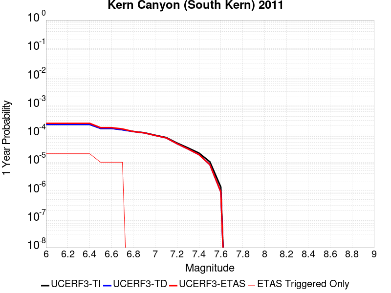 |  |

| Magnitude | 1 wk TI Prob | 1 wk TD Prob | 1 wk ETAS Prob | 1 wk ETAS/TD Gain | 1 wk ETAS Triggered Only | 1 mo TI Prob | 1 mo TD Prob | 1 mo ETAS Prob | 1 mo ETAS/TD Gain | 1 mo ETAS Triggered Only | 1 yr TI Prob | 1 yr TD Prob | 1 yr ETAS Prob | 1 yr ETAS/TD Gain | 1 yr ETAS Triggered Only | 10 yr TI Prob | 10 yr TD Prob | 10 yr ETAS Prob | 10 yr ETAS/TD Gain | 10 yr ETAS Triggered Only |
|-----|-----|-----|-----|-----|-----|-----|-----|-----|-----|-----|-----|-----|-----|-----|-----|-----|-----|-----|-----|-----|
| 6.0 | 4.105075E-6 | 4.1137364E-6 | 4.1137364E-6 | 1.0 | 0.0 | 1.7593058E-5 | 1.7630184E-5 | 2.7630007E-5 | 1.5671991 | 1.0E-5 | 2.1417443E-4 | 2.1462698E-4 | 2.3462268E-4 | 1.0931649 | 2.0E-5 | 0.0021396813 | 0.0021442608 | 0.0021941536 | 1.0232681 | 5.0E-5 |
| 6.1 | 4.105075E-6 | 4.1137364E-6 | 4.1137364E-6 | 1.0 | 0.0 | 1.7593058E-5 | 1.7630184E-5 | 2.7630007E-5 | 1.5671991 | 1.0E-5 | 2.1417443E-4 | 2.1462698E-4 | 2.3462268E-4 | 1.0931649 | 2.0E-5 | 0.0021396813 | 0.0021442608 | 0.0021941536 | 1.0232681 | 5.0E-5 |
| 6.2 | 4.105075E-6 | 4.1137364E-6 | 4.1137364E-6 | 1.0 | 0.0 | 1.7593058E-5 | 1.7630184E-5 | 2.7630007E-5 | 1.5671991 | 1.0E-5 | 2.1417443E-4 | 2.1462698E-4 | 2.3462268E-4 | 1.0931649 | 2.0E-5 | 0.0021396813 | 0.0021442608 | 0.0021941536 | 1.0232681 | 5.0E-5 |
| 6.3 | 4.105075E-6 | 4.1137364E-6 | 4.1137364E-6 | 1.0 | 0.0 | 1.7593058E-5 | 1.7630184E-5 | 2.7630007E-5 | 1.5671991 | 1.0E-5 | 2.1417443E-4 | 2.1462698E-4 | 2.3462268E-4 | 1.0931649 | 2.0E-5 | 0.0021396813 | 0.0021442608 | 0.0021941536 | 1.0232681 | 5.0E-5 |
| 6.4 | 4.105075E-6 | 4.1137364E-6 | 4.1137364E-6 | 1.0 | 0.0 | 1.7593058E-5 | 1.7630184E-5 | 2.7630007E-5 | 1.5671991 | 1.0E-5 | 2.1417443E-4 | 2.1462698E-4 | 2.3462268E-4 | 1.0931649 | 2.0E-5 | 0.0021396813 | 0.0021442608 | 0.0021941536 | 1.0232681 | 5.0E-5 |
| 6.5 | 2.9849807E-6 | 2.9731618E-6 | 2.9731618E-6 | 1.0 | 0.0 | 1.2792712E-5 | 1.2742061E-5 | 2.2741933E-5 | 1.7847924 | 1.0E-5 | 1.5574014E-4 | 1.551237E-4 | 1.6512215E-4 | 1.0644547 | 1.0E-5 | 0.0015563103 | 0.0015501693 | 0.0015701384 | 1.0128819 | 2.0E-5 |
| 6.6 | 2.9849807E-6 | 2.9731618E-6 | 2.9731618E-6 | 1.0 | 0.0 | 1.2792712E-5 | 1.2742061E-5 | 2.2741933E-5 | 1.7847924 | 1.0E-5 | 1.5574014E-4 | 1.551237E-4 | 1.6512215E-4 | 1.0644547 | 1.0E-5 | 0.0015563103 | 0.0015501693 | 0.0015701384 | 1.0128819 | 2.0E-5 |
| 6.7 | 2.6756725E-6 | 2.6582272E-6 | 2.6582272E-6 | 1.0 | 0.0 | 1.1467117E-5 | 1.13923525E-5 | 2.139224E-5 | 1.8777719 | 1.0E-5 | 1.396032E-4 | 1.3869318E-4 | 1.4869179E-4 | 1.0720916 | 1.0E-5 | 0.0013951553 | 0.0013860771 | 0.0014060494 | 1.0144092 | 2.0E-5 |
| 6.8 | 2.3283721E-6 | 2.3047844E-6 | 2.3047844E-6 | 1.0 | 0.0 | 9.9787E-6 | 9.87761E-6 | 9.87761E-6 | 1.0 | 0.0 | 1.214839E-4 | 1.20253346E-4 | 1.20253346E-4 | 1.0 | 0.0 | 0.001214175 | 0.0012018902 | 0.0012118781 | 1.0083102 | 1.0E-5 |
| 6.9 | 2.0972677E-6 | 2.0696461E-6 | 2.0696461E-6 | 1.0 | 0.0 | 8.988259E-6 | 8.869883E-6 | 8.869883E-6 | 1.0 | 0.0 | 1.0942656E-4 | 1.0798552E-4 | 1.0798552E-4 | 1.0 | 0.0 | 0.0010937268 | 0.0010793363 | 0.0010793363 | 1.0 | 0.0 |
| 7.0 | 1.7132242E-6 | 1.6787077E-6 | 1.6787077E-6 | 1.0 | 0.0 | 7.3423685E-6 | 7.194442E-6 | 7.194442E-6 | 1.0 | 0.0 | 8.938967E-5 | 8.758884E-5 | 8.758884E-5 | 1.0 | 0.0 | 8.935372E-4 | 8.7554706E-4 | 8.7554706E-4 | 1.0 | 0.0 |
| 7.1 | 1.4215541E-6 | 1.3815785E-6 | 1.3815785E-6 | 1.0 | 0.0 | 6.0923603E-6 | 5.9210374E-6 | 5.9210374E-6 | 1.0 | 0.0 | 7.417196E-5 | 7.208627E-5 | 7.208627E-5 | 1.0 | 0.0 | 7.414721E-4 | 7.206316E-4 | 7.206316E-4 | 1.0 | 0.0 |
| 7.2 | 9.097853E-7 | 8.6037966E-7 | 8.6037966E-7 | 1.0 | 0.0 | 3.899074E-6 | 3.6873362E-6 | 3.6873362E-6 | 1.0 | 0.0 | 4.7470192E-5 | 4.4892404E-5 | 4.4892404E-5 | 1.0 | 0.0 | 4.7460053E-4 | 4.4883444E-4 | 4.4883444E-4 | 1.0 | 0.0 |
| 7.3 | 6.144169E-7 | 5.6282187E-7 | 5.6282187E-7 | 1.0 | 0.0 | 2.6332125E-6 | 2.4120914E-6 | 2.4120914E-6 | 1.0 | 0.0 | 3.205889E-5 | 2.9366824E-5 | 2.9366824E-5 | 1.0 | 0.0 | 3.2054266E-4 | 2.9362994E-4 | 2.9362994E-4 | 1.0 | 0.0 |
| 7.4 | 4.049844E-7 | 3.5728377E-7 | 3.5728377E-7 | 1.0 | 0.0 | 1.7356463E-6 | 1.5312153E-6 | 1.5312153E-6 | 1.0 | 0.0 | 2.1131287E-5 | 1.864239E-5 | 1.864239E-5 | 1.0 | 0.0 | 2.1129279E-4 | 1.864085E-4 | 1.864085E-4 | 1.0 | 0.0 |
| 7.5 | 1.9871162E-7 | 1.5830446E-7 | 1.5830446E-7 | 1.0 | 0.0 | 8.5162094E-7 | 6.784475E-7 | 6.784475E-7 | 1.0 | 0.0 | 1.0368436E-5 | 8.260068E-6 | 8.260068E-6 | 1.0 | 0.0 | 1.0367952E-4 | 8.25977E-5 | 8.25977E-5 | 1.0 | 0.0 |
| 7.6 | 2.572245E-8 | 1.7352718E-8 | 1.7352718E-8 | 1.0 | 0.0 | 1.10239064E-7 | 7.436879E-8 | 7.436879E-8 | 1.0 | 0.0 | 1.3421597E-6 | 9.054397E-7 | 9.054397E-7 | 1.0 | 0.0 | 1.3421517E-5 | 9.054365E-6 | 9.054365E-6 | 1.0 | 0.0 |

## Raymond
*[(top)](#table-of-contents)*

| 1 Week | 1 Month | 1 Year | 10 Year |
|-----|-----|-----|-----|
|  |  |  |  |

| Magnitude | 1 wk TI Prob | 1 wk TD Prob | 1 wk ETAS Prob | 1 wk ETAS/TD Gain | 1 wk ETAS Triggered Only | 1 mo TI Prob | 1 mo TD Prob | 1 mo ETAS Prob | 1 mo ETAS/TD Gain | 1 mo ETAS Triggered Only | 1 yr TI Prob | 1 yr TD Prob | 1 yr ETAS Prob | 1 yr ETAS/TD Gain | 1 yr ETAS Triggered Only | 10 yr TI Prob | 10 yr TD Prob | 10 yr ETAS Prob | 10 yr ETAS/TD Gain | 10 yr ETAS Triggered Only |
|-----|-----|-----|-----|-----|-----|-----|-----|-----|-----|-----|-----|-----|-----|-----|-----|-----|-----|-----|-----|-----|
| 6.0 | 1.5157413E-5 | 1.5810365E-5 | 2.5810208E-5 | 1.6324865 | 1.0E-5 | 6.4958724E-5 | 6.775709E-5 | 8.775573E-5 | 1.2951521 | 2.0E-5 | 7.905855E-4 | 8.246554E-4 | 8.446389E-4 | 1.0242325 | 2.0E-5 | 0.007877788 | 0.008218473 | 0.008268061 | 1.0060339 | 5.0E-5 |
| 6.1 | 1.5157413E-5 | 1.5810365E-5 | 2.5810208E-5 | 1.6324865 | 1.0E-5 | 6.4958724E-5 | 6.775709E-5 | 8.775573E-5 | 1.2951521 | 2.0E-5 | 7.905855E-4 | 8.246554E-4 | 8.446389E-4 | 1.0242325 | 2.0E-5 | 0.007877788 | 0.008218473 | 0.008268061 | 1.0060339 | 5.0E-5 |
| 6.2 | 1.5157413E-5 | 1.5810365E-5 | 2.5810208E-5 | 1.6324865 | 1.0E-5 | 6.4958724E-5 | 6.775709E-5 | 8.775573E-5 | 1.2951521 | 2.0E-5 | 7.905855E-4 | 8.246554E-4 | 8.446389E-4 | 1.0242325 | 2.0E-5 | 0.007877788 | 0.008218473 | 0.008268061 | 1.0060339 | 5.0E-5 |
| 6.3 | 1.5157413E-5 | 1.5810365E-5 | 2.5810208E-5 | 1.6324865 | 1.0E-5 | 6.4958724E-5 | 6.775709E-5 | 8.775573E-5 | 1.2951521 | 2.0E-5 | 7.905855E-4 | 8.246554E-4 | 8.446389E-4 | 1.0242325 | 2.0E-5 | 0.007877788 | 0.008218473 | 0.008268061 | 1.0060339 | 5.0E-5 |
| 6.4 | 1.3941944E-5 | 1.4454908E-5 | 2.4454763E-5 | 1.6917965 | 1.0E-5 | 5.9749822E-5 | 6.194826E-5 | 8.194702E-5 | 1.3228301 | 2.0E-5 | 7.2721124E-4 | 7.5398246E-4 | 7.7396736E-4 | 1.0265058 | 2.0E-5 | 0.007248361 | 0.0075165783 | 0.0075662024 | 1.0066019 | 5.0E-5 |
| 6.5 | 1.3941944E-5 | 1.4454908E-5 | 2.4454763E-5 | 1.6917965 | 1.0E-5 | 5.9749822E-5 | 6.194826E-5 | 8.194702E-5 | 1.3228301 | 2.0E-5 | 7.2721124E-4 | 7.5398246E-4 | 7.7396736E-4 | 1.0265058 | 2.0E-5 | 0.007248361 | 0.0075165783 | 0.0075662024 | 1.0066019 | 5.0E-5 |
| 6.6 | 1.0542609E-5 | 1.0671272E-5 | 1.0671272E-5 | 1.0 | 0.0 | 4.5181827E-5 | 4.5733254E-5 | 5.57328E-5 | 1.2186493 | 1.0E-5 | 5.499499E-4 | 5.566656E-4 | 5.6666E-4 | 1.0179541 | 1.0E-5 | 0.005485909 | 0.0055532744 | 0.0055930526 | 1.0071629 | 4.0E-5 |
| 6.7 | 1.0542609E-5 | 1.0671272E-5 | 1.0671272E-5 | 1.0 | 0.0 | 4.5181827E-5 | 4.5733254E-5 | 5.57328E-5 | 1.2186493 | 1.0E-5 | 5.499499E-4 | 5.566656E-4 | 5.6666E-4 | 1.0179541 | 1.0E-5 | 0.005485909 | 0.0055532744 | 0.0055930526 | 1.0071629 | 4.0E-5 |
| 6.8 | 1.0079132E-5 | 1.0176802E-5 | 1.0176802E-5 | 1.0 | 0.0 | 4.3195567E-5 | 4.3614164E-5 | 5.3613727E-5 | 1.2292733 | 1.0E-5 | 5.257791E-4 | 5.3087843E-4 | 5.4087315E-4 | 1.0188267 | 1.0E-5 | 0.0052453685 | 0.005296653 | 0.005326494 | 1.005634 | 3.0E-5 |
| 6.9 | 7.721598E-6 | 7.5490198E-6 | 7.5490198E-6 | 1.0 | 0.0 | 3.3092143E-5 | 3.2352546E-5 | 4.2352225E-5 | 1.3090847 | 1.0E-5 | 4.0282236E-4 | 3.938223E-4 | 4.0381835E-4 | 1.0253822 | 1.0E-5 | 0.0040209293 | 0.0039313785 | 0.003961261 | 1.0076009 | 3.0E-5 |
| 7.0 | 7.137566E-6 | 6.911413E-6 | 6.911413E-6 | 1.0 | 0.0 | 3.058921E-5 | 2.962001E-5 | 3.9619714E-5 | 1.3375996 | 1.0E-5 | 3.7236E-4 | 3.6056503E-4 | 3.7056144E-4 | 1.0277243 | 1.0E-5 | 0.0037173668 | 0.0035999198 | 0.0036298118 | 1.0083035 | 3.0E-5 |
| 7.1 | 5.654976E-6 | 5.299629E-6 | 5.299629E-6 | 1.0 | 0.0 | 2.4235387E-5 | 2.2712498E-5 | 2.2712498E-5 | 1.0 | 0.0 | 2.9502588E-4 | 2.764898E-4 | 2.764898E-4 | 1.0 | 0.0 | 0.0029463451 | 0.0027614902 | 0.0027814351 | 1.0072224 | 2.0E-5 |
| 7.2 | 4.9358455E-6 | 4.5267375E-6 | 4.5267375E-6 | 1.0 | 0.0 | 2.1153453E-5 | 1.940016E-5 | 1.940016E-5 | 1.0 | 0.0 | 2.5751285E-4 | 2.3617149E-4 | 2.3617149E-4 | 1.0 | 0.0 | 0.0025721465 | 0.0023592284 | 0.0023791813 | 1.0084573 | 2.0E-5 |
| 7.3 | 4.2368597E-6 | 3.805688E-6 | 3.805688E-6 | 1.0 | 0.0 | 1.8157843E-5 | 1.630999E-5 | 1.630999E-5 | 1.0 | 0.0 | 2.2104931E-4 | 1.9855614E-4 | 1.9855614E-4 | 1.0 | 0.0 | 0.0022082955 | 0.0019838074 | 0.0020037678 | 1.0100616 | 2.0E-5 |
| 7.4 | 3.4999923E-6 | 3.0438064E-6 | 3.0438064E-6 | 1.0 | 0.0 | 1.49998805E-5 | 1.3044819E-5 | 1.3044819E-5 | 1.0 | 0.0 | 1.8260824E-4 | 1.5880918E-4 | 1.5880918E-4 | 1.0 | 0.0 | 0.0018245826 | 0.0015869739 | 0.001596958 | 1.0062913 | 1.0E-5 |
| 7.5 | 2.738017E-6 | 2.3020955E-6 | 2.3020955E-6 | 1.0 | 0.0 | 1.1734306E-5 | 9.866087E-6 | 9.866087E-6 | 1.0 | 0.0 | 1.428558E-4 | 1.2011305E-4 | 1.2011305E-4 | 1.0 | 0.0 | 0.0014276401 | 0.0012004969 | 0.001210485 | 1.0083199 | 1.0E-5 |
| 7.6 | 1.8186392E-6 | 1.4423393E-6 | 1.4423393E-6 | 1.0 | 0.0 | 7.794145E-6 | 6.18144E-6 | 6.18144E-6 | 1.0 | 0.0 | 9.488958E-5 | 7.525647E-5 | 7.525647E-5 | 1.0 | 0.0 | 9.4849075E-4 | 7.5232267E-4 | 7.623151E-4 | 1.0132822 | 1.0E-5 |
| 7.7 | 1.0660348E-6 | 7.644004E-7 | 7.644004E-7 | 1.0 | 0.0 | 4.5687125E-6 | 3.2759976E-6 | 3.2759976E-6 | 1.0 | 0.0 | 5.5622655E-5 | 3.988456E-5 | 3.988456E-5 | 1.0 | 0.0 | 5.5608735E-4 | 3.987844E-4 | 3.987844E-4 | 1.0 | 0.0 |
| 7.8 | 6.913602E-7 | 4.3205526E-7 | 4.3205526E-7 | 1.0 | 0.0 | 2.962969E-6 | 1.8516641E-6 | 1.8516641E-6 | 1.0 | 0.0 | 3.607355E-5 | 2.2543783E-5 | 2.2543783E-5 | 1.0 | 0.0 | 3.6067693E-4 | 2.2542427E-4 | 2.2542427E-4 | 1.0 | 0.0 |
| 7.9 | 7.425201E-8 | 5.3225733E-8 | 5.3225733E-8 | 1.0 | 0.0 | 3.1822285E-7 | 2.2811027E-7 | 2.2811027E-7 | 1.0 | 0.0 | 3.874356E-6 | 2.7772403E-6 | 2.7772403E-6 | 1.0 | 0.0 | 3.8742884E-5 | 2.7772185E-5 | 2.7772185E-5 | 1.0 | 0.0 |

## Camp Rock 2011
*[(top)](#table-of-contents)*

| 1 Week | 1 Month | 1 Year | 10 Year |
|-----|-----|-----|-----|
|  |  |  |  |

| Magnitude | 1 wk TI Prob | 1 wk TD Prob | 1 wk ETAS Prob | 1 wk ETAS/TD Gain | 1 wk ETAS Triggered Only | 1 mo TI Prob | 1 mo TD Prob | 1 mo ETAS Prob | 1 mo ETAS/TD Gain | 1 mo ETAS Triggered Only | 1 yr TI Prob | 1 yr TD Prob | 1 yr ETAS Prob | 1 yr ETAS/TD Gain | 1 yr ETAS Triggered Only | 10 yr TI Prob | 10 yr TD Prob | 10 yr ETAS Prob | 10 yr ETAS/TD Gain | 10 yr ETAS Triggered Only |
|-----|-----|-----|-----|-----|-----|-----|-----|-----|-----|-----|-----|-----|-----|-----|-----|-----|-----|-----|-----|-----|
| 6.0 | 1.6710783E-5 | 4.2500346E-6 | 4.2500346E-6 | 1.0 | 0.0 | 7.161568E-5 | 1.821431E-5 | 1.821431E-5 | 1.0 | 0.0 | 8.7157206E-4 | 2.2173718E-4 | 2.3173497E-4 | 1.0450884 | 1.0E-5 | 0.008681616 | 0.0022152122 | 0.0022651015 | 1.0225213 | 5.0E-5 |
| 6.1 | 1.6710783E-5 | 4.2500346E-6 | 4.2500346E-6 | 1.0 | 0.0 | 7.161568E-5 | 1.821431E-5 | 1.821431E-5 | 1.0 | 0.0 | 8.7157206E-4 | 2.2173718E-4 | 2.3173497E-4 | 1.0450884 | 1.0E-5 | 0.008681616 | 0.0022152122 | 0.0022651015 | 1.0225213 | 5.0E-5 |
| 6.2 | 1.6710783E-5 | 4.2500346E-6 | 4.2500346E-6 | 1.0 | 0.0 | 7.161568E-5 | 1.821431E-5 | 1.821431E-5 | 1.0 | 0.0 | 8.7157206E-4 | 2.2173718E-4 | 2.3173497E-4 | 1.0450884 | 1.0E-5 | 0.008681616 | 0.0022152122 | 0.0022651015 | 1.0225213 | 5.0E-5 |
| 6.3 | 1.6710783E-5 | 4.2500346E-6 | 4.2500346E-6 | 1.0 | 0.0 | 7.161568E-5 | 1.821431E-5 | 1.821431E-5 | 1.0 | 0.0 | 8.7157206E-4 | 2.2173718E-4 | 2.3173497E-4 | 1.0450884 | 1.0E-5 | 0.008681616 | 0.0022152122 | 0.0022651015 | 1.0225213 | 5.0E-5 |
| 6.4 | 7.982846E-6 | 3.682069E-6 | 3.682069E-6 | 1.0 | 0.0 | 3.421175E-5 | 1.5780202E-5 | 1.5780202E-5 | 1.0 | 0.0 | 4.1644843E-4 | 1.9210737E-4 | 1.9210737E-4 | 1.0 | 0.0 | 0.0041566887 | 0.0019194479 | 0.0019493903 | 1.0155995 | 3.0E-5 |
| 6.5 | 7.982846E-6 | 3.682069E-6 | 3.682069E-6 | 1.0 | 0.0 | 3.421175E-5 | 1.5780202E-5 | 1.5780202E-5 | 1.0 | 0.0 | 4.1644843E-4 | 1.9210737E-4 | 1.9210737E-4 | 1.0 | 0.0 | 0.0041566887 | 0.0019194479 | 0.0019493903 | 1.0155995 | 3.0E-5 |
| 6.6 | 7.048869E-6 | 3.4243315E-6 | 3.4243315E-6 | 1.0 | 0.0 | 3.0209088E-5 | 1.4675626E-5 | 1.4675626E-5 | 1.0 | 0.0 | 3.677336E-4 | 1.786614E-4 | 1.786614E-4 | 1.0 | 0.0 | 0.0036712566 | 0.0017852094 | 0.0018151558 | 1.0167748 | 3.0E-5 |
| 6.7 | 6.987307E-6 | 3.3623085E-6 | 3.3623085E-6 | 1.0 | 0.0 | 2.9945259E-5 | 1.4409816E-5 | 1.4409816E-5 | 1.0 | 0.0 | 3.6452254E-4 | 1.754257E-4 | 1.754257E-4 | 1.0 | 0.0 | 0.0036392517 | 0.0017529033 | 0.0017828507 | 1.0170845 | 3.0E-5 |
| 6.8 | 6.3737602E-6 | 3.1178974E-6 | 3.1178974E-6 | 1.0 | 0.0 | 2.731583E-5 | 1.3362351E-5 | 1.3362351E-5 | 1.0 | 0.0 | 3.3251947E-4 | 1.6267477E-4 | 1.6267477E-4 | 1.0 | 0.0 | 0.0033202237 | 0.0016255855 | 0.0016555367 | 1.0184249 | 3.0E-5 |
| 6.9 | 6.112211E-6 | 2.9331072E-6 | 2.9331072E-6 | 1.0 | 0.0 | 2.6194928E-5 | 1.2570401E-5 | 1.2570401E-5 | 1.0 | 0.0 | 3.1887658E-4 | 1.5303415E-4 | 1.5303415E-4 | 1.0 | 0.0 | 0.003184194 | 0.0015293155 | 0.0015592696 | 1.0195866 | 3.0E-5 |
| 7.0 | 5.5140117E-6 | 2.6419382E-6 | 2.6419382E-6 | 1.0 | 0.0 | 2.3631264E-5 | 1.1322544E-5 | 1.1322544E-5 | 1.0 | 0.0 | 2.8767265E-4 | 1.3784351E-4 | 1.3784351E-4 | 1.0 | 0.0 | 0.0028730053 | 0.0013776054 | 0.001407564 | 1.0217469 | 3.0E-5 |
| 7.1 | 4.8151105E-6 | 2.1342858E-6 | 2.1342858E-6 | 1.0 | 0.0 | 2.0636026E-5 | 9.146908E-6 | 9.146908E-6 | 1.0 | 0.0 | 2.5121463E-4 | 1.1135814E-4 | 1.1135814E-4 | 1.0 | 0.0 | 0.0025093083 | 0.0011130453 | 0.0011430118 | 1.0269231 | 3.0E-5 |
| 7.2 | 3.818335E-6 | 1.2937558E-6 | 1.2937558E-6 | 1.0 | 0.0 | 1.6364189E-5 | 5.5446562E-6 | 5.5446562E-6 | 1.0 | 0.0 | 1.9921579E-4 | 6.750418E-5 | 6.750418E-5 | 1.0 | 0.0 | 0.0019903728 | 6.74845E-4 | 6.848382E-4 | 1.0148082 | 1.0E-5 |
| 7.3 | 2.7166698E-6 | 7.3832456E-7 | 7.3832456E-7 | 1.0 | 0.0 | 1.1642818E-5 | 3.1642444E-6 | 3.1642444E-6 | 1.0 | 0.0 | 1.4174209E-4 | 3.8524013E-5 | 3.8524013E-5 | 1.0 | 0.0 | 0.0014165172 | 3.8517537E-4 | 3.8517537E-4 | 1.0 | 0.0 |
| 7.4 | 2.0893426E-6 | 5.4615964E-7 | 5.4615964E-7 | 1.0 | 0.0 | 8.954295E-6 | 2.340682E-6 | 2.340682E-6 | 1.0 | 0.0 | 1.0901308E-4 | 2.8497436E-5 | 2.8497436E-5 | 1.0 | 0.0 | 0.0010895962 | 2.8493837E-4 | 2.8493837E-4 | 1.0 | 0.0 |
| 7.5 | 1.1681728E-6 | 3.6029326E-7 | 3.6029326E-7 | 1.0 | 0.0 | 5.0064455E-6 | 1.544113E-6 | 1.544113E-6 | 1.0 | 0.0 | 6.0951766E-5 | 1.879942E-5 | 1.879942E-5 | 1.0 | 0.0 | 6.093505E-4 | 1.8797876E-4 | 1.8797876E-4 | 1.0 | 0.0 |
| 7.6 | 1.3154387E-7 | 7.119745E-8 | 7.119745E-8 | 1.0 | 0.0 | 5.6375933E-7 | 3.051319E-7 | 3.051319E-7 | 1.0 | 0.0 | 6.863748E-6 | 3.7149762E-6 | 3.7149762E-6 | 1.0 | 0.0 | 6.863536E-5 | 3.7149297E-5 | 3.7149297E-5 | 1.0 | 0.0 |

## Big Pine (Central)
*[(top)](#table-of-contents)*

| 1 Week | 1 Month | 1 Year | 10 Year |
|-----|-----|-----|-----|
|  |  | 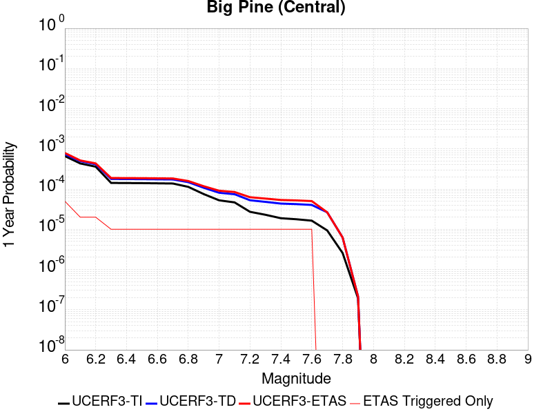 | 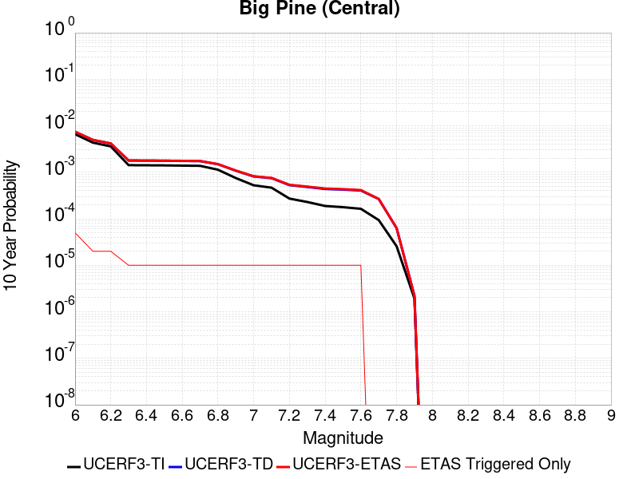 |

| Magnitude | 1 wk TI Prob | 1 wk TD Prob | 1 wk ETAS Prob | 1 wk ETAS/TD Gain | 1 wk ETAS Triggered Only | 1 mo TI Prob | 1 mo TD Prob | 1 mo ETAS Prob | 1 mo ETAS/TD Gain | 1 mo ETAS Triggered Only | 1 yr TI Prob | 1 yr TD Prob | 1 yr ETAS Prob | 1 yr ETAS/TD Gain | 1 yr ETAS Triggered Only | 10 yr TI Prob | 10 yr TD Prob | 10 yr ETAS Prob | 10 yr ETAS/TD Gain | 10 yr ETAS Triggered Only |
|-----|-----|-----|-----|-----|-----|-----|-----|-----|-----|-----|-----|-----|-----|-----|-----|-----|-----|-----|-----|-----|
| 6.0 | 1.2706755E-5 | 1.4251083E-5 | 1.4251083E-5 | 1.0 | 0.0 | 5.4456385E-5 | 6.107485E-5 | 6.107485E-5 | 1.0 | 0.0 | 6.628048E-4 | 7.433691E-4 | 7.9333194E-4 | 1.0672114 | 5.0E-5 | 0.006608314 | 0.0074138264 | 0.0074634557 | 1.0066942 | 5.0E-5 |
| 6.1 | 8.342579E-6 | 9.511262E-6 | 9.511262E-6 | 1.0 | 0.0 | 3.5753423E-5 | 4.0762035E-5 | 4.0762035E-5 | 1.0 | 0.0 | 4.3521097E-4 | 4.961865E-4 | 5.161766E-4 | 1.0402874 | 2.0E-5 | 0.0043435963 | 0.004954315 | 0.0049742158 | 1.0040169 | 2.0E-5 |
| 6.2 | 6.923899E-6 | 7.967629E-6 | 7.967629E-6 | 1.0 | 0.0 | 2.9673516E-5 | 3.4146644E-5 | 3.4146644E-5 | 1.0 | 0.0 | 3.6121515E-4 | 4.1567534E-4 | 4.3566703E-4 | 1.0480945 | 2.0E-5 | 0.003606286 | 0.00415226 | 0.0041721766 | 1.0047966 | 2.0E-5 |
| 6.3 | 2.728396E-6 | 3.4247232E-6 | 3.4247232E-6 | 1.0 | 0.0 | 1.1693074E-5 | 1.4677307E-5 | 1.4677307E-5 | 1.0 | 0.0 | 1.4235388E-4 | 1.7868243E-4 | 1.8868064E-4 | 1.0559552 | 1.0E-5 | 0.0014226272 | 0.001786868 | 0.0017968501 | 1.0055864 | 1.0E-5 |
| 6.4 | 2.7136944E-6 | 3.4090162E-6 | 3.4090162E-6 | 1.0 | 0.0 | 1.1630066E-5 | 1.4609993E-5 | 1.4609993E-5 | 1.0 | 0.0 | 1.4158686E-4 | 1.7786301E-4 | 1.8786124E-4 | 1.056213 | 1.0E-5 | 0.0014149669 | 0.001778687 | 0.0017886691 | 1.0056121 | 1.0E-5 |
| 6.5 | 2.6971882E-6 | 3.3913614E-6 | 3.3913614E-6 | 1.0 | 0.0 | 1.1559327E-5 | 1.4534329E-5 | 1.4534329E-5 | 1.0 | 0.0 | 1.4072572E-4 | 1.7694196E-4 | 1.8694019E-4 | 1.0565057 | 1.0E-5 | 0.0014063664 | 0.0017694911 | 0.0017794734 | 1.0056413 | 1.0E-5 |
| 6.6 | 2.669092E-6 | 3.3613815E-6 | 3.3613815E-6 | 1.0 | 0.0 | 1.1438916E-5 | 1.4405846E-5 | 1.4405846E-5 | 1.0 | 0.0 | 1.3925991E-4 | 1.7537792E-4 | 1.8537618E-4 | 1.0570097 | 1.0E-5 | 0.0013917267 | 0.0017538755 | 0.001763858 | 1.0056916 | 1.0E-5 |
| 6.7 | 2.6408059E-6 | 3.3314068E-6 | 3.3314068E-6 | 1.0 | 0.0 | 1.1317691E-5 | 1.4277384E-5 | 1.4277384E-5 | 1.0 | 0.0 | 1.3778417E-4 | 1.7381416E-4 | 1.8381243E-4 | 1.0575227 | 1.0E-5 | 0.0013769877 | 0.0017382624 | 0.001748245 | 1.0057429 | 1.0E-5 |
| 6.8 | 2.1786943E-6 | 2.8548623E-6 | 2.8548623E-6 | 1.0 | 0.0 | 9.337228E-6 | 1.223507E-5 | 1.223507E-5 | 1.0 | 0.0 | 1.1367482E-4 | 1.4895253E-4 | 1.5895104E-4 | 1.0671254 | 1.0E-5 | 0.0011361669 | 0.0014899937 | 0.0014999788 | 1.0067015 | 1.0E-5 |
| 6.9 | 1.4411696E-6 | 2.0689088E-6 | 2.0689088E-6 | 1.0 | 0.0 | 6.1764263E-6 | 8.866724E-6 | 8.866724E-6 | 1.0 | 0.0 | 7.51954E-5 | 1.07947286E-4 | 1.17946205E-4 | 1.0926278 | 1.0E-5 | 7.5169955E-4 | 0.0010803706 | 0.0010903598 | 1.0092461 | 1.0E-5 |
| 7.0 | 1.0073411E-6 | 1.5546336E-6 | 1.5546336E-6 | 1.0 | 0.0 | 4.317169E-6 | 6.662699E-6 | 6.662699E-6 | 1.0 | 0.0 | 5.2560266E-5 | 8.11155E-5 | 9.1114685E-5 | 1.123271 | 1.0E-5 | 5.2547833E-4 | 8.1226975E-4 | 8.222616E-4 | 1.0123012 | 1.0E-5 |
| 7.1 | 8.947104E-7 | 1.4306167E-6 | 1.4306167E-6 | 1.0 | 0.0 | 3.834468E-6 | 6.1312007E-6 | 6.1312007E-6 | 1.0 | 0.0 | 4.6683643E-5 | 7.4644966E-5 | 8.464422E-5 | 1.1339575 | 1.0E-5 | 4.6673836E-4 | 7.4760953E-4 | 7.576021E-4 | 1.013366 | 1.0E-5 |
| 7.2 | 5.215166E-7 | 1.0115094E-6 | 1.0115094E-6 | 1.0 | 0.0 | 2.2350691E-6 | 4.3350337E-6 | 4.3350337E-6 | 1.0 | 0.0 | 2.7211627E-5 | 5.27778E-5 | 6.2777275E-5 | 1.1894636 | 1.0E-5 | 2.7208295E-4 | 5.2905316E-4 | 5.390479E-4 | 1.0188917 | 1.0E-5 |
| 7.3 | 4.4024807E-7 | 9.2229175E-7 | 9.2229175E-7 | 1.0 | 0.0 | 1.8867761E-6 | 3.952673E-6 | 3.952673E-6 | 1.0 | 0.0 | 2.2971257E-5 | 4.8122773E-5 | 5.8122292E-5 | 1.2077918 | 1.0E-5 | 2.2968883E-4 | 4.8252378E-4 | 4.9251894E-4 | 1.0207144 | 1.0E-5 |
| 7.4 | 3.6130905E-7 | 8.3617664E-7 | 8.3617664E-7 | 1.0 | 0.0 | 1.5484665E-6 | 3.5836094E-6 | 3.5836094E-6 | 1.0 | 0.0 | 1.8852415E-5 | 4.362961E-5 | 5.3629174E-5 | 1.2291921 | 1.0E-5 | 1.8850817E-4 | 4.3760161E-4 | 4.4759724E-4 | 1.0228418 | 1.0E-5 |
| 7.5 | 3.408184E-7 | 8.111325E-7 | 8.111325E-7 | 1.0 | 0.0 | 1.4606494E-6 | 3.4762777E-6 | 3.4762777E-6 | 1.0 | 0.0 | 1.7783263E-5 | 4.2322896E-5 | 5.2322473E-5 | 1.2362688 | 1.0E-5 | 1.778184E-4 | 4.2451447E-4 | 4.345102E-4 | 1.0235463 | 1.0E-5 |
| 7.6 | 3.1428627E-7 | 7.734672E-7 | 7.734672E-7 | 1.0 | 0.0 | 1.3469405E-6 | 3.3148556E-6 | 3.3148556E-6 | 1.0 | 0.0 | 1.6398877E-5 | 4.0357656E-5 | 5.0357252E-5 | 1.2477745 | 1.0E-5 | 1.6397667E-4 | 4.0484127E-4 | 4.148372E-4 | 1.024691 | 1.0E-5 |
| 7.7 | 1.7972785E-7 | 5.0801975E-7 | 5.0801975E-7 | 1.0 | 0.0 | 7.70262E-7 | 2.1772257E-6 | 2.1772257E-6 | 1.0 | 0.0 | 9.377899E-6 | 2.650741E-5 | 2.650741E-5 | 1.0 | 0.0 | 9.377503E-5 | 2.6640965E-4 | 2.6640965E-4 | 1.0 | 0.0 |
| 7.8 | 4.9230927E-8 | 1.1986405E-7 | 1.1986405E-7 | 1.0 | 0.0 | 2.1098968E-7 | 5.13703E-7 | 5.13703E-7 | 1.0 | 0.0 | 2.5687964E-6 | 6.2543177E-6 | 6.2543177E-6 | 1.0 | 0.0 | 2.5687666E-5 | 6.29837E-5 | 6.29837E-5 | 1.0 | 0.0 |
| 7.9 | 3.6805972E-9 | 4.1069246E-9 | 4.1069246E-9 | 1.0 | 0.0 | 1.5773987E-8 | 1.7601105E-8 | 1.7601105E-8 | 1.0 | 0.0 | 1.9204828E-7 | 2.1429342E-7 | 2.1429342E-7 | 1.0 | 0.0 | 1.920481E-6 | 2.1908222E-6 | 2.1908222E-6 | 1.0 | 0.0 |

## Santa Cruz Island
*[(top)](#table-of-contents)*

| 1 Week | 1 Month | 1 Year | 10 Year |
|-----|-----|-----|-----|
|  |  | 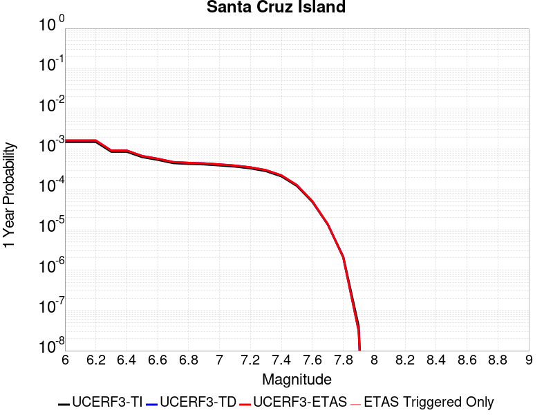 |  |

| Magnitude | 1 wk TI Prob | 1 wk TD Prob | 1 wk ETAS Prob | 1 wk ETAS/TD Gain | 1 wk ETAS Triggered Only | 1 mo TI Prob | 1 mo TD Prob | 1 mo ETAS Prob | 1 mo ETAS/TD Gain | 1 mo ETAS Triggered Only | 1 yr TI Prob | 1 yr TD Prob | 1 yr ETAS Prob | 1 yr ETAS/TD Gain | 1 yr ETAS Triggered Only | 10 yr TI Prob | 10 yr TD Prob | 10 yr ETAS Prob | 10 yr ETAS/TD Gain | 10 yr ETAS Triggered Only |
|-----|-----|-----|-----|-----|-----|-----|-----|-----|-----|-----|-----|-----|-----|-----|-----|-----|-----|-----|-----|-----|
| 6.0 | 2.9164563E-5 | 3.1600095E-5 | 3.1600095E-5 | 1.0 | 0.0 | 1.2498499E-4 | 1.3542273E-4 | 1.3542273E-4 | 1.0 | 0.0 | 0.0015206301 | 0.001647661 | 0.001647661 | 1.0 | 0.0 | 0.015102667 | 0.01636818 | 0.016407525 | 1.0024037 | 4.0E-5 |
| 6.1 | 2.9164563E-5 | 3.1600095E-5 | 3.1600095E-5 | 1.0 | 0.0 | 1.2498499E-4 | 1.3542273E-4 | 1.3542273E-4 | 1.0 | 0.0 | 0.0015206301 | 0.001647661 | 0.001647661 | 1.0 | 0.0 | 0.015102667 | 0.01636818 | 0.016407525 | 1.0024037 | 4.0E-5 |
| 6.2 | 2.9164563E-5 | 3.1600095E-5 | 3.1600095E-5 | 1.0 | 0.0 | 1.2498499E-4 | 1.3542273E-4 | 1.3542273E-4 | 1.0 | 0.0 | 0.0015206301 | 0.001647661 | 0.001647661 | 1.0 | 0.0 | 0.015102667 | 0.01636818 | 0.016407525 | 1.0024037 | 4.0E-5 |
| 6.3 | 1.6635553E-5 | 1.7804527E-5 | 1.7804527E-5 | 1.0 | 0.0 | 7.1293274E-5 | 7.630298E-5 | 7.630298E-5 | 1.0 | 0.0 | 8.6765E-4 | 9.2861115E-4 | 9.2861115E-4 | 1.0 | 0.0 | 0.008642701 | 0.009249181 | 0.009268995 | 1.0021423 | 2.0E-5 |
| 6.4 | 1.6635553E-5 | 1.7804527E-5 | 1.7804527E-5 | 1.0 | 0.0 | 7.1293274E-5 | 7.630298E-5 | 7.630298E-5 | 1.0 | 0.0 | 8.6765E-4 | 9.2861115E-4 | 9.2861115E-4 | 1.0 | 0.0 | 0.008642701 | 0.009249181 | 0.009268995 | 1.0021423 | 2.0E-5 |
| 6.5 | 1.2238748E-5 | 1.3043111E-5 | 1.3043111E-5 | 1.0 | 0.0 | 5.2450723E-5 | 5.5897868E-5 | 5.5897868E-5 | 1.0 | 0.0 | 6.3840044E-4 | 6.8034773E-4 | 6.8034773E-4 | 1.0 | 0.0 | 0.0063656955 | 0.0067830477 | 0.00679298 | 1.0014642 | 1.0E-5 |
| 6.6 | 1.0489767E-5 | 1.11567315E-5 | 1.11567315E-5 | 1.0 | 0.0 | 4.495537E-5 | 4.78137E-5 | 4.78137E-5 | 1.0 | 0.0 | 5.4719415E-4 | 5.8197853E-4 | 5.8197853E-4 | 1.0 | 0.0 | 0.005458487 | 0.0058047855 | 0.0058147274 | 1.0017127 | 1.0E-5 |
| 6.7 | 8.699222E-6 | 9.236859E-6 | 9.236859E-6 | 1.0 | 0.0 | 3.7281847E-5 | 3.9585942E-5 | 3.9585942E-5 | 1.0 | 0.0 | 4.5381195E-4 | 4.8185283E-4 | 4.8185283E-4 | 1.0 | 0.0 | 0.0045288634 | 0.004808148 | 0.0048181 | 1.0020698 | 1.0E-5 |
| 6.8 | 8.307732E-6 | 8.816977E-6 | 8.816977E-6 | 1.0 | 0.0 | 3.560408E-5 | 3.77865E-5 | 3.77865E-5 | 1.0 | 0.0 | 4.3339343E-4 | 4.5995397E-4 | 4.5995397E-4 | 1.0 | 0.0 | 0.004325492 | 0.004590073 | 0.0046000276 | 1.0021687 | 1.0E-5 |
| 6.9 | 8.073121E-6 | 8.56501E-6 | 8.56501E-6 | 1.0 | 0.0 | 3.459863E-5 | 3.670667E-5 | 3.670667E-5 | 1.0 | 0.0 | 4.2115687E-4 | 4.4681248E-4 | 4.4681248E-4 | 1.0 | 0.0 | 0.004203596 | 0.0044591925 | 0.0044691483 | 1.0022326 | 1.0E-5 |
| 7.0 | 7.617019E-6 | 8.07473E-6 | 8.07473E-6 | 1.0 | 0.0 | 3.264396E-5 | 3.4605528E-5 | 3.4605528E-5 | 1.0 | 0.0 | 3.9736772E-4 | 4.2124125E-4 | 4.2124125E-4 | 1.0 | 0.0 | 0.003966579 | 0.0042044753 | 0.0042144335 | 1.0023685 | 1.0E-5 |
| 7.1 | 7.1224836E-6 | 7.545849E-6 | 7.545849E-6 | 1.0 | 0.0 | 3.052457E-5 | 3.2338954E-5 | 3.2338954E-5 | 1.0 | 0.0 | 3.715733E-4 | 3.9365597E-4 | 3.9365597E-4 | 1.0 | 0.0 | 0.003709526 | 0.0039296295 | 0.0039395904 | 1.0025347 | 1.0E-5 |
| 7.2 | 6.441115E-6 | 6.827439E-6 | 6.827439E-6 | 1.0 | 0.0 | 2.7604487E-5 | 2.9260125E-5 | 2.9260125E-5 | 1.0 | 0.0 | 3.360328E-4 | 3.5618403E-4 | 3.5618403E-4 | 1.0 | 0.0 | 0.0033552512 | 0.00355616 | 0.00355616 | 1.0 | 0.0 |
| 7.3 | 5.494274E-6 | 5.820041E-6 | 5.820041E-6 | 1.0 | 0.0 | 2.3546674E-5 | 2.4942798E-5 | 2.4942798E-5 | 1.0 | 0.0 | 2.8664304E-4 | 3.0363645E-4 | 3.0363645E-4 | 1.0 | 0.0 | 0.002862736 | 0.003032239 | 0.003032239 | 1.0 | 0.0 |
| 7.4 | 4.0802624E-6 | 4.31229E-6 | 4.31229E-6 | 1.0 | 0.0 | 1.7486722E-5 | 1.8481112E-5 | 1.8481112E-5 | 1.0 | 0.0 | 2.1288003E-4 | 2.2498438E-4 | 2.2498438E-4 | 1.0 | 0.0 | 0.0021267622 | 0.002247575 | 0.002247575 | 1.0 | 0.0 |
| 7.5 | 2.3584746E-6 | 2.475327E-6 | 2.475327E-6 | 1.0 | 0.0 | 1.0107709E-5 | 1.0608502E-5 | 1.0608502E-5 | 1.0 | 0.0 | 1.2305441E-4 | 1.291509E-4 | 1.291509E-4 | 1.0 | 0.0 | 0.0012298629 | 0.0012907635 | 0.0012907635 | 1.0 | 0.0 |
| 7.6 | 9.4981914E-7 | 9.86099E-7 | 9.86099E-7 | 1.0 | 0.0 | 4.0706473E-6 | 4.226132E-6 | 4.226132E-6 | 1.0 | 0.0 | 4.9559E-5 | 5.1451956E-5 | 5.1451956E-5 | 1.0 | 0.0 | 4.954795E-4 | 5.144017E-4 | 5.144017E-4 | 1.0 | 0.0 |
| 7.7 | 2.6013532E-7 | 2.6416743E-7 | 2.6416743E-7 | 1.0 | 0.0 | 1.1148652E-6 | 1.1321456E-6 | 1.1321456E-6 | 1.0 | 0.0 | 1.3573399E-5 | 1.3783787E-5 | 1.3783787E-5 | 1.0 | 0.0 | 1.357257E-4 | 1.3782938E-4 | 1.3782938E-4 | 1.0 | 0.0 |
| 7.8 | 4.1522263E-8 | 3.9657085E-8 | 3.9657085E-8 | 1.0 | 0.0 | 1.7795254E-7 | 1.6995892E-7 | 1.6995892E-7 | 1.0 | 0.0 | 2.16657E-6 | 2.069248E-6 | 2.069248E-6 | 1.0 | 0.0 | 2.1665488E-5 | 2.0692309E-5 | 2.0692309E-5 | 1.0 | 0.0 |
| 7.9 | 7.7242046E-10 | 5.9475247E-10 | 5.9475247E-10 | 1.0 | 0.0 | 3.3103735E-9 | 2.5489395E-9 | 2.5489395E-9 | 1.0 | 0.0 | 4.0303796E-8 | 3.1033338E-8 | 3.1033338E-8 | 1.0 | 0.0 | 4.030379E-7 | 3.1033335E-7 | 3.1033335E-7 | 1.0 | 0.0 |

## Hollywood
*[(top)](#table-of-contents)*

| 1 Week | 1 Month | 1 Year | 10 Year |
|-----|-----|-----|-----|
|  |  |  |  |

| Magnitude | 1 wk TI Prob | 1 wk TD Prob | 1 wk ETAS Prob | 1 wk ETAS/TD Gain | 1 wk ETAS Triggered Only | 1 mo TI Prob | 1 mo TD Prob | 1 mo ETAS Prob | 1 mo ETAS/TD Gain | 1 mo ETAS Triggered Only | 1 yr TI Prob | 1 yr TD Prob | 1 yr ETAS Prob | 1 yr ETAS/TD Gain | 1 yr ETAS Triggered Only | 10 yr TI Prob | 10 yr TD Prob | 10 yr ETAS Prob | 10 yr ETAS/TD Gain | 10 yr ETAS Triggered Only |
|-----|-----|-----|-----|-----|-----|-----|-----|-----|-----|-----|-----|-----|-----|-----|-----|-----|-----|-----|-----|-----|
| 6.0 | 1.24487615E-5 | 1.2593379E-5 | 1.2593379E-5 | 1.0 | 0.0 | 5.3350745E-5 | 5.3970536E-5 | 6.3969994E-5 | 1.1852763 | 1.0E-5 | 6.4935174E-4 | 6.5689784E-4 | 6.7688467E-4 | 1.0304261 | 2.0E-5 | 0.0064745755 | 0.0065500485 | 0.006599721 | 1.0075835 | 5.0E-5 |
| 6.1 | 1.24487615E-5 | 1.2593379E-5 | 1.2593379E-5 | 1.0 | 0.0 | 5.3350745E-5 | 5.3970536E-5 | 6.3969994E-5 | 1.1852763 | 1.0E-5 | 6.4935174E-4 | 6.5689784E-4 | 6.7688467E-4 | 1.0304261 | 2.0E-5 | 0.0064745755 | 0.0065500485 | 0.006599721 | 1.0075835 | 5.0E-5 |
| 6.2 | 1.24487615E-5 | 1.2593379E-5 | 1.2593379E-5 | 1.0 | 0.0 | 5.3350745E-5 | 5.3970536E-5 | 6.3969994E-5 | 1.1852763 | 1.0E-5 | 6.4935174E-4 | 6.5689784E-4 | 6.7688467E-4 | 1.0304261 | 2.0E-5 | 0.0064745755 | 0.0065500485 | 0.006599721 | 1.0075835 | 5.0E-5 |
| 6.3 | 1.24487615E-5 | 1.2593379E-5 | 1.2593379E-5 | 1.0 | 0.0 | 5.3350745E-5 | 5.3970536E-5 | 6.3969994E-5 | 1.1852763 | 1.0E-5 | 6.4935174E-4 | 6.5689784E-4 | 6.7688467E-4 | 1.0304261 | 2.0E-5 | 0.0064745755 | 0.0065500485 | 0.006599721 | 1.0075835 | 5.0E-5 |
| 6.4 | 1.2431024E-5 | 1.25739925E-5 | 1.25739925E-5 | 1.0 | 0.0 | 5.327473E-5 | 5.3887452E-5 | 6.388692E-5 | 1.185562 | 1.0E-5 | 6.4842677E-4 | 6.558869E-4 | 6.758738E-4 | 1.0304731 | 2.0E-5 | 0.0064653796 | 0.006539999 | 0.006589672 | 1.0075953 | 5.0E-5 |
| 6.5 | 1.1242222E-5 | 1.1317944E-5 | 1.1317944E-5 | 1.0 | 0.0 | 4.8180063E-5 | 4.850459E-5 | 5.8504105E-5 | 1.206156 | 1.0E-5 | 5.864344E-4 | 5.9038604E-4 | 6.103742E-4 | 1.0338562 | 2.0E-5 | 0.0058488925 | 0.0058884625 | 0.005938168 | 1.0084412 | 5.0E-5 |
| 6.6 | 1.1234066E-5 | 1.1309058E-5 | 1.1309058E-5 | 1.0 | 0.0 | 4.8145106E-5 | 4.8466507E-5 | 5.8466023E-5 | 1.206318 | 1.0E-5 | 5.86009E-4 | 5.8992265E-4 | 6.099108E-4 | 1.0338827 | 2.0E-5 | 0.005844661 | 0.005883853 | 0.005933559 | 1.0084479 | 5.0E-5 |
| 6.7 | 1.12294E-5 | 1.1303801E-5 | 1.1303801E-5 | 1.0 | 0.0 | 4.812511E-5 | 4.8443977E-5 | 5.8443493E-5 | 1.206414 | 1.0E-5 | 5.857657E-4 | 5.896485E-4 | 6.096367E-4 | 1.0338985 | 2.0E-5 | 0.0058422405 | 0.0058811265 | 0.005930832 | 1.0084518 | 5.0E-5 |
| 6.8 | 1.0252819E-5 | 1.0218572E-5 | 1.0218572E-5 | 1.0 | 0.0 | 4.3939912E-5 | 4.379316E-5 | 5.379272E-5 | 1.2283362 | 1.0E-5 | 5.3483713E-4 | 5.3305336E-4 | 5.5304274E-4 | 1.0374997 | 2.0E-5 | 0.005335517 | 0.005317974 | 0.005367708 | 1.0093521 | 5.0E-5 |
| 6.9 | 9.252289E-6 | 9.1104175E-6 | 9.1104175E-6 | 1.0 | 0.0 | 3.9652066E-5 | 3.9044073E-5 | 4.9043683E-5 | 1.2561108 | 1.0E-5 | 4.8265693E-4 | 4.7525953E-4 | 4.9525005E-4 | 1.0420623 | 2.0E-5 | 0.0048161 | 0.004742605 | 0.004792368 | 1.0104927 | 5.0E-5 |
| 7.0 | 8.474604E-6 | 8.258358E-6 | 8.258358E-6 | 1.0 | 0.0 | 3.6319227E-5 | 3.539249E-5 | 4.5392135E-5 | 1.2825358 | 1.0E-5 | 4.4209688E-4 | 4.308198E-4 | 4.508112E-4 | 1.0464032 | 2.0E-5 | 0.004412184 | 0.0042999964 | 0.004349781 | 1.011578 | 5.0E-5 |
| 7.1 | 6.643643E-6 | 6.2684435E-6 | 6.2684435E-6 | 1.0 | 0.0 | 2.8472443E-5 | 2.6864484E-5 | 2.6864484E-5 | 1.0 | 0.0 | 3.4659685E-4 | 3.270264E-4 | 3.3702314E-4 | 1.0305686 | 1.0E-5 | 0.0034605677 | 0.0032654977 | 0.0032953997 | 1.009157 | 3.0E-5 |
| 7.2 | 5.549002E-6 | 5.1087686E-6 | 5.1087686E-6 | 1.0 | 0.0 | 2.378122E-5 | 2.189454E-5 | 2.189454E-5 | 1.0 | 0.0 | 2.8949787E-4 | 2.6653355E-4 | 2.765309E-4 | 1.0375087 | 1.0E-5 | 0.0028912104 | 0.0026621553 | 0.0026920754 | 1.011239 | 3.0E-5 |
| 7.3 | 4.3059727E-6 | 3.959941E-6 | 3.959941E-6 | 1.0 | 0.0 | 1.8454039E-5 | 1.6971066E-5 | 1.6971066E-5 | 1.0 | 0.0 | 2.2465475E-4 | 2.0660323E-4 | 2.0660323E-4 | 1.0 | 0.0 | 0.0022442779 | 0.0020641217 | 0.0020840804 | 1.0096693 | 2.0E-5 |
| 7.4 | 2.8550733E-6 | 2.7013398E-6 | 2.7013398E-6 | 1.0 | 0.0 | 1.2235971E-5 | 1.157712E-5 | 1.157712E-5 | 1.0 | 0.0 | 1.4896276E-4 | 1.4094236E-4 | 1.4094236E-4 | 1.0 | 0.0 | 0.0014886294 | 0.0014085348 | 0.0014185207 | 1.0070896 | 1.0E-5 |
| 7.5 | 1.9927045E-6 | 1.8976706E-6 | 1.8976706E-6 | 1.0 | 0.0 | 8.540134E-6 | 8.132849E-6 | 8.132849E-6 | 1.0 | 0.0 | 1.0397117E-4 | 9.901297E-5 | 9.901297E-5 | 1.0 | 0.0 | 0.0010392254 | 9.896922E-4 | 9.996822E-4 | 1.0100942 | 1.0E-5 |
| 7.6 | 1.345084E-6 | 1.2216213E-6 | 1.2216213E-6 | 1.0 | 0.0 | 5.764633E-6 | 5.2355094E-6 | 5.2355094E-6 | 1.0 | 0.0 | 7.018215E-5 | 6.374048E-5 | 6.374048E-5 | 1.0 | 0.0 | 7.0159987E-4 | 6.37224E-4 | 6.472176E-4 | 1.015683 | 1.0E-5 |
| 7.7 | 7.6835164E-7 | 6.2778383E-7 | 6.2778383E-7 | 1.0 | 0.0 | 3.2929315E-6 | 2.6904993E-6 | 2.6904993E-6 | 1.0 | 0.0 | 4.00907E-5 | 3.2756354E-5 | 3.2756354E-5 | 1.0 | 0.0 | 4.0083472E-4 | 3.2751673E-4 | 3.2751673E-4 | 1.0 | 0.0 |
| 7.8 | 3.6562128E-7 | 2.45358E-7 | 2.45358E-7 | 1.0 | 0.0 | 1.5669474E-6 | 1.0515338E-6 | 1.0515338E-6 | 1.0 | 0.0 | 1.9077417E-5 | 1.2802353E-5 | 1.2802353E-5 | 1.0 | 0.0 | 1.907578E-4 | 1.2801652E-4 | 1.2801652E-4 | 1.0 | 0.0 |
| 7.9 | 7.5024424E-8 | 5.3820486E-8 | 5.3820486E-8 | 1.0 | 0.0 | 3.215332E-7 | 2.3065921E-7 | 2.3065921E-7 | 1.0 | 0.0 | 3.91466E-6 | 2.8082736E-6 | 2.8082736E-6 | 1.0 | 0.0 | 3.9145907E-5 | 2.808251E-5 | 2.808251E-5 | 1.0 | 0.0 |

## Santa Ynez (East)
*[(top)](#table-of-contents)*

| 1 Week | 1 Month | 1 Year | 10 Year |
|-----|-----|-----|-----|
|  |  | 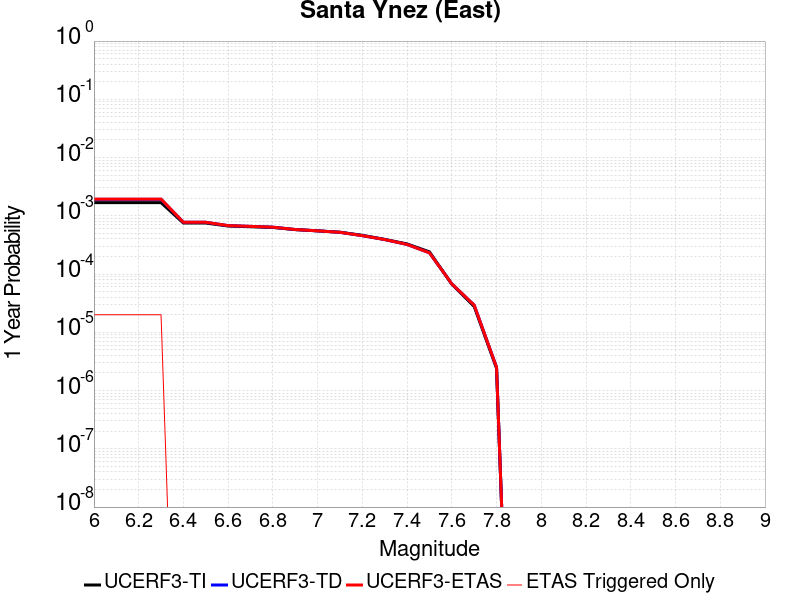 |  |

| Magnitude | 1 wk TI Prob | 1 wk TD Prob | 1 wk ETAS Prob | 1 wk ETAS/TD Gain | 1 wk ETAS Triggered Only | 1 mo TI Prob | 1 mo TD Prob | 1 mo ETAS Prob | 1 mo ETAS/TD Gain | 1 mo ETAS Triggered Only | 1 yr TI Prob | 1 yr TD Prob | 1 yr ETAS Prob | 1 yr ETAS/TD Gain | 1 yr ETAS Triggered Only | 10 yr TI Prob | 10 yr TD Prob | 10 yr ETAS Prob | 10 yr ETAS/TD Gain | 10 yr ETAS Triggered Only |
|-----|-----|-----|-----|-----|-----|-----|-----|-----|-----|-----|-----|-----|-----|-----|-----|-----|-----|-----|-----|-----|
| 6.0 | 3.2269712E-5 | 3.6751615E-5 | 3.6751615E-5 | 1.0 | 0.0 | 1.3829143E-4 | 1.5750073E-4 | 1.6749917E-4 | 1.0634818 | 1.0E-5 | 0.0016823979 | 0.001916469 | 0.0019364306 | 1.0104159 | 2.0E-5 | 0.016697178 | 0.01905687 | 0.019096108 | 1.002059 | 4.0E-5 |
| 6.1 | 3.2269712E-5 | 3.6751615E-5 | 3.6751615E-5 | 1.0 | 0.0 | 1.3829143E-4 | 1.5750073E-4 | 1.6749917E-4 | 1.0634818 | 1.0E-5 | 0.0016823979 | 0.001916469 | 0.0019364306 | 1.0104159 | 2.0E-5 | 0.016697178 | 0.01905687 | 0.019096108 | 1.002059 | 4.0E-5 |
| 6.2 | 3.2269712E-5 | 3.6751615E-5 | 3.6751615E-5 | 1.0 | 0.0 | 1.3829143E-4 | 1.5750073E-4 | 1.6749917E-4 | 1.0634818 | 1.0E-5 | 0.0016823979 | 0.001916469 | 0.0019364306 | 1.0104159 | 2.0E-5 | 0.016697178 | 0.01905687 | 0.019096108 | 1.002059 | 4.0E-5 |
| 6.3 | 3.2269712E-5 | 3.6751615E-5 | 3.6751615E-5 | 1.0 | 0.0 | 1.3829143E-4 | 1.5750073E-4 | 1.6749917E-4 | 1.0634818 | 1.0E-5 | 0.0016823979 | 0.001916469 | 0.0019364306 | 1.0104159 | 2.0E-5 | 0.016697178 | 0.01905687 | 0.019096108 | 1.002059 | 4.0E-5 |
| 6.4 | 1.4404779E-5 | 1.4849478E-5 | 1.4849478E-5 | 1.0 | 0.0 | 6.1733306E-5 | 6.36391E-5 | 6.36391E-5 | 1.0 | 0.0 | 7.513438E-4 | 7.7453564E-4 | 7.7453564E-4 | 1.0 | 0.0 | 0.0074880854 | 0.0077189123 | 0.007728835 | 1.0012856 | 1.0E-5 |
| 6.5 | 1.4404779E-5 | 1.4849478E-5 | 1.4849478E-5 | 1.0 | 0.0 | 6.1733306E-5 | 6.36391E-5 | 6.36391E-5 | 1.0 | 0.0 | 7.513438E-4 | 7.7453564E-4 | 7.7453564E-4 | 1.0 | 0.0 | 0.0074880854 | 0.0077189123 | 0.007728835 | 1.0012856 | 1.0E-5 |
| 6.6 | 1.280208E-5 | 1.3012008E-5 | 1.3012008E-5 | 1.0 | 0.0 | 5.4864904E-5 | 5.576457E-5 | 5.576457E-5 | 1.0 | 0.0 | 6.6777546E-4 | 6.787239E-4 | 6.787239E-4 | 1.0 | 0.0 | 0.006657724 | 0.00676672 | 0.0067766528 | 1.0014678 | 1.0E-5 |
| 6.7 | 1.2457027E-5 | 1.2628523E-5 | 1.2628523E-5 | 1.0 | 0.0 | 5.3386164E-5 | 5.4121127E-5 | 5.4121127E-5 | 1.0 | 0.0 | 6.497827E-4 | 6.587272E-4 | 6.587272E-4 | 1.0 | 0.0 | 0.00647886 | 0.006567944 | 0.006577878 | 1.0015125 | 1.0E-5 |
| 6.8 | 1.2095134E-5 | 1.2230965E-5 | 1.2230965E-5 | 1.0 | 0.0 | 5.1835254E-5 | 5.2417377E-5 | 5.2417377E-5 | 1.0 | 0.0 | 6.309115E-4 | 6.379963E-4 | 6.379963E-4 | 1.0 | 0.0 | 0.0062912325 | 0.006361835 | 0.0063717715 | 1.0015619 | 1.0E-5 |
| 6.9 | 1.1104036E-5 | 1.1157385E-5 | 1.1157385E-5 | 1.0 | 0.0 | 4.758786E-5 | 4.78165E-5 | 4.78165E-5 | 1.0 | 0.0 | 5.7922816E-4 | 5.820116E-4 | 5.820116E-4 | 1.0 | 0.0 | 0.005777207 | 0.005805019 | 0.0058149607 | 1.0017127 | 1.0E-5 |
| 7.0 | 1.0577444E-5 | 1.0581712E-5 | 1.0581712E-5 | 1.0 | 0.0 | 4.5331115E-5 | 4.534941E-5 | 4.534941E-5 | 1.0 | 0.0 | 5.5176654E-4 | 5.519904E-4 | 5.519904E-4 | 1.0 | 0.0 | 0.0055039856 | 0.0055063316 | 0.0055162767 | 1.0018061 | 1.0E-5 |
| 7.1 | 1.0021775E-5 | 9.981012E-6 | 9.981012E-6 | 1.0 | 0.0 | 4.294976E-5 | 4.277507E-5 | 4.277507E-5 | 1.0 | 0.0 | 5.2278786E-4 | 5.206632E-4 | 5.206632E-4 | 1.0 | 0.0 | 0.0052155964 | 0.005194566 | 0.005204514 | 1.0019151 | 1.0E-5 |
| 7.2 | 8.874109E-6 | 8.748804E-6 | 8.748804E-6 | 1.0 | 0.0 | 3.8031343E-5 | 3.749434E-5 | 3.749434E-5 | 1.0 | 0.0 | 4.629332E-4 | 4.5639908E-4 | 4.5639908E-4 | 1.0 | 0.0 | 0.0046197 | 0.0045547355 | 0.00456469 | 1.0021855 | 1.0E-5 |
| 7.3 | 7.5504267E-6 | 7.5050975E-6 | 7.5050975E-6 | 1.0 | 0.0 | 3.235857E-5 | 3.2164313E-5 | 3.2164313E-5 | 1.0 | 0.0 | 3.9389438E-4 | 3.9153118E-4 | 3.9153118E-4 | 1.0 | 0.0 | 0.0039319694 | 0.0039085206 | 0.0039184815 | 1.0025485 | 1.0E-5 |
| 7.4 | 6.309394E-6 | 6.1831197E-6 | 6.1831197E-6 | 1.0 | 0.0 | 2.703998E-5 | 2.6498821E-5 | 2.6498821E-5 | 1.0 | 0.0 | 3.2916202E-4 | 3.2257635E-4 | 3.2257635E-4 | 1.0 | 0.0 | 0.003286749 | 0.0032211784 | 0.0032311461 | 1.0030944 | 1.0E-5 |
| 7.5 | 4.6103073E-6 | 4.4408375E-6 | 4.4408375E-6 | 1.0 | 0.0 | 1.975831E-5 | 1.9032026E-5 | 1.9032026E-5 | 1.0 | 0.0 | 2.4053088E-4 | 2.3169098E-4 | 2.3169098E-4 | 1.0 | 0.0 | 0.002402707 | 0.0023145638 | 0.0023245406 | 1.0043105 | 1.0E-5 |
| 7.6 | 1.2858658E-6 | 1.3008295E-6 | 1.3008295E-6 | 1.0 | 0.0 | 5.5108417E-6 | 5.574972E-6 | 5.574972E-6 | 1.0 | 0.0 | 6.7092435E-5 | 6.787324E-5 | 6.787324E-5 | 1.0 | 0.0 | 6.707218E-4 | 6.78532E-4 | 6.78532E-4 | 1.0 | 0.0 |
| 7.7 | 5.3302307E-7 | 5.612178E-7 | 5.612178E-7 | 1.0 | 0.0 | 2.2843826E-6 | 2.4052172E-6 | 2.4052172E-6 | 1.0 | 0.0 | 2.7812002E-5 | 2.9283161E-5 | 2.9283161E-5 | 1.0 | 0.0 | 2.7808524E-4 | 2.927966E-4 | 2.927966E-4 | 1.0 | 0.0 |
| 7.8 | 4.613933E-8 | 4.803036E-8 | 4.803036E-8 | 1.0 | 0.0 | 1.9773998E-7 | 2.0584437E-7 | 2.0584437E-7 | 1.0 | 0.0 | 2.4074816E-6 | 2.5061524E-6 | 2.5061524E-6 | 1.0 | 0.0 | 2.4074554E-5 | 2.5061252E-5 | 2.5061252E-5 | 1.0 | 0.0 |

## Big Pine (East)
*[(top)](#table-of-contents)*

| 1 Week | 1 Month | 1 Year | 10 Year |
|-----|-----|-----|-----|
|  |  | 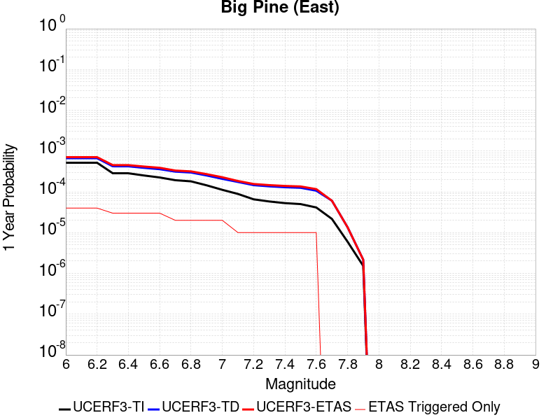 |  |

| Magnitude | 1 wk TI Prob | 1 wk TD Prob | 1 wk ETAS Prob | 1 wk ETAS/TD Gain | 1 wk ETAS Triggered Only | 1 mo TI Prob | 1 mo TD Prob | 1 mo ETAS Prob | 1 mo ETAS/TD Gain | 1 mo ETAS Triggered Only | 1 yr TI Prob | 1 yr TD Prob | 1 yr ETAS Prob | 1 yr ETAS/TD Gain | 1 yr ETAS Triggered Only | 10 yr TI Prob | 10 yr TD Prob | 10 yr ETAS Prob | 10 yr ETAS/TD Gain | 10 yr ETAS Triggered Only |
|-----|-----|-----|-----|-----|-----|-----|-----|-----|-----|-----|-----|-----|-----|-----|-----|-----|-----|-----|-----|-----|
| 6.0 | 9.916913E-6 | 1.281854E-5 | 1.281854E-5 | 1.0 | 0.0 | 4.250036E-5 | 5.4935572E-5 | 5.4935572E-5 | 1.0 | 0.0 | 5.173191E-4 | 6.686574E-4 | 7.0863066E-4 | 1.0597813 | 4.0E-5 | 0.0051611643 | 0.00667124 | 0.0067209066 | 1.0074449 | 5.0E-5 |
| 6.1 | 9.916913E-6 | 1.281854E-5 | 1.281854E-5 | 1.0 | 0.0 | 4.250036E-5 | 5.4935572E-5 | 5.4935572E-5 | 1.0 | 0.0 | 5.173191E-4 | 6.686574E-4 | 7.0863066E-4 | 1.0597813 | 4.0E-5 | 0.0051611643 | 0.00667124 | 0.0067209066 | 1.0074449 | 5.0E-5 |
| 6.2 | 9.916913E-6 | 1.281854E-5 | 1.281854E-5 | 1.0 | 0.0 | 4.250036E-5 | 5.4935572E-5 | 5.4935572E-5 | 1.0 | 0.0 | 5.173191E-4 | 6.686574E-4 | 7.0863066E-4 | 1.0597813 | 4.0E-5 | 0.0051611643 | 0.00667124 | 0.0067209066 | 1.0074449 | 5.0E-5 |
| 6.3 | 5.479711E-6 | 8.11447E-6 | 8.11447E-6 | 1.0 | 0.0 | 2.3484265E-5 | 3.4775854E-5 | 3.4775854E-5 | 1.0 | 0.0 | 2.858834E-4 | 4.2331696E-4 | 4.5330427E-4 | 1.0708389 | 3.0E-5 | 0.0028551589 | 0.0042280247 | 0.004267856 | 1.0094206 | 4.0E-5 |
| 6.4 | 5.465009E-6 | 8.098763E-6 | 8.098763E-6 | 1.0 | 0.0 | 2.3421257E-5 | 3.470854E-5 | 3.470854E-5 | 1.0 | 0.0 | 2.851165E-4 | 4.2249775E-4 | 4.5248508E-4 | 1.0709763 | 3.0E-5 | 0.0028475097 | 0.004219864 | 0.0042596953 | 1.009439 | 4.0E-5 |
| 6.5 | 4.826767E-6 | 7.4238146E-6 | 7.4238146E-6 | 1.0 | 0.0 | 2.068598E-5 | 3.1815976E-5 | 3.1815976E-5 | 1.0 | 0.0 | 2.518227E-4 | 3.8729343E-4 | 4.1728182E-4 | 1.0774306 | 3.0E-5 | 0.0025153751 | 0.0038690618 | 0.003908907 | 1.0102984 | 4.0E-5 |
| 6.6 | 4.3146847E-6 | 6.8837467E-6 | 6.8837467E-6 | 1.0 | 0.0 | 1.8491375E-5 | 2.950145E-5 | 2.950145E-5 | 1.0 | 0.0 | 2.2510924E-4 | 3.5912343E-4 | 3.8911265E-4 | 1.0835067 | 3.0E-5 | 0.0022488134 | 0.0035882755 | 0.003628132 | 1.0111074 | 4.0E-5 |
| 6.7 | 3.6968106E-6 | 5.9968484E-6 | 5.9968484E-6 | 1.0 | 0.0 | 1.5843378E-5 | 2.5700534E-5 | 2.5700534E-5 | 1.0 | 0.0 | 1.9287605E-4 | 3.1286062E-4 | 3.3285434E-4 | 1.0639062 | 2.0E-5 | 0.0019270873 | 0.003126956 | 0.0031468936 | 1.006376 | 2.0E-5 |
| 6.8 | 3.4671132E-6 | 5.703515E-6 | 5.703515E-6 | 1.0 | 0.0 | 1.4858972E-5 | 2.4443414E-5 | 2.4443414E-5 | 1.0 | 0.0 | 1.8089297E-4 | 2.9755937E-4 | 3.1755344E-4 | 1.0671935 | 2.0E-5 | 0.0018074579 | 0.0029743554 | 0.002994296 | 1.0067041 | 2.0E-5 |
| 6.9 | 2.7686972E-6 | 4.8264656E-6 | 4.8264656E-6 | 1.0 | 0.0 | 1.1865792E-5 | 2.0684693E-5 | 2.0684693E-5 | 1.0 | 0.0 | 1.4445644E-4 | 2.518078E-4 | 2.7180274E-4 | 1.0794057 | 2.0E-5 | 0.0014436257 | 0.0025179028 | 0.0025378524 | 1.0079231 | 2.0E-5 |
| 7.0 | 2.1472624E-6 | 3.986174E-6 | 3.986174E-6 | 1.0 | 0.0 | 9.20252E-6 | 1.7083494E-5 | 1.7083494E-5 | 1.0 | 0.0 | 1.12034926E-4 | 2.0797222E-4 | 2.2796806E-4 | 1.0961467 | 2.0E-5 | 0.0011197845 | 0.0020804254 | 0.0021003839 | 1.0095934 | 2.0E-5 |
| 7.1 | 1.7018335E-6 | 3.3459255E-6 | 3.3459255E-6 | 1.0 | 0.0 | 7.293552E-6 | 1.4339605E-5 | 1.4339605E-5 | 1.0 | 0.0 | 8.879537E-5 | 1.7457105E-4 | 1.845693E-4 | 1.0572733 | 1.0E-5 | 8.87599E-4 | 0.0017469557 | 0.0017569382 | 1.0057143 | 1.0E-5 |
| 7.2 | 1.25603E-6 | 2.795471E-6 | 2.795471E-6 | 1.0 | 0.0 | 5.3829745E-6 | 1.1980536E-5 | 1.1980536E-5 | 1.0 | 0.0 | 6.553574E-5 | 1.458535E-4 | 1.5585203E-4 | 1.0685519 | 1.0E-5 | 6.551642E-4 | 0.0014601707 | 0.0014701561 | 1.0068386 | 1.0E-5 |
| 7.3 | 1.112297E-6 | 2.6112702E-6 | 2.6112702E-6 | 1.0 | 0.0 | 4.7669787E-6 | 1.1191111E-5 | 1.1191111E-5 | 1.0 | 0.0 | 5.803642E-5 | 1.3624349E-4 | 1.4624212E-4 | 1.073388 | 1.0E-5 | 5.802127E-4 | 0.00136402 | 0.0013740065 | 1.0073212 | 1.0E-5 |
| 7.4 | 1.0137181E-6 | 2.4843957E-6 | 2.4843957E-6 | 1.0 | 0.0 | 4.3444993E-6 | 1.0647368E-5 | 1.0647368E-5 | 1.0 | 0.0 | 5.2892992E-5 | 1.2962421E-4 | 1.3962292E-4 | 1.077136 | 1.0E-5 | 5.288041E-4 | 0.0012976775 | 0.0013076646 | 1.007696 | 1.0E-5 |
| 7.5 | 9.598608E-7 | 2.4080273E-6 | 2.4080273E-6 | 1.0 | 0.0 | 4.1136827E-6 | 1.0320077E-5 | 1.0320077E-5 | 1.0 | 0.0 | 5.0082934E-5 | 1.2563991E-4 | 1.3563865E-4 | 1.0795826 | 1.0E-5 | 5.007165E-4 | 0.0012576841 | 0.0012676716 | 1.0079411 | 1.0E-5 |
| 7.6 | 7.929459E-7 | 2.0456312E-6 | 2.0456312E-6 | 1.0 | 0.0 | 3.3983351E-6 | 8.766962E-6 | 8.766962E-6 | 1.0 | 0.0 | 4.1373947E-5 | 1.0673271E-4 | 1.16731644E-4 | 1.0936819 | 1.0E-5 | 4.1366243E-4 | 0.0010689225 | 0.0010789118 | 1.0093452 | 1.0E-5 |
| 7.7 | 4.155788E-7 | 1.1611139E-6 | 1.1611139E-6 | 1.0 | 0.0 | 1.7810507E-6 | 4.9761934E-6 | 4.9761934E-6 | 1.0 | 0.0 | 2.1684076E-5 | 6.0583512E-5 | 6.0583512E-5 | 1.0 | 0.0 | 2.1681961E-4 | 6.0889556E-4 | 6.0889556E-4 | 1.0 | 0.0 |
| 7.8 | 1.14666925E-7 | 2.5932084E-7 | 2.5932084E-7 | 1.0 | 0.0 | 4.914296E-7 | 1.1113746E-6 | 1.1113746E-6 | 1.0 | 0.0 | 5.9831386E-6 | 1.3530906E-5 | 1.3530906E-5 | 1.0 | 0.0 | 5.9829777E-5 | 1.364052E-4 | 1.364052E-4 | 1.0 | 0.0 |
| 7.9 | 2.9231824E-8 | 4.1479638E-8 | 4.1479638E-8 | 1.0 | 0.0 | 1.2527924E-7 | 1.7776986E-7 | 1.7776986E-7 | 1.0 | 0.0 | 1.5252737E-6 | 2.1643461E-6 | 2.1643461E-6 | 1.0 | 0.0 | 1.5252632E-5 | 2.1986685E-5 | 2.1986685E-5 | 1.0 | 0.0 |

## Deep Springs
*[(top)](#table-of-contents)*

| 1 Week | 1 Month | 1 Year | 10 Year |
|-----|-----|-----|-----|
|  |  |  |  |

| Magnitude | 1 wk TI Prob | 1 wk TD Prob | 1 wk ETAS Prob | 1 wk ETAS/TD Gain | 1 wk ETAS Triggered Only | 1 mo TI Prob | 1 mo TD Prob | 1 mo ETAS Prob | 1 mo ETAS/TD Gain | 1 mo ETAS Triggered Only | 1 yr TI Prob | 1 yr TD Prob | 1 yr ETAS Prob | 1 yr ETAS/TD Gain | 1 yr ETAS Triggered Only | 10 yr TI Prob | 10 yr TD Prob | 10 yr ETAS Prob | 10 yr ETAS/TD Gain | 10 yr ETAS Triggered Only |
|-----|-----|-----|-----|-----|-----|-----|-----|-----|-----|-----|-----|-----|-----|-----|-----|-----|-----|-----|-----|-----|
| 6.0 | 1.9810619E-5 | 2.311303E-5 | 2.311303E-5 | 1.0 | 0.0 | 8.489989E-5 | 9.9054945E-5 | 1.0905396E-4 | 1.100944 | 1.0E-5 | 0.001033166 | 0.0012058344 | 0.0012258104 | 1.016566 | 2.0E-5 | 0.010283757 | 0.012042696 | 0.012092094 | 1.0041019 | 5.0E-5 |
| 6.1 | 1.9810619E-5 | 2.311303E-5 | 2.311303E-5 | 1.0 | 0.0 | 8.489989E-5 | 9.9054945E-5 | 1.0905396E-4 | 1.100944 | 1.0E-5 | 0.001033166 | 0.0012058344 | 0.0012258104 | 1.016566 | 2.0E-5 | 0.010283757 | 0.012042696 | 0.012092094 | 1.0041019 | 5.0E-5 |
| 6.2 | 1.9810619E-5 | 2.311303E-5 | 2.311303E-5 | 1.0 | 0.0 | 8.489989E-5 | 9.9054945E-5 | 1.0905396E-4 | 1.100944 | 1.0E-5 | 0.001033166 | 0.0012058344 | 0.0012258104 | 1.016566 | 2.0E-5 | 0.010283757 | 0.012042696 | 0.012092094 | 1.0041019 | 5.0E-5 |
| 6.3 | 1.9810619E-5 | 2.311303E-5 | 2.311303E-5 | 1.0 | 0.0 | 8.489989E-5 | 9.9054945E-5 | 1.0905396E-4 | 1.100944 | 1.0E-5 | 0.001033166 | 0.0012058344 | 0.0012258104 | 1.016566 | 2.0E-5 | 0.010283757 | 0.012042696 | 0.012092094 | 1.0041019 | 5.0E-5 |
| 6.4 | 1.9810619E-5 | 2.311303E-5 | 2.311303E-5 | 1.0 | 0.0 | 8.489989E-5 | 9.9054945E-5 | 1.0905396E-4 | 1.100944 | 1.0E-5 | 0.001033166 | 0.0012058344 | 0.0012258104 | 1.016566 | 2.0E-5 | 0.010283757 | 0.012042696 | 0.012092094 | 1.0041019 | 5.0E-5 |
| 6.5 | 1.7190405E-5 | 2.0051E-5 | 2.0051E-5 | 1.0 | 0.0 | 7.367108E-5 | 8.593286E-5 | 8.593286E-5 | 1.0 | 0.0 | 8.9657627E-4 | 0.0010462323 | 0.0010462323 | 1.0 | 0.0 | 0.008929676 | 0.010462292 | 0.010482082 | 1.0018916 | 2.0E-5 |
| 6.6 | 1.7190405E-5 | 2.0051E-5 | 2.0051E-5 | 1.0 | 0.0 | 7.367108E-5 | 8.593286E-5 | 8.593286E-5 | 1.0 | 0.0 | 8.9657627E-4 | 0.0010462323 | 0.0010462323 | 1.0 | 0.0 | 0.008929676 | 0.010462292 | 0.010482082 | 1.0018916 | 2.0E-5 |

## Great Valley 03a Dunnigan Hills
*[(top)](#table-of-contents)*

| 1 Week | 1 Month | 1 Year | 10 Year |
|-----|-----|-----|-----|
|  |  |  |  |

| Magnitude | 1 wk TI Prob | 1 wk TD Prob | 1 wk ETAS Prob | 1 wk ETAS/TD Gain | 1 wk ETAS Triggered Only | 1 mo TI Prob | 1 mo TD Prob | 1 mo ETAS Prob | 1 mo ETAS/TD Gain | 1 mo ETAS Triggered Only | 1 yr TI Prob | 1 yr TD Prob | 1 yr ETAS Prob | 1 yr ETAS/TD Gain | 1 yr ETAS Triggered Only | 10 yr TI Prob | 10 yr TD Prob | 10 yr ETAS Prob | 10 yr ETAS/TD Gain | 10 yr ETAS Triggered Only |
|-----|-----|-----|-----|-----|-----|-----|-----|-----|-----|-----|-----|-----|-----|-----|-----|-----|-----|-----|-----|-----|
| 6.0 | 1.6591328E-5 | 1.8108174E-5 | 1.8108174E-5 | 1.0 | 0.0 | 7.110376E-5 | 7.760454E-5 | 7.760454E-5 | 1.0 | 0.0 | 8.6534437E-4 | 9.4449485E-4 | 9.6447597E-4 | 1.0211554 | 2.0E-5 | 0.008619824 | 0.009411639 | 0.009451263 | 1.0042101 | 4.0E-5 |
| 6.1 | 8.041125E-6 | 8.769832E-6 | 8.769832E-6 | 1.0 | 0.0 | 3.4461507E-5 | 3.7584567E-5 | 3.7584567E-5 | 1.0 | 0.0 | 4.194881E-4 | 4.5751635E-4 | 4.775072E-4 | 1.0436943 | 2.0E-5 | 0.004186971 | 0.004567742 | 0.0045976047 | 1.0065378 | 3.0E-5 |
| 6.2 | 3.2807004E-6 | 3.579612E-6 | 3.579612E-6 | 1.0 | 0.0 | 1.4060069E-5 | 1.5341127E-5 | 1.5341127E-5 | 1.0 | 0.0 | 1.7116789E-4 | 1.8676638E-4 | 1.8676638E-4 | 1.0 | 0.0 | 0.0017103611 | 0.0018665022 | 0.0018665022 | 1.0 | 0.0 |
| 6.3 | 1.9339366E-6 | 2.1104063E-6 | 2.1104063E-6 | 1.0 | 0.0 | 8.288273E-6 | 9.044583E-6 | 9.044583E-6 | 1.0 | 0.0 | 1.00905054E-4 | 1.10115085E-4 | 1.10115085E-4 | 1.0 | 0.0 | 0.0010085925 | 0.0011008852 | 0.0011008852 | 1.0 | 0.0 |
| 6.4 | 1.3142635E-6 | 1.4340039E-6 | 1.4340039E-6 | 1.0 | 0.0 | 5.6325457E-6 | 6.1457313E-6 | 6.1457313E-6 | 1.0 | 0.0 | 6.857408E-5 | 7.4824275E-5 | 7.4824275E-5 | 1.0 | 0.0 | 6.8552926E-4 | 7.482428E-4 | 7.482428E-4 | 1.0 | 0.0 |

## Coronado Bank alt1
*[(top)](#table-of-contents)*

| 1 Week | 1 Month | 1 Year | 10 Year |
|-----|-----|-----|-----|
|  |  |  | 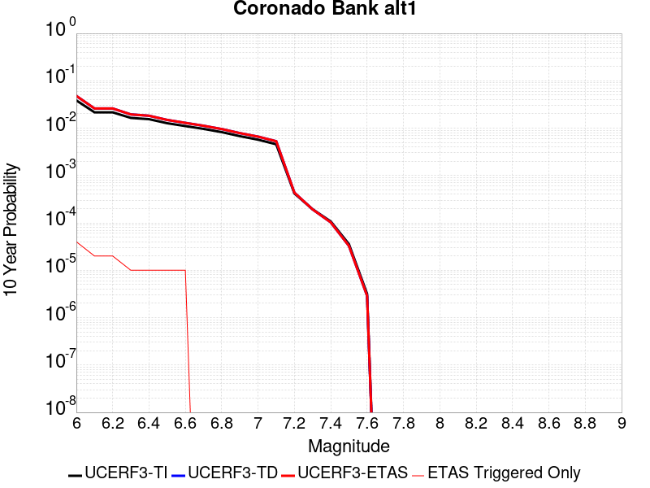 |

| Magnitude | 1 wk TI Prob | 1 wk TD Prob | 1 wk ETAS Prob | 1 wk ETAS/TD Gain | 1 wk ETAS Triggered Only | 1 mo TI Prob | 1 mo TD Prob | 1 mo ETAS Prob | 1 mo ETAS/TD Gain | 1 mo ETAS Triggered Only | 1 yr TI Prob | 1 yr TD Prob | 1 yr ETAS Prob | 1 yr ETAS/TD Gain | 1 yr ETAS Triggered Only | 10 yr TI Prob | 10 yr TD Prob | 10 yr ETAS Prob | 10 yr ETAS/TD Gain | 10 yr ETAS Triggered Only |
|-----|-----|-----|-----|-----|-----|-----|-----|-----|-----|-----|-----|-----|-----|-----|-----|-----|-----|-----|-----|-----|
| 6.0 | 7.533492E-5 | 9.395439E-5 | 9.395439E-5 | 1.0 | 0.0 | 3.22824E-4 | 4.026023E-4 | 4.026023E-4 | 1.0 | 0.0 | 0.0039233007 | 0.0048912787 | 0.004911181 | 1.0040689 | 2.0E-5 | 0.03854755 | 0.04790551 | 0.047943592 | 1.000795 | 4.0E-5 |
| 6.1 | 4.1807285E-5 | 5.049452E-5 | 5.049452E-5 | 1.0 | 0.0 | 1.7916178E-4 | 2.1638718E-4 | 2.1638718E-4 | 1.0 | 0.0 | 0.0021791123 | 0.0026314093 | 0.0026413829 | 1.0037903 | 1.0E-5 | 0.021578677 | 0.026011832 | 0.026031313 | 1.0007489 | 2.0E-5 |
| 6.2 | 4.1807285E-5 | 5.049452E-5 | 5.049452E-5 | 1.0 | 0.0 | 1.7916178E-4 | 2.1638718E-4 | 2.1638718E-4 | 1.0 | 0.0 | 0.0021791123 | 0.0026314093 | 0.0026413829 | 1.0037903 | 1.0E-5 | 0.021578677 | 0.026011832 | 0.026031313 | 1.0007489 | 2.0E-5 |
| 6.3 | 3.1793104E-5 | 3.7712067E-5 | 3.7712067E-5 | 1.0 | 0.0 | 1.3624904E-4 | 1.616133E-4 | 1.616133E-4 | 1.0 | 0.0 | 0.0016575698 | 0.0019658979 | 0.0019658979 | 1.0 | 0.0 | 0.016452603 | 0.019488975 | 0.01949878 | 1.0005031 | 1.0E-5 |
| 6.4 | 2.9878007E-5 | 3.5336667E-5 | 3.5336667E-5 | 1.0 | 0.0 | 1.2804232E-4 | 1.5143424E-4 | 1.5143424E-4 | 1.0 | 0.0 | 0.0015578003 | 0.0018421846 | 0.0018421846 | 1.0 | 0.0 | 0.015469253 | 0.018272907 | 0.018282725 | 1.0005373 | 1.0E-5 |
| 6.5 | 2.4512565E-5 | 2.876477E-5 | 2.876477E-5 | 1.0 | 0.0 | 1.0504962E-4 | 1.2327192E-4 | 1.2327192E-4 | 1.0 | 0.0 | 0.0012782287 | 0.0014998292 | 0.0014998292 | 1.0 | 0.0 | 0.012709012 | 0.014900037 | 0.014909888 | 1.0006611 | 1.0E-5 |
| 6.6 | 2.1317413E-5 | 2.4907235E-5 | 2.4907235E-5 | 1.0 | 0.0 | 9.135714E-5 | 1.0674105E-4 | 1.0674105E-4 | 1.0 | 0.0 | 0.0011117056 | 0.0012988197 | 0.0012988197 | 1.0 | 0.0 | 0.011061605 | 0.012914698 | 0.012924569 | 1.0007644 | 1.0E-5 |
| 6.7 | 1.8585655E-5 | 2.1635358E-5 | 2.1635358E-5 | 1.0 | 0.0 | 7.9650374E-5 | 9.271978E-5 | 9.271978E-5 | 1.0 | 0.0 | 9.6931186E-4 | 0.0011282993 | 0.0011282993 | 1.0 | 0.0 | 0.0096509475 | 0.011227869 | 0.011227869 | 1.0 | 0.0 |
| 6.8 | 1.5862879E-5 | 1.8419876E-5 | 1.8419876E-5 | 1.0 | 0.0 | 6.798199E-5 | 7.8940044E-5 | 7.8940044E-5 | 1.0 | 0.0 | 8.273665E-4 | 9.6069055E-4 | 9.6069055E-4 | 1.0 | 0.0 | 0.008242928 | 0.009567358 | 0.009567358 | 1.0 | 0.0 |
| 6.9 | 1.3021509E-5 | 1.509559E-5 | 1.509559E-5 | 1.0 | 0.0 | 5.5805274E-5 | 6.4693886E-5 | 6.4693886E-5 | 1.0 | 0.0 | 6.792174E-4 | 7.873815E-4 | 7.873815E-4 | 1.0 | 0.0 | 0.006771452 | 0.007847741 | 0.007847741 | 1.0 | 0.0 |
| 7.0 | 1.0974371E-5 | 1.2720379E-5 | 1.2720379E-5 | 1.0 | 0.0 | 4.7032172E-5 | 5.451487E-5 | 5.451487E-5 | 1.0 | 0.0 | 5.7246623E-4 | 6.63534E-4 | 6.63534E-4 | 1.0 | 0.0 | 0.0057099373 | 0.0066172774 | 0.0066172774 | 1.0 | 0.0 |
| 7.1 | 8.766221E-6 | 1.01640535E-5 | 1.01640535E-5 | 1.0 | 0.0 | 3.7568978E-5 | 4.3559598E-5 | 4.3559598E-5 | 1.0 | 0.0 | 4.573063E-4 | 5.302263E-4 | 5.302263E-4 | 1.0 | 0.0 | 0.0045636636 | 0.0052913115 | 0.0052913115 | 1.0 | 0.0 |
| 7.2 | 8.026024E-7 | 8.3318497E-7 | 8.3318497E-7 | 1.0 | 0.0 | 3.43972E-6 | 3.5707878E-6 | 3.5707878E-6 | 1.0 | 0.0 | 4.1877785E-5 | 4.3473487E-5 | 4.3473487E-5 | 1.0 | 0.0 | 4.1869894E-4 | 4.346509E-4 | 4.346509E-4 | 1.0 | 0.0 |
| 7.3 | 3.7293114E-7 | 3.700131E-7 | 3.700131E-7 | 1.0 | 0.0 | 1.5982754E-6 | 1.5857695E-6 | 1.5857695E-6 | 1.0 | 0.0 | 1.9458828E-5 | 1.9306573E-5 | 1.9306573E-5 | 1.0 | 0.0 | 1.9457124E-4 | 1.9304903E-4 | 1.9304903E-4 | 1.0 | 0.0 |
| 7.4 | 2.0557036E-7 | 1.9674545E-7 | 1.9674545E-7 | 1.0 | 0.0 | 8.810155E-7 | 8.4319447E-7 | 8.4319447E-7 | 1.0 | 0.0 | 1.0726311E-5 | 1.0265845E-5 | 1.0265845E-5 | 1.0 | 0.0 | 1.0725793E-4 | 1.02653736E-4 | 1.02653736E-4 | 1.0 | 0.0 |
| 7.5 | 6.845446E-8 | 6.279429E-8 | 6.279429E-8 | 1.0 | 0.0 | 2.9337625E-7 | 2.6911837E-7 | 2.6911837E-7 | 1.0 | 0.0 | 3.5718497E-6 | 3.2765113E-6 | 3.2765113E-6 | 1.0 | 0.0 | 3.5717923E-5 | 3.2764638E-5 | 3.2764638E-5 | 1.0 | 0.0 |
| 7.6 | 6.0975145E-9 | 5.5319123E-9 | 5.5319123E-9 | 1.0 | 0.0 | 2.6132206E-8 | 2.3708195E-8 | 2.3708195E-8 | 1.0 | 0.0 | 3.1815955E-7 | 2.8864724E-7 | 2.8864724E-7 | 1.0 | 0.0 | 3.181591E-6 | 2.8864697E-6 | 2.8864697E-6 | 1.0 | 0.0 |

## Santa Ynez (West)
*[(top)](#table-of-contents)*

| 1 Week | 1 Month | 1 Year | 10 Year |
|-----|-----|-----|-----|
|  |  |  |  |

| Magnitude | 1 wk TI Prob | 1 wk TD Prob | 1 wk ETAS Prob | 1 wk ETAS/TD Gain | 1 wk ETAS Triggered Only | 1 mo TI Prob | 1 mo TD Prob | 1 mo ETAS Prob | 1 mo ETAS/TD Gain | 1 mo ETAS Triggered Only | 1 yr TI Prob | 1 yr TD Prob | 1 yr ETAS Prob | 1 yr ETAS/TD Gain | 1 yr ETAS Triggered Only | 10 yr TI Prob | 10 yr TD Prob | 10 yr ETAS Prob | 10 yr ETAS/TD Gain | 10 yr ETAS Triggered Only |
|-----|-----|-----|-----|-----|-----|-----|-----|-----|-----|-----|-----|-----|-----|-----|-----|-----|-----|-----|-----|-----|
| 6.0 | 4.7352758E-5 | 5.49722E-5 | 5.49722E-5 | 1.0 | 0.0 | 2.0292461E-4 | 2.3557546E-4 | 2.3557546E-4 | 1.0 | 0.0 | 0.0024678076 | 0.0028646276 | 0.002874599 | 1.0034809 | 1.0E-5 | 0.024405818 | 0.028305134 | 0.028334284 | 1.0010298 | 3.0E-5 |
| 6.1 | 4.7352758E-5 | 5.49722E-5 | 5.49722E-5 | 1.0 | 0.0 | 2.0292461E-4 | 2.3557546E-4 | 2.3557546E-4 | 1.0 | 0.0 | 0.0024678076 | 0.0028646276 | 0.0028646276 | 1.0 | 0.0 | 0.024405818 | 0.028305134 | 0.028324567 | 1.0006865 | 2.0E-5 |
| 6.2 | 3.0415853E-5 | 3.392567E-5 | 3.392567E-5 | 1.0 | 0.0 | 1.3034715E-4 | 1.4538778E-4 | 1.4538778E-4 | 1.0 | 0.0 | 0.0015858212 | 0.0017686938 | 0.0017686938 | 1.0 | 0.0 | 0.015745522 | 0.01755012 | 0.01756977 | 1.0011196 | 2.0E-5 |
| 6.3 | 3.0415853E-5 | 3.392567E-5 | 3.392567E-5 | 1.0 | 0.0 | 1.3034715E-4 | 1.4538778E-4 | 1.4538778E-4 | 1.0 | 0.0 | 0.0015858212 | 0.0017686938 | 0.0017686938 | 1.0 | 0.0 | 0.015745522 | 0.01755012 | 0.01756977 | 1.0011196 | 2.0E-5 |
| 6.4 | 2.5452082E-5 | 2.7912814E-5 | 2.7912814E-5 | 1.0 | 0.0 | 1.09075794E-4 | 1.1962098E-4 | 1.1962098E-4 | 1.0 | 0.0 | 0.0013271887 | 0.0014554313 | 0.0014554313 | 1.0 | 0.0 | 0.013192902 | 0.014461164 | 0.014480875 | 1.001363 | 2.0E-5 |
| 6.5 | 2.3143784E-5 | 2.5128551E-5 | 2.5128551E-5 | 1.0 | 0.0 | 9.9183875E-5 | 1.0768943E-4 | 1.0768943E-4 | 1.0 | 0.0 | 0.0012068948 | 0.0013103448 | 0.0013103448 | 1.0 | 0.0 | 0.012003611 | 0.013027853 | 0.013047593 | 1.0015152 | 2.0E-5 |
| 6.6 | 1.9118515E-5 | 2.0354546E-5 | 2.0354546E-5 | 1.0 | 0.0 | 8.193392E-5 | 8.7230896E-5 | 8.7230896E-5 | 1.0 | 0.0 | 9.97089E-4 | 0.0010615266 | 0.0010615266 | 1.0 | 0.0 | 0.00992627 | 0.010565472 | 0.010575366 | 1.0009365 | 1.0E-5 |
| 6.7 | 1.722807E-5 | 1.8146504E-5 | 1.8146504E-5 | 1.0 | 0.0 | 7.3832496E-5 | 7.776845E-5 | 7.776845E-5 | 1.0 | 0.0 | 8.985399E-4 | 9.464251E-4 | 9.464251E-4 | 1.0 | 0.0 | 0.008949154 | 0.0094245905 | 0.009434497 | 1.0010511 | 1.0E-5 |
| 6.8 | 1.5317364E-5 | 1.5926595E-5 | 1.5926595E-5 | 1.0 | 0.0 | 6.56442E-5 | 6.825507E-5 | 6.825507E-5 | 1.0 | 0.0 | 7.98925E-4 | 8.3069294E-4 | 8.3069294E-4 | 1.0 | 0.0 | 0.007960589 | 0.008276366 | 0.008286283 | 1.0011983 | 1.0E-5 |
| 6.9 | 1.3071226E-5 | 1.3329679E-5 | 1.3329679E-5 | 1.0 | 0.0 | 5.6018336E-5 | 5.7125955E-5 | 5.7125955E-5 | 1.0 | 0.0 | 6.8180985E-4 | 6.952888E-4 | 6.952888E-4 | 1.0 | 0.0 | 0.0067972173 | 0.0069313953 | 0.006941326 | 1.0014327 | 1.0E-5 |
| 7.0 | 1.1836986E-5 | 1.19328115E-5 | 1.19328115E-5 | 1.0 | 0.0 | 5.0728955E-5 | 5.113963E-5 | 5.113963E-5 | 1.0 | 0.0 | 6.1745E-4 | 6.224488E-4 | 6.224488E-4 | 1.0 | 0.0 | 0.006157372 | 0.006207247 | 0.0062171845 | 1.001601 | 1.0E-5 |
| 7.1 | 1.0597169E-5 | 1.0542209E-5 | 1.0542209E-5 | 1.0 | 0.0 | 4.541565E-5 | 4.5180117E-5 | 4.5180117E-5 | 1.0 | 0.0 | 5.5279525E-4 | 5.499302E-4 | 5.499302E-4 | 1.0 | 0.0 | 0.0055142213 | 0.005485825 | 0.00549577 | 1.0018129 | 1.0E-5 |
| 7.2 | 9.59113E-6 | 9.4591405E-6 | 9.4591405E-6 | 1.0 | 0.0 | 4.11042E-5 | 4.0538547E-5 | 4.0538547E-5 | 1.0 | 0.0 | 5.0032866E-4 | 4.9344613E-4 | 4.9344613E-4 | 1.0 | 0.0 | 0.004992037 | 0.0049236235 | 0.0049335742 | 1.0020211 | 1.0E-5 |
| 7.3 | 8.586084E-6 | 8.3795685E-6 | 8.3795685E-6 | 1.0 | 0.0 | 3.679698E-5 | 3.5911948E-5 | 3.5911948E-5 | 1.0 | 0.0 | 4.4791115E-4 | 4.371413E-4 | 4.371413E-4 | 1.0 | 0.0 | 0.004470094 | 0.0043629254 | 0.0043728817 | 1.002282 | 1.0E-5 |
| 7.4 | 7.2622997E-6 | 6.9515127E-6 | 6.9515127E-6 | 1.0 | 0.0 | 3.112377E-5 | 2.9791861E-5 | 2.9791861E-5 | 1.0 | 0.0 | 3.78866E-4 | 3.6265652E-4 | 3.6265652E-4 | 1.0 | 0.0 | 0.0037822074 | 0.0036207472 | 0.003630711 | 1.0027518 | 1.0E-5 |
| 7.5 | 5.627296E-6 | 5.251543E-6 | 5.251543E-6 | 1.0 | 0.0 | 2.411676E-5 | 2.2506423E-5 | 2.2506423E-5 | 1.0 | 0.0 | 2.9358198E-4 | 2.7398195E-4 | 2.7398195E-4 | 1.0 | 0.0 | 0.0029319443 | 0.0027365137 | 0.0027464863 | 1.0036442 | 1.0E-5 |
| 7.6 | 2.265244E-6 | 2.0608816E-6 | 2.0608816E-6 | 1.0 | 0.0 | 9.708152E-6 | 8.8323195E-6 | 8.8323195E-6 | 1.0 | 0.0 | 1.18190335E-4 | 1.0752828E-4 | 1.0752828E-4 | 1.0 | 0.0 | 0.001181275 | 0.001074771 | 0.001074771 | 1.0 | 0.0 |
| 7.7 | 1.3099874E-6 | 1.1016346E-6 | 1.1016346E-6 | 1.0 | 0.0 | 5.61422E-6 | 4.7212825E-6 | 4.7212825E-6 | 1.0 | 0.0 | 6.8350986E-5 | 5.748012E-5 | 5.748012E-5 | 1.0 | 0.0 | 6.832996E-4 | 5.7465496E-4 | 5.7465496E-4 | 1.0 | 0.0 |
| 7.8 | 7.903951E-7 | 6.0711466E-7 | 6.0711466E-7 | 1.0 | 0.0 | 3.3874032E-6 | 2.6019175E-6 | 2.6019175E-6 | 1.0 | 0.0 | 4.1240855E-5 | 3.1677897E-5 | 3.1677897E-5 | 1.0 | 0.0 | 4.12332E-4 | 3.1673515E-4 | 3.1673515E-4 | 1.0 | 0.0 |
| 7.9 | 7.0753297E-9 | 5.0900932E-9 | 5.0900932E-9 | 1.0 | 0.0 | 3.032284E-8 | 2.1814685E-8 | 2.1814685E-8 | 1.0 | 0.0 | 3.6918053E-7 | 2.6559377E-7 | 2.6559377E-7 | 1.0 | 0.0 | 3.691799E-6 | 2.6559355E-6 | 2.6559355E-6 | 1.0 | 0.0 |

## Dry Mountain
*[(top)](#table-of-contents)*

| 1 Week | 1 Month | 1 Year | 10 Year |
|-----|-----|-----|-----|
| 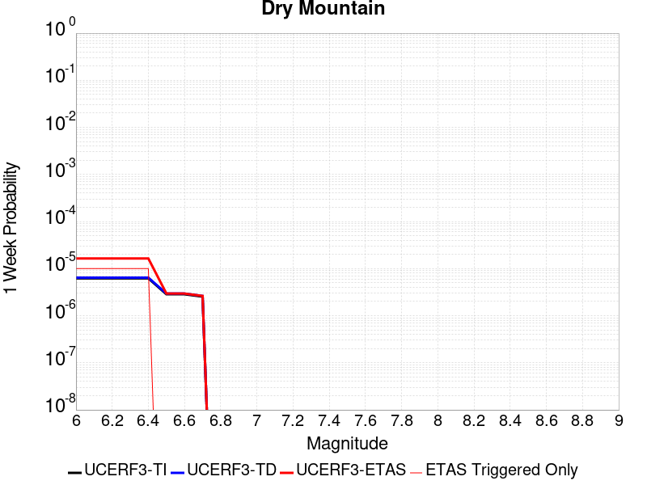 |  |  |  |

| Magnitude | 1 wk TI Prob | 1 wk TD Prob | 1 wk ETAS Prob | 1 wk ETAS/TD Gain | 1 wk ETAS Triggered Only | 1 mo TI Prob | 1 mo TD Prob | 1 mo ETAS Prob | 1 mo ETAS/TD Gain | 1 mo ETAS Triggered Only | 1 yr TI Prob | 1 yr TD Prob | 1 yr ETAS Prob | 1 yr ETAS/TD Gain | 1 yr ETAS Triggered Only | 10 yr TI Prob | 10 yr TD Prob | 10 yr ETAS Prob | 10 yr ETAS/TD Gain | 10 yr ETAS Triggered Only |
|-----|-----|-----|-----|-----|-----|-----|-----|-----|-----|-----|-----|-----|-----|-----|-----|-----|-----|-----|-----|-----|
| 6.0 | 6.222801E-6 | 6.439411E-6 | 1.6439346E-5 | 2.552927 | 1.0E-5 | 2.6668875E-5 | 2.7597274E-5 | 3.7596998E-5 | 1.3623446 | 1.0E-5 | 3.2464517E-4 | 3.359609E-4 | 3.559542E-4 | 1.0595107 | 2.0E-5 | 0.0032417132 | 0.0033560924 | 0.003395958 | 1.0118786 | 4.0E-5 |
| 6.1 | 6.222801E-6 | 6.439411E-6 | 1.6439346E-5 | 2.552927 | 1.0E-5 | 2.6668875E-5 | 2.7597274E-5 | 3.7596998E-5 | 1.3623446 | 1.0E-5 | 3.2464517E-4 | 3.359609E-4 | 3.559542E-4 | 1.0595107 | 2.0E-5 | 0.0032417132 | 0.0033560924 | 0.003395958 | 1.0118786 | 4.0E-5 |
| 6.2 | 6.222801E-6 | 6.439411E-6 | 1.6439346E-5 | 2.552927 | 1.0E-5 | 2.6668875E-5 | 2.7597274E-5 | 3.7596998E-5 | 1.3623446 | 1.0E-5 | 3.2464517E-4 | 3.359609E-4 | 3.559542E-4 | 1.0595107 | 2.0E-5 | 0.0032417132 | 0.0033560924 | 0.003395958 | 1.0118786 | 4.0E-5 |
| 6.3 | 6.222801E-6 | 6.439411E-6 | 1.6439346E-5 | 2.552927 | 1.0E-5 | 2.6668875E-5 | 2.7597274E-5 | 3.7596998E-5 | 1.3623446 | 1.0E-5 | 3.2464517E-4 | 3.359609E-4 | 3.559542E-4 | 1.0595107 | 2.0E-5 | 0.0032417132 | 0.0033560924 | 0.003395958 | 1.0118786 | 4.0E-5 |
| 6.4 | 6.222801E-6 | 6.439411E-6 | 1.6439346E-5 | 2.552927 | 1.0E-5 | 2.6668875E-5 | 2.7597274E-5 | 3.7596998E-5 | 1.3623446 | 1.0E-5 | 3.2464517E-4 | 3.359609E-4 | 3.559542E-4 | 1.0595107 | 2.0E-5 | 0.0032417132 | 0.0033560924 | 0.003395958 | 1.0118786 | 4.0E-5 |
| 6.5 | 2.8528623E-6 | 2.952182E-6 | 2.952182E-6 | 1.0 | 0.0 | 1.22264955E-5 | 1.2652196E-5 | 1.2652196E-5 | 1.0 | 0.0 | 1.4884741E-4 | 1.5403831E-4 | 1.5403831E-4 | 1.0 | 0.0 | 0.0014874774 | 0.0015401688 | 0.0015401688 | 1.0 | 0.0 |
| 6.6 | 2.8528623E-6 | 2.952182E-6 | 2.952182E-6 | 1.0 | 0.0 | 1.22264955E-5 | 1.2652196E-5 | 1.2652196E-5 | 1.0 | 0.0 | 1.4884741E-4 | 1.5403831E-4 | 1.5403831E-4 | 1.0 | 0.0 | 0.0014874774 | 0.0015401688 | 0.0015401688 | 1.0 | 0.0 |
| 6.7 | 2.541E-6 | 2.62937E-6 | 2.62937E-6 | 1.0 | 0.0 | 1.0889954E-5 | 1.12687285E-5 | 1.12687285E-5 | 1.0 | 0.0 | 1.3257713E-4 | 1.3719677E-4 | 1.3719677E-4 | 1.0 | 0.0 | 0.0013249806 | 0.0013719677 | 0.0013719677 | 1.0 | 0.0 |

## Calaveras (Central) 2011 CFM
*[(top)](#table-of-contents)*

| 1 Week | 1 Month | 1 Year | 10 Year |
|-----|-----|-----|-----|
|  | 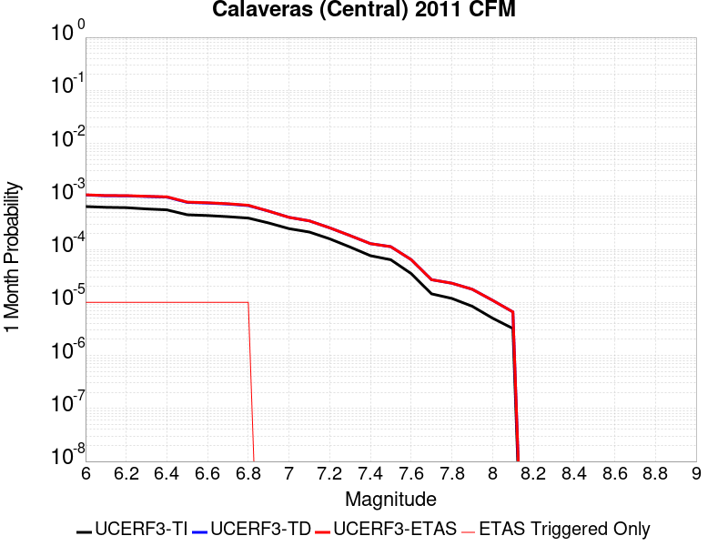 |  |  |

| Magnitude | 1 wk TI Prob | 1 wk TD Prob | 1 wk ETAS Prob | 1 wk ETAS/TD Gain | 1 wk ETAS Triggered Only | 1 mo TI Prob | 1 mo TD Prob | 1 mo ETAS Prob | 1 mo ETAS/TD Gain | 1 mo ETAS Triggered Only | 1 yr TI Prob | 1 yr TD Prob | 1 yr ETAS Prob | 1 yr ETAS/TD Gain | 1 yr ETAS Triggered Only | 10 yr TI Prob | 10 yr TD Prob | 10 yr ETAS Prob | 10 yr ETAS/TD Gain | 10 yr ETAS Triggered Only |
|-----|-----|-----|-----|-----|-----|-----|-----|-----|-----|-----|-----|-----|-----|-----|-----|-----|-----|-----|-----|-----|
| 6.0 | 1.5010907E-4 | 2.4806848E-4 | 2.5806602E-4 | 1.0403014 | 1.0E-5 | 6.4316596E-4 | 0.0010626754 | 0.0010726647 | 1.0094002 | 1.0E-5 | 0.0078024664 | 0.012852632 | 0.012882247 | 1.0023042 | 3.0E-5 | 0.07534136 | 0.12042537 | 0.120460555 | 1.0002922 | 4.0E-5 |
| 6.1 | 1.4521465E-4 | 2.396813E-4 | 2.496789E-4 | 1.041712 | 1.0E-5 | 6.222001E-4 | 0.0010267711 | 0.0010367609 | 1.0097293 | 1.0E-5 | 0.0075490056 | 0.012421933 | 0.01245156 | 1.0023851 | 3.0E-5 | 0.07297657 | 0.11669681 | 0.11673214 | 1.0003028 | 4.0E-5 |
| 6.2 | 1.429998E-4 | 2.3899323E-4 | 2.4899084E-4 | 1.0418322 | 1.0E-5 | 6.127123E-4 | 0.0010238247 | 0.0010338144 | 1.0097573 | 1.0E-5 | 0.007434286 | 0.012386515 | 0.012416143 | 1.0023919 | 3.0E-5 | 0.07190444 | 0.1163506 | 0.116385944 | 1.0003037 | 4.0E-5 |
| 6.3 | 1.3536277E-4 | 2.3230312E-4 | 2.423008E-4 | 1.0430372 | 1.0E-5 | 5.799972E-4 | 9.951836E-4 | 0.0010051735 | 1.0100384 | 1.0E-5 | 0.0070386264 | 0.012042627 | 0.012072265 | 1.0024612 | 3.0E-5 | 0.0681982 | 0.11326305 | 0.11329851 | 1.0003132 | 4.0E-5 |
| 6.4 | 1.2993296E-4 | 2.2653792E-4 | 2.3653565E-4 | 1.0441327 | 1.0E-5 | 5.5673666E-4 | 9.704946E-4 | 9.804849E-4 | 1.0102941 | 1.0E-5 | 0.006757223 | 0.011745383 | 0.011775031 | 1.0025241 | 3.0E-5 | 0.06555412 | 0.11054058 | 0.11057615 | 1.0003219 | 4.0E-5 |
| 6.5 | 1.0498927E-4 | 1.7985744E-4 | 1.8985565E-4 | 1.0555896 | 1.0E-5 | 4.498764E-4 | 7.705892E-4 | 7.805815E-4 | 1.0129671 | 1.0E-5 | 0.005463498 | 0.00934148 | 0.0093712 | 1.0031815 | 3.0E-5 | 0.053311124 | 0.089220084 | 0.08925651 | 1.0004083 | 4.0E-5 |
| 6.6 | 1.0157505E-4 | 1.7473244E-4 | 1.847307E-4 | 1.0572203 | 1.0E-5 | 4.35249E-4 | 7.486378E-4 | 7.586303E-4 | 1.0133476 | 1.0E-5 | 0.0052862884 | 0.0090765115 | 0.009106239 | 1.0032753 | 3.0E-5 | 0.05162293 | 0.08679744 | 0.08683397 | 1.0004208 | 4.0E-5 |
| 6.7 | 9.660386E-5 | 1.6732494E-4 | 1.7732325E-4 | 1.059754 | 1.0E-5 | 4.1395082E-4 | 7.169091E-4 | 7.26902E-4 | 1.0139388 | 1.0E-5 | 0.0050282106 | 0.0086934 | 0.00872314 | 1.003421 | 3.0E-5 | 0.049159497 | 0.08328652 | 0.08332318 | 1.0004402 | 4.0E-5 |
| 6.8 | 9.089927E-5 | 1.5646633E-4 | 1.6646476E-4 | 1.0639015 | 1.0E-5 | 3.8951015E-4 | 6.703968E-4 | 6.803901E-4 | 1.0149065 | 1.0E-5 | 0.0047319788 | 0.008131504 | 0.008161261 | 1.0036594 | 3.0E-5 | 0.046324775 | 0.07818175 | 0.078218624 | 1.0004716 | 4.0E-5 |
| 6.9 | 7.353187E-5 | 1.2298203E-4 | 1.2298203E-4 | 1.0 | 0.0 | 3.150985E-4 | 5.2695995E-4 | 5.2695995E-4 | 1.0 | 0.0 | 0.0038295772 | 0.006396985 | 0.006416857 | 1.0031065 | 2.0E-5 | 0.037642512 | 0.06220122 | 0.062229354 | 1.0004523 | 3.0E-5 |
| 7.0 | 5.746064E-5 | 9.3913375E-5 | 9.3913375E-5 | 1.0 | 0.0 | 2.4623662E-4 | 4.0242416E-4 | 4.0242416E-4 | 1.0 | 0.0 | 0.0029938098 | 0.0048885783 | 0.0048985295 | 1.0020356 | 1.0E-5 | 0.02953797 | 0.04799868 | 0.04801772 | 1.0003967 | 2.0E-5 |
| 7.1 | 4.9557195E-5 | 8.0542326E-5 | 8.0542326E-5 | 1.0 | 0.0 | 2.123707E-4 | 3.4513607E-4 | 3.4513607E-4 | 1.0 | 0.0 | 0.0025825473 | 0.0041939984 | 0.0041939984 | 1.0 | 0.0 | 0.0255274 | 0.04138143 | 0.041391015 | 1.0002316 | 1.0E-5 |
| 7.2 | 3.687595E-5 | 5.9540733E-5 | 5.9540733E-5 | 1.0 | 0.0 | 1.5803022E-4 | 2.5514976E-4 | 2.5514976E-4 | 1.0 | 0.0 | 0.0019223199 | 0.0031020523 | 0.0031020523 | 1.0 | 0.0 | 0.01905776 | 0.030891592 | 0.030901283 | 1.0003138 | 1.0E-5 |
| 7.3 | 2.5846984E-5 | 4.2486332E-5 | 4.2486332E-5 | 1.0 | 0.0 | 1.1076809E-4 | 1.8207167E-4 | 1.8207167E-4 | 1.0 | 0.0 | 0.0013477671 | 0.0022144865 | 0.0022144865 | 1.0 | 0.0 | 0.013396223 | 0.022182453 | 0.02219223 | 1.0004408 | 1.0E-5 |
| 7.4 | 1.7747854E-5 | 2.9943852E-5 | 2.9943852E-5 | 1.0 | 0.0 | 7.6060016E-5 | 1.283245E-4 | 1.283245E-4 | 1.0 | 0.0 | 9.2563726E-4 | 0.001561234 | 0.001561234 | 1.0 | 0.0 | 0.009217911 | 0.015711771 | 0.015721614 | 1.0006264 | 1.0E-5 |
| 7.5 | 1.4883479E-5 | 2.6250565E-5 | 2.6250565E-5 | 1.0 | 0.0 | 6.378478E-5 | 1.1249758E-4 | 1.1249758E-4 | 1.0 | 0.0 | 7.76303E-4 | 0.0013688003 | 0.0013688003 | 1.0 | 0.0 | 0.0077359667 | 0.013804732 | 0.013814594 | 1.0007144 | 1.0E-5 |
| 7.6 | 8.166975E-6 | 1.4968881E-5 | 1.4968881E-5 | 1.0 | 0.0 | 3.5000852E-5 | 6.415078E-5 | 6.415078E-5 | 1.0 | 0.0 | 4.2605202E-4 | 7.8075717E-4 | 7.8075717E-4 | 1.0 | 0.0 | 0.004252361 | 0.00794128 | 0.0079512 | 1.0012492 | 1.0E-5 |
| 7.7 | 3.3858064E-6 | 6.2575887E-6 | 6.2575887E-6 | 1.0 | 0.0 | 1.4510518E-5 | 2.6817961E-5 | 2.6817961E-5 | 1.0 | 0.0 | 1.7665124E-4 | 3.2645982E-4 | 3.2645982E-4 | 1.0 | 0.0 | 0.0017651088 | 0.003390022 | 0.0033999882 | 1.0029398 | 1.0E-5 |
| 7.8 | 2.7721615E-6 | 5.3695812E-6 | 5.3695812E-6 | 1.0 | 0.0 | 1.1880637E-5 | 2.3012288E-5 | 2.3012288E-5 | 1.0 | 0.0 | 1.4463716E-4 | 2.8013863E-4 | 2.8013863E-4 | 1.0 | 0.0 | 0.0014454306 | 0.002909038 | 0.002919009 | 1.0034275 | 1.0E-5 |
| 7.9 | 1.9736292E-6 | 4.130851E-6 | 4.130851E-6 | 1.0 | 0.0 | 8.4583835E-6 | 1.7703525E-5 | 1.7703525E-5 | 1.0 | 0.0 | 1.0297595E-4 | 2.1551915E-4 | 2.1551915E-4 | 1.0 | 0.0 | 0.0010292825 | 0.0022248225 | 0.0022348005 | 1.0044848 | 1.0E-5 |
| 8.0 | 1.1767289E-6 | 2.5559566E-6 | 2.5559566E-6 | 1.0 | 0.0 | 5.0431145E-6 | 1.0954053E-5 | 1.0954053E-5 | 1.0 | 0.0 | 6.139818E-5 | 1.3335746E-4 | 1.3335746E-4 | 1.0 | 0.0 | 6.1381224E-4 | 0.0013668317 | 0.0013668317 | 1.0 | 0.0 |
| 8.1 | 7.5112825E-7 | 1.5418968E-6 | 1.5418968E-6 | 1.0 | 0.0 | 3.2191172E-6 | 6.608113E-6 | 6.608113E-6 | 1.0 | 0.0 | 3.9192048E-5 | 8.045083E-5 | 8.045083E-5 | 1.0 | 0.0 | 3.9185135E-4 | 8.240444E-4 | 8.240444E-4 | 1.0 | 0.0 |

## Santa Monica alt 1
*[(top)](#table-of-contents)*

| 1 Week | 1 Month | 1 Year | 10 Year |
|-----|-----|-----|-----|
|  |  |  |  |

| Magnitude | 1 wk TI Prob | 1 wk TD Prob | 1 wk ETAS Prob | 1 wk ETAS/TD Gain | 1 wk ETAS Triggered Only | 1 mo TI Prob | 1 mo TD Prob | 1 mo ETAS Prob | 1 mo ETAS/TD Gain | 1 mo ETAS Triggered Only | 1 yr TI Prob | 1 yr TD Prob | 1 yr ETAS Prob | 1 yr ETAS/TD Gain | 1 yr ETAS Triggered Only | 10 yr TI Prob | 10 yr TD Prob | 10 yr ETAS Prob | 10 yr ETAS/TD Gain | 10 yr ETAS Triggered Only |
|-----|-----|-----|-----|-----|-----|-----|-----|-----|-----|-----|-----|-----|-----|-----|-----|-----|-----|-----|-----|-----|
| 6.0 | 1.1066008E-5 | 1.1480437E-5 | 1.1480437E-5 | 1.0 | 0.0 | 4.742488E-5 | 4.9201022E-5 | 5.920053E-5 | 1.2032378 | 1.0E-5 | 5.7724497E-4 | 5.9887173E-4 | 6.188598E-4 | 1.0333761 | 2.0E-5 | 0.005757478 | 0.005973966 | 0.006013727 | 1.0066557 | 4.0E-5 |
| 6.1 | 1.1066008E-5 | 1.1480437E-5 | 1.1480437E-5 | 1.0 | 0.0 | 4.742488E-5 | 4.9201022E-5 | 5.920053E-5 | 1.2032378 | 1.0E-5 | 5.7724497E-4 | 5.9887173E-4 | 6.188598E-4 | 1.0333761 | 2.0E-5 | 0.005757478 | 0.005973966 | 0.006013727 | 1.0066557 | 4.0E-5 |
| 6.2 | 1.1066008E-5 | 1.1480437E-5 | 1.1480437E-5 | 1.0 | 0.0 | 4.742488E-5 | 4.9201022E-5 | 5.920053E-5 | 1.2032378 | 1.0E-5 | 5.7724497E-4 | 5.9887173E-4 | 6.188598E-4 | 1.0333761 | 2.0E-5 | 0.005757478 | 0.005973966 | 0.006013727 | 1.0066557 | 4.0E-5 |
| 6.3 | 1.1066008E-5 | 1.1480437E-5 | 1.1480437E-5 | 1.0 | 0.0 | 4.742488E-5 | 4.9201022E-5 | 5.920053E-5 | 1.2032378 | 1.0E-5 | 5.7724497E-4 | 5.9887173E-4 | 6.188598E-4 | 1.0333761 | 2.0E-5 | 0.005757478 | 0.005973966 | 0.006013727 | 1.0066557 | 4.0E-5 |
| 6.4 | 1.1066008E-5 | 1.1480437E-5 | 1.1480437E-5 | 1.0 | 0.0 | 4.742488E-5 | 4.9201022E-5 | 5.920053E-5 | 1.2032378 | 1.0E-5 | 5.7724497E-4 | 5.9887173E-4 | 6.188598E-4 | 1.0333761 | 2.0E-5 | 0.005757478 | 0.005973966 | 0.006013727 | 1.0066557 | 4.0E-5 |
| 6.5 | 8.183544E-6 | 8.335521E-6 | 8.335521E-6 | 1.0 | 0.0 | 3.5071862E-5 | 3.5723177E-5 | 4.572282E-5 | 1.2799203 | 1.0E-5 | 4.2691626E-4 | 4.348445E-4 | 4.548358E-4 | 1.0459734 | 2.0E-5 | 0.0042609703 | 0.004340102 | 0.004379928 | 1.0091764 | 4.0E-5 |
| 6.6 | 8.1543285E-6 | 8.303734E-6 | 8.303734E-6 | 1.0 | 0.0 | 3.4946657E-5 | 3.5586956E-5 | 4.55866E-5 | 1.2809918 | 1.0E-5 | 4.2539247E-4 | 4.3318665E-4 | 4.5317799E-4 | 1.0461495 | 2.0E-5 | 0.0042457907 | 0.0043235878 | 0.004363415 | 1.0092115 | 4.0E-5 |
| 6.7 | 8.110878E-6 | 8.2571305E-6 | 8.2571305E-6 | 1.0 | 0.0 | 3.4760444E-5 | 3.538723E-5 | 4.5386878E-5 | 1.2825778 | 1.0E-5 | 4.231262E-4 | 4.3075596E-4 | 4.5074735E-4 | 1.04641 | 2.0E-5 | 0.0042232145 | 0.004299375 | 0.0043392032 | 1.0092636 | 4.0E-5 |
| 6.8 | 7.644036E-6 | 7.751143E-6 | 7.751143E-6 | 1.0 | 0.0 | 3.275974E-5 | 3.321877E-5 | 4.3218435E-5 | 1.3010247 | 1.0E-5 | 3.9877684E-4 | 4.0436487E-4 | 4.2435678E-4 | 1.0494403 | 2.0E-5 | 0.00398062 | 0.0040364373 | 0.004076276 | 1.0098697 | 4.0E-5 |
| 6.9 | 7.3698293E-6 | 7.4557984E-6 | 7.4557984E-6 | 1.0 | 0.0 | 3.15846E-5 | 3.1953037E-5 | 4.195272E-5 | 1.3129493 | 1.0E-5 | 3.8447464E-4 | 3.8896018E-4 | 4.0895242E-4 | 1.0513991 | 2.0E-5 | 0.0038381014 | 0.0038829376 | 0.0039227824 | 1.0102615 | 4.0E-5 |
| 7.0 | 7.209872E-6 | 7.2857038E-6 | 7.2857038E-6 | 1.0 | 0.0 | 3.0899086E-5 | 3.1224077E-5 | 4.1223764E-5 | 1.3202556 | 1.0E-5 | 3.7613141E-4 | 3.8008823E-4 | 4.0008064E-4 | 1.0525993 | 2.0E-5 | 0.0037549543 | 0.0037945241 | 0.0038343724 | 1.0105015 | 4.0E-5 |
| 7.1 | 5.603456E-6 | 5.523948E-6 | 5.523948E-6 | 1.0 | 0.0 | 2.4014591E-5 | 2.3673849E-5 | 2.3673849E-5 | 1.0 | 0.0 | 2.923384E-4 | 2.881914E-4 | 2.981885E-4 | 1.0346892 | 1.0E-5 | 0.0029195412 | 0.0028782184 | 0.002908132 | 1.0103931 | 3.0E-5 |
| 7.2 | 4.7483613E-6 | 4.5911765E-6 | 4.5911765E-6 | 1.0 | 0.0 | 2.0349962E-5 | 1.9676323E-5 | 1.9676323E-5 | 1.0 | 0.0 | 2.4773262E-4 | 2.3953304E-4 | 2.4953065E-4 | 1.0417379 | 1.0E-5 | 0.0024745662 | 0.0023927628 | 0.0024226909 | 1.0125078 | 3.0E-5 |
| 7.3 | 3.829015E-6 | 3.6342597E-6 | 3.6342597E-6 | 1.0 | 0.0 | 1.6409962E-5 | 1.5575306E-5 | 1.5575306E-5 | 1.0 | 0.0 | 1.9977297E-4 | 1.8961294E-4 | 1.8961294E-4 | 1.0 | 0.0 | 0.0019959346 | 0.0018945204 | 0.0019144826 | 1.0105368 | 2.0E-5 |
| 7.4 | 2.610755E-6 | 2.4995952E-6 | 2.4995952E-6 | 1.0 | 0.0 | 1.1188902E-5 | 1.0712507E-5 | 1.0712507E-5 | 1.0 | 0.0 | 1.3621636E-4 | 1.3041701E-4 | 1.3041701E-4 | 1.0 | 0.0 | 0.001361329 | 0.0013034092 | 0.0013133961 | 1.0076622 | 1.0E-5 |
| 7.5 | 1.792146E-6 | 1.7584366E-6 | 1.7584366E-6 | 1.0 | 0.0 | 7.680603E-6 | 7.5361354E-6 | 7.5361354E-6 | 1.0 | 0.0 | 9.3507326E-5 | 9.174862E-5 | 9.174862E-5 | 1.0 | 0.0 | 9.3467993E-4 | 9.1711053E-4 | 9.2710136E-4 | 1.0108938 | 1.0E-5 |
| 7.6 | 1.1473018E-6 | 1.1029273E-6 | 1.1029273E-6 | 1.0 | 0.0 | 4.9169985E-6 | 4.7268227E-6 | 4.7268227E-6 | 1.0 | 0.0 | 5.986281E-5 | 5.754756E-5 | 5.754756E-5 | 1.0 | 0.0 | 5.984669E-4 | 5.7532825E-4 | 5.853225E-4 | 1.0173714 | 1.0E-5 |
| 7.7 | 5.330919E-7 | 4.7453193E-7 | 4.7453193E-7 | 1.0 | 0.0 | 2.2846775E-6 | 2.0337068E-6 | 2.0337068E-6 | 1.0 | 0.0 | 2.7815593E-5 | 2.476011E-5 | 2.476011E-5 | 1.0 | 0.0 | 2.7812112E-4 | 2.4757464E-4 | 2.4757464E-4 | 1.0 | 0.0 |
| 7.8 | 1.1668574E-7 | 8.29686E-8 | 8.29686E-8 | 1.0 | 0.0 | 5.000816E-7 | 3.5557966E-7 | 3.5557966E-7 | 1.0 | 0.0 | 6.0884768E-6 | 4.329174E-6 | 4.329174E-6 | 1.0 | 0.0 | 6.08831E-5 | 4.3290926E-5 | 4.3290926E-5 | 1.0 | 0.0 |
| 7.9 | 8.007447E-10 | 6.1615857E-10 | 6.1615857E-10 | 1.0 | 0.0 | 3.4317629E-9 | 2.64068E-9 | 2.64068E-9 | 1.0 | 0.0 | 4.1781714E-8 | 3.215028E-8 | 3.215028E-8 | 1.0 | 0.0 | 4.1781706E-7 | 3.2150274E-7 | 3.2150274E-7 | 1.0 | 0.0 |

## Blue Cut
*[(top)](#table-of-contents)*

| 1 Week | 1 Month | 1 Year | 10 Year |
|-----|-----|-----|-----|
|  |  |  |  |

| Magnitude | 1 wk TI Prob | 1 wk TD Prob | 1 wk ETAS Prob | 1 wk ETAS/TD Gain | 1 wk ETAS Triggered Only | 1 mo TI Prob | 1 mo TD Prob | 1 mo ETAS Prob | 1 mo ETAS/TD Gain | 1 mo ETAS Triggered Only | 1 yr TI Prob | 1 yr TD Prob | 1 yr ETAS Prob | 1 yr ETAS/TD Gain | 1 yr ETAS Triggered Only | 10 yr TI Prob | 10 yr TD Prob | 10 yr ETAS Prob | 10 yr ETAS/TD Gain | 10 yr ETAS Triggered Only |
|-----|-----|-----|-----|-----|-----|-----|-----|-----|-----|-----|-----|-----|-----|-----|-----|-----|-----|-----|-----|-----|
| 6.0 | 2.1227985E-5 | 2.2719787E-5 | 2.2719787E-5 | 1.0 | 0.0 | 9.097391E-5 | 9.736721E-5 | 9.736721E-5 | 1.0 | 0.0 | 0.0011070445 | 0.0011848592 | 0.0011948473 | 1.0084298 | 1.0E-5 | 0.011015458 | 0.011791261 | 0.011830789 | 1.0033523 | 4.0E-5 |
| 6.1 | 2.1227985E-5 | 2.2719787E-5 | 2.2719787E-5 | 1.0 | 0.0 | 9.097391E-5 | 9.736721E-5 | 9.736721E-5 | 1.0 | 0.0 | 0.0011070445 | 0.0011848592 | 0.0011948473 | 1.0084298 | 1.0E-5 | 0.011015458 | 0.011791261 | 0.011830789 | 1.0033523 | 4.0E-5 |
| 6.2 | 2.1227985E-5 | 2.2719787E-5 | 2.2719787E-5 | 1.0 | 0.0 | 9.097391E-5 | 9.736721E-5 | 9.736721E-5 | 1.0 | 0.0 | 0.0011070445 | 0.0011848592 | 0.0011948473 | 1.0084298 | 1.0E-5 | 0.011015458 | 0.011791261 | 0.011830789 | 1.0033523 | 4.0E-5 |
| 6.3 | 1.1613981E-5 | 1.23536465E-5 | 1.23536465E-5 | 1.0 | 0.0 | 4.9773254E-5 | 5.2943193E-5 | 5.2943193E-5 | 1.0 | 0.0 | 6.0582085E-4 | 6.444052E-4 | 6.5439875E-4 | 1.0155082 | 1.0E-5 | 0.0060417196 | 0.0064266133 | 0.006466356 | 1.0061841 | 4.0E-5 |
| 6.4 | 1.1613981E-5 | 1.23536465E-5 | 1.23536465E-5 | 1.0 | 0.0 | 4.9773254E-5 | 5.2943193E-5 | 5.2943193E-5 | 1.0 | 0.0 | 6.0582085E-4 | 6.444052E-4 | 6.5439875E-4 | 1.0155082 | 1.0E-5 | 0.0060417196 | 0.0064266133 | 0.006466356 | 1.0061841 | 4.0E-5 |
| 6.5 | 8.931326E-6 | 9.481677E-6 | 9.481677E-6 | 1.0 | 0.0 | 3.8276554E-5 | 4.063518E-5 | 4.063518E-5 | 1.0 | 0.0 | 4.6591737E-4 | 4.9463013E-4 | 4.9463013E-4 | 1.0 | 0.0 | 0.0046494175 | 0.0049362015 | 0.0049561025 | 1.0040317 | 2.0E-5 |
| 6.6 | 7.345353E-6 | 7.790341E-6 | 7.790341E-6 | 1.0 | 0.0 | 3.1479703E-5 | 3.3386797E-5 | 3.3386797E-5 | 1.0 | 0.0 | 3.83198E-4 | 4.0641645E-4 | 4.0641645E-4 | 1.0 | 0.0 | 0.0038253788 | 0.0040575233 | 0.004067483 | 1.0024545 | 1.0E-5 |
| 6.7 | 6.2775666E-6 | 6.655202E-6 | 6.655202E-6 | 1.0 | 0.0 | 2.690358E-5 | 2.8522025E-5 | 2.8522025E-5 | 1.0 | 0.0 | 3.2750185E-4 | 3.4720785E-4 | 3.4720785E-4 | 1.0 | 0.0 | 0.0032701963 | 0.0034673947 | 0.0034773601 | 1.002874 | 1.0E-5 |
| 6.8 | 5.5234095E-6 | 5.8551577E-6 | 5.8551577E-6 | 1.0 | 0.0 | 2.367154E-5 | 2.5093334E-5 | 2.5093334E-5 | 1.0 | 0.0 | 2.8816288E-4 | 3.0547578E-4 | 3.0547578E-4 | 1.0 | 0.0 | 0.002877895 | 0.003051275 | 0.0030612443 | 1.0032673 | 1.0E-5 |
| 6.9 | 4.7780054E-6 | 5.0654608E-6 | 5.0654608E-6 | 1.0 | 0.0 | 2.0477004E-5 | 2.1708976E-5 | 2.1708976E-5 | 1.0 | 0.0 | 2.4927902E-4 | 2.6428179E-4 | 2.6428179E-4 | 1.0 | 0.0 | 0.0024899957 | 0.0026403673 | 0.0026503408 | 1.0037774 | 1.0E-5 |
| 7.0 | 3.883171E-6 | 4.1185203E-6 | 4.1185203E-6 | 1.0 | 0.0 | 1.6642054E-5 | 1.765072E-5 | 1.765072E-5 | 1.0 | 0.0 | 2.0259817E-4 | 2.1488321E-4 | 2.1488321E-4 | 1.0 | 0.0 | 0.0020241356 | 0.00214743 | 0.0021574085 | 1.0046468 | 1.0E-5 |
| 7.1 | 2.8358215E-6 | 3.0097403E-6 | 3.0097403E-6 | 1.0 | 0.0 | 1.2153464E-5 | 1.289886E-5 | 1.289886E-5 | 1.0 | 0.0 | 1.4795837E-4 | 1.5703888E-4 | 1.5703888E-4 | 1.0 | 0.0 | 0.001478599 | 0.0015699244 | 0.0015799087 | 1.0063597 | 1.0E-5 |

## Pisgah-Bullion Mtn-Mesquite Lk
*[(top)](#table-of-contents)*

| 1 Week | 1 Month | 1 Year | 10 Year |
|-----|-----|-----|-----|
|  |  |  | 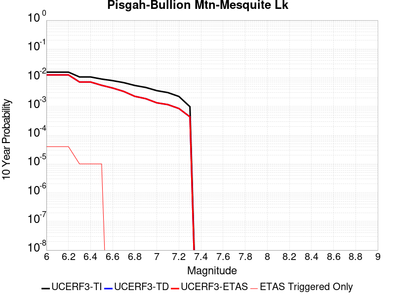 |

| Magnitude | 1 wk TI Prob | 1 wk TD Prob | 1 wk ETAS Prob | 1 wk ETAS/TD Gain | 1 wk ETAS Triggered Only | 1 mo TI Prob | 1 mo TD Prob | 1 mo ETAS Prob | 1 mo ETAS/TD Gain | 1 mo ETAS Triggered Only | 1 yr TI Prob | 1 yr TD Prob | 1 yr ETAS Prob | 1 yr ETAS/TD Gain | 1 yr ETAS Triggered Only | 10 yr TI Prob | 10 yr TD Prob | 10 yr ETAS Prob | 10 yr ETAS/TD Gain | 10 yr ETAS Triggered Only |
|-----|-----|-----|-----|-----|-----|-----|-----|-----|-----|-----|-----|-----|-----|-----|-----|-----|-----|-----|-----|-----|
| 6.0 | 3.0240792E-5 | 2.4091287E-5 | 2.4091287E-5 | 1.0 | 0.0 | 1.2959696E-4 | 1.03244856E-4 | 1.03244856E-4 | 1.0 | 0.0 | 0.0015767008 | 0.001256382 | 0.0012863443 | 1.023848 | 3.0E-5 | 0.015655609 | 0.012502813 | 0.012542313 | 1.0031593 | 4.0E-5 |
| 6.1 | 3.0240792E-5 | 2.4091287E-5 | 2.4091287E-5 | 1.0 | 0.0 | 1.2959696E-4 | 1.03244856E-4 | 1.03244856E-4 | 1.0 | 0.0 | 0.0015767008 | 0.001256382 | 0.0012863443 | 1.023848 | 3.0E-5 | 0.015655609 | 0.012502813 | 0.012542313 | 1.0031593 | 4.0E-5 |
| 6.2 | 3.0240792E-5 | 2.4091287E-5 | 2.4091287E-5 | 1.0 | 0.0 | 1.2959696E-4 | 1.03244856E-4 | 1.03244856E-4 | 1.0 | 0.0 | 0.0015767008 | 0.001256382 | 0.0012863443 | 1.023848 | 3.0E-5 | 0.015655609 | 0.012502813 | 0.012542313 | 1.0031593 | 4.0E-5 |
| 6.3 | 2.0498217E-5 | 1.36382505E-5 | 1.36382505E-5 | 1.0 | 0.0 | 8.784654E-5 | 5.8448426E-5 | 5.8448426E-5 | 1.0 | 0.0 | 0.0010690069 | 7.113935E-4 | 7.113935E-4 | 1.0 | 0.0 | 0.01063879 | 0.0070927883 | 0.0071027176 | 1.0013999 | 1.0E-5 |
| 6.4 | 2.0498217E-5 | 1.36382505E-5 | 1.36382505E-5 | 1.0 | 0.0 | 8.784654E-5 | 5.8448426E-5 | 5.8448426E-5 | 1.0 | 0.0 | 0.0010690069 | 7.113935E-4 | 7.113935E-4 | 1.0 | 0.0 | 0.01063879 | 0.0070927883 | 0.0071027176 | 1.0013999 | 1.0E-5 |
| 6.5 | 1.7316182E-5 | 1.04771225E-5 | 1.04771225E-5 | 1.0 | 0.0 | 7.42101E-5 | 4.4901237E-5 | 4.4901237E-5 | 1.0 | 0.0 | 9.0313336E-4 | 5.4654543E-4 | 5.4654543E-4 | 1.0 | 0.0 | 0.008994718 | 0.005453008 | 0.005462954 | 1.0018239 | 1.0E-5 |
| 6.6 | 1.5251077E-5 | 8.414257E-6 | 8.414257E-6 | 1.0 | 0.0 | 6.536012E-5 | 3.606064E-5 | 3.606064E-5 | 1.0 | 0.0 | 7.9546886E-4 | 4.389571E-4 | 4.389571E-4 | 1.0 | 0.0 | 0.007926274 | 0.0043816175 | 0.0043816175 | 1.0 | 0.0 |
| 6.7 | 1.2997425E-5 | 6.4113133E-6 | 6.4113133E-6 | 1.0 | 0.0 | 5.570206E-5 | 2.7476794E-5 | 2.7476794E-5 | 1.0 | 0.0 | 6.7796157E-4 | 3.3448328E-4 | 3.3448328E-4 | 1.0 | 0.0 | 0.0067589693 | 0.0033402585 | 0.0033402585 | 1.0 | 0.0 |
| 6.8 | 1.035386E-5 | 4.3332407E-6 | 4.3332407E-6 | 1.0 | 0.0 | 4.437293E-5 | 1.8570905E-5 | 1.8570905E-5 | 1.0 | 0.0 | 5.401065E-4 | 2.2607818E-4 | 2.2607818E-4 | 1.0 | 0.0 | 0.0053879567 | 0.0022585685 | 0.0022585685 | 1.0 | 0.0 |
| 6.9 | 8.816252E-6 | 3.5806777E-6 | 3.5806777E-6 | 1.0 | 0.0 | 3.778339E-5 | 1.5345675E-5 | 1.5345675E-5 | 1.0 | 0.0 | 4.5991567E-4 | 1.8681816E-4 | 1.8681816E-4 | 1.0 | 0.0 | 0.00458965 | 0.0018666695 | 0.0018666695 | 1.0 | 0.0 |
| 7.0 | 6.8232207E-6 | 2.5675185E-6 | 2.5675185E-6 | 1.0 | 0.0 | 2.9242048E-5 | 1.1003606E-5 | 1.1003606E-5 | 1.0 | 0.0 | 3.5596377E-4 | 1.3396099E-4 | 1.3396099E-4 | 1.0 | 0.0 | 0.0035539411 | 0.0013388334 | 0.0013388334 | 1.0 | 0.0 |
| 7.1 | 5.837013E-6 | 2.227375E-6 | 2.227375E-6 | 1.0 | 0.0 | 2.501553E-5 | 9.545859E-6 | 9.545859E-6 | 1.0 | 0.0 | 3.045215E-4 | 1.16214935E-4 | 1.16214935E-4 | 1.0 | 0.0 | 0.0030410455 | 0.0011615707 | 0.0011615707 | 1.0 | 0.0 |
| 7.2 | 4.278052E-6 | 1.6275252E-6 | 1.6275252E-6 | 1.0 | 0.0 | 1.833438E-5 | 6.975091E-6 | 6.975091E-6 | 1.0 | 0.0 | 2.231982E-4 | 8.4918654E-5 | 8.4918654E-5 | 1.0 | 0.0 | 0.0022297418 | 8.488853E-4 | 8.488853E-4 | 1.0 | 0.0 |
| 7.3 | 1.8803692E-6 | 8.3448816E-7 | 8.3448816E-7 | 1.0 | 0.0 | 8.0587E-6 | 3.5763737E-6 | 3.5763737E-6 | 1.0 | 0.0 | 9.811026E-5 | 4.354163E-5 | 4.354163E-5 | 1.0 | 0.0 | 9.806695E-4 | 4.3534543E-4 | 4.3534543E-4 | 1.0 | 0.0 |

## San Pedro Basin
*[(top)](#table-of-contents)*

| 1 Week | 1 Month | 1 Year | 10 Year |
|-----|-----|-----|-----|
|  |  | 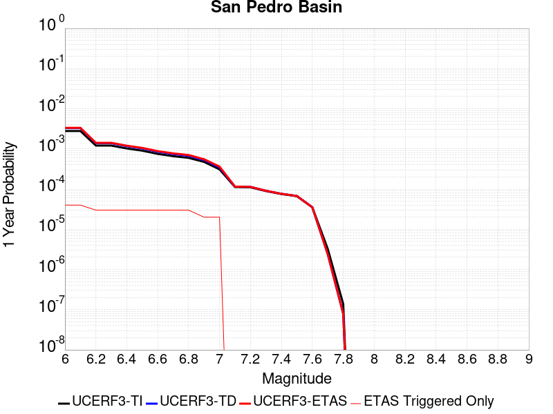 |  |

| Magnitude | 1 wk TI Prob | 1 wk TD Prob | 1 wk ETAS Prob | 1 wk ETAS/TD Gain | 1 wk ETAS Triggered Only | 1 mo TI Prob | 1 mo TD Prob | 1 mo ETAS Prob | 1 mo ETAS/TD Gain | 1 mo ETAS Triggered Only | 1 yr TI Prob | 1 yr TD Prob | 1 yr ETAS Prob | 1 yr ETAS/TD Gain | 1 yr ETAS Triggered Only | 10 yr TI Prob | 10 yr TD Prob | 10 yr ETAS Prob | 10 yr ETAS/TD Gain | 10 yr ETAS Triggered Only |
|-----|-----|-----|-----|-----|-----|-----|-----|-----|-----|-----|-----|-----|-----|-----|-----|-----|-----|-----|-----|-----|
| 6.0 | 5.3449043E-5 | 6.3371765E-5 | 6.3371765E-5 | 1.0 | 0.0 | 2.2904722E-4 | 2.7156848E-4 | 2.8156576E-4 | 1.0368131 | 1.0E-5 | 0.0027850836 | 0.0033019334 | 0.0033418015 | 1.0120741 | 4.0E-5 | 0.027504366 | 0.03259028 | 0.032628976 | 1.0011873 | 4.0E-5 |
| 6.1 | 5.3449043E-5 | 6.3371765E-5 | 6.3371765E-5 | 1.0 | 0.0 | 2.2904722E-4 | 2.7156848E-4 | 2.8156576E-4 | 1.0368131 | 1.0E-5 | 0.0027850836 | 0.0033019334 | 0.0033418015 | 1.0120741 | 4.0E-5 | 0.027504366 | 0.03259028 | 0.032628976 | 1.0011873 | 4.0E-5 |
| 6.2 | 2.3189454E-5 | 2.6643364E-5 | 2.6643364E-5 | 1.0 | 0.0 | 9.9379584E-5 | 1.1418111E-4 | 1.2417996E-4 | 1.0875702 | 1.0E-5 | 0.0012092749 | 0.0013893156 | 0.0014192739 | 1.0215634 | 3.0E-5 | 0.012027155 | 0.013811166 | 0.013840752 | 1.0021422 | 3.0E-5 |
| 6.3 | 2.3189454E-5 | 2.6643364E-5 | 2.6643364E-5 | 1.0 | 0.0 | 9.9379584E-5 | 1.1418111E-4 | 1.2417996E-4 | 1.0875702 | 1.0E-5 | 0.0012092749 | 0.0013893156 | 0.0014192739 | 1.0215634 | 3.0E-5 | 0.012027155 | 0.013811166 | 0.013840752 | 1.0021422 | 3.0E-5 |
| 6.4 | 1.966056E-5 | 2.2463855E-5 | 2.2463855E-5 | 1.0 | 0.0 | 8.425682E-5 | 9.627034E-5 | 1.0626938E-4 | 1.1038642 | 1.0E-5 | 0.001025344 | 0.0011715014 | 0.0012014662 | 1.0255781 | 3.0E-5 | 0.010206259 | 0.011657343 | 0.011686994 | 1.0025434 | 3.0E-5 |
| 6.5 | 1.7342953E-5 | 1.9745525E-5 | 1.9745525E-5 | 1.0 | 0.0 | 7.4324824E-5 | 8.462114E-5 | 9.462029E-5 | 1.1181638 | 1.0E-5 | 9.04529E-4 | 0.0010298124 | 0.0010597814 | 1.0291015 | 3.0E-5 | 0.009008561 | 0.010254125 | 0.010283818 | 1.0028956 | 3.0E-5 |
| 6.6 | 1.439804E-5 | 1.6323016E-5 | 1.6323016E-5 | 1.0 | 0.0 | 6.170443E-5 | 6.995408E-5 | 7.995339E-5 | 1.1429409 | 1.0E-5 | 7.509924E-4 | 8.513903E-4 | 8.8136474E-4 | 1.0352064 | 3.0E-5 | 0.0074845953 | 0.008484487 | 0.008514233 | 1.0035058 | 3.0E-5 |
| 6.7 | 1.2634884E-5 | 1.4285555E-5 | 1.4285555E-5 | 1.0 | 0.0 | 5.414838E-5 | 6.122254E-5 | 7.1221926E-5 | 1.1633285 | 1.0E-5 | 6.590571E-4 | 7.4516E-4 | 7.751376E-4 | 1.0402298 | 3.0E-5 | 0.006571059 | 0.0074296347 | 0.007459412 | 1.0040079 | 3.0E-5 |
| 6.8 | 1.146091E-5 | 1.2933422E-5 | 1.2933422E-5 | 1.0 | 0.0 | 4.911726E-5 | 5.5427943E-5 | 6.542739E-5 | 1.1804044 | 1.0E-5 | 5.9783855E-4 | 6.74656E-4 | 7.0463575E-4 | 1.044437 | 3.0E-5 | 0.0059623276 | 0.006729019 | 0.006758817 | 1.0044283 | 3.0E-5 |
| 6.9 | 9.109035E-6 | 1.023519E-5 | 1.023519E-5 | 1.0 | 0.0 | 3.9038136E-5 | 4.386452E-5 | 5.3864078E-5 | 1.2279646 | 1.0E-5 | 4.7518566E-4 | 5.339476E-4 | 5.5393693E-4 | 1.0374368 | 2.0E-5 | 0.0047417083 | 0.005329401 | 0.0053492947 | 1.0037328 | 2.0E-5 |
| 7.0 | 5.9351028E-6 | 6.584069E-6 | 6.584069E-6 | 1.0 | 0.0 | 2.5435906E-5 | 2.8217266E-5 | 3.8216982E-5 | 1.354383 | 1.0E-5 | 3.0963816E-4 | 3.4351466E-4 | 3.635078E-4 | 1.0582017 | 2.0E-5 | 0.0030920706 | 0.0034321537 | 0.0034520852 | 1.0058073 | 2.0E-5 |
| 7.1 | 2.1557585E-6 | 2.2096617E-6 | 2.2096617E-6 | 1.0 | 0.0 | 9.238933E-6 | 9.469944E-6 | 9.469944E-6 | 1.0 | 0.0 | 1.1247819E-4 | 1.1529063E-4 | 1.1529063E-4 | 1.0 | 0.0 | 0.0011242128 | 0.0011523236 | 0.0011523236 | 1.0 | 0.0 |
| 7.2 | 2.1251979E-6 | 2.1780077E-6 | 2.1780077E-6 | 1.0 | 0.0 | 9.107958E-6 | 9.334286E-6 | 9.334286E-6 | 1.0 | 0.0 | 1.1088375E-4 | 1.13639166E-4 | 1.13639166E-4 | 1.0 | 0.0 | 0.0011082845 | 0.0011358259 | 0.0011358259 | 1.0 | 0.0 |
| 7.3 | 1.7145798E-6 | 1.7442975E-6 | 1.7442975E-6 | 1.0 | 0.0 | 7.3481783E-6 | 7.47554E-6 | 7.47554E-6 | 1.0 | 0.0 | 8.94604E-5 | 9.101099E-5 | 9.101099E-5 | 1.0 | 0.0 | 8.9424395E-4 | 9.097463E-4 | 9.097463E-4 | 1.0 | 0.0 |
| 7.4 | 1.4467993E-6 | 1.4641951E-6 | 1.4641951E-6 | 1.0 | 0.0 | 6.200554E-6 | 6.2751074E-6 | 6.2751074E-6 | 1.0 | 0.0 | 7.548913E-5 | 7.639683E-5 | 7.639683E-5 | 1.0 | 0.0 | 7.546349E-4 | 7.637129E-4 | 7.637129E-4 | 1.0 | 0.0 |
| 7.5 | 1.2803735E-6 | 1.293157E-6 | 1.293157E-6 | 1.0 | 0.0 | 5.487303E-6 | 5.54209E-6 | 5.54209E-6 | 1.0 | 0.0 | 6.680587E-5 | 6.747293E-5 | 6.747293E-5 | 1.0 | 0.0 | 6.678579E-4 | 6.745315E-4 | 6.745315E-4 | 1.0 | 0.0 |
| 7.6 | 6.755009E-7 | 6.769505E-7 | 6.769505E-7 | 1.0 | 0.0 | 2.8950008E-6 | 2.9012133E-6 | 2.9012133E-6 | 1.0 | 0.0 | 3.5246063E-5 | 3.532176E-5 | 3.532176E-5 | 1.0 | 0.0 | 3.5240475E-4 | 3.5316718E-4 | 3.5316718E-4 | 1.0 | 0.0 |
| 7.7 | 6.211885E-8 | 4.5700038E-8 | 4.5700038E-8 | 1.0 | 0.0 | 2.6622362E-7 | 1.9585728E-7 | 1.9585728E-7 | 1.0 | 0.0 | 3.2412677E-6 | 2.38456E-6 | 2.38456E-6 | 1.0 | 0.0 | 3.2412205E-5 | 2.3845365E-5 | 2.3845365E-5 | 1.0 | 0.0 |
| 7.8 | 2.6580573E-9 | 1.5138489E-9 | 1.5138489E-9 | 1.0 | 0.0 | 1.1391674E-8 | 6.487924E-9 | 6.487924E-9 | 1.0 | 0.0 | 1.3869362E-7 | 7.8990475E-8 | 7.8990475E-8 | 1.0 | 0.0 | 1.3869354E-6 | 7.8990473E-7 | 7.8990473E-7 | 1.0 | 0.0 |

## Channel Islands Western Deep Ramp
*[(top)](#table-of-contents)*

| 1 Week | 1 Month | 1 Year | 10 Year |
|-----|-----|-----|-----|
|  |  |  |  |

| Magnitude | 1 wk TI Prob | 1 wk TD Prob | 1 wk ETAS Prob | 1 wk ETAS/TD Gain | 1 wk ETAS Triggered Only | 1 mo TI Prob | 1 mo TD Prob | 1 mo ETAS Prob | 1 mo ETAS/TD Gain | 1 mo ETAS Triggered Only | 1 yr TI Prob | 1 yr TD Prob | 1 yr ETAS Prob | 1 yr ETAS/TD Gain | 1 yr ETAS Triggered Only | 10 yr TI Prob | 10 yr TD Prob | 10 yr ETAS Prob | 10 yr ETAS/TD Gain | 10 yr ETAS Triggered Only |
|-----|-----|-----|-----|-----|-----|-----|-----|-----|-----|-----|-----|-----|-----|-----|-----|-----|-----|-----|-----|-----|
| 6.0 | 6.0213506E-6 | 6.2549007E-6 | 6.2549007E-6 | 1.0 | 0.0 | 2.5805533E-5 | 2.6806467E-5 | 2.6806467E-5 | 1.0 | 0.0 | 3.1413708E-4 | 3.263243E-4 | 3.263243E-4 | 1.0 | 0.0 | 0.0031369338 | 0.003258893 | 0.0032987627 | 1.0122341 | 4.0E-5 |
| 6.1 | 6.0213506E-6 | 6.2549007E-6 | 6.2549007E-6 | 1.0 | 0.0 | 2.5805533E-5 | 2.6806467E-5 | 2.6806467E-5 | 1.0 | 0.0 | 3.1413708E-4 | 3.263243E-4 | 3.263243E-4 | 1.0 | 0.0 | 0.0031369338 | 0.003258893 | 0.0032987627 | 1.0122341 | 4.0E-5 |
| 6.2 | 6.0213506E-6 | 6.2549007E-6 | 6.2549007E-6 | 1.0 | 0.0 | 2.5805533E-5 | 2.6806467E-5 | 2.6806467E-5 | 1.0 | 0.0 | 3.1413708E-4 | 3.263243E-4 | 3.263243E-4 | 1.0 | 0.0 | 0.0031369338 | 0.003258893 | 0.0032987627 | 1.0122341 | 4.0E-5 |
| 6.3 | 6.0213506E-6 | 6.2549007E-6 | 6.2549007E-6 | 1.0 | 0.0 | 2.5805533E-5 | 2.6806467E-5 | 2.6806467E-5 | 1.0 | 0.0 | 3.1413708E-4 | 3.263243E-4 | 3.263243E-4 | 1.0 | 0.0 | 0.0031369338 | 0.003258893 | 0.0032987627 | 1.0122341 | 4.0E-5 |
| 6.4 | 6.0213506E-6 | 6.2549007E-6 | 6.2549007E-6 | 1.0 | 0.0 | 2.5805533E-5 | 2.6806467E-5 | 2.6806467E-5 | 1.0 | 0.0 | 3.1413708E-4 | 3.263243E-4 | 3.263243E-4 | 1.0 | 0.0 | 0.0031369338 | 0.003258893 | 0.0032987627 | 1.0122341 | 4.0E-5 |
| 6.5 | 6.0213506E-6 | 6.2549007E-6 | 6.2549007E-6 | 1.0 | 0.0 | 2.5805533E-5 | 2.6806467E-5 | 2.6806467E-5 | 1.0 | 0.0 | 3.1413708E-4 | 3.263243E-4 | 3.263243E-4 | 1.0 | 0.0 | 0.0031369338 | 0.003258893 | 0.0032987627 | 1.0122341 | 4.0E-5 |
| 6.6 | 6.0213506E-6 | 6.2549007E-6 | 6.2549007E-6 | 1.0 | 0.0 | 2.5805533E-5 | 2.6806467E-5 | 2.6806467E-5 | 1.0 | 0.0 | 3.1413708E-4 | 3.263243E-4 | 3.263243E-4 | 1.0 | 0.0 | 0.0031369338 | 0.003258893 | 0.0032987627 | 1.0122341 | 4.0E-5 |
| 6.7 | 5.313309E-6 | 5.52527E-6 | 5.52527E-6 | 1.0 | 0.0 | 2.2771126E-5 | 2.3679535E-5 | 2.3679535E-5 | 1.0 | 0.0 | 2.772032E-4 | 2.882643E-4 | 2.882643E-4 | 1.0 | 0.0 | 0.0027685766 | 0.002879307 | 0.0029191917 | 1.0138522 | 4.0E-5 |
| 6.8 | 5.313309E-6 | 5.52527E-6 | 5.52527E-6 | 1.0 | 0.0 | 2.2771126E-5 | 2.3679535E-5 | 2.3679535E-5 | 1.0 | 0.0 | 2.772032E-4 | 2.882643E-4 | 2.882643E-4 | 1.0 | 0.0 | 0.0027685766 | 0.002879307 | 0.0029191917 | 1.0138522 | 4.0E-5 |
| 6.9 | 4.744377E-6 | 4.9394575E-6 | 4.9394575E-6 | 1.0 | 0.0 | 2.0332885E-5 | 2.1168953E-5 | 2.1168953E-5 | 1.0 | 0.0 | 2.4752476E-4 | 2.5770525E-4 | 2.5770525E-4 | 1.0 | 0.0 | 0.0024724922 | 0.0025744315 | 0.0026143284 | 1.0154974 | 4.0E-5 |
| 7.0 | 4.722209E-6 | 4.9165E-6 | 4.9165E-6 | 1.0 | 0.0 | 2.0237881E-5 | 2.1070566E-5 | 2.1070566E-5 | 1.0 | 0.0 | 2.4636835E-4 | 2.5650766E-4 | 2.5650766E-4 | 1.0 | 0.0 | 0.002460954 | 0.0025624833 | 0.002602381 | 1.0155698 | 4.0E-5 |
| 7.1 | 4.611174E-6 | 4.8014354E-6 | 4.8014354E-6 | 1.0 | 0.0 | 1.9762025E-5 | 2.057744E-5 | 2.057744E-5 | 1.0 | 0.0 | 2.4057609E-4 | 2.5050525E-4 | 2.5050525E-4 | 1.0 | 0.0 | 0.002403158 | 0.0025025955 | 0.0025424955 | 1.0159434 | 4.0E-5 |
| 7.2 | 4.043994E-6 | 4.21205E-6 | 4.21205E-6 | 1.0 | 0.0 | 1.7331287E-5 | 1.8051538E-5 | 1.8051538E-5 | 1.0 | 0.0 | 2.10988E-4 | 2.1975888E-4 | 2.1975888E-4 | 1.0 | 0.0 | 0.002107878 | 0.0021957664 | 0.0022257005 | 1.0136327 | 3.0E-5 |
| 7.3 | 2.1233036E-6 | 2.2298022E-6 | 2.2298022E-6 | 1.0 | 0.0 | 9.099841E-6 | 9.556261E-6 | 9.556261E-6 | 1.0 | 0.0 | 1.1078493E-4 | 1.1634132E-4 | 1.1634132E-4 | 1.0 | 0.0 | 0.0011072971 | 0.0011628097 | 0.0011727981 | 1.0085899 | 1.0E-5 |
| 7.4 | 1.9051884E-6 | 2.0015107E-6 | 2.0015107E-6 | 1.0 | 0.0 | 8.165067E-6 | 8.577875E-6 | 8.577875E-6 | 1.0 | 0.0 | 9.940516E-5 | 1.0443068E-4 | 1.0443068E-4 | 1.0 | 0.0 | 9.93607E-4 | 0.0010438213 | 0.0010538108 | 1.0095702 | 1.0E-5 |
| 7.5 | 1.2408497E-6 | 1.3038928E-6 | 1.3038928E-6 | 1.0 | 0.0 | 5.317916E-6 | 5.5880996E-6 | 5.5880996E-6 | 1.0 | 0.0 | 6.4743705E-5 | 6.803301E-5 | 6.803301E-5 | 1.0 | 0.0 | 6.4724847E-4 | 6.8012404E-4 | 6.9011725E-4 | 1.0146931 | 1.0E-5 |
| 7.6 | 6.5440025E-7 | 6.886766E-7 | 6.886766E-7 | 1.0 | 0.0 | 2.8045695E-6 | 2.9514679E-6 | 2.9514679E-6 | 1.0 | 0.0 | 3.4145098E-5 | 3.5933543E-5 | 3.5933543E-5 | 1.0 | 0.0 | 3.4139853E-4 | 3.5927873E-4 | 3.5927873E-4 | 1.0 | 0.0 |
| 7.7 | 3.985963E-7 | 4.1931077E-7 | 4.1931077E-7 | 1.0 | 0.0 | 1.7082689E-6 | 1.797045E-6 | 1.797045E-6 | 1.0 | 0.0 | 2.0797976E-5 | 2.1878815E-5 | 2.1878815E-5 | 1.0 | 0.0 | 2.0796029E-4 | 2.1876777E-4 | 2.1876777E-4 | 1.0 | 0.0 |
| 7.8 | 3.706329E-8 | 3.8592006E-8 | 3.8592006E-8 | 1.0 | 0.0 | 1.5884267E-7 | 1.653943E-7 | 1.653943E-7 | 1.0 | 0.0 | 1.9339077E-6 | 2.0136738E-6 | 2.0136738E-6 | 1.0 | 0.0 | 1.933891E-5 | 2.0136567E-5 | 2.0136567E-5 | 1.0 | 0.0 |

## Bullion Mountains
*[(top)](#table-of-contents)*

| 1 Week | 1 Month | 1 Year | 10 Year |
|-----|-----|-----|-----|
|  | 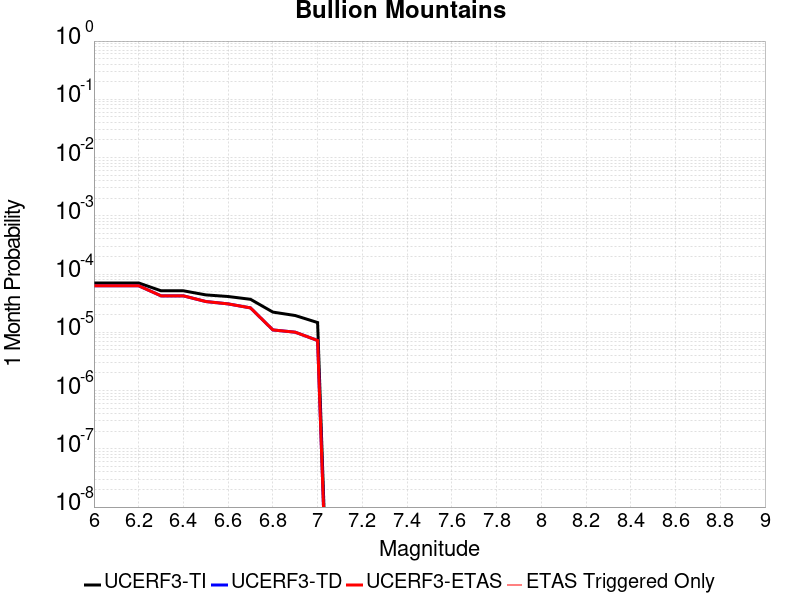 |  |  |

| Magnitude | 1 wk TI Prob | 1 wk TD Prob | 1 wk ETAS Prob | 1 wk ETAS/TD Gain | 1 wk ETAS Triggered Only | 1 mo TI Prob | 1 mo TD Prob | 1 mo ETAS Prob | 1 mo ETAS/TD Gain | 1 mo ETAS Triggered Only | 1 yr TI Prob | 1 yr TD Prob | 1 yr ETAS Prob | 1 yr ETAS/TD Gain | 1 yr ETAS Triggered Only | 10 yr TI Prob | 10 yr TD Prob | 10 yr ETAS Prob | 10 yr ETAS/TD Gain | 10 yr ETAS Triggered Only |
|-----|-----|-----|-----|-----|-----|-----|-----|-----|-----|-----|-----|-----|-----|-----|-----|-----|-----|-----|-----|-----|
| 6.0 | 1.6420427E-5 | 1.4692201E-5 | 1.4692201E-5 | 1.0 | 0.0 | 7.037136E-5 | 6.296527E-5 | 6.296527E-5 | 1.0 | 0.0 | 8.5643446E-4 | 7.6637097E-4 | 7.763633E-4 | 1.0130385 | 1.0E-5 | 0.008531413 | 0.0076410742 | 0.0076807686 | 1.0051949 | 4.0E-5 |
| 6.1 | 1.6420427E-5 | 1.4692201E-5 | 1.4692201E-5 | 1.0 | 0.0 | 7.037136E-5 | 6.296527E-5 | 6.296527E-5 | 1.0 | 0.0 | 8.5643446E-4 | 7.6637097E-4 | 7.763633E-4 | 1.0130385 | 1.0E-5 | 0.008531413 | 0.0076410742 | 0.0076807686 | 1.0051949 | 4.0E-5 |
| 6.2 | 1.6420427E-5 | 1.4692201E-5 | 1.4692201E-5 | 1.0 | 0.0 | 7.037136E-5 | 6.296527E-5 | 6.296527E-5 | 1.0 | 0.0 | 8.5643446E-4 | 7.6637097E-4 | 7.763633E-4 | 1.0130385 | 1.0E-5 | 0.008531413 | 0.0076410742 | 0.0076807686 | 1.0051949 | 4.0E-5 |
| 6.3 | 1.2046778E-5 | 9.8623805E-6 | 9.8623805E-6 | 1.0 | 0.0 | 5.1628023E-5 | 4.226679E-5 | 4.226679E-5 | 1.0 | 0.0 | 6.283899E-4 | 5.1449984E-4 | 5.1449984E-4 | 1.0 | 0.0 | 0.0062661595 | 0.0051353686 | 0.005155266 | 1.0038745 | 2.0E-5 |
| 6.4 | 1.2046778E-5 | 9.8623805E-6 | 9.8623805E-6 | 1.0 | 0.0 | 5.1628023E-5 | 4.226679E-5 | 4.226679E-5 | 1.0 | 0.0 | 6.283899E-4 | 5.1449984E-4 | 5.1449984E-4 | 1.0 | 0.0 | 0.0062661595 | 0.0051353686 | 0.005155266 | 1.0038745 | 2.0E-5 |
| 6.5 | 1.0244343E-5 | 7.879477E-6 | 7.879477E-6 | 1.0 | 0.0 | 4.390359E-5 | 3.376887E-5 | 3.376887E-5 | 1.0 | 0.0 | 5.343951E-4 | 4.110791E-4 | 4.110791E-4 | 1.0 | 0.0 | 0.005331118 | 0.0041052178 | 0.004125136 | 1.0048518 | 2.0E-5 |
| 6.6 | 9.605408E-6 | 7.177506E-6 | 7.177506E-6 | 1.0 | 0.0 | 4.1165385E-5 | 3.0760493E-5 | 3.0760493E-5 | 1.0 | 0.0 | 5.010733E-4 | 3.74465E-4 | 3.74465E-4 | 1.0 | 0.0 | 0.00499945 | 0.0037403372 | 0.0037602624 | 1.0053271 | 2.0E-5 |
| 6.7 | 8.60418E-6 | 6.124001E-6 | 6.124001E-6 | 1.0 | 0.0 | 3.687454E-5 | 2.6245565E-5 | 2.6245565E-5 | 1.0 | 0.0 | 4.48855E-4 | 3.1951242E-4 | 3.1951242E-4 | 1.0 | 0.0 | 0.004479495 | 0.0031924422 | 0.0032123784 | 1.0062448 | 2.0E-5 |
| 6.8 | 5.187994E-6 | 2.5631452E-6 | 2.5631452E-6 | 1.0 | 0.0 | 2.223407E-5 | 1.0984884E-5 | 1.0984884E-5 | 1.0 | 0.0 | 2.7066618E-4 | 1.3373674E-4 | 1.3373674E-4 | 1.0 | 0.0 | 0.0027033675 | 0.0013369543 | 0.0013369543 | 1.0 | 0.0 |
| 6.9 | 4.5302368E-6 | 2.344301E-6 | 2.344301E-6 | 1.0 | 0.0 | 1.9415156E-5 | 1.0046988E-5 | 1.0046988E-5 | 1.0 | 0.0 | 2.3635388E-4 | 1.2231918E-4 | 1.2231918E-4 | 1.0 | 0.0 | 0.0023610266 | 0.0012229076 | 0.0012229076 | 1.0 | 0.0 |
| 7.0 | 3.431668E-6 | 1.688219E-6 | 1.688219E-6 | 1.0 | 0.0 | 1.4707065E-5 | 7.235224E-6 | 7.235224E-6 | 1.0 | 0.0 | 1.7904381E-4 | 8.8088855E-5 | 8.8088855E-5 | 1.0 | 0.0 | 0.0017889962 | 8.8088855E-4 | 8.8088855E-4 | 1.0 | 0.0 |

## Hunting Creek - Berryessa 2011 CFM
*[(top)](#table-of-contents)*

| 1 Week | 1 Month | 1 Year | 10 Year |
|-----|-----|-----|-----|
|  |  |  |  |

| Magnitude | 1 wk TI Prob | 1 wk TD Prob | 1 wk ETAS Prob | 1 wk ETAS/TD Gain | 1 wk ETAS Triggered Only | 1 mo TI Prob | 1 mo TD Prob | 1 mo ETAS Prob | 1 mo ETAS/TD Gain | 1 mo ETAS Triggered Only | 1 yr TI Prob | 1 yr TD Prob | 1 yr ETAS Prob | 1 yr ETAS/TD Gain | 1 yr ETAS Triggered Only | 10 yr TI Prob | 10 yr TD Prob | 10 yr ETAS Prob | 10 yr ETAS/TD Gain | 10 yr ETAS Triggered Only |
|-----|-----|-----|-----|-----|-----|-----|-----|-----|-----|-----|-----|-----|-----|-----|-----|-----|-----|-----|-----|-----|
| 6.0 | 1.1270982E-4 | 2.003E-4 | 2.003E-4 | 1.0 | 0.0 | 4.8295266E-4 | 8.580158E-4 | 8.580158E-4 | 1.0 | 0.0 | 0.0058641075 | 0.010386613 | 0.010396509 | 1.0009527 | 1.0E-5 | 0.057117578 | 0.098045476 | 0.09806352 | 1.0001839 | 2.0E-5 |
| 6.1 | 1.1239393E-4 | 1.9978137E-4 | 1.9978137E-4 | 1.0 | 0.0 | 4.8159933E-4 | 8.5579476E-4 | 8.5579476E-4 | 1.0 | 0.0 | 0.0058477195 | 0.010359855 | 0.0103697525 | 1.0009552 | 1.0E-5 | 0.056962132 | 0.09780394 | 0.09782198 | 1.0001845 | 2.0E-5 |
| 6.2 | 7.596265E-5 | 1.2934073E-4 | 1.2934073E-4 | 1.0 | 0.0 | 3.2551357E-4 | 5.5417913E-4 | 5.5417913E-4 | 1.0 | 0.0 | 0.0039559277 | 0.0067216344 | 0.0067315674 | 1.0014777 | 1.0E-5 | 0.038862433 | 0.06459614 | 0.06461485 | 1.0002896 | 2.0E-5 |
| 6.3 | 6.78794E-5 | 1.14485956E-4 | 1.14485956E-4 | 1.0 | 0.0 | 2.9087928E-4 | 4.9054454E-4 | 4.9054454E-4 | 1.0 | 0.0 | 0.003535705 | 0.0059528984 | 0.005962839 | 1.0016699 | 1.0E-5 | 0.034799766 | 0.05746977 | 0.057479195 | 1.000164 | 1.0E-5 |
| 6.4 | 6.2165134E-5 | 1.0435045E-4 | 1.0435045E-4 | 1.0 | 0.0 | 2.6639478E-4 | 4.4712838E-4 | 4.4712838E-4 | 1.0 | 0.0 | 0.0032385332 | 0.0054276367 | 0.0054375823 | 1.0018324 | 1.0E-5 | 0.03191742 | 0.052554645 | 0.052564118 | 1.0001802 | 1.0E-5 |
| 6.5 | 5.4368087E-5 | 9.0704736E-5 | 9.0704736E-5 | 1.0 | 0.0 | 2.3298527E-4 | 3.8866926E-4 | 3.8866926E-4 | 1.0 | 0.0 | 0.0028329059 | 0.0047198907 | 0.0047298437 | 1.0021087 | 1.0E-5 | 0.027970633 | 0.04588404 | 0.045893583 | 1.0002079 | 1.0E-5 |
| 6.6 | 4.729947E-5 | 7.8472214E-5 | 7.8472214E-5 | 1.0 | 0.0 | 2.0269625E-4 | 3.362585E-4 | 3.362585E-4 | 1.0 | 0.0 | 0.002465034 | 0.004084906 | 0.004094865 | 1.0024381 | 1.0E-5 | 0.02437869 | 0.039855294 | 0.039864898 | 1.0002409 | 1.0E-5 |
| 6.7 | 3.6875328E-5 | 6.044355E-5 | 6.044355E-5 | 1.0 | 0.0 | 1.5802756E-4 | 2.5902048E-4 | 2.5902048E-4 | 1.0 | 0.0 | 0.0019222875 | 0.003148399 | 0.003148399 | 1.0 | 0.0 | 0.019057442 | 0.030895488 | 0.030895488 | 1.0 | 0.0 |
| 6.8 | 2.0292036E-5 | 2.8977376E-5 | 2.8977376E-5 | 1.0 | 0.0 | 8.6962966E-5 | 1.2418274E-4 | 1.2418274E-4 | 1.0 | 0.0 | 0.0010582599 | 0.0015108638 | 0.0015108638 | 1.0 | 0.0 | 0.010532344 | 0.014979384 | 0.014979384 | 1.0 | 0.0 |
| 6.9 | 1.7871042E-5 | 2.4473193E-5 | 2.4473193E-5 | 1.0 | 0.0 | 7.658793E-5 | 1.04880906E-4 | 1.04880906E-4 | 1.0 | 0.0 | 9.320591E-4 | 0.0012761768 | 0.0012761768 | 1.0 | 0.0 | 0.009281595 | 0.012680746 | 0.012680746 | 1.0 | 0.0 |
| 7.0 | 1.6415532E-5 | 2.1907066E-5 | 2.1907066E-5 | 1.0 | 0.0 | 7.035038E-5 | 9.388406E-5 | 9.388406E-5 | 1.0 | 0.0 | 8.561793E-4 | 0.0011424406 | 0.0011424406 | 1.0 | 0.0 | 0.008528882 | 0.01136518 | 0.01136518 | 1.0 | 0.0 |
| 7.1 | 1.5409885E-5 | 2.0347048E-5 | 2.0347048E-5 | 1.0 | 0.0 | 6.6040695E-5 | 8.719874E-5 | 8.719874E-5 | 1.0 | 0.0 | 8.0374884E-4 | 0.0010611303 | 0.0010611303 | 1.0 | 0.0 | 0.00800848 | 0.010561098 | 0.010561098 | 1.0 | 0.0 |
| 7.2 | 1.4497423E-5 | 1.905562E-5 | 1.905562E-5 | 1.0 | 0.0 | 6.213033E-5 | 8.166441E-5 | 8.166441E-5 | 1.0 | 0.0 | 7.5617427E-4 | 9.938137E-4 | 9.938137E-4 | 1.0 | 0.0 | 0.0075360634 | 0.009894406 | 0.009894406 | 1.0 | 0.0 |
| 7.3 | 1.3615175E-5 | 1.7826764E-5 | 1.7826764E-5 | 1.0 | 0.0 | 5.8349444E-5 | 7.6398195E-5 | 7.6398195E-5 | 1.0 | 0.0 | 7.101729E-4 | 9.29754E-4 | 9.29754E-4 | 1.0 | 0.0 | 0.0070790765 | 0.009259279 | 0.009259279 | 1.0 | 0.0 |
| 7.4 | 1.2252825E-5 | 1.6026825E-5 | 1.6026825E-5 | 1.0 | 0.0 | 5.251105E-5 | 6.8684596E-5 | 6.8684596E-5 | 1.0 | 0.0 | 6.391345E-4 | 8.3591696E-4 | 8.3591696E-4 | 1.0 | 0.0 | 0.0063729943 | 0.008328301 | 0.008328301 | 1.0 | 0.0 |
| 7.5 | 1.0913301E-5 | 1.4241617E-5 | 1.4241617E-5 | 1.0 | 0.0 | 4.6770452E-5 | 6.1034087E-5 | 6.1034087E-5 | 1.0 | 0.0 | 5.6928146E-4 | 7.4283936E-4 | 7.4283936E-4 | 1.0 | 0.0 | 0.0056782532 | 0.0074040988 | 0.0074040988 | 1.0 | 0.0 |
| 7.6 | 8.623192E-6 | 1.1235044E-5 | 1.1235044E-5 | 1.0 | 0.0 | 3.6956015E-5 | 4.8149315E-5 | 4.8149315E-5 | 1.0 | 0.0 | 4.4984656E-4 | 5.860628E-4 | 5.860628E-4 | 1.0 | 0.0 | 0.00448937 | 0.005845606 | 0.005845606 | 1.0 | 0.0 |
| 7.7 | 2.0993634E-6 | 2.662692E-6 | 2.662692E-6 | 1.0 | 0.0 | 8.997241E-6 | 1.1411487E-5 | 1.1411487E-5 | 1.0 | 0.0 | 1.09535904E-4 | 1.3892607E-4 | 1.3892607E-4 | 1.0 | 0.0 | 0.0010948193 | 0.0013884421 | 0.0013884421 | 1.0 | 0.0 |
| 7.8 | 1.8428308E-7 | 2.1675E-7 | 2.1675E-7 | 1.0 | 0.0 | 7.897844E-7 | 9.289282E-7 | 9.289282E-7 | 1.0 | 0.0 | 9.615583E-6 | 1.1309647E-5 | 1.1309647E-5 | 1.0 | 0.0 | 9.615166E-5 | 1.13083915E-4 | 1.13083915E-4 | 1.0 | 0.0 |

## San Juan
*[(top)](#table-of-contents)*

| 1 Week | 1 Month | 1 Year | 10 Year |
|-----|-----|-----|-----|
|  |  |  | 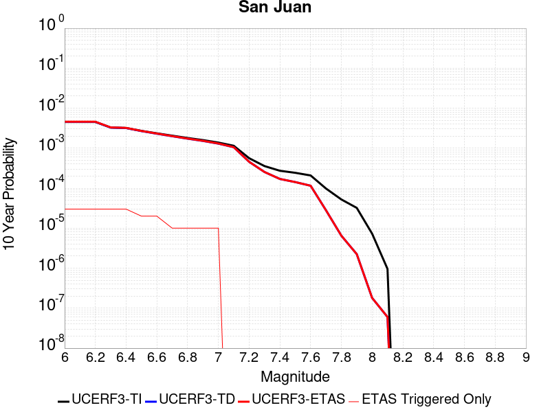 |

| Magnitude | 1 wk TI Prob | 1 wk TD Prob | 1 wk ETAS Prob | 1 wk ETAS/TD Gain | 1 wk ETAS Triggered Only | 1 mo TI Prob | 1 mo TD Prob | 1 mo ETAS Prob | 1 mo ETAS/TD Gain | 1 mo ETAS Triggered Only | 1 yr TI Prob | 1 yr TD Prob | 1 yr ETAS Prob | 1 yr ETAS/TD Gain | 1 yr ETAS Triggered Only | 10 yr TI Prob | 10 yr TD Prob | 10 yr ETAS Prob | 10 yr ETAS/TD Gain | 10 yr ETAS Triggered Only |
|-----|-----|-----|-----|-----|-----|-----|-----|-----|-----|-----|-----|-----|-----|-----|-----|-----|-----|-----|-----|-----|
| 6.0 | 8.682808E-6 | 8.749572E-6 | 8.749572E-6 | 1.0 | 0.0 | 3.72115E-5 | 3.7497655E-5 | 3.7497655E-5 | 1.0 | 0.0 | 4.5295584E-4 | 4.5644314E-4 | 4.5644314E-4 | 1.0 | 0.0 | 0.004520337 | 0.004555597 | 0.0045854603 | 1.0065553 | 3.0E-5 |
| 6.1 | 8.682808E-6 | 8.749572E-6 | 8.749572E-6 | 1.0 | 0.0 | 3.72115E-5 | 3.7497655E-5 | 3.7497655E-5 | 1.0 | 0.0 | 4.5295584E-4 | 4.5644314E-4 | 4.5644314E-4 | 1.0 | 0.0 | 0.004520337 | 0.004555597 | 0.0045854603 | 1.0065553 | 3.0E-5 |
| 6.2 | 8.682808E-6 | 8.749572E-6 | 8.749572E-6 | 1.0 | 0.0 | 3.72115E-5 | 3.7497655E-5 | 3.7497655E-5 | 1.0 | 0.0 | 4.5295584E-4 | 4.5644314E-4 | 4.5644314E-4 | 1.0 | 0.0 | 0.004520337 | 0.004555597 | 0.0045854603 | 1.0065553 | 3.0E-5 |
| 6.3 | 6.3054235E-6 | 6.2829813E-6 | 6.2829813E-6 | 1.0 | 0.0 | 2.7022963E-5 | 2.6926793E-5 | 2.6926793E-5 | 1.0 | 0.0 | 3.2895492E-4 | 3.277858E-4 | 3.277858E-4 | 1.0 | 0.0 | 0.003284684 | 0.0032732226 | 0.0033031243 | 1.0091352 | 3.0E-5 |
| 6.4 | 6.1490473E-6 | 6.114809E-6 | 6.114809E-6 | 1.0 | 0.0 | 2.6352795E-5 | 2.6206068E-5 | 2.6206068E-5 | 1.0 | 0.0 | 3.2079802E-4 | 3.1901355E-4 | 3.1901355E-4 | 1.0 | 0.0 | 0.0032033534 | 0.0031857518 | 0.0032156562 | 1.0093869 | 3.0E-5 |
| 6.5 | 5.204848E-6 | 5.1375655E-6 | 5.1375655E-6 | 1.0 | 0.0 | 2.23063E-5 | 2.2017957E-5 | 2.2017957E-5 | 1.0 | 0.0 | 2.7154534E-4 | 2.6803662E-4 | 2.6803662E-4 | 1.0 | 0.0 | 0.0027121378 | 0.0026772867 | 0.002697233 | 1.0074502 | 2.0E-5 |
| 6.6 | 4.5179986E-6 | 4.4152753E-6 | 4.4152753E-6 | 1.0 | 0.0 | 1.9362706E-5 | 1.8922474E-5 | 1.8922474E-5 | 1.0 | 0.0 | 2.3571544E-4 | 2.3035756E-4 | 2.3035756E-4 | 1.0 | 0.0 | 0.0023546559 | 0.0023013244 | 0.0023212782 | 1.0086707 | 2.0E-5 |
| 6.7 | 3.9442616E-6 | 3.8200474E-6 | 3.8200474E-6 | 1.0 | 0.0 | 1.6903869E-5 | 1.6371532E-5 | 1.6371532E-5 | 1.0 | 0.0 | 2.0578515E-4 | 1.9930584E-4 | 1.9930584E-4 | 1.0 | 0.0 | 0.002055947 | 0.0019913954 | 0.0020013754 | 1.0050116 | 1.0E-5 |
| 6.8 | 3.4536245E-6 | 3.3165454E-6 | 3.3165454E-6 | 1.0 | 0.0 | 1.4801163E-5 | 1.4213692E-5 | 1.4213692E-5 | 1.0 | 0.0 | 1.8018926E-4 | 1.7303857E-4 | 1.7303857E-4 | 1.0 | 0.0 | 0.0018004322 | 0.0017291567 | 0.0017391394 | 1.0057732 | 1.0E-5 |
| 6.9 | 3.059865E-6 | 2.9122323E-6 | 2.9122323E-6 | 1.0 | 0.0 | 1.3113641E-5 | 1.2480939E-5 | 1.2480939E-5 | 1.0 | 0.0 | 1.596469E-4 | 1.5194541E-4 | 1.5194541E-4 | 1.0 | 0.0 | 0.0015953224 | 0.0015185294 | 0.0015285142 | 1.0065753 | 1.0E-5 |
| 7.0 | 2.6504351E-6 | 2.4921894E-6 | 2.4921894E-6 | 1.0 | 0.0 | 1.1358958E-5 | 1.0680771E-5 | 1.0680771E-5 | 1.0 | 0.0 | 1.3828653E-4 | 1.3003117E-4 | 1.3003117E-4 | 1.0 | 0.0 | 0.0013820052 | 0.0012996623 | 0.0013096492 | 1.0076844 | 1.0E-5 |
| 7.1 | 2.2039317E-6 | 2.0339817E-6 | 2.0339817E-6 | 1.0 | 0.0 | 9.445387E-6 | 8.717038E-6 | 8.717038E-6 | 1.0 | 0.0 | 1.1499152E-4 | 1.061253E-4 | 1.061253E-4 | 1.0 | 0.0 | 0.0011493203 | 0.0010608557 | 0.0010608557 | 1.0 | 0.0 |
| 7.2 | 1.0786707E-6 | 8.7714795E-7 | 8.7714795E-7 | 1.0 | 0.0 | 4.622866E-6 | 3.7592E-6 | 3.7592E-6 | 1.0 | 0.0 | 5.628194E-5 | 4.576731E-5 | 4.576731E-5 | 1.0 | 0.0 | 5.6267687E-4 | 4.5763733E-4 | 4.5763733E-4 | 1.0 | 0.0 |
| 7.3 | 6.846433E-7 | 4.869599E-7 | 4.869599E-7 | 1.0 | 0.0 | 2.9341822E-6 | 2.086969E-6 | 2.086969E-6 | 1.0 | 0.0 | 3.5723086E-5 | 2.5408553E-5 | 2.5408553E-5 | 1.0 | 0.0 | 3.571734E-4 | 2.5409024E-4 | 2.5409024E-4 | 1.0 | 0.0 |
| 7.4 | 5.23043E-7 | 3.26338E-7 | 3.26338E-7 | 1.0 | 0.0 | 2.2416111E-6 | 1.3985907E-6 | 1.3985907E-6 | 1.0 | 0.0 | 2.7291273E-5 | 1.7027709E-5 | 1.7027709E-5 | 1.0 | 0.0 | 2.7287923E-4 | 1.7029612E-4 | 1.7029612E-4 | 1.0 | 0.0 |
| 7.5 | 4.648444E-7 | 2.7239713E-7 | 2.7239713E-7 | 1.0 | 0.0 | 1.9921886E-6 | 1.1674158E-6 | 1.1674158E-6 | 1.0 | 0.0 | 2.4254627E-5 | 1.4213195E-5 | 1.4213195E-5 | 1.0 | 0.0 | 2.425198E-4 | 1.4215261E-4 | 1.4215261E-4 | 1.0 | 0.0 |
| 7.6 | 3.9906567E-7 | 2.2087056E-7 | 2.2087056E-7 | 1.0 | 0.0 | 1.7102802E-6 | 9.4658776E-7 | 9.4658776E-7 | 1.0 | 0.0 | 2.0822463E-5 | 1.1524646E-5 | 1.1524646E-5 | 1.0 | 0.0 | 2.0820512E-4 | 1.1526561E-4 | 1.1526561E-4 | 1.0 | 0.0 |
| 7.7 | 1.8784601E-7 | 5.3678413E-8 | 5.3678413E-8 | 1.0 | 0.0 | 8.0505407E-7 | 2.300503E-7 | 2.300503E-7 | 1.0 | 0.0 | 9.80149E-6 | 2.800859E-6 | 2.800859E-6 | 1.0 | 0.0 | 9.801057E-5 | 2.8017048E-5 | 2.8017048E-5 | 1.0 | 0.0 |
| 7.8 | 1.00154914E-7 | 1.2418047E-8 | 1.2418047E-8 | 1.0 | 0.0 | 4.2923529E-7 | 5.3220194E-8 | 5.3220194E-8 | 1.0 | 0.0 | 5.225927E-6 | 6.479557E-7 | 6.479557E-7 | 1.0 | 0.0 | 5.225804E-5 | 6.48537E-6 | 6.48537E-6 | 1.0 | 0.0 |
| 7.9 | 6.171429E-8 | 4.2973958E-9 | 4.2973958E-9 | 1.0 | 0.0 | 2.6448978E-7 | 1.8417403E-8 | 1.8417403E-8 | 1.0 | 0.0 | 3.2201583E-6 | 2.2423187E-7 | 2.2423187E-7 | 1.0 | 0.0 | 3.2201115E-5 | 2.2475485E-6 | 2.2475485E-6 | 1.0 | 0.0 |
| 8.0 | 1.3974572E-8 | 3.3787872E-10 | 3.3787872E-10 | 1.0 | 0.0 | 5.989102E-8 | 1.4480476E-9 | 1.4480476E-9 | 1.0 | 0.0 | 7.2917294E-7 | 1.7629972E-8 | 1.7629972E-8 | 1.0 | 0.0 | 7.2917055E-6 | 1.8054902E-7 | 1.8054902E-7 | 1.0 | 0.0 |
| 8.1 | 1.8403477E-9 | 1.1305712E-10 | 1.1305712E-10 | 1.0 | 0.0 | 7.887204E-9 | 4.845303E-10 | 4.845303E-10 | 1.0 | 0.0 | 9.602671E-8 | 5.8991594E-9 | 5.8991594E-9 | 1.0 | 0.0 | 9.602667E-7 | 6.018756E-8 | 6.018756E-8 | 1.0 | 0.0 |

## Sheephole
*[(top)](#table-of-contents)*

| 1 Week | 1 Month | 1 Year | 10 Year |
|-----|-----|-----|-----|
|  |  |  |  |

| Magnitude | 1 wk TI Prob | 1 wk TD Prob | 1 wk ETAS Prob | 1 wk ETAS/TD Gain | 1 wk ETAS Triggered Only | 1 mo TI Prob | 1 mo TD Prob | 1 mo ETAS Prob | 1 mo ETAS/TD Gain | 1 mo ETAS Triggered Only | 1 yr TI Prob | 1 yr TD Prob | 1 yr ETAS Prob | 1 yr ETAS/TD Gain | 1 yr ETAS Triggered Only | 10 yr TI Prob | 10 yr TD Prob | 10 yr ETAS Prob | 10 yr ETAS/TD Gain | 10 yr ETAS Triggered Only |
|-----|-----|-----|-----|-----|-----|-----|-----|-----|-----|-----|-----|-----|-----|-----|-----|-----|-----|-----|-----|-----|
| 6.0 | 4.5579695E-6 | 4.7412877E-6 | 4.7412877E-6 | 1.0 | 0.0 | 1.9534009E-5 | 2.0319678E-5 | 2.0319678E-5 | 1.0 | 0.0 | 2.3780059E-4 | 2.4736955E-4 | 2.6736458E-4 | 1.0808307 | 2.0E-5 | 0.0023754628 | 0.0024714863 | 0.0025014123 | 1.0121084 | 3.0E-5 |
| 6.1 | 4.5579695E-6 | 4.7412877E-6 | 4.7412877E-6 | 1.0 | 0.0 | 1.9534009E-5 | 2.0319678E-5 | 2.0319678E-5 | 1.0 | 0.0 | 2.3780059E-4 | 2.4736955E-4 | 2.6736458E-4 | 1.0808307 | 2.0E-5 | 0.0023754628 | 0.0024714863 | 0.0025014123 | 1.0121084 | 3.0E-5 |
| 6.2 | 2.6677674E-6 | 2.7874107E-6 | 2.7874107E-6 | 1.0 | 0.0 | 1.1433239E-5 | 1.1945997E-5 | 1.1945997E-5 | 1.0 | 0.0 | 1.3919079E-4 | 1.4543389E-4 | 1.6543099E-4 | 1.1374996 | 2.0E-5 | 0.0013910364 | 0.001453493 | 0.001473464 | 1.01374 | 2.0E-5 |
| 6.3 | 2.6677674E-6 | 2.7874107E-6 | 2.7874107E-6 | 1.0 | 0.0 | 1.1433239E-5 | 1.1945997E-5 | 1.1945997E-5 | 1.0 | 0.0 | 1.3919079E-4 | 1.4543389E-4 | 1.6543099E-4 | 1.1374996 | 2.0E-5 | 0.0013910364 | 0.001453493 | 0.001473464 | 1.01374 | 2.0E-5 |
| 6.4 | 2.2159759E-6 | 2.3228936E-6 | 2.3228936E-6 | 1.0 | 0.0 | 9.497005E-6 | 9.955224E-6 | 9.955224E-6 | 1.0 | 0.0 | 1.156199E-4 | 1.2119893E-4 | 1.411965E-4 | 1.1649979 | 2.0E-5 | 0.0011555976 | 0.0012114076 | 0.0012313834 | 1.0164897 | 2.0E-5 |
| 6.5 | 2.1986082E-6 | 2.3047737E-6 | 2.3047737E-6 | 1.0 | 0.0 | 9.4225725E-6 | 9.877569E-6 | 9.877569E-6 | 1.0 | 0.0 | 1.1471378E-4 | 1.2025358E-4 | 1.4025117E-4 | 1.1662952 | 2.0E-5 | 0.0011465458 | 0.0012019643 | 0.0012219403 | 1.0166194 | 2.0E-5 |
| 6.6 | 1.5232331E-6 | 1.6019028E-6 | 1.6019028E-6 | 1.0 | 0.0 | 6.5281256E-6 | 6.8652807E-6 | 6.8652807E-6 | 1.0 | 0.0 | 7.947703E-5 | 8.358178E-5 | 8.358178E-5 | 1.0 | 0.0 | 7.9448614E-4 | 8.3552214E-4 | 8.3552214E-4 | 1.0 | 0.0 |
| 6.7 | 1.3137362E-6 | 1.3828287E-6 | 1.3828287E-6 | 1.0 | 0.0 | 5.6302856E-6 | 5.926396E-6 | 5.926396E-6 | 1.0 | 0.0 | 6.854657E-5 | 7.2151626E-5 | 7.2151626E-5 | 1.0 | 0.0 | 6.8525434E-4 | 7.212959E-4 | 7.212959E-4 | 1.0 | 0.0 |
| 6.8 | 1.2275751E-6 | 1.2922936E-6 | 1.2922936E-6 | 1.0 | 0.0 | 5.2610258E-6 | 5.5383903E-6 | 5.5383903E-6 | 1.0 | 0.0 | 6.4051106E-5 | 6.742795E-5 | 6.742795E-5 | 1.0 | 0.0 | 6.4032647E-4 | 6.740883E-4 | 6.740883E-4 | 1.0 | 0.0 |
| 6.9 | 1.1837088E-6 | 1.2461107E-6 | 1.2461107E-6 | 1.0 | 0.0 | 5.0730278E-6 | 5.340464E-6 | 5.340464E-6 | 1.0 | 0.0 | 6.176237E-5 | 6.501835E-5 | 6.501835E-5 | 1.0 | 0.0 | 6.17452E-4 | 6.500064E-4 | 6.500064E-4 | 1.0 | 0.0 |
| 7.0 | 9.849371E-7 | 1.036636E-6 | 1.036636E-6 | 1.0 | 0.0 | 4.2211523E-6 | 4.442719E-6 | 4.442719E-6 | 1.0 | 0.0 | 5.1391315E-5 | 5.408886E-5 | 5.408886E-5 | 1.0 | 0.0 | 5.137943E-4 | 5.4076704E-4 | 5.4076704E-4 | 1.0 | 0.0 |
| 7.1 | 8.1643645E-7 | 8.5917287E-7 | 8.5917287E-7 | 1.0 | 0.0 | 3.4990085E-6 | 3.6821648E-6 | 3.6821648E-6 | 1.0 | 0.0 | 4.2599597E-5 | 4.482952E-5 | 4.482952E-5 | 1.0 | 0.0 | 4.259143E-4 | 4.482134E-4 | 4.482134E-4 | 1.0 | 0.0 |
| 7.2 | 5.7295756E-7 | 6.029544E-7 | 6.029544E-7 | 1.0 | 0.0 | 2.45553E-6 | 2.584088E-6 | 2.584088E-6 | 1.0 | 0.0 | 2.9895667E-5 | 3.1460884E-5 | 3.1460884E-5 | 1.0 | 0.0 | 2.9891645E-4 | 3.14571E-4 | 3.14571E-4 | 1.0 | 0.0 |

## San Jacinto (Coyote Creek)
*[(top)](#table-of-contents)*

| 1 Week | 1 Month | 1 Year | 10 Year |
|-----|-----|-----|-----|
|  |  |  |  |

| Magnitude | 1 wk TI Prob | 1 wk TD Prob | 1 wk ETAS Prob | 1 wk ETAS/TD Gain | 1 wk ETAS Triggered Only | 1 mo TI Prob | 1 mo TD Prob | 1 mo ETAS Prob | 1 mo ETAS/TD Gain | 1 mo ETAS Triggered Only | 1 yr TI Prob | 1 yr TD Prob | 1 yr ETAS Prob | 1 yr ETAS/TD Gain | 1 yr ETAS Triggered Only | 10 yr TI Prob | 10 yr TD Prob | 10 yr ETAS Prob | 10 yr ETAS/TD Gain | 10 yr ETAS Triggered Only |
|-----|-----|-----|-----|-----|-----|-----|-----|-----|-----|-----|-----|-----|-----|-----|-----|-----|-----|-----|-----|-----|
| 6.0 | 2.7374346E-5 | 2.4152421E-5 | 2.4152421E-5 | 1.0 | 0.0 | 1.1731335E-4 | 1.0350628E-4 | 1.13505244E-4 | 1.0966024 | 1.0E-5 | 0.0014273542 | 0.001259463 | 0.0012794379 | 1.0158598 | 2.0E-5 | 0.01418221 | 0.012931943 | 0.012961554 | 1.0022899 | 3.0E-5 |
| 6.1 | 2.7374346E-5 | 2.4152421E-5 | 2.4152421E-5 | 1.0 | 0.0 | 1.1731335E-4 | 1.0350628E-4 | 1.13505244E-4 | 1.0966024 | 1.0E-5 | 0.0014273542 | 0.001259463 | 0.0012794379 | 1.0158598 | 2.0E-5 | 0.01418221 | 0.012931943 | 0.012961554 | 1.0022899 | 3.0E-5 |
| 6.2 | 2.7374346E-5 | 2.4152421E-5 | 2.4152421E-5 | 1.0 | 0.0 | 1.1731335E-4 | 1.0350628E-4 | 1.13505244E-4 | 1.0966024 | 1.0E-5 | 0.0014273542 | 0.001259463 | 0.0012794379 | 1.0158598 | 2.0E-5 | 0.01418221 | 0.012931943 | 0.012961554 | 1.0022899 | 3.0E-5 |
| 6.3 | 2.7374346E-5 | 2.4152421E-5 | 2.4152421E-5 | 1.0 | 0.0 | 1.1731335E-4 | 1.0350628E-4 | 1.13505244E-4 | 1.0966024 | 1.0E-5 | 0.0014273542 | 0.001259463 | 0.0012794379 | 1.0158598 | 2.0E-5 | 0.01418221 | 0.012931943 | 0.012961554 | 1.0022899 | 3.0E-5 |
| 6.4 | 2.7374346E-5 | 2.4152421E-5 | 2.4152421E-5 | 1.0 | 0.0 | 1.1731335E-4 | 1.0350628E-4 | 1.13505244E-4 | 1.0966024 | 1.0E-5 | 0.0014273542 | 0.001259463 | 0.0012794379 | 1.0158598 | 2.0E-5 | 0.01418221 | 0.012931943 | 0.012961554 | 1.0022899 | 3.0E-5 |
| 6.5 | 2.7282445E-5 | 2.4038494E-5 | 2.4038494E-5 | 1.0 | 0.0 | 1.16919524E-4 | 1.03018065E-4 | 1.13017035E-4 | 1.0970603 | 1.0E-5 | 0.0014225657 | 0.001253526 | 0.0012735008 | 1.015935 | 2.0E-5 | 0.014134934 | 0.012873269 | 0.012902882 | 1.0023004 | 3.0E-5 |
| 6.6 | 2.7282445E-5 | 2.4038494E-5 | 2.4038494E-5 | 1.0 | 0.0 | 1.16919524E-4 | 1.03018065E-4 | 1.13017035E-4 | 1.0970603 | 1.0E-5 | 0.0014225657 | 0.001253526 | 0.0012735008 | 1.015935 | 2.0E-5 | 0.014134934 | 0.012873269 | 0.012902882 | 1.0023004 | 3.0E-5 |
| 6.7 | 2.7216198E-5 | 2.3963614E-5 | 2.3963614E-5 | 1.0 | 0.0 | 1.1663563E-4 | 1.0269717E-4 | 1.1269614E-4 | 1.0973637 | 1.0E-5 | 0.0014191137 | 0.0012496236 | 0.0012695986 | 1.0159848 | 2.0E-5 | 0.014100855 | 0.012834677 | 0.012864292 | 1.0023074 | 3.0E-5 |
| 6.8 | 2.7078617E-5 | 2.3880828E-5 | 2.3880828E-5 | 1.0 | 0.0 | 1.1604605E-4 | 1.02342405E-4 | 1.1234138E-4 | 1.0977012 | 1.0E-5 | 0.001411945 | 0.0012453091 | 0.0012652843 | 1.0160403 | 2.0E-5 | 0.014030075 | 0.012791819 | 0.012821436 | 1.0023153 | 3.0E-5 |
| 6.9 | 2.6982952E-5 | 2.3800336E-5 | 2.3800336E-5 | 1.0 | 0.0 | 1.15636096E-4 | 1.01997466E-4 | 1.1199645E-4 | 1.0980316 | 1.0E-5 | 0.0014069602 | 0.0012411143 | 0.0012610896 | 1.0160946 | 2.0E-5 | 0.013980856 | 0.012750106 | 0.012779724 | 1.0023229 | 3.0E-5 |
| 7.0 | 2.6449972E-5 | 2.3377343E-5 | 2.3377343E-5 | 1.0 | 0.0 | 1.1335209E-4 | 1.00184785E-4 | 1.1018378E-4 | 1.0998056 | 1.0E-5 | 0.001379188 | 0.0012190698 | 0.0012390454 | 1.0163859 | 2.0E-5 | 0.0137065975 | 0.012531462 | 0.012561087 | 1.0023639 | 3.0E-5 |
| 7.1 | 2.6257849E-5 | 2.3203378E-5 | 2.3203378E-5 | 1.0 | 0.0 | 1.1252879E-4 | 9.943927E-5 | 1.09438275E-4 | 1.1005539 | 1.0E-5 | 0.0013691769 | 0.0012100033 | 0.0012299791 | 1.0165089 | 2.0E-5 | 0.013607717 | 0.012441383 | 0.01247101 | 1.0023813 | 3.0E-5 |
| 7.2 | 2.5270041E-5 | 2.2398073E-5 | 2.2398073E-5 | 1.0 | 0.0 | 1.0829568E-4 | 9.598822E-5 | 1.0598727E-4 | 1.1041695 | 1.0E-5 | 0.0013177024 | 0.0011680324 | 0.001188009 | 1.0171028 | 2.0E-5 | 0.013099162 | 0.012022524 | 0.0120521635 | 1.0024654 | 3.0E-5 |
| 7.3 | 2.339701E-5 | 2.1129852E-5 | 2.1129852E-5 | 1.0 | 0.0 | 1.0026905E-4 | 9.0553374E-5 | 1.0055247E-4 | 1.1104221 | 1.0E-5 | 0.001220092 | 0.0011019319 | 0.0011219098 | 1.01813 | 2.0E-5 | 0.012134149 | 0.011361412 | 0.011391071 | 1.0026106 | 3.0E-5 |
| 7.4 | 2.296333E-5 | 2.0860187E-5 | 2.0860187E-5 | 1.0 | 0.0 | 9.841056E-5 | 8.939775E-5 | 9.939685E-5 | 1.1118497 | 1.0E-5 | 0.0011974899 | 0.0010878762 | 0.0011078544 | 1.0183644 | 2.0E-5 | 0.011910575 | 0.011220528 | 0.011250191 | 1.0026437 | 3.0E-5 |
| 7.5 | 2.2188895E-5 | 2.0383068E-5 | 2.0383068E-5 | 1.0 | 0.0 | 9.50918E-5 | 8.735309E-5 | 9.735222E-5 | 1.1144679 | 1.0E-5 | 0.0011571277 | 0.001063007 | 0.0010829858 | 1.0187945 | 2.0E-5 | 0.011511209 | 0.010970126 | 0.010999797 | 1.0027047 | 3.0E-5 |
| 7.6 | 2.0013189E-5 | 1.8969224E-5 | 1.8969224E-5 | 1.0 | 0.0 | 8.5767984E-5 | 8.129415E-5 | 9.129333E-5 | 1.123 | 1.0E-5 | 0.001043725 | 9.893086E-4 | 0.0010092888 | 1.0201961 | 2.0E-5 | 0.010388365 | 0.010228057 | 0.01025775 | 1.0029031 | 3.0E-5 |
| 7.7 | 1.7230794E-5 | 1.6750411E-5 | 1.6750411E-5 | 1.0 | 0.0 | 7.384417E-5 | 7.178551E-5 | 8.178479E-5 | 1.1392939 | 1.0E-5 | 8.986819E-4 | 8.7363896E-4 | 8.936215E-4 | 1.0228728 | 2.0E-5 | 0.008950562 | 0.009066527 | 0.009096255 | 1.0032789 | 3.0E-5 |
| 7.8 | 1.4478809E-5 | 1.4997487E-5 | 1.4997487E-5 | 1.0 | 0.0 | 6.205057E-5 | 6.4273365E-5 | 7.427272E-5 | 1.1555754 | 1.0E-5 | 7.552038E-4 | 7.8224787E-4 | 8.0223224E-4 | 1.0255474 | 2.0E-5 | 0.0075264242 | 0.008144863 | 0.008174619 | 1.0036533 | 3.0E-5 |
| 7.9 | 1.1114467E-5 | 1.1650795E-5 | 1.1650795E-5 | 1.0 | 0.0 | 4.7632562E-5 | 4.9931026E-5 | 5.9930528E-5 | 1.2002662 | 1.0E-5 | 5.797721E-4 | 6.0774124E-4 | 6.277291E-4 | 1.0328888 | 2.0E-5 | 0.0057826187 | 0.00638346 | 0.0064132684 | 1.0046697 | 3.0E-5 |
| 8.0 | 9.327402E-6 | 9.904316E-6 | 9.904316E-6 | 1.0 | 0.0 | 3.9973966E-5 | 4.2446383E-5 | 5.2445957E-5 | 1.2355814 | 1.0E-5 | 4.8657437E-4 | 5.1666267E-4 | 5.3665234E-4 | 1.03869 | 2.0E-5 | 0.0048551033 | 0.005452786 | 0.0054826224 | 1.0054718 | 3.0E-5 |
| 8.1 | 7.0235833E-6 | 6.831197E-6 | 6.831197E-6 | 1.0 | 0.0 | 3.0100724E-5 | 2.9276232E-5 | 3.927594E-5 | 1.341564 | 1.0E-5 | 3.664147E-4 | 3.5638033E-4 | 3.763732E-4 | 1.0560998 | 2.0E-5 | 0.003658111 | 0.0037895683 | 0.0038094926 | 1.0052576 | 2.0E-5 |
| 8.2 | 2.0358202E-6 | 8.9996047E-7 | 8.9996047E-7 | 1.0 | 0.0 | 8.724915E-6 | 3.856968E-6 | 3.856968E-6 | 1.0 | 0.0 | 1.06220665E-4 | 4.6957593E-5 | 4.6957593E-5 | 1.0 | 0.0 | 0.001061699 | 5.3285924E-4 | 5.3285924E-4 | 1.0 | 0.0 |
| 8.3 | 2.0051264E-7 | 6.621079E-8 | 6.621079E-8 | 1.0 | 0.0 | 8.5933965E-7 | 2.837605E-7 | 2.837605E-7 | 1.0 | 0.0 | 1.046241E-5 | 3.454779E-6 | 3.454779E-6 | 1.0 | 0.0 | 1.0461917E-4 | 4.016238E-5 | 4.016238E-5 | 1.0 | 0.0 |

## Cucamonga
*[(top)](#table-of-contents)*

| 1 Week | 1 Month | 1 Year | 10 Year |
|-----|-----|-----|-----|
|  | 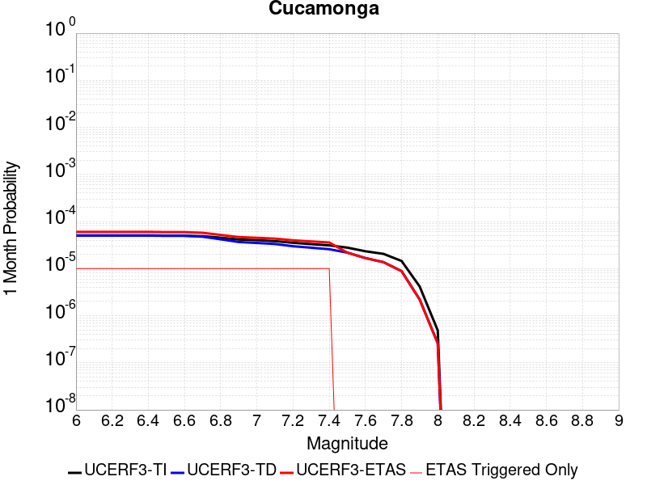 |  |  |

| Magnitude | 1 wk TI Prob | 1 wk TD Prob | 1 wk ETAS Prob | 1 wk ETAS/TD Gain | 1 wk ETAS Triggered Only | 1 mo TI Prob | 1 mo TD Prob | 1 mo ETAS Prob | 1 mo ETAS/TD Gain | 1 mo ETAS Triggered Only | 1 yr TI Prob | 1 yr TD Prob | 1 yr ETAS Prob | 1 yr ETAS/TD Gain | 1 yr ETAS Triggered Only | 10 yr TI Prob | 10 yr TD Prob | 10 yr ETAS Prob | 10 yr ETAS/TD Gain | 10 yr ETAS Triggered Only |
|-----|-----|-----|-----|-----|-----|-----|-----|-----|-----|-----|-----|-----|-----|-----|-----|-----|-----|-----|-----|-----|
| 6.0 | 1.1848348E-5 | 1.1737856E-5 | 2.1737738E-5 | 1.8519343 | 1.0E-5 | 5.0777642E-5 | 5.030414E-5 | 6.030364E-5 | 1.1987808 | 1.0E-5 | 6.180424E-4 | 6.1228353E-4 | 6.222774E-4 | 1.0163223 | 1.0E-5 | 0.0061632637 | 0.006107083 | 0.0061369 | 1.0048823 | 3.0E-5 |
| 6.1 | 1.1848348E-5 | 1.1737856E-5 | 2.1737738E-5 | 1.8519343 | 1.0E-5 | 5.0777642E-5 | 5.030414E-5 | 6.030364E-5 | 1.1987808 | 1.0E-5 | 6.180424E-4 | 6.1228353E-4 | 6.222774E-4 | 1.0163223 | 1.0E-5 | 0.0061632637 | 0.006107083 | 0.0061369 | 1.0048823 | 3.0E-5 |
| 6.2 | 1.1848348E-5 | 1.1737856E-5 | 2.1737738E-5 | 1.8519343 | 1.0E-5 | 5.0777642E-5 | 5.030414E-5 | 6.030364E-5 | 1.1987808 | 1.0E-5 | 6.180424E-4 | 6.1228353E-4 | 6.222774E-4 | 1.0163223 | 1.0E-5 | 0.0061632637 | 0.006107083 | 0.0061369 | 1.0048823 | 3.0E-5 |
| 6.3 | 1.1848348E-5 | 1.1737856E-5 | 2.1737738E-5 | 1.8519343 | 1.0E-5 | 5.0777642E-5 | 5.030414E-5 | 6.030364E-5 | 1.1987808 | 1.0E-5 | 6.180424E-4 | 6.1228353E-4 | 6.222774E-4 | 1.0163223 | 1.0E-5 | 0.0061632637 | 0.006107083 | 0.0061369 | 1.0048823 | 3.0E-5 |
| 6.4 | 1.1848348E-5 | 1.1737856E-5 | 2.1737738E-5 | 1.8519343 | 1.0E-5 | 5.0777642E-5 | 5.030414E-5 | 6.030364E-5 | 1.1987808 | 1.0E-5 | 6.180424E-4 | 6.1228353E-4 | 6.222774E-4 | 1.0163223 | 1.0E-5 | 0.0061632637 | 0.006107083 | 0.0061369 | 1.0048823 | 3.0E-5 |
| 6.5 | 1.16988695E-5 | 1.1576885E-5 | 2.1576769E-5 | 1.8637803 | 1.0E-5 | 5.013705E-5 | 4.9614293E-5 | 5.9613798E-5 | 1.2015449 | 1.0E-5 | 6.102476E-4 | 6.038893E-4 | 6.1388325E-4 | 1.0165493 | 1.0E-5 | 0.006085745 | 0.0060235965 | 0.0060534156 | 1.0049504 | 3.0E-5 |
| 6.6 | 1.16988695E-5 | 1.1576885E-5 | 2.1576769E-5 | 1.8637803 | 1.0E-5 | 5.013705E-5 | 4.9614293E-5 | 5.9613798E-5 | 1.2015449 | 1.0E-5 | 6.102476E-4 | 6.038893E-4 | 6.1388325E-4 | 1.0165493 | 1.0E-5 | 0.006085745 | 0.0060235965 | 0.0060534156 | 1.0049504 | 3.0E-5 |
| 6.7 | 1.1397107E-5 | 1.1115768E-5 | 2.1115657E-5 | 1.899613 | 1.0E-5 | 4.884383E-5 | 4.763815E-5 | 5.7637673E-5 | 1.2099057 | 1.0E-5 | 5.9451134E-4 | 5.798426E-4 | 5.898368E-4 | 1.0172361 | 1.0E-5 | 0.005929234 | 0.00578439 | 0.005804274 | 1.0034376 | 2.0E-5 |
| 6.8 | 1.058387E-5 | 9.785688E-6 | 1.978559E-5 | 2.0218906 | 1.0E-5 | 4.5358654E-5 | 4.1937994E-5 | 5.1937575E-5 | 1.2384373 | 1.0E-5 | 5.521017E-4 | 5.104766E-4 | 5.204715E-4 | 1.0195795 | 1.0E-5 | 0.00550732 | 0.005093991 | 0.005113889 | 1.0039062 | 2.0E-5 |
| 6.9 | 9.690046E-6 | 8.580108E-6 | 1.8580024E-5 | 2.1654763 | 1.0E-5 | 4.1528107E-5 | 3.677138E-5 | 4.6771012E-5 | 1.2719406 | 1.0E-5 | 5.054874E-4 | 4.4759997E-4 | 4.575955E-4 | 1.0223314 | 1.0E-5 | 0.005043391 | 0.004467863 | 0.004487774 | 1.0044564 | 2.0E-5 |
| 7.0 | 9.381461E-6 | 8.187711E-6 | 1.818763E-5 | 2.2213326 | 1.0E-5 | 4.020564E-5 | 3.508972E-5 | 4.5089368E-5 | 1.2849737 | 1.0E-5 | 4.893937E-4 | 4.2713396E-4 | 4.371297E-4 | 1.0234019 | 1.0E-5 | 0.0048831734 | 0.0042640073 | 0.0042839223 | 1.0046704 | 2.0E-5 |
| 7.1 | 8.946492E-6 | 7.782485E-6 | 1.7782408E-5 | 2.2849264 | 1.0E-5 | 3.8341543E-5 | 3.3353084E-5 | 4.3352753E-5 | 1.2998123 | 1.0E-5 | 4.667083E-4 | 4.0599846E-4 | 4.159944E-4 | 1.0246207 | 1.0E-5 | 0.0046572937 | 0.004053448 | 0.0040634074 | 1.002457 | 1.0E-5 |
| 7.2 | 8.251016E-6 | 6.975837E-6 | 1.6975768E-5 | 2.4335098 | 1.0E-5 | 3.5361016E-5 | 2.9896102E-5 | 3.9895804E-5 | 1.3344817 | 1.0E-5 | 4.3043532E-4 | 3.639245E-4 | 3.7392086E-4 | 1.0274682 | 1.0E-5 | 0.0042960253 | 0.0036341618 | 0.0036441255 | 1.0027417 | 1.0E-5 |
| 7.3 | 7.717881E-6 | 6.4868927E-6 | 1.6486827E-5 | 2.5415602 | 1.0E-5 | 3.3076216E-5 | 2.7800674E-5 | 3.7800393E-5 | 1.3596935 | 1.0E-5 | 4.026285E-4 | 3.3842085E-4 | 3.4841747E-4 | 1.029539 | 1.0E-5 | 0.004018998 | 0.0033799394 | 0.0033899054 | 1.0029486 | 1.0E-5 |
| 7.4 | 7.275623E-6 | 6.0325183E-6 | 1.6032458E-5 | 2.6576726 | 1.0E-5 | 3.118087E-5 | 2.5853395E-5 | 3.5853136E-5 | 1.3867865 | 1.0E-5 | 3.7956095E-4 | 3.1471983E-4 | 3.2471668E-4 | 1.0317643 | 1.0E-5 | 0.0037891332 | 0.0031436244 | 0.0031535928 | 1.0031711 | 1.0E-5 |
| 7.5 | 6.5109502E-6 | 5.101057E-6 | 5.101057E-6 | 1.0 | 0.0 | 2.7903774E-5 | 2.186149E-5 | 2.186149E-5 | 1.0 | 0.0 | 3.3967546E-4 | 2.6613128E-4 | 2.6613128E-4 | 1.0 | 0.0 | 0.0033915674 | 0.0026589984 | 0.0026589984 | 1.0 | 0.0 |
| 7.6 | 5.4495326E-6 | 3.908965E-6 | 3.908965E-6 | 1.0 | 0.0 | 2.335493E-5 | 1.67526E-5 | 1.67526E-5 | 1.0 | 0.0 | 2.8430918E-4 | 2.0394388E-4 | 2.0394388E-4 | 1.0 | 0.0 | 0.0028394572 | 0.0020384341 | 0.0020384341 | 1.0 | 0.0 |
| 7.7 | 4.7997164E-6 | 3.2006137E-6 | 3.2006137E-6 | 1.0 | 0.0 | 2.057005E-5 | 1.3716844E-5 | 1.3716844E-5 | 1.0 | 0.0 | 2.504116E-4 | 1.669898E-4 | 1.669898E-4 | 1.0 | 0.0 | 0.002501296 | 0.0016695231 | 0.0016695231 | 1.0 | 0.0 |
| 7.8 | 3.3941733E-6 | 2.0644063E-6 | 2.0644063E-6 | 1.0 | 0.0 | 1.4546376E-5 | 8.847426E-6 | 8.847426E-6 | 1.0 | 0.0 | 1.7708774E-4 | 1.07712105E-4 | 1.07712105E-4 | 1.0 | 0.0 | 0.0017694668 | 0.0010766896 | 0.0010766896 | 1.0 | 0.0 |
| 7.9 | 9.750552E-7 | 5.15656E-7 | 5.15656E-7 | 1.0 | 0.0 | 4.178801E-6 | 2.2099523E-6 | 2.2099523E-6 | 1.0 | 0.0 | 5.0875715E-5 | 2.6905842E-5 | 2.6905842E-5 | 1.0 | 0.0 | 5.086407E-4 | 2.6902626E-4 | 2.6902626E-4 | 1.0 | 0.0 |
| 8.0 | 1.133857E-7 | 6.053729E-8 | 6.053729E-8 | 1.0 | 0.0 | 4.8593864E-7 | 2.594455E-7 | 2.594455E-7 | 1.0 | 0.0 | 5.9162867E-6 | 3.1587447E-6 | 3.1587447E-6 | 1.0 | 0.0 | 5.916129E-5 | 3.1587013E-5 | 3.1587013E-5 | 1.0 | 0.0 |

## Owens Valley Keough Hot Springs
*[(top)](#table-of-contents)*

| 1 Week | 1 Month | 1 Year | 10 Year |
|-----|-----|-----|-----|
|  |  |  |  |

| Magnitude | 1 wk TI Prob | 1 wk TD Prob | 1 wk ETAS Prob | 1 wk ETAS/TD Gain | 1 wk ETAS Triggered Only | 1 mo TI Prob | 1 mo TD Prob | 1 mo ETAS Prob | 1 mo ETAS/TD Gain | 1 mo ETAS Triggered Only | 1 yr TI Prob | 1 yr TD Prob | 1 yr ETAS Prob | 1 yr ETAS/TD Gain | 1 yr ETAS Triggered Only | 10 yr TI Prob | 10 yr TD Prob | 10 yr ETAS Prob | 10 yr ETAS/TD Gain | 10 yr ETAS Triggered Only |
|-----|-----|-----|-----|-----|-----|-----|-----|-----|-----|-----|-----|-----|-----|-----|-----|-----|-----|-----|-----|-----|
| 6.0 | 1.5708529E-5 | 4.95061E-6 | 1.495056E-5 | 3.019943 | 1.0E-5 | 6.7320536E-5 | 2.1216758E-5 | 3.1216547E-5 | 1.4713155 | 1.0E-5 | 8.193192E-4 | 2.5828852E-4 | 2.7828338E-4 | 1.0774128 | 2.0E-5 | 0.008163051 | 0.0025805589 | 0.0026104816 | 1.0115954 | 3.0E-5 |
| 6.1 | 1.5708529E-5 | 4.95061E-6 | 1.495056E-5 | 3.019943 | 1.0E-5 | 6.7320536E-5 | 2.1216758E-5 | 3.1216547E-5 | 1.4713155 | 1.0E-5 | 8.193192E-4 | 2.5828852E-4 | 2.7828338E-4 | 1.0774128 | 2.0E-5 | 0.008163051 | 0.0025805589 | 0.0026104816 | 1.0115954 | 3.0E-5 |
| 6.2 | 1.5708529E-5 | 4.95061E-6 | 1.495056E-5 | 3.019943 | 1.0E-5 | 6.7320536E-5 | 2.1216758E-5 | 3.1216547E-5 | 1.4713155 | 1.0E-5 | 8.193192E-4 | 2.5828852E-4 | 2.7828338E-4 | 1.0774128 | 2.0E-5 | 0.008163051 | 0.0025805589 | 0.0026104816 | 1.0115954 | 3.0E-5 |
| 6.3 | 1.5708529E-5 | 4.95061E-6 | 1.495056E-5 | 3.019943 | 1.0E-5 | 6.7320536E-5 | 2.1216758E-5 | 3.1216547E-5 | 1.4713155 | 1.0E-5 | 8.193192E-4 | 2.5828852E-4 | 2.7828338E-4 | 1.0774128 | 2.0E-5 | 0.008163051 | 0.0025805589 | 0.0026104816 | 1.0115954 | 3.0E-5 |
| 6.4 | 1.4622509E-5 | 3.7264542E-6 | 1.3726417E-5 | 3.6835063 | 1.0E-5 | 6.266639E-5 | 1.597044E-5 | 2.597028E-5 | 1.6261469 | 1.0E-5 | 7.626962E-4 | 1.9442604E-4 | 2.1442217E-4 | 1.1028469 | 2.0E-5 | 0.007600839 | 0.0019430561 | 0.0019729978 | 1.0154096 | 3.0E-5 |
| 6.5 | 1.3335527E-5 | 2.2776267E-6 | 1.2277604E-5 | 5.3905253 | 1.0E-5 | 5.7151006E-5 | 9.761225E-6 | 1.9761126E-5 | 2.0244517 | 1.0E-5 | 6.955913E-4 | 1.1883711E-4 | 1.3883473E-4 | 1.1682776 | 2.0E-5 | 0.0069341804 | 0.001187975 | 0.0012179394 | 1.025223 | 3.0E-5 |
| 6.6 | 1.3332855E-5 | 2.2747759E-6 | 1.2274753E-5 | 5.3960276 | 1.0E-5 | 5.7139558E-5 | 9.7490065E-6 | 1.974891E-5 | 2.0257356 | 1.0E-5 | 6.9545204E-4 | 1.18688375E-4 | 1.38686E-4 | 1.1684885 | 2.0E-5 | 0.0069327964 | 0.0011864892 | 0.0012164536 | 1.0252547 | 3.0E-5 |
| 6.7 | 1.3318214E-5 | 2.2640058E-6 | 1.2263983E-5 | 5.4169397 | 1.0E-5 | 5.707681E-5 | 9.70285E-6 | 1.9702753E-5 | 2.030615 | 1.0E-5 | 6.946886E-4 | 1.18126474E-4 | 1.3812412E-4 | 1.1692901 | 2.0E-5 | 0.0069252094 | 0.0011808762 | 0.0012108408 | 1.0253749 | 3.0E-5 |
| 6.8 | 1.2441338E-5 | 1.6776884E-6 | 1.1677672E-5 | 6.9605727 | 1.0E-5 | 5.331893E-5 | 7.190075E-6 | 1.7190003E-5 | 2.3907962 | 1.0E-5 | 6.489646E-4 | 8.753594E-5 | 1.0753419E-4 | 1.2284576 | 2.0E-5 | 0.0064707273 | 8.752164E-4 | 9.051901E-4 | 1.0342473 | 3.0E-5 |
| 6.9 | 1.1130476E-5 | 1.0302945E-6 | 1.1030284E-5 | 10.705953 | 1.0E-5 | 4.7701167E-5 | 4.4155404E-6 | 1.44154965E-5 | 3.2647185 | 1.0E-5 | 5.806069E-4 | 5.3757893E-5 | 7.375682E-5 | 1.3720183 | 2.0E-5 | 0.0057909233 | 5.3762126E-4 | 5.6760514E-4 | 1.0557714 | 3.0E-5 |
| 7.0 | 1.0986073E-5 | 9.5785E-7 | 1.09578405E-5 | 11.440038 | 1.0E-5 | 4.7082318E-5 | 4.1050653E-6 | 1.4105024E-5 | 3.4360049 | 1.0E-5 | 5.730765E-4 | 4.9978033E-5 | 6.997703E-5 | 1.4001558 | 2.0E-5 | 0.0057160086 | 4.998395E-4 | 5.2982447E-4 | 1.0599892 | 3.0E-5 |
| 7.1 | 1.0451338E-5 | 7.999411E-7 | 1.0799933E-5 | 13.50091 | 1.0E-5 | 4.4790682E-5 | 3.4283146E-6 | 1.342828E-5 | 3.9168751 | 1.0E-5 | 5.451901E-4 | 4.173894E-5 | 6.17381E-5 | 1.4791489 | 2.0E-5 | 0.005438545 | 4.1747853E-4 | 4.47466E-4 | 1.07183 | 3.0E-5 |
| 7.2 | 9.989061E-6 | 6.544159E-7 | 1.0654409E-5 | 16.280792 | 1.0E-5 | 4.280956E-5 | 2.8046366E-6 | 1.2804609E-5 | 4.5655146 | 1.0E-5 | 5.2108173E-4 | 3.4145916E-5 | 5.4145235E-5 | 1.5857016 | 2.0E-5 | 0.0051986156 | 3.4156654E-4 | 3.715563E-4 | 1.0878006 | 3.0E-5 |
| 7.3 | 9.465365E-6 | 5.4592874E-7 | 1.0545923E-5 | 19.317398 | 1.0E-5 | 4.056522E-5 | 2.3396926E-6 | 1.2339669E-5 | 5.2740555 | 1.0E-5 | 4.937696E-4 | 2.8485389E-5 | 4.8484817E-5 | 1.7020943 | 2.0E-5 | 0.0049267393 | 2.849722E-4 | 3.1496366E-4 | 1.1052434 | 3.0E-5 |
| 7.4 | 6.3824805E-6 | 4.0157266E-7 | 1.0401569E-5 | 25.902082 | 1.0E-5 | 2.73532E-5 | 1.7210247E-6 | 1.17210075E-5 | 6.810482 | 1.0E-5 | 3.3297433E-4 | 2.0953275E-5 | 4.0952855E-5 | 1.9544847 | 2.0E-5 | 0.0033247585 | 2.0962617E-4 | 2.396199E-4 | 1.1430819 | 3.0E-5 |
| 7.5 | 1.6192645E-6 | 2.5158894E-7 | 1.0251586E-5 | 40.747364 | 1.0E-5 | 6.9396865E-6 | 1.0782379E-6 | 1.10782275E-5 | 10.274381 | 1.0E-5 | 8.448741E-5 | 1.3127469E-5 | 3.3127206E-5 | 2.523503 | 2.0E-5 | 8.4455294E-4 | 1.3126706E-4 | 1.6126313E-4 | 1.2285117 | 3.0E-5 |
| 7.6 | 5.7062545E-7 | 1.0791249E-7 | 1.0107911E-5 | 93.66766 | 1.0E-5 | 2.4455355E-6 | 4.6248203E-7 | 1.0462478E-5 | 22.622452 | 1.0E-5 | 2.9773988E-5 | 5.6307053E-6 | 2.5630592E-5 | 4.551933 | 2.0E-5 | 2.977E-4 | 5.6305707E-5 | 8.630402E-5 | 1.5327756 | 3.0E-5 |
| 7.7 | 2.5988817E-7 | 4.5449596E-8 | 1.0045449E-5 | 221.02394 | 1.0E-5 | 1.113806E-6 | 1.9478398E-7 | 1.0194782E-5 | 52.338913 | 1.0E-5 | 1.3560503E-5 | 2.3714929E-6 | 2.2371445E-5 | 9.433487 | 2.0E-5 | 1.3559677E-4 | 2.3714718E-5 | 5.3714008E-5 | 2.2650073 | 3.0E-5 |

## Newport-Inglewood (Offshore)
*[(top)](#table-of-contents)*

| 1 Week | 1 Month | 1 Year | 10 Year |
|-----|-----|-----|-----|
|  |  |  |  |

| Magnitude | 1 wk TI Prob | 1 wk TD Prob | 1 wk ETAS Prob | 1 wk ETAS/TD Gain | 1 wk ETAS Triggered Only | 1 mo TI Prob | 1 mo TD Prob | 1 mo ETAS Prob | 1 mo ETAS/TD Gain | 1 mo ETAS Triggered Only | 1 yr TI Prob | 1 yr TD Prob | 1 yr ETAS Prob | 1 yr ETAS/TD Gain | 1 yr ETAS Triggered Only | 10 yr TI Prob | 10 yr TD Prob | 10 yr ETAS Prob | 10 yr ETAS/TD Gain | 10 yr ETAS Triggered Only |
|-----|-----|-----|-----|-----|-----|-----|-----|-----|-----|-----|-----|-----|-----|-----|-----|-----|-----|-----|-----|-----|
| 6.0 | 1.9626508E-5 | 1.8965571E-5 | 1.8965571E-5 | 1.0 | 0.0 | 8.411089E-5 | 8.127856E-5 | 8.127856E-5 | 1.0 | 0.0 | 0.001023569 | 9.891298E-4 | 9.9912E-4 | 1.0100999 | 1.0E-5 | 0.010188672 | 0.009848615 | 0.00987832 | 1.0030161 | 3.0E-5 |
| 6.1 | 1.331886E-5 | 1.2218245E-5 | 1.2218245E-5 | 1.0 | 0.0 | 5.707958E-5 | 5.2362862E-5 | 5.2362862E-5 | 1.0 | 0.0 | 6.947222E-4 | 6.373329E-4 | 6.473265E-4 | 1.0156804 | 1.0E-5 | 0.006925544 | 0.0063552284 | 0.006375101 | 1.003127 | 2.0E-5 |
| 6.2 | 1.2250852E-5 | 1.1076171E-5 | 1.1076171E-5 | 1.0 | 0.0 | 5.2502597E-5 | 4.746845E-5 | 4.746845E-5 | 1.0 | 0.0 | 6.3903164E-4 | 5.777761E-4 | 5.877703E-4 | 1.0172977 | 1.0E-5 | 0.006371971 | 0.0057628606 | 0.0057827453 | 1.0034505 | 2.0E-5 |
| 6.3 | 1.2106258E-5 | 1.0919031E-5 | 1.0919031E-5 | 1.0 | 0.0 | 5.1882926E-5 | 4.6795016E-5 | 4.6795016E-5 | 1.0 | 0.0 | 6.3149154E-4 | 5.6958135E-4 | 5.7957566E-4 | 1.0175468 | 1.0E-5 | 0.0062970007 | 0.0056813317 | 0.0057012183 | 1.0035003 | 2.0E-5 |
| 6.4 | 1.1348758E-5 | 1.0109495E-5 | 1.0109495E-5 | 1.0 | 0.0 | 4.8636626E-5 | 4.332569E-5 | 4.332569E-5 | 1.0 | 0.0 | 5.919901E-4 | 5.2736345E-4 | 5.3735817E-4 | 1.0189523 | 1.0E-5 | 0.005904155 | 0.0052612154 | 0.0052811103 | 1.0037814 | 2.0E-5 |
| 6.5 | 1.100837E-5 | 9.743519E-6 | 9.743519E-6 | 1.0 | 0.0 | 4.7177873E-5 | 4.175727E-5 | 4.175727E-5 | 1.0 | 0.0 | 5.7423924E-4 | 5.08277E-4 | 5.182719E-4 | 1.0196643 | 1.0E-5 | 0.005727576 | 0.005071236 | 0.0050911345 | 1.0039238 | 2.0E-5 |
| 6.6 | 1.0634696E-5 | 9.345668E-6 | 9.345668E-6 | 1.0 | 0.0 | 4.557647E-5 | 4.0052255E-5 | 4.0052255E-5 | 1.0 | 0.0 | 5.5475225E-4 | 4.8752784E-4 | 4.97523E-4 | 1.0205016 | 1.0E-5 | 0.0055336943 | 0.00486467 | 0.0048845722 | 1.0040913 | 2.0E-5 |
| 6.7 | 9.9780855E-6 | 8.668028E-6 | 8.668028E-6 | 1.0 | 0.0 | 4.276252E-5 | 3.714817E-5 | 3.714817E-5 | 1.0 | 0.0 | 5.205093E-4 | 4.521858E-4 | 4.6218128E-4 | 1.0221049 | 1.0E-5 | 0.0051929182 | 0.004512736 | 0.004532646 | 1.0044119 | 2.0E-5 |
| 6.8 | 9.59546E-6 | 8.273059E-6 | 8.273059E-6 | 1.0 | 0.0 | 4.1122752E-5 | 3.545549E-5 | 3.545549E-5 | 1.0 | 0.0 | 5.0055445E-4 | 4.3158577E-4 | 4.4158145E-4 | 1.0231603 | 1.0E-5 | 0.004994285 | 0.004307552 | 0.0043274653 | 1.004623 | 2.0E-5 |
| 6.9 | 9.000614E-6 | 7.7069435E-6 | 7.7069435E-6 | 1.0 | 0.0 | 3.857349E-5 | 3.3029344E-5 | 3.3029344E-5 | 1.0 | 0.0 | 4.6953102E-4 | 4.0205874E-4 | 4.120547E-4 | 1.0248619 | 1.0E-5 | 0.004685402 | 0.0040133847 | 0.0040333043 | 1.0049633 | 2.0E-5 |
| 7.0 | 7.4070194E-6 | 6.148973E-6 | 6.148973E-6 | 1.0 | 0.0 | 3.1743984E-5 | 2.6352478E-5 | 2.6352478E-5 | 1.0 | 0.0 | 3.8641447E-4 | 3.2079432E-4 | 3.3079114E-4 | 1.0311626 | 1.0E-5 | 0.0038574322 | 0.0032033324 | 0.0032133004 | 1.0031117 | 1.0E-5 |
| 7.1 | 6.299615E-6 | 5.056658E-6 | 5.056658E-6 | 1.0 | 0.0 | 2.699807E-5 | 2.1671214E-5 | 2.1671214E-5 | 1.0 | 0.0 | 3.2865192E-4 | 2.6381522E-4 | 2.7381256E-4 | 1.0378953 | 1.0E-5 | 0.003281663 | 0.002635035 | 0.0026450087 | 1.003785 | 1.0E-5 |
| 7.2 | 5.096653E-6 | 3.89282E-6 | 3.89282E-6 | 1.0 | 0.0 | 2.1842614E-5 | 1.6683409E-5 | 1.6683409E-5 | 1.0 | 0.0 | 2.6590136E-4 | 2.0310168E-4 | 2.1309964E-4 | 1.0492264 | 1.0E-5 | 0.0026558342 | 0.0020291717 | 0.0020391515 | 1.0049181 | 1.0E-5 |
| 7.3 | 3.9753018E-6 | 2.909908E-6 | 2.909908E-6 | 1.0 | 0.0 | 1.7036897E-5 | 1.2470975E-5 | 1.2470975E-5 | 1.0 | 0.0 | 2.0740448E-4 | 1.5182362E-4 | 1.618221E-4 | 1.0658559 | 1.0E-5 | 0.00207211 | 0.0015172071 | 0.001527192 | 1.0065811 | 1.0E-5 |
| 7.4 | 3.0568392E-6 | 2.1449978E-6 | 2.1449978E-6 | 1.0 | 0.0 | 1.3100675E-5 | 9.192815E-6 | 9.192815E-6 | 1.0 | 0.0 | 1.5948903E-4 | 1.11916845E-4 | 1.2191572E-4 | 1.089342 | 1.0E-5 | 0.0015937461 | 0.0011186111 | 0.0011285999 | 1.0089296 | 1.0E-5 |
| 7.5 | 1.7279019E-6 | 1.1469773E-6 | 1.1469773E-6 | 1.0 | 0.0 | 7.405273E-6 | 4.915608E-6 | 4.915608E-6 | 1.0 | 0.0 | 9.015547E-5 | 5.9845923E-5 | 5.9845923E-5 | 1.0 | 0.0 | 9.01189E-4 | 5.9830194E-4 | 5.9830194E-4 | 1.0 | 0.0 |
| 7.6 | 1.1156416E-6 | 7.2230335E-7 | 7.2230335E-7 | 1.0 | 0.0 | 4.7813123E-6 | 3.0955823E-6 | 3.0955823E-6 | 1.0 | 0.0 | 5.821092E-5 | 3.7688085E-5 | 3.7688085E-5 | 1.0 | 0.0 | 5.8195676E-4 | 3.7681928E-4 | 3.7681928E-4 | 1.0 | 0.0 |
| 7.7 | 9.117973E-8 | 6.734264E-8 | 6.734264E-8 | 1.0 | 0.0 | 3.907702E-7 | 2.886113E-7 | 2.886113E-7 | 1.0 | 0.0 | 4.757617E-6 | 3.513837E-6 | 3.513837E-6 | 1.0 | 0.0 | 4.7575148E-5 | 3.5137844E-5 | 3.5137844E-5 | 1.0 | 0.0 |

## Puente Hills
*[(top)](#table-of-contents)*

| 1 Week | 1 Month | 1 Year | 10 Year |
|-----|-----|-----|-----|
|  |  | 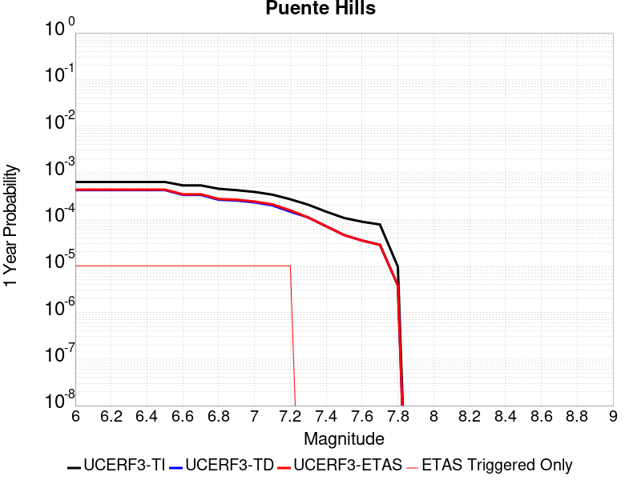 | 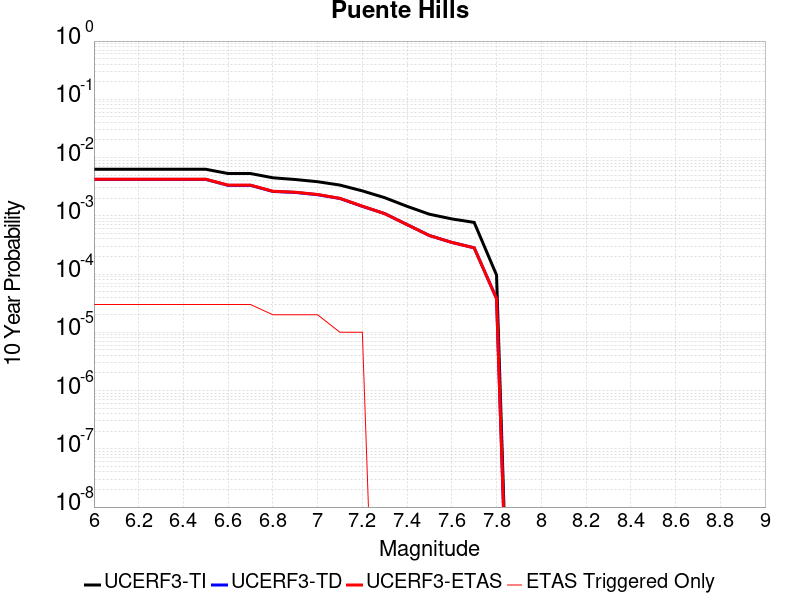 |

| Magnitude | 1 wk TI Prob | 1 wk TD Prob | 1 wk ETAS Prob | 1 wk ETAS/TD Gain | 1 wk ETAS Triggered Only | 1 mo TI Prob | 1 mo TD Prob | 1 mo ETAS Prob | 1 mo ETAS/TD Gain | 1 mo ETAS Triggered Only | 1 yr TI Prob | 1 yr TD Prob | 1 yr ETAS Prob | 1 yr ETAS/TD Gain | 1 yr ETAS Triggered Only | 10 yr TI Prob | 10 yr TD Prob | 10 yr ETAS Prob | 10 yr ETAS/TD Gain | 10 yr ETAS Triggered Only |
|-----|-----|-----|-----|-----|-----|-----|-----|-----|-----|-----|-----|-----|-----|-----|-----|-----|-----|-----|-----|-----|
| 6.0 | 1.2101656E-5 | 8.098579E-6 | 8.098579E-6 | 1.0 | 0.0 | 5.1863204E-5 | 3.4707766E-5 | 3.4707766E-5 | 1.0 | 0.0 | 6.312516E-4 | 4.2249076E-4 | 4.3248653E-4 | 1.0236591 | 1.0E-5 | 0.0062946146 | 0.0042174356 | 0.004247309 | 1.0070833 | 3.0E-5 |
| 6.1 | 1.2101656E-5 | 8.098579E-6 | 8.098579E-6 | 1.0 | 0.0 | 5.1863204E-5 | 3.4707766E-5 | 3.4707766E-5 | 1.0 | 0.0 | 6.312516E-4 | 4.2249076E-4 | 4.3248653E-4 | 1.0236591 | 1.0E-5 | 0.0062946146 | 0.0042174356 | 0.004247309 | 1.0070833 | 3.0E-5 |
| 6.2 | 1.2101656E-5 | 8.098579E-6 | 8.098579E-6 | 1.0 | 0.0 | 5.1863204E-5 | 3.4707766E-5 | 3.4707766E-5 | 1.0 | 0.0 | 6.312516E-4 | 4.2249076E-4 | 4.3248653E-4 | 1.0236591 | 1.0E-5 | 0.0062946146 | 0.0042174356 | 0.004247309 | 1.0070833 | 3.0E-5 |
| 6.3 | 1.2101656E-5 | 8.098579E-6 | 8.098579E-6 | 1.0 | 0.0 | 5.1863204E-5 | 3.4707766E-5 | 3.4707766E-5 | 1.0 | 0.0 | 6.312516E-4 | 4.2249076E-4 | 4.3248653E-4 | 1.0236591 | 1.0E-5 | 0.0062946146 | 0.0042174356 | 0.004247309 | 1.0070833 | 3.0E-5 |
| 6.4 | 1.2101656E-5 | 8.098579E-6 | 8.098579E-6 | 1.0 | 0.0 | 5.1863204E-5 | 3.4707766E-5 | 3.4707766E-5 | 1.0 | 0.0 | 6.312516E-4 | 4.2249076E-4 | 4.3248653E-4 | 1.0236591 | 1.0E-5 | 0.0062946146 | 0.0042174356 | 0.004247309 | 1.0070833 | 3.0E-5 |
| 6.5 | 1.2101656E-5 | 8.098579E-6 | 8.098579E-6 | 1.0 | 0.0 | 5.1863204E-5 | 3.4707766E-5 | 3.4707766E-5 | 1.0 | 0.0 | 6.312516E-4 | 4.2249076E-4 | 4.3248653E-4 | 1.0236591 | 1.0E-5 | 0.0062946146 | 0.0042174356 | 0.004247309 | 1.0070833 | 3.0E-5 |
| 6.6 | 1.0222488E-5 | 6.3991965E-6 | 6.3991965E-6 | 1.0 | 0.0 | 4.3809923E-5 | 2.7424852E-5 | 2.7424852E-5 | 1.0 | 0.0 | 5.332553E-4 | 3.3384888E-4 | 3.4384555E-4 | 1.0299437 | 1.0E-5 | 0.0053197746 | 0.0033337187 | 0.0033636186 | 1.008969 | 3.0E-5 |
| 6.7 | 1.0222488E-5 | 6.3991965E-6 | 6.3991965E-6 | 1.0 | 0.0 | 4.3809923E-5 | 2.7424852E-5 | 2.7424852E-5 | 1.0 | 0.0 | 5.332553E-4 | 3.3384888E-4 | 3.4384555E-4 | 1.0299437 | 1.0E-5 | 0.0053197746 | 0.0033337187 | 0.0033636186 | 1.008969 | 3.0E-5 |
| 6.8 | 8.6367845E-6 | 5.0282315E-6 | 5.0282315E-6 | 1.0 | 0.0 | 3.7014266E-5 | 2.1549387E-5 | 2.1549387E-5 | 1.0 | 0.0 | 4.505555E-4 | 2.6233276E-4 | 2.7233013E-4 | 1.0381095 | 1.0E-5 | 0.004496431 | 0.0026202872 | 0.0026402348 | 1.0076127 | 2.0E-5 |
| 6.9 | 8.066481E-6 | 4.8361135E-6 | 4.8361135E-6 | 1.0 | 0.0 | 3.4570177E-5 | 2.0726038E-5 | 2.0726038E-5 | 1.0 | 0.0 | 4.2081063E-4 | 2.5231083E-4 | 2.623083E-4 | 1.0396236 | 1.0E-5 | 0.0042001465 | 0.0025202974 | 0.002540247 | 1.0079156 | 2.0E-5 |
| 7.0 | 7.393828E-6 | 4.4173253E-6 | 4.4173253E-6 | 1.0 | 0.0 | 3.168745E-5 | 1.893126E-5 | 1.893126E-5 | 1.0 | 0.0 | 3.857264E-4 | 2.3046417E-4 | 2.4046186E-4 | 1.0433807 | 1.0E-5 | 0.0038505755 | 0.0023022972 | 0.002322251 | 1.008667 | 2.0E-5 |
| 7.1 | 6.4660953E-6 | 3.804474E-6 | 3.804474E-6 | 1.0 | 0.0 | 2.7711543E-5 | 1.630479E-5 | 1.630479E-5 | 1.0 | 0.0 | 3.373358E-4 | 1.9849309E-4 | 2.084911E-4 | 1.0503696 | 1.0E-5 | 0.0033682417 | 0.001983194 | 0.001993174 | 1.0050324 | 1.0E-5 |
| 7.2 | 5.143232E-6 | 2.7865572E-6 | 2.7865572E-6 | 1.0 | 0.0 | 2.2042237E-5 | 1.1942333E-5 | 1.1942333E-5 | 1.0 | 0.0 | 2.6833118E-4 | 1.453883E-4 | 1.5538685E-4 | 1.0687714 | 1.0E-5 | 0.002680074 | 0.0014529417 | 0.0014629271 | 1.0068725 | 1.0E-5 |
| 7.3 | 3.928255E-6 | 2.091396E-6 | 2.091396E-6 | 1.0 | 0.0 | 1.683527E-5 | 8.963095E-6 | 8.963095E-6 | 1.0 | 0.0 | 2.0495013E-4 | 1.0912029E-4 | 1.0912029E-4 | 1.0 | 0.0 | 0.002047612 | 0.0010906737 | 0.0010906737 | 1.0 | 0.0 |
| 7.4 | 2.7894434E-6 | 1.3546914E-6 | 1.3546914E-6 | 1.0 | 0.0 | 1.1954703E-5 | 5.805808E-6 | 5.805808E-6 | 1.0 | 0.0 | 1.4553878E-4 | 7.068346E-5 | 7.068346E-5 | 1.0 | 0.0 | 0.001454435 | 7.066142E-4 | 7.066142E-4 | 1.0 | 0.0 |
| 7.5 | 2.041735E-6 | 8.7873633E-7 | 8.7873633E-7 | 1.0 | 0.0 | 8.750263E-6 | 3.7660077E-6 | 3.7660077E-6 | 1.0 | 0.0 | 1.06529245E-4 | 4.585021E-5 | 4.585021E-5 | 1.0 | 0.0 | 0.0010647819 | 4.5841088E-4 | 4.5841088E-4 | 1.0 | 0.0 |
| 7.6 | 1.6959062E-6 | 6.698613E-7 | 6.698613E-7 | 1.0 | 0.0 | 7.268149E-6 | 2.8708312E-6 | 2.8708312E-6 | 1.0 | 0.0 | 8.848612E-5 | 3.4951838E-5 | 3.4951838E-5 | 1.0 | 0.0 | 8.84509E-4 | 3.494663E-4 | 3.494663E-4 | 1.0 | 0.0 |
| 7.7 | 1.4767965E-6 | 5.4073985E-7 | 5.4073985E-7 | 1.0 | 0.0 | 6.3291122E-6 | 2.3174546E-6 | 2.3174546E-6 | 1.0 | 0.0 | 7.705422E-5 | 2.821467E-5 | 2.821467E-5 | 1.0 | 0.0 | 7.702751E-4 | 2.8211344E-4 | 2.8211344E-4 | 1.0 | 0.0 |
| 7.8 | 1.8432911E-7 | 7.2812405E-8 | 7.2812405E-8 | 1.0 | 0.0 | 7.8998164E-7 | 3.1205315E-7 | 3.1205315E-7 | 1.0 | 0.0 | 9.617985E-6 | 3.7992436E-6 | 3.7992436E-6 | 1.0 | 0.0 | 9.617568E-5 | 3.799211E-5 | 3.799211E-5 | 1.0 | 0.0 |

## Malibu Coast alt 1
*[(top)](#table-of-contents)*

| 1 Week | 1 Month | 1 Year | 10 Year |
|-----|-----|-----|-----|
|  |  |  |  |

| Magnitude | 1 wk TI Prob | 1 wk TD Prob | 1 wk ETAS Prob | 1 wk ETAS/TD Gain | 1 wk ETAS Triggered Only | 1 mo TI Prob | 1 mo TD Prob | 1 mo ETAS Prob | 1 mo ETAS/TD Gain | 1 mo ETAS Triggered Only | 1 yr TI Prob | 1 yr TD Prob | 1 yr ETAS Prob | 1 yr ETAS/TD Gain | 1 yr ETAS Triggered Only | 10 yr TI Prob | 10 yr TD Prob | 10 yr ETAS Prob | 10 yr ETAS/TD Gain | 10 yr ETAS Triggered Only |
|-----|-----|-----|-----|-----|-----|-----|-----|-----|-----|-----|-----|-----|-----|-----|-----|-----|-----|-----|-----|-----|
| 6.0 | 1.6572556E-5 | 1.7598271E-5 | 1.7598271E-5 | 1.0 | 0.0 | 7.102331E-5 | 7.5419084E-5 | 7.5419084E-5 | 1.0 | 0.0 | 8.6436566E-4 | 9.178595E-4 | 9.278503E-4 | 1.0108849 | 1.0E-5 | 0.0086101135 | 0.009142619 | 0.009172345 | 1.0032513 | 3.0E-5 |
| 6.1 | 1.6572556E-5 | 1.7598271E-5 | 1.7598271E-5 | 1.0 | 0.0 | 7.102331E-5 | 7.5419084E-5 | 7.5419084E-5 | 1.0 | 0.0 | 8.6436566E-4 | 9.178595E-4 | 9.278503E-4 | 1.0108849 | 1.0E-5 | 0.0086101135 | 0.009142619 | 0.009172345 | 1.0032513 | 3.0E-5 |
| 6.2 | 1.1085717E-5 | 1.155727E-5 | 1.155727E-5 | 1.0 | 0.0 | 4.750935E-5 | 4.953024E-5 | 4.953024E-5 | 1.0 | 0.0 | 5.782728E-4 | 6.0286734E-4 | 6.128613E-4 | 1.0165774 | 1.0E-5 | 0.0057677035 | 0.00601269 | 0.0060425093 | 1.0049595 | 3.0E-5 |
| 6.3 | 1.0208568E-5 | 1.0592348E-5 | 1.0592348E-5 | 1.0 | 0.0 | 4.375027E-5 | 4.5395005E-5 | 4.5395005E-5 | 1.0 | 0.0 | 5.325294E-4 | 5.52547E-4 | 5.625414E-4 | 1.018088 | 1.0E-5 | 0.0053125503 | 0.005512039 | 0.0055418736 | 1.0054126 | 3.0E-5 |
| 6.4 | 9.0682315E-6 | 9.3427325E-6 | 9.3427325E-6 | 1.0 | 0.0 | 3.8863272E-5 | 4.003968E-5 | 4.003968E-5 | 1.0 | 0.0 | 4.730576E-4 | 4.8737606E-4 | 4.973712E-4 | 1.020508 | 1.0E-5 | 0.0047205184 | 0.0048632855 | 0.0048931395 | 1.0061387 | 3.0E-5 |
| 6.5 | 7.605796E-6 | 7.748663E-6 | 7.748663E-6 | 1.0 | 0.0 | 3.259586E-5 | 3.320814E-5 | 3.320814E-5 | 1.0 | 0.0 | 3.9678233E-4 | 4.0423544E-4 | 4.1423138E-4 | 1.0247281 | 1.0E-5 | 0.0039607463 | 0.004035139 | 0.004065018 | 1.0074047 | 3.0E-5 |
| 6.6 | 5.889873E-6 | 5.879592E-6 | 5.879592E-6 | 1.0 | 0.0 | 2.5242069E-5 | 2.519801E-5 | 2.519801E-5 | 1.0 | 0.0 | 3.0727885E-4 | 3.0674267E-4 | 3.167396E-4 | 1.0325906 | 1.0E-5 | 0.003068543 | 0.0030632056 | 0.0030931137 | 1.0097637 | 3.0E-5 |
| 6.7 | 5.66586E-6 | 5.641693E-6 | 5.641693E-6 | 1.0 | 0.0 | 2.428203E-5 | 2.417846E-5 | 2.417846E-5 | 1.0 | 0.0 | 2.955936E-4 | 2.943331E-4 | 3.0433014E-4 | 1.0339651 | 1.0E-5 | 0.0029520073 | 0.0029394445 | 0.0029693563 | 1.0101761 | 3.0E-5 |
| 6.8 | 5.521556E-6 | 5.4894776E-6 | 5.4894776E-6 | 1.0 | 0.0 | 2.3663597E-5 | 2.352612E-5 | 2.352612E-5 | 1.0 | 0.0 | 2.880662E-4 | 2.8639295E-4 | 2.963901E-4 | 1.0349071 | 1.0E-5 | 0.0028769306 | 0.0028602504 | 0.0028901645 | 1.0104586 | 3.0E-5 |
| 6.9 | 5.29752E-6 | 5.24998E-6 | 5.24998E-6 | 1.0 | 0.0 | 2.270346E-5 | 2.249972E-5 | 2.249972E-5 | 1.0 | 0.0 | 2.7637955E-4 | 2.7389973E-4 | 2.8389698E-4 | 1.0364997 | 1.0E-5 | 0.0027603607 | 0.0027356318 | 0.0027655498 | 1.0109364 | 3.0E-5 |
| 7.0 | 5.106743E-6 | 5.047725E-6 | 5.047725E-6 | 1.0 | 0.0 | 2.1885859E-5 | 2.163293E-5 | 2.163293E-5 | 1.0 | 0.0 | 2.6642776E-4 | 2.6334915E-4 | 2.7334652E-4 | 1.0379624 | 1.0E-5 | 0.0026610855 | 0.0026303804 | 0.0026603015 | 1.0113752 | 3.0E-5 |
| 7.1 | 4.8469647E-6 | 4.770417E-6 | 4.770417E-6 | 1.0 | 0.0 | 2.0772539E-5 | 2.0444484E-5 | 2.0444484E-5 | 1.0 | 0.0 | 2.528763E-4 | 2.4888324E-4 | 2.5888075E-4 | 1.0401695 | 1.0E-5 | 0.0025258875 | 0.0024860532 | 0.0025159786 | 1.0120373 | 3.0E-5 |
| 7.2 | 4.545514E-6 | 4.448235E-6 | 4.448235E-6 | 1.0 | 0.0 | 1.9480629E-5 | 1.9063724E-5 | 1.9063724E-5 | 1.0 | 0.0 | 2.3715083E-4 | 2.3207619E-4 | 2.4207386E-4 | 1.0430793 | 1.0E-5 | 0.0023689792 | 0.0023183457 | 0.002348276 | 1.0129102 | 3.0E-5 |
| 7.3 | 3.794097E-6 | 3.6519675E-6 | 3.6519675E-6 | 1.0 | 0.0 | 1.6260314E-5 | 1.5651196E-5 | 1.5651196E-5 | 1.0 | 0.0 | 1.9795135E-4 | 1.9053668E-4 | 1.9053668E-4 | 1.0 | 0.0 | 0.001977751 | 0.0019037378 | 0.0019236997 | 1.0104856 | 2.0E-5 |
| 7.4 | 2.808217E-6 | 2.7191002E-6 | 2.7191002E-6 | 1.0 | 0.0 | 1.203516E-5 | 1.1653235E-5 | 1.1653235E-5 | 1.0 | 0.0 | 1.4651821E-4 | 1.4186892E-4 | 1.4186892E-4 | 1.0 | 0.0 | 0.0014642165 | 0.0014177862 | 0.001427772 | 1.0070432 | 1.0E-5 |
| 7.5 | 1.83809E-6 | 1.819086E-6 | 1.819086E-6 | 1.0 | 0.0 | 7.877505E-6 | 7.79606E-6 | 7.79606E-6 | 1.0 | 0.0 | 9.59044E-5 | 9.491292E-5 | 9.491292E-5 | 1.0 | 0.0 | 9.5863023E-4 | 9.487258E-4 | 9.587163E-4 | 1.0105305 | 1.0E-5 |
| 7.6 | 1.1292672E-6 | 1.1001556E-6 | 1.1001556E-6 | 1.0 | 0.0 | 4.839708E-6 | 4.7149438E-6 | 4.7149438E-6 | 1.0 | 0.0 | 5.8921847E-5 | 5.7402947E-5 | 5.7402947E-5 | 1.0 | 0.0 | 5.890623E-4 | 5.7388283E-4 | 5.838771E-4 | 1.0174152 | 1.0E-5 |
| 7.7 | 5.065272E-7 | 4.6092035E-7 | 4.6092035E-7 | 1.0 | 0.0 | 2.170829E-6 | 1.9753716E-6 | 1.9753716E-6 | 1.0 | 0.0 | 2.6429525E-5 | 2.4049894E-5 | 2.4049894E-5 | 1.0 | 0.0 | 2.642638E-4 | 2.4047404E-4 | 2.4047404E-4 | 1.0 | 0.0 |
| 7.8 | 8.952991E-8 | 6.708018E-8 | 6.708018E-8 | 1.0 | 0.0 | 3.8369956E-7 | 2.8748644E-7 | 2.8748644E-7 | 1.0 | 0.0 | 4.671532E-6 | 3.5001422E-6 | 3.5001422E-6 | 1.0 | 0.0 | 4.671434E-5 | 3.500089E-5 | 3.500089E-5 | 1.0 | 0.0 |
| 7.9 | 8.007447E-10 | 6.1615857E-10 | 6.1615857E-10 | 1.0 | 0.0 | 3.4317629E-9 | 2.64068E-9 | 2.64068E-9 | 1.0 | 0.0 | 4.1781714E-8 | 3.215028E-8 | 3.215028E-8 | 1.0 | 0.0 | 4.1781706E-7 | 3.2150274E-7 | 3.2150274E-7 | 1.0 | 0.0 |

## Mission Ridge-Arroyo Parida-Santa Ana
*[(top)](#table-of-contents)*

| 1 Week | 1 Month | 1 Year | 10 Year |
|-----|-----|-----|-----|
|  |  |  |  |

| Magnitude | 1 wk TI Prob | 1 wk TD Prob | 1 wk ETAS Prob | 1 wk ETAS/TD Gain | 1 wk ETAS Triggered Only | 1 mo TI Prob | 1 mo TD Prob | 1 mo ETAS Prob | 1 mo ETAS/TD Gain | 1 mo ETAS Triggered Only | 1 yr TI Prob | 1 yr TD Prob | 1 yr ETAS Prob | 1 yr ETAS/TD Gain | 1 yr ETAS Triggered Only | 10 yr TI Prob | 10 yr TD Prob | 10 yr ETAS Prob | 10 yr ETAS/TD Gain | 10 yr ETAS Triggered Only |
|-----|-----|-----|-----|-----|-----|-----|-----|-----|-----|-----|-----|-----|-----|-----|-----|-----|-----|-----|-----|-----|
| 6.0 | 4.169034E-5 | 4.7138332E-5 | 4.7138332E-5 | 1.0 | 0.0 | 1.7866064E-4 | 2.0201063E-4 | 2.1200861E-4 | 1.0494924 | 1.0E-5 | 0.0021730233 | 0.0024575314 | 0.0024774824 | 1.0081183 | 2.0E-5 | 0.021518968 | 0.024385462 | 0.024414731 | 1.0012002 | 3.0E-5 |
| 6.1 | 1.73813E-5 | 1.685448E-5 | 1.685448E-5 | 1.0 | 0.0 | 7.4489166E-5 | 7.2231545E-5 | 7.2231545E-5 | 1.0 | 0.0 | 9.065282E-4 | 8.7907485E-4 | 8.7907485E-4 | 1.0 | 0.0 | 0.009028391 | 0.008757258 | 0.008757258 | 1.0 | 0.0 |
| 6.2 | 1.4622182E-5 | 1.3673473E-5 | 1.3673473E-5 | 1.0 | 0.0 | 6.2664985E-5 | 5.8599304E-5 | 5.8599304E-5 | 1.0 | 0.0 | 7.6267915E-4 | 7.1321684E-4 | 7.1321684E-4 | 1.0 | 0.0 | 0.007600669 | 0.0071098623 | 0.0071098623 | 1.0 | 0.0 |
| 6.3 | 1.3552434E-5 | 1.24823655E-5 | 1.24823655E-5 | 1.0 | 0.0 | 5.8080568E-5 | 5.3494776E-5 | 5.3494776E-5 | 1.0 | 0.0 | 7.069015E-4 | 6.511074E-4 | 6.511074E-4 | 1.0 | 0.0 | 0.00704657 | 0.006492501 | 0.006492501 | 1.0 | 0.0 |
| 6.4 | 1.30977305E-5 | 1.1979314E-5 | 1.1979314E-5 | 1.0 | 0.0 | 5.613192E-5 | 5.1338924E-5 | 5.1338924E-5 | 1.0 | 0.0 | 6.831918E-4 | 6.2487513E-4 | 6.2487513E-4 | 1.0 | 0.0 | 0.006810953 | 0.0062316665 | 0.0062316665 | 1.0 | 0.0 |
| 6.5 | 1.225205E-5 | 1.1048948E-5 | 1.1048948E-5 | 1.0 | 0.0 | 5.2507727E-5 | 4.735179E-5 | 4.735179E-5 | 1.0 | 0.0 | 6.3909404E-4 | 5.763583E-4 | 5.763583E-4 | 1.0 | 0.0 | 0.006372592 | 0.005749085 | 0.005749085 | 1.0 | 0.0 |
| 6.6 | 1.1352241E-5 | 1.0063668E-5 | 1.0063668E-5 | 1.0 | 0.0 | 4.8651553E-5 | 4.3129305E-5 | 4.3129305E-5 | 1.0 | 0.0 | 5.921717E-4 | 5.249749E-4 | 5.249749E-4 | 1.0 | 0.0 | 0.0059059616 | 0.005237734 | 0.005237734 | 1.0 | 0.0 |
| 6.7 | 1.0864116E-5 | 9.517152E-6 | 9.517152E-6 | 1.0 | 0.0 | 4.6559664E-5 | 4.0787167E-5 | 4.0787167E-5 | 1.0 | 0.0 | 5.667165E-4 | 4.964726E-4 | 4.964726E-4 | 1.0 | 0.0 | 0.005652734 | 0.004954009 | 0.004954009 | 1.0 | 0.0 |
| 6.8 | 1.0666365E-5 | 9.2999E-6 | 9.2999E-6 | 1.0 | 0.0 | 4.571219E-5 | 3.9856117E-5 | 3.9856117E-5 | 1.0 | 0.0 | 5.564038E-4 | 4.851422E-4 | 4.851422E-4 | 1.0 | 0.0 | 0.005550127 | 0.004841204 | 0.004841204 | 1.0 | 0.0 |
| 6.9 | 1.0038665E-5 | 8.592155E-6 | 8.592155E-6 | 1.0 | 0.0 | 4.302214E-5 | 3.682301E-5 | 3.682301E-5 | 1.0 | 0.0 | 5.236687E-4 | 4.4822975E-4 | 4.4822975E-4 | 1.0 | 0.0 | 0.005224364 | 0.0044736085 | 0.0044736085 | 1.0 | 0.0 |
| 7.0 | 9.5379955E-6 | 8.025172E-6 | 8.025172E-6 | 1.0 | 0.0 | 4.0876483E-5 | 3.4393153E-5 | 3.4393153E-5 | 1.0 | 0.0 | 4.975576E-4 | 4.1865787E-4 | 4.1865787E-4 | 1.0 | 0.0 | 0.00496445 | 0.0041790316 | 0.0041790316 | 1.0 | 0.0 |
| 7.1 | 9.207389E-6 | 7.652467E-6 | 7.652467E-6 | 1.0 | 0.0 | 3.945964E-5 | 3.2795884E-5 | 3.2795884E-5 | 1.0 | 0.0 | 4.803152E-4 | 3.992184E-4 | 3.992184E-4 | 1.0 | 0.0 | 0.004792784 | 0.0039853496 | 0.0039853496 | 1.0 | 0.0 |
| 7.2 | 7.638091E-6 | 5.931174E-6 | 5.931174E-6 | 1.0 | 0.0 | 3.2734264E-5 | 2.541907E-5 | 2.541907E-5 | 1.0 | 0.0 | 3.984668E-4 | 3.0943356E-4 | 3.0943356E-4 | 1.0 | 0.0 | 0.0039775306 | 0.0030902245 | 0.0030902245 | 1.0 | 0.0 |
| 7.3 | 7.2500147E-6 | 5.596204E-6 | 5.596204E-6 | 1.0 | 0.0 | 3.1071122E-5 | 2.3983514E-5 | 2.3983514E-5 | 1.0 | 0.0 | 3.7822526E-4 | 2.9196046E-4 | 2.9196046E-4 | 1.0 | 0.0 | 0.0037758215 | 0.002915965 | 0.002915965 | 1.0 | 0.0 |
| 7.4 | 6.3899715E-6 | 4.9185496E-6 | 4.9185496E-6 | 1.0 | 0.0 | 2.7385306E-5 | 2.107933E-5 | 2.107933E-5 | 1.0 | 0.0 | 3.3336508E-4 | 2.566108E-4 | 2.566108E-4 | 1.0 | 0.0 | 0.0033286542 | 0.0025633303 | 0.0025633303 | 1.0 | 0.0 |
| 7.5 | 5.379025E-6 | 4.0839013E-6 | 4.0839013E-6 | 1.0 | 0.0 | 2.305276E-5 | 1.7502318E-5 | 1.7502318E-5 | 1.0 | 0.0 | 2.806312E-4 | 2.1306999E-4 | 2.1306999E-4 | 1.0 | 0.0 | 0.0028027708 | 0.0021286684 | 0.0021286684 | 1.0 | 0.0 |
| 7.6 | 4.1270696E-6 | 3.088378E-6 | 3.088378E-6 | 1.0 | 0.0 | 1.768732E-5 | 1.3235838E-5 | 1.3235838E-5 | 1.0 | 0.0 | 2.1532185E-4 | 1.6113449E-4 | 1.6113449E-4 | 1.0 | 0.0 | 0.0021511333 | 0.0016101847 | 0.0016101847 | 1.0 | 0.0 |
| 7.7 | 2.5406805E-6 | 1.8282275E-6 | 1.8282275E-6 | 1.0 | 0.0 | 1.0888585E-5 | 7.835237E-6 | 7.835237E-6 | 1.0 | 0.0 | 1.3256045E-4 | 9.53899E-5 | 9.53899E-5 | 1.0 | 0.0 | 0.0013248142 | 9.5349574E-4 | 9.5349574E-4 | 1.0 | 0.0 |
| 7.8 | 4.8608285E-7 | 3.5099023E-7 | 3.5099023E-7 | 1.0 | 0.0 | 2.0832106E-6 | 1.504243E-6 | 1.504243E-6 | 1.0 | 0.0 | 2.5362791E-5 | 1.8314006E-5 | 1.8314006E-5 | 1.0 | 0.0 | 2.5359896E-4 | 1.8312508E-4 | 1.8312508E-4 | 1.0 | 0.0 |
| 7.9 | 2.0472514E-8 | 1.2688983E-8 | 1.2688983E-8 | 1.0 | 0.0 | 8.7739345E-8 | 5.4381356E-8 | 5.4381356E-8 | 1.0 | 0.0 | 1.068226E-6 | 6.620928E-7 | 6.620928E-7 | 1.0 | 0.0 | 1.0682209E-5 | 6.6209095E-6 | 6.6209095E-6 | 1.0 | 0.0 |
| 8.0 | 4.443582E-9 | 2.032151E-9 | 2.032151E-9 | 1.0 | 0.0 | 1.9043922E-8 | 8.709217E-9 | 8.709217E-9 | 1.0 | 0.0 | 2.3185973E-7 | 1.0603472E-7 | 1.0603472E-7 | 1.0 | 0.0 | 2.3185949E-6 | 1.0603468E-6 | 1.0603468E-6 | 1.0 | 0.0 |

## San Diego Trough north alt1
*[(top)](#table-of-contents)*

| 1 Week | 1 Month | 1 Year | 10 Year |
|-----|-----|-----|-----|
|  |  |  |  |

| Magnitude | 1 wk TI Prob | 1 wk TD Prob | 1 wk ETAS Prob | 1 wk ETAS/TD Gain | 1 wk ETAS Triggered Only | 1 mo TI Prob | 1 mo TD Prob | 1 mo ETAS Prob | 1 mo ETAS/TD Gain | 1 mo ETAS Triggered Only | 1 yr TI Prob | 1 yr TD Prob | 1 yr ETAS Prob | 1 yr ETAS/TD Gain | 1 yr ETAS Triggered Only | 10 yr TI Prob | 10 yr TD Prob | 10 yr ETAS Prob | 10 yr ETAS/TD Gain | 10 yr ETAS Triggered Only |
|-----|-----|-----|-----|-----|-----|-----|-----|-----|-----|-----|-----|-----|-----|-----|-----|-----|-----|-----|-----|-----|
| 6.0 | 7.329252E-5 | 8.821515E-5 | 8.821515E-5 | 1.0 | 0.0 | 3.14073E-4 | 3.780138E-4 | 3.780138E-4 | 1.0 | 0.0 | 0.0038171355 | 0.004593173 | 0.004603127 | 1.0021671 | 1.0E-5 | 0.03752231 | 0.04504633 | 0.045074977 | 1.000636 | 3.0E-5 |
| 6.1 | 3.7940346E-5 | 4.4886026E-5 | 4.4886026E-5 | 1.0 | 0.0 | 1.6259136E-4 | 1.9235504E-4 | 1.9235504E-4 | 1.0 | 0.0 | 0.0019777524 | 0.0023394884 | 0.0023394884 | 1.0 | 0.0 | 0.019602431 | 0.023157293 | 0.023157293 | 1.0 | 0.0 |
| 6.2 | 2.8645263E-5 | 3.3297452E-5 | 3.3297452E-5 | 1.0 | 0.0 | 1.2275964E-4 | 1.4269572E-4 | 1.4269572E-4 | 1.0 | 0.0 | 0.0014935739 | 0.0017359584 | 0.0017359584 | 1.0 | 0.0 | 0.0148357535 | 0.017226638 | 0.017226638 | 1.0 | 0.0 |
| 6.3 | 2.8645263E-5 | 3.3297452E-5 | 3.3297452E-5 | 1.0 | 0.0 | 1.2275964E-4 | 1.4269572E-4 | 1.4269572E-4 | 1.0 | 0.0 | 0.0014935739 | 0.0017359584 | 0.0017359584 | 1.0 | 0.0 | 0.0148357535 | 0.017226638 | 0.017226638 | 1.0 | 0.0 |
| 6.4 | 2.2204576E-5 | 2.5448819E-5 | 2.5448819E-5 | 1.0 | 0.0 | 9.5159E-5 | 1.0906186E-4 | 1.0906186E-4 | 1.0 | 0.0 | 0.001157945 | 0.0013270287 | 0.0013270287 | 1.0 | 0.0 | 0.011519298 | 0.013192215 | 0.013192215 | 1.0 | 0.0 |
| 6.5 | 2.1004838E-5 | 2.402516E-5 | 2.402516E-5 | 1.0 | 0.0 | 9.0017624E-5 | 1.02960956E-4 | 1.02960956E-4 | 1.0 | 0.0 | 0.0010954136 | 0.0012528376 | 0.0012528376 | 1.0 | 0.0 | 0.010900296 | 0.01245883 | 0.01245883 | 1.0 | 0.0 |
| 6.6 | 1.820557E-5 | 2.070517E-5 | 2.070517E-5 | 1.0 | 0.0 | 7.802154E-5 | 8.873346E-5 | 8.873346E-5 | 1.0 | 0.0 | 9.4949827E-4 | 0.0010797998 | 0.0010797998 | 1.0 | 0.0 | 0.009454516 | 0.0107462015 | 0.0107462015 | 1.0 | 0.0 |
| 6.7 | 1.5884485E-5 | 1.7983964E-5 | 1.7983964E-5 | 1.0 | 0.0 | 6.807459E-5 | 7.707187E-5 | 7.707187E-5 | 1.0 | 0.0 | 8.284929E-4 | 9.379488E-4 | 9.379488E-4 | 1.0 | 0.0 | 0.008254109 | 0.009340268 | 0.009340268 | 1.0 | 0.0 |
| 6.8 | 1.4331171E-5 | 1.6201348E-5 | 1.6201348E-5 | 1.0 | 0.0 | 6.141786E-5 | 6.9432506E-5 | 6.9432506E-5 | 1.0 | 0.0 | 7.4750587E-4 | 8.4501493E-4 | 8.4501493E-4 | 1.0 | 0.0 | 0.0074499645 | 0.008418285 | 0.008418285 | 1.0 | 0.0 |
| 6.9 | 1.2574203E-5 | 1.4206081E-5 | 1.4206081E-5 | 1.0 | 0.0 | 5.3888325E-5 | 6.088179E-5 | 6.088179E-5 | 1.0 | 0.0 | 6.558929E-4 | 7.4098515E-4 | 7.4098515E-4 | 1.0 | 0.0 | 0.0065396037 | 0.0073853307 | 0.0073853307 | 1.0 | 0.0 |
| 7.0 | 1.0883844E-5 | 1.22894735E-5 | 1.22894735E-5 | 1.0 | 0.0 | 4.664421E-5 | 5.2668114E-5 | 5.2668114E-5 | 1.0 | 0.0 | 5.677453E-4 | 6.410466E-4 | 6.410466E-4 | 1.0 | 0.0 | 0.00566297 | 0.0063921027 | 0.0063921027 | 1.0 | 0.0 |
| 7.1 | 9.393088E-6 | 1.0607203E-5 | 1.0607203E-5 | 1.0 | 0.0 | 4.025547E-5 | 4.5458655E-5 | 4.5458655E-5 | 1.0 | 0.0 | 4.900001E-4 | 5.5331935E-4 | 5.5331935E-4 | 1.0 | 0.0 | 0.0048892107 | 0.005519513 | 0.005519513 | 1.0 | 0.0 |
| 7.2 | 8.190791E-6 | 9.258787E-6 | 9.258787E-6 | 1.0 | 0.0 | 3.510292E-5 | 3.9679915E-5 | 3.9679915E-5 | 1.0 | 0.0 | 4.2729423E-4 | 4.8299658E-4 | 4.8299658E-4 | 1.0 | 0.0 | 0.0042647356 | 0.004819548 | 0.004819548 | 1.0 | 0.0 |
| 7.3 | 6.268162E-6 | 7.08984E-6 | 7.08984E-6 | 1.0 | 0.0 | 2.6863276E-5 | 3.0384675E-5 | 3.0384675E-5 | 1.0 | 0.0 | 3.2701128E-4 | 3.6987104E-4 | 3.6987104E-4 | 1.0 | 0.0 | 0.003265305 | 0.0036926004 | 0.0036926004 | 1.0 | 0.0 |
| 7.4 | 4.985186E-6 | 5.6427807E-6 | 5.6427807E-6 | 1.0 | 0.0 | 2.1364907E-5 | 2.4183124E-5 | 2.4183124E-5 | 1.0 | 0.0 | 2.600867E-4 | 2.9439016E-4 | 2.9439016E-4 | 1.0 | 0.0 | 0.002597825 | 0.002940043 | 0.002940043 | 1.0 | 0.0 |
| 7.5 | 1.7489613E-6 | 1.9697113E-6 | 1.9697113E-6 | 1.0 | 0.0 | 7.495527E-6 | 8.441594E-6 | 8.441594E-6 | 1.0 | 0.0 | 9.125422E-5 | 1.0277178E-4 | 1.0277178E-4 | 1.0 | 0.0 | 9.1216754E-4 | 0.0010272645 | 0.0010272645 | 1.0 | 0.0 |
| 7.6 | 1.6988751E-7 | 1.7533898E-7 | 1.7533898E-7 | 1.0 | 0.0 | 7.2808916E-7 | 7.5145255E-7 | 7.5145255E-7 | 1.0 | 0.0 | 8.864449E-6 | 9.148898E-6 | 9.148898E-6 | 1.0 | 0.0 | 8.8640954E-5 | 9.148542E-5 | 9.148542E-5 | 1.0 | 0.0 |

## Hunting Creek - Bartlett Springs connector 2011
*[(top)](#table-of-contents)*

| 1 Week | 1 Month | 1 Year | 10 Year |
|-----|-----|-----|-----|
| 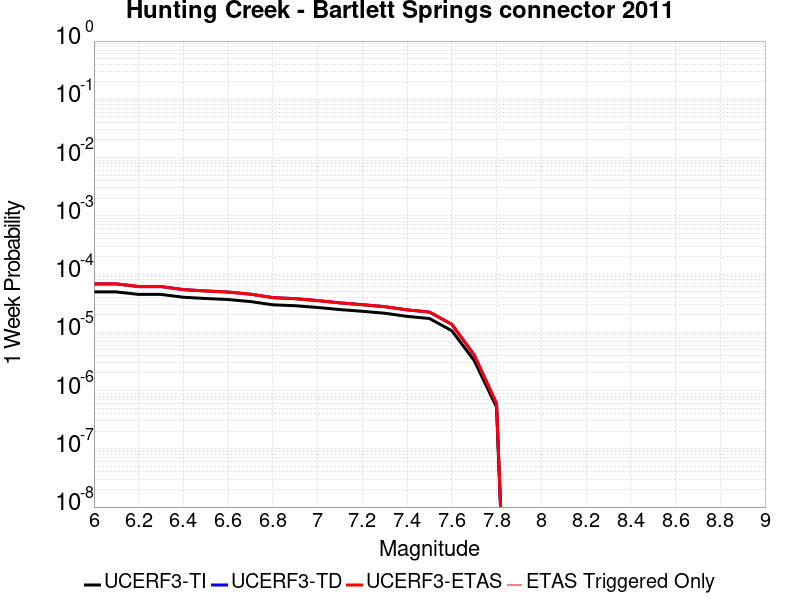 |  |  |  |

| Magnitude | 1 wk TI Prob | 1 wk TD Prob | 1 wk ETAS Prob | 1 wk ETAS/TD Gain | 1 wk ETAS Triggered Only | 1 mo TI Prob | 1 mo TD Prob | 1 mo ETAS Prob | 1 mo ETAS/TD Gain | 1 mo ETAS Triggered Only | 1 yr TI Prob | 1 yr TD Prob | 1 yr ETAS Prob | 1 yr ETAS/TD Gain | 1 yr ETAS Triggered Only | 10 yr TI Prob | 10 yr TD Prob | 10 yr ETAS Prob | 10 yr ETAS/TD Gain | 10 yr ETAS Triggered Only |
|-----|-----|-----|-----|-----|-----|-----|-----|-----|-----|-----|-----|-----|-----|-----|-----|-----|-----|-----|-----|-----|
| 6.0 | 4.940016E-5 | 6.7873414E-5 | 6.7873414E-5 | 1.0 | 0.0 | 2.1169778E-4 | 2.9085318E-4 | 2.9085318E-4 | 1.0 | 0.0 | 0.002574374 | 0.0035352195 | 0.0035352195 | 1.0 | 0.0 | 0.025447546 | 0.034775995 | 0.0347953 | 1.0005552 | 2.0E-5 |
| 6.1 | 4.940016E-5 | 6.7873414E-5 | 6.7873414E-5 | 1.0 | 0.0 | 2.1169778E-4 | 2.9085318E-4 | 2.9085318E-4 | 1.0 | 0.0 | 0.002574374 | 0.0035352195 | 0.0035352195 | 1.0 | 0.0 | 0.025447546 | 0.034775995 | 0.0347953 | 1.0005552 | 2.0E-5 |
| 6.2 | 4.472471E-5 | 6.100793E-5 | 6.100793E-5 | 1.0 | 0.0 | 1.9166325E-4 | 2.614367E-4 | 2.614367E-4 | 1.0 | 0.0 | 0.0023310026 | 0.0031782414 | 0.0031782414 | 1.0 | 0.0 | 0.02306703 | 0.03131888 | 0.031338252 | 1.0006186 | 2.0E-5 |
| 6.3 | 4.472471E-5 | 6.100793E-5 | 6.100793E-5 | 1.0 | 0.0 | 1.9166325E-4 | 2.614367E-4 | 2.614367E-4 | 1.0 | 0.0 | 0.0023310026 | 0.0031782414 | 0.0031782414 | 1.0 | 0.0 | 0.02306703 | 0.03131888 | 0.031338252 | 1.0006186 | 2.0E-5 |
| 6.4 | 4.0001003E-5 | 5.4106935E-5 | 5.4106935E-5 | 1.0 | 0.0 | 1.714216E-4 | 2.3186632E-4 | 2.3186632E-4 | 1.0 | 0.0 | 0.0020850603 | 0.0028192701 | 0.0028192701 | 1.0 | 0.0 | 0.02065605 | 0.027830102 | 0.027839825 | 1.0003493 | 1.0E-5 |
| 6.5 | 3.8033053E-5 | 5.1268355E-5 | 5.1268355E-5 | 1.0 | 0.0 | 1.6298861E-4 | 2.197032E-4 | 2.197032E-4 | 1.0 | 0.0 | 0.0019825802 | 0.0026715791 | 0.0026715791 | 1.0 | 0.0 | 0.019649856 | 0.026392108 | 0.026401844 | 1.000369 | 1.0E-5 |
| 6.6 | 3.653754E-5 | 4.9131297E-5 | 4.9131297E-5 | 1.0 | 0.0 | 1.5658008E-4 | 2.1054587E-4 | 2.1054587E-4 | 1.0 | 0.0 | 0.0019046954 | 0.0025603776 | 0.0025603776 | 1.0 | 0.0 | 0.018884527 | 0.025307981 | 0.025317729 | 1.0003852 | 1.0E-5 |
| 6.7 | 3.372024E-5 | 4.5141747E-5 | 4.5141747E-5 | 1.0 | 0.0 | 1.4450731E-4 | 1.934504E-4 | 1.934504E-4 | 1.0 | 0.0 | 0.0017579567 | 0.0023527322 | 0.0023527322 | 1.0 | 0.0 | 0.017441148 | 0.023279548 | 0.023279548 | 1.0 | 0.0 |
| 6.8 | 2.9650024E-5 | 3.941287E-5 | 3.941287E-5 | 1.0 | 0.0 | 1.2706534E-4 | 1.6890126E-4 | 1.6890126E-4 | 1.0 | 0.0 | 0.0015459227 | 0.0020544236 | 0.0020544236 | 1.0 | 0.0 | 0.015352124 | 0.020352496 | 0.020352496 | 1.0 | 0.0 |
| 6.9 | 2.860775E-5 | 3.7814003E-5 | 3.7814003E-5 | 1.0 | 0.0 | 1.2259888E-4 | 1.6204998E-4 | 1.6204998E-4 | 1.0 | 0.0 | 0.0014916194 | 0.0019711799 | 0.0019711799 | 1.0 | 0.0 | 0.014816469 | 0.019537043 | 0.019537043 | 1.0 | 0.0 |
| 7.0 | 2.6696067E-5 | 3.5068544E-5 | 3.5068544E-5 | 1.0 | 0.0 | 1.144067E-4 | 1.5028517E-4 | 1.5028517E-4 | 1.0 | 0.0 | 0.0013920115 | 0.001828195 | 0.001828195 | 1.0 | 0.0 | 0.013833242 | 0.018132268 | 0.018132268 | 1.0 | 0.0 |
| 7.1 | 2.456087E-5 | 3.2014224E-5 | 3.2014224E-5 | 1.0 | 0.0 | 1.0525662E-4 | 1.3719666E-4 | 1.3719666E-4 | 1.0 | 0.0 | 0.001280746 | 0.0016690986 | 0.0016690986 | 1.0 | 0.0 | 0.012733897 | 0.016567077 | 0.016567077 | 1.0 | 0.0 |
| 7.2 | 2.295761E-5 | 2.982398E-5 | 2.982398E-5 | 1.0 | 0.0 | 9.8386045E-5 | 1.2781084E-4 | 1.2781084E-4 | 1.0 | 0.0 | 0.0011971919 | 0.0015549955 | 0.0015549955 | 1.0 | 0.0 | 0.011907627 | 0.015442743 | 0.015442743 | 1.0 | 0.0 |
| 7.3 | 2.1256936E-5 | 2.7542896E-5 | 2.7542896E-5 | 1.0 | 0.0 | 9.109797E-5 | 1.1803569E-4 | 1.1803569E-4 | 1.0 | 0.0 | 0.0011085535 | 0.0014361461 | 0.0014361461 | 1.0 | 0.0 | 0.011030397 | 0.014270082 | 0.014270082 | 1.0 | 0.0 |
| 7.4 | 1.8784336E-5 | 2.430763E-5 | 2.430763E-5 | 1.0 | 0.0 | 8.050181E-5 | 1.0417144E-4 | 1.0417144E-4 | 1.0 | 0.0 | 9.796688E-4 | 0.0012675569 | 0.0012675569 | 1.0 | 0.0 | 0.009753612 | 0.012604473 | 0.012604473 | 1.0 | 0.0 |
| 7.5 | 1.7248298E-5 | 2.2269673E-5 | 2.2269673E-5 | 1.0 | 0.0 | 7.391918E-5 | 9.5438E-5 | 9.5438E-5 | 1.0 | 0.0 | 8.9959445E-4 | 0.0011613459 | 0.0011613459 | 1.0 | 0.0 | 0.008959615 | 0.011553904 | 0.011553904 | 1.0 | 0.0 |
| 7.6 | 1.0653709E-5 | 1.3722595E-5 | 1.3722595E-5 | 1.0 | 0.0 | 4.5657955E-5 | 5.8809812E-5 | 5.8809812E-5 | 1.0 | 0.0 | 5.557438E-4 | 7.157769E-4 | 7.157769E-4 | 1.0 | 0.0 | 0.0055435603 | 0.007135182 | 0.007135182 | 1.0 | 0.0 |
| 7.7 | 3.286316E-6 | 4.09049E-6 | 4.09049E-6 | 1.0 | 0.0 | 1.4084137E-5 | 1.7530556E-5 | 1.7530556E-5 | 1.0 | 0.0 | 1.7146087E-4 | 2.1341378E-4 | 2.1341378E-4 | 1.0 | 0.0 | 0.0017132863 | 0.0021321473 | 0.0021321473 | 1.0 | 0.0 |
| 7.8 | 5.1855085E-7 | 5.972202E-7 | 5.972202E-7 | 1.0 | 0.0 | 2.222359E-6 | 2.5595127E-6 | 2.5595127E-6 | 1.0 | 0.0 | 2.7056883E-5 | 3.116163E-5 | 3.116163E-5 | 1.0 | 0.0 | 2.705359E-4 | 3.1156646E-4 | 3.1156646E-4 | 1.0 | 0.0 |

## Great Valley 07 (Orestimba)
*[(top)](#table-of-contents)*

| 1 Week | 1 Month | 1 Year | 10 Year |
|-----|-----|-----|-----|
|  |  |  |  |

| Magnitude | 1 wk TI Prob | 1 wk TD Prob | 1 wk ETAS Prob | 1 wk ETAS/TD Gain | 1 wk ETAS Triggered Only | 1 mo TI Prob | 1 mo TD Prob | 1 mo ETAS Prob | 1 mo ETAS/TD Gain | 1 mo ETAS Triggered Only | 1 yr TI Prob | 1 yr TD Prob | 1 yr ETAS Prob | 1 yr ETAS/TD Gain | 1 yr ETAS Triggered Only | 10 yr TI Prob | 10 yr TD Prob | 10 yr ETAS Prob | 10 yr ETAS/TD Gain | 10 yr ETAS Triggered Only |
|-----|-----|-----|-----|-----|-----|-----|-----|-----|-----|-----|-----|-----|-----|-----|-----|-----|-----|-----|-----|-----|
| 6.0 | 2.9687902E-5 | 3.2757947E-5 | 3.2757947E-5 | 1.0 | 0.0 | 1.2722766E-4 | 1.4038406E-4 | 1.4038406E-4 | 1.0 | 0.0 | 0.0015478961 | 0.0017079079 | 0.0017178907 | 1.0058451 | 1.0E-5 | 0.015371585 | 0.016955366 | 0.016984858 | 1.0017394 | 3.0E-5 |
| 6.1 | 2.9687902E-5 | 3.2757947E-5 | 3.2757947E-5 | 1.0 | 0.0 | 1.2722766E-4 | 1.4038406E-4 | 1.4038406E-4 | 1.0 | 0.0 | 0.0015478961 | 0.0017079079 | 0.0017178907 | 1.0058451 | 1.0E-5 | 0.015371585 | 0.016955366 | 0.016984858 | 1.0017394 | 3.0E-5 |
| 6.2 | 1.9231524E-5 | 2.1159447E-5 | 2.1159447E-5 | 1.0 | 0.0 | 8.2418206E-5 | 9.0680325E-5 | 9.0680325E-5 | 1.0 | 0.0 | 0.0010029797 | 0.0011034969 | 0.0011134859 | 1.0090522 | 1.0E-5 | 0.00998465 | 0.010982586 | 0.011012256 | 1.0027016 | 3.0E-5 |
| 6.3 | 1.324766E-5 | 1.4548723E-5 | 1.4548723E-5 | 1.0 | 0.0 | 5.6774446E-5 | 6.235023E-5 | 6.235023E-5 | 1.0 | 0.0 | 6.910097E-4 | 7.5885886E-4 | 7.6885126E-4 | 1.0131677 | 1.0E-5 | 0.006888649 | 0.0075636217 | 0.0075933947 | 1.0039364 | 3.0E-5 |
| 6.4 | 7.818645E-6 | 8.57295E-6 | 8.57295E-6 | 1.0 | 0.0 | 3.3508048E-5 | 3.6740716E-5 | 3.6740716E-5 | 1.0 | 0.0 | 4.078841E-4 | 4.4722977E-4 | 4.5722528E-4 | 1.0223498 | 1.0E-5 | 0.004071363 | 0.0044636377 | 0.004473593 | 1.0022303 | 1.0E-5 |
| 6.5 | 5.3076565E-6 | 5.817875E-6 | 5.817875E-6 | 1.0 | 0.0 | 2.27469E-5 | 2.4933523E-5 | 2.4933523E-5 | 1.0 | 0.0 | 2.7690834E-4 | 3.0352548E-4 | 3.1352244E-4 | 1.0329362 | 1.0E-5 | 0.0027656353 | 0.0030313185 | 0.0030412881 | 1.0032889 | 1.0E-5 |
| 6.6 | 3.6003578E-6 | 3.9485462E-6 | 3.9485462E-6 | 1.0 | 0.0 | 1.5430012E-5 | 1.6922239E-5 | 1.6922239E-5 | 1.0 | 0.0 | 1.8784421E-4 | 2.0601034E-4 | 2.1600828E-4 | 1.0485313 | 1.0E-5 | 0.0018768552 | 0.0020583477 | 0.0020683273 | 1.0048482 | 1.0E-5 |
| 6.7 | 2.5361826E-6 | 2.783504E-6 | 2.783504E-6 | 1.0 | 0.0 | 1.0869308E-5 | 1.1929255E-5 | 1.1929255E-5 | 1.0 | 0.0 | 1.3232579E-4 | 1.4523033E-4 | 1.5522887E-4 | 1.0688461 | 1.0E-5 | 0.0013224703 | 0.001451484 | 0.0014614696 | 1.0068794 | 1.0E-5 |
| 6.8 | 1.2115831E-6 | 1.3313972E-6 | 1.3313972E-6 | 1.0 | 0.0 | 5.1924885E-6 | 5.705981E-6 | 5.705981E-6 | 1.0 | 0.0 | 6.3216714E-5 | 6.9469075E-5 | 7.946838E-5 | 1.1439389 | 1.0E-5 | 6.3198735E-4 | 6.9456873E-4 | 7.0456177E-4 | 1.0143874 | 1.0E-5 |

## White Wolf
*[(top)](#table-of-contents)*

| 1 Week | 1 Month | 1 Year | 10 Year |
|-----|-----|-----|-----|
|  |  |  | 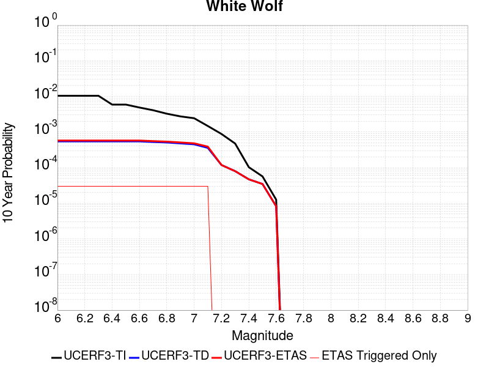 |

| Magnitude | 1 wk TI Prob | 1 wk TD Prob | 1 wk ETAS Prob | 1 wk ETAS/TD Gain | 1 wk ETAS Triggered Only | 1 mo TI Prob | 1 mo TD Prob | 1 mo ETAS Prob | 1 mo ETAS/TD Gain | 1 mo ETAS Triggered Only | 1 yr TI Prob | 1 yr TD Prob | 1 yr ETAS Prob | 1 yr ETAS/TD Gain | 1 yr ETAS Triggered Only | 10 yr TI Prob | 10 yr TD Prob | 10 yr ETAS Prob | 10 yr ETAS/TD Gain | 10 yr ETAS Triggered Only |
|-----|-----|-----|-----|-----|-----|-----|-----|-----|-----|-----|-----|-----|-----|-----|-----|-----|-----|-----|-----|-----|
| 6.0 | 2.0037822E-5 | 1.0468736E-6 | 1.0468736E-6 | 1.0 | 0.0 | 8.587355E-5 | 4.4865938E-6 | 1.4486549E-5 | 3.2288523 | 1.0E-5 | 0.001045009 | 5.462296E-5 | 7.462187E-5 | 1.3661264 | 2.0E-5 | 0.010401085 | 5.4610043E-4 | 5.76084E-4 | 1.0549049 | 3.0E-5 |
| 6.1 | 2.0037822E-5 | 1.0468736E-6 | 1.0468736E-6 | 1.0 | 0.0 | 8.587355E-5 | 4.4865938E-6 | 1.4486549E-5 | 3.2288523 | 1.0E-5 | 0.001045009 | 5.462296E-5 | 7.462187E-5 | 1.3661264 | 2.0E-5 | 0.010401085 | 5.4610043E-4 | 5.76084E-4 | 1.0549049 | 3.0E-5 |
| 6.2 | 2.0037822E-5 | 1.0468736E-6 | 1.0468736E-6 | 1.0 | 0.0 | 8.587355E-5 | 4.4865938E-6 | 1.4486549E-5 | 3.2288523 | 1.0E-5 | 0.001045009 | 5.462296E-5 | 7.462187E-5 | 1.3661264 | 2.0E-5 | 0.010401085 | 5.4610043E-4 | 5.76084E-4 | 1.0549049 | 3.0E-5 |
| 6.3 | 2.0037822E-5 | 1.0468736E-6 | 1.0468736E-6 | 1.0 | 0.0 | 8.587355E-5 | 4.4865938E-6 | 1.4486549E-5 | 3.2288523 | 1.0E-5 | 0.001045009 | 5.462296E-5 | 7.462187E-5 | 1.3661264 | 2.0E-5 | 0.010401085 | 5.4610043E-4 | 5.76084E-4 | 1.0549049 | 3.0E-5 |
| 6.4 | 1.132487E-5 | 1.0468736E-6 | 1.0468736E-6 | 1.0 | 0.0 | 4.8534253E-5 | 4.4865938E-6 | 1.4486549E-5 | 3.2288523 | 1.0E-5 | 5.907443E-4 | 5.462296E-5 | 7.462187E-5 | 1.3661264 | 2.0E-5 | 0.005891764 | 5.4610043E-4 | 5.76084E-4 | 1.0549049 | 3.0E-5 |
| 6.5 | 1.132487E-5 | 1.0468736E-6 | 1.0468736E-6 | 1.0 | 0.0 | 4.8534253E-5 | 4.4865938E-6 | 1.4486549E-5 | 3.2288523 | 1.0E-5 | 5.907443E-4 | 5.462296E-5 | 7.462187E-5 | 1.3661264 | 2.0E-5 | 0.005891764 | 5.4610043E-4 | 5.76084E-4 | 1.0549049 | 3.0E-5 |
| 6.6 | 9.347473E-6 | 1.0468736E-6 | 1.0468736E-6 | 1.0 | 0.0 | 4.0059982E-5 | 4.4865938E-6 | 1.4486549E-5 | 3.2288523 | 1.0E-5 | 4.8762115E-4 | 5.462296E-5 | 7.462187E-5 | 1.3661264 | 2.0E-5 | 0.0048655253 | 5.4610043E-4 | 5.76084E-4 | 1.0549049 | 3.0E-5 |
| 6.7 | 7.842647E-6 | 1.0047925E-6 | 1.0047925E-6 | 1.0 | 0.0 | 3.361091E-5 | 4.3062464E-6 | 1.4306203E-5 | 3.322198 | 1.0E-5 | 4.0913603E-4 | 5.242734E-5 | 7.242629E-5 | 1.3814603 | 2.0E-5 | 0.004083836 | 5.241547E-4 | 5.541389E-4 | 1.057205 | 3.0E-5 |
| 6.8 | 6.26597E-6 | 9.73443E-7 | 9.73443E-7 | 1.0 | 0.0 | 2.685388E-5 | 4.171892E-6 | 1.417185E-5 | 3.3969839 | 1.0E-5 | 3.2689696E-4 | 5.0791652E-5 | 7.079064E-5 | 1.3937455 | 2.0E-5 | 0.003264165 | 5.078053E-4 | 5.377901E-4 | 1.0590477 | 3.0E-5 |
| 6.9 | 5.258436E-6 | 9.1828633E-7 | 9.1828633E-7 | 1.0 | 0.0 | 2.2535958E-5 | 3.9355073E-6 | 1.3935468E-5 | 3.5409584 | 1.0E-5 | 2.7434074E-4 | 4.7913796E-5 | 6.7912835E-5 | 1.4173963 | 2.0E-5 | 0.0027400232 | 4.7903945E-4 | 5.0902506E-4 | 1.0625954 | 3.0E-5 |
| 7.0 | 4.675028E-6 | 8.6608276E-7 | 8.6608276E-7 | 1.0 | 0.0 | 2.003568E-5 | 3.7117782E-6 | 1.3711741E-5 | 3.6941166 | 1.0E-5 | 2.4390711E-4 | 4.519001E-5 | 6.518911E-5 | 1.4425557 | 2.0E-5 | 0.0024363957 | 4.5181293E-4 | 4.8179936E-4 | 1.0663692 | 3.0E-5 |
| 7.1 | 2.8270078E-6 | 6.873876E-7 | 6.873876E-7 | 1.0 | 0.0 | 1.2115692E-5 | 2.9459438E-6 | 1.2945914E-5 | 4.394488 | 1.0E-5 | 1.4749856E-4 | 3.5866316E-5 | 5.58656E-5 | 1.5576062 | 2.0E-5 | 0.001474007 | 3.586094E-4 | 3.8859862E-4 | 1.0836265 | 3.0E-5 |
| 7.2 | 1.6881406E-6 | 2.2703898E-7 | 2.2703898E-7 | 1.0 | 0.0 | 7.2348685E-6 | 9.730238E-7 | 9.730238E-7 | 1.0 | 0.0 | 8.808096E-5 | 1.1846502E-5 | 1.1846502E-5 | 1.0 | 0.0 | 8.8046055E-4 | 1.1845886E-4 | 1.1845886E-4 | 1.0 | 0.0 |
| 7.3 | 9.086107E-7 | 1.5264881E-7 | 1.5264881E-7 | 1.0 | 0.0 | 3.8940398E-6 | 6.5420903E-7 | 6.5420903E-7 | 1.0 | 0.0 | 4.7408903E-5 | 7.964967E-6 | 7.964967E-6 | 1.0 | 0.0 | 4.739879E-4 | 7.9646896E-5 | 7.9646896E-5 | 1.0 | 0.0 |
| 7.4 | 1.9717383E-7 | 9.003459E-8 | 9.003459E-8 | 1.0 | 0.0 | 8.450304E-7 | 3.8586248E-7 | 3.8586248E-7 | 1.0 | 0.0 | 1.0288197E-5 | 4.6978657E-6 | 4.6978657E-6 | 1.0 | 0.0 | 1.028772E-4 | 4.6977697E-5 | 4.6977697E-5 | 1.0 | 0.0 |
| 7.5 | 1.086975E-7 | 6.659703E-8 | 6.659703E-8 | 1.0 | 0.0 | 4.6584634E-7 | 2.8541584E-7 | 2.8541584E-7 | 1.0 | 0.0 | 5.6716644E-6 | 3.4749323E-6 | 3.4749323E-6 | 1.0 | 0.0 | 5.6715195E-5 | 3.4748802E-5 | 3.4748802E-5 | 1.0 | 0.0 |
| 7.6 | 2.4217808E-8 | 1.5820925E-8 | 1.5820925E-8 | 1.0 | 0.0 | 1.03790605E-7 | 6.780396E-8 | 6.780396E-8 | 1.0 | 0.0 | 1.2636499E-6 | 8.255129E-7 | 8.255129E-7 | 1.0 | 0.0 | 1.2636427E-5 | 8.255104E-6 | 8.255104E-6 | 1.0 | 0.0 |

## Oceanic - West Huasna
*[(top)](#table-of-contents)*

| 1 Week | 1 Month | 1 Year | 10 Year |
|-----|-----|-----|-----|
|  |  |  |  |

| Magnitude | 1 wk TI Prob | 1 wk TD Prob | 1 wk ETAS Prob | 1 wk ETAS/TD Gain | 1 wk ETAS Triggered Only | 1 mo TI Prob | 1 mo TD Prob | 1 mo ETAS Prob | 1 mo ETAS/TD Gain | 1 mo ETAS Triggered Only | 1 yr TI Prob | 1 yr TD Prob | 1 yr ETAS Prob | 1 yr ETAS/TD Gain | 1 yr ETAS Triggered Only | 10 yr TI Prob | 10 yr TD Prob | 10 yr ETAS Prob | 10 yr ETAS/TD Gain | 10 yr ETAS Triggered Only |
|-----|-----|-----|-----|-----|-----|-----|-----|-----|-----|-----|-----|-----|-----|-----|-----|-----|-----|-----|-----|-----|
| 6.0 | 3.195567E-5 | 2.7926611E-5 | 2.7926611E-5 | 1.0 | 0.0 | 1.3694567E-4 | 1.1968023E-4 | 1.2967903E-4 | 1.083546 | 1.0E-5 | 0.0016660384 | 0.001456176 | 0.0014761469 | 1.0137146 | 2.0E-5 | 0.016536033 | 0.014470896 | 0.0145004615 | 1.0020431 | 3.0E-5 |
| 6.1 | 2.1156782E-5 | 1.7573251E-5 | 1.7573251E-5 | 1.0 | 0.0 | 9.066878E-5 | 7.531181E-5 | 7.531181E-5 | 1.0 | 0.0 | 0.0011033333 | 9.1654493E-4 | 9.265358E-4 | 1.0109005 | 1.0E-5 | 0.010978713 | 0.009128656 | 0.009148473 | 1.0021709 | 2.0E-5 |
| 6.2 | 1.6195117E-5 | 1.332732E-5 | 1.332732E-5 | 1.0 | 0.0 | 6.9405796E-5 | 5.7115845E-5 | 5.7115845E-5 | 1.0 | 0.0 | 8.44688E-4 | 6.951662E-4 | 7.051592E-4 | 1.0143751 | 1.0E-5 | 0.008414844 | 0.0069302097 | 0.006950071 | 1.0028659 | 2.0E-5 |
| 6.3 | 1.3559345E-5 | 1.1179085E-5 | 1.1179085E-5 | 1.0 | 0.0 | 5.811018E-5 | 4.7909492E-5 | 4.7909492E-5 | 1.0 | 0.0 | 7.072618E-4 | 5.831429E-4 | 5.9313705E-4 | 1.0171385 | 1.0E-5 | 0.0070501505 | 0.0058162455 | 0.005836129 | 1.0034187 | 2.0E-5 |
| 6.4 | 1.2120619E-5 | 1.0000936E-5 | 1.0000936E-5 | 1.0 | 0.0 | 5.1944477E-5 | 4.286045E-5 | 4.286045E-5 | 1.0 | 0.0 | 6.322405E-4 | 5.217015E-4 | 5.316963E-4 | 1.019158 | 1.0E-5 | 0.006304447 | 0.0052048354 | 0.0052247313 | 1.0038226 | 2.0E-5 |
| 6.5 | 1.13511915E-5 | 9.367435E-6 | 9.367435E-6 | 1.0 | 0.0 | 4.8647056E-5 | 4.0145536E-5 | 4.0145536E-5 | 1.0 | 0.0 | 5.9211696E-4 | 4.8866274E-4 | 4.986578E-4 | 1.020454 | 1.0E-5 | 0.0059054173 | 0.0048759407 | 0.004895843 | 1.0040817 | 2.0E-5 |
| 6.6 | 9.850605E-6 | 8.135364E-6 | 8.135364E-6 | 1.0 | 0.0 | 4.2216197E-5 | 3.4865378E-5 | 3.4865378E-5 | 1.0 | 0.0 | 5.1386096E-4 | 4.2440352E-4 | 4.3439926E-4 | 1.0235525 | 1.0E-5 | 0.0051267436 | 0.0042359624 | 0.004255878 | 1.0047015 | 2.0E-5 |
| 6.7 | 8.8558645E-6 | 7.318384E-6 | 7.318384E-6 | 1.0 | 0.0 | 3.7953152E-5 | 3.1364125E-5 | 3.1364125E-5 | 1.0 | 0.0 | 4.6198163E-4 | 3.817915E-4 | 3.817915E-4 | 1.0 | 0.0 | 0.004610224 | 0.0038113813 | 0.0038213432 | 1.0026137 | 1.0E-5 |
| 6.8 | 7.67136E-6 | 6.3917278E-6 | 6.3917278E-6 | 1.0 | 0.0 | 3.2876844E-5 | 2.7392833E-5 | 2.7392833E-5 | 1.0 | 0.0 | 4.0020206E-4 | 3.3345685E-4 | 3.3345685E-4 | 1.0 | 0.0 | 0.003994821 | 0.003329586 | 0.0033395526 | 1.0029933 | 1.0E-5 |
| 6.9 | 6.534529E-6 | 5.4582943E-6 | 5.4582943E-6 | 1.0 | 0.0 | 2.8004823E-5 | 2.339248E-5 | 2.339248E-5 | 1.0 | 0.0 | 3.4090536E-4 | 2.8476634E-4 | 2.8476634E-4 | 1.0 | 0.0 | 0.0034038287 | 0.0028440312 | 0.0028540026 | 1.0035062 | 1.0E-5 |
| 7.0 | 5.460525E-6 | 4.5699494E-6 | 4.5699494E-6 | 1.0 | 0.0 | 2.3402039E-5 | 1.9585352E-5 | 1.9585352E-5 | 1.0 | 0.0 | 2.8488258E-4 | 2.3842567E-4 | 2.3842567E-4 | 1.0 | 0.0 | 0.0028451765 | 0.0023817124 | 0.0023817124 | 1.0 | 0.0 |
| 7.1 | 4.4825083E-6 | 3.7524424E-6 | 3.7524424E-6 | 1.0 | 0.0 | 1.9210609E-5 | 1.6081798E-5 | 1.6081798E-5 | 1.0 | 0.0 | 2.3386406E-4 | 1.957784E-4 | 1.957784E-4 | 1.0 | 0.0 | 0.002336181 | 0.001956071 | 0.001956071 | 1.0 | 0.0 |
| 7.2 | 2.821708E-6 | 2.4249653E-6 | 2.4249653E-6 | 1.0 | 0.0 | 1.2092979E-5 | 1.0392667E-5 | 1.0392667E-5 | 1.0 | 0.0 | 1.4722206E-4 | 1.2652339E-4 | 1.2652339E-4 | 1.0 | 0.0 | 0.0014712457 | 0.0012645158 | 0.0012645158 | 1.0 | 0.0 |
| 7.3 | 2.0644757E-6 | 1.7687719E-6 | 1.7687719E-6 | 1.0 | 0.0 | 8.847723E-6 | 7.580429E-6 | 7.580429E-6 | 1.0 | 0.0 | 1.0771569E-4 | 9.228782E-5 | 9.228782E-5 | 1.0 | 0.0 | 0.001076635 | 9.2249655E-4 | 9.2249655E-4 | 1.0 | 0.0 |
| 7.4 | 1.6980367E-6 | 1.4380173E-6 | 1.4380173E-6 | 1.0 | 0.0 | 7.27728E-6 | 6.1629166E-6 | 6.1629166E-6 | 1.0 | 0.0 | 8.8597284E-5 | 7.503093E-5 | 7.503093E-5 | 1.0 | 0.0 | 8.8561967E-4 | 7.5005746E-4 | 7.5005746E-4 | 1.0 | 0.0 |
| 7.5 | 1.3637683E-6 | 1.1302892E-6 | 1.1302892E-6 | 1.0 | 0.0 | 5.844708E-6 | 4.8440875E-6 | 4.8440875E-6 | 1.0 | 0.0 | 7.1156996E-5 | 5.897517E-5 | 5.897517E-5 | 1.0 | 0.0 | 7.1134215E-4 | 5.895966E-4 | 5.895966E-4 | 1.0 | 0.0 |
| 7.6 | 9.802994E-7 | 7.677469E-7 | 7.677469E-7 | 1.0 | 0.0 | 4.2012766E-6 | 3.2903397E-6 | 3.2903397E-6 | 1.0 | 0.0 | 5.1149345E-5 | 4.005915E-5 | 4.005915E-5 | 1.0 | 0.0 | 5.113757E-4 | 4.0052057E-4 | 4.0052057E-4 | 1.0 | 0.0 |
| 7.7 | 5.986191E-7 | 4.0052444E-7 | 4.0052444E-7 | 1.0 | 0.0 | 2.5655079E-6 | 1.7165321E-6 | 1.7165321E-6 | 1.0 | 0.0 | 3.1234613E-5 | 2.0898578E-5 | 2.0898578E-5 | 1.0 | 0.0 | 3.123022E-4 | 2.0896735E-4 | 2.0896735E-4 | 1.0 | 0.0 |
| 7.8 | 2.9189815E-7 | 1.5286729E-7 | 1.5286729E-7 | 1.0 | 0.0 | 1.2509914E-6 | 6.5514536E-7 | 6.5514536E-7 | 1.0 | 0.0 | 1.5230714E-5 | 7.976366E-6 | 7.976366E-6 | 1.0 | 0.0 | 1.522967E-4 | 7.976198E-5 | 7.976198E-5 | 1.0 | 0.0 |
| 7.9 | 1.2057845E-7 | 4.621617E-8 | 4.621617E-8 | 1.0 | 0.0 | 5.1676466E-7 | 1.9806929E-7 | 1.9806929E-7 | 1.0 | 0.0 | 6.2915915E-6 | 2.4114909E-6 | 2.4114909E-6 | 1.0 | 0.0 | 6.2914136E-5 | 2.4115825E-5 | 2.4115825E-5 | 1.0 | 0.0 |
| 8.0 | 3.3806387E-9 | 9.0127306E-10 | 9.0127306E-10 | 1.0 | 0.0 | 1.4488451E-8 | 3.8625965E-9 | 3.8625965E-9 | 1.0 | 0.0 | 1.7639688E-7 | 4.7027115E-8 | 4.7027115E-8 | 1.0 | 0.0 | 1.7639674E-6 | 4.7134822E-7 | 4.7134822E-7 | 1.0 | 0.0 |

## San Jacinto (Borrego)
*[(top)](#table-of-contents)*

| 1 Week | 1 Month | 1 Year | 10 Year |
|-----|-----|-----|-----|
|  |  |  |  |

| Magnitude | 1 wk TI Prob | 1 wk TD Prob | 1 wk ETAS Prob | 1 wk ETAS/TD Gain | 1 wk ETAS Triggered Only | 1 mo TI Prob | 1 mo TD Prob | 1 mo ETAS Prob | 1 mo ETAS/TD Gain | 1 mo ETAS Triggered Only | 1 yr TI Prob | 1 yr TD Prob | 1 yr ETAS Prob | 1 yr ETAS/TD Gain | 1 yr ETAS Triggered Only | 10 yr TI Prob | 10 yr TD Prob | 10 yr ETAS Prob | 10 yr ETAS/TD Gain | 10 yr ETAS Triggered Only |
|-----|-----|-----|-----|-----|-----|-----|-----|-----|-----|-----|-----|-----|-----|-----|-----|-----|-----|-----|-----|-----|
| 6.0 | 3.543992E-5 | 2.7933444E-5 | 2.7933444E-5 | 1.0 | 0.0 | 1.5187653E-4 | 1.1970933E-4 | 1.2970813E-4 | 1.0835257 | 1.0E-5 | 0.0018475284 | 0.001456499 | 0.0014764698 | 1.0137116 | 2.0E-5 | 0.018322436 | 0.014871439 | 0.014900994 | 1.0019873 | 3.0E-5 |
| 6.1 | 3.542281E-5 | 2.7933444E-5 | 2.7933444E-5 | 1.0 | 0.0 | 1.5180321E-4 | 1.1970933E-4 | 1.2970813E-4 | 1.0835257 | 1.0E-5 | 0.0018466372 | 0.001456499 | 0.0014764698 | 1.0137116 | 2.0E-5 | 0.018313672 | 0.014871439 | 0.014900994 | 1.0019873 | 3.0E-5 |
| 6.2 | 3.4688688E-5 | 2.7933444E-5 | 2.7933444E-5 | 1.0 | 0.0 | 1.4865733E-4 | 1.1970933E-4 | 1.2970813E-4 | 1.0835257 | 1.0E-5 | 0.0018084005 | 0.001456499 | 0.0014764698 | 1.0137116 | 2.0E-5 | 0.017937548 | 0.014871439 | 0.014900993 | 1.0019873 | 3.0E-5 |
| 6.3 | 3.2087122E-5 | 2.7778793E-5 | 2.7778793E-5 | 1.0 | 0.0 | 1.3750899E-4 | 1.1904661E-4 | 1.2904541E-4 | 1.0839907 | 1.0E-5 | 0.0016728862 | 0.0014484411 | 0.001468412 | 1.013788 | 2.0E-5 | 0.016603488 | 0.014792597 | 0.014822153 | 1.0019981 | 3.0E-5 |
| 6.4 | 3.1828724E-5 | 2.774577E-5 | 2.774577E-5 | 1.0 | 0.0 | 1.364017E-4 | 1.1890509E-4 | 1.289039E-4 | 1.0840907 | 1.0E-5 | 0.0016594254 | 0.0014467203 | 0.0014666914 | 1.0138043 | 2.0E-5 | 0.016470885 | 0.01477579 | 0.014805347 | 1.0020003 | 3.0E-5 |
| 6.5 | 3.1563577E-5 | 2.7485452E-5 | 2.7485452E-5 | 1.0 | 0.0 | 1.3526545E-4 | 1.1778954E-4 | 1.2778837E-4 | 1.0848871 | 1.0E-5 | 0.0016456128 | 0.0014331564 | 0.0014531278 | 1.0139352 | 2.0E-5 | 0.0163348 | 0.014643186 | 0.014672747 | 1.0020187 | 3.0E-5 |
| 6.6 | 3.1467625E-5 | 2.7329666E-5 | 2.7329666E-5 | 1.0 | 0.0 | 1.3485427E-4 | 1.17121956E-4 | 1.2712079E-4 | 1.0853711 | 1.0E-5 | 0.0016406142 | 0.0014250393 | 0.0014450108 | 1.0140147 | 2.0E-5 | 0.016285548 | 0.014563348 | 0.014592911 | 1.00203 | 3.0E-5 |
| 6.7 | 3.1223695E-5 | 2.6947682E-5 | 2.6947682E-5 | 1.0 | 0.0 | 1.3380898E-4 | 1.1548502E-4 | 1.2548387E-4 | 1.0865813 | 1.0E-5 | 0.0016279068 | 0.0014051354 | 0.0014251072 | 1.0142136 | 2.0E-5 | 0.01616033 | 0.01436762 | 0.01439719 | 1.002058 | 3.0E-5 |
| 6.8 | 3.1015585E-5 | 2.6768674E-5 | 2.6768674E-5 | 1.0 | 0.0 | 1.3291716E-4 | 1.1471791E-4 | 1.2471677E-4 | 1.0871603 | 1.0E-5 | 0.001617065 | 0.0013958078 | 0.0014157798 | 1.0143086 | 2.0E-5 | 0.016053487 | 0.014274874 | 0.014304445 | 1.0020716 | 3.0E-5 |
| 6.9 | 2.6641965E-5 | 2.2190488E-5 | 2.2190488E-5 | 1.0 | 0.0 | 1.1417485E-4 | 9.509865E-5 | 1.050977E-4 | 1.105144 | 1.0E-5 | 0.0013891924 | 0.001157215 | 0.0011771919 | 1.0172628 | 2.0E-5 | 0.0138054015 | 0.011885386 | 0.011915029 | 1.0024941 | 3.0E-5 |
| 7.0 | 2.3854353E-5 | 2.0485062E-5 | 2.0485062E-5 | 1.0 | 0.0 | 1.02228936E-4 | 8.7790184E-5 | 9.778931E-5 | 1.1138979 | 1.0E-5 | 0.0012439266 | 0.001068324 | 0.0010883026 | 1.018701 | 2.0E-5 | 0.012369866 | 0.010985749 | 0.011015419 | 1.0027008 | 3.0E-5 |
| 7.1 | 2.3672901E-5 | 2.0321548E-5 | 2.0321548E-5 | 1.0 | 0.0 | 1.0145135E-4 | 8.708945E-5 | 9.708858E-5 | 1.1148145 | 1.0E-5 | 0.0012344702 | 0.0010598009 | 0.0010797797 | 1.0188515 | 2.0E-5 | 0.0122763505 | 0.01090098 | 0.010930653 | 1.002722 | 3.0E-5 |
| 7.2 | 2.2717244E-5 | 1.9548863E-5 | 1.9548863E-5 | 1.0 | 0.0 | 9.735599E-5 | 8.377816E-5 | 9.377732E-5 | 1.1193528 | 1.0E-5 | 0.0011846646 | 0.0010195242 | 0.0010395037 | 1.019597 | 2.0E-5 | 0.01178369 | 0.010498457 | 0.010528142 | 1.0028275 | 3.0E-5 |
| 7.3 | 2.1016205E-5 | 1.8390432E-5 | 1.8390432E-5 | 1.0 | 0.0 | 9.006634E-5 | 7.881377E-5 | 8.881299E-5 | 1.1268713 | 1.0E-5 | 0.001096006 | 9.5913734E-4 | 9.791182E-4 | 1.0208321 | 2.0E-5 | 0.010906163 | 0.009894083 | 0.009923787 | 1.0030022 | 3.0E-5 |
| 7.4 | 2.0683625E-5 | 1.819294E-5 | 1.819294E-5 | 1.0 | 0.0 | 8.86411E-5 | 7.796742E-5 | 8.796665E-5 | 1.1282487 | 1.0E-5 | 0.001078671 | 9.4884203E-4 | 9.688231E-4 | 1.0210583 | 2.0E-5 | 0.010734501 | 0.009790815 | 0.009820522 | 1.0030341 | 3.0E-5 |
| 7.5 | 1.9993966E-5 | 1.7787928E-5 | 1.7787928E-5 | 1.0 | 0.0 | 8.568561E-5 | 7.6231765E-5 | 8.6231E-5 | 1.131169 | 1.0E-5 | 0.001042723 | 9.2772854E-4 | 9.4770995E-4 | 1.021538 | 2.0E-5 | 0.010378438 | 0.009577702 | 0.009607415 | 1.0031023 | 3.0E-5 |
| 7.6 | 1.788966E-5 | 1.6441034E-5 | 1.6441034E-5 | 1.0 | 0.0 | 7.666772E-5 | 7.045968E-5 | 8.045897E-5 | 1.1419151 | 1.0E-5 | 9.3302975E-4 | 8.575107E-4 | 8.774936E-4 | 1.0233033 | 2.0E-5 | 0.00929122 | 0.00886951 | 0.008899244 | 1.0033524 | 3.0E-5 |
| 7.7 | 1.5125781E-5 | 1.4242966E-5 | 1.4242966E-5 | 1.0 | 0.0 | 6.4823165E-5 | 6.1039864E-5 | 7.103925E-5 | 1.1638174 | 1.0E-5 | 7.889362E-4 | 7.4290775E-4 | 7.628929E-4 | 1.0269012 | 2.0E-5 | 0.007861412 | 0.007717176 | 0.0077469447 | 1.0038574 | 3.0E-5 |
| 7.8 | 1.250089E-5 | 1.2635926E-5 | 1.2635926E-5 | 1.0 | 0.0 | 5.3574146E-5 | 5.415285E-5 | 6.415231E-5 | 1.1846524 | 1.0E-5 | 6.5207E-4 | 6.591121E-4 | 6.7909894E-4 | 1.0303239 | 2.0E-5 | 0.006501599 | 0.0068706553 | 0.0069004493 | 1.0043364 | 3.0E-5 |
| 7.9 | 9.561E-6 | 9.759346E-6 | 9.759346E-6 | 1.0 | 0.0 | 4.0975072E-5 | 4.1825097E-5 | 5.182468E-5 | 1.2390809 | 1.0E-5 | 4.987573E-4 | 5.0910213E-4 | 5.29092E-4 | 1.0392648 | 2.0E-5 | 0.0049763937 | 0.005354963 | 0.005384802 | 1.0055723 | 3.0E-5 |
| 8.0 | 8.01699E-6 | 8.297771E-6 | 8.297771E-6 | 1.0 | 0.0 | 3.4358076E-5 | 3.5561392E-5 | 4.556104E-5 | 1.2811939 | 1.0E-5 | 4.1822926E-4 | 4.3287448E-4 | 4.5286582E-4 | 1.0461828 | 2.0E-5 | 0.0041744304 | 0.004575734 | 0.0046055964 | 1.0065264 | 3.0E-5 |
| 8.1 | 6.541947E-6 | 6.465709E-6 | 6.465709E-6 | 1.0 | 0.0 | 2.8036617E-5 | 2.7709888E-5 | 3.770961E-5 | 1.360872 | 1.0E-5 | 3.4129233E-4 | 3.3731616E-4 | 3.573094E-4 | 1.0592716 | 2.0E-5 | 0.0034076865 | 0.0035825386 | 0.003602467 | 1.0055627 | 2.0E-5 |
| 8.2 | 1.7968189E-6 | 7.9757825E-7 | 7.9757825E-7 | 1.0 | 0.0 | 7.70063E-6 | 3.4181883E-6 | 3.4181883E-6 | 1.0 | 0.0 | 9.3751136E-5 | 4.161567E-5 | 4.161567E-5 | 1.0 | 0.0 | 9.371159E-4 | 4.7149012E-4 | 4.7149012E-4 | 1.0 | 0.0 |
| 8.3 | 1.5167889E-7 | 4.9005383E-8 | 4.9005383E-8 | 1.0 | 0.0 | 6.500522E-7 | 2.1002305E-7 | 2.1002305E-7 | 1.0 | 0.0 | 7.9143565E-6 | 2.557028E-6 | 2.557028E-6 | 1.0 | 0.0 | 7.914075E-5 | 2.9710194E-5 | 2.9710194E-5 | 1.0 | 0.0 |

## Santa Ynez River
*[(top)](#table-of-contents)*

| 1 Week | 1 Month | 1 Year | 10 Year |
|-----|-----|-----|-----|
|  |  | 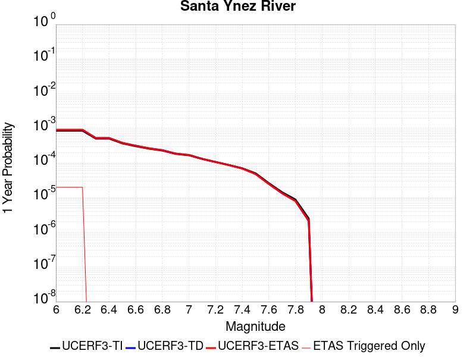 |  |

| Magnitude | 1 wk TI Prob | 1 wk TD Prob | 1 wk ETAS Prob | 1 wk ETAS/TD Gain | 1 wk ETAS Triggered Only | 1 mo TI Prob | 1 mo TD Prob | 1 mo ETAS Prob | 1 mo ETAS/TD Gain | 1 mo ETAS Triggered Only | 1 yr TI Prob | 1 yr TD Prob | 1 yr ETAS Prob | 1 yr ETAS/TD Gain | 1 yr ETAS Triggered Only | 10 yr TI Prob | 10 yr TD Prob | 10 yr ETAS Prob | 10 yr ETAS/TD Gain | 10 yr ETAS Triggered Only |
|-----|-----|-----|-----|-----|-----|-----|-----|-----|-----|-----|-----|-----|-----|-----|-----|-----|-----|-----|-----|-----|
| 6.0 | 1.6396456E-5 | 1.7209572E-5 | 1.7209572E-5 | 1.0 | 0.0 | 7.026863E-5 | 7.375342E-5 | 8.375268E-5 | 1.135577 | 1.0E-5 | 8.551848E-4 | 8.976135E-4 | 9.175956E-4 | 1.0222613 | 2.0E-5 | 0.0085190125 | 0.008943428 | 0.00897316 | 1.0033244 | 3.0E-5 |
| 6.1 | 1.6396456E-5 | 1.7209572E-5 | 1.7209572E-5 | 1.0 | 0.0 | 7.026863E-5 | 7.375342E-5 | 8.375268E-5 | 1.135577 | 1.0E-5 | 8.551848E-4 | 8.976135E-4 | 9.175956E-4 | 1.0222613 | 2.0E-5 | 0.0085190125 | 0.008943428 | 0.00897316 | 1.0033244 | 3.0E-5 |
| 6.2 | 1.6396456E-5 | 1.7209572E-5 | 1.7209572E-5 | 1.0 | 0.0 | 7.026863E-5 | 7.375342E-5 | 8.375268E-5 | 1.135577 | 1.0E-5 | 8.551848E-4 | 8.976135E-4 | 9.175956E-4 | 1.0222613 | 2.0E-5 | 0.0085190125 | 0.008943428 | 0.00897316 | 1.0033244 | 3.0E-5 |
| 6.3 | 9.736976E-6 | 1.0122406E-5 | 1.0122406E-5 | 1.0 | 0.0 | 4.172923E-5 | 4.3381046E-5 | 4.3381046E-5 | 1.0 | 0.0 | 5.0793495E-4 | 5.280412E-4 | 5.280412E-4 | 1.0 | 0.0 | 0.005067755 | 0.005268371 | 0.0052783187 | 1.0018882 | 1.0E-5 |
| 6.4 | 9.736976E-6 | 1.0122406E-5 | 1.0122406E-5 | 1.0 | 0.0 | 4.172923E-5 | 4.3381046E-5 | 4.3381046E-5 | 1.0 | 0.0 | 5.0793495E-4 | 5.280412E-4 | 5.280412E-4 | 1.0 | 0.0 | 0.005067755 | 0.005268371 | 0.0052783187 | 1.0018882 | 1.0E-5 |
| 6.5 | 7.081964E-6 | 7.3299525E-6 | 7.3299525E-6 | 1.0 | 0.0 | 3.035092E-5 | 3.1413714E-5 | 3.1413714E-5 | 1.0 | 0.0 | 3.694598E-4 | 3.8239642E-4 | 3.8239642E-4 | 1.0 | 0.0 | 0.0036884616 | 0.003817546 | 0.0038275078 | 1.0026095 | 1.0E-5 |
| 6.6 | 5.873247E-6 | 6.0597904E-6 | 6.0597904E-6 | 1.0 | 0.0 | 2.5170815E-5 | 2.5970277E-5 | 2.5970277E-5 | 1.0 | 0.0 | 3.064116E-4 | 3.161431E-4 | 3.161431E-4 | 1.0 | 0.0 | 0.0030598943 | 0.003157021 | 0.0031669894 | 1.0031575 | 1.0E-5 |
| 6.7 | 4.973277E-6 | 5.1159423E-6 | 5.1159423E-6 | 1.0 | 0.0 | 2.1313872E-5 | 2.1925287E-5 | 2.1925287E-5 | 1.0 | 0.0 | 2.5946548E-4 | 2.6690814E-4 | 2.6690814E-4 | 1.0 | 0.0 | 0.0025916274 | 0.0026659246 | 0.0026758981 | 1.003741 | 1.0E-5 |
| 6.8 | 4.396492E-6 | 4.511015E-6 | 4.511015E-6 | 1.0 | 0.0 | 1.884197E-5 | 1.9332781E-5 | 1.9332781E-5 | 1.0 | 0.0 | 2.2937685E-4 | 2.3535153E-4 | 2.3535153E-4 | 1.0 | 0.0 | 0.0022914023 | 0.0023510582 | 0.0023610347 | 1.0042434 | 1.0E-5 |
| 6.9 | 3.5255632E-6 | 3.6013655E-6 | 3.6013655E-6 | 1.0 | 0.0 | 1.5109469E-5 | 1.5434332E-5 | 1.5434332E-5 | 1.0 | 0.0 | 1.8394225E-4 | 1.8789696E-4 | 1.8789696E-4 | 1.0 | 0.0 | 0.0018379007 | 0.0018773971 | 0.0018773971 | 1.0 | 0.0 |
| 7.0 | 3.211603E-6 | 3.2736843E-6 | 3.2736843E-6 | 1.0 | 0.0 | 1.376394E-5 | 1.4030001E-5 | 1.4030001E-5 | 1.0 | 0.0 | 1.6756308E-4 | 1.7080201E-4 | 1.7080201E-4 | 1.0 | 0.0 | 0.0016743679 | 0.0017067215 | 0.0017067215 | 1.0 | 0.0 |
| 7.1 | 2.5094619E-6 | 2.5409465E-6 | 2.5409465E-6 | 1.0 | 0.0 | 1.0754793E-5 | 1.0889726E-5 | 1.0889726E-5 | 1.0 | 0.0 | 1.3093173E-4 | 1.325744E-4 | 1.325744E-4 | 1.0 | 0.0 | 0.0013085462 | 0.0013249591 | 0.0013249591 | 1.0 | 0.0 |
| 7.2 | 2.0515774E-6 | 2.0619607E-6 | 2.0619607E-6 | 1.0 | 0.0 | 8.792445E-6 | 8.836944E-6 | 8.836944E-6 | 1.0 | 0.0 | 1.0704277E-4 | 1.0758453E-4 | 1.0758453E-4 | 1.0 | 0.0 | 0.0010699122 | 0.0010753288 | 0.0010753288 | 1.0 | 0.0 |
| 7.3 | 1.6845745E-6 | 1.6774113E-6 | 1.6774113E-6 | 1.0 | 0.0 | 7.219585E-6 | 7.188886E-6 | 7.188886E-6 | 1.0 | 0.0 | 8.78949E-5 | 8.75212E-5 | 8.75212E-5 | 1.0 | 0.0 | 8.7860145E-4 | 8.7487017E-4 | 8.7487017E-4 | 1.0 | 0.0 |
| 7.4 | 1.3600285E-6 | 1.3333537E-6 | 1.3333537E-6 | 1.0 | 0.0 | 5.82868E-6 | 5.71436E-6 | 5.71436E-6 | 1.0 | 0.0 | 7.096187E-5 | 6.957014E-5 | 6.957014E-5 | 1.0 | 0.0 | 7.0939213E-4 | 6.954858E-4 | 6.954858E-4 | 1.0 | 0.0 |
| 7.5 | 9.735342E-7 | 9.290247E-7 | 9.290247E-7 | 1.0 | 0.0 | 4.172283E-6 | 3.981528E-6 | 3.981528E-6 | 1.0 | 0.0 | 5.079636E-5 | 4.8474045E-5 | 4.8474045E-5 | 1.0 | 0.0 | 5.0784746E-4 | 4.8463643E-4 | 4.8463643E-4 | 1.0 | 0.0 |
| 7.6 | 5.067187E-7 | 4.77864E-7 | 4.77864E-7 | 1.0 | 0.0 | 2.1716498E-6 | 2.047987E-6 | 2.047987E-6 | 1.0 | 0.0 | 2.6439517E-5 | 2.4933963E-5 | 2.4933963E-5 | 1.0 | 0.0 | 2.643637E-4 | 2.493124E-4 | 2.493124E-4 | 1.0 | 0.0 |
| 7.7 | 2.769089E-7 | 2.575952E-7 | 2.575952E-7 | 1.0 | 0.0 | 1.1867519E-6 | 1.1039789E-6 | 1.1039789E-6 | 1.0 | 0.0 | 1.4448608E-5 | 1.344086E-5 | 1.344086E-5 | 1.0 | 0.0 | 1.444767E-4 | 1.344005E-4 | 1.344005E-4 | 1.0 | 0.0 |
| 7.8 | 1.7044663E-7 | 1.5449315E-7 | 1.5449315E-7 | 1.0 | 0.0 | 7.3048534E-7 | 6.621133E-7 | 6.621133E-7 | 1.0 | 0.0 | 8.893623E-6 | 8.0612E-6 | 8.0612E-6 | 1.0 | 0.0 | 8.893267E-5 | 8.06091E-5 | 8.06091E-5 | 1.0 | 0.0 |
| 7.9 | 4.8344287E-8 | 4.0911427E-8 | 4.0911427E-8 | 1.0 | 0.0 | 2.0718979E-7 | 1.7533468E-7 | 1.7533468E-7 | 1.0 | 0.0 | 2.5225327E-6 | 2.1346975E-6 | 2.1346975E-6 | 1.0 | 0.0 | 2.5225041E-5 | 2.1346776E-5 | 2.1346776E-5 | 1.0 | 0.0 |

## Santa Cruz Catalina Ridge alt1
*[(top)](#table-of-contents)*

| 1 Week | 1 Month | 1 Year | 10 Year |
|-----|-----|-----|-----|
|  |  |  | 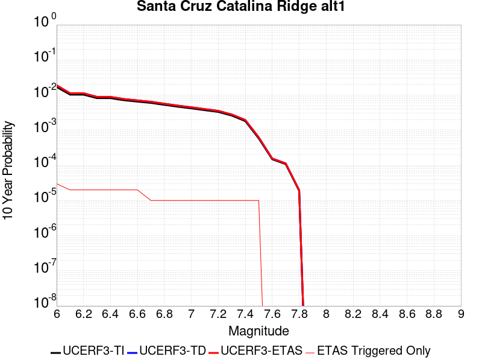 |

| Magnitude | 1 wk TI Prob | 1 wk TD Prob | 1 wk ETAS Prob | 1 wk ETAS/TD Gain | 1 wk ETAS Triggered Only | 1 mo TI Prob | 1 mo TD Prob | 1 mo ETAS Prob | 1 mo ETAS/TD Gain | 1 mo ETAS Triggered Only | 1 yr TI Prob | 1 yr TD Prob | 1 yr ETAS Prob | 1 yr ETAS/TD Gain | 1 yr ETAS Triggered Only | 10 yr TI Prob | 10 yr TD Prob | 10 yr ETAS Prob | 10 yr ETAS/TD Gain | 10 yr ETAS Triggered Only |
|-----|-----|-----|-----|-----|-----|-----|-----|-----|-----|-----|-----|-----|-----|-----|-----|-----|-----|-----|-----|-----|
| 6.0 | 3.2833184E-5 | 3.655896E-5 | 3.655896E-5 | 1.0 | 0.0 | 1.4070606E-4 | 1.5667279E-4 | 1.5667279E-4 | 1.0 | 0.0 | 0.00171175 | 0.0019059886 | 0.0019259504 | 1.0104733 | 2.0E-5 | 0.016986247 | 0.01891332 | 0.018942753 | 1.0015562 | 3.0E-5 |
| 6.1 | 1.9835548E-5 | 2.1659771E-5 | 2.1659771E-5 | 1.0 | 0.0 | 8.500672E-5 | 9.2824404E-5 | 9.2824404E-5 | 1.0 | 0.0 | 0.0010344655 | 0.0011295713 | 0.0011395601 | 1.008843 | 1.0E-5 | 0.010296632 | 0.011240433 | 0.011260209 | 1.0017593 | 2.0E-5 |
| 6.2 | 1.9835548E-5 | 2.1659771E-5 | 2.1659771E-5 | 1.0 | 0.0 | 8.500672E-5 | 9.2824404E-5 | 9.2824404E-5 | 1.0 | 0.0 | 0.0010344655 | 0.0011295713 | 0.0011395601 | 1.008843 | 1.0E-5 | 0.010296632 | 0.011240433 | 0.011260209 | 1.0017593 | 2.0E-5 |
| 6.3 | 1.5728183E-5 | 1.7034137E-5 | 1.7034137E-5 | 1.0 | 0.0 | 6.7404755E-5 | 7.3001436E-5 | 7.3001436E-5 | 1.0 | 0.0 | 8.2034385E-4 | 8.884362E-4 | 8.9842733E-4 | 1.0112457 | 1.0E-5 | 0.008173222 | 0.008849524 | 0.008869347 | 1.0022401 | 2.0E-5 |
| 6.4 | 1.5728183E-5 | 1.7034137E-5 | 1.7034137E-5 | 1.0 | 0.0 | 6.7404755E-5 | 7.3001436E-5 | 7.3001436E-5 | 1.0 | 0.0 | 8.2034385E-4 | 8.884362E-4 | 8.9842733E-4 | 1.0112457 | 1.0E-5 | 0.008173222 | 0.008849524 | 0.008869347 | 1.0022401 | 2.0E-5 |
| 6.5 | 1.3707734E-5 | 1.4794678E-5 | 1.4794678E-5 | 1.0 | 0.0 | 5.8746107E-5 | 6.3404244E-5 | 6.3404244E-5 | 1.0 | 0.0 | 7.1499916E-4 | 7.716768E-4 | 7.8166905E-4 | 1.0129488 | 1.0E-5 | 0.0071270303 | 0.0076903705 | 0.0077102166 | 1.0025806 | 2.0E-5 |
| 6.6 | 1.2539813E-5 | 1.3510358E-5 | 1.3510358E-5 | 1.0 | 0.0 | 5.3740947E-5 | 5.7900266E-5 | 5.7900266E-5 | 1.0 | 0.0 | 6.540996E-4 | 7.0471043E-4 | 7.1470335E-4 | 1.0141802 | 1.0E-5 | 0.0065217763 | 0.0070250607 | 0.0070449198 | 1.0028269 | 2.0E-5 |
| 6.7 | 1.1504083E-5 | 1.23775E-5 | 1.23775E-5 | 1.0 | 0.0 | 4.930228E-5 | 5.304536E-5 | 5.304536E-5 | 1.0 | 0.0 | 6.0008996E-4 | 6.456379E-4 | 6.456379E-4 | 1.0 | 0.0 | 0.005984721 | 0.0064378507 | 0.0064477865 | 1.0015433 | 1.0E-5 |
| 6.8 | 1.012739E-5 | 1.0877178E-5 | 1.0877178E-5 | 1.0 | 0.0 | 4.340238E-5 | 4.6615653E-5 | 4.6615653E-5 | 1.0 | 0.0 | 5.282958E-4 | 5.673993E-4 | 5.673993E-4 | 1.0 | 0.0 | 0.0052704164 | 0.005659675 | 0.0056696185 | 1.0017569 | 1.0E-5 |
| 6.9 | 8.9607865E-6 | 9.60921E-6 | 9.60921E-6 | 1.0 | 0.0 | 3.8402806E-5 | 4.1181684E-5 | 4.1181684E-5 | 1.0 | 0.0 | 4.6745385E-4 | 5.0127273E-4 | 5.0127273E-4 | 1.0 | 0.0 | 0.0046647177 | 0.00500154 | 0.0050114896 | 1.0019894 | 1.0E-5 |
| 7.0 | 8.046829E-6 | 8.619827E-6 | 8.619827E-6 | 1.0 | 0.0 | 3.4485955E-5 | 3.6941598E-5 | 3.6941598E-5 | 1.0 | 0.0 | 4.1978562E-4 | 4.4967196E-4 | 4.4967196E-4 | 1.0 | 0.0 | 0.004189935 | 0.004487711 | 0.0044976664 | 1.0022184 | 1.0E-5 |
| 7.1 | 7.136131E-6 | 7.637727E-6 | 7.637727E-6 | 1.0 | 0.0 | 3.0583058E-5 | 3.273271E-5 | 3.273271E-5 | 1.0 | 0.0 | 3.7228514E-4 | 3.9844858E-4 | 3.9844858E-4 | 1.0 | 0.0 | 0.0037166206 | 0.0039774184 | 0.0039873784 | 1.0025042 | 1.0E-5 |
| 7.2 | 6.362014E-6 | 6.8050217E-6 | 6.8050217E-6 | 1.0 | 0.0 | 2.726549E-5 | 2.9164055E-5 | 2.9164055E-5 | 1.0 | 0.0 | 3.3190678E-4 | 3.5501516E-4 | 3.5501516E-4 | 1.0 | 0.0 | 0.0033141149 | 0.0035445488 | 0.0035545132 | 1.0028112 | 1.0E-5 |
| 7.3 | 5.004101E-6 | 5.3517642E-6 | 5.3517642E-6 | 1.0 | 0.0 | 2.1445969E-5 | 2.2935934E-5 | 2.2935934E-5 | 1.0 | 0.0 | 2.6107338E-4 | 2.7920975E-4 | 2.7920975E-4 | 1.0 | 0.0 | 0.002607669 | 0.0027886443 | 0.0027986164 | 1.0035759 | 1.0E-5 |
| 7.4 | 3.4901443E-6 | 3.732087E-6 | 3.732087E-6 | 1.0 | 0.0 | 1.4957676E-5 | 1.5994563E-5 | 1.5994563E-5 | 1.0 | 0.0 | 1.8209449E-4 | 1.9471678E-4 | 1.9471678E-4 | 1.0 | 0.0 | 0.0018194534 | 0.0019455003 | 0.0019554808 | 1.00513 | 1.0E-5 |
| 7.5 | 1.1215045E-6 | 1.1893966E-6 | 1.1893966E-6 | 1.0 | 0.0 | 4.806439E-6 | 5.0974045E-6 | 5.0974045E-6 | 1.0 | 0.0 | 5.851682E-5 | 6.205916E-5 | 6.205916E-5 | 1.0 | 0.0 | 5.850142E-4 | 6.204214E-4 | 6.3041516E-4 | 1.016108 | 1.0E-5 |
| 7.6 | 2.8599047E-7 | 2.9952182E-7 | 2.9952182E-7 | 1.0 | 0.0 | 1.2256729E-6 | 1.2836642E-6 | 1.2836642E-6 | 1.0 | 0.0 | 1.4922465E-5 | 1.5628502E-5 | 1.5628502E-5 | 1.0 | 0.0 | 1.4921463E-4 | 1.5627417E-4 | 1.5627417E-4 | 1.0 | 0.0 |
| 7.7 | 2.0781519E-7 | 2.1744457E-7 | 2.1744457E-7 | 1.0 | 0.0 | 8.906362E-7 | 9.3190494E-7 | 9.3190494E-7 | 1.0 | 0.0 | 1.08434415E-5 | 1.1345885E-5 | 1.1345885E-5 | 1.0 | 0.0 | 1.0842913E-4 | 1.1345315E-4 | 1.1345315E-4 | 1.0 | 0.0 |
| 7.8 | 3.614776E-8 | 3.7641225E-8 | 3.7641225E-8 | 1.0 | 0.0 | 1.5491896E-7 | 1.6131952E-7 | 1.6131952E-7 | 1.0 | 0.0 | 1.8861368E-6 | 1.9640636E-6 | 1.9640636E-6 | 1.0 | 0.0 | 1.8861208E-5 | 1.9640474E-5 | 1.9640474E-5 | 1.0 | 0.0 |

## Sierra Madre
*[(top)](#table-of-contents)*

| 1 Week | 1 Month | 1 Year | 10 Year |
|-----|-----|-----|-----|
|  |  | 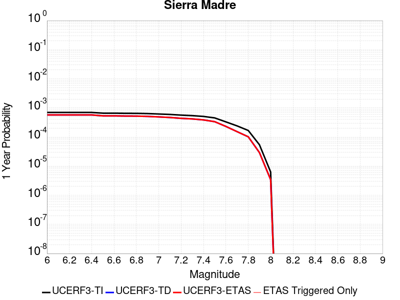 |  |

| Magnitude | 1 wk TI Prob | 1 wk TD Prob | 1 wk ETAS Prob | 1 wk ETAS/TD Gain | 1 wk ETAS Triggered Only | 1 mo TI Prob | 1 mo TD Prob | 1 mo ETAS Prob | 1 mo ETAS/TD Gain | 1 mo ETAS Triggered Only | 1 yr TI Prob | 1 yr TD Prob | 1 yr ETAS Prob | 1 yr ETAS/TD Gain | 1 yr ETAS Triggered Only | 10 yr TI Prob | 10 yr TD Prob | 10 yr ETAS Prob | 10 yr ETAS/TD Gain | 10 yr ETAS Triggered Only |
|-----|-----|-----|-----|-----|-----|-----|-----|-----|-----|-----|-----|-----|-----|-----|-----|-----|-----|-----|-----|-----|
| 6.0 | 1.3379373E-5 | 1.1001147E-5 | 1.1001147E-5 | 1.0 | 0.0 | 5.7338908E-5 | 4.7146932E-5 | 4.7146932E-5 | 1.0 | 0.0 | 6.978776E-4 | 5.7386415E-4 | 5.7386415E-4 | 1.0 | 0.0 | 0.0069569005 | 0.0057240664 | 0.0057538943 | 1.005211 | 3.0E-5 |
| 6.1 | 1.3379373E-5 | 1.1001147E-5 | 1.1001147E-5 | 1.0 | 0.0 | 5.7338908E-5 | 4.7146932E-5 | 4.7146932E-5 | 1.0 | 0.0 | 6.978776E-4 | 5.7386415E-4 | 5.7386415E-4 | 1.0 | 0.0 | 0.0069569005 | 0.0057240664 | 0.0057538943 | 1.005211 | 3.0E-5 |
| 6.2 | 1.3379373E-5 | 1.1001147E-5 | 1.1001147E-5 | 1.0 | 0.0 | 5.7338908E-5 | 4.7146932E-5 | 4.7146932E-5 | 1.0 | 0.0 | 6.978776E-4 | 5.7386415E-4 | 5.7386415E-4 | 1.0 | 0.0 | 0.0069569005 | 0.0057240664 | 0.0057538943 | 1.005211 | 3.0E-5 |
| 6.3 | 1.3379373E-5 | 1.1001147E-5 | 1.1001147E-5 | 1.0 | 0.0 | 5.7338908E-5 | 4.7146932E-5 | 4.7146932E-5 | 1.0 | 0.0 | 6.978776E-4 | 5.7386415E-4 | 5.7386415E-4 | 1.0 | 0.0 | 0.0069569005 | 0.0057240664 | 0.0057538943 | 1.005211 | 3.0E-5 |
| 6.4 | 1.3379373E-5 | 1.1001147E-5 | 1.1001147E-5 | 1.0 | 0.0 | 5.7338908E-5 | 4.7146932E-5 | 4.7146932E-5 | 1.0 | 0.0 | 6.978776E-4 | 5.7386415E-4 | 5.7386415E-4 | 1.0 | 0.0 | 0.0069569005 | 0.0057240664 | 0.0057538943 | 1.005211 | 3.0E-5 |
| 6.5 | 1.26563245E-5 | 1.0230597E-5 | 1.0230597E-5 | 1.0 | 0.0 | 5.4240263E-5 | 4.3844684E-5 | 4.3844684E-5 | 1.0 | 0.0 | 6.601751E-4 | 5.336793E-4 | 5.336793E-4 | 1.0 | 0.0 | 0.006582173 | 0.0053241784 | 0.0053540184 | 1.0056046 | 3.0E-5 |
| 6.6 | 1.26563245E-5 | 1.0230597E-5 | 1.0230597E-5 | 1.0 | 0.0 | 5.4240263E-5 | 4.3844684E-5 | 4.3844684E-5 | 1.0 | 0.0 | 6.601751E-4 | 5.336793E-4 | 5.336793E-4 | 1.0 | 0.0 | 0.006582173 | 0.0053241784 | 0.0053540184 | 1.0056046 | 3.0E-5 |
| 6.7 | 1.2502474E-5 | 1.0066739E-5 | 1.0066739E-5 | 1.0 | 0.0 | 5.3580934E-5 | 4.314246E-5 | 4.314246E-5 | 1.0 | 0.0 | 6.521526E-4 | 5.251339E-4 | 5.251339E-4 | 1.0 | 0.0 | 0.0065024206 | 0.0052391286 | 0.0052689714 | 1.0056962 | 3.0E-5 |
| 6.8 | 1.2454966E-5 | 1.0019025E-5 | 1.0019025E-5 | 1.0 | 0.0 | 5.3377335E-5 | 4.2937972E-5 | 4.2937972E-5 | 1.0 | 0.0 | 6.4967526E-4 | 5.226455E-4 | 5.226455E-4 | 1.0 | 0.0 | 0.006477792 | 0.005214361 | 0.005244205 | 1.0057234 | 3.0E-5 |
| 6.9 | 1.2225574E-5 | 9.793E-6 | 9.793E-6 | 1.0 | 0.0 | 5.2394265E-5 | 4.1969328E-5 | 4.1969328E-5 | 1.0 | 0.0 | 6.3771347E-4 | 5.108578E-4 | 5.108578E-4 | 1.0 | 0.0 | 0.006358865 | 0.0050970297 | 0.0051268768 | 1.0058558 | 3.0E-5 |
| 7.0 | 1.182946E-5 | 9.399537E-6 | 9.399537E-6 | 1.0 | 0.0 | 5.06967E-5 | 4.0283114E-5 | 4.0283114E-5 | 1.0 | 0.0 | 6.1705755E-4 | 4.9033755E-4 | 4.9033755E-4 | 1.0 | 0.0 | 0.006153469 | 0.0048927474 | 0.004922601 | 1.0061015 | 3.0E-5 |
| 7.1 | 1.14369095E-5 | 8.986543E-6 | 8.986543E-6 | 1.0 | 0.0 | 4.9014405E-5 | 3.8513193E-5 | 3.8513193E-5 | 1.0 | 0.0 | 5.9658696E-4 | 4.6879821E-4 | 4.6879821E-4 | 1.0 | 0.0 | 0.005949879 | 0.0046782778 | 0.0046981843 | 1.004255 | 2.0E-5 |
| 7.2 | 1.0836419E-5 | 8.399933E-6 | 8.399933E-6 | 1.0 | 0.0 | 4.644097E-5 | 3.599922E-5 | 3.599922E-5 | 1.0 | 0.0 | 5.652721E-4 | 4.3820328E-4 | 4.3820328E-4 | 1.0 | 0.0 | 0.0056383642 | 0.0043735686 | 0.0043934807 | 1.004553 | 2.0E-5 |
| 7.3 | 1.0403439E-5 | 8.021192E-6 | 8.021192E-6 | 1.0 | 0.0 | 4.4585406E-5 | 3.437609E-5 | 3.437609E-5 | 1.0 | 0.0 | 5.426921E-4 | 4.1844943E-4 | 4.1844943E-4 | 1.0 | 0.0 | 0.005413687 | 0.0041767894 | 0.0041967058 | 1.0047684 | 2.0E-5 |
| 7.4 | 9.768864E-6 | 7.4148143E-6 | 7.4148143E-6 | 1.0 | 0.0 | 4.186589E-5 | 3.1777392E-5 | 3.1777392E-5 | 1.0 | 0.0 | 5.09598E-4 | 3.8682195E-4 | 3.8682195E-4 | 1.0 | 0.0 | 0.0050843097 | 0.0038616573 | 0.0038716185 | 1.0025796 | 1.0E-5 |
| 7.5 | 8.687089E-6 | 6.450497E-6 | 6.450497E-6 | 1.0 | 0.0 | 3.722985E-5 | 2.7644699E-5 | 2.7644699E-5 | 1.0 | 0.0 | 4.5317915E-4 | 3.3652308E-4 | 3.3652308E-4 | 1.0 | 0.0 | 0.004522561 | 0.003360301 | 0.0033702676 | 1.0029659 | 1.0E-5 |
| 7.6 | 6.3506063E-6 | 4.4306207E-6 | 4.4306207E-6 | 1.0 | 0.0 | 2.72166E-5 | 1.8988238E-5 | 1.8988238E-5 | 1.0 | 0.0 | 3.3131172E-4 | 2.3115752E-4 | 2.3115752E-4 | 1.0 | 0.0 | 0.003308182 | 0.0023092744 | 0.0023192512 | 1.0043204 | 1.0E-5 |
| 7.7 | 4.62223E-6 | 2.9332343E-6 | 2.9332343E-6 | 1.0 | 0.0 | 1.9809406E-5 | 1.2570943E-5 | 1.2570943E-5 | 1.0 | 0.0 | 2.4115283E-4 | 1.5304051E-4 | 1.5304051E-4 | 1.0 | 0.0 | 0.0024089129 | 0.0015294303 | 0.0015294303 | 1.0 | 0.0 |
| 7.8 | 3.2145008E-6 | 1.949628E-6 | 1.949628E-6 | 1.0 | 0.0 | 1.3776359E-5 | 8.355522E-6 | 8.355522E-6 | 1.0 | 0.0 | 1.6771426E-4 | 1.0172375E-4 | 1.0172375E-4 | 1.0 | 0.0 | 0.0016758774 | 0.0010167895 | 0.0010167895 | 1.0 | 0.0 |
| 7.9 | 1.0391769E-6 | 5.6032485E-7 | 5.6032485E-7 | 1.0 | 0.0 | 4.4536077E-6 | 2.40139E-6 | 2.40139E-6 | 1.0 | 0.0 | 5.4221324E-5 | 2.9236535E-5 | 2.9236535E-5 | 1.0 | 0.0 | 5.4208096E-4 | 2.923273E-4 | 2.923273E-4 | 1.0 | 0.0 |
| 8.0 | 1.210983E-7 | 6.6138576E-8 | 6.6138576E-8 | 1.0 | 0.0 | 5.1899264E-7 | 2.8345102E-7 | 2.8345102E-7 | 1.0 | 0.0 | 6.3187167E-6 | 3.4510108E-6 | 3.4510108E-6 | 1.0 | 0.0 | 6.318537E-5 | 3.450959E-5 | 3.450959E-5 | 1.0 | 0.0 |

## Pine Mtn
*[(top)](#table-of-contents)*

| 1 Week | 1 Month | 1 Year | 10 Year |
|-----|-----|-----|-----|
|  |  | 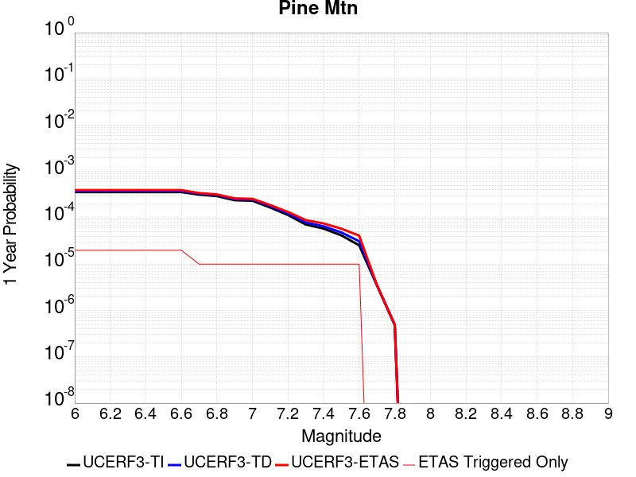 |  |

| Magnitude | 1 wk TI Prob | 1 wk TD Prob | 1 wk ETAS Prob | 1 wk ETAS/TD Gain | 1 wk ETAS Triggered Only | 1 mo TI Prob | 1 mo TD Prob | 1 mo ETAS Prob | 1 mo ETAS/TD Gain | 1 mo ETAS Triggered Only | 1 yr TI Prob | 1 yr TD Prob | 1 yr ETAS Prob | 1 yr ETAS/TD Gain | 1 yr ETAS Triggered Only | 10 yr TI Prob | 10 yr TD Prob | 10 yr ETAS Prob | 10 yr ETAS/TD Gain | 10 yr ETAS Triggered Only |
|-----|-----|-----|-----|-----|-----|-----|-----|-----|-----|-----|-----|-----|-----|-----|-----|-----|-----|-----|-----|-----|
| 6.0 | 6.894797E-6 | 7.225567E-6 | 7.225567E-6 | 1.0 | 0.0 | 2.9548795E-5 | 3.0966366E-5 | 3.0966366E-5 | 1.0 | 0.0 | 3.596972E-4 | 3.7695325E-4 | 3.9694572E-4 | 1.0530369 | 2.0E-5 | 0.0035911554 | 0.0037634359 | 0.0037833606 | 1.0052943 | 2.0E-5 |
| 6.1 | 6.894797E-6 | 7.225567E-6 | 7.225567E-6 | 1.0 | 0.0 | 2.9548795E-5 | 3.0966366E-5 | 3.0966366E-5 | 1.0 | 0.0 | 3.596972E-4 | 3.7695325E-4 | 3.9694572E-4 | 1.0530369 | 2.0E-5 | 0.0035911554 | 0.0037634359 | 0.0037833606 | 1.0052943 | 2.0E-5 |
| 6.2 | 6.894797E-6 | 7.225567E-6 | 7.225567E-6 | 1.0 | 0.0 | 2.9548795E-5 | 3.0966366E-5 | 3.0966366E-5 | 1.0 | 0.0 | 3.596972E-4 | 3.7695325E-4 | 3.9694572E-4 | 1.0530369 | 2.0E-5 | 0.0035911554 | 0.0037634359 | 0.0037833606 | 1.0052943 | 2.0E-5 |
| 6.3 | 6.894797E-6 | 7.225567E-6 | 7.225567E-6 | 1.0 | 0.0 | 2.9548795E-5 | 3.0966366E-5 | 3.0966366E-5 | 1.0 | 0.0 | 3.596972E-4 | 3.7695325E-4 | 3.9694572E-4 | 1.0530369 | 2.0E-5 | 0.0035911554 | 0.0037634359 | 0.0037833606 | 1.0052943 | 2.0E-5 |
| 6.4 | 6.894797E-6 | 7.225567E-6 | 7.225567E-6 | 1.0 | 0.0 | 2.9548795E-5 | 3.0966366E-5 | 3.0966366E-5 | 1.0 | 0.0 | 3.596972E-4 | 3.7695325E-4 | 3.9694572E-4 | 1.0530369 | 2.0E-5 | 0.0035911554 | 0.0037634359 | 0.0037833606 | 1.0052943 | 2.0E-5 |
| 6.5 | 6.894797E-6 | 7.225567E-6 | 7.225567E-6 | 1.0 | 0.0 | 2.9548795E-5 | 3.0966366E-5 | 3.0966366E-5 | 1.0 | 0.0 | 3.596972E-4 | 3.7695325E-4 | 3.9694572E-4 | 1.0530369 | 2.0E-5 | 0.0035911554 | 0.0037634359 | 0.0037833606 | 1.0052943 | 2.0E-5 |
| 6.6 | 6.894797E-6 | 7.225567E-6 | 7.225567E-6 | 1.0 | 0.0 | 2.9548795E-5 | 3.0966366E-5 | 3.0966366E-5 | 1.0 | 0.0 | 3.596972E-4 | 3.7695325E-4 | 3.9694572E-4 | 1.0530369 | 2.0E-5 | 0.0035911554 | 0.0037634359 | 0.0037833606 | 1.0052943 | 2.0E-5 |
| 6.7 | 6.0867933E-6 | 6.397216E-6 | 6.397216E-6 | 1.0 | 0.0 | 2.6085996E-5 | 2.7416365E-5 | 2.7416365E-5 | 1.0 | 0.0 | 3.1755073E-4 | 3.3374532E-4 | 3.4374197E-4 | 1.029953 | 1.0E-5 | 0.0031709734 | 0.00333266 | 0.0033426266 | 1.0029906 | 1.0E-5 |
| 6.8 | 5.6530425E-6 | 5.950697E-6 | 5.950697E-6 | 1.0 | 0.0 | 2.42271E-5 | 2.5502748E-5 | 2.5502748E-5 | 1.0 | 0.0 | 2.94925E-4 | 3.104538E-4 | 3.2045066E-4 | 1.0322009 | 1.0E-5 | 0.002945339 | 0.0031004054 | 0.0031103746 | 1.0032154 | 1.0E-5 |
| 6.9 | 4.6015225E-6 | 4.8639304E-6 | 4.8639304E-6 | 1.0 | 0.0 | 1.9720663E-5 | 2.0845258E-5 | 2.0845258E-5 | 1.0 | 0.0 | 2.4007261E-4 | 2.537629E-4 | 2.6376036E-4 | 1.0393969 | 1.0E-5 | 0.0023981342 | 0.0025348756 | 0.0025448503 | 1.003935 | 1.0E-5 |
| 7.0 | 4.4875965E-6 | 4.747569E-6 | 4.747569E-6 | 1.0 | 0.0 | 1.9232413E-5 | 2.0346575E-5 | 2.0346575E-5 | 1.0 | 0.0 | 2.3412947E-4 | 2.4769283E-4 | 2.5769035E-4 | 1.0403626 | 1.0E-5 | 0.0023388295 | 0.0024743115 | 0.0024842867 | 1.0040315 | 1.0E-5 |
| 7.1 | 3.203907E-6 | 3.429501E-6 | 3.429501E-6 | 1.0 | 0.0 | 1.3730958E-5 | 1.4697782E-5 | 1.4697782E-5 | 1.0 | 0.0 | 1.6716159E-4 | 1.7893147E-4 | 1.8892968E-4 | 1.0558773 | 1.0E-5 | 0.0016703589 | 0.0017879402 | 0.0017979223 | 1.005583 | 1.0E-5 |
| 7.2 | 2.2060601E-6 | 2.3785537E-6 | 2.3785537E-6 | 1.0 | 0.0 | 9.4545085E-6 | 1.0193765E-5 | 1.0193765E-5 | 1.0 | 0.0 | 1.15102564E-4 | 1.2410247E-4 | 1.3410124E-4 | 1.0805686 | 1.0E-5 | 0.0011504296 | 0.0012403765 | 0.0012503641 | 1.0080521 | 1.0E-5 |
| 7.3 | 1.3765207E-6 | 1.5217132E-6 | 1.5217132E-6 | 1.0 | 0.0 | 5.899361E-6 | 6.5216122E-6 | 6.5216122E-6 | 1.0 | 0.0 | 7.182235E-5 | 7.9397825E-5 | 8.9397035E-5 | 1.125938 | 1.0E-5 | 7.1799144E-4 | 7.937037E-4 | 8.0369576E-4 | 1.0125892 | 1.0E-5 |
| 7.4 | 1.1245983E-6 | 1.2587666E-6 | 1.2587666E-6 | 1.0 | 0.0 | 4.819698E-6 | 5.3947033E-6 | 5.3947033E-6 | 1.0 | 0.0 | 5.8678244E-5 | 6.567862E-5 | 7.567796E-5 | 1.1522466 | 1.0E-5 | 5.866275E-4 | 6.566004E-4 | 6.6659384E-4 | 1.0152199 | 1.0E-5 |
| 7.5 | 8.031682E-7 | 9.2774985E-7 | 9.2774985E-7 | 1.0 | 0.0 | 3.4421448E-6 | 3.9760653E-6 | 3.9760653E-6 | 1.0 | 0.0 | 4.1907308E-5 | 4.8407586E-5 | 5.8407102E-5 | 1.2065692 | 1.0E-5 | 4.1899405E-4 | 4.8397717E-4 | 4.9397233E-4 | 1.0206522 | 1.0E-5 |
| 7.6 | 4.8953444E-7 | 6.003492E-7 | 6.003492E-7 | 1.0 | 0.0 | 2.098003E-6 | 2.572923E-6 | 2.572923E-6 | 1.0 | 0.0 | 2.5542888E-5 | 3.1324937E-5 | 4.1324623E-5 | 1.3192245 | 1.0E-5 | 2.5539953E-4 | 3.1321007E-4 | 3.2320694E-4 | 1.0319175 | 1.0E-5 |
| 7.7 | 6.634529E-8 | 6.788847E-8 | 6.788847E-8 | 1.0 | 0.0 | 2.843369E-7 | 2.9095054E-7 | 2.9095054E-7 | 1.0 | 0.0 | 3.4617963E-6 | 3.5423177E-6 | 3.5423177E-6 | 1.0 | 0.0 | 3.4617424E-5 | 3.542266E-5 | 3.542266E-5 | 1.0 | 0.0 |
| 7.8 | 9.235578E-9 | 9.488601E-9 | 9.488601E-9 | 1.0 | 0.0 | 3.9581046E-8 | 4.0665434E-8 | 4.0665434E-8 | 1.0 | 0.0 | 4.818991E-7 | 4.951016E-7 | 4.951016E-7 | 1.0 | 0.0 | 4.8189804E-6 | 4.9510063E-6 | 4.9510063E-6 | 1.0 | 0.0 |

## San Jacinto (Clark) rev
*[(top)](#table-of-contents)*

| 1 Week | 1 Month | 1 Year | 10 Year |
|-----|-----|-----|-----|
|  |  |  |  |

| Magnitude | 1 wk TI Prob | 1 wk TD Prob | 1 wk ETAS Prob | 1 wk ETAS/TD Gain | 1 wk ETAS Triggered Only | 1 mo TI Prob | 1 mo TD Prob | 1 mo ETAS Prob | 1 mo ETAS/TD Gain | 1 mo ETAS Triggered Only | 1 yr TI Prob | 1 yr TD Prob | 1 yr ETAS Prob | 1 yr ETAS/TD Gain | 1 yr ETAS Triggered Only | 10 yr TI Prob | 10 yr TD Prob | 10 yr ETAS Prob | 10 yr ETAS/TD Gain | 10 yr ETAS Triggered Only |
|-----|-----|-----|-----|-----|-----|-----|-----|-----|-----|-----|-----|-----|-----|-----|-----|-----|-----|-----|-----|-----|
| 6.0 | 4.482615E-5 | 2.1158266E-5 | 2.1158266E-5 | 1.0 | 0.0 | 1.9209793E-4 | 9.067519E-5 | 9.067519E-5 | 1.0 | 0.0 | 0.0023362834 | 0.0011034205 | 0.0011134095 | 1.0090528 | 1.0E-5 | 0.02311874 | 0.0114991795 | 0.01151895 | 1.0017192 | 2.0E-5 |
| 6.1 | 4.482615E-5 | 2.1158266E-5 | 2.1158266E-5 | 1.0 | 0.0 | 1.9209793E-4 | 9.067519E-5 | 9.067519E-5 | 1.0 | 0.0 | 0.0023362834 | 0.0011034205 | 0.0011134095 | 1.0090528 | 1.0E-5 | 0.02311874 | 0.0114991795 | 0.01151895 | 1.0017192 | 2.0E-5 |
| 6.2 | 4.482615E-5 | 2.1158266E-5 | 2.1158266E-5 | 1.0 | 0.0 | 1.9209793E-4 | 9.067519E-5 | 9.067519E-5 | 1.0 | 0.0 | 0.0023362834 | 0.0011034205 | 0.0011134095 | 1.0090528 | 1.0E-5 | 0.02311874 | 0.0114991795 | 0.01151895 | 1.0017192 | 2.0E-5 |
| 6.3 | 4.482615E-5 | 2.1158266E-5 | 2.1158266E-5 | 1.0 | 0.0 | 1.9209793E-4 | 9.067519E-5 | 9.067519E-5 | 1.0 | 0.0 | 0.0023362834 | 0.0011034205 | 0.0011134095 | 1.0090528 | 1.0E-5 | 0.02311874 | 0.0114991795 | 0.01151895 | 1.0017192 | 2.0E-5 |
| 6.4 | 4.482615E-5 | 2.1158266E-5 | 2.1158266E-5 | 1.0 | 0.0 | 1.9209793E-4 | 9.067519E-5 | 9.067519E-5 | 1.0 | 0.0 | 0.0023362834 | 0.0011034205 | 0.0011134095 | 1.0090528 | 1.0E-5 | 0.02311874 | 0.0114991795 | 0.01151895 | 1.0017192 | 2.0E-5 |
| 6.5 | 3.7294863E-5 | 1.7359873E-5 | 1.7359873E-5 | 1.0 | 0.0 | 1.5982533E-4 | 7.4397365E-5 | 7.4397365E-5 | 1.0 | 0.0 | 0.0019441366 | 9.05416E-4 | 9.154069E-4 | 1.0110346 | 1.0E-5 | 0.01927216 | 0.009499401 | 0.009519211 | 1.0020854 | 2.0E-5 |
| 6.6 | 3.7294863E-5 | 1.7359873E-5 | 1.7359873E-5 | 1.0 | 0.0 | 1.5982533E-4 | 7.4397365E-5 | 7.4397365E-5 | 1.0 | 0.0 | 0.0019441366 | 9.05416E-4 | 9.154069E-4 | 1.0110346 | 1.0E-5 | 0.01927216 | 0.009499401 | 0.009519211 | 1.0020854 | 2.0E-5 |
| 6.7 | 3.6039248E-5 | 1.6607892E-5 | 1.6607892E-5 | 1.0 | 0.0 | 1.5444479E-4 | 7.1174756E-5 | 7.1174756E-5 | 1.0 | 0.0 | 0.0018787434 | 8.662123E-4 | 8.7620365E-4 | 1.0115346 | 1.0E-5 | 0.01862939 | 0.009098875 | 0.009118694 | 1.0021781 | 2.0E-5 |
| 6.8 | 3.5031844E-5 | 1.623633E-5 | 1.623633E-5 | 1.0 | 0.0 | 1.5012783E-4 | 6.958244E-5 | 6.958244E-5 | 1.0 | 0.0 | 0.0018262739 | 8.46841E-4 | 8.5683254E-4 | 1.0117986 | 1.0E-5 | 0.01811338 | 0.008899476 | 0.008919298 | 1.0022273 | 2.0E-5 |
| 6.9 | 3.435112E-5 | 1.6066866E-5 | 1.6066866E-5 | 1.0 | 0.0 | 1.4721078E-4 | 6.88562E-5 | 6.88562E-5 | 1.0 | 0.0 | 0.0017908178 | 8.380059E-4 | 8.4799755E-4 | 1.0119231 | 1.0E-5 | 0.017764548 | 0.008805986 | 0.008825809 | 1.0022511 | 2.0E-5 |
| 7.0 | 2.8959772E-5 | 1.4340704E-5 | 1.4340704E-5 | 1.0 | 0.0 | 1.241074E-4 | 6.145873E-5 | 6.145873E-5 | 1.0 | 0.0 | 0.0015099603 | 7.480059E-4 | 7.5799844E-4 | 1.0133588 | 1.0E-5 | 0.014997416 | 0.00787791 | 0.007897752 | 1.0025188 | 2.0E-5 |
| 7.1 | 2.6002877E-5 | 1.2832878E-5 | 1.2832878E-5 | 1.0 | 0.0 | 1.11436144E-4 | 5.49969E-5 | 5.49969E-5 | 1.0 | 0.0 | 0.0013558907 | 6.693837E-4 | 6.79377E-4 | 1.014929 | 1.0E-5 | 0.013476475 | 0.0070536323 | 0.0070734913 | 1.0028154 | 2.0E-5 |
| 7.2 | 2.2544838E-5 | 1.1265443E-5 | 1.1265443E-5 | 1.0 | 0.0 | 9.661716E-5 | 4.8279588E-5 | 4.8279588E-5 | 1.0 | 0.0 | 0.001175679 | 5.876469E-4 | 5.97641E-4 | 1.017007 | 1.0E-5 | 0.011694785 | 0.006195283 | 0.0062151593 | 1.0032083 | 2.0E-5 |
| 7.3 | 1.75334E-5 | 1.081565E-5 | 1.081565E-5 | 1.0 | 0.0 | 7.514098E-5 | 4.6351972E-5 | 4.6351972E-5 | 1.0 | 0.0 | 9.144575E-4 | 5.641905E-4 | 5.741849E-4 | 1.0177145 | 1.0E-5 | 0.009107036 | 0.005935912 | 0.005955793 | 1.0033493 | 2.0E-5 |
| 7.4 | 1.5924552E-5 | 1.0615435E-5 | 1.0615435E-5 | 1.0 | 0.0 | 6.82463E-5 | 4.5493933E-5 | 4.5493933E-5 | 1.0 | 0.0 | 8.305819E-4 | 5.5374927E-4 | 5.637437E-4 | 1.0180488 | 1.0E-5 | 0.008274844 | 0.0058232066 | 0.0058430904 | 1.0034145 | 2.0E-5 |
| 7.5 | 1.3428931E-5 | 9.855765E-6 | 9.855765E-6 | 1.0 | 0.0 | 5.7551293E-5 | 4.2238313E-5 | 4.2238313E-5 | 1.0 | 0.0 | 7.004617E-4 | 5.141312E-4 | 5.2412605E-4 | 1.0194403 | 1.0E-5 | 0.006982579 | 0.005408683 | 0.005428575 | 1.0036777 | 2.0E-5 |
| 7.6 | 1.0688787E-5 | 8.618602E-6 | 8.618602E-6 | 1.0 | 0.0 | 4.5808283E-5 | 3.6936344E-5 | 3.6936344E-5 | 1.0 | 0.0 | 5.5757316E-4 | 4.4960767E-4 | 4.5960318E-4 | 1.0222316 | 1.0E-5 | 0.005561762 | 0.004743673 | 0.004763578 | 1.0041962 | 2.0E-5 |
| 7.7 | 8.81236E-6 | 7.471723E-6 | 7.471723E-6 | 1.0 | 0.0 | 3.776671E-5 | 3.202128E-5 | 3.202128E-5 | 1.0 | 0.0 | 4.597127E-4 | 3.8978952E-4 | 3.9978564E-4 | 1.0256449 | 1.0E-5 | 0.0045876284 | 0.004136559 | 0.0041564764 | 1.004815 | 2.0E-5 |
| 7.8 | 7.780431E-6 | 6.7000988E-6 | 6.7000988E-6 | 1.0 | 0.0 | 3.3344273E-5 | 2.8714394E-5 | 2.8714394E-5 | 1.0 | 0.0 | 4.0589093E-4 | 3.4954186E-4 | 3.5953836E-4 | 1.0285989 | 1.0E-5 | 0.0040515037 | 0.0037245536 | 0.003744479 | 1.0053498 | 2.0E-5 |
| 7.9 | 6.5437994E-6 | 5.7836955E-6 | 5.7836955E-6 | 1.0 | 0.0 | 2.8044553E-5 | 2.4787032E-5 | 2.4787032E-5 | 1.0 | 0.0 | 3.4138895E-4 | 3.0174048E-4 | 3.1173747E-4 | 1.033131 | 1.0E-5 | 0.0034086495 | 0.0032361387 | 0.003256074 | 1.0061603 | 2.0E-5 |
| 8.0 | 5.4488164E-6 | 4.8162797E-6 | 4.8162797E-6 | 1.0 | 0.0 | 2.3351862E-5 | 2.0641035E-5 | 2.0641035E-5 | 1.0 | 0.0 | 2.8427184E-4 | 2.5127578E-4 | 2.6127326E-4 | 1.0397869 | 1.0E-5 | 0.0028390845 | 0.0027122858 | 0.0027322315 | 1.0073539 | 2.0E-5 |
| 8.1 | 2.8397242E-6 | 1.3679883E-6 | 1.3679883E-6 | 1.0 | 0.0 | 1.217019E-5 | 5.8627934E-6 | 5.8627934E-6 | 1.0 | 0.0 | 1.4816198E-4 | 7.137719E-5 | 8.137647E-5 | 1.1400908 | 1.0E-5 | 0.0014806325 | 8.120884E-4 | 8.220803E-4 | 1.012304 | 1.0E-5 |
| 8.2 | 2.030244E-6 | 6.323106E-7 | 6.323106E-7 | 1.0 | 0.0 | 8.701017E-6 | 2.7099E-6 | 2.7099E-6 | 1.0 | 0.0 | 1.05929736E-4 | 3.2992535E-5 | 3.2992535E-5 | 1.0 | 0.0 | 0.0010587925 | 3.9508488E-4 | 3.9508488E-4 | 1.0 | 0.0 |
| 8.3 | 1.0659804E-6 | 2.926802E-7 | 2.926802E-7 | 1.0 | 0.0 | 4.568479E-6 | 1.2543431E-6 | 1.2543431E-6 | 1.0 | 0.0 | 5.5619817E-5 | 1.5271524E-5 | 1.5271524E-5 | 1.0 | 0.0 | 5.5605895E-4 | 1.8576543E-4 | 1.8576543E-4 | 1.0 | 0.0 |

## San Diego Trough south
*[(top)](#table-of-contents)*

| 1 Week | 1 Month | 1 Year | 10 Year |
|-----|-----|-----|-----|
|  |  |  | 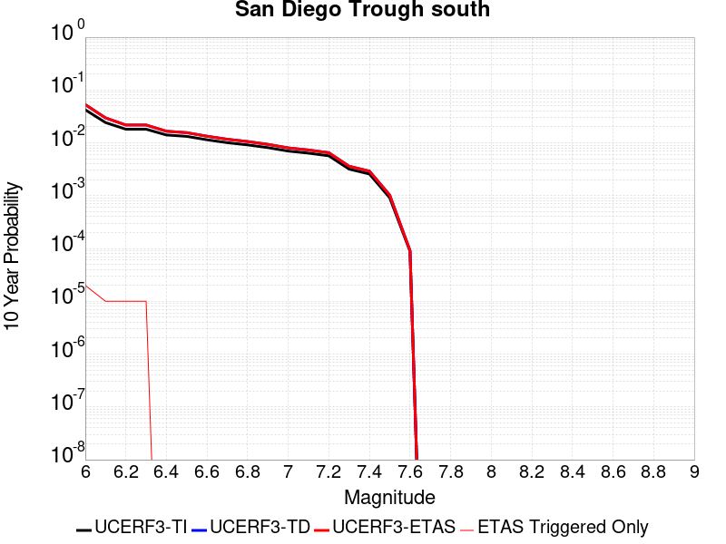 |

| Magnitude | 1 wk TI Prob | 1 wk TD Prob | 1 wk ETAS Prob | 1 wk ETAS/TD Gain | 1 wk ETAS Triggered Only | 1 mo TI Prob | 1 mo TD Prob | 1 mo ETAS Prob | 1 mo ETAS/TD Gain | 1 mo ETAS Triggered Only | 1 yr TI Prob | 1 yr TD Prob | 1 yr ETAS Prob | 1 yr ETAS/TD Gain | 1 yr ETAS Triggered Only | 10 yr TI Prob | 10 yr TD Prob | 10 yr ETAS Prob | 10 yr ETAS/TD Gain | 10 yr ETAS Triggered Only |
|-----|-----|-----|-----|-----|-----|-----|-----|-----|-----|-----|-----|-----|-----|-----|-----|-----|-----|-----|-----|-----|
| 6.0 | 8.279495E-5 | 1.0425905E-4 | 1.0425905E-4 | 1.0 | 0.0 | 3.5478722E-4 | 4.4675023E-4 | 4.5674577E-4 | 1.0223739 | 1.0E-5 | 0.004310982 | 0.0054260944 | 0.005445986 | 1.0036659 | 2.0E-5 | 0.042283054 | 0.052994724 | 0.053013664 | 1.0003574 | 2.0E-5 |
| 6.1 | 4.6961468E-5 | 5.773192E-5 | 5.773192E-5 | 1.0 | 0.0 | 2.0124791E-4 | 2.4739734E-4 | 2.4739734E-4 | 1.0 | 0.0 | 0.00244744 | 0.0030079763 | 0.0030179464 | 1.0033145 | 1.0E-5 | 0.024206603 | 0.02968051 | 0.029690212 | 1.0003269 | 1.0E-5 |
| 6.2 | 3.5079658E-5 | 4.2143583E-5 | 4.2143583E-5 | 1.0 | 0.0 | 1.5033272E-4 | 1.8060306E-4 | 1.8060306E-4 | 1.0 | 0.0 | 0.0018287642 | 0.0021966458 | 0.0022066238 | 1.0045424 | 1.0E-5 | 0.018137876 | 0.021751761 | 0.021761544 | 1.0004498 | 1.0E-5 |
| 6.3 | 3.5079658E-5 | 4.2143583E-5 | 4.2143583E-5 | 1.0 | 0.0 | 1.5033272E-4 | 1.8060306E-4 | 1.8060306E-4 | 1.0 | 0.0 | 0.0018287642 | 0.0021966458 | 0.0022066238 | 1.0045424 | 1.0E-5 | 0.018137876 | 0.021751761 | 0.021761544 | 1.0004498 | 1.0E-5 |
| 6.4 | 2.7196904E-5 | 3.2087904E-5 | 3.2087904E-5 | 1.0 | 0.0 | 1.16552954E-4 | 1.3751238E-4 | 1.3751238E-4 | 1.0 | 0.0 | 0.0014181085 | 0.0016729396 | 0.0016729396 | 1.0 | 0.0 | 0.014090929 | 0.01660506 | 0.01660506 | 1.0 | 0.0 |
| 6.5 | 2.5584688E-5 | 3.0102321E-5 | 3.0102321E-5 | 1.0 | 0.0 | 1.0964406E-4 | 1.290036E-4 | 1.290036E-4 | 1.0 | 0.0 | 0.0013340989 | 0.0015694996 | 0.0015694996 | 1.0 | 0.0 | 0.013261181 | 0.015585696 | 0.015585696 | 1.0 | 0.0 |
| 6.6 | 2.2034688E-5 | 2.574329E-5 | 2.574329E-5 | 1.0 | 0.0 | 9.443096E-5 | 1.10323745E-4 | 1.10323745E-4 | 1.0 | 0.0 | 0.0011490905 | 0.0013423713 | 0.0013423713 | 1.0 | 0.0 | 0.011431668 | 0.013343622 | 0.013343622 | 1.0 | 0.0 |
| 6.7 | 1.9394853E-5 | 2.254225E-5 | 2.254225E-5 | 1.0 | 0.0 | 8.311815E-5 | 9.660609E-5 | 9.660609E-5 | 1.0 | 0.0 | 0.0010114936 | 0.0011755498 | 0.0011755498 | 1.0 | 0.0 | 0.01006902 | 0.011694018 | 0.011694018 | 1.0 | 0.0 |
| 6.8 | 1.7615313E-5 | 2.0403613E-5 | 2.0403613E-5 | 1.0 | 0.0 | 7.549201E-5 | 8.744115E-5 | 8.744115E-5 | 1.0 | 0.0 | 9.1872766E-4 | 0.0010640804 | 0.0010640804 | 1.0 | 0.0 | 0.009149387 | 0.01059042 | 0.01059042 | 1.0 | 0.0 |
| 6.9 | 1.5621423E-5 | 1.8026485E-5 | 1.8026485E-5 | 1.0 | 0.0 | 6.6947236E-5 | 7.7254095E-5 | 7.7254095E-5 | 1.0 | 0.0 | 8.147778E-4 | 9.401663E-4 | 9.401663E-4 | 1.0 | 0.0 | 0.008117969 | 0.0093623325 | 0.0093623325 | 1.0 | 0.0 |
| 7.0 | 1.3444376E-5 | 1.5448395E-5 | 1.5448395E-5 | 1.0 | 0.0 | 5.7617483E-5 | 6.620574E-5 | 6.620574E-5 | 1.0 | 0.0 | 7.0126704E-4 | 8.057596E-4 | 8.057596E-4 | 1.0 | 0.0 | 0.006990582 | 0.008028714 | 0.008028714 | 1.0 | 0.0 |
| 7.1 | 1.2268361E-5 | 1.40733055E-5 | 1.40733055E-5 | 1.0 | 0.0 | 5.2577634E-5 | 6.031279E-5 | 6.031279E-5 | 1.0 | 0.0 | 6.399447E-4 | 7.3406345E-4 | 7.3406345E-4 | 1.0 | 0.0 | 0.0063810493 | 0.007316692 | 0.007316692 | 1.0 | 0.0 |
| 7.2 | 1.0922655E-5 | 1.2513806E-5 | 1.2513806E-5 | 1.0 | 0.0 | 4.681054E-5 | 5.362951E-5 | 5.362951E-5 | 1.0 | 0.0 | 5.697693E-4 | 6.527462E-4 | 6.527462E-4 | 1.0 | 0.0 | 0.0056831064 | 0.0065085697 | 0.0065085697 | 1.0 | 0.0 |
| 7.3 | 6.1106753E-6 | 6.9290486E-6 | 6.9290486E-6 | 1.0 | 0.0 | 2.6188345E-5 | 2.9695586E-5 | 2.9695586E-5 | 1.0 | 0.0 | 3.1879646E-4 | 3.6148418E-4 | 3.6148418E-4 | 1.0 | 0.0 | 0.0031833951 | 0.0036090072 | 0.0036090072 | 1.0 | 0.0 |
| 7.4 | 4.933187E-6 | 5.5896517E-6 | 5.5896517E-6 | 1.0 | 0.0 | 2.114206E-5 | 2.3955432E-5 | 2.3955432E-5 | 1.0 | 0.0 | 2.5737417E-4 | 2.9161875E-4 | 2.9161875E-4 | 1.0 | 0.0 | 0.002570763 | 0.002912402 | 0.002912402 | 1.0 | 0.0 |
| 7.5 | 1.7489613E-6 | 1.9697113E-6 | 1.9697113E-6 | 1.0 | 0.0 | 7.495527E-6 | 8.441594E-6 | 8.441594E-6 | 1.0 | 0.0 | 9.125422E-5 | 1.0277178E-4 | 1.0277178E-4 | 1.0 | 0.0 | 9.1216754E-4 | 0.0010272645 | 0.0010272645 | 1.0 | 0.0 |
| 7.6 | 1.6988751E-7 | 1.7533898E-7 | 1.7533898E-7 | 1.0 | 0.0 | 7.2808916E-7 | 7.5145255E-7 | 7.5145255E-7 | 1.0 | 0.0 | 8.864449E-6 | 9.148898E-6 | 9.148898E-6 | 1.0 | 0.0 | 8.8640954E-5 | 9.148542E-5 | 9.148542E-5 | 1.0 | 0.0 |

## Rinconada 2011 CFM
*[(top)](#table-of-contents)*

| 1 Week | 1 Month | 1 Year | 10 Year |
|-----|-----|-----|-----|
|  |  |  |  |

| Magnitude | 1 wk TI Prob | 1 wk TD Prob | 1 wk ETAS Prob | 1 wk ETAS/TD Gain | 1 wk ETAS Triggered Only | 1 mo TI Prob | 1 mo TD Prob | 1 mo ETAS Prob | 1 mo ETAS/TD Gain | 1 mo ETAS Triggered Only | 1 yr TI Prob | 1 yr TD Prob | 1 yr ETAS Prob | 1 yr ETAS/TD Gain | 1 yr ETAS Triggered Only | 10 yr TI Prob | 10 yr TD Prob | 10 yr ETAS Prob | 10 yr ETAS/TD Gain | 10 yr ETAS Triggered Only |
|-----|-----|-----|-----|-----|-----|-----|-----|-----|-----|-----|-----|-----|-----|-----|-----|-----|-----|-----|-----|-----|
| 6.0 | 1.5752368E-5 | 1.6274787E-5 | 1.6274787E-5 | 1.0 | 0.0 | 6.75084E-5 | 6.974724E-5 | 6.974724E-5 | 1.0 | 0.0 | 8.2160486E-4 | 8.48845E-4 | 8.48845E-4 | 1.0 | 0.0 | 0.008185739 | 0.008456407 | 0.008476238 | 1.0023451 | 2.0E-5 |
| 6.1 | 1.0966133E-5 | 1.1323078E-5 | 1.1323078E-5 | 1.0 | 0.0 | 4.6996865E-5 | 4.852658E-5 | 4.852658E-5 | 1.0 | 0.0 | 5.720366E-4 | 5.906517E-4 | 5.906517E-4 | 1.0 | 0.0 | 0.0057056635 | 0.0058909147 | 0.0059008556 | 1.0016875 | 1.0E-5 |
| 6.2 | 1.0966133E-5 | 1.1323078E-5 | 1.1323078E-5 | 1.0 | 0.0 | 4.6996865E-5 | 4.852658E-5 | 4.852658E-5 | 1.0 | 0.0 | 5.720366E-4 | 5.906517E-4 | 5.906517E-4 | 1.0 | 0.0 | 0.0057056635 | 0.0058909147 | 0.0059008556 | 1.0016875 | 1.0E-5 |
| 6.3 | 8.926149E-6 | 9.212811E-6 | 9.212811E-6 | 1.0 | 0.0 | 3.8254362E-5 | 3.9482882E-5 | 3.9482882E-5 | 1.0 | 0.0 | 4.6564735E-4 | 4.805984E-4 | 4.805984E-4 | 1.0 | 0.0 | 0.0046467283 | 0.004795635 | 0.004805587 | 1.0020752 | 1.0E-5 |
| 6.4 | 7.676955E-6 | 7.920225E-6 | 7.920225E-6 | 1.0 | 0.0 | 3.290082E-5 | 3.394338E-5 | 3.394338E-5 | 1.0 | 0.0 | 4.0049385E-4 | 4.1318245E-4 | 4.1318245E-4 | 1.0 | 0.0 | 0.0039977287 | 0.004124169 | 0.0041341274 | 1.0024147 | 1.0E-5 |
| 6.5 | 6.1671026E-6 | 6.358982E-6 | 6.358982E-6 | 1.0 | 0.0 | 2.6430173E-5 | 2.7252494E-5 | 2.7252494E-5 | 1.0 | 0.0 | 3.2173982E-4 | 3.3174868E-4 | 3.3174868E-4 | 1.0 | 0.0 | 0.003212744 | 0.0033125465 | 0.0033225133 | 1.0030088 | 1.0E-5 |
| 6.6 | 5.553456E-6 | 5.7248367E-6 | 5.7248367E-6 | 1.0 | 0.0 | 2.3800309E-5 | 2.4534784E-5 | 2.4534784E-5 | 1.0 | 0.0 | 2.897302E-4 | 2.9867011E-4 | 2.9867011E-4 | 1.0 | 0.0 | 0.0028935277 | 0.0029826956 | 0.0029926659 | 1.0033426 | 1.0E-5 |
| 6.7 | 4.787857E-6 | 4.93333E-6 | 4.93333E-6 | 1.0 | 0.0 | 2.0519226E-5 | 2.1142672E-5 | 2.1142672E-5 | 1.0 | 0.0 | 2.4979294E-4 | 2.5738167E-4 | 2.5738167E-4 | 1.0 | 0.0 | 0.0024951235 | 0.0025708415 | 0.0025808157 | 1.0038798 | 1.0E-5 |
| 6.8 | 3.9955166E-6 | 4.1134927E-6 | 4.1134927E-6 | 1.0 | 0.0 | 1.7123532E-5 | 1.7629136E-5 | 1.7629136E-5 | 1.0 | 0.0 | 2.0845905E-4 | 2.1461361E-4 | 2.1461361E-4 | 1.0 | 0.0 | 0.002082636 | 0.0021440673 | 0.0021540457 | 1.004654 | 1.0E-5 |
| 6.9 | 3.4250072E-6 | 3.5224602E-6 | 3.5224602E-6 | 1.0 | 0.0 | 1.46785205E-5 | 1.50961705E-5 | 1.50961705E-5 | 1.0 | 0.0 | 1.7869633E-4 | 1.837804E-4 | 1.837804E-4 | 1.0 | 0.0 | 0.001785527 | 0.0018362866 | 0.0018462683 | 1.0054358 | 1.0E-5 |
| 7.0 | 2.7712713E-6 | 2.846711E-6 | 2.846711E-6 | 1.0 | 0.0 | 1.1876823E-5 | 1.2200132E-5 | 1.2200132E-5 | 1.0 | 0.0 | 1.4459073E-4 | 1.485265E-4 | 1.485265E-4 | 1.0 | 0.0 | 0.0014449668 | 0.0014842738 | 0.001494259 | 1.0067273 | 1.0E-5 |
| 7.1 | 2.227358E-6 | 2.285707E-6 | 2.285707E-6 | 1.0 | 0.0 | 9.545785E-6 | 9.79585E-6 | 9.79585E-6 | 1.0 | 0.0 | 1.16213734E-4 | 1.1925796E-4 | 1.1925796E-4 | 1.0 | 0.0 | 0.0011615298 | 0.0011919406 | 0.0012019287 | 1.0083797 | 1.0E-5 |
| 7.2 | 1.581796E-6 | 1.620907E-6 | 1.620907E-6 | 1.0 | 0.0 | 6.779108E-6 | 6.946726E-6 | 6.946726E-6 | 1.0 | 0.0 | 8.253252E-5 | 8.457311E-5 | 8.457311E-5 | 1.0 | 0.0 | 8.250187E-4 | 8.454098E-4 | 8.5540133E-4 | 1.0118185 | 1.0E-5 |
| 7.3 | 1.0306567E-6 | 1.0546515E-6 | 1.0546515E-6 | 1.0 | 0.0 | 4.4170924E-6 | 4.519927E-6 | 4.519927E-6 | 1.0 | 0.0 | 5.3776774E-5 | 5.5028726E-5 | 5.5028726E-5 | 1.0 | 0.0 | 5.376376E-4 | 5.501513E-4 | 5.6014577E-4 | 1.0181668 | 1.0E-5 |
| 7.4 | 6.535541E-7 | 6.6827675E-7 | 6.6827675E-7 | 1.0 | 0.0 | 2.800943E-6 | 2.8640402E-6 | 2.8640402E-6 | 1.0 | 0.0 | 3.4100947E-5 | 3.4869132E-5 | 3.4869132E-5 | 1.0 | 0.0 | 3.4095717E-4 | 3.4863673E-4 | 3.4863673E-4 | 1.0 | 0.0 |
| 7.5 | 3.2656962E-7 | 3.3316834E-7 | 3.3316834E-7 | 1.0 | 0.0 | 1.3995833E-6 | 1.4278635E-6 | 1.4278635E-6 | 1.0 | 0.0 | 1.7039794E-5 | 1.73841E-5 | 1.73841E-5 | 1.0 | 0.0 | 1.7038487E-4 | 1.7382744E-4 | 1.7382744E-4 | 1.0 | 0.0 |
| 7.6 | 9.754343E-8 | 9.821057E-8 | 9.821057E-8 | 1.0 | 0.0 | 4.180432E-7 | 4.2090235E-7 | 4.2090235E-7 | 1.0 | 0.0 | 5.089664E-6 | 5.1244742E-6 | 5.1244742E-6 | 1.0 | 0.0 | 5.0895473E-5 | 5.124357E-5 | 5.124357E-5 | 1.0 | 0.0 |
| 7.7 | 6.0001453E-9 | 5.84914E-9 | 5.84914E-9 | 1.0 | 0.0 | 2.5714908E-8 | 2.5067743E-8 | 2.5067743E-8 | 1.0 | 0.0 | 3.1307894E-7 | 3.0519973E-7 | 3.0519973E-7 | 1.0 | 0.0 | 3.1307852E-6 | 3.0519934E-6 | 3.0519934E-6 | 1.0 | 0.0 |
| 7.8 | 7.400003E-11 | 7.4654505E-11 | 7.4654505E-11 | 1.0 | 0.0 | 3.171432E-10 | 3.1994807E-10 | 3.1994807E-10 | 1.0 | 0.0 | 3.861218E-9 | 3.8953676E-9 | 3.8953676E-9 | 1.0 | 0.0 | 3.861218E-8 | 3.8953676E-8 | 3.8953676E-8 | 1.0 | 0.0 |

## Simi-Santa Rosa
*[(top)](#table-of-contents)*

| 1 Week | 1 Month | 1 Year | 10 Year |
|-----|-----|-----|-----|
|  |  |  |  |

| Magnitude | 1 wk TI Prob | 1 wk TD Prob | 1 wk ETAS Prob | 1 wk ETAS/TD Gain | 1 wk ETAS Triggered Only | 1 mo TI Prob | 1 mo TD Prob | 1 mo ETAS Prob | 1 mo ETAS/TD Gain | 1 mo ETAS Triggered Only | 1 yr TI Prob | 1 yr TD Prob | 1 yr ETAS Prob | 1 yr ETAS/TD Gain | 1 yr ETAS Triggered Only | 10 yr TI Prob | 10 yr TD Prob | 10 yr ETAS Prob | 10 yr ETAS/TD Gain | 10 yr ETAS Triggered Only |
|-----|-----|-----|-----|-----|-----|-----|-----|-----|-----|-----|-----|-----|-----|-----|-----|-----|-----|-----|-----|-----|
| 6.0 | 2.198912E-5 | 2.227584E-5 | 2.227584E-5 | 1.0 | 0.0 | 9.4235686E-5 | 9.5464646E-5 | 9.5464646E-5 | 1.0 | 0.0 | 0.0011467156 | 0.0011617062 | 0.0011716945 | 1.008598 | 1.0E-5 | 0.011408163 | 0.011560781 | 0.011580549 | 1.0017099 | 2.0E-5 |
| 6.1 | 2.198912E-5 | 2.227584E-5 | 2.227584E-5 | 1.0 | 0.0 | 9.4235686E-5 | 9.5464646E-5 | 9.5464646E-5 | 1.0 | 0.0 | 0.0011467156 | 0.0011617062 | 0.0011716945 | 1.008598 | 1.0E-5 | 0.011408163 | 0.011560781 | 0.011580549 | 1.0017099 | 2.0E-5 |
| 6.2 | 1.69983E-5 | 1.6668866E-5 | 1.6668866E-5 | 1.0 | 0.0 | 7.284782E-5 | 7.14362E-5 | 7.14362E-5 | 1.0 | 0.0 | 8.865613E-4 | 8.694179E-4 | 8.694179E-4 | 1.0 | 0.0 | 0.008830327 | 0.008663086 | 0.008672999 | 1.0011443 | 1.0E-5 |
| 6.3 | 1.69983E-5 | 1.6668866E-5 | 1.6668866E-5 | 1.0 | 0.0 | 7.284782E-5 | 7.14362E-5 | 7.14362E-5 | 1.0 | 0.0 | 8.865613E-4 | 8.694179E-4 | 8.694179E-4 | 1.0 | 0.0 | 0.008830327 | 0.008663086 | 0.008672999 | 1.0011443 | 1.0E-5 |
| 6.4 | 1.4666188E-5 | 1.4052807E-5 | 1.4052807E-5 | 1.0 | 0.0 | 6.285358E-5 | 6.0225066E-5 | 6.0225066E-5 | 1.0 | 0.0 | 7.6497364E-4 | 7.330184E-4 | 7.330184E-4 | 1.0 | 0.0 | 0.0076234564 | 0.0073084813 | 0.0073184078 | 1.0013583 | 1.0E-5 |
| 6.5 | 1.4666188E-5 | 1.4052807E-5 | 1.4052807E-5 | 1.0 | 0.0 | 6.285358E-5 | 6.0225066E-5 | 6.0225066E-5 | 1.0 | 0.0 | 7.6497364E-4 | 7.330184E-4 | 7.330184E-4 | 1.0 | 0.0 | 0.0076234564 | 0.0073084813 | 0.0073184078 | 1.0013583 | 1.0E-5 |
| 6.6 | 1.4377586E-5 | 1.3729842E-5 | 1.3729842E-5 | 1.0 | 0.0 | 6.1616774E-5 | 5.8840993E-5 | 5.8840993E-5 | 1.0 | 0.0 | 7.4992597E-4 | 7.1617845E-4 | 7.1617845E-4 | 1.0 | 0.0 | 0.007474003 | 0.007141173 | 0.0071511013 | 1.0013903 | 1.0E-5 |
| 6.7 | 1.3881404E-5 | 1.3207801E-5 | 1.3207801E-5 | 1.0 | 0.0 | 5.9490372E-5 | 5.6603774E-5 | 5.6603774E-5 | 1.0 | 0.0 | 7.240546E-4 | 6.8895775E-4 | 6.8895775E-4 | 1.0 | 0.0 | 0.007217 | 0.0068706684 | 0.0068706684 | 1.0 | 0.0 |
| 6.8 | 1.0176516E-5 | 9.154335E-6 | 9.154335E-6 | 1.0 | 0.0 | 4.3612912E-5 | 3.923237E-5 | 3.923237E-5 | 1.0 | 0.0 | 5.308578E-4 | 4.7756598E-4 | 4.7756598E-4 | 1.0 | 0.0 | 0.0052959146 | 0.0047670305 | 0.0047670305 | 1.0 | 0.0 |
| 6.9 | 9.699797E-6 | 8.7748995E-6 | 8.7748995E-6 | 1.0 | 0.0 | 4.15699E-5 | 3.7606264E-5 | 3.7606264E-5 | 1.0 | 0.0 | 5.05996E-4 | 4.577765E-4 | 4.577765E-4 | 1.0 | 0.0 | 0.005048454 | 0.0045699533 | 0.0045699533 | 1.0 | 0.0 |
| 7.0 | 7.4049476E-6 | 6.5594745E-6 | 6.5594745E-6 | 1.0 | 0.0 | 3.1735104E-5 | 2.8111803E-5 | 2.8111803E-5 | 1.0 | 0.0 | 3.8630638E-4 | 3.422201E-4 | 3.422201E-4 | 1.0 | 0.0 | 0.0038563553 | 0.0034181732 | 0.0034181732 | 1.0 | 0.0 |
| 7.1 | 3.873439E-6 | 2.7595852E-6 | 2.7595852E-6 | 1.0 | 0.0 | 1.6600346E-5 | 1.1826742E-5 | 1.1826742E-5 | 1.0 | 0.0 | 2.0209046E-4 | 1.439813E-4 | 1.439813E-4 | 1.0 | 0.0 | 0.0020190678 | 0.0014389037 | 0.0014389037 | 1.0 | 0.0 |
| 7.2 | 3.417706E-6 | 2.3677217E-6 | 2.3677217E-6 | 1.0 | 0.0 | 1.4647229E-5 | 1.0147341E-5 | 1.0147341E-5 | 1.0 | 0.0 | 1.7831543E-4 | 1.2353709E-4 | 1.2353709E-4 | 1.0 | 0.0 | 0.0017817242 | 0.0012347065 | 0.0012347065 | 1.0 | 0.0 |
| 7.3 | 1.90225E-6 | 1.4074603E-6 | 1.4074603E-6 | 1.0 | 0.0 | 8.152474E-6 | 6.031959E-6 | 6.031959E-6 | 1.0 | 0.0 | 9.9251854E-5 | 7.343665E-5 | 7.343665E-5 | 1.0 | 0.0 | 9.920754E-4 | 7.34126E-4 | 7.34126E-4 | 1.0 | 0.0 |
| 7.4 | 1.5170556E-6 | 1.1025613E-6 | 1.1025613E-6 | 1.0 | 0.0 | 6.5016507E-6 | 4.7252547E-6 | 4.7252547E-6 | 1.0 | 0.0 | 7.915472E-5 | 5.7528465E-5 | 5.7528465E-5 | 1.0 | 0.0 | 7.9126534E-4 | 5.7513686E-4 | 5.7513686E-4 | 1.0 | 0.0 |
| 7.5 | 1.178732E-6 | 8.535918E-7 | 8.535918E-7 | 1.0 | 0.0 | 5.0516987E-6 | 3.6582455E-6 | 3.6582455E-6 | 1.0 | 0.0 | 6.1502695E-5 | 4.453824E-5 | 4.453824E-5 | 1.0 | 0.0 | 6.148568E-4 | 4.4529408E-4 | 4.4529408E-4 | 1.0 | 0.0 |
| 7.6 | 6.8722386E-7 | 4.79399E-7 | 4.79399E-7 | 1.0 | 0.0 | 2.9452417E-6 | 2.0545656E-6 | 2.0545656E-6 | 1.0 | 0.0 | 3.5857727E-5 | 2.501405E-5 | 2.501405E-5 | 1.0 | 0.0 | 3.5851944E-4 | 2.5011247E-4 | 2.5011247E-4 | 1.0 | 0.0 |
| 7.7 | 5.5126515E-7 | 3.673879E-7 | 3.673879E-7 | 1.0 | 0.0 | 2.3625628E-6 | 1.5745187E-6 | 1.5745187E-6 | 1.0 | 0.0 | 2.8763823E-5 | 1.9169596E-5 | 1.9169596E-5 | 1.0 | 0.0 | 2.87601E-4 | 1.9167954E-4 | 1.9167954E-4 | 1.0 | 0.0 |
| 7.8 | 3.3860243E-7 | 2.0081076E-7 | 2.0081076E-7 | 1.0 | 0.0 | 1.4511525E-6 | 8.6061726E-7 | 8.6061726E-7 | 1.0 | 0.0 | 1.7667637E-5 | 1.0477966E-5 | 1.0477966E-5 | 1.0 | 0.0 | 1.7666233E-4 | 1.04774765E-4 | 1.04774765E-4 | 1.0 | 0.0 |
| 7.9 | 2.7955386E-7 | 1.465409E-7 | 1.465409E-7 | 1.0 | 0.0 | 1.1980875E-6 | 6.280323E-7 | 6.280323E-7 | 1.0 | 0.0 | 1.4586617E-5 | 7.646267E-6 | 7.646267E-6 | 1.0 | 0.0 | 1.458566E-4 | 7.646008E-5 | 7.646008E-5 | 1.0 | 0.0 |
| 8.0 | 5.6259015E-8 | 3.335468E-8 | 3.335468E-8 | 1.0 | 0.0 | 2.4111003E-7 | 1.4294862E-7 | 1.4294862E-7 | 1.0 | 0.0 | 2.9355108E-6 | 1.7403981E-6 | 1.7403981E-6 | 1.0 | 0.0 | 2.935472E-5 | 1.740386E-5 | 1.740386E-5 | 1.0 | 0.0 |

## Emerson-Copper Mtn 2011
*[(top)](#table-of-contents)*

| 1 Week | 1 Month | 1 Year | 10 Year |
|-----|-----|-----|-----|
|  |  |  |  |

| Magnitude | 1 wk TI Prob | 1 wk TD Prob | 1 wk ETAS Prob | 1 wk ETAS/TD Gain | 1 wk ETAS Triggered Only | 1 mo TI Prob | 1 mo TD Prob | 1 mo ETAS Prob | 1 mo ETAS/TD Gain | 1 mo ETAS Triggered Only | 1 yr TI Prob | 1 yr TD Prob | 1 yr ETAS Prob | 1 yr ETAS/TD Gain | 1 yr ETAS Triggered Only | 10 yr TI Prob | 10 yr TD Prob | 10 yr ETAS Prob | 10 yr ETAS/TD Gain | 10 yr ETAS Triggered Only |
|-----|-----|-----|-----|-----|-----|-----|-----|-----|-----|-----|-----|-----|-----|-----|-----|-----|-----|-----|-----|-----|
| 6.0 | 2.1364202E-5 | 9.9681E-6 | 9.9681E-6 | 1.0 | 0.0 | 9.1557646E-5 | 4.271978E-5 | 4.271978E-5 | 1.0 | 0.0 | 0.0011141442 | 5.199979E-4 | 5.399875E-4 | 1.0384417 | 2.0E-5 | 0.011085749 | 0.005188681 | 0.0052085775 | 1.0038345 | 2.0E-5 |
| 6.1 | 2.1364202E-5 | 9.9681E-6 | 9.9681E-6 | 1.0 | 0.0 | 9.1557646E-5 | 4.271978E-5 | 4.271978E-5 | 1.0 | 0.0 | 0.0011141442 | 5.199979E-4 | 5.399875E-4 | 1.0384417 | 2.0E-5 | 0.011085749 | 0.005188681 | 0.0052085775 | 1.0038345 | 2.0E-5 |
| 6.2 | 2.1364202E-5 | 9.9681E-6 | 9.9681E-6 | 1.0 | 0.0 | 9.1557646E-5 | 4.271978E-5 | 4.271978E-5 | 1.0 | 0.0 | 0.0011141442 | 5.199979E-4 | 5.399875E-4 | 1.0384417 | 2.0E-5 | 0.011085749 | 0.005188681 | 0.0052085775 | 1.0038345 | 2.0E-5 |
| 6.3 | 1.7751237E-5 | 8.089185E-6 | 8.089185E-6 | 1.0 | 0.0 | 7.607452E-5 | 3.466751E-5 | 3.466751E-5 | 1.0 | 0.0 | 9.258136E-4 | 4.220015E-4 | 4.4199303E-4 | 1.0473732 | 2.0E-5 | 0.00921966 | 0.004212624 | 0.0042325393 | 1.0047276 | 2.0E-5 |
| 6.4 | 1.7751237E-5 | 8.089185E-6 | 8.089185E-6 | 1.0 | 0.0 | 7.607452E-5 | 3.466751E-5 | 3.466751E-5 | 1.0 | 0.0 | 9.258136E-4 | 4.220015E-4 | 4.4199303E-4 | 1.0473732 | 2.0E-5 | 0.00921966 | 0.004212624 | 0.0042325393 | 1.0047276 | 2.0E-5 |
| 6.5 | 1.5886664E-5 | 6.6038024E-6 | 6.6038024E-6 | 1.0 | 0.0 | 6.808392E-5 | 2.830173E-5 | 2.830173E-5 | 1.0 | 0.0 | 8.286065E-4 | 3.4452378E-4 | 3.5452034E-4 | 1.0290155 | 1.0E-5 | 0.008255237 | 0.0034403608 | 0.0034503264 | 1.0028967 | 1.0E-5 |
| 6.6 | 1.5886664E-5 | 6.6038024E-6 | 6.6038024E-6 | 1.0 | 0.0 | 6.808392E-5 | 2.830173E-5 | 2.830173E-5 | 1.0 | 0.0 | 8.286065E-4 | 3.4452378E-4 | 3.5452034E-4 | 1.0290155 | 1.0E-5 | 0.008255237 | 0.0034403608 | 0.0034503264 | 1.0028967 | 1.0E-5 |
| 6.7 | 1.428471E-5 | 5.47035E-6 | 5.47035E-6 | 1.0 | 0.0 | 6.121875E-5 | 2.3444169E-5 | 2.3444169E-5 | 1.0 | 0.0 | 7.450834E-4 | 2.853993E-4 | 2.9539646E-4 | 1.0350286 | 1.0E-5 | 0.007425902 | 0.0028507158 | 0.0028606872 | 1.0034978 | 1.0E-5 |
| 6.8 | 1.3490684E-5 | 5.073629E-6 | 5.073629E-6 | 1.0 | 0.0 | 5.7815934E-5 | 2.1743963E-5 | 2.1743963E-5 | 1.0 | 0.0 | 7.0368167E-4 | 2.6470446E-4 | 2.7470183E-4 | 1.037768 | 1.0E-5 | 0.007014576 | 0.0026442725 | 0.002654246 | 1.0037718 | 1.0E-5 |
| 6.9 | 1.2235421E-5 | 4.289579E-6 | 4.289579E-6 | 1.0 | 0.0 | 5.2436466E-5 | 1.83838E-5 | 1.83838E-5 | 1.0 | 0.0 | 6.38227E-4 | 2.2380339E-4 | 2.3380115E-4 | 1.0446721 | 1.0E-5 | 0.0063639707 | 0.0022361344 | 0.0022461119 | 1.004462 | 1.0E-5 |
| 7.0 | 1.1009851E-5 | 3.718866E-6 | 3.718866E-6 | 1.0 | 0.0 | 4.7184225E-5 | 1.593792E-5 | 1.593792E-5 | 1.0 | 0.0 | 5.743165E-4 | 1.9403033E-4 | 2.0402839E-4 | 1.0515283 | 1.0E-5 | 0.005728345 | 0.0019389469 | 0.0019489275 | 1.0051475 | 1.0E-5 |
| 7.1 | 9.726373E-6 | 3.2115988E-6 | 3.2115988E-6 | 1.0 | 0.0 | 4.168379E-5 | 1.3763941E-5 | 1.3763941E-5 | 1.0 | 0.0 | 5.07382E-4 | 1.6756647E-4 | 1.775648E-4 | 1.0596678 | 1.0E-5 | 0.0050622504 | 0.0016747324 | 0.0016847156 | 1.0059611 | 1.0E-5 |
| 7.2 | 3.9335127E-6 | 1.152438E-6 | 1.152438E-6 | 1.0 | 0.0 | 1.6857803E-5 | 4.939011E-6 | 4.939011E-6 | 1.0 | 0.0 | 2.0522442E-4 | 6.0130857E-5 | 6.0130857E-5 | 1.0 | 0.0 | 0.00205035 | 6.0115184E-4 | 6.0115184E-4 | 1.0 | 0.0 |
| 7.3 | 2.661632E-6 | 6.9111877E-7 | 6.9111877E-7 | 1.0 | 0.0 | 1.14069435E-5 | 2.9619343E-6 | 2.9619343E-6 | 1.0 | 0.0 | 1.3887069E-4 | 3.6060963E-5 | 3.6060963E-5 | 1.0 | 0.0 | 0.0013878393 | 3.6055216E-4 | 3.6055216E-4 | 1.0 | 0.0 |
| 7.4 | 2.0893426E-6 | 5.4615964E-7 | 5.4615964E-7 | 1.0 | 0.0 | 8.954295E-6 | 2.340682E-6 | 2.340682E-6 | 1.0 | 0.0 | 1.0901308E-4 | 2.8497436E-5 | 2.8497436E-5 | 1.0 | 0.0 | 0.0010895962 | 2.8493837E-4 | 2.8493837E-4 | 1.0 | 0.0 |
| 7.5 | 1.1681728E-6 | 3.6029326E-7 | 3.6029326E-7 | 1.0 | 0.0 | 5.0064455E-6 | 1.544113E-6 | 1.544113E-6 | 1.0 | 0.0 | 6.0951766E-5 | 1.879942E-5 | 1.879942E-5 | 1.0 | 0.0 | 6.093505E-4 | 1.8797876E-4 | 1.8797876E-4 | 1.0 | 0.0 |
| 7.6 | 1.3154387E-7 | 7.119745E-8 | 7.119745E-8 | 1.0 | 0.0 | 5.6375933E-7 | 3.051319E-7 | 3.051319E-7 | 1.0 | 0.0 | 6.863748E-6 | 3.7149762E-6 | 3.7149762E-6 | 1.0 | 0.0 | 6.863536E-5 | 3.7149297E-5 | 3.7149297E-5 | 1.0 | 0.0 |

## Homestead Valley 2011
*[(top)](#table-of-contents)*

| 1 Week | 1 Month | 1 Year | 10 Year |
|-----|-----|-----|-----|
|  |  |  |  |

| Magnitude | 1 wk TI Prob | 1 wk TD Prob | 1 wk ETAS Prob | 1 wk ETAS/TD Gain | 1 wk ETAS Triggered Only | 1 mo TI Prob | 1 mo TD Prob | 1 mo ETAS Prob | 1 mo ETAS/TD Gain | 1 mo ETAS Triggered Only | 1 yr TI Prob | 1 yr TD Prob | 1 yr ETAS Prob | 1 yr ETAS/TD Gain | 1 yr ETAS Triggered Only | 10 yr TI Prob | 10 yr TD Prob | 10 yr ETAS Prob | 10 yr ETAS/TD Gain | 10 yr ETAS Triggered Only |
|-----|-----|-----|-----|-----|-----|-----|-----|-----|-----|-----|-----|-----|-----|-----|-----|-----|-----|-----|-----|-----|
| 6.0 | 1.539795E-5 | 6.2865097E-6 | 6.2865097E-6 | 1.0 | 0.0 | 6.5989545E-5 | 2.6942023E-5 | 2.6942023E-5 | 1.0 | 0.0 | 8.0312655E-4 | 3.2799036E-4 | 3.2799036E-4 | 1.0 | 0.0 | 0.008002302 | 0.0032770839 | 0.0032970184 | 1.006083 | 2.0E-5 |
| 6.1 | 1.539795E-5 | 6.2865097E-6 | 6.2865097E-6 | 1.0 | 0.0 | 6.5989545E-5 | 2.6942023E-5 | 2.6942023E-5 | 1.0 | 0.0 | 8.0312655E-4 | 3.2799036E-4 | 3.2799036E-4 | 1.0 | 0.0 | 0.008002302 | 0.0032770839 | 0.0032970184 | 1.006083 | 2.0E-5 |
| 6.2 | 1.539795E-5 | 6.2865097E-6 | 6.2865097E-6 | 1.0 | 0.0 | 6.5989545E-5 | 2.6942023E-5 | 2.6942023E-5 | 1.0 | 0.0 | 8.0312655E-4 | 3.2799036E-4 | 3.2799036E-4 | 1.0 | 0.0 | 0.008002302 | 0.0032770839 | 0.0032970184 | 1.006083 | 2.0E-5 |
| 6.3 | 1.539795E-5 | 6.2865097E-6 | 6.2865097E-6 | 1.0 | 0.0 | 6.5989545E-5 | 2.6942023E-5 | 2.6942023E-5 | 1.0 | 0.0 | 8.0312655E-4 | 3.2799036E-4 | 3.2799036E-4 | 1.0 | 0.0 | 0.008002302 | 0.0032770839 | 0.0032970184 | 1.006083 | 2.0E-5 |
| 6.4 | 1.539795E-5 | 6.2865097E-6 | 6.2865097E-6 | 1.0 | 0.0 | 6.5989545E-5 | 2.6942023E-5 | 2.6942023E-5 | 1.0 | 0.0 | 8.0312655E-4 | 3.2799036E-4 | 3.2799036E-4 | 1.0 | 0.0 | 0.008002302 | 0.0032770839 | 0.0032970184 | 1.006083 | 2.0E-5 |
| 6.5 | 1.0265258E-5 | 2.8786953E-6 | 2.8786953E-6 | 1.0 | 0.0 | 4.3993223E-5 | 1.23372465E-5 | 1.23372465E-5 | 1.0 | 0.0 | 5.3548586E-4 | 1.5020258E-4 | 1.5020258E-4 | 1.0 | 0.0 | 0.005341973 | 0.0015016927 | 0.0015116776 | 1.0066491 | 1.0E-5 |
| 6.6 | 6.664671E-6 | 5.3439356E-7 | 5.3439356E-7 | 1.0 | 0.0 | 2.8562565E-5 | 2.2902568E-6 | 2.2902568E-6 | 1.0 | 0.0 | 3.476937E-4 | 2.788364E-5 | 2.788364E-5 | 1.0 | 0.0 | 0.003471502 | 2.7881304E-4 | 2.8881023E-4 | 1.0358564 | 1.0E-5 |
| 6.7 | 6.5954046E-6 | 5.3439356E-7 | 5.3439356E-7 | 1.0 | 0.0 | 2.8265715E-5 | 2.2902568E-6 | 2.2902568E-6 | 1.0 | 0.0 | 3.4408073E-4 | 2.788364E-5 | 2.788364E-5 | 1.0 | 0.0 | 0.0034354846 | 2.7881304E-4 | 2.8881023E-4 | 1.0358564 | 1.0E-5 |
| 6.8 | 4.648189E-6 | 2.3258009E-7 | 2.3258009E-7 | 1.0 | 0.0 | 1.9920659E-5 | 9.967714E-7 | 9.967714E-7 | 1.0 | 0.0 | 2.4250703E-4 | 1.213563E-5 | 1.213563E-5 | 1.0 | 0.0 | 0.0024224254 | 1.21350145E-4 | 1.21350145E-4 | 1.0 | 0.0 |
| 6.9 | 4.1428534E-6 | 1.9343548E-7 | 1.9343548E-7 | 1.0 | 0.0 | 1.7754966E-5 | 8.2900897E-7 | 8.2900897E-7 | 1.0 | 0.0 | 2.1614527E-4 | 1.009314E-5 | 1.009314E-5 | 1.0 | 0.0 | 0.0021593515 | 1.00927115E-4 | 1.00927115E-4 | 1.0 | 0.0 |
| 7.0 | 3.0673707E-6 | 1.5365111E-7 | 1.5365111E-7 | 1.0 | 0.0 | 1.3145808E-5 | 6.5850463E-7 | 6.5850463E-7 | 1.0 | 0.0 | 1.6003846E-4 | 8.017266E-6 | 8.017266E-6 | 1.0 | 0.0 | 0.0015992324 | 8.016987E-5 | 8.016987E-5 | 1.0 | 0.0 |
| 7.1 | 2.340854E-6 | 1.4685426E-7 | 1.4685426E-7 | 1.0 | 0.0 | 1.0032193E-5 | 6.293753E-7 | 6.293753E-7 | 1.0 | 0.0 | 1.221351E-4 | 7.6626175E-6 | 7.6626175E-6 | 1.0 | 0.0 | 0.00122068 | 7.662363E-5 | 7.662363E-5 | 1.0 | 0.0 |
| 7.2 | 1.3754182E-6 | 1.3920776E-7 | 1.3920776E-7 | 1.0 | 0.0 | 5.8946357E-6 | 5.9660454E-7 | 5.9660454E-7 | 1.0 | 0.0 | 7.176483E-5 | 7.2636367E-6 | 7.2636367E-6 | 1.0 | 0.0 | 7.174166E-4 | 7.263409E-5 | 7.263409E-5 | 1.0 | 0.0 |
| 7.3 | 1.2573237E-6 | 1.3825318E-7 | 1.3825318E-7 | 1.0 | 0.0 | 5.388519E-6 | 5.925135E-7 | 5.925135E-7 | 1.0 | 0.0 | 6.560324E-5 | 7.213829E-6 | 7.213829E-6 | 1.0 | 0.0 | 6.558388E-4 | 7.213604E-5 | 7.213604E-5 | 1.0 | 0.0 |
| 7.4 | 1.0994207E-6 | 1.3104471E-7 | 1.3104471E-7 | 1.0 | 0.0 | 4.7117946E-6 | 5.616201E-7 | 5.616201E-7 | 1.0 | 0.0 | 5.736459E-5 | 6.8377044E-6 | 6.8377044E-6 | 1.0 | 0.0 | 5.734978E-4 | 6.837503E-5 | 6.837503E-5 | 1.0 | 0.0 |
| 7.5 | 5.5569126E-7 | 6.7720926E-8 | 6.7720926E-8 | 1.0 | 0.0 | 2.3815317E-6 | 2.9023252E-7 | 2.9023252E-7 | 1.0 | 0.0 | 2.8994764E-5 | 3.5335759E-6 | 3.5335759E-6 | 1.0 | 0.0 | 2.899098E-4 | 3.533526E-5 | 3.533526E-5 | 1.0 | 0.0 |

## San Andreas (Offshore) 2011 CFM
*[(top)](#table-of-contents)*

| 1 Week | 1 Month | 1 Year | 10 Year |
|-----|-----|-----|-----|
|  |  |  |  |

| Magnitude | 1 wk TI Prob | 1 wk TD Prob | 1 wk ETAS Prob | 1 wk ETAS/TD Gain | 1 wk ETAS Triggered Only | 1 mo TI Prob | 1 mo TD Prob | 1 mo ETAS Prob | 1 mo ETAS/TD Gain | 1 mo ETAS Triggered Only | 1 yr TI Prob | 1 yr TD Prob | 1 yr ETAS Prob | 1 yr ETAS/TD Gain | 1 yr ETAS Triggered Only | 10 yr TI Prob | 10 yr TD Prob | 10 yr ETAS Prob | 10 yr ETAS/TD Gain | 10 yr ETAS Triggered Only |
|-----|-----|-----|-----|-----|-----|-----|-----|-----|-----|-----|-----|-----|-----|-----|-----|-----|-----|-----|-----|-----|
| 6.0 | 1.7072787E-4 | 1.9230861E-4 | 1.9230861E-4 | 1.0 | 0.0 | 7.3148566E-4 | 8.239218E-4 | 8.3391357E-4 | 1.012127 | 1.0E-5 | 0.008869528 | 0.009985624 | 0.009995524 | 1.0009915 | 1.0E-5 | 0.085237645 | 0.09681897 | 0.09683704 | 1.0001866 | 2.0E-5 |
| 6.1 | 1.7072787E-4 | 1.9230861E-4 | 1.9230861E-4 | 1.0 | 0.0 | 7.3148566E-4 | 8.239218E-4 | 8.3391357E-4 | 1.012127 | 1.0E-5 | 0.008869528 | 0.009985624 | 0.009995524 | 1.0009915 | 1.0E-5 | 0.085237645 | 0.09681897 | 0.09683704 | 1.0001866 | 2.0E-5 |
| 6.2 | 1.6312556E-4 | 1.841247E-4 | 1.841247E-4 | 1.0 | 0.0 | 6.989222E-4 | 7.888696E-4 | 7.988617E-4 | 1.0126663 | 1.0E-5 | 0.008476226 | 0.009562689 | 0.0095725935 | 1.0010357 | 1.0E-5 | 0.08160117 | 0.092837386 | 0.09285553 | 1.0001954 | 2.0E-5 |
| 6.3 | 1.5103363E-4 | 1.6884992E-4 | 1.6884992E-4 | 1.0 | 0.0 | 6.471264E-4 | 7.2344404E-4 | 7.2344404E-4 | 1.0 | 0.0 | 0.007850339 | 0.0087728035 | 0.0087728035 | 1.0 | 0.0 | 0.075787395 | 0.0854748 | 0.085483946 | 1.000107 | 1.0E-5 |
| 6.4 | 1.5047993E-4 | 1.6770918E-4 | 1.6770918E-4 | 1.0 | 0.0 | 6.4475456E-4 | 7.1855786E-4 | 7.1855786E-4 | 1.0 | 0.0 | 0.007821669 | 0.00871379 | 0.00871379 | 1.0 | 0.0 | 0.0755203 | 0.08495498 | 0.08496413 | 1.0001078 | 1.0E-5 |
| 6.5 | 1.2760791E-4 | 1.3738245E-4 | 1.3738245E-4 | 1.0 | 0.0 | 5.467764E-4 | 5.8865047E-4 | 5.8865047E-4 | 1.0 | 0.0 | 0.0066367025 | 0.007143542 | 0.007143542 | 1.0 | 0.0 | 0.064419635 | 0.0702599 | 0.0702692 | 1.0001323 | 1.0E-5 |
| 6.6 | 1.1063525E-4 | 1.1559195E-4 | 1.1559195E-4 | 1.0 | 0.0 | 4.740649E-4 | 4.953011E-4 | 4.953011E-4 | 1.0 | 0.0 | 0.0057564764 | 0.006013819 | 0.006013819 | 1.0 | 0.0 | 0.05609626 | 0.059508454 | 0.059517857 | 1.0001581 | 1.0E-5 |
| 6.7 | 1.0391049E-4 | 1.06482934E-4 | 1.06482934E-4 | 1.0 | 0.0 | 4.4525467E-4 | 4.562766E-4 | 4.562766E-4 | 1.0 | 0.0 | 0.0054075094 | 0.005541206 | 0.005541206 | 1.0 | 0.0 | 0.052778035 | 0.05500336 | 0.05500336 | 1.0 | 0.0 |
| 6.8 | 1.0096706E-4 | 1.01605525E-4 | 1.01605525E-4 | 1.0 | 0.0 | 4.3264418E-4 | 4.3538053E-4 | 4.3538053E-4 | 1.0 | 0.0 | 0.0052547283 | 0.0052880514 | 0.0052880514 | 1.0 | 0.0 | 0.051321987 | 0.052703105 | 0.052703105 | 1.0 | 0.0 |
| 6.9 | 9.800265E-5 | 9.590958E-5 | 9.590958E-5 | 1.0 | 0.0 | 4.1994374E-4 | 4.1097723E-4 | 4.1097723E-4 | 1.0 | 0.0 | 0.0051008356 | 0.0049923365 | 0.0049923365 | 1.0 | 0.0 | 0.049853306 | 0.050030544 | 0.050030544 | 1.0 | 0.0 |
| 7.0 | 9.4642375E-5 | 9.004343E-5 | 9.004343E-5 | 1.0 | 0.0 | 4.0554712E-4 | 3.858442E-4 | 3.858442E-4 | 1.0 | 0.0 | 0.004926363 | 0.004687697 | 0.004687697 | 1.0 | 0.0 | 0.048185747 | 0.04721001 | 0.04721001 | 1.0 | 0.0 |
| 7.1 | 9.0996844E-5 | 8.356279E-5 | 8.356279E-5 | 1.0 | 0.0 | 3.8992817E-4 | 3.5807793E-4 | 3.5807793E-4 | 1.0 | 0.0 | 0.004737046 | 0.0043510403 | 0.0043510403 | 1.0 | 0.0 | 0.04637333 | 0.04406191 | 0.04406191 | 1.0 | 0.0 |
| 7.2 | 8.848287E-5 | 7.983863E-5 | 7.983863E-5 | 1.0 | 0.0 | 3.791572E-4 | 3.4212155E-4 | 3.4212155E-4 | 1.0 | 0.0 | 0.004606472 | 0.0041575283 | 0.0041575283 | 1.0 | 0.0 | 0.045121472 | 0.04220582 | 0.04220582 | 1.0 | 0.0 |
| 7.3 | 7.9280784E-5 | 6.1292594E-5 | 6.1292594E-5 | 1.0 | 0.0 | 3.3973053E-4 | 2.626567E-4 | 2.626567E-4 | 1.0 | 0.0 | 0.004128377 | 0.0031932583 | 0.0031932583 | 1.0 | 0.0 | 0.040525194 | 0.032915413 | 0.032915413 | 1.0 | 0.0 |
| 7.4 | 6.468038E-5 | 3.7944243E-5 | 3.7944243E-5 | 1.0 | 0.0 | 2.771722E-4 | 1.6260838E-4 | 1.6260838E-4 | 1.0 | 0.0 | 0.0033693502 | 0.0019780172 | 0.0019780172 | 1.0 | 0.0 | 0.0331872 | 0.020829497 | 0.020829497 | 1.0 | 0.0 |
| 7.5 | 4.930574E-5 | 1.2707521E-5 | 1.2707521E-5 | 1.0 | 0.0 | 2.1129321E-4 | 5.4459677E-5 | 5.4459677E-5 | 1.0 | 0.0 | 0.0025694598 | 6.628465E-4 | 6.628465E-4 | 1.0 | 0.0 | 0.02539953 | 0.0074847145 | 0.0074847145 | 1.0 | 0.0 |
| 7.6 | 4.612566E-5 | 1.0339619E-5 | 1.0339619E-5 | 1.0 | 0.0 | 1.9766642E-4 | 4.4311906E-5 | 4.4311906E-5 | 1.0 | 0.0 | 0.0024039324 | 5.393653E-4 | 5.393653E-4 | 1.0 | 0.0 | 0.023780935 | 0.0061747665 | 0.0061747665 | 1.0 | 0.0 |
| 7.7 | 3.9435414E-5 | 5.5769233E-6 | 5.5769233E-6 | 1.0 | 0.0 | 1.6899795E-4 | 2.3900882E-5 | 2.3900882E-5 | 1.0 | 0.0 | 0.0020556084 | 2.9095457E-4 | 2.9095457E-4 | 1.0 | 0.0 | 0.020366974 | 0.0035434263 | 0.0035434263 | 1.0 | 0.0 |
| 7.8 | 2.7787428E-5 | 3.756979E-6 | 3.756979E-6 | 1.0 | 0.0 | 1.1908354E-4 | 1.6101238E-5 | 1.6101238E-5 | 1.0 | 0.0 | 0.0014488777 | 1.9601498E-4 | 1.9601498E-4 | 1.0 | 0.0 | 0.014394675 | 0.0023888182 | 0.0023888182 | 1.0 | 0.0 |
| 7.9 | 1.590671E-5 | 3.0425315E-6 | 3.0425315E-6 | 1.0 | 0.0 | 6.816983E-5 | 1.30393555E-5 | 1.30393555E-5 | 1.0 | 0.0 | 8.2965166E-4 | 1.5874262E-4 | 1.5874262E-4 | 1.0 | 0.0 | 0.008265611 | 0.0019053174 | 0.0019053174 | 1.0 | 0.0 |
| 8.0 | 9.193638E-6 | 2.5936763E-6 | 2.5936763E-6 | 1.0 | 0.0 | 3.940071E-5 | 1.1115709E-5 | 1.1115709E-5 | 1.0 | 0.0 | 4.7959806E-4 | 1.3532538E-4 | 1.3532538E-4 | 1.0 | 0.0 | 0.0047856434 | 0.0016125332 | 0.0016125332 | 1.0 | 0.0 |
| 8.1 | 5.601576E-6 | 2.2359047E-6 | 2.2359047E-6 | 1.0 | 0.0 | 2.4006533E-5 | 9.582413E-6 | 9.582413E-6 | 1.0 | 0.0 | 2.9224035E-4 | 1.1665966E-4 | 1.1665966E-4 | 1.0 | 0.0 | 0.0029185633 | 0.0014030746 | 0.0014030746 | 1.0 | 0.0 |
| 8.2 | 4.3508785E-6 | 1.8588705E-6 | 1.8588705E-6 | 1.0 | 0.0 | 1.864649E-5 | 7.966563E-6 | 7.966563E-6 | 1.0 | 0.0 | 2.2699735E-4 | 9.698862E-5 | 9.698862E-5 | 1.0 | 0.0 | 0.0022676561 | 0.0011602329 | 0.0011602329 | 1.0 | 0.0 |
| 8.3 | 1.9573292E-6 | 7.519665E-7 | 7.519665E-7 | 1.0 | 0.0 | 8.388526E-6 | 3.22271E-6 | 3.22271E-6 | 1.0 | 0.0 | 1.0212552E-4 | 3.92358E-5 | 3.92358E-5 | 1.0 | 0.0 | 0.001020786 | 4.643898E-4 | 4.643898E-4 | 1.0 | 0.0 |

## San Andreas (Santa Cruz Mts) 2011 CFM
*[(top)](#table-of-contents)*

| 1 Week | 1 Month | 1 Year | 10 Year |
|-----|-----|-----|-----|
|  |  |  |  |

| Magnitude | 1 wk TI Prob | 1 wk TD Prob | 1 wk ETAS Prob | 1 wk ETAS/TD Gain | 1 wk ETAS Triggered Only | 1 mo TI Prob | 1 mo TD Prob | 1 mo ETAS Prob | 1 mo ETAS/TD Gain | 1 mo ETAS Triggered Only | 1 yr TI Prob | 1 yr TD Prob | 1 yr ETAS Prob | 1 yr ETAS/TD Gain | 1 yr ETAS Triggered Only | 10 yr TI Prob | 10 yr TD Prob | 10 yr ETAS Prob | 10 yr ETAS/TD Gain | 10 yr ETAS Triggered Only |
|-----|-----|-----|-----|-----|-----|-----|-----|-----|-----|-----|-----|-----|-----|-----|-----|-----|-----|-----|-----|-----|
| 6.0 | 1.7221631E-4 | 1.3799455E-4 | 1.3799455E-4 | 1.0 | 0.0 | 7.378611E-4 | 5.912732E-4 | 5.912732E-4 | 1.0 | 0.0 | 0.008946515 | 0.007175434 | 0.00719529 | 1.0027673 | 2.0E-5 | 0.08594794 | 0.0705909 | 0.07060949 | 1.0002633 | 2.0E-5 |
| 6.1 | 1.7221631E-4 | 1.3799455E-4 | 1.3799455E-4 | 1.0 | 0.0 | 7.378611E-4 | 5.912732E-4 | 5.912732E-4 | 1.0 | 0.0 | 0.008946515 | 0.007175434 | 0.00719529 | 1.0027673 | 2.0E-5 | 0.08594794 | 0.0705909 | 0.07060949 | 1.0002633 | 2.0E-5 |
| 6.2 | 1.7221631E-4 | 1.3799455E-4 | 1.3799455E-4 | 1.0 | 0.0 | 7.378611E-4 | 5.912732E-4 | 5.912732E-4 | 1.0 | 0.0 | 0.008946515 | 0.007175434 | 0.00719529 | 1.0027673 | 2.0E-5 | 0.08594794 | 0.0705909 | 0.07060949 | 1.0002633 | 2.0E-5 |
| 6.3 | 1.716926E-4 | 1.3718852E-4 | 1.3718852E-4 | 1.0 | 0.0 | 7.3561794E-4 | 5.8782037E-4 | 5.8782037E-4 | 1.0 | 0.0 | 0.008919428 | 0.0071336706 | 0.0071535283 | 1.0027837 | 2.0E-5 | 0.08569809 | 0.07020574 | 0.07022434 | 1.0002649 | 2.0E-5 |
| 6.4 | 1.6392978E-4 | 1.3594677E-4 | 1.3594677E-4 | 1.0 | 0.0 | 7.02367E-4 | 5.82501E-4 | 5.82501E-4 | 1.0 | 0.0 | 0.008517839 | 0.007069328 | 0.0070891865 | 1.0028092 | 2.0E-5 | 0.08198654 | 0.06943973 | 0.06945834 | 1.000268 | 2.0E-5 |
| 6.5 | 1.5742714E-4 | 1.2654555E-4 | 1.2654555E-4 | 1.0 | 0.0 | 6.745133E-4 | 5.4222706E-4 | 5.4222706E-4 | 1.0 | 0.0 | 0.00818132 | 0.0065820105 | 0.006601879 | 1.0030186 | 2.0E-5 | 0.078865945 | 0.06490567 | 0.064924374 | 1.0002881 | 2.0E-5 |
| 6.6 | 1.3038084E-4 | 1.1594578E-4 | 1.1594578E-4 | 1.0 | 0.0 | 5.5865536E-4 | 4.9681717E-4 | 4.9681717E-4 | 1.0 | 0.0 | 0.006780438 | 0.006032269 | 0.0060521485 | 1.0032955 | 2.0E-5 | 0.0657725 | 0.05936088 | 0.059379693 | 1.000317 | 2.0E-5 |
| 6.7 | 1.2867592E-4 | 1.1321072E-4 | 1.1321072E-4 | 1.0 | 0.0 | 5.5135164E-4 | 4.8509985E-4 | 4.8509985E-4 | 1.0 | 0.0 | 0.0066920654 | 0.0058903894 | 0.005910272 | 1.0033754 | 2.0E-5 | 0.06494093 | 0.0580718 | 0.05809064 | 1.0003244 | 2.0E-5 |
| 6.8 | 1.2801298E-4 | 1.12586225E-4 | 1.12586225E-4 | 1.0 | 0.0 | 5.485117E-4 | 4.8242445E-4 | 4.8242445E-4 | 1.0 | 0.0 | 0.0066577005 | 0.005857939 | 0.0058778217 | 1.0033941 | 2.0E-5 | 0.06461738 | 0.05778563 | 0.057804476 | 1.0003262 | 2.0E-5 |
| 6.9 | 1.269149E-4 | 1.1100813E-4 | 1.1100813E-4 | 1.0 | 0.0 | 5.4380763E-4 | 4.7566366E-4 | 4.7566366E-4 | 1.0 | 0.0 | 0.006600777 | 0.0057760654 | 0.0057959496 | 1.0034425 | 2.0E-5 | 0.06408122 | 0.05705746 | 0.057076316 | 1.0003306 | 2.0E-5 |
| 7.0 | 1.2030331E-4 | 1.0830798E-4 | 1.0830798E-4 | 1.0 | 0.0 | 5.154837E-4 | 4.6409573E-4 | 4.6409573E-4 | 1.0 | 0.0 | 0.006257969 | 0.0056359624 | 0.00565585 | 1.0035286 | 2.0E-5 | 0.06084648 | 0.055730198 | 0.05574908 | 1.0003389 | 2.0E-5 |
| 7.1 | 8.049617E-5 | 5.3974167E-5 | 5.3974167E-5 | 1.0 | 0.0 | 3.4493793E-4 | 2.3129754E-4 | 2.3129754E-4 | 1.0 | 0.0 | 0.0041915346 | 0.0028124459 | 0.0028323897 | 1.0070913 | 2.0E-5 | 0.041133516 | 0.02964185 | 0.029661257 | 1.0006547 | 2.0E-5 |
| 7.2 | 7.093979E-5 | 4.2981093E-5 | 4.2981093E-5 | 1.0 | 0.0 | 3.0399222E-4 | 1.8419181E-4 | 1.8419181E-4 | 1.0 | 0.0 | 0.0036948253 | 0.0022402517 | 0.002260207 | 1.0089076 | 2.0E-5 | 0.03633994 | 0.023962723 | 0.023982244 | 1.0008147 | 2.0E-5 |
| 7.3 | 6.193693E-5 | 2.892363E-5 | 2.892363E-5 | 1.0 | 0.0 | 2.6541698E-4 | 1.2395254E-4 | 1.2395254E-4 | 1.0 | 0.0 | 0.0032266637 | 0.0015080792 | 0.001528049 | 1.0132419 | 2.0E-5 | 0.031802133 | 0.016514132 | 0.016533801 | 1.0011911 | 2.0E-5 |
| 7.4 | 5.906492E-5 | 2.704955E-5 | 2.704955E-5 | 1.0 | 0.0 | 2.5311083E-4 | 1.15921495E-4 | 1.15921495E-4 | 1.0 | 0.0 | 0.0030772698 | 0.0014104319 | 0.0014304037 | 1.01416 | 2.0E-5 | 0.030350044 | 0.015484477 | 0.015504167 | 1.0012716 | 2.0E-5 |
| 7.5 | 5.424296E-5 | 2.4700184E-5 | 2.4700184E-5 | 1.0 | 0.0 | 2.324491E-4 | 1.0585365E-4 | 1.0585365E-4 | 1.0 | 0.0 | 0.002826395 | 0.0012880075 | 0.0013079817 | 1.0155078 | 2.0E-5 | 0.027907165 | 0.01417464 | 0.014194357 | 1.0013909 | 2.0E-5 |
| 7.6 | 4.43084E-5 | 1.9918234E-5 | 1.9918234E-5 | 1.0 | 0.0 | 1.8987931E-4 | 8.536106E-5 | 8.536106E-5 | 1.0 | 0.0 | 0.0023093296 | 0.0010387758 | 0.001058755 | 1.0192335 | 2.0E-5 | 0.022854783 | 0.011420152 | 0.011439924 | 1.0017313 | 2.0E-5 |
| 7.7 | 4.118098E-5 | 1.8949535E-5 | 1.8949535E-5 | 1.0 | 0.0 | 1.7647797E-4 | 8.1209764E-5 | 8.1209764E-5 | 1.0 | 0.0 | 0.002146502 | 9.882806E-4 | 0.0010082609 | 1.0202172 | 2.0E-5 | 0.021258866 | 0.0108775245 | 0.010897307 | 1.0018187 | 2.0E-5 |
| 7.8 | 3.5408906E-5 | 1.85772E-5 | 1.85772E-5 | 1.0 | 0.0 | 1.5174363E-4 | 7.961415E-5 | 7.961415E-5 | 1.0 | 0.0 | 0.0018459131 | 9.688714E-4 | 9.88852E-4 | 1.0206226 | 2.0E-5 | 0.018306552 | 0.010658879 | 0.010678666 | 1.0018563 | 2.0E-5 |
| 7.9 | 2.5860836E-5 | 1.7327653E-5 | 1.7327653E-5 | 1.0 | 0.0 | 1.10827445E-4 | 7.425925E-5 | 7.425925E-5 | 1.0 | 0.0 | 0.001348489 | 9.037317E-4 | 9.237136E-4 | 1.0221105 | 2.0E-5 | 0.013403354 | 0.00991376 | 0.009933562 | 1.0019974 | 2.0E-5 |
| 8.0 | 1.9777332E-5 | 1.4849638E-5 | 1.4849638E-5 | 1.0 | 0.0 | 8.4757245E-5 | 6.363975E-5 | 6.363975E-5 | 1.0 | 0.0 | 0.0010314309 | 7.745388E-4 | 7.8453106E-4 | 1.012901 | 1.0E-5 | 0.010266567 | 0.008514252 | 0.008524166 | 1.0011646 | 1.0E-5 |
| 8.1 | 1.468494E-5 | 1.21155035E-5 | 1.21155035E-5 | 1.0 | 0.0 | 6.293394E-5 | 5.1922554E-5 | 5.1922554E-5 | 1.0 | 0.0 | 7.6595135E-4 | 6.319739E-4 | 6.419676E-4 | 1.0158135 | 1.0E-5 | 0.0076331664 | 0.00697351 | 0.0069834404 | 1.001424 | 1.0E-5 |
| 8.2 | 8.63836E-6 | 5.472861E-6 | 5.472861E-6 | 1.0 | 0.0 | 3.7021015E-5 | 2.3454908E-5 | 2.3454908E-5 | 1.0 | 0.0 | 4.5063766E-4 | 2.8552618E-4 | 2.8552618E-4 | 1.0 | 0.0 | 0.004497249 | 0.0032478282 | 0.0032478282 | 1.0 | 0.0 |
| 8.3 | 1.983087E-6 | 7.6647797E-7 | 7.6647797E-7 | 1.0 | 0.0 | 8.498917E-6 | 3.2849016E-6 | 3.2849016E-6 | 1.0 | 0.0 | 1.034694E-4 | 3.999296E-5 | 3.999296E-5 | 1.0 | 0.0 | 0.0010342124 | 4.7228087E-4 | 4.7228087E-4 | 1.0 | 0.0 |

## Kern Canyon (Lake Isabella) 2011
*[(top)](#table-of-contents)*

| 1 Week | 1 Month | 1 Year | 10 Year |
|-----|-----|-----|-----|
|  |  | 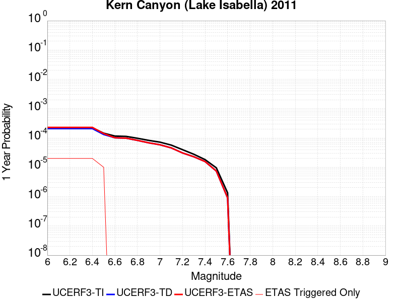 |  |

| Magnitude | 1 wk TI Prob | 1 wk TD Prob | 1 wk ETAS Prob | 1 wk ETAS/TD Gain | 1 wk ETAS Triggered Only | 1 mo TI Prob | 1 mo TD Prob | 1 mo ETAS Prob | 1 mo ETAS/TD Gain | 1 mo ETAS Triggered Only | 1 yr TI Prob | 1 yr TD Prob | 1 yr ETAS Prob | 1 yr ETAS/TD Gain | 1 yr ETAS Triggered Only | 10 yr TI Prob | 10 yr TD Prob | 10 yr ETAS Prob | 10 yr ETAS/TD Gain | 10 yr ETAS Triggered Only |
|-----|-----|-----|-----|-----|-----|-----|-----|-----|-----|-----|-----|-----|-----|-----|-----|-----|-----|-----|-----|-----|
| 6.0 | 4.2387383E-6 | 4.001647E-6 | 1.4001607E-5 | 3.498961 | 1.0E-5 | 1.8165894E-5 | 1.7149814E-5 | 2.7149643E-5 | 1.5830867 | 1.0E-5 | 2.2114732E-4 | 2.0878084E-4 | 2.2877667E-4 | 1.0957742 | 2.0E-5 | 0.0022092736 | 0.0020860308 | 0.002105989 | 1.0095676 | 2.0E-5 |
| 6.1 | 4.2387383E-6 | 4.001647E-6 | 1.4001607E-5 | 3.498961 | 1.0E-5 | 1.8165894E-5 | 1.7149814E-5 | 2.7149643E-5 | 1.5830867 | 1.0E-5 | 2.2114732E-4 | 2.0878084E-4 | 2.2877667E-4 | 1.0957742 | 2.0E-5 | 0.0022092736 | 0.0020860308 | 0.002105989 | 1.0095676 | 2.0E-5 |
| 6.2 | 4.2387383E-6 | 4.001647E-6 | 1.4001607E-5 | 3.498961 | 1.0E-5 | 1.8165894E-5 | 1.7149814E-5 | 2.7149643E-5 | 1.5830867 | 1.0E-5 | 2.2114732E-4 | 2.0878084E-4 | 2.2877667E-4 | 1.0957742 | 2.0E-5 | 0.0022092736 | 0.0020860308 | 0.002105989 | 1.0095676 | 2.0E-5 |
| 6.3 | 4.2387383E-6 | 4.001647E-6 | 1.4001607E-5 | 3.498961 | 1.0E-5 | 1.8165894E-5 | 1.7149814E-5 | 2.7149643E-5 | 1.5830867 | 1.0E-5 | 2.2114732E-4 | 2.0878084E-4 | 2.2877667E-4 | 1.0957742 | 2.0E-5 | 0.0022092736 | 0.0020860308 | 0.002105989 | 1.0095676 | 2.0E-5 |
| 6.4 | 4.2387383E-6 | 4.001647E-6 | 1.4001607E-5 | 3.498961 | 1.0E-5 | 1.8165894E-5 | 1.7149814E-5 | 2.7149643E-5 | 1.5830867 | 1.0E-5 | 2.2114732E-4 | 2.0878084E-4 | 2.2877667E-4 | 1.0957742 | 2.0E-5 | 0.0022092736 | 0.0020860308 | 0.002105989 | 1.0095676 | 2.0E-5 |
| 6.5 | 2.7857532E-6 | 2.517871E-6 | 2.517871E-6 | 1.0 | 0.0 | 1.1938888E-5 | 1.0790834E-5 | 1.0790834E-5 | 1.0 | 0.0 | 1.4534626E-4 | 1.313708E-4 | 1.4136948E-4 | 1.0761104 | 1.0E-5 | 0.0014525123 | 0.0013129641 | 0.001322951 | 1.0076064 | 1.0E-5 |
| 6.6 | 2.2233348E-6 | 1.944126E-6 | 1.944126E-6 | 1.0 | 0.0 | 9.528543E-6 | 8.331944E-6 | 8.331944E-6 | 1.0 | 0.0 | 1.1600384E-4 | 1.0143677E-4 | 1.0143677E-4 | 1.0 | 0.0 | 0.001159433 | 0.0010139133 | 0.0010139133 | 1.0 | 0.0 |
| 6.7 | 2.1635126E-6 | 1.8835061E-6 | 1.8835061E-6 | 1.0 | 0.0 | 9.272164E-6 | 8.072145E-6 | 8.072145E-6 | 1.0 | 0.0 | 1.1288274E-4 | 9.827401E-5 | 9.827401E-5 | 1.0 | 0.0 | 0.0011282542 | 9.823136E-4 | 9.823136E-4 | 1.0 | 0.0 |
| 6.8 | 1.8685711E-6 | 1.5831444E-6 | 1.5831444E-6 | 1.0 | 0.0 | 8.008137E-6 | 6.784887E-6 | 6.784887E-6 | 1.0 | 0.0 | 9.74947E-5 | 8.260291E-5 | 8.260291E-5 | 1.0 | 0.0 | 9.745194E-4 | 8.25727E-4 | 8.25727E-4 | 1.0 | 0.0 |
| 6.9 | 1.5815071E-6 | 1.3064939E-6 | 1.3064939E-6 | 1.0 | 0.0 | 6.77787E-6 | 5.5992477E-6 | 5.5992477E-6 | 1.0 | 0.0 | 8.251744E-5 | 6.816874E-5 | 6.816874E-5 | 1.0 | 0.0 | 8.248681E-4 | 6.814809E-4 | 6.814809E-4 | 1.0 | 0.0 |
| 7.0 | 1.3772564E-6 | 1.1210726E-6 | 1.1210726E-6 | 1.0 | 0.0 | 5.9025137E-6 | 4.804588E-6 | 4.804588E-6 | 1.0 | 0.0 | 7.186073E-5 | 5.849431E-5 | 5.849431E-5 | 1.0 | 0.0 | 7.18375E-4 | 5.847912E-4 | 5.847912E-4 | 1.0 | 0.0 |
| 7.1 | 1.0916998E-6 | 8.7637835E-7 | 8.7637835E-7 | 1.0 | 0.0 | 4.678705E-6 | 3.7559018E-6 | 3.7559018E-6 | 1.0 | 0.0 | 5.6961744E-5 | 4.572716E-5 | 4.572716E-5 | 1.0 | 0.0 | 5.6947145E-4 | 4.5717886E-4 | 4.5717886E-4 | 1.0 | 0.0 |
| 7.2 | 7.6277024E-7 | 5.9014616E-7 | 5.9014616E-7 | 1.0 | 0.0 | 3.2690114E-6 | 2.5291954E-6 | 2.5291954E-6 | 1.0 | 0.0 | 3.9799485E-5 | 3.0792526E-5 | 3.0792526E-5 | 1.0 | 0.0 | 3.9792358E-4 | 3.078832E-4 | 3.078832E-4 | 1.0 | 0.0 |
| 7.3 | 5.3265916E-7 | 4.3824443E-7 | 4.3824443E-7 | 1.0 | 0.0 | 2.282823E-6 | 1.8781891E-6 | 1.8781891E-6 | 1.0 | 0.0 | 2.7793016E-5 | 2.2866716E-5 | 2.2866716E-5 | 1.0 | 0.0 | 2.778954E-4 | 2.2864401E-4 | 2.2864401E-4 | 1.0 | 0.0 |
| 7.4 | 3.4946007E-7 | 3.0065758E-7 | 3.0065758E-7 | 1.0 | 0.0 | 1.497685E-6 | 1.2885318E-6 | 1.2885318E-6 | 1.0 | 0.0 | 1.8234163E-5 | 1.5687765E-5 | 1.5687765E-5 | 1.0 | 0.0 | 1.8232666E-4 | 1.568668E-4 | 1.568668E-4 | 1.0 | 0.0 |
| 7.5 | 1.8317026E-7 | 1.4244814E-7 | 1.4244814E-7 | 1.0 | 0.0 | 7.850152E-7 | 6.104919E-7 | 6.104919E-7 | 1.0 | 0.0 | 9.557518E-6 | 7.4327145E-6 | 7.4327145E-6 | 1.0 | 0.0 | 9.5571064E-5 | 7.432474E-5 | 7.432474E-5 | 1.0 | 0.0 |
| 7.6 | 2.572245E-8 | 1.7352718E-8 | 1.7352718E-8 | 1.0 | 0.0 | 1.10239064E-7 | 7.436879E-8 | 7.436879E-8 | 1.0 | 0.0 | 1.3421597E-6 | 9.054397E-7 | 9.054397E-7 | 1.0 | 0.0 | 1.3421517E-5 | 9.054365E-6 | 9.054365E-6 | 1.0 | 0.0 |

## Whittier alt 1
*[(top)](#table-of-contents)*

| 1 Week | 1 Month | 1 Year | 10 Year |
|-----|-----|-----|-----|
|  |  |  |  |

| Magnitude | 1 wk TI Prob | 1 wk TD Prob | 1 wk ETAS Prob | 1 wk ETAS/TD Gain | 1 wk ETAS Triggered Only | 1 mo TI Prob | 1 mo TD Prob | 1 mo ETAS Prob | 1 mo ETAS/TD Gain | 1 mo ETAS Triggered Only | 1 yr TI Prob | 1 yr TD Prob | 1 yr ETAS Prob | 1 yr ETAS/TD Gain | 1 yr ETAS Triggered Only | 10 yr TI Prob | 10 yr TD Prob | 10 yr ETAS Prob | 10 yr ETAS/TD Gain | 10 yr ETAS Triggered Only |
|-----|-----|-----|-----|-----|-----|-----|-----|-----|-----|-----|-----|-----|-----|-----|-----|-----|-----|-----|-----|-----|
| 6.0 | 4.2554693E-5 | 4.7253456E-5 | 4.7253456E-5 | 1.0 | 0.0 | 1.8236451E-4 | 2.0250089E-4 | 2.1249887E-4 | 1.0493726 | 1.0E-5 | 0.002218027 | 0.0024629827 | 0.002472958 | 1.0040501 | 1.0E-5 | 0.02196019 | 0.024390515 | 0.024410026 | 1.0008 | 2.0E-5 |
| 6.1 | 4.2554693E-5 | 4.7253456E-5 | 4.7253456E-5 | 1.0 | 0.0 | 1.8236451E-4 | 2.0250089E-4 | 2.1249887E-4 | 1.0493726 | 1.0E-5 | 0.002218027 | 0.0024629827 | 0.002472958 | 1.0040501 | 1.0E-5 | 0.02196019 | 0.024390515 | 0.024410026 | 1.0008 | 2.0E-5 |
| 6.2 | 4.2554693E-5 | 4.7253456E-5 | 4.7253456E-5 | 1.0 | 0.0 | 1.8236451E-4 | 2.0250089E-4 | 2.1249887E-4 | 1.0493726 | 1.0E-5 | 0.002218027 | 0.0024629827 | 0.002472958 | 1.0040501 | 1.0E-5 | 0.02196019 | 0.024390515 | 0.024410026 | 1.0008 | 2.0E-5 |
| 6.3 | 1.9617712E-5 | 1.8269147E-5 | 1.8269147E-5 | 1.0 | 0.0 | 8.40732E-5 | 7.8294106E-5 | 7.8294106E-5 | 1.0 | 0.0 | 0.0010231105 | 9.5283287E-4 | 9.5283287E-4 | 1.0 | 0.0 | 0.01018413 | 0.009490375 | 0.009500281 | 1.0010437 | 1.0E-5 |
| 6.4 | 1.5611336E-5 | 1.3604728E-5 | 1.3604728E-5 | 1.0 | 0.0 | 6.690401E-5 | 5.8304708E-5 | 5.8304708E-5 | 1.0 | 0.0 | 8.142519E-4 | 7.096346E-4 | 7.096346E-4 | 1.0 | 0.0 | 0.008112748 | 0.0070752627 | 0.0070752627 | 1.0 | 0.0 |
| 6.5 | 1.5150166E-5 | 1.3101376E-5 | 1.3101376E-5 | 1.0 | 0.0 | 6.492767E-5 | 5.614758E-5 | 5.614758E-5 | 1.0 | 0.0 | 7.9020765E-4 | 6.8338827E-4 | 6.8338827E-4 | 1.0 | 0.0 | 0.007874036 | 0.0068144295 | 0.0068144295 | 1.0 | 0.0 |
| 6.6 | 1.295588E-5 | 1.0381098E-5 | 1.0381098E-5 | 1.0 | 0.0 | 5.552402E-5 | 4.4489672E-5 | 4.4489672E-5 | 1.0 | 0.0 | 6.7579525E-4 | 5.415291E-4 | 5.415291E-4 | 1.0 | 0.0 | 0.006737438 | 0.005403255 | 0.005403255 | 1.0 | 0.0 |
| 6.7 | 1.2542085E-5 | 9.899731E-6 | 9.899731E-6 | 1.0 | 0.0 | 5.3750682E-5 | 4.242674E-5 | 4.242674E-5 | 1.0 | 0.0 | 6.542181E-4 | 5.16425E-4 | 5.16425E-4 | 1.0 | 0.0 | 0.006522954 | 0.0051533743 | 0.0051533743 | 1.0 | 0.0 |
| 6.8 | 1.2195878E-5 | 9.495758E-6 | 9.495758E-6 | 1.0 | 0.0 | 5.2267E-5 | 4.069548E-5 | 4.069548E-5 | 1.0 | 0.0 | 6.36165E-4 | 4.953567E-4 | 4.953567E-4 | 1.0 | 0.0 | 0.0063434686 | 0.00494359 | 0.00494359 | 1.0 | 0.0 |
| 6.9 | 1.1580298E-5 | 8.773248E-6 | 8.773248E-6 | 1.0 | 0.0 | 4.9628903E-5 | 3.75991E-5 | 3.75991E-5 | 1.0 | 0.0 | 6.040644E-4 | 4.5767453E-4 | 4.5767453E-4 | 1.0 | 0.0 | 0.00602425 | 0.00456835 | 0.00456835 | 1.0 | 0.0 |
| 7.0 | 1.0964795E-5 | 8.084284E-6 | 8.084284E-6 | 1.0 | 0.0 | 4.6991136E-5 | 3.4646477E-5 | 3.4646477E-5 | 1.0 | 0.0 | 5.7196687E-4 | 4.2174075E-4 | 4.2174075E-4 | 1.0 | 0.0 | 0.0057049696 | 0.0042103273 | 0.0042103273 | 1.0 | 0.0 |
| 7.1 | 1.0230601E-5 | 7.3268325E-6 | 7.3268325E-6 | 1.0 | 0.0 | 4.3844695E-5 | 3.140034E-5 | 3.140034E-5 | 1.0 | 0.0 | 5.336784E-4 | 3.8223338E-4 | 3.8223338E-4 | 1.0 | 0.0 | 0.005323986 | 0.0038168596 | 0.0038168596 | 1.0 | 0.0 |
| 7.2 | 9.40865E-6 | 6.5434065E-6 | 6.5434065E-6 | 1.0 | 0.0 | 4.032216E-5 | 2.8042878E-5 | 2.8042878E-5 | 1.0 | 0.0 | 4.908117E-4 | 3.4136974E-4 | 3.4136974E-4 | 1.0 | 0.0 | 0.0048972913 | 0.0034095005 | 0.0034095005 | 1.0 | 0.0 |
| 7.3 | 8.237384E-6 | 5.5978335E-6 | 5.5978335E-6 | 1.0 | 0.0 | 3.5302593E-5 | 2.39905E-5 | 2.39905E-5 | 1.0 | 0.0 | 4.2972428E-4 | 2.9204623E-4 | 2.9204623E-4 | 1.0 | 0.0 | 0.0042889426 | 0.0029169612 | 0.0029169612 | 1.0 | 0.0 |
| 7.4 | 7.5316966E-6 | 5.0278804E-6 | 5.0278804E-6 | 1.0 | 0.0 | 3.2278298E-5 | 2.1547887E-5 | 2.1547887E-5 | 1.0 | 0.0 | 3.9291743E-4 | 2.6231495E-4 | 2.6231495E-4 | 1.0 | 0.0 | 0.0039222343 | 0.0026201624 | 0.0026201624 | 1.0 | 0.0 |
| 7.5 | 6.149649E-6 | 3.9338697E-6 | 3.9338697E-6 | 1.0 | 0.0 | 2.6355372E-5 | 1.6859338E-5 | 1.6859338E-5 | 1.0 | 0.0 | 3.208294E-4 | 2.05244E-4 | 2.05244E-4 | 1.0 | 0.0 | 0.003203666 | 0.0020506335 | 0.0020506335 | 1.0 | 0.0 |
| 7.6 | 5.457711E-6 | 3.395382E-6 | 3.395382E-6 | 1.0 | 0.0 | 2.338998E-5 | 1.45515605E-5 | 1.45515605E-5 | 1.0 | 0.0 | 2.8473578E-4 | 1.7715165E-4 | 1.7715165E-4 | 1.0 | 0.0 | 0.0028437122 | 0.0017701852 | 0.0017701852 | 1.0 | 0.0 |
| 7.7 | 4.1676276E-6 | 2.3331656E-6 | 2.3331656E-6 | 1.0 | 0.0 | 1.7861139E-5 | 9.999248E-6 | 9.999248E-6 | 1.0 | 0.0 | 2.1743766E-4 | 1.2173478E-4 | 1.2173478E-4 | 1.0 | 0.0 | 0.0021722503 | 0.001216754 | 0.001216754 | 1.0 | 0.0 |
| 7.8 | 2.2692414E-7 | 9.384624E-8 | 9.384624E-8 | 1.0 | 0.0 | 9.725317E-7 | 4.021981E-7 | 4.021981E-7 | 1.0 | 0.0 | 1.1840509E-5 | 4.8967545E-6 | 4.8967545E-6 | 1.0 | 0.0 | 1.1839878E-4 | 4.8966795E-5 | 4.8966795E-5 | 1.0 | 0.0 |
| 7.9 | 6.676829E-9 | 3.4397993E-9 | 3.4397993E-9 | 1.0 | 0.0 | 2.861498E-8 | 1.4741998E-8 | 1.4741998E-8 | 1.0 | 0.0 | 3.4838732E-7 | 1.794838E-7 | 1.794838E-7 | 1.0 | 0.0 | 3.4838679E-6 | 1.7948367E-6 | 1.7948367E-6 | 1.0 | 0.0 |

## San Gabriel
*[(top)](#table-of-contents)*

| 1 Week | 1 Month | 1 Year | 10 Year |
|-----|-----|-----|-----|
| 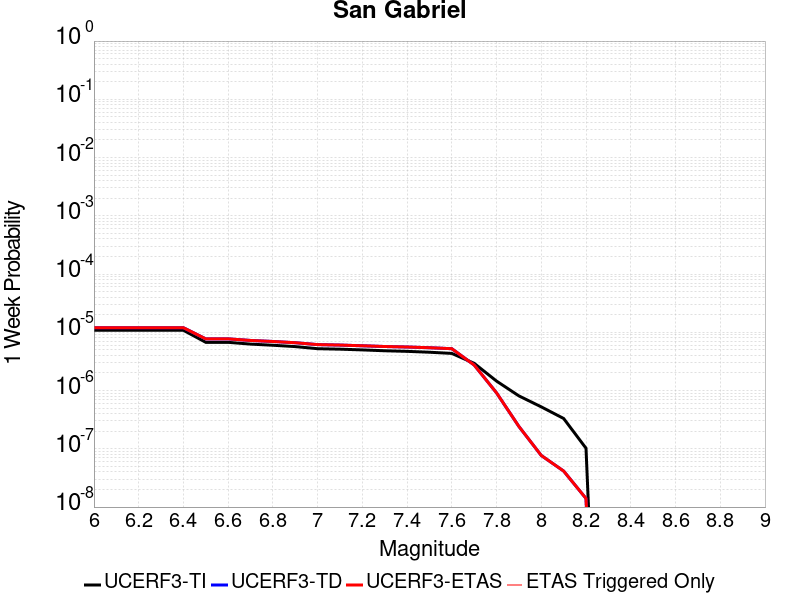 |  |  | 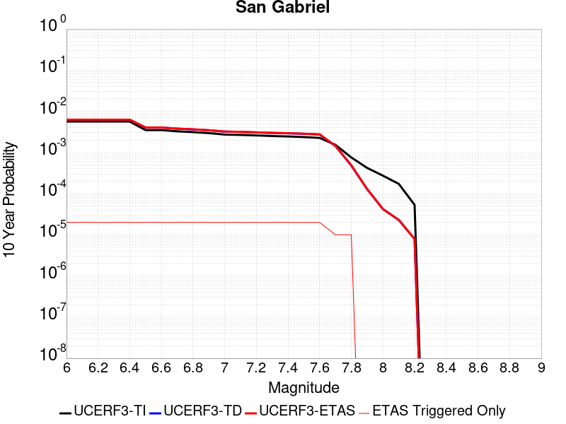 |

| Magnitude | 1 wk TI Prob | 1 wk TD Prob | 1 wk ETAS Prob | 1 wk ETAS/TD Gain | 1 wk ETAS Triggered Only | 1 mo TI Prob | 1 mo TD Prob | 1 mo ETAS Prob | 1 mo ETAS/TD Gain | 1 mo ETAS Triggered Only | 1 yr TI Prob | 1 yr TD Prob | 1 yr ETAS Prob | 1 yr ETAS/TD Gain | 1 yr ETAS Triggered Only | 10 yr TI Prob | 10 yr TD Prob | 10 yr ETAS Prob | 10 yr ETAS/TD Gain | 10 yr ETAS Triggered Only |
|-----|-----|-----|-----|-----|-----|-----|-----|-----|-----|-----|-----|-----|-----|-----|-----|-----|-----|-----|-----|-----|
| 6.0 | 1.083775E-5 | 1.1987373E-5 | 1.1987373E-5 | 1.0 | 0.0 | 4.6446676E-5 | 5.1373507E-5 | 5.1373507E-5 | 1.0 | 0.0 | 5.653415E-4 | 6.253043E-4 | 6.35298E-4 | 1.0159823 | 1.0E-5 | 0.0056390543 | 0.006247348 | 0.0062672235 | 1.0031813 | 2.0E-5 |
| 6.1 | 1.083775E-5 | 1.1987373E-5 | 1.1987373E-5 | 1.0 | 0.0 | 4.6446676E-5 | 5.1373507E-5 | 5.1373507E-5 | 1.0 | 0.0 | 5.653415E-4 | 6.253043E-4 | 6.35298E-4 | 1.0159823 | 1.0E-5 | 0.0056390543 | 0.006247348 | 0.0062672235 | 1.0031813 | 2.0E-5 |
| 6.2 | 1.083775E-5 | 1.1987373E-5 | 1.1987373E-5 | 1.0 | 0.0 | 4.6446676E-5 | 5.1373507E-5 | 5.1373507E-5 | 1.0 | 0.0 | 5.653415E-4 | 6.253043E-4 | 6.35298E-4 | 1.0159823 | 1.0E-5 | 0.0056390543 | 0.006247348 | 0.0062672235 | 1.0031813 | 2.0E-5 |
| 6.3 | 1.083775E-5 | 1.1987373E-5 | 1.1987373E-5 | 1.0 | 0.0 | 4.6446676E-5 | 5.1373507E-5 | 5.1373507E-5 | 1.0 | 0.0 | 5.653415E-4 | 6.253043E-4 | 6.35298E-4 | 1.0159823 | 1.0E-5 | 0.0056390543 | 0.006247348 | 0.0062672235 | 1.0031813 | 2.0E-5 |
| 6.4 | 1.083775E-5 | 1.1987373E-5 | 1.1987373E-5 | 1.0 | 0.0 | 4.6446676E-5 | 5.1373507E-5 | 5.1373507E-5 | 1.0 | 0.0 | 5.653415E-4 | 6.253043E-4 | 6.35298E-4 | 1.0159823 | 1.0E-5 | 0.0056390543 | 0.006247348 | 0.0062672235 | 1.0031813 | 2.0E-5 |
| 6.5 | 6.7317824E-6 | 7.719108E-6 | 7.719108E-6 | 1.0 | 0.0 | 2.8850178E-5 | 3.3081476E-5 | 3.3081476E-5 | 1.0 | 0.0 | 3.511943E-4 | 4.026936E-4 | 4.1268958E-4 | 1.0248228 | 1.0E-5 | 0.003506398 | 0.004030539 | 0.004050459 | 1.004942 | 2.0E-5 |
| 6.6 | 6.7317824E-6 | 7.719108E-6 | 7.719108E-6 | 1.0 | 0.0 | 2.8850178E-5 | 3.3081476E-5 | 3.3081476E-5 | 1.0 | 0.0 | 3.511943E-4 | 4.026936E-4 | 4.1268958E-4 | 1.0248228 | 1.0E-5 | 0.003506398 | 0.004030539 | 0.004050459 | 1.004942 | 2.0E-5 |
| 6.7 | 6.274881E-6 | 7.248026E-6 | 7.248026E-6 | 1.0 | 0.0 | 2.6892068E-5 | 3.1062606E-5 | 3.1062606E-5 | 1.0 | 0.0 | 3.2736175E-4 | 3.7812255E-4 | 3.8811876E-4 | 1.0264364 | 1.0E-5 | 0.0032687993 | 0.0037856852 | 0.0038056097 | 1.0052631 | 2.0E-5 |
| 6.8 | 5.996209E-6 | 6.960745E-6 | 6.960745E-6 | 1.0 | 0.0 | 2.5697784E-5 | 2.9831428E-5 | 2.9831428E-5 | 1.0 | 0.0 | 3.128256E-4 | 3.6313804E-4 | 3.7313442E-4 | 1.0275277 | 1.0E-5 | 0.003123856 | 0.0036363378 | 0.003656265 | 1.00548 | 2.0E-5 |
| 6.9 | 5.686331E-6 | 6.6257817E-6 | 6.6257817E-6 | 1.0 | 0.0 | 2.4369761E-5 | 2.8395903E-5 | 2.8395903E-5 | 1.0 | 0.0 | 2.9666146E-4 | 3.456662E-4 | 3.5566272E-4 | 1.0289197 | 1.0E-5 | 0.0029626573 | 0.0034621747 | 0.0034821054 | 1.0057567 | 2.0E-5 |
| 7.0 | 5.2329838E-6 | 6.1496576E-6 | 6.1496576E-6 | 1.0 | 0.0 | 2.242688E-5 | 2.6355414E-5 | 2.6355414E-5 | 1.0 | 0.0 | 2.7301308E-4 | 3.2083067E-4 | 3.3082746E-4 | 1.031159 | 1.0E-5 | 0.002726779 | 0.0032145523 | 0.003234488 | 1.0062017 | 2.0E-5 |
| 7.1 | 5.135671E-6 | 6.039777E-6 | 6.039777E-6 | 1.0 | 0.0 | 2.2009834E-5 | 2.5884507E-5 | 2.5884507E-5 | 1.0 | 0.0 | 2.6793676E-4 | 3.1509905E-4 | 3.250959E-4 | 1.031726 | 1.0E-5 | 0.0026761394 | 0.0031574003 | 0.003177337 | 1.0063143 | 2.0E-5 |
| 7.2 | 4.989062E-6 | 5.8731457E-6 | 5.8731457E-6 | 1.0 | 0.0 | 2.1381518E-5 | 2.5170384E-5 | 2.5170384E-5 | 1.0 | 0.0 | 2.6028889E-4 | 3.064071E-4 | 3.1640404E-4 | 1.0326263 | 1.0E-5 | 0.0025998424 | 0.0030707237 | 0.0030906622 | 1.0064931 | 2.0E-5 |
| 7.3 | 4.8219395E-6 | 5.7046905E-6 | 5.7046905E-6 | 1.0 | 0.0 | 2.0665291E-5 | 2.4448447E-5 | 2.4448447E-5 | 1.0 | 0.0 | 2.5157086E-4 | 2.9761996E-4 | 3.0761698E-4 | 1.0335898 | 1.0E-5 | 0.0025128627 | 0.0029830914 | 0.0030030317 | 1.0066844 | 2.0E-5 |
| 7.4 | 4.7118383E-6 | 5.59324E-6 | 5.59324E-6 | 1.0 | 0.0 | 2.0193436E-5 | 2.3970813E-5 | 2.3970813E-5 | 1.0 | 0.0 | 2.4582737E-4 | 2.9180633E-4 | 3.018034E-4 | 1.0342593 | 1.0E-5 | 0.002455556 | 0.002925109 | 0.0029450504 | 1.0068173 | 2.0E-5 |
| 7.5 | 4.5506545E-6 | 5.438597E-6 | 5.438597E-6 | 1.0 | 0.0 | 1.9502659E-5 | 2.3308068E-5 | 2.3308068E-5 | 1.0 | 0.0 | 2.37419E-4 | 2.8373953E-4 | 2.937367E-4 | 1.0352336 | 1.0E-5 | 0.002371655 | 0.0028446494 | 0.0028645925 | 1.0070107 | 2.0E-5 |
| 7.6 | 4.343636E-6 | 5.231458E-6 | 5.231458E-6 | 1.0 | 0.0 | 1.861545E-5 | 2.2420347E-5 | 2.2420347E-5 | 1.0 | 0.0 | 2.2661954E-4 | 2.7293427E-4 | 2.8293155E-4 | 1.0366288 | 1.0E-5 | 0.0022638857 | 0.0027368597 | 0.002756805 | 1.0072876 | 2.0E-5 |
| 7.7 | 2.936235E-6 | 2.7452986E-6 | 2.7452986E-6 | 1.0 | 0.0 | 1.2583803E-5 | 1.1765513E-5 | 1.1765513E-5 | 1.0 | 0.0 | 1.5319703E-4 | 1.4323574E-4 | 1.532343E-4 | 1.069805 | 1.0E-5 | 0.0015309147 | 0.0014387129 | 0.0014486986 | 1.0069406 | 1.0E-5 |
| 7.8 | 1.4541639E-6 | 9.1280947E-7 | 9.1280947E-7 | 1.0 | 0.0 | 6.232116E-6 | 3.9120346E-6 | 3.9120346E-6 | 1.0 | 0.0 | 7.587337E-5 | 4.7627982E-5 | 5.7627505E-5 | 1.2099506 | 1.0E-5 | 7.584747E-4 | 4.8106918E-4 | 4.910644E-4 | 1.020777 | 1.0E-5 |
| 7.9 | 8.098958E-7 | 2.4187648E-7 | 2.4187648E-7 | 1.0 | 0.0 | 3.4709774E-6 | 1.036613E-6 | 1.036613E-6 | 1.0 | 0.0 | 4.225833E-5 | 1.262069E-5 | 1.262069E-5 | 1.0 | 0.0 | 4.2250296E-4 | 1.2928544E-4 | 1.2928544E-4 | 1.0 | 0.0 |
| 8.0 | 5.2473234E-7 | 7.6827554E-8 | 7.6827554E-8 | 1.0 | 0.0 | 2.248851E-6 | 3.292609E-7 | 3.292609E-7 | 1.0 | 0.0 | 2.7379416E-5 | 4.008744E-6 | 4.008744E-6 | 1.0 | 0.0 | 2.7376044E-4 | 4.2213585E-5 | 4.2213585E-5 | 1.0 | 0.0 |
| 8.1 | 3.3162388E-7 | 4.1511967E-8 | 4.1511967E-8 | 1.0 | 0.0 | 1.4212444E-6 | 1.7790842E-7 | 1.7790842E-7 | 1.0 | 0.0 | 1.7303513E-5 | 2.1660328E-6 | 2.1660328E-6 | 1.0 | 0.0 | 1.7302166E-4 | 2.2976306E-5 | 2.2976306E-5 | 1.0 | 0.0 |
| 8.2 | 1.0235345E-7 | 1.4050096E-8 | 1.4050096E-8 | 1.0 | 0.0 | 4.3865757E-7 | 6.0214695E-8 | 6.0214695E-8 | 1.0 | 0.0 | 5.340643E-6 | 7.3311367E-7 | 7.3311367E-7 | 1.0 | 0.0 | 5.3405143E-5 | 7.9302445E-6 | 7.9302445E-6 | 1.0 | 0.0 |

## Hayward (So) 2011 CFM
*[(top)](#table-of-contents)*

| 1 Week | 1 Month | 1 Year | 10 Year |
|-----|-----|-----|-----|
|  | 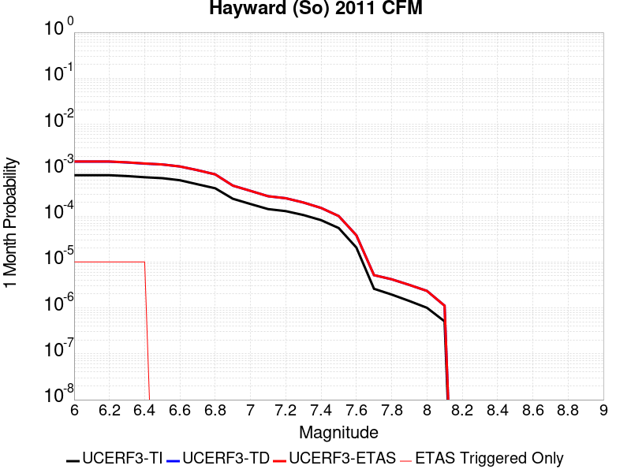 |  |  |

| Magnitude | 1 wk TI Prob | 1 wk TD Prob | 1 wk ETAS Prob | 1 wk ETAS/TD Gain | 1 wk ETAS Triggered Only | 1 mo TI Prob | 1 mo TD Prob | 1 mo ETAS Prob | 1 mo ETAS/TD Gain | 1 mo ETAS Triggered Only | 1 yr TI Prob | 1 yr TD Prob | 1 yr ETAS Prob | 1 yr ETAS/TD Gain | 1 yr ETAS Triggered Only | 10 yr TI Prob | 10 yr TD Prob | 10 yr ETAS Prob | 10 yr ETAS/TD Gain | 10 yr ETAS Triggered Only |
|-----|-----|-----|-----|-----|-----|-----|-----|-----|-----|-----|-----|-----|-----|-----|-----|-----|-----|-----|-----|-----|
| 6.0 | 1.8091932E-4 | 3.5710505E-4 | 3.5710505E-4 | 1.0 | 0.0 | 7.751381E-4 | 0.0015295624 | 0.0015395471 | 1.0065278 | 1.0E-5 | 0.00939654 | 0.018465819 | 0.01848545 | 1.0010631 | 2.0E-5 | 0.090090066 | 0.16673753 | 0.16675419 | 1.0000999 | 2.0E-5 |
| 6.1 | 1.8091932E-4 | 3.5710505E-4 | 3.5710505E-4 | 1.0 | 0.0 | 7.751381E-4 | 0.0015295624 | 0.0015395471 | 1.0065278 | 1.0E-5 | 0.00939654 | 0.018465819 | 0.01848545 | 1.0010631 | 2.0E-5 | 0.090090066 | 0.16673753 | 0.16675419 | 1.0000999 | 2.0E-5 |
| 6.2 | 1.8091932E-4 | 3.5710505E-4 | 3.5710505E-4 | 1.0 | 0.0 | 7.751381E-4 | 0.0015295624 | 0.0015395471 | 1.0065278 | 1.0E-5 | 0.00939654 | 0.018465819 | 0.01848545 | 1.0010631 | 2.0E-5 | 0.090090066 | 0.16673753 | 0.16675419 | 1.0000999 | 2.0E-5 |
| 6.3 | 1.7322872E-4 | 3.426729E-4 | 3.426729E-4 | 1.0 | 0.0 | 7.4219756E-4 | 0.0014677811 | 0.0014777664 | 1.006803 | 1.0E-5 | 0.0089988755 | 0.017726082 | 0.017745728 | 1.0011083 | 2.0E-5 | 0.08643075 | 0.16068551 | 0.1607023 | 1.0001044 | 2.0E-5 |
| 6.4 | 1.6334097E-4 | 3.2348928E-4 | 3.2348928E-4 | 1.0 | 0.0 | 6.998449E-4 | 0.0013856548 | 0.0013956409 | 1.0072068 | 1.0E-5 | 0.008487372 | 0.016741859 | 0.016761525 | 1.0011746 | 2.0E-5 | 0.081704415 | 0.1525672 | 0.15258415 | 1.0001111 | 2.0E-5 |
| 6.5 | 1.5600289E-4 | 3.102356E-4 | 3.102356E-4 | 1.0 | 0.0 | 6.684125E-4 | 0.001328912 | 0.001328912 | 1.0 | 0.0 | 0.008107598 | 0.016061366 | 0.016071206 | 1.0006126 | 1.0E-5 | 0.078181036 | 0.14684398 | 0.14685251 | 1.000058 | 1.0E-5 |
| 6.6 | 1.4046066E-4 | 2.8037324E-4 | 2.8037324E-4 | 1.0 | 0.0 | 6.018354E-4 | 0.001201053 | 0.001201053 | 1.0 | 0.0 | 0.0073027555 | 0.014526278 | 0.014536133 | 1.0006784 | 1.0E-5 | 0.07067384 | 0.1339279 | 0.13393655 | 1.0000646 | 1.0E-5 |
| 6.7 | 1.14696966E-4 | 2.3275505E-4 | 2.3275505E-4 | 1.0 | 0.0 | 4.914658E-4 | 9.971453E-4 | 9.971453E-4 | 1.0 | 0.0 | 0.0059671924 | 0.01207373 | 0.01208361 | 1.0008183 | 1.0E-5 | 0.058094822 | 0.11274096 | 0.11274984 | 1.0000787 | 1.0E-5 |
| 6.8 | 9.3874296E-5 | 1.886479E-4 | 1.886479E-4 | 1.0 | 0.0 | 4.0225635E-4 | 8.0824416E-4 | 8.0824416E-4 | 1.0 | 0.0 | 0.0048864787 | 0.009796709 | 0.009806611 | 1.0010108 | 1.0E-5 | 0.047804173 | 0.0925935 | 0.09260257 | 1.000098 | 1.0E-5 |
| 6.9 | 5.551852E-5 | 1.0731538E-4 | 1.0731538E-4 | 1.0 | 0.0 | 2.3791482E-4 | 4.5984262E-4 | 4.5984262E-4 | 1.0 | 0.0 | 0.0028927654 | 0.0055843308 | 0.005594275 | 1.0017807 | 1.0E-5 | 0.028553981 | 0.05424729 | 0.05425675 | 1.0001743 | 1.0E-5 |
| 7.0 | 4.2662363E-5 | 8.2480685E-5 | 8.2480685E-5 | 1.0 | 0.0 | 1.8282588E-4 | 3.5344114E-4 | 3.5344114E-4 | 1.0 | 0.0 | 0.0022236328 | 0.004294729 | 0.004304686 | 1.0023184 | 1.0E-5 | 0.022015138 | 0.042071674 | 0.04208125 | 1.0002277 | 1.0E-5 |
| 7.1 | 3.305886E-5 | 6.303226E-5 | 6.303226E-5 | 1.0 | 0.0 | 1.4167312E-4 | 2.701104E-4 | 2.701104E-4 | 1.0 | 0.0 | 0.0017235056 | 0.0032836539 | 0.0032936211 | 1.0030354 | 1.0E-5 | 0.017101998 | 0.03245839 | 0.032468066 | 1.0002981 | 1.0E-5 |
| 7.2 | 2.9856887E-5 | 5.7026133E-5 | 5.7026133E-5 | 1.0 | 0.0 | 1.2795182E-4 | 2.443749E-4 | 2.443749E-4 | 1.0 | 0.0 | 0.0015567001 | 0.002971222 | 0.0029811924 | 1.0033556 | 1.0E-5 | 0.015458403 | 0.029458838 | 0.029468544 | 1.0003295 | 1.0E-5 |
| 7.3 | 2.4559737E-5 | 4.6001245E-5 | 4.6001245E-5 | 1.0 | 0.0 | 1.0525176E-4 | 1.9713337E-4 | 1.9713337E-4 | 1.0 | 0.0 | 0.0012806869 | 0.00239747 | 0.002407446 | 1.0041611 | 1.0E-5 | 0.012733313 | 0.02386188 | 0.023871642 | 1.0004091 | 1.0E-5 |
| 7.4 | 1.9002231E-5 | 3.505791E-5 | 3.505791E-5 | 1.0 | 0.0 | 8.143559E-5 | 1.5023959E-4 | 1.5023959E-4 | 1.0 | 0.0 | 9.910273E-4 | 0.0018276422 | 0.0018276422 | 1.0 | 0.0 | 0.009866194 | 0.018261842 | 0.018261842 | 1.0 | 0.0 |
| 7.5 | 1.2783333E-5 | 2.3334587E-5 | 2.3334587E-5 | 1.0 | 0.0 | 5.4784563E-5 | 1.00001576E-4 | 1.00001576E-4 | 1.0 | 0.0 | 6.667979E-4 | 0.0012168449 | 0.0012168449 | 1.0 | 0.0 | 0.006648007 | 0.012210775 | 0.012210775 | 1.0 | 0.0 |
| 7.6 | 4.8149627E-6 | 8.889608E-6 | 8.889608E-6 | 1.0 | 0.0 | 2.063539E-5 | 3.809777E-5 | 3.809777E-5 | 1.0 | 0.0 | 2.5120692E-4 | 4.6374285E-4 | 4.6374285E-4 | 1.0 | 0.0 | 0.0025092314 | 0.004681107 | 0.004681107 | 1.0 | 0.0 |
| 7.7 | 6.0838227E-7 | 1.2063123E-6 | 1.2063123E-6 | 1.0 | 0.0 | 2.6073499E-6 | 5.1699E-6 | 5.1699E-6 | 1.0 | 0.0 | 3.174402E-5 | 6.294171E-5 | 6.294171E-5 | 1.0 | 0.0 | 3.1739488E-4 | 6.5322954E-4 | 6.5322954E-4 | 1.0 | 0.0 |
| 7.8 | 4.5542808E-7 | 9.797777E-7 | 9.797777E-7 | 1.0 | 0.0 | 1.9518332E-6 | 4.1990406E-6 | 4.1990406E-6 | 1.0 | 0.0 | 2.376331E-5 | 5.1122122E-5 | 5.1122122E-5 | 1.0 | 0.0 | 2.3760769E-4 | 5.3240365E-4 | 5.3240365E-4 | 1.0 | 0.0 |
| 7.9 | 3.3016747E-7 | 7.3905267E-7 | 7.3905267E-7 | 1.0 | 0.0 | 1.4150027E-6 | 3.1673646E-6 | 3.1673646E-6 | 1.0 | 0.0 | 1.7227521E-5 | 3.8561986E-5 | 3.8561986E-5 | 1.0 | 0.0 | 1.7226185E-4 | 3.9950482E-4 | 3.9950482E-4 | 1.0 | 0.0 |
| 8.0 | 2.347038E-7 | 5.4744874E-7 | 5.4744874E-7 | 1.0 | 0.0 | 1.0058731E-6 | 2.3462067E-6 | 2.3462067E-6 | 1.0 | 0.0 | 1.2246436E-5 | 2.8564695E-5 | 2.8564695E-5 | 1.0 | 0.0 | 1.2245761E-4 | 2.936959E-4 | 2.936959E-4 | 1.0 | 0.0 |
| 8.1 | 1.18822804E-7 | 2.60728E-7 | 2.60728E-7 | 1.0 | 0.0 | 5.092405E-7 | 1.1174052E-6 | 1.1174052E-6 | 1.0 | 0.0 | 6.1999854E-6 | 1.3604324E-5 | 1.3604324E-5 | 1.0 | 0.0 | 6.199812E-5 | 1.3924051E-4 | 1.3924051E-4 | 1.0 | 0.0 |

## Verdugo
*[(top)](#table-of-contents)*

| 1 Week | 1 Month | 1 Year | 10 Year |
|-----|-----|-----|-----|
|  | 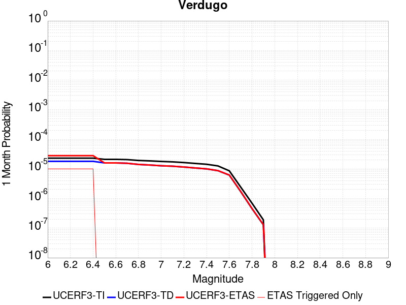 |  | 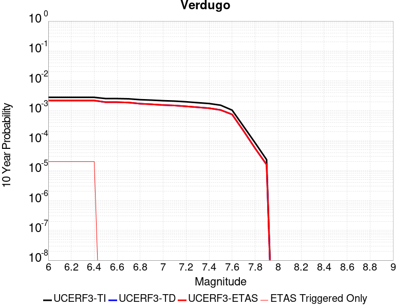 |

| Magnitude | 1 wk TI Prob | 1 wk TD Prob | 1 wk ETAS Prob | 1 wk ETAS/TD Gain | 1 wk ETAS Triggered Only | 1 mo TI Prob | 1 mo TD Prob | 1 mo ETAS Prob | 1 mo ETAS/TD Gain | 1 mo ETAS Triggered Only | 1 yr TI Prob | 1 yr TD Prob | 1 yr ETAS Prob | 1 yr ETAS/TD Gain | 1 yr ETAS Triggered Only | 10 yr TI Prob | 10 yr TD Prob | 10 yr ETAS Prob | 10 yr ETAS/TD Gain | 10 yr ETAS Triggered Only |
|-----|-----|-----|-----|-----|-----|-----|-----|-----|-----|-----|-----|-----|-----|-----|-----|-----|-----|-----|-----|-----|
| 6.0 | 5.392987E-6 | 4.216537E-6 | 4.216537E-6 | 1.0 | 0.0 | 2.3112598E-5 | 1.807075E-5 | 2.8070568E-5 | 1.5533705 | 1.0E-5 | 2.8135953E-4 | 2.1998964E-4 | 2.3998524E-4 | 1.0908934 | 2.0E-5 | 0.0028100356 | 0.0021977664 | 0.0022177224 | 1.0090802 | 2.0E-5 |
| 6.1 | 5.392987E-6 | 4.216537E-6 | 4.216537E-6 | 1.0 | 0.0 | 2.3112598E-5 | 1.807075E-5 | 2.8070568E-5 | 1.5533705 | 1.0E-5 | 2.8135953E-4 | 2.1998964E-4 | 2.3998524E-4 | 1.0908934 | 2.0E-5 | 0.0028100356 | 0.0021977664 | 0.0022177224 | 1.0090802 | 2.0E-5 |
| 6.2 | 5.392987E-6 | 4.216537E-6 | 4.216537E-6 | 1.0 | 0.0 | 2.3112598E-5 | 1.807075E-5 | 2.8070568E-5 | 1.5533705 | 1.0E-5 | 2.8135953E-4 | 2.1998964E-4 | 2.3998524E-4 | 1.0908934 | 2.0E-5 | 0.0028100356 | 0.0021977664 | 0.0022177224 | 1.0090802 | 2.0E-5 |
| 6.3 | 5.392987E-6 | 4.216537E-6 | 4.216537E-6 | 1.0 | 0.0 | 2.3112598E-5 | 1.807075E-5 | 2.8070568E-5 | 1.5533705 | 1.0E-5 | 2.8135953E-4 | 2.1998964E-4 | 2.3998524E-4 | 1.0908934 | 2.0E-5 | 0.0028100356 | 0.0021977664 | 0.0022177224 | 1.0090802 | 2.0E-5 |
| 6.4 | 5.392987E-6 | 4.216537E-6 | 4.216537E-6 | 1.0 | 0.0 | 2.3112598E-5 | 1.807075E-5 | 2.8070568E-5 | 1.5533705 | 1.0E-5 | 2.8135953E-4 | 2.1998964E-4 | 2.3998524E-4 | 1.0908934 | 2.0E-5 | 0.0028100356 | 0.0021977664 | 0.0022177224 | 1.0090802 | 2.0E-5 |
| 6.5 | 4.9154837E-6 | 3.7224825E-6 | 3.7224825E-6 | 1.0 | 0.0 | 2.1066187E-5 | 1.59534E-5 | 1.59534E-5 | 1.0 | 0.0 | 2.5645064E-4 | 1.9421554E-4 | 1.9421554E-4 | 1.0 | 0.0 | 0.002561549 | 0.0019404789 | 0.0019404789 | 1.0 | 0.0 |
| 6.6 | 4.9154837E-6 | 3.7224825E-6 | 3.7224825E-6 | 1.0 | 0.0 | 2.1066187E-5 | 1.59534E-5 | 1.59534E-5 | 1.0 | 0.0 | 2.5645064E-4 | 1.9421554E-4 | 1.9421554E-4 | 1.0 | 0.0 | 0.002561549 | 0.0019404789 | 0.0019404789 | 1.0 | 0.0 |
| 6.7 | 4.817006E-6 | 3.6206686E-6 | 3.6206686E-6 | 1.0 | 0.0 | 2.0644147E-5 | 1.551706E-5 | 1.551706E-5 | 1.0 | 0.0 | 2.513135E-4 | 1.8890403E-4 | 1.8890403E-4 | 1.0 | 0.0 | 0.0025102948 | 0.0018874541 | 0.0018874541 | 1.0 | 0.0 |
| 6.8 | 4.507407E-6 | 3.3071192E-6 | 3.3071192E-6 | 1.0 | 0.0 | 1.9317316E-5 | 1.4173292E-5 | 1.4173292E-5 | 1.0 | 0.0 | 2.3516294E-4 | 1.7254631E-4 | 1.7254631E-4 | 1.0 | 0.0 | 0.0023491425 | 0.0017241377 | 0.0017241377 | 1.0 | 0.0 |
| 6.9 | 4.3573054E-6 | 3.161025E-6 | 3.161025E-6 | 1.0 | 0.0 | 1.8674033E-5 | 1.3547181E-5 | 1.3547181E-5 | 1.0 | 0.0 | 2.2733262E-4 | 1.6492457E-4 | 1.6492457E-4 | 1.0 | 0.0 | 0.0022710022 | 0.0016480341 | 0.0016480341 | 1.0 | 0.0 |
| 7.0 | 4.171527E-6 | 2.9836829E-6 | 2.9836829E-6 | 1.0 | 0.0 | 1.787785E-5 | 1.278715E-5 | 1.278715E-5 | 1.0 | 0.0 | 2.1764109E-4 | 1.5567255E-4 | 1.5567255E-4 | 1.0 | 0.0 | 0.0021742806 | 0.0015556462 | 0.0015556462 | 1.0 | 0.0 |
| 7.1 | 4.0405484E-6 | 2.882273E-6 | 2.882273E-6 | 1.0 | 0.0 | 1.731652E-5 | 1.23525415E-5 | 1.23525415E-5 | 1.0 | 0.0 | 2.1080824E-4 | 1.5038192E-4 | 1.5038192E-4 | 1.0 | 0.0 | 0.0021060838 | 0.0015028126 | 0.0015028126 | 1.0 | 0.0 |
| 7.2 | 3.8306007E-6 | 2.7018564E-6 | 2.7018564E-6 | 1.0 | 0.0 | 1.6416758E-5 | 1.1579334E-5 | 1.1579334E-5 | 1.0 | 0.0 | 1.9985568E-4 | 1.4096937E-4 | 1.4096937E-4 | 1.0 | 0.0 | 0.0019967605 | 0.0014088103 | 0.0014088103 | 1.0 | 0.0 |
| 7.3 | 3.5750938E-6 | 2.5121856E-6 | 2.5121856E-6 | 1.0 | 0.0 | 1.532174E-5 | 1.07664655E-5 | 1.07664655E-5 | 1.0 | 0.0 | 1.8652623E-4 | 1.3107395E-4 | 1.3107395E-4 | 1.0 | 0.0 | 0.0018636974 | 0.0013099768 | 0.0013099768 | 1.0 | 0.0 |
| 7.4 | 3.3510041E-6 | 2.340868E-6 | 2.340868E-6 | 1.0 | 0.0 | 1.4361368E-5 | 1.0032253E-5 | 1.0032253E-5 | 1.0 | 0.0 | 1.7483562E-4 | 1.2213594E-4 | 1.2213594E-4 | 1.0 | 0.0 | 0.0017469813 | 0.0012206986 | 0.0012206986 | 1.0 | 0.0 |
| 7.5 | 2.948287E-6 | 2.039118E-6 | 2.039118E-6 | 1.0 | 0.0 | 1.2635454E-5 | 8.739049E-6 | 8.739049E-6 | 1.0 | 0.0 | 1.538258E-4 | 1.0639283E-4 | 1.0639283E-4 | 1.0 | 0.0 | 0.0015371935 | 0.0010634292 | 0.0010634292 | 1.0 | 0.0 |
| 7.6 | 2.0134323E-6 | 1.4471273E-6 | 1.4471273E-6 | 1.0 | 0.0 | 8.628967E-6 | 6.20196E-6 | 6.20196E-6 | 1.0 | 0.0 | 1.05052604E-4 | 7.550634E-5 | 7.550634E-5 | 1.0 | 0.0 | 0.0010500296 | 7.5481564E-4 | 7.5481564E-4 | 1.0 | 0.0 |
| 7.7 | 5.726436E-7 | 4.0453835E-7 | 4.0453835E-7 | 1.0 | 0.0 | 2.4541846E-6 | 1.7337348E-6 | 1.7337348E-6 | 1.0 | 0.0 | 2.9879287E-5 | 2.1108042E-5 | 2.1108042E-5 | 1.0 | 0.0 | 2.987527E-4 | 2.1106293E-4 | 2.1106293E-4 | 1.0 | 0.0 |
| 7.8 | 1.6248204E-7 | 1.06884464E-7 | 1.06884464E-7 | 1.0 | 0.0 | 6.963514E-7 | 4.580762E-7 | 4.580762E-7 | 1.0 | 0.0 | 8.478045E-6 | 5.577064E-6 | 5.577064E-6 | 1.0 | 0.0 | 8.477722E-5 | 5.5769273E-5 | 5.5769273E-5 | 1.0 | 0.0 |
| 7.9 | 4.4475744E-8 | 3.037917E-8 | 3.037917E-8 | 1.0 | 0.0 | 1.9061031E-7 | 1.3019644E-7 | 1.3019644E-7 | 1.0 | 0.0 | 2.320678E-6 | 1.5851407E-6 | 1.5851407E-6 | 1.0 | 0.0 | 2.3206538E-5 | 1.5851307E-5 | 1.5851307E-5 | 1.0 | 0.0 |

## San Jacinto (Superstition Mtn)
*[(top)](#table-of-contents)*

| 1 Week | 1 Month | 1 Year | 10 Year |
|-----|-----|-----|-----|
|  |  |  | 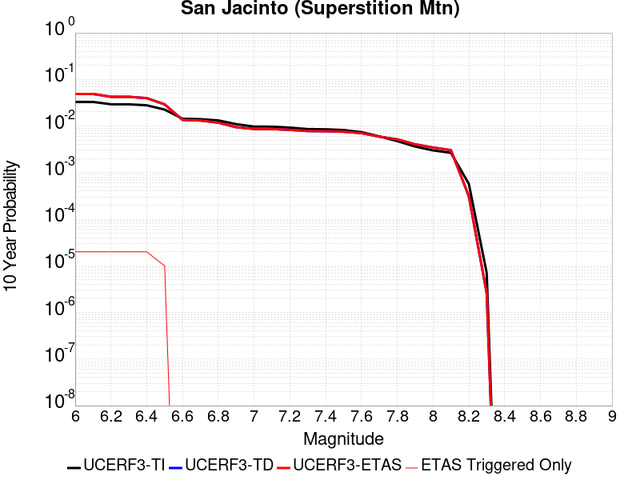 |

| Magnitude | 1 wk TI Prob | 1 wk TD Prob | 1 wk ETAS Prob | 1 wk ETAS/TD Gain | 1 wk ETAS Triggered Only | 1 mo TI Prob | 1 mo TD Prob | 1 mo ETAS Prob | 1 mo ETAS/TD Gain | 1 mo ETAS Triggered Only | 1 yr TI Prob | 1 yr TD Prob | 1 yr ETAS Prob | 1 yr ETAS/TD Gain | 1 yr ETAS Triggered Only | 10 yr TI Prob | 10 yr TD Prob | 10 yr ETAS Prob | 10 yr ETAS/TD Gain | 10 yr ETAS Triggered Only |
|-----|-----|-----|-----|-----|-----|-----|-----|-----|-----|-----|-----|-----|-----|-----|-----|-----|-----|-----|-----|-----|
| 6.0 | 6.4193904E-5 | 9.6002805E-5 | 9.6002805E-5 | 1.0 | 0.0 | 2.7508775E-4 | 4.1138552E-4 | 4.1138552E-4 | 1.0 | 0.0 | 0.0033440501 | 0.004998534 | 0.004998534 | 1.0 | 0.0 | 0.03294174 | 0.048822355 | 0.04884138 | 1.0003897 | 2.0E-5 |
| 6.1 | 6.4193904E-5 | 9.6002805E-5 | 9.6002805E-5 | 1.0 | 0.0 | 2.7508775E-4 | 4.1138552E-4 | 4.1138552E-4 | 1.0 | 0.0 | 0.0033440501 | 0.004998534 | 0.004998534 | 1.0 | 0.0 | 0.03294174 | 0.048822355 | 0.04884138 | 1.0003897 | 2.0E-5 |
| 6.2 | 5.7023593E-5 | 8.315118E-5 | 8.315118E-5 | 1.0 | 0.0 | 2.4436394E-4 | 3.5632294E-4 | 3.5632294E-4 | 1.0 | 0.0 | 0.002971072 | 0.004331248 | 0.004331248 | 1.0 | 0.0 | 0.029316625 | 0.04250458 | 0.04252373 | 1.0004505 | 2.0E-5 |
| 6.3 | 5.6940098E-5 | 8.2996536E-5 | 8.2996536E-5 | 1.0 | 0.0 | 2.4400617E-4 | 3.5566036E-4 | 3.5566036E-4 | 1.0 | 0.0 | 0.002966728 | 0.0043232134 | 0.0043232134 | 1.0 | 0.0 | 0.029274331 | 0.04242795 | 0.0424471 | 1.0004514 | 2.0E-5 |
| 6.4 | 5.4171585E-5 | 7.749044E-5 | 7.749044E-5 | 1.0 | 0.0 | 2.3214328E-4 | 3.320689E-4 | 3.320689E-4 | 1.0 | 0.0 | 0.0028226813 | 0.004037093 | 0.004037093 | 1.0 | 0.0 | 0.02787096 | 0.03971742 | 0.03973663 | 1.0004835 | 2.0E-5 |
| 6.5 | 4.375144E-5 | 5.6427816E-5 | 5.6427816E-5 | 1.0 | 0.0 | 1.874927E-4 | 2.4181772E-4 | 2.4181772E-4 | 1.0 | 0.0 | 0.0022803338 | 0.0029413316 | 0.0029413316 | 1.0 | 0.0 | 0.022570757 | 0.029237961 | 0.02924767 | 1.000332 | 1.0E-5 |
| 6.6 | 2.772192E-5 | 2.5494071E-5 | 2.5494071E-5 | 1.0 | 0.0 | 1.1880282E-4 | 1.09255845E-4 | 1.09255845E-4 | 1.0 | 0.0 | 0.0014454646 | 0.0013293975 | 0.0013293975 | 1.0 | 0.0 | 0.014360986 | 0.013542279 | 0.013542279 | 1.0 | 0.0 |
| 6.7 | 2.7124124E-5 | 2.4705068E-5 | 2.4705068E-5 | 1.0 | 0.0 | 1.1624106E-4 | 1.0587468E-4 | 1.0587468E-4 | 1.0 | 0.0 | 0.0014143161 | 0.0012882812 | 0.0012882812 | 1.0 | 0.0 | 0.014053487 | 0.0131356325 | 0.0131356325 | 1.0 | 0.0 |
| 6.8 | 2.5475807E-5 | 2.2169877E-5 | 2.2169877E-5 | 1.0 | 0.0 | 1.0917746E-4 | 9.501037E-5 | 9.501037E-5 | 1.0 | 0.0 | 0.001328425 | 0.0011561494 | 0.0011561494 | 1.0 | 0.0 | 0.0132051185 | 0.011823943 | 0.011823943 | 1.0 | 0.0 |
| 6.9 | 2.1162023E-5 | 1.7631051E-5 | 1.7631051E-5 | 1.0 | 0.0 | 9.069123E-5 | 7.555948E-5 | 7.555948E-5 | 1.0 | 0.0 | 0.0011036064 | 9.195522E-4 | 9.195522E-4 | 1.0 | 0.0 | 0.010981417 | 0.0094489865 | 0.0094489865 | 1.0 | 0.0 |
| 7.0 | 1.8754288E-5 | 1.616617E-5 | 1.616617E-5 | 1.0 | 0.0 | 8.037304E-5 | 6.928176E-5 | 6.928176E-5 | 1.0 | 0.0 | 9.781026E-4 | 8.4318145E-4 | 8.4318145E-4 | 1.0 | 0.0 | 0.009738087 | 0.008672153 | 0.008672153 | 1.0 | 0.0 |
| 7.1 | 1.8678527E-5 | 1.6091313E-5 | 1.6091313E-5 | 1.0 | 0.0 | 8.0048376E-5 | 6.8960966E-5 | 6.8960966E-5 | 1.0 | 0.0 | 9.7415317E-4 | 8.392788E-4 | 8.392788E-4 | 1.0 | 0.0 | 0.009698939 | 0.008633161 | 0.008633161 | 1.0 | 0.0 |
| 7.2 | 1.7804578E-5 | 1.5385827E-5 | 1.5385827E-5 | 1.0 | 0.0 | 7.6303106E-5 | 6.59376E-5 | 6.59376E-5 | 1.0 | 0.0 | 9.285943E-4 | 8.024969E-4 | 8.024969E-4 | 1.0 | 0.0 | 0.009247236 | 0.0082646 | 0.0082646 | 1.0 | 0.0 |
| 7.3 | 1.6583685E-5 | 1.4534898E-5 | 1.4534898E-5 | 1.0 | 0.0 | 7.1070994E-5 | 6.229094E-5 | 6.229094E-5 | 1.0 | 0.0 | 8.649459E-4 | 7.581304E-4 | 7.581304E-4 | 1.0 | 0.0 | 0.00861587 | 0.007819886 | 0.007819886 | 1.0 | 0.0 |
| 7.4 | 1.6387552E-5 | 1.4399775E-5 | 1.4399775E-5 | 1.0 | 0.0 | 7.023047E-5 | 6.171187E-5 | 6.171187E-5 | 1.0 | 0.0 | 8.5472054E-4 | 7.5108506E-4 | 7.5108506E-4 | 1.0 | 0.0 | 0.008514405 | 0.0077492767 | 0.0077492767 | 1.0 | 0.0 |
| 7.5 | 1.5790754E-5 | 1.4040427E-5 | 1.4040427E-5 | 1.0 | 0.0 | 6.767291E-5 | 6.0171882E-5 | 6.0171882E-5 | 1.0 | 0.0 | 8.236062E-4 | 7.323484E-4 | 7.323484E-4 | 1.0 | 0.0 | 0.008205604 | 0.0075598094 | 0.0075598094 | 1.0 | 0.0 |
| 7.6 | 1.4248672E-5 | 1.3059319E-5 | 1.3059319E-5 | 1.0 | 0.0 | 6.106431E-5 | 5.5967317E-5 | 5.5967317E-5 | 1.0 | 0.0 | 7.432043E-4 | 6.811908E-4 | 6.811908E-4 | 1.0 | 0.0 | 0.007407237 | 0.007042322 | 0.007042322 | 1.0 | 0.0 |
| 7.7 | 1.15449975E-5 | 1.0907912E-5 | 1.0907912E-5 | 1.0 | 0.0 | 4.947762E-5 | 4.6747362E-5 | 4.6747362E-5 | 1.0 | 0.0 | 6.022235E-4 | 5.6900125E-4 | 5.6900125E-4 | 1.0 | 0.0 | 0.006005941 | 0.005912308 | 0.005912308 | 1.0 | 0.0 |
| 7.8 | 9.1391985E-6 | 9.518418E-6 | 9.518418E-6 | 1.0 | 0.0 | 3.9167408E-5 | 4.0792587E-5 | 4.0792587E-5 | 1.0 | 0.0 | 4.767588E-4 | 4.9653713E-4 | 4.9653713E-4 | 1.0 | 0.0 | 0.0047573727 | 0.0051787267 | 0.0051787267 | 1.0 | 0.0 |
| 7.9 | 6.973017E-6 | 7.385764E-6 | 7.385764E-6 | 1.0 | 0.0 | 2.9884017E-5 | 3.1652893E-5 | 3.1652893E-5 | 1.0 | 0.0 | 3.6377716E-4 | 3.8530637E-4 | 3.8530637E-4 | 1.0 | 0.0 | 0.0036318225 | 0.0040537147 | 0.0040537147 | 1.0 | 0.0 |
| 8.0 | 5.7638235E-6 | 6.263249E-6 | 6.263249E-6 | 1.0 | 0.0 | 2.4701867E-5 | 2.6842223E-5 | 2.6842223E-5 | 1.0 | 0.0 | 3.0070372E-4 | 3.2675554E-4 | 3.2675554E-4 | 1.0 | 0.0 | 0.0030029714 | 0.0034551586 | 0.0034551586 | 1.0 | 0.0 |
| 8.1 | 5.1124434E-6 | 5.498651E-6 | 5.498651E-6 | 1.0 | 0.0 | 2.1910288E-5 | 2.3565437E-5 | 2.3565437E-5 | 1.0 | 0.0 | 2.6672508E-4 | 2.8687192E-4 | 2.8687192E-4 | 1.0 | 0.0 | 0.0026640517 | 0.0030418336 | 0.0030418336 | 1.0 | 0.0 |
| 8.2 | 1.1075938E-6 | 5.339512E-7 | 5.339512E-7 | 1.0 | 0.0 | 4.7468216E-6 | 2.2883605E-6 | 2.2883605E-6 | 1.0 | 0.0 | 5.779102E-5 | 2.7860455E-5 | 2.7860455E-5 | 1.0 | 0.0 | 5.777599E-4 | 3.136582E-4 | 3.136582E-4 | 1.0 | 0.0 |
| 8.3 | 1.3584393E-8 | 4.4764112E-9 | 4.4764112E-9 | 1.0 | 0.0 | 5.8218827E-8 | 1.918462E-8 | 1.918462E-8 | 1.0 | 0.0 | 7.0881396E-7 | 2.3357273E-7 | 2.3357273E-7 | 1.0 | 0.0 | 7.0881174E-6 | 2.6165987E-6 | 2.6165987E-6 | 1.0 | 0.0 |

## Elsinore (Temecula) rev
*[(top)](#table-of-contents)*

| 1 Week | 1 Month | 1 Year | 10 Year |
|-----|-----|-----|-----|
|  | 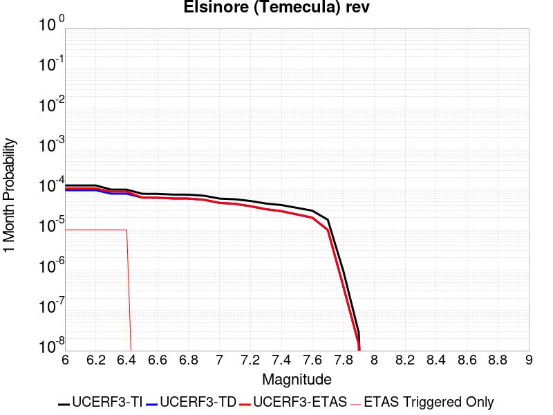 |  |  |

| Magnitude | 1 wk TI Prob | 1 wk TD Prob | 1 wk ETAS Prob | 1 wk ETAS/TD Gain | 1 wk ETAS Triggered Only | 1 mo TI Prob | 1 mo TD Prob | 1 mo ETAS Prob | 1 mo ETAS/TD Gain | 1 mo ETAS Triggered Only | 1 yr TI Prob | 1 yr TD Prob | 1 yr ETAS Prob | 1 yr ETAS/TD Gain | 1 yr ETAS Triggered Only | 10 yr TI Prob | 10 yr TD Prob | 10 yr ETAS Prob | 10 yr ETAS/TD Gain | 10 yr ETAS Triggered Only |
|-----|-----|-----|-----|-----|-----|-----|-----|-----|-----|-----|-----|-----|-----|-----|-----|-----|-----|-----|-----|-----|
| 6.0 | 2.9514995E-5 | 2.2519711E-5 | 2.2519711E-5 | 1.0 | 0.0 | 1.264867E-4 | 9.65096E-5 | 1.0650863E-4 | 1.1036066 | 1.0E-5 | 0.0015388876 | 0.001174393 | 0.0011843813 | 1.008505 | 1.0E-5 | 0.015282745 | 0.0117053585 | 0.011725125 | 1.0016886 | 2.0E-5 |
| 6.1 | 2.9514995E-5 | 2.2519711E-5 | 2.2519711E-5 | 1.0 | 0.0 | 1.264867E-4 | 9.65096E-5 | 1.0650863E-4 | 1.1036066 | 1.0E-5 | 0.0015388876 | 0.001174393 | 0.0011843813 | 1.008505 | 1.0E-5 | 0.015282745 | 0.0117053585 | 0.011725125 | 1.0016886 | 2.0E-5 |
| 6.2 | 2.9514995E-5 | 2.2519711E-5 | 2.2519711E-5 | 1.0 | 0.0 | 1.264867E-4 | 9.65096E-5 | 1.0650863E-4 | 1.1036066 | 1.0E-5 | 0.0015388876 | 0.001174393 | 0.0011843813 | 1.008505 | 1.0E-5 | 0.015282745 | 0.0117053585 | 0.011725125 | 1.0016886 | 2.0E-5 |
| 6.3 | 2.3223649E-5 | 1.8409017E-5 | 1.8409017E-5 | 1.0 | 0.0 | 9.952613E-5 | 7.889349E-5 | 8.88927E-5 | 1.1267432 | 1.0E-5 | 0.001211057 | 9.601222E-4 | 9.701126E-4 | 1.0104053 | 1.0E-5 | 0.012044783 | 0.009568522 | 0.009588331 | 1.0020702 | 2.0E-5 |
| 6.4 | 2.3223649E-5 | 1.8409017E-5 | 1.8409017E-5 | 1.0 | 0.0 | 9.952613E-5 | 7.889349E-5 | 8.88927E-5 | 1.1267432 | 1.0E-5 | 0.001211057 | 9.601222E-4 | 9.701126E-4 | 1.0104053 | 1.0E-5 | 0.012044783 | 0.009568522 | 0.009588331 | 1.0020702 | 2.0E-5 |
| 6.5 | 1.8338875E-5 | 1.4750807E-5 | 1.4750807E-5 | 1.0 | 0.0 | 7.8592806E-5 | 6.321626E-5 | 6.321626E-5 | 1.0 | 0.0 | 9.5644733E-4 | 7.69395E-4 | 7.69395E-4 | 1.0 | 0.0 | 0.009523412 | 0.0076706978 | 0.0076706978 | 1.0 | 0.0 |
| 6.6 | 1.8223333E-5 | 1.461336E-5 | 1.461336E-5 | 1.0 | 0.0 | 7.809766E-5 | 6.262723E-5 | 6.262723E-5 | 1.0 | 0.0 | 9.504242E-4 | 7.622285E-4 | 7.622285E-4 | 1.0 | 0.0 | 0.009463696 | 0.0075995247 | 0.0075995247 | 1.0 | 0.0 |
| 6.7 | 1.7512752E-5 | 1.40276925E-5 | 1.40276925E-5 | 1.0 | 0.0 | 7.505249E-5 | 6.0117345E-5 | 6.0117345E-5 | 1.0 | 0.0 | 9.13381E-4 | 7.316914E-4 | 7.316914E-4 | 1.0 | 0.0 | 0.00909636 | 0.0072990605 | 0.0072990605 | 1.0 | 0.0 |
| 6.8 | 1.7417142E-5 | 1.3951659E-5 | 1.3951659E-5 | 1.0 | 0.0 | 7.4642754E-5 | 5.9791502E-5 | 5.9791502E-5 | 1.0 | 0.0 | 9.083966E-4 | 7.2772696E-4 | 7.2772696E-4 | 1.0 | 0.0 | 0.009046922 | 0.0072600874 | 0.0072600874 | 1.0 | 0.0 |
| 6.9 | 1.6402591E-5 | 1.2989093E-5 | 1.2989093E-5 | 1.0 | 0.0 | 7.0294926E-5 | 5.5666394E-5 | 5.5666394E-5 | 1.0 | 0.0 | 8.5550465E-4 | 6.775353E-4 | 6.775353E-4 | 1.0 | 0.0 | 0.008522186 | 0.006759923 | 0.006759923 | 1.0 | 0.0 |
| 7.0 | 1.3912486E-5 | 1.0878599E-5 | 1.0878599E-5 | 1.0 | 0.0 | 5.9623577E-5 | 4.662175E-5 | 4.662175E-5 | 1.0 | 0.0 | 7.2567526E-4 | 5.674747E-4 | 5.674747E-4 | 1.0 | 0.0 | 0.0072331014 | 0.0056636394 | 0.0056636394 | 1.0 | 0.0 |
| 7.1 | 1.3405147E-5 | 1.0327708E-5 | 1.0327708E-5 | 1.0 | 0.0 | 5.7449364E-5 | 4.426087E-5 | 4.426087E-5 | 1.0 | 0.0 | 6.9922156E-4 | 5.3874543E-4 | 5.3874543E-4 | 1.0 | 0.0 | 0.0069702556 | 0.0053774444 | 0.0053774444 | 1.0 | 0.0 |
| 7.2 | 1.21402E-5 | 8.9969135E-6 | 8.9969135E-6 | 1.0 | 0.0 | 5.202839E-5 | 3.855764E-5 | 3.855764E-5 | 1.0 | 0.0 | 6.332616E-4 | 4.6933992E-4 | 4.6933992E-4 | 1.0 | 0.0 | 0.0063146 | 0.004684822 | 0.004684822 | 1.0 | 0.0 |
| 7.3 | 1.05047775E-5 | 7.5718904E-6 | 7.5718904E-6 | 1.0 | 0.0 | 4.5019697E-5 | 3.2450564E-5 | 3.2450564E-5 | 1.0 | 0.0 | 5.4797693E-4 | 3.9501544E-4 | 3.9501544E-4 | 1.0 | 0.0 | 0.005466277 | 0.00394353 | 0.00394353 | 1.0 | 0.0 |
| 7.4 | 9.624483E-6 | 6.7869523E-6 | 6.7869523E-6 | 1.0 | 0.0 | 4.124713E-5 | 2.9086623E-5 | 2.9086623E-5 | 1.0 | 0.0 | 5.0206814E-4 | 3.5407348E-4 | 3.5407348E-4 | 1.0 | 0.0 | 0.005009353 | 0.003535245 | 0.003535245 | 1.0 | 0.0 |
| 7.5 | 8.215151E-6 | 5.6356125E-6 | 5.6356125E-6 | 1.0 | 0.0 | 3.5207315E-5 | 2.4152409E-5 | 2.4152409E-5 | 1.0 | 0.0 | 4.2856473E-4 | 2.9401717E-4 | 2.9401717E-4 | 1.0 | 0.0 | 0.004277392 | 0.0029364098 | 0.0029364098 | 1.0 | 0.0 |
| 7.6 | 6.975058E-6 | 4.6760947E-6 | 4.6760947E-6 | 1.0 | 0.0 | 2.9892764E-5 | 2.0040257E-5 | 2.0040257E-5 | 1.0 | 0.0 | 3.6388362E-4 | 2.43964E-4 | 2.43964E-4 | 1.0 | 0.0 | 0.0036328835 | 0.002437078 | 0.002437078 | 1.0 | 0.0 |
| 7.7 | 4.159604E-6 | 2.3269624E-6 | 2.3269624E-6 | 1.0 | 0.0 | 1.7826753E-5 | 9.972662E-6 | 9.972662E-6 | 1.0 | 0.0 | 2.1701909E-4 | 1.2141114E-4 | 1.2141114E-4 | 1.0 | 0.0 | 0.0021680726 | 0.0012135211 | 0.0012135211 | 1.0 | 0.0 |
| 7.8 | 2.2692414E-7 | 9.384624E-8 | 9.384624E-8 | 1.0 | 0.0 | 9.725317E-7 | 4.021981E-7 | 4.021981E-7 | 1.0 | 0.0 | 1.1840509E-5 | 4.8967545E-6 | 4.8967545E-6 | 1.0 | 0.0 | 1.1839878E-4 | 4.8966795E-5 | 4.8966795E-5 | 1.0 | 0.0 |
| 7.9 | 6.676829E-9 | 3.4397993E-9 | 3.4397993E-9 | 1.0 | 0.0 | 2.861498E-8 | 1.4741998E-8 | 1.4741998E-8 | 1.0 | 0.0 | 3.4838732E-7 | 1.794838E-7 | 1.794838E-7 | 1.0 | 0.0 | 3.4838679E-6 | 1.7948367E-6 | 1.7948367E-6 | 1.0 | 0.0 |

## San Gabriel (Extension)
*[(top)](#table-of-contents)*

| 1 Week | 1 Month | 1 Year | 10 Year |
|-----|-----|-----|-----|
| 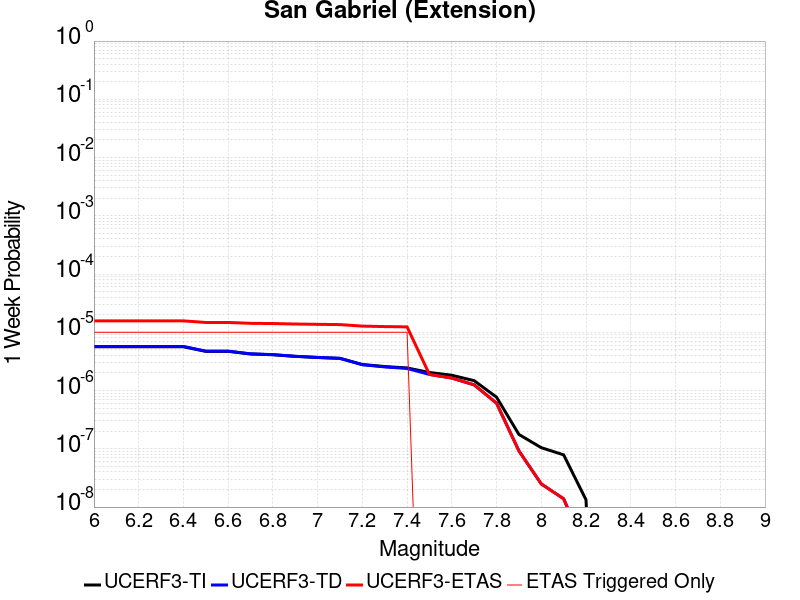 |  |  | 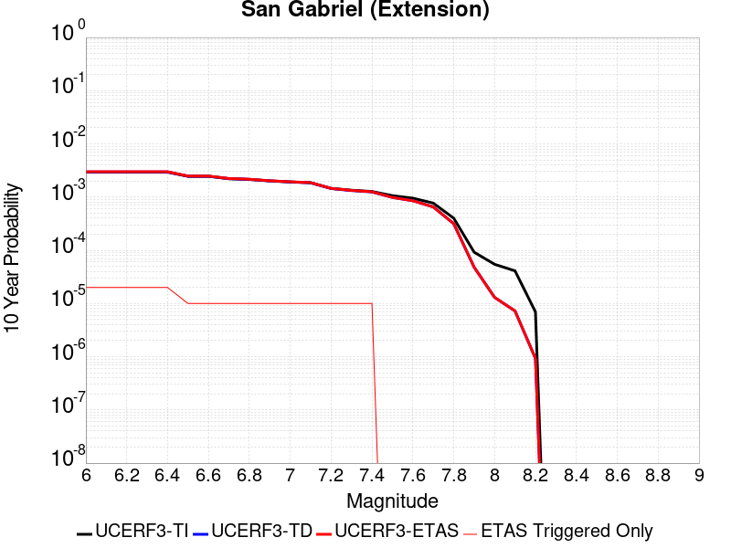 |

| Magnitude | 1 wk TI Prob | 1 wk TD Prob | 1 wk ETAS Prob | 1 wk ETAS/TD Gain | 1 wk ETAS Triggered Only | 1 mo TI Prob | 1 mo TD Prob | 1 mo ETAS Prob | 1 mo ETAS/TD Gain | 1 mo ETAS Triggered Only | 1 yr TI Prob | 1 yr TD Prob | 1 yr ETAS Prob | 1 yr ETAS/TD Gain | 1 yr ETAS Triggered Only | 10 yr TI Prob | 10 yr TD Prob | 10 yr ETAS Prob | 10 yr ETAS/TD Gain | 10 yr ETAS Triggered Only |
|-----|-----|-----|-----|-----|-----|-----|-----|-----|-----|-----|-----|-----|-----|-----|-----|-----|-----|-----|-----|-----|
| 6.0 | 5.6486106E-6 | 5.7171515E-6 | 1.5717094E-5 | 2.7491128 | 1.0E-5 | 2.4208108E-5 | 2.4501855E-5 | 3.450161E-5 | 1.4081224 | 1.0E-5 | 2.9469383E-4 | 2.9827052E-4 | 3.082675E-4 | 1.0335166 | 1.0E-5 | 0.0029430336 | 0.0029788336 | 0.0029987742 | 1.0066941 | 2.0E-5 |
| 6.1 | 5.6486106E-6 | 5.7171515E-6 | 1.5717094E-5 | 2.7491128 | 1.0E-5 | 2.4208108E-5 | 2.4501855E-5 | 3.450161E-5 | 1.4081224 | 1.0E-5 | 2.9469383E-4 | 2.9827052E-4 | 3.082675E-4 | 1.0335166 | 1.0E-5 | 0.0029430336 | 0.0029788336 | 0.0029987742 | 1.0066941 | 2.0E-5 |
| 6.2 | 5.6486106E-6 | 5.7171515E-6 | 1.5717094E-5 | 2.7491128 | 1.0E-5 | 2.4208108E-5 | 2.4501855E-5 | 3.450161E-5 | 1.4081224 | 1.0E-5 | 2.9469383E-4 | 2.9827052E-4 | 3.082675E-4 | 1.0335166 | 1.0E-5 | 0.0029430336 | 0.0029788336 | 0.0029987742 | 1.0066941 | 2.0E-5 |
| 6.3 | 5.6486106E-6 | 5.7171515E-6 | 1.5717094E-5 | 2.7491128 | 1.0E-5 | 2.4208108E-5 | 2.4501855E-5 | 3.450161E-5 | 1.4081224 | 1.0E-5 | 2.9469383E-4 | 2.9827052E-4 | 3.082675E-4 | 1.0335166 | 1.0E-5 | 0.0029430336 | 0.0029788336 | 0.0029987742 | 1.0066941 | 2.0E-5 |
| 6.4 | 5.6486106E-6 | 5.7171515E-6 | 1.5717094E-5 | 2.7491128 | 1.0E-5 | 2.4208108E-5 | 2.4501855E-5 | 3.450161E-5 | 1.4081224 | 1.0E-5 | 2.9469383E-4 | 2.9827052E-4 | 3.082675E-4 | 1.0335166 | 1.0E-5 | 0.0029430336 | 0.0029788336 | 0.0029987742 | 1.0066941 | 2.0E-5 |
| 6.5 | 4.7134554E-6 | 4.754572E-6 | 1.4754524E-5 | 3.1032288 | 1.0E-5 | 2.0200367E-5 | 2.0376581E-5 | 3.0376377E-5 | 1.4907495 | 1.0E-5 | 2.459117E-4 | 2.4805748E-4 | 2.58055E-4 | 1.0403032 | 1.0E-5 | 0.0024563975 | 0.0024778957 | 0.0024878709 | 1.0040257 | 1.0E-5 |
| 6.6 | 4.7134554E-6 | 4.754572E-6 | 1.4754524E-5 | 3.1032288 | 1.0E-5 | 2.0200367E-5 | 2.0376581E-5 | 3.0376377E-5 | 1.4907495 | 1.0E-5 | 2.459117E-4 | 2.4805748E-4 | 2.58055E-4 | 1.0403032 | 1.0E-5 | 0.0024563975 | 0.0024778957 | 0.0024878709 | 1.0040257 | 1.0E-5 |
| 6.7 | 4.2468837E-6 | 4.2743873E-6 | 1.4274345E-5 | 3.3395066 | 1.0E-5 | 1.8200803E-5 | 1.8318677E-5 | 2.8318495E-5 | 1.5458809 | 1.0E-5 | 2.2157225E-4 | 2.230078E-4 | 2.3300557E-4 | 1.0448315 | 1.0E-5 | 0.0022135144 | 0.0022279175 | 0.0022378953 | 1.0044785 | 1.0E-5 |
| 6.8 | 4.1180615E-6 | 4.141776E-6 | 1.4141735E-5 | 3.414413 | 1.0E-5 | 1.7648716E-5 | 1.7750353E-5 | 2.7750175E-5 | 1.5633591 | 1.0E-5 | 2.1485193E-4 | 2.1608983E-4 | 2.2608766E-4 | 1.046267 | 1.0E-5 | 0.0021464431 | 0.0021588737 | 0.0021688521 | 1.0046221 | 1.0E-5 |
| 6.9 | 3.863861E-6 | 3.8800904E-6 | 1.38800515E-5 | 3.5772495 | 1.0E-5 | 1.65593E-5 | 1.6628857E-5 | 2.6628692E-5 | 1.6013542 | 1.0E-5 | 2.0159081E-4 | 2.0243821E-4 | 2.1243619E-4 | 1.0493878 | 1.0E-5 | 0.0020140803 | 0.002022611 | 0.0020325908 | 1.0049341 | 1.0E-5 |
| 7.0 | 3.6947372E-6 | 3.705989E-6 | 1.3705952E-5 | 3.698325 | 1.0E-5 | 1.5834492E-5 | 1.5882717E-5 | 2.5882558E-5 | 1.6296052 | 1.0E-5 | 1.9276788E-4 | 1.9335559E-4 | 2.0335366E-4 | 1.0517082 | 1.0E-5 | 0.0019260074 | 0.0019319453 | 0.0019419261 | 1.0051662 | 1.0E-5 |
| 7.1 | 3.5686835E-6 | 3.5732085E-6 | 1.35731725E-5 | 3.7985952 | 1.0E-5 | 1.5294268E-5 | 1.5313664E-5 | 2.5313511E-5 | 1.6530015 | 1.0E-5 | 1.861918E-4 | 1.8642857E-4 | 1.9642671E-4 | 1.0536299 | 1.0E-5 | 0.0018603588 | 0.001862793 | 0.0018727743 | 1.0053583 | 1.0E-5 |
| 7.2 | 2.8023446E-6 | 2.7770957E-6 | 1.2777068E-5 | 4.6008744 | 1.0E-5 | 1.2009994E-5 | 1.1901785E-5 | 2.1901666E-5 | 1.8402001 | 1.0E-5 | 1.4621185E-4 | 1.448947E-4 | 1.5489325E-4 | 1.0690056 | 1.0E-5 | 0.001461157 | 0.0014480185 | 0.001458004 | 1.006896 | 1.0E-5 |
| 7.3 | 2.5843012E-6 | 2.546268E-6 | 1.2546242E-5 | 4.9273067 | 1.0E-5 | 1.1075529E-5 | 1.0912532E-5 | 2.0912423E-5 | 1.9163677 | 1.0E-5 | 1.3483623E-4 | 1.3285207E-4 | 1.4285074E-4 | 1.0752617 | 1.0E-5 | 0.0013475444 | 0.0013277415 | 0.0013377282 | 1.0075216 | 1.0E-5 |
| 7.4 | 2.4464468E-6 | 2.3969635E-6 | 1.2396939E-5 | 5.171935 | 1.0E-5 | 1.04847295E-5 | 1.0272661E-5 | 2.0272557E-5 | 1.9734477 | 1.0E-5 | 1.276441E-4 | 1.2506256E-4 | 1.3506132E-4 | 1.07995 | 1.0E-5 | 0.0012757082 | 0.0012499366 | 0.0012599241 | 1.0079904 | 1.0E-5 |
| 7.5 | 2.0420266E-6 | 1.891297E-6 | 1.891297E-6 | 1.0 | 0.0 | 8.751514E-6 | 8.105533E-6 | 8.105533E-6 | 1.0 | 0.0 | 1.0654447E-4 | 9.868044E-5 | 9.868044E-5 | 1.0 | 0.0 | 0.001064934 | 9.863748E-4 | 9.863748E-4 | 1.0 | 0.0 |
| 7.6 | 1.8326596E-6 | 1.6400626E-6 | 1.6400626E-6 | 1.0 | 0.0 | 7.854232E-6 | 7.028821E-6 | 7.028821E-6 | 1.0 | 0.0 | 9.562107E-5 | 8.557256E-5 | 8.557256E-5 | 1.0 | 0.0 | 9.5579936E-4 | 8.5540337E-4 | 8.5540337E-4 | 1.0 | 0.0 |
| 7.7 | 1.4786998E-6 | 1.2525887E-6 | 1.2525887E-6 | 1.0 | 0.0 | 6.3372695E-6 | 5.368226E-6 | 5.368226E-6 | 1.0 | 0.0 | 7.715353E-5 | 6.535621E-5 | 6.535621E-5 | 1.0 | 0.0 | 7.7126746E-4 | 6.5337884E-4 | 6.5337884E-4 | 1.0 | 0.0 |
| 7.8 | 7.6975533E-7 | 6.071072E-7 | 6.071072E-7 | 1.0 | 0.0 | 3.2989474E-6 | 2.6018854E-6 | 2.6018854E-6 | 1.0 | 0.0 | 4.0163945E-5 | 3.1677497E-5 | 3.1677497E-5 | 1.0 | 0.0 | 4.0156685E-4 | 3.1673696E-4 | 3.1673696E-4 | 1.0 | 0.0 |
| 7.9 | 1.7645915E-7 | 9.217281E-8 | 9.217281E-8 | 1.0 | 0.0 | 7.562533E-7 | 3.950263E-7 | 3.950263E-7 | 1.0 | 0.0 | 9.207345E-6 | 4.8094344E-6 | 4.8094344E-6 | 1.0 | 0.0 | 9.206964E-5 | 4.8098358E-5 | 4.8098358E-5 | 1.0 | 0.0 |
| 8.0 | 1.0463461E-7 | 2.4959572E-8 | 2.4959572E-8 | 1.0 | 0.0 | 4.4843398E-7 | 1.0696959E-7 | 1.0696959E-7 | 1.0 | 0.0 | 5.45967E-6 | 1.302354E-6 | 1.302354E-6 | 1.0 | 0.0 | 5.459536E-5 | 1.3028511E-5 | 1.3028511E-5 | 1.0 | 0.0 |
| 8.1 | 7.875717E-8 | 1.3871283E-8 | 1.3871283E-8 | 1.0 | 0.0 | 3.3753068E-7 | 5.9448354E-8 | 5.9448354E-8 | 1.0 | 0.0 | 4.109428E-6 | 7.2378344E-7 | 7.2378344E-7 | 1.0 | 0.0 | 4.109352E-5 | 7.2428584E-6 | 7.2428584E-6 | 1.0 | 0.0 |
| 8.2 | 1.33163E-8 | 1.7741913E-9 | 1.7741913E-9 | 1.0 | 0.0 | 5.7069855E-8 | 7.603677E-9 | 7.603677E-9 | 1.0 | 0.0 | 6.9482525E-7 | 9.257475E-8 | 9.257475E-8 | 1.0 | 0.0 | 6.9482307E-6 | 9.27746E-7 | 9.27746E-7 | 1.0 | 0.0 |

## Round Valley
*[(top)](#table-of-contents)*

| 1 Week | 1 Month | 1 Year | 10 Year |
|-----|-----|-----|-----|
|  |  |  |  |

| Magnitude | 1 wk TI Prob | 1 wk TD Prob | 1 wk ETAS Prob | 1 wk ETAS/TD Gain | 1 wk ETAS Triggered Only | 1 mo TI Prob | 1 mo TD Prob | 1 mo ETAS Prob | 1 mo ETAS/TD Gain | 1 mo ETAS Triggered Only | 1 yr TI Prob | 1 yr TD Prob | 1 yr ETAS Prob | 1 yr ETAS/TD Gain | 1 yr ETAS Triggered Only | 10 yr TI Prob | 10 yr TD Prob | 10 yr ETAS Prob | 10 yr ETAS/TD Gain | 10 yr ETAS Triggered Only |
|-----|-----|-----|-----|-----|-----|-----|-----|-----|-----|-----|-----|-----|-----|-----|-----|-----|-----|-----|-----|-----|
| 6.0 | 1.588152E-5 | 1.3670716E-5 | 1.3670716E-5 | 1.0 | 0.0 | 6.806188E-5 | 5.8587688E-5 | 5.8587688E-5 | 1.0 | 0.0 | 8.283384E-4 | 7.131111E-4 | 7.131111E-4 | 1.0 | 0.0 | 0.008252576 | 0.007112115 | 0.007131973 | 1.0027921 | 2.0E-5 |
| 6.1 | 1.588152E-5 | 1.3670716E-5 | 1.3670716E-5 | 1.0 | 0.0 | 6.806188E-5 | 5.8587688E-5 | 5.8587688E-5 | 1.0 | 0.0 | 8.283384E-4 | 7.131111E-4 | 7.131111E-4 | 1.0 | 0.0 | 0.008252576 | 0.007112115 | 0.007131973 | 1.0027921 | 2.0E-5 |
| 6.2 | 1.588152E-5 | 1.3670716E-5 | 1.3670716E-5 | 1.0 | 0.0 | 6.806188E-5 | 5.8587688E-5 | 5.8587688E-5 | 1.0 | 0.0 | 8.283384E-4 | 7.131111E-4 | 7.131111E-4 | 1.0 | 0.0 | 0.008252576 | 0.007112115 | 0.007131973 | 1.0027921 | 2.0E-5 |
| 6.3 | 1.588152E-5 | 1.3670716E-5 | 1.3670716E-5 | 1.0 | 0.0 | 6.806188E-5 | 5.8587688E-5 | 5.8587688E-5 | 1.0 | 0.0 | 8.283384E-4 | 7.131111E-4 | 7.131111E-4 | 1.0 | 0.0 | 0.008252576 | 0.007112115 | 0.007131973 | 1.0027921 | 2.0E-5 |
| 6.4 | 1.588152E-5 | 1.3670716E-5 | 1.3670716E-5 | 1.0 | 0.0 | 6.806188E-5 | 5.8587688E-5 | 5.8587688E-5 | 1.0 | 0.0 | 8.283384E-4 | 7.131111E-4 | 7.131111E-4 | 1.0 | 0.0 | 0.008252576 | 0.007112115 | 0.007131973 | 1.0027921 | 2.0E-5 |
| 6.5 | 1.0646776E-5 | 7.952968E-6 | 7.952968E-6 | 1.0 | 0.0 | 4.5628243E-5 | 3.408375E-5 | 3.408375E-5 | 1.0 | 0.0 | 5.553823E-4 | 4.1489903E-4 | 4.1489903E-4 | 1.0 | 0.0 | 0.005539963 | 0.004142073 | 0.0041520316 | 1.0024042 | 1.0E-5 |
| 6.6 | 8.632956E-6 | 5.768648E-6 | 5.768648E-6 | 1.0 | 0.0 | 3.6997862E-5 | 2.4722565E-5 | 2.4722565E-5 | 1.0 | 0.0 | 4.5035584E-4 | 3.0095948E-4 | 3.0095948E-4 | 1.0 | 0.0 | 0.0044944426 | 0.003005897 | 0.003015867 | 1.0033168 | 1.0E-5 |
| 6.7 | 8.632956E-6 | 5.768648E-6 | 5.768648E-6 | 1.0 | 0.0 | 3.6997862E-5 | 2.4722565E-5 | 2.4722565E-5 | 1.0 | 0.0 | 4.5035584E-4 | 3.0095948E-4 | 3.0095948E-4 | 1.0 | 0.0 | 0.0044944426 | 0.003005897 | 0.003015867 | 1.0033168 | 1.0E-5 |
| 6.8 | 7.143895E-6 | 4.2017227E-6 | 4.2017227E-6 | 1.0 | 0.0 | 3.0616335E-5 | 1.800727E-5 | 1.800727E-5 | 1.0 | 0.0 | 3.726901E-4 | 2.1921811E-4 | 2.1921811E-4 | 1.0 | 0.0 | 0.0037206567 | 0.0021901834 | 0.0022001616 | 1.0045558 | 1.0E-5 |
| 6.9 | 6.5120694E-6 | 3.6643512E-6 | 3.6643512E-6 | 1.0 | 0.0 | 2.790857E-5 | 1.5704276E-5 | 1.5704276E-5 | 1.0 | 0.0 | 3.3973387E-4 | 1.911843E-4 | 1.911843E-4 | 1.0 | 0.0 | 0.0033921495 | 0.0019103473 | 0.0019203282 | 1.0052247 | 1.0E-5 |
| 7.0 | 5.0614435E-6 | 2.6835412E-6 | 2.6835412E-6 | 1.0 | 0.0 | 2.169172E-5 | 1.1500846E-5 | 1.1500846E-5 | 1.0 | 0.0 | 2.6406467E-4 | 1.4001483E-4 | 1.4001483E-4 | 1.0 | 0.0 | 0.0026375111 | 0.0013993676 | 0.0014093536 | 1.0071361 | 1.0E-5 |
| 7.1 | 4.41728E-6 | 2.3573723E-6 | 2.3573723E-6 | 1.0 | 0.0 | 1.8931061E-5 | 1.0102991E-5 | 1.0102991E-5 | 1.0 | 0.0 | 2.304613E-4 | 1.2299795E-4 | 1.2299795E-4 | 1.0 | 0.0 | 0.0023022245 | 0.0012293953 | 0.001239383 | 1.0081241 | 1.0E-5 |
| 7.2 | 2.535495E-6 | 1.1208174E-6 | 1.1208174E-6 | 1.0 | 0.0 | 1.0866362E-5 | 4.803497E-6 | 4.803497E-6 | 1.0 | 0.0 | 1.3228992E-4 | 5.8481528E-5 | 5.8481528E-5 | 1.0 | 0.0 | 0.0013221119 | 5.847126E-4 | 5.847126E-4 | 1.0 | 0.0 |
| 7.3 | 7.900015E-7 | 4.0890467E-7 | 4.0890467E-7 | 1.0 | 0.0 | 3.3857161E-6 | 1.7524486E-6 | 1.7524486E-6 | 1.0 | 0.0 | 4.1220315E-5 | 2.1336062E-5 | 2.1336062E-5 | 1.0 | 0.0 | 4.121267E-4 | 2.1336062E-4 | 2.1336062E-4 | 1.0 | 0.0 |

## Hosgri (Extension)
*[(top)](#table-of-contents)*

| 1 Week | 1 Month | 1 Year | 10 Year |
|-----|-----|-----|-----|
|  |  | 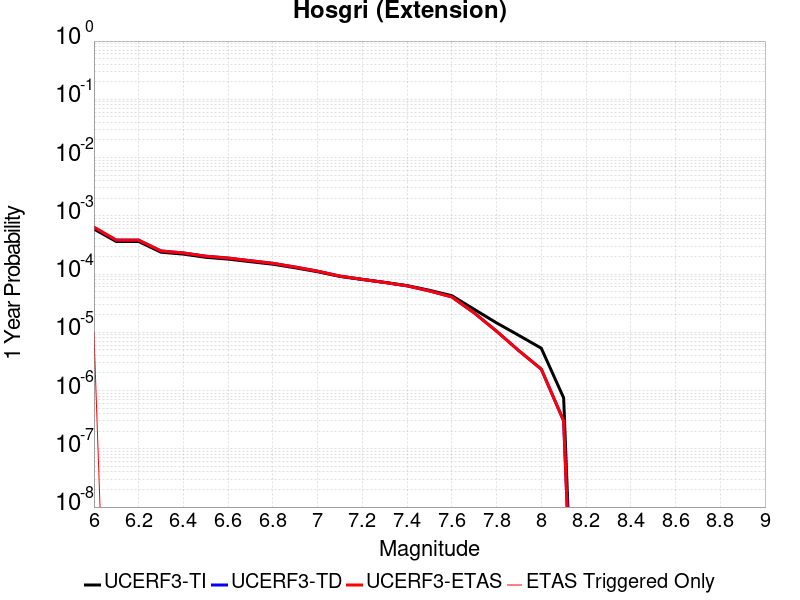 |  |

| Magnitude | 1 wk TI Prob | 1 wk TD Prob | 1 wk ETAS Prob | 1 wk ETAS/TD Gain | 1 wk ETAS Triggered Only | 1 mo TI Prob | 1 mo TD Prob | 1 mo ETAS Prob | 1 mo ETAS/TD Gain | 1 mo ETAS Triggered Only | 1 yr TI Prob | 1 yr TD Prob | 1 yr ETAS Prob | 1 yr ETAS/TD Gain | 1 yr ETAS Triggered Only | 10 yr TI Prob | 10 yr TD Prob | 10 yr ETAS Prob | 10 yr ETAS/TD Gain | 10 yr ETAS Triggered Only |
|-----|-----|-----|-----|-----|-----|-----|-----|-----|-----|-----|-----|-----|-----|-----|-----|-----|-----|-----|-----|-----|
| 6.0 | 1.1369135E-5 | 1.20832E-5 | 1.20832E-5 | 1.0 | 0.0 | 4.8723956E-5 | 5.1784245E-5 | 5.1784245E-5 | 1.0 | 0.0 | 5.9305265E-4 | 6.3031353E-4 | 6.403072E-4 | 1.0158551 | 1.0E-5 | 0.005914725 | 0.0062875063 | 0.0063073807 | 1.003161 | 2.0E-5 |
| 6.1 | 6.934979E-6 | 7.324637E-6 | 7.324637E-6 | 1.0 | 0.0 | 2.9721E-5 | 3.1390948E-5 | 3.1390948E-5 | 1.0 | 0.0 | 3.617931E-4 | 3.821219E-4 | 3.821219E-4 | 1.0 | 0.0 | 0.0036120464 | 0.0038150612 | 0.0038150612 | 1.0 | 0.0 |
| 6.2 | 6.934979E-6 | 7.324637E-6 | 7.324637E-6 | 1.0 | 0.0 | 2.9721E-5 | 3.1390948E-5 | 3.1390948E-5 | 1.0 | 0.0 | 3.617931E-4 | 3.821219E-4 | 3.821219E-4 | 1.0 | 0.0 | 0.0036120464 | 0.0038150612 | 0.0038150612 | 1.0 | 0.0 |
| 6.3 | 4.5484676E-6 | 4.7693884E-6 | 4.7693884E-6 | 1.0 | 0.0 | 1.9493287E-5 | 2.0440079E-5 | 2.0440079E-5 | 1.0 | 0.0 | 2.3730492E-4 | 2.4882995E-4 | 2.4882995E-4 | 1.0 | 0.0 | 0.0023705168 | 0.002485556 | 0.002485556 | 1.0 | 0.0 |
| 6.4 | 4.218095E-6 | 4.4169165E-6 | 4.4169165E-6 | 1.0 | 0.0 | 1.8077424E-5 | 1.8929508E-5 | 1.8929508E-5 | 1.0 | 0.0 | 2.2007042E-4 | 2.304427E-4 | 2.304427E-4 | 1.0 | 0.0 | 0.002198526 | 0.0023020708 | 0.0023020708 | 1.0 | 0.0 |
| 6.5 | 3.717374E-6 | 3.883928E-6 | 3.883928E-6 | 1.0 | 0.0 | 1.5931506E-5 | 1.6645301E-5 | 1.6645301E-5 | 1.0 | 0.0 | 1.9394881E-4 | 2.0263788E-4 | 2.0263788E-4 | 1.0 | 0.0 | 0.0019377962 | 0.0020245498 | 0.0020245498 | 1.0 | 0.0 |
| 6.6 | 3.4605036E-6 | 3.6083538E-6 | 3.6083538E-6 | 1.0 | 0.0 | 1.4830645E-5 | 1.5464282E-5 | 1.5464282E-5 | 1.0 | 0.0 | 1.8054814E-4 | 1.8826152E-4 | 1.8826152E-4 | 1.0 | 0.0 | 0.0018040152 | 0.001881035 | 0.001881035 | 1.0 | 0.0 |
| 6.7 | 3.123439E-6 | 3.246613E-6 | 3.246613E-6 | 1.0 | 0.0 | 1.33860985E-5 | 1.3913982E-5 | 1.3913982E-5 | 1.0 | 0.0 | 1.6296357E-4 | 1.6938966E-4 | 1.6938966E-4 | 1.0 | 0.0 | 0.001628441 | 0.0016926165 | 0.0016926165 | 1.0 | 0.0 |
| 6.8 | 2.8290783E-6 | 2.9305816E-6 | 2.9305816E-6 | 1.0 | 0.0 | 1.2124565E-5 | 1.2559575E-5 | 1.2559575E-5 | 1.0 | 0.0 | 1.4760658E-4 | 1.5290218E-4 | 1.5290218E-4 | 1.0 | 0.0 | 0.0014750857 | 0.0015279786 | 0.0015279786 | 1.0 | 0.0 |
| 6.9 | 2.454112E-6 | 2.5283568E-6 | 2.5283568E-6 | 1.0 | 0.0 | 1.0517581E-5 | 1.0835771E-5 | 1.0835771E-5 | 1.0 | 0.0 | 1.2804402E-4 | 1.3191758E-4 | 1.3191758E-4 | 1.0 | 0.0 | 0.0012797028 | 0.0013183989 | 0.0013183989 | 1.0 | 0.0 |
| 7.0 | 2.1008145E-6 | 2.149904E-6 | 2.149904E-6 | 1.0 | 0.0 | 9.003459E-6 | 9.2138425E-6 | 9.2138425E-6 | 1.0 | 0.0 | 1.096116E-4 | 1.1217279E-4 | 1.1217279E-4 | 1.0 | 0.0 | 0.0010955755 | 0.0011211655 | 0.0011211655 | 1.0 | 0.0 |
| 7.1 | 1.744384E-6 | 1.7686655E-6 | 1.7686655E-6 | 1.0 | 0.0 | 7.47591E-6 | 7.579973E-6 | 7.579973E-6 | 1.0 | 0.0 | 9.1015405E-5 | 9.228228E-5 | 9.228228E-5 | 1.0 | 0.0 | 9.097813E-4 | 9.224413E-4 | 9.224413E-4 | 1.0 | 0.0 |
| 7.2 | 1.5456587E-6 | 1.5563166E-6 | 1.5563166E-6 | 1.0 | 0.0 | 6.6242346E-6 | 6.6699113E-6 | 6.6699113E-6 | 1.0 | 0.0 | 8.064707E-5 | 8.120316E-5 | 8.120316E-5 | 1.0 | 0.0 | 8.0617814E-4 | 8.117361E-4 | 8.117361E-4 | 1.0 | 0.0 |
| 7.3 | 1.3775123E-6 | 1.3766349E-6 | 1.3766349E-6 | 1.0 | 0.0 | 5.9036106E-6 | 5.8998507E-6 | 5.8998507E-6 | 1.0 | 0.0 | 7.187409E-5 | 7.1828326E-5 | 7.1828326E-5 | 1.0 | 0.0 | 7.185085E-4 | 7.180521E-4 | 7.180521E-4 | 1.0 | 0.0 |
| 7.4 | 1.214491E-6 | 1.2023712E-6 | 1.2023712E-6 | 1.0 | 0.0 | 5.2049513E-6 | 5.153009E-6 | 5.153009E-6 | 1.0 | 0.0 | 6.336844E-5 | 6.2736086E-5 | 6.2736086E-5 | 1.0 | 0.0 | 6.335037E-4 | 6.271846E-4 | 6.271846E-4 | 1.0 | 0.0 |
| 7.5 | 1.0101123E-6 | 9.842478E-7 | 9.842478E-7 | 1.0 | 0.0 | 4.3290456E-6 | 4.218198E-6 | 4.218198E-6 | 1.0 | 0.0 | 5.2704854E-5 | 5.1355353E-5 | 5.1355353E-5 | 1.0 | 0.0 | 5.2692357E-4 | 5.1343546E-4 | 5.1343546E-4 | 1.0 | 0.0 |
| 7.6 | 8.1558215E-7 | 7.766179E-7 | 7.766179E-7 | 1.0 | 0.0 | 3.4953473E-6 | 3.3283584E-6 | 3.3283584E-6 | 1.0 | 0.0 | 4.255502E-5 | 4.0522013E-5 | 4.0522013E-5 | 1.0 | 0.0 | 4.2546875E-4 | 4.0514668E-4 | 4.0514668E-4 | 1.0 | 0.0 |
| 7.7 | 4.757816E-7 | 4.1310682E-7 | 4.1310682E-7 | 1.0 | 0.0 | 2.0390623E-6 | 1.7704566E-6 | 1.7704566E-6 | 1.0 | 0.0 | 2.4825302E-5 | 2.1555097E-5 | 2.1555097E-5 | 1.0 | 0.0 | 2.482253E-4 | 2.1553019E-4 | 2.1553019E-4 | 1.0 | 0.0 |
| 7.8 | 2.782787E-7 | 2.00493E-7 | 2.00493E-7 | 1.0 | 0.0 | 1.1926223E-6 | 8.5925547E-7 | 8.5925547E-7 | 1.0 | 0.0 | 1.452008E-5 | 1.04613855E-5 | 1.04613855E-5 | 1.0 | 0.0 | 1.4519131E-4 | 1.0460896E-4 | 1.0460896E-4 | 1.0 | 0.0 |
| 7.9 | 1.6948086E-7 | 9.2453185E-8 | 9.2453185E-8 | 1.0 | 0.0 | 7.2634634E-7 | 3.9622788E-7 | 3.9622788E-7 | 1.0 | 0.0 | 8.843231E-6 | 4.8240636E-6 | 4.8240636E-6 | 1.0 | 0.0 | 8.842879E-5 | 4.8239595E-5 | 4.8239595E-5 | 1.0 | 0.0 |
| 8.0 | 1.0225492E-7 | 4.4745146E-8 | 4.4745146E-8 | 1.0 | 0.0 | 4.382353E-7 | 1.917649E-7 | 1.917649E-7 | 1.0 | 0.0 | 5.335502E-6 | 2.3347352E-6 | 2.3347352E-6 | 1.0 | 0.0 | 5.335374E-5 | 2.334711E-5 | 2.334711E-5 | 1.0 | 0.0 |
| 8.1 | 1.43711345E-8 | 5.7886886E-9 | 5.7886886E-9 | 1.0 | 0.0 | 6.1590576E-8 | 2.4808667E-8 | 2.4808667E-8 | 1.0 | 0.0 | 7.4986497E-7 | 3.0204546E-7 | 3.0204546E-7 | 1.0 | 0.0 | 7.4986247E-6 | 3.0204512E-6 | 3.0204512E-6 | 1.0 | 0.0 |

## Likely 2011 CFM
*[(top)](#table-of-contents)*

| 1 Week | 1 Month | 1 Year | 10 Year |
|-----|-----|-----|-----|
|  |  |  |  |

| Magnitude | 1 wk TI Prob | 1 wk TD Prob | 1 wk ETAS Prob | 1 wk ETAS/TD Gain | 1 wk ETAS Triggered Only | 1 mo TI Prob | 1 mo TD Prob | 1 mo ETAS Prob | 1 mo ETAS/TD Gain | 1 mo ETAS Triggered Only | 1 yr TI Prob | 1 yr TD Prob | 1 yr ETAS Prob | 1 yr ETAS/TD Gain | 1 yr ETAS Triggered Only | 10 yr TI Prob | 10 yr TD Prob | 10 yr ETAS Prob | 10 yr ETAS/TD Gain | 10 yr ETAS Triggered Only |
|-----|-----|-----|-----|-----|-----|-----|-----|-----|-----|-----|-----|-----|-----|-----|-----|-----|-----|-----|-----|-----|
| 6.0 | 2.5315949E-5 | 2.7105003E-5 | 2.7105003E-5 | 1.0 | 0.0 | 1.0849241E-4 | 1.16159375E-4 | 1.2615821E-4 | 1.0860786 | 1.0E-5 | 0.0013200947 | 0.0014133675 | 0.0014333392 | 1.0141306 | 2.0E-5 | 0.013122803 | 0.014048441 | 0.01406816 | 1.0014037 | 2.0E-5 |
| 6.1 | 2.5315949E-5 | 2.7105003E-5 | 2.7105003E-5 | 1.0 | 0.0 | 1.0849241E-4 | 1.16159375E-4 | 1.2615821E-4 | 1.0860786 | 1.0E-5 | 0.0013200947 | 0.0014133675 | 0.0014333392 | 1.0141306 | 2.0E-5 | 0.013122803 | 0.014048441 | 0.01406816 | 1.0014037 | 2.0E-5 |
| 6.2 | 1.6375941E-5 | 1.7465996E-5 | 1.7465996E-5 | 1.0 | 0.0 | 7.0180715E-5 | 7.485219E-5 | 8.485145E-5 | 1.1335866 | 1.0E-5 | 8.5411523E-4 | 9.109567E-4 | 9.209476E-4 | 1.0109675 | 1.0E-5 | 0.008508399 | 0.009073513 | 0.009083422 | 1.0010921 | 1.0E-5 |
| 6.3 | 1.1945543E-5 | 1.2712695E-5 | 1.2712695E-5 | 1.0 | 0.0 | 5.119418E-5 | 5.4481872E-5 | 6.4481326E-5 | 1.1835372 | 1.0E-5 | 6.2311086E-4 | 6.6312024E-4 | 6.731136E-4 | 1.0150702 | 1.0E-5 | 0.0062136655 | 0.0066119707 | 0.0066219047 | 1.0015024 | 1.0E-5 |
| 6.4 | 9.192729E-6 | 9.768569E-6 | 9.768569E-6 | 1.0 | 0.0 | 3.939681E-5 | 4.1864638E-5 | 5.186422E-5 | 1.2388551 | 1.0E-5 | 4.7955062E-4 | 5.095855E-4 | 5.195804E-4 | 1.0196137 | 1.0E-5 | 0.004785171 | 0.0050844513 | 0.0050944006 | 1.0019568 | 1.0E-5 |
| 6.5 | 7.67906E-6 | 8.152689E-6 | 8.152689E-6 | 1.0 | 0.0 | 3.2909844E-5 | 3.493964E-5 | 4.493929E-5 | 1.2861979 | 1.0E-5 | 4.006037E-4 | 4.2530894E-4 | 4.3530468E-4 | 1.0235023 | 1.0E-5 | 0.0039988225 | 0.004245143 | 0.0042551 | 1.0023457 | 1.0E-5 |
| 6.6 | 6.4884057E-6 | 6.884806E-6 | 6.884806E-6 | 1.0 | 0.0 | 2.7807157E-5 | 2.9505987E-5 | 3.9505692E-5 | 1.3389043 | 1.0E-5 | 3.3849955E-4 | 3.5917762E-4 | 3.6917403E-4 | 1.0278314 | 1.0E-5 | 0.003379844 | 0.0035861158 | 0.00359608 | 1.0027785 | 1.0E-5 |
| 6.7 | 4.6060636E-6 | 4.88408E-6 | 4.88408E-6 | 1.0 | 0.0 | 1.9740122E-5 | 2.093161E-5 | 3.0931402E-5 | 1.4777364 | 1.0E-5 | 2.403095E-4 | 2.5481338E-4 | 2.6481083E-4 | 1.0392344 | 1.0E-5 | 0.002400498 | 0.002545295 | 0.0025552695 | 1.0039188 | 1.0E-5 |
| 6.8 | 3.2795615E-6 | 3.477401E-6 | 3.477401E-6 | 1.0 | 0.0 | 1.4055187E-5 | 1.4903065E-5 | 1.4903065E-5 | 1.0 | 0.0 | 1.7110848E-4 | 1.8143027E-4 | 1.8143027E-4 | 1.0 | 0.0 | 0.0017097679 | 0.0018128767 | 0.0018128767 | 1.0 | 0.0 |
| 6.9 | 2.3289967E-6 | 2.4705769E-6 | 2.4705769E-6 | 1.0 | 0.0 | 9.981376E-6 | 1.0588145E-5 | 1.0588145E-5 | 1.0 | 0.0 | 1.2151648E-4 | 1.2890348E-4 | 1.2890348E-4 | 1.0 | 0.0 | 0.0012145005 | 0.0012883301 | 0.0012883301 | 1.0 | 0.0 |
| 7.0 | 1.211292E-6 | 1.2864064E-6 | 1.2864064E-6 | 1.0 | 0.0 | 5.1912407E-6 | 5.51316E-6 | 5.51316E-6 | 1.0 | 0.0 | 6.320152E-5 | 6.7120964E-5 | 6.7120964E-5 | 1.0 | 0.0 | 6.3183554E-4 | 6.710367E-4 | 6.710367E-4 | 1.0 | 0.0 |

## Santa Susana East (connector)
*[(top)](#table-of-contents)*

| 1 Week | 1 Month | 1 Year | 10 Year |
|-----|-----|-----|-----|
|  |  | 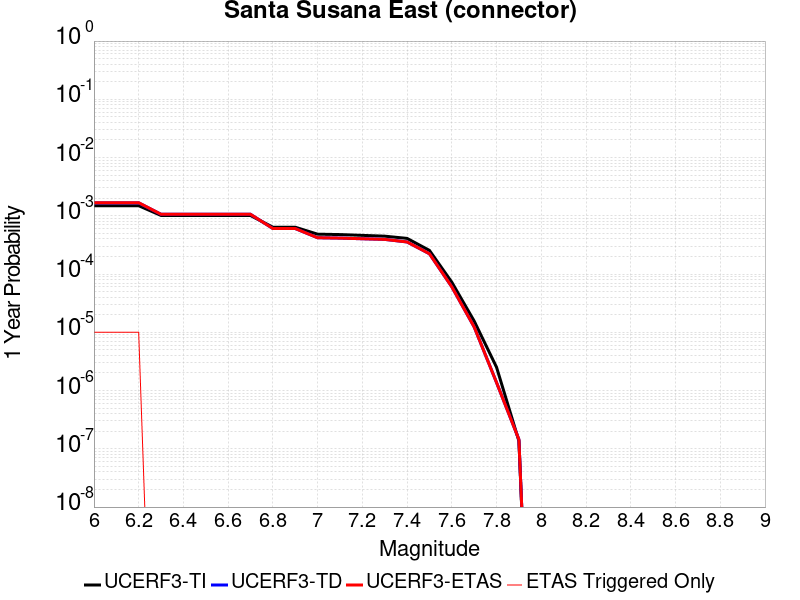 |  |

| Magnitude | 1 wk TI Prob | 1 wk TD Prob | 1 wk ETAS Prob | 1 wk ETAS/TD Gain | 1 wk ETAS Triggered Only | 1 mo TI Prob | 1 mo TD Prob | 1 mo ETAS Prob | 1 mo ETAS/TD Gain | 1 mo ETAS Triggered Only | 1 yr TI Prob | 1 yr TD Prob | 1 yr ETAS Prob | 1 yr ETAS/TD Gain | 1 yr ETAS Triggered Only | 10 yr TI Prob | 10 yr TD Prob | 10 yr ETAS Prob | 10 yr ETAS/TD Gain | 10 yr ETAS Triggered Only |
|-----|-----|-----|-----|-----|-----|-----|-----|-----|-----|-----|-----|-----|-----|-----|-----|-----|-----|-----|-----|-----|
| 6.0 | 2.858397E-5 | 3.202259E-5 | 4.202227E-5 | 1.3122696 | 1.0E-5 | 1.2249697E-4 | 1.3723405E-4 | 1.4723268E-4 | 1.0728582 | 1.0E-5 | 0.0014903803 | 0.0016698164 | 0.0016797998 | 1.0059787 | 1.0E-5 | 0.014804244 | 0.01659979 | 0.016619457 | 1.0011848 | 2.0E-5 |
| 6.1 | 2.858397E-5 | 3.202259E-5 | 4.202227E-5 | 1.3122696 | 1.0E-5 | 1.2249697E-4 | 1.3723405E-4 | 1.4723268E-4 | 1.0728582 | 1.0E-5 | 0.0014903803 | 0.0016698164 | 0.0016797998 | 1.0059787 | 1.0E-5 | 0.014804244 | 0.01659979 | 0.016619457 | 1.0011848 | 2.0E-5 |
| 6.2 | 2.858397E-5 | 3.202259E-5 | 4.202227E-5 | 1.3122696 | 1.0E-5 | 1.2249697E-4 | 1.3723405E-4 | 1.4723268E-4 | 1.0728582 | 1.0E-5 | 0.0014903803 | 0.0016698164 | 0.0016797998 | 1.0059787 | 1.0E-5 | 0.014804244 | 0.01659979 | 0.016619457 | 1.0011848 | 2.0E-5 |
| 6.3 | 1.943582E-5 | 2.036782E-5 | 2.036782E-5 | 1.0 | 0.0 | 8.329371E-5 | 8.728837E-5 | 8.728837E-5 | 1.0 | 0.0 | 0.001013629 | 0.0010623297 | 0.0010623297 | 1.0 | 0.0 | 0.010090181 | 0.010584113 | 0.010584113 | 1.0 | 0.0 |
| 6.4 | 1.943582E-5 | 2.036782E-5 | 2.036782E-5 | 1.0 | 0.0 | 8.329371E-5 | 8.728837E-5 | 8.728837E-5 | 1.0 | 0.0 | 0.001013629 | 0.0010623297 | 0.0010623297 | 1.0 | 0.0 | 0.010090181 | 0.010584113 | 0.010584113 | 1.0 | 0.0 |
| 6.5 | 1.943582E-5 | 2.036782E-5 | 2.036782E-5 | 1.0 | 0.0 | 8.329371E-5 | 8.728837E-5 | 8.728837E-5 | 1.0 | 0.0 | 0.001013629 | 0.0010623297 | 0.0010623297 | 1.0 | 0.0 | 0.010090181 | 0.010584113 | 0.010584113 | 1.0 | 0.0 |
| 6.6 | 1.943582E-5 | 2.036782E-5 | 2.036782E-5 | 1.0 | 0.0 | 8.329371E-5 | 8.728837E-5 | 8.728837E-5 | 1.0 | 0.0 | 0.001013629 | 0.0010623297 | 0.0010623297 | 1.0 | 0.0 | 0.010090181 | 0.010584113 | 0.010584113 | 1.0 | 0.0 |
| 6.7 | 1.9404439E-5 | 2.035524E-5 | 2.035524E-5 | 1.0 | 0.0 | 8.3159226E-5 | 8.723446E-5 | 8.723446E-5 | 1.0 | 0.0 | 0.0010119933 | 0.0010616741 | 0.0010616741 | 1.0 | 0.0 | 0.010073971 | 0.010577619 | 0.010577619 | 1.0 | 0.0 |
| 6.8 | 1.2217526E-5 | 1.159334E-5 | 1.159334E-5 | 1.0 | 0.0 | 5.2359774E-5 | 4.968489E-5 | 4.968489E-5 | 1.0 | 0.0 | 6.372938E-4 | 6.0476246E-4 | 6.0476246E-4 | 1.0 | 0.0 | 0.0063546924 | 0.0060333833 | 0.0060333833 | 1.0 | 0.0 |
| 6.9 | 1.2217526E-5 | 1.159334E-5 | 1.159334E-5 | 1.0 | 0.0 | 5.2359774E-5 | 4.968489E-5 | 4.968489E-5 | 1.0 | 0.0 | 6.372938E-4 | 6.0476246E-4 | 6.0476246E-4 | 1.0 | 0.0 | 0.0063546924 | 0.0060333833 | 0.0060333833 | 1.0 | 0.0 |
| 7.0 | 9.276017E-6 | 8.059356E-6 | 8.059356E-6 | 1.0 | 0.0 | 3.9753755E-5 | 3.4539662E-5 | 3.4539662E-5 | 1.0 | 0.0 | 4.8389446E-4 | 4.204427E-4 | 4.204427E-4 | 1.0 | 0.0 | 0.0048284214 | 0.004197368 | 0.004197368 | 1.0 | 0.0 |
| 7.1 | 9.130355E-6 | 7.942529E-6 | 7.942529E-6 | 1.0 | 0.0 | 3.9129503E-5 | 3.4038985E-5 | 3.4038985E-5 | 1.0 | 0.0 | 4.7629757E-4 | 4.1434926E-4 | 4.1434926E-4 | 1.0 | 0.0 | 0.00475278 | 0.0041366615 | 0.0041366615 | 1.0 | 0.0 |
| 7.2 | 8.851015E-6 | 7.74169E-6 | 7.74169E-6 | 1.0 | 0.0 | 3.7932372E-5 | 3.317827E-5 | 3.317827E-5 | 1.0 | 0.0 | 4.6172875E-4 | 4.0387394E-4 | 4.0387394E-4 | 1.0 | 0.0 | 0.0046077054 | 0.0040322915 | 0.0040322915 | 1.0 | 0.0 |
| 7.3 | 8.573006E-6 | 7.5504113E-6 | 7.5504113E-6 | 1.0 | 0.0 | 3.6740938E-5 | 3.2358523E-5 | 3.2358523E-5 | 1.0 | 0.0 | 4.472291E-4 | 3.938972E-4 | 3.938972E-4 | 1.0 | 0.0 | 0.004463301 | 0.003932873 | 0.003932873 | 1.0 | 0.0 |
| 7.4 | 7.852282E-6 | 6.8179206E-6 | 6.8179206E-6 | 1.0 | 0.0 | 3.36522E-5 | 2.9219349E-5 | 2.9219349E-5 | 1.0 | 0.0 | 4.096385E-4 | 3.5569054E-4 | 3.5569054E-4 | 1.0 | 0.0 | 0.0040888423 | 0.0035520305 | 0.0035520305 | 1.0 | 0.0 |
| 7.5 | 4.8869324E-6 | 4.27914E-6 | 4.27914E-6 | 1.0 | 0.0 | 2.0943828E-5 | 1.8339051E-5 | 1.8339051E-5 | 1.0 | 0.0 | 2.5496128E-4 | 2.2325672E-4 | 2.2325672E-4 | 1.0 | 0.0 | 0.0025466895 | 0.0022306633 | 0.0022306633 | 1.0 | 0.0 |
| 7.6 | 1.3894544E-6 | 1.1568442E-6 | 1.1568442E-6 | 1.0 | 0.0 | 5.954791E-6 | 4.9578953E-6 | 4.9578953E-6 | 1.0 | 0.0 | 7.249717E-5 | 6.0360926E-5 | 6.0360926E-5 | 1.0 | 0.0 | 7.247352E-4 | 6.0346717E-4 | 6.0346717E-4 | 1.0 | 0.0 |
| 7.7 | 2.9924632E-7 | 2.3719647E-7 | 2.3719647E-7 | 1.0 | 0.0 | 1.2824837E-6 | 1.016556E-6 | 1.016556E-6 | 1.0 | 0.0 | 1.5614127E-5 | 1.2376506E-5 | 1.2376506E-5 | 1.0 | 0.0 | 1.5613029E-4 | 1.2375889E-4 | 1.2375889E-4 | 1.0 | 0.0 |
| 7.8 | 4.8188564E-8 | 2.6323553E-8 | 2.6323553E-8 | 1.0 | 0.0 | 2.065224E-7 | 1.1281523E-7 | 1.1281523E-7 | 1.0 | 0.0 | 2.5144072E-6 | 1.3735246E-6 | 1.3735246E-6 | 1.0 | 0.0 | 2.5143789E-5 | 1.3735169E-5 | 1.3735169E-5 | 1.0 | 0.0 |
| 7.9 | 2.6127251E-9 | 2.768132E-9 | 2.768132E-9 | 1.0 | 0.0 | 1.1197393E-8 | 1.1863423E-8 | 1.1863423E-8 | 1.0 | 0.0 | 1.3632825E-7 | 1.4443718E-7 | 1.4443718E-7 | 1.0 | 0.0 | 1.3632817E-6 | 1.4443717E-6 | 1.4443717E-6 | 1.0 | 0.0 |

## San Clemente
*[(top)](#table-of-contents)*

| 1 Week | 1 Month | 1 Year | 10 Year |
|-----|-----|-----|-----|
|  |  |  |  |

| Magnitude | 1 wk TI Prob | 1 wk TD Prob | 1 wk ETAS Prob | 1 wk ETAS/TD Gain | 1 wk ETAS Triggered Only | 1 mo TI Prob | 1 mo TD Prob | 1 mo ETAS Prob | 1 mo ETAS/TD Gain | 1 mo ETAS Triggered Only | 1 yr TI Prob | 1 yr TD Prob | 1 yr ETAS Prob | 1 yr ETAS/TD Gain | 1 yr ETAS Triggered Only | 10 yr TI Prob | 10 yr TD Prob | 10 yr ETAS Prob | 10 yr ETAS/TD Gain | 10 yr ETAS Triggered Only |
|-----|-----|-----|-----|-----|-----|-----|-----|-----|-----|-----|-----|-----|-----|-----|-----|-----|-----|-----|-----|-----|
| 6.0 | 6.681379E-5 | 8.164081E-5 | 8.164081E-5 | 1.0 | 0.0 | 2.8631336E-4 | 3.4984472E-4 | 3.4984472E-4 | 1.0 | 0.0 | 0.003480294 | 0.004251534 | 0.004271449 | 1.0046842 | 2.0E-5 | 0.03426291 | 0.041757226 | 0.041776393 | 1.000459 | 2.0E-5 |
| 6.1 | 6.681379E-5 | 8.164081E-5 | 8.164081E-5 | 1.0 | 0.0 | 2.8631336E-4 | 3.4984472E-4 | 3.4984472E-4 | 1.0 | 0.0 | 0.003480294 | 0.004251534 | 0.004271449 | 1.0046842 | 2.0E-5 | 0.03426291 | 0.041757226 | 0.041776393 | 1.000459 | 2.0E-5 |
| 6.2 | 3.9400576E-5 | 4.645349E-5 | 4.645349E-5 | 1.0 | 0.0 | 1.6884868E-4 | 1.9907155E-4 | 1.9907155E-4 | 1.0 | 0.0 | 0.0020537945 | 0.0024210564 | 0.0024310322 | 1.0041205 | 1.0E-5 | 0.020349167 | 0.02395347 | 0.02396323 | 1.0004075 | 1.0E-5 |
| 6.3 | 3.2590255E-5 | 3.792995E-5 | 3.792995E-5 | 1.0 | 0.0 | 1.3966505E-4 | 1.6254697E-4 | 1.6254697E-4 | 1.0 | 0.0 | 0.0016990956 | 0.0019772432 | 0.0019872235 | 1.0050476 | 1.0E-5 | 0.01686163 | 0.019600306 | 0.01961011 | 1.0005002 | 1.0E-5 |
| 6.4 | 2.9454652E-5 | 3.409848E-5 | 3.409848E-5 | 1.0 | 0.0 | 1.2622811E-4 | 1.4612831E-4 | 1.4612831E-4 | 1.0 | 0.0 | 0.0015357438 | 0.0017776866 | 0.0017776866 | 1.0 | 0.0 | 0.015251739 | 0.017637838 | 0.017637838 | 1.0 | 0.0 |
| 6.5 | 2.790836E-5 | 3.2248132E-5 | 3.2248132E-5 | 1.0 | 0.0 | 1.1960178E-4 | 1.381991E-4 | 1.381991E-4 | 1.0 | 0.0 | 0.001455179 | 0.001681301 | 0.001681301 | 1.0 | 0.0 | 0.014456868 | 0.016688827 | 0.016688827 | 1.0 | 0.0 |
| 6.6 | 2.2492153E-5 | 2.57632E-5 | 2.57632E-5 | 1.0 | 0.0 | 9.639138E-5 | 1.1040912E-4 | 1.1040912E-4 | 1.0 | 0.0 | 0.0011729331 | 0.0013434169 | 0.0013434169 | 1.0 | 0.0 | 0.011667615 | 0.013354673 | 0.013354673 | 1.0 | 0.0 |
| 6.7 | 1.9862755E-5 | 2.2666847E-5 | 2.2666847E-5 | 1.0 | 0.0 | 8.512331E-5 | 9.714008E-5 | 9.714008E-5 | 1.0 | 0.0 | 0.0010358836 | 0.0011820501 | 0.0011820501 | 1.0 | 0.0 | 0.010310682 | 0.01175892 | 0.01175892 | 1.0 | 0.0 |
| 6.8 | 1.6697575E-5 | 1.8978053E-5 | 1.8978053E-5 | 1.0 | 0.0 | 7.155907E-5 | 8.133203E-5 | 8.133203E-5 | 1.0 | 0.0 | 8.7088346E-4 | 9.89777E-4 | 9.89777E-4 | 1.0 | 0.0 | 0.008674784 | 0.009854714 | 0.009854714 | 1.0 | 0.0 |
| 6.9 | 1.5218415E-5 | 1.726971E-5 | 1.726971E-5 | 1.0 | 0.0 | 6.522015E-5 | 7.401099E-5 | 7.401099E-5 | 1.0 | 0.0 | 7.93766E-4 | 9.0072013E-4 | 9.0072013E-4 | 1.0 | 0.0 | 0.007909367 | 0.00897164 | 0.00897164 | 1.0 | 0.0 |
| 7.0 | 1.2392958E-5 | 1.4033262E-5 | 1.4033262E-5 | 1.0 | 0.0 | 5.3111595E-5 | 6.0141207E-5 | 6.0141207E-5 | 1.0 | 0.0 | 6.4644177E-4 | 7.319808E-4 | 7.319808E-4 | 1.0 | 0.0 | 0.0064456454 | 0.0072964844 | 0.0072964844 | 1.0 | 0.0 |
| 7.1 | 1.0934128E-5 | 1.2375354E-5 | 1.2375354E-5 | 1.0 | 0.0 | 4.6859706E-5 | 5.3036194E-5 | 5.3036194E-5 | 1.0 | 0.0 | 5.7036756E-4 | 6.455317E-4 | 6.455317E-4 | 1.0 | 0.0 | 0.0056890585 | 0.006437312 | 0.006437312 | 1.0 | 0.0 |
| 7.2 | 9.5798805E-6 | 1.0845125E-5 | 1.0845125E-5 | 1.0 | 0.0 | 4.1055984E-5 | 4.647832E-5 | 4.647832E-5 | 1.0 | 0.0 | 4.9974193E-4 | 5.657338E-4 | 5.657338E-4 | 1.0 | 0.0 | 0.0049861963 | 0.00564366 | 0.00564366 | 1.0 | 0.0 |
| 7.3 | 8.0167365E-6 | 9.084078E-6 | 9.084078E-6 | 1.0 | 0.0 | 3.4356988E-5 | 3.8931223E-5 | 3.8931223E-5 | 1.0 | 0.0 | 4.1821605E-4 | 4.738916E-4 | 4.738916E-4 | 1.0 | 0.0 | 0.0041742986 | 0.004729513 | 0.004729513 | 1.0 | 0.0 |
| 7.4 | 2.9581017E-6 | 3.36244E-6 | 3.36244E-6 | 1.0 | 0.0 | 1.2677518E-5 | 1.4410407E-5 | 1.4410407E-5 | 1.0 | 0.0 | 1.5433785E-4 | 1.7543763E-4 | 1.7543763E-4 | 1.0 | 0.0 | 0.001542307 | 0.0017534863 | 0.0017534863 | 1.0 | 0.0 |

## Big Lagoon - Bald Mtn 2011 CFM
*[(top)](#table-of-contents)*

| 1 Week | 1 Month | 1 Year | 10 Year |
|-----|-----|-----|-----|
|  |  |  |  |

| Magnitude | 1 wk TI Prob | 1 wk TD Prob | 1 wk ETAS Prob | 1 wk ETAS/TD Gain | 1 wk ETAS Triggered Only | 1 mo TI Prob | 1 mo TD Prob | 1 mo ETAS Prob | 1 mo ETAS/TD Gain | 1 mo ETAS Triggered Only | 1 yr TI Prob | 1 yr TD Prob | 1 yr ETAS Prob | 1 yr ETAS/TD Gain | 1 yr ETAS Triggered Only | 10 yr TI Prob | 10 yr TD Prob | 10 yr ETAS Prob | 10 yr ETAS/TD Gain | 10 yr ETAS Triggered Only |
|-----|-----|-----|-----|-----|-----|-----|-----|-----|-----|-----|-----|-----|-----|-----|-----|-----|-----|-----|-----|-----|
| 6.0 | 1.8699735E-5 | 1.9850344E-5 | 1.9850344E-5 | 1.0 | 0.0 | 8.013926E-5 | 8.5070336E-5 | 9.506949E-5 | 1.1175398 | 1.0E-5 | 9.752587E-4 | 0.001035277 | 0.0010552563 | 1.0192986 | 2.0E-5 | 0.009709897 | 0.010308358 | 0.010328152 | 1.0019202 | 2.0E-5 |
| 6.1 | 1.8699735E-5 | 1.9850344E-5 | 1.9850344E-5 | 1.0 | 0.0 | 8.013926E-5 | 8.5070336E-5 | 9.506949E-5 | 1.1175398 | 1.0E-5 | 9.752587E-4 | 0.001035277 | 0.0010552563 | 1.0192986 | 2.0E-5 | 0.009709897 | 0.010308358 | 0.010328152 | 1.0019202 | 2.0E-5 |
| 6.2 | 1.8699735E-5 | 1.9850344E-5 | 1.9850344E-5 | 1.0 | 0.0 | 8.013926E-5 | 8.5070336E-5 | 9.506949E-5 | 1.1175398 | 1.0E-5 | 9.752587E-4 | 0.001035277 | 0.0010552563 | 1.0192986 | 2.0E-5 | 0.009709897 | 0.010308358 | 0.010328152 | 1.0019202 | 2.0E-5 |
| 6.3 | 1.8699735E-5 | 1.9850344E-5 | 1.9850344E-5 | 1.0 | 0.0 | 8.013926E-5 | 8.5070336E-5 | 9.506949E-5 | 1.1175398 | 1.0E-5 | 9.752587E-4 | 0.001035277 | 0.0010552563 | 1.0192986 | 2.0E-5 | 0.009709897 | 0.010308358 | 0.010328152 | 1.0019202 | 2.0E-5 |
| 6.4 | 1.8699735E-5 | 1.9850344E-5 | 1.9850344E-5 | 1.0 | 0.0 | 8.013926E-5 | 8.5070336E-5 | 9.506949E-5 | 1.1175398 | 1.0E-5 | 9.752587E-4 | 0.001035277 | 0.0010552563 | 1.0192986 | 2.0E-5 | 0.009709897 | 0.010308358 | 0.010328152 | 1.0019202 | 2.0E-5 |
| 6.5 | 1.8699735E-5 | 1.9850344E-5 | 1.9850344E-5 | 1.0 | 0.0 | 8.013926E-5 | 8.5070336E-5 | 9.506949E-5 | 1.1175398 | 1.0E-5 | 9.752587E-4 | 0.001035277 | 0.0010552563 | 1.0192986 | 2.0E-5 | 0.009709897 | 0.010308358 | 0.010328152 | 1.0019202 | 2.0E-5 |
| 6.6 | 1.8699735E-5 | 1.9850344E-5 | 1.9850344E-5 | 1.0 | 0.0 | 8.013926E-5 | 8.5070336E-5 | 9.506949E-5 | 1.1175398 | 1.0E-5 | 9.752587E-4 | 0.001035277 | 0.0010552563 | 1.0192986 | 2.0E-5 | 0.009709897 | 0.010308358 | 0.010328152 | 1.0019202 | 2.0E-5 |
| 6.7 | 1.8699735E-5 | 1.9850344E-5 | 1.9850344E-5 | 1.0 | 0.0 | 8.013926E-5 | 8.5070336E-5 | 9.506949E-5 | 1.1175398 | 1.0E-5 | 9.752587E-4 | 0.001035277 | 0.0010552563 | 1.0192986 | 2.0E-5 | 0.009709897 | 0.010308358 | 0.010328152 | 1.0019202 | 2.0E-5 |
| 6.8 | 1.18505095E-5 | 1.2499895E-5 | 1.2499895E-5 | 1.0 | 0.0 | 5.078691E-5 | 5.3569907E-5 | 6.356937E-5 | 1.186662 | 1.0E-5 | 6.181552E-4 | 6.5202324E-4 | 6.7201024E-4 | 1.0306537 | 2.0E-5 | 0.006164385 | 0.006501606 | 0.006521476 | 1.0030562 | 2.0E-5 |
| 6.9 | 1.18505095E-5 | 1.2499895E-5 | 1.2499895E-5 | 1.0 | 0.0 | 5.078691E-5 | 5.3569907E-5 | 6.356937E-5 | 1.186662 | 1.0E-5 | 6.181552E-4 | 6.5202324E-4 | 6.7201024E-4 | 1.0306537 | 2.0E-5 | 0.006164385 | 0.006501606 | 0.006521476 | 1.0030562 | 2.0E-5 |
| 7.0 | 9.719786E-6 | 1.023556E-5 | 1.023556E-5 | 1.0 | 0.0 | 4.1655563E-5 | 4.386596E-5 | 5.3865522E-5 | 1.2279572 | 1.0E-5 | 5.0703844E-4 | 5.339395E-4 | 5.5392884E-4 | 1.0374374 | 2.0E-5 | 0.005058831 | 0.005326813 | 0.0053467066 | 1.0037346 | 2.0E-5 |
| 7.1 | 8.523418E-6 | 8.969526E-6 | 8.969526E-6 | 1.0 | 0.0 | 3.652842E-5 | 3.8440267E-5 | 3.8440267E-5 | 1.0 | 0.0 | 4.4464276E-4 | 4.679113E-4 | 4.679113E-4 | 1.0 | 0.0 | 0.0044375416 | 0.0046694246 | 0.0046694246 | 1.0 | 0.0 |
| 7.2 | 7.378894E-6 | 7.761166E-6 | 7.761166E-6 | 1.0 | 0.0 | 3.162345E-5 | 3.326172E-5 | 3.326172E-5 | 1.0 | 0.0 | 3.8494746E-4 | 4.0488708E-4 | 4.0488708E-4 | 1.0 | 0.0 | 0.0038428132 | 0.0040415903 | 0.0040415903 | 1.0 | 0.0 |
| 7.3 | 6.4640294E-6 | 6.7924893E-6 | 6.7924893E-6 | 1.0 | 0.0 | 2.7702688E-5 | 2.9110348E-5 | 2.9110348E-5 | 1.0 | 0.0 | 3.3722803E-4 | 3.5436152E-4 | 3.5436152E-4 | 1.0 | 0.0 | 0.0033671674 | 0.0035380346 | 0.0035380346 | 1.0 | 0.0 |
| 7.4 | 5.9959093E-6 | 6.2988424E-6 | 6.2988424E-6 | 1.0 | 0.0 | 2.5696501E-5 | 2.6994763E-5 | 2.6994763E-5 | 1.0 | 0.0 | 3.1280998E-4 | 3.2861225E-4 | 3.2861225E-4 | 1.0 | 0.0 | 0.0031237002 | 0.0032813256 | 0.0032813256 | 1.0 | 0.0 |
| 7.5 | 4.929265E-6 | 5.1764305E-6 | 5.1764305E-6 | 1.0 | 0.0 | 2.112525E-5 | 2.2184515E-5 | 2.2184515E-5 | 1.0 | 0.0 | 2.5716957E-4 | 2.7006338E-4 | 2.7006338E-4 | 1.0 | 0.0 | 0.0025687215 | 0.0026973928 | 0.0026973928 | 1.0 | 0.0 |
| 7.6 | 3.8982403E-6 | 4.088953E-6 | 4.088953E-6 | 1.0 | 0.0 | 1.6706637E-5 | 1.752397E-5 | 1.752397E-5 | 1.0 | 0.0 | 2.0338432E-4 | 2.1333371E-4 | 2.1333371E-4 | 1.0 | 0.0 | 0.0020319829 | 0.002131317 | 0.002131317 | 1.0 | 0.0 |
| 7.7 | 2.820968E-6 | 2.9572307E-6 | 2.9572307E-6 | 1.0 | 0.0 | 1.2089806E-5 | 1.2673785E-5 | 1.2673785E-5 | 1.0 | 0.0 | 1.4718344E-4 | 1.5429257E-4 | 1.5429257E-4 | 1.0 | 0.0 | 0.00147086 | 0.0015418723 | 0.0015418723 | 1.0 | 0.0 |
| 7.8 | 1.9314455E-6 | 2.0260316E-6 | 2.0260316E-6 | 1.0 | 0.0 | 8.277597E-6 | 8.682965E-6 | 8.682965E-6 | 1.0 | 0.0 | 1.0077508E-4 | 1.05710096E-4 | 1.05710096E-4 | 1.0 | 0.0 | 0.0010072939 | 0.001056611 | 0.001056611 | 1.0 | 0.0 |
| 7.9 | 4.9586197E-7 | 5.2189574E-7 | 5.2189574E-7 | 1.0 | 0.0 | 2.125121E-6 | 2.2366944E-6 | 2.2366944E-6 | 1.0 | 0.0 | 2.5873042E-5 | 2.7231436E-5 | 2.7231436E-5 | 1.0 | 0.0 | 2.5870028E-4 | 2.7228307E-4 | 2.7228307E-4 | 1.0 | 0.0 |

## East Huasna 2011 CFM
*[(top)](#table-of-contents)*

| 1 Week | 1 Month | 1 Year | 10 Year |
|-----|-----|-----|-----|
|  |  |  |  |

| Magnitude | 1 wk TI Prob | 1 wk TD Prob | 1 wk ETAS Prob | 1 wk ETAS/TD Gain | 1 wk ETAS Triggered Only | 1 mo TI Prob | 1 mo TD Prob | 1 mo ETAS Prob | 1 mo ETAS/TD Gain | 1 mo ETAS Triggered Only | 1 yr TI Prob | 1 yr TD Prob | 1 yr ETAS Prob | 1 yr ETAS/TD Gain | 1 yr ETAS Triggered Only | 10 yr TI Prob | 10 yr TD Prob | 10 yr ETAS Prob | 10 yr ETAS/TD Gain | 10 yr ETAS Triggered Only |
|-----|-----|-----|-----|-----|-----|-----|-----|-----|-----|-----|-----|-----|-----|-----|-----|-----|-----|-----|-----|-----|
| 6.0 | 1.4658423E-6 | 1.4715672E-6 | 1.4715672E-6 | 1.0 | 0.0 | 6.282166E-6 | 6.3067014E-6 | 6.3067014E-6 | 1.0 | 0.0 | 7.6482684E-5 | 7.6781456E-5 | 7.6781456E-5 | 1.0 | 0.0 | 7.645637E-4 | 7.675563E-4 | 7.775486E-4 | 1.0130184 | 1.0E-5 |
| 6.1 | 1.4658423E-6 | 1.4715672E-6 | 1.4715672E-6 | 1.0 | 0.0 | 6.282166E-6 | 6.3067014E-6 | 6.3067014E-6 | 1.0 | 0.0 | 7.6482684E-5 | 7.6781456E-5 | 7.6781456E-5 | 1.0 | 0.0 | 7.645637E-4 | 7.675563E-4 | 7.775486E-4 | 1.0130184 | 1.0E-5 |
| 6.2 | 1.4658423E-6 | 1.4715672E-6 | 1.4715672E-6 | 1.0 | 0.0 | 6.282166E-6 | 6.3067014E-6 | 6.3067014E-6 | 1.0 | 0.0 | 7.6482684E-5 | 7.6781456E-5 | 7.6781456E-5 | 1.0 | 0.0 | 7.645637E-4 | 7.675563E-4 | 7.775486E-4 | 1.0130184 | 1.0E-5 |
| 6.3 | 1.4658423E-6 | 1.4715672E-6 | 1.4715672E-6 | 1.0 | 0.0 | 6.282166E-6 | 6.3067014E-6 | 6.3067014E-6 | 1.0 | 0.0 | 7.6482684E-5 | 7.6781456E-5 | 7.6781456E-5 | 1.0 | 0.0 | 7.645637E-4 | 7.675563E-4 | 7.775486E-4 | 1.0130184 | 1.0E-5 |
| 6.4 | 1.0488257E-6 | 1.0527524E-6 | 1.0527524E-6 | 1.0 | 0.0 | 4.4949593E-6 | 4.511788E-6 | 4.511788E-6 | 1.0 | 0.0 | 5.472476E-5 | 5.4929656E-5 | 5.4929656E-5 | 1.0 | 0.0 | 5.4711284E-4 | 5.4916274E-4 | 5.591572E-4 | 1.0181996 | 1.0E-5 |
| 6.5 | 1.0488257E-6 | 1.0527524E-6 | 1.0527524E-6 | 1.0 | 0.0 | 4.4949593E-6 | 4.511788E-6 | 4.511788E-6 | 1.0 | 0.0 | 5.472476E-5 | 5.4929656E-5 | 5.4929656E-5 | 1.0 | 0.0 | 5.4711284E-4 | 5.4916274E-4 | 5.591572E-4 | 1.0181996 | 1.0E-5 |
| 6.6 | 8.463064E-7 | 8.493641E-7 | 8.493641E-7 | 1.0 | 0.0 | 3.6270226E-6 | 3.6401266E-6 | 3.6401266E-6 | 1.0 | 0.0 | 4.4158103E-5 | 4.431765E-5 | 4.431765E-5 | 1.0 | 0.0 | 4.414933E-4 | 4.43089E-4 | 4.5308456E-4 | 1.0225588 | 1.0E-5 |
| 6.7 | 7.876149E-7 | 7.902541E-7 | 7.902541E-7 | 1.0 | 0.0 | 3.375488E-6 | 3.3867989E-6 | 3.3867989E-6 | 1.0 | 0.0 | 4.109579E-5 | 4.1233503E-5 | 4.1233503E-5 | 1.0 | 0.0 | 4.108819E-4 | 4.1225913E-4 | 4.2225502E-4 | 1.0242466 | 1.0E-5 |
| 6.8 | 6.9940785E-7 | 7.0165845E-7 | 7.0165845E-7 | 1.0 | 0.0 | 2.9974588E-6 | 3.0071044E-6 | 3.0071044E-6 | 1.0 | 0.0 | 3.649345E-5 | 3.6610883E-5 | 3.6610883E-5 | 1.0 | 0.0 | 3.6487455E-4 | 3.66049E-4 | 3.7604535E-4 | 1.0273087 | 1.0E-5 |
| 6.9 | 5.899658E-7 | 5.915606E-7 | 5.915606E-7 | 1.0 | 0.0 | 2.5284223E-6 | 2.5352572E-6 | 2.5352572E-6 | 1.0 | 0.0 | 3.0783107E-5 | 3.0866322E-5 | 3.0866322E-5 | 1.0 | 0.0 | 3.0778843E-4 | 3.0862063E-4 | 3.1861753E-4 | 1.0323923 | 1.0E-5 |
| 7.0 | 4.793814E-7 | 4.8032786E-7 | 4.8032786E-7 | 1.0 | 0.0 | 2.05449E-6 | 2.0585462E-6 | 2.0585462E-6 | 1.0 | 0.0 | 2.501313E-5 | 2.5062514E-5 | 2.5062514E-5 | 1.0 | 0.0 | 2.5010316E-4 | 2.5059705E-4 | 2.6059456E-4 | 1.0398947 | 1.0E-5 |
| 7.1 | 4.1256908E-7 | 4.1299458E-7 | 4.1299458E-7 | 1.0 | 0.0 | 1.768152E-6 | 1.7699756E-6 | 1.7699756E-6 | 1.0 | 0.0 | 2.1527037E-5 | 2.154924E-5 | 2.154924E-5 | 1.0 | 0.0 | 2.1524953E-4 | 2.1547166E-4 | 2.254695E-4 | 1.0463998 | 1.0E-5 |
| 7.2 | 2.822599E-7 | 2.8161452E-7 | 2.8161452E-7 | 1.0 | 0.0 | 1.2096847E-6 | 1.2069188E-6 | 1.2069188E-6 | 1.0 | 0.0 | 1.47278115E-5 | 1.4694138E-5 | 1.4694138E-5 | 1.0 | 0.0 | 1.4726835E-4 | 1.4693174E-4 | 1.5693027E-4 | 1.0680488 | 1.0E-5 |
| 7.3 | 1.5261652E-7 | 1.5075038E-7 | 1.5075038E-7 | 1.0 | 0.0 | 6.540707E-7 | 6.4607286E-7 | 6.4607286E-7 | 1.0 | 0.0 | 7.963281E-6 | 7.865909E-6 | 7.865909E-6 | 1.0 | 0.0 | 7.962996E-5 | 7.8656325E-5 | 8.865554E-5 | 1.1271254 | 1.0E-5 |
| 7.4 | 7.976414E-8 | 8.057876E-8 | 8.057876E-8 | 1.0 | 0.0 | 3.418463E-7 | 3.453375E-7 | 3.453375E-7 | 1.0 | 0.0 | 4.1619705E-6 | 4.2044758E-6 | 4.2044758E-6 | 1.0 | 0.0 | 4.161893E-5 | 4.2043972E-5 | 4.2043972E-5 | 1.0 | 0.0 |
| 7.5 | 4.2715055E-8 | 4.320258E-8 | 4.320258E-8 | 1.0 | 0.0 | 1.830645E-7 | 1.851539E-7 | 1.851539E-7 | 1.0 | 0.0 | 2.228808E-6 | 2.2542463E-6 | 2.2542463E-6 | 1.0 | 0.0 | 2.2287857E-5 | 2.2542237E-5 | 2.2542237E-5 | 1.0 | 0.0 |
| 7.6 | 2.1807532E-8 | 2.205751E-8 | 2.205751E-8 | 1.0 | 0.0 | 9.346085E-8 | 9.4532176E-8 | 9.4532176E-8 | 1.0 | 0.0 | 1.1378852E-6 | 1.1509286E-6 | 1.1509286E-6 | 1.0 | 0.0 | 1.1378794E-5 | 1.1509228E-5 | 1.1509228E-5 | 1.0 | 0.0 |
| 7.7 | 4.7196043E-9 | 4.7672892E-9 | 4.7672892E-9 | 1.0 | 0.0 | 2.0226874E-8 | 2.043124E-8 | 2.043124E-8 | 1.0 | 0.0 | 2.4626218E-7 | 2.4875033E-7 | 2.4875033E-7 | 1.0 | 0.0 | 2.462619E-6 | 2.4875005E-6 | 2.4875005E-6 | 1.0 | 0.0 |
| 7.8 | 7.400003E-11 | 7.4654505E-11 | 7.4654505E-11 | 1.0 | 0.0 | 3.171432E-10 | 3.1994807E-10 | 3.1994807E-10 | 1.0 | 0.0 | 3.861218E-9 | 3.8953676E-9 | 3.8953676E-9 | 1.0 | 0.0 | 3.861218E-8 | 3.8953676E-8 | 3.8953676E-8 | 1.0 | 0.0 |

## Newport-Inglewood alt 1
*[(top)](#table-of-contents)*

| 1 Week | 1 Month | 1 Year | 10 Year |
|-----|-----|-----|-----|
|  |  |  | 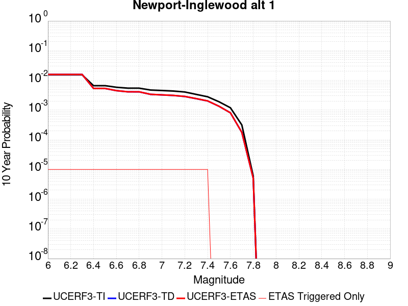 |

| Magnitude | 1 wk TI Prob | 1 wk TD Prob | 1 wk ETAS Prob | 1 wk ETAS/TD Gain | 1 wk ETAS Triggered Only | 1 mo TI Prob | 1 mo TD Prob | 1 mo ETAS Prob | 1 mo ETAS/TD Gain | 1 mo ETAS Triggered Only | 1 yr TI Prob | 1 yr TD Prob | 1 yr ETAS Prob | 1 yr ETAS/TD Gain | 1 yr ETAS Triggered Only | 10 yr TI Prob | 10 yr TD Prob | 10 yr ETAS Prob | 10 yr ETAS/TD Gain | 10 yr ETAS Triggered Only |
|-----|-----|-----|-----|-----|-----|-----|-----|-----|-----|-----|-----|-----|-----|-----|-----|-----|-----|-----|-----|-----|
| 6.0 | 2.9668912E-5 | 3.040552E-5 | 3.040552E-5 | 1.0 | 0.0 | 1.2714628E-4 | 1.303056E-4 | 1.303056E-4 | 1.0 | 0.0 | 0.0015469068 | 0.0015858014 | 0.0015957855 | 1.0062959 | 1.0E-5 | 0.015361829 | 0.015792465 | 0.015802307 | 1.0006232 | 1.0E-5 |
| 6.1 | 2.9668912E-5 | 3.040552E-5 | 3.040552E-5 | 1.0 | 0.0 | 1.2714628E-4 | 1.303056E-4 | 1.303056E-4 | 1.0 | 0.0 | 0.0015469068 | 0.0015858014 | 0.0015957855 | 1.0062959 | 1.0E-5 | 0.015361829 | 0.015792465 | 0.015802307 | 1.0006232 | 1.0E-5 |
| 6.2 | 2.9668912E-5 | 3.040552E-5 | 3.040552E-5 | 1.0 | 0.0 | 1.2714628E-4 | 1.303056E-4 | 1.303056E-4 | 1.0 | 0.0 | 0.0015469068 | 0.0015858014 | 0.0015957855 | 1.0062959 | 1.0E-5 | 0.015361829 | 0.015792465 | 0.015802307 | 1.0006232 | 1.0E-5 |
| 6.3 | 2.9668912E-5 | 3.040552E-5 | 3.040552E-5 | 1.0 | 0.0 | 1.2714628E-4 | 1.303056E-4 | 1.303056E-4 | 1.0 | 0.0 | 0.0015469068 | 0.0015858014 | 0.0015957855 | 1.0062959 | 1.0E-5 | 0.015361829 | 0.015792465 | 0.015802307 | 1.0006232 | 1.0E-5 |
| 6.4 | 1.275942E-5 | 1.0272689E-5 | 1.0272689E-5 | 1.0 | 0.0 | 5.4682085E-5 | 4.402509E-5 | 4.402509E-5 | 1.0 | 0.0 | 6.65551E-4 | 5.358778E-4 | 5.4587243E-4 | 1.018651 | 1.0E-5 | 0.0066356123 | 0.005346281 | 0.0053562275 | 1.0018605 | 1.0E-5 |
| 6.5 | 1.275942E-5 | 1.0272689E-5 | 1.0272689E-5 | 1.0 | 0.0 | 5.4682085E-5 | 4.402509E-5 | 4.402509E-5 | 1.0 | 0.0 | 6.65551E-4 | 5.358778E-4 | 5.4587243E-4 | 1.018651 | 1.0E-5 | 0.0066356123 | 0.005346281 | 0.0053562275 | 1.0018605 | 1.0E-5 |
| 6.6 | 1.1255358E-5 | 8.66204E-6 | 8.66204E-6 | 1.0 | 0.0 | 4.8236358E-5 | 3.712251E-5 | 3.712251E-5 | 1.0 | 0.0 | 5.871194E-4 | 4.518745E-4 | 4.6187002E-4 | 1.02212 | 1.0E-5 | 0.005855706 | 0.004509734 | 0.004519689 | 1.0022074 | 1.0E-5 |
| 6.7 | 1.0504745E-5 | 7.899962E-6 | 7.899962E-6 | 1.0 | 0.0 | 4.5019555E-5 | 3.3856548E-5 | 3.3856548E-5 | 1.0 | 0.0 | 5.4797524E-4 | 4.1212674E-4 | 4.2212263E-4 | 1.0242543 | 1.0E-5 | 0.0054662596 | 0.0041137543 | 0.0041237134 | 1.0024209 | 1.0E-5 |
| 6.8 | 1.0476007E-5 | 7.881343E-6 | 7.881343E-6 | 1.0 | 0.0 | 4.4896402E-5 | 3.3776756E-5 | 3.3776756E-5 | 1.0 | 0.0 | 5.464766E-4 | 4.1115563E-4 | 4.2115152E-4 | 1.0243117 | 1.0E-5 | 0.005451347 | 0.004104079 | 0.0041140383 | 1.0024266 | 1.0E-5 |
| 6.9 | 9.076797E-6 | 6.4897567E-6 | 6.4897567E-6 | 1.0 | 0.0 | 3.889998E-5 | 2.7812948E-5 | 2.7812948E-5 | 1.0 | 0.0 | 4.7350433E-4 | 3.3857036E-4 | 3.48567E-4 | 1.029526 | 1.0E-5 | 0.004724967 | 0.003380583 | 0.0033905492 | 1.002948 | 1.0E-5 |
| 7.0 | 8.73795E-6 | 6.21215E-6 | 6.21215E-6 | 1.0 | 0.0 | 3.7447822E-5 | 2.662323E-5 | 2.662323E-5 | 1.0 | 0.0 | 4.5583185E-4 | 3.240899E-4 | 3.3408665E-4 | 1.0308456 | 1.0E-5 | 0.0045489795 | 0.0032362042 | 0.0032461716 | 1.00308 | 1.0E-5 |
| 7.1 | 8.391299E-6 | 5.955852E-6 | 5.955852E-6 | 1.0 | 0.0 | 3.5962214E-5 | 2.5524832E-5 | 2.5524832E-5 | 1.0 | 0.0 | 4.37752E-4 | 3.107208E-4 | 3.2071766E-4 | 1.0321733 | 1.0E-5 | 0.004368907 | 0.003102893 | 0.003112862 | 1.0032128 | 1.0E-5 |
| 7.2 | 7.796882E-6 | 5.4965785E-6 | 5.4965785E-6 | 1.0 | 0.0 | 3.341478E-5 | 2.3556555E-5 | 2.3556555E-5 | 1.0 | 0.0 | 4.06749E-4 | 2.8676353E-4 | 2.9676064E-4 | 1.0348619 | 1.0E-5 | 0.0040600533 | 0.0028639587 | 0.0028739301 | 1.0034816 | 1.0E-5 |
| 7.3 | 6.4738833E-6 | 4.647811E-6 | 4.647811E-6 | 1.0 | 0.0 | 2.774492E-5 | 1.9919036E-5 | 1.9919036E-5 | 1.0 | 0.0 | 3.3774204E-4 | 2.4248744E-4 | 2.52485E-4 | 1.0412292 | 1.0E-5 | 0.0033722918 | 0.0024222452 | 0.0024322208 | 1.0041184 | 1.0E-5 |
| 7.4 | 5.382145E-6 | 3.885752E-6 | 3.885752E-6 | 1.0 | 0.0 | 2.3066134E-5 | 1.6653117E-5 | 1.6653117E-5 | 1.0 | 0.0 | 2.8079396E-4 | 2.0273299E-4 | 2.1273096E-4 | 1.0493159 | 1.0E-5 | 0.0028043943 | 0.0020254948 | 0.0020354746 | 1.004927 | 1.0E-5 |
| 7.5 | 3.648244E-6 | 2.573781E-6 | 2.573781E-6 | 1.0 | 0.0 | 1.5635238E-5 | 1.10304445E-5 | 1.10304445E-5 | 1.0 | 0.0 | 1.9034238E-4 | 1.3428749E-4 | 1.3428749E-4 | 1.0 | 0.0 | 0.0019017943 | 0.0013420738 | 0.0013420738 | 1.0 | 0.0 |
| 7.6 | 2.2906888E-6 | 1.5479967E-6 | 1.5479967E-6 | 1.0 | 0.0 | 9.817201E-6 | 6.634255E-6 | 6.634255E-6 | 1.0 | 0.0 | 1.1951787E-4 | 8.076913E-5 | 8.076913E-5 | 1.0 | 0.0 | 0.0011945361 | 8.0740446E-4 | 8.0740446E-4 | 1.0 | 0.0 |
| 7.7 | 6.0479874E-7 | 3.397505E-7 | 3.397505E-7 | 1.0 | 0.0 | 2.5919921E-6 | 1.4560729E-6 | 1.4560729E-6 | 1.0 | 0.0 | 3.1557047E-5 | 1.7727558E-5 | 1.7727558E-5 | 1.0 | 0.0 | 3.1552566E-4 | 1.772628E-4 | 1.772628E-4 | 1.0 | 0.0 |
| 7.8 | 1.16056995E-8 | 9.782997E-9 | 9.782997E-9 | 1.0 | 0.0 | 4.9738713E-8 | 4.1927127E-8 | 4.1927127E-8 | 1.0 | 0.0 | 6.0556863E-7 | 5.1046277E-7 | 5.1046277E-7 | 1.0 | 0.0 | 6.05567E-6 | 5.1046277E-6 | 5.1046277E-6 | 1.0 | 0.0 |

## Red Mountain
*[(top)](#table-of-contents)*

| 1 Week | 1 Month | 1 Year | 10 Year |
|-----|-----|-----|-----|
|  |  |  |  |

| Magnitude | 1 wk TI Prob | 1 wk TD Prob | 1 wk ETAS Prob | 1 wk ETAS/TD Gain | 1 wk ETAS Triggered Only | 1 mo TI Prob | 1 mo TD Prob | 1 mo ETAS Prob | 1 mo ETAS/TD Gain | 1 mo ETAS Triggered Only | 1 yr TI Prob | 1 yr TD Prob | 1 yr ETAS Prob | 1 yr ETAS/TD Gain | 1 yr ETAS Triggered Only | 10 yr TI Prob | 10 yr TD Prob | 10 yr ETAS Prob | 10 yr ETAS/TD Gain | 10 yr ETAS Triggered Only |
|-----|-----|-----|-----|-----|-----|-----|-----|-----|-----|-----|-----|-----|-----|-----|-----|-----|-----|-----|-----|-----|
| 6.0 | 4.1810763E-5 | 4.7591075E-5 | 4.7591075E-5 | 1.0 | 0.0 | 1.7917668E-4 | 2.0394672E-4 | 2.1394469E-4 | 1.0490224 | 1.0E-5 | 0.0021792934 | 0.0024803884 | 0.0024903635 | 1.0040216 | 1.0E-5 | 0.021580452 | 0.024544649 | 0.024554403 | 1.0003974 | 1.0E-5 |
| 6.1 | 4.1810763E-5 | 4.7591075E-5 | 4.7591075E-5 | 1.0 | 0.0 | 1.7917668E-4 | 2.0394672E-4 | 2.1394469E-4 | 1.0490224 | 1.0E-5 | 0.0021792934 | 0.0024803884 | 0.0024903635 | 1.0040216 | 1.0E-5 | 0.021580452 | 0.024544649 | 0.024554403 | 1.0003974 | 1.0E-5 |
| 6.2 | 4.1810763E-5 | 4.7591075E-5 | 4.7591075E-5 | 1.0 | 0.0 | 1.7917668E-4 | 2.0394672E-4 | 2.1394469E-4 | 1.0490224 | 1.0E-5 | 0.0021792934 | 0.0024803884 | 0.0024903635 | 1.0040216 | 1.0E-5 | 0.021580452 | 0.024544649 | 0.024554403 | 1.0003974 | 1.0E-5 |
| 6.3 | 4.1810763E-5 | 4.7591075E-5 | 4.7591075E-5 | 1.0 | 0.0 | 1.7917668E-4 | 2.0394672E-4 | 2.1394469E-4 | 1.0490224 | 1.0E-5 | 0.0021792934 | 0.0024803884 | 0.0024903635 | 1.0040216 | 1.0E-5 | 0.021580452 | 0.024544649 | 0.024554403 | 1.0003974 | 1.0E-5 |
| 6.4 | 4.1810763E-5 | 4.7591075E-5 | 4.7591075E-5 | 1.0 | 0.0 | 1.7917668E-4 | 2.0394672E-4 | 2.1394469E-4 | 1.0490224 | 1.0E-5 | 0.0021792934 | 0.0024803884 | 0.0024903635 | 1.0040216 | 1.0E-5 | 0.021580452 | 0.024544649 | 0.024554403 | 1.0003974 | 1.0E-5 |
| 6.5 | 3.154503E-5 | 3.5360503E-5 | 3.5360503E-5 | 1.0 | 0.0 | 1.3518598E-4 | 1.5153673E-4 | 1.6153522E-4 | 1.0659806 | 1.0E-5 | 0.0016446467 | 0.0018434906 | 0.0018534722 | 1.0054145 | 1.0E-5 | 0.01632528 | 0.018291628 | 0.018301444 | 1.0005367 | 1.0E-5 |
| 6.6 | 3.1535834E-5 | 3.5349887E-5 | 3.5349887E-5 | 1.0 | 0.0 | 1.3514658E-4 | 1.5149123E-4 | 1.6148972E-4 | 1.0660005 | 1.0E-5 | 0.0016441676 | 0.0018429377 | 0.0018529192 | 1.0054162 | 1.0E-5 | 0.01632056 | 0.018286189 | 0.018296005 | 1.0005369 | 1.0E-5 |
| 6.7 | 2.8267326E-5 | 3.1470005E-5 | 3.1470005E-5 | 1.0 | 0.0 | 1.2114006E-4 | 1.3486497E-4 | 1.4486362E-4 | 1.0741383 | 1.0E-5 | 0.0014738824 | 0.0016408293 | 0.0016508129 | 1.0060844 | 1.0E-5 | 0.014641452 | 0.016295906 | 0.016305743 | 1.0006037 | 1.0E-5 |
| 6.8 | 2.8212884E-5 | 3.140789E-5 | 3.140789E-5 | 1.0 | 0.0 | 1.20906756E-4 | 1.3459878E-4 | 1.4459743E-4 | 1.0742849 | 1.0E-5 | 0.0014710457 | 0.0016375934 | 0.001647577 | 1.0060965 | 1.0E-5 | 0.014613459 | 0.016264021 | 0.01627386 | 1.0006049 | 1.0E-5 |
| 6.9 | 2.4227871E-5 | 2.6707532E-5 | 2.6707532E-5 | 1.0 | 0.0 | 1.03829596E-4 | 1.14456256E-4 | 1.2445511E-4 | 1.0873597 | 1.0E-5 | 0.0012633923 | 0.00139269 | 0.0014026761 | 1.0071703 | 1.0E-5 | 0.012562336 | 0.013847311 | 0.013857173 | 1.0007122 | 1.0E-5 |
| 7.0 | 2.348524E-5 | 2.5836296E-5 | 2.5836296E-5 | 1.0 | 0.0 | 1.0064714E-4 | 1.1072271E-4 | 1.20721605E-4 | 1.0903057 | 1.0E-5 | 0.0012246901 | 0.001347291 | 0.0013572775 | 1.0074123 | 1.0E-5 | 0.012179627 | 0.013398864 | 0.013408731 | 1.0007364 | 1.0E-5 |
| 7.1 | 2.2311642E-5 | 2.4463332E-5 | 2.4463332E-5 | 1.0 | 0.0 | 9.561782E-5 | 1.04839055E-4 | 1.1483801E-4 | 1.0953743 | 1.0E-5 | 0.0011635252 | 0.0012757429 | 0.0012857302 | 1.0078286 | 1.0E-5 | 0.01157452 | 0.01269171 | 0.012701584 | 1.000778 | 1.0E-5 |
| 7.2 | 1.6533986E-5 | 1.767069E-5 | 1.767069E-5 | 1.0 | 0.0 | 7.085802E-5 | 7.572969E-5 | 8.5728934E-5 | 1.1320386 | 1.0E-5 | 8.623549E-4 | 9.2168245E-4 | 9.316732E-4 | 1.0108397 | 1.0E-5 | 0.008590161 | 0.009184876 | 0.009194785 | 1.0010787 | 1.0E-5 |
| 7.3 | 1.4703092E-5 | 1.555982E-5 | 1.555982E-5 | 1.0 | 0.0 | 6.301173E-5 | 6.668359E-5 | 7.6682925E-5 | 1.1499519 | 1.0E-5 | 7.668978E-4 | 8.116319E-4 | 8.2162383E-4 | 1.0123109 | 1.0E-5 | 0.0076425658 | 0.008092752 | 0.00810267 | 1.0012257 | 1.0E-5 |
| 7.4 | 6.1331984E-6 | 5.5289447E-6 | 5.5289447E-6 | 1.0 | 0.0 | 2.6284872E-5 | 2.3695266E-5 | 2.3695266E-5 | 1.0 | 0.0 | 3.199713E-4 | 2.884522E-4 | 2.884522E-4 | 1.0 | 0.0 | 0.0031951098 | 0.0028808324 | 0.0028808324 | 1.0 | 0.0 |
| 7.5 | 5.954766E-6 | 5.3385725E-6 | 5.3385725E-6 | 1.0 | 0.0 | 2.5520176E-5 | 2.2879398E-5 | 2.2879398E-5 | 1.0 | 0.0 | 3.1066386E-4 | 2.785216E-4 | 2.785216E-4 | 1.0 | 0.0 | 0.003102299 | 0.0027817793 | 0.0027817793 | 1.0 | 0.0 |
| 7.6 | 4.9726646E-6 | 4.315354E-6 | 4.315354E-6 | 1.0 | 0.0 | 2.1311245E-5 | 1.8494246E-5 | 1.8494246E-5 | 1.0 | 0.0 | 2.5943352E-4 | 2.2514451E-4 | 2.2514451E-4 | 1.0 | 0.0 | 0.0025913084 | 0.0022491987 | 0.0022491987 | 1.0 | 0.0 |
| 7.7 | 3.3613894E-6 | 2.8527159E-6 | 2.8527159E-6 | 1.0 | 0.0 | 1.4405875E-5 | 1.222587E-5 | 1.222587E-5 | 1.0 | 0.0 | 1.7537741E-4 | 1.4884006E-4 | 1.4884006E-4 | 1.0 | 0.0 | 0.0017523908 | 0.00148743 | 0.00148743 | 1.0 | 0.0 |
| 7.8 | 1.1828961E-6 | 1.0123005E-6 | 1.0123005E-6 | 1.0 | 0.0 | 5.069545E-6 | 4.3384234E-6 | 4.3384234E-6 | 1.0 | 0.0 | 6.171996E-5 | 5.2819054E-5 | 5.2819054E-5 | 1.0 | 0.0 | 6.170282E-4 | 5.2806793E-4 | 5.2806793E-4 | 1.0 | 0.0 |
| 7.9 | 2.2967266E-7 | 1.8619376E-7 | 1.8619376E-7 | 1.0 | 0.0 | 9.843111E-7 | 7.9797303E-7 | 7.9797303E-7 | 1.0 | 0.0 | 1.19839215E-5 | 9.7152815E-6 | 9.7152815E-6 | 1.0 | 0.0 | 1.1983275E-4 | 9.7148855E-5 | 9.7148855E-5 | 1.0 | 0.0 |

## Fish Slough 2011 CFM
*[(top)](#table-of-contents)*

| 1 Week | 1 Month | 1 Year | 10 Year |
|-----|-----|-----|-----|
|  | 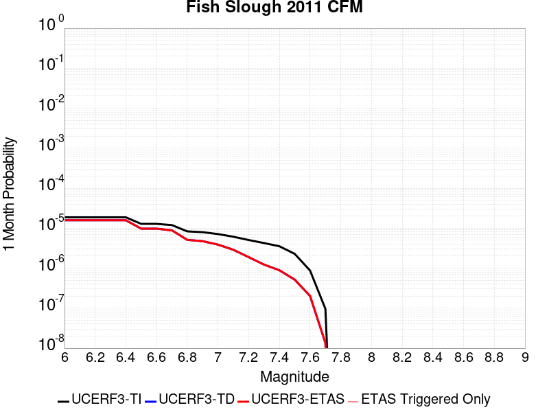 |  |  |

| Magnitude | 1 wk TI Prob | 1 wk TD Prob | 1 wk ETAS Prob | 1 wk ETAS/TD Gain | 1 wk ETAS Triggered Only | 1 mo TI Prob | 1 mo TD Prob | 1 mo ETAS Prob | 1 mo ETAS/TD Gain | 1 mo ETAS Triggered Only | 1 yr TI Prob | 1 yr TD Prob | 1 yr ETAS Prob | 1 yr ETAS/TD Gain | 1 yr ETAS Triggered Only | 10 yr TI Prob | 10 yr TD Prob | 10 yr ETAS Prob | 10 yr ETAS/TD Gain | 10 yr ETAS Triggered Only |
|-----|-----|-----|-----|-----|-----|-----|-----|-----|-----|-----|-----|-----|-----|-----|-----|-----|-----|-----|-----|-----|
| 6.0 | 4.3629925E-6 | 3.677278E-6 | 3.677278E-6 | 1.0 | 0.0 | 1.8698405E-5 | 1.575968E-5 | 1.575968E-5 | 1.0 | 0.0 | 2.276293E-4 | 1.9185933E-4 | 2.0185742E-4 | 1.0521115 | 1.0E-5 | 0.0022739628 | 0.0019171459 | 0.0019271268 | 1.0052061 | 1.0E-5 |
| 6.1 | 4.3629925E-6 | 3.677278E-6 | 3.677278E-6 | 1.0 | 0.0 | 1.8698405E-5 | 1.575968E-5 | 1.575968E-5 | 1.0 | 0.0 | 2.276293E-4 | 1.9185933E-4 | 2.0185742E-4 | 1.0521115 | 1.0E-5 | 0.0022739628 | 0.0019171459 | 0.0019271268 | 1.0052061 | 1.0E-5 |
| 6.2 | 4.3629925E-6 | 3.677278E-6 | 3.677278E-6 | 1.0 | 0.0 | 1.8698405E-5 | 1.575968E-5 | 1.575968E-5 | 1.0 | 0.0 | 2.276293E-4 | 1.9185933E-4 | 2.0185742E-4 | 1.0521115 | 1.0E-5 | 0.0022739628 | 0.0019171459 | 0.0019271268 | 1.0052061 | 1.0E-5 |
| 6.3 | 4.3629925E-6 | 3.677278E-6 | 3.677278E-6 | 1.0 | 0.0 | 1.8698405E-5 | 1.575968E-5 | 1.575968E-5 | 1.0 | 0.0 | 2.276293E-4 | 1.9185933E-4 | 2.0185742E-4 | 1.0521115 | 1.0E-5 | 0.0022739628 | 0.0019171459 | 0.0019271268 | 1.0052061 | 1.0E-5 |
| 6.4 | 4.3629925E-6 | 3.677278E-6 | 3.677278E-6 | 1.0 | 0.0 | 1.8698405E-5 | 1.575968E-5 | 1.575968E-5 | 1.0 | 0.0 | 2.276293E-4 | 1.9185933E-4 | 2.0185742E-4 | 1.0521115 | 1.0E-5 | 0.0022739628 | 0.0019171459 | 0.0019271268 | 1.0052061 | 1.0E-5 |
| 6.5 | 2.991715E-6 | 2.2703932E-6 | 2.2703932E-6 | 1.0 | 0.0 | 1.2821573E-5 | 9.730226E-6 | 9.730226E-6 | 1.0 | 0.0 | 1.5609147E-4 | 1.18459975E-4 | 1.2845879E-4 | 1.0844067 | 1.0E-5 | 0.0015598187 | 0.0011840585 | 0.0011940466 | 1.0084355 | 1.0E-5 |
| 6.6 | 2.991715E-6 | 2.2703932E-6 | 2.2703932E-6 | 1.0 | 0.0 | 1.2821573E-5 | 9.730226E-6 | 9.730226E-6 | 1.0 | 0.0 | 1.5609147E-4 | 1.18459975E-4 | 1.2845879E-4 | 1.0844067 | 1.0E-5 | 0.0015598187 | 0.0011840585 | 0.0011940466 | 1.0084355 | 1.0E-5 |
| 6.7 | 2.7890346E-6 | 2.062188E-6 | 2.062188E-6 | 1.0 | 0.0 | 1.1952951E-5 | 8.837924E-6 | 8.837924E-6 | 1.0 | 0.0 | 1.4551746E-4 | 1.0759731E-4 | 1.1759623E-4 | 1.0929291 | 1.0E-5 | 0.0014542221 | 0.0010755404 | 0.0010855297 | 1.0092876 | 1.0E-5 |
| 6.8 | 1.9416723E-6 | 1.1925548E-6 | 1.1925548E-6 | 1.0 | 0.0 | 8.321425E-6 | 5.1109396E-6 | 5.1109396E-6 | 1.0 | 0.0 | 1.01308644E-4 | 6.222395E-5 | 7.222333E-5 | 1.1606998 | 1.0E-5 | 0.0010126247 | 6.220694E-4 | 6.3206314E-4 | 1.0160654 | 1.0E-5 |
| 6.9 | 1.8567416E-6 | 1.1046959E-6 | 1.1046959E-6 | 1.0 | 0.0 | 7.957439E-6 | 4.734403E-6 | 4.734403E-6 | 1.0 | 0.0 | 9.687752E-5 | 5.763987E-5 | 6.7639296E-5 | 1.173481 | 1.0E-5 | 9.6835295E-4 | 5.7625305E-4 | 5.862473E-4 | 1.0173435 | 1.0E-5 |
| 7.0 | 1.6634067E-6 | 9.0739576E-7 | 9.0739576E-7 | 1.0 | 0.0 | 7.1288664E-6 | 3.8888334E-6 | 3.8888334E-6 | 1.0 | 0.0 | 8.679049E-5 | 4.7345548E-5 | 5.7345074E-5 | 1.2112031 | 1.0E-5 | 8.6756604E-4 | 4.7335748E-4 | 4.8335275E-4 | 1.0211157 | 1.0E-5 |
| 7.1 | 1.4281054E-6 | 6.736597E-7 | 6.736597E-7 | 1.0 | 0.0 | 6.1204373E-6 | 2.88711E-6 | 2.88711E-6 | 1.0 | 0.0 | 7.451377E-5 | 3.5150013E-5 | 4.5149663E-5 | 1.2844849 | 1.0E-5 | 7.44888E-4 | 3.5144633E-4 | 3.6144283E-4 | 1.0284438 | 1.0E-5 |
| 7.2 | 1.1810387E-6 | 4.4083123E-7 | 4.4083123E-7 | 1.0 | 0.0 | 5.0615845E-6 | 1.8892754E-6 | 1.8892754E-6 | 1.0 | 0.0 | 6.1623046E-5 | 2.3001694E-5 | 3.3001463E-5 | 1.4347405 | 1.0E-5 | 6.160596E-4 | 2.2999402E-4 | 2.3999173E-4 | 1.0434694 | 1.0E-5 |
| 7.3 | 9.918052E-7 | 2.8732939E-7 | 2.8732939E-7 | 1.0 | 0.0 | 4.2505867E-6 | 1.231411E-6 | 1.231411E-6 | 1.0 | 0.0 | 5.1749663E-5 | 1.4992328E-5 | 2.4992178E-5 | 1.6669978 | 1.0E-5 | 5.173762E-4 | 1.4991328E-4 | 1.5991178E-4 | 1.0666952 | 1.0E-5 |
| 7.4 | 8.25252E-7 | 2.069427E-7 | 2.069427E-7 | 1.0 | 0.0 | 3.5367896E-6 | 8.86897E-7 | 8.86897E-7 | 1.0 | 0.0 | 4.3059565E-5 | 1.0797919E-5 | 2.079781E-5 | 1.9260944 | 1.0E-5 | 4.305122E-4 | 1.07974E-4 | 1.1797292E-4 | 1.0926049 | 1.0E-5 |
| 7.5 | 5.3248567E-7 | 1.20723E-7 | 1.20723E-7 | 1.0 | 0.0 | 2.2820795E-6 | 5.173842E-7 | 5.173842E-7 | 1.0 | 0.0 | 2.7783964E-5 | 6.299135E-6 | 1.6299073E-5 | 2.5875096 | 1.0E-5 | 2.778049E-4 | 6.29896E-5 | 7.298897E-5 | 1.1587464 | 1.0E-5 |
| 7.6 | 2.037542E-7 | 4.712683E-8 | 4.712683E-8 | 1.0 | 0.0 | 8.73232E-7 | 2.0197211E-7 | 2.0197211E-7 | 1.0 | 0.0 | 1.0631547E-5 | 2.4590079E-6 | 1.2458983E-5 | 5.066671 | 1.0E-5 | 1.0631039E-4 | 2.4589828E-5 | 3.4589582E-5 | 1.4066622 | 1.0E-5 |
| 7.7 | 2.2501226E-8 | 3.151027E-9 | 3.151027E-9 | 1.0 | 0.0 | 9.6433816E-8 | 1.3504401E-8 | 1.3504401E-8 | 1.0 | 0.0 | 1.1740811E-6 | 1.6441608E-7 | 1.0164415E-5 | 61.821293 | 1.0E-5 | 1.1740749E-5 | 1.6441597E-6 | 1.1644143E-5 | 7.082124 | 1.0E-5 |

## San Andreas (North Coast) 2011 CFM
*[(top)](#table-of-contents)*

| 1 Week | 1 Month | 1 Year | 10 Year |
|-----|-----|-----|-----|
|  |  |  | 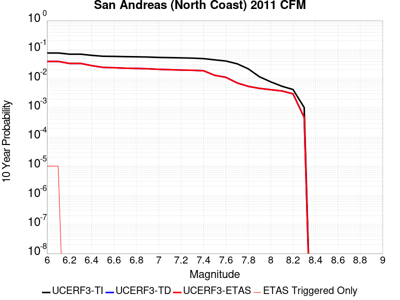 |

| Magnitude | 1 wk TI Prob | 1 wk TD Prob | 1 wk ETAS Prob | 1 wk ETAS/TD Gain | 1 wk ETAS Triggered Only | 1 mo TI Prob | 1 mo TD Prob | 1 mo ETAS Prob | 1 mo ETAS/TD Gain | 1 mo ETAS Triggered Only | 1 yr TI Prob | 1 yr TD Prob | 1 yr ETAS Prob | 1 yr ETAS/TD Gain | 1 yr ETAS Triggered Only | 10 yr TI Prob | 10 yr TD Prob | 10 yr ETAS Prob | 10 yr ETAS/TD Gain | 10 yr ETAS Triggered Only |
|-----|-----|-----|-----|-----|-----|-----|-----|-----|-----|-----|-----|-----|-----|-----|-----|-----|-----|-----|-----|-----|
| 6.0 | 1.5333705E-4 | 7.113417E-5 | 7.113417E-5 | 1.0 | 0.0 | 6.5699324E-4 | 3.0482528E-4 | 3.0482528E-4 | 1.0 | 0.0 | 0.007969595 | 0.003704966 | 0.003704966 | 1.0 | 0.0 | 0.0768977 | 0.03937756 | 0.039387167 | 1.0002439 | 1.0E-5 |
| 6.1 | 1.5333705E-4 | 7.113417E-5 | 7.113417E-5 | 1.0 | 0.0 | 6.5699324E-4 | 3.0482528E-4 | 3.0482528E-4 | 1.0 | 0.0 | 0.007969595 | 0.003704966 | 0.003704966 | 1.0 | 0.0 | 0.0768977 | 0.03937756 | 0.039387167 | 1.0002439 | 1.0E-5 |
| 6.2 | 1.3912938E-4 | 6.0527043E-5 | 6.0527043E-5 | 1.0 | 0.0 | 5.961325E-4 | 2.5937596E-4 | 2.5937596E-4 | 1.0 | 0.0 | 0.007233787 | 0.0031533565 | 0.0031533565 | 1.0 | 0.0 | 0.07002798 | 0.03370408 | 0.03370408 | 1.0 | 0.0 |
| 6.3 | 1.3912938E-4 | 6.0527043E-5 | 6.0527043E-5 | 1.0 | 0.0 | 5.961325E-4 | 2.5937596E-4 | 2.5937596E-4 | 1.0 | 0.0 | 0.007233787 | 0.0031533565 | 0.0031533565 | 1.0 | 0.0 | 0.07002798 | 0.03370408 | 0.03370408 | 1.0 | 0.0 |
| 6.4 | 1.2623647E-4 | 5.046254E-5 | 5.046254E-5 | 1.0 | 0.0 | 5.4090127E-4 | 2.162502E-4 | 2.162502E-4 | 1.0 | 0.0 | 0.0065656058 | 0.0026296873 | 0.0026296873 | 1.0 | 0.0 | 0.06374981 | 0.028314944 | 0.028314944 | 1.0 | 0.0 |
| 6.5 | 1.1736096E-4 | 4.3539436E-5 | 4.3539436E-5 | 1.0 | 0.0 | 5.028786E-4 | 1.8658434E-4 | 1.8658434E-4 | 1.0 | 0.0 | 0.006105373 | 0.0022693137 | 0.0022693137 | 1.0 | 0.0 | 0.05940335 | 0.02459431 | 0.02459431 | 1.0 | 0.0 |
| 6.6 | 1.1586959E-4 | 4.2438805E-5 | 4.2438805E-5 | 1.0 | 0.0 | 4.964894E-4 | 1.8186802E-4 | 1.8186802E-4 | 1.0 | 0.0 | 0.006028018 | 0.0022120106 | 0.0022120106 | 1.0 | 0.0 | 0.058671024 | 0.02399959 | 0.02399959 | 1.0 | 0.0 |
| 6.7 | 1.13693764E-4 | 4.0750157E-5 | 4.0750157E-5 | 1.0 | 0.0 | 4.87168E-4 | 1.7463193E-4 | 1.7463193E-4 | 1.0 | 0.0 | 0.005915152 | 0.0021240865 | 0.0021240865 | 1.0 | 0.0 | 0.057601593 | 0.023090761 | 0.023090761 | 1.0 | 0.0 |
| 6.8 | 1.1204889E-4 | 3.9967555E-5 | 3.9967555E-5 | 1.0 | 0.0 | 4.8012115E-4 | 1.7127836E-4 | 1.7127836E-4 | 1.0 | 0.0 | 0.005829819 | 0.0020833355 | 0.0020833355 | 1.0 | 0.0 | 0.05679232 | 0.022650568 | 0.022650568 | 1.0 | 0.0 |
| 6.9 | 1.1005794E-4 | 3.902303E-5 | 3.902303E-5 | 1.0 | 0.0 | 4.7159163E-4 | 1.6723093E-4 | 1.6723093E-4 | 1.0 | 0.0 | 0.0057265228 | 0.002034151 | 0.002034151 | 1.0 | 0.0 | 0.055811852 | 0.022116682 | 0.022116682 | 1.0 | 0.0 |
| 7.0 | 1.0647948E-4 | 3.7180227E-5 | 3.7180227E-5 | 1.0 | 0.0 | 4.562608E-4 | 1.5933417E-4 | 1.5933417E-4 | 1.0 | 0.0 | 0.0055408357 | 0.0019381832 | 0.0019381832 | 1.0 | 0.0 | 0.054047033 | 0.021074895 | 0.021074895 | 1.0 | 0.0 |
| 7.1 | 1.04795035E-4 | 3.6229067E-5 | 3.6229067E-5 | 1.0 | 0.0 | 4.4904428E-4 | 1.5525827E-4 | 1.5525827E-4 | 1.0 | 0.0 | 0.0054534175 | 0.001888646 | 0.001888646 | 1.0 | 0.0 | 0.053215165 | 0.020543678 | 0.020543678 | 1.0 | 0.0 |
| 7.2 | 1.02724036E-4 | 3.513728E-5 | 3.513728E-5 | 1.0 | 0.0 | 4.401716E-4 | 1.5057974E-4 | 1.5057974E-4 | 1.0 | 0.0 | 0.0053459285 | 0.0018317822 | 0.0018317822 | 1.0 | 0.0 | 0.052191395 | 0.019931791 | 0.019931791 | 1.0 | 0.0 |
| 7.3 | 1.00650694E-4 | 3.4604338E-5 | 3.4604338E-5 | 1.0 | 0.0 | 4.312888E-4 | 1.4829596E-4 | 1.4829596E-4 | 1.0 | 0.0 | 0.005238306 | 0.0018040235 | 0.0018040235 | 1.0 | 0.0 | 0.051165357 | 0.019608546 | 0.019608546 | 1.0 | 0.0 |
| 7.4 | 9.672919E-5 | 3.3393557E-5 | 3.3393557E-5 | 1.0 | 0.0 | 4.144878E-4 | 1.4310748E-4 | 1.4310748E-4 | 1.0 | 0.0 | 0.005034718 | 0.0017409563 | 0.0017409563 | 1.0 | 0.0 | 0.049221683 | 0.018881155 | 0.018881155 | 1.0 | 0.0 |
| 7.5 | 8.7600405E-5 | 2.271003E-5 | 2.271003E-5 | 1.0 | 0.0 | 3.753763E-4 | 9.732508E-5 | 9.732508E-5 | 1.0 | 0.0 | 0.0045606326 | 0.0011842905 | 0.0011842905 | 1.0 | 0.0 | 0.04468165 | 0.013136679 | 0.013136679 | 1.0 | 0.0 |
| 7.6 | 7.9562284E-5 | 1.923447E-5 | 1.923447E-5 | 1.0 | 0.0 | 3.4093665E-4 | 8.243085E-5 | 8.243085E-5 | 1.0 | 0.0 | 0.0041430052 | 0.001003135 | 0.001003135 | 1.0 | 0.0 | 0.040666126 | 0.011227344 | 0.011227344 | 1.0 | 0.0 |
| 7.7 | 6.3866544E-5 | 1.19474835E-5 | 1.19474835E-5 | 1.0 | 0.0 | 2.7368503E-4 | 5.1202496E-5 | 5.1202496E-5 | 1.0 | 0.0 | 0.0033270244 | 6.2321237E-4 | 6.2321237E-4 | 1.0 | 0.0 | 0.032776527 | 0.0072138775 | 0.0072138775 | 1.0 | 0.0 |
| 7.8 | 4.2543215E-5 | 9.081718E-6 | 9.081718E-6 | 1.0 | 0.0 | 1.8231533E-4 | 3.892107E-5 | 3.892107E-5 | 1.0 | 0.0 | 0.0022174292 | 4.737611E-4 | 4.737611E-4 | 1.0 | 0.0 | 0.021954332 | 0.005493622 | 0.005493622 | 1.0 | 0.0 |
| 7.9 | 2.2636612E-5 | 7.819314E-6 | 7.819314E-6 | 1.0 | 0.0 | 9.7010445E-5 | 3.3510918E-5 | 3.3510918E-5 | 1.0 | 0.0 | 0.0011804621 | 4.0791914E-4 | 4.0791914E-4 | 1.0 | 0.0 | 0.011742111 | 0.004686101 | 0.004686101 | 1.0 | 0.0 |
| 8.0 | 1.5167874E-5 | 7.0542583E-6 | 7.0542583E-6 | 1.0 | 0.0 | 6.500356E-5 | 3.0232186E-5 | 3.0232186E-5 | 1.0 | 0.0 | 7.9113094E-4 | 3.680148E-4 | 3.680148E-4 | 1.0 | 0.0 | 0.007883203 | 0.0042183227 | 0.0042183227 | 1.0 | 0.0 |
| 8.1 | 1.0681047E-5 | 6.39152E-6 | 6.39152E-6 | 1.0 | 0.0 | 4.5775112E-5 | 2.7391941E-5 | 2.7391941E-5 | 1.0 | 0.0 | 5.5716943E-4 | 3.3344593E-4 | 3.3344593E-4 | 1.0 | 0.0 | 0.0055577457 | 0.0038199783 | 0.0038199783 | 1.0 | 0.0 |
| 8.2 | 8.226114E-6 | 5.1186294E-6 | 5.1186294E-6 | 1.0 | 0.0 | 3.52543E-5 | 2.1936798E-5 | 2.1936798E-5 | 1.0 | 0.0 | 4.2913653E-4 | 2.6704787E-4 | 2.6704787E-4 | 1.0 | 0.0 | 0.004283088 | 0.0030471033 | 0.0030471033 | 1.0 | 0.0 |
| 8.3 | 1.983087E-6 | 7.6647797E-7 | 7.6647797E-7 | 1.0 | 0.0 | 8.498917E-6 | 3.2849016E-6 | 3.2849016E-6 | 1.0 | 0.0 | 1.034694E-4 | 3.999296E-5 | 3.999296E-5 | 1.0 | 0.0 | 0.0010342124 | 4.7228087E-4 | 4.7228087E-4 | 1.0 | 0.0 |

## Great Valley 03 Mysterious Ridge
*[(top)](#table-of-contents)*

| 1 Week | 1 Month | 1 Year | 10 Year |
|-----|-----|-----|-----|
|  |  |  | 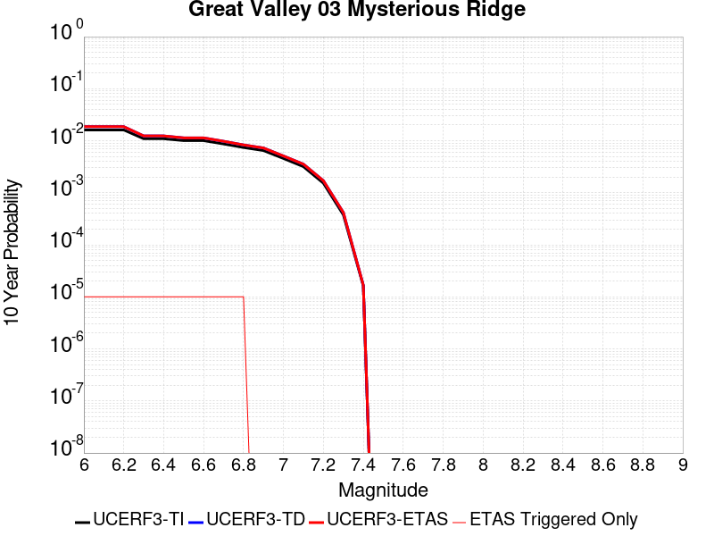 |

| Magnitude | 1 wk TI Prob | 1 wk TD Prob | 1 wk ETAS Prob | 1 wk ETAS/TD Gain | 1 wk ETAS Triggered Only | 1 mo TI Prob | 1 mo TD Prob | 1 mo ETAS Prob | 1 mo ETAS/TD Gain | 1 mo ETAS Triggered Only | 1 yr TI Prob | 1 yr TD Prob | 1 yr ETAS Prob | 1 yr ETAS/TD Gain | 1 yr ETAS Triggered Only | 10 yr TI Prob | 10 yr TD Prob | 10 yr ETAS Prob | 10 yr ETAS/TD Gain | 10 yr ETAS Triggered Only |
|-----|-----|-----|-----|-----|-----|-----|-----|-----|-----|-----|-----|-----|-----|-----|-----|-----|-----|-----|-----|-----|
| 6.0 | 3.1182444E-5 | 3.6034882E-5 | 3.6034882E-5 | 1.0 | 0.0 | 1.336322E-4 | 1.5442709E-4 | 1.5442709E-4 | 1.0 | 0.0 | 0.0016257578 | 0.0018787142 | 0.0018886954 | 1.0053128 | 1.0E-5 | 0.016139153 | 0.018647056 | 0.01865687 | 1.0005263 | 1.0E-5 |
| 6.1 | 3.1182444E-5 | 3.6034882E-5 | 3.6034882E-5 | 1.0 | 0.0 | 1.336322E-4 | 1.5442709E-4 | 1.5442709E-4 | 1.0 | 0.0 | 0.0016257578 | 0.0018787142 | 0.0018886954 | 1.0053128 | 1.0E-5 | 0.016139153 | 0.018647056 | 0.01865687 | 1.0005263 | 1.0E-5 |
| 6.2 | 3.1182444E-5 | 3.6034882E-5 | 3.6034882E-5 | 1.0 | 0.0 | 1.336322E-4 | 1.5442709E-4 | 1.5442709E-4 | 1.0 | 0.0 | 0.0016257578 | 0.0018787142 | 0.0018886954 | 1.0053128 | 1.0E-5 | 0.016139153 | 0.018647056 | 0.01865687 | 1.0005263 | 1.0E-5 |
| 6.3 | 2.106934E-5 | 2.3850724E-5 | 2.3850724E-5 | 1.0 | 0.0 | 9.0294045E-5 | 1.02213555E-4 | 1.02213555E-4 | 1.0 | 0.0 | 0.0010987755 | 0.0012437707 | 0.0012537583 | 1.00803 | 1.0E-5 | 0.010933585 | 0.0123713445 | 0.01238122 | 1.0007983 | 1.0E-5 |
| 6.4 | 2.106934E-5 | 2.3850724E-5 | 2.3850724E-5 | 1.0 | 0.0 | 9.0294045E-5 | 1.02213555E-4 | 1.02213555E-4 | 1.0 | 0.0 | 0.0010987755 | 0.0012437707 | 0.0012537583 | 1.00803 | 1.0E-5 | 0.010933585 | 0.0123713445 | 0.01238122 | 1.0007983 | 1.0E-5 |
| 6.5 | 1.9389783E-5 | 2.1885357E-5 | 2.1885357E-5 | 1.0 | 0.0 | 8.309642E-5 | 9.379117E-5 | 9.379117E-5 | 1.0 | 0.0 | 0.0010112294 | 0.0011413371 | 0.0011513256 | 1.0087516 | 1.0E-5 | 0.010066401 | 0.011357628 | 0.011367515 | 1.0008705 | 1.0E-5 |
| 6.6 | 1.9370193E-5 | 2.1865279E-5 | 2.1865279E-5 | 1.0 | 0.0 | 8.301247E-5 | 9.370512E-5 | 9.370512E-5 | 1.0 | 0.0 | 0.0010102082 | 0.0011402905 | 0.0011502792 | 1.0087597 | 1.0E-5 | 0.010056281 | 0.01134727 | 0.011357157 | 1.0008713 | 1.0E-5 |
| 6.7 | 1.6723505E-5 | 1.8799592E-5 | 1.8799592E-5 | 1.0 | 0.0 | 7.16702E-5 | 8.0567304E-5 | 8.0567304E-5 | 1.0 | 0.0 | 8.722353E-4 | 9.80485E-4 | 9.904752E-4 | 1.010189 | 1.0E-5 | 0.008688197 | 0.0097636 | 0.009773502 | 1.0010142 | 1.0E-5 |
| 6.8 | 1.426937E-5 | 1.5997468E-5 | 1.5997468E-5 | 1.0 | 0.0 | 6.115301E-5 | 6.855885E-5 | 6.855885E-5 | 1.0 | 0.0 | 7.4428355E-4 | 8.3439884E-4 | 8.4439054E-4 | 1.0119747 | 1.0E-5 | 0.007417957 | 0.008314138 | 0.008324055 | 1.0011928 | 1.0E-5 |
| 6.9 | 1.2469891E-5 | 1.395715E-5 | 1.395715E-5 | 1.0 | 0.0 | 5.3441294E-5 | 5.9815055E-5 | 5.9815055E-5 | 1.0 | 0.0 | 6.504535E-4 | 7.28017E-4 | 7.28017E-4 | 1.0 | 0.0 | 0.006485529 | 0.007257545 | 0.007257545 | 1.0 | 0.0 |
| 7.0 | 8.7746275E-6 | 9.791885E-6 | 9.791885E-6 | 1.0 | 0.0 | 3.7605005E-5 | 4.1964588E-5 | 4.1964588E-5 | 1.0 | 0.0 | 4.5774475E-4 | 5.108064E-4 | 5.108064E-4 | 1.0 | 0.0 | 0.00456803 | 0.005097056 | 0.005097056 | 1.0 | 0.0 |
| 7.1 | 6.1067153E-6 | 6.81383E-6 | 6.81383E-6 | 1.0 | 0.0 | 2.6171374E-5 | 2.9201834E-5 | 2.9201834E-5 | 1.0 | 0.0 | 3.1858988E-4 | 3.5547992E-4 | 3.5547992E-4 | 1.0 | 0.0 | 0.0031813353 | 0.0035496636 | 0.0035496636 | 1.0 | 0.0 |
| 7.2 | 2.939283E-6 | 3.2741555E-6 | 3.2741555E-6 | 1.0 | 0.0 | 1.2596866E-5 | 1.4032029E-5 | 1.4032029E-5 | 1.0 | 0.0 | 1.5335606E-4 | 1.7082831E-4 | 1.7082831E-4 | 1.0 | 0.0 | 0.0015325027 | 0.001707142 | 0.001707142 | 1.0 | 0.0 |
| 7.3 | 7.2387763E-7 | 8.008619E-7 | 8.008619E-7 | 1.0 | 0.0 | 3.102329E-6 | 3.4322634E-6 | 3.4322634E-6 | 1.0 | 0.0 | 3.77702E-5 | 4.1787465E-5 | 4.1787465E-5 | 1.0 | 0.0 | 3.7763783E-4 | 4.1784105E-4 | 4.1784105E-4 | 1.0 | 0.0 |
| 7.4 | 3.112171E-8 | 3.2068495E-8 | 3.2068495E-8 | 1.0 | 0.0 | 1.3337875E-7 | 1.374364E-7 | 1.374364E-7 | 1.0 | 0.0 | 1.6238852E-6 | 1.673287E-6 | 1.673287E-6 | 1.0 | 0.0 | 1.6238733E-5 | 1.6732753E-5 | 1.6732753E-5 | 1.0 | 0.0 |

## Earthquake Valley (So Extension)
*[(top)](#table-of-contents)*

| 1 Week | 1 Month | 1 Year | 10 Year |
|-----|-----|-----|-----|
|  |  |  |  |

| Magnitude | 1 wk TI Prob | 1 wk TD Prob | 1 wk ETAS Prob | 1 wk ETAS/TD Gain | 1 wk ETAS Triggered Only | 1 mo TI Prob | 1 mo TD Prob | 1 mo ETAS Prob | 1 mo ETAS/TD Gain | 1 mo ETAS Triggered Only | 1 yr TI Prob | 1 yr TD Prob | 1 yr ETAS Prob | 1 yr ETAS/TD Gain | 1 yr ETAS Triggered Only | 10 yr TI Prob | 10 yr TD Prob | 10 yr ETAS Prob | 10 yr ETAS/TD Gain | 10 yr ETAS Triggered Only |
|-----|-----|-----|-----|-----|-----|-----|-----|-----|-----|-----|-----|-----|-----|-----|-----|-----|-----|-----|-----|-----|
| 6.0 | 3.0194888E-5 | 3.707323E-5 | 3.707323E-5 | 1.0 | 0.0 | 1.2940024E-4 | 1.5887865E-4 | 1.5887865E-4 | 1.0 | 0.0 | 0.0015743093 | 0.0019331464 | 0.0019331464 | 1.0 | 0.0 | 0.01563203 | 0.019213678 | 0.019223487 | 1.0005105 | 1.0E-5 |
| 6.1 | 3.0194888E-5 | 3.707323E-5 | 3.707323E-5 | 1.0 | 0.0 | 1.2940024E-4 | 1.5887865E-4 | 1.5887865E-4 | 1.0 | 0.0 | 0.0015743093 | 0.0019331464 | 0.0019331464 | 1.0 | 0.0 | 0.01563203 | 0.019213678 | 0.019223487 | 1.0005105 | 1.0E-5 |
| 6.2 | 3.0194888E-5 | 3.707323E-5 | 3.707323E-5 | 1.0 | 0.0 | 1.2940024E-4 | 1.5887865E-4 | 1.5887865E-4 | 1.0 | 0.0 | 0.0015743093 | 0.0019331464 | 0.0019331464 | 1.0 | 0.0 | 0.01563203 | 0.019213678 | 0.019223487 | 1.0005105 | 1.0E-5 |
| 6.3 | 1.5795305E-5 | 1.8447032E-5 | 1.8447032E-5 | 1.0 | 0.0 | 6.769241E-5 | 7.905694E-5 | 7.905694E-5 | 1.0 | 0.0 | 8.238434E-4 | 9.622042E-4 | 9.622042E-4 | 1.0 | 0.0 | 0.008207959 | 0.0095912805 | 0.0095912805 | 1.0 | 0.0 |
| 6.4 | 1.5795305E-5 | 1.8447032E-5 | 1.8447032E-5 | 1.0 | 0.0 | 6.769241E-5 | 7.905694E-5 | 7.905694E-5 | 1.0 | 0.0 | 8.238434E-4 | 9.622042E-4 | 9.622042E-4 | 1.0 | 0.0 | 0.008207959 | 0.0095912805 | 0.0095912805 | 1.0 | 0.0 |
| 6.5 | 1.5795305E-5 | 1.8447032E-5 | 1.8447032E-5 | 1.0 | 0.0 | 6.769241E-5 | 7.905694E-5 | 7.905694E-5 | 1.0 | 0.0 | 8.238434E-4 | 9.622042E-4 | 9.622042E-4 | 1.0 | 0.0 | 0.008207959 | 0.0095912805 | 0.0095912805 | 1.0 | 0.0 |
| 6.6 | 1.5795305E-5 | 1.8447032E-5 | 1.8447032E-5 | 1.0 | 0.0 | 6.769241E-5 | 7.905694E-5 | 7.905694E-5 | 1.0 | 0.0 | 8.238434E-4 | 9.622042E-4 | 9.622042E-4 | 1.0 | 0.0 | 0.008207959 | 0.0095912805 | 0.0095912805 | 1.0 | 0.0 |
| 6.7 | 1.1363076E-5 | 1.3138569E-5 | 1.3138569E-5 | 1.0 | 0.0 | 4.8697988E-5 | 5.6307366E-5 | 5.6307366E-5 | 1.0 | 0.0 | 5.927367E-4 | 6.8540266E-4 | 6.8540266E-4 | 1.0 | 0.0 | 0.0059115817 | 0.006840361 | 0.006840361 | 1.0 | 0.0 |
| 6.8 | 1.0049611E-5 | 1.1594572E-5 | 1.1594572E-5 | 1.0 | 0.0 | 4.306905E-5 | 4.969049E-5 | 4.969049E-5 | 1.0 | 0.0 | 5.242395E-4 | 6.0488697E-4 | 6.0488697E-4 | 1.0 | 0.0 | 0.0052300454 | 0.006039582 | 0.006039582 | 1.0 | 0.0 |
| 6.9 | 1.0049611E-5 | 1.1594572E-5 | 1.1594572E-5 | 1.0 | 0.0 | 4.306905E-5 | 4.969049E-5 | 4.969049E-5 | 1.0 | 0.0 | 5.242395E-4 | 6.0488697E-4 | 6.0488697E-4 | 1.0 | 0.0 | 0.0052300454 | 0.006039582 | 0.006039582 | 1.0 | 0.0 |
| 7.0 | 1.0049611E-5 | 1.1594572E-5 | 1.1594572E-5 | 1.0 | 0.0 | 4.306905E-5 | 4.969049E-5 | 4.969049E-5 | 1.0 | 0.0 | 5.242395E-4 | 6.0488697E-4 | 6.0488697E-4 | 1.0 | 0.0 | 0.0052300454 | 0.006039582 | 0.006039582 | 1.0 | 0.0 |
| 7.1 | 8.140254E-6 | 9.38365E-6 | 9.38365E-6 | 1.0 | 0.0 | 3.4886336E-5 | 4.02154E-5 | 4.02154E-5 | 1.0 | 0.0 | 4.2465836E-4 | 4.895796E-4 | 4.895796E-4 | 1.0 | 0.0 | 0.0042384774 | 0.0048915865 | 0.0048915865 | 1.0 | 0.0 |
| 7.2 | 1.673835E-7 | 1.4153831E-7 | 1.4153831E-7 | 1.0 | 0.0 | 7.173577E-7 | 6.0659266E-7 | 6.0659266E-7 | 1.0 | 0.0 | 8.733795E-6 | 7.3852443E-6 | 7.3852443E-6 | 1.0 | 0.0 | 8.733451E-5 | 7.3850344E-5 | 7.3850344E-5 | 1.0 | 0.0 |
| 7.3 | 1.6632116E-7 | 1.4052058E-7 | 1.4052058E-7 | 1.0 | 0.0 | 7.1280476E-7 | 6.0223095E-7 | 6.0223095E-7 | 1.0 | 0.0 | 8.678364E-6 | 7.332141E-6 | 7.332141E-6 | 1.0 | 0.0 | 8.6780245E-5 | 7.3319345E-5 | 7.3319345E-5 | 1.0 | 0.0 |
| 7.4 | 1.6569169E-7 | 1.3996687E-7 | 1.3996687E-7 | 1.0 | 0.0 | 7.1010703E-7 | 5.998579E-7 | 5.998579E-7 | 1.0 | 0.0 | 8.645519E-6 | 7.3032493E-6 | 7.3032493E-6 | 1.0 | 0.0 | 8.645182E-5 | 7.3030445E-5 | 7.3030445E-5 | 1.0 | 0.0 |
| 7.5 | 1.1764555E-7 | 1.0095579E-7 | 1.0095579E-7 | 1.0 | 0.0 | 5.041951E-7 | 4.326676E-7 | 4.326676E-7 | 1.0 | 0.0 | 6.138558E-6 | 5.267718E-6 | 5.267718E-6 | 1.0 | 0.0 | 6.1383886E-5 | 5.2676143E-5 | 5.2676143E-5 | 1.0 | 0.0 |
| 7.6 | 1.07927605E-7 | 9.260366E-8 | 9.260366E-8 | 1.0 | 0.0 | 4.6254678E-7 | 3.9687282E-7 | 3.9687282E-7 | 1.0 | 0.0 | 5.6314925E-6 | 4.831918E-6 | 4.831918E-6 | 1.0 | 0.0 | 5.63135E-5 | 4.8318336E-5 | 4.8318336E-5 | 1.0 | 0.0 |
| 7.7 | 2.1826905E-8 | 1.118023E-8 | 1.118023E-8 | 1.0 | 0.0 | 9.3543875E-8 | 4.7915268E-8 | 4.7915268E-8 | 1.0 | 0.0 | 1.1388961E-6 | 5.833683E-7 | 5.833683E-7 | 1.0 | 0.0 | 1.1388902E-5 | 5.8336727E-6 | 5.8336727E-6 | 1.0 | 0.0 |
| 7.8 | 2.6169649E-9 | 1.1969211E-9 | 1.1969211E-9 | 1.0 | 0.0 | 1.1215564E-8 | 5.1296616E-9 | 5.1296616E-9 | 1.0 | 0.0 | 1.3654947E-7 | 6.245363E-8 | 6.245363E-8 | 1.0 | 0.0 | 1.365494E-6 | 6.2453626E-7 | 6.2453626E-7 | 1.0 | 0.0 |

## San Cayetano
*[(top)](#table-of-contents)*

| 1 Week | 1 Month | 1 Year | 10 Year |
|-----|-----|-----|-----|
|  |  |  |  |

| Magnitude | 1 wk TI Prob | 1 wk TD Prob | 1 wk ETAS Prob | 1 wk ETAS/TD Gain | 1 wk ETAS Triggered Only | 1 mo TI Prob | 1 mo TD Prob | 1 mo ETAS Prob | 1 mo ETAS/TD Gain | 1 mo ETAS Triggered Only | 1 yr TI Prob | 1 yr TD Prob | 1 yr ETAS Prob | 1 yr ETAS/TD Gain | 1 yr ETAS Triggered Only | 10 yr TI Prob | 10 yr TD Prob | 10 yr ETAS Prob | 10 yr ETAS/TD Gain | 10 yr ETAS Triggered Only |
|-----|-----|-----|-----|-----|-----|-----|-----|-----|-----|-----|-----|-----|-----|-----|-----|-----|-----|-----|-----|-----|
| 6.0 | 2.3476267E-5 | 1.8169507E-5 | 1.8169507E-5 | 1.0 | 0.0 | 1.0060869E-4 | 7.786701E-5 | 7.786701E-5 | 1.0 | 0.0 | 0.0012242225 | 9.476222E-4 | 9.476222E-4 | 1.0 | 0.0 | 0.012175002 | 0.009437101 | 0.0094470065 | 1.0010496 | 1.0E-5 |
| 6.1 | 2.3476267E-5 | 1.8169507E-5 | 1.8169507E-5 | 1.0 | 0.0 | 1.0060869E-4 | 7.786701E-5 | 7.786701E-5 | 1.0 | 0.0 | 0.0012242225 | 9.476222E-4 | 9.476222E-4 | 1.0 | 0.0 | 0.012175002 | 0.009437101 | 0.0094470065 | 1.0010496 | 1.0E-5 |
| 6.2 | 2.3476267E-5 | 1.8169507E-5 | 1.8169507E-5 | 1.0 | 0.0 | 1.0060869E-4 | 7.786701E-5 | 7.786701E-5 | 1.0 | 0.0 | 0.0012242225 | 9.476222E-4 | 9.476222E-4 | 1.0 | 0.0 | 0.012175002 | 0.009437101 | 0.0094470065 | 1.0010496 | 1.0E-5 |
| 6.3 | 2.3476267E-5 | 1.8169507E-5 | 1.8169507E-5 | 1.0 | 0.0 | 1.0060869E-4 | 7.786701E-5 | 7.786701E-5 | 1.0 | 0.0 | 0.0012242225 | 9.476222E-4 | 9.476222E-4 | 1.0 | 0.0 | 0.012175002 | 0.009437101 | 0.0094470065 | 1.0010496 | 1.0E-5 |
| 6.4 | 2.3476267E-5 | 1.8169507E-5 | 1.8169507E-5 | 1.0 | 0.0 | 1.0060869E-4 | 7.786701E-5 | 7.786701E-5 | 1.0 | 0.0 | 0.0012242225 | 9.476222E-4 | 9.476222E-4 | 1.0 | 0.0 | 0.012175002 | 0.009437101 | 0.0094470065 | 1.0010496 | 1.0E-5 |
| 6.5 | 2.3476267E-5 | 1.8169507E-5 | 1.8169507E-5 | 1.0 | 0.0 | 1.0060869E-4 | 7.786701E-5 | 7.786701E-5 | 1.0 | 0.0 | 0.0012242225 | 9.476222E-4 | 9.476222E-4 | 1.0 | 0.0 | 0.012175002 | 0.009437101 | 0.0094470065 | 1.0010496 | 1.0E-5 |
| 6.6 | 2.3476267E-5 | 1.8169507E-5 | 1.8169507E-5 | 1.0 | 0.0 | 1.0060869E-4 | 7.786701E-5 | 7.786701E-5 | 1.0 | 0.0 | 0.0012242225 | 9.476222E-4 | 9.476222E-4 | 1.0 | 0.0 | 0.012175002 | 0.009437101 | 0.0094470065 | 1.0010496 | 1.0E-5 |
| 6.7 | 2.3476267E-5 | 1.8169507E-5 | 1.8169507E-5 | 1.0 | 0.0 | 1.0060869E-4 | 7.786701E-5 | 7.786701E-5 | 1.0 | 0.0 | 0.0012242225 | 9.476222E-4 | 9.476222E-4 | 1.0 | 0.0 | 0.012175002 | 0.009437101 | 0.0094470065 | 1.0010496 | 1.0E-5 |
| 6.8 | 2.3241924E-5 | 1.7937233E-5 | 1.7937233E-5 | 1.0 | 0.0 | 9.960445E-5 | 7.6871605E-5 | 7.6871605E-5 | 1.0 | 0.0 | 0.0012120095 | 9.355136E-4 | 9.355136E-4 | 1.0 | 0.0 | 0.012054204 | 0.009316779 | 0.009326685 | 1.0010633 | 1.0E-5 |
| 6.9 | 2.2761007E-5 | 1.743266E-5 | 1.743266E-5 | 1.0 | 0.0 | 9.7543525E-5 | 7.470928E-5 | 7.470928E-5 | 1.0 | 0.0 | 0.0011869454 | 9.092093E-4 | 9.092093E-4 | 1.0 | 0.0 | 0.011806256 | 0.009055895 | 0.009065804 | 1.0010942 | 1.0E-5 |
| 7.0 | 2.240283E-5 | 1.7066408E-5 | 1.7066408E-5 | 1.0 | 0.0 | 9.600859E-5 | 7.3139716E-5 | 7.3139716E-5 | 1.0 | 0.0 | 0.0011682777 | 8.901157E-4 | 8.901157E-4 | 1.0 | 0.0 | 0.011621549 | 0.008866488 | 0.008876399 | 1.0011178 | 1.0E-5 |
| 7.1 | 2.1871154E-5 | 1.6586284E-5 | 1.6586284E-5 | 1.0 | 0.0 | 9.373015E-5 | 7.1082155E-5 | 7.1082155E-5 | 1.0 | 0.0 | 0.0011405671 | 8.6508493E-4 | 8.6508493E-4 | 1.0 | 0.0 | 0.011347309 | 0.008618144 | 0.008628058 | 1.0011504 | 1.0E-5 |
| 7.2 | 2.0714133E-5 | 1.5564807E-5 | 1.5564807E-5 | 1.0 | 0.0 | 8.8771834E-5 | 6.670463E-5 | 6.670463E-5 | 1.0 | 0.0 | 0.0010802611 | 8.118295E-4 | 8.118295E-4 | 1.0 | 0.0 | 0.010750249 | 0.008089582 | 0.008099502 | 1.0012262 | 1.0E-5 |
| 7.3 | 1.8408395E-5 | 1.3997041E-5 | 1.3997041E-5 | 1.0 | 0.0 | 7.8890735E-5 | 5.9985956E-5 | 5.9985956E-5 | 1.0 | 0.0 | 9.600714E-4 | 7.300873E-4 | 7.300873E-4 | 1.0 | 0.0 | 0.009559342 | 0.007277768 | 0.007287695 | 1.001364 | 1.0E-5 |
| 7.4 | 1.6856795E-5 | 1.2850253E-5 | 1.2850253E-5 | 1.0 | 0.0 | 7.2241404E-5 | 5.5071367E-5 | 5.5071367E-5 | 1.0 | 0.0 | 8.7918417E-4 | 6.702905E-4 | 6.702905E-4 | 1.0 | 0.0 | 0.00875714 | 0.006683518 | 0.0066934517 | 1.0014862 | 1.0E-5 |
| 7.5 | 1.2822778E-5 | 9.577563E-6 | 9.577563E-6 | 1.0 | 0.0 | 5.495361E-5 | 4.1046063E-5 | 4.1046063E-5 | 1.0 | 0.0 | 6.688548E-4 | 4.9962284E-4 | 4.9962284E-4 | 1.0 | 0.0 | 0.006668452 | 0.004985341 | 0.004995291 | 1.0019959 | 1.0E-5 |
| 7.6 | 5.6272684E-6 | 3.8549674E-6 | 3.8549674E-6 | 1.0 | 0.0 | 2.4116642E-5 | 1.6521184E-5 | 1.6521184E-5 | 1.0 | 0.0 | 2.9358055E-4 | 2.0112695E-4 | 2.0112695E-4 | 1.0 | 0.0 | 0.0029319301 | 0.0020094602 | 0.0020094602 | 1.0 | 0.0 |
| 7.7 | 3.5261346E-6 | 2.3407508E-6 | 2.3407508E-6 | 1.0 | 0.0 | 1.5111918E-5 | 1.0031751E-5 | 1.0031751E-5 | 1.0 | 0.0 | 1.8397206E-4 | 1.221298E-4 | 1.221298E-4 | 1.0 | 0.0 | 0.0018381984 | 0.0012206341 | 0.0012206341 | 1.0 | 0.0 |
| 7.8 | 1.4826929E-6 | 1.0564586E-6 | 1.0564586E-6 | 1.0 | 0.0 | 6.354383E-6 | 4.527672E-6 | 4.527672E-6 | 1.0 | 0.0 | 7.736187E-5 | 5.512303E-5 | 5.512303E-5 | 1.0 | 0.0 | 7.733494E-4 | 5.510956E-4 | 5.510956E-4 | 1.0 | 0.0 |
| 7.9 | 2.7568166E-7 | 1.6978433E-7 | 1.6978433E-7 | 1.0 | 0.0 | 1.1814923E-6 | 7.276469E-7 | 7.276469E-7 | 1.0 | 0.0 | 1.4384574E-5 | 8.859066E-6 | 8.859066E-6 | 1.0 | 0.0 | 1.4383643E-4 | 8.858716E-5 | 8.858716E-5 | 1.0 | 0.0 |
| 8.0 | 5.407832E-8 | 2.68885E-8 | 2.68885E-8 | 1.0 | 0.0 | 2.3176422E-7 | 1.15236425E-7 | 1.15236425E-7 | 1.0 | 0.0 | 2.8217257E-6 | 1.4030026E-6 | 1.4030026E-6 | 1.0 | 0.0 | 2.8216898E-5 | 1.4029942E-5 | 1.4029942E-5 | 1.0 | 0.0 |

## Rodgers Creek - Healdsburg 2011 CFM
*[(top)](#table-of-contents)*

| 1 Week | 1 Month | 1 Year | 10 Year |
|-----|-----|-----|-----|
|  |  | 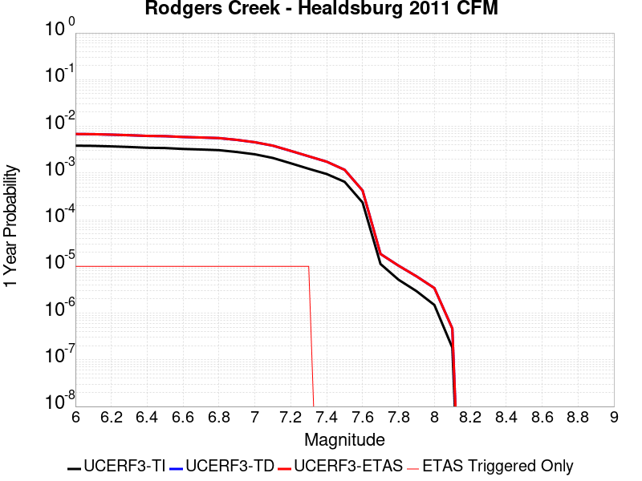 |  |

| Magnitude | 1 wk TI Prob | 1 wk TD Prob | 1 wk ETAS Prob | 1 wk ETAS/TD Gain | 1 wk ETAS Triggered Only | 1 mo TI Prob | 1 mo TD Prob | 1 mo ETAS Prob | 1 mo ETAS/TD Gain | 1 mo ETAS Triggered Only | 1 yr TI Prob | 1 yr TD Prob | 1 yr ETAS Prob | 1 yr ETAS/TD Gain | 1 yr ETAS Triggered Only | 10 yr TI Prob | 10 yr TD Prob | 10 yr ETAS Prob | 10 yr ETAS/TD Gain | 10 yr ETAS Triggered Only |
|-----|-----|-----|-----|-----|-----|-----|-----|-----|-----|-----|-----|-----|-----|-----|-----|-----|-----|-----|-----|-----|
| 6.0 | 7.390182E-5 | 1.3139093E-4 | 1.3139093E-4 | 1.0 | 0.0 | 3.1668364E-4 | 5.629827E-4 | 5.629827E-4 | 1.0 | 0.0 | 0.0038488081 | 0.006832735 | 0.0068426672 | 1.0014535 | 1.0E-5 | 0.037828278 | 0.066191986 | 0.06620132 | 1.000141 | 1.0E-5 |
| 6.1 | 7.318768E-5 | 1.3037103E-4 | 1.3037103E-4 | 1.0 | 0.0 | 3.1362378E-4 | 5.586137E-4 | 5.586137E-4 | 1.0 | 0.0 | 0.0038116854 | 0.0067798914 | 0.0067898235 | 1.001465 | 1.0E-5 | 0.037469655 | 0.06569656 | 0.0657059 | 1.0001422 | 1.0E-5 |
| 6.2 | 7.1379836E-5 | 1.2729941E-4 | 1.2729941E-4 | 1.0 | 0.0 | 3.058777E-4 | 5.454552E-4 | 5.454552E-4 | 1.0 | 0.0 | 0.003717703 | 0.0066206693 | 0.006630603 | 1.0015004 | 1.0E-5 | 0.0365612 | 0.064218655 | 0.06422801 | 1.0001457 | 1.0E-5 |
| 6.3 | 6.9255926E-5 | 1.2384256E-4 | 1.2384256E-4 | 1.0 | 0.0 | 2.9677735E-4 | 5.306463E-4 | 5.306463E-4 | 1.0 | 0.0 | 0.0036072785 | 0.006441529 | 0.0064514643 | 1.0015424 | 1.0E-5 | 0.035492823 | 0.062549815 | 0.062559195 | 1.0001498 | 1.0E-5 |
| 6.4 | 6.6757144E-5 | 1.19609525E-4 | 1.19609525E-4 | 1.0 | 0.0 | 2.8607066E-4 | 5.1251194E-4 | 5.1251194E-4 | 1.0 | 0.0 | 0.0034773487 | 0.006222053 | 0.0062319906 | 1.0015972 | 1.0E-5 | 0.034234364 | 0.060499642 | 0.060509037 | 1.0001553 | 1.0E-5 |
| 6.5 | 6.5735134E-5 | 1.1809998E-4 | 1.1809998E-4 | 1.0 | 0.0 | 2.8169158E-4 | 5.0604495E-4 | 5.0604495E-4 | 1.0 | 0.0 | 0.003424202 | 0.0061437762 | 0.006153715 | 1.0016177 | 1.0E-5 | 0.03371918 | 0.059762556 | 0.05977196 | 1.0001574 | 1.0E-5 |
| 6.6 | 6.289601E-5 | 1.13453316E-4 | 1.13453316E-4 | 1.0 | 0.0 | 2.6952647E-4 | 4.8613825E-4 | 4.8613825E-4 | 1.0 | 0.0 | 0.0032765474 | 0.005902751 | 0.005912692 | 1.0016841 | 1.0E-5 | 0.032286562 | 0.057500087 | 0.05750951 | 1.0001639 | 1.0E-5 |
| 6.7 | 6.115274E-5 | 1.1062275E-4 | 1.1062275E-4 | 1.0 | 0.0 | 2.6205686E-4 | 4.7401173E-4 | 4.7401173E-4 | 1.0 | 0.0 | 0.0031858748 | 0.005755901 | 0.005765843 | 1.0017273 | 1.0E-5 | 0.031405866 | 0.056117915 | 0.056127355 | 1.0001682 | 1.0E-5 |
| 6.8 | 5.9232367E-5 | 1.07296E-4 | 1.07296E-4 | 1.0 | 0.0 | 2.538283E-4 | 4.5975935E-4 | 4.5975935E-4 | 1.0 | 0.0 | 0.0030859804 | 0.00558328 | 0.0055932244 | 1.0017811 | 1.0E-5 | 0.030434765 | 0.05448483 | 0.054494284 | 1.0001736 | 1.0E-5 |
| 6.9 | 5.4030377E-5 | 9.823741E-5 | 9.823741E-5 | 1.0 | 0.0 | 2.315382E-4 | 4.209499E-4 | 4.209499E-4 | 1.0 | 0.0 | 0.0028153337 | 0.005113087 | 0.005123036 | 1.0019457 | 1.0E-5 | 0.027799325 | 0.05002048 | 0.05002998 | 1.0001899 | 1.0E-5 |
| 7.0 | 4.8260714E-5 | 8.741771E-5 | 8.741771E-5 | 1.0 | 0.0 | 2.0681522E-4 | 3.7459383E-4 | 3.7459383E-4 | 1.0 | 0.0 | 0.0025150678 | 0.004551197 | 0.0045611514 | 1.0021873 | 1.0E-5 | 0.024867928 | 0.044671923 | 0.044681475 | 1.0002139 | 1.0E-5 |
| 7.1 | 4.0294493E-5 | 7.3902025E-5 | 7.3902025E-5 | 1.0 | 0.0 | 1.7267925E-4 | 3.1668475E-4 | 3.1668475E-4 | 1.0 | 0.0 | 0.0021003427 | 0.0038488582 | 0.0038588198 | 1.0025882 | 1.0E-5 | 0.02080602 | 0.037927724 | 0.037937343 | 1.0002537 | 1.0E-5 |
| 7.2 | 3.096388E-5 | 5.698826E-5 | 5.698826E-5 | 1.0 | 0.0 | 1.326956E-4 | 2.4421266E-4 | 2.4421266E-4 | 1.0 | 0.0 | 0.0016143717 | 0.0029692573 | 0.0029792276 | 1.0033579 | 1.0E-5 | 0.01602694 | 0.029440729 | 0.029450435 | 1.0003296 | 1.0E-5 |
| 7.3 | 2.3615226E-5 | 4.3637207E-5 | 4.3637207E-5 | 1.0 | 0.0 | 1.0120418E-4 | 1.8700327E-4 | 1.8700327E-4 | 1.0 | 0.0 | 0.0012314644 | 0.0022744013 | 0.0022843785 | 1.0043868 | 1.0E-5 | 0.0122466255 | 0.02264088 | 0.022650655 | 1.0004317 | 1.0E-5 |
| 7.4 | 1.8251132E-5 | 3.3548964E-5 | 3.3548964E-5 | 1.0 | 0.0 | 7.821679E-5 | 1.437734E-4 | 1.437734E-4 | 1.0 | 0.0 | 9.518733E-4 | 0.0017490456 | 0.0017490456 | 1.0 | 0.0 | 0.009478063 | 0.017468803 | 0.017468803 | 1.0 | 0.0 |
| 7.5 | 1.2411432E-5 | 2.2463999E-5 | 2.2463999E-5 | 1.0 | 0.0 | 5.3190768E-5 | 9.627076E-5 | 9.627076E-5 | 1.0 | 0.0 | 6.4740516E-4 | 0.0011714721 | 0.0011714721 | 1.0 | 0.0 | 0.006455223 | 0.011744237 | 0.011744237 | 1.0 | 0.0 |
| 7.6 | 4.4771446E-6 | 8.085529E-6 | 8.085529E-6 | 1.0 | 0.0 | 1.918762E-5 | 3.465181E-5 | 3.465181E-5 | 1.0 | 0.0 | 2.3358424E-4 | 4.2180537E-4 | 4.2180537E-4 | 1.0 | 0.0 | 0.0023333887 | 0.0042457026 | 0.0042457026 | 1.0 | 0.0 |
| 7.7 | 2.157941E-7 | 3.5363618E-7 | 3.5363618E-7 | 1.0 | 0.0 | 9.248315E-7 | 1.5155827E-6 | 1.5155827E-6 | 1.0 | 0.0 | 1.1259765E-5 | 1.8452063E-5 | 1.8452063E-5 | 1.0 | 0.0 | 1.1259195E-4 | 1.9075118E-4 | 1.9075118E-4 | 1.0 | 0.0 |
| 7.8 | 9.9623286E-8 | 1.9910124E-7 | 1.9910124E-7 | 1.0 | 0.0 | 4.269569E-7 | 8.532907E-7 | 8.532907E-7 | 1.0 | 0.0 | 5.1981874E-6 | 1.0388765E-5 | 1.0388765E-5 | 1.0 | 0.0 | 5.198066E-5 | 1.0907195E-4 | 1.0907195E-4 | 1.0 | 0.0 |
| 7.9 | 5.6745257E-8 | 1.1780399E-7 | 1.1780399E-7 | 1.0 | 0.0 | 2.4319394E-7 | 5.0487415E-7 | 5.0487415E-7 | 1.0 | 0.0 | 2.960882E-6 | 6.1468254E-6 | 6.1468254E-6 | 1.0 | 0.0 | 2.9608427E-5 | 6.474216E-5 | 6.474216E-5 | 1.0 | 0.0 |
| 8.0 | 2.8614323E-8 | 6.582037E-8 | 6.582037E-8 | 1.0 | 0.0 | 1.2263281E-7 | 2.8208729E-7 | 2.8208729E-7 | 1.0 | 0.0 | 1.4930534E-6 | 3.4344073E-6 | 3.4344073E-6 | 1.0 | 0.0 | 1.4930434E-5 | 3.5844452E-5 | 3.5844452E-5 | 1.0 | 0.0 |
| 8.1 | 3.5045191E-9 | 8.970427E-9 | 8.970427E-9 | 1.0 | 0.0 | 1.5019367E-8 | 3.8444686E-8 | 3.8444686E-8 | 1.0 | 0.0 | 1.8286079E-7 | 4.6806397E-7 | 4.6806397E-7 | 1.0 | 0.0 | 1.8286064E-6 | 4.8356214E-6 | 4.8356214E-6 | 1.0 | 0.0 |

## San Luis Range 2011 CFM
*[(top)](#table-of-contents)*

| 1 Week | 1 Month | 1 Year | 10 Year |
|-----|-----|-----|-----|
|  |  |  |  |

| Magnitude | 1 wk TI Prob | 1 wk TD Prob | 1 wk ETAS Prob | 1 wk ETAS/TD Gain | 1 wk ETAS Triggered Only | 1 mo TI Prob | 1 mo TD Prob | 1 mo ETAS Prob | 1 mo ETAS/TD Gain | 1 mo ETAS Triggered Only | 1 yr TI Prob | 1 yr TD Prob | 1 yr ETAS Prob | 1 yr ETAS/TD Gain | 1 yr ETAS Triggered Only | 10 yr TI Prob | 10 yr TD Prob | 10 yr ETAS Prob | 10 yr ETAS/TD Gain | 10 yr ETAS Triggered Only |
|-----|-----|-----|-----|-----|-----|-----|-----|-----|-----|-----|-----|-----|-----|-----|-----|-----|-----|-----|-----|-----|
| 6.0 | 8.8368415E-6 | 8.965478E-6 | 8.965478E-6 | 1.0 | 0.0 | 3.787163E-5 | 3.8422957E-5 | 3.8422957E-5 | 1.0 | 0.0 | 4.609895E-4 | 4.6770697E-4 | 4.777023E-4 | 1.0213709 | 1.0E-5 | 0.0046003438 | 0.004668009 | 0.004677962 | 1.0021323 | 1.0E-5 |
| 6.1 | 8.8368415E-6 | 8.965478E-6 | 8.965478E-6 | 1.0 | 0.0 | 3.787163E-5 | 3.8422957E-5 | 3.8422957E-5 | 1.0 | 0.0 | 4.609895E-4 | 4.6770697E-4 | 4.777023E-4 | 1.0213709 | 1.0E-5 | 0.0046003438 | 0.004668009 | 0.004677962 | 1.0021323 | 1.0E-5 |
| 6.2 | 8.8368415E-6 | 8.965478E-6 | 8.965478E-6 | 1.0 | 0.0 | 3.787163E-5 | 3.8422957E-5 | 3.8422957E-5 | 1.0 | 0.0 | 4.609895E-4 | 4.6770697E-4 | 4.777023E-4 | 1.0213709 | 1.0E-5 | 0.0046003438 | 0.004668009 | 0.004677962 | 1.0021323 | 1.0E-5 |
| 6.3 | 8.8368415E-6 | 8.965478E-6 | 8.965478E-6 | 1.0 | 0.0 | 3.787163E-5 | 3.8422957E-5 | 3.8422957E-5 | 1.0 | 0.0 | 4.609895E-4 | 4.6770697E-4 | 4.777023E-4 | 1.0213709 | 1.0E-5 | 0.0046003438 | 0.004668009 | 0.004677962 | 1.0021323 | 1.0E-5 |
| 6.4 | 3.9094193E-6 | 3.941214E-6 | 3.941214E-6 | 1.0 | 0.0 | 1.6754546E-5 | 1.689081E-5 | 1.689081E-5 | 1.0 | 0.0 | 2.039675E-4 | 2.0562648E-4 | 2.0562648E-4 | 1.0 | 0.0 | 0.0020378039 | 0.002054391 | 0.002054391 | 1.0 | 0.0 |
| 6.5 | 3.9094193E-6 | 3.941214E-6 | 3.941214E-6 | 1.0 | 0.0 | 1.6754546E-5 | 1.689081E-5 | 1.689081E-5 | 1.0 | 0.0 | 2.039675E-4 | 2.0562648E-4 | 2.0562648E-4 | 1.0 | 0.0 | 0.0020378039 | 0.002054391 | 0.002054391 | 1.0 | 0.0 |
| 6.6 | 3.0587726E-6 | 3.0753974E-6 | 3.0753974E-6 | 1.0 | 0.0 | 1.3108959E-5 | 1.3180209E-5 | 1.3180209E-5 | 1.0 | 0.0 | 1.595899E-4 | 1.6045735E-4 | 1.6045735E-4 | 1.0 | 0.0 | 0.0015947534 | 0.0016034269 | 0.0016034269 | 1.0 | 0.0 |
| 6.7 | 2.6160574E-6 | 2.6251355E-6 | 2.6251355E-6 | 1.0 | 0.0 | 1.1211626E-5 | 1.1250533E-5 | 1.1250533E-5 | 1.0 | 0.0 | 1.3649299E-4 | 1.3696669E-4 | 1.3696669E-4 | 1.0 | 0.0 | 0.0013640919 | 0.0013688289 | 0.0013688289 | 1.0 | 0.0 |
| 6.8 | 2.5110312E-6 | 2.5181482E-6 | 2.5181482E-6 | 1.0 | 0.0 | 1.0761518E-5 | 1.079202E-5 | 1.079202E-5 | 1.0 | 0.0 | 1.310136E-4 | 1.3138496E-4 | 1.3138496E-4 | 1.0 | 0.0 | 0.0013093639 | 0.0013130788 | 0.0013130788 | 1.0 | 0.0 |
| 6.9 | 1.8564405E-6 | 1.8524935E-6 | 1.8524935E-6 | 1.0 | 0.0 | 7.95615E-6 | 7.939234E-6 | 7.939234E-6 | 1.0 | 0.0 | 9.686181E-5 | 9.66559E-5 | 9.66559E-5 | 1.0 | 0.0 | 9.68196E-4 | 9.6614065E-4 | 9.6614065E-4 | 1.0 | 0.0 |
| 7.0 | 1.546127E-6 | 1.5369595E-6 | 1.5369595E-6 | 1.0 | 0.0 | 6.626242E-6 | 6.586953E-6 | 6.586953E-6 | 1.0 | 0.0 | 8.06715E-5 | 8.0193204E-5 | 8.0193204E-5 | 1.0 | 0.0 | 8.0642226E-4 | 8.016434E-4 | 8.016434E-4 | 1.0 | 0.0 |
| 7.1 | 1.3368208E-6 | 1.3235378E-6 | 1.3235378E-6 | 1.0 | 0.0 | 5.7292195E-6 | 5.672293E-6 | 5.672293E-6 | 1.0 | 0.0 | 6.975101E-5 | 6.905798E-5 | 6.905798E-5 | 1.0 | 0.0 | 6.972912E-4 | 6.903657E-4 | 6.903657E-4 | 1.0 | 0.0 |
| 7.2 | 1.0623363E-6 | 1.0454412E-6 | 1.0454412E-6 | 1.0 | 0.0 | 4.5528623E-6 | 4.4804547E-6 | 4.4804547E-6 | 1.0 | 0.0 | 5.5429686E-5 | 5.4548174E-5 | 5.4548174E-5 | 1.0 | 0.0 | 5.5415864E-4 | 5.453481E-4 | 5.453481E-4 | 1.0 | 0.0 |
| 7.3 | 7.831679E-7 | 7.7274274E-7 | 7.7274274E-7 | 1.0 | 0.0 | 3.3564295E-6 | 3.3117506E-6 | 3.3117506E-6 | 1.0 | 0.0 | 4.086376E-5 | 4.0319817E-5 | 4.0319817E-5 | 1.0 | 0.0 | 4.0856248E-4 | 4.0312516E-4 | 4.0312516E-4 | 1.0 | 0.0 |
| 7.4 | 5.9558846E-7 | 5.9106696E-7 | 5.9106696E-7 | 1.0 | 0.0 | 2.5525194E-6 | 2.5331417E-6 | 2.5331417E-6 | 1.0 | 0.0 | 3.107648E-5 | 3.0840565E-5 | 3.0840565E-5 | 1.0 | 0.0 | 3.1072134E-4 | 3.083629E-4 | 3.083629E-4 | 1.0 | 0.0 |
| 7.5 | 4.1616502E-7 | 4.1196597E-7 | 4.1196597E-7 | 1.0 | 0.0 | 1.7835631E-6 | 1.7655673E-6 | 1.7655673E-6 | 1.0 | 0.0 | 2.1714664E-5 | 2.1495569E-5 | 2.1495569E-5 | 1.0 | 0.0 | 2.1712543E-4 | 2.1493496E-4 | 2.1493496E-4 | 1.0 | 0.0 |
| 7.6 | 2.3816014E-7 | 2.3376762E-7 | 2.3376762E-7 | 1.0 | 0.0 | 1.0206859E-6 | 1.0018608E-6 | 1.0018608E-6 | 1.0 | 0.0 | 1.242678E-5 | 1.2197587E-5 | 1.2197587E-5 | 1.0 | 0.0 | 1.2426086E-4 | 1.219692E-4 | 1.219692E-4 | 1.0 | 0.0 |
| 7.7 | 9.918777E-8 | 9.386922E-8 | 9.386922E-8 | 1.0 | 0.0 | 4.2509038E-7 | 4.0229656E-7 | 4.0229656E-7 | 1.0 | 0.0 | 5.1754632E-6 | 4.8979496E-6 | 4.8979496E-6 | 1.0 | 0.0 | 5.1753424E-5 | 4.897842E-5 | 4.897842E-5 | 1.0 | 0.0 |
| 7.8 | 3.4982556E-8 | 2.9687648E-8 | 2.9687648E-8 | 1.0 | 0.0 | 1.4992524E-7 | 1.2723277E-7 | 1.2723277E-7 | 1.0 | 0.0 | 1.8253382E-6 | 1.5490579E-6 | 1.5490579E-6 | 1.0 | 0.0 | 1.8253233E-5 | 1.5490472E-5 | 1.5490472E-5 | 1.0 | 0.0 |
| 7.9 | 1.6624908E-8 | 1.147785E-8 | 1.147785E-8 | 1.0 | 0.0 | 7.12496E-8 | 4.9190785E-8 | 4.9190785E-8 | 1.0 | 0.0 | 8.6746354E-7 | 5.9889766E-7 | 5.9889766E-7 | 1.0 | 0.0 | 8.674601E-6 | 5.9889603E-6 | 5.9889603E-6 | 1.0 | 0.0 |
| 8.0 | 6.3352315E-9 | 3.0891683E-9 | 3.0891683E-9 | 1.0 | 0.0 | 2.715099E-8 | 1.3239292E-8 | 1.3239292E-8 | 1.0 | 0.0 | 3.3056327E-7 | 1.6118838E-7 | 1.6118838E-7 | 1.0 | 0.0 | 3.3056278E-6 | 1.6118827E-6 | 1.6118827E-6 | 1.0 | 0.0 |

## Gillem - Big Crack 2011 CFM
*[(top)](#table-of-contents)*

| 1 Week | 1 Month | 1 Year | 10 Year |
|-----|-----|-----|-----|
|  |  |  |  |

| Magnitude | 1 wk TI Prob | 1 wk TD Prob | 1 wk ETAS Prob | 1 wk ETAS/TD Gain | 1 wk ETAS Triggered Only | 1 mo TI Prob | 1 mo TD Prob | 1 mo ETAS Prob | 1 mo ETAS/TD Gain | 1 mo ETAS Triggered Only | 1 yr TI Prob | 1 yr TD Prob | 1 yr ETAS Prob | 1 yr ETAS/TD Gain | 1 yr ETAS Triggered Only | 10 yr TI Prob | 10 yr TD Prob | 10 yr ETAS Prob | 10 yr ETAS/TD Gain | 10 yr ETAS Triggered Only |
|-----|-----|-----|-----|-----|-----|-----|-----|-----|-----|-----|-----|-----|-----|-----|-----|-----|-----|-----|-----|-----|
| 6.0 | 2.196852E-5 | 2.360472E-5 | 2.360472E-5 | 1.0 | 0.0 | 9.4147406E-5 | 1.0115966E-4 | 1.0115966E-4 | 1.0 | 0.0 | 0.0011456419 | 0.0012310119 | 0.0012409997 | 1.0081134 | 1.0E-5 | 0.011397537 | 0.01225079 | 0.012260667 | 1.0008063 | 1.0E-5 |
| 6.1 | 9.992795E-6 | 1.0711992E-5 | 1.0711992E-5 | 1.0 | 0.0 | 4.2825563E-5 | 4.5907833E-5 | 4.5907833E-5 | 1.0 | 0.0 | 5.2127644E-4 | 5.5880286E-4 | 5.687973E-4 | 1.0178854 | 1.0E-5 | 0.0052005537 | 0.0055757877 | 0.005585732 | 1.0017835 | 1.0E-5 |
| 6.2 | 9.992795E-6 | 1.0711992E-5 | 1.0711992E-5 | 1.0 | 0.0 | 4.2825563E-5 | 4.5907833E-5 | 4.5907833E-5 | 1.0 | 0.0 | 5.2127644E-4 | 5.5880286E-4 | 5.687973E-4 | 1.0178854 | 1.0E-5 | 0.0052005537 | 0.0055757877 | 0.005585732 | 1.0017835 | 1.0E-5 |
| 6.3 | 4.6127884E-6 | 4.942704E-6 | 4.942704E-6 | 1.0 | 0.0 | 1.9768944E-5 | 2.118287E-5 | 2.118287E-5 | 1.0 | 0.0 | 2.406603E-4 | 2.5787536E-4 | 2.5787536E-4 | 1.0 | 0.0 | 0.0024039985 | 0.0025761996 | 0.0025761996 | 1.0 | 0.0 |
| 6.4 | 4.6127884E-6 | 4.942704E-6 | 4.942704E-6 | 1.0 | 0.0 | 1.9768944E-5 | 2.118287E-5 | 2.118287E-5 | 1.0 | 0.0 | 2.406603E-4 | 2.5787536E-4 | 2.5787536E-4 | 1.0 | 0.0 | 0.0024039985 | 0.0025761996 | 0.0025761996 | 1.0 | 0.0 |
| 6.5 | 2.716712E-6 | 2.911139E-6 | 2.911139E-6 | 1.0 | 0.0 | 1.1643E-5 | 1.2476264E-5 | 1.2476264E-5 | 1.0 | 0.0 | 1.417443E-4 | 1.5189036E-4 | 1.5189036E-4 | 1.0 | 0.0 | 0.0014165393 | 0.0015181034 | 0.0015181034 | 1.0 | 0.0 |
| 6.6 | 1.3818255E-6 | 1.4820831E-6 | 1.4820831E-6 | 1.0 | 0.0 | 5.922096E-6 | 6.3517764E-6 | 6.3517764E-6 | 1.0 | 0.0 | 7.209913E-5 | 7.7331366E-5 | 7.7331366E-5 | 1.0 | 0.0 | 7.2075747E-4 | 7.731655E-4 | 7.731655E-4 | 1.0 | 0.0 |

## Maacama 2011 CFM
*[(top)](#table-of-contents)*

| 1 Week | 1 Month | 1 Year | 10 Year |
|-----|-----|-----|-----|
|  | 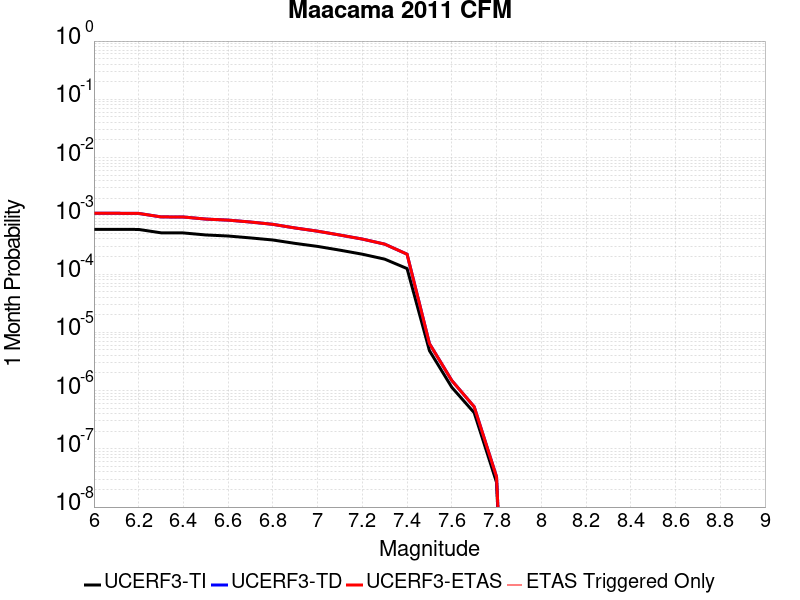 |  | 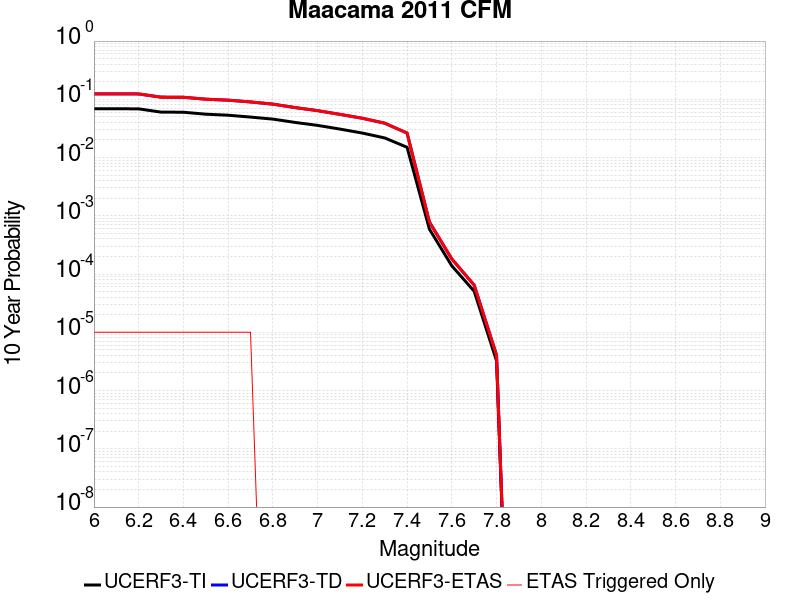 |

| Magnitude | 1 wk TI Prob | 1 wk TD Prob | 1 wk ETAS Prob | 1 wk ETAS/TD Gain | 1 wk ETAS Triggered Only | 1 mo TI Prob | 1 mo TD Prob | 1 mo ETAS Prob | 1 mo ETAS/TD Gain | 1 mo ETAS Triggered Only | 1 yr TI Prob | 1 yr TD Prob | 1 yr ETAS Prob | 1 yr ETAS/TD Gain | 1 yr ETAS Triggered Only | 10 yr TI Prob | 10 yr TD Prob | 10 yr ETAS Prob | 10 yr ETAS/TD Gain | 10 yr ETAS Triggered Only |
|-----|-----|-----|-----|-----|-----|-----|-----|-----|-----|-----|-----|-----|-----|-----|-----|-----|-----|-----|-----|-----|
| 6.0 | 1.368203E-4 | 2.5793182E-4 | 2.5793182E-4 | 1.0 | 0.0 | 5.862409E-4 | 0.0011048464 | 0.0011048464 | 1.0 | 0.0 | 0.0071141496 | 0.013351369 | 0.013351369 | 1.0 | 0.0 | 0.06890667 | 0.124200076 | 0.12420883 | 1.0000706 | 1.0E-5 |
| 6.1 | 1.368203E-4 | 2.5793182E-4 | 2.5793182E-4 | 1.0 | 0.0 | 5.862409E-4 | 0.0011048464 | 0.0011048464 | 1.0 | 0.0 | 0.0071141496 | 0.013351369 | 0.013351369 | 1.0 | 0.0 | 0.06890667 | 0.124200076 | 0.12420883 | 1.0000706 | 1.0E-5 |
| 6.2 | 1.360743E-4 | 2.5667873E-4 | 2.5667873E-4 | 1.0 | 0.0 | 5.8304524E-4 | 0.0010994809 | 0.0010994809 | 1.0 | 0.0 | 0.007075496 | 0.0132869175 | 0.0132869175 | 1.0 | 0.0 | 0.06854413 | 0.12363445 | 0.12364321 | 1.0000709 | 1.0E-5 |
| 6.3 | 1.1917239E-4 | 2.2361906E-4 | 2.2361906E-4 | 1.0 | 0.0 | 5.1063887E-4 | 9.579574E-4 | 9.579574E-4 | 1.0 | 0.0 | 0.0061993203 | 0.011588279 | 0.011588279 | 1.0 | 0.0 | 0.060292065 | 0.108853936 | 0.10886285 | 1.0000819 | 1.0E-5 |
| 6.4 | 1.1859289E-4 | 2.2265485E-4 | 2.2265485E-4 | 1.0 | 0.0 | 5.0815626E-4 | 9.538287E-4 | 9.538287E-4 | 1.0 | 0.0 | 0.006169266 | 0.011538599 | 0.011538599 | 1.0 | 0.0 | 0.06000784 | 0.10841077 | 0.10841969 | 1.0000823 | 1.0E-5 |
| 6.5 | 1.09512424E-4 | 2.0519547E-4 | 2.0519547E-4 | 1.0 | 0.0 | 4.6925453E-4 | 8.790543E-4 | 8.790543E-4 | 1.0 | 0.0 | 0.005698218 | 0.010640079 | 0.010640079 | 1.0 | 0.0 | 0.055543028 | 0.100502715 | 0.10051171 | 1.0000895 | 1.0E-5 |
| 6.6 | 1.0502928E-4 | 1.9677171E-4 | 1.9677171E-4 | 1.0 | 0.0 | 4.500478E-4 | 8.4297656E-4 | 8.4297656E-4 | 1.0 | 0.0 | 0.0054655746 | 0.010206186 | 0.010206186 | 1.0 | 0.0 | 0.053330887 | 0.09665509 | 0.09666413 | 1.0000935 | 1.0E-5 |
| 6.7 | 9.739358E-5 | 1.8260846E-4 | 1.8260846E-4 | 1.0 | 0.0 | 4.173343E-4 | 7.8232895E-4 | 7.8232895E-4 | 1.0 | 0.0 | 0.0050692135 | 0.009476202 | 0.009476202 | 1.0 | 0.0 | 0.049551267 | 0.09012759 | 0.090136684 | 1.000101 | 1.0E-5 |
| 6.8 | 8.969524E-5 | 1.6659935E-4 | 1.6659935E-4 | 1.0 | 0.0 | 3.8435153E-4 | 7.137573E-4 | 7.137573E-4 | 1.0 | 0.0 | 0.0046694432 | 0.00864988 | 0.00864988 | 1.0 | 0.0 | 0.045725387 | 0.08265945 | 0.08265945 | 1.0 | 0.0 |
| 6.9 | 7.838291E-5 | 1.4420257E-4 | 1.4420257E-4 | 1.0 | 0.0 | 3.358835E-4 | 6.1783975E-4 | 6.1783975E-4 | 1.0 | 0.0 | 0.0040817154 | 0.0074924263 | 0.0074924263 | 1.0 | 0.0 | 0.04007554 | 0.07205926 | 0.07205926 | 1.0 | 0.0 |
| 7.0 | 6.961957E-5 | 1.2709318E-4 | 1.2709318E-4 | 1.0 | 0.0 | 2.9833548E-4 | 5.4456E-4 | 5.4456E-4 | 1.0 | 0.0 | 0.0036261857 | 0.0066073234 | 0.0066073234 | 1.0 | 0.0 | 0.035675827 | 0.063877545 | 0.063877545 | 1.0 | 0.0 |
| 7.1 | 5.999398E-5 | 1.09064305E-4 | 1.09064305E-4 | 1.0 | 0.0 | 2.570917E-4 | 4.6732955E-4 | 4.6732955E-4 | 1.0 | 0.0 | 0.0031255994 | 0.0056733987 | 0.0056733987 | 1.0 | 0.0 | 0.030820016 | 0.05514441 | 0.05514441 | 1.0 | 0.0 |
| 7.2 | 5.116532E-5 | 9.306404E-5 | 9.306404E-5 | 1.0 | 0.0 | 2.1926152E-4 | 3.9878118E-4 | 3.9878118E-4 | 1.0 | 0.0 | 0.002666241 | 0.0048436425 | 0.0048436425 | 1.0 | 0.0 | 0.026344774 | 0.047308248 | 0.047308248 | 1.0 | 0.0 |
| 7.3 | 4.2087835E-5 | 7.61781E-5 | 7.61781E-5 | 1.0 | 0.0 | 1.8036396E-4 | 3.2643395E-4 | 3.2643395E-4 | 1.0 | 0.0 | 0.0021937196 | 0.00396664 | 0.00396664 | 1.0 | 0.0 | 0.0217219 | 0.03890879 | 0.03890879 | 1.0 | 0.0 |
| 7.4 | 2.8991652E-5 | 5.1168747E-5 | 5.1168747E-5 | 1.0 | 0.0 | 1.2424402E-4 | 2.1927584E-4 | 2.1927584E-4 | 1.0 | 0.0 | 0.0015116213 | 0.0026663688 | 0.0026663688 | 1.0 | 0.0 | 0.015013801 | 0.026334526 | 0.026334526 | 1.0 | 0.0 |
| 7.5 | 1.1292299E-6 | 1.4951004E-6 | 1.4951004E-6 | 1.0 | 0.0 | 4.8395473E-6 | 6.4075643E-6 | 6.4075643E-6 | 1.0 | 0.0 | 5.8919897E-5 | 7.8010555E-5 | 7.8010555E-5 | 1.0 | 0.0 | 5.890428E-4 | 7.8054017E-4 | 7.8054017E-4 | 1.0 | 0.0 |
| 7.6 | 2.6535366E-7 | 3.4723857E-7 | 3.4723857E-7 | 1.0 | 0.0 | 1.1372296E-6 | 1.4881645E-6 | 1.4881645E-6 | 1.0 | 0.0 | 1.3845682E-5 | 1.8118253E-5 | 1.8118253E-5 | 1.0 | 0.0 | 1.3844819E-4 | 1.8171132E-4 | 1.8171132E-4 | 1.0 | 0.0 |
| 7.7 | 9.727789E-8 | 1.2304507E-7 | 1.2304507E-7 | 1.0 | 0.0 | 4.1690518E-7 | 5.273359E-7 | 5.273359E-7 | 1.0 | 0.0 | 5.0758085E-6 | 6.420296E-6 | 6.420296E-6 | 1.0 | 0.0 | 5.0756928E-5 | 6.4570995E-5 | 6.4570995E-5 | 1.0 | 0.0 |
| 7.8 | 6.1939325E-9 | 7.712495E-9 | 7.712495E-9 | 1.0 | 0.0 | 2.6545425E-8 | 3.305355E-8 | 3.305355E-8 | 1.0 | 0.0 | 3.231905E-7 | 4.024269E-7 | 4.024269E-7 | 1.0 | 0.0 | 3.2319003E-6 | 4.0608497E-6 | 4.0608497E-6 | 1.0 | 0.0 |

## Hilton Creek 2011 CFM
*[(top)](#table-of-contents)*

| 1 Week | 1 Month | 1 Year | 10 Year |
|-----|-----|-----|-----|
|  | 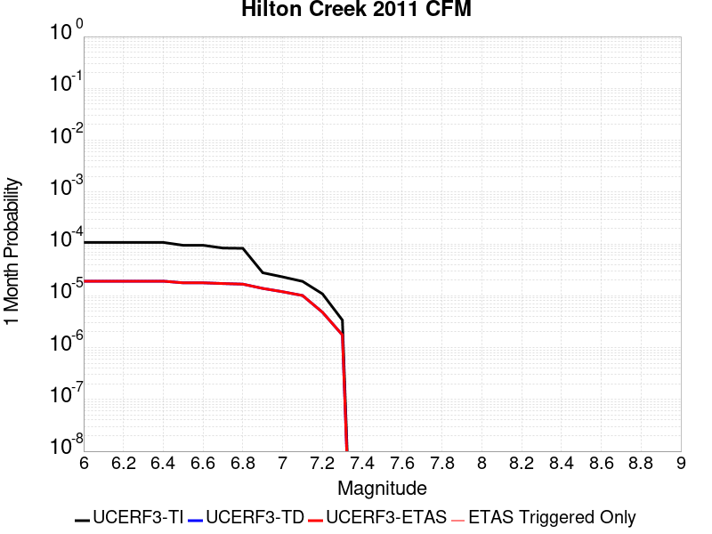 | 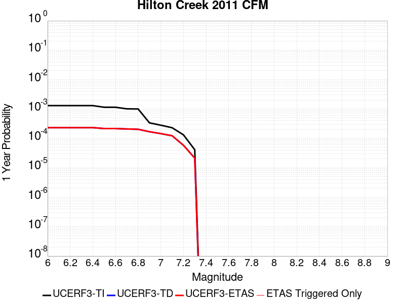 |  |

| Magnitude | 1 wk TI Prob | 1 wk TD Prob | 1 wk ETAS Prob | 1 wk ETAS/TD Gain | 1 wk ETAS Triggered Only | 1 mo TI Prob | 1 mo TD Prob | 1 mo ETAS Prob | 1 mo ETAS/TD Gain | 1 mo ETAS Triggered Only | 1 yr TI Prob | 1 yr TD Prob | 1 yr ETAS Prob | 1 yr ETAS/TD Gain | 1 yr ETAS Triggered Only | 10 yr TI Prob | 10 yr TD Prob | 10 yr ETAS Prob | 10 yr ETAS/TD Gain | 10 yr ETAS Triggered Only |
|-----|-----|-----|-----|-----|-----|-----|-----|-----|-----|-----|-----|-----|-----|-----|-----|-----|-----|-----|-----|-----|
| 6.0 | 2.4923684E-5 | 4.4574654E-6 | 4.4574654E-6 | 1.0 | 0.0 | 1.06811414E-4 | 1.9103292E-5 | 1.9103292E-5 | 1.0 | 0.0 | 0.0012996531 | 2.325594E-4 | 2.325594E-4 | 1.0 | 0.0 | 0.012920785 | 0.002326253 | 0.00233623 | 1.0042888 | 1.0E-5 |
| 6.1 | 2.4923684E-5 | 4.4574654E-6 | 4.4574654E-6 | 1.0 | 0.0 | 1.06811414E-4 | 1.9103292E-5 | 1.9103292E-5 | 1.0 | 0.0 | 0.0012996531 | 2.325594E-4 | 2.325594E-4 | 1.0 | 0.0 | 0.012920785 | 0.002326253 | 0.00233623 | 1.0042888 | 1.0E-5 |
| 6.2 | 2.4923684E-5 | 4.4574654E-6 | 4.4574654E-6 | 1.0 | 0.0 | 1.06811414E-4 | 1.9103292E-5 | 1.9103292E-5 | 1.0 | 0.0 | 0.0012996531 | 2.325594E-4 | 2.325594E-4 | 1.0 | 0.0 | 0.012920785 | 0.002326253 | 0.00233623 | 1.0042888 | 1.0E-5 |
| 6.3 | 2.4923684E-5 | 4.4574654E-6 | 4.4574654E-6 | 1.0 | 0.0 | 1.06811414E-4 | 1.9103292E-5 | 1.9103292E-5 | 1.0 | 0.0 | 0.0012996531 | 2.325594E-4 | 2.325594E-4 | 1.0 | 0.0 | 0.012920785 | 0.002326253 | 0.00233623 | 1.0042888 | 1.0E-5 |
| 6.4 | 2.4923684E-5 | 4.4574654E-6 | 4.4574654E-6 | 1.0 | 0.0 | 1.06811414E-4 | 1.9103292E-5 | 1.9103292E-5 | 1.0 | 0.0 | 0.0012996531 | 2.325594E-4 | 2.325594E-4 | 1.0 | 0.0 | 0.012920785 | 0.002326253 | 0.00233623 | 1.0042888 | 1.0E-5 |
| 6.5 | 2.1963904E-5 | 4.1449102E-6 | 4.1449102E-6 | 1.0 | 0.0 | 9.412762E-5 | 1.7763788E-5 | 1.7763788E-5 | 1.0 | 0.0 | 0.0011454013 | 2.1625416E-4 | 2.1625416E-4 | 1.0 | 0.0 | 0.011395155 | 0.0021653727 | 0.0021753511 | 1.0046082 | 1.0E-5 |
| 6.6 | 2.1963904E-5 | 4.1449102E-6 | 4.1449102E-6 | 1.0 | 0.0 | 9.412762E-5 | 1.7763788E-5 | 1.7763788E-5 | 1.0 | 0.0 | 0.0011454013 | 2.1625416E-4 | 2.1625416E-4 | 1.0 | 0.0 | 0.011395155 | 0.0021653727 | 0.0021753511 | 1.0046082 | 1.0E-5 |
| 6.7 | 1.9397496E-5 | 4.0149625E-6 | 4.0149625E-6 | 1.0 | 0.0 | 8.3129475E-5 | 1.7206878E-5 | 1.7206878E-5 | 1.0 | 0.0 | 0.0010116313 | 2.0947508E-4 | 2.0947508E-4 | 1.0 | 0.0 | 0.0100703845 | 0.0020973017 | 0.0021072808 | 1.004758 | 1.0E-5 |
| 6.8 | 1.917303E-5 | 3.9078996E-6 | 3.9078996E-6 | 1.0 | 0.0 | 8.216754E-5 | 1.6748041E-5 | 1.6748041E-5 | 1.0 | 0.0 | 9.999307E-4 | 2.038898E-4 | 2.038898E-4 | 1.0 | 0.0 | 0.009954433 | 0.0020415522 | 0.0020515318 | 1.0048882 | 1.0E-5 |
| 6.9 | 6.480681E-6 | 3.2315934E-6 | 3.2315934E-6 | 1.0 | 0.0 | 2.7774051E-5 | 1.3849619E-5 | 1.3849619E-5 | 1.0 | 0.0 | 3.380966E-4 | 1.6860719E-4 | 1.6860719E-4 | 1.0 | 0.0 | 0.0033758266 | 0.0016849039 | 0.001694887 | 1.005925 | 1.0E-5 |
| 7.0 | 5.388316E-6 | 2.788248E-6 | 2.788248E-6 | 1.0 | 0.0 | 2.3092578E-5 | 1.1949584E-5 | 1.1949584E-5 | 1.0 | 0.0 | 2.8111585E-4 | 1.4547752E-4 | 1.4547752E-4 | 1.0 | 0.0 | 0.002807605 | 0.0014539256 | 0.001463911 | 1.0068679 | 1.0E-5 |
| 7.1 | 4.41728E-6 | 2.3573723E-6 | 2.3573723E-6 | 1.0 | 0.0 | 1.8931061E-5 | 1.0102991E-5 | 1.0102991E-5 | 1.0 | 0.0 | 2.304613E-4 | 1.2299795E-4 | 1.2299795E-4 | 1.0 | 0.0 | 0.0023022245 | 0.0012293953 | 0.001239383 | 1.0081241 | 1.0E-5 |
| 7.2 | 2.535495E-6 | 1.1208174E-6 | 1.1208174E-6 | 1.0 | 0.0 | 1.0866362E-5 | 4.803497E-6 | 4.803497E-6 | 1.0 | 0.0 | 1.3228992E-4 | 5.8481528E-5 | 5.8481528E-5 | 1.0 | 0.0 | 0.0013221119 | 5.847126E-4 | 5.847126E-4 | 1.0 | 0.0 |
| 7.3 | 7.900015E-7 | 4.0890467E-7 | 4.0890467E-7 | 1.0 | 0.0 | 3.3857161E-6 | 1.7524486E-6 | 1.7524486E-6 | 1.0 | 0.0 | 4.1220315E-5 | 2.1336062E-5 | 2.1336062E-5 | 1.0 | 0.0 | 4.121267E-4 | 2.1336062E-4 | 2.1336062E-4 | 1.0 | 0.0 |

## Great Valley 09 (Laguna Seca)
*[(top)](#table-of-contents)*

| 1 Week | 1 Month | 1 Year | 10 Year |
|-----|-----|-----|-----|
|  |  |  |  |

| Magnitude | 1 wk TI Prob | 1 wk TD Prob | 1 wk ETAS Prob | 1 wk ETAS/TD Gain | 1 wk ETAS Triggered Only | 1 mo TI Prob | 1 mo TD Prob | 1 mo ETAS Prob | 1 mo ETAS/TD Gain | 1 mo ETAS Triggered Only | 1 yr TI Prob | 1 yr TD Prob | 1 yr ETAS Prob | 1 yr ETAS/TD Gain | 1 yr ETAS Triggered Only | 10 yr TI Prob | 10 yr TD Prob | 10 yr ETAS Prob | 10 yr ETAS/TD Gain | 10 yr ETAS Triggered Only |
|-----|-----|-----|-----|-----|-----|-----|-----|-----|-----|-----|-----|-----|-----|-----|-----|-----|-----|-----|-----|-----|
| 6.0 | 5.4353277E-5 | 7.050336E-5 | 7.050336E-5 | 1.0 | 0.0 | 2.3292181E-4 | 3.0212323E-4 | 3.0212323E-4 | 1.0 | 0.0 | 0.0028321352 | 0.0036721565 | 0.0036721565 | 1.0 | 0.0 | 0.02796312 | 0.036117274 | 0.036126915 | 1.0002669 | 1.0E-5 |
| 6.1 | 4.5578287E-5 | 5.8223057E-5 | 5.8223057E-5 | 1.0 | 0.0 | 1.953209E-4 | 2.4950382E-4 | 2.4950382E-4 | 1.0 | 0.0 | 0.0023754383 | 0.0030334755 | 0.0030334755 | 1.0 | 0.0 | 0.023502063 | 0.029921044 | 0.029930744 | 1.0003242 | 1.0E-5 |
| 6.2 | 2.8536782E-5 | 3.4737728E-5 | 3.4737728E-5 | 1.0 | 0.0 | 1.2229476E-4 | 1.4886676E-4 | 1.4886676E-4 | 1.0 | 0.0 | 0.0014879217 | 0.0018109222 | 0.0018109222 | 1.0 | 0.0 | 0.014779986 | 0.017958904 | 0.017968724 | 1.0005468 | 1.0E-5 |
| 6.3 | 2.3698774E-5 | 2.8214345E-5 | 2.8214345E-5 | 1.0 | 0.0 | 1.01562226E-4 | 1.2091216E-4 | 1.2091216E-4 | 1.0 | 0.0 | 0.0012358186 | 0.001471101 | 0.001471101 | 1.0 | 0.0 | 0.012289686 | 0.014611942 | 0.014621796 | 1.0006744 | 1.0E-5 |
| 6.4 | 1.9191197E-5 | 2.2123615E-5 | 2.2123615E-5 | 1.0 | 0.0 | 8.2245395E-5 | 9.481171E-5 | 9.481171E-5 | 1.0 | 0.0 | 0.0010008777 | 0.0011537268 | 0.0011537268 | 1.0 | 0.0 | 0.009963818 | 0.011477377 | 0.011477377 | 1.0 | 0.0 |
| 6.5 | 1.5203241E-5 | 1.6801783E-5 | 1.6801783E-5 | 1.0 | 0.0 | 6.5155116E-5 | 7.200525E-5 | 7.200525E-5 | 1.0 | 0.0 | 7.9297484E-4 | 8.763255E-4 | 8.763255E-4 | 1.0 | 0.0 | 0.007901512 | 0.008729823 | 0.008729823 | 1.0 | 0.0 |
| 6.6 | 1.0984925E-5 | 1.1242807E-5 | 1.1242807E-5 | 1.0 | 0.0 | 4.70774E-5 | 4.8182592E-5 | 4.8182592E-5 | 1.0 | 0.0 | 5.730166E-4 | 5.864689E-4 | 5.864689E-4 | 1.0 | 0.0 | 0.005715413 | 0.0058496036 | 0.0058496036 | 1.0 | 0.0 |
| 6.7 | 9.134616E-6 | 9.020056E-6 | 9.020056E-6 | 1.0 | 0.0 | 3.9147766E-5 | 3.8656824E-5 | 3.8656824E-5 | 1.0 | 0.0 | 4.7651984E-4 | 4.7054756E-4 | 4.7054756E-4 | 1.0 | 0.0 | 0.004754993 | 0.0046957573 | 0.0046957573 | 1.0 | 0.0 |
| 6.8 | 7.785589E-6 | 7.4520726E-6 | 7.4520726E-6 | 1.0 | 0.0 | 3.3366385E-5 | 3.1937074E-5 | 3.1937074E-5 | 1.0 | 0.0 | 4.0616E-4 | 3.8876652E-4 | 3.8876652E-4 | 1.0 | 0.0 | 0.0040541845 | 0.0038810682 | 0.0038810682 | 1.0 | 0.0 |
| 6.9 | 5.579095E-6 | 4.898567E-6 | 4.898567E-6 | 1.0 | 0.0 | 2.3910188E-5 | 2.0993697E-5 | 2.0993697E-5 | 1.0 | 0.0 | 2.9106764E-4 | 2.5556967E-4 | 2.5556967E-4 | 1.0 | 0.0 | 0.002906867 | 0.002552895 | 0.002552895 | 1.0 | 0.0 |
| 7.0 | 2.6816688E-6 | 1.5216133E-6 | 1.5216133E-6 | 1.0 | 0.0 | 1.1492816E-5 | 6.521184E-6 | 6.521184E-6 | 1.0 | 0.0 | 1.3991605E-4 | 7.939261E-5 | 7.939261E-5 | 1.0 | 0.0 | 0.0013982799 | 7.9365115E-4 | 7.9365115E-4 | 1.0 | 0.0 |
| 7.1 | 1.9951021E-6 | 7.453698E-7 | 7.453698E-7 | 1.0 | 0.0 | 8.55041E-6 | 3.1944382E-6 | 3.1944382E-6 | 1.0 | 0.0 | 1.0409627E-4 | 3.8891634E-5 | 3.8891634E-5 | 1.0 | 0.0 | 0.0010404752 | 3.8885244E-4 | 3.8885244E-4 | 1.0 | 0.0 |
| 7.2 | 1.9951021E-6 | 7.453698E-7 | 7.453698E-7 | 1.0 | 0.0 | 8.55041E-6 | 3.1944382E-6 | 3.1944382E-6 | 1.0 | 0.0 | 1.0409627E-4 | 3.8891634E-5 | 3.8891634E-5 | 1.0 | 0.0 | 0.0010404752 | 3.8885244E-4 | 3.8885244E-4 | 1.0 | 0.0 |
| 7.3 | 1.7087556E-6 | 6.5787674E-7 | 6.5787674E-7 | 1.0 | 0.0 | 7.3232177E-6 | 2.8194688E-6 | 2.8194688E-6 | 1.0 | 0.0 | 8.915652E-5 | 3.4326535E-5 | 3.4326535E-5 | 1.0 | 0.0 | 8.9120766E-4 | 3.4321635E-4 | 3.4321635E-4 | 1.0 | 0.0 |
| 7.4 | 1.3804846E-6 | 6.0737995E-7 | 6.0737995E-7 | 1.0 | 0.0 | 5.916349E-6 | 2.6030546E-6 | 2.6030546E-6 | 1.0 | 0.0 | 7.2029165E-5 | 3.169177E-5 | 3.169177E-5 | 1.0 | 0.0 | 7.200583E-4 | 3.168765E-4 | 3.168765E-4 | 1.0 | 0.0 |
| 7.5 | 1.3804846E-6 | 6.0737995E-7 | 6.0737995E-7 | 1.0 | 0.0 | 5.916349E-6 | 2.6030546E-6 | 2.6030546E-6 | 1.0 | 0.0 | 7.2029165E-5 | 3.169177E-5 | 3.169177E-5 | 1.0 | 0.0 | 7.200583E-4 | 3.168765E-4 | 3.168765E-4 | 1.0 | 0.0 |

## Great Valley 05 Pittsburg - Kirby Hills alt1
*[(top)](#table-of-contents)*

| 1 Week | 1 Month | 1 Year | 10 Year |
|-----|-----|-----|-----|
|  |  |  |  |

| Magnitude | 1 wk TI Prob | 1 wk TD Prob | 1 wk ETAS Prob | 1 wk ETAS/TD Gain | 1 wk ETAS Triggered Only | 1 mo TI Prob | 1 mo TD Prob | 1 mo ETAS Prob | 1 mo ETAS/TD Gain | 1 mo ETAS Triggered Only | 1 yr TI Prob | 1 yr TD Prob | 1 yr ETAS Prob | 1 yr ETAS/TD Gain | 1 yr ETAS Triggered Only | 10 yr TI Prob | 10 yr TD Prob | 10 yr ETAS Prob | 10 yr ETAS/TD Gain | 10 yr ETAS Triggered Only |
|-----|-----|-----|-----|-----|-----|-----|-----|-----|-----|-----|-----|-----|-----|-----|-----|-----|-----|-----|-----|-----|
| 6.0 | 4.187212E-5 | 5.3444855E-5 | 5.3444855E-5 | 1.0 | 0.0 | 1.794396E-4 | 2.2903502E-4 | 2.3903273E-4 | 1.0436515 | 1.0E-5 | 0.002182488 | 0.0027858997 | 0.0027958718 | 1.0035795 | 1.0E-5 | 0.021611776 | 0.027604194 | 0.027613917 | 1.0003523 | 1.0E-5 |
| 6.1 | 4.187212E-5 | 5.3444855E-5 | 5.3444855E-5 | 1.0 | 0.0 | 1.794396E-4 | 2.2903502E-4 | 2.3903273E-4 | 1.0436515 | 1.0E-5 | 0.002182488 | 0.0027858997 | 0.0027958718 | 1.0035795 | 1.0E-5 | 0.021611776 | 0.027604194 | 0.027613917 | 1.0003523 | 1.0E-5 |
| 6.2 | 1.7353306E-5 | 2.2155487E-5 | 2.2155487E-5 | 1.0 | 0.0 | 7.436919E-5 | 9.495095E-5 | 9.495095E-5 | 1.0 | 0.0 | 9.050688E-4 | 0.0011557989 | 0.0011557989 | 1.0 | 0.0 | 0.009013915 | 0.011535612 | 0.011535612 | 1.0 | 0.0 |
| 6.3 | 1.7353306E-5 | 2.2155487E-5 | 2.2155487E-5 | 1.0 | 0.0 | 7.436919E-5 | 9.495095E-5 | 9.495095E-5 | 1.0 | 0.0 | 9.050688E-4 | 0.0011557989 | 0.0011557989 | 1.0 | 0.0 | 0.009013915 | 0.011535612 | 0.011535612 | 1.0 | 0.0 |
| 6.4 | 1.4028824E-5 | 1.7901719E-5 | 1.7901719E-5 | 1.0 | 0.0 | 6.0122147E-5 | 7.672165E-5 | 7.672165E-5 | 1.0 | 0.0 | 7.3174125E-4 | 9.340638E-4 | 9.340638E-4 | 1.0 | 0.0 | 0.0072933645 | 0.009338545 | 0.009338545 | 1.0 | 0.0 |

## Elsinore (Coyote Mountains)
*[(top)](#table-of-contents)*

| 1 Week | 1 Month | 1 Year | 10 Year |
|-----|-----|-----|-----|
| 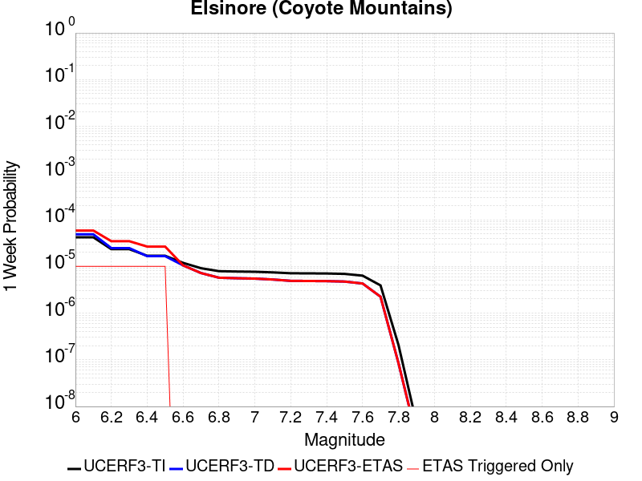 | 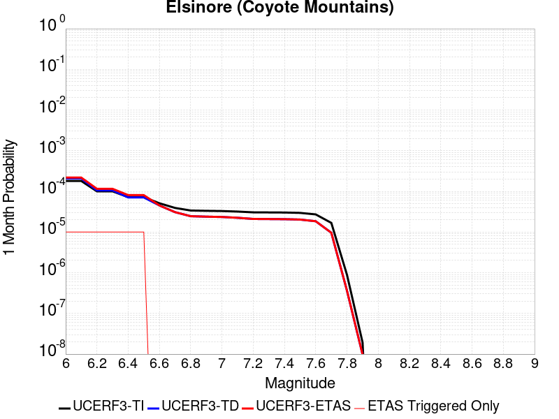 |  |  |

| Magnitude | 1 wk TI Prob | 1 wk TD Prob | 1 wk ETAS Prob | 1 wk ETAS/TD Gain | 1 wk ETAS Triggered Only | 1 mo TI Prob | 1 mo TD Prob | 1 mo ETAS Prob | 1 mo ETAS/TD Gain | 1 mo ETAS Triggered Only | 1 yr TI Prob | 1 yr TD Prob | 1 yr ETAS Prob | 1 yr ETAS/TD Gain | 1 yr ETAS Triggered Only | 10 yr TI Prob | 10 yr TD Prob | 10 yr ETAS Prob | 10 yr ETAS/TD Gain | 10 yr ETAS Triggered Only |
|-----|-----|-----|-----|-----|-----|-----|-----|-----|-----|-----|-----|-----|-----|-----|-----|-----|-----|-----|-----|-----|
| 6.0 | 4.20513E-5 | 4.863269E-5 | 5.8632202E-5 | 1.205613 | 1.0E-5 | 1.8020741E-4 | 2.084124E-4 | 2.184103E-4 | 1.0479718 | 1.0E-5 | 0.0021918174 | 0.0025349946 | 0.0025449693 | 1.0039347 | 1.0E-5 | 0.021703249 | 0.025112068 | 0.025121817 | 1.0003883 | 1.0E-5 |
| 6.1 | 4.20513E-5 | 4.863269E-5 | 5.8632202E-5 | 1.205613 | 1.0E-5 | 1.8020741E-4 | 2.084124E-4 | 2.184103E-4 | 1.0479718 | 1.0E-5 | 0.0021918174 | 0.0025349946 | 0.0025449693 | 1.0039347 | 1.0E-5 | 0.021703249 | 0.025112068 | 0.025121817 | 1.0003883 | 1.0E-5 |
| 6.2 | 2.3413893E-5 | 2.469625E-5 | 3.4696004E-5 | 1.4049097 | 1.0E-5 | 1.0034139E-4 | 1.0583731E-4 | 1.1583625E-4 | 1.0944747 | 1.0E-5 | 0.0012209718 | 0.001287895 | 0.0012978822 | 1.0077546 | 1.0E-5 | 0.012142851 | 0.012812992 | 0.012822864 | 1.0007704 | 1.0E-5 |
| 6.3 | 2.3413893E-5 | 2.469625E-5 | 3.4696004E-5 | 1.4049097 | 1.0E-5 | 1.0034139E-4 | 1.0583731E-4 | 1.1583625E-4 | 1.0944747 | 1.0E-5 | 0.0012209718 | 0.001287895 | 0.0012978822 | 1.0077546 | 1.0E-5 | 0.012142851 | 0.012812992 | 0.012822864 | 1.0007704 | 1.0E-5 |
| 6.4 | 1.6894814E-5 | 1.6568772E-5 | 2.6568607E-5 | 1.603535 | 1.0E-5 | 7.240433E-5 | 7.10073E-5 | 8.100659E-5 | 1.1408206 | 1.0E-5 | 8.811662E-4 | 8.642079E-4 | 8.7419926E-4 | 1.0115613 | 1.0E-5 | 0.0087768035 | 0.008612131 | 0.008622045 | 1.0011512 | 1.0E-5 |
| 6.5 | 1.6894814E-5 | 1.6568772E-5 | 2.6568607E-5 | 1.603535 | 1.0E-5 | 7.240433E-5 | 7.10073E-5 | 8.100659E-5 | 1.1408206 | 1.0E-5 | 8.811662E-4 | 8.642079E-4 | 8.7419926E-4 | 1.0115613 | 1.0E-5 | 0.0087768035 | 0.008612131 | 0.008622045 | 1.0011512 | 1.0E-5 |
| 6.6 | 1.1910969E-5 | 1.0530927E-5 | 1.0530927E-5 | 1.0 | 0.0 | 5.1046012E-5 | 4.513184E-5 | 4.513184E-5 | 1.0 | 0.0 | 6.21308E-4 | 5.4935494E-4 | 5.4935494E-4 | 1.0 | 0.0 | 0.0061957375 | 0.00548127 | 0.00548127 | 1.0 | 0.0 |
| 6.7 | 9.1486E-6 | 7.2029457E-6 | 7.2029457E-6 | 1.0 | 0.0 | 3.9207694E-5 | 3.0869425E-5 | 3.0869425E-5 | 1.0 | 0.0 | 4.7724912E-4 | 3.7577422E-4 | 3.7577422E-4 | 1.0 | 0.0 | 0.0047622547 | 0.0037517678 | 0.0037517678 | 1.0 | 0.0 |
| 6.8 | 7.90441E-6 | 5.729078E-6 | 5.729078E-6 | 1.0 | 0.0 | 3.3875604E-5 | 2.4552968E-5 | 2.4552968E-5 | 1.0 | 0.0 | 4.1235742E-4 | 2.9889264E-4 | 2.9889264E-4 | 1.0 | 0.0 | 0.0041159308 | 0.002985035 | 0.002985035 | 1.0 | 0.0 |
| 6.9 | 7.77015E-6 | 5.5830305E-6 | 5.5830305E-6 | 1.0 | 0.0 | 3.3300217E-5 | 2.3927061E-5 | 2.3927061E-5 | 1.0 | 0.0 | 4.0535472E-4 | 2.912743E-4 | 2.912743E-4 | 1.0 | 0.0 | 0.004046161 | 0.0029090524 | 0.0029090524 | 1.0 | 0.0 |
| 7.0 | 7.675798E-6 | 5.479888E-6 | 5.479888E-6 | 1.0 | 0.0 | 3.289586E-5 | 2.3485029E-5 | 2.3485029E-5 | 1.0 | 0.0 | 4.004335E-4 | 2.8589397E-4 | 2.8589397E-4 | 1.0 | 0.0 | 0.003997127 | 0.0028553882 | 0.0028553882 | 1.0 | 0.0 |
| 7.1 | 7.447814E-6 | 5.2387572E-6 | 5.2387572E-6 | 1.0 | 0.0 | 3.191881E-5 | 2.2451632E-5 | 2.2451632E-5 | 1.0 | 0.0 | 3.8854225E-4 | 2.7331559E-4 | 2.7331559E-4 | 1.0 | 0.0 | 0.003878636 | 0.0027299186 | 0.0027299186 | 1.0 | 0.0 |
| 7.2 | 7.128185E-6 | 4.9054033E-6 | 4.9054033E-6 | 1.0 | 0.0 | 3.0549007E-5 | 2.1022995E-5 | 2.1022995E-5 | 1.0 | 0.0 | 3.7187067E-4 | 2.5592608E-4 | 2.5592608E-4 | 1.0 | 0.0 | 0.00371249 | 0.002556432 | 0.002556432 | 1.0 | 0.0 |
| 7.3 | 7.0913875E-6 | 4.874078E-6 | 4.874078E-6 | 1.0 | 0.0 | 3.0391306E-5 | 2.0888747E-5 | 2.0888747E-5 | 1.0 | 0.0 | 3.6995133E-4 | 2.5429198E-4 | 2.5429198E-4 | 1.0 | 0.0 | 0.0036933604 | 0.0025401285 | 0.0025401285 | 1.0 | 0.0 |
| 7.4 | 7.051521E-6 | 4.8379297E-6 | 4.8379297E-6 | 1.0 | 0.0 | 3.0220453E-5 | 2.0733825E-5 | 2.0733825E-5 | 1.0 | 0.0 | 3.6787192E-4 | 2.524063E-4 | 2.524063E-4 | 1.0 | 0.0 | 0.0036726352 | 0.0025213142 | 0.0025213142 | 1.0 | 0.0 |
| 7.5 | 6.910666E-6 | 4.733479E-6 | 4.733479E-6 | 1.0 | 0.0 | 2.9616802E-5 | 2.0286187E-5 | 2.0286187E-5 | 1.0 | 0.0 | 3.605249E-4 | 2.4695753E-4 | 2.4695753E-4 | 1.0 | 0.0 | 0.0035994058 | 0.0024669487 | 0.0024669487 | 1.0 | 0.0 |
| 7.6 | 6.341753E-6 | 4.306589E-6 | 4.306589E-6 | 1.0 | 0.0 | 2.7178658E-5 | 1.8456685E-5 | 1.8456685E-5 | 1.0 | 0.0 | 3.3084993E-4 | 2.2468815E-4 | 2.2468815E-4 | 1.0 | 0.0 | 0.0033035777 | 0.002244725 | 0.002244725 | 1.0 | 0.0 |
| 7.7 | 3.9205916E-6 | 2.2439156E-6 | 2.2439156E-6 | 1.0 | 0.0 | 1.6802427E-5 | 9.61675E-6 | 9.61675E-6 | 1.0 | 0.0 | 2.0455034E-4 | 1.1707837E-4 | 1.1707837E-4 | 1.0 | 0.0 | 0.0020436216 | 0.0011702399 | 0.0011702399 | 1.0 | 0.0 |
| 7.8 | 2.0846227E-7 | 8.485576E-8 | 8.485576E-8 | 1.0 | 0.0 | 8.9340944E-7 | 3.6366754E-7 | 3.6366754E-7 | 1.0 | 0.0 | 1.0877206E-5 | 4.4276467E-6 | 4.4276467E-6 | 1.0 | 0.0 | 1.0876673E-4 | 4.4275912E-5 | 4.4275912E-5 | 1.0 | 0.0 |
| 7.9 | 4.4969806E-9 | 2.26915E-9 | 2.26915E-9 | 1.0 | 0.0 | 1.9272775E-8 | 9.724928E-9 | 9.724928E-9 | 1.0 | 0.0 | 2.3464601E-7 | 1.18401E-7 | 1.18401E-7 | 1.0 | 0.0 | 2.3464577E-6 | 1.1840094E-6 | 1.1840094E-6 | 1.0 | 0.0 |

## Fontana (Seismicity)
*[(top)](#table-of-contents)*

| 1 Week | 1 Month | 1 Year | 10 Year |
|-----|-----|-----|-----|
|  |  |  |  |

| Magnitude | 1 wk TI Prob | 1 wk TD Prob | 1 wk ETAS Prob | 1 wk ETAS/TD Gain | 1 wk ETAS Triggered Only | 1 mo TI Prob | 1 mo TD Prob | 1 mo ETAS Prob | 1 mo ETAS/TD Gain | 1 mo ETAS Triggered Only | 1 yr TI Prob | 1 yr TD Prob | 1 yr ETAS Prob | 1 yr ETAS/TD Gain | 1 yr ETAS Triggered Only | 10 yr TI Prob | 10 yr TD Prob | 10 yr ETAS Prob | 10 yr ETAS/TD Gain | 10 yr ETAS Triggered Only |
|-----|-----|-----|-----|-----|-----|-----|-----|-----|-----|-----|-----|-----|-----|-----|-----|-----|-----|-----|-----|-----|
| 6.0 | 7.1789214E-6 | 7.552053E-6 | 7.552053E-6 | 1.0 | 0.0 | 3.076644E-5 | 3.236577E-5 | 3.236577E-5 | 1.0 | 0.0 | 3.7451705E-4 | 3.9402276E-4 | 4.0401882E-4 | 1.0253693 | 1.0E-5 | 0.003738865 | 0.003937241 | 0.0039472017 | 1.0025299 | 1.0E-5 |
| 6.1 | 7.1789214E-6 | 7.552053E-6 | 7.552053E-6 | 1.0 | 0.0 | 3.076644E-5 | 3.236577E-5 | 3.236577E-5 | 1.0 | 0.0 | 3.7451705E-4 | 3.9402276E-4 | 4.0401882E-4 | 1.0253693 | 1.0E-5 | 0.003738865 | 0.003937241 | 0.0039472017 | 1.0025299 | 1.0E-5 |
| 6.2 | 7.1789214E-6 | 7.552053E-6 | 7.552053E-6 | 1.0 | 0.0 | 3.076644E-5 | 3.236577E-5 | 3.236577E-5 | 1.0 | 0.0 | 3.7451705E-4 | 3.9402276E-4 | 4.0401882E-4 | 1.0253693 | 1.0E-5 | 0.003738865 | 0.003937241 | 0.0039472017 | 1.0025299 | 1.0E-5 |
| 6.3 | 7.1789214E-6 | 7.552053E-6 | 7.552053E-6 | 1.0 | 0.0 | 3.076644E-5 | 3.236577E-5 | 3.236577E-5 | 1.0 | 0.0 | 3.7451705E-4 | 3.9402276E-4 | 4.0401882E-4 | 1.0253693 | 1.0E-5 | 0.003738865 | 0.003937241 | 0.0039472017 | 1.0025299 | 1.0E-5 |
| 6.4 | 7.1789214E-6 | 7.552053E-6 | 7.552053E-6 | 1.0 | 0.0 | 3.076644E-5 | 3.236577E-5 | 3.236577E-5 | 1.0 | 0.0 | 3.7451705E-4 | 3.9402276E-4 | 4.0401882E-4 | 1.0253693 | 1.0E-5 | 0.003738865 | 0.003937241 | 0.0039472017 | 1.0025299 | 1.0E-5 |
| 6.5 | 5.2611317E-6 | 5.5327637E-6 | 5.5327637E-6 | 1.0 | 0.0 | 2.2547512E-5 | 2.3711844E-5 | 2.3711844E-5 | 1.0 | 0.0 | 2.744814E-4 | 2.886917E-4 | 2.9868883E-4 | 1.034629 | 1.0E-5 | 0.002741426 | 0.002886917 | 0.0028968882 | 1.0034539 | 1.0E-5 |
| 6.6 | 5.2611317E-6 | 5.5327637E-6 | 5.5327637E-6 | 1.0 | 0.0 | 2.2547512E-5 | 2.3711844E-5 | 2.3711844E-5 | 1.0 | 0.0 | 2.744814E-4 | 2.886917E-4 | 2.9868883E-4 | 1.034629 | 1.0E-5 | 0.002741426 | 0.002886917 | 0.0028968882 | 1.0034539 | 1.0E-5 |

## San Gregorio (South) 2011 CFM
*[(top)](#table-of-contents)*

| 1 Week | 1 Month | 1 Year | 10 Year |
|-----|-----|-----|-----|
|  |  |  |  |

| Magnitude | 1 wk TI Prob | 1 wk TD Prob | 1 wk ETAS Prob | 1 wk ETAS/TD Gain | 1 wk ETAS Triggered Only | 1 mo TI Prob | 1 mo TD Prob | 1 mo ETAS Prob | 1 mo ETAS/TD Gain | 1 mo ETAS Triggered Only | 1 yr TI Prob | 1 yr TD Prob | 1 yr ETAS Prob | 1 yr ETAS/TD Gain | 1 yr ETAS Triggered Only | 10 yr TI Prob | 10 yr TD Prob | 10 yr ETAS Prob | 10 yr ETAS/TD Gain | 10 yr ETAS Triggered Only |
|-----|-----|-----|-----|-----|-----|-----|-----|-----|-----|-----|-----|-----|-----|-----|-----|-----|-----|-----|-----|-----|
| 6.0 | 1.8770423E-5 | 1.6280237E-5 | 1.6280237E-5 | 1.0 | 0.0 | 8.044219E-5 | 6.97706E-5 | 6.97706E-5 | 1.0 | 0.0 | 9.789435E-4 | 8.4912975E-4 | 8.4912975E-4 | 1.0 | 0.0 | 0.009746423 | 0.008471773 | 0.008481689 | 1.0011704 | 1.0E-5 |
| 6.1 | 1.8770423E-5 | 1.6280237E-5 | 1.6280237E-5 | 1.0 | 0.0 | 8.044219E-5 | 6.97706E-5 | 6.97706E-5 | 1.0 | 0.0 | 9.789435E-4 | 8.4912975E-4 | 8.4912975E-4 | 1.0 | 0.0 | 0.009746423 | 0.008471773 | 0.008481689 | 1.0011704 | 1.0E-5 |
| 6.2 | 1.7508692E-5 | 1.4899725E-5 | 1.4899725E-5 | 1.0 | 0.0 | 7.5035096E-5 | 6.3854415E-5 | 6.3854415E-5 | 1.0 | 0.0 | 9.1316935E-4 | 7.7715324E-4 | 7.7715324E-4 | 1.0 | 0.0 | 0.00909426 | 0.007757193 | 0.0077671153 | 1.0012791 | 1.0E-5 |
| 6.3 | 1.7508692E-5 | 1.4899725E-5 | 1.4899725E-5 | 1.0 | 0.0 | 7.5035096E-5 | 6.3854415E-5 | 6.3854415E-5 | 1.0 | 0.0 | 9.1316935E-4 | 7.7715324E-4 | 7.7715324E-4 | 1.0 | 0.0 | 0.00909426 | 0.007757193 | 0.0077671153 | 1.0012791 | 1.0E-5 |
| 6.4 | 1.6004591E-5 | 1.3249541E-5 | 1.3249541E-5 | 1.0 | 0.0 | 6.85893E-5 | 5.6782515E-5 | 5.6782515E-5 | 1.0 | 0.0 | 8.347548E-4 | 6.911089E-4 | 6.911089E-4 | 1.0 | 0.0 | 0.008316261 | 0.006902233 | 0.0069121644 | 1.0014389 | 1.0E-5 |
| 6.5 | 1.6004591E-5 | 1.3249541E-5 | 1.3249541E-5 | 1.0 | 0.0 | 6.85893E-5 | 5.6782515E-5 | 5.6782515E-5 | 1.0 | 0.0 | 8.347548E-4 | 6.911089E-4 | 6.911089E-4 | 1.0 | 0.0 | 0.008316261 | 0.006902233 | 0.0069121644 | 1.0014389 | 1.0E-5 |
| 6.6 | 1.5442201E-5 | 1.2634164E-5 | 1.2634164E-5 | 1.0 | 0.0 | 6.617918E-5 | 5.4145297E-5 | 5.4145297E-5 | 1.0 | 0.0 | 8.0543366E-4 | 6.590205E-4 | 6.590205E-4 | 1.0 | 0.0 | 0.008025207 | 0.006583281 | 0.0065932153 | 1.001509 | 1.0E-5 |
| 6.7 | 1.489921E-5 | 1.2042667E-5 | 1.2042667E-5 | 1.0 | 0.0 | 6.3852196E-5 | 5.161041E-5 | 5.161041E-5 | 1.0 | 0.0 | 7.7712315E-4 | 6.2817626E-4 | 6.2817626E-4 | 1.0 | 0.0 | 0.0077441116 | 0.006276611 | 0.006286548 | 1.0015832 | 1.0E-5 |
| 6.8 | 1.3876024E-5 | 1.0921603E-5 | 1.0921603E-5 | 1.0 | 0.0 | 5.9467322E-5 | 4.6806028E-5 | 4.6806028E-5 | 1.0 | 0.0 | 7.237741E-4 | 5.6971476E-4 | 5.6971476E-4 | 1.0 | 0.0 | 0.0072142133 | 0.0056951125 | 0.005705056 | 1.0017459 | 1.0E-5 |
| 6.9 | 1.33922495E-5 | 1.0393098E-5 | 1.0393098E-5 | 1.0 | 0.0 | 5.7394092E-5 | 4.454109E-5 | 4.454109E-5 | 1.0 | 0.0 | 6.9854903E-4 | 5.4215314E-4 | 5.4215314E-4 | 1.0 | 0.0 | 0.0069635725 | 0.005420867 | 0.0054308125 | 1.0018348 | 1.0E-5 |
| 7.0 | 1.2807324E-5 | 9.753052E-6 | 9.753052E-6 | 1.0 | 0.0 | 5.4887376E-5 | 4.1798125E-5 | 4.1798125E-5 | 1.0 | 0.0 | 6.680489E-4 | 5.0877355E-4 | 5.0877355E-4 | 1.0 | 0.0 | 0.006660442 | 0.0050886413 | 0.0050886413 | 1.0 | 0.0 |
| 7.1 | 1.2191438E-5 | 9.061928E-6 | 9.061928E-6 | 1.0 | 0.0 | 5.224797E-5 | 3.8836257E-5 | 3.8836257E-5 | 1.0 | 0.0 | 6.3593336E-4 | 4.7272892E-4 | 4.7272892E-4 | 1.0 | 0.0 | 0.0063411663 | 0.0047297794 | 0.0047297794 | 1.0 | 0.0 |
| 7.2 | 1.1769438E-5 | 8.582114E-6 | 8.582114E-6 | 1.0 | 0.0 | 5.0439474E-5 | 3.677997E-5 | 3.677997E-5 | 1.0 | 0.0 | 6.1392755E-4 | 4.477042E-4 | 4.477042E-4 | 1.0 | 0.0 | 0.0061223423 | 0.0044805673 | 0.0044805673 | 1.0 | 0.0 |
| 7.3 | 1.150374E-5 | 8.297538E-6 | 8.297538E-6 | 1.0 | 0.0 | 4.9300812E-5 | 3.5560395E-5 | 3.5560395E-5 | 1.0 | 0.0 | 6.0007203E-4 | 4.3286185E-4 | 4.3286185E-4 | 1.0 | 0.0 | 0.0059845424 | 0.0043327045 | 0.0043327045 | 1.0 | 0.0 |
| 7.4 | 1.12514E-5 | 8.0432765E-6 | 8.0432765E-6 | 1.0 | 0.0 | 4.8219394E-5 | 3.447073E-5 | 3.447073E-5 | 1.0 | 0.0 | 5.8691297E-4 | 4.196004E-4 | 4.196004E-4 | 1.0 | 0.0 | 0.005853653 | 0.0042005833 | 0.0042005833 | 1.0 | 0.0 |
| 7.5 | 1.059696E-5 | 7.3935516E-6 | 7.3935516E-6 | 1.0 | 0.0 | 4.5414752E-5 | 3.1686264E-5 | 3.1686264E-5 | 1.0 | 0.0 | 5.5278436E-4 | 3.8571205E-4 | 3.8571205E-4 | 1.0 | 0.0 | 0.0055141128 | 0.0038628688 | 0.0038628688 | 1.0 | 0.0 |
| 7.6 | 9.018592E-6 | 5.8372852E-6 | 5.8372852E-6 | 1.0 | 0.0 | 3.8650534E-5 | 2.5016698E-5 | 2.5016698E-5 | 1.0 | 0.0 | 4.7046866E-4 | 3.0453576E-4 | 3.0453576E-4 | 1.0 | 0.0 | 0.004694739 | 0.0030532526 | 0.0030532526 | 1.0 | 0.0 |
| 7.7 | 6.243489E-6 | 3.2397822E-6 | 3.2397822E-6 | 1.0 | 0.0 | 2.6757538E-5 | 1.3884707E-5 | 1.3884707E-5 | 1.0 | 0.0 | 3.257243E-4 | 1.690332E-4 | 1.690332E-4 | 1.0 | 0.0 | 0.003252473 | 0.0016992823 | 0.0016992823 | 1.0 | 0.0 |
| 7.8 | 3.1941963E-6 | 1.3811459E-6 | 1.3811459E-6 | 1.0 | 0.0 | 1.368934E-5 | 5.919183E-6 | 5.919183E-6 | 1.0 | 0.0 | 1.6665498E-4 | 7.2063674E-5 | 7.2063674E-5 | 1.0 | 0.0 | 0.0016653005 | 7.263882E-4 | 7.263882E-4 | 1.0 | 0.0 |
| 7.9 | 2.0098398E-6 | 6.917116E-7 | 6.917116E-7 | 1.0 | 0.0 | 8.6135715E-6 | 2.9644748E-6 | 2.9644748E-6 | 1.0 | 0.0 | 1.0486518E-4 | 3.6091882E-5 | 3.6091882E-5 | 1.0 | 0.0 | 0.0010481571 | 3.6575383E-4 | 3.6575383E-4 | 1.0 | 0.0 |
| 8.0 | 8.353119E-7 | 3.1628775E-7 | 3.1628775E-7 | 1.0 | 0.0 | 3.579903E-6 | 1.3555182E-6 | 1.3555182E-6 | 1.0 | 0.0 | 4.358445E-5 | 1.6503309E-5 | 1.6503309E-5 | 1.0 | 0.0 | 4.3575902E-4 | 1.6621267E-4 | 1.6621267E-4 | 1.0 | 0.0 |
| 8.1 | 1.5033264E-7 | 6.528495E-8 | 6.528495E-8 | 1.0 | 0.0 | 6.442826E-7 | 2.7979263E-7 | 2.7979263E-7 | 1.0 | 0.0 | 7.844113E-6 | 3.4064701E-6 | 3.4064701E-6 | 1.0 | 0.0 | 7.843835E-5 | 3.408197E-5 | 3.408197E-5 | 1.0 | 0.0 |

## West Napa 2011 CFM
*[(top)](#table-of-contents)*

| 1 Week | 1 Month | 1 Year | 10 Year |
|-----|-----|-----|-----|
|  |  |  |  |

| Magnitude | 1 wk TI Prob | 1 wk TD Prob | 1 wk ETAS Prob | 1 wk ETAS/TD Gain | 1 wk ETAS Triggered Only | 1 mo TI Prob | 1 mo TD Prob | 1 mo ETAS Prob | 1 mo ETAS/TD Gain | 1 mo ETAS Triggered Only | 1 yr TI Prob | 1 yr TD Prob | 1 yr ETAS Prob | 1 yr ETAS/TD Gain | 1 yr ETAS Triggered Only | 10 yr TI Prob | 10 yr TD Prob | 10 yr ETAS Prob | 10 yr ETAS/TD Gain | 10 yr ETAS Triggered Only |
|-----|-----|-----|-----|-----|-----|-----|-----|-----|-----|-----|-----|-----|-----|-----|-----|-----|-----|-----|-----|-----|
| 6.0 | 3.773104E-5 | 4.4529672E-5 | 4.4529672E-5 | 1.0 | 0.0 | 1.6169442E-4 | 1.9082929E-4 | 1.9082929E-4 | 1.0 | 0.0 | 0.001966852 | 0.0023211886 | 0.0023211886 | 1.0 | 0.0 | 0.019495348 | 0.023002623 | 0.023012392 | 1.0004247 | 1.0E-5 |
| 6.1 | 3.773104E-5 | 4.4529672E-5 | 4.4529672E-5 | 1.0 | 0.0 | 1.6169442E-4 | 1.9082929E-4 | 1.9082929E-4 | 1.0 | 0.0 | 0.001966852 | 0.0023211886 | 0.0023211886 | 1.0 | 0.0 | 0.019495348 | 0.023002623 | 0.023012392 | 1.0004247 | 1.0E-5 |
| 6.2 | 3.773104E-5 | 4.4529672E-5 | 4.4529672E-5 | 1.0 | 0.0 | 1.6169442E-4 | 1.9082929E-4 | 1.9082929E-4 | 1.0 | 0.0 | 0.001966852 | 0.0023211886 | 0.0023211886 | 1.0 | 0.0 | 0.019495348 | 0.023002623 | 0.023012392 | 1.0004247 | 1.0E-5 |
| 6.3 | 2.147964E-5 | 2.4987708E-5 | 2.4987708E-5 | 1.0 | 0.0 | 9.2052345E-5 | 1.070863E-4 | 1.070863E-4 | 1.0 | 0.0 | 0.001120161 | 0.0013030877 | 0.0013030877 | 1.0 | 0.0 | 0.011145315 | 0.012964829 | 0.012974699 | 1.0007613 | 1.0E-5 |
| 6.4 | 2.147964E-5 | 2.4987708E-5 | 2.4987708E-5 | 1.0 | 0.0 | 9.2052345E-5 | 1.070863E-4 | 1.070863E-4 | 1.0 | 0.0 | 0.001120161 | 0.0013030877 | 0.0013030877 | 1.0 | 0.0 | 0.011145315 | 0.012964829 | 0.012974699 | 1.0007613 | 1.0E-5 |
| 6.5 | 1.688201E-5 | 1.9547882E-5 | 1.9547882E-5 | 1.0 | 0.0 | 7.234947E-5 | 8.377436E-5 | 8.377436E-5 | 1.0 | 0.0 | 8.804988E-4 | 0.0010195483 | 0.0010195483 | 1.0 | 0.0 | 0.008770182 | 0.010157119 | 0.010167018 | 1.0009745 | 1.0E-5 |
| 6.6 | 1.6846381E-5 | 1.9507574E-5 | 1.9507574E-5 | 1.0 | 0.0 | 7.219678E-5 | 8.360162E-5 | 8.360162E-5 | 1.0 | 0.0 | 8.7864127E-4 | 0.0010174471 | 0.0010174471 | 1.0 | 0.0 | 0.008751754 | 0.0101363 | 0.010146198 | 1.0009766 | 1.0E-5 |
| 6.7 | 1.3396501E-5 | 1.5468102E-5 | 1.5468102E-5 | 1.0 | 0.0 | 5.7412315E-5 | 6.629054E-5 | 6.629054E-5 | 1.0 | 0.0 | 6.9877075E-4 | 8.0685195E-4 | 8.0685195E-4 | 1.0 | 0.0 | 0.0069657755 | 0.008046691 | 0.008056611 | 1.0012327 | 1.0E-5 |
| 6.8 | 1.0139058E-5 | 1.1672513E-5 | 1.1672513E-5 | 1.0 | 0.0 | 4.3452383E-5 | 5.0024413E-5 | 5.0024413E-5 | 1.0 | 0.0 | 5.289043E-4 | 6.089325E-4 | 6.089325E-4 | 1.0 | 0.0 | 0.005276473 | 0.0060793017 | 0.0060892412 | 1.001635 | 1.0E-5 |
| 6.9 | 7.761281E-6 | 8.890995E-6 | 8.890995E-6 | 1.0 | 0.0 | 3.326221E-5 | 3.8103994E-5 | 3.8103994E-5 | 1.0 | 0.0 | 4.0489217E-4 | 4.6386878E-4 | 4.6386878E-4 | 1.0 | 0.0 | 0.0040415525 | 0.004635259 | 0.004645213 | 1.0021474 | 1.0E-5 |
| 7.0 | 2.2109202E-6 | 2.3667521E-6 | 2.3667521E-6 | 1.0 | 0.0 | 9.475338E-6 | 1.0143184E-5 | 1.0143184E-5 | 1.0 | 0.0 | 1.1535613E-4 | 1.2348634E-4 | 1.2348634E-4 | 1.0 | 0.0 | 0.0011529627 | 0.0012354017 | 0.0012354017 | 1.0 | 0.0 |
| 7.1 | 1.9008926E-6 | 2.0134344E-6 | 2.0134344E-6 | 1.0 | 0.0 | 8.146657E-6 | 8.628976E-6 | 8.628976E-6 | 1.0 | 0.0 | 9.918104E-5 | 1.0505274E-4 | 1.0505274E-4 | 1.0 | 0.0 | 9.913679E-4 | 0.0010512501 | 0.0010512501 | 1.0 | 0.0 |
| 7.2 | 1.8495944E-6 | 1.95624E-6 | 1.95624E-6 | 1.0 | 0.0 | 7.926808E-6 | 8.3838595E-6 | 8.3838595E-6 | 1.0 | 0.0 | 9.650462E-5 | 1.02068734E-4 | 1.02068734E-4 | 1.0 | 0.0 | 9.6462725E-4 | 0.0010214379 | 0.0010214379 | 1.0 | 0.0 |
| 7.3 | 1.7883189E-6 | 1.8882015E-6 | 1.8882015E-6 | 1.0 | 0.0 | 7.664201E-6 | 8.092267E-6 | 8.092267E-6 | 1.0 | 0.0 | 9.330765E-5 | 9.8518925E-5 | 9.8518925E-5 | 1.0 | 0.0 | 9.3268487E-4 | 9.859714E-4 | 9.859714E-4 | 1.0 | 0.0 |
| 7.4 | 1.6520572E-6 | 1.7416205E-6 | 1.7416205E-6 | 1.0 | 0.0 | 7.0802257E-6 | 7.4640666E-6 | 7.4640666E-6 | 1.0 | 0.0 | 8.6198335E-5 | 9.0871246E-5 | 9.0871246E-5 | 1.0 | 0.0 | 8.616491E-4 | 9.0955646E-4 | 9.0955646E-4 | 1.0 | 0.0 |
| 7.5 | 1.4040345E-6 | 1.4801317E-6 | 1.4801317E-6 | 1.0 | 0.0 | 6.0172765E-6 | 6.3434063E-6 | 6.3434063E-6 | 1.0 | 0.0 | 7.325788E-5 | 7.722826E-5 | 7.722826E-5 | 1.0 | 0.0 | 7.3233736E-4 | 7.7318924E-4 | 7.7318924E-4 | 1.0 | 0.0 |
| 7.6 | 1.3013842E-7 | 1.4420341E-7 | 1.4420341E-7 | 1.0 | 0.0 | 5.57736E-7 | 6.1801444E-7 | 6.1801444E-7 | 1.0 | 0.0 | 6.790414E-6 | 7.5243E-6 | 7.5243E-6 | 1.0 | 0.0 | 6.790207E-5 | 7.616942E-5 | 7.616942E-5 | 1.0 | 0.0 |
| 7.7 | 8.541512E-8 | 9.720281E-8 | 9.720281E-8 | 1.0 | 0.0 | 3.6606474E-7 | 4.165834E-7 | 4.165834E-7 | 1.0 | 0.0 | 4.456829E-6 | 5.071891E-6 | 5.071891E-6 | 1.0 | 0.0 | 4.4567398E-5 | 5.1622683E-5 | 5.1622683E-5 | 1.0 | 0.0 |
| 7.8 | 5.6074793E-8 | 6.898599E-8 | 6.898599E-8 | 1.0 | 0.0 | 2.403205E-7 | 2.956542E-7 | 2.956542E-7 | 1.0 | 0.0 | 2.9258983E-6 | 3.5995838E-6 | 3.5995838E-6 | 1.0 | 0.0 | 2.9258597E-5 | 3.6830443E-5 | 3.6830443E-5 | 1.0 | 0.0 |
| 7.9 | 2.9475839E-8 | 3.8586144E-8 | 3.8586144E-8 | 1.0 | 0.0 | 1.2632502E-7 | 1.6536917E-7 | 1.6536917E-7 | 1.0 | 0.0 | 1.538006E-6 | 2.0133677E-6 | 2.0133677E-6 | 1.0 | 0.0 | 1.5379954E-5 | 2.0673742E-5 | 2.0673742E-5 | 1.0 | 0.0 |
| 8.0 | 1.3337122E-8 | 2.1643684E-8 | 2.1643684E-8 | 1.0 | 0.0 | 5.7159088E-8 | 9.275864E-8 | 9.275864E-8 | 1.0 | 0.0 | 6.959117E-7 | 1.1293358E-6 | 1.1293358E-6 | 1.0 | 0.0 | 6.959095E-6 | 1.165017E-5 | 1.165017E-5 | 1.0 | 0.0 |
| 8.1 | 2.6589986E-10 | 4.8640814E-10 | 4.8640814E-10 | 1.0 | 0.0 | 1.1395708E-9 | 2.0846065E-9 | 2.0846065E-9 | 1.0 | 0.0 | 1.3874274E-8 | 2.5380084E-8 | 2.5380084E-8 | 1.0 | 0.0 | 1.3874273E-7 | 2.604955E-7 | 2.604955E-7 | 1.0 | 0.0 |

## Pittville 2011 CFM
*[(top)](#table-of-contents)*

| 1 Week | 1 Month | 1 Year | 10 Year |
|-----|-----|-----|-----|
|  |  |  |  |

| Magnitude | 1 wk TI Prob | 1 wk TD Prob | 1 wk ETAS Prob | 1 wk ETAS/TD Gain | 1 wk ETAS Triggered Only | 1 mo TI Prob | 1 mo TD Prob | 1 mo ETAS Prob | 1 mo ETAS/TD Gain | 1 mo ETAS Triggered Only | 1 yr TI Prob | 1 yr TD Prob | 1 yr ETAS Prob | 1 yr ETAS/TD Gain | 1 yr ETAS Triggered Only | 10 yr TI Prob | 10 yr TD Prob | 10 yr ETAS Prob | 10 yr ETAS/TD Gain | 10 yr ETAS Triggered Only |
|-----|-----|-----|-----|-----|-----|-----|-----|-----|-----|-----|-----|-----|-----|-----|-----|-----|-----|-----|-----|-----|
| 6.0 | 2.5031832E-5 | 2.705726E-5 | 2.705726E-5 | 1.0 | 0.0 | 1.0727487E-4 | 1.1595508E-4 | 1.1595508E-4 | 1.0 | 0.0 | 0.001305289 | 0.0014109362 | 0.0014209221 | 1.0070775 | 1.0E-5 | 0.012976485 | 0.014029565 | 0.014039425 | 1.0007027 | 1.0E-5 |
| 6.1 | 1.2540113E-5 | 1.3513205E-5 | 1.3513205E-5 | 1.0 | 0.0 | 5.3742235E-5 | 5.7912577E-5 | 5.7912577E-5 | 1.0 | 0.0 | 6.541153E-4 | 7.0488005E-4 | 7.1487296E-4 | 1.0141768 | 1.0E-5 | 0.0065219323 | 0.0070286766 | 0.007038606 | 1.0014127 | 1.0E-5 |
| 6.2 | 6.603218E-6 | 7.107261E-6 | 7.107261E-6 | 1.0 | 0.0 | 2.8299199E-5 | 3.045937E-5 | 3.045937E-5 | 1.0 | 0.0 | 3.4448825E-4 | 3.7078623E-4 | 3.8078253E-4 | 1.0269598 | 1.0E-5 | 0.0034395473 | 0.0037023167 | 0.0037122795 | 1.002691 | 1.0E-5 |
| 6.3 | 6.603218E-6 | 7.107261E-6 | 7.107261E-6 | 1.0 | 0.0 | 2.8299199E-5 | 3.045937E-5 | 3.045937E-5 | 1.0 | 0.0 | 3.4448825E-4 | 3.7078623E-4 | 3.8078253E-4 | 1.0269598 | 1.0E-5 | 0.0034395473 | 0.0037023167 | 0.0037122795 | 1.002691 | 1.0E-5 |
| 6.4 | 3.9389015E-6 | 4.239218E-6 | 4.239218E-6 | 1.0 | 0.0 | 1.6880897E-5 | 1.8167968E-5 | 1.8167968E-5 | 1.0 | 0.0 | 2.0550552E-4 | 2.2117565E-4 | 2.3117344E-4 | 1.045203 | 1.0E-5 | 0.0020531558 | 0.0022098604 | 0.002219838 | 1.0045152 | 1.0E-5 |
| 6.5 | 2.4533072E-6 | 2.6412954E-6 | 2.6412954E-6 | 1.0 | 0.0 | 1.0514132E-5 | 1.1319799E-5 | 1.1319799E-5 | 1.0 | 0.0 | 1.2800204E-4 | 1.3781177E-4 | 1.4781041E-4 | 1.0725527 | 1.0E-5 | 0.0012792832 | 0.0013774533 | 0.0013874396 | 1.0072498 | 1.0E-5 |
| 6.6 | 1.3482367E-6 | 1.453008E-6 | 1.453008E-6 | 1.0 | 0.0 | 5.778144E-6 | 6.227169E-6 | 6.227169E-6 | 1.0 | 0.0 | 7.0346636E-5 | 7.581428E-5 | 8.581352E-5 | 1.1318913 | 1.0E-5 | 7.032437E-4 | 7.5799524E-4 | 7.679876E-4 | 1.0131826 | 1.0E-5 |

## Hayward (So) extension 2011 CFM
*[(top)](#table-of-contents)*

| 1 Week | 1 Month | 1 Year | 10 Year |
|-----|-----|-----|-----|
|  |  |  |  |

| Magnitude | 1 wk TI Prob | 1 wk TD Prob | 1 wk ETAS Prob | 1 wk ETAS/TD Gain | 1 wk ETAS Triggered Only | 1 mo TI Prob | 1 mo TD Prob | 1 mo ETAS Prob | 1 mo ETAS/TD Gain | 1 mo ETAS Triggered Only | 1 yr TI Prob | 1 yr TD Prob | 1 yr ETAS Prob | 1 yr ETAS/TD Gain | 1 yr ETAS Triggered Only | 10 yr TI Prob | 10 yr TD Prob | 10 yr ETAS Prob | 10 yr ETAS/TD Gain | 10 yr ETAS Triggered Only |
|-----|-----|-----|-----|-----|-----|-----|-----|-----|-----|-----|-----|-----|-----|-----|-----|-----|-----|-----|-----|-----|
| 6.0 | 1.1721256E-4 | 2.3668875E-4 | 2.3668875E-4 | 1.0 | 0.0 | 5.022428E-4 | 0.001013942 | 0.001013942 | 1.0 | 0.0 | 0.0060976758 | 0.012251345 | 0.012261222 | 1.0008062 | 1.0E-5 | 0.0593305 | 0.11285027 | 0.112859145 | 1.0000786 | 1.0E-5 |
| 6.1 | 6.99169E-5 | 1.3807592E-4 | 1.3807592E-4 | 1.0 | 0.0 | 2.9960944E-4 | 5.9160154E-4 | 5.9160154E-4 | 1.0 | 0.0 | 0.0036416445 | 0.0071729235 | 0.0071729235 | 1.0 | 0.0 | 0.035825435 | 0.06780929 | 0.06780929 | 1.0 | 0.0 |
| 6.2 | 6.99169E-5 | 1.3807592E-4 | 1.3807592E-4 | 1.0 | 0.0 | 2.9960944E-4 | 5.9160154E-4 | 5.9160154E-4 | 1.0 | 0.0 | 0.0036416445 | 0.0071729235 | 0.0071729235 | 1.0 | 0.0 | 0.035825435 | 0.06780929 | 0.06780929 | 1.0 | 0.0 |
| 6.3 | 6.970908E-5 | 1.3775735E-4 | 1.3775735E-4 | 1.0 | 0.0 | 2.9871898E-4 | 5.902371E-4 | 5.902371E-4 | 1.0 | 0.0 | 0.0036308395 | 0.0071564596 | 0.0071564596 | 1.0 | 0.0 | 0.035720866 | 0.067658246 | 0.067658246 | 1.0 | 0.0 |
| 6.4 | 6.9517155E-5 | 1.3742656E-4 | 1.3742656E-4 | 1.0 | 0.0 | 2.9789665E-4 | 5.8882026E-4 | 5.8882026E-4 | 1.0 | 0.0 | 0.0036208609 | 0.0071393726 | 0.0071393726 | 1.0 | 0.0 | 0.03562429 | 0.06750228 | 0.06750228 | 1.0 | 0.0 |
| 6.5 | 4.786248E-5 | 9.416201E-5 | 9.416201E-5 | 1.0 | 0.0 | 2.0510878E-4 | 4.034916E-4 | 4.034916E-4 | 1.0 | 0.0 | 0.0024943394 | 0.0049018837 | 0.0049018837 | 1.0 | 0.0 | 0.02466527 | 0.046905063 | 0.046905063 | 1.0 | 0.0 |
| 6.6 | 4.4662214E-5 | 8.88287E-5 | 8.88287E-5 | 1.0 | 0.0 | 1.9139545E-4 | 3.806415E-4 | 3.806415E-4 | 1.0 | 0.0 | 0.0023277493 | 0.0046249265 | 0.0046249265 | 1.0 | 0.0 | 0.02303517 | 0.04429662 | 0.04429662 | 1.0 | 0.0 |
| 6.7 | 3.884542E-5 | 7.865968E-5 | 7.865968E-5 | 1.0 | 0.0 | 1.6646975E-4 | 3.3707183E-4 | 3.3707183E-4 | 1.0 | 0.0 | 0.002024885 | 0.004096572 | 0.004096572 | 1.0 | 0.0 | 0.020065336 | 0.039336286 | 0.039336286 | 1.0 | 0.0 |
| 6.8 | 3.4221863E-5 | 6.856697E-5 | 6.856697E-5 | 1.0 | 0.0 | 1.4665688E-4 | 2.938277E-4 | 2.938277E-4 | 1.0 | 0.0 | 0.0017840851 | 0.0035719054 | 0.0035719054 | 1.0 | 0.0 | 0.017698295 | 0.03442411 | 0.03442411 | 1.0 | 0.0 |
| 6.9 | 1.6927712E-5 | 3.006747E-5 | 3.006747E-5 | 1.0 | 0.0 | 7.2545314E-5 | 1.2885455E-4 | 1.2885455E-4 | 1.0 | 0.0 | 8.828813E-4 | 0.0015677321 | 0.0015677321 | 1.0 | 0.0 | 0.008793819 | 0.01546639 | 0.01546639 | 1.0 | 0.0 |
| 7.0 | 1.2509653E-5 | 2.2467882E-5 | 2.2467882E-5 | 1.0 | 0.0 | 5.3611697E-5 | 9.6287615E-5 | 9.6287615E-5 | 1.0 | 0.0 | 6.525269E-4 | 0.0011717153 | 0.0011717153 | 1.0 | 0.0 | 0.0065061417 | 0.011585745 | 0.011585745 | 1.0 | 0.0 |
| 7.1 | 8.751583E-6 | 1.4929939E-5 | 1.4929939E-5 | 1.0 | 0.0 | 3.750624E-5 | 6.398392E-5 | 6.398392E-5 | 1.0 | 0.0 | 4.5654282E-4 | 7.787316E-4 | 7.787316E-4 | 1.0 | 0.0 | 0.0045560603 | 0.007766068 | 0.007766068 | 1.0 | 0.0 |
| 7.2 | 6.354379E-6 | 1.1502712E-5 | 1.1502712E-5 | 1.0 | 0.0 | 2.7232769E-5 | 4.9296432E-5 | 4.9296432E-5 | 1.0 | 0.0 | 3.3150852E-4 | 6.000236E-4 | 6.000236E-4 | 1.0 | 0.0 | 0.0033101442 | 0.00600267 | 0.00600267 | 1.0 | 0.0 |
| 7.3 | 4.645554E-6 | 8.821787E-6 | 8.821787E-6 | 1.0 | 0.0 | 1.9909365E-5 | 3.780713E-5 | 3.780713E-5 | 1.0 | 0.0 | 2.4236954E-4 | 4.6020854E-4 | 4.6020854E-4 | 1.0 | 0.0 | 0.0024210536 | 0.0046127294 | 0.0046127294 | 1.0 | 0.0 |
| 7.4 | 4.23437E-6 | 7.996007E-6 | 7.996007E-6 | 1.0 | 0.0 | 1.8147173E-5 | 3.4268174E-5 | 3.4268174E-5 | 1.0 | 0.0 | 2.2091944E-4 | 4.17139E-4 | 4.17139E-4 | 1.0 | 0.0 | 0.0022069993 | 0.004183855 | 0.004183855 | 1.0 | 0.0 |
| 7.5 | 2.2187417E-6 | 3.9529277E-6 | 3.9529277E-6 | 1.0 | 0.0 | 9.508858E-6 | 1.6941023E-5 | 1.6941023E-5 | 1.0 | 0.0 | 1.157642E-4 | 2.0624005E-4 | 2.0624005E-4 | 1.0 | 0.0 | 0.0011570391 | 0.0020735457 | 0.0020735457 | 1.0 | 0.0 |
| 7.6 | 2.7952495E-8 | 3.87977E-8 | 3.87977E-8 | 1.0 | 0.0 | 1.1979641E-7 | 1.6627585E-7 | 1.6627585E-7 | 1.0 | 0.0 | 1.4585203E-6 | 2.0244067E-6 | 2.0244067E-6 | 1.0 | 0.0 | 1.4585107E-5 | 2.0324771E-5 | 2.0324771E-5 | 1.0 | 0.0 |
| 7.7 | 1.7192724E-8 | 2.3447004E-8 | 2.3447004E-8 | 1.0 | 0.0 | 7.36831E-8 | 1.0048716E-7 | 1.0048716E-7 | 1.0 | 0.0 | 8.9709135E-7 | 1.2234306E-6 | 1.2234306E-6 | 1.0 | 0.0 | 8.970877E-6 | 1.2292382E-5 | 1.2292382E-5 | 1.0 | 0.0 |

## Honey Lake 2011 CFM
*[(top)](#table-of-contents)*

| 1 Week | 1 Month | 1 Year | 10 Year |
|-----|-----|-----|-----|
| 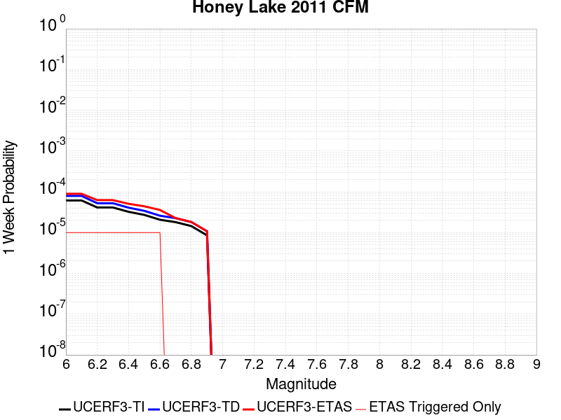 |  |  |  |

| Magnitude | 1 wk TI Prob | 1 wk TD Prob | 1 wk ETAS Prob | 1 wk ETAS/TD Gain | 1 wk ETAS Triggered Only | 1 mo TI Prob | 1 mo TD Prob | 1 mo ETAS Prob | 1 mo ETAS/TD Gain | 1 mo ETAS Triggered Only | 1 yr TI Prob | 1 yr TD Prob | 1 yr ETAS Prob | 1 yr ETAS/TD Gain | 1 yr ETAS Triggered Only | 10 yr TI Prob | 10 yr TD Prob | 10 yr ETAS Prob | 10 yr ETAS/TD Gain | 10 yr ETAS Triggered Only |
|-----|-----|-----|-----|-----|-----|-----|-----|-----|-----|-----|-----|-----|-----|-----|-----|-----|-----|-----|-----|-----|
| 6.0 | 6.155506E-5 | 7.9549725E-5 | 8.9548936E-5 | 1.1256975 | 1.0E-5 | 2.6378073E-4 | 3.408857E-4 | 3.508823E-4 | 1.0293254 | 1.0E-5 | 0.0032068014 | 0.0041428325 | 0.004152791 | 1.0024039 | 1.0E-5 | 0.03160919 | 0.04070455 | 0.04071414 | 1.0002357 | 1.0E-5 |
| 6.1 | 6.155506E-5 | 7.9549725E-5 | 8.9548936E-5 | 1.1256975 | 1.0E-5 | 2.6378073E-4 | 3.408857E-4 | 3.508823E-4 | 1.0293254 | 1.0E-5 | 0.0032068014 | 0.0041428325 | 0.004152791 | 1.0024039 | 1.0E-5 | 0.03160919 | 0.04070455 | 0.04071414 | 1.0002357 | 1.0E-5 |
| 6.2 | 4.1335024E-5 | 5.257842E-5 | 6.257789E-5 | 1.1901821 | 1.0E-5 | 1.7713808E-4 | 2.2531768E-4 | 2.3531543E-4 | 1.0443717 | 1.0E-5 | 0.0021545228 | 0.0027399417 | 0.0027499143 | 1.0036397 | 1.0E-5 | 0.021337535 | 0.027077755 | 0.027087484 | 1.0003593 | 1.0E-5 |
| 6.3 | 4.1335024E-5 | 5.257842E-5 | 6.257789E-5 | 1.1901821 | 1.0E-5 | 1.7713808E-4 | 2.2531768E-4 | 2.3531543E-4 | 1.0443717 | 1.0E-5 | 0.0021545228 | 0.0027399417 | 0.0027499143 | 1.0036397 | 1.0E-5 | 0.021337535 | 0.027077755 | 0.027087484 | 1.0003593 | 1.0E-5 |
| 6.4 | 3.2393702E-5 | 4.088869E-5 | 5.088828E-5 | 1.2445564 | 1.0E-5 | 1.3882275E-4 | 1.7522615E-4 | 1.852244E-4 | 1.057059 | 1.0E-5 | 0.0016888566 | 0.002131397 | 0.0021413756 | 1.0046817 | 1.0E-5 | 0.016760793 | 0.021120586 | 0.021130374 | 1.0004635 | 1.0E-5 |
| 6.5 | 2.7205504E-5 | 3.421293E-5 | 4.421259E-5 | 1.2922771 | 1.0E-5 | 1.1658981E-4 | 1.4661916E-4 | 1.566177E-4 | 1.0681939 | 1.0E-5 | 0.0014185566 | 0.0017837201 | 0.0017937022 | 1.0055963 | 1.0E-5 | 0.014095354 | 0.017703557 | 0.017713381 | 1.0005548 | 1.0E-5 |
| 6.6 | 2.069265E-5 | 2.5956291E-5 | 3.5956033E-5 | 1.3852531 | 1.0E-5 | 8.867977E-5 | 1.11236994E-4 | 1.2123588E-4 | 1.0898881 | 1.0E-5 | 0.0010791414 | 0.0013535529 | 0.0013635394 | 1.007378 | 1.0E-5 | 0.010739161 | 0.013461461 | 0.013471327 | 1.0007329 | 1.0E-5 |
| 6.7 | 1.8060919E-5 | 2.2657596E-5 | 2.2657596E-5 | 1.0 | 0.0 | 7.7401644E-5 | 9.710083E-5 | 9.710083E-5 | 1.0 | 0.0 | 9.419576E-4 | 0.0011816423 | 0.0011816423 | 1.0 | 0.0 | 0.009379748 | 0.011761637 | 0.011761637 | 1.0 | 0.0 |
| 6.8 | 1.4474663E-5 | 1.8181892E-5 | 1.8181892E-5 | 1.0 | 0.0 | 6.203279E-5 | 7.79205E-5 | 7.79205E-5 | 1.0 | 0.0 | 7.5498753E-4 | 9.483456E-4 | 9.483456E-4 | 1.0 | 0.0 | 0.007524277 | 0.009450515 | 0.009450515 | 1.0 | 0.0 |
| 6.9 | 8.564552E-6 | 1.0802686E-5 | 1.0802686E-5 | 1.0 | 0.0 | 3.6704707E-5 | 4.629678E-5 | 4.629678E-5 | 1.0 | 0.0 | 4.4678818E-4 | 5.635839E-4 | 5.635839E-4 | 1.0 | 0.0 | 0.0044589094 | 0.005628045 | 0.005628045 | 1.0 | 0.0 |

## Los Alamos extension
*[(top)](#table-of-contents)*

| 1 Week | 1 Month | 1 Year | 10 Year |
|-----|-----|-----|-----|
|  |  |  |  |

| Magnitude | 1 wk TI Prob | 1 wk TD Prob | 1 wk ETAS Prob | 1 wk ETAS/TD Gain | 1 wk ETAS Triggered Only | 1 mo TI Prob | 1 mo TD Prob | 1 mo ETAS Prob | 1 mo ETAS/TD Gain | 1 mo ETAS Triggered Only | 1 yr TI Prob | 1 yr TD Prob | 1 yr ETAS Prob | 1 yr ETAS/TD Gain | 1 yr ETAS Triggered Only | 10 yr TI Prob | 10 yr TD Prob | 10 yr ETAS Prob | 10 yr ETAS/TD Gain | 10 yr ETAS Triggered Only |
|-----|-----|-----|-----|-----|-----|-----|-----|-----|-----|-----|-----|-----|-----|-----|-----|-----|-----|-----|-----|-----|
| 6.0 | 4.0146506E-6 | 4.086186E-6 | 4.086186E-6 | 1.0 | 0.0 | 1.7205533E-5 | 1.7512113E-5 | 1.7512113E-5 | 1.0 | 0.0 | 2.0945723E-4 | 2.1319023E-4 | 2.1319023E-4 | 1.0 | 0.0 | 0.0020925992 | 0.0021299664 | 0.002139945 | 1.0046849 | 1.0E-5 |
| 6.1 | 4.0146506E-6 | 4.086186E-6 | 4.086186E-6 | 1.0 | 0.0 | 1.7205533E-5 | 1.7512113E-5 | 1.7512113E-5 | 1.0 | 0.0 | 2.0945723E-4 | 2.1319023E-4 | 2.1319023E-4 | 1.0 | 0.0 | 0.0020925992 | 0.0021299664 | 0.002139945 | 1.0046849 | 1.0E-5 |
| 6.2 | 4.0146506E-6 | 4.086186E-6 | 4.086186E-6 | 1.0 | 0.0 | 1.7205533E-5 | 1.7512113E-5 | 1.7512113E-5 | 1.0 | 0.0 | 2.0945723E-4 | 2.1319023E-4 | 2.1319023E-4 | 1.0 | 0.0 | 0.0020925992 | 0.0021299664 | 0.002139945 | 1.0046849 | 1.0E-5 |
| 6.3 | 4.0146506E-6 | 4.086186E-6 | 4.086186E-6 | 1.0 | 0.0 | 1.7205533E-5 | 1.7512113E-5 | 1.7512113E-5 | 1.0 | 0.0 | 2.0945723E-4 | 2.1319023E-4 | 2.1319023E-4 | 1.0 | 0.0 | 0.0020925992 | 0.0021299664 | 0.002139945 | 1.0046849 | 1.0E-5 |
| 6.4 | 4.0146506E-6 | 4.086186E-6 | 4.086186E-6 | 1.0 | 0.0 | 1.7205533E-5 | 1.7512113E-5 | 1.7512113E-5 | 1.0 | 0.0 | 2.0945723E-4 | 2.1319023E-4 | 2.1319023E-4 | 1.0 | 0.0 | 0.0020925992 | 0.0021299664 | 0.002139945 | 1.0046849 | 1.0E-5 |
| 6.5 | 4.0146506E-6 | 4.086186E-6 | 4.086186E-6 | 1.0 | 0.0 | 1.7205533E-5 | 1.7512113E-5 | 1.7512113E-5 | 1.0 | 0.0 | 2.0945723E-4 | 2.1319023E-4 | 2.1319023E-4 | 1.0 | 0.0 | 0.0020925992 | 0.0021299664 | 0.002139945 | 1.0046849 | 1.0E-5 |
| 6.6 | 4.0146506E-6 | 4.086186E-6 | 4.086186E-6 | 1.0 | 0.0 | 1.7205533E-5 | 1.7512113E-5 | 1.7512113E-5 | 1.0 | 0.0 | 2.0945723E-4 | 2.1319023E-4 | 2.1319023E-4 | 1.0 | 0.0 | 0.0020925992 | 0.0021299664 | 0.002139945 | 1.0046849 | 1.0E-5 |
| 6.7 | 4.0146506E-6 | 4.086186E-6 | 4.086186E-6 | 1.0 | 0.0 | 1.7205533E-5 | 1.7512113E-5 | 1.7512113E-5 | 1.0 | 0.0 | 2.0945723E-4 | 2.1319023E-4 | 2.1319023E-4 | 1.0 | 0.0 | 0.0020925992 | 0.0021299664 | 0.002139945 | 1.0046849 | 1.0E-5 |
| 6.8 | 3.6584688E-6 | 3.7188836E-6 | 3.7188836E-6 | 1.0 | 0.0 | 1.5679057E-5 | 1.593798E-5 | 1.593798E-5 | 1.0 | 0.0 | 1.9087581E-4 | 1.9402857E-4 | 1.9402857E-4 | 1.0 | 0.0 | 0.0019071194 | 0.001938684 | 0.0019486647 | 1.0051482 | 1.0E-5 |
| 6.9 | 3.644631E-6 | 3.7045936E-6 | 3.7045936E-6 | 1.0 | 0.0 | 1.5619753E-5 | 1.5876738E-5 | 1.5876738E-5 | 1.0 | 0.0 | 1.901539E-4 | 1.9328308E-4 | 1.9328308E-4 | 1.0 | 0.0 | 0.0018999127 | 0.0019312421 | 0.0019412228 | 1.005168 | 1.0E-5 |
| 7.0 | 3.6318522E-6 | 3.691354E-6 | 3.691354E-6 | 1.0 | 0.0 | 1.5564989E-5 | 1.5819998E-5 | 1.5819998E-5 | 1.0 | 0.0 | 1.8948725E-4 | 1.9259239E-4 | 1.9259239E-4 | 1.0 | 0.0 | 0.0018932576 | 0.0019243471 | 0.0019343279 | 1.0051866 | 1.0E-5 |
| 7.1 | 3.5001724E-6 | 3.555424E-6 | 3.555424E-6 | 1.0 | 0.0 | 1.5000653E-5 | 1.5237448E-5 | 1.5237448E-5 | 1.0 | 0.0 | 1.8261763E-4 | 1.8550105E-4 | 1.8550105E-4 | 1.0 | 0.0 | 0.0018246764 | 0.0018535528 | 0.0018535528 | 1.0 | 0.0 |
| 7.2 | 2.5204702E-6 | 2.543714E-6 | 2.543714E-6 | 1.0 | 0.0 | 1.080197E-5 | 1.09015855E-5 | 1.09015855E-5 | 1.0 | 0.0 | 1.3150605E-4 | 1.3271878E-4 | 1.3271878E-4 | 1.0 | 0.0 | 0.0013142825 | 0.0013264008 | 0.0013264008 | 1.0 | 0.0 |
| 7.3 | 2.1399692E-6 | 2.1501494E-6 | 2.1501494E-6 | 1.0 | 0.0 | 9.1712645E-6 | 9.214894E-6 | 9.214894E-6 | 1.0 | 0.0 | 1.1165442E-4 | 1.1218559E-4 | 1.1218559E-4 | 1.0 | 0.0 | 0.0011159834 | 0.0011212928 | 0.0011212928 | 1.0 | 0.0 |
| 7.4 | 1.9660122E-6 | 1.9702534E-6 | 1.9702534E-6 | 1.0 | 0.0 | 8.42574E-6 | 8.443916E-6 | 8.443916E-6 | 1.0 | 0.0 | 1.0257855E-4 | 1.0279986E-4 | 1.0279986E-4 | 1.0 | 0.0 | 0.0010253121 | 0.0010275261 | 0.0010275261 | 1.0 | 0.0 |
| 7.5 | 1.7204633E-6 | 1.715114E-6 | 1.715114E-6 | 1.0 | 0.0 | 7.373393E-6 | 7.350468E-6 | 7.350468E-6 | 1.0 | 0.0 | 8.976737E-5 | 8.9488305E-5 | 8.9488305E-5 | 1.0 | 0.0 | 8.9731114E-4 | 8.945256E-4 | 8.945256E-4 | 1.0 | 0.0 |
| 7.6 | 1.3717638E-6 | 1.3535962E-6 | 1.3535962E-6 | 1.0 | 0.0 | 5.878974E-6 | 5.8011137E-6 | 5.8011137E-6 | 1.0 | 0.0 | 7.157416E-5 | 7.0626294E-5 | 7.0626294E-5 | 1.0 | 0.0 | 7.1551115E-4 | 7.060411E-4 | 7.060411E-4 | 1.0 | 0.0 |
| 7.7 | 8.272564E-7 | 7.957727E-7 | 7.957727E-7 | 1.0 | 0.0 | 3.5453797E-6 | 3.4104498E-6 | 3.4104498E-6 | 1.0 | 0.0 | 4.3164142E-5 | 4.1521438E-5 | 4.1521438E-5 | 1.0 | 0.0 | 4.315576E-4 | 4.1513698E-4 | 4.1513698E-4 | 1.0 | 0.0 |
| 7.8 | 3.9708277E-7 | 3.671965E-7 | 3.671965E-7 | 1.0 | 0.0 | 1.7017821E-6 | 1.5736983E-6 | 1.5736983E-6 | 1.0 | 0.0 | 2.0719E-5 | 1.915961E-5 | 1.915961E-5 | 1.0 | 0.0 | 2.071707E-4 | 1.9157965E-4 | 1.9157965E-4 | 1.0 | 0.0 |
| 7.9 | 9.292528E-8 | 7.889245E-8 | 7.889245E-8 | 1.0 | 0.0 | 3.9825116E-7 | 3.3811042E-7 | 3.3811042E-7 | 1.0 | 0.0 | 4.848697E-6 | 4.1164867E-6 | 4.1164867E-6 | 1.0 | 0.0 | 4.8485912E-5 | 4.1164116E-5 | 4.1164116E-5 | 1.0 | 0.0 |
| 8.0 | 7.880441E-11 | 8.235368E-11 | 8.235368E-11 | 1.0 | 0.0 | 3.3773329E-10 | 3.5294412E-10 | 3.5294412E-10 | 1.0 | 0.0 | 4.1119033E-9 | 4.297095E-9 | 4.297095E-9 | 1.0 | 0.0 | 4.1119034E-8 | 4.2970953E-8 | 4.2970953E-8 | 1.0 | 0.0 |

## Great Valley 04b Gordon Valley
*[(top)](#table-of-contents)*

| 1 Week | 1 Month | 1 Year | 10 Year |
|-----|-----|-----|-----|
|  |  |  |  |

| Magnitude | 1 wk TI Prob | 1 wk TD Prob | 1 wk ETAS Prob | 1 wk ETAS/TD Gain | 1 wk ETAS Triggered Only | 1 mo TI Prob | 1 mo TD Prob | 1 mo ETAS Prob | 1 mo ETAS/TD Gain | 1 mo ETAS Triggered Only | 1 yr TI Prob | 1 yr TD Prob | 1 yr ETAS Prob | 1 yr ETAS/TD Gain | 1 yr ETAS Triggered Only | 10 yr TI Prob | 10 yr TD Prob | 10 yr ETAS Prob | 10 yr ETAS/TD Gain | 10 yr ETAS Triggered Only |
|-----|-----|-----|-----|-----|-----|-----|-----|-----|-----|-----|-----|-----|-----|-----|-----|-----|-----|-----|-----|-----|
| 6.0 | 2.1181217E-5 | 2.3982373E-5 | 2.3982373E-5 | 1.0 | 0.0 | 9.077348E-5 | 1.0277849E-4 | 1.0277849E-4 | 1.0 | 0.0 | 0.0011046068 | 0.0012507765 | 0.001260764 | 1.007985 | 1.0E-5 | 0.010991322 | 0.012453819 | 0.0124636935 | 1.000793 | 1.0E-5 |
| 6.1 | 2.1181217E-5 | 2.3982373E-5 | 2.3982373E-5 | 1.0 | 0.0 | 9.077348E-5 | 1.0277849E-4 | 1.0277849E-4 | 1.0 | 0.0 | 0.0011046068 | 0.0012507765 | 0.001260764 | 1.007985 | 1.0E-5 | 0.010991322 | 0.012453819 | 0.0124636935 | 1.000793 | 1.0E-5 |
| 6.2 | 2.1181217E-5 | 2.3982373E-5 | 2.3982373E-5 | 1.0 | 0.0 | 9.077348E-5 | 1.0277849E-4 | 1.0277849E-4 | 1.0 | 0.0 | 0.0011046068 | 0.0012507765 | 0.001260764 | 1.007985 | 1.0E-5 | 0.010991322 | 0.012453819 | 0.0124636935 | 1.000793 | 1.0E-5 |
| 6.3 | 2.1181217E-5 | 2.3982373E-5 | 2.3982373E-5 | 1.0 | 0.0 | 9.077348E-5 | 1.0277849E-4 | 1.0277849E-4 | 1.0 | 0.0 | 0.0011046068 | 0.0012507765 | 0.001260764 | 1.007985 | 1.0E-5 | 0.010991322 | 0.012453819 | 0.0124636935 | 1.000793 | 1.0E-5 |
| 6.4 | 1.0988268E-5 | 1.2254686E-5 | 1.2254686E-5 | 1.0 | 0.0 | 4.7091726E-5 | 5.2519114E-5 | 5.2519114E-5 | 1.0 | 0.0 | 5.731909E-4 | 6.392486E-4 | 6.392486E-4 | 1.0 | 0.0 | 0.005717147 | 0.006375685 | 0.006375685 | 1.0 | 0.0 |
| 6.5 | 1.0988268E-5 | 1.2254686E-5 | 1.2254686E-5 | 1.0 | 0.0 | 4.7091726E-5 | 5.2519114E-5 | 5.2519114E-5 | 1.0 | 0.0 | 5.731909E-4 | 6.392486E-4 | 6.392486E-4 | 1.0 | 0.0 | 0.005717147 | 0.006375685 | 0.006375685 | 1.0 | 0.0 |
| 6.6 | 1.0517822E-5 | 1.172424E-5 | 1.172424E-5 | 1.0 | 0.0 | 4.5075605E-5 | 5.0245864E-5 | 5.0245864E-5 | 1.0 | 0.0 | 5.4865726E-4 | 6.115873E-4 | 6.115873E-4 | 1.0 | 0.0 | 0.0054730466 | 0.006100596 | 0.006100596 | 1.0 | 0.0 |
| 6.7 | 7.789219E-6 | 8.677775E-6 | 8.677775E-6 | 1.0 | 0.0 | 3.3381937E-5 | 3.7189966E-5 | 3.7189966E-5 | 1.0 | 0.0 | 4.063493E-4 | 4.5269894E-4 | 4.5269894E-4 | 1.0 | 0.0 | 0.004056071 | 0.004518285 | 0.004518285 | 1.0 | 0.0 |
| 6.8 | 7.5850853E-6 | 8.452517E-6 | 8.452517E-6 | 1.0 | 0.0 | 3.2507105E-5 | 3.62246E-5 | 3.62246E-5 | 1.0 | 0.0 | 3.957021E-4 | 4.409504E-4 | 4.409504E-4 | 1.0 | 0.0 | 0.0039499826 | 0.004401267 | 0.004401267 | 1.0 | 0.0 |
| 6.9 | 6.604105E-6 | 7.3586607E-6 | 7.3586607E-6 | 1.0 | 0.0 | 2.8303E-5 | 3.1536758E-5 | 3.1536758E-5 | 1.0 | 0.0 | 3.4453452E-4 | 3.8389626E-4 | 3.8389626E-4 | 1.0 | 0.0 | 0.0034400085 | 0.0038327174 | 0.0038327174 | 1.0 | 0.0 |
| 7.0 | 5.3701115E-6 | 5.9885097E-6 | 5.9885097E-6 | 1.0 | 0.0 | 2.301456E-5 | 2.5664805E-5 | 2.5664805E-5 | 1.0 | 0.0 | 2.8016625E-4 | 3.1242712E-4 | 3.1242712E-4 | 1.0 | 0.0 | 0.0027981328 | 0.0031201674 | 0.0031201674 | 1.0 | 0.0 |
| 7.1 | 4.4685607E-6 | 4.986555E-6 | 4.986555E-6 | 1.0 | 0.0 | 1.9150835E-5 | 2.1370788E-5 | 2.1370788E-5 | 1.0 | 0.0 | 2.3313647E-4 | 2.6016077E-4 | 2.6016077E-4 | 1.0 | 0.0 | 0.0023289204 | 0.0025988068 | 0.0025988068 | 1.0 | 0.0 |
| 7.2 | 2.833378E-6 | 3.1644681E-6 | 3.1644681E-6 | 1.0 | 0.0 | 1.2142991E-5 | 1.3561946E-5 | 1.3561946E-5 | 1.0 | 0.0 | 1.4783088E-4 | 1.6510593E-4 | 1.6510593E-4 | 1.0 | 0.0 | 0.0014773258 | 0.0016500045 | 0.0016500045 | 1.0 | 0.0 |
| 7.3 | 7.0087293E-7 | 7.772929E-7 | 7.772929E-7 | 1.0 | 0.0 | 3.0037377E-6 | 3.3312535E-6 | 3.3312535E-6 | 1.0 | 0.0 | 3.656989E-5 | 4.0557716E-5 | 4.0557716E-5 | 1.0 | 0.0 | 3.6563876E-4 | 4.055481E-4 | 4.055481E-4 | 1.0 | 0.0 |
| 7.4 | 3.112171E-8 | 3.2068495E-8 | 3.2068495E-8 | 1.0 | 0.0 | 1.3337875E-7 | 1.374364E-7 | 1.374364E-7 | 1.0 | 0.0 | 1.6238852E-6 | 1.673287E-6 | 1.673287E-6 | 1.0 | 0.0 | 1.6238733E-5 | 1.6732753E-5 | 1.6732753E-5 | 1.0 | 0.0 |

## Robinson Creek
*[(top)](#table-of-contents)*

| 1 Week | 1 Month | 1 Year | 10 Year |
|-----|-----|-----|-----|
|  |  | 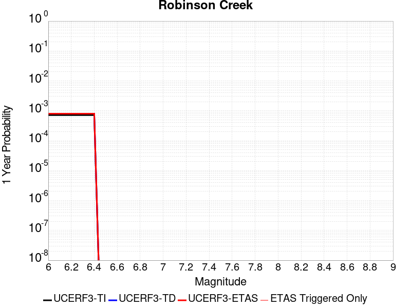 |  |

| Magnitude | 1 wk TI Prob | 1 wk TD Prob | 1 wk ETAS Prob | 1 wk ETAS/TD Gain | 1 wk ETAS Triggered Only | 1 mo TI Prob | 1 mo TD Prob | 1 mo ETAS Prob | 1 mo ETAS/TD Gain | 1 mo ETAS Triggered Only | 1 yr TI Prob | 1 yr TD Prob | 1 yr ETAS Prob | 1 yr ETAS/TD Gain | 1 yr ETAS Triggered Only | 10 yr TI Prob | 10 yr TD Prob | 10 yr ETAS Prob | 10 yr ETAS/TD Gain | 10 yr ETAS Triggered Only |
|-----|-----|-----|-----|-----|-----|-----|-----|-----|-----|-----|-----|-----|-----|-----|-----|-----|-----|-----|-----|-----|
| 6.0 | 1.3705327E-5 | 1.5285246E-5 | 1.5285246E-5 | 1.0 | 0.0 | 5.8735794E-5 | 6.5508204E-5 | 6.5508204E-5 | 1.0 | 0.0 | 7.1487366E-4 | 7.9756236E-4 | 7.9756236E-4 | 1.0 | 0.0 | 0.0071257832 | 0.007975623 | 0.007985543 | 1.0012438 | 1.0E-5 |
| 6.1 | 1.3705327E-5 | 1.5285246E-5 | 1.5285246E-5 | 1.0 | 0.0 | 5.8735794E-5 | 6.5508204E-5 | 6.5508204E-5 | 1.0 | 0.0 | 7.1487366E-4 | 7.9756236E-4 | 7.9756236E-4 | 1.0 | 0.0 | 0.0071257832 | 0.007975623 | 0.007985543 | 1.0012438 | 1.0E-5 |
| 6.2 | 1.3705327E-5 | 1.5285246E-5 | 1.5285246E-5 | 1.0 | 0.0 | 5.8735794E-5 | 6.5508204E-5 | 6.5508204E-5 | 1.0 | 0.0 | 7.1487366E-4 | 7.9756236E-4 | 7.9756236E-4 | 1.0 | 0.0 | 0.0071257832 | 0.007975623 | 0.007985543 | 1.0012438 | 1.0E-5 |
| 6.3 | 1.3705327E-5 | 1.5285246E-5 | 1.5285246E-5 | 1.0 | 0.0 | 5.8735794E-5 | 6.5508204E-5 | 6.5508204E-5 | 1.0 | 0.0 | 7.1487366E-4 | 7.9756236E-4 | 7.9756236E-4 | 1.0 | 0.0 | 0.0071257832 | 0.007975623 | 0.007985543 | 1.0012438 | 1.0E-5 |
| 6.4 | 1.3705327E-5 | 1.5285246E-5 | 1.5285246E-5 | 1.0 | 0.0 | 5.8735794E-5 | 6.5508204E-5 | 6.5508204E-5 | 1.0 | 0.0 | 7.1487366E-4 | 7.9756236E-4 | 7.9756236E-4 | 1.0 | 0.0 | 0.0071257832 | 0.007975623 | 0.007985543 | 1.0012438 | 1.0E-5 |

## Los Alamos 2011 CFM
*[(top)](#table-of-contents)*

| 1 Week | 1 Month | 1 Year | 10 Year |
|-----|-----|-----|-----|
|  |  |  |  |

| Magnitude | 1 wk TI Prob | 1 wk TD Prob | 1 wk ETAS Prob | 1 wk ETAS/TD Gain | 1 wk ETAS Triggered Only | 1 mo TI Prob | 1 mo TD Prob | 1 mo ETAS Prob | 1 mo ETAS/TD Gain | 1 mo ETAS Triggered Only | 1 yr TI Prob | 1 yr TD Prob | 1 yr ETAS Prob | 1 yr ETAS/TD Gain | 1 yr ETAS Triggered Only | 10 yr TI Prob | 10 yr TD Prob | 10 yr ETAS Prob | 10 yr ETAS/TD Gain | 10 yr ETAS Triggered Only |
|-----|-----|-----|-----|-----|-----|-----|-----|-----|-----|-----|-----|-----|-----|-----|-----|-----|-----|-----|-----|-----|
| 6.0 | 4.6284417E-6 | 4.751756E-6 | 4.751756E-6 | 1.0 | 0.0 | 1.9836029E-5 | 2.036452E-5 | 2.036452E-5 | 1.0 | 0.0 | 2.4147688E-4 | 2.4791158E-4 | 2.4791158E-4 | 1.0 | 0.0 | 0.0024121467 | 0.0024765243 | 0.0024864995 | 1.004028 | 1.0E-5 |
| 6.1 | 4.6284417E-6 | 4.751756E-6 | 4.751756E-6 | 1.0 | 0.0 | 1.9836029E-5 | 2.036452E-5 | 2.036452E-5 | 1.0 | 0.0 | 2.4147688E-4 | 2.4791158E-4 | 2.4791158E-4 | 1.0 | 0.0 | 0.0024121467 | 0.0024765243 | 0.0024864995 | 1.004028 | 1.0E-5 |
| 6.2 | 4.6284417E-6 | 4.751756E-6 | 4.751756E-6 | 1.0 | 0.0 | 1.9836029E-5 | 2.036452E-5 | 2.036452E-5 | 1.0 | 0.0 | 2.4147688E-4 | 2.4791158E-4 | 2.4791158E-4 | 1.0 | 0.0 | 0.0024121467 | 0.0024765243 | 0.0024864995 | 1.004028 | 1.0E-5 |
| 6.3 | 4.6284417E-6 | 4.751756E-6 | 4.751756E-6 | 1.0 | 0.0 | 1.9836029E-5 | 2.036452E-5 | 2.036452E-5 | 1.0 | 0.0 | 2.4147688E-4 | 2.4791158E-4 | 2.4791158E-4 | 1.0 | 0.0 | 0.0024121467 | 0.0024765243 | 0.0024864995 | 1.004028 | 1.0E-5 |
| 6.4 | 4.6284417E-6 | 4.751756E-6 | 4.751756E-6 | 1.0 | 0.0 | 1.9836029E-5 | 2.036452E-5 | 2.036452E-5 | 1.0 | 0.0 | 2.4147688E-4 | 2.4791158E-4 | 2.4791158E-4 | 1.0 | 0.0 | 0.0024121467 | 0.0024765243 | 0.0024864995 | 1.004028 | 1.0E-5 |
| 6.5 | 4.6284417E-6 | 4.751756E-6 | 4.751756E-6 | 1.0 | 0.0 | 1.9836029E-5 | 2.036452E-5 | 2.036452E-5 | 1.0 | 0.0 | 2.4147688E-4 | 2.4791158E-4 | 2.4791158E-4 | 1.0 | 0.0 | 0.0024121467 | 0.0024765243 | 0.0024864995 | 1.004028 | 1.0E-5 |
| 6.6 | 4.6284417E-6 | 4.751756E-6 | 4.751756E-6 | 1.0 | 0.0 | 1.9836029E-5 | 2.036452E-5 | 2.036452E-5 | 1.0 | 0.0 | 2.4147688E-4 | 2.4791158E-4 | 2.4791158E-4 | 1.0 | 0.0 | 0.0024121467 | 0.0024765243 | 0.0024864995 | 1.004028 | 1.0E-5 |
| 6.7 | 4.062321E-6 | 4.1663707E-6 | 4.1663707E-6 | 1.0 | 0.0 | 1.7409831E-5 | 1.7855762E-5 | 1.7855762E-5 | 1.0 | 0.0 | 2.1194408E-4 | 2.1737372E-4 | 2.1737372E-4 | 1.0 | 0.0 | 0.0021174205 | 0.0021717607 | 0.0021817388 | 1.0045946 | 1.0E-5 |
| 6.8 | 4.062321E-6 | 4.1663707E-6 | 4.1663707E-6 | 1.0 | 0.0 | 1.7409831E-5 | 1.7855762E-5 | 1.7855762E-5 | 1.0 | 0.0 | 2.1194408E-4 | 2.1737372E-4 | 2.1737372E-4 | 1.0 | 0.0 | 0.0021174205 | 0.0021717607 | 0.0021817388 | 1.0045946 | 1.0E-5 |
| 6.9 | 3.2936077E-6 | 3.3729766E-6 | 3.3729766E-6 | 1.0 | 0.0 | 1.4115385E-5 | 1.4455539E-5 | 1.4455539E-5 | 1.0 | 0.0 | 1.7184127E-4 | 1.7598292E-4 | 1.7598292E-4 | 1.0 | 0.0 | 0.0017170844 | 0.0017585282 | 0.0017685106 | 1.0056766 | 1.0E-5 |
| 7.0 | 3.1687898E-6 | 3.2448338E-6 | 3.2448338E-6 | 1.0 | 0.0 | 1.3580457E-5 | 1.3906361E-5 | 1.3906361E-5 | 1.0 | 0.0 | 1.6532952E-4 | 1.6929772E-4 | 1.6929772E-4 | 1.0 | 0.0 | 0.0016520657 | 0.0016917791 | 0.0017017622 | 1.005901 | 1.0E-5 |
| 7.1 | 2.9379228E-6 | 3.0073431E-6 | 3.0073431E-6 | 1.0 | 0.0 | 1.25910365E-5 | 1.2888555E-5 | 1.2888555E-5 | 1.0 | 0.0 | 1.5328509E-4 | 1.5690776E-4 | 1.5690776E-4 | 1.0 | 0.0 | 0.001531794 | 0.0015680589 | 0.0015680589 | 1.0 | 0.0 |
| 7.2 | 2.0020686E-6 | 2.041643E-6 | 2.041643E-6 | 1.0 | 0.0 | 8.580266E-6 | 8.749869E-6 | 8.749869E-6 | 1.0 | 0.0 | 1.0445973E-4 | 1.065245E-4 | 1.065245E-4 | 1.0 | 0.0 | 0.0010441064 | 0.0010647388 | 0.0010647388 | 1.0 | 0.0 |
| 7.3 | 1.7364243E-6 | 1.7678924E-6 | 1.7678924E-6 | 1.0 | 0.0 | 7.441797E-6 | 7.5766598E-6 | 7.5766598E-6 | 1.0 | 0.0 | 9.0600115E-5 | 9.224196E-5 | 9.224196E-5 | 1.0 | 0.0 | 9.0563187E-4 | 9.2203985E-4 | 9.2203985E-4 | 1.0 | 0.0 |
| 7.4 | 1.5718434E-6 | 1.598329E-6 | 1.598329E-6 | 1.0 | 0.0 | 6.7364545E-6 | 6.849964E-6 | 6.849964E-6 | 1.0 | 0.0 | 8.201325E-5 | 8.339515E-5 | 8.339515E-5 | 1.0 | 0.0 | 8.198299E-4 | 8.3364156E-4 | 8.3364156E-4 | 1.0 | 0.0 |
| 7.5 | 1.3841119E-6 | 1.4042898E-6 | 1.4042898E-6 | 1.0 | 0.0 | 5.9318945E-6 | 6.018371E-6 | 6.018371E-6 | 1.0 | 0.0 | 7.221842E-5 | 7.3271236E-5 | 7.3271236E-5 | 1.0 | 0.0 | 7.2194956E-4 | 7.324736E-4 | 7.324736E-4 | 1.0 | 0.0 |
| 7.6 | 1.0843726E-6 | 1.0934511E-6 | 1.0934511E-6 | 1.0 | 0.0 | 4.647303E-6 | 4.686211E-6 | 4.686211E-6 | 1.0 | 0.0 | 5.6579443E-5 | 5.705315E-5 | 5.705315E-5 | 1.0 | 0.0 | 5.656504E-4 | 5.7038764E-4 | 5.7038764E-4 | 1.0 | 0.0 |
| 7.7 | 5.544814E-7 | 5.501919E-7 | 5.501919E-7 | 1.0 | 0.0 | 2.3763469E-6 | 2.357963E-6 | 2.357963E-6 | 1.0 | 0.0 | 2.8931638E-5 | 2.8707824E-5 | 2.8707824E-5 | 1.0 | 0.0 | 2.8927872E-4 | 2.870413E-4 | 2.870413E-4 | 1.0 | 0.0 |
| 7.8 | 2.0707465E-7 | 1.977874E-7 | 1.977874E-7 | 1.0 | 0.0 | 8.874625E-7 | 8.4766003E-7 | 8.4766003E-7 | 1.0 | 0.0 | 1.08048025E-5 | 1.0320213E-5 | 1.0320213E-5 | 1.0 | 0.0 | 1.0804277E-4 | 1.0319738E-4 | 1.0319738E-4 | 1.0 | 0.0 |
| 7.9 | 3.9821284E-8 | 3.433199E-8 | 3.433199E-8 | 1.0 | 0.0 | 1.7066264E-7 | 1.4713709E-7 | 1.4713709E-7 | 1.0 | 0.0 | 2.0778157E-6 | 1.7913927E-6 | 1.7913927E-6 | 1.0 | 0.0 | 2.0777963E-5 | 1.7913788E-5 | 1.7913788E-5 | 1.0 | 0.0 |
| 8.0 | 7.880441E-11 | 8.235368E-11 | 8.235368E-11 | 1.0 | 0.0 | 3.3773329E-10 | 3.5294412E-10 | 3.5294412E-10 | 1.0 | 0.0 | 4.1119033E-9 | 4.297095E-9 | 4.297095E-9 | 1.0 | 0.0 | 4.1119034E-8 | 4.2970953E-8 | 4.2970953E-8 | 1.0 | 0.0 |

## Great Valley 04a Trout Creek
*[(top)](#table-of-contents)*

| 1 Week | 1 Month | 1 Year | 10 Year |
|-----|-----|-----|-----|
|  |  |  | 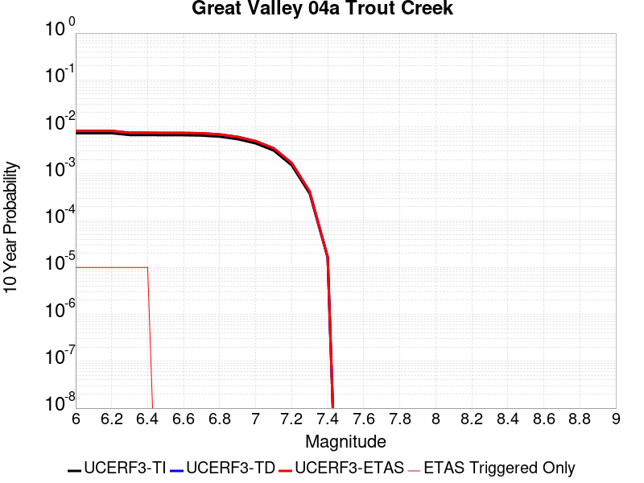 |

| Magnitude | 1 wk TI Prob | 1 wk TD Prob | 1 wk ETAS Prob | 1 wk ETAS/TD Gain | 1 wk ETAS Triggered Only | 1 mo TI Prob | 1 mo TD Prob | 1 mo ETAS Prob | 1 mo ETAS/TD Gain | 1 mo ETAS Triggered Only | 1 yr TI Prob | 1 yr TD Prob | 1 yr ETAS Prob | 1 yr ETAS/TD Gain | 1 yr ETAS Triggered Only | 10 yr TI Prob | 10 yr TD Prob | 10 yr ETAS Prob | 10 yr ETAS/TD Gain | 10 yr ETAS Triggered Only |
|-----|-----|-----|-----|-----|-----|-----|-----|-----|-----|-----|-----|-----|-----|-----|-----|-----|-----|-----|-----|-----|
| 6.0 | 1.4088538E-5 | 1.5719796E-5 | 1.5719796E-5 | 1.0 | 0.0 | 6.037805E-5 | 6.7368885E-5 | 6.7368885E-5 | 1.0 | 0.0 | 7.3485484E-4 | 8.1992E-4 | 8.299118E-4 | 1.0121863 | 1.0E-5 | 0.007324295 | 0.008170233 | 0.008180152 | 1.0012139 | 1.0E-5 |
| 6.1 | 1.4088538E-5 | 1.5719796E-5 | 1.5719796E-5 | 1.0 | 0.0 | 6.037805E-5 | 6.7368885E-5 | 6.7368885E-5 | 1.0 | 0.0 | 7.3485484E-4 | 8.1992E-4 | 8.299118E-4 | 1.0121863 | 1.0E-5 | 0.007324295 | 0.008170233 | 0.008180152 | 1.0012139 | 1.0E-5 |
| 6.2 | 1.4088538E-5 | 1.5719796E-5 | 1.5719796E-5 | 1.0 | 0.0 | 6.037805E-5 | 6.7368885E-5 | 6.7368885E-5 | 1.0 | 0.0 | 7.3485484E-4 | 8.1992E-4 | 8.299118E-4 | 1.0121863 | 1.0E-5 | 0.007324295 | 0.008170233 | 0.008180152 | 1.0012139 | 1.0E-5 |
| 6.3 | 1.2882862E-5 | 1.4378824E-5 | 1.4378824E-5 | 1.0 | 0.0 | 5.5211098E-5 | 6.162214E-5 | 6.162214E-5 | 1.0 | 0.0 | 6.7198783E-4 | 7.5000164E-4 | 7.5999415E-4 | 1.0133233 | 1.0E-5 | 0.0066995937 | 0.0074757678 | 0.007485693 | 1.0013276 | 1.0E-5 |
| 6.4 | 1.2882862E-5 | 1.4378824E-5 | 1.4378824E-5 | 1.0 | 0.0 | 5.5211098E-5 | 6.162214E-5 | 6.162214E-5 | 1.0 | 0.0 | 6.7198783E-4 | 7.5000164E-4 | 7.5999415E-4 | 1.0133233 | 1.0E-5 | 0.0066995937 | 0.0074757678 | 0.007485693 | 1.0013276 | 1.0E-5 |
| 6.5 | 1.2762329E-5 | 1.4245379E-5 | 1.4245379E-5 | 1.0 | 0.0 | 5.469455E-5 | 6.1050254E-5 | 6.1050254E-5 | 1.0 | 0.0 | 6.657027E-4 | 7.430437E-4 | 7.430437E-4 | 1.0 | 0.0 | 0.00663712 | 0.007406653 | 0.007406653 | 1.0 | 0.0 |
| 6.6 | 1.2762329E-5 | 1.4245379E-5 | 1.4245379E-5 | 1.0 | 0.0 | 5.469455E-5 | 6.1050254E-5 | 6.1050254E-5 | 1.0 | 0.0 | 6.657027E-4 | 7.430437E-4 | 7.430437E-4 | 1.0 | 0.0 | 0.00663712 | 0.007406653 | 0.007406653 | 1.0 | 0.0 |
| 6.7 | 1.2557959E-5 | 1.4019612E-5 | 1.4019612E-5 | 1.0 | 0.0 | 5.3818712E-5 | 6.0082726E-5 | 6.0082726E-5 | 1.0 | 0.0 | 6.5504585E-4 | 7.31272E-4 | 7.31272E-4 | 1.0 | 0.0 | 0.006531183 | 0.0072897105 | 0.0072897105 | 1.0 | 0.0 |
| 6.8 | 1.1871544E-5 | 1.32590285E-5 | 1.32590285E-5 | 1.0 | 0.0 | 5.0877054E-5 | 5.6823228E-5 | 5.6823228E-5 | 1.0 | 0.0 | 6.1925204E-4 | 6.9161324E-4 | 6.9161324E-4 | 1.0 | 0.0 | 0.0061752927 | 0.006895625 | 0.006895625 | 1.0 | 0.0 |
| 6.9 | 1.0500373E-5 | 1.1731444E-5 | 1.1731444E-5 | 1.0 | 0.0 | 4.5000823E-5 | 5.0276696E-5 | 5.0276696E-5 | 1.0 | 0.0 | 5.4774724E-4 | 6.119554E-4 | 6.119554E-4 | 1.0 | 0.0 | 0.005463991 | 0.0061035687 | 0.0061035687 | 1.0 | 0.0 |
| 7.0 | 8.524332E-6 | 9.533634E-6 | 9.533634E-6 | 1.0 | 0.0 | 3.653234E-5 | 4.085783E-5 | 4.085783E-5 | 1.0 | 0.0 | 4.4469046E-4 | 4.973379E-4 | 4.973379E-4 | 1.0 | 0.0 | 0.0044380166 | 0.00496298 | 0.00496298 | 1.0 | 0.0 |
| 7.1 | 6.006849E-6 | 6.711664E-6 | 6.711664E-6 | 1.0 | 0.0 | 2.5743384E-5 | 2.8763987E-5 | 2.8763987E-5 | 1.0 | 0.0 | 3.1338062E-4 | 3.5015083E-4 | 3.5015083E-4 | 1.0 | 0.0 | 0.0031293905 | 0.0034965419 | 0.0034965419 | 1.0 | 0.0 |
| 7.2 | 2.9122193E-6 | 3.24658E-6 | 3.24658E-6 | 1.0 | 0.0 | 1.248088E-5 | 1.391385E-5 | 1.391385E-5 | 1.0 | 0.0 | 1.5194413E-4 | 1.693897E-4 | 1.693897E-4 | 1.0 | 0.0 | 0.0015184027 | 0.001692778 | 0.001692778 | 1.0 | 0.0 |
| 7.3 | 7.2194007E-7 | 7.988875E-7 | 7.988875E-7 | 1.0 | 0.0 | 3.0940253E-6 | 3.4238017E-6 | 3.4238017E-6 | 1.0 | 0.0 | 3.7669106E-5 | 4.168445E-5 | 4.168445E-5 | 1.0 | 0.0 | 3.766272E-4 | 4.1681126E-4 | 4.1681126E-4 | 1.0 | 0.0 |
| 7.4 | 3.112171E-8 | 3.2068495E-8 | 3.2068495E-8 | 1.0 | 0.0 | 1.3337875E-7 | 1.374364E-7 | 1.374364E-7 | 1.0 | 0.0 | 1.6238852E-6 | 1.673287E-6 | 1.673287E-6 | 1.0 | 0.0 | 1.6238733E-5 | 1.6732753E-5 | 1.6732753E-5 | 1.0 | 0.0 |

## Malibu Coast (Extension) alt 1
*[(top)](#table-of-contents)*

| 1 Week | 1 Month | 1 Year | 10 Year |
|-----|-----|-----|-----|
|  |  | 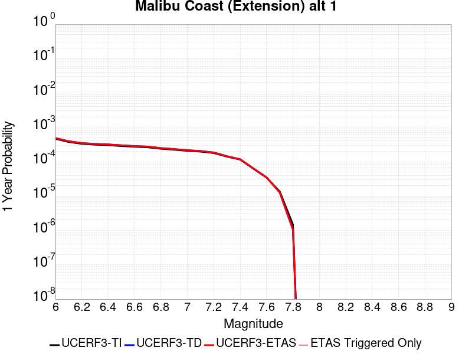 |  |

| Magnitude | 1 wk TI Prob | 1 wk TD Prob | 1 wk ETAS Prob | 1 wk ETAS/TD Gain | 1 wk ETAS Triggered Only | 1 mo TI Prob | 1 mo TD Prob | 1 mo ETAS Prob | 1 mo ETAS/TD Gain | 1 mo ETAS Triggered Only | 1 yr TI Prob | 1 yr TD Prob | 1 yr ETAS Prob | 1 yr ETAS/TD Gain | 1 yr ETAS Triggered Only | 10 yr TI Prob | 10 yr TD Prob | 10 yr ETAS Prob | 10 yr ETAS/TD Gain | 10 yr ETAS Triggered Only |
|-----|-----|-----|-----|-----|-----|-----|-----|-----|-----|-----|-----|-----|-----|-----|-----|-----|-----|-----|-----|-----|
| 6.0 | 8.930738E-6 | 9.329346E-6 | 9.329346E-6 | 1.0 | 0.0 | 3.827403E-5 | 3.9982307E-5 | 3.9982307E-5 | 1.0 | 0.0 | 4.6588664E-4 | 4.8667757E-4 | 4.8667757E-4 | 1.0 | 0.0 | 0.0046491115 | 0.0048563 | 0.0048662517 | 1.0020492 | 1.0E-5 |
| 6.1 | 7.199952E-6 | 7.530357E-6 | 7.530357E-6 | 1.0 | 0.0 | 3.0856572E-5 | 3.227256E-5 | 3.227256E-5 | 1.0 | 0.0 | 3.75614E-4 | 3.9284822E-4 | 3.9284822E-4 | 1.0 | 0.0 | 0.0037497976 | 0.003921604 | 0.0039315643 | 1.00254 | 1.0E-5 |
| 6.2 | 6.3721413E-6 | 6.666847E-6 | 6.666847E-6 | 1.0 | 0.0 | 2.7308892E-5 | 2.857189E-5 | 2.857189E-5 | 1.0 | 0.0 | 3.3243504E-4 | 3.478076E-4 | 3.478076E-4 | 1.0 | 0.0 | 0.0033193815 | 0.0034726725 | 0.003482638 | 1.0028696 | 1.0E-5 |
| 6.3 | 6.016345E-6 | 6.2952113E-6 | 6.2952113E-6 | 1.0 | 0.0 | 2.578408E-5 | 2.69792E-5 | 2.69792E-5 | 1.0 | 0.0 | 3.1387596E-4 | 3.2842258E-4 | 3.2842258E-4 | 1.0 | 0.0 | 0.00313433 | 0.0032794084 | 0.0032893757 | 1.0030394 | 1.0E-5 |
| 6.4 | 5.8104883E-6 | 6.0795965E-6 | 6.0795965E-6 | 1.0 | 0.0 | 2.4901856E-5 | 2.6055155E-5 | 2.6055155E-5 | 1.0 | 0.0 | 3.031379E-4 | 3.1717564E-4 | 3.1717564E-4 | 1.0 | 0.0 | 0.0030272473 | 0.0031672644 | 0.0031772326 | 1.0031472 | 1.0E-5 |
| 6.5 | 5.476925E-6 | 5.7275624E-6 | 5.7275624E-6 | 1.0 | 0.0 | 2.3472323E-5 | 2.4546467E-5 | 2.4546467E-5 | 1.0 | 0.0 | 2.8573806E-4 | 2.9881255E-4 | 2.9881255E-4 | 1.0 | 0.0 | 0.0028537093 | 0.0029841396 | 0.0029941096 | 1.0033411 | 1.0E-5 |
| 6.6 | 5.222387E-6 | 5.458627E-6 | 5.458627E-6 | 1.0 | 0.0 | 2.2381464E-5 | 2.3393908E-5 | 2.3393908E-5 | 1.0 | 0.0 | 2.7246025E-4 | 2.847839E-4 | 2.847839E-4 | 1.0 | 0.0 | 0.0027212645 | 0.00284422 | 0.0028541917 | 1.003506 | 1.0E-5 |
| 6.7 | 5.0337076E-6 | 5.259149E-6 | 5.259149E-6 | 1.0 | 0.0 | 2.1572854E-5 | 2.2539016E-5 | 2.2539016E-5 | 1.0 | 0.0 | 2.6261783E-4 | 2.7437825E-4 | 2.7437825E-4 | 1.0 | 0.0 | 0.002623077 | 0.002740425 | 0.0027503977 | 1.0036391 | 1.0E-5 |
| 6.8 | 4.5675624E-6 | 4.7587573E-6 | 4.7587573E-6 | 1.0 | 0.0 | 1.9575122E-5 | 2.0394516E-5 | 2.0394516E-5 | 1.0 | 0.0 | 2.3830103E-4 | 2.4827512E-4 | 2.4827512E-4 | 1.0 | 0.0 | 0.0023804565 | 0.0024799972 | 0.0024899724 | 1.0040222 | 1.0E-5 |
| 6.9 | 4.2802412E-6 | 4.452059E-6 | 4.452059E-6 | 1.0 | 0.0 | 1.8343762E-5 | 1.9080113E-5 | 1.9080113E-5 | 1.0 | 0.0 | 2.2331243E-4 | 2.3227576E-4 | 2.3227576E-4 | 1.0 | 0.0 | 0.0022308815 | 0.0023203467 | 0.0023303234 | 1.0042998 | 1.0E-5 |
| 7.0 | 3.9794063E-6 | 4.130134E-6 | 4.130134E-6 | 1.0 | 0.0 | 1.7054486E-5 | 1.7700457E-5 | 1.7700457E-5 | 1.0 | 0.0 | 2.0761859E-4 | 2.1548186E-4 | 2.1548186E-4 | 1.0 | 0.0 | 0.0020742472 | 0.0021527428 | 0.0021627212 | 1.0046352 | 1.0E-5 |
| 7.1 | 3.7730424E-6 | 3.9112506E-6 | 3.9112506E-6 | 1.0 | 0.0 | 1.6170083E-5 | 1.6762395E-5 | 1.6762395E-5 | 1.0 | 0.0 | 1.9685295E-4 | 2.0406317E-4 | 2.0406317E-4 | 1.0 | 0.0 | 0.0019667868 | 0.0020387708 | 0.0020487504 | 1.004895 | 1.0E-5 |
| 7.2 | 3.424985E-6 | 3.5413673E-6 | 3.5413673E-6 | 1.0 | 0.0 | 1.4678424E-5 | 1.5177201E-5 | 1.5177201E-5 | 1.0 | 0.0 | 1.7869516E-4 | 1.8476688E-4 | 1.8476688E-4 | 1.0 | 0.0 | 0.0017855153 | 0.0018461446 | 0.0018561261 | 1.0054067 | 1.0E-5 |
| 7.3 | 2.6966375E-6 | 2.759676E-6 | 2.759676E-6 | 1.0 | 0.0 | 1.15569665E-5 | 1.1827129E-5 | 1.1827129E-5 | 1.0 | 0.0 | 1.4069698E-4 | 1.4398582E-4 | 1.4398582E-4 | 1.0 | 0.0 | 0.0014060794 | 0.0014389295 | 0.0014489151 | 1.0069396 | 1.0E-5 |
| 7.4 | 2.215957E-6 | 2.2493962E-6 | 2.2493962E-6 | 1.0 | 0.0 | 9.496924E-6 | 9.640234E-6 | 9.640234E-6 | 1.0 | 0.0 | 1.1561892E-4 | 1.1736356E-4 | 1.1736356E-4 | 1.0 | 0.0 | 0.0011555878 | 0.0011730195 | 0.0011830077 | 1.008515 | 1.0E-5 |
| 7.5 | 1.2040218E-6 | 1.2219166E-6 | 1.2219166E-6 | 1.0 | 0.0 | 5.160083E-6 | 5.236775E-6 | 5.236775E-6 | 1.0 | 0.0 | 6.2822204E-5 | 6.3755884E-5 | 6.3755884E-5 | 1.0 | 0.0 | 6.280445E-4 | 6.3737785E-4 | 6.4737146E-4 | 1.0156792 | 1.0E-5 |
| 7.6 | 6.6157446E-7 | 6.67903E-7 | 6.67903E-7 | 1.0 | 0.0 | 2.835316E-6 | 2.8624384E-6 | 2.8624384E-6 | 1.0 | 0.0 | 3.4519428E-5 | 3.4849647E-5 | 3.4849647E-5 | 1.0 | 0.0 | 3.4514067E-4 | 3.4844334E-4 | 3.5843984E-4 | 1.028689 | 1.0E-5 |
| 7.7 | 2.6012302E-7 | 2.4357752E-7 | 2.4357752E-7 | 1.0 | 0.0 | 1.1148124E-6 | 1.0439032E-6 | 1.0439032E-6 | 1.0 | 0.0 | 1.3572758E-5 | 1.2709459E-5 | 1.2709459E-5 | 1.0 | 0.0 | 1.3571928E-4 | 1.2708838E-4 | 1.2708838E-4 | 1.0 | 0.0 |
| 7.8 | 2.8323132E-8 | 2.0266684E-8 | 2.0266684E-8 | 1.0 | 0.0 | 1.2138484E-7 | 8.685721E-8 | 8.685721E-8 | 1.0 | 0.0 | 1.4778595E-6 | 1.0574862E-6 | 1.0574862E-6 | 1.0 | 0.0 | 1.4778497E-5 | 1.05748195E-5 | 1.05748195E-5 | 1.0 | 0.0 |

## Little Salmon (Onshore)
*[(top)](#table-of-contents)*

| 1 Week | 1 Month | 1 Year | 10 Year |
|-----|-----|-----|-----|
|  |  |  |  |

| Magnitude | 1 wk TI Prob | 1 wk TD Prob | 1 wk ETAS Prob | 1 wk ETAS/TD Gain | 1 wk ETAS Triggered Only | 1 mo TI Prob | 1 mo TD Prob | 1 mo ETAS Prob | 1 mo ETAS/TD Gain | 1 mo ETAS Triggered Only | 1 yr TI Prob | 1 yr TD Prob | 1 yr ETAS Prob | 1 yr ETAS/TD Gain | 1 yr ETAS Triggered Only | 10 yr TI Prob | 10 yr TD Prob | 10 yr ETAS Prob | 10 yr ETAS/TD Gain | 10 yr ETAS Triggered Only |
|-----|-----|-----|-----|-----|-----|-----|-----|-----|-----|-----|-----|-----|-----|-----|-----|-----|-----|-----|-----|-----|
| 6.0 | 4.1582247E-5 | 5.1821575E-5 | 5.1821575E-5 | 1.0 | 0.0 | 1.7819746E-4 | 2.2207822E-4 | 2.2207822E-4 | 1.0 | 0.0 | 0.0021673953 | 0.0027012767 | 0.0027012767 | 1.0 | 0.0 | 0.021463778 | 0.027034473 | 0.027044201 | 1.0003599 | 1.0E-5 |
| 6.1 | 4.1582247E-5 | 5.1821575E-5 | 5.1821575E-5 | 1.0 | 0.0 | 1.7819746E-4 | 2.2207822E-4 | 2.2207822E-4 | 1.0 | 0.0 | 0.0021673953 | 0.0027012767 | 0.0027012767 | 1.0 | 0.0 | 0.021463778 | 0.027034473 | 0.027044201 | 1.0003599 | 1.0E-5 |
| 6.2 | 4.1582247E-5 | 5.1821575E-5 | 5.1821575E-5 | 1.0 | 0.0 | 1.7819746E-4 | 2.2207822E-4 | 2.2207822E-4 | 1.0 | 0.0 | 0.0021673953 | 0.0027012767 | 0.0027012767 | 1.0 | 0.0 | 0.021463778 | 0.027034473 | 0.027044201 | 1.0003599 | 1.0E-5 |
| 6.3 | 4.1582247E-5 | 5.1821575E-5 | 5.1821575E-5 | 1.0 | 0.0 | 1.7819746E-4 | 2.2207822E-4 | 2.2207822E-4 | 1.0 | 0.0 | 0.0021673953 | 0.0027012767 | 0.0027012767 | 1.0 | 0.0 | 0.021463778 | 0.027034473 | 0.027044201 | 1.0003599 | 1.0E-5 |
| 6.4 | 4.1582247E-5 | 5.1821575E-5 | 5.1821575E-5 | 1.0 | 0.0 | 1.7819746E-4 | 2.2207822E-4 | 2.2207822E-4 | 1.0 | 0.0 | 0.0021673953 | 0.0027012767 | 0.0027012767 | 1.0 | 0.0 | 0.021463778 | 0.027034473 | 0.027044201 | 1.0003599 | 1.0E-5 |
| 6.5 | 4.1582247E-5 | 5.1821575E-5 | 5.1821575E-5 | 1.0 | 0.0 | 1.7819746E-4 | 2.2207822E-4 | 2.2207822E-4 | 1.0 | 0.0 | 0.0021673953 | 0.0027012767 | 0.0027012767 | 1.0 | 0.0 | 0.021463778 | 0.027034473 | 0.027044201 | 1.0003599 | 1.0E-5 |
| 6.6 | 4.1582247E-5 | 5.1821575E-5 | 5.1821575E-5 | 1.0 | 0.0 | 1.7819746E-4 | 2.2207822E-4 | 2.2207822E-4 | 1.0 | 0.0 | 0.0021673953 | 0.0027012767 | 0.0027012767 | 1.0 | 0.0 | 0.021463778 | 0.027034473 | 0.027044201 | 1.0003599 | 1.0E-5 |
| 6.7 | 4.1582247E-5 | 5.1821575E-5 | 5.1821575E-5 | 1.0 | 0.0 | 1.7819746E-4 | 2.2207822E-4 | 2.2207822E-4 | 1.0 | 0.0 | 0.0021673953 | 0.0027012767 | 0.0027012767 | 1.0 | 0.0 | 0.021463778 | 0.027034473 | 0.027044201 | 1.0003599 | 1.0E-5 |
| 6.8 | 3.4607925E-5 | 4.0945684E-5 | 4.0945684E-5 | 1.0 | 0.0 | 1.4831126E-4 | 1.7547394E-4 | 1.7547394E-4 | 1.0 | 0.0 | 0.001804194 | 0.0021350537 | 0.0021350537 | 1.0 | 0.0 | 0.01789616 | 0.021454362 | 0.021464147 | 1.0004561 | 1.0E-5 |
| 6.9 | 3.4607925E-5 | 4.0945684E-5 | 4.0945684E-5 | 1.0 | 0.0 | 1.4831126E-4 | 1.7547394E-4 | 1.7547394E-4 | 1.0 | 0.0 | 0.001804194 | 0.0021350537 | 0.0021350537 | 1.0 | 0.0 | 0.01789616 | 0.021454362 | 0.021464147 | 1.0004561 | 1.0E-5 |
| 7.0 | 1.8411014E-5 | 1.7287064E-5 | 1.7287064E-5 | 1.0 | 0.0 | 7.8901954E-5 | 7.408562E-5 | 7.408562E-5 | 1.0 | 0.0 | 9.6020795E-4 | 9.016726E-4 | 9.016726E-4 | 1.0 | 0.0 | 0.009560696 | 0.009006187 | 0.009006187 | 1.0 | 0.0 |
| 7.1 | 1.6183103E-5 | 1.4207217E-5 | 1.4207217E-5 | 1.0 | 0.0 | 6.935431E-5 | 6.0886916E-5 | 6.0886916E-5 | 1.0 | 0.0 | 8.440616E-4 | 7.410936E-4 | 7.410936E-4 | 1.0 | 0.0 | 0.008408628 | 0.0074116844 | 0.0074116844 | 1.0 | 0.0 |
| 7.2 | 1.4868988E-5 | 1.2587002E-5 | 1.2587002E-5 | 1.0 | 0.0 | 6.372268E-5 | 5.394343E-5 | 5.394343E-5 | 1.0 | 0.0 | 7.755474E-4 | 6.5660843E-4 | 6.5660843E-4 | 1.0 | 0.0 | 0.0077284635 | 0.006571523 | 0.006571523 | 1.0 | 0.0 |
| 7.3 | 9.3599865E-6 | 7.695359E-6 | 7.695359E-6 | 1.0 | 0.0 | 4.011361E-5 | 3.2979897E-5 | 3.2979897E-5 | 1.0 | 0.0 | 4.8827377E-4 | 4.014919E-4 | 4.014919E-4 | 1.0 | 0.0 | 0.004872023 | 0.0040241014 | 0.0040241014 | 1.0 | 0.0 |
| 7.4 | 5.941556E-6 | 4.9513474E-6 | 4.9513474E-6 | 1.0 | 0.0 | 2.5463563E-5 | 2.1220061E-5 | 2.1220061E-5 | 1.0 | 0.0 | 3.0997477E-4 | 2.5835424E-4 | 2.5835424E-4 | 1.0 | 0.0 | 0.0030954275 | 0.002591817 | 0.002591817 | 1.0 | 0.0 |

## Monterey Bay-Tularcitos
*[(top)](#table-of-contents)*

| 1 Week | 1 Month | 1 Year | 10 Year |
|-----|-----|-----|-----|
|  |  |  |  |

| Magnitude | 1 wk TI Prob | 1 wk TD Prob | 1 wk ETAS Prob | 1 wk ETAS/TD Gain | 1 wk ETAS Triggered Only | 1 mo TI Prob | 1 mo TD Prob | 1 mo ETAS Prob | 1 mo ETAS/TD Gain | 1 mo ETAS Triggered Only | 1 yr TI Prob | 1 yr TD Prob | 1 yr ETAS Prob | 1 yr ETAS/TD Gain | 1 yr ETAS Triggered Only | 10 yr TI Prob | 10 yr TD Prob | 10 yr ETAS Prob | 10 yr ETAS/TD Gain | 10 yr ETAS Triggered Only |
|-----|-----|-----|-----|-----|-----|-----|-----|-----|-----|-----|-----|-----|-----|-----|-----|-----|-----|-----|-----|-----|
| 6.0 | 3.0131365E-5 | 3.2799162E-5 | 3.2799162E-5 | 1.0 | 0.0 | 1.2912804E-4 | 1.4056085E-4 | 1.5055946E-4 | 1.0711336 | 1.0E-5 | 0.001571 | 0.0017100906 | 0.0017200735 | 1.0058377 | 1.0E-5 | 0.015599402 | 0.016980117 | 0.016989948 | 1.0005789 | 1.0E-5 |
| 6.1 | 3.0131365E-5 | 3.2799162E-5 | 3.2799162E-5 | 1.0 | 0.0 | 1.2912804E-4 | 1.4056085E-4 | 1.5055946E-4 | 1.0711336 | 1.0E-5 | 0.001571 | 0.0017100906 | 0.0017200735 | 1.0058377 | 1.0E-5 | 0.015599402 | 0.016980117 | 0.016989948 | 1.0005789 | 1.0E-5 |
| 6.2 | 3.0131365E-5 | 3.2799162E-5 | 3.2799162E-5 | 1.0 | 0.0 | 1.2912804E-4 | 1.4056085E-4 | 1.5055946E-4 | 1.0711336 | 1.0E-5 | 0.001571 | 0.0017100906 | 0.0017200735 | 1.0058377 | 1.0E-5 | 0.015599402 | 0.016980117 | 0.016989948 | 1.0005789 | 1.0E-5 |
| 6.3 | 1.6998249E-5 | 1.8330993E-5 | 1.8330993E-5 | 1.0 | 0.0 | 7.28476E-5 | 7.855914E-5 | 7.855914E-5 | 1.0 | 0.0 | 8.865586E-4 | 9.560565E-4 | 9.560565E-4 | 1.0 | 0.0 | 0.0088303005 | 0.009521359 | 0.009521359 | 1.0 | 0.0 |
| 6.4 | 1.6998249E-5 | 1.8330993E-5 | 1.8330993E-5 | 1.0 | 0.0 | 7.28476E-5 | 7.855914E-5 | 7.855914E-5 | 1.0 | 0.0 | 8.865586E-4 | 9.560565E-4 | 9.560565E-4 | 1.0 | 0.0 | 0.0088303005 | 0.009521359 | 0.009521359 | 1.0 | 0.0 |
| 6.5 | 1.27470785E-5 | 1.3693452E-5 | 1.3693452E-5 | 1.0 | 0.0 | 5.4629192E-5 | 5.868496E-5 | 5.868496E-5 | 1.0 | 0.0 | 6.649074E-4 | 7.142655E-4 | 7.142655E-4 | 1.0 | 0.0 | 0.0066292146 | 0.0071207504 | 0.0071207504 | 1.0 | 0.0 |
| 6.6 | 1.2739422E-5 | 1.3685539E-5 | 1.3685539E-5 | 1.0 | 0.0 | 5.4596385E-5 | 5.865105E-5 | 5.865105E-5 | 1.0 | 0.0 | 6.645082E-4 | 7.1385293E-4 | 7.1385293E-4 | 1.0 | 0.0 | 0.0066252467 | 0.007116651 | 0.007116651 | 1.0 | 0.0 |
| 6.7 | 1.0160109E-5 | 1.0885862E-5 | 1.0885862E-5 | 1.0 | 0.0 | 4.35426E-5 | 4.6652898E-5 | 4.6652898E-5 | 1.0 | 0.0 | 5.300022E-4 | 5.678581E-4 | 5.678581E-4 | 1.0 | 0.0 | 0.005287399 | 0.005664782 | 0.005664782 | 1.0 | 0.0 |
| 6.8 | 8.349859E-6 | 8.932674E-6 | 8.932674E-6 | 1.0 | 0.0 | 3.578462E-5 | 3.8282356E-5 | 3.8282356E-5 | 1.0 | 0.0 | 4.3559066E-4 | 4.6599368E-4 | 4.6599368E-4 | 1.0 | 0.0 | 0.004347378 | 0.00465073 | 0.00465073 | 1.0 | 0.0 |
| 6.9 | 5.193639E-6 | 5.5364826E-6 | 5.5364826E-6 | 1.0 | 0.0 | 2.2258262E-5 | 2.3727585E-5 | 2.3727585E-5 | 1.0 | 0.0 | 2.7096065E-4 | 2.888483E-4 | 2.888483E-4 | 1.0 | 0.0 | 0.0027063051 | 0.0028850497 | 0.0028850497 | 1.0 | 0.0 |
| 7.0 | 4.359381E-6 | 4.64341E-6 | 4.64341E-6 | 1.0 | 0.0 | 1.8682927E-5 | 1.9900195E-5 | 1.9900195E-5 | 1.0 | 0.0 | 2.274409E-4 | 2.4226091E-4 | 2.4226091E-4 | 1.0 | 0.0 | 0.0022720827 | 0.002420261 | 0.002420261 | 1.0 | 0.0 |
| 7.1 | 3.0398533E-6 | 3.2310738E-6 | 3.2310738E-6 | 1.0 | 0.0 | 1.3027877E-5 | 1.3847401E-5 | 1.3847401E-5 | 1.0 | 0.0 | 1.5860285E-4 | 1.6858168E-4 | 1.6858168E-4 | 1.0 | 0.0 | 0.001584897 | 0.0016847956 | 0.0016847956 | 1.0 | 0.0 |
| 7.2 | 1.642335E-6 | 1.7333323E-6 | 1.7333323E-6 | 1.0 | 0.0 | 7.0385595E-6 | 7.428557E-6 | 7.428557E-6 | 1.0 | 0.0 | 8.569109E-5 | 9.0441E-5 | 9.0441E-5 | 1.0 | 0.0 | 8.5658056E-4 | 9.042446E-4 | 9.042446E-4 | 1.0 | 0.0 |
| 7.3 | 3.356842E-7 | 3.295269E-7 | 3.295269E-7 | 1.0 | 0.0 | 1.4386458E-6 | 1.4122573E-6 | 1.4122573E-6 | 1.0 | 0.0 | 1.7515373E-5 | 1.71941E-5 | 1.71941E-5 | 1.0 | 0.0 | 1.7513991E-4 | 1.7192778E-4 | 1.7192778E-4 | 1.0 | 0.0 |
| 7.4 | 2.1973483E-7 | 2.1006667E-7 | 2.1006667E-7 | 1.0 | 0.0 | 9.417204E-7 | 9.0028544E-7 | 9.0028544E-7 | 1.0 | 0.0 | 1.1465385E-5 | 1.096092E-5 | 1.096092E-5 | 1.0 | 0.0 | 1.1464794E-4 | 1.0960383E-4 | 1.0960383E-4 | 1.0 | 0.0 |
| 7.5 | 1.1944135E-7 | 1.06962446E-7 | 1.06962446E-7 | 1.0 | 0.0 | 5.118914E-7 | 4.584104E-7 | 4.584104E-7 | 1.0 | 0.0 | 6.23226E-6 | 5.5811324E-6 | 5.5811324E-6 | 1.0 | 0.0 | 6.2320854E-5 | 5.5809935E-5 | 5.5809935E-5 | 1.0 | 0.0 |
| 7.6 | 4.636058E-8 | 3.3366177E-8 | 3.3366177E-8 | 1.0 | 0.0 | 1.9868818E-7 | 1.4299789E-7 | 1.4299789E-7 | 1.0 | 0.0 | 2.419026E-6 | 1.7409978E-6 | 1.7409978E-6 | 1.0 | 0.0 | 2.4189996E-5 | 1.7409844E-5 | 1.7409844E-5 | 1.0 | 0.0 |
| 7.7 | 1.8588572E-8 | 8.004356E-9 | 8.004356E-9 | 1.0 | 0.0 | 7.9665305E-8 | 3.4304385E-8 | 3.4304385E-8 | 1.0 | 0.0 | 9.699246E-7 | 4.176558E-7 | 4.176558E-7 | 1.0 | 0.0 | 9.699204E-6 | 4.1765506E-6 | 4.1765506E-6 | 1.0 | 0.0 |
| 7.8 | 2.7960154E-9 | 7.610521E-10 | 7.610521E-10 | 1.0 | 0.0 | 1.1982923E-8 | 3.2616516E-9 | 3.2616516E-9 | 1.0 | 0.0 | 1.4589209E-7 | 3.9710606E-8 | 3.9710606E-8 | 1.0 | 0.0 | 1.4589199E-6 | 3.9710605E-7 | 3.9710605E-7 | 1.0 | 0.0 |

## Cerro Prieto
*[(top)](#table-of-contents)*

| 1 Week | 1 Month | 1 Year | 10 Year |
|-----|-----|-----|-----|
|  |  |  |  |

| Magnitude | 1 wk TI Prob | 1 wk TD Prob | 1 wk ETAS Prob | 1 wk ETAS/TD Gain | 1 wk ETAS Triggered Only | 1 mo TI Prob | 1 mo TD Prob | 1 mo ETAS Prob | 1 mo ETAS/TD Gain | 1 mo ETAS Triggered Only | 1 yr TI Prob | 1 yr TD Prob | 1 yr ETAS Prob | 1 yr ETAS/TD Gain | 1 yr ETAS Triggered Only | 10 yr TI Prob | 10 yr TD Prob | 10 yr ETAS Prob | 10 yr ETAS/TD Gain | 10 yr ETAS Triggered Only |
|-----|-----|-----|-----|-----|-----|-----|-----|-----|-----|-----|-----|-----|-----|-----|-----|-----|-----|-----|-----|-----|
| 6.0 | 2.9101528E-4 | 5.966029E-4 | 5.966029E-4 | 1.0 | 0.0 | 0.0012466122 | 0.0025546064 | 0.0025546064 | 1.0 | 0.0 | 0.015072231 | 0.03062004 | 0.030629735 | 1.0003166 | 1.0E-5 | 0.14089979 | 0.25390467 | 0.25391212 | 1.0000293 | 1.0E-5 |
| 6.1 | 2.9101528E-4 | 5.966029E-4 | 5.966029E-4 | 1.0 | 0.0 | 0.0012466122 | 0.0025546064 | 0.0025546064 | 1.0 | 0.0 | 0.015072231 | 0.03062004 | 0.030629735 | 1.0003166 | 1.0E-5 | 0.14089979 | 0.25390467 | 0.25391212 | 1.0000293 | 1.0E-5 |
| 6.2 | 2.9101528E-4 | 5.966029E-4 | 5.966029E-4 | 1.0 | 0.0 | 0.0012466122 | 0.0025546064 | 0.0025546064 | 1.0 | 0.0 | 0.015072231 | 0.03062004 | 0.030629735 | 1.0003166 | 1.0E-5 | 0.14089979 | 0.25390467 | 0.25391212 | 1.0000293 | 1.0E-5 |
| 6.3 | 2.9101528E-4 | 5.966029E-4 | 5.966029E-4 | 1.0 | 0.0 | 0.0012466122 | 0.0025546064 | 0.0025546064 | 1.0 | 0.0 | 0.015072231 | 0.03062004 | 0.030629735 | 1.0003166 | 1.0E-5 | 0.14089979 | 0.25390467 | 0.25391212 | 1.0000293 | 1.0E-5 |
| 6.4 | 2.508648E-4 | 5.140895E-4 | 5.140895E-4 | 1.0 | 0.0 | 0.0010746918 | 0.002201579 | 0.002201579 | 1.0 | 0.0 | 0.013006088 | 0.026445232 | 0.026454967 | 1.0003681 | 1.0E-5 | 0.12270685 | 0.2243541 | 0.22436185 | 1.0000346 | 1.0E-5 |
| 6.5 | 2.508648E-4 | 5.140895E-4 | 5.140895E-4 | 1.0 | 0.0 | 0.0010746918 | 0.002201579 | 0.002201579 | 1.0 | 0.0 | 0.013006088 | 0.026445232 | 0.026454967 | 1.0003681 | 1.0E-5 | 0.12270685 | 0.2243541 | 0.22436185 | 1.0000346 | 1.0E-5 |
| 6.6 | 2.294914E-4 | 4.7127923E-4 | 4.7127923E-4 | 1.0 | 0.0 | 9.831638E-4 | 0.0020183923 | 0.0020183923 | 1.0 | 0.0 | 0.011904482 | 0.024282733 | 0.02429249 | 1.0004019 | 1.0E-5 | 0.11286586 | 0.20855607 | 0.208564 | 1.0000379 | 1.0E-5 |
| 6.7 | 1.9621674E-4 | 4.0429502E-4 | 4.0429502E-4 | 1.0 | 0.0 | 8.4065786E-4 | 0.0017317008 | 0.0017317008 | 1.0 | 0.0 | 0.010187071 | 0.020900695 | 0.020910487 | 1.0004685 | 1.0E-5 | 0.09732539 | 0.18291695 | 0.18292512 | 1.0000447 | 1.0E-5 |
| 6.8 | 1.5476145E-4 | 3.0572733E-4 | 3.0572733E-4 | 1.0 | 0.0 | 6.6309475E-4 | 0.0013097044 | 0.0013097044 | 1.0 | 0.0 | 0.008043335 | 0.015837038 | 0.015837038 | 1.0 | 0.0 | 0.07758363 | 0.1433783 | 0.1433783 | 1.0 | 0.0 |
| 6.9 | 1.20509176E-4 | 2.2588576E-4 | 2.2588576E-4 | 1.0 | 0.0 | 5.1636563E-4 | 9.6778595E-4 | 9.6778595E-4 | 1.0 | 0.0 | 0.006268645 | 0.011734081 | 0.011734081 | 1.0 | 0.0 | 0.060947374 | 0.1094662 | 0.1094662 | 1.0 | 0.0 |
| 7.0 | 9.3269155E-5 | 1.6721571E-4 | 1.6721571E-4 | 1.0 | 0.0 | 3.9966372E-4 | 7.16485E-4 | 7.16485E-4 | 1.0 | 0.0 | 0.0048550544 | 0.008695972 | 0.008695972 | 1.0 | 0.0 | 0.04750344 | 0.083130896 | 0.083130896 | 1.0 | 0.0 |
| 7.1 | 5.029709E-5 | 8.174014E-5 | 8.174014E-5 | 1.0 | 0.0 | 2.1554115E-4 | 3.5028713E-4 | 3.5028713E-4 | 1.0 | 0.0 | 0.0026210553 | 0.004259823 | 0.004259823 | 1.0 | 0.0 | 0.025903556 | 0.042324014 | 0.042324014 | 1.0 | 0.0 |
| 7.2 | 6.5445185E-8 | 6.824737E-8 | 6.824737E-8 | 1.0 | 0.0 | 2.8047933E-7 | 2.9248872E-7 | 2.9248872E-7 | 1.0 | 0.0 | 3.4148304E-6 | 3.56105E-6 | 3.56105E-6 | 1.0 | 0.0 | 3.414778E-5 | 3.56105E-5 | 3.56105E-5 | 1.0 | 0.0 |

## Antelope Valley 2011
*[(top)](#table-of-contents)*

| 1 Week | 1 Month | 1 Year | 10 Year |
|-----|-----|-----|-----|
|  |  |  | 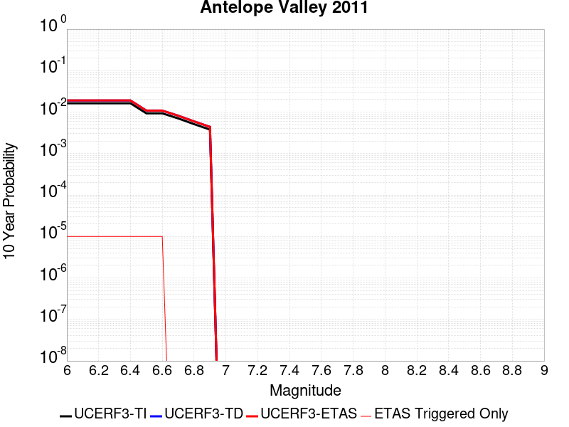 |

| Magnitude | 1 wk TI Prob | 1 wk TD Prob | 1 wk ETAS Prob | 1 wk ETAS/TD Gain | 1 wk ETAS Triggered Only | 1 mo TI Prob | 1 mo TD Prob | 1 mo ETAS Prob | 1 mo ETAS/TD Gain | 1 mo ETAS Triggered Only | 1 yr TI Prob | 1 yr TD Prob | 1 yr ETAS Prob | 1 yr ETAS/TD Gain | 1 yr ETAS Triggered Only | 10 yr TI Prob | 10 yr TD Prob | 10 yr ETAS Prob | 10 yr ETAS/TD Gain | 10 yr ETAS Triggered Only |
|-----|-----|-----|-----|-----|-----|-----|-----|-----|-----|-----|-----|-----|-----|-----|-----|-----|-----|-----|-----|-----|
| 6.0 | 3.1646934E-5 | 3.6905207E-5 | 3.6905207E-5 | 1.0 | 0.0 | 1.3562266E-4 | 1.5815707E-4 | 1.6815549E-4 | 1.0632182 | 1.0E-5 | 0.0016499552 | 0.0019241263 | 0.001934107 | 1.0051872 | 1.0E-5 | 0.016377583 | 0.019101074 | 0.019110883 | 1.0005136 | 1.0E-5 |
| 6.1 | 3.1646934E-5 | 3.6905207E-5 | 3.6905207E-5 | 1.0 | 0.0 | 1.3562266E-4 | 1.5815707E-4 | 1.6815549E-4 | 1.0632182 | 1.0E-5 | 0.0016499552 | 0.0019241263 | 0.001934107 | 1.0051872 | 1.0E-5 | 0.016377583 | 0.019101074 | 0.019110883 | 1.0005136 | 1.0E-5 |
| 6.2 | 3.1646934E-5 | 3.6905207E-5 | 3.6905207E-5 | 1.0 | 0.0 | 1.3562266E-4 | 1.5815707E-4 | 1.6815549E-4 | 1.0632182 | 1.0E-5 | 0.0016499552 | 0.0019241263 | 0.001934107 | 1.0051872 | 1.0E-5 | 0.016377583 | 0.019101074 | 0.019110883 | 1.0005136 | 1.0E-5 |
| 6.3 | 3.1646934E-5 | 3.6905207E-5 | 3.6905207E-5 | 1.0 | 0.0 | 1.3562266E-4 | 1.5815707E-4 | 1.6815549E-4 | 1.0632182 | 1.0E-5 | 0.0016499552 | 0.0019241263 | 0.001934107 | 1.0051872 | 1.0E-5 | 0.016377583 | 0.019101074 | 0.019110883 | 1.0005136 | 1.0E-5 |
| 6.4 | 3.1646934E-5 | 3.6905207E-5 | 3.6905207E-5 | 1.0 | 0.0 | 1.3562266E-4 | 1.5815707E-4 | 1.6815549E-4 | 1.0632182 | 1.0E-5 | 0.0016499552 | 0.0019241263 | 0.001934107 | 1.0051872 | 1.0E-5 | 0.016377583 | 0.019101074 | 0.019110883 | 1.0005136 | 1.0E-5 |
| 6.5 | 1.8034107E-5 | 2.0941403E-5 | 2.0941403E-5 | 1.0 | 0.0 | 7.7286735E-5 | 8.974647E-5 | 9.974558E-5 | 1.111415 | 1.0E-5 | 9.405598E-4 | 0.0010922381 | 0.0011022271 | 1.0091455 | 1.0E-5 | 0.009365888 | 0.010880774 | 0.010890665 | 1.0009091 | 1.0E-5 |
| 6.6 | 1.8034107E-5 | 2.0941403E-5 | 2.0941403E-5 | 1.0 | 0.0 | 7.7286735E-5 | 8.974647E-5 | 9.974558E-5 | 1.111415 | 1.0E-5 | 9.405598E-4 | 0.0010922381 | 0.0011022271 | 1.0091455 | 1.0E-5 | 0.009365888 | 0.010880774 | 0.010890665 | 1.0009091 | 1.0E-5 |
| 6.7 | 1.3567667E-5 | 1.5749845E-5 | 1.5749845E-5 | 1.0 | 0.0 | 5.814585E-5 | 6.7498186E-5 | 6.7498186E-5 | 1.0 | 0.0 | 7.076958E-4 | 8.215869E-4 | 8.215869E-4 | 1.0 | 0.0 | 0.007054463 | 0.008195928 | 0.008195928 | 1.0 | 0.0 |
| 6.8 | 9.867387E-6 | 1.1468182E-5 | 1.1468182E-5 | 1.0 | 0.0 | 4.2288117E-5 | 4.914896E-5 | 4.914896E-5 | 1.0 | 0.0 | 5.1473617E-4 | 5.983192E-4 | 5.983192E-4 | 1.0 | 0.0 | 0.005135455 | 0.0059763966 | 0.0059763966 | 1.0 | 0.0 |
| 6.9 | 7.273233E-6 | 8.455046E-6 | 8.455046E-6 | 1.0 | 0.0 | 3.1170628E-5 | 3.623591E-5 | 3.623591E-5 | 1.0 | 0.0 | 3.794363E-4 | 4.4117222E-4 | 4.4117222E-4 | 1.0 | 0.0 | 0.0037878908 | 0.004411722 | 0.004411722 | 1.0 | 0.0 |

## Carson Range (Genoa)
*[(top)](#table-of-contents)*

| 1 Week | 1 Month | 1 Year | 10 Year |
|-----|-----|-----|-----|
|  |  |  |  |

| Magnitude | 1 wk TI Prob | 1 wk TD Prob | 1 wk ETAS Prob | 1 wk ETAS/TD Gain | 1 wk ETAS Triggered Only | 1 mo TI Prob | 1 mo TD Prob | 1 mo ETAS Prob | 1 mo ETAS/TD Gain | 1 mo ETAS Triggered Only | 1 yr TI Prob | 1 yr TD Prob | 1 yr ETAS Prob | 1 yr ETAS/TD Gain | 1 yr ETAS Triggered Only | 10 yr TI Prob | 10 yr TD Prob | 10 yr ETAS Prob | 10 yr ETAS/TD Gain | 10 yr ETAS Triggered Only |
|-----|-----|-----|-----|-----|-----|-----|-----|-----|-----|-----|-----|-----|-----|-----|-----|-----|-----|-----|-----|-----|
| 6.0 | 4.1268457E-5 | 5.0148312E-5 | 5.0148312E-5 | 1.0 | 0.0 | 1.7685282E-4 | 2.1490589E-4 | 2.1490589E-4 | 1.0 | 0.0 | 0.0021510567 | 0.0026137335 | 0.0026137335 | 1.0 | 0.0 | 0.02130354 | 0.025869591 | 0.025879333 | 1.0003766 | 1.0E-5 |
| 6.1 | 4.1268457E-5 | 5.0148312E-5 | 5.0148312E-5 | 1.0 | 0.0 | 1.7685282E-4 | 2.1490589E-4 | 2.1490589E-4 | 1.0 | 0.0 | 0.0021510567 | 0.0026137335 | 0.0026137335 | 1.0 | 0.0 | 0.02130354 | 0.025869591 | 0.025879333 | 1.0003766 | 1.0E-5 |
| 6.2 | 4.1268457E-5 | 5.0148312E-5 | 5.0148312E-5 | 1.0 | 0.0 | 1.7685282E-4 | 2.1490589E-4 | 2.1490589E-4 | 1.0 | 0.0 | 0.0021510567 | 0.0026137335 | 0.0026137335 | 1.0 | 0.0 | 0.02130354 | 0.025869591 | 0.025879333 | 1.0003766 | 1.0E-5 |
| 6.3 | 4.1268457E-5 | 5.0148312E-5 | 5.0148312E-5 | 1.0 | 0.0 | 1.7685282E-4 | 2.1490589E-4 | 2.1490589E-4 | 1.0 | 0.0 | 0.0021510567 | 0.0026137335 | 0.0026137335 | 1.0 | 0.0 | 0.02130354 | 0.025869591 | 0.025879333 | 1.0003766 | 1.0E-5 |
| 6.4 | 4.1268457E-5 | 5.0148312E-5 | 5.0148312E-5 | 1.0 | 0.0 | 1.7685282E-4 | 2.1490589E-4 | 2.1490589E-4 | 1.0 | 0.0 | 0.0021510567 | 0.0026137335 | 0.0026137335 | 1.0 | 0.0 | 0.02130354 | 0.025869591 | 0.025879333 | 1.0003766 | 1.0E-5 |
| 6.5 | 2.5677185E-5 | 3.0979143E-5 | 3.0979143E-5 | 1.0 | 0.0 | 1.1004044E-4 | 1.3276203E-4 | 1.3276203E-4 | 1.0 | 0.0 | 0.0013389189 | 0.0016153594 | 0.0016153594 | 1.0 | 0.0 | 0.0133088045 | 0.016054096 | 0.016063936 | 1.0006129 | 1.0E-5 |
| 6.6 | 2.5677185E-5 | 3.0979143E-5 | 3.0979143E-5 | 1.0 | 0.0 | 1.1004044E-4 | 1.3276203E-4 | 1.3276203E-4 | 1.0 | 0.0 | 0.0013389189 | 0.0016153594 | 0.0016153594 | 1.0 | 0.0 | 0.0133088045 | 0.016054096 | 0.016063936 | 1.0006129 | 1.0E-5 |
| 6.7 | 1.9969408E-5 | 2.4064128E-5 | 2.4064128E-5 | 1.0 | 0.0 | 8.558037E-5 | 1.0312876E-4 | 1.0312876E-4 | 1.0 | 0.0 | 0.0010414429 | 0.001255023 | 0.001255023 | 1.0 | 0.0 | 0.010365757 | 0.012494512 | 0.012494512 | 1.0 | 0.0 |
| 6.8 | 1.4783156E-5 | 1.7818054E-5 | 1.7818054E-5 | 1.0 | 0.0 | 6.335485E-5 | 7.636159E-5 | 7.636159E-5 | 1.0 | 0.0 | 7.710722E-4 | 9.2943595E-4 | 9.2943595E-4 | 1.0 | 0.0 | 0.0076840227 | 0.009268275 | 0.009268275 | 1.0 | 0.0 |
| 6.9 | 1.06660555E-5 | 1.2877381E-5 | 1.2877381E-5 | 1.0 | 0.0 | 4.5710865E-5 | 5.518826E-5 | 5.518826E-5 | 1.0 | 0.0 | 5.5638765E-4 | 6.7182514E-4 | 6.7182514E-4 | 1.0 | 0.0 | 0.005549967 | 0.0067092404 | 0.0067092404 | 1.0 | 0.0 |
| 7.0 | 7.664838E-6 | 9.258562E-6 | 9.258562E-6 | 1.0 | 0.0 | 3.2848893E-5 | 3.967955E-5 | 3.967955E-5 | 1.0 | 0.0 | 3.998619E-4 | 4.8309853E-4 | 4.8309853E-4 | 1.0 | 0.0 | 0.0039914316 | 0.004830983 | 0.004830983 | 1.0 | 0.0 |

## Cleghorn
*[(top)](#table-of-contents)*

| 1 Week | 1 Month | 1 Year | 10 Year |
|-----|-----|-----|-----|
|  |  |  |  |

| Magnitude | 1 wk TI Prob | 1 wk TD Prob | 1 wk ETAS Prob | 1 wk ETAS/TD Gain | 1 wk ETAS Triggered Only | 1 mo TI Prob | 1 mo TD Prob | 1 mo ETAS Prob | 1 mo ETAS/TD Gain | 1 mo ETAS Triggered Only | 1 yr TI Prob | 1 yr TD Prob | 1 yr ETAS Prob | 1 yr ETAS/TD Gain | 1 yr ETAS Triggered Only | 10 yr TI Prob | 10 yr TD Prob | 10 yr ETAS Prob | 10 yr ETAS/TD Gain | 10 yr ETAS Triggered Only |
|-----|-----|-----|-----|-----|-----|-----|-----|-----|-----|-----|-----|-----|-----|-----|-----|-----|-----|-----|-----|-----|
| 6.0 | 7.9267165E-6 | 9.832763E-6 | 9.832763E-6 | 1.0 | 0.0 | 3.39712E-5 | 4.213979E-5 | 4.213979E-5 | 1.0 | 0.0 | 4.1352084E-4 | 5.129418E-4 | 5.129418E-4 | 1.0 | 0.0 | 0.004127522 | 0.005132704 | 0.005142653 | 1.0019383 | 1.0E-5 |
| 6.1 | 7.9267165E-6 | 9.832763E-6 | 9.832763E-6 | 1.0 | 0.0 | 3.39712E-5 | 4.213979E-5 | 4.213979E-5 | 1.0 | 0.0 | 4.1352084E-4 | 5.129418E-4 | 5.129418E-4 | 1.0 | 0.0 | 0.004127522 | 0.005132704 | 0.005142653 | 1.0019383 | 1.0E-5 |
| 6.2 | 7.9267165E-6 | 9.832763E-6 | 9.832763E-6 | 1.0 | 0.0 | 3.39712E-5 | 4.213979E-5 | 4.213979E-5 | 1.0 | 0.0 | 4.1352084E-4 | 5.129418E-4 | 5.129418E-4 | 1.0 | 0.0 | 0.004127522 | 0.005132704 | 0.005142653 | 1.0019383 | 1.0E-5 |
| 6.3 | 7.9267165E-6 | 9.832763E-6 | 9.832763E-6 | 1.0 | 0.0 | 3.39712E-5 | 4.213979E-5 | 4.213979E-5 | 1.0 | 0.0 | 4.1352084E-4 | 5.129418E-4 | 5.129418E-4 | 1.0 | 0.0 | 0.004127522 | 0.005132704 | 0.005142653 | 1.0019383 | 1.0E-5 |
| 6.4 | 4.3445207E-6 | 6.0926013E-6 | 6.0926013E-6 | 1.0 | 0.0 | 1.8619241E-5 | 2.6110894E-5 | 2.6110894E-5 | 1.0 | 0.0 | 2.2666567E-4 | 3.1785478E-4 | 3.1785478E-4 | 1.0 | 0.0 | 0.0022643462 | 0.003188204 | 0.003188204 | 1.0 | 0.0 |
| 6.5 | 4.3445207E-6 | 6.0926013E-6 | 6.0926013E-6 | 1.0 | 0.0 | 1.8619241E-5 | 2.6110894E-5 | 2.6110894E-5 | 1.0 | 0.0 | 2.2666567E-4 | 3.1785478E-4 | 3.1785478E-4 | 1.0 | 0.0 | 0.0022643462 | 0.003188204 | 0.003188204 | 1.0 | 0.0 |
| 6.6 | 4.040109E-6 | 5.7750076E-6 | 5.7750076E-6 | 1.0 | 0.0 | 1.7314638E-5 | 2.4749803E-5 | 2.4749803E-5 | 1.0 | 0.0 | 2.1078532E-4 | 3.0128812E-4 | 3.0128812E-4 | 1.0 | 0.0 | 0.002105855 | 0.003022993 | 0.003022993 | 1.0 | 0.0 |
| 6.7 | 3.3632055E-6 | 5.0685003E-6 | 5.0685003E-6 | 1.0 | 0.0 | 1.4413658E-5 | 2.1721964E-5 | 2.1721964E-5 | 1.0 | 0.0 | 1.7547216E-4 | 2.6443315E-4 | 2.6443315E-4 | 1.0 | 0.0 | 0.0017533366 | 0.0026553252 | 0.0026553252 | 1.0 | 0.0 |
| 6.8 | 3.2902772E-6 | 4.990407E-6 | 4.990407E-6 | 1.0 | 0.0 | 1.4101111E-5 | 2.1387285E-5 | 2.1387285E-5 | 1.0 | 0.0 | 1.716675E-4 | 2.603594E-4 | 2.603594E-4 | 1.0 | 0.0 | 0.0017153495 | 0.0026146837 | 0.0026146837 | 1.0 | 0.0 |
| 6.9 | 3.031547E-6 | 4.692163E-6 | 4.692163E-6 | 1.0 | 0.0 | 1.299228E-5 | 2.0109117E-5 | 2.0109117E-5 | 1.0 | 0.0 | 1.5816953E-4 | 2.4480128E-4 | 2.4480128E-4 | 1.0 | 0.0 | 0.00158057 | 0.0024594541 | 0.0024594541 | 1.0 | 0.0 |
| 7.0 | 2.8259715E-6 | 4.371714E-6 | 4.371714E-6 | 1.0 | 0.0 | 1.211125E-5 | 1.8735784E-5 | 1.8735784E-5 | 1.0 | 0.0 | 1.4744449E-4 | 2.2808454E-4 | 2.2808454E-4 | 1.0 | 0.0 | 0.001473467 | 0.0022926412 | 0.0022926412 | 1.0 | 0.0 |
| 7.1 | 2.5962665E-6 | 4.066925E-6 | 4.066925E-6 | 1.0 | 0.0 | 1.1126809E-5 | 1.7429564E-5 | 1.7429564E-5 | 1.0 | 0.0 | 1.3546048E-4 | 2.1218449E-4 | 2.1218449E-4 | 1.0 | 0.0 | 0.0013537793 | 0.0021339648 | 0.0021339648 | 1.0 | 0.0 |
| 7.2 | 2.3247253E-6 | 3.6774632E-6 | 3.6774632E-6 | 1.0 | 0.0 | 9.96307E-6 | 1.5760463E-5 | 1.5760463E-5 | 1.0 | 0.0 | 1.21293626E-4 | 1.9186691E-4 | 1.9186691E-4 | 1.0 | 0.0 | 0.0012122744 | 0.0019311808 | 0.0019311808 | 1.0 | 0.0 |
| 7.3 | 2.056928E-6 | 3.236149E-6 | 3.236149E-6 | 1.0 | 0.0 | 8.815376E-6 | 1.3869138E-5 | 1.3869138E-5 | 1.0 | 0.0 | 1.0732192E-4 | 1.6884382E-4 | 1.6884382E-4 | 1.0 | 0.0 | 0.001072701 | 0.0017013908 | 0.0017013908 | 1.0 | 0.0 |
| 7.4 | 1.8055999E-6 | 2.8265147E-6 | 2.8265147E-6 | 1.0 | 0.0 | 7.738263E-6 | 1.2113579E-5 | 1.2113579E-5 | 1.0 | 0.0 | 9.4209274E-5 | 1.4747298E-4 | 1.4747298E-4 | 1.0 | 0.0 | 9.4169343E-4 | 0.001488129 | 0.001488129 | 1.0 | 0.0 |
| 7.5 | 1.4683443E-6 | 2.4257406E-6 | 2.4257406E-6 | 1.0 | 0.0 | 6.292889E-6 | 1.039599E-5 | 1.039599E-5 | 1.0 | 0.0 | 7.661323E-5 | 1.2656393E-4 | 1.2656393E-4 | 1.0 | 0.0 | 7.658682E-4 | 0.0012793359 | 0.0012793359 | 1.0 | 0.0 |
| 7.6 | 9.804088E-7 | 1.9012458E-6 | 1.9012458E-6 | 1.0 | 0.0 | 4.201745E-6 | 8.148171E-6 | 8.148171E-6 | 1.0 | 0.0 | 5.1155046E-5 | 9.919951E-5 | 9.919951E-5 | 1.0 | 0.0 | 5.114327E-4 | 0.0010060034 | 0.0010060034 | 1.0 | 0.0 |
| 7.7 | 7.3434086E-7 | 1.6293816E-6 | 1.6293816E-6 | 1.0 | 0.0 | 3.1471714E-6 | 6.9830453E-6 | 6.9830453E-6 | 1.0 | 0.0 | 3.831614E-5 | 8.501529E-5 | 8.501529E-5 | 1.0 | 0.0 | 3.8309532E-4 | 8.6431357E-4 | 8.6431357E-4 | 1.0 | 0.0 |
| 7.8 | 6.434184E-7 | 1.522934E-6 | 1.522934E-6 | 1.0 | 0.0 | 2.7575045E-6 | 6.5268437E-6 | 6.5268437E-6 | 1.0 | 0.0 | 3.35721E-5 | 7.946145E-5 | 7.946145E-5 | 1.0 | 0.0 | 3.3567028E-4 | 8.0846256E-4 | 8.0846256E-4 | 1.0 | 0.0 |
| 7.9 | 3.4943926E-7 | 7.5794E-7 | 7.5794E-7 | 1.0 | 0.0 | 1.497596E-6 | 3.2483103E-6 | 3.2483103E-6 | 1.0 | 0.0 | 1.8233079E-5 | 3.9547467E-5 | 3.9547467E-5 | 1.0 | 0.0 | 1.8231584E-4 | 4.0426495E-4 | 4.0426495E-4 | 1.0 | 0.0 |
| 8.0 | 6.717524E-8 | 5.8437763E-8 | 5.8437763E-8 | 1.0 | 0.0 | 2.8789387E-7 | 2.5044753E-7 | 2.5044753E-7 | 1.0 | 0.0 | 3.505102E-6 | 3.0491944E-6 | 3.0491944E-6 | 1.0 | 0.0 | 3.5050467E-5 | 3.2754215E-5 | 3.2754215E-5 | 1.0 | 0.0 |
| 8.1 | 3.1984914E-8 | 1.2967114E-8 | 1.2967114E-8 | 1.0 | 0.0 | 1.370782E-7 | 5.5573338E-8 | 5.5573338E-8 | 1.0 | 0.0 | 1.6689258E-6 | 6.766052E-7 | 6.766052E-7 | 1.0 | 0.0 | 1.6689133E-5 | 7.750275E-6 | 7.750275E-6 | 1.0 | 0.0 |
| 8.2 | 1.21887656E-8 | 3.6524417E-9 | 3.6524417E-9 | 1.0 | 0.0 | 5.2237567E-8 | 1.565332E-8 | 1.565332E-8 | 1.0 | 0.0 | 6.359922E-7 | 1.9057916E-7 | 1.9057916E-7 | 1.0 | 0.0 | 6.3599036E-6 | 2.2488762E-6 | 2.2488762E-6 | 1.0 | 0.0 |

## Mono Lake 2011 CFM
*[(top)](#table-of-contents)*

| 1 Week | 1 Month | 1 Year | 10 Year |
|-----|-----|-----|-----|
|  | 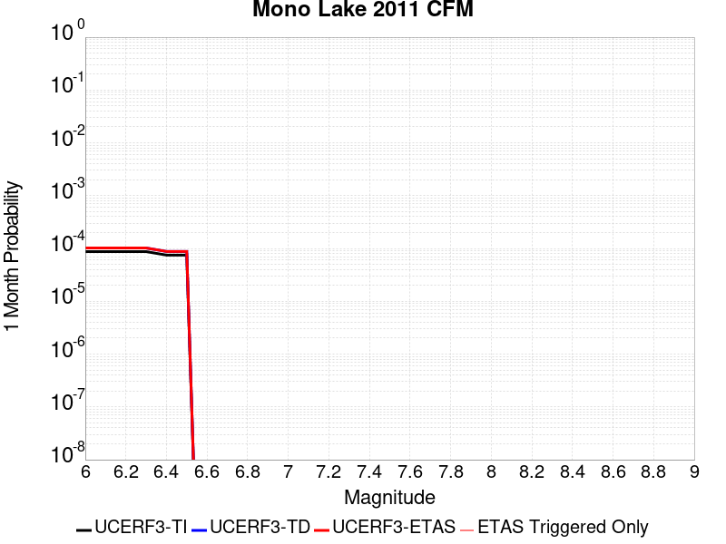 |  |  |

| Magnitude | 1 wk TI Prob | 1 wk TD Prob | 1 wk ETAS Prob | 1 wk ETAS/TD Gain | 1 wk ETAS Triggered Only | 1 mo TI Prob | 1 mo TD Prob | 1 mo ETAS Prob | 1 mo ETAS/TD Gain | 1 mo ETAS Triggered Only | 1 yr TI Prob | 1 yr TD Prob | 1 yr ETAS Prob | 1 yr ETAS/TD Gain | 1 yr ETAS Triggered Only | 10 yr TI Prob | 10 yr TD Prob | 10 yr ETAS Prob | 10 yr ETAS/TD Gain | 10 yr ETAS Triggered Only |
|-----|-----|-----|-----|-----|-----|-----|-----|-----|-----|-----|-----|-----|-----|-----|-----|-----|-----|-----|-----|-----|
| 6.0 | 2.0341662E-5 | 2.3828732E-5 | 2.3828732E-5 | 1.0 | 0.0 | 8.717564E-5 | 1.0212214E-4 | 1.0212214E-4 | 1.0 | 0.0 | 0.0010608466 | 0.0012431591 | 0.0012431591 | 1.0 | 0.0 | 0.010557966 | 0.012414123 | 0.012423999 | 1.0007955 | 1.0E-5 |
| 6.1 | 2.0341662E-5 | 2.3828732E-5 | 2.3828732E-5 | 1.0 | 0.0 | 8.717564E-5 | 1.0212214E-4 | 1.0212214E-4 | 1.0 | 0.0 | 0.0010608466 | 0.0012431591 | 0.0012431591 | 1.0 | 0.0 | 0.010557966 | 0.012414123 | 0.012423999 | 1.0007955 | 1.0E-5 |
| 6.2 | 2.0341662E-5 | 2.3828732E-5 | 2.3828732E-5 | 1.0 | 0.0 | 8.717564E-5 | 1.0212214E-4 | 1.0212214E-4 | 1.0 | 0.0 | 0.0010608466 | 0.0012431591 | 0.0012431591 | 1.0 | 0.0 | 0.010557966 | 0.012414123 | 0.012423999 | 1.0007955 | 1.0E-5 |
| 6.3 | 2.0341662E-5 | 2.3828732E-5 | 2.3828732E-5 | 1.0 | 0.0 | 8.717564E-5 | 1.0212214E-4 | 1.0212214E-4 | 1.0 | 0.0 | 0.0010608466 | 0.0012431591 | 0.0012431591 | 1.0 | 0.0 | 0.010557966 | 0.012414123 | 0.012423999 | 1.0007955 | 1.0E-5 |
| 6.4 | 1.749821E-5 | 2.0491474E-5 | 2.0491474E-5 | 1.0 | 0.0 | 7.499018E-5 | 8.7820605E-5 | 8.7820605E-5 | 1.0 | 0.0 | 9.1262296E-4 | 0.0010692156 | 0.0010692156 | 1.0 | 0.0 | 0.009088841 | 0.010692113 | 0.010702006 | 1.0009253 | 1.0E-5 |
| 6.5 | 1.749821E-5 | 2.0491474E-5 | 2.0491474E-5 | 1.0 | 0.0 | 7.499018E-5 | 8.7820605E-5 | 8.7820605E-5 | 1.0 | 0.0 | 9.1262296E-4 | 0.0010692156 | 0.0010692156 | 1.0 | 0.0 | 0.009088841 | 0.010692113 | 0.010702006 | 1.0009253 | 1.0E-5 |

## Anaheim
*[(top)](#table-of-contents)*

| 1 Week | 1 Month | 1 Year | 10 Year |
|-----|-----|-----|-----|
|  |  | 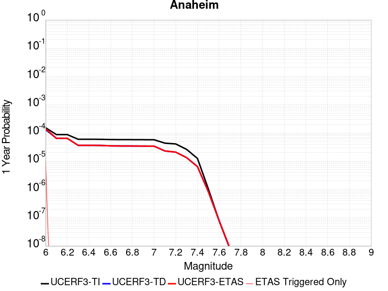 | 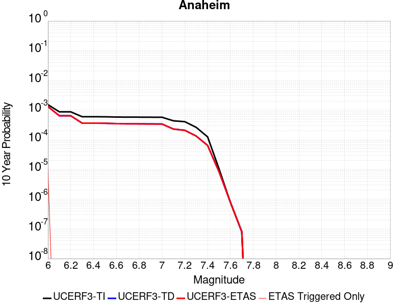 |

| Magnitude | 1 wk TI Prob | 1 wk TD Prob | 1 wk ETAS Prob | 1 wk ETAS/TD Gain | 1 wk ETAS Triggered Only | 1 mo TI Prob | 1 mo TD Prob | 1 mo ETAS Prob | 1 mo ETAS/TD Gain | 1 mo ETAS Triggered Only | 1 yr TI Prob | 1 yr TD Prob | 1 yr ETAS Prob | 1 yr ETAS/TD Gain | 1 yr ETAS Triggered Only | 10 yr TI Prob | 10 yr TD Prob | 10 yr ETAS Prob | 10 yr ETAS/TD Gain | 10 yr ETAS Triggered Only |
|-----|-----|-----|-----|-----|-----|-----|-----|-----|-----|-----|-----|-----|-----|-----|-----|-----|-----|-----|-----|-----|
| 6.0 | 2.9254998E-6 | 2.5122804E-6 | 2.5122804E-6 | 1.0 | 0.0 | 1.25377965E-5 | 1.0766885E-5 | 1.0766885E-5 | 1.0 | 0.0 | 1.5263697E-4 | 1.3108128E-4 | 1.4107997E-4 | 1.0762786 | 1.0E-5 | 0.0015253217 | 0.0013102698 | 0.0013202567 | 1.007622 | 1.0E-5 |
| 6.1 | 1.6729715E-6 | 1.2337254E-6 | 1.2337254E-6 | 1.0 | 0.0 | 7.1698582E-6 | 5.287386E-6 | 5.287386E-6 | 1.0 | 0.0 | 8.7289525E-5 | 6.437244E-5 | 6.437244E-5 | 1.0 | 0.0 | 8.7255245E-4 | 6.435789E-4 | 6.435789E-4 | 1.0 | 0.0 |
| 6.2 | 1.6729715E-6 | 1.2337254E-6 | 1.2337254E-6 | 1.0 | 0.0 | 7.1698582E-6 | 5.287386E-6 | 5.287386E-6 | 1.0 | 0.0 | 8.7289525E-5 | 6.437244E-5 | 6.437244E-5 | 1.0 | 0.0 | 8.7255245E-4 | 6.435789E-4 | 6.435789E-4 | 1.0 | 0.0 |
| 6.3 | 1.1444064E-6 | 6.9595603E-7 | 6.9595603E-7 | 1.0 | 0.0 | 4.9045893E-6 | 2.9826656E-6 | 2.9826656E-6 | 1.0 | 0.0 | 5.971174E-5 | 3.6313406E-5 | 3.6313406E-5 | 1.0 | 0.0 | 5.96957E-4 | 3.6308024E-4 | 3.6308024E-4 | 1.0 | 0.0 |
| 6.4 | 1.1444064E-6 | 6.9595603E-7 | 6.9595603E-7 | 1.0 | 0.0 | 4.9045893E-6 | 2.9826656E-6 | 2.9826656E-6 | 1.0 | 0.0 | 5.971174E-5 | 3.6313406E-5 | 3.6313406E-5 | 1.0 | 0.0 | 5.96957E-4 | 3.6308024E-4 | 3.6308024E-4 | 1.0 | 0.0 |
| 6.5 | 1.1385318E-6 | 6.900244E-7 | 6.900244E-7 | 1.0 | 0.0 | 4.879413E-6 | 2.9572443E-6 | 2.9572443E-6 | 1.0 | 0.0 | 5.9405233E-5 | 3.6003912E-5 | 3.6003912E-5 | 1.0 | 0.0 | 5.938936E-4 | 3.599863E-4 | 3.599863E-4 | 1.0 | 0.0 |
| 6.6 | 1.1165511E-6 | 6.678115E-7 | 6.678115E-7 | 1.0 | 0.0 | 4.78521E-6 | 2.8620464E-6 | 2.8620464E-6 | 1.0 | 0.0 | 5.8258374E-5 | 3.4844914E-5 | 3.4844914E-5 | 1.0 | 0.0 | 5.8243104E-4 | 3.4839995E-4 | 3.4839995E-4 | 1.0 | 0.0 |
| 6.7 | 1.1098243E-6 | 6.610309E-7 | 6.610309E-7 | 1.0 | 0.0 | 4.7563813E-6 | 2.8329869E-6 | 2.8329869E-6 | 1.0 | 0.0 | 5.7907404E-5 | 3.4491124E-5 | 3.4491124E-5 | 1.0 | 0.0 | 5.7892315E-4 | 3.4486316E-4 | 3.4486316E-4 | 1.0 | 0.0 |
| 6.8 | 1.1077587E-6 | 6.589512E-7 | 6.589512E-7 | 1.0 | 0.0 | 4.7475287E-6 | 2.8240738E-6 | 2.8240738E-6 | 1.0 | 0.0 | 5.779963E-5 | 3.438261E-5 | 3.438261E-5 | 1.0 | 0.0 | 5.77846E-4 | 3.4377837E-4 | 3.4377837E-4 | 1.0 | 0.0 |
| 6.9 | 1.1024468E-6 | 6.5360894E-7 | 6.5360894E-7 | 1.0 | 0.0 | 4.7247636E-6 | 2.8011784E-6 | 2.8011784E-6 | 1.0 | 0.0 | 5.752248E-5 | 3.410387E-5 | 3.410387E-5 | 1.0 | 0.0 | 5.750759E-4 | 3.4099177E-4 | 3.4099177E-4 | 1.0 | 0.0 |
| 7.0 | 1.0993066E-6 | 6.510196E-7 | 6.510196E-7 | 1.0 | 0.0 | 4.7113053E-6 | 2.7900812E-6 | 2.7900812E-6 | 1.0 | 0.0 | 5.7358633E-5 | 3.3968765E-5 | 3.3968765E-5 | 1.0 | 0.0 | 5.734383E-4 | 3.3964118E-4 | 3.3964118E-4 | 1.0 | 0.0 |
| 7.1 | 8.334877E-7 | 4.4047505E-7 | 4.4047505E-7 | 1.0 | 0.0 | 3.5720855E-6 | 1.887749E-6 | 1.887749E-6 | 1.0 | 0.0 | 4.348927E-5 | 2.2983124E-5 | 2.2983124E-5 | 1.0 | 0.0 | 4.3480762E-4 | 2.2980971E-4 | 2.2980971E-4 | 1.0 | 0.0 |
| 7.2 | 7.794411E-7 | 3.9974753E-7 | 3.9974753E-7 | 1.0 | 0.0 | 3.3404576E-6 | 1.7132027E-6 | 1.7132027E-6 | 1.0 | 0.0 | 4.0669314E-5 | 2.0858064E-5 | 2.0858064E-5 | 1.0 | 0.0 | 4.066187E-4 | 2.085631E-4 | 2.085631E-4 | 1.0 | 0.0 |
| 7.3 | 5.01704E-7 | 2.5572157E-7 | 2.5572157E-7 | 1.0 | 0.0 | 2.150158E-6 | 1.0959492E-6 | 1.0959492E-6 | 1.0 | 0.0 | 2.617786E-5 | 1.3343113E-5 | 1.3343113E-5 | 1.0 | 0.0 | 2.6174777E-4 | 1.3342436E-4 | 1.3342436E-4 | 1.0 | 0.0 |
| 7.4 | 2.4008182E-7 | 1.2367254E-7 | 1.2367254E-7 | 1.0 | 0.0 | 1.0289217E-6 | 5.300251E-7 | 5.300251E-7 | 1.0 | 0.0 | 1.252705E-5 | 6.453044E-6 | 6.453044E-6 | 1.0 | 0.0 | 1.2526344E-4 | 6.4529326E-5 | 6.4529326E-5 | 1.0 | 0.0 |
| 7.5 | 2.0263876E-8 | 1.6121017E-8 | 1.6121017E-8 | 1.0 | 0.0 | 8.684518E-8 | 6.909008E-8 | 6.909008E-8 | 1.0 | 0.0 | 1.0573395E-6 | 8.411714E-7 | 8.411714E-7 | 1.0 | 0.0 | 1.0573345E-5 | 8.411692E-6 | 8.411692E-6 | 1.0 | 0.0 |
| 7.6 | 1.4871431E-9 | 1.5084212E-9 | 1.5084212E-9 | 1.0 | 0.0 | 6.37347E-9 | 6.464661E-9 | 6.464661E-9 | 1.0 | 0.0 | 7.7596994E-8 | 7.870724E-8 | 7.870724E-8 | 1.0 | 0.0 | 7.759697E-7 | 7.870721E-7 | 7.870721E-7 | 1.0 | 0.0 |
| 7.7 | 1.5093293E-10 | 1.5333557E-10 | 1.5333557E-10 | 1.0 | 0.0 | 6.4685546E-10 | 6.5715255E-10 | 6.5715255E-10 | 1.0 | 0.0 | 7.875465E-9 | 8.000829E-9 | 8.000829E-9 | 1.0 | 0.0 | 7.8754645E-8 | 8.000829E-8 | 8.000829E-8 | 1.0 | 0.0 |

## Greenville (So) 2011 CFM
*[(top)](#table-of-contents)*

| 1 Week | 1 Month | 1 Year | 10 Year |
|-----|-----|-----|-----|
|  |  |  |  |

| Magnitude | 1 wk TI Prob | 1 wk TD Prob | 1 wk ETAS Prob | 1 wk ETAS/TD Gain | 1 wk ETAS Triggered Only | 1 mo TI Prob | 1 mo TD Prob | 1 mo ETAS Prob | 1 mo ETAS/TD Gain | 1 mo ETAS Triggered Only | 1 yr TI Prob | 1 yr TD Prob | 1 yr ETAS Prob | 1 yr ETAS/TD Gain | 1 yr ETAS Triggered Only | 10 yr TI Prob | 10 yr TD Prob | 10 yr ETAS Prob | 10 yr ETAS/TD Gain | 10 yr ETAS Triggered Only |
|-----|-----|-----|-----|-----|-----|-----|-----|-----|-----|-----|-----|-----|-----|-----|-----|-----|-----|-----|-----|-----|
| 6.0 | 4.279693E-5 | 5.504253E-5 | 5.504253E-5 | 1.0 | 0.0 | 1.8340252E-4 | 2.3587665E-4 | 2.3587665E-4 | 1.0 | 0.0 | 0.0022306389 | 0.0028682668 | 0.0028782382 | 1.0034764 | 1.0E-5 | 0.022083808 | 0.028339608 | 0.028349325 | 1.0003428 | 1.0E-5 |
| 6.1 | 3.4037297E-5 | 4.319378E-5 | 4.319378E-5 | 1.0 | 0.0 | 1.4586597E-4 | 1.8510365E-4 | 1.8510365E-4 | 1.0 | 0.0 | 0.0017744715 | 0.00225147 | 0.00225147 | 1.0 | 0.0 | 0.01760369 | 0.02230374 | 0.02230374 | 1.0 | 0.0 |
| 6.2 | 3.4037297E-5 | 4.319378E-5 | 4.319378E-5 | 1.0 | 0.0 | 1.4586597E-4 | 1.8510365E-4 | 1.8510365E-4 | 1.0 | 0.0 | 0.0017744715 | 0.00225147 | 0.00225147 | 1.0 | 0.0 | 0.01760369 | 0.02230374 | 0.02230374 | 1.0 | 0.0 |
| 6.3 | 2.5956324E-5 | 3.243031E-5 | 3.243031E-5 | 1.0 | 0.0 | 1.11236644E-4 | 1.3898002E-4 | 1.3898002E-4 | 1.0 | 0.0 | 0.0013534647 | 0.0016908324 | 0.0016908324 | 1.0 | 0.0 | 0.013452509 | 0.016786784 | 0.016786784 | 1.0 | 0.0 |
| 6.4 | 2.1145053E-5 | 2.6198471E-5 | 2.6198471E-5 | 1.0 | 0.0 | 9.061851E-5 | 1.1227445E-4 | 1.1227445E-4 | 1.0 | 0.0 | 0.0011027219 | 0.001366116 | 0.001366116 | 1.0 | 0.0 | 0.01097266 | 0.013580924 | 0.013580924 | 1.0 | 0.0 |
| 6.5 | 2.0030959E-5 | 2.4796553E-5 | 2.4796553E-5 | 1.0 | 0.0 | 8.584414E-5 | 1.06266765E-4 | 1.06266765E-4 | 1.0 | 0.0 | 0.0010446513 | 0.0012930612 | 0.0012930612 | 1.0 | 0.0 | 0.010397541 | 0.012859055 | 0.012859055 | 1.0 | 0.0 |
| 6.6 | 1.8395405E-5 | 2.2755145E-5 | 2.2755145E-5 | 1.0 | 0.0 | 7.8835066E-5 | 9.751856E-5 | 9.751856E-5 | 1.0 | 0.0 | 9.5939427E-4 | 0.0011866703 | 0.0011866703 | 1.0 | 0.0 | 0.009552629 | 0.011806721 | 0.011806721 | 1.0 | 0.0 |
| 6.7 | 1.7883482E-5 | 2.2126169E-5 | 2.2126169E-5 | 1.0 | 0.0 | 7.664124E-5 | 9.482315E-5 | 9.482315E-5 | 1.0 | 0.0 | 9.3270757E-4 | 0.001153889 | 0.001153889 | 1.0 | 0.0 | 0.009288026 | 0.011482358 | 0.011482358 | 1.0 | 0.0 |
| 6.8 | 1.3373564E-5 | 1.650644E-5 | 1.650644E-5 | 1.0 | 0.0 | 5.7314013E-5 | 7.0740054E-5 | 7.0740054E-5 | 1.0 | 0.0 | 6.975747E-4 | 8.609346E-4 | 8.609346E-4 | 1.0 | 0.0 | 0.0069538904 | 0.008577933 | 0.008577933 | 1.0 | 0.0 |
| 6.9 | 1.06692905E-5 | 1.315295E-5 | 1.315295E-5 | 1.0 | 0.0 | 4.5724726E-5 | 5.6368626E-5 | 5.6368626E-5 | 1.0 | 0.0 | 5.5655633E-4 | 6.860832E-4 | 6.860832E-4 | 1.0 | 0.0 | 0.005551645 | 0.0068412144 | 0.0068412144 | 1.0 | 0.0 |
| 7.0 | 8.157512E-6 | 1.0062912E-5 | 1.0062912E-5 | 1.0 | 0.0 | 3.4960296E-5 | 4.3126074E-5 | 4.3126074E-5 | 1.0 | 0.0 | 4.2555845E-4 | 5.249372E-4 | 5.249372E-4 | 1.0 | 0.0 | 0.004247444 | 0.00523778 | 0.00523778 | 1.0 | 0.0 |
| 7.1 | 6.1467113E-6 | 7.627636E-6 | 7.627636E-6 | 1.0 | 0.0 | 2.6342783E-5 | 3.2689466E-5 | 3.2689466E-5 | 1.0 | 0.0 | 3.206762E-4 | 3.9792238E-4 | 3.9792238E-4 | 1.0 | 0.0 | 0.0032021382 | 0.0039726184 | 0.0039726184 | 1.0 | 0.0 |
| 7.2 | 4.713467E-6 | 5.9143304E-6 | 5.9143304E-6 | 1.0 | 0.0 | 2.0200418E-5 | 2.5346888E-5 | 2.5346888E-5 | 1.0 | 0.0 | 2.4591232E-4 | 3.0855526E-4 | 3.0855526E-4 | 1.0 | 0.0 | 0.0024564038 | 0.0030817043 | 0.0030817043 | 1.0 | 0.0 |
| 7.3 | 2.3266216E-6 | 2.954093E-6 | 2.954093E-6 | 1.0 | 0.0 | 9.971197E-6 | 1.2660337E-5 | 1.2660337E-5 | 1.0 | 0.0 | 1.2139256E-4 | 1.5412885E-4 | 1.5412885E-4 | 1.0 | 0.0 | 0.0012132627 | 0.0015404717 | 0.0015404717 | 1.0 | 0.0 |
| 7.4 | 1.3314E-6 | 1.7180038E-6 | 1.7180038E-6 | 1.0 | 0.0 | 5.7059874E-6 | 7.3628526E-6 | 7.3628526E-6 | 1.0 | 0.0 | 6.946818E-5 | 8.963909E-5 | 8.963909E-5 | 1.0 | 0.0 | 6.9446466E-4 | 8.9630444E-4 | 8.9630444E-4 | 1.0 | 0.0 |
| 7.5 | 1.0362941E-6 | 1.3469212E-6 | 1.3469212E-6 | 1.0 | 0.0 | 4.4412527E-6 | 5.772507E-6 | 5.772507E-6 | 1.0 | 0.0 | 5.407091E-5 | 7.027805E-5 | 7.027805E-5 | 1.0 | 0.0 | 5.405776E-4 | 7.028176E-4 | 7.028176E-4 | 1.0 | 0.0 |
| 7.6 | 7.764784E-7 | 1.0088914E-6 | 1.0088914E-6 | 1.0 | 0.0 | 3.3277602E-6 | 4.3238138E-6 | 4.3238138E-6 | 1.0 | 0.0 | 4.0514726E-5 | 5.2641197E-5 | 5.2641197E-5 | 1.0 | 0.0 | 4.050734E-4 | 5.2651245E-4 | 5.2651245E-4 | 1.0 | 0.0 |
| 7.7 | 1.6927763E-7 | 2.214027E-7 | 2.214027E-7 | 1.0 | 0.0 | 7.2547533E-7 | 9.4886843E-7 | 9.4886843E-7 | 1.0 | 0.0 | 8.832627E-6 | 1.1552414E-5 | 1.1552414E-5 | 1.0 | 0.0 | 8.8322755E-5 | 1.1554362E-4 | 1.1554362E-4 | 1.0 | 0.0 |

## Peralta Hills
*[(top)](#table-of-contents)*

| 1 Week | 1 Month | 1 Year | 10 Year |
|-----|-----|-----|-----|
|  |  |  |  |

| Magnitude | 1 wk TI Prob | 1 wk TD Prob | 1 wk ETAS Prob | 1 wk ETAS/TD Gain | 1 wk ETAS Triggered Only | 1 mo TI Prob | 1 mo TD Prob | 1 mo ETAS Prob | 1 mo ETAS/TD Gain | 1 mo ETAS Triggered Only | 1 yr TI Prob | 1 yr TD Prob | 1 yr ETAS Prob | 1 yr ETAS/TD Gain | 1 yr ETAS Triggered Only | 10 yr TI Prob | 10 yr TD Prob | 10 yr ETAS Prob | 10 yr ETAS/TD Gain | 10 yr ETAS Triggered Only |
|-----|-----|-----|-----|-----|-----|-----|-----|-----|-----|-----|-----|-----|-----|-----|-----|-----|-----|-----|-----|-----|
| 6.0 | 3.8850067E-6 | 3.839569E-6 | 3.839569E-6 | 1.0 | 0.0 | 1.6649923E-5 | 1.6455235E-5 | 1.6455235E-5 | 1.0 | 0.0 | 2.0269395E-4 | 2.0033147E-4 | 2.0033147E-4 | 1.0 | 0.0 | 0.0020250916 | 0.0020022364 | 0.0020122165 | 1.0049844 | 1.0E-5 |
| 6.1 | 3.8850067E-6 | 3.839569E-6 | 3.839569E-6 | 1.0 | 0.0 | 1.6649923E-5 | 1.6455235E-5 | 1.6455235E-5 | 1.0 | 0.0 | 2.0269395E-4 | 2.0033147E-4 | 2.0033147E-4 | 1.0 | 0.0 | 0.0020250916 | 0.0020022364 | 0.0020122165 | 1.0049844 | 1.0E-5 |
| 6.2 | 3.8850067E-6 | 3.839569E-6 | 3.839569E-6 | 1.0 | 0.0 | 1.6649923E-5 | 1.6455235E-5 | 1.6455235E-5 | 1.0 | 0.0 | 2.0269395E-4 | 2.0033147E-4 | 2.0033147E-4 | 1.0 | 0.0 | 0.0020250916 | 0.0020022364 | 0.0020122165 | 1.0049844 | 1.0E-5 |
| 6.3 | 3.8850067E-6 | 3.839569E-6 | 3.839569E-6 | 1.0 | 0.0 | 1.6649923E-5 | 1.6455235E-5 | 1.6455235E-5 | 1.0 | 0.0 | 2.0269395E-4 | 2.0033147E-4 | 2.0033147E-4 | 1.0 | 0.0 | 0.0020250916 | 0.0020022364 | 0.0020122165 | 1.0049844 | 1.0E-5 |
| 6.4 | 3.8850067E-6 | 3.839569E-6 | 3.839569E-6 | 1.0 | 0.0 | 1.6649923E-5 | 1.6455235E-5 | 1.6455235E-5 | 1.0 | 0.0 | 2.0269395E-4 | 2.0033147E-4 | 2.0033147E-4 | 1.0 | 0.0 | 0.0020250916 | 0.0020022364 | 0.0020122165 | 1.0049844 | 1.0E-5 |
| 6.5 | 1.5587785E-6 | 1.4431273E-6 | 1.4431273E-6 | 1.0 | 0.0 | 6.6804623E-6 | 6.184818E-6 | 6.184818E-6 | 1.0 | 0.0 | 8.133159E-5 | 7.52978E-5 | 7.52978E-5 | 1.0 | 0.0 | 8.1301836E-4 | 7.527469E-4 | 7.527469E-4 | 1.0 | 0.0 |
| 6.6 | 1.5587785E-6 | 1.4431273E-6 | 1.4431273E-6 | 1.0 | 0.0 | 6.6804623E-6 | 6.184818E-6 | 6.184818E-6 | 1.0 | 0.0 | 8.133159E-5 | 7.52978E-5 | 7.52978E-5 | 1.0 | 0.0 | 8.1301836E-4 | 7.527469E-4 | 7.527469E-4 | 1.0 | 0.0 |
| 6.7 | 1.5018579E-6 | 1.3837496E-6 | 1.3837496E-6 | 1.0 | 0.0 | 6.436518E-6 | 5.930343E-6 | 5.930343E-6 | 1.0 | 0.0 | 7.836179E-5 | 7.219978E-5 | 7.219978E-5 | 1.0 | 0.0 | 7.833416E-4 | 7.2178675E-4 | 7.2178675E-4 | 1.0 | 0.0 |
| 6.8 | 1.4584314E-6 | 1.3381814E-6 | 1.3381814E-6 | 1.0 | 0.0 | 6.250405E-6 | 5.7350517E-6 | 5.7350517E-6 | 1.0 | 0.0 | 7.6096025E-5 | 6.982226E-5 | 6.982226E-5 | 1.0 | 0.0 | 7.6069974E-4 | 6.980266E-4 | 6.980266E-4 | 1.0 | 0.0 |
| 6.9 | 1.1382393E-6 | 9.862607E-7 | 9.862607E-7 | 1.0 | 0.0 | 4.8781594E-6 | 4.2268252E-6 | 4.2268252E-6 | 1.0 | 0.0 | 5.9389975E-5 | 5.1460465E-5 | 5.1460465E-5 | 1.0 | 0.0 | 5.93741E-4 | 5.1449373E-4 | 5.1449373E-4 | 1.0 | 0.0 |
| 7.0 | 9.970413E-7 | 8.3098894E-7 | 8.3098894E-7 | 1.0 | 0.0 | 4.273027E-6 | 3.5613768E-6 | 3.5613768E-6 | 1.0 | 0.0 | 5.2022864E-5 | 4.3358967E-5 | 4.3358967E-5 | 1.0 | 0.0 | 5.2010687E-4 | 4.335119E-4 | 4.335119E-4 | 1.0 | 0.0 |
| 7.1 | 9.684443E-7 | 7.9943277E-7 | 7.9943277E-7 | 1.0 | 0.0 | 4.150469E-6 | 3.4261363E-6 | 3.4261363E-6 | 1.0 | 0.0 | 5.053079E-5 | 4.1712483E-5 | 4.1712483E-5 | 1.0 | 0.0 | 5.05193E-4 | 4.1705323E-4 | 4.1705323E-4 | 1.0 | 0.0 |
| 7.2 | 9.240811E-7 | 7.5033756E-7 | 7.5033756E-7 | 1.0 | 0.0 | 3.960342E-6 | 3.2157288E-6 | 3.2157288E-6 | 1.0 | 0.0 | 4.8216094E-5 | 3.9150862E-5 | 3.9150862E-5 | 1.0 | 0.0 | 4.8205635E-4 | 3.914462E-4 | 3.914462E-4 | 1.0 | 0.0 |
| 7.3 | 8.158643E-7 | 6.3502046E-7 | 6.3502046E-7 | 1.0 | 0.0 | 3.4965567E-6 | 2.7215137E-6 | 2.7215137E-6 | 1.0 | 0.0 | 4.2569747E-5 | 3.3133987E-5 | 3.3133987E-5 | 1.0 | 0.0 | 4.2561593E-4 | 3.3129661E-4 | 3.3129661E-4 | 1.0 | 0.0 |
| 7.4 | 6.3822824E-7 | 4.795852E-7 | 4.795852E-7 | 1.0 | 0.0 | 2.7352612E-6 | 2.055364E-6 | 2.055364E-6 | 1.0 | 0.0 | 3.3301294E-5 | 2.502382E-5 | 2.502382E-5 | 1.0 | 0.0 | 3.3296304E-4 | 2.5021518E-4 | 2.5021518E-4 | 1.0 | 0.0 |
| 7.5 | 4.0292628E-7 | 2.7847406E-7 | 2.7847406E-7 | 1.0 | 0.0 | 1.7268258E-6 | 1.1934599E-6 | 1.1934599E-6 | 1.0 | 0.0 | 2.1023901E-5 | 1.4530305E-5 | 1.4530305E-5 | 1.0 | 0.0 | 2.1021912E-4 | 1.4529635E-4 | 1.4529635E-4 | 1.0 | 0.0 |
| 7.6 | 3.672993E-7 | 2.485613E-7 | 2.485613E-7 | 1.0 | 0.0 | 1.5741389E-6 | 1.0652625E-6 | 1.0652625E-6 | 1.0 | 0.0 | 1.9164972E-5 | 1.2969521E-5 | 1.2969521E-5 | 1.0 | 0.0 | 1.916332E-4 | 1.2969035E-4 | 1.2969035E-4 | 1.0 | 0.0 |
| 7.7 | 2.8466823E-7 | 1.786064E-7 | 1.786064E-7 | 1.0 | 0.0 | 1.2200061E-6 | 7.654559E-7 | 7.654559E-7 | 1.0 | 0.0 | 1.4853474E-5 | 9.319412E-6 | 9.319412E-6 | 1.0 | 0.0 | 1.485248E-4 | 9.3192815E-5 | 9.3192815E-5 | 1.0 | 0.0 |

## Burnt Mtn
*[(top)](#table-of-contents)*

| 1 Week | 1 Month | 1 Year | 10 Year |
|-----|-----|-----|-----|
|  |  |  |  |

| Magnitude | 1 wk TI Prob | 1 wk TD Prob | 1 wk ETAS Prob | 1 wk ETAS/TD Gain | 1 wk ETAS Triggered Only | 1 mo TI Prob | 1 mo TD Prob | 1 mo ETAS Prob | 1 mo ETAS/TD Gain | 1 mo ETAS Triggered Only | 1 yr TI Prob | 1 yr TD Prob | 1 yr ETAS Prob | 1 yr ETAS/TD Gain | 1 yr ETAS Triggered Only | 10 yr TI Prob | 10 yr TD Prob | 10 yr ETAS Prob | 10 yr ETAS/TD Gain | 10 yr ETAS Triggered Only |
|-----|-----|-----|-----|-----|-----|-----|-----|-----|-----|-----|-----|-----|-----|-----|-----|-----|-----|-----|-----|-----|
| 6.0 | 1.5673151E-5 | 1.1749267E-5 | 1.1749267E-5 | 1.0 | 0.0 | 6.716892E-5 | 5.0353756E-5 | 5.0353756E-5 | 1.0 | 0.0 | 8.1747473E-4 | 6.1301346E-4 | 6.230073E-4 | 1.0163028 | 1.0E-5 | 0.008144741 | 0.006125865 | 0.0061358036 | 1.0016224 | 1.0E-5 |
| 6.1 | 1.5673151E-5 | 1.1749267E-5 | 1.1749267E-5 | 1.0 | 0.0 | 6.716892E-5 | 5.0353756E-5 | 5.0353756E-5 | 1.0 | 0.0 | 8.1747473E-4 | 6.1301346E-4 | 6.230073E-4 | 1.0163028 | 1.0E-5 | 0.008144741 | 0.006125865 | 0.0061358036 | 1.0016224 | 1.0E-5 |
| 6.2 | 1.5673151E-5 | 1.1749267E-5 | 1.1749267E-5 | 1.0 | 0.0 | 6.716892E-5 | 5.0353756E-5 | 5.0353756E-5 | 1.0 | 0.0 | 8.1747473E-4 | 6.1301346E-4 | 6.230073E-4 | 1.0163028 | 1.0E-5 | 0.008144741 | 0.006125865 | 0.0061358036 | 1.0016224 | 1.0E-5 |
| 6.3 | 1.5673151E-5 | 1.1749267E-5 | 1.1749267E-5 | 1.0 | 0.0 | 6.716892E-5 | 5.0353756E-5 | 5.0353756E-5 | 1.0 | 0.0 | 8.1747473E-4 | 6.1301346E-4 | 6.230073E-4 | 1.0163028 | 1.0E-5 | 0.008144741 | 0.006125865 | 0.0061358036 | 1.0016224 | 1.0E-5 |
| 6.4 | 1.5673151E-5 | 1.1749267E-5 | 1.1749267E-5 | 1.0 | 0.0 | 6.716892E-5 | 5.0353756E-5 | 5.0353756E-5 | 1.0 | 0.0 | 8.1747473E-4 | 6.1301346E-4 | 6.230073E-4 | 1.0163028 | 1.0E-5 | 0.008144741 | 0.006125865 | 0.0061358036 | 1.0016224 | 1.0E-5 |
| 6.5 | 1.36191375E-5 | 1.007816E-5 | 1.007816E-5 | 1.0 | 0.0 | 5.8366426E-5 | 4.319211E-5 | 4.319211E-5 | 1.0 | 0.0 | 7.103795E-4 | 5.2586396E-4 | 5.358587E-4 | 1.0190064 | 1.0E-5 | 0.0070811296 | 0.00525864 | 0.0052685873 | 1.0018916 | 1.0E-5 |

## Sargent 2011 CFM
*[(top)](#table-of-contents)*

| 1 Week | 1 Month | 1 Year | 10 Year |
|-----|-----|-----|-----|
| 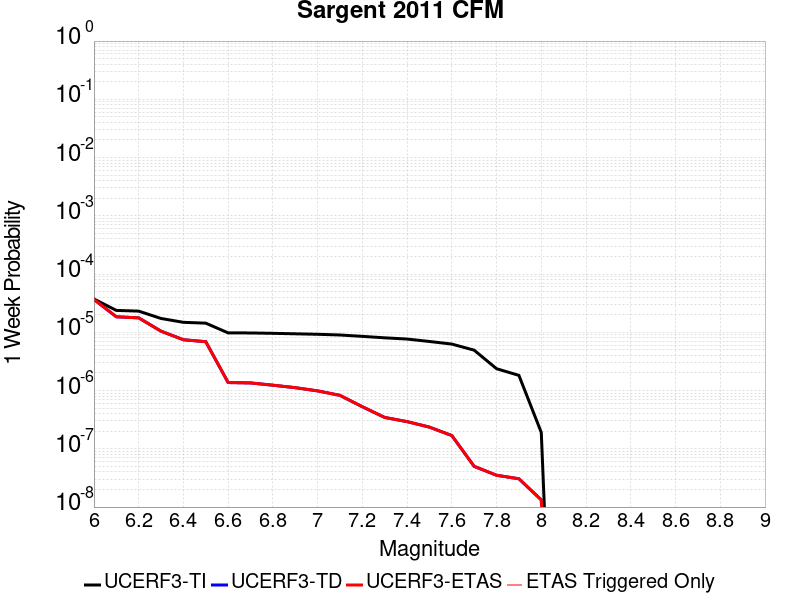 |  |  |  |

| Magnitude | 1 wk TI Prob | 1 wk TD Prob | 1 wk ETAS Prob | 1 wk ETAS/TD Gain | 1 wk ETAS Triggered Only | 1 mo TI Prob | 1 mo TD Prob | 1 mo ETAS Prob | 1 mo ETAS/TD Gain | 1 mo ETAS Triggered Only | 1 yr TI Prob | 1 yr TD Prob | 1 yr ETAS Prob | 1 yr ETAS/TD Gain | 1 yr ETAS Triggered Only | 10 yr TI Prob | 10 yr TD Prob | 10 yr ETAS Prob | 10 yr ETAS/TD Gain | 10 yr ETAS Triggered Only |
|-----|-----|-----|-----|-----|-----|-----|-----|-----|-----|-----|-----|-----|-----|-----|-----|-----|-----|-----|-----|-----|
| 6.0 | 3.7327867E-5 | 3.6652433E-5 | 3.6652433E-5 | 1.0 | 0.0 | 1.5996677E-4 | 1.5707403E-4 | 1.5707403E-4 | 1.0 | 0.0 | 0.0019458556 | 0.0019111163 | 0.0019210972 | 1.0052226 | 1.0E-5 | 0.01928905 | 0.019018957 | 0.019028768 | 1.0005158 | 1.0E-5 |
| 6.1 | 2.3771476E-5 | 1.8479679E-5 | 1.8479679E-5 | 1.0 | 0.0 | 1.01873775E-4 | 7.919668E-5 | 7.919668E-5 | 1.0 | 0.0 | 0.0012396075 | 9.6387346E-4 | 9.6387346E-4 | 1.0 | 0.0 | 0.012327154 | 0.009636474 | 0.009636474 | 1.0 | 0.0 |
| 6.2 | 2.3112721E-5 | 1.7711021E-5 | 1.7711021E-5 | 1.0 | 0.0 | 9.9050754E-5 | 7.590262E-5 | 7.590262E-5 | 1.0 | 0.0 | 0.0012052758 | 9.238025E-4 | 9.238025E-4 | 1.0 | 0.0 | 0.011987597 | 0.009239118 | 0.009239118 | 1.0 | 0.0 |
| 6.3 | 1.728509E-5 | 1.0459215E-5 | 1.0459215E-5 | 1.0 | 0.0 | 7.407686E-5 | 4.4824697E-5 | 4.4824697E-5 | 1.0 | 0.0 | 9.015125E-4 | 5.4565014E-4 | 5.4565014E-4 | 1.0 | 0.0 | 0.008978641 | 0.0054793553 | 0.0054793553 | 1.0 | 0.0 |
| 6.4 | 1.48395575E-5 | 7.4561913E-6 | 7.4561913E-6 | 1.0 | 0.0 | 6.3596555E-5 | 3.1954918E-5 | 3.1954918E-5 | 1.0 | 0.0 | 7.7401294E-4 | 3.8901926E-4 | 3.8901926E-4 | 1.0 | 0.0 | 0.0077132257 | 0.0039188485 | 0.0039188485 | 1.0 | 0.0 |
| 6.5 | 1.4358964E-5 | 6.8949544E-6 | 6.8949544E-6 | 1.0 | 0.0 | 6.1536964E-5 | 2.9549676E-5 | 2.9549676E-5 | 1.0 | 0.0 | 7.48955E-4 | 3.5974535E-4 | 3.5974535E-4 | 1.0 | 0.0 | 0.0074643586 | 0.003627091 | 0.003627091 | 1.0 | 0.0 |
| 6.6 | 9.772591E-6 | 1.3736869E-6 | 1.3736869E-6 | 1.0 | 0.0 | 4.188186E-5 | 5.8872165E-6 | 5.8872165E-6 | 1.0 | 0.0 | 5.097923E-4 | 7.1674534E-5 | 7.1674534E-5 | 1.0 | 0.0 | 0.005086244 | 7.484026E-4 | 7.484026E-4 | 1.0 | 0.0 |
| 6.7 | 9.752745E-6 | 1.352378E-6 | 1.352378E-6 | 1.0 | 0.0 | 4.179681E-5 | 5.7958932E-6 | 5.7958932E-6 | 1.0 | 0.0 | 5.0875737E-4 | 7.0562746E-5 | 7.0562746E-5 | 1.0 | 0.0 | 0.005075942 | 7.3729217E-4 | 7.3729217E-4 | 1.0 | 0.0 |
| 6.8 | 9.608213E-6 | 1.2362367E-6 | 1.2362367E-6 | 1.0 | 0.0 | 4.1177405E-5 | 5.298147E-6 | 5.298147E-6 | 1.0 | 0.0 | 5.012196E-4 | 6.450305E-5 | 6.450305E-5 | 1.0 | 0.0 | 0.005000906 | 6.76431E-4 | 6.76431E-4 | 1.0 | 0.0 |
| 6.9 | 9.427164E-6 | 1.121002E-6 | 1.121002E-6 | 1.0 | 0.0 | 4.04015E-5 | 4.8042857E-6 | 4.8042857E-6 | 1.0 | 0.0 | 4.9177726E-4 | 5.8490627E-5 | 5.8490627E-5 | 1.0 | 0.0 | 0.004906904 | 6.156438E-4 | 6.156438E-4 | 1.0 | 0.0 |
| 7.0 | 9.247601E-6 | 9.8745E-7 | 9.8745E-7 | 1.0 | 0.0 | 3.9631974E-5 | 4.2319216E-6 | 4.2319216E-6 | 1.0 | 0.0 | 4.8241246E-4 | 5.1522446E-5 | 5.1522446E-5 | 1.0 | 0.0 | 0.0048136655 | 5.4548355E-4 | 5.4548355E-4 | 1.0 | 0.0 |
| 7.1 | 8.995454E-6 | 8.2714405E-7 | 8.2714405E-7 | 1.0 | 0.0 | 3.8551374E-5 | 3.5448982E-6 | 3.5448982E-6 | 1.0 | 0.0 | 4.6926187E-4 | 4.3158296E-5 | 4.3158296E-5 | 1.0 | 0.0 | 0.004682722 | 4.6095473E-4 | 4.6095473E-4 | 1.0 | 0.0 |
| 7.2 | 8.520861E-6 | 5.2765705E-7 | 5.2765705E-7 | 1.0 | 0.0 | 3.6517464E-5 | 2.2613854E-6 | 2.2613854E-6 | 1.0 | 0.0 | 4.445094E-4 | 2.7532027E-5 | 2.7532027E-5 | 1.0 | 0.0 | 0.004436213 | 3.0299777E-4 | 3.0299777E-4 | 1.0 | 0.0 |
| 7.3 | 8.043592E-6 | 3.4562802E-7 | 3.4562802E-7 | 1.0 | 0.0 | 3.4472083E-5 | 1.4812622E-6 | 1.4812622E-6 | 1.0 | 0.0 | 4.196168E-4 | 1.803422E-5 | 1.803422E-5 | 1.0 | 0.0 | 0.004188253 | 2.0671402E-4 | 2.0671402E-4 | 1.0 | 0.0 |
| 7.4 | 7.662316E-6 | 2.9287088E-7 | 2.9287088E-7 | 1.0 | 0.0 | 3.2838085E-5 | 1.2551603E-6 | 1.2551603E-6 | 1.0 | 0.0 | 3.9973034E-4 | 1.5281472E-5 | 1.5281472E-5 | 1.0 | 0.0 | 0.0039901207 | 1.7738012E-4 | 1.7738012E-4 | 1.0 | 0.0 |
| 7.5 | 6.961638E-6 | 2.3572572E-7 | 2.3572572E-7 | 1.0 | 0.0 | 2.9835252E-5 | 1.0102527E-6 | 1.0102527E-6 | 1.0 | 0.0 | 3.6318362E-4 | 1.2299758E-5 | 1.2299758E-5 | 1.0 | 0.0 | 0.0036259065 | 1.4409557E-4 | 1.4409557E-4 | 1.0 | 0.0 |
| 7.6 | 6.282332E-6 | 1.6890769E-7 | 1.6890769E-7 | 1.0 | 0.0 | 2.6924003E-5 | 7.2388985E-7 | 7.2388985E-7 | 1.0 | 0.0 | 3.2775043E-4 | 8.813325E-6 | 8.813325E-6 | 1.0 | 0.0 | 0.0032726745 | 1.0504868E-4 | 1.0504868E-4 | 1.0 | 0.0 |
| 7.7 | 4.934408E-6 | 4.998054E-8 | 4.998054E-8 | 1.0 | 0.0 | 2.114729E-5 | 2.142023E-7 | 2.142023E-7 | 1.0 | 0.0 | 2.5743784E-4 | 2.60791E-6 | 2.60791E-6 | 1.0 | 0.0 | 0.0025713982 | 3.2525277E-5 | 3.2525277E-5 | 1.0 | 0.0 |
| 7.8 | 2.373212E-6 | 3.514994E-8 | 3.514994E-8 | 1.0 | 0.0 | 1.0170869E-5 | 1.506426E-7 | 1.506426E-7 | 1.0 | 0.0 | 1.238233E-4 | 1.8340721E-6 | 1.8340721E-6 | 1.0 | 0.0 | 0.0012375432 | 2.4110474E-5 | 2.4110474E-5 | 1.0 | 0.0 |
| 7.9 | 1.8227792E-6 | 3.0599544E-8 | 3.0599544E-8 | 1.0 | 0.0 | 7.811887E-6 | 1.3114091E-7 | 1.3114091E-7 | 1.0 | 0.0 | 9.510558E-5 | 1.5966393E-6 | 1.5966393E-6 | 1.0 | 0.0 | 9.5064886E-4 | 2.139816E-5 | 2.139816E-5 | 1.0 | 0.0 |
| 8.0 | 1.9095137E-7 | 1.3263586E-8 | 1.3263586E-8 | 1.0 | 0.0 | 8.1836276E-7 | 5.6843938E-8 | 5.6843938E-8 | 1.0 | 0.0 | 9.963521E-6 | 6.9207476E-7 | 6.9207476E-7 | 1.0 | 0.0 | 9.963074E-5 | 8.46317E-6 | 8.46317E-6 | 1.0 | 0.0 |

## Oceanside alt1
*[(top)](#table-of-contents)*

| 1 Week | 1 Month | 1 Year | 10 Year |
|-----|-----|-----|-----|
|  |  |  |  |

| Magnitude | 1 wk TI Prob | 1 wk TD Prob | 1 wk ETAS Prob | 1 wk ETAS/TD Gain | 1 wk ETAS Triggered Only | 1 mo TI Prob | 1 mo TD Prob | 1 mo ETAS Prob | 1 mo ETAS/TD Gain | 1 mo ETAS Triggered Only | 1 yr TI Prob | 1 yr TD Prob | 1 yr ETAS Prob | 1 yr ETAS/TD Gain | 1 yr ETAS Triggered Only | 10 yr TI Prob | 10 yr TD Prob | 10 yr ETAS Prob | 10 yr ETAS/TD Gain | 10 yr ETAS Triggered Only |
|-----|-----|-----|-----|-----|-----|-----|-----|-----|-----|-----|-----|-----|-----|-----|-----|-----|-----|-----|-----|-----|
| 6.0 | 1.1617542E-5 | 1.1423561E-5 | 1.1423561E-5 | 1.0 | 0.0 | 4.9788516E-5 | 4.895729E-5 | 4.895729E-5 | 1.0 | 0.0 | 6.060066E-4 | 5.959081E-4 | 6.059021E-4 | 1.0167711 | 1.0E-5 | 0.0060435664 | 0.0059446995 | 0.0059546405 | 1.0016721 | 1.0E-5 |
| 6.1 | 1.1617542E-5 | 1.1423561E-5 | 1.1423561E-5 | 1.0 | 0.0 | 4.9788516E-5 | 4.895729E-5 | 4.895729E-5 | 1.0 | 0.0 | 6.060066E-4 | 5.959081E-4 | 6.059021E-4 | 1.0167711 | 1.0E-5 | 0.0060435664 | 0.0059446995 | 0.0059546405 | 1.0016721 | 1.0E-5 |
| 6.2 | 1.1617542E-5 | 1.1423561E-5 | 1.1423561E-5 | 1.0 | 0.0 | 4.9788516E-5 | 4.895729E-5 | 4.895729E-5 | 1.0 | 0.0 | 6.060066E-4 | 5.959081E-4 | 6.059021E-4 | 1.0167711 | 1.0E-5 | 0.0060435664 | 0.0059446995 | 0.0059546405 | 1.0016721 | 1.0E-5 |
| 6.3 | 1.1617542E-5 | 1.1423561E-5 | 1.1423561E-5 | 1.0 | 0.0 | 4.9788516E-5 | 4.895729E-5 | 4.895729E-5 | 1.0 | 0.0 | 6.060066E-4 | 5.959081E-4 | 6.059021E-4 | 1.0167711 | 1.0E-5 | 0.0060435664 | 0.0059446995 | 0.0059546405 | 1.0016721 | 1.0E-5 |
| 6.4 | 1.1617542E-5 | 1.1423561E-5 | 1.1423561E-5 | 1.0 | 0.0 | 4.9788516E-5 | 4.895729E-5 | 4.895729E-5 | 1.0 | 0.0 | 6.060066E-4 | 5.959081E-4 | 6.059021E-4 | 1.0167711 | 1.0E-5 | 0.0060435664 | 0.0059446995 | 0.0059546405 | 1.0016721 | 1.0E-5 |
| 6.5 | 1.1617542E-5 | 1.1423561E-5 | 1.1423561E-5 | 1.0 | 0.0 | 4.9788516E-5 | 4.895729E-5 | 4.895729E-5 | 1.0 | 0.0 | 6.060066E-4 | 5.959081E-4 | 6.059021E-4 | 1.0167711 | 1.0E-5 | 0.0060435664 | 0.0059446995 | 0.0059546405 | 1.0016721 | 1.0E-5 |
| 6.6 | 7.561768E-6 | 7.133651E-6 | 7.133651E-6 | 1.0 | 0.0 | 3.2407173E-5 | 3.057244E-5 | 3.057244E-5 | 1.0 | 0.0 | 3.9448592E-4 | 3.7215694E-4 | 3.821532E-4 | 1.0268604 | 1.0E-5 | 0.0039378637 | 0.0037154485 | 0.0037254114 | 1.0026815 | 1.0E-5 |
| 6.7 | 7.1042605E-6 | 6.655718E-6 | 6.655718E-6 | 1.0 | 0.0 | 3.0446476E-5 | 2.85242E-5 | 2.85242E-5 | 1.0 | 0.0 | 3.706228E-4 | 3.472276E-4 | 3.572241E-4 | 1.0287895 | 1.0E-5 | 0.0037000529 | 0.003466934 | 0.0034768994 | 1.0028744 | 1.0E-5 |
| 6.8 | 6.285554E-6 | 5.799733E-6 | 5.799733E-6 | 1.0 | 0.0 | 2.693781E-5 | 2.4855766E-5 | 2.4855766E-5 | 1.0 | 0.0 | 3.2791847E-4 | 3.0257748E-4 | 3.1257447E-4 | 1.0330393 | 1.0E-5 | 0.0032743502 | 0.0030217124 | 0.0030316822 | 1.0032994 | 1.0E-5 |
| 6.9 | 6.148883E-6 | 5.656571E-6 | 5.656571E-6 | 1.0 | 0.0 | 2.635209E-5 | 2.4242225E-5 | 2.4242225E-5 | 1.0 | 0.0 | 3.2078946E-4 | 2.9510967E-4 | 3.0510672E-4 | 1.0338757 | 1.0E-5 | 0.003203268 | 0.0029472348 | 0.0029572053 | 1.003383 | 1.0E-5 |
| 7.0 | 5.253857E-6 | 4.722425E-6 | 4.722425E-6 | 1.0 | 0.0 | 2.2516335E-5 | 2.023881E-5 | 2.023881E-5 | 1.0 | 0.0 | 2.7410188E-4 | 2.4637993E-4 | 2.5637748E-4 | 1.0405778 | 1.0E-5 | 0.0027376404 | 0.0024610993 | 0.0024710747 | 1.0040532 | 1.0E-5 |
| 7.1 | 4.730754E-6 | 4.1785274E-6 | 4.1785274E-6 | 1.0 | 0.0 | 2.0274503E-5 | 1.7907852E-5 | 1.7907852E-5 | 1.0 | 0.0 | 2.468141E-4 | 2.1800655E-4 | 2.2800437E-4 | 1.0458602 | 1.0E-5 | 0.0024654015 | 0.0021779535 | 0.0021879317 | 1.0045815 | 1.0E-5 |
| 7.2 | 3.7998386E-6 | 3.2140354E-6 | 3.2140354E-6 | 1.0 | 0.0 | 1.6284921E-5 | 1.37743655E-5 | 1.37743655E-5 | 1.0 | 0.0 | 1.9825088E-4 | 1.6769012E-4 | 1.7768843E-4 | 1.0596238 | 1.0E-5 | 0.001980741 | 0.001675648 | 0.0016856312 | 1.0059578 | 1.0E-5 |
| 7.3 | 3.2656465E-6 | 2.6983823E-6 | 2.6983823E-6 | 1.0 | 0.0 | 1.3995553E-5 | 1.1564445E-5 | 1.1564445E-5 | 1.0 | 0.0 | 1.7038253E-4 | 1.4078814E-4 | 1.5078673E-4 | 1.0710187 | 1.0E-5 | 0.0017025196 | 0.0014070006 | 0.0014169865 | 1.0070974 | 1.0E-5 |
| 7.4 | 2.593703E-6 | 2.0680366E-6 | 2.0680366E-6 | 1.0 | 0.0 | 1.1115822E-5 | 8.862984E-6 | 8.862984E-6 | 1.0 | 0.0 | 1.3532673E-4 | 1.0790158E-4 | 1.17900505E-4 | 1.0926671 | 1.0E-5 | 0.0013524436 | 0.0010785008 | 0.00108849 | 1.0092621 | 1.0E-5 |
| 7.5 | 1.8715585E-6 | 1.4137331E-6 | 1.4137331E-6 | 1.0 | 0.0 | 8.020941E-6 | 6.0588427E-6 | 6.0588427E-6 | 1.0 | 0.0 | 9.7650576E-5 | 7.376397E-5 | 7.376397E-5 | 1.0 | 0.0 | 9.7607676E-4 | 7.3740096E-4 | 7.3740096E-4 | 1.0 | 0.0 |
| 7.6 | 1.2246786E-6 | 8.526984E-7 | 8.526984E-7 | 1.0 | 0.0 | 5.248612E-6 | 3.6544168E-6 | 3.6544168E-6 | 1.0 | 0.0 | 6.389998E-5 | 4.4491662E-5 | 4.4491662E-5 | 1.0 | 0.0 | 6.3881604E-4 | 4.4483205E-4 | 4.4483205E-4 | 1.0 | 0.0 |
| 7.7 | 5.140719E-7 | 2.7346863E-7 | 2.7346863E-7 | 1.0 | 0.0 | 2.2031636E-6 | 1.172008E-6 | 1.172008E-6 | 1.0 | 0.0 | 2.6823185E-5 | 1.4269117E-5 | 1.4269117E-5 | 1.0 | 0.0 | 2.6819948E-4 | 1.4268335E-4 | 1.4268335E-4 | 1.0 | 0.0 |
| 7.8 | 1.16056995E-8 | 9.782997E-9 | 9.782997E-9 | 1.0 | 0.0 | 4.9738713E-8 | 4.1927127E-8 | 4.1927127E-8 | 1.0 | 0.0 | 6.0556863E-7 | 5.1046277E-7 | 5.1046277E-7 | 1.0 | 0.0 | 6.05567E-6 | 5.1046277E-6 | 5.1046277E-6 | 1.0 | 0.0 |

## Lions Head 2011 CFM
*[(top)](#table-of-contents)*

| 1 Week | 1 Month | 1 Year | 10 Year |
|-----|-----|-----|-----|
| 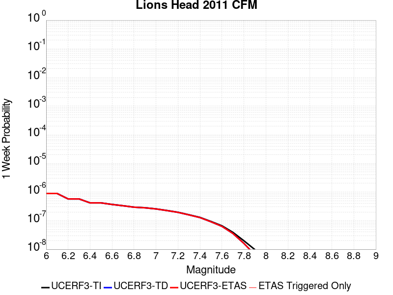 |  |  |  |

| Magnitude | 1 wk TI Prob | 1 wk TD Prob | 1 wk ETAS Prob | 1 wk ETAS/TD Gain | 1 wk ETAS Triggered Only | 1 mo TI Prob | 1 mo TD Prob | 1 mo ETAS Prob | 1 mo ETAS/TD Gain | 1 mo ETAS Triggered Only | 1 yr TI Prob | 1 yr TD Prob | 1 yr ETAS Prob | 1 yr ETAS/TD Gain | 1 yr ETAS Triggered Only | 10 yr TI Prob | 10 yr TD Prob | 10 yr ETAS Prob | 10 yr ETAS/TD Gain | 10 yr ETAS Triggered Only |
|-----|-----|-----|-----|-----|-----|-----|-----|-----|-----|-----|-----|-----|-----|-----|-----|-----|-----|-----|-----|-----|
| 6.0 | 8.889363E-7 | 8.8914385E-7 | 8.8914385E-7 | 1.0 | 0.0 | 3.8097214E-6 | 3.8106114E-6 | 3.8106114E-6 | 1.0 | 0.0 | 4.638237E-5 | 4.6393267E-5 | 4.6393267E-5 | 1.0 | 0.0 | 4.637269E-4 | 4.6384212E-4 | 4.7383748E-4 | 1.0215491 | 1.0E-5 |
| 6.1 | 8.889363E-7 | 8.8914385E-7 | 8.8914385E-7 | 1.0 | 0.0 | 3.8097214E-6 | 3.8106114E-6 | 3.8106114E-6 | 1.0 | 0.0 | 4.638237E-5 | 4.6393267E-5 | 4.6393267E-5 | 1.0 | 0.0 | 4.637269E-4 | 4.6384212E-4 | 4.7383748E-4 | 1.0215491 | 1.0E-5 |
| 6.2 | 5.7435483E-7 | 5.7360836E-7 | 5.7360836E-7 | 1.0 | 0.0 | 2.4615185E-6 | 2.4583194E-6 | 2.4583194E-6 | 1.0 | 0.0 | 2.9968574E-5 | 2.992964E-5 | 2.992964E-5 | 1.0 | 0.0 | 2.9964533E-4 | 2.9925755E-4 | 2.9925755E-4 | 1.0 | 0.0 |
| 6.3 | 5.7435483E-7 | 5.7360836E-7 | 5.7360836E-7 | 1.0 | 0.0 | 2.4615185E-6 | 2.4583194E-6 | 2.4583194E-6 | 1.0 | 0.0 | 2.9968574E-5 | 2.992964E-5 | 2.992964E-5 | 1.0 | 0.0 | 2.9964533E-4 | 2.9925755E-4 | 2.9925755E-4 | 1.0 | 0.0 |
| 6.4 | 4.1835764E-7 | 4.171553E-7 | 4.171553E-7 | 1.0 | 0.0 | 1.7929601E-6 | 1.7878072E-6 | 1.7878072E-6 | 1.0 | 0.0 | 2.1829072E-5 | 2.1766336E-5 | 2.1766336E-5 | 1.0 | 0.0 | 2.1826927E-4 | 2.1764229E-4 | 2.1764229E-4 | 1.0 | 0.0 |
| 6.5 | 4.1835764E-7 | 4.171553E-7 | 4.171553E-7 | 1.0 | 0.0 | 1.7929601E-6 | 1.7878072E-6 | 1.7878072E-6 | 1.0 | 0.0 | 2.1829072E-5 | 2.1766336E-5 | 2.1766336E-5 | 1.0 | 0.0 | 2.1826927E-4 | 2.1764229E-4 | 2.1764229E-4 | 1.0 | 0.0 |
| 6.6 | 3.6896213E-7 | 3.6762003E-7 | 3.6762003E-7 | 1.0 | 0.0 | 1.5812653E-6 | 1.5755134E-6 | 1.5755134E-6 | 1.0 | 0.0 | 1.9251736E-5 | 1.9181707E-5 | 1.9181707E-5 | 1.0 | 0.0 | 1.9250068E-4 | 1.9180065E-4 | 1.9180065E-4 | 1.0 | 0.0 |
| 6.7 | 3.3283942E-7 | 3.3139938E-7 | 3.3139938E-7 | 1.0 | 0.0 | 1.4264539E-6 | 1.4202823E-6 | 1.4202823E-6 | 1.0 | 0.0 | 1.7366938E-5 | 1.72918E-5 | 1.72918E-5 | 1.0 | 0.0 | 1.736558E-4 | 1.7290462E-4 | 1.7290462E-4 | 1.0 | 0.0 |
| 6.8 | 2.9684807E-7 | 2.9531563E-7 | 2.9531563E-7 | 1.0 | 0.0 | 1.2722054E-6 | 1.2656378E-6 | 1.2656378E-6 | 1.0 | 0.0 | 1.5488991E-5 | 1.5409032E-5 | 1.5409032E-5 | 1.0 | 0.0 | 1.5487912E-4 | 1.5407967E-4 | 1.5407967E-4 | 1.0 | 0.0 |
| 6.9 | 2.8254823E-7 | 2.809676E-7 | 2.809676E-7 | 1.0 | 0.0 | 1.2109203E-6 | 1.2041463E-6 | 1.2041463E-6 | 1.0 | 0.0 | 1.4742856E-5 | 1.4660383E-5 | 1.4660383E-5 | 1.0 | 0.0 | 1.4741877E-4 | 1.4659419E-4 | 1.4659419E-4 | 1.0 | 0.0 |
| 7.0 | 2.5794475E-7 | 2.562726E-7 | 2.562726E-7 | 1.0 | 0.0 | 1.105477E-6 | 1.0983107E-6 | 1.0983107E-6 | 1.0 | 0.0 | 1.34591E-5 | 1.337185E-5 | 1.337185E-5 | 1.0 | 0.0 | 1.3458285E-4 | 1.3371048E-4 | 1.3371048E-4 | 1.0 | 0.0 |
| 7.1 | 2.2678832E-7 | 2.2496242E-7 | 2.2496242E-7 | 1.0 | 0.0 | 9.719496E-7 | 9.641243E-7 | 9.641243E-7 | 1.0 | 0.0 | 1.1833421E-5 | 1.173815E-5 | 1.173815E-5 | 1.0 | 0.0 | 1.1832791E-4 | 1.1737531E-4 | 1.1737531E-4 | 1.0 | 0.0 |
| 7.2 | 1.968546E-7 | 1.9488046E-7 | 1.9488046E-7 | 1.0 | 0.0 | 8.436623E-7 | 8.3520166E-7 | 8.3520166E-7 | 1.0 | 0.0 | 1.027154E-5 | 1.0168533E-5 | 1.0168533E-5 | 1.0 | 0.0 | 1.0271065E-4 | 1.01680685E-4 | 1.01680685E-4 | 1.0 | 0.0 |
| 7.3 | 1.6101195E-7 | 1.5880563E-7 | 1.5880563E-7 | 1.0 | 0.0 | 6.90051E-7 | 6.805954E-7 | 6.805954E-7 | 1.0 | 0.0 | 8.401339E-6 | 8.286217E-6 | 8.286217E-6 | 1.0 | 0.0 | 8.4010215E-5 | 8.285909E-5 | 8.285909E-5 | 1.0 | 0.0 |
| 7.4 | 1.304744E-7 | 1.2803491E-7 | 1.2803491E-7 | 1.0 | 0.0 | 5.591759E-7 | 5.487209E-7 | 5.487209E-7 | 1.0 | 0.0 | 6.807945E-6 | 6.6806565E-6 | 6.6806565E-6 | 1.0 | 0.0 | 6.807737E-5 | 6.680456E-5 | 6.680456E-5 | 1.0 | 0.0 |
| 7.5 | 9.410614E-8 | 9.132697E-8 | 9.132697E-8 | 1.0 | 0.0 | 4.0331196E-7 | 3.9140122E-7 | 3.9140122E-7 | 1.0 | 0.0 | 4.910312E-6 | 4.7652993E-6 | 4.7652993E-6 | 1.0 | 0.0 | 4.9102036E-5 | 4.7651974E-5 | 4.7651974E-5 | 1.0 | 0.0 |
| 7.6 | 6.6360826E-8 | 6.3271486E-8 | 6.3271486E-8 | 1.0 | 0.0 | 2.844035E-7 | 2.711635E-7 | 2.711635E-7 | 1.0 | 0.0 | 3.462607E-6 | 3.3014103E-6 | 3.3014103E-6 | 1.0 | 0.0 | 3.4625533E-5 | 3.3013614E-5 | 3.3013614E-5 | 1.0 | 0.0 |
| 7.7 | 3.9100893E-8 | 3.561878E-8 | 3.561878E-8 | 1.0 | 0.0 | 1.6757524E-7 | 1.526519E-7 | 1.526519E-7 | 1.0 | 0.0 | 2.0402267E-6 | 1.8585353E-6 | 1.8585353E-6 | 1.0 | 0.0 | 2.040208E-5 | 1.8585199E-5 | 1.8585199E-5 | 1.0 | 0.0 |
| 7.8 | 1.9858547E-8 | 1.6059918E-8 | 1.6059918E-8 | 1.0 | 0.0 | 8.5108056E-8 | 6.8828214E-8 | 6.8828214E-8 | 1.0 | 0.0 | 1.0361902E-6 | 8.379832E-7 | 8.379832E-7 | 1.0 | 0.0 | 1.0361853E-5 | 8.3798E-6 | 8.3798E-6 | 1.0 | 0.0 |
| 7.9 | 9.717722E-9 | 6.4453585E-9 | 6.4453585E-9 | 1.0 | 0.0 | 4.1647375E-8 | 2.7622965E-8 | 2.7622965E-8 | 1.0 | 0.0 | 5.070567E-7 | 3.3630954E-7 | 3.3630954E-7 | 1.0 | 0.0 | 5.0705553E-6 | 3.3630904E-6 | 3.3630904E-6 | 1.0 | 0.0 |
| 8.0 | 3.8397716E-9 | 1.9091229E-9 | 1.9091229E-9 | 1.0 | 0.0 | 1.6456164E-8 | 8.181956E-9 | 8.181956E-9 | 1.0 | 0.0 | 2.0035378E-7 | 9.9615306E-8 | 9.9615306E-8 | 1.0 | 0.0 | 2.0035359E-6 | 9.961526E-7 | 9.961526E-7 | 1.0 | 0.0 |

## Bennett Valley 2011 CFM
*[(top)](#table-of-contents)*

| 1 Week | 1 Month | 1 Year | 10 Year |
|-----|-----|-----|-----|
| 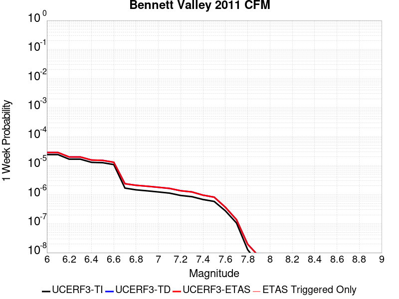 |  |  |  |

| Magnitude | 1 wk TI Prob | 1 wk TD Prob | 1 wk ETAS Prob | 1 wk ETAS/TD Gain | 1 wk ETAS Triggered Only | 1 mo TI Prob | 1 mo TD Prob | 1 mo ETAS Prob | 1 mo ETAS/TD Gain | 1 mo ETAS Triggered Only | 1 yr TI Prob | 1 yr TD Prob | 1 yr ETAS Prob | 1 yr ETAS/TD Gain | 1 yr ETAS Triggered Only | 10 yr TI Prob | 10 yr TD Prob | 10 yr ETAS Prob | 10 yr ETAS/TD Gain | 10 yr ETAS Triggered Only |
|-----|-----|-----|-----|-----|-----|-----|-----|-----|-----|-----|-----|-----|-----|-----|-----|-----|-----|-----|-----|-----|
| 6.0 | 2.3893934E-5 | 2.823968E-5 | 2.823968E-5 | 1.0 | 0.0 | 1.0239855E-4 | 1.21022626E-4 | 1.21022626E-4 | 1.0 | 0.0 | 0.0012459893 | 0.0014726394 | 0.0014726394 | 1.0 | 0.0 | 0.012390262 | 0.0146516515 | 0.014661505 | 1.0006725 | 1.0E-5 |
| 6.1 | 2.3893934E-5 | 2.823968E-5 | 2.823968E-5 | 1.0 | 0.0 | 1.0239855E-4 | 1.21022626E-4 | 1.21022626E-4 | 1.0 | 0.0 | 0.0012459893 | 0.0014726394 | 0.0014726394 | 1.0 | 0.0 | 0.012390262 | 0.0146516515 | 0.014661505 | 1.0006725 | 1.0E-5 |
| 6.2 | 1.6657146E-5 | 1.9854386E-5 | 1.9854386E-5 | 1.0 | 0.0 | 7.138582E-5 | 8.508825E-5 | 8.508825E-5 | 1.0 | 0.0 | 8.6877577E-4 | 0.0010355986 | 0.0010355986 | 1.0 | 0.0 | 0.008653872 | 0.010326189 | 0.010336085 | 1.0009584 | 1.0E-5 |
| 6.3 | 1.6657146E-5 | 1.9854386E-5 | 1.9854386E-5 | 1.0 | 0.0 | 7.138582E-5 | 8.508825E-5 | 8.508825E-5 | 1.0 | 0.0 | 8.6877577E-4 | 0.0010355986 | 0.0010355986 | 1.0 | 0.0 | 0.008653872 | 0.010326189 | 0.010336085 | 1.0009584 | 1.0E-5 |
| 6.4 | 1.29418495E-5 | 1.5568017E-5 | 1.5568017E-5 | 1.0 | 0.0 | 5.546389E-5 | 6.6719105E-5 | 6.6719105E-5 | 1.0 | 0.0 | 6.7506364E-4 | 8.1213255E-4 | 8.1213255E-4 | 1.0 | 0.0 | 0.0067301663 | 0.008108984 | 0.008108984 | 1.0 | 0.0 |
| 6.5 | 1.2582504E-5 | 1.5135037E-5 | 1.5135037E-5 | 1.0 | 0.0 | 5.39239E-5 | 6.486357E-5 | 6.486357E-5 | 1.0 | 0.0 | 6.563257E-4 | 7.8955793E-4 | 7.8955793E-4 | 1.0 | 0.0 | 0.006543907 | 0.007884884 | 0.007884884 | 1.0 | 0.0 |
| 6.6 | 1.0846706E-5 | 1.30372255E-5 | 1.30372255E-5 | 1.0 | 0.0 | 4.6485053E-5 | 5.587335E-5 | 5.587335E-5 | 1.0 | 0.0 | 5.6580856E-4 | 6.8017404E-4 | 6.8017404E-4 | 1.0 | 0.0 | 0.005643701 | 0.006798055 | 0.006798055 | 1.0 | 0.0 |
| 6.7 | 1.6803231E-6 | 2.378062E-6 | 2.378062E-6 | 1.0 | 0.0 | 7.2013645E-6 | 1.0191655E-5 | 1.0191655E-5 | 1.0 | 0.0 | 8.7673085E-5 | 1.2407647E-4 | 1.2407647E-4 | 1.0 | 0.0 | 8.76385E-4 | 0.0012445063 | 0.0012445063 | 1.0 | 0.0 |
| 6.8 | 1.4609833E-6 | 2.0941243E-6 | 2.0941243E-6 | 1.0 | 0.0 | 6.261342E-6 | 8.974788E-6 | 8.974788E-6 | 1.0 | 0.0 | 7.6229175E-5 | 1.0926263E-4 | 1.0926263E-4 | 1.0 | 0.0 | 7.620303E-4 | 0.0010964973 | 0.0010964973 | 1.0 | 0.0 |
| 6.9 | 1.3492396E-6 | 1.9460613E-6 | 1.9460613E-6 | 1.0 | 0.0 | 5.7824427E-6 | 8.340236E-6 | 8.340236E-6 | 1.0 | 0.0 | 7.0398964E-5 | 1.015377E-4 | 1.015377E-4 | 1.0 | 0.0 | 7.037667E-4 | 0.001019306 | 0.001019306 | 1.0 | 0.0 |
| 7.0 | 1.2347921E-6 | 1.7890449E-6 | 1.7890449E-6 | 1.0 | 0.0 | 5.291955E-6 | 7.667313E-6 | 7.667313E-6 | 1.0 | 0.0 | 6.442765E-5 | 9.334559E-5 | 9.334559E-5 | 1.0 | 0.0 | 6.440897E-4 | 9.374345E-4 | 9.374345E-4 | 1.0 | 0.0 |
| 7.1 | 1.1262973E-6 | 1.6360596E-6 | 1.6360596E-6 | 1.0 | 0.0 | 4.8269794E-6 | 7.0116653E-6 | 7.0116653E-6 | 1.0 | 0.0 | 5.876689E-5 | 8.536373E-5 | 8.536373E-5 | 1.0 | 0.0 | 5.875135E-4 | 8.576666E-4 | 8.576666E-4 | 1.0 | 0.0 |
| 7.2 | 9.351744E-7 | 1.3613152E-6 | 1.3613152E-6 | 1.0 | 0.0 | 4.007884E-6 | 5.834195E-6 | 5.834195E-6 | 1.0 | 0.0 | 4.8794896E-5 | 7.102903E-5 | 7.102903E-5 | 1.0 | 0.0 | 4.878418E-4 | 7.143612E-4 | 7.143612E-4 | 1.0 | 0.0 |
| 7.3 | 8.5039534E-7 | 1.2388025E-6 | 1.2388025E-6 | 1.0 | 0.0 | 3.6445463E-6 | 5.309143E-6 | 5.309143E-6 | 1.0 | 0.0 | 4.437145E-5 | 6.463692E-5 | 6.463692E-5 | 1.0 | 0.0 | 4.436259E-4 | 6.502081E-4 | 6.502081E-4 | 1.0 | 0.0 |
| 7.4 | 6.7875015E-7 | 9.601624E-7 | 9.601624E-7 | 1.0 | 0.0 | 2.908926E-6 | 4.114975E-6 | 4.114975E-6 | 1.0 | 0.0 | 3.54156E-5 | 5.0098683E-5 | 5.0098683E-5 | 1.0 | 0.0 | 3.5409955E-4 | 5.0418224E-4 | 5.0418224E-4 | 1.0 | 0.0 |
| 7.5 | 5.826867E-7 | 8.189196E-7 | 8.189196E-7 | 1.0 | 0.0 | 2.4972264E-6 | 3.5096507E-6 | 3.5096507E-6 | 1.0 | 0.0 | 3.0403306E-5 | 4.2729167E-5 | 4.2729167E-5 | 1.0 | 0.0 | 3.0399146E-4 | 4.3009396E-4 | 4.3009396E-4 | 1.0 | 0.0 |
| 7.6 | 2.7734902E-7 | 3.682636E-7 | 3.682636E-7 | 1.0 | 0.0 | 1.1886381E-6 | 1.5782717E-6 | 1.5782717E-6 | 1.0 | 0.0 | 1.4471572E-5 | 1.921529E-5 | 1.921529E-5 | 1.0 | 0.0 | 1.447063E-4 | 1.931649E-4 | 1.931649E-4 | 1.0 | 0.0 |
| 7.7 | 1.0530888E-7 | 1.3751958E-7 | 1.3751958E-7 | 1.0 | 0.0 | 4.513237E-7 | 5.893695E-7 | 5.893695E-7 | 1.0 | 0.0 | 5.4948523E-6 | 7.17555E-6 | 7.17555E-6 | 1.0 | 0.0 | 5.4947162E-5 | 7.256635E-5 | 7.256635E-5 | 1.0 | 0.0 |
| 7.8 | 1.2714258E-8 | 1.9640522E-8 | 1.9640522E-8 | 1.0 | 0.0 | 5.448968E-8 | 8.417367E-8 | 8.417367E-8 | 1.0 | 0.0 | 6.6341164E-7 | 1.0248139E-6 | 1.0248139E-6 | 1.0 | 0.0 | 6.6340967E-6 | 1.0662629E-5 | 1.0662629E-5 | 1.0 | 0.0 |
| 7.9 | 4.075888E-9 | 7.564215E-9 | 7.564215E-9 | 1.0 | 0.0 | 1.7468091E-8 | 3.2418065E-8 | 3.2418065E-8 | 1.0 | 0.0 | 2.12674E-7 | 3.9468983E-7 | 3.9468983E-7 | 1.0 | 0.0 | 2.1267379E-6 | 4.197141E-6 | 4.197141E-6 | 1.0 | 0.0 |
| 8.0 | 1.9126138E-9 | 3.9978776E-9 | 3.9978776E-9 | 1.0 | 0.0 | 8.196917E-9 | 1.7133761E-8 | 1.7133761E-8 | 1.0 | 0.0 | 9.9797454E-8 | 2.0860354E-7 | 2.0860354E-7 | 1.0 | 0.0 | 9.979741E-7 | 2.199332E-6 | 2.199332E-6 | 1.0 | 0.0 |

## Hosgri
*[(top)](#table-of-contents)*

| 1 Week | 1 Month | 1 Year | 10 Year |
|-----|-----|-----|-----|
|  | 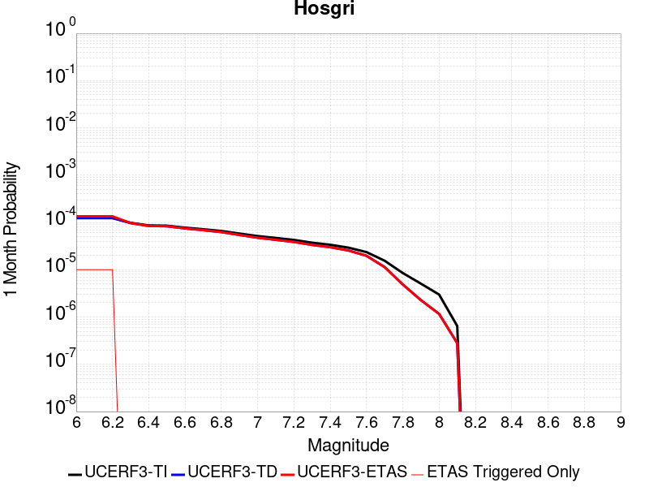 |  |  |

| Magnitude | 1 wk TI Prob | 1 wk TD Prob | 1 wk ETAS Prob | 1 wk ETAS/TD Gain | 1 wk ETAS Triggered Only | 1 mo TI Prob | 1 mo TD Prob | 1 mo ETAS Prob | 1 mo ETAS/TD Gain | 1 mo ETAS Triggered Only | 1 yr TI Prob | 1 yr TD Prob | 1 yr ETAS Prob | 1 yr ETAS/TD Gain | 1 yr ETAS Triggered Only | 10 yr TI Prob | 10 yr TD Prob | 10 yr ETAS Prob | 10 yr ETAS/TD Gain | 10 yr ETAS Triggered Only |
|-----|-----|-----|-----|-----|-----|-----|-----|-----|-----|-----|-----|-----|-----|-----|-----|-----|-----|-----|-----|-----|
| 6.0 | 2.883978E-5 | 2.9128816E-5 | 2.9128816E-5 | 1.0 | 0.0 | 1.235932E-4 | 1.2483196E-4 | 1.3483071E-4 | 1.0800977 | 1.0E-5 | 0.0015037085 | 0.0015187968 | 0.0015287816 | 1.0065742 | 1.0E-5 | 0.01493574 | 0.015087956 | 0.015097804 | 1.0006528 | 1.0E-5 |
| 6.1 | 2.883978E-5 | 2.9128816E-5 | 2.9128816E-5 | 1.0 | 0.0 | 1.235932E-4 | 1.2483196E-4 | 1.3483071E-4 | 1.0800977 | 1.0E-5 | 0.0015037085 | 0.0015187968 | 0.0015287816 | 1.0065742 | 1.0E-5 | 0.01493574 | 0.015087956 | 0.015097804 | 1.0006528 | 1.0E-5 |
| 6.2 | 2.883978E-5 | 2.9128816E-5 | 2.9128816E-5 | 1.0 | 0.0 | 1.235932E-4 | 1.2483196E-4 | 1.3483071E-4 | 1.0800977 | 1.0E-5 | 0.0015037085 | 0.0015187968 | 0.0015287816 | 1.0065742 | 1.0E-5 | 0.01493574 | 0.015087956 | 0.015097804 | 1.0006528 | 1.0E-5 |
| 6.3 | 2.2914428E-5 | 2.2642287E-5 | 2.2642287E-5 | 1.0 | 0.0 | 9.8200995E-5 | 9.703479E-5 | 9.703479E-5 | 1.0 | 0.0 | 0.0011949413 | 0.0011807632 | 0.0011807632 | 1.0 | 0.0 | 0.011885363 | 0.011746307 | 0.011746307 | 1.0 | 0.0 |
| 6.4 | 2.0195741E-5 | 1.9696845E-5 | 1.9696845E-5 | 1.0 | 0.0 | 8.65503E-5 | 8.441233E-5 | 8.441233E-5 | 1.0 | 0.0 | 0.0010532405 | 0.0010272375 | 0.0010272375 | 1.0 | 0.0 | 0.010482626 | 0.010225951 | 0.010225951 | 1.0 | 0.0 |
| 6.5 | 1.9924333E-5 | 1.9409264E-5 | 1.9409264E-5 | 1.0 | 0.0 | 8.53872E-5 | 8.317992E-5 | 8.317992E-5 | 1.0 | 0.0 | 0.0010390934 | 0.0010122469 | 0.0010122469 | 1.0 | 0.0 | 0.010342481 | 0.010077409 | 0.010077409 | 1.0 | 0.0 |
| 6.6 | 1.809694E-5 | 1.7458564E-5 | 1.7458564E-5 | 1.0 | 0.0 | 7.7556004E-5 | 7.482028E-5 | 7.482028E-5 | 1.0 | 0.0 | 9.438353E-4 | 9.105575E-4 | 9.105575E-4 | 1.0 | 0.0 | 0.009398366 | 0.00906922 | 0.00906922 | 1.0 | 0.0 |
| 6.7 | 1.675989E-5 | 1.6043017E-5 | 1.6043017E-5 | 1.0 | 0.0 | 7.182612E-5 | 6.875398E-5 | 6.875398E-5 | 1.0 | 0.0 | 8.7413215E-4 | 8.3675934E-4 | 8.3675934E-4 | 1.0 | 0.0 | 0.008707017 | 0.008337004 | 0.008337004 | 1.0 | 0.0 |
| 6.8 | 1.5401129E-5 | 1.4614321E-5 | 1.4614321E-5 | 1.0 | 0.0 | 6.6003166E-5 | 6.2631305E-5 | 6.2631305E-5 | 1.0 | 0.0 | 8.032922E-4 | 7.6227024E-4 | 7.6227024E-4 | 1.0 | 0.0 | 0.008003947 | 0.0075974306 | 0.0075974306 | 1.0 | 0.0 |
| 6.9 | 1.356559E-5 | 1.269019E-5 | 1.269019E-5 | 1.0 | 0.0 | 5.8136946E-5 | 5.4385397E-5 | 5.4385397E-5 | 1.0 | 0.0 | 7.0758746E-4 | 6.619415E-4 | 6.619415E-4 | 1.0 | 0.0 | 0.007053386 | 0.0066005136 | 0.0066005136 | 1.0 | 0.0 |
| 7.0 | 1.2030819E-5 | 1.1096171E-5 | 1.1096171E-5 | 1.0 | 0.0 | 5.155963E-5 | 4.755415E-5 | 4.755415E-5 | 1.0 | 0.0 | 6.275577E-4 | 5.788181E-4 | 5.788181E-4 | 1.0 | 0.0 | 0.006257884 | 0.005773876 | 0.005773876 | 1.0 | 0.0 |
| 7.1 | 1.0972698E-5 | 1.0022381E-5 | 1.0022381E-5 | 1.0 | 0.0 | 4.7025E-5 | 4.2952353E-5 | 4.2952353E-5 | 1.0 | 0.0 | 5.72379E-4 | 5.228195E-4 | 5.228195E-4 | 1.0 | 0.0 | 0.0057090693 | 0.005216657 | 0.005216657 | 1.0 | 0.0 |
| 7.2 | 9.961926E-6 | 9.0349395E-6 | 9.0349395E-6 | 1.0 | 0.0 | 4.2693267E-5 | 3.8720595E-5 | 3.8720595E-5 | 1.0 | 0.0 | 5.1966653E-4 | 4.713213E-4 | 4.713213E-4 | 1.0 | 0.0 | 0.00518453 | 0.004703974 | 0.004703974 | 1.0 | 0.0 |
| 7.3 | 8.700929E-6 | 7.828288E-6 | 7.828288E-6 | 1.0 | 0.0 | 3.7289166E-5 | 3.3549375E-5 | 3.3549375E-5 | 1.0 | 0.0 | 4.53901E-4 | 4.083871E-4 | 4.083871E-4 | 1.0 | 0.0 | 0.00452975 | 0.004077116 | 0.004077116 | 1.0 | 0.0 |
| 7.4 | 7.866285E-6 | 6.9989205E-6 | 6.9989205E-6 | 1.0 | 0.0 | 3.3712215E-5 | 2.999503E-5 | 2.999503E-5 | 1.0 | 0.0 | 4.103689E-4 | 3.651283E-4 | 3.651283E-4 | 1.0 | 0.0 | 0.004096119 | 0.0036460315 | 0.0036460315 | 1.0 | 0.0 |
| 7.5 | 6.8381305E-6 | 5.959869E-6 | 5.959869E-6 | 1.0 | 0.0 | 2.9305946E-5 | 2.5542047E-5 | 2.5542047E-5 | 1.0 | 0.0 | 3.5674145E-4 | 3.1093007E-4 | 3.1093007E-4 | 1.0 | 0.0 | 0.0035616932 | 0.0031056956 | 0.0031056956 | 1.0 | 0.0 |
| 7.6 | 5.503376E-6 | 4.595407E-6 | 4.595407E-6 | 1.0 | 0.0 | 2.3585684E-5 | 1.9694453E-5 | 1.9694453E-5 | 1.0 | 0.0 | 2.8711787E-4 | 2.3975359E-4 | 2.3975359E-4 | 1.0 | 0.0 | 0.002867472 | 0.0023956925 | 0.0023956925 | 1.0 | 0.0 |
| 7.7 | 3.6144982E-6 | 2.6523571E-6 | 2.6523571E-6 | 1.0 | 0.0 | 1.5490614E-5 | 1.1367195E-5 | 1.1367195E-5 | 1.0 | 0.0 | 1.8858191E-4 | 1.3838682E-4 | 1.3838682E-4 | 1.0 | 0.0 | 0.0018842196 | 0.0013837479 | 0.0013837479 | 1.0 | 0.0 |
| 7.8 | 1.9853494E-6 | 1.1362197E-6 | 1.1362197E-6 | 1.0 | 0.0 | 8.508612E-6 | 4.8695038E-6 | 4.8695038E-6 | 1.0 | 0.0 | 1.0358743E-4 | 5.9284594E-5 | 5.9284594E-5 | 1.0 | 0.0 | 0.0010353916 | 5.9342675E-4 | 5.9342675E-4 | 1.0 | 0.0 |
| 7.9 | 1.1818757E-6 | 5.2958796E-7 | 5.2958796E-7 | 1.0 | 0.0 | 5.0651715E-6 | 2.2696604E-6 | 2.2696604E-6 | 1.0 | 0.0 | 6.1666724E-5 | 2.7632766E-5 | 2.7632766E-5 | 1.0 | 0.0 | 6.1649614E-4 | 2.7697708E-4 | 2.7697708E-4 | 1.0 | 0.0 |
| 8.0 | 6.962958E-7 | 2.714428E-7 | 2.714428E-7 | 1.0 | 0.0 | 2.9841215E-6 | 1.1633257E-6 | 1.1633257E-6 | 1.0 | 0.0 | 3.6331072E-5 | 1.4163398E-5 | 1.4163398E-5 | 1.0 | 0.0 | 3.6325134E-4 | 1.4218807E-4 | 1.4218807E-4 | 1.0 | 0.0 |
| 8.1 | 1.5033264E-7 | 6.528495E-8 | 6.528495E-8 | 1.0 | 0.0 | 6.442826E-7 | 2.7979263E-7 | 2.7979263E-7 | 1.0 | 0.0 | 7.844113E-6 | 3.4064701E-6 | 3.4064701E-6 | 1.0 | 0.0 | 7.843835E-5 | 3.408197E-5 | 3.408197E-5 | 1.0 | 0.0 |

## Johnson Valley (No) 2011 rev
*[(top)](#table-of-contents)*

| 1 Week | 1 Month | 1 Year | 10 Year |
|-----|-----|-----|-----|
|  |  |  |  |

| Magnitude | 1 wk TI Prob | 1 wk TD Prob | 1 wk ETAS Prob | 1 wk ETAS/TD Gain | 1 wk ETAS Triggered Only | 1 mo TI Prob | 1 mo TD Prob | 1 mo ETAS Prob | 1 mo ETAS/TD Gain | 1 mo ETAS Triggered Only | 1 yr TI Prob | 1 yr TD Prob | 1 yr ETAS Prob | 1 yr ETAS/TD Gain | 1 yr ETAS Triggered Only | 10 yr TI Prob | 10 yr TD Prob | 10 yr ETAS Prob | 10 yr ETAS/TD Gain | 10 yr ETAS Triggered Only |
|-----|-----|-----|-----|-----|-----|-----|-----|-----|-----|-----|-----|-----|-----|-----|-----|-----|-----|-----|-----|-----|
| 6.0 | 2.577707E-5 | 1.2901344E-5 | 1.2901344E-5 | 1.0 | 0.0 | 1.1046848E-4 | 5.5290526E-5 | 5.5290526E-5 | 1.0 | 0.0 | 0.0013441239 | 6.7299395E-4 | 6.7299395E-4 | 1.0 | 0.0 | 0.013360229 | 0.0067134677 | 0.0067234007 | 1.0014795 | 1.0E-5 |
| 6.1 | 2.577707E-5 | 1.2901344E-5 | 1.2901344E-5 | 1.0 | 0.0 | 1.1046848E-4 | 5.5290526E-5 | 5.5290526E-5 | 1.0 | 0.0 | 0.0013441239 | 6.7299395E-4 | 6.7299395E-4 | 1.0 | 0.0 | 0.013360229 | 0.0067134677 | 0.0067234007 | 1.0014795 | 1.0E-5 |
| 6.2 | 2.577707E-5 | 1.2901344E-5 | 1.2901344E-5 | 1.0 | 0.0 | 1.1046848E-4 | 5.5290526E-5 | 5.5290526E-5 | 1.0 | 0.0 | 0.0013441239 | 6.7299395E-4 | 6.7299395E-4 | 1.0 | 0.0 | 0.013360229 | 0.0067134677 | 0.0067234007 | 1.0014795 | 1.0E-5 |
| 6.3 | 2.577707E-5 | 1.2901344E-5 | 1.2901344E-5 | 1.0 | 0.0 | 1.1046848E-4 | 5.5290526E-5 | 5.5290526E-5 | 1.0 | 0.0 | 0.0013441239 | 6.7299395E-4 | 6.7299395E-4 | 1.0 | 0.0 | 0.013360229 | 0.0067134677 | 0.0067234007 | 1.0014795 | 1.0E-5 |
| 6.4 | 1.5296591E-5 | 7.5370353E-6 | 7.5370353E-6 | 1.0 | 0.0 | 6.555518E-5 | 3.2301286E-5 | 3.2301286E-5 | 1.0 | 0.0 | 7.97842E-4 | 3.9321595E-4 | 3.9321595E-4 | 1.0 | 0.0 | 0.007949836 | 0.003927043 | 0.003937004 | 1.0025364 | 1.0E-5 |
| 6.5 | 1.5296591E-5 | 7.5370353E-6 | 7.5370353E-6 | 1.0 | 0.0 | 6.555518E-5 | 3.2301286E-5 | 3.2301286E-5 | 1.0 | 0.0 | 7.97842E-4 | 3.9321595E-4 | 3.9321595E-4 | 1.0 | 0.0 | 0.007949836 | 0.003927043 | 0.003937004 | 1.0025364 | 1.0E-5 |
| 6.6 | 1.3289383E-5 | 5.9919753E-6 | 5.9919753E-6 | 1.0 | 0.0 | 5.6953253E-5 | 2.5679738E-5 | 2.5679738E-5 | 1.0 | 0.0 | 6.9318525E-4 | 3.1262293E-4 | 3.1262293E-4 | 1.0 | 0.0 | 0.0069102696 | 0.003123496 | 0.0031334646 | 1.0031916 | 1.0E-5 |
| 6.7 | 1.3289383E-5 | 5.9919753E-6 | 5.9919753E-6 | 1.0 | 0.0 | 5.6953253E-5 | 2.5679738E-5 | 2.5679738E-5 | 1.0 | 0.0 | 6.9318525E-4 | 3.1262293E-4 | 3.1262293E-4 | 1.0 | 0.0 | 0.0069102696 | 0.003123496 | 0.0031334646 | 1.0031916 | 1.0E-5 |
| 6.8 | 8.330789E-6 | 2.9214602E-6 | 2.9214602E-6 | 1.0 | 0.0 | 3.570289E-5 | 1.2520515E-5 | 1.2520515E-5 | 1.0 | 0.0 | 4.34596E-4 | 1.5243233E-4 | 1.5243233E-4 | 1.0 | 0.0 | 0.0043374705 | 0.0015238377 | 0.0015338224 | 1.0065523 | 1.0E-5 |
| 6.9 | 7.2359003E-6 | 2.3014725E-6 | 2.3014725E-6 | 1.0 | 0.0 | 3.1010633E-5 | 9.863446E-6 | 9.863446E-6 | 1.0 | 0.0 | 3.7748902E-4 | 1.2008617E-4 | 1.2008617E-4 | 1.0 | 0.0 | 0.0037684843 | 0.0012007357 | 0.0012107238 | 1.0083182 | 1.0E-5 |
| 7.0 | 6.5149957E-6 | 2.088642E-6 | 2.088642E-6 | 1.0 | 0.0 | 2.792111E-5 | 8.951322E-6 | 8.951322E-6 | 1.0 | 0.0 | 3.398865E-4 | 1.089822E-4 | 1.089822E-4 | 1.0 | 0.0 | 0.003393671 | 0.0010898075 | 0.0010997965 | 1.0091659 | 1.0E-5 |
| 7.1 | 1.1662233E-6 | 2.8795448E-8 | 2.8795448E-8 | 1.0 | 0.0 | 4.9980904E-6 | 1.2340907E-7 | 1.2340907E-7 | 1.0 | 0.0 | 6.0850052E-5 | 1.5025045E-6 | 1.5025045E-6 | 1.0 | 0.0 | 6.083339E-4 | 1.5024959E-5 | 1.5024959E-5 | 1.0 | 0.0 |
| 7.2 | 5.413881E-7 | 2.8795448E-8 | 2.8795448E-8 | 1.0 | 0.0 | 2.3202326E-6 | 1.2340907E-7 | 1.2340907E-7 | 1.0 | 0.0 | 2.8248465E-5 | 1.5025045E-6 | 1.5025045E-6 | 1.0 | 0.0 | 2.8244875E-4 | 1.5024959E-5 | 1.5024959E-5 | 1.0 | 0.0 |
| 7.3 | 5.076821E-7 | 2.8795448E-8 | 2.8795448E-8 | 1.0 | 0.0 | 2.1757785E-6 | 1.2340905E-7 | 1.2340905E-7 | 1.0 | 0.0 | 2.648978E-5 | 1.5025045E-6 | 1.5025045E-6 | 1.0 | 0.0 | 2.6486625E-4 | 1.5024959E-5 | 1.5024959E-5 | 1.0 | 0.0 |
| 7.4 | 4.7568687E-7 | 2.8777395E-8 | 2.8777395E-8 | 1.0 | 0.0 | 2.0386565E-6 | 1.2333169E-7 | 1.2333169E-7 | 1.0 | 0.0 | 2.482036E-5 | 1.5015625E-6 | 1.5015625E-6 | 1.0 | 0.0 | 2.4817587E-4 | 1.5015539E-5 | 1.5015539E-5 | 1.0 | 0.0 |
| 7.5 | 3.435626E-7 | 2.5352403E-8 | 2.5352403E-8 | 1.0 | 0.0 | 1.4724103E-6 | 1.0865315E-7 | 1.0865315E-7 | 1.0 | 0.0 | 1.7926448E-5 | 1.3228514E-6 | 1.3228514E-6 | 1.0 | 0.0 | 1.7925001E-4 | 1.3228451E-5 | 1.3228451E-5 | 1.0 | 0.0 |

## Hayward (No) 2011 CFM
*[(top)](#table-of-contents)*

| 1 Week | 1 Month | 1 Year | 10 Year |
|-----|-----|-----|-----|
|  |  |  |  |

| Magnitude | 1 wk TI Prob | 1 wk TD Prob | 1 wk ETAS Prob | 1 wk ETAS/TD Gain | 1 wk ETAS Triggered Only | 1 mo TI Prob | 1 mo TD Prob | 1 mo ETAS Prob | 1 mo ETAS/TD Gain | 1 mo ETAS Triggered Only | 1 yr TI Prob | 1 yr TD Prob | 1 yr ETAS Prob | 1 yr ETAS/TD Gain | 1 yr ETAS Triggered Only | 10 yr TI Prob | 10 yr TD Prob | 10 yr ETAS Prob | 10 yr ETAS/TD Gain | 10 yr ETAS Triggered Only |
|-----|-----|-----|-----|-----|-----|-----|-----|-----|-----|-----|-----|-----|-----|-----|-----|-----|-----|-----|-----|-----|
| 6.0 | 9.3068506E-5 | 1.7397928E-4 | 1.7397928E-4 | 1.0 | 0.0 | 3.9880406E-4 | 7.454108E-4 | 7.454108E-4 | 1.0 | 0.0 | 0.0048446343 | 0.009037494 | 0.009047403 | 1.0010965 | 1.0E-5 | 0.047403704 | 0.086402565 | 0.0864117 | 1.0001057 | 1.0E-5 |
| 6.1 | 9.055486E-5 | 1.6949074E-4 | 1.6949074E-4 | 1.0 | 0.0 | 3.880345E-4 | 7.2618667E-4 | 7.2618667E-4 | 1.0 | 0.0 | 0.0047140904 | 0.008805556 | 0.008815468 | 1.0011257 | 1.0E-5 | 0.046153355 | 0.08430039 | 0.08430955 | 1.0001086 | 1.0E-5 |
| 6.2 | 9.006742E-5 | 1.686967E-4 | 1.686967E-4 | 1.0 | 0.0 | 3.859461E-4 | 7.2278595E-4 | 7.2278595E-4 | 1.0 | 0.0 | 0.0046887742 | 0.008764519 | 0.008774432 | 1.0011309 | 1.0E-5 | 0.0459107 | 0.083924614 | 0.08393377 | 1.0001092 | 1.0E-5 |
| 6.3 | 8.8336754E-5 | 1.654921E-4 | 1.654921E-4 | 1.0 | 0.0 | 3.7853114E-4 | 7.090599E-4 | 7.090599E-4 | 1.0 | 0.0 | 0.004598882 | 0.00859879 | 0.0086087035 | 1.001153 | 1.0E-5 | 0.04504866 | 0.08241665 | 0.08242583 | 1.0001113 | 1.0E-5 |
| 6.4 | 8.526157E-5 | 1.597622E-4 | 1.597622E-4 | 1.0 | 0.0 | 3.6535555E-4 | 6.8451616E-4 | 6.8451616E-4 | 1.0 | 0.0 | 0.0044391346 | 0.008302296 | 0.008312213 | 1.0011945 | 1.0E-5 | 0.043514993 | 0.07969951 | 0.07970871 | 1.0001155 | 1.0E-5 |
| 6.5 | 8.152396E-5 | 1.5308615E-4 | 1.5308615E-4 | 1.0 | 0.0 | 3.493416E-4 | 6.559192E-4 | 6.559192E-4 | 1.0 | 0.0 | 0.0042449418 | 0.007956725 | 0.007966645 | 1.0012468 | 1.0E-5 | 0.04164765 | 0.076519914 | 0.07652915 | 1.0001206 | 1.0E-5 |
| 6.6 | 7.987405E-5 | 1.5012817E-4 | 1.5012817E-4 | 1.0 | 0.0 | 3.4227243E-4 | 6.4324844E-4 | 6.4324844E-4 | 1.0 | 0.0 | 0.0041592065 | 0.0078035854 | 0.007813508 | 1.0012715 | 1.0E-5 | 0.04082218 | 0.07511259 | 0.075121835 | 1.0001231 | 1.0E-5 |
| 6.7 | 7.777665E-5 | 1.4652064E-4 | 1.4652064E-4 | 1.0 | 0.0 | 3.332859E-4 | 6.277952E-4 | 6.277952E-4 | 1.0 | 0.0 | 0.004050208 | 0.007616774 | 0.0076266984 | 1.0013028 | 1.0E-5 | 0.039771806 | 0.07338915 | 0.07339842 | 1.0001262 | 1.0E-5 |
| 6.8 | 7.3284005E-5 | 1.3802624E-4 | 1.3802624E-4 | 1.0 | 0.0 | 3.140365E-4 | 5.9140753E-4 | 5.9140753E-4 | 1.0 | 0.0 | 0.0038166929 | 0.007176752 | 0.0071866806 | 1.0013834 | 1.0E-5 | 0.037518036 | 0.069302484 | 0.06931179 | 1.0001343 | 1.0E-5 |
| 6.9 | 6.458263E-5 | 1.2133129E-4 | 1.2133129E-4 | 1.0 | 0.0 | 2.7675333E-4 | 5.198881E-4 | 5.198881E-4 | 1.0 | 0.0 | 0.0033642664 | 0.0063113687 | 0.006321306 | 1.0015744 | 1.0E-5 | 0.033137884 | 0.06123086 | 0.06124025 | 1.0001533 | 1.0E-5 |
| 7.0 | 5.3853604E-5 | 1.0026534E-4 | 1.0026534E-4 | 1.0 | 0.0 | 2.3078074E-4 | 4.2963814E-4 | 4.2963814E-4 | 1.0 | 0.0 | 0.0028061352 | 0.005218363 | 0.005228311 | 1.0019063 | 1.0E-5 | 0.027709642 | 0.050963037 | 0.050972525 | 1.0001862 | 1.0E-5 |
| 7.1 | 4.4308683E-5 | 8.171937E-5 | 8.171937E-5 | 1.0 | 0.0 | 1.8988053E-4 | 3.5017906E-4 | 3.5017906E-4 | 1.0 | 0.0 | 0.0023093442 | 0.004255137 | 0.0042650946 | 1.0023401 | 1.0E-5 | 0.022854926 | 0.041829627 | 0.04183921 | 1.0002291 | 1.0E-5 |
| 7.2 | 3.295973E-5 | 6.0782906E-5 | 6.0782906E-5 | 1.0 | 0.0 | 1.4124835E-4 | 2.604723E-4 | 2.604723E-4 | 1.0 | 0.0 | 0.0017183421 | 0.0031666614 | 0.0031766298 | 1.0031478 | 1.0E-5 | 0.017051157 | 0.031374134 | 0.03138382 | 1.0003088 | 1.0E-5 |
| 7.3 | 2.452256E-5 | 4.51901E-5 | 4.51901E-5 | 1.0 | 0.0 | 1.05092455E-4 | 1.9365756E-4 | 1.9365756E-4 | 1.0 | 0.0 | 0.0012787496 | 0.002355245 | 0.0023652215 | 1.0042359 | 1.0E-5 | 0.0127141625 | 0.023445245 | 0.02345501 | 1.0004165 | 1.0E-5 |
| 7.4 | 1.8829967E-5 | 3.4610835E-5 | 3.4610835E-5 | 1.0 | 0.0 | 8.069736E-5 | 1.4832379E-4 | 1.4832379E-4 | 1.0 | 0.0 | 9.820475E-4 | 0.0018043561 | 0.0018043561 | 1.0 | 0.0 | 0.009777189 | 0.018022932 | 0.018022932 | 1.0 | 0.0 |
| 7.5 | 1.26374125E-5 | 2.2925326E-5 | 2.2925326E-5 | 1.0 | 0.0 | 5.4159216E-5 | 9.824773E-5 | 9.824773E-5 | 1.0 | 0.0 | 6.5918895E-4 | 0.0011955155 | 0.0011955155 | 1.0 | 0.0 | 0.00657237 | 0.011989905 | 0.011989905 | 1.0 | 0.0 |
| 7.6 | 4.666429E-6 | 8.480926E-6 | 8.480926E-6 | 1.0 | 0.0 | 1.9998828E-5 | 3.6346326E-5 | 3.6346326E-5 | 1.0 | 0.0 | 2.4345852E-4 | 4.424279E-4 | 4.424279E-4 | 1.0 | 0.0 | 0.0024319198 | 0.0044588465 | 0.0044588465 | 1.0 | 0.0 |
| 7.7 | 3.8399318E-7 | 7.13742E-7 | 7.13742E-7 | 1.0 | 0.0 | 1.6456839E-6 | 3.0588906E-6 | 3.0588906E-6 | 1.0 | 0.0 | 2.003602E-5 | 3.7241356E-5 | 3.7241356E-5 | 1.0 | 0.0 | 2.0034213E-4 | 3.863124E-4 | 3.863124E-4 | 1.0 | 0.0 |
| 7.8 | 2.5637698E-7 | 5.3692474E-7 | 5.3692474E-7 | 1.0 | 0.0 | 1.098758E-6 | 2.301104E-6 | 2.301104E-6 | 1.0 | 0.0 | 1.3377297E-5 | 2.8015582E-5 | 2.8015582E-5 | 1.0 | 0.0 | 1.3376492E-4 | 2.9259408E-4 | 2.9259408E-4 | 1.0 | 0.0 |
| 7.9 | 1.7141245E-7 | 3.7311867E-7 | 3.7311867E-7 | 1.0 | 0.0 | 7.3462456E-7 | 1.5990789E-6 | 1.5990789E-6 | 1.0 | 0.0 | 8.944017E-6 | 1.9468613E-5 | 1.9468613E-5 | 1.0 | 0.0 | 8.943657E-5 | 2.0255927E-4 | 2.0255927E-4 | 1.0 | 0.0 |
| 8.0 | 1.1808895E-7 | 2.7525246E-7 | 2.7525246E-7 | 1.0 | 0.0 | 5.060954E-7 | 1.1796528E-6 | 1.1796528E-6 | 1.0 | 0.0 | 6.161694E-6 | 1.4362179E-5 | 1.4362179E-5 | 1.0 | 0.0 | 6.161523E-5 | 1.482392E-4 | 1.482392E-4 | 1.0 | 0.0 |
| 8.1 | 5.138535E-8 | 1.1236262E-7 | 1.1236262E-7 | 1.0 | 0.0 | 2.2022292E-7 | 4.8155397E-7 | 4.8155397E-7 | 1.0 | 0.0 | 2.6812106E-6 | 5.8629043E-6 | 5.8629043E-6 | 1.0 | 0.0 | 2.6811784E-5 | 6.018857E-5 | 6.018857E-5 | 1.0 | 0.0 |

