# Parent Section Magnitude-Probability Distributions

Only fault sections with at least one triggered aftershock are plotted. Sections are sorted by total supraseismogenic trigger rate (decreasing)

## Table Of Contents

* [Garlock (Central)](#garlock-central)
* [Tank Canyon](#tank-canyon)
* [Little Lake](#little-lake)
* [Owl Lake](#owl-lake)
* [Airport Lake](#airport-lake)
* [Panamint Valley](#panamint-valley)
* [Garlock (East)](#garlock-east)
* [Hunter Mountain-Saline Valley](#hunter-mountain-saline-valley)
* [Ash Hill](#ash-hill)
* [Blackwater](#blackwater)
* [Garlock (West)](#garlock-west)
* [McLean Lake](#mclean-lake)
* [Gravel Hills-Harper Lk](#gravel-hills-harper-lk)
* [Goldstone Lake](#goldstone-lake)
* [So Sierra Nevada](#so-sierra-nevada)
* [San Andreas (Mojave S)](#san-andreas-mojave-s)
* [San Andreas (Mojave N)](#san-andreas-mojave-n)
* [Death Valley (So)](#death-valley-so)
* [Coyote Canyon](#coyote-canyon)
* [Nelson Lake](#nelson-lake)
* [Towne Pass](#towne-pass)
* [Lenwood-Lockhart-Old Woman Springs](#lenwood-lockhart-old-woman-springs)
* [San Andreas (San Bernardino N)](#san-andreas-san-bernardino-n)
* [Paradise](#paradise)
* [Bicycle Lake](#bicycle-lake)
* [Garlic Springs](#garlic-springs)
* [San Andreas (San Bernardino S)](#san-andreas-san-bernardino-s)
* [Death Valley (Black Mtns Frontal)](#death-valley-black-mtns-frontal)
* [Coyote Lake](#coyote-lake)
* [San Andreas (Big Bend)](#san-andreas-big-bend)
* [Helendale-So Lockhart](#helendale-so-lockhart)
* [San Andreas (Parkfield)](#san-andreas-parkfield)
* [Sierra Nevada  (No Extension)](#sierra-nevada--no-extension)
* [Death Valley (No)](#death-valley-no)
* [Red Pass](#red-pass)
* [San Andreas (San Gorgonio Pass-Garnet HIll)](#san-andreas-san-gorgonio-pass-garnet-hill)
* [Calico-Hidalgo](#calico-hidalgo)
* [Elsinore (Glen Ivy) rev](#elsinore-glen-ivy-rev)
* [San Andreas (Creeping Section) 2011 CFM](#san-andreas-creeping-section-2011-cfm)
* [Baker](#baker)
* [Death Valley (Fish Lake Valley)](#death-valley-fish-lake-valley)
* [San Andreas (Carrizo) rev](#san-andreas-carrizo-rev)
* [Cady](#cady)
* [Scodie Lineament](#scodie-lineament)
* [San Andreas (Cholame) rev](#san-andreas-cholame-rev)
* [San Jacinto (San Bernardino)](#san-jacinto-san-bernardino)
* [White Wolf (Extension)](#white-wolf-extension)
* [San Andreas (Coachella) rev](#san-andreas-coachella-rev)
* [Lake Isabella (Seismicity)](#lake-isabella-seismicity)
* [White Mountains](#white-mountains)
* [Owens Valley](#owens-valley)
* [Manix-Afton Hills](#manix-afton-hills)
* [Santa Rosa Island](#santa-rosa-island)
* [Cleghorn Pass](#cleghorn-pass)
* [San Andreas (North Branch Mill Creek)](#san-andreas-north-branch-mill-creek)
* [Cleghorn Lake](#cleghorn-lake)
* [San Jacinto (San Jacinto Valley) rev](#san-jacinto-san-jacinto-valley-rev)
* [Independence rev 2011](#independence-rev-2011)
* [Pinto Mtn](#pinto-mtn)
* [Brawley (Seismic Zone) alt 1](#brawley-seismic-zone-alt-1)
* [Calaveras (So) - Paicines extension 2011 CFM](#calaveras-so---paicines-extension-2011-cfm)
* [Elysian Park (Upper)](#elysian-park-upper)
* [Mission Creek](#mission-creek)
* [Lost Hills](#lost-hills)
* [Kern Canyon (North Kern) 2011](#kern-canyon-north-kern-2011)
* [San Jacinto (Stepovers Combined)](#san-jacinto-stepovers-combined)
* [Rose Canyon](#rose-canyon)
* [Tin Mountain](#tin-mountain)
* [Chino alt 1](#chino-alt-1)
* [Ludlow](#ludlow)
* [Pleito](#pleito)
* [Imperial](#imperial)
* [San Jacinto (Lytle Creek connector)](#san-jacinto-lytle-creek-connector)
* [Calaveras (So) 2011 CFM](#calaveras-so-2011-cfm)
* [Channel Islands Thrust](#channel-islands-thrust)
* [San Jacinto (Anza) rev](#san-jacinto-anza-rev)
* [Big Pine (Central)](#big-pine-central)
* [Raymond](#raymond)
* [Ventura-Pitas Point](#ventura-pitas-point)
* [Big Pine (East)](#big-pine-east)
* [Hollywood](#hollywood)
* [Palos Verdes](#palos-verdes)
* [Santa Ynez (East)](#santa-ynez-east)
* [Santa Cruz Island](#santa-cruz-island)
* [Kern Canyon (South Kern) 2011](#kern-canyon-south-kern-2011)
* [Camp Rock 2011](#camp-rock-2011)
* [Deep Springs](#deep-springs)
* [Bullion Mountains](#bullion-mountains)
* [Blue Cut](#blue-cut)
* [Pisgah-Bullion Mtn-Mesquite Lk](#pisgah-bullion-mtn-mesquite-lk)
* [Coronado Bank alt1](#coronado-bank-alt1)
* [San Pedro Basin](#san-pedro-basin)
* [Great Valley 03a Dunnigan Hills](#great-valley-03a-dunnigan-hills)
* [Channel Islands Western Deep Ramp](#channel-islands-western-deep-ramp)
* [Dry Mountain](#dry-mountain)
* [Santa Monica alt 1](#santa-monica-alt-1)
* [Calaveras (Central) 2011 CFM](#calaveras-central-2011-cfm)
* [Santa Ynez (West)](#santa-ynez-west)
* [Sheephole](#sheephole)
* [Newport-Inglewood (Offshore)](#newport-inglewood-offshore)
* [Owens Valley Keough Hot Springs](#owens-valley-keough-hot-springs)
* [Santa Cruz Catalina Ridge alt1](#santa-cruz-catalina-ridge-alt1)
* [San Juan](#san-juan)
* [San Jacinto (Coyote Creek)](#san-jacinto-coyote-creek)
* [Mission Ridge-Arroyo Parida-Santa Ana](#mission-ridge-arroyo-parida-santa-ana)
* [Cucamonga](#cucamonga)
* [Sierra Madre](#sierra-madre)
* [Great Valley 07 (Orestimba)](#great-valley-07-orestimba)
* [Malibu Coast alt 1](#malibu-coast-alt-1)
* [Hunting Creek - Bartlett Springs connector 2011](#hunting-creek---bartlett-springs-connector-2011)
* [White Wolf](#white-wolf)
* [Oceanic - West Huasna](#oceanic---west-huasna)
* [Puente Hills](#puente-hills)
* [Santa Ynez River](#santa-ynez-river)
* [San Jacinto (Borrego)](#san-jacinto-borrego)
* [San Diego Trough north alt1](#san-diego-trough-north-alt1)
* [Hunting Creek - Berryessa 2011 CFM](#hunting-creek---berryessa-2011-cfm)
* [Hosgri (Extension)](#hosgri-extension)
* [San Jacinto (Clark) rev](#san-jacinto-clark-rev)
* [Pine Mtn](#pine-mtn)
* [Whittier alt 1](#whittier-alt-1)
* [Simi-Santa Rosa](#simi-santa-rosa)
* [Verdugo](#verdugo)
* [Santa Susana East (connector)](#santa-susana-east-connector)
* [Kern Canyon (Lake Isabella) 2011](#kern-canyon-lake-isabella-2011)
* [San Jacinto (Superstition Mtn)](#san-jacinto-superstition-mtn)
* [Emerson-Copper Mtn 2011](#emerson-copper-mtn-2011)
* [San Clemente](#san-clemente)
* [San Diego Trough south](#san-diego-trough-south)
* [Homestead Valley 2011](#homestead-valley-2011)
* [Rinconada 2011 CFM](#rinconada-2011-cfm)
* [Likely 2011 CFM](#likely-2011-cfm)
* [San Andreas (Offshore) 2011 CFM](#san-andreas-offshore-2011-cfm)
* [Hayward (So) 2011 CFM](#hayward-so-2011-cfm)
* [Elsinore (Temecula) rev](#elsinore-temecula-rev)
* [Big Lagoon - Bald Mtn 2011 CFM](#big-lagoon---bald-mtn-2011-cfm)
* [San Gabriel (Extension)](#san-gabriel-extension)
* [San Gabriel](#san-gabriel)
* [Round Valley](#round-valley)
* [San Andreas (Santa Cruz Mts) 2011 CFM](#san-andreas-santa-cruz-mts-2011-cfm)
* [Antelope Valley 2011](#antelope-valley-2011)
* [Greenville (So) 2011 CFM](#greenville-so-2011-cfm)
* [West Napa 2011 CFM](#west-napa-2011-cfm)
* [Great Valley 03 Mysterious Ridge](#great-valley-03-mysterious-ridge)
* [Los Alamos 2011 CFM](#los-alamos-2011-cfm)
* [Oceanside alt1](#oceanside-alt1)
* [Red Mountain](#red-mountain)
* [Honey Lake 2011 CFM](#honey-lake-2011-cfm)
* [Fish Slough 2011 CFM](#fish-slough-2011-cfm)
* [Hosgri](#hosgri)
* [Hayward (So) extension 2011 CFM](#hayward-so-extension-2011-cfm)
* [Hayward (No) 2011 CFM](#hayward-no-2011-cfm)
* [San Luis Range 2011 CFM](#san-luis-range-2011-cfm)
* [Robinson Creek](#robinson-creek)
* [Lions Head 2011 CFM](#lions-head-2011-cfm)
* [Malibu Coast (Extension) alt 1](#malibu-coast-extension-alt-1)
* [Fontana (Seismicity)](#fontana-seismicity)
* [Pittville 2011 CFM](#pittville-2011-cfm)
* [Little Salmon (Onshore)](#little-salmon-onshore)
* [Great Valley 05 Pittsburg - Kirby Hills alt1](#great-valley-05-pittsburg---kirby-hills-alt1)
* [Hilton Creek 2011 CFM](#hilton-creek-2011-cfm)
* [Newport-Inglewood alt 1](#newport-inglewood-alt-1)
* [Bennett Valley 2011 CFM](#bennett-valley-2011-cfm)
* [San Cayetano](#san-cayetano)
* [Great Valley 04b Gordon Valley](#great-valley-04b-gordon-valley)
* [Earthquake Valley (So Extension)](#earthquake-valley-so-extension)
* [Sargent 2011 CFM](#sargent-2011-cfm)
* [Mono Lake 2011 CFM](#mono-lake-2011-cfm)
* [Peralta Hills](#peralta-hills)
* [Cerro Prieto](#cerro-prieto)
* [Monterey Bay-Tularcitos](#monterey-bay-tularcitos)
* [Elsinore (Coyote Mountains)](#elsinore-coyote-mountains)
* [Cleghorn](#cleghorn)
* [East Huasna 2011 CFM](#east-huasna-2011-cfm)
* [Burnt Mtn](#burnt-mtn)
* [Great Valley 09 (Laguna Seca)](#great-valley-09-laguna-seca)
* [San Andreas (North Coast) 2011 CFM](#san-andreas-north-coast-2011-cfm)
* [Gillem - Big Crack 2011 CFM](#gillem---big-crack-2011-cfm)
* [San Gregorio (South) 2011 CFM](#san-gregorio-south-2011-cfm)
* [Rodgers Creek - Healdsburg 2011 CFM](#rodgers-creek---healdsburg-2011-cfm)
* [Great Valley 04a Trout Creek](#great-valley-04a-trout-creek)
* [Los Alamos extension](#los-alamos-extension)
* [Carson Range (Genoa)](#carson-range-genoa)
* [Anaheim](#anaheim)
* [Maacama 2011 CFM](#maacama-2011-cfm)
* [Johnson Valley (No) 2011 rev](#johnson-valley-no-2011-rev)

## Garlock (Central)
*[(top)](#table-of-contents)*

| 1 Week | 1 Month | 1 Year | 10 Year |
|-----|-----|-----|-----|
|  |  |  | 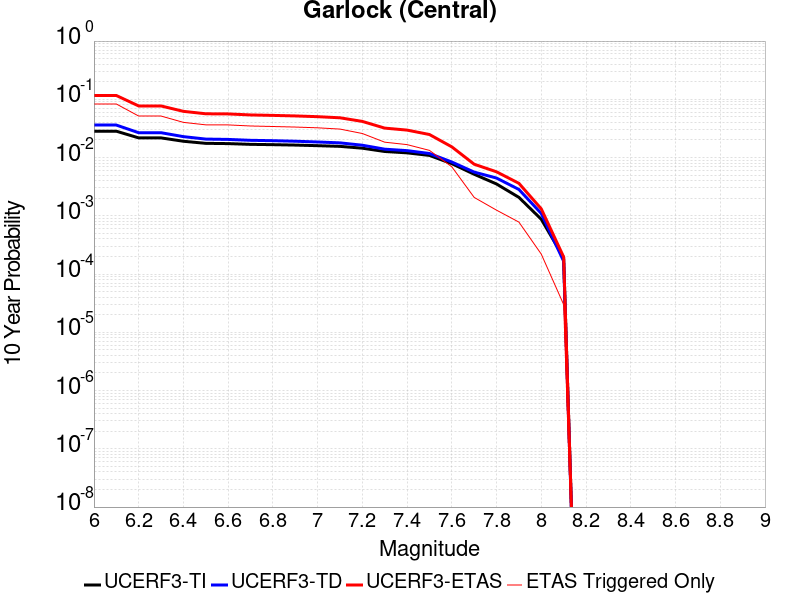 |

| Magnitude | 1 wk TI Prob | 1 wk TD Prob | 1 wk ETAS Prob | 1 wk ETAS/TD Gain | 1 wk ETAS Triggered Only | 1 mo TI Prob | 1 mo TD Prob | 1 mo ETAS Prob | 1 mo ETAS/TD Gain | 1 mo ETAS Triggered Only | 1 yr TI Prob | 1 yr TD Prob | 1 yr ETAS Prob | 1 yr ETAS/TD Gain | 1 yr ETAS Triggered Only | 10 yr TI Prob | 10 yr TD Prob | 10 yr ETAS Prob | 10 yr ETAS/TD Gain | 10 yr ETAS Triggered Only |
|-----|-----|-----|-----|-----|-----|-----|-----|-----|-----|-----|-----|-----|-----|-----|-----|-----|-----|-----|-----|-----|
| 6.0 | 5.5131142E-5 | 7.0252914E-5 | 0.009629581 | 137.0702 | 0.00956 | 2.3625491E-4 | 3.0104956E-4 | 0.022774283 | 75.64961 | 0.02248 | 0.0028726095 | 0.0036591839 | 0.056574844 | 15.461056 | 0.05311 | 0.028357591 | 0.03608289 | 0.11625188 | 3.2218006 | 0.08317 |
| 6.1 | 5.5131142E-5 | 7.0252914E-5 | 0.009629581 | 137.0702 | 0.00956 | 2.3625491E-4 | 3.0104956E-4 | 0.022774283 | 75.64961 | 0.02248 | 0.0028726095 | 0.0036591839 | 0.056574844 | 15.461056 | 0.05311 | 0.028357591 | 0.03608289 | 0.11625188 | 3.2218006 | 0.08317 |
| 6.2 | 4.216245E-5 | 5.166702E-5 | 0.006031358 | 116.73517 | 0.00598 | 1.806837E-4 | 2.2141146E-4 | 0.014168323 | 63.990917 | 0.01395 | 0.0021976046 | 0.0026923837 | 0.035473887 | 13.175642 | 0.03287 | 0.021759989 | 0.02669258 | 0.07691524 | 2.8815215 | 0.0516 |
| 6.3 | 4.216245E-5 | 5.166702E-5 | 0.006031358 | 116.73517 | 0.00598 | 1.806837E-4 | 2.2141146E-4 | 0.014168323 | 63.990917 | 0.01395 | 0.0021976046 | 0.0026923837 | 0.035473887 | 13.175642 | 0.03287 | 0.021759989 | 0.02669258 | 0.07691524 | 2.8815215 | 0.0516 |
| 6.4 | 3.6858168E-5 | 4.411584E-5 | 0.0047439085 | 107.533 | 0.0047 | 1.5795401E-4 | 1.8905434E-4 | 0.011206971 | 59.279102 | 0.01102 | 0.0019213937 | 0.0022993318 | 0.027890354 | 12.129765 | 0.02565 | 0.019048655 | 0.02285164 | 0.062133003 | 2.7189736 | 0.0402 |
| 6.5 | 3.39199E-5 | 4.0023286E-5 | 0.0041598585 | 103.93595 | 0.00412 | 1.453629E-4 | 1.7151721E-4 | 0.0099898325 | 58.243908 | 0.00982 | 0.0017683565 | 0.0020862438 | 0.025098136 | 12.030298 | 0.02306 | 0.017543508 | 0.02076252 | 0.056455728 | 2.7191172 | 0.03645 |
| 6.6 | 3.3571985E-5 | 3.947746E-5 | 0.004159315 | 105.35923 | 0.00412 | 1.4387199E-4 | 1.6917827E-4 | 0.009987517 | 59.03546 | 0.00982 | 0.0017502342 | 0.0020578213 | 0.02503045 | 12.1635685 | 0.02302 | 0.017365133 | 0.02048383 | 0.05609904 | 2.7386987 | 0.03636 |
| 6.7 | 3.2580007E-5 | 3.8093858E-5 | 0.003967944 | 104.162315 | 0.00393 | 1.3962112E-4 | 1.632493E-4 | 0.009541718 | 58.448757 | 0.00938 | 0.0016985617 | 0.0019857697 | 0.024031904 | 12.10206 | 0.02209 | 0.016856372 | 0.019776449 | 0.053927436 | 2.7268515 | 0.03484 |
| 6.8 | 3.2185937E-5 | 3.7521055E-5 | 0.003877377 | 103.3387 | 0.00384 | 1.3793244E-4 | 1.6079473E-4 | 0.00932932 | 58.02006 | 0.00917 | 0.0016780337 | 0.0019559395 | 0.023603516 | 12.06761 | 0.02169 | 0.016654192 | 0.01948324 | 0.052958082 | 2.7181354 | 0.03414 |
| 6.9 | 3.165394E-5 | 3.672561E-5 | 0.0037865879 | 103.10483 | 0.00375 | 1.3565269E-4 | 1.5738611E-4 | 0.009035989 | 57.412872 | 0.00888 | 0.0016503202 | 0.0019145131 | 0.023034003 | 12.031259 | 0.02116 | 0.01638118 | 0.01907586 | 0.051838726 | 2.717504 | 0.0334 |
| 7.0 | 3.0903822E-5 | 3.5630834E-5 | 0.003675501 | 103.15507 | 0.00364 | 1.3243823E-4 | 1.5269476E-4 | 0.008811372 | 57.705795 | 0.00866 | 0.0016112428 | 0.0018574947 | 0.022309436 | 12.010497 | 0.02049 | 0.015996104 | 0.018515008 | 0.05033475 | 2.718592 | 0.03242 |
| 7.1 | 3.0069863E-5 | 3.4397097E-5 | 0.0035242771 | 102.45856 | 0.00349 | 1.2886449E-4 | 1.4740792E-4 | 0.008316204 | 56.41626 | 0.00817 | 0.0015677959 | 0.0017932352 | 0.02127823 | 11.865834 | 0.01952 | 0.01556781 | 0.017882649 | 0.048161328 | 2.6931875 | 0.03083 |
| 7.2 | 2.7957109E-5 | 3.1286367E-5 | 0.0029411954 | 94.00885 | 0.00291 | 1.1981068E-4 | 1.3407765E-4 | 0.0068531767 | 51.11349 | 0.00672 | 0.0014577188 | 0.0016311926 | 0.017874653 | 10.958027 | 0.01627 | 0.014481937 | 0.016286217 | 0.041744728 | 2.5631938 | 0.02588 |
| 7.3 | 2.4519275E-5 | 2.6719412E-5 | 0.0020466654 | 76.59845 | 0.00202 | 1.0507837E-4 | 1.14506816E-4 | 0.0047539757 | 41.516964 | 0.00464 | 0.0012785783 | 0.0013932437 | 0.012827291 | 9.206782 | 0.01145 | 0.012712469 | 0.013930428 | 0.032044526 | 2.300326 | 0.01837 |
| 7.4 | 2.3225532E-5 | 2.5203923E-5 | 0.001845158 | 73.20916 | 0.00182 | 9.95342E-5 | 1.0801242E-4 | 0.0042975596 | 39.787647 | 0.00419 | 0.0012111551 | 0.0013142723 | 0.011590748 | 8.819138 | 0.01029 | 0.012045753 | 0.013148054 | 0.029608743 | 2.2519488 | 0.01668 |
| 7.5 | 2.097765E-5 | 2.2487986E-5 | 0.0014224565 | 63.254066 | 0.0014 | 8.9901114E-5 | 9.637359E-5 | 0.0033060643 | 34.304672 | 0.00321 | 0.0010939965 | 0.0011727286 | 0.009283206 | 7.915903 | 0.00812 | 0.010886264 | 0.011742581 | 0.024876522 | 2.1184886 | 0.01329 |
| 7.6 | 1.511254E-5 | 1.5995334E-5 | 8.359822E-4 | 52.26413 | 8.2E-4 | 6.476642E-5 | 6.854967E-5 | 0.0018884249 | 27.54827 | 0.00182 | 7.882459E-4 | 8.342805E-4 | 0.005190643 | 6.2216997 | 0.00436 | 0.007854558 | 0.008385628 | 0.015267432 | 1.8206664 | 0.00694 |
| 7.7 | 9.934069E-6 | 1.0682508E-5 | 2.7067974E-4 | 25.338594 | 2.6E-4 | 4.2573887E-5 | 4.5781377E-5 | 6.1575527E-4 | 13.449908 | 5.7E-4 | 5.182138E-4 | 5.572461E-4 | 0.0018465272 | 3.3136656 | 0.00129 | 0.00517007 | 0.0056296107 | 0.007687957 | 1.3656286 | 0.00207 |
| 7.8 | 6.7562896E-6 | 8.431477E-6 | 1.7843004E-4 | 21.162373 | 1.7E-4 | 2.8955206E-5 | 3.61344E-5 | 3.8612174E-4 | 10.685711 | 3.5E-4 | 3.5247262E-4 | 4.3984767E-4 | 0.0011895178 | 2.7043858 | 7.5E-4 | 0.0035191406 | 0.0044482257 | 0.0056926655 | 1.279761 | 0.00125 |
| 7.9 | 3.975453E-6 | 5.3728795E-6 | 9.5372394E-5 | 17.750704 | 9.0E-5 | 1.7037546E-5 | 2.3026425E-5 | 2.330216E-4 | 10.119747 | 2.1E-4 | 2.0741238E-4 | 2.8031075E-4 | 7.301846E-4 | 2.604911 | 4.5E-4 | 0.002072189 | 0.0028345888 | 0.003612378 | 1.2743921 | 7.8E-4 |
| 8.0 | 1.6729537E-6 | 2.078155E-6 | 1.2078134E-5 | 5.8119507 | 1.0E-5 | 7.169782E-6 | 8.906349E-6 | 4.8905993E-5 | 5.4911385 | 4.0E-5 | 8.7288594E-5 | 1.08429434E-4 | 2.1841751E-4 | 2.0143747 | 1.1E-4 | 8.7254314E-4 | 0.001097267 | 0.0013170256 | 1.2002782 | 2.2E-4 |
| 8.1 | 3.6733252E-7 | 3.1499187E-7 | 3.1499187E-7 | 1.0 | 0.0 | 1.5742813E-6 | 1.3499646E-6 | 1.1349951E-5 | 8.407592 | 1.0E-5 | 1.9166706E-5 | 1.643571E-5 | 4.6435216E-5 | 2.8252637 | 3.0E-5 | 1.9165053E-4 | 1.6643589E-4 | 1.9643089E-4 | 1.1802195 | 3.0E-5 |

## Tank Canyon
*[(top)](#table-of-contents)*

| 1 Week | 1 Month | 1 Year | 10 Year |
|-----|-----|-----|-----|
|  | 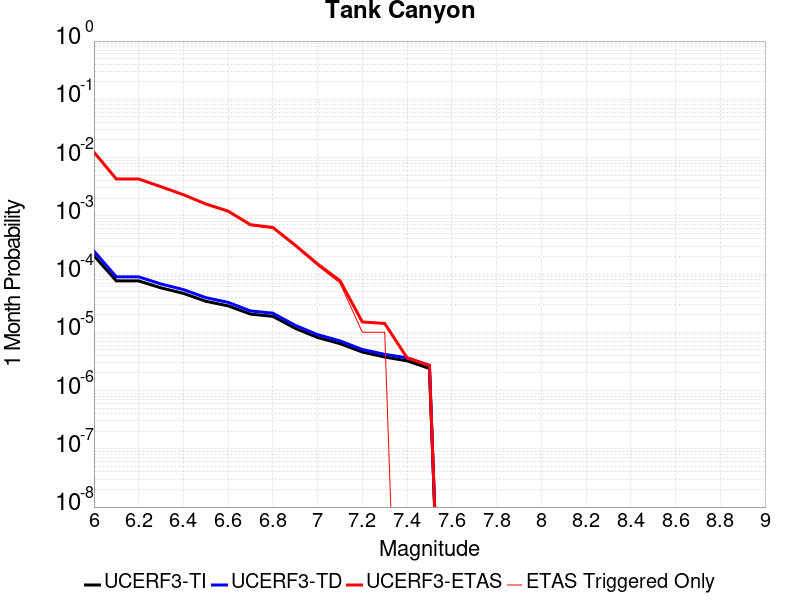 |  | 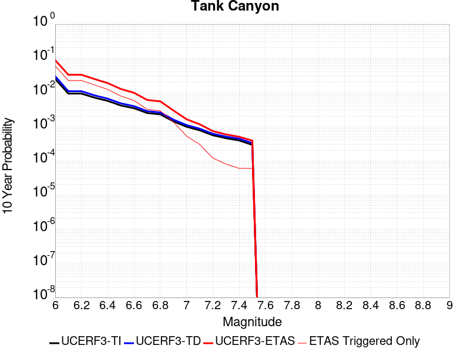 |

| Magnitude | 1 wk TI Prob | 1 wk TD Prob | 1 wk ETAS Prob | 1 wk ETAS/TD Gain | 1 wk ETAS Triggered Only | 1 mo TI Prob | 1 mo TD Prob | 1 mo ETAS Prob | 1 mo ETAS/TD Gain | 1 mo ETAS Triggered Only | 1 yr TI Prob | 1 yr TD Prob | 1 yr ETAS Prob | 1 yr ETAS/TD Gain | 1 yr ETAS Triggered Only | 10 yr TI Prob | 10 yr TD Prob | 10 yr ETAS Prob | 10 yr ETAS/TD Gain | 10 yr ETAS Triggered Only |
|-----|-----|-----|-----|-----|-----|-----|-----|-----|-----|-----|-----|-----|-----|-----|-----|-----|-----|-----|-----|-----|
| 6.0 | 4.8284557E-5 | 5.796635E-5 | 0.00430772 | 74.31415 | 0.00425 | 2.0691741E-4 | 2.484074E-4 | 0.012405387 | 49.939682 | 0.01216 | 0.0025163088 | 0.0030208372 | 0.03650937 | 12.085844 | 0.03359 | 0.02488006 | 0.029864404 | 0.08765538 | 2.9351125 | 0.05957 |
| 6.1 | 1.7796336E-5 | 2.0873764E-5 | 0.0014408441 | 69.026566 | 0.00142 | 7.626778E-5 | 8.945614E-5 | 0.0042890804 | 47.946182 | 0.0042 | 9.281647E-4 | 0.0010886216 | 0.013025613 | 11.965236 | 0.01195 | 0.009242975 | 0.010836975 | 0.03296455 | 3.0418591 | 0.02237 |
| 6.2 | 1.7796336E-5 | 2.0873764E-5 | 0.0014408441 | 69.026566 | 0.00142 | 7.626778E-5 | 8.945614E-5 | 0.0042890804 | 47.946182 | 0.0042 | 9.281647E-4 | 0.0010886216 | 0.013025613 | 11.965236 | 0.01195 | 0.009242975 | 0.010836975 | 0.03296455 | 3.0418591 | 0.02237 |
| 6.3 | 1.3515912E-5 | 1.575988E-5 | 9.957445E-4 | 63.18223 | 9.8E-4 | 5.792405E-5 | 6.7540735E-5 | 0.003157332 | 46.747078 | 0.00309 | 7.049971E-4 | 8.220222E-4 | 0.009774657 | 11.890988 | 0.00896 | 0.007027647 | 0.008192427 | 0.024587007 | 3.0011868 | 0.01653 |
| 6.4 | 1.0870146E-5 | 1.2618259E-5 | 7.4260903E-4 | 58.851944 | 7.3E-4 | 4.658551E-5 | 5.407723E-5 | 0.0023039556 | 42.60491 | 0.00225 | 5.67031E-4 | 6.582093E-4 | 0.007303832 | 11.096519 | 0.00665 | 0.005655863 | 0.006564614 | 0.01871433 | 2.850789 | 0.01223 |
| 6.5 | 7.964826E-6 | 9.196251E-6 | 4.6919202E-4 | 51.01992 | 4.6E-4 | 3.4134522E-5 | 3.941197E-5 | 0.0015993505 | 40.580322 | 0.00156 | 4.1550855E-4 | 4.7974577E-4 | 0.0046977215 | 9.792106 | 0.00422 | 0.0041473247 | 0.0047884025 | 0.012600814 | 2.6315277 | 0.00785 |
| 6.6 | 6.6317E-6 | 7.6124184E-6 | 3.8760953E-4 | 50.918053 | 3.8E-4 | 2.8421264E-5 | 3.2624295E-5 | 0.0012025861 | 36.861675 | 0.00117 | 3.4597394E-4 | 3.971375E-4 | 0.0035358905 | 8.903441 | 0.00314 | 0.0034543579 | 0.00396543 | 0.009762351 | 2.4618645 | 0.00582 |
| 6.7 | 4.793663E-6 | 5.4308543E-6 | 2.4542955E-4 | 45.191704 | 2.4E-4 | 2.0544108E-5 | 2.3274906E-5 | 7.032591E-4 | 30.215334 | 6.8E-4 | 2.500958E-4 | 2.8333953E-4 | 0.0019528663 | 6.8923187 | 0.00167 | 0.0024981452 | 0.0028304753 | 0.0060214177 | 2.1273522 | 0.0032 |
| 6.8 | 4.382823E-6 | 4.969316E-6 | 2.3496817E-4 | 47.28381 | 2.3E-4 | 1.8783392E-5 | 2.1296917E-5 | 6.312839E-4 | 29.642033 | 6.1E-4 | 2.286638E-4 | 2.5926338E-4 | 0.0017788693 | 6.8612437 | 0.00152 | 0.0022842865 | 0.0025902835 | 0.0054727974 | 2.112818 | 0.00289 |
| 6.9 | 2.729601E-6 | 3.0735694E-6 | 1.230732E-4 | 40.042435 | 1.2E-4 | 1.1698237E-5 | 1.317238E-5 | 3.1316842E-4 | 23.774628 | 3.0E-4 | 1.4241673E-4 | 1.6036315E-4 | 9.102429E-4 | 5.676135 | 7.5E-4 | 0.001423255 | 0.0016026403 | 0.0029604607 | 1.8472397 | 0.00136 |
| 7.0 | 1.8987357E-6 | 2.126954E-6 | 4.212687E-5 | 19.806196 | 4.0E-5 | 8.137413E-6 | 9.115489E-6 | 1.4911422E-4 | 16.358334 | 1.4E-4 | 9.90685E-5 | 1.1097613E-4 | 4.3094062E-4 | 3.883183 | 3.2E-4 | 9.902435E-4 | 0.0011092757 | 0.0016386878 | 1.4772592 | 5.3E-4 |
| 7.1 | 1.4928986E-6 | 1.6641375E-6 | 2.1664104E-5 | 13.018218 | 2.0E-5 | 6.398121E-6 | 7.1320014E-6 | 7.71315E-5 | 10.814846 | 7.0E-5 | 7.789434E-5 | 8.682925E-5 | 2.6681361E-4 | 3.072854 | 1.8E-4 | 7.786704E-4 | 8.680111E-4 | 0.0011677507 | 1.3453177 | 3.0E-4 |
| 7.2 | 1.069082E-6 | 1.1828638E-6 | 1.1828638E-6 | 1.0 | 0.0 | 4.581772E-6 | 5.0694093E-6 | 1.5069359E-5 | 2.9726064 | 1.0E-5 | 5.5781646E-5 | 6.171884E-5 | 1.1171576E-4 | 1.8100753 | 5.0E-5 | 5.576765E-4 | 6.170693E-4 | 7.3699525E-4 | 1.1943476 | 1.2E-4 |
| 7.3 | 8.776551E-7 | 9.770052E-7 | 9.770052E-7 | 1.0 | 0.0 | 3.7613736E-6 | 4.1871617E-6 | 1.418712E-5 | 3.3882427 | 1.0E-5 | 4.579376E-5 | 5.097802E-5 | 7.0977E-5 | 1.392306 | 2.0E-5 | 4.5784327E-4 | 5.0971424E-4 | 5.8967347E-4 | 1.1568707 | 8.0E-5 |
| 7.4 | 7.55721E-7 | 8.510284E-7 | 8.510284E-7 | 1.0 | 0.0 | 3.2388E-6 | 3.6472622E-6 | 3.6472622E-6 | 1.0 | 0.0 | 3.9431678E-5 | 4.440503E-5 | 5.4404587E-5 | 1.2251897 | 1.0E-5 | 3.942468E-4 | 4.4401243E-4 | 5.039858E-4 | 1.1350714 | 6.0E-5 |
| 7.5 | 5.587665E-7 | 6.305647E-7 | 6.305647E-7 | 1.0 | 0.0 | 2.3947114E-6 | 2.7024203E-6 | 2.7024203E-6 | 1.0 | 0.0 | 2.915522E-5 | 3.2901968E-5 | 4.290164E-5 | 1.3039232 | 1.0E-5 | 2.9151395E-4 | 3.2901968E-4 | 3.8899994E-4 | 1.1823 | 6.0E-5 |

## Little Lake
*[(top)](#table-of-contents)*

| 1 Week | 1 Month | 1 Year | 10 Year |
|-----|-----|-----|-----|
| 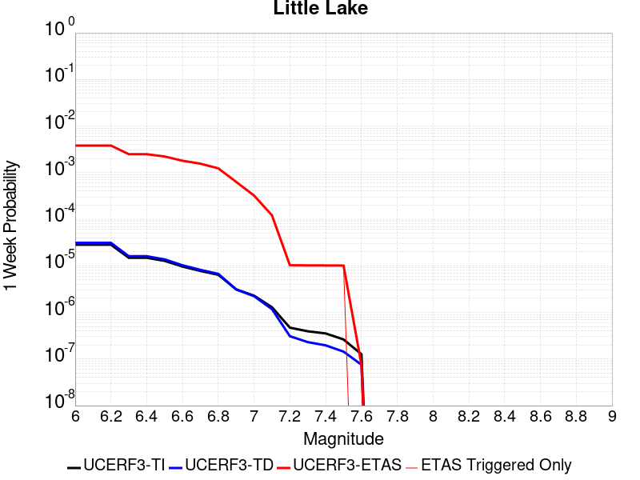 |  | 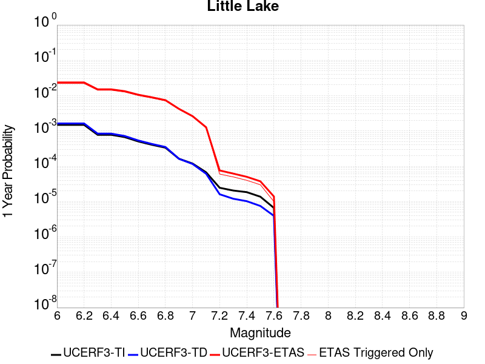 |  |

| Magnitude | 1 wk TI Prob | 1 wk TD Prob | 1 wk ETAS Prob | 1 wk ETAS/TD Gain | 1 wk ETAS Triggered Only | 1 mo TI Prob | 1 mo TD Prob | 1 mo ETAS Prob | 1 mo ETAS/TD Gain | 1 mo ETAS Triggered Only | 1 yr TI Prob | 1 yr TD Prob | 1 yr ETAS Prob | 1 yr ETAS/TD Gain | 1 yr ETAS Triggered Only | 10 yr TI Prob | 10 yr TD Prob | 10 yr ETAS Prob | 10 yr ETAS/TD Gain | 10 yr ETAS Triggered Only |
|-----|-----|-----|-----|-----|-----|-----|-----|-----|-----|-----|-----|-----|-----|-----|-----|-----|-----|-----|-----|-----|
| 6.0 | 2.8424427E-5 | 3.120616E-5 | 0.0038110882 | 122.12615 | 0.00378 | 1.2181328E-4 | 1.3373457E-4 | 0.009122532 | 68.213715 | 0.00899 | 0.0014820677 | 0.0016271356 | 0.023551404 | 14.47415 | 0.02196 | 0.014722223 | 0.016165627 | 0.050166942 | 3.1033094 | 0.03456 |
| 6.1 | 2.8424427E-5 | 3.120616E-5 | 0.0038110882 | 122.12615 | 0.00378 | 1.2181328E-4 | 1.3373457E-4 | 0.009122532 | 68.213715 | 0.00899 | 0.0014820677 | 0.0016271356 | 0.023551404 | 14.47415 | 0.02196 | 0.014722223 | 0.016165627 | 0.050166942 | 3.1033094 | 0.03456 |
| 6.2 | 2.8424427E-5 | 3.120616E-5 | 0.0038110882 | 122.12615 | 0.00378 | 1.2181328E-4 | 1.3373457E-4 | 0.009122532 | 68.213715 | 0.00899 | 0.0014820677 | 0.0016271356 | 0.023551404 | 14.47415 | 0.02196 | 0.014722223 | 0.016165627 | 0.050166942 | 3.1033094 | 0.03456 |
| 6.3 | 1.48860645E-5 | 1.6081593E-5 | 0.002486042 | 154.58928 | 0.00247 | 6.379586E-5 | 6.891945E-5 | 0.0058585205 | 85.005325 | 0.00579 | 7.7643775E-4 | 8.387995E-4 | 0.015016897 | 17.902843 | 0.01419 | 0.007737305 | 0.008359154 | 0.030314082 | 3.6264536 | 0.02214 |
| 6.4 | 1.48860645E-5 | 1.6081593E-5 | 0.002486042 | 154.58928 | 0.00247 | 6.379586E-5 | 6.891945E-5 | 0.0058585205 | 85.005325 | 0.00579 | 7.7643775E-4 | 8.387995E-4 | 0.015016897 | 17.902843 | 0.01419 | 0.007737305 | 0.008359154 | 0.030314082 | 3.6264536 | 0.02214 |
| 6.5 | 1.2797581E-5 | 1.3765735E-5 | 0.0022237352 | 161.54134 | 0.00221 | 5.4845623E-5 | 5.899482E-5 | 0.005158694 | 87.44317 | 0.0051 | 6.675408E-4 | 7.180509E-4 | 0.013318996 | 18.548819 | 0.01261 | 0.006655392 | 0.0071598585 | 0.026689025 | 3.727591 | 0.01967 |
| 6.6 | 9.661896E-6 | 1.0289158E-5 | 0.0018002708 | 174.96774 | 0.00179 | 4.1407468E-5 | 4.4095737E-5 | 0.004123916 | 93.521866 | 0.00408 | 5.040193E-4 | 5.367496E-4 | 0.010581356 | 19.713764 | 0.01005 | 0.005028777 | 0.0053561367 | 0.020842742 | 3.8913758 | 0.01557 |
| 6.7 | 7.767871E-6 | 8.199779E-6 | 0.0015581871 | 190.02795 | 0.00155 | 3.329045E-5 | 3.514151E-5 | 0.003525019 | 100.30926 | 0.00349 | 4.0523586E-4 | 4.2777765E-4 | 0.008944133 | 20.90837 | 0.00852 | 0.004044977 | 0.0042708935 | 0.017394604 | 4.072825 | 0.01318 |
| 6.8 | 6.4235196E-6 | 6.735819E-6 | 0.0012367276 | 183.60463 | 0.00123 | 2.752908E-5 | 2.886755E-5 | 0.0029487833 | 102.14873 | 0.00292 | 3.35115E-4 | 3.5141854E-4 | 0.0074289306 | 21.139835 | 0.00708 | 0.003346101 | 0.0035098887 | 0.014351701 | 4.0889335 | 0.01088 |
| 6.9 | 3.1283696E-6 | 3.1122067E-6 | 6.3311023E-4 | 203.42809 | 6.3E-4 | 1.3407229E-5 | 1.3337969E-5 | 0.0016333164 | 122.45615 | 0.00162 | 1.6322079E-4 | 1.6237919E-4 | 0.0042117215 | 25.93757 | 0.00405 | 0.0016310095 | 0.0016227537 | 0.007802709 | 4.808314 | 0.00619 |
| 7.0 | 2.290603E-6 | 2.2287015E-6 | 3.2222798E-4 | 144.58104 | 3.2E-4 | 9.816834E-6 | 9.551549E-6 | 9.3954266E-4 | 98.36548 | 9.3E-4 | 1.19513395E-4 | 1.16284944E-4 | 0.002625993 | 22.5824 | 0.00251 | 0.0011944914 | 0.0011623431 | 0.0048380657 | 4.1623387 | 0.00368 |
| 7.1 | 1.293693E-6 | 1.1776951E-6 | 1.2117755E-4 | 102.89382 | 1.2E-4 | 5.5443866E-6 | 5.047259E-6 | 3.950453E-4 | 78.26927 | 3.9E-4 | 6.750081E-5 | 6.144935E-5 | 0.001271375 | 20.689806 | 0.00121 | 6.7480316E-4 | 6.14392E-4 | 0.0023833045 | 3.8791268 | 0.00177 |
| 7.2 | 4.715842E-7 | 3.0918443E-7 | 1.0309182E-5 | 33.343147 | 1.0E-5 | 2.0210737E-6 | 1.3250755E-6 | 3.1325035E-5 | 23.64019 | 3.0E-5 | 2.4606294E-5 | 1.613268E-5 | 7.613171E-5 | 4.719099 | 6.0E-5 | 2.460357E-4 | 1.6131563E-4 | 2.513011E-4 | 1.5578225 | 9.0E-5 |
| 7.3 | 3.9430947E-7 | 2.3098025E-7 | 1.0230978E-5 | 44.293736 | 1.0E-5 | 1.6898966E-6 | 9.89915E-7 | 2.0989895E-5 | 21.203735 | 2.0E-5 | 2.0574296E-5 | 1.2052149E-5 | 6.205155E-5 | 5.1485877 | 5.0E-5 | 2.0572392E-4 | 1.20515026E-4 | 2.0050538E-4 | 1.6637377 | 8.0E-5 |
| 7.4 | 3.547123E-7 | 1.9679635E-7 | 1.0196794E-5 | 51.813942 | 1.0E-5 | 1.5201948E-6 | 8.4341264E-7 | 2.0843396E-5 | 24.713165 | 2.0E-5 | 1.8508214E-5 | 1.0268501E-5 | 5.026809E-5 | 4.8953676 | 4.0E-5 | 1.8506673E-4 | 1.0268033E-4 | 1.6267417E-4 | 1.5842777 | 6.0E-5 |
| 7.5 | 2.6354266E-7 | 1.4423487E-7 | 1.0144234E-5 | 70.33135 | 1.0E-5 | 1.129468E-6 | 6.1814933E-7 | 2.0618138E-5 | 33.35462 | 2.0E-5 | 1.3751187E-5 | 7.5259427E-6 | 3.7525715E-5 | 4.9861817 | 3.0E-5 | 1.3750336E-4 | 7.525693E-5 | 1.2525317E-4 | 1.6643406 | 5.0E-5 |
| 7.6 | 1.269913E-7 | 7.5727044E-8 | 7.5727044E-8 | 1.0 | 0.0 | 5.4424834E-7 | 3.2454443E-7 | 1.0324541E-5 | 31.812412 | 1.0E-5 | 6.6262032E-6 | 3.9513216E-6 | 1.3951282E-5 | 3.5307887 | 1.0E-5 | 6.626006E-5 | 3.951255E-5 | 5.951176E-5 | 1.5061483 | 2.0E-5 |

## Owl Lake
*[(top)](#table-of-contents)*

| 1 Week | 1 Month | 1 Year | 10 Year |
|-----|-----|-----|-----|
|  |  |  |  |

| Magnitude | 1 wk TI Prob | 1 wk TD Prob | 1 wk ETAS Prob | 1 wk ETAS/TD Gain | 1 wk ETAS Triggered Only | 1 mo TI Prob | 1 mo TD Prob | 1 mo ETAS Prob | 1 mo ETAS/TD Gain | 1 mo ETAS Triggered Only | 1 yr TI Prob | 1 yr TD Prob | 1 yr ETAS Prob | 1 yr ETAS/TD Gain | 1 yr ETAS Triggered Only | 10 yr TI Prob | 10 yr TD Prob | 10 yr ETAS Prob | 10 yr ETAS/TD Gain | 10 yr ETAS Triggered Only |
|-----|-----|-----|-----|-----|-----|-----|-----|-----|-----|-----|-----|-----|-----|-----|-----|-----|-----|-----|-----|-----|
| 6.0 | 5.0320643E-5 | 6.636149E-5 | 0.0023362108 | 35.204315 | 0.00227 | 2.1564208E-4 | 2.8438168E-4 | 0.005872792 | 20.65109 | 0.00559 | 0.0026222812 | 0.00345791 | 0.017768255 | 5.1384373 | 0.01436 | 0.02591553 | 0.0341423 | 0.05733254 | 1.6792233 | 0.02401 |
| 6.1 | 5.0320643E-5 | 6.636149E-5 | 0.0023362108 | 35.204315 | 0.00227 | 2.1564208E-4 | 2.8438168E-4 | 0.005872792 | 20.65109 | 0.00559 | 0.0026222812 | 0.00345791 | 0.017768255 | 5.1384373 | 0.01436 | 0.02591553 | 0.0341423 | 0.05733254 | 1.6792233 | 0.02401 |
| 6.2 | 2.4125871E-5 | 3.098269E-5 | 0.0018109275 | 58.449654 | 0.00178 | 1.0339249E-4 | 1.3277736E-4 | 0.004642179 | 34.96212 | 0.00451 | 0.0012580766 | 0.0016155228 | 0.012987122 | 8.0389595 | 0.01139 | 0.012509781 | 0.016071297 | 0.034303498 | 2.134457 | 0.01853 |
| 6.3 | 1.7433485E-5 | 2.2356835E-5 | 0.0016123212 | 72.1176 | 0.00159 | 7.471279E-5 | 9.5812386E-5 | 0.0041954196 | 43.787865 | 0.0041 | 9.0924866E-4 | 0.0011660426 | 0.011254266 | 9.651675 | 0.0101 | 0.009055373 | 0.01162957 | 0.027631287 | 2.3759508 | 0.01619 |
| 6.4 | 1.7433485E-5 | 2.2356835E-5 | 0.0016123212 | 72.1176 | 0.00159 | 7.471279E-5 | 9.5812386E-5 | 0.0041954196 | 43.787865 | 0.0041 | 9.0924866E-4 | 0.0011660426 | 0.011254266 | 9.651675 | 0.0101 | 0.009055373 | 0.01162957 | 0.027631287 | 2.3759508 | 0.01619 |
| 6.5 | 1.5182742E-5 | 1.9430352E-5 | 0.0015494006 | 79.74125 | 0.00153 | 6.506727E-5 | 8.327114E-5 | 0.00406294 | 48.791695 | 0.00398 | 7.919061E-4 | 0.0010135059 | 0.0107336445 | 10.59061 | 0.00973 | 0.0078909 | 0.010119047 | 0.0254721 | 2.5172431 | 0.01551 |
| 6.6 | 6.7271576E-6 | 8.548157E-6 | 0.0013585367 | 158.92743 | 0.00135 | 2.8830356E-5 | 3.6634476E-5 | 0.0033065146 | 90.25691 | 0.00327 | 3.5095305E-4 | 4.4593913E-4 | 0.008142506 | 18.259232 | 0.0077 | 0.0035039932 | 0.004468226 | 0.016215501 | 3.629069 | 0.0118 |
| 6.7 | 6.682835E-6 | 8.4806015E-6 | 0.0013584691 | 160.18547 | 0.00135 | 2.8640408E-5 | 3.634496E-5 | 0.003306226 | 90.96793 | 0.00327 | 3.4864116E-4 | 4.424157E-4 | 0.008139009 | 18.396746 | 0.0077 | 0.003480947 | 0.004433152 | 0.016170885 | 3.6477175 | 0.01179 |
| 6.8 | 6.5774975E-6 | 8.327072E-6 | 0.0013583158 | 163.12047 | 0.00135 | 2.8188972E-5 | 3.5686993E-5 | 0.0033055702 | 92.626755 | 0.00327 | 3.4314668E-4 | 4.3440814E-4 | 0.008121068 | 18.694555 | 0.00769 | 0.0034261728 | 0.0043532955 | 0.016062101 | 3.6896417 | 0.01176 |
| 6.9 | 6.363419E-6 | 8.0002355E-6 | 0.0013579894 | 169.74368 | 0.00135 | 2.727151E-5 | 3.4286306E-5 | 0.0033041742 | 96.37009 | 0.00327 | 3.3198006E-4 | 4.173614E-4 | 0.00808416 | 19.369688 | 0.00767 | 0.0033148455 | 0.004183282 | 0.015844297 | 3.7875273 | 0.01171 |
| 7.0 | 6.1342453E-6 | 7.632424E-6 | 0.0013376223 | 175.25523 | 0.00133 | 2.6289357E-5 | 3.271001E-5 | 0.0032526047 | 99.4376 | 0.00322 | 3.2002592E-4 | 3.981771E-4 | 0.007975159 | 20.029175 | 0.00758 | 0.0031956544 | 0.00399197 | 0.015515783 | 3.8867483 | 0.01157 |
| 7.1 | 5.842926E-6 | 7.142961E-6 | 0.0013271335 | 185.796 | 0.00132 | 2.504087E-5 | 3.0612362E-5 | 0.0031305174 | 102.26318 | 0.0031 | 3.0482994E-4 | 3.7264716E-4 | 0.0076299417 | 20.474976 | 0.00726 | 0.0030441214 | 0.0037374226 | 0.014756087 | 3.9481986 | 0.01106 |
| 7.2 | 4.77173E-6 | 5.3591634E-6 | 9.0535433E-4 | 168.93576 | 9.0E-4 | 2.045011E-5 | 2.2967664E-5 | 0.0020729206 | 90.253876 | 0.00205 | 2.4895166E-4 | 2.7959948E-4 | 0.0052082213 | 18.627436 | 0.00493 | 0.0024867293 | 0.0028089995 | 0.0102281 | 3.64119 | 0.00744 |
| 7.3 | 3.0494948E-6 | 2.7109647E-6 | 2.5271028E-4 | 93.21784 | 2.5E-4 | 1.3069198E-5 | 1.1618369E-5 | 6.116114E-4 | 52.641758 | 6.0E-4 | 1.5910587E-4 | 1.4144463E-4 | 0.001531248 | 10.825777 | 0.00139 | 0.0015899199 | 0.0014235033 | 0.003390699 | 2.3819396 | 0.00197 |
| 7.4 | 2.7263884E-6 | 2.3061473E-6 | 1.9230571E-4 | 83.3883 | 1.9E-4 | 1.1684469E-5 | 9.883452E-6 | 4.398792E-4 | 44.506638 | 4.3E-4 | 1.4224913E-4 | 1.2032448E-4 | 0.0011102053 | 9.226762 | 9.9E-4 | 0.0014215811 | 0.0012114698 | 0.0026197615 | 2.1624656 | 0.00141 |
| 7.5 | 2.6090431E-6 | 2.1660758E-6 | 1.721657E-4 | 79.48277 | 1.7E-4 | 1.1181565E-5 | 9.283149E-6 | 3.592799E-4 | 38.702374 | 3.5E-4 | 1.3612706E-4 | 1.1301658E-4 | 9.729194E-4 | 8.608644 | 8.6E-4 | 0.001360437 | 0.001138222 | 0.0023768106 | 2.0881784 | 0.00124 |
| 7.6 | 2.3008756E-6 | 1.8732376E-6 | 1.3187299E-4 | 70.39844 | 1.3E-4 | 9.860858E-6 | 8.028137E-6 | 2.6802605E-4 | 33.385834 | 2.6E-4 | 1.20049335E-4 | 9.7738266E-5 | 7.1767764E-4 | 7.3428526 | 6.2E-4 | 0.001199845 | 9.852252E-4 | 0.0018643582 | 1.8923168 | 8.8E-4 |
| 7.7 | 1.7184348E-6 | 1.3423282E-6 | 7.1342234E-5 | 53.14813 | 7.0E-5 | 7.3646997E-6 | 5.7528227E-6 | 1.4575201E-4 | 25.33574 | 1.4E-4 | 8.966153E-5 | 7.0038404E-5 | 3.800167E-4 | 5.4258327 | 3.1E-4 | 8.962536E-4 | 7.080495E-4 | 0.0011977026 | 1.6915519 | 4.9E-4 |
| 7.8 | 8.4612907E-7 | 8.4087924E-7 | 2.0840862E-5 | 24.784607 | 2.0E-5 | 3.6262625E-6 | 3.6037634E-6 | 5.3603584E-5 | 14.874335 | 5.0E-5 | 4.4148852E-5 | 4.3874956E-5 | 1.6386968E-4 | 3.7349255 | 1.2E-4 | 4.414008E-4 | 4.4413717E-4 | 6.540439E-4 | 1.4726169 | 2.1E-4 |
| 7.9 | 2.716738E-7 | 3.7694025E-7 | 3.7694025E-7 | 1.0 | 0.0 | 1.1643157E-6 | 1.6154573E-6 | 1.16154415E-5 | 7.1901875 | 1.0E-5 | 1.4175452E-5 | 1.9668027E-5 | 3.9667633E-5 | 2.0168588 | 2.0E-5 | 1.4174548E-4 | 1.9843443E-4 | 2.6842052E-4 | 1.3526914 | 7.0E-5 |
| 8.0 | 2.1995428E-8 | 3.386013E-8 | 3.386013E-8 | 1.0 | 0.0 | 9.426611E-8 | 1.4511484E-7 | 1.4511484E-7 | 1.0 | 0.0 | 1.1476893E-6 | 1.7667724E-6 | 1.7667724E-6 | 1.0 | 0.0 | 1.14768345E-5 | 1.7968985E-5 | 2.7968805E-5 | 1.5565045 | 1.0E-5 |

## Airport Lake
*[(top)](#table-of-contents)*

| 1 Week | 1 Month | 1 Year | 10 Year |
|-----|-----|-----|-----|
| 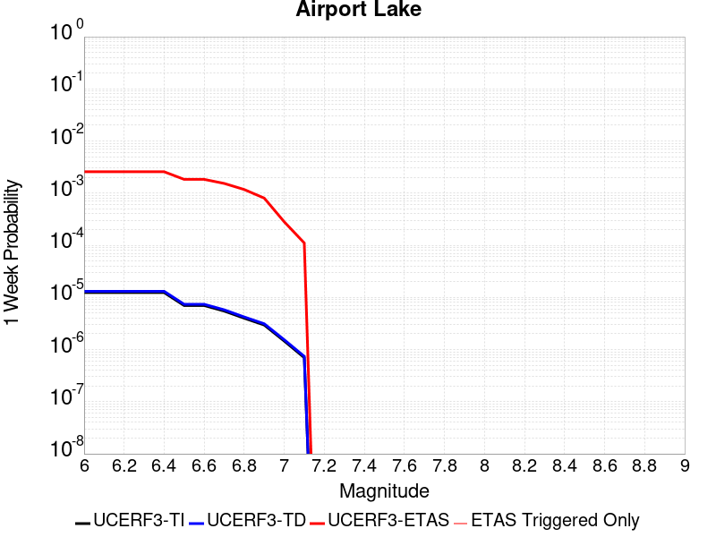 |  |  | 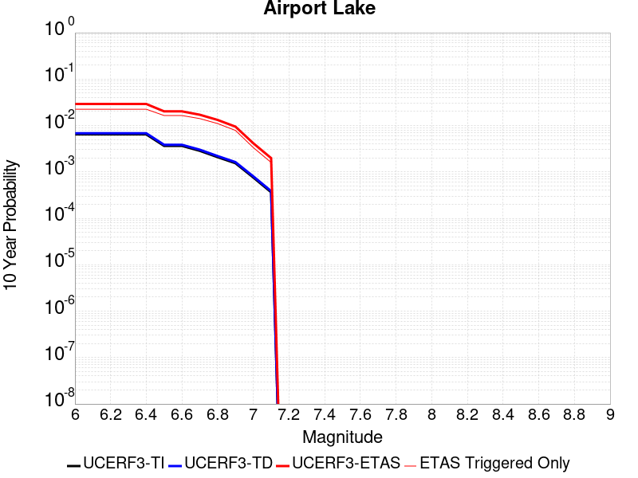 |

| Magnitude | 1 wk TI Prob | 1 wk TD Prob | 1 wk ETAS Prob | 1 wk ETAS/TD Gain | 1 wk ETAS Triggered Only | 1 mo TI Prob | 1 mo TD Prob | 1 mo ETAS Prob | 1 mo ETAS/TD Gain | 1 mo ETAS Triggered Only | 1 yr TI Prob | 1 yr TD Prob | 1 yr ETAS Prob | 1 yr ETAS/TD Gain | 1 yr ETAS Triggered Only | 10 yr TI Prob | 10 yr TD Prob | 10 yr ETAS Prob | 10 yr ETAS/TD Gain | 10 yr ETAS Triggered Only |
|-----|-----|-----|-----|-----|-----|-----|-----|-----|-----|-----|-----|-----|-----|-----|-----|-----|-----|-----|-----|-----|
| 6.0 | 1.2387061E-5 | 1.31032575E-5 | 0.0025730697 | 196.36871 | 0.00256 | 5.3086325E-5 | 5.6155768E-5 | 0.005905827 | 105.16866 | 0.00585 | 6.461343E-4 | 6.835104E-4 | 0.015083661 | 22.067932 | 0.01441 | 0.0064425888 | 0.0068168915 | 0.029123785 | 4.272297 | 0.02246 |
| 6.1 | 1.2387061E-5 | 1.31032575E-5 | 0.0025730697 | 196.36871 | 0.00256 | 5.3086325E-5 | 5.6155768E-5 | 0.005905827 | 105.16866 | 0.00585 | 6.461343E-4 | 6.835104E-4 | 0.015083661 | 22.067932 | 0.01441 | 0.0064425888 | 0.0068168915 | 0.029123785 | 4.272297 | 0.02246 |
| 6.2 | 1.2387061E-5 | 1.31032575E-5 | 0.0025730697 | 196.36871 | 0.00256 | 5.3086325E-5 | 5.6155768E-5 | 0.005905827 | 105.16866 | 0.00585 | 6.461343E-4 | 6.835104E-4 | 0.015083661 | 22.067932 | 0.01441 | 0.0064425888 | 0.0068168915 | 0.029123785 | 4.272297 | 0.02246 |
| 6.3 | 1.2387061E-5 | 1.31032575E-5 | 0.0025730697 | 196.36871 | 0.00256 | 5.3086325E-5 | 5.6155768E-5 | 0.005905827 | 105.16866 | 0.00585 | 6.461343E-4 | 6.835104E-4 | 0.015083661 | 22.067932 | 0.01441 | 0.0064425888 | 0.0068168915 | 0.029123785 | 4.272297 | 0.02246 |
| 6.4 | 1.2387061E-5 | 1.31032575E-5 | 0.0025730697 | 196.36871 | 0.00256 | 5.3086325E-5 | 5.6155768E-5 | 0.005905827 | 105.16866 | 0.00585 | 6.461343E-4 | 6.835104E-4 | 0.015083661 | 22.067932 | 0.01441 | 0.0064425888 | 0.0068168915 | 0.029123785 | 4.272297 | 0.02246 |
| 6.5 | 6.9922594E-6 | 7.38498E-6 | 0.0018373715 | 248.79843 | 0.00183 | 2.996648E-5 | 3.164956E-5 | 0.004401511 | 139.0702 | 0.00437 | 3.6478083E-4 | 3.8527072E-4 | 0.011091145 | 28.787926 | 0.01071 | 0.003641826 | 0.0038465653 | 0.020203404 | 5.2523236 | 0.01642 |
| 6.6 | 6.9922594E-6 | 7.38498E-6 | 0.0018373715 | 248.79843 | 0.00183 | 2.996648E-5 | 3.164956E-5 | 0.004401511 | 139.0702 | 0.00437 | 3.6478083E-4 | 3.8527072E-4 | 0.011091145 | 28.787926 | 0.01071 | 0.003641826 | 0.0038465653 | 0.020203404 | 5.2523236 | 0.01642 |
| 6.7 | 5.477277E-6 | 5.7861116E-6 | 0.0015357772 | 265.42474 | 0.00153 | 2.3473833E-5 | 2.4797408E-5 | 0.0038147033 | 153.83476 | 0.00379 | 2.8575645E-4 | 3.0187052E-4 | 0.009539081 | 31.59991 | 0.00924 | 0.0028538927 | 0.0030149885 | 0.017082447 | 5.6658416 | 0.01411 |
| 6.8 | 3.9950432E-6 | 4.2191186E-6 | 0.0011742142 | 278.30795 | 0.00117 | 1.7121502E-5 | 1.8081826E-5 | 0.0030380273 | 168.0155 | 0.00302 | 2.0843433E-4 | 2.2012675E-4 | 0.007398546 | 33.61039 | 0.00718 | 0.0020823893 | 0.002199358 | 0.013195121 | 5.9995327 | 0.01102 |
| 6.9 | 2.95695E-6 | 3.1230477E-6 | 8.0312055E-4 | 257.15924 | 8.0E-4 | 1.2672582E-5 | 1.3384434E-5 | 0.0021133563 | 157.89658 | 0.0021 | 1.5427776E-4 | 1.6294557E-4 | 0.0052521164 | 32.232338 | 0.00509 | 0.001541707 | 0.0016284833 | 0.009455716 | 5.8064556 | 0.00784 |
| 7.0 | 1.456072E-6 | 1.5408239E-6 | 2.815404E-4 | 182.72069 | 2.8E-4 | 6.2402937E-6 | 6.60352E-6 | 8.265981E-4 | 125.17538 | 8.2E-4 | 7.597293E-5 | 8.03959E-5 | 0.0023602126 | 29.357376 | 0.00228 | 7.594696E-4 | 8.03767E-4 | 0.004151074 | 5.1645246 | 0.00335 |
| 7.1 | 6.995192E-7 | 7.4090326E-7 | 1.10740824E-4 | 149.46732 | 1.1E-4 | 2.997936E-6 | 3.1752998E-6 | 3.431742E-4 | 108.07617 | 3.4E-4 | 3.649926E-5 | 3.8659273E-5 | 0.0011286171 | 29.193956 | 0.00109 | 3.6493264E-4 | 3.8659273E-4 | 0.0019859741 | 5.137122 | 0.0016 |

## Panamint Valley
*[(top)](#table-of-contents)*

| 1 Week | 1 Month | 1 Year | 10 Year |
|-----|-----|-----|-----|
|  | 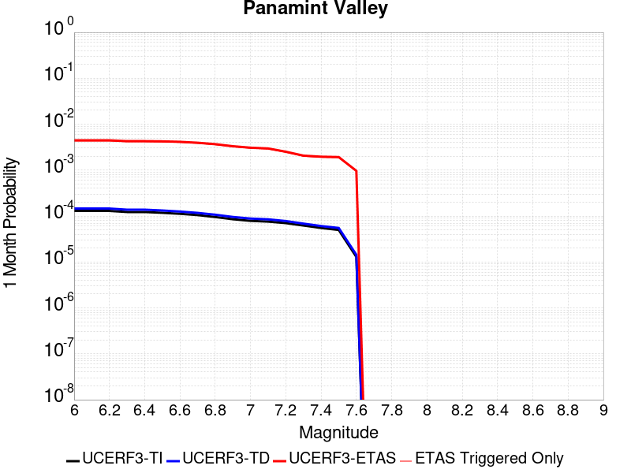 |  |  |

| Magnitude | 1 wk TI Prob | 1 wk TD Prob | 1 wk ETAS Prob | 1 wk ETAS/TD Gain | 1 wk ETAS Triggered Only | 1 mo TI Prob | 1 mo TD Prob | 1 mo ETAS Prob | 1 mo ETAS/TD Gain | 1 mo ETAS Triggered Only | 1 yr TI Prob | 1 yr TD Prob | 1 yr ETAS Prob | 1 yr ETAS/TD Gain | 1 yr ETAS Triggered Only | 10 yr TI Prob | 10 yr TD Prob | 10 yr ETAS Prob | 10 yr ETAS/TD Gain | 10 yr ETAS Triggered Only |
|-----|-----|-----|-----|-----|-----|-----|-----|-----|-----|-----|-----|-----|-----|-----|-----|-----|-----|-----|-----|-----|
| 6.0 | 3.0211835E-5 | 3.3985398E-5 | 0.0016839294 | 49.548615 | 0.00165 | 1.2947287E-4 | 1.4564373E-4 | 0.004455016 | 30.58845 | 0.00431 | 0.0015751923 | 0.0017717998 | 0.013251424 | 7.4790754 | 0.0115 | 0.015640736 | 0.01758359 | 0.037172973 | 2.1140718 | 0.01994 |
| 6.1 | 3.0211835E-5 | 3.3985398E-5 | 0.0016839294 | 49.548615 | 0.00165 | 1.2947287E-4 | 1.4564373E-4 | 0.004455016 | 30.58845 | 0.00431 | 0.0015751923 | 0.0017717998 | 0.013251424 | 7.4790754 | 0.0115 | 0.015640736 | 0.01758359 | 0.037172973 | 2.1140718 | 0.01994 |
| 6.2 | 3.0211835E-5 | 3.3985398E-5 | 0.0016839294 | 49.548615 | 0.00165 | 1.2947287E-4 | 1.4564373E-4 | 0.004455016 | 30.58845 | 0.00431 | 0.0015751923 | 0.0017717998 | 0.013251424 | 7.4790754 | 0.0115 | 0.015640736 | 0.01758359 | 0.037172973 | 2.1140718 | 0.01994 |
| 6.3 | 2.8573924E-5 | 3.2103522E-5 | 0.0016320521 | 50.83717 | 0.0016 | 1.2245393E-4 | 1.3757942E-4 | 0.00427701 | 31.08757 | 0.00414 | 0.001489857 | 0.0016737703 | 0.012655359 | 7.560989 | 0.011 | 0.01479908 | 0.016618231 | 0.035282817 | 2.1231391 | 0.01898 |
| 6.4 | 2.8573924E-5 | 3.2103522E-5 | 0.0016320521 | 50.83717 | 0.0016 | 1.2245393E-4 | 1.3757942E-4 | 0.00427701 | 31.08757 | 0.00414 | 0.001489857 | 0.0016737703 | 0.012655359 | 7.560989 | 0.011 | 0.01479908 | 0.016618231 | 0.035282817 | 2.1231391 | 0.01898 |
| 6.5 | 2.7468774E-5 | 3.0829244E-5 | 0.0016007809 | 51.924103 | 0.00157 | 1.1771801E-4 | 1.3211879E-4 | 0.0042315773 | 32.02858 | 0.0041 | 0.0014322745 | 0.0016073869 | 0.01227022 | 7.6336446 | 0.01068 | 0.014230782 | 0.015964093 | 0.034109715 | 2.1366522 | 0.01844 |
| 6.6 | 2.6135967E-5 | 2.9253257E-5 | 0.0015592085 | 53.30034 | 0.00153 | 1.1200648E-4 | 1.2536523E-4 | 0.0041348627 | 32.982533 | 0.00401 | 0.0013628257 | 0.0015252795 | 0.011839523 | 7.7621994 | 0.01033 | 0.013544982 | 0.015154443 | 0.03269454 | 2.157423 | 0.01781 |
| 6.7 | 2.4498746E-5 | 2.7342086E-5 | 0.0014773024 | 54.030346 | 0.00145 | 1.04990395E-4 | 1.1717525E-4 | 0.0039467267 | 33.682255 | 0.00383 | 0.0012775084 | 0.0014257001 | 0.011251671 | 7.892032 | 0.00984 | 0.012701893 | 0.014171662 | 0.030812444 | 2.1742294 | 0.01688 |
| 6.8 | 2.2244329E-5 | 2.4936131E-5 | 0.0014049017 | 56.340004 | 0.00138 | 9.532935E-5 | 1.0686488E-4 | 0.0036764834 | 34.403103 | 0.00357 | 0.0011600169 | 0.0013003252 | 0.010408466 | 8.00451 | 0.00912 | 0.011539802 | 0.012932883 | 0.028311389 | 2.1891012 | 0.01558 |
| 6.9 | 1.9902658E-5 | 2.2290924E-5 | 0.0012822628 | 57.52399 | 0.00126 | 8.529431E-5 | 9.552913E-5 | 0.0033152215 | 34.703773 | 0.00322 | 0.0010379635 | 0.0011624652 | 0.009442829 | 8.123107 | 0.00829 | 0.010331288 | 0.011568946 | 0.025327906 | 2.189301 | 0.01392 |
| 7.0 | 1.8353881E-5 | 2.056681E-5 | 0.0011605434 | 56.427975 | 0.00114 | 7.865712E-5 | 8.814059E-5 | 0.003077877 | 34.92009 | 0.00299 | 9.5722964E-4 | 0.0010726011 | 0.008744364 | 8.152485 | 0.00768 | 0.009531168 | 0.0106791705 | 0.02332269 | 2.183942 | 0.01278 |
| 7.1 | 1.7667631E-5 | 1.9773222E-5 | 0.0011197515 | 56.629692 | 0.0011 | 7.571623E-5 | 8.473973E-5 | 0.0029644957 | 34.98354 | 0.00288 | 9.2145515E-4 | 0.0010312354 | 0.008453573 | 8.19752 | 0.00743 | 0.009176437 | 0.010269388 | 0.022482663 | 2.1892896 | 0.01234 |
| 7.2 | 1.6381597E-5 | 1.8158824E-5 | 9.481419E-4 | 52.21384 | 9.3E-4 | 7.020495E-5 | 7.782131E-5 | 0.0025176315 | 32.35144 | 0.00244 | 8.544101E-4 | 9.4707985E-4 | 0.0073410184 | 7.751214 | 0.0064 | 0.008511325 | 0.009435088 | 0.020172812 | 2.138063 | 0.01084 |
| 7.3 | 1.4520491E-5 | 1.5966963E-5 | 8.0595433E-4 | 50.476368 | 7.9E-4 | 6.222919E-5 | 6.842814E-5 | 0.0020682912 | 30.225742 | 0.002 | 7.57377E-4 | 8.3281036E-4 | 0.006168363 | 7.406684 | 0.00534 | 0.0075480095 | 0.008300003 | 0.01733439 | 2.08848 | 0.00911 |
| 7.4 | 1.2852287E-5 | 1.4145856E-5 | 7.5413537E-4 | 53.311398 | 7.4E-4 | 5.5080065E-5 | 6.0623777E-5 | 0.0019605085 | 32.338936 | 0.0019 | 6.7039346E-4 | 7.3786033E-4 | 0.0057541565 | 7.798435 | 0.00502 | 0.0066837464 | 0.007357025 | 0.015923534 | 2.1643984 | 0.00863 |
| 7.5 | 1.1637851E-5 | 1.2837149E-5 | 7.428278E-4 | 57.86548 | 7.3E-4 | 4.987555E-5 | 5.5015284E-5 | 0.0019249124 | 34.988686 | 0.00187 | 6.070656E-4 | 6.6962093E-4 | 0.0055563464 | 8.2977495 | 0.00489 | 0.006054099 | 0.0066789286 | 0.015092358 | 2.2596974 | 0.00847 |
| 7.6 | 3.0068115E-6 | 3.3331687E-6 | 3.9333187E-4 | 118.00539 | 3.9E-4 | 1.2886271E-5 | 1.4284972E-5 | 9.642714E-4 | 67.5025 | 9.5E-4 | 1.5687906E-4 | 1.7391294E-4 | 0.0023735303 | 13.647808 | 0.0022 | 0.0015676835 | 0.001739208 | 0.005332947 | 3.0663078 | 0.0036 |

## Garlock (East)
*[(top)](#table-of-contents)*

| 1 Week | 1 Month | 1 Year | 10 Year |
|-----|-----|-----|-----|
|  |  |  |  |

| Magnitude | 1 wk TI Prob | 1 wk TD Prob | 1 wk ETAS Prob | 1 wk ETAS/TD Gain | 1 wk ETAS Triggered Only | 1 mo TI Prob | 1 mo TD Prob | 1 mo ETAS Prob | 1 mo ETAS/TD Gain | 1 mo ETAS Triggered Only | 1 yr TI Prob | 1 yr TD Prob | 1 yr ETAS Prob | 1 yr ETAS/TD Gain | 1 yr ETAS Triggered Only | 10 yr TI Prob | 10 yr TD Prob | 10 yr ETAS Prob | 10 yr ETAS/TD Gain | 10 yr ETAS Triggered Only |
|-----|-----|-----|-----|-----|-----|-----|-----|-----|-----|-----|-----|-----|-----|-----|-----|-----|-----|-----|-----|-----|
| 6.0 | 4.5092507E-5 | 6.2906794E-5 | 0.0016028099 | 25.479122 | 0.00154 | 1.9323928E-4 | 2.695752E-4 | 0.0038086209 | 14.128232 | 0.00354 | 0.0023501497 | 0.0032775842 | 0.012596939 | 3.8433607 | 0.00935 | 0.023254504 | 0.03235364 | 0.04786501 | 1.479432 | 0.01603 |
| 6.1 | 4.5092507E-5 | 6.2906794E-5 | 0.0016028099 | 25.479122 | 0.00154 | 1.9323928E-4 | 2.695752E-4 | 0.0038086209 | 14.128232 | 0.00354 | 0.0023501497 | 0.0032775842 | 0.012596939 | 3.8433607 | 0.00935 | 0.023254504 | 0.03235364 | 0.04786501 | 1.479432 | 0.01603 |
| 6.2 | 2.6674514E-5 | 3.4512483E-5 | 0.0012344711 | 35.76883 | 0.0012 | 1.1431433E-4 | 1.4790244E-4 | 0.0028175076 | 19.04977 | 0.00267 | 0.0013908884 | 0.001799258 | 0.008487203 | 4.717057 | 0.0067 | 0.01382215 | 0.017891733 | 0.02894045 | 1.617532 | 0.01125 |
| 6.3 | 2.6674514E-5 | 3.4512483E-5 | 0.0012344711 | 35.76883 | 0.0012 | 1.1431433E-4 | 1.4790244E-4 | 0.0028175076 | 19.04977 | 0.00267 | 0.0013908884 | 0.001799258 | 0.008487203 | 4.717057 | 0.0067 | 0.01382215 | 0.017891733 | 0.02894045 | 1.617532 | 0.01125 |
| 6.4 | 2.5312667E-5 | 3.2341675E-5 | 0.0012123035 | 37.484253 | 0.00118 | 1.0847834E-4 | 1.3859998E-4 | 0.002778234 | 20.044981 | 0.00264 | 0.0013199237 | 0.001686178 | 0.008275049 | 4.9075775 | 0.0066 | 0.013121112 | 0.01677974 | 0.027654156 | 1.6480682 | 0.01106 |
| 6.5 | 2.5312667E-5 | 3.2341675E-5 | 0.0012123035 | 37.484253 | 0.00118 | 1.0847834E-4 | 1.3859998E-4 | 0.002778234 | 20.044981 | 0.00264 | 0.0013199237 | 0.001686178 | 0.008275049 | 4.9075775 | 0.0066 | 0.013121112 | 0.01677974 | 0.027654156 | 1.6480682 | 0.01106 |
| 6.6 | 2.246556E-5 | 2.813642E-5 | 0.0011581046 | 41.160343 | 0.00113 | 9.627742E-5 | 1.20579214E-4 | 0.0026402753 | 21.896605 | 0.00252 | 0.0011715472 | 0.0014670868 | 0.0077278884 | 5.2675056 | 0.00627 | 0.011653901 | 0.014620015 | 0.024966506 | 1.7076935 | 0.0105 |
| 6.7 | 2.2241198E-5 | 2.7806154E-5 | 0.0011577747 | 41.637356 | 0.00113 | 9.531594E-5 | 1.1916392E-4 | 0.0026288647 | 22.060913 | 0.00251 | 0.0011598538 | 0.0014498787 | 0.007690817 | 5.3044553 | 0.00625 | 0.011538187 | 0.0144502055 | 0.024759056 | 1.7134051 | 0.01046 |
| 6.8 | 1.9528685E-5 | 2.3900653E-5 | 0.0011338742 | 47.441135 | 0.00111 | 8.369167E-5 | 1.0242746E-4 | 0.0025621755 | 25.014538 | 0.00246 | 0.0010184698 | 0.0012463606 | 0.00724887 | 5.8160295 | 0.00601 | 0.010138147 | 0.012437694 | 0.022135556 | 1.7797154 | 0.00982 |
| 6.9 | 1.3318621E-5 | 1.5201007E-5 | 0.0010751849 | 70.73116 | 0.00106 | 5.7078556E-5 | 6.514558E-5 | 0.0023649957 | 36.30324 | 0.0023 | 6.9470983E-4 | 7.928645E-4 | 0.006298496 | 7.943975 | 0.00551 | 0.0069254204 | 0.007940986 | 0.01656198 | 2.0856326 | 0.00869 |
| 7.0 | 1.1760853E-5 | 1.3109839E-5 | 0.0010430963 | 79.56592 | 0.00103 | 5.0402683E-5 | 5.618384E-5 | 0.0023060574 | 41.044853 | 0.00225 | 6.134799E-4 | 6.838286E-4 | 0.0059502246 | 8.70134 | 0.00527 | 0.0061178906 | 0.006857582 | 0.015120527 | 2.2049358 | 0.00832 |
| 7.1 | 1.0064758E-5 | 1.090491E-5 | 0.001010894 | 92.70081 | 0.001 | 4.3133965E-5 | 4.673451E-5 | 0.0022266326 | 47.644295 | 0.00218 | 5.2502943E-4 | 5.688476E-4 | 0.005645958 | 9.925256 | 0.00508 | 0.005237907 | 0.005714025 | 0.013638484 | 2.3868437 | 0.00797 |
| 7.2 | 9.768808E-6 | 1.0500772E-5 | 9.804906E-4 | 93.37319 | 9.7E-4 | 4.186565E-5 | 4.500255E-5 | 0.002164907 | 48.10632 | 0.00212 | 5.095951E-4 | 5.477718E-4 | 0.0054950602 | 10.031659 | 0.00495 | 0.0050842804 | 0.005504284 | 0.013221571 | 2.402051 | 0.00776 |
| 7.3 | 9.344516E-6 | 9.946395E-6 | 8.799377E-4 | 88.468 | 8.7E-4 | 4.004731E-5 | 4.2626732E-5 | 0.0019525454 | 45.805653 | 0.00191 | 4.8746695E-4 | 5.1886035E-4 | 0.0050764945 | 9.783932 | 0.00456 | 0.0048639905 | 0.005215945 | 0.0122988075 | 2.357925 | 0.00712 |
| 7.4 | 9.023491E-6 | 9.49255E-6 | 7.794852E-4 | 82.11547 | 7.7E-4 | 3.867153E-5 | 4.068174E-5 | 0.0017506122 | 43.031887 | 0.00171 | 4.7072413E-4 | 4.95191E-4 | 0.0045531807 | 9.194797 | 0.00406 | 0.004697283 | 0.004979378 | 0.011377361 | 2.284896 | 0.00643 |
| 7.5 | 7.081253E-6 | 7.0893525E-6 | 3.7708672E-4 | 53.190575 | 3.7E-4 | 3.0347876E-5 | 3.038259E-5 | 8.303583E-4 | 27.33007 | 8.0E-4 | 3.6942272E-4 | 3.6984598E-4 | 0.0024090915 | 6.5137696 | 0.00204 | 0.003688092 | 0.0037251879 | 0.0069531184 | 1.8665148 | 0.00324 |
| 7.6 | 6.116396E-6 | 5.9608415E-6 | 2.0595964E-4 | 34.55211 | 2.0E-4 | 2.6212863E-5 | 2.5546216E-5 | 4.5553522E-4 | 17.831808 | 4.3E-4 | 3.1909486E-4 | 3.1098103E-4 | 0.0014706203 | 4.728971 | 0.00116 | 0.0031863707 | 0.003136586 | 0.004940909 | 1.5752505 | 0.00181 |
| 7.7 | 4.797145E-6 | 4.7587923E-6 | 9.475836E-5 | 19.912271 | 9.0E-5 | 2.055903E-5 | 2.0394666E-5 | 2.8038936E-4 | 13.748172 | 2.6E-4 | 2.5027743E-4 | 2.482769E-4 | 8.981155E-4 | 3.617395 | 6.5E-4 | 0.0024999576 | 0.002510134 | 0.0035774482 | 1.4252021 | 0.00107 |
| 7.8 | 3.4028885E-6 | 3.979809E-6 | 6.397957E-5 | 16.076038 | 6.0E-5 | 1.4583726E-5 | 1.7056214E-5 | 1.6705366E-4 | 9.794298 | 1.5E-4 | 1.775424E-4 | 2.076397E-4 | 5.475691E-4 | 2.637112 | 3.4E-4 | 0.0017740062 | 0.0021019245 | 0.0026807054 | 1.2753576 | 5.8E-4 |
| 7.9 | 2.5928412E-6 | 3.373588E-6 | 5.337342E-5 | 15.820966 | 5.0E-5 | 1.1112129E-5 | 1.44581545E-5 | 1.3445642E-4 | 9.299695 | 1.2E-4 | 1.3528178E-4 | 1.7601387E-4 | 4.4596635E-4 | 2.5337 | 2.7E-4 | 0.0013519945 | 0.0017818334 | 0.0022210493 | 1.2464967 | 4.4E-4 |
| 8.0 | 1.3743648E-6 | 1.673991E-6 | 1.1673975E-5 | 6.9737377 | 1.0E-5 | 5.8901214E-6 | 7.174228E-6 | 4.717394E-5 | 6.575473 | 4.0E-5 | 7.1709874E-5 | 8.7342756E-5 | 1.8733402E-4 | 2.1448147 | 1.0E-4 | 7.1686733E-4 | 8.839922E-4 | 0.0010438507 | 1.180837 | 1.6E-4 |
| 8.1 | 3.6733252E-7 | 3.1499187E-7 | 3.1499187E-7 | 1.0 | 0.0 | 1.5742813E-6 | 1.3499646E-6 | 1.1349951E-5 | 8.407592 | 1.0E-5 | 1.9166706E-5 | 1.643571E-5 | 4.6435216E-5 | 2.8252637 | 3.0E-5 | 1.9165053E-4 | 1.6643589E-4 | 1.9643089E-4 | 1.1802195 | 3.0E-5 |

## Hunter Mountain-Saline Valley
*[(top)](#table-of-contents)*

| 1 Week | 1 Month | 1 Year | 10 Year |
|-----|-----|-----|-----|
| 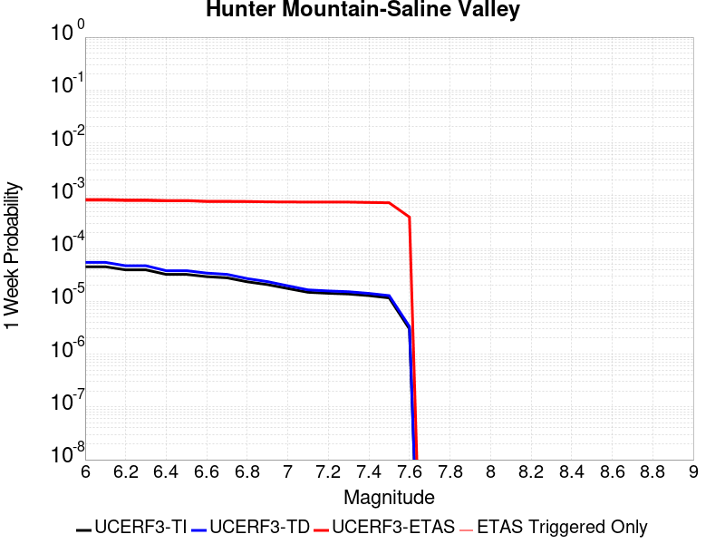 |  | 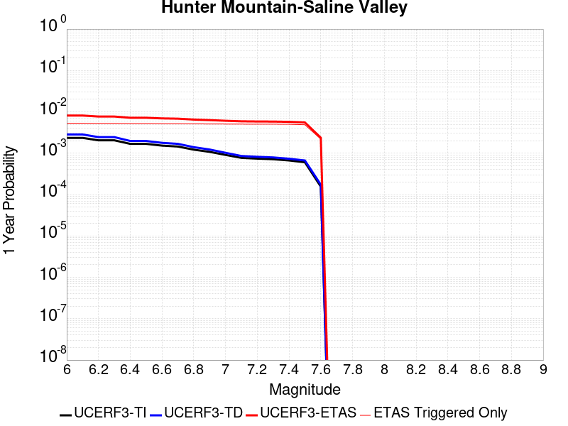 | 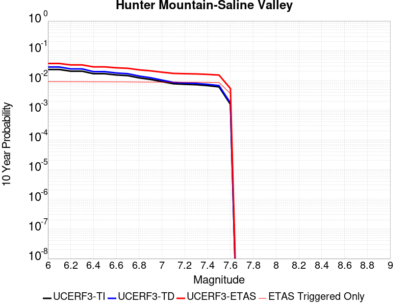 |

| Magnitude | 1 wk TI Prob | 1 wk TD Prob | 1 wk ETAS Prob | 1 wk ETAS/TD Gain | 1 wk ETAS Triggered Only | 1 mo TI Prob | 1 mo TD Prob | 1 mo ETAS Prob | 1 mo ETAS/TD Gain | 1 mo ETAS Triggered Only | 1 yr TI Prob | 1 yr TD Prob | 1 yr ETAS Prob | 1 yr ETAS/TD Gain | 1 yr ETAS Triggered Only | 10 yr TI Prob | 10 yr TD Prob | 10 yr ETAS Prob | 10 yr ETAS/TD Gain | 10 yr ETAS Triggered Only |
|-----|-----|-----|-----|-----|-----|-----|-----|-----|-----|-----|-----|-----|-----|-----|-----|-----|-----|-----|-----|-----|
| 6.0 | 4.5103672E-5 | 5.4571992E-5 | 8.445289E-4 | 15.4755 | 7.9E-4 | 1.9328714E-4 | 2.3385909E-4 | 0.0022433891 | 9.59291 | 0.00201 | 0.002350731 | 0.0028436056 | 0.008148477 | 2.8655443 | 0.00532 | 0.023260195 | 0.028092787 | 0.036937144 | 1.3148266 | 0.0091 |
| 6.1 | 4.5103672E-5 | 5.4571992E-5 | 8.445289E-4 | 15.4755 | 7.9E-4 | 1.9328714E-4 | 2.3385909E-4 | 0.0022433891 | 9.59291 | 0.00201 | 0.002350731 | 0.0028436056 | 0.008148477 | 2.8655443 | 0.00532 | 0.023260195 | 0.028092787 | 0.036937144 | 1.3148266 | 0.0091 |
| 6.2 | 3.9363465E-5 | 4.7064877E-5 | 8.270282E-4 | 17.572088 | 7.8E-4 | 1.6868966E-4 | 2.0169078E-4 | 0.0021812913 | 10.815028 | 0.00198 | 0.002051862 | 0.0024528939 | 0.007709967 | 3.1432126 | 0.00527 | 0.020330196 | 0.024274237 | 0.03308504 | 1.3629693 | 0.00903 |
| 6.3 | 3.9363465E-5 | 4.7064877E-5 | 8.270282E-4 | 17.572088 | 7.8E-4 | 1.6868966E-4 | 2.0169078E-4 | 0.0021812913 | 10.815028 | 0.00198 | 0.002051862 | 0.0024528939 | 0.007709967 | 3.1432126 | 0.00527 | 0.020330196 | 0.024274237 | 0.03308504 | 1.3629693 | 0.00903 |
| 6.4 | 3.2311684E-5 | 3.795214E-5 | 8.079229E-4 | 21.287941 | 7.7E-4 | 1.384713E-4 | 1.626423E-4 | 0.0021223235 | 13.049026 | 0.00196 | 0.0016845843 | 0.0019784442 | 0.007198097 | 3.638261 | 0.00523 | 0.016718714 | 0.019617062 | 0.028391488 | 1.4472855 | 0.00895 |
| 6.5 | 3.2311684E-5 | 3.795214E-5 | 8.079229E-4 | 21.287941 | 7.7E-4 | 1.384713E-4 | 1.626423E-4 | 0.0021223235 | 13.049026 | 0.00196 | 0.0016845843 | 0.0019784442 | 0.007198097 | 3.638261 | 0.00523 | 0.016718714 | 0.019617062 | 0.028391488 | 1.4472855 | 0.00895 |
| 6.6 | 2.9305844E-5 | 3.4182853E-5 | 7.841572E-4 | 22.940075 | 7.5E-4 | 1.2559042E-4 | 1.4649007E-4 | 0.0020762074 | 14.173024 | 0.00193 | 0.0015279909 | 0.0017821203 | 0.006952889 | 3.90147 | 0.00518 | 0.015175272 | 0.017686214 | 0.026418984 | 1.4937613 | 0.00889 |
| 6.7 | 2.7826512E-5 | 3.2345237E-5 | 7.82321E-4 | 24.186588 | 7.5E-4 | 1.19251024E-4 | 1.3861542E-4 | 0.002068348 | 14.921484 | 0.00193 | 0.0014509142 | 0.0016863967 | 0.0068476778 | 4.0605383 | 0.00517 | 0.014414776 | 0.01674368 | 0.025474997 | 1.5214694 | 0.00888 |
| 6.8 | 2.3389874E-5 | 2.6867507E-5 | 7.7684736E-4 | 28.914011 | 7.5E-4 | 1.0023846E-4 | 1.1514164E-4 | 0.0020449194 | 17.760033 | 0.00193 | 0.00121972 | 0.0014009953 | 0.0065138224 | 4.649425 | 0.00512 | 0.01213047 | 0.013927842 | 0.022605278 | 1.6230279 | 0.0088 |
| 6.9 | 2.069209E-5 | 2.3570727E-5 | 7.635533E-4 | 32.394135 | 7.4E-4 | 8.867737E-5 | 1.0101369E-4 | 0.0020208198 | 20.005404 | 0.00192 | 0.0010791123 | 0.001229184 | 0.006322915 | 5.143994 | 0.0051 | 0.010738871 | 0.012228882 | 0.020881757 | 1.707577 | 0.00876 |
| 7.0 | 1.7462342E-5 | 1.9634126E-5 | 7.596196E-4 | 38.68874 | 7.4E-4 | 7.483646E-5 | 8.414367E-5 | 0.001993983 | 23.697361 | 0.00191 | 9.1075303E-4 | 0.0010239903 | 0.0060987887 | 5.955904 | 0.00508 | 0.009070295 | 0.010196352 | 0.01882744 | 1.8464878 | 0.00872 |
| 7.1 | 1.4807709E-5 | 1.6442245E-5 | 7.564301E-4 | 46.00528 | 7.4E-4 | 6.3460066E-5 | 7.046495E-5 | 0.0019803303 | 28.103764 | 0.00191 | 7.723524E-4 | 8.575896E-4 | 0.00591325 | 6.895198 | 0.00506 | 0.007696735 | 0.008545788 | 0.01715161 | 2.007025 | 0.00868 |
| 7.2 | 1.4180048E-5 | 1.5698814E-5 | 7.556872E-4 | 48.13658 | 7.4E-4 | 6.077022E-5 | 6.727898E-5 | 0.0019671512 | 29.238716 | 0.0019 | 7.396263E-4 | 8.1883004E-4 | 0.005854703 | 7.1500835 | 0.00504 | 0.0073716943 | 0.00816108 | 0.01673057 | 2.0500433 | 0.00864 |
| 7.3 | 1.3730402E-5 | 1.5172541E-5 | 7.5516134E-4 | 49.77158 | 7.4E-4 | 5.8843252E-5 | 6.502365E-5 | 0.0019649002 | 30.21824 | 0.0019 | 7.161811E-4 | 7.913914E-4 | 0.0058274027 | 7.36349 | 0.00504 | 0.007138774 | 0.007888664 | 0.016460506 | 2.0866024 | 0.00864 |
| 7.4 | 1.2810095E-5 | 1.410972E-5 | 7.4409944E-4 | 52.736652 | 7.3E-4 | 5.489925E-5 | 6.0468916E-5 | 0.0019503547 | 32.253838 | 0.00189 | 6.681934E-4 | 7.359762E-4 | 0.005742289 | 7.8022757 | 0.00501 | 0.006661878 | 0.0073382827 | 0.015875174 | 2.1633363 | 0.0086 |
| 7.5 | 1.1595659E-5 | 1.2801013E-5 | 7.327918E-4 | 57.244827 | 7.2E-4 | 4.9694736E-5 | 5.4860422E-5 | 0.0019147584 | 34.902363 | 0.00186 | 6.0486543E-4 | 6.677366E-4 | 0.005544478 | 8.3033905 | 0.00488 | 0.006032217 | 0.0066601736 | 0.015043962 | 2.2587943 | 0.00844 |
| 7.6 | 2.997694E-6 | 3.3252948E-6 | 3.93324E-4 | 118.28245 | 3.9E-4 | 1.28471975E-5 | 1.4251226E-5 | 9.6423767E-4 | 67.65998 | 9.5E-4 | 1.564034E-4 | 1.7350215E-4 | 0.0023731205 | 13.677758 | 0.0022 | 0.0015629337 | 0.0017351025 | 0.0053188736 | 3.065452 | 0.00359 |

## Ash Hill
*[(top)](#table-of-contents)*

| 1 Week | 1 Month | 1 Year | 10 Year |
|-----|-----|-----|-----|
|  |  |  |  |

| Magnitude | 1 wk TI Prob | 1 wk TD Prob | 1 wk ETAS Prob | 1 wk ETAS/TD Gain | 1 wk ETAS Triggered Only | 1 mo TI Prob | 1 mo TD Prob | 1 mo ETAS Prob | 1 mo ETAS/TD Gain | 1 mo ETAS Triggered Only | 1 yr TI Prob | 1 yr TD Prob | 1 yr ETAS Prob | 1 yr ETAS/TD Gain | 1 yr ETAS Triggered Only | 10 yr TI Prob | 10 yr TD Prob | 10 yr ETAS Prob | 10 yr ETAS/TD Gain | 10 yr ETAS Triggered Only |
|-----|-----|-----|-----|-----|-----|-----|-----|-----|-----|-----|-----|-----|-----|-----|-----|-----|-----|-----|-----|-----|
| 6.0 | 2.1545662E-5 | 2.3194681E-5 | 8.031766E-4 | 34.627617 | 7.8E-4 | 9.2335285E-5 | 9.9402445E-5 | 0.0018692265 | 18.804632 | 0.00177 | 0.0011236023 | 0.0012096328 | 0.0060038264 | 4.963346 | 0.0048 | 0.011179381 | 0.01203847 | 0.020455902 | 1.6992111 | 0.00852 |
| 6.1 | 2.1545662E-5 | 2.3194681E-5 | 8.031766E-4 | 34.627617 | 7.8E-4 | 9.2335285E-5 | 9.9402445E-5 | 0.0018692265 | 18.804632 | 0.00177 | 0.0011236023 | 0.0012096328 | 0.0060038264 | 4.963346 | 0.0048 | 0.011179381 | 0.01203847 | 0.020455902 | 1.6992111 | 0.00852 |
| 6.2 | 2.1545662E-5 | 2.3194681E-5 | 8.031766E-4 | 34.627617 | 7.8E-4 | 9.2335285E-5 | 9.9402445E-5 | 0.0018692265 | 18.804632 | 0.00177 | 0.0011236023 | 0.0012096328 | 0.0060038264 | 4.963346 | 0.0048 | 0.011179381 | 0.01203847 | 0.020455902 | 1.6992111 | 0.00852 |
| 6.3 | 1.0025529E-5 | 1.0747037E-5 | 3.507434E-4 | 32.636288 | 3.4E-4 | 4.2965847E-5 | 4.605799E-5 | 7.860239E-4 | 17.065962 | 7.4E-4 | 5.229836E-4 | 5.60625E-4 | 0.002389599 | 4.262384 | 0.00183 | 0.005217545 | 0.0055934195 | 0.009133507 | 1.6329021 | 0.00356 |
| 6.4 | 1.0025529E-5 | 1.0747037E-5 | 3.507434E-4 | 32.636288 | 3.4E-4 | 4.2965847E-5 | 4.605799E-5 | 7.860239E-4 | 17.065962 | 7.4E-4 | 5.229836E-4 | 5.60625E-4 | 0.002389599 | 4.262384 | 0.00183 | 0.005217545 | 0.0055934195 | 0.009133507 | 1.6329021 | 0.00356 |
| 6.5 | 6.9617327E-6 | 7.456704E-6 | 2.2745506E-4 | 30.503431 | 2.2E-4 | 2.9835655E-5 | 3.1956963E-5 | 5.119416E-4 | 16.019722 | 4.8E-4 | 3.6318856E-4 | 3.8901521E-4 | 0.0015985445 | 4.109208 | 0.00121 | 0.0036259557 | 0.0038841967 | 0.006264914 | 1.6129239 | 0.00239 |
| 6.6 | 4.9919777E-6 | 5.346739E-6 | 1.8534578E-4 | 34.665203 | 1.8E-4 | 2.1394015E-5 | 2.2914432E-5 | 3.9290596E-4 | 17.14666 | 3.7E-4 | 2.60441E-4 | 2.789542E-4 | 0.0011187198 | 4.010407 | 8.4E-4 | 0.0026013597 | 0.0027866988 | 0.0045617386 | 1.6369686 | 0.00178 |
| 6.7 | 3.6630722E-6 | 3.9246606E-6 | 1.4392412E-4 | 36.671734 | 1.4E-4 | 1.5698786E-5 | 1.6819899E-5 | 2.8681537E-4 | 17.052145 | 2.7E-4 | 1.9111596E-4 | 2.0476876E-4 | 8.3463977E-4 | 4.076011 | 6.3E-4 | 0.0019095168 | 0.002046364 | 0.003353683 | 1.6388499 | 0.00131 |
| 6.8 | 2.5599613E-6 | 2.7449514E-6 | 1.1274465E-4 | 41.07346 | 1.1E-4 | 1.0971216E-5 | 1.1764052E-5 | 2.3176147E-4 | 19.700819 | 2.2E-4 | 1.3356637E-4 | 1.4322287E-4 | 6.1315554E-4 | 4.281129 | 4.7E-4 | 0.0013348613 | 0.0014317906 | 0.0024203733 | 1.6904519 | 9.9E-4 |
| 6.9 | 1.7684905E-6 | 1.896889E-6 | 8.189674E-5 | 43.17424 | 8.0E-5 | 7.579223E-6 | 8.129524E-6 | 1.581283E-4 | 19.451115 | 1.5E-4 | 9.2273134E-5 | 9.8976954E-5 | 4.6894033E-4 | 4.737874 | 3.7E-4 | 9.223483E-4 | 9.897696E-4 | 0.0017190471 | 1.7368155 | 7.3E-4 |

## Blackwater
*[(top)](#table-of-contents)*

| 1 Week | 1 Month | 1 Year | 10 Year |
|-----|-----|-----|-----|
|  |  |  |  |

| Magnitude | 1 wk TI Prob | 1 wk TD Prob | 1 wk ETAS Prob | 1 wk ETAS/TD Gain | 1 wk ETAS Triggered Only | 1 mo TI Prob | 1 mo TD Prob | 1 mo ETAS Prob | 1 mo ETAS/TD Gain | 1 mo ETAS Triggered Only | 1 yr TI Prob | 1 yr TD Prob | 1 yr ETAS Prob | 1 yr ETAS/TD Gain | 1 yr ETAS Triggered Only | 10 yr TI Prob | 10 yr TD Prob | 10 yr ETAS Prob | 10 yr ETAS/TD Gain | 10 yr ETAS Triggered Only |
|-----|-----|-----|-----|-----|-----|-----|-----|-----|-----|-----|-----|-----|-----|-----|-----|-----|-----|-----|-----|-----|
| 6.0 | 3.0708583E-5 | 3.309619E-5 | 4.3308295E-4 | 13.085584 | 4.0E-4 | 1.3160157E-4 | 1.4183388E-4 | 0.001191685 | 8.401978 | 0.00105 | 0.0016010714 | 0.0017255963 | 0.005489091 | 3.180982 | 0.00377 | 0.015895851 | 0.017135808 | 0.02407483 | 1.4049428 | 0.00706 |
| 6.1 | 3.0708583E-5 | 3.309619E-5 | 4.3308295E-4 | 13.085584 | 4.0E-4 | 1.3160157E-4 | 1.4183388E-4 | 0.001191685 | 8.401978 | 0.00105 | 0.0016010714 | 0.0017255963 | 0.005489091 | 3.180982 | 0.00377 | 0.015895851 | 0.017135808 | 0.02407483 | 1.4049428 | 0.00706 |
| 6.2 | 1.1707779E-5 | 1.2545242E-5 | 1.425436E-4 | 11.362365 | 1.3E-4 | 5.017523E-5 | 5.3764266E-5 | 4.2374438E-4 | 7.8815246 | 3.7E-4 | 6.107122E-4 | 6.5439293E-4 | 0.0020534769 | 3.1379874 | 0.0014 | 0.006090366 | 0.006525631 | 0.009049056 | 1.3866944 | 0.00254 |
| 6.3 | 1.1707779E-5 | 1.2545242E-5 | 1.425436E-4 | 11.362365 | 1.3E-4 | 5.017523E-5 | 5.3764266E-5 | 4.2374438E-4 | 7.8815246 | 3.7E-4 | 6.107122E-4 | 6.5439293E-4 | 0.0020534769 | 3.1379874 | 0.0014 | 0.006090366 | 0.006525631 | 0.009049056 | 1.3866944 | 0.00254 |
| 6.4 | 7.929244E-6 | 8.480176E-6 | 1.08479326E-4 | 12.792108 | 1.0E-4 | 3.3982033E-5 | 3.6343128E-5 | 2.6633477E-4 | 7.328339 | 2.3E-4 | 4.136527E-4 | 4.4239179E-4 | 0.0013220025 | 2.988307 | 8.8E-4 | 0.0041288356 | 0.0044155167 | 0.0060880985 | 1.3787965 | 0.00168 |
| 6.5 | 5.8832115E-6 | 6.286048E-6 | 7.628561E-5 | 12.135702 | 7.0E-5 | 2.521352E-5 | 2.6939942E-5 | 1.9693536E-4 | 7.310163 | 1.7E-4 | 3.0693135E-4 | 3.2794697E-4 | 0.0010177207 | 3.1033087 | 6.9E-4 | 0.0030650778 | 0.0032748834 | 0.0045506917 | 1.3895736 | 0.00128 |
| 6.6 | 5.8832115E-6 | 6.286048E-6 | 7.628561E-5 | 12.135702 | 7.0E-5 | 2.521352E-5 | 2.6939942E-5 | 1.9693536E-4 | 7.310163 | 1.7E-4 | 3.0693135E-4 | 3.2794697E-4 | 0.0010177207 | 3.1033087 | 6.9E-4 | 0.0030650778 | 0.0032748834 | 0.0045506917 | 1.3895736 | 0.00128 |
| 6.7 | 3.0715053E-6 | 3.281496E-6 | 3.3281398E-5 | 10.142142 | 3.0E-5 | 1.3163528E-5 | 1.4063485E-5 | 9.406236E-5 | 6.6884108 | 8.0E-5 | 1.6025416E-4 | 1.7121063E-4 | 4.7115926E-4 | 2.7519276 | 3.0E-4 | 0.0016013865 | 0.0017109019 | 0.0022699437 | 1.3267528 | 5.6E-4 |
| 6.8 | 2.2722281E-6 | 2.4287758E-6 | 1.2428752E-5 | 5.1172905 | 1.0E-5 | 9.738084E-6 | 1.0409003E-5 | 6.040848E-5 | 5.803484 | 5.0E-5 | 1.1855473E-4 | 1.2672316E-4 | 3.4669528E-4 | 2.7358477 | 2.2E-4 | 0.001184915 | 0.0012665992 | 0.0016960545 | 1.3390617 | 4.3E-4 |
| 6.9 | 9.952399E-7 | 1.0653588E-6 | 1.0653588E-6 | 1.0 | 0.0 | 4.265307E-6 | 4.5658185E-6 | 3.456568E-5 | 7.5705338 | 3.0E-5 | 5.1928873E-5 | 5.5587938E-5 | 1.855807E-4 | 3.338507 | 1.3E-4 | 5.191674E-4 | 5.5579096E-4 | 7.4568536E-4 | 1.3416651 | 1.9E-4 |
| 7.0 | 4.7385504E-7 | 5.0756074E-7 | 5.0756074E-7 | 1.0 | 0.0 | 2.0308057E-6 | 2.1752603E-6 | 1.2175238E-5 | 5.597141 | 1.0E-5 | 2.4724779E-5 | 2.6483794E-5 | 8.648221E-5 | 3.2654765 | 6.0E-5 | 2.4722028E-4 | 2.6483793E-4 | 3.6481145E-4 | 1.3774894 | 1.0E-4 |

## Garlock (West)
*[(top)](#table-of-contents)*

| 1 Week | 1 Month | 1 Year | 10 Year |
|-----|-----|-----|-----|
|  | 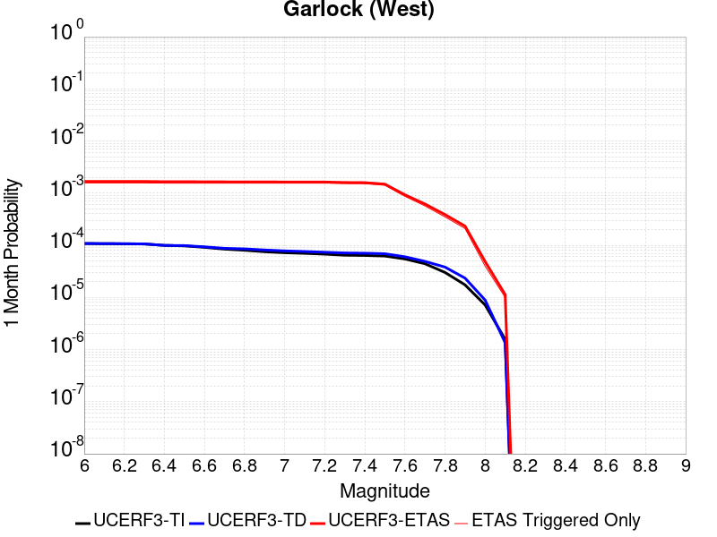 |  |  |

| Magnitude | 1 wk TI Prob | 1 wk TD Prob | 1 wk ETAS Prob | 1 wk ETAS/TD Gain | 1 wk ETAS Triggered Only | 1 mo TI Prob | 1 mo TD Prob | 1 mo ETAS Prob | 1 mo ETAS/TD Gain | 1 mo ETAS Triggered Only | 1 yr TI Prob | 1 yr TD Prob | 1 yr ETAS Prob | 1 yr ETAS/TD Gain | 1 yr ETAS Triggered Only | 10 yr TI Prob | 10 yr TD Prob | 10 yr ETAS Prob | 10 yr ETAS/TD Gain | 10 yr ETAS Triggered Only |
|-----|-----|-----|-----|-----|-----|-----|-----|-----|-----|-----|-----|-----|-----|-----|-----|-----|-----|-----|-----|-----|
| 6.0 | 2.5181727E-5 | 2.5202135E-5 | 7.651835E-4 | 30.361853 | 7.4E-4 | 1.0791722E-4 | 1.080047E-4 | 0.0016778351 | 15.534835 | 0.00157 | 0.0013131002 | 0.0013141674 | 0.0051890686 | 3.9485595 | 0.00388 | 0.013053683 | 0.013144457 | 0.019233355 | 1.4632294 | 0.00617 |
| 6.1 | 2.5077732E-5 | 2.5103205E-5 | 7.6508464E-4 | 30.477568 | 7.4E-4 | 1.0747157E-4 | 1.07580745E-4 | 0.0016774118 | 15.592119 | 0.00157 | 0.001307681 | 0.0013090121 | 0.0051839333 | 3.9601874 | 0.00388 | 0.013000126 | 0.0130935125 | 0.019182725 | 1.4650557 | 0.00617 |
| 6.2 | 2.494612E-5 | 2.498488E-5 | 7.649664E-4 | 30.617174 | 7.4E-4 | 1.0690756E-4 | 1.07073676E-4 | 0.0016769056 | 15.66123 | 0.00157 | 0.0013008224 | 0.0013028459 | 0.0051777908 | 3.974216 | 0.00388 | 0.012932341 | 0.013032575 | 0.019122165 | 1.467259 | 0.00617 |
| 6.3 | 2.4733758E-5 | 2.4804243E-5 | 7.647859E-4 | 30.832865 | 7.4E-4 | 1.0599751E-4 | 1.0629959E-4 | 0.0016761327 | 15.768008 | 0.00157 | 0.0012897556 | 0.0012934325 | 0.005168414 | 3.99589 | 0.00388 | 0.012822957 | 0.012939542 | 0.019029705 | 1.470663 | 0.00617 |
| 6.4 | 2.3237335E-5 | 2.318352E-5 | 7.6316635E-4 | 32.918488 | 7.4E-4 | 9.958477E-5 | 9.935417E-5 | 0.0016591991 | 16.699844 | 0.00156 | 0.0012117702 | 0.0012089686 | 0.005054314 | 4.1806827 | 0.00385 | 0.012051838 | 0.012104375 | 0.018160176 | 1.5002984 | 0.00613 |
| 6.5 | 2.2732203E-5 | 2.2998063E-5 | 7.629811E-4 | 33.175884 | 7.4E-4 | 9.742009E-5 | 9.8559416E-5 | 0.0016584056 | 16.826456 | 0.00156 | 0.0011854442 | 0.0011993032 | 0.0050446857 | 4.2063475 | 0.00385 | 0.011791403 | 0.012008769 | 0.018065156 | 1.5043303 | 0.00613 |
| 6.6 | 2.1319436E-5 | 2.1778224E-5 | 7.617621E-4 | 34.978157 | 7.4E-4 | 9.136581E-5 | 9.333192E-5 | 0.0016531863 | 17.71298 | 0.00156 | 0.001111811 | 0.001135726 | 0.0049813534 | 4.386052 | 0.00385 | 0.011062649 | 0.0113796545 | 0.017439896 | 1.5325507 | 0.00613 |
| 6.7 | 1.970802E-5 | 2.0398069E-5 | 7.60383E-4 | 37.277203 | 7.4E-4 | 8.446021E-5 | 8.741738E-5 | 0.001647281 | 18.843863 | 0.00156 | 0.001027818 | 0.0010637887 | 0.0049096933 | 4.61529 | 0.00385 | 0.010230771 | 0.010667368 | 0.016731977 | 1.5685197 | 0.00613 |
| 6.8 | 1.8744462E-5 | 1.9905692E-5 | 7.5989094E-4 | 38.174557 | 7.4E-4 | 8.033094E-5 | 8.530733E-5 | 0.0016451742 | 19.285263 | 0.00156 | 9.775903E-4 | 0.0010381235 | 0.0048841266 | 4.704765 | 0.00385 | 0.009733009 | 0.010413141 | 0.016469413 | 1.5815989 | 0.00612 |
| 6.9 | 1.7559682E-5 | 1.895803E-5 | 7.58944E-4 | 40.032852 | 7.4E-4 | 7.5253614E-5 | 8.124618E-5 | 0.0016411195 | 20.199343 | 0.00156 | 9.158276E-4 | 9.887248E-4 | 0.004824928 | 4.8799505 | 0.00384 | 0.0091206245 | 0.009923607 | 0.015972974 | 1.6095935 | 0.00611 |
| 7.0 | 1.6794445E-5 | 1.8220819E-5 | 7.5820734E-4 | 41.612144 | 7.4E-4 | 7.197421E-5 | 7.8086894E-5 | 0.0016379651 | 20.976185 | 0.00156 | 8.759337E-4 | 9.5029466E-4 | 0.0047866455 | 5.037012 | 0.00384 | 0.008724891 | 0.0095425 | 0.015574385 | 1.6321076 | 0.00609 |
| 7.1 | 1.6337795E-5 | 1.7721602E-5 | 7.577085E-4 | 42.756207 | 7.4E-4 | 7.0017246E-5 | 7.5947515E-5 | 0.001635829 | 21.53894 | 0.00156 | 8.521265E-4 | 9.2427013E-4 | 0.0047607208 | 5.1507897 | 0.00384 | 0.008488664 | 0.009284343 | 0.015297987 | 1.6477189 | 0.00607 |
| 7.2 | 1.5780008E-5 | 1.7170225E-5 | 7.571575E-4 | 44.097122 | 7.4E-4 | 6.762685E-5 | 7.358461E-5 | 0.0016334698 | 22.198524 | 0.00156 | 8.2304585E-4 | 8.955257E-4 | 0.004732087 | 5.2841444 | 0.00384 | 0.008200042 | 0.008999176 | 0.015014552 | 1.6684362 | 0.00607 |
| 7.3 | 1.5058865E-5 | 1.6623266E-5 | 7.4661116E-4 | 44.913624 | 7.3E-4 | 6.45364E-5 | 7.124063E-5 | 0.0016011316 | 22.47498 | 0.00153 | 7.854473E-4 | 8.6701073E-4 | 0.004663716 | 5.3790755 | 0.0038 | 0.00782677 | 0.00871586 | 0.014693303 | 1.6858122 | 0.00603 |
| 7.4 | 1.4887923E-5 | 1.6459222E-5 | 7.464472E-4 | 45.351307 | 7.3E-4 | 6.380382E-5 | 7.053762E-5 | 0.0015904304 | 22.547266 | 0.00152 | 7.7653467E-4 | 8.5845834E-4 | 0.0046052393 | 5.364546 | 0.00375 | 0.0077382675 | 0.0086307125 | 0.014489706 | 1.6788539 | 0.00591 |
| 7.5 | 1.4509299E-5 | 1.6051208E-5 | 7.1603997E-4 | 44.609726 | 7.0E-4 | 6.218123E-5 | 6.8789086E-5 | 0.0014886914 | 21.64139 | 0.00142 | 7.567935E-4 | 8.3718647E-4 | 0.004314273 | 5.1533003 | 0.00348 | 0.0075422134 | 0.008419003 | 0.013862783 | 1.6466062 | 0.00549 |
| 7.6 | 1.2756717E-5 | 1.4055129E-5 | 4.4404907E-4 | 31.593384 | 4.3E-4 | 5.4670498E-5 | 6.023488E-5 | 9.3018246E-4 | 15.442588 | 8.7E-4 | 6.6541E-4 | 7.331136E-4 | 0.00289153 | 3.9441774 | 0.00216 | 0.006634211 | 0.007383898 | 0.010709162 | 1.4503399 | 0.00335 |
| 7.7 | 1.0328985E-5 | 1.1464573E-5 | 2.7146158E-4 | 23.6783 | 2.6E-4 | 4.4266326E-5 | 4.913296E-5 | 6.1910495E-4 | 12.600604 | 5.7E-4 | 5.388092E-4 | 5.9803E-4 | 0.0018872585 | 3.1557925 | 0.00129 | 0.0053750467 | 0.0060405903 | 0.008098086 | 1.3406117 | 0.00207 |
| 7.8 | 7.0306583E-6 | 8.902813E-6 | 1.789013E-4 | 20.09492 | 1.7E-4 | 3.0131043E-5 | 3.8154354E-5 | 3.88141E-4 | 10.172915 | 3.5E-4 | 3.667837E-4 | 4.644304E-4 | 0.0012140821 | 2.6141315 | 7.5E-4 | 0.003661789 | 0.0046969377 | 0.0059410664 | 1.2648809 | 0.00125 |
| 7.9 | 4.060633E-6 | 5.4672782E-6 | 9.5466785E-5 | 17.461483 | 9.0E-5 | 1.7402595E-5 | 2.3430983E-5 | 2.3342606E-4 | 9.962282 | 2.1E-4 | 2.11856E-4 | 2.8523497E-4 | 7.351066E-4 | 2.5771966 | 4.5E-4 | 0.0021165414 | 0.0028851798 | 0.0036629294 | 1.2695671 | 7.8E-4 |
| 8.0 | 1.6729537E-6 | 2.078155E-6 | 1.2078134E-5 | 5.8119507 | 1.0E-5 | 7.169782E-6 | 8.906349E-6 | 4.8905993E-5 | 5.4911385 | 4.0E-5 | 8.7288594E-5 | 1.08429434E-4 | 2.1841751E-4 | 2.0143747 | 1.1E-4 | 8.7254314E-4 | 0.001097267 | 0.0013170256 | 1.2002782 | 2.2E-4 |
| 8.1 | 3.6733252E-7 | 3.1499187E-7 | 3.1499187E-7 | 1.0 | 0.0 | 1.5742813E-6 | 1.3499646E-6 | 1.1349951E-5 | 8.407592 | 1.0E-5 | 1.9166706E-5 | 1.643571E-5 | 4.6435216E-5 | 2.8252637 | 3.0E-5 | 1.9165053E-4 | 1.6643589E-4 | 1.9643089E-4 | 1.1802195 | 3.0E-5 |

## McLean Lake
*[(top)](#table-of-contents)*

| 1 Week | 1 Month | 1 Year | 10 Year |
|-----|-----|-----|-----|
|  |  |  |  |

| Magnitude | 1 wk TI Prob | 1 wk TD Prob | 1 wk ETAS Prob | 1 wk ETAS/TD Gain | 1 wk ETAS Triggered Only | 1 mo TI Prob | 1 mo TD Prob | 1 mo ETAS Prob | 1 mo ETAS/TD Gain | 1 mo ETAS Triggered Only | 1 yr TI Prob | 1 yr TD Prob | 1 yr ETAS Prob | 1 yr ETAS/TD Gain | 1 yr ETAS Triggered Only | 10 yr TI Prob | 10 yr TD Prob | 10 yr ETAS Prob | 10 yr ETAS/TD Gain | 10 yr ETAS Triggered Only |
|-----|-----|-----|-----|-----|-----|-----|-----|-----|-----|-----|-----|-----|-----|-----|-----|-----|-----|-----|-----|-----|
| 6.0 | 1.7360222E-5 | 1.8501789E-5 | 2.5849734E-4 | 13.971478 | 2.4E-4 | 7.439883E-5 | 7.929125E-5 | 6.4924604E-4 | 8.188118 | 5.7E-4 | 9.0542925E-4 | 9.64992E-4 | 0.003102927 | 3.2154949 | 0.00214 | 0.009017491 | 0.009612858 | 0.013851715 | 1.440957 | 0.00428 |
| 6.1 | 9.062689E-6 | 9.592268E-6 | 1.6959073E-4 | 17.679941 | 1.6E-4 | 3.8839516E-5 | 4.110912E-5 | 3.310972E-4 | 8.054106 | 2.9E-4 | 4.727685E-4 | 5.003975E-4 | 0.001619837 | 3.2371006 | 0.00112 | 0.0047176396 | 0.0049935905 | 0.0071726544 | 1.4363722 | 0.00219 |
| 6.2 | 9.062689E-6 | 9.592268E-6 | 1.6959073E-4 | 17.679941 | 1.6E-4 | 3.8839516E-5 | 4.110912E-5 | 3.310972E-4 | 8.054106 | 2.9E-4 | 4.727685E-4 | 5.003975E-4 | 0.001619837 | 3.2371006 | 0.00112 | 0.0047176396 | 0.0049935905 | 0.0071726544 | 1.4363722 | 0.00219 |
| 6.3 | 7.2575485E-6 | 7.667767E-6 | 1.2766685E-4 | 16.649809 | 1.2E-4 | 3.110341E-5 | 3.2861484E-5 | 2.728536E-4 | 8.303143 | 2.4E-4 | 3.786182E-4 | 4.0002225E-4 | 0.0012796703 | 3.1989977 | 8.8E-4 | 0.0037797375 | 0.003993727 | 0.005776578 | 1.4464129 | 0.00179 |
| 6.4 | 7.2575485E-6 | 7.667767E-6 | 1.2766685E-4 | 16.649809 | 1.2E-4 | 3.110341E-5 | 3.2861484E-5 | 2.728536E-4 | 8.303143 | 2.4E-4 | 3.786182E-4 | 4.0002225E-4 | 0.0012796703 | 3.1989977 | 8.8E-4 | 0.0037797375 | 0.003993727 | 0.005776578 | 1.4464129 | 0.00179 |
| 6.5 | 6.06582E-6 | 6.4039245E-6 | 1.1640322E-4 | 18.176857 | 1.1E-4 | 2.5996113E-5 | 2.7445138E-5 | 2.3743938E-4 | 8.651419 | 2.1E-4 | 3.164567E-4 | 3.340998E-4 | 0.0010438625 | 3.1244035 | 7.1E-4 | 0.0031600643 | 0.0033366138 | 0.0048116758 | 1.4420835 | 0.00148 |
| 6.6 | 5.598744E-6 | 5.910306E-6 | 9.5909774E-5 | 16.227549 | 9.0E-5 | 2.3994397E-5 | 2.5329673E-5 | 2.1532486E-4 | 8.500894 | 1.9E-4 | 2.9209262E-4 | 3.083515E-4 | 9.68148E-4 | 3.1397543 | 6.6E-4 | 0.0029170897 | 0.0030798658 | 0.004475554 | 1.4531653 | 0.0014 |
| 6.7 | 5.246996E-6 | 5.539203E-6 | 8.553876E-5 | 15.442431 | 8.0E-5 | 2.2486933E-5 | 2.3739261E-5 | 2.0373499E-4 | 8.582196 | 1.8E-4 | 2.73744E-4 | 2.8899353E-4 | 8.888201E-4 | 3.075571 | 6.0E-4 | 0.0027340704 | 0.002886801 | 0.004183048 | 1.4490255 | 0.0013 |
| 6.8 | 4.02324E-6 | 4.246936E-6 | 8.4246596E-5 | 19.83703 | 8.0E-5 | 1.7242342E-5 | 1.820106E-5 | 1.8819797E-4 | 10.339946 | 1.7E-4 | 2.099053E-4 | 2.2158133E-4 | 7.514639E-4 | 3.3913684 | 5.3E-4 | 0.0020970714 | 0.0022141882 | 0.003291797 | 1.4866834 | 0.00108 |
| 6.9 | 6.835972E-7 | 7.1399705E-7 | 1.07139895E-5 | 15.0056505 | 1.0E-5 | 2.9296991E-6 | 3.0599856E-6 | 2.3059923E-5 | 7.535959 | 2.0E-5 | 3.56685E-5 | 3.7255006E-5 | 1.1725203E-4 | 3.1472824 | 8.0E-5 | 3.5662777E-4 | 3.7251884E-4 | 5.424555E-4 | 1.4561827 | 1.7E-4 |

## Gravel Hills-Harper Lk
*[(top)](#table-of-contents)*

| 1 Week | 1 Month | 1 Year | 10 Year |
|-----|-----|-----|-----|
|  | 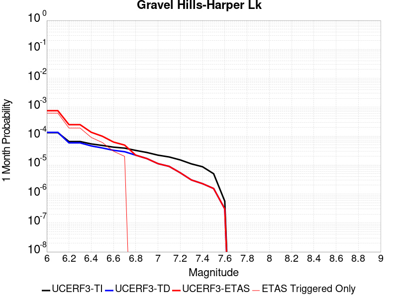 |  | 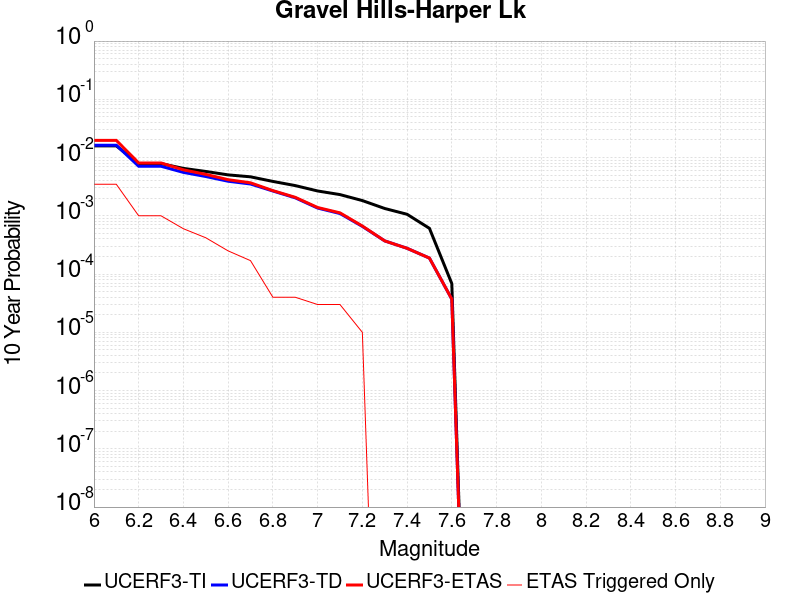 |

| Magnitude | 1 wk TI Prob | 1 wk TD Prob | 1 wk ETAS Prob | 1 wk ETAS/TD Gain | 1 wk ETAS Triggered Only | 1 mo TI Prob | 1 mo TD Prob | 1 mo ETAS Prob | 1 mo ETAS/TD Gain | 1 mo ETAS Triggered Only | 1 yr TI Prob | 1 yr TD Prob | 1 yr ETAS Prob | 1 yr ETAS/TD Gain | 1 yr ETAS Triggered Only | 10 yr TI Prob | 10 yr TD Prob | 10 yr ETAS Prob | 10 yr ETAS/TD Gain | 10 yr ETAS Triggered Only |
|-----|-----|-----|-----|-----|-----|-----|-----|-----|-----|-----|-----|-----|-----|-----|-----|-----|-----|-----|-----|-----|
| 6.0 | 3.0679566E-5 | 3.1465184E-5 | 1.7146078E-4 | 5.449222 | 1.4E-4 | 1.3147724E-4 | 1.3484505E-4 | 7.5476145E-4 | 5.59725 | 6.2E-4 | 0.0015995599 | 0.0016407187 | 0.0036074864 | 2.1987233 | 0.00197 | 0.015880952 | 0.016307615 | 0.019730866 | 1.2099172 | 0.00348 |
| 6.1 | 3.0679566E-5 | 3.1465184E-5 | 1.7146078E-4 | 5.449222 | 1.4E-4 | 1.3147724E-4 | 1.3484505E-4 | 7.5476145E-4 | 5.59725 | 6.2E-4 | 0.0015995599 | 0.0016407187 | 0.0036074864 | 2.1987233 | 0.00197 | 0.015880952 | 0.016307615 | 0.019730866 | 1.2099172 | 0.00348 |
| 6.2 | 1.514536E-5 | 1.3635392E-5 | 6.363471E-5 | 4.6668777 | 5.0E-5 | 6.490707E-5 | 5.843615E-5 | 2.4842506E-4 | 4.251222 | 1.9E-4 | 7.8995706E-4 | 7.112398E-4 | 0.0012808344 | 1.8008475 | 5.7E-4 | 0.007871548 | 0.0070908363 | 0.008083746 | 1.140027 | 0.001 |
| 6.3 | 1.514536E-5 | 1.3635392E-5 | 6.363471E-5 | 4.6668777 | 5.0E-5 | 6.490707E-5 | 5.843615E-5 | 2.4842506E-4 | 4.251222 | 1.9E-4 | 7.8995706E-4 | 7.112398E-4 | 0.0012808344 | 1.8008475 | 5.7E-4 | 0.007871548 | 0.0070908363 | 0.008083746 | 1.140027 | 0.001 |
| 6.4 | 1.2532521E-5 | 1.0689826E-5 | 3.068961E-5 | 2.8709178 | 2.0E-5 | 5.37097E-5 | 4.581277E-5 | 1.3580864E-4 | 2.964428 | 9.0E-5 | 6.537194E-4 | 5.576335E-4 | 8.474718E-4 | 1.5197648 | 2.9E-4 | 0.0065179965 | 0.0055629327 | 0.006159595 | 1.1072568 | 6.0E-4 |
| 6.5 | 1.1094058E-5 | 9.083774E-6 | 2.9083592E-5 | 3.201708 | 2.0E-5 | 4.7545094E-5 | 3.89299E-5 | 9.8927565E-5 | 2.5411718 | 6.0E-5 | 5.787078E-4 | 4.738725E-4 | 6.8377296E-4 | 1.4429471 | 2.1E-4 | 0.0057720304 | 0.004729028 | 0.0051470413 | 1.0883932 | 4.2E-4 |
| 6.6 | 9.688328E-6 | 7.531784E-6 | 7.531784E-6 | 1.0 | 0.0 | 4.1520743E-5 | 3.2278687E-5 | 6.227772E-5 | 1.9293758 | 3.0E-5 | 5.053978E-4 | 3.929247E-4 | 5.028815E-4 | 1.2798419 | 1.1E-4 | 0.0050424994 | 0.0039225565 | 0.004171576 | 1.063484 | 2.5E-4 |
| 6.7 | 8.974824E-6 | 6.7494916E-6 | 6.7494916E-6 | 1.0 | 0.0 | 3.8462964E-5 | 2.8926084E-5 | 4.8925507E-5 | 1.6913974 | 2.0E-5 | 4.6818596E-4 | 3.5212038E-4 | 4.1209924E-4 | 1.1703362 | 6.0E-5 | 0.004672008 | 0.0035158454 | 0.0036852476 | 1.0481825 | 1.7E-4 |
| 6.8 | 7.4780046E-6 | 5.116252E-6 | 5.116252E-6 | 1.0 | 0.0 | 3.20482E-5 | 2.1926619E-5 | 2.1926619E-5 | 1.0 | 0.0 | 3.9011694E-4 | 2.6692526E-4 | 2.6692526E-4 | 1.0 | 0.0 | 0.0038943281 | 0.002666185 | 0.002706078 | 1.0149627 | 4.0E-5 |
| 6.9 | 6.3409307E-6 | 3.9075426E-6 | 3.9075426E-6 | 1.0 | 0.0 | 2.7175134E-5 | 1.674651E-5 | 1.674651E-5 | 1.0 | 0.0 | 3.3080703E-4 | 2.0387067E-4 | 2.0387067E-4 | 1.0 | 0.0 | 0.0033031502 | 0.0020369345 | 0.002076853 | 1.0195974 | 4.0E-5 |
| 7.0 | 5.1239335E-6 | 2.6058885E-6 | 2.6058885E-6 | 1.0 | 0.0 | 2.195953E-5 | 1.11680465E-5 | 1.11680465E-5 | 1.0 | 0.0 | 2.6732447E-4 | 1.3596273E-4 | 1.3596273E-4 | 1.0 | 0.0 | 0.0026700313 | 0.0013588208 | 0.0013887801 | 1.022048 | 3.0E-5 |
| 7.1 | 4.438899E-6 | 2.0984994E-6 | 2.0984994E-6 | 1.0 | 0.0 | 1.9023713E-5 | 8.993539E-6 | 8.993539E-6 | 1.0 | 0.0 | 2.315891E-4 | 1.0949106E-4 | 1.0949106E-4 | 1.0 | 0.0 | 0.002313479 | 0.0010943931 | 0.0011243602 | 1.0273825 | 3.0E-5 |
| 7.2 | 3.50367E-6 | 1.2615911E-6 | 1.2615911E-6 | 1.0 | 0.0 | 1.5015643E-5 | 5.406808E-6 | 5.406808E-6 | 1.0 | 0.0 | 1.8280011E-4 | 6.582599E-5 | 6.582599E-5 | 1.0 | 0.0 | 0.0018264982 | 6.580731E-4 | 6.6806655E-4 | 1.0151858 | 1.0E-5 |
| 7.3 | 2.561638E-6 | 7.119307E-7 | 7.119307E-7 | 1.0 | 0.0 | 1.0978401E-5 | 3.051128E-6 | 3.051128E-6 | 1.0 | 0.0 | 1.3365384E-4 | 3.714687E-5 | 3.714687E-5 | 1.0 | 0.0 | 0.0013357349 | 3.7140862E-4 | 3.7140862E-4 | 1.0 | 0.0 |
| 7.4 | 2.0368864E-6 | 5.304955E-7 | 5.304955E-7 | 1.0 | 0.0 | 8.729483E-6 | 2.2735503E-6 | 2.2735503E-6 | 1.0 | 0.0 | 1.06276275E-4 | 2.768013E-5 | 2.768013E-5 | 1.0 | 0.0 | 0.0010622547 | 2.7676736E-4 | 2.7676736E-4 | 1.0 | 0.0 |
| 7.5 | 1.1681728E-6 | 3.6031287E-7 | 3.6031287E-7 | 1.0 | 0.0 | 5.0064455E-6 | 1.5441972E-6 | 1.5441972E-6 | 1.0 | 0.0 | 6.0951766E-5 | 1.8800443E-5 | 1.8800443E-5 | 1.0 | 0.0 | 6.093505E-4 | 1.8798899E-4 | 1.8798899E-4 | 1.0 | 0.0 |
| 7.6 | 1.3154387E-7 | 7.1198265E-8 | 7.1198265E-8 | 1.0 | 0.0 | 5.6375933E-7 | 3.051354E-7 | 3.051354E-7 | 1.0 | 0.0 | 6.863748E-6 | 3.7150185E-6 | 3.7150185E-6 | 1.0 | 0.0 | 6.863536E-5 | 3.7149723E-5 | 3.7149723E-5 | 1.0 | 0.0 |

## Goldstone Lake
*[(top)](#table-of-contents)*

| 1 Week | 1 Month | 1 Year | 10 Year |
|-----|-----|-----|-----|
|  | 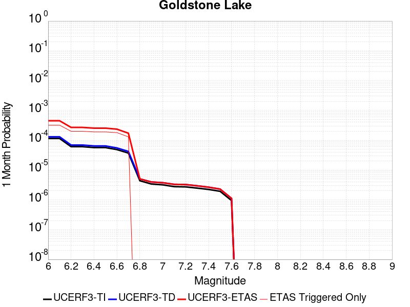 |  | 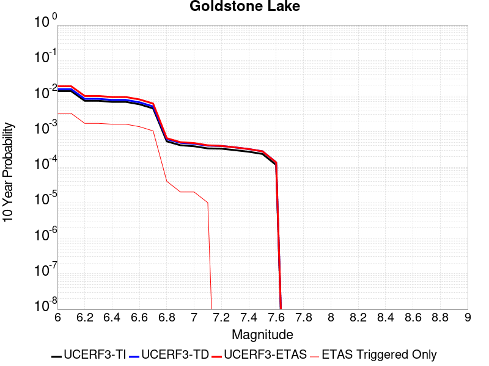 |

| Magnitude | 1 wk TI Prob | 1 wk TD Prob | 1 wk ETAS Prob | 1 wk ETAS/TD Gain | 1 wk ETAS Triggered Only | 1 mo TI Prob | 1 mo TD Prob | 1 mo ETAS Prob | 1 mo ETAS/TD Gain | 1 mo ETAS Triggered Only | 1 yr TI Prob | 1 yr TD Prob | 1 yr ETAS Prob | 1 yr ETAS/TD Gain | 1 yr ETAS Triggered Only | 10 yr TI Prob | 10 yr TD Prob | 10 yr ETAS Prob | 10 yr ETAS/TD Gain | 10 yr ETAS Triggered Only |
|-----|-----|-----|-----|-----|-----|-----|-----|-----|-----|-----|-----|-----|-----|-----|-----|-----|-----|-----|-----|-----|
| 6.0 | 2.671352E-5 | 3.0376628E-5 | 1.6037269E-4 | 5.279476 | 1.3E-4 | 1.1448149E-4 | 1.3018015E-4 | 4.501385E-4 | 3.4578118 | 3.2E-4 | 0.001392921 | 0.0015839875 | 0.0030816116 | 1.9454771 | 0.0015 | 0.013842222 | 0.015746472 | 0.018974824 | 1.2050207 | 0.00328 |
| 6.1 | 2.671352E-5 | 3.0376628E-5 | 1.6037269E-4 | 5.279476 | 1.3E-4 | 1.1448149E-4 | 1.3018015E-4 | 4.501385E-4 | 3.4578118 | 3.2E-4 | 0.001392921 | 0.0015839875 | 0.0030816116 | 1.9454771 | 0.0015 | 0.013842222 | 0.015746472 | 0.018974824 | 1.2050207 | 0.00328 |
| 6.2 | 1.4197047E-5 | 1.6096516E-5 | 9.609523E-5 | 5.9699397 | 8.0E-5 | 6.0843064E-5 | 6.89838E-5 | 2.6897E-4 | 3.8990314 | 2.0E-4 | 7.4051257E-4 | 8.396528E-4 | 0.001638981 | 1.9519747 | 8.0E-4 | 0.007380498 | 0.008374499 | 0.01007018 | 1.2024813 | 0.00171 |
| 6.3 | 1.4197047E-5 | 1.6096516E-5 | 9.609523E-5 | 5.9699397 | 8.0E-5 | 6.0843064E-5 | 6.89838E-5 | 2.6897E-4 | 3.8990314 | 2.0E-4 | 7.4051257E-4 | 8.396528E-4 | 0.001638981 | 1.9519747 | 8.0E-4 | 0.007380498 | 0.008374499 | 0.01007018 | 1.2024813 | 0.00171 |
| 6.4 | 1.3238931E-5 | 1.5008711E-5 | 8.500766E-5 | 5.663888 | 7.0E-5 | 5.6737044E-5 | 6.432201E-5 | 2.543098E-4 | 3.9536977 | 1.9E-4 | 6.9055456E-4 | 7.8293716E-4 | 0.0015623264 | 1.9954685 | 7.8E-4 | 0.006884126 | 0.007811414 | 0.0094187595 | 1.2057688 | 0.00162 |
| 6.5 | 1.3238931E-5 | 1.5008711E-5 | 8.500766E-5 | 5.663888 | 7.0E-5 | 5.6737044E-5 | 6.432201E-5 | 2.543098E-4 | 3.9536977 | 1.9E-4 | 6.9055456E-4 | 7.8293716E-4 | 0.0015623264 | 1.9954685 | 7.8E-4 | 0.006884126 | 0.007811414 | 0.0094187595 | 1.2057688 | 0.00162 |
| 6.6 | 1.1328278E-5 | 1.2855381E-5 | 7.285461E-5 | 5.6672463 | 6.0E-5 | 4.8548856E-5 | 5.5093864E-5 | 2.3508395E-4 | 4.2669716 | 1.8E-4 | 5.90922E-4 | 6.706571E-4 | 0.0013601943 | 2.0281518 | 6.9E-4 | 0.0058935313 | 0.0066957204 | 0.00806648 | 1.2047218 | 0.00138 |
| 6.7 | 8.651175E-6 | 9.8247265E-6 | 5.9824237E-5 | 6.08915 | 5.0E-5 | 3.707594E-5 | 4.2105803E-5 | 1.7210034E-4 | 4.0873303 | 1.3E-4 | 4.5130608E-4 | 5.126081E-4 | 0.0010323415 | 2.0139003 | 5.2E-4 | 0.0045039062 | 0.0051231356 | 0.0061677564 | 1.2039026 | 0.00105 |
| 6.8 | 1.0215377E-6 | 1.1754793E-6 | 1.1754793E-6 | 1.0 | 0.0 | 4.378012E-6 | 5.037759E-6 | 5.037759E-6 | 1.0 | 0.0 | 5.3300988E-5 | 6.133311E-5 | 7.133249E-5 | 1.1630341 | 1.0E-5 | 5.3288206E-4 | 6.13173E-4 | 6.531485E-4 | 1.0651945 | 4.0E-5 |
| 6.9 | 7.9360774E-7 | 9.2834586E-7 | 9.2834586E-7 | 1.0 | 0.0 | 3.4011714E-6 | 3.9786196E-6 | 3.9786196E-6 | 1.0 | 0.0 | 4.1408475E-5 | 4.8438687E-5 | 4.8438687E-5 | 1.0 | 0.0 | 4.140076E-4 | 4.842883E-4 | 5.042786E-4 | 1.0412778 | 2.0E-5 |
| 7.0 | 7.4382757E-7 | 8.7473853E-7 | 8.7473853E-7 | 1.0 | 0.0 | 3.1878285E-6 | 3.7488744E-6 | 3.7488744E-6 | 1.0 | 0.0 | 3.8811122E-5 | 4.5641656E-5 | 4.5641656E-5 | 1.0 | 0.0 | 3.8804344E-4 | 4.563295E-4 | 4.7632036E-4 | 1.043808 | 2.0E-5 |
| 7.1 | 6.4709513E-7 | 7.711347E-7 | 7.711347E-7 | 1.0 | 0.0 | 2.773262E-6 | 3.304859E-6 | 3.304859E-6 | 1.0 | 0.0 | 3.376394E-5 | 4.0235976E-5 | 4.0235976E-5 | 1.0 | 0.0 | 3.375881E-4 | 4.0229288E-4 | 4.1228885E-4 | 1.0248475 | 1.0E-5 |
| 7.2 | 6.356704E-7 | 7.5884054E-7 | 7.5884054E-7 | 1.0 | 0.0 | 2.7242988E-6 | 3.25217E-6 | 3.25217E-6 | 1.0 | 0.0 | 3.3167835E-5 | 3.959451E-5 | 3.959451E-5 | 1.0 | 0.0 | 3.3162883E-4 | 3.958805E-4 | 3.958805E-4 | 1.0 | 0.0 |
| 7.3 | 5.7695723E-7 | 6.8966074E-7 | 6.8966074E-7 | 1.0 | 0.0 | 2.4726714E-6 | 2.9556859E-6 | 2.9556859E-6 | 1.0 | 0.0 | 3.0104358E-5 | 3.598494E-5 | 3.598494E-5 | 1.0 | 0.0 | 3.0100282E-4 | 3.5979686E-4 | 3.5979686E-4 | 1.0 | 0.0 |
| 7.4 | 5.209647E-7 | 6.193549E-7 | 6.193549E-7 | 1.0 | 0.0 | 2.232704E-6 | 2.654376E-6 | 2.654376E-6 | 1.0 | 0.0 | 2.718283E-5 | 3.2316606E-5 | 3.2316606E-5 | 1.0 | 0.0 | 2.7179506E-4 | 3.231246E-4 | 3.231246E-4 | 1.0 | 0.0 |
| 7.5 | 4.512955E-7 | 5.3489146E-7 | 5.3489146E-7 | 1.0 | 0.0 | 1.934122E-6 | 2.2923903E-6 | 2.2923903E-6 | 1.0 | 0.0 | 2.3547682E-5 | 2.7909547E-5 | 2.7909547E-5 | 1.0 | 0.0 | 2.3545188E-4 | 2.7906572E-4 | 2.7906572E-4 | 1.0 | 0.0 |
| 7.6 | 2.21172E-7 | 2.6039737E-7 | 2.6039737E-7 | 1.0 | 0.0 | 9.478797E-7 | 1.1159884E-6 | 1.1159884E-6 | 1.0 | 0.0 | 1.1540374E-5 | 1.3587103E-5 | 1.3587103E-5 | 1.0 | 0.0 | 1.1539775E-4 | 1.3586554E-4 | 1.3586554E-4 | 1.0 | 0.0 |

## So Sierra Nevada
*[(top)](#table-of-contents)*

| 1 Week | 1 Month | 1 Year | 10 Year |
|-----|-----|-----|-----|
|  |  |  |  |

| Magnitude | 1 wk TI Prob | 1 wk TD Prob | 1 wk ETAS Prob | 1 wk ETAS/TD Gain | 1 wk ETAS Triggered Only | 1 mo TI Prob | 1 mo TD Prob | 1 mo ETAS Prob | 1 mo ETAS/TD Gain | 1 mo ETAS Triggered Only | 1 yr TI Prob | 1 yr TD Prob | 1 yr ETAS Prob | 1 yr ETAS/TD Gain | 1 yr ETAS Triggered Only | 10 yr TI Prob | 10 yr TD Prob | 10 yr ETAS Prob | 10 yr ETAS/TD Gain | 10 yr ETAS Triggered Only |
|-----|-----|-----|-----|-----|-----|-----|-----|-----|-----|-----|-----|-----|-----|-----|-----|-----|-----|-----|-----|-----|
| 6.0 | 1.15488665E-5 | 1.1079722E-5 | 2.4107717E-4 | 21.758415 | 2.3E-4 | 4.9494203E-5 | 4.748373E-5 | 7.5745E-4 | 15.95178 | 7.1E-4 | 6.024253E-4 | 5.779738E-4 | 0.0025268467 | 4.3719053 | 0.00195 | 0.006007948 | 0.005765975 | 0.009037005 | 1.5672987 | 0.00329 |
| 6.1 | 1.15488665E-5 | 1.1079722E-5 | 2.4107717E-4 | 21.758415 | 2.3E-4 | 4.9494203E-5 | 4.748373E-5 | 7.5745E-4 | 15.95178 | 7.1E-4 | 6.024253E-4 | 5.779738E-4 | 0.0025268467 | 4.3719053 | 0.00195 | 0.006007948 | 0.005765975 | 0.009037005 | 1.5672987 | 0.00329 |
| 6.2 | 1.15488665E-5 | 1.1079722E-5 | 2.4107717E-4 | 21.758415 | 2.3E-4 | 4.9494203E-5 | 4.748373E-5 | 7.5745E-4 | 15.95178 | 7.1E-4 | 6.024253E-4 | 5.779738E-4 | 0.0025268467 | 4.3719053 | 0.00195 | 0.006007948 | 0.005765975 | 0.009037005 | 1.5672987 | 0.00329 |
| 6.3 | 1.15488665E-5 | 1.1079722E-5 | 2.4107717E-4 | 21.758415 | 2.3E-4 | 4.9494203E-5 | 4.748373E-5 | 7.5745E-4 | 15.95178 | 7.1E-4 | 6.024253E-4 | 5.779738E-4 | 0.0025268467 | 4.3719053 | 0.00195 | 0.006007948 | 0.005765975 | 0.009037005 | 1.5672987 | 0.00329 |
| 6.4 | 1.15488665E-5 | 1.1079722E-5 | 2.4107717E-4 | 21.758415 | 2.3E-4 | 4.9494203E-5 | 4.748373E-5 | 7.5745E-4 | 15.95178 | 7.1E-4 | 6.024253E-4 | 5.779738E-4 | 0.0025268467 | 4.3719053 | 0.00195 | 0.006007948 | 0.005765975 | 0.009037005 | 1.5672987 | 0.00329 |
| 6.5 | 1.15488665E-5 | 1.1079722E-5 | 2.4107717E-4 | 21.758415 | 2.3E-4 | 4.9494203E-5 | 4.748373E-5 | 7.5745E-4 | 15.95178 | 7.1E-4 | 6.024253E-4 | 5.779738E-4 | 0.0025268467 | 4.3719053 | 0.00195 | 0.006007948 | 0.005765975 | 0.009037005 | 1.5672987 | 0.00329 |
| 6.6 | 7.587044E-6 | 6.935689E-6 | 1.8693444E-4 | 26.952541 | 1.8E-4 | 3.2515498E-5 | 2.9724059E-5 | 4.4971157E-4 | 15.129548 | 4.2E-4 | 3.9580427E-4 | 3.6183326E-4 | 0.0015514026 | 4.2876177 | 0.00119 | 0.003951 | 0.0036127327 | 0.0054460852 | 1.5074698 | 0.00184 |
| 6.7 | 7.587044E-6 | 6.935689E-6 | 1.8693444E-4 | 26.952541 | 1.8E-4 | 3.2515498E-5 | 2.9724059E-5 | 4.4971157E-4 | 15.129548 | 4.2E-4 | 3.9580427E-4 | 3.6183326E-4 | 0.0015514026 | 4.2876177 | 0.00119 | 0.003951 | 0.0036127327 | 0.0054460852 | 1.5074698 | 0.00184 |
| 6.8 | 5.9026956E-6 | 5.1794364E-6 | 1.4517871E-4 | 28.029827 | 1.4E-4 | 2.5297022E-5 | 2.2197402E-5 | 3.6218986E-4 | 16.316767 | 3.4E-4 | 3.0794772E-4 | 2.7022103E-4 | 0.0011699778 | 4.3297067 | 9.0E-4 | 0.0030752132 | 0.0026990408 | 0.0040753162 | 1.5099127 | 0.00138 |
| 6.9 | 5.0118915E-6 | 4.2524644E-6 | 1.0425204E-4 | 24.515676 | 1.0E-4 | 2.1479358E-5 | 1.8224722E-5 | 2.882198E-4 | 15.81477 | 2.7E-4 | 2.614798E-4 | 2.2186415E-4 | 9.417044E-4 | 4.244509 | 7.2E-4 | 0.0026117235 | 0.002216499 | 0.0032941052 | 1.486175 | 0.00108 |
| 7.0 | 4.4924795E-6 | 3.713954E-6 | 1.0371358E-4 | 27.925383 | 1.0E-4 | 1.925334E-5 | 1.5916852E-5 | 2.259135E-4 | 14.193355 | 2.1E-4 | 2.3438422E-4 | 1.9377106E-4 | 7.836567E-4 | 4.04424 | 5.9E-4 | 0.0023413717 | 0.001936084 | 0.002824361 | 1.4588008 | 8.9E-4 |
| 7.1 | 3.9118436E-6 | 3.1120105E-6 | 6.3111824E-5 | 20.28008 | 6.0E-5 | 1.6764936E-5 | 1.3337123E-5 | 1.4333539E-4 | 10.7471 | 1.3E-4 | 2.0409399E-4 | 1.6236794E-4 | 5.62303E-4 | 3.4631405 | 4.0E-4 | 0.0020390663 | 0.0016225493 | 0.0022315595 | 1.3753417 | 6.1E-4 |
| 7.2 | 3.4200818E-6 | 2.6054847E-6 | 6.260533E-5 | 24.028284 | 6.0E-5 | 1.4657411E-5 | 1.11663185E-5 | 1.2116509E-4 | 10.850944 | 1.1E-4 | 1.7843937E-4 | 1.3594194E-4 | 4.5589844E-4 | 3.353626 | 3.2E-4 | 0.0017829615 | 0.0013586376 | 0.0018379855 | 1.3528152 | 4.8E-4 |
| 7.3 | 2.6593618E-6 | 1.8284468E-6 | 4.1828374E-5 | 22.876451 | 4.0E-5 | 1.13972155E-5 | 7.836179E-6 | 7.783563E-5 | 9.932856 | 7.0E-5 | 1.3875226E-4 | 9.540159E-5 | 3.153806E-4 | 3.3058212 | 2.2E-4 | 0.0013866565 | 9.536353E-4 | 0.0012533492 | 1.3142856 | 3.0E-4 |
| 7.4 | 2.2577992E-6 | 1.4364622E-6 | 3.143642E-5 | 21.884613 | 3.0E-5 | 9.676246E-6 | 6.1562537E-6 | 4.615601E-5 | 7.497418 | 4.0E-5 | 1.1780193E-4 | 7.495006E-5 | 2.2493882E-4 | 3.0011826 | 1.5E-4 | 0.001177395 | 7.4927293E-4 | 9.691081E-4 | 1.293398 | 2.2E-4 |
| 7.5 | 1.489319E-6 | 7.3541264E-7 | 3.073539E-5 | 41.793396 | 3.0E-5 | 6.3827797E-6 | 3.1517645E-6 | 4.315164E-5 | 13.691263 | 4.0E-5 | 7.770758E-5 | 3.837206E-5 | 1.5836746E-4 | 4.1271553 | 1.2E-4 | 7.7680405E-4 | 3.836548E-4 | 5.3359725E-4 | 1.3908265 | 1.5E-4 |
| 7.6 | 1.0680322E-6 | 4.659796E-7 | 1.0465975E-5 | 22.460157 | 1.0E-5 | 4.577273E-6 | 1.997054E-6 | 2.1997013E-5 | 11.014732 | 2.0E-5 | 5.5726876E-5 | 2.4313864E-5 | 1.0431192E-4 | 4.290224 | 8.0E-5 | 5.5712904E-4 | 2.431123E-4 | 3.4308797E-4 | 1.4112326 | 1.0E-4 |
| 7.7 | 5.509146E-7 | 1.5581199E-7 | 1.0155811E-5 | 65.1799 | 1.0E-5 | 2.3610605E-6 | 6.677655E-7 | 1.0667759E-5 | 15.9753065 | 1.0E-5 | 2.8745531E-5 | 8.130016E-6 | 4.8129692E-5 | 5.9199996 | 4.0E-5 | 2.8741814E-4 | 8.12973E-5 | 1.3129324E-4 | 1.6149765 | 5.0E-5 |

## San Andreas (Mojave S)
*[(top)](#table-of-contents)*

| 1 Week | 1 Month | 1 Year | 10 Year |
|-----|-----|-----|-----|
|  |  |  |  |

| Magnitude | 1 wk TI Prob | 1 wk TD Prob | 1 wk ETAS Prob | 1 wk ETAS/TD Gain | 1 wk ETAS Triggered Only | 1 mo TI Prob | 1 mo TD Prob | 1 mo ETAS Prob | 1 mo ETAS/TD Gain | 1 mo ETAS Triggered Only | 1 yr TI Prob | 1 yr TD Prob | 1 yr ETAS Prob | 1 yr ETAS/TD Gain | 1 yr ETAS Triggered Only | 10 yr TI Prob | 10 yr TD Prob | 10 yr ETAS Prob | 10 yr ETAS/TD Gain | 10 yr ETAS Triggered Only |
|-----|-----|-----|-----|-----|-----|-----|-----|-----|-----|-----|-----|-----|-----|-----|-----|-----|-----|-----|-----|-----|
| 6.0 | 3.1064058E-4 | 6.747043E-4 | 9.145424E-4 | 1.3554714 | 2.4E-4 | 0.0013306376 | 0.002888514 | 0.003516694 | 1.2174753 | 6.3E-4 | 0.016080605 | 0.03462661 | 0.03603606 | 1.0407041 | 0.00146 | 0.1496549 | 0.28663692 | 0.28834185 | 1.0059481 | 0.00239 |
| 6.1 | 3.1064058E-4 | 6.747043E-4 | 9.145424E-4 | 1.3554714 | 2.4E-4 | 0.0013306376 | 0.002888514 | 0.003516694 | 1.2174753 | 6.3E-4 | 0.016080605 | 0.03462661 | 0.03603606 | 1.0407041 | 0.00146 | 0.1496549 | 0.28663692 | 0.28834185 | 1.0059481 | 0.00239 |
| 6.2 | 3.1064058E-4 | 6.747043E-4 | 9.145424E-4 | 1.3554714 | 2.4E-4 | 0.0013306376 | 0.002888514 | 0.003516694 | 1.2174753 | 6.3E-4 | 0.016080605 | 0.03462661 | 0.03603606 | 1.0407041 | 0.00146 | 0.1496549 | 0.28663692 | 0.28834185 | 1.0059481 | 0.00239 |
| 6.3 | 3.1064058E-4 | 6.747043E-4 | 9.145424E-4 | 1.3554714 | 2.4E-4 | 0.0013306376 | 0.002888514 | 0.003516694 | 1.2174753 | 6.3E-4 | 0.016080605 | 0.03462661 | 0.03603606 | 1.0407041 | 0.00146 | 0.1496549 | 0.28663692 | 0.28834185 | 1.0059481 | 0.00239 |
| 6.4 | 1.9872203E-4 | 4.318848E-4 | 6.717812E-4 | 1.5554637 | 2.4E-4 | 8.5138786E-4 | 0.0018496502 | 0.0024185958 | 1.3075963 | 5.7E-4 | 0.010316478 | 0.022293096 | 0.023525007 | 1.0552597 | 0.00126 | 0.098504856 | 0.19703239 | 0.19871862 | 1.0085582 | 0.0021 |
| 6.5 | 1.291105E-4 | 2.8761322E-4 | 5.175471E-4 | 1.7994552 | 2.3E-4 | 5.5321335E-4 | 0.0012320485 | 0.0017414201 | 1.4134347 | 5.1E-4 | 0.006714592 | 0.0148978485 | 0.016001163 | 1.0740587 | 0.00112 | 0.065152965 | 0.13807017 | 0.13966474 | 1.011549 | 0.00185 |
| 6.6 | 1.291105E-4 | 2.8761322E-4 | 5.175471E-4 | 1.7994552 | 2.3E-4 | 5.5321335E-4 | 0.0012320485 | 0.0017414201 | 1.4134347 | 5.1E-4 | 0.006714592 | 0.0148978485 | 0.016001163 | 1.0740587 | 0.00112 | 0.065152965 | 0.13807017 | 0.13966474 | 1.011549 | 0.00185 |
| 6.7 | 1.08001186E-4 | 2.4342406E-4 | 4.7336807E-4 | 1.9446232 | 2.3E-4 | 4.6278012E-4 | 0.0010428295 | 0.0015522976 | 1.4885441 | 5.1E-4 | 0.0056198016 | 0.012622835 | 0.01370895 | 1.0860437 | 0.0011 | 0.054797906 | 0.11921291 | 0.12082475 | 1.0135207 | 0.00183 |
| 6.8 | 1.0624356E-4 | 2.3860046E-4 | 4.685456E-4 | 1.9637245 | 2.3E-4 | 4.5525006E-4 | 0.0010221732 | 0.001531652 | 1.4984269 | 5.1E-4 | 0.0055285925 | 0.01237422 | 0.013460609 | 1.0877945 | 0.0011 | 0.053930566 | 0.117162056 | 0.11877765 | 1.0137894 | 0.00183 |
| 6.9 | 1.0393785E-4 | 2.3230357E-4 | 4.6225014E-4 | 1.9898537 | 2.3E-4 | 4.4537184E-4 | 9.952073E-4 | 0.0015046998 | 1.5119461 | 5.1E-4 | 0.0054089287 | 0.012049583 | 0.013136328 | 1.0901895 | 0.0011 | 0.05279156 | 0.11445948 | 0.11608002 | 1.0141582 | 0.00183 |
| 7.0 | 1.0155622E-4 | 2.2599897E-4 | 4.5594698E-4 | 2.0174737 | 2.3E-4 | 4.3516833E-4 | 9.682079E-4 | 0.001477714 | 1.5262364 | 5.1E-4 | 0.005285311 | 0.011724443 | 0.012801664 | 1.0918782 | 0.00109 | 0.05161361 | 0.11171984 | 0.11333651 | 1.0144707 | 0.00182 |
| 7.1 | 9.885595E-5 | 2.1888265E-4 | 4.488323E-4 | 2.0505614 | 2.3E-4 | 4.2359953E-4 | 9.377316E-4 | 0.0014472533 | 1.5433557 | 5.1E-4 | 0.0051451353 | 0.011357316 | 0.012434936 | 1.0948833 | 0.00109 | 0.05027629 | 0.10860426 | 0.1102266 | 1.0149381 | 0.00182 |
| 7.2 | 9.6411415E-5 | 2.125122E-4 | 4.3246543E-4 | 2.0350146 | 2.2E-4 | 4.1312634E-4 | 9.1044896E-4 | 0.0014099937 | 1.5486796 | 5.0E-4 | 0.005018219 | 0.01102856 | 0.012096649 | 1.0968475 | 0.00108 | 0.049064007 | 0.10579402 | 0.10741253 | 1.0152987 | 0.00181 |
| 7.3 | 9.1180635E-5 | 1.9479371E-4 | 4.1475086E-4 | 2.12918 | 2.2E-4 | 3.907156E-4 | 8.345632E-4 | 0.0013241543 | 1.5866435 | 4.9E-4 | 0.004746591 | 0.010113581 | 0.011152962 | 1.1027708 | 0.00105 | 0.046464786 | 0.09798661 | 0.099592194 | 1.0163858 | 0.00178 |
| 7.4 | 8.887388E-5 | 1.8727897E-4 | 3.9723964E-4 | 2.1211119 | 2.1E-4 | 3.8083247E-4 | 8.023774E-4 | 0.0012819923 | 1.5977422 | 4.8E-4 | 0.0046267817 | 0.009725285 | 0.01075517 | 1.1058978 | 0.00104 | 0.045316286 | 0.09462135 | 0.096214816 | 1.0168405 | 0.00176 |
| 7.5 | 8.6750515E-5 | 1.8059391E-4 | 3.9055597E-4 | 2.1626198 | 2.1E-4 | 3.7173493E-4 | 7.7374437E-4 | 0.001253373 | 1.61988 | 4.8E-4 | 0.004516484 | 0.009379733 | 0.010409979 | 1.1098373 | 0.00104 | 0.04425787 | 0.09158487 | 0.0931746 | 1.017358 | 0.00175 |
| 7.6 | 8.453092E-5 | 1.7446902E-4 | 3.8443238E-4 | 2.203442 | 2.1E-4 | 3.6222505E-4 | 7.475102E-4 | 0.0012171589 | 1.628284 | 4.7E-4 | 0.0044011753 | 0.009063034 | 0.0100837 | 1.1126184 | 0.00103 | 0.04315024 | 0.088743635 | 0.09032922 | 1.0178671 | 0.00174 |
| 7.7 | 8.259102E-5 | 1.6968958E-4 | 3.7965394E-4 | 2.2373438 | 2.1E-4 | 3.539135E-4 | 7.270384E-4 | 0.0011966967 | 1.6459882 | 4.7E-4 | 0.004300386 | 0.008815835 | 0.009826844 | 1.1146809 | 0.00102 | 0.042181134 | 0.08649418 | 0.08807454 | 1.0182713 | 0.00173 |
| 7.8 | 7.444844E-5 | 1.5290553E-4 | 3.2287955E-4 | 2.1116276 | 1.7E-4 | 3.1902574E-4 | 6.551449E-4 | 0.0010049156 | 1.533883 | 3.5E-4 | 0.0038772223 | 0.007947266 | 0.0087409085 | 1.0998635 | 8.0E-4 | 0.03810269 | 0.07832232 | 0.079603456 | 1.0163572 | 0.00139 |
| 7.9 | 5.2586525E-5 | 1.0011239E-4 | 1.9010338E-4 | 1.8988996 | 9.0E-5 | 2.2535135E-4 | 4.2898257E-4 | 6.3889247E-4 | 1.4893204 | 2.1E-4 | 0.0027402006 | 0.005210366 | 0.0056779175 | 1.0897348 | 4.7E-4 | 0.027066574 | 0.052222524 | 0.053028136 | 1.0154265 | 8.5E-4 |
| 8.0 | 3.379877E-5 | 5.4101976E-5 | 6.4101434E-5 | 1.1848261 | 1.0E-5 | 1.4484383E-4 | 2.3184501E-4 | 2.7183574E-4 | 1.172489 | 4.0E-5 | 0.0017620471 | 0.002819061 | 0.0029387227 | 1.0424473 | 1.2E-4 | 0.017481409 | 0.028848516 | 0.029091304 | 1.0084159 | 2.5E-4 |
| 8.1 | 1.8668277E-5 | 1.9322531E-5 | 1.9322531E-5 | 1.0 | 0.0 | 8.000444E-5 | 8.280823E-5 | 9.28074E-5 | 1.1207509 | 1.0E-5 | 9.736188E-4 | 0.0010077246 | 0.0010476842 | 1.0396534 | 4.0E-5 | 0.009693642 | 0.010805754 | 0.010845322 | 1.0036618 | 4.0E-5 |
| 8.2 | 8.541571E-6 | 5.465789E-6 | 5.465789E-6 | 1.0 | 0.0 | 3.660622E-5 | 2.34246E-5 | 2.34246E-5 | 1.0 | 0.0 | 4.455896E-4 | 2.8515726E-4 | 2.8515726E-4 | 1.0 | 0.0 | 0.0044469717 | 0.0032435213 | 0.0032435213 | 1.0 | 0.0 |
| 8.3 | 1.983087E-6 | 7.668296E-7 | 7.668296E-7 | 1.0 | 0.0 | 8.498917E-6 | 3.2864084E-6 | 3.2864084E-6 | 1.0 | 0.0 | 1.034694E-4 | 4.0011306E-5 | 4.0011306E-5 | 1.0 | 0.0 | 0.0010342124 | 4.724499E-4 | 4.724499E-4 | 1.0 | 0.0 |

## San Andreas (Mojave N)
*[(top)](#table-of-contents)*

| 1 Week | 1 Month | 1 Year | 10 Year |
|-----|-----|-----|-----|
|  |  |  |  |

| Magnitude | 1 wk TI Prob | 1 wk TD Prob | 1 wk ETAS Prob | 1 wk ETAS/TD Gain | 1 wk ETAS Triggered Only | 1 mo TI Prob | 1 mo TD Prob | 1 mo ETAS Prob | 1 mo ETAS/TD Gain | 1 mo ETAS Triggered Only | 1 yr TI Prob | 1 yr TD Prob | 1 yr ETAS Prob | 1 yr ETAS/TD Gain | 1 yr ETAS Triggered Only | 10 yr TI Prob | 10 yr TD Prob | 10 yr ETAS Prob | 10 yr ETAS/TD Gain | 10 yr ETAS Triggered Only |
|-----|-----|-----|-----|-----|-----|-----|-----|-----|-----|-----|-----|-----|-----|-----|-----|-----|-----|-----|-----|-----|
| 6.0 | 9.877682E-5 | 1.9409315E-4 | 4.8403686E-4 | 2.4938378 | 2.9E-4 | 4.2326056E-4 | 8.315628E-4 | 0.0014510473 | 1.7449641 | 6.2E-4 | 0.0051410277 | 0.010077406 | 0.011621685 | 1.1532418 | 0.00156 | 0.05023708 | 0.09835201 | 0.10066924 | 1.0235606 | 0.00257 |
| 6.1 | 9.877682E-5 | 1.9409315E-4 | 4.8403686E-4 | 2.4938378 | 2.9E-4 | 4.2326056E-4 | 8.315628E-4 | 0.0014510473 | 1.7449641 | 6.2E-4 | 0.0051410277 | 0.010077406 | 0.011621685 | 1.1532418 | 0.00156 | 0.05023708 | 0.09835201 | 0.10066924 | 1.0235606 | 0.00257 |
| 6.2 | 9.877682E-5 | 1.9409315E-4 | 4.8403686E-4 | 2.4938378 | 2.9E-4 | 4.2326056E-4 | 8.315628E-4 | 0.0014510473 | 1.7449641 | 6.2E-4 | 0.0051410277 | 0.010077406 | 0.011621685 | 1.1532418 | 0.00156 | 0.05023708 | 0.09835201 | 0.10066924 | 1.0235606 | 0.00257 |
| 6.3 | 9.877682E-5 | 1.9409315E-4 | 4.8403686E-4 | 2.4938378 | 2.9E-4 | 4.2326056E-4 | 8.315628E-4 | 0.0014510473 | 1.7449641 | 6.2E-4 | 0.0051410277 | 0.010077406 | 0.011621685 | 1.1532418 | 0.00156 | 0.05023708 | 0.09835201 | 0.10066924 | 1.0235606 | 0.00257 |
| 6.4 | 9.877682E-5 | 1.9409315E-4 | 4.8403686E-4 | 2.4938378 | 2.9E-4 | 4.2326056E-4 | 8.315628E-4 | 0.0014510473 | 1.7449641 | 6.2E-4 | 0.0051410277 | 0.010077406 | 0.011621685 | 1.1532418 | 0.00156 | 0.05023708 | 0.09835201 | 0.10066924 | 1.0235606 | 0.00257 |
| 6.5 | 9.861474E-5 | 1.9383078E-4 | 4.8377458E-4 | 2.4958603 | 2.9E-4 | 4.2256617E-4 | 8.304391E-4 | 0.0014499242 | 1.745973 | 6.2E-4 | 0.0051326132 | 0.010063851 | 0.011608152 | 1.1534503 | 0.00156 | 0.050156746 | 0.098229796 | 0.10054734 | 1.0235932 | 0.00257 |
| 6.6 | 9.861474E-5 | 1.9383078E-4 | 4.8377458E-4 | 2.4958603 | 2.9E-4 | 4.2256617E-4 | 8.304391E-4 | 0.0014499242 | 1.745973 | 6.2E-4 | 0.0051326132 | 0.010063851 | 0.011608152 | 1.1534503 | 0.00156 | 0.050156746 | 0.098229796 | 0.10054734 | 1.0235932 | 0.00257 |
| 6.7 | 9.8552715E-5 | 1.9373032E-4 | 4.8367414E-4 | 2.4966364 | 2.9E-4 | 4.223004E-4 | 8.3000876E-4 | 0.0014494942 | 1.7463601 | 6.2E-4 | 0.0051293927 | 0.01005866 | 0.011602969 | 1.1535302 | 0.00156 | 0.050125998 | 0.098182976 | 0.10050065 | 1.0236056 | 0.00257 |
| 6.8 | 9.8464974E-5 | 1.9358192E-4 | 4.8352577E-4 | 2.497784 | 2.9E-4 | 4.219245E-4 | 8.293732E-4 | 0.001448859 | 1.7469325 | 6.2E-4 | 0.0051248376 | 0.010050993 | 0.011595314 | 1.1536485 | 0.00156 | 0.05008251 | 0.09811299 | 0.100430846 | 1.0236243 | 0.00257 |
| 6.9 | 9.825824E-5 | 1.9326196E-4 | 4.8320592E-4 | 2.500264 | 2.9E-4 | 4.2103877E-4 | 8.280028E-4 | 0.0014474895 | 1.7481697 | 6.2E-4 | 0.0051141046 | 0.010034463 | 0.0115788095 | 1.1539042 | 0.00156 | 0.049980022 | 0.09796208 | 0.100280315 | 1.0236646 | 0.00257 |
| 7.0 | 9.781462E-5 | 1.9257552E-4 | 4.8251968E-4 | 2.5056126 | 2.9E-4 | 4.1913814E-4 | 8.250628E-4 | 0.0014445513 | 1.7508379 | 6.2E-4 | 0.005091073 | 0.009998998 | 0.0115434 | 1.1544557 | 0.00156 | 0.04976007 | 0.097638436 | 0.09995751 | 1.0237516 | 0.00257 |
| 7.1 | 9.7121134E-5 | 1.9159251E-4 | 4.8153693E-4 | 2.513339 | 2.9E-4 | 4.1616702E-4 | 8.208525E-4 | 0.0014403436 | 1.7546923 | 6.2E-4 | 0.005055068 | 0.009948207 | 0.011492687 | 1.1552522 | 0.00156 | 0.04941613 | 0.097174905 | 0.099495165 | 1.0238771 | 0.00257 |
| 7.2 | 9.663819E-5 | 1.9090026E-4 | 4.808449E-4 | 2.518828 | 2.9E-4 | 4.1409794E-4 | 8.178876E-4 | 0.0014373806 | 1.7574303 | 6.2E-4 | 0.0050299936 | 0.009912439 | 0.011456975 | 1.155818 | 0.00156 | 0.049176537 | 0.09684814 | 0.09916924 | 1.0239664 | 0.00257 |
| 7.3 | 9.6277574E-5 | 1.9042526E-4 | 4.8037004E-4 | 2.522617 | 2.9E-4 | 4.125529E-4 | 8.158532E-4 | 0.0014353474 | 1.7593206 | 6.2E-4 | 0.0050112694 | 0.009887895 | 0.011432469 | 1.1562086 | 0.00156 | 0.04899759 | 0.09662155 | 0.09894323 | 1.0240287 | 0.00257 |
| 7.4 | 9.593308E-5 | 1.8982294E-4 | 4.697698E-4 | 2.474779 | 2.8E-4 | 4.1107697E-4 | 8.132734E-4 | 0.0014227773 | 1.7494452 | 6.1E-4 | 0.0049933824 | 0.00985677 | 0.011391492 | 1.1557024 | 0.00155 | 0.04882661 | 0.09633968 | 0.09864402 | 1.0239189 | 0.00255 |
| 7.5 | 9.561707E-5 | 1.8928363E-4 | 4.6923064E-4 | 2.4789815 | 2.8E-4 | 4.0972308E-4 | 8.109635E-4 | 0.0014204688 | 1.7515817 | 6.1E-4 | 0.0049769743 | 0.009828901 | 0.0113636665 | 1.1561482 | 0.00155 | 0.048669744 | 0.09608582 | 0.098390795 | 1.0239887 | 0.00255 |
| 7.6 | 9.418194E-5 | 1.8580563E-4 | 4.657536E-4 | 2.506671 | 2.8E-4 | 4.0357444E-4 | 7.96067E-4 | 0.0014055815 | 1.7656572 | 6.1E-4 | 0.004902454 | 0.009649157 | 0.0111842 | 1.1590858 | 0.00155 | 0.047957025 | 0.09446791 | 0.096777014 | 1.0244433 | 0.00255 |
| 7.7 | 8.202141E-5 | 1.6029038E-4 | 4.2024872E-4 | 2.6217961 | 2.6E-4 | 3.51473E-4 | 6.86778E-4 | 0.0012563865 | 1.8293926 | 5.7E-4 | 0.00427079 | 0.008329522 | 0.009648443 | 1.1583431 | 0.00133 | 0.04189639 | 0.08226675 | 0.08429494 | 1.0246538 | 0.00221 |
| 7.8 | 7.2859846E-5 | 1.4523414E-4 | 3.1520944E-4 | 2.1703537 | 1.7E-4 | 3.1221908E-4 | 6.2228355E-4 | 9.720658E-4 | 1.5620946 | 3.5E-4 | 0.003794643 | 0.007550025 | 0.008343985 | 1.1051599 | 8.0E-4 | 0.037304975 | 0.074755974 | 0.07604206 | 1.0172038 | 0.00139 |
| 7.9 | 5.3874453E-5 | 1.0050546E-4 | 1.9049642E-4 | 1.8953837 | 9.0E-5 | 2.3087008E-4 | 4.3066658E-4 | 6.405761E-4 | 1.4874061 | 2.1E-4 | 0.0028072202 | 0.005230771 | 0.0056983125 | 1.0893829 | 4.7E-4 | 0.02772022 | 0.052447177 | 0.0532526 | 1.0153568 | 8.5E-4 |
| 8.0 | 3.468538E-5 | 5.4288335E-5 | 6.428779E-5 | 1.1841916 | 1.0E-5 | 1.4864317E-4 | 2.3264355E-4 | 2.7263424E-4 | 1.1718968 | 4.0E-5 | 0.0018082283 | 0.0028287582 | 0.0029484187 | 1.0423014 | 1.2E-4 | 0.017935853 | 0.028961267 | 0.029204028 | 1.0083822 | 2.5E-4 |
| 8.1 | 1.9152367E-5 | 1.9415891E-5 | 1.9415891E-5 | 1.0 | 0.0 | 8.207899E-5 | 8.320831E-5 | 9.320748E-5 | 1.1201704 | 1.0E-5 | 9.988535E-4 | 0.0010125911 | 0.0010525505 | 1.0394626 | 4.0E-5 | 0.009943757 | 0.010863188 | 0.010902754 | 1.0036422 | 4.0E-5 |
| 8.2 | 8.643924E-6 | 5.4798497E-6 | 5.4798497E-6 | 1.0 | 0.0 | 3.704486E-5 | 2.348486E-5 | 2.348486E-5 | 1.0 | 0.0 | 4.5092785E-4 | 2.858907E-4 | 2.858907E-4 | 1.0 | 0.0 | 0.0045001395 | 0.0032514327 | 0.0032514327 | 1.0 | 0.0 |
| 8.3 | 1.983087E-6 | 7.668296E-7 | 7.668296E-7 | 1.0 | 0.0 | 8.498917E-6 | 3.2864084E-6 | 3.2864084E-6 | 1.0 | 0.0 | 1.034694E-4 | 4.0011306E-5 | 4.0011306E-5 | 1.0 | 0.0 | 0.0010342124 | 4.724499E-4 | 4.724499E-4 | 1.0 | 0.0 |

## Death Valley (So)
*[(top)](#table-of-contents)*

| 1 Week | 1 Month | 1 Year | 10 Year |
|-----|-----|-----|-----|
|  |  | 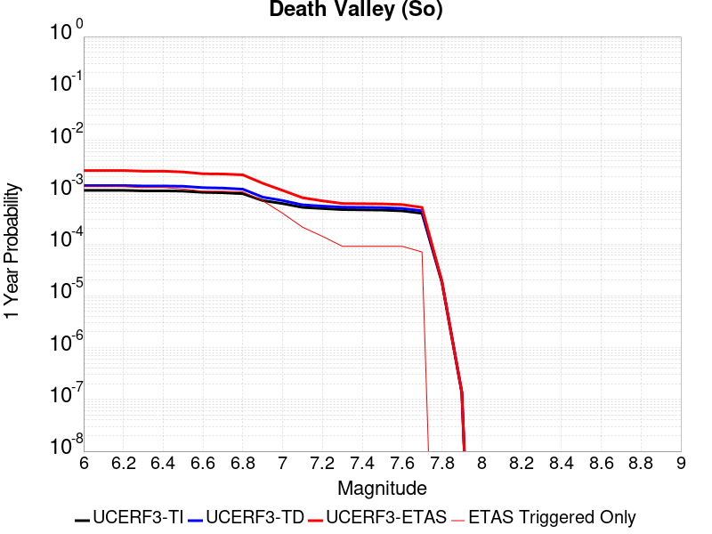 | 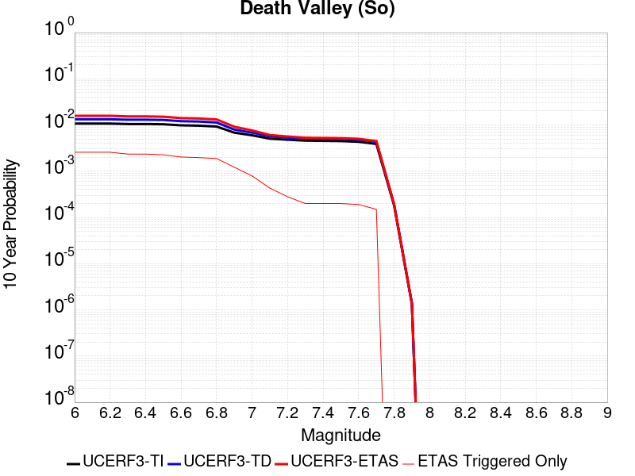 |

| Magnitude | 1 wk TI Prob | 1 wk TD Prob | 1 wk ETAS Prob | 1 wk ETAS/TD Gain | 1 wk ETAS Triggered Only | 1 mo TI Prob | 1 mo TD Prob | 1 mo ETAS Prob | 1 mo ETAS/TD Gain | 1 mo ETAS Triggered Only | 1 yr TI Prob | 1 yr TD Prob | 1 yr ETAS Prob | 1 yr ETAS/TD Gain | 1 yr ETAS Triggered Only | 10 yr TI Prob | 10 yr TD Prob | 10 yr ETAS Prob | 10 yr ETAS/TD Gain | 10 yr ETAS Triggered Only |
|-----|-----|-----|-----|-----|-----|-----|-----|-----|-----|-----|-----|-----|-----|-----|-----|-----|-----|-----|-----|-----|
| 6.0 | 2.0684236E-5 | 2.5618423E-5 | 1.556151E-4 | 6.074343 | 1.3E-4 | 8.864371E-5 | 1.09788714E-4 | 4.497514E-4 | 4.0965176 | 3.4E-4 | 0.0010787029 | 0.0013358749 | 0.0026041784 | 1.9494178 | 0.00127 | 0.010734817 | 0.013281729 | 0.015817594 | 1.1909289 | 0.00257 |
| 6.1 | 2.0684236E-5 | 2.5618423E-5 | 1.556151E-4 | 6.074343 | 1.3E-4 | 8.864371E-5 | 1.09788714E-4 | 4.497514E-4 | 4.0965176 | 3.4E-4 | 0.0010787029 | 0.0013358749 | 0.0026041784 | 1.9494178 | 0.00127 | 0.010734817 | 0.013281729 | 0.015817594 | 1.1909289 | 0.00257 |
| 6.2 | 2.0684236E-5 | 2.5618423E-5 | 1.556151E-4 | 6.074343 | 1.3E-4 | 8.864371E-5 | 1.09788714E-4 | 4.497514E-4 | 4.0965176 | 3.4E-4 | 0.0010787029 | 0.0013358749 | 0.0026041784 | 1.9494178 | 0.00127 | 0.010734817 | 0.013281729 | 0.015817594 | 1.1909289 | 0.00257 |
| 6.3 | 2.0240292E-5 | 2.5118497E-5 | 1.4511548E-4 | 5.7772355 | 1.2E-4 | 8.6741224E-5 | 1.0764636E-4 | 4.17613E-4 | 3.8794901 | 3.1E-4 | 0.0010555626 | 0.0013098232 | 0.0025282253 | 1.9302034 | 0.00122 | 0.010505628 | 0.013024284 | 0.015343677 | 1.1780822 | 0.00235 |
| 6.4 | 2.0240292E-5 | 2.5118497E-5 | 1.4511548E-4 | 5.7772355 | 1.2E-4 | 8.6741224E-5 | 1.0764636E-4 | 4.17613E-4 | 3.8794901 | 3.1E-4 | 0.0010555626 | 0.0013098232 | 0.0025282253 | 1.9302034 | 0.00122 | 0.010505628 | 0.013024284 | 0.015343677 | 1.1780822 | 0.00235 |
| 6.5 | 1.9962767E-5 | 2.4807747E-5 | 1.3480501E-4 | 5.433989 | 1.1E-4 | 8.55519E-5 | 1.0631468E-4 | 3.862849E-4 | 3.633411 | 2.8E-4 | 0.0010410968 | 0.0012936293 | 0.0024421415 | 1.8878218 | 0.00115 | 0.010362327 | 0.012864228 | 0.015095155 | 1.173421 | 0.00226 |
| 6.6 | 1.8937297E-5 | 2.3311568E-5 | 1.33309E-4 | 5.7185774 | 1.1E-4 | 8.115732E-5 | 9.990298E-5 | 3.79875E-4 | 3.8024392 | 2.8E-4 | 9.876423E-4 | 0.0012156547 | 0.0022543904 | 1.8544662 | 0.00104 | 0.009832645 | 0.0120931 | 0.01409855 | 1.1658343 | 0.00203 |
| 6.7 | 1.8621096E-5 | 2.2912203E-5 | 1.3290968E-4 | 5.800825 | 1.1E-4 | 7.980225E-5 | 9.8191544E-5 | 3.7816406E-4 | 3.8512893 | 2.8E-4 | 9.711593E-4 | 0.0011948409 | 0.0022335984 | 1.8693688 | 0.00104 | 0.009669261 | 0.011887211 | 0.013833794 | 1.1637543 | 0.00197 |
| 6.8 | 1.7830353E-5 | 2.1806247E-5 | 1.3180386E-4 | 6.044316 | 1.1E-4 | 7.641356E-5 | 9.345208E-5 | 3.6342684E-4 | 3.8889112 | 2.7E-4 | 9.29938E-4 | 0.0011371992 | 0.0021460506 | 1.8871369 | 0.00101 | 0.009260561 | 0.011316643 | 0.013175367 | 1.164247 | 0.00188 |
| 6.9 | 1.3135183E-5 | 1.5304242E-5 | 1.1530271E-4 | 7.5340366 | 1.0E-4 | 5.6292425E-5 | 6.558799E-5 | 2.455762E-4 | 3.7442248 | 1.8E-4 | 6.8514474E-4 | 7.982477E-4 | 0.001477705 | 1.8511859 | 6.8E-4 | 0.006830362 | 0.007954813 | 0.009165107 | 1.1521463 | 0.00122 |
| 7.0 | 1.1507512E-5 | 1.3154444E-5 | 6.3153784E-5 | 4.8009467 | 5.0E-5 | 4.9316975E-5 | 5.6375004E-5 | 1.5636937E-4 | 2.7737358 | 1.0E-4 | 6.002687E-4 | 6.861553E-4 | 0.0010758877 | 1.5679945 | 3.9E-4 | 0.0059864987 | 0.006841068 | 0.0076256637 | 1.114689 | 7.9E-4 |
| 7.1 | 9.715903E-6 | 1.0865454E-5 | 3.0865238E-5 | 2.8406763 | 2.0E-5 | 4.1638916E-5 | 4.6565423E-5 | 1.0656263E-4 | 2.2884498 | 6.0E-5 | 5.068359E-4 | 5.667908E-4 | 7.766718E-4 | 1.3702971 | 2.1E-4 | 0.0050568148 | 0.0056539057 | 0.0060814745 | 1.0756236 | 4.3E-4 |
| 7.2 | 9.233269E-6 | 1.0286473E-5 | 3.0286268E-5 | 2.944281 | 2.0E-5 | 3.9570554E-5 | 4.4084165E-5 | 9.408196E-5 | 2.134144 | 5.0E-5 | 4.81665E-4 | 5.3659675E-4 | 6.765216E-4 | 1.2607635 | 1.4E-4 | 0.0048062233 | 0.005353442 | 0.0056319432 | 1.0520228 | 2.8E-4 |
| 7.3 | 8.8041315E-6 | 9.808313E-6 | 2.9808118E-5 | 3.0390666 | 2.0E-5 | 3.7731446E-5 | 4.2034975E-5 | 6.203413E-5 | 1.4757743 | 2.0E-5 | 4.592835E-4 | 5.1165983E-4 | 6.016138E-4 | 1.1758081 | 9.0E-5 | 0.0045833546 | 0.0051052445 | 0.0053042234 | 1.0389754 | 2.0E-4 |
| 7.4 | 8.708749E-6 | 9.707323E-6 | 2.970713E-5 | 3.06028 | 2.0E-5 | 3.7322676E-5 | 4.1602176E-5 | 6.160134E-5 | 1.4807241 | 2.0E-5 | 4.5430884E-4 | 5.06393E-4 | 5.963474E-4 | 1.1776376 | 9.0E-5 | 0.004533812 | 0.0050528166 | 0.005251806 | 1.0393819 | 2.0E-4 |
| 7.5 | 8.612678E-6 | 9.604964E-6 | 2.9604773E-5 | 3.0822365 | 2.0E-5 | 3.6910955E-5 | 4.116351E-5 | 6.116268E-5 | 1.4858472 | 2.0E-5 | 4.492982E-4 | 5.010547E-4 | 5.9100956E-4 | 1.1795311 | 9.0E-5 | 0.004483909 | 0.0049996753 | 0.005198675 | 1.0398026 | 2.0E-4 |
| 7.6 | 8.319024E-6 | 9.28406E-6 | 2.9283874E-5 | 3.15421 | 2.0E-5 | 3.5652476E-5 | 3.9788243E-5 | 5.978745E-5 | 1.5026411 | 2.0E-5 | 4.3398244E-4 | 4.8431839E-4 | 5.742748E-4 | 1.1857382 | 9.0E-5 | 0.0043313587 | 0.004833053 | 0.0050221346 | 1.0391226 | 1.9E-4 |
| 7.7 | 7.4718328E-6 | 8.3453E-6 | 1.8345216E-5 | 2.1982694 | 1.0E-5 | 3.2021748E-5 | 3.57651E-5 | 4.5764744E-5 | 1.2795922 | 1.0E-5 | 3.8979502E-4 | 4.3535716E-4 | 5.0532667E-4 | 1.1607175 | 7.0E-5 | 0.00389112 | 0.004345448 | 0.004494796 | 1.0343689 | 1.5E-4 |
| 7.8 | 3.4586725E-7 | 3.648288E-7 | 3.648288E-7 | 1.0 | 0.0 | 1.4822873E-6 | 1.5635511E-6 | 1.5635511E-6 | 1.0 | 0.0 | 1.80467E-5 | 1.9036073E-5 | 1.9036073E-5 | 1.0 | 0.0 | 1.8045233E-4 | 1.9034486E-4 | 1.9034486E-4 | 1.0 | 0.0 |
| 7.9 | 2.5591178E-9 | 2.6696871E-9 | 2.6696871E-9 | 1.0 | 0.0 | 1.0967647E-8 | 1.1441516E-8 | 1.1441516E-8 | 1.0 | 0.0 | 1.335311E-7 | 1.3930045E-7 | 1.3930045E-7 | 1.0 | 0.0 | 1.3353102E-6 | 1.3930046E-6 | 1.3930046E-6 | 1.0 | 0.0 |

## Coyote Canyon
*[(top)](#table-of-contents)*

| 1 Week | 1 Month | 1 Year | 10 Year |
|-----|-----|-----|-----|
|  | 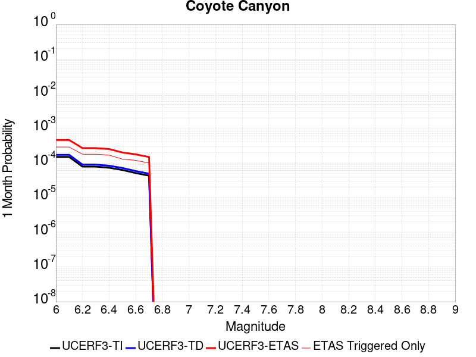 | 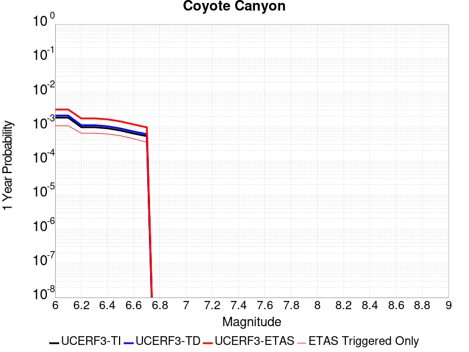 |  |

| Magnitude | 1 wk TI Prob | 1 wk TD Prob | 1 wk ETAS Prob | 1 wk ETAS/TD Gain | 1 wk ETAS Triggered Only | 1 mo TI Prob | 1 mo TD Prob | 1 mo ETAS Prob | 1 mo ETAS/TD Gain | 1 mo ETAS Triggered Only | 1 yr TI Prob | 1 yr TD Prob | 1 yr ETAS Prob | 1 yr ETAS/TD Gain | 1 yr ETAS Triggered Only | 10 yr TI Prob | 10 yr TD Prob | 10 yr ETAS Prob | 10 yr ETAS/TD Gain | 10 yr ETAS Triggered Only |
|-----|-----|-----|-----|-----|-----|-----|-----|-----|-----|-----|-----|-----|-----|-----|-----|-----|-----|-----|-----|-----|
| 6.0 | 3.5090034E-5 | 4.036513E-5 | 1.203619E-4 | 2.9818287 | 8.0E-5 | 1.503772E-4 | 1.7298339E-4 | 4.6293324E-4 | 2.6761715 | 2.9E-4 | 0.0018293047 | 0.0021042947 | 0.0031620641 | 1.5026717 | 0.00106 | 0.018143194 | 0.020869615 | 0.023102032 | 1.1069697 | 0.00228 |
| 6.1 | 3.5090034E-5 | 4.036513E-5 | 1.203619E-4 | 2.9818287 | 8.0E-5 | 1.503772E-4 | 1.7298339E-4 | 4.6293324E-4 | 2.6761715 | 2.9E-4 | 0.0018293047 | 0.0021042947 | 0.0031620641 | 1.5026717 | 0.00106 | 0.018143194 | 0.020869615 | 0.023102032 | 1.1069697 | 0.00228 |
| 6.2 | 1.841879E-5 | 2.1060194E-5 | 6.105935E-5 | 2.8992777 | 4.0E-5 | 7.8935285E-5 | 9.0255424E-5 | 2.702392E-4 | 2.99416 | 1.8E-4 | 9.606133E-4 | 0.0010984079 | 0.0017377048 | 1.5820215 | 6.4E-4 | 0.0095647145 | 0.010939874 | 0.0121860895 | 1.113915 | 0.00126 |
| 6.3 | 1.841879E-5 | 2.1060194E-5 | 6.105935E-5 | 2.8992777 | 4.0E-5 | 7.8935285E-5 | 9.0255424E-5 | 2.702392E-4 | 2.99416 | 1.8E-4 | 9.606133E-4 | 0.0010984079 | 0.0017377048 | 1.5820215 | 6.4E-4 | 0.0095647145 | 0.010939874 | 0.0121860895 | 1.113915 | 0.00126 |
| 6.4 | 1.712201E-5 | 1.9565581E-5 | 5.9564798E-5 | 3.0443664 | 4.0E-5 | 7.337798E-5 | 8.385037E-5 | 2.538361E-4 | 3.027251 | 1.7E-4 | 8.930107E-4 | 0.0010205007 | 0.0016298782 | 1.5971358 | 6.1E-4 | 0.008894307 | 0.0101680625 | 0.011345962 | 1.115843 | 0.00119 |
| 6.5 | 1.4744935E-5 | 1.6837288E-5 | 4.6836783E-5 | 2.7817295 | 3.0E-5 | 6.3191044E-5 | 7.215834E-5 | 2.0214896E-4 | 2.8014636 | 1.3E-4 | 7.6907943E-4 | 8.7826716E-4 | 0.0014177929 | 1.614307 | 5.4E-4 | 0.007664232 | 0.008757159 | 0.009788051 | 1.11772 | 0.00104 |
| 6.6 | 1.2017839E-5 | 1.3724348E-5 | 4.3723936E-5 | 3.185866 | 3.0E-5 | 5.150401E-5 | 5.8817808E-5 | 1.7881075E-4 | 3.0400784 | 1.2E-4 | 6.268809E-4 | 7.159601E-4 | 0.001155645 | 1.6141194 | 4.4E-4 | 0.0062511545 | 0.007145228 | 0.007999083 | 1.1195 | 8.6E-4 |
| 6.7 | 1.00956095E-5 | 1.1533734E-5 | 4.153339E-5 | 3.6010356 | 3.0E-5 | 4.326618E-5 | 4.9429844E-5 | 1.494249E-4 | 3.0229692 | 1.0E-4 | 5.266384E-4 | 6.0172915E-4 | 9.5151854E-4 | 1.581307 | 3.5E-4 | 0.005253921 | 0.006009526 | 0.0066754995 | 1.1108197 | 6.7E-4 |

## Nelson Lake
*[(top)](#table-of-contents)*

| 1 Week | 1 Month | 1 Year | 10 Year |
|-----|-----|-----|-----|
|  |  |  |  |

| Magnitude | 1 wk TI Prob | 1 wk TD Prob | 1 wk ETAS Prob | 1 wk ETAS/TD Gain | 1 wk ETAS Triggered Only | 1 mo TI Prob | 1 mo TD Prob | 1 mo ETAS Prob | 1 mo ETAS/TD Gain | 1 mo ETAS Triggered Only | 1 yr TI Prob | 1 yr TD Prob | 1 yr ETAS Prob | 1 yr ETAS/TD Gain | 1 yr ETAS Triggered Only | 10 yr TI Prob | 10 yr TD Prob | 10 yr ETAS Prob | 10 yr ETAS/TD Gain | 10 yr ETAS Triggered Only |
|-----|-----|-----|-----|-----|-----|-----|-----|-----|-----|-----|-----|-----|-----|-----|-----|-----|-----|-----|-----|-----|
| 6.0 | 9.913453E-6 | 1.0192293E-5 | 1.1019127E-4 | 10.811234 | 1.0E-4 | 4.2485535E-5 | 4.3680586E-5 | 2.836701E-4 | 6.494192 | 2.4E-4 | 5.1713863E-4 | 5.316917E-4 | 0.0012613036 | 2.372246 | 7.3E-4 | 0.0051593683 | 0.0053052236 | 0.007135462 | 1.344988 | 0.00184 |
| 6.1 | 9.913453E-6 | 1.0192293E-5 | 1.1019127E-4 | 10.811234 | 1.0E-4 | 4.2485535E-5 | 4.3680586E-5 | 2.836701E-4 | 6.494192 | 2.4E-4 | 5.1713863E-4 | 5.316917E-4 | 0.0012613036 | 2.372246 | 7.3E-4 | 0.0051593683 | 0.0053052236 | 0.007135462 | 1.344988 | 0.00184 |
| 6.2 | 4.5596407E-6 | 4.696332E-6 | 7.4696E-5 | 15.90518 | 7.0E-5 | 1.954117E-5 | 2.0126989E-5 | 1.8012377E-4 | 8.949366 | 1.6E-4 | 2.3788778E-4 | 2.450198E-4 | 6.449218E-4 | 2.632121 | 4.0E-4 | 0.0023763329 | 0.0024476226 | 0.003405273 | 1.3912573 | 9.6E-4 |
| 6.3 | 4.5596407E-6 | 4.696332E-6 | 7.4696E-5 | 15.90518 | 7.0E-5 | 1.954117E-5 | 2.0126989E-5 | 1.8012377E-4 | 8.949366 | 1.6E-4 | 2.3788778E-4 | 2.450198E-4 | 6.449218E-4 | 2.632121 | 4.0E-4 | 0.0023763329 | 0.0024476226 | 0.003405273 | 1.3912573 | 9.6E-4 |
| 6.4 | 3.4025713E-6 | 3.509912E-6 | 4.350977E-5 | 12.396257 | 4.0E-5 | 1.4582367E-5 | 1.50423975E-5 | 1.1504089E-4 | 7.647776 | 1.0E-4 | 1.7752586E-4 | 1.8312664E-4 | 4.830717E-4 | 2.6379106 | 3.0E-4 | 0.001773841 | 0.0018298404 | 0.0024986144 | 1.3654822 | 6.7E-4 |
| 6.5 | 2.8352947E-6 | 2.9278688E-6 | 4.2927753E-5 | 14.661775 | 4.0E-5 | 1.2151207E-5 | 1.2547953E-5 | 1.0254682E-4 | 8.172395 | 9.0E-5 | 1.479309E-4 | 1.5276136E-4 | 4.1272165E-4 | 2.701741 | 2.6E-4 | 0.0014783246 | 0.0015266375 | 0.0021157367 | 1.3858802 | 5.9E-4 |
| 6.6 | 2.251518E-6 | 2.3290781E-6 | 3.2329008E-5 | 13.880602 | 3.0E-5 | 9.649328E-6 | 9.981729E-6 | 7.998103E-5 | 8.012743 | 7.0E-5 | 1.1747423E-4 | 1.2152141E-4 | 3.5149345E-4 | 2.8924408 | 2.3E-4 | 0.0011741214 | 0.0012146112 | 0.0016840404 | 1.3864851 | 4.7E-4 |
| 6.7 | 1.8911853E-6 | 1.9591491E-6 | 2.195911E-5 | 11.208494 | 2.0E-5 | 8.105055E-6 | 8.39633E-6 | 5.8395908E-5 | 6.954933 | 5.0E-5 | 9.867457E-5 | 1.022211E-4 | 2.7220373E-4 | 2.6628919 | 1.7E-4 | 9.863076E-4 | 0.0010217984 | 0.00140141 | 1.3715134 | 3.8E-4 |
| 6.8 | 1.4874814E-6 | 1.5438383E-6 | 2.1543807E-5 | 13.954705 | 2.0E-5 | 6.374905E-6 | 6.6164357E-6 | 5.6616103E-5 | 8.556889 | 5.0E-5 | 7.76117E-5 | 8.055265E-5 | 2.4053977E-4 | 2.9861186 | 1.6E-4 | 7.75846E-4 | 8.052856E-4 | 0.0011550038 | 1.4342784 | 3.5E-4 |
| 6.9 | 6.835972E-7 | 7.1399705E-7 | 1.07139895E-5 | 15.0056505 | 1.0E-5 | 2.9296991E-6 | 3.0599856E-6 | 2.3059923E-5 | 7.535959 | 2.0E-5 | 3.56685E-5 | 3.7255006E-5 | 1.1725203E-4 | 3.1472824 | 8.0E-5 | 3.5662777E-4 | 3.7251884E-4 | 5.424555E-4 | 1.4561827 | 1.7E-4 |

## Towne Pass
*[(top)](#table-of-contents)*

| 1 Week | 1 Month | 1 Year | 10 Year |
|-----|-----|-----|-----|
|  | 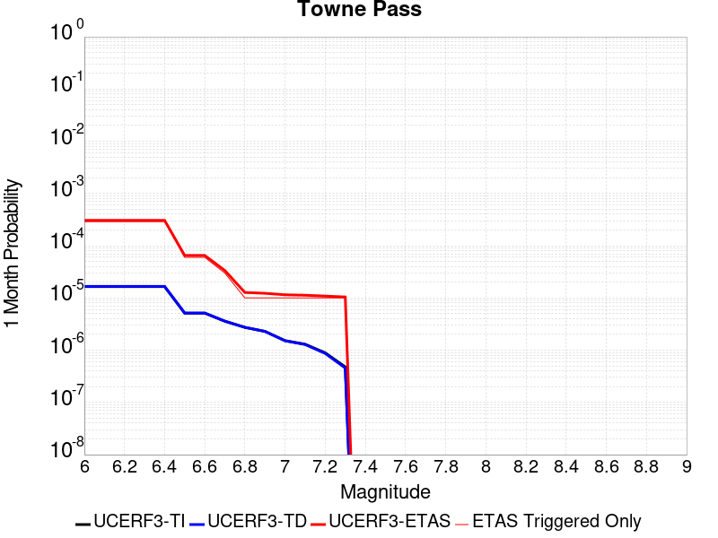 |  |  |

| Magnitude | 1 wk TI Prob | 1 wk TD Prob | 1 wk ETAS Prob | 1 wk ETAS/TD Gain | 1 wk ETAS Triggered Only | 1 mo TI Prob | 1 mo TD Prob | 1 mo ETAS Prob | 1 mo ETAS/TD Gain | 1 mo ETAS Triggered Only | 1 yr TI Prob | 1 yr TD Prob | 1 yr ETAS Prob | 1 yr ETAS/TD Gain | 1 yr ETAS Triggered Only | 10 yr TI Prob | 10 yr TD Prob | 10 yr ETAS Prob | 10 yr ETAS/TD Gain | 10 yr ETAS Triggered Only |
|-----|-----|-----|-----|-----|-----|-----|-----|-----|-----|-----|-----|-----|-----|-----|-----|-----|-----|-----|-----|-----|
| 6.0 | 3.849728E-6 | 3.8945495E-6 | 1.0389416E-4 | 26.67681 | 1.0E-4 | 1.649873E-5 | 1.6690845E-5 | 3.06686E-4 | 18.374504 | 2.9E-4 | 2.0085352E-4 | 2.0319645E-4 | 0.0011929953 | 5.8711424 | 9.9E-4 | 0.0020067208 | 0.0020305358 | 0.003936657 | 1.9387285 | 0.00191 |
| 6.1 | 3.849728E-6 | 3.8945495E-6 | 1.0389416E-4 | 26.67681 | 1.0E-4 | 1.649873E-5 | 1.6690845E-5 | 3.06686E-4 | 18.374504 | 2.9E-4 | 2.0085352E-4 | 2.0319645E-4 | 0.0011929953 | 5.8711424 | 9.9E-4 | 0.0020067208 | 0.0020305358 | 0.003936657 | 1.9387285 | 0.00191 |
| 6.2 | 3.849728E-6 | 3.8945495E-6 | 1.0389416E-4 | 26.67681 | 1.0E-4 | 1.649873E-5 | 1.6690845E-5 | 3.06686E-4 | 18.374504 | 2.9E-4 | 2.0085352E-4 | 2.0319645E-4 | 0.0011929953 | 5.8711424 | 9.9E-4 | 0.0020067208 | 0.0020305358 | 0.003936657 | 1.9387285 | 0.00191 |
| 6.3 | 3.849728E-6 | 3.8945495E-6 | 1.0389416E-4 | 26.67681 | 1.0E-4 | 1.649873E-5 | 1.6690845E-5 | 3.06686E-4 | 18.374504 | 2.9E-4 | 2.0085352E-4 | 2.0319645E-4 | 0.0011929953 | 5.8711424 | 9.9E-4 | 0.0020067208 | 0.0020305358 | 0.003936657 | 1.9387285 | 0.00191 |
| 6.4 | 3.849728E-6 | 3.8945495E-6 | 1.0389416E-4 | 26.67681 | 1.0E-4 | 1.649873E-5 | 1.6690845E-5 | 3.06686E-4 | 18.374504 | 2.9E-4 | 2.0085352E-4 | 2.0319645E-4 | 0.0011929953 | 5.8711424 | 9.9E-4 | 0.0020067208 | 0.0020305358 | 0.003936657 | 1.9387285 | 0.00191 |
| 6.5 | 1.1953545E-6 | 1.2030553E-6 | 3.120302E-5 | 25.93648 | 3.0E-5 | 5.1229376E-6 | 5.155942E-6 | 6.515563E-5 | 12.636999 | 6.0E-5 | 6.236998E-5 | 6.27719E-5 | 2.5276E-4 | 4.026642 | 1.9E-4 | 6.235248E-4 | 6.2755344E-4 | 9.873275E-4 | 1.5732963 | 3.6E-4 |
| 6.6 | 1.1953545E-6 | 1.2030553E-6 | 3.120302E-5 | 25.93648 | 3.0E-5 | 5.1229376E-6 | 5.155942E-6 | 6.515563E-5 | 12.636999 | 6.0E-5 | 6.236998E-5 | 6.27719E-5 | 2.5276E-4 | 4.026642 | 1.9E-4 | 6.235248E-4 | 6.2755344E-4 | 9.873275E-4 | 1.5732963 | 3.6E-4 |
| 6.7 | 8.375951E-7 | 8.410697E-7 | 2.0841053E-5 | 24.77922 | 2.0E-5 | 3.5896885E-6 | 3.60458E-6 | 3.3604472E-5 | 9.322715 | 3.0E-5 | 4.370358E-5 | 4.3884935E-5 | 1.6387967E-4 | 3.7343035 | 1.2E-4 | 4.3694986E-4 | 4.387684E-4 | 6.686675E-4 | 1.5239645 | 2.3E-4 |
| 6.8 | 6.38041E-7 | 6.39218E-7 | 6.39218E-7 | 1.0 | 0.0 | 2.7344586E-6 | 2.739503E-6 | 1.2739476E-5 | 4.650287 | 1.0E-5 | 3.3291526E-5 | 3.335298E-5 | 1.0335064E-4 | 3.0986931 | 7.0E-5 | 3.3286537E-4 | 3.3348353E-4 | 4.7343684E-4 | 1.4196708 | 1.4E-4 |
| 6.9 | 5.3460053E-7 | 5.345355E-7 | 5.345355E-7 | 1.0 | 0.0 | 2.2911431E-6 | 2.2908646E-6 | 1.2290841E-5 | 5.365154 | 1.0E-5 | 2.789431E-5 | 2.7890954E-5 | 8.788928E-5 | 3.151175 | 6.0E-5 | 2.789081E-4 | 2.7887785E-4 | 3.8884717E-4 | 1.3943279 | 1.1E-4 |
| 7.0 | 3.557783E-7 | 3.5324413E-7 | 3.5324413E-7 | 1.0 | 0.0 | 1.5247632E-6 | 1.5139026E-6 | 1.1513887E-5 | 7.605435 | 1.0E-5 | 1.8563835E-5 | 1.8431618E-5 | 5.843088E-5 | 3.170144 | 4.0E-5 | 1.8562283E-4 | 1.8430172E-4 | 2.542888E-4 | 1.3797419 | 7.0E-5 |
| 7.1 | 3.037942E-7 | 3.0002388E-7 | 3.0002388E-7 | 1.0 | 0.0 | 1.3019744E-6 | 1.2858161E-6 | 1.1285803E-5 | 8.777152 | 1.0E-5 | 1.5851423E-5 | 1.5654707E-5 | 5.565408E-5 | 3.555102 | 4.0E-5 | 1.5850292E-4 | 1.5653679E-4 | 2.2652582E-4 | 1.4471092 | 7.0E-5 |
| 7.2 | 2.0808248E-7 | 2.021783E-7 | 2.021783E-7 | 1.0 | 0.0 | 8.917818E-7 | 8.6647816E-7 | 1.086647E-5 | 12.540962 | 1.0E-5 | 1.0857389E-5 | 1.0549325E-5 | 4.054901E-5 | 3.8437538 | 3.0E-5 | 1.0856859E-4 | 1.054887E-4 | 1.5548343E-4 | 1.4739344 | 5.0E-5 |
| 7.3 | 1.1162073E-7 | 1.06369825E-7 | 1.06369825E-7 | 1.0 | 0.0 | 4.7837443E-7 | 4.5587063E-7 | 1.0455866E-5 | 22.936039 | 1.0E-5 | 5.8241935E-6 | 5.550213E-6 | 2.5550102E-5 | 4.6034455 | 2.0E-5 | 5.8240406E-5 | 5.5500943E-5 | 8.5499276E-5 | 1.5405014 | 3.0E-5 |

## Lenwood-Lockhart-Old Woman Springs
*[(top)](#table-of-contents)*

| 1 Week | 1 Month | 1 Year | 10 Year |
|-----|-----|-----|-----|
| 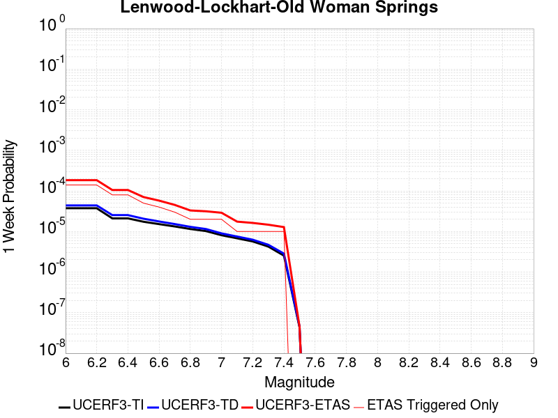 |  |  | 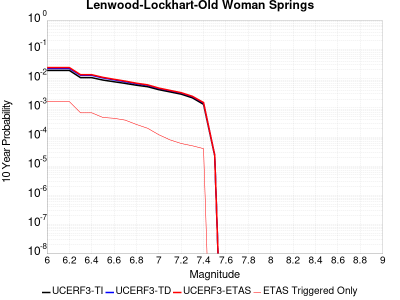 |

| Magnitude | 1 wk TI Prob | 1 wk TD Prob | 1 wk ETAS Prob | 1 wk ETAS/TD Gain | 1 wk ETAS Triggered Only | 1 mo TI Prob | 1 mo TD Prob | 1 mo ETAS Prob | 1 mo ETAS/TD Gain | 1 mo ETAS Triggered Only | 1 yr TI Prob | 1 yr TD Prob | 1 yr ETAS Prob | 1 yr ETAS/TD Gain | 1 yr ETAS Triggered Only | 10 yr TI Prob | 10 yr TD Prob | 10 yr ETAS Prob | 10 yr ETAS/TD Gain | 10 yr ETAS Triggered Only |
|-----|-----|-----|-----|-----|-----|-----|-----|-----|-----|-----|-----|-----|-----|-----|-----|-----|-----|-----|-----|-----|
| 6.0 | 3.744542E-5 | 4.3962966E-5 | 1.8395681E-4 | 4.1843586 | 1.4E-4 | 1.604705E-4 | 1.8840008E-4 | 4.483511E-4 | 2.379782 | 2.6E-4 | 0.0019519776 | 0.0022915301 | 0.0030896969 | 1.3483117 | 8.0E-4 | 0.019349206 | 0.022697017 | 0.024309566 | 1.0710468 | 0.00165 |
| 6.1 | 3.744542E-5 | 4.3962966E-5 | 1.8395681E-4 | 4.1843586 | 1.4E-4 | 1.604705E-4 | 1.8840008E-4 | 4.483511E-4 | 2.379782 | 2.6E-4 | 0.0019519776 | 0.0022915301 | 0.0030896969 | 1.3483117 | 8.0E-4 | 0.019349206 | 0.022697017 | 0.024309566 | 1.0710468 | 0.00165 |
| 6.2 | 3.744542E-5 | 4.3962966E-5 | 1.8395681E-4 | 4.1843586 | 1.4E-4 | 1.604705E-4 | 1.8840008E-4 | 4.483511E-4 | 2.379782 | 2.6E-4 | 0.0019519776 | 0.0022915301 | 0.0030896969 | 1.3483117 | 8.0E-4 | 0.019349206 | 0.022697017 | 0.024309566 | 1.0710468 | 0.00165 |
| 6.3 | 2.1079984E-5 | 2.5353596E-5 | 1.05351566E-4 | 4.155291 | 8.0E-5 | 9.0339665E-5 | 1.0865386E-4 | 2.2864081E-4 | 2.1043046 | 1.2E-4 | 0.0010993304 | 0.0013220779 | 0.001681602 | 1.2719387 | 3.6E-4 | 0.010939079 | 0.013144341 | 0.013815403 | 1.0510533 | 6.8E-4 |
| 6.4 | 2.1079984E-5 | 2.5353596E-5 | 1.05351566E-4 | 4.155291 | 8.0E-5 | 9.0339665E-5 | 1.0865386E-4 | 2.2864081E-4 | 2.1043046 | 1.2E-4 | 0.0010993304 | 0.0013220779 | 0.001681602 | 1.2719387 | 3.6E-4 | 0.010939079 | 0.013144341 | 0.013815403 | 1.0510533 | 6.8E-4 |
| 6.5 | 1.7397282E-5 | 2.0662535E-5 | 7.06615E-5 | 3.4197886 | 5.0E-5 | 7.455765E-5 | 8.855078E-5 | 1.7854282E-4 | 2.016276 | 9.0E-5 | 9.073613E-4 | 0.0010775843 | 0.0013472934 | 1.2502904 | 2.7E-4 | 0.009036654 | 0.010724886 | 0.011189845 | 1.0433533 | 4.7E-4 |
| 6.6 | 1.52050325E-5 | 1.76798E-5 | 5.767909E-5 | 3.262429 | 4.0E-5 | 6.51628E-5 | 7.576841E-5 | 1.4576312E-4 | 1.9237978 | 7.0E-5 | 7.9306826E-4 | 9.220979E-4 | 0.0011718674 | 1.2708709 | 2.5E-4 | 0.007902439 | 0.009183581 | 0.009619541 | 1.0474716 | 4.4E-4 |
| 6.7 | 1.332523E-5 | 1.5264091E-5 | 4.5263634E-5 | 2.965367 | 3.0E-5 | 5.7106878E-5 | 6.541593E-5 | 1.25412E-4 | 1.9171479 | 6.0E-5 | 6.950544E-4 | 7.9615373E-4 | 9.959945E-4 | 1.2510078 | 2.0E-4 | 0.006928845 | 0.007933645 | 0.00831063 | 1.0475173 | 3.8E-4 |
| 6.8 | 1.1525329E-5 | 1.303105E-5 | 3.303079E-5 | 2.5347757 | 2.0E-5 | 4.9393333E-5 | 5.5846183E-5 | 9.584395E-5 | 1.7162131 | 4.0E-5 | 6.011979E-4 | 6.7971944E-4 | 7.8964466E-4 | 1.1617215 | 1.1E-4 | 0.00599574 | 0.006776856 | 0.007045026 | 1.0395715 | 2.7E-4 |
| 6.9 | 1.0253909E-5 | 1.15144985E-5 | 3.1514268E-5 | 2.7369206 | 2.0E-5 | 4.3944583E-5 | 4.9346934E-5 | 8.934496E-5 | 1.8105474 | 4.0E-5 | 5.3489394E-4 | 6.0063694E-4 | 6.805889E-4 | 1.133112 | 8.0E-5 | 0.0053360825 | 0.005990515 | 0.006189317 | 1.0331861 | 2.0E-4 |
| 7.0 | 8.104563E-6 | 8.991321E-6 | 2.899114E-5 | 3.2243474 | 2.0E-5 | 3.4733377E-5 | 3.8533675E-5 | 6.853252E-5 | 1.7785097 | 3.0E-5 | 4.2279682E-4 | 4.6904891E-4 | 4.990348E-4 | 1.0639292 | 3.0E-5 | 0.0042199334 | 0.0046808375 | 0.0048002754 | 1.0255164 | 1.2E-4 |
| 7.1 | 6.7986157E-6 | 7.515848E-6 | 1.7515773E-5 | 2.3305118 | 1.0E-5 | 2.91366E-5 | 3.221039E-5 | 5.2209747E-5 | 1.6208977 | 2.0E-5 | 3.5468035E-4 | 3.9209312E-4 | 4.1208527E-4 | 1.0509883 | 2.0E-5 | 0.003541148 | 0.0039142296 | 0.0039939163 | 1.0203582 | 8.0E-5 |
| 7.2 | 5.6893327E-6 | 6.280039E-6 | 1.6279977E-5 | 2.592337 | 1.0E-5 | 2.4382627E-5 | 2.6914187E-5 | 3.6913916E-5 | 1.3715413 | 1.0E-5 | 2.9681803E-4 | 3.2763294E-4 | 3.3762967E-4 | 1.030512 | 1.0E-5 | 0.002964219 | 0.0032716978 | 0.0033315015 | 1.0182791 | 6.0E-5 |
| 7.3 | 4.253348E-6 | 4.706927E-6 | 1.470688E-5 | 3.1245184 | 1.0E-5 | 1.8228506E-5 | 2.01724E-5 | 3.0172198E-5 | 1.4957168 | 1.0E-5 | 2.2190946E-4 | 2.4557312E-4 | 2.5557066E-4 | 1.040711 | 1.0E-5 | 0.00221688 | 0.0024531984 | 0.0025030756 | 1.0203315 | 5.0E-5 |
| 7.4 | 2.5448119E-6 | 2.8520535E-6 | 1.2852025E-5 | 4.5062356 | 1.0E-5 | 1.0906291E-5 | 1.22230385E-5 | 2.2222916E-5 | 1.8181173 | 1.0E-5 | 1.3277601E-4 | 1.4880698E-4 | 1.5880549E-4 | 1.0671911 | 1.0E-5 | 0.001326967 | 0.0014872355 | 0.001527176 | 1.0268556 | 4.0E-5 |
| 7.5 | 4.3706837E-8 | 4.5629356E-8 | 4.5629356E-8 | 1.0 | 0.0 | 1.8731501E-7 | 1.9555438E-7 | 1.9555438E-7 | 1.0 | 0.0 | 2.2805577E-6 | 2.3808725E-6 | 2.3808725E-6 | 1.0 | 0.0 | 2.2805343E-5 | 2.3808525E-5 | 2.3808525E-5 | 1.0 | 0.0 |

## San Andreas (San Bernardino N)
*[(top)](#table-of-contents)*

| 1 Week | 1 Month | 1 Year | 10 Year |
|-----|-----|-----|-----|
|  |  |  |  |

| Magnitude | 1 wk TI Prob | 1 wk TD Prob | 1 wk ETAS Prob | 1 wk ETAS/TD Gain | 1 wk ETAS Triggered Only | 1 mo TI Prob | 1 mo TD Prob | 1 mo ETAS Prob | 1 mo ETAS/TD Gain | 1 mo ETAS Triggered Only | 1 yr TI Prob | 1 yr TD Prob | 1 yr ETAS Prob | 1 yr ETAS/TD Gain | 1 yr ETAS Triggered Only | 10 yr TI Prob | 10 yr TD Prob | 10 yr ETAS Prob | 10 yr ETAS/TD Gain | 10 yr ETAS Triggered Only |
|-----|-----|-----|-----|-----|-----|-----|-----|-----|-----|-----|-----|-----|-----|-----|-----|-----|-----|-----|-----|-----|
| 6.0 | 1.4273766E-4 | 3.161376E-4 | 4.5609332E-4 | 1.4427052 | 1.4E-4 | 6.115894E-4 | 0.0013541778 | 0.001643785 | 1.2138621 | 2.9E-4 | 0.0074207084 | 0.016363978 | 0.016983667 | 1.0378692 | 6.3E-4 | 0.07177748 | 0.15029658 | 0.15127374 | 1.0065016 | 0.00115 |
| 6.1 | 1.4273766E-4 | 3.161376E-4 | 4.5609332E-4 | 1.4427052 | 1.4E-4 | 6.115894E-4 | 0.0013541778 | 0.001643785 | 1.2138621 | 2.9E-4 | 0.0074207084 | 0.016363978 | 0.016983667 | 1.0378692 | 6.3E-4 | 0.07177748 | 0.15029658 | 0.15127374 | 1.0065016 | 0.00115 |
| 6.2 | 1.4273766E-4 | 3.161376E-4 | 4.5609332E-4 | 1.4427052 | 1.4E-4 | 6.115894E-4 | 0.0013541778 | 0.001643785 | 1.2138621 | 2.9E-4 | 0.0074207084 | 0.016363978 | 0.016983667 | 1.0378692 | 6.3E-4 | 0.07177748 | 0.15029658 | 0.15127374 | 1.0065016 | 0.00115 |
| 6.3 | 1.3730655E-4 | 3.0518573E-4 | 4.4514303E-4 | 1.4585971 | 1.4E-4 | 5.883239E-4 | 0.001307289 | 0.0015969098 | 1.2215431 | 2.9E-4 | 0.0071393442 | 0.01580149 | 0.016421534 | 1.0392396 | 6.3E-4 | 0.06914291 | 0.14559646 | 0.14657049 | 1.0066899 | 0.00114 |
| 6.4 | 1.3730655E-4 | 3.0518573E-4 | 4.4514303E-4 | 1.4585971 | 1.4E-4 | 5.883239E-4 | 0.001307289 | 0.0015969098 | 1.2215431 | 2.9E-4 | 0.0071393442 | 0.01580149 | 0.016421534 | 1.0392396 | 6.3E-4 | 0.06914291 | 0.14559646 | 0.14657049 | 1.0066899 | 0.00114 |
| 6.5 | 1.2942807E-4 | 2.8932988E-4 | 4.292894E-4 | 1.4837368 | 1.4E-4 | 5.545738E-4 | 0.0012394012 | 0.0015290417 | 1.233694 | 2.9E-4 | 0.0067310524 | 0.014986552 | 0.01560711 | 1.0414077 | 6.3E-4 | 0.06530788 | 0.13873914 | 0.13972098 | 1.0070769 | 0.00114 |
| 6.6 | 1.1125901E-4 | 2.537176E-4 | 3.9368204E-4 | 1.5516547 | 1.4E-4 | 4.767372E-4 | 0.0010869103 | 0.0013566167 | 1.2481406 | 2.7E-4 | 0.005788839 | 0.013153472 | 0.013755448 | 1.0457656 | 6.1E-4 | 0.056403454 | 0.12302898 | 0.12399364 | 1.007841 | 0.0011 |
| 6.7 | 1.02209575E-4 | 2.3506685E-4 | 3.7503394E-4 | 1.5954353 | 1.4E-4 | 4.3796748E-4 | 0.0010070418 | 0.0012767699 | 1.267842 | 2.7E-4 | 0.0053192247 | 0.01219223 | 0.012784915 | 1.0486116 | 6.0E-4 | 0.051936906 | 0.11482068 | 0.11577667 | 1.0083259 | 0.00108 |
| 6.8 | 9.610582E-5 | 2.2032406E-4 | 3.602932E-4 | 1.6352876 | 1.4E-4 | 4.1181705E-4 | 9.439049E-4 | 0.0012136501 | 1.2857758 | 2.7E-4 | 0.0050023515 | 0.011431754 | 0.012024894 | 1.0518854 | 6.0E-4 | 0.048912346 | 0.1082225 | 0.10918562 | 1.0088995 | 0.00108 |
| 6.9 | 9.3877505E-5 | 2.1487933E-4 | 3.5484924E-4 | 1.6513885 | 1.4E-4 | 4.0227012E-4 | 9.2058704E-4 | 0.0011903385 | 1.2930211 | 2.7E-4 | 0.0048866454 | 0.011150793 | 0.011744102 | 1.0532079 | 6.0E-4 | 0.04780577 | 0.10581279 | 0.10677851 | 1.0091267 | 0.00108 |
| 7.0 | 9.1019785E-5 | 2.0814833E-4 | 3.4811918E-4 | 1.6724573 | 1.4E-4 | 3.900265E-4 | 8.917599E-4 | 0.0011615191 | 1.302502 | 2.7E-4 | 0.0047382377 | 0.010803353 | 0.011386978 | 1.0540227 | 5.9E-4 | 0.046384744 | 0.10278319 | 0.10374321 | 1.0093403 | 0.00107 |
| 7.1 | 8.771155E-5 | 1.9989353E-4 | 3.3986554E-4 | 1.7002329 | 1.4E-4 | 3.758525E-4 | 8.564058E-4 | 0.0011261746 | 1.3150011 | 2.7E-4 | 0.0045664064 | 0.01037709 | 0.010960967 | 1.0562661 | 5.9E-4 | 0.044737056 | 0.09909467 | 0.10005864 | 1.0097277 | 0.00107 |
| 7.2 | 8.0830236E-5 | 1.8394848E-4 | 3.1392457E-4 | 1.7065896 | 1.3E-4 | 3.4636928E-4 | 7.881126E-4 | 0.0010479077 | 1.329642 | 2.6E-4 | 0.0042088944 | 0.009553162 | 0.010127621 | 1.0601329 | 5.8E-4 | 0.041300658 | 0.09182531 | 0.092787966 | 1.0104836 | 0.00106 |
| 7.3 | 7.7668235E-5 | 1.7338296E-4 | 3.033604E-4 | 1.7496554 | 1.3E-4 | 3.328214E-4 | 7.428583E-4 | 0.0010026651 | 1.3497394 | 2.6E-4 | 0.0040445733 | 0.009006873 | 0.009581649 | 1.0638152 | 5.8E-4 | 0.03971748 | 0.087092124 | 0.088059805 | 1.011111 | 0.00106 |
| 7.4 | 7.520177E-5 | 1.6558339E-4 | 2.9556185E-4 | 1.7849729 | 1.3E-4 | 3.2225347E-4 | 7.0945016E-4 | 9.692657E-4 | 1.366221 | 2.6E-4 | 0.0039163795 | 0.0086034145 | 0.009178424 | 1.066835 | 5.8E-4 | 0.038480744 | 0.08354814 | 0.08451959 | 1.0116273 | 0.00106 |
| 7.5 | 7.274697E-5 | 1.5845922E-4 | 2.8843863E-4 | 1.8202703 | 1.3E-4 | 3.1173544E-4 | 6.789343E-4 | 9.3875773E-4 | 1.3826932 | 2.6E-4 | 0.003788775 | 0.008234753 | 0.008809976 | 1.0698532 | 5.8E-4 | 0.03724827 | 0.08026466 | 0.08123038 | 1.0120317 | 0.00105 |
| 7.6 | 7.1185845E-5 | 1.5415733E-4 | 2.841373E-4 | 1.8431643 | 1.3E-4 | 3.0504653E-4 | 6.6050707E-4 | 9.103419E-4 | 1.3782471 | 2.5E-4 | 0.0037076178 | 0.008012074 | 0.008577507 | 1.0705726 | 5.7E-4 | 0.036463667 | 0.078254156 | 0.07921277 | 1.0122501 | 0.00104 |
| 7.7 | 6.709961E-5 | 1.4324463E-4 | 2.73226E-4 | 1.9074084 | 1.3E-4 | 2.8753807E-4 | 6.1376113E-4 | 8.636077E-4 | 1.4070746 | 2.5E-4 | 0.003495157 | 0.007446978 | 0.0080127325 | 1.0759711 | 5.7E-4 | 0.034406938 | 0.073082365 | 0.07404636 | 1.0131905 | 0.00104 |
| 7.8 | 6.300812E-5 | 1.3208245E-4 | 2.620653E-4 | 1.9841037 | 1.3E-4 | 2.7000686E-4 | 5.659449E-4 | 8.158034E-4 | 1.4414891 | 2.5E-4 | 0.0032823787 | 0.0068686386 | 0.0074347234 | 1.0824158 | 5.7E-4 | 0.032343175 | 0.06773997 | 0.06870952 | 1.0143129 | 0.00104 |
| 7.9 | 4.983037E-5 | 9.728091E-5 | 1.8727215E-4 | 1.9250659 | 9.0E-5 | 2.1354125E-4 | 4.1685157E-4 | 6.26764E-4 | 1.5035664 | 2.1E-4 | 0.0025967648 | 0.005063368 | 0.0055309883 | 1.0923536 | 4.7E-4 | 0.025666296 | 0.0506703 | 0.051477227 | 1.0159252 | 8.5E-4 |
| 8.0 | 3.2211527E-5 | 5.333152E-5 | 6.333099E-5 | 1.1874964 | 1.0E-5 | 1.380421E-4 | 2.2854365E-4 | 2.6853452E-4 | 1.1749812 | 4.0E-5 | 0.0016793669 | 0.0027789702 | 0.0028986367 | 1.0430615 | 1.2E-4 | 0.016667323 | 0.02837451 | 0.028617416 | 1.0085608 | 2.5E-4 |
| 8.1 | 1.743376E-5 | 1.8836954E-5 | 1.8836954E-5 | 1.0 | 0.0 | 7.471398E-5 | 8.07273E-5 | 9.07265E-5 | 1.1238638 | 1.0E-5 | 9.0926304E-4 | 9.824124E-4 | 0.0010223731 | 1.0406761 | 4.0E-5 | 0.009055517 | 0.010490617 | 0.010530197 | 1.003773 | 4.0E-5 |
| 8.2 | 7.831616E-6 | 5.1597067E-6 | 5.1597067E-6 | 1.0 | 0.0 | 3.3563636E-5 | 2.2112841E-5 | 2.2112841E-5 | 1.0 | 0.0 | 4.0856065E-4 | 2.6919067E-4 | 2.6919067E-4 | 1.0 | 0.0 | 0.004078103 | 0.003044315 | 0.003044315 | 1.0 | 0.0 |
| 8.3 | 1.983087E-6 | 7.668296E-7 | 7.668296E-7 | 1.0 | 0.0 | 8.498917E-6 | 3.2864084E-6 | 3.2864084E-6 | 1.0 | 0.0 | 1.034694E-4 | 4.0011306E-5 | 4.0011306E-5 | 1.0 | 0.0 | 0.0010342124 | 4.724499E-4 | 4.724499E-4 | 1.0 | 0.0 |

## Paradise
*[(top)](#table-of-contents)*

| 1 Week | 1 Month | 1 Year | 10 Year |
|-----|-----|-----|-----|
|  |  |  |  |

| Magnitude | 1 wk TI Prob | 1 wk TD Prob | 1 wk ETAS Prob | 1 wk ETAS/TD Gain | 1 wk ETAS Triggered Only | 1 mo TI Prob | 1 mo TD Prob | 1 mo ETAS Prob | 1 mo ETAS/TD Gain | 1 mo ETAS Triggered Only | 1 yr TI Prob | 1 yr TD Prob | 1 yr ETAS Prob | 1 yr ETAS/TD Gain | 1 yr ETAS Triggered Only | 10 yr TI Prob | 10 yr TD Prob | 10 yr ETAS Prob | 10 yr ETAS/TD Gain | 10 yr ETAS Triggered Only |
|-----|-----|-----|-----|-----|-----|-----|-----|-----|-----|-----|-----|-----|-----|-----|-----|-----|-----|-----|-----|-----|
| 6.0 | 1.4851273E-5 | 1.6694854E-5 | 6.669402E-5 | 3.994885 | 5.0E-5 | 6.364676E-5 | 7.154755E-5 | 2.2153681E-4 | 3.096358 | 1.5E-4 | 7.7462377E-4 | 8.707668E-4 | 0.0014102967 | 1.619603 | 5.4E-4 | 0.0077192914 | 0.008675928 | 0.009815951 | 1.1314007 | 0.00115 |
| 6.1 | 1.4851273E-5 | 1.6694854E-5 | 6.669402E-5 | 3.994885 | 5.0E-5 | 6.364676E-5 | 7.154755E-5 | 2.2153681E-4 | 3.096358 | 1.5E-4 | 7.7462377E-4 | 8.707668E-4 | 0.0014102967 | 1.619603 | 5.4E-4 | 0.0077192914 | 0.008675928 | 0.009815951 | 1.1314007 | 0.00115 |
| 6.2 | 1.4851273E-5 | 1.6694854E-5 | 6.669402E-5 | 3.994885 | 5.0E-5 | 6.364676E-5 | 7.154755E-5 | 2.2153681E-4 | 3.096358 | 1.5E-4 | 7.7462377E-4 | 8.707668E-4 | 0.0014102967 | 1.619603 | 5.4E-4 | 0.0077192914 | 0.008675928 | 0.009815951 | 1.1314007 | 0.00115 |
| 6.3 | 1.0426831E-5 | 1.1888727E-5 | 4.1888372E-5 | 3.5233688 | 3.0E-5 | 4.4685654E-5 | 5.0950726E-5 | 1.2094716E-4 | 2.3738062 | 7.0E-5 | 5.43912E-4 | 6.201545E-4 | 8.6999947E-4 | 1.4028753 | 2.5E-4 | 0.0054258266 | 0.006184847 | 0.0066718166 | 1.0787358 | 4.9E-4 |
| 6.4 | 1.0426831E-5 | 1.1888727E-5 | 4.1888372E-5 | 3.5233688 | 3.0E-5 | 4.4685654E-5 | 5.0950726E-5 | 1.2094716E-4 | 2.3738062 | 7.0E-5 | 5.43912E-4 | 6.201545E-4 | 8.6999947E-4 | 1.4028753 | 2.5E-4 | 0.0054258266 | 0.006184847 | 0.0066718166 | 1.0787358 | 4.9E-4 |
| 6.5 | 9.25027E-6 | 1.0620054E-5 | 3.061984E-5 | 2.8832097 | 2.0E-5 | 3.964341E-5 | 4.551375E-5 | 9.5511474E-5 | 2.098519 | 5.0E-5 | 4.8255164E-4 | 5.539939E-4 | 7.538831E-4 | 1.3608148 | 2.0E-4 | 0.0048150513 | 0.0055266283 | 0.005914473 | 1.0701774 | 3.9E-4 |
| 6.6 | 7.904275E-6 | 9.159603E-6 | 1.9159512E-5 | 2.0917404 | 1.0E-5 | 3.3875025E-5 | 3.925487E-5 | 6.925369E-5 | 1.7642064 | 3.0E-5 | 4.1235037E-4 | 4.7782718E-4 | 6.177603E-4 | 1.292853 | 1.4E-4 | 0.0041158604 | 0.004768395 | 0.0050570117 | 1.0605271 | 2.9E-4 |
| 6.7 | 7.2061953E-6 | 8.407318E-6 | 8.407318E-6 | 1.0 | 0.0 | 3.088333E-5 | 3.6030888E-5 | 5.6030167E-5 | 1.5550593 | 2.0E-5 | 3.7593965E-4 | 4.385914E-4 | 5.485432E-4 | 1.2506928 | 1.1E-4 | 0.003753043 | 0.0043776273 | 0.0045767515 | 1.0454868 | 2.0E-4 |
| 6.8 | 6.6948724E-6 | 7.84223E-6 | 7.84223E-6 | 1.0 | 0.0 | 2.8691995E-5 | 3.3609143E-5 | 5.3608474E-5 | 1.5950562 | 2.0E-5 | 3.4926904E-4 | 4.0911807E-4 | 5.190731E-4 | 1.268761 | 1.1E-4 | 0.003487206 | 0.0040840064 | 0.0042732307 | 1.046333 | 1.9E-4 |
| 6.9 | 6.0421025E-6 | 7.130678E-6 | 7.130678E-6 | 1.0 | 0.0 | 2.5894467E-5 | 3.055971E-5 | 5.05591E-5 | 1.6544365 | 2.0E-5 | 3.1521954E-4 | 3.7200435E-4 | 4.6197086E-4 | 1.2418426 | 9.0E-5 | 0.0031477278 | 0.0037141545 | 0.0038735603 | 1.0429184 | 1.6E-4 |
| 7.0 | 4.134091E-6 | 5.0803487E-6 | 5.0803487E-6 | 1.0 | 0.0 | 1.7717413E-5 | 2.177275E-5 | 3.177253E-5 | 1.4592797 | 1.0E-5 | 2.1568815E-4 | 2.6505254E-4 | 2.950446E-4 | 1.1131551 | 3.0E-5 | 0.0021547892 | 0.0026475172 | 0.0027472524 | 1.0376712 | 1.0E-4 |
| 7.1 | 3.7674888E-6 | 4.6319055E-6 | 4.6319055E-6 | 1.0 | 0.0 | 1.6146281E-5 | 1.985088E-5 | 1.985088E-5 | 1.0 | 0.0 | 1.9656324E-4 | 2.4165919E-4 | 2.6165435E-4 | 1.0827411 | 2.0E-5 | 0.0019638946 | 0.0024141145 | 0.0024839456 | 1.0289261 | 7.0E-5 |
| 7.2 | 3.4065345E-6 | 4.156755E-6 | 4.156755E-6 | 1.0 | 0.0 | 1.4599351E-5 | 1.7814553E-5 | 1.7814553E-5 | 1.0 | 0.0 | 1.777326E-4 | 2.1687208E-4 | 2.3686775E-4 | 1.0922003 | 2.0E-5 | 0.0017759053 | 0.0021667527 | 0.0022166444 | 1.023026 | 5.0E-5 |
| 7.3 | 2.9934936E-6 | 3.6293434E-6 | 3.6293434E-6 | 1.0 | 0.0 | 1.2829195E-5 | 1.5554244E-5 | 1.5554244E-5 | 1.0 | 0.0 | 1.5618425E-4 | 1.8935793E-4 | 1.9935604E-4 | 1.0528 | 1.0E-5 | 0.0015607453 | 0.0018921113 | 0.0019320355 | 1.0211004 | 4.0E-5 |
| 7.4 | 2.4049796E-6 | 2.8890036E-6 | 2.8890036E-6 | 1.0 | 0.0 | 1.0307015E-5 | 1.2381393E-5 | 1.2381393E-5 | 1.0 | 0.0 | 1.2548068E-4 | 1.5073447E-4 | 1.6073298E-4 | 1.0663319 | 1.0E-5 | 0.0012540985 | 0.0015064639 | 0.0015464035 | 1.0265123 | 4.0E-5 |
| 7.5 | 1.2710091E-6 | 1.5134775E-6 | 1.5134775E-6 | 1.0 | 0.0 | 5.44717E-6 | 6.486323E-6 | 6.486323E-6 | 1.0 | 0.0 | 6.631728E-5 | 7.896937E-5 | 8.896858E-5 | 1.1266214 | 1.0E-5 | 6.6297496E-4 | 7.8953576E-4 | 8.1951206E-4 | 1.037967 | 3.0E-5 |
| 7.6 | 2.21172E-7 | 2.6039737E-7 | 2.6039737E-7 | 1.0 | 0.0 | 9.478797E-7 | 1.1159884E-6 | 1.1159884E-6 | 1.0 | 0.0 | 1.1540374E-5 | 1.3587103E-5 | 1.3587103E-5 | 1.0 | 0.0 | 1.1539775E-4 | 1.3586554E-4 | 1.3586554E-4 | 1.0 | 0.0 |

## Bicycle Lake
*[(top)](#table-of-contents)*

| 1 Week | 1 Month | 1 Year | 10 Year |
|-----|-----|-----|-----|
|  | 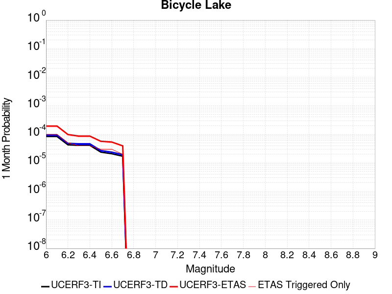 |  | 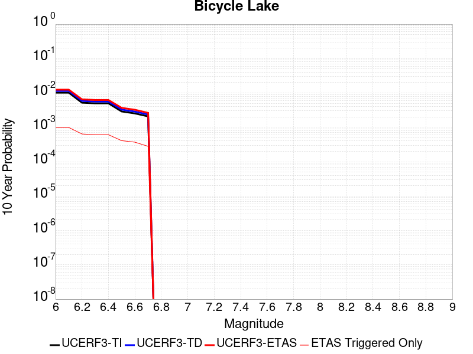 |

| Magnitude | 1 wk TI Prob | 1 wk TD Prob | 1 wk ETAS Prob | 1 wk ETAS/TD Gain | 1 wk ETAS Triggered Only | 1 mo TI Prob | 1 mo TD Prob | 1 mo ETAS Prob | 1 mo ETAS/TD Gain | 1 mo ETAS Triggered Only | 1 yr TI Prob | 1 yr TD Prob | 1 yr ETAS Prob | 1 yr ETAS/TD Gain | 1 yr ETAS Triggered Only | 10 yr TI Prob | 10 yr TD Prob | 10 yr ETAS Prob | 10 yr ETAS/TD Gain | 10 yr ETAS Triggered Only |
|-----|-----|-----|-----|-----|-----|-----|-----|-----|-----|-----|-----|-----|-----|-----|-----|-----|-----|-----|-----|-----|
| 6.0 | 1.9621975E-5 | 2.2097447E-5 | 5.2096784E-5 | 2.3575928 | 3.0E-5 | 8.4091465E-5 | 9.470067E-5 | 1.946912E-4 | 2.0558586 | 1.0E-4 | 0.0010233327 | 0.0011525059 | 0.001681895 | 1.4593375 | 5.3E-4 | 0.01018633 | 0.011478599 | 0.012457236 | 1.0852574 | 9.9E-4 |
| 6.1 | 1.9621975E-5 | 2.2097447E-5 | 5.2096784E-5 | 2.3575928 | 3.0E-5 | 8.4091465E-5 | 9.470067E-5 | 1.946912E-4 | 2.0558586 | 1.0E-4 | 0.0010233327 | 0.0011525059 | 0.001681895 | 1.4593375 | 5.3E-4 | 0.01018633 | 0.011478599 | 0.012457236 | 1.0852574 | 9.9E-4 |
| 6.2 | 9.9971285E-6 | 1.1255827E-5 | 3.1255604E-5 | 2.7768373 | 2.0E-5 | 4.2844134E-5 | 4.823866E-5 | 9.823625E-5 | 2.036463 | 5.0E-5 | 5.2150246E-4 | 5.8719947E-4 | 8.970174E-4 | 1.5276196 | 3.1E-4 | 0.0052028033 | 0.005861584 | 0.006497833 | 1.1085455 | 6.4E-4 |
| 6.3 | 9.589428E-6 | 1.0798527E-5 | 2.079842E-5 | 1.9260423 | 1.0E-5 | 4.10969E-5 | 4.627887E-5 | 8.627702E-5 | 1.8642853 | 4.0E-5 | 5.002399E-4 | 5.6335144E-4 | 8.531881E-4 | 1.5144863 | 2.9E-4 | 0.0049911533 | 0.0056243236 | 0.0062308926 | 1.1078475 | 6.1E-4 |
| 6.4 | 9.589428E-6 | 1.0798527E-5 | 2.079842E-5 | 1.9260423 | 1.0E-5 | 4.10969E-5 | 4.627887E-5 | 8.627702E-5 | 1.8642853 | 4.0E-5 | 5.002399E-4 | 5.6335144E-4 | 8.531881E-4 | 1.5144863 | 2.9E-4 | 0.0049911533 | 0.0056243236 | 0.0062308926 | 1.1078475 | 6.1E-4 |
| 6.5 | 5.557707E-6 | 6.2857107E-6 | 1.6285649E-5 | 2.5909 | 1.0E-5 | 2.3818526E-5 | 2.6938633E-5 | 5.6937824E-5 | 2.1136122 | 3.0E-5 | 2.8995197E-4 | 3.2795538E-4 | 5.0789636E-4 | 1.5486752 | 1.8E-4 | 0.0028957394 | 0.0032773502 | 0.0036860066 | 1.124691 | 4.1E-4 |
| 6.6 | 4.8742945E-6 | 5.5133855E-6 | 1.5513331E-5 | 2.8137577 | 1.0E-5 | 2.0889667E-5 | 2.3628729E-5 | 5.362802E-5 | 2.269611 | 3.0E-5 | 2.54302E-4 | 2.87668E-4 | 4.4762198E-4 | 1.5560367 | 1.6E-4 | 0.002540112 | 0.0028755253 | 0.0032444613 | 1.1283021 | 3.7E-4 |
| 6.7 | 3.991108E-6 | 4.515989E-6 | 1.4515944E-5 | 3.2143443 | 1.0E-5 | 1.7104636E-5 | 1.9354238E-5 | 3.935385E-5 | 2.0333455 | 2.0E-5 | 2.0822904E-4 | 2.3563785E-4 | 3.5560958E-4 | 1.5091361 | 1.2E-4 | 0.0020803404 | 0.0023563786 | 0.0026357188 | 1.1185464 | 2.8E-4 |

## Garlic Springs
*[(top)](#table-of-contents)*

| 1 Week | 1 Month | 1 Year | 10 Year |
|-----|-----|-----|-----|
|  | 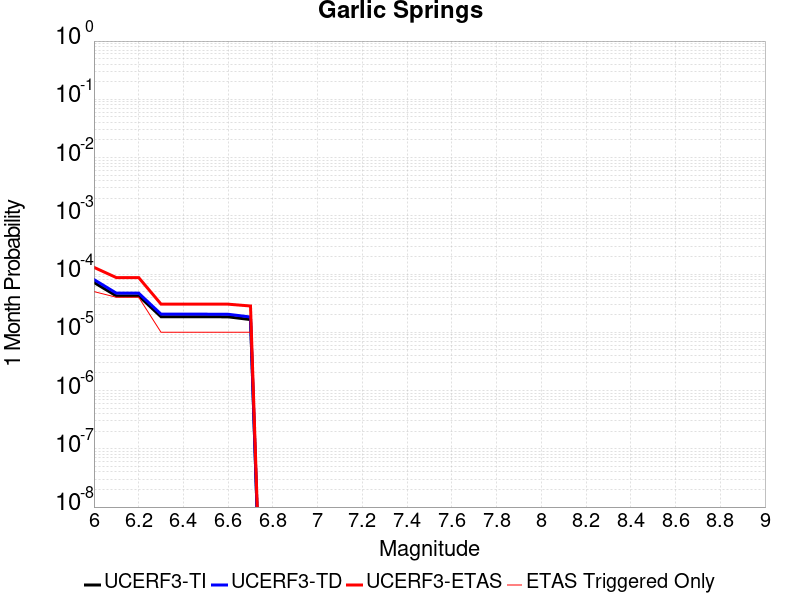 |  |  |

| Magnitude | 1 wk TI Prob | 1 wk TD Prob | 1 wk ETAS Prob | 1 wk ETAS/TD Gain | 1 wk ETAS Triggered Only | 1 mo TI Prob | 1 mo TD Prob | 1 mo ETAS Prob | 1 mo ETAS/TD Gain | 1 mo ETAS Triggered Only | 1 yr TI Prob | 1 yr TD Prob | 1 yr ETAS Prob | 1 yr ETAS/TD Gain | 1 yr ETAS Triggered Only | 10 yr TI Prob | 10 yr TD Prob | 10 yr ETAS Prob | 10 yr ETAS/TD Gain | 10 yr ETAS Triggered Only |
|-----|-----|-----|-----|-----|-----|-----|-----|-----|-----|-----|-----|-----|-----|-----|-----|-----|-----|-----|-----|-----|
| 6.0 | 1.6760017E-5 | 1.8777133E-5 | 1.8777133E-5 | 1.0 | 0.0 | 7.182667E-5 | 8.0471604E-5 | 1.3046758E-4 | 1.6212872 | 5.0E-5 | 8.7413884E-4 | 9.794189E-4 | 0.0013590467 | 1.3876052 | 3.8E-4 | 0.008707083 | 0.009762568 | 0.010525051 | 1.0781027 | 7.7E-4 |
| 6.1 | 9.852767E-6 | 1.0973752E-5 | 1.0973752E-5 | 1.0 | 0.0 | 4.222546E-5 | 4.702992E-5 | 8.702804E-5 | 1.8504823 | 4.0E-5 | 5.139737E-4 | 5.7250983E-4 | 7.9238386E-4 | 1.3840529 | 2.2E-4 | 0.005127866 | 0.0057173073 | 0.0061746775 | 1.0799974 | 4.6E-4 |
| 6.2 | 9.852767E-6 | 1.0973752E-5 | 1.0973752E-5 | 1.0 | 0.0 | 4.222546E-5 | 4.702992E-5 | 8.702804E-5 | 1.8504823 | 4.0E-5 | 5.139737E-4 | 5.7250983E-4 | 7.9238386E-4 | 1.3840529 | 2.2E-4 | 0.005127866 | 0.0057173073 | 0.0061746775 | 1.0799974 | 4.6E-4 |
| 6.3 | 4.3167724E-6 | 4.7780964E-6 | 4.7780964E-6 | 1.0 | 0.0 | 1.8500323E-5 | 2.0477524E-5 | 3.047732E-5 | 1.4883302 | 1.0E-5 | 2.2521814E-4 | 2.4930836E-4 | 3.2928842E-4 | 1.3208077 | 8.0E-5 | 0.0022499003 | 0.0024925452 | 0.0027419222 | 1.1000491 | 2.5E-4 |
| 6.4 | 4.3167724E-6 | 4.7780964E-6 | 4.7780964E-6 | 1.0 | 0.0 | 1.8500323E-5 | 2.0477524E-5 | 3.047732E-5 | 1.4883302 | 1.0E-5 | 2.2521814E-4 | 2.4930836E-4 | 3.2928842E-4 | 1.3208077 | 8.0E-5 | 0.0022499003 | 0.0024925452 | 0.0027419222 | 1.1000491 | 2.5E-4 |
| 6.5 | 4.3167724E-6 | 4.7780964E-6 | 4.7780964E-6 | 1.0 | 0.0 | 1.8500323E-5 | 2.0477524E-5 | 3.047732E-5 | 1.4883302 | 1.0E-5 | 2.2521814E-4 | 2.4930836E-4 | 3.2928842E-4 | 1.3208077 | 8.0E-5 | 0.0022499003 | 0.0024925452 | 0.0027419222 | 1.1000491 | 2.5E-4 |
| 6.6 | 4.301311E-6 | 4.7609647E-6 | 4.7609647E-6 | 1.0 | 0.0 | 1.8434059E-5 | 2.0404104E-5 | 3.04039E-5 | 1.4900875 | 1.0E-5 | 2.2441156E-4 | 2.4841467E-4 | 3.2839482E-4 | 1.3219621 | 8.0E-5 | 0.0022418506 | 0.0024836282 | 0.0027330073 | 1.1004092 | 2.5E-4 |
| 6.7 | 3.8599724E-6 | 4.2711204E-6 | 4.2711204E-6 | 1.0 | 0.0 | 1.6542634E-5 | 1.8304801E-5 | 2.8304617E-5 | 1.5462948 | 1.0E-5 | 2.0138794E-4 | 2.2286095E-4 | 2.9284536E-4 | 1.3140272 | 7.0E-5 | 0.0020120554 | 0.0022286095 | 0.0024680747 | 1.1074505 | 2.4E-4 |

## San Andreas (San Bernardino S)
*[(top)](#table-of-contents)*

| 1 Week | 1 Month | 1 Year | 10 Year |
|-----|-----|-----|-----|
|  |  |  |  |

| Magnitude | 1 wk TI Prob | 1 wk TD Prob | 1 wk ETAS Prob | 1 wk ETAS/TD Gain | 1 wk ETAS Triggered Only | 1 mo TI Prob | 1 mo TD Prob | 1 mo ETAS Prob | 1 mo ETAS/TD Gain | 1 mo ETAS Triggered Only | 1 yr TI Prob | 1 yr TD Prob | 1 yr ETAS Prob | 1 yr ETAS/TD Gain | 1 yr ETAS Triggered Only | 10 yr TI Prob | 10 yr TD Prob | 10 yr ETAS Prob | 10 yr ETAS/TD Gain | 10 yr ETAS Triggered Only |
|-----|-----|-----|-----|-----|-----|-----|-----|-----|-----|-----|-----|-----|-----|-----|-----|-----|-----|-----|-----|-----|
| 6.0 | 1.2336002E-4 | 3.0008948E-4 | 3.5007446E-4 | 1.166567 | 5.0E-5 | 5.2857865E-4 | 0.0012854899 | 0.0014253099 | 1.1087679 | 1.4E-4 | 0.006416472 | 0.015543484 | 0.01585851 | 1.0202674 | 3.2E-4 | 0.06234337 | 0.14285627 | 0.143422 | 1.00396 | 6.6E-4 |
| 6.1 | 1.2336002E-4 | 3.0008948E-4 | 3.5007446E-4 | 1.166567 | 5.0E-5 | 5.2857865E-4 | 0.0012854899 | 0.0014253099 | 1.1087679 | 1.4E-4 | 0.006416472 | 0.015543484 | 0.01585851 | 1.0202674 | 3.2E-4 | 0.06234337 | 0.14285627 | 0.143422 | 1.00396 | 6.6E-4 |
| 6.2 | 1.2336002E-4 | 3.0008948E-4 | 3.5007446E-4 | 1.166567 | 5.0E-5 | 5.2857865E-4 | 0.0012854899 | 0.0014253099 | 1.1087679 | 1.4E-4 | 0.006416472 | 0.015543484 | 0.01585851 | 1.0202674 | 3.2E-4 | 0.06234337 | 0.14285627 | 0.143422 | 1.00396 | 6.6E-4 |
| 6.3 | 1.1712257E-4 | 2.8797207E-4 | 3.3795767E-4 | 1.1735779 | 5.0E-5 | 5.018573E-4 | 0.001233608 | 0.0013634476 | 1.1052519 | 1.3E-4 | 0.006093008 | 0.01492059 | 0.015225965 | 1.0204667 | 3.1E-4 | 0.059286322 | 0.13756467 | 0.13812526 | 1.004075 | 6.5E-4 |
| 6.4 | 1.1712257E-4 | 2.8797207E-4 | 3.3795767E-4 | 1.1735779 | 5.0E-5 | 5.018573E-4 | 0.001233608 | 0.0013634476 | 1.1052519 | 1.3E-4 | 0.006093008 | 0.01492059 | 0.015225965 | 1.0204667 | 3.1E-4 | 0.059286322 | 0.13756467 | 0.13812526 | 1.004075 | 6.5E-4 |
| 6.5 | 1.0689076E-4 | 2.6809986E-4 | 3.1808647E-4 | 1.1864476 | 5.0E-5 | 4.5802278E-4 | 0.0011485183 | 0.001278369 | 1.1130593 | 1.3E-4 | 0.0055621783 | 0.013898174 | 0.014203865 | 1.0219951 | 3.1E-4 | 0.05425003 | 0.12881182 | 0.12936068 | 1.0042609 | 6.3E-4 |
| 6.6 | 9.7648895E-5 | 2.5054725E-4 | 3.0053474E-4 | 1.1995132 | 5.0E-5 | 4.1842813E-4 | 0.0010733557 | 0.0012032161 | 1.1209855 | 1.3E-4 | 0.005082469 | 0.012994168 | 0.01330014 | 1.0235468 | 3.1E-4 | 0.049677886 | 0.12097161 | 0.1215254 | 1.0045779 | 6.3E-4 |
| 6.7 | 8.757013E-5 | 2.3125445E-4 | 2.812429E-4 | 1.2161621 | 5.0E-5 | 3.7524657E-4 | 9.907364E-4 | 0.0010906373 | 1.100835 | 1.0E-4 | 0.00455906 | 0.011999588 | 0.0122762285 | 1.0230541 | 2.8E-4 | 0.04466656 | 0.11227982 | 0.112812445 | 1.0047438 | 6.0E-4 |
| 6.8 | 8.562978E-5 | 2.2685292E-4 | 2.7684157E-4 | 1.2203572 | 5.0E-5 | 3.6693315E-4 | 9.7188674E-4 | 0.0010717895 | 1.1027926 | 1.0E-4 | 0.004458263 | 0.01177259 | 0.012049293 | 1.023504 | 2.8E-4 | 0.043698758 | 0.11029001 | 0.11082384 | 1.0048403 | 6.0E-4 |
| 6.9 | 6.124075E-5 | 1.7069813E-4 | 2.2068959E-4 | 1.2928648 | 5.0E-5 | 2.6243398E-4 | 7.313591E-4 | 8.3128596E-4 | 1.1366317 | 1.0E-4 | 0.0031904527 | 0.00886815 | 0.009115933 | 1.0279408 | 2.5E-4 | 0.031450346 | 0.08419993 | 0.0846853 | 1.0057645 | 5.3E-4 |
| 7.0 | 5.8598747E-5 | 1.6498787E-4 | 2.1497962E-4 | 1.3030026 | 5.0E-5 | 2.5111332E-4 | 7.069001E-4 | 8.0682937E-4 | 1.1413627 | 1.0E-4 | 0.0030530186 | 0.008572741 | 0.008820598 | 1.0289122 | 2.5E-4 | 0.03011414 | 0.08151753 | 0.08200432 | 1.0059717 | 5.3E-4 |
| 7.1 | 5.613814E-5 | 1.5917298E-4 | 2.0916502E-4 | 1.3140737 | 5.0E-5 | 2.4056983E-4 | 6.819924E-4 | 7.819242E-4 | 1.1465292 | 1.0E-4 | 0.0029250039 | 0.008271826 | 0.0085197585 | 1.029973 | 2.5E-4 | 0.028868021 | 0.078816354 | 0.07930458 | 1.0061945 | 5.3E-4 |
| 7.2 | 4.991222E-5 | 1.4523676E-4 | 1.9522948E-4 | 1.3442155 | 5.0E-5 | 2.1389198E-4 | 6.2229513E-4 | 7.222329E-4 | 1.1605954 | 1.0E-4 | 0.002601025 | 0.0075502265 | 0.007798339 | 1.0328616 | 2.5E-4 | 0.025707912 | 0.072269924 | 0.07275234 | 1.0066752 | 5.2E-4 |
| 7.3 | 4.7410045E-5 | 1.3717797E-4 | 1.8717111E-4 | 1.36444 | 5.0E-5 | 2.0317009E-4 | 5.8777345E-4 | 6.8771467E-4 | 1.1700336 | 1.0E-4 | 0.0024707897 | 0.0071327467 | 0.007380964 | 1.0347996 | 2.5E-4 | 0.024434982 | 0.06855203 | 0.06903639 | 1.0070655 | 5.2E-4 |
| 7.4 | 4.5556746E-5 | 1.3125638E-4 | 1.8124982E-4 | 1.3808838 | 5.0E-5 | 1.952286E-4 | 5.6240644E-4 | 6.6235015E-4 | 1.1777073 | 1.0E-4 | 0.002374317 | 0.006825879 | 0.007074173 | 1.0363753 | 2.5E-4 | 0.023491086 | 0.065804236 | 0.06629001 | 1.0073823 | 5.2E-4 |
| 7.5 | 4.3084514E-5 | 1.2360894E-4 | 1.63604E-4 | 1.3235612 | 4.0E-5 | 1.8463485E-4 | 5.2964536E-4 | 6.195977E-4 | 1.169835 | 9.0E-5 | 0.0022456115 | 0.006429438 | 0.006667895 | 1.0370883 | 2.4E-4 | 0.022230545 | 0.062204733 | 0.06267363 | 1.007538 | 5.0E-4 |
| 7.6 | 3.408608E-5 | 9.838868E-5 | 1.3838474E-4 | 1.4065108 | 4.0E-5 | 1.4607502E-4 | 4.215977E-4 | 5.01564E-4 | 1.1896744 | 8.0E-5 | 0.0017770125 | 0.005120897 | 0.0053497194 | 1.044684 | 2.3E-4 | 0.017628696 | 0.050035115 | 0.050500598 | 1.0093031 | 4.9E-4 |
| 7.7 | 2.8315713E-5 | 8.251823E-5 | 1.2251493E-4 | 1.4847014 | 4.0E-5 | 1.2134742E-4 | 3.5360164E-4 | 4.3357335E-4 | 1.2261633 | 8.0E-5 | 0.0014764034 | 0.004296611 | 0.004525623 | 1.0533006 | 2.3E-4 | 0.01466633 | 0.04228543 | 0.042745136 | 1.0108714 | 4.8E-4 |
| 7.8 | 2.6222975E-5 | 7.4660275E-5 | 1.1465729E-4 | 1.5357201 | 4.0E-5 | 1.1237934E-4 | 3.1993337E-4 | 3.999078E-4 | 1.2499721 | 8.0E-5 | 0.0013673597 | 0.003888238 | 0.0041173436 | 1.0589228 | 2.3E-4 | 0.013589768 | 0.03844993 | 0.03891147 | 1.0120038 | 4.8E-4 |
| 7.9 | 2.1469694E-5 | 5.7903162E-5 | 9.790085E-5 | 1.6907686 | 4.0E-5 | 9.200973E-5 | 2.4813283E-4 | 3.2811298E-4 | 1.322328 | 8.0E-5 | 0.0011196428 | 0.003016835 | 0.0032262015 | 1.0693994 | 2.1E-4 | 0.011140184 | 0.030163256 | 0.03056089 | 1.0131826 | 4.1E-4 |
| 8.0 | 1.2420249E-5 | 3.1332525E-5 | 3.1332525E-5 | 1.0 | 0.0 | 5.322855E-5 | 1.3427534E-4 | 1.44274E-4 | 1.0744638 | 1.0E-5 | 6.478649E-4 | 0.0016335774 | 0.0016934794 | 1.0366693 | 6.0E-5 | 0.0064597935 | 0.016528832 | 0.016676353 | 1.0089251 | 1.5E-4 |
| 8.1 | 4.9197724E-6 | 7.827271E-6 | 7.827271E-6 | 1.0 | 0.0 | 2.1084568E-5 | 3.3545013E-5 | 3.3545013E-5 | 1.0 | 0.0 | 2.566744E-4 | 4.0833413E-4 | 4.1833005E-4 | 1.0244797 | 1.0E-5 | 0.002563781 | 0.0043868436 | 0.0043967995 | 1.0022695 | 1.0E-5 |
| 8.2 | 2.5634774E-6 | 2.9089954E-6 | 2.9089954E-6 | 1.0 | 0.0 | 1.0986286E-5 | 1.2467063E-5 | 1.2467063E-5 | 1.0 | 0.0 | 1.3374983E-4 | 1.5177597E-4 | 1.5177597E-4 | 1.0 | 0.0 | 0.0013366934 | 0.0017061684 | 0.0017061684 | 1.0 | 0.0 |
| 8.3 | 5.2850464E-7 | 3.211945E-7 | 3.211945E-7 | 1.0 | 0.0 | 2.2650179E-6 | 1.3765473E-6 | 1.3765473E-6 | 1.0 | 0.0 | 2.7576245E-5 | 1.6759346E-5 | 1.6759346E-5 | 1.0 | 0.0 | 2.7572823E-4 | 1.9887649E-4 | 1.9887649E-4 | 1.0 | 0.0 |

## Death Valley (Black Mtns Frontal)
*[(top)](#table-of-contents)*

| 1 Week | 1 Month | 1 Year | 10 Year |
|-----|-----|-----|-----|
|  |  |  | 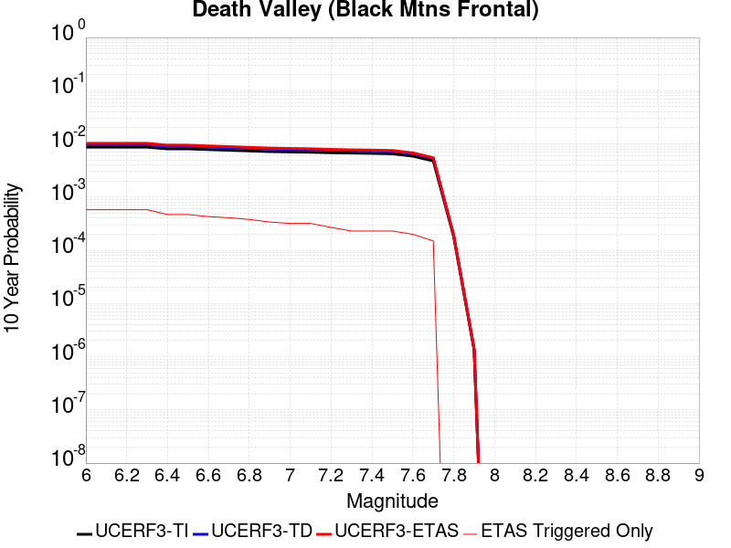 |

| Magnitude | 1 wk TI Prob | 1 wk TD Prob | 1 wk ETAS Prob | 1 wk ETAS/TD Gain | 1 wk ETAS Triggered Only | 1 mo TI Prob | 1 mo TD Prob | 1 mo ETAS Prob | 1 mo ETAS/TD Gain | 1 mo ETAS Triggered Only | 1 yr TI Prob | 1 yr TD Prob | 1 yr ETAS Prob | 1 yr ETAS/TD Gain | 1 yr ETAS Triggered Only | 10 yr TI Prob | 10 yr TD Prob | 10 yr ETAS Prob | 10 yr ETAS/TD Gain | 10 yr ETAS Triggered Only |
|-----|-----|-----|-----|-----|-----|-----|-----|-----|-----|-----|-----|-----|-----|-----|-----|-----|-----|-----|-----|-----|
| 6.0 | 1.6707214E-5 | 1.867056E-5 | 6.866963E-5 | 3.6779628 | 5.0E-5 | 7.160038E-5 | 8.001427E-5 | 1.6000787E-4 | 1.9997416 | 8.0E-5 | 8.71386E-4 | 9.7374606E-4 | 0.0012235026 | 1.2564905 | 2.5E-4 | 0.00867977 | 0.009695647 | 0.010270024 | 1.0592407 | 5.8E-4 |
| 6.1 | 1.6707214E-5 | 1.867056E-5 | 6.866963E-5 | 3.6779628 | 5.0E-5 | 7.160038E-5 | 8.001427E-5 | 1.6000787E-4 | 1.9997416 | 8.0E-5 | 8.71386E-4 | 9.7374606E-4 | 0.0012235026 | 1.2564905 | 2.5E-4 | 0.00867977 | 0.009695647 | 0.010270024 | 1.0592407 | 5.8E-4 |
| 6.2 | 1.6707214E-5 | 1.867056E-5 | 6.866963E-5 | 3.6779628 | 5.0E-5 | 7.160038E-5 | 8.001427E-5 | 1.6000787E-4 | 1.9997416 | 8.0E-5 | 8.71386E-4 | 9.7374606E-4 | 0.0012235026 | 1.2564905 | 2.5E-4 | 0.00867977 | 0.009695647 | 0.010270024 | 1.0592407 | 5.8E-4 |
| 6.3 | 1.6707214E-5 | 1.867056E-5 | 6.866963E-5 | 3.6779628 | 5.0E-5 | 7.160038E-5 | 8.001427E-5 | 1.6000787E-4 | 1.9997416 | 8.0E-5 | 8.71386E-4 | 9.7374606E-4 | 0.0012235026 | 1.2564905 | 2.5E-4 | 0.00867977 | 0.009695647 | 0.010270024 | 1.0592407 | 5.8E-4 |
| 6.4 | 1.5515609E-5 | 1.7338483E-5 | 5.733779E-5 | 3.3069668 | 4.0E-5 | 6.649377E-5 | 7.430571E-5 | 1.3430126E-4 | 1.807415 | 6.0E-5 | 8.0926094E-4 | 9.0430264E-4 | 0.0011041218 | 1.2209649 | 2.0E-4 | 0.008063202 | 0.009006913 | 0.009472679 | 1.0517122 | 4.7E-4 |
| 6.5 | 1.5515609E-5 | 1.7338483E-5 | 5.733779E-5 | 3.3069668 | 4.0E-5 | 6.649377E-5 | 7.430571E-5 | 1.3430126E-4 | 1.807415 | 6.0E-5 | 8.0926094E-4 | 9.0430264E-4 | 0.0011041218 | 1.2209649 | 2.0E-4 | 0.008063202 | 0.009006913 | 0.009472679 | 1.0517122 | 4.7E-4 |
| 6.6 | 1.5041828E-5 | 1.6809407E-5 | 5.6808734E-5 | 3.3795798 | 4.0E-5 | 6.4463384E-5 | 7.203836E-5 | 1.2203476E-4 | 1.6940247 | 5.0E-5 | 7.8455906E-4 | 8.7672E-4 | 0.0010565622 | 1.2051307 | 1.8E-4 | 0.00781795 | 0.008733268 | 0.009159513 | 1.048807 | 4.3E-4 |
| 6.7 | 1.4634985E-5 | 1.6356273E-5 | 5.6355617E-5 | 3.4455051 | 4.0E-5 | 6.271985E-5 | 7.009646E-5 | 1.20092955E-4 | 1.7132528 | 5.0E-5 | 7.6334673E-4 | 8.53096E-4 | 0.0010329424 | 1.2108161 | 1.8E-4 | 0.007607299 | 0.008498848 | 0.008905363 | 1.0478318 | 4.1E-4 |
| 6.8 | 1.4209158E-5 | 1.5882297E-5 | 5.588166E-5 | 3.5184875 | 4.0E-5 | 6.089497E-5 | 6.806524E-5 | 1.08062515E-4 | 1.5876315 | 4.0E-5 | 7.4114406E-4 | 8.2838483E-4 | 9.882523E-4 | 1.192987 | 1.6E-4 | 0.007386771 | 0.008253585 | 0.008630449 | 1.0456606 | 3.8E-4 |
| 6.9 | 1.3780098E-5 | 1.5404834E-5 | 5.540422E-5 | 3.5965474 | 4.0E-5 | 5.9056227E-5 | 6.601908E-5 | 1.06016436E-4 | 1.6058455 | 4.0E-5 | 7.1877235E-4 | 8.0349133E-4 | 9.633628E-4 | 1.1989709 | 1.6E-4 | 0.0071645193 | 0.008006458 | 0.008343736 | 1.0421257 | 3.4E-4 |
| 7.0 | 1.3585064E-5 | 1.5188394E-5 | 4.518794E-5 | 2.9751625 | 3.0E-5 | 5.8220405E-5 | 6.5091524E-5 | 9.508957E-5 | 1.4608595 | 3.0E-5 | 7.086029E-4 | 7.922066E-4 | 9.420878E-4 | 1.1891946 | 1.5E-4 | 0.007063476 | 0.007894417 | 0.008211891 | 1.040215 | 3.2E-4 |
| 7.1 | 1.3398601E-5 | 1.4981575E-5 | 4.4981127E-5 | 3.0024297 | 3.0E-5 | 5.742131E-5 | 6.4205204E-5 | 9.420327E-5 | 1.4672219 | 3.0E-5 | 6.9888023E-4 | 7.814234E-4 | 9.313062E-4 | 1.1918074 | 1.5E-4 | 0.0069668638 | 0.007787346 | 0.008104854 | 1.0407723 | 3.2E-4 |
| 7.2 | 1.3126312E-5 | 1.4679792E-5 | 4.4679353E-5 | 3.0435958 | 3.0E-5 | 5.6254412E-5 | 6.291191E-5 | 9.291002E-5 | 1.4768273 | 3.0E-5 | 6.846822E-4 | 7.656887E-4 | 8.955892E-4 | 1.1696517 | 1.3E-4 | 0.006825765 | 0.00763109 | 0.007899029 | 1.0351115 | 2.7E-4 |
| 7.3 | 1.2922429E-5 | 1.4454016E-5 | 4.4453584E-5 | 3.0755177 | 3.0E-5 | 5.5380664E-5 | 6.1944345E-5 | 9.1942486E-5 | 1.4842757 | 3.0E-5 | 6.74051E-4 | 7.5391686E-4 | 8.538414E-4 | 1.1325406 | 1.0E-4 | 0.006720101 | 0.0075141727 | 0.0077424445 | 1.0303788 | 2.3E-4 |
| 7.4 | 1.2768878E-5 | 1.4283997E-5 | 4.428357E-5 | 3.1002226 | 3.0E-5 | 5.4722615E-5 | 6.1215724E-5 | 9.1213886E-5 | 1.4900402 | 3.0E-5 | 6.660441E-4 | 7.45052E-4 | 8.449775E-4 | 1.1341188 | 1.0E-4 | 0.0066405144 | 0.0074261203 | 0.007654412 | 1.0307418 | 2.3E-4 |
| 7.5 | 1.2521929E-5 | 1.40122365E-5 | 4.4011816E-5 | 3.1409557 | 3.0E-5 | 5.366431E-5 | 6.0051094E-5 | 9.004929E-5 | 1.4995446 | 3.0E-5 | 6.531671E-4 | 7.308822E-4 | 8.308091E-4 | 1.1367209 | 1.0E-4 | 0.006512506 | 0.0072853607 | 0.007513685 | 1.0313401 | 2.3E-4 |
| 7.6 | 1.1301089E-5 | 1.2648349E-5 | 3.2648095E-5 | 2.581214 | 2.0E-5 | 4.8432343E-5 | 5.4206117E-5 | 7.420503E-5 | 1.368942 | 2.0E-5 | 5.895042E-4 | 6.597649E-4 | 7.4970553E-4 | 1.1363223 | 9.0E-5 | 0.0058794282 | 0.0065786145 | 0.0067772986 | 1.0302016 | 2.0E-4 |
| 7.7 | 9.189108E-6 | 1.0283521E-5 | 2.0283418E-5 | 1.9724195 | 1.0E-5 | 3.93813E-5 | 4.407152E-5 | 5.4071075E-5 | 1.2268939 | 1.0E-5 | 4.7936183E-4 | 5.3644367E-4 | 6.0640613E-4 | 1.130419 | 7.0E-5 | 0.004783291 | 0.0053519984 | 0.005501196 | 1.027877 | 1.5E-4 |
| 7.8 | 3.4586725E-7 | 3.648288E-7 | 3.648288E-7 | 1.0 | 0.0 | 1.4822873E-6 | 1.5635511E-6 | 1.5635511E-6 | 1.0 | 0.0 | 1.80467E-5 | 1.9036073E-5 | 1.9036073E-5 | 1.0 | 0.0 | 1.8045233E-4 | 1.9034486E-4 | 1.9034486E-4 | 1.0 | 0.0 |
| 7.9 | 2.5591178E-9 | 2.6696871E-9 | 2.6696871E-9 | 1.0 | 0.0 | 1.0967647E-8 | 1.1441516E-8 | 1.1441516E-8 | 1.0 | 0.0 | 1.335311E-7 | 1.3930045E-7 | 1.3930045E-7 | 1.0 | 0.0 | 1.3353102E-6 | 1.3930046E-6 | 1.3930046E-6 | 1.0 | 0.0 |

## Coyote Lake
*[(top)](#table-of-contents)*

| 1 Week | 1 Month | 1 Year | 10 Year |
|-----|-----|-----|-----|
| 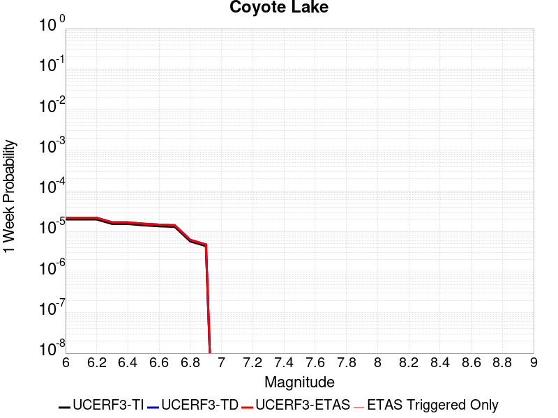 | 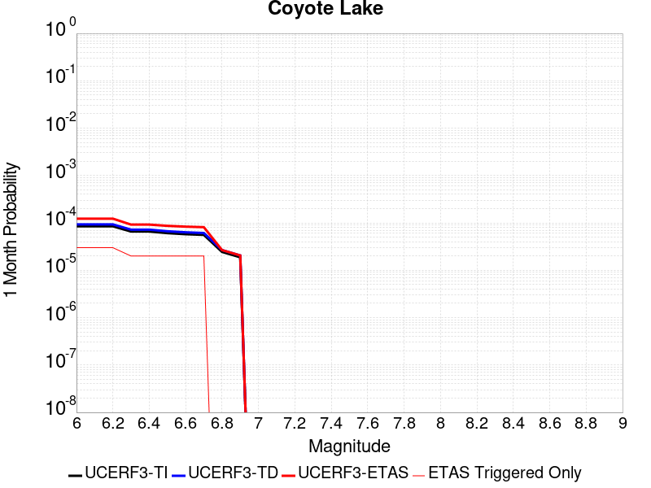 | 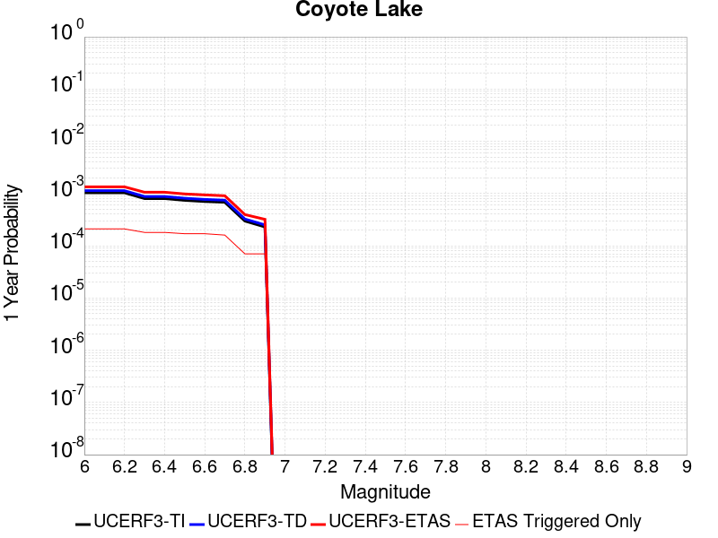 | 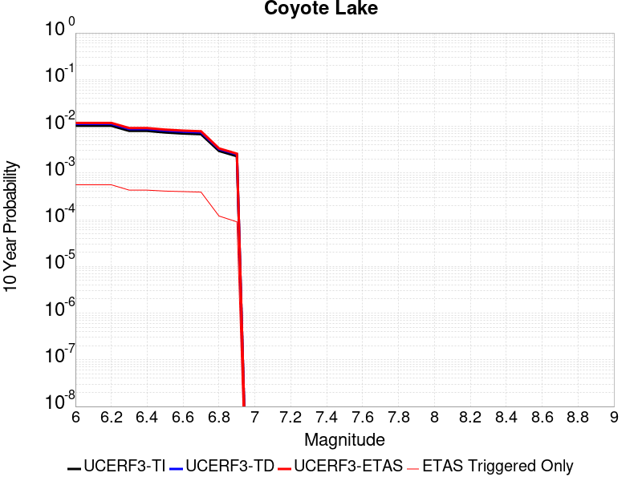 |

| Magnitude | 1 wk TI Prob | 1 wk TD Prob | 1 wk ETAS Prob | 1 wk ETAS/TD Gain | 1 wk ETAS Triggered Only | 1 mo TI Prob | 1 mo TD Prob | 1 mo ETAS Prob | 1 mo ETAS/TD Gain | 1 mo ETAS Triggered Only | 1 yr TI Prob | 1 yr TD Prob | 1 yr ETAS Prob | 1 yr ETAS/TD Gain | 1 yr ETAS Triggered Only | 10 yr TI Prob | 10 yr TD Prob | 10 yr ETAS Prob | 10 yr ETAS/TD Gain | 10 yr ETAS Triggered Only |
|-----|-----|-----|-----|-----|-----|-----|-----|-----|-----|-----|-----|-----|-----|-----|-----|-----|-----|-----|-----|-----|
| 6.0 | 1.980352E-5 | 2.1707021E-5 | 2.1707021E-5 | 1.0 | 0.0 | 8.486947E-5 | 9.302718E-5 | 1.230244E-4 | 1.3224564 | 3.0E-5 | 0.0010327959 | 0.0011320895 | 0.0013418518 | 1.1852877 | 2.1E-4 | 0.010280091 | 0.011270401 | 0.01182409 | 1.0491277 | 5.6E-4 |
| 6.1 | 1.980352E-5 | 2.1707021E-5 | 2.1707021E-5 | 1.0 | 0.0 | 8.486947E-5 | 9.302718E-5 | 1.230244E-4 | 1.3224564 | 3.0E-5 | 0.0010327959 | 0.0011320895 | 0.0013418518 | 1.1852877 | 2.1E-4 | 0.010280091 | 0.011270401 | 0.01182409 | 1.0491277 | 5.6E-4 |
| 6.2 | 1.980352E-5 | 2.1707021E-5 | 2.1707021E-5 | 1.0 | 0.0 | 8.486947E-5 | 9.302718E-5 | 1.230244E-4 | 1.3224564 | 3.0E-5 | 0.0010327959 | 0.0011320895 | 0.0013418518 | 1.1852877 | 2.1E-4 | 0.010280091 | 0.011270401 | 0.01182409 | 1.0491277 | 5.6E-4 |
| 6.3 | 1.5344787E-5 | 1.6820884E-5 | 1.6820884E-5 | 1.0 | 0.0 | 6.576172E-5 | 7.208785E-5 | 9.208641E-5 | 1.2774192 | 2.0E-5 | 8.003548E-4 | 8.7737746E-4 | 0.0010572195 | 1.2049769 | 1.8E-4 | 0.007974784 | 0.00874518 | 0.00917142 | 1.0487399 | 4.3E-4 |
| 6.4 | 1.5344787E-5 | 1.6820884E-5 | 1.6820884E-5 | 1.0 | 0.0 | 6.576172E-5 | 7.208785E-5 | 9.208641E-5 | 1.2774192 | 2.0E-5 | 8.003548E-4 | 8.7737746E-4 | 0.0010572195 | 1.2049769 | 1.8E-4 | 0.007974784 | 0.00874518 | 0.00917142 | 1.0487399 | 4.3E-4 |
| 6.5 | 1.4189697E-5 | 1.5558186E-5 | 1.5558186E-5 | 1.0 | 0.0 | 6.081157E-5 | 6.667658E-5 | 8.6675245E-5 | 1.2999355 | 2.0E-5 | 7.401293E-4 | 8.1154524E-4 | 9.814072E-4 | 1.209307 | 1.7E-4 | 0.0073766913 | 0.008091759 | 0.008498441 | 1.0502589 | 4.1E-4 |
| 6.6 | 1.3469301E-5 | 1.47717665E-5 | 1.47717665E-5 | 1.0 | 0.0 | 5.7724297E-5 | 6.3306376E-5 | 8.330511E-5 | 1.3159039 | 2.0E-5 | 7.025667E-4 | 7.7054254E-4 | 9.404115E-4 | 1.2204537 | 1.7E-4 | 0.0070034964 | 0.0076846126 | 0.008081539 | 1.0516521 | 4.0E-4 |
| 6.7 | 1.3027966E-5 | 1.4281927E-5 | 1.4281927E-5 | 1.0 | 0.0 | 5.5832945E-5 | 6.120716E-5 | 8.120594E-5 | 1.3267392 | 2.0E-5 | 6.7955407E-4 | 7.450021E-4 | 9.0488297E-4 | 1.2146045 | 1.6E-4 | 0.006774798 | 0.007430923 | 0.007818026 | 1.0520934 | 3.9E-4 |
| 6.8 | 5.695434E-6 | 6.2244944E-6 | 6.2244944E-6 | 1.0 | 0.0 | 2.4408775E-5 | 2.6676302E-5 | 2.6676302E-5 | 1.0 | 0.0 | 2.971363E-4 | 3.2476554E-4 | 3.9474282E-4 | 1.2154701 | 7.0E-5 | 0.0029673933 | 0.0032458503 | 0.0033654608 | 1.0368503 | 1.2E-4 |
| 6.9 | 4.385688E-6 | 4.7931144E-6 | 4.7931144E-6 | 1.0 | 0.0 | 1.879567E-5 | 2.0541918E-5 | 2.0541918E-5 | 1.0 | 0.0 | 2.2881327E-4 | 2.5009786E-4 | 3.2008035E-4 | 1.2798204 | 7.0E-5 | 0.002285778 | 0.0025009785 | 0.0025907536 | 1.035896 | 9.0E-5 |

## San Andreas (Big Bend)
*[(top)](#table-of-contents)*

| 1 Week | 1 Month | 1 Year | 10 Year |
|-----|-----|-----|-----|
|  |  |  |  |

| Magnitude | 1 wk TI Prob | 1 wk TD Prob | 1 wk ETAS Prob | 1 wk ETAS/TD Gain | 1 wk ETAS Triggered Only | 1 mo TI Prob | 1 mo TD Prob | 1 mo ETAS Prob | 1 mo ETAS/TD Gain | 1 mo ETAS Triggered Only | 1 yr TI Prob | 1 yr TD Prob | 1 yr ETAS Prob | 1 yr ETAS/TD Gain | 1 yr ETAS Triggered Only | 10 yr TI Prob | 10 yr TD Prob | 10 yr ETAS Prob | 10 yr ETAS/TD Gain | 10 yr ETAS Triggered Only |
|-----|-----|-----|-----|-----|-----|-----|-----|-----|-----|-----|-----|-----|-----|-----|-----|-----|-----|-----|-----|-----|
| 6.0 | 1.0179969E-4 | 2.0080687E-4 | 2.2080285E-4 | 1.0995781 | 2.0E-5 | 4.362114E-4 | 8.60318E-4 | 9.2026644E-4 | 1.0696816 | 6.0E-5 | 0.0052979486 | 0.010424351 | 0.010691537 | 1.025631 | 2.7E-4 | 0.051734097 | 0.1014857 | 0.10191698 | 1.0042497 | 4.8E-4 |
| 6.1 | 1.0179969E-4 | 2.0080687E-4 | 2.2080285E-4 | 1.0995781 | 2.0E-5 | 4.362114E-4 | 8.60318E-4 | 9.2026644E-4 | 1.0696816 | 6.0E-5 | 0.0052979486 | 0.010424351 | 0.010691537 | 1.025631 | 2.7E-4 | 0.051734097 | 0.1014857 | 0.10191698 | 1.0042497 | 4.8E-4 |
| 6.2 | 1.0179969E-4 | 2.0080687E-4 | 2.2080285E-4 | 1.0995781 | 2.0E-5 | 4.362114E-4 | 8.60318E-4 | 9.2026644E-4 | 1.0696816 | 6.0E-5 | 0.0052979486 | 0.010424351 | 0.010691537 | 1.025631 | 2.7E-4 | 0.051734097 | 0.1014857 | 0.10191698 | 1.0042497 | 4.8E-4 |
| 6.3 | 1.0179969E-4 | 2.0080687E-4 | 2.2080285E-4 | 1.0995781 | 2.0E-5 | 4.362114E-4 | 8.60318E-4 | 9.2026644E-4 | 1.0696816 | 6.0E-5 | 0.0052979486 | 0.010424351 | 0.010691537 | 1.025631 | 2.7E-4 | 0.051734097 | 0.1014857 | 0.10191698 | 1.0042497 | 4.8E-4 |
| 6.4 | 9.1639464E-5 | 1.8437792E-4 | 1.9437607E-4 | 1.0542264 | 1.0E-5 | 3.9268145E-4 | 7.89952E-4 | 8.099362E-4 | 1.025298 | 2.0E-5 | 0.0047704205 | 0.009575372 | 0.009704127 | 1.0134465 | 1.3E-4 | 0.046693064 | 0.09381153 | 0.094065264 | 1.0027047 | 2.8E-4 |
| 6.5 | 9.1639464E-5 | 1.8437792E-4 | 1.9437607E-4 | 1.0542264 | 1.0E-5 | 3.9268145E-4 | 7.89952E-4 | 8.099362E-4 | 1.025298 | 2.0E-5 | 0.0047704205 | 0.009575372 | 0.009704127 | 1.0134465 | 1.3E-4 | 0.046693064 | 0.09381153 | 0.094065264 | 1.0027047 | 2.8E-4 |
| 6.6 | 9.042622E-5 | 1.8244829E-4 | 1.9244647E-4 | 1.0548 | 1.0E-5 | 3.8748336E-4 | 7.8168715E-4 | 8.0167153E-4 | 1.0255656 | 2.0E-5 | 0.0047074095 | 0.009475624 | 0.009604393 | 1.0135894 | 1.3E-4 | 0.046089325 | 0.09290548 | 0.093141325 | 1.0025386 | 2.6E-4 |
| 6.7 | 8.9836685E-5 | 1.8159159E-4 | 1.9158977E-4 | 1.0550586 | 1.0E-5 | 3.8495753E-4 | 7.7801774E-4 | 7.980022E-4 | 1.0256864 | 2.0E-5 | 0.00467679 | 0.009431336 | 0.0095502045 | 1.0126035 | 1.2E-4 | 0.045795817 | 0.09249973 | 0.09272661 | 1.0024527 | 2.5E-4 |
| 6.8 | 8.9471854E-5 | 1.8105932E-4 | 1.9105752E-4 | 1.0552205 | 1.0E-5 | 3.8339442E-4 | 7.75738E-4 | 7.957225E-4 | 1.0257618 | 2.0E-5 | 0.004657841 | 0.00940382 | 0.009522691 | 1.0126407 | 1.2E-4 | 0.04561414 | 0.09224692 | 0.09247386 | 1.0024601 | 2.5E-4 |
| 6.9 | 8.858234E-5 | 1.7987892E-4 | 1.8987713E-4 | 1.055583 | 1.0E-5 | 3.7958333E-4 | 7.706821E-4 | 7.906667E-4 | 1.025931 | 2.0E-5 | 0.004611638 | 0.009342793 | 0.009461673 | 1.0127242 | 1.2E-4 | 0.04517103 | 0.091686994 | 0.09191407 | 1.0024767 | 2.5E-4 |
| 7.0 | 8.7433385E-5 | 1.7826671E-4 | 1.8826492E-4 | 1.0560857 | 1.0E-5 | 3.746607E-4 | 7.6377665E-4 | 7.837614E-4 | 1.0261657 | 2.0E-5 | 0.004551957 | 0.009259437 | 0.009378326 | 1.0128398 | 1.2E-4 | 0.044598386 | 0.09092137 | 0.09114864 | 1.0024996 | 2.5E-4 |
| 7.1 | 8.684964E-5 | 1.7738611E-4 | 1.8738434E-4 | 1.0563642 | 1.0E-5 | 3.7215967E-4 | 7.600049E-4 | 7.699973E-4 | 1.0131478 | 1.0E-5 | 0.0045216335 | 0.009213906 | 0.0093129845 | 1.0107532 | 1.0E-4 | 0.04430731 | 0.09050287 | 0.090712056 | 1.0023113 | 2.3E-4 |
| 7.2 | 8.606521E-5 | 1.7629213E-4 | 1.8629037E-4 | 1.056714 | 1.0E-5 | 3.6879873E-4 | 7.5531914E-4 | 7.653116E-4 | 1.0132295 | 1.0E-5 | 0.0044808835 | 0.009157337 | 0.009256422 | 1.0108202 | 1.0E-4 | 0.043916024 | 0.08998334 | 0.090192646 | 1.002326 | 2.3E-4 |
| 7.3 | 8.568266E-5 | 1.7571205E-4 | 1.8571029E-4 | 1.0569013 | 1.0E-5 | 3.6715972E-4 | 7.528345E-4 | 7.6282694E-4 | 1.0132731 | 1.0E-5 | 0.0044610105 | 0.00912734 | 0.009226427 | 1.0108562 | 1.0E-4 | 0.043725148 | 0.08970444 | 0.08991381 | 1.002334 | 2.3E-4 |
| 7.4 | 8.5432206E-5 | 1.7533782E-4 | 1.7533782E-4 | 1.0 | 0.0 | 3.6608664E-4 | 7.5123156E-4 | 7.5123156E-4 | 1.0 | 0.0 | 0.004447999 | 0.009107988 | 0.009197169 | 1.0097915 | 9.0E-5 | 0.043600157 | 0.08952458 | 0.08972488 | 1.0022374 | 2.2E-4 |
| 7.5 | 8.4791965E-5 | 1.7403076E-4 | 1.7403076E-4 | 1.0 | 0.0 | 3.633435E-4 | 7.4563315E-4 | 7.4563315E-4 | 1.0 | 0.0 | 0.0044147377 | 0.009040395 | 0.009129581 | 1.0098653 | 9.0E-5 | 0.043280575 | 0.0889021 | 0.08910254 | 1.0022546 | 2.2E-4 |
| 7.6 | 8.241105E-5 | 1.684837E-4 | 1.684837E-4 | 1.0 | 0.0 | 3.531424E-4 | 7.2187337E-4 | 7.2187337E-4 | 1.0 | 0.0 | 0.0042910352 | 0.008753479 | 0.008842692 | 1.0101917 | 9.0E-5 | 0.042091176 | 0.08627858 | 0.0864796 | 1.0023298 | 2.2E-4 |
| 7.7 | 7.00432E-5 | 1.4211683E-4 | 1.4211683E-4 | 1.0 | 0.0 | 3.001506E-4 | 6.0893E-4 | 6.0893E-4 | 1.0 | 0.0 | 0.0036482112 | 0.007388561 | 0.0074481177 | 1.0080607 | 6.0E-5 | 0.035888977 | 0.07354971 | 0.07369795 | 1.0020154 | 1.6E-4 |
| 7.8 | 6.415362E-5 | 1.297541E-4 | 1.297541E-4 | 1.0 | 0.0 | 2.749151E-4 | 5.5597053E-4 | 5.5597053E-4 | 1.0 | 0.0 | 0.0033419547 | 0.006747963 | 0.006807558 | 1.0088316 | 6.0E-5 | 0.03292141 | 0.0672817 | 0.06741228 | 1.0019408 | 1.4E-4 |
| 7.9 | 4.939911E-5 | 9.345801E-5 | 9.345801E-5 | 1.0 | 0.0 | 2.116933E-4 | 4.0047284E-4 | 4.0047284E-4 | 1.0 | 0.0 | 0.0025743195 | 0.0048648654 | 0.0048847683 | 1.0040911 | 2.0E-5 | 0.025447013 | 0.048936196 | 0.04900277 | 1.0013604 | 7.0E-5 |
| 8.0 | 3.344983E-5 | 5.225443E-5 | 5.225443E-5 | 1.0 | 0.0 | 1.4334853E-4 | 2.2392833E-4 | 2.2392833E-4 | 1.0 | 0.0 | 0.0017438711 | 0.0027229206 | 0.0027328935 | 1.0036626 | 1.0E-5 | 0.017302496 | 0.02793573 | 0.027964892 | 1.0010439 | 3.0E-5 |
| 8.1 | 1.9104898E-5 | 1.9186356E-5 | 1.9186356E-5 | 1.0 | 0.0 | 8.1875565E-5 | 8.222465E-5 | 8.222465E-5 | 1.0 | 0.0 | 9.963791E-4 | 0.001000626 | 0.0010106161 | 1.0099838 | 1.0E-5 | 0.009919235 | 0.010756767 | 0.01076666 | 1.0009197 | 1.0E-5 |
| 8.2 | 8.643924E-6 | 5.4798497E-6 | 5.4798497E-6 | 1.0 | 0.0 | 3.704486E-5 | 2.348486E-5 | 2.348486E-5 | 1.0 | 0.0 | 4.5092785E-4 | 2.858907E-4 | 2.858907E-4 | 1.0 | 0.0 | 0.0045001395 | 0.0032514327 | 0.0032514327 | 1.0 | 0.0 |
| 8.3 | 1.983087E-6 | 7.668296E-7 | 7.668296E-7 | 1.0 | 0.0 | 8.498917E-6 | 3.2864084E-6 | 3.2864084E-6 | 1.0 | 0.0 | 1.034694E-4 | 4.0011306E-5 | 4.0011306E-5 | 1.0 | 0.0 | 0.0010342124 | 4.724499E-4 | 4.724499E-4 | 1.0 | 0.0 |

## Helendale-So Lockhart
*[(top)](#table-of-contents)*

| 1 Week | 1 Month | 1 Year | 10 Year |
|-----|-----|-----|-----|
| 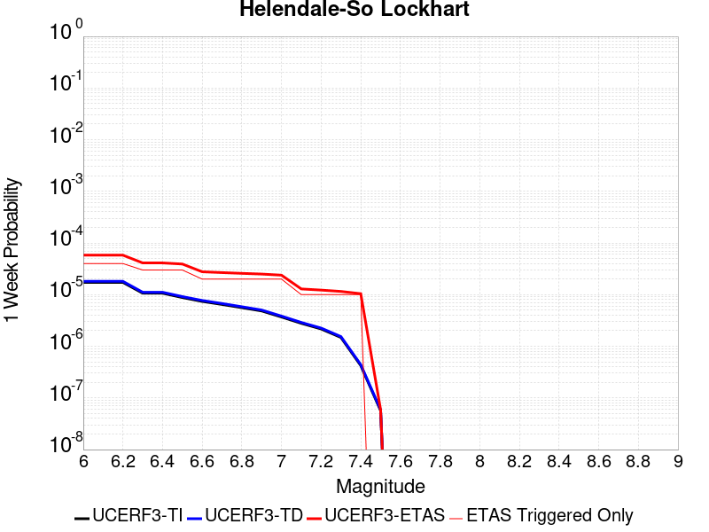 | 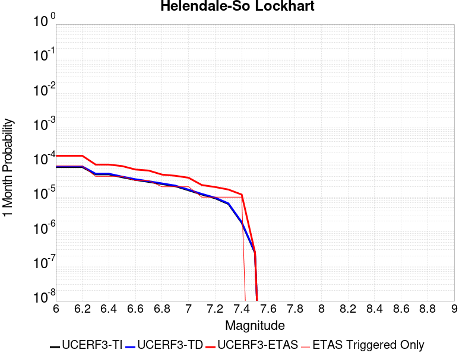 |  |  |

| Magnitude | 1 wk TI Prob | 1 wk TD Prob | 1 wk ETAS Prob | 1 wk ETAS/TD Gain | 1 wk ETAS Triggered Only | 1 mo TI Prob | 1 mo TD Prob | 1 mo ETAS Prob | 1 mo ETAS/TD Gain | 1 mo ETAS Triggered Only | 1 yr TI Prob | 1 yr TD Prob | 1 yr ETAS Prob | 1 yr ETAS/TD Gain | 1 yr ETAS Triggered Only | 10 yr TI Prob | 10 yr TD Prob | 10 yr ETAS Prob | 10 yr ETAS/TD Gain | 10 yr ETAS Triggered Only |
|-----|-----|-----|-----|-----|-----|-----|-----|-----|-----|-----|-----|-----|-----|-----|-----|-----|-----|-----|-----|-----|
| 6.0 | 1.7296055E-5 | 1.8103841E-5 | 5.8103116E-5 | 3.2094357 | 4.0E-5 | 7.412385E-5 | 7.7585704E-5 | 1.5757949E-4 | 2.0310378 | 8.0E-5 | 9.0208417E-4 | 9.442173E-4 | 0.0012339435 | 1.3068427 | 2.9E-4 | 0.008984311 | 0.009404174 | 0.009889566 | 1.0516145 | 4.9E-4 |
| 6.1 | 1.7296055E-5 | 1.8103841E-5 | 5.8103116E-5 | 3.2094357 | 4.0E-5 | 7.412385E-5 | 7.7585704E-5 | 1.5757949E-4 | 2.0310378 | 8.0E-5 | 9.0208417E-4 | 9.442173E-4 | 0.0012339435 | 1.3068427 | 2.9E-4 | 0.008984311 | 0.009404174 | 0.009889566 | 1.0516145 | 4.9E-4 |
| 6.2 | 1.7296055E-5 | 1.8103841E-5 | 5.8103116E-5 | 3.2094357 | 4.0E-5 | 7.412385E-5 | 7.7585704E-5 | 1.5757949E-4 | 2.0310378 | 8.0E-5 | 9.0208417E-4 | 9.442173E-4 | 0.0012339435 | 1.3068427 | 2.9E-4 | 0.008984311 | 0.009404174 | 0.009889566 | 1.0516145 | 4.9E-4 |
| 6.3 | 1.0669118E-5 | 1.1135489E-5 | 4.1135154E-5 | 3.6940591 | 3.0E-5 | 4.5723988E-5 | 4.7722668E-5 | 8.772076E-5 | 1.8381361 | 4.0E-5 | 5.5654737E-4 | 5.8087136E-4 | 7.507726E-4 | 1.2924937 | 1.7E-4 | 0.0055515557 | 0.005793827 | 0.0060920888 | 1.0514792 | 3.0E-4 |
| 6.4 | 1.0669118E-5 | 1.1135489E-5 | 4.1135154E-5 | 3.6940591 | 3.0E-5 | 4.5723988E-5 | 4.7722668E-5 | 8.772076E-5 | 1.8381361 | 4.0E-5 | 5.5654737E-4 | 5.8087136E-4 | 7.507726E-4 | 1.2924937 | 1.7E-4 | 0.0055515557 | 0.005793827 | 0.0060920888 | 1.0514792 | 3.0E-4 |
| 6.5 | 8.790038E-6 | 9.1702495E-6 | 3.9169976E-5 | 4.2714186 | 3.0E-5 | 3.767105E-5 | 3.9300485E-5 | 7.9298916E-5 | 2.017759 | 4.0E-5 | 4.585485E-4 | 4.7837992E-4 | 6.183129E-4 | 1.2925144 | 1.4E-4 | 0.0045760344 | 0.0047736657 | 0.00501252 | 1.0500358 | 2.4E-4 |
| 6.6 | 7.396949E-6 | 7.715581E-6 | 2.7715427E-5 | 3.5921373 | 2.0E-5 | 3.1700827E-5 | 3.3066364E-5 | 6.3065374E-5 | 1.9072365 | 3.0E-5 | 3.858892E-4 | 4.025096E-4 | 5.124653E-4 | 1.2731754 | 1.1E-4 | 0.003852198 | 0.004017913 | 0.004217109 | 1.0495771 | 2.0E-4 |
| 6.7 | 6.4600285E-6 | 6.7380697E-6 | 2.6737935E-5 | 3.9681892 | 2.0E-5 | 2.7685543E-5 | 2.8877126E-5 | 5.887626E-5 | 2.0388546 | 3.0E-5 | 3.3701936E-4 | 3.5152308E-4 | 4.5148793E-4 | 1.2843764 | 1.0E-4 | 0.0033650869 | 0.003509752 | 0.0036990852 | 1.0539448 | 1.9E-4 |
| 6.8 | 5.600104E-6 | 5.836042E-6 | 2.5835925E-5 | 4.42696 | 2.0E-5 | 2.4000226E-5 | 2.5011372E-5 | 4.501087E-5 | 1.7996162 | 2.0E-5 | 2.9216358E-4 | 3.044715E-4 | 3.5445628E-4 | 1.164169 | 5.0E-5 | 0.0029177975 | 0.003040605 | 0.0031801793 | 1.0459034 | 1.4E-4 |
| 6.9 | 4.839122E-6 | 5.039537E-6 | 2.5039437E-5 | 4.9685984 | 2.0E-5 | 2.0738931E-5 | 2.159784E-5 | 4.1597406E-5 | 1.9259986 | 2.0E-5 | 2.5246723E-4 | 2.6292243E-4 | 3.1290928E-4 | 1.1901201 | 5.0E-5 | 0.002521806 | 0.002626161 | 0.002745846 | 1.0455741 | 1.2E-4 |
| 7.0 | 3.6937633E-6 | 3.845229E-6 | 2.3845152E-5 | 6.201231 | 2.0E-5 | 1.5830317E-5 | 1.6479451E-5 | 3.647912E-5 | 2.2136128 | 2.0E-5 | 1.9271708E-4 | 2.0061915E-4 | 2.3061312E-4 | 1.149507 | 3.0E-5 | 0.0019255003 | 0.0020044118 | 0.0020742714 | 1.034853 | 7.0E-5 |
| 7.1 | 2.7858857E-6 | 2.8978693E-6 | 1.289784E-5 | 4.4508014 | 1.0E-5 | 1.1939455E-5 | 1.2419382E-5 | 2.2419257E-5 | 1.805183 | 1.0E-5 | 1.4535317E-4 | 1.511957E-4 | 1.6119418E-4 | 1.0661294 | 1.0E-5 | 0.0014525814 | 0.0015109498 | 0.0015409045 | 1.0198251 | 3.0E-5 |
| 7.2 | 2.1672065E-6 | 2.2540248E-6 | 1.2254002E-5 | 5.4364986 | 1.0E-5 | 9.2879945E-6 | 9.660072E-6 | 1.9659974E-5 | 2.0351791 | 1.0E-5 | 1.1307546E-4 | 1.176052E-4 | 1.2760403E-4 | 1.0850203 | 1.0E-5 | 0.0011301794 | 0.0011754478 | 0.0011954244 | 1.0169948 | 2.0E-5 |
| 7.3 | 1.4823496E-6 | 1.5422185E-6 | 1.1542203E-5 | 7.4841557 | 1.0E-5 | 6.3529114E-6 | 6.6094917E-6 | 1.6609425E-5 | 2.5129657 | 1.0E-5 | 7.734395E-5 | 8.046775E-5 | 9.046694E-5 | 1.1242634 | 1.0E-5 | 7.731704E-4 | 8.044012E-4 | 8.243851E-4 | 1.0248432 | 2.0E-5 |
| 7.4 | 4.2321457E-7 | 4.4109012E-7 | 1.0441086E-5 | 23.671093 | 1.0E-5 | 1.8137755E-6 | 1.8903852E-6 | 1.1890366E-5 | 6.2899175 | 1.0E-5 | 2.2082493E-5 | 2.3015242E-5 | 3.301501E-5 | 1.4344847 | 1.0E-5 | 2.2080299E-4 | 2.3013311E-4 | 2.501285E-4 | 1.0868862 | 2.0E-5 |
| 7.5 | 5.6942316E-8 | 5.941599E-8 | 5.941599E-8 | 1.0 | 0.0 | 2.440385E-7 | 2.5463993E-7 | 2.5463993E-7 | 1.0 | 0.0 | 2.9711643E-6 | 3.1002376E-6 | 3.1002376E-6 | 1.0 | 0.0 | 2.9711247E-5 | 3.1002022E-5 | 3.1002022E-5 | 1.0 | 0.0 |

## San Andreas (Parkfield)
*[(top)](#table-of-contents)*

| 1 Week | 1 Month | 1 Year | 10 Year |
|-----|-----|-----|-----|
| 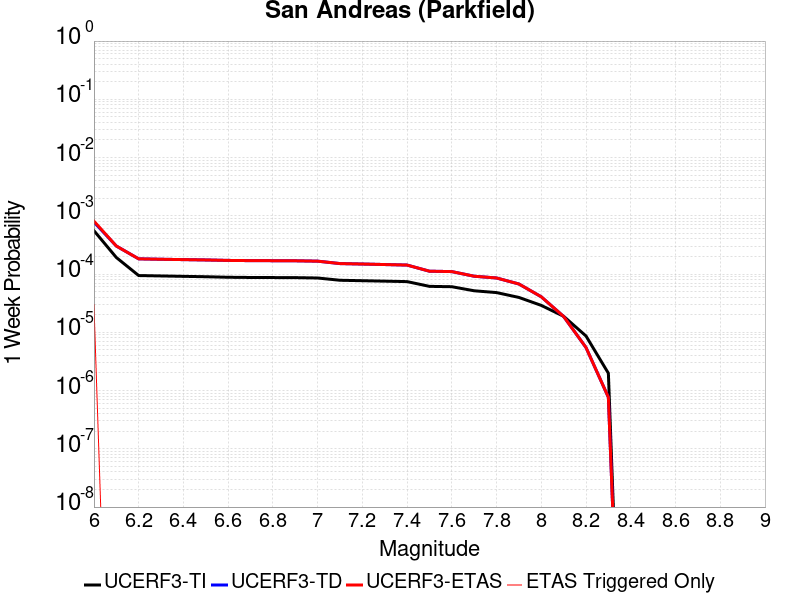 |  | 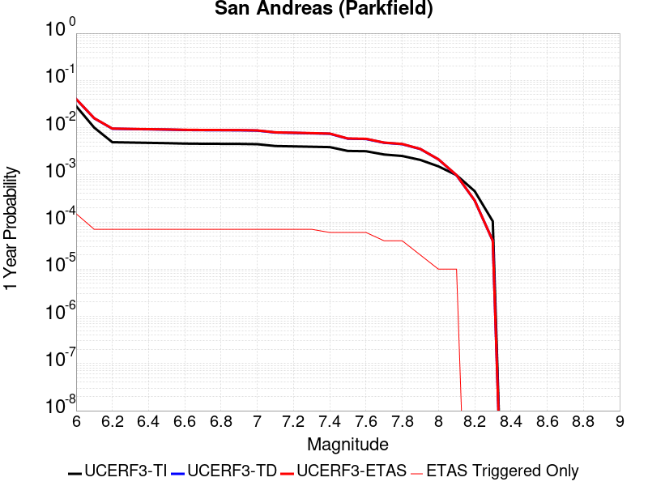 |  |

| Magnitude | 1 wk TI Prob | 1 wk TD Prob | 1 wk ETAS Prob | 1 wk ETAS/TD Gain | 1 wk ETAS Triggered Only | 1 mo TI Prob | 1 mo TD Prob | 1 mo ETAS Prob | 1 mo ETAS/TD Gain | 1 mo ETAS Triggered Only | 1 yr TI Prob | 1 yr TD Prob | 1 yr ETAS Prob | 1 yr ETAS/TD Gain | 1 yr ETAS Triggered Only | 10 yr TI Prob | 10 yr TD Prob | 10 yr ETAS Prob | 10 yr ETAS/TD Gain | 10 yr ETAS Triggered Only |
|-----|-----|-----|-----|-----|-----|-----|-----|-----|-----|-----|-----|-----|-----|-----|-----|-----|-----|-----|-----|-----|
| 6.0 | 5.556969E-4 | 7.788437E-4 | 8.088203E-4 | 1.0384886 | 3.0E-5 | 0.0023793848 | 0.0033341812 | 0.003364081 | 1.0089678 | 3.0E-5 | 0.028586963 | 0.04023991 | 0.040383875 | 1.0035776 | 1.5E-4 | 0.25176284 | 0.33731642 | 0.33758152 | 1.0007858 | 4.0E-4 |
| 6.1 | 1.925858E-4 | 3.0304783E-4 | 3.0304783E-4 | 1.0 | 0.0 | 8.2510663E-4 | 0.0012982241 | 0.0012982241 | 1.0 | 0.0 | 0.0099994885 | 0.015792182 | 0.015861075 | 1.0043626 | 7.0E-5 | 0.095613256 | 0.14979222 | 0.14995377 | 1.0010784 | 1.9E-4 |
| 6.2 | 9.4306815E-5 | 1.8250331E-4 | 1.8250331E-4 | 1.0 | 0.0 | 4.0410945E-4 | 7.819238E-4 | 7.819238E-4 | 1.0 | 0.0 | 0.0049089384 | 0.009478576 | 0.009547912 | 1.007315 | 7.0E-5 | 0.048019063 | 0.09188674 | 0.09203203 | 1.0015813 | 1.6E-4 |
| 6.3 | 9.283051E-5 | 1.7946832E-4 | 1.7946832E-4 | 1.0 | 0.0 | 3.9778434E-4 | 7.689244E-4 | 7.689244E-4 | 1.0 | 0.0 | 0.0048322747 | 0.009321672 | 0.00939102 | 1.0074394 | 7.0E-5 | 0.047285385 | 0.09053965 | 0.09068516 | 1.0016072 | 1.6E-4 |
| 6.4 | 9.138826E-5 | 1.770899E-4 | 1.770899E-4 | 1.0 | 0.0 | 3.916052E-4 | 7.5873715E-4 | 7.5873715E-4 | 1.0 | 0.0 | 0.0047573745 | 0.009198696 | 0.009268053 | 1.0075397 | 7.0E-5 | 0.046568092 | 0.089441724 | 0.08958741 | 1.0016289 | 1.6E-4 |
| 6.5 | 9.000255E-5 | 1.746699E-4 | 1.746699E-4 | 1.0 | 0.0 | 3.8566816E-4 | 7.483717E-4 | 7.483717E-4 | 1.0 | 0.0 | 0.0046854047 | 0.009073567 | 0.009142932 | 1.0076448 | 7.0E-5 | 0.045878403 | 0.08832737 | 0.08847324 | 1.0016514 | 1.6E-4 |
| 6.6 | 8.8109264E-5 | 1.7148067E-4 | 1.7148067E-4 | 1.0 | 0.0 | 3.7755648E-4 | 7.3471136E-4 | 7.3471136E-4 | 1.0 | 0.0 | 0.0045870654 | 0.008908638 | 0.008978014 | 1.0077876 | 7.0E-5 | 0.04493529 | 0.086858675 | 0.08700477 | 1.001682 | 1.6E-4 |
| 6.7 | 8.738073E-5 | 1.7015127E-4 | 1.7015127E-4 | 1.0 | 0.0 | 3.7443507E-4 | 7.290171E-4 | 7.290171E-4 | 1.0 | 0.0 | 0.0045492216 | 0.008839916 | 0.008909298 | 1.0078486 | 7.0E-5 | 0.04457213 | 0.086258985 | 0.08640518 | 1.0016949 | 1.6E-4 |
| 6.8 | 8.710195E-5 | 1.6960612E-4 | 1.6960612E-4 | 1.0 | 0.0 | 3.7324068E-4 | 7.266821E-4 | 7.266821E-4 | 1.0 | 0.0 | 0.0045347405 | 0.008811726 | 0.008881109 | 1.007874 | 7.0E-5 | 0.04443313 | 0.08600653 | 0.08615277 | 1.0017003 | 1.6E-4 |
| 6.9 | 8.6801556E-5 | 1.6901553E-4 | 1.6901553E-4 | 1.0 | 0.0 | 3.7195362E-4 | 7.2415237E-4 | 7.2415237E-4 | 1.0 | 0.0 | 0.0045191357 | 0.008781176 | 0.008850561 | 1.0079015 | 7.0E-5 | 0.044283327 | 0.08573254 | 0.08587883 | 1.0017062 | 1.6E-4 |
| 7.0 | 8.5571606E-5 | 1.6654332E-4 | 1.6654332E-4 | 1.0 | 0.0 | 3.6668387E-4 | 7.13563E-4 | 7.13563E-4 | 1.0 | 0.0 | 0.004455241 | 0.008653281 | 0.008722675 | 1.0080194 | 7.0E-5 | 0.043669727 | 0.08458075 | 0.08472722 | 1.0017316 | 1.6E-4 |
| 7.1 | 7.82589E-5 | 1.5135074E-4 | 1.5135074E-4 | 1.0 | 0.0 | 3.3535215E-4 | 6.484855E-4 | 6.484855E-4 | 1.0 | 0.0 | 0.0040752706 | 0.0078668995 | 0.007936349 | 1.008828 | 7.0E-5 | 0.040013418 | 0.077491894 | 0.077630274 | 1.0017856 | 1.5E-4 |
| 7.2 | 7.690929E-5 | 1.4872287E-4 | 1.4872287E-4 | 1.0 | 0.0 | 3.2956956E-4 | 6.372288E-4 | 6.372288E-4 | 1.0 | 0.0 | 0.004005129 | 0.007730829 | 0.007800288 | 1.0089847 | 7.0E-5 | 0.0393371 | 0.07626493 | 0.07640349 | 1.0018169 | 1.5E-4 |
| 7.3 | 7.5543794E-5 | 1.4568791E-4 | 1.4568791E-4 | 1.0 | 0.0 | 3.2371894E-4 | 6.242281E-4 | 6.242281E-4 | 1.0 | 0.0 | 0.003934157 | 0.007573656 | 0.007643126 | 1.0091726 | 7.0E-5 | 0.038652334 | 0.07482772 | 0.0749665 | 1.0018547 | 1.5E-4 |
| 7.4 | 7.4214564E-5 | 1.4269682E-4 | 1.4269682E-4 | 1.0 | 0.0 | 3.1802364E-4 | 6.114152E-4 | 6.114152E-4 | 1.0 | 0.0 | 0.003865065 | 0.007418731 | 0.0074782865 | 1.0080277 | 6.0E-5 | 0.03798529 | 0.07340127 | 0.073530994 | 1.0017673 | 1.4E-4 |
| 7.5 | 6.149578E-5 | 1.1196503E-4 | 1.1196503E-4 | 1.0 | 0.0 | 2.6352672E-4 | 4.7976198E-4 | 4.7976198E-4 | 1.0 | 0.0 | 0.0032037178 | 0.00582549 | 0.0058851405 | 1.0102396 | 6.0E-5 | 0.03157923 | 0.058584154 | 0.05871595 | 1.0022497 | 1.4E-4 |
| 7.6 | 6.0643448E-5 | 1.10251094E-4 | 1.10251094E-4 | 1.0 | 0.0 | 2.598746E-4 | 4.7241923E-4 | 4.7241923E-4 | 1.0 | 0.0 | 0.0031593828 | 0.0057365666 | 0.0057962225 | 1.0103992 | 6.0E-5 | 0.031148417 | 0.057744972 | 0.05787689 | 1.0022844 | 1.4E-4 |
| 7.7 | 5.1652263E-5 | 9.179838E-5 | 9.179838E-5 | 1.0 | 0.0 | 2.2134806E-4 | 3.9336234E-4 | 3.9336234E-4 | 1.0 | 0.0 | 0.002691582 | 0.0047786795 | 0.0048184884 | 1.0083305 | 4.0E-5 | 0.026592141 | 0.048560265 | 0.04865541 | 1.0019593 | 1.0E-4 |
| 7.8 | 4.8090482E-5 | 8.564368E-5 | 8.564368E-5 | 1.0 | 0.0 | 2.060858E-4 | 3.6699275E-4 | 3.6699275E-4 | 1.0 | 0.0 | 0.0025062072 | 0.004458991 | 0.0044988124 | 1.0089307 | 4.0E-5 | 0.024781305 | 0.045324653 | 0.045410573 | 1.0018957 | 9.0E-5 |
| 7.9 | 3.970278E-5 | 6.754111E-5 | 6.754111E-5 | 1.0 | 0.0 | 1.7014367E-4 | 2.894298E-4 | 2.894298E-4 | 1.0 | 0.0 | 0.002069531 | 0.0035181176 | 0.0035380472 | 1.0056648 | 2.0E-5 | 0.020503636 | 0.03589899 | 0.03596648 | 1.0018799 | 7.0E-5 |
| 8.0 | 2.8982335E-5 | 4.072124E-5 | 4.072124E-5 | 1.0 | 0.0 | 1.2420409E-4 | 1.7450792E-4 | 1.7450792E-4 | 1.0 | 0.0 | 0.0015111357 | 0.002122565 | 0.0021325436 | 1.0047013 | 1.0E-5 | 0.015009012 | 0.02202231 | 0.022051651 | 1.0013323 | 3.0E-5 |
| 8.1 | 1.8836186E-5 | 1.8694205E-5 | 1.8694205E-5 | 1.0 | 0.0 | 8.0724014E-5 | 8.011556E-5 | 8.011556E-5 | 1.0 | 0.0 | 9.823717E-4 | 9.749711E-4 | 9.849614E-4 | 1.0102468 | 1.0E-5 | 0.009780403 | 0.010494972 | 0.010504866 | 1.0009428 | 1.0E-5 |
| 8.2 | 8.643924E-6 | 5.4798497E-6 | 5.4798497E-6 | 1.0 | 0.0 | 3.704486E-5 | 2.348486E-5 | 2.348486E-5 | 1.0 | 0.0 | 4.5092785E-4 | 2.858907E-4 | 2.858907E-4 | 1.0 | 0.0 | 0.0045001395 | 0.0032514327 | 0.0032514327 | 1.0 | 0.0 |
| 8.3 | 1.983087E-6 | 7.668296E-7 | 7.668296E-7 | 1.0 | 0.0 | 8.498917E-6 | 3.2864084E-6 | 3.2864084E-6 | 1.0 | 0.0 | 1.034694E-4 | 4.0011306E-5 | 4.0011306E-5 | 1.0 | 0.0 | 0.0010342124 | 4.724499E-4 | 4.724499E-4 | 1.0 | 0.0 |

## Sierra Nevada  (No Extension)
*[(top)](#table-of-contents)*

| 1 Week | 1 Month | 1 Year | 10 Year |
|-----|-----|-----|-----|
|  |  |  |  |

| Magnitude | 1 wk TI Prob | 1 wk TD Prob | 1 wk ETAS Prob | 1 wk ETAS/TD Gain | 1 wk ETAS Triggered Only | 1 mo TI Prob | 1 mo TD Prob | 1 mo ETAS Prob | 1 mo ETAS/TD Gain | 1 mo ETAS Triggered Only | 1 yr TI Prob | 1 yr TD Prob | 1 yr ETAS Prob | 1 yr ETAS/TD Gain | 1 yr ETAS Triggered Only | 10 yr TI Prob | 10 yr TD Prob | 10 yr ETAS Prob | 10 yr ETAS/TD Gain | 10 yr ETAS Triggered Only |
|-----|-----|-----|-----|-----|-----|-----|-----|-----|-----|-----|-----|-----|-----|-----|-----|-----|-----|-----|-----|-----|
| 6.0 | 7.7690465E-6 | 6.9763832E-6 | 4.6976103E-5 | 6.73359 | 4.0E-5 | 3.329549E-5 | 2.9898645E-5 | 1.0989625E-4 | 3.6756265 | 8.0E-5 | 4.0529718E-4 | 3.6399104E-4 | 5.6391826E-4 | 1.5492641 | 2.0E-4 | 0.004045588 | 0.0036374647 | 0.00392641 | 1.0794358 | 2.9E-4 |
| 6.1 | 7.7690465E-6 | 6.9763832E-6 | 4.6976103E-5 | 6.73359 | 4.0E-5 | 3.329549E-5 | 2.9898645E-5 | 1.0989625E-4 | 3.6756265 | 8.0E-5 | 4.0529718E-4 | 3.6399104E-4 | 5.6391826E-4 | 1.5492641 | 2.0E-4 | 0.004045588 | 0.0036374647 | 0.00392641 | 1.0794358 | 2.9E-4 |
| 6.2 | 7.7690465E-6 | 6.9763832E-6 | 4.6976103E-5 | 6.73359 | 4.0E-5 | 3.329549E-5 | 2.9898645E-5 | 1.0989625E-4 | 3.6756265 | 8.0E-5 | 4.0529718E-4 | 3.6399104E-4 | 5.6391826E-4 | 1.5492641 | 2.0E-4 | 0.004045588 | 0.0036374647 | 0.00392641 | 1.0794358 | 2.9E-4 |
| 6.3 | 7.7690465E-6 | 6.9763832E-6 | 4.6976103E-5 | 6.73359 | 4.0E-5 | 3.329549E-5 | 2.9898645E-5 | 1.0989625E-4 | 3.6756265 | 8.0E-5 | 4.0529718E-4 | 3.6399104E-4 | 5.6391826E-4 | 1.5492641 | 2.0E-4 | 0.004045588 | 0.0036374647 | 0.00392641 | 1.0794358 | 2.9E-4 |
| 6.4 | 7.7690465E-6 | 6.9763832E-6 | 4.6976103E-5 | 6.73359 | 4.0E-5 | 3.329549E-5 | 2.9898645E-5 | 1.0989625E-4 | 3.6756265 | 8.0E-5 | 4.0529718E-4 | 3.6399104E-4 | 5.6391826E-4 | 1.5492641 | 2.0E-4 | 0.004045588 | 0.0036374647 | 0.00392641 | 1.0794358 | 2.9E-4 |
| 6.5 | 7.7690465E-6 | 6.9763832E-6 | 4.6976103E-5 | 6.73359 | 4.0E-5 | 3.329549E-5 | 2.9898645E-5 | 1.0989625E-4 | 3.6756265 | 8.0E-5 | 4.0529718E-4 | 3.6399104E-4 | 5.6391826E-4 | 1.5492641 | 2.0E-4 | 0.004045588 | 0.0036374647 | 0.00392641 | 1.0794358 | 2.9E-4 |
| 6.6 | 2.653E-6 | 1.6148814E-6 | 3.1614833E-5 | 19.577187 | 3.0E-5 | 1.136995E-5 | 6.920902E-6 | 5.6920555E-5 | 8.224442 | 5.0E-5 | 1.3842035E-4 | 8.4258754E-5 | 2.4424528E-4 | 2.8987525 | 1.6E-4 | 0.0013833415 | 8.4227155E-4 | 0.001042103 | 1.2372531 | 2.0E-4 |
| 6.7 | 2.5902466E-6 | 1.5502146E-6 | 3.1550167E-5 | 20.352129 | 3.0E-5 | 1.11010095E-5 | 6.64376E-6 | 5.664343E-5 | 8.525808 | 5.0E-5 | 1.351464E-4 | 8.0884805E-5 | 2.4087187E-4 | 2.9779618 | 1.6E-4 | 0.0013506424 | 8.085567E-4 | 0.001008395 | 1.2471544 | 2.0E-4 |
| 6.8 | 2.5853892E-6 | 1.5470148E-6 | 3.154697E-5 | 20.392157 | 3.0E-5 | 1.1080193E-5 | 6.6300463E-6 | 5.6629717E-5 | 8.541375 | 5.0E-5 | 1.34893E-4 | 8.071786E-5 | 2.4070495E-4 | 2.9820533 | 1.6E-4 | 0.0013481114 | 8.0688833E-4 | 0.001006727 | 1.2476658 | 2.0E-4 |
| 6.9 | 2.458257E-6 | 1.4220883E-6 | 3.1422045E-5 | 22.095705 | 3.0E-5 | 1.0535345E-5 | 6.0946504E-6 | 5.6094344E-5 | 9.203866 | 5.0E-5 | 1.2826028E-4 | 7.419986E-5 | 2.3418799E-4 | 3.1561782 | 1.6E-4 | 0.0012818627 | 7.417528E-4 | 9.416045E-4 | 1.2694316 | 2.0E-4 |
| 7.0 | 2.4341468E-6 | 1.399052E-6 | 3.139901E-5 | 22.44306 | 3.0E-5 | 1.0432016E-5 | 5.995924E-6 | 5.5995624E-5 | 9.338948 | 5.0E-5 | 1.270024E-4 | 7.2997944E-5 | 2.3298626E-4 | 3.1916826 | 1.6E-4 | 0.0012692984 | 7.297416E-4 | 9.2959567E-4 | 1.2738696 | 2.0E-4 |
| 7.1 | 2.3652476E-6 | 1.3340014E-6 | 3.1333962E-5 | 23.488703 | 3.0E-5 | 1.0136736E-5 | 5.717136E-6 | 5.571685E-5 | 9.745587 | 5.0E-5 | 1.2340778E-4 | 6.960393E-5 | 2.2959278E-4 | 3.2985609 | 1.6E-4 | 0.0012333926 | 6.9582294E-4 | 8.9568377E-4 | 1.2872294 | 2.0E-4 |
| 7.2 | 2.272158E-6 | 1.2503074E-6 | 3.125027E-5 | 24.99407 | 3.0E-5 | 9.737784E-6 | 5.3584495E-6 | 5.535818E-5 | 10.331008 | 5.0E-5 | 1.1855107E-4 | 6.523718E-5 | 2.2522674E-4 | 3.452429 | 1.6E-4 | 0.0011848784 | 6.5218186E-4 | 8.520514E-4 | 1.3064629 | 2.0E-4 |
| 7.3 | 2.1382127E-6 | 1.1419947E-6 | 3.114196E-5 | 27.269793 | 3.0E-5 | 9.163737E-6 | 4.8942543E-6 | 5.4894008E-5 | 11.216011 | 5.0E-5 | 1.1156279E-4 | 5.9585927E-5 | 2.0957699E-4 | 3.517223 | 1.5E-4 | 0.001115068 | 5.957007E-4 | 7.855875E-4 | 1.3187622 | 1.9E-4 |
| 7.4 | 1.9048055E-6 | 9.575474E-7 | 3.095752E-5 | 32.33001 | 3.0E-5 | 8.163426E-6 | 4.1037683E-6 | 4.4103603E-5 | 10.747099 | 4.0E-5 | 9.9385186E-5 | 4.996224E-5 | 1.7995575E-4 | 3.601835 | 1.3E-4 | 9.934074E-4 | 4.995108E-4 | 6.5943087E-4 | 1.3201535 | 1.6E-4 |
| 7.5 | 1.5373403E-6 | 7.5602395E-7 | 3.0756E-5 | 40.68125 | 3.0E-5 | 6.5885843E-6 | 3.2400987E-6 | 4.323997E-5 | 13.345263 | 4.0E-5 | 8.021306E-5 | 3.9447492E-5 | 1.5944276E-4 | 4.0418983 | 1.2E-4 | 8.0184115E-4 | 3.944054E-4 | 5.443462E-4 | 1.3801694 | 1.5E-4 |
| 7.6 | 1.0680322E-6 | 4.659796E-7 | 1.0465975E-5 | 22.460157 | 1.0E-5 | 4.577273E-6 | 1.997054E-6 | 2.1997013E-5 | 11.014732 | 2.0E-5 | 5.5726876E-5 | 2.4313864E-5 | 1.0431192E-4 | 4.290224 | 8.0E-5 | 5.5712904E-4 | 2.431123E-4 | 3.4308797E-4 | 1.4112326 | 1.0E-4 |
| 7.7 | 5.509146E-7 | 1.5581199E-7 | 1.0155811E-5 | 65.1799 | 1.0E-5 | 2.3610605E-6 | 6.677655E-7 | 1.0667759E-5 | 15.9753065 | 1.0E-5 | 2.8745531E-5 | 8.130016E-6 | 4.8129692E-5 | 5.9199996 | 4.0E-5 | 2.8741814E-4 | 8.12973E-5 | 1.3129324E-4 | 1.6149765 | 5.0E-5 |

## Death Valley (No)
*[(top)](#table-of-contents)*

| 1 Week | 1 Month | 1 Year | 10 Year |
|-----|-----|-----|-----|
|  |  |  |  |

| Magnitude | 1 wk TI Prob | 1 wk TD Prob | 1 wk ETAS Prob | 1 wk ETAS/TD Gain | 1 wk ETAS Triggered Only | 1 mo TI Prob | 1 mo TD Prob | 1 mo ETAS Prob | 1 mo ETAS/TD Gain | 1 mo ETAS Triggered Only | 1 yr TI Prob | 1 yr TD Prob | 1 yr ETAS Prob | 1 yr ETAS/TD Gain | 1 yr ETAS Triggered Only | 10 yr TI Prob | 10 yr TD Prob | 10 yr ETAS Prob | 10 yr ETAS/TD Gain | 10 yr ETAS Triggered Only |
|-----|-----|-----|-----|-----|-----|-----|-----|-----|-----|-----|-----|-----|-----|-----|-----|-----|-----|-----|-----|-----|
| 6.0 | 2.0074807E-5 | 2.2500446E-5 | 5.249977E-5 | 2.333277 | 3.0E-5 | 8.603206E-5 | 9.642696E-5 | 1.364231E-4 | 1.4147818 | 4.0E-5 | 0.001046937 | 0.0011733733 | 0.0012932325 | 1.1021492 | 1.2E-4 | 0.010420183 | 0.011672693 | 0.011979075 | 1.0262477 | 3.1E-4 |
| 6.1 | 2.0074807E-5 | 2.2500446E-5 | 5.249977E-5 | 2.333277 | 3.0E-5 | 8.603206E-5 | 9.642696E-5 | 1.364231E-4 | 1.4147818 | 4.0E-5 | 0.001046937 | 0.0011733733 | 0.0012932325 | 1.1021492 | 1.2E-4 | 0.010420183 | 0.011672693 | 0.011979075 | 1.0262477 | 3.1E-4 |
| 6.2 | 2.0074807E-5 | 2.2500446E-5 | 5.249977E-5 | 2.333277 | 3.0E-5 | 8.603206E-5 | 9.642696E-5 | 1.364231E-4 | 1.4147818 | 4.0E-5 | 0.001046937 | 0.0011733733 | 0.0012932325 | 1.1021492 | 1.2E-4 | 0.010420183 | 0.011672693 | 0.011979075 | 1.0262477 | 3.1E-4 |
| 6.3 | 1.9050609E-5 | 2.1337288E-5 | 5.1336647E-5 | 2.4059594 | 3.0E-5 | 8.164292E-5 | 9.144236E-5 | 1.314387E-4 | 1.437394 | 4.0E-5 | 9.935491E-4 | 0.0011127489 | 0.0012326153 | 1.1077211 | 1.2E-4 | 0.009891188 | 0.011072595 | 0.011379163 | 1.0276871 | 3.1E-4 |
| 6.4 | 1.9050609E-5 | 2.1337288E-5 | 5.1336647E-5 | 2.4059594 | 3.0E-5 | 8.164292E-5 | 9.144236E-5 | 1.314387E-4 | 1.437394 | 4.0E-5 | 9.935491E-4 | 0.0011127489 | 0.0012326153 | 1.1077211 | 1.2E-4 | 0.009891188 | 0.011072595 | 0.011379163 | 1.0276871 | 3.1E-4 |
| 6.5 | 1.8367004E-5 | 2.0561336E-5 | 5.056072E-5 | 2.4590192 | 3.0E-5 | 7.8713354E-5 | 8.811707E-5 | 1.18114425E-4 | 1.3404262 | 3.0E-5 | 9.5791375E-4 | 0.0010723039 | 0.001182186 | 1.1024729 | 1.1E-4 | 0.009537951 | 0.010672084 | 0.010958989 | 1.0268837 | 2.9E-4 |
| 6.6 | 1.779439E-5 | 1.9911244E-5 | 4.9910646E-5 | 2.5066564 | 3.0E-5 | 7.625944E-5 | 8.533114E-5 | 1.15328585E-4 | 1.3515415 | 3.0E-5 | 9.280632E-4 | 0.0010384179 | 0.0011483037 | 1.1058204 | 1.1E-4 | 0.009241969 | 0.010336416 | 0.010623418 | 1.0277661 | 2.9E-4 |
| 6.7 | 1.7025437E-5 | 1.9043726E-5 | 4.9043156E-5 | 2.5752919 | 3.0E-5 | 7.296412E-5 | 8.161345E-5 | 1.11611E-4 | 1.3675565 | 3.0E-5 | 8.87976E-4 | 9.93197E-4 | 0.0011030877 | 1.1106435 | 1.1E-4 | 0.008844362 | 0.009888301 | 0.010175433 | 1.0290376 | 2.9E-4 |
| 6.8 | 1.6545107E-5 | 1.851284E-5 | 4.8512284E-5 | 2.620467 | 3.0E-5 | 7.090568E-5 | 7.933836E-5 | 1.0933598E-4 | 1.3780973 | 3.0E-5 | 8.629347E-4 | 9.655226E-4 | 0.0010754163 | 1.1138179 | 1.1E-4 | 0.008595915 | 0.009613981 | 0.009901192 | 1.0298744 | 2.9E-4 |
| 6.9 | 1.615478E-5 | 1.8087881E-5 | 4.808734E-5 | 2.658539 | 3.0E-5 | 6.9232934E-5 | 7.751722E-5 | 1.075149E-4 | 1.3869808 | 3.0E-5 | 8.4258494E-4 | 9.433697E-4 | 0.0010532659 | 1.1164932 | 1.1E-4 | 0.008393973 | 0.009394345 | 0.009681621 | 1.0305797 | 2.9E-4 |
| 7.0 | 1.5894311E-5 | 1.7805834E-5 | 4.78053E-5 | 2.6848109 | 3.0E-5 | 6.81167E-5 | 7.6308526E-5 | 1.0630624E-4 | 1.3931109 | 3.0E-5 | 8.2900526E-4 | 9.286663E-4 | 0.0010385643 | 1.1183394 | 1.1E-4 | 0.008259195 | 0.009248544 | 0.009525956 | 1.0299951 | 2.8E-4 |
| 7.1 | 1.5602263E-5 | 1.7483784E-5 | 4.748326E-5 | 2.7158458 | 3.0E-5 | 6.6865134E-5 | 7.4928386E-5 | 1.04926134E-4 | 1.4003524 | 3.0E-5 | 8.137789E-4 | 9.118773E-4 | 0.001021777 | 1.1205202 | 1.1E-4 | 0.008108052 | 0.009082039 | 0.009359496 | 1.0305501 | 2.8E-4 |
| 7.2 | 1.5323829E-5 | 1.7170905E-5 | 4.717039E-5 | 2.7471113 | 3.0E-5 | 6.56719E-5 | 7.358755E-5 | 1.0358535E-4 | 1.4076476 | 3.0E-5 | 7.99262E-4 | 8.9556625E-4 | 0.0010054677 | 1.1227173 | 1.1E-4 | 0.007963934 | 0.008920249 | 0.009187841 | 1.0299982 | 2.7E-4 |
| 7.3 | 1.4556212E-5 | 1.6302716E-5 | 4.6302226E-5 | 2.8401542 | 3.0E-5 | 6.238227E-5 | 6.986695E-5 | 9.986485E-5 | 1.4293576 | 3.0E-5 | 7.592395E-4 | 8.503039E-4 | 9.502189E-4 | 1.117505 | 1.0E-4 | 0.0075665074 | 0.008471149 | 0.008728947 | 1.0304325 | 2.6E-4 |
| 7.4 | 1.411725E-5 | 1.5808211E-5 | 4.5807737E-5 | 2.897718 | 3.0E-5 | 6.0501097E-5 | 6.774775E-5 | 9.7745724E-5 | 1.4427891 | 3.0E-5 | 7.363519E-4 | 8.245226E-4 | 9.244401E-4 | 1.1211823 | 1.0E-4 | 0.0073391674 | 0.008215268 | 0.0084532965 | 1.0289739 | 2.4E-4 |
| 7.5 | 1.3503312E-5 | 1.5126531E-5 | 4.512608E-5 | 2.9832404 | 3.0E-5 | 5.7870053E-5 | 6.482641E-5 | 9.482446E-5 | 1.4627444 | 3.0E-5 | 7.043401E-4 | 7.8898156E-4 | 8.889027E-4 | 1.1266457 | 1.0E-4 | 0.007021119 | 0.007862429 | 0.008100542 | 1.0302849 | 2.4E-4 |
| 7.6 | 1.1279839E-5 | 1.2626528E-5 | 3.2626274E-5 | 2.5839467 | 2.0E-5 | 4.834127E-5 | 5.4112596E-5 | 7.4111515E-5 | 1.3695797 | 2.0E-5 | 5.88396E-4 | 6.58627E-4 | 7.4856775E-4 | 1.1365579 | 9.0E-5 | 0.005868405 | 0.0065673026 | 0.006765989 | 1.0302539 | 2.0E-4 |
| 7.7 | 9.189108E-6 | 1.0283521E-5 | 2.0283418E-5 | 1.9724195 | 1.0E-5 | 3.93813E-5 | 4.407152E-5 | 5.4071075E-5 | 1.2268939 | 1.0E-5 | 4.7936183E-4 | 5.3644367E-4 | 6.0640613E-4 | 1.130419 | 7.0E-5 | 0.004783291 | 0.0053519984 | 0.005501196 | 1.027877 | 1.5E-4 |
| 7.8 | 3.4586725E-7 | 3.648288E-7 | 3.648288E-7 | 1.0 | 0.0 | 1.4822873E-6 | 1.5635511E-6 | 1.5635511E-6 | 1.0 | 0.0 | 1.80467E-5 | 1.9036073E-5 | 1.9036073E-5 | 1.0 | 0.0 | 1.8045233E-4 | 1.9034486E-4 | 1.9034486E-4 | 1.0 | 0.0 |
| 7.9 | 2.5591178E-9 | 2.6696871E-9 | 2.6696871E-9 | 1.0 | 0.0 | 1.0967647E-8 | 1.1441516E-8 | 1.1441516E-8 | 1.0 | 0.0 | 1.335311E-7 | 1.3930045E-7 | 1.3930045E-7 | 1.0 | 0.0 | 1.3353102E-6 | 1.3930046E-6 | 1.3930046E-6 | 1.0 | 0.0 |

## Red Pass
*[(top)](#table-of-contents)*

| 1 Week | 1 Month | 1 Year | 10 Year |
|-----|-----|-----|-----|
|  |  |  | 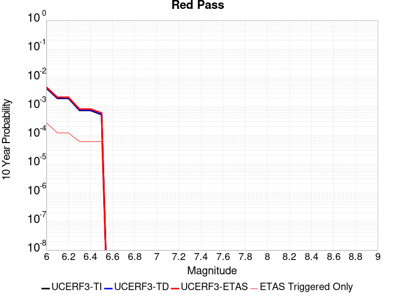 |

| Magnitude | 1 wk TI Prob | 1 wk TD Prob | 1 wk ETAS Prob | 1 wk ETAS/TD Gain | 1 wk ETAS Triggered Only | 1 mo TI Prob | 1 mo TD Prob | 1 mo ETAS Prob | 1 mo ETAS/TD Gain | 1 mo ETAS Triggered Only | 1 yr TI Prob | 1 yr TD Prob | 1 yr ETAS Prob | 1 yr ETAS/TD Gain | 1 yr ETAS Triggered Only | 10 yr TI Prob | 10 yr TD Prob | 10 yr ETAS Prob | 10 yr ETAS/TD Gain | 10 yr ETAS Triggered Only |
|-----|-----|-----|-----|-----|-----|-----|-----|-----|-----|-----|-----|-----|-----|-----|-----|-----|-----|-----|-----|-----|
| 6.0 | 8.258278E-6 | 8.551305E-6 | 8.551305E-6 | 1.0 | 0.0 | 3.539214E-5 | 3.6648038E-5 | 5.6647303E-5 | 1.5457119 | 2.0E-5 | 4.308141E-4 | 4.4611638E-4 | 5.760584E-4 | 1.2912738 | 1.3E-4 | 0.0042997985 | 0.004453966 | 0.0047227633 | 1.0603502 | 2.7E-4 |
| 6.1 | 3.649988E-6 | 3.7753332E-6 | 3.7753332E-6 | 1.0 | 0.0 | 1.5642712E-5 | 1.6179927E-5 | 3.61796E-5 | 2.2360797 | 2.0E-5 | 1.9043336E-4 | 1.9697756E-4 | 2.5696575E-4 | 1.3045433 | 6.0E-5 | 0.0019027026 | 0.001968497 | 0.0020882608 | 1.0608402 | 1.2E-4 |
| 6.2 | 3.649988E-6 | 3.7753332E-6 | 3.7753332E-6 | 1.0 | 0.0 | 1.5642712E-5 | 1.6179927E-5 | 3.61796E-5 | 2.2360797 | 2.0E-5 | 1.9043336E-4 | 1.9697756E-4 | 2.5696575E-4 | 1.3045433 | 6.0E-5 | 0.0019027026 | 0.001968497 | 0.0020882608 | 1.0608402 | 1.2E-4 |
| 6.3 | 1.3924937E-6 | 1.4411233E-6 | 1.4411233E-6 | 1.0 | 0.0 | 5.9678164E-6 | 6.176236E-6 | 2.6176112E-5 | 4.2381983 | 2.0E-5 | 7.265574E-5 | 7.51945E-5 | 1.0519224E-4 | 1.3989354 | 3.0E-5 | 7.263199E-4 | 7.518293E-4 | 8.117842E-4 | 1.0797453 | 6.0E-5 |
| 6.4 | 1.3924937E-6 | 1.4411233E-6 | 1.4411233E-6 | 1.0 | 0.0 | 5.9678164E-6 | 6.176236E-6 | 2.6176112E-5 | 4.2381983 | 2.0E-5 | 7.265574E-5 | 7.51945E-5 | 1.0519224E-4 | 1.3989354 | 3.0E-5 | 7.263199E-4 | 7.518293E-4 | 8.117842E-4 | 1.0797453 | 6.0E-5 |
| 6.5 | 9.876812E-7 | 1.022196E-6 | 1.022196E-6 | 1.0 | 0.0 | 4.2329125E-6 | 4.38084E-6 | 2.4380752E-5 | 5.565315 | 2.0E-5 | 5.153449E-5 | 5.3336724E-5 | 8.333512E-5 | 1.5624342 | 3.0E-5 | 5.1522546E-4 | 5.333672E-4 | 5.9333525E-4 | 1.1124328 | 6.0E-5 |

## San Andreas (San Gorgonio Pass-Garnet HIll)
*[(top)](#table-of-contents)*

| 1 Week | 1 Month | 1 Year | 10 Year |
|-----|-----|-----|-----|
|  |  |  |  |

| Magnitude | 1 wk TI Prob | 1 wk TD Prob | 1 wk ETAS Prob | 1 wk ETAS/TD Gain | 1 wk ETAS Triggered Only | 1 mo TI Prob | 1 mo TD Prob | 1 mo ETAS Prob | 1 mo ETAS/TD Gain | 1 mo ETAS Triggered Only | 1 yr TI Prob | 1 yr TD Prob | 1 yr ETAS Prob | 1 yr ETAS/TD Gain | 1 yr ETAS Triggered Only | 10 yr TI Prob | 10 yr TD Prob | 10 yr ETAS Prob | 10 yr ETAS/TD Gain | 10 yr ETAS Triggered Only |
|-----|-----|-----|-----|-----|-----|-----|-----|-----|-----|-----|-----|-----|-----|-----|-----|-----|-----|-----|-----|-----|
| 6.0 | 8.31567E-5 | 2.3386451E-4 | 2.4386217E-4 | 1.0427498 | 1.0E-5 | 3.5633717E-4 | 0.0010018935 | 0.0010418535 | 1.0398844 | 4.0E-5 | 0.004329778 | 0.012129918 | 0.012258342 | 1.0105873 | 1.3E-4 | 0.042463828 | 0.11259502 | 0.11283462 | 1.002128 | 2.7E-4 |
| 6.1 | 8.31567E-5 | 2.3386451E-4 | 2.4386217E-4 | 1.0427498 | 1.0E-5 | 3.5633717E-4 | 0.0010018935 | 0.0010418535 | 1.0398844 | 4.0E-5 | 0.004329778 | 0.012129918 | 0.012258342 | 1.0105873 | 1.3E-4 | 0.042463828 | 0.11259502 | 0.11283462 | 1.002128 | 2.7E-4 |
| 6.2 | 8.31567E-5 | 2.3386451E-4 | 2.4386217E-4 | 1.0427498 | 1.0E-5 | 3.5633717E-4 | 0.0010018935 | 0.0010418535 | 1.0398844 | 4.0E-5 | 0.004329778 | 0.012129918 | 0.012258342 | 1.0105873 | 1.3E-4 | 0.042463828 | 0.11259502 | 0.11283462 | 1.002128 | 2.7E-4 |
| 6.3 | 8.31567E-5 | 2.3386451E-4 | 2.4386217E-4 | 1.0427498 | 1.0E-5 | 3.5633717E-4 | 0.0010018935 | 0.0010418535 | 1.0398844 | 4.0E-5 | 0.004329778 | 0.012129918 | 0.012258342 | 1.0105873 | 1.3E-4 | 0.042463828 | 0.11259502 | 0.11283462 | 1.002128 | 2.7E-4 |
| 6.4 | 8.059055E-5 | 2.2944735E-4 | 2.3944506E-4 | 1.043573 | 1.0E-5 | 3.4534236E-4 | 9.829777E-4 | 0.0010229384 | 1.0406526 | 4.0E-5 | 0.0041964394 | 0.011902156 | 0.012030609 | 1.0107924 | 1.3E-4 | 0.041180745 | 0.110576175 | 0.11081632 | 1.0021718 | 2.7E-4 |
| 6.5 | 8.059055E-5 | 2.2944735E-4 | 2.3944506E-4 | 1.043573 | 1.0E-5 | 3.4534236E-4 | 9.829777E-4 | 0.0010229384 | 1.0406526 | 4.0E-5 | 0.0041964394 | 0.011902156 | 0.012030609 | 1.0107924 | 1.3E-4 | 0.041180745 | 0.110576175 | 0.11081632 | 1.0021718 | 2.7E-4 |
| 6.6 | 7.619237E-5 | 2.2189032E-4 | 2.318881E-4 | 1.0450573 | 1.0E-5 | 3.2649786E-4 | 9.506143E-4 | 9.905762E-4 | 1.0420381 | 4.0E-5 | 0.0039678677 | 0.0115128625 | 0.011631481 | 1.0103031 | 1.2E-4 | 0.03897764 | 0.10711278 | 0.107344925 | 1.0021673 | 2.6E-4 |
| 6.7 | 7.440636E-5 | 2.1864849E-4 | 2.2864631E-4 | 1.0457255 | 1.0E-5 | 3.188454E-4 | 9.367307E-4 | 9.766932E-4 | 1.0426617 | 4.0E-5 | 0.0038750346 | 0.011345596 | 0.011464234 | 1.0104568 | 1.2E-4 | 0.038081564 | 0.10562121 | 0.10585375 | 1.0022017 | 2.6E-4 |
| 6.8 | 7.3735864E-5 | 2.1712016E-4 | 2.2711798E-4 | 1.0460474 | 1.0E-5 | 3.1597257E-4 | 9.3018543E-4 | 9.701482E-4 | 1.0429622 | 4.0E-5 | 0.0038401815 | 0.011266734 | 0.011385382 | 1.0105308 | 1.2E-4 | 0.03774495 | 0.10492276 | 0.105155475 | 1.002218 | 2.6E-4 |
| 6.9 | 7.27575E-5 | 2.1480983E-4 | 2.2480768E-4 | 1.0465428 | 1.0E-5 | 3.117806E-4 | 9.20291E-4 | 9.6025417E-4 | 1.0434245 | 4.0E-5 | 0.003789323 | 0.011147508 | 0.011266171 | 1.0106448 | 1.2E-4 | 0.037253562 | 0.10387066 | 0.104103655 | 1.0022432 | 2.6E-4 |
| 7.0 | 7.102591E-5 | 2.1065009E-4 | 2.2064798E-4 | 1.0474621 | 1.0E-5 | 3.0436125E-4 | 9.0247596E-4 | 9.424399E-4 | 1.0442826 | 4.0E-5 | 0.003699303 | 0.010932805 | 0.011051494 | 1.0108562 | 1.2E-4 | 0.03638325 | 0.101972826 | 0.10220631 | 1.0022897 | 2.6E-4 |
| 7.1 | 7.028513E-5 | 2.0900648E-4 | 2.1900439E-4 | 1.0478354 | 1.0E-5 | 3.0118722E-4 | 8.954368E-4 | 9.3540095E-4 | 1.0446309 | 4.0E-5 | 0.0036607897 | 0.01084796 | 0.010966658 | 1.010942 | 1.2E-4 | 0.036010686 | 0.10121585 | 0.10144953 | 1.0023087 | 2.6E-4 |
| 7.2 | 6.8498244E-5 | 2.0508505E-4 | 2.15083E-4 | 1.0487503 | 1.0E-5 | 2.9353087E-4 | 8.78642E-4 | 9.186069E-4 | 1.0454848 | 4.0E-5 | 0.003567883 | 0.010645497 | 0.01076422 | 1.0111524 | 1.2E-4 | 0.035111405 | 0.09940783 | 0.099641986 | 1.0023555 | 2.6E-4 |
| 7.3 | 6.622592E-5 | 1.973576E-4 | 2.0735562E-4 | 1.0506594 | 1.0E-5 | 2.8379448E-4 | 8.4554625E-4 | 8.8551245E-4 | 1.0472667 | 4.0E-5 | 0.0034497243 | 0.010246415 | 0.010365184 | 1.0115914 | 1.2E-4 | 0.033966612 | 0.09590419 | 0.09613925 | 1.0024511 | 2.6E-4 |
| 7.4 | 5.1050705E-5 | 1.4692261E-4 | 1.5692115E-4 | 1.068053 | 1.0E-5 | 2.1877038E-4 | 6.295173E-4 | 6.694921E-4 | 1.0635008 | 4.0E-5 | 0.002660276 | 0.0076376316 | 0.0077567147 | 1.0155916 | 1.2E-4 | 0.02628654 | 0.07287696 | 0.07311801 | 1.0033077 | 2.6E-4 |
| 7.5 | 3.9302922E-5 | 1.11326524E-4 | 1.2132541E-4 | 1.0898159 | 1.0E-5 | 1.6843023E-4 | 4.7702674E-4 | 5.1700766E-4 | 1.0838127 | 4.0E-5 | 0.0020487092 | 0.005792404 | 0.0059117093 | 1.0205967 | 1.2E-4 | 0.020299247 | 0.05602189 | 0.056257885 | 1.0042125 | 2.5E-4 |
| 7.6 | 2.9851626E-5 | 8.49747E-5 | 9.497385E-5 | 1.1176721 | 1.0E-5 | 1.2792926E-4 | 3.6412658E-4 | 3.9411566E-4 | 1.082359 | 3.0E-5 | 0.0015564259 | 0.004424255 | 0.004533768 | 1.024753 | 1.1E-4 | 0.0154556995 | 0.043204896 | 0.043434527 | 1.005315 | 2.4E-4 |
| 7.7 | 2.1135214E-5 | 6.355116E-5 | 7.3550524E-5 | 1.1573435 | 1.0E-5 | 9.0576345E-5 | 2.723337E-4 | 3.0232553E-4 | 1.110129 | 3.0E-5 | 0.0011022091 | 0.003310627 | 0.0034202628 | 1.0331163 | 1.1E-4 | 0.010967582 | 0.032592565 | 0.03281507 | 1.0068269 | 2.3E-4 |
| 7.8 | 1.883379E-5 | 5.5660596E-5 | 6.566004E-5 | 1.1796503 | 1.0E-5 | 8.0713755E-5 | 2.3852361E-4 | 2.6851645E-4 | 1.1257437 | 3.0E-5 | 9.822468E-4 | 0.0029001608 | 0.0030098418 | 1.0378189 | 1.1E-4 | 0.0097791655 | 0.028704397 | 0.028927796 | 1.0077827 | 2.3E-4 |
| 7.9 | 1.5156185E-5 | 4.1675128E-5 | 5.1674713E-5 | 1.2399412 | 1.0E-5 | 6.495346E-5 | 1.7859548E-4 | 2.0859012E-4 | 1.1679474 | 3.0E-5 | 7.9052144E-4 | 0.0021722328 | 0.0022720157 | 1.0459356 | 1.0E-4 | 0.007877152 | 0.02176709 | 0.021972518 | 1.0094376 | 2.1E-4 |
| 8.0 | 1.1405907E-5 | 2.9986788E-5 | 2.9986788E-5 | 1.0 | 0.0 | 4.8881542E-5 | 1.2850849E-4 | 1.385072E-4 | 1.0778059 | 1.0E-5 | 5.9497025E-4 | 0.0015634688 | 0.0016133907 | 1.0319302 | 5.0E-5 | 0.005933798 | 0.015778678 | 0.015916469 | 1.0087327 | 1.4E-4 |
| 8.1 | 4.3511436E-6 | 7.373693E-6 | 7.373693E-6 | 1.0 | 0.0 | 1.8647626E-5 | 3.160116E-5 | 3.160116E-5 | 1.0 | 0.0 | 2.2701119E-4 | 3.8467633E-4 | 3.9467248E-4 | 1.0259858 | 1.0E-5 | 0.0022677942 | 0.004118566 | 0.0041285246 | 1.002418 | 1.0E-5 |
| 8.2 | 2.3042528E-6 | 2.7350309E-6 | 2.7350309E-6 | 1.0 | 0.0 | 9.875332E-6 | 1.1721509E-5 | 1.1721509E-5 | 1.0 | 0.0 | 1.2022553E-4 | 1.4270007E-4 | 1.4270007E-4 | 1.0 | 0.0 | 0.0012016051 | 0.0015990696 | 0.0015990696 | 1.0 | 0.0 |
| 8.3 | 5.202968E-7 | 3.1628537E-7 | 3.1628537E-7 | 1.0 | 0.0 | 2.2298414E-6 | 1.3555081E-6 | 1.3555081E-6 | 1.0 | 0.0 | 2.714798E-5 | 1.6503198E-5 | 1.6503198E-5 | 1.0 | 0.0 | 2.7144665E-4 | 1.9580164E-4 | 1.9580164E-4 | 1.0 | 0.0 |

## Calico-Hidalgo
*[(top)](#table-of-contents)*

| 1 Week | 1 Month | 1 Year | 10 Year |
|-----|-----|-----|-----|
|  |  |  | 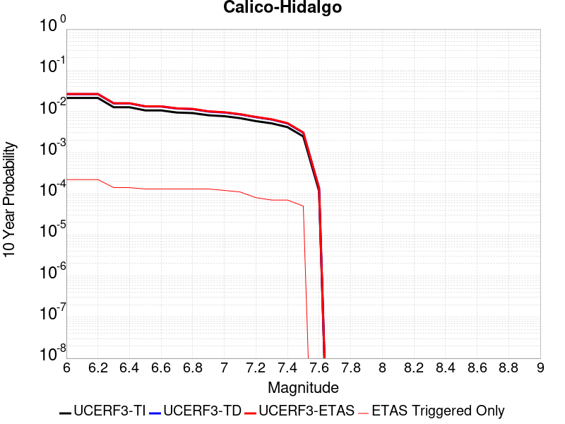 |

| Magnitude | 1 wk TI Prob | 1 wk TD Prob | 1 wk ETAS Prob | 1 wk ETAS/TD Gain | 1 wk ETAS Triggered Only | 1 mo TI Prob | 1 mo TD Prob | 1 mo ETAS Prob | 1 mo ETAS/TD Gain | 1 mo ETAS Triggered Only | 1 yr TI Prob | 1 yr TD Prob | 1 yr ETAS Prob | 1 yr ETAS/TD Gain | 1 yr ETAS Triggered Only | 10 yr TI Prob | 10 yr TD Prob | 10 yr ETAS Prob | 10 yr ETAS/TD Gain | 10 yr ETAS Triggered Only |
|-----|-----|-----|-----|-----|-----|-----|-----|-----|-----|-----|-----|-----|-----|-----|-----|-----|-----|-----|-----|-----|
| 6.0 | 4.0906612E-5 | 5.0704653E-5 | 7.070364E-5 | 1.3944211 | 2.0E-5 | 1.7530227E-4 | 2.1728984E-4 | 2.6727899E-4 | 1.2300574 | 5.0E-5 | 0.0021322158 | 0.0026426981 | 0.0027723548 | 1.0490621 | 1.3E-4 | 0.02111873 | 0.026153097 | 0.026367344 | 1.0081921 | 2.2E-4 |
| 6.1 | 4.0906612E-5 | 5.0704653E-5 | 7.070364E-5 | 1.3944211 | 2.0E-5 | 1.7530227E-4 | 2.1728984E-4 | 2.6727899E-4 | 1.2300574 | 5.0E-5 | 0.0021322158 | 0.0026426981 | 0.0027723548 | 1.0490621 | 1.3E-4 | 0.02111873 | 0.026153097 | 0.026367344 | 1.0081921 | 2.2E-4 |
| 6.2 | 4.0906612E-5 | 5.0704653E-5 | 7.070364E-5 | 1.3944211 | 2.0E-5 | 1.7530227E-4 | 2.1728984E-4 | 2.6727899E-4 | 1.2300574 | 5.0E-5 | 0.0021322158 | 0.0026426981 | 0.0027723548 | 1.0490621 | 1.3E-4 | 0.02111873 | 0.026153097 | 0.026367344 | 1.0081921 | 2.2E-4 |
| 6.3 | 2.4242801E-5 | 3.009103E-5 | 4.009073E-5 | 1.332315 | 1.0E-5 | 1.0389358E-4 | 1.2895538E-4 | 1.5895152E-4 | 1.2326086 | 3.0E-5 | 0.0012641704 | 0.001568934 | 0.0016388241 | 1.0445462 | 7.0E-5 | 0.01257003 | 0.015582247 | 0.015720066 | 1.0088446 | 1.4E-4 |
| 6.4 | 2.4242801E-5 | 3.009103E-5 | 4.009073E-5 | 1.332315 | 1.0E-5 | 1.0389358E-4 | 1.2895538E-4 | 1.5895152E-4 | 1.2326086 | 3.0E-5 | 0.0012641704 | 0.001568934 | 0.0016388241 | 1.0445462 | 7.0E-5 | 0.01257003 | 0.015582247 | 0.015720066 | 1.0088446 | 1.4E-4 |
| 6.5 | 2.0286952E-5 | 2.5315985E-5 | 3.5315734E-5 | 1.3949974 | 1.0E-5 | 8.694118E-5 | 1.0849266E-4 | 1.3848941E-4 | 1.2764864 | 3.0E-5 | 0.0010579949 | 0.0013201149 | 0.0013900226 | 1.0529556 | 7.0E-5 | 0.010529719 | 0.013124665 | 0.013252959 | 1.009775 | 1.3E-4 |
| 6.6 | 2.0269223E-5 | 2.5296935E-5 | 3.529668E-5 | 1.3952948 | 1.0E-5 | 8.6865206E-5 | 1.08411026E-4 | 1.3840778E-4 | 1.2766947 | 3.0E-5 | 0.0010570707 | 0.0013191222 | 0.0013890298 | 1.0529956 | 7.0E-5 | 0.010520565 | 0.013114855 | 0.01324315 | 1.0097824 | 1.3E-4 |
| 6.7 | 1.799852E-5 | 2.25408E-5 | 3.2540574E-5 | 1.44363 | 1.0E-5 | 7.713423E-5 | 9.6599935E-5 | 1.2659703E-4 | 1.3105292 | 3.0E-5 | 9.3870464E-4 | 0.0011754843 | 0.0012454019 | 1.05948 | 7.0E-5 | 0.009347493 | 0.011694277 | 0.011822756 | 1.0109866 | 1.3E-4 |
| 6.8 | 1.7458793E-5 | 2.1842314E-5 | 3.1842093E-5 | 1.457817 | 1.0E-5 | 7.4821255E-5 | 9.3606635E-5 | 1.2360382E-4 | 1.3204601 | 3.0E-5 | 9.10568E-4 | 0.0011390795 | 0.0012089997 | 1.0613831 | 7.0E-5 | 0.009068459 | 0.011333993 | 0.01146252 | 1.0113399 | 1.3E-4 |
| 6.9 | 1.542884E-5 | 1.9026087E-5 | 2.9025896E-5 | 1.5255841 | 1.0E-5 | 6.612192E-5 | 8.1537895E-5 | 1.1153545E-4 | 1.367897 | 3.0E-5 | 8.04737E-4 | 9.92285E-4 | 0.0010622154 | 1.0704743 | 7.0E-5 | 0.008018291 | 0.00987994 | 0.0100086555 | 1.013028 | 1.3E-4 |
| 7.0 | 1.468253E-5 | 1.8030747E-5 | 2.8030567E-5 | 1.5545982 | 1.0E-5 | 6.292361E-5 | 7.7272416E-5 | 1.072701E-4 | 1.3882068 | 3.0E-5 | 7.658257E-4 | 9.403986E-4 | 0.0010003422 | 1.0637428 | 6.0E-5 | 0.0076319184 | 0.009365558 | 0.009484434 | 1.0126929 | 1.2E-4 |
| 7.1 | 1.3139281E-5 | 1.620107E-5 | 2.6200907E-5 | 1.6172332 | 1.0E-5 | 5.6309986E-5 | 6.943138E-5 | 9.942929E-5 | 1.4320513 | 3.0E-5 | 6.853584E-4 | 8.4501173E-4 | 9.049611E-4 | 1.0709449 | 6.0E-5 | 0.0068324856 | 0.008419285 | 0.008528358 | 1.0129552 | 1.1E-4 |
| 7.2 | 1.1127404E-5 | 1.3866703E-5 | 2.3866563E-5 | 1.7211419 | 1.0E-5 | 4.7688E-5 | 5.9427435E-5 | 7.9426245E-5 | 1.3365248 | 2.0E-5 | 5.8044674E-4 | 7.2329975E-4 | 7.732636E-4 | 1.0690776 | 5.0E-5 | 0.0057893298 | 0.0072105634 | 0.007289986 | 1.0110148 | 8.0E-5 |
| 7.3 | 9.808154E-6 | 1.2176301E-5 | 2.217618E-5 | 1.8212575 | 1.0E-5 | 4.2034266E-5 | 5.2183164E-5 | 7.218212E-5 | 1.3832453 | 2.0E-5 | 5.11647E-4 | 6.3515553E-4 | 6.751301E-4 | 1.0629367 | 4.0E-5 | 0.0051047057 | 0.0063344776 | 0.0064040343 | 1.0109806 | 7.0E-5 |
| 7.4 | 7.942452E-6 | 9.7922075E-6 | 1.9792109E-5 | 2.0212102 | 1.0E-5 | 3.4038632E-5 | 4.196598E-5 | 6.196514E-5 | 1.4765564 | 2.0E-5 | 4.1434157E-4 | 5.1082554E-4 | 5.5080507E-4 | 1.0782646 | 4.0E-5 | 0.0041356985 | 0.0050974544 | 0.005167098 | 1.0136623 | 7.0E-5 |
| 7.5 | 4.7121216E-6 | 5.772871E-6 | 1.5772814E-5 | 2.7322302 | 1.0E-5 | 2.019465E-5 | 2.4740684E-5 | 4.474019E-5 | 1.8083651 | 2.0E-5 | 2.4584212E-4 | 3.0118387E-4 | 3.3117482E-4 | 1.099577 | 3.0E-5 | 0.0024557032 | 0.0030085093 | 0.0030583588 | 1.0165695 | 5.0E-5 |
| 7.6 | 2.21172E-7 | 2.6039737E-7 | 2.6039737E-7 | 1.0 | 0.0 | 9.478797E-7 | 1.1159884E-6 | 1.1159884E-6 | 1.0 | 0.0 | 1.1540374E-5 | 1.3587103E-5 | 1.3587103E-5 | 1.0 | 0.0 | 1.1539775E-4 | 1.3586554E-4 | 1.3586554E-4 | 1.0 | 0.0 |

## Elsinore (Glen Ivy) rev
*[(top)](#table-of-contents)*

| 1 Week | 1 Month | 1 Year | 10 Year |
|-----|-----|-----|-----|
|  |  |  |  |

| Magnitude | 1 wk TI Prob | 1 wk TD Prob | 1 wk ETAS Prob | 1 wk ETAS/TD Gain | 1 wk ETAS Triggered Only | 1 mo TI Prob | 1 mo TD Prob | 1 mo ETAS Prob | 1 mo ETAS/TD Gain | 1 mo ETAS Triggered Only | 1 yr TI Prob | 1 yr TD Prob | 1 yr ETAS Prob | 1 yr ETAS/TD Gain | 1 yr ETAS Triggered Only | 10 yr TI Prob | 10 yr TD Prob | 10 yr ETAS Prob | 10 yr ETAS/TD Gain | 10 yr ETAS Triggered Only |
|-----|-----|-----|-----|-----|-----|-----|-----|-----|-----|-----|-----|-----|-----|-----|-----|-----|-----|-----|-----|-----|
| 6.0 | 1.6204086E-4 | 2.9362022E-4 | 3.0361727E-4 | 1.0340476 | 1.0E-5 | 6.94276E-4 | 0.0012579202 | 0.0012978698 | 1.0317585 | 4.0E-5 | 0.008420097 | 0.015235162 | 0.015343486 | 1.0071101 | 1.1E-4 | 0.081081145 | 0.13969512 | 0.13985859 | 1.0011702 | 1.9E-4 |
| 6.1 | 1.6204086E-4 | 2.9362022E-4 | 3.0361727E-4 | 1.0340476 | 1.0E-5 | 6.94276E-4 | 0.0012579202 | 0.0012978698 | 1.0317585 | 4.0E-5 | 0.008420097 | 0.015235162 | 0.015343486 | 1.0071101 | 1.1E-4 | 0.081081145 | 0.13969512 | 0.13985859 | 1.0011702 | 1.9E-4 |
| 6.2 | 1.6204086E-4 | 2.9362022E-4 | 3.0361727E-4 | 1.0340476 | 1.0E-5 | 6.94276E-4 | 0.0012579202 | 0.0012978698 | 1.0317585 | 4.0E-5 | 0.008420097 | 0.015235162 | 0.015343486 | 1.0071101 | 1.1E-4 | 0.081081145 | 0.13969512 | 0.13985859 | 1.0011702 | 1.9E-4 |
| 6.3 | 1.0111737E-4 | 1.7703768E-4 | 1.7703768E-4 | 1.0 | 0.0 | 4.332882E-4 | 7.58629E-4 | 7.7861384E-4 | 1.0263433 | 2.0E-5 | 0.005262531 | 0.0092178825 | 0.009267422 | 1.0053742 | 5.0E-5 | 0.0513964 | 0.08702082 | 0.087121256 | 1.0011541 | 1.1E-4 |
| 6.4 | 1.0111737E-4 | 1.7703768E-4 | 1.7703768E-4 | 1.0 | 0.0 | 4.332882E-4 | 7.58629E-4 | 7.7861384E-4 | 1.0263433 | 2.0E-5 | 0.005262531 | 0.0092178825 | 0.009267422 | 1.0053742 | 5.0E-5 | 0.0513964 | 0.08702082 | 0.087121256 | 1.0011541 | 1.1E-4 |
| 6.5 | 3.6624708E-5 | 4.639301E-5 | 4.639301E-5 | 1.0 | 0.0 | 1.569536E-4 | 1.9881407E-4 | 1.9881407E-4 | 1.0 | 0.0 | 0.001909235 | 0.0024182373 | 0.0024282131 | 1.0041252 | 1.0E-5 | 0.01892915 | 0.023740914 | 0.023760438 | 1.0008224 | 2.0E-5 |
| 6.6 | 2.5051324E-5 | 2.614908E-5 | 2.614908E-5 | 1.0 | 0.0 | 1.073584E-4 | 1.1206293E-4 | 1.1206293E-4 | 1.0 | 0.0 | 0.0013063047 | 0.0013635567 | 0.0013735432 | 1.0073237 | 1.0E-5 | 0.012986525 | 0.013565315 | 0.013575179 | 1.0007272 | 1.0E-5 |
| 6.7 | 2.2189772E-5 | 2.207403E-5 | 2.207403E-5 | 1.0 | 0.0 | 9.509556E-5 | 9.459976E-5 | 9.459976E-5 | 1.0 | 0.0 | 0.0011571734 | 0.0011511799 | 0.0011511799 | 1.0 | 0.0 | 0.011511663 | 0.011466023 | 0.011466023 | 1.0 | 0.0 |
| 6.8 | 1.6654378E-5 | 1.4438445E-5 | 1.4438445E-5 | 1.0 | 0.0 | 7.137396E-5 | 6.187761E-5 | 6.187761E-5 | 1.0 | 0.0 | 8.686314E-4 | 7.531047E-4 | 7.531047E-4 | 1.0 | 0.0 | 0.008652439 | 0.0075108632 | 0.0075108632 | 1.0 | 0.0 |
| 6.9 | 1.5042909E-5 | 1.23326745E-5 | 1.23326745E-5 | 1.0 | 0.0 | 6.446802E-5 | 5.2853266E-5 | 5.2853266E-5 | 1.0 | 0.0 | 7.8461546E-4 | 6.433017E-4 | 6.433017E-4 | 1.0 | 0.0 | 0.007818509 | 0.006418618 | 0.006418618 | 1.0 | 0.0 |
| 7.0 | 1.4361385E-5 | 1.14519435E-5 | 1.14519435E-5 | 1.0 | 0.0 | 6.154734E-5 | 4.907885E-5 | 4.907885E-5 | 1.0 | 0.0 | 7.490812E-4 | 5.973741E-4 | 5.973741E-4 | 1.0 | 0.0 | 0.007465612 | 0.0059616743 | 0.0059616743 | 1.0 | 0.0 |
| 7.1 | 1.3265571E-5 | 1.0245398E-5 | 1.0245398E-5 | 1.0 | 0.0 | 5.6851208E-5 | 4.3908123E-5 | 4.3908123E-5 | 1.0 | 0.0 | 6.919436E-4 | 5.344528E-4 | 5.344528E-4 | 1.0 | 0.0 | 0.006897931 | 0.0053350315 | 0.0053350315 | 1.0 | 0.0 |
| 7.2 | 1.1596403E-5 | 8.50544E-6 | 8.50544E-6 | 1.0 | 0.0 | 4.9697923E-5 | 3.6451387E-5 | 3.6451387E-5 | 1.0 | 0.0 | 6.049042E-4 | 4.4370696E-4 | 4.4370696E-4 | 1.0 | 0.0 | 0.006032603 | 0.004429626 | 0.004429626 | 1.0 | 0.0 |
| 7.3 | 1.0150827E-5 | 7.23907E-6 | 7.23907E-6 | 1.0 | 0.0 | 4.3502816E-5 | 3.1024225E-5 | 3.1024225E-5 | 1.0 | 0.0 | 5.2951806E-4 | 3.776559E-4 | 3.776559E-4 | 1.0 | 0.0 | 0.005282581 | 0.0037705277 | 0.0037705277 | 1.0 | 0.0 |
| 7.4 | 9.080705E-6 | 6.352785E-6 | 6.352785E-6 | 1.0 | 0.0 | 3.8916725E-5 | 2.7225946E-5 | 2.7225946E-5 | 1.0 | 0.0 | 4.7370812E-4 | 3.3142683E-4 | 3.3142683E-4 | 1.0 | 0.0 | 0.004726996 | 0.0033094764 | 0.0033094764 | 1.0 | 0.0 |
| 7.5 | 7.671649E-6 | 5.2258497E-6 | 5.2258497E-6 | 1.0 | 0.0 | 3.287808E-5 | 2.2396314E-5 | 2.2396314E-5 | 1.0 | 0.0 | 4.0021708E-4 | 2.7264224E-4 | 2.7264224E-4 | 1.0 | 0.0 | 0.0039949706 | 0.0027232026 | 0.0027232026 | 1.0 | 0.0 |
| 7.6 | 6.990086E-6 | 4.687739E-6 | 4.687739E-6 | 1.0 | 0.0 | 2.9957167E-5 | 2.0090161E-5 | 2.0090161E-5 | 1.0 | 0.0 | 3.6466747E-4 | 2.4457145E-4 | 2.4457145E-4 | 1.0 | 0.0 | 0.0036406964 | 0.002443139 | 0.002443139 | 1.0 | 0.0 |
| 7.7 | 4.163505E-6 | 2.3296475E-6 | 2.3296475E-6 | 1.0 | 0.0 | 1.7843471E-5 | 9.984169E-6 | 9.984169E-6 | 1.0 | 0.0 | 2.172226E-4 | 1.21551224E-4 | 1.21551224E-4 | 1.0 | 0.0 | 0.0021701038 | 0.0012149204 | 0.0012149204 | 1.0 | 0.0 |
| 7.8 | 2.2692414E-7 | 9.385943E-8 | 9.385943E-8 | 1.0 | 0.0 | 9.725317E-7 | 4.0225464E-7 | 4.0225464E-7 | 1.0 | 0.0 | 1.1840509E-5 | 4.8974425E-6 | 4.8974425E-6 | 1.0 | 0.0 | 1.1839878E-4 | 4.8973674E-5 | 4.8973674E-5 | 1.0 | 0.0 |
| 7.9 | 6.676829E-9 | 3.4399772E-9 | 3.4399772E-9 | 1.0 | 0.0 | 2.861498E-8 | 1.4742759E-8 | 1.4742759E-8 | 1.0 | 0.0 | 3.4838732E-7 | 1.7949307E-7 | 1.7949307E-7 | 1.0 | 0.0 | 3.4838679E-6 | 1.7949295E-6 | 1.7949295E-6 | 1.0 | 0.0 |

## San Andreas (Creeping Section) 2011 CFM
*[(top)](#table-of-contents)*

| 1 Week | 1 Month | 1 Year | 10 Year |
|-----|-----|-----|-----|
|  | 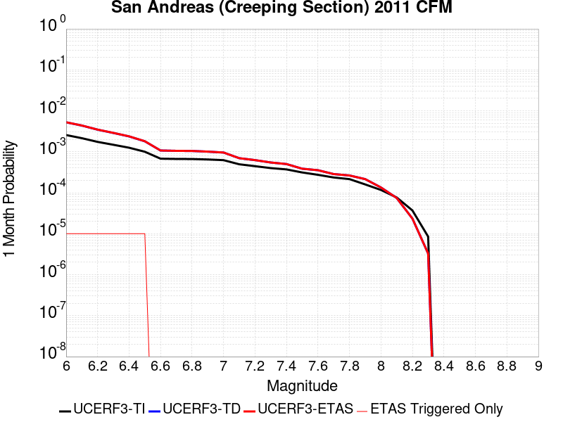 |  |  |

| Magnitude | 1 wk TI Prob | 1 wk TD Prob | 1 wk ETAS Prob | 1 wk ETAS/TD Gain | 1 wk ETAS Triggered Only | 1 mo TI Prob | 1 mo TD Prob | 1 mo ETAS Prob | 1 mo ETAS/TD Gain | 1 mo ETAS Triggered Only | 1 yr TI Prob | 1 yr TD Prob | 1 yr ETAS Prob | 1 yr ETAS/TD Gain | 1 yr ETAS Triggered Only | 10 yr TI Prob | 10 yr TD Prob | 10 yr ETAS Prob | 10 yr ETAS/TD Gain | 10 yr ETAS Triggered Only |
|-----|-----|-----|-----|-----|-----|-----|-----|-----|-----|-----|-----|-----|-----|-----|-----|-----|-----|-----|-----|-----|
| 6.0 | 5.986481E-4 | 0.0012278741 | 0.0012378617 | 1.0081341 | 1.0E-5 | 0.0025631124 | 0.0052457973 | 0.0052557453 | 1.0018963 | 1.0E-5 | 0.030762846 | 0.061208665 | 0.061302546 | 1.0015337 | 1.0E-4 | 0.26835477 | 0.4259623 | 0.42606562 | 1.0002426 | 1.8E-4 |
| 6.1 | 5.015945E-4 | 0.0010222398 | 0.0010322296 | 1.0097724 | 1.0E-5 | 0.00214792 | 0.004368119 | 0.0043780752 | 1.0022793 | 1.0E-5 | 0.025839351 | 0.0512512 | 0.0513271 | 1.0014809 | 8.0E-5 | 0.23032776 | 0.37288252 | 0.37298286 | 1.000269 | 1.6E-4 |
| 6.2 | 4.073338E-4 | 8.109135E-4 | 8.209054E-4 | 1.0123218 | 1.0E-5 | 0.0017445484 | 0.0034676173 | 0.0034775827 | 1.0028738 | 1.0E-5 | 0.021034058 | 0.040936444 | 0.041003577 | 1.00164 | 7.0E-5 | 0.19150782 | 0.3130621 | 0.31316513 | 1.0003291 | 1.5E-4 |
| 6.3 | 3.464099E-4 | 6.7394925E-4 | 6.839425E-4 | 1.014828 | 1.0E-5 | 0.0014837692 | 0.00288274 | 0.002892711 | 1.003459 | 1.0E-5 | 0.017915873 | 0.034192428 | 0.034260035 | 1.0019772 | 7.0E-5 | 0.16538359 | 0.27134693 | 0.27144894 | 1.000376 | 1.4E-4 |
| 6.4 | 2.935057E-4 | 5.545115E-4 | 5.64506E-4 | 1.0180238 | 1.0E-5 | 0.0012572751 | 0.0023718805 | 0.0023818568 | 1.0042061 | 1.0E-5 | 0.015200248 | 0.028267467 | 0.02833549 | 1.0024064 | 7.0E-5 | 0.14201577 | 0.2330172 | 0.23312458 | 1.0004609 | 1.4E-4 |
| 6.5 | 2.3409708E-4 | 4.2095222E-4 | 4.3094798E-4 | 1.0237457 | 1.0E-5 | 0.0010028875 | 0.0018015768 | 0.0018115588 | 1.0055407 | 1.0E-5 | 0.012141965 | 0.021591473 | 0.021659963 | 1.003172 | 7.0E-5 | 0.11499573 | 0.18685804 | 0.18697187 | 1.0006093 | 1.4E-4 |
| 6.6 | 1.5842178E-4 | 2.5079807E-4 | 2.5079807E-4 | 1.0 | 0.0 | 6.7877385E-4 | 0.0010744074 | 0.0010744074 | 1.0 | 0.0 | 0.0082328 | 0.013001034 | 0.013060254 | 1.004555 | 6.0E-5 | 0.07934396 | 0.12318426 | 0.12329825 | 1.0009253 | 1.3E-4 |
| 6.7 | 1.5616413E-4 | 2.461632E-4 | 2.461632E-4 | 1.0 | 0.0 | 6.691031E-4 | 0.0010545597 | 0.0010545597 | 1.0 | 0.0 | 0.0081159435 | 0.012762894 | 0.012822128 | 1.0046412 | 6.0E-5 | 0.0782586 | 0.12121142 | 0.12132566 | 1.0009425 | 1.3E-4 |
| 6.8 | 1.5538467E-4 | 2.4440174E-4 | 2.4440174E-4 | 1.0 | 0.0 | 6.6576427E-4 | 0.0010470168 | 0.0010470168 | 1.0 | 0.0 | 0.008075596 | 0.012672268 | 0.012731507 | 1.0046748 | 6.0E-5 | 0.07788358 | 0.12044227 | 0.120556615 | 1.0009494 | 1.3E-4 |
| 6.9 | 1.5153569E-4 | 2.3549511E-4 | 2.3549511E-4 | 1.0 | 0.0 | 6.49277E-4 | 0.0010088764 | 0.0010088764 | 1.0 | 0.0 | 0.007876333 | 0.012214421 | 0.012273689 | 1.0048522 | 6.0E-5 | 0.07602952 | 0.11651233 | 0.11662718 | 1.0009857 | 1.3E-4 |
| 7.0 | 1.4588932E-4 | 2.2406683E-4 | 2.2406683E-4 | 1.0 | 0.0 | 6.250901E-4 | 9.5993496E-4 | 9.5993496E-4 | 1.0 | 0.0 | 0.0075839474 | 0.011625077 | 0.01168438 | 1.0051012 | 6.0E-5 | 0.073302895 | 0.111358546 | 0.11147407 | 1.0010374 | 1.3E-4 |
| 7.1 | 1.1565079E-4 | 1.6290719E-4 | 1.6290719E-4 | 1.0 | 0.0 | 4.955521E-4 | 6.9798774E-4 | 6.9798774E-4 | 1.0 | 0.0 | 0.006016669 | 0.008465091 | 0.008524583 | 1.007028 | 6.0E-5 | 0.058563538 | 0.08370675 | 0.08382587 | 1.001423 | 1.3E-4 |
| 7.2 | 1.0393792E-4 | 1.4624344E-4 | 1.4624344E-4 | 1.0 | 0.0 | 4.4537216E-4 | 6.2660786E-4 | 6.2660786E-4 | 1.0 | 0.0 | 0.005408933 | 0.007602434 | 0.0076619782 | 1.0078322 | 6.0E-5 | 0.052791595 | 0.07565546 | 0.07577562 | 1.0015883 | 1.3E-4 |
| 7.3 | 9.332884E-5 | 1.2788197E-4 | 1.2788197E-4 | 1.0 | 0.0 | 3.999194E-4 | 5.479511E-4 | 5.479511E-4 | 1.0 | 0.0 | 0.0048581534 | 0.0066510327 | 0.0067106336 | 1.0089612 | 6.0E-5 | 0.047533102 | 0.06651482 | 0.06663617 | 1.0018245 | 1.3E-4 |
| 7.4 | 8.670252E-5 | 1.17095995E-4 | 1.17095995E-4 | 1.0 | 0.0 | 3.715293E-4 | 5.0174404E-4 | 5.0174404E-4 | 1.0 | 0.0 | 0.004513991 | 0.006091744 | 0.0061414395 | 1.0081578 | 5.0E-5 | 0.044233937 | 0.061179653 | 0.061292313 | 1.0018414 | 1.2E-4 |
| 7.5 | 7.3036405E-5 | 9.011144E-5 | 9.011144E-5 | 1.0 | 0.0 | 3.129756E-4 | 3.861348E-4 | 3.861348E-4 | 1.0 | 0.0 | 0.0038038217 | 0.004691079 | 0.004740844 | 1.0106086 | 5.0E-5 | 0.03739367 | 0.047901772 | 0.048016023 | 1.0023851 | 1.2E-4 |
| 7.6 | 6.3935775E-5 | 8.284792E-5 | 8.284792E-5 | 1.0 | 0.0 | 2.7398168E-4 | 3.550143E-4 | 3.550143E-4 | 1.0 | 0.0 | 0.0033306254 | 0.004313751 | 0.0043635354 | 1.0115409 | 5.0E-5 | 0.032811474 | 0.04401211 | 0.044126827 | 1.0026065 | 1.2E-4 |
| 7.7 | 5.5050095E-5 | 6.6657536E-5 | 6.6657536E-5 | 1.0 | 0.0 | 2.3590765E-4 | 2.8564388E-4 | 2.8564388E-4 | 1.0 | 0.0 | 0.0028683927 | 0.0034721727 | 0.0035020686 | 1.0086101 | 3.0E-5 | 0.0283165 | 0.035814673 | 0.03590145 | 1.0024229 | 9.0E-5 |
| 7.8 | 5.027131E-5 | 6.166444E-5 | 6.166444E-5 | 1.0 | 0.0 | 2.1543067E-4 | 2.6424942E-4 | 2.6424942E-4 | 1.0 | 0.0 | 0.0026197135 | 0.0032124936 | 0.0032423972 | 1.0093086 | 3.0E-5 | 0.025890453 | 0.033143617 | 0.033220965 | 1.0023338 | 8.0E-5 |
| 7.9 | 3.7271806E-5 | 5.0253755E-5 | 5.0253755E-5 | 1.0 | 0.0 | 1.5972654E-4 | 2.1535547E-4 | 2.1535547E-4 | 1.0 | 0.0 | 0.0019429359 | 0.0026188022 | 0.0026387498 | 1.0076171 | 2.0E-5 | 0.019260362 | 0.027081102 | 0.027149206 | 1.0025148 | 7.0E-5 |
| 8.0 | 2.7310243E-5 | 3.144777E-5 | 3.144777E-5 | 1.0 | 0.0 | 1.17038646E-4 | 1.3476919E-4 | 1.3476919E-4 | 1.0 | 0.0 | 0.0014240141 | 0.0016395808 | 0.0016495644 | 1.0060891 | 1.0E-5 | 0.014149235 | 0.0172237 | 0.017253185 | 1.0017118 | 3.0E-5 |
| 8.1 | 1.7940547E-5 | 1.7413187E-5 | 1.7413187E-5 | 1.0 | 0.0 | 7.688579E-5 | 7.4625816E-5 | 7.4625816E-5 | 1.0 | 0.0 | 9.3568244E-4 | 9.081911E-4 | 9.18182E-4 | 1.0110009 | 1.0E-5 | 0.009317525 | 0.009805583 | 0.009815485 | 1.0010098 | 1.0E-5 |
| 8.2 | 8.643924E-6 | 5.4798497E-6 | 5.4798497E-6 | 1.0 | 0.0 | 3.704486E-5 | 2.348486E-5 | 2.348486E-5 | 1.0 | 0.0 | 4.5092785E-4 | 2.858907E-4 | 2.858907E-4 | 1.0 | 0.0 | 0.0045001395 | 0.0032514327 | 0.0032514327 | 1.0 | 0.0 |
| 8.3 | 1.983087E-6 | 7.668296E-7 | 7.668296E-7 | 1.0 | 0.0 | 8.498917E-6 | 3.2864084E-6 | 3.2864084E-6 | 1.0 | 0.0 | 1.034694E-4 | 4.0011306E-5 | 4.0011306E-5 | 1.0 | 0.0 | 0.0010342124 | 4.724499E-4 | 4.724499E-4 | 1.0 | 0.0 |

## Baker
*[(top)](#table-of-contents)*

| 1 Week | 1 Month | 1 Year | 10 Year |
|-----|-----|-----|-----|
|  | 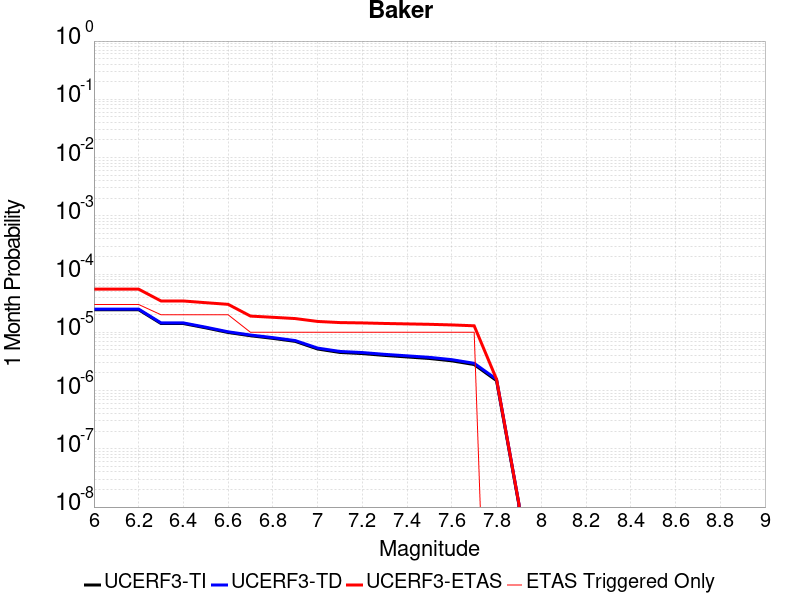 |  |  |

| Magnitude | 1 wk TI Prob | 1 wk TD Prob | 1 wk ETAS Prob | 1 wk ETAS/TD Gain | 1 wk ETAS Triggered Only | 1 mo TI Prob | 1 mo TD Prob | 1 mo ETAS Prob | 1 mo ETAS/TD Gain | 1 mo ETAS Triggered Only | 1 yr TI Prob | 1 yr TD Prob | 1 yr ETAS Prob | 1 yr ETAS/TD Gain | 1 yr ETAS Triggered Only | 10 yr TI Prob | 10 yr TD Prob | 10 yr ETAS Prob | 10 yr ETAS/TD Gain | 10 yr ETAS Triggered Only |
|-----|-----|-----|-----|-----|-----|-----|-----|-----|-----|-----|-----|-----|-----|-----|-----|-----|-----|-----|-----|-----|
| 6.0 | 5.695525E-6 | 5.834856E-6 | 2.5834739E-5 | 4.4276567 | 2.0E-5 | 2.4409164E-5 | 2.500631E-5 | 5.500556E-5 | 2.1996672 | 3.0E-5 | 2.9714106E-4 | 3.044133E-4 | 4.343737E-4 | 1.426921 | 1.3E-4 | 0.0029674405 | 0.0030403587 | 0.0032696594 | 1.075419 | 2.3E-4 |
| 6.1 | 5.695525E-6 | 5.834856E-6 | 2.5834739E-5 | 4.4276567 | 2.0E-5 | 2.4409164E-5 | 2.500631E-5 | 5.500556E-5 | 2.1996672 | 3.0E-5 | 2.9714106E-4 | 3.044133E-4 | 4.343737E-4 | 1.426921 | 1.3E-4 | 0.0029674405 | 0.0030403587 | 0.0032696594 | 1.075419 | 2.3E-4 |
| 6.2 | 5.695525E-6 | 5.834856E-6 | 2.5834739E-5 | 4.4276567 | 2.0E-5 | 2.4409164E-5 | 2.500631E-5 | 5.500556E-5 | 2.1996672 | 3.0E-5 | 2.9714106E-4 | 3.044133E-4 | 4.343737E-4 | 1.426921 | 1.3E-4 | 0.0029674405 | 0.0030403587 | 0.0032696594 | 1.075419 | 2.3E-4 |
| 6.3 | 3.2995713E-6 | 3.3836786E-6 | 1.3383645E-5 | 3.9553535 | 1.0E-5 | 1.4140943E-5 | 1.4501402E-5 | 3.450111E-5 | 2.379157 | 2.0E-5 | 1.7215237E-4 | 1.7654074E-4 | 2.3653015E-4 | 1.3398049 | 6.0E-5 | 0.0017201907 | 0.0017640521 | 0.0019137874 | 1.0848815 | 1.5E-4 |
| 6.4 | 3.2995713E-6 | 3.3836786E-6 | 1.3383645E-5 | 3.9553535 | 1.0E-5 | 1.4140943E-5 | 1.4501402E-5 | 3.450111E-5 | 2.379157 | 2.0E-5 | 1.7215237E-4 | 1.7654074E-4 | 2.3653015E-4 | 1.3398049 | 6.0E-5 | 0.0017201907 | 0.0017640521 | 0.0019137874 | 1.0848815 | 1.5E-4 |
| 6.5 | 2.782202E-6 | 2.8558507E-6 | 1.2855822E-5 | 4.5015736 | 1.0E-5 | 1.1923668E-5 | 1.2239304E-5 | 3.223906E-5 | 2.63406 | 2.0E-5 | 1.4516099E-4 | 1.4900367E-4 | 2.0899472E-4 | 1.4026147 | 6.0E-5 | 0.001450662 | 0.0014890704 | 0.0016188768 | 1.0871727 | 1.3E-4 |
| 6.6 | 2.3163404E-6 | 2.380929E-6 | 1.2380905E-5 | 5.2000313 | 1.0E-5 | 9.927136E-6 | 1.0203942E-5 | 3.0203739E-5 | 2.9600067 | 2.0E-5 | 1.20856166E-4 | 1.2422612E-4 | 1.7421991E-4 | 1.4024419 | 5.0E-5 | 0.0012079047 | 0.001241587 | 0.0013514503 | 1.0884863 | 1.1E-4 |
| 6.7 | 2.037056E-6 | 2.0965088E-6 | 1.2096488E-5 | 5.769825 | 1.0E-5 | 8.7302105E-6 | 8.985007E-6 | 1.8984918E-5 | 2.112955 | 1.0E-5 | 1.0628513E-4 | 1.0938713E-4 | 1.4938276E-4 | 1.3656337 | 4.0E-5 | 0.0010623431 | 0.0010933491 | 0.0011732616 | 1.0730897 | 8.0E-5 |
| 6.8 | 1.8356744E-6 | 1.8915364E-6 | 1.1891518E-5 | 6.286698 | 1.0E-5 | 7.867153E-6 | 8.10656E-6 | 1.8106479E-5 | 2.233559 | 1.0E-5 | 9.577837E-5 | 9.869304E-5 | 1.2869008E-4 | 1.3039428 | 3.0E-5 | 9.57371E-4 | 9.865061E-4 | 0.001056437 | 1.0708874 | 7.0E-5 |
| 6.9 | 1.6310546E-6 | 1.6832144E-6 | 1.1683198E-5 | 6.941004 | 1.0E-5 | 6.9902153E-6 | 7.213757E-6 | 1.7213684E-5 | 2.3862302 | 1.0E-5 | 8.510255E-5 | 8.782406E-5 | 1.1782143E-4 | 1.341562 | 3.0E-5 | 8.5069967E-4 | 8.779048E-4 | 9.4784336E-4 | 1.0796653 | 7.0E-5 |
| 7.0 | 1.2058036E-6 | 1.2508729E-6 | 1.1250861E-5 | 8.994408 | 1.0E-5 | 5.1677193E-6 | 5.3608724E-6 | 1.536082E-5 | 2.8653579 | 1.0E-5 | 6.291517E-5 | 6.526669E-5 | 9.526473E-5 | 1.4596225 | 3.0E-5 | 6.289736E-4 | 6.5247755E-4 | 7.2243187E-4 | 1.1072134 | 7.0E-5 |
| 7.1 | 1.052382E-6 | 1.0951668E-6 | 1.1095156E-5 | 10.131019 | 1.0E-5 | 4.5102006E-6 | 4.693564E-6 | 1.4693516E-5 | 3.1305673 | 1.0E-5 | 5.491031E-5 | 5.7142646E-5 | 7.714151E-5 | 1.3499813 | 2.0E-5 | 5.4896745E-4 | 5.712804E-4 | 6.1125756E-4 | 1.0699781 | 4.0E-5 |
| 7.2 | 1.0067454E-6 | 1.0487769E-6 | 1.1048766E-5 | 10.534906 | 1.0E-5 | 4.3146156E-6 | 4.4947506E-6 | 1.4494705E-5 | 3.2248075 | 1.0E-5 | 5.252918E-5 | 5.4722223E-5 | 6.472167E-5 | 1.1827312 | 1.0E-5 | 5.251676E-4 | 5.4708833E-4 | 5.770719E-4 | 1.0548058 | 3.0E-5 |
| 7.3 | 9.3596316E-7 | 9.76778E-7 | 1.0976768E-5 | 11.237731 | 1.0E-5 | 4.0112645E-6 | 4.186185E-6 | 1.4186143E-5 | 3.3888 | 1.0E-5 | 4.8836053E-5 | 5.0965617E-5 | 6.0965107E-5 | 1.1962007 | 1.0E-5 | 4.8825322E-4 | 5.095401E-4 | 5.395248E-4 | 1.0588466 | 3.0E-5 |
| 7.4 | 8.8117395E-7 | 9.2077187E-7 | 1.0920763E-5 | 11.860443 | 1.0E-5 | 3.7764542E-6 | 3.9461593E-6 | 1.394612E-5 | 3.5340996 | 1.0E-5 | 4.5977362E-5 | 4.8043436E-5 | 5.8042955E-5 | 1.208135 | 1.0E-5 | 4.596785E-4 | 4.8033125E-4 | 5.1031687E-4 | 1.0624269 | 3.0E-5 |
| 7.5 | 8.292386E-7 | 8.674649E-7 | 1.0867456E-5 | 12.527834 | 1.0E-5 | 3.5538749E-6 | 3.7177015E-6 | 1.3717664E-5 | 3.689824 | 1.0E-5 | 4.326757E-5 | 4.5262084E-5 | 5.526163E-5 | 1.2209255 | 1.0E-5 | 4.3259145E-4 | 4.5252938E-4 | 4.825158E-4 | 1.066264 | 3.0E-5 |
| 7.6 | 7.553842E-7 | 7.9145207E-7 | 1.0791444E-5 | 13.634994 | 1.0E-5 | 3.2373566E-6 | 3.3919332E-6 | 1.3391899E-5 | 3.9481614 | 1.0E-5 | 3.9414106E-5 | 4.129601E-5 | 5.12956E-5 | 1.2421441 | 1.0E-5 | 3.9407116E-4 | 4.1288408E-4 | 4.4287168E-4 | 1.0726296 | 3.0E-5 |
| 7.7 | 6.5285366E-7 | 6.852842E-7 | 1.0685278E-5 | 15.592476 | 1.0E-5 | 2.797941E-6 | 2.9369291E-6 | 1.29369E-5 | 4.404907 | 1.0E-5 | 3.40644E-5 | 3.5756533E-5 | 4.5756173E-5 | 1.2796592 | 1.0E-5 | 3.405918E-4 | 3.5750846E-4 | 3.775013E-4 | 1.0559227 | 2.0E-5 |
| 7.8 | 3.4586725E-7 | 3.648288E-7 | 3.648288E-7 | 1.0 | 0.0 | 1.4822873E-6 | 1.5635511E-6 | 1.5635511E-6 | 1.0 | 0.0 | 1.80467E-5 | 1.9036073E-5 | 1.9036073E-5 | 1.0 | 0.0 | 1.8045233E-4 | 1.9034486E-4 | 1.9034486E-4 | 1.0 | 0.0 |
| 7.9 | 2.5591178E-9 | 2.6696871E-9 | 2.6696871E-9 | 1.0 | 0.0 | 1.0967647E-8 | 1.1441516E-8 | 1.1441516E-8 | 1.0 | 0.0 | 1.335311E-7 | 1.3930045E-7 | 1.3930045E-7 | 1.0 | 0.0 | 1.3353102E-6 | 1.3930046E-6 | 1.3930046E-6 | 1.0 | 0.0 |

## Death Valley (Fish Lake Valley)
*[(top)](#table-of-contents)*

| 1 Week | 1 Month | 1 Year | 10 Year |
|-----|-----|-----|-----|
|  | 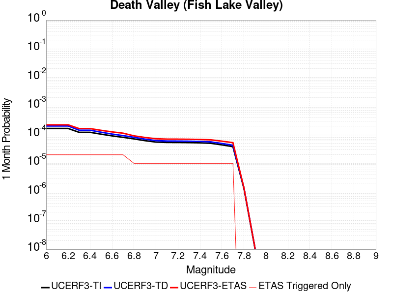 |  |  |

| Magnitude | 1 wk TI Prob | 1 wk TD Prob | 1 wk ETAS Prob | 1 wk ETAS/TD Gain | 1 wk ETAS Triggered Only | 1 mo TI Prob | 1 mo TD Prob | 1 mo ETAS Prob | 1 mo ETAS/TD Gain | 1 mo ETAS Triggered Only | 1 yr TI Prob | 1 yr TD Prob | 1 yr ETAS Prob | 1 yr ETAS/TD Gain | 1 yr ETAS Triggered Only | 10 yr TI Prob | 10 yr TD Prob | 10 yr ETAS Prob | 10 yr ETAS/TD Gain | 10 yr ETAS Triggered Only |
|-----|-----|-----|-----|-----|-----|-----|-----|-----|-----|-----|-----|-----|-----|-----|-----|-----|-----|-----|-----|-----|
| 6.0 | 3.872328E-5 | 4.7268895E-5 | 5.7268422E-5 | 1.2115456 | 1.0E-5 | 1.6594635E-4 | 2.0256694E-4 | 2.2256289E-4 | 1.0987128 | 2.0E-5 | 0.0020185246 | 0.0024636039 | 0.0025434068 | 1.0323927 | 8.0E-5 | 0.02000288 | 0.024388881 | 0.024603516 | 1.0088005 | 2.2E-4 |
| 6.1 | 3.872328E-5 | 4.7268895E-5 | 5.7268422E-5 | 1.2115456 | 1.0E-5 | 1.6594635E-4 | 2.0256694E-4 | 2.2256289E-4 | 1.0987128 | 2.0E-5 | 0.0020185246 | 0.0024636039 | 0.0025434068 | 1.0323927 | 8.0E-5 | 0.02000288 | 0.024388881 | 0.024603516 | 1.0088005 | 2.2E-4 |
| 6.2 | 3.872328E-5 | 4.7268895E-5 | 5.7268422E-5 | 1.2115456 | 1.0E-5 | 1.6594635E-4 | 2.0256694E-4 | 2.2256289E-4 | 1.0987128 | 2.0E-5 | 0.0020185246 | 0.0024636039 | 0.0025434068 | 1.0323927 | 8.0E-5 | 0.02000288 | 0.024388881 | 0.024603516 | 1.0088005 | 2.2E-4 |
| 6.3 | 2.8356371E-5 | 3.3610693E-5 | 4.361036E-5 | 1.2975143 | 1.0E-5 | 1.2152165E-4 | 1.4403832E-4 | 1.6403545E-4 | 1.138832 | 2.0E-5 | 0.0014785219 | 0.001752335 | 0.0018321947 | 1.0455734 | 8.0E-5 | 0.014687235 | 0.01739221 | 0.017608384 | 1.0124294 | 2.2E-4 |
| 6.4 | 2.8356371E-5 | 3.3610693E-5 | 4.361036E-5 | 1.2975143 | 1.0E-5 | 1.2152165E-4 | 1.4403832E-4 | 1.6403545E-4 | 1.138832 | 2.0E-5 | 0.0014785219 | 0.001752335 | 0.0018321947 | 1.0455734 | 8.0E-5 | 0.014687235 | 0.01739221 | 0.017608384 | 1.0124294 | 2.2E-4 |
| 6.5 | 2.4448687E-5 | 2.8608209E-5 | 3.8607923E-5 | 1.34954 | 1.0E-5 | 1.0477588E-4 | 1.2260114E-4 | 1.4259868E-4 | 1.1631106 | 2.0E-5 | 0.0012748998 | 0.0014916973 | 0.001571578 | 1.0535502 | 8.0E-5 | 0.012676105 | 0.014821712 | 0.015038451 | 1.014623 | 2.2E-4 |
| 6.6 | 2.1298161E-5 | 2.4660607E-5 | 3.466036E-5 | 1.405495 | 1.0E-5 | 9.127464E-5 | 1.0568422E-4 | 1.2568211E-4 | 1.189223 | 2.0E-5 | 0.0011107022 | 0.0012859798 | 0.0013658769 | 1.0621294 | 8.0E-5 | 0.011051672 | 0.012788794 | 0.013005981 | 1.0169826 | 2.2E-4 |
| 6.7 | 1.8959729E-5 | 2.178146E-5 | 3.178124E-5 | 1.4590961 | 1.0E-5 | 8.125345E-5 | 9.3345916E-5 | 1.1334405E-4 | 1.2142369 | 2.0E-5 | 9.888117E-4 | 0.0011359196 | 0.0012158287 | 1.0703475 | 8.0E-5 | 0.009844234 | 0.011303794 | 0.011521307 | 1.0192425 | 2.2E-4 |
| 6.8 | 1.6691629E-5 | 1.9018706E-5 | 2.9018516E-5 | 1.5257881 | 1.0E-5 | 7.153359E-5 | 8.150629E-5 | 9.150548E-5 | 1.12268 | 1.0E-5 | 8.7057345E-4 | 9.919042E-4 | 0.0010618347 | 1.0705013 | 7.0E-5 | 0.008671708 | 0.009876527 | 0.010074551 | 1.02005 | 2.0E-4 |
| 6.9 | 1.450505E-5 | 1.6389824E-5 | 2.638966E-5 | 1.6101247 | 1.0E-5 | 6.216302E-5 | 7.024026E-5 | 8.023956E-5 | 1.1423585 | 1.0E-5 | 7.5657194E-4 | 8.548484E-4 | 9.247886E-4 | 1.0818158 | 7.0E-5 | 0.007540013 | 0.008516532 | 0.00871483 | 1.0232837 | 2.0E-4 |
| 7.0 | 1.2940855E-5 | 1.453821E-5 | 2.4538065E-5 | 1.6878326 | 1.0E-5 | 5.545963E-5 | 6.230516E-5 | 7.230454E-5 | 1.1604904 | 1.0E-5 | 6.750118E-4 | 7.583071E-4 | 8.2825404E-4 | 1.0922409 | 7.0E-5 | 0.006729651 | 0.0075578135 | 0.0077463775 | 1.0249496 | 1.9E-4 |
| 7.1 | 1.2544658E-5 | 1.4078437E-5 | 2.4078296E-5 | 1.7102962 | 1.0E-5 | 5.3761712E-5 | 6.033479E-5 | 7.033419E-5 | 1.1657319 | 1.0E-5 | 6.5435225E-4 | 7.343341E-4 | 8.042827E-4 | 1.0952544 | 7.0E-5 | 0.006524288 | 0.0073196692 | 0.007508279 | 1.0257674 | 1.9E-4 |
| 7.2 | 1.2489416E-5 | 1.4015902E-5 | 2.4015762E-5 | 1.7134653 | 1.0E-5 | 5.3524967E-5 | 6.00668E-5 | 7.00662E-5 | 1.1664714 | 1.0E-5 | 6.514716E-4 | 7.310735E-4 | 8.0102234E-4 | 1.0956796 | 7.0E-5 | 0.006495651 | 0.007287278 | 0.007475893 | 1.0258828 | 1.9E-4 |
| 7.3 | 1.2368307E-5 | 1.3880038E-5 | 2.3879898E-5 | 1.7204491 | 1.0E-5 | 5.3005948E-5 | 5.948455E-5 | 6.9483955E-5 | 1.1681008 | 1.0E-5 | 6.451563E-4 | 7.239894E-4 | 7.939387E-4 | 1.0966165 | 7.0E-5 | 0.0064328653 | 0.0072168987 | 0.0074055274 | 1.0261371 | 1.9E-4 |
| 7.4 | 1.2161707E-5 | 1.3648089E-5 | 2.3647954E-5 | 1.7326933 | 1.0E-5 | 5.212056E-5 | 5.8490532E-5 | 6.848995E-5 | 1.1709578 | 1.0E-5 | 6.3438306E-4 | 7.118952E-4 | 7.818453E-4 | 1.0982591 | 7.0E-5 | 0.006325751 | 0.0070967353 | 0.007275458 | 1.0251838 | 1.8E-4 |
| 7.5 | 1.1707948E-5 | 1.314573E-5 | 2.3145598E-5 | 1.7606933 | 1.0E-5 | 5.0175953E-5 | 5.6337656E-5 | 6.6337096E-5 | 1.1774912 | 1.0E-5 | 6.10721E-4 | 6.857007E-4 | 7.5565267E-4 | 1.1020154 | 7.0E-5 | 0.0060904534 | 0.0068364325 | 0.0070152017 | 1.0261495 | 1.8E-4 |
| 7.6 | 1.0319538E-5 | 1.157981E-5 | 2.1579694E-5 | 1.863562 | 1.0E-5 | 4.4225842E-5 | 4.9626844E-5 | 5.9626345E-5 | 1.2014939 | 1.0E-5 | 5.383166E-4 | 6.040445E-4 | 6.740022E-4 | 1.1158155 | 7.0E-5 | 0.0053701443 | 0.0060245576 | 0.0061935335 | 1.0280478 | 1.7E-4 |
| 7.7 | 8.937764E-6 | 1.0022941E-5 | 2.002284E-5 | 1.9977012 | 1.0E-5 | 3.830414E-5 | 4.295478E-5 | 5.295435E-5 | 1.232793 | 1.0E-5 | 4.6625308E-4 | 5.2285404E-4 | 5.9281744E-4 | 1.1338106 | 7.0E-5 | 0.0046527605 | 0.005216748 | 0.0053659654 | 1.0286036 | 1.5E-4 |
| 7.8 | 3.108007E-7 | 3.2846788E-7 | 3.2846788E-7 | 1.0 | 0.0 | 1.3320023E-6 | 1.4077187E-6 | 1.4077187E-6 | 1.0 | 0.0 | 1.6217007E-5 | 1.7138846E-5 | 1.7138846E-5 | 1.0 | 0.0 | 1.6215823E-4 | 1.713756E-4 | 1.713756E-4 | 1.0 | 0.0 |
| 7.9 | 2.5591178E-9 | 2.6696871E-9 | 2.6696871E-9 | 1.0 | 0.0 | 1.0967647E-8 | 1.1441516E-8 | 1.1441516E-8 | 1.0 | 0.0 | 1.335311E-7 | 1.3930045E-7 | 1.3930045E-7 | 1.0 | 0.0 | 1.3353102E-6 | 1.3930046E-6 | 1.3930046E-6 | 1.0 | 0.0 |

## San Andreas (Carrizo) rev
*[(top)](#table-of-contents)*

| 1 Week | 1 Month | 1 Year | 10 Year |
|-----|-----|-----|-----|
|  |  |  |  |

| Magnitude | 1 wk TI Prob | 1 wk TD Prob | 1 wk ETAS Prob | 1 wk ETAS/TD Gain | 1 wk ETAS Triggered Only | 1 mo TI Prob | 1 mo TD Prob | 1 mo ETAS Prob | 1 mo ETAS/TD Gain | 1 mo ETAS Triggered Only | 1 yr TI Prob | 1 yr TD Prob | 1 yr ETAS Prob | 1 yr ETAS/TD Gain | 1 yr ETAS Triggered Only | 10 yr TI Prob | 10 yr TD Prob | 10 yr ETAS Prob | 10 yr ETAS/TD Gain | 10 yr ETAS Triggered Only |
|-----|-----|-----|-----|-----|-----|-----|-----|-----|-----|-----|-----|-----|-----|-----|-----|-----|-----|-----|-----|-----|
| 6.0 | 1.1674632E-4 | 2.4332498E-4 | 2.5332253E-4 | 1.0410873 | 1.0E-5 | 5.002454E-4 | 0.0010424062 | 0.0010523958 | 1.0095832 | 1.0E-5 | 0.006073493 | 0.012617926 | 0.012706791 | 1.0070428 | 9.0E-5 | 0.0591016 | 0.12065402 | 0.12084748 | 1.0016034 | 2.2E-4 |
| 6.1 | 1.1674632E-4 | 2.4332498E-4 | 2.5332253E-4 | 1.0410873 | 1.0E-5 | 5.002454E-4 | 0.0010424062 | 0.0010523958 | 1.0095832 | 1.0E-5 | 0.006073493 | 0.012617926 | 0.012706791 | 1.0070428 | 9.0E-5 | 0.0591016 | 0.12065402 | 0.12084748 | 1.0016034 | 2.2E-4 |
| 6.2 | 1.1674632E-4 | 2.4332498E-4 | 2.5332253E-4 | 1.0410873 | 1.0E-5 | 5.002454E-4 | 0.0010424062 | 0.0010523958 | 1.0095832 | 1.0E-5 | 0.006073493 | 0.012617926 | 0.012706791 | 1.0070428 | 9.0E-5 | 0.0591016 | 0.12065402 | 0.12084748 | 1.0016034 | 2.2E-4 |
| 6.3 | 1.1674632E-4 | 2.4332498E-4 | 2.5332253E-4 | 1.0410873 | 1.0E-5 | 5.002454E-4 | 0.0010424062 | 0.0010523958 | 1.0095832 | 1.0E-5 | 0.006073493 | 0.012617926 | 0.012706791 | 1.0070428 | 9.0E-5 | 0.0591016 | 0.12065402 | 0.12084748 | 1.0016034 | 2.2E-4 |
| 6.4 | 1.1674632E-4 | 2.4332498E-4 | 2.5332253E-4 | 1.0410873 | 1.0E-5 | 5.002454E-4 | 0.0010424062 | 0.0010523958 | 1.0095832 | 1.0E-5 | 0.006073493 | 0.012617926 | 0.012706791 | 1.0070428 | 9.0E-5 | 0.0591016 | 0.12065402 | 0.12084748 | 1.0016034 | 2.2E-4 |
| 6.5 | 1.13136164E-4 | 2.3652466E-4 | 2.465223E-4 | 1.0422689 | 1.0E-5 | 4.847792E-4 | 0.0010132849 | 0.0010232747 | 1.0098588 | 1.0E-5 | 0.0058862255 | 0.012267408 | 0.012356304 | 1.0072465 | 9.0E-5 | 0.057327334 | 0.11762535 | 0.11781947 | 1.0016503 | 2.2E-4 |
| 6.6 | 1.13136164E-4 | 2.3652466E-4 | 2.465223E-4 | 1.0422689 | 1.0E-5 | 4.847792E-4 | 0.0010132849 | 0.0010232747 | 1.0098588 | 1.0E-5 | 0.0058862255 | 0.012267408 | 0.012356304 | 1.0072465 | 9.0E-5 | 0.057327334 | 0.11762535 | 0.11781947 | 1.0016503 | 2.2E-4 |
| 6.7 | 1.1149675E-4 | 2.3343669E-4 | 2.4343435E-4 | 1.0428282 | 1.0E-5 | 4.777557E-4 | 0.0010000608 | 0.0010100509 | 1.0099894 | 1.0E-5 | 0.0058011734 | 0.012108203 | 0.012197114 | 1.0073429 | 9.0E-5 | 0.05652051 | 0.11624688 | 0.1164413 | 1.0016725 | 2.2E-4 |
| 6.8 | 1.1103589E-4 | 2.3245816E-4 | 2.4245583E-4 | 1.0430084 | 1.0E-5 | 4.7578133E-4 | 9.958703E-4 | 0.0010058604 | 1.0100315 | 1.0E-5 | 0.005777263 | 0.0120577505 | 0.012146665 | 1.007374 | 9.0E-5 | 0.056293584 | 0.11580715 | 0.11600167 | 1.0016797 | 2.2E-4 |
| 6.9 | 1.1053259E-4 | 2.3138185E-4 | 2.4137954E-4 | 1.0432086 | 1.0E-5 | 4.7362508E-4 | 9.912612E-4 | 0.0010012513 | 1.0100782 | 1.0E-5 | 0.0057511497 | 0.012002253 | 0.012091173 | 1.0074086 | 9.0E-5 | 0.05604569 | 0.11532332 | 0.115517944 | 1.0016876 | 2.2E-4 |
| 7.0 | 1.1005377E-4 | 2.3039016E-4 | 2.4038786E-4 | 1.0433947 | 1.0E-5 | 4.7157376E-4 | 9.870143E-4 | 9.970044E-4 | 1.0101216 | 1.0E-5 | 0.0057263062 | 0.011951115 | 0.0120400395 | 1.0074407 | 9.0E-5 | 0.055809796 | 0.11487561 | 0.115070336 | 1.0016952 | 2.2E-4 |
| 7.1 | 1.0308142E-4 | 2.1548544E-4 | 2.254833E-4 | 1.0463969 | 1.0E-5 | 4.417027E-4 | 9.231832E-4 | 9.33174E-4 | 1.010822 | 1.0E-5 | 0.0053644776 | 0.011182146 | 0.01127114 | 1.0079585 | 9.0E-5 | 0.052368138 | 0.108131535 | 0.10832775 | 1.0018146 | 2.2E-4 |
| 7.2 | 1.0027479E-4 | 2.0956367E-4 | 2.0956367E-4 | 1.0 | 0.0 | 4.296783E-4 | 8.978219E-4 | 8.978219E-4 | 1.0 | 0.0 | 0.0052187922 | 0.0108764935 | 0.010955623 | 1.0072753 | 8.0E-5 | 0.050979212 | 0.10543535 | 0.10562321 | 1.0017817 | 2.1E-4 |
| 7.3 | 9.816942E-5 | 2.0431461E-4 | 2.0431461E-4 | 1.0 | 0.0 | 4.2065824E-4 | 8.753412E-4 | 8.753412E-4 | 1.0 | 0.0 | 0.005109493 | 0.010605487 | 0.010684639 | 1.0074632 | 8.0E-5 | 0.049935985 | 0.103018686 | 0.10320705 | 1.0018284 | 2.1E-4 |
| 7.4 | 9.5634205E-5 | 1.9800827E-4 | 1.9800827E-4 | 1.0 | 0.0 | 4.0979648E-4 | 8.4833184E-4 | 8.4833184E-4 | 1.0 | 0.0 | 0.0049778637 | 0.0102797905 | 0.010349071 | 1.0067395 | 7.0E-5 | 0.048678253 | 0.100104466 | 0.10028445 | 1.0017979 | 2.0E-4 |
| 7.5 | 8.052417E-5 | 1.6120363E-4 | 1.6120363E-4 | 1.0 | 0.0 | 3.4505792E-4 | 6.9068995E-4 | 6.9068995E-4 | 1.0 | 0.0 | 0.0041929903 | 0.008376808 | 0.008446222 | 1.0082864 | 7.0E-5 | 0.04114753 | 0.08284498 | 0.083028406 | 1.0022142 | 2.0E-4 |
| 7.6 | 7.897024E-5 | 1.5773512E-4 | 1.5773512E-4 | 1.0 | 0.0 | 3.384E-4 | 6.758327E-4 | 6.758327E-4 | 1.0 | 0.0 | 0.0041122385 | 0.008197296 | 0.008266722 | 1.0084693 | 7.0E-5 | 0.040369697 | 0.081185855 | 0.081369616 | 1.0022634 | 2.0E-4 |
| 7.7 | 6.707427E-5 | 1.3282998E-4 | 1.3282998E-4 | 1.0 | 0.0 | 2.8742946E-4 | 5.691472E-4 | 5.691472E-4 | 1.0 | 0.0 | 0.003493839 | 0.0069073834 | 0.0069570383 | 1.0071887 | 5.0E-5 | 0.034394164 | 0.06907934 | 0.06921898 | 1.0020214 | 1.5E-4 |
| 7.8 | 6.147705E-5 | 1.2203727E-4 | 1.2203727E-4 | 1.0 | 0.0 | 2.6344648E-4 | 5.229121E-4 | 5.229121E-4 | 1.0 | 0.0 | 0.0032027436 | 0.006347895 | 0.0063975775 | 1.0078267 | 5.0E-5 | 0.031569764 | 0.063543044 | 0.06366478 | 1.0019158 | 1.3E-4 |
| 7.9 | 4.7636717E-5 | 8.88427E-5 | 8.88427E-5 | 1.0 | 0.0 | 2.0414138E-4 | 3.806989E-4 | 3.806989E-4 | 1.0 | 0.0 | 0.0024825884 | 0.0046251663 | 0.004645074 | 1.0043042 | 2.0E-5 | 0.024550365 | 0.046649244 | 0.04671598 | 1.0014305 | 7.0E-5 |
| 8.0 | 3.3554235E-5 | 5.2164494E-5 | 5.2164494E-5 | 1.0 | 0.0 | 1.4379594E-4 | 2.2354297E-4 | 2.2354297E-4 | 1.0 | 0.0 | 0.0017493097 | 0.0027182405 | 0.0027282133 | 1.0036689 | 1.0E-5 | 0.017356034 | 0.027894506 | 0.02792367 | 1.0010455 | 3.0E-5 |
| 8.1 | 1.9175432E-5 | 1.9198285E-5 | 1.9198285E-5 | 1.0 | 0.0 | 8.217783E-5 | 8.227578E-5 | 8.227578E-5 | 1.0 | 0.0 | 0.0010000558 | 0.0010012479 | 0.0010112379 | 1.0099776 | 1.0E-5 | 0.009955673 | 0.010765004 | 0.0107748965 | 1.000919 | 1.0E-5 |
| 8.2 | 8.643924E-6 | 5.4798497E-6 | 5.4798497E-6 | 1.0 | 0.0 | 3.704486E-5 | 2.348486E-5 | 2.348486E-5 | 1.0 | 0.0 | 4.5092785E-4 | 2.858907E-4 | 2.858907E-4 | 1.0 | 0.0 | 0.0045001395 | 0.0032514327 | 0.0032514327 | 1.0 | 0.0 |
| 8.3 | 1.983087E-6 | 7.668296E-7 | 7.668296E-7 | 1.0 | 0.0 | 8.498917E-6 | 3.2864084E-6 | 3.2864084E-6 | 1.0 | 0.0 | 1.034694E-4 | 4.0011306E-5 | 4.0011306E-5 | 1.0 | 0.0 | 0.0010342124 | 4.724499E-4 | 4.724499E-4 | 1.0 | 0.0 |

## Cady
*[(top)](#table-of-contents)*

| 1 Week | 1 Month | 1 Year | 10 Year |
|-----|-----|-----|-----|
|  |  |  | 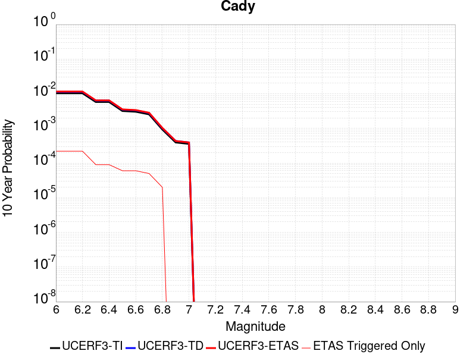 |

| Magnitude | 1 wk TI Prob | 1 wk TD Prob | 1 wk ETAS Prob | 1 wk ETAS/TD Gain | 1 wk ETAS Triggered Only | 1 mo TI Prob | 1 mo TD Prob | 1 mo ETAS Prob | 1 mo ETAS/TD Gain | 1 mo ETAS Triggered Only | 1 yr TI Prob | 1 yr TD Prob | 1 yr ETAS Prob | 1 yr ETAS/TD Gain | 1 yr ETAS Triggered Only | 10 yr TI Prob | 10 yr TD Prob | 10 yr ETAS Prob | 10 yr ETAS/TD Gain | 10 yr ETAS Triggered Only |
|-----|-----|-----|-----|-----|-----|-----|-----|-----|-----|-----|-----|-----|-----|-----|-----|-----|-----|-----|-----|-----|
| 6.0 | 1.9892565E-5 | 2.1859016E-5 | 4.1858577E-5 | 1.9149343 | 2.0E-5 | 8.525106E-5 | 9.3678645E-5 | 1.2367584E-4 | 1.3202138 | 3.0E-5 | 0.0010374374 | 0.0011400316 | 0.0012499063 | 1.0963786 | 1.1E-4 | 0.010326075 | 0.011350849 | 0.011568352 | 1.0191618 | 2.2E-4 |
| 6.1 | 1.9892565E-5 | 2.1859016E-5 | 4.1858577E-5 | 1.9149343 | 2.0E-5 | 8.525106E-5 | 9.3678645E-5 | 1.2367584E-4 | 1.3202138 | 3.0E-5 | 0.0010374374 | 0.0011400316 | 0.0012499063 | 1.0963786 | 1.1E-4 | 0.010326075 | 0.011350849 | 0.011568352 | 1.0191618 | 2.2E-4 |
| 6.2 | 1.9892565E-5 | 2.1859016E-5 | 4.1858577E-5 | 1.9149343 | 2.0E-5 | 8.525106E-5 | 9.3678645E-5 | 1.2367584E-4 | 1.3202138 | 3.0E-5 | 0.0010374374 | 0.0011400316 | 0.0012499063 | 1.0963786 | 1.1E-4 | 0.010326075 | 0.011350849 | 0.011568352 | 1.0191618 | 2.2E-4 |
| 6.3 | 1.1117327E-5 | 1.2176738E-5 | 2.2176615E-5 | 1.821228 | 1.0E-5 | 4.764482E-5 | 5.218515E-5 | 6.218463E-5 | 1.1916153 | 1.0E-5 | 5.7992124E-4 | 6.3520053E-4 | 6.851688E-4 | 1.0786653 | 5.0E-5 | 0.0057841022 | 0.0063369554 | 0.006426385 | 1.0141124 | 9.0E-5 |
| 6.4 | 1.1117327E-5 | 1.2176738E-5 | 2.2176615E-5 | 1.821228 | 1.0E-5 | 4.764482E-5 | 5.218515E-5 | 6.218463E-5 | 1.1916153 | 1.0E-5 | 5.7992124E-4 | 6.3520053E-4 | 6.851688E-4 | 1.0786653 | 5.0E-5 | 0.0057841022 | 0.0063369554 | 0.006426385 | 1.0141124 | 9.0E-5 |
| 6.5 | 6.103093E-6 | 6.672103E-6 | 1.6672037E-5 | 2.4987679 | 1.0E-5 | 2.615585E-5 | 2.8594486E-5 | 3.85942E-5 | 1.3497077 | 1.0E-5 | 3.1840094E-4 | 3.4809482E-4 | 3.7808437E-4 | 1.0861534 | 3.0E-5 | 0.0031794512 | 0.0034767296 | 0.003536521 | 1.0171976 | 6.0E-5 |
| 6.6 | 5.817237E-6 | 6.365738E-6 | 1.6365675E-5 | 2.5708997 | 1.0E-5 | 2.4930776E-5 | 2.728152E-5 | 3.7281246E-5 | 1.3665385 | 1.0E-5 | 3.034899E-4 | 3.3211432E-4 | 3.6210436E-4 | 1.0903003 | 3.0E-5 | 0.0030307577 | 0.003317402 | 0.003377203 | 1.0180265 | 6.0E-5 |
| 6.7 | 4.8846314E-6 | 5.3406343E-6 | 1.5340582E-5 | 2.8724267 | 1.0E-5 | 2.0933967E-5 | 2.2888298E-5 | 3.288807E-5 | 1.4368944 | 1.0E-5 | 2.5484123E-4 | 2.7864118E-4 | 2.986356E-4 | 1.071757 | 2.0E-5 | 0.0025454918 | 0.0027840736 | 0.0028339343 | 1.0179093 | 5.0E-5 |
| 6.8 | 1.7788773E-6 | 1.9399313E-6 | 1.9399313E-6 | 1.0 | 0.0 | 7.6237375E-6 | 8.313974E-6 | 8.313974E-6 | 1.0 | 0.0 | 9.281505E-5 | 1.01219506E-4 | 1.1121849E-4 | 1.0987852 | 1.0E-5 | 9.2776294E-4 | 0.0010118886 | 0.0010318684 | 1.019745 | 2.0E-5 |
| 6.9 | 7.5455404E-7 | 8.297202E-7 | 8.297202E-7 | 1.0 | 0.0 | 3.233799E-6 | 3.5559406E-6 | 3.5559406E-6 | 1.0 | 0.0 | 3.937079E-5 | 4.3293054E-5 | 4.3293054E-5 | 1.0 | 0.0 | 3.9363815E-4 | 4.3287914E-4 | 4.3287914E-4 | 1.0 | 0.0 |
| 7.0 | 6.8578805E-7 | 7.541916E-7 | 7.541916E-7 | 1.0 | 0.0 | 2.9390883E-6 | 3.2322475E-6 | 3.2322475E-6 | 1.0 | 0.0 | 3.578281E-5 | 3.9352235E-5 | 3.9352235E-5 | 1.0 | 0.0 | 3.577705E-4 | 3.9348513E-4 | 3.9348513E-4 | 1.0 | 0.0 |

## Scodie Lineament
*[(top)](#table-of-contents)*

| 1 Week | 1 Month | 1 Year | 10 Year |
|-----|-----|-----|-----|
| 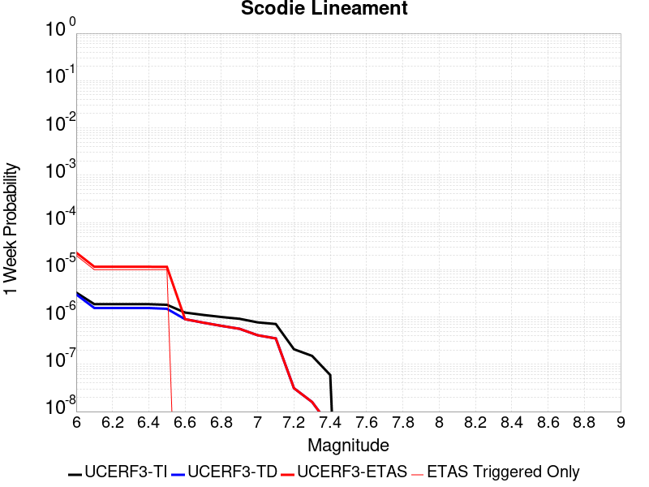 | 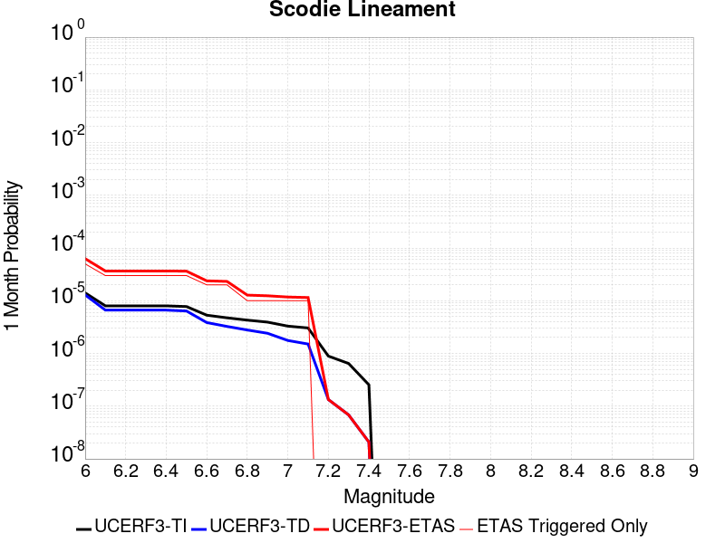 |  |  |

| Magnitude | 1 wk TI Prob | 1 wk TD Prob | 1 wk ETAS Prob | 1 wk ETAS/TD Gain | 1 wk ETAS Triggered Only | 1 mo TI Prob | 1 mo TD Prob | 1 mo ETAS Prob | 1 mo ETAS/TD Gain | 1 mo ETAS Triggered Only | 1 yr TI Prob | 1 yr TD Prob | 1 yr ETAS Prob | 1 yr ETAS/TD Gain | 1 yr ETAS Triggered Only | 10 yr TI Prob | 10 yr TD Prob | 10 yr ETAS Prob | 10 yr ETAS/TD Gain | 10 yr ETAS Triggered Only |
|-----|-----|-----|-----|-----|-----|-----|-----|-----|-----|-----|-----|-----|-----|-----|-----|-----|-----|-----|-----|-----|
| 6.0 | 3.2919327E-6 | 3.0133565E-6 | 2.3013296E-5 | 7.6370974 | 2.0E-5 | 1.4108206E-5 | 1.2914339E-5 | 6.291369E-5 | 4.8716154 | 5.0E-5 | 1.7175387E-4 | 1.5722391E-4 | 2.9720188E-4 | 1.8903098 | 1.4E-4 | 0.0017162118 | 0.0015714383 | 0.0017811083 | 1.1334256 | 2.1E-4 |
| 6.1 | 1.8663811E-6 | 1.5490589E-6 | 1.1549044E-5 | 7.4555225 | 1.0E-5 | 7.998751E-6 | 6.6388097E-6 | 3.6638612E-5 | 5.518852 | 3.0E-5 | 9.738045E-5 | 8.082501E-5 | 1.5081935E-4 | 1.8659986 | 7.0E-5 | 9.7337784E-4 | 8.0800493E-4 | 9.0792414E-4 | 1.1236616 | 1.0E-4 |
| 6.2 | 1.8663811E-6 | 1.5490589E-6 | 1.1549044E-5 | 7.4555225 | 1.0E-5 | 7.998751E-6 | 6.6388097E-6 | 3.6638612E-5 | 5.518852 | 3.0E-5 | 9.738045E-5 | 8.082501E-5 | 1.5081935E-4 | 1.8659986 | 7.0E-5 | 9.7337784E-4 | 8.0800493E-4 | 9.0792414E-4 | 1.1236616 | 1.0E-4 |
| 6.3 | 1.8663811E-6 | 1.5490589E-6 | 1.1549044E-5 | 7.4555225 | 1.0E-5 | 7.998751E-6 | 6.6388097E-6 | 3.6638612E-5 | 5.518852 | 3.0E-5 | 9.738045E-5 | 8.082501E-5 | 1.5081935E-4 | 1.8659986 | 7.0E-5 | 9.7337784E-4 | 8.0800493E-4 | 9.0792414E-4 | 1.1236616 | 1.0E-4 |
| 6.4 | 1.8663811E-6 | 1.5490589E-6 | 1.1549044E-5 | 7.4555225 | 1.0E-5 | 7.998751E-6 | 6.6388097E-6 | 3.6638612E-5 | 5.518852 | 3.0E-5 | 9.738045E-5 | 8.082501E-5 | 1.5081935E-4 | 1.8659986 | 7.0E-5 | 9.7337784E-4 | 8.0800493E-4 | 9.0792414E-4 | 1.1236616 | 1.0E-4 |
| 6.5 | 1.8106311E-6 | 1.4909926E-6 | 1.1490978E-5 | 7.7069316 | 1.0E-5 | 7.759824E-6 | 6.3899556E-6 | 3.6389763E-5 | 5.6948385 | 3.0E-5 | 9.447177E-5 | 7.779543E-5 | 1.4778998E-4 | 1.8997258 | 7.0E-5 | 9.4431615E-4 | 7.777306E-4 | 8.776528E-4 | 1.1284792 | 1.0E-4 |
| 6.6 | 1.2414679E-6 | 8.9976135E-7 | 8.9976135E-7 | 1.0 | 0.0 | 5.320566E-6 | 3.8561147E-6 | 2.3856037E-5 | 6.1865473 | 2.0E-5 | 6.477596E-5 | 4.6947276E-5 | 7.694587E-5 | 1.6389847 | 3.0E-5 | 6.475708E-4 | 4.6938224E-4 | 5.193588E-4 | 1.106473 | 5.0E-5 |
| 6.7 | 1.1062215E-6 | 7.5943603E-7 | 7.5943603E-7 | 1.0 | 0.0 | 4.7409408E-6 | 3.254722E-6 | 2.3254657E-5 | 7.144898 | 2.0E-5 | 5.7719422E-5 | 3.9625593E-5 | 6.96244E-5 | 1.7570565 | 3.0E-5 | 5.770443E-4 | 3.9619225E-4 | 4.4617243E-4 | 1.1261513 | 5.0E-5 |
| 6.8 | 1.0006736E-6 | 6.5004406E-7 | 6.5004406E-7 | 1.0 | 0.0 | 4.288594E-6 | 2.7859005E-6 | 1.2785873E-5 | 4.5894938 | 1.0E-5 | 5.221238E-5 | 3.3917873E-5 | 5.3917192E-5 | 1.5896397 | 2.0E-5 | 5.220012E-4 | 3.3913302E-4 | 3.7911948E-4 | 1.1179078 | 4.0E-5 |
| 6.9 | 9.167364E-7 | 5.6316645E-7 | 5.6316645E-7 | 1.0 | 0.0 | 3.9288643E-6 | 2.4135686E-6 | 1.2413544E-5 | 5.1432323 | 1.0E-5 | 4.7832873E-5 | 2.9384859E-5 | 4.938427E-5 | 1.6806027 | 2.0E-5 | 4.782258E-4 | 2.9381542E-4 | 3.3380365E-4 | 1.1360999 | 4.0E-5 |
| 7.0 | 7.6987664E-7 | 4.113416E-7 | 4.113416E-7 | 1.0 | 0.0 | 3.2994672E-6 | 1.7628915E-6 | 1.1762874E-5 | 6.6724887 | 1.0E-5 | 4.0170275E-5 | 2.1463033E-5 | 4.1462605E-5 | 1.9318148 | 2.0E-5 | 4.0163012E-4 | 2.1461345E-4 | 2.44607E-4 | 1.1397562 | 3.0E-5 |
| 7.1 | 7.1038727E-7 | 3.5211795E-7 | 3.5211795E-7 | 1.0 | 0.0 | 3.0445133E-6 | 1.5090762E-6 | 1.1509062E-5 | 7.62656 | 1.0E-5 | 3.706632E-5 | 1.8372884E-5 | 3.8372516E-5 | 2.0885408 | 2.0E-5 | 3.7060137E-4 | 1.8371714E-4 | 2.1371164E-4 | 1.1632645 | 3.0E-5 |
| 7.2 | 2.0799602E-7 | 3.1187685E-8 | 3.1187685E-8 | 1.0 | 0.0 | 8.914113E-7 | 1.336615E-7 | 1.336615E-7 | 1.0 | 0.0 | 1.0852878E-5 | 1.6273277E-6 | 1.6273277E-6 | 1.0 | 0.0 | 1.08523476E-4 | 1.6273165E-5 | 1.6273165E-5 | 1.0 | 0.0 |
| 7.3 | 1.5048182E-7 | 1.5946263E-8 | 1.5946263E-8 | 1.0 | 0.0 | 6.449219E-7 | 6.834112E-8 | 6.834112E-8 | 1.0 | 0.0 | 7.851896E-6 | 8.320529E-7 | 8.320529E-7 | 1.0 | 0.0 | 7.851618E-5 | 8.3205005E-6 | 8.3205005E-6 | 1.0 | 0.0 |
| 7.4 | 5.9334678E-8 | 4.8685624E-9 | 4.8685624E-9 | 1.0 | 0.0 | 2.5429145E-7 | 2.0865269E-8 | 2.0865269E-8 | 1.0 | 0.0 | 3.095994E-6 | 2.5403463E-7 | 2.5403463E-7 | 1.0 | 0.0 | 3.095951E-5 | 2.5403444E-6 | 2.5403444E-6 | 1.0 | 0.0 |

## San Andreas (Cholame) rev
*[(top)](#table-of-contents)*

| 1 Week | 1 Month | 1 Year | 10 Year |
|-----|-----|-----|-----|
|  |  | 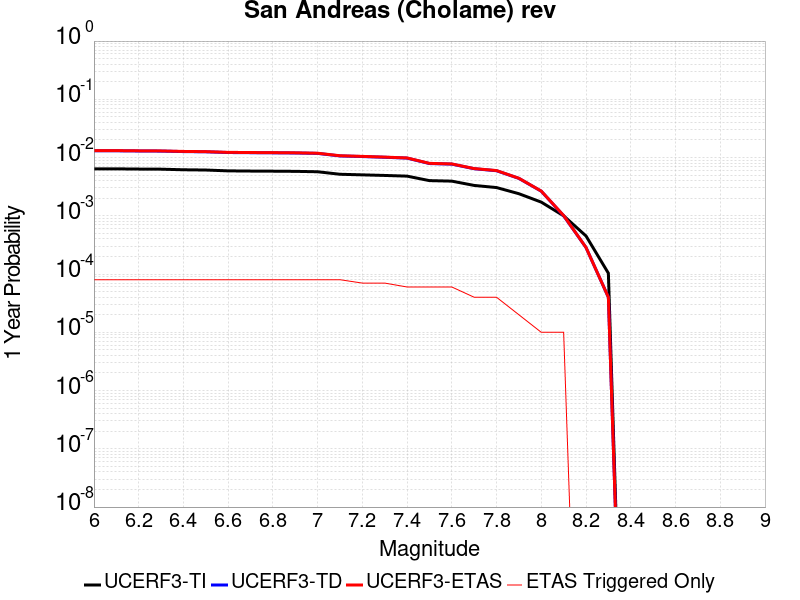 | 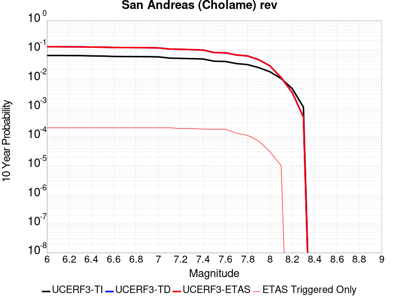 |

| Magnitude | 1 wk TI Prob | 1 wk TD Prob | 1 wk ETAS Prob | 1 wk ETAS/TD Gain | 1 wk ETAS Triggered Only | 1 mo TI Prob | 1 mo TD Prob | 1 mo ETAS Prob | 1 mo ETAS/TD Gain | 1 mo ETAS Triggered Only | 1 yr TI Prob | 1 yr TD Prob | 1 yr ETAS Prob | 1 yr ETAS/TD Gain | 1 yr ETAS Triggered Only | 10 yr TI Prob | 10 yr TD Prob | 10 yr ETAS Prob | 10 yr ETAS/TD Gain | 10 yr ETAS Triggered Only |
|-----|-----|-----|-----|-----|-----|-----|-----|-----|-----|-----|-----|-----|-----|-----|-----|-----|-----|-----|-----|-----|
| 6.0 | 1.2302514E-4 | 2.5213862E-4 | 2.6213608E-4 | 1.0396507 | 1.0E-5 | 5.27144E-4 | 0.0010801482 | 0.0010901374 | 1.009248 | 1.0E-5 | 0.0063991086 | 0.013072014 | 0.013150969 | 1.00604 | 8.0E-5 | 0.06217949 | 0.12443058 | 0.12460569 | 1.0014073 | 2.0E-4 |
| 6.1 | 1.2302514E-4 | 2.5213862E-4 | 2.6213608E-4 | 1.0396507 | 1.0E-5 | 5.27144E-4 | 0.0010801482 | 0.0010901374 | 1.009248 | 1.0E-5 | 0.0063991086 | 0.013072014 | 0.013150969 | 1.00604 | 8.0E-5 | 0.06217949 | 0.12443058 | 0.12460569 | 1.0014073 | 2.0E-4 |
| 6.2 | 1.2203569E-4 | 2.5030645E-4 | 2.6030396E-4 | 1.0399411 | 1.0E-5 | 5.2290526E-4 | 0.0010723026 | 0.0010822918 | 1.0093157 | 1.0E-5 | 0.006347804 | 0.0129776355 | 0.013056597 | 1.0060844 | 8.0E-5 | 0.061695136 | 0.12361675 | 0.12379202 | 1.0014179 | 2.0E-4 |
| 6.3 | 1.2142645E-4 | 2.491661E-4 | 2.5916361E-4 | 1.0401238 | 1.0E-5 | 5.202953E-4 | 0.0010674193 | 0.0010774087 | 1.0093584 | 1.0E-5 | 0.006316212 | 0.012918889 | 0.012997855 | 1.0061125 | 8.0E-5 | 0.06139677 | 0.12311087 | 0.12328624 | 1.0014246 | 2.0E-4 |
| 6.4 | 1.1865206E-4 | 2.4422092E-4 | 2.542185E-4 | 1.0409366 | 1.0E-5 | 5.0840975E-4 | 0.0010462429 | 0.0010562325 | 1.0095481 | 1.0E-5 | 0.006172335 | 0.012664088 | 0.012743075 | 1.006237 | 8.0E-5 | 0.060036868 | 0.12090351 | 0.121079326 | 1.0014542 | 2.0E-4 |
| 6.5 | 1.17443946E-4 | 2.421537E-4 | 2.5215128E-4 | 1.0412861 | 1.0E-5 | 5.032341E-4 | 0.0010373904 | 0.00104738 | 1.0096296 | 1.0E-5 | 0.006109677 | 0.012557554 | 0.012636549 | 1.0062907 | 8.0E-5 | 0.059444077 | 0.11997763 | 0.120153636 | 1.001467 | 2.0E-4 |
| 6.6 | 1.13579066E-4 | 2.3524289E-4 | 2.4524055E-4 | 1.0424993 | 1.0E-5 | 4.866766E-4 | 0.0010077958 | 0.0010177857 | 1.0099126 | 1.0E-5 | 0.0059092017 | 0.012201327 | 0.012280351 | 1.0064766 | 8.0E-5 | 0.057545185 | 0.11689143 | 0.117068045 | 1.001511 | 2.0E-4 |
| 6.7 | 1.1271412E-4 | 2.336858E-4 | 2.4368346E-4 | 1.0427825 | 1.0E-5 | 4.829711E-4 | 0.0010011276 | 0.0010111177 | 1.0099788 | 1.0E-5 | 0.005864331 | 0.01212105 | 0.01220008 | 1.00652 | 8.0E-5 | 0.057119697 | 0.11619493 | 0.1163717 | 1.0015212 | 2.0E-4 |
| 6.8 | 1.1217975E-4 | 2.3256983E-4 | 2.425675E-4 | 1.0429878 | 1.0E-5 | 4.8068175E-4 | 9.963487E-4 | 0.0010063386 | 1.0100267 | 1.0E-5 | 0.005836608 | 0.012063511 | 0.012142546 | 1.0065516 | 8.0E-5 | 0.056856725 | 0.11569312 | 0.115869984 | 1.0015287 | 2.0E-4 |
| 6.9 | 1.1146753E-4 | 2.3105709E-4 | 2.4105477E-4 | 1.0432694 | 1.0E-5 | 4.7763053E-4 | 9.898704E-4 | 9.998605E-4 | 1.0100924 | 1.0E-5 | 0.0057996577 | 0.011985509 | 0.012064549 | 1.0065948 | 8.0E-5 | 0.056506127 | 0.11501348 | 0.115190476 | 1.0015389 | 2.0E-4 |
| 7.0 | 1.0965793E-4 | 2.2728977E-4 | 2.372875E-4 | 1.0439867 | 1.0E-5 | 4.698779E-4 | 9.7373687E-4 | 9.837272E-4 | 1.0102597 | 1.0E-5 | 0.005705768 | 0.0117912255 | 0.011870283 | 1.0067047 | 8.0E-5 | 0.055614736 | 0.11331484 | 0.113492176 | 1.001565 | 2.0E-4 |
| 7.1 | 9.927982E-5 | 2.0547757E-4 | 2.1547552E-4 | 1.0486571 | 1.0E-5 | 4.2541555E-4 | 8.80322E-4 | 8.903132E-4 | 1.0113494 | 1.0E-5 | 0.0051671406 | 0.010665542 | 0.010744689 | 1.0074208 | 8.0E-5 | 0.05048634 | 0.10340853 | 0.10358784 | 1.001734 | 2.0E-4 |
| 7.2 | 9.696786E-5 | 2.0051954E-4 | 2.0051954E-4 | 1.0 | 0.0 | 4.1551032E-4 | 8.5908745E-4 | 8.5908745E-4 | 1.0 | 0.0 | 0.00504711 | 0.010409511 | 0.010478782 | 1.0066546 | 7.0E-5 | 0.04934009 | 0.10114636 | 0.101317145 | 1.0016885 | 1.9E-4 |
| 7.3 | 9.4727984E-5 | 1.9481099E-4 | 1.9481099E-4 | 1.0 | 0.0 | 4.0591392E-4 | 8.346381E-4 | 8.346381E-4 | 1.0 | 0.0 | 0.0049308087 | 0.010114641 | 0.010183933 | 1.0068507 | 7.0E-5 | 0.048228268 | 0.09851684 | 0.09868812 | 1.0017385 | 1.9E-4 |
| 7.4 | 9.220358E-5 | 1.885154E-4 | 1.885154E-4 | 1.0 | 0.0 | 3.9509835E-4 | 8.076739E-4 | 8.076739E-4 | 1.0 | 0.0 | 0.004799717 | 0.009789341 | 0.009848754 | 1.0060691 | 6.0E-5 | 0.046973653 | 0.09559427 | 0.09575707 | 1.0017029 | 1.8E-4 |
| 7.5 | 7.71631E-5 | 1.5185357E-4 | 1.5185357E-4 | 1.0 | 0.0 | 3.306571E-4 | 6.506389E-4 | 6.506389E-4 | 1.0 | 0.0 | 0.0040183207 | 0.007892828 | 0.007952355 | 1.0075419 | 6.0E-5 | 0.03946433 | 0.07831838 | 0.07848428 | 1.0021183 | 1.8E-4 |
| 7.6 | 7.5634416E-5 | 1.4844738E-4 | 1.4844738E-4 | 1.0 | 0.0 | 3.241072E-4 | 6.360481E-4 | 6.360481E-4 | 1.0 | 0.0 | 0.0039388672 | 0.007716457 | 0.0077759936 | 1.0077156 | 6.0E-5 | 0.038697794 | 0.076681465 | 0.07684766 | 1.0021673 | 1.8E-4 |
| 7.7 | 6.3783E-5 | 1.2365259E-4 | 1.2365259E-4 | 1.0 | 0.0 | 2.7332708E-4 | 5.2983203E-4 | 5.2983203E-4 | 1.0 | 0.0 | 0.0033226798 | 0.0064316522 | 0.006471395 | 1.0061792 | 4.0E-5 | 0.032734364 | 0.064570144 | 0.06469175 | 1.0018833 | 1.3E-4 |
| 7.8 | 5.863422E-5 | 1.142205E-4 | 1.142205E-4 | 1.0 | 0.0 | 2.512653E-4 | 4.894246E-4 | 4.894246E-4 | 1.0 | 0.0 | 0.003054864 | 0.0059424853 | 0.0059822476 | 1.0066912 | 4.0E-5 | 0.030132094 | 0.059686445 | 0.05978988 | 1.001733 | 1.1E-4 |
| 7.9 | 4.595283E-5 | 8.4306725E-5 | 8.4306725E-5 | 1.0 | 0.0 | 1.9692584E-4 | 3.612645E-4 | 3.612645E-4 | 1.0 | 0.0 | 0.0023949358 | 0.0043895314 | 0.0044094436 | 1.0045363 | 2.0E-5 | 0.023692891 | 0.044382483 | 0.044449378 | 1.0015072 | 7.0E-5 |
| 8.0 | 3.2950178E-5 | 5.08E-5 | 5.08E-5 | 1.0 | 0.0 | 1.412074E-4 | 2.1769613E-4 | 2.1769613E-4 | 1.0 | 0.0 | 0.0017178444 | 0.0026472306 | 0.0026572042 | 1.0037675 | 1.0E-5 | 0.017046256 | 0.027193451 | 0.027222635 | 1.0010732 | 3.0E-5 |
| 8.1 | 1.9177472E-5 | 1.9198456E-5 | 1.9198456E-5 | 1.0 | 0.0 | 8.218658E-5 | 8.227651E-5 | 8.227651E-5 | 1.0 | 0.0 | 0.0010001622 | 0.0010012568 | 0.0010112468 | 1.0099775 | 1.0E-5 | 0.009956728 | 0.01076512 | 0.010775012 | 1.000919 | 1.0E-5 |
| 8.2 | 8.643924E-6 | 5.4798497E-6 | 5.4798497E-6 | 1.0 | 0.0 | 3.704486E-5 | 2.348486E-5 | 2.348486E-5 | 1.0 | 0.0 | 4.5092785E-4 | 2.858907E-4 | 2.858907E-4 | 1.0 | 0.0 | 0.0045001395 | 0.0032514327 | 0.0032514327 | 1.0 | 0.0 |
| 8.3 | 1.983087E-6 | 7.668296E-7 | 7.668296E-7 | 1.0 | 0.0 | 8.498917E-6 | 3.2864084E-6 | 3.2864084E-6 | 1.0 | 0.0 | 1.034694E-4 | 4.0011306E-5 | 4.0011306E-5 | 1.0 | 0.0 | 0.0010342124 | 4.724499E-4 | 4.724499E-4 | 1.0 | 0.0 |

## San Jacinto (San Bernardino)
*[(top)](#table-of-contents)*

| 1 Week | 1 Month | 1 Year | 10 Year |
|-----|-----|-----|-----|
|  | 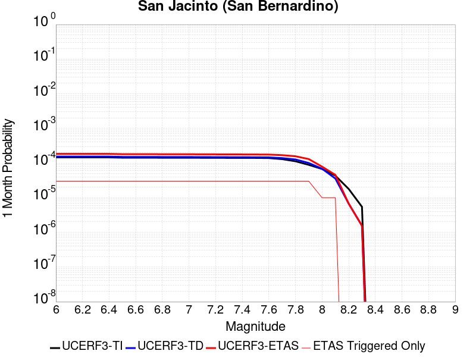 | 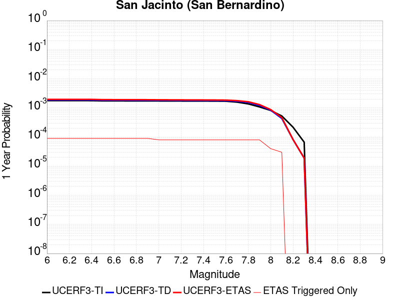 |  |

| Magnitude | 1 wk TI Prob | 1 wk TD Prob | 1 wk ETAS Prob | 1 wk ETAS/TD Gain | 1 wk ETAS Triggered Only | 1 mo TI Prob | 1 mo TD Prob | 1 mo ETAS Prob | 1 mo ETAS/TD Gain | 1 mo ETAS Triggered Only | 1 yr TI Prob | 1 yr TD Prob | 1 yr ETAS Prob | 1 yr ETAS/TD Gain | 1 yr ETAS Triggered Only | 10 yr TI Prob | 10 yr TD Prob | 10 yr ETAS Prob | 10 yr ETAS/TD Gain | 10 yr ETAS Triggered Only |
|-----|-----|-----|-----|-----|-----|-----|-----|-----|-----|-----|-----|-----|-----|-----|-----|-----|-----|-----|-----|-----|
| 6.0 | 3.409352E-5 | 3.600249E-5 | 5.6001772E-5 | 1.5554972 | 2.0E-5 | 1.461069E-4 | 1.5428728E-4 | 1.8428265E-4 | 1.1944125 | 3.0E-5 | 0.0017774 | 0.001876831 | 0.0019666622 | 1.0478631 | 9.0E-5 | 0.01763251 | 0.019358097 | 0.019524807 | 1.0086118 | 1.7E-4 |
| 6.1 | 3.409352E-5 | 3.600249E-5 | 5.6001772E-5 | 1.5554972 | 2.0E-5 | 1.461069E-4 | 1.5428728E-4 | 1.8428265E-4 | 1.1944125 | 3.0E-5 | 0.0017774 | 0.001876831 | 0.0019666622 | 1.0478631 | 9.0E-5 | 0.01763251 | 0.019358097 | 0.019524807 | 1.0086118 | 1.7E-4 |
| 6.2 | 3.409352E-5 | 3.600249E-5 | 5.6001772E-5 | 1.5554972 | 2.0E-5 | 1.461069E-4 | 1.5428728E-4 | 1.8428265E-4 | 1.1944125 | 3.0E-5 | 0.0017774 | 0.001876831 | 0.0019666622 | 1.0478631 | 9.0E-5 | 0.01763251 | 0.019358097 | 0.019524807 | 1.0086118 | 1.7E-4 |
| 6.3 | 3.409352E-5 | 3.600249E-5 | 5.6001772E-5 | 1.5554972 | 2.0E-5 | 1.461069E-4 | 1.5428728E-4 | 1.8428265E-4 | 1.1944125 | 3.0E-5 | 0.0017774 | 0.001876831 | 0.0019666622 | 1.0478631 | 9.0E-5 | 0.01763251 | 0.019358097 | 0.019524807 | 1.0086118 | 1.7E-4 |
| 6.4 | 3.400795E-5 | 3.589515E-5 | 5.589443E-5 | 1.5571584 | 2.0E-5 | 1.4574021E-4 | 1.5382729E-4 | 1.8382269E-4 | 1.1949939 | 3.0E-5 | 0.0017729428 | 0.0018712406 | 0.0019610722 | 1.0480064 | 9.0E-5 | 0.017588645 | 0.019303178 | 0.019469896 | 1.0086368 | 1.7E-4 |
| 6.5 | 3.341482E-5 | 3.5155765E-5 | 5.5155062E-5 | 1.5688767 | 2.0E-5 | 1.4319851E-4 | 1.5065886E-4 | 1.8065434E-4 | 1.1990954 | 3.0E-5 | 0.0017420477 | 0.0018327299 | 0.0019225649 | 1.0490171 | 9.0E-5 | 0.017284546 | 0.018924711 | 0.019091494 | 1.008813 | 1.7E-4 |
| 6.6 | 3.3364955E-5 | 3.509298E-5 | 5.5092278E-5 | 1.5698946 | 2.0E-5 | 1.4298483E-4 | 1.5038982E-4 | 1.8038531E-4 | 1.1994516 | 3.0E-5 | 0.0017394501 | 0.0018294598 | 0.0019192952 | 1.0491048 | 9.0E-5 | 0.017258976 | 0.018892575 | 0.019059364 | 1.0088283 | 1.7E-4 |
| 6.7 | 3.335922E-5 | 3.5082754E-5 | 5.508205E-5 | 1.5700606 | 2.0E-5 | 1.4296026E-4 | 1.5034601E-4 | 1.8034149E-4 | 1.1995097 | 3.0E-5 | 0.0017391514 | 0.0018289272 | 0.0019187626 | 1.0491192 | 9.0E-5 | 0.017256035 | 0.018887365 | 0.019054156 | 1.0088307 | 1.7E-4 |
| 6.8 | 3.327683E-5 | 3.4976816E-5 | 5.4976117E-5 | 1.5717874 | 2.0E-5 | 1.4260718E-4 | 1.4989203E-4 | 1.7988755E-4 | 1.200114 | 3.0E-5 | 0.0017348597 | 0.0018234095 | 0.0019132453 | 1.0492681 | 9.0E-5 | 0.017213784 | 0.018833136 | 0.018990124 | 1.0083357 | 1.6E-4 |
| 6.9 | 3.3235785E-5 | 3.4917768E-5 | 5.491707E-5 | 1.5727543 | 2.0E-5 | 1.4243131E-4 | 1.49639E-4 | 1.7963452E-4 | 1.2004524 | 3.0E-5 | 0.0017327217 | 0.0018203339 | 0.0019101701 | 1.0493515 | 9.0E-5 | 0.017192734 | 0.018803004 | 0.018959995 | 1.0083493 | 1.6E-4 |
| 7.0 | 3.3197095E-5 | 3.4857694E-5 | 5.4857E-5 | 1.5737414 | 2.0E-5 | 1.422655E-4 | 1.4938158E-4 | 1.793771E-4 | 1.200798 | 3.0E-5 | 0.0017307063 | 0.001817205 | 0.0018970596 | 1.0439436 | 8.0E-5 | 0.017172894 | 0.01877238 | 0.018919565 | 1.0078405 | 1.5E-4 |
| 7.1 | 3.3129716E-5 | 3.47379E-5 | 5.4737207E-5 | 1.5757201 | 2.0E-5 | 1.4197677E-4 | 1.4886823E-4 | 1.7886376E-4 | 1.2014905 | 3.0E-5 | 0.0017271966 | 0.0018109654 | 0.0018908205 | 1.0440953 | 8.0E-5 | 0.017138338 | 0.018711457 | 0.01885865 | 1.0078665 | 1.5E-4 |
| 7.2 | 3.3034008E-5 | 3.4605342E-5 | 5.460465E-5 | 1.5779254 | 2.0E-5 | 1.4156665E-4 | 1.4830018E-4 | 1.7829574E-4 | 1.2022624 | 3.0E-5 | 0.0017222111 | 0.001804061 | 0.0018839167 | 1.0442644 | 8.0E-5 | 0.017089253 | 0.018643849 | 0.018791052 | 1.0078956 | 1.5E-4 |
| 7.3 | 3.2956614E-5 | 3.447309E-5 | 5.4472403E-5 | 1.5801426 | 2.0E-5 | 1.4123498E-4 | 1.4773346E-4 | 1.7772903E-4 | 1.2030385 | 3.0E-5 | 0.0017181796 | 0.0017971725 | 0.0018770286 | 1.0444344 | 8.0E-5 | 0.017049557 | 0.018576592 | 0.018723805 | 1.0079247 | 1.5E-4 |
| 7.4 | 3.2915937E-5 | 3.439478E-5 | 5.439409E-5 | 1.5814636 | 2.0E-5 | 1.4106068E-4 | 1.4739788E-4 | 1.7739345E-4 | 1.2035007 | 3.0E-5 | 0.0017160608 | 0.0017930934 | 0.00187295 | 1.0445356 | 8.0E-5 | 0.017028693 | 0.018536855 | 0.018684074 | 1.007942 | 1.5E-4 |
| 7.5 | 3.281791E-5 | 3.4259683E-5 | 5.4258995E-5 | 1.5837566 | 2.0E-5 | 1.406406E-4 | 1.4681896E-4 | 1.7681454E-4 | 1.2043033 | 3.0E-5 | 0.0017109542 | 0.0017860567 | 0.0018659137 | 1.0447115 | 8.0E-5 | 0.016978411 | 0.018467735 | 0.018614966 | 1.0079722 | 1.5E-4 |
| 7.6 | 3.2521442E-5 | 3.39846E-5 | 5.3983924E-5 | 1.5884818 | 2.0E-5 | 1.3937015E-4 | 1.4564018E-4 | 1.7563581E-4 | 1.2059572 | 3.0E-5 | 0.0016955109 | 0.0017717284 | 0.0018515867 | 1.0450736 | 8.0E-5 | 0.016826328 | 0.01832535 | 0.0184726 | 1.0080354 | 1.5E-4 |
| 7.7 | 3.0287873E-5 | 3.246845E-5 | 5.2467803E-5 | 1.6159625 | 2.0E-5 | 1.297987E-4 | 1.391431E-4 | 1.6913892E-4 | 1.2155753 | 3.0E-5 | 0.0015791537 | 0.001692752 | 0.0017726165 | 1.0471803 | 8.0E-5 | 0.01567979 | 0.017536119 | 0.01768349 | 1.0084038 | 1.5E-4 |
| 7.8 | 2.6316151E-5 | 2.9678711E-5 | 4.9678118E-5 | 1.6738636 | 2.0E-5 | 1.1277862E-4 | 1.2718828E-4 | 1.5718446E-4 | 1.2358408 | 3.0E-5 | 0.0013722149 | 0.0015474184 | 0.0016272946 | 1.051619 | 8.0E-5 | 0.013637724 | 0.016077382 | 0.016224971 | 1.0091798 | 1.5E-4 |
| 7.9 | 2.0761147E-5 | 2.3431265E-5 | 4.3430795E-5 | 1.8535404 | 2.0E-5 | 8.897331E-5 | 1.0041584E-4 | 1.3041284E-4 | 1.2987276 | 3.0E-5 | 0.0010827117 | 0.0012218781 | 0.0013017803 | 1.065393 | 8.0E-5 | 0.010774517 | 0.012799971 | 0.012938179 | 1.0107975 | 1.4E-4 |
| 8.0 | 1.5738568E-5 | 1.6043394E-5 | 1.6043394E-5 | 1.0 | 0.0 | 6.744926E-5 | 6.8755595E-5 | 7.875491E-5 | 1.1454327 | 1.0E-5 | 8.2088535E-4 | 8.3677855E-4 | 8.767451E-4 | 1.0477624 | 4.0E-5 | 0.008178596 | 0.008871087 | 0.008930555 | 1.0067035 | 6.0E-5 |
| 8.1 | 1.0105832E-5 | 8.336244E-6 | 8.336244E-6 | 1.0 | 0.0 | 4.3309992E-5 | 3.5726272E-5 | 4.5725916E-5 | 1.279896 | 1.0E-5 | 5.2717153E-4 | 4.3488108E-4 | 4.6486803E-4 | 1.0689543 | 3.0E-5 | 0.005259227 | 0.00468032 | 0.0047101798 | 1.0063798 | 3.0E-5 |
| 8.2 | 4.189207E-6 | 1.5801045E-6 | 1.5801045E-6 | 1.0 | 0.0 | 1.7953622E-5 | 6.771859E-6 | 6.771859E-6 | 1.0 | 0.0 | 2.1856341E-4 | 8.244429E-5 | 8.244429E-5 | 1.0 | 0.0 | 0.0021834858 | 9.575395E-4 | 9.575395E-4 | 1.0 | 0.0 |
| 8.3 | 1.2758221E-6 | 3.6194777E-7 | 3.6194777E-7 | 1.0 | 0.0 | 5.4677976E-6 | 1.5512038E-6 | 1.5512038E-6 | 1.0 | 0.0 | 6.65684E-5 | 1.8885747E-5 | 1.8885747E-5 | 1.0 | 0.0 | 6.6548464E-4 | 2.2777634E-4 | 2.2777634E-4 | 1.0 | 0.0 |

## White Wolf (Extension)
*[(top)](#table-of-contents)*

| 1 Week | 1 Month | 1 Year | 10 Year |
|-----|-----|-----|-----|
|  |  |  |  |

| Magnitude | 1 wk TI Prob | 1 wk TD Prob | 1 wk ETAS Prob | 1 wk ETAS/TD Gain | 1 wk ETAS Triggered Only | 1 mo TI Prob | 1 mo TD Prob | 1 mo ETAS Prob | 1 mo ETAS/TD Gain | 1 mo ETAS Triggered Only | 1 yr TI Prob | 1 yr TD Prob | 1 yr ETAS Prob | 1 yr ETAS/TD Gain | 1 yr ETAS Triggered Only | 10 yr TI Prob | 10 yr TD Prob | 10 yr ETAS Prob | 10 yr ETAS/TD Gain | 10 yr ETAS Triggered Only |
|-----|-----|-----|-----|-----|-----|-----|-----|-----|-----|-----|-----|-----|-----|-----|-----|-----|-----|-----|-----|-----|
| 6.0 | 8.222555E-6 | 6.0667057E-6 | 1.6066646E-5 | 2.648331 | 1.0E-5 | 3.5239045E-5 | 2.5999947E-5 | 5.5999168E-5 | 2.1538186 | 3.0E-5 | 4.289509E-4 | 3.1650998E-4 | 4.36472E-4 | 1.379015 | 1.2E-4 | 0.0042812387 | 0.0031612439 | 0.0033307066 | 1.0536063 | 1.7E-4 |
| 6.1 | 8.222555E-6 | 6.0667057E-6 | 1.6066646E-5 | 2.648331 | 1.0E-5 | 3.5239045E-5 | 2.5999947E-5 | 5.5999168E-5 | 2.1538186 | 3.0E-5 | 4.289509E-4 | 3.1650998E-4 | 4.36472E-4 | 1.379015 | 1.2E-4 | 0.0042812387 | 0.0031612439 | 0.0033307066 | 1.0536063 | 1.7E-4 |
| 6.2 | 8.222555E-6 | 6.0667057E-6 | 1.6066646E-5 | 2.648331 | 1.0E-5 | 3.5239045E-5 | 2.5999947E-5 | 5.5999168E-5 | 2.1538186 | 3.0E-5 | 4.289509E-4 | 3.1650998E-4 | 4.36472E-4 | 1.379015 | 1.2E-4 | 0.0042812387 | 0.0031612439 | 0.0033307066 | 1.0536063 | 1.7E-4 |
| 6.3 | 8.222555E-6 | 6.0667057E-6 | 1.6066646E-5 | 2.648331 | 1.0E-5 | 3.5239045E-5 | 2.5999947E-5 | 5.5999168E-5 | 2.1538186 | 3.0E-5 | 4.289509E-4 | 3.1650998E-4 | 4.36472E-4 | 1.379015 | 1.2E-4 | 0.0042812387 | 0.0031612439 | 0.0033307066 | 1.0536063 | 1.7E-4 |
| 6.4 | 5.821773E-6 | 3.5572016E-6 | 1.3557166E-5 | 3.8111885 | 1.0E-5 | 2.4950215E-5 | 1.5245067E-5 | 4.524461E-5 | 2.9678197 | 3.0E-5 | 3.0372653E-4 | 1.8559398E-4 | 2.6557912E-4 | 1.4309685 | 8.0E-5 | 0.0030331176 | 0.0018544982 | 0.0019642941 | 1.0592053 | 1.1E-4 |
| 6.5 | 5.766023E-6 | 3.4991353E-6 | 1.34991005E-5 | 3.8578389 | 1.0E-5 | 2.4711293E-5 | 1.4996214E-5 | 4.4995766E-5 | 3.000475 | 3.0E-5 | 3.0081844E-4 | 1.8256472E-4 | 2.625501E-4 | 1.4381207 | 8.0E-5 | 0.0030041158 | 0.0018242556 | 0.0019340549 | 1.0601885 | 1.1E-4 |
| 6.6 | 4.643576E-6 | 2.332643E-6 | 2.332643E-6 | 1.0 | 0.0 | 1.9900888E-5 | 9.997005E-6 | 2.9996805E-5 | 3.0005794 | 2.0E-5 | 2.4226638E-4 | 1.2170716E-4 | 1.617023E-4 | 1.3286177 | 4.0E-5 | 0.0024200242 | 0.0012164476 | 0.0012763746 | 1.049264 | 6.0E-5 |
| 6.7 | 3.9529173E-6 | 1.6483629E-6 | 1.6483629E-6 | 1.0 | 0.0 | 1.6940963E-5 | 7.064394E-6 | 2.7064252E-5 | 3.8310792 | 2.0E-5 | 2.0623671E-4 | 8.600579E-5 | 1.2600236E-4 | 1.465045 | 4.0E-5 | 0.002060454 | 8.5974357E-4 | 9.19692E-4 | 1.0697283 | 6.0E-5 |
| 6.8 | 3.4377522E-6 | 1.2245362E-6 | 1.2245362E-6 | 1.0 | 0.0 | 1.473314E-5 | 5.2480023E-6 | 1.524795E-5 | 2.905477 | 1.0E-5 | 1.7936122E-4 | 6.389264E-5 | 8.389137E-5 | 1.3130051 | 2.0E-5 | 0.0017921652 | 6.3875184E-4 | 6.787263E-4 | 1.0625821 | 4.0E-5 |
| 6.9 | 3.1367306E-6 | 1.0033893E-6 | 1.0033893E-6 | 1.0 | 0.0 | 1.3443062E-5 | 4.3002333E-6 | 1.430019E-5 | 3.3254452 | 1.0E-5 | 1.63657E-4 | 5.235416E-5 | 7.235311E-5 | 1.3819935 | 2.0E-5 | 0.0016353652 | 5.234259E-4 | 5.6340493E-4 | 1.0763797 | 4.0E-5 |
| 7.0 | 2.8298145E-6 | 7.4287595E-7 | 7.4287595E-7 | 1.0 | 0.0 | 1.2127721E-5 | 3.1837506E-6 | 1.3183719E-5 | 4.1409397 | 1.0E-5 | 1.47645E-4 | 3.8761526E-5 | 5.876075E-5 | 1.5159556 | 2.0E-5 | 0.0014754693 | 3.8755263E-4 | 4.17541E-4 | 1.0773789 | 3.0E-5 |
| 7.1 | 2.4091064E-6 | 5.4228286E-7 | 5.4228286E-7 | 1.0 | 0.0 | 1.03247E-5 | 2.3240675E-6 | 1.2324044E-5 | 5.3027906 | 1.0E-5 | 1.2569598E-4 | 2.8295197E-5 | 4.829463E-5 | 1.7068138 | 2.0E-5 | 0.001256249 | 2.8291997E-4 | 3.129115E-4 | 1.1060071 | 3.0E-5 |
| 7.2 | 1.3875518E-6 | 1.07434374E-7 | 1.07434374E-7 | 1.0 | 0.0 | 5.9466374E-6 | 4.6043297E-7 | 4.6043297E-7 | 1.0 | 0.0 | 7.23979E-5 | 5.6057584E-6 | 5.6057584E-6 | 1.0 | 0.0 | 7.2374323E-4 | 5.605628E-5 | 5.605628E-5 | 1.0 | 0.0 |
| 7.3 | 7.056077E-7 | 5.0022493E-8 | 5.0022493E-8 | 1.0 | 0.0 | 3.0240296E-6 | 2.143821E-7 | 2.143821E-7 | 1.0 | 0.0 | 3.681694E-5 | 2.6100993E-6 | 2.6100993E-6 | 1.0 | 0.0 | 3.681084E-4 | 2.6100734E-5 | 2.6100734E-5 | 1.0 | 0.0 |
| 7.4 | 5.9334678E-8 | 4.8685624E-9 | 4.8685624E-9 | 1.0 | 0.0 | 2.5429145E-7 | 2.0865269E-8 | 2.0865269E-8 | 1.0 | 0.0 | 3.095994E-6 | 2.5403463E-7 | 2.5403463E-7 | 1.0 | 0.0 | 3.095951E-5 | 2.5403444E-6 | 2.5403444E-6 | 1.0 | 0.0 |

## San Andreas (Coachella) rev
*[(top)](#table-of-contents)*

| 1 Week | 1 Month | 1 Year | 10 Year |
|-----|-----|-----|-----|
|  |  |  |  |

| Magnitude | 1 wk TI Prob | 1 wk TD Prob | 1 wk ETAS Prob | 1 wk ETAS/TD Gain | 1 wk ETAS Triggered Only | 1 mo TI Prob | 1 mo TD Prob | 1 mo ETAS Prob | 1 mo ETAS/TD Gain | 1 mo ETAS Triggered Only | 1 yr TI Prob | 1 yr TD Prob | 1 yr ETAS Prob | 1 yr ETAS/TD Gain | 1 yr ETAS Triggered Only | 10 yr TI Prob | 10 yr TD Prob | 10 yr ETAS Prob | 10 yr ETAS/TD Gain | 10 yr ETAS Triggered Only |
|-----|-----|-----|-----|-----|-----|-----|-----|-----|-----|-----|-----|-----|-----|-----|-----|-----|-----|-----|-----|-----|
| 6.0 | 1.1925945E-4 | 3.2733803E-4 | 3.3733476E-4 | 1.0305395 | 1.0E-5 | 5.110118E-4 | 0.0014021277 | 0.0014220997 | 1.0142441 | 2.0E-5 | 0.0062038354 | 0.016938623 | 0.017007437 | 1.0040625 | 7.0E-5 | 0.060334753 | 0.15267034 | 0.15280591 | 1.000888 | 1.6E-4 |
| 6.1 | 1.1925945E-4 | 3.2733803E-4 | 3.3733476E-4 | 1.0305395 | 1.0E-5 | 5.110118E-4 | 0.0014021277 | 0.0014220997 | 1.0142441 | 2.0E-5 | 0.0062038354 | 0.016938623 | 0.017007437 | 1.0040625 | 7.0E-5 | 0.060334753 | 0.15267034 | 0.15280591 | 1.000888 | 1.6E-4 |
| 6.2 | 1.07432395E-4 | 3.0234526E-4 | 3.1234222E-4 | 1.0330647 | 1.0E-5 | 4.603433E-4 | 0.0012951259 | 0.0013151 | 1.0154225 | 2.0E-5 | 0.005590286 | 0.015655253 | 0.015724158 | 1.0044013 | 7.0E-5 | 0.05451731 | 0.14184146 | 0.14197876 | 1.000968 | 1.6E-4 |
| 6.3 | 1.0718766E-4 | 3.017983E-4 | 3.117953E-4 | 1.0331247 | 1.0E-5 | 4.592948E-4 | 0.0012927842 | 0.0013127583 | 1.0154505 | 2.0E-5 | 0.005577586 | 0.015627153 | 0.015696058 | 1.0044094 | 7.0E-5 | 0.054396555 | 0.14160971 | 0.14174706 | 1.0009699 | 1.6E-4 |
| 6.4 | 1.0355944E-4 | 2.9387916E-4 | 3.038762E-4 | 1.0340176 | 1.0E-5 | 4.4375064E-4 | 0.0012588782 | 0.0012788529 | 1.0158671 | 2.0E-5 | 0.0053892885 | 0.015220184 | 0.0152891185 | 1.0045291 | 7.0E-5 | 0.052604496 | 0.13816981 | 0.1383077 | 1.000998 | 1.6E-4 |
| 6.5 | 1.0227914E-4 | 2.910735E-4 | 3.0107057E-4 | 1.0343456 | 1.0E-5 | 4.382655E-4 | 0.0012468654 | 0.0012668404 | 1.0160202 | 2.0E-5 | 0.0053228354 | 0.015075962 | 0.015144907 | 1.0045731 | 7.0E-5 | 0.051971316 | 0.136949 | 0.13708709 | 1.0010083 | 1.6E-4 |
| 6.6 | 1.0116757E-4 | 2.8873098E-4 | 2.987281E-4 | 1.0346243 | 1.0E-5 | 4.3350324E-4 | 0.0012368355 | 0.0012568109 | 1.0161504 | 2.0E-5 | 0.0052651367 | 0.014955532 | 0.015024485 | 1.0046105 | 7.0E-5 | 0.051421247 | 0.13592719 | 0.13606544 | 1.0010171 | 1.6E-4 |
| 6.7 | 1.0050676E-4 | 2.873166E-4 | 2.9731373E-4 | 1.0347948 | 1.0E-5 | 4.3067214E-4 | 0.0012307797 | 0.001250755 | 1.0162299 | 2.0E-5 | 0.005230834 | 0.01488281 | 0.014951769 | 1.0046334 | 7.0E-5 | 0.051094085 | 0.13531192 | 0.13545027 | 1.0010225 | 1.6E-4 |
| 6.8 | 9.976819E-5 | 2.853531E-4 | 2.9535027E-4 | 1.0350343 | 1.0E-5 | 4.2750788E-4 | 0.0012223726 | 0.0012423482 | 1.0163416 | 2.0E-5 | 0.0051924936 | 0.014781849 | 0.014850815 | 1.0046655 | 7.0E-5 | 0.050728295 | 0.13446361 | 0.13460208 | 1.00103 | 1.6E-4 |
| 6.9 | 9.77719E-5 | 2.8032195E-4 | 2.9031915E-4 | 1.0356632 | 1.0E-5 | 4.1895514E-4 | 0.0012008306 | 0.0012208065 | 1.0166352 | 2.0E-5 | 0.0050888555 | 0.014523101 | 0.014582229 | 1.0040714 | 6.0E-5 | 0.049738888 | 0.13229203 | 0.1324222 | 1.0009838 | 1.5E-4 |
| 7.0 | 8.500761E-5 | 2.4766565E-4 | 2.5766317E-4 | 1.040367 | 1.0E-5 | 3.6426744E-4 | 0.0010609957 | 0.0010809745 | 1.0188302 | 2.0E-5 | 0.0044259406 | 0.012841888 | 0.012901117 | 1.0046122 | 6.0E-5 | 0.04338823 | 0.11814933 | 0.11828161 | 1.0011196 | 1.5E-4 |
| 7.1 | 8.319876E-5 | 2.4369264E-4 | 2.536902E-4 | 1.0410253 | 1.0E-5 | 3.5651738E-4 | 0.0010439822 | 0.0010639614 | 1.0191374 | 2.0E-5 | 0.004331963 | 0.012637171 | 0.012696412 | 1.0046879 | 6.0E-5 | 0.042484846 | 0.116369456 | 0.116502 | 1.001139 | 1.5E-4 |
| 7.2 | 7.563917E-5 | 2.2417592E-4 | 2.3417368E-4 | 1.0445979 | 1.0E-5 | 3.2412758E-4 | 9.6040324E-4 | 9.803841E-4 | 1.0208046 | 2.0E-5 | 0.0039391145 | 0.0116309095 | 0.011680328 | 1.0042489 | 5.0E-5 | 0.03870018 | 0.10777538 | 0.10790029 | 1.001159 | 1.4E-4 |
| 7.3 | 7.082985E-5 | 2.073362E-4 | 2.1733412E-4 | 1.0482209 | 1.0E-5 | 3.0352117E-4 | 8.88284E-4 | 9.082662E-4 | 1.0224953 | 2.0E-5 | 0.0036891096 | 0.010761855 | 0.010811317 | 1.004596 | 5.0E-5 | 0.03628465 | 0.10029767 | 0.10042363 | 1.0012559 | 1.4E-4 |
| 7.4 | 5.146215E-5 | 1.4276853E-4 | 1.527671E-4 | 1.0700334 | 1.0E-5 | 2.2053342E-4 | 6.117225E-4 | 6.317103E-4 | 1.0326746 | 2.0E-5 | 0.0026816884 | 0.007422478 | 0.0074721067 | 1.0066863 | 5.0E-5 | 0.02649557 | 0.07086292 | 0.070993 | 1.0018357 | 1.4E-4 |
| 7.5 | 4.0285166E-5 | 1.0944253E-4 | 1.19441436E-4 | 1.0913621 | 1.0E-5 | 1.7263928E-4 | 4.689554E-4 | 4.8894604E-4 | 1.0426279 | 2.0E-5 | 0.002099857 | 0.005694655 | 0.0057443697 | 1.0087302 | 5.0E-5 | 0.020801254 | 0.055022955 | 0.055155255 | 1.0024045 | 1.4E-4 |
| 7.6 | 3.1168736E-5 | 8.441267E-5 | 9.441183E-5 | 1.1184556 | 1.0E-5 | 1.3357346E-4 | 3.6171856E-4 | 3.7171494E-4 | 1.0276358 | 1.0E-5 | 0.0016250437 | 0.004395057 | 0.0044348813 | 1.0090611 | 4.0E-5 | 0.016132116 | 0.042820677 | 0.04294511 | 1.002906 | 1.3E-4 |
| 7.7 | 2.2100989E-5 | 6.2408275E-5 | 7.240765E-5 | 1.1602252 | 1.0E-5 | 9.4715084E-5 | 2.6743664E-4 | 2.7743398E-4 | 1.037382 | 1.0E-5 | 0.001152546 | 0.003251186 | 0.003291056 | 1.0122632 | 4.0E-5 | 0.011465867 | 0.03190961 | 0.03202578 | 1.0036407 | 1.2E-4 |
| 7.8 | 1.7484861E-5 | 5.1814186E-5 | 6.181367E-5 | 1.1929873 | 1.0E-5 | 7.493296E-5 | 2.2204191E-4 | 2.320397E-4 | 1.0450265 | 1.0E-5 | 9.1192697E-4 | 0.002700012 | 0.0027399037 | 1.0147748 | 4.0E-5 | 0.009081938 | 0.026648527 | 0.02676533 | 1.0043831 | 1.2E-4 |
| 7.9 | 1.3967285E-5 | 3.8237675E-5 | 4.8237293E-5 | 1.2615122 | 1.0E-5 | 5.985842E-5 | 1.6386545E-4 | 1.7386382E-4 | 1.0610157 | 1.0E-5 | 7.2853256E-4 | 0.0019932375 | 0.002033158 | 1.0200279 | 4.0E-5 | 0.0072614877 | 0.019916428 | 0.020024238 | 1.005413 | 1.1E-4 |
| 8.0 | 1.1887396E-5 | 3.107819E-5 | 4.1077878E-5 | 1.3217591 | 1.0E-5 | 5.094499E-5 | 1.3318544E-4 | 1.4318412E-4 | 1.0750732 | 1.0E-5 | 6.200787E-4 | 0.0016203277 | 0.0016602629 | 1.0246464 | 4.0E-5 | 0.006183513 | 0.016285317 | 0.016393526 | 1.0066446 | 1.1E-4 |
| 8.1 | 5.100864E-6 | 8.978668E-6 | 8.978668E-6 | 1.0 | 0.0 | 2.1860664E-5 | 3.847944E-5 | 3.847944E-5 | 1.0 | 0.0 | 2.6612106E-4 | 4.6838663E-4 | 4.7838193E-4 | 1.0213399 | 1.0E-5 | 0.002658026 | 0.004920349 | 0.0049302997 | 1.0020224 | 1.0E-5 |
| 8.2 | 2.3004484E-6 | 2.7885583E-6 | 2.7885583E-6 | 1.0 | 0.0 | 9.859027E-6 | 1.19509095E-5 | 1.19509095E-5 | 1.0 | 0.0 | 1.2002704E-4 | 1.4549264E-4 | 1.4549264E-4 | 1.0 | 0.0 | 0.0011996223 | 0.0015984807 | 0.0015984807 | 1.0 | 0.0 |
| 8.3 | 1.0424446E-7 | 5.8219563E-8 | 5.8219563E-8 | 1.0 | 0.0 | 4.4676187E-7 | 2.495124E-7 | 2.495124E-7 | 1.0 | 0.0 | 5.439312E-6 | 3.0378094E-6 | 3.0378094E-6 | 1.0 | 0.0 | 5.4391792E-5 | 3.193819E-5 | 3.193819E-5 | 1.0 | 0.0 |

## Lake Isabella (Seismicity)
*[(top)](#table-of-contents)*

| 1 Week | 1 Month | 1 Year | 10 Year |
|-----|-----|-----|-----|
|  | 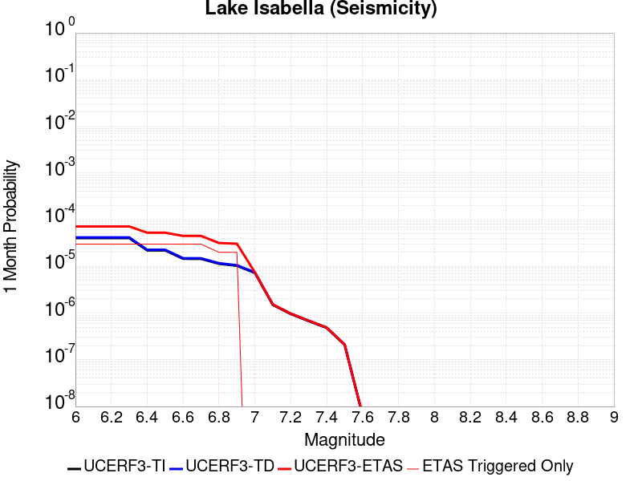 |  | 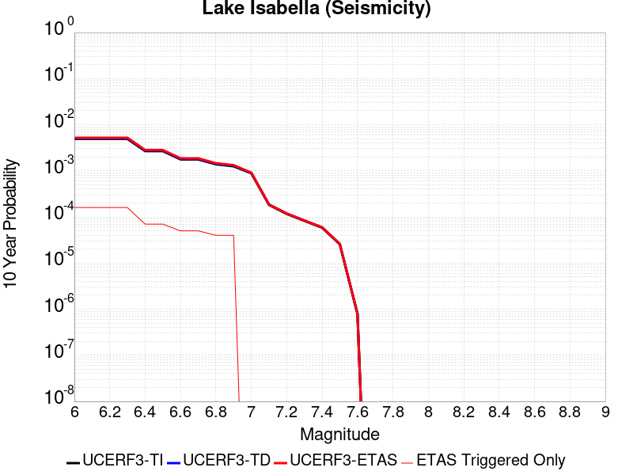 |

| Magnitude | 1 wk TI Prob | 1 wk TD Prob | 1 wk ETAS Prob | 1 wk ETAS/TD Gain | 1 wk ETAS Triggered Only | 1 mo TI Prob | 1 mo TD Prob | 1 mo ETAS Prob | 1 mo ETAS/TD Gain | 1 mo ETAS Triggered Only | 1 yr TI Prob | 1 yr TD Prob | 1 yr ETAS Prob | 1 yr ETAS/TD Gain | 1 yr ETAS Triggered Only | 10 yr TI Prob | 10 yr TD Prob | 10 yr ETAS Prob | 10 yr ETAS/TD Gain | 10 yr ETAS Triggered Only |
|-----|-----|-----|-----|-----|-----|-----|-----|-----|-----|-----|-----|-----|-----|-----|-----|-----|-----|-----|-----|-----|
| 6.0 | 9.431637E-6 | 9.741694E-6 | 3.97414E-5 | 4.0795164 | 3.0E-5 | 4.0420677E-5 | 4.1749525E-5 | 7.174827E-5 | 1.718541 | 3.0E-5 | 4.920106E-4 | 5.0819496E-4 | 6.0814415E-4 | 1.1966748 | 1.0E-4 | 0.004909227 | 0.005071621 | 0.0052308096 | 1.031388 | 1.6E-4 |
| 6.1 | 9.431637E-6 | 9.741694E-6 | 3.97414E-5 | 4.0795164 | 3.0E-5 | 4.0420677E-5 | 4.1749525E-5 | 7.174827E-5 | 1.718541 | 3.0E-5 | 4.920106E-4 | 5.0819496E-4 | 6.0814415E-4 | 1.1966748 | 1.0E-4 | 0.004909227 | 0.005071621 | 0.0052308096 | 1.031388 | 1.6E-4 |
| 6.2 | 9.431637E-6 | 9.741694E-6 | 3.97414E-5 | 4.0795164 | 3.0E-5 | 4.0420677E-5 | 4.1749525E-5 | 7.174827E-5 | 1.718541 | 3.0E-5 | 4.920106E-4 | 5.0819496E-4 | 6.0814415E-4 | 1.1966748 | 1.0E-4 | 0.004909227 | 0.005071621 | 0.0052308096 | 1.031388 | 1.6E-4 |
| 6.3 | 9.431637E-6 | 9.741694E-6 | 3.97414E-5 | 4.0795164 | 3.0E-5 | 4.0420677E-5 | 4.1749525E-5 | 7.174827E-5 | 1.718541 | 3.0E-5 | 4.920106E-4 | 5.0819496E-4 | 6.0814415E-4 | 1.1966748 | 1.0E-4 | 0.004909227 | 0.005071621 | 0.0052308096 | 1.031388 | 1.6E-4 |
| 6.4 | 5.144063E-6 | 5.3000977E-6 | 3.5299938E-5 | 6.660243 | 3.0E-5 | 2.2045799E-5 | 2.2714525E-5 | 5.2713844E-5 | 2.320711 | 3.0E-5 | 2.6837454E-4 | 2.765177E-4 | 3.1650663E-4 | 1.1446162 | 4.0E-5 | 0.0026805066 | 0.002762077 | 0.0028318835 | 1.0252732 | 7.0E-5 |
| 6.5 | 5.144063E-6 | 5.3000977E-6 | 3.5299938E-5 | 6.660243 | 3.0E-5 | 2.2045799E-5 | 2.2714525E-5 | 5.2713844E-5 | 2.320711 | 3.0E-5 | 2.6837454E-4 | 2.765177E-4 | 3.1650663E-4 | 1.1446162 | 4.0E-5 | 0.0026805066 | 0.002762077 | 0.0028318835 | 1.0252732 | 7.0E-5 |
| 6.6 | 3.4009804E-6 | 3.4987995E-6 | 3.3498694E-5 | 9.57434 | 3.0E-5 | 1.4575549E-5 | 1.4994778E-5 | 4.499433E-5 | 3.0006666 | 3.0E-5 | 1.7744285E-4 | 1.8254772E-4 | 2.1254225E-4 | 1.1643106 | 3.0E-5 | 0.0017730123 | 0.0018241355 | 0.0018740443 | 1.0273602 | 5.0E-5 |
| 6.7 | 3.3880428E-6 | 3.4856662E-6 | 3.348556E-5 | 9.606647 | 3.0E-5 | 1.4520103E-5 | 1.4938492E-5 | 4.4938046E-5 | 3.0082047 | 3.0E-5 | 1.767679E-4 | 1.8186258E-4 | 2.1185711E-4 | 1.1649297 | 3.0E-5 | 0.0017662736 | 0.0018172951 | 0.0018672043 | 1.0274634 | 5.0E-5 |
| 6.8 | 2.6582E-6 | 2.7337105E-6 | 2.2733655E-5 | 8.316044 | 2.0E-5 | 1.1392236E-5 | 1.1715857E-5 | 3.1715623E-5 | 2.707068 | 2.0E-5 | 1.3869164E-4 | 1.4263256E-4 | 1.6262972E-4 | 1.1402004 | 2.0E-5 | 0.0013860512 | 0.0014255423 | 0.0014654853 | 1.0280195 | 4.0E-5 |
| 6.9 | 2.406011E-6 | 2.474338E-6 | 2.2474289E-5 | 9.08295 | 2.0E-5 | 1.0311434E-5 | 1.0604271E-5 | 3.060406E-5 | 2.8860126 | 2.0E-5 | 1.2553448E-4 | 1.2910066E-4 | 1.4909808E-4 | 1.1548978 | 2.0E-5 | 0.0012546359 | 0.0012903863 | 0.0013303347 | 1.0309584 | 4.0E-5 |
| 7.0 | 1.6953097E-6 | 1.7429437E-6 | 1.7429437E-6 | 1.0 | 0.0 | 7.265593E-6 | 7.469743E-6 | 7.469743E-6 | 1.0 | 0.0 | 8.8455E-5 | 9.094137E-5 | 9.094137E-5 | 1.0 | 0.0 | 8.84198E-4 | 9.0914435E-4 | 9.0914435E-4 | 1.0 | 0.0 |
| 7.1 | 3.5013824E-7 | 3.571492E-7 | 3.571492E-7 | 1.0 | 0.0 | 1.5005916E-6 | 1.5306384E-6 | 1.5306384E-6 | 1.0 | 0.0 | 1.826955E-5 | 1.8635366E-5 | 1.8635366E-5 | 1.0 | 0.0 | 1.8268047E-4 | 1.863383E-4 | 1.863383E-4 | 1.0 | 0.0 |
| 7.2 | 2.2321095E-7 | 2.2750632E-7 | 2.2750632E-7 | 1.0 | 0.0 | 9.56618E-7 | 9.750268E-7 | 9.750268E-7 | 1.0 | 0.0 | 1.1646762E-5 | 1.1870887E-5 | 1.1870887E-5 | 1.0 | 0.0 | 1.1646151E-4 | 1.1870263E-4 | 1.1870263E-4 | 1.0 | 0.0 |
| 7.3 | 1.5760406E-7 | 1.6060963E-7 | 1.6060963E-7 | 1.0 | 0.0 | 6.7544585E-7 | 6.883268E-7 | 6.883268E-7 | 1.0 | 0.0 | 8.223522E-6 | 8.380347E-6 | 8.380347E-6 | 1.0 | 0.0 | 8.2232174E-5 | 8.3800376E-5 | 8.3800376E-5 | 1.0 | 0.0 |
| 7.4 | 1.1216497E-7 | 1.1431735E-7 | 1.1431735E-7 | 1.0 | 0.0 | 4.8070694E-7 | 4.8993144E-7 | 4.8993144E-7 | 1.0 | 0.0 | 5.852591E-6 | 5.964899E-6 | 5.964899E-6 | 1.0 | 0.0 | 5.8524372E-5 | 5.9647435E-5 | 5.9647435E-5 | 1.0 | 0.0 |
| 7.5 | 4.885185E-8 | 4.9787864E-8 | 4.9787864E-8 | 1.0 | 0.0 | 2.0936506E-7 | 2.1337654E-7 | 2.1337654E-7 | 1.0 | 0.0 | 2.5490165E-6 | 2.5978566E-6 | 2.5978566E-6 | 1.0 | 0.0 | 2.5489873E-5 | 2.597828E-5 | 2.597828E-5 | 1.0 | 0.0 |
| 7.6 | 1.504641E-9 | 1.5317939E-9 | 1.5317939E-9 | 1.0 | 0.0 | 6.4484613E-9 | 6.5648313E-9 | 6.5648313E-9 | 1.0 | 0.0 | 7.851001E-8 | 7.992682E-8 | 7.992682E-8 | 1.0 | 0.0 | 7.8509987E-7 | 7.992682E-7 | 7.992682E-7 | 1.0 | 0.0 |

## White Mountains
*[(top)](#table-of-contents)*

| 1 Week | 1 Month | 1 Year | 10 Year |
|-----|-----|-----|-----|
|  |  |  |  |

| Magnitude | 1 wk TI Prob | 1 wk TD Prob | 1 wk ETAS Prob | 1 wk ETAS/TD Gain | 1 wk ETAS Triggered Only | 1 mo TI Prob | 1 mo TD Prob | 1 mo ETAS Prob | 1 mo ETAS/TD Gain | 1 mo ETAS Triggered Only | 1 yr TI Prob | 1 yr TD Prob | 1 yr ETAS Prob | 1 yr ETAS/TD Gain | 1 yr ETAS Triggered Only | 10 yr TI Prob | 10 yr TD Prob | 10 yr ETAS Prob | 10 yr ETAS/TD Gain | 10 yr ETAS Triggered Only |
|-----|-----|-----|-----|-----|-----|-----|-----|-----|-----|-----|-----|-----|-----|-----|-----|-----|-----|-----|-----|-----|
| 6.0 | 3.503579E-5 | 3.3784425E-5 | 4.378409E-5 | 1.2959844 | 1.0E-5 | 1.5014476E-4 | 1.4478304E-4 | 1.747787E-4 | 1.2071766 | 3.0E-5 | 0.0018264796 | 0.0017614291 | 0.0018313058 | 1.0396705 | 7.0E-5 | 0.018115403 | 0.017487012 | 0.017634388 | 1.0084277 | 1.5E-4 |
| 6.1 | 3.503579E-5 | 3.3784425E-5 | 4.378409E-5 | 1.2959844 | 1.0E-5 | 1.5014476E-4 | 1.4478304E-4 | 1.747787E-4 | 1.2071766 | 3.0E-5 | 0.0018264796 | 0.0017614291 | 0.0018313058 | 1.0396705 | 7.0E-5 | 0.018115403 | 0.017487012 | 0.017634388 | 1.0084277 | 1.5E-4 |
| 6.2 | 3.503579E-5 | 3.3784425E-5 | 4.378409E-5 | 1.2959844 | 1.0E-5 | 1.5014476E-4 | 1.4478304E-4 | 1.747787E-4 | 1.2071766 | 3.0E-5 | 0.0018264796 | 0.0017614291 | 0.0018313058 | 1.0396705 | 7.0E-5 | 0.018115403 | 0.017487012 | 0.017634388 | 1.0084277 | 1.5E-4 |
| 6.3 | 1.7818425E-5 | 1.5916237E-5 | 2.5916079E-5 | 1.6282792 | 1.0E-5 | 7.636245E-5 | 6.821074E-5 | 9.820869E-5 | 1.4397835 | 3.0E-5 | 9.293162E-4 | 8.301636E-4 | 8.7013043E-4 | 1.0481433 | 4.0E-5 | 0.009254395 | 0.0082720835 | 0.008331587 | 1.0071933 | 6.0E-5 |
| 6.4 | 1.7818425E-5 | 1.5916237E-5 | 2.5916079E-5 | 1.6282792 | 1.0E-5 | 7.636245E-5 | 6.821074E-5 | 9.820869E-5 | 1.4397835 | 3.0E-5 | 9.293162E-4 | 8.301636E-4 | 8.7013043E-4 | 1.0481433 | 4.0E-5 | 0.009254395 | 0.0082720835 | 0.008331587 | 1.0071933 | 6.0E-5 |
| 6.5 | 1.3397557E-5 | 1.1336382E-5 | 1.1336382E-5 | 1.0 | 0.0 | 5.741684E-5 | 4.8583628E-5 | 6.858266E-5 | 1.4116414 | 2.0E-5 | 6.988258E-4 | 5.913521E-4 | 6.113403E-4 | 1.0338008 | 2.0E-5 | 0.006966323 | 0.0058984905 | 0.0059382548 | 1.0067414 | 4.0E-5 |
| 6.6 | 1.0818695E-5 | 8.625452E-6 | 8.625452E-6 | 1.0 | 0.0 | 4.6365014E-5 | 3.6965725E-5 | 4.6965353E-5 | 1.2705109 | 1.0E-5 | 5.6434784E-4 | 4.499691E-4 | 4.599646E-4 | 1.0222137 | 1.0E-5 | 0.005629168 | 0.0044910167 | 0.004510927 | 1.0044334 | 2.0E-5 |
| 6.7 | 9.067908E-6 | 6.8025106E-6 | 6.8025106E-6 | 1.0 | 0.0 | 3.8861883E-5 | 2.915331E-5 | 3.915302E-5 | 1.3430042 | 1.0E-5 | 4.7304068E-4 | 3.5488693E-4 | 3.6488337E-4 | 1.028168 | 1.0E-5 | 0.00472035 | 0.0035435192 | 0.0035634483 | 1.005624 | 2.0E-5 |
| 6.8 | 7.295947E-6 | 4.9364417E-6 | 4.9364417E-6 | 1.0 | 0.0 | 3.126797E-5 | 2.1156015E-5 | 2.1156015E-5 | 1.0 | 0.0 | 3.8062103E-4 | 2.5754515E-4 | 2.5754515E-4 | 1.0 | 0.0 | 0.0037996976 | 0.0025725798 | 0.002582554 | 1.0038772 | 1.0E-5 |
| 6.9 | 6.2243444E-6 | 3.832255E-6 | 3.832255E-6 | 1.0 | 0.0 | 2.6675489E-5 | 1.6423848E-5 | 1.6423848E-5 | 1.0 | 0.0 | 3.2472567E-4 | 1.9994254E-4 | 1.9994254E-4 | 1.0 | 0.0 | 0.0032425157 | 0.0019976792 | 0.0019976792 | 1.0 | 0.0 |
| 7.0 | 4.9878413E-6 | 2.6795697E-6 | 2.6795697E-6 | 1.0 | 0.0 | 2.1376287E-5 | 1.1483821E-5 | 1.1483821E-5 | 1.0 | 0.0 | 2.602252E-4 | 1.3980681E-4 | 1.3980681E-4 | 1.0 | 0.0 | 0.002599207 | 0.0013972148 | 0.0013972148 | 1.0 | 0.0 |
| 7.1 | 4.0252844E-6 | 1.88579E-6 | 1.88579E-6 | 1.0 | 0.0 | 1.7251105E-5 | 8.081933E-6 | 8.081933E-6 | 1.0 | 0.0 | 2.1001195E-4 | 9.839322E-5 | 9.839322E-5 | 1.0 | 0.0 | 0.0020981359 | 9.835094E-4 | 9.835094E-4 | 1.0 | 0.0 |
| 7.2 | 3.3284066E-6 | 1.2819944E-6 | 1.2819944E-6 | 1.0 | 0.0 | 1.4264522E-5 | 5.4942507E-6 | 5.4942507E-6 | 1.0 | 0.0 | 1.736567E-4 | 6.689055E-5 | 6.689055E-5 | 1.0 | 0.0 | 0.0017352107 | 6.6871423E-4 | 6.6871423E-4 | 1.0 | 0.0 |
| 7.3 | 2.458226E-6 | 6.057493E-7 | 6.057493E-7 | 1.0 | 0.0 | 1.0535211E-5 | 2.596066E-6 | 2.596066E-6 | 1.0 | 0.0 | 1.2825865E-4 | 3.1606683E-5 | 3.1606683E-5 | 1.0 | 0.0 | 0.0012818464 | 3.1602563E-4 | 3.1602563E-4 | 1.0 | 0.0 |
| 7.4 | 1.965953E-6 | 3.1091668E-7 | 3.1091668E-7 | 1.0 | 0.0 | 8.425486E-6 | 1.3324994E-6 | 1.3324994E-6 | 1.0 | 0.0 | 1.0257547E-4 | 1.622306E-5 | 1.622306E-5 | 1.0 | 0.0 | 0.0010252813 | 1.6221889E-4 | 1.6221889E-4 | 1.0 | 0.0 |
| 7.5 | 1.2014192E-6 | 1.824589E-7 | 1.824589E-7 | 1.0 | 0.0 | 5.148929E-6 | 7.819665E-7 | 7.819665E-7 | 1.0 | 0.0 | 6.2686406E-5 | 9.520401E-6 | 9.520401E-6 | 1.0 | 0.0 | 6.266873E-4 | 9.520002E-5 | 9.520002E-5 | 1.0 | 0.0 |
| 7.6 | 2.5612175E-7 | 4.8950795E-8 | 4.8950795E-8 | 1.0 | 0.0 | 1.0976642E-6 | 2.097891E-7 | 2.097891E-7 | 1.0 | 0.0 | 1.3363979E-5 | 2.5541797E-6 | 2.5541797E-6 | 1.0 | 0.0 | 1.3363175E-4 | 2.554154E-5 | 2.554154E-5 | 1.0 | 0.0 |

## Owens Valley
*[(top)](#table-of-contents)*

| 1 Week | 1 Month | 1 Year | 10 Year |
|-----|-----|-----|-----|
|  |  |  |  |

| Magnitude | 1 wk TI Prob | 1 wk TD Prob | 1 wk ETAS Prob | 1 wk ETAS/TD Gain | 1 wk ETAS Triggered Only | 1 mo TI Prob | 1 mo TD Prob | 1 mo ETAS Prob | 1 mo ETAS/TD Gain | 1 mo ETAS Triggered Only | 1 yr TI Prob | 1 yr TD Prob | 1 yr ETAS Prob | 1 yr ETAS/TD Gain | 1 yr ETAS Triggered Only | 10 yr TI Prob | 10 yr TD Prob | 10 yr ETAS Prob | 10 yr ETAS/TD Gain | 10 yr ETAS Triggered Only |
|-----|-----|-----|-----|-----|-----|-----|-----|-----|-----|-----|-----|-----|-----|-----|-----|-----|-----|-----|-----|-----|
| 6.0 | 4.83821E-5 | 3.627396E-6 | 2.3627323E-5 | 6.513577 | 2.0E-5 | 2.0733538E-4 | 1.5545897E-5 | 4.554543E-5 | 2.9297397 | 3.0E-5 | 0.002521386 | 1.8925584E-4 | 3.0923312E-4 | 1.6339424 | 1.2E-4 | 0.024929691 | 0.0019254381 | 0.0020651685 | 1.0725707 | 1.4E-4 |
| 6.1 | 4.83821E-5 | 3.627396E-6 | 2.3627323E-5 | 6.513577 | 2.0E-5 | 2.0733538E-4 | 1.5545897E-5 | 4.554543E-5 | 2.9297397 | 3.0E-5 | 0.002521386 | 1.8925584E-4 | 3.0923312E-4 | 1.6339424 | 1.2E-4 | 0.024929691 | 0.0019254381 | 0.0020651685 | 1.0725707 | 1.4E-4 |
| 6.2 | 4.83821E-5 | 3.627396E-6 | 2.3627323E-5 | 6.513577 | 2.0E-5 | 2.0733538E-4 | 1.5545897E-5 | 4.554543E-5 | 2.9297397 | 3.0E-5 | 0.002521386 | 1.8925584E-4 | 3.0923312E-4 | 1.6339424 | 1.2E-4 | 0.024929691 | 0.0019254381 | 0.0020651685 | 1.0725707 | 1.4E-4 |
| 6.3 | 3.953008E-5 | 3.1558448E-6 | 2.3155782E-5 | 7.3374276 | 2.0E-5 | 1.6940363E-4 | 1.3524983E-5 | 4.352458E-5 | 3.2180874 | 3.0E-5 | 0.002060538 | 1.6465495E-4 | 2.846352E-4 | 1.7286768 | 1.2E-4 | 0.020415364 | 0.0016594394 | 0.0017992071 | 1.0842259 | 1.4E-4 |
| 6.4 | 3.953008E-5 | 3.1558448E-6 | 2.3155782E-5 | 7.3374276 | 2.0E-5 | 1.6940363E-4 | 1.3524983E-5 | 4.352458E-5 | 3.2180874 | 3.0E-5 | 0.002060538 | 1.6465495E-4 | 2.846352E-4 | 1.7286768 | 1.2E-4 | 0.020415364 | 0.0016594394 | 0.0017992071 | 1.0842259 | 1.4E-4 |
| 6.5 | 3.457342E-5 | 2.9718876E-6 | 2.2971828E-5 | 7.7297096 | 2.0E-5 | 1.4816338E-4 | 1.2736603E-5 | 4.273622E-5 | 3.355386 | 3.0E-5 | 0.0018023965 | 1.5505782E-4 | 2.6504076E-4 | 1.7093028 | 1.1E-4 | 0.017878477 | 0.0015558768 | 0.0016856745 | 1.0834242 | 1.3E-4 |
| 6.6 | 3.1127765E-5 | 2.8746979E-6 | 2.2874641E-5 | 7.957233 | 2.0E-5 | 1.3339789E-4 | 1.232008E-5 | 4.231971E-5 | 3.4350193 | 3.0E-5 | 0.0016229092 | 1.4998733E-4 | 2.5997084E-4 | 1.7332853 | 1.1E-4 | 0.016111081 | 0.001501365 | 0.0016311698 | 1.0864578 | 1.3E-4 |
| 6.7 | 2.806885E-5 | 2.810566E-6 | 2.281051E-5 | 8.115984 | 2.0E-5 | 1.2028952E-4 | 1.2045231E-5 | 4.204487E-5 | 3.4905822 | 3.0E-5 | 0.001463541 | 1.4664151E-4 | 2.5662538E-4 | 1.7500187 | 1.1E-4 | 0.014539397 | 0.001465831 | 0.0015956404 | 1.0885569 | 1.3E-4 |
| 6.8 | 2.524524E-5 | 2.235501E-6 | 2.2235456E-5 | 9.946521 | 2.0E-5 | 1.0818939E-4 | 9.5806845E-6 | 3.9580398E-5 | 4.1312704 | 3.0E-5 | 0.0013164099 | 1.1663889E-4 | 2.2662606E-4 | 1.9429717 | 1.1E-4 | 0.01308639 | 0.0011660501 | 0.0012958986 | 1.1113575 | 1.3E-4 |
| 6.9 | 2.2704568E-5 | 1.6082656E-6 | 2.1608234E-5 | 13.435737 | 2.0E-5 | 9.730166E-5 | 6.8925488E-6 | 3.6892343E-5 | 5.352496 | 3.0E-5 | 0.0011840039 | 8.391357E-5 | 1.9390434E-4 | 2.3107626 | 1.1E-4 | 0.011777153 | 8.390308E-4 | 9.689217E-4 | 1.1548107 | 1.3E-4 |
| 7.0 | 2.0871712E-5 | 1.5396373E-6 | 2.1539607E-5 | 13.990052 | 2.0E-5 | 8.944713E-5 | 6.598429E-6 | 3.659823E-5 | 5.546507 | 3.0E-5 | 0.0010884746 | 8.033293E-5 | 1.9032409E-4 | 2.3691914 | 1.1E-4 | 0.010831586 | 8.0321095E-4 | 9.331065E-4 | 1.1617204 | 1.3E-4 |
| 7.1 | 1.944928E-5 | 1.3864965E-6 | 2.138647E-5 | 15.424828 | 2.0E-5 | 8.335139E-5 | 5.942114E-6 | 3.5941935E-5 | 6.0486784 | 3.0E-5 | 0.0010143308 | 7.2342846E-5 | 1.8233489E-4 | 2.5204272 | 1.1E-4 | 0.010097133 | 7.233511E-4 | 8.53257E-4 | 1.1795892 | 1.3E-4 |
| 7.2 | 1.7876306E-5 | 1.2489834E-6 | 2.1248958E-5 | 17.013004 | 2.0E-5 | 7.6610486E-5 | 5.3527747E-6 | 3.5352616E-5 | 6.60454 | 3.0E-5 | 9.3233347E-4 | 6.516809E-5 | 1.7516092E-4 | 2.6878326 | 1.1E-4 | 0.009284316 | 6.516274E-4 | 7.815427E-4 | 1.1993705 | 1.3E-4 |
| 7.3 | 1.2618672E-5 | 1.1115851E-6 | 2.1111562E-5 | 18.992304 | 2.0E-5 | 5.40789E-5 | 4.763928E-6 | 3.4763783E-5 | 7.297295 | 3.0E-5 | 6.582117E-4 | 5.799928E-5 | 1.5799348E-4 | 2.7240593 | 1.0E-4 | 0.0065626553 | 5.799741E-4 | 6.999045E-4 | 1.2067858 | 1.2E-4 |
| 7.4 | 7.4874442E-6 | 8.549184E-7 | 2.08549E-5 | 24.394024 | 2.0E-5 | 3.208865E-5 | 3.663931E-6 | 2.3663857E-5 | 6.458598 | 2.0E-5 | 3.906093E-4 | 4.4607452E-5 | 1.2460389E-4 | 2.7933424 | 8.0E-5 | 0.003899234 | 4.4607726E-4 | 5.360371E-4 | 1.2016687 | 9.0E-5 |
| 7.5 | 2.4734156E-6 | 6.068976E-7 | 2.0606885E-5 | 33.95447 | 2.0E-5 | 1.060031E-5 | 2.6009868E-6 | 2.2600934E-5 | 8.689369 | 2.0E-5 | 1.2905113E-4 | 3.1666557E-5 | 1.01664344E-4 | 3.2104638 | 7.0E-5 | 0.0012897621 | 3.1662078E-4 | 3.9659545E-4 | 1.2525882 | 8.0E-5 |
| 7.6 | 1.1328841E-6 | 3.1967096E-7 | 1.0319668E-5 | 32.282158 | 1.0E-5 | 4.8552088E-6 | 1.3700177E-6 | 1.1370004E-5 | 8.299166 | 1.0E-5 | 5.9110564E-5 | 1.6679838E-5 | 5.667917E-5 | 3.3980646 | 4.0E-5 | 5.9094845E-4 | 1.6678606E-4 | 2.1677771E-4 | 1.2997353 | 5.0E-5 |
| 7.7 | 4.8613185E-7 | 8.965384E-8 | 1.0089653E-5 | 112.54011 | 1.0E-5 | 2.0834207E-6 | 3.842307E-7 | 1.0384227E-5 | 27.026022 | 1.0E-5 | 2.536535E-5 | 4.677999E-6 | 2.4677905E-5 | 5.275312 | 2.0E-5 | 2.5362454E-4 | 4.6779078E-5 | 7.677767E-5 | 1.6412823 | 3.0E-5 |

## Manix-Afton Hills
*[(top)](#table-of-contents)*

| 1 Week | 1 Month | 1 Year | 10 Year |
|-----|-----|-----|-----|
|  |  |  | 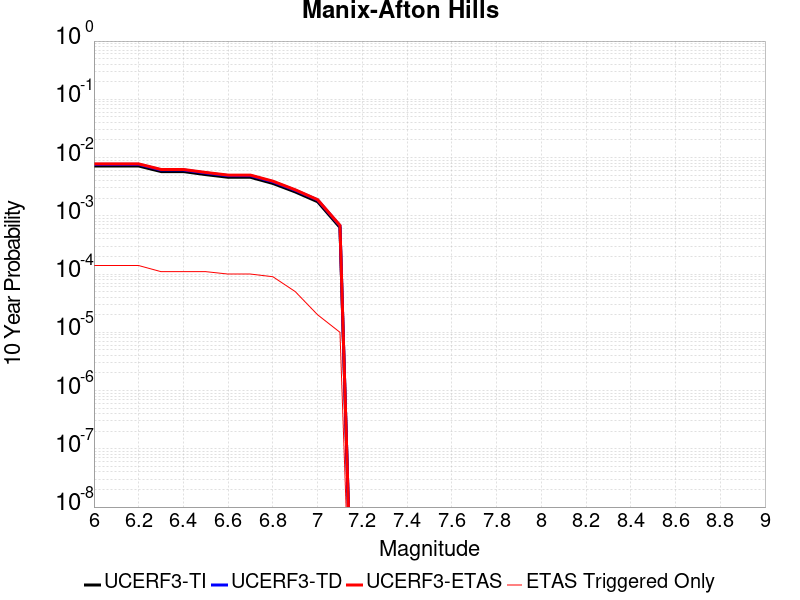 |

| Magnitude | 1 wk TI Prob | 1 wk TD Prob | 1 wk ETAS Prob | 1 wk ETAS/TD Gain | 1 wk ETAS Triggered Only | 1 mo TI Prob | 1 mo TD Prob | 1 mo ETAS Prob | 1 mo ETAS/TD Gain | 1 mo ETAS Triggered Only | 1 yr TI Prob | 1 yr TD Prob | 1 yr ETAS Prob | 1 yr ETAS/TD Gain | 1 yr ETAS Triggered Only | 10 yr TI Prob | 10 yr TD Prob | 10 yr ETAS Prob | 10 yr ETAS/TD Gain | 10 yr ETAS Triggered Only |
|-----|-----|-----|-----|-----|-----|-----|-----|-----|-----|-----|-----|-----|-----|-----|-----|-----|-----|-----|-----|-----|
| 6.0 | 1.3783202E-5 | 1.4711221E-5 | 1.4711221E-5 | 1.0 | 0.0 | 5.906953E-5 | 6.304667E-5 | 8.304541E-5 | 1.3172053 | 2.0E-5 | 7.189342E-4 | 7.673403E-4 | 8.372866E-4 | 1.0911542 | 7.0E-5 | 0.0071661277 | 0.007648664 | 0.007787593 | 1.0181638 | 1.4E-4 |
| 6.1 | 1.3783202E-5 | 1.4711221E-5 | 1.4711221E-5 | 1.0 | 0.0 | 5.906953E-5 | 6.304667E-5 | 8.304541E-5 | 1.3172053 | 2.0E-5 | 7.189342E-4 | 7.673403E-4 | 8.372866E-4 | 1.0911542 | 7.0E-5 | 0.0071661277 | 0.007648664 | 0.007787593 | 1.0181638 | 1.4E-4 |
| 6.2 | 1.3783202E-5 | 1.4711221E-5 | 1.4711221E-5 | 1.0 | 0.0 | 5.906953E-5 | 6.304667E-5 | 8.304541E-5 | 1.3172053 | 2.0E-5 | 7.189342E-4 | 7.673403E-4 | 8.372866E-4 | 1.0911542 | 7.0E-5 | 0.0071661277 | 0.007648664 | 0.007787593 | 1.0181638 | 1.4E-4 |
| 6.3 | 1.10494875E-5 | 1.1793241E-5 | 1.1793241E-5 | 1.0 | 0.0 | 4.7354086E-5 | 5.054154E-5 | 6.0541035E-5 | 1.197847 | 1.0E-5 | 5.763835E-4 | 6.151799E-4 | 6.651491E-4 | 1.0812271 | 5.0E-5 | 0.005748908 | 0.00613581 | 0.0062451353 | 1.0178175 | 1.1E-4 |
| 6.4 | 1.10494875E-5 | 1.1793241E-5 | 1.1793241E-5 | 1.0 | 0.0 | 4.7354086E-5 | 5.054154E-5 | 6.0541035E-5 | 1.197847 | 1.0E-5 | 5.763835E-4 | 6.151799E-4 | 6.651491E-4 | 1.0812271 | 5.0E-5 | 0.005748908 | 0.00613581 | 0.0062451353 | 1.0178175 | 1.1E-4 |
| 6.5 | 9.788949E-6 | 1.0454414E-5 | 1.0454414E-5 | 1.0 | 0.0 | 4.1951964E-5 | 4.4803914E-5 | 5.4803466E-5 | 1.2231848 | 1.0E-5 | 5.1064545E-4 | 5.4536044E-4 | 5.953332E-4 | 1.0916325 | 5.0E-5 | 0.0050947363 | 0.005441148 | 0.005550549 | 1.0201063 | 1.1E-4 |
| 6.6 | 8.810006E-6 | 9.413714E-6 | 9.413714E-6 | 1.0 | 0.0 | 3.775662E-5 | 4.0343915E-5 | 5.034351E-5 | 1.2478589 | 1.0E-5 | 4.5958988E-4 | 4.9108535E-4 | 5.310657E-4 | 1.0814122 | 4.0E-5 | 0.0045864056 | 0.004900884 | 0.0050003934 | 1.0203044 | 1.0E-4 |
| 6.7 | 8.80128E-6 | 9.404193E-6 | 9.404193E-6 | 1.0 | 0.0 | 3.7719226E-5 | 4.0303115E-5 | 5.030271E-5 | 1.2481098 | 1.0E-5 | 4.591348E-4 | 4.9058883E-4 | 5.305692E-4 | 1.0814947 | 4.0E-5 | 0.004581874 | 0.0048959404 | 0.004995451 | 1.0203251 | 1.0E-4 |
| 6.8 | 6.8994877E-6 | 7.3801443E-6 | 7.3801443E-6 | 1.0 | 0.0 | 2.9568899E-5 | 3.1628853E-5 | 4.1628537E-5 | 1.316157 | 1.0E-5 | 3.5994186E-4 | 3.850214E-4 | 4.25006E-4 | 1.1038504 | 4.0E-5 | 0.003593594 | 0.0038443485 | 0.0039340025 | 1.023321 | 9.0E-5 |
| 6.9 | 4.9328037E-6 | 5.2710093E-6 | 5.2710093E-6 | 1.0 | 0.0 | 2.1140417E-5 | 2.258988E-5 | 3.2589654E-5 | 1.442666 | 1.0E-5 | 2.5735417E-4 | 2.7500323E-4 | 2.9499774E-4 | 1.0727065 | 2.0E-5 | 0.0025705635 | 0.0027472344 | 0.0027970972 | 1.0181501 | 5.0E-5 |
| 7.0 | 3.347973E-6 | 3.5900646E-6 | 3.5900646E-6 | 1.0 | 0.0 | 1.4348378E-5 | 1.5385924E-5 | 2.5385769E-5 | 1.6499348 | 1.0E-5 | 1.746775E-4 | 1.8731161E-4 | 1.9730974E-4 | 1.0533769 | 1.0E-5 | 0.0017454025 | 0.00187194 | 0.0018919025 | 1.0106641 | 2.0E-5 |
| 7.1 | 1.2073567E-6 | 1.2934943E-6 | 1.2934943E-6 | 1.0 | 0.0 | 5.1743755E-6 | 5.5435444E-6 | 1.5543488E-5 | 2.80389 | 1.0E-5 | 6.29962E-5 | 6.74922E-5 | 7.7491524E-5 | 1.1481553 | 1.0E-5 | 6.297835E-4 | 6.7487714E-4 | 6.848704E-4 | 1.0148075 | 1.0E-5 |

## Santa Rosa Island
*[(top)](#table-of-contents)*

| 1 Week | 1 Month | 1 Year | 10 Year |
|-----|-----|-----|-----|
|  |  |  |  |

| Magnitude | 1 wk TI Prob | 1 wk TD Prob | 1 wk ETAS Prob | 1 wk ETAS/TD Gain | 1 wk ETAS Triggered Only | 1 mo TI Prob | 1 mo TD Prob | 1 mo ETAS Prob | 1 mo ETAS/TD Gain | 1 mo ETAS Triggered Only | 1 yr TI Prob | 1 yr TD Prob | 1 yr ETAS Prob | 1 yr ETAS/TD Gain | 1 yr ETAS Triggered Only | 10 yr TI Prob | 10 yr TD Prob | 10 yr ETAS Prob | 10 yr ETAS/TD Gain | 10 yr ETAS Triggered Only |
|-----|-----|-----|-----|-----|-----|-----|-----|-----|-----|-----|-----|-----|-----|-----|-----|-----|-----|-----|-----|-----|
| 6.0 | 4.1143165E-5 | 4.7092042E-5 | 6.70911E-5 | 1.4246802 | 2.0E-5 | 1.7631594E-4 | 2.0180854E-4 | 2.218045E-4 | 1.0990838 | 2.0E-5 | 0.002144533 | 0.0024544473 | 0.0025043245 | 1.0203211 | 5.0E-5 | 0.021239553 | 0.024294013 | 0.024401342 | 1.0044179 | 1.1E-4 |
| 6.1 | 2.1061249E-5 | 2.3865383E-5 | 3.3865144E-5 | 1.419007 | 1.0E-5 | 9.0259375E-5 | 1.0227637E-4 | 1.12275346E-4 | 1.0977643 | 1.0E-5 | 0.0010983539 | 0.0012445324 | 0.0012645075 | 1.0160503 | 2.0E-5 | 0.01092941 | 0.012378667 | 0.012437924 | 1.0047871 | 6.0E-5 |
| 6.2 | 2.1061249E-5 | 2.3865383E-5 | 3.3865144E-5 | 1.419007 | 1.0E-5 | 9.0259375E-5 | 1.0227637E-4 | 1.12275346E-4 | 1.0977643 | 1.0E-5 | 0.0010983539 | 0.0012445324 | 0.0012645075 | 1.0160503 | 2.0E-5 | 0.01092941 | 0.012378667 | 0.012437924 | 1.0047871 | 6.0E-5 |
| 6.3 | 1.5158236E-5 | 1.7074708E-5 | 2.7074537E-5 | 1.5856516 | 1.0E-5 | 6.496225E-5 | 7.317533E-5 | 8.31746E-5 | 1.136648 | 1.0E-5 | 7.906284E-4 | 8.905574E-4 | 9.1053965E-4 | 1.0224378 | 2.0E-5 | 0.007878214 | 0.008871138 | 0.008920695 | 1.0055863 | 5.0E-5 |
| 6.4 | 1.2341918E-5 | 1.3853143E-5 | 2.3853005E-5 | 1.7218479 | 1.0E-5 | 5.2892858E-5 | 5.9369308E-5 | 6.936871E-5 | 1.1684272 | 1.0E-5 | 6.437803E-4 | 7.225897E-4 | 7.4257527E-4 | 1.0276582 | 2.0E-5 | 0.006419184 | 0.0072032386 | 0.0072429506 | 1.0055131 | 4.0E-5 |
| 6.5 | 9.061158E-6 | 1.0117188E-5 | 2.0117088E-5 | 1.9884069 | 1.0E-5 | 3.883296E-5 | 4.335869E-5 | 5.3358257E-5 | 1.2306243 | 1.0E-5 | 4.726887E-4 | 5.277695E-4 | 5.377642E-4 | 1.0189377 | 1.0E-5 | 0.004716845 | 0.0052656992 | 0.005295541 | 1.0056672 | 3.0E-5 |
| 6.6 | 7.5461685E-6 | 8.400861E-6 | 1.8400777E-5 | 2.190344 | 1.0E-5 | 3.2340322E-5 | 3.6003217E-5 | 4.6002857E-5 | 1.277743 | 1.0E-5 | 3.936723E-4 | 4.382553E-4 | 4.482509E-4 | 1.0228077 | 1.0E-5 | 0.003929756 | 0.0043743397 | 0.0043942523 | 1.0045521 | 2.0E-5 |
| 6.7 | 5.5023775E-6 | 6.0874677E-6 | 6.0874677E-6 | 1.0 | 0.0 | 2.3581404E-5 | 2.6088905E-5 | 2.6088905E-5 | 1.0 | 0.0 | 2.8706578E-4 | 3.1758935E-4 | 3.1758935E-4 | 1.0 | 0.0 | 0.0028669522 | 0.0031716768 | 0.0031716768 | 1.0 | 0.0 |
| 6.8 | 3.7351679E-6 | 4.0831915E-6 | 4.0831915E-6 | 1.0 | 0.0 | 1.6007763E-5 | 1.749929E-5 | 1.749929E-5 | 1.0 | 0.0 | 1.948771E-4 | 2.1303551E-4 | 2.1303551E-4 | 1.0 | 0.0 | 0.0019470629 | 0.002128558 | 0.002128558 | 1.0 | 0.0 |
| 6.9 | 2.456366E-6 | 2.6292953E-6 | 2.6292953E-6 | 1.0 | 0.0 | 1.0527241E-5 | 1.126836E-5 | 1.126836E-5 | 1.0 | 0.0 | 1.2816161E-4 | 1.3718367E-4 | 1.3718367E-4 | 1.0 | 0.0 | 0.0012808773 | 0.0013709929 | 0.0013709929 | 1.0 | 0.0 |
| 7.0 | 2.3245157E-6 | 2.482801E-6 | 2.482801E-6 | 1.0 | 0.0 | 9.962172E-6 | 1.0640532E-5 | 1.0640532E-5 | 1.0 | 0.0 | 1.2128269E-4 | 1.295408E-4 | 1.295408E-4 | 1.0 | 0.0 | 0.0012121652 | 0.0012946551 | 0.0012946551 | 1.0 | 0.0 |
| 7.1 | 2.2248344E-6 | 2.3732712E-6 | 2.3732712E-6 | 1.0 | 0.0 | 9.53497E-6 | 1.0171123E-5 | 1.0171123E-5 | 1.0 | 0.0 | 1.1608207E-4 | 1.238264E-4 | 1.238264E-4 | 1.0 | 0.0 | 0.0011602144 | 0.001237576 | 0.001237576 | 1.0 | 0.0 |
| 7.2 | 2.1350402E-6 | 2.2761742E-6 | 2.2761742E-6 | 1.0 | 0.0 | 9.150141E-6 | 9.7549955E-6 | 9.7549955E-6 | 1.0 | 0.0 | 1.1139726E-4 | 1.1876062E-4 | 1.1876062E-4 | 1.0 | 0.0 | 0.0011134144 | 0.0011869734 | 0.0011869734 | 1.0 | 0.0 |
| 7.3 | 1.9793572E-6 | 2.1087376E-6 | 2.1087376E-6 | 1.0 | 0.0 | 8.482932E-6 | 9.037415E-6 | 9.037415E-6 | 1.0 | 0.0 | 1.032748E-4 | 1.10024994E-4 | 1.10024994E-4 | 1.0 | 0.0 | 0.0010322682 | 0.001099707 | 0.001099707 | 1.0 | 0.0 |
| 7.4 | 1.6951194E-6 | 1.804589E-6 | 1.804589E-6 | 1.0 | 0.0 | 7.264777E-6 | 7.73393E-6 | 7.73393E-6 | 1.0 | 0.0 | 8.844508E-5 | 9.4156545E-5 | 9.4156545E-5 | 1.0 | 0.0 | 8.840988E-4 | 9.411682E-4 | 9.411682E-4 | 1.0 | 0.0 |
| 7.5 | 8.987207E-7 | 9.51229E-7 | 9.51229E-7 | 1.0 | 0.0 | 3.8516546E-6 | 4.0766895E-6 | 4.0766895E-6 | 1.0 | 0.0 | 4.6892885E-5 | 4.9632577E-5 | 4.9632577E-5 | 1.0 | 0.0 | 4.688299E-4 | 4.9621606E-4 | 4.9621606E-4 | 1.0 | 0.0 |
| 7.6 | 3.8783037E-7 | 4.052958E-7 | 4.052958E-7 | 1.0 | 0.0 | 1.6621291E-6 | 1.7369808E-6 | 1.7369808E-6 | 1.0 | 0.0 | 2.0236233E-5 | 2.1147544E-5 | 2.1147544E-5 | 1.0 | 0.0 | 2.023439E-4 | 2.1145596E-4 | 2.1145596E-4 | 1.0 | 0.0 |
| 7.7 | 6.181804E-8 | 6.3390665E-8 | 6.3390665E-8 | 1.0 | 0.0 | 2.6493444E-7 | 2.7167425E-7 | 2.7167425E-7 | 1.0 | 0.0 | 3.225572E-6 | 3.307629E-6 | 3.307629E-6 | 1.0 | 0.0 | 3.225525E-5 | 3.3075805E-5 | 3.3075805E-5 | 1.0 | 0.0 |
| 7.8 | 1.3704449E-9 | 1.3964188E-9 | 1.3964188E-9 | 1.0 | 0.0 | 5.873335E-9 | 5.984652E-9 | 5.984652E-9 | 1.0 | 0.0 | 7.1507856E-8 | 7.286314E-8 | 7.286314E-8 | 1.0 | 0.0 | 7.1507833E-7 | 7.286312E-7 | 7.286312E-7 | 1.0 | 0.0 |

## Cleghorn Pass
*[(top)](#table-of-contents)*

| 1 Week | 1 Month | 1 Year | 10 Year |
|-----|-----|-----|-----|
|  |  | 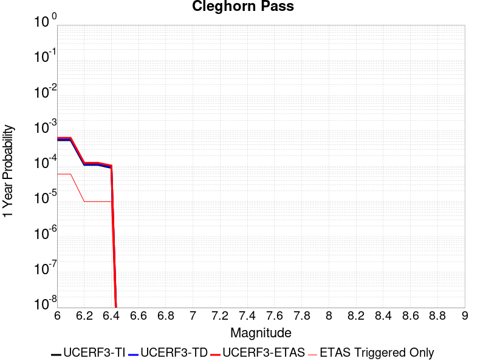 |  |

| Magnitude | 1 wk TI Prob | 1 wk TD Prob | 1 wk ETAS Prob | 1 wk ETAS/TD Gain | 1 wk ETAS Triggered Only | 1 mo TI Prob | 1 mo TD Prob | 1 mo ETAS Prob | 1 mo ETAS/TD Gain | 1 mo ETAS Triggered Only | 1 yr TI Prob | 1 yr TD Prob | 1 yr ETAS Prob | 1 yr ETAS/TD Gain | 1 yr ETAS Triggered Only | 10 yr TI Prob | 10 yr TD Prob | 10 yr ETAS Prob | 10 yr ETAS/TD Gain | 10 yr ETAS Triggered Only |
|-----|-----|-----|-----|-----|-----|-----|-----|-----|-----|-----|-----|-----|-----|-----|-----|-----|-----|-----|-----|-----|
| 6.0 | 1.0522846E-5 | 1.1040714E-5 | 1.1040714E-5 | 1.0 | 0.0 | 4.509713E-5 | 4.7316782E-5 | 4.7316782E-5 | 1.0 | 0.0 | 5.4891926E-4 | 5.759822E-4 | 6.359476E-4 | 1.1041099 | 6.0E-5 | 0.0054756533 | 0.005750059 | 0.0058693695 | 1.0207493 | 1.2E-4 |
| 6.1 | 1.0522846E-5 | 1.1040714E-5 | 1.1040714E-5 | 1.0 | 0.0 | 4.509713E-5 | 4.7316782E-5 | 4.7316782E-5 | 1.0 | 0.0 | 5.4891926E-4 | 5.759822E-4 | 6.359476E-4 | 1.1041099 | 6.0E-5 | 0.0054756533 | 0.005750059 | 0.0058693695 | 1.0207493 | 1.2E-4 |
| 6.2 | 2.1045846E-6 | 2.2082168E-6 | 2.2082168E-6 | 1.0 | 0.0 | 9.019617E-6 | 9.463776E-6 | 9.463776E-6 | 1.0 | 0.0 | 1.098083E-4 | 1.1521958E-4 | 1.2521842E-4 | 1.0867808 | 1.0E-5 | 0.0010975406 | 0.0011520098 | 0.0011919637 | 1.0346819 | 4.0E-5 |
| 6.3 | 2.1045846E-6 | 2.2082168E-6 | 2.2082168E-6 | 1.0 | 0.0 | 9.019617E-6 | 9.463776E-6 | 9.463776E-6 | 1.0 | 0.0 | 1.098083E-4 | 1.1521958E-4 | 1.2521842E-4 | 1.0867808 | 1.0E-5 | 0.0010975406 | 0.0011520098 | 0.0011919637 | 1.0346819 | 4.0E-5 |
| 6.4 | 1.7259927E-6 | 1.8108889E-6 | 1.8108889E-6 | 1.0 | 0.0 | 7.3970905E-6 | 7.760952E-6 | 7.760952E-6 | 1.0 | 0.0 | 9.005586E-5 | 9.4489595E-5 | 1.0448865E-4 | 1.1058217 | 1.0E-5 | 9.001937E-4 | 9.4489596E-4 | 9.848581E-4 | 1.0422927 | 4.0E-5 |

## San Andreas (North Branch Mill Creek)
*[(top)](#table-of-contents)*

| 1 Week | 1 Month | 1 Year | 10 Year |
|-----|-----|-----|-----|
|  |  | 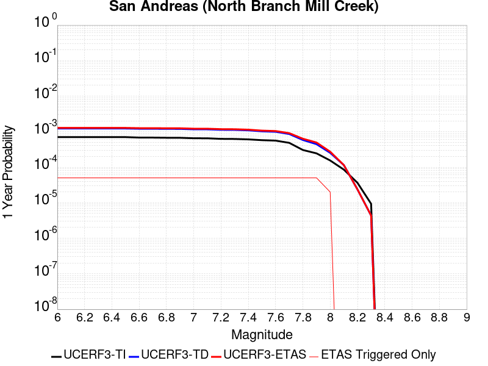 |  |

| Magnitude | 1 wk TI Prob | 1 wk TD Prob | 1 wk ETAS Prob | 1 wk ETAS/TD Gain | 1 wk ETAS Triggered Only | 1 mo TI Prob | 1 mo TD Prob | 1 mo ETAS Prob | 1 mo ETAS/TD Gain | 1 mo ETAS Triggered Only | 1 yr TI Prob | 1 yr TD Prob | 1 yr ETAS Prob | 1 yr ETAS/TD Gain | 1 yr ETAS Triggered Only | 10 yr TI Prob | 10 yr TD Prob | 10 yr ETAS Prob | 10 yr ETAS/TD Gain | 10 yr ETAS Triggered Only |
|-----|-----|-----|-----|-----|-----|-----|-----|-----|-----|-----|-----|-----|-----|-----|-----|-----|-----|-----|-----|-----|
| 6.0 | 1.3461156E-5 | 2.3506776E-5 | 3.350654E-5 | 1.4253993 | 1.0E-5 | 5.7689394E-5 | 1.0073945E-4 | 1.4073543E-4 | 1.3970239 | 4.0E-5 | 7.02142E-4 | 0.0012258161 | 0.0012757548 | 1.0407392 | 5.0E-5 | 0.0069992766 | 0.012233093 | 0.012351626 | 1.0096895 | 1.2E-4 |
| 6.1 | 1.3461156E-5 | 2.3506776E-5 | 3.350654E-5 | 1.4253993 | 1.0E-5 | 5.7689394E-5 | 1.0073945E-4 | 1.4073543E-4 | 1.3970239 | 4.0E-5 | 7.02142E-4 | 0.0012258161 | 0.0012757548 | 1.0407392 | 5.0E-5 | 0.0069992766 | 0.012233093 | 0.012351626 | 1.0096895 | 1.2E-4 |
| 6.2 | 1.3461156E-5 | 2.3506776E-5 | 3.350654E-5 | 1.4253993 | 1.0E-5 | 5.7689394E-5 | 1.0073945E-4 | 1.4073543E-4 | 1.3970239 | 4.0E-5 | 7.02142E-4 | 0.0012258161 | 0.0012757548 | 1.0407392 | 5.0E-5 | 0.0069992766 | 0.012233093 | 0.012351626 | 1.0096895 | 1.2E-4 |
| 6.3 | 1.3461156E-5 | 2.3506776E-5 | 3.350654E-5 | 1.4253993 | 1.0E-5 | 5.7689394E-5 | 1.0073945E-4 | 1.4073543E-4 | 1.3970239 | 4.0E-5 | 7.02142E-4 | 0.0012258161 | 0.0012757548 | 1.0407392 | 5.0E-5 | 0.0069992766 | 0.012233093 | 0.012351626 | 1.0096895 | 1.2E-4 |
| 6.4 | 1.3461156E-5 | 2.3506776E-5 | 3.350654E-5 | 1.4253993 | 1.0E-5 | 5.7689394E-5 | 1.0073945E-4 | 1.4073543E-4 | 1.3970239 | 4.0E-5 | 7.02142E-4 | 0.0012258161 | 0.0012757548 | 1.0407392 | 5.0E-5 | 0.0069992766 | 0.012233093 | 0.012351626 | 1.0096895 | 1.2E-4 |
| 6.5 | 1.3450706E-5 | 2.3495735E-5 | 3.34955E-5 | 1.4255991 | 1.0E-5 | 5.764461E-5 | 1.0069214E-4 | 1.4068812E-4 | 1.3972105 | 4.0E-5 | 7.0159714E-4 | 0.0012252406 | 0.0012751794 | 1.0407583 | 5.0E-5 | 0.006993862 | 0.012227403 | 0.012345936 | 1.009694 | 1.2E-4 |
| 6.6 | 1.3074523E-5 | 2.3110017E-5 | 3.3109784E-5 | 1.4327028 | 1.0E-5 | 5.6032466E-5 | 9.9039185E-5 | 1.3903523E-4 | 1.4038405 | 4.0E-5 | 6.8198174E-4 | 0.0012051383 | 0.001255078 | 1.041439 | 5.0E-5 | 0.006798926 | 0.0120285675 | 0.012147124 | 1.0098562 | 1.2E-4 |
| 6.7 | 1.3050216E-5 | 2.3085311E-5 | 3.308508E-5 | 1.4331659 | 1.0E-5 | 5.59283E-5 | 9.893332E-5 | 1.3892936E-4 | 1.4042728 | 4.0E-5 | 6.8071426E-4 | 0.0012038508 | 0.0012537906 | 1.0414834 | 5.0E-5 | 0.0067863287 | 0.012015832 | 0.01213439 | 1.0098668 | 1.2E-4 |
| 6.8 | 1.29049395E-5 | 2.293372E-5 | 3.293349E-5 | 1.4360292 | 1.0E-5 | 5.530571E-5 | 9.828369E-5 | 1.3827975E-4 | 1.4069451 | 4.0E-5 | 6.73139E-4 | 0.0011959502 | 0.0012458904 | 1.0417577 | 5.0E-5 | 0.0067110364 | 0.011937677 | 0.012056244 | 1.0099322 | 1.2E-4 |
| 6.9 | 1.2867369E-5 | 2.2893122E-5 | 3.2892895E-5 | 1.4368024 | 1.0E-5 | 5.51447E-5 | 9.810971E-5 | 1.3810578E-4 | 1.4076668 | 4.0E-5 | 6.711799E-4 | 0.0011938344 | 0.0012437747 | 1.0418319 | 5.0E-5 | 0.006691564 | 0.011916745 | 0.012035315 | 1.0099499 | 1.2E-4 |
| 7.0 | 1.2495996E-5 | 2.2293154E-5 | 3.2292934E-5 | 1.4485582 | 1.0E-5 | 5.3553173E-5 | 9.5538606E-5 | 1.3553479E-4 | 1.418639 | 4.0E-5 | 6.518148E-4 | 0.0011625647 | 0.0012125066 | 1.0429584 | 5.0E-5 | 0.0064990623 | 0.011607327 | 0.011725934 | 1.0102183 | 1.2E-4 |
| 7.1 | 1.2452067E-5 | 2.2238226E-5 | 3.2238004E-5 | 1.4496661 | 1.0E-5 | 5.3364907E-5 | 9.5303214E-5 | 1.352994E-4 | 1.419673 | 4.0E-5 | 6.4952404E-4 | 0.0011597018 | 0.0012096439 | 1.0430645 | 5.0E-5 | 0.0064762887 | 0.011578998 | 0.011697608 | 1.0102435 | 1.2E-4 |
| 7.2 | 1.2002777E-5 | 2.1616754E-5 | 3.161654E-5 | 1.4625942 | 1.0E-5 | 5.143946E-5 | 9.263996E-5 | 1.3263625E-4 | 1.4317391 | 4.0E-5 | 6.2609545E-4 | 0.0011273106 | 0.0011772541 | 1.0443033 | 5.0E-5 | 0.006243344 | 0.011258403 | 0.0113770515 | 1.0105387 | 1.2E-4 |
| 7.3 | 1.1923425E-5 | 2.1486576E-5 | 3.148636E-5 | 1.4653969 | 1.0E-5 | 5.109939E-5 | 9.208209E-5 | 1.320784E-4 | 1.434355 | 4.0E-5 | 6.219575E-4 | 0.0011205255 | 0.0011704694 | 1.0445719 | 5.0E-5 | 0.0062021962 | 0.011191265 | 0.011309922 | 1.0106026 | 1.2E-4 |
| 7.4 | 1.16105175E-5 | 2.0860489E-5 | 3.086028E-5 | 1.4793651 | 1.0E-5 | 4.975841E-5 | 8.9399044E-5 | 1.2939547E-4 | 1.4473921 | 4.0E-5 | 6.0564023E-4 | 0.0010878925 | 0.0011378381 | 1.0459105 | 5.0E-5 | 0.006039923 | 0.01086884 | 0.010987535 | 1.0109208 | 1.2E-4 |
| 7.5 | 1.1037265E-5 | 1.956039E-5 | 2.9560193E-5 | 1.5112273 | 1.0E-5 | 4.7301706E-5 | 8.382756E-5 | 1.2382421E-4 | 1.47713 | 4.0E-5 | 5.757461E-4 | 0.0010201249 | 0.0010700738 | 1.0489637 | 5.0E-5 | 0.005742567 | 0.010198223 | 0.010317 | 1.0116467 | 1.2E-4 |
| 7.6 | 1.0720915E-5 | 1.900222E-5 | 2.9002029E-5 | 1.5262443 | 1.0E-5 | 4.5945973E-5 | 8.143555E-5 | 1.214323E-4 | 1.491146 | 4.0E-5 | 5.592486E-4 | 9.910291E-4 | 0.0010409795 | 1.0504026 | 5.0E-5 | 0.005578433 | 0.009909907 | 0.010028718 | 1.0119891 | 1.2E-4 |
| 7.7 | 9.276279E-6 | 1.6447744E-5 | 2.644758E-5 | 1.6079761 | 1.0E-5 | 3.9754876E-5 | 7.048844E-5 | 1.1048562E-4 | 1.567429 | 4.0E-5 | 4.839081E-4 | 8.578605E-4 | 9.0781756E-4 | 1.0582346 | 5.0E-5 | 0.0048285574 | 0.008589173 | 0.008708142 | 1.013851 | 1.2E-4 |
| 7.8 | 5.8346777E-6 | 1.1159965E-5 | 2.1159853E-5 | 1.8960502 | 1.0E-5 | 2.5005522E-5 | 4.7827543E-5 | 8.782563E-5 | 1.8362982 | 4.0E-5 | 3.043997E-4 | 5.821449E-4 | 6.3211576E-4 | 1.0858393 | 5.0E-5 | 0.0030398308 | 0.005849473 | 0.005968771 | 1.0203947 | 1.2E-4 |
| 7.9 | 4.690204E-6 | 8.513225E-6 | 1.851314E-5 | 2.174633 | 1.0E-5 | 2.0100719E-5 | 3.648474E-5 | 7.648328E-5 | 2.0963087 | 4.0E-5 | 2.4469878E-4 | 4.4411127E-4 | 4.940891E-4 | 1.1125344 | 5.0E-5 | 0.002444295 | 0.0044728746 | 0.0045923376 | 1.0267084 | 1.2E-4 |
| 8.0 | 2.9570454E-6 | 4.8494758E-6 | 1.4849427E-5 | 3.0620687 | 1.0E-5 | 1.267299E-5 | 2.0783302E-5 | 4.0782885E-5 | 1.962291 | 2.0E-5 | 1.5428272E-4 | 2.5300734E-4 | 2.7300228E-4 | 1.0790291 | 2.0E-5 | 0.0015417566 | 0.0025509594 | 0.0025908574 | 1.0156404 | 4.0E-5 |
| 8.1 | 1.6376824E-6 | 2.198225E-6 | 2.198225E-6 | 1.0 | 0.0 | 7.01862E-6 | 9.420931E-6 | 9.420931E-6 | 1.0 | 0.0 | 8.544835E-5 | 1.1469381E-4 | 1.1469381E-4 | 1.0 | 0.0 | 8.54155E-4 | 0.0011613552 | 0.0011613552 | 1.0 | 0.0 |
| 8.2 | 6.9631557E-7 | 4.5401492E-7 | 4.5401492E-7 | 1.0 | 0.0 | 2.984206E-6 | 1.9457768E-6 | 1.9457768E-6 | 1.0 | 0.0 | 3.63321E-5 | 2.3689576E-5 | 2.3689576E-5 | 1.0 | 0.0 | 3.6326164E-4 | 2.453756E-4 | 2.453756E-4 | 1.0 | 0.0 |
| 8.3 | 1.7876137E-7 | 8.368747E-8 | 8.368747E-8 | 1.0 | 0.0 | 7.661199E-7 | 3.5866054E-7 | 3.5866054E-7 | 1.0 | 0.0 | 9.32747E-6 | 4.3666837E-6 | 4.3666837E-6 | 1.0 | 0.0 | 9.3270784E-5 | 4.5861943E-5 | 4.5861943E-5 | 1.0 | 0.0 |

## Cleghorn Lake
*[(top)](#table-of-contents)*

| 1 Week | 1 Month | 1 Year | 10 Year |
|-----|-----|-----|-----|
|  |  |  |  |

| Magnitude | 1 wk TI Prob | 1 wk TD Prob | 1 wk ETAS Prob | 1 wk ETAS/TD Gain | 1 wk ETAS Triggered Only | 1 mo TI Prob | 1 mo TD Prob | 1 mo ETAS Prob | 1 mo ETAS/TD Gain | 1 mo ETAS Triggered Only | 1 yr TI Prob | 1 yr TD Prob | 1 yr ETAS Prob | 1 yr ETAS/TD Gain | 1 yr ETAS Triggered Only | 10 yr TI Prob | 10 yr TD Prob | 10 yr ETAS Prob | 10 yr ETAS/TD Gain | 10 yr ETAS Triggered Only |
|-----|-----|-----|-----|-----|-----|-----|-----|-----|-----|-----|-----|-----|-----|-----|-----|-----|-----|-----|-----|-----|
| 6.0 | 1.5467183E-5 | 1.6794396E-5 | 1.6794396E-5 | 1.0 | 0.0 | 6.6286244E-5 | 7.1974304E-5 | 8.197359E-5 | 1.1389285 | 1.0E-5 | 8.067362E-4 | 8.7598973E-4 | 9.7590213E-4 | 1.1140566 | 1.0E-4 | 0.008038137 | 0.008730795 | 0.0088497475 | 1.0136244 | 1.2E-4 |
| 6.1 | 1.5467183E-5 | 1.6794396E-5 | 1.6794396E-5 | 1.0 | 0.0 | 6.6286244E-5 | 7.1974304E-5 | 8.197359E-5 | 1.1389285 | 1.0E-5 | 8.067362E-4 | 8.7598973E-4 | 9.7590213E-4 | 1.1140566 | 1.0E-4 | 0.008038137 | 0.008730795 | 0.0088497475 | 1.0136244 | 1.2E-4 |
| 6.2 | 1.2624631E-5 | 1.3681697E-5 | 1.3681697E-5 | 1.0 | 0.0 | 5.410444E-5 | 5.86348E-5 | 6.863422E-5 | 1.1705372 | 1.0E-5 | 6.585225E-4 | 7.1369356E-4 | 8.136222E-4 | 1.1400162 | 1.0E-4 | 0.0065657445 | 0.007118811 | 0.007228028 | 1.015342 | 1.1E-4 |
| 6.3 | 1.2624631E-5 | 1.3681697E-5 | 1.3681697E-5 | 1.0 | 0.0 | 5.410444E-5 | 5.86348E-5 | 6.863422E-5 | 1.1705372 | 1.0E-5 | 6.585225E-4 | 7.1369356E-4 | 8.136222E-4 | 1.1400162 | 1.0E-4 | 0.0065657445 | 0.007118811 | 0.007228028 | 1.015342 | 1.1E-4 |
| 6.4 | 9.417684E-6 | 1.0170226E-5 | 1.0170226E-5 | 1.0 | 0.0 | 4.036088E-5 | 4.3586184E-5 | 5.358575E-5 | 1.2294205 | 1.0E-5 | 4.912829E-4 | 5.305737E-4 | 6.1053125E-4 | 1.1507002 | 8.0E-5 | 0.004901982 | 0.0052971053 | 0.0053866287 | 1.0169004 | 9.0E-5 |
| 6.5 | 9.368219E-6 | 1.0117652E-5 | 1.0117652E-5 | 1.0 | 0.0 | 4.014889E-5 | 4.3360877E-5 | 5.3360443E-5 | 1.2306126 | 1.0E-5 | 4.8870314E-4 | 5.278319E-4 | 6.0778967E-4 | 1.1514834 | 8.0E-5 | 0.004876298 | 0.0052698175 | 0.0053593433 | 1.0169884 | 9.0E-5 |
| 6.6 | 7.803798E-6 | 8.441923E-6 | 8.441923E-6 | 1.0 | 0.0 | 3.3444423E-5 | 3.6179394E-5 | 4.617903E-5 | 1.2763904 | 1.0E-5 | 4.0710976E-4 | 4.40435E-4 | 5.004086E-4 | 1.136169 | 6.0E-5 | 0.0040636472 | 0.004399538 | 0.0044692303 | 1.0158408 | 7.0E-5 |
| 6.7 | 2.3108669E-6 | 2.4438523E-6 | 2.4438523E-6 | 1.0 | 0.0 | 9.903678E-6 | 1.0473612E-5 | 1.0473612E-5 | 1.0 | 0.0 | 1.205706E-4 | 1.2750895E-4 | 1.2750895E-4 | 1.0 | 0.0 | 0.001205052 | 0.0012743765 | 0.0012743765 | 1.0 | 0.0 |
| 6.8 | 2.0882828E-6 | 2.2062986E-6 | 2.2062986E-6 | 1.0 | 0.0 | 8.949753E-6 | 9.455533E-6 | 9.455533E-6 | 1.0 | 0.0 | 1.08957785E-4 | 1.15115196E-4 | 1.15115196E-4 | 1.0 | 0.0 | 0.0010890438 | 0.0011505726 | 0.0011505726 | 1.0 | 0.0 |
| 6.9 | 1.876935E-6 | 1.9810657E-6 | 1.9810657E-6 | 1.0 | 0.0 | 8.043982E-6 | 8.490254E-6 | 8.490254E-6 | 1.0 | 0.0 | 9.7931086E-5 | 1.033641E-4 | 1.033641E-4 | 1.0 | 0.0 | 9.788794E-4 | 0.0010331762 | 0.0010331762 | 1.0 | 0.0 |
| 7.0 | 1.5357559E-6 | 1.6202926E-6 | 1.6202926E-6 | 1.0 | 0.0 | 6.5817944E-6 | 6.944093E-6 | 6.944093E-6 | 1.0 | 0.0 | 8.01304E-5 | 8.454118E-5 | 8.454118E-5 | 1.0 | 0.0 | 8.010151E-4 | 8.4510265E-4 | 8.4510265E-4 | 1.0 | 0.0 |
| 7.1 | 1.0905424E-6 | 1.1497702E-6 | 1.1497702E-6 | 1.0 | 0.0 | 4.6737446E-6 | 4.927578E-6 | 4.927578E-6 | 1.0 | 0.0 | 5.6901354E-5 | 5.999171E-5 | 5.999171E-5 | 1.0 | 0.0 | 5.6886784E-4 | 5.997649E-4 | 5.997649E-4 | 1.0 | 0.0 |
| 7.2 | 6.06668E-7 | 6.387322E-7 | 6.387322E-7 | 1.0 | 0.0 | 2.600003E-6 | 2.7374213E-6 | 2.7374213E-6 | 1.0 | 0.0 | 3.1654577E-5 | 3.3327666E-5 | 3.3327666E-5 | 1.0 | 0.0 | 3.1650066E-4 | 3.332335E-4 | 3.332335E-4 | 1.0 | 0.0 |

## San Jacinto (San Jacinto Valley) rev
*[(top)](#table-of-contents)*

| 1 Week | 1 Month | 1 Year | 10 Year |
|-----|-----|-----|-----|
|  |  | 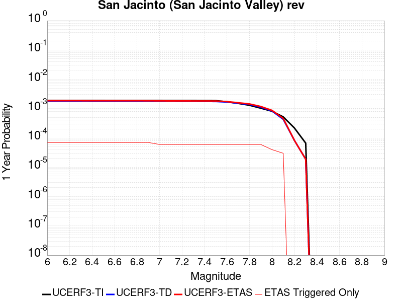 |  |

| Magnitude | 1 wk TI Prob | 1 wk TD Prob | 1 wk ETAS Prob | 1 wk ETAS/TD Gain | 1 wk ETAS Triggered Only | 1 mo TI Prob | 1 mo TD Prob | 1 mo ETAS Prob | 1 mo ETAS/TD Gain | 1 mo ETAS Triggered Only | 1 yr TI Prob | 1 yr TD Prob | 1 yr ETAS Prob | 1 yr ETAS/TD Gain | 1 yr ETAS Triggered Only | 10 yr TI Prob | 10 yr TD Prob | 10 yr ETAS Prob | 10 yr ETAS/TD Gain | 10 yr ETAS Triggered Only |
|-----|-----|-----|-----|-----|-----|-----|-----|-----|-----|-----|-----|-----|-----|-----|-----|-----|-----|-----|-----|-----|
| 6.0 | 3.652694E-5 | 3.4417048E-5 | 5.441636E-5 | 1.5810874 | 2.0E-5 | 1.5653463E-4 | 1.4749331E-4 | 1.7748888E-4 | 1.203369 | 3.0E-5 | 0.0019041431 | 0.0017942534 | 0.0018641278 | 1.0389434 | 7.0E-5 | 0.018879099 | 0.018534157 | 0.018632304 | 1.0052954 | 1.0E-4 |
| 6.1 | 3.652694E-5 | 3.4417048E-5 | 5.441636E-5 | 1.5810874 | 2.0E-5 | 1.5653463E-4 | 1.4749331E-4 | 1.7748888E-4 | 1.203369 | 3.0E-5 | 0.0019041431 | 0.0017942534 | 0.0018641278 | 1.0389434 | 7.0E-5 | 0.018879099 | 0.018534157 | 0.018632304 | 1.0052954 | 1.0E-4 |
| 6.2 | 3.652694E-5 | 3.4417048E-5 | 5.441636E-5 | 1.5810874 | 2.0E-5 | 1.5653463E-4 | 1.4749331E-4 | 1.7748888E-4 | 1.203369 | 3.0E-5 | 0.0019041431 | 0.0017942534 | 0.0018641278 | 1.0389434 | 7.0E-5 | 0.018879099 | 0.018534157 | 0.018632304 | 1.0052954 | 1.0E-4 |
| 6.3 | 3.652694E-5 | 3.4417048E-5 | 5.441636E-5 | 1.5810874 | 2.0E-5 | 1.5653463E-4 | 1.4749331E-4 | 1.7748888E-4 | 1.203369 | 3.0E-5 | 0.0019041431 | 0.0017942534 | 0.0018641278 | 1.0389434 | 7.0E-5 | 0.018879099 | 0.018534157 | 0.018632304 | 1.0052954 | 1.0E-4 |
| 6.4 | 3.646941E-5 | 3.433862E-5 | 5.4337936E-5 | 1.5824145 | 2.0E-5 | 1.5628811E-4 | 1.4715722E-4 | 1.771528E-4 | 1.2038336 | 3.0E-5 | 0.0019011468 | 0.0017901688 | 0.0018600435 | 1.0390325 | 7.0E-5 | 0.018849645 | 0.018494038 | 0.018592188 | 1.0053072 | 1.0E-4 |
| 6.5 | 3.646941E-5 | 3.433862E-5 | 5.4337936E-5 | 1.5824145 | 2.0E-5 | 1.5628811E-4 | 1.4715722E-4 | 1.771528E-4 | 1.2038336 | 3.0E-5 | 0.0019011468 | 0.0017901688 | 0.0018600435 | 1.0390325 | 7.0E-5 | 0.018849645 | 0.018494038 | 0.018592188 | 1.0053072 | 1.0E-4 |
| 6.6 | 3.6442503E-5 | 3.4302004E-5 | 5.430132E-5 | 1.5830363 | 2.0E-5 | 1.561728E-4 | 1.4700032E-4 | 1.769959E-4 | 1.2040511 | 3.0E-5 | 0.0018997455 | 0.0017882616 | 0.0018581364 | 1.0390742 | 7.0E-5 | 0.018835869 | 0.018475305 | 0.018573457 | 1.0053127 | 1.0E-4 |
| 6.7 | 3.6432113E-5 | 3.4287576E-5 | 5.428689E-5 | 1.5832816 | 2.0E-5 | 1.5612828E-4 | 1.4693849E-4 | 1.7693407E-4 | 1.2041371 | 3.0E-5 | 0.0018992044 | 0.0017875104 | 0.0018573852 | 1.0390906 | 7.0E-5 | 0.018830549 | 0.01846793 | 0.018566083 | 1.0053148 | 1.0E-4 |
| 6.8 | 3.6409598E-5 | 3.425663E-5 | 5.4255946E-5 | 1.5838085 | 2.0E-5 | 1.560318E-4 | 1.4680588E-4 | 1.7680146E-4 | 1.2043215 | 3.0E-5 | 0.0018980318 | 0.0017858985 | 0.0018557734 | 1.0391259 | 7.0E-5 | 0.018819023 | 0.018452084 | 0.018550238 | 1.0053195 | 1.0E-4 |
| 6.9 | 3.638078E-5 | 3.4217053E-5 | 5.421637E-5 | 1.5844839 | 2.0E-5 | 1.5590832E-4 | 1.4663627E-4 | 1.7663187E-4 | 1.2045579 | 3.0E-5 | 0.0018965311 | 0.001783837 | 0.0018537121 | 1.0391712 | 7.0E-5 | 0.018804269 | 0.018431816 | 0.018529972 | 1.0053254 | 1.0E-4 |
| 7.0 | 3.6294874E-5 | 3.4099063E-5 | 5.409838E-5 | 1.5865064 | 2.0E-5 | 1.5554018E-4 | 1.4613067E-4 | 1.7612628E-4 | 1.2052658 | 3.0E-5 | 0.0018920569 | 0.0017776915 | 0.0018375849 | 1.0336916 | 6.0E-5 | 0.018760284 | 0.018371396 | 0.018459743 | 1.0048089 | 9.0E-5 |
| 7.1 | 3.6260717E-5 | 3.405534E-5 | 5.405466E-5 | 1.5872594 | 2.0E-5 | 1.5539382E-4 | 1.4594331E-4 | 1.7593894E-4 | 1.2055292 | 3.0E-5 | 0.001890278 | 0.0017754143 | 0.0018353078 | 1.0337349 | 6.0E-5 | 0.018742796 | 0.018348996 | 0.018437345 | 1.0048149 | 9.0E-5 |
| 7.2 | 3.6210204E-5 | 3.398956E-5 | 5.398888E-5 | 1.588396 | 2.0E-5 | 1.5517735E-4 | 1.4566141E-4 | 1.7565704E-4 | 1.2059271 | 3.0E-5 | 0.001887647 | 0.0017719879 | 0.0018318816 | 1.0338002 | 6.0E-5 | 0.01871693 | 0.018315274 | 0.018403625 | 1.0048239 | 9.0E-5 |
| 7.3 | 3.6119454E-5 | 3.3877837E-5 | 5.387716E-5 | 1.5903364 | 2.0E-5 | 1.5478847E-4 | 1.4518267E-4 | 1.7517831E-4 | 1.2066063 | 3.0E-5 | 0.0018829206 | 0.0017661685 | 0.0018260626 | 1.0339118 | 6.0E-5 | 0.018670462 | 0.018257825 | 0.018346181 | 1.0048394 | 9.0E-5 |
| 7.4 | 3.607848E-5 | 3.3825334E-5 | 5.3824657E-5 | 1.5912528 | 2.0E-5 | 1.5461289E-4 | 1.4495767E-4 | 1.7495333E-4 | 1.206927 | 3.0E-5 | 0.0018807866 | 0.0017634337 | 0.0018233279 | 1.0339645 | 6.0E-5 | 0.018649481 | 0.018230818 | 0.018319177 | 1.0048467 | 9.0E-5 |
| 7.5 | 3.5856774E-5 | 3.3635082E-5 | 5.3634412E-5 | 1.5945972 | 2.0E-5 | 1.5366284E-4 | 1.4414241E-4 | 1.7413808E-4 | 1.2080975 | 3.0E-5 | 0.0018692396 | 0.0017535238 | 0.0018134186 | 1.0341568 | 6.0E-5 | 0.018535944 | 0.018131904 | 0.018220274 | 1.0048736 | 9.0E-5 |
| 7.6 | 3.286655E-5 | 3.215777E-5 | 5.2157127E-5 | 1.6219137 | 2.0E-5 | 1.4084904E-4 | 1.3781176E-4 | 1.6780762E-4 | 1.2176583 | 3.0E-5 | 0.001713488 | 0.0016765689 | 0.0017364683 | 1.0357274 | 6.0E-5 | 0.017003361 | 0.017351432 | 0.01743987 | 1.0050969 | 9.0E-5 |
| 7.7 | 2.8882527E-5 | 2.9250317E-5 | 4.9249735E-5 | 1.6837332 | 2.0E-5 | 1.237764E-4 | 1.2535248E-4 | 1.5534872E-4 | 1.2392951 | 3.0E-5 | 0.0015059357 | 0.0015250992 | 0.0015850076 | 1.0392817 | 6.0E-5 | 0.014957713 | 0.015837716 | 0.01592629 | 1.0055926 | 9.0E-5 |
| 7.8 | 2.4950225E-5 | 2.6540692E-5 | 4.654016E-5 | 1.7535399 | 2.0E-5 | 1.0692515E-4 | 1.1374087E-4 | 1.4373746E-4 | 1.2637274 | 3.0E-5 | 0.0013010362 | 0.0013839162 | 0.0014438332 | 1.0432953 | 6.0E-5 | 0.012934455 | 0.0144187445 | 0.014507446 | 1.0061519 | 9.0E-5 |
| 7.9 | 1.9881603E-5 | 2.1519538E-5 | 4.1519106E-5 | 1.929368 | 2.0E-5 | 8.520408E-5 | 9.222333E-5 | 1.2222056E-4 | 1.3252673 | 3.0E-5 | 0.001036866 | 0.0011222415 | 0.0011821742 | 1.0534045 | 6.0E-5 | 0.010320415 | 0.011783319 | 0.011872258 | 1.007548 | 9.0E-5 |
| 8.0 | 1.563292E-5 | 1.5947082E-5 | 1.5947082E-5 | 1.0 | 0.0 | 6.6996516E-5 | 6.834285E-5 | 7.834217E-5 | 1.146311 | 1.0E-5 | 8.153773E-4 | 8.3175726E-4 | 8.71724E-4 | 1.048051 | 4.0E-5 | 0.00812392 | 0.008815629 | 0.0088751 | 1.006746 | 6.0E-5 |
| 8.1 | 1.0045313E-5 | 8.307514E-6 | 8.307514E-6 | 1.0 | 0.0 | 4.305063E-5 | 3.5603145E-5 | 4.5602792E-5 | 1.280864 | 1.0E-5 | 5.2401534E-4 | 4.333826E-4 | 4.633696E-4 | 1.0691929 | 3.0E-5 | 0.0052278144 | 0.0046621817 | 0.004692042 | 1.0064048 | 3.0E-5 |
| 8.2 | 4.1554413E-6 | 1.5672123E-6 | 1.5672123E-6 | 1.0 | 0.0 | 1.7808914E-5 | 6.716607E-6 | 6.716607E-6 | 1.0 | 0.0 | 2.1680194E-4 | 8.177165E-5 | 8.177165E-5 | 1.0 | 0.0 | 0.0021659054 | 9.492334E-4 | 9.492334E-4 | 1.0 | 0.0 |
| 8.3 | 1.2758221E-6 | 3.6194777E-7 | 3.6194777E-7 | 1.0 | 0.0 | 5.4677976E-6 | 1.5512038E-6 | 1.5512038E-6 | 1.0 | 0.0 | 6.65684E-5 | 1.8885747E-5 | 1.8885747E-5 | 1.0 | 0.0 | 6.6548464E-4 | 2.2777634E-4 | 2.2777634E-4 | 1.0 | 0.0 |

## Independence rev 2011
*[(top)](#table-of-contents)*

| 1 Week | 1 Month | 1 Year | 10 Year |
|-----|-----|-----|-----|
| 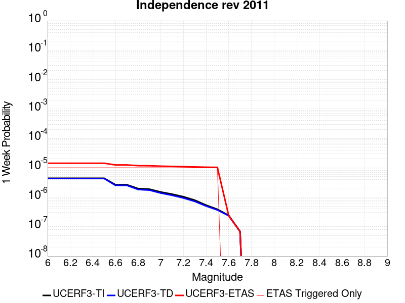 |  |  |  |

| Magnitude | 1 wk TI Prob | 1 wk TD Prob | 1 wk ETAS Prob | 1 wk ETAS/TD Gain | 1 wk ETAS Triggered Only | 1 mo TI Prob | 1 mo TD Prob | 1 mo ETAS Prob | 1 mo ETAS/TD Gain | 1 mo ETAS Triggered Only | 1 yr TI Prob | 1 yr TD Prob | 1 yr ETAS Prob | 1 yr ETAS/TD Gain | 1 yr ETAS Triggered Only | 10 yr TI Prob | 10 yr TD Prob | 10 yr ETAS Prob | 10 yr ETAS/TD Gain | 10 yr ETAS Triggered Only |
|-----|-----|-----|-----|-----|-----|-----|-----|-----|-----|-----|-----|-----|-----|-----|-----|-----|-----|-----|-----|-----|
| 6.0 | 4.422171E-6 | 4.3262453E-6 | 1.4326202E-5 | 3.311463 | 1.0E-5 | 1.8952025E-5 | 1.8540937E-5 | 4.854038E-5 | 2.6180112 | 3.0E-5 | 2.3071647E-4 | 2.257155E-4 | 2.956997E-4 | 1.3100549 | 7.0E-5 | 0.0023047708 | 0.0022551562 | 0.0023549306 | 1.0442429 | 1.0E-4 |
| 6.1 | 4.422171E-6 | 4.3262453E-6 | 1.4326202E-5 | 3.311463 | 1.0E-5 | 1.8952025E-5 | 1.8540937E-5 | 4.854038E-5 | 2.6180112 | 3.0E-5 | 2.3071647E-4 | 2.257155E-4 | 2.956997E-4 | 1.3100549 | 7.0E-5 | 0.0023047708 | 0.0022551562 | 0.0023549306 | 1.0442429 | 1.0E-4 |
| 6.2 | 4.422171E-6 | 4.3262453E-6 | 1.4326202E-5 | 3.311463 | 1.0E-5 | 1.8952025E-5 | 1.8540937E-5 | 4.854038E-5 | 2.6180112 | 3.0E-5 | 2.3071647E-4 | 2.257155E-4 | 2.956997E-4 | 1.3100549 | 7.0E-5 | 0.0023047708 | 0.0022551562 | 0.0023549306 | 1.0442429 | 1.0E-4 |
| 6.3 | 4.422171E-6 | 4.3262453E-6 | 1.4326202E-5 | 3.311463 | 1.0E-5 | 1.8952025E-5 | 1.8540937E-5 | 4.854038E-5 | 2.6180112 | 3.0E-5 | 2.3071647E-4 | 2.257155E-4 | 2.956997E-4 | 1.3100549 | 7.0E-5 | 0.0023047708 | 0.0022551562 | 0.0023549306 | 1.0442429 | 1.0E-4 |
| 6.4 | 4.422171E-6 | 4.3262453E-6 | 1.4326202E-5 | 3.311463 | 1.0E-5 | 1.8952025E-5 | 1.8540937E-5 | 4.854038E-5 | 2.6180112 | 3.0E-5 | 2.3071647E-4 | 2.257155E-4 | 2.956997E-4 | 1.3100549 | 7.0E-5 | 0.0023047708 | 0.0022551562 | 0.0023549306 | 1.0442429 | 1.0E-4 |
| 6.5 | 4.422171E-6 | 4.3262453E-6 | 1.4326202E-5 | 3.311463 | 1.0E-5 | 1.8952025E-5 | 1.8540937E-5 | 4.854038E-5 | 2.6180112 | 3.0E-5 | 2.3071647E-4 | 2.257155E-4 | 2.956997E-4 | 1.3100549 | 7.0E-5 | 0.0023047708 | 0.0022551562 | 0.0023549306 | 1.0442429 | 1.0E-4 |
| 6.6 | 2.663744E-6 | 2.5319996E-6 | 1.2531974E-5 | 4.9494376 | 1.0E-5 | 1.1415996E-5 | 1.0851385E-5 | 4.085106E-5 | 3.764594 | 3.0E-5 | 1.3898089E-4 | 1.3210809E-4 | 2.0209885E-4 | 1.5297991 | 7.0E-5 | 0.0013889399 | 0.0013203438 | 0.0014102249 | 1.0680741 | 9.0E-5 |
| 6.7 | 2.663744E-6 | 2.5319996E-6 | 1.2531974E-5 | 4.9494376 | 1.0E-5 | 1.1415996E-5 | 1.0851385E-5 | 4.085106E-5 | 3.764594 | 3.0E-5 | 1.3898089E-4 | 1.3210809E-4 | 2.0209885E-4 | 1.5297991 | 7.0E-5 | 0.0013889399 | 0.0013203438 | 0.0014102249 | 1.0680741 | 9.0E-5 |
| 6.8 | 1.9716529E-6 | 1.83227E-6 | 1.1832251E-5 | 6.457701 | 1.0E-5 | 8.449913E-6 | 7.852563E-6 | 3.7852325E-5 | 4.820379 | 3.0E-5 | 1.0287284E-4 | 9.560089E-5 | 1.6559419E-4 | 1.7321408 | 7.0E-5 | 0.0010282523 | 9.556105E-4 | 0.0010455245 | 1.0940906 | 9.0E-5 |
| 6.9 | 1.8788617E-6 | 1.7430103E-6 | 1.1742993E-5 | 6.7371907 | 1.0E-5 | 8.0522395E-6 | 7.470024E-6 | 3.74698E-5 | 5.0160217 | 3.0E-5 | 9.80316E-5 | 9.094387E-5 | 1.609375E-4 | 1.7696356 | 7.0E-5 | 9.798837E-4 | 9.090785E-4 | 9.989967E-4 | 1.0989114 | 9.0E-5 |
| 7.0 | 1.5045488E-6 | 1.3849595E-6 | 1.13849455E-5 | 8.220418 | 1.0E-5 | 6.44805E-6 | 5.9355275E-6 | 3.593535E-5 | 6.0542808 | 3.0E-5 | 7.8502184E-5 | 7.226271E-5 | 1.4225765E-4 | 1.9686178 | 7.0E-5 | 7.8474457E-4 | 7.2239724E-4 | 8.123322E-4 | 1.1244951 | 9.0E-5 |
| 7.1 | 1.272341E-6 | 1.1625177E-6 | 1.1162506E-5 | 9.60201 | 1.0E-5 | 5.4528787E-6 | 4.9822092E-6 | 3.498206E-5 | 7.021395 | 3.0E-5 | 6.6386776E-5 | 6.065674E-5 | 1.306525E-4 | 2.153965 | 7.0E-5 | 6.636695E-4 | 6.06405E-4 | 6.963505E-4 | 1.1483257 | 9.0E-5 |
| 7.2 | 1.0416892E-6 | 9.4099494E-7 | 1.0940986E-5 | 11.62704 | 1.0E-5 | 4.464375E-6 | 4.032829E-6 | 3.403271E-5 | 8.438916 | 3.0E-5 | 5.4352407E-5 | 4.909861E-5 | 1.1909517E-4 | 2.4256322 | 7.0E-5 | 5.4339116E-4 | 4.9087947E-4 | 5.808353E-4 | 1.1832544 | 9.0E-5 |
| 7.3 | 7.9450155E-7 | 7.235053E-7 | 1.0723498E-5 | 14.8215885 | 1.0E-5 | 3.4050022E-6 | 3.1007335E-6 | 3.310064E-5 | 10.6751 | 3.0E-5 | 4.1455114E-5 | 3.7750786E-5 | 1.0774814E-4 | 2.854196 | 7.0E-5 | 4.144738E-4 | 3.7744487E-4 | 4.674109E-4 | 1.2383554 | 9.0E-5 |
| 7.4 | 5.3893444E-7 | 5.0195445E-7 | 1.0501949E-5 | 20.922117 | 1.0E-5 | 2.309717E-6 | 2.1512315E-6 | 2.215119E-5 | 10.296981 | 2.0E-5 | 2.8120441E-5 | 2.6190934E-5 | 8.6189364E-5 | 3.2908092 | 6.0E-5 | 2.8116882E-4 | 2.6187891E-4 | 3.4185796E-4 | 1.3054047 | 8.0E-5 |
| 7.5 | 3.8852085E-7 | 3.6825747E-7 | 1.0368254E-5 | 28.154903 | 1.0E-5 | 1.6650882E-6 | 1.5782454E-6 | 2.1578215E-5 | 13.67228 | 2.0E-5 | 2.027226E-5 | 1.9214971E-5 | 7.9213816E-5 | 4.122505 | 6.0E-5 | 2.0270412E-4 | 1.921333E-4 | 2.7211793E-4 | 1.4162976 | 8.0E-5 |
| 7.6 | 2.414929E-7 | 2.3457659E-7 | 2.3457659E-7 | 1.0 | 0.0 | 1.0349692E-6 | 1.0053279E-6 | 1.1005318E-5 | 10.946994 | 1.0E-5 | 1.2600677E-5 | 1.22398E-5 | 6.223919E-5 | 5.0849843 | 5.0E-5 | 1.2599962E-4 | 1.2239137E-4 | 1.8238403E-4 | 1.4901706 | 6.0E-5 |
| 7.7 | 6.8298014E-8 | 6.858993E-8 | 6.858993E-8 | 1.0 | 0.0 | 2.9270575E-7 | 2.939568E-7 | 2.939568E-7 | 1.0 | 0.0 | 3.5636867E-6 | 3.5789185E-6 | 2.3578847E-5 | 6.58826 | 2.0E-5 | 3.5636294E-5 | 3.5788657E-5 | 5.5787943E-5 | 1.5588163 | 2.0E-5 |

## Pinto Mtn
*[(top)](#table-of-contents)*

| 1 Week | 1 Month | 1 Year | 10 Year |
|-----|-----|-----|-----|
|  | 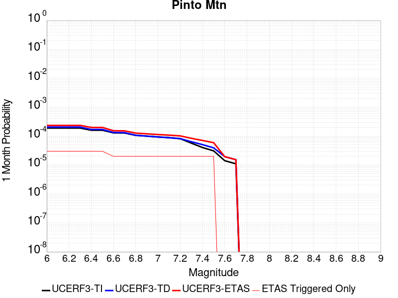 |  |  |

| Magnitude | 1 wk TI Prob | 1 wk TD Prob | 1 wk ETAS Prob | 1 wk ETAS/TD Gain | 1 wk ETAS Triggered Only | 1 mo TI Prob | 1 mo TD Prob | 1 mo ETAS Prob | 1 mo ETAS/TD Gain | 1 mo ETAS Triggered Only | 1 yr TI Prob | 1 yr TD Prob | 1 yr ETAS Prob | 1 yr ETAS/TD Gain | 1 yr ETAS Triggered Only | 10 yr TI Prob | 10 yr TD Prob | 10 yr ETAS Prob | 10 yr ETAS/TD Gain | 10 yr ETAS Triggered Only |
|-----|-----|-----|-----|-----|-----|-----|-----|-----|-----|-----|-----|-----|-----|-----|-----|-----|-----|-----|-----|-----|
| 6.0 | 4.4194956E-5 | 4.785523E-5 | 6.785427E-5 | 1.4179071 | 2.0E-5 | 1.893932E-4 | 2.0507864E-4 | 2.3507248E-4 | 1.1462554 | 3.0E-5 | 0.0023034236 | 0.002494138 | 0.0025539882 | 1.0239964 | 6.0E-5 | 0.022796938 | 0.024678964 | 0.024766743 | 1.0035568 | 9.0E-5 |
| 6.1 | 4.4194956E-5 | 4.785523E-5 | 6.785427E-5 | 1.4179071 | 2.0E-5 | 1.893932E-4 | 2.0507864E-4 | 2.3507248E-4 | 1.1462554 | 3.0E-5 | 0.0023034236 | 0.002494138 | 0.0025539882 | 1.0239964 | 6.0E-5 | 0.022796938 | 0.024678964 | 0.024766743 | 1.0035568 | 9.0E-5 |
| 6.2 | 4.4194956E-5 | 4.785523E-5 | 6.785427E-5 | 1.4179071 | 2.0E-5 | 1.893932E-4 | 2.0507864E-4 | 2.3507248E-4 | 1.1462554 | 3.0E-5 | 0.0023034236 | 0.002494138 | 0.0025539882 | 1.0239964 | 6.0E-5 | 0.022796938 | 0.024678964 | 0.024766743 | 1.0035568 | 9.0E-5 |
| 6.3 | 4.4194956E-5 | 4.785523E-5 | 6.785427E-5 | 1.4179071 | 2.0E-5 | 1.893932E-4 | 2.0507864E-4 | 2.3507248E-4 | 1.1462554 | 3.0E-5 | 0.0023034236 | 0.002494138 | 0.0025539882 | 1.0239964 | 6.0E-5 | 0.022796938 | 0.024678964 | 0.024766743 | 1.0035568 | 9.0E-5 |
| 6.4 | 3.729929E-5 | 3.960458E-5 | 5.9603786E-5 | 1.5049721 | 2.0E-5 | 1.5984432E-4 | 1.697234E-4 | 1.9971831E-4 | 1.1767281 | 3.0E-5 | 0.0019443673 | 0.0020645177 | 0.002104435 | 1.019335 | 4.0E-5 | 0.019274427 | 0.020463403 | 0.020531971 | 1.0033507 | 7.0E-5 |
| 6.5 | 3.729929E-5 | 3.960458E-5 | 5.9603786E-5 | 1.5049721 | 2.0E-5 | 1.5984432E-4 | 1.697234E-4 | 1.9971831E-4 | 1.1767281 | 3.0E-5 | 0.0019443673 | 0.0020645177 | 0.002104435 | 1.019335 | 4.0E-5 | 0.019274427 | 0.020463403 | 0.020531971 | 1.0033507 | 7.0E-5 |
| 6.6 | 3.0204548E-5 | 3.1206488E-5 | 4.1206175E-5 | 1.3204362 | 1.0E-5 | 1.2944164E-4 | 1.3373543E-4 | 1.5373275E-4 | 1.149529 | 2.0E-5 | 0.0015748127 | 0.0016270474 | 0.0016569986 | 1.0184083 | 3.0E-5 | 0.015636992 | 0.01615522 | 0.016204411 | 1.003045 | 5.0E-5 |
| 6.7 | 2.9857754E-5 | 3.0815863E-5 | 4.0815557E-5 | 1.3244982 | 1.0E-5 | 1.2795553E-4 | 1.320615E-4 | 1.5205886E-4 | 1.1514246 | 2.0E-5 | 0.0015567453 | 0.0016066976 | 0.0016366494 | 1.0186418 | 3.0E-5 | 0.015458848 | 0.015954657 | 0.016003858 | 1.0030838 | 5.0E-5 |
| 6.8 | 2.4819734E-5 | 2.5010428E-5 | 3.5010176E-5 | 1.3998232 | 1.0E-5 | 1.0636595E-4 | 1.0718327E-4 | 1.2718112E-4 | 1.1865762 | 2.0E-5 | 0.0012942362 | 0.0013041968 | 0.0013341577 | 1.0229727 | 3.0E-5 | 0.012867244 | 0.012967796 | 0.013007277 | 1.0030446 | 4.0E-5 |
| 6.9 | 2.331124E-5 | 2.3338684E-5 | 3.333845E-5 | 1.4284632 | 1.0E-5 | 9.990149E-5 | 1.00019206E-4 | 1.20017205E-4 | 1.1999416 | 2.0E-5 | 0.001215622 | 0.001217074 | 0.0012470374 | 1.0246193 | 3.0E-5 | 0.012089936 | 0.012106278 | 0.0121359145 | 1.0024481 | 3.0E-5 |
| 7.0 | 2.1818534E-5 | 2.1761793E-5 | 3.1761574E-5 | 1.4595109 | 1.0E-5 | 9.3504656E-5 | 9.32616E-5 | 1.1325974E-4 | 1.2144306 | 2.0E-5 | 0.0011378246 | 0.0011348884 | 0.0011648544 | 1.0264043 | 3.0E-5 | 0.011320163 | 0.01129303 | 0.011322692 | 1.0026265 | 3.0E-5 |
| 7.1 | 2.066081E-5 | 2.054142E-5 | 3.0541214E-5 | 1.4868113 | 1.0E-5 | 8.854332E-5 | 8.80318E-5 | 1.08030035E-4 | 1.2271707 | 2.0E-5 | 0.0010774818 | 0.0010712796 | 0.0011012475 | 1.0279739 | 3.0E-5 | 0.010722724 | 0.010663206 | 0.010692886 | 1.0027834 | 3.0E-5 |
| 7.2 | 1.8990233E-5 | 1.9054683E-5 | 2.9054494E-5 | 1.5247953 | 1.0E-5 | 8.138417E-5 | 8.166048E-5 | 1.0165885E-4 | 1.2448965 | 2.0E-5 | 9.904018E-4 | 9.937823E-4 | 0.0010237524 | 1.0301577 | 3.0E-5 | 0.009859995 | 0.0098953815 | 0.009925084 | 1.0030017 | 3.0E-5 |
| 7.3 | 1.3335872E-5 | 1.4907276E-5 | 2.4907127E-5 | 1.6708034 | 1.0E-5 | 5.7152483E-5 | 6.388683E-5 | 8.3885556E-5 | 1.3130336 | 2.0E-5 | 6.956093E-4 | 7.775574E-4 | 8.0753403E-4 | 1.0385524 | 3.0E-5 | 0.006934359 | 0.0077496674 | 0.007779435 | 1.0038412 | 3.0E-5 |
| 7.4 | 9.414066E-6 | 1.186147E-5 | 2.1861351E-5 | 1.8430558 | 1.0E-5 | 4.0345374E-5 | 5.0833933E-5 | 7.083292E-5 | 1.393418 | 2.0E-5 | 4.910942E-4 | 6.187368E-4 | 6.4871827E-4 | 1.0484558 | 3.0E-5 | 0.0049001034 | 0.0061710896 | 0.0062009045 | 1.0048314 | 3.0E-5 |
| 7.5 | 7.2101157E-6 | 9.158733E-6 | 1.915864E-5 | 2.091844 | 1.0E-5 | 3.090013E-5 | 3.9251165E-5 | 5.925038E-5 | 1.509519 | 2.0E-5 | 3.7614413E-4 | 4.7778594E-4 | 4.977764E-4 | 1.0418397 | 2.0E-5 | 0.0037550807 | 0.0047683627 | 0.0047882674 | 1.0041744 | 2.0E-5 |
| 7.6 | 3.296375E-6 | 4.546122E-6 | 4.546122E-6 | 1.0 | 0.0 | 1.4127245E-5 | 1.9483241E-5 | 1.9483241E-5 | 1.0 | 0.0 | 1.7198564E-4 | 2.3718402E-4 | 2.3718402E-4 | 1.0 | 0.0 | 0.0017185259 | 0.0023694462 | 0.0023694462 | 1.0 | 0.0 |
| 7.7 | 2.5741092E-6 | 3.5850085E-6 | 3.5850085E-6 | 1.0 | 0.0 | 1.103185E-5 | 1.536424E-5 | 1.536424E-5 | 1.0 | 0.0 | 1.3430449E-4 | 1.8704488E-4 | 1.8704488E-4 | 1.0 | 0.0 | 0.0013422335 | 0.0018690043 | 0.0018690043 | 1.0 | 0.0 |

## Brawley (Seismic Zone) alt 1
*[(top)](#table-of-contents)*

| 1 Week | 1 Month | 1 Year | 10 Year |
|-----|-----|-----|-----|
|  |  |  |  |

| Magnitude | 1 wk TI Prob | 1 wk TD Prob | 1 wk ETAS Prob | 1 wk ETAS/TD Gain | 1 wk ETAS Triggered Only | 1 mo TI Prob | 1 mo TD Prob | 1 mo ETAS Prob | 1 mo ETAS/TD Gain | 1 mo ETAS Triggered Only | 1 yr TI Prob | 1 yr TD Prob | 1 yr ETAS Prob | 1 yr ETAS/TD Gain | 1 yr ETAS Triggered Only | 10 yr TI Prob | 10 yr TD Prob | 10 yr ETAS Prob | 10 yr ETAS/TD Gain | 10 yr ETAS Triggered Only |
|-----|-----|-----|-----|-----|-----|-----|-----|-----|-----|-----|-----|-----|-----|-----|-----|-----|-----|-----|-----|-----|
| 6.0 | 2.2521618E-4 | 4.7641253E-4 | 4.7641253E-4 | 1.0 | 0.0 | 9.6485513E-4 | 0.0020402074 | 0.0020402074 | 1.0 | 0.0 | 0.011683988 | 0.02455069 | 0.024589706 | 1.0015893 | 4.0E-5 | 0.11088423 | 0.21353015 | 0.21360093 | 1.0003315 | 9.0E-5 |
| 6.1 | 2.2521618E-4 | 4.7641253E-4 | 4.7641253E-4 | 1.0 | 0.0 | 9.6485513E-4 | 0.0020402074 | 0.0020402074 | 1.0 | 0.0 | 0.011683988 | 0.02455069 | 0.024589706 | 1.0015893 | 4.0E-5 | 0.11088423 | 0.21353015 | 0.21359307 | 1.0002947 | 8.0E-5 |
| 6.2 | 2.198148E-4 | 4.6725658E-4 | 4.6725658E-4 | 1.0 | 0.0 | 9.417233E-4 | 0.002001028 | 0.002001028 | 1.0 | 0.0 | 0.011405343 | 0.024084855 | 0.024123892 | 1.0016208 | 4.0E-5 | 0.10837428 | 0.20996629 | 0.21002159 | 1.0002633 | 7.0E-5 |
| 6.3 | 2.1704129E-4 | 4.6161312E-4 | 4.6161312E-4 | 1.0 | 0.0 | 9.298453E-4 | 0.0019768786 | 0.0019768786 | 1.0 | 0.0 | 0.011262234 | 0.023797998 | 0.023837047 | 1.0016408 | 4.0E-5 | 0.107082725 | 0.20785725 | 0.2079127 | 1.0002668 | 7.0E-5 |
| 6.4 | 1.876142E-4 | 4.0053183E-4 | 4.0053183E-4 | 1.0 | 0.0 | 8.038131E-4 | 0.0017154501 | 0.0017154501 | 1.0 | 0.0 | 0.00974259 | 0.02068463 | 0.020723803 | 1.0018938 | 4.0E-5 | 0.093263686 | 0.184608 | 0.18466508 | 1.0003092 | 7.0E-5 |
| 6.5 | 1.7390939E-4 | 3.7485067E-4 | 3.7485067E-4 | 1.0 | 0.0 | 7.45113E-4 | 0.0016055258 | 0.0016055258 | 1.0 | 0.0 | 0.009034078 | 0.019372813 | 0.019412037 | 1.0020248 | 4.0E-5 | 0.086755216 | 0.17442966 | 0.1744792 | 1.000284 | 6.0E-5 |
| 6.6 | 1.591791E-4 | 3.489955E-4 | 3.489955E-4 | 1.0 | 0.0 | 6.8201777E-4 | 0.0014948477 | 0.0014948477 | 1.0 | 0.0 | 0.008271996 | 0.018049458 | 0.018088738 | 1.0021762 | 4.0E-5 | 0.07970774 | 0.16383699 | 0.16388716 | 1.0003062 | 6.0E-5 |
| 6.7 | 1.4268003E-4 | 3.206533E-4 | 3.206533E-4 | 1.0 | 0.0 | 6.1134255E-4 | 0.0013735129 | 0.0013735129 | 1.0 | 0.0 | 0.007417723 | 0.016596261 | 0.016635597 | 1.0023702 | 4.0E-5 | 0.07174956 | 0.15196045 | 0.15201133 | 1.0003349 | 6.0E-5 |
| 6.8 | 1.239713E-4 | 2.9059697E-4 | 2.9059697E-4 | 1.0 | 0.0 | 5.3119735E-4 | 0.0012448273 | 0.0012448273 | 1.0 | 0.0 | 0.0064481674 | 0.015051884 | 0.015081432 | 1.0019631 | 3.0E-5 | 0.06264243 | 0.13840161 | 0.13844469 | 1.0003113 | 5.0E-5 |
| 6.9 | 1.0180238E-4 | 2.625907E-4 | 2.625907E-4 | 1.0 | 0.0 | 4.3622297E-4 | 0.0011249076 | 0.0011249076 | 1.0 | 0.0 | 0.005298089 | 0.013610746 | 0.013630474 | 1.0014495 | 2.0E-5 | 0.05173543 | 0.12498065 | 0.12501565 | 1.00028 | 4.0E-5 |
| 7.0 | 7.6619996E-5 | 2.2402873E-4 | 2.2402873E-4 | 1.0 | 0.0 | 3.283301E-4 | 9.59773E-4 | 9.59773E-4 | 1.0 | 0.0 | 0.0039900932 | 0.011623339 | 0.011643106 | 1.0017006 | 2.0E-5 | 0.039192066 | 0.10728151 | 0.107317224 | 1.0003328 | 4.0E-5 |
| 7.1 | 7.5127435E-5 | 2.208599E-4 | 2.208599E-4 | 1.0 | 0.0 | 3.2193496E-4 | 9.4620226E-4 | 9.4620226E-4 | 1.0 | 0.0 | 0.0039125155 | 0.011459865 | 0.011479635 | 1.0017252 | 2.0E-5 | 0.038443442 | 0.10584534 | 0.10588111 | 1.000338 | 4.0E-5 |
| 7.2 | 6.788582E-5 | 2.0213598E-4 | 2.0213598E-4 | 1.0 | 0.0 | 2.9090676E-4 | 8.660125E-4 | 8.660125E-4 | 1.0 | 0.0 | 0.0035360386 | 0.010493369 | 0.010503264 | 1.000943 | 1.0E-5 | 0.034803 | 0.09751546 | 0.09754253 | 1.0002776 | 3.0E-5 |
| 7.3 | 6.399602E-5 | 1.88444E-4 | 1.88444E-4 | 1.0 | 0.0 | 2.7423984E-4 | 8.0737006E-4 | 8.0737006E-4 | 1.0 | 0.0 | 0.0033337586 | 0.009786017 | 0.009795919 | 1.0010118 | 1.0E-5 | 0.03284188 | 0.091409855 | 0.091437116 | 1.0002981 | 3.0E-5 |
| 7.4 | 4.506759E-5 | 1.2531783E-4 | 1.2531783E-4 | 1.0 | 0.0 | 1.9313251E-4 | 5.369668E-4 | 5.369668E-4 | 1.0 | 0.0 | 0.0023488526 | 0.0065181484 | 0.0065280832 | 1.0015242 | 1.0E-5 | 0.023241805 | 0.062375 | 0.06240313 | 1.000451 | 3.0E-5 |
| 7.5 | 3.43289E-5 | 9.337587E-5 | 9.337587E-5 | 1.0 | 0.0 | 1.4711556E-4 | 4.0012124E-4 | 4.0012124E-4 | 1.0 | 0.0 | 0.0017896603 | 0.004860657 | 0.0048706084 | 1.0020473 | 1.0E-5 | 0.01775316 | 0.04706493 | 0.047093518 | 1.0006074 | 3.0E-5 |
| 7.6 | 2.5980507E-5 | 7.054998E-5 | 7.054998E-5 | 1.0 | 0.0 | 1.1134028E-4 | 3.0232212E-4 | 3.0232212E-4 | 1.0 | 0.0 | 0.001354725 | 0.0036745837 | 0.003684547 | 1.0027114 | 1.0E-5 | 0.013464959 | 0.035849415 | 0.03587834 | 1.0008068 | 3.0E-5 |
| 7.7 | 1.7292105E-5 | 4.9423474E-5 | 4.9423474E-5 | 1.0 | 0.0 | 7.4106916E-5 | 2.1179771E-4 | 2.1179771E-4 | 1.0 | 0.0 | 9.018782E-4 | 0.0025755935 | 0.0025855678 | 1.0038726 | 1.0E-5 | 0.008982267 | 0.025297757 | 0.025317252 | 1.0007706 | 2.0E-5 |
| 7.8 | 1.2927471E-5 | 3.970735E-5 | 3.970735E-5 | 1.0 | 0.0 | 5.5402274E-5 | 1.7016326E-4 | 1.7016326E-4 | 1.0 | 0.0 | 6.743139E-4 | 0.0020697718 | 0.002079751 | 1.0048214 | 1.0E-5 | 0.0067227143 | 0.02043814 | 0.020457732 | 1.0009586 | 2.0E-5 |
| 7.9 | 1.0200774E-5 | 2.8757075E-5 | 2.8757075E-5 | 1.0 | 0.0 | 4.371687E-5 | 1.2323879E-4 | 1.2323879E-4 | 1.0 | 0.0 | 5.321229E-4 | 0.0014994006 | 0.0015093856 | 1.0066594 | 1.0E-5 | 0.005308505 | 0.0149969105 | 0.01500676 | 1.0006568 | 1.0E-5 |
| 8.0 | 8.650396E-6 | 2.3287128E-5 | 2.3287128E-5 | 1.0 | 0.0 | 3.70726E-5 | 9.979816E-5 | 9.979816E-5 | 1.0 | 0.0 | 4.5126543E-4 | 0.0012143662 | 0.001224354 | 1.0082247 | 1.0E-5 | 0.0045035016 | 0.012215644 | 0.012225523 | 1.0008086 | 1.0E-5 |
| 8.1 | 3.9368224E-6 | 7.3321658E-6 | 7.3321658E-6 | 1.0 | 0.0 | 1.6871985E-5 | 3.1423187E-5 | 3.1423187E-5 | 1.0 | 0.0 | 2.0539707E-4 | 3.825103E-4 | 3.9250645E-4 | 1.0261331 | 1.0E-5 | 0.0020520731 | 0.00400326 | 0.00401322 | 1.002488 | 1.0E-5 |
| 8.2 | 1.7101195E-6 | 2.2195122E-6 | 2.2195122E-6 | 1.0 | 0.0 | 7.329063E-6 | 9.51216E-6 | 9.51216E-6 | 1.0 | 0.0 | 8.922769E-5 | 1.15804425E-4 | 1.15804425E-4 | 1.0 | 0.0 | 8.9191867E-4 | 0.0012675166 | 0.0012675166 | 1.0 | 0.0 |
| 8.3 | 3.0346666E-8 | 1.7233086E-8 | 1.7233086E-8 | 1.0 | 0.0 | 1.3005713E-7 | 7.385608E-8 | 7.385608E-8 | 1.0 | 0.0 | 1.5834444E-6 | 8.991977E-7 | 8.991977E-7 | 1.0 | 0.0 | 1.5834332E-5 | 9.37692E-6 | 9.37692E-6 | 1.0 | 0.0 |

## Calaveras (So) - Paicines extension 2011 CFM
*[(top)](#table-of-contents)*

| 1 Week | 1 Month | 1 Year | 10 Year |
|-----|-----|-----|-----|
|  |  |  |  |

| Magnitude | 1 wk TI Prob | 1 wk TD Prob | 1 wk ETAS Prob | 1 wk ETAS/TD Gain | 1 wk ETAS Triggered Only | 1 mo TI Prob | 1 mo TD Prob | 1 mo ETAS Prob | 1 mo ETAS/TD Gain | 1 mo ETAS Triggered Only | 1 yr TI Prob | 1 yr TD Prob | 1 yr ETAS Prob | 1 yr ETAS/TD Gain | 1 yr ETAS Triggered Only | 10 yr TI Prob | 10 yr TD Prob | 10 yr ETAS Prob | 10 yr ETAS/TD Gain | 10 yr ETAS Triggered Only |
|-----|-----|-----|-----|-----|-----|-----|-----|-----|-----|-----|-----|-----|-----|-----|-----|-----|-----|-----|-----|-----|
| 6.0 | 1.5183659E-4 | 3.0539723E-4 | 3.1539417E-4 | 1.0327343 | 1.0E-5 | 6.5056595E-4 | 0.0013070651 | 0.0013170522 | 1.0076407 | 1.0E-5 | 0.007891912 | 0.015697578 | 0.015756637 | 1.0037622 | 6.0E-5 | 0.076174594 | 0.13850221 | 0.13857113 | 1.0004976 | 8.0E-5 |
| 6.1 | 1.5024997E-4 | 3.0233792E-4 | 3.123349E-4 | 1.0330656 | 1.0E-5 | 6.437695E-4 | 0.0012939668 | 0.0013039539 | 1.0077182 | 1.0E-5 | 0.0078097614 | 0.015540968 | 0.015600035 | 1.0038007 | 6.0E-5 | 0.075409345 | 0.13717179 | 0.13724081 | 1.0005032 | 8.0E-5 |
| 6.2 | 1.2743923E-4 | 2.5316013E-4 | 2.6315762E-4 | 1.0394907 | 1.0E-5 | 5.460538E-4 | 0.0010844896 | 0.0010944788 | 1.009211 | 1.0E-5 | 0.0066279583 | 0.013048578 | 0.013097926 | 1.0037818 | 5.0E-5 | 0.064337276 | 0.11726981 | 0.117331594 | 1.0005269 | 7.0E-5 |
| 6.3 | 1.1525114E-4 | 2.260286E-4 | 2.3602633E-4 | 1.0442322 | 1.0E-5 | 4.9383997E-4 | 9.683249E-4 | 9.783152E-4 | 1.0103171 | 1.0E-5 | 0.0059959386 | 0.011669789 | 0.011719205 | 1.0042346 | 5.0E-5 | 0.058367174 | 0.106385924 | 0.10644847 | 1.0005879 | 7.0E-5 |
| 6.4 | 1.07200925E-4 | 2.0842902E-4 | 2.1842693E-4 | 1.0479679 | 1.0E-5 | 4.5935164E-4 | 8.9295075E-4 | 9.029418E-4 | 1.0111889 | 1.0E-5 | 0.0055782744 | 0.010774614 | 0.010824075 | 1.0045905 | 5.0E-5 | 0.0544031 | 0.099208504 | 0.09927156 | 1.0006356 | 7.0E-5 |
| 6.5 | 9.69631E-5 | 1.8734904E-4 | 1.9734717E-4 | 1.0533663 | 1.0E-5 | 4.1548995E-4 | 8.026659E-4 | 8.126579E-4 | 1.0124484 | 1.0E-5 | 0.0050468626 | 0.009696479 | 0.009745994 | 1.0051066 | 5.0E-5 | 0.04933773 | 0.090100124 | 0.09016382 | 1.0007069 | 7.0E-5 |
| 6.6 | 8.0552316E-5 | 1.5074172E-4 | 1.6074021E-4 | 1.0663286 | 1.0E-5 | 3.4517853E-4 | 6.458615E-4 | 6.5585505E-4 | 1.0154732 | 1.0E-5 | 0.0041944524 | 0.007828098 | 0.007877707 | 1.0063373 | 5.0E-5 | 0.04116161 | 0.07487006 | 0.07493481 | 1.000865 | 7.0E-5 |
| 6.7 | 7.815757E-5 | 1.4614181E-4 | 1.5614036E-4 | 1.0684167 | 1.0E-5 | 3.34918E-4 | 6.2616885E-4 | 6.361626E-4 | 1.0159601 | 1.0E-5 | 0.004070005 | 0.007590925 | 0.0076405453 | 1.0065368 | 5.0E-5 | 0.039962657 | 0.072719574 | 0.07278448 | 1.0008926 | 7.0E-5 |
| 6.8 | 6.965264E-5 | 1.2724761E-4 | 1.3724633E-4 | 1.0785769 | 1.0E-5 | 2.9847719E-4 | 5.4523296E-4 | 5.552275E-4 | 1.0183308 | 1.0E-5 | 0.0036279052 | 0.006615107 | 0.0066548423 | 1.0060067 | 4.0E-5 | 0.03569247 | 0.06381377 | 0.06386994 | 1.0008802 | 6.0E-5 |
| 6.9 | 5.8000453E-5 | 1.0145923E-4 | 1.0145923E-4 | 1.0 | 0.0 | 2.4854968E-4 | 4.347534E-4 | 4.347534E-4 | 1.0 | 0.0 | 0.0030218933 | 0.0052803815 | 0.005310223 | 1.0056514 | 3.0E-5 | 0.029811295 | 0.051512837 | 0.051560264 | 1.0009207 | 5.0E-5 |
| 7.0 | 4.9865852E-5 | 8.570066E-5 | 8.570066E-5 | 1.0 | 0.0 | 2.1369329E-4 | 3.672373E-4 | 3.672373E-4 | 1.0 | 0.0 | 0.0025986114 | 0.0044620372 | 0.004481948 | 1.0044622 | 2.0E-5 | 0.025684336 | 0.04379284 | 0.04383109 | 1.0008734 | 4.0E-5 |
| 7.1 | 4.283875E-5 | 7.113806E-5 | 7.113806E-5 | 1.0 | 0.0 | 1.8358172E-4 | 3.048421E-4 | 3.048421E-4 | 1.0 | 0.0 | 0.0022328163 | 0.0037051928 | 0.0037151556 | 1.0026889 | 1.0E-5 | 0.022105146 | 0.036743753 | 0.03677265 | 1.0007864 | 3.0E-5 |
| 7.2 | 3.450115E-5 | 5.579191E-5 | 5.579191E-5 | 1.0 | 0.0 | 1.478537E-4 | 2.3908642E-4 | 2.3908642E-4 | 1.0 | 0.0 | 0.0017986323 | 0.0029070205 | 0.0029169915 | 1.0034299 | 1.0E-5 | 0.017841442 | 0.02908689 | 0.029116018 | 1.0010014 | 3.0E-5 |
| 7.3 | 2.5709045E-5 | 4.060244E-5 | 4.060244E-5 | 1.0 | 0.0 | 1.1017697E-4 | 1.7399895E-4 | 1.7399895E-4 | 1.0 | 0.0 | 0.0013405791 | 0.0021163959 | 0.0021263747 | 1.004715 | 1.0E-5 | 0.013325208 | 0.02130426 | 0.02133362 | 1.0013782 | 3.0E-5 |
| 7.4 | 1.8003093E-5 | 2.8518018E-5 | 2.8518018E-5 | 1.0 | 0.0 | 7.715383E-5 | 1.2221436E-4 | 1.2221436E-4 | 1.0 | 0.0 | 9.3894306E-4 | 0.0014869466 | 0.0014969317 | 1.0067152 | 1.0E-5 | 0.009349857 | 0.0150561305 | 0.0150856795 | 1.0019625 | 3.0E-5 |
| 7.5 | 1.5595824E-5 | 2.5830264E-5 | 2.5830264E-5 | 1.0 | 0.0 | 6.683753E-5 | 1.1069645E-4 | 1.1069645E-4 | 1.0 | 0.0 | 8.134431E-4 | 0.0013468983 | 0.0013568847 | 1.0074145 | 1.0E-5 | 0.008104719 | 0.013655912 | 0.013685503 | 1.0021669 | 3.0E-5 |
| 7.6 | 1.1110309E-5 | 1.9228919E-5 | 1.9228919E-5 | 1.0 | 0.0 | 4.761474E-5 | 8.240705E-5 | 8.240705E-5 | 1.0 | 0.0 | 5.795553E-4 | 0.0010028455 | 0.0010128354 | 1.0099616 | 1.0E-5 | 0.0057804612 | 0.010207267 | 0.010236961 | 1.0029091 | 3.0E-5 |
| 7.7 | 6.2140443E-6 | 1.04426E-5 | 1.04426E-5 | 1.0 | 0.0 | 2.6631347E-5 | 4.4753233E-5 | 4.4753233E-5 | 1.0 | 0.0 | 3.241884E-4 | 5.447345E-4 | 5.54729E-4 | 1.0183476 | 1.0E-5 | 0.0032371588 | 0.0056225345 | 0.005652366 | 1.0053056 | 3.0E-5 |
| 7.8 | 5.305533E-6 | 9.438008E-6 | 9.438008E-6 | 1.0 | 0.0 | 2.27378E-5 | 4.0447983E-5 | 4.0447983E-5 | 1.0 | 0.0 | 2.7679754E-4 | 4.92343E-4 | 5.0233805E-4 | 1.020301 | 1.0E-5 | 0.0027645302 | 0.005076744 | 0.0051065916 | 1.0058793 | 3.0E-5 |
| 7.9 | 3.363505E-6 | 7.3886436E-6 | 7.3886436E-6 | 1.0 | 0.0 | 1.4414942E-5 | 3.1665233E-5 | 3.1665233E-5 | 1.0 | 0.0 | 1.7548777E-4 | 3.8545608E-4 | 3.8545608E-4 | 1.0 | 0.0 | 0.0017534926 | 0.00395034 | 0.003970261 | 1.0050429 | 2.0E-5 |
| 8.0 | 2.0271132E-6 | 4.4152353E-6 | 4.4152353E-6 | 1.0 | 0.0 | 8.687599E-6 | 1.8922301E-5 | 1.8922301E-5 | 1.0 | 0.0 | 1.05766376E-4 | 2.3035471E-4 | 2.3035471E-4 | 1.0 | 0.0 | 0.0010571606 | 0.0023521425 | 0.0023521425 | 1.0 | 0.0 |
| 8.1 | 1.2206116E-6 | 2.3763587E-6 | 2.3763587E-6 | 1.0 | 0.0 | 5.2311816E-6 | 1.0184355E-5 | 1.0184355E-5 | 1.0 | 0.0 | 6.3687774E-5 | 1.239875E-4 | 1.239875E-4 | 1.0 | 0.0 | 6.366953E-4 | 0.0012711601 | 0.0012711601 | 1.0 | 0.0 |

## Elysian Park (Upper)
*[(top)](#table-of-contents)*

| 1 Week | 1 Month | 1 Year | 10 Year |
|-----|-----|-----|-----|
| 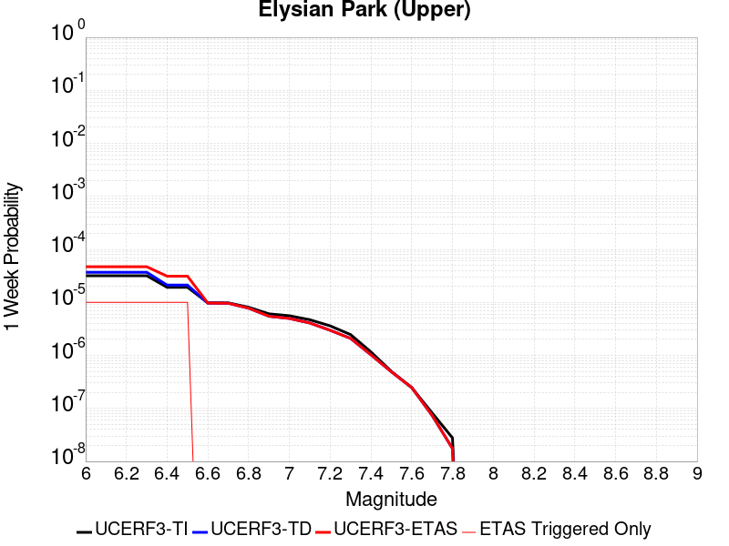 |  |  |  |

| Magnitude | 1 wk TI Prob | 1 wk TD Prob | 1 wk ETAS Prob | 1 wk ETAS/TD Gain | 1 wk ETAS Triggered Only | 1 mo TI Prob | 1 mo TD Prob | 1 mo ETAS Prob | 1 mo ETAS/TD Gain | 1 mo ETAS Triggered Only | 1 yr TI Prob | 1 yr TD Prob | 1 yr ETAS Prob | 1 yr ETAS/TD Gain | 1 yr ETAS Triggered Only | 10 yr TI Prob | 10 yr TD Prob | 10 yr ETAS Prob | 10 yr ETAS/TD Gain | 10 yr ETAS Triggered Only |
|-----|-----|-----|-----|-----|-----|-----|-----|-----|-----|-----|-----|-----|-----|-----|-----|-----|-----|-----|-----|-----|
| 6.0 | 3.1876025E-5 | 3.703652E-5 | 4.703615E-5 | 1.2699938 | 1.0E-5 | 1.3660437E-4 | 1.5872101E-4 | 1.6871943E-4 | 1.0629936 | 1.0E-5 | 0.0016618895 | 0.0019311584 | 0.0019710811 | 1.0206729 | 4.0E-5 | 0.016495159 | 0.019190295 | 0.019278567 | 1.0045999 | 9.0E-5 |
| 6.1 | 3.1876025E-5 | 3.703652E-5 | 4.703615E-5 | 1.2699938 | 1.0E-5 | 1.3660437E-4 | 1.5872101E-4 | 1.6871943E-4 | 1.0629936 | 1.0E-5 | 0.0016618895 | 0.0019311584 | 0.0019710811 | 1.0206729 | 4.0E-5 | 0.016495159 | 0.019190295 | 0.019278567 | 1.0045999 | 9.0E-5 |
| 6.2 | 3.1876025E-5 | 3.703652E-5 | 4.703615E-5 | 1.2699938 | 1.0E-5 | 1.3660437E-4 | 1.5872101E-4 | 1.6871943E-4 | 1.0629936 | 1.0E-5 | 0.0016618895 | 0.0019311584 | 0.0019710811 | 1.0206729 | 4.0E-5 | 0.016495159 | 0.019190295 | 0.019278567 | 1.0045999 | 9.0E-5 |
| 6.3 | 3.1876025E-5 | 3.703652E-5 | 4.703615E-5 | 1.2699938 | 1.0E-5 | 1.3660437E-4 | 1.5872101E-4 | 1.6871943E-4 | 1.0629936 | 1.0E-5 | 0.0016618895 | 0.0019311584 | 0.0019710811 | 1.0206729 | 4.0E-5 | 0.016495159 | 0.019190295 | 0.019278567 | 1.0045999 | 9.0E-5 |
| 6.4 | 1.9273462E-5 | 2.120273E-5 | 3.120252E-5 | 1.4716274 | 1.0E-5 | 8.259794E-5 | 9.0866655E-5 | 1.0086575E-4 | 1.1100414 | 1.0E-5 | 0.001005166 | 0.0011059135 | 0.0011358804 | 1.0270969 | 3.0E-5 | 0.010006315 | 0.011020964 | 0.011100082 | 1.0071789 | 8.0E-5 |
| 6.5 | 1.9273462E-5 | 2.120273E-5 | 3.120252E-5 | 1.4716274 | 1.0E-5 | 8.259794E-5 | 9.0866655E-5 | 1.0086575E-4 | 1.1100414 | 1.0E-5 | 0.001005166 | 0.0011059135 | 0.0011358804 | 1.0270969 | 3.0E-5 | 0.010006315 | 0.011020964 | 0.011100082 | 1.0071789 | 8.0E-5 |
| 6.6 | 9.813258E-6 | 9.665728E-6 | 9.665728E-6 | 1.0 | 0.0 | 4.205614E-5 | 4.142393E-5 | 4.142393E-5 | 1.0 | 0.0 | 5.119132E-4 | 5.042269E-4 | 5.1422184E-4 | 1.0198224 | 1.0E-5 | 0.005107356 | 0.005031552 | 0.005071351 | 1.0079098 | 4.0E-5 |
| 6.7 | 9.801478E-6 | 9.653297E-6 | 9.653297E-6 | 1.0 | 0.0 | 4.2005657E-5 | 4.137066E-5 | 4.137066E-5 | 1.0 | 0.0 | 5.112989E-4 | 5.0357863E-4 | 5.135736E-4 | 1.0198479 | 1.0E-5 | 0.0051012407 | 0.0050250986 | 0.0050648972 | 1.00792 | 4.0E-5 |
| 6.8 | 8.102489E-6 | 7.7731065E-6 | 7.7731065E-6 | 1.0 | 0.0 | 3.4724493E-5 | 3.3312917E-5 | 3.3312917E-5 | 1.0 | 0.0 | 4.2268867E-4 | 4.0551423E-4 | 4.1551018E-4 | 1.0246501 | 1.0E-5 | 0.004218856 | 0.0040482366 | 0.004068156 | 1.0049204 | 2.0E-5 |
| 6.9 | 6.08275E-6 | 5.4815127E-6 | 5.4815127E-6 | 1.0 | 0.0 | 2.6068668E-5 | 2.349199E-5 | 2.349199E-5 | 1.0 | 0.0 | 3.173398E-4 | 2.8597823E-4 | 2.9597536E-4 | 1.0349576 | 1.0E-5 | 0.0031688702 | 0.0028561796 | 0.0028761225 | 1.0069823 | 2.0E-5 |
| 7.0 | 5.5995934E-6 | 4.982836E-6 | 4.982836E-6 | 1.0 | 0.0 | 2.3998036E-5 | 2.135484E-5 | 2.135484E-5 | 1.0 | 0.0 | 2.9213692E-4 | 2.599648E-4 | 2.699622E-4 | 1.0384568 | 1.0E-5 | 0.0029175316 | 0.0025966743 | 0.0026166225 | 1.0076822 | 2.0E-5 |
| 7.1 | 4.709881E-6 | 4.0874465E-6 | 4.0874465E-6 | 1.0 | 0.0 | 2.0185047E-5 | 1.7517514E-5 | 1.7517514E-5 | 1.0 | 0.0 | 2.4572524E-4 | 2.1325526E-4 | 2.2325313E-4 | 1.0468822 | 1.0E-5 | 0.002454537 | 0.0021305475 | 0.0021405262 | 1.0046836 | 1.0E-5 |
| 7.2 | 3.6063436E-6 | 2.9779865E-6 | 2.9779865E-6 | 1.0 | 0.0 | 1.5455667E-5 | 1.2762738E-5 | 1.2762738E-5 | 1.0 | 0.0 | 1.881565E-4 | 1.5537537E-4 | 1.6537381E-4 | 1.0643502 | 1.0E-5 | 0.0018799726 | 0.0015526785 | 0.001562663 | 1.0064305 | 1.0E-5 |
| 7.3 | 2.471135E-6 | 2.0954842E-6 | 2.0954842E-6 | 1.0 | 0.0 | 1.0590536E-5 | 8.980616E-6 | 8.980616E-6 | 1.0 | 0.0 | 1.2893214E-4 | 1.0933358E-4 | 1.0933358E-4 | 1.0 | 0.0 | 0.0012885736 | 0.0010928052 | 0.0010928052 | 1.0 | 0.0 |
| 7.4 | 1.163943E-6 | 1.0275212E-6 | 1.0275212E-6 | 1.0 | 0.0 | 4.988318E-6 | 4.403655E-6 | 4.403655E-6 | 1.0 | 0.0 | 6.0731076E-5 | 5.3613214E-5 | 5.3613214E-5 | 1.0 | 0.0 | 6.071448E-4 | 5.3600577E-4 | 5.3600577E-4 | 1.0 | 0.0 |
| 7.5 | 4.99459E-7 | 4.9176606E-7 | 4.9176606E-7 | 1.0 | 0.0 | 2.140537E-6 | 2.107567E-6 | 2.107567E-6 | 1.0 | 0.0 | 2.6060725E-5 | 2.5659343E-5 | 2.5659343E-5 | 1.0 | 0.0 | 2.605767E-4 | 2.5656537E-4 | 2.5656537E-4 | 1.0 | 0.0 |
| 7.6 | 2.4667852E-7 | 2.4778674E-7 | 2.4778674E-7 | 1.0 | 0.0 | 1.0571932E-6 | 1.0619428E-6 | 1.0619428E-6 | 1.0 | 0.0 | 1.2871251E-5 | 1.2929081E-5 | 1.2929081E-5 | 1.0 | 0.0 | 1.2870505E-4 | 1.2928365E-4 | 1.2928365E-4 | 1.0 | 0.0 |
| 7.7 | 8.2312795E-8 | 7.386629E-8 | 7.386629E-8 | 1.0 | 0.0 | 3.527691E-7 | 3.1656978E-7 | 3.1656978E-7 | 1.0 | 0.0 | 4.294955E-6 | 3.8542316E-6 | 3.8542316E-6 | 1.0 | 0.0 | 4.2948723E-5 | 3.8541762E-5 | 3.8541762E-5 | 1.0 | 0.0 |
| 7.8 | 2.7819295E-8 | 1.7567322E-8 | 1.7567322E-8 | 1.0 | 0.0 | 1.1922555E-7 | 7.528852E-8 | 7.528852E-8 | 1.0 | 0.0 | 1.45157E-6 | 9.166375E-7 | 9.166375E-7 | 1.0 | 0.0 | 1.45156055E-5 | 9.166352E-6 | 9.166352E-6 | 1.0 | 0.0 |

## Mission Creek
*[(top)](#table-of-contents)*

| 1 Week | 1 Month | 1 Year | 10 Year |
|-----|-----|-----|-----|
|  |  | 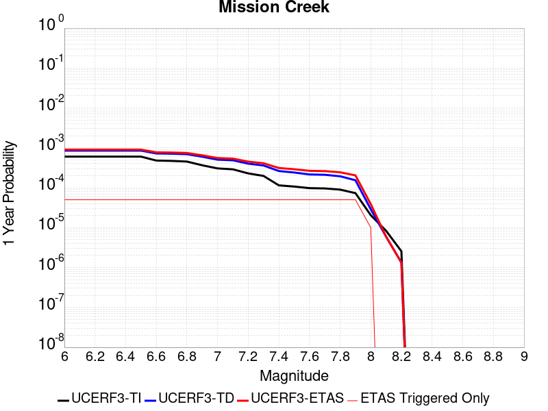 |  |

| Magnitude | 1 wk TI Prob | 1 wk TD Prob | 1 wk ETAS Prob | 1 wk ETAS/TD Gain | 1 wk ETAS Triggered Only | 1 mo TI Prob | 1 mo TD Prob | 1 mo ETAS Prob | 1 mo ETAS/TD Gain | 1 mo ETAS Triggered Only | 1 yr TI Prob | 1 yr TD Prob | 1 yr ETAS Prob | 1 yr ETAS/TD Gain | 1 yr ETAS Triggered Only | 10 yr TI Prob | 10 yr TD Prob | 10 yr ETAS Prob | 10 yr ETAS/TD Gain | 10 yr ETAS Triggered Only |
|-----|-----|-----|-----|-----|-----|-----|-----|-----|-----|-----|-----|-----|-----|-----|-----|-----|-----|-----|-----|-----|
| 6.0 | 1.1549387E-5 | 1.6324713E-5 | 2.632455E-5 | 1.6125582 | 1.0E-5 | 4.9496433E-5 | 6.9961265E-5 | 8.995987E-5 | 1.2858524 | 2.0E-5 | 6.0245243E-4 | 8.5146056E-4 | 9.01418E-4 | 1.0586727 | 5.0E-5 | 0.006008218 | 0.008511184 | 0.008600418 | 1.0104843 | 9.0E-5 |
| 6.1 | 1.1549387E-5 | 1.6324713E-5 | 2.632455E-5 | 1.6125582 | 1.0E-5 | 4.9496433E-5 | 6.9961265E-5 | 8.995987E-5 | 1.2858524 | 2.0E-5 | 6.0245243E-4 | 8.5146056E-4 | 9.01418E-4 | 1.0586727 | 5.0E-5 | 0.006008218 | 0.008511184 | 0.008600418 | 1.0104843 | 9.0E-5 |
| 6.2 | 1.1549387E-5 | 1.6324713E-5 | 2.632455E-5 | 1.6125582 | 1.0E-5 | 4.9496433E-5 | 6.9961265E-5 | 8.995987E-5 | 1.2858524 | 2.0E-5 | 6.0245243E-4 | 8.5146056E-4 | 9.01418E-4 | 1.0586727 | 5.0E-5 | 0.006008218 | 0.008511184 | 0.008600418 | 1.0104843 | 9.0E-5 |
| 6.3 | 1.1549387E-5 | 1.6324713E-5 | 2.632455E-5 | 1.6125582 | 1.0E-5 | 4.9496433E-5 | 6.9961265E-5 | 8.995987E-5 | 1.2858524 | 2.0E-5 | 6.0245243E-4 | 8.5146056E-4 | 9.01418E-4 | 1.0586727 | 5.0E-5 | 0.006008218 | 0.008511184 | 0.008600418 | 1.0104843 | 9.0E-5 |
| 6.4 | 1.1549387E-5 | 1.6324713E-5 | 2.632455E-5 | 1.6125582 | 1.0E-5 | 4.9496433E-5 | 6.9961265E-5 | 8.995987E-5 | 1.2858524 | 2.0E-5 | 6.0245243E-4 | 8.5146056E-4 | 9.01418E-4 | 1.0586727 | 5.0E-5 | 0.006008218 | 0.008511184 | 0.008600418 | 1.0104843 | 9.0E-5 |
| 6.5 | 1.1549387E-5 | 1.6324713E-5 | 2.632455E-5 | 1.6125582 | 1.0E-5 | 4.9496433E-5 | 6.9961265E-5 | 8.995987E-5 | 1.2858524 | 2.0E-5 | 6.0245243E-4 | 8.5146056E-4 | 9.01418E-4 | 1.0586727 | 5.0E-5 | 0.006008218 | 0.008511184 | 0.008600418 | 1.0104843 | 9.0E-5 |
| 6.6 | 9.202681E-6 | 1.3847972E-5 | 2.3847833E-5 | 1.7221174 | 1.0E-5 | 3.9439463E-5 | 5.9347152E-5 | 7.934596E-5 | 1.3369802 | 2.0E-5 | 4.800697E-4 | 7.2232104E-4 | 7.722849E-4 | 1.0691713 | 5.0E-5 | 0.004790339 | 0.0072283596 | 0.0073177093 | 1.0123609 | 9.0E-5 |
| 6.7 | 9.019164E-6 | 1.365364E-5 | 2.3653503E-5 | 1.7323954 | 1.0E-5 | 3.8652986E-5 | 5.8514335E-5 | 7.851316E-5 | 1.3417766 | 2.0E-5 | 4.7049852E-4 | 7.121882E-4 | 7.621526E-4 | 1.0701562 | 5.0E-5 | 0.004695036 | 0.0071276836 | 0.007217042 | 1.0125368 | 9.0E-5 |
| 6.8 | 8.673558E-6 | 1.3275746E-5 | 2.3275614E-5 | 1.7532433 | 1.0E-5 | 3.717186E-5 | 5.6894864E-5 | 7.6893724E-5 | 1.3515056 | 2.0E-5 | 4.524734E-4 | 6.924836E-4 | 7.42449E-4 | 1.0721539 | 5.0E-5 | 0.0045155324 | 0.0069318693 | 0.0070212455 | 1.0128936 | 9.0E-5 |
| 6.9 | 7.002255E-6 | 1.1479958E-5 | 2.1479842E-5 | 1.8710734 | 1.0E-5 | 3.000932E-5 | 4.9198927E-5 | 6.9197944E-5 | 1.406493 | 2.0E-5 | 3.653022E-4 | 5.988392E-4 | 6.4880925E-4 | 1.0834448 | 5.0E-5 | 0.0036470229 | 0.0060006846 | 0.006080204 | 1.0132518 | 8.0E-5 |
| 7.0 | 5.84644E-6 | 9.677164E-6 | 1.9677067E-5 | 2.0333507 | 1.0E-5 | 2.5055931E-5 | 4.1472922E-5 | 6.147209E-5 | 1.4822223 | 2.0E-5 | 3.0501327E-4 | 5.0482043E-4 | 5.547952E-4 | 1.0989951 | 5.0E-5 | 0.0030459496 | 0.0050649596 | 0.005144554 | 1.0157148 | 8.0E-5 |
| 7.1 | 5.54703E-6 | 9.331631E-6 | 1.9331537E-5 | 2.071614 | 1.0E-5 | 2.377277E-5 | 3.999212E-5 | 5.999132E-5 | 1.5000786 | 2.0E-5 | 2.8939504E-4 | 4.8679972E-4 | 5.367754E-4 | 1.1026616 | 5.0E-5 | 0.0028901845 | 0.0048855497 | 0.0049651586 | 1.0162948 | 8.0E-5 |
| 7.2 | 4.384709E-6 | 7.6836495E-6 | 1.7683573E-5 | 2.301455 | 1.0E-5 | 1.8791474E-5 | 3.292953E-5 | 5.292887E-5 | 1.6073376 | 2.0E-5 | 2.2876218E-4 | 4.0084694E-4 | 4.508269E-4 | 1.1246859 | 5.0E-5 | 0.0022852682 | 0.0040294197 | 0.004109097 | 1.019774 | 8.0E-5 |
| 7.3 | 3.7888456E-6 | 6.9174894E-6 | 1.691742E-5 | 2.4456012 | 1.0E-5 | 1.623781E-5 | 2.9646066E-5 | 4.9645474E-5 | 1.6746057 | 2.0E-5 | 1.9767738E-4 | 3.608844E-4 | 4.1086637E-4 | 1.1384985 | 5.0E-5 | 0.0019750162 | 0.0036311483 | 0.0037108576 | 1.0219516 | 8.0E-5 |
| 7.4 | 2.1982462E-6 | 5.0257536E-6 | 1.5025704E-5 | 2.9897413 | 1.0E-5 | 9.421021E-6 | 2.1538768E-5 | 4.1538337E-5 | 1.9285382 | 2.0E-5 | 1.1469489E-4 | 2.6220313E-4 | 3.1219E-4 | 1.1906419 | 5.0E-5 | 0.0011463572 | 0.0026468872 | 0.0027266755 | 1.0301442 | 8.0E-5 |
| 7.5 | 2.051923E-6 | 4.6169393E-6 | 1.4616893E-5 | 3.165927 | 1.0E-5 | 8.793926E-6 | 1.9786734E-5 | 3.9786337E-5 | 2.0107582 | 2.0E-5 | 1.0706078E-4 | 2.40877E-4 | 2.9086496E-4 | 1.2075248 | 5.0E-5 | 0.0010700922 | 0.0024345173 | 0.0025143223 | 1.0327808 | 8.0E-5 |
| 7.6 | 1.8733427E-6 | 4.1252324E-6 | 1.4125191E-5 | 3.4240959 | 1.0E-5 | 8.028587E-6 | 1.767945E-5 | 3.7679096E-5 | 2.131237 | 2.0E-5 | 9.774366E-5 | 2.1522611E-4 | 2.6521535E-4 | 1.2322638 | 5.0E-5 | 9.770069E-4 | 0.0021790217 | 0.0022588472 | 1.0366337 | 8.0E-5 |
| 7.7 | 1.8411953E-6 | 4.044895E-6 | 1.4044855E-5 | 3.472242 | 1.0E-5 | 7.890813E-6 | 1.733515E-5 | 3.73348E-5 | 2.1537054 | 2.0E-5 | 9.606641E-5 | 2.1103508E-4 | 2.610245E-4 | 1.2368774 | 5.0E-5 | 9.6024893E-4 | 0.0021373003 | 0.0022171293 | 1.0373504 | 8.0E-5 |
| 7.8 | 1.7194251E-6 | 3.7121463E-6 | 1.3712109E-5 | 3.6938493 | 1.0E-5 | 7.368944E-6 | 1.5909101E-5 | 3.5908783E-5 | 2.257122 | 2.0E-5 | 8.97132E-5 | 1.9367617E-4 | 2.4366648E-4 | 1.2581129 | 5.0E-5 | 8.967699E-4 | 0.0019632233 | 0.002043066 | 1.0406693 | 8.0E-5 |
| 7.9 | 1.4035052E-6 | 2.9514722E-6 | 1.2951443E-5 | 4.3881297 | 1.0E-5 | 6.0150082E-6 | 1.2649106E-5 | 3.264885E-5 | 2.5811193 | 2.0E-5 | 7.3230265E-5 | 1.5399205E-4 | 2.0398434E-4 | 1.3246421 | 5.0E-5 | 7.3206134E-4 | 0.0015638224 | 0.0016436973 | 1.0510767 | 8.0E-5 |
| 8.0 | 3.9318823E-7 | 5.5319464E-7 | 5.5319464E-7 | 1.0 | 0.0 | 1.6850913E-6 | 2.3708321E-6 | 2.3708321E-6 | 1.0 | 0.0 | 2.0515794E-5 | 2.8864504E-5 | 3.8864215E-5 | 1.3464363 | 1.0E-5 | 2.0513899E-4 | 2.9916913E-4 | 3.0916615E-4 | 1.0334159 | 1.0E-5 |
| 8.1 | 1.596793E-7 | 1.1391901E-7 | 1.1391901E-7 | 1.0 | 0.0 | 6.8433974E-7 | 4.8822426E-7 | 4.8822426E-7 | 1.0 | 0.0 | 8.331805E-6 | 5.944114E-6 | 5.944114E-6 | 1.0 | 0.0 | 8.331492E-5 | 6.5564316E-5 | 6.5564316E-5 | 1.0 | 0.0 |
| 8.2 | 4.9003038E-8 | 2.5475106E-8 | 2.5475106E-8 | 1.0 | 0.0 | 2.10013E-7 | 1.0917902E-7 | 1.0917902E-7 | 1.0 | 0.0 | 2.5569052E-6 | 1.3292538E-6 | 1.3292538E-6 | 1.0 | 0.0 | 2.556876E-5 | 1.4973085E-5 | 1.4973085E-5 | 1.0 | 0.0 |

## Lost Hills
*[(top)](#table-of-contents)*

| 1 Week | 1 Month | 1 Year | 10 Year |
|-----|-----|-----|-----|
|  |  |  | 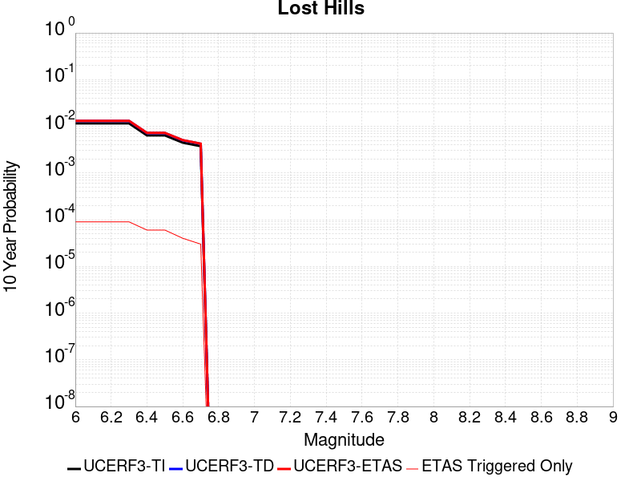 |

| Magnitude | 1 wk TI Prob | 1 wk TD Prob | 1 wk ETAS Prob | 1 wk ETAS/TD Gain | 1 wk ETAS Triggered Only | 1 mo TI Prob | 1 mo TD Prob | 1 mo ETAS Prob | 1 mo ETAS/TD Gain | 1 mo ETAS Triggered Only | 1 yr TI Prob | 1 yr TD Prob | 1 yr ETAS Prob | 1 yr ETAS/TD Gain | 1 yr ETAS Triggered Only | 10 yr TI Prob | 10 yr TD Prob | 10 yr ETAS Prob | 10 yr ETAS/TD Gain | 10 yr ETAS Triggered Only |
|-----|-----|-----|-----|-----|-----|-----|-----|-----|-----|-----|-----|-----|-----|-----|-----|-----|-----|-----|-----|-----|
| 6.0 | 2.233523E-5 | 2.5106996E-5 | 2.5106996E-5 | 1.0 | 0.0 | 9.571891E-5 | 1.0759792E-4 | 1.2759576E-4 | 1.1858572 | 2.0E-5 | 0.0011647546 | 0.0013093855 | 0.0013693069 | 1.045763 | 6.0E-5 | 0.011586686 | 0.013033304 | 0.013122131 | 1.0068154 | 9.0E-5 |
| 6.1 | 2.233523E-5 | 2.5106996E-5 | 2.5106996E-5 | 1.0 | 0.0 | 9.571891E-5 | 1.0759792E-4 | 1.2759576E-4 | 1.1858572 | 2.0E-5 | 0.0011647546 | 0.0013093855 | 0.0013693069 | 1.045763 | 6.0E-5 | 0.011586686 | 0.013033304 | 0.013122131 | 1.0068154 | 9.0E-5 |
| 6.2 | 2.233523E-5 | 2.5106996E-5 | 2.5106996E-5 | 1.0 | 0.0 | 9.571891E-5 | 1.0759792E-4 | 1.2759576E-4 | 1.1858572 | 2.0E-5 | 0.0011647546 | 0.0013093855 | 0.0013693069 | 1.045763 | 6.0E-5 | 0.011586686 | 0.013033304 | 0.013122131 | 1.0068154 | 9.0E-5 |
| 6.3 | 2.233523E-5 | 2.5106996E-5 | 2.5106996E-5 | 1.0 | 0.0 | 9.571891E-5 | 1.0759792E-4 | 1.2759576E-4 | 1.1858572 | 2.0E-5 | 0.0011647546 | 0.0013093855 | 0.0013693069 | 1.045763 | 6.0E-5 | 0.011586686 | 0.013033304 | 0.013122131 | 1.0068154 | 9.0E-5 |
| 6.4 | 1.2288092E-5 | 1.37813295E-5 | 1.37813295E-5 | 1.0 | 0.0 | 5.2662188E-5 | 5.9062033E-5 | 6.906144E-5 | 1.1693035 | 1.0E-5 | 6.409735E-4 | 7.189368E-4 | 7.5890805E-4 | 1.0555977 | 4.0E-5 | 0.006391279 | 0.007175316 | 0.0072348854 | 1.008302 | 6.0E-5 |
| 6.5 | 1.2288092E-5 | 1.37813295E-5 | 1.37813295E-5 | 1.0 | 0.0 | 5.2662188E-5 | 5.9062033E-5 | 6.906144E-5 | 1.1693035 | 1.0E-5 | 6.409735E-4 | 7.189368E-4 | 7.5890805E-4 | 1.0555977 | 4.0E-5 | 0.006391279 | 0.007175316 | 0.0072348854 | 1.008302 | 6.0E-5 |
| 6.6 | 8.58281E-6 | 9.633926E-6 | 9.633926E-6 | 1.0 | 0.0 | 3.6782953E-5 | 4.1288073E-5 | 5.1287658E-5 | 1.2421907 | 1.0E-5 | 4.4774043E-4 | 5.026495E-4 | 5.3263444E-4 | 1.0596538 | 3.0E-5 | 0.0044683935 | 0.0050232867 | 0.005063086 | 1.0079229 | 4.0E-5 |
| 6.7 | 7.205685E-6 | 8.088433E-6 | 8.088433E-6 | 1.0 | 0.0 | 3.088114E-5 | 3.4664714E-5 | 4.4664368E-5 | 1.2884678 | 1.0E-5 | 3.7591302E-4 | 4.2204288E-4 | 4.5203022E-4 | 1.0710528 | 3.0E-5 | 0.0037527776 | 0.004220429 | 0.0042503024 | 1.0070783 | 3.0E-5 |

## Kern Canyon (North Kern) 2011
*[(top)](#table-of-contents)*

| 1 Week | 1 Month | 1 Year | 10 Year |
|-----|-----|-----|-----|
| 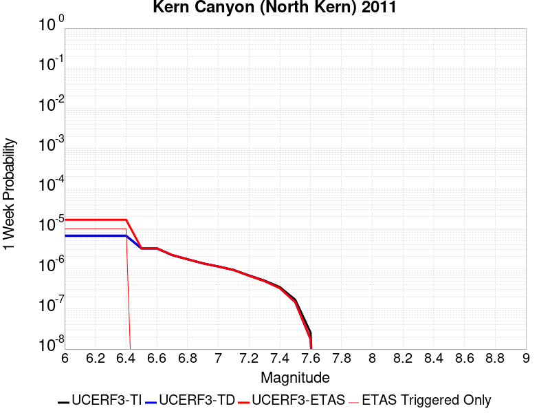 |  |  |  |

| Magnitude | 1 wk TI Prob | 1 wk TD Prob | 1 wk ETAS Prob | 1 wk ETAS/TD Gain | 1 wk ETAS Triggered Only | 1 mo TI Prob | 1 mo TD Prob | 1 mo ETAS Prob | 1 mo ETAS/TD Gain | 1 mo ETAS Triggered Only | 1 yr TI Prob | 1 yr TD Prob | 1 yr ETAS Prob | 1 yr ETAS/TD Gain | 1 yr ETAS Triggered Only | 10 yr TI Prob | 10 yr TD Prob | 10 yr ETAS Prob | 10 yr ETAS/TD Gain | 10 yr ETAS Triggered Only |
|-----|-----|-----|-----|-----|-----|-----|-----|-----|-----|-----|-----|-----|-----|-----|-----|-----|-----|-----|-----|-----|
| 6.0 | 6.6264497E-6 | 6.7573515E-6 | 1.6757283E-5 | 2.4798598 | 1.0E-5 | 2.8398761E-5 | 2.8959801E-5 | 3.895951E-5 | 1.3452963 | 1.0E-5 | 3.4570007E-4 | 3.5253653E-4 | 3.8252596E-4 | 1.0850675 | 3.0E-5 | 0.0034516277 | 0.0035205614 | 0.0036002798 | 1.0226437 | 8.0E-5 |
| 6.1 | 6.6264497E-6 | 6.7573515E-6 | 1.6757283E-5 | 2.4798598 | 1.0E-5 | 2.8398761E-5 | 2.8959801E-5 | 3.895951E-5 | 1.3452963 | 1.0E-5 | 3.4570007E-4 | 3.5253653E-4 | 3.8252596E-4 | 1.0850675 | 3.0E-5 | 0.0034516277 | 0.0035205614 | 0.0036002798 | 1.0226437 | 8.0E-5 |
| 6.2 | 6.6264497E-6 | 6.7573515E-6 | 1.6757283E-5 | 2.4798598 | 1.0E-5 | 2.8398761E-5 | 2.8959801E-5 | 3.895951E-5 | 1.3452963 | 1.0E-5 | 3.4570007E-4 | 3.5253653E-4 | 3.8252596E-4 | 1.0850675 | 3.0E-5 | 0.0034516277 | 0.0035205614 | 0.0036002798 | 1.0226437 | 8.0E-5 |
| 6.3 | 6.6264497E-6 | 6.7573515E-6 | 1.6757283E-5 | 2.4798598 | 1.0E-5 | 2.8398761E-5 | 2.8959801E-5 | 3.895951E-5 | 1.3452963 | 1.0E-5 | 3.4570007E-4 | 3.5253653E-4 | 3.8252596E-4 | 1.0850675 | 3.0E-5 | 0.0034516277 | 0.0035205614 | 0.0036002798 | 1.0226437 | 8.0E-5 |
| 6.4 | 6.6264497E-6 | 6.7573515E-6 | 1.6757283E-5 | 2.4798598 | 1.0E-5 | 2.8398761E-5 | 2.8959801E-5 | 3.895951E-5 | 1.3452963 | 1.0E-5 | 3.4570007E-4 | 3.5253653E-4 | 3.8252596E-4 | 1.0850675 | 3.0E-5 | 0.0034516277 | 0.0035205614 | 0.0036002798 | 1.0226437 | 8.0E-5 |
| 6.5 | 3.2162225E-6 | 3.2571006E-6 | 3.2571006E-6 | 1.0 | 0.0 | 1.3783738E-5 | 1.3958933E-5 | 1.3958933E-5 | 1.0 | 0.0 | 1.6780409E-4 | 1.6993756E-4 | 1.8993416E-4 | 1.1176703 | 2.0E-5 | 0.0016767744 | 0.0016981558 | 0.0017580539 | 1.0352725 | 6.0E-5 |
| 6.6 | 3.2162225E-6 | 3.2571006E-6 | 3.2571006E-6 | 1.0 | 0.0 | 1.3783738E-5 | 1.3958933E-5 | 1.3958933E-5 | 1.0 | 0.0 | 1.6780409E-4 | 1.6993756E-4 | 1.8993416E-4 | 1.1176703 | 2.0E-5 | 0.0016767744 | 0.0016981558 | 0.0017580539 | 1.0352725 | 6.0E-5 |
| 6.7 | 2.1908265E-6 | 2.2071279E-6 | 2.2071279E-6 | 1.0 | 0.0 | 9.389223E-6 | 9.459087E-6 | 9.459087E-6 | 1.0 | 0.0 | 1.1430779E-4 | 1.1515849E-4 | 1.2515734E-4 | 1.0868268 | 1.0E-5 | 0.0011424901 | 0.0011510076 | 0.0011909616 | 1.0347122 | 4.0E-5 |
| 6.8 | 1.7303895E-6 | 1.7365574E-6 | 1.7365574E-6 | 1.0 | 0.0 | 7.415934E-6 | 7.442368E-6 | 7.442368E-6 | 1.0 | 0.0 | 9.028525E-5 | 9.060716E-5 | 9.060716E-5 | 1.0 | 0.0 | 9.024858E-4 | 9.057119E-4 | 9.356847E-4 | 1.0330931 | 3.0E-5 |
| 6.9 | 1.3700314E-6 | 1.3688657E-6 | 1.3688657E-6 | 1.0 | 0.0 | 5.87155E-6 | 5.866554E-6 | 5.866554E-6 | 1.0 | 0.0 | 7.148377E-5 | 7.1423005E-5 | 7.1423005E-5 | 1.0 | 0.0 | 7.146078E-4 | 7.1400503E-4 | 7.3399075E-4 | 1.027991 | 2.0E-5 |
| 7.0 | 1.1467797E-6 | 1.1413833E-6 | 1.1413833E-6 | 1.0 | 0.0 | 4.9147607E-6 | 4.8916336E-6 | 4.8916336E-6 | 1.0 | 0.0 | 5.983557E-5 | 5.9554044E-5 | 5.9554044E-5 | 1.0 | 0.0 | 5.981946E-4 | 5.95384E-4 | 5.95384E-4 | 1.0 | 0.0 |
| 7.1 | 9.3952065E-7 | 9.302714E-7 | 9.302714E-7 | 1.0 | 0.0 | 4.026511E-6 | 3.9868714E-6 | 3.9868714E-6 | 1.0 | 0.0 | 4.9021666E-5 | 4.8539096E-5 | 4.8539096E-5 | 1.0 | 0.0 | 4.901085E-4 | 4.8528673E-4 | 4.8528673E-4 | 1.0 | 0.0 |
| 7.2 | 6.858055E-7 | 6.719318E-7 | 6.719318E-7 | 1.0 | 0.0 | 2.939163E-6 | 2.8797044E-6 | 2.8797044E-6 | 1.0 | 0.0 | 3.5783723E-5 | 3.5059846E-5 | 3.5059846E-5 | 1.0 | 0.0 | 3.5777962E-4 | 3.5054405E-4 | 3.5054405E-4 | 1.0 | 0.0 |
| 7.3 | 5.1101983E-7 | 4.939313E-7 | 4.939313E-7 | 1.0 | 0.0 | 2.1900833E-6 | 2.1168466E-6 | 2.1168466E-6 | 1.0 | 0.0 | 2.6663936E-5 | 2.5772308E-5 | 2.5772308E-5 | 1.0 | 0.0 | 2.6660739E-4 | 2.5769367E-4 | 2.5769367E-4 | 1.0 | 0.0 |
| 7.4 | 3.4999414E-7 | 3.2995996E-7 | 3.2995996E-7 | 1.0 | 0.0 | 1.499974E-6 | 1.4141134E-6 | 1.4141134E-6 | 1.0 | 0.0 | 1.8262032E-5 | 1.7216697E-5 | 1.7216697E-5 | 1.0 | 0.0 | 1.826053E-4 | 1.7215387E-4 | 1.7215387E-4 | 1.0 | 0.0 |
| 7.5 | 1.7021522E-7 | 1.4750091E-7 | 1.4750091E-7 | 1.0 | 0.0 | 7.2949354E-7 | 6.3214657E-7 | 6.3214657E-7 | 1.0 | 0.0 | 8.881548E-6 | 7.696359E-6 | 7.696359E-6 | 1.0 | 0.0 | 8.8811925E-5 | 7.6961E-5 | 7.6961E-5 | 1.0 | 0.0 |
| 7.6 | 2.572245E-8 | 1.7352637E-8 | 1.7352637E-8 | 1.0 | 0.0 | 1.10239064E-7 | 7.4368444E-8 | 7.4368444E-8 | 1.0 | 0.0 | 1.3421597E-6 | 9.0543546E-7 | 9.0543546E-7 | 1.0 | 0.0 | 1.3421517E-5 | 9.0543235E-6 | 9.0543235E-6 | 1.0 | 0.0 |

## San Jacinto (Stepovers Combined)
*[(top)](#table-of-contents)*

| 1 Week | 1 Month | 1 Year | 10 Year |
|-----|-----|-----|-----|
| 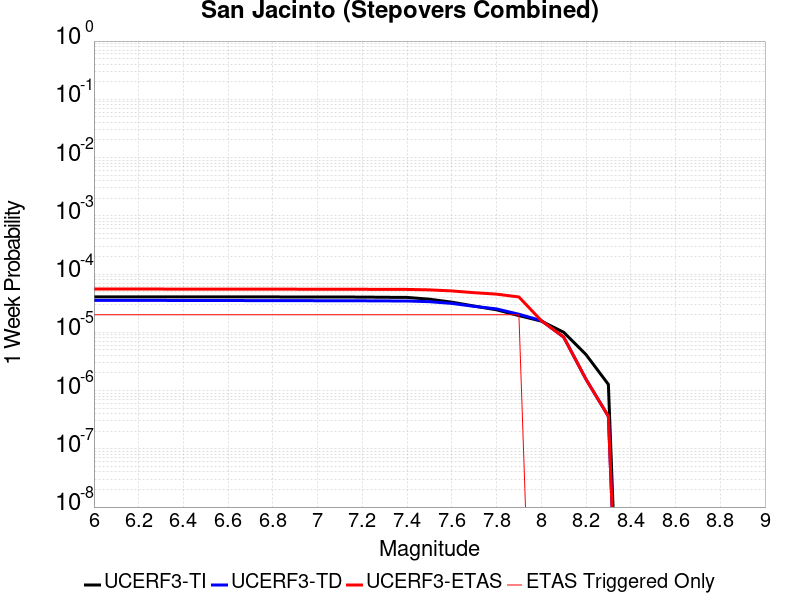 |  |  | 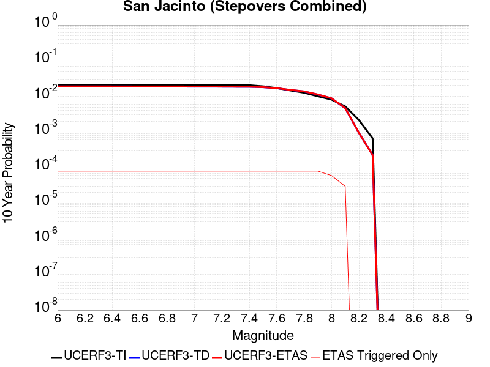 |

| Magnitude | 1 wk TI Prob | 1 wk TD Prob | 1 wk ETAS Prob | 1 wk ETAS/TD Gain | 1 wk ETAS Triggered Only | 1 mo TI Prob | 1 mo TD Prob | 1 mo ETAS Prob | 1 mo ETAS/TD Gain | 1 mo ETAS Triggered Only | 1 yr TI Prob | 1 yr TD Prob | 1 yr ETAS Prob | 1 yr ETAS/TD Gain | 1 yr ETAS Triggered Only | 10 yr TI Prob | 10 yr TD Prob | 10 yr ETAS Prob | 10 yr ETAS/TD Gain | 10 yr ETAS Triggered Only |
|-----|-----|-----|-----|-----|-----|-----|-----|-----|-----|-----|-----|-----|-----|-----|-----|-----|-----|-----|-----|-----|
| 6.0 | 4.0667746E-5 | 3.5287198E-5 | 5.528649E-5 | 1.5667578 | 2.0E-5 | 1.742787E-4 | 1.5122209E-4 | 1.8121755E-4 | 1.1983538 | 3.0E-5 | 0.0021197782 | 0.0018395748 | 0.0018994644 | 1.0325562 | 6.0E-5 | 0.020996714 | 0.018994363 | 0.019072844 | 1.0041318 | 8.0E-5 |
| 6.1 | 4.0667746E-5 | 3.5287198E-5 | 5.528649E-5 | 1.5667578 | 2.0E-5 | 1.742787E-4 | 1.5122209E-4 | 1.8121755E-4 | 1.1983538 | 3.0E-5 | 0.0021197782 | 0.0018395748 | 0.0018994644 | 1.0325562 | 6.0E-5 | 0.020996714 | 0.018994363 | 0.019072844 | 1.0041318 | 8.0E-5 |
| 6.2 | 4.0667746E-5 | 3.5287198E-5 | 5.528649E-5 | 1.5667578 | 2.0E-5 | 1.742787E-4 | 1.5122209E-4 | 1.8121755E-4 | 1.1983538 | 3.0E-5 | 0.0021197782 | 0.0018395748 | 0.0018994644 | 1.0325562 | 6.0E-5 | 0.020996714 | 0.018994363 | 0.019072844 | 1.0041318 | 8.0E-5 |
| 6.3 | 4.0667746E-5 | 3.5287198E-5 | 5.528649E-5 | 1.5667578 | 2.0E-5 | 1.742787E-4 | 1.5122209E-4 | 1.8121755E-4 | 1.1983538 | 3.0E-5 | 0.0021197782 | 0.0018395748 | 0.0018994644 | 1.0325562 | 6.0E-5 | 0.020996714 | 0.018994363 | 0.019072844 | 1.0041318 | 8.0E-5 |
| 6.4 | 4.0577226E-5 | 3.515909E-5 | 5.5158387E-5 | 1.568823 | 2.0E-5 | 1.738908E-4 | 1.5067312E-4 | 1.806686E-4 | 1.1990765 | 3.0E-5 | 0.0021150648 | 0.0018329041 | 0.0018927942 | 1.0326749 | 6.0E-5 | 0.020950472 | 0.018928928 | 0.019007415 | 1.0041463 | 8.0E-5 |
| 6.5 | 4.0577226E-5 | 3.515909E-5 | 5.5158387E-5 | 1.568823 | 2.0E-5 | 1.738908E-4 | 1.5067312E-4 | 1.806686E-4 | 1.1990765 | 3.0E-5 | 0.0021150648 | 0.0018329041 | 0.0018927942 | 1.0326749 | 6.0E-5 | 0.020950472 | 0.018928928 | 0.019007415 | 1.0041463 | 8.0E-5 |
| 6.6 | 4.053861E-5 | 3.5104433E-5 | 5.510373E-5 | 1.5697086 | 2.0E-5 | 1.7372532E-4 | 1.5043891E-4 | 1.8043439E-4 | 1.1993865 | 3.0E-5 | 0.0021130538 | 0.0018300572 | 0.0018899475 | 1.0327258 | 6.0E-5 | 0.020930743 | 0.018901005 | 0.018979494 | 1.0041525 | 8.0E-5 |
| 6.7 | 4.0516545E-5 | 3.50735E-5 | 5.5072796E-5 | 1.5702112 | 2.0E-5 | 1.7363077E-4 | 1.5030634E-4 | 1.8030184E-4 | 1.1995624 | 3.0E-5 | 0.002111905 | 0.0018284466 | 0.0018883368 | 1.0327548 | 6.0E-5 | 0.020919468 | 0.018885203 | 0.01896369 | 1.0041561 | 8.0E-5 |
| 6.8 | 4.049434E-5 | 3.504506E-5 | 5.504436E-5 | 1.5706738 | 2.0E-5 | 1.7353562E-4 | 1.5018447E-4 | 1.8017997E-4 | 1.1997243 | 3.0E-5 | 0.0021107488 | 0.0018269654 | 0.0018868557 | 1.0327814 | 6.0E-5 | 0.020908125 | 0.018870614 | 0.018949104 | 1.0041595 | 8.0E-5 |
| 6.9 | 4.046386E-5 | 3.500762E-5 | 5.5006916E-5 | 1.5712842 | 2.0E-5 | 1.73405E-4 | 1.5002403E-4 | 1.8001953E-4 | 1.1999379 | 3.0E-5 | 0.0021091616 | 0.0018250152 | 0.0018849057 | 1.0328164 | 6.0E-5 | 0.020892553 | 0.018851386 | 0.018929878 | 1.0041637 | 8.0E-5 |
| 7.0 | 4.036382E-5 | 3.4888177E-5 | 5.4887478E-5 | 1.57324 | 2.0E-5 | 1.7297632E-4 | 1.4951221E-4 | 1.7950773E-4 | 1.2006226 | 3.0E-5 | 0.0021039525 | 0.0018187946 | 0.0018786854 | 1.0329288 | 6.0E-5 | 0.02084144 | 0.018789997 | 0.018868495 | 1.0041776 | 8.0E-5 |
| 7.1 | 4.0343282E-5 | 3.486664E-5 | 5.486594E-5 | 1.5735942 | 2.0E-5 | 1.7288832E-4 | 1.4941991E-4 | 1.7941542E-4 | 1.2007464 | 3.0E-5 | 0.002102883 | 0.0018176727 | 0.0018775637 | 1.0329492 | 6.0E-5 | 0.020830948 | 0.018778874 | 0.018857373 | 1.0041801 | 8.0E-5 |
| 7.2 | 4.0257353E-5 | 3.4771132E-5 | 5.4770437E-5 | 1.5751698 | 2.0E-5 | 1.725201E-4 | 1.4901065E-4 | 1.7900618E-4 | 1.2012979 | 3.0E-5 | 0.0020984085 | 0.0018126983 | 0.0018725896 | 1.0330398 | 6.0E-5 | 0.020787042 | 0.01872961 | 0.018808112 | 1.0041913 | 8.0E-5 |
| 7.3 | 3.9940667E-5 | 3.4598754E-5 | 5.4598062E-5 | 1.5780355 | 2.0E-5 | 1.7116306E-4 | 1.4827197E-4 | 1.7826751E-4 | 1.2023009 | 3.0E-5 | 0.0020819185 | 0.0018037198 | 0.0018636115 | 1.0332046 | 6.0E-5 | 0.020625217 | 0.018638225 | 0.018716734 | 1.0042123 | 8.0E-5 |
| 7.4 | 3.9721202E-5 | 3.4484117E-5 | 5.448343E-5 | 1.5799571 | 2.0E-5 | 1.7022261E-4 | 1.4778072E-4 | 1.777763E-4 | 1.2029735 | 3.0E-5 | 0.0020704903 | 0.0017977487 | 0.0018576409 | 1.0333151 | 6.0E-5 | 0.020513052 | 0.018577335 | 0.018655848 | 1.0042263 | 8.0E-5 |
| 7.5 | 3.7036873E-5 | 3.355129E-5 | 5.355062E-5 | 1.5960823 | 2.0E-5 | 1.5871979E-4 | 1.4378333E-4 | 1.7377902E-4 | 1.2086173 | 3.0E-5 | 0.0019307006 | 0.0017491594 | 0.0018090544 | 1.0342422 | 6.0E-5 | 0.019140124 | 0.018078765 | 0.018157318 | 1.004345 | 8.0E-5 |
| 7.6 | 3.2940967E-5 | 3.133173E-5 | 5.1331102E-5 | 1.6383106 | 2.0E-5 | 1.4116794E-4 | 1.3427193E-4 | 1.6426791E-4 | 1.2233971 | 3.0E-5 | 0.0017173645 | 0.0016335372 | 0.0016934392 | 1.0366701 | 6.0E-5 | 0.01704153 | 0.016911475 | 0.016990123 | 1.0046505 | 8.0E-5 |
| 7.7 | 2.8236149E-5 | 2.7897275E-5 | 4.7896716E-5 | 1.7168959 | 2.0E-5 | 1.2100645E-4 | 1.1955428E-4 | 1.4955069E-4 | 1.250902 | 3.0E-5 | 0.0014722579 | 0.0014546025 | 0.0015145153 | 1.0411884 | 6.0E-5 | 0.014625421 | 0.015122045 | 0.015200836 | 1.0052103 | 8.0E-5 |
| 7.8 | 2.4329287E-5 | 2.5220394E-5 | 4.521989E-5 | 1.792989 | 2.0E-5 | 1.042642E-4 | 1.0808293E-4 | 1.3807969E-4 | 1.2775346 | 3.0E-5 | 0.0012686774 | 0.0013151162 | 0.0013750372 | 1.0455633 | 6.0E-5 | 0.012614589 | 0.013719083 | 0.013797985 | 1.0057513 | 8.0E-5 |
| 7.9 | 1.9370926E-5 | 2.0433014E-5 | 4.0432606E-5 | 1.9787881 | 2.0E-5 | 8.301561E-5 | 8.7567125E-5 | 1.17564494E-4 | 1.3425643 | 3.0E-5 | 0.0010102465 | 0.001065609 | 0.0011255451 | 1.0562458 | 6.0E-5 | 0.0100566605 | 0.011205519 | 0.011284622 | 1.0070593 | 8.0E-5 |
| 8.0 | 1.5583017E-5 | 1.5896165E-5 | 1.5896165E-5 | 1.0 | 0.0 | 6.6782646E-5 | 6.8124646E-5 | 7.8123965E-5 | 1.1467798 | 1.0E-5 | 8.127754E-4 | 8.2910265E-4 | 8.690695E-4 | 1.0482049 | 4.0E-5 | 0.008098091 | 0.008786912 | 0.0088463845 | 1.0067683 | 6.0E-5 |
| 8.1 | 1.0024873E-5 | 8.298104E-6 | 8.298104E-6 | 1.0 | 0.0 | 4.2963035E-5 | 3.556282E-5 | 4.5562465E-5 | 1.2811825 | 1.0E-5 | 5.229494E-4 | 4.3289183E-4 | 4.6287884E-4 | 1.0692713 | 3.0E-5 | 0.0052172043 | 0.0046564727 | 0.004686333 | 1.0064126 | 3.0E-5 |
| 8.2 | 4.142796E-6 | 1.5626505E-6 | 1.5626505E-6 | 1.0 | 0.0 | 1.775472E-5 | 6.697056E-6 | 6.697056E-6 | 1.0 | 0.0 | 2.1614227E-4 | 8.153364E-5 | 8.153364E-5 | 1.0 | 0.0 | 0.0021593217 | 9.464045E-4 | 9.464045E-4 | 1.0 | 0.0 |
| 8.3 | 1.2750878E-6 | 3.6166134E-7 | 3.6166134E-7 | 1.0 | 0.0 | 5.4646503E-6 | 1.5499762E-6 | 1.5499762E-6 | 1.0 | 0.0 | 6.653009E-5 | 1.8870802E-5 | 1.8870802E-5 | 1.0 | 0.0 | 6.6510175E-4 | 2.2760578E-4 | 2.2760578E-4 | 1.0 | 0.0 |

## Rose Canyon
*[(top)](#table-of-contents)*

| 1 Week | 1 Month | 1 Year | 10 Year |
|-----|-----|-----|-----|
|  |  |  |  |

| Magnitude | 1 wk TI Prob | 1 wk TD Prob | 1 wk ETAS Prob | 1 wk ETAS/TD Gain | 1 wk ETAS Triggered Only | 1 mo TI Prob | 1 mo TD Prob | 1 mo ETAS Prob | 1 mo ETAS/TD Gain | 1 mo ETAS Triggered Only | 1 yr TI Prob | 1 yr TD Prob | 1 yr ETAS Prob | 1 yr ETAS/TD Gain | 1 yr ETAS Triggered Only | 10 yr TI Prob | 10 yr TD Prob | 10 yr ETAS Prob | 10 yr ETAS/TD Gain | 10 yr ETAS Triggered Only |
|-----|-----|-----|-----|-----|-----|-----|-----|-----|-----|-----|-----|-----|-----|-----|-----|-----|-----|-----|-----|-----|
| 6.0 | 4.5923203E-5 | 4.9715825E-5 | 4.9715825E-5 | 1.0 | 0.0 | 1.9679888E-4 | 2.1305127E-4 | 2.1305127E-4 | 1.0 | 0.0 | 0.0023933933 | 0.0025910123 | 0.0026009865 | 1.0038495 | 1.0E-5 | 0.023677798 | 0.025640773 | 0.025708979 | 1.00266 | 7.0E-5 |
| 6.1 | 4.5923203E-5 | 4.9715825E-5 | 4.9715825E-5 | 1.0 | 0.0 | 1.9679888E-4 | 2.1305127E-4 | 2.1305127E-4 | 1.0 | 0.0 | 0.0023933933 | 0.0025910123 | 0.0025910123 | 1.0 | 0.0 | 0.023677798 | 0.025640773 | 0.02568949 | 1.0019001 | 5.0E-5 |
| 6.2 | 2.8844734E-5 | 2.9669445E-5 | 2.9669445E-5 | 1.0 | 0.0 | 1.2361443E-4 | 1.2714828E-4 | 1.2714828E-4 | 1.0 | 0.0 | 0.0015039665 | 0.0015469306 | 0.0015469306 | 1.0 | 0.0 | 0.0149382865 | 0.01537464 | 0.015423872 | 1.0032021 | 5.0E-5 |
| 6.3 | 2.3171577E-5 | 2.3161689E-5 | 2.3161689E-5 | 1.0 | 0.0 | 9.9302975E-5 | 9.926068E-5 | 9.926068E-5 | 1.0 | 0.0 | 0.0012083431 | 0.0012078421 | 0.0012078421 | 1.0 | 0.0 | 0.012017938 | 0.0120226685 | 0.012052308 | 1.0024652 | 3.0E-5 |
| 6.4 | 2.0066604E-5 | 1.9667403E-5 | 1.9667403E-5 | 1.0 | 0.0 | 8.599689E-5 | 8.42862E-5 | 8.42862E-5 | 1.0 | 0.0 | 0.0010465092 | 0.0010257114 | 0.0010257114 | 1.0 | 0.0 | 0.010415946 | 0.010217753 | 0.010247447 | 1.0029061 | 3.0E-5 |
| 6.5 | 1.776989E-5 | 1.7114124E-5 | 1.7114124E-5 | 1.0 | 0.0 | 7.615444E-5 | 7.334422E-5 | 7.334422E-5 | 1.0 | 0.0 | 9.267859E-4 | 8.92607E-4 | 8.92607E-4 | 1.0 | 0.0 | 0.009229303 | 0.008896374 | 0.008926108 | 1.0033422 | 3.0E-5 |
| 6.6 | 1.5227364E-5 | 1.43395055E-5 | 1.43395055E-5 | 1.0 | 0.0 | 6.52585E-5 | 6.1453604E-5 | 6.1453604E-5 | 1.0 | 0.0 | 7.942326E-4 | 7.47946E-4 | 7.47946E-4 | 1.0 | 0.0 | 0.007914 | 0.007458486 | 0.0074783373 | 1.0026615 | 2.0E-5 |
| 6.7 | 1.2703898E-5 | 1.167345E-5 | 1.167345E-5 | 1.0 | 0.0 | 5.4444143E-5 | 5.002814E-5 | 5.002814E-5 | 1.0 | 0.0 | 6.626558E-4 | 6.089266E-4 | 6.089266E-4 | 1.0 | 0.0 | 0.006606833 | 0.006075177 | 0.006085116 | 1.001636 | 1.0E-5 |
| 6.8 | 1.1554917E-5 | 1.0609485E-5 | 1.0609485E-5 | 1.0 | 0.0 | 4.9520135E-5 | 4.5468452E-5 | 4.5468452E-5 | 1.0 | 0.0 | 6.0274085E-4 | 5.534419E-4 | 5.534419E-4 | 1.0 | 0.0 | 0.0060110865 | 0.005522644 | 0.005532589 | 1.0018008 | 1.0E-5 |
| 6.9 | 8.732078E-6 | 7.881448E-6 | 7.881448E-6 | 1.0 | 0.0 | 3.7422655E-5 | 3.3777214E-5 | 3.3777214E-5 | 1.0 | 0.0 | 4.5552556E-4 | 4.111629E-4 | 4.111629E-4 | 1.0 | 0.0 | 0.0045459294 | 0.0041048555 | 0.004114814 | 1.0024261 | 1.0E-5 |
| 7.0 | 5.9337494E-6 | 5.107531E-6 | 5.107531E-6 | 1.0 | 0.0 | 2.5430107E-5 | 2.1889235E-5 | 2.1889235E-5 | 1.0 | 0.0 | 3.0956755E-4 | 2.66469E-4 | 2.66469E-4 | 1.0 | 0.0 | 0.0030913667 | 0.0026615104 | 0.0026615104 | 1.0 | 0.0 |
| 7.1 | 5.013409E-6 | 4.177419E-6 | 4.177419E-6 | 1.0 | 0.0 | 2.1485863E-5 | 1.7903103E-5 | 1.7903103E-5 | 1.0 | 0.0 | 2.6155898E-4 | 2.1794859E-4 | 2.1794859E-4 | 1.0 | 0.0 | 0.0026125133 | 0.00217736 | 0.00217736 | 1.0 | 0.0 |
| 7.2 | 4.120763E-6 | 3.2821677E-6 | 3.2821677E-6 | 1.0 | 0.0 | 1.7660293E-5 | 1.4066358E-5 | 1.4066358E-5 | 1.0 | 0.0 | 2.1499286E-4 | 1.7124454E-4 | 1.7124454E-4 | 1.0 | 0.0 | 0.0021478499 | 0.0017111353 | 0.0017111353 | 1.0 | 0.0 |
| 7.3 | 3.2081239E-6 | 2.4405597E-6 | 2.4405597E-6 | 1.0 | 0.0 | 1.374903E-5 | 1.04595E-5 | 1.04595E-5 | 1.0 | 0.0 | 1.6738157E-4 | 1.2733703E-4 | 1.2733703E-4 | 1.0 | 0.0 | 0.0016725556 | 0.0012726476 | 0.0012726476 | 1.0 | 0.0 |
| 7.4 | 2.4194755E-6 | 1.7680803E-6 | 1.7680803E-6 | 1.0 | 0.0 | 1.0369139E-5 | 7.5774656E-6 | 7.5774656E-6 | 1.0 | 0.0 | 1.2623696E-4 | 9.2251794E-5 | 9.2251794E-5 | 1.0 | 0.0 | 0.0012616527 | 9.221403E-4 | 9.221403E-4 | 1.0 | 0.0 |
| 7.5 | 1.3842889E-6 | 9.378737E-7 | 9.378737E-7 | 1.0 | 0.0 | 5.9326535E-6 | 4.0194527E-6 | 4.0194527E-6 | 1.0 | 0.0 | 7.222766E-5 | 4.8935777E-5 | 4.8935777E-5 | 1.0 | 0.0 | 7.220419E-4 | 4.8925355E-4 | 4.8925355E-4 | 1.0 | 0.0 |
| 7.6 | 1.0021575E-6 | 6.411548E-7 | 6.411548E-7 | 1.0 | 0.0 | 4.2949537E-6 | 2.7478038E-6 | 2.7478038E-6 | 1.0 | 0.0 | 5.2289808E-5 | 3.345402E-5 | 3.345402E-5 | 1.0 | 0.0 | 5.2277505E-4 | 3.3449198E-4 | 3.3449198E-4 | 1.0 | 0.0 |
| 7.7 | 8.7620116E-8 | 6.449284E-8 | 6.449284E-8 | 1.0 | 0.0 | 3.7551473E-7 | 2.7639786E-7 | 2.7639786E-7 | 1.0 | 0.0 | 4.5718825E-6 | 3.365139E-6 | 3.365139E-6 | 1.0 | 0.0 | 4.5717883E-5 | 3.365091E-5 | 3.365091E-5 | 1.0 | 0.0 |

## Tin Mountain
*[(top)](#table-of-contents)*

| 1 Week | 1 Month | 1 Year | 10 Year |
|-----|-----|-----|-----|
|  |  | 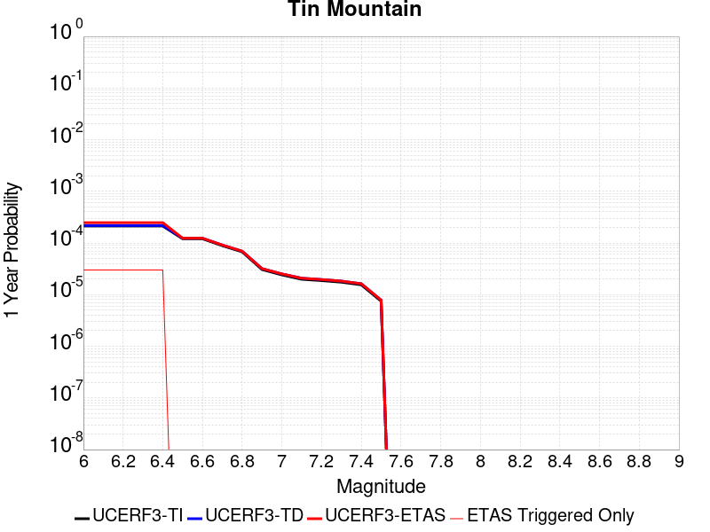 | 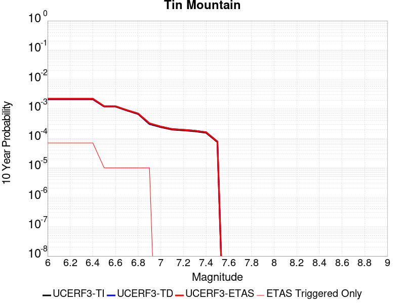 |

| Magnitude | 1 wk TI Prob | 1 wk TD Prob | 1 wk ETAS Prob | 1 wk ETAS/TD Gain | 1 wk ETAS Triggered Only | 1 mo TI Prob | 1 mo TD Prob | 1 mo ETAS Prob | 1 mo ETAS/TD Gain | 1 mo ETAS Triggered Only | 1 yr TI Prob | 1 yr TD Prob | 1 yr ETAS Prob | 1 yr ETAS/TD Gain | 1 yr ETAS Triggered Only | 10 yr TI Prob | 10 yr TD Prob | 10 yr ETAS Prob | 10 yr ETAS/TD Gain | 10 yr ETAS Triggered Only |
|-----|-----|-----|-----|-----|-----|-----|-----|-----|-----|-----|-----|-----|-----|-----|-----|-----|-----|-----|-----|-----|
| 6.0 | 4.083776E-6 | 4.18155E-6 | 4.18155E-6 | 1.0 | 0.0 | 1.750178E-5 | 1.7920827E-5 | 1.7920827E-5 | 1.0 | 0.0 | 2.1306332E-4 | 2.1816794E-4 | 2.481614E-4 | 1.1374787 | 3.0E-5 | 0.0021285915 | 0.0021799032 | 0.0022497508 | 1.0320415 | 7.0E-5 |
| 6.1 | 4.083776E-6 | 4.18155E-6 | 4.18155E-6 | 1.0 | 0.0 | 1.750178E-5 | 1.7920827E-5 | 1.7920827E-5 | 1.0 | 0.0 | 2.1306332E-4 | 2.1816794E-4 | 2.481614E-4 | 1.1374787 | 3.0E-5 | 0.0021285915 | 0.0021799032 | 0.0022497508 | 1.0320415 | 7.0E-5 |
| 6.2 | 4.083776E-6 | 4.18155E-6 | 4.18155E-6 | 1.0 | 0.0 | 1.750178E-5 | 1.7920827E-5 | 1.7920827E-5 | 1.0 | 0.0 | 2.1306332E-4 | 2.1816794E-4 | 2.481614E-4 | 1.1374787 | 3.0E-5 | 0.0021285915 | 0.0021799032 | 0.0022497508 | 1.0320415 | 7.0E-5 |
| 6.3 | 4.083776E-6 | 4.18155E-6 | 4.18155E-6 | 1.0 | 0.0 | 1.750178E-5 | 1.7920827E-5 | 1.7920827E-5 | 1.0 | 0.0 | 2.1306332E-4 | 2.1816794E-4 | 2.481614E-4 | 1.1374787 | 3.0E-5 | 0.0021285915 | 0.0021799032 | 0.0022497508 | 1.0320415 | 7.0E-5 |
| 6.4 | 4.083776E-6 | 4.18155E-6 | 4.18155E-6 | 1.0 | 0.0 | 1.750178E-5 | 1.7920827E-5 | 1.7920827E-5 | 1.0 | 0.0 | 2.1306332E-4 | 2.1816794E-4 | 2.481614E-4 | 1.1374787 | 3.0E-5 | 0.0021285915 | 0.0021799032 | 0.0022497508 | 1.0320415 | 7.0E-5 |
| 6.5 | 2.3143427E-6 | 2.3731652E-6 | 2.3731652E-6 | 1.0 | 0.0 | 9.9185745E-6 | 1.0170673E-5 | 1.0170673E-5 | 1.0 | 0.0 | 1.2075195E-4 | 1.2382168E-4 | 1.2382168E-4 | 1.0 | 0.0 | 0.0012068636 | 0.0012376028 | 0.0012475904 | 1.0080701 | 1.0E-5 |
| 6.6 | 2.3143427E-6 | 2.3731652E-6 | 2.3731652E-6 | 1.0 | 0.0 | 9.9185745E-6 | 1.0170673E-5 | 1.0170673E-5 | 1.0 | 0.0 | 1.2075195E-4 | 1.2382168E-4 | 1.2382168E-4 | 1.0 | 0.0 | 0.0012068636 | 0.0012376028 | 0.0012475904 | 1.0080701 | 1.0E-5 |
| 6.7 | 1.7029532E-6 | 1.7497979E-6 | 1.7497979E-6 | 1.0 | 0.0 | 7.2983503E-6 | 7.4991153E-6 | 7.4991153E-6 | 1.0 | 0.0 | 8.885379E-5 | 9.129844E-5 | 9.129844E-5 | 1.0 | 0.0 | 8.881827E-4 | 9.1266196E-4 | 9.2265283E-4 | 1.010947 | 1.0E-5 |
| 6.8 | 1.2914646E-6 | 1.3299432E-6 | 1.3299432E-6 | 1.0 | 0.0 | 5.534837E-6 | 5.6997465E-6 | 5.6997465E-6 | 1.0 | 0.0 | 6.738455E-5 | 6.939264E-5 | 6.939264E-5 | 1.0 | 0.0 | 6.736412E-4 | 6.937531E-4 | 7.0374616E-4 | 1.0144043 | 1.0E-5 |
| 6.9 | 5.8708974E-7 | 6.117028E-7 | 6.117028E-7 | 1.0 | 0.0 | 2.5160964E-6 | 2.621581E-6 | 2.621581E-6 | 1.0 | 0.0 | 3.0633044E-5 | 3.1917323E-5 | 3.1917323E-5 | 1.0 | 0.0 | 3.0628822E-4 | 3.191315E-4 | 3.291283E-4 | 1.0313251 | 1.0E-5 |
| 7.0 | 4.6248786E-7 | 4.832044E-7 | 4.832044E-7 | 1.0 | 0.0 | 1.9820893E-6 | 2.0708746E-6 | 2.0708746E-6 | 1.0 | 0.0 | 2.413167E-5 | 2.5212645E-5 | 2.5212645E-5 | 1.0 | 0.0 | 2.412905E-4 | 2.5210154E-4 | 2.5210154E-4 | 1.0 | 0.0 |
| 7.1 | 3.804606E-7 | 3.9871725E-7 | 3.9871725E-7 | 1.0 | 0.0 | 1.6305444E-6 | 1.7087873E-6 | 1.7087873E-6 | 1.0 | 0.0 | 1.9851697E-5 | 2.080432E-5 | 2.080432E-5 | 1.0 | 0.0 | 1.9849923E-4 | 2.080271E-4 | 2.080271E-4 | 1.0 | 0.0 |
| 7.2 | 3.5864858E-7 | 3.7617107E-7 | 3.7617107E-7 | 1.0 | 0.0 | 1.5370645E-6 | 1.6121609E-6 | 1.6121609E-6 | 1.0 | 0.0 | 1.87136E-5 | 1.9627916E-5 | 1.9627916E-5 | 1.0 | 0.0 | 1.8712023E-4 | 1.9626514E-4 | 1.9626514E-4 | 1.0 | 0.0 |
| 7.3 | 3.342063E-7 | 3.50637E-7 | 3.50637E-7 | 1.0 | 0.0 | 1.4323119E-6 | 1.5027293E-6 | 1.5027293E-6 | 1.0 | 0.0 | 1.7438259E-5 | 1.829561E-5 | 1.829561E-5 | 1.0 | 0.0 | 1.743689E-4 | 1.8294434E-4 | 1.8294434E-4 | 1.0 | 0.0 |
| 7.4 | 2.971242E-7 | 3.116602E-7 | 3.116602E-7 | 1.0 | 0.0 | 1.2733886E-6 | 1.3356861E-6 | 1.3356861E-6 | 1.0 | 0.0 | 1.5503398E-5 | 1.626189E-5 | 1.626189E-5 | 1.0 | 0.0 | 1.5502315E-4 | 1.6261027E-4 | 1.6261027E-4 | 1.0 | 0.0 |
| 7.5 | 1.4326713E-7 | 1.501262E-7 | 1.501262E-7 | 1.0 | 0.0 | 6.140018E-7 | 6.43398E-7 | 6.43398E-7 | 1.0 | 0.0 | 7.4754466E-6 | 7.833371E-6 | 7.833371E-6 | 1.0 | 0.0 | 7.475195E-5 | 7.83337E-5 | 7.83337E-5 | 1.0 | 0.0 |

## Chino alt 1
*[(top)](#table-of-contents)*

| 1 Week | 1 Month | 1 Year | 10 Year |
|-----|-----|-----|-----|
|  |  |  |  |

| Magnitude | 1 wk TI Prob | 1 wk TD Prob | 1 wk ETAS Prob | 1 wk ETAS/TD Gain | 1 wk ETAS Triggered Only | 1 mo TI Prob | 1 mo TD Prob | 1 mo ETAS Prob | 1 mo ETAS/TD Gain | 1 mo ETAS Triggered Only | 1 yr TI Prob | 1 yr TD Prob | 1 yr ETAS Prob | 1 yr ETAS/TD Gain | 1 yr ETAS Triggered Only | 10 yr TI Prob | 10 yr TD Prob | 10 yr ETAS Prob | 10 yr ETAS/TD Gain | 10 yr ETAS Triggered Only |
|-----|-----|-----|-----|-----|-----|-----|-----|-----|-----|-----|-----|-----|-----|-----|-----|-----|-----|-----|-----|-----|
| 6.0 | 3.939946E-5 | 4.895037E-5 | 4.895037E-5 | 1.0 | 0.0 | 1.6884391E-4 | 2.0977337E-4 | 2.0977337E-4 | 1.0 | 0.0 | 0.0020537362 | 0.0025514876 | 0.0025913857 | 1.0156372 | 4.0E-5 | 0.020348595 | 0.025278764 | 0.025337247 | 1.0023135 | 6.0E-5 |
| 6.1 | 2.1505624E-5 | 2.6880154E-5 | 2.6880154E-5 | 1.0 | 0.0 | 9.2163704E-5 | 1.151962E-4 | 1.151962E-4 | 1.0 | 0.0 | 0.0011215154 | 0.0014017228 | 0.0014316808 | 1.0213722 | 3.0E-5 | 0.011158722 | 0.013945717 | 0.013975299 | 1.0021212 | 3.0E-5 |
| 6.2 | 2.1505624E-5 | 2.6880154E-5 | 2.6880154E-5 | 1.0 | 0.0 | 9.2163704E-5 | 1.151962E-4 | 1.151962E-4 | 1.0 | 0.0 | 0.0011215154 | 0.0014017228 | 0.0014316808 | 1.0213722 | 3.0E-5 | 0.011158722 | 0.013945717 | 0.013975299 | 1.0021212 | 3.0E-5 |
| 6.3 | 1.4290785E-5 | 1.8166014E-5 | 1.8166014E-5 | 1.0 | 0.0 | 6.1244784E-5 | 7.785228E-5 | 7.785228E-5 | 1.0 | 0.0 | 7.454001E-4 | 9.4748475E-4 | 9.574753E-4 | 1.0105443 | 1.0E-5 | 0.007429048 | 0.009444912 | 0.0094548175 | 1.0010488 | 1.0E-5 |
| 6.4 | 1.4290785E-5 | 1.8166014E-5 | 1.8166014E-5 | 1.0 | 0.0 | 6.1244784E-5 | 7.785228E-5 | 7.785228E-5 | 1.0 | 0.0 | 7.454001E-4 | 9.4748475E-4 | 9.574753E-4 | 1.0105443 | 1.0E-5 | 0.007429048 | 0.009444912 | 0.0094548175 | 1.0010488 | 1.0E-5 |
| 6.5 | 1.3017944E-5 | 1.6652937E-5 | 1.6652937E-5 | 1.0 | 0.0 | 5.5789995E-5 | 7.136803E-5 | 7.136803E-5 | 1.0 | 0.0 | 6.790315E-4 | 8.686031E-4 | 8.7859447E-4 | 1.0115027 | 1.0E-5 | 0.0067696036 | 0.008662385 | 0.008672298 | 1.0011444 | 1.0E-5 |
| 6.6 | 9.470016E-6 | 1.2040057E-5 | 1.2040057E-5 | 1.0 | 0.0 | 4.058515E-5 | 5.1599414E-5 | 5.1599414E-5 | 1.0 | 0.0 | 4.940122E-4 | 6.2807574E-4 | 6.3806947E-4 | 1.0159117 | 1.0E-5 | 0.004929154 | 0.0062722242 | 0.0062821615 | 1.0015843 | 1.0E-5 |
| 6.7 | 8.314155E-6 | 1.0408293E-5 | 1.0408293E-5 | 1.0 | 0.0 | 3.5631605E-5 | 4.460639E-5 | 4.460639E-5 | 1.0 | 0.0 | 4.3372845E-4 | 5.429797E-4 | 5.429797E-4 | 1.0 | 0.0 | 0.004328829 | 0.005426062 | 0.005426062 | 1.0 | 0.0 |
| 6.8 | 3.4856364E-6 | 3.8135372E-6 | 3.8135372E-6 | 1.0 | 0.0 | 1.4938357E-5 | 1.634364E-5 | 1.634364E-5 | 1.0 | 0.0 | 1.8185932E-4 | 1.9896773E-4 | 1.9896773E-4 | 1.0 | 0.0 | 0.0018171056 | 0.001989573 | 0.001989573 | 1.0 | 0.0 |
| 6.9 | 2.2645952E-6 | 2.152999E-6 | 2.152999E-6 | 1.0 | 0.0 | 9.705372E-6 | 9.227107E-6 | 9.227107E-6 | 1.0 | 0.0 | 1.18156495E-4 | 1.1233445E-4 | 1.1233445E-4 | 1.0 | 0.0 | 0.0011809369 | 0.0011233927 | 0.0011233927 | 1.0 | 0.0 |
| 7.0 | 1.7864003E-6 | 1.5431575E-6 | 1.5431575E-6 | 1.0 | 0.0 | 7.655979E-6 | 6.613516E-6 | 6.613516E-6 | 1.0 | 0.0 | 9.3207556E-5 | 8.0516635E-5 | 8.0516635E-5 | 1.0 | 0.0 | 9.316847E-4 | 8.0532173E-4 | 8.0532173E-4 | 1.0 | 0.0 |
| 7.1 | 1.7315456E-6 | 1.4734279E-6 | 1.4734279E-6 | 1.0 | 0.0 | 7.420889E-6 | 6.3146763E-6 | 6.3146763E-6 | 1.0 | 0.0 | 9.034557E-5 | 7.6878525E-5 | 7.6878525E-5 | 1.0 | 0.0 | 9.0308854E-4 | 7.6895714E-4 | 7.6895714E-4 | 1.0 | 0.0 |
| 7.2 | 1.6008337E-6 | 1.3574753E-6 | 1.3574753E-6 | 1.0 | 0.0 | 6.860698E-6 | 5.817739E-6 | 5.817739E-6 | 1.0 | 0.0 | 8.352579E-5 | 7.082872E-5 | 7.082872E-5 | 1.0 | 0.0 | 8.34944E-4 | 7.084856E-4 | 7.084856E-4 | 1.0 | 0.0 |
| 7.3 | 1.3320939E-6 | 1.1218251E-6 | 1.1218251E-6 | 1.0 | 0.0 | 5.7089615E-6 | 4.8078136E-6 | 4.8078136E-6 | 1.0 | 0.0 | 6.9504385E-5 | 5.8533606E-5 | 5.8533606E-5 | 1.0 | 0.0 | 6.9482654E-4 | 5.853264E-4 | 5.853264E-4 | 1.0 | 0.0 |
| 7.4 | 1.114294E-6 | 9.2374523E-7 | 9.2374523E-7 | 1.0 | 0.0 | 4.775537E-6 | 3.958902E-6 | 3.958902E-6 | 1.0 | 0.0 | 5.8140613E-5 | 4.8198606E-5 | 4.8198606E-5 | 1.0 | 0.0 | 5.81254E-4 | 4.8189834E-4 | 4.8189834E-4 | 1.0 | 0.0 |
| 7.5 | 9.354081E-7 | 7.623702E-7 | 7.623702E-7 | 1.0 | 0.0 | 4.0088858E-6 | 3.2672967E-6 | 3.2672967E-6 | 1.0 | 0.0 | 4.8807087E-5 | 3.9778646E-5 | 3.9778646E-5 | 1.0 | 0.0 | 4.879637E-4 | 3.9771866E-4 | 3.9771866E-4 | 1.0 | 0.0 |
| 7.6 | 8.521771E-7 | 6.8809493E-7 | 6.8809493E-7 | 1.0 | 0.0 | 3.6521824E-6 | 2.9489752E-6 | 2.9489752E-6 | 1.0 | 0.0 | 4.4464414E-5 | 3.5903213E-5 | 3.5903213E-5 | 1.0 | 0.0 | 4.4455516E-4 | 3.589773E-4 | 3.589773E-4 | 1.0 | 0.0 |
| 7.7 | 2.1803626E-7 | 1.4187151E-7 | 1.4187151E-7 | 1.0 | 0.0 | 9.344408E-7 | 6.080207E-7 | 6.080207E-7 | 1.0 | 0.0 | 1.1376757E-5 | 7.402636E-6 | 7.402636E-6 | 1.0 | 0.0 | 1.13761744E-4 | 7.402486E-5 | 7.402486E-5 | 1.0 | 0.0 |

## Ludlow
*[(top)](#table-of-contents)*

| 1 Week | 1 Month | 1 Year | 10 Year |
|-----|-----|-----|-----|
|  |  |  | 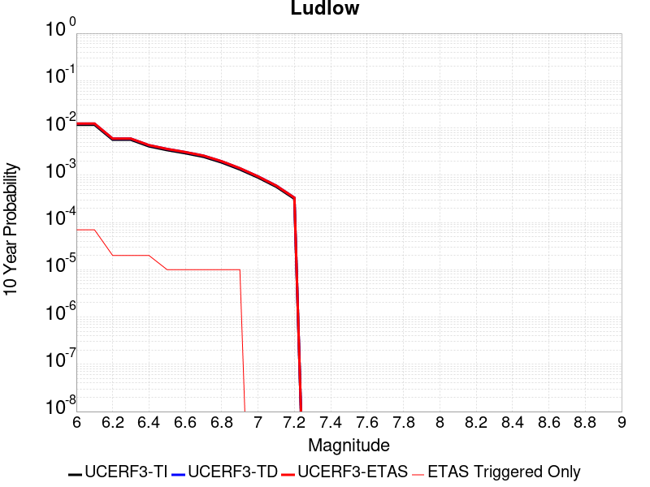 |

| Magnitude | 1 wk TI Prob | 1 wk TD Prob | 1 wk ETAS Prob | 1 wk ETAS/TD Gain | 1 wk ETAS Triggered Only | 1 mo TI Prob | 1 mo TD Prob | 1 mo ETAS Prob | 1 mo ETAS/TD Gain | 1 mo ETAS Triggered Only | 1 yr TI Prob | 1 yr TD Prob | 1 yr ETAS Prob | 1 yr ETAS/TD Gain | 1 yr ETAS Triggered Only | 10 yr TI Prob | 10 yr TD Prob | 10 yr ETAS Prob | 10 yr ETAS/TD Gain | 10 yr ETAS Triggered Only |
|-----|-----|-----|-----|-----|-----|-----|-----|-----|-----|-----|-----|-----|-----|-----|-----|-----|-----|-----|-----|-----|
| 6.0 | 2.2407607E-5 | 2.3657429E-5 | 2.3657429E-5 | 1.0 | 0.0 | 9.602906E-5 | 1.0138529E-4 | 1.1138427E-4 | 1.0986236 | 1.0E-5 | 0.0011685267 | 0.001233711 | 0.0012536864 | 1.0161912 | 2.0E-5 | 0.011624013 | 0.012273132 | 0.012342273 | 1.0056335 | 7.0E-5 |
| 6.1 | 2.2407607E-5 | 2.3657429E-5 | 2.3657429E-5 | 1.0 | 0.0 | 9.602906E-5 | 1.0138529E-4 | 1.1138427E-4 | 1.0986236 | 1.0E-5 | 0.0011685267 | 0.001233711 | 0.0012536864 | 1.0161912 | 2.0E-5 | 0.011624013 | 0.012273132 | 0.012342273 | 1.0056335 | 7.0E-5 |
| 6.2 | 1.0781252E-5 | 1.1365745E-5 | 1.1365745E-5 | 1.0 | 0.0 | 4.620455E-5 | 4.870945E-5 | 4.870945E-5 | 1.0 | 0.0 | 5.623952E-4 | 5.9288024E-4 | 6.028743E-4 | 1.0168568 | 1.0E-5 | 0.00560974 | 0.005913404 | 0.005933285 | 1.0033622 | 2.0E-5 |
| 6.3 | 1.0781252E-5 | 1.1365745E-5 | 1.1365745E-5 | 1.0 | 0.0 | 4.620455E-5 | 4.870945E-5 | 4.870945E-5 | 1.0 | 0.0 | 5.623952E-4 | 5.9288024E-4 | 6.028743E-4 | 1.0168568 | 1.0E-5 | 0.00560974 | 0.005913404 | 0.005933285 | 1.0033622 | 2.0E-5 |
| 6.4 | 7.814439E-6 | 8.237788E-6 | 8.237788E-6 | 1.0 | 0.0 | 3.3490025E-5 | 3.5304336E-5 | 3.5304336E-5 | 1.0 | 0.0 | 4.0766477E-4 | 4.2974693E-4 | 4.397426E-4 | 1.0232595 | 1.0E-5 | 0.0040691774 | 0.0042893053 | 0.0043092193 | 1.0046427 | 2.0E-5 |
| 6.5 | 6.4986366E-6 | 6.850969E-6 | 6.850969E-6 | 1.0 | 0.0 | 2.7851002E-5 | 2.936097E-5 | 2.936097E-5 | 1.0 | 0.0 | 3.390332E-4 | 3.574121E-4 | 3.6740853E-4 | 1.0279689 | 1.0E-5 | 0.003385164 | 0.0035684688 | 0.0035784333 | 1.0027924 | 1.0E-5 |
| 6.6 | 5.582177E-6 | 5.8860483E-6 | 5.8860483E-6 | 1.0 | 0.0 | 2.3923398E-5 | 2.522568E-5 | 2.522568E-5 | 1.0 | 0.0 | 2.9122844E-4 | 3.070801E-4 | 3.17077E-4 | 1.0325547 | 1.0E-5 | 0.0029084706 | 0.003066631 | 0.0030766004 | 1.003251 | 1.0E-5 |
| 6.7 | 4.6858763E-6 | 4.940463E-6 | 4.940463E-6 | 1.0 | 0.0 | 2.0082172E-5 | 2.1173244E-5 | 2.1173244E-5 | 1.0 | 0.0 | 2.4447302E-4 | 2.577543E-4 | 2.6775172E-4 | 1.0387866 | 1.0E-5 | 0.0024420423 | 0.0025746098 | 0.002584584 | 1.0038741 | 1.0E-5 |
| 6.8 | 3.5584908E-6 | 3.7520454E-6 | 3.7520454E-6 | 1.0 | 0.0 | 1.5250586E-5 | 1.6080097E-5 | 1.6080097E-5 | 1.0 | 0.0 | 1.8566006E-4 | 1.9575801E-4 | 2.0575605E-4 | 1.0510734 | 1.0E-5 | 0.0018550502 | 0.0019558968 | 0.0019658771 | 1.0051028 | 1.0E-5 |
| 6.9 | 2.532834E-6 | 2.6710227E-6 | 2.6710227E-6 | 1.0 | 0.0 | 1.0854958E-5 | 1.1447192E-5 | 1.1447192E-5 | 1.0 | 0.0 | 1.3215111E-4 | 1.3936093E-4 | 1.4935953E-4 | 1.0717461 | 1.0E-5 | 0.0013207254 | 0.0013927629 | 0.001402749 | 1.00717 | 1.0E-5 |
| 7.0 | 1.7083285E-6 | 1.801957E-6 | 1.801957E-6 | 1.0 | 0.0 | 7.3213873E-6 | 7.7226505E-6 | 7.7226505E-6 | 1.0 | 0.0 | 8.913424E-5 | 9.4019386E-5 | 9.4019386E-5 | 1.0 | 0.0 | 8.9098496E-4 | 9.3981257E-4 | 9.3981257E-4 | 1.0 | 0.0 |
| 7.1 | 1.0905424E-6 | 1.1497702E-6 | 1.1497702E-6 | 1.0 | 0.0 | 4.6737446E-6 | 4.927578E-6 | 4.927578E-6 | 1.0 | 0.0 | 5.6901354E-5 | 5.999171E-5 | 5.999171E-5 | 1.0 | 0.0 | 5.6886784E-4 | 5.997649E-4 | 5.997649E-4 | 1.0 | 0.0 |
| 7.2 | 6.06668E-7 | 6.387322E-7 | 6.387322E-7 | 1.0 | 0.0 | 2.600003E-6 | 2.7374213E-6 | 2.7374213E-6 | 1.0 | 0.0 | 3.1654577E-5 | 3.3327666E-5 | 3.3327666E-5 | 1.0 | 0.0 | 3.1650066E-4 | 3.332335E-4 | 3.332335E-4 | 1.0 | 0.0 |

## Pleito
*[(top)](#table-of-contents)*

| 1 Week | 1 Month | 1 Year | 10 Year |
|-----|-----|-----|-----|
|  |  |  | 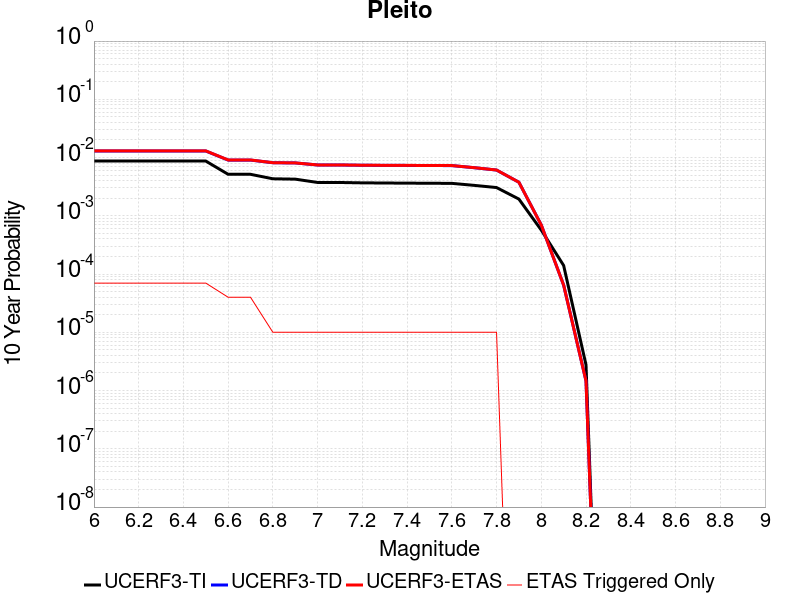 |

| Magnitude | 1 wk TI Prob | 1 wk TD Prob | 1 wk ETAS Prob | 1 wk ETAS/TD Gain | 1 wk ETAS Triggered Only | 1 mo TI Prob | 1 mo TD Prob | 1 mo ETAS Prob | 1 mo ETAS/TD Gain | 1 mo ETAS Triggered Only | 1 yr TI Prob | 1 yr TD Prob | 1 yr ETAS Prob | 1 yr ETAS/TD Gain | 1 yr ETAS Triggered Only | 10 yr TI Prob | 10 yr TD Prob | 10 yr ETAS Prob | 10 yr ETAS/TD Gain | 10 yr ETAS Triggered Only |
|-----|-----|-----|-----|-----|-----|-----|-----|-----|-----|-----|-----|-----|-----|-----|-----|-----|-----|-----|-----|-----|
| 6.0 | 1.6763008E-5 | 2.47705E-5 | 2.47705E-5 | 1.0 | 0.0 | 7.183948E-5 | 1.0615537E-4 | 1.1615431E-4 | 1.0941916 | 1.0E-5 | 8.742947E-4 | 0.0012917474 | 0.0013117216 | 1.0154629 | 2.0E-5 | 0.00870863 | 0.012957253 | 0.0130263455 | 1.0053324 | 7.0E-5 |
| 6.1 | 1.6763008E-5 | 2.47705E-5 | 2.47705E-5 | 1.0 | 0.0 | 7.183948E-5 | 1.0615537E-4 | 1.1615431E-4 | 1.0941916 | 1.0E-5 | 8.742947E-4 | 0.0012917474 | 0.0013117216 | 1.0154629 | 2.0E-5 | 0.00870863 | 0.012957253 | 0.0130263455 | 1.0053324 | 7.0E-5 |
| 6.2 | 1.6763008E-5 | 2.47705E-5 | 2.47705E-5 | 1.0 | 0.0 | 7.183948E-5 | 1.0615537E-4 | 1.1615431E-4 | 1.0941916 | 1.0E-5 | 8.742947E-4 | 0.0012917474 | 0.0013117216 | 1.0154629 | 2.0E-5 | 0.00870863 | 0.012957253 | 0.0130263455 | 1.0053324 | 7.0E-5 |
| 6.3 | 1.6763008E-5 | 2.47705E-5 | 2.47705E-5 | 1.0 | 0.0 | 7.183948E-5 | 1.0615537E-4 | 1.1615431E-4 | 1.0941916 | 1.0E-5 | 8.742947E-4 | 0.0012917474 | 0.0013117216 | 1.0154629 | 2.0E-5 | 0.00870863 | 0.012957253 | 0.0130263455 | 1.0053324 | 7.0E-5 |
| 6.4 | 1.6763008E-5 | 2.47705E-5 | 2.47705E-5 | 1.0 | 0.0 | 7.183948E-5 | 1.0615537E-4 | 1.1615431E-4 | 1.0941916 | 1.0E-5 | 8.742947E-4 | 0.0012917474 | 0.0013117216 | 1.0154629 | 2.0E-5 | 0.00870863 | 0.012957253 | 0.0130263455 | 1.0053324 | 7.0E-5 |
| 6.5 | 1.6763008E-5 | 2.47705E-5 | 2.47705E-5 | 1.0 | 0.0 | 7.183948E-5 | 1.0615537E-4 | 1.1615431E-4 | 1.0941916 | 1.0E-5 | 8.742947E-4 | 0.0012917474 | 0.0013117216 | 1.0154629 | 2.0E-5 | 0.00870863 | 0.012957253 | 0.0130263455 | 1.0053324 | 7.0E-5 |
| 6.6 | 9.910213E-6 | 1.7221182E-5 | 1.7221182E-5 | 1.0 | 0.0 | 4.247165E-5 | 7.3803E-5 | 8.380226E-5 | 1.1354859 | 1.0E-5 | 5.169696E-4 | 8.9818484E-4 | 9.181669E-4 | 1.0222471 | 2.0E-5 | 0.0051576863 | 0.009054025 | 0.009093663 | 1.004378 | 4.0E-5 |
| 6.7 | 9.910213E-6 | 1.7221182E-5 | 1.7221182E-5 | 1.0 | 0.0 | 4.247165E-5 | 7.3803E-5 | 8.380226E-5 | 1.1354859 | 1.0E-5 | 5.169696E-4 | 8.9818484E-4 | 9.181669E-4 | 1.0222471 | 2.0E-5 | 0.0051576863 | 0.009054025 | 0.009093663 | 1.004378 | 4.0E-5 |
| 6.8 | 8.300162E-6 | 1.5480773E-5 | 1.5480773E-5 | 1.0 | 0.0 | 3.557164E-5 | 6.634449E-5 | 6.634449E-5 | 1.0 | 0.0 | 4.3299864E-4 | 8.0744625E-4 | 8.0744625E-4 | 1.0 | 0.0 | 0.004321559 | 0.008153455 | 0.008163374 | 1.0012165 | 1.0E-5 |
| 6.9 | 8.183114E-6 | 1.5351985E-5 | 1.5351985E-5 | 1.0 | 0.0 | 3.5070017E-5 | 6.579257E-5 | 6.579257E-5 | 1.0 | 0.0 | 4.2689382E-4 | 8.007316E-4 | 8.007316E-4 | 1.0 | 0.0 | 0.0042607468 | 0.008086799 | 0.008096717 | 1.0012265 | 1.0E-5 |
| 7.0 | 7.1748823E-6 | 1.4138895E-5 | 1.4138895E-5 | 1.0 | 0.0 | 3.0749135E-5 | 6.059386E-5 | 6.059386E-5 | 1.0 | 0.0 | 3.743064E-4 | 7.3748105E-4 | 7.3748105E-4 | 1.0 | 0.0 | 0.0037367654 | 0.0074582137 | 0.0074681393 | 1.0013309 | 1.0E-5 |
| 7.1 | 7.1671807E-6 | 1.4129264E-5 | 1.4129264E-5 | 1.0 | 0.0 | 3.0716128E-5 | 6.0552586E-5 | 6.0552586E-5 | 1.0 | 0.0 | 3.7390468E-4 | 7.369789E-4 | 7.369789E-4 | 1.0 | 0.0 | 0.0037327618 | 0.007453226 | 0.0074631516 | 1.0013317 | 1.0E-5 |
| 7.2 | 7.0649667E-6 | 1.3976534E-5 | 1.3976534E-5 | 1.0 | 0.0 | 3.0278077E-5 | 5.989806E-5 | 5.989806E-5 | 1.0 | 0.0 | 3.6857324E-4 | 7.290154E-4 | 7.290154E-4 | 1.0 | 0.0 | 0.0036796255 | 0.007373973 | 0.007383899 | 1.0013461 | 1.0E-5 |
| 7.3 | 7.02082E-6 | 1.39199765E-5 | 1.39199765E-5 | 1.0 | 0.0 | 3.008888E-5 | 5.9655682E-5 | 5.9655682E-5 | 1.0 | 0.0 | 3.6627054E-4 | 7.260664E-4 | 7.260664E-4 | 1.0 | 0.0 | 0.0036566744 | 0.0073444657 | 0.0073543927 | 1.0013516 | 1.0E-5 |
| 7.4 | 6.987146E-6 | 1.3879531E-5 | 1.3879531E-5 | 1.0 | 0.0 | 2.9944567E-5 | 5.948235E-5 | 5.948235E-5 | 1.0 | 0.0 | 3.6451413E-4 | 7.239575E-4 | 7.239575E-4 | 1.0 | 0.0 | 0.0036391679 | 0.007323398 | 0.0073333243 | 1.0013555 | 1.0E-5 |
| 7.5 | 6.9494554E-6 | 1.3836431E-5 | 1.3836431E-5 | 1.0 | 0.0 | 2.9783041E-5 | 5.9297647E-5 | 5.9297647E-5 | 1.0 | 0.0 | 3.625482E-4 | 7.217102E-4 | 7.217102E-4 | 1.0 | 0.0 | 0.0036195726 | 0.007301023 | 0.00731095 | 1.0013597 | 1.0E-5 |
| 7.6 | 6.92694E-6 | 1.3795536E-5 | 1.3795536E-5 | 1.0 | 0.0 | 2.9686547E-5 | 5.9122387E-5 | 5.9122387E-5 | 1.0 | 0.0 | 3.6137376E-4 | 7.1957783E-4 | 7.1957783E-4 | 1.0 | 0.0 | 0.0036078666 | 0.0072797714 | 0.007289699 | 1.0013636 | 1.0E-5 |
| 7.7 | 6.395867E-6 | 1.2674343E-5 | 1.2674343E-5 | 1.0 | 0.0 | 2.741057E-5 | 5.4317487E-5 | 5.4317487E-5 | 1.0 | 0.0 | 3.336726E-4 | 6.6111505E-4 | 6.6111505E-4 | 1.0 | 0.0 | 0.0033317201 | 0.006698295 | 0.0067082276 | 1.001483 | 1.0E-5 |
| 7.8 | 5.8664327E-6 | 1.1541453E-5 | 1.1541453E-5 | 1.0 | 0.0 | 2.5141611E-5 | 4.9462433E-5 | 4.9462433E-5 | 1.0 | 0.0 | 3.060561E-4 | 6.020389E-4 | 6.020389E-4 | 1.0 | 0.0 | 0.0030563495 | 0.006103509 | 0.006113448 | 1.0016284 | 1.0E-5 |
| 7.9 | 3.7167474E-6 | 7.1174723E-6 | 7.1174723E-6 | 1.0 | 0.0 | 1.592882E-5 | 3.0503097E-5 | 3.0503097E-5 | 1.0 | 0.0 | 1.9391612E-4 | 3.7131205E-4 | 3.7131205E-4 | 1.0 | 0.0 | 0.0019374699 | 0.0037692138 | 0.0037692138 | 1.0 | 0.0 |
| 8.0 | 1.0903841E-6 | 1.2886832E-6 | 1.2886832E-6 | 1.0 | 0.0 | 4.6730665E-6 | 5.522916E-6 | 5.522916E-6 | 1.0 | 0.0 | 5.68931E-5 | 6.723944E-5 | 6.723944E-5 | 1.0 | 0.0 | 5.6878536E-4 | 6.9458556E-4 | 6.9458556E-4 | 1.0 | 0.0 |
| 8.1 | 2.6894583E-7 | 1.1072907E-7 | 1.1072907E-7 | 1.0 | 0.0 | 1.1526245E-6 | 4.7455305E-7 | 4.7455305E-7 | 1.0 | 0.0 | 1.4033113E-5 | 5.7776683E-6 | 5.7776683E-6 | 1.0 | 0.0 | 1.4032227E-4 | 6.4639265E-5 | 6.4639265E-5 | 1.0 | 0.0 |
| 8.2 | 5.2967013E-9 | 2.4608289E-9 | 2.4608289E-9 | 1.0 | 0.0 | 2.2700148E-8 | 1.054641E-8 | 1.054641E-8 | 1.0 | 0.0 | 2.7637427E-7 | 1.2840253E-7 | 1.2840253E-7 | 1.0 | 0.0 | 2.7637393E-6 | 1.46096E-6 | 1.46096E-6 | 1.0 | 0.0 |

## Imperial
*[(top)](#table-of-contents)*

| 1 Week | 1 Month | 1 Year | 10 Year |
|-----|-----|-----|-----|
|  |  |  | 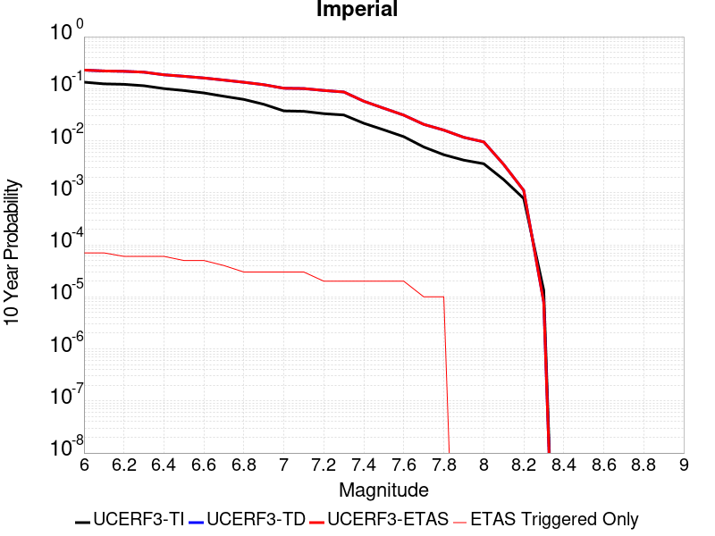 |

| Magnitude | 1 wk TI Prob | 1 wk TD Prob | 1 wk ETAS Prob | 1 wk ETAS/TD Gain | 1 wk ETAS Triggered Only | 1 mo TI Prob | 1 mo TD Prob | 1 mo ETAS Prob | 1 mo ETAS/TD Gain | 1 mo ETAS Triggered Only | 1 yr TI Prob | 1 yr TD Prob | 1 yr ETAS Prob | 1 yr ETAS/TD Gain | 1 yr ETAS Triggered Only | 10 yr TI Prob | 10 yr TD Prob | 10 yr ETAS Prob | 10 yr ETAS/TD Gain | 10 yr ETAS Triggered Only |
|-----|-----|-----|-----|-----|-----|-----|-----|-----|-----|-----|-----|-----|-----|-----|-----|-----|-----|-----|-----|-----|
| 6.0 | 2.7496446E-4 | 5.0565513E-4 | 5.0565513E-4 | 1.0 | 0.0 | 0.0011778869 | 0.002165333 | 0.002165333 | 1.0 | 0.0 | 0.0142467655 | 0.026045265 | 0.026064744 | 1.0007479 | 2.0E-5 | 0.13367249 | 0.22808637 | 0.2281404 | 1.0002369 | 7.0E-5 |
| 6.1 | 2.5356023E-4 | 4.8667885E-4 | 4.8667885E-4 | 1.0 | 0.0 | 0.001086234 | 0.0020841376 | 0.0020841376 | 1.0 | 0.0 | 0.013144928 | 0.02507692 | 0.025096418 | 1.0007776 | 2.0E-5 | 0.123940155 | 0.21951756 | 0.21957219 | 1.0002489 | 7.0E-5 |
| 6.2 | 2.4820742E-4 | 4.7763108E-4 | 4.7763108E-4 | 1.0 | 0.0 | 0.0010633124 | 0.0020454223 | 0.0020454223 | 1.0 | 0.0 | 0.01286919 | 0.024616843 | 0.02463635 | 1.0007925 | 2.0E-5 | 0.12148927 | 0.2160229 | 0.21606992 | 1.0002178 | 6.0E-5 |
| 6.3 | 2.3205351E-4 | 4.590021E-4 | 4.590021E-4 | 1.0 | 0.0 | 9.94136E-4 | 0.0019657058 | 0.0019657058 | 1.0 | 0.0 | 0.012036599 | 0.023666281 | 0.023685807 | 1.000825 | 2.0E-5 | 0.11405133 | 0.20796864 | 0.20801616 | 1.0002285 | 6.0E-5 |
| 6.4 | 2.0304754E-4 | 3.9885996E-4 | 3.9885996E-4 | 1.0 | 0.0 | 8.6991355E-4 | 0.0017082945 | 0.0017082945 | 1.0 | 0.0 | 0.010539869 | 0.020600514 | 0.020620102 | 1.0009508 | 2.0E-5 | 0.100537635 | 0.18510117 | 0.18515006 | 1.0002642 | 6.0E-5 |
| 6.5 | 1.854992E-4 | 3.6997703E-4 | 3.6997703E-4 | 1.0 | 0.0 | 7.9475436E-4 | 0.0015846646 | 0.0015846646 | 1.0 | 0.0 | 0.009633281 | 0.019123985 | 0.019143602 | 1.0010258 | 2.0E-5 | 0.0922623 | 0.17333072 | 0.17337205 | 1.0002384 | 5.0E-5 |
| 6.6 | 1.6586106E-4 | 3.4043082E-4 | 3.4043082E-4 | 1.0 | 0.0 | 7.106394E-4 | 0.0014581835 | 0.0014581835 | 1.0 | 0.0 | 0.008617763 | 0.017610526 | 0.017630175 | 1.0011157 | 2.0E-5 | 0.08291132 | 0.16080588 | 0.16084784 | 1.000261 | 5.0E-5 |
| 6.7 | 1.4224656E-4 | 3.077392E-4 | 3.077392E-4 | 1.0 | 0.0 | 6.094856E-4 | 0.0013182238 | 0.0013182238 | 1.0 | 0.0 | 0.0073952693 | 0.015933173 | 0.015952853 | 1.0012352 | 2.0E-5 | 0.07153955 | 0.1465114 | 0.14654554 | 1.000233 | 4.0E-5 |
| 6.8 | 1.2317259E-4 | 2.779711E-4 | 2.779711E-4 | 1.0 | 0.0 | 5.2777573E-4 | 0.0011907669 | 0.0011907669 | 1.0 | 0.0 | 0.0064067547 | 0.0144026 | 0.014412456 | 1.0006843 | 1.0E-5 | 0.06225166 | 0.13296051 | 0.13298652 | 1.0001956 | 3.0E-5 |
| 6.9 | 9.859898E-5 | 2.5018715E-4 | 2.5018715E-4 | 1.0 | 0.0 | 4.2249862E-4 | 0.0010717943 | 0.0010717943 | 1.0 | 0.0 | 0.0051317946 | 0.012971984 | 0.012981854 | 1.0007609 | 1.0E-5 | 0.05014893 | 0.11942433 | 0.11945075 | 1.0002213 | 3.0E-5 |
| 7.0 | 7.3191884E-5 | 2.1270063E-4 | 2.1270063E-4 | 1.0 | 0.0 | 3.136418E-4 | 9.1125886E-4 | 9.1125886E-4 | 1.0 | 0.0 | 0.003811904 | 0.011038825 | 0.011048714 | 1.0008959 | 1.0E-5 | 0.037471764 | 0.10207849 | 0.102105424 | 1.0002639 | 3.0E-5 |
| 7.1 | 7.1760296E-5 | 2.0971385E-4 | 2.0971385E-4 | 1.0 | 0.0 | 3.0750787E-4 | 8.984672E-4 | 8.984672E-4 | 1.0 | 0.0 | 0.003737482 | 0.010884652 | 0.0108945435 | 1.0009087 | 1.0E-5 | 0.03675245 | 0.100714855 | 0.10074183 | 1.0002679 | 3.0E-5 |
| 7.2 | 6.46614E-5 | 1.9139807E-4 | 1.9139807E-4 | 1.0 | 0.0 | 2.7709085E-4 | 8.2002254E-4 | 8.2002254E-4 | 1.0 | 0.0 | 0.0033683628 | 0.009938694 | 0.009938694 | 1.0 | 0.0 | 0.033177625 | 0.09252202 | 0.09254017 | 1.0001962 | 2.0E-5 |
| 7.3 | 6.088115E-5 | 1.781138E-4 | 1.781138E-4 | 1.0 | 0.0 | 2.6089314E-4 | 7.631244E-4 | 7.631244E-4 | 1.0 | 0.0 | 0.0031717476 | 0.009252035 | 0.009252035 | 1.0 | 0.0 | 0.031268585 | 0.08657247 | 0.08659074 | 1.000211 | 2.0E-5 |
| 7.4 | 4.199346E-5 | 1.15126604E-4 | 1.15126604E-4 | 1.0 | 0.0 | 1.7995955E-4 | 4.933073E-4 | 4.933073E-4 | 1.0 | 0.0 | 0.0021888057 | 0.005989646 | 0.005989646 | 1.0 | 0.0 | 0.02167372 | 0.057449933 | 0.057468783 | 1.0003282 | 2.0E-5 |
| 7.5 | 3.130448E-5 | 8.335176E-5 | 8.335176E-5 | 1.0 | 0.0 | 1.3415517E-4 | 3.5717324E-4 | 3.5717324E-4 | 1.0 | 0.0 | 0.0016321153 | 0.0043399734 | 0.0043399734 | 1.0 | 0.0 | 0.016201803 | 0.042140562 | 0.04215972 | 1.0004545 | 2.0E-5 |
| 7.6 | 2.3074248E-5 | 6.0860824E-5 | 6.0860824E-5 | 1.0 | 0.0 | 9.888588E-5 | 2.6080615E-4 | 2.6080615E-4 | 1.0 | 0.0 | 0.0012032706 | 0.0031707147 | 0.0031707147 | 1.0 | 0.0 | 0.011967761 | 0.031033779 | 0.031053158 | 1.0006244 | 2.0E-5 |
| 7.7 | 1.45864815E-5 | 4.0138115E-5 | 4.0138115E-5 | 1.0 | 0.0 | 6.2511994E-5 | 1.7200918E-4 | 1.7200918E-4 | 1.0 | 0.0 | 7.608177E-4 | 0.0020922057 | 0.0020922057 | 1.0 | 0.0 | 0.007582182 | 0.020633917 | 0.020643711 | 1.0004747 | 1.0E-5 |
| 7.8 | 1.0352979E-5 | 3.097231E-5 | 3.097231E-5 | 1.0 | 0.0 | 4.4369157E-5 | 1.3273173E-4 | 1.3273173E-4 | 1.0 | 0.0 | 5.400606E-4 | 0.0016148133 | 0.0016148133 | 1.0 | 0.0 | 0.0053875 | 0.016022068 | 0.016031906 | 1.0006142 | 1.0E-5 |
| 7.9 | 8.137906E-6 | 2.2158269E-5 | 2.2158269E-5 | 1.0 | 0.0 | 3.4876273E-5 | 9.496055E-5 | 9.496055E-5 | 1.0 | 0.0 | 4.2453592E-4 | 0.0011555325 | 0.0011555325 | 1.0 | 0.0 | 0.004237258 | 0.011622174 | 0.011622174 | 1.0 | 0.0 |
| 8.0 | 6.93792E-6 | 1.801665E-5 | 1.801665E-5 | 1.0 | 0.0 | 2.9733603E-5 | 7.721193E-5 | 7.721193E-5 | 1.0 | 0.0 | 3.6194647E-4 | 9.396506E-4 | 9.396506E-4 | 1.0 | 0.0 | 0.0036135751 | 0.00950525 | 0.00950525 | 1.0 | 0.0 |
| 8.1 | 3.4286315E-6 | 6.3835337E-6 | 6.3835337E-6 | 1.0 | 0.0 | 1.4694053E-5 | 2.7357715E-5 | 2.7357715E-5 | 1.0 | 0.0 | 1.7888541E-4 | 3.330294E-4 | 3.330294E-4 | 1.0 | 0.0 | 0.0017874148 | 0.0034878491 | 0.0034878491 | 1.0 | 0.0 |
| 8.2 | 1.4906886E-6 | 1.9381007E-6 | 1.9381007E-6 | 1.0 | 0.0 | 6.3886496E-6 | 8.3061195E-6 | 8.3061195E-6 | 1.0 | 0.0 | 7.7779034E-5 | 1.0112235E-4 | 1.0112235E-4 | 1.0 | 0.0 | 7.775182E-4 | 0.0011082698 | 0.0011082698 | 1.0 | 0.0 |
| 8.3 | 2.5758007E-8 | 1.4514695E-8 | 1.4514695E-8 | 1.0 | 0.0 | 1.10391454E-7 | 6.2205835E-8 | 6.2205835E-8 | 1.0 | 0.0 | 1.3440151E-6 | 7.57356E-7 | 7.57356E-7 | 1.0 | 0.0 | 1.344007E-5 | 7.895551E-6 | 7.895551E-6 | 1.0 | 0.0 |

## San Jacinto (Lytle Creek connector)
*[(top)](#table-of-contents)*

| 1 Week | 1 Month | 1 Year | 10 Year |
|-----|-----|-----|-----|
|  | 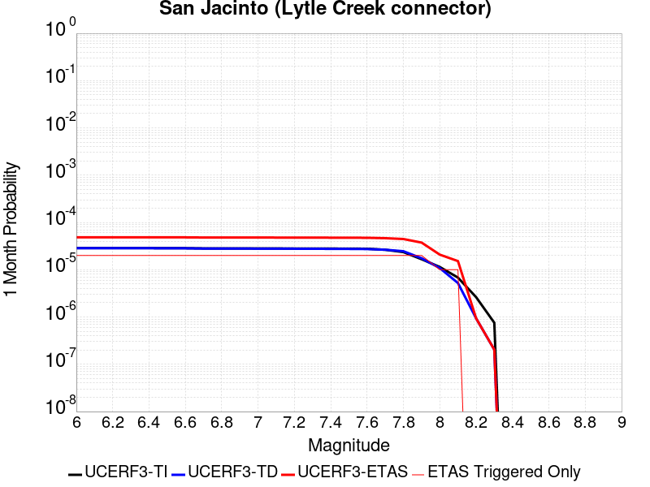 |  |  |

| Magnitude | 1 wk TI Prob | 1 wk TD Prob | 1 wk ETAS Prob | 1 wk ETAS/TD Gain | 1 wk ETAS Triggered Only | 1 mo TI Prob | 1 mo TD Prob | 1 mo ETAS Prob | 1 mo ETAS/TD Gain | 1 mo ETAS Triggered Only | 1 yr TI Prob | 1 yr TD Prob | 1 yr ETAS Prob | 1 yr ETAS/TD Gain | 1 yr ETAS Triggered Only | 10 yr TI Prob | 10 yr TD Prob | 10 yr ETAS Prob | 10 yr ETAS/TD Gain | 10 yr ETAS Triggered Only |
|-----|-----|-----|-----|-----|-----|-----|-----|-----|-----|-----|-----|-----|-----|-----|-----|-----|-----|-----|-----|-----|
| 6.0 | 6.693995E-6 | 6.662972E-6 | 1.6662905E-5 | 2.5008218 | 1.0E-5 | 2.8688235E-5 | 2.8555281E-5 | 4.855471E-5 | 1.7003758 | 2.0E-5 | 3.492233E-4 | 3.4760518E-4 | 4.075843E-4 | 1.1725496 | 6.0E-5 | 0.00348675 | 0.0035508168 | 0.0036205682 | 1.0196438 | 7.0E-5 |
| 6.1 | 6.693995E-6 | 6.662972E-6 | 1.6662905E-5 | 2.5008218 | 1.0E-5 | 2.8688235E-5 | 2.8555281E-5 | 4.855471E-5 | 1.7003758 | 2.0E-5 | 3.492233E-4 | 3.4760518E-4 | 4.075843E-4 | 1.1725496 | 6.0E-5 | 0.00348675 | 0.0035508168 | 0.0036205682 | 1.0196438 | 7.0E-5 |
| 6.2 | 6.693995E-6 | 6.662972E-6 | 1.6662905E-5 | 2.5008218 | 1.0E-5 | 2.8688235E-5 | 2.8555281E-5 | 4.855471E-5 | 1.7003758 | 2.0E-5 | 3.492233E-4 | 3.4760518E-4 | 4.075843E-4 | 1.1725496 | 6.0E-5 | 0.00348675 | 0.0035508168 | 0.0036205682 | 1.0196438 | 7.0E-5 |
| 6.3 | 6.693995E-6 | 6.662972E-6 | 1.6662905E-5 | 2.5008218 | 1.0E-5 | 2.8688235E-5 | 2.8555281E-5 | 4.855471E-5 | 1.7003758 | 2.0E-5 | 3.492233E-4 | 3.4760518E-4 | 4.075843E-4 | 1.1725496 | 6.0E-5 | 0.00348675 | 0.0035508168 | 0.0036205682 | 1.0196438 | 7.0E-5 |
| 6.4 | 6.693995E-6 | 6.662972E-6 | 1.6662905E-5 | 2.5008218 | 1.0E-5 | 2.8688235E-5 | 2.8555281E-5 | 4.855471E-5 | 1.7003758 | 2.0E-5 | 3.492233E-4 | 3.4760518E-4 | 4.075843E-4 | 1.1725496 | 6.0E-5 | 0.00348675 | 0.0035508168 | 0.0036205682 | 1.0196438 | 7.0E-5 |
| 6.5 | 6.6561875E-6 | 6.6231896E-6 | 1.6623124E-5 | 2.5098364 | 1.0E-5 | 2.8526205E-5 | 2.838479E-5 | 4.8384223E-5 | 1.7045827 | 2.0E-5 | 3.472512E-4 | 3.455301E-4 | 4.0550937E-4 | 1.1735862 | 6.0E-5 | 0.0034670907 | 0.0035301324 | 0.0035998852 | 1.0197593 | 7.0E-5 |
| 6.6 | 6.6561875E-6 | 6.6231896E-6 | 1.6623124E-5 | 2.5098364 | 1.0E-5 | 2.8526205E-5 | 2.838479E-5 | 4.8384223E-5 | 1.7045827 | 2.0E-5 | 3.472512E-4 | 3.455301E-4 | 4.0550937E-4 | 1.1735862 | 6.0E-5 | 0.0034670907 | 0.0035301324 | 0.0035998852 | 1.0197593 | 7.0E-5 |
| 6.7 | 6.5802237E-6 | 6.5423656E-6 | 1.65423E-5 | 2.528489 | 1.0E-5 | 2.8200653E-5 | 2.803841E-5 | 4.8037848E-5 | 1.7132872 | 2.0E-5 | 3.4328885E-4 | 3.4131424E-4 | 4.0129374E-4 | 1.1757311 | 6.0E-5 | 0.0034275902 | 0.0034881064 | 0.0035578622 | 1.0199982 | 7.0E-5 |
| 6.8 | 6.575632E-6 | 6.5368554E-6 | 1.653679E-5 | 2.5297775 | 1.0E-5 | 2.8180975E-5 | 2.8014794E-5 | 4.8014233E-5 | 1.7138885 | 2.0E-5 | 3.4304935E-4 | 3.410268E-4 | 4.0100634E-4 | 1.1758792 | 6.0E-5 | 0.0034252026 | 0.0034852412 | 0.003554997 | 1.0200146 | 7.0E-5 |
| 6.9 | 6.570433E-6 | 6.528249E-6 | 1.6528184E-5 | 2.5317943 | 1.0E-5 | 2.8158694E-5 | 2.797791E-5 | 4.797735E-5 | 1.7148297 | 2.0E-5 | 3.4277816E-4 | 3.4057788E-4 | 4.0055744E-4 | 1.1761111 | 6.0E-5 | 0.0034224992 | 0.003480766 | 0.0035505225 | 1.0200405 | 7.0E-5 |
| 7.0 | 6.5643826E-6 | 6.5183694E-6 | 1.6518305E-5 | 2.534116 | 1.0E-5 | 2.8132765E-5 | 2.7935572E-5 | 4.7935013E-5 | 1.715913 | 2.0E-5 | 3.424626E-4 | 3.4006257E-4 | 3.9004558E-4 | 1.1469817 | 5.0E-5 | 0.0034193532 | 0.003475629 | 0.0035354204 | 1.0172031 | 6.0E-5 |
| 7.1 | 6.557402E-6 | 6.5070813E-6 | 1.6507016E-5 | 2.5367775 | 1.0E-5 | 2.8102848E-5 | 2.7887192E-5 | 4.7886635E-5 | 1.7171551 | 2.0E-5 | 3.4209844E-4 | 3.3947374E-4 | 3.8945678E-4 | 1.1472368 | 5.0E-5 | 0.0034157229 | 0.0034697603 | 0.0035295521 | 1.0172323 | 6.0E-5 |
| 7.2 | 6.546394E-6 | 6.489047E-6 | 1.6488983E-5 | 2.5410483 | 1.0E-5 | 2.8055672E-5 | 2.7809905E-5 | 4.780935E-5 | 1.7191483 | 2.0E-5 | 3.4152428E-4 | 3.3853305E-4 | 3.8851614E-4 | 1.1476461 | 5.0E-5 | 0.0034099987 | 0.003460387 | 0.0035201795 | 1.0172791 | 6.0E-5 |
| 7.3 | 6.5364216E-6 | 6.469831E-6 | 1.6469767E-5 | 2.5456254 | 1.0E-5 | 2.8012933E-5 | 2.7727552E-5 | 4.7726997E-5 | 1.7212842 | 2.0E-5 | 3.4100408E-4 | 3.3753074E-4 | 3.8751386E-4 | 1.1480846 | 5.0E-5 | 0.003404813 | 0.0034504079 | 0.003510201 | 1.0173292 | 6.0E-5 |
| 7.4 | 6.5269523E-6 | 6.4509163E-6 | 1.6450851E-5 | 2.5501573 | 1.0E-5 | 2.7972354E-5 | 2.764649E-5 | 4.764594E-5 | 1.7233992 | 2.0E-5 | 3.4051016E-4 | 3.3654412E-4 | 3.8652727E-4 | 1.1485189 | 5.0E-5 | 0.0033998888 | 0.003440589 | 0.0035003826 | 1.0173789 | 6.0E-5 |
| 7.5 | 6.5111835E-6 | 6.4271885E-6 | 1.6427124E-5 | 2.5558803 | 1.0E-5 | 2.7904773E-5 | 2.7544802E-5 | 4.754425E-5 | 1.7260698 | 2.0E-5 | 3.3968766E-4 | 3.3530645E-4 | 3.8528966E-4 | 1.1490673 | 5.0E-5 | 0.0033916887 | 0.003428261 | 0.0034880554 | 1.0174416 | 6.0E-5 |
| 7.6 | 6.4768806E-6 | 6.3862944E-6 | 1.6386231E-5 | 2.5658433 | 1.0E-5 | 2.7757764E-5 | 2.7369546E-5 | 4.7368998E-5 | 1.7307192 | 2.0E-5 | 3.3789838E-4 | 3.3317335E-4 | 3.831567E-4 | 1.150022 | 5.0E-5 | 0.0033738504 | 0.0034069915 | 0.003466787 | 1.0175508 | 6.0E-5 |
| 7.7 | 6.1655364E-6 | 6.1787587E-6 | 1.6178697E-5 | 2.618438 | 1.0E-5 | 2.642346E-5 | 2.6480126E-5 | 4.6479596E-5 | 1.7552634 | 2.0E-5 | 3.2165812E-4 | 3.2234789E-4 | 3.7233176E-4 | 1.155062 | 5.0E-5 | 0.0032119295 | 0.003298596 | 0.003358398 | 1.0181296 | 6.0E-5 |
| 7.8 | 5.5043524E-6 | 5.7397438E-6 | 1.5739686E-5 | 2.742228 | 1.0E-5 | 2.3589868E-5 | 2.459867E-5 | 4.459818E-5 | 1.813032 | 2.0E-5 | 2.871688E-4 | 2.994477E-4 | 3.4943275E-4 | 1.166924 | 5.0E-5 | 0.0028679797 | 0.0030686588 | 0.0031284748 | 1.0194925 | 6.0E-5 |
| 7.9 | 3.889249E-6 | 4.0789296E-6 | 1.4078889E-5 | 3.4516137 | 1.0E-5 | 1.6668104E-5 | 1.748101E-5 | 3.748066E-5 | 2.1440787 | 2.0E-5 | 2.0291525E-4 | 2.1281054E-4 | 2.627999E-4 | 1.2349007 | 5.0E-5 | 0.0020273007 | 0.0021954647 | 0.002255333 | 1.0272691 | 6.0E-5 |
| 8.0 | 2.668535E-6 | 2.5329996E-6 | 2.5329996E-6 | 1.0 | 0.0 | 1.1436528E-5 | 1.0855668E-5 | 2.085556E-5 | 1.9211677 | 1.0E-5 | 1.3923083E-4 | 1.3215977E-4 | 1.621558E-4 | 1.2269679 | 3.0E-5 | 0.0013914363 | 0.0013765821 | 0.0014165271 | 1.0290174 | 4.0E-5 |
| 8.1 | 1.5911459E-6 | 1.2194711E-6 | 1.2194711E-6 | 1.0 | 0.0 | 6.8191785E-6 | 5.226294E-6 | 1.5226242E-5 | 2.9133916 | 1.0E-5 | 8.3020335E-5 | 6.362829E-5 | 8.362703E-5 | 1.3143055 | 2.0E-5 | 8.298933E-4 | 6.6975754E-4 | 6.8974413E-4 | 1.0298415 | 2.0E-5 |
| 8.2 | 6.1294963E-7 | 2.1835329E-7 | 2.1835329E-7 | 1.0 | 0.0 | 2.6269242E-6 | 9.357995E-7 | 9.357995E-7 | 1.0 | 0.0 | 3.1982334E-5 | 1.1393299E-5 | 1.1393299E-5 | 1.0 | 0.0 | 3.1977732E-4 | 1.2797497E-4 | 1.2797497E-4 | 1.0 | 0.0 |
| 8.3 | 1.762871E-7 | 4.7604622E-8 | 4.7604622E-8 | 1.0 | 0.0 | 7.5551594E-7 | 2.0401978E-7 | 2.0401978E-7 | 1.0 | 0.0 | 9.1983675E-6 | 2.4839383E-6 | 2.4839383E-6 | 1.0 | 0.0 | 9.197987E-5 | 2.8720697E-5 | 2.8720697E-5 | 1.0 | 0.0 |

## Calaveras (So) 2011 CFM
*[(top)](#table-of-contents)*

| 1 Week | 1 Month | 1 Year | 10 Year |
|-----|-----|-----|-----|
|  |  |  |  |

| Magnitude | 1 wk TI Prob | 1 wk TD Prob | 1 wk ETAS Prob | 1 wk ETAS/TD Gain | 1 wk ETAS Triggered Only | 1 mo TI Prob | 1 mo TD Prob | 1 mo ETAS Prob | 1 mo ETAS/TD Gain | 1 mo ETAS Triggered Only | 1 yr TI Prob | 1 yr TD Prob | 1 yr ETAS Prob | 1 yr ETAS/TD Gain | 1 yr ETAS Triggered Only | 10 yr TI Prob | 10 yr TD Prob | 10 yr ETAS Prob | 10 yr ETAS/TD Gain | 10 yr ETAS Triggered Only |
|-----|-----|-----|-----|-----|-----|-----|-----|-----|-----|-----|-----|-----|-----|-----|-----|-----|-----|-----|-----|-----|
| 6.0 | 1.5950744E-4 | 3.0719102E-4 | 3.1718795E-4 | 1.0325431 | 1.0E-5 | 6.834242E-4 | 0.0013158836 | 0.0013258704 | 1.0075895 | 1.0E-5 | 0.00828899 | 0.015860915 | 0.01591012 | 1.0031024 | 5.0E-5 | 0.079865426 | 0.14441721 | 0.14446855 | 1.0003555 | 6.0E-5 |
| 6.1 | 1.3584697E-4 | 2.604323E-4 | 2.704297E-4 | 1.0383877 | 1.0E-5 | 5.8207137E-4 | 0.0011156795 | 0.0011256683 | 1.0089531 | 1.0E-5 | 0.007063716 | 0.013463869 | 0.013513195 | 1.0036637 | 5.0E-5 | 0.06843361 | 0.124044694 | 0.12409725 | 1.0004237 | 6.0E-5 |
| 6.2 | 1.14676266E-4 | 2.1731424E-4 | 2.2731206E-4 | 1.0460063 | 1.0E-5 | 4.9137714E-4 | 9.310301E-4 | 9.410207E-4 | 1.0107307 | 1.0E-5 | 0.0059661185 | 0.01124721 | 0.011296648 | 1.0043956 | 5.0E-5 | 0.058084648 | 0.10503508 | 0.105088785 | 1.0005113 | 6.0E-5 |
| 6.3 | 8.691518E-5 | 1.5990793E-4 | 1.6990633E-4 | 1.062526 | 1.0E-5 | 3.7244044E-4 | 6.851358E-4 | 6.951289E-4 | 1.0145856 | 1.0E-5 | 0.004525038 | 0.008302716 | 0.0083523 | 1.0059721 | 5.0E-5 | 0.044339992 | 0.079350494 | 0.07940573 | 1.0006962 | 6.0E-5 |
| 6.4 | 8.50982E-5 | 1.5697183E-4 | 1.6697026E-4 | 1.0636957 | 1.0E-5 | 3.646556E-4 | 6.725591E-4 | 6.8255235E-4 | 1.0148586 | 1.0E-5 | 0.0044306475 | 0.008150746 | 0.008200338 | 1.0060844 | 5.0E-5 | 0.04343345 | 0.0779566 | 0.07801193 | 1.0007097 | 6.0E-5 |
| 6.5 | 8.4062965E-5 | 1.5521735E-4 | 1.652158E-4 | 1.0644158 | 1.0E-5 | 3.602201E-4 | 6.650437E-4 | 6.750371E-4 | 1.0150266 | 1.0E-5 | 0.004376863 | 0.008059946 | 0.008109543 | 1.0061535 | 5.0E-5 | 0.042916555 | 0.07712786 | 0.07718323 | 1.0007179 | 6.0E-5 |
| 6.6 | 8.194716E-5 | 1.5157646E-4 | 1.6157495E-4 | 1.0659633 | 1.0E-5 | 3.5115483E-4 | 6.494477E-4 | 6.594413E-4 | 1.0153877 | 1.0E-5 | 0.0042669317 | 0.007871782 | 0.007921389 | 1.0063018 | 5.0E-5 | 0.04185927 | 0.075413086 | 0.075468555 | 1.0007356 | 6.0E-5 |
| 6.7 | 8.012326E-5 | 1.4825336E-4 | 1.5825187E-4 | 1.067442 | 1.0E-5 | 3.433402E-4 | 6.3521386E-4 | 6.452075E-4 | 1.0157328 | 1.0E-5 | 0.004172157 | 0.0077002714 | 0.0077498867 | 1.0064433 | 5.0E-5 | 0.040946912 | 0.073855184 | 0.07391075 | 1.0007524 | 6.0E-5 |
| 6.8 | 7.119773E-5 | 1.2883788E-4 | 1.3883659E-4 | 1.0776069 | 1.0E-5 | 3.0509746E-4 | 5.5204553E-4 | 5.6204E-4 | 1.0181044 | 1.0E-5 | 0.0037082357 | 0.0066975304 | 0.0067372625 | 1.0059323 | 4.0E-5 | 0.036469642 | 0.064698465 | 0.06474523 | 1.0007228 | 5.0E-5 |
| 6.9 | 5.7343088E-5 | 9.921204E-5 | 9.921204E-5 | 1.0 | 0.0 | 2.4573295E-4 | 4.2512562E-4 | 4.2512562E-4 | 1.0 | 0.0 | 0.0029876942 | 0.005163703 | 0.0051935483 | 1.0057797 | 3.0E-5 | 0.02947844 | 0.050519872 | 0.05055785 | 1.0007517 | 4.0E-5 |
| 7.0 | 4.8746577E-5 | 8.286983E-5 | 8.286983E-5 | 1.0 | 0.0 | 2.0889717E-4 | 3.5510844E-4 | 3.5510844E-4 | 1.0 | 0.0 | 0.0025403565 | 0.004314941 | 0.0043348544 | 1.0046151 | 2.0E-5 | 0.025115121 | 0.042495564 | 0.04252429 | 1.0006759 | 3.0E-5 |
| 7.1 | 4.2998014E-5 | 7.266396E-5 | 7.266396E-5 | 1.0 | 0.0 | 1.8426418E-4 | 3.1138014E-4 | 3.1138014E-4 | 1.0 | 0.0 | 0.002241108 | 0.0037845233 | 0.0037944855 | 1.0026324 | 1.0E-5 | 0.022186412 | 0.03743038 | 0.03744963 | 1.0005143 | 2.0E-5 |
| 7.2 | 3.221292E-5 | 5.3919634E-5 | 5.3919634E-5 | 1.0 | 0.0 | 1.3804805E-4 | 2.3106382E-4 | 2.3106382E-4 | 1.0 | 0.0 | 0.0016794393 | 0.002809601 | 0.0028195728 | 1.0035492 | 1.0E-5 | 0.016668037 | 0.0280428 | 0.02806224 | 1.0006932 | 2.0E-5 |
| 7.3 | 2.3756531E-5 | 3.9484363E-5 | 3.9484363E-5 | 1.0 | 0.0 | 1.0180973E-4 | 1.6920782E-4 | 1.6920782E-4 | 1.0 | 0.0 | 0.0012388286 | 0.0020581756 | 0.0020681552 | 1.0048487 | 1.0E-5 | 0.012319452 | 0.020649675 | 0.020669263 | 1.0009485 | 2.0E-5 |
| 7.4 | 1.5997684E-5 | 2.7347376E-5 | 2.7347376E-5 | 1.0 | 0.0 | 6.8559704E-5 | 1.17197786E-4 | 1.17197786E-4 | 1.0 | 0.0 | 8.343947E-4 | 0.0014259516 | 0.0014359374 | 1.0070028 | 1.0E-5 | 0.008312687 | 0.014379721 | 0.0143994335 | 1.0013709 | 2.0E-5 |
| 7.5 | 1.3814293E-5 | 2.4788933E-5 | 2.4788933E-5 | 1.0 | 0.0 | 5.9202768E-5 | 1.0623397E-4 | 1.0623397E-4 | 1.0 | 0.0 | 7.205553E-4 | 0.0012926336 | 0.0013026206 | 1.0077262 | 1.0E-5 | 0.007182234 | 0.013058846 | 0.013078584 | 1.0015116 | 2.0E-5 |
| 7.6 | 8.817309E-6 | 1.643521E-5 | 1.643521E-5 | 1.0 | 0.0 | 3.7787922E-5 | 7.043472E-5 | 7.043472E-5 | 1.0 | 0.0 | 4.5997082E-4 | 8.572067E-4 | 8.671981E-4 | 1.0116558 | 1.0E-5 | 0.004590199 | 0.008722494 | 0.008742319 | 1.002273 | 2.0E-5 |
| 7.7 | 4.0352206E-6 | 7.711002E-6 | 7.711002E-6 | 1.0 | 0.0 | 1.7293689E-5 | 3.304673E-5 | 3.304673E-5 | 1.0 | 0.0 | 2.1053031E-4 | 4.0226974E-4 | 4.122657E-4 | 1.0248489 | 1.0E-5 | 0.0021033096 | 0.00416701 | 0.004186927 | 1.0047796 | 2.0E-5 |
| 7.8 | 3.413169E-6 | 6.7905053E-6 | 6.7905053E-6 | 1.0 | 0.0 | 1.4627784E-5 | 2.910184E-5 | 2.910184E-5 | 1.0 | 0.0 | 1.7807873E-4 | 3.5425735E-4 | 3.6425382E-4 | 1.028218 | 1.0E-5 | 0.0017793609 | 0.0036680899 | 0.0036880164 | 1.0054325 | 2.0E-5 |
| 7.9 | 2.4740732E-6 | 5.2815635E-6 | 5.2815635E-6 | 1.0 | 0.0 | 1.06031275E-5 | 2.2635075E-5 | 2.2635075E-5 | 1.0 | 0.0 | 1.2908543E-4 | 2.7554724E-4 | 2.7554724E-4 | 1.0 | 0.0 | 0.0012901047 | 0.0028359778 | 0.0028459495 | 1.0035161 | 1.0E-5 |
| 8.0 | 1.5231818E-6 | 3.2903374E-6 | 3.2903374E-6 | 1.0 | 0.0 | 6.527906E-6 | 1.410137E-5 | 1.410137E-5 | 1.0 | 0.0 | 7.9474354E-5 | 1.7167069E-4 | 1.7167069E-4 | 1.0 | 0.0 | 7.944594E-4 | 0.0017571712 | 0.0017571712 | 1.0 | 0.0 |
| 8.1 | 1.0104524E-6 | 2.0467116E-6 | 2.0467116E-6 | 1.0 | 0.0 | 4.330503E-6 | 8.771593E-6 | 8.771593E-6 | 1.0 | 0.0 | 5.2722597E-5 | 1.0678893E-4 | 1.0678893E-4 | 1.0 | 0.0 | 5.271009E-4 | 0.0010934469 | 0.0010934469 | 1.0 | 0.0 |

## Channel Islands Thrust
*[(top)](#table-of-contents)*

| 1 Week | 1 Month | 1 Year | 10 Year |
|-----|-----|-----|-----|
|  |  |  | 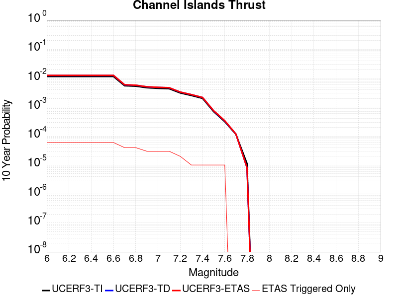 |

| Magnitude | 1 wk TI Prob | 1 wk TD Prob | 1 wk ETAS Prob | 1 wk ETAS/TD Gain | 1 wk ETAS Triggered Only | 1 mo TI Prob | 1 mo TD Prob | 1 mo ETAS Prob | 1 mo ETAS/TD Gain | 1 mo ETAS Triggered Only | 1 yr TI Prob | 1 yr TD Prob | 1 yr ETAS Prob | 1 yr ETAS/TD Gain | 1 yr ETAS Triggered Only | 10 yr TI Prob | 10 yr TD Prob | 10 yr ETAS Prob | 10 yr ETAS/TD Gain | 10 yr ETAS Triggered Only |
|-----|-----|-----|-----|-----|-----|-----|-----|-----|-----|-----|-----|-----|-----|-----|-----|-----|-----|-----|-----|-----|
| 6.0 | 2.2156251E-5 | 2.4092304E-5 | 3.4092063E-5 | 1.4150603 | 1.0E-5 | 9.495191E-5 | 1.03249244E-4 | 1.1324821E-4 | 1.096843 | 1.0E-5 | 0.0011554264 | 0.0012564411 | 0.001276416 | 1.015898 | 2.0E-5 | 0.011494373 | 0.012503966 | 0.012563216 | 1.0047385 | 6.0E-5 |
| 6.1 | 2.2156251E-5 | 2.4092304E-5 | 3.4092063E-5 | 1.4150603 | 1.0E-5 | 9.495191E-5 | 1.03249244E-4 | 1.1324821E-4 | 1.096843 | 1.0E-5 | 0.0011554264 | 0.0012564411 | 0.001276416 | 1.015898 | 2.0E-5 | 0.011494373 | 0.012503966 | 0.012563216 | 1.0047385 | 6.0E-5 |
| 6.2 | 2.2156251E-5 | 2.4092304E-5 | 3.4092063E-5 | 1.4150603 | 1.0E-5 | 9.495191E-5 | 1.03249244E-4 | 1.1324821E-4 | 1.096843 | 1.0E-5 | 0.0011554264 | 0.0012564411 | 0.001276416 | 1.015898 | 2.0E-5 | 0.011494373 | 0.012503966 | 0.012563216 | 1.0047385 | 6.0E-5 |
| 6.3 | 2.2156251E-5 | 2.4092304E-5 | 3.4092063E-5 | 1.4150603 | 1.0E-5 | 9.495191E-5 | 1.03249244E-4 | 1.1324821E-4 | 1.096843 | 1.0E-5 | 0.0011554264 | 0.0012564411 | 0.001276416 | 1.015898 | 2.0E-5 | 0.011494373 | 0.012503966 | 0.012563216 | 1.0047385 | 6.0E-5 |
| 6.4 | 2.2156251E-5 | 2.4092304E-5 | 3.4092063E-5 | 1.4150603 | 1.0E-5 | 9.495191E-5 | 1.03249244E-4 | 1.1324821E-4 | 1.096843 | 1.0E-5 | 0.0011554264 | 0.0012564411 | 0.001276416 | 1.015898 | 2.0E-5 | 0.011494373 | 0.012503966 | 0.012563216 | 1.0047385 | 6.0E-5 |
| 6.5 | 2.2156251E-5 | 2.4092304E-5 | 3.4092063E-5 | 1.4150603 | 1.0E-5 | 9.495191E-5 | 1.03249244E-4 | 1.1324821E-4 | 1.096843 | 1.0E-5 | 0.0011554264 | 0.0012564411 | 0.001276416 | 1.015898 | 2.0E-5 | 0.011494373 | 0.012503966 | 0.012563216 | 1.0047385 | 6.0E-5 |
| 6.6 | 2.2156251E-5 | 2.4092304E-5 | 3.4092063E-5 | 1.4150603 | 1.0E-5 | 9.495191E-5 | 1.03249244E-4 | 1.1324821E-4 | 1.096843 | 1.0E-5 | 0.0011554264 | 0.0012564411 | 0.001276416 | 1.015898 | 2.0E-5 | 0.011494373 | 0.012503966 | 0.012563216 | 1.0047385 | 6.0E-5 |
| 6.7 | 1.0601296E-5 | 1.1379656E-5 | 2.1379543E-5 | 1.8787512 | 1.0E-5 | 4.5433335E-5 | 4.876907E-5 | 5.8768583E-5 | 1.205038 | 1.0E-5 | 5.5301044E-4 | 5.9360656E-4 | 6.0360064E-4 | 1.0168362 | 1.0E-5 | 0.005516363 | 0.0059207114 | 0.0059604747 | 1.0067159 | 4.0E-5 |
| 6.8 | 1.0246747E-5 | 1.0996777E-5 | 2.0996667E-5 | 1.9093473 | 1.0E-5 | 4.391389E-5 | 4.712822E-5 | 5.712775E-5 | 1.212177 | 1.0E-5 | 5.345204E-4 | 5.736398E-4 | 5.836341E-4 | 1.0174226 | 1.0E-5 | 0.0053323656 | 0.005722081 | 0.005761852 | 1.0069505 | 4.0E-5 |
| 6.9 | 9.049551E-6 | 9.699738E-6 | 9.699738E-6 | 1.0 | 0.0 | 3.878322E-5 | 4.1569667E-5 | 4.1569667E-5 | 1.0 | 0.0 | 4.7208337E-4 | 5.059973E-4 | 5.059973E-4 | 1.0 | 0.0 | 0.0047108172 | 0.005048869 | 0.0050787176 | 1.005912 | 3.0E-5 |
| 7.0 | 8.6542195E-6 | 9.274692E-6 | 9.274692E-6 | 1.0 | 0.0 | 3.7088983E-5 | 3.97481E-5 | 3.97481E-5 | 1.0 | 0.0 | 4.5146482E-4 | 4.8382973E-4 | 4.8382973E-4 | 1.0 | 0.0 | 0.004505487 | 0.0048281755 | 0.004858031 | 1.0061835 | 3.0E-5 |
| 7.1 | 8.391028E-6 | 8.993012E-6 | 8.993012E-6 | 1.0 | 0.0 | 3.5961057E-5 | 3.8540933E-5 | 3.8540933E-5 | 1.0 | 0.0 | 4.3773788E-4 | 4.691389E-4 | 4.691389E-4 | 1.0 | 0.0 | 0.004368766 | 0.0046818955 | 0.004711755 | 1.0063777 | 3.0E-5 |
| 7.2 | 5.965188E-6 | 6.3717544E-6 | 6.3717544E-6 | 1.0 | 0.0 | 2.556484E-5 | 2.7307235E-5 | 2.7307235E-5 | 1.0 | 0.0 | 3.1120746E-4 | 3.3241542E-4 | 3.3241542E-4 | 1.0 | 0.0 | 0.00310772 | 0.00331924 | 0.0033391735 | 1.0060055 | 2.0E-5 |
| 7.3 | 4.877518E-6 | 5.2060545E-6 | 5.2060545E-6 | 1.0 | 0.0 | 2.0903482E-5 | 2.2311473E-5 | 2.2311473E-5 | 1.0 | 0.0 | 2.5447016E-4 | 2.7160876E-4 | 2.7160876E-4 | 1.0 | 0.0 | 0.0025417898 | 0.0027128144 | 0.0027227872 | 1.0036762 | 1.0E-5 |
| 7.4 | 3.8829853E-6 | 4.1419007E-6 | 4.1419007E-6 | 1.0 | 0.0 | 1.664126E-5 | 1.7750885E-5 | 1.7750885E-5 | 1.0 | 0.0 | 2.0258849E-4 | 2.16096E-4 | 2.16096E-4 | 1.0 | 0.0 | 0.002024039 | 0.0021589005 | 0.002168879 | 1.004622 | 1.0E-5 |
| 7.5 | 1.3489616E-6 | 1.4278027E-6 | 1.4278027E-6 | 1.0 | 0.0 | 5.7812517E-6 | 6.1191404E-6 | 6.1191404E-6 | 1.0 | 0.0 | 7.038446E-5 | 7.449803E-5 | 7.449803E-5 | 1.0 | 0.0 | 7.036218E-4 | 7.447345E-4 | 7.5472705E-4 | 1.0134176 | 1.0E-5 |
| 7.6 | 6.058192E-7 | 6.353832E-7 | 6.353832E-7 | 1.0 | 0.0 | 2.5963652E-6 | 2.723068E-6 | 2.723068E-6 | 1.0 | 0.0 | 3.161029E-5 | 3.3152864E-5 | 3.3152864E-5 | 1.0 | 0.0 | 3.1605794E-4 | 3.314808E-4 | 3.4147748E-4 | 1.0301577 | 1.0E-5 |
| 7.7 | 2.2170494E-7 | 2.260808E-7 | 2.260808E-7 | 1.0 | 0.0 | 9.5016367E-7 | 9.689174E-7 | 9.689174E-7 | 1.0 | 0.0 | 1.1568181E-5 | 1.1796516E-5 | 1.1796516E-5 | 1.0 | 0.0 | 1.1567579E-4 | 1.17960015E-4 | 1.17960015E-4 | 1.0 | 0.0 |
| 7.8 | 2.1613102E-8 | 1.5466789E-8 | 1.5466789E-8 | 1.0 | 0.0 | 9.262757E-8 | 6.628623E-8 | 6.628623E-8 | 1.0 | 0.0 | 1.1277401E-6 | 8.0703467E-7 | 8.0703467E-7 | 1.0 | 0.0 | 1.1277344E-5 | 8.070325E-6 | 8.070325E-6 | 1.0 | 0.0 |

## San Jacinto (Anza) rev
*[(top)](#table-of-contents)*

| 1 Week | 1 Month | 1 Year | 10 Year |
|-----|-----|-----|-----|
| 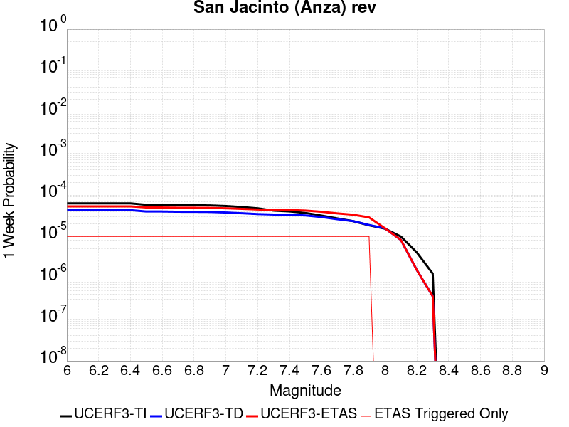 |  |  |  |

| Magnitude | 1 wk TI Prob | 1 wk TD Prob | 1 wk ETAS Prob | 1 wk ETAS/TD Gain | 1 wk ETAS Triggered Only | 1 mo TI Prob | 1 mo TD Prob | 1 mo ETAS Prob | 1 mo ETAS/TD Gain | 1 mo ETAS Triggered Only | 1 yr TI Prob | 1 yr TD Prob | 1 yr ETAS Prob | 1 yr ETAS/TD Gain | 1 yr ETAS Triggered Only | 10 yr TI Prob | 10 yr TD Prob | 10 yr ETAS Prob | 10 yr ETAS/TD Gain | 10 yr ETAS Triggered Only |
|-----|-----|-----|-----|-----|-----|-----|-----|-----|-----|-----|-----|-----|-----|-----|-----|-----|-----|-----|-----|-----|
| 6.0 | 6.3015636E-5 | 4.3319626E-5 | 5.3319192E-5 | 1.2308322 | 1.0E-5 | 2.7003905E-4 | 1.8564239E-4 | 2.0563869E-4 | 1.107714 | 2.0E-5 | 0.0032827691 | 0.0022578652 | 0.002297775 | 1.0176759 | 4.0E-5 | 0.032346968 | 0.02330496 | 0.023363562 | 1.0025146 | 6.0E-5 |
| 6.1 | 6.3015636E-5 | 4.3319626E-5 | 5.3319192E-5 | 1.2308322 | 1.0E-5 | 2.7003905E-4 | 1.8564239E-4 | 2.0563869E-4 | 1.107714 | 2.0E-5 | 0.0032827691 | 0.0022578652 | 0.002297775 | 1.0176759 | 4.0E-5 | 0.032346968 | 0.02330496 | 0.023363562 | 1.0025146 | 6.0E-5 |
| 6.2 | 6.3015636E-5 | 4.3319626E-5 | 5.3319192E-5 | 1.2308322 | 1.0E-5 | 2.7003905E-4 | 1.8564239E-4 | 2.0563869E-4 | 1.107714 | 2.0E-5 | 0.0032827691 | 0.0022578652 | 0.002297775 | 1.0176759 | 4.0E-5 | 0.032346968 | 0.02330496 | 0.023363562 | 1.0025146 | 6.0E-5 |
| 6.3 | 6.3015636E-5 | 4.3319626E-5 | 5.3319192E-5 | 1.2308322 | 1.0E-5 | 2.7003905E-4 | 1.8564239E-4 | 2.0563869E-4 | 1.107714 | 2.0E-5 | 0.0032827691 | 0.0022578652 | 0.002297775 | 1.0176759 | 4.0E-5 | 0.032346968 | 0.02330496 | 0.023363562 | 1.0025146 | 6.0E-5 |
| 6.4 | 6.3015636E-5 | 4.3319626E-5 | 5.3319192E-5 | 1.2308322 | 1.0E-5 | 2.7003905E-4 | 1.8564239E-4 | 2.0563869E-4 | 1.107714 | 2.0E-5 | 0.0032827691 | 0.0022578652 | 0.002297775 | 1.0176759 | 4.0E-5 | 0.032346968 | 0.02330496 | 0.023363562 | 1.0025146 | 6.0E-5 |
| 6.5 | 5.811017E-5 | 4.0098632E-5 | 5.009823E-5 | 1.2493751 | 1.0E-5 | 2.4901982E-4 | 1.7184E-4 | 1.9183656E-4 | 1.1163673 | 2.0E-5 | 0.0030276014 | 0.00209015 | 0.0021300665 | 1.0190973 | 4.0E-5 | 0.02986684 | 0.021602087 | 0.02166079 | 1.0027175 | 6.0E-5 |
| 6.6 | 5.811017E-5 | 4.0098632E-5 | 5.009823E-5 | 1.2493751 | 1.0E-5 | 2.4901982E-4 | 1.7184E-4 | 1.9183656E-4 | 1.1163673 | 2.0E-5 | 0.0030276014 | 0.00209015 | 0.0021300665 | 1.0190973 | 4.0E-5 | 0.02986684 | 0.021602087 | 0.02166079 | 1.0027175 | 6.0E-5 |
| 6.7 | 5.712442E-5 | 3.952116E-5 | 4.9520764E-5 | 1.253019 | 1.0E-5 | 2.4479596E-4 | 1.6936543E-4 | 1.8936205E-4 | 1.1180679 | 2.0E-5 | 0.0029763177 | 0.0020600795 | 0.0020999971 | 1.0193768 | 4.0E-5 | 0.029367693 | 0.021293823 | 0.021352544 | 1.0027577 | 6.0E-5 |
| 6.8 | 5.6967532E-5 | 3.9377548E-5 | 4.9377155E-5 | 1.2539418 | 1.0E-5 | 2.4412372E-4 | 1.6875003E-4 | 1.8874666E-4 | 1.1184984 | 2.0E-5 | 0.0029681553 | 0.0020526012 | 0.002092519 | 1.0194474 | 4.0E-5 | 0.029288229 | 0.021218529 | 0.021277256 | 1.0027677 | 6.0E-5 |
| 6.9 | 5.6211324E-5 | 3.9082228E-5 | 4.908184E-5 | 1.2558608 | 1.0E-5 | 2.4088343E-4 | 1.6748454E-4 | 1.8748119E-4 | 1.1193941 | 2.0E-5 | 0.0029288116 | 0.0020372227 | 0.0020771413 | 1.0195946 | 4.0E-5 | 0.028905109 | 0.021057902 | 0.021116639 | 1.0027893 | 6.0E-5 |
| 7.0 | 5.4383527E-5 | 3.7942387E-5 | 4.7942005E-5 | 1.2635475 | 1.0E-5 | 2.3305144E-4 | 1.6260012E-4 | 1.8259686E-4 | 1.1229812 | 2.0E-5 | 0.0028337094 | 0.001977864 | 0.0020177846 | 1.0201838 | 4.0E-5 | 0.027978465 | 0.020448677 | 0.02050745 | 1.0028741 | 6.0E-5 |
| 7.1 | 5.1393665E-5 | 3.640475E-5 | 4.6404384E-5 | 1.2746794 | 1.0E-5 | 2.2023996E-4 | 1.5601104E-4 | 1.7600792E-4 | 1.1281761 | 2.0E-5 | 0.0026781242 | 0.0018977838 | 0.0019377079 | 1.0210372 | 4.0E-5 | 0.026460782 | 0.019622007 | 0.01968083 | 1.0029978 | 6.0E-5 |
| 7.2 | 4.785222E-5 | 3.475601E-5 | 4.4755663E-5 | 1.2877101 | 1.0E-5 | 2.0506482E-4 | 1.4894584E-4 | 1.6894286E-4 | 1.134257 | 2.0E-5 | 0.0024938055 | 0.0018119109 | 0.0018518383 | 1.0220362 | 4.0E-5 | 0.024660049 | 0.018736389 | 0.018795265 | 1.0031424 | 6.0E-5 |
| 7.3 | 4.2143256E-5 | 3.3850083E-5 | 4.3849745E-5 | 1.2954103 | 1.0E-5 | 1.8060145E-4 | 1.4506375E-4 | 1.6506085E-4 | 1.1378504 | 2.0E-5 | 0.002196605 | 0.0017647238 | 0.0018046532 | 1.0226264 | 4.0E-5 | 0.02175019 | 0.018244414 | 0.01830332 | 1.0032287 | 6.0E-5 |
| 7.4 | 4.0264713E-5 | 3.3488133E-5 | 4.34878E-5 | 1.2986032 | 1.0E-5 | 1.7255165E-4 | 1.435127E-4 | 1.6350983E-4 | 1.1393405 | 2.0E-5 | 0.002098792 | 0.0017458702 | 0.0017858004 | 1.0228713 | 4.0E-5 | 0.020790804 | 0.018048922 | 0.018107839 | 1.0032643 | 6.0E-5 |
| 7.5 | 3.694492E-5 | 3.2201835E-5 | 4.2201515E-5 | 1.3105313 | 1.0E-5 | 1.5832575E-4 | 1.3800059E-4 | 1.5799783E-4 | 1.1449069 | 2.0E-5 | 0.0019259118 | 0.0016788654 | 0.0017187982 | 1.0237856 | 4.0E-5 | 0.01909306 | 0.017365217 | 0.017424176 | 1.0033952 | 6.0E-5 |
| 7.6 | 3.200565E-5 | 2.9517045E-5 | 3.9516748E-5 | 1.3387773 | 1.0E-5 | 1.3715986E-4 | 1.2649549E-4 | 1.4649297E-4 | 1.1580884 | 2.0E-5 | 0.001668642 | 0.0015389969 | 0.0015789353 | 1.0259509 | 4.0E-5 | 0.01656168 | 0.015953032 | 0.016012074 | 1.0037011 | 6.0E-5 |
| 7.7 | 2.731642E-5 | 2.610537E-5 | 3.610511E-5 | 1.383053 | 1.0E-5 | 1.1706512E-4 | 1.11875364E-4 | 1.3187312E-4 | 1.1787504 | 2.0E-5 | 0.001424336 | 0.0013612325 | 0.0014011781 | 1.0293452 | 4.0E-5 | 0.014152412 | 0.0141735645 | 0.014232715 | 1.0041733 | 6.0E-5 |
| 7.8 | 2.3466424E-5 | 2.3516895E-5 | 3.351666E-5 | 1.4252162 | 1.0E-5 | 1.0056651E-4 | 1.007828E-4 | 1.2078079E-4 | 1.1984266 | 2.0E-5 | 0.0012237094 | 0.0012263408 | 0.0012662917 | 1.0325774 | 4.0E-5 | 0.012169928 | 0.012815201 | 0.012874431 | 1.004622 | 6.0E-5 |
| 7.9 | 1.8611925E-5 | 1.8918972E-5 | 2.8918783E-5 | 1.5285599 | 1.0E-5 | 7.9762955E-5 | 8.107879E-5 | 1.0107717E-4 | 1.2466537 | 2.0E-5 | 9.7068126E-4 | 9.86688E-4 | 0.0010266484 | 1.0404997 | 4.0E-5 | 0.0096645225 | 0.010399517 | 0.010458892 | 1.0057095 | 6.0E-5 |
| 8.0 | 1.5460775E-5 | 1.5750582E-5 | 1.5750582E-5 | 1.0 | 0.0 | 6.6258784E-5 | 6.7500754E-5 | 7.750008E-5 | 1.1481365 | 1.0E-5 | 8.0640207E-4 | 8.215125E-4 | 8.5148786E-4 | 1.036488 | 3.0E-5 | 0.008034821 | 0.008707945 | 0.00875751 | 1.0056919 | 5.0E-5 |
| 8.1 | 9.983884E-6 | 8.275629E-6 | 8.275629E-6 | 1.0 | 0.0 | 4.2787375E-5 | 3.54665E-5 | 4.5466146E-5 | 1.2819462 | 1.0E-5 | 5.2081177E-4 | 4.3171959E-4 | 4.6170666E-4 | 1.0694596 | 3.0E-5 | 0.0051959283 | 0.004643071 | 0.004672932 | 1.0064312 | 3.0E-5 |
| 8.2 | 4.1226E-6 | 1.5546157E-6 | 1.5546157E-6 | 1.0 | 0.0 | 1.7668166E-5 | 6.6626217E-6 | 6.6626217E-6 | 1.0 | 0.0 | 2.1508869E-4 | 8.111443E-5 | 8.111443E-5 | 1.0 | 0.0 | 0.0021488064 | 9.4143586E-4 | 9.4143586E-4 | 1.0 | 0.0 |
| 8.3 | 1.2750878E-6 | 3.6166134E-7 | 3.6166134E-7 | 1.0 | 0.0 | 5.4646503E-6 | 1.5499762E-6 | 1.5499762E-6 | 1.0 | 0.0 | 6.653009E-5 | 1.8870802E-5 | 1.8870802E-5 | 1.0 | 0.0 | 6.6510175E-4 | 2.2760578E-4 | 2.2760578E-4 | 1.0 | 0.0 |

## Big Pine (Central)
*[(top)](#table-of-contents)*

| 1 Week | 1 Month | 1 Year | 10 Year |
|-----|-----|-----|-----|
|  |  |  |  |

| Magnitude | 1 wk TI Prob | 1 wk TD Prob | 1 wk ETAS Prob | 1 wk ETAS/TD Gain | 1 wk ETAS Triggered Only | 1 mo TI Prob | 1 mo TD Prob | 1 mo ETAS Prob | 1 mo ETAS/TD Gain | 1 mo ETAS Triggered Only | 1 yr TI Prob | 1 yr TD Prob | 1 yr ETAS Prob | 1 yr ETAS/TD Gain | 1 yr ETAS Triggered Only | 10 yr TI Prob | 10 yr TD Prob | 10 yr ETAS Prob | 10 yr ETAS/TD Gain | 10 yr ETAS Triggered Only |
|-----|-----|-----|-----|-----|-----|-----|-----|-----|-----|-----|-----|-----|-----|-----|-----|-----|-----|-----|-----|-----|
| 6.0 | 1.2706755E-5 | 1.4251012E-5 | 1.4251012E-5 | 1.0 | 0.0 | 5.4456385E-5 | 6.107454E-5 | 6.107454E-5 | 1.0 | 0.0 | 6.628048E-4 | 7.4336544E-4 | 7.933283E-4 | 1.0672116 | 5.0E-5 | 0.006608314 | 0.0074138143 | 0.0074634436 | 1.0066942 | 5.0E-5 |
| 6.1 | 8.342579E-6 | 9.511191E-6 | 9.511191E-6 | 1.0 | 0.0 | 3.5753423E-5 | 4.0761734E-5 | 4.0761734E-5 | 1.0 | 0.0 | 4.3521097E-4 | 4.961828E-4 | 5.161729E-4 | 1.0402877 | 2.0E-5 | 0.0043435963 | 0.0049543027 | 0.004974203 | 1.0040169 | 2.0E-5 |
| 6.2 | 6.923899E-6 | 7.967559E-6 | 7.967559E-6 | 1.0 | 0.0 | 2.9673516E-5 | 3.4146342E-5 | 3.4146342E-5 | 1.0 | 0.0 | 3.6121515E-4 | 4.1567165E-4 | 4.3566336E-4 | 1.0480949 | 2.0E-5 | 0.003606286 | 0.0041522477 | 0.0041721645 | 1.0047966 | 2.0E-5 |
| 6.3 | 2.728396E-6 | 3.4246525E-6 | 3.4246525E-6 | 1.0 | 0.0 | 1.1693074E-5 | 1.4677004E-5 | 1.4677004E-5 | 1.0 | 0.0 | 1.4235388E-4 | 1.7867875E-4 | 1.8867696E-4 | 1.0559564 | 1.0E-5 | 0.0014226272 | 0.0017868559 | 0.0017968379 | 1.0055864 | 1.0E-5 |
| 6.4 | 2.7136944E-6 | 3.4089458E-6 | 3.4089458E-6 | 1.0 | 0.0 | 1.1630066E-5 | 1.4609691E-5 | 1.4609691E-5 | 1.0 | 0.0 | 1.4158686E-4 | 1.7785933E-4 | 1.8785756E-4 | 1.0562142 | 1.0E-5 | 0.0014149669 | 0.0017786748 | 0.001788657 | 1.0056121 | 1.0E-5 |
| 6.5 | 2.6971882E-6 | 3.3912906E-6 | 3.3912906E-6 | 1.0 | 0.0 | 1.1559327E-5 | 1.4534027E-5 | 1.4534027E-5 | 1.0 | 0.0 | 1.4072572E-4 | 1.7693828E-4 | 1.8693651E-4 | 1.0565069 | 1.0E-5 | 0.0014063664 | 0.0017694789 | 0.0017794613 | 1.0056413 | 1.0E-5 |
| 6.6 | 2.669092E-6 | 3.361311E-6 | 3.361311E-6 | 1.0 | 0.0 | 1.1438916E-5 | 1.4405543E-5 | 1.4405543E-5 | 1.0 | 0.0 | 1.3925991E-4 | 1.7537424E-4 | 1.853725E-4 | 1.0570109 | 1.0E-5 | 0.0013917267 | 0.0017538633 | 0.0017638458 | 1.0056916 | 1.0E-5 |
| 6.7 | 2.6408059E-6 | 3.3313363E-6 | 3.3313363E-6 | 1.0 | 0.0 | 1.1317691E-5 | 1.4277082E-5 | 1.4277082E-5 | 1.0 | 0.0 | 1.3778417E-4 | 1.7381048E-4 | 1.8380875E-4 | 1.057524 | 1.0E-5 | 0.0013769877 | 0.0017382503 | 0.0017482329 | 1.0057429 | 1.0E-5 |
| 6.8 | 2.1786943E-6 | 2.8547915E-6 | 2.8547915E-6 | 1.0 | 0.0 | 9.337228E-6 | 1.2234768E-5 | 1.2234768E-5 | 1.0 | 0.0 | 1.1367482E-4 | 1.4894885E-4 | 1.5894735E-4 | 1.0671271 | 1.0E-5 | 0.0011361669 | 0.0014899815 | 0.0014999666 | 1.0067015 | 1.0E-5 |
| 6.9 | 1.4411696E-6 | 2.0688422E-6 | 2.0688422E-6 | 1.0 | 0.0 | 6.1764263E-6 | 8.866437E-6 | 8.866437E-6 | 1.0 | 0.0 | 7.51954E-5 | 1.079438E-4 | 1.1794272E-4 | 1.0926307 | 1.0E-5 | 7.5169955E-4 | 0.0010803605 | 0.0010903496 | 1.0092461 | 1.0E-5 |
| 7.0 | 1.0073411E-6 | 1.5545673E-6 | 1.5545673E-6 | 1.0 | 0.0 | 4.317169E-6 | 6.662415E-6 | 6.662415E-6 | 1.0 | 0.0 | 5.2560266E-5 | 8.111204E-5 | 9.111123E-5 | 1.1232762 | 1.0E-5 | 5.2547833E-4 | 8.1225985E-4 | 8.222517E-4 | 1.0123013 | 1.0E-5 |
| 7.1 | 8.947104E-7 | 1.4305514E-6 | 1.4305514E-6 | 1.0 | 0.0 | 3.834468E-6 | 6.130921E-6 | 6.130921E-6 | 1.0 | 0.0 | 4.6683643E-5 | 7.464155E-5 | 8.464081E-5 | 1.1339636 | 1.0E-5 | 4.6673836E-4 | 7.476001E-4 | 7.575927E-4 | 1.0133661 | 1.0E-5 |
| 7.2 | 5.215166E-7 | 1.0114496E-6 | 1.0114496E-6 | 1.0 | 0.0 | 2.2350691E-6 | 4.3347773E-6 | 4.3347773E-6 | 1.0 | 0.0 | 2.7211627E-5 | 5.2774678E-5 | 6.2774154E-5 | 1.1894748 | 1.0E-5 | 2.7208295E-4 | 5.290466E-4 | 5.390413E-4 | 1.0188919 | 1.0E-5 |
| 7.3 | 4.4024807E-7 | 9.2223235E-7 | 9.2223235E-7 | 1.0 | 0.0 | 1.8867761E-6 | 3.9524184E-6 | 3.9524184E-6 | 1.0 | 0.0 | 2.2971257E-5 | 4.8119677E-5 | 5.8119193E-5 | 1.2078052 | 1.0E-5 | 2.2968883E-4 | 4.8251753E-4 | 4.925127E-4 | 1.0207146 | 1.0E-5 |
| 7.4 | 3.6130905E-7 | 8.3611724E-7 | 8.3611724E-7 | 1.0 | 0.0 | 1.5484665E-6 | 3.583355E-6 | 3.583355E-6 | 1.0 | 0.0 | 1.8852415E-5 | 4.362651E-5 | 5.3626078E-5 | 1.2292085 | 1.0E-5 | 1.8850817E-4 | 4.3759486E-4 | 4.4759052E-4 | 1.0228422 | 1.0E-5 |
| 7.5 | 3.408184E-7 | 8.110739E-7 | 8.110739E-7 | 1.0 | 0.0 | 1.4606494E-6 | 3.4760267E-6 | 3.4760267E-6 | 1.0 | 0.0 | 1.7783263E-5 | 4.231984E-5 | 5.2319418E-5 | 1.2362858 | 1.0E-5 | 1.778184E-4 | 4.2451176E-4 | 4.3450753E-4 | 1.0235465 | 1.0E-5 |
| 7.6 | 3.1428627E-7 | 7.7341E-7 | 7.7341E-7 | 1.0 | 0.0 | 1.3469405E-6 | 3.3146102E-6 | 3.3146102E-6 | 1.0 | 0.0 | 1.6398877E-5 | 4.0354673E-5 | 5.035427E-5 | 1.2477928 | 1.0E-5 | 1.6397667E-4 | 4.0483844E-4 | 4.148344E-4 | 1.0246912 | 1.0E-5 |
| 7.7 | 1.7972785E-7 | 5.0796626E-7 | 5.0796626E-7 | 1.0 | 0.0 | 7.70262E-7 | 2.1769965E-6 | 2.1769965E-6 | 1.0 | 0.0 | 9.377899E-6 | 2.6504622E-5 | 2.6504622E-5 | 1.0 | 0.0 | 9.377503E-5 | 2.663867E-4 | 2.663867E-4 | 1.0 | 0.0 |
| 7.8 | 4.9230927E-8 | 1.1985297E-7 | 1.1985297E-7 | 1.0 | 0.0 | 2.1098968E-7 | 5.136555E-7 | 5.136555E-7 | 1.0 | 0.0 | 2.5687964E-6 | 6.2537392E-6 | 6.2537392E-6 | 1.0 | 0.0 | 2.5687666E-5 | 6.2977226E-5 | 6.2977226E-5 | 1.0 | 0.0 |
| 7.9 | 3.6805972E-9 | 4.1070685E-9 | 4.1070685E-9 | 1.0 | 0.0 | 1.5773987E-8 | 1.7601723E-8 | 1.7601723E-8 | 1.0 | 0.0 | 1.9204828E-7 | 2.1430095E-7 | 2.1430095E-7 | 1.0 | 0.0 | 1.920481E-6 | 2.190991E-6 | 2.190991E-6 | 1.0 | 0.0 |

## Raymond
*[(top)](#table-of-contents)*

| 1 Week | 1 Month | 1 Year | 10 Year |
|-----|-----|-----|-----|
|  |  | 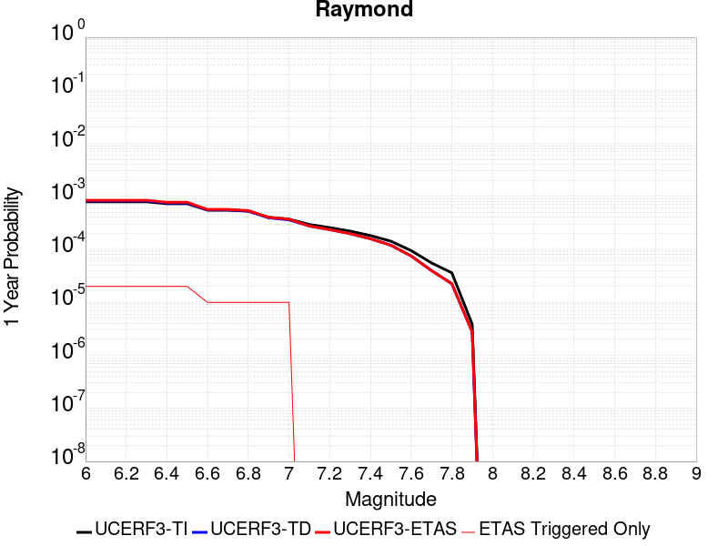 |  |

| Magnitude | 1 wk TI Prob | 1 wk TD Prob | 1 wk ETAS Prob | 1 wk ETAS/TD Gain | 1 wk ETAS Triggered Only | 1 mo TI Prob | 1 mo TD Prob | 1 mo ETAS Prob | 1 mo ETAS/TD Gain | 1 mo ETAS Triggered Only | 1 yr TI Prob | 1 yr TD Prob | 1 yr ETAS Prob | 1 yr ETAS/TD Gain | 1 yr ETAS Triggered Only | 10 yr TI Prob | 10 yr TD Prob | 10 yr ETAS Prob | 10 yr ETAS/TD Gain | 10 yr ETAS Triggered Only |
|-----|-----|-----|-----|-----|-----|-----|-----|-----|-----|-----|-----|-----|-----|-----|-----|-----|-----|-----|-----|-----|
| 6.0 | 1.5157413E-5 | 1.5810376E-5 | 2.5810217E-5 | 1.632486 | 1.0E-5 | 6.4958724E-5 | 6.775714E-5 | 8.775578E-5 | 1.2951518 | 2.0E-5 | 7.905855E-4 | 8.24656E-4 | 8.446395E-4 | 1.0242325 | 2.0E-5 | 0.007877788 | 0.008218477 | 0.008268066 | 1.0060339 | 5.0E-5 |
| 6.1 | 1.5157413E-5 | 1.5810376E-5 | 2.5810217E-5 | 1.632486 | 1.0E-5 | 6.4958724E-5 | 6.775714E-5 | 8.775578E-5 | 1.2951518 | 2.0E-5 | 7.905855E-4 | 8.24656E-4 | 8.446395E-4 | 1.0242325 | 2.0E-5 | 0.007877788 | 0.008218477 | 0.008268066 | 1.0060339 | 5.0E-5 |
| 6.2 | 1.5157413E-5 | 1.5810376E-5 | 2.5810217E-5 | 1.632486 | 1.0E-5 | 6.4958724E-5 | 6.775714E-5 | 8.775578E-5 | 1.2951518 | 2.0E-5 | 7.905855E-4 | 8.24656E-4 | 8.446395E-4 | 1.0242325 | 2.0E-5 | 0.007877788 | 0.008218477 | 0.008268066 | 1.0060339 | 5.0E-5 |
| 6.3 | 1.5157413E-5 | 1.5810376E-5 | 2.5810217E-5 | 1.632486 | 1.0E-5 | 6.4958724E-5 | 6.775714E-5 | 8.775578E-5 | 1.2951518 | 2.0E-5 | 7.905855E-4 | 8.24656E-4 | 8.446395E-4 | 1.0242325 | 2.0E-5 | 0.007877788 | 0.008218477 | 0.008268066 | 1.0060339 | 5.0E-5 |
| 6.4 | 1.3941944E-5 | 1.4454918E-5 | 2.4454774E-5 | 1.6917961 | 1.0E-5 | 5.9749822E-5 | 6.194831E-5 | 8.194707E-5 | 1.3228298 | 2.0E-5 | 7.2721124E-4 | 7.53983E-4 | 7.7396794E-4 | 1.0265058 | 2.0E-5 | 0.007248361 | 0.0075165825 | 0.0075662066 | 1.0066019 | 5.0E-5 |
| 6.5 | 1.3941944E-5 | 1.4454918E-5 | 2.4454774E-5 | 1.6917961 | 1.0E-5 | 5.9749822E-5 | 6.194831E-5 | 8.194707E-5 | 1.3228298 | 2.0E-5 | 7.2721124E-4 | 7.53983E-4 | 7.7396794E-4 | 1.0265058 | 2.0E-5 | 0.007248361 | 0.0075165825 | 0.0075662066 | 1.0066019 | 5.0E-5 |
| 6.6 | 1.0542609E-5 | 1.0671283E-5 | 1.0671283E-5 | 1.0 | 0.0 | 4.5181827E-5 | 4.57333E-5 | 5.5732846E-5 | 1.218649 | 1.0E-5 | 5.499499E-4 | 5.566662E-4 | 5.666606E-4 | 1.0179541 | 1.0E-5 | 0.005485909 | 0.0055532786 | 0.005593057 | 1.0071629 | 4.0E-5 |
| 6.7 | 1.0542609E-5 | 1.0671283E-5 | 1.0671283E-5 | 1.0 | 0.0 | 4.5181827E-5 | 4.57333E-5 | 5.5732846E-5 | 1.218649 | 1.0E-5 | 5.499499E-4 | 5.566662E-4 | 5.666606E-4 | 1.0179541 | 1.0E-5 | 0.005485909 | 0.0055532786 | 0.005593057 | 1.0071629 | 4.0E-5 |
| 6.8 | 1.0079132E-5 | 1.0176812E-5 | 1.0176812E-5 | 1.0 | 0.0 | 4.3195567E-5 | 4.361421E-5 | 5.3613774E-5 | 1.2292731 | 1.0E-5 | 5.257791E-4 | 5.30879E-4 | 5.408737E-4 | 1.0188267 | 1.0E-5 | 0.0052453685 | 0.0052966573 | 0.0053264988 | 1.005634 | 3.0E-5 |
| 6.9 | 7.721598E-6 | 7.5490307E-6 | 7.5490307E-6 | 1.0 | 0.0 | 3.3092143E-5 | 3.2352593E-5 | 4.235227E-5 | 1.3090842 | 1.0E-5 | 4.0282236E-4 | 3.9382285E-4 | 4.038189E-4 | 1.0253822 | 1.0E-5 | 0.0040209293 | 0.003931383 | 0.003961265 | 1.0076009 | 3.0E-5 |
| 7.0 | 7.137566E-6 | 6.9114235E-6 | 6.9114235E-6 | 1.0 | 0.0 | 3.058921E-5 | 2.9620056E-5 | 3.961976E-5 | 1.337599 | 1.0E-5 | 3.7236E-4 | 3.6056558E-4 | 3.70562E-4 | 1.0277241 | 1.0E-5 | 0.0037173668 | 0.003599924 | 0.003629816 | 1.0083035 | 3.0E-5 |
| 7.1 | 5.654976E-6 | 5.2996397E-6 | 5.2996397E-6 | 1.0 | 0.0 | 2.4235387E-5 | 2.2712544E-5 | 2.2712544E-5 | 1.0 | 0.0 | 2.9502588E-4 | 2.7649035E-4 | 2.7649035E-4 | 1.0 | 0.0 | 0.0029463451 | 0.0027614946 | 0.0027814393 | 1.0072224 | 2.0E-5 |
| 7.2 | 4.9358455E-6 | 4.5267484E-6 | 4.5267484E-6 | 1.0 | 0.0 | 2.1153453E-5 | 1.9400206E-5 | 1.9400206E-5 | 1.0 | 0.0 | 2.5751285E-4 | 2.3617204E-4 | 2.3617204E-4 | 1.0 | 0.0 | 0.0025721465 | 0.0023592326 | 0.0023791855 | 1.0084573 | 2.0E-5 |
| 7.3 | 4.2368597E-6 | 3.8056999E-6 | 3.8056999E-6 | 1.0 | 0.0 | 1.8157843E-5 | 1.6310041E-5 | 1.6310041E-5 | 1.0 | 0.0 | 2.2104931E-4 | 1.9855677E-4 | 1.9855677E-4 | 1.0 | 0.0 | 0.0022082955 | 0.0019838123 | 0.0020037726 | 1.0100616 | 2.0E-5 |
| 7.4 | 3.4999923E-6 | 3.0438184E-6 | 3.0438184E-6 | 1.0 | 0.0 | 1.49998805E-5 | 1.3044872E-5 | 1.3044872E-5 | 1.0 | 0.0 | 1.8260824E-4 | 1.5880981E-4 | 1.5880981E-4 | 1.0 | 0.0 | 0.0018245826 | 0.001586979 | 0.0015969631 | 1.0062913 | 1.0E-5 |
| 7.5 | 2.738017E-6 | 2.3021105E-6 | 2.3021105E-6 | 1.0 | 0.0 | 1.1734306E-5 | 9.86615E-6 | 9.86615E-6 | 1.0 | 0.0 | 1.428558E-4 | 1.2011383E-4 | 1.2011383E-4 | 1.0 | 0.0 | 0.0014276401 | 0.0012005034 | 0.0012104914 | 1.0083199 | 1.0E-5 |
| 7.6 | 1.8186392E-6 | 1.4423566E-6 | 1.4423566E-6 | 1.0 | 0.0 | 7.794145E-6 | 6.181514E-6 | 6.181514E-6 | 1.0 | 0.0 | 9.488958E-5 | 7.5257376E-5 | 7.5257376E-5 | 1.0 | 0.0 | 9.4849075E-4 | 7.523304E-4 | 7.6232286E-4 | 1.0132821 | 1.0E-5 |
| 7.7 | 1.0660348E-6 | 7.644165E-7 | 7.644165E-7 | 1.0 | 0.0 | 4.5687125E-6 | 3.2760668E-6 | 3.2760668E-6 | 1.0 | 0.0 | 5.5622655E-5 | 3.98854E-5 | 3.98854E-5 | 1.0 | 0.0 | 5.5608735E-4 | 3.9879154E-4 | 3.9879154E-4 | 1.0 | 0.0 |
| 7.8 | 6.913602E-7 | 4.320714E-7 | 4.320714E-7 | 1.0 | 0.0 | 2.962969E-6 | 1.8517333E-6 | 1.8517333E-6 | 1.0 | 0.0 | 3.607355E-5 | 2.2544626E-5 | 2.2544626E-5 | 1.0 | 0.0 | 3.6067693E-4 | 2.2543124E-4 | 2.2543124E-4 | 1.0 | 0.0 |
| 7.9 | 7.425201E-8 | 5.322516E-8 | 5.322516E-8 | 1.0 | 0.0 | 3.1822285E-7 | 2.2810782E-7 | 2.2810782E-7 | 1.0 | 0.0 | 3.874356E-6 | 2.7772105E-6 | 2.7772105E-6 | 1.0 | 0.0 | 3.8742884E-5 | 2.7771888E-5 | 2.7771888E-5 | 1.0 | 0.0 |

## Ventura-Pitas Point
*[(top)](#table-of-contents)*

| 1 Week | 1 Month | 1 Year | 10 Year |
|-----|-----|-----|-----|
|  |  |  | 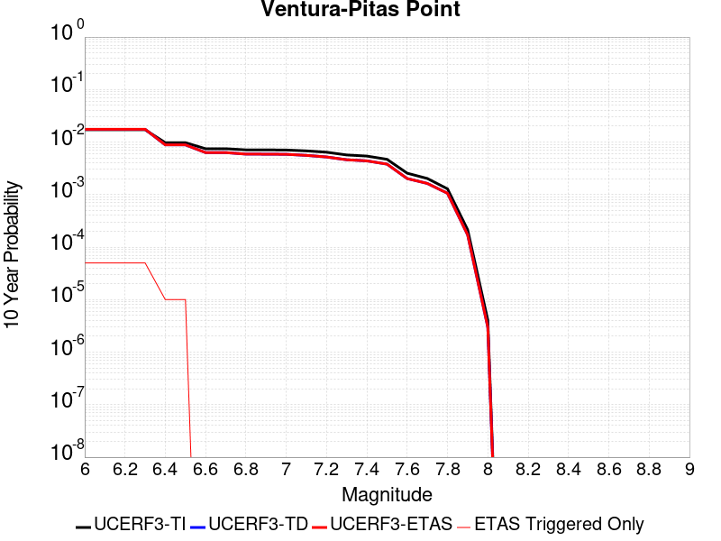 |

| Magnitude | 1 wk TI Prob | 1 wk TD Prob | 1 wk ETAS Prob | 1 wk ETAS/TD Gain | 1 wk ETAS Triggered Only | 1 mo TI Prob | 1 mo TD Prob | 1 mo ETAS Prob | 1 mo ETAS/TD Gain | 1 mo ETAS Triggered Only | 1 yr TI Prob | 1 yr TD Prob | 1 yr ETAS Prob | 1 yr ETAS/TD Gain | 1 yr ETAS Triggered Only | 10 yr TI Prob | 10 yr TD Prob | 10 yr ETAS Prob | 10 yr ETAS/TD Gain | 10 yr ETAS Triggered Only |
|-----|-----|-----|-----|-----|-----|-----|-----|-----|-----|-----|-----|-----|-----|-----|-----|-----|-----|-----|-----|-----|
| 6.0 | 3.3179622E-5 | 3.3735807E-5 | 3.3735807E-5 | 1.0 | 0.0 | 1.4219063E-4 | 1.4457546E-4 | 1.6457257E-4 | 1.138316 | 2.0E-5 | 0.0017297962 | 0.001759042 | 0.0017989717 | 1.0226996 | 4.0E-5 | 0.017163932 | 0.01747672 | 0.017525846 | 1.002811 | 5.0E-5 |
| 6.1 | 3.3179622E-5 | 3.3735807E-5 | 3.3735807E-5 | 1.0 | 0.0 | 1.4219063E-4 | 1.4457546E-4 | 1.6457257E-4 | 1.138316 | 2.0E-5 | 0.0017297962 | 0.001759042 | 0.0017989717 | 1.0226996 | 4.0E-5 | 0.017163932 | 0.01747672 | 0.017525846 | 1.002811 | 5.0E-5 |
| 6.2 | 3.3179622E-5 | 3.3735807E-5 | 3.3735807E-5 | 1.0 | 0.0 | 1.4219063E-4 | 1.4457546E-4 | 1.6457257E-4 | 1.138316 | 2.0E-5 | 0.0017297962 | 0.001759042 | 0.0017989717 | 1.0226996 | 4.0E-5 | 0.017163932 | 0.01747672 | 0.017525846 | 1.002811 | 5.0E-5 |
| 6.3 | 3.3179622E-5 | 3.3735807E-5 | 3.3735807E-5 | 1.0 | 0.0 | 1.4219063E-4 | 1.4457546E-4 | 1.6457257E-4 | 1.138316 | 2.0E-5 | 0.0017297962 | 0.001759042 | 0.0017989717 | 1.0226996 | 4.0E-5 | 0.017163932 | 0.01747672 | 0.017525846 | 1.002811 | 5.0E-5 |
| 6.4 | 1.8754668E-5 | 1.701988E-5 | 1.701988E-5 | 1.0 | 0.0 | 8.037467E-5 | 7.2940435E-5 | 7.2940435E-5 | 1.0 | 0.0 | 9.781223E-4 | 8.87711E-4 | 8.977022E-4 | 1.0112549 | 1.0E-5 | 0.009738282 | 0.008843987 | 0.008853898 | 1.0011207 | 1.0E-5 |
| 6.5 | 1.8754668E-5 | 1.701988E-5 | 1.701988E-5 | 1.0 | 0.0 | 8.037467E-5 | 7.2940435E-5 | 7.2940435E-5 | 1.0 | 0.0 | 9.781223E-4 | 8.87711E-4 | 8.977022E-4 | 1.0112549 | 1.0E-5 | 0.009738282 | 0.008843987 | 0.008853898 | 1.0011207 | 1.0E-5 |
| 6.6 | 1.4361558E-5 | 1.2122469E-5 | 1.2122469E-5 | 1.0 | 0.0 | 6.154808E-5 | 5.195242E-5 | 5.195242E-5 | 1.0 | 0.0 | 7.490902E-4 | 6.323394E-4 | 6.323394E-4 | 1.0 | 0.0 | 0.0074657016 | 0.0063056583 | 0.0063056583 | 1.0 | 0.0 |
| 6.7 | 1.4361558E-5 | 1.2122469E-5 | 1.2122469E-5 | 1.0 | 0.0 | 6.154808E-5 | 5.195242E-5 | 5.195242E-5 | 1.0 | 0.0 | 7.490902E-4 | 6.323394E-4 | 6.323394E-4 | 1.0 | 0.0 | 0.0074657016 | 0.0063056583 | 0.0063056583 | 1.0 | 0.0 |
| 6.8 | 1.3663846E-5 | 1.13446E-5 | 1.13446E-5 | 1.0 | 0.0 | 5.8558027E-5 | 4.8618822E-5 | 4.8618822E-5 | 1.0 | 0.0 | 7.127108E-4 | 5.917753E-4 | 5.917753E-4 | 1.0 | 0.0 | 0.007104293 | 0.0059022107 | 0.0059022107 | 1.0 | 0.0 |
| 6.9 | 1.3644157E-5 | 1.1322701E-5 | 1.1322701E-5 | 1.0 | 0.0 | 5.8473648E-5 | 4.852497E-5 | 4.852497E-5 | 1.0 | 0.0 | 7.116841E-4 | 5.9063325E-4 | 5.9063325E-4 | 1.0 | 0.0 | 0.007094092 | 0.005890851 | 0.005890851 | 1.0 | 0.0 |
| 7.0 | 1.3568845E-5 | 1.1242266E-5 | 1.1242266E-5 | 1.0 | 0.0 | 5.8150898E-5 | 4.818026E-5 | 4.818026E-5 | 1.0 | 0.0 | 7.077572E-4 | 5.8643875E-4 | 5.8643875E-4 | 1.0 | 0.0 | 0.007055073 | 0.005849127 | 0.005849127 | 1.0 | 0.0 |
| 7.1 | 1.306572E-5 | 1.0720711E-5 | 1.0720711E-5 | 1.0 | 0.0 | 5.599474E-5 | 4.5945108E-5 | 4.5945108E-5 | 1.0 | 0.0 | 6.815227E-4 | 5.5923994E-4 | 5.5923994E-4 | 1.0 | 0.0 | 0.0067943637 | 0.0055785314 | 0.0055785314 | 1.0 | 0.0 |
| 7.2 | 1.232604E-5 | 9.995298E-6 | 9.995298E-6 | 1.0 | 0.0 | 5.2824813E-5 | 4.28363E-5 | 4.28363E-5 | 1.0 | 0.0 | 6.429523E-4 | 5.2140886E-4 | 5.2140886E-4 | 1.0 | 0.0 | 0.0064109527 | 0.005202047 | 0.005202047 | 1.0 | 0.0 |
| 7.3 | 1.0917261E-5 | 8.843967E-6 | 8.843967E-6 | 1.0 | 0.0 | 4.678742E-5 | 3.7902173E-5 | 3.7902173E-5 | 1.0 | 0.0 | 5.69488E-4 | 4.6136283E-4 | 4.6136283E-4 | 1.0 | 0.0 | 0.0056803077 | 0.0046042157 | 0.0046042157 | 1.0 | 0.0 |
| 7.4 | 1.039959E-5 | 8.423679E-6 | 8.423679E-6 | 1.0 | 0.0 | 4.456891E-5 | 3.610099E-5 | 3.610099E-5 | 1.0 | 0.0 | 5.424914E-4 | 4.3944246E-4 | 4.3944246E-4 | 1.0 | 0.0 | 0.0054116896 | 0.004385897 | 0.004385897 | 1.0 | 0.0 |
| 7.5 | 9.015877E-6 | 7.297639E-6 | 7.297639E-6 | 1.0 | 0.0 | 3.86389E-5 | 3.1275227E-5 | 3.1275227E-5 | 1.0 | 0.0 | 4.7032707E-4 | 3.807108E-4 | 3.807108E-4 | 1.0 | 0.0 | 0.004693329 | 0.003800731 | 0.003800731 | 1.0 | 0.0 |
| 7.6 | 4.900162E-6 | 3.8741514E-6 | 3.8741514E-6 | 1.0 | 0.0 | 2.1000526E-5 | 1.66034E-5 | 1.66034E-5 | 1.0 | 0.0 | 2.556514E-4 | 2.0212779E-4 | 2.0212779E-4 | 1.0 | 0.0 | 0.0025535747 | 0.002019453 | 0.002019453 | 1.0 | 0.0 |
| 7.7 | 3.8850626E-6 | 3.126758E-6 | 3.126758E-6 | 1.0 | 0.0 | 1.6650163E-5 | 1.3400323E-5 | 1.3400323E-5 | 1.0 | 0.0 | 2.0269687E-4 | 1.631368E-4 | 1.631368E-4 | 1.0 | 0.0 | 0.002025121 | 0.0016301798 | 0.0016301798 | 1.0 | 0.0 |
| 7.8 | 2.4654719E-6 | 2.029892E-6 | 2.029892E-6 | 1.0 | 0.0 | 1.0566265E-5 | 8.699508E-6 | 8.699508E-6 | 1.0 | 0.0 | 1.2863669E-4 | 1.0591141E-4 | 1.0591141E-4 | 1.0 | 0.0 | 0.0012856225 | 0.001058614 | 0.001058614 | 1.0 | 0.0 |
| 7.9 | 4.095894E-7 | 3.2765047E-7 | 3.2765047E-7 | 1.0 | 0.0 | 1.7553821E-6 | 1.4042156E-6 | 1.4042156E-6 | 1.0 | 0.0 | 2.1371567E-5 | 1.7096194E-5 | 1.7096194E-5 | 1.0 | 0.0 | 2.1369511E-4 | 1.7094909E-4 | 1.7094909E-4 | 1.0 | 0.0 |
| 8.0 | 7.791402E-9 | 5.683553E-9 | 5.683553E-9 | 1.0 | 0.0 | 3.3391725E-8 | 2.4358085E-8 | 2.4358085E-8 | 1.0 | 0.0 | 4.0654416E-7 | 2.9655968E-7 | 2.9655968E-7 | 1.0 | 0.0 | 4.065434E-6 | 2.9655946E-6 | 2.9655946E-6 | 1.0 | 0.0 |

## Big Pine (East)
*[(top)](#table-of-contents)*

| 1 Week | 1 Month | 1 Year | 10 Year |
|-----|-----|-----|-----|
|  |  |  | 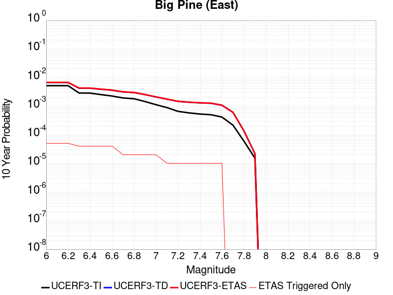 |

| Magnitude | 1 wk TI Prob | 1 wk TD Prob | 1 wk ETAS Prob | 1 wk ETAS/TD Gain | 1 wk ETAS Triggered Only | 1 mo TI Prob | 1 mo TD Prob | 1 mo ETAS Prob | 1 mo ETAS/TD Gain | 1 mo ETAS Triggered Only | 1 yr TI Prob | 1 yr TD Prob | 1 yr ETAS Prob | 1 yr ETAS/TD Gain | 1 yr ETAS Triggered Only | 10 yr TI Prob | 10 yr TD Prob | 10 yr ETAS Prob | 10 yr ETAS/TD Gain | 10 yr ETAS Triggered Only |
|-----|-----|-----|-----|-----|-----|-----|-----|-----|-----|-----|-----|-----|-----|-----|-----|-----|-----|-----|-----|-----|
| 6.0 | 9.916913E-6 | 1.2818231E-5 | 1.2818231E-5 | 1.0 | 0.0 | 4.250036E-5 | 5.4934244E-5 | 5.4934244E-5 | 1.0 | 0.0 | 5.173191E-4 | 6.686413E-4 | 7.0861453E-4 | 1.0597829 | 4.0E-5 | 0.0051611643 | 0.0066710766 | 0.006720743 | 1.0074451 | 5.0E-5 |
| 6.1 | 9.916913E-6 | 1.2818231E-5 | 1.2818231E-5 | 1.0 | 0.0 | 4.250036E-5 | 5.4934244E-5 | 5.4934244E-5 | 1.0 | 0.0 | 5.173191E-4 | 6.686413E-4 | 7.0861453E-4 | 1.0597829 | 4.0E-5 | 0.0051611643 | 0.0066710766 | 0.006720743 | 1.0074451 | 5.0E-5 |
| 6.2 | 9.916913E-6 | 1.2818231E-5 | 1.2818231E-5 | 1.0 | 0.0 | 4.250036E-5 | 5.4934244E-5 | 5.4934244E-5 | 1.0 | 0.0 | 5.173191E-4 | 6.686413E-4 | 7.0861453E-4 | 1.0597829 | 4.0E-5 | 0.0051611643 | 0.0066710766 | 0.006720743 | 1.0074451 | 5.0E-5 |
| 6.3 | 5.479711E-6 | 8.114161E-6 | 8.114161E-6 | 1.0 | 0.0 | 2.3484265E-5 | 3.4774526E-5 | 3.4774526E-5 | 1.0 | 0.0 | 2.858834E-4 | 4.233008E-4 | 4.532881E-4 | 1.0708416 | 3.0E-5 | 0.0028551589 | 0.0042278613 | 0.004267692 | 1.009421 | 4.0E-5 |
| 6.4 | 5.465009E-6 | 8.098454E-6 | 8.098454E-6 | 1.0 | 0.0 | 2.3421257E-5 | 3.4707216E-5 | 3.4707216E-5 | 1.0 | 0.0 | 2.851165E-4 | 4.224816E-4 | 4.5246893E-4 | 1.070979 | 3.0E-5 | 0.0028475097 | 0.0042197 | 0.0042595314 | 1.0094393 | 4.0E-5 |
| 6.5 | 4.826767E-6 | 7.423505E-6 | 7.423505E-6 | 1.0 | 0.0 | 2.068598E-5 | 3.181465E-5 | 3.181465E-5 | 1.0 | 0.0 | 2.518227E-4 | 3.8727728E-4 | 4.1726566E-4 | 1.0774338 | 3.0E-5 | 0.0025153751 | 0.003868898 | 0.003908743 | 1.0102988 | 4.0E-5 |
| 6.6 | 4.3146847E-6 | 6.883437E-6 | 6.883437E-6 | 1.0 | 0.0 | 1.8491375E-5 | 2.9500125E-5 | 2.9500125E-5 | 1.0 | 0.0 | 2.2510924E-4 | 3.5910727E-4 | 3.890965E-4 | 1.0835105 | 3.0E-5 | 0.0022488134 | 0.0035881116 | 0.0036279683 | 1.0111079 | 4.0E-5 |
| 6.7 | 3.6968106E-6 | 5.9966014E-6 | 5.9966014E-6 | 1.0 | 0.0 | 1.5843378E-5 | 2.5699477E-5 | 2.5699477E-5 | 1.0 | 0.0 | 1.9287605E-4 | 3.1284773E-4 | 3.3284148E-4 | 1.0639088 | 2.0E-5 | 0.0019270873 | 0.003126825 | 0.0031467623 | 1.0063763 | 2.0E-5 |
| 6.8 | 3.4671132E-6 | 5.7032753E-6 | 5.7032753E-6 | 1.0 | 0.0 | 1.4858972E-5 | 2.4442388E-5 | 2.4442388E-5 | 1.0 | 0.0 | 1.8089297E-4 | 2.9754688E-4 | 3.1754095E-4 | 1.0671962 | 2.0E-5 | 0.0018074579 | 0.002974228 | 0.0029941685 | 1.0067044 | 2.0E-5 |
| 6.9 | 2.7686972E-6 | 4.8262373E-6 | 4.8262373E-6 | 1.0 | 0.0 | 1.1865792E-5 | 2.0683714E-5 | 2.0683714E-5 | 1.0 | 0.0 | 1.4445644E-4 | 2.5179586E-4 | 2.7179084E-4 | 1.0794095 | 2.0E-5 | 0.0014436257 | 0.002517781 | 0.0025377306 | 1.0079235 | 2.0E-5 |
| 7.0 | 2.1472624E-6 | 3.985962E-6 | 3.985962E-6 | 1.0 | 0.0 | 9.20252E-6 | 1.7082584E-5 | 1.7082584E-5 | 1.0 | 0.0 | 1.12034926E-4 | 2.0796116E-4 | 2.2795699E-4 | 1.0961518 | 2.0E-5 | 0.0011197845 | 0.0020803085 | 0.0021002667 | 1.009594 | 2.0E-5 |
| 7.1 | 1.7018335E-6 | 3.3457143E-6 | 3.3457143E-6 | 1.0 | 0.0 | 7.293552E-6 | 1.4338699E-5 | 1.4338699E-5 | 1.0 | 0.0 | 8.879537E-5 | 1.7456003E-4 | 1.8455829E-4 | 1.0572768 | 1.0E-5 | 8.87599E-4 | 0.0017468405 | 0.001756823 | 1.0057147 | 1.0E-5 |
| 7.2 | 1.25603E-6 | 2.795276E-6 | 2.795276E-6 | 1.0 | 0.0 | 5.3829745E-6 | 1.19797005E-5 | 1.19797005E-5 | 1.0 | 0.0 | 6.553574E-5 | 1.4584333E-4 | 1.5584186E-4 | 1.0685568 | 1.0E-5 | 6.551642E-4 | 0.001460063 | 0.0014700484 | 1.006839 | 1.0E-5 |
| 7.3 | 1.112297E-6 | 2.6110797E-6 | 2.6110797E-6 | 1.0 | 0.0 | 4.7669787E-6 | 1.11902955E-5 | 1.11902955E-5 | 1.0 | 0.0 | 5.803642E-5 | 1.3623355E-4 | 1.4623218E-4 | 1.0733933 | 1.0E-5 | 5.802127E-4 | 0.0013639197 | 0.001373906 | 1.0073218 | 1.0E-5 |
| 7.4 | 1.0137181E-6 | 2.4842075E-6 | 2.4842075E-6 | 1.0 | 0.0 | 4.3444993E-6 | 1.0646561E-5 | 1.0646561E-5 | 1.0 | 0.0 | 5.2892992E-5 | 1.2961439E-4 | 1.396131E-4 | 1.0771419 | 1.0E-5 | 5.288041E-4 | 0.0012975911 | 0.0013075782 | 1.0076966 | 1.0E-5 |
| 7.5 | 9.598608E-7 | 2.4078427E-6 | 2.4078427E-6 | 1.0 | 0.0 | 4.1136827E-6 | 1.0319286E-5 | 1.0319286E-5 | 1.0 | 0.0 | 5.0082934E-5 | 1.2563028E-4 | 1.3562902E-4 | 1.0795887 | 1.0E-5 | 5.007165E-4 | 0.0012576039 | 0.0012675914 | 1.0079416 | 1.0E-5 |
| 7.6 | 7.929459E-7 | 2.0454722E-6 | 2.0454722E-6 | 1.0 | 0.0 | 3.3983351E-6 | 8.766281E-6 | 8.766281E-6 | 1.0 | 0.0 | 4.1373947E-5 | 1.06724416E-4 | 1.1672335E-4 | 1.0936893 | 1.0E-5 | 4.1366243E-4 | 0.0010688324 | 0.0010788217 | 1.009346 | 1.0E-5 |
| 7.7 | 4.155788E-7 | 1.1609936E-6 | 1.1609936E-6 | 1.0 | 0.0 | 1.7810507E-6 | 4.975678E-6 | 4.975678E-6 | 1.0 | 0.0 | 2.1684076E-5 | 6.0577237E-5 | 6.0577237E-5 | 1.0 | 0.0 | 2.1681961E-4 | 6.087925E-4 | 6.087925E-4 | 1.0 | 0.0 |
| 7.8 | 1.14666925E-7 | 2.5929913E-7 | 2.5929913E-7 | 1.0 | 0.0 | 4.914296E-7 | 1.1112816E-6 | 1.1112816E-6 | 1.0 | 0.0 | 5.9831386E-6 | 1.3529773E-5 | 1.3529773E-5 | 1.0 | 0.0 | 5.9829777E-5 | 1.3639126E-4 | 1.3639126E-4 | 1.0 | 0.0 |
| 7.9 | 2.9231824E-8 | 4.148024E-8 | 4.148024E-8 | 1.0 | 0.0 | 1.2527924E-7 | 1.7777246E-7 | 1.7777246E-7 | 1.0 | 0.0 | 1.5252737E-6 | 2.1643777E-6 | 2.1643777E-6 | 1.0 | 0.0 | 1.5252632E-5 | 2.1976275E-5 | 2.1976275E-5 | 1.0 | 0.0 |

## Hollywood
*[(top)](#table-of-contents)*

| 1 Week | 1 Month | 1 Year | 10 Year |
|-----|-----|-----|-----|
|  |  | 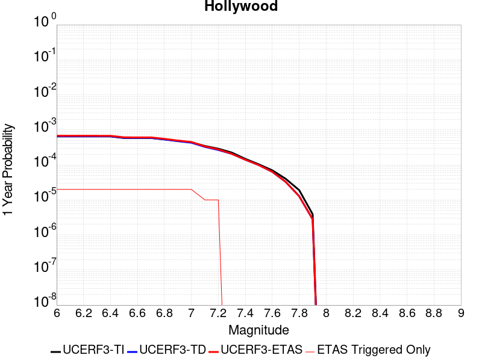 | 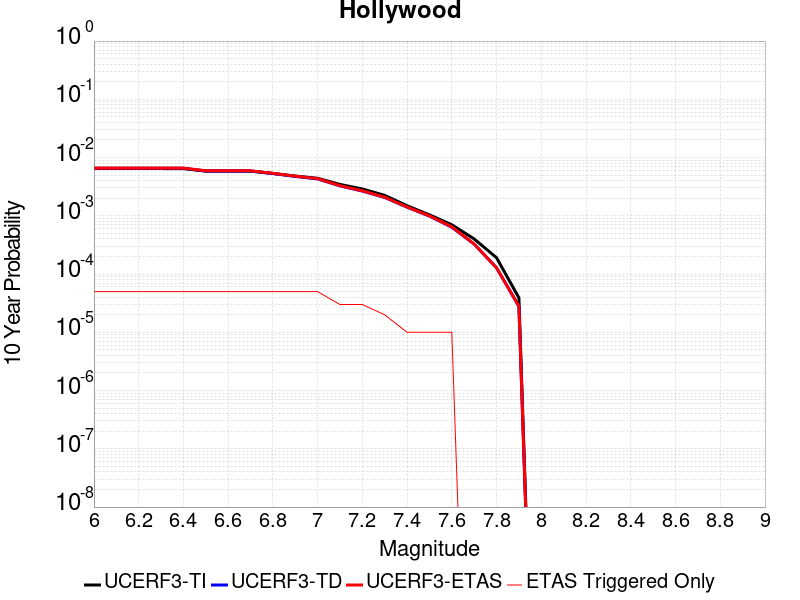 |

| Magnitude | 1 wk TI Prob | 1 wk TD Prob | 1 wk ETAS Prob | 1 wk ETAS/TD Gain | 1 wk ETAS Triggered Only | 1 mo TI Prob | 1 mo TD Prob | 1 mo ETAS Prob | 1 mo ETAS/TD Gain | 1 mo ETAS Triggered Only | 1 yr TI Prob | 1 yr TD Prob | 1 yr ETAS Prob | 1 yr ETAS/TD Gain | 1 yr ETAS Triggered Only | 10 yr TI Prob | 10 yr TD Prob | 10 yr ETAS Prob | 10 yr ETAS/TD Gain | 10 yr ETAS Triggered Only |
|-----|-----|-----|-----|-----|-----|-----|-----|-----|-----|-----|-----|-----|-----|-----|-----|-----|-----|-----|-----|-----|
| 6.0 | 1.24487615E-5 | 1.2593381E-5 | 1.2593381E-5 | 1.0 | 0.0 | 5.3350745E-5 | 5.3970543E-5 | 6.397E-5 | 1.1852763 | 1.0E-5 | 6.4935174E-4 | 6.568979E-4 | 6.768848E-4 | 1.0304261 | 2.0E-5 | 0.0064745755 | 0.0065500494 | 0.006599722 | 1.0075835 | 5.0E-5 |
| 6.1 | 1.24487615E-5 | 1.2593381E-5 | 1.2593381E-5 | 1.0 | 0.0 | 5.3350745E-5 | 5.3970543E-5 | 6.397E-5 | 1.1852763 | 1.0E-5 | 6.4935174E-4 | 6.568979E-4 | 6.768848E-4 | 1.0304261 | 2.0E-5 | 0.0064745755 | 0.0065500494 | 0.006599722 | 1.0075835 | 5.0E-5 |
| 6.2 | 1.24487615E-5 | 1.2593381E-5 | 1.2593381E-5 | 1.0 | 0.0 | 5.3350745E-5 | 5.3970543E-5 | 6.397E-5 | 1.1852763 | 1.0E-5 | 6.4935174E-4 | 6.568979E-4 | 6.768848E-4 | 1.0304261 | 2.0E-5 | 0.0064745755 | 0.0065500494 | 0.006599722 | 1.0075835 | 5.0E-5 |
| 6.3 | 1.24487615E-5 | 1.2593381E-5 | 1.2593381E-5 | 1.0 | 0.0 | 5.3350745E-5 | 5.3970543E-5 | 6.397E-5 | 1.1852763 | 1.0E-5 | 6.4935174E-4 | 6.568979E-4 | 6.768848E-4 | 1.0304261 | 2.0E-5 | 0.0064745755 | 0.0065500494 | 0.006599722 | 1.0075835 | 5.0E-5 |
| 6.4 | 1.2431024E-5 | 1.2573994E-5 | 1.2573994E-5 | 1.0 | 0.0 | 5.327473E-5 | 5.3887463E-5 | 6.3886924E-5 | 1.1855619 | 1.0E-5 | 6.4842677E-4 | 6.55887E-4 | 6.758739E-4 | 1.0304731 | 2.0E-5 | 0.0064653796 | 0.00654 | 0.006589673 | 1.0075953 | 5.0E-5 |
| 6.5 | 1.1242222E-5 | 1.1317946E-5 | 1.1317946E-5 | 1.0 | 0.0 | 4.8180063E-5 | 4.8504597E-5 | 5.8504113E-5 | 1.206156 | 1.0E-5 | 5.864344E-4 | 5.9038616E-4 | 6.103743E-4 | 1.0338562 | 2.0E-5 | 0.0058488925 | 0.0058884635 | 0.005938169 | 1.0084412 | 5.0E-5 |
| 6.6 | 1.1234066E-5 | 1.130906E-5 | 1.130906E-5 | 1.0 | 0.0 | 4.8145106E-5 | 4.8466514E-5 | 5.846603E-5 | 1.206318 | 1.0E-5 | 5.86009E-4 | 5.899227E-4 | 6.0991093E-4 | 1.0338827 | 2.0E-5 | 0.005844661 | 0.0058838543 | 0.00593356 | 1.0084479 | 5.0E-5 |
| 6.7 | 1.12294E-5 | 1.1303803E-5 | 1.1303803E-5 | 1.0 | 0.0 | 4.812511E-5 | 4.8443988E-5 | 5.8443504E-5 | 1.206414 | 1.0E-5 | 5.857657E-4 | 5.896486E-4 | 6.0963683E-4 | 1.0338985 | 2.0E-5 | 0.0058422405 | 0.0058811274 | 0.0059308335 | 1.0084518 | 5.0E-5 |
| 6.8 | 1.0252819E-5 | 1.0218574E-5 | 1.0218574E-5 | 1.0 | 0.0 | 4.3939912E-5 | 4.3793167E-5 | 5.379273E-5 | 1.2283361 | 1.0E-5 | 5.3483713E-4 | 5.330535E-4 | 5.530428E-4 | 1.0374997 | 2.0E-5 | 0.005335517 | 0.005317975 | 0.005367709 | 1.0093521 | 5.0E-5 |
| 6.9 | 9.252289E-6 | 9.110419E-6 | 9.110419E-6 | 1.0 | 0.0 | 3.9652066E-5 | 3.904408E-5 | 4.904369E-5 | 1.2561108 | 1.0E-5 | 4.8265693E-4 | 4.7525964E-4 | 4.9525016E-4 | 1.0420623 | 2.0E-5 | 0.0048161 | 0.004742606 | 0.004792369 | 1.0104927 | 5.0E-5 |
| 7.0 | 8.474604E-6 | 8.25836E-6 | 8.25836E-6 | 1.0 | 0.0 | 3.6319227E-5 | 3.53925E-5 | 4.5392146E-5 | 1.2825358 | 1.0E-5 | 4.4209688E-4 | 4.308199E-4 | 4.508113E-4 | 1.046403 | 2.0E-5 | 0.004412184 | 0.0042999974 | 0.0043497826 | 1.011578 | 5.0E-5 |
| 7.1 | 6.643643E-6 | 6.2684458E-6 | 6.2684458E-6 | 1.0 | 0.0 | 2.8472443E-5 | 2.6864493E-5 | 2.6864493E-5 | 1.0 | 0.0 | 3.4659685E-4 | 3.2702653E-4 | 3.3702326E-4 | 1.0305686 | 1.0E-5 | 0.0034605677 | 0.003265499 | 0.0032954009 | 1.009157 | 3.0E-5 |
| 7.2 | 5.549002E-6 | 5.108774E-6 | 5.108774E-6 | 1.0 | 0.0 | 2.378122E-5 | 2.1894564E-5 | 2.1894564E-5 | 1.0 | 0.0 | 2.8949787E-4 | 2.6653384E-4 | 2.7653118E-4 | 1.0375087 | 1.0E-5 | 0.0028912104 | 0.0026621583 | 0.0026920785 | 1.011239 | 3.0E-5 |
| 7.3 | 4.3059727E-6 | 3.959942E-6 | 3.959942E-6 | 1.0 | 0.0 | 1.8454039E-5 | 1.6971071E-5 | 1.6971071E-5 | 1.0 | 0.0 | 2.2465475E-4 | 2.0660329E-4 | 2.0660329E-4 | 1.0 | 0.0 | 0.0022442779 | 0.0020641224 | 0.002084081 | 1.0096693 | 2.0E-5 |
| 7.4 | 2.8550733E-6 | 2.7013389E-6 | 2.7013389E-6 | 1.0 | 0.0 | 1.2235971E-5 | 1.1577115E-5 | 1.1577115E-5 | 1.0 | 0.0 | 1.4896276E-4 | 1.4094231E-4 | 1.4094231E-4 | 1.0 | 0.0 | 0.0014886294 | 0.0014085344 | 0.0014185202 | 1.0070896 | 1.0E-5 |
| 7.5 | 1.9927045E-6 | 1.8976702E-6 | 1.8976702E-6 | 1.0 | 0.0 | 8.540134E-6 | 8.132847E-6 | 8.132847E-6 | 1.0 | 0.0 | 1.0397117E-4 | 9.9012956E-5 | 9.9012956E-5 | 1.0 | 0.0 | 0.0010392254 | 9.896919E-4 | 9.996821E-4 | 1.0100942 | 1.0E-5 |
| 7.6 | 1.345084E-6 | 1.221624E-6 | 1.221624E-6 | 1.0 | 0.0 | 5.764633E-6 | 5.235521E-6 | 5.235521E-6 | 1.0 | 0.0 | 7.018215E-5 | 6.374063E-5 | 6.374063E-5 | 1.0 | 0.0 | 7.0159987E-4 | 6.372254E-4 | 6.47219E-4 | 1.015683 | 1.0E-5 |
| 7.7 | 7.6835164E-7 | 6.2778713E-7 | 6.2778713E-7 | 1.0 | 0.0 | 3.2929315E-6 | 2.6905136E-6 | 2.6905136E-6 | 1.0 | 0.0 | 4.00907E-5 | 3.2756525E-5 | 3.2756525E-5 | 1.0 | 0.0 | 4.0083472E-4 | 3.2751844E-4 | 3.2751844E-4 | 1.0 | 0.0 |
| 7.8 | 3.6562128E-7 | 2.453623E-7 | 2.453623E-7 | 1.0 | 0.0 | 1.5669474E-6 | 1.0515523E-6 | 1.0515523E-6 | 1.0 | 0.0 | 1.9077417E-5 | 1.2802578E-5 | 1.2802578E-5 | 1.0 | 0.0 | 1.907578E-4 | 1.2801877E-4 | 1.2801877E-4 | 1.0 | 0.0 |
| 7.9 | 7.5024424E-8 | 5.3819846E-8 | 5.3819846E-8 | 1.0 | 0.0 | 3.215332E-7 | 2.3065647E-7 | 2.3065647E-7 | 1.0 | 0.0 | 3.91466E-6 | 2.8082402E-6 | 2.8082402E-6 | 1.0 | 0.0 | 3.9145907E-5 | 2.8082177E-5 | 2.8082177E-5 | 1.0 | 0.0 |

## Palos Verdes
*[(top)](#table-of-contents)*

| 1 Week | 1 Month | 1 Year | 10 Year |
|-----|-----|-----|-----|
|  |  |  | 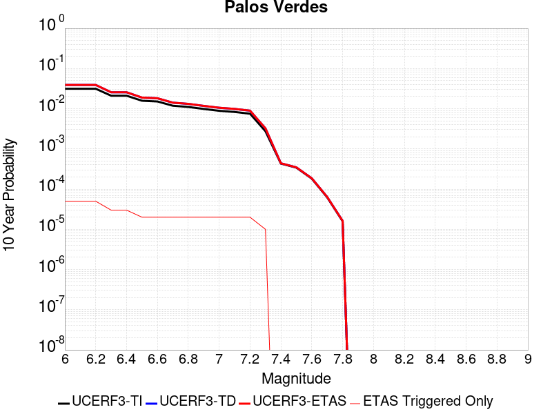 |

| Magnitude | 1 wk TI Prob | 1 wk TD Prob | 1 wk ETAS Prob | 1 wk ETAS/TD Gain | 1 wk ETAS Triggered Only | 1 mo TI Prob | 1 mo TD Prob | 1 mo ETAS Prob | 1 mo ETAS/TD Gain | 1 mo ETAS Triggered Only | 1 yr TI Prob | 1 yr TD Prob | 1 yr ETAS Prob | 1 yr ETAS/TD Gain | 1 yr ETAS Triggered Only | 10 yr TI Prob | 10 yr TD Prob | 10 yr ETAS Prob | 10 yr ETAS/TD Gain | 10 yr ETAS Triggered Only |
|-----|-----|-----|-----|-----|-----|-----|-----|-----|-----|-----|-----|-----|-----|-----|-----|-----|-----|-----|-----|-----|
| 6.0 | 6.126063E-5 | 7.622862E-5 | 7.622862E-5 | 1.0 | 0.0 | 2.6251914E-4 | 3.2665656E-4 | 3.2665656E-4 | 1.0 | 0.0 | 0.0031914865 | 0.0039702994 | 0.0040001804 | 1.0075262 | 3.0E-5 | 0.031460393 | 0.039050125 | 0.03909817 | 1.0012304 | 5.0E-5 |
| 6.1 | 6.126063E-5 | 7.622862E-5 | 7.622862E-5 | 1.0 | 0.0 | 2.6251914E-4 | 3.2665656E-4 | 3.2665656E-4 | 1.0 | 0.0 | 0.0031914865 | 0.0039702994 | 0.0040001804 | 1.0075262 | 3.0E-5 | 0.031460393 | 0.039050125 | 0.03909817 | 1.0012304 | 5.0E-5 |
| 6.2 | 6.126063E-5 | 7.622862E-5 | 7.622862E-5 | 1.0 | 0.0 | 2.6251914E-4 | 3.2665656E-4 | 3.2665656E-4 | 1.0 | 0.0 | 0.0031914865 | 0.0039702994 | 0.0040001804 | 1.0075262 | 3.0E-5 | 0.031460393 | 0.039050125 | 0.03909817 | 1.0012304 | 5.0E-5 |
| 6.3 | 4.0838047E-5 | 4.975089E-5 | 4.975089E-5 | 1.0 | 0.0 | 1.7500846E-4 | 2.1320196E-4 | 2.1320196E-4 | 1.0 | 0.0 | 0.0021286458 | 0.0025928554 | 0.0026128036 | 1.0076935 | 2.0E-5 | 0.021083709 | 0.025647415 | 0.025676645 | 1.0011398 | 3.0E-5 |
| 6.4 | 4.0838047E-5 | 4.975089E-5 | 4.975089E-5 | 1.0 | 0.0 | 1.7500846E-4 | 2.1320196E-4 | 2.1320196E-4 | 1.0 | 0.0 | 0.0021286458 | 0.0025928554 | 0.0026128036 | 1.0076935 | 2.0E-5 | 0.021083709 | 0.025647415 | 0.025676645 | 1.0011398 | 3.0E-5 |
| 6.5 | 3.0512005E-5 | 3.6562593E-5 | 3.6562593E-5 | 1.0 | 0.0 | 1.3075917E-4 | 1.566881E-4 | 1.566881E-4 | 1.0 | 0.0 | 0.0015908304 | 0.001906127 | 0.0019260888 | 1.0104725 | 2.0E-5 | 0.015794903 | 0.01890965 | 0.018929271 | 1.0010377 | 2.0E-5 |
| 6.6 | 2.9255087E-5 | 3.5155368E-5 | 3.5155368E-5 | 1.0 | 0.0 | 1.2537291E-4 | 1.5065783E-4 | 1.5065783E-4 | 1.0 | 0.0 | 0.0015253464 | 0.0018328319 | 0.0018527952 | 1.010892 | 2.0E-5 | 0.015149189 | 0.01818871 | 0.018208345 | 1.0010796 | 2.0E-5 |
| 6.7 | 2.287198E-5 | 2.7248976E-5 | 2.7248976E-5 | 1.0 | 0.0 | 9.801909E-5 | 1.1677662E-4 | 1.1677662E-4 | 1.0 | 0.0 | 0.001192729 | 0.0014209197 | 0.0014408913 | 1.0140554 | 2.0E-5 | 0.011863477 | 0.014127577 | 0.014147294 | 1.0013957 | 2.0E-5 |
| 6.8 | 2.1325764E-5 | 2.5432531E-5 | 2.5432531E-5 | 1.0 | 0.0 | 9.139293E-5 | 1.0899252E-4 | 1.0899252E-4 | 1.0 | 0.0 | 0.001112141 | 0.0013262664 | 0.0013462398 | 1.01506 | 2.0E-5 | 0.011065915 | 0.013192548 | 0.013212285 | 1.001496 | 2.0E-5 |
| 6.9 | 1.9009392E-5 | 2.2614122E-5 | 2.2614122E-5 | 1.0 | 0.0 | 8.1466285E-5 | 9.6914555E-5 | 9.6914555E-5 | 1.0 | 0.0 | 9.914007E-4 | 0.0011793834 | 0.0011993598 | 1.016938 | 2.0E-5 | 0.009869894 | 0.011739929 | 0.011759694 | 1.0016836 | 2.0E-5 |
| 7.0 | 1.7098473E-5 | 2.0319867E-5 | 2.0319867E-5 | 1.0 | 0.0 | 7.3277115E-5 | 8.708272E-5 | 8.708272E-5 | 1.0 | 0.0 | 8.917837E-4 | 0.0010598017 | 0.0010797805 | 1.0188514 | 2.0E-5 | 0.008882134 | 0.010555912 | 0.010575701 | 1.0018747 | 2.0E-5 |
| 7.1 | 1.5982785E-5 | 1.8995239E-5 | 1.8995239E-5 | 1.0 | 0.0 | 6.849585E-5 | 8.1406106E-5 | 8.1406106E-5 | 1.0 | 0.0 | 8.336179E-4 | 9.907534E-4 | 0.0010107335 | 1.0201666 | 2.0E-5 | 0.008304977 | 0.009871728 | 0.0098915305 | 1.0020059 | 2.0E-5 |
| 7.2 | 1.4468002E-5 | 1.719767E-5 | 1.719767E-5 | 1.0 | 0.0 | 6.200425E-5 | 7.370269E-5 | 7.370269E-5 | 1.0 | 0.0 | 7.546402E-4 | 8.970449E-4 | 9.1702695E-4 | 1.0222754 | 2.0E-5 | 0.007520827 | 0.008942509 | 0.00896233 | 1.0022165 | 2.0E-5 |
| 7.3 | 5.288233E-6 | 6.2038207E-6 | 6.2038207E-6 | 1.0 | 0.0 | 2.2663658E-5 | 2.658773E-5 | 2.658773E-5 | 1.0 | 0.0 | 2.7589512E-4 | 3.2369242E-4 | 3.3368918E-4 | 1.0308836 | 1.0E-5 | 0.0027555283 | 0.0032356323 | 0.0032456 | 1.0030806 | 1.0E-5 |
| 7.4 | 8.279556E-7 | 8.408364E-7 | 8.408364E-7 | 1.0 | 0.0 | 3.5483763E-6 | 3.60358E-6 | 3.60358E-6 | 1.0 | 0.0 | 4.3200624E-5 | 4.3872777E-5 | 4.3872777E-5 | 1.0 | 0.0 | 4.3192226E-4 | 4.3864836E-4 | 4.3864836E-4 | 1.0 | 0.0 |
| 7.5 | 6.559831E-7 | 6.667243E-7 | 6.667243E-7 | 1.0 | 0.0 | 2.8113532E-6 | 2.8573872E-6 | 2.8573872E-6 | 1.0 | 0.0 | 3.4227687E-5 | 3.47882E-5 | 3.47882E-5 | 1.0 | 0.0 | 3.4222414E-4 | 3.478342E-4 | 3.478342E-4 | 1.0 | 0.0 |
| 7.6 | 3.5018968E-7 | 3.562011E-7 | 3.562011E-7 | 1.0 | 0.0 | 1.500812E-6 | 1.5265755E-6 | 1.5265755E-6 | 1.0 | 0.0 | 1.8272232E-5 | 1.8585944E-5 | 1.8585944E-5 | 1.0 | 0.0 | 1.8270731E-4 | 1.858485E-4 | 1.858485E-4 | 1.0 | 0.0 |
| 7.7 | 1.1986104E-7 | 1.2198406E-7 | 1.2198406E-7 | 1.0 | 0.0 | 5.1369005E-7 | 5.227887E-7 | 5.227887E-7 | 1.0 | 0.0 | 6.2541585E-6 | 6.364934E-6 | 6.364934E-6 | 1.0 | 0.0 | 6.2539824E-5 | 6.364756E-5 | 6.364756E-5 | 1.0 | 0.0 |
| 7.8 | 3.0445005E-8 | 3.1027664E-8 | 3.1027664E-8 | 1.0 | 0.0 | 1.3047858E-7 | 1.3297569E-7 | 1.3297569E-7 | 1.0 | 0.0 | 1.5885756E-6 | 1.6189781E-6 | 1.6189781E-6 | 1.0 | 0.0 | 1.5885644E-5 | 1.6189684E-5 | 1.6189684E-5 | 1.0 | 0.0 |

## Santa Ynez (East)
*[(top)](#table-of-contents)*

| 1 Week | 1 Month | 1 Year | 10 Year |
|-----|-----|-----|-----|
|  |  |  | 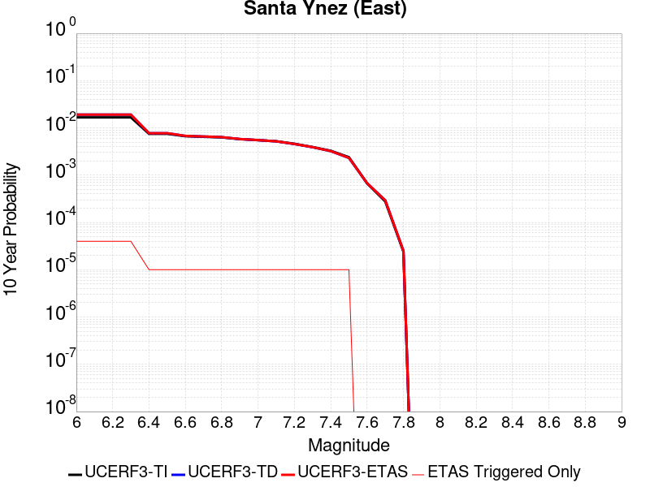 |

| Magnitude | 1 wk TI Prob | 1 wk TD Prob | 1 wk ETAS Prob | 1 wk ETAS/TD Gain | 1 wk ETAS Triggered Only | 1 mo TI Prob | 1 mo TD Prob | 1 mo ETAS Prob | 1 mo ETAS/TD Gain | 1 mo ETAS Triggered Only | 1 yr TI Prob | 1 yr TD Prob | 1 yr ETAS Prob | 1 yr ETAS/TD Gain | 1 yr ETAS Triggered Only | 10 yr TI Prob | 10 yr TD Prob | 10 yr ETAS Prob | 10 yr ETAS/TD Gain | 10 yr ETAS Triggered Only |
|-----|-----|-----|-----|-----|-----|-----|-----|-----|-----|-----|-----|-----|-----|-----|-----|-----|-----|-----|-----|-----|
| 6.0 | 3.2269712E-5 | 3.6751346E-5 | 3.6751346E-5 | 1.0 | 0.0 | 1.3829143E-4 | 1.5749958E-4 | 1.6749802E-4 | 1.0634823 | 1.0E-5 | 0.0016823979 | 0.0019164606 | 0.0019364223 | 1.0104159 | 2.0E-5 | 0.016697178 | 0.019056875 | 0.019096114 | 1.002059 | 4.0E-5 |
| 6.1 | 3.2269712E-5 | 3.6751346E-5 | 3.6751346E-5 | 1.0 | 0.0 | 1.3829143E-4 | 1.5749958E-4 | 1.6749802E-4 | 1.0634823 | 1.0E-5 | 0.0016823979 | 0.0019164606 | 0.0019364223 | 1.0104159 | 2.0E-5 | 0.016697178 | 0.019056875 | 0.019096114 | 1.002059 | 4.0E-5 |
| 6.2 | 3.2269712E-5 | 3.6751346E-5 | 3.6751346E-5 | 1.0 | 0.0 | 1.3829143E-4 | 1.5749958E-4 | 1.6749802E-4 | 1.0634823 | 1.0E-5 | 0.0016823979 | 0.0019164606 | 0.0019364223 | 1.0104159 | 2.0E-5 | 0.016697178 | 0.019056875 | 0.019096114 | 1.002059 | 4.0E-5 |
| 6.3 | 3.2269712E-5 | 3.6751346E-5 | 3.6751346E-5 | 1.0 | 0.0 | 1.3829143E-4 | 1.5749958E-4 | 1.6749802E-4 | 1.0634823 | 1.0E-5 | 0.0016823979 | 0.0019164606 | 0.0019364223 | 1.0104159 | 2.0E-5 | 0.016697178 | 0.019056875 | 0.019096114 | 1.002059 | 4.0E-5 |
| 6.4 | 1.4404779E-5 | 1.4849569E-5 | 1.4849569E-5 | 1.0 | 0.0 | 6.1733306E-5 | 6.363949E-5 | 6.363949E-5 | 1.0 | 0.0 | 7.513438E-4 | 7.7454036E-4 | 7.7454036E-4 | 1.0 | 0.0 | 0.0074880854 | 0.007718959 | 0.0077288817 | 1.0012856 | 1.0E-5 |
| 6.5 | 1.4404779E-5 | 1.4849569E-5 | 1.4849569E-5 | 1.0 | 0.0 | 6.1733306E-5 | 6.363949E-5 | 6.363949E-5 | 1.0 | 0.0 | 7.513438E-4 | 7.7454036E-4 | 7.7454036E-4 | 1.0 | 0.0 | 0.0074880854 | 0.007718959 | 0.0077288817 | 1.0012856 | 1.0E-5 |
| 6.6 | 1.280208E-5 | 1.3012098E-5 | 1.3012098E-5 | 1.0 | 0.0 | 5.4864904E-5 | 5.5764955E-5 | 5.5764955E-5 | 1.0 | 0.0 | 6.6777546E-4 | 6.7872857E-4 | 6.7872857E-4 | 1.0 | 0.0 | 0.006657724 | 0.006766767 | 0.0067766993 | 1.0014678 | 1.0E-5 |
| 6.7 | 1.2457027E-5 | 1.2628613E-5 | 1.2628613E-5 | 1.0 | 0.0 | 5.3386164E-5 | 5.4121516E-5 | 5.4121516E-5 | 1.0 | 0.0 | 6.497827E-4 | 6.587319E-4 | 6.587319E-4 | 1.0 | 0.0 | 0.00647886 | 0.0065679904 | 0.006577925 | 1.0015125 | 1.0E-5 |
| 6.8 | 1.2095134E-5 | 1.2231055E-5 | 1.2231055E-5 | 1.0 | 0.0 | 5.1835254E-5 | 5.2417763E-5 | 5.2417763E-5 | 1.0 | 0.0 | 6.309115E-4 | 6.38001E-4 | 6.38001E-4 | 1.0 | 0.0 | 0.0062912325 | 0.0063618817 | 0.006371818 | 1.0015619 | 1.0E-5 |
| 6.9 | 1.1104036E-5 | 1.11574755E-5 | 1.11574755E-5 | 1.0 | 0.0 | 4.758786E-5 | 4.7816884E-5 | 4.7816884E-5 | 1.0 | 0.0 | 5.7922816E-4 | 5.820163E-4 | 5.820163E-4 | 1.0 | 0.0 | 0.005777207 | 0.005805066 | 0.0058150077 | 1.0017127 | 1.0E-5 |
| 7.0 | 1.0577444E-5 | 1.0581802E-5 | 1.0581802E-5 | 1.0 | 0.0 | 4.5331115E-5 | 4.5349796E-5 | 4.5349796E-5 | 1.0 | 0.0 | 5.5176654E-4 | 5.519951E-4 | 5.519951E-4 | 1.0 | 0.0 | 0.0055039856 | 0.0055063786 | 0.0055163233 | 1.001806 | 1.0E-5 |
| 7.1 | 1.0021775E-5 | 9.981102E-6 | 9.981102E-6 | 1.0 | 0.0 | 4.294976E-5 | 4.2775457E-5 | 4.2775457E-5 | 1.0 | 0.0 | 5.2278786E-4 | 5.2066793E-4 | 5.2066793E-4 | 1.0 | 0.0 | 0.0052155964 | 0.0051946132 | 0.005204561 | 1.0019151 | 1.0E-5 |
| 7.2 | 8.874109E-6 | 8.748894E-6 | 8.748894E-6 | 1.0 | 0.0 | 3.8031343E-5 | 3.749473E-5 | 3.749473E-5 | 1.0 | 0.0 | 4.629332E-4 | 4.564038E-4 | 4.564038E-4 | 1.0 | 0.0 | 0.0046197 | 0.0045547825 | 0.004564737 | 1.0021855 | 1.0E-5 |
| 7.3 | 7.5504267E-6 | 7.505199E-6 | 7.505199E-6 | 1.0 | 0.0 | 3.235857E-5 | 3.216475E-5 | 3.216475E-5 | 1.0 | 0.0 | 3.9389438E-4 | 3.9153645E-4 | 3.9153645E-4 | 1.0 | 0.0 | 0.0039319694 | 0.003908573 | 0.003918534 | 1.0025485 | 1.0E-5 |
| 7.4 | 6.309394E-6 | 6.1832216E-6 | 6.1832216E-6 | 1.0 | 0.0 | 2.703998E-5 | 2.6499258E-5 | 2.6499258E-5 | 1.0 | 0.0 | 3.2916202E-4 | 3.2258165E-4 | 3.2258165E-4 | 1.0 | 0.0 | 0.003286749 | 0.0032212313 | 0.003231199 | 1.0030944 | 1.0E-5 |
| 7.5 | 4.6103073E-6 | 4.440935E-6 | 4.440935E-6 | 1.0 | 0.0 | 1.975831E-5 | 1.9032443E-5 | 1.9032443E-5 | 1.0 | 0.0 | 2.4053088E-4 | 2.3169606E-4 | 2.3169606E-4 | 1.0 | 0.0 | 0.002402707 | 0.0023146144 | 0.0023245912 | 1.0043104 | 1.0E-5 |
| 7.6 | 1.2858658E-6 | 1.3008267E-6 | 1.3008267E-6 | 1.0 | 0.0 | 5.5108417E-6 | 5.5749606E-6 | 5.5749606E-6 | 1.0 | 0.0 | 6.7092435E-5 | 6.78731E-5 | 6.78731E-5 | 1.0 | 0.0 | 6.707218E-4 | 6.7853054E-4 | 6.7853054E-4 | 1.0 | 0.0 |
| 7.7 | 5.3302307E-7 | 5.612178E-7 | 5.612178E-7 | 1.0 | 0.0 | 2.2843826E-6 | 2.4052172E-6 | 2.4052172E-6 | 1.0 | 0.0 | 2.7812002E-5 | 2.9283161E-5 | 2.9283161E-5 | 1.0 | 0.0 | 2.7808524E-4 | 2.9279658E-4 | 2.9279658E-4 | 1.0 | 0.0 |
| 7.8 | 4.613933E-8 | 4.803036E-8 | 4.803036E-8 | 1.0 | 0.0 | 1.9773998E-7 | 2.0584437E-7 | 2.0584437E-7 | 1.0 | 0.0 | 2.4074816E-6 | 2.5061524E-6 | 2.5061524E-6 | 1.0 | 0.0 | 2.4074554E-5 | 2.5061252E-5 | 2.5061252E-5 | 1.0 | 0.0 |

## Santa Cruz Island
*[(top)](#table-of-contents)*

| 1 Week | 1 Month | 1 Year | 10 Year |
|-----|-----|-----|-----|
|  |  |  |  |

| Magnitude | 1 wk TI Prob | 1 wk TD Prob | 1 wk ETAS Prob | 1 wk ETAS/TD Gain | 1 wk ETAS Triggered Only | 1 mo TI Prob | 1 mo TD Prob | 1 mo ETAS Prob | 1 mo ETAS/TD Gain | 1 mo ETAS Triggered Only | 1 yr TI Prob | 1 yr TD Prob | 1 yr ETAS Prob | 1 yr ETAS/TD Gain | 1 yr ETAS Triggered Only | 10 yr TI Prob | 10 yr TD Prob | 10 yr ETAS Prob | 10 yr ETAS/TD Gain | 10 yr ETAS Triggered Only |
|-----|-----|-----|-----|-----|-----|-----|-----|-----|-----|-----|-----|-----|-----|-----|-----|-----|-----|-----|-----|-----|
| 6.0 | 2.9164563E-5 | 3.1600095E-5 | 3.1600095E-5 | 1.0 | 0.0 | 1.2498499E-4 | 1.3542273E-4 | 1.3542273E-4 | 1.0 | 0.0 | 0.0015206301 | 0.0016476609 | 0.0016476609 | 1.0 | 0.0 | 0.015102667 | 0.01636818 | 0.016407525 | 1.0024037 | 4.0E-5 |
| 6.1 | 2.9164563E-5 | 3.1600095E-5 | 3.1600095E-5 | 1.0 | 0.0 | 1.2498499E-4 | 1.3542273E-4 | 1.3542273E-4 | 1.0 | 0.0 | 0.0015206301 | 0.0016476609 | 0.0016476609 | 1.0 | 0.0 | 0.015102667 | 0.01636818 | 0.016407525 | 1.0024037 | 4.0E-5 |
| 6.2 | 2.9164563E-5 | 3.1600095E-5 | 3.1600095E-5 | 1.0 | 0.0 | 1.2498499E-4 | 1.3542273E-4 | 1.3542273E-4 | 1.0 | 0.0 | 0.0015206301 | 0.0016476609 | 0.0016476609 | 1.0 | 0.0 | 0.015102667 | 0.01636818 | 0.016407525 | 1.0024037 | 4.0E-5 |
| 6.3 | 1.6635553E-5 | 1.7804527E-5 | 1.7804527E-5 | 1.0 | 0.0 | 7.1293274E-5 | 7.630298E-5 | 7.630298E-5 | 1.0 | 0.0 | 8.6765E-4 | 9.286111E-4 | 9.286111E-4 | 1.0 | 0.0 | 0.008642701 | 0.009249181 | 0.009268995 | 1.0021423 | 2.0E-5 |
| 6.4 | 1.6635553E-5 | 1.7804527E-5 | 1.7804527E-5 | 1.0 | 0.0 | 7.1293274E-5 | 7.630298E-5 | 7.630298E-5 | 1.0 | 0.0 | 8.6765E-4 | 9.286111E-4 | 9.286111E-4 | 1.0 | 0.0 | 0.008642701 | 0.009249181 | 0.009268995 | 1.0021423 | 2.0E-5 |
| 6.5 | 1.2238748E-5 | 1.3043111E-5 | 1.3043111E-5 | 1.0 | 0.0 | 5.2450723E-5 | 5.5897868E-5 | 5.5897868E-5 | 1.0 | 0.0 | 6.3840044E-4 | 6.8034773E-4 | 6.8034773E-4 | 1.0 | 0.0 | 0.0063656955 | 0.006783047 | 0.00679298 | 1.0014642 | 1.0E-5 |
| 6.6 | 1.0489767E-5 | 1.11567315E-5 | 1.11567315E-5 | 1.0 | 0.0 | 4.495537E-5 | 4.7813697E-5 | 4.7813697E-5 | 1.0 | 0.0 | 5.4719415E-4 | 5.8197853E-4 | 5.8197853E-4 | 1.0 | 0.0 | 0.005458487 | 0.005804785 | 0.0058147274 | 1.0017127 | 1.0E-5 |
| 6.7 | 8.699222E-6 | 9.236859E-6 | 9.236859E-6 | 1.0 | 0.0 | 3.7281847E-5 | 3.958594E-5 | 3.958594E-5 | 1.0 | 0.0 | 4.5381195E-4 | 4.818528E-4 | 4.818528E-4 | 1.0 | 0.0 | 0.0045288634 | 0.004808148 | 0.0048180996 | 1.0020698 | 1.0E-5 |
| 6.8 | 8.307732E-6 | 8.816977E-6 | 8.816977E-6 | 1.0 | 0.0 | 3.560408E-5 | 3.77865E-5 | 3.77865E-5 | 1.0 | 0.0 | 4.3339343E-4 | 4.5995394E-4 | 4.5995394E-4 | 1.0 | 0.0 | 0.004325492 | 0.004590073 | 0.004600027 | 1.0021687 | 1.0E-5 |
| 6.9 | 8.073121E-6 | 8.565009E-6 | 8.565009E-6 | 1.0 | 0.0 | 3.459863E-5 | 3.6706668E-5 | 3.6706668E-5 | 1.0 | 0.0 | 4.2115687E-4 | 4.4681245E-4 | 4.4681245E-4 | 1.0 | 0.0 | 0.004203596 | 0.0044591925 | 0.004469148 | 1.0022326 | 1.0E-5 |
| 7.0 | 7.617019E-6 | 8.0747295E-6 | 8.0747295E-6 | 1.0 | 0.0 | 3.264396E-5 | 3.4605528E-5 | 3.4605528E-5 | 1.0 | 0.0 | 3.9736772E-4 | 4.2124125E-4 | 4.2124125E-4 | 1.0 | 0.0 | 0.003966579 | 0.0042044753 | 0.004214433 | 1.0023685 | 1.0E-5 |
| 7.1 | 7.1224836E-6 | 7.5458483E-6 | 7.5458483E-6 | 1.0 | 0.0 | 3.052457E-5 | 3.233895E-5 | 3.233895E-5 | 1.0 | 0.0 | 3.715733E-4 | 3.9365597E-4 | 3.9365597E-4 | 1.0 | 0.0 | 0.003709526 | 0.0039296295 | 0.00393959 | 1.0025347 | 1.0E-5 |
| 7.2 | 6.441115E-6 | 6.8274385E-6 | 6.8274385E-6 | 1.0 | 0.0 | 2.7604487E-5 | 2.9260125E-5 | 2.9260125E-5 | 1.0 | 0.0 | 3.360328E-4 | 3.5618403E-4 | 3.5618403E-4 | 1.0 | 0.0 | 0.0033552512 | 0.0035561598 | 0.0035561598 | 1.0 | 0.0 |
| 7.3 | 5.494274E-6 | 5.820041E-6 | 5.820041E-6 | 1.0 | 0.0 | 2.3546674E-5 | 2.4942796E-5 | 2.4942796E-5 | 1.0 | 0.0 | 2.8664304E-4 | 3.0363642E-4 | 3.0363642E-4 | 1.0 | 0.0 | 0.002862736 | 0.0030322387 | 0.0030322387 | 1.0 | 0.0 |
| 7.4 | 4.0802624E-6 | 4.3122895E-6 | 4.3122895E-6 | 1.0 | 0.0 | 1.7486722E-5 | 1.848111E-5 | 1.848111E-5 | 1.0 | 0.0 | 2.1288003E-4 | 2.2498437E-4 | 2.2498437E-4 | 1.0 | 0.0 | 0.0021267622 | 0.002247575 | 0.002247575 | 1.0 | 0.0 |
| 7.5 | 2.3584746E-6 | 2.4753267E-6 | 2.4753267E-6 | 1.0 | 0.0 | 1.0107709E-5 | 1.06085E-5 | 1.06085E-5 | 1.0 | 0.0 | 1.2305441E-4 | 1.2915088E-4 | 1.2915088E-4 | 1.0 | 0.0 | 0.0012298629 | 0.0012907633 | 0.0012907633 | 1.0 | 0.0 |
| 7.6 | 9.4981914E-7 | 9.860988E-7 | 9.860988E-7 | 1.0 | 0.0 | 4.0706473E-6 | 4.226131E-6 | 4.226131E-6 | 1.0 | 0.0 | 4.9559E-5 | 5.145194E-5 | 5.145194E-5 | 1.0 | 0.0 | 4.954795E-4 | 5.144016E-4 | 5.144016E-4 | 1.0 | 0.0 |
| 7.7 | 2.6013532E-7 | 2.641672E-7 | 2.641672E-7 | 1.0 | 0.0 | 1.1148652E-6 | 1.1321447E-6 | 1.1321447E-6 | 1.0 | 0.0 | 1.3573399E-5 | 1.3783775E-5 | 1.3783775E-5 | 1.0 | 0.0 | 1.357257E-4 | 1.3782927E-4 | 1.3782927E-4 | 1.0 | 0.0 |
| 7.8 | 4.1522263E-8 | 3.9656918E-8 | 3.9656918E-8 | 1.0 | 0.0 | 1.7795254E-7 | 1.6995821E-7 | 1.6995821E-7 | 1.0 | 0.0 | 2.16657E-6 | 2.0692394E-6 | 2.0692394E-6 | 1.0 | 0.0 | 2.1665488E-5 | 2.0692223E-5 | 2.0692223E-5 | 1.0 | 0.0 |
| 7.9 | 7.7242046E-10 | 5.946851E-10 | 5.946851E-10 | 1.0 | 0.0 | 3.3103735E-9 | 2.54865E-9 | 2.54865E-9 | 1.0 | 0.0 | 4.0303796E-8 | 3.1029813E-8 | 3.1029813E-8 | 1.0 | 0.0 | 4.030379E-7 | 3.102981E-7 | 3.102981E-7 | 1.0 | 0.0 |

## Kern Canyon (South Kern) 2011
*[(top)](#table-of-contents)*

| 1 Week | 1 Month | 1 Year | 10 Year |
|-----|-----|-----|-----|
|  |  |  |  |

| Magnitude | 1 wk TI Prob | 1 wk TD Prob | 1 wk ETAS Prob | 1 wk ETAS/TD Gain | 1 wk ETAS Triggered Only | 1 mo TI Prob | 1 mo TD Prob | 1 mo ETAS Prob | 1 mo ETAS/TD Gain | 1 mo ETAS Triggered Only | 1 yr TI Prob | 1 yr TD Prob | 1 yr ETAS Prob | 1 yr ETAS/TD Gain | 1 yr ETAS Triggered Only | 10 yr TI Prob | 10 yr TD Prob | 10 yr ETAS Prob | 10 yr ETAS/TD Gain | 10 yr ETAS Triggered Only |
|-----|-----|-----|-----|-----|-----|-----|-----|-----|-----|-----|-----|-----|-----|-----|-----|-----|-----|-----|-----|-----|
| 6.0 | 4.105075E-6 | 4.113737E-6 | 4.113737E-6 | 1.0 | 0.0 | 1.7593058E-5 | 1.7630186E-5 | 2.7630009E-5 | 1.567199 | 1.0E-5 | 2.1417443E-4 | 2.14627E-4 | 2.346227E-4 | 1.0931649 | 2.0E-5 | 0.0021396813 | 0.002144261 | 0.0021941538 | 1.0232681 | 5.0E-5 |
| 6.1 | 4.105075E-6 | 4.113737E-6 | 4.113737E-6 | 1.0 | 0.0 | 1.7593058E-5 | 1.7630186E-5 | 2.7630009E-5 | 1.567199 | 1.0E-5 | 2.1417443E-4 | 2.14627E-4 | 2.346227E-4 | 1.0931649 | 2.0E-5 | 0.0021396813 | 0.002144261 | 0.0021941538 | 1.0232681 | 5.0E-5 |
| 6.2 | 4.105075E-6 | 4.113737E-6 | 4.113737E-6 | 1.0 | 0.0 | 1.7593058E-5 | 1.7630186E-5 | 2.7630009E-5 | 1.567199 | 1.0E-5 | 2.1417443E-4 | 2.14627E-4 | 2.346227E-4 | 1.0931649 | 2.0E-5 | 0.0021396813 | 0.002144261 | 0.0021941538 | 1.0232681 | 5.0E-5 |
| 6.3 | 4.105075E-6 | 4.113737E-6 | 4.113737E-6 | 1.0 | 0.0 | 1.7593058E-5 | 1.7630186E-5 | 2.7630009E-5 | 1.567199 | 1.0E-5 | 2.1417443E-4 | 2.14627E-4 | 2.346227E-4 | 1.0931649 | 2.0E-5 | 0.0021396813 | 0.002144261 | 0.0021941538 | 1.0232681 | 5.0E-5 |
| 6.4 | 4.105075E-6 | 4.113737E-6 | 4.113737E-6 | 1.0 | 0.0 | 1.7593058E-5 | 1.7630186E-5 | 2.7630009E-5 | 1.567199 | 1.0E-5 | 2.1417443E-4 | 2.14627E-4 | 2.346227E-4 | 1.0931649 | 2.0E-5 | 0.0021396813 | 0.002144261 | 0.0021941538 | 1.0232681 | 5.0E-5 |
| 6.5 | 2.9849807E-6 | 2.9731623E-6 | 2.9731623E-6 | 1.0 | 0.0 | 1.2792712E-5 | 1.2742063E-5 | 2.2741935E-5 | 1.7847923 | 1.0E-5 | 1.5574014E-4 | 1.5512372E-4 | 1.6512217E-4 | 1.0644547 | 1.0E-5 | 0.0015563103 | 0.0015501695 | 0.0015701385 | 1.0128818 | 2.0E-5 |
| 6.6 | 2.9849807E-6 | 2.9731623E-6 | 2.9731623E-6 | 1.0 | 0.0 | 1.2792712E-5 | 1.2742063E-5 | 2.2741935E-5 | 1.7847923 | 1.0E-5 | 1.5574014E-4 | 1.5512372E-4 | 1.6512217E-4 | 1.0644547 | 1.0E-5 | 0.0015563103 | 0.0015501695 | 0.0015701385 | 1.0128818 | 2.0E-5 |
| 6.7 | 2.6756725E-6 | 2.6582275E-6 | 2.6582275E-6 | 1.0 | 0.0 | 1.1467117E-5 | 1.1392354E-5 | 2.1392241E-5 | 1.8777717 | 1.0E-5 | 1.396032E-4 | 1.386932E-4 | 1.486918E-4 | 1.0720916 | 1.0E-5 | 0.0013951553 | 0.0013860773 | 0.0014060496 | 1.0144092 | 2.0E-5 |
| 6.8 | 2.3283721E-6 | 2.3047846E-6 | 2.3047846E-6 | 1.0 | 0.0 | 9.9787E-6 | 9.877612E-6 | 9.877612E-6 | 1.0 | 0.0 | 1.214839E-4 | 1.2025336E-4 | 1.2025336E-4 | 1.0 | 0.0 | 0.001214175 | 0.0012018904 | 0.0012118784 | 1.0083102 | 1.0E-5 |
| 6.9 | 2.0972677E-6 | 2.0696464E-6 | 2.0696464E-6 | 1.0 | 0.0 | 8.988259E-6 | 8.8698835E-6 | 8.8698835E-6 | 1.0 | 0.0 | 1.0942656E-4 | 1.0798554E-4 | 1.0798554E-4 | 1.0 | 0.0 | 0.0010937268 | 0.0010793365 | 0.0010793365 | 1.0 | 0.0 |
| 7.0 | 1.7132242E-6 | 1.678708E-6 | 1.678708E-6 | 1.0 | 0.0 | 7.3423685E-6 | 7.1944432E-6 | 7.1944432E-6 | 1.0 | 0.0 | 8.938967E-5 | 8.7588865E-5 | 8.7588865E-5 | 1.0 | 0.0 | 8.935372E-4 | 8.7554724E-4 | 8.7554724E-4 | 1.0 | 0.0 |
| 7.1 | 1.4215541E-6 | 1.381579E-6 | 1.381579E-6 | 1.0 | 0.0 | 6.0923603E-6 | 5.9210392E-6 | 5.9210392E-6 | 1.0 | 0.0 | 7.417196E-5 | 7.2086295E-5 | 7.2086295E-5 | 1.0 | 0.0 | 7.414721E-4 | 7.206318E-4 | 7.206318E-4 | 1.0 | 0.0 |
| 7.2 | 9.097853E-7 | 8.6038E-7 | 8.6038E-7 | 1.0 | 0.0 | 3.899074E-6 | 3.6873375E-6 | 3.6873375E-6 | 1.0 | 0.0 | 4.7470192E-5 | 4.4892422E-5 | 4.4892422E-5 | 1.0 | 0.0 | 4.7460053E-4 | 4.4883462E-4 | 4.4883462E-4 | 1.0 | 0.0 |
| 7.3 | 6.144169E-7 | 5.628223E-7 | 5.628223E-7 | 1.0 | 0.0 | 2.6332125E-6 | 2.4120934E-6 | 2.4120934E-6 | 1.0 | 0.0 | 3.205889E-5 | 2.9366847E-5 | 2.9366847E-5 | 1.0 | 0.0 | 3.2054266E-4 | 2.9363018E-4 | 2.9363018E-4 | 1.0 | 0.0 |
| 7.4 | 4.049844E-7 | 3.5728428E-7 | 3.5728428E-7 | 1.0 | 0.0 | 1.7356463E-6 | 1.5312174E-6 | 1.5312174E-6 | 1.0 | 0.0 | 2.1131287E-5 | 1.8642415E-5 | 1.8642415E-5 | 1.0 | 0.0 | 2.1129279E-4 | 1.8640877E-4 | 1.8640877E-4 | 1.0 | 0.0 |
| 7.5 | 1.9871162E-7 | 1.58305E-7 | 1.58305E-7 | 1.0 | 0.0 | 8.5162094E-7 | 6.7844985E-7 | 6.7844985E-7 | 1.0 | 0.0 | 1.0368436E-5 | 8.260096E-6 | 8.260096E-6 | 1.0 | 0.0 | 1.0367952E-4 | 8.259798E-5 | 8.259798E-5 | 1.0 | 0.0 |
| 7.6 | 2.572245E-8 | 1.7352637E-8 | 1.7352637E-8 | 1.0 | 0.0 | 1.10239064E-7 | 7.4368444E-8 | 7.4368444E-8 | 1.0 | 0.0 | 1.3421597E-6 | 9.0543546E-7 | 9.0543546E-7 | 1.0 | 0.0 | 1.3421517E-5 | 9.0543235E-6 | 9.0543235E-6 | 1.0 | 0.0 |

## Camp Rock 2011
*[(top)](#table-of-contents)*

| 1 Week | 1 Month | 1 Year | 10 Year |
|-----|-----|-----|-----|
|  |  |  |  |

| Magnitude | 1 wk TI Prob | 1 wk TD Prob | 1 wk ETAS Prob | 1 wk ETAS/TD Gain | 1 wk ETAS Triggered Only | 1 mo TI Prob | 1 mo TD Prob | 1 mo ETAS Prob | 1 mo ETAS/TD Gain | 1 mo ETAS Triggered Only | 1 yr TI Prob | 1 yr TD Prob | 1 yr ETAS Prob | 1 yr ETAS/TD Gain | 1 yr ETAS Triggered Only | 10 yr TI Prob | 10 yr TD Prob | 10 yr ETAS Prob | 10 yr ETAS/TD Gain | 10 yr ETAS Triggered Only |
|-----|-----|-----|-----|-----|-----|-----|-----|-----|-----|-----|-----|-----|-----|-----|-----|-----|-----|-----|-----|-----|
| 6.0 | 1.6710783E-5 | 4.2503107E-6 | 4.2503107E-6 | 1.0 | 0.0 | 7.161568E-5 | 1.8215493E-5 | 1.8215493E-5 | 1.0 | 0.0 | 8.7157206E-4 | 2.2175159E-4 | 2.3174936E-4 | 1.0450855 | 1.0E-5 | 0.008681616 | 0.0022153559 | 0.0022652452 | 1.0225197 | 5.0E-5 |
| 6.1 | 1.6710783E-5 | 4.2503107E-6 | 4.2503107E-6 | 1.0 | 0.0 | 7.161568E-5 | 1.8215493E-5 | 1.8215493E-5 | 1.0 | 0.0 | 8.7157206E-4 | 2.2175159E-4 | 2.3174936E-4 | 1.0450855 | 1.0E-5 | 0.008681616 | 0.0022153559 | 0.0022652452 | 1.0225197 | 5.0E-5 |
| 6.2 | 1.6710783E-5 | 4.2503107E-6 | 4.2503107E-6 | 1.0 | 0.0 | 7.161568E-5 | 1.8215493E-5 | 1.8215493E-5 | 1.0 | 0.0 | 8.7157206E-4 | 2.2175159E-4 | 2.3174936E-4 | 1.0450855 | 1.0E-5 | 0.008681616 | 0.0022153559 | 0.0022652452 | 1.0225197 | 5.0E-5 |
| 6.3 | 1.6710783E-5 | 4.2503107E-6 | 4.2503107E-6 | 1.0 | 0.0 | 7.161568E-5 | 1.8215493E-5 | 1.8215493E-5 | 1.0 | 0.0 | 8.7157206E-4 | 2.2175159E-4 | 2.3174936E-4 | 1.0450855 | 1.0E-5 | 0.008681616 | 0.0022153559 | 0.0022652452 | 1.0225197 | 5.0E-5 |
| 6.4 | 7.982846E-6 | 3.6821327E-6 | 3.6821327E-6 | 1.0 | 0.0 | 3.421175E-5 | 1.5780475E-5 | 1.5780475E-5 | 1.0 | 0.0 | 4.1644843E-4 | 1.921107E-4 | 1.921107E-4 | 1.0 | 0.0 | 0.0041566887 | 0.0019194811 | 0.0019494236 | 1.0155993 | 3.0E-5 |
| 6.5 | 7.982846E-6 | 3.6821327E-6 | 3.6821327E-6 | 1.0 | 0.0 | 3.421175E-5 | 1.5780475E-5 | 1.5780475E-5 | 1.0 | 0.0 | 4.1644843E-4 | 1.921107E-4 | 1.921107E-4 | 1.0 | 0.0 | 0.0041566887 | 0.0019194811 | 0.0019494236 | 1.0155993 | 3.0E-5 |
| 6.6 | 7.048869E-6 | 3.4243997E-6 | 3.4243997E-6 | 1.0 | 0.0 | 3.0209088E-5 | 1.4675918E-5 | 1.4675918E-5 | 1.0 | 0.0 | 3.677336E-4 | 1.7866497E-4 | 1.7866497E-4 | 1.0 | 0.0 | 0.0036712566 | 0.0017852448 | 0.0018151912 | 1.0167744 | 3.0E-5 |
| 6.7 | 6.987307E-6 | 3.3623767E-6 | 3.3623767E-6 | 1.0 | 0.0 | 2.9945259E-5 | 1.4410108E-5 | 1.4410108E-5 | 1.0 | 0.0 | 3.6452254E-4 | 1.7542925E-4 | 1.7542925E-4 | 1.0 | 0.0 | 0.0036392517 | 0.0017529388 | 0.0017828862 | 1.0170841 | 3.0E-5 |
| 6.8 | 6.3737602E-6 | 3.117947E-6 | 3.117947E-6 | 1.0 | 0.0 | 2.731583E-5 | 1.3362564E-5 | 1.3362564E-5 | 1.0 | 0.0 | 3.3251947E-4 | 1.6267736E-4 | 1.6267736E-4 | 1.0 | 0.0 | 0.0033202237 | 0.0016256113 | 0.0016555625 | 1.0184246 | 3.0E-5 |
| 6.9 | 6.112211E-6 | 2.9331534E-6 | 2.9331534E-6 | 1.0 | 0.0 | 2.6194928E-5 | 1.2570598E-5 | 1.2570598E-5 | 1.0 | 0.0 | 3.1887658E-4 | 1.5303657E-4 | 1.5303657E-4 | 1.0 | 0.0 | 0.003184194 | 0.0015293396 | 0.0015592937 | 1.0195863 | 3.0E-5 |
| 7.0 | 5.5140117E-6 | 2.6419564E-6 | 2.6419564E-6 | 1.0 | 0.0 | 2.3631264E-5 | 1.1322622E-5 | 1.1322622E-5 | 1.0 | 0.0 | 2.8767265E-4 | 1.3784446E-4 | 1.3784446E-4 | 1.0 | 0.0 | 0.0028730053 | 0.0013776148 | 0.0014075735 | 1.0217468 | 3.0E-5 |
| 7.1 | 4.8151105E-6 | 2.1342985E-6 | 2.1342985E-6 | 1.0 | 0.0 | 2.0636026E-5 | 9.146962E-6 | 9.146962E-6 | 1.0 | 0.0 | 2.5121463E-4 | 1.1135879E-4 | 1.1135879E-4 | 1.0 | 0.0 | 0.0025093083 | 0.0011130519 | 0.0011430185 | 1.026923 | 3.0E-5 |
| 7.2 | 3.818335E-6 | 1.293763E-6 | 1.293763E-6 | 1.0 | 0.0 | 1.6364189E-5 | 5.5446876E-6 | 5.5446876E-6 | 1.0 | 0.0 | 1.9921579E-4 | 6.750456E-5 | 6.750456E-5 | 1.0 | 0.0 | 0.0019903728 | 6.748488E-4 | 6.8484206E-4 | 1.0148082 | 1.0E-5 |
| 7.3 | 2.7166698E-6 | 7.383734E-7 | 7.383734E-7 | 1.0 | 0.0 | 1.1642818E-5 | 3.1644536E-6 | 3.1644536E-6 | 1.0 | 0.0 | 1.4174209E-4 | 3.8526563E-5 | 3.8526563E-5 | 1.0 | 0.0 | 0.0014165172 | 3.8520084E-4 | 3.8520084E-4 | 1.0 | 0.0 |
| 7.4 | 2.0893426E-6 | 5.461961E-7 | 5.461961E-7 | 1.0 | 0.0 | 8.954295E-6 | 2.3408381E-6 | 2.3408381E-6 | 1.0 | 0.0 | 1.0901308E-4 | 2.8499337E-5 | 2.8499337E-5 | 1.0 | 0.0 | 0.0010895962 | 2.8495738E-4 | 2.8495738E-4 | 1.0 | 0.0 |
| 7.5 | 1.1681728E-6 | 3.6031287E-7 | 3.6031287E-7 | 1.0 | 0.0 | 5.0064455E-6 | 1.5441972E-6 | 1.5441972E-6 | 1.0 | 0.0 | 6.0951766E-5 | 1.8800443E-5 | 1.8800443E-5 | 1.0 | 0.0 | 6.093505E-4 | 1.8798899E-4 | 1.8798899E-4 | 1.0 | 0.0 |
| 7.6 | 1.3154387E-7 | 7.1198265E-8 | 7.1198265E-8 | 1.0 | 0.0 | 5.6375933E-7 | 3.051354E-7 | 3.051354E-7 | 1.0 | 0.0 | 6.863748E-6 | 3.7150185E-6 | 3.7150185E-6 | 1.0 | 0.0 | 6.863536E-5 | 3.7149723E-5 | 3.7149723E-5 | 1.0 | 0.0 |

## Deep Springs
*[(top)](#table-of-contents)*

| 1 Week | 1 Month | 1 Year | 10 Year |
|-----|-----|-----|-----|
|  |  |  |  |

| Magnitude | 1 wk TI Prob | 1 wk TD Prob | 1 wk ETAS Prob | 1 wk ETAS/TD Gain | 1 wk ETAS Triggered Only | 1 mo TI Prob | 1 mo TD Prob | 1 mo ETAS Prob | 1 mo ETAS/TD Gain | 1 mo ETAS Triggered Only | 1 yr TI Prob | 1 yr TD Prob | 1 yr ETAS Prob | 1 yr ETAS/TD Gain | 1 yr ETAS Triggered Only | 10 yr TI Prob | 10 yr TD Prob | 10 yr ETAS Prob | 10 yr ETAS/TD Gain | 10 yr ETAS Triggered Only |
|-----|-----|-----|-----|-----|-----|-----|-----|-----|-----|-----|-----|-----|-----|-----|-----|-----|-----|-----|-----|-----|
| 6.0 | 1.9810619E-5 | 2.311303E-5 | 2.311303E-5 | 1.0 | 0.0 | 8.489989E-5 | 9.905495E-5 | 1.0905396E-4 | 1.100944 | 1.0E-5 | 0.001033166 | 0.0012058346 | 0.0012258105 | 1.016566 | 2.0E-5 | 0.010283757 | 0.01204269 | 0.012092088 | 1.0041019 | 5.0E-5 |
| 6.1 | 1.9810619E-5 | 2.311303E-5 | 2.311303E-5 | 1.0 | 0.0 | 8.489989E-5 | 9.905495E-5 | 1.0905396E-4 | 1.100944 | 1.0E-5 | 0.001033166 | 0.0012058346 | 0.0012258105 | 1.016566 | 2.0E-5 | 0.010283757 | 0.01204269 | 0.012092088 | 1.0041019 | 5.0E-5 |
| 6.2 | 1.9810619E-5 | 2.311303E-5 | 2.311303E-5 | 1.0 | 0.0 | 8.489989E-5 | 9.905495E-5 | 1.0905396E-4 | 1.100944 | 1.0E-5 | 0.001033166 | 0.0012058346 | 0.0012258105 | 1.016566 | 2.0E-5 | 0.010283757 | 0.01204269 | 0.012092088 | 1.0041019 | 5.0E-5 |
| 6.3 | 1.9810619E-5 | 2.311303E-5 | 2.311303E-5 | 1.0 | 0.0 | 8.489989E-5 | 9.905495E-5 | 1.0905396E-4 | 1.100944 | 1.0E-5 | 0.001033166 | 0.0012058346 | 0.0012258105 | 1.016566 | 2.0E-5 | 0.010283757 | 0.01204269 | 0.012092088 | 1.0041019 | 5.0E-5 |
| 6.4 | 1.9810619E-5 | 2.311303E-5 | 2.311303E-5 | 1.0 | 0.0 | 8.489989E-5 | 9.905495E-5 | 1.0905396E-4 | 1.100944 | 1.0E-5 | 0.001033166 | 0.0012058346 | 0.0012258105 | 1.016566 | 2.0E-5 | 0.010283757 | 0.01204269 | 0.012092088 | 1.0041019 | 5.0E-5 |
| 6.5 | 1.7190405E-5 | 2.0050999E-5 | 2.0050999E-5 | 1.0 | 0.0 | 7.367108E-5 | 8.593285E-5 | 8.593285E-5 | 1.0 | 0.0 | 8.9657627E-4 | 0.0010462324 | 0.0010462324 | 1.0 | 0.0 | 0.008929676 | 0.010462287 | 0.0104820775 | 1.0018916 | 2.0E-5 |
| 6.6 | 1.7190405E-5 | 2.0050999E-5 | 2.0050999E-5 | 1.0 | 0.0 | 7.367108E-5 | 8.593285E-5 | 8.593285E-5 | 1.0 | 0.0 | 8.9657627E-4 | 0.0010462324 | 0.0010462324 | 1.0 | 0.0 | 0.008929676 | 0.010462287 | 0.0104820775 | 1.0018916 | 2.0E-5 |

## Bullion Mountains
*[(top)](#table-of-contents)*

| 1 Week | 1 Month | 1 Year | 10 Year |
|-----|-----|-----|-----|
|  |  | 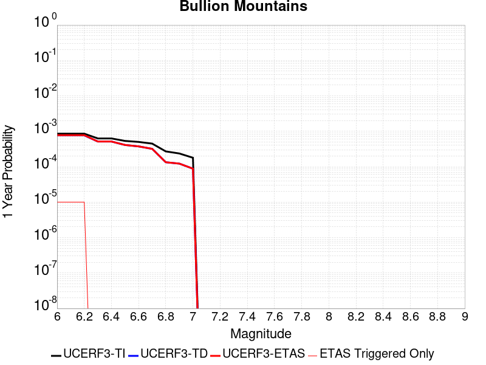 | 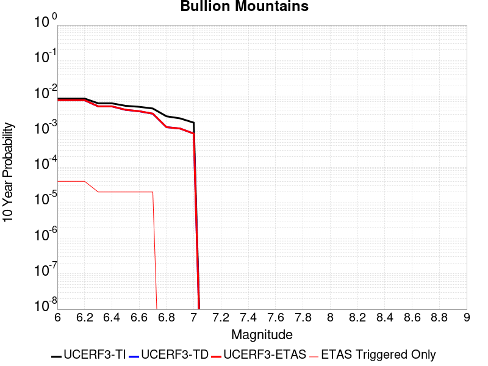 |

| Magnitude | 1 wk TI Prob | 1 wk TD Prob | 1 wk ETAS Prob | 1 wk ETAS/TD Gain | 1 wk ETAS Triggered Only | 1 mo TI Prob | 1 mo TD Prob | 1 mo ETAS Prob | 1 mo ETAS/TD Gain | 1 mo ETAS Triggered Only | 1 yr TI Prob | 1 yr TD Prob | 1 yr ETAS Prob | 1 yr ETAS/TD Gain | 1 yr ETAS Triggered Only | 10 yr TI Prob | 10 yr TD Prob | 10 yr ETAS Prob | 10 yr ETAS/TD Gain | 10 yr ETAS Triggered Only |
|-----|-----|-----|-----|-----|-----|-----|-----|-----|-----|-----|-----|-----|-----|-----|-----|-----|-----|-----|-----|-----|
| 6.0 | 1.6420427E-5 | 1.4692306E-5 | 1.4692306E-5 | 1.0 | 0.0 | 7.037136E-5 | 6.296572E-5 | 6.296572E-5 | 1.0 | 0.0 | 8.5643446E-4 | 7.663764E-4 | 7.763687E-4 | 1.0130384 | 1.0E-5 | 0.008531413 | 0.0076411283 | 0.0076808226 | 1.0051948 | 4.0E-5 |
| 6.1 | 1.6420427E-5 | 1.4692306E-5 | 1.4692306E-5 | 1.0 | 0.0 | 7.037136E-5 | 6.296572E-5 | 6.296572E-5 | 1.0 | 0.0 | 8.5643446E-4 | 7.663764E-4 | 7.763687E-4 | 1.0130384 | 1.0E-5 | 0.008531413 | 0.0076411283 | 0.0076808226 | 1.0051948 | 4.0E-5 |
| 6.2 | 1.6420427E-5 | 1.4692306E-5 | 1.4692306E-5 | 1.0 | 0.0 | 7.037136E-5 | 6.296572E-5 | 6.296572E-5 | 1.0 | 0.0 | 8.5643446E-4 | 7.663764E-4 | 7.763687E-4 | 1.0130384 | 1.0E-5 | 0.008531413 | 0.0076411283 | 0.0076808226 | 1.0051948 | 4.0E-5 |
| 6.3 | 1.2046778E-5 | 9.862485E-6 | 9.862485E-6 | 1.0 | 0.0 | 5.1628023E-5 | 4.226724E-5 | 4.226724E-5 | 1.0 | 0.0 | 6.283899E-4 | 5.145053E-4 | 5.145053E-4 | 1.0 | 0.0 | 0.0062661595 | 0.0051354226 | 0.00515532 | 1.0038745 | 2.0E-5 |
| 6.4 | 1.2046778E-5 | 9.862485E-6 | 9.862485E-6 | 1.0 | 0.0 | 5.1628023E-5 | 4.226724E-5 | 4.226724E-5 | 1.0 | 0.0 | 6.283899E-4 | 5.145053E-4 | 5.145053E-4 | 1.0 | 0.0 | 0.0062661595 | 0.0051354226 | 0.00515532 | 1.0038745 | 2.0E-5 |
| 6.5 | 1.0244343E-5 | 7.879582E-6 | 7.879582E-6 | 1.0 | 0.0 | 4.390359E-5 | 3.3769316E-5 | 3.3769316E-5 | 1.0 | 0.0 | 5.343951E-4 | 4.1108453E-4 | 4.1108453E-4 | 1.0 | 0.0 | 0.005331118 | 0.0041052722 | 0.00412519 | 1.0048518 | 2.0E-5 |
| 6.6 | 9.605408E-6 | 7.1776108E-6 | 7.1776108E-6 | 1.0 | 0.0 | 4.1165385E-5 | 3.076094E-5 | 3.076094E-5 | 1.0 | 0.0 | 5.010733E-4 | 3.7447043E-4 | 3.7447043E-4 | 1.0 | 0.0 | 0.00499945 | 0.0037403915 | 0.0037603166 | 1.005327 | 2.0E-5 |
| 6.7 | 8.60418E-6 | 6.1241044E-6 | 6.1241044E-6 | 1.0 | 0.0 | 3.687454E-5 | 2.6246007E-5 | 2.6246007E-5 | 1.0 | 0.0 | 4.48855E-4 | 3.1951777E-4 | 3.1951777E-4 | 1.0 | 0.0 | 0.004479495 | 0.0031924958 | 0.003212432 | 1.0062447 | 2.0E-5 |
| 6.8 | 5.187994E-6 | 2.5632194E-6 | 2.5632194E-6 | 1.0 | 0.0 | 2.223407E-5 | 1.0985203E-5 | 1.0985203E-5 | 1.0 | 0.0 | 2.7066618E-4 | 1.3374063E-4 | 1.3374063E-4 | 1.0 | 0.0 | 0.0027033675 | 0.001336993 | 0.001336993 | 1.0 | 0.0 |
| 6.9 | 4.5302368E-6 | 2.3443622E-6 | 2.3443622E-6 | 1.0 | 0.0 | 1.9415156E-5 | 1.0047251E-5 | 1.0047251E-5 | 1.0 | 0.0 | 2.3635388E-4 | 1.2232238E-4 | 1.2232238E-4 | 1.0 | 0.0 | 0.0023610266 | 0.0012229396 | 0.0012229396 | 1.0 | 0.0 |
| 7.0 | 3.431668E-6 | 1.6882757E-6 | 1.6882757E-6 | 1.0 | 0.0 | 1.4707065E-5 | 7.2354674E-6 | 7.2354674E-6 | 1.0 | 0.0 | 1.7904381E-4 | 8.8091816E-5 | 8.8091816E-5 | 1.0 | 0.0 | 0.0017889962 | 8.809181E-4 | 8.809181E-4 | 1.0 | 0.0 |

## Blue Cut
*[(top)](#table-of-contents)*

| 1 Week | 1 Month | 1 Year | 10 Year |
|-----|-----|-----|-----|
|  |  |  |  |

| Magnitude | 1 wk TI Prob | 1 wk TD Prob | 1 wk ETAS Prob | 1 wk ETAS/TD Gain | 1 wk ETAS Triggered Only | 1 mo TI Prob | 1 mo TD Prob | 1 mo ETAS Prob | 1 mo ETAS/TD Gain | 1 mo ETAS Triggered Only | 1 yr TI Prob | 1 yr TD Prob | 1 yr ETAS Prob | 1 yr ETAS/TD Gain | 1 yr ETAS Triggered Only | 10 yr TI Prob | 10 yr TD Prob | 10 yr ETAS Prob | 10 yr ETAS/TD Gain | 10 yr ETAS Triggered Only |
|-----|-----|-----|-----|-----|-----|-----|-----|-----|-----|-----|-----|-----|-----|-----|-----|-----|-----|-----|-----|-----|
| 6.0 | 2.1227985E-5 | 2.2719787E-5 | 2.2719787E-5 | 1.0 | 0.0 | 9.097391E-5 | 9.736721E-5 | 9.736721E-5 | 1.0 | 0.0 | 0.0011070445 | 0.0011848592 | 0.0011948473 | 1.0084298 | 1.0E-5 | 0.011015458 | 0.011791261 | 0.011830789 | 1.0033523 | 4.0E-5 |
| 6.1 | 2.1227985E-5 | 2.2719787E-5 | 2.2719787E-5 | 1.0 | 0.0 | 9.097391E-5 | 9.736721E-5 | 9.736721E-5 | 1.0 | 0.0 | 0.0011070445 | 0.0011848592 | 0.0011948473 | 1.0084298 | 1.0E-5 | 0.011015458 | 0.011791261 | 0.011830789 | 1.0033523 | 4.0E-5 |
| 6.2 | 2.1227985E-5 | 2.2719787E-5 | 2.2719787E-5 | 1.0 | 0.0 | 9.097391E-5 | 9.736721E-5 | 9.736721E-5 | 1.0 | 0.0 | 0.0011070445 | 0.0011848592 | 0.0011948473 | 1.0084298 | 1.0E-5 | 0.011015458 | 0.011791261 | 0.011830789 | 1.0033523 | 4.0E-5 |
| 6.3 | 1.1613981E-5 | 1.23536465E-5 | 1.23536465E-5 | 1.0 | 0.0 | 4.9773254E-5 | 5.2943193E-5 | 5.2943193E-5 | 1.0 | 0.0 | 6.0582085E-4 | 6.444052E-4 | 6.5439875E-4 | 1.0155082 | 1.0E-5 | 0.0060417196 | 0.0064266133 | 0.006466356 | 1.0061841 | 4.0E-5 |
| 6.4 | 1.1613981E-5 | 1.23536465E-5 | 1.23536465E-5 | 1.0 | 0.0 | 4.9773254E-5 | 5.2943193E-5 | 5.2943193E-5 | 1.0 | 0.0 | 6.0582085E-4 | 6.444052E-4 | 6.5439875E-4 | 1.0155082 | 1.0E-5 | 0.0060417196 | 0.0064266133 | 0.006466356 | 1.0061841 | 4.0E-5 |
| 6.5 | 8.931326E-6 | 9.481677E-6 | 9.481677E-6 | 1.0 | 0.0 | 3.8276554E-5 | 4.063518E-5 | 4.063518E-5 | 1.0 | 0.0 | 4.6591737E-4 | 4.9463013E-4 | 4.9463013E-4 | 1.0 | 0.0 | 0.0046494175 | 0.0049362015 | 0.0049561025 | 1.0040317 | 2.0E-5 |
| 6.6 | 7.345353E-6 | 7.790341E-6 | 7.790341E-6 | 1.0 | 0.0 | 3.1479703E-5 | 3.3386797E-5 | 3.3386797E-5 | 1.0 | 0.0 | 3.83198E-4 | 4.0641645E-4 | 4.0641645E-4 | 1.0 | 0.0 | 0.0038253788 | 0.0040575233 | 0.004067483 | 1.0024545 | 1.0E-5 |
| 6.7 | 6.2775666E-6 | 6.655202E-6 | 6.655202E-6 | 1.0 | 0.0 | 2.690358E-5 | 2.8522025E-5 | 2.8522025E-5 | 1.0 | 0.0 | 3.2750185E-4 | 3.4720785E-4 | 3.4720785E-4 | 1.0 | 0.0 | 0.0032701963 | 0.0034673947 | 0.0034773601 | 1.002874 | 1.0E-5 |
| 6.8 | 5.5234095E-6 | 5.8551577E-6 | 5.8551577E-6 | 1.0 | 0.0 | 2.367154E-5 | 2.5093334E-5 | 2.5093334E-5 | 1.0 | 0.0 | 2.8816288E-4 | 3.0547578E-4 | 3.0547578E-4 | 1.0 | 0.0 | 0.002877895 | 0.003051275 | 0.0030612443 | 1.0032673 | 1.0E-5 |
| 6.9 | 4.7780054E-6 | 5.0654608E-6 | 5.0654608E-6 | 1.0 | 0.0 | 2.0477004E-5 | 2.1708976E-5 | 2.1708976E-5 | 1.0 | 0.0 | 2.4927902E-4 | 2.6428179E-4 | 2.6428179E-4 | 1.0 | 0.0 | 0.0024899957 | 0.0026403673 | 0.0026503408 | 1.0037774 | 1.0E-5 |
| 7.0 | 3.883171E-6 | 4.1185203E-6 | 4.1185203E-6 | 1.0 | 0.0 | 1.6642054E-5 | 1.765072E-5 | 1.765072E-5 | 1.0 | 0.0 | 2.0259817E-4 | 2.1488321E-4 | 2.1488321E-4 | 1.0 | 0.0 | 0.0020241356 | 0.00214743 | 0.0021574085 | 1.0046468 | 1.0E-5 |
| 7.1 | 2.8358215E-6 | 3.0097403E-6 | 3.0097403E-6 | 1.0 | 0.0 | 1.2153464E-5 | 1.289886E-5 | 1.289886E-5 | 1.0 | 0.0 | 1.4795837E-4 | 1.5703888E-4 | 1.5703888E-4 | 1.0 | 0.0 | 0.001478599 | 0.0015699244 | 0.0015799087 | 1.0063597 | 1.0E-5 |

## Pisgah-Bullion Mtn-Mesquite Lk
*[(top)](#table-of-contents)*

| 1 Week | 1 Month | 1 Year | 10 Year |
|-----|-----|-----|-----|
|  |  |  |  |

| Magnitude | 1 wk TI Prob | 1 wk TD Prob | 1 wk ETAS Prob | 1 wk ETAS/TD Gain | 1 wk ETAS Triggered Only | 1 mo TI Prob | 1 mo TD Prob | 1 mo ETAS Prob | 1 mo ETAS/TD Gain | 1 mo ETAS Triggered Only | 1 yr TI Prob | 1 yr TD Prob | 1 yr ETAS Prob | 1 yr ETAS/TD Gain | 1 yr ETAS Triggered Only | 10 yr TI Prob | 10 yr TD Prob | 10 yr ETAS Prob | 10 yr ETAS/TD Gain | 10 yr ETAS Triggered Only |
|-----|-----|-----|-----|-----|-----|-----|-----|-----|-----|-----|-----|-----|-----|-----|-----|-----|-----|-----|-----|-----|
| 6.0 | 3.0240792E-5 | 2.4091496E-5 | 2.4091496E-5 | 1.0 | 0.0 | 1.2959696E-4 | 1.0324575E-4 | 1.0324575E-4 | 1.0 | 0.0 | 0.0015767008 | 0.0012563926 | 0.001286355 | 1.0238479 | 3.0E-5 | 0.015655609 | 0.012502918 | 0.012542418 | 1.0031593 | 4.0E-5 |
| 6.1 | 3.0240792E-5 | 2.4091496E-5 | 2.4091496E-5 | 1.0 | 0.0 | 1.2959696E-4 | 1.0324575E-4 | 1.0324575E-4 | 1.0 | 0.0 | 0.0015767008 | 0.0012563926 | 0.001286355 | 1.0238479 | 3.0E-5 | 0.015655609 | 0.012502918 | 0.012542418 | 1.0031593 | 4.0E-5 |
| 6.2 | 3.0240792E-5 | 2.4091496E-5 | 2.4091496E-5 | 1.0 | 0.0 | 1.2959696E-4 | 1.0324575E-4 | 1.0324575E-4 | 1.0 | 0.0 | 0.0015767008 | 0.0012563926 | 0.001286355 | 1.0238479 | 3.0E-5 | 0.015655609 | 0.012502918 | 0.012542418 | 1.0031593 | 4.0E-5 |
| 6.3 | 2.0498217E-5 | 1.3638254E-5 | 1.3638254E-5 | 1.0 | 0.0 | 8.784654E-5 | 5.8448444E-5 | 5.8448444E-5 | 1.0 | 0.0 | 0.0010690069 | 7.1139366E-4 | 7.1139366E-4 | 1.0 | 0.0 | 0.01063879 | 0.00709279 | 0.0071027195 | 1.0013999 | 1.0E-5 |
| 6.4 | 2.0498217E-5 | 1.3638254E-5 | 1.3638254E-5 | 1.0 | 0.0 | 8.784654E-5 | 5.8448444E-5 | 5.8448444E-5 | 1.0 | 0.0 | 0.0010690069 | 7.1139366E-4 | 7.1139366E-4 | 1.0 | 0.0 | 0.01063879 | 0.00709279 | 0.0071027195 | 1.0013999 | 1.0E-5 |
| 6.5 | 1.7316182E-5 | 1.0477178E-5 | 1.0477178E-5 | 1.0 | 0.0 | 7.42101E-5 | 4.4901473E-5 | 4.4901473E-5 | 1.0 | 0.0 | 9.0313336E-4 | 5.465483E-4 | 5.465483E-4 | 1.0 | 0.0 | 0.008994718 | 0.005453037 | 0.0054629827 | 1.0018238 | 1.0E-5 |
| 6.6 | 1.5251077E-5 | 8.414378E-6 | 8.414378E-6 | 1.0 | 0.0 | 6.536012E-5 | 3.606116E-5 | 3.606116E-5 | 1.0 | 0.0 | 7.9546886E-4 | 4.389634E-4 | 4.389634E-4 | 1.0 | 0.0 | 0.007926274 | 0.004381681 | 0.004381681 | 1.0 | 0.0 |
| 6.7 | 1.2997425E-5 | 6.411573E-6 | 6.411573E-6 | 1.0 | 0.0 | 5.570206E-5 | 2.7477907E-5 | 2.7477907E-5 | 1.0 | 0.0 | 6.7796157E-4 | 3.344968E-4 | 3.344968E-4 | 1.0 | 0.0 | 0.0067589693 | 0.0033403935 | 0.0033403935 | 1.0 | 0.0 |
| 6.8 | 1.035386E-5 | 4.333283E-6 | 4.333283E-6 | 1.0 | 0.0 | 4.437293E-5 | 1.8571085E-5 | 1.8571085E-5 | 1.0 | 0.0 | 5.401065E-4 | 2.2608037E-4 | 2.2608037E-4 | 1.0 | 0.0 | 0.0053879567 | 0.0022585907 | 0.0022585907 | 1.0 | 0.0 |
| 6.9 | 8.816252E-6 | 3.580692E-6 | 3.580692E-6 | 1.0 | 0.0 | 3.778339E-5 | 1.5345737E-5 | 1.5345737E-5 | 1.0 | 0.0 | 4.5991567E-4 | 1.8681891E-4 | 1.8681891E-4 | 1.0 | 0.0 | 0.00458965 | 0.0018666771 | 0.0018666771 | 1.0 | 0.0 |
| 7.0 | 6.8232207E-6 | 2.5676256E-6 | 2.5676256E-6 | 1.0 | 0.0 | 2.9242048E-5 | 1.10040655E-5 | 1.10040655E-5 | 1.0 | 0.0 | 3.5596377E-4 | 1.3396658E-4 | 1.3396658E-4 | 1.0 | 0.0 | 0.0035539411 | 0.0013388892 | 0.0013388892 | 1.0 | 0.0 |
| 7.1 | 5.837013E-6 | 2.2274157E-6 | 2.2274157E-6 | 1.0 | 0.0 | 2.501553E-5 | 9.546034E-6 | 9.546034E-6 | 1.0 | 0.0 | 3.045215E-4 | 1.1621706E-4 | 1.1621706E-4 | 1.0 | 0.0 | 0.0030410455 | 0.0011615918 | 0.0011615918 | 1.0 | 0.0 |
| 7.2 | 4.278052E-6 | 1.6275965E-6 | 1.6275965E-6 | 1.0 | 0.0 | 1.833438E-5 | 6.9753964E-6 | 6.9753964E-6 | 1.0 | 0.0 | 2.231982E-4 | 8.492238E-5 | 8.492238E-5 | 1.0 | 0.0 | 0.0022297418 | 8.489225E-4 | 8.489225E-4 | 1.0 | 0.0 |
| 7.3 | 1.8803692E-6 | 8.3450385E-7 | 8.3450385E-7 | 1.0 | 0.0 | 8.0587E-6 | 3.576441E-6 | 3.576441E-6 | 1.0 | 0.0 | 9.811026E-5 | 4.3542448E-5 | 4.3542448E-5 | 1.0 | 0.0 | 9.806695E-4 | 4.353536E-4 | 4.353536E-4 | 1.0 | 0.0 |

## Coronado Bank alt1
*[(top)](#table-of-contents)*

| 1 Week | 1 Month | 1 Year | 10 Year |
|-----|-----|-----|-----|
|  |  |  |  |

| Magnitude | 1 wk TI Prob | 1 wk TD Prob | 1 wk ETAS Prob | 1 wk ETAS/TD Gain | 1 wk ETAS Triggered Only | 1 mo TI Prob | 1 mo TD Prob | 1 mo ETAS Prob | 1 mo ETAS/TD Gain | 1 mo ETAS Triggered Only | 1 yr TI Prob | 1 yr TD Prob | 1 yr ETAS Prob | 1 yr ETAS/TD Gain | 1 yr ETAS Triggered Only | 10 yr TI Prob | 10 yr TD Prob | 10 yr ETAS Prob | 10 yr ETAS/TD Gain | 10 yr ETAS Triggered Only |
|-----|-----|-----|-----|-----|-----|-----|-----|-----|-----|-----|-----|-----|-----|-----|-----|-----|-----|-----|-----|-----|
| 6.0 | 7.533492E-5 | 9.3952294E-5 | 9.3952294E-5 | 1.0 | 0.0 | 3.22824E-4 | 4.0259483E-4 | 4.0259483E-4 | 1.0 | 0.0 | 0.0039233007 | 0.004891124 | 0.0049110265 | 1.0040691 | 2.0E-5 | 0.03854755 | 0.047905073 | 0.047943156 | 1.000795 | 4.0E-5 |
| 6.1 | 4.1807285E-5 | 5.049425E-5 | 5.049425E-5 | 1.0 | 0.0 | 1.7916178E-4 | 2.1638657E-4 | 2.1638657E-4 | 1.0 | 0.0 | 0.0021791123 | 0.002631421 | 0.0026413947 | 1.0037903 | 1.0E-5 | 0.021578677 | 0.026011758 | 0.026031237 | 1.0007489 | 2.0E-5 |
| 6.2 | 4.1807285E-5 | 5.049425E-5 | 5.049425E-5 | 1.0 | 0.0 | 1.7916178E-4 | 2.1638657E-4 | 2.1638657E-4 | 1.0 | 0.0 | 0.0021791123 | 0.002631421 | 0.0026413947 | 1.0037903 | 1.0E-5 | 0.021578677 | 0.026011758 | 0.026031237 | 1.0007489 | 2.0E-5 |
| 6.3 | 3.1793104E-5 | 3.771206E-5 | 3.771206E-5 | 1.0 | 0.0 | 1.3624904E-4 | 1.6161331E-4 | 1.6161331E-4 | 1.0 | 0.0 | 0.0016575698 | 0.001965897 | 0.001965897 | 1.0 | 0.0 | 0.016452603 | 0.019488946 | 0.01949875 | 1.0005031 | 1.0E-5 |
| 6.4 | 2.9878007E-5 | 3.5336663E-5 | 3.5336663E-5 | 1.0 | 0.0 | 1.2804232E-4 | 1.5143424E-4 | 1.5143424E-4 | 1.0 | 0.0 | 0.0015578003 | 0.0018421836 | 0.0018421836 | 1.0 | 0.0 | 0.015469253 | 0.018272884 | 0.018282702 | 1.0005373 | 1.0E-5 |
| 6.5 | 2.4512565E-5 | 2.8764713E-5 | 2.8764713E-5 | 1.0 | 0.0 | 1.0504962E-4 | 1.2327167E-4 | 1.2327167E-4 | 1.0 | 0.0 | 0.0012782287 | 0.001499827 | 0.001499827 | 1.0 | 0.0 | 0.012709012 | 0.014900027 | 0.014909878 | 1.0006611 | 1.0E-5 |
| 6.6 | 2.1317413E-5 | 2.4907233E-5 | 2.4907233E-5 | 1.0 | 0.0 | 9.135714E-5 | 1.0674105E-4 | 1.0674105E-4 | 1.0 | 0.0 | 0.0011117056 | 0.0012988199 | 0.0012988199 | 1.0 | 0.0 | 0.011061605 | 0.012914695 | 0.012924566 | 1.0007644 | 1.0E-5 |
| 6.7 | 1.8585655E-5 | 2.1635356E-5 | 2.1635356E-5 | 1.0 | 0.0 | 7.9650374E-5 | 9.2719776E-5 | 9.2719776E-5 | 1.0 | 0.0 | 9.6931186E-4 | 0.0011282992 | 0.0011282992 | 1.0 | 0.0 | 0.0096509475 | 0.0112278685 | 0.0112278685 | 1.0 | 0.0 |
| 6.8 | 1.5862879E-5 | 1.8419874E-5 | 1.8419874E-5 | 1.0 | 0.0 | 6.798199E-5 | 7.894004E-5 | 7.894004E-5 | 1.0 | 0.0 | 8.273665E-4 | 9.606905E-4 | 9.606905E-4 | 1.0 | 0.0 | 0.008242928 | 0.009567357 | 0.009567357 | 1.0 | 0.0 |
| 6.9 | 1.3021509E-5 | 1.5095589E-5 | 1.5095589E-5 | 1.0 | 0.0 | 5.5805274E-5 | 6.469388E-5 | 6.469388E-5 | 1.0 | 0.0 | 6.792174E-4 | 7.8738143E-4 | 7.8738143E-4 | 1.0 | 0.0 | 0.006771452 | 0.00784774 | 0.00784774 | 1.0 | 0.0 |
| 7.0 | 1.0974371E-5 | 1.27203775E-5 | 1.27203775E-5 | 1.0 | 0.0 | 4.7032172E-5 | 5.4514865E-5 | 5.4514865E-5 | 1.0 | 0.0 | 5.7246623E-4 | 6.635339E-4 | 6.635339E-4 | 1.0 | 0.0 | 0.0057099373 | 0.006617277 | 0.006617277 | 1.0 | 0.0 |
| 7.1 | 8.766221E-6 | 1.0164053E-5 | 1.0164053E-5 | 1.0 | 0.0 | 3.7568978E-5 | 4.3559594E-5 | 4.3559594E-5 | 1.0 | 0.0 | 4.573063E-4 | 5.302262E-4 | 5.302262E-4 | 1.0 | 0.0 | 0.0045636636 | 0.005291311 | 0.005291311 | 1.0 | 0.0 |
| 7.2 | 8.026024E-7 | 8.331837E-7 | 8.331837E-7 | 1.0 | 0.0 | 3.43972E-6 | 3.5707824E-6 | 3.5707824E-6 | 1.0 | 0.0 | 4.1877785E-5 | 4.347342E-5 | 4.347342E-5 | 1.0 | 0.0 | 4.1869894E-4 | 4.3465025E-4 | 4.3465025E-4 | 1.0 | 0.0 |
| 7.3 | 3.7293114E-7 | 3.7001186E-7 | 3.7001186E-7 | 1.0 | 0.0 | 1.5982754E-6 | 1.5857643E-6 | 1.5857643E-6 | 1.0 | 0.0 | 1.9458828E-5 | 1.930651E-5 | 1.930651E-5 | 1.0 | 0.0 | 1.9457124E-4 | 1.9304838E-4 | 1.9304838E-4 | 1.0 | 0.0 |
| 7.4 | 2.0557036E-7 | 1.9674462E-7 | 1.9674462E-7 | 1.0 | 0.0 | 8.810155E-7 | 8.43191E-7 | 8.43191E-7 | 1.0 | 0.0 | 1.0726311E-5 | 1.0265802E-5 | 1.0265802E-5 | 1.0 | 0.0 | 1.0725793E-4 | 1.02653314E-4 | 1.02653314E-4 | 1.0 | 0.0 |
| 7.5 | 6.845446E-8 | 6.279388E-8 | 6.279388E-8 | 1.0 | 0.0 | 2.9337625E-7 | 2.6911658E-7 | 2.6911658E-7 | 1.0 | 0.0 | 3.5718497E-6 | 3.2764897E-6 | 3.2764897E-6 | 1.0 | 0.0 | 3.5717923E-5 | 3.2764423E-5 | 3.2764423E-5 | 1.0 | 0.0 |
| 7.6 | 6.0975145E-9 | 5.531861E-9 | 5.531861E-9 | 1.0 | 0.0 | 2.6132206E-8 | 2.3707976E-8 | 2.3707976E-8 | 1.0 | 0.0 | 3.1815955E-7 | 2.8864457E-7 | 2.8864457E-7 | 1.0 | 0.0 | 3.181591E-6 | 2.886443E-6 | 2.886443E-6 | 1.0 | 0.0 |

## San Pedro Basin
*[(top)](#table-of-contents)*

| 1 Week | 1 Month | 1 Year | 10 Year |
|-----|-----|-----|-----|
|  | 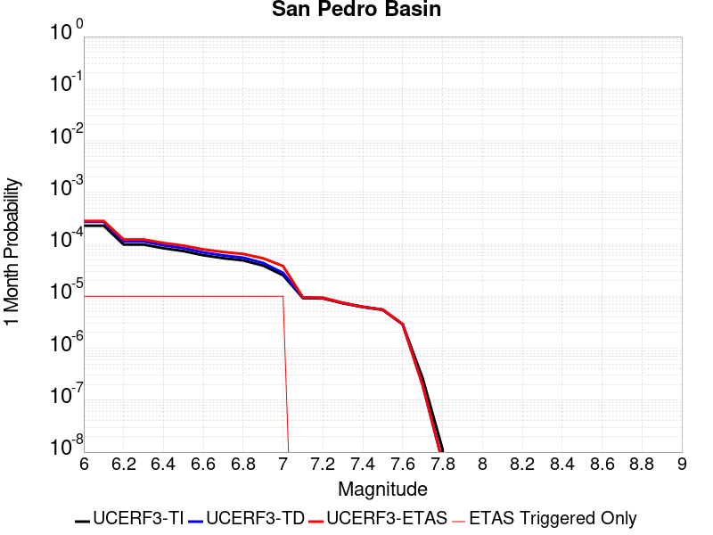 |  |  |

| Magnitude | 1 wk TI Prob | 1 wk TD Prob | 1 wk ETAS Prob | 1 wk ETAS/TD Gain | 1 wk ETAS Triggered Only | 1 mo TI Prob | 1 mo TD Prob | 1 mo ETAS Prob | 1 mo ETAS/TD Gain | 1 mo ETAS Triggered Only | 1 yr TI Prob | 1 yr TD Prob | 1 yr ETAS Prob | 1 yr ETAS/TD Gain | 1 yr ETAS Triggered Only | 10 yr TI Prob | 10 yr TD Prob | 10 yr ETAS Prob | 10 yr ETAS/TD Gain | 10 yr ETAS Triggered Only |
|-----|-----|-----|-----|-----|-----|-----|-----|-----|-----|-----|-----|-----|-----|-----|-----|-----|-----|-----|-----|-----|
| 6.0 | 5.3449043E-5 | 6.3371124E-5 | 6.3371124E-5 | 1.0 | 0.0 | 2.2904722E-4 | 2.7156572E-4 | 2.81563E-4 | 1.0368135 | 1.0E-5 | 0.0027850836 | 0.0033019078 | 0.0033417759 | 1.0120742 | 4.0E-5 | 0.027504366 | 0.032590248 | 0.032628946 | 1.0011873 | 4.0E-5 |
| 6.1 | 5.3449043E-5 | 6.3371124E-5 | 6.3371124E-5 | 1.0 | 0.0 | 2.2904722E-4 | 2.7156572E-4 | 2.81563E-4 | 1.0368135 | 1.0E-5 | 0.0027850836 | 0.0033019078 | 0.0033417759 | 1.0120742 | 4.0E-5 | 0.027504366 | 0.032590248 | 0.032628946 | 1.0011873 | 4.0E-5 |
| 6.2 | 2.3189454E-5 | 2.6643334E-5 | 2.6643334E-5 | 1.0 | 0.0 | 9.9379584E-5 | 1.14180984E-4 | 1.2417985E-4 | 1.0875703 | 1.0E-5 | 0.0012092749 | 0.0013893144 | 0.0014192727 | 1.0215634 | 3.0E-5 | 0.012027155 | 0.013811161 | 0.013840746 | 1.0021422 | 3.0E-5 |
| 6.3 | 2.3189454E-5 | 2.6643334E-5 | 2.6643334E-5 | 1.0 | 0.0 | 9.9379584E-5 | 1.14180984E-4 | 1.2417985E-4 | 1.0875703 | 1.0E-5 | 0.0012092749 | 0.0013893144 | 0.0014192727 | 1.0215634 | 3.0E-5 | 0.012027155 | 0.013811161 | 0.013840746 | 1.0021422 | 3.0E-5 |
| 6.4 | 1.966056E-5 | 2.2463848E-5 | 2.2463848E-5 | 1.0 | 0.0 | 8.425682E-5 | 9.627031E-5 | 1.0626935E-4 | 1.1038642 | 1.0E-5 | 0.001025344 | 0.001171501 | 0.0012014658 | 1.0255781 | 3.0E-5 | 0.010206259 | 0.011657341 | 0.011686991 | 1.0025434 | 3.0E-5 |
| 6.5 | 1.7342953E-5 | 1.9745521E-5 | 1.9745521E-5 | 1.0 | 0.0 | 7.4324824E-5 | 8.4621126E-5 | 9.462028E-5 | 1.1181638 | 1.0E-5 | 9.04529E-4 | 0.0010298121 | 0.0010597813 | 1.0291015 | 3.0E-5 | 0.009008561 | 0.010254124 | 0.010283816 | 1.0028956 | 3.0E-5 |
| 6.6 | 1.439804E-5 | 1.6323014E-5 | 1.6323014E-5 | 1.0 | 0.0 | 6.170443E-5 | 6.995408E-5 | 7.995338E-5 | 1.1429409 | 1.0E-5 | 7.509924E-4 | 8.513903E-4 | 8.8136474E-4 | 1.0352064 | 3.0E-5 | 0.0074845953 | 0.008484487 | 0.008514233 | 1.0035058 | 3.0E-5 |
| 6.7 | 1.2634884E-5 | 1.4285554E-5 | 1.4285554E-5 | 1.0 | 0.0 | 5.414838E-5 | 6.1222534E-5 | 7.1221926E-5 | 1.1633285 | 1.0E-5 | 6.590571E-4 | 7.451599E-4 | 7.7513757E-4 | 1.0402298 | 3.0E-5 | 0.006571059 | 0.007429634 | 0.0074594114 | 1.0040079 | 3.0E-5 |
| 6.8 | 1.146091E-5 | 1.2933421E-5 | 1.2933421E-5 | 1.0 | 0.0 | 4.911726E-5 | 5.542794E-5 | 6.542738E-5 | 1.1804044 | 1.0E-5 | 5.9783855E-4 | 6.7465595E-4 | 7.046357E-4 | 1.044437 | 3.0E-5 | 0.0059623276 | 0.0067290184 | 0.0067588165 | 1.0044283 | 3.0E-5 |
| 6.9 | 9.109035E-6 | 1.0235189E-5 | 1.0235189E-5 | 1.0 | 0.0 | 3.9038136E-5 | 4.3864515E-5 | 5.3864074E-5 | 1.2279648 | 1.0E-5 | 4.7518566E-4 | 5.339476E-4 | 5.5393693E-4 | 1.0374368 | 2.0E-5 | 0.0047417083 | 0.0053294008 | 0.0053492943 | 1.0037328 | 2.0E-5 |
| 7.0 | 5.9351028E-6 | 6.584068E-6 | 6.584068E-6 | 1.0 | 0.0 | 2.5435906E-5 | 2.8217262E-5 | 3.8216982E-5 | 1.354383 | 1.0E-5 | 3.0963816E-4 | 3.4351464E-4 | 3.6350777E-4 | 1.0582017 | 2.0E-5 | 0.0030920706 | 0.0034321535 | 0.0034520847 | 1.0058073 | 2.0E-5 |
| 7.1 | 2.1557585E-6 | 2.2096608E-6 | 2.2096608E-6 | 1.0 | 0.0 | 9.238933E-6 | 9.469942E-6 | 9.469942E-6 | 1.0 | 0.0 | 1.1247819E-4 | 1.1529059E-4 | 1.1529059E-4 | 1.0 | 0.0 | 0.0011242128 | 0.0011523232 | 0.0011523232 | 1.0 | 0.0 |
| 7.2 | 2.1251979E-6 | 2.178007E-6 | 2.178007E-6 | 1.0 | 0.0 | 9.107958E-6 | 9.334282E-6 | 9.334282E-6 | 1.0 | 0.0 | 1.1088375E-4 | 1.1363912E-4 | 1.1363912E-4 | 1.0 | 0.0 | 0.0011082845 | 0.0011358254 | 0.0011358254 | 1.0 | 0.0 |
| 7.3 | 1.7145798E-6 | 1.7442967E-6 | 1.7442967E-6 | 1.0 | 0.0 | 7.3481783E-6 | 7.475536E-6 | 7.475536E-6 | 1.0 | 0.0 | 8.94604E-5 | 9.1010945E-5 | 9.1010945E-5 | 1.0 | 0.0 | 8.9424395E-4 | 9.0974587E-4 | 9.0974587E-4 | 1.0 | 0.0 |
| 7.4 | 1.4467993E-6 | 1.4641943E-6 | 1.4641943E-6 | 1.0 | 0.0 | 6.200554E-6 | 6.2751037E-6 | 6.2751037E-6 | 1.0 | 0.0 | 7.548913E-5 | 7.6396784E-5 | 7.6396784E-5 | 1.0 | 0.0 | 7.546349E-4 | 7.637125E-4 | 7.637125E-4 | 1.0 | 0.0 |
| 7.5 | 1.2803735E-6 | 1.2931564E-6 | 1.2931564E-6 | 1.0 | 0.0 | 5.487303E-6 | 5.5420874E-6 | 5.5420874E-6 | 1.0 | 0.0 | 6.680587E-5 | 6.7472894E-5 | 6.7472894E-5 | 1.0 | 0.0 | 6.678579E-4 | 6.7453115E-4 | 6.7453115E-4 | 1.0 | 0.0 |
| 7.6 | 6.755009E-7 | 6.769501E-7 | 6.769501E-7 | 1.0 | 0.0 | 2.8950008E-6 | 2.9012117E-6 | 2.9012117E-6 | 1.0 | 0.0 | 3.5246063E-5 | 3.5321737E-5 | 3.5321737E-5 | 1.0 | 0.0 | 3.5240475E-4 | 3.5316695E-4 | 3.5316695E-4 | 1.0 | 0.0 |
| 7.7 | 6.211885E-8 | 4.5699863E-8 | 4.5699863E-8 | 1.0 | 0.0 | 2.6622362E-7 | 1.9585654E-7 | 1.9585654E-7 | 1.0 | 0.0 | 3.2412677E-6 | 2.384551E-6 | 2.384551E-6 | 1.0 | 0.0 | 3.2412205E-5 | 2.3845274E-5 | 2.3845274E-5 | 1.0 | 0.0 |
| 7.8 | 2.6580573E-9 | 1.5138681E-9 | 1.5138681E-9 | 1.0 | 0.0 | 1.1391674E-8 | 6.488006E-9 | 6.488006E-9 | 1.0 | 0.0 | 1.3869362E-7 | 7.899148E-8 | 7.899148E-8 | 1.0 | 0.0 | 1.3869354E-6 | 7.8991474E-7 | 7.8991474E-7 | 1.0 | 0.0 |

## Great Valley 03a Dunnigan Hills
*[(top)](#table-of-contents)*

| 1 Week | 1 Month | 1 Year | 10 Year |
|-----|-----|-----|-----|
| 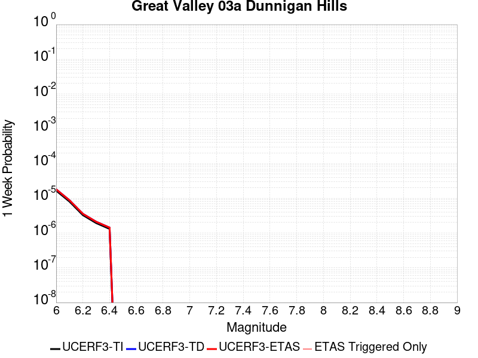 |  | 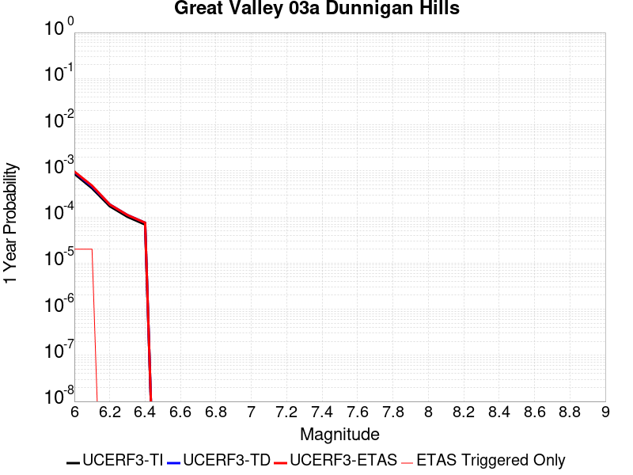 |  |

| Magnitude | 1 wk TI Prob | 1 wk TD Prob | 1 wk ETAS Prob | 1 wk ETAS/TD Gain | 1 wk ETAS Triggered Only | 1 mo TI Prob | 1 mo TD Prob | 1 mo ETAS Prob | 1 mo ETAS/TD Gain | 1 mo ETAS Triggered Only | 1 yr TI Prob | 1 yr TD Prob | 1 yr ETAS Prob | 1 yr ETAS/TD Gain | 1 yr ETAS Triggered Only | 10 yr TI Prob | 10 yr TD Prob | 10 yr ETAS Prob | 10 yr ETAS/TD Gain | 10 yr ETAS Triggered Only |
|-----|-----|-----|-----|-----|-----|-----|-----|-----|-----|-----|-----|-----|-----|-----|-----|-----|-----|-----|-----|-----|
| 6.0 | 1.6591328E-5 | 1.8108174E-5 | 1.8108174E-5 | 1.0 | 0.0 | 7.110376E-5 | 7.760454E-5 | 7.760454E-5 | 1.0 | 0.0 | 8.6534437E-4 | 9.4449485E-4 | 9.6447597E-4 | 1.0211554 | 2.0E-5 | 0.008619824 | 0.009411639 | 0.009451263 | 1.0042101 | 4.0E-5 |
| 6.1 | 8.041125E-6 | 8.769832E-6 | 8.769832E-6 | 1.0 | 0.0 | 3.4461507E-5 | 3.7584567E-5 | 3.7584567E-5 | 1.0 | 0.0 | 4.194881E-4 | 4.5751635E-4 | 4.775072E-4 | 1.0436943 | 2.0E-5 | 0.004186971 | 0.004567742 | 0.0045976047 | 1.0065378 | 3.0E-5 |
| 6.2 | 3.2807004E-6 | 3.579612E-6 | 3.579612E-6 | 1.0 | 0.0 | 1.4060069E-5 | 1.5341127E-5 | 1.5341127E-5 | 1.0 | 0.0 | 1.7116789E-4 | 1.8676638E-4 | 1.8676638E-4 | 1.0 | 0.0 | 0.0017103611 | 0.0018665022 | 0.0018665022 | 1.0 | 0.0 |
| 6.3 | 1.9339366E-6 | 2.1104063E-6 | 2.1104063E-6 | 1.0 | 0.0 | 8.288273E-6 | 9.044583E-6 | 9.044583E-6 | 1.0 | 0.0 | 1.00905054E-4 | 1.10115085E-4 | 1.10115085E-4 | 1.0 | 0.0 | 0.0010085925 | 0.0011008852 | 0.0011008852 | 1.0 | 0.0 |
| 6.4 | 1.3142635E-6 | 1.4340039E-6 | 1.4340039E-6 | 1.0 | 0.0 | 5.6325457E-6 | 6.1457313E-6 | 6.1457313E-6 | 1.0 | 0.0 | 6.857408E-5 | 7.4824275E-5 | 7.4824275E-5 | 1.0 | 0.0 | 6.8552926E-4 | 7.482428E-4 | 7.482428E-4 | 1.0 | 0.0 |

## Channel Islands Western Deep Ramp
*[(top)](#table-of-contents)*

| 1 Week | 1 Month | 1 Year | 10 Year |
|-----|-----|-----|-----|
|  |  |  |  |

| Magnitude | 1 wk TI Prob | 1 wk TD Prob | 1 wk ETAS Prob | 1 wk ETAS/TD Gain | 1 wk ETAS Triggered Only | 1 mo TI Prob | 1 mo TD Prob | 1 mo ETAS Prob | 1 mo ETAS/TD Gain | 1 mo ETAS Triggered Only | 1 yr TI Prob | 1 yr TD Prob | 1 yr ETAS Prob | 1 yr ETAS/TD Gain | 1 yr ETAS Triggered Only | 10 yr TI Prob | 10 yr TD Prob | 10 yr ETAS Prob | 10 yr ETAS/TD Gain | 10 yr ETAS Triggered Only |
|-----|-----|-----|-----|-----|-----|-----|-----|-----|-----|-----|-----|-----|-----|-----|-----|-----|-----|-----|-----|-----|
| 6.0 | 6.0213506E-6 | 6.2549007E-6 | 6.2549007E-6 | 1.0 | 0.0 | 2.5805533E-5 | 2.6806467E-5 | 2.6806467E-5 | 1.0 | 0.0 | 3.1413708E-4 | 3.263243E-4 | 3.263243E-4 | 1.0 | 0.0 | 0.0031369338 | 0.003258893 | 0.0032987627 | 1.0122341 | 4.0E-5 |
| 6.1 | 6.0213506E-6 | 6.2549007E-6 | 6.2549007E-6 | 1.0 | 0.0 | 2.5805533E-5 | 2.6806467E-5 | 2.6806467E-5 | 1.0 | 0.0 | 3.1413708E-4 | 3.263243E-4 | 3.263243E-4 | 1.0 | 0.0 | 0.0031369338 | 0.003258893 | 0.0032987627 | 1.0122341 | 4.0E-5 |
| 6.2 | 6.0213506E-6 | 6.2549007E-6 | 6.2549007E-6 | 1.0 | 0.0 | 2.5805533E-5 | 2.6806467E-5 | 2.6806467E-5 | 1.0 | 0.0 | 3.1413708E-4 | 3.263243E-4 | 3.263243E-4 | 1.0 | 0.0 | 0.0031369338 | 0.003258893 | 0.0032987627 | 1.0122341 | 4.0E-5 |
| 6.3 | 6.0213506E-6 | 6.2549007E-6 | 6.2549007E-6 | 1.0 | 0.0 | 2.5805533E-5 | 2.6806467E-5 | 2.6806467E-5 | 1.0 | 0.0 | 3.1413708E-4 | 3.263243E-4 | 3.263243E-4 | 1.0 | 0.0 | 0.0031369338 | 0.003258893 | 0.0032987627 | 1.0122341 | 4.0E-5 |
| 6.4 | 6.0213506E-6 | 6.2549007E-6 | 6.2549007E-6 | 1.0 | 0.0 | 2.5805533E-5 | 2.6806467E-5 | 2.6806467E-5 | 1.0 | 0.0 | 3.1413708E-4 | 3.263243E-4 | 3.263243E-4 | 1.0 | 0.0 | 0.0031369338 | 0.003258893 | 0.0032987627 | 1.0122341 | 4.0E-5 |
| 6.5 | 6.0213506E-6 | 6.2549007E-6 | 6.2549007E-6 | 1.0 | 0.0 | 2.5805533E-5 | 2.6806467E-5 | 2.6806467E-5 | 1.0 | 0.0 | 3.1413708E-4 | 3.263243E-4 | 3.263243E-4 | 1.0 | 0.0 | 0.0031369338 | 0.003258893 | 0.0032987627 | 1.0122341 | 4.0E-5 |
| 6.6 | 6.0213506E-6 | 6.2549007E-6 | 6.2549007E-6 | 1.0 | 0.0 | 2.5805533E-5 | 2.6806467E-5 | 2.6806467E-5 | 1.0 | 0.0 | 3.1413708E-4 | 3.263243E-4 | 3.263243E-4 | 1.0 | 0.0 | 0.0031369338 | 0.003258893 | 0.0032987627 | 1.0122341 | 4.0E-5 |
| 6.7 | 5.313309E-6 | 5.52527E-6 | 5.52527E-6 | 1.0 | 0.0 | 2.2771126E-5 | 2.3679535E-5 | 2.3679535E-5 | 1.0 | 0.0 | 2.772032E-4 | 2.882643E-4 | 2.882643E-4 | 1.0 | 0.0 | 0.0027685766 | 0.002879307 | 0.0029191917 | 1.0138522 | 4.0E-5 |
| 6.8 | 5.313309E-6 | 5.52527E-6 | 5.52527E-6 | 1.0 | 0.0 | 2.2771126E-5 | 2.3679535E-5 | 2.3679535E-5 | 1.0 | 0.0 | 2.772032E-4 | 2.882643E-4 | 2.882643E-4 | 1.0 | 0.0 | 0.0027685766 | 0.002879307 | 0.0029191917 | 1.0138522 | 4.0E-5 |
| 6.9 | 4.744377E-6 | 4.9394575E-6 | 4.9394575E-6 | 1.0 | 0.0 | 2.0332885E-5 | 2.1168953E-5 | 2.1168953E-5 | 1.0 | 0.0 | 2.4752476E-4 | 2.5770525E-4 | 2.5770525E-4 | 1.0 | 0.0 | 0.0024724922 | 0.0025744315 | 0.0026143284 | 1.0154974 | 4.0E-5 |
| 7.0 | 4.722209E-6 | 4.9165E-6 | 4.9165E-6 | 1.0 | 0.0 | 2.0237881E-5 | 2.1070566E-5 | 2.1070566E-5 | 1.0 | 0.0 | 2.4636835E-4 | 2.5650766E-4 | 2.5650766E-4 | 1.0 | 0.0 | 0.002460954 | 0.0025624833 | 0.002602381 | 1.0155698 | 4.0E-5 |
| 7.1 | 4.611174E-6 | 4.8014354E-6 | 4.8014354E-6 | 1.0 | 0.0 | 1.9762025E-5 | 2.057744E-5 | 2.057744E-5 | 1.0 | 0.0 | 2.4057609E-4 | 2.5050525E-4 | 2.5050525E-4 | 1.0 | 0.0 | 0.002403158 | 0.0025025955 | 0.0025424955 | 1.0159434 | 4.0E-5 |
| 7.2 | 4.043994E-6 | 4.21205E-6 | 4.21205E-6 | 1.0 | 0.0 | 1.7331287E-5 | 1.8051538E-5 | 1.8051538E-5 | 1.0 | 0.0 | 2.10988E-4 | 2.1975888E-4 | 2.1975888E-4 | 1.0 | 0.0 | 0.002107878 | 0.0021957664 | 0.0022257005 | 1.0136327 | 3.0E-5 |
| 7.3 | 2.1233036E-6 | 2.2298022E-6 | 2.2298022E-6 | 1.0 | 0.0 | 9.099841E-6 | 9.556261E-6 | 9.556261E-6 | 1.0 | 0.0 | 1.1078493E-4 | 1.1634132E-4 | 1.1634132E-4 | 1.0 | 0.0 | 0.0011072971 | 0.0011628097 | 0.0011727981 | 1.0085899 | 1.0E-5 |
| 7.4 | 1.9051884E-6 | 2.0015107E-6 | 2.0015107E-6 | 1.0 | 0.0 | 8.165067E-6 | 8.577875E-6 | 8.577875E-6 | 1.0 | 0.0 | 9.940516E-5 | 1.0443068E-4 | 1.0443068E-4 | 1.0 | 0.0 | 9.93607E-4 | 0.0010438213 | 0.0010538108 | 1.0095702 | 1.0E-5 |
| 7.5 | 1.2408497E-6 | 1.3038928E-6 | 1.3038928E-6 | 1.0 | 0.0 | 5.317916E-6 | 5.5880996E-6 | 5.5880996E-6 | 1.0 | 0.0 | 6.4743705E-5 | 6.803301E-5 | 6.803301E-5 | 1.0 | 0.0 | 6.4724847E-4 | 6.8012404E-4 | 6.9011725E-4 | 1.0146931 | 1.0E-5 |
| 7.6 | 6.5440025E-7 | 6.886766E-7 | 6.886766E-7 | 1.0 | 0.0 | 2.8045695E-6 | 2.9514679E-6 | 2.9514679E-6 | 1.0 | 0.0 | 3.4145098E-5 | 3.5933543E-5 | 3.5933543E-5 | 1.0 | 0.0 | 3.4139853E-4 | 3.5927873E-4 | 3.5927873E-4 | 1.0 | 0.0 |
| 7.7 | 3.985963E-7 | 4.1931077E-7 | 4.1931077E-7 | 1.0 | 0.0 | 1.7082689E-6 | 1.797045E-6 | 1.797045E-6 | 1.0 | 0.0 | 2.0797976E-5 | 2.1878815E-5 | 2.1878815E-5 | 1.0 | 0.0 | 2.0796029E-4 | 2.1876777E-4 | 2.1876777E-4 | 1.0 | 0.0 |
| 7.8 | 3.706329E-8 | 3.8592006E-8 | 3.8592006E-8 | 1.0 | 0.0 | 1.5884267E-7 | 1.653943E-7 | 1.653943E-7 | 1.0 | 0.0 | 1.9339077E-6 | 2.0136738E-6 | 2.0136738E-6 | 1.0 | 0.0 | 1.933891E-5 | 2.0136567E-5 | 2.0136567E-5 | 1.0 | 0.0 |

## Dry Mountain
*[(top)](#table-of-contents)*

| 1 Week | 1 Month | 1 Year | 10 Year |
|-----|-----|-----|-----|
|  |  |  |  |

| Magnitude | 1 wk TI Prob | 1 wk TD Prob | 1 wk ETAS Prob | 1 wk ETAS/TD Gain | 1 wk ETAS Triggered Only | 1 mo TI Prob | 1 mo TD Prob | 1 mo ETAS Prob | 1 mo ETAS/TD Gain | 1 mo ETAS Triggered Only | 1 yr TI Prob | 1 yr TD Prob | 1 yr ETAS Prob | 1 yr ETAS/TD Gain | 1 yr ETAS Triggered Only | 10 yr TI Prob | 10 yr TD Prob | 10 yr ETAS Prob | 10 yr ETAS/TD Gain | 10 yr ETAS Triggered Only |
|-----|-----|-----|-----|-----|-----|-----|-----|-----|-----|-----|-----|-----|-----|-----|-----|-----|-----|-----|-----|-----|
| 6.0 | 6.222801E-6 | 6.439411E-6 | 1.6439346E-5 | 2.552927 | 1.0E-5 | 2.6668875E-5 | 2.7597274E-5 | 3.7596998E-5 | 1.3623446 | 1.0E-5 | 3.2464517E-4 | 3.359609E-4 | 3.559542E-4 | 1.0595107 | 2.0E-5 | 0.0032417132 | 0.0033560924 | 0.003395958 | 1.0118786 | 4.0E-5 |
| 6.1 | 6.222801E-6 | 6.439411E-6 | 1.6439346E-5 | 2.552927 | 1.0E-5 | 2.6668875E-5 | 2.7597274E-5 | 3.7596998E-5 | 1.3623446 | 1.0E-5 | 3.2464517E-4 | 3.359609E-4 | 3.559542E-4 | 1.0595107 | 2.0E-5 | 0.0032417132 | 0.0033560924 | 0.003395958 | 1.0118786 | 4.0E-5 |
| 6.2 | 6.222801E-6 | 6.439411E-6 | 1.6439346E-5 | 2.552927 | 1.0E-5 | 2.6668875E-5 | 2.7597274E-5 | 3.7596998E-5 | 1.3623446 | 1.0E-5 | 3.2464517E-4 | 3.359609E-4 | 3.559542E-4 | 1.0595107 | 2.0E-5 | 0.0032417132 | 0.0033560924 | 0.003395958 | 1.0118786 | 4.0E-5 |
| 6.3 | 6.222801E-6 | 6.439411E-6 | 1.6439346E-5 | 2.552927 | 1.0E-5 | 2.6668875E-5 | 2.7597274E-5 | 3.7596998E-5 | 1.3623446 | 1.0E-5 | 3.2464517E-4 | 3.359609E-4 | 3.559542E-4 | 1.0595107 | 2.0E-5 | 0.0032417132 | 0.0033560924 | 0.003395958 | 1.0118786 | 4.0E-5 |
| 6.4 | 6.222801E-6 | 6.439411E-6 | 1.6439346E-5 | 2.552927 | 1.0E-5 | 2.6668875E-5 | 2.7597274E-5 | 3.7596998E-5 | 1.3623446 | 1.0E-5 | 3.2464517E-4 | 3.359609E-4 | 3.559542E-4 | 1.0595107 | 2.0E-5 | 0.0032417132 | 0.0033560924 | 0.003395958 | 1.0118786 | 4.0E-5 |
| 6.5 | 2.8528623E-6 | 2.952182E-6 | 2.952182E-6 | 1.0 | 0.0 | 1.22264955E-5 | 1.2652196E-5 | 1.2652196E-5 | 1.0 | 0.0 | 1.4884741E-4 | 1.5403831E-4 | 1.5403831E-4 | 1.0 | 0.0 | 0.0014874774 | 0.0015401688 | 0.0015401688 | 1.0 | 0.0 |
| 6.6 | 2.8528623E-6 | 2.952182E-6 | 2.952182E-6 | 1.0 | 0.0 | 1.22264955E-5 | 1.2652196E-5 | 1.2652196E-5 | 1.0 | 0.0 | 1.4884741E-4 | 1.5403831E-4 | 1.5403831E-4 | 1.0 | 0.0 | 0.0014874774 | 0.0015401688 | 0.0015401688 | 1.0 | 0.0 |
| 6.7 | 2.541E-6 | 2.62937E-6 | 2.62937E-6 | 1.0 | 0.0 | 1.0889954E-5 | 1.12687285E-5 | 1.12687285E-5 | 1.0 | 0.0 | 1.3257713E-4 | 1.3719677E-4 | 1.3719677E-4 | 1.0 | 0.0 | 0.0013249806 | 0.0013719677 | 0.0013719677 | 1.0 | 0.0 |

## Santa Monica alt 1
*[(top)](#table-of-contents)*

| 1 Week | 1 Month | 1 Year | 10 Year |
|-----|-----|-----|-----|
|  | 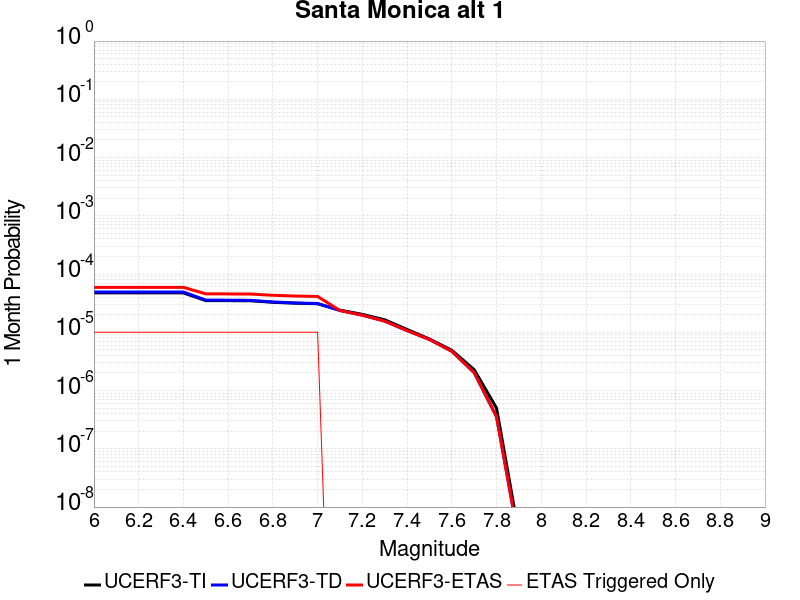 |  |  |

| Magnitude | 1 wk TI Prob | 1 wk TD Prob | 1 wk ETAS Prob | 1 wk ETAS/TD Gain | 1 wk ETAS Triggered Only | 1 mo TI Prob | 1 mo TD Prob | 1 mo ETAS Prob | 1 mo ETAS/TD Gain | 1 mo ETAS Triggered Only | 1 yr TI Prob | 1 yr TD Prob | 1 yr ETAS Prob | 1 yr ETAS/TD Gain | 1 yr ETAS Triggered Only | 10 yr TI Prob | 10 yr TD Prob | 10 yr ETAS Prob | 10 yr ETAS/TD Gain | 10 yr ETAS Triggered Only |
|-----|-----|-----|-----|-----|-----|-----|-----|-----|-----|-----|-----|-----|-----|-----|-----|-----|-----|-----|-----|-----|
| 6.0 | 1.1066008E-5 | 1.1480435E-5 | 1.1480435E-5 | 1.0 | 0.0 | 4.742488E-5 | 4.920102E-5 | 5.9200524E-5 | 1.2032379 | 1.0E-5 | 5.7724497E-4 | 5.988717E-4 | 6.188597E-4 | 1.0333761 | 2.0E-5 | 0.005757478 | 0.0059739654 | 0.0060137263 | 1.0066557 | 4.0E-5 |
| 6.1 | 1.1066008E-5 | 1.1480435E-5 | 1.1480435E-5 | 1.0 | 0.0 | 4.742488E-5 | 4.920102E-5 | 5.9200524E-5 | 1.2032379 | 1.0E-5 | 5.7724497E-4 | 5.988717E-4 | 6.188597E-4 | 1.0333761 | 2.0E-5 | 0.005757478 | 0.0059739654 | 0.0060137263 | 1.0066557 | 4.0E-5 |
| 6.2 | 1.1066008E-5 | 1.1480435E-5 | 1.1480435E-5 | 1.0 | 0.0 | 4.742488E-5 | 4.920102E-5 | 5.9200524E-5 | 1.2032379 | 1.0E-5 | 5.7724497E-4 | 5.988717E-4 | 6.188597E-4 | 1.0333761 | 2.0E-5 | 0.005757478 | 0.0059739654 | 0.0060137263 | 1.0066557 | 4.0E-5 |
| 6.3 | 1.1066008E-5 | 1.1480435E-5 | 1.1480435E-5 | 1.0 | 0.0 | 4.742488E-5 | 4.920102E-5 | 5.9200524E-5 | 1.2032379 | 1.0E-5 | 5.7724497E-4 | 5.988717E-4 | 6.188597E-4 | 1.0333761 | 2.0E-5 | 0.005757478 | 0.0059739654 | 0.0060137263 | 1.0066557 | 4.0E-5 |
| 6.4 | 1.1066008E-5 | 1.1480435E-5 | 1.1480435E-5 | 1.0 | 0.0 | 4.742488E-5 | 4.920102E-5 | 5.9200524E-5 | 1.2032379 | 1.0E-5 | 5.7724497E-4 | 5.988717E-4 | 6.188597E-4 | 1.0333761 | 2.0E-5 | 0.005757478 | 0.0059739654 | 0.0060137263 | 1.0066557 | 4.0E-5 |
| 6.5 | 8.183544E-6 | 8.335519E-6 | 8.335519E-6 | 1.0 | 0.0 | 3.5071862E-5 | 3.5723173E-5 | 4.5722816E-5 | 1.2799203 | 1.0E-5 | 4.2691626E-4 | 4.348444E-4 | 4.548357E-4 | 1.0459734 | 2.0E-5 | 0.0042609703 | 0.004340101 | 0.0043799276 | 1.0091764 | 4.0E-5 |
| 6.6 | 8.1543285E-6 | 8.303733E-6 | 8.303733E-6 | 1.0 | 0.0 | 3.4946657E-5 | 3.558695E-5 | 4.5586596E-5 | 1.2809919 | 1.0E-5 | 4.2539247E-4 | 4.3318656E-4 | 4.531779E-4 | 1.0461495 | 2.0E-5 | 0.0042457907 | 0.0043235873 | 0.0043634144 | 1.0092115 | 4.0E-5 |
| 6.7 | 8.110878E-6 | 8.257129E-6 | 8.257129E-6 | 1.0 | 0.0 | 3.4760444E-5 | 3.5387224E-5 | 4.538687E-5 | 1.2825779 | 1.0E-5 | 4.231262E-4 | 4.3075587E-4 | 4.5074726E-4 | 1.04641 | 2.0E-5 | 0.0042232145 | 0.0042993743 | 0.0043392023 | 1.0092636 | 4.0E-5 |
| 6.8 | 7.644036E-6 | 7.751141E-6 | 7.751141E-6 | 1.0 | 0.0 | 3.275974E-5 | 3.3218763E-5 | 4.321843E-5 | 1.3010247 | 1.0E-5 | 3.9877684E-4 | 4.0436478E-4 | 4.243567E-4 | 1.0494403 | 2.0E-5 | 0.00398062 | 0.0040364363 | 0.004076275 | 1.0098697 | 4.0E-5 |
| 6.9 | 7.3698293E-6 | 7.455797E-6 | 7.455797E-6 | 1.0 | 0.0 | 3.15846E-5 | 3.1953034E-5 | 4.1952713E-5 | 1.3129493 | 1.0E-5 | 3.8447464E-4 | 3.8896012E-4 | 4.0895233E-4 | 1.0513991 | 2.0E-5 | 0.0038381014 | 0.003882937 | 0.0039227814 | 1.0102615 | 4.0E-5 |
| 7.0 | 7.209872E-6 | 7.285702E-6 | 7.285702E-6 | 1.0 | 0.0 | 3.0899086E-5 | 3.1224074E-5 | 4.122376E-5 | 1.3202558 | 1.0E-5 | 3.7613141E-4 | 3.8008817E-4 | 4.0008055E-4 | 1.0525994 | 2.0E-5 | 0.0037549543 | 0.0037945234 | 0.0038343717 | 1.0105015 | 4.0E-5 |
| 7.1 | 5.603456E-6 | 5.523946E-6 | 5.523946E-6 | 1.0 | 0.0 | 2.4014591E-5 | 2.3673843E-5 | 2.3673843E-5 | 1.0 | 0.0 | 2.923384E-4 | 2.881913E-4 | 2.9818842E-4 | 1.0346892 | 1.0E-5 | 0.0029195412 | 0.0028782175 | 0.0029081313 | 1.0103931 | 3.0E-5 |
| 7.2 | 4.7483613E-6 | 4.591175E-6 | 4.591175E-6 | 1.0 | 0.0 | 2.0349962E-5 | 1.9676318E-5 | 1.9676318E-5 | 1.0 | 0.0 | 2.4773262E-4 | 2.3953296E-4 | 2.4953057E-4 | 1.0417379 | 1.0E-5 | 0.0024745662 | 0.0023927619 | 0.0024226902 | 1.0125078 | 3.0E-5 |
| 7.3 | 3.829015E-6 | 3.6342587E-6 | 3.6342587E-6 | 1.0 | 0.0 | 1.6409962E-5 | 1.5575302E-5 | 1.5575302E-5 | 1.0 | 0.0 | 1.9977297E-4 | 1.8961288E-4 | 1.8961288E-4 | 1.0 | 0.0 | 0.0019959346 | 0.0018945198 | 0.001914482 | 1.0105368 | 2.0E-5 |
| 7.4 | 2.610755E-6 | 2.499595E-6 | 2.499595E-6 | 1.0 | 0.0 | 1.1188902E-5 | 1.0712507E-5 | 1.0712507E-5 | 1.0 | 0.0 | 1.3621636E-4 | 1.30417E-4 | 1.30417E-4 | 1.0 | 0.0 | 0.001361329 | 0.0013034091 | 0.001313396 | 1.0076622 | 1.0E-5 |
| 7.5 | 1.792146E-6 | 1.7584358E-6 | 1.7584358E-6 | 1.0 | 0.0 | 7.680603E-6 | 7.5361318E-6 | 7.5361318E-6 | 1.0 | 0.0 | 9.3507326E-5 | 9.1748574E-5 | 9.1748574E-5 | 1.0 | 0.0 | 9.3467993E-4 | 9.171101E-4 | 9.2710095E-4 | 1.0108938 | 1.0E-5 |
| 7.6 | 1.1473018E-6 | 1.1029267E-6 | 1.1029267E-6 | 1.0 | 0.0 | 4.9169985E-6 | 4.7268204E-6 | 4.7268204E-6 | 1.0 | 0.0 | 5.986281E-5 | 5.7547535E-5 | 5.7547535E-5 | 1.0 | 0.0 | 5.984669E-4 | 5.7532795E-4 | 5.853222E-4 | 1.0173714 | 1.0E-5 |
| 7.7 | 5.330919E-7 | 4.74532E-7 | 4.74532E-7 | 1.0 | 0.0 | 2.2846775E-6 | 2.033707E-6 | 2.033707E-6 | 1.0 | 0.0 | 2.7815593E-5 | 2.4760113E-5 | 2.4760113E-5 | 1.0 | 0.0 | 2.7812112E-4 | 2.4757467E-4 | 2.4757467E-4 | 1.0 | 0.0 |
| 7.8 | 1.1668574E-7 | 8.2969436E-8 | 8.2969436E-8 | 1.0 | 0.0 | 5.000816E-7 | 3.5558327E-7 | 3.5558327E-7 | 1.0 | 0.0 | 6.0884768E-6 | 4.329218E-6 | 4.329218E-6 | 1.0 | 0.0 | 6.08831E-5 | 4.3291366E-5 | 4.3291366E-5 | 1.0 | 0.0 |
| 7.9 | 8.007447E-10 | 6.160915E-10 | 6.160915E-10 | 1.0 | 0.0 | 3.4317629E-9 | 2.6403923E-9 | 2.6403923E-9 | 1.0 | 0.0 | 4.1781714E-8 | 3.2146776E-8 | 3.2146776E-8 | 1.0 | 0.0 | 4.1781706E-7 | 3.2146772E-7 | 3.2146772E-7 | 1.0 | 0.0 |

## Calaveras (Central) 2011 CFM
*[(top)](#table-of-contents)*

| 1 Week | 1 Month | 1 Year | 10 Year |
|-----|-----|-----|-----|
| 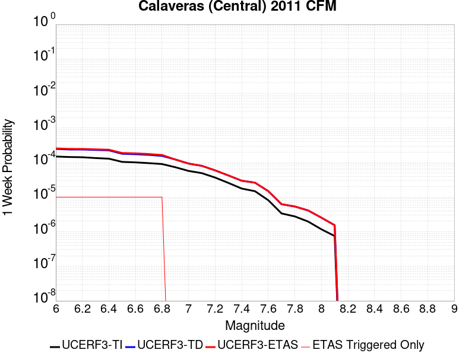 |  |  |  |

| Magnitude | 1 wk TI Prob | 1 wk TD Prob | 1 wk ETAS Prob | 1 wk ETAS/TD Gain | 1 wk ETAS Triggered Only | 1 mo TI Prob | 1 mo TD Prob | 1 mo ETAS Prob | 1 mo ETAS/TD Gain | 1 mo ETAS Triggered Only | 1 yr TI Prob | 1 yr TD Prob | 1 yr ETAS Prob | 1 yr ETAS/TD Gain | 1 yr ETAS Triggered Only | 10 yr TI Prob | 10 yr TD Prob | 10 yr ETAS Prob | 10 yr ETAS/TD Gain | 10 yr ETAS Triggered Only |
|-----|-----|-----|-----|-----|-----|-----|-----|-----|-----|-----|-----|-----|-----|-----|-----|-----|-----|-----|-----|-----|
| 6.0 | 1.5010907E-4 | 2.4796798E-4 | 2.579655E-4 | 1.0403178 | 1.0E-5 | 6.4316596E-4 | 0.0010619801 | 0.0010719695 | 1.0094063 | 1.0E-5 | 0.0078024664 | 0.012851909 | 0.012881523 | 1.0023043 | 3.0E-5 | 0.07534136 | 0.12041913 | 0.12045431 | 1.0002922 | 4.0E-5 |
| 6.1 | 1.4521465E-4 | 2.3960778E-4 | 2.496054E-4 | 1.0417249 | 1.0E-5 | 6.222001E-4 | 0.0010261798 | 0.0010361695 | 1.0097349 | 1.0E-5 | 0.0075490056 | 0.01242116 | 0.012450788 | 1.0023853 | 3.0E-5 | 0.07297657 | 0.116690814 | 0.116726145 | 1.0003028 | 4.0E-5 |
| 6.2 | 1.429998E-4 | 2.3892E-4 | 2.489176E-4 | 1.041845 | 1.0E-5 | 6.127123E-4 | 0.0010232345 | 0.0010332243 | 1.0097629 | 1.0E-5 | 0.007434286 | 0.012385743 | 0.012415371 | 1.0023922 | 3.0E-5 | 0.07190444 | 0.11634462 | 0.11637997 | 1.0003039 | 4.0E-5 |
| 6.3 | 1.3536277E-4 | 2.3223327E-4 | 2.4223095E-4 | 1.0430502 | 1.0E-5 | 5.799972E-4 | 9.945992E-4 | 0.0010045893 | 1.0100443 | 1.0E-5 | 0.0070386264 | 0.012041883 | 0.012071522 | 1.0024613 | 3.0E-5 | 0.0681982 | 0.11325677 | 0.11329224 | 1.0003132 | 4.0E-5 |
| 6.4 | 1.2993296E-4 | 2.2646785E-4 | 2.3646558E-4 | 1.0441464 | 1.0E-5 | 5.5673666E-4 | 9.699087E-4 | 9.798991E-4 | 1.0103003 | 1.0E-5 | 0.006757223 | 0.011744644 | 0.011774291 | 1.0025244 | 3.0E-5 | 0.06555412 | 0.11053436 | 0.11056994 | 1.0003219 | 4.0E-5 |
| 6.5 | 1.0498927E-4 | 1.7985358E-4 | 1.8985178E-4 | 1.0555907 | 1.0E-5 | 4.498764E-4 | 7.705748E-4 | 7.8056706E-4 | 1.0129673 | 1.0E-5 | 0.005463498 | 0.009341152 | 0.009370873 | 1.0031816 | 3.0E-5 | 0.053311124 | 0.08921549 | 0.08925192 | 1.0004084 | 4.0E-5 |
| 6.6 | 1.0157505E-4 | 1.7472835E-4 | 1.8472661E-4 | 1.0572217 | 1.0E-5 | 4.35249E-4 | 7.4862235E-4 | 7.5861486E-4 | 1.0133479 | 1.0E-5 | 0.0052862884 | 0.009076195 | 0.009105923 | 1.0032754 | 3.0E-5 | 0.05162293 | 0.086792916 | 0.08682944 | 1.0004208 | 4.0E-5 |
| 6.7 | 9.660386E-5 | 1.6732118E-4 | 1.7731951E-4 | 1.0597553 | 1.0E-5 | 4.1395082E-4 | 7.168951E-4 | 7.2688796E-4 | 1.013939 | 1.0E-5 | 0.0050282106 | 0.00869309 | 0.00872283 | 1.0034211 | 3.0E-5 | 0.049159497 | 0.08328218 | 0.083318844 | 1.0004402 | 4.0E-5 |
| 6.8 | 9.089927E-5 | 1.5646423E-4 | 1.6646268E-4 | 1.0639024 | 1.0E-5 | 3.8951015E-4 | 6.7038985E-4 | 6.803832E-4 | 1.0149066 | 1.0E-5 | 0.0047319788 | 0.008131229 | 0.008160986 | 1.0036595 | 3.0E-5 | 0.046324775 | 0.07817453 | 0.078211404 | 1.0004717 | 4.0E-5 |
| 6.9 | 7.353187E-5 | 1.2297792E-4 | 1.2297792E-4 | 1.0 | 0.0 | 3.150985E-4 | 5.269423E-4 | 5.269423E-4 | 1.0 | 0.0 | 0.0038295772 | 0.0063967714 | 0.0064166435 | 1.0031066 | 2.0E-5 | 0.037642512 | 0.062199075 | 0.06222721 | 1.0004523 | 3.0E-5 |
| 7.0 | 5.746064E-5 | 9.390999E-5 | 9.390999E-5 | 1.0 | 0.0 | 2.4623662E-4 | 4.0240967E-4 | 4.0240967E-4 | 1.0 | 0.0 | 0.0029938098 | 0.0048884028 | 0.004898354 | 1.0020356 | 1.0E-5 | 0.02953797 | 0.04799742 | 0.04801646 | 1.0003967 | 2.0E-5 |
| 7.1 | 4.9557195E-5 | 8.053939E-5 | 8.053939E-5 | 1.0 | 0.0 | 2.123707E-4 | 3.4512347E-4 | 3.4512347E-4 | 1.0 | 0.0 | 0.0025825473 | 0.004193845 | 0.004193845 | 1.0 | 0.0 | 0.0255274 | 0.041380182 | 0.041389767 | 1.0002316 | 1.0E-5 |
| 7.2 | 3.687595E-5 | 5.95384E-5 | 5.95384E-5 | 1.0 | 0.0 | 1.5803022E-4 | 2.5513978E-4 | 2.5513978E-4 | 1.0 | 0.0 | 0.0019223199 | 0.0031019312 | 0.0031019312 | 1.0 | 0.0 | 0.01905776 | 0.030890469 | 0.03090016 | 1.0003138 | 1.0E-5 |
| 7.3 | 2.5846984E-5 | 4.248458E-5 | 4.248458E-5 | 1.0 | 0.0 | 1.1076809E-4 | 1.8206415E-4 | 1.8206415E-4 | 1.0 | 0.0 | 0.0013477671 | 0.002214395 | 0.002214395 | 1.0 | 0.0 | 0.013396223 | 0.022181667 | 0.022191446 | 1.0004408 | 1.0E-5 |
| 7.4 | 1.7747854E-5 | 2.9942472E-5 | 2.9942472E-5 | 1.0 | 0.0 | 7.6060016E-5 | 1.2831858E-4 | 1.2831858E-4 | 1.0 | 0.0 | 9.2563726E-4 | 0.0015611621 | 0.0015611621 | 1.0 | 0.0 | 0.009217911 | 0.015712293 | 0.015722135 | 1.0006264 | 1.0E-5 |
| 7.5 | 1.4883479E-5 | 2.6249274E-5 | 2.6249274E-5 | 1.0 | 0.0 | 6.378478E-5 | 1.1249205E-4 | 1.1249205E-4 | 1.0 | 0.0 | 7.76303E-4 | 0.0013687331 | 0.0013687331 | 1.0 | 0.0 | 0.0077359667 | 0.0138053065 | 0.013815168 | 1.0007143 | 1.0E-5 |
| 7.6 | 8.166975E-6 | 1.4968054E-5 | 1.4968054E-5 | 1.0 | 0.0 | 3.5000852E-5 | 6.414723E-5 | 6.414723E-5 | 1.0 | 0.0 | 4.2605202E-4 | 7.8071404E-4 | 7.8071404E-4 | 1.0 | 0.0 | 0.004252361 | 0.007942087 | 0.007952007 | 1.0012491 | 1.0E-5 |
| 7.7 | 3.3858064E-6 | 6.2572385E-6 | 6.2572385E-6 | 1.0 | 0.0 | 1.4510518E-5 | 2.6816462E-5 | 2.6816462E-5 | 1.0 | 0.0 | 1.7665124E-4 | 3.2644157E-4 | 3.2644157E-4 | 1.0 | 0.0 | 0.0017651088 | 0.003389871 | 0.003399837 | 1.0029399 | 1.0E-5 |
| 7.8 | 2.7721615E-6 | 5.369255E-6 | 5.369255E-6 | 1.0 | 0.0 | 1.1880637E-5 | 2.301089E-5 | 2.301089E-5 | 1.0 | 0.0 | 1.4463716E-4 | 2.8012163E-4 | 2.8012163E-4 | 1.0 | 0.0 | 0.0014454306 | 0.0029088766 | 0.0029188476 | 1.0034277 | 1.0E-5 |
| 7.9 | 1.9736292E-6 | 4.1305657E-6 | 4.1305657E-6 | 1.0 | 0.0 | 8.4583835E-6 | 1.7702303E-5 | 1.7702303E-5 | 1.0 | 0.0 | 1.0297595E-4 | 2.1550427E-4 | 2.1550427E-4 | 1.0 | 0.0 | 0.0010292825 | 0.0022246612 | 0.002234639 | 1.004485 | 1.0E-5 |
| 8.0 | 1.1767289E-6 | 2.555778E-6 | 2.555778E-6 | 1.0 | 0.0 | 5.0431145E-6 | 1.0953288E-5 | 1.0953288E-5 | 1.0 | 0.0 | 6.139818E-5 | 1.3334815E-4 | 1.3334815E-4 | 1.0 | 0.0 | 6.1381224E-4 | 0.0013667255 | 0.0013667255 | 1.0 | 0.0 |
| 8.1 | 7.5112825E-7 | 1.5418102E-6 | 1.5418102E-6 | 1.0 | 0.0 | 3.2191172E-6 | 6.6077414E-6 | 6.6077414E-6 | 1.0 | 0.0 | 3.9192048E-5 | 8.0446305E-5 | 8.0446305E-5 | 1.0 | 0.0 | 3.9185135E-4 | 8.239698E-4 | 8.239698E-4 | 1.0 | 0.0 |

## Santa Ynez (West)
*[(top)](#table-of-contents)*

| 1 Week | 1 Month | 1 Year | 10 Year |
|-----|-----|-----|-----|
|  |  |  |  |

| Magnitude | 1 wk TI Prob | 1 wk TD Prob | 1 wk ETAS Prob | 1 wk ETAS/TD Gain | 1 wk ETAS Triggered Only | 1 mo TI Prob | 1 mo TD Prob | 1 mo ETAS Prob | 1 mo ETAS/TD Gain | 1 mo ETAS Triggered Only | 1 yr TI Prob | 1 yr TD Prob | 1 yr ETAS Prob | 1 yr ETAS/TD Gain | 1 yr ETAS Triggered Only | 10 yr TI Prob | 10 yr TD Prob | 10 yr ETAS Prob | 10 yr ETAS/TD Gain | 10 yr ETAS Triggered Only |
|-----|-----|-----|-----|-----|-----|-----|-----|-----|-----|-----|-----|-----|-----|-----|-----|-----|-----|-----|-----|-----|
| 6.0 | 4.7352758E-5 | 5.497349E-5 | 5.497349E-5 | 1.0 | 0.0 | 2.0292461E-4 | 2.3558107E-4 | 2.3558107E-4 | 1.0 | 0.0 | 0.0024678076 | 0.0028645964 | 0.0028745676 | 1.0034809 | 1.0E-5 | 0.024405818 | 0.028305095 | 0.028334247 | 1.0010298 | 3.0E-5 |
| 6.1 | 4.7352758E-5 | 5.497349E-5 | 5.497349E-5 | 1.0 | 0.0 | 2.0292461E-4 | 2.3558107E-4 | 2.3558107E-4 | 1.0 | 0.0 | 0.0024678076 | 0.0028645964 | 0.0028645964 | 1.0 | 0.0 | 0.024405818 | 0.028305095 | 0.02832453 | 1.0006866 | 2.0E-5 |
| 6.2 | 3.0415853E-5 | 3.3925786E-5 | 3.3925786E-5 | 1.0 | 0.0 | 1.3034715E-4 | 1.4538833E-4 | 1.4538833E-4 | 1.0 | 0.0 | 0.0015858212 | 0.0017687011 | 0.0017687011 | 1.0 | 0.0 | 0.015745522 | 0.01755015 | 0.017569799 | 1.0011196 | 2.0E-5 |
| 6.3 | 3.0415853E-5 | 3.3925786E-5 | 3.3925786E-5 | 1.0 | 0.0 | 1.3034715E-4 | 1.4538833E-4 | 1.4538833E-4 | 1.0 | 0.0 | 0.0015858212 | 0.0017687011 | 0.0017687011 | 1.0 | 0.0 | 0.015745522 | 0.01755015 | 0.017569799 | 1.0011196 | 2.0E-5 |
| 6.4 | 2.5452082E-5 | 2.7912925E-5 | 2.7912925E-5 | 1.0 | 0.0 | 1.09075794E-4 | 1.1962145E-4 | 1.1962145E-4 | 1.0 | 0.0 | 0.0013271887 | 0.001455435 | 0.001455435 | 1.0 | 0.0 | 0.013192902 | 0.014461209 | 0.01448092 | 1.001363 | 2.0E-5 |
| 6.5 | 2.3143784E-5 | 2.5128682E-5 | 2.5128682E-5 | 1.0 | 0.0 | 9.9183875E-5 | 1.0768999E-4 | 1.0768999E-4 | 1.0 | 0.0 | 0.0012068948 | 0.0013103489 | 0.0013103489 | 1.0 | 0.0 | 0.012003611 | 0.013027899 | 0.013047638 | 1.0015152 | 2.0E-5 |
| 6.6 | 1.9118515E-5 | 2.0354646E-5 | 2.0354646E-5 | 1.0 | 0.0 | 8.193392E-5 | 8.723133E-5 | 8.723133E-5 | 1.0 | 0.0 | 9.97089E-4 | 0.001061532 | 0.001061532 | 1.0 | 0.0 | 0.00992627 | 0.010565523 | 0.010575417 | 1.0009365 | 1.0E-5 |
| 6.7 | 1.722807E-5 | 1.8146604E-5 | 1.8146604E-5 | 1.0 | 0.0 | 7.3832496E-5 | 7.776888E-5 | 7.776888E-5 | 1.0 | 0.0 | 8.985399E-4 | 9.464303E-4 | 9.464303E-4 | 1.0 | 0.0 | 0.008949154 | 0.009424643 | 0.009434548 | 1.0010511 | 1.0E-5 |
| 6.8 | 1.5317364E-5 | 1.5926695E-5 | 1.5926695E-5 | 1.0 | 0.0 | 6.56442E-5 | 6.82555E-5 | 6.82555E-5 | 1.0 | 0.0 | 7.98925E-4 | 8.306982E-4 | 8.306982E-4 | 1.0 | 0.0 | 0.007960589 | 0.008276418 | 0.0082863355 | 1.0011983 | 1.0E-5 |
| 6.9 | 1.3071226E-5 | 1.3329779E-5 | 1.3329779E-5 | 1.0 | 0.0 | 5.6018336E-5 | 5.7126388E-5 | 5.7126388E-5 | 1.0 | 0.0 | 6.8180985E-4 | 6.9529406E-4 | 6.9529406E-4 | 1.0 | 0.0 | 0.0067972173 | 0.0069314474 | 0.006941378 | 1.0014327 | 1.0E-5 |
| 7.0 | 1.1836986E-5 | 1.19329125E-5 | 1.19329125E-5 | 1.0 | 0.0 | 5.0728955E-5 | 5.1140058E-5 | 5.1140058E-5 | 1.0 | 0.0 | 6.1745E-4 | 6.2245404E-4 | 6.2245404E-4 | 1.0 | 0.0 | 0.006157372 | 0.006207299 | 0.0062172366 | 1.001601 | 1.0E-5 |
| 7.1 | 1.0597169E-5 | 1.0542309E-5 | 1.0542309E-5 | 1.0 | 0.0 | 4.541565E-5 | 4.5180546E-5 | 4.5180546E-5 | 1.0 | 0.0 | 5.5279525E-4 | 5.4993544E-4 | 5.4993544E-4 | 1.0 | 0.0 | 0.0055142213 | 0.005485877 | 0.005495822 | 1.0018128 | 1.0E-5 |
| 7.2 | 9.59113E-6 | 9.459241E-6 | 9.459241E-6 | 1.0 | 0.0 | 4.11042E-5 | 4.053898E-5 | 4.053898E-5 | 1.0 | 0.0 | 5.0032866E-4 | 4.9345137E-4 | 4.9345137E-4 | 1.0 | 0.0 | 0.004992037 | 0.0049236757 | 0.0049336264 | 1.002021 | 1.0E-5 |
| 7.3 | 8.586084E-6 | 8.379669E-6 | 8.379669E-6 | 1.0 | 0.0 | 3.679698E-5 | 3.591238E-5 | 3.591238E-5 | 1.0 | 0.0 | 4.4791115E-4 | 4.3714655E-4 | 4.3714655E-4 | 1.0 | 0.0 | 0.004470094 | 0.0043629776 | 0.004372934 | 1.002282 | 1.0E-5 |
| 7.4 | 7.2622997E-6 | 6.951613E-6 | 6.951613E-6 | 1.0 | 0.0 | 3.112377E-5 | 2.9792294E-5 | 2.9792294E-5 | 1.0 | 0.0 | 3.78866E-4 | 3.6266178E-4 | 3.6266178E-4 | 1.0 | 0.0 | 0.0037822074 | 0.0036207996 | 0.0036307634 | 1.0027518 | 1.0E-5 |
| 7.5 | 5.627296E-6 | 5.251639E-6 | 5.251639E-6 | 1.0 | 0.0 | 2.411676E-5 | 2.2506834E-5 | 2.2506834E-5 | 1.0 | 0.0 | 2.9358198E-4 | 2.7398695E-4 | 2.7398695E-4 | 1.0 | 0.0 | 0.0029319443 | 0.0027365636 | 0.0027465362 | 1.0036442 | 1.0E-5 |
| 7.6 | 2.265244E-6 | 2.0608784E-6 | 2.0608784E-6 | 1.0 | 0.0 | 9.708152E-6 | 8.832307E-6 | 8.832307E-6 | 1.0 | 0.0 | 1.18190335E-4 | 1.0752812E-4 | 1.0752812E-4 | 1.0 | 0.0 | 0.001181275 | 0.0010747695 | 0.0010747695 | 1.0 | 0.0 |
| 7.7 | 1.3099874E-6 | 1.1016341E-6 | 1.1016341E-6 | 1.0 | 0.0 | 5.61422E-6 | 4.7212807E-6 | 4.7212807E-6 | 1.0 | 0.0 | 6.8350986E-5 | 5.74801E-5 | 5.74801E-5 | 1.0 | 0.0 | 6.832996E-4 | 5.746547E-4 | 5.746547E-4 | 1.0 | 0.0 |
| 7.8 | 7.903951E-7 | 6.071191E-7 | 6.071191E-7 | 1.0 | 0.0 | 3.3874032E-6 | 2.6019363E-6 | 2.6019363E-6 | 1.0 | 0.0 | 4.1240855E-5 | 3.1678126E-5 | 3.1678126E-5 | 1.0 | 0.0 | 4.12332E-4 | 3.1673745E-4 | 3.1673745E-4 | 1.0 | 0.0 |
| 7.9 | 7.0753297E-9 | 5.089978E-9 | 5.089978E-9 | 1.0 | 0.0 | 3.032284E-8 | 2.1814193E-8 | 2.1814193E-8 | 1.0 | 0.0 | 3.6918053E-7 | 2.6558777E-7 | 2.6558777E-7 | 1.0 | 0.0 | 3.691799E-6 | 2.6558755E-6 | 2.6558755E-6 | 1.0 | 0.0 |

## Sheephole
*[(top)](#table-of-contents)*

| 1 Week | 1 Month | 1 Year | 10 Year |
|-----|-----|-----|-----|
|  |  |  |  |

| Magnitude | 1 wk TI Prob | 1 wk TD Prob | 1 wk ETAS Prob | 1 wk ETAS/TD Gain | 1 wk ETAS Triggered Only | 1 mo TI Prob | 1 mo TD Prob | 1 mo ETAS Prob | 1 mo ETAS/TD Gain | 1 mo ETAS Triggered Only | 1 yr TI Prob | 1 yr TD Prob | 1 yr ETAS Prob | 1 yr ETAS/TD Gain | 1 yr ETAS Triggered Only | 10 yr TI Prob | 10 yr TD Prob | 10 yr ETAS Prob | 10 yr ETAS/TD Gain | 10 yr ETAS Triggered Only |
|-----|-----|-----|-----|-----|-----|-----|-----|-----|-----|-----|-----|-----|-----|-----|-----|-----|-----|-----|-----|-----|
| 6.0 | 4.5579695E-6 | 4.7412877E-6 | 4.7412877E-6 | 1.0 | 0.0 | 1.9534009E-5 | 2.0319678E-5 | 2.0319678E-5 | 1.0 | 0.0 | 2.3780059E-4 | 2.4736955E-4 | 2.6736458E-4 | 1.0808307 | 2.0E-5 | 0.0023754628 | 0.0024714863 | 0.0025014123 | 1.0121084 | 3.0E-5 |
| 6.1 | 4.5579695E-6 | 4.7412877E-6 | 4.7412877E-6 | 1.0 | 0.0 | 1.9534009E-5 | 2.0319678E-5 | 2.0319678E-5 | 1.0 | 0.0 | 2.3780059E-4 | 2.4736955E-4 | 2.6736458E-4 | 1.0808307 | 2.0E-5 | 0.0023754628 | 0.0024714863 | 0.0025014123 | 1.0121084 | 3.0E-5 |
| 6.2 | 2.6677674E-6 | 2.7874107E-6 | 2.7874107E-6 | 1.0 | 0.0 | 1.1433239E-5 | 1.1945997E-5 | 1.1945997E-5 | 1.0 | 0.0 | 1.3919079E-4 | 1.4543389E-4 | 1.6543099E-4 | 1.1374996 | 2.0E-5 | 0.0013910364 | 0.001453493 | 0.001473464 | 1.01374 | 2.0E-5 |
| 6.3 | 2.6677674E-6 | 2.7874107E-6 | 2.7874107E-6 | 1.0 | 0.0 | 1.1433239E-5 | 1.1945997E-5 | 1.1945997E-5 | 1.0 | 0.0 | 1.3919079E-4 | 1.4543389E-4 | 1.6543099E-4 | 1.1374996 | 2.0E-5 | 0.0013910364 | 0.001453493 | 0.001473464 | 1.01374 | 2.0E-5 |
| 6.4 | 2.2159759E-6 | 2.3228936E-6 | 2.3228936E-6 | 1.0 | 0.0 | 9.497005E-6 | 9.955224E-6 | 9.955224E-6 | 1.0 | 0.0 | 1.156199E-4 | 1.2119893E-4 | 1.411965E-4 | 1.1649979 | 2.0E-5 | 0.0011555976 | 0.0012114076 | 0.0012313834 | 1.0164897 | 2.0E-5 |
| 6.5 | 2.1986082E-6 | 2.3047737E-6 | 2.3047737E-6 | 1.0 | 0.0 | 9.4225725E-6 | 9.877569E-6 | 9.877569E-6 | 1.0 | 0.0 | 1.1471378E-4 | 1.2025358E-4 | 1.4025117E-4 | 1.1662952 | 2.0E-5 | 0.0011465458 | 0.0012019643 | 0.0012219403 | 1.0166194 | 2.0E-5 |
| 6.6 | 1.5232331E-6 | 1.6019028E-6 | 1.6019028E-6 | 1.0 | 0.0 | 6.5281256E-6 | 6.8652807E-6 | 6.8652807E-6 | 1.0 | 0.0 | 7.947703E-5 | 8.358178E-5 | 8.358178E-5 | 1.0 | 0.0 | 7.9448614E-4 | 8.3552214E-4 | 8.3552214E-4 | 1.0 | 0.0 |
| 6.7 | 1.3137362E-6 | 1.3828287E-6 | 1.3828287E-6 | 1.0 | 0.0 | 5.6302856E-6 | 5.926396E-6 | 5.926396E-6 | 1.0 | 0.0 | 6.854657E-5 | 7.2151626E-5 | 7.2151626E-5 | 1.0 | 0.0 | 6.8525434E-4 | 7.212959E-4 | 7.212959E-4 | 1.0 | 0.0 |
| 6.8 | 1.2275751E-6 | 1.2922936E-6 | 1.2922936E-6 | 1.0 | 0.0 | 5.2610258E-6 | 5.5383903E-6 | 5.5383903E-6 | 1.0 | 0.0 | 6.4051106E-5 | 6.742795E-5 | 6.742795E-5 | 1.0 | 0.0 | 6.4032647E-4 | 6.740883E-4 | 6.740883E-4 | 1.0 | 0.0 |
| 6.9 | 1.1837088E-6 | 1.2461107E-6 | 1.2461107E-6 | 1.0 | 0.0 | 5.0730278E-6 | 5.340464E-6 | 5.340464E-6 | 1.0 | 0.0 | 6.176237E-5 | 6.501835E-5 | 6.501835E-5 | 1.0 | 0.0 | 6.17452E-4 | 6.500064E-4 | 6.500064E-4 | 1.0 | 0.0 |
| 7.0 | 9.849371E-7 | 1.036636E-6 | 1.036636E-6 | 1.0 | 0.0 | 4.2211523E-6 | 4.442719E-6 | 4.442719E-6 | 1.0 | 0.0 | 5.1391315E-5 | 5.408886E-5 | 5.408886E-5 | 1.0 | 0.0 | 5.137943E-4 | 5.4076704E-4 | 5.4076704E-4 | 1.0 | 0.0 |
| 7.1 | 8.1643645E-7 | 8.5917287E-7 | 8.5917287E-7 | 1.0 | 0.0 | 3.4990085E-6 | 3.6821648E-6 | 3.6821648E-6 | 1.0 | 0.0 | 4.2599597E-5 | 4.482952E-5 | 4.482952E-5 | 1.0 | 0.0 | 4.259143E-4 | 4.482134E-4 | 4.482134E-4 | 1.0 | 0.0 |
| 7.2 | 5.7295756E-7 | 6.029544E-7 | 6.029544E-7 | 1.0 | 0.0 | 2.45553E-6 | 2.584088E-6 | 2.584088E-6 | 1.0 | 0.0 | 2.9895667E-5 | 3.1460884E-5 | 3.1460884E-5 | 1.0 | 0.0 | 2.9891645E-4 | 3.14571E-4 | 3.14571E-4 | 1.0 | 0.0 |

## Newport-Inglewood (Offshore)
*[(top)](#table-of-contents)*

| 1 Week | 1 Month | 1 Year | 10 Year |
|-----|-----|-----|-----|
|  |  |  |  |

| Magnitude | 1 wk TI Prob | 1 wk TD Prob | 1 wk ETAS Prob | 1 wk ETAS/TD Gain | 1 wk ETAS Triggered Only | 1 mo TI Prob | 1 mo TD Prob | 1 mo ETAS Prob | 1 mo ETAS/TD Gain | 1 mo ETAS Triggered Only | 1 yr TI Prob | 1 yr TD Prob | 1 yr ETAS Prob | 1 yr ETAS/TD Gain | 1 yr ETAS Triggered Only | 10 yr TI Prob | 10 yr TD Prob | 10 yr ETAS Prob | 10 yr ETAS/TD Gain | 10 yr ETAS Triggered Only |
|-----|-----|-----|-----|-----|-----|-----|-----|-----|-----|-----|-----|-----|-----|-----|-----|-----|-----|-----|-----|-----|
| 6.0 | 1.9626508E-5 | 1.896559E-5 | 1.896559E-5 | 1.0 | 0.0 | 8.411089E-5 | 8.127864E-5 | 8.127864E-5 | 1.0 | 0.0 | 0.001023569 | 9.891307E-4 | 9.991209E-4 | 1.0100999 | 1.0E-5 | 0.010188672 | 0.0098486245 | 0.009878329 | 1.0030161 | 3.0E-5 |
| 6.1 | 1.331886E-5 | 1.2218263E-5 | 1.2218263E-5 | 1.0 | 0.0 | 5.707958E-5 | 5.2362942E-5 | 5.2362942E-5 | 1.0 | 0.0 | 6.947222E-4 | 6.3733384E-4 | 6.4732746E-4 | 1.0156803 | 1.0E-5 | 0.006925544 | 0.0063552377 | 0.0063751107 | 1.003127 | 2.0E-5 |
| 6.2 | 1.2250852E-5 | 1.1076189E-5 | 1.1076189E-5 | 1.0 | 0.0 | 5.2502597E-5 | 4.7468526E-5 | 4.7468526E-5 | 1.0 | 0.0 | 6.3903164E-4 | 5.7777704E-4 | 5.877713E-4 | 1.0172977 | 1.0E-5 | 0.006371971 | 0.00576287 | 0.0057827546 | 1.0034505 | 2.0E-5 |
| 6.3 | 1.2106258E-5 | 1.091905E-5 | 1.091905E-5 | 1.0 | 0.0 | 5.1882926E-5 | 4.6795092E-5 | 4.6795092E-5 | 1.0 | 0.0 | 6.3149154E-4 | 5.695823E-4 | 5.795766E-4 | 1.0175468 | 1.0E-5 | 0.0062970007 | 0.0056813415 | 0.005701228 | 1.0035003 | 2.0E-5 |
| 6.4 | 1.1348758E-5 | 1.0109513E-5 | 1.0109513E-5 | 1.0 | 0.0 | 4.8636626E-5 | 4.332577E-5 | 4.332577E-5 | 1.0 | 0.0 | 5.919901E-4 | 5.273644E-4 | 5.373591E-4 | 1.0189523 | 1.0E-5 | 0.005904155 | 0.005261225 | 0.0052811196 | 1.0037814 | 2.0E-5 |
| 6.5 | 1.100837E-5 | 9.743537E-6 | 9.743537E-6 | 1.0 | 0.0 | 4.7177873E-5 | 4.175735E-5 | 4.175735E-5 | 1.0 | 0.0 | 5.7423924E-4 | 5.082779E-4 | 5.182728E-4 | 1.0196643 | 1.0E-5 | 0.005727576 | 0.0050712456 | 0.005091144 | 1.0039238 | 2.0E-5 |
| 6.6 | 1.0634696E-5 | 9.345687E-6 | 9.345687E-6 | 1.0 | 0.0 | 4.557647E-5 | 4.0052335E-5 | 4.0052335E-5 | 1.0 | 0.0 | 5.5475225E-4 | 4.875288E-4 | 4.975239E-4 | 1.0205016 | 1.0E-5 | 0.0055336943 | 0.004864679 | 0.004884582 | 1.0040913 | 2.0E-5 |
| 6.7 | 9.9780855E-6 | 8.668048E-6 | 8.668048E-6 | 1.0 | 0.0 | 4.276252E-5 | 3.7148253E-5 | 3.7148253E-5 | 1.0 | 0.0 | 5.205093E-4 | 4.521868E-4 | 4.6218227E-4 | 1.0221047 | 1.0E-5 | 0.0051929182 | 0.0045127464 | 0.0045326557 | 1.0044119 | 2.0E-5 |
| 6.8 | 9.59546E-6 | 8.273084E-6 | 8.273084E-6 | 1.0 | 0.0 | 4.1122752E-5 | 3.5455596E-5 | 3.5455596E-5 | 1.0 | 0.0 | 5.0055445E-4 | 4.3158708E-4 | 4.4158276E-4 | 1.0231603 | 1.0E-5 | 0.004994285 | 0.004307565 | 0.0043274784 | 1.0046229 | 2.0E-5 |
| 6.9 | 9.000614E-6 | 7.706967E-6 | 7.706967E-6 | 1.0 | 0.0 | 3.857349E-5 | 3.3029446E-5 | 3.3029446E-5 | 1.0 | 0.0 | 4.6953102E-4 | 4.0205996E-4 | 4.1205593E-4 | 1.0248619 | 1.0E-5 | 0.004685402 | 0.004013397 | 0.004033317 | 1.0049633 | 2.0E-5 |
| 7.0 | 7.4070194E-6 | 6.1490105E-6 | 6.1490105E-6 | 1.0 | 0.0 | 3.1743984E-5 | 2.6352638E-5 | 2.6352638E-5 | 1.0 | 0.0 | 3.8641447E-4 | 3.2079627E-4 | 3.307931E-4 | 1.0311624 | 1.0E-5 | 0.0038574322 | 0.0032033517 | 0.0032133197 | 1.0031117 | 1.0E-5 |
| 7.1 | 6.299615E-6 | 5.056689E-6 | 5.056689E-6 | 1.0 | 0.0 | 2.699807E-5 | 2.1671345E-5 | 2.1671345E-5 | 1.0 | 0.0 | 3.2865192E-4 | 2.6381682E-4 | 2.738142E-4 | 1.0378951 | 1.0E-5 | 0.003281663 | 0.002635051 | 0.0026450248 | 1.003785 | 1.0E-5 |
| 7.2 | 5.096653E-6 | 3.8928574E-6 | 3.8928574E-6 | 1.0 | 0.0 | 2.1842614E-5 | 1.6683567E-5 | 1.6683567E-5 | 1.0 | 0.0 | 2.6590136E-4 | 2.0310361E-4 | 2.1310158E-4 | 1.0492259 | 1.0E-5 | 0.0026558342 | 0.002029191 | 0.0020391708 | 1.0049181 | 1.0E-5 |
| 7.3 | 3.9753018E-6 | 2.9099435E-6 | 2.9099435E-6 | 1.0 | 0.0 | 1.7036897E-5 | 1.2471127E-5 | 1.2471127E-5 | 1.0 | 0.0 | 2.0740448E-4 | 1.5182547E-4 | 1.6182396E-4 | 1.0658551 | 1.0E-5 | 0.00207211 | 0.0015172255 | 0.0015272103 | 1.006581 | 1.0E-5 |
| 7.4 | 3.0568392E-6 | 2.145023E-6 | 2.145023E-6 | 1.0 | 0.0 | 1.3100675E-5 | 9.192923E-6 | 9.192923E-6 | 1.0 | 0.0 | 1.5948903E-4 | 1.11918154E-4 | 1.2191704E-4 | 1.089341 | 1.0E-5 | 0.0015937461 | 0.0011186242 | 0.001128613 | 1.0089296 | 1.0E-5 |
| 7.5 | 1.7279019E-6 | 1.1470016E-6 | 1.1470016E-6 | 1.0 | 0.0 | 7.405273E-6 | 4.9157125E-6 | 4.9157125E-6 | 1.0 | 0.0 | 9.015547E-5 | 5.9847192E-5 | 5.9847192E-5 | 1.0 | 0.0 | 9.01189E-4 | 5.983146E-4 | 5.983146E-4 | 1.0 | 0.0 |
| 7.6 | 1.1156416E-6 | 7.2231035E-7 | 7.2231035E-7 | 1.0 | 0.0 | 4.7813123E-6 | 3.0956123E-6 | 3.0956123E-6 | 1.0 | 0.0 | 5.821092E-5 | 3.7688453E-5 | 3.7688453E-5 | 1.0 | 0.0 | 5.8195676E-4 | 3.7682295E-4 | 3.7682295E-4 | 1.0 | 0.0 |
| 7.7 | 9.117973E-8 | 6.7341894E-8 | 6.7341894E-8 | 1.0 | 0.0 | 3.907702E-7 | 2.8860808E-7 | 2.8860808E-7 | 1.0 | 0.0 | 4.757617E-6 | 3.513798E-6 | 3.513798E-6 | 1.0 | 0.0 | 4.7575148E-5 | 3.5137455E-5 | 3.5137455E-5 | 1.0 | 0.0 |

## Owens Valley Keough Hot Springs
*[(top)](#table-of-contents)*

| 1 Week | 1 Month | 1 Year | 10 Year |
|-----|-----|-----|-----|
|  |  |  | 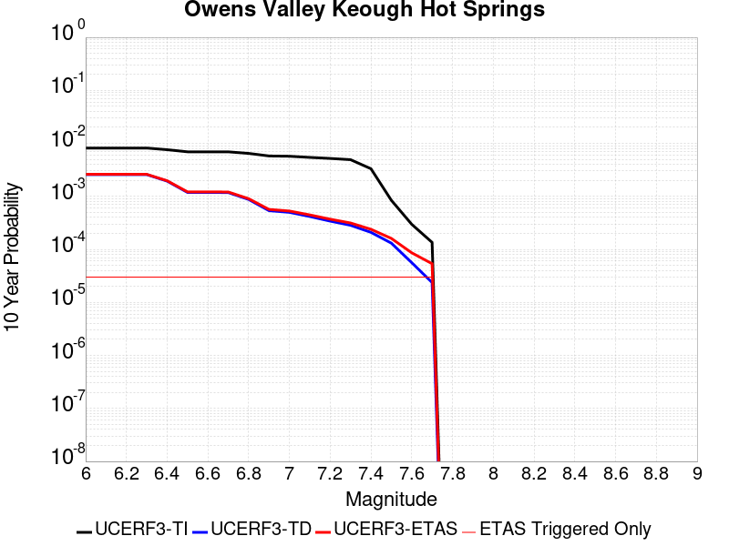 |

| Magnitude | 1 wk TI Prob | 1 wk TD Prob | 1 wk ETAS Prob | 1 wk ETAS/TD Gain | 1 wk ETAS Triggered Only | 1 mo TI Prob | 1 mo TD Prob | 1 mo ETAS Prob | 1 mo ETAS/TD Gain | 1 mo ETAS Triggered Only | 1 yr TI Prob | 1 yr TD Prob | 1 yr ETAS Prob | 1 yr ETAS/TD Gain | 1 yr ETAS Triggered Only | 10 yr TI Prob | 10 yr TD Prob | 10 yr ETAS Prob | 10 yr ETAS/TD Gain | 10 yr ETAS Triggered Only |
|-----|-----|-----|-----|-----|-----|-----|-----|-----|-----|-----|-----|-----|-----|-----|-----|-----|-----|-----|-----|-----|
| 6.0 | 1.5708529E-5 | 4.9508244E-6 | 1.4950775E-5 | 3.0198555 | 1.0E-5 | 6.7320536E-5 | 2.1217675E-5 | 3.1217463E-5 | 1.4712951 | 1.0E-5 | 8.193192E-4 | 2.582997E-4 | 2.7829452E-4 | 1.0774094 | 2.0E-5 | 0.008163051 | 0.0025806532 | 0.0026105756 | 1.011595 | 3.0E-5 |
| 6.1 | 1.5708529E-5 | 4.9508244E-6 | 1.4950775E-5 | 3.0198555 | 1.0E-5 | 6.7320536E-5 | 2.1217675E-5 | 3.1217463E-5 | 1.4712951 | 1.0E-5 | 8.193192E-4 | 2.582997E-4 | 2.7829452E-4 | 1.0774094 | 2.0E-5 | 0.008163051 | 0.0025806532 | 0.0026105756 | 1.011595 | 3.0E-5 |
| 6.2 | 1.5708529E-5 | 4.9508244E-6 | 1.4950775E-5 | 3.0198555 | 1.0E-5 | 6.7320536E-5 | 2.1217675E-5 | 3.1217463E-5 | 1.4712951 | 1.0E-5 | 8.193192E-4 | 2.582997E-4 | 2.7829452E-4 | 1.0774094 | 2.0E-5 | 0.008163051 | 0.0025806532 | 0.0026105756 | 1.011595 | 3.0E-5 |
| 6.3 | 1.5708529E-5 | 4.9508244E-6 | 1.4950775E-5 | 3.0198555 | 1.0E-5 | 6.7320536E-5 | 2.1217675E-5 | 3.1217463E-5 | 1.4712951 | 1.0E-5 | 8.193192E-4 | 2.582997E-4 | 2.7829452E-4 | 1.0774094 | 2.0E-5 | 0.008163051 | 0.0025806532 | 0.0026105756 | 1.011595 | 3.0E-5 |
| 6.4 | 1.4622509E-5 | 3.7266684E-6 | 1.3726631E-5 | 3.683352 | 1.0E-5 | 6.266639E-5 | 1.5971356E-5 | 2.5971198E-5 | 1.6261109 | 1.0E-5 | 7.626962E-4 | 1.9443722E-4 | 2.1443333E-4 | 1.102841 | 2.0E-5 | 0.007600839 | 0.0019431504 | 0.001973092 | 1.0154089 | 3.0E-5 |
| 6.5 | 1.3335527E-5 | 2.2778408E-6 | 1.2277818E-5 | 5.3901124 | 1.0E-5 | 5.7151006E-5 | 9.762142E-6 | 1.9762045E-5 | 2.0243554 | 1.0E-5 | 6.955913E-4 | 1.18848286E-4 | 1.388459E-4 | 1.1682618 | 2.0E-5 | 0.0069341804 | 0.0011880693 | 0.0012180337 | 1.0252211 | 3.0E-5 |
| 6.6 | 1.3332855E-5 | 2.27499E-6 | 1.2274967E-5 | 5.3956137 | 1.0E-5 | 5.7139558E-5 | 9.749924E-6 | 1.9749827E-5 | 2.025639 | 1.0E-5 | 6.9545204E-4 | 1.1869955E-4 | 1.3869717E-4 | 1.1684726 | 2.0E-5 | 0.0069327964 | 0.0011865837 | 0.001216548 | 1.0252527 | 3.0E-5 |
| 6.7 | 1.3318214E-5 | 2.26422E-6 | 1.2264198E-5 | 5.416522 | 1.0E-5 | 5.707681E-5 | 9.703767E-6 | 1.970367E-5 | 2.0305176 | 1.0E-5 | 6.946886E-4 | 1.1813765E-4 | 1.3813528E-4 | 1.1692741 | 2.0E-5 | 0.0069252094 | 0.0011809706 | 0.0012109352 | 1.0253729 | 3.0E-5 |
| 6.8 | 1.2441338E-5 | 1.6778914E-6 | 1.1677875E-5 | 6.9598513 | 1.0E-5 | 5.331893E-5 | 7.190945E-6 | 1.7190872E-5 | 2.3906279 | 1.0E-5 | 6.489646E-4 | 8.7546534E-5 | 1.0754479E-4 | 1.2284299 | 2.0E-5 | 0.0064707273 | 8.75305E-4 | 9.052787E-4 | 1.0342438 | 3.0E-5 |
| 6.9 | 1.1130476E-5 | 1.0304584E-6 | 1.1030448E-5 | 10.704409 | 1.0E-5 | 4.7701167E-5 | 4.416243E-6 | 1.4416199E-5 | 3.264358 | 1.0E-5 | 5.806069E-4 | 5.3766445E-5 | 7.3765375E-5 | 1.3719592 | 2.0E-5 | 0.0057909233 | 5.376886E-4 | 5.676725E-4 | 1.0557643 | 3.0E-5 |
| 7.0 | 1.0986073E-5 | 9.580101E-7 | 1.09580005E-5 | 11.438293 | 1.0E-5 | 4.7082318E-5 | 4.105751E-6 | 1.410571E-5 | 3.435598 | 1.0E-5 | 5.730765E-4 | 4.9986385E-5 | 6.9985384E-5 | 1.4000889 | 2.0E-5 | 0.0057160086 | 4.999046E-4 | 5.2988966E-4 | 1.0599815 | 3.0E-5 |
| 7.1 | 1.0451338E-5 | 8.000831E-7 | 1.0800075E-5 | 13.498692 | 1.0E-5 | 4.4790682E-5 | 3.428923E-6 | 1.3428888E-5 | 3.9163575 | 1.0E-5 | 5.451901E-4 | 4.1746345E-5 | 6.174551E-5 | 1.4790639 | 2.0E-5 | 0.005438545 | 4.1753432E-4 | 4.475218E-4 | 1.0718204 | 3.0E-5 |
| 7.2 | 9.989061E-6 | 6.545439E-7 | 1.0654538E-5 | 16.277805 | 1.0E-5 | 4.280956E-5 | 2.805185E-6 | 1.2805157E-5 | 4.5648174 | 1.0E-5 | 5.2108173E-4 | 3.4152596E-5 | 5.4151915E-5 | 1.585587 | 2.0E-5 | 0.0051986156 | 3.4161055E-4 | 3.716003E-4 | 1.0877893 | 3.0E-5 |
| 7.3 | 9.465365E-6 | 5.4604976E-7 | 1.0546044E-5 | 19.31334 | 1.0E-5 | 4.056522E-5 | 2.340211E-6 | 1.2340188E-5 | 5.273109 | 1.0E-5 | 4.937696E-4 | 2.84917E-5 | 4.849113E-5 | 1.7019389 | 2.0E-5 | 0.0049267393 | 2.8501268E-4 | 3.1500412E-4 | 1.1052284 | 3.0E-5 |
| 7.4 | 6.3824805E-6 | 4.016707E-7 | 1.0401666E-5 | 25.896006 | 1.0E-5 | 2.73532E-5 | 1.7214446E-6 | 1.1721428E-5 | 6.8090644 | 1.0E-5 | 3.3297433E-4 | 2.0958389E-5 | 4.095797E-5 | 1.9542518 | 2.0E-5 | 0.0033247585 | 2.0965615E-4 | 2.3964987E-4 | 1.1430614 | 3.0E-5 |
| 7.5 | 1.6192645E-6 | 2.5163493E-7 | 1.0251632E-5 | 40.7401 | 1.0E-5 | 6.9396865E-6 | 1.0784349E-6 | 1.1078424E-5 | 10.272687 | 1.0E-5 | 8.448741E-5 | 1.31298675E-5 | 3.3129603E-5 | 2.5232246 | 2.0E-5 | 8.4455294E-4 | 1.3129105E-4 | 1.6128711E-4 | 1.22847 | 3.0E-5 |
| 7.6 | 5.7062545E-7 | 1.079331E-7 | 1.0107932E-5 | 93.64998 | 1.0E-5 | 2.4455355E-6 | 4.6257034E-7 | 1.0462566E-5 | 22.618324 | 1.0E-5 | 2.9773988E-5 | 5.63178E-6 | 2.5631667E-5 | 4.551255 | 2.0E-5 | 2.977E-4 | 5.6316454E-5 | 8.6314765E-5 | 1.532674 | 3.0E-5 |
| 7.7 | 2.5988817E-7 | 4.5461668E-8 | 1.0045461E-5 | 220.96553 | 1.0E-5 | 1.113806E-6 | 1.948357E-7 | 1.01948335E-5 | 52.325283 | 1.0E-5 | 1.3560503E-5 | 2.3721225E-6 | 2.2372074E-5 | 9.431248 | 2.0E-5 | 1.3559677E-4 | 2.3721017E-5 | 5.3720305E-5 | 2.2646713 | 3.0E-5 |

## Santa Cruz Catalina Ridge alt1
*[(top)](#table-of-contents)*

| 1 Week | 1 Month | 1 Year | 10 Year |
|-----|-----|-----|-----|
|  | 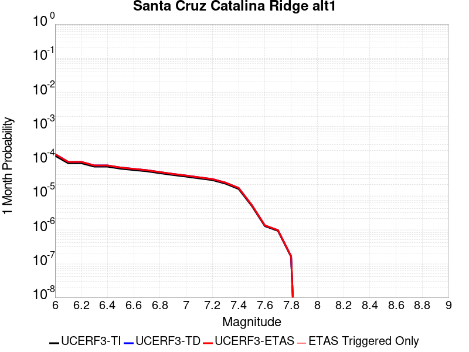 |  |  |

| Magnitude | 1 wk TI Prob | 1 wk TD Prob | 1 wk ETAS Prob | 1 wk ETAS/TD Gain | 1 wk ETAS Triggered Only | 1 mo TI Prob | 1 mo TD Prob | 1 mo ETAS Prob | 1 mo ETAS/TD Gain | 1 mo ETAS Triggered Only | 1 yr TI Prob | 1 yr TD Prob | 1 yr ETAS Prob | 1 yr ETAS/TD Gain | 1 yr ETAS Triggered Only | 10 yr TI Prob | 10 yr TD Prob | 10 yr ETAS Prob | 10 yr ETAS/TD Gain | 10 yr ETAS Triggered Only |
|-----|-----|-----|-----|-----|-----|-----|-----|-----|-----|-----|-----|-----|-----|-----|-----|-----|-----|-----|-----|-----|
| 6.0 | 3.2833184E-5 | 3.655896E-5 | 3.655896E-5 | 1.0 | 0.0 | 1.4070606E-4 | 1.5667277E-4 | 1.5667277E-4 | 1.0 | 0.0 | 0.00171175 | 0.0019059887 | 0.0019259505 | 1.0104733 | 2.0E-5 | 0.016986247 | 0.018913316 | 0.01894275 | 1.0015562 | 3.0E-5 |
| 6.1 | 1.9835548E-5 | 2.1659771E-5 | 2.1659771E-5 | 1.0 | 0.0 | 8.500672E-5 | 9.2824404E-5 | 9.2824404E-5 | 1.0 | 0.0 | 0.0010344655 | 0.0011295713 | 0.00113956 | 1.008843 | 1.0E-5 | 0.010296632 | 0.011240433 | 0.011260208 | 1.0017593 | 2.0E-5 |
| 6.2 | 1.9835548E-5 | 2.1659771E-5 | 2.1659771E-5 | 1.0 | 0.0 | 8.500672E-5 | 9.2824404E-5 | 9.2824404E-5 | 1.0 | 0.0 | 0.0010344655 | 0.0011295713 | 0.00113956 | 1.008843 | 1.0E-5 | 0.010296632 | 0.011240433 | 0.011260208 | 1.0017593 | 2.0E-5 |
| 6.3 | 1.5728183E-5 | 1.7034137E-5 | 1.7034137E-5 | 1.0 | 0.0 | 6.7404755E-5 | 7.3001436E-5 | 7.3001436E-5 | 1.0 | 0.0 | 8.2034385E-4 | 8.884362E-4 | 8.9842733E-4 | 1.0112457 | 1.0E-5 | 0.008173222 | 0.008849524 | 0.008869347 | 1.0022401 | 2.0E-5 |
| 6.4 | 1.5728183E-5 | 1.7034137E-5 | 1.7034137E-5 | 1.0 | 0.0 | 6.7404755E-5 | 7.3001436E-5 | 7.3001436E-5 | 1.0 | 0.0 | 8.2034385E-4 | 8.884362E-4 | 8.9842733E-4 | 1.0112457 | 1.0E-5 | 0.008173222 | 0.008849524 | 0.008869347 | 1.0022401 | 2.0E-5 |
| 6.5 | 1.3707734E-5 | 1.4794678E-5 | 1.4794678E-5 | 1.0 | 0.0 | 5.8746107E-5 | 6.3404244E-5 | 6.3404244E-5 | 1.0 | 0.0 | 7.1499916E-4 | 7.716768E-4 | 7.8166905E-4 | 1.0129488 | 1.0E-5 | 0.0071270303 | 0.0076903705 | 0.0077102166 | 1.0025806 | 2.0E-5 |
| 6.6 | 1.2539813E-5 | 1.3510358E-5 | 1.3510358E-5 | 1.0 | 0.0 | 5.3740947E-5 | 5.7900266E-5 | 5.7900266E-5 | 1.0 | 0.0 | 6.540996E-4 | 7.0471043E-4 | 7.1470335E-4 | 1.0141802 | 1.0E-5 | 0.0065217763 | 0.0070250607 | 0.0070449198 | 1.0028269 | 2.0E-5 |
| 6.7 | 1.1504083E-5 | 1.23775E-5 | 1.23775E-5 | 1.0 | 0.0 | 4.930228E-5 | 5.304536E-5 | 5.304536E-5 | 1.0 | 0.0 | 6.0008996E-4 | 6.456379E-4 | 6.456379E-4 | 1.0 | 0.0 | 0.005984721 | 0.0064378507 | 0.0064477865 | 1.0015433 | 1.0E-5 |
| 6.8 | 1.012739E-5 | 1.0877178E-5 | 1.0877178E-5 | 1.0 | 0.0 | 4.340238E-5 | 4.6615653E-5 | 4.6615653E-5 | 1.0 | 0.0 | 5.282958E-4 | 5.673993E-4 | 5.673993E-4 | 1.0 | 0.0 | 0.0052704164 | 0.005659675 | 0.0056696185 | 1.0017569 | 1.0E-5 |
| 6.9 | 8.9607865E-6 | 9.60921E-6 | 9.60921E-6 | 1.0 | 0.0 | 3.8402806E-5 | 4.1181684E-5 | 4.1181684E-5 | 1.0 | 0.0 | 4.6745385E-4 | 5.0127273E-4 | 5.0127273E-4 | 1.0 | 0.0 | 0.0046647177 | 0.00500154 | 0.0050114896 | 1.0019894 | 1.0E-5 |
| 7.0 | 8.046829E-6 | 8.619827E-6 | 8.619827E-6 | 1.0 | 0.0 | 3.4485955E-5 | 3.6941598E-5 | 3.6941598E-5 | 1.0 | 0.0 | 4.1978562E-4 | 4.4967196E-4 | 4.4967196E-4 | 1.0 | 0.0 | 0.004189935 | 0.004487711 | 0.0044976664 | 1.0022184 | 1.0E-5 |
| 7.1 | 7.136131E-6 | 7.637727E-6 | 7.637727E-6 | 1.0 | 0.0 | 3.0583058E-5 | 3.273271E-5 | 3.273271E-5 | 1.0 | 0.0 | 3.7228514E-4 | 3.9844858E-4 | 3.9844858E-4 | 1.0 | 0.0 | 0.0037166206 | 0.0039774184 | 0.0039873784 | 1.0025042 | 1.0E-5 |
| 7.2 | 6.362014E-6 | 6.8050217E-6 | 6.8050217E-6 | 1.0 | 0.0 | 2.726549E-5 | 2.9164055E-5 | 2.9164055E-5 | 1.0 | 0.0 | 3.3190678E-4 | 3.5501516E-4 | 3.5501516E-4 | 1.0 | 0.0 | 0.0033141149 | 0.0035445488 | 0.0035545132 | 1.0028112 | 1.0E-5 |
| 7.3 | 5.004101E-6 | 5.3517642E-6 | 5.3517642E-6 | 1.0 | 0.0 | 2.1445969E-5 | 2.2935934E-5 | 2.2935934E-5 | 1.0 | 0.0 | 2.6107338E-4 | 2.7920975E-4 | 2.7920975E-4 | 1.0 | 0.0 | 0.002607669 | 0.0027886443 | 0.0027986164 | 1.0035759 | 1.0E-5 |
| 7.4 | 3.4901443E-6 | 3.732087E-6 | 3.732087E-6 | 1.0 | 0.0 | 1.4957676E-5 | 1.5994563E-5 | 1.5994563E-5 | 1.0 | 0.0 | 1.8209449E-4 | 1.9471678E-4 | 1.9471678E-4 | 1.0 | 0.0 | 0.0018194534 | 0.0019455003 | 0.0019554808 | 1.00513 | 1.0E-5 |
| 7.5 | 1.1215045E-6 | 1.1893966E-6 | 1.1893966E-6 | 1.0 | 0.0 | 4.806439E-6 | 5.0974045E-6 | 5.0974045E-6 | 1.0 | 0.0 | 5.851682E-5 | 6.205916E-5 | 6.205916E-5 | 1.0 | 0.0 | 5.850142E-4 | 6.204214E-4 | 6.3041516E-4 | 1.016108 | 1.0E-5 |
| 7.6 | 2.8599047E-7 | 2.9952182E-7 | 2.9952182E-7 | 1.0 | 0.0 | 1.2256729E-6 | 1.2836642E-6 | 1.2836642E-6 | 1.0 | 0.0 | 1.4922465E-5 | 1.5628502E-5 | 1.5628502E-5 | 1.0 | 0.0 | 1.4921463E-4 | 1.5627417E-4 | 1.5627417E-4 | 1.0 | 0.0 |
| 7.7 | 2.0781519E-7 | 2.1744457E-7 | 2.1744457E-7 | 1.0 | 0.0 | 8.906362E-7 | 9.3190494E-7 | 9.3190494E-7 | 1.0 | 0.0 | 1.08434415E-5 | 1.1345885E-5 | 1.1345885E-5 | 1.0 | 0.0 | 1.0842913E-4 | 1.1345315E-4 | 1.1345315E-4 | 1.0 | 0.0 |
| 7.8 | 3.614776E-8 | 3.7641225E-8 | 3.7641225E-8 | 1.0 | 0.0 | 1.5491896E-7 | 1.6131952E-7 | 1.6131952E-7 | 1.0 | 0.0 | 1.8861368E-6 | 1.9640636E-6 | 1.9640636E-6 | 1.0 | 0.0 | 1.8861208E-5 | 1.9640474E-5 | 1.9640474E-5 | 1.0 | 0.0 |

## San Juan
*[(top)](#table-of-contents)*

| 1 Week | 1 Month | 1 Year | 10 Year |
|-----|-----|-----|-----|
|  |  |  |  |

| Magnitude | 1 wk TI Prob | 1 wk TD Prob | 1 wk ETAS Prob | 1 wk ETAS/TD Gain | 1 wk ETAS Triggered Only | 1 mo TI Prob | 1 mo TD Prob | 1 mo ETAS Prob | 1 mo ETAS/TD Gain | 1 mo ETAS Triggered Only | 1 yr TI Prob | 1 yr TD Prob | 1 yr ETAS Prob | 1 yr ETAS/TD Gain | 1 yr ETAS Triggered Only | 10 yr TI Prob | 10 yr TD Prob | 10 yr ETAS Prob | 10 yr ETAS/TD Gain | 10 yr ETAS Triggered Only |
|-----|-----|-----|-----|-----|-----|-----|-----|-----|-----|-----|-----|-----|-----|-----|-----|-----|-----|-----|-----|-----|
| 6.0 | 8.682808E-6 | 8.749559E-6 | 8.749559E-6 | 1.0 | 0.0 | 3.72115E-5 | 3.7497597E-5 | 3.7497597E-5 | 1.0 | 0.0 | 4.5295584E-4 | 4.5644245E-4 | 4.5644245E-4 | 1.0 | 0.0 | 0.004520337 | 0.0045555905 | 0.004585454 | 1.0065553 | 3.0E-5 |
| 6.1 | 8.682808E-6 | 8.749559E-6 | 8.749559E-6 | 1.0 | 0.0 | 3.72115E-5 | 3.7497597E-5 | 3.7497597E-5 | 1.0 | 0.0 | 4.5295584E-4 | 4.5644245E-4 | 4.5644245E-4 | 1.0 | 0.0 | 0.004520337 | 0.0045555905 | 0.004585454 | 1.0065553 | 3.0E-5 |
| 6.2 | 8.682808E-6 | 8.749559E-6 | 8.749559E-6 | 1.0 | 0.0 | 3.72115E-5 | 3.7497597E-5 | 3.7497597E-5 | 1.0 | 0.0 | 4.5295584E-4 | 4.5644245E-4 | 4.5644245E-4 | 1.0 | 0.0 | 0.004520337 | 0.0045555905 | 0.004585454 | 1.0065553 | 3.0E-5 |
| 6.3 | 6.3054235E-6 | 6.282968E-6 | 6.282968E-6 | 1.0 | 0.0 | 2.7022963E-5 | 2.6926737E-5 | 2.6926737E-5 | 1.0 | 0.0 | 3.2895492E-4 | 3.277851E-4 | 3.277851E-4 | 1.0 | 0.0 | 0.003284684 | 0.0032732163 | 0.003303118 | 1.0091352 | 3.0E-5 |
| 6.4 | 6.1490473E-6 | 6.114796E-6 | 6.114796E-6 | 1.0 | 0.0 | 2.6352795E-5 | 2.6206013E-5 | 2.6206013E-5 | 1.0 | 0.0 | 3.2079802E-4 | 3.1901288E-4 | 3.1901288E-4 | 1.0 | 0.0 | 0.0032033534 | 0.0031857456 | 0.00321565 | 1.0093869 | 3.0E-5 |
| 6.5 | 5.204848E-6 | 5.137553E-6 | 5.137553E-6 | 1.0 | 0.0 | 2.23063E-5 | 2.2017904E-5 | 2.2017904E-5 | 1.0 | 0.0 | 2.7154534E-4 | 2.6803595E-4 | 2.6803595E-4 | 1.0 | 0.0 | 0.0027121378 | 0.002677281 | 0.0026972273 | 1.0074502 | 2.0E-5 |
| 6.6 | 4.5179986E-6 | 4.415269E-6 | 4.415269E-6 | 1.0 | 0.0 | 1.9362706E-5 | 1.8922448E-5 | 1.8922448E-5 | 1.0 | 0.0 | 2.3571544E-4 | 2.3035725E-4 | 2.3035725E-4 | 1.0 | 0.0 | 0.0023546559 | 0.0023013218 | 0.0023212756 | 1.0086707 | 2.0E-5 |
| 6.7 | 3.9442616E-6 | 3.8200415E-6 | 3.8200415E-6 | 1.0 | 0.0 | 1.6903869E-5 | 1.6371509E-5 | 1.6371509E-5 | 1.0 | 0.0 | 2.0578515E-4 | 1.9930555E-4 | 1.9930555E-4 | 1.0 | 0.0 | 0.002055947 | 0.001991393 | 0.002001373 | 1.0050116 | 1.0E-5 |
| 6.8 | 3.4536245E-6 | 3.31654E-6 | 3.31654E-6 | 1.0 | 0.0 | 1.4801163E-5 | 1.4213669E-5 | 1.4213669E-5 | 1.0 | 0.0 | 1.8018926E-4 | 1.730383E-4 | 1.730383E-4 | 1.0 | 0.0 | 0.0018004322 | 0.0017291544 | 0.0017391371 | 1.0057732 | 1.0E-5 |
| 6.9 | 3.059865E-6 | 2.912227E-6 | 2.912227E-6 | 1.0 | 0.0 | 1.3113641E-5 | 1.2480916E-5 | 1.2480916E-5 | 1.0 | 0.0 | 1.596469E-4 | 1.5194513E-4 | 1.5194513E-4 | 1.0 | 0.0 | 0.0015953224 | 0.001518527 | 0.0015285119 | 1.0065753 | 1.0E-5 |
| 7.0 | 2.6504351E-6 | 2.4921849E-6 | 2.4921849E-6 | 1.0 | 0.0 | 1.1358958E-5 | 1.0680751E-5 | 1.0680751E-5 | 1.0 | 0.0 | 1.3828653E-4 | 1.3003094E-4 | 1.3003094E-4 | 1.0 | 0.0 | 0.0013820052 | 0.0012996603 | 0.0013096473 | 1.0076844 | 1.0E-5 |
| 7.1 | 2.2039317E-6 | 2.0339805E-6 | 2.0339805E-6 | 1.0 | 0.0 | 9.445387E-6 | 8.717033E-6 | 8.717033E-6 | 1.0 | 0.0 | 1.1499152E-4 | 1.0612523E-4 | 1.0612523E-4 | 1.0 | 0.0 | 0.0011493203 | 0.0010608556 | 0.0010608556 | 1.0 | 0.0 |
| 7.2 | 1.0786707E-6 | 8.7714847E-7 | 8.7714847E-7 | 1.0 | 0.0 | 4.622866E-6 | 3.7592022E-6 | 3.7592022E-6 | 1.0 | 0.0 | 5.628194E-5 | 4.5767338E-5 | 4.5767338E-5 | 1.0 | 0.0 | 5.6267687E-4 | 4.5763818E-4 | 4.5763818E-4 | 1.0 | 0.0 |
| 7.3 | 6.846433E-7 | 4.869622E-7 | 4.869622E-7 | 1.0 | 0.0 | 2.9341822E-6 | 2.0869793E-6 | 2.0869793E-6 | 1.0 | 0.0 | 3.5723086E-5 | 2.5408679E-5 | 2.5408679E-5 | 1.0 | 0.0 | 3.571734E-4 | 2.5409125E-4 | 2.5409125E-4 | 1.0 | 0.0 |
| 7.4 | 5.23043E-7 | 3.2634222E-7 | 3.2634222E-7 | 1.0 | 0.0 | 2.2416111E-6 | 1.3986087E-6 | 1.3986087E-6 | 1.0 | 0.0 | 2.7291273E-5 | 1.7027929E-5 | 1.7027929E-5 | 1.0 | 0.0 | 2.7287923E-4 | 1.7029818E-4 | 1.7029818E-4 | 1.0 | 0.0 |
| 7.5 | 4.648444E-7 | 2.724016E-7 | 2.724016E-7 | 1.0 | 0.0 | 1.9921886E-6 | 1.1674349E-6 | 1.1674349E-6 | 1.0 | 0.0 | 2.4254627E-5 | 1.4213428E-5 | 1.4213428E-5 | 1.0 | 0.0 | 2.425198E-4 | 1.4215481E-4 | 1.4215481E-4 | 1.0 | 0.0 |
| 7.6 | 3.9906567E-7 | 2.2087482E-7 | 2.2087482E-7 | 1.0 | 0.0 | 1.7102802E-6 | 9.4660606E-7 | 9.4660606E-7 | 1.0 | 0.0 | 2.0822463E-5 | 1.1524869E-5 | 1.1524869E-5 | 1.0 | 0.0 | 2.0820512E-4 | 1.1526732E-4 | 1.1526732E-4 | 1.0 | 0.0 |
| 7.7 | 1.8784601E-7 | 5.3682427E-8 | 5.3682427E-8 | 1.0 | 0.0 | 8.0505407E-7 | 2.3006753E-7 | 2.3006753E-7 | 1.0 | 0.0 | 9.80149E-6 | 2.8010686E-6 | 2.8010686E-6 | 1.0 | 0.0 | 9.801057E-5 | 2.801939E-5 | 2.801939E-5 | 1.0 | 0.0 |
| 7.8 | 1.00154914E-7 | 1.24208075E-8 | 1.24208075E-8 | 1.0 | 0.0 | 4.2923529E-7 | 5.323204E-8 | 5.323204E-8 | 1.0 | 0.0 | 5.225927E-6 | 6.4809996E-7 | 6.4809996E-7 | 1.0 | 0.0 | 5.225804E-5 | 6.4868796E-6 | 6.4868796E-6 | 1.0 | 0.0 |
| 7.9 | 6.171429E-8 | 4.2991957E-9 | 4.2991957E-9 | 1.0 | 0.0 | 2.6448978E-7 | 1.8425133E-8 | 1.8425133E-8 | 1.0 | 0.0 | 3.2201583E-6 | 2.2432597E-7 | 2.2432597E-7 | 1.0 | 0.0 | 3.2201115E-5 | 2.248556E-6 | 2.248556E-6 | 1.0 | 0.0 |
| 8.0 | 1.3974572E-8 | 3.3835368E-10 | 3.3835368E-10 | 1.0 | 0.0 | 5.989102E-8 | 1.450087E-9 | 1.450087E-9 | 1.0 | 0.0 | 7.2917294E-7 | 1.7654811E-8 | 1.7654811E-8 | 1.0 | 0.0 | 7.2917055E-6 | 1.8085565E-7 | 1.8085565E-7 | 1.0 | 0.0 |
| 8.1 | 1.8403477E-9 | 1.13145604E-10 | 1.13145604E-10 | 1.0 | 0.0 | 7.887204E-9 | 4.8490567E-10 | 4.8490567E-10 | 1.0 | 0.0 | 9.602671E-8 | 5.903737E-9 | 5.903737E-9 | 1.0 | 0.0 | 9.602667E-7 | 6.028191E-8 | 6.028191E-8 | 1.0 | 0.0 |

## San Jacinto (Coyote Creek)
*[(top)](#table-of-contents)*

| 1 Week | 1 Month | 1 Year | 10 Year |
|-----|-----|-----|-----|
|  |  |  |  |

| Magnitude | 1 wk TI Prob | 1 wk TD Prob | 1 wk ETAS Prob | 1 wk ETAS/TD Gain | 1 wk ETAS Triggered Only | 1 mo TI Prob | 1 mo TD Prob | 1 mo ETAS Prob | 1 mo ETAS/TD Gain | 1 mo ETAS Triggered Only | 1 yr TI Prob | 1 yr TD Prob | 1 yr ETAS Prob | 1 yr ETAS/TD Gain | 1 yr ETAS Triggered Only | 10 yr TI Prob | 10 yr TD Prob | 10 yr ETAS Prob | 10 yr ETAS/TD Gain | 10 yr ETAS Triggered Only |
|-----|-----|-----|-----|-----|-----|-----|-----|-----|-----|-----|-----|-----|-----|-----|-----|-----|-----|-----|-----|-----|
| 6.0 | 2.7374346E-5 | 2.415327E-5 | 2.415327E-5 | 1.0 | 0.0 | 1.1731335E-4 | 1.0350993E-4 | 1.1350889E-4 | 1.0965991 | 1.0E-5 | 0.0014273542 | 0.0012595074 | 0.0012794822 | 1.0158592 | 2.0E-5 | 0.01418221 | 0.01293251 | 0.0129621215 | 1.0022898 | 3.0E-5 |
| 6.1 | 2.7374346E-5 | 2.415327E-5 | 2.415327E-5 | 1.0 | 0.0 | 1.1731335E-4 | 1.0350993E-4 | 1.1350889E-4 | 1.0965991 | 1.0E-5 | 0.0014273542 | 0.0012595074 | 0.0012794822 | 1.0158592 | 2.0E-5 | 0.01418221 | 0.01293251 | 0.0129621215 | 1.0022898 | 3.0E-5 |
| 6.2 | 2.7374346E-5 | 2.415327E-5 | 2.415327E-5 | 1.0 | 0.0 | 1.1731335E-4 | 1.0350993E-4 | 1.1350889E-4 | 1.0965991 | 1.0E-5 | 0.0014273542 | 0.0012595074 | 0.0012794822 | 1.0158592 | 2.0E-5 | 0.01418221 | 0.01293251 | 0.0129621215 | 1.0022898 | 3.0E-5 |
| 6.3 | 2.7374346E-5 | 2.415327E-5 | 2.415327E-5 | 1.0 | 0.0 | 1.1731335E-4 | 1.0350993E-4 | 1.1350889E-4 | 1.0965991 | 1.0E-5 | 0.0014273542 | 0.0012595074 | 0.0012794822 | 1.0158592 | 2.0E-5 | 0.01418221 | 0.01293251 | 0.0129621215 | 1.0022898 | 3.0E-5 |
| 6.4 | 2.7374346E-5 | 2.415327E-5 | 2.415327E-5 | 1.0 | 0.0 | 1.1731335E-4 | 1.0350993E-4 | 1.1350889E-4 | 1.0965991 | 1.0E-5 | 0.0014273542 | 0.0012595074 | 0.0012794822 | 1.0158592 | 2.0E-5 | 0.01418221 | 0.01293251 | 0.0129621215 | 1.0022898 | 3.0E-5 |
| 6.5 | 2.7282445E-5 | 2.4039346E-5 | 2.4039346E-5 | 1.0 | 0.0 | 1.16919524E-4 | 1.0302171E-4 | 1.1302068E-4 | 1.0970569 | 1.0E-5 | 0.0014225657 | 0.0012535703 | 0.0012735452 | 1.0159345 | 2.0E-5 | 0.014134934 | 0.012873836 | 0.01290345 | 1.0023003 | 3.0E-5 |
| 6.6 | 2.7282445E-5 | 2.4039346E-5 | 2.4039346E-5 | 1.0 | 0.0 | 1.16919524E-4 | 1.0302171E-4 | 1.1302068E-4 | 1.0970569 | 1.0E-5 | 0.0014225657 | 0.0012535703 | 0.0012735452 | 1.0159345 | 2.0E-5 | 0.014134934 | 0.012873836 | 0.01290345 | 1.0023003 | 3.0E-5 |
| 6.7 | 2.7216198E-5 | 2.3964463E-5 | 2.3964463E-5 | 1.0 | 0.0 | 1.1663563E-4 | 1.0270082E-4 | 1.1269979E-4 | 1.0973603 | 1.0E-5 | 0.0014191137 | 0.0012496678 | 0.0012696428 | 1.0159843 | 2.0E-5 | 0.014100855 | 0.0128352465 | 0.012864861 | 1.0023073 | 3.0E-5 |
| 6.8 | 2.7078617E-5 | 2.3881676E-5 | 2.3881676E-5 | 1.0 | 0.0 | 1.1604605E-4 | 1.0234604E-4 | 1.1234502E-4 | 1.0976977 | 1.0E-5 | 0.001411945 | 0.0012453535 | 0.0012653285 | 1.0160397 | 2.0E-5 | 0.014030075 | 0.012792386 | 0.012822002 | 1.0023152 | 3.0E-5 |
| 6.9 | 2.6982952E-5 | 2.3801183E-5 | 2.3801183E-5 | 1.0 | 0.0 | 1.15636096E-4 | 1.020011E-4 | 1.12000074E-4 | 1.0980282 | 1.0E-5 | 0.0014069602 | 0.0012411585 | 0.0012611337 | 1.016094 | 2.0E-5 | 0.013980856 | 0.012750699 | 0.012780316 | 1.0023228 | 3.0E-5 |
| 7.0 | 2.6449972E-5 | 2.3378187E-5 | 2.3378187E-5 | 1.0 | 0.0 | 1.1335209E-4 | 1.001884E-4 | 1.1018739E-4 | 1.0998019 | 1.0E-5 | 0.001379188 | 0.0012191138 | 0.0012390894 | 1.0163853 | 2.0E-5 | 0.0137065975 | 0.0125320535 | 0.012561677 | 1.0023639 | 3.0E-5 |
| 7.1 | 2.6257849E-5 | 2.3204217E-5 | 2.3204217E-5 | 1.0 | 0.0 | 1.1252879E-4 | 9.944286E-5 | 1.0944187E-4 | 1.1005503 | 1.0E-5 | 0.0013691769 | 0.001210047 | 0.0012300229 | 1.0165083 | 2.0E-5 | 0.013607717 | 0.012441914 | 0.012471541 | 1.0023812 | 3.0E-5 |
| 7.2 | 2.5270041E-5 | 2.2398921E-5 | 2.2398921E-5 | 1.0 | 0.0 | 1.0829568E-4 | 9.5991854E-5 | 1.059909E-4 | 1.1041656 | 1.0E-5 | 0.0013177024 | 0.0011680766 | 0.0011880533 | 1.0171021 | 2.0E-5 | 0.013099162 | 0.012022921 | 0.01205256 | 1.0024652 | 3.0E-5 |
| 7.3 | 2.339701E-5 | 2.1130656E-5 | 2.1130656E-5 | 1.0 | 0.0 | 1.0026905E-4 | 9.055682E-5 | 1.00555924E-4 | 1.1104178 | 1.0E-5 | 0.001220092 | 0.0011019738 | 0.0011219517 | 1.0181292 | 2.0E-5 | 0.012134149 | 0.011361783 | 0.011391442 | 1.0026104 | 3.0E-5 |
| 7.4 | 2.296333E-5 | 2.0860984E-5 | 2.0860984E-5 | 1.0 | 0.0 | 9.841056E-5 | 8.940117E-5 | 9.940027E-5 | 1.1118454 | 1.0E-5 | 0.0011974899 | 0.0010879177 | 0.001107896 | 1.0183637 | 2.0E-5 | 0.011910575 | 0.011220883 | 0.011250546 | 1.0026436 | 3.0E-5 |
| 7.5 | 2.2188895E-5 | 2.0383844E-5 | 2.0383844E-5 | 1.0 | 0.0 | 9.50918E-5 | 8.735642E-5 | 9.735554E-5 | 1.1144636 | 1.0E-5 | 0.0011571277 | 0.0010630476 | 0.0010830263 | 1.0187938 | 2.0E-5 | 0.011511209 | 0.010970469 | 0.01100014 | 1.0027046 | 3.0E-5 |
| 7.6 | 2.0013189E-5 | 1.8969942E-5 | 1.8969942E-5 | 1.0 | 0.0 | 8.5767984E-5 | 8.1297236E-5 | 9.129642E-5 | 1.1229954 | 1.0E-5 | 0.001043725 | 9.893461E-4 | 0.0010093263 | 1.0201954 | 2.0E-5 | 0.010388365 | 0.010228388 | 0.010258081 | 1.002903 | 3.0E-5 |
| 7.7 | 1.7230794E-5 | 1.6751088E-5 | 1.6751088E-5 | 1.0 | 0.0 | 7.384417E-5 | 7.17884E-5 | 8.1787686E-5 | 1.1392883 | 1.0E-5 | 8.986819E-4 | 8.736742E-4 | 8.936567E-4 | 1.0228719 | 2.0E-5 | 0.008950562 | 0.009066812 | 0.00909654 | 1.0032787 | 3.0E-5 |
| 7.8 | 1.4478809E-5 | 1.49981E-5 | 1.49981E-5 | 1.0 | 0.0 | 6.205057E-5 | 6.427599E-5 | 7.427535E-5 | 1.1555691 | 1.0E-5 | 7.552038E-4 | 7.822799E-4 | 8.022642E-4 | 1.0255463 | 2.0E-5 | 0.0075264242 | 0.008145113 | 0.008174868 | 1.0036532 | 3.0E-5 |
| 7.9 | 1.1114467E-5 | 1.1651392E-5 | 1.1651392E-5 | 1.0 | 0.0 | 4.7632562E-5 | 4.9933584E-5 | 5.9933085E-5 | 1.200256 | 1.0E-5 | 5.797721E-4 | 6.077724E-4 | 6.2776025E-4 | 1.0328871 | 2.0E-5 | 0.0057826187 | 0.0063836263 | 0.006413435 | 1.0046695 | 3.0E-5 |
| 8.0 | 9.327402E-6 | 9.904865E-6 | 9.904865E-6 | 1.0 | 0.0 | 3.9973966E-5 | 4.2448733E-5 | 5.2448308E-5 | 1.2355683 | 1.0E-5 | 4.8657437E-4 | 5.166913E-4 | 5.36681E-4 | 1.0386878 | 2.0E-5 | 0.0048551033 | 0.0054529547 | 0.005482791 | 1.0054716 | 3.0E-5 |
| 8.1 | 7.0235833E-6 | 6.83171E-6 | 6.83171E-6 | 1.0 | 0.0 | 3.0100724E-5 | 2.9278432E-5 | 3.9278137E-5 | 1.3415383 | 1.0E-5 | 3.664147E-4 | 3.5640708E-4 | 3.7639996E-4 | 1.0560956 | 2.0E-5 | 0.003658111 | 0.0037898365 | 0.0038097606 | 1.0052572 | 2.0E-5 |
| 8.2 | 2.0358202E-6 | 9.0030267E-7 | 9.0030267E-7 | 1.0 | 0.0 | 8.724915E-6 | 3.8584344E-6 | 3.8584344E-6 | 1.0 | 0.0 | 1.06220665E-4 | 4.697545E-5 | 4.697545E-5 | 1.0 | 0.0 | 0.001061699 | 5.3301745E-4 | 5.3301745E-4 | 1.0 | 0.0 |
| 8.3 | 2.0051264E-7 | 6.6244816E-8 | 6.6244816E-8 | 1.0 | 0.0 | 8.5933965E-7 | 2.8390633E-7 | 2.8390633E-7 | 1.0 | 0.0 | 1.046241E-5 | 3.4565546E-6 | 3.4565546E-6 | 1.0 | 0.0 | 1.0461917E-4 | 4.018022E-5 | 4.018022E-5 | 1.0 | 0.0 |

## Mission Ridge-Arroyo Parida-Santa Ana
*[(top)](#table-of-contents)*

| 1 Week | 1 Month | 1 Year | 10 Year |
|-----|-----|-----|-----|
|  |  |  |  |

| Magnitude | 1 wk TI Prob | 1 wk TD Prob | 1 wk ETAS Prob | 1 wk ETAS/TD Gain | 1 wk ETAS Triggered Only | 1 mo TI Prob | 1 mo TD Prob | 1 mo ETAS Prob | 1 mo ETAS/TD Gain | 1 mo ETAS Triggered Only | 1 yr TI Prob | 1 yr TD Prob | 1 yr ETAS Prob | 1 yr ETAS/TD Gain | 1 yr ETAS Triggered Only | 10 yr TI Prob | 10 yr TD Prob | 10 yr ETAS Prob | 10 yr ETAS/TD Gain | 10 yr ETAS Triggered Only |
|-----|-----|-----|-----|-----|-----|-----|-----|-----|-----|-----|-----|-----|-----|-----|-----|-----|-----|-----|-----|-----|
| 6.0 | 4.169034E-5 | 4.7139558E-5 | 4.7139558E-5 | 1.0 | 0.0 | 1.7866064E-4 | 2.0201589E-4 | 2.1201387E-4 | 1.049491 | 1.0E-5 | 0.0021730233 | 0.0024575135 | 0.0024774643 | 1.0081183 | 2.0E-5 | 0.021518968 | 0.024385266 | 0.024414536 | 1.0012002 | 3.0E-5 |
| 6.1 | 1.73813E-5 | 1.6854512E-5 | 1.6854512E-5 | 1.0 | 0.0 | 7.4489166E-5 | 7.223168E-5 | 7.223168E-5 | 1.0 | 0.0 | 9.065282E-4 | 8.790767E-4 | 8.790767E-4 | 1.0 | 0.0 | 0.009028391 | 0.008757136 | 0.008757136 | 1.0 | 0.0 |
| 6.2 | 1.4622182E-5 | 1.367351E-5 | 1.367351E-5 | 1.0 | 0.0 | 6.2664985E-5 | 5.8599464E-5 | 5.8599464E-5 | 1.0 | 0.0 | 7.6267915E-4 | 7.1321876E-4 | 7.1321876E-4 | 1.0 | 0.0 | 0.007600669 | 0.007109741 | 0.007109741 | 1.0 | 0.0 |
| 6.3 | 1.3552434E-5 | 1.2482403E-5 | 1.2482403E-5 | 1.0 | 0.0 | 5.8080568E-5 | 5.3494932E-5 | 5.3494932E-5 | 1.0 | 0.0 | 7.069015E-4 | 6.511093E-4 | 6.511093E-4 | 1.0 | 0.0 | 0.00704657 | 0.0064923796 | 0.0064923796 | 1.0 | 0.0 |
| 6.4 | 1.30977305E-5 | 1.1979351E-5 | 1.1979351E-5 | 1.0 | 0.0 | 5.613192E-5 | 5.133908E-5 | 5.133908E-5 | 1.0 | 0.0 | 6.831918E-4 | 6.2487705E-4 | 6.2487705E-4 | 1.0 | 0.0 | 0.006810953 | 0.0062315455 | 0.0062315455 | 1.0 | 0.0 |
| 6.5 | 1.225205E-5 | 1.10489855E-5 | 1.10489855E-5 | 1.0 | 0.0 | 5.2507727E-5 | 4.735195E-5 | 4.735195E-5 | 1.0 | 0.0 | 6.3909404E-4 | 5.763602E-4 | 5.763602E-4 | 1.0 | 0.0 | 0.006372592 | 0.005748964 | 0.005748964 | 1.0 | 0.0 |
| 6.6 | 1.1352241E-5 | 1.0063705E-5 | 1.0063705E-5 | 1.0 | 0.0 | 4.8651553E-5 | 4.3129465E-5 | 4.3129465E-5 | 1.0 | 0.0 | 5.921717E-4 | 5.249768E-4 | 5.249768E-4 | 1.0 | 0.0 | 0.0059059616 | 0.005237613 | 0.005237613 | 1.0 | 0.0 |
| 6.7 | 1.0864116E-5 | 9.517188E-6 | 9.517188E-6 | 1.0 | 0.0 | 4.6559664E-5 | 4.0787323E-5 | 4.0787323E-5 | 1.0 | 0.0 | 5.667165E-4 | 4.964745E-4 | 4.964745E-4 | 1.0 | 0.0 | 0.005652734 | 0.004953888 | 0.004953888 | 1.0 | 0.0 |
| 6.8 | 1.0666365E-5 | 9.299937E-6 | 9.299937E-6 | 1.0 | 0.0 | 4.571219E-5 | 3.9856277E-5 | 3.9856277E-5 | 1.0 | 0.0 | 5.564038E-4 | 4.8514412E-4 | 4.8514412E-4 | 1.0 | 0.0 | 0.005550127 | 0.0048410823 | 0.0048410823 | 1.0 | 0.0 |
| 6.9 | 1.0038665E-5 | 8.592192E-6 | 8.592192E-6 | 1.0 | 0.0 | 4.302214E-5 | 3.682317E-5 | 3.682317E-5 | 1.0 | 0.0 | 5.236687E-4 | 4.4823167E-4 | 4.4823167E-4 | 1.0 | 0.0 | 0.005224364 | 0.004473487 | 0.004473487 | 1.0 | 0.0 |
| 7.0 | 9.5379955E-6 | 8.025209E-6 | 8.025209E-6 | 1.0 | 0.0 | 4.0876483E-5 | 3.439331E-5 | 3.439331E-5 | 1.0 | 0.0 | 4.975576E-4 | 4.186598E-4 | 4.186598E-4 | 1.0 | 0.0 | 0.00496445 | 0.0041789105 | 0.0041789105 | 1.0 | 0.0 |
| 7.1 | 9.207389E-6 | 7.652504E-6 | 7.652504E-6 | 1.0 | 0.0 | 3.945964E-5 | 3.2796044E-5 | 3.2796044E-5 | 1.0 | 0.0 | 4.803152E-4 | 3.9922036E-4 | 3.9922036E-4 | 1.0 | 0.0 | 0.004792784 | 0.003985228 | 0.003985228 | 1.0 | 0.0 |
| 7.2 | 7.638091E-6 | 5.93121E-6 | 5.93121E-6 | 1.0 | 0.0 | 3.2734264E-5 | 2.5419227E-5 | 2.5419227E-5 | 1.0 | 0.0 | 3.984668E-4 | 3.0943545E-4 | 3.0943545E-4 | 1.0 | 0.0 | 0.0039775306 | 0.0030901027 | 0.0030901027 | 1.0 | 0.0 |
| 7.3 | 7.2500147E-6 | 5.596238E-6 | 5.596238E-6 | 1.0 | 0.0 | 3.1071122E-5 | 2.3983659E-5 | 2.3983659E-5 | 1.0 | 0.0 | 3.7822526E-4 | 2.919622E-4 | 2.919622E-4 | 1.0 | 0.0 | 0.0037758215 | 0.002915842 | 0.002915842 | 1.0 | 0.0 |
| 7.4 | 6.3899715E-6 | 4.918567E-6 | 4.918567E-6 | 1.0 | 0.0 | 2.7385306E-5 | 2.1079404E-5 | 2.1079404E-5 | 1.0 | 0.0 | 3.3336508E-4 | 2.566117E-4 | 2.566117E-4 | 1.0 | 0.0 | 0.0033286542 | 0.0025631986 | 0.0025631986 | 1.0 | 0.0 |
| 7.5 | 5.379025E-6 | 4.083909E-6 | 4.083909E-6 | 1.0 | 0.0 | 2.305276E-5 | 1.750235E-5 | 1.750235E-5 | 1.0 | 0.0 | 2.806312E-4 | 2.1307038E-4 | 2.1307038E-4 | 1.0 | 0.0 | 0.0028027708 | 0.0021286723 | 0.0021286723 | 1.0 | 0.0 |
| 7.6 | 4.1270696E-6 | 3.0883848E-6 | 3.0883848E-6 | 1.0 | 0.0 | 1.768732E-5 | 1.3235868E-5 | 1.3235868E-5 | 1.0 | 0.0 | 2.1532185E-4 | 1.6113486E-4 | 1.6113486E-4 | 1.0 | 0.0 | 0.0021511333 | 0.0016101883 | 0.0016101883 | 1.0 | 0.0 |
| 7.7 | 2.5406805E-6 | 1.8282261E-6 | 1.8282261E-6 | 1.0 | 0.0 | 1.0888585E-5 | 7.835231E-6 | 7.835231E-6 | 1.0 | 0.0 | 1.3256045E-4 | 9.538983E-5 | 9.538983E-5 | 1.0 | 0.0 | 0.0013248142 | 9.53495E-4 | 9.53495E-4 | 1.0 | 0.0 |
| 7.8 | 4.8608285E-7 | 3.5099296E-7 | 3.5099296E-7 | 1.0 | 0.0 | 2.0832106E-6 | 1.5042547E-6 | 1.5042547E-6 | 1.0 | 0.0 | 2.5362791E-5 | 1.8314147E-5 | 1.8314147E-5 | 1.0 | 0.0 | 2.5359896E-4 | 1.8312651E-4 | 1.8312651E-4 | 1.0 | 0.0 |
| 7.9 | 2.0472514E-8 | 1.2689093E-8 | 1.2689093E-8 | 1.0 | 0.0 | 8.7739345E-8 | 5.438183E-8 | 5.438183E-8 | 1.0 | 0.0 | 1.068226E-6 | 6.6209856E-7 | 6.6209856E-7 | 1.0 | 0.0 | 1.0682209E-5 | 6.620967E-6 | 6.620967E-6 | 1.0 | 0.0 |
| 8.0 | 4.443582E-9 | 2.0322608E-9 | 2.0322608E-9 | 1.0 | 0.0 | 1.9043922E-8 | 8.709689E-9 | 8.709689E-9 | 1.0 | 0.0 | 2.3185973E-7 | 1.0604046E-7 | 1.0604046E-7 | 1.0 | 0.0 | 2.3185949E-6 | 1.0604042E-6 | 1.0604042E-6 | 1.0 | 0.0 |

## Cucamonga
*[(top)](#table-of-contents)*

| 1 Week | 1 Month | 1 Year | 10 Year |
|-----|-----|-----|-----|
| 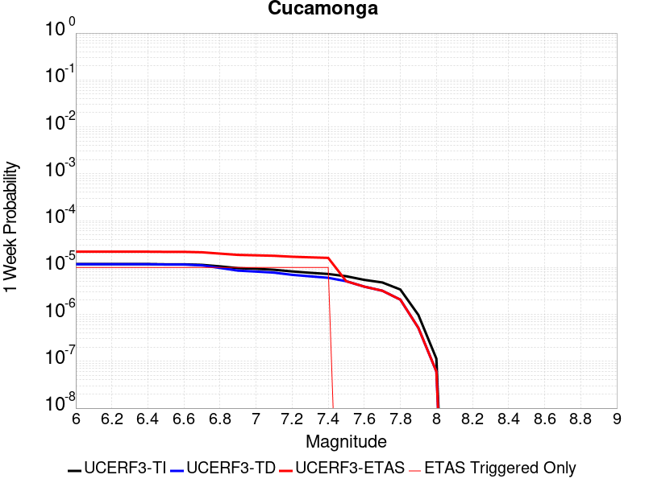 |  |  |  |

| Magnitude | 1 wk TI Prob | 1 wk TD Prob | 1 wk ETAS Prob | 1 wk ETAS/TD Gain | 1 wk ETAS Triggered Only | 1 mo TI Prob | 1 mo TD Prob | 1 mo ETAS Prob | 1 mo ETAS/TD Gain | 1 mo ETAS Triggered Only | 1 yr TI Prob | 1 yr TD Prob | 1 yr ETAS Prob | 1 yr ETAS/TD Gain | 1 yr ETAS Triggered Only | 10 yr TI Prob | 10 yr TD Prob | 10 yr ETAS Prob | 10 yr ETAS/TD Gain | 10 yr ETAS Triggered Only |
|-----|-----|-----|-----|-----|-----|-----|-----|-----|-----|-----|-----|-----|-----|-----|-----|-----|-----|-----|-----|-----|
| 6.0 | 1.1848348E-5 | 1.1737756E-5 | 2.1737638E-5 | 1.8519416 | 1.0E-5 | 5.0777642E-5 | 5.0303715E-5 | 6.030321E-5 | 1.1987824 | 1.0E-5 | 6.180424E-4 | 6.122783E-4 | 6.222722E-4 | 1.0163225 | 1.0E-5 | 0.0061632637 | 0.0061070886 | 0.0061369054 | 1.0048823 | 3.0E-5 |
| 6.1 | 1.1848348E-5 | 1.1737756E-5 | 2.1737638E-5 | 1.8519416 | 1.0E-5 | 5.0777642E-5 | 5.0303715E-5 | 6.030321E-5 | 1.1987824 | 1.0E-5 | 6.180424E-4 | 6.122783E-4 | 6.222722E-4 | 1.0163225 | 1.0E-5 | 0.0061632637 | 0.0061070886 | 0.0061369054 | 1.0048823 | 3.0E-5 |
| 6.2 | 1.1848348E-5 | 1.1737756E-5 | 2.1737638E-5 | 1.8519416 | 1.0E-5 | 5.0777642E-5 | 5.0303715E-5 | 6.030321E-5 | 1.1987824 | 1.0E-5 | 6.180424E-4 | 6.122783E-4 | 6.222722E-4 | 1.0163225 | 1.0E-5 | 0.0061632637 | 0.0061070886 | 0.0061369054 | 1.0048823 | 3.0E-5 |
| 6.3 | 1.1848348E-5 | 1.1737756E-5 | 2.1737638E-5 | 1.8519416 | 1.0E-5 | 5.0777642E-5 | 5.0303715E-5 | 6.030321E-5 | 1.1987824 | 1.0E-5 | 6.180424E-4 | 6.122783E-4 | 6.222722E-4 | 1.0163225 | 1.0E-5 | 0.0061632637 | 0.0061070886 | 0.0061369054 | 1.0048823 | 3.0E-5 |
| 6.4 | 1.1848348E-5 | 1.1737756E-5 | 2.1737638E-5 | 1.8519416 | 1.0E-5 | 5.0777642E-5 | 5.0303715E-5 | 6.030321E-5 | 1.1987824 | 1.0E-5 | 6.180424E-4 | 6.122783E-4 | 6.222722E-4 | 1.0163225 | 1.0E-5 | 0.0061632637 | 0.0061070886 | 0.0061369054 | 1.0048823 | 3.0E-5 |
| 6.5 | 1.16988695E-5 | 1.1576785E-5 | 2.1576669E-5 | 1.8637877 | 1.0E-5 | 5.013705E-5 | 4.9613864E-5 | 5.961337E-5 | 1.2015465 | 1.0E-5 | 6.102476E-4 | 6.0388405E-4 | 6.13878E-4 | 1.0165495 | 1.0E-5 | 0.006085745 | 0.006023602 | 0.006053421 | 1.0049504 | 3.0E-5 |
| 6.6 | 1.16988695E-5 | 1.1576785E-5 | 2.1576669E-5 | 1.8637877 | 1.0E-5 | 5.013705E-5 | 4.9613864E-5 | 5.961337E-5 | 1.2015465 | 1.0E-5 | 6.102476E-4 | 6.0388405E-4 | 6.13878E-4 | 1.0165495 | 1.0E-5 | 0.006085745 | 0.006023602 | 0.006053421 | 1.0049504 | 3.0E-5 |
| 6.7 | 1.1397107E-5 | 1.1115677E-5 | 2.1115566E-5 | 1.8996203 | 1.0E-5 | 4.884383E-5 | 4.7637757E-5 | 5.763728E-5 | 1.2099075 | 1.0E-5 | 5.9451134E-4 | 5.798378E-4 | 5.898321E-4 | 1.0172362 | 1.0E-5 | 0.005929234 | 0.0057844 | 0.005804284 | 1.0034375 | 2.0E-5 |
| 6.8 | 1.058387E-5 | 9.785641E-6 | 1.9785542E-5 | 2.0218954 | 1.0E-5 | 4.5358654E-5 | 4.1937794E-5 | 5.1937375E-5 | 1.2384384 | 1.0E-5 | 5.521017E-4 | 5.1047414E-4 | 5.2046904E-4 | 1.0195796 | 1.0E-5 | 0.00550732 | 0.0050940234 | 0.0051139216 | 1.0039061 | 2.0E-5 |
| 6.9 | 9.690046E-6 | 8.5800775E-6 | 1.8579993E-5 | 2.1654806 | 1.0E-5 | 4.1528107E-5 | 3.6771246E-5 | 4.6770878E-5 | 1.2719417 | 1.0E-5 | 5.054874E-4 | 4.4759834E-4 | 4.5759388E-4 | 1.0223315 | 1.0E-5 | 0.005043391 | 0.004467903 | 0.004487814 | 1.0044564 | 2.0E-5 |
| 7.0 | 9.381461E-6 | 8.187685E-6 | 1.8187602E-5 | 2.2213364 | 1.0E-5 | 4.020564E-5 | 3.5089608E-5 | 4.508926E-5 | 1.2849747 | 1.0E-5 | 4.893937E-4 | 4.271326E-4 | 4.3712833E-4 | 1.023402 | 1.0E-5 | 0.0048831734 | 0.0042640497 | 0.004283964 | 1.0046704 | 2.0E-5 |
| 7.1 | 8.946492E-6 | 7.78246E-6 | 1.7782382E-5 | 2.284931 | 1.0E-5 | 3.8341543E-5 | 3.335297E-5 | 4.335264E-5 | 1.2998134 | 1.0E-5 | 4.667083E-4 | 4.059971E-4 | 4.1599304E-4 | 1.0246208 | 1.0E-5 | 0.0046572937 | 0.0040534893 | 0.0040634484 | 1.002457 | 1.0E-5 |
| 7.2 | 8.251016E-6 | 6.9758194E-6 | 1.697575E-5 | 2.4335134 | 1.0E-5 | 3.5361016E-5 | 2.9896028E-5 | 3.9895727E-5 | 1.3344826 | 1.0E-5 | 4.3043532E-4 | 3.6392358E-4 | 3.7391993E-4 | 1.0274683 | 1.0E-5 | 0.0042960253 | 0.0036342086 | 0.003644172 | 1.0027416 | 1.0E-5 |
| 7.3 | 7.717881E-6 | 6.486875E-6 | 1.648681E-5 | 2.5415642 | 1.0E-5 | 3.3076216E-5 | 2.7800597E-5 | 3.780032E-5 | 1.3596945 | 1.0E-5 | 4.026285E-4 | 3.3841992E-4 | 3.4841654E-4 | 1.0295391 | 1.0E-5 | 0.004018998 | 0.0033799817 | 0.0033899478 | 1.0029486 | 1.0E-5 |
| 7.4 | 7.275623E-6 | 6.0325037E-6 | 1.6032443E-5 | 2.6576765 | 1.0E-5 | 3.118087E-5 | 2.5853333E-5 | 3.5853074E-5 | 1.3867873 | 1.0E-5 | 3.7956095E-4 | 3.1471907E-4 | 3.2471592E-4 | 1.0317644 | 1.0E-5 | 0.0037891332 | 0.0031436686 | 0.003153637 | 1.003171 | 1.0E-5 |
| 7.5 | 6.5109502E-6 | 5.101059E-6 | 5.101059E-6 | 1.0 | 0.0 | 2.7903774E-5 | 2.1861499E-5 | 2.1861499E-5 | 1.0 | 0.0 | 3.3967546E-4 | 2.661314E-4 | 2.661314E-4 | 1.0 | 0.0 | 0.0033915674 | 0.00265905 | 0.00265905 | 1.0 | 0.0 |
| 7.6 | 5.4495326E-6 | 3.9089846E-6 | 3.9089846E-6 | 1.0 | 0.0 | 2.335493E-5 | 1.6752683E-5 | 1.6752683E-5 | 1.0 | 0.0 | 2.8430918E-4 | 2.0394489E-4 | 2.0394489E-4 | 1.0 | 0.0 | 0.0028394572 | 0.0020384968 | 0.0020384968 | 1.0 | 0.0 |
| 7.7 | 4.7997164E-6 | 3.2006355E-6 | 3.2006355E-6 | 1.0 | 0.0 | 2.057005E-5 | 1.3716938E-5 | 1.3716938E-5 | 1.0 | 0.0 | 2.504116E-4 | 1.6699095E-4 | 1.6699095E-4 | 1.0 | 0.0 | 0.002501296 | 0.001669585 | 0.001669585 | 1.0 | 0.0 |
| 7.8 | 3.3941733E-6 | 2.0644336E-6 | 2.0644336E-6 | 1.0 | 0.0 | 1.4546376E-5 | 8.847543E-6 | 8.847543E-6 | 1.0 | 0.0 | 1.7708774E-4 | 1.07713524E-4 | 1.07713524E-4 | 1.0 | 0.0 | 0.0017694668 | 0.0010768501 | 0.0010768501 | 1.0 | 0.0 |
| 7.9 | 9.750552E-7 | 5.1567173E-7 | 5.1567173E-7 | 1.0 | 0.0 | 4.178801E-6 | 2.2100198E-6 | 2.2100198E-6 | 1.0 | 0.0 | 5.0875715E-5 | 2.6906664E-5 | 2.6906664E-5 | 1.0 | 0.0 | 5.086407E-4 | 2.6903447E-4 | 2.6903447E-4 | 1.0 | 0.0 |
| 8.0 | 1.133857E-7 | 6.0540515E-8 | 6.0540515E-8 | 1.0 | 0.0 | 4.8593864E-7 | 2.5945934E-7 | 2.5945934E-7 | 1.0 | 0.0 | 5.9162867E-6 | 3.158913E-6 | 3.158913E-6 | 1.0 | 0.0 | 5.916129E-5 | 3.1588697E-5 | 3.1588697E-5 | 1.0 | 0.0 |

## Sierra Madre
*[(top)](#table-of-contents)*

| 1 Week | 1 Month | 1 Year | 10 Year |
|-----|-----|-----|-----|
|  |  |  |  |

| Magnitude | 1 wk TI Prob | 1 wk TD Prob | 1 wk ETAS Prob | 1 wk ETAS/TD Gain | 1 wk ETAS Triggered Only | 1 mo TI Prob | 1 mo TD Prob | 1 mo ETAS Prob | 1 mo ETAS/TD Gain | 1 mo ETAS Triggered Only | 1 yr TI Prob | 1 yr TD Prob | 1 yr ETAS Prob | 1 yr ETAS/TD Gain | 1 yr ETAS Triggered Only | 10 yr TI Prob | 10 yr TD Prob | 10 yr ETAS Prob | 10 yr ETAS/TD Gain | 10 yr ETAS Triggered Only |
|-----|-----|-----|-----|-----|-----|-----|-----|-----|-----|-----|-----|-----|-----|-----|-----|-----|-----|-----|-----|-----|
| 6.0 | 1.3379373E-5 | 1.100113E-5 | 1.100113E-5 | 1.0 | 0.0 | 5.7338908E-5 | 4.7146856E-5 | 4.7146856E-5 | 1.0 | 0.0 | 6.978776E-4 | 5.738633E-4 | 5.738633E-4 | 1.0 | 0.0 | 0.0069569005 | 0.005724178 | 0.005754006 | 1.0052109 | 3.0E-5 |
| 6.1 | 1.3379373E-5 | 1.100113E-5 | 1.100113E-5 | 1.0 | 0.0 | 5.7338908E-5 | 4.7146856E-5 | 4.7146856E-5 | 1.0 | 0.0 | 6.978776E-4 | 5.738633E-4 | 5.738633E-4 | 1.0 | 0.0 | 0.0069569005 | 0.005724178 | 0.005754006 | 1.0052109 | 3.0E-5 |
| 6.2 | 1.3379373E-5 | 1.100113E-5 | 1.100113E-5 | 1.0 | 0.0 | 5.7338908E-5 | 4.7146856E-5 | 4.7146856E-5 | 1.0 | 0.0 | 6.978776E-4 | 5.738633E-4 | 5.738633E-4 | 1.0 | 0.0 | 0.0069569005 | 0.005724178 | 0.005754006 | 1.0052109 | 3.0E-5 |
| 6.3 | 1.3379373E-5 | 1.100113E-5 | 1.100113E-5 | 1.0 | 0.0 | 5.7338908E-5 | 4.7146856E-5 | 4.7146856E-5 | 1.0 | 0.0 | 6.978776E-4 | 5.738633E-4 | 5.738633E-4 | 1.0 | 0.0 | 0.0069569005 | 0.005724178 | 0.005754006 | 1.0052109 | 3.0E-5 |
| 6.4 | 1.3379373E-5 | 1.100113E-5 | 1.100113E-5 | 1.0 | 0.0 | 5.7338908E-5 | 4.7146856E-5 | 4.7146856E-5 | 1.0 | 0.0 | 6.978776E-4 | 5.738633E-4 | 5.738633E-4 | 1.0 | 0.0 | 0.0069569005 | 0.005724178 | 0.005754006 | 1.0052109 | 3.0E-5 |
| 6.5 | 1.26563245E-5 | 1.0230579E-5 | 1.0230579E-5 | 1.0 | 0.0 | 5.4240263E-5 | 4.3844608E-5 | 4.3844608E-5 | 1.0 | 0.0 | 6.601751E-4 | 5.3367845E-4 | 5.3367845E-4 | 1.0 | 0.0 | 0.006582173 | 0.00532429 | 0.00535413 | 1.0056045 | 3.0E-5 |
| 6.6 | 1.26563245E-5 | 1.0230579E-5 | 1.0230579E-5 | 1.0 | 0.0 | 5.4240263E-5 | 4.3844608E-5 | 4.3844608E-5 | 1.0 | 0.0 | 6.601751E-4 | 5.3367845E-4 | 5.3367845E-4 | 1.0 | 0.0 | 0.006582173 | 0.00532429 | 0.00535413 | 1.0056045 | 3.0E-5 |
| 6.7 | 1.2502474E-5 | 1.0066722E-5 | 1.0066722E-5 | 1.0 | 0.0 | 5.3580934E-5 | 4.3142387E-5 | 4.3142387E-5 | 1.0 | 0.0 | 6.521526E-4 | 5.2513304E-4 | 5.2513304E-4 | 1.0 | 0.0 | 0.0065024206 | 0.0052392404 | 0.005269083 | 1.005696 | 3.0E-5 |
| 6.8 | 1.2454966E-5 | 1.0019007E-5 | 1.0019007E-5 | 1.0 | 0.0 | 5.3377335E-5 | 4.29379E-5 | 4.29379E-5 | 1.0 | 0.0 | 6.4967526E-4 | 5.226446E-4 | 5.226446E-4 | 1.0 | 0.0 | 0.006477792 | 0.005214473 | 0.005244317 | 1.0057232 | 3.0E-5 |
| 6.9 | 1.2225574E-5 | 9.7929815E-6 | 9.7929815E-6 | 1.0 | 0.0 | 5.2394265E-5 | 4.196925E-5 | 4.196925E-5 | 1.0 | 0.0 | 6.3771347E-4 | 5.108569E-4 | 5.108569E-4 | 1.0 | 0.0 | 0.006358865 | 0.0050971415 | 0.0051269885 | 1.0058557 | 3.0E-5 |
| 7.0 | 1.182946E-5 | 9.3995195E-6 | 9.3995195E-6 | 1.0 | 0.0 | 5.06967E-5 | 4.0283037E-5 | 4.0283037E-5 | 1.0 | 0.0 | 6.1705755E-4 | 4.903367E-4 | 4.903367E-4 | 1.0 | 0.0 | 0.006153469 | 0.004892859 | 0.0049227127 | 1.0061014 | 3.0E-5 |
| 7.1 | 1.14369095E-5 | 8.986527E-6 | 8.986527E-6 | 1.0 | 0.0 | 4.9014405E-5 | 3.8513124E-5 | 3.8513124E-5 | 1.0 | 0.0 | 5.9658696E-4 | 4.6879737E-4 | 4.6879737E-4 | 1.0 | 0.0 | 0.005949879 | 0.00467839 | 0.0046982965 | 1.0042549 | 2.0E-5 |
| 7.2 | 1.0836419E-5 | 8.399916E-6 | 8.399916E-6 | 1.0 | 0.0 | 4.644097E-5 | 3.5999146E-5 | 3.5999146E-5 | 1.0 | 0.0 | 5.652721E-4 | 4.3820238E-4 | 4.3820238E-4 | 1.0 | 0.0 | 0.0056383642 | 0.0043736803 | 0.004393593 | 1.0045528 | 2.0E-5 |
| 7.3 | 1.0403439E-5 | 8.021173E-6 | 8.021173E-6 | 1.0 | 0.0 | 4.4585406E-5 | 3.4376008E-5 | 3.4376008E-5 | 1.0 | 0.0 | 5.426921E-4 | 4.1844844E-4 | 4.1844844E-4 | 1.0 | 0.0 | 0.005413687 | 0.0041769007 | 0.004196817 | 1.0047683 | 2.0E-5 |
| 7.4 | 9.768864E-6 | 7.414793E-6 | 7.414793E-6 | 1.0 | 0.0 | 4.186589E-5 | 3.17773E-5 | 3.17773E-5 | 1.0 | 0.0 | 5.09598E-4 | 3.8682084E-4 | 3.8682084E-4 | 1.0 | 0.0 | 0.0050843097 | 0.0038617672 | 0.0038717287 | 1.0025795 | 1.0E-5 |
| 7.5 | 8.687089E-6 | 6.4504875E-6 | 6.4504875E-6 | 1.0 | 0.0 | 3.722985E-5 | 2.7644659E-5 | 2.7644659E-5 | 1.0 | 0.0 | 4.5317915E-4 | 3.3652261E-4 | 3.3652261E-4 | 1.0 | 0.0 | 0.004522561 | 0.0033604174 | 0.0033703838 | 1.0029658 | 1.0E-5 |
| 7.6 | 6.3506063E-6 | 4.430626E-6 | 4.430626E-6 | 1.0 | 0.0 | 2.72166E-5 | 1.8988261E-5 | 1.8988261E-5 | 1.0 | 0.0 | 3.3131172E-4 | 2.3115781E-4 | 2.3115781E-4 | 1.0 | 0.0 | 0.003308182 | 0.0023093987 | 0.0023193755 | 1.0043201 | 1.0E-5 |
| 7.7 | 4.62223E-6 | 2.9332562E-6 | 2.9332562E-6 | 1.0 | 0.0 | 1.9809406E-5 | 1.2571038E-5 | 1.2571038E-5 | 1.0 | 0.0 | 2.4115283E-4 | 1.5304166E-4 | 1.5304166E-4 | 1.0 | 0.0 | 0.0024089129 | 0.0015295637 | 0.0015295637 | 1.0 | 0.0 |
| 7.8 | 3.2145008E-6 | 1.9496579E-6 | 1.9496579E-6 | 1.0 | 0.0 | 1.3776359E-5 | 8.35565E-6 | 8.35565E-6 | 1.0 | 0.0 | 1.6771426E-4 | 1.01725294E-4 | 1.01725294E-4 | 1.0 | 0.0 | 0.0016758774 | 0.0010169316 | 0.0010169316 | 1.0 | 0.0 |
| 7.9 | 1.0391769E-6 | 5.6034094E-7 | 5.6034094E-7 | 1.0 | 0.0 | 4.4536077E-6 | 2.401459E-6 | 2.401459E-6 | 1.0 | 0.0 | 5.4221324E-5 | 2.9237375E-5 | 2.9237375E-5 | 1.0 | 0.0 | 5.4208096E-4 | 2.9233572E-4 | 2.9233572E-4 | 1.0 | 0.0 |
| 8.0 | 1.210983E-7 | 6.6141716E-8 | 6.6141716E-8 | 1.0 | 0.0 | 5.1899264E-7 | 2.8346446E-7 | 2.8346446E-7 | 1.0 | 0.0 | 6.3187167E-6 | 3.4511747E-6 | 3.4511747E-6 | 1.0 | 0.0 | 6.318537E-5 | 3.4511228E-5 | 3.4511228E-5 | 1.0 | 0.0 |

## Great Valley 07 (Orestimba)
*[(top)](#table-of-contents)*

| 1 Week | 1 Month | 1 Year | 10 Year |
|-----|-----|-----|-----|
|  |  |  |  |

| Magnitude | 1 wk TI Prob | 1 wk TD Prob | 1 wk ETAS Prob | 1 wk ETAS/TD Gain | 1 wk ETAS Triggered Only | 1 mo TI Prob | 1 mo TD Prob | 1 mo ETAS Prob | 1 mo ETAS/TD Gain | 1 mo ETAS Triggered Only | 1 yr TI Prob | 1 yr TD Prob | 1 yr ETAS Prob | 1 yr ETAS/TD Gain | 1 yr ETAS Triggered Only | 10 yr TI Prob | 10 yr TD Prob | 10 yr ETAS Prob | 10 yr ETAS/TD Gain | 10 yr ETAS Triggered Only |
|-----|-----|-----|-----|-----|-----|-----|-----|-----|-----|-----|-----|-----|-----|-----|-----|-----|-----|-----|-----|-----|
| 6.0 | 2.9687902E-5 | 3.2757947E-5 | 3.2757947E-5 | 1.0 | 0.0 | 1.2722766E-4 | 1.4038406E-4 | 1.4038406E-4 | 1.0 | 0.0 | 0.0015478961 | 0.0017079079 | 0.0017178907 | 1.0058451 | 1.0E-5 | 0.015371585 | 0.016955366 | 0.016984858 | 1.0017394 | 3.0E-5 |
| 6.1 | 2.9687902E-5 | 3.2757947E-5 | 3.2757947E-5 | 1.0 | 0.0 | 1.2722766E-4 | 1.4038406E-4 | 1.4038406E-4 | 1.0 | 0.0 | 0.0015478961 | 0.0017079079 | 0.0017178907 | 1.0058451 | 1.0E-5 | 0.015371585 | 0.016955366 | 0.016984858 | 1.0017394 | 3.0E-5 |
| 6.2 | 1.9231524E-5 | 2.1159447E-5 | 2.1159447E-5 | 1.0 | 0.0 | 8.2418206E-5 | 9.0680325E-5 | 9.0680325E-5 | 1.0 | 0.0 | 0.0010029797 | 0.0011034969 | 0.0011134859 | 1.0090522 | 1.0E-5 | 0.00998465 | 0.010982586 | 0.011012256 | 1.0027016 | 3.0E-5 |
| 6.3 | 1.324766E-5 | 1.4548723E-5 | 1.4548723E-5 | 1.0 | 0.0 | 5.6774446E-5 | 6.235023E-5 | 6.235023E-5 | 1.0 | 0.0 | 6.910097E-4 | 7.5885886E-4 | 7.6885126E-4 | 1.0131677 | 1.0E-5 | 0.006888649 | 0.0075636217 | 0.0075933947 | 1.0039364 | 3.0E-5 |
| 6.4 | 7.818645E-6 | 8.57295E-6 | 8.57295E-6 | 1.0 | 0.0 | 3.3508048E-5 | 3.6740716E-5 | 3.6740716E-5 | 1.0 | 0.0 | 4.078841E-4 | 4.4722974E-4 | 4.5722528E-4 | 1.0223498 | 1.0E-5 | 0.004071363 | 0.0044636377 | 0.004473593 | 1.0022303 | 1.0E-5 |
| 6.5 | 5.3076565E-6 | 5.817875E-6 | 5.817875E-6 | 1.0 | 0.0 | 2.27469E-5 | 2.4933523E-5 | 2.4933523E-5 | 1.0 | 0.0 | 2.7690834E-4 | 3.0352548E-4 | 3.1352244E-4 | 1.0329362 | 1.0E-5 | 0.0027656353 | 0.0030313185 | 0.0030412881 | 1.0032889 | 1.0E-5 |
| 6.6 | 3.6003578E-6 | 3.9485462E-6 | 3.9485462E-6 | 1.0 | 0.0 | 1.5430012E-5 | 1.6922239E-5 | 1.6922239E-5 | 1.0 | 0.0 | 1.8784421E-4 | 2.0601034E-4 | 2.1600828E-4 | 1.0485313 | 1.0E-5 | 0.0018768552 | 0.0020583477 | 0.0020683273 | 1.0048482 | 1.0E-5 |
| 6.7 | 2.5361826E-6 | 2.783504E-6 | 2.783504E-6 | 1.0 | 0.0 | 1.0869308E-5 | 1.1929255E-5 | 1.1929255E-5 | 1.0 | 0.0 | 1.3232579E-4 | 1.4523033E-4 | 1.5522887E-4 | 1.0688461 | 1.0E-5 | 0.0013224703 | 0.001451484 | 0.0014614696 | 1.0068794 | 1.0E-5 |
| 6.8 | 1.2115831E-6 | 1.3313972E-6 | 1.3313972E-6 | 1.0 | 0.0 | 5.1924885E-6 | 5.705981E-6 | 5.705981E-6 | 1.0 | 0.0 | 6.3216714E-5 | 6.9469075E-5 | 7.946838E-5 | 1.1439389 | 1.0E-5 | 6.3198735E-4 | 6.9456873E-4 | 7.0456177E-4 | 1.0143874 | 1.0E-5 |

## Malibu Coast alt 1
*[(top)](#table-of-contents)*

| 1 Week | 1 Month | 1 Year | 10 Year |
|-----|-----|-----|-----|
|  |  |  |  |

| Magnitude | 1 wk TI Prob | 1 wk TD Prob | 1 wk ETAS Prob | 1 wk ETAS/TD Gain | 1 wk ETAS Triggered Only | 1 mo TI Prob | 1 mo TD Prob | 1 mo ETAS Prob | 1 mo ETAS/TD Gain | 1 mo ETAS Triggered Only | 1 yr TI Prob | 1 yr TD Prob | 1 yr ETAS Prob | 1 yr ETAS/TD Gain | 1 yr ETAS Triggered Only | 10 yr TI Prob | 10 yr TD Prob | 10 yr ETAS Prob | 10 yr ETAS/TD Gain | 10 yr ETAS Triggered Only |
|-----|-----|-----|-----|-----|-----|-----|-----|-----|-----|-----|-----|-----|-----|-----|-----|-----|-----|-----|-----|-----|
| 6.0 | 1.6572556E-5 | 1.7598268E-5 | 1.7598268E-5 | 1.0 | 0.0 | 7.102331E-5 | 7.541908E-5 | 7.541908E-5 | 1.0 | 0.0 | 8.6436566E-4 | 9.178593E-4 | 9.2785014E-4 | 1.0108849 | 1.0E-5 | 0.0086101135 | 0.009142617 | 0.009172343 | 1.0032513 | 3.0E-5 |
| 6.1 | 1.6572556E-5 | 1.7598268E-5 | 1.7598268E-5 | 1.0 | 0.0 | 7.102331E-5 | 7.541908E-5 | 7.541908E-5 | 1.0 | 0.0 | 8.6436566E-4 | 9.178593E-4 | 9.2785014E-4 | 1.0108849 | 1.0E-5 | 0.0086101135 | 0.009142617 | 0.009172343 | 1.0032513 | 3.0E-5 |
| 6.2 | 1.1085717E-5 | 1.1557268E-5 | 1.1557268E-5 | 1.0 | 0.0 | 4.750935E-5 | 4.953023E-5 | 4.953023E-5 | 1.0 | 0.0 | 5.782728E-4 | 6.028672E-4 | 6.128612E-4 | 1.0165774 | 1.0E-5 | 0.0057677035 | 0.0060126884 | 0.006042508 | 1.0049595 | 3.0E-5 |
| 6.3 | 1.0208568E-5 | 1.05923455E-5 | 1.05923455E-5 | 1.0 | 0.0 | 4.375027E-5 | 4.5394994E-5 | 4.5394994E-5 | 1.0 | 0.0 | 5.325294E-4 | 5.525468E-4 | 5.625413E-4 | 1.018088 | 1.0E-5 | 0.0053125503 | 0.005512038 | 0.0055418722 | 1.0054126 | 3.0E-5 |
| 6.4 | 9.0682315E-6 | 9.34273E-6 | 9.34273E-6 | 1.0 | 0.0 | 3.8863272E-5 | 4.0039668E-5 | 4.0039668E-5 | 1.0 | 0.0 | 4.730576E-4 | 4.8737595E-4 | 4.973711E-4 | 1.020508 | 1.0E-5 | 0.0047205184 | 0.004863284 | 0.0048931385 | 1.0061387 | 3.0E-5 |
| 6.5 | 7.605796E-6 | 7.74866E-6 | 7.74866E-6 | 1.0 | 0.0 | 3.259586E-5 | 3.320813E-5 | 3.320813E-5 | 1.0 | 0.0 | 3.9678233E-4 | 4.042353E-4 | 4.1423127E-4 | 1.0247281 | 1.0E-5 | 0.0039607463 | 0.004035138 | 0.0040650168 | 1.0074047 | 3.0E-5 |
| 6.6 | 5.889873E-6 | 5.8795895E-6 | 5.8795895E-6 | 1.0 | 0.0 | 2.5242069E-5 | 2.5197998E-5 | 2.5197998E-5 | 1.0 | 0.0 | 3.0727885E-4 | 3.0674253E-4 | 3.1673946E-4 | 1.0325906 | 1.0E-5 | 0.003068543 | 0.0030632042 | 0.0030931125 | 1.0097637 | 3.0E-5 |
| 6.7 | 5.66586E-6 | 5.64169E-6 | 5.64169E-6 | 1.0 | 0.0 | 2.428203E-5 | 2.417845E-5 | 2.417845E-5 | 1.0 | 0.0 | 2.955936E-4 | 2.9433295E-4 | 3.0433E-4 | 1.0339651 | 1.0E-5 | 0.0029520073 | 0.002939443 | 0.002969355 | 1.0101761 | 3.0E-5 |
| 6.8 | 5.521556E-6 | 5.489475E-6 | 5.489475E-6 | 1.0 | 0.0 | 2.3663597E-5 | 2.3526109E-5 | 2.3526109E-5 | 1.0 | 0.0 | 2.880662E-4 | 2.8639284E-4 | 2.9638998E-4 | 1.0349071 | 1.0E-5 | 0.0028769306 | 0.002860249 | 0.0028901633 | 1.0104586 | 3.0E-5 |
| 6.9 | 5.29752E-6 | 5.249977E-6 | 5.249977E-6 | 1.0 | 0.0 | 2.270346E-5 | 2.249971E-5 | 2.249971E-5 | 1.0 | 0.0 | 2.7637955E-4 | 2.738996E-4 | 2.8389686E-4 | 1.0364997 | 1.0E-5 | 0.0027603607 | 0.0027356306 | 0.0027655484 | 1.0109364 | 3.0E-5 |
| 7.0 | 5.106743E-6 | 5.047723E-6 | 5.047723E-6 | 1.0 | 0.0 | 2.1885859E-5 | 2.1632919E-5 | 2.1632919E-5 | 1.0 | 0.0 | 2.6642776E-4 | 2.6334904E-4 | 2.733464E-4 | 1.0379624 | 1.0E-5 | 0.0026610855 | 0.002630379 | 0.0026603001 | 1.0113752 | 3.0E-5 |
| 7.1 | 4.8469647E-6 | 4.7704148E-6 | 4.7704148E-6 | 1.0 | 0.0 | 2.0772539E-5 | 2.0444475E-5 | 2.0444475E-5 | 1.0 | 0.0 | 2.528763E-4 | 2.488831E-4 | 2.588806E-4 | 1.0401695 | 1.0E-5 | 0.0025258875 | 0.0024860518 | 0.0025159772 | 1.0120373 | 3.0E-5 |
| 7.2 | 4.545514E-6 | 4.448232E-6 | 4.448232E-6 | 1.0 | 0.0 | 1.9480629E-5 | 1.9063713E-5 | 1.9063713E-5 | 1.0 | 0.0 | 2.3715083E-4 | 2.3207605E-4 | 2.4207373E-4 | 1.0430794 | 1.0E-5 | 0.0023689792 | 0.0023183445 | 0.002348275 | 1.0129102 | 3.0E-5 |
| 7.3 | 3.794097E-6 | 3.6519655E-6 | 3.6519655E-6 | 1.0 | 0.0 | 1.6260314E-5 | 1.5651187E-5 | 1.5651187E-5 | 1.0 | 0.0 | 1.9795135E-4 | 1.9053658E-4 | 1.9053658E-4 | 1.0 | 0.0 | 0.001977751 | 0.0019037367 | 0.0019236987 | 1.0104856 | 2.0E-5 |
| 7.4 | 2.808217E-6 | 2.7191E-6 | 2.7191E-6 | 1.0 | 0.0 | 1.203516E-5 | 1.1653234E-5 | 1.1653234E-5 | 1.0 | 0.0 | 1.4651821E-4 | 1.418689E-4 | 1.418689E-4 | 1.0 | 0.0 | 0.0014642165 | 0.0014177861 | 0.0014277719 | 1.0070432 | 1.0E-5 |
| 7.5 | 1.83809E-6 | 1.8190852E-6 | 1.8190852E-6 | 1.0 | 0.0 | 7.877505E-6 | 7.796056E-6 | 7.796056E-6 | 1.0 | 0.0 | 9.59044E-5 | 9.4912866E-5 | 9.4912866E-5 | 1.0 | 0.0 | 9.5863023E-4 | 9.487253E-4 | 9.5871586E-4 | 1.0105305 | 1.0E-5 |
| 7.6 | 1.1292672E-6 | 1.100155E-6 | 1.100155E-6 | 1.0 | 0.0 | 4.839708E-6 | 4.7149415E-6 | 4.7149415E-6 | 1.0 | 0.0 | 5.8921847E-5 | 5.7402918E-5 | 5.7402918E-5 | 1.0 | 0.0 | 5.890623E-4 | 5.7388254E-4 | 5.838768E-4 | 1.0174152 | 1.0E-5 |
| 7.7 | 5.065272E-7 | 4.609203E-7 | 4.609203E-7 | 1.0 | 0.0 | 2.170829E-6 | 1.9753713E-6 | 1.9753713E-6 | 1.0 | 0.0 | 2.6429525E-5 | 2.404989E-5 | 2.404989E-5 | 1.0 | 0.0 | 2.642638E-4 | 2.4047401E-4 | 2.4047401E-4 | 1.0 | 0.0 |
| 7.8 | 8.952991E-8 | 6.708074E-8 | 6.708074E-8 | 1.0 | 0.0 | 3.8369956E-7 | 2.8748886E-7 | 2.8748886E-7 | 1.0 | 0.0 | 4.671532E-6 | 3.5001713E-6 | 3.5001713E-6 | 1.0 | 0.0 | 4.671434E-5 | 3.5001183E-5 | 3.5001183E-5 | 1.0 | 0.0 |
| 7.9 | 8.007447E-10 | 6.160915E-10 | 6.160915E-10 | 1.0 | 0.0 | 3.4317629E-9 | 2.6403923E-9 | 2.6403923E-9 | 1.0 | 0.0 | 4.1781714E-8 | 3.2146776E-8 | 3.2146776E-8 | 1.0 | 0.0 | 4.1781706E-7 | 3.2146772E-7 | 3.2146772E-7 | 1.0 | 0.0 |

## Hunting Creek - Bartlett Springs connector 2011
*[(top)](#table-of-contents)*

| 1 Week | 1 Month | 1 Year | 10 Year |
|-----|-----|-----|-----|
|  | 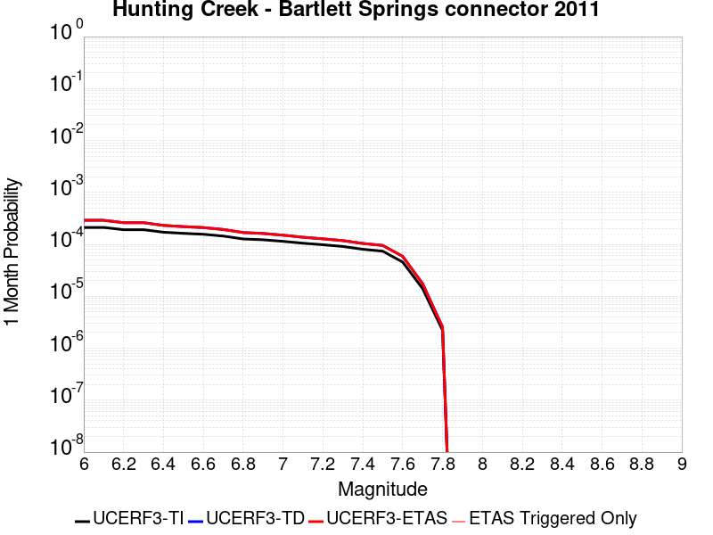 |  |  |

| Magnitude | 1 wk TI Prob | 1 wk TD Prob | 1 wk ETAS Prob | 1 wk ETAS/TD Gain | 1 wk ETAS Triggered Only | 1 mo TI Prob | 1 mo TD Prob | 1 mo ETAS Prob | 1 mo ETAS/TD Gain | 1 mo ETAS Triggered Only | 1 yr TI Prob | 1 yr TD Prob | 1 yr ETAS Prob | 1 yr ETAS/TD Gain | 1 yr ETAS Triggered Only | 10 yr TI Prob | 10 yr TD Prob | 10 yr ETAS Prob | 10 yr ETAS/TD Gain | 10 yr ETAS Triggered Only |
|-----|-----|-----|-----|-----|-----|-----|-----|-----|-----|-----|-----|-----|-----|-----|-----|-----|-----|-----|-----|-----|
| 6.0 | 4.940016E-5 | 6.787113E-5 | 6.787113E-5 | 1.0 | 0.0 | 2.1169778E-4 | 2.9084473E-4 | 2.9084473E-4 | 1.0 | 0.0 | 0.002574374 | 0.0035353133 | 0.0035353133 | 1.0 | 0.0 | 0.025447546 | 0.034775153 | 0.034794457 | 1.0005552 | 2.0E-5 |
| 6.1 | 4.940016E-5 | 6.787113E-5 | 6.787113E-5 | 1.0 | 0.0 | 2.1169778E-4 | 2.9084473E-4 | 2.9084473E-4 | 1.0 | 0.0 | 0.002574374 | 0.0035353133 | 0.0035353133 | 1.0 | 0.0 | 0.025447546 | 0.034775153 | 0.034794457 | 1.0005552 | 2.0E-5 |
| 6.2 | 4.472471E-5 | 6.1005278E-5 | 6.1005278E-5 | 1.0 | 0.0 | 1.9166325E-4 | 2.6142562E-4 | 2.6142562E-4 | 1.0 | 0.0 | 0.0023310026 | 0.0031782303 | 0.0031782303 | 1.0 | 0.0 | 0.02306703 | 0.03131807 | 0.03133744 | 1.0006186 | 2.0E-5 |
| 6.3 | 4.472471E-5 | 6.1005278E-5 | 6.1005278E-5 | 1.0 | 0.0 | 1.9166325E-4 | 2.6142562E-4 | 2.6142562E-4 | 1.0 | 0.0 | 0.0023310026 | 0.0031782303 | 0.0031782303 | 1.0 | 0.0 | 0.02306703 | 0.03131807 | 0.03133744 | 1.0006186 | 2.0E-5 |
| 6.4 | 4.0001003E-5 | 5.4105796E-5 | 5.4105796E-5 | 1.0 | 0.0 | 1.714216E-4 | 2.318617E-4 | 2.318617E-4 | 1.0 | 0.0 | 0.0020850603 | 0.0028192252 | 0.0028192252 | 1.0 | 0.0 | 0.02065605 | 0.027829293 | 0.027839016 | 1.0003493 | 1.0E-5 |
| 6.5 | 3.8033053E-5 | 5.1268413E-5 | 5.1268413E-5 | 1.0 | 0.0 | 1.6298861E-4 | 2.1970355E-4 | 2.1970355E-4 | 1.0 | 0.0 | 0.0019825802 | 0.0026715663 | 0.0026715663 | 1.0 | 0.0 | 0.019649856 | 0.026391363 | 0.026401099 | 1.000369 | 1.0E-5 |
| 6.6 | 3.653754E-5 | 4.913191E-5 | 4.913191E-5 | 1.0 | 0.0 | 1.5658008E-4 | 2.1054859E-4 | 2.1054859E-4 | 1.0 | 0.0 | 0.0019046954 | 0.0025603706 | 0.0025603706 | 1.0 | 0.0 | 0.018884527 | 0.02530727 | 0.025317017 | 1.0003852 | 1.0E-5 |
| 6.7 | 3.372024E-5 | 4.514163E-5 | 4.514163E-5 | 1.0 | 0.0 | 1.4450731E-4 | 1.9345005E-4 | 1.9345005E-4 | 1.0 | 0.0 | 0.0017579567 | 0.0023527164 | 0.0023527164 | 1.0 | 0.0 | 0.017441148 | 0.023278859 | 0.023278859 | 1.0 | 0.0 |
| 6.8 | 2.9650024E-5 | 3.9412585E-5 | 3.9412585E-5 | 1.0 | 0.0 | 1.2706534E-4 | 1.6890021E-4 | 1.6890021E-4 | 1.0 | 0.0 | 0.0015459227 | 0.0020544082 | 0.0020544082 | 1.0 | 0.0 | 0.015352124 | 0.020351823 | 0.020351823 | 1.0 | 0.0 |
| 6.9 | 2.860775E-5 | 3.7813646E-5 | 3.7813646E-5 | 1.0 | 0.0 | 1.2259888E-4 | 1.620485E-4 | 1.620485E-4 | 1.0 | 0.0 | 0.0014916194 | 0.0019711645 | 0.0019711645 | 1.0 | 0.0 | 0.014816469 | 0.0195364 | 0.0195364 | 1.0 | 0.0 |
| 7.0 | 2.6696067E-5 | 3.5068253E-5 | 3.5068253E-5 | 1.0 | 0.0 | 1.144067E-4 | 1.5028391E-4 | 1.5028391E-4 | 1.0 | 0.0 | 0.0013920115 | 0.0018281818 | 0.0018281818 | 1.0 | 0.0 | 0.013833242 | 0.01813187 | 0.01813187 | 1.0 | 0.0 |
| 7.1 | 2.456087E-5 | 3.2013988E-5 | 3.2013988E-5 | 1.0 | 0.0 | 1.0525662E-4 | 1.3719565E-4 | 1.3719565E-4 | 1.0 | 0.0 | 0.001280746 | 0.0016690863 | 0.0016690863 | 1.0 | 0.0 | 0.012733897 | 0.016566826 | 0.016566826 | 1.0 | 0.0 |
| 7.2 | 2.295761E-5 | 2.9823757E-5 | 2.9823757E-5 | 1.0 | 0.0 | 9.8386045E-5 | 1.278099E-4 | 1.278099E-4 | 1.0 | 0.0 | 0.0011971919 | 0.001554984 | 0.001554984 | 1.0 | 0.0 | 0.011907627 | 0.015442514 | 0.015442514 | 1.0 | 0.0 |
| 7.3 | 2.1256936E-5 | 2.7542677E-5 | 2.7542677E-5 | 1.0 | 0.0 | 9.109797E-5 | 1.1803475E-4 | 1.1803475E-4 | 1.0 | 0.0 | 0.0011085535 | 0.0014361347 | 0.0014361347 | 1.0 | 0.0 | 0.011030397 | 0.014269866 | 0.014269866 | 1.0 | 0.0 |
| 7.4 | 1.8784336E-5 | 2.430742E-5 | 2.430742E-5 | 1.0 | 0.0 | 8.050181E-5 | 1.0417054E-4 | 1.0417054E-4 | 1.0 | 0.0 | 9.796688E-4 | 0.001267546 | 0.001267546 | 1.0 | 0.0 | 0.009753612 | 0.012604239 | 0.012604239 | 1.0 | 0.0 |
| 7.5 | 1.7248298E-5 | 2.2269496E-5 | 2.2269496E-5 | 1.0 | 0.0 | 7.391918E-5 | 9.5437244E-5 | 9.5437244E-5 | 1.0 | 0.0 | 8.9959445E-4 | 0.0011613365 | 0.0011613365 | 1.0 | 0.0 | 0.008959615 | 0.011553653 | 0.011553653 | 1.0 | 0.0 |
| 7.6 | 1.0653709E-5 | 1.3722448E-5 | 1.3722448E-5 | 1.0 | 0.0 | 4.5657955E-5 | 5.8809183E-5 | 5.8809183E-5 | 1.0 | 0.0 | 5.557438E-4 | 7.1576925E-4 | 7.1576925E-4 | 1.0 | 0.0 | 0.0055435603 | 0.0071349875 | 0.0071349875 | 1.0 | 0.0 |
| 7.7 | 3.286316E-6 | 4.090435E-6 | 4.090435E-6 | 1.0 | 0.0 | 1.4084137E-5 | 1.753032E-5 | 1.753032E-5 | 1.0 | 0.0 | 1.7146087E-4 | 2.1341088E-4 | 2.1341088E-4 | 1.0 | 0.0 | 0.0017132863 | 0.0021320751 | 0.0021320751 | 1.0 | 0.0 |
| 7.8 | 5.1855085E-7 | 5.972177E-7 | 5.972177E-7 | 1.0 | 0.0 | 2.222359E-6 | 2.559502E-6 | 2.559502E-6 | 1.0 | 0.0 | 2.7056883E-5 | 3.1161504E-5 | 3.1161504E-5 | 1.0 | 0.0 | 2.705359E-4 | 3.1157056E-4 | 3.1157056E-4 | 1.0 | 0.0 |

## White Wolf
*[(top)](#table-of-contents)*

| 1 Week | 1 Month | 1 Year | 10 Year |
|-----|-----|-----|-----|
|  |  |  |  |

| Magnitude | 1 wk TI Prob | 1 wk TD Prob | 1 wk ETAS Prob | 1 wk ETAS/TD Gain | 1 wk ETAS Triggered Only | 1 mo TI Prob | 1 mo TD Prob | 1 mo ETAS Prob | 1 mo ETAS/TD Gain | 1 mo ETAS Triggered Only | 1 yr TI Prob | 1 yr TD Prob | 1 yr ETAS Prob | 1 yr ETAS/TD Gain | 1 yr ETAS Triggered Only | 10 yr TI Prob | 10 yr TD Prob | 10 yr ETAS Prob | 10 yr ETAS/TD Gain | 10 yr ETAS Triggered Only |
|-----|-----|-----|-----|-----|-----|-----|-----|-----|-----|-----|-----|-----|-----|-----|-----|-----|-----|-----|-----|-----|
| 6.0 | 2.0037822E-5 | 1.0469304E-6 | 1.0469304E-6 | 1.0 | 0.0 | 8.587355E-5 | 4.486837E-6 | 1.4486792E-5 | 3.2287316 | 1.0E-5 | 0.001045009 | 5.462592E-5 | 7.4624826E-5 | 1.3661065 | 2.0E-5 | 0.010401085 | 5.4613E-4 | 5.7611364E-4 | 1.054902 | 3.0E-5 |
| 6.1 | 2.0037822E-5 | 1.0469304E-6 | 1.0469304E-6 | 1.0 | 0.0 | 8.587355E-5 | 4.486837E-6 | 1.4486792E-5 | 3.2287316 | 1.0E-5 | 0.001045009 | 5.462592E-5 | 7.4624826E-5 | 1.3661065 | 2.0E-5 | 0.010401085 | 5.4613E-4 | 5.7611364E-4 | 1.054902 | 3.0E-5 |
| 6.2 | 2.0037822E-5 | 1.0469304E-6 | 1.0469304E-6 | 1.0 | 0.0 | 8.587355E-5 | 4.486837E-6 | 1.4486792E-5 | 3.2287316 | 1.0E-5 | 0.001045009 | 5.462592E-5 | 7.4624826E-5 | 1.3661065 | 2.0E-5 | 0.010401085 | 5.4613E-4 | 5.7611364E-4 | 1.054902 | 3.0E-5 |
| 6.3 | 2.0037822E-5 | 1.0469304E-6 | 1.0469304E-6 | 1.0 | 0.0 | 8.587355E-5 | 4.486837E-6 | 1.4486792E-5 | 3.2287316 | 1.0E-5 | 0.001045009 | 5.462592E-5 | 7.4624826E-5 | 1.3661065 | 2.0E-5 | 0.010401085 | 5.4613E-4 | 5.7611364E-4 | 1.054902 | 3.0E-5 |
| 6.4 | 1.132487E-5 | 1.0469304E-6 | 1.0469304E-6 | 1.0 | 0.0 | 4.8534253E-5 | 4.486837E-6 | 1.4486792E-5 | 3.2287316 | 1.0E-5 | 5.907443E-4 | 5.462592E-5 | 7.4624826E-5 | 1.3661065 | 2.0E-5 | 0.005891764 | 5.4613E-4 | 5.7611364E-4 | 1.054902 | 3.0E-5 |
| 6.5 | 1.132487E-5 | 1.0469304E-6 | 1.0469304E-6 | 1.0 | 0.0 | 4.8534253E-5 | 4.486837E-6 | 1.4486792E-5 | 3.2287316 | 1.0E-5 | 5.907443E-4 | 5.462592E-5 | 7.4624826E-5 | 1.3661065 | 2.0E-5 | 0.005891764 | 5.4613E-4 | 5.7611364E-4 | 1.054902 | 3.0E-5 |
| 6.6 | 9.347473E-6 | 1.0469304E-6 | 1.0469304E-6 | 1.0 | 0.0 | 4.0059982E-5 | 4.486837E-6 | 1.4486792E-5 | 3.2287316 | 1.0E-5 | 4.8762115E-4 | 5.462592E-5 | 7.4624826E-5 | 1.3661065 | 2.0E-5 | 0.0048655253 | 5.4613E-4 | 5.7611364E-4 | 1.054902 | 3.0E-5 |
| 6.7 | 7.842647E-6 | 1.0048476E-6 | 1.0048476E-6 | 1.0 | 0.0 | 3.361091E-5 | 4.306483E-6 | 1.430644E-5 | 3.3220704 | 1.0E-5 | 4.0913603E-4 | 5.243022E-5 | 7.242917E-5 | 1.3814394 | 2.0E-5 | 0.004083836 | 5.2418344E-4 | 5.541677E-4 | 1.0572019 | 3.0E-5 |
| 6.8 | 6.26597E-6 | 9.734948E-7 | 9.734948E-7 | 1.0 | 0.0 | 2.685388E-5 | 4.172114E-6 | 1.4172073E-5 | 3.3968563 | 1.0E-5 | 3.2689696E-4 | 5.079436E-5 | 7.079334E-5 | 1.3937246 | 2.0E-5 | 0.003264165 | 5.078324E-4 | 5.3781713E-4 | 1.0590446 | 3.0E-5 |
| 6.9 | 5.258436E-6 | 9.183371E-7 | 9.183371E-7 | 1.0 | 0.0 | 2.2535958E-5 | 3.9357246E-6 | 1.3935685E-5 | 3.540818 | 1.0E-5 | 2.7434074E-4 | 4.7916445E-5 | 6.7915484E-5 | 1.4173732 | 2.0E-5 | 0.0027400232 | 4.7906593E-4 | 5.0905155E-4 | 1.0625919 | 3.0E-5 |
| 7.0 | 4.675028E-6 | 8.66129E-7 | 8.66129E-7 | 1.0 | 0.0 | 2.003568E-5 | 3.7119764E-6 | 1.371194E-5 | 3.6939726 | 1.0E-5 | 2.4390711E-4 | 4.5192424E-5 | 6.519152E-5 | 1.4425321 | 2.0E-5 | 0.0024363957 | 4.5183706E-4 | 4.818235E-4 | 1.0663656 | 3.0E-5 |
| 7.1 | 2.8270078E-6 | 6.8742594E-7 | 6.8742594E-7 | 1.0 | 0.0 | 1.2115692E-5 | 2.9461082E-6 | 1.2946079E-5 | 4.3942986 | 1.0E-5 | 1.4749856E-4 | 3.5868317E-5 | 5.58676E-5 | 1.5575751 | 2.0E-5 | 0.001474007 | 3.586294E-4 | 3.8861862E-4 | 1.0836219 | 3.0E-5 |
| 7.2 | 1.6881406E-6 | 2.2706854E-7 | 2.2706854E-7 | 1.0 | 0.0 | 7.2348685E-6 | 9.731506E-7 | 9.731506E-7 | 1.0 | 0.0 | 8.808096E-5 | 1.1848045E-5 | 1.1848045E-5 | 1.0 | 0.0 | 8.8046055E-4 | 1.1847429E-4 | 1.1847429E-4 | 1.0 | 0.0 |
| 7.3 | 9.086107E-7 | 1.5266669E-7 | 1.5266669E-7 | 1.0 | 0.0 | 3.8940398E-6 | 6.5428566E-7 | 6.5428566E-7 | 1.0 | 0.0 | 4.7408903E-5 | 7.965899E-6 | 7.965899E-6 | 1.0 | 0.0 | 4.739879E-4 | 7.965622E-5 | 7.965622E-5 | 1.0 | 0.0 |
| 7.4 | 1.9717383E-7 | 9.003981E-8 | 9.003981E-8 | 1.0 | 0.0 | 8.450304E-7 | 3.8588485E-7 | 3.8588485E-7 | 1.0 | 0.0 | 1.0288197E-5 | 4.698138E-6 | 4.698138E-6 | 1.0 | 0.0 | 1.028772E-4 | 4.6980418E-5 | 4.6980418E-5 | 1.0 | 0.0 |
| 7.5 | 1.086975E-7 | 6.659757E-8 | 6.659757E-8 | 1.0 | 0.0 | 4.6584634E-7 | 2.8541814E-7 | 2.8541814E-7 | 1.0 | 0.0 | 5.6716644E-6 | 3.4749605E-6 | 3.4749605E-6 | 1.0 | 0.0 | 5.6715195E-5 | 3.4749086E-5 | 3.4749086E-5 | 1.0 | 0.0 |
| 7.6 | 2.4217808E-8 | 1.5820843E-8 | 1.5820843E-8 | 1.0 | 0.0 | 1.03790605E-7 | 6.780361E-8 | 6.780361E-8 | 1.0 | 0.0 | 1.2636499E-6 | 8.255087E-7 | 8.255087E-7 | 1.0 | 0.0 | 1.2636427E-5 | 8.255061E-6 | 8.255061E-6 | 1.0 | 0.0 |

## Oceanic - West Huasna
*[(top)](#table-of-contents)*

| 1 Week | 1 Month | 1 Year | 10 Year |
|-----|-----|-----|-----|
|  |  |  |  |

| Magnitude | 1 wk TI Prob | 1 wk TD Prob | 1 wk ETAS Prob | 1 wk ETAS/TD Gain | 1 wk ETAS Triggered Only | 1 mo TI Prob | 1 mo TD Prob | 1 mo ETAS Prob | 1 mo ETAS/TD Gain | 1 mo ETAS Triggered Only | 1 yr TI Prob | 1 yr TD Prob | 1 yr ETAS Prob | 1 yr ETAS/TD Gain | 1 yr ETAS Triggered Only | 10 yr TI Prob | 10 yr TD Prob | 10 yr ETAS Prob | 10 yr ETAS/TD Gain | 10 yr ETAS Triggered Only |
|-----|-----|-----|-----|-----|-----|-----|-----|-----|-----|-----|-----|-----|-----|-----|-----|-----|-----|-----|-----|-----|
| 6.0 | 3.195567E-5 | 2.7927153E-5 | 2.7927153E-5 | 1.0 | 0.0 | 1.3694567E-4 | 1.19682554E-4 | 1.2968136E-4 | 1.0835444 | 1.0E-5 | 0.0016660384 | 0.0014562042 | 0.001476175 | 1.0137143 | 2.0E-5 | 0.016536033 | 0.014471174 | 0.01450074 | 1.0020431 | 3.0E-5 |
| 6.1 | 2.1156782E-5 | 1.7573653E-5 | 1.7573653E-5 | 1.0 | 0.0 | 9.066878E-5 | 7.531353E-5 | 7.531353E-5 | 1.0 | 0.0 | 0.0011033333 | 9.1656594E-4 | 9.2655676E-4 | 1.0109003 | 1.0E-5 | 0.010978713 | 0.009128864 | 0.009148682 | 1.0021708 | 2.0E-5 |
| 6.2 | 1.6195117E-5 | 1.3327269E-5 | 1.3327269E-5 | 1.0 | 0.0 | 6.9405796E-5 | 5.711563E-5 | 5.711563E-5 | 1.0 | 0.0 | 8.44688E-4 | 6.951635E-4 | 7.0515653E-4 | 1.0143751 | 1.0E-5 | 0.008414844 | 0.006930183 | 0.006950045 | 1.0028659 | 2.0E-5 |
| 6.3 | 1.3559345E-5 | 1.1179233E-5 | 1.1179233E-5 | 1.0 | 0.0 | 5.811018E-5 | 4.7910125E-5 | 4.7910125E-5 | 1.0 | 0.0 | 7.072618E-4 | 5.831506E-4 | 5.931448E-4 | 1.0171382 | 1.0E-5 | 0.0070501505 | 0.0058163223 | 0.005836206 | 1.0034186 | 2.0E-5 |
| 6.4 | 1.2120619E-5 | 1.0001056E-5 | 1.0001056E-5 | 1.0 | 0.0 | 5.1944477E-5 | 4.2860964E-5 | 4.2860964E-5 | 1.0 | 0.0 | 6.322405E-4 | 5.217078E-4 | 5.317026E-4 | 1.0191578 | 1.0E-5 | 0.006304447 | 0.005204898 | 0.0052247937 | 1.0038226 | 2.0E-5 |
| 6.5 | 1.13511915E-5 | 9.367545E-6 | 9.367545E-6 | 1.0 | 0.0 | 4.8647056E-5 | 4.014601E-5 | 4.014601E-5 | 1.0 | 0.0 | 5.9211696E-4 | 4.8866845E-4 | 4.986636E-4 | 1.0204538 | 1.0E-5 | 0.0059054173 | 0.004875998 | 0.004895901 | 1.0040817 | 2.0E-5 |
| 6.6 | 9.850605E-6 | 8.135479E-6 | 8.135479E-6 | 1.0 | 0.0 | 4.2216197E-5 | 3.4865876E-5 | 3.4865876E-5 | 1.0 | 0.0 | 5.1386096E-4 | 4.2440955E-4 | 4.3440532E-4 | 1.0235522 | 1.0E-5 | 0.0051267436 | 0.0042360225 | 0.004255938 | 1.0047014 | 2.0E-5 |
| 6.7 | 8.8558645E-6 | 7.318487E-6 | 7.318487E-6 | 1.0 | 0.0 | 3.7953152E-5 | 3.136457E-5 | 3.136457E-5 | 1.0 | 0.0 | 4.6198163E-4 | 3.8179688E-4 | 3.8179688E-4 | 1.0 | 0.0 | 0.004610224 | 0.003811435 | 0.003821397 | 1.0026137 | 1.0E-5 |
| 6.8 | 7.67136E-6 | 6.3918033E-6 | 6.3918033E-6 | 1.0 | 0.0 | 3.2876844E-5 | 2.7393156E-5 | 2.7393156E-5 | 1.0 | 0.0 | 4.0020206E-4 | 3.334608E-4 | 3.334608E-4 | 1.0 | 0.0 | 0.003994821 | 0.0033296254 | 0.003339592 | 1.0029933 | 1.0E-5 |
| 6.9 | 6.534529E-6 | 5.45837E-6 | 5.45837E-6 | 1.0 | 0.0 | 2.8004823E-5 | 2.3392806E-5 | 2.3392806E-5 | 1.0 | 0.0 | 3.4090536E-4 | 2.8477033E-4 | 2.8477033E-4 | 1.0 | 0.0 | 0.0034038287 | 0.002844071 | 0.0028540425 | 1.0035061 | 1.0E-5 |
| 7.0 | 5.460525E-6 | 4.5699867E-6 | 4.5699867E-6 | 1.0 | 0.0 | 2.3402039E-5 | 1.9585512E-5 | 1.9585512E-5 | 1.0 | 0.0 | 2.8488258E-4 | 2.3842762E-4 | 2.3842762E-4 | 1.0 | 0.0 | 0.0028451765 | 0.002381732 | 0.002381732 | 1.0 | 0.0 |
| 7.1 | 4.4825083E-6 | 3.7524742E-6 | 3.7524742E-6 | 1.0 | 0.0 | 1.9210609E-5 | 1.6081935E-5 | 1.6081935E-5 | 1.0 | 0.0 | 2.3386406E-4 | 1.9578006E-4 | 1.9578006E-4 | 1.0 | 0.0 | 0.002336181 | 0.0019560878 | 0.0019560878 | 1.0 | 0.0 |
| 7.2 | 2.821708E-6 | 2.4249584E-6 | 2.4249584E-6 | 1.0 | 0.0 | 1.2092979E-5 | 1.0392638E-5 | 1.0392638E-5 | 1.0 | 0.0 | 1.4722206E-4 | 1.2652302E-4 | 1.2652302E-4 | 1.0 | 0.0 | 0.0014712457 | 0.0012645123 | 0.0012645123 | 1.0 | 0.0 |
| 7.3 | 2.0644757E-6 | 1.7687632E-6 | 1.7687632E-6 | 1.0 | 0.0 | 8.847723E-6 | 7.580392E-6 | 7.580392E-6 | 1.0 | 0.0 | 1.0771569E-4 | 9.2287366E-5 | 9.2287366E-5 | 1.0 | 0.0 | 0.001076635 | 9.224921E-4 | 9.224921E-4 | 1.0 | 0.0 |
| 7.4 | 1.6980367E-6 | 1.43801E-6 | 1.43801E-6 | 1.0 | 0.0 | 7.27728E-6 | 6.1628857E-6 | 6.1628857E-6 | 1.0 | 0.0 | 8.8597284E-5 | 7.503055E-5 | 7.503055E-5 | 1.0 | 0.0 | 8.8561967E-4 | 7.500538E-4 | 7.500538E-4 | 1.0 | 0.0 |
| 7.5 | 1.3637683E-6 | 1.1302833E-6 | 1.1302833E-6 | 1.0 | 0.0 | 5.844708E-6 | 4.8440625E-6 | 4.8440625E-6 | 1.0 | 0.0 | 7.1156996E-5 | 5.8974863E-5 | 5.8974863E-5 | 1.0 | 0.0 | 7.1134215E-4 | 5.8959366E-4 | 5.8959366E-4 | 1.0 | 0.0 |
| 7.6 | 9.802994E-7 | 7.677435E-7 | 7.677435E-7 | 1.0 | 0.0 | 4.2012766E-6 | 3.290325E-6 | 3.290325E-6 | 1.0 | 0.0 | 5.1149345E-5 | 4.005897E-5 | 4.005897E-5 | 1.0 | 0.0 | 5.113757E-4 | 4.005189E-4 | 4.005189E-4 | 1.0 | 0.0 |
| 7.7 | 5.986191E-7 | 4.0052313E-7 | 4.0052313E-7 | 1.0 | 0.0 | 2.5655079E-6 | 1.7165265E-6 | 1.7165265E-6 | 1.0 | 0.0 | 3.1234613E-5 | 2.0898511E-5 | 2.0898511E-5 | 1.0 | 0.0 | 3.123022E-4 | 2.0896681E-4 | 2.0896681E-4 | 1.0 | 0.0 |
| 7.8 | 2.9189815E-7 | 1.5287357E-7 | 1.5287357E-7 | 1.0 | 0.0 | 1.2509914E-6 | 6.5517224E-7 | 6.5517224E-7 | 1.0 | 0.0 | 1.5230714E-5 | 7.976692E-6 | 7.976692E-6 | 1.0 | 0.0 | 1.522967E-4 | 7.976538E-5 | 7.976538E-5 | 1.0 | 0.0 |
| 7.9 | 1.2057845E-7 | 4.6221164E-8 | 4.6221164E-8 | 1.0 | 0.0 | 5.1676466E-7 | 1.9809069E-7 | 1.9809069E-7 | 1.0 | 0.0 | 6.2915915E-6 | 2.4117514E-6 | 2.4117514E-6 | 1.0 | 0.0 | 6.2914136E-5 | 2.4118557E-5 | 2.4118557E-5 | 1.0 | 0.0 |
| 8.0 | 3.3806387E-9 | 9.0147434E-10 | 9.0147434E-10 | 1.0 | 0.0 | 1.4488451E-8 | 3.8634624E-9 | 3.8634624E-9 | 1.0 | 0.0 | 1.7639688E-7 | 4.703766E-8 | 4.703766E-8 | 1.0 | 0.0 | 1.7639674E-6 | 4.714705E-7 | 4.714705E-7 | 1.0 | 0.0 |

## Puente Hills
*[(top)](#table-of-contents)*

| 1 Week | 1 Month | 1 Year | 10 Year |
|-----|-----|-----|-----|
|  |  |  |  |

| Magnitude | 1 wk TI Prob | 1 wk TD Prob | 1 wk ETAS Prob | 1 wk ETAS/TD Gain | 1 wk ETAS Triggered Only | 1 mo TI Prob | 1 mo TD Prob | 1 mo ETAS Prob | 1 mo ETAS/TD Gain | 1 mo ETAS Triggered Only | 1 yr TI Prob | 1 yr TD Prob | 1 yr ETAS Prob | 1 yr ETAS/TD Gain | 1 yr ETAS Triggered Only | 10 yr TI Prob | 10 yr TD Prob | 10 yr ETAS Prob | 10 yr ETAS/TD Gain | 10 yr ETAS Triggered Only |
|-----|-----|-----|-----|-----|-----|-----|-----|-----|-----|-----|-----|-----|-----|-----|-----|-----|-----|-----|-----|-----|
| 6.0 | 1.2101656E-5 | 8.098785E-6 | 8.098785E-6 | 1.0 | 0.0 | 5.1863204E-5 | 3.4708646E-5 | 3.4708646E-5 | 1.0 | 0.0 | 6.312516E-4 | 4.2250147E-4 | 4.3249724E-4 | 1.0236585 | 1.0E-5 | 0.0062946146 | 0.0042175422 | 0.004247416 | 1.0070832 | 3.0E-5 |
| 6.1 | 1.2101656E-5 | 8.098785E-6 | 8.098785E-6 | 1.0 | 0.0 | 5.1863204E-5 | 3.4708646E-5 | 3.4708646E-5 | 1.0 | 0.0 | 6.312516E-4 | 4.2250147E-4 | 4.3249724E-4 | 1.0236585 | 1.0E-5 | 0.0062946146 | 0.0042175422 | 0.004247416 | 1.0070832 | 3.0E-5 |
| 6.2 | 1.2101656E-5 | 8.098785E-6 | 8.098785E-6 | 1.0 | 0.0 | 5.1863204E-5 | 3.4708646E-5 | 3.4708646E-5 | 1.0 | 0.0 | 6.312516E-4 | 4.2250147E-4 | 4.3249724E-4 | 1.0236585 | 1.0E-5 | 0.0062946146 | 0.0042175422 | 0.004247416 | 1.0070832 | 3.0E-5 |
| 6.3 | 1.2101656E-5 | 8.098785E-6 | 8.098785E-6 | 1.0 | 0.0 | 5.1863204E-5 | 3.4708646E-5 | 3.4708646E-5 | 1.0 | 0.0 | 6.312516E-4 | 4.2250147E-4 | 4.3249724E-4 | 1.0236585 | 1.0E-5 | 0.0062946146 | 0.0042175422 | 0.004247416 | 1.0070832 | 3.0E-5 |
| 6.4 | 1.2101656E-5 | 8.098785E-6 | 8.098785E-6 | 1.0 | 0.0 | 5.1863204E-5 | 3.4708646E-5 | 3.4708646E-5 | 1.0 | 0.0 | 6.312516E-4 | 4.2250147E-4 | 4.3249724E-4 | 1.0236585 | 1.0E-5 | 0.0062946146 | 0.0042175422 | 0.004247416 | 1.0070832 | 3.0E-5 |
| 6.5 | 1.2101656E-5 | 8.098785E-6 | 8.098785E-6 | 1.0 | 0.0 | 5.1863204E-5 | 3.4708646E-5 | 3.4708646E-5 | 1.0 | 0.0 | 6.312516E-4 | 4.2250147E-4 | 4.3249724E-4 | 1.0236585 | 1.0E-5 | 0.0062946146 | 0.0042175422 | 0.004247416 | 1.0070832 | 3.0E-5 |
| 6.6 | 1.0222488E-5 | 6.3993284E-6 | 6.3993284E-6 | 1.0 | 0.0 | 4.3809923E-5 | 2.742542E-5 | 2.742542E-5 | 1.0 | 0.0 | 5.332553E-4 | 3.3385577E-4 | 3.4385244E-4 | 1.0299431 | 1.0E-5 | 0.0053197746 | 0.0033337874 | 0.0033636875 | 1.0089688 | 3.0E-5 |
| 6.7 | 1.0222488E-5 | 6.3993284E-6 | 6.3993284E-6 | 1.0 | 0.0 | 4.3809923E-5 | 2.742542E-5 | 2.742542E-5 | 1.0 | 0.0 | 5.332553E-4 | 3.3385577E-4 | 3.4385244E-4 | 1.0299431 | 1.0E-5 | 0.0053197746 | 0.0033337874 | 0.0033636875 | 1.0089688 | 3.0E-5 |
| 6.8 | 8.6367845E-6 | 5.02838E-6 | 5.02838E-6 | 1.0 | 0.0 | 3.7014266E-5 | 2.1550026E-5 | 2.1550026E-5 | 1.0 | 0.0 | 4.505555E-4 | 2.6234053E-4 | 2.723379E-4 | 1.0381083 | 1.0E-5 | 0.004496431 | 0.0026203648 | 0.0026403123 | 1.0076125 | 2.0E-5 |
| 6.9 | 8.066481E-6 | 4.8362404E-6 | 4.8362404E-6 | 1.0 | 0.0 | 3.4570177E-5 | 2.0726584E-5 | 2.0726584E-5 | 1.0 | 0.0 | 4.2081063E-4 | 2.5231746E-4 | 2.6231495E-4 | 1.0396227 | 1.0E-5 | 0.0042001465 | 0.0025203635 | 0.0025403132 | 1.0079154 | 2.0E-5 |
| 7.0 | 7.393828E-6 | 4.417414E-6 | 4.417414E-6 | 1.0 | 0.0 | 3.168745E-5 | 1.893164E-5 | 1.893164E-5 | 1.0 | 0.0 | 3.857264E-4 | 2.3046878E-4 | 2.4046648E-4 | 1.0433798 | 1.0E-5 | 0.0038505755 | 0.0023023433 | 0.002322297 | 1.0086668 | 2.0E-5 |
| 7.1 | 6.4660953E-6 | 3.8045498E-6 | 3.8045498E-6 | 1.0 | 0.0 | 2.7711543E-5 | 1.6305114E-5 | 1.6305114E-5 | 1.0 | 0.0 | 3.373358E-4 | 1.9849703E-4 | 2.0849504E-4 | 1.0503685 | 1.0E-5 | 0.0033682417 | 0.0019832333 | 0.0019932133 | 1.0050323 | 1.0E-5 |
| 7.2 | 5.143232E-6 | 2.7866233E-6 | 2.7866233E-6 | 1.0 | 0.0 | 2.2042237E-5 | 1.1942618E-5 | 1.1942618E-5 | 1.0 | 0.0 | 2.6833118E-4 | 1.4539176E-4 | 1.5539031E-4 | 1.0687697 | 1.0E-5 | 0.002680074 | 0.0014529761 | 0.0014629617 | 1.0068724 | 1.0E-5 |
| 7.3 | 3.928255E-6 | 2.0914442E-6 | 2.0914442E-6 | 1.0 | 0.0 | 1.683527E-5 | 8.963302E-6 | 8.963302E-6 | 1.0 | 0.0 | 2.0495013E-4 | 1.091228E-4 | 1.091228E-4 | 1.0 | 0.0 | 0.002047612 | 0.0010906989 | 0.0010906989 | 1.0 | 0.0 |
| 7.4 | 2.7894434E-6 | 1.3547324E-6 | 1.3547324E-6 | 1.0 | 0.0 | 1.1954703E-5 | 5.805983E-6 | 5.805983E-6 | 1.0 | 0.0 | 1.4553878E-4 | 7.068559E-5 | 7.068559E-5 | 1.0 | 0.0 | 0.001454435 | 7.0663553E-4 | 7.0663553E-4 | 1.0 | 0.0 |
| 7.5 | 2.041735E-6 | 8.787759E-7 | 8.787759E-7 | 1.0 | 0.0 | 8.750263E-6 | 3.766177E-6 | 3.766177E-6 | 1.0 | 0.0 | 1.06529245E-4 | 4.5852277E-5 | 4.5852277E-5 | 1.0 | 0.0 | 0.0010647819 | 4.5843152E-4 | 4.5843152E-4 | 1.0 | 0.0 |
| 7.6 | 1.6959062E-6 | 6.699006E-7 | 6.699006E-7 | 1.0 | 0.0 | 7.268149E-6 | 2.8709997E-6 | 2.8709997E-6 | 1.0 | 0.0 | 8.848612E-5 | 3.495389E-5 | 3.495389E-5 | 1.0 | 0.0 | 8.84509E-4 | 3.494868E-4 | 3.494868E-4 | 1.0 | 0.0 |
| 7.7 | 1.4767965E-6 | 5.40793E-7 | 5.40793E-7 | 1.0 | 0.0 | 6.3291122E-6 | 2.3176822E-6 | 2.3176822E-6 | 1.0 | 0.0 | 7.705422E-5 | 2.8217442E-5 | 2.8217442E-5 | 1.0 | 0.0 | 7.702751E-4 | 2.8214118E-4 | 2.8214118E-4 | 1.0 | 0.0 |
| 7.8 | 1.8432911E-7 | 7.282394E-8 | 7.282394E-8 | 1.0 | 0.0 | 7.8998164E-7 | 3.1210257E-7 | 3.1210257E-7 | 1.0 | 0.0 | 9.617985E-6 | 3.7998457E-6 | 3.7998457E-6 | 1.0 | 0.0 | 9.617568E-5 | 3.7998132E-5 | 3.7998132E-5 | 1.0 | 0.0 |

## Santa Ynez River
*[(top)](#table-of-contents)*

| 1 Week | 1 Month | 1 Year | 10 Year |
|-----|-----|-----|-----|
|  | 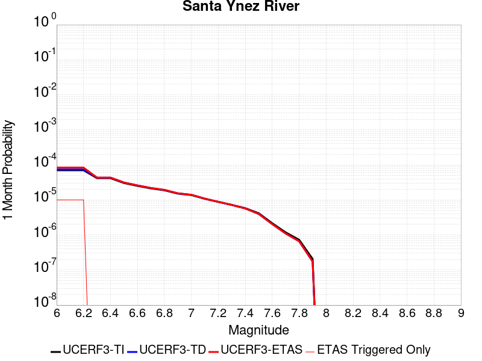 |  |  |

| Magnitude | 1 wk TI Prob | 1 wk TD Prob | 1 wk ETAS Prob | 1 wk ETAS/TD Gain | 1 wk ETAS Triggered Only | 1 mo TI Prob | 1 mo TD Prob | 1 mo ETAS Prob | 1 mo ETAS/TD Gain | 1 mo ETAS Triggered Only | 1 yr TI Prob | 1 yr TD Prob | 1 yr ETAS Prob | 1 yr ETAS/TD Gain | 1 yr ETAS Triggered Only | 10 yr TI Prob | 10 yr TD Prob | 10 yr ETAS Prob | 10 yr ETAS/TD Gain | 10 yr ETAS Triggered Only |
|-----|-----|-----|-----|-----|-----|-----|-----|-----|-----|-----|-----|-----|-----|-----|-----|-----|-----|-----|-----|-----|
| 6.0 | 1.6396456E-5 | 1.7209564E-5 | 1.7209564E-5 | 1.0 | 0.0 | 7.026863E-5 | 7.375339E-5 | 8.375265E-5 | 1.135577 | 1.0E-5 | 8.551848E-4 | 8.976132E-4 | 9.1759523E-4 | 1.0222613 | 2.0E-5 | 0.0085190125 | 0.008943425 | 0.008973157 | 1.0033244 | 3.0E-5 |
| 6.1 | 1.6396456E-5 | 1.7209564E-5 | 1.7209564E-5 | 1.0 | 0.0 | 7.026863E-5 | 7.375339E-5 | 8.375265E-5 | 1.135577 | 1.0E-5 | 8.551848E-4 | 8.976132E-4 | 9.1759523E-4 | 1.0222613 | 2.0E-5 | 0.0085190125 | 0.008943425 | 0.008973157 | 1.0033244 | 3.0E-5 |
| 6.2 | 1.6396456E-5 | 1.7209564E-5 | 1.7209564E-5 | 1.0 | 0.0 | 7.026863E-5 | 7.375339E-5 | 8.375265E-5 | 1.135577 | 1.0E-5 | 8.551848E-4 | 8.976132E-4 | 9.1759523E-4 | 1.0222613 | 2.0E-5 | 0.0085190125 | 0.008943425 | 0.008973157 | 1.0033244 | 3.0E-5 |
| 6.3 | 9.736976E-6 | 1.0122399E-5 | 1.0122399E-5 | 1.0 | 0.0 | 4.172923E-5 | 4.3381016E-5 | 4.3381016E-5 | 1.0 | 0.0 | 5.0793495E-4 | 5.2804087E-4 | 5.2804087E-4 | 1.0 | 0.0 | 0.005067755 | 0.0052683675 | 0.005278315 | 1.0018882 | 1.0E-5 |
| 6.4 | 9.736976E-6 | 1.0122399E-5 | 1.0122399E-5 | 1.0 | 0.0 | 4.172923E-5 | 4.3381016E-5 | 4.3381016E-5 | 1.0 | 0.0 | 5.0793495E-4 | 5.2804087E-4 | 5.2804087E-4 | 1.0 | 0.0 | 0.005067755 | 0.0052683675 | 0.005278315 | 1.0018882 | 1.0E-5 |
| 6.5 | 7.081964E-6 | 7.3299457E-6 | 7.3299457E-6 | 1.0 | 0.0 | 3.035092E-5 | 3.1413685E-5 | 3.1413685E-5 | 1.0 | 0.0 | 3.694598E-4 | 3.8239607E-4 | 3.8239607E-4 | 1.0 | 0.0 | 0.0036884616 | 0.0038175425 | 0.0038275043 | 1.0026095 | 1.0E-5 |
| 6.6 | 5.873247E-6 | 6.0597836E-6 | 6.0597836E-6 | 1.0 | 0.0 | 2.5170815E-5 | 2.5970248E-5 | 2.5970248E-5 | 1.0 | 0.0 | 3.064116E-4 | 3.1614274E-4 | 3.1614274E-4 | 1.0 | 0.0 | 0.0030598943 | 0.0031570175 | 0.003166986 | 1.0031575 | 1.0E-5 |
| 6.7 | 4.973277E-6 | 5.115936E-6 | 5.115936E-6 | 1.0 | 0.0 | 2.1313872E-5 | 2.1925258E-5 | 2.1925258E-5 | 1.0 | 0.0 | 2.5946548E-4 | 2.669078E-4 | 2.669078E-4 | 1.0 | 0.0 | 0.0025916274 | 0.002665921 | 0.0026758944 | 1.003741 | 1.0E-5 |
| 6.8 | 4.396492E-6 | 4.5110087E-6 | 4.5110087E-6 | 1.0 | 0.0 | 1.884197E-5 | 1.9332752E-5 | 1.9332752E-5 | 1.0 | 0.0 | 2.2937685E-4 | 2.3535118E-4 | 2.3535118E-4 | 1.0 | 0.0 | 0.0022914023 | 0.0023510547 | 0.0023610312 | 1.0042434 | 1.0E-5 |
| 6.9 | 3.5255632E-6 | 3.6013587E-6 | 3.6013587E-6 | 1.0 | 0.0 | 1.5109469E-5 | 1.5434303E-5 | 1.5434303E-5 | 1.0 | 0.0 | 1.8394225E-4 | 1.878966E-4 | 1.878966E-4 | 1.0 | 0.0 | 0.0018379007 | 0.0018773936 | 0.0018773936 | 1.0 | 0.0 |
| 7.0 | 3.211603E-6 | 3.2736775E-6 | 3.2736775E-6 | 1.0 | 0.0 | 1.376394E-5 | 1.4029972E-5 | 1.4029972E-5 | 1.0 | 0.0 | 1.6756308E-4 | 1.7080165E-4 | 1.7080165E-4 | 1.0 | 0.0 | 0.0016743679 | 0.001706718 | 0.001706718 | 1.0 | 0.0 |
| 7.1 | 2.5094619E-6 | 2.5409397E-6 | 2.5409397E-6 | 1.0 | 0.0 | 1.0754793E-5 | 1.0889697E-5 | 1.0889697E-5 | 1.0 | 0.0 | 1.3093173E-4 | 1.3257404E-4 | 1.3257404E-4 | 1.0 | 0.0 | 0.0013085462 | 0.0013249556 | 0.0013249556 | 1.0 | 0.0 |
| 7.2 | 2.0515774E-6 | 2.0619539E-6 | 2.0619539E-6 | 1.0 | 0.0 | 8.792445E-6 | 8.836915E-6 | 8.836915E-6 | 1.0 | 0.0 | 1.0704277E-4 | 1.0758417E-4 | 1.0758417E-4 | 1.0 | 0.0 | 0.0010699122 | 0.0010753252 | 0.0010753252 | 1.0 | 0.0 |
| 7.3 | 1.6845745E-6 | 1.6774045E-6 | 1.6774045E-6 | 1.0 | 0.0 | 7.219585E-6 | 7.1888567E-6 | 7.1888567E-6 | 1.0 | 0.0 | 8.78949E-5 | 8.752084E-5 | 8.752084E-5 | 1.0 | 0.0 | 8.7860145E-4 | 8.748666E-4 | 8.748666E-4 | 1.0 | 0.0 |
| 7.4 | 1.3600285E-6 | 1.3333469E-6 | 1.3333469E-6 | 1.0 | 0.0 | 5.82868E-6 | 5.714331E-6 | 5.714331E-6 | 1.0 | 0.0 | 7.096187E-5 | 6.956978E-5 | 6.956978E-5 | 1.0 | 0.0 | 7.0939213E-4 | 6.9548225E-4 | 6.9548225E-4 | 1.0 | 0.0 |
| 7.5 | 9.735342E-7 | 9.290183E-7 | 9.290183E-7 | 1.0 | 0.0 | 4.172283E-6 | 3.981501E-6 | 3.981501E-6 | 1.0 | 0.0 | 5.079636E-5 | 4.8473714E-5 | 4.8473714E-5 | 1.0 | 0.0 | 5.0784746E-4 | 4.846331E-4 | 4.846331E-4 | 1.0 | 0.0 |
| 7.6 | 5.067187E-7 | 4.778607E-7 | 4.778607E-7 | 1.0 | 0.0 | 2.1716498E-6 | 2.0479727E-6 | 2.0479727E-6 | 1.0 | 0.0 | 2.6439517E-5 | 2.493379E-5 | 2.493379E-5 | 1.0 | 0.0 | 2.643637E-4 | 2.4931066E-4 | 2.4931066E-4 | 1.0 | 0.0 |
| 7.7 | 2.769089E-7 | 2.5759311E-7 | 2.5759311E-7 | 1.0 | 0.0 | 1.1867519E-6 | 1.1039699E-6 | 1.1039699E-6 | 1.0 | 0.0 | 1.4448608E-5 | 1.3440752E-5 | 1.3440752E-5 | 1.0 | 0.0 | 1.444767E-4 | 1.3439942E-4 | 1.3439942E-4 | 1.0 | 0.0 |
| 7.8 | 1.7044663E-7 | 1.5449127E-7 | 1.5449127E-7 | 1.0 | 0.0 | 7.3048534E-7 | 6.6210526E-7 | 6.6210526E-7 | 1.0 | 0.0 | 8.893623E-6 | 8.061102E-6 | 8.061102E-6 | 1.0 | 0.0 | 8.893267E-5 | 8.0608115E-5 | 8.0608115E-5 | 1.0 | 0.0 |
| 7.9 | 4.8344287E-8 | 4.0911235E-8 | 4.0911235E-8 | 1.0 | 0.0 | 2.0718979E-7 | 1.7533385E-7 | 1.7533385E-7 | 1.0 | 0.0 | 2.5225327E-6 | 2.1346877E-6 | 2.1346877E-6 | 1.0 | 0.0 | 2.5225041E-5 | 2.1346676E-5 | 2.1346676E-5 | 1.0 | 0.0 |

## San Jacinto (Borrego)
*[(top)](#table-of-contents)*

| 1 Week | 1 Month | 1 Year | 10 Year |
|-----|-----|-----|-----|
|  |  |  |  |

| Magnitude | 1 wk TI Prob | 1 wk TD Prob | 1 wk ETAS Prob | 1 wk ETAS/TD Gain | 1 wk ETAS Triggered Only | 1 mo TI Prob | 1 mo TD Prob | 1 mo ETAS Prob | 1 mo ETAS/TD Gain | 1 mo ETAS Triggered Only | 1 yr TI Prob | 1 yr TD Prob | 1 yr ETAS Prob | 1 yr ETAS/TD Gain | 1 yr ETAS Triggered Only | 10 yr TI Prob | 10 yr TD Prob | 10 yr ETAS Prob | 10 yr ETAS/TD Gain | 10 yr ETAS Triggered Only |
|-----|-----|-----|-----|-----|-----|-----|-----|-----|-----|-----|-----|-----|-----|-----|-----|-----|-----|-----|-----|-----|
| 6.0 | 3.543992E-5 | 2.7934115E-5 | 2.7934115E-5 | 1.0 | 0.0 | 1.5187653E-4 | 1.1971221E-4 | 1.2971101E-4 | 1.0835236 | 1.0E-5 | 0.0018475284 | 0.001456534 | 0.0014765048 | 1.0137112 | 2.0E-5 | 0.018322436 | 0.014873597 | 0.0149031505 | 1.001987 | 3.0E-5 |
| 6.1 | 3.542281E-5 | 2.7934115E-5 | 2.7934115E-5 | 1.0 | 0.0 | 1.5180321E-4 | 1.1971221E-4 | 1.2971101E-4 | 1.0835236 | 1.0E-5 | 0.0018466372 | 0.001456534 | 0.0014765048 | 1.0137112 | 2.0E-5 | 0.018313672 | 0.014873597 | 0.0149031505 | 1.001987 | 3.0E-5 |
| 6.2 | 3.4688688E-5 | 2.7934115E-5 | 2.7934115E-5 | 1.0 | 0.0 | 1.4865733E-4 | 1.1971221E-4 | 1.2971101E-4 | 1.0835236 | 1.0E-5 | 0.0018084005 | 0.0014565339 | 0.0014765048 | 1.0137112 | 2.0E-5 | 0.017937548 | 0.014873596 | 0.01490315 | 1.001987 | 3.0E-5 |
| 6.3 | 3.2087122E-5 | 2.7779462E-5 | 2.7779462E-5 | 1.0 | 0.0 | 1.3750899E-4 | 1.1904947E-4 | 1.2904829E-4 | 1.0839887 | 1.0E-5 | 0.0016728862 | 0.0014484759 | 0.0014684469 | 1.0137876 | 2.0E-5 | 0.016603488 | 0.01479463 | 0.014824186 | 1.0019977 | 3.0E-5 |
| 6.4 | 3.1828724E-5 | 2.7746448E-5 | 2.7746448E-5 | 1.0 | 0.0 | 1.364017E-4 | 1.18908E-4 | 1.289068E-4 | 1.0840887 | 1.0E-5 | 0.0016594254 | 0.0014467557 | 0.0014667268 | 1.0138041 | 2.0E-5 | 0.016470885 | 0.014777708 | 0.014807264 | 1.0020001 | 3.0E-5 |
| 6.5 | 3.1563577E-5 | 2.7486154E-5 | 2.7486154E-5 | 1.0 | 0.0 | 1.3526545E-4 | 1.1779256E-4 | 1.2779138E-4 | 1.084885 | 1.0E-5 | 0.0016456128 | 0.0014331931 | 0.0014531645 | 1.0139349 | 2.0E-5 | 0.0163348 | 0.014644288 | 0.01467385 | 1.0020186 | 3.0E-5 |
| 6.6 | 3.1467625E-5 | 2.7330374E-5 | 2.7330374E-5 | 1.0 | 0.0 | 1.3485427E-4 | 1.1712498E-4 | 1.2712381E-4 | 1.0853689 | 1.0E-5 | 0.0016406142 | 0.001425076 | 0.0014450476 | 1.0140144 | 2.0E-5 | 0.016285548 | 0.014564533 | 0.014594096 | 1.0020298 | 3.0E-5 |
| 6.7 | 3.1223695E-5 | 2.6948383E-5 | 2.6948383E-5 | 1.0 | 0.0 | 1.3380898E-4 | 1.1548802E-4 | 1.2548687E-4 | 1.0865791 | 1.0E-5 | 0.0016279068 | 0.0014051719 | 0.0014251438 | 1.0142131 | 2.0E-5 | 0.01616033 | 0.014368899 | 0.014398469 | 1.0020578 | 3.0E-5 |
| 6.8 | 3.1015585E-5 | 2.6769376E-5 | 2.6769376E-5 | 1.0 | 0.0 | 1.3291716E-4 | 1.14720926E-4 | 1.2471978E-4 | 1.0871581 | 1.0E-5 | 0.001617065 | 0.0013958444 | 0.0014158165 | 1.0143082 | 2.0E-5 | 0.016053487 | 0.014276173 | 0.014305744 | 1.0020714 | 3.0E-5 |
| 6.9 | 2.6641965E-5 | 2.2191349E-5 | 2.2191349E-5 | 1.0 | 0.0 | 1.1417485E-4 | 9.510233E-5 | 1.0510138E-4 | 1.1051399 | 1.0E-5 | 0.0013891924 | 0.0011572598 | 0.0011772367 | 1.0172622 | 2.0E-5 | 0.0138054015 | 0.011886145 | 0.011915788 | 1.002494 | 3.0E-5 |
| 7.0 | 2.3854353E-5 | 2.048587E-5 | 2.048587E-5 | 1.0 | 0.0 | 1.02228936E-4 | 8.779365E-5 | 9.779277E-5 | 1.1138935 | 1.0E-5 | 0.0012439266 | 0.0010683661 | 0.0010883447 | 1.0187001 | 2.0E-5 | 0.012369866 | 0.010986375 | 0.011016045 | 1.0027007 | 3.0E-5 |
| 7.1 | 2.3672901E-5 | 2.032235E-5 | 2.032235E-5 | 1.0 | 0.0 | 1.0145135E-4 | 8.709289E-5 | 9.709202E-5 | 1.1148099 | 1.0E-5 | 0.0012344702 | 0.0010598428 | 0.0010798215 | 1.0188507 | 2.0E-5 | 0.0122763505 | 0.010901547 | 0.01093122 | 1.0027219 | 3.0E-5 |
| 7.2 | 2.2717244E-5 | 1.9549674E-5 | 1.9549674E-5 | 1.0 | 0.0 | 9.735599E-5 | 8.378164E-5 | 9.378081E-5 | 1.1193479 | 1.0E-5 | 0.0011846646 | 0.0010195666 | 0.0010395461 | 1.0195962 | 2.0E-5 | 0.01178369 | 0.010498884 | 0.010528569 | 1.0028274 | 3.0E-5 |
| 7.3 | 2.1016205E-5 | 1.8391213E-5 | 1.8391213E-5 | 1.0 | 0.0 | 9.006634E-5 | 7.881711E-5 | 8.881633E-5 | 1.126866 | 1.0E-5 | 0.001096006 | 9.5917797E-4 | 9.791588E-4 | 1.0208312 | 2.0E-5 | 0.010906163 | 0.009894462 | 0.009924165 | 1.003002 | 3.0E-5 |
| 7.4 | 2.0683625E-5 | 1.8193714E-5 | 1.8193714E-5 | 1.0 | 0.0 | 8.86411E-5 | 7.797074E-5 | 8.7969966E-5 | 1.1282432 | 1.0E-5 | 0.001078671 | 9.488824E-4 | 9.6886343E-4 | 1.0210575 | 2.0E-5 | 0.010734501 | 0.009791178 | 0.009820884 | 1.003034 | 3.0E-5 |
| 7.5 | 1.9993966E-5 | 1.7788683E-5 | 1.7788683E-5 | 1.0 | 0.0 | 8.568561E-5 | 7.6234996E-5 | 8.6234235E-5 | 1.1311634 | 1.0E-5 | 0.001042723 | 9.2776783E-4 | 9.477493E-4 | 1.0215371 | 2.0E-5 | 0.010378438 | 0.00957807 | 0.009607783 | 1.0031022 | 3.0E-5 |
| 7.6 | 1.788966E-5 | 1.6441732E-5 | 1.6441732E-5 | 1.0 | 0.0 | 7.666772E-5 | 7.046267E-5 | 8.046196E-5 | 1.1419091 | 1.0E-5 | 9.3302975E-4 | 8.575471E-4 | 8.7752996E-4 | 1.0233023 | 2.0E-5 | 0.00929122 | 0.0088698575 | 0.008899591 | 1.0033523 | 3.0E-5 |
| 7.7 | 1.5125781E-5 | 1.4243621E-5 | 1.4243621E-5 | 1.0 | 0.0 | 6.4823165E-5 | 6.1042665E-5 | 7.104206E-5 | 1.1638099 | 1.0E-5 | 7.889362E-4 | 7.4294186E-4 | 7.62927E-4 | 1.0269 | 2.0E-5 | 0.007861412 | 0.0077174758 | 0.0077472446 | 1.0038573 | 3.0E-5 |
| 7.8 | 1.250089E-5 | 1.2636515E-5 | 1.2636515E-5 | 1.0 | 0.0 | 5.3574146E-5 | 5.415537E-5 | 6.4154825E-5 | 1.1846439 | 1.0E-5 | 6.5207E-4 | 6.591428E-4 | 6.791296E-4 | 1.0303224 | 2.0E-5 | 0.006501599 | 0.00687092 | 0.0069007133 | 1.0043362 | 3.0E-5 |
| 7.9 | 9.561E-6 | 9.759914E-6 | 9.759914E-6 | 1.0 | 0.0 | 4.0975072E-5 | 4.1827538E-5 | 5.182712E-5 | 1.239067 | 1.0E-5 | 4.987573E-4 | 5.091318E-4 | 5.2912167E-4 | 1.0392625 | 2.0E-5 | 0.0049763937 | 0.0053551346 | 0.005384974 | 1.0055721 | 3.0E-5 |
| 8.0 | 8.01699E-6 | 8.2982915E-6 | 8.2982915E-6 | 1.0 | 0.0 | 3.4358076E-5 | 3.5563622E-5 | 4.556327E-5 | 1.2811762 | 1.0E-5 | 4.1822926E-4 | 4.329016E-4 | 4.5289297E-4 | 1.0461799 | 2.0E-5 | 0.0041744304 | 0.0045759073 | 0.00460577 | 1.0065261 | 3.0E-5 |
| 8.1 | 6.541947E-6 | 6.466171E-6 | 6.466171E-6 | 1.0 | 0.0 | 2.8036617E-5 | 2.7711869E-5 | 3.771159E-5 | 1.3608462 | 1.0E-5 | 3.4129233E-4 | 3.3734026E-4 | 3.573335E-4 | 1.0592673 | 2.0E-5 | 0.0034076865 | 0.0035827826 | 0.003602711 | 1.0055623 | 2.0E-5 |
| 8.2 | 1.7968189E-6 | 7.978815E-7 | 7.978815E-7 | 1.0 | 0.0 | 7.70063E-6 | 3.419488E-6 | 3.419488E-6 | 1.0 | 0.0 | 9.3751136E-5 | 4.163149E-5 | 4.163149E-5 | 1.0 | 0.0 | 9.371159E-4 | 4.7162327E-4 | 4.7162327E-4 | 1.0 | 0.0 |
| 8.3 | 1.5167889E-7 | 4.9030522E-8 | 4.9030522E-8 | 1.0 | 0.0 | 6.500522E-7 | 2.1013079E-7 | 2.1013079E-7 | 1.0 | 0.0 | 7.9143565E-6 | 2.55834E-6 | 2.55834E-6 | 1.0 | 0.0 | 7.914075E-5 | 2.9725656E-5 | 2.9725656E-5 | 1.0 | 0.0 |

## San Diego Trough north alt1
*[(top)](#table-of-contents)*

| 1 Week | 1 Month | 1 Year | 10 Year |
|-----|-----|-----|-----|
|  |  |  |  |

| Magnitude | 1 wk TI Prob | 1 wk TD Prob | 1 wk ETAS Prob | 1 wk ETAS/TD Gain | 1 wk ETAS Triggered Only | 1 mo TI Prob | 1 mo TD Prob | 1 mo ETAS Prob | 1 mo ETAS/TD Gain | 1 mo ETAS Triggered Only | 1 yr TI Prob | 1 yr TD Prob | 1 yr ETAS Prob | 1 yr ETAS/TD Gain | 1 yr ETAS Triggered Only | 10 yr TI Prob | 10 yr TD Prob | 10 yr ETAS Prob | 10 yr ETAS/TD Gain | 10 yr ETAS Triggered Only |
|-----|-----|-----|-----|-----|-----|-----|-----|-----|-----|-----|-----|-----|-----|-----|-----|-----|-----|-----|-----|-----|
| 6.0 | 7.329252E-5 | 8.821339E-5 | 8.821339E-5 | 1.0 | 0.0 | 3.14073E-4 | 3.7800625E-4 | 3.7800625E-4 | 1.0 | 0.0 | 0.0038171355 | 0.0045931544 | 0.0046031084 | 1.0021671 | 1.0E-5 | 0.03752231 | 0.045046188 | 0.045074835 | 1.000636 | 3.0E-5 |
| 6.1 | 3.7940346E-5 | 4.488612E-5 | 4.488612E-5 | 1.0 | 0.0 | 1.6259136E-4 | 1.9235547E-4 | 1.9235547E-4 | 1.0 | 0.0 | 0.0019777524 | 0.002339501 | 0.002339501 | 1.0 | 0.0 | 0.019602431 | 0.023157248 | 0.023157248 | 1.0 | 0.0 |
| 6.2 | 2.8645263E-5 | 3.329751E-5 | 3.329751E-5 | 1.0 | 0.0 | 1.2275964E-4 | 1.4269596E-4 | 1.4269596E-4 | 1.0 | 0.0 | 0.0014935739 | 0.0017359565 | 0.0017359565 | 1.0 | 0.0 | 0.0148357535 | 0.01722662 | 0.01722662 | 1.0 | 0.0 |
| 6.3 | 2.8645263E-5 | 3.329751E-5 | 3.329751E-5 | 1.0 | 0.0 | 1.2275964E-4 | 1.4269596E-4 | 1.4269596E-4 | 1.0 | 0.0 | 0.0014935739 | 0.0017359565 | 0.0017359565 | 1.0 | 0.0 | 0.0148357535 | 0.01722662 | 0.01722662 | 1.0 | 0.0 |
| 6.4 | 2.2204576E-5 | 2.5448817E-5 | 2.5448817E-5 | 1.0 | 0.0 | 9.5159E-5 | 1.0906186E-4 | 1.0906186E-4 | 1.0 | 0.0 | 0.001157945 | 0.0013270293 | 0.0013270293 | 1.0 | 0.0 | 0.011519298 | 0.013192211 | 0.013192211 | 1.0 | 0.0 |
| 6.5 | 2.1004838E-5 | 2.4025157E-5 | 2.4025157E-5 | 1.0 | 0.0 | 9.0017624E-5 | 1.0296095E-4 | 1.0296095E-4 | 1.0 | 0.0 | 0.0010954136 | 0.001252838 | 0.001252838 | 1.0 | 0.0 | 0.010900296 | 0.012458827 | 0.012458827 | 1.0 | 0.0 |
| 6.6 | 1.820557E-5 | 2.0705167E-5 | 2.0705167E-5 | 1.0 | 0.0 | 7.802154E-5 | 8.873344E-5 | 8.873344E-5 | 1.0 | 0.0 | 9.4949827E-4 | 0.0010797997 | 0.0010797997 | 1.0 | 0.0 | 0.009454516 | 0.010746201 | 0.010746201 | 1.0 | 0.0 |
| 6.7 | 1.5884485E-5 | 1.7983964E-5 | 1.7983964E-5 | 1.0 | 0.0 | 6.807459E-5 | 7.707187E-5 | 7.707187E-5 | 1.0 | 0.0 | 8.284929E-4 | 9.379488E-4 | 9.379488E-4 | 1.0 | 0.0 | 0.008254109 | 0.009340268 | 0.009340268 | 1.0 | 0.0 |
| 6.8 | 1.4331171E-5 | 1.6201348E-5 | 1.6201348E-5 | 1.0 | 0.0 | 6.141786E-5 | 6.9432506E-5 | 6.9432506E-5 | 1.0 | 0.0 | 7.4750587E-4 | 8.4501493E-4 | 8.4501493E-4 | 1.0 | 0.0 | 0.0074499645 | 0.008418285 | 0.008418285 | 1.0 | 0.0 |
| 6.9 | 1.2574203E-5 | 1.4206081E-5 | 1.4206081E-5 | 1.0 | 0.0 | 5.3888325E-5 | 6.088179E-5 | 6.088179E-5 | 1.0 | 0.0 | 6.558929E-4 | 7.4098515E-4 | 7.4098515E-4 | 1.0 | 0.0 | 0.0065396037 | 0.0073853307 | 0.0073853307 | 1.0 | 0.0 |
| 7.0 | 1.0883844E-5 | 1.22894735E-5 | 1.22894735E-5 | 1.0 | 0.0 | 4.664421E-5 | 5.2668114E-5 | 5.2668114E-5 | 1.0 | 0.0 | 5.677453E-4 | 6.410466E-4 | 6.410466E-4 | 1.0 | 0.0 | 0.00566297 | 0.0063921027 | 0.0063921027 | 1.0 | 0.0 |
| 7.1 | 9.393088E-6 | 1.0607203E-5 | 1.0607203E-5 | 1.0 | 0.0 | 4.025547E-5 | 4.5458655E-5 | 4.5458655E-5 | 1.0 | 0.0 | 4.900001E-4 | 5.5331935E-4 | 5.5331935E-4 | 1.0 | 0.0 | 0.0048892107 | 0.005519513 | 0.005519513 | 1.0 | 0.0 |
| 7.2 | 8.190791E-6 | 9.258787E-6 | 9.258787E-6 | 1.0 | 0.0 | 3.510292E-5 | 3.9679915E-5 | 3.9679915E-5 | 1.0 | 0.0 | 4.2729423E-4 | 4.8299658E-4 | 4.8299658E-4 | 1.0 | 0.0 | 0.0042647356 | 0.004819548 | 0.004819548 | 1.0 | 0.0 |
| 7.3 | 6.268162E-6 | 7.08984E-6 | 7.08984E-6 | 1.0 | 0.0 | 2.6863276E-5 | 3.0384675E-5 | 3.0384675E-5 | 1.0 | 0.0 | 3.2701128E-4 | 3.6987104E-4 | 3.6987104E-4 | 1.0 | 0.0 | 0.003265305 | 0.0036926004 | 0.0036926004 | 1.0 | 0.0 |
| 7.4 | 4.985186E-6 | 5.6427807E-6 | 5.6427807E-6 | 1.0 | 0.0 | 2.1364907E-5 | 2.4183124E-5 | 2.4183124E-5 | 1.0 | 0.0 | 2.600867E-4 | 2.9439016E-4 | 2.9439016E-4 | 1.0 | 0.0 | 0.002597825 | 0.002940043 | 0.002940043 | 1.0 | 0.0 |
| 7.5 | 1.7489613E-6 | 1.9697113E-6 | 1.9697113E-6 | 1.0 | 0.0 | 7.495527E-6 | 8.441594E-6 | 8.441594E-6 | 1.0 | 0.0 | 9.125422E-5 | 1.0277178E-4 | 1.0277178E-4 | 1.0 | 0.0 | 9.1216754E-4 | 0.0010272645 | 0.0010272645 | 1.0 | 0.0 |
| 7.6 | 1.6988751E-7 | 1.7533898E-7 | 1.7533898E-7 | 1.0 | 0.0 | 7.2808916E-7 | 7.5145255E-7 | 7.5145255E-7 | 1.0 | 0.0 | 8.864449E-6 | 9.148898E-6 | 9.148898E-6 | 1.0 | 0.0 | 8.8640954E-5 | 9.148542E-5 | 9.148542E-5 | 1.0 | 0.0 |

## Hunting Creek - Berryessa 2011 CFM
*[(top)](#table-of-contents)*

| 1 Week | 1 Month | 1 Year | 10 Year |
|-----|-----|-----|-----|
|  |  | 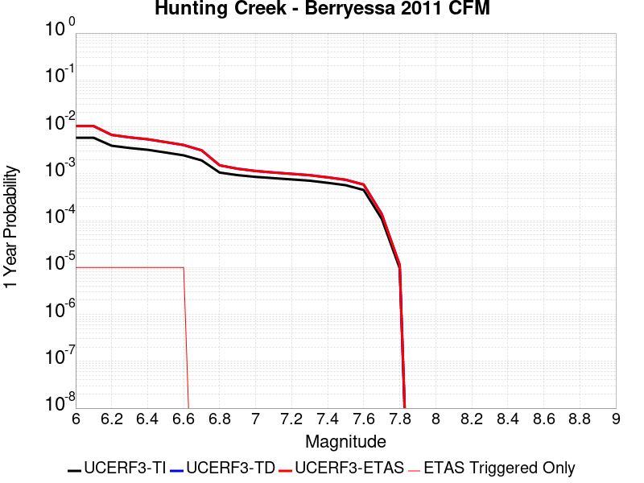 | 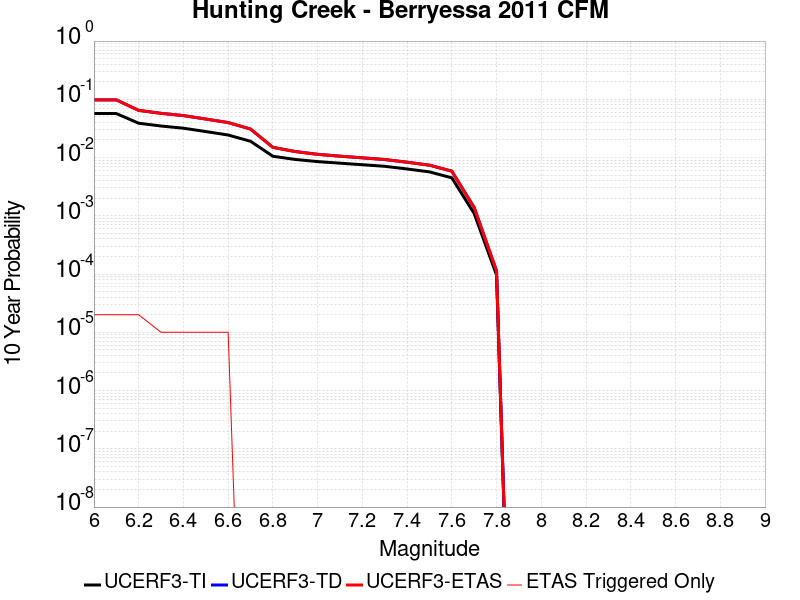 |

| Magnitude | 1 wk TI Prob | 1 wk TD Prob | 1 wk ETAS Prob | 1 wk ETAS/TD Gain | 1 wk ETAS Triggered Only | 1 mo TI Prob | 1 mo TD Prob | 1 mo ETAS Prob | 1 mo ETAS/TD Gain | 1 mo ETAS Triggered Only | 1 yr TI Prob | 1 yr TD Prob | 1 yr ETAS Prob | 1 yr ETAS/TD Gain | 1 yr ETAS Triggered Only | 10 yr TI Prob | 10 yr TD Prob | 10 yr ETAS Prob | 10 yr ETAS/TD Gain | 10 yr ETAS Triggered Only |
|-----|-----|-----|-----|-----|-----|-----|-----|-----|-----|-----|-----|-----|-----|-----|-----|-----|-----|-----|-----|-----|
| 6.0 | 1.1270982E-4 | 2.0014354E-4 | 2.0014354E-4 | 1.0 | 0.0 | 4.8295266E-4 | 8.574329E-4 | 8.574329E-4 | 1.0 | 0.0 | 0.0058641075 | 0.010387073 | 0.0103969695 | 1.0009527 | 1.0E-5 | 0.057117578 | 0.09804065 | 0.09805869 | 1.0001839 | 2.0E-5 |
| 6.1 | 1.1239393E-4 | 1.9962489E-4 | 1.9962489E-4 | 1.0 | 0.0 | 4.8159933E-4 | 8.552116E-4 | 8.552116E-4 | 1.0 | 0.0 | 0.0058477195 | 0.010360309 | 0.010370206 | 1.0009552 | 1.0E-5 | 0.056962132 | 0.09779912 | 0.09781717 | 1.0001845 | 2.0E-5 |
| 6.2 | 7.596265E-5 | 1.2941175E-4 | 1.2941175E-4 | 1.0 | 0.0 | 3.2551357E-4 | 5.544276E-4 | 5.544276E-4 | 1.0 | 0.0 | 0.0039559277 | 0.0067212153 | 0.006731148 | 1.0014778 | 1.0E-5 | 0.038862433 | 0.0645938 | 0.06461251 | 1.0002897 | 2.0E-5 |
| 6.3 | 6.78794E-5 | 1.145196E-4 | 1.145196E-4 | 1.0 | 0.0 | 2.9087928E-4 | 4.9066654E-4 | 4.9066654E-4 | 1.0 | 0.0 | 0.003535705 | 0.0059528556 | 0.005962796 | 1.0016699 | 1.0E-5 | 0.034799766 | 0.05746746 | 0.057476886 | 1.000164 | 1.0E-5 |
| 6.4 | 6.2165134E-5 | 1.0437306E-4 | 1.0437306E-4 | 1.0 | 0.0 | 2.6639478E-4 | 4.4723987E-4 | 4.4723987E-4 | 1.0 | 0.0 | 0.0032385332 | 0.005427739 | 0.005437685 | 1.0018324 | 1.0E-5 | 0.03191742 | 0.052552443 | 0.05256192 | 1.0001802 | 1.0E-5 |
| 6.5 | 5.4368087E-5 | 9.071981E-5 | 9.071981E-5 | 1.0 | 0.0 | 2.3298527E-4 | 3.887444E-4 | 3.887444E-4 | 1.0 | 0.0 | 0.0028329059 | 0.004720021 | 0.0047299736 | 1.0021087 | 1.0E-5 | 0.027970633 | 0.045881823 | 0.045891363 | 1.0002079 | 1.0E-5 |
| 6.6 | 4.729947E-5 | 7.848042E-5 | 7.848042E-5 | 1.0 | 0.0 | 2.0269625E-4 | 3.363043E-4 | 3.363043E-4 | 1.0 | 0.0 | 0.002465034 | 0.0040850975 | 0.0040950566 | 1.002438 | 1.0E-5 | 0.02437869 | 0.039853033 | 0.039862636 | 1.0002409 | 1.0E-5 |
| 6.7 | 3.6875328E-5 | 6.0455113E-5 | 6.0455113E-5 | 1.0 | 0.0 | 1.5802756E-4 | 2.5907016E-4 | 2.5907016E-4 | 1.0 | 0.0 | 0.0019222875 | 0.0031483201 | 0.0031483201 | 1.0 | 0.0 | 0.019057442 | 0.030893533 | 0.030893533 | 1.0 | 0.0 |
| 6.8 | 2.0292036E-5 | 2.897696E-5 | 2.897696E-5 | 1.0 | 0.0 | 8.6962966E-5 | 1.241811E-4 | 1.241811E-4 | 1.0 | 0.0 | 0.0010582599 | 0.00151084 | 0.00151084 | 1.0 | 0.0 | 0.010532344 | 0.014978847 | 0.014978847 | 1.0 | 0.0 |
| 6.9 | 1.7871042E-5 | 2.4472789E-5 | 2.4472789E-5 | 1.0 | 0.0 | 7.658793E-5 | 1.048792E-4 | 1.048792E-4 | 1.0 | 0.0 | 9.320591E-4 | 0.0012761577 | 0.0012761577 | 1.0 | 0.0 | 0.009281595 | 0.012680048 | 0.012680048 | 1.0 | 0.0 |
| 7.0 | 1.6415532E-5 | 2.1906764E-5 | 2.1906764E-5 | 1.0 | 0.0 | 7.035038E-5 | 9.388277E-5 | 9.388277E-5 | 1.0 | 0.0 | 8.561793E-4 | 0.0011424269 | 0.0011424269 | 1.0 | 0.0 | 0.008528882 | 0.011364769 | 0.011364769 | 1.0 | 0.0 |
| 7.1 | 1.5409885E-5 | 2.03468E-5 | 2.03468E-5 | 1.0 | 0.0 | 6.6040695E-5 | 8.719768E-5 | 8.719768E-5 | 1.0 | 0.0 | 8.0374884E-4 | 0.0010611176 | 0.0010611176 | 1.0 | 0.0 | 0.00800848 | 0.010560832 | 0.010560832 | 1.0 | 0.0 |
| 7.2 | 1.4497423E-5 | 1.905539E-5 | 1.905539E-5 | 1.0 | 0.0 | 6.213033E-5 | 8.166341E-5 | 8.166341E-5 | 1.0 | 0.0 | 7.5617427E-4 | 9.938016E-4 | 9.938016E-4 | 1.0 | 0.0 | 0.0075360634 | 0.009894148 | 0.009894148 | 1.0 | 0.0 |
| 7.3 | 1.3615175E-5 | 1.7826538E-5 | 1.7826538E-5 | 1.0 | 0.0 | 5.8349444E-5 | 7.639723E-5 | 7.639723E-5 | 1.0 | 0.0 | 7.101729E-4 | 9.2974224E-4 | 9.2974224E-4 | 1.0 | 0.0 | 0.0070790765 | 0.009259034 | 0.009259034 | 1.0 | 0.0 |
| 7.4 | 1.2252825E-5 | 1.6026612E-5 | 1.6026612E-5 | 1.0 | 0.0 | 5.251105E-5 | 6.868369E-5 | 6.868369E-5 | 1.0 | 0.0 | 6.391345E-4 | 8.359059E-4 | 8.359059E-4 | 1.0 | 0.0 | 0.0063729943 | 0.008328059 | 0.008328059 | 1.0 | 0.0 |
| 7.5 | 1.0913301E-5 | 1.4241439E-5 | 1.4241439E-5 | 1.0 | 0.0 | 4.6770452E-5 | 6.103333E-5 | 6.103333E-5 | 1.0 | 0.0 | 5.6928146E-4 | 7.4283016E-4 | 7.4283016E-4 | 1.0 | 0.0 | 0.0056782532 | 0.0074038464 | 0.0074038464 | 1.0 | 0.0 |
| 7.6 | 8.623192E-6 | 1.1234897E-5 | 1.1234897E-5 | 1.0 | 0.0 | 3.6956015E-5 | 4.8148686E-5 | 4.8148686E-5 | 1.0 | 0.0 | 4.4984656E-4 | 5.860551E-4 | 5.860551E-4 | 1.0 | 0.0 | 0.00448937 | 0.0058454107 | 0.0058454107 | 1.0 | 0.0 |
| 7.7 | 2.0993634E-6 | 2.6626365E-6 | 2.6626365E-6 | 1.0 | 0.0 | 8.997241E-6 | 1.141125E-5 | 1.141125E-5 | 1.0 | 0.0 | 1.09535904E-4 | 1.3892318E-4 | 1.3892318E-4 | 1.0 | 0.0 | 0.0010948193 | 0.0013883698 | 0.0013883698 | 1.0 | 0.0 |
| 7.8 | 1.8428308E-7 | 2.167475E-7 | 2.167475E-7 | 1.0 | 0.0 | 7.897844E-7 | 9.2891753E-7 | 9.2891753E-7 | 1.0 | 0.0 | 9.615583E-6 | 1.1309516E-5 | 1.1309516E-5 | 1.0 | 0.0 | 9.615166E-5 | 1.13088005E-4 | 1.13088005E-4 | 1.0 | 0.0 |

## Hosgri (Extension)
*[(top)](#table-of-contents)*

| 1 Week | 1 Month | 1 Year | 10 Year |
|-----|-----|-----|-----|
|  |  |  |  |

| Magnitude | 1 wk TI Prob | 1 wk TD Prob | 1 wk ETAS Prob | 1 wk ETAS/TD Gain | 1 wk ETAS Triggered Only | 1 mo TI Prob | 1 mo TD Prob | 1 mo ETAS Prob | 1 mo ETAS/TD Gain | 1 mo ETAS Triggered Only | 1 yr TI Prob | 1 yr TD Prob | 1 yr ETAS Prob | 1 yr ETAS/TD Gain | 1 yr ETAS Triggered Only | 10 yr TI Prob | 10 yr TD Prob | 10 yr ETAS Prob | 10 yr ETAS/TD Gain | 10 yr ETAS Triggered Only |
|-----|-----|-----|-----|-----|-----|-----|-----|-----|-----|-----|-----|-----|-----|-----|-----|-----|-----|-----|-----|-----|
| 6.0 | 1.1369135E-5 | 1.2083198E-5 | 1.2083198E-5 | 1.0 | 0.0 | 4.8723956E-5 | 5.1784238E-5 | 5.1784238E-5 | 1.0 | 0.0 | 5.9305265E-4 | 6.303134E-4 | 6.4030715E-4 | 1.0158551 | 1.0E-5 | 0.005914725 | 0.0062875054 | 0.00630738 | 1.003161 | 2.0E-5 |
| 6.1 | 6.934979E-6 | 7.3246356E-6 | 7.3246356E-6 | 1.0 | 0.0 | 2.9721E-5 | 3.139094E-5 | 3.139094E-5 | 1.0 | 0.0 | 3.617931E-4 | 3.8212183E-4 | 3.8212183E-4 | 1.0 | 0.0 | 0.0036120464 | 0.0038150605 | 0.0038150605 | 1.0 | 0.0 |
| 6.2 | 6.934979E-6 | 7.3246356E-6 | 7.3246356E-6 | 1.0 | 0.0 | 2.9721E-5 | 3.139094E-5 | 3.139094E-5 | 1.0 | 0.0 | 3.617931E-4 | 3.8212183E-4 | 3.8212183E-4 | 1.0 | 0.0 | 0.0036120464 | 0.0038150605 | 0.0038150605 | 1.0 | 0.0 |
| 6.3 | 4.5484676E-6 | 4.769387E-6 | 4.769387E-6 | 1.0 | 0.0 | 1.9493287E-5 | 2.0440071E-5 | 2.0440071E-5 | 1.0 | 0.0 | 2.3730492E-4 | 2.4882986E-4 | 2.4882986E-4 | 1.0 | 0.0 | 0.0023705168 | 0.0024855551 | 0.0024855551 | 1.0 | 0.0 |
| 6.4 | 4.218095E-6 | 4.416915E-6 | 4.416915E-6 | 1.0 | 0.0 | 1.8077424E-5 | 1.89295E-5 | 1.89295E-5 | 1.0 | 0.0 | 2.2007042E-4 | 2.3044262E-4 | 2.3044262E-4 | 1.0 | 0.0 | 0.002198526 | 0.0023020701 | 0.0023020701 | 1.0 | 0.0 |
| 6.5 | 3.717374E-6 | 3.8839266E-6 | 3.8839266E-6 | 1.0 | 0.0 | 1.5931506E-5 | 1.6645294E-5 | 1.6645294E-5 | 1.0 | 0.0 | 1.9394881E-4 | 2.0263779E-4 | 2.0263779E-4 | 1.0 | 0.0 | 0.0019377962 | 0.002024549 | 0.002024549 | 1.0 | 0.0 |
| 6.6 | 3.4605036E-6 | 3.6083522E-6 | 3.6083522E-6 | 1.0 | 0.0 | 1.4830645E-5 | 1.5464277E-5 | 1.5464277E-5 | 1.0 | 0.0 | 1.8054814E-4 | 1.8826143E-4 | 1.8826143E-4 | 1.0 | 0.0 | 0.0018040152 | 0.0018810342 | 0.0018810342 | 1.0 | 0.0 |
| 6.7 | 3.123439E-6 | 3.2466114E-6 | 3.2466114E-6 | 1.0 | 0.0 | 1.33860985E-5 | 1.3913976E-5 | 1.3913976E-5 | 1.0 | 0.0 | 1.6296357E-4 | 1.6938959E-4 | 1.6938959E-4 | 1.0 | 0.0 | 0.001628441 | 0.0016926157 | 0.0016926157 | 1.0 | 0.0 |
| 6.8 | 2.8290783E-6 | 2.93058E-6 | 2.93058E-6 | 1.0 | 0.0 | 1.2124565E-5 | 1.2559569E-5 | 1.2559569E-5 | 1.0 | 0.0 | 1.4760658E-4 | 1.529021E-4 | 1.529021E-4 | 1.0 | 0.0 | 0.0014750857 | 0.0015279776 | 0.0015279776 | 1.0 | 0.0 |
| 6.9 | 2.454112E-6 | 2.5283553E-6 | 2.5283553E-6 | 1.0 | 0.0 | 1.0517581E-5 | 1.08357635E-5 | 1.08357635E-5 | 1.0 | 0.0 | 1.2804402E-4 | 1.3191749E-4 | 1.3191749E-4 | 1.0 | 0.0 | 0.0012797028 | 0.001318398 | 0.001318398 | 1.0 | 0.0 |
| 7.0 | 2.1008145E-6 | 2.1499025E-6 | 2.1499025E-6 | 1.0 | 0.0 | 9.003459E-6 | 9.213836E-6 | 9.213836E-6 | 1.0 | 0.0 | 1.096116E-4 | 1.1217271E-4 | 1.1217271E-4 | 1.0 | 0.0 | 0.0010955755 | 0.0011211646 | 0.0011211646 | 1.0 | 0.0 |
| 7.1 | 1.744384E-6 | 1.7686639E-6 | 1.7686639E-6 | 1.0 | 0.0 | 7.47591E-6 | 7.579966E-6 | 7.579966E-6 | 1.0 | 0.0 | 9.1015405E-5 | 9.22822E-5 | 9.22822E-5 | 1.0 | 0.0 | 9.097813E-4 | 9.224405E-4 | 9.224405E-4 | 1.0 | 0.0 |
| 7.2 | 1.5456587E-6 | 1.556315E-6 | 1.556315E-6 | 1.0 | 0.0 | 6.6242346E-6 | 6.6699045E-6 | 6.6699045E-6 | 1.0 | 0.0 | 8.064707E-5 | 8.120307E-5 | 8.120307E-5 | 1.0 | 0.0 | 8.0617814E-4 | 8.117353E-4 | 8.117353E-4 | 1.0 | 0.0 |
| 7.3 | 1.3775123E-6 | 1.3766333E-6 | 1.3766333E-6 | 1.0 | 0.0 | 5.9036106E-6 | 5.899844E-6 | 5.899844E-6 | 1.0 | 0.0 | 7.187409E-5 | 7.182824E-5 | 7.182824E-5 | 1.0 | 0.0 | 7.185085E-4 | 7.180513E-4 | 7.180513E-4 | 1.0 | 0.0 |
| 7.4 | 1.214491E-6 | 1.2023696E-6 | 1.2023696E-6 | 1.0 | 0.0 | 5.2049513E-6 | 5.1530023E-6 | 5.1530023E-6 | 1.0 | 0.0 | 6.336844E-5 | 6.2736006E-5 | 6.2736006E-5 | 1.0 | 0.0 | 6.335037E-4 | 6.2718376E-4 | 6.2718376E-4 | 1.0 | 0.0 |
| 7.5 | 1.0101123E-6 | 9.842462E-7 | 9.842462E-7 | 1.0 | 0.0 | 4.3290456E-6 | 4.218191E-6 | 4.218191E-6 | 1.0 | 0.0 | 5.2704854E-5 | 5.135527E-5 | 5.135527E-5 | 1.0 | 0.0 | 5.2692357E-4 | 5.1343464E-4 | 5.1343464E-4 | 1.0 | 0.0 |
| 7.6 | 8.1558215E-7 | 7.7661633E-7 | 7.7661633E-7 | 1.0 | 0.0 | 3.4953473E-6 | 3.3283516E-6 | 3.3283516E-6 | 1.0 | 0.0 | 4.255502E-5 | 4.0521933E-5 | 4.0521933E-5 | 1.0 | 0.0 | 4.2546875E-4 | 4.0514587E-4 | 4.0514587E-4 | 1.0 | 0.0 |
| 7.7 | 4.757816E-7 | 4.1310525E-7 | 4.1310525E-7 | 1.0 | 0.0 | 2.0390623E-6 | 1.7704498E-6 | 1.7704498E-6 | 1.0 | 0.0 | 2.4825302E-5 | 2.1555015E-5 | 2.1555015E-5 | 1.0 | 0.0 | 2.482253E-4 | 2.1552936E-4 | 2.1552936E-4 | 1.0 | 0.0 |
| 7.8 | 2.782787E-7 | 2.0049143E-7 | 2.0049143E-7 | 1.0 | 0.0 | 1.1926223E-6 | 8.5924864E-7 | 8.5924864E-7 | 1.0 | 0.0 | 1.452008E-5 | 1.0461303E-5 | 1.0461303E-5 | 1.0 | 0.0 | 1.4519131E-4 | 1.0460813E-4 | 1.0460813E-4 | 1.0 | 0.0 |
| 7.9 | 1.6948086E-7 | 9.2455664E-8 | 9.2455664E-8 | 1.0 | 0.0 | 7.2634634E-7 | 3.9623848E-7 | 3.9623848E-7 | 1.0 | 0.0 | 8.843231E-6 | 4.824193E-6 | 4.824193E-6 | 1.0 | 0.0 | 8.842879E-5 | 4.824089E-5 | 4.824089E-5 | 1.0 | 0.0 |
| 8.0 | 1.0225492E-7 | 4.4748486E-8 | 4.4748486E-8 | 1.0 | 0.0 | 4.382353E-7 | 1.9177921E-7 | 1.9177921E-7 | 1.0 | 0.0 | 5.335502E-6 | 2.3349094E-6 | 2.3349094E-6 | 1.0 | 0.0 | 5.335374E-5 | 2.3348852E-5 | 2.3348852E-5 | 1.0 | 0.0 |
| 8.1 | 1.43711345E-8 | 5.789212E-9 | 5.789212E-9 | 1.0 | 0.0 | 6.1590576E-8 | 2.4810909E-8 | 2.4810909E-8 | 1.0 | 0.0 | 7.4986497E-7 | 3.0207278E-7 | 3.0207278E-7 | 1.0 | 0.0 | 7.4986247E-6 | 3.0207243E-6 | 3.0207243E-6 | 1.0 | 0.0 |

## San Jacinto (Clark) rev
*[(top)](#table-of-contents)*

| 1 Week | 1 Month | 1 Year | 10 Year |
|-----|-----|-----|-----|
|  |  | 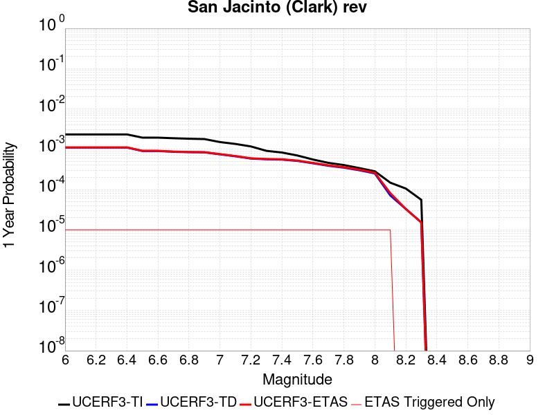 |  |

| Magnitude | 1 wk TI Prob | 1 wk TD Prob | 1 wk ETAS Prob | 1 wk ETAS/TD Gain | 1 wk ETAS Triggered Only | 1 mo TI Prob | 1 mo TD Prob | 1 mo ETAS Prob | 1 mo ETAS/TD Gain | 1 mo ETAS Triggered Only | 1 yr TI Prob | 1 yr TD Prob | 1 yr ETAS Prob | 1 yr ETAS/TD Gain | 1 yr ETAS Triggered Only | 10 yr TI Prob | 10 yr TD Prob | 10 yr ETAS Prob | 10 yr ETAS/TD Gain | 10 yr ETAS Triggered Only |
|-----|-----|-----|-----|-----|-----|-----|-----|-----|-----|-----|-----|-----|-----|-----|-----|-----|-----|-----|-----|-----|
| 6.0 | 4.482615E-5 | 2.1162805E-5 | 2.1162805E-5 | 1.0 | 0.0 | 1.9209793E-4 | 9.069463E-5 | 9.069463E-5 | 1.0 | 0.0 | 0.0023362834 | 0.0011036571 | 0.001113646 | 1.0090507 | 1.0E-5 | 0.02311874 | 0.011508432 | 0.011528201 | 1.0017178 | 2.0E-5 |
| 6.1 | 4.482615E-5 | 2.1162805E-5 | 2.1162805E-5 | 1.0 | 0.0 | 1.9209793E-4 | 9.069463E-5 | 9.069463E-5 | 1.0 | 0.0 | 0.0023362834 | 0.0011036571 | 0.001113646 | 1.0090507 | 1.0E-5 | 0.02311874 | 0.011508432 | 0.011528201 | 1.0017178 | 2.0E-5 |
| 6.2 | 4.482615E-5 | 2.1162805E-5 | 2.1162805E-5 | 1.0 | 0.0 | 1.9209793E-4 | 9.069463E-5 | 9.069463E-5 | 1.0 | 0.0 | 0.0023362834 | 0.0011036571 | 0.001113646 | 1.0090507 | 1.0E-5 | 0.02311874 | 0.011508432 | 0.011528201 | 1.0017178 | 2.0E-5 |
| 6.3 | 4.482615E-5 | 2.1162805E-5 | 2.1162805E-5 | 1.0 | 0.0 | 1.9209793E-4 | 9.069463E-5 | 9.069463E-5 | 1.0 | 0.0 | 0.0023362834 | 0.0011036571 | 0.001113646 | 1.0090507 | 1.0E-5 | 0.02311874 | 0.011508432 | 0.011528201 | 1.0017178 | 2.0E-5 |
| 6.4 | 4.482615E-5 | 2.1162805E-5 | 2.1162805E-5 | 1.0 | 0.0 | 1.9209793E-4 | 9.069463E-5 | 9.069463E-5 | 1.0 | 0.0 | 0.0023362834 | 0.0011036571 | 0.001113646 | 1.0090507 | 1.0E-5 | 0.02311874 | 0.011508432 | 0.011528201 | 1.0017178 | 2.0E-5 |
| 6.5 | 3.7294863E-5 | 1.7363767E-5 | 1.7363767E-5 | 1.0 | 0.0 | 1.5982533E-4 | 7.441404E-5 | 7.441404E-5 | 1.0 | 0.0 | 0.0019441366 | 9.056189E-4 | 9.156099E-4 | 1.0110322 | 1.0E-5 | 0.01927216 | 0.009498186 | 0.009517997 | 1.0020857 | 2.0E-5 |
| 6.6 | 3.7294863E-5 | 1.7363767E-5 | 1.7363767E-5 | 1.0 | 0.0 | 1.5982533E-4 | 7.441404E-5 | 7.441404E-5 | 1.0 | 0.0 | 0.0019441366 | 9.056189E-4 | 9.156099E-4 | 1.0110322 | 1.0E-5 | 0.01927216 | 0.009498186 | 0.009517997 | 1.0020857 | 2.0E-5 |
| 6.7 | 3.6039248E-5 | 1.661182E-5 | 1.661182E-5 | 1.0 | 0.0 | 1.5444479E-4 | 7.11916E-5 | 7.11916E-5 | 1.0 | 0.0 | 0.0018787434 | 8.6641713E-4 | 8.764085E-4 | 1.0115318 | 1.0E-5 | 0.01862939 | 0.009100041 | 0.009119859 | 1.0021778 | 2.0E-5 |
| 6.8 | 3.5031844E-5 | 1.6240316E-5 | 1.6240316E-5 | 1.0 | 0.0 | 1.5012783E-4 | 6.959952E-5 | 6.959952E-5 | 1.0 | 0.0 | 0.0018262739 | 8.470488E-4 | 8.5704034E-4 | 1.0117956 | 1.0E-5 | 0.01811338 | 0.008899899 | 0.0089197215 | 1.0022272 | 2.0E-5 |
| 6.9 | 3.435112E-5 | 1.6070499E-5 | 1.6070499E-5 | 1.0 | 0.0 | 1.4721078E-4 | 6.887177E-5 | 6.887177E-5 | 1.0 | 0.0 | 0.0017908178 | 8.381953E-4 | 8.481869E-4 | 1.0119205 | 1.0E-5 | 0.017764548 | 0.008808068 | 0.008827892 | 1.0022507 | 2.0E-5 |
| 7.0 | 2.8959772E-5 | 1.4343366E-5 | 1.4343366E-5 | 1.0 | 0.0 | 1.241074E-4 | 6.1470135E-5 | 6.1470135E-5 | 1.0 | 0.0 | 0.0015099603 | 7.481447E-4 | 7.5813726E-4 | 1.0133564 | 1.0E-5 | 0.014997416 | 0.0078715505 | 0.007891393 | 1.0025208 | 2.0E-5 |
| 7.1 | 2.6002877E-5 | 1.2835043E-5 | 1.2835043E-5 | 1.0 | 0.0 | 1.11436144E-4 | 5.500618E-5 | 5.500618E-5 | 1.0 | 0.0 | 0.0013558907 | 6.694966E-4 | 6.794899E-4 | 1.0149266 | 1.0E-5 | 0.013476475 | 0.007049743 | 0.007069602 | 1.002817 | 2.0E-5 |
| 7.2 | 2.2544838E-5 | 1.1267972E-5 | 1.1267972E-5 | 1.0 | 0.0 | 9.661716E-5 | 4.829042E-5 | 4.829042E-5 | 1.0 | 0.0 | 0.001175679 | 5.8777875E-4 | 5.977728E-4 | 1.0170032 | 1.0E-5 | 0.011694785 | 0.0061956523 | 0.006215528 | 1.003208 | 2.0E-5 |
| 7.3 | 1.75334E-5 | 1.081679E-5 | 1.081679E-5 | 1.0 | 0.0 | 7.514098E-5 | 4.6356854E-5 | 4.6356854E-5 | 1.0 | 0.0 | 9.144575E-4 | 5.6424993E-4 | 5.742443E-4 | 1.0177126 | 1.0E-5 | 0.009107036 | 0.005936473 | 0.0059563546 | 1.003349 | 2.0E-5 |
| 7.4 | 1.5924552E-5 | 1.0616479E-5 | 1.0616479E-5 | 1.0 | 0.0 | 6.82463E-5 | 4.5498407E-5 | 4.5498407E-5 | 1.0 | 0.0 | 8.305819E-4 | 5.538037E-4 | 5.637982E-4 | 1.018047 | 1.0E-5 | 0.008274844 | 0.005823671 | 0.0058435546 | 1.0034143 | 2.0E-5 |
| 7.5 | 1.3428931E-5 | 9.856627E-6 | 9.856627E-6 | 1.0 | 0.0 | 5.7551293E-5 | 4.224201E-5 | 4.224201E-5 | 1.0 | 0.0 | 7.004617E-4 | 5.1417615E-4 | 5.2417105E-4 | 1.0194386 | 1.0E-5 | 0.006982579 | 0.005409115 | 0.0054290066 | 1.0036775 | 2.0E-5 |
| 7.6 | 1.0688787E-5 | 8.61931E-6 | 8.61931E-6 | 1.0 | 0.0 | 4.5808283E-5 | 3.6939382E-5 | 3.6939382E-5 | 1.0 | 0.0 | 5.5757316E-4 | 4.4964463E-4 | 4.5964014E-4 | 1.0222298 | 1.0E-5 | 0.005561762 | 0.004744031 | 0.004763936 | 1.0041958 | 2.0E-5 |
| 7.7 | 8.81236E-6 | 7.4723484E-6 | 7.4723484E-6 | 1.0 | 0.0 | 3.776671E-5 | 3.202396E-5 | 3.202396E-5 | 1.0 | 0.0 | 4.597127E-4 | 3.8982215E-4 | 3.9981824E-4 | 1.0256428 | 1.0E-5 | 0.0045876284 | 0.004136955 | 0.004156872 | 1.0048145 | 2.0E-5 |
| 7.8 | 7.780431E-6 | 6.7006613E-6 | 6.7006613E-6 | 1.0 | 0.0 | 3.3344273E-5 | 2.8716804E-5 | 2.8716804E-5 | 1.0 | 0.0 | 4.0589093E-4 | 3.4957117E-4 | 3.595677E-4 | 1.0285965 | 1.0E-5 | 0.0040515037 | 0.0037249678 | 0.0037448932 | 1.0053492 | 2.0E-5 |
| 7.9 | 6.5437994E-6 | 5.784193E-6 | 5.784193E-6 | 1.0 | 0.0 | 2.8044553E-5 | 2.4789164E-5 | 2.4789164E-5 | 1.0 | 0.0 | 3.4138895E-4 | 3.0176644E-4 | 3.1176343E-4 | 1.0331283 | 1.0E-5 | 0.0034086495 | 0.003236521 | 0.0032564562 | 1.0061594 | 2.0E-5 |
| 8.0 | 5.4488164E-6 | 4.8167294E-6 | 4.8167294E-6 | 1.0 | 0.0 | 2.3351862E-5 | 2.0642963E-5 | 2.0642963E-5 | 1.0 | 0.0 | 2.8427184E-4 | 2.5129924E-4 | 2.6129672E-4 | 1.0397832 | 1.0E-5 | 0.0028390845 | 0.0027126544 | 0.0027326003 | 1.0073528 | 2.0E-5 |
| 8.1 | 2.8397242E-6 | 1.3684335E-6 | 1.3684335E-6 | 1.0 | 0.0 | 1.217019E-5 | 5.864702E-6 | 5.864702E-6 | 1.0 | 0.0 | 1.4816198E-4 | 7.140042E-5 | 8.13997E-5 | 1.1400452 | 1.0E-5 | 0.0014806325 | 8.12321E-4 | 8.223129E-4 | 1.0123004 | 1.0E-5 |
| 8.2 | 2.030244E-6 | 6.326596E-7 | 6.326596E-7 | 1.0 | 0.0 | 8.701017E-6 | 2.7113954E-6 | 2.7113954E-6 | 1.0 | 0.0 | 1.05929736E-4 | 3.3010747E-5 | 3.3010747E-5 | 1.0 | 0.0 | 0.0010587925 | 3.9531066E-4 | 3.9531066E-4 | 1.0 | 0.0 |
| 8.3 | 1.0659804E-6 | 2.9287372E-7 | 2.9287372E-7 | 1.0 | 0.0 | 4.568479E-6 | 1.2551725E-6 | 1.2551725E-6 | 1.0 | 0.0 | 5.5619817E-5 | 1.5281621E-5 | 1.5281621E-5 | 1.0 | 0.0 | 5.5605895E-4 | 1.8588232E-4 | 1.8588232E-4 | 1.0 | 0.0 |

## Pine Mtn
*[(top)](#table-of-contents)*

| 1 Week | 1 Month | 1 Year | 10 Year |
|-----|-----|-----|-----|
|  |  |  | 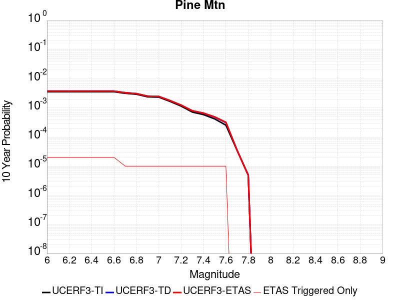 |

| Magnitude | 1 wk TI Prob | 1 wk TD Prob | 1 wk ETAS Prob | 1 wk ETAS/TD Gain | 1 wk ETAS Triggered Only | 1 mo TI Prob | 1 mo TD Prob | 1 mo ETAS Prob | 1 mo ETAS/TD Gain | 1 mo ETAS Triggered Only | 1 yr TI Prob | 1 yr TD Prob | 1 yr ETAS Prob | 1 yr ETAS/TD Gain | 1 yr ETAS Triggered Only | 10 yr TI Prob | 10 yr TD Prob | 10 yr ETAS Prob | 10 yr ETAS/TD Gain | 10 yr ETAS Triggered Only |
|-----|-----|-----|-----|-----|-----|-----|-----|-----|-----|-----|-----|-----|-----|-----|-----|-----|-----|-----|-----|-----|
| 6.0 | 6.894797E-6 | 7.2255634E-6 | 7.2255634E-6 | 1.0 | 0.0 | 2.9548795E-5 | 3.0966352E-5 | 3.0966352E-5 | 1.0 | 0.0 | 3.596972E-4 | 3.7695307E-4 | 3.969455E-4 | 1.053037 | 2.0E-5 | 0.0035911554 | 0.0037634342 | 0.003783359 | 1.0052943 | 2.0E-5 |
| 6.1 | 6.894797E-6 | 7.2255634E-6 | 7.2255634E-6 | 1.0 | 0.0 | 2.9548795E-5 | 3.0966352E-5 | 3.0966352E-5 | 1.0 | 0.0 | 3.596972E-4 | 3.7695307E-4 | 3.969455E-4 | 1.053037 | 2.0E-5 | 0.0035911554 | 0.0037634342 | 0.003783359 | 1.0052943 | 2.0E-5 |
| 6.2 | 6.894797E-6 | 7.2255634E-6 | 7.2255634E-6 | 1.0 | 0.0 | 2.9548795E-5 | 3.0966352E-5 | 3.0966352E-5 | 1.0 | 0.0 | 3.596972E-4 | 3.7695307E-4 | 3.969455E-4 | 1.053037 | 2.0E-5 | 0.0035911554 | 0.0037634342 | 0.003783359 | 1.0052943 | 2.0E-5 |
| 6.3 | 6.894797E-6 | 7.2255634E-6 | 7.2255634E-6 | 1.0 | 0.0 | 2.9548795E-5 | 3.0966352E-5 | 3.0966352E-5 | 1.0 | 0.0 | 3.596972E-4 | 3.7695307E-4 | 3.969455E-4 | 1.053037 | 2.0E-5 | 0.0035911554 | 0.0037634342 | 0.003783359 | 1.0052943 | 2.0E-5 |
| 6.4 | 6.894797E-6 | 7.2255634E-6 | 7.2255634E-6 | 1.0 | 0.0 | 2.9548795E-5 | 3.0966352E-5 | 3.0966352E-5 | 1.0 | 0.0 | 3.596972E-4 | 3.7695307E-4 | 3.969455E-4 | 1.053037 | 2.0E-5 | 0.0035911554 | 0.0037634342 | 0.003783359 | 1.0052943 | 2.0E-5 |
| 6.5 | 6.894797E-6 | 7.2255634E-6 | 7.2255634E-6 | 1.0 | 0.0 | 2.9548795E-5 | 3.0966352E-5 | 3.0966352E-5 | 1.0 | 0.0 | 3.596972E-4 | 3.7695307E-4 | 3.969455E-4 | 1.053037 | 2.0E-5 | 0.0035911554 | 0.0037634342 | 0.003783359 | 1.0052943 | 2.0E-5 |
| 6.6 | 6.894797E-6 | 7.2255634E-6 | 7.2255634E-6 | 1.0 | 0.0 | 2.9548795E-5 | 3.0966352E-5 | 3.0966352E-5 | 1.0 | 0.0 | 3.596972E-4 | 3.7695307E-4 | 3.969455E-4 | 1.053037 | 2.0E-5 | 0.0035911554 | 0.0037634342 | 0.003783359 | 1.0052943 | 2.0E-5 |
| 6.7 | 6.0867933E-6 | 6.397213E-6 | 6.397213E-6 | 1.0 | 0.0 | 2.6085996E-5 | 2.741635E-5 | 2.741635E-5 | 1.0 | 0.0 | 3.1755073E-4 | 3.3374512E-4 | 3.437418E-4 | 1.029953 | 1.0E-5 | 0.0031709734 | 0.0033326582 | 0.0033426248 | 1.0029906 | 1.0E-5 |
| 6.8 | 5.6530425E-6 | 5.9506933E-6 | 5.9506933E-6 | 1.0 | 0.0 | 2.42271E-5 | 2.5502733E-5 | 2.5502733E-5 | 1.0 | 0.0 | 2.94925E-4 | 3.104536E-4 | 3.204505E-4 | 1.0322009 | 1.0E-5 | 0.002945339 | 0.0031004036 | 0.0031103727 | 1.0032154 | 1.0E-5 |
| 6.9 | 4.6015225E-6 | 4.8639267E-6 | 4.8639267E-6 | 1.0 | 0.0 | 1.9720663E-5 | 2.0845242E-5 | 2.0845242E-5 | 1.0 | 0.0 | 2.4007261E-4 | 2.5376273E-4 | 2.637602E-4 | 1.0393969 | 1.0E-5 | 0.0023981342 | 0.0025348738 | 0.0025448485 | 1.003935 | 1.0E-5 |
| 7.0 | 4.4875965E-6 | 4.7475655E-6 | 4.7475655E-6 | 1.0 | 0.0 | 1.9232413E-5 | 2.0346559E-5 | 2.0346559E-5 | 1.0 | 0.0 | 2.3412947E-4 | 2.4769266E-4 | 2.5769018E-4 | 1.0403626 | 1.0E-5 | 0.0023388295 | 0.0024743096 | 0.0024842848 | 1.0040315 | 1.0E-5 |
| 7.1 | 3.203907E-6 | 3.4294974E-6 | 3.4294974E-6 | 1.0 | 0.0 | 1.3730958E-5 | 1.4697767E-5 | 1.4697767E-5 | 1.0 | 0.0 | 1.6716159E-4 | 1.7893128E-4 | 1.889295E-4 | 1.0558773 | 1.0E-5 | 0.0016703589 | 0.0017879383 | 0.0017979204 | 1.005583 | 1.0E-5 |
| 7.2 | 2.2060601E-6 | 2.3785535E-6 | 2.3785535E-6 | 1.0 | 0.0 | 9.4545085E-6 | 1.0193763E-5 | 1.0193763E-5 | 1.0 | 0.0 | 1.15102564E-4 | 1.2410246E-4 | 1.3410121E-4 | 1.0805686 | 1.0E-5 | 0.0011504296 | 0.0012403764 | 0.0012503639 | 1.0080521 | 1.0E-5 |
| 7.3 | 1.3765207E-6 | 1.5217128E-6 | 1.5217128E-6 | 1.0 | 0.0 | 5.899361E-6 | 6.52161E-6 | 6.52161E-6 | 1.0 | 0.0 | 7.182235E-5 | 7.93978E-5 | 8.939701E-5 | 1.125938 | 1.0E-5 | 7.1799144E-4 | 7.937035E-4 | 8.036955E-4 | 1.0125892 | 1.0E-5 |
| 7.4 | 1.1245983E-6 | 1.2587657E-6 | 1.2587657E-6 | 1.0 | 0.0 | 4.819698E-6 | 5.3946997E-6 | 5.3946997E-6 | 1.0 | 0.0 | 5.8678244E-5 | 6.567857E-5 | 7.567791E-5 | 1.1522467 | 1.0E-5 | 5.866275E-4 | 6.5659994E-4 | 6.665934E-4 | 1.0152199 | 1.0E-5 |
| 7.5 | 8.031682E-7 | 9.277495E-7 | 9.277495E-7 | 1.0 | 0.0 | 3.4421448E-6 | 3.9760635E-6 | 3.9760635E-6 | 1.0 | 0.0 | 4.1907308E-5 | 4.8407568E-5 | 5.8407084E-5 | 1.2065693 | 1.0E-5 | 4.1899405E-4 | 4.83977E-4 | 4.9397215E-4 | 1.0206522 | 1.0E-5 |
| 7.6 | 4.8953444E-7 | 6.0034915E-7 | 6.0034915E-7 | 1.0 | 0.0 | 2.098003E-6 | 2.5729225E-6 | 2.5729225E-6 | 1.0 | 0.0 | 2.5542888E-5 | 3.1324933E-5 | 4.132462E-5 | 1.3192245 | 1.0E-5 | 2.5539953E-4 | 3.1321004E-4 | 3.232069E-4 | 1.0319175 | 1.0E-5 |
| 7.7 | 6.634529E-8 | 6.788847E-8 | 6.788847E-8 | 1.0 | 0.0 | 2.843369E-7 | 2.9095054E-7 | 2.9095054E-7 | 1.0 | 0.0 | 3.4617963E-6 | 3.5423177E-6 | 3.5423177E-6 | 1.0 | 0.0 | 3.4617424E-5 | 3.542266E-5 | 3.542266E-5 | 1.0 | 0.0 |
| 7.8 | 9.235578E-9 | 9.488601E-9 | 9.488601E-9 | 1.0 | 0.0 | 3.9581046E-8 | 4.0665434E-8 | 4.0665434E-8 | 1.0 | 0.0 | 4.818991E-7 | 4.951016E-7 | 4.951016E-7 | 1.0 | 0.0 | 4.8189804E-6 | 4.9510063E-6 | 4.9510063E-6 | 1.0 | 0.0 |

## Whittier alt 1
*[(top)](#table-of-contents)*

| 1 Week | 1 Month | 1 Year | 10 Year |
|-----|-----|-----|-----|
|  |  | 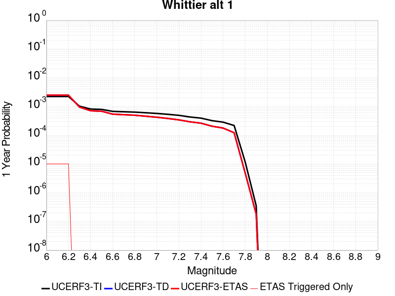 |  |

| Magnitude | 1 wk TI Prob | 1 wk TD Prob | 1 wk ETAS Prob | 1 wk ETAS/TD Gain | 1 wk ETAS Triggered Only | 1 mo TI Prob | 1 mo TD Prob | 1 mo ETAS Prob | 1 mo ETAS/TD Gain | 1 mo ETAS Triggered Only | 1 yr TI Prob | 1 yr TD Prob | 1 yr ETAS Prob | 1 yr ETAS/TD Gain | 1 yr ETAS Triggered Only | 10 yr TI Prob | 10 yr TD Prob | 10 yr ETAS Prob | 10 yr ETAS/TD Gain | 10 yr ETAS Triggered Only |
|-----|-----|-----|-----|-----|-----|-----|-----|-----|-----|-----|-----|-----|-----|-----|-----|-----|-----|-----|-----|-----|
| 6.0 | 4.2554693E-5 | 4.7253463E-5 | 4.7253463E-5 | 1.0 | 0.0 | 1.8236451E-4 | 2.0250095E-4 | 2.1249891E-4 | 1.0493724 | 1.0E-5 | 0.002218027 | 0.0024629822 | 0.0024729574 | 1.0040501 | 1.0E-5 | 0.02196019 | 0.02439089 | 0.0244104 | 1.0008 | 2.0E-5 |
| 6.1 | 4.2554693E-5 | 4.7253463E-5 | 4.7253463E-5 | 1.0 | 0.0 | 1.8236451E-4 | 2.0250095E-4 | 2.1249891E-4 | 1.0493724 | 1.0E-5 | 0.002218027 | 0.0024629822 | 0.0024729574 | 1.0040501 | 1.0E-5 | 0.02196019 | 0.02439089 | 0.0244104 | 1.0008 | 2.0E-5 |
| 6.2 | 4.2554693E-5 | 4.7253463E-5 | 4.7253463E-5 | 1.0 | 0.0 | 1.8236451E-4 | 2.0250095E-4 | 2.1249891E-4 | 1.0493724 | 1.0E-5 | 0.002218027 | 0.0024629822 | 0.0024729574 | 1.0040501 | 1.0E-5 | 0.02196019 | 0.02439089 | 0.0244104 | 1.0008 | 2.0E-5 |
| 6.3 | 1.9617712E-5 | 1.8269313E-5 | 1.8269313E-5 | 1.0 | 0.0 | 8.40732E-5 | 7.829482E-5 | 7.829482E-5 | 1.0 | 0.0 | 0.0010231105 | 9.528416E-4 | 9.528416E-4 | 1.0 | 0.0 | 0.01018413 | 0.009490847 | 0.009500752 | 1.0010437 | 1.0E-5 |
| 6.4 | 1.5611336E-5 | 1.3604893E-5 | 1.3604893E-5 | 1.0 | 0.0 | 6.690401E-5 | 5.8305417E-5 | 5.8305417E-5 | 1.0 | 0.0 | 8.142519E-4 | 7.0964324E-4 | 7.0964324E-4 | 1.0 | 0.0 | 0.008112748 | 0.0070757363 | 0.0070757363 | 1.0 | 0.0 |
| 6.5 | 1.5150166E-5 | 1.3101541E-5 | 1.3101541E-5 | 1.0 | 0.0 | 6.492767E-5 | 5.614829E-5 | 5.614829E-5 | 1.0 | 0.0 | 7.9020765E-4 | 6.833969E-4 | 6.833969E-4 | 1.0 | 0.0 | 0.007874036 | 0.0068149036 | 0.0068149036 | 1.0 | 0.0 |
| 6.6 | 1.295588E-5 | 1.0381249E-5 | 1.0381249E-5 | 1.0 | 0.0 | 5.552402E-5 | 4.449032E-5 | 4.449032E-5 | 1.0 | 0.0 | 6.7579525E-4 | 5.4153695E-4 | 5.4153695E-4 | 1.0 | 0.0 | 0.006737438 | 0.005403607 | 0.005403607 | 1.0 | 0.0 |
| 6.7 | 1.2542085E-5 | 9.899882E-6 | 9.899882E-6 | 1.0 | 0.0 | 5.3750682E-5 | 4.2427386E-5 | 4.2427386E-5 | 1.0 | 0.0 | 6.542181E-4 | 5.1643286E-4 | 5.1643286E-4 | 1.0 | 0.0 | 0.006522954 | 0.0051537454 | 0.0051537454 | 1.0 | 0.0 |
| 6.8 | 1.2195878E-5 | 9.495912E-6 | 9.495912E-6 | 1.0 | 0.0 | 5.2267E-5 | 4.0696144E-5 | 4.0696144E-5 | 1.0 | 0.0 | 6.36165E-4 | 4.953648E-4 | 4.953648E-4 | 1.0 | 0.0 | 0.0063434686 | 0.0049439464 | 0.0049439464 | 1.0 | 0.0 |
| 6.9 | 1.1580298E-5 | 8.773408E-6 | 8.773408E-6 | 1.0 | 0.0 | 4.9628903E-5 | 3.7599788E-5 | 3.7599788E-5 | 1.0 | 0.0 | 6.040644E-4 | 4.576829E-4 | 4.576829E-4 | 1.0 | 0.0 | 0.00602425 | 0.0045686625 | 0.0045686625 | 1.0 | 0.0 |
| 7.0 | 1.0964795E-5 | 8.084448E-6 | 8.084448E-6 | 1.0 | 0.0 | 4.6991136E-5 | 3.4647182E-5 | 3.4647182E-5 | 1.0 | 0.0 | 5.7196687E-4 | 4.2174934E-4 | 4.2174934E-4 | 1.0 | 0.0 | 0.0057049696 | 0.004210698 | 0.004210698 | 1.0 | 0.0 |
| 7.1 | 1.0230601E-5 | 7.3269985E-6 | 7.3269985E-6 | 1.0 | 0.0 | 4.3844695E-5 | 3.140105E-5 | 3.140105E-5 | 1.0 | 0.0 | 5.336784E-4 | 3.8224205E-4 | 3.8224205E-4 | 1.0 | 0.0 | 0.005323986 | 0.0038170093 | 0.0038170093 | 1.0 | 0.0 |
| 7.2 | 9.40865E-6 | 6.5435725E-6 | 6.5435725E-6 | 1.0 | 0.0 | 4.032216E-5 | 2.8043587E-5 | 2.8043587E-5 | 1.0 | 0.0 | 4.908117E-4 | 3.413784E-4 | 3.413784E-4 | 1.0 | 0.0 | 0.0048972913 | 0.0034096325 | 0.0034096325 | 1.0 | 0.0 |
| 7.3 | 8.237384E-6 | 5.5979945E-6 | 5.5979945E-6 | 1.0 | 0.0 | 3.5302593E-5 | 2.399119E-5 | 2.399119E-5 | 1.0 | 0.0 | 4.2972428E-4 | 2.9205464E-4 | 2.9205464E-4 | 1.0 | 0.0 | 0.0042889426 | 0.002917029 | 0.002917029 | 1.0 | 0.0 |
| 7.4 | 7.5316966E-6 | 5.0280382E-6 | 5.0280382E-6 | 1.0 | 0.0 | 3.2278298E-5 | 2.1548563E-5 | 2.1548563E-5 | 1.0 | 0.0 | 3.9291743E-4 | 2.6232318E-4 | 2.6232318E-4 | 1.0 | 0.0 | 0.0039222343 | 0.0026202472 | 0.0026202472 | 1.0 | 0.0 |
| 7.5 | 6.149649E-6 | 3.934013E-6 | 3.934013E-6 | 1.0 | 0.0 | 2.6355372E-5 | 1.685995E-5 | 1.685995E-5 | 1.0 | 0.0 | 3.208294E-4 | 2.0525148E-4 | 2.0525148E-4 | 1.0 | 0.0 | 0.003203666 | 0.0020507083 | 0.0020507083 | 1.0 | 0.0 |
| 7.6 | 5.457711E-6 | 3.395529E-6 | 3.395529E-6 | 1.0 | 0.0 | 2.338998E-5 | 1.4552191E-5 | 1.4552191E-5 | 1.0 | 0.0 | 2.8473578E-4 | 1.7715934E-4 | 1.7715934E-4 | 1.0 | 0.0 | 0.0028437122 | 0.0017702618 | 0.0017702618 | 1.0 | 0.0 |
| 7.7 | 4.1676276E-6 | 2.3333084E-6 | 2.3333084E-6 | 1.0 | 0.0 | 1.7861139E-5 | 9.99986E-6 | 9.99986E-6 | 1.0 | 0.0 | 2.1743766E-4 | 1.2174223E-4 | 1.2174223E-4 | 1.0 | 0.0 | 0.0021722503 | 0.0012168285 | 0.0012168285 | 1.0 | 0.0 |
| 7.8 | 2.2692414E-7 | 9.385943E-8 | 9.385943E-8 | 1.0 | 0.0 | 9.725317E-7 | 4.0225464E-7 | 4.0225464E-7 | 1.0 | 0.0 | 1.1840509E-5 | 4.8974425E-6 | 4.8974425E-6 | 1.0 | 0.0 | 1.1839878E-4 | 4.8973674E-5 | 4.8973674E-5 | 1.0 | 0.0 |
| 7.9 | 6.676829E-9 | 3.4399772E-9 | 3.4399772E-9 | 1.0 | 0.0 | 2.861498E-8 | 1.4742759E-8 | 1.4742759E-8 | 1.0 | 0.0 | 3.4838732E-7 | 1.7949307E-7 | 1.7949307E-7 | 1.0 | 0.0 | 3.4838679E-6 | 1.7949295E-6 | 1.7949295E-6 | 1.0 | 0.0 |

## Simi-Santa Rosa
*[(top)](#table-of-contents)*

| 1 Week | 1 Month | 1 Year | 10 Year |
|-----|-----|-----|-----|
|  |  |  | 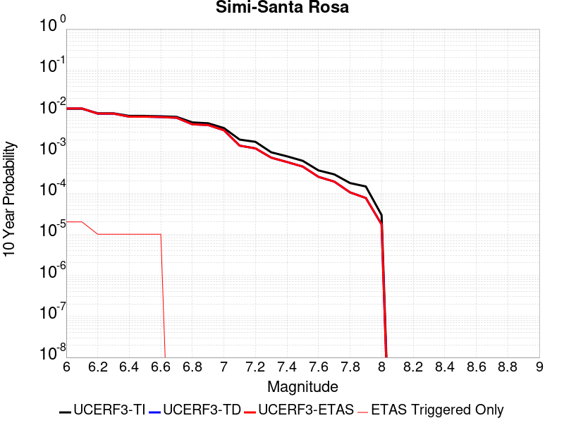 |

| Magnitude | 1 wk TI Prob | 1 wk TD Prob | 1 wk ETAS Prob | 1 wk ETAS/TD Gain | 1 wk ETAS Triggered Only | 1 mo TI Prob | 1 mo TD Prob | 1 mo ETAS Prob | 1 mo ETAS/TD Gain | 1 mo ETAS Triggered Only | 1 yr TI Prob | 1 yr TD Prob | 1 yr ETAS Prob | 1 yr ETAS/TD Gain | 1 yr ETAS Triggered Only | 10 yr TI Prob | 10 yr TD Prob | 10 yr ETAS Prob | 10 yr ETAS/TD Gain | 10 yr ETAS Triggered Only |
|-----|-----|-----|-----|-----|-----|-----|-----|-----|-----|-----|-----|-----|-----|-----|-----|-----|-----|-----|-----|-----|
| 6.0 | 2.198912E-5 | 2.2275886E-5 | 2.2275886E-5 | 1.0 | 0.0 | 9.4235686E-5 | 9.5464835E-5 | 9.5464835E-5 | 1.0 | 0.0 | 0.0011467156 | 0.0011617085 | 0.0011716968 | 1.008598 | 1.0E-5 | 0.011408163 | 0.011560804 | 0.011580572 | 1.0017099 | 2.0E-5 |
| 6.1 | 2.198912E-5 | 2.2275886E-5 | 2.2275886E-5 | 1.0 | 0.0 | 9.4235686E-5 | 9.5464835E-5 | 9.5464835E-5 | 1.0 | 0.0 | 0.0011467156 | 0.0011617085 | 0.0011716968 | 1.008598 | 1.0E-5 | 0.011408163 | 0.011560804 | 0.011580572 | 1.0017099 | 2.0E-5 |
| 6.2 | 1.69983E-5 | 1.6668911E-5 | 1.6668911E-5 | 1.0 | 0.0 | 7.284782E-5 | 7.14364E-5 | 7.14364E-5 | 1.0 | 0.0 | 8.865613E-4 | 8.694203E-4 | 8.694203E-4 | 1.0 | 0.0 | 0.008830327 | 0.0086631095 | 0.0086730225 | 1.0011443 | 1.0E-5 |
| 6.3 | 1.69983E-5 | 1.6668911E-5 | 1.6668911E-5 | 1.0 | 0.0 | 7.284782E-5 | 7.14364E-5 | 7.14364E-5 | 1.0 | 0.0 | 8.865613E-4 | 8.694203E-4 | 8.694203E-4 | 1.0 | 0.0 | 0.008830327 | 0.0086631095 | 0.0086730225 | 1.0011443 | 1.0E-5 |
| 6.4 | 1.4666188E-5 | 1.4052852E-5 | 1.4052852E-5 | 1.0 | 0.0 | 6.285358E-5 | 6.022526E-5 | 6.022526E-5 | 1.0 | 0.0 | 7.6497364E-4 | 7.330208E-4 | 7.330208E-4 | 1.0 | 0.0 | 0.0076234564 | 0.0073085045 | 0.0073184315 | 1.0013583 | 1.0E-5 |
| 6.5 | 1.4666188E-5 | 1.4052852E-5 | 1.4052852E-5 | 1.0 | 0.0 | 6.285358E-5 | 6.022526E-5 | 6.022526E-5 | 1.0 | 0.0 | 7.6497364E-4 | 7.330208E-4 | 7.330208E-4 | 1.0 | 0.0 | 0.0076234564 | 0.0073085045 | 0.0073184315 | 1.0013583 | 1.0E-5 |
| 6.6 | 1.4377586E-5 | 1.3729887E-5 | 1.3729887E-5 | 1.0 | 0.0 | 6.1616774E-5 | 5.8841186E-5 | 5.8841186E-5 | 1.0 | 0.0 | 7.4992597E-4 | 7.1618083E-4 | 7.1618083E-4 | 1.0 | 0.0 | 0.007474003 | 0.007141196 | 0.0071511245 | 1.0013903 | 1.0E-5 |
| 6.7 | 1.3881404E-5 | 1.3207847E-5 | 1.3207847E-5 | 1.0 | 0.0 | 5.9490372E-5 | 5.6603967E-5 | 5.6603967E-5 | 1.0 | 0.0 | 7.240546E-4 | 6.889601E-4 | 6.889601E-4 | 1.0 | 0.0 | 0.007217 | 0.0068706917 | 0.0068706917 | 1.0 | 0.0 |
| 6.8 | 1.0176516E-5 | 9.154378E-6 | 9.154378E-6 | 1.0 | 0.0 | 4.3612912E-5 | 3.9232553E-5 | 3.9232553E-5 | 1.0 | 0.0 | 5.308578E-4 | 4.7756822E-4 | 4.7756822E-4 | 1.0 | 0.0 | 0.0052959146 | 0.004767053 | 0.004767053 | 1.0 | 0.0 |
| 6.9 | 9.699797E-6 | 8.7749395E-6 | 8.7749395E-6 | 1.0 | 0.0 | 4.15699E-5 | 3.7606434E-5 | 3.7606434E-5 | 1.0 | 0.0 | 5.05996E-4 | 4.5777857E-4 | 4.5777857E-4 | 1.0 | 0.0 | 0.005048454 | 0.004569974 | 0.004569974 | 1.0 | 0.0 |
| 7.0 | 7.4049476E-6 | 6.559509E-6 | 6.559509E-6 | 1.0 | 0.0 | 3.1735104E-5 | 2.811195E-5 | 2.811195E-5 | 1.0 | 0.0 | 3.8630638E-4 | 3.422219E-4 | 3.422219E-4 | 1.0 | 0.0 | 0.0038563553 | 0.0034181913 | 0.0034181913 | 1.0 | 0.0 |
| 7.1 | 3.873439E-6 | 2.759614E-6 | 2.759614E-6 | 1.0 | 0.0 | 1.6600346E-5 | 1.1826865E-5 | 1.1826865E-5 | 1.0 | 0.0 | 2.0209046E-4 | 1.439828E-4 | 1.439828E-4 | 1.0 | 0.0 | 0.0020190678 | 0.0014389188 | 0.0014389188 | 1.0 | 0.0 |
| 7.2 | 3.417706E-6 | 2.3677471E-6 | 2.3677471E-6 | 1.0 | 0.0 | 1.4647229E-5 | 1.014745E-5 | 1.014745E-5 | 1.0 | 0.0 | 1.7831543E-4 | 1.2353843E-4 | 1.2353843E-4 | 1.0 | 0.0 | 0.0017817242 | 0.0012347198 | 0.0012347198 | 1.0 | 0.0 |
| 7.3 | 1.90225E-6 | 1.4074596E-6 | 1.4074596E-6 | 1.0 | 0.0 | 8.152474E-6 | 6.0319558E-6 | 6.0319558E-6 | 1.0 | 0.0 | 9.9251854E-5 | 7.343661E-5 | 7.343661E-5 | 1.0 | 0.0 | 9.920754E-4 | 7.341257E-4 | 7.341257E-4 | 1.0 | 0.0 |
| 7.4 | 1.5170556E-6 | 1.1025584E-6 | 1.1025584E-6 | 1.0 | 0.0 | 6.5016507E-6 | 4.7252415E-6 | 4.7252415E-6 | 1.0 | 0.0 | 7.915472E-5 | 5.752831E-5 | 5.752831E-5 | 1.0 | 0.0 | 7.9126534E-4 | 5.751353E-4 | 5.751353E-4 | 1.0 | 0.0 |
| 7.5 | 1.178732E-6 | 8.5358926E-7 | 8.5358926E-7 | 1.0 | 0.0 | 5.0516987E-6 | 3.6582346E-6 | 3.6582346E-6 | 1.0 | 0.0 | 6.1502695E-5 | 4.4538105E-5 | 4.4538105E-5 | 1.0 | 0.0 | 6.148568E-4 | 4.4529274E-4 | 4.4529274E-4 | 1.0 | 0.0 |
| 7.6 | 6.8722386E-7 | 4.793958E-7 | 4.793958E-7 | 1.0 | 0.0 | 2.9452417E-6 | 2.0545517E-6 | 2.0545517E-6 | 1.0 | 0.0 | 3.5857727E-5 | 2.5013882E-5 | 2.5013882E-5 | 1.0 | 0.0 | 3.5851944E-4 | 2.5011078E-4 | 2.5011078E-4 | 1.0 | 0.0 |
| 7.7 | 5.5126515E-7 | 3.673869E-7 | 3.673869E-7 | 1.0 | 0.0 | 2.3625628E-6 | 1.5745143E-6 | 1.5745143E-6 | 1.0 | 0.0 | 2.8763823E-5 | 1.9169544E-5 | 1.9169544E-5 | 1.0 | 0.0 | 2.87601E-4 | 1.91679E-4 | 1.91679E-4 | 1.0 | 0.0 |
| 7.8 | 3.3860243E-7 | 2.0081488E-7 | 2.0081488E-7 | 1.0 | 0.0 | 1.4511525E-6 | 8.6063494E-7 | 8.6063494E-7 | 1.0 | 0.0 | 1.7667637E-5 | 1.047818E-5 | 1.047818E-5 | 1.0 | 0.0 | 1.7666233E-4 | 1.0477692E-4 | 1.0477692E-4 | 1.0 | 0.0 |
| 7.9 | 2.7955386E-7 | 1.4654502E-7 | 1.4654502E-7 | 1.0 | 0.0 | 1.1980875E-6 | 6.280499E-7 | 6.280499E-7 | 1.0 | 0.0 | 1.4586617E-5 | 7.646482E-6 | 7.646482E-6 | 1.0 | 0.0 | 1.458566E-4 | 7.646223E-5 | 7.646223E-5 | 1.0 | 0.0 |
| 8.0 | 5.6259015E-8 | 3.3357086E-8 | 3.3357086E-8 | 1.0 | 0.0 | 2.4111003E-7 | 1.4295894E-7 | 1.4295894E-7 | 1.0 | 0.0 | 2.9355108E-6 | 1.7405239E-6 | 1.7405239E-6 | 1.0 | 0.0 | 2.935472E-5 | 1.7405117E-5 | 1.7405117E-5 | 1.0 | 0.0 |

## Verdugo
*[(top)](#table-of-contents)*

| 1 Week | 1 Month | 1 Year | 10 Year |
|-----|-----|-----|-----|
|  |  |  |  |

| Magnitude | 1 wk TI Prob | 1 wk TD Prob | 1 wk ETAS Prob | 1 wk ETAS/TD Gain | 1 wk ETAS Triggered Only | 1 mo TI Prob | 1 mo TD Prob | 1 mo ETAS Prob | 1 mo ETAS/TD Gain | 1 mo ETAS Triggered Only | 1 yr TI Prob | 1 yr TD Prob | 1 yr ETAS Prob | 1 yr ETAS/TD Gain | 1 yr ETAS Triggered Only | 10 yr TI Prob | 10 yr TD Prob | 10 yr ETAS Prob | 10 yr ETAS/TD Gain | 10 yr ETAS Triggered Only |
|-----|-----|-----|-----|-----|-----|-----|-----|-----|-----|-----|-----|-----|-----|-----|-----|-----|-----|-----|-----|-----|
| 6.0 | 5.392987E-6 | 4.2165602E-6 | 4.2165602E-6 | 1.0 | 0.0 | 2.3112598E-5 | 1.8070848E-5 | 2.8070668E-5 | 1.5533674 | 1.0E-5 | 2.8135953E-4 | 2.1999085E-4 | 2.3998645E-4 | 1.0908929 | 2.0E-5 | 0.0028100356 | 0.0021977786 | 0.0022177345 | 1.00908 | 2.0E-5 |
| 6.1 | 5.392987E-6 | 4.2165602E-6 | 4.2165602E-6 | 1.0 | 0.0 | 2.3112598E-5 | 1.8070848E-5 | 2.8070668E-5 | 1.5533674 | 1.0E-5 | 2.8135953E-4 | 2.1999085E-4 | 2.3998645E-4 | 1.0908929 | 2.0E-5 | 0.0028100356 | 0.0021977786 | 0.0022177345 | 1.00908 | 2.0E-5 |
| 6.2 | 5.392987E-6 | 4.2165602E-6 | 4.2165602E-6 | 1.0 | 0.0 | 2.3112598E-5 | 1.8070848E-5 | 2.8070668E-5 | 1.5533674 | 1.0E-5 | 2.8135953E-4 | 2.1999085E-4 | 2.3998645E-4 | 1.0908929 | 2.0E-5 | 0.0028100356 | 0.0021977786 | 0.0022177345 | 1.00908 | 2.0E-5 |
| 6.3 | 5.392987E-6 | 4.2165602E-6 | 4.2165602E-6 | 1.0 | 0.0 | 2.3112598E-5 | 1.8070848E-5 | 2.8070668E-5 | 1.5533674 | 1.0E-5 | 2.8135953E-4 | 2.1999085E-4 | 2.3998645E-4 | 1.0908929 | 2.0E-5 | 0.0028100356 | 0.0021977786 | 0.0022177345 | 1.00908 | 2.0E-5 |
| 6.4 | 5.392987E-6 | 4.2165602E-6 | 4.2165602E-6 | 1.0 | 0.0 | 2.3112598E-5 | 1.8070848E-5 | 2.8070668E-5 | 1.5533674 | 1.0E-5 | 2.8135953E-4 | 2.1999085E-4 | 2.3998645E-4 | 1.0908929 | 2.0E-5 | 0.0028100356 | 0.0021977786 | 0.0022177345 | 1.00908 | 2.0E-5 |
| 6.5 | 4.9154837E-6 | 3.7225057E-6 | 3.7225057E-6 | 1.0 | 0.0 | 2.1066187E-5 | 1.59535E-5 | 1.59535E-5 | 1.0 | 0.0 | 2.5645064E-4 | 1.9421674E-4 | 1.9421674E-4 | 1.0 | 0.0 | 0.002561549 | 0.001940491 | 0.001940491 | 1.0 | 0.0 |
| 6.6 | 4.9154837E-6 | 3.7225057E-6 | 3.7225057E-6 | 1.0 | 0.0 | 2.1066187E-5 | 1.59535E-5 | 1.59535E-5 | 1.0 | 0.0 | 2.5645064E-4 | 1.9421674E-4 | 1.9421674E-4 | 1.0 | 0.0 | 0.002561549 | 0.001940491 | 0.001940491 | 1.0 | 0.0 |
| 6.7 | 4.817006E-6 | 3.6206918E-6 | 3.6206918E-6 | 1.0 | 0.0 | 2.0644147E-5 | 1.551716E-5 | 1.551716E-5 | 1.0 | 0.0 | 2.513135E-4 | 1.8890524E-4 | 1.8890524E-4 | 1.0 | 0.0 | 0.0025102948 | 0.0018874662 | 0.0018874662 | 1.0 | 0.0 |
| 6.8 | 4.507407E-6 | 3.3071422E-6 | 3.3071422E-6 | 1.0 | 0.0 | 1.9317316E-5 | 1.417339E-5 | 1.417339E-5 | 1.0 | 0.0 | 2.3516294E-4 | 1.725475E-4 | 1.725475E-4 | 1.0 | 0.0 | 0.0023491425 | 0.0017241496 | 0.0017241496 | 1.0 | 0.0 |
| 6.9 | 4.3573054E-6 | 3.161048E-6 | 3.161048E-6 | 1.0 | 0.0 | 1.8674033E-5 | 1.3547278E-5 | 1.3547278E-5 | 1.0 | 0.0 | 2.2733262E-4 | 1.6492575E-4 | 1.6492575E-4 | 1.0 | 0.0 | 0.0022710022 | 0.001648046 | 0.001648046 | 1.0 | 0.0 |
| 7.0 | 4.171527E-6 | 2.983706E-6 | 2.983706E-6 | 1.0 | 0.0 | 1.787785E-5 | 1.278725E-5 | 1.278725E-5 | 1.0 | 0.0 | 2.1764109E-4 | 1.5567376E-4 | 1.5567376E-4 | 1.0 | 0.0 | 0.0021742806 | 0.0015556583 | 0.0015556583 | 1.0 | 0.0 |
| 7.1 | 4.0405484E-6 | 2.882296E-6 | 2.882296E-6 | 1.0 | 0.0 | 1.731652E-5 | 1.2352639E-5 | 1.2352639E-5 | 1.0 | 0.0 | 2.1080824E-4 | 1.5038312E-4 | 1.5038312E-4 | 1.0 | 0.0 | 0.0021060838 | 0.0015028245 | 0.0015028245 | 1.0 | 0.0 |
| 7.2 | 3.8306007E-6 | 2.7018784E-6 | 2.7018784E-6 | 1.0 | 0.0 | 1.6416758E-5 | 1.1579428E-5 | 1.1579428E-5 | 1.0 | 0.0 | 1.9985568E-4 | 1.4097053E-4 | 1.4097053E-4 | 1.0 | 0.0 | 0.0019967605 | 0.0014088218 | 0.0014088218 | 1.0 | 0.0 |
| 7.3 | 3.5750938E-6 | 2.5122074E-6 | 2.5122074E-6 | 1.0 | 0.0 | 1.532174E-5 | 1.0766559E-5 | 1.0766559E-5 | 1.0 | 0.0 | 1.8652623E-4 | 1.3107508E-4 | 1.3107508E-4 | 1.0 | 0.0 | 0.0018636974 | 0.0013099882 | 0.0013099882 | 1.0 | 0.0 |
| 7.4 | 3.3510041E-6 | 2.3408884E-6 | 2.3408884E-6 | 1.0 | 0.0 | 1.4361368E-5 | 1.0032341E-5 | 1.0032341E-5 | 1.0 | 0.0 | 1.7483562E-4 | 1.2213702E-4 | 1.2213702E-4 | 1.0 | 0.0 | 0.0017469813 | 0.0012207093 | 0.0012207093 | 1.0 | 0.0 |
| 7.5 | 2.948287E-6 | 2.0391387E-6 | 2.0391387E-6 | 1.0 | 0.0 | 1.2635454E-5 | 8.739137E-6 | 8.739137E-6 | 1.0 | 0.0 | 1.538258E-4 | 1.06393905E-4 | 1.06393905E-4 | 1.0 | 0.0 | 0.0015371935 | 0.0010634399 | 0.0010634399 | 1.0 | 0.0 |
| 7.6 | 2.0134323E-6 | 1.4471433E-6 | 1.4471433E-6 | 1.0 | 0.0 | 8.628967E-6 | 6.2020285E-6 | 6.2020285E-6 | 1.0 | 0.0 | 1.05052604E-4 | 7.550717E-5 | 7.550717E-5 | 1.0 | 0.0 | 0.0010500296 | 7.5482397E-4 | 7.5482397E-4 | 1.0 | 0.0 |
| 7.7 | 5.726436E-7 | 4.0453094E-7 | 4.0453094E-7 | 1.0 | 0.0 | 2.4541846E-6 | 1.733703E-6 | 1.733703E-6 | 1.0 | 0.0 | 2.9879287E-5 | 2.1107655E-5 | 2.1107655E-5 | 1.0 | 0.0 | 2.987527E-4 | 2.1105906E-4 | 2.1105906E-4 | 1.0 | 0.0 |
| 7.8 | 1.6248204E-7 | 1.068809E-7 | 1.068809E-7 | 1.0 | 0.0 | 6.963514E-7 | 4.5806092E-7 | 4.5806092E-7 | 1.0 | 0.0 | 8.478045E-6 | 5.576878E-6 | 5.576878E-6 | 1.0 | 0.0 | 8.477722E-5 | 5.576741E-5 | 5.576741E-5 | 1.0 | 0.0 |
| 7.9 | 4.4475744E-8 | 3.037577E-8 | 3.037577E-8 | 1.0 | 0.0 | 1.9061031E-7 | 1.3018186E-7 | 1.3018186E-7 | 1.0 | 0.0 | 2.320678E-6 | 1.5849631E-6 | 1.5849631E-6 | 1.0 | 0.0 | 2.3206538E-5 | 1.5849531E-5 | 1.5849531E-5 | 1.0 | 0.0 |

## Santa Susana East (connector)
*[(top)](#table-of-contents)*

| 1 Week | 1 Month | 1 Year | 10 Year |
|-----|-----|-----|-----|
| 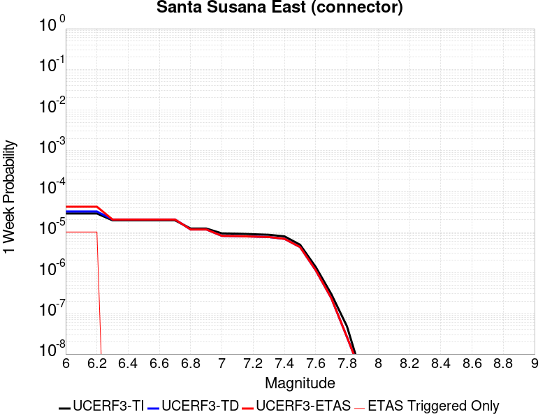 |  |  |  |

| Magnitude | 1 wk TI Prob | 1 wk TD Prob | 1 wk ETAS Prob | 1 wk ETAS/TD Gain | 1 wk ETAS Triggered Only | 1 mo TI Prob | 1 mo TD Prob | 1 mo ETAS Prob | 1 mo ETAS/TD Gain | 1 mo ETAS Triggered Only | 1 yr TI Prob | 1 yr TD Prob | 1 yr ETAS Prob | 1 yr ETAS/TD Gain | 1 yr ETAS Triggered Only | 10 yr TI Prob | 10 yr TD Prob | 10 yr ETAS Prob | 10 yr ETAS/TD Gain | 10 yr ETAS Triggered Only |
|-----|-----|-----|-----|-----|-----|-----|-----|-----|-----|-----|-----|-----|-----|-----|-----|-----|-----|-----|-----|-----|
| 6.0 | 2.858397E-5 | 3.202183E-5 | 4.202151E-5 | 1.312277 | 1.0E-5 | 1.2249697E-4 | 1.3723079E-4 | 1.4722941E-4 | 1.07286 | 1.0E-5 | 0.0014903803 | 0.0016697859 | 0.0016797693 | 1.0059788 | 1.0E-5 | 0.014804244 | 0.01659952 | 0.016619187 | 1.0011848 | 2.0E-5 |
| 6.1 | 2.858397E-5 | 3.202183E-5 | 4.202151E-5 | 1.312277 | 1.0E-5 | 1.2249697E-4 | 1.3723079E-4 | 1.4722941E-4 | 1.07286 | 1.0E-5 | 0.0014903803 | 0.0016697859 | 0.0016797693 | 1.0059788 | 1.0E-5 | 0.014804244 | 0.01659952 | 0.016619187 | 1.0011848 | 2.0E-5 |
| 6.2 | 2.858397E-5 | 3.202183E-5 | 4.202151E-5 | 1.312277 | 1.0E-5 | 1.2249697E-4 | 1.3723079E-4 | 1.4722941E-4 | 1.07286 | 1.0E-5 | 0.0014903803 | 0.0016697859 | 0.0016797693 | 1.0059788 | 1.0E-5 | 0.014804244 | 0.01659952 | 0.016619187 | 1.0011848 | 2.0E-5 |
| 6.3 | 1.943582E-5 | 2.0367674E-5 | 2.0367674E-5 | 1.0 | 0.0 | 8.329371E-5 | 8.728774E-5 | 8.728774E-5 | 1.0 | 0.0 | 0.001013629 | 0.0010623224 | 0.0010623224 | 1.0 | 0.0 | 0.010090181 | 0.010583875 | 0.010583875 | 1.0 | 0.0 |
| 6.4 | 1.943582E-5 | 2.0367674E-5 | 2.0367674E-5 | 1.0 | 0.0 | 8.329371E-5 | 8.728774E-5 | 8.728774E-5 | 1.0 | 0.0 | 0.001013629 | 0.0010623224 | 0.0010623224 | 1.0 | 0.0 | 0.010090181 | 0.010583875 | 0.010583875 | 1.0 | 0.0 |
| 6.5 | 1.943582E-5 | 2.0367674E-5 | 2.0367674E-5 | 1.0 | 0.0 | 8.329371E-5 | 8.728774E-5 | 8.728774E-5 | 1.0 | 0.0 | 0.001013629 | 0.0010623224 | 0.0010623224 | 1.0 | 0.0 | 0.010090181 | 0.010583875 | 0.010583875 | 1.0 | 0.0 |
| 6.6 | 1.943582E-5 | 2.0367674E-5 | 2.0367674E-5 | 1.0 | 0.0 | 8.329371E-5 | 8.728774E-5 | 8.728774E-5 | 1.0 | 0.0 | 0.001013629 | 0.0010623224 | 0.0010623224 | 1.0 | 0.0 | 0.010090181 | 0.010583875 | 0.010583875 | 1.0 | 0.0 |
| 6.7 | 1.9404439E-5 | 2.0355095E-5 | 2.0355095E-5 | 1.0 | 0.0 | 8.3159226E-5 | 8.7233835E-5 | 8.7233835E-5 | 1.0 | 0.0 | 0.0010119933 | 0.0010616668 | 0.0010616668 | 1.0 | 0.0 | 0.010073971 | 0.01057738 | 0.01057738 | 1.0 | 0.0 |
| 6.8 | 1.2217526E-5 | 1.1593199E-5 | 1.1593199E-5 | 1.0 | 0.0 | 5.2359774E-5 | 4.9684288E-5 | 4.9684288E-5 | 1.0 | 0.0 | 6.372938E-4 | 6.047551E-4 | 6.047551E-4 | 1.0 | 0.0 | 0.0063546924 | 0.006033141 | 0.006033141 | 1.0 | 0.0 |
| 6.9 | 1.2217526E-5 | 1.1593199E-5 | 1.1593199E-5 | 1.0 | 0.0 | 5.2359774E-5 | 4.9684288E-5 | 4.9684288E-5 | 1.0 | 0.0 | 6.372938E-4 | 6.047551E-4 | 6.047551E-4 | 1.0 | 0.0 | 0.0063546924 | 0.006033141 | 0.006033141 | 1.0 | 0.0 |
| 7.0 | 9.276017E-6 | 8.059215E-6 | 8.059215E-6 | 1.0 | 0.0 | 3.9753755E-5 | 3.4539054E-5 | 3.4539054E-5 | 1.0 | 0.0 | 4.8389446E-4 | 4.204353E-4 | 4.204353E-4 | 1.0 | 0.0 | 0.0048284214 | 0.0041971253 | 0.0041971253 | 1.0 | 0.0 |
| 7.1 | 9.130355E-6 | 7.942386E-6 | 7.942386E-6 | 1.0 | 0.0 | 3.9129503E-5 | 3.4038374E-5 | 3.4038374E-5 | 1.0 | 0.0 | 4.7629757E-4 | 4.1434186E-4 | 4.1434186E-4 | 1.0 | 0.0 | 0.00475278 | 0.004136419 | 0.004136419 | 1.0 | 0.0 |
| 7.2 | 8.851015E-6 | 7.741543E-6 | 7.741543E-6 | 1.0 | 0.0 | 3.7932372E-5 | 3.317764E-5 | 3.317764E-5 | 1.0 | 0.0 | 4.6172875E-4 | 4.0386632E-4 | 4.0386632E-4 | 1.0 | 0.0 | 0.0046077054 | 0.0040320465 | 0.0040320465 | 1.0 | 0.0 |
| 7.3 | 8.573006E-6 | 7.5502617E-6 | 7.5502617E-6 | 1.0 | 0.0 | 3.6740938E-5 | 3.2357882E-5 | 3.2357882E-5 | 1.0 | 0.0 | 4.472291E-4 | 3.9388944E-4 | 3.9388944E-4 | 1.0 | 0.0 | 0.004463301 | 0.00393263 | 0.00393263 | 1.0 | 0.0 |
| 7.4 | 7.852282E-6 | 6.8177665E-6 | 6.8177665E-6 | 1.0 | 0.0 | 3.36522E-5 | 2.9218689E-5 | 2.9218689E-5 | 1.0 | 0.0 | 4.096385E-4 | 3.556825E-4 | 3.556825E-4 | 1.0 | 0.0 | 0.0040888423 | 0.0035517968 | 0.0035517968 | 1.0 | 0.0 |
| 7.5 | 4.8869324E-6 | 4.279099E-6 | 4.279099E-6 | 1.0 | 0.0 | 2.0943828E-5 | 1.8338877E-5 | 1.8338877E-5 | 1.0 | 0.0 | 2.5496128E-4 | 2.232546E-4 | 2.232546E-4 | 1.0 | 0.0 | 0.0025466895 | 0.0022304675 | 0.0022304675 | 1.0 | 0.0 |
| 7.6 | 1.3894544E-6 | 1.1568255E-6 | 1.1568255E-6 | 1.0 | 0.0 | 5.954791E-6 | 4.9578157E-6 | 4.9578157E-6 | 1.0 | 0.0 | 7.249717E-5 | 6.035996E-5 | 6.035996E-5 | 1.0 | 0.0 | 7.247352E-4 | 6.0345745E-4 | 6.0345745E-4 | 1.0 | 0.0 |
| 7.7 | 2.9924632E-7 | 2.3719628E-7 | 2.3719628E-7 | 1.0 | 0.0 | 1.2824837E-6 | 1.0165551E-6 | 1.0165551E-6 | 1.0 | 0.0 | 1.5614127E-5 | 1.2376496E-5 | 1.2376496E-5 | 1.0 | 0.0 | 1.5613029E-4 | 1.2375879E-4 | 1.2375879E-4 | 1.0 | 0.0 |
| 7.8 | 4.8188564E-8 | 2.63245E-8 | 2.63245E-8 | 1.0 | 0.0 | 2.065224E-7 | 1.1281927E-7 | 1.1281927E-7 | 1.0 | 0.0 | 2.5144072E-6 | 1.3735739E-6 | 1.3735739E-6 | 1.0 | 0.0 | 2.5143789E-5 | 1.3735663E-5 | 1.3735663E-5 | 1.0 | 0.0 |
| 7.9 | 2.6127251E-9 | 2.768132E-9 | 2.768132E-9 | 1.0 | 0.0 | 1.1197393E-8 | 1.1863423E-8 | 1.1863423E-8 | 1.0 | 0.0 | 1.3632825E-7 | 1.4443718E-7 | 1.4443718E-7 | 1.0 | 0.0 | 1.3632817E-6 | 1.4443717E-6 | 1.4443717E-6 | 1.0 | 0.0 |

## Kern Canyon (Lake Isabella) 2011
*[(top)](#table-of-contents)*

| 1 Week | 1 Month | 1 Year | 10 Year |
|-----|-----|-----|-----|
|  | 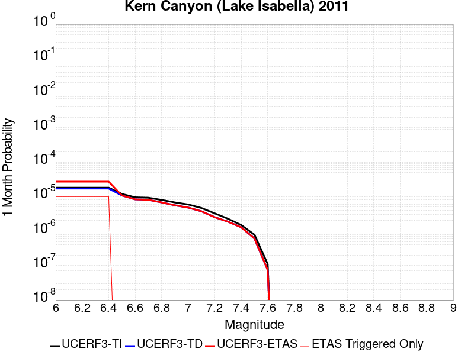 |  |  |

| Magnitude | 1 wk TI Prob | 1 wk TD Prob | 1 wk ETAS Prob | 1 wk ETAS/TD Gain | 1 wk ETAS Triggered Only | 1 mo TI Prob | 1 mo TD Prob | 1 mo ETAS Prob | 1 mo ETAS/TD Gain | 1 mo ETAS Triggered Only | 1 yr TI Prob | 1 yr TD Prob | 1 yr ETAS Prob | 1 yr ETAS/TD Gain | 1 yr ETAS Triggered Only | 10 yr TI Prob | 10 yr TD Prob | 10 yr ETAS Prob | 10 yr ETAS/TD Gain | 10 yr ETAS Triggered Only |
|-----|-----|-----|-----|-----|-----|-----|-----|-----|-----|-----|-----|-----|-----|-----|-----|-----|-----|-----|-----|-----|
| 6.0 | 4.2387383E-6 | 4.0016507E-6 | 1.4001611E-5 | 3.4989588 | 1.0E-5 | 1.8165894E-5 | 1.7149829E-5 | 2.7149657E-5 | 1.5830861 | 1.0E-5 | 2.2114732E-4 | 2.0878103E-4 | 2.2877686E-4 | 1.0957742 | 2.0E-5 | 0.0022092736 | 0.0020860326 | 0.0021059911 | 1.0095676 | 2.0E-5 |
| 6.1 | 4.2387383E-6 | 4.0016507E-6 | 1.4001611E-5 | 3.4989588 | 1.0E-5 | 1.8165894E-5 | 1.7149829E-5 | 2.7149657E-5 | 1.5830861 | 1.0E-5 | 2.2114732E-4 | 2.0878103E-4 | 2.2877686E-4 | 1.0957742 | 2.0E-5 | 0.0022092736 | 0.0020860326 | 0.0021059911 | 1.0095676 | 2.0E-5 |
| 6.2 | 4.2387383E-6 | 4.0016507E-6 | 1.4001611E-5 | 3.4989588 | 1.0E-5 | 1.8165894E-5 | 1.7149829E-5 | 2.7149657E-5 | 1.5830861 | 1.0E-5 | 2.2114732E-4 | 2.0878103E-4 | 2.2877686E-4 | 1.0957742 | 2.0E-5 | 0.0022092736 | 0.0020860326 | 0.0021059911 | 1.0095676 | 2.0E-5 |
| 6.3 | 4.2387383E-6 | 4.0016507E-6 | 1.4001611E-5 | 3.4989588 | 1.0E-5 | 1.8165894E-5 | 1.7149829E-5 | 2.7149657E-5 | 1.5830861 | 1.0E-5 | 2.2114732E-4 | 2.0878103E-4 | 2.2877686E-4 | 1.0957742 | 2.0E-5 | 0.0022092736 | 0.0020860326 | 0.0021059911 | 1.0095676 | 2.0E-5 |
| 6.4 | 4.2387383E-6 | 4.0016507E-6 | 1.4001611E-5 | 3.4989588 | 1.0E-5 | 1.8165894E-5 | 1.7149829E-5 | 2.7149657E-5 | 1.5830861 | 1.0E-5 | 2.2114732E-4 | 2.0878103E-4 | 2.2877686E-4 | 1.0957742 | 2.0E-5 | 0.0022092736 | 0.0020860326 | 0.0021059911 | 1.0095676 | 2.0E-5 |
| 6.5 | 2.7857532E-6 | 2.5178747E-6 | 2.5178747E-6 | 1.0 | 0.0 | 1.1938888E-5 | 1.0790849E-5 | 1.0790849E-5 | 1.0 | 0.0 | 1.4534626E-4 | 1.31371E-4 | 1.4136969E-4 | 1.0761102 | 1.0E-5 | 0.0014525123 | 0.0013129661 | 0.0013229529 | 1.0076064 | 1.0E-5 |
| 6.6 | 2.2233348E-6 | 1.94413E-6 | 1.94413E-6 | 1.0 | 0.0 | 9.528543E-6 | 8.331959E-6 | 8.331959E-6 | 1.0 | 0.0 | 1.1600384E-4 | 1.0143697E-4 | 1.0143697E-4 | 1.0 | 0.0 | 0.001159433 | 0.0010139153 | 0.0010139153 | 1.0 | 0.0 |
| 6.7 | 2.1635126E-6 | 1.8835098E-6 | 1.8835098E-6 | 1.0 | 0.0 | 9.272164E-6 | 8.07216E-6 | 8.07216E-6 | 1.0 | 0.0 | 1.1288274E-4 | 9.82742E-5 | 9.82742E-5 | 1.0 | 0.0 | 0.0011282542 | 9.823156E-4 | 9.823156E-4 | 1.0 | 0.0 |
| 6.8 | 1.8685711E-6 | 1.583148E-6 | 1.583148E-6 | 1.0 | 0.0 | 8.008137E-6 | 6.784903E-6 | 6.784903E-6 | 1.0 | 0.0 | 9.74947E-5 | 8.260311E-5 | 8.260311E-5 | 1.0 | 0.0 | 9.745194E-4 | 8.25729E-4 | 8.25729E-4 | 1.0 | 0.0 |
| 6.9 | 1.5815071E-6 | 1.3064976E-6 | 1.3064976E-6 | 1.0 | 0.0 | 6.77787E-6 | 5.599263E-6 | 5.599263E-6 | 1.0 | 0.0 | 8.251744E-5 | 6.816892E-5 | 6.816892E-5 | 1.0 | 0.0 | 8.248681E-4 | 6.814828E-4 | 6.814828E-4 | 1.0 | 0.0 |
| 7.0 | 1.3772564E-6 | 1.1210758E-6 | 1.1210758E-6 | 1.0 | 0.0 | 5.9025137E-6 | 4.804602E-6 | 4.804602E-6 | 1.0 | 0.0 | 7.186073E-5 | 5.849448E-5 | 5.849448E-5 | 1.0 | 0.0 | 7.18375E-4 | 5.8479287E-4 | 5.8479287E-4 | 1.0 | 0.0 |
| 7.1 | 1.0916998E-6 | 8.763808E-7 | 8.763808E-7 | 1.0 | 0.0 | 4.678705E-6 | 3.7559125E-6 | 3.7559125E-6 | 1.0 | 0.0 | 5.6961744E-5 | 4.5727287E-5 | 4.5727287E-5 | 1.0 | 0.0 | 5.6947145E-4 | 4.5718014E-4 | 4.5718014E-4 | 1.0 | 0.0 |
| 7.2 | 7.6277024E-7 | 5.901475E-7 | 5.901475E-7 | 1.0 | 0.0 | 3.2690114E-6 | 2.5292013E-6 | 2.5292013E-6 | 1.0 | 0.0 | 3.9799485E-5 | 3.0792595E-5 | 3.0792595E-5 | 1.0 | 0.0 | 3.9792358E-4 | 3.078839E-4 | 3.078839E-4 | 1.0 | 0.0 |
| 7.3 | 5.3265916E-7 | 4.3824562E-7 | 4.3824562E-7 | 1.0 | 0.0 | 2.282823E-6 | 1.8781942E-6 | 1.8781942E-6 | 1.0 | 0.0 | 2.7793016E-5 | 2.286678E-5 | 2.286678E-5 | 1.0 | 0.0 | 2.778954E-4 | 2.2864464E-4 | 2.2864464E-4 | 1.0 | 0.0 |
| 7.4 | 3.4946007E-7 | 3.006581E-7 | 3.006581E-7 | 1.0 | 0.0 | 1.497685E-6 | 1.288534E-6 | 1.288534E-6 | 1.0 | 0.0 | 1.8234163E-5 | 1.568779E-5 | 1.568779E-5 | 1.0 | 0.0 | 1.8232666E-4 | 1.5686706E-4 | 1.5686706E-4 | 1.0 | 0.0 |
| 7.5 | 1.8317026E-7 | 1.4244868E-7 | 1.4244868E-7 | 1.0 | 0.0 | 7.850152E-7 | 6.104942E-7 | 6.104942E-7 | 1.0 | 0.0 | 9.557518E-6 | 7.4327427E-6 | 7.4327427E-6 | 1.0 | 0.0 | 9.5571064E-5 | 7.432502E-5 | 7.432502E-5 | 1.0 | 0.0 |
| 7.6 | 2.572245E-8 | 1.7352637E-8 | 1.7352637E-8 | 1.0 | 0.0 | 1.10239064E-7 | 7.4368444E-8 | 7.4368444E-8 | 1.0 | 0.0 | 1.3421597E-6 | 9.0543546E-7 | 9.0543546E-7 | 1.0 | 0.0 | 1.3421517E-5 | 9.0543235E-6 | 9.0543235E-6 | 1.0 | 0.0 |

## San Jacinto (Superstition Mtn)
*[(top)](#table-of-contents)*

| 1 Week | 1 Month | 1 Year | 10 Year |
|-----|-----|-----|-----|
| 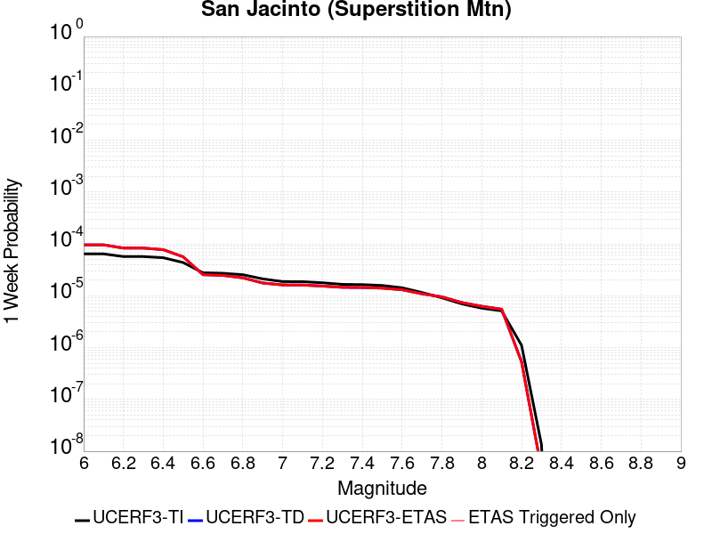 |  |  |  |

| Magnitude | 1 wk TI Prob | 1 wk TD Prob | 1 wk ETAS Prob | 1 wk ETAS/TD Gain | 1 wk ETAS Triggered Only | 1 mo TI Prob | 1 mo TD Prob | 1 mo ETAS Prob | 1 mo ETAS/TD Gain | 1 mo ETAS Triggered Only | 1 yr TI Prob | 1 yr TD Prob | 1 yr ETAS Prob | 1 yr ETAS/TD Gain | 1 yr ETAS Triggered Only | 10 yr TI Prob | 10 yr TD Prob | 10 yr ETAS Prob | 10 yr ETAS/TD Gain | 10 yr ETAS Triggered Only |
|-----|-----|-----|-----|-----|-----|-----|-----|-----|-----|-----|-----|-----|-----|-----|-----|-----|-----|-----|-----|-----|
| 6.0 | 6.4193904E-5 | 9.600102E-5 | 9.600102E-5 | 1.0 | 0.0 | 2.7508775E-4 | 4.1137784E-4 | 4.1137784E-4 | 1.0 | 0.0 | 0.0033440501 | 0.004998455 | 0.004998455 | 1.0 | 0.0 | 0.03294174 | 0.048827495 | 0.04884652 | 1.0003896 | 2.0E-5 |
| 6.1 | 6.4193904E-5 | 9.600102E-5 | 9.600102E-5 | 1.0 | 0.0 | 2.7508775E-4 | 4.1137784E-4 | 4.1137784E-4 | 1.0 | 0.0 | 0.0033440501 | 0.004998455 | 0.004998455 | 1.0 | 0.0 | 0.03294174 | 0.048827495 | 0.04884652 | 1.0003896 | 2.0E-5 |
| 6.2 | 5.7023593E-5 | 8.3151084E-5 | 8.3151084E-5 | 1.0 | 0.0 | 2.4436394E-4 | 3.5632253E-4 | 3.5632253E-4 | 1.0 | 0.0 | 0.002971072 | 0.004331238 | 0.004331238 | 1.0 | 0.0 | 0.029316625 | 0.04250735 | 0.0425265 | 1.0004505 | 2.0E-5 |
| 6.3 | 5.6940098E-5 | 8.299644E-5 | 8.299644E-5 | 1.0 | 0.0 | 2.4400617E-4 | 3.5565995E-4 | 3.5565995E-4 | 1.0 | 0.0 | 0.002966728 | 0.004323203 | 0.004323203 | 1.0 | 0.0 | 0.029274331 | 0.0424306 | 0.04244975 | 1.0004513 | 2.0E-5 |
| 6.4 | 5.4171585E-5 | 7.7490105E-5 | 7.7490105E-5 | 1.0 | 0.0 | 2.3214328E-4 | 3.320675E-4 | 3.320675E-4 | 1.0 | 0.0 | 0.0028226813 | 0.004037075 | 0.004037075 | 1.0 | 0.0 | 0.02787096 | 0.03971982 | 0.039739028 | 1.0004835 | 2.0E-5 |
| 6.5 | 4.375144E-5 | 5.6427685E-5 | 5.6427685E-5 | 1.0 | 0.0 | 1.874927E-4 | 2.4181715E-4 | 2.4181715E-4 | 1.0 | 0.0 | 0.0022803338 | 0.0029413246 | 0.0029413246 | 1.0 | 0.0 | 0.022570757 | 0.029240036 | 0.029249744 | 1.000332 | 1.0E-5 |
| 6.6 | 2.772192E-5 | 2.5494404E-5 | 2.5494404E-5 | 1.0 | 0.0 | 1.1880282E-4 | 1.0925727E-4 | 1.0925727E-4 | 1.0 | 0.0 | 0.0014454646 | 0.0013294149 | 0.0013294149 | 1.0 | 0.0 | 0.014360986 | 0.013543627 | 0.013543627 | 1.0 | 0.0 |
| 6.7 | 2.7124124E-5 | 2.4705407E-5 | 2.4705407E-5 | 1.0 | 0.0 | 1.1624106E-4 | 1.05876126E-4 | 1.05876126E-4 | 1.0 | 0.0 | 0.0014143161 | 0.0012882988 | 0.0012882988 | 1.0 | 0.0 | 0.014053487 | 0.013137068 | 0.013137068 | 1.0 | 0.0 |
| 6.8 | 2.5475807E-5 | 2.2170334E-5 | 2.2170334E-5 | 1.0 | 0.0 | 1.0917746E-4 | 9.501232E-5 | 9.501232E-5 | 1.0 | 0.0 | 0.001328425 | 0.0011561731 | 0.0011561731 | 1.0 | 0.0 | 0.0132051185 | 0.0118252365 | 0.0118252365 | 1.0 | 0.0 |
| 6.9 | 2.1162023E-5 | 1.7631666E-5 | 1.7631666E-5 | 1.0 | 0.0 | 9.069123E-5 | 7.5562115E-5 | 7.5562115E-5 | 1.0 | 0.0 | 0.0011036064 | 9.195843E-4 | 9.195843E-4 | 1.0 | 0.0 | 0.010981417 | 0.009449712 | 0.009449712 | 1.0 | 0.0 |
| 7.0 | 1.8754288E-5 | 1.6166736E-5 | 1.6166736E-5 | 1.0 | 0.0 | 8.037304E-5 | 6.9284186E-5 | 6.9284186E-5 | 1.0 | 0.0 | 9.781026E-4 | 8.4321096E-4 | 8.4321096E-4 | 1.0 | 0.0 | 0.009738087 | 0.008672746 | 0.008672746 | 1.0 | 0.0 |
| 7.1 | 1.8678527E-5 | 1.6091873E-5 | 1.6091873E-5 | 1.0 | 0.0 | 8.0048376E-5 | 6.896337E-5 | 6.896337E-5 | 1.0 | 0.0 | 9.7415317E-4 | 8.3930796E-4 | 8.3930796E-4 | 1.0 | 0.0 | 0.009698939 | 0.008633699 | 0.008633699 | 1.0 | 0.0 |
| 7.2 | 1.7804578E-5 | 1.5386398E-5 | 1.5386398E-5 | 1.0 | 0.0 | 7.6303106E-5 | 6.5940054E-5 | 6.5940054E-5 | 1.0 | 0.0 | 9.285943E-4 | 8.0252666E-4 | 8.0252666E-4 | 1.0 | 0.0 | 0.009247236 | 0.008264985 | 0.008264985 | 1.0 | 0.0 |
| 7.3 | 1.6583685E-5 | 1.4535444E-5 | 1.4535444E-5 | 1.0 | 0.0 | 7.1070994E-5 | 6.2293286E-5 | 6.2293286E-5 | 1.0 | 0.0 | 8.649459E-4 | 7.5815886E-4 | 7.5815886E-4 | 1.0 | 0.0 | 0.00861587 | 0.007820267 | 0.007820267 | 1.0 | 0.0 |
| 7.4 | 1.6387552E-5 | 1.4400321E-5 | 1.4400321E-5 | 1.0 | 0.0 | 7.023047E-5 | 6.171421E-5 | 6.171421E-5 | 1.0 | 0.0 | 8.5472054E-4 | 7.5111346E-4 | 7.5111346E-4 | 1.0 | 0.0 | 0.008514405 | 0.007749644 | 0.007749644 | 1.0 | 0.0 |
| 7.5 | 1.5790754E-5 | 1.4040957E-5 | 1.4040957E-5 | 1.0 | 0.0 | 6.767291E-5 | 6.017415E-5 | 6.017415E-5 | 1.0 | 0.0 | 8.236062E-4 | 7.32376E-4 | 7.32376E-4 | 1.0 | 0.0 | 0.008205604 | 0.007560181 | 0.007560181 | 1.0 | 0.0 |
| 7.6 | 1.4248672E-5 | 1.30597955E-5 | 1.30597955E-5 | 1.0 | 0.0 | 6.106431E-5 | 5.596936E-5 | 5.596936E-5 | 1.0 | 0.0 | 7.432043E-4 | 6.8121566E-4 | 6.8121566E-4 | 1.0 | 0.0 | 0.007407237 | 0.007042702 | 0.007042702 | 1.0 | 0.0 |
| 7.7 | 1.15449975E-5 | 1.09083485E-5 | 1.09083485E-5 | 1.0 | 0.0 | 4.947762E-5 | 4.6749232E-5 | 4.6749232E-5 | 1.0 | 0.0 | 6.022235E-4 | 5.69024E-4 | 5.69024E-4 | 1.0 | 0.0 | 0.006005941 | 0.005912628 | 0.005912628 | 1.0 | 0.0 |
| 7.8 | 9.1391985E-6 | 9.518787E-6 | 9.518787E-6 | 1.0 | 0.0 | 3.9167408E-5 | 4.0794166E-5 | 4.0794166E-5 | 1.0 | 0.0 | 4.767588E-4 | 4.9655634E-4 | 4.9655634E-4 | 1.0 | 0.0 | 0.0047573727 | 0.0051790397 | 0.0051790397 | 1.0 | 0.0 |
| 7.9 | 6.973017E-6 | 7.3861297E-6 | 7.3861297E-6 | 1.0 | 0.0 | 2.9884017E-5 | 3.165446E-5 | 3.165446E-5 | 1.0 | 0.0 | 3.6377716E-4 | 3.8532543E-4 | 3.8532543E-4 | 1.0 | 0.0 | 0.0036318225 | 0.004053871 | 0.004053871 | 1.0 | 0.0 |
| 8.0 | 5.7638235E-6 | 6.263572E-6 | 6.263572E-6 | 1.0 | 0.0 | 2.4701867E-5 | 2.6843605E-5 | 2.6843605E-5 | 1.0 | 0.0 | 3.0070372E-4 | 3.267724E-4 | 3.267724E-4 | 1.0 | 0.0 | 0.0030029714 | 0.0034553434 | 0.0034553434 | 1.0 | 0.0 |
| 8.1 | 5.1124434E-6 | 5.498948E-6 | 5.498948E-6 | 1.0 | 0.0 | 2.1910288E-5 | 2.3566712E-5 | 2.3566712E-5 | 1.0 | 0.0 | 2.6672508E-4 | 2.8688743E-4 | 2.8688743E-4 | 1.0 | 0.0 | 0.0026640517 | 0.0030420625 | 0.0030420625 | 1.0 | 0.0 |
| 8.2 | 1.1075938E-6 | 5.341373E-7 | 5.341373E-7 | 1.0 | 0.0 | 4.7468216E-6 | 2.289158E-6 | 2.289158E-6 | 1.0 | 0.0 | 5.779102E-5 | 2.7870163E-5 | 2.7870163E-5 | 1.0 | 0.0 | 5.777599E-4 | 3.1373248E-4 | 3.1373248E-4 | 1.0 | 0.0 |
| 8.3 | 1.3584393E-8 | 4.478424E-9 | 4.478424E-9 | 1.0 | 0.0 | 5.8218827E-8 | 1.9193244E-8 | 1.9193244E-8 | 1.0 | 0.0 | 7.0881396E-7 | 2.3367775E-7 | 2.3367775E-7 | 1.0 | 0.0 | 7.0881174E-6 | 2.6188773E-6 | 2.6188773E-6 | 1.0 | 0.0 |

## Emerson-Copper Mtn 2011
*[(top)](#table-of-contents)*

| 1 Week | 1 Month | 1 Year | 10 Year |
|-----|-----|-----|-----|
|  | 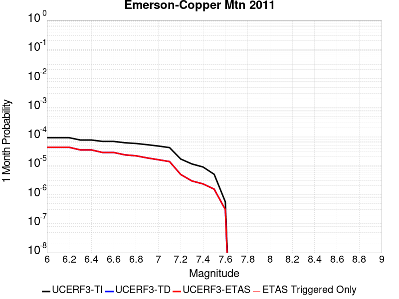 |  |  |

| Magnitude | 1 wk TI Prob | 1 wk TD Prob | 1 wk ETAS Prob | 1 wk ETAS/TD Gain | 1 wk ETAS Triggered Only | 1 mo TI Prob | 1 mo TD Prob | 1 mo ETAS Prob | 1 mo ETAS/TD Gain | 1 mo ETAS Triggered Only | 1 yr TI Prob | 1 yr TD Prob | 1 yr ETAS Prob | 1 yr ETAS/TD Gain | 1 yr ETAS Triggered Only | 10 yr TI Prob | 10 yr TD Prob | 10 yr ETAS Prob | 10 yr ETAS/TD Gain | 10 yr ETAS Triggered Only |
|-----|-----|-----|-----|-----|-----|-----|-----|-----|-----|-----|-----|-----|-----|-----|-----|-----|-----|-----|-----|-----|
| 6.0 | 2.1364202E-5 | 9.968277E-6 | 9.968277E-6 | 1.0 | 0.0 | 9.1557646E-5 | 4.2720538E-5 | 4.2720538E-5 | 1.0 | 0.0 | 0.0011141442 | 5.200071E-4 | 5.399967E-4 | 1.0384411 | 2.0E-5 | 0.011085749 | 0.005188773 | 0.005208669 | 1.0038345 | 2.0E-5 |
| 6.1 | 2.1364202E-5 | 9.968277E-6 | 9.968277E-6 | 1.0 | 0.0 | 9.1557646E-5 | 4.2720538E-5 | 4.2720538E-5 | 1.0 | 0.0 | 0.0011141442 | 5.200071E-4 | 5.399967E-4 | 1.0384411 | 2.0E-5 | 0.011085749 | 0.005188773 | 0.005208669 | 1.0038345 | 2.0E-5 |
| 6.2 | 2.1364202E-5 | 9.968277E-6 | 9.968277E-6 | 1.0 | 0.0 | 9.1557646E-5 | 4.2720538E-5 | 4.2720538E-5 | 1.0 | 0.0 | 0.0011141442 | 5.200071E-4 | 5.399967E-4 | 1.0384411 | 2.0E-5 | 0.011085749 | 0.005188773 | 0.005208669 | 1.0038345 | 2.0E-5 |
| 6.3 | 1.7751237E-5 | 8.089365E-6 | 8.089365E-6 | 1.0 | 0.0 | 7.607452E-5 | 3.4668283E-5 | 3.4668283E-5 | 1.0 | 0.0 | 9.258136E-4 | 4.2201087E-4 | 4.4200243E-4 | 1.0473721 | 2.0E-5 | 0.00921966 | 0.0042127175 | 0.004232633 | 1.0047275 | 2.0E-5 |
| 6.4 | 1.7751237E-5 | 8.089365E-6 | 8.089365E-6 | 1.0 | 0.0 | 7.607452E-5 | 3.4668283E-5 | 3.4668283E-5 | 1.0 | 0.0 | 9.258136E-4 | 4.2201087E-4 | 4.4200243E-4 | 1.0473721 | 2.0E-5 | 0.00921966 | 0.0042127175 | 0.004232633 | 1.0047275 | 2.0E-5 |
| 6.5 | 1.5886664E-5 | 6.6039356E-6 | 6.6039356E-6 | 1.0 | 0.0 | 6.808392E-5 | 2.83023E-5 | 2.83023E-5 | 1.0 | 0.0 | 8.286065E-4 | 3.445307E-4 | 3.5452726E-4 | 1.029015 | 1.0E-5 | 0.008255237 | 0.00344043 | 0.0034503955 | 1.0028967 | 1.0E-5 |
| 6.6 | 1.5886664E-5 | 6.6039356E-6 | 6.6039356E-6 | 1.0 | 0.0 | 6.808392E-5 | 2.83023E-5 | 2.83023E-5 | 1.0 | 0.0 | 8.286065E-4 | 3.445307E-4 | 3.5452726E-4 | 1.029015 | 1.0E-5 | 0.008255237 | 0.00344043 | 0.0034503955 | 1.0028967 | 1.0E-5 |
| 6.7 | 1.428471E-5 | 5.470503E-6 | 5.470503E-6 | 1.0 | 0.0 | 6.121875E-5 | 2.3444823E-5 | 2.3444823E-5 | 1.0 | 0.0 | 7.450834E-4 | 2.8540727E-4 | 2.9540443E-4 | 1.0350276 | 1.0E-5 | 0.007425902 | 0.0028507954 | 0.0028607668 | 1.0034978 | 1.0E-5 |
| 6.8 | 1.3490684E-5 | 5.073793E-6 | 5.073793E-6 | 1.0 | 0.0 | 5.7815934E-5 | 2.1744667E-5 | 2.1744667E-5 | 1.0 | 0.0 | 7.0368167E-4 | 2.6471302E-4 | 2.747104E-4 | 1.0377668 | 1.0E-5 | 0.007014576 | 0.002644358 | 0.0026543315 | 1.0037717 | 1.0E-5 |
| 6.9 | 1.2235421E-5 | 4.2897627E-6 | 4.2897627E-6 | 1.0 | 0.0 | 5.2436466E-5 | 1.8384588E-5 | 1.8384588E-5 | 1.0 | 0.0 | 6.38227E-4 | 2.2381297E-4 | 2.3381073E-4 | 1.0446701 | 1.0E-5 | 0.0063639707 | 0.00223623 | 0.0022462076 | 1.0044618 | 1.0E-5 |
| 7.0 | 1.1009851E-5 | 3.7190669E-6 | 3.7190669E-6 | 1.0 | 0.0 | 4.7184225E-5 | 1.593878E-5 | 1.593878E-5 | 1.0 | 0.0 | 5.743165E-4 | 1.9404081E-4 | 2.0403886E-4 | 1.0515256 | 1.0E-5 | 0.005728345 | 0.0019390517 | 0.0019490323 | 1.0051472 | 1.0E-5 |
| 7.1 | 9.726373E-6 | 3.2118642E-6 | 3.2118642E-6 | 1.0 | 0.0 | 4.168379E-5 | 1.3765079E-5 | 1.3765079E-5 | 1.0 | 0.0 | 5.07382E-4 | 1.6758032E-4 | 1.7757864E-4 | 1.0596629 | 1.0E-5 | 0.0050622504 | 0.0016748707 | 0.0016848539 | 1.0059606 | 1.0E-5 |
| 7.2 | 3.9335127E-6 | 1.1525033E-6 | 1.1525033E-6 | 1.0 | 0.0 | 1.6857803E-5 | 4.9392906E-6 | 4.9392906E-6 | 1.0 | 0.0 | 2.0522442E-4 | 6.0134265E-5 | 6.0134265E-5 | 1.0 | 0.0 | 0.00205035 | 6.011859E-4 | 6.011859E-4 | 1.0 | 0.0 |
| 7.3 | 2.661632E-6 | 6.9116606E-7 | 6.9116606E-7 | 1.0 | 0.0 | 1.14069435E-5 | 2.962137E-6 | 2.962137E-6 | 1.0 | 0.0 | 1.3887069E-4 | 3.6063433E-5 | 3.6063433E-5 | 1.0 | 0.0 | 0.0013878393 | 3.6057684E-4 | 3.6057684E-4 | 1.0 | 0.0 |
| 7.4 | 2.0893426E-6 | 5.461961E-7 | 5.461961E-7 | 1.0 | 0.0 | 8.954295E-6 | 2.3408381E-6 | 2.3408381E-6 | 1.0 | 0.0 | 1.0901308E-4 | 2.8499337E-5 | 2.8499337E-5 | 1.0 | 0.0 | 0.0010895962 | 2.8495738E-4 | 2.8495738E-4 | 1.0 | 0.0 |
| 7.5 | 1.1681728E-6 | 3.6031287E-7 | 3.6031287E-7 | 1.0 | 0.0 | 5.0064455E-6 | 1.5441972E-6 | 1.5441972E-6 | 1.0 | 0.0 | 6.0951766E-5 | 1.8800443E-5 | 1.8800443E-5 | 1.0 | 0.0 | 6.093505E-4 | 1.8798899E-4 | 1.8798899E-4 | 1.0 | 0.0 |
| 7.6 | 1.3154387E-7 | 7.1198265E-8 | 7.1198265E-8 | 1.0 | 0.0 | 5.6375933E-7 | 3.051354E-7 | 3.051354E-7 | 1.0 | 0.0 | 6.863748E-6 | 3.7150185E-6 | 3.7150185E-6 | 1.0 | 0.0 | 6.863536E-5 | 3.7149723E-5 | 3.7149723E-5 | 1.0 | 0.0 |

## San Clemente
*[(top)](#table-of-contents)*

| 1 Week | 1 Month | 1 Year | 10 Year |
|-----|-----|-----|-----|
|  |  |  |  |

| Magnitude | 1 wk TI Prob | 1 wk TD Prob | 1 wk ETAS Prob | 1 wk ETAS/TD Gain | 1 wk ETAS Triggered Only | 1 mo TI Prob | 1 mo TD Prob | 1 mo ETAS Prob | 1 mo ETAS/TD Gain | 1 mo ETAS Triggered Only | 1 yr TI Prob | 1 yr TD Prob | 1 yr ETAS Prob | 1 yr ETAS/TD Gain | 1 yr ETAS Triggered Only | 10 yr TI Prob | 10 yr TD Prob | 10 yr ETAS Prob | 10 yr ETAS/TD Gain | 10 yr ETAS Triggered Only |
|-----|-----|-----|-----|-----|-----|-----|-----|-----|-----|-----|-----|-----|-----|-----|-----|-----|-----|-----|-----|-----|
| 6.0 | 6.681379E-5 | 8.163669E-5 | 8.163669E-5 | 1.0 | 0.0 | 2.8631336E-4 | 3.4982787E-4 | 3.4982787E-4 | 1.0 | 0.0 | 0.003480294 | 0.004251416 | 0.004271331 | 1.0046843 | 2.0E-5 | 0.03426291 | 0.041756913 | 0.04177608 | 1.000459 | 2.0E-5 |
| 6.1 | 6.681379E-5 | 8.163669E-5 | 8.163669E-5 | 1.0 | 0.0 | 2.8631336E-4 | 3.4982787E-4 | 3.4982787E-4 | 1.0 | 0.0 | 0.003480294 | 0.004251416 | 0.004271331 | 1.0046843 | 2.0E-5 | 0.03426291 | 0.041756913 | 0.04177608 | 1.000459 | 2.0E-5 |
| 6.2 | 3.9400576E-5 | 4.6453104E-5 | 4.6453104E-5 | 1.0 | 0.0 | 1.6884868E-4 | 1.9906988E-4 | 1.9906988E-4 | 1.0 | 0.0 | 0.0020537945 | 0.0024210429 | 0.0024310187 | 1.0041205 | 1.0E-5 | 0.020349167 | 0.023953425 | 0.023963185 | 1.0004075 | 1.0E-5 |
| 6.3 | 3.2590255E-5 | 3.792992E-5 | 3.792992E-5 | 1.0 | 0.0 | 1.3966505E-4 | 1.6254683E-4 | 1.6254683E-4 | 1.0 | 0.0 | 0.0016990956 | 0.0019772416 | 0.001987222 | 1.0050476 | 1.0E-5 | 0.01686163 | 0.019600289 | 0.019610094 | 1.0005002 | 1.0E-5 |
| 6.4 | 2.9454652E-5 | 3.4098495E-5 | 3.4098495E-5 | 1.0 | 0.0 | 1.2622811E-4 | 1.4612835E-4 | 1.4612835E-4 | 1.0 | 0.0 | 0.0015357438 | 0.0017776854 | 0.0017776854 | 1.0 | 0.0 | 0.015251739 | 0.017637825 | 0.017637825 | 1.0 | 0.0 |
| 6.5 | 2.790836E-5 | 3.2248132E-5 | 3.2248132E-5 | 1.0 | 0.0 | 1.1960178E-4 | 1.3819907E-4 | 1.3819907E-4 | 1.0 | 0.0 | 0.001455179 | 0.0016812999 | 0.0016812999 | 1.0 | 0.0 | 0.014456868 | 0.016688818 | 0.016688818 | 1.0 | 0.0 |
| 6.6 | 2.2492153E-5 | 2.5763205E-5 | 2.5763205E-5 | 1.0 | 0.0 | 9.639138E-5 | 1.1040914E-4 | 1.1040914E-4 | 1.0 | 0.0 | 0.0011729331 | 0.0013434167 | 0.0013434167 | 1.0 | 0.0 | 0.011667615 | 0.013354672 | 0.013354672 | 1.0 | 0.0 |
| 6.7 | 1.9862755E-5 | 2.2666847E-5 | 2.2666847E-5 | 1.0 | 0.0 | 8.512331E-5 | 9.714008E-5 | 9.714008E-5 | 1.0 | 0.0 | 0.0010358836 | 0.0011820501 | 0.0011820501 | 1.0 | 0.0 | 0.010310682 | 0.01175892 | 0.01175892 | 1.0 | 0.0 |
| 6.8 | 1.6697575E-5 | 1.8978053E-5 | 1.8978053E-5 | 1.0 | 0.0 | 7.155907E-5 | 8.133203E-5 | 8.133203E-5 | 1.0 | 0.0 | 8.7088346E-4 | 9.89777E-4 | 9.89777E-4 | 1.0 | 0.0 | 0.008674784 | 0.009854714 | 0.009854714 | 1.0 | 0.0 |
| 6.9 | 1.5218415E-5 | 1.726971E-5 | 1.726971E-5 | 1.0 | 0.0 | 6.522015E-5 | 7.401099E-5 | 7.401099E-5 | 1.0 | 0.0 | 7.93766E-4 | 9.0072013E-4 | 9.0072013E-4 | 1.0 | 0.0 | 0.007909367 | 0.00897164 | 0.00897164 | 1.0 | 0.0 |
| 7.0 | 1.2392958E-5 | 1.4033262E-5 | 1.4033262E-5 | 1.0 | 0.0 | 5.3111595E-5 | 6.0141207E-5 | 6.0141207E-5 | 1.0 | 0.0 | 6.4644177E-4 | 7.319808E-4 | 7.319808E-4 | 1.0 | 0.0 | 0.0064456454 | 0.0072964844 | 0.0072964844 | 1.0 | 0.0 |
| 7.1 | 1.0934128E-5 | 1.2375354E-5 | 1.2375354E-5 | 1.0 | 0.0 | 4.6859706E-5 | 5.3036194E-5 | 5.3036194E-5 | 1.0 | 0.0 | 5.7036756E-4 | 6.455317E-4 | 6.455317E-4 | 1.0 | 0.0 | 0.0056890585 | 0.006437312 | 0.006437312 | 1.0 | 0.0 |
| 7.2 | 9.5798805E-6 | 1.0845125E-5 | 1.0845125E-5 | 1.0 | 0.0 | 4.1055984E-5 | 4.647832E-5 | 4.647832E-5 | 1.0 | 0.0 | 4.9974193E-4 | 5.657338E-4 | 5.657338E-4 | 1.0 | 0.0 | 0.0049861963 | 0.00564366 | 0.00564366 | 1.0 | 0.0 |
| 7.3 | 8.0167365E-6 | 9.084078E-6 | 9.084078E-6 | 1.0 | 0.0 | 3.4356988E-5 | 3.8931223E-5 | 3.8931223E-5 | 1.0 | 0.0 | 4.1821605E-4 | 4.738916E-4 | 4.738916E-4 | 1.0 | 0.0 | 0.0041742986 | 0.004729513 | 0.004729513 | 1.0 | 0.0 |
| 7.4 | 2.9581017E-6 | 3.36244E-6 | 3.36244E-6 | 1.0 | 0.0 | 1.2677518E-5 | 1.4410407E-5 | 1.4410407E-5 | 1.0 | 0.0 | 1.5433785E-4 | 1.7543763E-4 | 1.7543763E-4 | 1.0 | 0.0 | 0.001542307 | 0.0017534863 | 0.0017534863 | 1.0 | 0.0 |

## San Diego Trough south
*[(top)](#table-of-contents)*

| 1 Week | 1 Month | 1 Year | 10 Year |
|-----|-----|-----|-----|
|  |  |  |  |

| Magnitude | 1 wk TI Prob | 1 wk TD Prob | 1 wk ETAS Prob | 1 wk ETAS/TD Gain | 1 wk ETAS Triggered Only | 1 mo TI Prob | 1 mo TD Prob | 1 mo ETAS Prob | 1 mo ETAS/TD Gain | 1 mo ETAS Triggered Only | 1 yr TI Prob | 1 yr TD Prob | 1 yr ETAS Prob | 1 yr ETAS/TD Gain | 1 yr ETAS Triggered Only | 10 yr TI Prob | 10 yr TD Prob | 10 yr ETAS Prob | 10 yr ETAS/TD Gain | 10 yr ETAS Triggered Only |
|-----|-----|-----|-----|-----|-----|-----|-----|-----|-----|-----|-----|-----|-----|-----|-----|-----|-----|-----|-----|-----|
| 6.0 | 8.279495E-5 | 1.0424506E-4 | 1.0424506E-4 | 1.0 | 0.0 | 3.5478722E-4 | 4.4669298E-4 | 4.5668852E-4 | 1.0223768 | 1.0E-5 | 0.004310982 | 0.005425812 | 0.005445704 | 1.003666 | 2.0E-5 | 0.042283054 | 0.052993916 | 0.053012855 | 1.0003574 | 2.0E-5 |
| 6.1 | 4.6961468E-5 | 5.7731268E-5 | 5.7731268E-5 | 1.0 | 0.0 | 2.0124791E-4 | 2.4739723E-4 | 2.4739723E-4 | 1.0 | 0.0 | 0.00244744 | 0.0030080716 | 0.0030180416 | 1.0033144 | 1.0E-5 | 0.024206603 | 0.029680338 | 0.02969004 | 1.0003269 | 1.0E-5 |
| 6.2 | 3.5079658E-5 | 4.2142692E-5 | 4.2142692E-5 | 1.0 | 0.0 | 1.5033272E-4 | 1.805993E-4 | 1.805993E-4 | 1.0 | 0.0 | 0.0018287642 | 0.002196623 | 0.002206601 | 1.0045425 | 1.0E-5 | 0.018137876 | 0.021751693 | 0.021761475 | 1.0004498 | 1.0E-5 |
| 6.3 | 3.5079658E-5 | 4.2142692E-5 | 4.2142692E-5 | 1.0 | 0.0 | 1.5033272E-4 | 1.805993E-4 | 1.805993E-4 | 1.0 | 0.0 | 0.0018287642 | 0.002196623 | 0.002206601 | 1.0045425 | 1.0E-5 | 0.018137876 | 0.021751693 | 0.021761475 | 1.0004498 | 1.0E-5 |
| 6.4 | 2.7196904E-5 | 3.2087937E-5 | 3.2087937E-5 | 1.0 | 0.0 | 1.16552954E-4 | 1.3751259E-4 | 1.3751259E-4 | 1.0 | 0.0 | 0.0014181085 | 0.0016729443 | 0.0016729443 | 1.0 | 0.0 | 0.014090929 | 0.016605038 | 0.016605038 | 1.0 | 0.0 |
| 6.5 | 2.5584688E-5 | 3.0102354E-5 | 3.0102354E-5 | 1.0 | 0.0 | 1.0964406E-4 | 1.2900379E-4 | 1.2900379E-4 | 1.0 | 0.0 | 0.0013340989 | 0.0015695024 | 0.0015695024 | 1.0 | 0.0 | 0.013261181 | 0.015585679 | 0.015585679 | 1.0 | 0.0 |
| 6.6 | 2.2034688E-5 | 2.5743318E-5 | 2.5743318E-5 | 1.0 | 0.0 | 9.443096E-5 | 1.1032389E-4 | 1.1032389E-4 | 1.0 | 0.0 | 0.0011490905 | 0.0013423724 | 0.0013423724 | 1.0 | 0.0 | 0.011431668 | 0.013343615 | 0.013343615 | 1.0 | 0.0 |
| 6.7 | 1.9394853E-5 | 2.2542248E-5 | 2.2542248E-5 | 1.0 | 0.0 | 8.311815E-5 | 9.660609E-5 | 9.660609E-5 | 1.0 | 0.0 | 0.0010114936 | 0.0011755497 | 0.0011755497 | 1.0 | 0.0 | 0.01006902 | 0.011694018 | 0.011694018 | 1.0 | 0.0 |
| 6.8 | 1.7615313E-5 | 2.0403613E-5 | 2.0403613E-5 | 1.0 | 0.0 | 7.549201E-5 | 8.744115E-5 | 8.744115E-5 | 1.0 | 0.0 | 9.1872766E-4 | 0.0010640804 | 0.0010640804 | 1.0 | 0.0 | 0.009149387 | 0.01059042 | 0.01059042 | 1.0 | 0.0 |
| 6.9 | 1.5621423E-5 | 1.8026485E-5 | 1.8026485E-5 | 1.0 | 0.0 | 6.6947236E-5 | 7.7254095E-5 | 7.7254095E-5 | 1.0 | 0.0 | 8.147778E-4 | 9.4016624E-4 | 9.4016624E-4 | 1.0 | 0.0 | 0.008117969 | 0.0093623325 | 0.0093623325 | 1.0 | 0.0 |
| 7.0 | 1.3444376E-5 | 1.5448395E-5 | 1.5448395E-5 | 1.0 | 0.0 | 5.7617483E-5 | 6.620574E-5 | 6.620574E-5 | 1.0 | 0.0 | 7.0126704E-4 | 8.057596E-4 | 8.057596E-4 | 1.0 | 0.0 | 0.006990582 | 0.008028714 | 0.008028714 | 1.0 | 0.0 |
| 7.1 | 1.2268361E-5 | 1.40733055E-5 | 1.40733055E-5 | 1.0 | 0.0 | 5.2577634E-5 | 6.031279E-5 | 6.031279E-5 | 1.0 | 0.0 | 6.399447E-4 | 7.3406345E-4 | 7.3406345E-4 | 1.0 | 0.0 | 0.0063810493 | 0.007316692 | 0.007316692 | 1.0 | 0.0 |
| 7.2 | 1.0922655E-5 | 1.2513806E-5 | 1.2513806E-5 | 1.0 | 0.0 | 4.681054E-5 | 5.362951E-5 | 5.362951E-5 | 1.0 | 0.0 | 5.697693E-4 | 6.527462E-4 | 6.527462E-4 | 1.0 | 0.0 | 0.0056831064 | 0.0065085697 | 0.0065085697 | 1.0 | 0.0 |
| 7.3 | 6.1106753E-6 | 6.9290486E-6 | 6.9290486E-6 | 1.0 | 0.0 | 2.6188345E-5 | 2.9695586E-5 | 2.9695586E-5 | 1.0 | 0.0 | 3.1879646E-4 | 3.6148418E-4 | 3.6148418E-4 | 1.0 | 0.0 | 0.0031833951 | 0.0036090072 | 0.0036090072 | 1.0 | 0.0 |
| 7.4 | 4.933187E-6 | 5.5896517E-6 | 5.5896517E-6 | 1.0 | 0.0 | 2.114206E-5 | 2.3955432E-5 | 2.3955432E-5 | 1.0 | 0.0 | 2.5737417E-4 | 2.9161875E-4 | 2.9161875E-4 | 1.0 | 0.0 | 0.002570763 | 0.002912402 | 0.002912402 | 1.0 | 0.0 |
| 7.5 | 1.7489613E-6 | 1.9697113E-6 | 1.9697113E-6 | 1.0 | 0.0 | 7.495527E-6 | 8.441594E-6 | 8.441594E-6 | 1.0 | 0.0 | 9.125422E-5 | 1.0277178E-4 | 1.0277178E-4 | 1.0 | 0.0 | 9.1216754E-4 | 0.0010272645 | 0.0010272645 | 1.0 | 0.0 |
| 7.6 | 1.6988751E-7 | 1.7533898E-7 | 1.7533898E-7 | 1.0 | 0.0 | 7.2808916E-7 | 7.5145255E-7 | 7.5145255E-7 | 1.0 | 0.0 | 8.864449E-6 | 9.148898E-6 | 9.148898E-6 | 1.0 | 0.0 | 8.8640954E-5 | 9.148542E-5 | 9.148542E-5 | 1.0 | 0.0 |

## Homestead Valley 2011
*[(top)](#table-of-contents)*

| 1 Week | 1 Month | 1 Year | 10 Year |
|-----|-----|-----|-----|
|  |  |  |  |

| Magnitude | 1 wk TI Prob | 1 wk TD Prob | 1 wk ETAS Prob | 1 wk ETAS/TD Gain | 1 wk ETAS Triggered Only | 1 mo TI Prob | 1 mo TD Prob | 1 mo ETAS Prob | 1 mo ETAS/TD Gain | 1 mo ETAS Triggered Only | 1 yr TI Prob | 1 yr TD Prob | 1 yr ETAS Prob | 1 yr ETAS/TD Gain | 1 yr ETAS Triggered Only | 10 yr TI Prob | 10 yr TD Prob | 10 yr ETAS Prob | 10 yr ETAS/TD Gain | 10 yr ETAS Triggered Only |
|-----|-----|-----|-----|-----|-----|-----|-----|-----|-----|-----|-----|-----|-----|-----|-----|-----|-----|-----|-----|-----|
| 6.0 | 1.539795E-5 | 6.2866725E-6 | 6.2866725E-6 | 1.0 | 0.0 | 6.5989545E-5 | 2.694272E-5 | 2.694272E-5 | 1.0 | 0.0 | 8.0312655E-4 | 3.2799886E-4 | 3.2799886E-4 | 1.0 | 0.0 | 0.008002302 | 0.0032771684 | 0.0032971029 | 1.0060828 | 2.0E-5 |
| 6.1 | 1.539795E-5 | 6.2866725E-6 | 6.2866725E-6 | 1.0 | 0.0 | 6.5989545E-5 | 2.694272E-5 | 2.694272E-5 | 1.0 | 0.0 | 8.0312655E-4 | 3.2799886E-4 | 3.2799886E-4 | 1.0 | 0.0 | 0.008002302 | 0.0032771684 | 0.0032971029 | 1.0060828 | 2.0E-5 |
| 6.2 | 1.539795E-5 | 6.2866725E-6 | 6.2866725E-6 | 1.0 | 0.0 | 6.5989545E-5 | 2.694272E-5 | 2.694272E-5 | 1.0 | 0.0 | 8.0312655E-4 | 3.2799886E-4 | 3.2799886E-4 | 1.0 | 0.0 | 0.008002302 | 0.0032771684 | 0.0032971029 | 1.0060828 | 2.0E-5 |
| 6.3 | 1.539795E-5 | 6.2866725E-6 | 6.2866725E-6 | 1.0 | 0.0 | 6.5989545E-5 | 2.694272E-5 | 2.694272E-5 | 1.0 | 0.0 | 8.0312655E-4 | 3.2799886E-4 | 3.2799886E-4 | 1.0 | 0.0 | 0.008002302 | 0.0032771684 | 0.0032971029 | 1.0060828 | 2.0E-5 |
| 6.4 | 1.539795E-5 | 6.2866725E-6 | 6.2866725E-6 | 1.0 | 0.0 | 6.5989545E-5 | 2.694272E-5 | 2.694272E-5 | 1.0 | 0.0 | 8.0312655E-4 | 3.2799886E-4 | 3.2799886E-4 | 1.0 | 0.0 | 0.008002302 | 0.0032771684 | 0.0032971029 | 1.0060828 | 2.0E-5 |
| 6.5 | 1.0265258E-5 | 2.8788809E-6 | 2.8788809E-6 | 1.0 | 0.0 | 4.3993223E-5 | 1.2338042E-5 | 1.2338042E-5 | 1.0 | 0.0 | 5.3548586E-4 | 1.5021226E-4 | 1.5021226E-4 | 1.0 | 0.0 | 0.005341973 | 0.0015017892 | 0.0015117741 | 1.0066488 | 1.0E-5 |
| 6.6 | 6.664671E-6 | 5.3483575E-7 | 5.3483575E-7 | 1.0 | 0.0 | 2.8562565E-5 | 2.2921517E-6 | 2.2921517E-6 | 1.0 | 0.0 | 3.476937E-4 | 2.790671E-5 | 2.790671E-5 | 1.0 | 0.0 | 0.003471502 | 2.7904368E-4 | 2.890409E-4 | 1.0358267 | 1.0E-5 |
| 6.7 | 6.5954046E-6 | 5.3483575E-7 | 5.3483575E-7 | 1.0 | 0.0 | 2.8265715E-5 | 2.2921517E-6 | 2.2921517E-6 | 1.0 | 0.0 | 3.4408073E-4 | 2.790671E-5 | 2.790671E-5 | 1.0 | 0.0 | 0.0034354846 | 2.7904368E-4 | 2.890409E-4 | 1.0358267 | 1.0E-5 |
| 6.8 | 4.648189E-6 | 2.3266526E-7 | 2.3266526E-7 | 1.0 | 0.0 | 1.9920659E-5 | 9.971365E-7 | 9.971365E-7 | 1.0 | 0.0 | 2.4250703E-4 | 1.21400735E-5 | 1.21400735E-5 | 1.0 | 0.0 | 0.0024224254 | 1.2139459E-4 | 1.2139459E-4 | 1.0 | 0.0 |
| 6.9 | 4.1428534E-6 | 1.9345389E-7 | 1.9345389E-7 | 1.0 | 0.0 | 1.7754966E-5 | 8.2908787E-7 | 8.2908787E-7 | 1.0 | 0.0 | 2.1614527E-4 | 1.0094101E-5 | 1.0094101E-5 | 1.0 | 0.0 | 0.0021593515 | 1.0093672E-4 | 1.0093672E-4 | 1.0 | 0.0 |
| 7.0 | 3.0673707E-6 | 1.5368272E-7 | 1.5368272E-7 | 1.0 | 0.0 | 1.3145808E-5 | 6.5864003E-7 | 6.5864003E-7 | 1.0 | 0.0 | 1.6003846E-4 | 8.018914E-6 | 8.018914E-6 | 1.0 | 0.0 | 0.0015992324 | 8.018635E-5 | 8.018635E-5 | 1.0 | 0.0 |
| 7.1 | 2.340854E-6 | 1.468828E-7 | 1.468828E-7 | 1.0 | 0.0 | 1.0032193E-5 | 6.2949755E-7 | 6.2949755E-7 | 1.0 | 0.0 | 1.221351E-4 | 7.664107E-6 | 7.664107E-6 | 1.0 | 0.0 | 0.00122068 | 7.663853E-5 | 7.663853E-5 | 1.0 | 0.0 |
| 7.2 | 1.3754182E-6 | 1.3923189E-7 | 1.3923189E-7 | 1.0 | 0.0 | 5.8946357E-6 | 5.9670793E-7 | 5.9670793E-7 | 1.0 | 0.0 | 7.176483E-5 | 7.264896E-6 | 7.264896E-6 | 1.0 | 0.0 | 7.174166E-4 | 7.2646675E-5 | 7.2646675E-5 | 1.0 | 0.0 |
| 7.3 | 1.2573237E-6 | 1.3827695E-7 | 1.3827695E-7 | 1.0 | 0.0 | 5.388519E-6 | 5.926153E-7 | 5.926153E-7 | 1.0 | 0.0 | 6.560324E-5 | 7.2150688E-6 | 7.2150688E-6 | 1.0 | 0.0 | 6.558388E-4 | 7.214844E-5 | 7.214844E-5 | 1.0 | 0.0 |
| 7.4 | 1.0994207E-6 | 1.3106616E-7 | 1.3106616E-7 | 1.0 | 0.0 | 4.7117946E-6 | 5.61712E-7 | 5.61712E-7 | 1.0 | 0.0 | 5.736459E-5 | 6.838823E-6 | 6.838823E-6 | 1.0 | 0.0 | 5.734978E-4 | 6.8386216E-5 | 6.8386216E-5 | 1.0 | 0.0 |
| 7.5 | 5.5569126E-7 | 6.773262E-8 | 6.773262E-8 | 1.0 | 0.0 | 2.3815317E-6 | 2.9028263E-7 | 2.9028263E-7 | 1.0 | 0.0 | 2.8994764E-5 | 3.534186E-6 | 3.534186E-6 | 1.0 | 0.0 | 2.899098E-4 | 3.534136E-5 | 3.534136E-5 | 1.0 | 0.0 |

## Rinconada 2011 CFM
*[(top)](#table-of-contents)*

| 1 Week | 1 Month | 1 Year | 10 Year |
|-----|-----|-----|-----|
|  |  |  |  |

| Magnitude | 1 wk TI Prob | 1 wk TD Prob | 1 wk ETAS Prob | 1 wk ETAS/TD Gain | 1 wk ETAS Triggered Only | 1 mo TI Prob | 1 mo TD Prob | 1 mo ETAS Prob | 1 mo ETAS/TD Gain | 1 mo ETAS Triggered Only | 1 yr TI Prob | 1 yr TD Prob | 1 yr ETAS Prob | 1 yr ETAS/TD Gain | 1 yr ETAS Triggered Only | 10 yr TI Prob | 10 yr TD Prob | 10 yr ETAS Prob | 10 yr ETAS/TD Gain | 10 yr ETAS Triggered Only |
|-----|-----|-----|-----|-----|-----|-----|-----|-----|-----|-----|-----|-----|-----|-----|-----|-----|-----|-----|-----|-----|
| 6.0 | 1.5752368E-5 | 1.6274787E-5 | 1.6274787E-5 | 1.0 | 0.0 | 6.75084E-5 | 6.974724E-5 | 6.974724E-5 | 1.0 | 0.0 | 8.2160486E-4 | 8.48845E-4 | 8.48845E-4 | 1.0 | 0.0 | 0.008185739 | 0.008456407 | 0.008476238 | 1.0023451 | 2.0E-5 |
| 6.1 | 1.0966133E-5 | 1.1323078E-5 | 1.1323078E-5 | 1.0 | 0.0 | 4.6996865E-5 | 4.8526577E-5 | 4.8526577E-5 | 1.0 | 0.0 | 5.720366E-4 | 5.9065165E-4 | 5.9065165E-4 | 1.0 | 0.0 | 0.0057056635 | 0.0058909142 | 0.005900855 | 1.0016875 | 1.0E-5 |
| 6.2 | 1.0966133E-5 | 1.1323078E-5 | 1.1323078E-5 | 1.0 | 0.0 | 4.6996865E-5 | 4.8526577E-5 | 4.8526577E-5 | 1.0 | 0.0 | 5.720366E-4 | 5.9065165E-4 | 5.9065165E-4 | 1.0 | 0.0 | 0.0057056635 | 0.0058909142 | 0.005900855 | 1.0016875 | 1.0E-5 |
| 6.3 | 8.926149E-6 | 9.212811E-6 | 9.212811E-6 | 1.0 | 0.0 | 3.8254362E-5 | 3.9482882E-5 | 3.9482882E-5 | 1.0 | 0.0 | 4.6564735E-4 | 4.8059836E-4 | 4.8059836E-4 | 1.0 | 0.0 | 0.0046467283 | 0.004795635 | 0.004805587 | 1.0020752 | 1.0E-5 |
| 6.4 | 7.676955E-6 | 7.920225E-6 | 7.920225E-6 | 1.0 | 0.0 | 3.290082E-5 | 3.394338E-5 | 3.394338E-5 | 1.0 | 0.0 | 4.0049385E-4 | 4.1318245E-4 | 4.1318245E-4 | 1.0 | 0.0 | 0.0039977287 | 0.004124169 | 0.0041341274 | 1.0024147 | 1.0E-5 |
| 6.5 | 6.1671026E-6 | 6.3589814E-6 | 6.3589814E-6 | 1.0 | 0.0 | 2.6430173E-5 | 2.7252492E-5 | 2.7252492E-5 | 1.0 | 0.0 | 3.2173982E-4 | 3.3174866E-4 | 3.3174866E-4 | 1.0 | 0.0 | 0.003212744 | 0.0033125463 | 0.003322513 | 1.0030088 | 1.0E-5 |
| 6.6 | 5.553456E-6 | 5.7248362E-6 | 5.7248362E-6 | 1.0 | 0.0 | 2.3800309E-5 | 2.4534782E-5 | 2.4534782E-5 | 1.0 | 0.0 | 2.897302E-4 | 2.986701E-4 | 2.986701E-4 | 1.0 | 0.0 | 0.0028935277 | 0.0029826954 | 0.0029926656 | 1.0033426 | 1.0E-5 |
| 6.7 | 4.787857E-6 | 4.93333E-6 | 4.93333E-6 | 1.0 | 0.0 | 2.0519226E-5 | 2.114267E-5 | 2.114267E-5 | 1.0 | 0.0 | 2.4979294E-4 | 2.5738165E-4 | 2.5738165E-4 | 1.0 | 0.0 | 0.0024951235 | 0.0025708412 | 0.0025808155 | 1.0038798 | 1.0E-5 |
| 6.8 | 3.9955166E-6 | 4.1134927E-6 | 4.1134927E-6 | 1.0 | 0.0 | 1.7123532E-5 | 1.7629134E-5 | 1.7629134E-5 | 1.0 | 0.0 | 2.0845905E-4 | 2.146136E-4 | 2.146136E-4 | 1.0 | 0.0 | 0.002082636 | 0.002144067 | 0.0021540455 | 1.004654 | 1.0E-5 |
| 6.9 | 3.4250072E-6 | 3.5224598E-6 | 3.5224598E-6 | 1.0 | 0.0 | 1.46785205E-5 | 1.509617E-5 | 1.509617E-5 | 1.0 | 0.0 | 1.7869633E-4 | 1.8378037E-4 | 1.8378037E-4 | 1.0 | 0.0 | 0.001785527 | 0.0018362864 | 0.0018462681 | 1.0054358 | 1.0E-5 |
| 7.0 | 2.7712713E-6 | 2.8467105E-6 | 2.8467105E-6 | 1.0 | 0.0 | 1.1876823E-5 | 1.2200131E-5 | 1.2200131E-5 | 1.0 | 0.0 | 1.4459073E-4 | 1.4852648E-4 | 1.4852648E-4 | 1.0 | 0.0 | 0.0014449668 | 0.0014842737 | 0.0014942589 | 1.0067273 | 1.0E-5 |
| 7.1 | 2.227358E-6 | 2.2857066E-6 | 2.2857066E-6 | 1.0 | 0.0 | 9.545785E-6 | 9.795849E-6 | 9.795849E-6 | 1.0 | 0.0 | 1.16213734E-4 | 1.19257944E-4 | 1.19257944E-4 | 1.0 | 0.0 | 0.0011615298 | 0.0011919405 | 0.0012019286 | 1.0083797 | 1.0E-5 |
| 7.2 | 1.581796E-6 | 1.6209067E-6 | 1.6209067E-6 | 1.0 | 0.0 | 6.779108E-6 | 6.9467246E-6 | 6.9467246E-6 | 1.0 | 0.0 | 8.253252E-5 | 8.457309E-5 | 8.457309E-5 | 1.0 | 0.0 | 8.250187E-4 | 8.4540964E-4 | 8.5540116E-4 | 1.0118185 | 1.0E-5 |
| 7.3 | 1.0306567E-6 | 1.0546512E-6 | 1.0546512E-6 | 1.0 | 0.0 | 4.4170924E-6 | 4.519926E-6 | 4.519926E-6 | 1.0 | 0.0 | 5.3776774E-5 | 5.5028708E-5 | 5.5028708E-5 | 1.0 | 0.0 | 5.376376E-4 | 5.5015105E-4 | 5.601456E-4 | 1.0181668 | 1.0E-5 |
| 7.4 | 6.535541E-7 | 6.682764E-7 | 6.682764E-7 | 1.0 | 0.0 | 2.800943E-6 | 2.8640386E-6 | 2.8640386E-6 | 1.0 | 0.0 | 3.4100947E-5 | 3.4869114E-5 | 3.4869114E-5 | 1.0 | 0.0 | 3.4095717E-4 | 3.4863656E-4 | 3.4863656E-4 | 1.0 | 0.0 |
| 7.5 | 3.2656962E-7 | 3.33168E-7 | 3.33168E-7 | 1.0 | 0.0 | 1.3995833E-6 | 1.427862E-6 | 1.427862E-6 | 1.0 | 0.0 | 1.7039794E-5 | 1.7384082E-5 | 1.7384082E-5 | 1.0 | 0.0 | 1.7038487E-4 | 1.7382725E-4 | 1.7382725E-4 | 1.0 | 0.0 |
| 7.6 | 9.754343E-8 | 9.821022E-8 | 9.821022E-8 | 1.0 | 0.0 | 4.180432E-7 | 4.2090088E-7 | 4.2090088E-7 | 1.0 | 0.0 | 5.089664E-6 | 5.1244565E-6 | 5.1244565E-6 | 1.0 | 0.0 | 5.0895473E-5 | 5.124339E-5 | 5.124339E-5 | 1.0 | 0.0 |
| 7.7 | 6.0001453E-9 | 5.8490692E-9 | 5.8490692E-9 | 1.0 | 0.0 | 2.5714908E-8 | 2.506744E-8 | 2.506744E-8 | 1.0 | 0.0 | 3.1307894E-7 | 3.0519604E-7 | 3.0519604E-7 | 1.0 | 0.0 | 3.1307852E-6 | 3.0519564E-6 | 3.0519564E-6 | 1.0 | 0.0 |
| 7.8 | 7.400003E-11 | 7.4654505E-11 | 7.4654505E-11 | 1.0 | 0.0 | 3.171432E-10 | 3.1994807E-10 | 3.1994807E-10 | 1.0 | 0.0 | 3.861218E-9 | 3.8953676E-9 | 3.8953676E-9 | 1.0 | 0.0 | 3.861218E-8 | 3.8953676E-8 | 3.8953676E-8 | 1.0 | 0.0 |

## Likely 2011 CFM
*[(top)](#table-of-contents)*

| 1 Week | 1 Month | 1 Year | 10 Year |
|-----|-----|-----|-----|
|  |  | 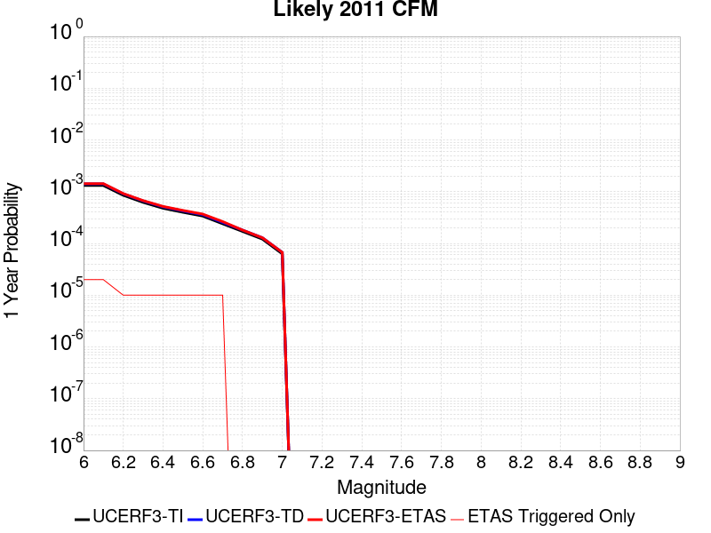 |  |

| Magnitude | 1 wk TI Prob | 1 wk TD Prob | 1 wk ETAS Prob | 1 wk ETAS/TD Gain | 1 wk ETAS Triggered Only | 1 mo TI Prob | 1 mo TD Prob | 1 mo ETAS Prob | 1 mo ETAS/TD Gain | 1 mo ETAS Triggered Only | 1 yr TI Prob | 1 yr TD Prob | 1 yr ETAS Prob | 1 yr ETAS/TD Gain | 1 yr ETAS Triggered Only | 10 yr TI Prob | 10 yr TD Prob | 10 yr ETAS Prob | 10 yr ETAS/TD Gain | 10 yr ETAS Triggered Only |
|-----|-----|-----|-----|-----|-----|-----|-----|-----|-----|-----|-----|-----|-----|-----|-----|-----|-----|-----|-----|-----|
| 6.0 | 2.5315949E-5 | 2.7105003E-5 | 2.7105003E-5 | 1.0 | 0.0 | 1.0849241E-4 | 1.16159375E-4 | 1.2615821E-4 | 1.0860786 | 1.0E-5 | 0.0013200947 | 0.0014133675 | 0.0014333392 | 1.0141306 | 2.0E-5 | 0.013122803 | 0.014048441 | 0.01406816 | 1.0014037 | 2.0E-5 |
| 6.1 | 2.5315949E-5 | 2.7105003E-5 | 2.7105003E-5 | 1.0 | 0.0 | 1.0849241E-4 | 1.16159375E-4 | 1.2615821E-4 | 1.0860786 | 1.0E-5 | 0.0013200947 | 0.0014133675 | 0.0014333392 | 1.0141306 | 2.0E-5 | 0.013122803 | 0.014048441 | 0.01406816 | 1.0014037 | 2.0E-5 |
| 6.2 | 1.6375941E-5 | 1.7465996E-5 | 1.7465996E-5 | 1.0 | 0.0 | 7.0180715E-5 | 7.485219E-5 | 8.485145E-5 | 1.1335866 | 1.0E-5 | 8.5411523E-4 | 9.109567E-4 | 9.209476E-4 | 1.0109675 | 1.0E-5 | 0.008508399 | 0.009073513 | 0.009083422 | 1.0010921 | 1.0E-5 |
| 6.3 | 1.1945543E-5 | 1.2712695E-5 | 1.2712695E-5 | 1.0 | 0.0 | 5.119418E-5 | 5.4481872E-5 | 6.4481326E-5 | 1.1835372 | 1.0E-5 | 6.2311086E-4 | 6.6312024E-4 | 6.731136E-4 | 1.0150702 | 1.0E-5 | 0.0062136655 | 0.0066119707 | 0.0066219047 | 1.0015024 | 1.0E-5 |
| 6.4 | 9.192729E-6 | 9.768569E-6 | 9.768569E-6 | 1.0 | 0.0 | 3.939681E-5 | 4.1864638E-5 | 5.186422E-5 | 1.2388551 | 1.0E-5 | 4.7955062E-4 | 5.095855E-4 | 5.195804E-4 | 1.0196137 | 1.0E-5 | 0.004785171 | 0.0050844513 | 0.0050944006 | 1.0019568 | 1.0E-5 |
| 6.5 | 7.67906E-6 | 8.152689E-6 | 8.152689E-6 | 1.0 | 0.0 | 3.2909844E-5 | 3.493964E-5 | 4.493929E-5 | 1.2861979 | 1.0E-5 | 4.006037E-4 | 4.2530894E-4 | 4.3530468E-4 | 1.0235023 | 1.0E-5 | 0.0039988225 | 0.004245143 | 0.0042551 | 1.0023457 | 1.0E-5 |
| 6.6 | 6.4884057E-6 | 6.884806E-6 | 6.884806E-6 | 1.0 | 0.0 | 2.7807157E-5 | 2.9505987E-5 | 3.9505692E-5 | 1.3389043 | 1.0E-5 | 3.3849955E-4 | 3.5917762E-4 | 3.6917403E-4 | 1.0278314 | 1.0E-5 | 0.003379844 | 0.0035861158 | 0.00359608 | 1.0027785 | 1.0E-5 |
| 6.7 | 4.6060636E-6 | 4.88408E-6 | 4.88408E-6 | 1.0 | 0.0 | 1.9740122E-5 | 2.093161E-5 | 3.0931402E-5 | 1.4777364 | 1.0E-5 | 2.403095E-4 | 2.5481338E-4 | 2.6481083E-4 | 1.0392344 | 1.0E-5 | 0.002400498 | 0.002545295 | 0.0025552695 | 1.0039188 | 1.0E-5 |
| 6.8 | 3.2795615E-6 | 3.477401E-6 | 3.477401E-6 | 1.0 | 0.0 | 1.4055187E-5 | 1.4903065E-5 | 1.4903065E-5 | 1.0 | 0.0 | 1.7110848E-4 | 1.8143027E-4 | 1.8143027E-4 | 1.0 | 0.0 | 0.0017097679 | 0.0018128767 | 0.0018128767 | 1.0 | 0.0 |
| 6.9 | 2.3289967E-6 | 2.4705769E-6 | 2.4705769E-6 | 1.0 | 0.0 | 9.981376E-6 | 1.0588145E-5 | 1.0588145E-5 | 1.0 | 0.0 | 1.2151648E-4 | 1.2890348E-4 | 1.2890348E-4 | 1.0 | 0.0 | 0.0012145005 | 0.0012883301 | 0.0012883301 | 1.0 | 0.0 |
| 7.0 | 1.211292E-6 | 1.2864064E-6 | 1.2864064E-6 | 1.0 | 0.0 | 5.1912407E-6 | 5.51316E-6 | 5.51316E-6 | 1.0 | 0.0 | 6.320152E-5 | 6.7120964E-5 | 6.7120964E-5 | 1.0 | 0.0 | 6.3183554E-4 | 6.710367E-4 | 6.710367E-4 | 1.0 | 0.0 |

## San Andreas (Offshore) 2011 CFM
*[(top)](#table-of-contents)*

| 1 Week | 1 Month | 1 Year | 10 Year |
|-----|-----|-----|-----|
|  |  | 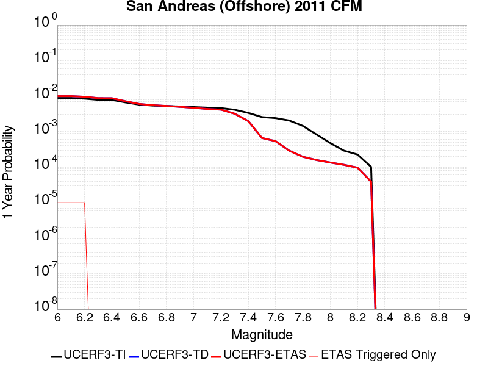 | 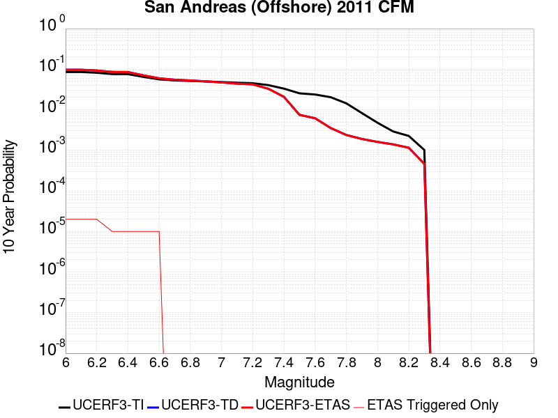 |

| Magnitude | 1 wk TI Prob | 1 wk TD Prob | 1 wk ETAS Prob | 1 wk ETAS/TD Gain | 1 wk ETAS Triggered Only | 1 mo TI Prob | 1 mo TD Prob | 1 mo ETAS Prob | 1 mo ETAS/TD Gain | 1 mo ETAS Triggered Only | 1 yr TI Prob | 1 yr TD Prob | 1 yr ETAS Prob | 1 yr ETAS/TD Gain | 1 yr ETAS Triggered Only | 10 yr TI Prob | 10 yr TD Prob | 10 yr ETAS Prob | 10 yr ETAS/TD Gain | 10 yr ETAS Triggered Only |
|-----|-----|-----|-----|-----|-----|-----|-----|-----|-----|-----|-----|-----|-----|-----|-----|-----|-----|-----|-----|-----|
| 6.0 | 1.7072787E-4 | 1.9230456E-4 | 1.9230456E-4 | 1.0 | 0.0 | 7.3148566E-4 | 8.2390447E-4 | 8.338962E-4 | 1.0121273 | 1.0E-5 | 0.008869528 | 0.009985414 | 0.009995315 | 1.0009915 | 1.0E-5 | 0.085237645 | 0.09684723 | 0.09686529 | 1.0001866 | 2.0E-5 |
| 6.1 | 1.7072787E-4 | 1.9230456E-4 | 1.9230456E-4 | 1.0 | 0.0 | 7.3148566E-4 | 8.2390447E-4 | 8.338962E-4 | 1.0121273 | 1.0E-5 | 0.008869528 | 0.009985414 | 0.009995315 | 1.0009915 | 1.0E-5 | 0.085237645 | 0.09684723 | 0.09686529 | 1.0001866 | 2.0E-5 |
| 6.2 | 1.6312556E-4 | 1.841198E-4 | 1.841198E-4 | 1.0 | 0.0 | 6.989222E-4 | 7.8884856E-4 | 7.9884066E-4 | 1.0126667 | 1.0E-5 | 0.008476226 | 0.009562436 | 0.009572339 | 1.0010358 | 1.0E-5 | 0.08160117 | 0.092867136 | 0.09288528 | 1.0001954 | 2.0E-5 |
| 6.3 | 1.5103363E-4 | 1.688459E-4 | 1.688459E-4 | 1.0 | 0.0 | 6.471264E-4 | 7.234268E-4 | 7.234268E-4 | 1.0 | 0.0 | 0.007850339 | 0.008772596 | 0.008772596 | 1.0 | 0.0 | 0.075787395 | 0.08550672 | 0.085515864 | 1.0001069 | 1.0E-5 |
| 6.4 | 1.5047993E-4 | 1.6770518E-4 | 1.6770518E-4 | 1.0 | 0.0 | 6.4475456E-4 | 7.185407E-4 | 7.185407E-4 | 1.0 | 0.0 | 0.007821669 | 0.008713583 | 0.008713583 | 1.0 | 0.0 | 0.0755203 | 0.08498692 | 0.08499607 | 1.0001076 | 1.0E-5 |
| 6.5 | 1.2760791E-4 | 1.3738252E-4 | 1.3738252E-4 | 1.0 | 0.0 | 5.467764E-4 | 5.886508E-4 | 5.886508E-4 | 1.0 | 0.0 | 0.0066367025 | 0.0071435464 | 0.0071435464 | 1.0 | 0.0 | 0.064419635 | 0.07026526 | 0.07027456 | 1.0001323 | 1.0E-5 |
| 6.6 | 1.1063525E-4 | 1.1559396E-4 | 1.1559396E-4 | 1.0 | 0.0 | 4.740649E-4 | 4.953097E-4 | 4.953097E-4 | 1.0 | 0.0 | 0.0057564764 | 0.006013923 | 0.006013923 | 1.0 | 0.0 | 0.05609626 | 0.059502304 | 0.05951171 | 1.0001581 | 1.0E-5 |
| 6.7 | 1.0391049E-4 | 1.06485095E-4 | 1.06485095E-4 | 1.0 | 0.0 | 4.4525467E-4 | 4.5628587E-4 | 4.5628587E-4 | 1.0 | 0.0 | 0.0054075094 | 0.0055413176 | 0.0055413176 | 1.0 | 0.0 | 0.052778035 | 0.055001423 | 0.055001423 | 1.0 | 0.0 |
| 6.8 | 1.0096706E-4 | 1.0160786E-4 | 1.0160786E-4 | 1.0 | 0.0 | 4.3264418E-4 | 4.3539054E-4 | 4.3539054E-4 | 1.0 | 0.0 | 0.0052547283 | 0.005288173 | 0.005288173 | 1.0 | 0.0 | 0.051321987 | 0.052699935 | 0.052699935 | 1.0 | 0.0 |
| 6.9 | 9.800265E-5 | 9.591212E-5 | 9.591212E-5 | 1.0 | 0.0 | 4.1994374E-4 | 4.1098808E-4 | 4.1098808E-4 | 1.0 | 0.0 | 0.0051008356 | 0.004992468 | 0.004992468 | 1.0 | 0.0 | 0.049853306 | 0.05002718 | 0.05002718 | 1.0 | 0.0 |
| 7.0 | 9.4642375E-5 | 9.00454E-5 | 9.00454E-5 | 1.0 | 0.0 | 4.0554712E-4 | 3.8585268E-4 | 3.8585268E-4 | 1.0 | 0.0 | 0.004926363 | 0.0046877996 | 0.0046877996 | 1.0 | 0.0 | 0.048185747 | 0.047207914 | 0.047207914 | 1.0 | 0.0 |
| 7.1 | 9.0996844E-5 | 8.356496E-5 | 8.356496E-5 | 1.0 | 0.0 | 3.8992817E-4 | 3.5808727E-4 | 3.5808727E-4 | 1.0 | 0.0 | 0.004737046 | 0.004351154 | 0.004351154 | 1.0 | 0.0 | 0.04637333 | 0.044059202 | 0.044059202 | 1.0 | 0.0 |
| 7.2 | 8.848287E-5 | 7.984079E-5 | 7.984079E-5 | 1.0 | 0.0 | 3.791572E-4 | 3.421308E-4 | 3.421308E-4 | 1.0 | 0.0 | 0.004606472 | 0.0041576405 | 0.0041576405 | 1.0 | 0.0 | 0.045121472 | 0.042202868 | 0.042202868 | 1.0 | 0.0 |
| 7.3 | 7.9280784E-5 | 6.1295636E-5 | 6.1295636E-5 | 1.0 | 0.0 | 3.3973053E-4 | 2.626697E-4 | 2.626697E-4 | 1.0 | 0.0 | 0.004128377 | 0.0031934164 | 0.0031934164 | 1.0 | 0.0 | 0.040525194 | 0.032914314 | 0.032914314 | 1.0 | 0.0 |
| 7.4 | 6.468038E-5 | 3.794719E-5 | 3.794719E-5 | 1.0 | 0.0 | 2.771722E-4 | 1.62621E-4 | 1.62621E-4 | 1.0 | 0.0 | 0.0033693502 | 0.0019781706 | 0.0019781706 | 1.0 | 0.0 | 0.0331872 | 0.02082928 | 0.02082928 | 1.0 | 0.0 |
| 7.5 | 4.930574E-5 | 1.2711595E-5 | 1.2711595E-5 | 1.0 | 0.0 | 2.1129321E-4 | 5.447714E-5 | 5.447714E-5 | 1.0 | 0.0 | 0.0025694598 | 6.6305895E-4 | 6.6305895E-4 | 1.0 | 0.0 | 0.02539953 | 0.0074862516 | 0.0074862516 | 1.0 | 0.0 |
| 7.6 | 4.612566E-5 | 1.0343632E-5 | 1.0343632E-5 | 1.0 | 0.0 | 1.9766642E-4 | 4.4329106E-5 | 4.4329106E-5 | 1.0 | 0.0 | 0.0024039324 | 5.395746E-4 | 5.395746E-4 | 1.0 | 0.0 | 0.023780935 | 0.0061765052 | 0.0061765052 | 1.0 | 0.0 |
| 7.7 | 3.9435414E-5 | 5.580712E-6 | 5.580712E-6 | 1.0 | 0.0 | 1.6899795E-4 | 2.3917117E-5 | 2.3917117E-5 | 1.0 | 0.0 | 0.0020556084 | 2.911522E-4 | 2.911522E-4 | 1.0 | 0.0 | 0.020366974 | 0.0035455872 | 0.0035455872 | 1.0 | 0.0 |
| 7.8 | 2.7787428E-5 | 3.7595619E-6 | 3.7595619E-6 | 1.0 | 0.0 | 1.1908354E-4 | 1.6112308E-5 | 1.6112308E-5 | 1.0 | 0.0 | 0.0014488777 | 1.9614973E-4 | 1.9614973E-4 | 1.0 | 0.0 | 0.014394675 | 0.0023902871 | 0.0023902871 | 1.0 | 0.0 |
| 7.9 | 1.590671E-5 | 3.0441697E-6 | 3.0441697E-6 | 1.0 | 0.0 | 6.816983E-5 | 1.3046377E-5 | 1.3046377E-5 | 1.0 | 0.0 | 8.2965166E-4 | 1.5882809E-4 | 1.5882809E-4 | 1.0 | 0.0 | 0.008265611 | 0.0019062381 | 0.0019062381 | 1.0 | 0.0 |
| 8.0 | 9.193638E-6 | 2.594852E-6 | 2.594852E-6 | 1.0 | 0.0 | 3.940071E-5 | 1.1120747E-5 | 1.1120747E-5 | 1.0 | 0.0 | 4.7959806E-4 | 1.3538671E-4 | 1.3538671E-4 | 1.0 | 0.0 | 0.0047856434 | 0.0016131136 | 0.0016131136 | 1.0 | 0.0 |
| 8.1 | 5.601576E-6 | 2.2368615E-6 | 2.2368615E-6 | 1.0 | 0.0 | 2.4006533E-5 | 9.586514E-6 | 9.586514E-6 | 1.0 | 0.0 | 2.9224035E-4 | 1.1670959E-4 | 1.1670959E-4 | 1.0 | 0.0 | 0.0029185633 | 0.0014035193 | 0.0014035193 | 1.0 | 0.0 |
| 8.2 | 4.3508785E-6 | 1.8596328E-6 | 1.8596328E-6 | 1.0 | 0.0 | 1.864649E-5 | 7.96983E-6 | 7.96983E-6 | 1.0 | 0.0 | 2.2699735E-4 | 9.7028395E-5 | 9.7028395E-5 | 1.0 | 0.0 | 0.0022676561 | 0.0011606053 | 0.0011606053 | 1.0 | 0.0 |
| 8.3 | 1.9573292E-6 | 7.523149E-7 | 7.523149E-7 | 1.0 | 0.0 | 8.388526E-6 | 3.2242028E-6 | 3.2242028E-6 | 1.0 | 0.0 | 1.0212552E-4 | 3.9253977E-5 | 3.9253977E-5 | 1.0 | 0.0 | 0.001020786 | 4.6455802E-4 | 4.6455802E-4 | 1.0 | 0.0 |

## Hayward (So) 2011 CFM
*[(top)](#table-of-contents)*

| 1 Week | 1 Month | 1 Year | 10 Year |
|-----|-----|-----|-----|
|  |  |  |  |

| Magnitude | 1 wk TI Prob | 1 wk TD Prob | 1 wk ETAS Prob | 1 wk ETAS/TD Gain | 1 wk ETAS Triggered Only | 1 mo TI Prob | 1 mo TD Prob | 1 mo ETAS Prob | 1 mo ETAS/TD Gain | 1 mo ETAS Triggered Only | 1 yr TI Prob | 1 yr TD Prob | 1 yr ETAS Prob | 1 yr ETAS/TD Gain | 1 yr ETAS Triggered Only | 10 yr TI Prob | 10 yr TD Prob | 10 yr ETAS Prob | 10 yr ETAS/TD Gain | 10 yr ETAS Triggered Only |
|-----|-----|-----|-----|-----|-----|-----|-----|-----|-----|-----|-----|-----|-----|-----|-----|-----|-----|-----|-----|-----|
| 6.0 | 1.8091932E-4 | 3.5709047E-4 | 3.5709047E-4 | 1.0 | 0.0 | 7.751381E-4 | 0.0015295 | 0.0015394847 | 1.0065281 | 1.0E-5 | 0.00939654 | 0.018465072 | 0.018484702 | 1.0010631 | 2.0E-5 | 0.090090066 | 0.1667456 | 0.16676226 | 1.0000999 | 2.0E-5 |
| 6.1 | 1.8091932E-4 | 3.5709047E-4 | 3.5709047E-4 | 1.0 | 0.0 | 7.751381E-4 | 0.0015295 | 0.0015394847 | 1.0065281 | 1.0E-5 | 0.00939654 | 0.018465072 | 0.018484702 | 1.0010631 | 2.0E-5 | 0.090090066 | 0.1667456 | 0.16676226 | 1.0000999 | 2.0E-5 |
| 6.2 | 1.8091932E-4 | 3.5709047E-4 | 3.5709047E-4 | 1.0 | 0.0 | 7.751381E-4 | 0.0015295 | 0.0015394847 | 1.0065281 | 1.0E-5 | 0.00939654 | 0.018465072 | 0.018484702 | 1.0010631 | 2.0E-5 | 0.090090066 | 0.1667456 | 0.16676226 | 1.0000999 | 2.0E-5 |
| 6.3 | 1.7322872E-4 | 3.426588E-4 | 3.426588E-4 | 1.0 | 0.0 | 7.4219756E-4 | 0.001467721 | 0.0014777062 | 1.0068033 | 1.0E-5 | 0.0089988755 | 0.017725362 | 0.017745007 | 1.0011083 | 2.0E-5 | 0.08643075 | 0.16068102 | 0.1606978 | 1.0001044 | 2.0E-5 |
| 6.4 | 1.6334097E-4 | 3.2347543E-4 | 3.2347543E-4 | 1.0 | 0.0 | 6.998449E-4 | 0.0013855953 | 0.0013955815 | 1.0072072 | 1.0E-5 | 0.008487372 | 0.016741147 | 0.016760811 | 1.0011747 | 2.0E-5 | 0.081704415 | 0.15256941 | 0.15258636 | 1.0001111 | 2.0E-5 |
| 6.5 | 1.5600289E-4 | 3.1022163E-4 | 3.1022163E-4 | 1.0 | 0.0 | 6.684125E-4 | 0.0013288521 | 0.0013288521 | 1.0 | 0.0 | 0.008107598 | 0.016060648 | 0.016070487 | 1.0006126 | 1.0E-5 | 0.078181036 | 0.1468459 | 0.14685443 | 1.000058 | 1.0E-5 |
| 6.6 | 1.4046066E-4 | 2.803607E-4 | 2.803607E-4 | 1.0 | 0.0 | 6.018354E-4 | 0.0012009992 | 0.0012009992 | 1.0 | 0.0 | 0.0073027555 | 0.014525633 | 0.014535488 | 1.0006784 | 1.0E-5 | 0.07067384 | 0.13393258 | 0.13394123 | 1.0000646 | 1.0E-5 |
| 6.7 | 1.14696966E-4 | 2.327433E-4 | 2.327433E-4 | 1.0 | 0.0 | 4.914658E-4 | 9.970951E-4 | 9.970951E-4 | 1.0 | 0.0 | 0.0059671924 | 0.012073125 | 0.012083004 | 1.0008183 | 1.0E-5 | 0.058094822 | 0.11275855 | 0.11276742 | 1.0000787 | 1.0E-5 |
| 6.8 | 9.3874296E-5 | 1.8863835E-4 | 1.8863835E-4 | 1.0 | 0.0 | 4.0225635E-4 | 8.082033E-4 | 8.082033E-4 | 1.0 | 0.0 | 0.0048864787 | 0.009796215 | 0.009806117 | 1.0010108 | 1.0E-5 | 0.047804173 | 0.092608735 | 0.09261781 | 1.000098 | 1.0E-5 |
| 6.9 | 5.551852E-5 | 1.0731048E-4 | 1.0731048E-4 | 1.0 | 0.0 | 2.3791482E-4 | 4.598216E-4 | 4.598216E-4 | 1.0 | 0.0 | 0.0028927654 | 0.005584076 | 0.0055940202 | 1.0017807 | 1.0E-5 | 0.028553981 | 0.054252647 | 0.054262105 | 1.0001743 | 1.0E-5 |
| 7.0 | 4.2662363E-5 | 8.2477156E-5 | 8.2477156E-5 | 1.0 | 0.0 | 1.8282588E-4 | 3.5342603E-4 | 3.5342603E-4 | 1.0 | 0.0 | 0.0022236328 | 0.0042945454 | 0.0043045026 | 1.0023185 | 1.0E-5 | 0.022015138 | 0.042070437 | 0.042080015 | 1.0002277 | 1.0E-5 |
| 7.1 | 3.305886E-5 | 6.3029416E-5 | 6.3029416E-5 | 1.0 | 0.0 | 1.4167312E-4 | 2.7009821E-4 | 2.7009821E-4 | 1.0 | 0.0 | 0.0017235056 | 0.0032835058 | 0.0032934728 | 1.0030355 | 1.0E-5 | 0.017101998 | 0.032457817 | 0.032467492 | 1.0002981 | 1.0E-5 |
| 7.2 | 2.9856887E-5 | 5.702347E-5 | 5.702347E-5 | 1.0 | 0.0 | 1.2795182E-4 | 2.443635E-4 | 2.443635E-4 | 1.0 | 0.0 | 0.0015567001 | 0.0029710834 | 0.0029810537 | 1.0033557 | 1.0E-5 | 0.015458403 | 0.029458297 | 0.029468004 | 1.0003295 | 1.0E-5 |
| 7.3 | 2.4559737E-5 | 4.599918E-5 | 4.599918E-5 | 1.0 | 0.0 | 1.0525176E-4 | 1.9712451E-4 | 1.9712451E-4 | 1.0 | 0.0 | 0.0012806869 | 0.0023973624 | 0.0024073382 | 1.0041612 | 1.0E-5 | 0.012733313 | 0.023861503 | 0.023871265 | 1.0004091 | 1.0E-5 |
| 7.4 | 1.9002231E-5 | 3.505627E-5 | 3.505627E-5 | 1.0 | 0.0 | 8.143559E-5 | 1.5023256E-4 | 1.5023256E-4 | 1.0 | 0.0 | 9.910273E-4 | 0.0018275568 | 0.0018275568 | 1.0 | 0.0 | 0.009866194 | 0.018261688 | 0.018261688 | 1.0 | 0.0 |
| 7.5 | 1.2783333E-5 | 2.333344E-5 | 2.333344E-5 | 1.0 | 0.0 | 5.4784563E-5 | 9.999665E-5 | 9.999665E-5 | 1.0 | 0.0 | 6.667979E-4 | 0.001216785 | 0.001216785 | 1.0 | 0.0 | 0.006648007 | 0.012211235 | 0.012211235 | 1.0 | 0.0 |
| 7.6 | 4.8149627E-6 | 8.889109E-6 | 8.889109E-6 | 1.0 | 0.0 | 2.063539E-5 | 3.8095633E-5 | 3.8095633E-5 | 1.0 | 0.0 | 2.5120692E-4 | 4.6371686E-4 | 4.6371686E-4 | 1.0 | 0.0 | 0.0025092314 | 0.0046820138 | 0.0046820138 | 1.0 | 0.0 |
| 7.7 | 6.0838227E-7 | 1.2062297E-6 | 1.2062297E-6 | 1.0 | 0.0 | 2.6073499E-6 | 5.1695456E-6 | 5.1695456E-6 | 1.0 | 0.0 | 3.174402E-5 | 6.2937404E-5 | 6.2937404E-5 | 1.0 | 0.0 | 3.1739488E-4 | 6.5320614E-4 | 6.5320614E-4 | 1.0 | 0.0 |
| 7.8 | 4.5542808E-7 | 9.797042E-7 | 9.797042E-7 | 1.0 | 0.0 | 1.9518332E-6 | 4.1987255E-6 | 4.1987255E-6 | 1.0 | 0.0 | 2.376331E-5 | 5.1118284E-5 | 5.1118284E-5 | 1.0 | 0.0 | 2.3760769E-4 | 5.3237256E-4 | 5.3237256E-4 | 1.0 | 0.0 |
| 7.9 | 3.3016747E-7 | 7.389937E-7 | 7.389937E-7 | 1.0 | 0.0 | 1.4150027E-6 | 3.1671123E-6 | 3.1671123E-6 | 1.0 | 0.0 | 1.7227521E-5 | 3.8558912E-5 | 3.8558912E-5 | 1.0 | 0.0 | 1.7226185E-4 | 3.9948142E-4 | 3.9948142E-4 | 1.0 | 0.0 |
| 8.0 | 2.347038E-7 | 5.474045E-7 | 5.474045E-7 | 1.0 | 0.0 | 1.0058731E-6 | 2.3460173E-6 | 2.3460173E-6 | 1.0 | 0.0 | 1.2246436E-5 | 2.8562388E-5 | 2.8562388E-5 | 1.0 | 0.0 | 1.2245761E-4 | 2.9367572E-4 | 2.9367572E-4 | 1.0 | 0.0 |
| 8.1 | 1.18822804E-7 | 2.6070907E-7 | 2.6070907E-7 | 1.0 | 0.0 | 5.092405E-7 | 1.1173241E-6 | 1.1173241E-6 | 1.0 | 0.0 | 6.1999854E-6 | 1.3603338E-5 | 1.3603338E-5 | 1.0 | 0.0 | 6.199812E-5 | 1.3923709E-4 | 1.3923709E-4 | 1.0 | 0.0 |

## Elsinore (Temecula) rev
*[(top)](#table-of-contents)*

| 1 Week | 1 Month | 1 Year | 10 Year |
|-----|-----|-----|-----|
|  |  |  |  |

| Magnitude | 1 wk TI Prob | 1 wk TD Prob | 1 wk ETAS Prob | 1 wk ETAS/TD Gain | 1 wk ETAS Triggered Only | 1 mo TI Prob | 1 mo TD Prob | 1 mo ETAS Prob | 1 mo ETAS/TD Gain | 1 mo ETAS Triggered Only | 1 yr TI Prob | 1 yr TD Prob | 1 yr ETAS Prob | 1 yr ETAS/TD Gain | 1 yr ETAS Triggered Only | 10 yr TI Prob | 10 yr TD Prob | 10 yr ETAS Prob | 10 yr ETAS/TD Gain | 10 yr ETAS Triggered Only |
|-----|-----|-----|-----|-----|-----|-----|-----|-----|-----|-----|-----|-----|-----|-----|-----|-----|-----|-----|-----|-----|
| 6.0 | 2.9514995E-5 | 2.2518343E-5 | 2.2518343E-5 | 1.0 | 0.0 | 1.264867E-4 | 9.650374E-5 | 1.06502775E-4 | 1.1036129 | 1.0E-5 | 0.0015388876 | 0.001174322 | 0.0011843103 | 1.0085056 | 1.0E-5 | 0.015282745 | 0.011697536 | 0.011717302 | 1.0016898 | 2.0E-5 |
| 6.1 | 2.9514995E-5 | 2.2518343E-5 | 2.2518343E-5 | 1.0 | 0.0 | 1.264867E-4 | 9.650374E-5 | 1.06502775E-4 | 1.1036129 | 1.0E-5 | 0.0015388876 | 0.001174322 | 0.0011843103 | 1.0085056 | 1.0E-5 | 0.015282745 | 0.011697536 | 0.011717302 | 1.0016898 | 2.0E-5 |
| 6.2 | 2.9514995E-5 | 2.2518343E-5 | 2.2518343E-5 | 1.0 | 0.0 | 1.264867E-4 | 9.650374E-5 | 1.06502775E-4 | 1.1036129 | 1.0E-5 | 0.0015388876 | 0.001174322 | 0.0011843103 | 1.0085056 | 1.0E-5 | 0.015282745 | 0.011697536 | 0.011717302 | 1.0016898 | 2.0E-5 |
| 6.3 | 2.3223649E-5 | 1.8407327E-5 | 1.8407327E-5 | 1.0 | 0.0 | 9.952613E-5 | 7.888625E-5 | 8.888546E-5 | 1.1267548 | 1.0E-5 | 0.001211057 | 9.6003426E-4 | 9.700246E-4 | 1.0104063 | 1.0E-5 | 0.012044783 | 0.009570387 | 0.0095901955 | 1.0020698 | 2.0E-5 |
| 6.4 | 2.3223649E-5 | 1.8407327E-5 | 1.8407327E-5 | 1.0 | 0.0 | 9.952613E-5 | 7.888625E-5 | 8.888546E-5 | 1.1267548 | 1.0E-5 | 0.001211057 | 9.6003426E-4 | 9.700246E-4 | 1.0104063 | 1.0E-5 | 0.012044783 | 0.009570387 | 0.0095901955 | 1.0020698 | 2.0E-5 |
| 6.5 | 1.8338875E-5 | 1.4750731E-5 | 1.4750731E-5 | 1.0 | 0.0 | 7.8592806E-5 | 6.3215935E-5 | 6.3215935E-5 | 1.0 | 0.0 | 9.5644733E-4 | 7.6939096E-4 | 7.6939096E-4 | 1.0 | 0.0 | 0.009523412 | 0.007674229 | 0.007674229 | 1.0 | 0.0 |
| 6.6 | 1.8223333E-5 | 1.46132825E-5 | 1.46132825E-5 | 1.0 | 0.0 | 7.809766E-5 | 6.26269E-5 | 6.26269E-5 | 1.0 | 0.0 | 9.504242E-4 | 7.6222455E-4 | 7.6222455E-4 | 1.0 | 0.0 | 0.009463696 | 0.0076030563 | 0.0076030563 | 1.0 | 0.0 |
| 6.7 | 1.7512752E-5 | 1.4027789E-5 | 1.4027789E-5 | 1.0 | 0.0 | 7.505249E-5 | 6.011776E-5 | 6.011776E-5 | 1.0 | 0.0 | 9.13381E-4 | 7.316965E-4 | 7.316965E-4 | 1.0 | 0.0 | 0.00909636 | 0.0072992197 | 0.0072992197 | 1.0 | 0.0 |
| 6.8 | 1.7417142E-5 | 1.3951771E-5 | 1.3951771E-5 | 1.0 | 0.0 | 7.4642754E-5 | 5.979198E-5 | 5.979198E-5 | 1.0 | 0.0 | 9.083966E-4 | 7.277328E-4 | 7.277328E-4 | 1.0 | 0.0 | 0.009046922 | 0.0072597866 | 0.0072597866 | 1.0 | 0.0 |
| 6.9 | 1.6402591E-5 | 1.2989167E-5 | 1.2989167E-5 | 1.0 | 0.0 | 7.0294926E-5 | 5.5666715E-5 | 5.5666715E-5 | 1.0 | 0.0 | 8.5550465E-4 | 6.7753915E-4 | 6.7753915E-4 | 1.0 | 0.0 | 0.008522186 | 0.006760456 | 0.006760456 | 1.0 | 0.0 |
| 7.0 | 1.3912486E-5 | 1.0878723E-5 | 1.0878723E-5 | 1.0 | 0.0 | 5.9623577E-5 | 4.6622277E-5 | 4.6622277E-5 | 1.0 | 0.0 | 7.2567526E-4 | 5.674811E-4 | 5.674811E-4 | 1.0 | 0.0 | 0.0072331014 | 0.005664239 | 0.005664239 | 1.0 | 0.0 |
| 7.1 | 1.3405147E-5 | 1.0327884E-5 | 1.0327884E-5 | 1.0 | 0.0 | 5.7449364E-5 | 4.4261626E-5 | 4.4261626E-5 | 1.0 | 0.0 | 6.9922156E-4 | 5.387546E-4 | 5.387546E-4 | 1.0 | 0.0 | 0.0069702556 | 0.0053778174 | 0.0053778174 | 1.0 | 0.0 |
| 7.2 | 1.21402E-5 | 8.99712E-6 | 8.99712E-6 | 1.0 | 0.0 | 5.202839E-5 | 3.8558526E-5 | 3.8558526E-5 | 1.0 | 0.0 | 6.332616E-4 | 4.693507E-4 | 4.693507E-4 | 1.0 | 0.0 | 0.0063146 | 0.0046850196 | 0.0046850196 | 1.0 | 0.0 |
| 7.3 | 1.05047775E-5 | 7.572085E-6 | 7.572085E-6 | 1.0 | 0.0 | 4.5019697E-5 | 3.2451397E-5 | 3.2451397E-5 | 1.0 | 0.0 | 5.4797693E-4 | 3.950256E-4 | 3.950256E-4 | 1.0 | 0.0 | 0.005466277 | 0.0039436235 | 0.0039436235 | 1.0 | 0.0 |
| 7.4 | 9.624483E-6 | 6.7871442E-6 | 6.7871442E-6 | 1.0 | 0.0 | 4.124713E-5 | 2.9087445E-5 | 2.9087445E-5 | 1.0 | 0.0 | 5.0206814E-4 | 3.540835E-4 | 3.540835E-4 | 1.0 | 0.0 | 0.005009353 | 0.003535347 | 0.003535347 | 1.0 | 0.0 |
| 7.5 | 8.215151E-6 | 5.635765E-6 | 5.635765E-6 | 1.0 | 0.0 | 3.5207315E-5 | 2.4153062E-5 | 2.4153062E-5 | 1.0 | 0.0 | 4.2856473E-4 | 2.940251E-4 | 2.940251E-4 | 1.0 | 0.0 | 0.004277392 | 0.002936489 | 0.002936489 | 1.0 | 0.0 |
| 7.6 | 6.975058E-6 | 4.6762393E-6 | 4.6762393E-6 | 1.0 | 0.0 | 2.9892764E-5 | 2.0040878E-5 | 2.0040878E-5 | 1.0 | 0.0 | 3.6388362E-4 | 2.4397153E-4 | 2.4397153E-4 | 1.0 | 0.0 | 0.0036328835 | 0.0024371531 | 0.0024371531 | 1.0 | 0.0 |
| 7.7 | 4.159604E-6 | 2.3271057E-6 | 2.3271057E-6 | 1.0 | 0.0 | 1.7826753E-5 | 9.973276E-6 | 9.973276E-6 | 1.0 | 0.0 | 2.1701909E-4 | 1.2141861E-4 | 1.2141861E-4 | 1.0 | 0.0 | 0.0021680726 | 0.0012135957 | 0.0012135957 | 1.0 | 0.0 |
| 7.8 | 2.2692414E-7 | 9.385943E-8 | 9.385943E-8 | 1.0 | 0.0 | 9.725317E-7 | 4.0225464E-7 | 4.0225464E-7 | 1.0 | 0.0 | 1.1840509E-5 | 4.8974425E-6 | 4.8974425E-6 | 1.0 | 0.0 | 1.1839878E-4 | 4.8973674E-5 | 4.8973674E-5 | 1.0 | 0.0 |
| 7.9 | 6.676829E-9 | 3.4399772E-9 | 3.4399772E-9 | 1.0 | 0.0 | 2.861498E-8 | 1.4742759E-8 | 1.4742759E-8 | 1.0 | 0.0 | 3.4838732E-7 | 1.7949307E-7 | 1.7949307E-7 | 1.0 | 0.0 | 3.4838679E-6 | 1.7949295E-6 | 1.7949295E-6 | 1.0 | 0.0 |

## Big Lagoon - Bald Mtn 2011 CFM
*[(top)](#table-of-contents)*

| 1 Week | 1 Month | 1 Year | 10 Year |
|-----|-----|-----|-----|
|  | 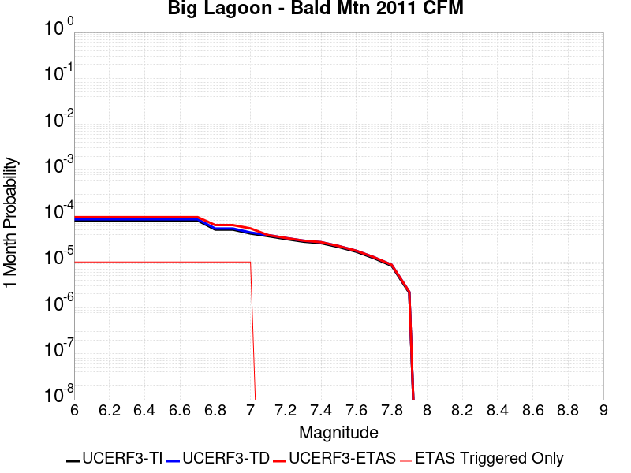 |  |  |

| Magnitude | 1 wk TI Prob | 1 wk TD Prob | 1 wk ETAS Prob | 1 wk ETAS/TD Gain | 1 wk ETAS Triggered Only | 1 mo TI Prob | 1 mo TD Prob | 1 mo ETAS Prob | 1 mo ETAS/TD Gain | 1 mo ETAS Triggered Only | 1 yr TI Prob | 1 yr TD Prob | 1 yr ETAS Prob | 1 yr ETAS/TD Gain | 1 yr ETAS Triggered Only | 10 yr TI Prob | 10 yr TD Prob | 10 yr ETAS Prob | 10 yr ETAS/TD Gain | 10 yr ETAS Triggered Only |
|-----|-----|-----|-----|-----|-----|-----|-----|-----|-----|-----|-----|-----|-----|-----|-----|-----|-----|-----|-----|-----|
| 6.0 | 1.8699735E-5 | 1.9850344E-5 | 1.9850344E-5 | 1.0 | 0.0 | 8.013926E-5 | 8.5070336E-5 | 9.506949E-5 | 1.1175398 | 1.0E-5 | 9.752587E-4 | 0.001035277 | 0.0010552563 | 1.0192986 | 2.0E-5 | 0.009709897 | 0.010308358 | 0.010328152 | 1.0019202 | 2.0E-5 |
| 6.1 | 1.8699735E-5 | 1.9850344E-5 | 1.9850344E-5 | 1.0 | 0.0 | 8.013926E-5 | 8.5070336E-5 | 9.506949E-5 | 1.1175398 | 1.0E-5 | 9.752587E-4 | 0.001035277 | 0.0010552563 | 1.0192986 | 2.0E-5 | 0.009709897 | 0.010308358 | 0.010328152 | 1.0019202 | 2.0E-5 |
| 6.2 | 1.8699735E-5 | 1.9850344E-5 | 1.9850344E-5 | 1.0 | 0.0 | 8.013926E-5 | 8.5070336E-5 | 9.506949E-5 | 1.1175398 | 1.0E-5 | 9.752587E-4 | 0.001035277 | 0.0010552563 | 1.0192986 | 2.0E-5 | 0.009709897 | 0.010308358 | 0.010328152 | 1.0019202 | 2.0E-5 |
| 6.3 | 1.8699735E-5 | 1.9850344E-5 | 1.9850344E-5 | 1.0 | 0.0 | 8.013926E-5 | 8.5070336E-5 | 9.506949E-5 | 1.1175398 | 1.0E-5 | 9.752587E-4 | 0.001035277 | 0.0010552563 | 1.0192986 | 2.0E-5 | 0.009709897 | 0.010308358 | 0.010328152 | 1.0019202 | 2.0E-5 |
| 6.4 | 1.8699735E-5 | 1.9850344E-5 | 1.9850344E-5 | 1.0 | 0.0 | 8.013926E-5 | 8.5070336E-5 | 9.506949E-5 | 1.1175398 | 1.0E-5 | 9.752587E-4 | 0.001035277 | 0.0010552563 | 1.0192986 | 2.0E-5 | 0.009709897 | 0.010308358 | 0.010328152 | 1.0019202 | 2.0E-5 |
| 6.5 | 1.8699735E-5 | 1.9850344E-5 | 1.9850344E-5 | 1.0 | 0.0 | 8.013926E-5 | 8.5070336E-5 | 9.506949E-5 | 1.1175398 | 1.0E-5 | 9.752587E-4 | 0.001035277 | 0.0010552563 | 1.0192986 | 2.0E-5 | 0.009709897 | 0.010308358 | 0.010328152 | 1.0019202 | 2.0E-5 |
| 6.6 | 1.8699735E-5 | 1.9850344E-5 | 1.9850344E-5 | 1.0 | 0.0 | 8.013926E-5 | 8.5070336E-5 | 9.506949E-5 | 1.1175398 | 1.0E-5 | 9.752587E-4 | 0.001035277 | 0.0010552563 | 1.0192986 | 2.0E-5 | 0.009709897 | 0.010308358 | 0.010328152 | 1.0019202 | 2.0E-5 |
| 6.7 | 1.8699735E-5 | 1.9850344E-5 | 1.9850344E-5 | 1.0 | 0.0 | 8.013926E-5 | 8.5070336E-5 | 9.506949E-5 | 1.1175398 | 1.0E-5 | 9.752587E-4 | 0.001035277 | 0.0010552563 | 1.0192986 | 2.0E-5 | 0.009709897 | 0.010308358 | 0.010328152 | 1.0019202 | 2.0E-5 |
| 6.8 | 1.18505095E-5 | 1.2499895E-5 | 1.2499895E-5 | 1.0 | 0.0 | 5.078691E-5 | 5.3569907E-5 | 6.356937E-5 | 1.186662 | 1.0E-5 | 6.181552E-4 | 6.5202324E-4 | 6.7201024E-4 | 1.0306537 | 2.0E-5 | 0.006164385 | 0.006501606 | 0.006521476 | 1.0030562 | 2.0E-5 |
| 6.9 | 1.18505095E-5 | 1.2499895E-5 | 1.2499895E-5 | 1.0 | 0.0 | 5.078691E-5 | 5.3569907E-5 | 6.356937E-5 | 1.186662 | 1.0E-5 | 6.181552E-4 | 6.5202324E-4 | 6.7201024E-4 | 1.0306537 | 2.0E-5 | 0.006164385 | 0.006501606 | 0.006521476 | 1.0030562 | 2.0E-5 |
| 7.0 | 9.719786E-6 | 1.023556E-5 | 1.023556E-5 | 1.0 | 0.0 | 4.1655563E-5 | 4.386596E-5 | 5.3865522E-5 | 1.2279572 | 1.0E-5 | 5.0703844E-4 | 5.339395E-4 | 5.5392884E-4 | 1.0374374 | 2.0E-5 | 0.005058831 | 0.005326813 | 0.0053467066 | 1.0037346 | 2.0E-5 |
| 7.1 | 8.523418E-6 | 8.969526E-6 | 8.969526E-6 | 1.0 | 0.0 | 3.652842E-5 | 3.8440267E-5 | 3.8440267E-5 | 1.0 | 0.0 | 4.4464276E-4 | 4.679113E-4 | 4.679113E-4 | 1.0 | 0.0 | 0.0044375416 | 0.0046694246 | 0.0046694246 | 1.0 | 0.0 |
| 7.2 | 7.378894E-6 | 7.761166E-6 | 7.761166E-6 | 1.0 | 0.0 | 3.162345E-5 | 3.326172E-5 | 3.326172E-5 | 1.0 | 0.0 | 3.8494746E-4 | 4.0488708E-4 | 4.0488708E-4 | 1.0 | 0.0 | 0.0038428132 | 0.0040415903 | 0.0040415903 | 1.0 | 0.0 |
| 7.3 | 6.4640294E-6 | 6.7924893E-6 | 6.7924893E-6 | 1.0 | 0.0 | 2.7702688E-5 | 2.9110348E-5 | 2.9110348E-5 | 1.0 | 0.0 | 3.3722803E-4 | 3.5436152E-4 | 3.5436152E-4 | 1.0 | 0.0 | 0.0033671674 | 0.0035380346 | 0.0035380346 | 1.0 | 0.0 |
| 7.4 | 5.9959093E-6 | 6.2988424E-6 | 6.2988424E-6 | 1.0 | 0.0 | 2.5696501E-5 | 2.6994763E-5 | 2.6994763E-5 | 1.0 | 0.0 | 3.1280998E-4 | 3.2861225E-4 | 3.2861225E-4 | 1.0 | 0.0 | 0.0031237002 | 0.0032813256 | 0.0032813256 | 1.0 | 0.0 |
| 7.5 | 4.929265E-6 | 5.1764305E-6 | 5.1764305E-6 | 1.0 | 0.0 | 2.112525E-5 | 2.2184515E-5 | 2.2184515E-5 | 1.0 | 0.0 | 2.5716957E-4 | 2.7006338E-4 | 2.7006338E-4 | 1.0 | 0.0 | 0.0025687215 | 0.0026973928 | 0.0026973928 | 1.0 | 0.0 |
| 7.6 | 3.8982403E-6 | 4.088953E-6 | 4.088953E-6 | 1.0 | 0.0 | 1.6706637E-5 | 1.752397E-5 | 1.752397E-5 | 1.0 | 0.0 | 2.0338432E-4 | 2.1333371E-4 | 2.1333371E-4 | 1.0 | 0.0 | 0.0020319829 | 0.002131317 | 0.002131317 | 1.0 | 0.0 |
| 7.7 | 2.820968E-6 | 2.9572307E-6 | 2.9572307E-6 | 1.0 | 0.0 | 1.2089806E-5 | 1.2673785E-5 | 1.2673785E-5 | 1.0 | 0.0 | 1.4718344E-4 | 1.5429257E-4 | 1.5429257E-4 | 1.0 | 0.0 | 0.00147086 | 0.0015418723 | 0.0015418723 | 1.0 | 0.0 |
| 7.8 | 1.9314455E-6 | 2.0260316E-6 | 2.0260316E-6 | 1.0 | 0.0 | 8.277597E-6 | 8.682965E-6 | 8.682965E-6 | 1.0 | 0.0 | 1.0077508E-4 | 1.05710096E-4 | 1.05710096E-4 | 1.0 | 0.0 | 0.0010072939 | 0.001056611 | 0.001056611 | 1.0 | 0.0 |
| 7.9 | 4.9586197E-7 | 5.2189574E-7 | 5.2189574E-7 | 1.0 | 0.0 | 2.125121E-6 | 2.2366944E-6 | 2.2366944E-6 | 1.0 | 0.0 | 2.5873042E-5 | 2.7231436E-5 | 2.7231436E-5 | 1.0 | 0.0 | 2.5870028E-4 | 2.7228307E-4 | 2.7228307E-4 | 1.0 | 0.0 |

## San Gabriel (Extension)
*[(top)](#table-of-contents)*

| 1 Week | 1 Month | 1 Year | 10 Year |
|-----|-----|-----|-----|
|  |  |  |  |

| Magnitude | 1 wk TI Prob | 1 wk TD Prob | 1 wk ETAS Prob | 1 wk ETAS/TD Gain | 1 wk ETAS Triggered Only | 1 mo TI Prob | 1 mo TD Prob | 1 mo ETAS Prob | 1 mo ETAS/TD Gain | 1 mo ETAS Triggered Only | 1 yr TI Prob | 1 yr TD Prob | 1 yr ETAS Prob | 1 yr ETAS/TD Gain | 1 yr ETAS Triggered Only | 10 yr TI Prob | 10 yr TD Prob | 10 yr ETAS Prob | 10 yr ETAS/TD Gain | 10 yr ETAS Triggered Only |
|-----|-----|-----|-----|-----|-----|-----|-----|-----|-----|-----|-----|-----|-----|-----|-----|-----|-----|-----|-----|-----|
| 6.0 | 5.6486106E-6 | 5.7171446E-6 | 1.5717087E-5 | 2.749115 | 1.0E-5 | 2.4208108E-5 | 2.4501825E-5 | 3.450158E-5 | 1.4081229 | 1.0E-5 | 2.9469383E-4 | 2.9827014E-4 | 3.0826716E-4 | 1.0335166 | 1.0E-5 | 0.0029430336 | 0.0029788287 | 0.002998769 | 1.0066941 | 2.0E-5 |
| 6.1 | 5.6486106E-6 | 5.7171446E-6 | 1.5717087E-5 | 2.749115 | 1.0E-5 | 2.4208108E-5 | 2.4501825E-5 | 3.450158E-5 | 1.4081229 | 1.0E-5 | 2.9469383E-4 | 2.9827014E-4 | 3.0826716E-4 | 1.0335166 | 1.0E-5 | 0.0029430336 | 0.0029788287 | 0.002998769 | 1.0066941 | 2.0E-5 |
| 6.2 | 5.6486106E-6 | 5.7171446E-6 | 1.5717087E-5 | 2.749115 | 1.0E-5 | 2.4208108E-5 | 2.4501825E-5 | 3.450158E-5 | 1.4081229 | 1.0E-5 | 2.9469383E-4 | 2.9827014E-4 | 3.0826716E-4 | 1.0335166 | 1.0E-5 | 0.0029430336 | 0.0029788287 | 0.002998769 | 1.0066941 | 2.0E-5 |
| 6.3 | 5.6486106E-6 | 5.7171446E-6 | 1.5717087E-5 | 2.749115 | 1.0E-5 | 2.4208108E-5 | 2.4501825E-5 | 3.450158E-5 | 1.4081229 | 1.0E-5 | 2.9469383E-4 | 2.9827014E-4 | 3.0826716E-4 | 1.0335166 | 1.0E-5 | 0.0029430336 | 0.0029788287 | 0.002998769 | 1.0066941 | 2.0E-5 |
| 6.4 | 5.6486106E-6 | 5.7171446E-6 | 1.5717087E-5 | 2.749115 | 1.0E-5 | 2.4208108E-5 | 2.4501825E-5 | 3.450158E-5 | 1.4081229 | 1.0E-5 | 2.9469383E-4 | 2.9827014E-4 | 3.0826716E-4 | 1.0335166 | 1.0E-5 | 0.0029430336 | 0.0029788287 | 0.002998769 | 1.0066941 | 2.0E-5 |
| 6.5 | 4.7134554E-6 | 4.754565E-6 | 1.4754517E-5 | 3.103232 | 1.0E-5 | 2.0200367E-5 | 2.0376552E-5 | 3.0376348E-5 | 1.4907502 | 1.0E-5 | 2.459117E-4 | 2.4805713E-4 | 2.5805464E-4 | 1.0403033 | 1.0E-5 | 0.0024563975 | 0.0024778906 | 0.002487866 | 1.0040257 | 1.0E-5 |
| 6.6 | 4.7134554E-6 | 4.754565E-6 | 1.4754517E-5 | 3.103232 | 1.0E-5 | 2.0200367E-5 | 2.0376552E-5 | 3.0376348E-5 | 1.4907502 | 1.0E-5 | 2.459117E-4 | 2.4805713E-4 | 2.5805464E-4 | 1.0403033 | 1.0E-5 | 0.0024563975 | 0.0024778906 | 0.002487866 | 1.0040257 | 1.0E-5 |
| 6.7 | 4.2468837E-6 | 4.2743804E-6 | 1.4274337E-5 | 3.3395104 | 1.0E-5 | 1.8200803E-5 | 1.8318648E-5 | 2.8318465E-5 | 1.5458817 | 1.0E-5 | 2.2157225E-4 | 2.2300745E-4 | 2.3300521E-4 | 1.0448315 | 1.0E-5 | 0.0022135144 | 0.0022279124 | 0.0022378901 | 1.0044785 | 1.0E-5 |
| 6.8 | 4.1180615E-6 | 4.1417693E-6 | 1.4141728E-5 | 3.414417 | 1.0E-5 | 1.7648716E-5 | 1.7750324E-5 | 2.7750146E-5 | 1.56336 | 1.0E-5 | 2.1485193E-4 | 2.1608948E-4 | 2.2608732E-4 | 1.0462672 | 1.0E-5 | 0.0021464431 | 0.0021588686 | 0.002168847 | 1.0046221 | 1.0E-5 |
| 6.9 | 3.863861E-6 | 3.8800836E-6 | 1.3880045E-5 | 3.577254 | 1.0E-5 | 1.65593E-5 | 1.6628828E-5 | 2.6628662E-5 | 1.6013553 | 1.0E-5 | 2.0159081E-4 | 2.0243786E-4 | 2.1243583E-4 | 1.0493879 | 1.0E-5 | 0.0020140803 | 0.0020226059 | 0.0020325857 | 1.0049341 | 1.0E-5 |
| 7.0 | 3.6947372E-6 | 3.7059822E-6 | 1.3705945E-5 | 3.69833 | 1.0E-5 | 1.5834492E-5 | 1.5882688E-5 | 2.588253E-5 | 1.6296064 | 1.0E-5 | 1.9276788E-4 | 1.9335524E-4 | 2.0335331E-4 | 1.0517082 | 1.0E-5 | 0.0019260074 | 0.0019319403 | 0.001941921 | 1.0051662 | 1.0E-5 |
| 7.1 | 3.5686835E-6 | 3.5732016E-6 | 1.3573166E-5 | 3.7986007 | 1.0E-5 | 1.5294268E-5 | 1.5313635E-5 | 2.5313482E-5 | 1.6530029 | 1.0E-5 | 1.861918E-4 | 1.8642822E-4 | 1.9642636E-4 | 1.05363 | 1.0E-5 | 0.0018603588 | 0.0018627879 | 0.0018727693 | 1.0053583 | 1.0E-5 |
| 7.2 | 2.8023446E-6 | 2.7770893E-6 | 1.2777062E-5 | 4.6008825 | 1.0E-5 | 1.2009994E-5 | 1.1901758E-5 | 2.1901638E-5 | 1.8402021 | 1.0E-5 | 1.4621185E-4 | 1.4489438E-4 | 1.5489293E-4 | 1.0690058 | 1.0E-5 | 0.001461157 | 0.0014480136 | 0.0014579991 | 1.006896 | 1.0E-5 |
| 7.3 | 2.5843012E-6 | 2.546262E-6 | 1.2546237E-5 | 4.927315 | 1.0E-5 | 1.1075529E-5 | 1.0912507E-5 | 2.0912397E-5 | 1.9163697 | 1.0E-5 | 1.3483623E-4 | 1.3285177E-4 | 1.4285045E-4 | 1.0752618 | 1.0E-5 | 0.0013475444 | 0.001327737 | 0.0013377237 | 1.0075216 | 1.0E-5 |
| 7.4 | 2.4464468E-6 | 2.3969585E-6 | 1.2396935E-5 | 5.1719437 | 1.0E-5 | 1.04847295E-5 | 1.027264E-5 | 2.0272537E-5 | 1.9734496 | 1.0E-5 | 1.276441E-4 | 1.250623E-4 | 1.3506105E-4 | 1.0799501 | 1.0E-5 | 0.0012757082 | 0.0012499326 | 0.0012599201 | 1.0079905 | 1.0E-5 |
| 7.5 | 2.0420266E-6 | 1.8913017E-6 | 1.8913017E-6 | 1.0 | 0.0 | 8.751514E-6 | 8.105554E-6 | 8.105554E-6 | 1.0 | 0.0 | 1.0654447E-4 | 9.8680684E-5 | 9.8680684E-5 | 1.0 | 0.0 | 0.001064934 | 9.863758E-4 | 9.863758E-4 | 1.0 | 0.0 |
| 7.6 | 1.8326596E-6 | 1.640076E-6 | 1.640076E-6 | 1.0 | 0.0 | 7.854232E-6 | 7.0288784E-6 | 7.0288784E-6 | 1.0 | 0.0 | 9.562107E-5 | 8.557326E-5 | 8.557326E-5 | 1.0 | 0.0 | 9.5579936E-4 | 8.5540896E-4 | 8.5540896E-4 | 1.0 | 0.0 |
| 7.7 | 1.4786998E-6 | 1.2526061E-6 | 1.2526061E-6 | 1.0 | 0.0 | 6.3372695E-6 | 5.368301E-6 | 5.368301E-6 | 1.0 | 0.0 | 7.715353E-5 | 6.535712E-5 | 6.535712E-5 | 1.0 | 0.0 | 7.7126746E-4 | 6.533867E-4 | 6.533867E-4 | 1.0 | 0.0 |
| 7.8 | 7.6975533E-7 | 6.071264E-7 | 6.071264E-7 | 1.0 | 0.0 | 3.2989474E-6 | 2.601968E-6 | 2.601968E-6 | 1.0 | 0.0 | 4.0163945E-5 | 3.16785E-5 | 3.16785E-5 | 1.0 | 0.0 | 4.0156685E-4 | 3.1674592E-4 | 3.1674592E-4 | 1.0 | 0.0 |
| 7.9 | 1.7645915E-7 | 9.218553E-8 | 9.218553E-8 | 1.0 | 0.0 | 7.562533E-7 | 3.9508078E-7 | 3.9508078E-7 | 1.0 | 0.0 | 9.207345E-6 | 4.810098E-6 | 4.810098E-6 | 1.0 | 0.0 | 9.206964E-5 | 4.810463E-5 | 4.810463E-5 | 1.0 | 0.0 |
| 8.0 | 1.0463461E-7 | 2.4971815E-8 | 2.4971815E-8 | 1.0 | 0.0 | 4.4843398E-7 | 1.0702206E-7 | 1.0702206E-7 | 1.0 | 0.0 | 5.45967E-6 | 1.3029928E-6 | 1.3029928E-6 | 1.0 | 0.0 | 5.459536E-5 | 1.3034539E-5 | 1.3034539E-5 | 1.0 | 0.0 |
| 8.1 | 7.875717E-8 | 1.38816025E-8 | 1.38816025E-8 | 1.0 | 0.0 | 3.3753068E-7 | 5.949258E-8 | 5.949258E-8 | 1.0 | 0.0 | 4.109428E-6 | 7.243219E-7 | 7.243219E-7 | 1.0 | 0.0 | 4.109352E-5 | 7.247882E-6 | 7.247882E-6 | 1.0 | 0.0 |
| 8.2 | 1.33163E-8 | 1.7755355E-9 | 1.7755355E-9 | 1.0 | 0.0 | 5.7069855E-8 | 7.609438E-9 | 7.609438E-9 | 1.0 | 0.0 | 6.9482525E-7 | 9.26449E-8 | 9.26449E-8 | 1.0 | 0.0 | 6.9482307E-6 | 9.284174E-7 | 9.284174E-7 | 1.0 | 0.0 |

## San Gabriel
*[(top)](#table-of-contents)*

| 1 Week | 1 Month | 1 Year | 10 Year |
|-----|-----|-----|-----|
|  |  |  |  |

| Magnitude | 1 wk TI Prob | 1 wk TD Prob | 1 wk ETAS Prob | 1 wk ETAS/TD Gain | 1 wk ETAS Triggered Only | 1 mo TI Prob | 1 mo TD Prob | 1 mo ETAS Prob | 1 mo ETAS/TD Gain | 1 mo ETAS Triggered Only | 1 yr TI Prob | 1 yr TD Prob | 1 yr ETAS Prob | 1 yr ETAS/TD Gain | 1 yr ETAS Triggered Only | 10 yr TI Prob | 10 yr TD Prob | 10 yr ETAS Prob | 10 yr ETAS/TD Gain | 10 yr ETAS Triggered Only |
|-----|-----|-----|-----|-----|-----|-----|-----|-----|-----|-----|-----|-----|-----|-----|-----|-----|-----|-----|-----|-----|
| 6.0 | 1.083775E-5 | 1.1987322E-5 | 1.1987322E-5 | 1.0 | 0.0 | 4.6446676E-5 | 5.1373292E-5 | 5.1373292E-5 | 1.0 | 0.0 | 5.653415E-4 | 6.253016E-4 | 6.352954E-4 | 1.0159823 | 1.0E-5 | 0.0056390543 | 0.006247514 | 0.006267389 | 1.0031812 | 2.0E-5 |
| 6.1 | 1.083775E-5 | 1.1987322E-5 | 1.1987322E-5 | 1.0 | 0.0 | 4.6446676E-5 | 5.1373292E-5 | 5.1373292E-5 | 1.0 | 0.0 | 5.653415E-4 | 6.253016E-4 | 6.352954E-4 | 1.0159823 | 1.0E-5 | 0.0056390543 | 0.006247514 | 0.006267389 | 1.0031812 | 2.0E-5 |
| 6.2 | 1.083775E-5 | 1.1987322E-5 | 1.1987322E-5 | 1.0 | 0.0 | 4.6446676E-5 | 5.1373292E-5 | 5.1373292E-5 | 1.0 | 0.0 | 5.653415E-4 | 6.253016E-4 | 6.352954E-4 | 1.0159823 | 1.0E-5 | 0.0056390543 | 0.006247514 | 0.006267389 | 1.0031812 | 2.0E-5 |
| 6.3 | 1.083775E-5 | 1.1987322E-5 | 1.1987322E-5 | 1.0 | 0.0 | 4.6446676E-5 | 5.1373292E-5 | 5.1373292E-5 | 1.0 | 0.0 | 5.653415E-4 | 6.253016E-4 | 6.352954E-4 | 1.0159823 | 1.0E-5 | 0.0056390543 | 0.006247514 | 0.006267389 | 1.0031812 | 2.0E-5 |
| 6.4 | 1.083775E-5 | 1.1987322E-5 | 1.1987322E-5 | 1.0 | 0.0 | 4.6446676E-5 | 5.1373292E-5 | 5.1373292E-5 | 1.0 | 0.0 | 5.653415E-4 | 6.253016E-4 | 6.352954E-4 | 1.0159823 | 1.0E-5 | 0.0056390543 | 0.006247514 | 0.006267389 | 1.0031812 | 2.0E-5 |
| 6.5 | 6.7317824E-6 | 7.719057E-6 | 7.719057E-6 | 1.0 | 0.0 | 2.8850178E-5 | 3.308126E-5 | 3.308126E-5 | 1.0 | 0.0 | 3.511943E-4 | 4.0269096E-4 | 4.1268693E-4 | 1.024823 | 1.0E-5 | 0.003506398 | 0.0040307054 | 0.0040506246 | 1.0049419 | 2.0E-5 |
| 6.6 | 6.7317824E-6 | 7.719057E-6 | 7.719057E-6 | 1.0 | 0.0 | 2.8850178E-5 | 3.308126E-5 | 3.308126E-5 | 1.0 | 0.0 | 3.511943E-4 | 4.0269096E-4 | 4.1268693E-4 | 1.024823 | 1.0E-5 | 0.003506398 | 0.0040307054 | 0.0040506246 | 1.0049419 | 2.0E-5 |
| 6.7 | 6.274881E-6 | 7.247975E-6 | 7.247975E-6 | 1.0 | 0.0 | 2.6892068E-5 | 3.1062387E-5 | 3.1062387E-5 | 1.0 | 0.0 | 3.2736175E-4 | 3.781199E-4 | 3.881161E-4 | 1.0264367 | 1.0E-5 | 0.0032687993 | 0.0037858514 | 0.0038057757 | 1.0052629 | 2.0E-5 |
| 6.8 | 5.996209E-6 | 6.9606945E-6 | 6.9606945E-6 | 1.0 | 0.0 | 2.5697784E-5 | 2.9831212E-5 | 2.9831212E-5 | 1.0 | 0.0 | 3.128256E-4 | 3.6313542E-4 | 3.7313177E-4 | 1.0275279 | 1.0E-5 | 0.003123856 | 0.0036365038 | 0.003656431 | 1.0054798 | 2.0E-5 |
| 6.9 | 5.686331E-6 | 6.6257326E-6 | 6.6257326E-6 | 1.0 | 0.0 | 2.4369761E-5 | 2.8395692E-5 | 2.8395692E-5 | 1.0 | 0.0 | 2.9666146E-4 | 3.4566363E-4 | 3.5566016E-4 | 1.0289198 | 1.0E-5 | 0.0029626573 | 0.0034623418 | 0.0034822726 | 1.0057564 | 2.0E-5 |
| 7.0 | 5.2329838E-6 | 6.14961E-6 | 6.14961E-6 | 1.0 | 0.0 | 2.242688E-5 | 2.6355208E-5 | 2.6355208E-5 | 1.0 | 0.0 | 2.7301308E-4 | 3.2082817E-4 | 3.3082496E-4 | 1.0311593 | 1.0E-5 | 0.002726779 | 0.00321472 | 0.0032346556 | 1.0062014 | 2.0E-5 |
| 7.1 | 5.135671E-6 | 6.03973E-6 | 6.03973E-6 | 1.0 | 0.0 | 2.2009834E-5 | 2.5884305E-5 | 2.5884305E-5 | 1.0 | 0.0 | 2.6793676E-4 | 3.150966E-4 | 3.2509345E-4 | 1.0317262 | 1.0E-5 | 0.0026761394 | 0.0031575684 | 0.0031775052 | 1.006314 | 2.0E-5 |
| 7.2 | 4.989062E-6 | 5.873101E-6 | 5.873101E-6 | 1.0 | 0.0 | 2.1381518E-5 | 2.5170193E-5 | 2.5170193E-5 | 1.0 | 0.0 | 2.6028889E-4 | 3.0640478E-4 | 3.164017E-4 | 1.0326265 | 1.0E-5 | 0.0025998424 | 0.003070893 | 0.0030908317 | 1.0064927 | 2.0E-5 |
| 7.3 | 4.8219395E-6 | 5.7046464E-6 | 5.7046464E-6 | 1.0 | 0.0 | 2.0665291E-5 | 2.444826E-5 | 2.444826E-5 | 1.0 | 0.0 | 2.5157086E-4 | 2.9761766E-4 | 3.0761468E-4 | 1.0335902 | 1.0E-5 | 0.0025128627 | 0.0029832611 | 0.0030032014 | 1.0066841 | 2.0E-5 |
| 7.4 | 4.7118383E-6 | 5.593198E-6 | 5.593198E-6 | 1.0 | 0.0 | 2.0193436E-5 | 2.3970631E-5 | 2.3970631E-5 | 1.0 | 0.0 | 2.4582737E-4 | 2.918041E-4 | 3.018012E-4 | 1.0342596 | 1.0E-5 | 0.002455556 | 0.0029252786 | 0.0029452203 | 1.006817 | 2.0E-5 |
| 7.5 | 4.5506545E-6 | 5.4385555E-6 | 5.4385555E-6 | 1.0 | 0.0 | 1.9502659E-5 | 2.330789E-5 | 2.330789E-5 | 1.0 | 0.0 | 2.37419E-4 | 2.8373738E-4 | 2.9373454E-4 | 1.0352339 | 1.0E-5 | 0.002371655 | 0.0028448196 | 0.0028647627 | 1.0070103 | 2.0E-5 |
| 7.6 | 4.343636E-6 | 5.2314185E-6 | 5.2314185E-6 | 1.0 | 0.0 | 1.861545E-5 | 2.2420176E-5 | 2.2420176E-5 | 1.0 | 0.0 | 2.2661954E-4 | 2.729322E-4 | 2.8292948E-4 | 1.0366291 | 1.0E-5 | 0.0022638857 | 0.00273703 | 0.0027569751 | 1.0072871 | 2.0E-5 |
| 7.7 | 2.936235E-6 | 2.7454162E-6 | 2.7454162E-6 | 1.0 | 0.0 | 1.2583803E-5 | 1.17660165E-5 | 1.17660165E-5 | 1.0 | 0.0 | 1.5319703E-4 | 1.4324186E-4 | 1.5324043E-4 | 1.069802 | 1.0E-5 | 0.0015309147 | 0.0014387933 | 0.0014487788 | 1.0069402 | 1.0E-5 |
| 7.8 | 1.4541639E-6 | 9.129234E-7 | 9.129234E-7 | 1.0 | 0.0 | 6.232116E-6 | 3.912523E-6 | 3.912523E-6 | 1.0 | 0.0 | 7.587337E-5 | 4.7633926E-5 | 5.763345E-5 | 1.2099245 | 1.0E-5 | 7.584747E-4 | 4.8114438E-4 | 4.9113954E-4 | 1.0207738 | 1.0E-5 |
| 7.9 | 8.098958E-7 | 2.419679E-7 | 2.419679E-7 | 1.0 | 0.0 | 3.4709774E-6 | 1.0370048E-6 | 1.0370048E-6 | 1.0 | 0.0 | 4.225833E-5 | 1.2625461E-5 | 1.2625461E-5 | 1.0 | 0.0 | 4.2250296E-4 | 1.2933378E-4 | 1.2933378E-4 | 1.0 | 0.0 |
| 8.0 | 5.2473234E-7 | 7.6891794E-8 | 7.6891794E-8 | 1.0 | 0.0 | 2.248851E-6 | 3.2953622E-7 | 3.2953622E-7 | 1.0 | 0.0 | 2.7379416E-5 | 4.012096E-6 | 4.012096E-6 | 1.0 | 0.0 | 2.7376044E-4 | 4.224638E-5 | 4.224638E-5 | 1.0 | 0.0 |
| 8.1 | 3.3162388E-7 | 4.155149E-8 | 4.155149E-8 | 1.0 | 0.0 | 1.4212444E-6 | 1.7807781E-7 | 1.7807781E-7 | 1.0 | 0.0 | 1.7303513E-5 | 2.168095E-6 | 2.168095E-6 | 1.0 | 0.0 | 1.7302166E-4 | 2.2995899E-5 | 2.2995899E-5 | 1.0 | 0.0 |
| 8.2 | 1.0235345E-7 | 1.4060946E-8 | 1.4060946E-8 | 1.0 | 0.0 | 4.3865757E-7 | 6.02612E-8 | 6.02612E-8 | 1.0 | 0.0 | 5.340643E-6 | 7.336798E-7 | 7.336798E-7 | 1.0 | 0.0 | 5.3405143E-5 | 7.937039E-6 | 7.937039E-6 | 1.0 | 0.0 |

## Round Valley
*[(top)](#table-of-contents)*

| 1 Week | 1 Month | 1 Year | 10 Year |
|-----|-----|-----|-----|
|  |  |  |  |

| Magnitude | 1 wk TI Prob | 1 wk TD Prob | 1 wk ETAS Prob | 1 wk ETAS/TD Gain | 1 wk ETAS Triggered Only | 1 mo TI Prob | 1 mo TD Prob | 1 mo ETAS Prob | 1 mo ETAS/TD Gain | 1 mo ETAS Triggered Only | 1 yr TI Prob | 1 yr TD Prob | 1 yr ETAS Prob | 1 yr ETAS/TD Gain | 1 yr ETAS Triggered Only | 10 yr TI Prob | 10 yr TD Prob | 10 yr ETAS Prob | 10 yr ETAS/TD Gain | 10 yr ETAS Triggered Only |
|-----|-----|-----|-----|-----|-----|-----|-----|-----|-----|-----|-----|-----|-----|-----|-----|-----|-----|-----|-----|-----|
| 6.0 | 1.588152E-5 | 1.367093E-5 | 1.367093E-5 | 1.0 | 0.0 | 6.806188E-5 | 5.8588605E-5 | 5.8588605E-5 | 1.0 | 0.0 | 8.283384E-4 | 7.131222E-4 | 7.131222E-4 | 1.0 | 0.0 | 0.008252576 | 0.007112226 | 0.0071320836 | 1.002792 | 2.0E-5 |
| 6.1 | 1.588152E-5 | 1.367093E-5 | 1.367093E-5 | 1.0 | 0.0 | 6.806188E-5 | 5.8588605E-5 | 5.8588605E-5 | 1.0 | 0.0 | 8.283384E-4 | 7.131222E-4 | 7.131222E-4 | 1.0 | 0.0 | 0.008252576 | 0.007112226 | 0.0071320836 | 1.002792 | 2.0E-5 |
| 6.2 | 1.588152E-5 | 1.367093E-5 | 1.367093E-5 | 1.0 | 0.0 | 6.806188E-5 | 5.8588605E-5 | 5.8588605E-5 | 1.0 | 0.0 | 8.283384E-4 | 7.131222E-4 | 7.131222E-4 | 1.0 | 0.0 | 0.008252576 | 0.007112226 | 0.0071320836 | 1.002792 | 2.0E-5 |
| 6.3 | 1.588152E-5 | 1.367093E-5 | 1.367093E-5 | 1.0 | 0.0 | 6.806188E-5 | 5.8588605E-5 | 5.8588605E-5 | 1.0 | 0.0 | 8.283384E-4 | 7.131222E-4 | 7.131222E-4 | 1.0 | 0.0 | 0.008252576 | 0.007112226 | 0.0071320836 | 1.002792 | 2.0E-5 |
| 6.4 | 1.588152E-5 | 1.367093E-5 | 1.367093E-5 | 1.0 | 0.0 | 6.806188E-5 | 5.8588605E-5 | 5.8588605E-5 | 1.0 | 0.0 | 8.283384E-4 | 7.131222E-4 | 7.131222E-4 | 1.0 | 0.0 | 0.008252576 | 0.007112226 | 0.0071320836 | 1.002792 | 2.0E-5 |
| 6.5 | 1.0646776E-5 | 7.953182E-6 | 7.953182E-6 | 1.0 | 0.0 | 4.5628243E-5 | 3.4084667E-5 | 3.4084667E-5 | 1.0 | 0.0 | 5.553823E-4 | 4.1491017E-4 | 4.1491017E-4 | 1.0 | 0.0 | 0.005539963 | 0.0041421843 | 0.0041521424 | 1.0024042 | 1.0E-5 |
| 6.6 | 8.632956E-6 | 5.7688617E-6 | 5.7688617E-6 | 1.0 | 0.0 | 3.6997862E-5 | 2.472348E-5 | 2.472348E-5 | 1.0 | 0.0 | 4.5035584E-4 | 3.0097063E-4 | 3.0097063E-4 | 1.0 | 0.0 | 0.0044944426 | 0.0030060082 | 0.003015978 | 1.0033166 | 1.0E-5 |
| 6.7 | 8.632956E-6 | 5.7688617E-6 | 5.7688617E-6 | 1.0 | 0.0 | 3.6997862E-5 | 2.472348E-5 | 2.472348E-5 | 1.0 | 0.0 | 4.5035584E-4 | 3.0097063E-4 | 3.0097063E-4 | 1.0 | 0.0 | 0.0044944426 | 0.0030060082 | 0.003015978 | 1.0033166 | 1.0E-5 |
| 6.8 | 7.143895E-6 | 4.201937E-6 | 4.201937E-6 | 1.0 | 0.0 | 3.0616335E-5 | 1.8008186E-5 | 1.8008186E-5 | 1.0 | 0.0 | 3.726901E-4 | 2.1922929E-4 | 2.1922929E-4 | 1.0 | 0.0 | 0.0037206567 | 0.002190295 | 0.002200273 | 1.0045556 | 1.0E-5 |
| 6.9 | 6.5120694E-6 | 3.664563E-6 | 3.664563E-6 | 1.0 | 0.0 | 2.790857E-5 | 1.5705184E-5 | 1.5705184E-5 | 1.0 | 0.0 | 3.3973387E-4 | 1.9119536E-4 | 1.9119536E-4 | 1.0 | 0.0 | 0.0033921495 | 0.0019104576 | 0.0019204385 | 1.0052243 | 1.0E-5 |
| 7.0 | 5.0614435E-6 | 2.6837417E-6 | 2.6837417E-6 | 1.0 | 0.0 | 2.169172E-5 | 1.1501705E-5 | 1.1501705E-5 | 1.0 | 0.0 | 2.6406467E-4 | 1.400253E-4 | 1.400253E-4 | 1.0 | 0.0 | 0.0026375111 | 0.001399472 | 0.001409458 | 1.0071355 | 1.0E-5 |
| 7.1 | 4.41728E-6 | 2.3575708E-6 | 2.3575708E-6 | 1.0 | 0.0 | 1.8931061E-5 | 1.0103841E-5 | 1.0103841E-5 | 1.0 | 0.0 | 2.304613E-4 | 1.2300831E-4 | 1.2300831E-4 | 1.0 | 0.0 | 0.0023022245 | 0.0012294988 | 0.0012394865 | 1.0081234 | 1.0E-5 |
| 7.2 | 2.535495E-6 | 1.1208772E-6 | 1.1208772E-6 | 1.0 | 0.0 | 1.0866362E-5 | 4.803753E-6 | 4.803753E-6 | 1.0 | 0.0 | 1.3228992E-4 | 5.848465E-5 | 5.848465E-5 | 1.0 | 0.0 | 0.0013221119 | 5.847438E-4 | 5.847438E-4 | 1.0 | 0.0 |
| 7.3 | 7.900015E-7 | 4.089063E-7 | 4.089063E-7 | 1.0 | 0.0 | 3.3857161E-6 | 1.7524555E-6 | 1.7524555E-6 | 1.0 | 0.0 | 4.1220315E-5 | 2.1336145E-5 | 2.1336145E-5 | 1.0 | 0.0 | 4.121267E-4 | 2.1336146E-4 | 2.1336146E-4 | 1.0 | 0.0 |

## San Andreas (Santa Cruz Mts) 2011 CFM
*[(top)](#table-of-contents)*

| 1 Week | 1 Month | 1 Year | 10 Year |
|-----|-----|-----|-----|
|  |  |  |  |

| Magnitude | 1 wk TI Prob | 1 wk TD Prob | 1 wk ETAS Prob | 1 wk ETAS/TD Gain | 1 wk ETAS Triggered Only | 1 mo TI Prob | 1 mo TD Prob | 1 mo ETAS Prob | 1 mo ETAS/TD Gain | 1 mo ETAS Triggered Only | 1 yr TI Prob | 1 yr TD Prob | 1 yr ETAS Prob | 1 yr ETAS/TD Gain | 1 yr ETAS Triggered Only | 10 yr TI Prob | 10 yr TD Prob | 10 yr ETAS Prob | 10 yr ETAS/TD Gain | 10 yr ETAS Triggered Only |
|-----|-----|-----|-----|-----|-----|-----|-----|-----|-----|-----|-----|-----|-----|-----|-----|-----|-----|-----|-----|-----|
| 6.0 | 1.7221631E-4 | 1.3800614E-4 | 1.3800614E-4 | 1.0 | 0.0 | 7.378611E-4 | 5.9132284E-4 | 5.9132284E-4 | 1.0 | 0.0 | 0.008946515 | 0.0071759806 | 0.007195837 | 1.0027671 | 2.0E-5 | 0.08594794 | 0.070589736 | 0.070608325 | 1.0002633 | 2.0E-5 |
| 6.1 | 1.7221631E-4 | 1.3800614E-4 | 1.3800614E-4 | 1.0 | 0.0 | 7.378611E-4 | 5.9132284E-4 | 5.9132284E-4 | 1.0 | 0.0 | 0.008946515 | 0.0071759806 | 0.007195837 | 1.0027671 | 2.0E-5 | 0.08594794 | 0.070589736 | 0.070608325 | 1.0002633 | 2.0E-5 |
| 6.2 | 1.7221631E-4 | 1.3800614E-4 | 1.3800614E-4 | 1.0 | 0.0 | 7.378611E-4 | 5.9132284E-4 | 5.9132284E-4 | 1.0 | 0.0 | 0.008946515 | 0.0071759806 | 0.007195837 | 1.0027671 | 2.0E-5 | 0.08594794 | 0.070589736 | 0.070608325 | 1.0002633 | 2.0E-5 |
| 6.3 | 1.716926E-4 | 1.3720038E-4 | 1.3720038E-4 | 1.0 | 0.0 | 7.3561794E-4 | 5.878712E-4 | 5.878712E-4 | 1.0 | 0.0 | 0.008919428 | 0.0071342313 | 0.007154089 | 1.0027834 | 2.0E-5 | 0.08569809 | 0.07020187 | 0.07022046 | 1.0002649 | 2.0E-5 |
| 6.4 | 1.6392978E-4 | 1.3595779E-4 | 1.3595779E-4 | 1.0 | 0.0 | 7.02367E-4 | 5.8254815E-4 | 5.8254815E-4 | 1.0 | 0.0 | 0.008517839 | 0.007069845 | 0.007089704 | 1.0028089 | 2.0E-5 | 0.08198654 | 0.06943514 | 0.06945375 | 1.000268 | 2.0E-5 |
| 6.5 | 1.5742714E-4 | 1.2655502E-4 | 1.2655502E-4 | 1.0 | 0.0 | 6.745133E-4 | 5.422677E-4 | 5.422677E-4 | 1.0 | 0.0 | 0.00818132 | 0.0065824483 | 0.0066023166 | 1.0030184 | 2.0E-5 | 0.078865945 | 0.064896256 | 0.064914964 | 1.0002881 | 2.0E-5 |
| 6.6 | 1.3038084E-4 | 1.1594853E-4 | 1.1594853E-4 | 1.0 | 0.0 | 5.5865536E-4 | 4.968289E-4 | 4.968289E-4 | 1.0 | 0.0 | 0.006780438 | 0.0060323575 | 0.006052237 | 1.0032954 | 2.0E-5 | 0.0657725 | 0.059357777 | 0.05937659 | 1.000317 | 2.0E-5 |
| 6.7 | 1.2867592E-4 | 1.1321309E-4 | 1.1321309E-4 | 1.0 | 0.0 | 5.5135164E-4 | 4.8511004E-4 | 4.8511004E-4 | 1.0 | 0.0 | 0.0066920654 | 0.005890459 | 0.005910341 | 1.0033753 | 2.0E-5 | 0.06494093 | 0.058068715 | 0.058087554 | 1.0003244 | 2.0E-5 |
| 6.8 | 1.2801298E-4 | 1.1258862E-4 | 1.1258862E-4 | 1.0 | 0.0 | 5.485117E-4 | 4.824347E-4 | 4.824347E-4 | 1.0 | 0.0 | 0.0066577005 | 0.0058580628 | 0.0058779456 | 1.0033941 | 2.0E-5 | 0.06461738 | 0.057782546 | 0.05780139 | 1.0003262 | 2.0E-5 |
| 6.9 | 1.269149E-4 | 1.1101053E-4 | 1.1101053E-4 | 1.0 | 0.0 | 5.4380763E-4 | 4.7567394E-4 | 4.7567394E-4 | 1.0 | 0.0 | 0.006600777 | 0.0057761897 | 0.0057960744 | 1.0034425 | 2.0E-5 | 0.06408122 | 0.05705434 | 0.0570732 | 1.0003306 | 2.0E-5 |
| 7.0 | 1.2030331E-4 | 1.0831018E-4 | 1.0831018E-4 | 1.0 | 0.0 | 5.154837E-4 | 4.641052E-4 | 4.641052E-4 | 1.0 | 0.0 | 0.006257969 | 0.0056360774 | 0.0056559644 | 1.0035286 | 2.0E-5 | 0.06084648 | 0.055726517 | 0.055745404 | 1.0003389 | 2.0E-5 |
| 7.1 | 8.049617E-5 | 5.3976473E-5 | 5.3976473E-5 | 1.0 | 0.0 | 3.4493793E-4 | 2.3130744E-4 | 2.3130744E-4 | 1.0 | 0.0 | 0.0041915346 | 0.002812566 | 0.0028325098 | 1.0070909 | 2.0E-5 | 0.041133516 | 0.02964314 | 0.02966255 | 1.0006547 | 2.0E-5 |
| 7.2 | 7.093979E-5 | 4.298351E-5 | 4.298351E-5 | 1.0 | 0.0 | 3.0399222E-4 | 1.8420216E-4 | 1.8420216E-4 | 1.0 | 0.0 | 0.0036948253 | 0.0022403775 | 0.0022603327 | 1.0089071 | 2.0E-5 | 0.03633994 | 0.023964057 | 0.023983577 | 1.0008146 | 2.0E-5 |
| 7.3 | 6.193693E-5 | 2.8926645E-5 | 2.8926645E-5 | 1.0 | 0.0 | 2.6541698E-4 | 1.2396545E-4 | 1.2396545E-4 | 1.0 | 0.0 | 0.0032266637 | 0.0015082362 | 0.001528206 | 1.0132406 | 2.0E-5 | 0.031802133 | 0.016516065 | 0.016535735 | 1.0011909 | 2.0E-5 |
| 7.4 | 5.906492E-5 | 2.7052607E-5 | 2.7052607E-5 | 1.0 | 0.0 | 2.5311083E-4 | 1.159346E-4 | 1.159346E-4 | 1.0 | 0.0 | 0.0030772698 | 0.0014105912 | 0.001430563 | 1.0141585 | 2.0E-5 | 0.030350044 | 0.01548636 | 0.01550605 | 1.0012715 | 2.0E-5 |
| 7.5 | 5.424296E-5 | 2.4703162E-5 | 2.4703162E-5 | 1.0 | 0.0 | 2.324491E-4 | 1.05866406E-4 | 1.05866406E-4 | 1.0 | 0.0 | 0.002826395 | 0.0012881625 | 0.0013081369 | 1.015506 | 2.0E-5 | 0.027907165 | 0.014176421 | 0.014196137 | 1.0013908 | 2.0E-5 |
| 7.6 | 4.43084E-5 | 1.9920975E-5 | 1.9920975E-5 | 1.0 | 0.0 | 1.8987931E-4 | 8.537281E-5 | 8.537281E-5 | 1.0 | 0.0 | 0.0023093296 | 0.0010389186 | 0.0010588978 | 1.0192308 | 2.0E-5 | 0.022854783 | 0.011421678 | 0.01144145 | 1.001731 | 2.0E-5 |
| 7.7 | 4.118098E-5 | 1.8952078E-5 | 1.8952078E-5 | 1.0 | 0.0 | 1.7647797E-4 | 8.122066E-5 | 8.122066E-5 | 1.0 | 0.0 | 0.002146502 | 9.884132E-4 | 0.0010083935 | 1.0202144 | 2.0E-5 | 0.021258866 | 0.010878919 | 0.010898701 | 1.0018184 | 2.0E-5 |
| 7.8 | 3.5408906E-5 | 1.8579587E-5 | 1.8579587E-5 | 1.0 | 0.0 | 1.5174363E-4 | 7.962437E-5 | 7.962437E-5 | 1.0 | 0.0 | 0.0018459131 | 9.6899585E-4 | 9.889764E-4 | 1.0206199 | 2.0E-5 | 0.018306552 | 0.010660154 | 0.010679941 | 1.0018561 | 2.0E-5 |
| 7.9 | 2.5860836E-5 | 1.732955E-5 | 1.732955E-5 | 1.0 | 0.0 | 1.10827445E-4 | 7.426739E-5 | 7.426739E-5 | 1.0 | 0.0 | 0.001348489 | 9.038306E-4 | 9.238125E-4 | 1.0221081 | 2.0E-5 | 0.013403354 | 0.009914779 | 0.009934581 | 1.0019972 | 2.0E-5 |
| 8.0 | 1.9777332E-5 | 1.4851258E-5 | 1.4851258E-5 | 1.0 | 0.0 | 8.4757245E-5 | 6.36467E-5 | 6.36467E-5 | 1.0 | 0.0 | 0.0010314309 | 7.7462324E-4 | 7.846155E-4 | 1.0128995 | 1.0E-5 | 0.010266567 | 0.008515148 | 0.008525063 | 1.0011644 | 1.0E-5 |
| 8.1 | 1.468494E-5 | 1.2116955E-5 | 1.2116955E-5 | 1.0 | 0.0 | 6.293394E-5 | 5.1928775E-5 | 5.1928775E-5 | 1.0 | 0.0 | 7.6595135E-4 | 6.3204963E-4 | 6.420433E-4 | 1.0158116 | 1.0E-5 | 0.0076331664 | 0.006974249 | 0.0069841794 | 1.0014238 | 1.0E-5 |
| 8.2 | 8.63836E-6 | 5.4740453E-6 | 5.4740453E-6 | 1.0 | 0.0 | 3.7021015E-5 | 2.3459983E-5 | 2.3459983E-5 | 1.0 | 0.0 | 4.5063766E-4 | 2.8558794E-4 | 2.8558794E-4 | 1.0 | 0.0 | 0.004497249 | 0.0032484138 | 0.0032484138 | 1.0 | 0.0 |
| 8.3 | 1.983087E-6 | 7.668296E-7 | 7.668296E-7 | 1.0 | 0.0 | 8.498917E-6 | 3.2864084E-6 | 3.2864084E-6 | 1.0 | 0.0 | 1.034694E-4 | 4.0011306E-5 | 4.0011306E-5 | 1.0 | 0.0 | 0.0010342124 | 4.724499E-4 | 4.724499E-4 | 1.0 | 0.0 |

## Antelope Valley 2011
*[(top)](#table-of-contents)*

| 1 Week | 1 Month | 1 Year | 10 Year |
|-----|-----|-----|-----|
|  |  |  |  |

| Magnitude | 1 wk TI Prob | 1 wk TD Prob | 1 wk ETAS Prob | 1 wk ETAS/TD Gain | 1 wk ETAS Triggered Only | 1 mo TI Prob | 1 mo TD Prob | 1 mo ETAS Prob | 1 mo ETAS/TD Gain | 1 mo ETAS Triggered Only | 1 yr TI Prob | 1 yr TD Prob | 1 yr ETAS Prob | 1 yr ETAS/TD Gain | 1 yr ETAS Triggered Only | 10 yr TI Prob | 10 yr TD Prob | 10 yr ETAS Prob | 10 yr ETAS/TD Gain | 10 yr ETAS Triggered Only |
|-----|-----|-----|-----|-----|-----|-----|-----|-----|-----|-----|-----|-----|-----|-----|-----|-----|-----|-----|-----|-----|
| 6.0 | 3.1646934E-5 | 3.6905214E-5 | 3.6905214E-5 | 1.0 | 0.0 | 1.3562266E-4 | 1.5815711E-4 | 1.6815553E-4 | 1.0632182 | 1.0E-5 | 0.0016499552 | 0.0019241268 | 0.0019341075 | 1.0051872 | 1.0E-5 | 0.016377583 | 0.019101068 | 0.019110877 | 1.0005136 | 1.0E-5 |
| 6.1 | 3.1646934E-5 | 3.6905214E-5 | 3.6905214E-5 | 1.0 | 0.0 | 1.3562266E-4 | 1.5815711E-4 | 1.6815553E-4 | 1.0632182 | 1.0E-5 | 0.0016499552 | 0.0019241268 | 0.0019341075 | 1.0051872 | 1.0E-5 | 0.016377583 | 0.019101068 | 0.019110877 | 1.0005136 | 1.0E-5 |
| 6.2 | 3.1646934E-5 | 3.6905214E-5 | 3.6905214E-5 | 1.0 | 0.0 | 1.3562266E-4 | 1.5815711E-4 | 1.6815553E-4 | 1.0632182 | 1.0E-5 | 0.0016499552 | 0.0019241268 | 0.0019341075 | 1.0051872 | 1.0E-5 | 0.016377583 | 0.019101068 | 0.019110877 | 1.0005136 | 1.0E-5 |
| 6.3 | 3.1646934E-5 | 3.6905214E-5 | 3.6905214E-5 | 1.0 | 0.0 | 1.3562266E-4 | 1.5815711E-4 | 1.6815553E-4 | 1.0632182 | 1.0E-5 | 0.0016499552 | 0.0019241268 | 0.0019341075 | 1.0051872 | 1.0E-5 | 0.016377583 | 0.019101068 | 0.019110877 | 1.0005136 | 1.0E-5 |
| 6.4 | 3.1646934E-5 | 3.6905214E-5 | 3.6905214E-5 | 1.0 | 0.0 | 1.3562266E-4 | 1.5815711E-4 | 1.6815553E-4 | 1.0632182 | 1.0E-5 | 0.0016499552 | 0.0019241268 | 0.0019341075 | 1.0051872 | 1.0E-5 | 0.016377583 | 0.019101068 | 0.019110877 | 1.0005136 | 1.0E-5 |
| 6.5 | 1.8034107E-5 | 2.0941407E-5 | 2.0941407E-5 | 1.0 | 0.0 | 7.7286735E-5 | 8.9746485E-5 | 9.974559E-5 | 1.111415 | 1.0E-5 | 9.405598E-4 | 0.0010922379 | 0.0011022269 | 1.0091455 | 1.0E-5 | 0.009365888 | 0.010880773 | 0.0108906645 | 1.0009091 | 1.0E-5 |
| 6.6 | 1.8034107E-5 | 2.0941407E-5 | 2.0941407E-5 | 1.0 | 0.0 | 7.7286735E-5 | 8.9746485E-5 | 9.974559E-5 | 1.111415 | 1.0E-5 | 9.405598E-4 | 0.0010922379 | 0.0011022269 | 1.0091455 | 1.0E-5 | 0.009365888 | 0.010880773 | 0.0108906645 | 1.0009091 | 1.0E-5 |
| 6.7 | 1.3567667E-5 | 1.5749845E-5 | 1.5749845E-5 | 1.0 | 0.0 | 5.814585E-5 | 6.7498186E-5 | 6.7498186E-5 | 1.0 | 0.0 | 7.076958E-4 | 8.215869E-4 | 8.215869E-4 | 1.0 | 0.0 | 0.007054463 | 0.008195928 | 0.008195928 | 1.0 | 0.0 |
| 6.8 | 9.867387E-6 | 1.1468182E-5 | 1.1468182E-5 | 1.0 | 0.0 | 4.2288117E-5 | 4.914896E-5 | 4.914896E-5 | 1.0 | 0.0 | 5.1473617E-4 | 5.983192E-4 | 5.983192E-4 | 1.0 | 0.0 | 0.005135455 | 0.0059763966 | 0.0059763966 | 1.0 | 0.0 |
| 6.9 | 7.273233E-6 | 8.455046E-6 | 8.455046E-6 | 1.0 | 0.0 | 3.1170628E-5 | 3.623591E-5 | 3.623591E-5 | 1.0 | 0.0 | 3.794363E-4 | 4.4117222E-4 | 4.4117222E-4 | 1.0 | 0.0 | 0.0037878908 | 0.004411722 | 0.004411722 | 1.0 | 0.0 |

## Greenville (So) 2011 CFM
*[(top)](#table-of-contents)*

| 1 Week | 1 Month | 1 Year | 10 Year |
|-----|-----|-----|-----|
|  |  | 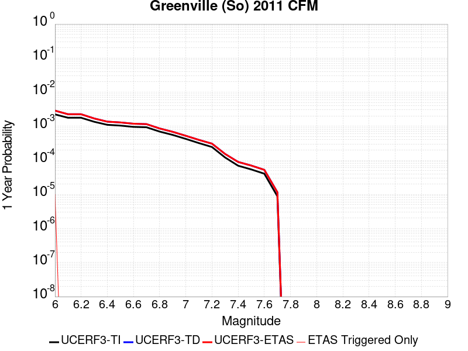 |  |

| Magnitude | 1 wk TI Prob | 1 wk TD Prob | 1 wk ETAS Prob | 1 wk ETAS/TD Gain | 1 wk ETAS Triggered Only | 1 mo TI Prob | 1 mo TD Prob | 1 mo ETAS Prob | 1 mo ETAS/TD Gain | 1 mo ETAS Triggered Only | 1 yr TI Prob | 1 yr TD Prob | 1 yr ETAS Prob | 1 yr ETAS/TD Gain | 1 yr ETAS Triggered Only | 10 yr TI Prob | 10 yr TD Prob | 10 yr ETAS Prob | 10 yr ETAS/TD Gain | 10 yr ETAS Triggered Only |
|-----|-----|-----|-----|-----|-----|-----|-----|-----|-----|-----|-----|-----|-----|-----|-----|-----|-----|-----|-----|-----|
| 6.0 | 4.279693E-5 | 5.5042052E-5 | 5.5042052E-5 | 1.0 | 0.0 | 1.8340252E-4 | 2.3587522E-4 | 2.3587522E-4 | 1.0 | 0.0 | 0.0022306389 | 0.0028683394 | 0.0028783109 | 1.0034764 | 1.0E-5 | 0.022083808 | 0.028339082 | 0.0283488 | 1.0003428 | 1.0E-5 |
| 6.1 | 3.4037297E-5 | 4.319379E-5 | 4.319379E-5 | 1.0 | 0.0 | 1.4586597E-4 | 1.851043E-4 | 1.851043E-4 | 1.0 | 0.0 | 0.0017744715 | 0.0022515068 | 0.0022515068 | 1.0 | 0.0 | 0.01760369 | 0.022303257 | 0.022303257 | 1.0 | 0.0 |
| 6.2 | 3.4037297E-5 | 4.319379E-5 | 4.319379E-5 | 1.0 | 0.0 | 1.4586597E-4 | 1.851043E-4 | 1.851043E-4 | 1.0 | 0.0 | 0.0017744715 | 0.0022515068 | 0.0022515068 | 1.0 | 0.0 | 0.01760369 | 0.022303257 | 0.022303257 | 1.0 | 0.0 |
| 6.3 | 2.5956324E-5 | 3.242983E-5 | 3.242983E-5 | 1.0 | 0.0 | 1.11236644E-4 | 1.3897801E-4 | 1.3897801E-4 | 1.0 | 0.0 | 0.0013534647 | 0.0016908189 | 0.0016908189 | 1.0 | 0.0 | 0.013452509 | 0.016786352 | 0.016786352 | 1.0 | 0.0 |
| 6.4 | 2.1145053E-5 | 2.6198357E-5 | 2.6198357E-5 | 1.0 | 0.0 | 9.061851E-5 | 1.1227402E-4 | 1.1227402E-4 | 1.0 | 0.0 | 0.0011027219 | 0.0013661105 | 0.0013661105 | 1.0 | 0.0 | 0.01097266 | 0.013580529 | 0.013580529 | 1.0 | 0.0 |
| 6.5 | 2.0030959E-5 | 2.4796413E-5 | 2.4796413E-5 | 1.0 | 0.0 | 8.584414E-5 | 1.0626618E-4 | 1.0626618E-4 | 1.0 | 0.0 | 0.0010446513 | 0.001293055 | 0.001293055 | 1.0 | 0.0 | 0.010397541 | 0.012858664 | 0.012858664 | 1.0 | 0.0 |
| 6.6 | 1.8395405E-5 | 2.2755032E-5 | 2.2755032E-5 | 1.0 | 0.0 | 7.8835066E-5 | 9.751807E-5 | 9.751807E-5 | 1.0 | 0.0 | 9.5939427E-4 | 0.0011866642 | 0.0011866642 | 1.0 | 0.0 | 0.009552629 | 0.0118063325 | 0.0118063325 | 1.0 | 0.0 |
| 6.7 | 1.7883482E-5 | 2.2126056E-5 | 2.2126056E-5 | 1.0 | 0.0 | 7.664124E-5 | 9.4822666E-5 | 9.4822666E-5 | 1.0 | 0.0 | 9.3270757E-4 | 0.001153883 | 0.001153883 | 1.0 | 0.0 | 0.009288026 | 0.01148197 | 0.01148197 | 1.0 | 0.0 |
| 6.8 | 1.3373564E-5 | 1.6506328E-5 | 1.6506328E-5 | 1.0 | 0.0 | 5.7314013E-5 | 7.0739574E-5 | 7.0739574E-5 | 1.0 | 0.0 | 6.975747E-4 | 8.6092873E-4 | 8.6092873E-4 | 1.0 | 0.0 | 0.0069538904 | 0.008577544 | 0.008577544 | 1.0 | 0.0 |
| 6.9 | 1.06692905E-5 | 1.3152838E-5 | 1.3152838E-5 | 1.0 | 0.0 | 4.5724726E-5 | 5.636815E-5 | 5.636815E-5 | 1.0 | 0.0 | 5.5655633E-4 | 6.8607734E-4 | 6.8607734E-4 | 1.0 | 0.0 | 0.005551645 | 0.006840826 | 0.006840826 | 1.0 | 0.0 |
| 7.0 | 8.157512E-6 | 1.0062801E-5 | 1.0062801E-5 | 1.0 | 0.0 | 3.4960296E-5 | 4.3125594E-5 | 4.3125594E-5 | 1.0 | 0.0 | 4.2555845E-4 | 5.249313E-4 | 5.249313E-4 | 1.0 | 0.0 | 0.004247444 | 0.005237391 | 0.005237391 | 1.0 | 0.0 |
| 7.1 | 6.1467113E-6 | 7.6275246E-6 | 7.6275246E-6 | 1.0 | 0.0 | 2.6342783E-5 | 3.2688986E-5 | 3.2688986E-5 | 1.0 | 0.0 | 3.206762E-4 | 3.979166E-4 | 3.979166E-4 | 1.0 | 0.0 | 0.0032021382 | 0.003972229 | 0.003972229 | 1.0 | 0.0 |
| 7.2 | 4.713467E-6 | 5.9142176E-6 | 5.9142176E-6 | 1.0 | 0.0 | 2.0200418E-5 | 2.5346404E-5 | 2.5346404E-5 | 1.0 | 0.0 | 2.4591232E-4 | 3.0854935E-4 | 3.0854935E-4 | 1.0 | 0.0 | 0.0024564038 | 0.003081363 | 0.003081363 | 1.0 | 0.0 |
| 7.3 | 2.3266216E-6 | 2.954034E-6 | 2.954034E-6 | 1.0 | 0.0 | 9.971197E-6 | 1.2660085E-5 | 1.2660085E-5 | 1.0 | 0.0 | 1.2139256E-4 | 1.541258E-4 | 1.541258E-4 | 1.0 | 0.0 | 0.0012132627 | 0.0015402584 | 0.0015402584 | 1.0 | 0.0 |
| 7.4 | 1.3314E-6 | 1.7179633E-6 | 1.7179633E-6 | 1.0 | 0.0 | 5.7059874E-6 | 7.3626793E-6 | 7.3626793E-6 | 1.0 | 0.0 | 6.946818E-5 | 8.963698E-5 | 8.963698E-5 | 1.0 | 0.0 | 6.9446466E-4 | 8.9604704E-4 | 8.9604704E-4 | 1.0 | 0.0 |
| 7.5 | 1.0362941E-6 | 1.3468865E-6 | 1.3468865E-6 | 1.0 | 0.0 | 4.4412527E-6 | 5.7723582E-6 | 5.7723582E-6 | 1.0 | 0.0 | 5.407091E-5 | 7.027624E-5 | 7.027624E-5 | 1.0 | 0.0 | 5.405776E-4 | 7.0257037E-4 | 7.0257037E-4 | 1.0 | 0.0 |
| 7.6 | 7.764784E-7 | 1.0088623E-6 | 1.0088623E-6 | 1.0 | 0.0 | 3.3277602E-6 | 4.323689E-6 | 4.323689E-6 | 1.0 | 0.0 | 4.0514726E-5 | 5.263968E-5 | 5.263968E-5 | 1.0 | 0.0 | 4.050734E-4 | 5.2629353E-4 | 5.2629353E-4 | 1.0 | 0.0 |
| 7.7 | 1.6927763E-7 | 2.2139328E-7 | 2.2139328E-7 | 1.0 | 0.0 | 7.2547533E-7 | 9.48828E-7 | 9.48828E-7 | 1.0 | 0.0 | 8.832627E-6 | 1.1551923E-5 | 1.1551923E-5 | 1.0 | 0.0 | 8.8322755E-5 | 1.1551595E-4 | 1.1551595E-4 | 1.0 | 0.0 |

## West Napa 2011 CFM
*[(top)](#table-of-contents)*

| 1 Week | 1 Month | 1 Year | 10 Year |
|-----|-----|-----|-----|
|  | 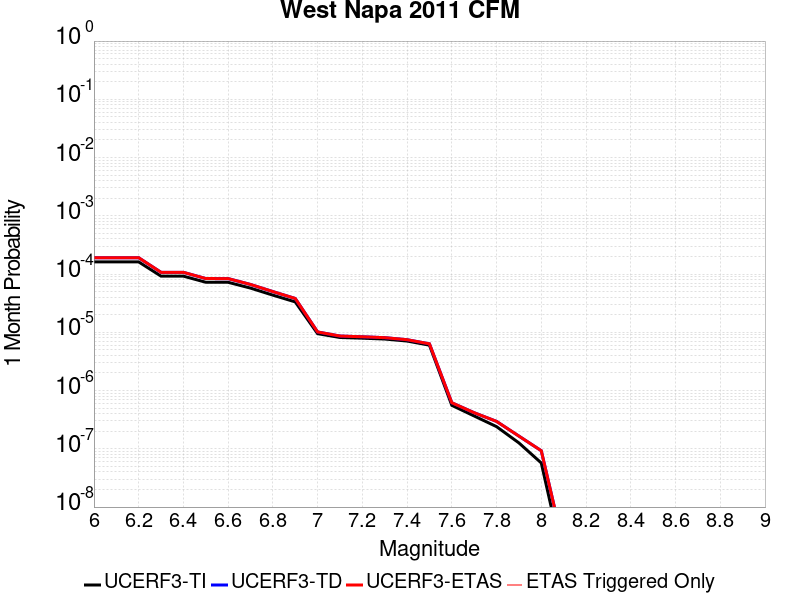 |  |  |

| Magnitude | 1 wk TI Prob | 1 wk TD Prob | 1 wk ETAS Prob | 1 wk ETAS/TD Gain | 1 wk ETAS Triggered Only | 1 mo TI Prob | 1 mo TD Prob | 1 mo ETAS Prob | 1 mo ETAS/TD Gain | 1 mo ETAS Triggered Only | 1 yr TI Prob | 1 yr TD Prob | 1 yr ETAS Prob | 1 yr ETAS/TD Gain | 1 yr ETAS Triggered Only | 10 yr TI Prob | 10 yr TD Prob | 10 yr ETAS Prob | 10 yr ETAS/TD Gain | 10 yr ETAS Triggered Only |
|-----|-----|-----|-----|-----|-----|-----|-----|-----|-----|-----|-----|-----|-----|-----|-----|-----|-----|-----|-----|-----|
| 6.0 | 3.773104E-5 | 4.4529617E-5 | 4.4529617E-5 | 1.0 | 0.0 | 1.6169442E-4 | 1.9082906E-4 | 1.9082906E-4 | 1.0 | 0.0 | 0.001966852 | 0.0023211853 | 0.0023211853 | 1.0 | 0.0 | 0.019495348 | 0.02300284 | 0.02301261 | 1.0004247 | 1.0E-5 |
| 6.1 | 3.773104E-5 | 4.4529617E-5 | 4.4529617E-5 | 1.0 | 0.0 | 1.6169442E-4 | 1.9082906E-4 | 1.9082906E-4 | 1.0 | 0.0 | 0.001966852 | 0.0023211853 | 0.0023211853 | 1.0 | 0.0 | 0.019495348 | 0.02300284 | 0.02301261 | 1.0004247 | 1.0E-5 |
| 6.2 | 3.773104E-5 | 4.4529617E-5 | 4.4529617E-5 | 1.0 | 0.0 | 1.6169442E-4 | 1.9082906E-4 | 1.9082906E-4 | 1.0 | 0.0 | 0.001966852 | 0.0023211853 | 0.0023211853 | 1.0 | 0.0 | 0.019495348 | 0.02300284 | 0.02301261 | 1.0004247 | 1.0E-5 |
| 6.3 | 2.147964E-5 | 2.4987681E-5 | 2.4987681E-5 | 1.0 | 0.0 | 9.2052345E-5 | 1.0708619E-4 | 1.0708619E-4 | 1.0 | 0.0 | 0.001120161 | 0.0013030862 | 0.0013030862 | 1.0 | 0.0 | 0.011145315 | 0.01296507 | 0.01297494 | 1.0007613 | 1.0E-5 |
| 6.4 | 2.147964E-5 | 2.4987681E-5 | 2.4987681E-5 | 1.0 | 0.0 | 9.2052345E-5 | 1.0708619E-4 | 1.0708619E-4 | 1.0 | 0.0 | 0.001120161 | 0.0013030862 | 0.0013030862 | 1.0 | 0.0 | 0.011145315 | 0.01296507 | 0.01297494 | 1.0007613 | 1.0E-5 |
| 6.5 | 1.688201E-5 | 1.9547857E-5 | 1.9547857E-5 | 1.0 | 0.0 | 7.234947E-5 | 8.377425E-5 | 8.377425E-5 | 1.0 | 0.0 | 8.804988E-4 | 0.0010195468 | 0.0010195468 | 1.0 | 0.0 | 0.008770182 | 0.010157362 | 0.010167261 | 1.0009745 | 1.0E-5 |
| 6.6 | 1.6846381E-5 | 1.9507548E-5 | 1.9507548E-5 | 1.0 | 0.0 | 7.219678E-5 | 8.360151E-5 | 8.360151E-5 | 1.0 | 0.0 | 8.7864127E-4 | 0.0010174456 | 0.0010174456 | 1.0 | 0.0 | 0.008751754 | 0.010136543 | 0.010146441 | 1.0009766 | 1.0E-5 |
| 6.7 | 1.3396501E-5 | 1.5468073E-5 | 1.5468073E-5 | 1.0 | 0.0 | 5.7412315E-5 | 6.629041E-5 | 6.629041E-5 | 1.0 | 0.0 | 6.9877075E-4 | 8.068505E-4 | 8.068505E-4 | 1.0 | 0.0 | 0.0069657755 | 0.008046935 | 0.008056856 | 1.0012327 | 1.0E-5 |
| 6.8 | 1.0139058E-5 | 1.1672485E-5 | 1.1672485E-5 | 1.0 | 0.0 | 4.3452383E-5 | 5.002429E-5 | 5.002429E-5 | 1.0 | 0.0 | 5.289043E-4 | 6.08931E-4 | 6.08931E-4 | 1.0 | 0.0 | 0.005276473 | 0.006079547 | 0.006089486 | 1.0016348 | 1.0E-5 |
| 6.9 | 7.761281E-6 | 8.890966E-6 | 8.890966E-6 | 1.0 | 0.0 | 3.326221E-5 | 3.8103874E-5 | 3.8103874E-5 | 1.0 | 0.0 | 4.0489217E-4 | 4.6386727E-4 | 4.6386727E-4 | 1.0 | 0.0 | 0.0040415525 | 0.0046355044 | 0.0046454584 | 1.0021473 | 1.0E-5 |
| 7.0 | 2.2109202E-6 | 2.3667233E-6 | 2.3667233E-6 | 1.0 | 0.0 | 9.475338E-6 | 1.01430605E-5 | 1.01430605E-5 | 1.0 | 0.0 | 1.1535613E-4 | 1.2348485E-4 | 1.2348485E-4 | 1.0 | 0.0 | 0.0011529627 | 0.001235648 | 0.001235648 | 1.0 | 0.0 |
| 7.1 | 1.9008926E-6 | 2.0134055E-6 | 2.0134055E-6 | 1.0 | 0.0 | 8.146657E-6 | 8.628853E-6 | 8.628853E-6 | 1.0 | 0.0 | 9.918104E-5 | 1.05051244E-4 | 1.05051244E-4 | 1.0 | 0.0 | 9.913679E-4 | 0.0010514965 | 0.0010514965 | 1.0 | 0.0 |
| 7.2 | 1.8495944E-6 | 1.9562115E-6 | 1.9562115E-6 | 1.0 | 0.0 | 7.926808E-6 | 8.383737E-6 | 8.383737E-6 | 1.0 | 0.0 | 9.650462E-5 | 1.02067235E-4 | 1.02067235E-4 | 1.0 | 0.0 | 9.6462725E-4 | 0.0010216843 | 0.0010216843 | 1.0 | 0.0 |
| 7.3 | 1.7883189E-6 | 1.8881731E-6 | 1.8881731E-6 | 1.0 | 0.0 | 7.664201E-6 | 8.092145E-6 | 8.092145E-6 | 1.0 | 0.0 | 9.330765E-5 | 9.851744E-5 | 9.851744E-5 | 1.0 | 0.0 | 9.3268487E-4 | 9.862181E-4 | 9.862181E-4 | 1.0 | 0.0 |
| 7.4 | 1.6520572E-6 | 1.7415938E-6 | 1.7415938E-6 | 1.0 | 0.0 | 7.0802257E-6 | 7.463952E-6 | 7.463952E-6 | 1.0 | 0.0 | 8.6198335E-5 | 9.086986E-5 | 9.086986E-5 | 1.0 | 0.0 | 8.616491E-4 | 9.098032E-4 | 9.098032E-4 | 1.0 | 0.0 |
| 7.5 | 1.4040345E-6 | 1.480112E-6 | 1.480112E-6 | 1.0 | 0.0 | 6.0172765E-6 | 6.3433217E-6 | 6.3433217E-6 | 1.0 | 0.0 | 7.325788E-5 | 7.722723E-5 | 7.722723E-5 | 1.0 | 0.0 | 7.3233736E-4 | 7.7344844E-4 | 7.7344844E-4 | 1.0 | 0.0 |
| 7.6 | 1.3013842E-7 | 1.4420175E-7 | 1.4420175E-7 | 1.0 | 0.0 | 5.57736E-7 | 6.1800733E-7 | 6.1800733E-7 | 1.0 | 0.0 | 6.790414E-6 | 7.524213E-6 | 7.524213E-6 | 1.0 | 0.0 | 6.790207E-5 | 7.617076E-5 | 7.617076E-5 | 1.0 | 0.0 |
| 7.7 | 8.541512E-8 | 9.720196E-8 | 9.720196E-8 | 1.0 | 0.0 | 3.6606474E-7 | 4.1657975E-7 | 4.1657975E-7 | 1.0 | 0.0 | 4.456829E-6 | 5.0718468E-6 | 5.0718468E-6 | 1.0 | 0.0 | 4.4567398E-5 | 5.1623178E-5 | 5.1623178E-5 | 1.0 | 0.0 |
| 7.8 | 5.6074793E-8 | 6.898559E-8 | 6.898559E-8 | 1.0 | 0.0 | 2.403205E-7 | 2.956525E-7 | 2.956525E-7 | 1.0 | 0.0 | 2.9258983E-6 | 3.5995633E-6 | 3.5995633E-6 | 1.0 | 0.0 | 2.9258597E-5 | 3.6831098E-5 | 3.6831098E-5 | 1.0 | 0.0 |
| 7.9 | 2.9475839E-8 | 3.858516E-8 | 3.858516E-8 | 1.0 | 0.0 | 1.2632502E-7 | 1.6536497E-7 | 1.6536497E-7 | 1.0 | 0.0 | 1.538006E-6 | 2.0133166E-6 | 2.0133166E-6 | 1.0 | 0.0 | 1.5379954E-5 | 2.0675805E-5 | 2.0675805E-5 | 1.0 | 0.0 |
| 8.0 | 1.3337122E-8 | 2.1642386E-8 | 2.1642386E-8 | 1.0 | 0.0 | 5.7159088E-8 | 9.2753076E-8 | 9.2753076E-8 | 1.0 | 0.0 | 6.959117E-7 | 1.1292681E-6 | 1.1292681E-6 | 1.0 | 0.0 | 6.959095E-6 | 1.16513675E-5 | 1.16513675E-5 | 1.0 | 0.0 |
| 8.1 | 2.6589986E-10 | 4.8638915E-10 | 4.8638915E-10 | 1.0 | 0.0 | 1.1395708E-9 | 2.084525E-9 | 2.084525E-9 | 1.0 | 0.0 | 1.3874274E-8 | 2.537909E-8 | 2.537909E-8 | 1.0 | 0.0 | 1.3874273E-7 | 2.6047906E-7 | 2.6047906E-7 | 1.0 | 0.0 |

## Great Valley 03 Mysterious Ridge
*[(top)](#table-of-contents)*

| 1 Week | 1 Month | 1 Year | 10 Year |
|-----|-----|-----|-----|
|  |  |  |  |

| Magnitude | 1 wk TI Prob | 1 wk TD Prob | 1 wk ETAS Prob | 1 wk ETAS/TD Gain | 1 wk ETAS Triggered Only | 1 mo TI Prob | 1 mo TD Prob | 1 mo ETAS Prob | 1 mo ETAS/TD Gain | 1 mo ETAS Triggered Only | 1 yr TI Prob | 1 yr TD Prob | 1 yr ETAS Prob | 1 yr ETAS/TD Gain | 1 yr ETAS Triggered Only | 10 yr TI Prob | 10 yr TD Prob | 10 yr ETAS Prob | 10 yr ETAS/TD Gain | 10 yr ETAS Triggered Only |
|-----|-----|-----|-----|-----|-----|-----|-----|-----|-----|-----|-----|-----|-----|-----|-----|-----|-----|-----|-----|-----|
| 6.0 | 3.1182444E-5 | 3.603498E-5 | 3.603498E-5 | 1.0 | 0.0 | 1.336322E-4 | 1.5442717E-4 | 1.5442717E-4 | 1.0 | 0.0 | 0.0016257578 | 0.0018787086 | 0.0018886898 | 1.0053128 | 1.0E-5 | 0.016139153 | 0.018647036 | 0.01865685 | 1.0005263 | 1.0E-5 |
| 6.1 | 3.1182444E-5 | 3.603498E-5 | 3.603498E-5 | 1.0 | 0.0 | 1.336322E-4 | 1.5442717E-4 | 1.5442717E-4 | 1.0 | 0.0 | 0.0016257578 | 0.0018787086 | 0.0018886898 | 1.0053128 | 1.0E-5 | 0.016139153 | 0.018647036 | 0.01865685 | 1.0005263 | 1.0E-5 |
| 6.2 | 3.1182444E-5 | 3.603498E-5 | 3.603498E-5 | 1.0 | 0.0 | 1.336322E-4 | 1.5442717E-4 | 1.5442717E-4 | 1.0 | 0.0 | 0.0016257578 | 0.0018787086 | 0.0018886898 | 1.0053128 | 1.0E-5 | 0.016139153 | 0.018647036 | 0.01865685 | 1.0005263 | 1.0E-5 |
| 6.3 | 2.106934E-5 | 2.3850727E-5 | 2.3850727E-5 | 1.0 | 0.0 | 9.0294045E-5 | 1.0221358E-4 | 1.0221358E-4 | 1.0 | 0.0 | 0.0010987755 | 0.0012437708 | 0.0012537583 | 1.00803 | 1.0E-5 | 0.010933585 | 0.012371344 | 0.012381219 | 1.0007983 | 1.0E-5 |
| 6.4 | 2.106934E-5 | 2.3850727E-5 | 2.3850727E-5 | 1.0 | 0.0 | 9.0294045E-5 | 1.0221358E-4 | 1.0221358E-4 | 1.0 | 0.0 | 0.0010987755 | 0.0012437708 | 0.0012537583 | 1.00803 | 1.0E-5 | 0.010933585 | 0.012371344 | 0.012381219 | 1.0007983 | 1.0E-5 |
| 6.5 | 1.9389783E-5 | 2.188536E-5 | 2.188536E-5 | 1.0 | 0.0 | 8.309642E-5 | 9.379118E-5 | 9.379118E-5 | 1.0 | 0.0 | 0.0010112294 | 0.001141337 | 0.0011513256 | 1.0087516 | 1.0E-5 | 0.010066401 | 0.011357628 | 0.011367514 | 1.0008705 | 1.0E-5 |
| 6.6 | 1.9370193E-5 | 2.186528E-5 | 2.186528E-5 | 1.0 | 0.0 | 8.301247E-5 | 9.370514E-5 | 9.370514E-5 | 1.0 | 0.0 | 0.0010102082 | 0.0011402905 | 0.0011502791 | 1.0087597 | 1.0E-5 | 0.010056281 | 0.01134727 | 0.011357156 | 1.0008713 | 1.0E-5 |
| 6.7 | 1.6723505E-5 | 1.8799592E-5 | 1.8799592E-5 | 1.0 | 0.0 | 7.16702E-5 | 8.0567304E-5 | 8.0567304E-5 | 1.0 | 0.0 | 8.722353E-4 | 9.80485E-4 | 9.904752E-4 | 1.010189 | 1.0E-5 | 0.008688197 | 0.0097636 | 0.009773502 | 1.0010142 | 1.0E-5 |
| 6.8 | 1.426937E-5 | 1.5997468E-5 | 1.5997468E-5 | 1.0 | 0.0 | 6.115301E-5 | 6.855885E-5 | 6.855885E-5 | 1.0 | 0.0 | 7.4428355E-4 | 8.3439884E-4 | 8.4439054E-4 | 1.0119747 | 1.0E-5 | 0.007417957 | 0.008314138 | 0.008324055 | 1.0011928 | 1.0E-5 |
| 6.9 | 1.2469891E-5 | 1.395715E-5 | 1.395715E-5 | 1.0 | 0.0 | 5.3441294E-5 | 5.9815055E-5 | 5.9815055E-5 | 1.0 | 0.0 | 6.504535E-4 | 7.28017E-4 | 7.28017E-4 | 1.0 | 0.0 | 0.006485529 | 0.007257545 | 0.007257545 | 1.0 | 0.0 |
| 7.0 | 8.7746275E-6 | 9.791885E-6 | 9.791885E-6 | 1.0 | 0.0 | 3.7605005E-5 | 4.1964588E-5 | 4.1964588E-5 | 1.0 | 0.0 | 4.5774475E-4 | 5.108064E-4 | 5.108064E-4 | 1.0 | 0.0 | 0.00456803 | 0.005097056 | 0.005097056 | 1.0 | 0.0 |
| 7.1 | 6.1067153E-6 | 6.81383E-6 | 6.81383E-6 | 1.0 | 0.0 | 2.6171374E-5 | 2.9201834E-5 | 2.9201834E-5 | 1.0 | 0.0 | 3.1858988E-4 | 3.5547992E-4 | 3.5547992E-4 | 1.0 | 0.0 | 0.0031813353 | 0.0035496636 | 0.0035496636 | 1.0 | 0.0 |
| 7.2 | 2.939283E-6 | 3.2741555E-6 | 3.2741555E-6 | 1.0 | 0.0 | 1.2596866E-5 | 1.4032029E-5 | 1.4032029E-5 | 1.0 | 0.0 | 1.5335606E-4 | 1.7082831E-4 | 1.7082831E-4 | 1.0 | 0.0 | 0.0015325027 | 0.001707142 | 0.001707142 | 1.0 | 0.0 |
| 7.3 | 7.2387763E-7 | 8.008619E-7 | 8.008619E-7 | 1.0 | 0.0 | 3.102329E-6 | 3.4322634E-6 | 3.4322634E-6 | 1.0 | 0.0 | 3.77702E-5 | 4.1787465E-5 | 4.1787465E-5 | 1.0 | 0.0 | 3.7763783E-4 | 4.1784105E-4 | 4.1784105E-4 | 1.0 | 0.0 |
| 7.4 | 3.112171E-8 | 3.2068495E-8 | 3.2068495E-8 | 1.0 | 0.0 | 1.3337875E-7 | 1.374364E-7 | 1.374364E-7 | 1.0 | 0.0 | 1.6238852E-6 | 1.673287E-6 | 1.673287E-6 | 1.0 | 0.0 | 1.6238733E-5 | 1.6732753E-5 | 1.6732753E-5 | 1.0 | 0.0 |

## Los Alamos 2011 CFM
*[(top)](#table-of-contents)*

| 1 Week | 1 Month | 1 Year | 10 Year |
|-----|-----|-----|-----|
|  |  |  | 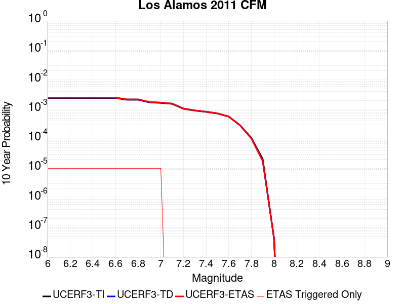 |

| Magnitude | 1 wk TI Prob | 1 wk TD Prob | 1 wk ETAS Prob | 1 wk ETAS/TD Gain | 1 wk ETAS Triggered Only | 1 mo TI Prob | 1 mo TD Prob | 1 mo ETAS Prob | 1 mo ETAS/TD Gain | 1 mo ETAS Triggered Only | 1 yr TI Prob | 1 yr TD Prob | 1 yr ETAS Prob | 1 yr ETAS/TD Gain | 1 yr ETAS Triggered Only | 10 yr TI Prob | 10 yr TD Prob | 10 yr ETAS Prob | 10 yr ETAS/TD Gain | 10 yr ETAS Triggered Only |
|-----|-----|-----|-----|-----|-----|-----|-----|-----|-----|-----|-----|-----|-----|-----|-----|-----|-----|-----|-----|-----|
| 6.0 | 4.6284417E-6 | 4.751753E-6 | 4.751753E-6 | 1.0 | 0.0 | 1.9836029E-5 | 2.0364507E-5 | 2.0364507E-5 | 1.0 | 0.0 | 2.4147688E-4 | 2.4791143E-4 | 2.4791143E-4 | 1.0 | 0.0 | 0.0024121467 | 0.0024765227 | 0.002486498 | 1.004028 | 1.0E-5 |
| 6.1 | 4.6284417E-6 | 4.751753E-6 | 4.751753E-6 | 1.0 | 0.0 | 1.9836029E-5 | 2.0364507E-5 | 2.0364507E-5 | 1.0 | 0.0 | 2.4147688E-4 | 2.4791143E-4 | 2.4791143E-4 | 1.0 | 0.0 | 0.0024121467 | 0.0024765227 | 0.002486498 | 1.004028 | 1.0E-5 |
| 6.2 | 4.6284417E-6 | 4.751753E-6 | 4.751753E-6 | 1.0 | 0.0 | 1.9836029E-5 | 2.0364507E-5 | 2.0364507E-5 | 1.0 | 0.0 | 2.4147688E-4 | 2.4791143E-4 | 2.4791143E-4 | 1.0 | 0.0 | 0.0024121467 | 0.0024765227 | 0.002486498 | 1.004028 | 1.0E-5 |
| 6.3 | 4.6284417E-6 | 4.751753E-6 | 4.751753E-6 | 1.0 | 0.0 | 1.9836029E-5 | 2.0364507E-5 | 2.0364507E-5 | 1.0 | 0.0 | 2.4147688E-4 | 2.4791143E-4 | 2.4791143E-4 | 1.0 | 0.0 | 0.0024121467 | 0.0024765227 | 0.002486498 | 1.004028 | 1.0E-5 |
| 6.4 | 4.6284417E-6 | 4.751753E-6 | 4.751753E-6 | 1.0 | 0.0 | 1.9836029E-5 | 2.0364507E-5 | 2.0364507E-5 | 1.0 | 0.0 | 2.4147688E-4 | 2.4791143E-4 | 2.4791143E-4 | 1.0 | 0.0 | 0.0024121467 | 0.0024765227 | 0.002486498 | 1.004028 | 1.0E-5 |
| 6.5 | 4.6284417E-6 | 4.751753E-6 | 4.751753E-6 | 1.0 | 0.0 | 1.9836029E-5 | 2.0364507E-5 | 2.0364507E-5 | 1.0 | 0.0 | 2.4147688E-4 | 2.4791143E-4 | 2.4791143E-4 | 1.0 | 0.0 | 0.0024121467 | 0.0024765227 | 0.002486498 | 1.004028 | 1.0E-5 |
| 6.6 | 4.6284417E-6 | 4.751753E-6 | 4.751753E-6 | 1.0 | 0.0 | 1.9836029E-5 | 2.0364507E-5 | 2.0364507E-5 | 1.0 | 0.0 | 2.4147688E-4 | 2.4791143E-4 | 2.4791143E-4 | 1.0 | 0.0 | 0.0024121467 | 0.0024765227 | 0.002486498 | 1.004028 | 1.0E-5 |
| 6.7 | 4.062321E-6 | 4.166368E-6 | 4.166368E-6 | 1.0 | 0.0 | 1.7409831E-5 | 1.785575E-5 | 1.785575E-5 | 1.0 | 0.0 | 2.1194408E-4 | 2.1737357E-4 | 2.1737357E-4 | 1.0 | 0.0 | 0.0021174205 | 0.0021717593 | 0.0021817375 | 1.0045946 | 1.0E-5 |
| 6.8 | 4.062321E-6 | 4.166368E-6 | 4.166368E-6 | 1.0 | 0.0 | 1.7409831E-5 | 1.785575E-5 | 1.785575E-5 | 1.0 | 0.0 | 2.1194408E-4 | 2.1737357E-4 | 2.1737357E-4 | 1.0 | 0.0 | 0.0021174205 | 0.0021717593 | 0.0021817375 | 1.0045946 | 1.0E-5 |
| 6.9 | 3.2936077E-6 | 3.3729737E-6 | 3.3729737E-6 | 1.0 | 0.0 | 1.4115385E-5 | 1.4455527E-5 | 1.4455527E-5 | 1.0 | 0.0 | 1.7184127E-4 | 1.7598276E-4 | 1.7598276E-4 | 1.0 | 0.0 | 0.0017170844 | 0.0017585267 | 0.001768509 | 1.0056766 | 1.0E-5 |
| 7.0 | 3.1687898E-6 | 3.2448309E-6 | 3.2448309E-6 | 1.0 | 0.0 | 1.3580457E-5 | 1.39063495E-5 | 1.39063495E-5 | 1.0 | 0.0 | 1.6532952E-4 | 1.6929758E-4 | 1.6929758E-4 | 1.0 | 0.0 | 0.0016520657 | 0.0016917776 | 0.0017017607 | 1.005901 | 1.0E-5 |
| 7.1 | 2.9379228E-6 | 3.0073402E-6 | 3.0073402E-6 | 1.0 | 0.0 | 1.25910365E-5 | 1.2888542E-5 | 1.2888542E-5 | 1.0 | 0.0 | 1.5328509E-4 | 1.5690761E-4 | 1.5690761E-4 | 1.0 | 0.0 | 0.001531794 | 0.0015680575 | 0.0015680575 | 1.0 | 0.0 |
| 7.2 | 2.0020686E-6 | 2.04164E-6 | 2.04164E-6 | 1.0 | 0.0 | 8.580266E-6 | 8.749857E-6 | 8.749857E-6 | 1.0 | 0.0 | 1.0445973E-4 | 1.0652435E-4 | 1.0652435E-4 | 1.0 | 0.0 | 0.0010441064 | 0.0010647373 | 0.0010647373 | 1.0 | 0.0 |
| 7.3 | 1.7364243E-6 | 1.7678894E-6 | 1.7678894E-6 | 1.0 | 0.0 | 7.441797E-6 | 7.5766475E-6 | 7.5766475E-6 | 1.0 | 0.0 | 9.0600115E-5 | 9.224181E-5 | 9.224181E-5 | 1.0 | 0.0 | 9.0563187E-4 | 9.220384E-4 | 9.220384E-4 | 1.0 | 0.0 |
| 7.4 | 1.5718434E-6 | 1.5983262E-6 | 1.5983262E-6 | 1.0 | 0.0 | 6.7364545E-6 | 6.8499517E-6 | 6.8499517E-6 | 1.0 | 0.0 | 8.201325E-5 | 8.3395E-5 | 8.3395E-5 | 1.0 | 0.0 | 8.198299E-4 | 8.3364005E-4 | 8.3364005E-4 | 1.0 | 0.0 |
| 7.5 | 1.3841119E-6 | 1.404287E-6 | 1.404287E-6 | 1.0 | 0.0 | 5.9318945E-6 | 6.018359E-6 | 6.018359E-6 | 1.0 | 0.0 | 7.221842E-5 | 7.327108E-5 | 7.327108E-5 | 1.0 | 0.0 | 7.2194956E-4 | 7.324721E-4 | 7.324721E-4 | 1.0 | 0.0 |
| 7.6 | 1.0843726E-6 | 1.0934483E-6 | 1.0934483E-6 | 1.0 | 0.0 | 4.647303E-6 | 4.6861987E-6 | 4.6861987E-6 | 1.0 | 0.0 | 5.6579443E-5 | 5.7053E-5 | 5.7053E-5 | 1.0 | 0.0 | 5.656504E-4 | 5.703861E-4 | 5.703861E-4 | 1.0 | 0.0 |
| 7.7 | 5.544814E-7 | 5.501903E-7 | 5.501903E-7 | 1.0 | 0.0 | 2.3763469E-6 | 2.3579564E-6 | 2.3579564E-6 | 1.0 | 0.0 | 2.8931638E-5 | 2.8707742E-5 | 2.8707742E-5 | 1.0 | 0.0 | 2.8927872E-4 | 2.870405E-4 | 2.870405E-4 | 1.0 | 0.0 |
| 7.8 | 2.0707465E-7 | 1.9778587E-7 | 1.9778587E-7 | 1.0 | 0.0 | 8.874625E-7 | 8.4765344E-7 | 8.4765344E-7 | 1.0 | 0.0 | 1.08048025E-5 | 1.0320132E-5 | 1.0320132E-5 | 1.0 | 0.0 | 1.0804277E-4 | 1.0319657E-4 | 1.0319657E-4 | 1.0 | 0.0 |
| 7.9 | 3.9821284E-8 | 3.4331322E-8 | 3.4331322E-8 | 1.0 | 0.0 | 1.7066264E-7 | 1.4713423E-7 | 1.4713423E-7 | 1.0 | 0.0 | 2.0778157E-6 | 1.7913579E-6 | 1.7913579E-6 | 1.0 | 0.0 | 2.0777963E-5 | 1.791344E-5 | 1.791344E-5 | 1.0 | 0.0 |
| 8.0 | 7.880441E-11 | 8.235368E-11 | 8.235368E-11 | 1.0 | 0.0 | 3.3773329E-10 | 3.5294412E-10 | 3.5294412E-10 | 1.0 | 0.0 | 4.1119033E-9 | 4.297095E-9 | 4.297095E-9 | 1.0 | 0.0 | 4.1119034E-8 | 4.2970953E-8 | 4.2970953E-8 | 1.0 | 0.0 |

## Oceanside alt1
*[(top)](#table-of-contents)*

| 1 Week | 1 Month | 1 Year | 10 Year |
|-----|-----|-----|-----|
|  | 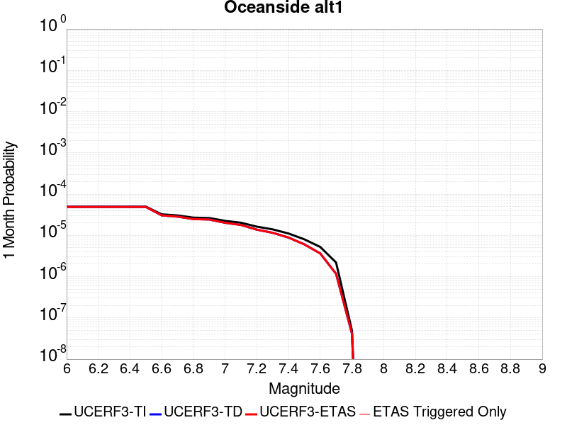 |  |  |

| Magnitude | 1 wk TI Prob | 1 wk TD Prob | 1 wk ETAS Prob | 1 wk ETAS/TD Gain | 1 wk ETAS Triggered Only | 1 mo TI Prob | 1 mo TD Prob | 1 mo ETAS Prob | 1 mo ETAS/TD Gain | 1 mo ETAS Triggered Only | 1 yr TI Prob | 1 yr TD Prob | 1 yr ETAS Prob | 1 yr ETAS/TD Gain | 1 yr ETAS Triggered Only | 10 yr TI Prob | 10 yr TD Prob | 10 yr ETAS Prob | 10 yr ETAS/TD Gain | 10 yr ETAS Triggered Only |
|-----|-----|-----|-----|-----|-----|-----|-----|-----|-----|-----|-----|-----|-----|-----|-----|-----|-----|-----|-----|-----|
| 6.0 | 1.1617542E-5 | 1.142357E-5 | 1.142357E-5 | 1.0 | 0.0 | 4.9788516E-5 | 4.895733E-5 | 4.895733E-5 | 1.0 | 0.0 | 6.060066E-4 | 5.9590855E-4 | 6.0590263E-4 | 1.0167711 | 1.0E-5 | 0.0060435664 | 0.0059447046 | 0.005954645 | 1.0016721 | 1.0E-5 |
| 6.1 | 1.1617542E-5 | 1.142357E-5 | 1.142357E-5 | 1.0 | 0.0 | 4.9788516E-5 | 4.895733E-5 | 4.895733E-5 | 1.0 | 0.0 | 6.060066E-4 | 5.9590855E-4 | 6.0590263E-4 | 1.0167711 | 1.0E-5 | 0.0060435664 | 0.0059447046 | 0.005954645 | 1.0016721 | 1.0E-5 |
| 6.2 | 1.1617542E-5 | 1.142357E-5 | 1.142357E-5 | 1.0 | 0.0 | 4.9788516E-5 | 4.895733E-5 | 4.895733E-5 | 1.0 | 0.0 | 6.060066E-4 | 5.9590855E-4 | 6.0590263E-4 | 1.0167711 | 1.0E-5 | 0.0060435664 | 0.0059447046 | 0.005954645 | 1.0016721 | 1.0E-5 |
| 6.3 | 1.1617542E-5 | 1.142357E-5 | 1.142357E-5 | 1.0 | 0.0 | 4.9788516E-5 | 4.895733E-5 | 4.895733E-5 | 1.0 | 0.0 | 6.060066E-4 | 5.9590855E-4 | 6.0590263E-4 | 1.0167711 | 1.0E-5 | 0.0060435664 | 0.0059447046 | 0.005954645 | 1.0016721 | 1.0E-5 |
| 6.4 | 1.1617542E-5 | 1.142357E-5 | 1.142357E-5 | 1.0 | 0.0 | 4.9788516E-5 | 4.895733E-5 | 4.895733E-5 | 1.0 | 0.0 | 6.060066E-4 | 5.9590855E-4 | 6.0590263E-4 | 1.0167711 | 1.0E-5 | 0.0060435664 | 0.0059447046 | 0.005954645 | 1.0016721 | 1.0E-5 |
| 6.5 | 1.1617542E-5 | 1.142357E-5 | 1.142357E-5 | 1.0 | 0.0 | 4.9788516E-5 | 4.895733E-5 | 4.895733E-5 | 1.0 | 0.0 | 6.060066E-4 | 5.9590855E-4 | 6.0590263E-4 | 1.0167711 | 1.0E-5 | 0.0060435664 | 0.0059447046 | 0.005954645 | 1.0016721 | 1.0E-5 |
| 6.6 | 7.561768E-6 | 7.1336603E-6 | 7.1336603E-6 | 1.0 | 0.0 | 3.2407173E-5 | 3.057248E-5 | 3.057248E-5 | 1.0 | 0.0 | 3.9448592E-4 | 3.7215743E-4 | 3.821537E-4 | 1.0268604 | 1.0E-5 | 0.0039378637 | 0.0037154534 | 0.0037254163 | 1.0026815 | 1.0E-5 |
| 6.7 | 7.1042605E-6 | 6.6557277E-6 | 6.6557277E-6 | 1.0 | 0.0 | 3.0446476E-5 | 2.852424E-5 | 2.852424E-5 | 1.0 | 0.0 | 3.706228E-4 | 3.4722808E-4 | 3.572246E-4 | 1.0287895 | 1.0E-5 | 0.0037000529 | 0.0034669389 | 0.0034769042 | 1.0028744 | 1.0E-5 |
| 6.8 | 6.285554E-6 | 5.7997427E-6 | 5.7997427E-6 | 1.0 | 0.0 | 2.693781E-5 | 2.4855806E-5 | 2.4855806E-5 | 1.0 | 0.0 | 3.2791847E-4 | 3.0257797E-4 | 3.1257494E-4 | 1.0330393 | 1.0E-5 | 0.0032743502 | 0.0030217173 | 0.003031687 | 1.0032994 | 1.0E-5 |
| 6.9 | 6.148883E-6 | 5.6565805E-6 | 5.6565805E-6 | 1.0 | 0.0 | 2.635209E-5 | 2.4242265E-5 | 2.4242265E-5 | 1.0 | 0.0 | 3.2078946E-4 | 2.9511016E-4 | 3.051072E-4 | 1.0338757 | 1.0E-5 | 0.003203268 | 0.0029472397 | 0.0029572102 | 1.003383 | 1.0E-5 |
| 7.0 | 5.253857E-6 | 4.7224344E-6 | 4.7224344E-6 | 1.0 | 0.0 | 2.2516335E-5 | 2.023885E-5 | 2.023885E-5 | 1.0 | 0.0 | 2.7410188E-4 | 2.4638043E-4 | 2.5637797E-4 | 1.0405777 | 1.0E-5 | 0.0027376404 | 0.0024611044 | 0.0024710798 | 1.0040532 | 1.0E-5 |
| 7.1 | 4.730754E-6 | 4.1785374E-6 | 4.1785374E-6 | 1.0 | 0.0 | 2.0274503E-5 | 1.7907896E-5 | 1.7907896E-5 | 1.0 | 0.0 | 2.468141E-4 | 2.1800707E-4 | 2.280049E-4 | 1.04586 | 1.0E-5 | 0.0024654015 | 0.0021779586 | 0.0021879368 | 1.0045815 | 1.0E-5 |
| 7.2 | 3.7998386E-6 | 3.2140474E-6 | 3.2140474E-6 | 1.0 | 0.0 | 1.6284921E-5 | 1.3774416E-5 | 1.3774416E-5 | 1.0 | 0.0 | 1.9825088E-4 | 1.6769074E-4 | 1.7768906E-4 | 1.0596236 | 1.0E-5 | 0.001980741 | 0.0016756542 | 0.0016856375 | 1.0059578 | 1.0E-5 |
| 7.3 | 3.2656465E-6 | 2.6983946E-6 | 2.6983946E-6 | 1.0 | 0.0 | 1.3995553E-5 | 1.1564497E-5 | 1.1564497E-5 | 1.0 | 0.0 | 1.7038253E-4 | 1.4078878E-4 | 1.5078737E-4 | 1.0710183 | 1.0E-5 | 0.0017025196 | 0.0014070069 | 0.0014169929 | 1.0070972 | 1.0E-5 |
| 7.4 | 2.593703E-6 | 2.068043E-6 | 2.068043E-6 | 1.0 | 0.0 | 1.1115822E-5 | 8.863011E-6 | 8.863011E-6 | 1.0 | 0.0 | 1.3532673E-4 | 1.07901906E-4 | 1.17900825E-4 | 1.0926667 | 1.0E-5 | 0.0013524436 | 0.001078504 | 0.0010884933 | 1.0092621 | 1.0E-5 |
| 7.5 | 1.8715585E-6 | 1.4137245E-6 | 1.4137245E-6 | 1.0 | 0.0 | 8.020941E-6 | 6.0588054E-6 | 6.0588054E-6 | 1.0 | 0.0 | 9.7650576E-5 | 7.376352E-5 | 7.376352E-5 | 1.0 | 0.0 | 9.7607676E-4 | 7.373964E-4 | 7.373964E-4 | 1.0 | 0.0 |
| 7.6 | 1.2246786E-6 | 8.5268715E-7 | 8.5268715E-7 | 1.0 | 0.0 | 5.248612E-6 | 3.6543686E-6 | 3.6543686E-6 | 1.0 | 0.0 | 6.389998E-5 | 4.4491073E-5 | 4.4491073E-5 | 1.0 | 0.0 | 6.3881604E-4 | 4.4482618E-4 | 4.4482618E-4 | 1.0 | 0.0 |
| 7.7 | 5.140719E-7 | 2.7347338E-7 | 2.7347338E-7 | 1.0 | 0.0 | 2.2031636E-6 | 1.1720283E-6 | 1.1720283E-6 | 1.0 | 0.0 | 2.6823185E-5 | 1.4269365E-5 | 1.4269365E-5 | 1.0 | 0.0 | 2.6819948E-4 | 1.4268584E-4 | 1.4268584E-4 | 1.0 | 0.0 |
| 7.8 | 1.16056995E-8 | 9.782392E-9 | 9.782392E-9 | 1.0 | 0.0 | 4.9738713E-8 | 4.1924537E-8 | 4.1924537E-8 | 1.0 | 0.0 | 6.0556863E-7 | 5.104312E-7 | 5.104312E-7 | 1.0 | 0.0 | 6.05567E-6 | 5.104312E-6 | 5.104312E-6 | 1.0 | 0.0 |

## Red Mountain
*[(top)](#table-of-contents)*

| 1 Week | 1 Month | 1 Year | 10 Year |
|-----|-----|-----|-----|
|  |  |  |  |

| Magnitude | 1 wk TI Prob | 1 wk TD Prob | 1 wk ETAS Prob | 1 wk ETAS/TD Gain | 1 wk ETAS Triggered Only | 1 mo TI Prob | 1 mo TD Prob | 1 mo ETAS Prob | 1 mo ETAS/TD Gain | 1 mo ETAS Triggered Only | 1 yr TI Prob | 1 yr TD Prob | 1 yr ETAS Prob | 1 yr ETAS/TD Gain | 1 yr ETAS Triggered Only | 10 yr TI Prob | 10 yr TD Prob | 10 yr ETAS Prob | 10 yr ETAS/TD Gain | 10 yr ETAS Triggered Only |
|-----|-----|-----|-----|-----|-----|-----|-----|-----|-----|-----|-----|-----|-----|-----|-----|-----|-----|-----|-----|-----|
| 6.0 | 4.1810763E-5 | 4.7591006E-5 | 4.7591006E-5 | 1.0 | 0.0 | 1.7917668E-4 | 2.0394645E-4 | 2.139444E-4 | 1.0490224 | 1.0E-5 | 0.0021792934 | 0.0024803858 | 0.002490361 | 1.0040216 | 1.0E-5 | 0.021580452 | 0.02454463 | 0.024554385 | 1.0003974 | 1.0E-5 |
| 6.1 | 4.1810763E-5 | 4.7591006E-5 | 4.7591006E-5 | 1.0 | 0.0 | 1.7917668E-4 | 2.0394645E-4 | 2.139444E-4 | 1.0490224 | 1.0E-5 | 0.0021792934 | 0.0024803858 | 0.002490361 | 1.0040216 | 1.0E-5 | 0.021580452 | 0.02454463 | 0.024554385 | 1.0003974 | 1.0E-5 |
| 6.2 | 4.1810763E-5 | 4.7591006E-5 | 4.7591006E-5 | 1.0 | 0.0 | 1.7917668E-4 | 2.0394645E-4 | 2.139444E-4 | 1.0490224 | 1.0E-5 | 0.0021792934 | 0.0024803858 | 0.002490361 | 1.0040216 | 1.0E-5 | 0.021580452 | 0.02454463 | 0.024554385 | 1.0003974 | 1.0E-5 |
| 6.3 | 4.1810763E-5 | 4.7591006E-5 | 4.7591006E-5 | 1.0 | 0.0 | 1.7917668E-4 | 2.0394645E-4 | 2.139444E-4 | 1.0490224 | 1.0E-5 | 0.0021792934 | 0.0024803858 | 0.002490361 | 1.0040216 | 1.0E-5 | 0.021580452 | 0.02454463 | 0.024554385 | 1.0003974 | 1.0E-5 |
| 6.4 | 4.1810763E-5 | 4.7591006E-5 | 4.7591006E-5 | 1.0 | 0.0 | 1.7917668E-4 | 2.0394645E-4 | 2.139444E-4 | 1.0490224 | 1.0E-5 | 0.0021792934 | 0.0024803858 | 0.002490361 | 1.0040216 | 1.0E-5 | 0.021580452 | 0.02454463 | 0.024554385 | 1.0003974 | 1.0E-5 |
| 6.5 | 3.154503E-5 | 3.5360477E-5 | 3.5360477E-5 | 1.0 | 0.0 | 1.3518598E-4 | 1.5153662E-4 | 1.6153509E-4 | 1.0659807 | 1.0E-5 | 0.0016446467 | 0.0018434891 | 0.0018534707 | 1.0054145 | 1.0E-5 | 0.01632528 | 0.018291617 | 0.018301435 | 1.0005367 | 1.0E-5 |
| 6.6 | 3.1535834E-5 | 3.5349858E-5 | 3.5349858E-5 | 1.0 | 0.0 | 1.3514658E-4 | 1.5149111E-4 | 1.614896E-4 | 1.0660005 | 1.0E-5 | 0.0016441676 | 0.001842936 | 0.0018529176 | 1.0054162 | 1.0E-5 | 0.01632056 | 0.018286178 | 0.018295996 | 1.0005369 | 1.0E-5 |
| 6.7 | 2.8267326E-5 | 3.146999E-5 | 3.146999E-5 | 1.0 | 0.0 | 1.2114006E-4 | 1.348649E-4 | 1.4486354E-4 | 1.0741383 | 1.0E-5 | 0.0014738824 | 0.0016408286 | 0.0016508121 | 1.0060844 | 1.0E-5 | 0.014641452 | 0.016295899 | 0.016305735 | 1.0006037 | 1.0E-5 |
| 6.8 | 2.8212884E-5 | 3.1407875E-5 | 3.1407875E-5 | 1.0 | 0.0 | 1.20906756E-4 | 1.3459871E-4 | 1.4459738E-4 | 1.0742849 | 1.0E-5 | 0.0014710457 | 0.0016375926 | 0.0016475762 | 1.0060965 | 1.0E-5 | 0.014613459 | 0.016264014 | 0.01627385 | 1.0006049 | 1.0E-5 |
| 6.9 | 2.4227871E-5 | 2.6707517E-5 | 2.6707517E-5 | 1.0 | 0.0 | 1.03829596E-4 | 1.1445619E-4 | 1.2445505E-4 | 1.0873597 | 1.0E-5 | 0.0012633923 | 0.0013926893 | 0.0014026753 | 1.0071703 | 1.0E-5 | 0.012562336 | 0.013847304 | 0.013857164 | 1.0007122 | 1.0E-5 |
| 7.0 | 2.348524E-5 | 2.5836282E-5 | 2.5836282E-5 | 1.0 | 0.0 | 1.0064714E-4 | 1.1072265E-4 | 1.2072154E-4 | 1.0903058 | 1.0E-5 | 0.0012246901 | 0.0013472902 | 0.0013572768 | 1.0074123 | 1.0E-5 | 0.012179627 | 0.013398857 | 0.013408723 | 1.0007364 | 1.0E-5 |
| 7.1 | 2.2311642E-5 | 2.4463316E-5 | 2.4463316E-5 | 1.0 | 0.0 | 9.561782E-5 | 1.04839E-4 | 1.14837945E-4 | 1.0953743 | 1.0E-5 | 0.0011635252 | 0.0012757422 | 0.0012857295 | 1.0078286 | 1.0E-5 | 0.01157452 | 0.012691703 | 0.012701576 | 1.000778 | 1.0E-5 |
| 7.2 | 1.6533986E-5 | 1.7670676E-5 | 1.7670676E-5 | 1.0 | 0.0 | 7.085802E-5 | 7.572963E-5 | 8.572887E-5 | 1.1320387 | 1.0E-5 | 8.623549E-4 | 9.2168164E-4 | 9.3167246E-4 | 1.0108397 | 1.0E-5 | 0.008590161 | 0.009184869 | 0.009194777 | 1.0010787 | 1.0E-5 |
| 7.3 | 1.4703092E-5 | 1.5559806E-5 | 1.5559806E-5 | 1.0 | 0.0 | 6.301173E-5 | 6.6683526E-5 | 7.668286E-5 | 1.149952 | 1.0E-5 | 7.668978E-4 | 8.1163115E-4 | 8.216231E-4 | 1.0123109 | 1.0E-5 | 0.0076425658 | 0.008092744 | 0.008102663 | 1.0012257 | 1.0E-5 |
| 7.4 | 6.1331984E-6 | 5.52893E-6 | 5.52893E-6 | 1.0 | 0.0 | 2.6284872E-5 | 2.3695204E-5 | 2.3695204E-5 | 1.0 | 0.0 | 3.199713E-4 | 2.8845144E-4 | 2.8845144E-4 | 1.0 | 0.0 | 0.0031951098 | 0.0028808247 | 0.0028808247 | 1.0 | 0.0 |
| 7.5 | 5.954766E-6 | 5.338558E-6 | 5.338558E-6 | 1.0 | 0.0 | 2.5520176E-5 | 2.2879336E-5 | 2.2879336E-5 | 1.0 | 0.0 | 3.1066386E-4 | 2.7852083E-4 | 2.7852083E-4 | 1.0 | 0.0 | 0.003102299 | 0.0027817716 | 0.0027817716 | 1.0 | 0.0 |
| 7.6 | 4.9726646E-6 | 4.315341E-6 | 4.315341E-6 | 1.0 | 0.0 | 2.1311245E-5 | 1.8494187E-5 | 1.8494187E-5 | 1.0 | 0.0 | 2.5943352E-4 | 2.2514381E-4 | 2.2514381E-4 | 1.0 | 0.0 | 0.0025913084 | 0.0022491917 | 0.0022491917 | 1.0 | 0.0 |
| 7.7 | 3.3613894E-6 | 2.8526943E-6 | 2.8526943E-6 | 1.0 | 0.0 | 1.4405875E-5 | 1.2225777E-5 | 1.2225777E-5 | 1.0 | 0.0 | 1.7537741E-4 | 1.4883894E-4 | 1.4883894E-4 | 1.0 | 0.0 | 0.0017523908 | 0.0014874188 | 0.0014874188 | 1.0 | 0.0 |
| 7.8 | 1.1828961E-6 | 1.0122844E-6 | 1.0122844E-6 | 1.0 | 0.0 | 5.069545E-6 | 4.338355E-6 | 4.338355E-6 | 1.0 | 0.0 | 6.171996E-5 | 5.281822E-5 | 5.281822E-5 | 1.0 | 0.0 | 6.170282E-4 | 5.280596E-4 | 5.280596E-4 | 1.0 | 0.0 |
| 7.9 | 2.2967266E-7 | 1.8619119E-7 | 1.8619119E-7 | 1.0 | 0.0 | 9.843111E-7 | 7.9796195E-7 | 7.9796195E-7 | 1.0 | 0.0 | 1.19839215E-5 | 9.715147E-6 | 9.715147E-6 | 1.0 | 0.0 | 1.1983275E-4 | 9.714751E-5 | 9.714751E-5 | 1.0 | 0.0 |

## Honey Lake 2011 CFM
*[(top)](#table-of-contents)*

| 1 Week | 1 Month | 1 Year | 10 Year |
|-----|-----|-----|-----|
|  | 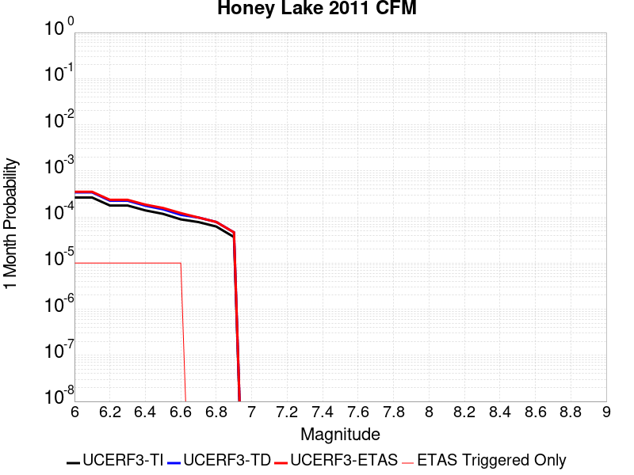 | 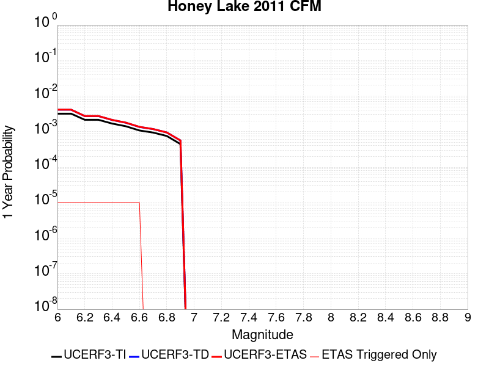 |  |

| Magnitude | 1 wk TI Prob | 1 wk TD Prob | 1 wk ETAS Prob | 1 wk ETAS/TD Gain | 1 wk ETAS Triggered Only | 1 mo TI Prob | 1 mo TD Prob | 1 mo ETAS Prob | 1 mo ETAS/TD Gain | 1 mo ETAS Triggered Only | 1 yr TI Prob | 1 yr TD Prob | 1 yr ETAS Prob | 1 yr ETAS/TD Gain | 1 yr ETAS Triggered Only | 10 yr TI Prob | 10 yr TD Prob | 10 yr ETAS Prob | 10 yr ETAS/TD Gain | 10 yr ETAS Triggered Only |
|-----|-----|-----|-----|-----|-----|-----|-----|-----|-----|-----|-----|-----|-----|-----|-----|-----|-----|-----|-----|-----|
| 6.0 | 6.155506E-5 | 7.9549776E-5 | 8.954898E-5 | 1.1256975 | 1.0E-5 | 2.6378073E-4 | 3.4088633E-4 | 3.5088294E-4 | 1.0293252 | 1.0E-5 | 0.0032068014 | 0.004142954 | 0.0041529126 | 1.0024037 | 1.0E-5 | 0.03160919 | 0.040704414 | 0.040714007 | 1.0002357 | 1.0E-5 |
| 6.1 | 6.155506E-5 | 7.9549776E-5 | 8.954898E-5 | 1.1256975 | 1.0E-5 | 2.6378073E-4 | 3.4088633E-4 | 3.5088294E-4 | 1.0293252 | 1.0E-5 | 0.0032068014 | 0.004142954 | 0.0041529126 | 1.0024037 | 1.0E-5 | 0.03160919 | 0.040704414 | 0.040714007 | 1.0002357 | 1.0E-5 |
| 6.2 | 4.1335024E-5 | 5.2578198E-5 | 6.2577674E-5 | 1.1901829 | 1.0E-5 | 1.7713808E-4 | 2.2531676E-4 | 2.3531451E-4 | 1.044372 | 1.0E-5 | 0.0021545228 | 0.0027399566 | 0.0027499292 | 1.0036397 | 1.0E-5 | 0.021337535 | 0.027077656 | 0.027087387 | 1.0003593 | 1.0E-5 |
| 6.3 | 4.1335024E-5 | 5.2578198E-5 | 6.2577674E-5 | 1.1901829 | 1.0E-5 | 1.7713808E-4 | 2.2531676E-4 | 2.3531451E-4 | 1.044372 | 1.0E-5 | 0.0021545228 | 0.0027399566 | 0.0027499292 | 1.0036397 | 1.0E-5 | 0.021337535 | 0.027077656 | 0.027087387 | 1.0003593 | 1.0E-5 |
| 6.4 | 3.2393702E-5 | 4.088887E-5 | 5.0888462E-5 | 1.2445554 | 1.0E-5 | 1.3882275E-4 | 1.7522695E-4 | 1.8522519E-4 | 1.0570588 | 1.0E-5 | 0.0016888566 | 0.0021314071 | 0.0021413858 | 1.0046817 | 1.0E-5 | 0.016760793 | 0.02112054 | 0.021130329 | 1.0004635 | 1.0E-5 |
| 6.5 | 2.7205504E-5 | 3.4212855E-5 | 4.4212513E-5 | 1.2922778 | 1.0E-5 | 1.1658981E-4 | 1.4661887E-4 | 1.566174E-4 | 1.068194 | 1.0E-5 | 0.0014185566 | 0.0017837189 | 0.0017937012 | 1.0055963 | 1.0E-5 | 0.014095354 | 0.017703528 | 0.01771335 | 1.0005548 | 1.0E-5 |
| 6.6 | 2.069265E-5 | 2.5956184E-5 | 3.5955924E-5 | 1.3852546 | 1.0E-5 | 8.867977E-5 | 1.1123653E-4 | 1.2123542E-4 | 1.0898886 | 1.0E-5 | 0.0010791414 | 0.0013535494 | 0.0013635359 | 1.007378 | 1.0E-5 | 0.010739161 | 0.013461453 | 0.013471318 | 1.0007329 | 1.0E-5 |
| 6.7 | 1.8060919E-5 | 2.2657592E-5 | 2.2657592E-5 | 1.0 | 0.0 | 7.7401644E-5 | 9.710081E-5 | 9.710081E-5 | 1.0 | 0.0 | 9.419576E-4 | 0.0011816425 | 0.0011816425 | 1.0 | 0.0 | 0.009379748 | 0.011761633 | 0.011761633 | 1.0 | 0.0 |
| 6.8 | 1.4474663E-5 | 1.8181889E-5 | 1.8181889E-5 | 1.0 | 0.0 | 6.203279E-5 | 7.7920486E-5 | 7.7920486E-5 | 1.0 | 0.0 | 7.5498753E-4 | 9.483458E-4 | 9.483458E-4 | 1.0 | 0.0 | 0.007524277 | 0.009450511 | 0.009450511 | 1.0 | 0.0 |
| 6.9 | 8.564552E-6 | 1.0802682E-5 | 1.0802682E-5 | 1.0 | 0.0 | 3.6704707E-5 | 4.6296762E-5 | 4.6296762E-5 | 1.0 | 0.0 | 4.4678818E-4 | 5.63584E-4 | 5.63584E-4 | 1.0 | 0.0 | 0.0044589094 | 0.0056280424 | 0.0056280424 | 1.0 | 0.0 |

## Fish Slough 2011 CFM
*[(top)](#table-of-contents)*

| 1 Week | 1 Month | 1 Year | 10 Year |
|-----|-----|-----|-----|
|  |  |  |  |

| Magnitude | 1 wk TI Prob | 1 wk TD Prob | 1 wk ETAS Prob | 1 wk ETAS/TD Gain | 1 wk ETAS Triggered Only | 1 mo TI Prob | 1 mo TD Prob | 1 mo ETAS Prob | 1 mo ETAS/TD Gain | 1 mo ETAS Triggered Only | 1 yr TI Prob | 1 yr TD Prob | 1 yr ETAS Prob | 1 yr ETAS/TD Gain | 1 yr ETAS Triggered Only | 10 yr TI Prob | 10 yr TD Prob | 10 yr ETAS Prob | 10 yr ETAS/TD Gain | 10 yr ETAS Triggered Only |
|-----|-----|-----|-----|-----|-----|-----|-----|-----|-----|-----|-----|-----|-----|-----|-----|-----|-----|-----|-----|-----|
| 6.0 | 4.3629925E-6 | 3.6773001E-6 | 3.6773001E-6 | 1.0 | 0.0 | 1.8698405E-5 | 1.5759775E-5 | 1.5759775E-5 | 1.0 | 0.0 | 2.276293E-4 | 1.918605E-4 | 2.0185857E-4 | 1.0521111 | 1.0E-5 | 0.0022739628 | 0.0019171574 | 0.0019271383 | 1.0052061 | 1.0E-5 |
| 6.1 | 4.3629925E-6 | 3.6773001E-6 | 3.6773001E-6 | 1.0 | 0.0 | 1.8698405E-5 | 1.5759775E-5 | 1.5759775E-5 | 1.0 | 0.0 | 2.276293E-4 | 1.918605E-4 | 2.0185857E-4 | 1.0521111 | 1.0E-5 | 0.0022739628 | 0.0019171574 | 0.0019271383 | 1.0052061 | 1.0E-5 |
| 6.2 | 4.3629925E-6 | 3.6773001E-6 | 3.6773001E-6 | 1.0 | 0.0 | 1.8698405E-5 | 1.5759775E-5 | 1.5759775E-5 | 1.0 | 0.0 | 2.276293E-4 | 1.918605E-4 | 2.0185857E-4 | 1.0521111 | 1.0E-5 | 0.0022739628 | 0.0019171574 | 0.0019271383 | 1.0052061 | 1.0E-5 |
| 6.3 | 4.3629925E-6 | 3.6773001E-6 | 3.6773001E-6 | 1.0 | 0.0 | 1.8698405E-5 | 1.5759775E-5 | 1.5759775E-5 | 1.0 | 0.0 | 2.276293E-4 | 1.918605E-4 | 2.0185857E-4 | 1.0521111 | 1.0E-5 | 0.0022739628 | 0.0019171574 | 0.0019271383 | 1.0052061 | 1.0E-5 |
| 6.4 | 4.3629925E-6 | 3.6773001E-6 | 3.6773001E-6 | 1.0 | 0.0 | 1.8698405E-5 | 1.5759775E-5 | 1.5759775E-5 | 1.0 | 0.0 | 2.276293E-4 | 1.918605E-4 | 2.0185857E-4 | 1.0521111 | 1.0E-5 | 0.0022739628 | 0.0019171574 | 0.0019271383 | 1.0052061 | 1.0E-5 |
| 6.5 | 2.991715E-6 | 2.2704153E-6 | 2.2704153E-6 | 1.0 | 0.0 | 1.2821573E-5 | 9.730321E-6 | 9.730321E-6 | 1.0 | 0.0 | 1.5609147E-4 | 1.1846113E-4 | 1.2845994E-4 | 1.0844059 | 1.0E-5 | 0.0015598187 | 0.00118407 | 0.0011940581 | 1.0084355 | 1.0E-5 |
| 6.6 | 2.991715E-6 | 2.2704153E-6 | 2.2704153E-6 | 1.0 | 0.0 | 1.2821573E-5 | 9.730321E-6 | 9.730321E-6 | 1.0 | 0.0 | 1.5609147E-4 | 1.1846113E-4 | 1.2845994E-4 | 1.0844059 | 1.0E-5 | 0.0015598187 | 0.00118407 | 0.0011940581 | 1.0084355 | 1.0E-5 |
| 6.7 | 2.7890346E-6 | 2.0622101E-6 | 2.0622101E-6 | 1.0 | 0.0 | 1.1952951E-5 | 8.838018E-6 | 8.838018E-6 | 1.0 | 0.0 | 1.4551746E-4 | 1.0759846E-4 | 1.1759739E-4 | 1.0929282 | 1.0E-5 | 0.0014542221 | 0.001075552 | 0.0010855412 | 1.0092876 | 1.0E-5 |
| 6.8 | 1.9416723E-6 | 1.1925769E-6 | 1.1925769E-6 | 1.0 | 0.0 | 8.321425E-6 | 5.111034E-6 | 5.111034E-6 | 1.0 | 0.0 | 1.01308644E-4 | 6.22251E-5 | 7.222448E-5 | 1.1606969 | 1.0E-5 | 0.0010126247 | 6.220809E-4 | 6.3207466E-4 | 1.0160651 | 1.0E-5 |
| 6.9 | 1.8567416E-6 | 1.1047181E-6 | 1.1047181E-6 | 1.0 | 0.0 | 7.957439E-6 | 4.7344975E-6 | 4.7344975E-6 | 1.0 | 0.0 | 9.687752E-5 | 5.764102E-5 | 6.7640445E-5 | 1.1734775 | 1.0E-5 | 9.6835295E-4 | 5.762646E-4 | 5.8625883E-4 | 1.0173432 | 1.0E-5 |
| 7.0 | 1.6634067E-6 | 9.0741713E-7 | 9.0741713E-7 | 1.0 | 0.0 | 7.1288664E-6 | 3.8889248E-6 | 3.8889248E-6 | 1.0 | 0.0 | 8.679049E-5 | 4.734666E-5 | 5.7346188E-5 | 1.2111981 | 1.0E-5 | 8.6756604E-4 | 4.7336862E-4 | 4.833639E-4 | 1.0211152 | 1.0E-5 |
| 7.1 | 1.4281054E-6 | 6.736813E-7 | 6.736813E-7 | 1.0 | 0.0 | 6.1204373E-6 | 2.8872025E-6 | 2.8872025E-6 | 1.0 | 0.0 | 7.451377E-5 | 3.515114E-5 | 4.515079E-5 | 1.2844758 | 1.0E-5 | 7.44888E-4 | 3.514576E-4 | 3.614541E-4 | 1.028443 | 1.0E-5 |
| 7.2 | 1.1810387E-6 | 4.408526E-7 | 4.408526E-7 | 1.0 | 0.0 | 5.0615845E-6 | 1.8893669E-6 | 1.8893669E-6 | 1.0 | 0.0 | 6.1623046E-5 | 2.3002809E-5 | 3.300258E-5 | 1.4347196 | 1.0E-5 | 6.160596E-4 | 2.3000519E-4 | 2.4000288E-4 | 1.0434673 | 1.0E-5 |
| 7.3 | 9.918052E-7 | 2.8735008E-7 | 2.8735008E-7 | 1.0 | 0.0 | 4.2505867E-6 | 1.2314997E-6 | 1.2314997E-6 | 1.0 | 0.0 | 5.1749663E-5 | 1.4993408E-5 | 2.4993258E-5 | 1.6669497 | 1.0E-5 | 5.173762E-4 | 1.4992408E-4 | 1.5992257E-4 | 1.0666904 | 1.0E-5 |
| 7.4 | 8.25252E-7 | 2.0696125E-7 | 2.0696125E-7 | 1.0 | 0.0 | 3.5367896E-6 | 8.8697647E-7 | 8.8697647E-7 | 1.0 | 0.0 | 4.3059565E-5 | 1.0798885E-5 | 2.0798778E-5 | 1.9260114 | 1.0E-5 | 4.305122E-4 | 1.0798368E-4 | 1.179826E-4 | 1.0925965 | 1.0E-5 |
| 7.5 | 5.3248567E-7 | 1.2073652E-7 | 1.2073652E-7 | 1.0 | 0.0 | 2.2820795E-6 | 5.174421E-7 | 5.174421E-7 | 1.0 | 0.0 | 2.7783964E-5 | 6.2998397E-6 | 1.6299777E-5 | 2.587332 | 1.0E-5 | 2.778049E-4 | 6.299665E-5 | 7.299602E-5 | 1.1587286 | 1.0E-5 |
| 7.6 | 2.037542E-7 | 4.713288E-8 | 4.713288E-8 | 1.0 | 0.0 | 8.73232E-7 | 2.0199803E-7 | 2.0199803E-7 | 1.0 | 0.0 | 1.0631547E-5 | 2.4593235E-6 | 1.2459299E-5 | 5.0661488 | 1.0E-5 | 1.0631039E-4 | 2.4592984E-5 | 3.4592736E-5 | 1.40661 | 1.0E-5 |
| 7.7 | 2.2501226E-8 | 3.1517207E-9 | 3.1517207E-9 | 1.0 | 0.0 | 9.6433816E-8 | 1.3507376E-8 | 1.3507376E-8 | 1.0 | 0.0 | 1.1740811E-6 | 1.6445227E-7 | 1.0164451E-5 | 61.807903 | 1.0E-5 | 1.1740749E-5 | 1.6445217E-6 | 1.1644505E-5 | 7.0807853 | 1.0E-5 |

## Hosgri
*[(top)](#table-of-contents)*

| 1 Week | 1 Month | 1 Year | 10 Year |
|-----|-----|-----|-----|
|  |  | 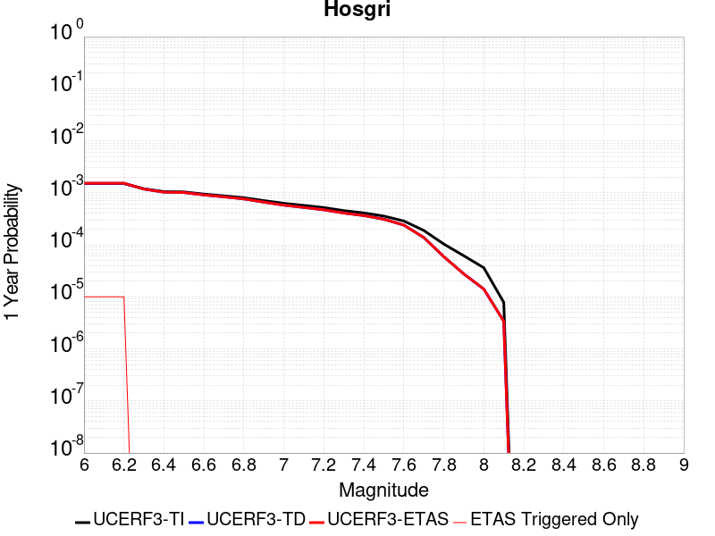 |  |

| Magnitude | 1 wk TI Prob | 1 wk TD Prob | 1 wk ETAS Prob | 1 wk ETAS/TD Gain | 1 wk ETAS Triggered Only | 1 mo TI Prob | 1 mo TD Prob | 1 mo ETAS Prob | 1 mo ETAS/TD Gain | 1 mo ETAS Triggered Only | 1 yr TI Prob | 1 yr TD Prob | 1 yr ETAS Prob | 1 yr ETAS/TD Gain | 1 yr ETAS Triggered Only | 10 yr TI Prob | 10 yr TD Prob | 10 yr ETAS Prob | 10 yr ETAS/TD Gain | 10 yr ETAS Triggered Only |
|-----|-----|-----|-----|-----|-----|-----|-----|-----|-----|-----|-----|-----|-----|-----|-----|-----|-----|-----|-----|-----|
| 6.0 | 2.883978E-5 | 2.9128829E-5 | 2.9128829E-5 | 1.0 | 0.0 | 1.235932E-4 | 1.2483202E-4 | 1.3483077E-4 | 1.0800977 | 1.0E-5 | 0.0015037085 | 0.0015187975 | 0.0015287822 | 1.0065742 | 1.0E-5 | 0.01493574 | 0.015087952 | 0.015097801 | 1.0006528 | 1.0E-5 |
| 6.1 | 2.883978E-5 | 2.9128829E-5 | 2.9128829E-5 | 1.0 | 0.0 | 1.235932E-4 | 1.2483202E-4 | 1.3483077E-4 | 1.0800977 | 1.0E-5 | 0.0015037085 | 0.0015187975 | 0.0015287822 | 1.0065742 | 1.0E-5 | 0.01493574 | 0.015087952 | 0.015097801 | 1.0006528 | 1.0E-5 |
| 6.2 | 2.883978E-5 | 2.9128829E-5 | 2.9128829E-5 | 1.0 | 0.0 | 1.235932E-4 | 1.2483202E-4 | 1.3483077E-4 | 1.0800977 | 1.0E-5 | 0.0015037085 | 0.0015187975 | 0.0015287822 | 1.0065742 | 1.0E-5 | 0.01493574 | 0.015087952 | 0.015097801 | 1.0006528 | 1.0E-5 |
| 6.3 | 2.2914428E-5 | 2.26423E-5 | 2.26423E-5 | 1.0 | 0.0 | 9.8200995E-5 | 9.703485E-5 | 9.703485E-5 | 1.0 | 0.0 | 0.0011949413 | 0.0011807639 | 0.0011807639 | 1.0 | 0.0 | 0.011885363 | 0.011746303 | 0.011746303 | 1.0 | 0.0 |
| 6.4 | 2.0195741E-5 | 1.9696858E-5 | 1.9696858E-5 | 1.0 | 0.0 | 8.65503E-5 | 8.4412386E-5 | 8.4412386E-5 | 1.0 | 0.0 | 0.0010532405 | 0.0010272382 | 0.0010272382 | 1.0 | 0.0 | 0.010482626 | 0.010225947 | 0.010225947 | 1.0 | 0.0 |
| 6.5 | 1.9924333E-5 | 1.9409275E-5 | 1.9409275E-5 | 1.0 | 0.0 | 8.53872E-5 | 8.317997E-5 | 8.317997E-5 | 1.0 | 0.0 | 0.0010390934 | 0.0010122475 | 0.0010122475 | 1.0 | 0.0 | 0.010342481 | 0.010077406 | 0.010077406 | 1.0 | 0.0 |
| 6.6 | 1.809694E-5 | 1.7458577E-5 | 1.7458577E-5 | 1.0 | 0.0 | 7.7556004E-5 | 7.482033E-5 | 7.482033E-5 | 1.0 | 0.0 | 9.438353E-4 | 9.1055816E-4 | 9.1055816E-4 | 1.0 | 0.0 | 0.009398366 | 0.009069216 | 0.009069216 | 1.0 | 0.0 |
| 6.7 | 1.675989E-5 | 1.6043028E-5 | 1.6043028E-5 | 1.0 | 0.0 | 7.182612E-5 | 6.875403E-5 | 6.875403E-5 | 1.0 | 0.0 | 8.7413215E-4 | 8.3676E-4 | 8.3676E-4 | 1.0 | 0.0 | 0.008707017 | 0.008337 | 0.008337 | 1.0 | 0.0 |
| 6.8 | 1.5401129E-5 | 1.4614334E-5 | 1.4614334E-5 | 1.0 | 0.0 | 6.6003166E-5 | 6.263136E-5 | 6.263136E-5 | 1.0 | 0.0 | 8.032922E-4 | 7.622709E-4 | 7.622709E-4 | 1.0 | 0.0 | 0.008003947 | 0.0075974264 | 0.0075974264 | 1.0 | 0.0 |
| 6.9 | 1.356559E-5 | 1.2690202E-5 | 1.2690202E-5 | 1.0 | 0.0 | 5.8136946E-5 | 5.4385448E-5 | 5.4385448E-5 | 1.0 | 0.0 | 7.0758746E-4 | 6.619421E-4 | 6.619421E-4 | 1.0 | 0.0 | 0.007053386 | 0.00660051 | 0.00660051 | 1.0 | 0.0 |
| 7.0 | 1.2030819E-5 | 1.1096183E-5 | 1.1096183E-5 | 1.0 | 0.0 | 5.155963E-5 | 4.75542E-5 | 4.75542E-5 | 1.0 | 0.0 | 6.275577E-4 | 5.788187E-4 | 5.788187E-4 | 1.0 | 0.0 | 0.006257884 | 0.005773872 | 0.005773872 | 1.0 | 0.0 |
| 7.1 | 1.0972698E-5 | 1.0022392E-5 | 1.0022392E-5 | 1.0 | 0.0 | 4.7025E-5 | 4.29524E-5 | 4.29524E-5 | 1.0 | 0.0 | 5.72379E-4 | 5.228201E-4 | 5.228201E-4 | 1.0 | 0.0 | 0.0057090693 | 0.005216653 | 0.005216653 | 1.0 | 0.0 |
| 7.2 | 9.961926E-6 | 9.034952E-6 | 9.034952E-6 | 1.0 | 0.0 | 4.2693267E-5 | 3.872065E-5 | 3.872065E-5 | 1.0 | 0.0 | 5.1966653E-4 | 4.7132198E-4 | 4.7132198E-4 | 1.0 | 0.0 | 0.00518453 | 0.00470397 | 0.00470397 | 1.0 | 0.0 |
| 7.3 | 8.700929E-6 | 7.828299E-6 | 7.828299E-6 | 1.0 | 0.0 | 3.7289166E-5 | 3.3549422E-5 | 3.3549422E-5 | 1.0 | 0.0 | 4.53901E-4 | 4.0838768E-4 | 4.0838768E-4 | 1.0 | 0.0 | 0.00452975 | 0.0040771114 | 0.0040771114 | 1.0 | 0.0 |
| 7.4 | 7.866285E-6 | 6.998933E-6 | 6.998933E-6 | 1.0 | 0.0 | 3.3712215E-5 | 2.999508E-5 | 2.999508E-5 | 1.0 | 0.0 | 4.103689E-4 | 3.6512894E-4 | 3.6512894E-4 | 1.0 | 0.0 | 0.004096119 | 0.0036460275 | 0.0036460275 | 1.0 | 0.0 |
| 7.5 | 6.8381305E-6 | 5.959883E-6 | 5.959883E-6 | 1.0 | 0.0 | 2.9305946E-5 | 2.5542106E-5 | 2.5542106E-5 | 1.0 | 0.0 | 3.5674145E-4 | 3.1093077E-4 | 3.1093077E-4 | 1.0 | 0.0 | 0.0035616932 | 0.0031056926 | 0.0031056926 | 1.0 | 0.0 |
| 7.6 | 5.503376E-6 | 4.5954234E-6 | 4.5954234E-6 | 1.0 | 0.0 | 2.3585684E-5 | 1.9694522E-5 | 1.9694522E-5 | 1.0 | 0.0 | 2.8711787E-4 | 2.3975444E-4 | 2.3975444E-4 | 1.0 | 0.0 | 0.002867472 | 0.002395691 | 0.002395691 | 1.0 | 0.0 |
| 7.7 | 3.6144982E-6 | 2.6523774E-6 | 2.6523774E-6 | 1.0 | 0.0 | 1.5490614E-5 | 1.1367281E-5 | 1.1367281E-5 | 1.0 | 0.0 | 1.8858191E-4 | 1.3838787E-4 | 1.3838787E-4 | 1.0 | 0.0 | 0.0018842196 | 0.0013837481 | 0.0013837481 | 1.0 | 0.0 |
| 7.8 | 1.9853494E-6 | 1.1362536E-6 | 1.1362536E-6 | 1.0 | 0.0 | 8.508612E-6 | 4.8696493E-6 | 4.8696493E-6 | 1.0 | 0.0 | 1.0358743E-4 | 5.9286365E-5 | 5.9286365E-5 | 1.0 | 0.0 | 0.0010353916 | 5.934354E-4 | 5.934354E-4 | 1.0 | 0.0 |
| 7.9 | 1.1818757E-6 | 5.2963003E-7 | 5.2963003E-7 | 1.0 | 0.0 | 5.0651715E-6 | 2.269841E-6 | 2.269841E-6 | 1.0 | 0.0 | 6.1666724E-5 | 2.7634964E-5 | 2.7634964E-5 | 1.0 | 0.0 | 6.1649614E-4 | 2.7700354E-4 | 2.7700354E-4 | 1.0 | 0.0 |
| 8.0 | 6.962958E-7 | 2.7147578E-7 | 2.7147578E-7 | 1.0 | 0.0 | 2.9841215E-6 | 1.163467E-6 | 1.163467E-6 | 1.0 | 0.0 | 3.6331072E-5 | 1.4165119E-5 | 1.4165119E-5 | 1.0 | 0.0 | 3.6325134E-4 | 1.4221264E-4 | 1.4221264E-4 | 1.0 | 0.0 |
| 8.1 | 1.5033264E-7 | 6.529188E-8 | 6.529188E-8 | 1.0 | 0.0 | 6.442826E-7 | 2.798223E-7 | 2.798223E-7 | 1.0 | 0.0 | 7.844113E-6 | 3.4068314E-6 | 3.4068314E-6 | 1.0 | 0.0 | 7.843835E-5 | 3.4085097E-5 | 3.4085097E-5 | 1.0 | 0.0 |

## Hayward (So) extension 2011 CFM
*[(top)](#table-of-contents)*

| 1 Week | 1 Month | 1 Year | 10 Year |
|-----|-----|-----|-----|
|  |  |  | 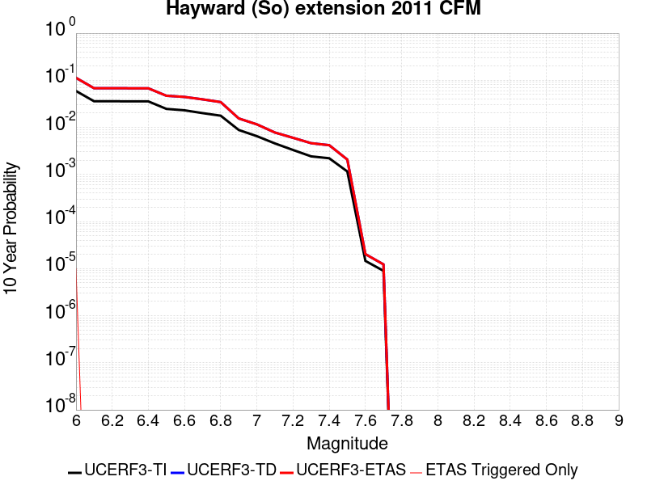 |

| Magnitude | 1 wk TI Prob | 1 wk TD Prob | 1 wk ETAS Prob | 1 wk ETAS/TD Gain | 1 wk ETAS Triggered Only | 1 mo TI Prob | 1 mo TD Prob | 1 mo ETAS Prob | 1 mo ETAS/TD Gain | 1 mo ETAS Triggered Only | 1 yr TI Prob | 1 yr TD Prob | 1 yr ETAS Prob | 1 yr ETAS/TD Gain | 1 yr ETAS Triggered Only | 10 yr TI Prob | 10 yr TD Prob | 10 yr ETAS Prob | 10 yr ETAS/TD Gain | 10 yr ETAS Triggered Only |
|-----|-----|-----|-----|-----|-----|-----|-----|-----|-----|-----|-----|-----|-----|-----|-----|-----|-----|-----|-----|-----|
| 6.0 | 1.1721256E-4 | 2.363781E-4 | 2.363781E-4 | 1.0 | 0.0 | 5.022428E-4 | 0.0010123947 | 0.0010123947 | 1.0 | 0.0 | 0.0060976758 | 0.012248728 | 0.012258606 | 1.0008065 | 1.0E-5 | 0.0593305 | 0.11284924 | 0.11285812 | 1.0000786 | 1.0E-5 |
| 6.1 | 6.99169E-5 | 1.3800772E-4 | 1.3800772E-4 | 1.0 | 0.0 | 2.9960944E-4 | 5.910222E-4 | 5.910222E-4 | 1.0 | 0.0 | 0.0036416445 | 0.0071723694 | 0.0071723694 | 1.0 | 0.0 | 0.035825435 | 0.067808375 | 0.067808375 | 1.0 | 0.0 |
| 6.2 | 6.99169E-5 | 1.3800772E-4 | 1.3800772E-4 | 1.0 | 0.0 | 2.9960944E-4 | 5.910222E-4 | 5.910222E-4 | 1.0 | 0.0 | 0.0036416445 | 0.0071723694 | 0.0071723694 | 1.0 | 0.0 | 0.035825435 | 0.067808375 | 0.067808375 | 1.0 | 0.0 |
| 6.3 | 6.970908E-5 | 1.3768923E-4 | 1.3768923E-4 | 1.0 | 0.0 | 2.9871898E-4 | 5.896579E-4 | 5.896579E-4 | 1.0 | 0.0 | 0.0036308395 | 0.0071559055 | 0.0071559055 | 1.0 | 0.0 | 0.035720866 | 0.06765734 | 0.06765734 | 1.0 | 0.0 |
| 6.4 | 6.9517155E-5 | 1.3735797E-4 | 1.3735797E-4 | 1.0 | 0.0 | 2.9789665E-4 | 5.882389E-4 | 5.882389E-4 | 1.0 | 0.0 | 0.0036208609 | 0.007138817 | 0.007138817 | 1.0 | 0.0 | 0.03562429 | 0.06750137 | 0.06750137 | 1.0 | 0.0 |
| 6.5 | 4.786248E-5 | 9.415959E-5 | 9.415959E-5 | 1.0 | 0.0 | 2.0510878E-4 | 4.0348133E-4 | 4.0348133E-4 | 1.0 | 0.0 | 0.0024943394 | 0.004901734 | 0.004901734 | 1.0 | 0.0 | 0.02466527 | 0.046906155 | 0.046906155 | 1.0 | 0.0 |
| 6.6 | 4.4662214E-5 | 8.882604E-5 | 8.882604E-5 | 1.0 | 0.0 | 1.9139545E-4 | 3.8063008E-4 | 3.8063008E-4 | 1.0 | 0.0 | 0.0023277493 | 0.004624787 | 0.004624787 | 1.0 | 0.0 | 0.02303517 | 0.044297572 | 0.044297572 | 1.0 | 0.0 |
| 6.7 | 3.884542E-5 | 7.865713E-5 | 7.865713E-5 | 1.0 | 0.0 | 1.6646975E-4 | 3.3706092E-4 | 3.3706092E-4 | 1.0 | 0.0 | 0.002024885 | 0.0040964396 | 0.0040964396 | 1.0 | 0.0 | 0.020065336 | 0.03933719 | 0.03933719 | 1.0 | 0.0 |
| 6.8 | 3.4221863E-5 | 6.856472E-5 | 6.856472E-5 | 1.0 | 0.0 | 1.4665688E-4 | 2.9381807E-4 | 2.9381807E-4 | 1.0 | 0.0 | 0.0017840851 | 0.0035717883 | 0.0035717883 | 1.0 | 0.0 | 0.017698295 | 0.034424704 | 0.034424704 | 1.0 | 0.0 |
| 6.9 | 1.6927712E-5 | 3.0066385E-5 | 3.0066385E-5 | 1.0 | 0.0 | 7.2545314E-5 | 1.2884989E-4 | 1.2884989E-4 | 1.0 | 0.0 | 8.828813E-4 | 0.0015676755 | 0.0015676755 | 1.0 | 0.0 | 0.008793819 | 0.015465583 | 0.015465583 | 1.0 | 0.0 |
| 7.0 | 1.2509653E-5 | 2.2467022E-5 | 2.2467022E-5 | 1.0 | 0.0 | 5.3611697E-5 | 9.628393E-5 | 9.628393E-5 | 1.0 | 0.0 | 6.525269E-4 | 0.0011716705 | 0.0011716705 | 1.0 | 0.0 | 0.0065061417 | 0.0115844635 | 0.0115844635 | 1.0 | 0.0 |
| 7.1 | 8.751583E-6 | 1.4929308E-5 | 1.4929308E-5 | 1.0 | 0.0 | 3.750624E-5 | 6.398121E-5 | 6.398121E-5 | 1.0 | 0.0 | 4.5654282E-4 | 7.786987E-4 | 7.786987E-4 | 1.0 | 0.0 | 0.0045560603 | 0.0077653006 | 0.0077653006 | 1.0 | 0.0 |
| 7.2 | 6.354379E-6 | 1.1502135E-5 | 1.1502135E-5 | 1.0 | 0.0 | 2.7232769E-5 | 4.9293958E-5 | 4.9293958E-5 | 1.0 | 0.0 | 3.3150852E-4 | 5.999935E-4 | 5.999935E-4 | 1.0 | 0.0 | 0.0033101442 | 0.0060020364 | 0.0060020364 | 1.0 | 0.0 |
| 7.3 | 4.645554E-6 | 8.821418E-6 | 8.821418E-6 | 1.0 | 0.0 | 1.9909365E-5 | 3.7805556E-5 | 3.7805556E-5 | 1.0 | 0.0 | 2.4236954E-4 | 4.6018933E-4 | 4.6018933E-4 | 1.0 | 0.0 | 0.0024210536 | 0.0046123224 | 0.0046123224 | 1.0 | 0.0 |
| 7.4 | 4.23437E-6 | 7.99567E-6 | 7.99567E-6 | 1.0 | 0.0 | 1.8147173E-5 | 3.4266726E-5 | 3.4266726E-5 | 1.0 | 0.0 | 2.2091944E-4 | 4.171214E-4 | 4.171214E-4 | 1.0 | 0.0 | 0.0022069993 | 0.004183535 | 0.004183535 | 1.0 | 0.0 |
| 7.5 | 2.2187417E-6 | 3.9527254E-6 | 3.9527254E-6 | 1.0 | 0.0 | 9.508858E-6 | 1.6940156E-5 | 1.6940156E-5 | 1.0 | 0.0 | 1.157642E-4 | 2.0622948E-4 | 2.0622948E-4 | 1.0 | 0.0 | 0.0011570391 | 0.0020737252 | 0.0020737252 | 1.0 | 0.0 |
| 7.6 | 2.7952495E-8 | 3.8797385E-8 | 3.8797385E-8 | 1.0 | 0.0 | 1.1979641E-7 | 1.6627449E-7 | 1.6627449E-7 | 1.0 | 0.0 | 1.4585203E-6 | 2.0243901E-6 | 2.0243901E-6 | 1.0 | 0.0 | 1.4585107E-5 | 2.0334499E-5 | 2.0334499E-5 | 1.0 | 0.0 |
| 7.7 | 1.7192724E-8 | 2.3447157E-8 | 2.3447157E-8 | 1.0 | 0.0 | 7.36831E-8 | 1.0048782E-7 | 1.0048782E-7 | 1.0 | 0.0 | 8.9709135E-7 | 1.2234385E-6 | 1.2234385E-6 | 1.0 | 0.0 | 8.970877E-6 | 1.2302498E-5 | 1.2302498E-5 | 1.0 | 0.0 |

## Hayward (No) 2011 CFM
*[(top)](#table-of-contents)*

| 1 Week | 1 Month | 1 Year | 10 Year |
|-----|-----|-----|-----|
|  |  |  | 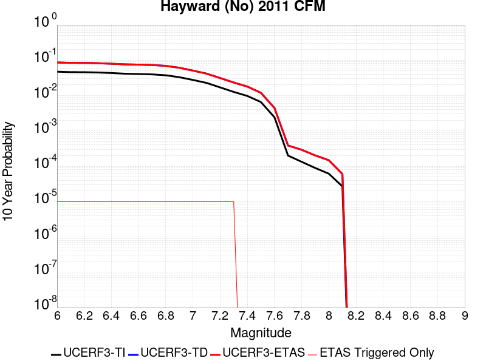 |

| Magnitude | 1 wk TI Prob | 1 wk TD Prob | 1 wk ETAS Prob | 1 wk ETAS/TD Gain | 1 wk ETAS Triggered Only | 1 mo TI Prob | 1 mo TD Prob | 1 mo ETAS Prob | 1 mo ETAS/TD Gain | 1 mo ETAS Triggered Only | 1 yr TI Prob | 1 yr TD Prob | 1 yr ETAS Prob | 1 yr ETAS/TD Gain | 1 yr ETAS Triggered Only | 10 yr TI Prob | 10 yr TD Prob | 10 yr ETAS Prob | 10 yr ETAS/TD Gain | 10 yr ETAS Triggered Only |
|-----|-----|-----|-----|-----|-----|-----|-----|-----|-----|-----|-----|-----|-----|-----|-----|-----|-----|-----|-----|-----|
| 6.0 | 9.3068506E-5 | 1.7397478E-4 | 1.7397478E-4 | 1.0 | 0.0 | 3.9880406E-4 | 7.453825E-4 | 7.453825E-4 | 1.0 | 0.0 | 0.0048446343 | 0.009037196 | 0.009047105 | 1.0010965 | 1.0E-5 | 0.047403704 | 0.08638188 | 0.08639102 | 1.0001057 | 1.0E-5 |
| 6.1 | 9.055486E-5 | 1.6948568E-4 | 1.6948568E-4 | 1.0 | 0.0 | 3.880345E-4 | 7.261632E-4 | 7.261632E-4 | 1.0 | 0.0 | 0.0047140904 | 0.008805285 | 0.008815197 | 1.0011257 | 1.0E-5 | 0.046153355 | 0.08427502 | 0.08428418 | 1.0001086 | 1.0E-5 |
| 6.2 | 9.006742E-5 | 1.686916E-4 | 1.686916E-4 | 1.0 | 0.0 | 3.859461E-4 | 7.2276185E-4 | 7.2276185E-4 | 1.0 | 0.0 | 0.0046887742 | 0.008764258 | 0.008774171 | 1.0011309 | 1.0E-5 | 0.0459107 | 0.083899245 | 0.08390841 | 1.0001092 | 1.0E-5 |
| 6.3 | 8.8336754E-5 | 1.6548682E-4 | 1.6548682E-4 | 1.0 | 0.0 | 3.7853114E-4 | 7.090373E-4 | 7.090373E-4 | 1.0 | 0.0 | 0.004598882 | 0.00859853 | 0.008608444 | 1.001153 | 1.0E-5 | 0.04504866 | 0.08239243 | 0.08240161 | 1.0001113 | 1.0E-5 |
| 6.4 | 8.526157E-5 | 1.5975675E-4 | 1.5975675E-4 | 1.0 | 0.0 | 3.6535555E-4 | 6.844929E-4 | 6.844929E-4 | 1.0 | 0.0 | 0.0044391346 | 0.008302015 | 0.008311932 | 1.0011945 | 1.0E-5 | 0.043514993 | 0.079689264 | 0.079698466 | 1.0001155 | 1.0E-5 |
| 6.5 | 8.152396E-5 | 1.5308043E-4 | 1.5308043E-4 | 1.0 | 0.0 | 3.493416E-4 | 6.5589475E-4 | 6.5589475E-4 | 1.0 | 0.0 | 0.0042449418 | 0.007956429 | 0.00796635 | 1.0012468 | 1.0E-5 | 0.04164765 | 0.076520085 | 0.07652932 | 1.0001206 | 1.0E-5 |
| 6.6 | 7.987405E-5 | 1.5012249E-4 | 1.5012249E-4 | 1.0 | 0.0 | 3.4227243E-4 | 6.4322416E-4 | 6.4322416E-4 | 1.0 | 0.0 | 0.0041592065 | 0.0078032906 | 0.007813212 | 1.0012715 | 1.0E-5 | 0.04082218 | 0.0751126 | 0.07512185 | 1.0001231 | 1.0E-5 |
| 6.7 | 7.777665E-5 | 1.4651503E-4 | 1.4651503E-4 | 1.0 | 0.0 | 3.332859E-4 | 6.277711E-4 | 6.277711E-4 | 1.0 | 0.0 | 0.004050208 | 0.007616483 | 0.007626407 | 1.001303 | 1.0E-5 | 0.039771806 | 0.073388964 | 0.07339823 | 1.0001262 | 1.0E-5 |
| 6.8 | 7.3284005E-5 | 1.3802089E-4 | 1.3802089E-4 | 1.0 | 0.0 | 3.140365E-4 | 5.913846E-4 | 5.913846E-4 | 1.0 | 0.0 | 0.0038166929 | 0.0071764747 | 0.0071864026 | 1.0013834 | 1.0E-5 | 0.037518036 | 0.06930231 | 0.06931162 | 1.0001343 | 1.0E-5 |
| 6.9 | 6.458263E-5 | 1.2132651E-4 | 1.2132651E-4 | 1.0 | 0.0 | 2.7675333E-4 | 5.1986764E-4 | 5.1986764E-4 | 1.0 | 0.0 | 0.0033642664 | 0.0063111205 | 0.0063210577 | 1.0015745 | 1.0E-5 | 0.033137884 | 0.061230626 | 0.061240014 | 1.0001533 | 1.0E-5 |
| 7.0 | 5.3853604E-5 | 1.002612E-4 | 1.002612E-4 | 1.0 | 0.0 | 2.3078074E-4 | 4.2962038E-4 | 4.2962038E-4 | 1.0 | 0.0 | 0.0028061352 | 0.0052181478 | 0.0052280957 | 1.0019064 | 1.0E-5 | 0.027709642 | 0.05096286 | 0.05097235 | 1.0001862 | 1.0E-5 |
| 7.1 | 4.4308683E-5 | 8.171591E-5 | 8.171591E-5 | 1.0 | 0.0 | 1.8988053E-4 | 3.5016425E-4 | 3.5016425E-4 | 1.0 | 0.0 | 0.0023093442 | 0.004254957 | 0.0042649144 | 1.0023402 | 1.0E-5 | 0.022854926 | 0.04182932 | 0.041838903 | 1.0002291 | 1.0E-5 |
| 7.2 | 3.295973E-5 | 6.0780003E-5 | 6.0780003E-5 | 1.0 | 0.0 | 1.4124835E-4 | 2.6045984E-4 | 2.6045984E-4 | 1.0 | 0.0 | 0.0017183421 | 0.0031665103 | 0.0031764787 | 1.0031481 | 1.0E-5 | 0.017051157 | 0.031374145 | 0.03138383 | 1.0003088 | 1.0E-5 |
| 7.3 | 2.452256E-5 | 4.5188142E-5 | 4.5188142E-5 | 1.0 | 0.0 | 1.05092455E-4 | 1.9364918E-4 | 1.9364918E-4 | 1.0 | 0.0 | 0.0012787496 | 0.0023551432 | 0.0023651195 | 1.004236 | 1.0E-5 | 0.0127141625 | 0.023444904 | 0.02345467 | 1.0004165 | 1.0E-5 |
| 7.4 | 1.8829967E-5 | 3.460924E-5 | 3.460924E-5 | 1.0 | 0.0 | 8.069736E-5 | 1.4831693E-4 | 1.4831693E-4 | 1.0 | 0.0 | 9.820475E-4 | 0.0018042729 | 0.0018042729 | 1.0 | 0.0 | 0.009777189 | 0.018022776 | 0.018022776 | 1.0 | 0.0 |
| 7.5 | 1.26374125E-5 | 2.292422E-5 | 2.292422E-5 | 1.0 | 0.0 | 5.4159216E-5 | 9.8242985E-5 | 9.8242985E-5 | 1.0 | 0.0 | 6.5918895E-4 | 0.0011954579 | 0.0011954579 | 1.0 | 0.0 | 0.00657237 | 0.011990363 | 0.011990363 | 1.0 | 0.0 |
| 7.6 | 4.666429E-6 | 8.48047E-6 | 8.48047E-6 | 1.0 | 0.0 | 1.9998828E-5 | 3.634437E-5 | 3.634437E-5 | 1.0 | 0.0 | 2.4345852E-4 | 4.424041E-4 | 4.424041E-4 | 1.0 | 0.0 | 0.0024319198 | 0.0044597466 | 0.0044597466 | 1.0 | 0.0 |
| 7.7 | 3.8399318E-7 | 7.136995E-7 | 7.136995E-7 | 1.0 | 0.0 | 1.6456839E-6 | 3.0587082E-6 | 3.0587082E-6 | 1.0 | 0.0 | 2.003602E-5 | 3.723914E-5 | 3.723914E-5 | 1.0 | 0.0 | 2.0034213E-4 | 3.8630242E-4 | 3.8630242E-4 | 1.0 | 0.0 |
| 7.8 | 2.5637698E-7 | 5.3688825E-7 | 5.3688825E-7 | 1.0 | 0.0 | 1.098758E-6 | 2.3009477E-6 | 2.3009477E-6 | 1.0 | 0.0 | 1.3377297E-5 | 2.801368E-5 | 2.801368E-5 | 1.0 | 0.0 | 1.3376492E-4 | 2.9257344E-4 | 2.9257344E-4 | 1.0 | 0.0 |
| 7.9 | 1.7141245E-7 | 3.7309206E-7 | 3.7309206E-7 | 1.0 | 0.0 | 7.3462456E-7 | 1.5989649E-6 | 1.5989649E-6 | 1.0 | 0.0 | 8.944017E-6 | 1.9467225E-5 | 1.9467225E-5 | 1.0 | 0.0 | 8.943657E-5 | 2.0254472E-4 | 2.0254472E-4 | 1.0 | 0.0 |
| 8.0 | 1.1808895E-7 | 2.7523066E-7 | 2.7523066E-7 | 1.0 | 0.0 | 5.060954E-7 | 1.1795595E-6 | 1.1795595E-6 | 1.0 | 0.0 | 6.161694E-6 | 1.4361042E-5 | 1.4361042E-5 | 1.0 | 0.0 | 6.161523E-5 | 1.4822849E-4 | 1.4822849E-4 | 1.0 | 0.0 |
| 8.1 | 5.138535E-8 | 1.1235469E-7 | 1.1235469E-7 | 1.0 | 0.0 | 2.2022292E-7 | 4.8152003E-7 | 4.8152003E-7 | 1.0 | 0.0 | 2.6812106E-6 | 5.8624905E-6 | 5.8624905E-6 | 1.0 | 0.0 | 2.6811784E-5 | 6.018607E-5 | 6.018607E-5 | 1.0 | 0.0 |

## San Luis Range 2011 CFM
*[(top)](#table-of-contents)*

| 1 Week | 1 Month | 1 Year | 10 Year |
|-----|-----|-----|-----|
|  |  | 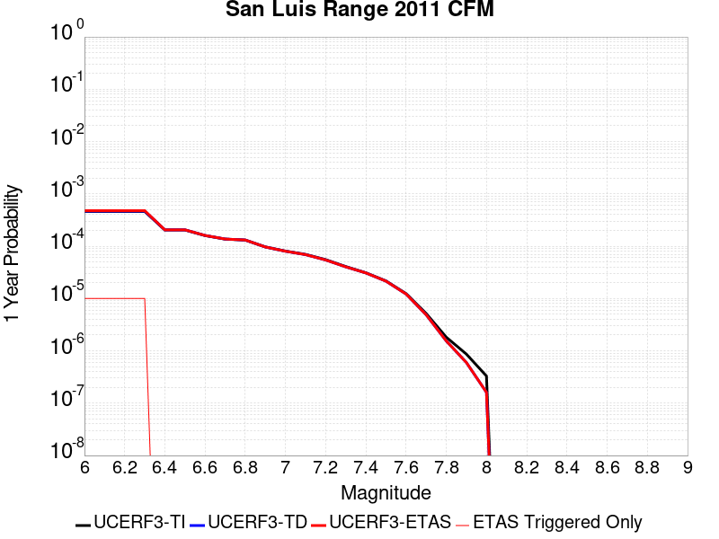 |  |

| Magnitude | 1 wk TI Prob | 1 wk TD Prob | 1 wk ETAS Prob | 1 wk ETAS/TD Gain | 1 wk ETAS Triggered Only | 1 mo TI Prob | 1 mo TD Prob | 1 mo ETAS Prob | 1 mo ETAS/TD Gain | 1 mo ETAS Triggered Only | 1 yr TI Prob | 1 yr TD Prob | 1 yr ETAS Prob | 1 yr ETAS/TD Gain | 1 yr ETAS Triggered Only | 10 yr TI Prob | 10 yr TD Prob | 10 yr ETAS Prob | 10 yr ETAS/TD Gain | 10 yr ETAS Triggered Only |
|-----|-----|-----|-----|-----|-----|-----|-----|-----|-----|-----|-----|-----|-----|-----|-----|-----|-----|-----|-----|-----|
| 6.0 | 8.8368415E-6 | 8.965477E-6 | 8.965477E-6 | 1.0 | 0.0 | 3.787163E-5 | 3.8422953E-5 | 3.8422953E-5 | 1.0 | 0.0 | 4.609895E-4 | 4.677069E-4 | 4.7770224E-4 | 1.0213709 | 1.0E-5 | 0.0046003438 | 0.0046680085 | 0.0046779616 | 1.0021323 | 1.0E-5 |
| 6.1 | 8.8368415E-6 | 8.965477E-6 | 8.965477E-6 | 1.0 | 0.0 | 3.787163E-5 | 3.8422953E-5 | 3.8422953E-5 | 1.0 | 0.0 | 4.609895E-4 | 4.677069E-4 | 4.7770224E-4 | 1.0213709 | 1.0E-5 | 0.0046003438 | 0.0046680085 | 0.0046779616 | 1.0021323 | 1.0E-5 |
| 6.2 | 8.8368415E-6 | 8.965477E-6 | 8.965477E-6 | 1.0 | 0.0 | 3.787163E-5 | 3.8422953E-5 | 3.8422953E-5 | 1.0 | 0.0 | 4.609895E-4 | 4.677069E-4 | 4.7770224E-4 | 1.0213709 | 1.0E-5 | 0.0046003438 | 0.0046680085 | 0.0046779616 | 1.0021323 | 1.0E-5 |
| 6.3 | 8.8368415E-6 | 8.965477E-6 | 8.965477E-6 | 1.0 | 0.0 | 3.787163E-5 | 3.8422953E-5 | 3.8422953E-5 | 1.0 | 0.0 | 4.609895E-4 | 4.677069E-4 | 4.7770224E-4 | 1.0213709 | 1.0E-5 | 0.0046003438 | 0.0046680085 | 0.0046779616 | 1.0021323 | 1.0E-5 |
| 6.4 | 3.9094193E-6 | 3.941213E-6 | 3.941213E-6 | 1.0 | 0.0 | 1.6754546E-5 | 1.6890806E-5 | 1.6890806E-5 | 1.0 | 0.0 | 2.039675E-4 | 2.0562643E-4 | 2.0562643E-4 | 1.0 | 0.0 | 0.0020378039 | 0.0020543905 | 0.0020543905 | 1.0 | 0.0 |
| 6.5 | 3.9094193E-6 | 3.941213E-6 | 3.941213E-6 | 1.0 | 0.0 | 1.6754546E-5 | 1.6890806E-5 | 1.6890806E-5 | 1.0 | 0.0 | 2.039675E-4 | 2.0562643E-4 | 2.0562643E-4 | 1.0 | 0.0 | 0.0020378039 | 0.0020543905 | 0.0020543905 | 1.0 | 0.0 |
| 6.6 | 3.0587726E-6 | 3.0753965E-6 | 3.0753965E-6 | 1.0 | 0.0 | 1.3108959E-5 | 1.3180205E-5 | 1.3180205E-5 | 1.0 | 0.0 | 1.595899E-4 | 1.604573E-4 | 1.604573E-4 | 1.0 | 0.0 | 0.0015947534 | 0.0016034264 | 0.0016034264 | 1.0 | 0.0 |
| 6.7 | 2.6160574E-6 | 2.6251346E-6 | 2.6251346E-6 | 1.0 | 0.0 | 1.1211626E-5 | 1.1250529E-5 | 1.1250529E-5 | 1.0 | 0.0 | 1.3649299E-4 | 1.3696664E-4 | 1.3696664E-4 | 1.0 | 0.0 | 0.0013640919 | 0.0013688284 | 0.0013688284 | 1.0 | 0.0 |
| 6.8 | 2.5110312E-6 | 2.5181473E-6 | 2.5181473E-6 | 1.0 | 0.0 | 1.0761518E-5 | 1.0792015E-5 | 1.0792015E-5 | 1.0 | 0.0 | 1.310136E-4 | 1.3138492E-4 | 1.3138492E-4 | 1.0 | 0.0 | 0.0013093639 | 0.0013130783 | 0.0013130783 | 1.0 | 0.0 |
| 6.9 | 1.8564405E-6 | 1.8524926E-6 | 1.8524926E-6 | 1.0 | 0.0 | 7.95615E-6 | 7.93923E-6 | 7.93923E-6 | 1.0 | 0.0 | 9.686181E-5 | 9.665586E-5 | 9.665586E-5 | 1.0 | 0.0 | 9.68196E-4 | 9.661402E-4 | 9.661402E-4 | 1.0 | 0.0 |
| 7.0 | 1.546127E-6 | 1.5369586E-6 | 1.5369586E-6 | 1.0 | 0.0 | 6.626242E-6 | 6.586949E-6 | 6.586949E-6 | 1.0 | 0.0 | 8.06715E-5 | 8.019316E-5 | 8.019316E-5 | 1.0 | 0.0 | 8.0642226E-4 | 8.016429E-4 | 8.016429E-4 | 1.0 | 0.0 |
| 7.1 | 1.3368208E-6 | 1.3235369E-6 | 1.3235369E-6 | 1.0 | 0.0 | 5.7292195E-6 | 5.672289E-6 | 5.672289E-6 | 1.0 | 0.0 | 6.975101E-5 | 6.905793E-5 | 6.905793E-5 | 1.0 | 0.0 | 6.972912E-4 | 6.903652E-4 | 6.903652E-4 | 1.0 | 0.0 |
| 7.2 | 1.0623363E-6 | 1.0454403E-6 | 1.0454403E-6 | 1.0 | 0.0 | 4.5528623E-6 | 4.480451E-6 | 4.480451E-6 | 1.0 | 0.0 | 5.5429686E-5 | 5.4548127E-5 | 5.4548127E-5 | 1.0 | 0.0 | 5.5415864E-4 | 5.4534763E-4 | 5.4534763E-4 | 1.0 | 0.0 |
| 7.3 | 7.831679E-7 | 7.7274194E-7 | 7.7274194E-7 | 1.0 | 0.0 | 3.3564295E-6 | 3.311747E-6 | 3.311747E-6 | 1.0 | 0.0 | 4.086376E-5 | 4.0319774E-5 | 4.0319774E-5 | 1.0 | 0.0 | 4.0856248E-4 | 4.0312472E-4 | 4.0312472E-4 | 1.0 | 0.0 |
| 7.4 | 5.9558846E-7 | 5.91066E-7 | 5.91066E-7 | 1.0 | 0.0 | 2.5525194E-6 | 2.5331376E-6 | 2.5331376E-6 | 1.0 | 0.0 | 3.107648E-5 | 3.0840514E-5 | 3.0840514E-5 | 1.0 | 0.0 | 3.1072134E-4 | 3.0836245E-4 | 3.0836245E-4 | 1.0 | 0.0 |
| 7.5 | 4.1616502E-7 | 4.1196506E-7 | 4.1196506E-7 | 1.0 | 0.0 | 1.7835631E-6 | 1.7655633E-6 | 1.7655633E-6 | 1.0 | 0.0 | 2.1714664E-5 | 2.1495522E-5 | 2.1495522E-5 | 1.0 | 0.0 | 2.1712543E-4 | 2.1493447E-4 | 2.1493447E-4 | 1.0 | 0.0 |
| 7.6 | 2.3816014E-7 | 2.3376697E-7 | 2.3376697E-7 | 1.0 | 0.0 | 1.0206859E-6 | 1.001858E-6 | 1.001858E-6 | 1.0 | 0.0 | 1.242678E-5 | 1.2197554E-5 | 1.2197554E-5 | 1.0 | 0.0 | 1.2426086E-4 | 1.2196886E-4 | 1.2196886E-4 | 1.0 | 0.0 |
| 7.7 | 9.918777E-8 | 9.386869E-8 | 9.386869E-8 | 1.0 | 0.0 | 4.2509038E-7 | 4.0229432E-7 | 4.0229432E-7 | 1.0 | 0.0 | 5.1754632E-6 | 4.8979223E-6 | 4.8979223E-6 | 1.0 | 0.0 | 5.1753424E-5 | 4.897815E-5 | 4.897815E-5 | 1.0 | 0.0 |
| 7.8 | 3.4982556E-8 | 2.9687454E-8 | 2.9687454E-8 | 1.0 | 0.0 | 1.4992524E-7 | 1.2723194E-7 | 1.2723194E-7 | 1.0 | 0.0 | 1.8253382E-6 | 1.5490477E-6 | 1.5490477E-6 | 1.0 | 0.0 | 1.8253233E-5 | 1.549037E-5 | 1.549037E-5 | 1.0 | 0.0 |
| 7.9 | 1.6624908E-8 | 1.1477859E-8 | 1.1477859E-8 | 1.0 | 0.0 | 7.12496E-8 | 4.919082E-8 | 4.919082E-8 | 1.0 | 0.0 | 8.6746354E-7 | 5.9889805E-7 | 5.9889805E-7 | 1.0 | 0.0 | 8.674601E-6 | 5.988965E-6 | 5.988965E-6 | 1.0 | 0.0 |
| 8.0 | 6.3352315E-9 | 3.0893488E-9 | 3.0893488E-9 | 1.0 | 0.0 | 2.715099E-8 | 1.3240064E-8 | 1.3240064E-8 | 1.0 | 0.0 | 3.3056327E-7 | 1.6119778E-7 | 1.6119778E-7 | 1.0 | 0.0 | 3.3056278E-6 | 1.6119766E-6 | 1.6119766E-6 | 1.0 | 0.0 |

## Robinson Creek
*[(top)](#table-of-contents)*

| 1 Week | 1 Month | 1 Year | 10 Year |
|-----|-----|-----|-----|
|  |  |  |  |

| Magnitude | 1 wk TI Prob | 1 wk TD Prob | 1 wk ETAS Prob | 1 wk ETAS/TD Gain | 1 wk ETAS Triggered Only | 1 mo TI Prob | 1 mo TD Prob | 1 mo ETAS Prob | 1 mo ETAS/TD Gain | 1 mo ETAS Triggered Only | 1 yr TI Prob | 1 yr TD Prob | 1 yr ETAS Prob | 1 yr ETAS/TD Gain | 1 yr ETAS Triggered Only | 10 yr TI Prob | 10 yr TD Prob | 10 yr ETAS Prob | 10 yr ETAS/TD Gain | 10 yr ETAS Triggered Only |
|-----|-----|-----|-----|-----|-----|-----|-----|-----|-----|-----|-----|-----|-----|-----|-----|-----|-----|-----|-----|-----|
| 6.0 | 1.3705327E-5 | 1.5285246E-5 | 1.5285246E-5 | 1.0 | 0.0 | 5.8735794E-5 | 6.5508204E-5 | 6.5508204E-5 | 1.0 | 0.0 | 7.1487366E-4 | 7.9756236E-4 | 7.9756236E-4 | 1.0 | 0.0 | 0.0071257832 | 0.007975623 | 0.007985543 | 1.0012438 | 1.0E-5 |
| 6.1 | 1.3705327E-5 | 1.5285246E-5 | 1.5285246E-5 | 1.0 | 0.0 | 5.8735794E-5 | 6.5508204E-5 | 6.5508204E-5 | 1.0 | 0.0 | 7.1487366E-4 | 7.9756236E-4 | 7.9756236E-4 | 1.0 | 0.0 | 0.0071257832 | 0.007975623 | 0.007985543 | 1.0012438 | 1.0E-5 |
| 6.2 | 1.3705327E-5 | 1.5285246E-5 | 1.5285246E-5 | 1.0 | 0.0 | 5.8735794E-5 | 6.5508204E-5 | 6.5508204E-5 | 1.0 | 0.0 | 7.1487366E-4 | 7.9756236E-4 | 7.9756236E-4 | 1.0 | 0.0 | 0.0071257832 | 0.007975623 | 0.007985543 | 1.0012438 | 1.0E-5 |
| 6.3 | 1.3705327E-5 | 1.5285246E-5 | 1.5285246E-5 | 1.0 | 0.0 | 5.8735794E-5 | 6.5508204E-5 | 6.5508204E-5 | 1.0 | 0.0 | 7.1487366E-4 | 7.9756236E-4 | 7.9756236E-4 | 1.0 | 0.0 | 0.0071257832 | 0.007975623 | 0.007985543 | 1.0012438 | 1.0E-5 |
| 6.4 | 1.3705327E-5 | 1.5285246E-5 | 1.5285246E-5 | 1.0 | 0.0 | 5.8735794E-5 | 6.5508204E-5 | 6.5508204E-5 | 1.0 | 0.0 | 7.1487366E-4 | 7.9756236E-4 | 7.9756236E-4 | 1.0 | 0.0 | 0.0071257832 | 0.007975623 | 0.007985543 | 1.0012438 | 1.0E-5 |

## Lions Head 2011 CFM
*[(top)](#table-of-contents)*

| 1 Week | 1 Month | 1 Year | 10 Year |
|-----|-----|-----|-----|
|  |  | 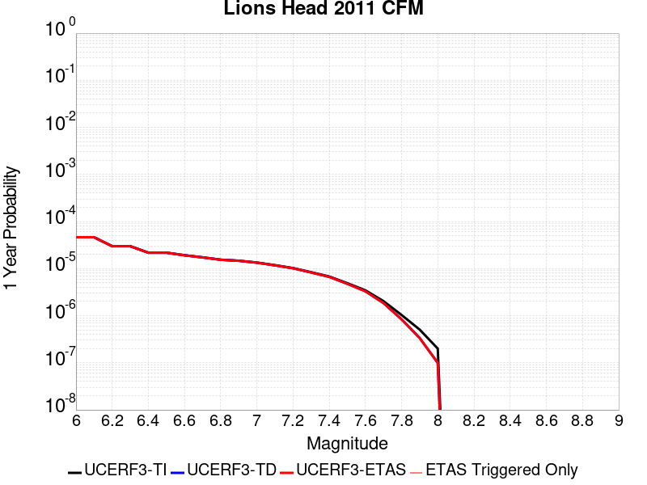 |  |

| Magnitude | 1 wk TI Prob | 1 wk TD Prob | 1 wk ETAS Prob | 1 wk ETAS/TD Gain | 1 wk ETAS Triggered Only | 1 mo TI Prob | 1 mo TD Prob | 1 mo ETAS Prob | 1 mo ETAS/TD Gain | 1 mo ETAS Triggered Only | 1 yr TI Prob | 1 yr TD Prob | 1 yr ETAS Prob | 1 yr ETAS/TD Gain | 1 yr ETAS Triggered Only | 10 yr TI Prob | 10 yr TD Prob | 10 yr ETAS Prob | 10 yr ETAS/TD Gain | 10 yr ETAS Triggered Only |
|-----|-----|-----|-----|-----|-----|-----|-----|-----|-----|-----|-----|-----|-----|-----|-----|-----|-----|-----|-----|-----|
| 6.0 | 8.889363E-7 | 8.8914356E-7 | 8.8914356E-7 | 1.0 | 0.0 | 3.8097214E-6 | 3.81061E-6 | 3.81061E-6 | 1.0 | 0.0 | 4.638237E-5 | 4.6393252E-5 | 4.6393252E-5 | 1.0 | 0.0 | 4.637269E-4 | 4.6384198E-4 | 4.7383734E-4 | 1.0215491 | 1.0E-5 |
| 6.1 | 8.889363E-7 | 8.8914356E-7 | 8.8914356E-7 | 1.0 | 0.0 | 3.8097214E-6 | 3.81061E-6 | 3.81061E-6 | 1.0 | 0.0 | 4.638237E-5 | 4.6393252E-5 | 4.6393252E-5 | 1.0 | 0.0 | 4.637269E-4 | 4.6384198E-4 | 4.7383734E-4 | 1.0215491 | 1.0E-5 |
| 6.2 | 5.7435483E-7 | 5.736081E-7 | 5.736081E-7 | 1.0 | 0.0 | 2.4615185E-6 | 2.458318E-6 | 2.458318E-6 | 1.0 | 0.0 | 2.9968574E-5 | 2.9929626E-5 | 2.9929626E-5 | 1.0 | 0.0 | 2.9964533E-4 | 2.992574E-4 | 2.992574E-4 | 1.0 | 0.0 |
| 6.3 | 5.7435483E-7 | 5.736081E-7 | 5.736081E-7 | 1.0 | 0.0 | 2.4615185E-6 | 2.458318E-6 | 2.458318E-6 | 1.0 | 0.0 | 2.9968574E-5 | 2.9929626E-5 | 2.9929626E-5 | 1.0 | 0.0 | 2.9964533E-4 | 2.992574E-4 | 2.992574E-4 | 1.0 | 0.0 |
| 6.4 | 4.1835764E-7 | 4.1715498E-7 | 4.1715498E-7 | 1.0 | 0.0 | 1.7929601E-6 | 1.7878058E-6 | 1.7878058E-6 | 1.0 | 0.0 | 2.1829072E-5 | 2.176632E-5 | 2.176632E-5 | 1.0 | 0.0 | 2.1826927E-4 | 2.1764213E-4 | 2.1764213E-4 | 1.0 | 0.0 |
| 6.5 | 4.1835764E-7 | 4.1715498E-7 | 4.1715498E-7 | 1.0 | 0.0 | 1.7929601E-6 | 1.7878058E-6 | 1.7878058E-6 | 1.0 | 0.0 | 2.1829072E-5 | 2.176632E-5 | 2.176632E-5 | 1.0 | 0.0 | 2.1826927E-4 | 2.1764213E-4 | 2.1764213E-4 | 1.0 | 0.0 |
| 6.6 | 3.6896213E-7 | 3.6761972E-7 | 3.6761972E-7 | 1.0 | 0.0 | 1.5812653E-6 | 1.5755121E-6 | 1.5755121E-6 | 1.0 | 0.0 | 1.9251736E-5 | 1.9181693E-5 | 1.9181693E-5 | 1.0 | 0.0 | 1.9250068E-4 | 1.918005E-4 | 1.918005E-4 | 1.0 | 0.0 |
| 6.7 | 3.3283942E-7 | 3.313991E-7 | 3.313991E-7 | 1.0 | 0.0 | 1.4264539E-6 | 1.420281E-6 | 1.420281E-6 | 1.0 | 0.0 | 1.7366938E-5 | 1.7291784E-5 | 1.7291784E-5 | 1.0 | 0.0 | 1.736558E-4 | 1.7290446E-4 | 1.7290446E-4 | 1.0 | 0.0 |
| 6.8 | 2.9684807E-7 | 2.9531535E-7 | 2.9531535E-7 | 1.0 | 0.0 | 1.2722054E-6 | 1.2656365E-6 | 1.2656365E-6 | 1.0 | 0.0 | 1.5488991E-5 | 1.5409016E-5 | 1.5409016E-5 | 1.0 | 0.0 | 1.5487912E-4 | 1.540795E-4 | 1.540795E-4 | 1.0 | 0.0 |
| 6.9 | 2.8254823E-7 | 2.8096733E-7 | 2.8096733E-7 | 1.0 | 0.0 | 1.2109203E-6 | 1.2041451E-6 | 1.2041451E-6 | 1.0 | 0.0 | 1.4742856E-5 | 1.4660368E-5 | 1.4660368E-5 | 1.0 | 0.0 | 1.4741877E-4 | 1.4659404E-4 | 1.4659404E-4 | 1.0 | 0.0 |
| 7.0 | 2.5794475E-7 | 2.562723E-7 | 2.562723E-7 | 1.0 | 0.0 | 1.105477E-6 | 1.0983094E-6 | 1.0983094E-6 | 1.0 | 0.0 | 1.34591E-5 | 1.3371835E-5 | 1.3371835E-5 | 1.0 | 0.0 | 1.3458285E-4 | 1.3371033E-4 | 1.3371033E-4 | 1.0 | 0.0 |
| 7.1 | 2.2678832E-7 | 2.2496212E-7 | 2.2496212E-7 | 1.0 | 0.0 | 9.719496E-7 | 9.641229E-7 | 9.641229E-7 | 1.0 | 0.0 | 1.1833421E-5 | 1.1738134E-5 | 1.1738134E-5 | 1.0 | 0.0 | 1.1832791E-4 | 1.1737516E-4 | 1.1737516E-4 | 1.0 | 0.0 |
| 7.2 | 1.968546E-7 | 1.9488016E-7 | 1.9488016E-7 | 1.0 | 0.0 | 8.436623E-7 | 8.352004E-7 | 8.352004E-7 | 1.0 | 0.0 | 1.027154E-5 | 1.0168517E-5 | 1.0168517E-5 | 1.0 | 0.0 | 1.0271065E-4 | 1.0168053E-4 | 1.0168053E-4 | 1.0 | 0.0 |
| 7.3 | 1.6101195E-7 | 1.5880534E-7 | 1.5880534E-7 | 1.0 | 0.0 | 6.90051E-7 | 6.805941E-7 | 6.805941E-7 | 1.0 | 0.0 | 8.401339E-6 | 8.286202E-6 | 8.286202E-6 | 1.0 | 0.0 | 8.4010215E-5 | 8.285894E-5 | 8.285894E-5 | 1.0 | 0.0 |
| 7.4 | 1.304744E-7 | 1.2803461E-7 | 1.2803461E-7 | 1.0 | 0.0 | 5.591759E-7 | 5.4871964E-7 | 5.4871964E-7 | 1.0 | 0.0 | 6.807945E-6 | 6.680641E-6 | 6.680641E-6 | 1.0 | 0.0 | 6.807737E-5 | 6.680441E-5 | 6.680441E-5 | 1.0 | 0.0 |
| 7.5 | 9.410614E-8 | 9.132667E-8 | 9.132667E-8 | 1.0 | 0.0 | 4.0331196E-7 | 3.9139994E-7 | 3.9139994E-7 | 1.0 | 0.0 | 4.910312E-6 | 4.765284E-6 | 4.765284E-6 | 1.0 | 0.0 | 4.9102036E-5 | 4.7651818E-5 | 4.7651818E-5 | 1.0 | 0.0 |
| 7.6 | 6.6360826E-8 | 6.327119E-8 | 6.327119E-8 | 1.0 | 0.0 | 2.844035E-7 | 2.711622E-7 | 2.711622E-7 | 1.0 | 0.0 | 3.462607E-6 | 3.3013948E-6 | 3.3013948E-6 | 1.0 | 0.0 | 3.4625533E-5 | 3.301346E-5 | 3.301346E-5 | 1.0 | 0.0 |
| 7.7 | 3.9100893E-8 | 3.561848E-8 | 3.561848E-8 | 1.0 | 0.0 | 1.6757524E-7 | 1.5265063E-7 | 1.5265063E-7 | 1.0 | 0.0 | 2.0402267E-6 | 1.8585198E-6 | 1.8585198E-6 | 1.0 | 0.0 | 2.040208E-5 | 1.8585044E-5 | 1.8585044E-5 | 1.0 | 0.0 |
| 7.8 | 1.9858547E-8 | 1.605962E-8 | 1.605962E-8 | 1.0 | 0.0 | 8.5108056E-8 | 6.882694E-8 | 6.882694E-8 | 1.0 | 0.0 | 1.0361902E-6 | 8.379677E-7 | 8.379677E-7 | 1.0 | 0.0 | 1.0361853E-5 | 8.379646E-6 | 8.379646E-6 | 1.0 | 0.0 |
| 7.9 | 9.717722E-9 | 6.445367E-9 | 6.445367E-9 | 1.0 | 0.0 | 4.1647375E-8 | 2.7623003E-8 | 2.7623003E-8 | 1.0 | 0.0 | 5.070567E-7 | 3.3631002E-7 | 3.3631002E-7 | 1.0 | 0.0 | 5.0705553E-6 | 3.3630952E-6 | 3.3630952E-6 | 1.0 | 0.0 |
| 8.0 | 3.8397716E-9 | 1.909213E-9 | 1.909213E-9 | 1.0 | 0.0 | 1.6456164E-8 | 8.182342E-9 | 8.182342E-9 | 1.0 | 0.0 | 2.0035378E-7 | 9.962002E-8 | 9.962002E-8 | 1.0 | 0.0 | 2.0035359E-6 | 9.961997E-7 | 9.961997E-7 | 1.0 | 0.0 |

## Malibu Coast (Extension) alt 1
*[(top)](#table-of-contents)*

| 1 Week | 1 Month | 1 Year | 10 Year |
|-----|-----|-----|-----|
|  |  |  |  |

| Magnitude | 1 wk TI Prob | 1 wk TD Prob | 1 wk ETAS Prob | 1 wk ETAS/TD Gain | 1 wk ETAS Triggered Only | 1 mo TI Prob | 1 mo TD Prob | 1 mo ETAS Prob | 1 mo ETAS/TD Gain | 1 mo ETAS Triggered Only | 1 yr TI Prob | 1 yr TD Prob | 1 yr ETAS Prob | 1 yr ETAS/TD Gain | 1 yr ETAS Triggered Only | 10 yr TI Prob | 10 yr TD Prob | 10 yr ETAS Prob | 10 yr ETAS/TD Gain | 10 yr ETAS Triggered Only |
|-----|-----|-----|-----|-----|-----|-----|-----|-----|-----|-----|-----|-----|-----|-----|-----|-----|-----|-----|-----|-----|
| 6.0 | 8.930738E-6 | 9.329346E-6 | 9.329346E-6 | 1.0 | 0.0 | 3.827403E-5 | 3.9982307E-5 | 3.9982307E-5 | 1.0 | 0.0 | 4.6588664E-4 | 4.8667757E-4 | 4.8667757E-4 | 1.0 | 0.0 | 0.0046491115 | 0.0048563 | 0.0048662517 | 1.0020492 | 1.0E-5 |
| 6.1 | 7.199952E-6 | 7.530357E-6 | 7.530357E-6 | 1.0 | 0.0 | 3.0856572E-5 | 3.227256E-5 | 3.227256E-5 | 1.0 | 0.0 | 3.75614E-4 | 3.928482E-4 | 3.928482E-4 | 1.0 | 0.0 | 0.0037497976 | 0.003921604 | 0.0039315643 | 1.00254 | 1.0E-5 |
| 6.2 | 6.3721413E-6 | 6.6668467E-6 | 6.6668467E-6 | 1.0 | 0.0 | 2.7308892E-5 | 2.857189E-5 | 2.857189E-5 | 1.0 | 0.0 | 3.3243504E-4 | 3.478076E-4 | 3.478076E-4 | 1.0 | 0.0 | 0.0033193815 | 0.0034726725 | 0.0034826377 | 1.0028696 | 1.0E-5 |
| 6.3 | 6.016345E-6 | 6.2952113E-6 | 6.2952113E-6 | 1.0 | 0.0 | 2.578408E-5 | 2.69792E-5 | 2.69792E-5 | 1.0 | 0.0 | 3.1387596E-4 | 3.2842258E-4 | 3.2842258E-4 | 1.0 | 0.0 | 0.00313433 | 0.0032794084 | 0.0032893755 | 1.0030394 | 1.0E-5 |
| 6.4 | 5.8104883E-6 | 6.0795965E-6 | 6.0795965E-6 | 1.0 | 0.0 | 2.4901856E-5 | 2.6055155E-5 | 2.6055155E-5 | 1.0 | 0.0 | 3.031379E-4 | 3.1717564E-4 | 3.1717564E-4 | 1.0 | 0.0 | 0.0030272473 | 0.0031672644 | 0.0031772326 | 1.0031472 | 1.0E-5 |
| 6.5 | 5.476925E-6 | 5.7275624E-6 | 5.7275624E-6 | 1.0 | 0.0 | 2.3472323E-5 | 2.4546467E-5 | 2.4546467E-5 | 1.0 | 0.0 | 2.8573806E-4 | 2.9881255E-4 | 2.9881255E-4 | 1.0 | 0.0 | 0.0028537093 | 0.0029841396 | 0.0029941096 | 1.0033411 | 1.0E-5 |
| 6.6 | 5.222387E-6 | 5.4586267E-6 | 5.4586267E-6 | 1.0 | 0.0 | 2.2381464E-5 | 2.3393906E-5 | 2.3393906E-5 | 1.0 | 0.0 | 2.7246025E-4 | 2.847839E-4 | 2.847839E-4 | 1.0 | 0.0 | 0.0027212645 | 0.00284422 | 0.0028541917 | 1.003506 | 1.0E-5 |
| 6.7 | 5.0337076E-6 | 5.2591486E-6 | 5.2591486E-6 | 1.0 | 0.0 | 2.1572854E-5 | 2.2539016E-5 | 2.2539016E-5 | 1.0 | 0.0 | 2.6261783E-4 | 2.7437825E-4 | 2.7437825E-4 | 1.0 | 0.0 | 0.002623077 | 0.0027404248 | 0.0027503974 | 1.0036391 | 1.0E-5 |
| 6.8 | 4.5675624E-6 | 4.7587573E-6 | 4.7587573E-6 | 1.0 | 0.0 | 1.9575122E-5 | 2.0394515E-5 | 2.0394515E-5 | 1.0 | 0.0 | 2.3830103E-4 | 2.4827512E-4 | 2.4827512E-4 | 1.0 | 0.0 | 0.0023804565 | 0.0024799972 | 0.0024899724 | 1.0040222 | 1.0E-5 |
| 6.9 | 4.2802412E-6 | 4.4520584E-6 | 4.4520584E-6 | 1.0 | 0.0 | 1.8343762E-5 | 1.9080113E-5 | 1.9080113E-5 | 1.0 | 0.0 | 2.2331243E-4 | 2.3227576E-4 | 2.3227576E-4 | 1.0 | 0.0 | 0.0022308815 | 0.0023203467 | 0.0023303234 | 1.0042998 | 1.0E-5 |
| 7.0 | 3.9794063E-6 | 4.130134E-6 | 4.130134E-6 | 1.0 | 0.0 | 1.7054486E-5 | 1.7700455E-5 | 1.7700455E-5 | 1.0 | 0.0 | 2.0761859E-4 | 2.1548186E-4 | 2.1548186E-4 | 1.0 | 0.0 | 0.0020742472 | 0.0021527428 | 0.0021627212 | 1.0046352 | 1.0E-5 |
| 7.1 | 3.7730424E-6 | 3.91125E-6 | 3.91125E-6 | 1.0 | 0.0 | 1.6170083E-5 | 1.6762395E-5 | 1.6762395E-5 | 1.0 | 0.0 | 1.9685295E-4 | 2.0406317E-4 | 2.0406317E-4 | 1.0 | 0.0 | 0.0019667868 | 0.0020387706 | 0.0020487502 | 1.004895 | 1.0E-5 |
| 7.2 | 3.424985E-6 | 3.5413673E-6 | 3.5413673E-6 | 1.0 | 0.0 | 1.4678424E-5 | 1.51772E-5 | 1.51772E-5 | 1.0 | 0.0 | 1.7869516E-4 | 1.8476686E-4 | 1.8476686E-4 | 1.0 | 0.0 | 0.0017855153 | 0.0018461446 | 0.001856126 | 1.0054067 | 1.0E-5 |
| 7.3 | 2.6966375E-6 | 2.759676E-6 | 2.759676E-6 | 1.0 | 0.0 | 1.15569665E-5 | 1.1827129E-5 | 1.1827129E-5 | 1.0 | 0.0 | 1.4069698E-4 | 1.4398582E-4 | 1.4398582E-4 | 1.0 | 0.0 | 0.0014060794 | 0.0014389295 | 0.001448915 | 1.0069396 | 1.0E-5 |
| 7.4 | 2.215957E-6 | 2.2493962E-6 | 2.2493962E-6 | 1.0 | 0.0 | 9.496924E-6 | 9.640234E-6 | 9.640234E-6 | 1.0 | 0.0 | 1.1561892E-4 | 1.1736356E-4 | 1.1736356E-4 | 1.0 | 0.0 | 0.0011555878 | 0.0011730195 | 0.0011830078 | 1.008515 | 1.0E-5 |
| 7.5 | 1.2040218E-6 | 1.2219169E-6 | 1.2219169E-6 | 1.0 | 0.0 | 5.160083E-6 | 5.236777E-6 | 5.236777E-6 | 1.0 | 0.0 | 6.2822204E-5 | 6.3755906E-5 | 6.3755906E-5 | 1.0 | 0.0 | 6.280445E-4 | 6.37378E-4 | 6.473717E-4 | 1.0156792 | 1.0E-5 |
| 7.6 | 6.6157446E-7 | 6.6790335E-7 | 6.6790335E-7 | 1.0 | 0.0 | 2.835316E-6 | 2.86244E-6 | 2.86244E-6 | 1.0 | 0.0 | 3.4519428E-5 | 3.4849665E-5 | 3.4849665E-5 | 1.0 | 0.0 | 3.4514067E-4 | 3.4844351E-4 | 3.5844E-4 | 1.028689 | 1.0E-5 |
| 7.7 | 2.6012302E-7 | 2.4357794E-7 | 2.4357794E-7 | 1.0 | 0.0 | 1.1148124E-6 | 1.0439051E-6 | 1.0439051E-6 | 1.0 | 0.0 | 1.3572758E-5 | 1.2709481E-5 | 1.2709481E-5 | 1.0 | 0.0 | 1.3571928E-4 | 1.2708861E-4 | 1.2708861E-4 | 1.0 | 0.0 |
| 7.8 | 2.8323132E-8 | 2.026683E-8 | 2.026683E-8 | 1.0 | 0.0 | 1.2138484E-7 | 8.685784E-8 | 8.685784E-8 | 1.0 | 0.0 | 1.4778595E-6 | 1.0574938E-6 | 1.0574938E-6 | 1.0 | 0.0 | 1.4778497E-5 | 1.0574896E-5 | 1.0574896E-5 | 1.0 | 0.0 |

## Fontana (Seismicity)
*[(top)](#table-of-contents)*

| 1 Week | 1 Month | 1 Year | 10 Year |
|-----|-----|-----|-----|
|  |  |  |  |

| Magnitude | 1 wk TI Prob | 1 wk TD Prob | 1 wk ETAS Prob | 1 wk ETAS/TD Gain | 1 wk ETAS Triggered Only | 1 mo TI Prob | 1 mo TD Prob | 1 mo ETAS Prob | 1 mo ETAS/TD Gain | 1 mo ETAS Triggered Only | 1 yr TI Prob | 1 yr TD Prob | 1 yr ETAS Prob | 1 yr ETAS/TD Gain | 1 yr ETAS Triggered Only | 10 yr TI Prob | 10 yr TD Prob | 10 yr ETAS Prob | 10 yr ETAS/TD Gain | 10 yr ETAS Triggered Only |
|-----|-----|-----|-----|-----|-----|-----|-----|-----|-----|-----|-----|-----|-----|-----|-----|-----|-----|-----|-----|-----|
| 6.0 | 7.1789214E-6 | 7.552053E-6 | 7.552053E-6 | 1.0 | 0.0 | 3.076644E-5 | 3.236577E-5 | 3.236577E-5 | 1.0 | 0.0 | 3.7451705E-4 | 3.9402276E-4 | 4.0401882E-4 | 1.0253693 | 1.0E-5 | 0.003738865 | 0.003937241 | 0.0039472017 | 1.0025299 | 1.0E-5 |
| 6.1 | 7.1789214E-6 | 7.552053E-6 | 7.552053E-6 | 1.0 | 0.0 | 3.076644E-5 | 3.236577E-5 | 3.236577E-5 | 1.0 | 0.0 | 3.7451705E-4 | 3.9402276E-4 | 4.0401882E-4 | 1.0253693 | 1.0E-5 | 0.003738865 | 0.003937241 | 0.0039472017 | 1.0025299 | 1.0E-5 |
| 6.2 | 7.1789214E-6 | 7.552053E-6 | 7.552053E-6 | 1.0 | 0.0 | 3.076644E-5 | 3.236577E-5 | 3.236577E-5 | 1.0 | 0.0 | 3.7451705E-4 | 3.9402276E-4 | 4.0401882E-4 | 1.0253693 | 1.0E-5 | 0.003738865 | 0.003937241 | 0.0039472017 | 1.0025299 | 1.0E-5 |
| 6.3 | 7.1789214E-6 | 7.552053E-6 | 7.552053E-6 | 1.0 | 0.0 | 3.076644E-5 | 3.236577E-5 | 3.236577E-5 | 1.0 | 0.0 | 3.7451705E-4 | 3.9402276E-4 | 4.0401882E-4 | 1.0253693 | 1.0E-5 | 0.003738865 | 0.003937241 | 0.0039472017 | 1.0025299 | 1.0E-5 |
| 6.4 | 7.1789214E-6 | 7.552053E-6 | 7.552053E-6 | 1.0 | 0.0 | 3.076644E-5 | 3.236577E-5 | 3.236577E-5 | 1.0 | 0.0 | 3.7451705E-4 | 3.9402276E-4 | 4.0401882E-4 | 1.0253693 | 1.0E-5 | 0.003738865 | 0.003937241 | 0.0039472017 | 1.0025299 | 1.0E-5 |
| 6.5 | 5.2611317E-6 | 5.5327637E-6 | 5.5327637E-6 | 1.0 | 0.0 | 2.2547512E-5 | 2.3711844E-5 | 2.3711844E-5 | 1.0 | 0.0 | 2.744814E-4 | 2.886917E-4 | 2.9868883E-4 | 1.034629 | 1.0E-5 | 0.002741426 | 0.002886917 | 0.0028968882 | 1.0034539 | 1.0E-5 |
| 6.6 | 5.2611317E-6 | 5.5327637E-6 | 5.5327637E-6 | 1.0 | 0.0 | 2.2547512E-5 | 2.3711844E-5 | 2.3711844E-5 | 1.0 | 0.0 | 2.744814E-4 | 2.886917E-4 | 2.9868883E-4 | 1.034629 | 1.0E-5 | 0.002741426 | 0.002886917 | 0.0028968882 | 1.0034539 | 1.0E-5 |

## Pittville 2011 CFM
*[(top)](#table-of-contents)*

| 1 Week | 1 Month | 1 Year | 10 Year |
|-----|-----|-----|-----|
|  |  |  | 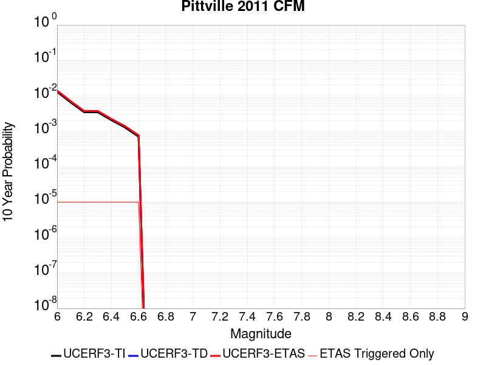 |

| Magnitude | 1 wk TI Prob | 1 wk TD Prob | 1 wk ETAS Prob | 1 wk ETAS/TD Gain | 1 wk ETAS Triggered Only | 1 mo TI Prob | 1 mo TD Prob | 1 mo ETAS Prob | 1 mo ETAS/TD Gain | 1 mo ETAS Triggered Only | 1 yr TI Prob | 1 yr TD Prob | 1 yr ETAS Prob | 1 yr ETAS/TD Gain | 1 yr ETAS Triggered Only | 10 yr TI Prob | 10 yr TD Prob | 10 yr ETAS Prob | 10 yr ETAS/TD Gain | 10 yr ETAS Triggered Only |
|-----|-----|-----|-----|-----|-----|-----|-----|-----|-----|-----|-----|-----|-----|-----|-----|-----|-----|-----|-----|-----|
| 6.0 | 2.5031832E-5 | 2.705726E-5 | 2.705726E-5 | 1.0 | 0.0 | 1.0727487E-4 | 1.1595508E-4 | 1.1595508E-4 | 1.0 | 0.0 | 0.001305289 | 0.0014109362 | 0.0014209221 | 1.0070775 | 1.0E-5 | 0.012976485 | 0.014029565 | 0.014039425 | 1.0007027 | 1.0E-5 |
| 6.1 | 1.2540113E-5 | 1.3513205E-5 | 1.3513205E-5 | 1.0 | 0.0 | 5.3742235E-5 | 5.7912577E-5 | 5.7912577E-5 | 1.0 | 0.0 | 6.541153E-4 | 7.0488005E-4 | 7.1487296E-4 | 1.0141768 | 1.0E-5 | 0.0065219323 | 0.0070286766 | 0.007038606 | 1.0014127 | 1.0E-5 |
| 6.2 | 6.603218E-6 | 7.107261E-6 | 7.107261E-6 | 1.0 | 0.0 | 2.8299199E-5 | 3.045937E-5 | 3.045937E-5 | 1.0 | 0.0 | 3.4448825E-4 | 3.7078623E-4 | 3.8078253E-4 | 1.0269598 | 1.0E-5 | 0.0034395473 | 0.0037023167 | 0.0037122795 | 1.002691 | 1.0E-5 |
| 6.3 | 6.603218E-6 | 7.107261E-6 | 7.107261E-6 | 1.0 | 0.0 | 2.8299199E-5 | 3.045937E-5 | 3.045937E-5 | 1.0 | 0.0 | 3.4448825E-4 | 3.7078623E-4 | 3.8078253E-4 | 1.0269598 | 1.0E-5 | 0.0034395473 | 0.0037023167 | 0.0037122795 | 1.002691 | 1.0E-5 |
| 6.4 | 3.9389015E-6 | 4.239218E-6 | 4.239218E-6 | 1.0 | 0.0 | 1.6880897E-5 | 1.8167968E-5 | 1.8167968E-5 | 1.0 | 0.0 | 2.0550552E-4 | 2.2117565E-4 | 2.3117344E-4 | 1.045203 | 1.0E-5 | 0.0020531558 | 0.0022098604 | 0.002219838 | 1.0045152 | 1.0E-5 |
| 6.5 | 2.4533072E-6 | 2.6412954E-6 | 2.6412954E-6 | 1.0 | 0.0 | 1.0514132E-5 | 1.1319799E-5 | 1.1319799E-5 | 1.0 | 0.0 | 1.2800204E-4 | 1.3781177E-4 | 1.4781041E-4 | 1.0725527 | 1.0E-5 | 0.0012792832 | 0.0013774533 | 0.0013874396 | 1.0072498 | 1.0E-5 |
| 6.6 | 1.3482367E-6 | 1.453008E-6 | 1.453008E-6 | 1.0 | 0.0 | 5.778144E-6 | 6.227169E-6 | 6.227169E-6 | 1.0 | 0.0 | 7.0346636E-5 | 7.581428E-5 | 8.581352E-5 | 1.1318913 | 1.0E-5 | 7.032437E-4 | 7.5799524E-4 | 7.679876E-4 | 1.0131826 | 1.0E-5 |

## Little Salmon (Onshore)
*[(top)](#table-of-contents)*

| 1 Week | 1 Month | 1 Year | 10 Year |
|-----|-----|-----|-----|
| 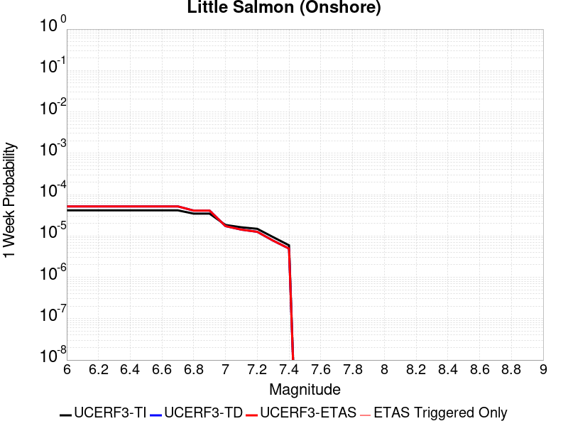 | 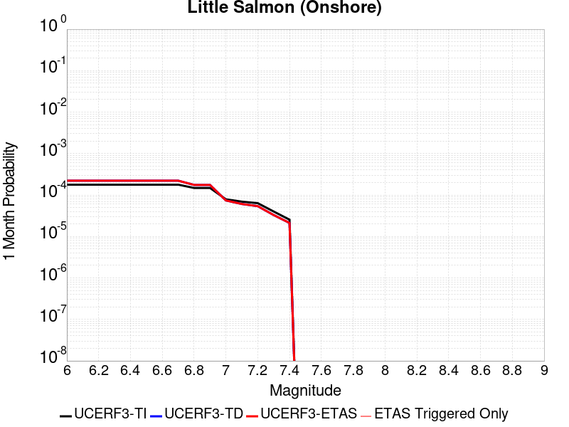 |  |  |

| Magnitude | 1 wk TI Prob | 1 wk TD Prob | 1 wk ETAS Prob | 1 wk ETAS/TD Gain | 1 wk ETAS Triggered Only | 1 mo TI Prob | 1 mo TD Prob | 1 mo ETAS Prob | 1 mo ETAS/TD Gain | 1 mo ETAS Triggered Only | 1 yr TI Prob | 1 yr TD Prob | 1 yr ETAS Prob | 1 yr ETAS/TD Gain | 1 yr ETAS Triggered Only | 10 yr TI Prob | 10 yr TD Prob | 10 yr ETAS Prob | 10 yr ETAS/TD Gain | 10 yr ETAS Triggered Only |
|-----|-----|-----|-----|-----|-----|-----|-----|-----|-----|-----|-----|-----|-----|-----|-----|-----|-----|-----|-----|-----|
| 6.0 | 4.1582247E-5 | 5.182975E-5 | 5.182975E-5 | 1.0 | 0.0 | 1.7819746E-4 | 2.2211326E-4 | 2.2211326E-4 | 1.0 | 0.0 | 0.0021673953 | 0.0027017025 | 0.0027017025 | 1.0 | 0.0 | 0.021463778 | 0.026871907 | 0.026881639 | 1.0003622 | 1.0E-5 |
| 6.1 | 4.1582247E-5 | 5.182975E-5 | 5.182975E-5 | 1.0 | 0.0 | 1.7819746E-4 | 2.2211326E-4 | 2.2211326E-4 | 1.0 | 0.0 | 0.0021673953 | 0.0027017025 | 0.0027017025 | 1.0 | 0.0 | 0.021463778 | 0.026871907 | 0.026881639 | 1.0003622 | 1.0E-5 |
| 6.2 | 4.1582247E-5 | 5.182975E-5 | 5.182975E-5 | 1.0 | 0.0 | 1.7819746E-4 | 2.2211326E-4 | 2.2211326E-4 | 1.0 | 0.0 | 0.0021673953 | 0.0027017025 | 0.0027017025 | 1.0 | 0.0 | 0.021463778 | 0.026871907 | 0.026881639 | 1.0003622 | 1.0E-5 |
| 6.3 | 4.1582247E-5 | 5.182975E-5 | 5.182975E-5 | 1.0 | 0.0 | 1.7819746E-4 | 2.2211326E-4 | 2.2211326E-4 | 1.0 | 0.0 | 0.0021673953 | 0.0027017025 | 0.0027017025 | 1.0 | 0.0 | 0.021463778 | 0.026871907 | 0.026881639 | 1.0003622 | 1.0E-5 |
| 6.4 | 4.1582247E-5 | 5.182975E-5 | 5.182975E-5 | 1.0 | 0.0 | 1.7819746E-4 | 2.2211326E-4 | 2.2211326E-4 | 1.0 | 0.0 | 0.0021673953 | 0.0027017025 | 0.0027017025 | 1.0 | 0.0 | 0.021463778 | 0.026871907 | 0.026881639 | 1.0003622 | 1.0E-5 |
| 6.5 | 4.1582247E-5 | 5.182975E-5 | 5.182975E-5 | 1.0 | 0.0 | 1.7819746E-4 | 2.2211326E-4 | 2.2211326E-4 | 1.0 | 0.0 | 0.0021673953 | 0.0027017025 | 0.0027017025 | 1.0 | 0.0 | 0.021463778 | 0.026871907 | 0.026881639 | 1.0003622 | 1.0E-5 |
| 6.6 | 4.1582247E-5 | 5.182975E-5 | 5.182975E-5 | 1.0 | 0.0 | 1.7819746E-4 | 2.2211326E-4 | 2.2211326E-4 | 1.0 | 0.0 | 0.0021673953 | 0.0027017025 | 0.0027017025 | 1.0 | 0.0 | 0.021463778 | 0.026871907 | 0.026881639 | 1.0003622 | 1.0E-5 |
| 6.7 | 4.1582247E-5 | 5.182975E-5 | 5.182975E-5 | 1.0 | 0.0 | 1.7819746E-4 | 2.2211326E-4 | 2.2211326E-4 | 1.0 | 0.0 | 0.0021673953 | 0.0027017025 | 0.0027017025 | 1.0 | 0.0 | 0.021463778 | 0.026871907 | 0.026881639 | 1.0003622 | 1.0E-5 |
| 6.8 | 3.4607925E-5 | 4.0953266E-5 | 4.0953266E-5 | 1.0 | 0.0 | 1.4831126E-4 | 1.7550643E-4 | 1.7550643E-4 | 1.0 | 0.0 | 0.001804194 | 0.002135449 | 0.002135449 | 1.0 | 0.0 | 0.01789616 | 0.021306084 | 0.02131587 | 1.0004593 | 1.0E-5 |
| 6.9 | 3.4607925E-5 | 4.0953266E-5 | 4.0953266E-5 | 1.0 | 0.0 | 1.4831126E-4 | 1.7550643E-4 | 1.7550643E-4 | 1.0 | 0.0 | 0.001804194 | 0.002135449 | 0.002135449 | 1.0 | 0.0 | 0.01789616 | 0.021306084 | 0.02131587 | 1.0004593 | 1.0E-5 |
| 7.0 | 1.8411014E-5 | 1.7286702E-5 | 1.7286702E-5 | 1.0 | 0.0 | 7.8901954E-5 | 7.408407E-5 | 7.408407E-5 | 1.0 | 0.0 | 9.6020795E-4 | 9.016537E-4 | 9.016537E-4 | 1.0 | 0.0 | 0.009560696 | 0.009006953 | 0.009006953 | 1.0 | 0.0 |
| 7.1 | 1.6183103E-5 | 1.4207039E-5 | 1.4207039E-5 | 1.0 | 0.0 | 6.935431E-5 | 6.088616E-5 | 6.088616E-5 | 1.0 | 0.0 | 8.440616E-4 | 7.4108434E-4 | 7.4108434E-4 | 1.0 | 0.0 | 0.008408628 | 0.007412547 | 0.007412547 | 1.0 | 0.0 |
| 7.2 | 1.4868988E-5 | 1.25868955E-5 | 1.25868955E-5 | 1.0 | 0.0 | 6.372268E-5 | 5.394298E-5 | 5.394298E-5 | 1.0 | 0.0 | 7.755474E-4 | 6.566029E-4 | 6.566029E-4 | 1.0 | 0.0 | 0.0077284635 | 0.0065725124 | 0.0065725124 | 1.0 | 0.0 |
| 7.3 | 9.3599865E-6 | 7.695378E-6 | 7.695378E-6 | 1.0 | 0.0 | 4.011361E-5 | 3.2979977E-5 | 3.2979977E-5 | 1.0 | 0.0 | 4.8827377E-4 | 4.014929E-4 | 4.014929E-4 | 1.0 | 0.0 | 0.004872023 | 0.0040243445 | 0.0040243445 | 1.0 | 0.0 |
| 7.4 | 5.941556E-6 | 4.9514347E-6 | 4.9514347E-6 | 1.0 | 0.0 | 2.5463563E-5 | 2.1220434E-5 | 2.1220434E-5 | 1.0 | 0.0 | 3.0997477E-4 | 2.5835878E-4 | 2.5835878E-4 | 1.0 | 0.0 | 0.0030954275 | 0.0025921175 | 0.0025921175 | 1.0 | 0.0 |

## Great Valley 05 Pittsburg - Kirby Hills alt1
*[(top)](#table-of-contents)*

| 1 Week | 1 Month | 1 Year | 10 Year |
|-----|-----|-----|-----|
|  | 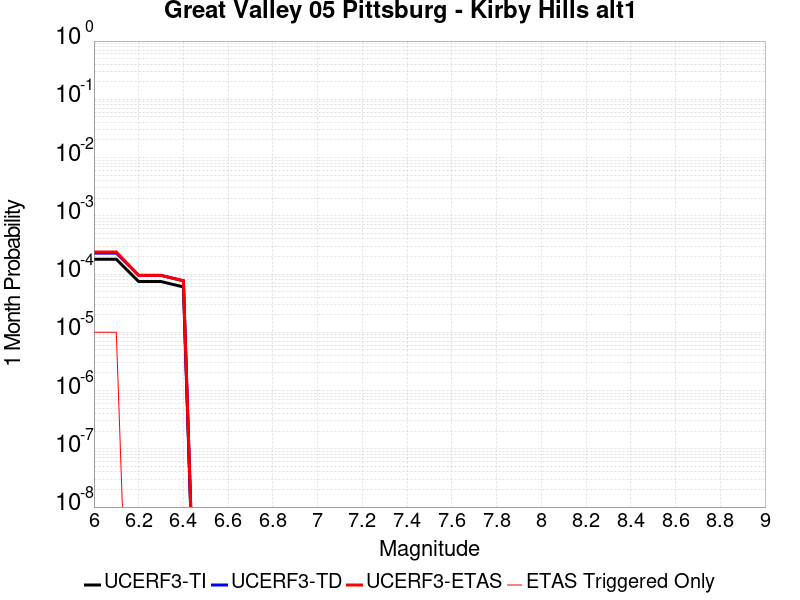 |  |  |

| Magnitude | 1 wk TI Prob | 1 wk TD Prob | 1 wk ETAS Prob | 1 wk ETAS/TD Gain | 1 wk ETAS Triggered Only | 1 mo TI Prob | 1 mo TD Prob | 1 mo ETAS Prob | 1 mo ETAS/TD Gain | 1 mo ETAS Triggered Only | 1 yr TI Prob | 1 yr TD Prob | 1 yr ETAS Prob | 1 yr ETAS/TD Gain | 1 yr ETAS Triggered Only | 10 yr TI Prob | 10 yr TD Prob | 10 yr ETAS Prob | 10 yr ETAS/TD Gain | 10 yr ETAS Triggered Only |
|-----|-----|-----|-----|-----|-----|-----|-----|-----|-----|-----|-----|-----|-----|-----|-----|-----|-----|-----|-----|-----|
| 6.0 | 4.187212E-5 | 5.3444037E-5 | 5.3444037E-5 | 1.0 | 0.0 | 1.794396E-4 | 2.2903152E-4 | 2.3902922E-4 | 1.043652 | 1.0E-5 | 0.002182488 | 0.0027858876 | 0.0027958597 | 1.0035795 | 1.0E-5 | 0.021611776 | 0.027604017 | 0.027613742 | 1.0003523 | 1.0E-5 |
| 6.1 | 4.187212E-5 | 5.3444037E-5 | 5.3444037E-5 | 1.0 | 0.0 | 1.794396E-4 | 2.2903152E-4 | 2.3902922E-4 | 1.043652 | 1.0E-5 | 0.002182488 | 0.0027858876 | 0.0027958597 | 1.0035795 | 1.0E-5 | 0.021611776 | 0.027604017 | 0.027613742 | 1.0003523 | 1.0E-5 |
| 6.2 | 1.7353306E-5 | 2.2155189E-5 | 2.2155189E-5 | 1.0 | 0.0 | 7.436919E-5 | 9.4949675E-5 | 9.4949675E-5 | 1.0 | 0.0 | 9.050688E-4 | 0.0011557965 | 0.0011557965 | 1.0 | 0.0 | 0.009013915 | 0.011535524 | 0.011535524 | 1.0 | 0.0 |
| 6.3 | 1.7353306E-5 | 2.2155189E-5 | 2.2155189E-5 | 1.0 | 0.0 | 7.436919E-5 | 9.4949675E-5 | 9.4949675E-5 | 1.0 | 0.0 | 9.050688E-4 | 0.0011557965 | 0.0011557965 | 1.0 | 0.0 | 0.009013915 | 0.011535524 | 0.011535524 | 1.0 | 0.0 |
| 6.4 | 1.4028824E-5 | 1.7901253E-5 | 1.7901253E-5 | 1.0 | 0.0 | 6.0122147E-5 | 7.6719654E-5 | 7.6719654E-5 | 1.0 | 0.0 | 7.3174125E-4 | 9.3406177E-4 | 9.3406177E-4 | 1.0 | 0.0 | 0.0072933645 | 0.00933847 | 0.00933847 | 1.0 | 0.0 |

## Hilton Creek 2011 CFM
*[(top)](#table-of-contents)*

| 1 Week | 1 Month | 1 Year | 10 Year |
|-----|-----|-----|-----|
| 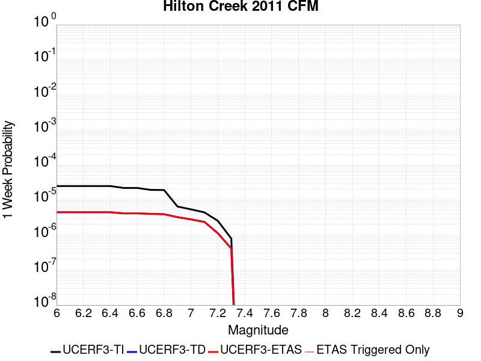 |  |  |  |

| Magnitude | 1 wk TI Prob | 1 wk TD Prob | 1 wk ETAS Prob | 1 wk ETAS/TD Gain | 1 wk ETAS Triggered Only | 1 mo TI Prob | 1 mo TD Prob | 1 mo ETAS Prob | 1 mo ETAS/TD Gain | 1 mo ETAS Triggered Only | 1 yr TI Prob | 1 yr TD Prob | 1 yr ETAS Prob | 1 yr ETAS/TD Gain | 1 yr ETAS Triggered Only | 10 yr TI Prob | 10 yr TD Prob | 10 yr ETAS Prob | 10 yr ETAS/TD Gain | 10 yr ETAS Triggered Only |
|-----|-----|-----|-----|-----|-----|-----|-----|-----|-----|-----|-----|-----|-----|-----|-----|-----|-----|-----|-----|-----|
| 6.0 | 2.4923684E-5 | 4.456996E-6 | 4.456996E-6 | 1.0 | 0.0 | 1.06811414E-4 | 1.910128E-5 | 1.910128E-5 | 1.0 | 0.0 | 0.0012996531 | 2.325349E-4 | 2.325349E-4 | 1.0 | 0.0 | 0.012920785 | 0.0023259036 | 0.0023358804 | 1.0042894 | 1.0E-5 |
| 6.1 | 2.4923684E-5 | 4.456996E-6 | 4.456996E-6 | 1.0 | 0.0 | 1.06811414E-4 | 1.910128E-5 | 1.910128E-5 | 1.0 | 0.0 | 0.0012996531 | 2.325349E-4 | 2.325349E-4 | 1.0 | 0.0 | 0.012920785 | 0.0023259036 | 0.0023358804 | 1.0042894 | 1.0E-5 |
| 6.2 | 2.4923684E-5 | 4.456996E-6 | 4.456996E-6 | 1.0 | 0.0 | 1.06811414E-4 | 1.910128E-5 | 1.910128E-5 | 1.0 | 0.0 | 0.0012996531 | 2.325349E-4 | 2.325349E-4 | 1.0 | 0.0 | 0.012920785 | 0.0023259036 | 0.0023358804 | 1.0042894 | 1.0E-5 |
| 6.3 | 2.4923684E-5 | 4.456996E-6 | 4.456996E-6 | 1.0 | 0.0 | 1.06811414E-4 | 1.910128E-5 | 1.910128E-5 | 1.0 | 0.0 | 0.0012996531 | 2.325349E-4 | 2.325349E-4 | 1.0 | 0.0 | 0.012920785 | 0.0023259036 | 0.0023358804 | 1.0042894 | 1.0E-5 |
| 6.4 | 2.4923684E-5 | 4.456996E-6 | 4.456996E-6 | 1.0 | 0.0 | 1.06811414E-4 | 1.910128E-5 | 1.910128E-5 | 1.0 | 0.0 | 0.0012996531 | 2.325349E-4 | 2.325349E-4 | 1.0 | 0.0 | 0.012920785 | 0.0023259036 | 0.0023358804 | 1.0042894 | 1.0E-5 |
| 6.5 | 2.1963904E-5 | 4.1445614E-6 | 4.1445614E-6 | 1.0 | 0.0 | 9.412762E-5 | 1.7762295E-5 | 1.7762295E-5 | 1.0 | 0.0 | 0.0011454013 | 2.1623599E-4 | 2.1623599E-4 | 1.0 | 0.0 | 0.011395155 | 0.0021630467 | 0.0021730252 | 1.0046132 | 1.0E-5 |
| 6.6 | 2.1963904E-5 | 4.1445614E-6 | 4.1445614E-6 | 1.0 | 0.0 | 9.412762E-5 | 1.7762295E-5 | 1.7762295E-5 | 1.0 | 0.0 | 0.0011454013 | 2.1623599E-4 | 2.1623599E-4 | 1.0 | 0.0 | 0.011395155 | 0.0021630467 | 0.0021730252 | 1.0046132 | 1.0E-5 |
| 6.7 | 1.9397496E-5 | 4.0145824E-6 | 4.0145824E-6 | 1.0 | 0.0 | 8.3129475E-5 | 1.7205248E-5 | 1.7205248E-5 | 1.0 | 0.0 | 0.0010116313 | 2.0945525E-4 | 2.0945525E-4 | 1.0 | 0.0 | 0.0100703845 | 0.0020950942 | 0.0021050733 | 1.004763 | 1.0E-5 |
| 6.8 | 1.917303E-5 | 3.9075176E-6 | 3.9075176E-6 | 1.0 | 0.0 | 8.216754E-5 | 1.6746406E-5 | 1.6746406E-5 | 1.0 | 0.0 | 9.999307E-4 | 2.0386989E-4 | 2.0386989E-4 | 1.0 | 0.0 | 0.009954433 | 0.0020393438 | 0.0020493234 | 1.0048935 | 1.0E-5 |
| 6.9 | 6.480681E-6 | 3.2318133E-6 | 3.2318133E-6 | 1.0 | 0.0 | 2.7774051E-5 | 1.3850561E-5 | 1.3850561E-5 | 1.0 | 0.0 | 3.380966E-4 | 1.6861866E-4 | 1.6861866E-4 | 1.0 | 0.0 | 0.0033758266 | 0.0016850183 | 0.0016950015 | 1.0059247 | 1.0E-5 |
| 7.0 | 5.388316E-6 | 2.7884523E-6 | 2.7884523E-6 | 1.0 | 0.0 | 2.3092578E-5 | 1.1950461E-5 | 1.1950461E-5 | 1.0 | 0.0 | 2.8111585E-4 | 1.454882E-4 | 1.454882E-4 | 1.0 | 0.0 | 0.002807605 | 0.0014540323 | 0.0014640177 | 1.0068674 | 1.0E-5 |
| 7.1 | 4.41728E-6 | 2.3575708E-6 | 2.3575708E-6 | 1.0 | 0.0 | 1.8931061E-5 | 1.0103841E-5 | 1.0103841E-5 | 1.0 | 0.0 | 2.304613E-4 | 1.2300831E-4 | 1.2300831E-4 | 1.0 | 0.0 | 0.0023022245 | 0.0012294988 | 0.0012394865 | 1.0081234 | 1.0E-5 |
| 7.2 | 2.535495E-6 | 1.1208772E-6 | 1.1208772E-6 | 1.0 | 0.0 | 1.0866362E-5 | 4.803753E-6 | 4.803753E-6 | 1.0 | 0.0 | 1.3228992E-4 | 5.848465E-5 | 5.848465E-5 | 1.0 | 0.0 | 0.0013221119 | 5.847438E-4 | 5.847438E-4 | 1.0 | 0.0 |
| 7.3 | 7.900015E-7 | 4.089063E-7 | 4.089063E-7 | 1.0 | 0.0 | 3.3857161E-6 | 1.7524555E-6 | 1.7524555E-6 | 1.0 | 0.0 | 4.1220315E-5 | 2.1336145E-5 | 2.1336145E-5 | 1.0 | 0.0 | 4.121267E-4 | 2.1336146E-4 | 2.1336146E-4 | 1.0 | 0.0 |

## Newport-Inglewood alt 1
*[(top)](#table-of-contents)*

| 1 Week | 1 Month | 1 Year | 10 Year |
|-----|-----|-----|-----|
|  |  | 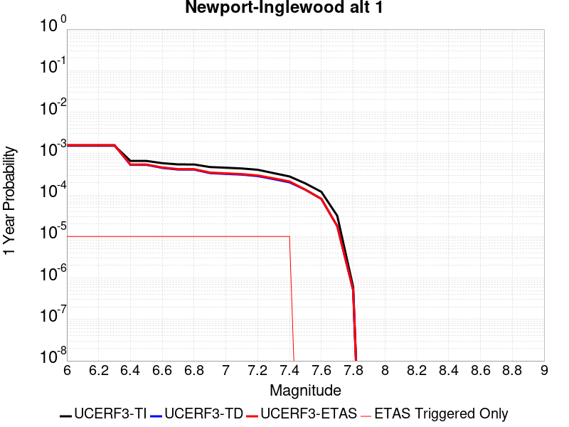 |  |

| Magnitude | 1 wk TI Prob | 1 wk TD Prob | 1 wk ETAS Prob | 1 wk ETAS/TD Gain | 1 wk ETAS Triggered Only | 1 mo TI Prob | 1 mo TD Prob | 1 mo ETAS Prob | 1 mo ETAS/TD Gain | 1 mo ETAS Triggered Only | 1 yr TI Prob | 1 yr TD Prob | 1 yr ETAS Prob | 1 yr ETAS/TD Gain | 1 yr ETAS Triggered Only | 10 yr TI Prob | 10 yr TD Prob | 10 yr ETAS Prob | 10 yr ETAS/TD Gain | 10 yr ETAS Triggered Only |
|-----|-----|-----|-----|-----|-----|-----|-----|-----|-----|-----|-----|-----|-----|-----|-----|-----|-----|-----|-----|-----|
| 6.0 | 2.9668912E-5 | 3.0405516E-5 | 3.0405516E-5 | 1.0 | 0.0 | 1.2714628E-4 | 1.3030559E-4 | 1.3030559E-4 | 1.0 | 0.0 | 0.0015469068 | 0.0015857986 | 0.0015957827 | 1.0062959 | 1.0E-5 | 0.015361829 | 0.015792403 | 0.015802246 | 1.0006232 | 1.0E-5 |
| 6.1 | 2.9668912E-5 | 3.0405516E-5 | 3.0405516E-5 | 1.0 | 0.0 | 1.2714628E-4 | 1.3030559E-4 | 1.3030559E-4 | 1.0 | 0.0 | 0.0015469068 | 0.0015857986 | 0.0015957827 | 1.0062959 | 1.0E-5 | 0.015361829 | 0.015792403 | 0.015802246 | 1.0006232 | 1.0E-5 |
| 6.2 | 2.9668912E-5 | 3.0405516E-5 | 3.0405516E-5 | 1.0 | 0.0 | 1.2714628E-4 | 1.3030559E-4 | 1.3030559E-4 | 1.0 | 0.0 | 0.0015469068 | 0.0015857986 | 0.0015957827 | 1.0062959 | 1.0E-5 | 0.015361829 | 0.015792403 | 0.015802246 | 1.0006232 | 1.0E-5 |
| 6.3 | 2.9668912E-5 | 3.0405516E-5 | 3.0405516E-5 | 1.0 | 0.0 | 1.2714628E-4 | 1.3030559E-4 | 1.3030559E-4 | 1.0 | 0.0 | 0.0015469068 | 0.0015857986 | 0.0015957827 | 1.0062959 | 1.0E-5 | 0.015361829 | 0.015792403 | 0.015802246 | 1.0006232 | 1.0E-5 |
| 6.4 | 1.275942E-5 | 1.0272664E-5 | 1.0272664E-5 | 1.0 | 0.0 | 5.4682085E-5 | 4.4024986E-5 | 4.4024986E-5 | 1.0 | 0.0 | 6.65551E-4 | 5.3587655E-4 | 5.458712E-4 | 1.018651 | 1.0E-5 | 0.0066356123 | 0.0053462684 | 0.005356215 | 1.0018605 | 1.0E-5 |
| 6.5 | 1.275942E-5 | 1.0272664E-5 | 1.0272664E-5 | 1.0 | 0.0 | 5.4682085E-5 | 4.4024986E-5 | 4.4024986E-5 | 1.0 | 0.0 | 6.65551E-4 | 5.3587655E-4 | 5.458712E-4 | 1.018651 | 1.0E-5 | 0.0066356123 | 0.0053462684 | 0.005356215 | 1.0018605 | 1.0E-5 |
| 6.6 | 1.1255358E-5 | 8.662018E-6 | 8.662018E-6 | 1.0 | 0.0 | 4.8236358E-5 | 3.7122416E-5 | 3.7122416E-5 | 1.0 | 0.0 | 5.871194E-4 | 4.5187338E-4 | 4.6186885E-4 | 1.0221201 | 1.0E-5 | 0.005855706 | 0.004509723 | 0.0045196777 | 1.0022074 | 1.0E-5 |
| 6.7 | 1.0504745E-5 | 7.899919E-6 | 7.899919E-6 | 1.0 | 0.0 | 4.5019555E-5 | 3.3856366E-5 | 3.3856366E-5 | 1.0 | 0.0 | 5.4797524E-4 | 4.1212453E-4 | 4.221204E-4 | 1.0242546 | 1.0E-5 | 0.0054662596 | 0.0041137324 | 0.0041236915 | 1.0024209 | 1.0E-5 |
| 6.8 | 1.0476007E-5 | 7.881301E-6 | 7.881301E-6 | 1.0 | 0.0 | 4.4896402E-5 | 3.377657E-5 | 3.377657E-5 | 1.0 | 0.0 | 5.464766E-4 | 4.1115342E-4 | 4.211493E-4 | 1.0243118 | 1.0E-5 | 0.005451347 | 0.0041040573 | 0.004114016 | 1.0024266 | 1.0E-5 |
| 6.9 | 9.076797E-6 | 6.489738E-6 | 6.489738E-6 | 1.0 | 0.0 | 3.889998E-5 | 2.7812868E-5 | 2.7812868E-5 | 1.0 | 0.0 | 4.7350433E-4 | 3.385694E-4 | 3.48566E-4 | 1.029526 | 1.0E-5 | 0.004724967 | 0.0033805731 | 0.0033905394 | 1.002948 | 1.0E-5 |
| 7.0 | 8.73795E-6 | 6.212118E-6 | 6.212118E-6 | 1.0 | 0.0 | 3.7447822E-5 | 2.6623095E-5 | 2.6623095E-5 | 1.0 | 0.0 | 4.5583185E-4 | 3.2408824E-4 | 3.34085E-4 | 1.0308458 | 1.0E-5 | 0.0045489795 | 0.0032361876 | 0.0032461553 | 1.00308 | 1.0E-5 |
| 7.1 | 8.391299E-6 | 5.955894E-6 | 5.955894E-6 | 1.0 | 0.0 | 3.5962214E-5 | 2.552501E-5 | 2.552501E-5 | 1.0 | 0.0 | 4.37752E-4 | 3.1072294E-4 | 3.2071985E-4 | 1.032173 | 1.0E-5 | 0.004368907 | 0.0031029144 | 0.0031128835 | 1.0032128 | 1.0E-5 |
| 7.2 | 7.796882E-6 | 5.496635E-6 | 5.496635E-6 | 1.0 | 0.0 | 3.341478E-5 | 2.3556795E-5 | 2.3556795E-5 | 1.0 | 0.0 | 4.06749E-4 | 2.8676644E-4 | 2.9676358E-4 | 1.0348616 | 1.0E-5 | 0.0040600533 | 0.002863988 | 0.0028739595 | 1.0034816 | 1.0E-5 |
| 7.3 | 6.4738833E-6 | 4.647859E-6 | 4.647859E-6 | 1.0 | 0.0 | 2.774492E-5 | 1.9919245E-5 | 1.9919245E-5 | 1.0 | 0.0 | 3.3774204E-4 | 2.4248997E-4 | 2.5248755E-4 | 1.0412288 | 1.0E-5 | 0.0033722918 | 0.0024222704 | 0.0024322462 | 1.0041183 | 1.0E-5 |
| 7.4 | 5.382145E-6 | 3.8857956E-6 | 3.8857956E-6 | 1.0 | 0.0 | 2.3066134E-5 | 1.6653305E-5 | 1.6653305E-5 | 1.0 | 0.0 | 2.8079396E-4 | 2.0273525E-4 | 2.1273323E-4 | 1.0493155 | 1.0E-5 | 0.0028043943 | 0.0020255174 | 0.0020354972 | 1.004927 | 1.0E-5 |
| 7.5 | 3.648244E-6 | 2.573805E-6 | 2.573805E-6 | 1.0 | 0.0 | 1.5635238E-5 | 1.1030546E-5 | 1.1030546E-5 | 1.0 | 0.0 | 1.9034238E-4 | 1.3428873E-4 | 1.3428873E-4 | 1.0 | 0.0 | 0.0019017943 | 0.0013420862 | 0.0013420862 | 1.0 | 0.0 |
| 7.6 | 2.2906888E-6 | 1.5479983E-6 | 1.5479983E-6 | 1.0 | 0.0 | 9.817201E-6 | 6.6342623E-6 | 6.6342623E-6 | 1.0 | 0.0 | 1.1951787E-4 | 8.076921E-5 | 8.076921E-5 | 1.0 | 0.0 | 0.0011945361 | 8.0740533E-4 | 8.0740533E-4 | 1.0 | 0.0 |
| 7.7 | 6.0479874E-7 | 3.3975476E-7 | 3.3975476E-7 | 1.0 | 0.0 | 2.5919921E-6 | 1.456091E-6 | 1.456091E-6 | 1.0 | 0.0 | 3.1557047E-5 | 1.7727778E-5 | 1.7727778E-5 | 1.0 | 0.0 | 3.1552566E-4 | 1.7726503E-4 | 1.7726503E-4 | 1.0 | 0.0 |
| 7.8 | 1.16056995E-8 | 9.782392E-9 | 9.782392E-9 | 1.0 | 0.0 | 4.9738713E-8 | 4.1924537E-8 | 4.1924537E-8 | 1.0 | 0.0 | 6.0556863E-7 | 5.104312E-7 | 5.104312E-7 | 1.0 | 0.0 | 6.05567E-6 | 5.104312E-6 | 5.104312E-6 | 1.0 | 0.0 |

## Bennett Valley 2011 CFM
*[(top)](#table-of-contents)*

| 1 Week | 1 Month | 1 Year | 10 Year |
|-----|-----|-----|-----|
|  |  |  |  |

| Magnitude | 1 wk TI Prob | 1 wk TD Prob | 1 wk ETAS Prob | 1 wk ETAS/TD Gain | 1 wk ETAS Triggered Only | 1 mo TI Prob | 1 mo TD Prob | 1 mo ETAS Prob | 1 mo ETAS/TD Gain | 1 mo ETAS Triggered Only | 1 yr TI Prob | 1 yr TD Prob | 1 yr ETAS Prob | 1 yr ETAS/TD Gain | 1 yr ETAS Triggered Only | 10 yr TI Prob | 10 yr TD Prob | 10 yr ETAS Prob | 10 yr ETAS/TD Gain | 10 yr ETAS Triggered Only |
|-----|-----|-----|-----|-----|-----|-----|-----|-----|-----|-----|-----|-----|-----|-----|-----|-----|-----|-----|-----|-----|
| 6.0 | 2.3893934E-5 | 2.8239589E-5 | 2.8239589E-5 | 1.0 | 0.0 | 1.0239855E-4 | 1.2102224E-4 | 1.2102224E-4 | 1.0 | 0.0 | 0.0012459893 | 0.0014726348 | 0.0014726348 | 1.0 | 0.0 | 0.012390262 | 0.014651419 | 0.014661272 | 1.0006726 | 1.0E-5 |
| 6.1 | 2.3893934E-5 | 2.8239589E-5 | 2.8239589E-5 | 1.0 | 0.0 | 1.0239855E-4 | 1.2102224E-4 | 1.2102224E-4 | 1.0 | 0.0 | 0.0012459893 | 0.0014726348 | 0.0014726348 | 1.0 | 0.0 | 0.012390262 | 0.014651419 | 0.014661272 | 1.0006726 | 1.0E-5 |
| 6.2 | 1.6657146E-5 | 1.9854298E-5 | 1.9854298E-5 | 1.0 | 0.0 | 7.138582E-5 | 8.508787E-5 | 8.508787E-5 | 1.0 | 0.0 | 8.6877577E-4 | 0.001035594 | 0.001035594 | 1.0 | 0.0 | 0.008653872 | 0.010325956 | 0.010335853 | 1.0009584 | 1.0E-5 |
| 6.3 | 1.6657146E-5 | 1.9854298E-5 | 1.9854298E-5 | 1.0 | 0.0 | 7.138582E-5 | 8.508787E-5 | 8.508787E-5 | 1.0 | 0.0 | 8.6877577E-4 | 0.001035594 | 0.001035594 | 1.0 | 0.0 | 0.008653872 | 0.010325956 | 0.010335853 | 1.0009584 | 1.0E-5 |
| 6.4 | 1.29418495E-5 | 1.556793E-5 | 1.556793E-5 | 1.0 | 0.0 | 5.546389E-5 | 6.6718734E-5 | 6.6718734E-5 | 1.0 | 0.0 | 6.7506364E-4 | 8.121281E-4 | 8.121281E-4 | 1.0 | 0.0 | 0.0067301663 | 0.008108751 | 0.008108751 | 1.0 | 0.0 |
| 6.5 | 1.2582504E-5 | 1.5134953E-5 | 1.5134953E-5 | 1.0 | 0.0 | 5.39239E-5 | 6.4863205E-5 | 6.4863205E-5 | 1.0 | 0.0 | 6.563257E-4 | 7.895536E-4 | 7.895536E-4 | 1.0 | 0.0 | 0.006543907 | 0.00788465 | 0.00788465 | 1.0 | 0.0 |
| 6.6 | 1.0846706E-5 | 1.3037158E-5 | 1.3037158E-5 | 1.0 | 0.0 | 4.6485053E-5 | 5.587306E-5 | 5.587306E-5 | 1.0 | 0.0 | 5.6580856E-4 | 6.8017055E-4 | 6.8017055E-4 | 1.0 | 0.0 | 0.005643701 | 0.006797883 | 0.006797883 | 1.0 | 0.0 |
| 6.7 | 1.6803231E-6 | 2.3780183E-6 | 2.3780183E-6 | 1.0 | 0.0 | 7.2013645E-6 | 1.01914675E-5 | 1.01914675E-5 | 1.0 | 0.0 | 8.7673085E-5 | 1.2407418E-4 | 1.2407418E-4 | 1.0 | 0.0 | 8.76385E-4 | 0.0012444884 | 0.0012444884 | 1.0 | 0.0 |
| 6.8 | 1.4609833E-6 | 2.0940856E-6 | 2.0940856E-6 | 1.0 | 0.0 | 6.261342E-6 | 8.974623E-6 | 8.974623E-6 | 1.0 | 0.0 | 7.6229175E-5 | 1.09260625E-4 | 1.09260625E-4 | 1.0 | 0.0 | 7.620303E-4 | 0.0010964648 | 0.0010964648 | 1.0 | 0.0 |
| 6.9 | 1.3492396E-6 | 1.9460247E-6 | 1.9460247E-6 | 1.0 | 0.0 | 5.7824427E-6 | 8.340079E-6 | 8.340079E-6 | 1.0 | 0.0 | 7.0398964E-5 | 1.0153579E-4 | 1.0153579E-4 | 1.0 | 0.0 | 7.037667E-4 | 0.0010192601 | 0.0010192601 | 1.0 | 0.0 |
| 7.0 | 1.2347921E-6 | 1.7890113E-6 | 1.7890113E-6 | 1.0 | 0.0 | 5.291955E-6 | 7.6671695E-6 | 7.6671695E-6 | 1.0 | 0.0 | 6.442765E-5 | 9.334384E-5 | 9.334384E-5 | 1.0 | 0.0 | 6.440897E-4 | 9.373974E-4 | 9.373974E-4 | 1.0 | 0.0 |
| 7.1 | 1.1262973E-6 | 1.6360293E-6 | 1.6360293E-6 | 1.0 | 0.0 | 4.8269794E-6 | 7.0115357E-6 | 7.0115357E-6 | 1.0 | 0.0 | 5.876689E-5 | 8.536215E-5 | 8.536215E-5 | 1.0 | 0.0 | 5.875135E-4 | 8.5762155E-4 | 8.5762155E-4 | 1.0 | 0.0 |
| 7.2 | 9.351744E-7 | 1.3612876E-6 | 1.3612876E-6 | 1.0 | 0.0 | 4.007884E-6 | 5.8340765E-6 | 5.8340765E-6 | 1.0 | 0.0 | 4.8794896E-5 | 7.1027585E-5 | 7.1027585E-5 | 1.0 | 0.0 | 4.878418E-4 | 7.143239E-4 | 7.143239E-4 | 1.0 | 0.0 |
| 7.3 | 8.5039534E-7 | 1.238779E-6 | 1.238779E-6 | 1.0 | 0.0 | 3.6445463E-6 | 5.3090416E-6 | 5.3090416E-6 | 1.0 | 0.0 | 4.437145E-5 | 6.4635686E-5 | 6.4635686E-5 | 1.0 | 0.0 | 4.436259E-4 | 6.501546E-4 | 6.501546E-4 | 1.0 | 0.0 |
| 7.4 | 6.7875015E-7 | 9.60144E-7 | 9.60144E-7 | 1.0 | 0.0 | 2.908926E-6 | 4.1148965E-6 | 4.1148965E-6 | 1.0 | 0.0 | 3.54156E-5 | 5.0097722E-5 | 5.0097722E-5 | 1.0 | 0.0 | 3.5409955E-4 | 5.041512E-4 | 5.041512E-4 | 1.0 | 0.0 |
| 7.5 | 5.826867E-7 | 8.1890533E-7 | 8.1890533E-7 | 1.0 | 0.0 | 2.4972264E-6 | 3.5095895E-6 | 3.5095895E-6 | 1.0 | 0.0 | 3.0403306E-5 | 4.272842E-5 | 4.272842E-5 | 1.0 | 0.0 | 3.0399146E-4 | 4.3006465E-4 | 4.3006465E-4 | 1.0 | 0.0 |
| 7.6 | 2.7734902E-7 | 3.6825787E-7 | 3.6825787E-7 | 1.0 | 0.0 | 1.1886381E-6 | 1.578247E-6 | 1.578247E-6 | 1.0 | 0.0 | 1.4471572E-5 | 1.921499E-5 | 1.921499E-5 | 1.0 | 0.0 | 1.447063E-4 | 1.9314208E-4 | 1.9314208E-4 | 1.0 | 0.0 |
| 7.7 | 1.0530888E-7 | 1.375161E-7 | 1.375161E-7 | 1.0 | 0.0 | 4.513237E-7 | 5.8935456E-7 | 5.8935456E-7 | 1.0 | 0.0 | 5.4948523E-6 | 7.175368E-6 | 7.175368E-6 | 1.0 | 0.0 | 5.4947162E-5 | 7.257686E-5 | 7.257686E-5 | 1.0 | 0.0 |
| 7.8 | 1.2714258E-8 | 1.96398E-8 | 1.96398E-8 | 1.0 | 0.0 | 5.448968E-8 | 8.417057E-8 | 8.417057E-8 | 1.0 | 0.0 | 6.6341164E-7 | 1.0247762E-6 | 1.0247762E-6 | 1.0 | 0.0 | 6.6340967E-6 | 1.06616935E-5 | 1.06616935E-5 | 1.0 | 0.0 |
| 7.9 | 4.075888E-9 | 7.563789E-9 | 7.563789E-9 | 1.0 | 0.0 | 1.7468091E-8 | 3.241624E-8 | 3.241624E-8 | 1.0 | 0.0 | 2.12674E-7 | 3.946676E-7 | 3.946676E-7 | 1.0 | 0.0 | 2.1267379E-6 | 4.1968474E-6 | 4.1968474E-6 | 1.0 | 0.0 |
| 8.0 | 1.9126138E-9 | 3.9976E-9 | 3.9976E-9 | 1.0 | 0.0 | 8.196917E-9 | 1.7132573E-8 | 1.7132573E-8 | 1.0 | 0.0 | 9.9797454E-8 | 2.0858906E-7 | 2.0858906E-7 | 1.0 | 0.0 | 9.979741E-7 | 2.1990033E-6 | 2.1990033E-6 | 1.0 | 0.0 |

## San Cayetano
*[(top)](#table-of-contents)*

| 1 Week | 1 Month | 1 Year | 10 Year |
|-----|-----|-----|-----|
|  |  |  |  |

| Magnitude | 1 wk TI Prob | 1 wk TD Prob | 1 wk ETAS Prob | 1 wk ETAS/TD Gain | 1 wk ETAS Triggered Only | 1 mo TI Prob | 1 mo TD Prob | 1 mo ETAS Prob | 1 mo ETAS/TD Gain | 1 mo ETAS Triggered Only | 1 yr TI Prob | 1 yr TD Prob | 1 yr ETAS Prob | 1 yr ETAS/TD Gain | 1 yr ETAS Triggered Only | 10 yr TI Prob | 10 yr TD Prob | 10 yr ETAS Prob | 10 yr ETAS/TD Gain | 10 yr ETAS Triggered Only |
|-----|-----|-----|-----|-----|-----|-----|-----|-----|-----|-----|-----|-----|-----|-----|-----|-----|-----|-----|-----|-----|
| 6.0 | 2.3476267E-5 | 1.816963E-5 | 1.816963E-5 | 1.0 | 0.0 | 1.0060869E-4 | 7.786754E-5 | 7.786754E-5 | 1.0 | 0.0 | 0.0012242225 | 9.4762864E-4 | 9.4762864E-4 | 1.0 | 0.0 | 0.012175002 | 0.009436766 | 0.009446671 | 1.0010496 | 1.0E-5 |
| 6.1 | 2.3476267E-5 | 1.816963E-5 | 1.816963E-5 | 1.0 | 0.0 | 1.0060869E-4 | 7.786754E-5 | 7.786754E-5 | 1.0 | 0.0 | 0.0012242225 | 9.4762864E-4 | 9.4762864E-4 | 1.0 | 0.0 | 0.012175002 | 0.009436766 | 0.009446671 | 1.0010496 | 1.0E-5 |
| 6.2 | 2.3476267E-5 | 1.816963E-5 | 1.816963E-5 | 1.0 | 0.0 | 1.0060869E-4 | 7.786754E-5 | 7.786754E-5 | 1.0 | 0.0 | 0.0012242225 | 9.4762864E-4 | 9.4762864E-4 | 1.0 | 0.0 | 0.012175002 | 0.009436766 | 0.009446671 | 1.0010496 | 1.0E-5 |
| 6.3 | 2.3476267E-5 | 1.816963E-5 | 1.816963E-5 | 1.0 | 0.0 | 1.0060869E-4 | 7.786754E-5 | 7.786754E-5 | 1.0 | 0.0 | 0.0012242225 | 9.4762864E-4 | 9.4762864E-4 | 1.0 | 0.0 | 0.012175002 | 0.009436766 | 0.009446671 | 1.0010496 | 1.0E-5 |
| 6.4 | 2.3476267E-5 | 1.816963E-5 | 1.816963E-5 | 1.0 | 0.0 | 1.0060869E-4 | 7.786754E-5 | 7.786754E-5 | 1.0 | 0.0 | 0.0012242225 | 9.4762864E-4 | 9.4762864E-4 | 1.0 | 0.0 | 0.012175002 | 0.009436766 | 0.009446671 | 1.0010496 | 1.0E-5 |
| 6.5 | 2.3476267E-5 | 1.816963E-5 | 1.816963E-5 | 1.0 | 0.0 | 1.0060869E-4 | 7.786754E-5 | 7.786754E-5 | 1.0 | 0.0 | 0.0012242225 | 9.4762864E-4 | 9.4762864E-4 | 1.0 | 0.0 | 0.012175002 | 0.009436766 | 0.009446671 | 1.0010496 | 1.0E-5 |
| 6.6 | 2.3476267E-5 | 1.816963E-5 | 1.816963E-5 | 1.0 | 0.0 | 1.0060869E-4 | 7.786754E-5 | 7.786754E-5 | 1.0 | 0.0 | 0.0012242225 | 9.4762864E-4 | 9.4762864E-4 | 1.0 | 0.0 | 0.012175002 | 0.009436766 | 0.009446671 | 1.0010496 | 1.0E-5 |
| 6.7 | 2.3476267E-5 | 1.816963E-5 | 1.816963E-5 | 1.0 | 0.0 | 1.0060869E-4 | 7.786754E-5 | 7.786754E-5 | 1.0 | 0.0 | 0.0012242225 | 9.4762864E-4 | 9.4762864E-4 | 1.0 | 0.0 | 0.012175002 | 0.009436766 | 0.009446671 | 1.0010496 | 1.0E-5 |
| 6.8 | 2.3241924E-5 | 1.7937333E-5 | 1.7937333E-5 | 1.0 | 0.0 | 9.960445E-5 | 7.6872035E-5 | 7.6872035E-5 | 1.0 | 0.0 | 0.0012120095 | 9.3551876E-4 | 9.3551876E-4 | 1.0 | 0.0 | 0.012054204 | 0.00931666 | 0.009326567 | 1.0010633 | 1.0E-5 |
| 6.9 | 2.2761007E-5 | 1.7432758E-5 | 1.7432758E-5 | 1.0 | 0.0 | 9.7543525E-5 | 7.47097E-5 | 7.47097E-5 | 1.0 | 0.0 | 0.0011869454 | 9.092145E-4 | 9.092145E-4 | 1.0 | 0.0 | 0.011806256 | 0.009055776 | 0.009065686 | 1.0010942 | 1.0E-5 |
| 7.0 | 2.240283E-5 | 1.7066497E-5 | 1.7066497E-5 | 1.0 | 0.0 | 9.600859E-5 | 7.3140094E-5 | 7.3140094E-5 | 1.0 | 0.0 | 0.0011682777 | 8.901203E-4 | 8.901203E-4 | 1.0 | 0.0 | 0.011621549 | 0.008866365 | 0.008876276 | 1.0011178 | 1.0E-5 |
| 7.1 | 2.1871154E-5 | 1.6586335E-5 | 1.6586335E-5 | 1.0 | 0.0 | 9.373015E-5 | 7.108237E-5 | 7.108237E-5 | 1.0 | 0.0 | 0.0011405671 | 8.650876E-4 | 8.650876E-4 | 1.0 | 0.0 | 0.011347309 | 0.008618002 | 0.008627916 | 1.0011504 | 1.0E-5 |
| 7.2 | 2.0714133E-5 | 1.5564854E-5 | 1.5564854E-5 | 1.0 | 0.0 | 8.8771834E-5 | 6.670483E-5 | 6.670483E-5 | 1.0 | 0.0 | 0.0010802611 | 8.1183197E-4 | 8.1183197E-4 | 1.0 | 0.0 | 0.010750249 | 0.008089437 | 0.008099357 | 1.0012262 | 1.0E-5 |
| 7.3 | 1.8408395E-5 | 1.3997111E-5 | 1.3997111E-5 | 1.0 | 0.0 | 7.8890735E-5 | 5.9986254E-5 | 5.9986254E-5 | 1.0 | 0.0 | 9.600714E-4 | 7.3009095E-4 | 7.3009095E-4 | 1.0 | 0.0 | 0.009559342 | 0.007277643 | 0.0072875703 | 1.0013641 | 1.0E-5 |
| 7.4 | 1.6856795E-5 | 1.28503E-5 | 1.28503E-5 | 1.0 | 0.0 | 7.2241404E-5 | 5.5071567E-5 | 5.5071567E-5 | 1.0 | 0.0 | 8.7918417E-4 | 6.702929E-4 | 6.702929E-4 | 1.0 | 0.0 | 0.00875714 | 0.0066833915 | 0.006693325 | 1.0014863 | 1.0E-5 |
| 7.5 | 1.2822778E-5 | 9.577698E-6 | 9.577698E-6 | 1.0 | 0.0 | 5.495361E-5 | 4.104664E-5 | 4.104664E-5 | 1.0 | 0.0 | 6.688548E-4 | 4.996298E-4 | 4.996298E-4 | 1.0 | 0.0 | 0.006668452 | 0.0049852366 | 0.0049951863 | 1.0019959 | 1.0E-5 |
| 7.6 | 5.6272684E-6 | 3.8549683E-6 | 3.8549683E-6 | 1.0 | 0.0 | 2.4116642E-5 | 1.6521188E-5 | 1.6521188E-5 | 1.0 | 0.0 | 2.9358055E-4 | 2.01127E-4 | 2.01127E-4 | 1.0 | 0.0 | 0.0029319301 | 0.0020094607 | 0.0020094607 | 1.0 | 0.0 |
| 7.7 | 3.5261346E-6 | 2.340742E-6 | 2.340742E-6 | 1.0 | 0.0 | 1.5111918E-5 | 1.0031713E-5 | 1.0031713E-5 | 1.0 | 0.0 | 1.8397206E-4 | 1.2212934E-4 | 1.2212934E-4 | 1.0 | 0.0 | 0.0018381984 | 0.0012206296 | 0.0012206296 | 1.0 | 0.0 |
| 7.8 | 1.4826929E-6 | 1.0564453E-6 | 1.0564453E-6 | 1.0 | 0.0 | 6.354383E-6 | 4.5276147E-6 | 4.5276147E-6 | 1.0 | 0.0 | 7.736187E-5 | 5.512234E-5 | 5.512234E-5 | 1.0 | 0.0 | 7.733494E-4 | 5.5108865E-4 | 5.5108865E-4 | 1.0 | 0.0 |
| 7.9 | 2.7568166E-7 | 1.6978672E-7 | 1.6978672E-7 | 1.0 | 0.0 | 1.1814923E-6 | 7.2765715E-7 | 7.2765715E-7 | 1.0 | 0.0 | 1.4384574E-5 | 8.85919E-6 | 8.85919E-6 | 1.0 | 0.0 | 1.4383643E-4 | 8.85884E-5 | 8.85884E-5 | 1.0 | 0.0 |
| 8.0 | 5.407832E-8 | 2.6889136E-8 | 2.6889136E-8 | 1.0 | 0.0 | 2.3176422E-7 | 1.15239146E-7 | 1.15239146E-7 | 1.0 | 0.0 | 2.8217257E-6 | 1.4030358E-6 | 1.4030358E-6 | 1.0 | 0.0 | 2.8216898E-5 | 1.4030274E-5 | 1.4030274E-5 | 1.0 | 0.0 |

## Great Valley 04b Gordon Valley
*[(top)](#table-of-contents)*

| 1 Week | 1 Month | 1 Year | 10 Year |
|-----|-----|-----|-----|
|  |  |  |  |

| Magnitude | 1 wk TI Prob | 1 wk TD Prob | 1 wk ETAS Prob | 1 wk ETAS/TD Gain | 1 wk ETAS Triggered Only | 1 mo TI Prob | 1 mo TD Prob | 1 mo ETAS Prob | 1 mo ETAS/TD Gain | 1 mo ETAS Triggered Only | 1 yr TI Prob | 1 yr TD Prob | 1 yr ETAS Prob | 1 yr ETAS/TD Gain | 1 yr ETAS Triggered Only | 10 yr TI Prob | 10 yr TD Prob | 10 yr ETAS Prob | 10 yr ETAS/TD Gain | 10 yr ETAS Triggered Only |
|-----|-----|-----|-----|-----|-----|-----|-----|-----|-----|-----|-----|-----|-----|-----|-----|-----|-----|-----|-----|-----|
| 6.0 | 2.1181217E-5 | 2.3982375E-5 | 2.3982375E-5 | 1.0 | 0.0 | 9.077348E-5 | 1.027785E-4 | 1.027785E-4 | 1.0 | 0.0 | 0.0011046068 | 0.0012507766 | 0.0012607641 | 1.007985 | 1.0E-5 | 0.010991322 | 0.012453817 | 0.012463693 | 1.000793 | 1.0E-5 |
| 6.1 | 2.1181217E-5 | 2.3982375E-5 | 2.3982375E-5 | 1.0 | 0.0 | 9.077348E-5 | 1.027785E-4 | 1.027785E-4 | 1.0 | 0.0 | 0.0011046068 | 0.0012507766 | 0.0012607641 | 1.007985 | 1.0E-5 | 0.010991322 | 0.012453817 | 0.012463693 | 1.000793 | 1.0E-5 |
| 6.2 | 2.1181217E-5 | 2.3982375E-5 | 2.3982375E-5 | 1.0 | 0.0 | 9.077348E-5 | 1.027785E-4 | 1.027785E-4 | 1.0 | 0.0 | 0.0011046068 | 0.0012507766 | 0.0012607641 | 1.007985 | 1.0E-5 | 0.010991322 | 0.012453817 | 0.012463693 | 1.000793 | 1.0E-5 |
| 6.3 | 2.1181217E-5 | 2.3982375E-5 | 2.3982375E-5 | 1.0 | 0.0 | 9.077348E-5 | 1.027785E-4 | 1.027785E-4 | 1.0 | 0.0 | 0.0011046068 | 0.0012507766 | 0.0012607641 | 1.007985 | 1.0E-5 | 0.010991322 | 0.012453817 | 0.012463693 | 1.000793 | 1.0E-5 |
| 6.4 | 1.0988268E-5 | 1.2254686E-5 | 1.2254686E-5 | 1.0 | 0.0 | 4.7091726E-5 | 5.2519114E-5 | 5.2519114E-5 | 1.0 | 0.0 | 5.731909E-4 | 6.392486E-4 | 6.392486E-4 | 1.0 | 0.0 | 0.005717147 | 0.006375685 | 0.006375685 | 1.0 | 0.0 |
| 6.5 | 1.0988268E-5 | 1.2254686E-5 | 1.2254686E-5 | 1.0 | 0.0 | 4.7091726E-5 | 5.2519114E-5 | 5.2519114E-5 | 1.0 | 0.0 | 5.731909E-4 | 6.392486E-4 | 6.392486E-4 | 1.0 | 0.0 | 0.005717147 | 0.006375685 | 0.006375685 | 1.0 | 0.0 |
| 6.6 | 1.0517822E-5 | 1.172424E-5 | 1.172424E-5 | 1.0 | 0.0 | 4.5075605E-5 | 5.0245864E-5 | 5.0245864E-5 | 1.0 | 0.0 | 5.4865726E-4 | 6.115873E-4 | 6.115873E-4 | 1.0 | 0.0 | 0.0054730466 | 0.006100596 | 0.006100596 | 1.0 | 0.0 |
| 6.7 | 7.789219E-6 | 8.677775E-6 | 8.677775E-6 | 1.0 | 0.0 | 3.3381937E-5 | 3.7189966E-5 | 3.7189966E-5 | 1.0 | 0.0 | 4.063493E-4 | 4.5269894E-4 | 4.5269894E-4 | 1.0 | 0.0 | 0.004056071 | 0.004518285 | 0.004518285 | 1.0 | 0.0 |
| 6.8 | 7.5850853E-6 | 8.452517E-6 | 8.452517E-6 | 1.0 | 0.0 | 3.2507105E-5 | 3.62246E-5 | 3.62246E-5 | 1.0 | 0.0 | 3.957021E-4 | 4.409504E-4 | 4.409504E-4 | 1.0 | 0.0 | 0.0039499826 | 0.004401267 | 0.004401267 | 1.0 | 0.0 |
| 6.9 | 6.604105E-6 | 7.3586607E-6 | 7.3586607E-6 | 1.0 | 0.0 | 2.8303E-5 | 3.1536758E-5 | 3.1536758E-5 | 1.0 | 0.0 | 3.4453452E-4 | 3.8389626E-4 | 3.8389626E-4 | 1.0 | 0.0 | 0.0034400085 | 0.0038327174 | 0.0038327174 | 1.0 | 0.0 |
| 7.0 | 5.3701115E-6 | 5.9885097E-6 | 5.9885097E-6 | 1.0 | 0.0 | 2.301456E-5 | 2.5664805E-5 | 2.5664805E-5 | 1.0 | 0.0 | 2.8016625E-4 | 3.1242712E-4 | 3.1242712E-4 | 1.0 | 0.0 | 0.0027981328 | 0.0031201674 | 0.0031201674 | 1.0 | 0.0 |
| 7.1 | 4.4685607E-6 | 4.986555E-6 | 4.986555E-6 | 1.0 | 0.0 | 1.9150835E-5 | 2.1370788E-5 | 2.1370788E-5 | 1.0 | 0.0 | 2.3313647E-4 | 2.6016077E-4 | 2.6016077E-4 | 1.0 | 0.0 | 0.0023289204 | 0.0025988068 | 0.0025988068 | 1.0 | 0.0 |
| 7.2 | 2.833378E-6 | 3.1644681E-6 | 3.1644681E-6 | 1.0 | 0.0 | 1.2142991E-5 | 1.3561946E-5 | 1.3561946E-5 | 1.0 | 0.0 | 1.4783088E-4 | 1.6510593E-4 | 1.6510593E-4 | 1.0 | 0.0 | 0.0014773258 | 0.0016500045 | 0.0016500045 | 1.0 | 0.0 |
| 7.3 | 7.0087293E-7 | 7.772929E-7 | 7.772929E-7 | 1.0 | 0.0 | 3.0037377E-6 | 3.3312535E-6 | 3.3312535E-6 | 1.0 | 0.0 | 3.656989E-5 | 4.0557716E-5 | 4.0557716E-5 | 1.0 | 0.0 | 3.6563876E-4 | 4.055481E-4 | 4.055481E-4 | 1.0 | 0.0 |
| 7.4 | 3.112171E-8 | 3.2068495E-8 | 3.2068495E-8 | 1.0 | 0.0 | 1.3337875E-7 | 1.374364E-7 | 1.374364E-7 | 1.0 | 0.0 | 1.6238852E-6 | 1.673287E-6 | 1.673287E-6 | 1.0 | 0.0 | 1.6238733E-5 | 1.6732753E-5 | 1.6732753E-5 | 1.0 | 0.0 |

## Earthquake Valley (So Extension)
*[(top)](#table-of-contents)*

| 1 Week | 1 Month | 1 Year | 10 Year |
|-----|-----|-----|-----|
|  |  |  |  |

| Magnitude | 1 wk TI Prob | 1 wk TD Prob | 1 wk ETAS Prob | 1 wk ETAS/TD Gain | 1 wk ETAS Triggered Only | 1 mo TI Prob | 1 mo TD Prob | 1 mo ETAS Prob | 1 mo ETAS/TD Gain | 1 mo ETAS Triggered Only | 1 yr TI Prob | 1 yr TD Prob | 1 yr ETAS Prob | 1 yr ETAS/TD Gain | 1 yr ETAS Triggered Only | 10 yr TI Prob | 10 yr TD Prob | 10 yr ETAS Prob | 10 yr ETAS/TD Gain | 10 yr ETAS Triggered Only |
|-----|-----|-----|-----|-----|-----|-----|-----|-----|-----|-----|-----|-----|-----|-----|-----|-----|-----|-----|-----|-----|
| 6.0 | 3.0194888E-5 | 3.707326E-5 | 3.707326E-5 | 1.0 | 0.0 | 1.2940024E-4 | 1.588788E-4 | 1.588788E-4 | 1.0 | 0.0 | 0.0015743093 | 0.0019331772 | 0.0019331772 | 1.0 | 0.0 | 0.01563203 | 0.019213596 | 0.019223403 | 1.0005105 | 1.0E-5 |
| 6.1 | 3.0194888E-5 | 3.707326E-5 | 3.707326E-5 | 1.0 | 0.0 | 1.2940024E-4 | 1.588788E-4 | 1.588788E-4 | 1.0 | 0.0 | 0.0015743093 | 0.0019331772 | 0.0019331772 | 1.0 | 0.0 | 0.01563203 | 0.019213596 | 0.019223403 | 1.0005105 | 1.0E-5 |
| 6.2 | 3.0194888E-5 | 3.707326E-5 | 3.707326E-5 | 1.0 | 0.0 | 1.2940024E-4 | 1.588788E-4 | 1.588788E-4 | 1.0 | 0.0 | 0.0015743093 | 0.0019331772 | 0.0019331772 | 1.0 | 0.0 | 0.01563203 | 0.019213596 | 0.019223403 | 1.0005105 | 1.0E-5 |
| 6.3 | 1.5795305E-5 | 1.8447001E-5 | 1.8447001E-5 | 1.0 | 0.0 | 6.769241E-5 | 7.905681E-5 | 7.905681E-5 | 1.0 | 0.0 | 8.238434E-4 | 9.622029E-4 | 9.622029E-4 | 1.0 | 0.0 | 0.008207959 | 0.009591279 | 0.009591279 | 1.0 | 0.0 |
| 6.4 | 1.5795305E-5 | 1.8447001E-5 | 1.8447001E-5 | 1.0 | 0.0 | 6.769241E-5 | 7.905681E-5 | 7.905681E-5 | 1.0 | 0.0 | 8.238434E-4 | 9.622029E-4 | 9.622029E-4 | 1.0 | 0.0 | 0.008207959 | 0.009591279 | 0.009591279 | 1.0 | 0.0 |
| 6.5 | 1.5795305E-5 | 1.8447001E-5 | 1.8447001E-5 | 1.0 | 0.0 | 6.769241E-5 | 7.905681E-5 | 7.905681E-5 | 1.0 | 0.0 | 8.238434E-4 | 9.622029E-4 | 9.622029E-4 | 1.0 | 0.0 | 0.008207959 | 0.009591279 | 0.009591279 | 1.0 | 0.0 |
| 6.6 | 1.5795305E-5 | 1.8447001E-5 | 1.8447001E-5 | 1.0 | 0.0 | 6.769241E-5 | 7.905681E-5 | 7.905681E-5 | 1.0 | 0.0 | 8.238434E-4 | 9.622029E-4 | 9.622029E-4 | 1.0 | 0.0 | 0.008207959 | 0.009591279 | 0.009591279 | 1.0 | 0.0 |
| 6.7 | 1.1363076E-5 | 1.3138576E-5 | 1.3138576E-5 | 1.0 | 0.0 | 4.8697988E-5 | 5.6307395E-5 | 5.6307395E-5 | 1.0 | 0.0 | 5.927367E-4 | 6.85403E-4 | 6.85403E-4 | 1.0 | 0.0 | 0.0059115817 | 0.0068403645 | 0.0068403645 | 1.0 | 0.0 |
| 6.8 | 1.0049611E-5 | 1.15945795E-5 | 1.15945795E-5 | 1.0 | 0.0 | 4.306905E-5 | 4.969052E-5 | 4.969052E-5 | 1.0 | 0.0 | 5.242395E-4 | 6.048873E-4 | 6.048873E-4 | 1.0 | 0.0 | 0.0052300454 | 0.0060395855 | 0.0060395855 | 1.0 | 0.0 |
| 6.9 | 1.0049611E-5 | 1.15945795E-5 | 1.15945795E-5 | 1.0 | 0.0 | 4.306905E-5 | 4.969052E-5 | 4.969052E-5 | 1.0 | 0.0 | 5.242395E-4 | 6.048873E-4 | 6.048873E-4 | 1.0 | 0.0 | 0.0052300454 | 0.0060395855 | 0.0060395855 | 1.0 | 0.0 |
| 7.0 | 1.0049611E-5 | 1.15945795E-5 | 1.15945795E-5 | 1.0 | 0.0 | 4.306905E-5 | 4.969052E-5 | 4.969052E-5 | 1.0 | 0.0 | 5.242395E-4 | 6.048873E-4 | 6.048873E-4 | 1.0 | 0.0 | 0.0052300454 | 0.0060395855 | 0.0060395855 | 1.0 | 0.0 |
| 7.1 | 8.140254E-6 | 9.383657E-6 | 9.383657E-6 | 1.0 | 0.0 | 3.4886336E-5 | 4.021543E-5 | 4.021543E-5 | 1.0 | 0.0 | 4.2465836E-4 | 4.895799E-4 | 4.895799E-4 | 1.0 | 0.0 | 0.0042384774 | 0.00489159 | 0.00489159 | 1.0 | 0.0 |
| 7.2 | 1.673835E-7 | 1.4154533E-7 | 1.4154533E-7 | 1.0 | 0.0 | 7.173577E-7 | 6.066227E-7 | 6.066227E-7 | 1.0 | 0.0 | 8.733795E-6 | 7.38561E-6 | 7.38561E-6 | 1.0 | 0.0 | 8.733451E-5 | 7.3854E-5 | 7.3854E-5 | 1.0 | 0.0 |
| 7.3 | 1.6632116E-7 | 1.405276E-7 | 1.405276E-7 | 1.0 | 0.0 | 7.1280476E-7 | 6.02261E-7 | 6.02261E-7 | 1.0 | 0.0 | 8.678364E-6 | 7.332507E-6 | 7.332507E-6 | 1.0 | 0.0 | 8.6780245E-5 | 7.3323004E-5 | 7.3323004E-5 | 1.0 | 0.0 |
| 7.4 | 1.6569169E-7 | 1.3997388E-7 | 1.3997388E-7 | 1.0 | 0.0 | 7.1010703E-7 | 5.998879E-7 | 5.998879E-7 | 1.0 | 0.0 | 8.645519E-6 | 7.3036144E-6 | 7.3036144E-6 | 1.0 | 0.0 | 8.645182E-5 | 7.30341E-5 | 7.30341E-5 | 1.0 | 0.0 |
| 7.5 | 1.1764555E-7 | 1.0096232E-7 | 1.0096232E-7 | 1.0 | 0.0 | 5.041951E-7 | 4.3269557E-7 | 4.3269557E-7 | 1.0 | 0.0 | 6.138558E-6 | 5.268058E-6 | 5.268058E-6 | 1.0 | 0.0 | 6.1383886E-5 | 5.267955E-5 | 5.267955E-5 | 1.0 | 0.0 |
| 7.6 | 1.07927605E-7 | 9.261032E-8 | 9.261032E-8 | 1.0 | 0.0 | 4.6254678E-7 | 3.9690133E-7 | 3.9690133E-7 | 1.0 | 0.0 | 5.6314925E-6 | 4.832265E-6 | 4.832265E-6 | 1.0 | 0.0 | 5.63135E-5 | 4.832181E-5 | 4.832181E-5 | 1.0 | 0.0 |
| 7.7 | 2.1826905E-8 | 1.1181076E-8 | 1.1181076E-8 | 1.0 | 0.0 | 9.3543875E-8 | 4.7918892E-8 | 4.7918892E-8 | 1.0 | 0.0 | 1.1388961E-6 | 5.8341243E-7 | 5.8341243E-7 | 1.0 | 0.0 | 1.1388902E-5 | 5.8341143E-6 | 5.8341143E-6 | 1.0 | 0.0 |
| 7.8 | 2.6169649E-9 | 1.1970057E-9 | 1.1970057E-9 | 1.0 | 0.0 | 1.1215564E-8 | 5.130025E-9 | 5.130025E-9 | 1.0 | 0.0 | 1.3654947E-7 | 6.245805E-8 | 6.245805E-8 | 1.0 | 0.0 | 1.365494E-6 | 6.245805E-7 | 6.245805E-7 | 1.0 | 0.0 |

## Sargent 2011 CFM
*[(top)](#table-of-contents)*

| 1 Week | 1 Month | 1 Year | 10 Year |
|-----|-----|-----|-----|
|  |  | 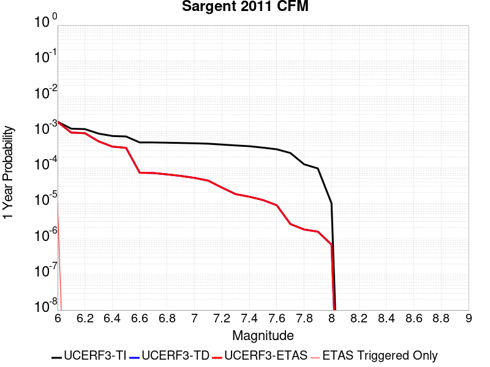 |  |

| Magnitude | 1 wk TI Prob | 1 wk TD Prob | 1 wk ETAS Prob | 1 wk ETAS/TD Gain | 1 wk ETAS Triggered Only | 1 mo TI Prob | 1 mo TD Prob | 1 mo ETAS Prob | 1 mo ETAS/TD Gain | 1 mo ETAS Triggered Only | 1 yr TI Prob | 1 yr TD Prob | 1 yr ETAS Prob | 1 yr ETAS/TD Gain | 1 yr ETAS Triggered Only | 10 yr TI Prob | 10 yr TD Prob | 10 yr ETAS Prob | 10 yr ETAS/TD Gain | 10 yr ETAS Triggered Only |
|-----|-----|-----|-----|-----|-----|-----|-----|-----|-----|-----|-----|-----|-----|-----|-----|-----|-----|-----|-----|-----|
| 6.0 | 3.7327867E-5 | 3.6650923E-5 | 3.6650923E-5 | 1.0 | 0.0 | 1.5996677E-4 | 1.5706872E-4 | 1.5706872E-4 | 1.0 | 0.0 | 0.0019458556 | 0.0019111163 | 0.0019210972 | 1.0052226 | 1.0E-5 | 0.01928905 | 0.019019013 | 0.019028824 | 1.0005158 | 1.0E-5 |
| 6.1 | 2.3771476E-5 | 1.8480237E-5 | 1.8480237E-5 | 1.0 | 0.0 | 1.01873775E-4 | 7.919911E-5 | 7.919911E-5 | 1.0 | 0.0 | 0.0012396075 | 9.6389884E-4 | 9.6389884E-4 | 1.0 | 0.0 | 0.012327154 | 0.0096366145 | 0.0096366145 | 1.0 | 0.0 |
| 6.2 | 2.3112721E-5 | 1.771158E-5 | 1.771158E-5 | 1.0 | 0.0 | 9.9050754E-5 | 7.590506E-5 | 7.590506E-5 | 1.0 | 0.0 | 0.0012052758 | 9.238279E-4 | 9.238279E-4 | 1.0 | 0.0 | 0.011987597 | 0.009239258 | 0.009239258 | 1.0 | 0.0 |
| 6.3 | 1.728509E-5 | 1.0459638E-5 | 1.0459638E-5 | 1.0 | 0.0 | 7.407686E-5 | 4.482652E-5 | 4.482652E-5 | 1.0 | 0.0 | 9.015125E-4 | 5.456713E-4 | 5.456713E-4 | 1.0 | 0.0 | 0.008978641 | 0.005479518 | 0.005479518 | 1.0 | 0.0 |
| 6.4 | 1.48395575E-5 | 7.456602E-6 | 7.456602E-6 | 1.0 | 0.0 | 6.3596555E-5 | 3.195669E-5 | 3.195669E-5 | 1.0 | 0.0 | 7.7401294E-4 | 3.890389E-4 | 3.890389E-4 | 1.0 | 0.0 | 0.0077132257 | 0.003919016 | 0.003919016 | 1.0 | 0.0 |
| 6.5 | 1.4358964E-5 | 6.8953664E-6 | 6.8953664E-6 | 1.0 | 0.0 | 6.1536964E-5 | 2.955145E-5 | 2.955145E-5 | 1.0 | 0.0 | 7.48955E-4 | 3.59765E-4 | 3.59765E-4 | 1.0 | 0.0 | 0.0074643586 | 0.0036272588 | 0.0036272588 | 1.0 | 0.0 |
| 6.6 | 9.772591E-6 | 1.3740738E-6 | 1.3740738E-6 | 1.0 | 0.0 | 4.188186E-5 | 5.8888745E-6 | 5.8888745E-6 | 1.0 | 0.0 | 5.097923E-4 | 7.169472E-5 | 7.169472E-5 | 1.0 | 0.0 | 0.005086244 | 7.485767E-4 | 7.485767E-4 | 1.0 | 0.0 |
| 6.7 | 9.752745E-6 | 1.352765E-6 | 1.352765E-6 | 1.0 | 0.0 | 4.179681E-5 | 5.7975512E-6 | 5.7975512E-6 | 1.0 | 0.0 | 5.0875737E-4 | 7.058293E-5 | 7.058293E-5 | 1.0 | 0.0 | 0.005075942 | 7.3746627E-4 | 7.3746627E-4 | 1.0 | 0.0 |
| 6.8 | 9.608213E-6 | 1.2366212E-6 | 1.2366212E-6 | 1.0 | 0.0 | 4.1177405E-5 | 5.2997943E-6 | 5.2997943E-6 | 1.0 | 0.0 | 5.012196E-4 | 6.452311E-5 | 6.452311E-5 | 1.0 | 0.0 | 0.005000906 | 6.7660306E-4 | 6.7660306E-4 | 1.0 | 0.0 |
| 6.9 | 9.427164E-6 | 1.1213713E-6 | 1.1213713E-6 | 1.0 | 0.0 | 4.04015E-5 | 4.805868E-6 | 4.805868E-6 | 1.0 | 0.0 | 4.9177726E-4 | 5.850989E-5 | 5.850989E-5 | 1.0 | 0.0 | 0.004906904 | 6.15824E-4 | 6.15824E-4 | 1.0 | 0.0 |
| 7.0 | 9.247601E-6 | 9.878157E-7 | 9.878157E-7 | 1.0 | 0.0 | 3.9631974E-5 | 4.233489E-6 | 4.233489E-6 | 1.0 | 0.0 | 4.8241246E-4 | 5.1541527E-5 | 5.1541527E-5 | 1.0 | 0.0 | 0.0048136655 | 5.456695E-4 | 5.456695E-4 | 1.0 | 0.0 |
| 7.1 | 8.995454E-6 | 8.275043E-7 | 8.275043E-7 | 1.0 | 0.0 | 3.8551374E-5 | 3.5464423E-6 | 3.5464423E-6 | 1.0 | 0.0 | 4.6926187E-4 | 4.3177093E-5 | 4.3177093E-5 | 1.0 | 0.0 | 0.004682722 | 4.611383E-4 | 4.611383E-4 | 1.0 | 0.0 |
| 7.2 | 8.520861E-6 | 5.28009E-7 | 5.28009E-7 | 1.0 | 0.0 | 3.6517464E-5 | 2.2628938E-6 | 2.2628938E-6 | 1.0 | 0.0 | 4.445094E-4 | 2.755039E-5 | 2.755039E-5 | 1.0 | 0.0 | 0.004436213 | 3.031784E-4 | 3.031784E-4 | 1.0 | 0.0 |
| 7.3 | 8.043592E-6 | 3.4596246E-7 | 3.4596246E-7 | 1.0 | 0.0 | 3.4472083E-5 | 1.4826954E-6 | 1.4826954E-6 | 1.0 | 0.0 | 4.196168E-4 | 1.8051667E-5 | 1.8051667E-5 | 1.0 | 0.0 | 0.004188253 | 2.0688567E-4 | 2.0688567E-4 | 1.0 | 0.0 |
| 7.4 | 7.662316E-6 | 2.9318238E-7 | 2.9318238E-7 | 1.0 | 0.0 | 3.2838085E-5 | 1.2564954E-6 | 1.2564954E-6 | 1.0 | 0.0 | 3.9973034E-4 | 1.5297725E-5 | 1.5297725E-5 | 1.0 | 0.0 | 0.0039901207 | 1.7753968E-4 | 1.7753968E-4 | 1.0 | 0.0 |
| 7.5 | 6.961638E-6 | 2.3598683E-7 | 2.3598683E-7 | 1.0 | 0.0 | 2.9835252E-5 | 1.0113716E-6 | 1.0113716E-6 | 1.0 | 0.0 | 3.6318362E-4 | 1.2313381E-5 | 1.2313381E-5 | 1.0 | 0.0 | 0.0036259065 | 1.4424195E-4 | 1.4424195E-4 | 1.0 | 0.0 |
| 7.6 | 6.282332E-6 | 1.6911825E-7 | 1.6911825E-7 | 1.0 | 0.0 | 2.6924003E-5 | 7.247923E-7 | 7.247923E-7 | 1.0 | 0.0 | 3.2775043E-4 | 8.824311E-6 | 8.824311E-6 | 1.0 | 0.0 | 0.0032726745 | 1.051679E-4 | 1.051679E-4 | 1.0 | 0.0 |
| 7.7 | 4.934408E-6 | 5.0073535E-8 | 5.0073535E-8 | 1.0 | 0.0 | 2.114729E-5 | 2.1460085E-7 | 2.1460085E-7 | 1.0 | 0.0 | 2.5743784E-4 | 2.612762E-6 | 2.612762E-6 | 1.0 | 0.0 | 0.0025713982 | 3.2588337E-5 | 3.2588337E-5 | 1.0 | 0.0 |
| 7.8 | 2.373212E-6 | 3.5222183E-8 | 3.5222183E-8 | 1.0 | 0.0 | 1.0170869E-5 | 1.509522E-7 | 1.509522E-7 | 1.0 | 0.0 | 1.238233E-4 | 1.8378415E-6 | 1.8378415E-6 | 1.0 | 0.0 | 0.0012375432 | 2.4159548E-5 | 2.4159548E-5 | 1.0 | 0.0 |
| 7.9 | 1.8227792E-6 | 3.066333E-8 | 3.066333E-8 | 1.0 | 0.0 | 7.811887E-6 | 1.3141427E-7 | 1.3141427E-7 | 1.0 | 0.0 | 9.510558E-5 | 1.5999675E-6 | 1.5999675E-6 | 1.0 | 0.0 | 9.5064886E-4 | 2.1441132E-5 | 2.1441132E-5 | 1.0 | 0.0 |
| 8.0 | 1.9095137E-7 | 1.3277523E-8 | 1.3277523E-8 | 1.0 | 0.0 | 8.1836276E-7 | 5.6903666E-8 | 5.6903666E-8 | 1.0 | 0.0 | 9.963521E-6 | 6.9280196E-7 | 6.9280196E-7 | 1.0 | 0.0 | 9.963074E-5 | 8.471267E-6 | 8.471267E-6 | 1.0 | 0.0 |

## Mono Lake 2011 CFM
*[(top)](#table-of-contents)*

| 1 Week | 1 Month | 1 Year | 10 Year |
|-----|-----|-----|-----|
|  |  |  |  |

| Magnitude | 1 wk TI Prob | 1 wk TD Prob | 1 wk ETAS Prob | 1 wk ETAS/TD Gain | 1 wk ETAS Triggered Only | 1 mo TI Prob | 1 mo TD Prob | 1 mo ETAS Prob | 1 mo ETAS/TD Gain | 1 mo ETAS Triggered Only | 1 yr TI Prob | 1 yr TD Prob | 1 yr ETAS Prob | 1 yr ETAS/TD Gain | 1 yr ETAS Triggered Only | 10 yr TI Prob | 10 yr TD Prob | 10 yr ETAS Prob | 10 yr ETAS/TD Gain | 10 yr ETAS Triggered Only |
|-----|-----|-----|-----|-----|-----|-----|-----|-----|-----|-----|-----|-----|-----|-----|-----|-----|-----|-----|-----|-----|
| 6.0 | 2.0341662E-5 | 2.3828708E-5 | 2.3828708E-5 | 1.0 | 0.0 | 8.717564E-5 | 1.0212203E-4 | 1.0212203E-4 | 1.0 | 0.0 | 0.0010608466 | 0.0012431581 | 0.0012431581 | 1.0 | 0.0 | 0.010557966 | 0.012414116 | 0.012423992 | 1.0007955 | 1.0E-5 |
| 6.1 | 2.0341662E-5 | 2.3828708E-5 | 2.3828708E-5 | 1.0 | 0.0 | 8.717564E-5 | 1.0212203E-4 | 1.0212203E-4 | 1.0 | 0.0 | 0.0010608466 | 0.0012431581 | 0.0012431581 | 1.0 | 0.0 | 0.010557966 | 0.012414116 | 0.012423992 | 1.0007955 | 1.0E-5 |
| 6.2 | 2.0341662E-5 | 2.3828708E-5 | 2.3828708E-5 | 1.0 | 0.0 | 8.717564E-5 | 1.0212203E-4 | 1.0212203E-4 | 1.0 | 0.0 | 0.0010608466 | 0.0012431581 | 0.0012431581 | 1.0 | 0.0 | 0.010557966 | 0.012414116 | 0.012423992 | 1.0007955 | 1.0E-5 |
| 6.3 | 2.0341662E-5 | 2.3828708E-5 | 2.3828708E-5 | 1.0 | 0.0 | 8.717564E-5 | 1.0212203E-4 | 1.0212203E-4 | 1.0 | 0.0 | 0.0010608466 | 0.0012431581 | 0.0012431581 | 1.0 | 0.0 | 0.010557966 | 0.012414116 | 0.012423992 | 1.0007955 | 1.0E-5 |
| 6.4 | 1.749821E-5 | 2.049145E-5 | 2.049145E-5 | 1.0 | 0.0 | 7.499018E-5 | 8.78205E-5 | 8.78205E-5 | 1.0 | 0.0 | 9.1262296E-4 | 0.0010692145 | 0.0010692145 | 1.0 | 0.0 | 0.009088841 | 0.0106921075 | 0.010702 | 1.0009253 | 1.0E-5 |
| 6.5 | 1.749821E-5 | 2.049145E-5 | 2.049145E-5 | 1.0 | 0.0 | 7.499018E-5 | 8.78205E-5 | 8.78205E-5 | 1.0 | 0.0 | 9.1262296E-4 | 0.0010692145 | 0.0010692145 | 1.0 | 0.0 | 0.009088841 | 0.0106921075 | 0.010702 | 1.0009253 | 1.0E-5 |

## Peralta Hills
*[(top)](#table-of-contents)*

| 1 Week | 1 Month | 1 Year | 10 Year |
|-----|-----|-----|-----|
|  | 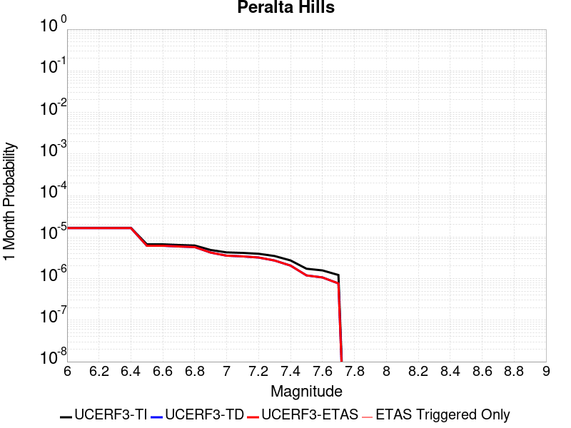 |  |  |

| Magnitude | 1 wk TI Prob | 1 wk TD Prob | 1 wk ETAS Prob | 1 wk ETAS/TD Gain | 1 wk ETAS Triggered Only | 1 mo TI Prob | 1 mo TD Prob | 1 mo ETAS Prob | 1 mo ETAS/TD Gain | 1 mo ETAS Triggered Only | 1 yr TI Prob | 1 yr TD Prob | 1 yr ETAS Prob | 1 yr ETAS/TD Gain | 1 yr ETAS Triggered Only | 10 yr TI Prob | 10 yr TD Prob | 10 yr ETAS Prob | 10 yr ETAS/TD Gain | 10 yr ETAS Triggered Only |
|-----|-----|-----|-----|-----|-----|-----|-----|-----|-----|-----|-----|-----|-----|-----|-----|-----|-----|-----|-----|-----|
| 6.0 | 3.8850067E-6 | 3.839573E-6 | 3.839573E-6 | 1.0 | 0.0 | 1.6649923E-5 | 1.645525E-5 | 1.645525E-5 | 1.0 | 0.0 | 2.0269395E-4 | 2.0033166E-4 | 2.0033166E-4 | 1.0 | 0.0 | 0.0020250916 | 0.0020022383 | 0.0020122183 | 1.0049844 | 1.0E-5 |
| 6.1 | 3.8850067E-6 | 3.839573E-6 | 3.839573E-6 | 1.0 | 0.0 | 1.6649923E-5 | 1.645525E-5 | 1.645525E-5 | 1.0 | 0.0 | 2.0269395E-4 | 2.0033166E-4 | 2.0033166E-4 | 1.0 | 0.0 | 0.0020250916 | 0.0020022383 | 0.0020122183 | 1.0049844 | 1.0E-5 |
| 6.2 | 3.8850067E-6 | 3.839573E-6 | 3.839573E-6 | 1.0 | 0.0 | 1.6649923E-5 | 1.645525E-5 | 1.645525E-5 | 1.0 | 0.0 | 2.0269395E-4 | 2.0033166E-4 | 2.0033166E-4 | 1.0 | 0.0 | 0.0020250916 | 0.0020022383 | 0.0020122183 | 1.0049844 | 1.0E-5 |
| 6.3 | 3.8850067E-6 | 3.839573E-6 | 3.839573E-6 | 1.0 | 0.0 | 1.6649923E-5 | 1.645525E-5 | 1.645525E-5 | 1.0 | 0.0 | 2.0269395E-4 | 2.0033166E-4 | 2.0033166E-4 | 1.0 | 0.0 | 0.0020250916 | 0.0020022383 | 0.0020122183 | 1.0049844 | 1.0E-5 |
| 6.4 | 3.8850067E-6 | 3.839573E-6 | 3.839573E-6 | 1.0 | 0.0 | 1.6649923E-5 | 1.645525E-5 | 1.645525E-5 | 1.0 | 0.0 | 2.0269395E-4 | 2.0033166E-4 | 2.0033166E-4 | 1.0 | 0.0 | 0.0020250916 | 0.0020022383 | 0.0020122183 | 1.0049844 | 1.0E-5 |
| 6.5 | 1.5587785E-6 | 1.4431308E-6 | 1.4431308E-6 | 1.0 | 0.0 | 6.6804623E-6 | 6.184833E-6 | 6.184833E-6 | 1.0 | 0.0 | 8.133159E-5 | 7.529798E-5 | 7.529798E-5 | 1.0 | 0.0 | 8.1301836E-4 | 7.527487E-4 | 7.527487E-4 | 1.0 | 0.0 |
| 6.6 | 1.5587785E-6 | 1.4431308E-6 | 1.4431308E-6 | 1.0 | 0.0 | 6.6804623E-6 | 6.184833E-6 | 6.184833E-6 | 1.0 | 0.0 | 8.133159E-5 | 7.529798E-5 | 7.529798E-5 | 1.0 | 0.0 | 8.1301836E-4 | 7.527487E-4 | 7.527487E-4 | 1.0 | 0.0 |
| 6.7 | 1.5018579E-6 | 1.3837531E-6 | 1.3837531E-6 | 1.0 | 0.0 | 6.436518E-6 | 5.9303584E-6 | 5.9303584E-6 | 1.0 | 0.0 | 7.836179E-5 | 7.219996E-5 | 7.219996E-5 | 1.0 | 0.0 | 7.833416E-4 | 7.2178856E-4 | 7.2178856E-4 | 1.0 | 0.0 |
| 6.8 | 1.4584314E-6 | 1.3381849E-6 | 1.3381849E-6 | 1.0 | 0.0 | 6.250405E-6 | 5.7350667E-6 | 5.7350667E-6 | 1.0 | 0.0 | 7.6096025E-5 | 6.982244E-5 | 6.982244E-5 | 1.0 | 0.0 | 7.6069974E-4 | 6.980284E-4 | 6.980284E-4 | 1.0 | 0.0 |
| 6.9 | 1.1382393E-6 | 9.862651E-7 | 9.862651E-7 | 1.0 | 0.0 | 4.8781594E-6 | 4.2268443E-6 | 4.2268443E-6 | 1.0 | 0.0 | 5.9389975E-5 | 5.1460698E-5 | 5.1460698E-5 | 1.0 | 0.0 | 5.93741E-4 | 5.1449606E-4 | 5.1449606E-4 | 1.0 | 0.0 |
| 7.0 | 9.970413E-7 | 8.309953E-7 | 8.309953E-7 | 1.0 | 0.0 | 4.273027E-6 | 3.561404E-6 | 3.561404E-6 | 1.0 | 0.0 | 5.2022864E-5 | 4.33593E-5 | 4.33593E-5 | 1.0 | 0.0 | 5.2010687E-4 | 4.335152E-4 | 4.335152E-4 | 1.0 | 0.0 |
| 7.1 | 9.684443E-7 | 7.994381E-7 | 7.994381E-7 | 1.0 | 0.0 | 4.150469E-6 | 3.426159E-6 | 3.426159E-6 | 1.0 | 0.0 | 5.053079E-5 | 4.171276E-5 | 4.171276E-5 | 1.0 | 0.0 | 5.05193E-4 | 4.17056E-4 | 4.17056E-4 | 1.0 | 0.0 |
| 7.2 | 9.240811E-7 | 7.5034313E-7 | 7.5034313E-7 | 1.0 | 0.0 | 3.960342E-6 | 3.2157527E-6 | 3.2157527E-6 | 1.0 | 0.0 | 4.8216094E-5 | 3.9151153E-5 | 3.9151153E-5 | 1.0 | 0.0 | 4.8205635E-4 | 3.914491E-4 | 3.914491E-4 | 1.0 | 0.0 |
| 7.3 | 8.158643E-7 | 6.3502733E-7 | 6.3502733E-7 | 1.0 | 0.0 | 3.4965567E-6 | 2.7215433E-6 | 2.7215433E-6 | 1.0 | 0.0 | 4.2569747E-5 | 3.3134347E-5 | 3.3134347E-5 | 1.0 | 0.0 | 4.2561593E-4 | 3.3130022E-4 | 3.3130022E-4 | 1.0 | 0.0 |
| 7.4 | 6.3822824E-7 | 4.7959236E-7 | 4.7959236E-7 | 1.0 | 0.0 | 2.7352612E-6 | 2.0553946E-6 | 2.0553946E-6 | 1.0 | 0.0 | 3.3301294E-5 | 2.5024194E-5 | 2.5024194E-5 | 1.0 | 0.0 | 3.3296304E-4 | 2.502189E-4 | 2.502189E-4 | 1.0 | 0.0 |
| 7.5 | 4.0292628E-7 | 2.784719E-7 | 2.784719E-7 | 1.0 | 0.0 | 1.7268258E-6 | 1.1934507E-6 | 1.1934507E-6 | 1.0 | 0.0 | 2.1023901E-5 | 1.4530193E-5 | 1.4530193E-5 | 1.0 | 0.0 | 2.1021912E-4 | 1.4529523E-4 | 1.4529523E-4 | 1.0 | 0.0 |
| 7.6 | 3.672993E-7 | 2.4855962E-7 | 2.4855962E-7 | 1.0 | 0.0 | 1.5741389E-6 | 1.0652552E-6 | 1.0652552E-6 | 1.0 | 0.0 | 1.9164972E-5 | 1.2969433E-5 | 1.2969433E-5 | 1.0 | 0.0 | 1.916332E-4 | 1.2968948E-4 | 1.2968948E-4 | 1.0 | 0.0 |
| 7.7 | 2.8466823E-7 | 1.7860675E-7 | 1.7860675E-7 | 1.0 | 0.0 | 1.2200061E-6 | 7.6545746E-7 | 7.6545746E-7 | 1.0 | 0.0 | 1.4853474E-5 | 9.319431E-6 | 9.319431E-6 | 1.0 | 0.0 | 1.485248E-4 | 9.3193E-5 | 9.3193E-5 | 1.0 | 0.0 |

## Cerro Prieto
*[(top)](#table-of-contents)*

| 1 Week | 1 Month | 1 Year | 10 Year |
|-----|-----|-----|-----|
| 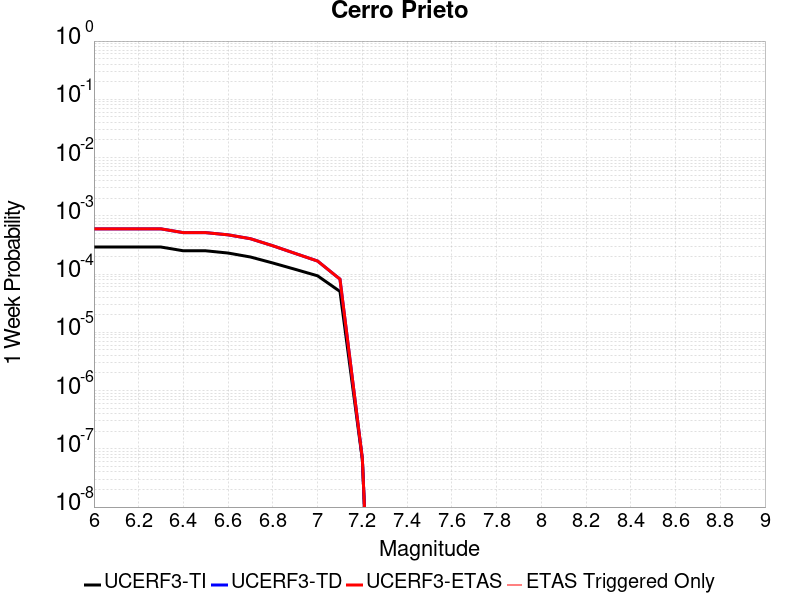 |  |  |  |

| Magnitude | 1 wk TI Prob | 1 wk TD Prob | 1 wk ETAS Prob | 1 wk ETAS/TD Gain | 1 wk ETAS Triggered Only | 1 mo TI Prob | 1 mo TD Prob | 1 mo ETAS Prob | 1 mo ETAS/TD Gain | 1 mo ETAS Triggered Only | 1 yr TI Prob | 1 yr TD Prob | 1 yr ETAS Prob | 1 yr ETAS/TD Gain | 1 yr ETAS Triggered Only | 10 yr TI Prob | 10 yr TD Prob | 10 yr ETAS Prob | 10 yr ETAS/TD Gain | 10 yr ETAS Triggered Only |
|-----|-----|-----|-----|-----|-----|-----|-----|-----|-----|-----|-----|-----|-----|-----|-----|-----|-----|-----|-----|-----|
| 6.0 | 2.9101528E-4 | 5.965907E-4 | 5.965907E-4 | 1.0 | 0.0 | 0.0012466122 | 0.002554554 | 0.002554554 | 1.0 | 0.0 | 0.015072231 | 0.030653033 | 0.030662727 | 1.0003163 | 1.0E-5 | 0.14089979 | 0.25401175 | 0.2540192 | 1.0000293 | 1.0E-5 |
| 6.1 | 2.9101528E-4 | 5.965907E-4 | 5.965907E-4 | 1.0 | 0.0 | 0.0012466122 | 0.002554554 | 0.002554554 | 1.0 | 0.0 | 0.015072231 | 0.030653033 | 0.030662727 | 1.0003163 | 1.0E-5 | 0.14089979 | 0.25401175 | 0.2540192 | 1.0000293 | 1.0E-5 |
| 6.2 | 2.9101528E-4 | 5.965907E-4 | 5.965907E-4 | 1.0 | 0.0 | 0.0012466122 | 0.002554554 | 0.002554554 | 1.0 | 0.0 | 0.015072231 | 0.030653033 | 0.030662727 | 1.0003163 | 1.0E-5 | 0.14089979 | 0.25401175 | 0.2540192 | 1.0000293 | 1.0E-5 |
| 6.3 | 2.9101528E-4 | 5.965907E-4 | 5.965907E-4 | 1.0 | 0.0 | 0.0012466122 | 0.002554554 | 0.002554554 | 1.0 | 0.0 | 0.015072231 | 0.030653033 | 0.030662727 | 1.0003163 | 1.0E-5 | 0.14089979 | 0.25401175 | 0.2540192 | 1.0000293 | 1.0E-5 |
| 6.4 | 2.508648E-4 | 5.140792E-4 | 5.140792E-4 | 1.0 | 0.0 | 0.0010746918 | 0.0022015348 | 0.0022015348 | 1.0 | 0.0 | 0.013006088 | 0.026476625 | 0.026486361 | 1.0003676 | 1.0E-5 | 0.12270685 | 0.22443727 | 0.22444503 | 1.0000346 | 1.0E-5 |
| 6.5 | 2.508648E-4 | 5.140792E-4 | 5.140792E-4 | 1.0 | 0.0 | 0.0010746918 | 0.0022015348 | 0.0022015348 | 1.0 | 0.0 | 0.013006088 | 0.026476625 | 0.026486361 | 1.0003676 | 1.0E-5 | 0.12270685 | 0.22443727 | 0.22444503 | 1.0000346 | 1.0E-5 |
| 6.6 | 2.294914E-4 | 4.7126948E-4 | 4.7126948E-4 | 1.0 | 0.0 | 9.831638E-4 | 0.0020183506 | 0.0020183506 | 1.0 | 0.0 | 0.011904482 | 0.024303433 | 0.02431319 | 1.0004015 | 1.0E-5 | 0.11286586 | 0.20861839 | 0.2086263 | 1.0000379 | 1.0E-5 |
| 6.7 | 1.9621674E-4 | 4.042872E-4 | 4.042872E-4 | 1.0 | 0.0 | 8.4065786E-4 | 0.0017316672 | 0.0017316672 | 1.0 | 0.0 | 0.010187071 | 0.020889567 | 0.02089936 | 1.0004687 | 1.0E-5 | 0.09732539 | 0.18293467 | 0.18294284 | 1.0000447 | 1.0E-5 |
| 6.8 | 1.5476145E-4 | 3.0573073E-4 | 3.0573073E-4 | 1.0 | 0.0 | 6.6309475E-4 | 0.0013097188 | 0.0013097188 | 1.0 | 0.0 | 0.008043335 | 0.015840806 | 0.015840806 | 1.0 | 0.0 | 0.07758363 | 0.14339209 | 0.14339209 | 1.0 | 0.0 |
| 6.9 | 1.20509176E-4 | 2.2588969E-4 | 2.2588969E-4 | 1.0 | 0.0 | 5.1636563E-4 | 9.678028E-4 | 9.678028E-4 | 1.0 | 0.0 | 0.006268645 | 0.011729713 | 0.011729713 | 1.0 | 0.0 | 0.060947374 | 0.10947595 | 0.10947595 | 1.0 | 0.0 |
| 7.0 | 9.3269155E-5 | 1.672182E-4 | 1.672182E-4 | 1.0 | 0.0 | 3.9966372E-4 | 7.164957E-4 | 7.164957E-4 | 1.0 | 0.0 | 0.0048550544 | 0.008696101 | 0.008696101 | 1.0 | 0.0 | 0.04750344 | 0.08317999 | 0.08317999 | 1.0 | 0.0 |
| 7.1 | 5.029709E-5 | 8.1748294E-5 | 8.1748294E-5 | 1.0 | 0.0 | 2.1554115E-4 | 3.5032208E-4 | 3.5032208E-4 | 1.0 | 0.0 | 0.0026210553 | 0.0042602476 | 0.0042602476 | 1.0 | 0.0 | 0.025903556 | 0.04237809 | 0.04237809 | 1.0 | 0.0 |
| 7.2 | 6.5445185E-8 | 6.820826E-8 | 6.820826E-8 | 1.0 | 0.0 | 2.8047933E-7 | 2.923211E-7 | 2.923211E-7 | 1.0 | 0.0 | 3.4148304E-6 | 3.5590094E-6 | 3.5590094E-6 | 1.0 | 0.0 | 3.414778E-5 | 3.5590092E-5 | 3.5590092E-5 | 1.0 | 0.0 |

## Monterey Bay-Tularcitos
*[(top)](#table-of-contents)*

| 1 Week | 1 Month | 1 Year | 10 Year |
|-----|-----|-----|-----|
|  |  |  |  |

| Magnitude | 1 wk TI Prob | 1 wk TD Prob | 1 wk ETAS Prob | 1 wk ETAS/TD Gain | 1 wk ETAS Triggered Only | 1 mo TI Prob | 1 mo TD Prob | 1 mo ETAS Prob | 1 mo ETAS/TD Gain | 1 mo ETAS Triggered Only | 1 yr TI Prob | 1 yr TD Prob | 1 yr ETAS Prob | 1 yr ETAS/TD Gain | 1 yr ETAS Triggered Only | 10 yr TI Prob | 10 yr TD Prob | 10 yr ETAS Prob | 10 yr ETAS/TD Gain | 10 yr ETAS Triggered Only |
|-----|-----|-----|-----|-----|-----|-----|-----|-----|-----|-----|-----|-----|-----|-----|-----|-----|-----|-----|-----|-----|
| 6.0 | 3.0131365E-5 | 3.2799162E-5 | 3.2799162E-5 | 1.0 | 0.0 | 1.2912804E-4 | 1.4056086E-4 | 1.5055946E-4 | 1.0711336 | 1.0E-5 | 0.001571 | 0.0017100906 | 0.0017200735 | 1.0058377 | 1.0E-5 | 0.015599402 | 0.016980117 | 0.016989948 | 1.0005789 | 1.0E-5 |
| 6.1 | 3.0131365E-5 | 3.2799162E-5 | 3.2799162E-5 | 1.0 | 0.0 | 1.2912804E-4 | 1.4056086E-4 | 1.5055946E-4 | 1.0711336 | 1.0E-5 | 0.001571 | 0.0017100906 | 0.0017200735 | 1.0058377 | 1.0E-5 | 0.015599402 | 0.016980117 | 0.016989948 | 1.0005789 | 1.0E-5 |
| 6.2 | 3.0131365E-5 | 3.2799162E-5 | 3.2799162E-5 | 1.0 | 0.0 | 1.2912804E-4 | 1.4056086E-4 | 1.5055946E-4 | 1.0711336 | 1.0E-5 | 0.001571 | 0.0017100906 | 0.0017200735 | 1.0058377 | 1.0E-5 | 0.015599402 | 0.016980117 | 0.016989948 | 1.0005789 | 1.0E-5 |
| 6.3 | 1.6998249E-5 | 1.8330993E-5 | 1.8330993E-5 | 1.0 | 0.0 | 7.28476E-5 | 7.855914E-5 | 7.855914E-5 | 1.0 | 0.0 | 8.865586E-4 | 9.560565E-4 | 9.560565E-4 | 1.0 | 0.0 | 0.0088303005 | 0.00952136 | 0.00952136 | 1.0 | 0.0 |
| 6.4 | 1.6998249E-5 | 1.8330993E-5 | 1.8330993E-5 | 1.0 | 0.0 | 7.28476E-5 | 7.855914E-5 | 7.855914E-5 | 1.0 | 0.0 | 8.865586E-4 | 9.560565E-4 | 9.560565E-4 | 1.0 | 0.0 | 0.0088303005 | 0.00952136 | 0.00952136 | 1.0 | 0.0 |
| 6.5 | 1.27470785E-5 | 1.3693452E-5 | 1.3693452E-5 | 1.0 | 0.0 | 5.4629192E-5 | 5.868496E-5 | 5.868496E-5 | 1.0 | 0.0 | 6.649074E-4 | 7.142655E-4 | 7.142655E-4 | 1.0 | 0.0 | 0.0066292146 | 0.007120751 | 0.007120751 | 1.0 | 0.0 |
| 6.6 | 1.2739422E-5 | 1.3685539E-5 | 1.3685539E-5 | 1.0 | 0.0 | 5.4596385E-5 | 5.865105E-5 | 5.865105E-5 | 1.0 | 0.0 | 6.645082E-4 | 7.1385293E-4 | 7.1385293E-4 | 1.0 | 0.0 | 0.0066252467 | 0.007116651 | 0.007116651 | 1.0 | 0.0 |
| 6.7 | 1.0160109E-5 | 1.0885862E-5 | 1.0885862E-5 | 1.0 | 0.0 | 4.35426E-5 | 4.66529E-5 | 4.66529E-5 | 1.0 | 0.0 | 5.300022E-4 | 5.678581E-4 | 5.678581E-4 | 1.0 | 0.0 | 0.005287399 | 0.005664782 | 0.005664782 | 1.0 | 0.0 |
| 6.8 | 8.349859E-6 | 8.932674E-6 | 8.932674E-6 | 1.0 | 0.0 | 3.578462E-5 | 3.828236E-5 | 3.828236E-5 | 1.0 | 0.0 | 4.3559066E-4 | 4.659937E-4 | 4.659937E-4 | 1.0 | 0.0 | 0.004347378 | 0.0046507306 | 0.0046507306 | 1.0 | 0.0 |
| 6.9 | 5.193639E-6 | 5.536483E-6 | 5.536483E-6 | 1.0 | 0.0 | 2.2258262E-5 | 2.3727587E-5 | 2.3727587E-5 | 1.0 | 0.0 | 2.7096065E-4 | 2.8884833E-4 | 2.8884833E-4 | 1.0 | 0.0 | 0.0027063051 | 0.00288505 | 0.00288505 | 1.0 | 0.0 |
| 7.0 | 4.359381E-6 | 4.6434106E-6 | 4.6434106E-6 | 1.0 | 0.0 | 1.8682927E-5 | 1.9900195E-5 | 1.9900195E-5 | 1.0 | 0.0 | 2.274409E-4 | 2.4226093E-4 | 2.4226093E-4 | 1.0 | 0.0 | 0.0022720827 | 0.0024202613 | 0.0024202613 | 1.0 | 0.0 |
| 7.1 | 3.0398533E-6 | 3.231074E-6 | 3.231074E-6 | 1.0 | 0.0 | 1.3027877E-5 | 1.38474015E-5 | 1.38474015E-5 | 1.0 | 0.0 | 1.5860285E-4 | 1.685817E-4 | 1.685817E-4 | 1.0 | 0.0 | 0.001584897 | 0.0016847957 | 0.0016847957 | 1.0 | 0.0 |
| 7.2 | 1.642335E-6 | 1.7333325E-6 | 1.7333325E-6 | 1.0 | 0.0 | 7.0385595E-6 | 7.4285585E-6 | 7.4285585E-6 | 1.0 | 0.0 | 8.569109E-5 | 9.044101E-5 | 9.044101E-5 | 1.0 | 0.0 | 8.5658056E-4 | 9.042448E-4 | 9.042448E-4 | 1.0 | 0.0 |
| 7.3 | 3.356842E-7 | 3.295272E-7 | 3.295272E-7 | 1.0 | 0.0 | 1.4386458E-6 | 1.4122586E-6 | 1.4122586E-6 | 1.0 | 0.0 | 1.7515373E-5 | 1.7194114E-5 | 1.7194114E-5 | 1.0 | 0.0 | 1.7513991E-4 | 1.7192794E-4 | 1.7192794E-4 | 1.0 | 0.0 |
| 7.4 | 2.1973483E-7 | 2.1006697E-7 | 2.1006697E-7 | 1.0 | 0.0 | 9.417204E-7 | 9.002867E-7 | 9.002867E-7 | 1.0 | 0.0 | 1.1465385E-5 | 1.09609355E-5 | 1.09609355E-5 | 1.0 | 0.0 | 1.1464794E-4 | 1.09603985E-4 | 1.09603985E-4 | 1.0 | 0.0 |
| 7.5 | 1.1944135E-7 | 1.0696283E-7 | 1.0696283E-7 | 1.0 | 0.0 | 5.118914E-7 | 4.5841205E-7 | 4.5841205E-7 | 1.0 | 0.0 | 6.23226E-6 | 5.5811524E-6 | 5.5811524E-6 | 1.0 | 0.0 | 6.2320854E-5 | 5.5810135E-5 | 5.5810135E-5 | 1.0 | 0.0 |
| 7.6 | 4.636058E-8 | 3.3366945E-8 | 3.3366945E-8 | 1.0 | 0.0 | 1.9868818E-7 | 1.4300119E-7 | 1.4300119E-7 | 1.0 | 0.0 | 2.419026E-6 | 1.7410381E-6 | 1.7410381E-6 | 1.0 | 0.0 | 2.4189996E-5 | 1.7410246E-5 | 1.7410246E-5 | 1.0 | 0.0 |
| 7.7 | 1.8588572E-8 | 8.005146E-9 | 8.005146E-9 | 1.0 | 0.0 | 7.9665305E-8 | 3.4307767E-8 | 3.4307767E-8 | 1.0 | 0.0 | 9.699246E-7 | 4.1769698E-7 | 4.1769698E-7 | 1.0 | 0.0 | 9.699204E-6 | 4.176962E-6 | 4.176962E-6 | 1.0 | 0.0 |
| 7.8 | 2.7960154E-9 | 7.612305E-10 | 7.612305E-10 | 1.0 | 0.0 | 1.1982923E-8 | 3.2624166E-9 | 3.2624166E-9 | 1.0 | 0.0 | 1.4589209E-7 | 3.971992E-8 | 3.971992E-8 | 1.0 | 0.0 | 1.4589199E-6 | 3.9719916E-7 | 3.9719916E-7 | 1.0 | 0.0 |

## Elsinore (Coyote Mountains)
*[(top)](#table-of-contents)*

| 1 Week | 1 Month | 1 Year | 10 Year |
|-----|-----|-----|-----|
|  |  |  |  |

| Magnitude | 1 wk TI Prob | 1 wk TD Prob | 1 wk ETAS Prob | 1 wk ETAS/TD Gain | 1 wk ETAS Triggered Only | 1 mo TI Prob | 1 mo TD Prob | 1 mo ETAS Prob | 1 mo ETAS/TD Gain | 1 mo ETAS Triggered Only | 1 yr TI Prob | 1 yr TD Prob | 1 yr ETAS Prob | 1 yr ETAS/TD Gain | 1 yr ETAS Triggered Only | 10 yr TI Prob | 10 yr TD Prob | 10 yr ETAS Prob | 10 yr ETAS/TD Gain | 10 yr ETAS Triggered Only |
|-----|-----|-----|-----|-----|-----|-----|-----|-----|-----|-----|-----|-----|-----|-----|-----|-----|-----|-----|-----|-----|
| 6.0 | 4.20513E-5 | 4.8633563E-5 | 5.8633075E-5 | 1.2056093 | 1.0E-5 | 1.8020741E-4 | 2.0841615E-4 | 2.1841406E-4 | 1.0479709 | 1.0E-5 | 0.0021918174 | 0.0025350873 | 0.002545062 | 1.0039346 | 1.0E-5 | 0.021703249 | 0.025112117 | 0.025121866 | 1.0003883 | 1.0E-5 |
| 6.1 | 4.20513E-5 | 4.8633563E-5 | 5.8633075E-5 | 1.2056093 | 1.0E-5 | 1.8020741E-4 | 2.0841615E-4 | 2.1841406E-4 | 1.0479709 | 1.0E-5 | 0.0021918174 | 0.0025350873 | 0.002545062 | 1.0039346 | 1.0E-5 | 0.021703249 | 0.025112117 | 0.025121866 | 1.0003883 | 1.0E-5 |
| 6.2 | 2.3413893E-5 | 2.4696421E-5 | 3.4696175E-5 | 1.404907 | 1.0E-5 | 1.0034139E-4 | 1.0583805E-4 | 1.1583699E-4 | 1.094474 | 1.0E-5 | 0.0012209718 | 0.0012879103 | 0.0012978973 | 1.0077546 | 1.0E-5 | 0.012142851 | 0.012813029 | 0.0128229 | 1.0007704 | 1.0E-5 |
| 6.3 | 2.3413893E-5 | 2.4696421E-5 | 3.4696175E-5 | 1.404907 | 1.0E-5 | 1.0034139E-4 | 1.0583805E-4 | 1.1583699E-4 | 1.094474 | 1.0E-5 | 0.0012209718 | 0.0012879103 | 0.0012978973 | 1.0077546 | 1.0E-5 | 0.012142851 | 0.012813029 | 0.0128229 | 1.0007704 | 1.0E-5 |
| 6.4 | 1.6894814E-5 | 1.6568854E-5 | 2.6568689E-5 | 1.6035321 | 1.0E-5 | 7.240433E-5 | 7.100766E-5 | 8.100695E-5 | 1.1408199 | 1.0E-5 | 8.811662E-4 | 8.6421217E-4 | 8.742035E-4 | 1.0115613 | 1.0E-5 | 0.0087768035 | 0.008612194 | 0.008622108 | 1.0011511 | 1.0E-5 |
| 6.5 | 1.6894814E-5 | 1.6568854E-5 | 2.6568689E-5 | 1.6035321 | 1.0E-5 | 7.240433E-5 | 7.100766E-5 | 8.100695E-5 | 1.1408199 | 1.0E-5 | 8.811662E-4 | 8.6421217E-4 | 8.742035E-4 | 1.0115613 | 1.0E-5 | 0.0087768035 | 0.008612194 | 0.008622108 | 1.0011511 | 1.0E-5 |
| 6.6 | 1.1910969E-5 | 1.05310955E-5 | 1.05310955E-5 | 1.0 | 0.0 | 5.1046012E-5 | 4.513256E-5 | 4.513256E-5 | 1.0 | 0.0 | 6.21308E-4 | 5.4936187E-4 | 5.4936187E-4 | 1.0 | 0.0 | 0.0061957375 | 0.0054813414 | 0.0054813414 | 1.0 | 0.0 |
| 6.7 | 9.1486E-6 | 7.2030907E-6 | 7.2030907E-6 | 1.0 | 0.0 | 3.9207694E-5 | 3.0870044E-5 | 3.0870044E-5 | 1.0 | 0.0 | 4.7724912E-4 | 3.757818E-4 | 3.757818E-4 | 1.0 | 0.0 | 0.0047622547 | 0.0037518432 | 0.0037518432 | 1.0 | 0.0 |
| 6.8 | 7.90441E-6 | 5.7292227E-6 | 5.7292227E-6 | 1.0 | 0.0 | 3.3875604E-5 | 2.4553588E-5 | 2.4553588E-5 | 1.0 | 0.0 | 4.1235742E-4 | 2.989002E-4 | 2.989002E-4 | 1.0 | 0.0 | 0.0041159308 | 0.0029851105 | 0.0029851105 | 1.0 | 0.0 |
| 6.9 | 7.77015E-6 | 5.5831756E-6 | 5.5831756E-6 | 1.0 | 0.0 | 3.3300217E-5 | 2.3927683E-5 | 2.3927683E-5 | 1.0 | 0.0 | 4.0535472E-4 | 2.9128187E-4 | 2.9128187E-4 | 1.0 | 0.0 | 0.004046161 | 0.0029091279 | 0.0029091279 | 1.0 | 0.0 |
| 7.0 | 7.675798E-6 | 5.480033E-6 | 5.480033E-6 | 1.0 | 0.0 | 3.289586E-5 | 2.348565E-5 | 2.348565E-5 | 1.0 | 0.0 | 4.004335E-4 | 2.8590154E-4 | 2.8590154E-4 | 1.0 | 0.0 | 0.003997127 | 0.0028554637 | 0.0028554637 | 1.0 | 0.0 |
| 7.1 | 7.447814E-6 | 5.2389046E-6 | 5.2389046E-6 | 1.0 | 0.0 | 3.191881E-5 | 2.2452263E-5 | 2.2452263E-5 | 1.0 | 0.0 | 3.8854225E-4 | 2.7332324E-4 | 2.7332324E-4 | 1.0 | 0.0 | 0.003878636 | 0.0027299952 | 0.0027299952 | 1.0 | 0.0 |
| 7.2 | 7.128185E-6 | 4.9055616E-6 | 4.9055616E-6 | 1.0 | 0.0 | 3.0549007E-5 | 2.1023672E-5 | 2.1023672E-5 | 1.0 | 0.0 | 3.7187067E-4 | 2.5593434E-4 | 2.5593434E-4 | 1.0 | 0.0 | 0.00371249 | 0.0025565142 | 0.0025565142 | 1.0 | 0.0 |
| 7.3 | 7.0913875E-6 | 4.8742363E-6 | 4.8742363E-6 | 1.0 | 0.0 | 3.0391306E-5 | 2.0889423E-5 | 2.0889423E-5 | 1.0 | 0.0 | 3.6995133E-4 | 2.5430025E-4 | 2.5430025E-4 | 1.0 | 0.0 | 0.0036933604 | 0.0025402107 | 0.0025402107 | 1.0 | 0.0 |
| 7.4 | 7.051521E-6 | 4.8380875E-6 | 4.8380875E-6 | 1.0 | 0.0 | 3.0220453E-5 | 2.0734502E-5 | 2.0734502E-5 | 1.0 | 0.0 | 3.6787192E-4 | 2.524145E-4 | 2.524145E-4 | 1.0 | 0.0 | 0.0036726352 | 0.0025213964 | 0.0025213964 | 1.0 | 0.0 |
| 7.5 | 6.910666E-6 | 4.7336343E-6 | 4.7336343E-6 | 1.0 | 0.0 | 2.9616802E-5 | 2.0286852E-5 | 2.0286852E-5 | 1.0 | 0.0 | 3.605249E-4 | 2.4696562E-4 | 2.4696562E-4 | 1.0 | 0.0 | 0.0035994058 | 0.0024670297 | 0.0024670297 | 1.0 | 0.0 |
| 7.6 | 6.341753E-6 | 4.3067316E-6 | 4.3067316E-6 | 1.0 | 0.0 | 2.7178658E-5 | 1.8457298E-5 | 1.8457298E-5 | 1.0 | 0.0 | 3.3084993E-4 | 2.246956E-4 | 2.246956E-4 | 1.0 | 0.0 | 0.0033035777 | 0.0022447994 | 0.0022447994 | 1.0 | 0.0 |
| 7.7 | 3.9205916E-6 | 2.2440495E-6 | 2.2440495E-6 | 1.0 | 0.0 | 1.6802427E-5 | 9.6173235E-6 | 9.6173235E-6 | 1.0 | 0.0 | 2.0455034E-4 | 1.1708537E-4 | 1.1708537E-4 | 1.0 | 0.0 | 0.0020436216 | 0.0011703098 | 0.0011703098 | 1.0 | 0.0 |
| 7.8 | 2.0846227E-7 | 8.4868525E-8 | 8.4868525E-8 | 1.0 | 0.0 | 8.9340944E-7 | 3.6372222E-7 | 3.6372222E-7 | 1.0 | 0.0 | 1.0877206E-5 | 4.4283124E-6 | 4.4283124E-6 | 1.0 | 0.0 | 1.0876673E-4 | 4.4282566E-5 | 4.4282566E-5 | 1.0 | 0.0 |
| 7.9 | 4.4969806E-9 | 2.2692683E-9 | 2.2692683E-9 | 1.0 | 0.0 | 1.9272775E-8 | 9.725436E-9 | 9.725436E-9 | 1.0 | 0.0 | 2.3464601E-7 | 1.1840718E-7 | 1.1840718E-7 | 1.0 | 0.0 | 2.3464577E-6 | 1.1840713E-6 | 1.1840713E-6 | 1.0 | 0.0 |

## Cleghorn
*[(top)](#table-of-contents)*

| 1 Week | 1 Month | 1 Year | 10 Year |
|-----|-----|-----|-----|
|  |  |  |  |

| Magnitude | 1 wk TI Prob | 1 wk TD Prob | 1 wk ETAS Prob | 1 wk ETAS/TD Gain | 1 wk ETAS Triggered Only | 1 mo TI Prob | 1 mo TD Prob | 1 mo ETAS Prob | 1 mo ETAS/TD Gain | 1 mo ETAS Triggered Only | 1 yr TI Prob | 1 yr TD Prob | 1 yr ETAS Prob | 1 yr ETAS/TD Gain | 1 yr ETAS Triggered Only | 10 yr TI Prob | 10 yr TD Prob | 10 yr ETAS Prob | 10 yr ETAS/TD Gain | 10 yr ETAS Triggered Only |
|-----|-----|-----|-----|-----|-----|-----|-----|-----|-----|-----|-----|-----|-----|-----|-----|-----|-----|-----|-----|-----|
| 6.0 | 7.9267165E-6 | 9.832575E-6 | 9.832575E-6 | 1.0 | 0.0 | 3.39712E-5 | 4.213899E-5 | 4.213899E-5 | 1.0 | 0.0 | 4.1352084E-4 | 5.12932E-4 | 5.12932E-4 | 1.0 | 0.0 | 0.004127522 | 0.005132577 | 0.0051425253 | 1.0019383 | 1.0E-5 |
| 6.1 | 7.9267165E-6 | 9.832575E-6 | 9.832575E-6 | 1.0 | 0.0 | 3.39712E-5 | 4.213899E-5 | 4.213899E-5 | 1.0 | 0.0 | 4.1352084E-4 | 5.12932E-4 | 5.12932E-4 | 1.0 | 0.0 | 0.004127522 | 0.005132577 | 0.0051425253 | 1.0019383 | 1.0E-5 |
| 6.2 | 7.9267165E-6 | 9.832575E-6 | 9.832575E-6 | 1.0 | 0.0 | 3.39712E-5 | 4.213899E-5 | 4.213899E-5 | 1.0 | 0.0 | 4.1352084E-4 | 5.12932E-4 | 5.12932E-4 | 1.0 | 0.0 | 0.004127522 | 0.005132577 | 0.0051425253 | 1.0019383 | 1.0E-5 |
| 6.3 | 7.9267165E-6 | 9.832575E-6 | 9.832575E-6 | 1.0 | 0.0 | 3.39712E-5 | 4.213899E-5 | 4.213899E-5 | 1.0 | 0.0 | 4.1352084E-4 | 5.12932E-4 | 5.12932E-4 | 1.0 | 0.0 | 0.004127522 | 0.005132577 | 0.0051425253 | 1.0019383 | 1.0E-5 |
| 6.4 | 4.3445207E-6 | 6.0924144E-6 | 6.0924144E-6 | 1.0 | 0.0 | 1.8619241E-5 | 2.6110092E-5 | 2.6110092E-5 | 1.0 | 0.0 | 2.2666567E-4 | 3.1784503E-4 | 3.1784503E-4 | 1.0 | 0.0 | 0.0022643462 | 0.0031880767 | 0.0031880767 | 1.0 | 0.0 |
| 6.5 | 4.3445207E-6 | 6.0924144E-6 | 6.0924144E-6 | 1.0 | 0.0 | 1.8619241E-5 | 2.6110092E-5 | 2.6110092E-5 | 1.0 | 0.0 | 2.2666567E-4 | 3.1784503E-4 | 3.1784503E-4 | 1.0 | 0.0 | 0.0022643462 | 0.0031880767 | 0.0031880767 | 1.0 | 0.0 |
| 6.6 | 4.040109E-6 | 5.7748202E-6 | 5.7748202E-6 | 1.0 | 0.0 | 1.7314638E-5 | 2.4749E-5 | 2.4749E-5 | 1.0 | 0.0 | 2.1078532E-4 | 3.0127834E-4 | 3.0127834E-4 | 1.0 | 0.0 | 0.002105855 | 0.0030228654 | 0.0030228654 | 1.0 | 0.0 |
| 6.7 | 3.3632055E-6 | 5.0683134E-6 | 5.0683134E-6 | 1.0 | 0.0 | 1.4413658E-5 | 2.1721164E-5 | 2.1721164E-5 | 1.0 | 0.0 | 1.7547216E-4 | 2.6442338E-4 | 2.6442338E-4 | 1.0 | 0.0 | 0.0017533366 | 0.0026551976 | 0.0026551976 | 1.0 | 0.0 |
| 6.8 | 3.2902772E-6 | 4.99022E-6 | 4.99022E-6 | 1.0 | 0.0 | 1.4101111E-5 | 2.1386484E-5 | 2.1386484E-5 | 1.0 | 0.0 | 1.716675E-4 | 2.6034965E-4 | 2.6034965E-4 | 1.0 | 0.0 | 0.0017153495 | 0.0026145563 | 0.0026145563 | 1.0 | 0.0 |
| 6.9 | 3.031547E-6 | 4.6919777E-6 | 4.6919777E-6 | 1.0 | 0.0 | 1.299228E-5 | 2.0108322E-5 | 2.0108322E-5 | 1.0 | 0.0 | 1.5816953E-4 | 2.447916E-4 | 2.447916E-4 | 1.0 | 0.0 | 0.00158057 | 0.0024593272 | 0.0024593272 | 1.0 | 0.0 |
| 7.0 | 2.8259715E-6 | 4.371534E-6 | 4.371534E-6 | 1.0 | 0.0 | 1.211125E-5 | 1.8735012E-5 | 1.8735012E-5 | 1.0 | 0.0 | 1.4744449E-4 | 2.2807514E-4 | 2.2807514E-4 | 1.0 | 0.0 | 0.001473467 | 0.002292517 | 0.002292517 | 1.0 | 0.0 |
| 7.1 | 2.5962665E-6 | 4.066747E-6 | 4.066747E-6 | 1.0 | 0.0 | 1.1126809E-5 | 1.74288E-5 | 1.74288E-5 | 1.0 | 0.0 | 1.3546048E-4 | 2.1217519E-4 | 2.1217519E-4 | 1.0 | 0.0 | 0.0013537793 | 0.0021338374 | 0.0021338374 | 1.0 | 0.0 |
| 7.2 | 2.3247253E-6 | 3.6772897E-6 | 3.6772897E-6 | 1.0 | 0.0 | 9.96307E-6 | 1.5759719E-5 | 1.5759719E-5 | 1.0 | 0.0 | 1.21293626E-4 | 1.9185786E-4 | 1.9185786E-4 | 1.0 | 0.0 | 0.0012122744 | 0.0019310551 | 0.0019310551 | 1.0 | 0.0 |
| 7.3 | 2.056928E-6 | 3.2359856E-6 | 3.2359856E-6 | 1.0 | 0.0 | 8.815376E-6 | 1.3868437E-5 | 1.3868437E-5 | 1.0 | 0.0 | 1.0732192E-4 | 1.688353E-4 | 1.688353E-4 | 1.0 | 0.0 | 0.001072701 | 0.0017012694 | 0.0017012694 | 1.0 | 0.0 |
| 7.4 | 1.8055999E-6 | 2.8263637E-6 | 2.8263637E-6 | 1.0 | 0.0 | 7.738263E-6 | 1.21129315E-5 | 1.21129315E-5 | 1.0 | 0.0 | 9.4209274E-5 | 1.474651E-4 | 1.474651E-4 | 1.0 | 0.0 | 9.4169343E-4 | 0.001488009 | 0.001488009 | 1.0 | 0.0 |
| 7.5 | 1.4683443E-6 | 2.425593E-6 | 2.425593E-6 | 1.0 | 0.0 | 6.292889E-6 | 1.0395358E-5 | 1.0395358E-5 | 1.0 | 0.0 | 7.661323E-5 | 1.2655623E-4 | 1.2655623E-4 | 1.0 | 0.0 | 7.658682E-4 | 0.0012792206 | 0.0012792206 | 1.0 | 0.0 |
| 7.6 | 9.804088E-7 | 1.901101E-6 | 1.901101E-6 | 1.0 | 0.0 | 4.201745E-6 | 8.147551E-6 | 8.147551E-6 | 1.0 | 0.0 | 5.1155046E-5 | 9.919196E-5 | 9.919196E-5 | 1.0 | 0.0 | 5.114327E-4 | 0.0010058905 | 0.0010058905 | 1.0 | 0.0 |
| 7.7 | 7.3434086E-7 | 1.6292396E-6 | 1.6292396E-6 | 1.0 | 0.0 | 3.1471714E-6 | 6.982437E-6 | 6.982437E-6 | 1.0 | 0.0 | 3.831614E-5 | 8.500788E-5 | 8.500788E-5 | 1.0 | 0.0 | 3.8309532E-4 | 8.642013E-4 | 8.642013E-4 | 1.0 | 0.0 |
| 7.8 | 6.434184E-7 | 1.522801E-6 | 1.522801E-6 | 1.0 | 0.0 | 2.7575045E-6 | 6.5262734E-6 | 6.5262734E-6 | 1.0 | 0.0 | 3.35721E-5 | 7.9454505E-5 | 7.9454505E-5 | 1.0 | 0.0 | 3.3567028E-4 | 8.083677E-4 | 8.083677E-4 | 1.0 | 0.0 |
| 7.9 | 3.4943926E-7 | 7.5788125E-7 | 7.5788125E-7 | 1.0 | 0.0 | 1.497596E-6 | 3.2480586E-6 | 3.2480586E-6 | 1.0 | 0.0 | 1.8233079E-5 | 3.9544404E-5 | 3.9544404E-5 | 1.0 | 0.0 | 1.8231584E-4 | 4.0423044E-4 | 4.0423044E-4 | 1.0 | 0.0 |
| 8.0 | 6.717524E-8 | 5.8440865E-8 | 5.8440865E-8 | 1.0 | 0.0 | 2.8789387E-7 | 2.5046083E-7 | 2.5046083E-7 | 1.0 | 0.0 | 3.505102E-6 | 3.0493563E-6 | 3.0493563E-6 | 1.0 | 0.0 | 3.5050467E-5 | 3.276327E-5 | 3.276327E-5 | 1.0 | 0.0 |
| 8.1 | 3.1984914E-8 | 1.2973213E-8 | 1.2973213E-8 | 1.0 | 0.0 | 1.370782E-7 | 5.5599482E-8 | 5.5599482E-8 | 1.0 | 0.0 | 1.6689258E-6 | 6.769235E-7 | 6.769235E-7 | 1.0 | 0.0 | 1.6689133E-5 | 7.754204E-6 | 7.754204E-6 | 1.0 | 0.0 |
| 8.2 | 1.21887656E-8 | 3.654808E-9 | 3.654808E-9 | 1.0 | 0.0 | 5.2237567E-8 | 1.5663463E-8 | 1.5663463E-8 | 1.0 | 0.0 | 6.359922E-7 | 1.9070265E-7 | 1.9070265E-7 | 1.0 | 0.0 | 6.3599036E-6 | 2.2501451E-6 | 2.2501451E-6 | 1.0 | 0.0 |

## East Huasna 2011 CFM
*[(top)](#table-of-contents)*

| 1 Week | 1 Month | 1 Year | 10 Year |
|-----|-----|-----|-----|
|  |  |  |  |

| Magnitude | 1 wk TI Prob | 1 wk TD Prob | 1 wk ETAS Prob | 1 wk ETAS/TD Gain | 1 wk ETAS Triggered Only | 1 mo TI Prob | 1 mo TD Prob | 1 mo ETAS Prob | 1 mo ETAS/TD Gain | 1 mo ETAS Triggered Only | 1 yr TI Prob | 1 yr TD Prob | 1 yr ETAS Prob | 1 yr ETAS/TD Gain | 1 yr ETAS Triggered Only | 10 yr TI Prob | 10 yr TD Prob | 10 yr ETAS Prob | 10 yr ETAS/TD Gain | 10 yr ETAS Triggered Only |
|-----|-----|-----|-----|-----|-----|-----|-----|-----|-----|-----|-----|-----|-----|-----|-----|-----|-----|-----|-----|-----|
| 6.0 | 1.4658423E-6 | 1.471567E-6 | 1.471567E-6 | 1.0 | 0.0 | 6.282166E-6 | 6.306701E-6 | 6.306701E-6 | 1.0 | 0.0 | 7.6482684E-5 | 7.678145E-5 | 7.678145E-5 | 1.0 | 0.0 | 7.645637E-4 | 7.675562E-4 | 7.775485E-4 | 1.0130184 | 1.0E-5 |
| 6.1 | 1.4658423E-6 | 1.471567E-6 | 1.471567E-6 | 1.0 | 0.0 | 6.282166E-6 | 6.306701E-6 | 6.306701E-6 | 1.0 | 0.0 | 7.6482684E-5 | 7.678145E-5 | 7.678145E-5 | 1.0 | 0.0 | 7.645637E-4 | 7.675562E-4 | 7.775485E-4 | 1.0130184 | 1.0E-5 |
| 6.2 | 1.4658423E-6 | 1.471567E-6 | 1.471567E-6 | 1.0 | 0.0 | 6.282166E-6 | 6.306701E-6 | 6.306701E-6 | 1.0 | 0.0 | 7.6482684E-5 | 7.678145E-5 | 7.678145E-5 | 1.0 | 0.0 | 7.645637E-4 | 7.675562E-4 | 7.775485E-4 | 1.0130184 | 1.0E-5 |
| 6.3 | 1.4658423E-6 | 1.471567E-6 | 1.471567E-6 | 1.0 | 0.0 | 6.282166E-6 | 6.306701E-6 | 6.306701E-6 | 1.0 | 0.0 | 7.6482684E-5 | 7.678145E-5 | 7.678145E-5 | 1.0 | 0.0 | 7.645637E-4 | 7.675562E-4 | 7.775485E-4 | 1.0130184 | 1.0E-5 |
| 6.4 | 1.0488257E-6 | 1.0527522E-6 | 1.0527522E-6 | 1.0 | 0.0 | 4.4949593E-6 | 4.5117877E-6 | 4.5117877E-6 | 1.0 | 0.0 | 5.472476E-5 | 5.492965E-5 | 5.492965E-5 | 1.0 | 0.0 | 5.4711284E-4 | 5.491626E-4 | 5.591571E-4 | 1.0181996 | 1.0E-5 |
| 6.5 | 1.0488257E-6 | 1.0527522E-6 | 1.0527522E-6 | 1.0 | 0.0 | 4.4949593E-6 | 4.5117877E-6 | 4.5117877E-6 | 1.0 | 0.0 | 5.472476E-5 | 5.492965E-5 | 5.492965E-5 | 1.0 | 0.0 | 5.4711284E-4 | 5.491626E-4 | 5.591571E-4 | 1.0181996 | 1.0E-5 |
| 6.6 | 8.463064E-7 | 8.4936386E-7 | 8.4936386E-7 | 1.0 | 0.0 | 3.6270226E-6 | 3.640126E-6 | 3.640126E-6 | 1.0 | 0.0 | 4.4158103E-5 | 4.431764E-5 | 4.431764E-5 | 1.0 | 0.0 | 4.414933E-4 | 4.4308888E-4 | 4.5308447E-4 | 1.0225588 | 1.0E-5 |
| 6.7 | 7.876149E-7 | 7.902539E-7 | 7.902539E-7 | 1.0 | 0.0 | 3.375488E-6 | 3.386798E-6 | 3.386798E-6 | 1.0 | 0.0 | 4.109579E-5 | 4.1233492E-5 | 4.1233492E-5 | 1.0 | 0.0 | 4.108819E-4 | 4.1225905E-4 | 4.2225493E-4 | 1.0242466 | 1.0E-5 |
| 6.8 | 6.9940785E-7 | 7.016583E-7 | 7.016583E-7 | 1.0 | 0.0 | 2.9974588E-6 | 3.0071035E-6 | 3.0071035E-6 | 1.0 | 0.0 | 3.649345E-5 | 3.6610876E-5 | 3.6610876E-5 | 1.0 | 0.0 | 3.6487455E-4 | 3.6604892E-4 | 3.7604524E-4 | 1.0273087 | 1.0E-5 |
| 6.9 | 5.899658E-7 | 5.9156037E-7 | 5.9156037E-7 | 1.0 | 0.0 | 2.5284223E-6 | 2.5352563E-6 | 2.5352563E-6 | 1.0 | 0.0 | 3.0783107E-5 | 3.086631E-5 | 3.086631E-5 | 1.0 | 0.0 | 3.0778843E-4 | 3.0862054E-4 | 3.1861744E-4 | 1.0323923 | 1.0E-5 |
| 7.0 | 4.793814E-7 | 4.803276E-7 | 4.803276E-7 | 1.0 | 0.0 | 2.05449E-6 | 2.0585455E-6 | 2.0585455E-6 | 1.0 | 0.0 | 2.501313E-5 | 2.5062505E-5 | 2.5062505E-5 | 1.0 | 0.0 | 2.5010316E-4 | 2.5059696E-4 | 2.6059445E-4 | 1.0398947 | 1.0E-5 |
| 7.1 | 4.1256908E-7 | 4.1299438E-7 | 4.1299438E-7 | 1.0 | 0.0 | 1.768152E-6 | 1.7699748E-6 | 1.7699748E-6 | 1.0 | 0.0 | 2.1527037E-5 | 2.1549231E-5 | 2.1549231E-5 | 1.0 | 0.0 | 2.1524953E-4 | 2.1547156E-4 | 2.2546941E-4 | 1.0463998 | 1.0E-5 |
| 7.2 | 2.822599E-7 | 2.8161435E-7 | 2.8161435E-7 | 1.0 | 0.0 | 1.2096847E-6 | 1.206918E-6 | 1.206918E-6 | 1.0 | 0.0 | 1.47278115E-5 | 1.4694128E-5 | 1.4694128E-5 | 1.0 | 0.0 | 1.4726835E-4 | 1.4693165E-4 | 1.5693018E-4 | 1.0680488 | 1.0E-5 |
| 7.3 | 1.5261652E-7 | 1.507502E-7 | 1.507502E-7 | 1.0 | 0.0 | 6.540707E-7 | 6.4607207E-7 | 6.4607207E-7 | 1.0 | 0.0 | 7.963281E-6 | 7.8658995E-6 | 7.8658995E-6 | 1.0 | 0.0 | 7.962996E-5 | 7.865623E-5 | 8.865545E-5 | 1.1271255 | 1.0E-5 |
| 7.4 | 7.976414E-8 | 8.057876E-8 | 8.057876E-8 | 1.0 | 0.0 | 3.418463E-7 | 3.453375E-7 | 3.453375E-7 | 1.0 | 0.0 | 4.1619705E-6 | 4.2044758E-6 | 4.2044758E-6 | 1.0 | 0.0 | 4.161893E-5 | 4.2043972E-5 | 4.2043972E-5 | 1.0 | 0.0 |
| 7.5 | 4.2715055E-8 | 4.320258E-8 | 4.320258E-8 | 1.0 | 0.0 | 1.830645E-7 | 1.851539E-7 | 1.851539E-7 | 1.0 | 0.0 | 2.228808E-6 | 2.2542463E-6 | 2.2542463E-6 | 1.0 | 0.0 | 2.2287857E-5 | 2.2542237E-5 | 2.2542237E-5 | 1.0 | 0.0 |
| 7.6 | 2.1807532E-8 | 2.205751E-8 | 2.205751E-8 | 1.0 | 0.0 | 9.346085E-8 | 9.4532176E-8 | 9.4532176E-8 | 1.0 | 0.0 | 1.1378852E-6 | 1.1509286E-6 | 1.1509286E-6 | 1.0 | 0.0 | 1.1378794E-5 | 1.1509228E-5 | 1.1509228E-5 | 1.0 | 0.0 |
| 7.7 | 4.7196043E-9 | 4.7672892E-9 | 4.7672892E-9 | 1.0 | 0.0 | 2.0226874E-8 | 2.043124E-8 | 2.043124E-8 | 1.0 | 0.0 | 2.4626218E-7 | 2.4875033E-7 | 2.4875033E-7 | 1.0 | 0.0 | 2.462619E-6 | 2.4875005E-6 | 2.4875005E-6 | 1.0 | 0.0 |
| 7.8 | 7.400003E-11 | 7.4654505E-11 | 7.4654505E-11 | 1.0 | 0.0 | 3.171432E-10 | 3.1994807E-10 | 3.1994807E-10 | 1.0 | 0.0 | 3.861218E-9 | 3.8953676E-9 | 3.8953676E-9 | 1.0 | 0.0 | 3.861218E-8 | 3.8953676E-8 | 3.8953676E-8 | 1.0 | 0.0 |

## Burnt Mtn
*[(top)](#table-of-contents)*

| 1 Week | 1 Month | 1 Year | 10 Year |
|-----|-----|-----|-----|
|  |  |  |  |

| Magnitude | 1 wk TI Prob | 1 wk TD Prob | 1 wk ETAS Prob | 1 wk ETAS/TD Gain | 1 wk ETAS Triggered Only | 1 mo TI Prob | 1 mo TD Prob | 1 mo ETAS Prob | 1 mo ETAS/TD Gain | 1 mo ETAS Triggered Only | 1 yr TI Prob | 1 yr TD Prob | 1 yr ETAS Prob | 1 yr ETAS/TD Gain | 1 yr ETAS Triggered Only | 10 yr TI Prob | 10 yr TD Prob | 10 yr ETAS Prob | 10 yr ETAS/TD Gain | 10 yr ETAS Triggered Only |
|-----|-----|-----|-----|-----|-----|-----|-----|-----|-----|-----|-----|-----|-----|-----|-----|-----|-----|-----|-----|-----|
| 6.0 | 1.5673151E-5 | 1.1749579E-5 | 1.1749579E-5 | 1.0 | 0.0 | 6.716892E-5 | 5.0355095E-5 | 5.0355095E-5 | 1.0 | 0.0 | 8.1747473E-4 | 6.130297E-4 | 6.230236E-4 | 1.0163025 | 1.0E-5 | 0.008144741 | 0.0061260276 | 0.006135966 | 1.0016224 | 1.0E-5 |
| 6.1 | 1.5673151E-5 | 1.1749579E-5 | 1.1749579E-5 | 1.0 | 0.0 | 6.716892E-5 | 5.0355095E-5 | 5.0355095E-5 | 1.0 | 0.0 | 8.1747473E-4 | 6.130297E-4 | 6.230236E-4 | 1.0163025 | 1.0E-5 | 0.008144741 | 0.0061260276 | 0.006135966 | 1.0016224 | 1.0E-5 |
| 6.2 | 1.5673151E-5 | 1.1749579E-5 | 1.1749579E-5 | 1.0 | 0.0 | 6.716892E-5 | 5.0355095E-5 | 5.0355095E-5 | 1.0 | 0.0 | 8.1747473E-4 | 6.130297E-4 | 6.230236E-4 | 1.0163025 | 1.0E-5 | 0.008144741 | 0.0061260276 | 0.006135966 | 1.0016224 | 1.0E-5 |
| 6.3 | 1.5673151E-5 | 1.1749579E-5 | 1.1749579E-5 | 1.0 | 0.0 | 6.716892E-5 | 5.0355095E-5 | 5.0355095E-5 | 1.0 | 0.0 | 8.1747473E-4 | 6.130297E-4 | 6.230236E-4 | 1.0163025 | 1.0E-5 | 0.008144741 | 0.0061260276 | 0.006135966 | 1.0016224 | 1.0E-5 |
| 6.4 | 1.5673151E-5 | 1.1749579E-5 | 1.1749579E-5 | 1.0 | 0.0 | 6.716892E-5 | 5.0355095E-5 | 5.0355095E-5 | 1.0 | 0.0 | 8.1747473E-4 | 6.130297E-4 | 6.230236E-4 | 1.0163025 | 1.0E-5 | 0.008144741 | 0.0061260276 | 0.006135966 | 1.0016224 | 1.0E-5 |
| 6.5 | 1.36191375E-5 | 1.0078436E-5 | 1.0078436E-5 | 1.0 | 0.0 | 5.8366426E-5 | 4.3193297E-5 | 4.3193297E-5 | 1.0 | 0.0 | 7.103795E-4 | 5.258784E-4 | 5.358731E-4 | 1.0190058 | 1.0E-5 | 0.0070811296 | 0.005258784 | 0.005268731 | 1.0018916 | 1.0E-5 |

## Great Valley 09 (Laguna Seca)
*[(top)](#table-of-contents)*

| 1 Week | 1 Month | 1 Year | 10 Year |
|-----|-----|-----|-----|
|  |  |  |  |

| Magnitude | 1 wk TI Prob | 1 wk TD Prob | 1 wk ETAS Prob | 1 wk ETAS/TD Gain | 1 wk ETAS Triggered Only | 1 mo TI Prob | 1 mo TD Prob | 1 mo ETAS Prob | 1 mo ETAS/TD Gain | 1 mo ETAS Triggered Only | 1 yr TI Prob | 1 yr TD Prob | 1 yr ETAS Prob | 1 yr ETAS/TD Gain | 1 yr ETAS Triggered Only | 10 yr TI Prob | 10 yr TD Prob | 10 yr ETAS Prob | 10 yr ETAS/TD Gain | 10 yr ETAS Triggered Only |
|-----|-----|-----|-----|-----|-----|-----|-----|-----|-----|-----|-----|-----|-----|-----|-----|-----|-----|-----|-----|-----|
| 6.0 | 5.4353277E-5 | 7.050538E-5 | 7.050538E-5 | 1.0 | 0.0 | 2.3292181E-4 | 3.0212724E-4 | 3.0212724E-4 | 1.0 | 0.0 | 0.0028321352 | 0.003672335 | 0.003672335 | 1.0 | 0.0 | 0.02796312 | 0.036116913 | 0.03612655 | 1.0002669 | 1.0E-5 |
| 6.1 | 4.5578287E-5 | 5.822371E-5 | 5.822371E-5 | 1.0 | 0.0 | 1.953209E-4 | 2.49502E-4 | 2.49502E-4 | 1.0 | 0.0 | 0.0023754383 | 0.0030335493 | 0.0030335493 | 1.0 | 0.0 | 0.023502063 | 0.029920705 | 0.029930405 | 1.0003242 | 1.0E-5 |
| 6.2 | 2.8536782E-5 | 3.47386E-5 | 3.47386E-5 | 1.0 | 0.0 | 1.2229476E-4 | 1.488658E-4 | 1.488658E-4 | 1.0 | 0.0 | 0.0014879217 | 0.0018108767 | 0.0018108767 | 1.0 | 0.0 | 0.014779986 | 0.017958745 | 0.017968567 | 1.0005468 | 1.0E-5 |
| 6.3 | 2.3698774E-5 | 2.8214314E-5 | 2.8214314E-5 | 1.0 | 0.0 | 1.01562226E-4 | 1.2090732E-4 | 1.2090732E-4 | 1.0 | 0.0 | 0.0012358186 | 0.0014710726 | 0.0014710726 | 1.0 | 0.0 | 0.012289686 | 0.014611831 | 0.014621684 | 1.0006744 | 1.0E-5 |
| 6.4 | 1.9191197E-5 | 2.2123912E-5 | 2.2123912E-5 | 1.0 | 0.0 | 8.2245395E-5 | 9.480767E-5 | 9.480767E-5 | 1.0 | 0.0 | 0.0010008777 | 0.0011536786 | 0.0011536786 | 1.0 | 0.0 | 0.009963818 | 0.011477305 | 0.011477305 | 1.0 | 0.0 |
| 6.5 | 1.5203241E-5 | 1.680269E-5 | 1.680269E-5 | 1.0 | 0.0 | 6.5155116E-5 | 7.200383E-5 | 7.200383E-5 | 1.0 | 0.0 | 7.9297484E-4 | 8.7628904E-4 | 8.7628904E-4 | 1.0 | 0.0 | 0.007901512 | 0.008729759 | 0.008729759 | 1.0 | 0.0 |
| 6.6 | 1.0984925E-5 | 1.1242844E-5 | 1.1242844E-5 | 1.0 | 0.0 | 4.70774E-5 | 4.818275E-5 | 4.818275E-5 | 1.0 | 0.0 | 5.730166E-4 | 5.864695E-4 | 5.864695E-4 | 1.0 | 0.0 | 0.005715413 | 0.0058496143 | 0.0058496143 | 1.0 | 0.0 |
| 6.7 | 9.134616E-6 | 9.020084E-6 | 9.020084E-6 | 1.0 | 0.0 | 3.9147766E-5 | 3.865694E-5 | 3.865694E-5 | 1.0 | 0.0 | 4.7651984E-4 | 4.7054898E-4 | 4.7054898E-4 | 1.0 | 0.0 | 0.004754993 | 0.0046957717 | 0.0046957717 | 1.0 | 0.0 |
| 6.8 | 7.785589E-6 | 7.4521E-6 | 7.4521E-6 | 1.0 | 0.0 | 3.3366385E-5 | 3.193719E-5 | 3.193719E-5 | 1.0 | 0.0 | 4.0616E-4 | 3.8876795E-4 | 3.8876795E-4 | 1.0 | 0.0 | 0.0040541845 | 0.0038810824 | 0.0038810824 | 1.0 | 0.0 |
| 6.9 | 5.579095E-6 | 4.8985944E-6 | 4.8985944E-6 | 1.0 | 0.0 | 2.3910188E-5 | 2.0993815E-5 | 2.0993815E-5 | 1.0 | 0.0 | 2.9106764E-4 | 2.555711E-4 | 2.555711E-4 | 1.0 | 0.0 | 0.002906867 | 0.0025529093 | 0.0025529093 | 1.0 | 0.0 |
| 7.0 | 2.6816688E-6 | 1.5216407E-6 | 1.5216407E-6 | 1.0 | 0.0 | 1.1492816E-5 | 6.5213017E-6 | 6.5213017E-6 | 1.0 | 0.0 | 1.3991605E-4 | 7.939404E-5 | 7.939404E-5 | 1.0 | 0.0 | 0.0013982799 | 7.936655E-4 | 7.936655E-4 | 1.0 | 0.0 |
| 7.1 | 1.9951021E-6 | 7.4539724E-7 | 7.4539724E-7 | 1.0 | 0.0 | 8.55041E-6 | 3.194556E-6 | 3.194556E-6 | 1.0 | 0.0 | 1.0409627E-4 | 3.8893068E-5 | 3.8893068E-5 | 1.0 | 0.0 | 0.0010404752 | 3.8886676E-4 | 3.8886676E-4 | 1.0 | 0.0 |
| 7.2 | 1.9951021E-6 | 7.4539724E-7 | 7.4539724E-7 | 1.0 | 0.0 | 8.55041E-6 | 3.194556E-6 | 3.194556E-6 | 1.0 | 0.0 | 1.0409627E-4 | 3.8893068E-5 | 3.8893068E-5 | 1.0 | 0.0 | 0.0010404752 | 3.8886676E-4 | 3.8886676E-4 | 1.0 | 0.0 |
| 7.3 | 1.7087556E-6 | 6.579003E-7 | 6.579003E-7 | 1.0 | 0.0 | 7.3232177E-6 | 2.81957E-6 | 2.81957E-6 | 1.0 | 0.0 | 8.915652E-5 | 3.4327764E-5 | 3.4327764E-5 | 1.0 | 0.0 | 8.9120766E-4 | 3.4322866E-4 | 3.4322866E-4 | 1.0 | 0.0 |
| 7.4 | 1.3804846E-6 | 6.0739524E-7 | 6.0739524E-7 | 1.0 | 0.0 | 5.916349E-6 | 2.60312E-6 | 2.60312E-6 | 1.0 | 0.0 | 7.2029165E-5 | 3.1692565E-5 | 3.1692565E-5 | 1.0 | 0.0 | 7.200583E-4 | 3.1688449E-4 | 3.1688449E-4 | 1.0 | 0.0 |
| 7.5 | 1.3804846E-6 | 6.0739524E-7 | 6.0739524E-7 | 1.0 | 0.0 | 5.916349E-6 | 2.60312E-6 | 2.60312E-6 | 1.0 | 0.0 | 7.2029165E-5 | 3.1692565E-5 | 3.1692565E-5 | 1.0 | 0.0 | 7.200583E-4 | 3.1688449E-4 | 3.1688449E-4 | 1.0 | 0.0 |

## San Andreas (North Coast) 2011 CFM
*[(top)](#table-of-contents)*

| 1 Week | 1 Month | 1 Year | 10 Year |
|-----|-----|-----|-----|
|  |  |  |  |

| Magnitude | 1 wk TI Prob | 1 wk TD Prob | 1 wk ETAS Prob | 1 wk ETAS/TD Gain | 1 wk ETAS Triggered Only | 1 mo TI Prob | 1 mo TD Prob | 1 mo ETAS Prob | 1 mo ETAS/TD Gain | 1 mo ETAS Triggered Only | 1 yr TI Prob | 1 yr TD Prob | 1 yr ETAS Prob | 1 yr ETAS/TD Gain | 1 yr ETAS Triggered Only | 10 yr TI Prob | 10 yr TD Prob | 10 yr ETAS Prob | 10 yr ETAS/TD Gain | 10 yr ETAS Triggered Only |
|-----|-----|-----|-----|-----|-----|-----|-----|-----|-----|-----|-----|-----|-----|-----|-----|-----|-----|-----|-----|-----|
| 6.0 | 1.5333705E-4 | 7.1141556E-5 | 7.1141556E-5 | 1.0 | 0.0 | 6.5699324E-4 | 3.0485695E-4 | 3.0485695E-4 | 1.0 | 0.0 | 0.007969595 | 0.0037053502 | 0.0037053502 | 1.0 | 0.0 | 0.0768977 | 0.03937111 | 0.039380718 | 1.000244 | 1.0E-5 |
| 6.1 | 1.5333705E-4 | 7.1141556E-5 | 7.1141556E-5 | 1.0 | 0.0 | 6.5699324E-4 | 3.0485695E-4 | 3.0485695E-4 | 1.0 | 0.0 | 0.007969595 | 0.0037053502 | 0.0037053502 | 1.0 | 0.0 | 0.0768977 | 0.03937111 | 0.039380718 | 1.000244 | 1.0E-5 |
| 6.2 | 1.3912938E-4 | 6.0533035E-5 | 6.0533035E-5 | 1.0 | 0.0 | 5.961325E-4 | 2.5940166E-4 | 2.5940166E-4 | 1.0 | 0.0 | 0.007233787 | 0.0031536683 | 0.0031536683 | 1.0 | 0.0 | 0.07002798 | 0.03370866 | 0.03370866 | 1.0 | 0.0 |
| 6.3 | 1.3912938E-4 | 6.0533035E-5 | 6.0533035E-5 | 1.0 | 0.0 | 5.961325E-4 | 2.5940166E-4 | 2.5940166E-4 | 1.0 | 0.0 | 0.007233787 | 0.0031536683 | 0.0031536683 | 1.0 | 0.0 | 0.07002798 | 0.03370866 | 0.03370866 | 1.0 | 0.0 |
| 6.4 | 1.2623647E-4 | 5.0469214E-5 | 5.0469214E-5 | 1.0 | 0.0 | 5.4090127E-4 | 2.162788E-4 | 2.162788E-4 | 1.0 | 0.0 | 0.0065656058 | 0.0026300347 | 0.0026300347 | 1.0 | 0.0 | 0.06374981 | 0.02831788 | 0.02831788 | 1.0 | 0.0 |
| 6.5 | 1.1736096E-4 | 4.3548378E-5 | 4.3548378E-5 | 1.0 | 0.0 | 5.028786E-4 | 1.8662264E-4 | 1.8662264E-4 | 1.0 | 0.0 | 0.006105373 | 0.0022697793 | 0.0022697793 | 1.0 | 0.0 | 0.05940335 | 0.024592753 | 0.024592753 | 1.0 | 0.0 |
| 6.6 | 1.1586959E-4 | 4.244781E-5 | 4.244781E-5 | 1.0 | 0.0 | 4.964894E-4 | 1.8190658E-4 | 1.8190658E-4 | 1.0 | 0.0 | 0.006028018 | 0.0022124792 | 0.0022124792 | 1.0 | 0.0 | 0.058671024 | 0.023998221 | 0.023998221 | 1.0 | 0.0 |
| 6.7 | 1.13693764E-4 | 4.075945E-5 | 4.075945E-5 | 1.0 | 0.0 | 4.87168E-4 | 1.7467175E-4 | 1.7467175E-4 | 1.0 | 0.0 | 0.005915152 | 0.0021245703 | 0.0021245703 | 1.0 | 0.0 | 0.057601593 | 0.023089329 | 0.023089329 | 1.0 | 0.0 |
| 6.8 | 1.1204889E-4 | 3.9976534E-5 | 3.9976534E-5 | 1.0 | 0.0 | 4.8012115E-4 | 1.7131683E-4 | 1.7131683E-4 | 1.0 | 0.0 | 0.005829819 | 0.002083803 | 0.002083803 | 1.0 | 0.0 | 0.05679232 | 0.022649366 | 0.022649366 | 1.0 | 0.0 |
| 6.9 | 1.1005794E-4 | 3.903209E-5 | 3.903209E-5 | 1.0 | 0.0 | 4.7159163E-4 | 1.6726975E-4 | 1.6726975E-4 | 1.0 | 0.0 | 0.0057265228 | 0.002034623 | 0.002034623 | 1.0 | 0.0 | 0.055811852 | 0.02211497 | 0.02211497 | 1.0 | 0.0 |
| 7.0 | 1.0647948E-4 | 3.7187776E-5 | 3.7187776E-5 | 1.0 | 0.0 | 4.562608E-4 | 1.5936654E-4 | 1.5936654E-4 | 1.0 | 0.0 | 0.0055408357 | 0.0019385765 | 0.0019385765 | 1.0 | 0.0 | 0.054047033 | 0.021074155 | 0.021074155 | 1.0 | 0.0 |
| 7.1 | 1.04795035E-4 | 3.6236856E-5 | 3.6236856E-5 | 1.0 | 0.0 | 4.4904428E-4 | 1.5529165E-4 | 1.5529165E-4 | 1.0 | 0.0 | 0.0054534175 | 0.0018890519 | 0.0018890519 | 1.0 | 0.0 | 0.053215165 | 0.020541927 | 0.020541927 | 1.0 | 0.0 |
| 7.2 | 1.02724036E-4 | 3.514485E-5 | 3.514485E-5 | 1.0 | 0.0 | 4.401716E-4 | 1.5061218E-4 | 1.5061218E-4 | 1.0 | 0.0 | 0.0053459285 | 0.0018321763 | 0.0018321763 | 1.0 | 0.0 | 0.052191395 | 0.019930558 | 0.019930558 | 1.0 | 0.0 |
| 7.3 | 1.00650694E-4 | 3.4611825E-5 | 3.4611825E-5 | 1.0 | 0.0 | 4.312888E-4 | 1.4832805E-4 | 1.4832805E-4 | 1.0 | 0.0 | 0.005238306 | 0.0018044134 | 0.0018044134 | 1.0 | 0.0 | 0.051165357 | 0.019607486 | 0.019607486 | 1.0 | 0.0 |
| 7.4 | 9.672919E-5 | 3.3400014E-5 | 3.3400014E-5 | 1.0 | 0.0 | 4.144878E-4 | 1.4313516E-4 | 1.4313516E-4 | 1.0 | 0.0 | 0.005034718 | 0.0017412928 | 0.0017412928 | 1.0 | 0.0 | 0.049221683 | 0.018880244 | 0.018880244 | 1.0 | 0.0 |
| 7.5 | 8.7600405E-5 | 2.2716442E-5 | 2.2716442E-5 | 1.0 | 0.0 | 3.753763E-4 | 9.735256E-5 | 9.735256E-5 | 1.0 | 0.0 | 0.0045606326 | 0.0011846247 | 0.0011846247 | 1.0 | 0.0 | 0.04468165 | 0.013139147 | 0.013139147 | 1.0 | 0.0 |
| 7.6 | 7.9562284E-5 | 1.924054E-5 | 1.924054E-5 | 1.0 | 0.0 | 3.4093665E-4 | 8.2456856E-5 | 8.2456856E-5 | 1.0 | 0.0 | 0.0041430052 | 0.0010034514 | 0.0010034514 | 1.0 | 0.0 | 0.040666126 | 0.011229912 | 0.011229912 | 1.0 | 0.0 |
| 7.7 | 6.3866544E-5 | 1.1952783E-5 | 1.1952783E-5 | 1.0 | 0.0 | 2.7368503E-4 | 5.1225208E-5 | 5.1225208E-5 | 1.0 | 0.0 | 0.0033270244 | 6.2348874E-4 | 6.2348874E-4 | 1.0 | 0.0 | 0.032776527 | 0.007216897 | 0.007216897 | 1.0 | 0.0 |
| 7.8 | 4.2543215E-5 | 9.0854555E-6 | 9.0854555E-6 | 1.0 | 0.0 | 1.8231533E-4 | 3.8937087E-5 | 3.8937087E-5 | 1.0 | 0.0 | 0.0022174292 | 4.73956E-4 | 4.73956E-4 | 1.0 | 0.0 | 0.021954332 | 0.0054957564 | 0.0054957564 | 1.0 | 0.0 |
| 7.9 | 2.2636612E-5 | 7.821691E-6 | 7.821691E-6 | 1.0 | 0.0 | 9.7010445E-5 | 3.35211E-5 | 3.35211E-5 | 1.0 | 0.0 | 0.0011804621 | 4.080431E-4 | 4.080431E-4 | 1.0 | 0.0 | 0.011742111 | 0.004687419 | 0.004687419 | 1.0 | 0.0 |
| 8.0 | 1.5167874E-5 | 7.056108E-6 | 7.056108E-6 | 1.0 | 0.0 | 6.500356E-5 | 3.0240113E-5 | 3.0240113E-5 | 1.0 | 0.0 | 7.9113094E-4 | 3.6811127E-4 | 3.6811127E-4 | 1.0 | 0.0 | 0.007883203 | 0.0042192712 | 0.0042192712 | 1.0 | 0.0 |
| 8.1 | 1.0681047E-5 | 6.393015E-6 | 6.393015E-6 | 1.0 | 0.0 | 4.5775112E-5 | 2.739835E-5 | 2.739835E-5 | 1.0 | 0.0 | 5.5716943E-4 | 3.3352393E-4 | 3.3352393E-4 | 1.0 | 0.0 | 0.0055577457 | 0.0038207078 | 0.0038207078 | 1.0 | 0.0 |
| 8.2 | 8.226114E-6 | 5.1197717E-6 | 5.1197717E-6 | 1.0 | 0.0 | 3.52543E-5 | 2.1941696E-5 | 2.1941696E-5 | 1.0 | 0.0 | 4.2913653E-4 | 2.6710748E-4 | 2.6710748E-4 | 1.0 | 0.0 | 0.004283088 | 0.0030476742 | 0.0030476742 | 1.0 | 0.0 |
| 8.3 | 1.983087E-6 | 7.668296E-7 | 7.668296E-7 | 1.0 | 0.0 | 8.498917E-6 | 3.2864084E-6 | 3.2864084E-6 | 1.0 | 0.0 | 1.034694E-4 | 4.0011306E-5 | 4.0011306E-5 | 1.0 | 0.0 | 0.0010342124 | 4.724499E-4 | 4.724499E-4 | 1.0 | 0.0 |

## Gillem - Big Crack 2011 CFM
*[(top)](#table-of-contents)*

| 1 Week | 1 Month | 1 Year | 10 Year |
|-----|-----|-----|-----|
|  |  |  |  |

| Magnitude | 1 wk TI Prob | 1 wk TD Prob | 1 wk ETAS Prob | 1 wk ETAS/TD Gain | 1 wk ETAS Triggered Only | 1 mo TI Prob | 1 mo TD Prob | 1 mo ETAS Prob | 1 mo ETAS/TD Gain | 1 mo ETAS Triggered Only | 1 yr TI Prob | 1 yr TD Prob | 1 yr ETAS Prob | 1 yr ETAS/TD Gain | 1 yr ETAS Triggered Only | 10 yr TI Prob | 10 yr TD Prob | 10 yr ETAS Prob | 10 yr ETAS/TD Gain | 10 yr ETAS Triggered Only |
|-----|-----|-----|-----|-----|-----|-----|-----|-----|-----|-----|-----|-----|-----|-----|-----|-----|-----|-----|-----|-----|
| 6.0 | 2.196852E-5 | 2.360472E-5 | 2.360472E-5 | 1.0 | 0.0 | 9.4147406E-5 | 1.0115966E-4 | 1.0115966E-4 | 1.0 | 0.0 | 0.0011456419 | 0.0012310119 | 0.0012409997 | 1.0081134 | 1.0E-5 | 0.011397537 | 0.01225079 | 0.012260667 | 1.0008063 | 1.0E-5 |
| 6.1 | 9.992795E-6 | 1.0711992E-5 | 1.0711992E-5 | 1.0 | 0.0 | 4.2825563E-5 | 4.5907833E-5 | 4.5907833E-5 | 1.0 | 0.0 | 5.2127644E-4 | 5.5880286E-4 | 5.687973E-4 | 1.0178854 | 1.0E-5 | 0.0052005537 | 0.0055757877 | 0.005585732 | 1.0017835 | 1.0E-5 |
| 6.2 | 9.992795E-6 | 1.0711992E-5 | 1.0711992E-5 | 1.0 | 0.0 | 4.2825563E-5 | 4.5907833E-5 | 4.5907833E-5 | 1.0 | 0.0 | 5.2127644E-4 | 5.5880286E-4 | 5.687973E-4 | 1.0178854 | 1.0E-5 | 0.0052005537 | 0.0055757877 | 0.005585732 | 1.0017835 | 1.0E-5 |
| 6.3 | 4.6127884E-6 | 4.942704E-6 | 4.942704E-6 | 1.0 | 0.0 | 1.9768944E-5 | 2.118287E-5 | 2.118287E-5 | 1.0 | 0.0 | 2.406603E-4 | 2.5787536E-4 | 2.5787536E-4 | 1.0 | 0.0 | 0.0024039985 | 0.0025761996 | 0.0025761996 | 1.0 | 0.0 |
| 6.4 | 4.6127884E-6 | 4.942704E-6 | 4.942704E-6 | 1.0 | 0.0 | 1.9768944E-5 | 2.118287E-5 | 2.118287E-5 | 1.0 | 0.0 | 2.406603E-4 | 2.5787536E-4 | 2.5787536E-4 | 1.0 | 0.0 | 0.0024039985 | 0.0025761996 | 0.0025761996 | 1.0 | 0.0 |
| 6.5 | 2.716712E-6 | 2.911139E-6 | 2.911139E-6 | 1.0 | 0.0 | 1.1643E-5 | 1.2476264E-5 | 1.2476264E-5 | 1.0 | 0.0 | 1.417443E-4 | 1.5189036E-4 | 1.5189036E-4 | 1.0 | 0.0 | 0.0014165393 | 0.0015181034 | 0.0015181034 | 1.0 | 0.0 |
| 6.6 | 1.3818255E-6 | 1.4820831E-6 | 1.4820831E-6 | 1.0 | 0.0 | 5.922096E-6 | 6.3517764E-6 | 6.3517764E-6 | 1.0 | 0.0 | 7.209913E-5 | 7.7331366E-5 | 7.7331366E-5 | 1.0 | 0.0 | 7.2075747E-4 | 7.731655E-4 | 7.731655E-4 | 1.0 | 0.0 |

## San Gregorio (South) 2011 CFM
*[(top)](#table-of-contents)*

| 1 Week | 1 Month | 1 Year | 10 Year |
|-----|-----|-----|-----|
|  |  |  |  |

| Magnitude | 1 wk TI Prob | 1 wk TD Prob | 1 wk ETAS Prob | 1 wk ETAS/TD Gain | 1 wk ETAS Triggered Only | 1 mo TI Prob | 1 mo TD Prob | 1 mo ETAS Prob | 1 mo ETAS/TD Gain | 1 mo ETAS Triggered Only | 1 yr TI Prob | 1 yr TD Prob | 1 yr ETAS Prob | 1 yr ETAS/TD Gain | 1 yr ETAS Triggered Only | 10 yr TI Prob | 10 yr TD Prob | 10 yr ETAS Prob | 10 yr ETAS/TD Gain | 10 yr ETAS Triggered Only |
|-----|-----|-----|-----|-----|-----|-----|-----|-----|-----|-----|-----|-----|-----|-----|-----|-----|-----|-----|-----|-----|
| 6.0 | 1.8770423E-5 | 1.6280406E-5 | 1.6280406E-5 | 1.0 | 0.0 | 8.044219E-5 | 6.977132E-5 | 6.977132E-5 | 1.0 | 0.0 | 9.789435E-4 | 8.491386E-4 | 8.491386E-4 | 1.0 | 0.0 | 0.009746423 | 0.008471654 | 0.008481569 | 1.0011704 | 1.0E-5 |
| 6.1 | 1.8770423E-5 | 1.6280406E-5 | 1.6280406E-5 | 1.0 | 0.0 | 8.044219E-5 | 6.977132E-5 | 6.977132E-5 | 1.0 | 0.0 | 9.789435E-4 | 8.491386E-4 | 8.491386E-4 | 1.0 | 0.0 | 0.009746423 | 0.008471654 | 0.008481569 | 1.0011704 | 1.0E-5 |
| 6.2 | 1.7508692E-5 | 1.4899894E-5 | 1.4899894E-5 | 1.0 | 0.0 | 7.5035096E-5 | 6.385514E-5 | 6.385514E-5 | 1.0 | 0.0 | 9.1316935E-4 | 7.771621E-4 | 7.771621E-4 | 1.0 | 0.0 | 0.00909426 | 0.0077570733 | 0.0077669956 | 1.0012791 | 1.0E-5 |
| 6.3 | 1.7508692E-5 | 1.4899894E-5 | 1.4899894E-5 | 1.0 | 0.0 | 7.5035096E-5 | 6.385514E-5 | 6.385514E-5 | 1.0 | 0.0 | 9.1316935E-4 | 7.771621E-4 | 7.771621E-4 | 1.0 | 0.0 | 0.00909426 | 0.0077570733 | 0.0077669956 | 1.0012791 | 1.0E-5 |
| 6.4 | 1.6004591E-5 | 1.324971E-5 | 1.324971E-5 | 1.0 | 0.0 | 6.85893E-5 | 5.678324E-5 | 5.678324E-5 | 1.0 | 0.0 | 8.347548E-4 | 6.911177E-4 | 6.911177E-4 | 1.0 | 0.0 | 0.008316261 | 0.0069021136 | 0.0069120442 | 1.0014389 | 1.0E-5 |
| 6.5 | 1.6004591E-5 | 1.324971E-5 | 1.324971E-5 | 1.0 | 0.0 | 6.85893E-5 | 5.678324E-5 | 5.678324E-5 | 1.0 | 0.0 | 8.347548E-4 | 6.911177E-4 | 6.911177E-4 | 1.0 | 0.0 | 0.008316261 | 0.0069021136 | 0.0069120442 | 1.0014389 | 1.0E-5 |
| 6.6 | 1.5442201E-5 | 1.2634333E-5 | 1.2634333E-5 | 1.0 | 0.0 | 6.617918E-5 | 5.4146025E-5 | 5.4146025E-5 | 1.0 | 0.0 | 8.0543366E-4 | 6.590293E-4 | 6.590293E-4 | 1.0 | 0.0 | 0.008025207 | 0.006583161 | 0.006593095 | 1.0015091 | 1.0E-5 |
| 6.7 | 1.489921E-5 | 1.2042835E-5 | 1.2042835E-5 | 1.0 | 0.0 | 6.3852196E-5 | 5.1611136E-5 | 5.1611136E-5 | 1.0 | 0.0 | 7.7712315E-4 | 6.281851E-4 | 6.281851E-4 | 1.0 | 0.0 | 0.0077441116 | 0.0062764906 | 0.006286428 | 1.0015832 | 1.0E-5 |
| 6.8 | 1.3876024E-5 | 1.0921772E-5 | 1.0921772E-5 | 1.0 | 0.0 | 5.9467322E-5 | 4.6806756E-5 | 4.6806756E-5 | 1.0 | 0.0 | 7.237741E-4 | 5.697236E-4 | 5.697236E-4 | 1.0 | 0.0 | 0.0072142133 | 0.0056949924 | 0.0057049356 | 1.0017459 | 1.0E-5 |
| 6.9 | 1.33922495E-5 | 1.0393267E-5 | 1.0393267E-5 | 1.0 | 0.0 | 5.7394092E-5 | 4.4541815E-5 | 4.4541815E-5 | 1.0 | 0.0 | 6.9854903E-4 | 5.421619E-4 | 5.421619E-4 | 1.0 | 0.0 | 0.0069635725 | 0.0054207467 | 0.005430693 | 1.0018348 | 1.0E-5 |
| 7.0 | 1.2807324E-5 | 9.753221E-6 | 9.753221E-6 | 1.0 | 0.0 | 5.4887376E-5 | 4.179885E-5 | 4.179885E-5 | 1.0 | 0.0 | 6.680489E-4 | 5.0878234E-4 | 5.0878234E-4 | 1.0 | 0.0 | 0.006660442 | 0.005088521 | 0.005088521 | 1.0 | 0.0 |
| 7.1 | 1.2191438E-5 | 9.062097E-6 | 9.062097E-6 | 1.0 | 0.0 | 5.224797E-5 | 3.883698E-5 | 3.883698E-5 | 1.0 | 0.0 | 6.3593336E-4 | 4.7273774E-4 | 4.7273774E-4 | 1.0 | 0.0 | 0.0063411663 | 0.0047296593 | 0.0047296593 | 1.0 | 0.0 |
| 7.2 | 1.1769438E-5 | 8.582283E-6 | 8.582283E-6 | 1.0 | 0.0 | 5.0439474E-5 | 3.6780693E-5 | 3.6780693E-5 | 1.0 | 0.0 | 6.1392755E-4 | 4.47713E-4 | 4.47713E-4 | 1.0 | 0.0 | 0.0061223423 | 0.004480447 | 0.004480447 | 1.0 | 0.0 |
| 7.3 | 1.150374E-5 | 8.297709E-6 | 8.297709E-6 | 1.0 | 0.0 | 4.9300812E-5 | 3.5561126E-5 | 3.5561126E-5 | 1.0 | 0.0 | 6.0007203E-4 | 4.3287076E-4 | 4.3287076E-4 | 1.0 | 0.0 | 0.0059845424 | 0.004332595 | 0.004332595 | 1.0 | 0.0 |
| 7.4 | 1.12514E-5 | 8.043448E-6 | 8.043448E-6 | 1.0 | 0.0 | 4.8219394E-5 | 3.4471464E-5 | 3.4471464E-5 | 1.0 | 0.0 | 5.8691297E-4 | 4.1960934E-4 | 4.1960934E-4 | 1.0 | 0.0 | 0.005853653 | 0.0042004758 | 0.0042004758 | 1.0 | 0.0 |
| 7.5 | 1.059696E-5 | 7.393731E-6 | 7.393731E-6 | 1.0 | 0.0 | 4.5414752E-5 | 3.1687036E-5 | 3.1687036E-5 | 1.0 | 0.0 | 5.5278436E-4 | 3.857214E-4 | 3.857214E-4 | 1.0 | 0.0 | 0.0055141128 | 0.00386276 | 0.00386276 | 1.0 | 0.0 |
| 7.6 | 9.018592E-6 | 5.837476E-6 | 5.837476E-6 | 1.0 | 0.0 | 3.8650534E-5 | 2.5017514E-5 | 2.5017514E-5 | 1.0 | 0.0 | 4.7046866E-4 | 3.045457E-4 | 3.045457E-4 | 1.0 | 0.0 | 0.004694739 | 0.003053146 | 0.003053146 | 1.0 | 0.0 |
| 7.7 | 6.243489E-6 | 3.239967E-6 | 3.239967E-6 | 1.0 | 0.0 | 2.6757538E-5 | 1.3885499E-5 | 1.3885499E-5 | 1.0 | 0.0 | 3.257243E-4 | 1.6904285E-4 | 1.6904285E-4 | 1.0 | 0.0 | 0.003252473 | 0.001699331 | 0.001699331 | 1.0 | 0.0 |
| 7.8 | 3.1941963E-6 | 1.3812611E-6 | 1.3812611E-6 | 1.0 | 0.0 | 1.368934E-5 | 5.919677E-6 | 5.919677E-6 | 1.0 | 0.0 | 1.6665498E-4 | 7.2069684E-5 | 7.2069684E-5 | 1.0 | 0.0 | 0.0016653005 | 7.2645675E-4 | 7.2645675E-4 | 1.0 | 0.0 |
| 7.9 | 2.0098398E-6 | 6.9180976E-7 | 6.9180976E-7 | 1.0 | 0.0 | 8.6135715E-6 | 2.9648954E-6 | 2.9648954E-6 | 1.0 | 0.0 | 1.0486518E-4 | 3.6097004E-5 | 3.6097004E-5 | 1.0 | 0.0 | 0.0010481571 | 3.6582787E-4 | 3.6582787E-4 | 1.0 | 0.0 |
| 8.0 | 8.353119E-7 | 3.163282E-7 | 3.163282E-7 | 1.0 | 0.0 | 3.579903E-6 | 1.3556916E-6 | 1.3556916E-6 | 1.0 | 0.0 | 4.358445E-5 | 1.650542E-5 | 1.650542E-5 | 1.0 | 0.0 | 4.3575902E-4 | 1.6624204E-4 | 1.6624204E-4 | 1.0 | 0.0 |
| 8.1 | 1.5033264E-7 | 6.529188E-8 | 6.529188E-8 | 1.0 | 0.0 | 6.442826E-7 | 2.798223E-7 | 2.798223E-7 | 1.0 | 0.0 | 7.844113E-6 | 3.4068314E-6 | 3.4068314E-6 | 1.0 | 0.0 | 7.843835E-5 | 3.4085097E-5 | 3.4085097E-5 | 1.0 | 0.0 |

## Rodgers Creek - Healdsburg 2011 CFM
*[(top)](#table-of-contents)*

| 1 Week | 1 Month | 1 Year | 10 Year |
|-----|-----|-----|-----|
|  |  |  |  |

| Magnitude | 1 wk TI Prob | 1 wk TD Prob | 1 wk ETAS Prob | 1 wk ETAS/TD Gain | 1 wk ETAS Triggered Only | 1 mo TI Prob | 1 mo TD Prob | 1 mo ETAS Prob | 1 mo ETAS/TD Gain | 1 mo ETAS Triggered Only | 1 yr TI Prob | 1 yr TD Prob | 1 yr ETAS Prob | 1 yr ETAS/TD Gain | 1 yr ETAS Triggered Only | 10 yr TI Prob | 10 yr TD Prob | 10 yr ETAS Prob | 10 yr ETAS/TD Gain | 10 yr ETAS Triggered Only |
|-----|-----|-----|-----|-----|-----|-----|-----|-----|-----|-----|-----|-----|-----|-----|-----|-----|-----|-----|-----|-----|
| 6.0 | 7.390182E-5 | 1.3138485E-4 | 1.3138485E-4 | 1.0 | 0.0 | 3.1668364E-4 | 5.6295475E-4 | 5.6295475E-4 | 1.0 | 0.0 | 0.0038488081 | 0.006832442 | 0.006842374 | 1.0014536 | 1.0E-5 | 0.037828278 | 0.066200145 | 0.06620948 | 1.000141 | 1.0E-5 |
| 6.1 | 7.318768E-5 | 1.3036447E-4 | 1.3036447E-4 | 1.0 | 0.0 | 3.1362378E-4 | 5.585857E-4 | 5.585857E-4 | 1.0 | 0.0 | 0.0038116854 | 0.006779612 | 0.006789544 | 1.001465 | 1.0E-5 | 0.037469655 | 0.06570473 | 0.065714076 | 1.0001422 | 1.0E-5 |
| 6.2 | 7.1379836E-5 | 1.2729295E-4 | 1.2729295E-4 | 1.0 | 0.0 | 3.058777E-4 | 5.454276E-4 | 5.454276E-4 | 1.0 | 0.0 | 0.003717703 | 0.0066203945 | 0.0066303285 | 1.0015005 | 1.0E-5 | 0.0365612 | 0.06422292 | 0.064232275 | 1.0001457 | 1.0E-5 |
| 6.3 | 6.9255926E-5 | 1.238384E-4 | 1.238384E-4 | 1.0 | 0.0 | 2.9677735E-4 | 5.306285E-4 | 5.306285E-4 | 1.0 | 0.0 | 0.0036072785 | 0.006441296 | 0.006451232 | 1.0015424 | 1.0E-5 | 0.035492823 | 0.06254921 | 0.062558584 | 1.0001498 | 1.0E-5 |
| 6.4 | 6.6757144E-5 | 1.1960512E-4 | 1.1960512E-4 | 1.0 | 0.0 | 2.8607066E-4 | 5.1249313E-4 | 5.1249313E-4 | 1.0 | 0.0 | 0.0034773487 | 0.006221823 | 0.0062317606 | 1.0015973 | 1.0E-5 | 0.034234364 | 0.06049842 | 0.060507815 | 1.0001553 | 1.0E-5 |
| 6.5 | 6.5735134E-5 | 1.18095566E-4 | 1.18095566E-4 | 1.0 | 0.0 | 2.8169158E-4 | 5.060261E-4 | 5.060261E-4 | 1.0 | 0.0 | 0.003424202 | 0.006143551 | 0.0061534895 | 1.0016177 | 1.0E-5 | 0.03371918 | 0.059762176 | 0.059771575 | 1.0001574 | 1.0E-5 |
| 6.6 | 6.289601E-5 | 1.1344904E-4 | 1.1344904E-4 | 1.0 | 0.0 | 2.6952647E-4 | 4.8611994E-4 | 4.8611994E-4 | 1.0 | 0.0 | 0.0032765474 | 0.0059025297 | 0.0059124706 | 1.0016842 | 1.0E-5 | 0.032286562 | 0.057499647 | 0.057509072 | 1.0001639 | 1.0E-5 |
| 6.7 | 6.115274E-5 | 1.1061855E-4 | 1.1061855E-4 | 1.0 | 0.0 | 2.6205686E-4 | 4.7399374E-4 | 4.7399374E-4 | 1.0 | 0.0 | 0.0031858748 | 0.005755683 | 0.0057656253 | 1.0017275 | 1.0E-5 | 0.031405866 | 0.0561175 | 0.056126937 | 1.0001682 | 1.0E-5 |
| 6.8 | 5.9232367E-5 | 1.0729192E-4 | 1.0729192E-4 | 1.0 | 0.0 | 2.538283E-4 | 4.5974186E-4 | 4.5974186E-4 | 1.0 | 0.0 | 0.0030859804 | 0.0055830684 | 0.005593012 | 1.0017811 | 1.0E-5 | 0.030434765 | 0.05448421 | 0.054493666 | 1.0001736 | 1.0E-5 |
| 6.9 | 5.4030377E-5 | 9.823363E-5 | 9.823363E-5 | 1.0 | 0.0 | 2.315382E-4 | 4.2093368E-4 | 4.2093368E-4 | 1.0 | 0.0 | 0.0028153337 | 0.0051128906 | 0.0051228395 | 1.0019459 | 1.0E-5 | 0.027799325 | 0.050019518 | 0.050029017 | 1.0001899 | 1.0E-5 |
| 7.0 | 4.8260714E-5 | 8.741411E-5 | 8.741411E-5 | 1.0 | 0.0 | 2.0681522E-4 | 3.745784E-4 | 3.745784E-4 | 1.0 | 0.0 | 0.0025150678 | 0.00455101 | 0.0045609646 | 1.0021874 | 1.0E-5 | 0.024867928 | 0.044671893 | 0.04468145 | 1.0002139 | 1.0E-5 |
| 7.1 | 4.0294493E-5 | 7.389889E-5 | 7.389889E-5 | 1.0 | 0.0 | 1.7267925E-4 | 3.1667127E-4 | 3.1667127E-4 | 1.0 | 0.0 | 0.0021003427 | 0.003848695 | 0.0038586564 | 1.0025883 | 1.0E-5 | 0.02080602 | 0.037927456 | 0.03793708 | 1.0002537 | 1.0E-5 |
| 7.2 | 3.096388E-5 | 5.6985547E-5 | 5.6985547E-5 | 1.0 | 0.0 | 1.326956E-4 | 2.4420104E-4 | 2.4420104E-4 | 1.0 | 0.0 | 0.0016143717 | 0.002969116 | 0.0029790862 | 1.003358 | 1.0E-5 | 0.01602694 | 0.029440882 | 0.029450588 | 1.0003296 | 1.0E-5 |
| 7.3 | 2.3615226E-5 | 4.3635315E-5 | 4.3635315E-5 | 1.0 | 0.0 | 1.0120418E-4 | 1.8699517E-4 | 1.8699517E-4 | 1.0 | 0.0 | 0.0012314644 | 0.0022743028 | 0.00228428 | 1.0043869 | 1.0E-5 | 0.0122466255 | 0.022640556 | 0.02265033 | 1.0004317 | 1.0E-5 |
| 7.4 | 1.8251132E-5 | 3.3547414E-5 | 3.3547414E-5 | 1.0 | 0.0 | 7.821679E-5 | 1.4376677E-4 | 1.4376677E-4 | 1.0 | 0.0 | 9.518733E-4 | 0.001748965 | 0.001748965 | 1.0 | 0.0 | 0.009478063 | 0.017468661 | 0.017468661 | 1.0 | 0.0 |
| 7.5 | 1.2411432E-5 | 2.2462924E-5 | 2.2462924E-5 | 1.0 | 0.0 | 5.3190768E-5 | 9.626616E-5 | 9.626616E-5 | 1.0 | 0.0 | 6.4740516E-4 | 0.001171416 | 0.001171416 | 1.0 | 0.0 | 0.006455223 | 0.01174471 | 0.01174471 | 1.0 | 0.0 |
| 7.6 | 4.4771446E-6 | 8.0851005E-6 | 8.0851005E-6 | 1.0 | 0.0 | 1.918762E-5 | 3.4649976E-5 | 3.4649976E-5 | 1.0 | 0.0 | 2.3358424E-4 | 4.21783E-4 | 4.21783E-4 | 1.0 | 0.0 | 0.0023333887 | 0.004246617 | 0.004246617 | 1.0 | 0.0 |
| 7.7 | 2.157941E-7 | 3.5361987E-7 | 3.5361987E-7 | 1.0 | 0.0 | 9.248315E-7 | 1.5155127E-6 | 1.5155127E-6 | 1.0 | 0.0 | 1.1259765E-5 | 1.8451212E-5 | 1.8451212E-5 | 1.0 | 0.0 | 1.1259195E-4 | 1.9075433E-4 | 1.9075433E-4 | 1.0 | 0.0 |
| 7.8 | 9.9623286E-8 | 1.990896E-7 | 1.990896E-7 | 1.0 | 0.0 | 4.269569E-7 | 8.532408E-7 | 8.532408E-7 | 1.0 | 0.0 | 5.1981874E-6 | 1.03881575E-5 | 1.03881575E-5 | 1.0 | 0.0 | 5.198066E-5 | 1.0906368E-4 | 1.0906368E-4 | 1.0 | 0.0 |
| 7.9 | 5.6745257E-8 | 1.1779674E-7 | 1.1779674E-7 | 1.0 | 0.0 | 2.4319394E-7 | 5.0484306E-7 | 5.0484306E-7 | 1.0 | 0.0 | 2.960882E-6 | 6.146447E-6 | 6.146447E-6 | 1.0 | 0.0 | 2.9608427E-5 | 6.4737185E-5 | 6.4737185E-5 | 1.0 | 0.0 |
| 8.0 | 2.8614323E-8 | 6.581546E-8 | 6.581546E-8 | 1.0 | 0.0 | 1.2263281E-7 | 2.8206622E-7 | 2.8206622E-7 | 1.0 | 0.0 | 1.4930534E-6 | 3.434151E-6 | 3.434151E-6 | 1.0 | 0.0 | 1.4930434E-5 | 3.584074E-5 | 3.584074E-5 | 1.0 | 0.0 |
| 8.1 | 3.5045191E-9 | 8.969694E-9 | 8.969694E-9 | 1.0 | 0.0 | 1.5019367E-8 | 3.844155E-8 | 3.844155E-8 | 1.0 | 0.0 | 1.8286079E-7 | 4.6802575E-7 | 4.6802575E-7 | 1.0 | 0.0 | 1.8286064E-6 | 4.834645E-6 | 4.834645E-6 | 1.0 | 0.0 |

## Great Valley 04a Trout Creek
*[(top)](#table-of-contents)*

| 1 Week | 1 Month | 1 Year | 10 Year |
|-----|-----|-----|-----|
|  | 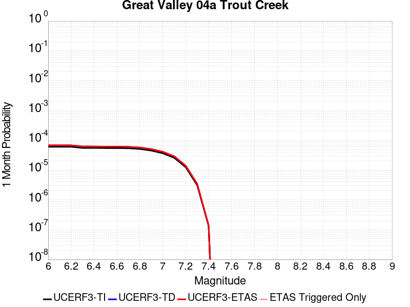 | 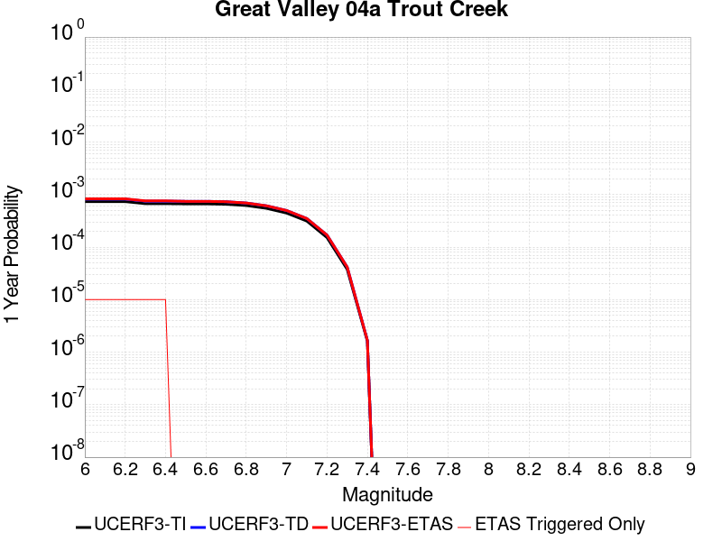 |  |

| Magnitude | 1 wk TI Prob | 1 wk TD Prob | 1 wk ETAS Prob | 1 wk ETAS/TD Gain | 1 wk ETAS Triggered Only | 1 mo TI Prob | 1 mo TD Prob | 1 mo ETAS Prob | 1 mo ETAS/TD Gain | 1 mo ETAS Triggered Only | 1 yr TI Prob | 1 yr TD Prob | 1 yr ETAS Prob | 1 yr ETAS/TD Gain | 1 yr ETAS Triggered Only | 10 yr TI Prob | 10 yr TD Prob | 10 yr ETAS Prob | 10 yr ETAS/TD Gain | 10 yr ETAS Triggered Only |
|-----|-----|-----|-----|-----|-----|-----|-----|-----|-----|-----|-----|-----|-----|-----|-----|-----|-----|-----|-----|-----|
| 6.0 | 1.4088538E-5 | 1.5719796E-5 | 1.5719796E-5 | 1.0 | 0.0 | 6.037805E-5 | 6.7368885E-5 | 6.7368885E-5 | 1.0 | 0.0 | 7.3485484E-4 | 8.1992E-4 | 8.299118E-4 | 1.0121863 | 1.0E-5 | 0.007324295 | 0.008170233 | 0.008180152 | 1.0012139 | 1.0E-5 |
| 6.1 | 1.4088538E-5 | 1.5719796E-5 | 1.5719796E-5 | 1.0 | 0.0 | 6.037805E-5 | 6.7368885E-5 | 6.7368885E-5 | 1.0 | 0.0 | 7.3485484E-4 | 8.1992E-4 | 8.299118E-4 | 1.0121863 | 1.0E-5 | 0.007324295 | 0.008170233 | 0.008180152 | 1.0012139 | 1.0E-5 |
| 6.2 | 1.4088538E-5 | 1.5719796E-5 | 1.5719796E-5 | 1.0 | 0.0 | 6.037805E-5 | 6.7368885E-5 | 6.7368885E-5 | 1.0 | 0.0 | 7.3485484E-4 | 8.1992E-4 | 8.299118E-4 | 1.0121863 | 1.0E-5 | 0.007324295 | 0.008170233 | 0.008180152 | 1.0012139 | 1.0E-5 |
| 6.3 | 1.2882862E-5 | 1.4378824E-5 | 1.4378824E-5 | 1.0 | 0.0 | 5.5211098E-5 | 6.162214E-5 | 6.162214E-5 | 1.0 | 0.0 | 6.7198783E-4 | 7.5000164E-4 | 7.5999415E-4 | 1.0133233 | 1.0E-5 | 0.0066995937 | 0.0074757678 | 0.007485693 | 1.0013276 | 1.0E-5 |
| 6.4 | 1.2882862E-5 | 1.4378824E-5 | 1.4378824E-5 | 1.0 | 0.0 | 5.5211098E-5 | 6.162214E-5 | 6.162214E-5 | 1.0 | 0.0 | 6.7198783E-4 | 7.5000164E-4 | 7.5999415E-4 | 1.0133233 | 1.0E-5 | 0.0066995937 | 0.0074757678 | 0.007485693 | 1.0013276 | 1.0E-5 |
| 6.5 | 1.2762329E-5 | 1.4245379E-5 | 1.4245379E-5 | 1.0 | 0.0 | 5.469455E-5 | 6.1050254E-5 | 6.1050254E-5 | 1.0 | 0.0 | 6.657027E-4 | 7.430437E-4 | 7.430437E-4 | 1.0 | 0.0 | 0.00663712 | 0.007406653 | 0.007406653 | 1.0 | 0.0 |
| 6.6 | 1.2762329E-5 | 1.4245379E-5 | 1.4245379E-5 | 1.0 | 0.0 | 5.469455E-5 | 6.1050254E-5 | 6.1050254E-5 | 1.0 | 0.0 | 6.657027E-4 | 7.430437E-4 | 7.430437E-4 | 1.0 | 0.0 | 0.00663712 | 0.007406653 | 0.007406653 | 1.0 | 0.0 |
| 6.7 | 1.2557959E-5 | 1.4019612E-5 | 1.4019612E-5 | 1.0 | 0.0 | 5.3818712E-5 | 6.0082726E-5 | 6.0082726E-5 | 1.0 | 0.0 | 6.5504585E-4 | 7.31272E-4 | 7.31272E-4 | 1.0 | 0.0 | 0.006531183 | 0.0072897105 | 0.0072897105 | 1.0 | 0.0 |
| 6.8 | 1.1871544E-5 | 1.32590285E-5 | 1.32590285E-5 | 1.0 | 0.0 | 5.0877054E-5 | 5.6823228E-5 | 5.6823228E-5 | 1.0 | 0.0 | 6.1925204E-4 | 6.9161324E-4 | 6.9161324E-4 | 1.0 | 0.0 | 0.0061752927 | 0.006895625 | 0.006895625 | 1.0 | 0.0 |
| 6.9 | 1.0500373E-5 | 1.1731444E-5 | 1.1731444E-5 | 1.0 | 0.0 | 4.5000823E-5 | 5.0276696E-5 | 5.0276696E-5 | 1.0 | 0.0 | 5.4774724E-4 | 6.119554E-4 | 6.119554E-4 | 1.0 | 0.0 | 0.005463991 | 0.0061035687 | 0.0061035687 | 1.0 | 0.0 |
| 7.0 | 8.524332E-6 | 9.533634E-6 | 9.533634E-6 | 1.0 | 0.0 | 3.653234E-5 | 4.085783E-5 | 4.085783E-5 | 1.0 | 0.0 | 4.4469046E-4 | 4.973379E-4 | 4.973379E-4 | 1.0 | 0.0 | 0.0044380166 | 0.00496298 | 0.00496298 | 1.0 | 0.0 |
| 7.1 | 6.006849E-6 | 6.711664E-6 | 6.711664E-6 | 1.0 | 0.0 | 2.5743384E-5 | 2.8763987E-5 | 2.8763987E-5 | 1.0 | 0.0 | 3.1338062E-4 | 3.5015083E-4 | 3.5015083E-4 | 1.0 | 0.0 | 0.0031293905 | 0.0034965419 | 0.0034965419 | 1.0 | 0.0 |
| 7.2 | 2.9122193E-6 | 3.24658E-6 | 3.24658E-6 | 1.0 | 0.0 | 1.248088E-5 | 1.391385E-5 | 1.391385E-5 | 1.0 | 0.0 | 1.5194413E-4 | 1.693897E-4 | 1.693897E-4 | 1.0 | 0.0 | 0.0015184027 | 0.001692778 | 0.001692778 | 1.0 | 0.0 |
| 7.3 | 7.2194007E-7 | 7.988875E-7 | 7.988875E-7 | 1.0 | 0.0 | 3.0940253E-6 | 3.4238017E-6 | 3.4238017E-6 | 1.0 | 0.0 | 3.7669106E-5 | 4.168445E-5 | 4.168445E-5 | 1.0 | 0.0 | 3.766272E-4 | 4.1681126E-4 | 4.1681126E-4 | 1.0 | 0.0 |
| 7.4 | 3.112171E-8 | 3.2068495E-8 | 3.2068495E-8 | 1.0 | 0.0 | 1.3337875E-7 | 1.374364E-7 | 1.374364E-7 | 1.0 | 0.0 | 1.6238852E-6 | 1.673287E-6 | 1.673287E-6 | 1.0 | 0.0 | 1.6238733E-5 | 1.6732753E-5 | 1.6732753E-5 | 1.0 | 0.0 |

## Los Alamos extension
*[(top)](#table-of-contents)*

| 1 Week | 1 Month | 1 Year | 10 Year |
|-----|-----|-----|-----|
|  |  |  | 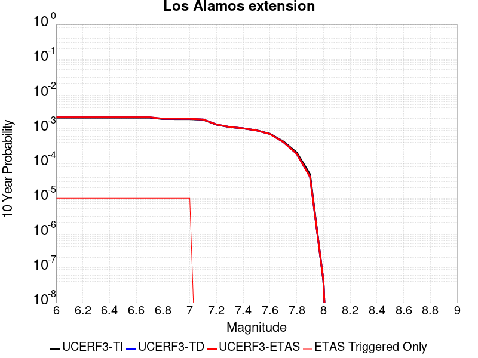 |

| Magnitude | 1 wk TI Prob | 1 wk TD Prob | 1 wk ETAS Prob | 1 wk ETAS/TD Gain | 1 wk ETAS Triggered Only | 1 mo TI Prob | 1 mo TD Prob | 1 mo ETAS Prob | 1 mo ETAS/TD Gain | 1 mo ETAS Triggered Only | 1 yr TI Prob | 1 yr TD Prob | 1 yr ETAS Prob | 1 yr ETAS/TD Gain | 1 yr ETAS Triggered Only | 10 yr TI Prob | 10 yr TD Prob | 10 yr ETAS Prob | 10 yr ETAS/TD Gain | 10 yr ETAS Triggered Only |
|-----|-----|-----|-----|-----|-----|-----|-----|-----|-----|-----|-----|-----|-----|-----|-----|-----|-----|-----|-----|-----|
| 6.0 | 4.0146506E-6 | 4.0861805E-6 | 4.0861805E-6 | 1.0 | 0.0 | 1.7205533E-5 | 1.751209E-5 | 1.751209E-5 | 1.0 | 0.0 | 2.0945723E-4 | 2.1318994E-4 | 2.1318994E-4 | 1.0 | 0.0 | 0.0020925992 | 0.0021299634 | 0.002139942 | 1.0046849 | 1.0E-5 |
| 6.1 | 4.0146506E-6 | 4.0861805E-6 | 4.0861805E-6 | 1.0 | 0.0 | 1.7205533E-5 | 1.751209E-5 | 1.751209E-5 | 1.0 | 0.0 | 2.0945723E-4 | 2.1318994E-4 | 2.1318994E-4 | 1.0 | 0.0 | 0.0020925992 | 0.0021299634 | 0.002139942 | 1.0046849 | 1.0E-5 |
| 6.2 | 4.0146506E-6 | 4.0861805E-6 | 4.0861805E-6 | 1.0 | 0.0 | 1.7205533E-5 | 1.751209E-5 | 1.751209E-5 | 1.0 | 0.0 | 2.0945723E-4 | 2.1318994E-4 | 2.1318994E-4 | 1.0 | 0.0 | 0.0020925992 | 0.0021299634 | 0.002139942 | 1.0046849 | 1.0E-5 |
| 6.3 | 4.0146506E-6 | 4.0861805E-6 | 4.0861805E-6 | 1.0 | 0.0 | 1.7205533E-5 | 1.751209E-5 | 1.751209E-5 | 1.0 | 0.0 | 2.0945723E-4 | 2.1318994E-4 | 2.1318994E-4 | 1.0 | 0.0 | 0.0020925992 | 0.0021299634 | 0.002139942 | 1.0046849 | 1.0E-5 |
| 6.4 | 4.0146506E-6 | 4.0861805E-6 | 4.0861805E-6 | 1.0 | 0.0 | 1.7205533E-5 | 1.751209E-5 | 1.751209E-5 | 1.0 | 0.0 | 2.0945723E-4 | 2.1318994E-4 | 2.1318994E-4 | 1.0 | 0.0 | 0.0020925992 | 0.0021299634 | 0.002139942 | 1.0046849 | 1.0E-5 |
| 6.5 | 4.0146506E-6 | 4.0861805E-6 | 4.0861805E-6 | 1.0 | 0.0 | 1.7205533E-5 | 1.751209E-5 | 1.751209E-5 | 1.0 | 0.0 | 2.0945723E-4 | 2.1318994E-4 | 2.1318994E-4 | 1.0 | 0.0 | 0.0020925992 | 0.0021299634 | 0.002139942 | 1.0046849 | 1.0E-5 |
| 6.6 | 4.0146506E-6 | 4.0861805E-6 | 4.0861805E-6 | 1.0 | 0.0 | 1.7205533E-5 | 1.751209E-5 | 1.751209E-5 | 1.0 | 0.0 | 2.0945723E-4 | 2.1318994E-4 | 2.1318994E-4 | 1.0 | 0.0 | 0.0020925992 | 0.0021299634 | 0.002139942 | 1.0046849 | 1.0E-5 |
| 6.7 | 4.0146506E-6 | 4.0861805E-6 | 4.0861805E-6 | 1.0 | 0.0 | 1.7205533E-5 | 1.751209E-5 | 1.751209E-5 | 1.0 | 0.0 | 2.0945723E-4 | 2.1318994E-4 | 2.1318994E-4 | 1.0 | 0.0 | 0.0020925992 | 0.0021299634 | 0.002139942 | 1.0046849 | 1.0E-5 |
| 6.8 | 3.6584688E-6 | 3.7188781E-6 | 3.7188781E-6 | 1.0 | 0.0 | 1.5679057E-5 | 1.5937956E-5 | 1.5937956E-5 | 1.0 | 0.0 | 1.9087581E-4 | 1.9402828E-4 | 1.9402828E-4 | 1.0 | 0.0 | 0.0019071194 | 0.0019386812 | 0.0019486618 | 1.0051482 | 1.0E-5 |
| 6.9 | 3.644631E-6 | 3.704588E-6 | 3.704588E-6 | 1.0 | 0.0 | 1.5619753E-5 | 1.5876714E-5 | 1.5876714E-5 | 1.0 | 0.0 | 1.901539E-4 | 1.9328279E-4 | 1.9328279E-4 | 1.0 | 0.0 | 0.0018999127 | 0.0019312392 | 0.0019412199 | 1.0051681 | 1.0E-5 |
| 7.0 | 3.6318522E-6 | 3.6913484E-6 | 3.6913484E-6 | 1.0 | 0.0 | 1.5564989E-5 | 1.5819975E-5 | 1.5819975E-5 | 1.0 | 0.0 | 1.8948725E-4 | 1.925921E-4 | 1.925921E-4 | 1.0 | 0.0 | 0.0018932576 | 0.0019243443 | 0.0019343251 | 1.0051866 | 1.0E-5 |
| 7.1 | 3.5001724E-6 | 3.5554185E-6 | 3.5554185E-6 | 1.0 | 0.0 | 1.5000653E-5 | 1.5237424E-5 | 1.5237424E-5 | 1.0 | 0.0 | 1.8261763E-4 | 1.8550076E-4 | 1.8550076E-4 | 1.0 | 0.0 | 0.0018246764 | 0.0018535499 | 0.0018535499 | 1.0 | 0.0 |
| 7.2 | 2.5204702E-6 | 2.5437084E-6 | 2.5437084E-6 | 1.0 | 0.0 | 1.080197E-5 | 1.0901562E-5 | 1.0901562E-5 | 1.0 | 0.0 | 1.3150605E-4 | 1.3271849E-4 | 1.3271849E-4 | 1.0 | 0.0 | 0.0013142825 | 0.0013263979 | 0.0013263979 | 1.0 | 0.0 |
| 7.3 | 2.1399692E-6 | 2.150144E-6 | 2.150144E-6 | 1.0 | 0.0 | 9.1712645E-6 | 9.21487E-6 | 9.21487E-6 | 1.0 | 0.0 | 1.1165442E-4 | 1.121853E-4 | 1.121853E-4 | 1.0 | 0.0 | 0.0011159834 | 0.0011212899 | 0.0011212899 | 1.0 | 0.0 |
| 7.4 | 1.9660122E-6 | 1.970248E-6 | 1.970248E-6 | 1.0 | 0.0 | 8.42574E-6 | 8.4438925E-6 | 8.4438925E-6 | 1.0 | 0.0 | 1.0257855E-4 | 1.0279957E-4 | 1.0279957E-4 | 1.0 | 0.0 | 0.0010253121 | 0.0010275233 | 0.0010275233 | 1.0 | 0.0 |
| 7.5 | 1.7204633E-6 | 1.7151085E-6 | 1.7151085E-6 | 1.0 | 0.0 | 7.373393E-6 | 7.3504443E-6 | 7.3504443E-6 | 1.0 | 0.0 | 8.976737E-5 | 8.9488014E-5 | 8.9488014E-5 | 1.0 | 0.0 | 8.9731114E-4 | 8.9452276E-4 | 8.9452276E-4 | 1.0 | 0.0 |
| 7.6 | 1.3717638E-6 | 1.3535908E-6 | 1.3535908E-6 | 1.0 | 0.0 | 5.878974E-6 | 5.8010905E-6 | 5.8010905E-6 | 1.0 | 0.0 | 7.157416E-5 | 7.062602E-5 | 7.062602E-5 | 1.0 | 0.0 | 7.1551115E-4 | 7.060383E-4 | 7.060383E-4 | 1.0 | 0.0 |
| 7.7 | 8.272564E-7 | 7.957687E-7 | 7.957687E-7 | 1.0 | 0.0 | 3.5453797E-6 | 3.410433E-6 | 3.410433E-6 | 1.0 | 0.0 | 4.3164142E-5 | 4.152123E-5 | 4.152123E-5 | 1.0 | 0.0 | 4.315576E-4 | 4.151349E-4 | 4.151349E-4 | 1.0 | 0.0 |
| 7.8 | 3.9708277E-7 | 3.671928E-7 | 3.671928E-7 | 1.0 | 0.0 | 1.7017821E-6 | 1.5736824E-6 | 1.5736824E-6 | 1.0 | 0.0 | 2.0719E-5 | 1.9159415E-5 | 1.9159415E-5 | 1.0 | 0.0 | 2.071707E-4 | 1.9157771E-4 | 1.9157771E-4 | 1.0 | 0.0 |
| 7.9 | 9.292528E-8 | 7.8891446E-8 | 7.8891446E-8 | 1.0 | 0.0 | 3.9825116E-7 | 3.3810616E-7 | 3.3810616E-7 | 1.0 | 0.0 | 4.848697E-6 | 4.116435E-6 | 4.116435E-6 | 1.0 | 0.0 | 4.8485912E-5 | 4.1163596E-5 | 4.1163596E-5 | 1.0 | 0.0 |
| 8.0 | 7.880441E-11 | 8.235368E-11 | 8.235368E-11 | 1.0 | 0.0 | 3.3773329E-10 | 3.5294412E-10 | 3.5294412E-10 | 1.0 | 0.0 | 4.1119033E-9 | 4.297095E-9 | 4.297095E-9 | 1.0 | 0.0 | 4.1119034E-8 | 4.2970953E-8 | 4.2970953E-8 | 1.0 | 0.0 |

## Carson Range (Genoa)
*[(top)](#table-of-contents)*

| 1 Week | 1 Month | 1 Year | 10 Year |
|-----|-----|-----|-----|
|  |  |  | 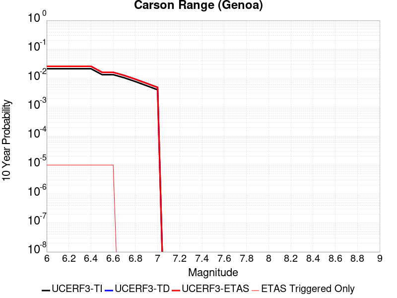 |

| Magnitude | 1 wk TI Prob | 1 wk TD Prob | 1 wk ETAS Prob | 1 wk ETAS/TD Gain | 1 wk ETAS Triggered Only | 1 mo TI Prob | 1 mo TD Prob | 1 mo ETAS Prob | 1 mo ETAS/TD Gain | 1 mo ETAS Triggered Only | 1 yr TI Prob | 1 yr TD Prob | 1 yr ETAS Prob | 1 yr ETAS/TD Gain | 1 yr ETAS Triggered Only | 10 yr TI Prob | 10 yr TD Prob | 10 yr ETAS Prob | 10 yr ETAS/TD Gain | 10 yr ETAS Triggered Only |
|-----|-----|-----|-----|-----|-----|-----|-----|-----|-----|-----|-----|-----|-----|-----|-----|-----|-----|-----|-----|-----|
| 6.0 | 4.1268457E-5 | 5.0148326E-5 | 5.0148326E-5 | 1.0 | 0.0 | 1.7685282E-4 | 2.1490594E-4 | 2.1490594E-4 | 1.0 | 0.0 | 0.0021510567 | 0.0026137296 | 0.0026137296 | 1.0 | 0.0 | 0.02130354 | 0.025869545 | 0.025879284 | 1.0003766 | 1.0E-5 |
| 6.1 | 4.1268457E-5 | 5.0148326E-5 | 5.0148326E-5 | 1.0 | 0.0 | 1.7685282E-4 | 2.1490594E-4 | 2.1490594E-4 | 1.0 | 0.0 | 0.0021510567 | 0.0026137296 | 0.0026137296 | 1.0 | 0.0 | 0.02130354 | 0.025869545 | 0.025879284 | 1.0003766 | 1.0E-5 |
| 6.2 | 4.1268457E-5 | 5.0148326E-5 | 5.0148326E-5 | 1.0 | 0.0 | 1.7685282E-4 | 2.1490594E-4 | 2.1490594E-4 | 1.0 | 0.0 | 0.0021510567 | 0.0026137296 | 0.0026137296 | 1.0 | 0.0 | 0.02130354 | 0.025869545 | 0.025879284 | 1.0003766 | 1.0E-5 |
| 6.3 | 4.1268457E-5 | 5.0148326E-5 | 5.0148326E-5 | 1.0 | 0.0 | 1.7685282E-4 | 2.1490594E-4 | 2.1490594E-4 | 1.0 | 0.0 | 0.0021510567 | 0.0026137296 | 0.0026137296 | 1.0 | 0.0 | 0.02130354 | 0.025869545 | 0.025879284 | 1.0003766 | 1.0E-5 |
| 6.4 | 4.1268457E-5 | 5.0148326E-5 | 5.0148326E-5 | 1.0 | 0.0 | 1.7685282E-4 | 2.1490594E-4 | 2.1490594E-4 | 1.0 | 0.0 | 0.0021510567 | 0.0026137296 | 0.0026137296 | 1.0 | 0.0 | 0.02130354 | 0.025869545 | 0.025879284 | 1.0003766 | 1.0E-5 |
| 6.5 | 2.5677185E-5 | 3.0979143E-5 | 3.0979143E-5 | 1.0 | 0.0 | 1.1004044E-4 | 1.3276203E-4 | 1.3276203E-4 | 1.0 | 0.0 | 0.0013389189 | 0.0016153576 | 0.0016153576 | 1.0 | 0.0 | 0.0133088045 | 0.016054086 | 0.016063925 | 1.0006129 | 1.0E-5 |
| 6.6 | 2.5677185E-5 | 3.0979143E-5 | 3.0979143E-5 | 1.0 | 0.0 | 1.1004044E-4 | 1.3276203E-4 | 1.3276203E-4 | 1.0 | 0.0 | 0.0013389189 | 0.0016153576 | 0.0016153576 | 1.0 | 0.0 | 0.0133088045 | 0.016054086 | 0.016063925 | 1.0006129 | 1.0E-5 |
| 6.7 | 1.9969408E-5 | 2.4064126E-5 | 2.4064126E-5 | 1.0 | 0.0 | 8.558037E-5 | 1.0312876E-4 | 1.0312876E-4 | 1.0 | 0.0 | 0.0010414429 | 0.001255023 | 0.001255023 | 1.0 | 0.0 | 0.010365757 | 0.012494512 | 0.012494512 | 1.0 | 0.0 |
| 6.8 | 1.4783156E-5 | 1.7818053E-5 | 1.7818053E-5 | 1.0 | 0.0 | 6.335485E-5 | 7.636158E-5 | 7.636158E-5 | 1.0 | 0.0 | 7.710722E-4 | 9.2943595E-4 | 9.2943595E-4 | 1.0 | 0.0 | 0.0076840227 | 0.009268275 | 0.009268275 | 1.0 | 0.0 |
| 6.9 | 1.06660555E-5 | 1.287738E-5 | 1.287738E-5 | 1.0 | 0.0 | 4.5710865E-5 | 5.5188255E-5 | 5.5188255E-5 | 1.0 | 0.0 | 5.5638765E-4 | 6.718251E-4 | 6.718251E-4 | 1.0 | 0.0 | 0.005549967 | 0.00670924 | 0.00670924 | 1.0 | 0.0 |
| 7.0 | 7.664838E-6 | 9.2585615E-6 | 9.2585615E-6 | 1.0 | 0.0 | 3.2848893E-5 | 3.967955E-5 | 3.967955E-5 | 1.0 | 0.0 | 3.998619E-4 | 4.8309853E-4 | 4.8309853E-4 | 1.0 | 0.0 | 0.0039914316 | 0.004830983 | 0.004830983 | 1.0 | 0.0 |

## Anaheim
*[(top)](#table-of-contents)*

| 1 Week | 1 Month | 1 Year | 10 Year |
|-----|-----|-----|-----|
|  |  |  |  |

| Magnitude | 1 wk TI Prob | 1 wk TD Prob | 1 wk ETAS Prob | 1 wk ETAS/TD Gain | 1 wk ETAS Triggered Only | 1 mo TI Prob | 1 mo TD Prob | 1 mo ETAS Prob | 1 mo ETAS/TD Gain | 1 mo ETAS Triggered Only | 1 yr TI Prob | 1 yr TD Prob | 1 yr ETAS Prob | 1 yr ETAS/TD Gain | 1 yr ETAS Triggered Only | 10 yr TI Prob | 10 yr TD Prob | 10 yr ETAS Prob | 10 yr ETAS/TD Gain | 10 yr ETAS Triggered Only |
|-----|-----|-----|-----|-----|-----|-----|-----|-----|-----|-----|-----|-----|-----|-----|-----|-----|-----|-----|-----|-----|
| 6.0 | 2.9254998E-6 | 2.5123027E-6 | 2.5123027E-6 | 1.0 | 0.0 | 1.25377965E-5 | 1.076698E-5 | 1.076698E-5 | 1.0 | 0.0 | 1.5263697E-4 | 1.3108244E-4 | 1.4108112E-4 | 1.0762779 | 1.0E-5 | 0.0015253217 | 0.0013102815 | 0.0013202684 | 1.007622 | 1.0E-5 |
| 6.1 | 1.6729715E-6 | 1.2337476E-6 | 1.2337476E-6 | 1.0 | 0.0 | 7.1698582E-6 | 5.2874816E-6 | 5.2874816E-6 | 1.0 | 0.0 | 8.7289525E-5 | 6.43736E-5 | 6.43736E-5 | 1.0 | 0.0 | 8.7255245E-4 | 6.4359047E-4 | 6.4359047E-4 | 1.0 | 0.0 |
| 6.2 | 1.6729715E-6 | 1.2337476E-6 | 1.2337476E-6 | 1.0 | 0.0 | 7.1698582E-6 | 5.2874816E-6 | 5.2874816E-6 | 1.0 | 0.0 | 8.7289525E-5 | 6.43736E-5 | 6.43736E-5 | 1.0 | 0.0 | 8.7255245E-4 | 6.4359047E-4 | 6.4359047E-4 | 1.0 | 0.0 |
| 6.3 | 1.1444064E-6 | 6.959783E-7 | 6.959783E-7 | 1.0 | 0.0 | 4.9045893E-6 | 2.982761E-6 | 2.982761E-6 | 1.0 | 0.0 | 5.971174E-5 | 3.6314566E-5 | 3.6314566E-5 | 1.0 | 0.0 | 5.96957E-4 | 3.6309182E-4 | 3.6309182E-4 | 1.0 | 0.0 |
| 6.4 | 1.1444064E-6 | 6.959783E-7 | 6.959783E-7 | 1.0 | 0.0 | 4.9045893E-6 | 2.982761E-6 | 2.982761E-6 | 1.0 | 0.0 | 5.971174E-5 | 3.6314566E-5 | 3.6314566E-5 | 1.0 | 0.0 | 5.96957E-4 | 3.6309182E-4 | 3.6309182E-4 | 1.0 | 0.0 |
| 6.5 | 1.1385318E-6 | 6.9004665E-7 | 6.9004665E-7 | 1.0 | 0.0 | 4.879413E-6 | 2.9573398E-6 | 2.9573398E-6 | 1.0 | 0.0 | 5.9405233E-5 | 3.6005073E-5 | 3.6005073E-5 | 1.0 | 0.0 | 5.938936E-4 | 3.5999788E-4 | 3.5999788E-4 | 1.0 | 0.0 |
| 6.6 | 1.1165511E-6 | 6.678337E-7 | 6.678337E-7 | 1.0 | 0.0 | 4.78521E-6 | 2.8621419E-6 | 2.8621419E-6 | 1.0 | 0.0 | 5.8258374E-5 | 3.4846074E-5 | 3.4846074E-5 | 1.0 | 0.0 | 5.8243104E-4 | 3.4841156E-4 | 3.4841156E-4 | 1.0 | 0.0 |
| 6.7 | 1.1098243E-6 | 6.6105315E-7 | 6.6105315E-7 | 1.0 | 0.0 | 4.7563813E-6 | 2.8330821E-6 | 2.8330821E-6 | 1.0 | 0.0 | 5.7907404E-5 | 3.4492285E-5 | 3.4492285E-5 | 1.0 | 0.0 | 5.7892315E-4 | 3.4487477E-4 | 3.4487477E-4 | 1.0 | 0.0 |
| 6.8 | 1.1077587E-6 | 6.589735E-7 | 6.589735E-7 | 1.0 | 0.0 | 4.7475287E-6 | 2.8241693E-6 | 2.8241693E-6 | 1.0 | 0.0 | 5.779963E-5 | 3.4383775E-5 | 3.4383775E-5 | 1.0 | 0.0 | 5.77846E-4 | 3.4378996E-4 | 3.4378996E-4 | 1.0 | 0.0 |
| 6.9 | 1.1024468E-6 | 6.5363116E-7 | 6.5363116E-7 | 1.0 | 0.0 | 4.7247636E-6 | 2.8012737E-6 | 2.8012737E-6 | 1.0 | 0.0 | 5.752248E-5 | 3.410503E-5 | 3.410503E-5 | 1.0 | 0.0 | 5.750759E-4 | 3.4100338E-4 | 3.4100338E-4 | 1.0 | 0.0 |
| 7.0 | 1.0993066E-6 | 6.5104183E-7 | 6.5104183E-7 | 1.0 | 0.0 | 4.7113053E-6 | 2.7901767E-6 | 2.7901767E-6 | 1.0 | 0.0 | 5.7358633E-5 | 3.396993E-5 | 3.396993E-5 | 1.0 | 0.0 | 5.734383E-4 | 3.396528E-4 | 3.396528E-4 | 1.0 | 0.0 |
| 7.1 | 8.334877E-7 | 4.4050114E-7 | 4.4050114E-7 | 1.0 | 0.0 | 3.5720855E-6 | 1.8878608E-6 | 1.8878608E-6 | 1.0 | 0.0 | 4.348927E-5 | 2.2984485E-5 | 2.2984485E-5 | 1.0 | 0.0 | 4.3480762E-4 | 2.2982332E-4 | 2.2982332E-4 | 1.0 | 0.0 |
| 7.2 | 7.794411E-7 | 3.997734E-7 | 3.997734E-7 | 1.0 | 0.0 | 3.3404576E-6 | 1.7133136E-6 | 1.7133136E-6 | 1.0 | 0.0 | 4.0669314E-5 | 2.0859414E-5 | 2.0859414E-5 | 1.0 | 0.0 | 4.066187E-4 | 2.085766E-4 | 2.085766E-4 | 1.0 | 0.0 |
| 7.3 | 5.01704E-7 | 2.557395E-7 | 2.557395E-7 | 1.0 | 0.0 | 2.150158E-6 | 1.096026E-6 | 1.096026E-6 | 1.0 | 0.0 | 2.617786E-5 | 1.3344048E-5 | 1.3344048E-5 | 1.0 | 0.0 | 2.6174777E-4 | 1.3343371E-4 | 1.3343371E-4 | 1.0 | 0.0 |
| 7.4 | 2.4008182E-7 | 1.2368119E-7 | 1.2368119E-7 | 1.0 | 0.0 | 1.0289217E-6 | 5.3006215E-7 | 5.3006215E-7 | 1.0 | 0.0 | 1.252705E-5 | 6.453495E-6 | 6.453495E-6 | 1.0 | 0.0 | 1.2526344E-4 | 6.4533844E-5 | 6.4533844E-5 | 1.0 | 0.0 |
| 7.5 | 2.0263876E-8 | 1.6120977E-8 | 1.6120977E-8 | 1.0 | 0.0 | 8.684518E-8 | 6.90899E-8 | 6.90899E-8 | 1.0 | 0.0 | 1.0573395E-6 | 8.411693E-7 | 8.411693E-7 | 1.0 | 0.0 | 1.0573345E-5 | 8.41167E-6 | 8.41167E-6 | 1.0 | 0.0 |
| 7.6 | 1.4871431E-9 | 1.5084212E-9 | 1.5084212E-9 | 1.0 | 0.0 | 6.37347E-9 | 6.464661E-9 | 6.464661E-9 | 1.0 | 0.0 | 7.7596994E-8 | 7.870724E-8 | 7.870724E-8 | 1.0 | 0.0 | 7.759697E-7 | 7.870721E-7 | 7.870721E-7 | 1.0 | 0.0 |
| 7.7 | 1.5093293E-10 | 1.5333557E-10 | 1.5333557E-10 | 1.0 | 0.0 | 6.4685546E-10 | 6.5715255E-10 | 6.5715255E-10 | 1.0 | 0.0 | 7.875465E-9 | 8.000829E-9 | 8.000829E-9 | 1.0 | 0.0 | 7.8754645E-8 | 8.000829E-8 | 8.000829E-8 | 1.0 | 0.0 |

## Maacama 2011 CFM
*[(top)](#table-of-contents)*

| 1 Week | 1 Month | 1 Year | 10 Year |
|-----|-----|-----|-----|
|  |  |  |  |

| Magnitude | 1 wk TI Prob | 1 wk TD Prob | 1 wk ETAS Prob | 1 wk ETAS/TD Gain | 1 wk ETAS Triggered Only | 1 mo TI Prob | 1 mo TD Prob | 1 mo ETAS Prob | 1 mo ETAS/TD Gain | 1 mo ETAS Triggered Only | 1 yr TI Prob | 1 yr TD Prob | 1 yr ETAS Prob | 1 yr ETAS/TD Gain | 1 yr ETAS Triggered Only | 10 yr TI Prob | 10 yr TD Prob | 10 yr ETAS Prob | 10 yr ETAS/TD Gain | 10 yr ETAS Triggered Only |
|-----|-----|-----|-----|-----|-----|-----|-----|-----|-----|-----|-----|-----|-----|-----|-----|-----|-----|-----|-----|-----|
| 6.0 | 1.368203E-4 | 2.5791294E-4 | 2.5791294E-4 | 1.0 | 0.0 | 5.862409E-4 | 0.0011048804 | 0.0011048804 | 1.0 | 0.0 | 0.0071141496 | 0.01335148 | 0.01335148 | 1.0 | 0.0 | 0.06890667 | 0.124198176 | 0.12420694 | 1.0000706 | 1.0E-5 |
| 6.1 | 1.368203E-4 | 2.5791294E-4 | 2.5791294E-4 | 1.0 | 0.0 | 5.862409E-4 | 0.0011048804 | 0.0011048804 | 1.0 | 0.0 | 0.0071141496 | 0.01335148 | 0.01335148 | 1.0 | 0.0 | 0.06890667 | 0.124198176 | 0.12420694 | 1.0000706 | 1.0E-5 |
| 6.2 | 1.360743E-4 | 2.566596E-4 | 2.566596E-4 | 1.0 | 0.0 | 5.8304524E-4 | 0.0010995136 | 0.0010995136 | 1.0 | 0.0 | 0.007075496 | 0.01328704 | 0.01328704 | 1.0 | 0.0 | 0.06854413 | 0.12363256 | 0.12364132 | 1.0000709 | 1.0E-5 |
| 6.3 | 1.1917239E-4 | 2.2356425E-4 | 2.2356425E-4 | 1.0 | 0.0 | 5.1063887E-4 | 9.577813E-4 | 9.577813E-4 | 1.0 | 0.0 | 0.0061993203 | 0.011588436 | 0.011588436 | 1.0 | 0.0 | 0.060292065 | 0.10885225 | 0.10886116 | 1.0000819 | 1.0E-5 |
| 6.4 | 1.1859289E-4 | 2.2259979E-4 | 2.2259979E-4 | 1.0 | 0.0 | 5.0815626E-4 | 9.536509E-4 | 9.536509E-4 | 1.0 | 0.0 | 0.006169266 | 0.011538753 | 0.011538753 | 1.0 | 0.0 | 0.06000784 | 0.1084091 | 0.10841802 | 1.0000823 | 1.0E-5 |
| 6.5 | 1.09512424E-4 | 2.0518377E-4 | 2.0518377E-4 | 1.0 | 0.0 | 4.6925453E-4 | 8.7906147E-4 | 8.7906147E-4 | 1.0 | 0.0 | 0.005698218 | 0.010640161 | 0.010640161 | 1.0 | 0.0 | 0.055543028 | 0.10050131 | 0.1005103 | 1.0000895 | 1.0E-5 |
| 6.6 | 1.0502928E-4 | 1.9676764E-4 | 1.9676764E-4 | 1.0 | 0.0 | 4.500478E-4 | 8.4301585E-4 | 8.4301585E-4 | 1.0 | 0.0 | 0.0054655746 | 0.0102062365 | 0.0102062365 | 1.0 | 0.0 | 0.053330887 | 0.09665376 | 0.09666279 | 1.0000935 | 1.0E-5 |
| 6.7 | 9.739358E-5 | 1.8258543E-4 | 1.8258543E-4 | 1.0 | 0.0 | 4.173343E-4 | 7.8227284E-4 | 7.8227284E-4 | 1.0 | 0.0 | 0.0050692135 | 0.00947635 | 0.00947635 | 1.0 | 0.0 | 0.049551267 | 0.09012621 | 0.09013531 | 1.000101 | 1.0E-5 |
| 6.8 | 8.969524E-5 | 1.6659766E-4 | 1.6659766E-4 | 1.0 | 0.0 | 3.8435153E-4 | 7.13792E-4 | 7.13792E-4 | 1.0 | 0.0 | 0.0046694432 | 0.008649875 | 0.008649875 | 1.0 | 0.0 | 0.045725387 | 0.08265808 | 0.08265808 | 1.0 | 0.0 |
| 6.9 | 7.838291E-5 | 1.4419405E-4 | 1.4419405E-4 | 1.0 | 0.0 | 3.358835E-4 | 6.178296E-4 | 6.178296E-4 | 1.0 | 0.0 | 0.0040817154 | 0.0074925134 | 0.0074925134 | 1.0 | 0.0 | 0.04007554 | 0.072058074 | 0.072058074 | 1.0 | 0.0 |
| 7.0 | 6.961957E-5 | 1.2708425E-4 | 1.2708425E-4 | 1.0 | 0.0 | 2.9833548E-4 | 5.4453436E-4 | 5.4453436E-4 | 1.0 | 0.0 | 0.0036261857 | 0.0066073905 | 0.0066073905 | 1.0 | 0.0 | 0.035675827 | 0.063876376 | 0.063876376 | 1.0 | 0.0 |
| 7.1 | 5.999398E-5 | 1.0905893E-4 | 1.0905893E-4 | 1.0 | 0.0 | 2.570917E-4 | 4.67314E-4 | 4.67314E-4 | 1.0 | 0.0 | 0.0031255994 | 0.0056734183 | 0.0056734183 | 1.0 | 0.0 | 0.030820016 | 0.05514343 | 0.05514343 | 1.0 | 0.0 |
| 7.2 | 5.116532E-5 | 9.306579E-5 | 9.306579E-5 | 1.0 | 0.0 | 2.1926152E-4 | 3.9879497E-4 | 3.9879497E-4 | 1.0 | 0.0 | 0.002666241 | 0.004843596 | 0.004843596 | 1.0 | 0.0 | 0.026344774 | 0.04730744 | 0.04730744 | 1.0 | 0.0 |
| 7.3 | 4.2087835E-5 | 7.618172E-5 | 7.618172E-5 | 1.0 | 0.0 | 1.8036396E-4 | 3.2645464E-4 | 3.2645464E-4 | 1.0 | 0.0 | 0.0021937196 | 0.0039665666 | 0.0039665666 | 1.0 | 0.0 | 0.0217219 | 0.038908154 | 0.038908154 | 1.0 | 0.0 |
| 7.4 | 2.8991652E-5 | 5.1172563E-5 | 5.1172563E-5 | 1.0 | 0.0 | 1.2424402E-4 | 2.1929471E-4 | 2.1929471E-4 | 1.0 | 0.0 | 0.0015116213 | 0.0026663167 | 0.0026663167 | 1.0 | 0.0 | 0.015013801 | 0.026334153 | 0.026334153 | 1.0 | 0.0 |
| 7.5 | 1.1292299E-6 | 1.4950942E-6 | 1.4950942E-6 | 1.0 | 0.0 | 4.8395473E-6 | 6.407538E-6 | 6.407538E-6 | 1.0 | 0.0 | 5.8919897E-5 | 7.801022E-5 | 7.801022E-5 | 1.0 | 0.0 | 5.890428E-4 | 7.8052137E-4 | 7.8052137E-4 | 1.0 | 0.0 |
| 7.6 | 2.6535366E-7 | 3.4723365E-7 | 3.4723365E-7 | 1.0 | 0.0 | 1.1372296E-6 | 1.4881434E-6 | 1.4881434E-6 | 1.0 | 0.0 | 1.3845682E-5 | 1.8117997E-5 | 1.8117997E-5 | 1.0 | 0.0 | 1.3844819E-4 | 1.816891E-4 | 1.816891E-4 | 1.0 | 0.0 |
| 7.7 | 9.727789E-8 | 1.2304224E-7 | 1.2304224E-7 | 1.0 | 0.0 | 4.1690518E-7 | 5.273238E-7 | 5.273238E-7 | 1.0 | 0.0 | 5.0758085E-6 | 6.420148E-6 | 6.420148E-6 | 1.0 | 0.0 | 5.0756928E-5 | 6.45819E-5 | 6.45819E-5 | 1.0 | 0.0 |
| 7.8 | 6.1939325E-9 | 7.712346E-9 | 7.712346E-9 | 1.0 | 0.0 | 2.6545425E-8 | 3.3052913E-8 | 3.3052913E-8 | 1.0 | 0.0 | 3.231905E-7 | 4.0241915E-7 | 4.0241915E-7 | 1.0 | 0.0 | 3.2319003E-6 | 4.0602818E-6 | 4.0602818E-6 | 1.0 | 0.0 |

## Johnson Valley (No) 2011 rev
*[(top)](#table-of-contents)*

| 1 Week | 1 Month | 1 Year | 10 Year |
|-----|-----|-----|-----|
|  |  | 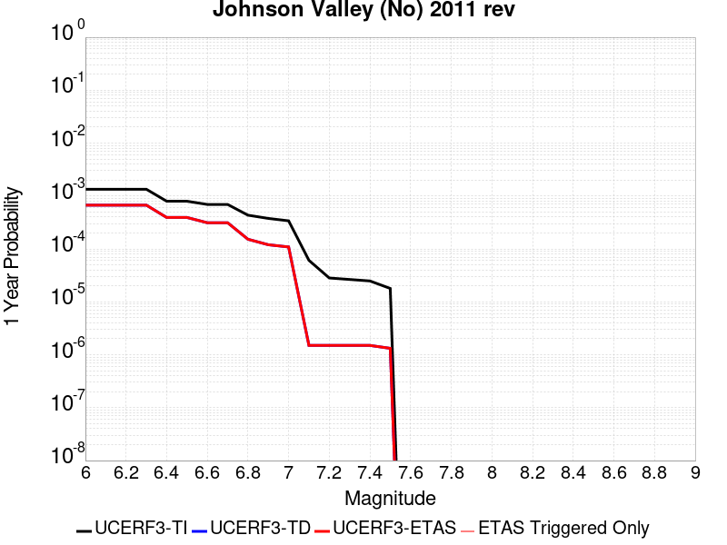 |  |

| Magnitude | 1 wk TI Prob | 1 wk TD Prob | 1 wk ETAS Prob | 1 wk ETAS/TD Gain | 1 wk ETAS Triggered Only | 1 mo TI Prob | 1 mo TD Prob | 1 mo ETAS Prob | 1 mo ETAS/TD Gain | 1 mo ETAS Triggered Only | 1 yr TI Prob | 1 yr TD Prob | 1 yr ETAS Prob | 1 yr ETAS/TD Gain | 1 yr ETAS Triggered Only | 10 yr TI Prob | 10 yr TD Prob | 10 yr ETAS Prob | 10 yr ETAS/TD Gain | 10 yr ETAS Triggered Only |
|-----|-----|-----|-----|-----|-----|-----|-----|-----|-----|-----|-----|-----|-----|-----|-----|-----|-----|-----|-----|-----|
| 6.0 | 2.577707E-5 | 1.29011505E-5 | 1.29011505E-5 | 1.0 | 0.0 | 1.1046848E-4 | 5.5289696E-5 | 5.5289696E-5 | 1.0 | 0.0 | 0.0013441239 | 6.729838E-4 | 6.729838E-4 | 1.0 | 0.0 | 0.013360229 | 0.006713367 | 0.0067233 | 1.0014795 | 1.0E-5 |
| 6.1 | 2.577707E-5 | 1.29011505E-5 | 1.29011505E-5 | 1.0 | 0.0 | 1.1046848E-4 | 5.5289696E-5 | 5.5289696E-5 | 1.0 | 0.0 | 0.0013441239 | 6.729838E-4 | 6.729838E-4 | 1.0 | 0.0 | 0.013360229 | 0.006713367 | 0.0067233 | 1.0014795 | 1.0E-5 |
| 6.2 | 2.577707E-5 | 1.29011505E-5 | 1.29011505E-5 | 1.0 | 0.0 | 1.1046848E-4 | 5.5289696E-5 | 5.5289696E-5 | 1.0 | 0.0 | 0.0013441239 | 6.729838E-4 | 6.729838E-4 | 1.0 | 0.0 | 0.013360229 | 0.006713367 | 0.0067233 | 1.0014795 | 1.0E-5 |
| 6.3 | 2.577707E-5 | 1.29011505E-5 | 1.29011505E-5 | 1.0 | 0.0 | 1.1046848E-4 | 5.5289696E-5 | 5.5289696E-5 | 1.0 | 0.0 | 0.0013441239 | 6.729838E-4 | 6.729838E-4 | 1.0 | 0.0 | 0.013360229 | 0.006713367 | 0.0067233 | 1.0014795 | 1.0E-5 |
| 6.4 | 1.5296591E-5 | 7.536876E-6 | 7.536876E-6 | 1.0 | 0.0 | 6.555518E-5 | 3.2300606E-5 | 3.2300606E-5 | 1.0 | 0.0 | 7.97842E-4 | 3.9320765E-4 | 3.9320765E-4 | 1.0 | 0.0 | 0.007949836 | 0.0039269608 | 0.0039369212 | 1.0025365 | 1.0E-5 |
| 6.5 | 1.5296591E-5 | 7.536876E-6 | 7.536876E-6 | 1.0 | 0.0 | 6.555518E-5 | 3.2300606E-5 | 3.2300606E-5 | 1.0 | 0.0 | 7.97842E-4 | 3.9320765E-4 | 3.9320765E-4 | 1.0 | 0.0 | 0.007949836 | 0.0039269608 | 0.0039369212 | 1.0025365 | 1.0E-5 |
| 6.6 | 1.3289383E-5 | 5.9918434E-6 | 5.9918434E-6 | 1.0 | 0.0 | 5.6953253E-5 | 2.5679172E-5 | 2.5679172E-5 | 1.0 | 0.0 | 6.9318525E-4 | 3.1261603E-4 | 3.1261603E-4 | 1.0 | 0.0 | 0.0069102696 | 0.0031234273 | 0.003133396 | 1.0031916 | 1.0E-5 |
| 6.7 | 1.3289383E-5 | 5.9918434E-6 | 5.9918434E-6 | 1.0 | 0.0 | 5.6953253E-5 | 2.5679172E-5 | 2.5679172E-5 | 1.0 | 0.0 | 6.9318525E-4 | 3.1261603E-4 | 3.1261603E-4 | 1.0 | 0.0 | 0.0069102696 | 0.0031234273 | 0.003133396 | 1.0031916 | 1.0E-5 |
| 6.8 | 8.330789E-6 | 2.9212572E-6 | 2.9212572E-6 | 1.0 | 0.0 | 3.570289E-5 | 1.2519647E-5 | 1.2519647E-5 | 1.0 | 0.0 | 4.34596E-4 | 1.5242174E-4 | 1.5242174E-4 | 1.0 | 0.0 | 0.0043374705 | 0.0015237319 | 0.0015337167 | 1.0065528 | 1.0E-5 |
| 6.9 | 7.2359003E-6 | 2.3013858E-6 | 2.3013858E-6 | 1.0 | 0.0 | 3.1010633E-5 | 9.863074E-6 | 9.863074E-6 | 1.0 | 0.0 | 3.7748902E-4 | 1.2008165E-4 | 1.2008165E-4 | 1.0 | 0.0 | 0.0037684843 | 0.0012006905 | 0.0012106785 | 1.0083185 | 1.0E-5 |
| 7.0 | 6.5149957E-6 | 2.0885384E-6 | 2.0885384E-6 | 1.0 | 0.0 | 2.792111E-5 | 8.950878E-6 | 8.950878E-6 | 1.0 | 0.0 | 3.398865E-4 | 1.0897678E-4 | 1.0897678E-4 | 1.0 | 0.0 | 0.003393671 | 0.0010897532 | 0.0010997424 | 1.0091664 | 1.0E-5 |
| 7.1 | 1.1662233E-6 | 2.8803857E-8 | 2.8803857E-8 | 1.0 | 0.0 | 4.9980904E-6 | 1.2344509E-7 | 1.2344509E-7 | 1.0 | 0.0 | 6.0850052E-5 | 1.5029432E-6 | 1.5029432E-6 | 1.0 | 0.0 | 6.083339E-4 | 1.5029346E-5 | 1.5029346E-5 | 1.0 | 0.0 |
| 7.2 | 5.413881E-7 | 2.8803857E-8 | 2.8803857E-8 | 1.0 | 0.0 | 2.3202326E-6 | 1.2344509E-7 | 1.2344509E-7 | 1.0 | 0.0 | 2.8248465E-5 | 1.5029432E-6 | 1.5029432E-6 | 1.0 | 0.0 | 2.8244875E-4 | 1.5029346E-5 | 1.5029346E-5 | 1.0 | 0.0 |
| 7.3 | 5.076821E-7 | 2.8803855E-8 | 2.8803855E-8 | 1.0 | 0.0 | 2.1757785E-6 | 1.2344509E-7 | 1.2344509E-7 | 1.0 | 0.0 | 2.648978E-5 | 1.5029432E-6 | 1.5029432E-6 | 1.0 | 0.0 | 2.6486625E-4 | 1.5029346E-5 | 1.5029346E-5 | 1.0 | 0.0 |
| 7.4 | 4.7568687E-7 | 2.8785777E-8 | 2.8785777E-8 | 1.0 | 0.0 | 2.0386565E-6 | 1.2336761E-7 | 1.2336761E-7 | 1.0 | 0.0 | 2.482036E-5 | 1.5019998E-6 | 1.5019998E-6 | 1.0 | 0.0 | 2.4817587E-4 | 1.5019913E-5 | 1.5019913E-5 | 1.0 | 0.0 |
| 7.5 | 3.435626E-7 | 2.535922E-8 | 2.535922E-8 | 1.0 | 0.0 | 1.4724103E-6 | 1.0868237E-7 | 1.0868237E-7 | 1.0 | 0.0 | 1.7926448E-5 | 1.3232072E-6 | 1.3232072E-6 | 1.0 | 0.0 | 1.7925001E-4 | 1.3232009E-5 | 1.3232009E-5 | 1.0 | 0.0 |

