# Parent Section Magnitude-Probability Distributions

Only fault sections with at least one triggered aftershock are plotted. Sections are sorted by total supraseismogenic trigger rate (decreasing)

## Table Of Contents

* [Garlock (Central)](#garlock-central)
* [Tank Canyon](#tank-canyon)
* [Little Lake](#little-lake)
* [Airport Lake](#airport-lake)
* [Owl Lake](#owl-lake)
* [Panamint Valley](#panamint-valley)
* [Garlock (East)](#garlock-east)
* [Ash Hill](#ash-hill)
* [Hunter Mountain-Saline Valley](#hunter-mountain-saline-valley)
* [Blackwater](#blackwater)
* [Garlock (West)](#garlock-west)
* [McLean Lake](#mclean-lake)
* [Gravel Hills-Harper Lk](#gravel-hills-harper-lk)
* [Goldstone Lake](#goldstone-lake)
* [San Andreas (Mojave S)](#san-andreas-mojave-s)
* [So Sierra Nevada](#so-sierra-nevada)
* [San Andreas (Mojave N)](#san-andreas-mojave-n)
* [Death Valley (So)](#death-valley-so)
* [Coyote Canyon](#coyote-canyon)
* [Nelson Lake](#nelson-lake)
* [Lenwood-Lockhart-Old Woman Springs](#lenwood-lockhart-old-woman-springs)
* [Towne Pass](#towne-pass)
* [San Andreas (San Bernardino N)](#san-andreas-san-bernardino-n)
* [Paradise](#paradise)
* [Bicycle Lake](#bicycle-lake)
* [San Andreas (San Bernardino S)](#san-andreas-san-bernardino-s)
* [Death Valley (Black Mtns Frontal)](#death-valley-black-mtns-frontal)
* [Garlic Springs](#garlic-springs)
* [Helendale-So Lockhart](#helendale-so-lockhart)
* [Coyote Lake](#coyote-lake)
* [San Andreas (Big Bend)](#san-andreas-big-bend)
* [San Andreas (San Gorgonio Pass-Garnet HIll)](#san-andreas-san-gorgonio-pass-garnet-hill)
* [San Andreas (Cholame) rev](#san-andreas-cholame-rev)
* [Death Valley (No)](#death-valley-no)
* [San Andreas (Parkfield)](#san-andreas-parkfield)
* [San Andreas (Carrizo) rev](#san-andreas-carrizo-rev)
* [Sierra Nevada  (No Extension)](#sierra-nevada--no-extension)
* [San Andreas (Coachella) rev](#san-andreas-coachella-rev)
* [Elsinore (Glen Ivy) rev](#elsinore-glen-ivy-rev)
* [Death Valley (Fish Lake Valley)](#death-valley-fish-lake-valley)
* [San Jacinto (San Bernardino)](#san-jacinto-san-bernardino)
* [Red Pass](#red-pass)
* [Brawley (Seismic Zone) alt 1](#brawley-seismic-zone-alt-1)
* [San Andreas (Creeping Section) 2011 CFM](#san-andreas-creeping-section-2011-cfm)
* [Scodie Lineament](#scodie-lineament)
* [Baker](#baker)
* [Mission Ridge-Arroyo Parida-Santa Ana](#mission-ridge-arroyo-parida-santa-ana)
* [Pinto Mtn](#pinto-mtn)
* [Imperial](#imperial)
* [Owens Valley](#owens-valley)
* [Cady](#cady)
* [Mission Creek](#mission-creek)
* [San Jacinto (San Jacinto Valley) rev](#san-jacinto-san-jacinto-valley-rev)
* [Santa Ynez (East)](#santa-ynez-east)
* [Chino alt 1](#chino-alt-1)
* [San Jacinto (Stepovers Combined)](#san-jacinto-stepovers-combined)
* [White Wolf (Extension)](#white-wolf-extension)
* [Ludlow](#ludlow)
* [Red Mountain](#red-mountain)
* [Deep Springs](#deep-springs)
* [San Andreas (North Branch Mill Creek)](#san-andreas-north-branch-mill-creek)
* [Calico-Hidalgo](#calico-hidalgo)
* [Manix-Afton Hills](#manix-afton-hills)
* [Rose Canyon](#rose-canyon)
* [San Jacinto (Anza) rev](#san-jacinto-anza-rev)
* [Lake Isabella (Seismicity)](#lake-isabella-seismicity)
* [Big Pine (Central)](#big-pine-central)
* [Kern Canyon (North Kern) 2011](#kern-canyon-north-kern-2011)
* [Pisgah-Bullion Mtn-Mesquite Lk](#pisgah-bullion-mtn-mesquite-lk)
* [Independence rev 2011](#independence-rev-2011)
* [Lost Hills](#lost-hills)
* [San Jacinto (Lytle Creek connector)](#san-jacinto-lytle-creek-connector)
* [Bullion Mountains](#bullion-mountains)
* [San Diego Trough south](#san-diego-trough-south)
* [Coronado Bank alt1](#coronado-bank-alt1)
* [Kern Canyon (Lake Isabella) 2011](#kern-canyon-lake-isabella-2011)
* [Pleito](#pleito)
* [Cleghorn Pass](#cleghorn-pass)
* [San Jacinto (Coyote Creek)](#san-jacinto-coyote-creek)
* [Cleghorn Lake](#cleghorn-lake)
* [Santa Cruz Island](#santa-cruz-island)
* [San Clemente](#san-clemente)
* [Oceanic - West Huasna](#oceanic---west-huasna)
* [Santa Ynez (West)](#santa-ynez-west)
* [San Jacinto (Borrego)](#san-jacinto-borrego)
* [Newport-Inglewood alt 1](#newport-inglewood-alt-1)
* [Elsinore (Stepovers Combined)](#elsinore-stepovers-combined)
* [San Jacinto (Superstition Mtn)](#san-jacinto-superstition-mtn)
* [Santa Rosa Island](#santa-rosa-island)
* [Great Valley 07 (Orestimba)](#great-valley-07-orestimba)
* [Ortigalita (North)](#ortigalita-north)
* [Whittier alt 1](#whittier-alt-1)
* [White Mountains](#white-mountains)
* [San Diego Trough north alt1](#san-diego-trough-north-alt1)
* [Tin Mountain](#tin-mountain)
* [San Cayetano](#san-cayetano)
* [Hosgri (Extension)](#hosgri-extension)
* [Mono Lake 2011 CFM](#mono-lake-2011-cfm)
* [Cleghorn](#cleghorn)
* [Palos Verdes](#palos-verdes)
* [Cucamonga](#cucamonga)
* [Kern Canyon (South Kern) 2011](#kern-canyon-south-kern-2011)
* [San Pedro Basin](#san-pedro-basin)
* [Ventura-Pitas Point](#ventura-pitas-point)
* [Green Valley 2011 CFM](#green-valley-2011-cfm)
* [Pine Mtn](#pine-mtn)
* [Channel Islands Thrust](#channel-islands-thrust)
* [White Wolf](#white-wolf)
* [Newport-Inglewood (Offshore)](#newport-inglewood-offshore)
* [Big Pine (East)](#big-pine-east)
* [Great Valley 08 (Quinto)](#great-valley-08-quinto)
* [Cerro Prieto](#cerro-prieto)
* [Peralta Hills](#peralta-hills)
* [Greenville (So) 2011 CFM](#greenville-so-2011-cfm)
* [Oak Ridge (Onshore)](#oak-ridge-onshore)
* [San Andreas (Santa Cruz Mts) 2011 CFM](#san-andreas-santa-cruz-mts-2011-cfm)
* [San Luis Range 2011 CFM](#san-luis-range-2011-cfm)
* [South Klamath Lake East](#south-klamath-lake-east)
* [Elysian Park (Upper)](#elysian-park-upper)
* [Breckenridge 2011](#breckenridge-2011)
* [Puente Hills](#puente-hills)
* [Elmore Ranch](#elmore-ranch)
* [Camp Rock 2011](#camp-rock-2011)
* [Hosgri](#hosgri)
* [Dry Mountain](#dry-mountain)
* [San Gregorio (South) 2011 CFM](#san-gregorio-south-2011-cfm)
* [Elsinore (Temecula) rev](#elsinore-temecula-rev)
* [Concord 2011 CFM](#concord-2011-cfm)
* [Hunting Creek - Berryessa 2011 CFM](#hunting-creek---berryessa-2011-cfm)
* [Homestead Valley 2011](#homestead-valley-2011)
* [Santa Ynez River](#santa-ynez-river)
* [Monterey Bay-Tularcitos](#monterey-bay-tularcitos)
* [Emerson-Copper Mtn 2011](#emerson-copper-mtn-2011)
* [Reliz 2011 CFM](#reliz-2011-cfm)
* [Surprise Valley 2011 CFM](#surprise-valley-2011-cfm)
* [Sheephole](#sheephole)
* [Ortigalita (South)](#ortigalita-south)
* [Oceanside alt1](#oceanside-alt1)
* [Simi-Santa Rosa](#simi-santa-rosa)
* [San Gabriel](#san-gabriel)
* [West Napa 2011 CFM](#west-napa-2011-cfm)
* [Calaveras (So) - Paicines extension 2011 CFM](#calaveras-so---paicines-extension-2011-cfm)
* [Los Alamos 2011 CFM](#los-alamos-2011-cfm)
* [Elsinore (Coyote Mountains)](#elsinore-coyote-mountains)
* [San Jacinto (Clark) rev](#san-jacinto-clark-rev)
* [Compton](#compton)
* [Pitas Point (Lower West)](#pitas-point-lower-west)
* [Santa Susana East (connector)](#santa-susana-east-connector)
* [Anaheim](#anaheim)
* [San Juan](#san-juan)
* [South Klamath Lake West](#south-klamath-lake-west)
* [Hector Mine](#hector-mine)
* [San Jose](#san-jose)
* [North Frontal  (East)](#north-frontal--east)
* [Elsinore (Julian)](#elsinore-julian)
* [Del Valle](#del-valle)
* [Robinson Creek](#robinson-creek)
* [Northridge](#northridge)
* [Earthquake Valley (No  Extension)](#earthquake-valley-no--extension)
* [Goose Lake 2011 CFM](#goose-lake-2011-cfm)
* [Blue Cut](#blue-cut)
* [San Gregorio (North) 2011 CFM](#san-gregorio-north-2011-cfm)
* [Raymond](#raymond)
* [Los Alamos extension](#los-alamos-extension)
* [Santa Cruz Catalina Ridge alt1](#santa-cruz-catalina-ridge-alt1)
* [Las Positas](#las-positas)
* [Likely 2011 CFM](#likely-2011-cfm)
* [Sierra Madre](#sierra-madre)
* [Keddie Ridge 2011 CFM](#keddie-ridge-2011-cfm)
* [Morales (East)](#morales-east)
* [Rinconada 2011 CFM](#rinconada-2011-cfm)
* [Clamshell-Sawpit](#clamshell-sawpit)
* [Calaveras (Central) 2011 CFM](#calaveras-central-2011-cfm)
* [Pitas Point (Lower)-Montalvo](#pitas-point-lower-montalvo)
* [Great Valley 09 (Laguna Seca)](#great-valley-09-laguna-seca)
* [Cedar Mtn-Mahogany Mtn](#cedar-mtn-mahogany-mtn)
* [San Andreas (Offshore) 2011 CFM](#san-andreas-offshore-2011-cfm)
* [San Gabriel (Extension)](#san-gabriel-extension)
* [Great Valley 05 Pittsburg - Kirby Hills alt1](#great-valley-05-pittsburg---kirby-hills-alt1)
* [Sierra Madre (San Fernando)](#sierra-madre-san-fernando)
* [Malibu Coast (Extension) alt 1](#malibu-coast-extension-alt-1)
* [Greenville (No) 2011 CFM](#greenville-no-2011-cfm)
* [Northridge Hills](#northridge-hills)
* [Santa Susana alt 1](#santa-susana-alt-1)
* [Channel Islands Western Deep Ramp](#channel-islands-western-deep-ramp)
* [Calaveras (So) 2011 CFM](#calaveras-so-2011-cfm)

## Garlock (Central)
*[(top)](#table-of-contents)*

| 1 Week | 1 Month | 1 Year | 10 Year |
|-----|-----|-----|-----|
|  |  |  |  |

| Magnitude | 1 wk TI Prob | 1 wk TD Prob | 1 wk ETAS Prob | 1 wk ETAS/TD Gain | 1 wk ETAS Triggered Only | 1 mo TI Prob | 1 mo TD Prob | 1 mo ETAS Prob | 1 mo ETAS/TD Gain | 1 mo ETAS Triggered Only | 1 yr TI Prob | 1 yr TD Prob | 1 yr ETAS Prob | 1 yr ETAS/TD Gain | 1 yr ETAS Triggered Only | 10 yr TI Prob | 10 yr TD Prob | 10 yr ETAS Prob | 10 yr ETAS/TD Gain | 10 yr ETAS Triggered Only |
|-----|-----|-----|-----|-----|-----|-----|-----|-----|-----|-----|-----|-----|-----|-----|-----|-----|-----|-----|-----|-----|
| 6.0 | 5.5131142E-5 | 7.025641E-5 | 0.005399882 | 76.859634 | 0.00533 | 2.3625491E-4 | 3.010645E-4 | 0.014866678 | 49.380375 | 0.01457 | 0.0028726095 | 0.0036593652 | 0.041859064 | 11.438887 | 0.03834 | 0.028357591 | 0.03608464 | 0.09750533 | 2.7021282 | 0.06372 |
| 6.1 | 5.5131142E-5 | 7.025641E-5 | 0.005399882 | 76.859634 | 0.00533 | 2.3625491E-4 | 3.010645E-4 | 0.014866678 | 49.380375 | 0.01457 | 0.0028726095 | 0.0036593652 | 0.041859064 | 11.438887 | 0.03834 | 0.028357591 | 0.03608464 | 0.09750533 | 2.7021282 | 0.06372 |
| 6.2 | 4.216245E-5 | 5.1670177E-5 | 0.0033614992 | 65.056854 | 0.00331 | 1.806837E-4 | 2.21425E-4 | 0.009059467 | 40.914387 | 0.00884 | 0.0021976046 | 0.002692548 | 0.02598965 | 9.652436 | 0.02336 | 0.021759989 | 0.026694186 | 0.06513003 | 2.4398584 | 0.03949 |
| 6.3 | 4.216245E-5 | 5.1670177E-5 | 0.0033614992 | 65.056854 | 0.00331 | 1.806837E-4 | 2.21425E-4 | 0.009059467 | 40.914387 | 0.00884 | 0.0021976046 | 0.002692548 | 0.02598965 | 9.652436 | 0.02336 | 0.021759989 | 0.026694186 | 0.06513003 | 2.4398584 | 0.03949 |
| 6.4 | 3.6858168E-5 | 4.411887E-5 | 0.0025740073 | 58.342545 | 0.00253 | 1.5795401E-4 | 1.8906732E-4 | 0.0070377723 | 37.223633 | 0.00685 | 0.0019213937 | 0.0022994897 | 0.020647202 | 8.979037 | 0.01839 | 0.019048655 | 0.022853183 | 0.05339879 | 2.336602 | 0.03126 |
| 6.5 | 3.39199E-5 | 4.0026258E-5 | 0.002369933 | 59.209457 | 0.00233 | 1.453629E-4 | 1.7152996E-4 | 0.006450453 | 37.6054 | 0.00628 | 0.0017683565 | 0.0020863987 | 0.018851347 | 9.035353 | 0.0168 | 0.017543508 | 0.020764038 | 0.04877998 | 2.349253 | 0.02861 |
| 6.6 | 3.3571985E-5 | 3.9480426E-5 | 0.0023593889 | 59.760975 | 0.00232 | 1.4387199E-4 | 1.6919097E-4 | 0.00643813 | 38.052444 | 0.00627 | 0.0017502342 | 0.0020579759 | 0.018803444 | 9.136863 | 0.01678 | 0.017365133 | 0.020485343 | 0.048489667 | 2.367042 | 0.02859 |
| 6.7 | 3.2580007E-5 | 3.80968E-5 | 0.002238013 | 58.74543 | 0.0022 | 1.3962112E-4 | 1.6326191E-4 | 0.0061422857 | 37.62228 | 0.00598 | 0.0016985617 | 0.0019859232 | 0.01807391 | 9.101012 | 0.01612 | 0.016856372 | 0.019777954 | 0.046714455 | 2.3619459 | 0.02748 |
| 6.8 | 3.2185937E-5 | 3.752399E-5 | 0.0021874432 | 58.29453 | 0.00215 | 1.3793244E-4 | 1.608073E-4 | 0.0059798714 | 37.186565 | 0.00582 | 0.0016780337 | 0.0019560924 | 0.017675284 | 9.036017 | 0.01575 | 0.016654192 | 0.01948474 | 0.04584099 | 2.3526611 | 0.02688 |
| 6.9 | 3.165394E-5 | 3.6728532E-5 | 0.0021266518 | 57.9019 | 0.00209 | 1.3565269E-4 | 1.5739861E-4 | 0.0058764983 | 37.335133 | 0.00572 | 0.0016503202 | 0.0019146651 | 0.017365025 | 9.069485 | 0.01548 | 0.01638118 | 0.019077351 | 0.04499333 | 2.3584683 | 0.02642 |
| 7.0 | 3.0903822E-5 | 3.5633733E-5 | 0.002075561 | 58.247086 | 0.00204 | 1.3243823E-4 | 1.5270717E-4 | 0.0057218564 | 37.469467 | 0.00557 | 0.0016112428 | 0.0018576457 | 0.016949559 | 9.124215 | 0.01512 | 0.015996104 | 0.01851649 | 0.043770064 | 2.363842 | 0.02573 |
| 7.1 | 3.0069863E-5 | 3.439997E-5 | 0.0020243316 | 58.846897 | 0.00199 | 1.2886449E-4 | 1.4742023E-4 | 0.00557662 | 37.82805 | 0.00543 | 0.0015677959 | 0.0017933848 | 0.016337255 | 9.109733 | 0.01457 | 0.01556781 | 0.01788412 | 0.042152204 | 2.3569627 | 0.02471 |
| 7.2 | 2.7957109E-5 | 3.1289175E-5 | 0.0017712348 | 56.608547 | 0.00174 | 1.1981068E-4 | 1.3408969E-4 | 0.0047234744 | 35.22623 | 0.00459 | 0.0014577188 | 0.001631339 | 0.013891306 | 8.515279 | 0.01228 | 0.014481937 | 0.016287657 | 0.036709525 | 2.2538247 | 0.02076 |
| 7.3 | 2.4519275E-5 | 2.672205E-5 | 0.0012566892 | 47.02817 | 0.00123 | 1.0507837E-4 | 1.1451812E-4 | 0.0033041527 | 28.852663 | 0.00319 | 0.0012785783 | 0.0013933812 | 0.010191105 | 7.3139396 | 0.00881 | 0.012712469 | 0.013931785 | 0.028643923 | 2.0560124 | 0.01492 |
| 7.4 | 2.3225532E-5 | 2.5206507E-5 | 0.0011451782 | 45.43185 | 0.00112 | 9.95342E-5 | 1.08023494E-4 | 0.0030177091 | 27.935675 | 0.00291 | 0.0012111551 | 0.001314407 | 0.0093837865 | 7.1391788 | 0.00808 | 0.012045753 | 0.0131493835 | 0.026560685 | 2.0199184 | 0.01359 |
| 7.5 | 2.097765E-5 | 2.2490442E-5 | 8.724713E-4 | 38.792984 | 8.5E-4 | 8.9901114E-5 | 9.638411E-5 | 0.0024261596 | 25.17178 | 0.00233 | 0.0010939965 | 0.0011728567 | 0.007735151 | 6.5951376 | 0.00657 | 0.010886264 | 0.011743847 | 0.022505956 | 1.9164041 | 0.01089 |
| 7.6 | 1.511254E-5 | 1.599762E-5 | 4.6599042E-4 | 29.128733 | 4.5E-4 | 6.476642E-5 | 6.855947E-5 | 0.0013284731 | 19.376944 | 0.00126 | 7.882459E-4 | 8.343997E-4 | 0.004461371 | 5.3468027 | 0.00363 | 0.007854558 | 0.008386811 | 0.014514981 | 1.7306912 | 0.00618 |
| 7.7 | 9.934069E-6 | 1.0684631E-5 | 1.7068292E-4 | 15.974621 | 1.6E-4 | 4.2573887E-5 | 4.579047E-5 | 4.1577354E-4 | 9.079913 | 3.7E-4 | 5.182138E-4 | 5.573568E-4 | 0.0015967771 | 2.8649101 | 0.00104 | 0.00517007 | 0.005630712 | 0.0074305204 | 1.3196414 | 0.00181 |
| 7.8 | 6.7562896E-6 | 8.433207E-6 | 1.0843237E-4 | 12.857785 | 1.0E-4 | 2.8955206E-5 | 3.6141813E-5 | 2.4613424E-4 | 6.810234 | 2.1E-4 | 3.5247262E-4 | 4.3993792E-4 | 0.0010796563 | 2.4541106 | 6.4E-4 | 0.0035191406 | 0.0044491235 | 0.005613918 | 1.2618032 | 0.00117 |
| 7.9 | 3.975453E-6 | 5.373937E-6 | 7.537356E-5 | 14.025763 | 7.0E-5 | 1.7037546E-5 | 2.3030954E-5 | 1.6302773E-4 | 7.0786357 | 1.4E-4 | 2.0741238E-4 | 2.8036587E-4 | 6.7025656E-4 | 2.3906493 | 3.9E-4 | 0.002072189 | 0.0028351378 | 0.0035331533 | 1.2462015 | 7.0E-4 |
| 8.0 | 1.6729537E-6 | 2.0785212E-6 | 2.207848E-5 | 10.622206 | 2.0E-5 | 7.169782E-6 | 8.907918E-6 | 4.890756E-5 | 5.4903474 | 4.0E-5 | 8.7288594E-5 | 1.08448534E-4 | 2.4843335E-4 | 2.2907948 | 1.4E-4 | 8.7254314E-4 | 0.0010974575 | 0.001307227 | 1.1911414 | 2.1E-4 |
| 8.1 | 3.6733252E-7 | 3.1504456E-7 | 3.1504456E-7 | 1.0 | 0.0 | 1.5742813E-6 | 1.3501904E-6 | 1.3501904E-6 | 1.0 | 0.0 | 1.9166706E-5 | 1.643846E-5 | 1.643846E-5 | 1.0 | 0.0 | 1.9165053E-4 | 1.6646349E-4 | 1.7646184E-4 | 1.0600632 | 1.0E-5 |

## Tank Canyon
*[(top)](#table-of-contents)*

| 1 Week | 1 Month | 1 Year | 10 Year |
|-----|-----|-----|-----|
| 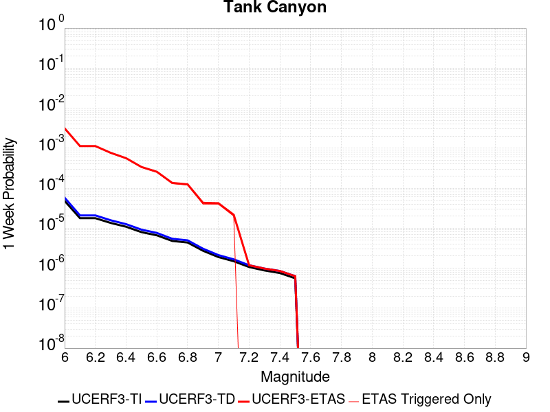 | 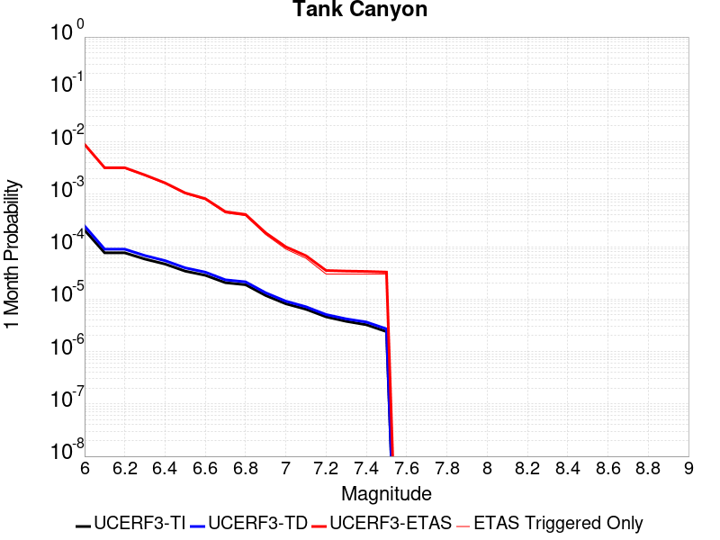 |  |  |

| Magnitude | 1 wk TI Prob | 1 wk TD Prob | 1 wk ETAS Prob | 1 wk ETAS/TD Gain | 1 wk ETAS Triggered Only | 1 mo TI Prob | 1 mo TD Prob | 1 mo ETAS Prob | 1 mo ETAS/TD Gain | 1 mo ETAS Triggered Only | 1 yr TI Prob | 1 yr TD Prob | 1 yr ETAS Prob | 1 yr ETAS/TD Gain | 1 yr ETAS Triggered Only | 10 yr TI Prob | 10 yr TD Prob | 10 yr ETAS Prob | 10 yr ETAS/TD Gain | 10 yr ETAS Triggered Only |
|-----|-----|-----|-----|-----|-----|-----|-----|-----|-----|-----|-----|-----|-----|-----|-----|-----|-----|-----|-----|-----|
| 6.0 | 4.8284557E-5 | 5.796722E-5 | 0.003147788 | 54.3029 | 0.00309 | 2.0691741E-4 | 2.4841112E-4 | 0.008936252 | 35.97364 | 0.00869 | 0.0025163088 | 0.0030208812 | 0.029101854 | 9.633565 | 0.02616 | 0.02488006 | 0.029864842 | 0.07561642 | 2.5319543 | 0.04716 |
| 6.1 | 1.7796336E-5 | 2.087402E-5 | 0.0011308509 | 54.17504 | 0.00111 | 7.626778E-5 | 8.945724E-5 | 0.003199179 | 35.762104 | 0.00311 | 9.281647E-4 | 0.0010886348 | 0.0103885 | 9.5426855 | 0.00931 | 0.009242975 | 0.010837107 | 0.027474826 | 2.5352547 | 0.01682 |
| 6.2 | 1.7796336E-5 | 2.087402E-5 | 0.0011308509 | 54.17504 | 0.00111 | 7.626778E-5 | 8.945724E-5 | 0.003199179 | 35.762104 | 0.00311 | 9.281647E-4 | 0.0010886348 | 0.0103885 | 9.5426855 | 0.00931 | 0.009242975 | 0.010837107 | 0.027474826 | 2.5352547 | 0.01682 |
| 6.3 | 1.3515912E-5 | 1.576006E-5 | 7.6574826E-4 | 48.5879 | 7.5E-4 | 5.792405E-5 | 6.754151E-5 | 0.0023273889 | 34.458645 | 0.00226 | 7.049971E-4 | 8.2203164E-4 | 0.0075464994 | 9.180303 | 0.00673 | 0.007027647 | 0.0081925215 | 0.020213228 | 2.467278 | 0.01212 |
| 6.4 | 1.0870146E-5 | 1.2618394E-5 | 5.6261144E-4 | 44.586613 | 5.5E-4 | 4.658551E-5 | 5.4077813E-5 | 0.0016439918 | 30.400486 | 0.00159 | 5.67031E-4 | 6.582164E-4 | 0.005794833 | 8.803842 | 0.00514 | 0.005655863 | 0.006564684 | 0.01561488 | 2.3786187 | 0.00911 |
| 6.5 | 7.964826E-6 | 9.196341E-6 | 3.391933E-4 | 36.883507 | 3.3E-4 | 3.4134522E-5 | 3.9412356E-5 | 0.0010593722 | 26.879189 | 0.00102 | 4.1550855E-4 | 4.7975045E-4 | 0.0035482775 | 7.39609 | 0.00307 | 0.0041473247 | 0.0047884495 | 0.0102123525 | 2.1327055 | 0.00545 |
| 6.6 | 6.6317E-6 | 7.6124866E-6 | 2.5761058E-4 | 33.84053 | 2.5E-4 | 2.8421264E-5 | 3.2624586E-5 | 8.225988E-4 | 25.214077 | 7.9E-4 | 3.4597394E-4 | 3.971411E-4 | 0.0026962277 | 6.789093 | 0.0023 | 0.0034543579 | 0.0039654654 | 0.008118929 | 2.0474088 | 0.00417 |
| 6.7 | 4.793663E-6 | 5.4308935E-6 | 1.354302E-4 | 24.936998 | 1.3E-4 | 2.0544108E-5 | 2.3275075E-5 | 4.6326482E-4 | 19.903902 | 4.4E-4 | 2.500958E-4 | 2.8334156E-4 | 0.0016129648 | 5.6926513 | 0.00133 | 0.0024981452 | 0.0028304958 | 0.005104042 | 1.8032326 | 0.00228 |
| 6.8 | 4.382823E-6 | 4.9693494E-6 | 1.2496875E-4 | 25.14791 | 1.2E-4 | 1.8783392E-5 | 2.1297063E-5 | 4.1128875E-4 | 19.311995 | 3.9E-4 | 2.286638E-4 | 2.5926516E-4 | 0.0014689515 | 5.665827 | 0.00121 | 0.0022842865 | 0.002590301 | 0.004625017 | 1.7855133 | 0.00204 |
| 6.9 | 2.729601E-6 | 3.073585E-6 | 4.307346E-5 | 14.014078 | 4.0E-5 | 1.1698237E-5 | 1.3172448E-5 | 1.8317021E-4 | 13.905556 | 1.7E-4 | 1.4241673E-4 | 1.6036398E-4 | 7.9026294E-4 | 4.927933 | 6.3E-4 | 0.001423255 | 0.0016026484 | 0.0026509657 | 1.6541156 | 0.00105 |
| 7.0 | 1.8987357E-6 | 2.1269625E-6 | 4.2126878E-5 | 19.80612 | 4.0E-5 | 8.137413E-6 | 9.115526E-6 | 9.91147E-5 | 10.873175 | 9.0E-5 | 9.90685E-5 | 1.1097657E-4 | 3.909455E-4 | 3.522775 | 2.8E-4 | 9.902435E-4 | 0.0011092803 | 0.0015487921 | 1.3962137 | 4.4E-4 |
| 7.1 | 1.4928986E-6 | 1.6641434E-6 | 2.166411E-5 | 13.018175 | 2.0E-5 | 6.398121E-6 | 7.132027E-6 | 6.71316E-5 | 9.412696 | 6.0E-5 | 7.789434E-5 | 8.6829554E-5 | 2.868122E-4 | 3.303163 | 2.0E-4 | 7.786704E-4 | 8.680142E-4 | 0.001177745 | 1.356827 | 3.1E-4 |
| 7.2 | 1.069082E-6 | 1.1828675E-6 | 1.1828675E-6 | 1.0 | 0.0 | 4.581772E-6 | 5.0694252E-6 | 3.506927E-5 | 6.9178004 | 3.0E-5 | 5.5781646E-5 | 6.171904E-5 | 1.417141E-4 | 2.2961164 | 8.0E-5 | 5.576765E-4 | 6.1707123E-4 | 7.46991E-4 | 1.2105426 | 1.3E-4 |
| 7.3 | 8.776551E-7 | 9.77008E-7 | 9.77008E-7 | 1.0 | 0.0 | 3.7613736E-6 | 4.187173E-6 | 3.4187047E-5 | 8.164708 | 3.0E-5 | 4.579376E-5 | 5.097816E-5 | 1.3097408E-4 | 2.5692194 | 8.0E-5 | 4.5784327E-4 | 5.097157E-4 | 6.196596E-4 | 1.2156966 | 1.1E-4 |
| 7.4 | 7.55721E-7 | 8.510306E-7 | 8.510306E-7 | 1.0 | 0.0 | 3.2388E-6 | 3.647272E-6 | 3.3647164E-5 | 9.225296 | 3.0E-5 | 3.9431678E-5 | 4.440515E-5 | 1.1440204E-4 | 2.5763237 | 7.0E-5 | 3.942468E-4 | 4.4401363E-4 | 5.439692E-4 | 1.2251183 | 1.0E-4 |
| 7.5 | 5.587665E-7 | 6.305664E-7 | 6.305664E-7 | 1.0 | 0.0 | 2.3947114E-6 | 2.7024273E-6 | 3.2702344E-5 | 12.101101 | 3.0E-5 | 2.915522E-5 | 3.290205E-5 | 9.290008E-5 | 2.8235345 | 6.0E-5 | 2.9151395E-4 | 3.2902052E-4 | 4.189909E-4 | 1.2734492 | 9.0E-5 |

## Little Lake
*[(top)](#table-of-contents)*

| 1 Week | 1 Month | 1 Year | 10 Year |
|-----|-----|-----|-----|
|  |  |  |  |

| Magnitude | 1 wk TI Prob | 1 wk TD Prob | 1 wk ETAS Prob | 1 wk ETAS/TD Gain | 1 wk ETAS Triggered Only | 1 mo TI Prob | 1 mo TD Prob | 1 mo ETAS Prob | 1 mo ETAS/TD Gain | 1 mo ETAS Triggered Only | 1 yr TI Prob | 1 yr TD Prob | 1 yr ETAS Prob | 1 yr ETAS/TD Gain | 1 yr ETAS Triggered Only | 10 yr TI Prob | 10 yr TD Prob | 10 yr ETAS Prob | 10 yr ETAS/TD Gain | 10 yr ETAS Triggered Only |
|-----|-----|-----|-----|-----|-----|-----|-----|-----|-----|-----|-----|-----|-----|-----|-----|-----|-----|-----|-----|-----|
| 6.0 | 2.8424427E-5 | 3.120641E-5 | 0.002251137 | 72.13701 | 0.00222 | 1.2181328E-4 | 1.3373565E-4 | 0.0064528906 | 48.251083 | 0.00632 | 0.0014820677 | 0.0016271487 | 0.019298349 | 11.860224 | 0.0177 | 0.014722223 | 0.016165756 | 0.044883877 | 2.7764788 | 0.02919 |
| 6.1 | 2.8424427E-5 | 3.120641E-5 | 0.002251137 | 72.13701 | 0.00222 | 1.2181328E-4 | 1.3373565E-4 | 0.0064528906 | 48.251083 | 0.00632 | 0.0014820677 | 0.0016271487 | 0.019298349 | 11.860224 | 0.0177 | 0.014722223 | 0.016165756 | 0.044883877 | 2.7764788 | 0.02919 |
| 6.2 | 2.8424427E-5 | 3.120641E-5 | 0.002251137 | 72.13701 | 0.00222 | 1.2181328E-4 | 1.3373565E-4 | 0.0064528906 | 48.251083 | 0.00632 | 0.0014820677 | 0.0016271487 | 0.019298349 | 11.860224 | 0.0177 | 0.014722223 | 0.016165756 | 0.044883877 | 2.7764788 | 0.02919 |
| 6.3 | 1.48860645E-5 | 1.608171E-5 | 0.0014460587 | 89.919464 | 0.00143 | 6.379586E-5 | 6.891995E-5 | 0.0042486317 | 61.64589 | 0.00418 | 7.7643775E-4 | 8.388056E-4 | 0.012179285 | 14.519794 | 0.01135 | 0.007737305 | 0.008359213 | 0.026912812 | 3.2195387 | 0.01871 |
| 6.4 | 1.48860645E-5 | 1.608171E-5 | 0.0014460587 | 89.919464 | 0.00143 | 6.379586E-5 | 6.891995E-5 | 0.0042486317 | 61.64589 | 0.00418 | 7.7643775E-4 | 8.388056E-4 | 0.012179285 | 14.519794 | 0.01135 | 0.007737305 | 0.008359213 | 0.026912812 | 3.2195387 | 0.01871 |
| 6.5 | 1.2797581E-5 | 1.3765833E-5 | 0.0013537474 | 98.34112 | 0.00134 | 5.4845623E-5 | 5.8995236E-5 | 0.003858771 | 65.40818 | 0.0038 | 6.675408E-4 | 7.18056E-4 | 0.011170546 | 15.556649 | 0.01046 | 0.006655392 | 0.007159909 | 0.02416726 | 3.3753586 | 0.01713 |
| 6.6 | 9.661896E-6 | 1.0289227E-5 | 0.001110278 | 107.90684 | 0.0011 | 4.1407468E-5 | 4.4096032E-5 | 0.003193957 | 72.43185 | 0.00315 | 5.040193E-4 | 5.367532E-4 | 0.009342024 | 17.404694 | 0.00881 | 0.005028777 | 0.0053561726 | 0.019798402 | 3.6963708 | 0.01452 |
| 6.7 | 7.767871E-6 | 8.1998305E-6 | 9.4819214E-4 | 115.635574 | 9.4E-4 | 3.329045E-5 | 3.5141737E-5 | 0.0027650457 | 78.68268 | 0.00273 | 4.0523586E-4 | 4.2778038E-4 | 0.00802453 | 18.758526 | 0.0076 | 0.004044977 | 0.004270921 | 0.016687663 | 3.907275 | 0.01247 |
| 6.8 | 6.4235196E-6 | 6.7358615E-6 | 7.26731E-4 | 107.88984 | 7.2E-4 | 2.752908E-5 | 2.8867731E-5 | 0.0021188073 | 73.39709 | 0.00209 | 3.35115E-4 | 3.5142078E-4 | 0.0062793368 | 17.86843 | 0.00593 | 0.003346101 | 0.0035099108 | 0.013295444 | 3.7879717 | 0.00982 |
| 6.9 | 3.1283696E-6 | 3.1122217E-6 | 4.331109E-4 | 139.16454 | 4.3E-4 | 1.3407229E-5 | 1.3338034E-5 | 0.0013133207 | 98.46434 | 0.0013 | 1.6322079E-4 | 1.6237998E-4 | 0.0037517971 | 23.10505 | 0.00359 | 0.0016310095 | 0.0016227615 | 0.0074532847 | 4.5929637 | 0.00584 |
| 7.0 | 2.290603E-6 | 2.228713E-6 | 3.0222806E-4 | 135.60654 | 3.0E-4 | 9.816834E-6 | 9.551598E-6 | 8.1954384E-4 | 85.80176 | 8.1E-4 | 1.19513395E-4 | 1.1628553E-4 | 0.0022760343 | 19.572807 | 0.00216 | 0.0011944914 | 0.001162349 | 0.004718211 | 4.059203 | 0.00356 |
| 7.1 | 1.293693E-6 | 1.1777022E-6 | 1.3117756E-4 | 111.384315 | 1.3E-4 | 5.5443866E-6 | 5.0472895E-6 | 3.7504543E-4 | 74.306305 | 3.7E-4 | 6.750081E-5 | 6.144971E-5 | 0.0010013919 | 16.296122 | 9.4E-4 | 6.7480316E-4 | 6.143957E-4 | 0.0021934249 | 3.5700526 | 0.00158 |
| 7.2 | 4.715842E-7 | 3.0918778E-7 | 2.0309182E-5 | 65.68559 | 2.0E-5 | 2.0210737E-6 | 1.3250898E-6 | 2.1325064E-5 | 16.093296 | 2.0E-5 | 2.4606294E-5 | 1.6132853E-5 | 8.6131724E-5 | 5.338902 | 7.0E-5 | 2.460357E-4 | 1.6131738E-4 | 2.81298E-4 | 1.7437552 | 1.2E-4 |
| 7.3 | 3.9430947E-7 | 2.3098332E-7 | 2.0230978E-5 | 87.58632 | 2.0E-5 | 1.6898966E-6 | 9.899281E-7 | 2.0989908E-5 | 21.203466 | 2.0E-5 | 2.0574296E-5 | 1.2052309E-5 | 7.205159E-5 | 5.978239 | 6.0E-5 | 2.0572392E-4 | 1.2051663E-4 | 2.1050578E-4 | 1.7466949 | 9.0E-5 |
| 7.4 | 3.547123E-7 | 1.967992E-7 | 1.0196797E-5 | 51.813206 | 1.0E-5 | 1.5201948E-6 | 8.4342486E-7 | 1.0843416E-5 | 12.856411 | 1.0E-5 | 1.8508214E-5 | 1.026865E-5 | 6.0268136E-5 | 5.869139 | 5.0E-5 | 1.8506673E-4 | 1.0268182E-4 | 1.8267361E-4 | 1.7790258 | 8.0E-5 |
| 7.5 | 2.6354266E-7 | 1.4423688E-7 | 1.4423688E-7 | 1.0 | 0.0 | 1.129468E-6 | 6.1815786E-7 | 6.1815786E-7 | 1.0 | 0.0 | 1.3751187E-5 | 7.526047E-6 | 2.7525895E-5 | 3.6574178 | 2.0E-5 | 1.3750336E-4 | 7.525797E-5 | 1.2525421E-4 | 1.6643314 | 5.0E-5 |
| 7.6 | 1.269913E-7 | 7.572789E-8 | 7.572789E-8 | 1.0 | 0.0 | 5.4424834E-7 | 3.2454807E-7 | 3.2454807E-7 | 1.0 | 0.0 | 6.6262032E-6 | 3.9513657E-6 | 1.3951327E-5 | 3.5307605 | 1.0E-5 | 6.626006E-5 | 3.9512994E-5 | 5.95122E-5 | 1.5061426 | 2.0E-5 |

## Airport Lake
*[(top)](#table-of-contents)*

| 1 Week | 1 Month | 1 Year | 10 Year |
|-----|-----|-----|-----|
| 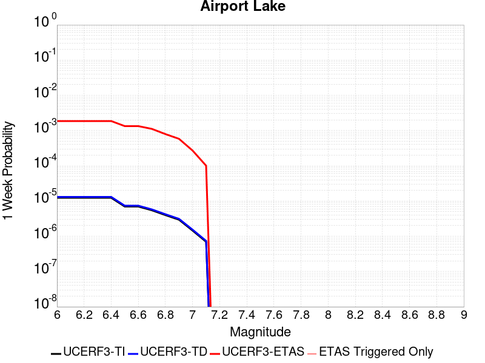 |  |  |  |

| Magnitude | 1 wk TI Prob | 1 wk TD Prob | 1 wk ETAS Prob | 1 wk ETAS/TD Gain | 1 wk ETAS Triggered Only | 1 mo TI Prob | 1 mo TD Prob | 1 mo ETAS Prob | 1 mo ETAS/TD Gain | 1 mo ETAS Triggered Only | 1 yr TI Prob | 1 yr TD Prob | 1 yr ETAS Prob | 1 yr ETAS/TD Gain | 1 yr ETAS Triggered Only | 10 yr TI Prob | 10 yr TD Prob | 10 yr ETAS Prob | 10 yr ETAS/TD Gain | 10 yr ETAS Triggered Only |
|-----|-----|-----|-----|-----|-----|-----|-----|-----|-----|-----|-----|-----|-----|-----|-----|-----|-----|-----|-----|-----|
| 6.0 | 1.2387061E-5 | 1.3103315E-5 | 0.001863079 | 142.18379 | 0.00185 | 5.3086325E-5 | 5.6156015E-5 | 0.0053158607 | 94.66235 | 0.00526 | 6.461343E-4 | 6.835134E-4 | 0.015283527 | 22.360245 | 0.01461 | 0.0064425888 | 0.0068169213 | 0.029938223 | 4.3917513 | 0.02328 |
| 6.1 | 1.2387061E-5 | 1.3103315E-5 | 0.001863079 | 142.18379 | 0.00185 | 5.3086325E-5 | 5.6156015E-5 | 0.0053158607 | 94.66235 | 0.00526 | 6.461343E-4 | 6.835134E-4 | 0.015283527 | 22.360245 | 0.01461 | 0.0064425888 | 0.0068169213 | 0.029938223 | 4.3917513 | 0.02328 |
| 6.2 | 1.2387061E-5 | 1.3103315E-5 | 0.001863079 | 142.18379 | 0.00185 | 5.3086325E-5 | 5.6156015E-5 | 0.0053158607 | 94.66235 | 0.00526 | 6.461343E-4 | 6.835134E-4 | 0.015283527 | 22.360245 | 0.01461 | 0.0064425888 | 0.0068169213 | 0.029938223 | 4.3917513 | 0.02328 |
| 6.3 | 1.2387061E-5 | 1.3103315E-5 | 0.001863079 | 142.18379 | 0.00185 | 5.3086325E-5 | 5.6156015E-5 | 0.0053158607 | 94.66235 | 0.00526 | 6.461343E-4 | 6.835134E-4 | 0.015283527 | 22.360245 | 0.01461 | 0.0064425888 | 0.0068169213 | 0.029938223 | 4.3917513 | 0.02328 |
| 6.4 | 1.2387061E-5 | 1.3103315E-5 | 0.001863079 | 142.18379 | 0.00185 | 5.3086325E-5 | 5.6156015E-5 | 0.0053158607 | 94.66235 | 0.00526 | 6.461343E-4 | 6.835134E-4 | 0.015283527 | 22.360245 | 0.01461 | 0.0064425888 | 0.0068169213 | 0.029938223 | 4.3917513 | 0.02328 |
| 6.5 | 6.9922594E-6 | 7.3850115E-6 | 0.0013373751 | 181.09317 | 0.00133 | 2.996648E-5 | 3.1649695E-5 | 0.003991524 | 126.11572 | 0.00396 | 3.6478083E-4 | 3.8527235E-4 | 0.011171116 | 28.995373 | 0.01079 | 0.003641826 | 0.0038465816 | 0.020930612 | 5.4413543 | 0.01715 |
| 6.6 | 6.9922594E-6 | 7.3850115E-6 | 0.0013373751 | 181.09317 | 0.00133 | 2.996648E-5 | 3.1649695E-5 | 0.003991524 | 126.11572 | 0.00396 | 3.6478083E-4 | 3.8527235E-4 | 0.011171116 | 28.995373 | 0.01079 | 0.003641826 | 0.0038465816 | 0.020930612 | 5.4413543 | 0.01715 |
| 6.7 | 5.477277E-6 | 5.7861366E-6 | 0.0011157797 | 192.83675 | 0.00111 | 2.3473833E-5 | 2.4797513E-5 | 0.0033647148 | 135.68758 | 0.00334 | 2.8575645E-4 | 3.018718E-4 | 0.009419119 | 31.202381 | 0.00912 | 0.0028538927 | 0.0030150013 | 0.017471284 | 5.794785 | 0.0145 |
| 6.8 | 3.9950432E-6 | 4.2191364E-6 | 7.942158E-4 | 188.24132 | 7.9E-4 | 1.7121502E-5 | 1.8081904E-5 | 0.0024580378 | 135.9391 | 0.00244 | 2.0843433E-4 | 2.201277E-4 | 0.0069886376 | 31.748108 | 0.00677 | 0.0020823893 | 0.0021993674 | 0.01309535 | 5.954144 | 0.01092 |
| 6.9 | 2.95695E-6 | 3.1230609E-6 | 5.8312126E-4 | 186.71466 | 5.8E-4 | 1.2672582E-5 | 1.3384491E-5 | 0.0017433614 | 130.25235 | 0.00173 | 1.5427776E-4 | 1.6294625E-4 | 0.0049121724 | 30.145966 | 0.00475 | 0.001541707 | 0.0016284902 | 0.00936587 | 5.7512593 | 0.00775 |
| 7.0 | 1.456072E-6 | 1.5408307E-6 | 2.7154043E-4 | 176.22989 | 2.7E-4 | 6.2402937E-6 | 6.603549E-6 | 7.865984E-4 | 119.11752 | 7.8E-4 | 7.597293E-5 | 8.0396254E-5 | 0.0020902345 | 25.999155 | 0.00201 | 7.594696E-4 | 8.0377056E-4 | 0.004081134 | 5.0774865 | 0.00328 |
| 7.1 | 6.995192E-7 | 7.4090656E-7 | 1.00740835E-4 | 135.96968 | 1.0E-4 | 2.997936E-6 | 3.1753139E-6 | 3.4317424E-4 | 108.07569 | 3.4E-4 | 3.649926E-5 | 3.8659447E-5 | 8.7862695E-4 | 22.727356 | 8.4E-4 | 3.6493264E-4 | 3.8659447E-4 | 0.0018060455 | 4.6716795 | 0.00142 |

## Owl Lake
*[(top)](#table-of-contents)*

| 1 Week | 1 Month | 1 Year | 10 Year |
|-----|-----|-----|-----|
|  |  |  |  |

| Magnitude | 1 wk TI Prob | 1 wk TD Prob | 1 wk ETAS Prob | 1 wk ETAS/TD Gain | 1 wk ETAS Triggered Only | 1 mo TI Prob | 1 mo TD Prob | 1 mo ETAS Prob | 1 mo ETAS/TD Gain | 1 mo ETAS Triggered Only | 1 yr TI Prob | 1 yr TD Prob | 1 yr ETAS Prob | 1 yr ETAS/TD Gain | 1 yr ETAS Triggered Only | 10 yr TI Prob | 10 yr TD Prob | 10 yr ETAS Prob | 10 yr ETAS/TD Gain | 10 yr ETAS Triggered Only |
|-----|-----|-----|-----|-----|-----|-----|-----|-----|-----|-----|-----|-----|-----|-----|-----|-----|-----|-----|-----|-----|
| 6.0 | 5.0320643E-5 | 6.6363405E-5 | 0.0012662838 | 19.081055 | 0.0012 | 2.1564208E-4 | 2.8438985E-4 | 0.003813386 | 13.409008 | 0.00353 | 0.0026222812 | 0.003458008 | 0.014031318 | 4.0576305 | 0.01061 | 0.02591553 | 0.034143202 | 0.05285185 | 1.5479465 | 0.01937 |
| 6.1 | 5.0320643E-5 | 6.6363405E-5 | 0.0012662838 | 19.081055 | 0.0012 | 2.1564208E-4 | 2.8438985E-4 | 0.003813386 | 13.409008 | 0.00353 | 0.0026222812 | 0.003458008 | 0.014031318 | 4.0576305 | 0.01061 | 0.02591553 | 0.034143202 | 0.05285185 | 1.5479465 | 0.01937 |
| 6.2 | 2.4125871E-5 | 3.0983636E-5 | 9.3095575E-4 | 30.04669 | 9.0E-4 | 1.0339249E-4 | 1.3278142E-4 | 0.0028424216 | 21.40677 | 0.00271 | 0.0012580766 | 0.0016155707 | 0.009592663 | 5.9376307 | 0.00799 | 0.012509781 | 0.016071774 | 0.030358411 | 1.8889272 | 0.01452 |
| 6.3 | 1.7433485E-5 | 2.2357592E-5 | 8.0234016E-4 | 35.8867 | 7.8E-4 | 7.471279E-5 | 9.581562E-5 | 0.0025155838 | 26.254421 | 0.00242 | 9.0924866E-4 | 0.0011660818 | 0.008217849 | 7.0474043 | 0.00706 | 0.009055373 | 0.011629955 | 0.024132837 | 2.0750585 | 0.01265 |
| 6.4 | 1.7433485E-5 | 2.2357592E-5 | 8.0234016E-4 | 35.8867 | 7.8E-4 | 7.471279E-5 | 9.581562E-5 | 0.0025155838 | 26.254421 | 0.00242 | 9.0924866E-4 | 0.0011660818 | 0.008217849 | 7.0474043 | 0.00706 | 0.009055373 | 0.011629955 | 0.024132837 | 2.0750585 | 0.01265 |
| 6.5 | 1.5182742E-5 | 1.9431043E-5 | 7.794163E-4 | 40.11191 | 7.6E-4 | 6.506727E-5 | 8.327409E-5 | 0.0024430775 | 29.337788 | 0.00236 | 7.919061E-4 | 0.0010135418 | 0.00780665 | 7.702346 | 0.0068 | 0.0078909 | 0.0101194 | 0.021988068 | 2.172863 | 0.01199 |
| 6.6 | 6.7271576E-6 | 8.548612E-6 | 6.985427E-4 | 81.71417 | 6.9E-4 | 2.8830356E-5 | 3.6636426E-5 | 0.001906568 | 52.040226 | 0.00187 | 3.5095305E-4 | 4.4596285E-4 | 0.0056536393 | 12.677378 | 0.00521 | 0.0035039932 | 0.004468462 | 0.013448156 | 3.0095716 | 0.00902 |
| 6.7 | 6.682835E-6 | 8.481056E-6 | 6.984752E-4 | 82.3571 | 6.9E-4 | 2.8640408E-5 | 3.6346908E-5 | 0.0019062789 | 52.4468 | 0.00187 | 3.4864116E-4 | 4.424394E-4 | 0.0056501343 | 12.770413 | 0.00521 | 0.003480947 | 0.0044333874 | 0.013403443 | 3.023296 | 0.00901 |
| 6.8 | 6.5774975E-6 | 8.327524E-6 | 6.983218E-4 | 83.85708 | 6.9E-4 | 2.8188972E-5 | 3.568893E-5 | 0.0019056222 | 53.395332 | 0.00187 | 3.4314668E-4 | 4.344317E-4 | 0.005632173 | 12.96446 | 0.0052 | 0.0034261728 | 0.0043535302 | 0.013304392 | 3.056001 | 0.00899 |
| 6.9 | 6.363419E-6 | 8.000682E-6 | 6.979952E-4 | 87.24196 | 6.9E-4 | 2.727151E-5 | 3.428822E-5 | 0.001904224 | 55.535812 | 0.00187 | 3.3198006E-4 | 4.1738467E-4 | 0.0056152144 | 13.453331 | 0.0052 | 0.0033148455 | 0.004183514 | 0.013125946 | 3.1375408 | 0.00898 |
| 7.0 | 6.1342453E-6 | 7.632863E-6 | 6.976276E-4 | 91.397896 | 6.9E-4 | 2.6289357E-5 | 3.271189E-5 | 0.0019026507 | 58.163887 | 0.00187 | 3.2002592E-4 | 3.982E-4 | 0.0055861333 | 14.028461 | 0.00519 | 0.0031956544 | 0.003992198 | 0.012846707 | 3.2179534 | 0.00889 |
| 7.1 | 5.842926E-6 | 7.143389E-6 | 6.971385E-4 | 97.59212 | 6.9E-4 | 2.504087E-5 | 3.0614196E-5 | 0.0018705579 | 61.100994 | 0.00184 | 3.0482994E-4 | 3.726695E-4 | 0.0053108283 | 14.250772 | 0.00494 | 0.0030441214 | 0.0037376455 | 0.012156062 | 3.2523317 | 0.00845 |
| 7.2 | 4.77173E-6 | 5.359552E-6 | 4.653571E-4 | 86.82761 | 4.6E-4 | 2.045011E-5 | 2.2969329E-5 | 0.0011929425 | 51.93632 | 0.00117 | 2.4895166E-4 | 2.7961974E-4 | 0.003438736 | 12.297901 | 0.00316 | 0.0024867293 | 0.0028092018 | 0.00823392 | 2.9310532 | 0.00544 |
| 7.3 | 3.0494948E-6 | 2.7112515E-6 | 9.271101E-5 | 34.194912 | 9.0E-5 | 1.3069198E-5 | 1.1619598E-5 | 2.5161682E-4 | 21.654518 | 2.4E-4 | 1.5910587E-4 | 1.4145959E-4 | 9.51345E-4 | 6.725207 | 8.1E-4 | 0.0015899199 | 0.0014236529 | 0.0027917025 | 1.9609432 | 0.00137 |
| 7.4 | 2.7263884E-6 | 2.3064167E-6 | 6.230628E-5 | 27.01432 | 6.0E-5 | 1.1684469E-5 | 9.884606E-6 | 1.6988303E-4 | 17.186626 | 1.6E-4 | 1.4224913E-4 | 1.2033853E-4 | 6.7027233E-4 | 5.5698895 | 5.5E-4 | 0.0014215811 | 0.0012116103 | 0.0020805562 | 1.7171826 | 8.7E-4 |
| 7.5 | 2.6090431E-6 | 2.16634E-6 | 5.2166233E-5 | 24.080353 | 5.0E-5 | 1.1181565E-5 | 9.284282E-6 | 1.4928298E-4 | 16.07911 | 1.4E-4 | 1.3612706E-4 | 1.13030364E-4 | 5.7297834E-4 | 5.069243 | 4.6E-4 | 0.001360437 | 0.00113836 | 0.0018875062 | 1.6580925 | 7.5E-4 |
| 7.6 | 2.3008756E-6 | 1.8734914E-6 | 5.1873398E-5 | 27.68809 | 5.0E-5 | 9.860858E-6 | 8.029225E-6 | 1.480281E-4 | 18.436163 | 1.4E-4 | 1.20049335E-4 | 9.775151E-5 | 4.8771338E-4 | 4.9893184 | 3.9E-4 | 0.001199845 | 9.853577E-4 | 0.0015947566 | 1.6184546 | 6.1E-4 |
| 7.7 | 1.7184348E-6 | 1.3425631E-6 | 3.1342523E-5 | 23.345287 | 3.0E-5 | 7.3646997E-6 | 5.7538296E-6 | 8.575337E-5 | 14.903703 | 8.0E-5 | 8.966153E-5 | 7.0050664E-5 | 2.8003595E-4 | 3.99762 | 2.1E-4 | 8.962536E-4 | 7.081724E-4 | 0.0010379386 | 1.4656583 | 3.3E-4 |
| 7.8 | 8.4612907E-7 | 8.41047E-7 | 2.084103E-5 | 24.779865 | 2.0E-5 | 3.6262625E-6 | 3.6044821E-6 | 5.36043E-5 | 14.871568 | 5.0E-5 | 4.4148852E-5 | 4.388371E-5 | 1.4387933E-4 | 3.27865 | 1.0E-4 | 4.414008E-4 | 4.4422492E-4 | 5.841627E-4 | 1.3150157 | 1.4E-4 |
| 7.9 | 2.716738E-7 | 3.7701437E-7 | 1.0377011E-5 | 27.524178 | 1.0E-5 | 1.1643157E-6 | 1.615775E-6 | 3.1615727E-5 | 19.566912 | 3.0E-5 | 1.4175452E-5 | 1.9671894E-5 | 5.9671107E-5 | 3.0333178 | 4.0E-5 | 1.4174548E-4 | 1.9847308E-4 | 2.5846116E-4 | 1.302248 | 6.0E-5 |
| 8.0 | 2.1995428E-8 | 3.3866613E-8 | 1.0033867E-5 | 296.27603 | 1.0E-5 | 9.426611E-8 | 1.4514262E-7 | 1.01451415E-5 | 69.897736 | 1.0E-5 | 1.1476893E-6 | 1.7671107E-6 | 1.1767093E-5 | 6.658945 | 1.0E-5 | 1.14768345E-5 | 1.7972348E-5 | 2.7972168E-5 | 1.5564003 | 1.0E-5 |

## Panamint Valley
*[(top)](#table-of-contents)*

| 1 Week | 1 Month | 1 Year | 10 Year |
|-----|-----|-----|-----|
| 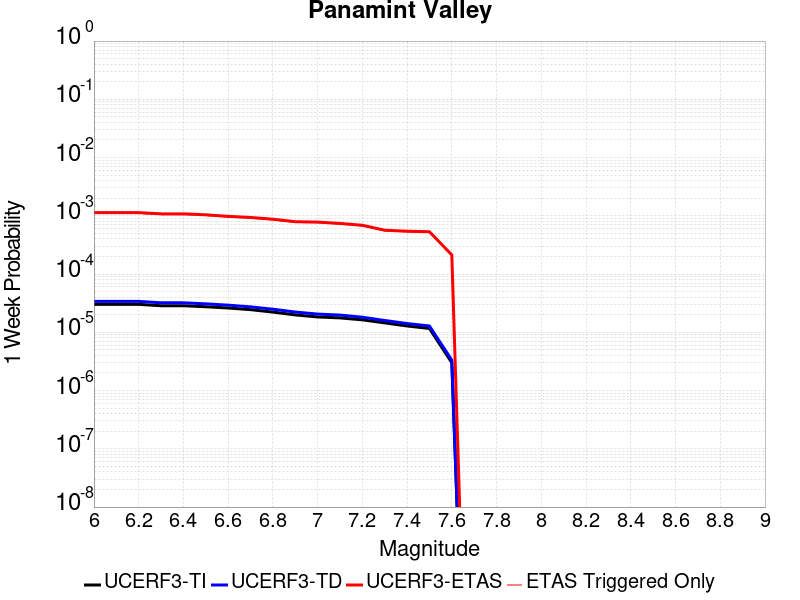 |  |  | 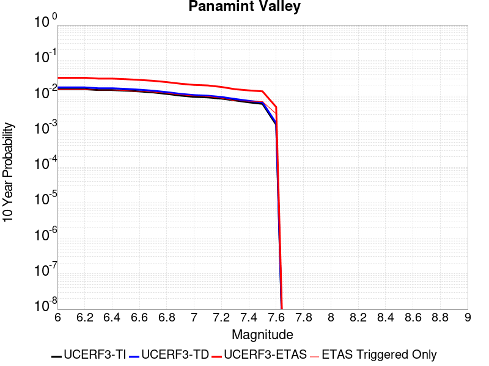 |

| Magnitude | 1 wk TI Prob | 1 wk TD Prob | 1 wk ETAS Prob | 1 wk ETAS/TD Gain | 1 wk ETAS Triggered Only | 1 mo TI Prob | 1 mo TD Prob | 1 mo ETAS Prob | 1 mo ETAS/TD Gain | 1 mo ETAS Triggered Only | 1 yr TI Prob | 1 yr TD Prob | 1 yr ETAS Prob | 1 yr ETAS/TD Gain | 1 yr ETAS Triggered Only | 10 yr TI Prob | 10 yr TD Prob | 10 yr ETAS Prob | 10 yr ETAS/TD Gain | 10 yr ETAS Triggered Only |
|-----|-----|-----|-----|-----|-----|-----|-----|-----|-----|-----|-----|-----|-----|-----|-----|-----|-----|-----|-----|-----|
| 6.0 | 3.0211835E-5 | 3.398592E-5 | 0.0011339486 | 33.365242 | 0.0011 | 1.2947287E-4 | 1.4564599E-4 | 0.003455164 | 23.723028 | 0.00331 | 0.0015751923 | 0.0017718272 | 0.010616128 | 5.9916277 | 0.00886 | 0.015640736 | 0.01758386 | 0.03284078 | 1.8676662 | 0.01553 |
| 6.1 | 3.0211835E-5 | 3.398592E-5 | 0.0011339486 | 33.365242 | 0.0011 | 1.2947287E-4 | 1.4564599E-4 | 0.003455164 | 23.723028 | 0.00331 | 0.0015751923 | 0.0017718272 | 0.010616128 | 5.9916277 | 0.00886 | 0.015640736 | 0.01758386 | 0.03284078 | 1.8676662 | 0.01553 |
| 6.2 | 3.0211835E-5 | 3.398592E-5 | 0.0011339486 | 33.365242 | 0.0011 | 1.2947287E-4 | 1.4564599E-4 | 0.003455164 | 23.723028 | 0.00331 | 0.0015751923 | 0.0017718272 | 0.010616128 | 5.9916277 | 0.00886 | 0.015640736 | 0.01758386 | 0.03284078 | 1.8676662 | 0.01553 |
| 6.3 | 2.8573924E-5 | 3.210402E-5 | 0.0010820703 | 33.70513 | 0.00105 | 1.2245393E-4 | 1.3758156E-4 | 0.0032671508 | 23.747011 | 0.00313 | 0.001489857 | 0.0016737963 | 0.01003977 | 5.998203 | 0.00838 | 0.01479908 | 0.016618488 | 0.031093866 | 1.8710405 | 0.01472 |
| 6.4 | 2.8573924E-5 | 3.210402E-5 | 0.0010820703 | 33.70513 | 0.00105 | 1.2245393E-4 | 1.3758156E-4 | 0.0032671508 | 23.747011 | 0.00313 | 0.001489857 | 0.0016737963 | 0.01003977 | 5.998203 | 0.00838 | 0.01479908 | 0.016618488 | 0.031093866 | 1.8710405 | 0.01472 |
| 6.5 | 2.7468774E-5 | 3.0829728E-5 | 0.0010407986 | 33.75958 | 0.00101 | 1.1771801E-4 | 1.3212087E-4 | 0.0031917165 | 24.15755 | 0.00306 | 0.0014322745 | 0.001607412 | 0.009754295 | 6.068323 | 0.00816 | 0.014230782 | 0.01596434 | 0.029967168 | 1.8771316 | 0.01423 |
| 6.6 | 2.6135967E-5 | 2.925372E-5 | 9.79226E-4 | 33.473553 | 9.5E-4 | 1.1200648E-4 | 1.2536721E-4 | 0.003045001 | 24.288656 | 0.00292 | 0.0013628257 | 0.0015253037 | 0.009353345 | 6.13212 | 0.00784 | 0.013544982 | 0.01515468 | 0.028548578 | 1.8838125 | 0.0136 |
| 6.7 | 2.4498746E-5 | 2.7342538E-5 | 9.373177E-4 | 34.280567 | 9.1E-4 | 1.04990395E-4 | 1.1717718E-4 | 0.002926848 | 24.977968 | 0.00281 | 0.0012775084 | 0.0014257235 | 0.008984931 | 6.3020144 | 0.00757 | 0.012701893 | 0.014171893 | 0.026987659 | 1.9043087 | 0.013 |
| 6.8 | 2.2244329E-5 | 2.4936557E-5 | 8.7491533E-4 | 35.085655 | 8.5E-4 | 9.532935E-5 | 1.068667E-4 | 0.0027565835 | 25.794598 | 0.00265 | 0.0011600169 | 0.0013003473 | 0.0084210755 | 6.476021 | 0.00713 | 0.011539802 | 0.0129331015 | 0.024777904 | 1.9158517 | 0.012 |
| 6.9 | 1.9902658E-5 | 2.2291319E-5 | 7.9227414E-4 | 35.541824 | 7.7E-4 | 8.529431E-5 | 9.553083E-5 | 0.0025252986 | 26.434385 | 0.00243 | 0.0010379635 | 0.0011624858 | 0.0076749064 | 6.602151 | 0.00652 | 0.010331288 | 0.01156915 | 0.022333162 | 1.9304065 | 0.01089 |
| 7.0 | 1.8353881E-5 | 2.0567184E-5 | 7.805516E-4 | 37.95131 | 7.6E-4 | 7.865712E-5 | 8.8142195E-5 | 0.0023979386 | 27.205341 | 0.00231 | 9.5722964E-4 | 0.0010726206 | 0.0071261204 | 6.6436543 | 0.00606 | 0.009531168 | 0.010679364 | 0.02066161 | 1.9347228 | 0.01009 |
| 7.1 | 1.7667631E-5 | 1.9773592E-5 | 7.3975936E-4 | 37.411484 | 7.2E-4 | 7.571623E-5 | 8.474131E-5 | 0.0023145524 | 27.313152 | 0.00223 | 9.2145515E-4 | 0.0010312547 | 0.0069251703 | 6.7152863 | 0.0059 | 0.009176437 | 0.010269578 | 0.019959038 | 1.9435111 | 0.00979 |
| 7.2 | 1.6381597E-5 | 1.8159171E-5 | 6.8814703E-4 | 37.895287 | 6.7E-4 | 7.020495E-5 | 7.78228E-5 | 0.0021076647 | 27.082872 | 0.00203 | 8.544101E-4 | 9.4709796E-4 | 0.006212107 | 6.5590963 | 0.00527 | 0.008511325 | 0.009435268 | 0.018072993 | 1.915472 | 0.00872 |
| 7.3 | 1.4520491E-5 | 1.5967196E-5 | 5.6595844E-4 | 35.445072 | 5.5E-4 | 6.222919E-5 | 6.842914E-5 | 0.0017283155 | 25.257013 | 0.00166 | 7.57377E-4 | 8.3282246E-4 | 0.0052391496 | 6.2908363 | 0.00441 | 0.0075480095 | 0.008300124 | 0.015628785 | 1.8829582 | 0.00739 |
| 7.4 | 1.2852287E-5 | 1.4146064E-5 | 5.4413854E-4 | 38.46572 | 5.3E-4 | 5.5080065E-5 | 6.062467E-5 | 0.001670527 | 27.555235 | 0.00161 | 6.7039346E-4 | 7.378712E-4 | 0.005014713 | 6.7961903 | 0.00428 | 0.0066837464 | 0.007357133 | 0.014474383 | 1.9673945 | 0.00717 |
| 7.5 | 1.1637851E-5 | 1.283735E-5 | 5.3283066E-4 | 41.50628 | 5.2E-4 | 4.987555E-5 | 5.5016146E-5 | 0.0016449287 | 29.899017 | 0.00159 | 6.070656E-4 | 6.696314E-4 | 0.0048768125 | 7.282831 | 0.00421 | 0.006054099 | 0.006679033 | 0.01363228 | 2.041056 | 0.007 |
| 7.6 | 3.0068115E-6 | 3.3332472E-6 | 2.1333255E-4 | 64.00142 | 2.1E-4 | 1.2886271E-5 | 1.4285308E-5 | 6.64276E-4 | 46.500645 | 6.5E-4 | 1.5687906E-4 | 1.7391703E-4 | 0.0020635882 | 11.865361 | 0.00189 | 0.0015676835 | 0.001739249 | 0.004933683 | 2.8366747 | 0.0032 |

## Garlock (East)
*[(top)](#table-of-contents)*

| 1 Week | 1 Month | 1 Year | 10 Year |
|-----|-----|-----|-----|
|  | 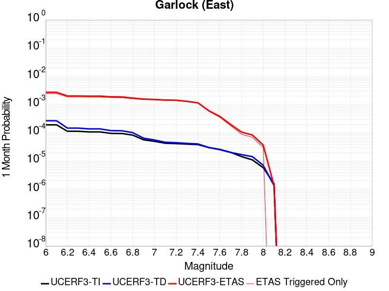 | 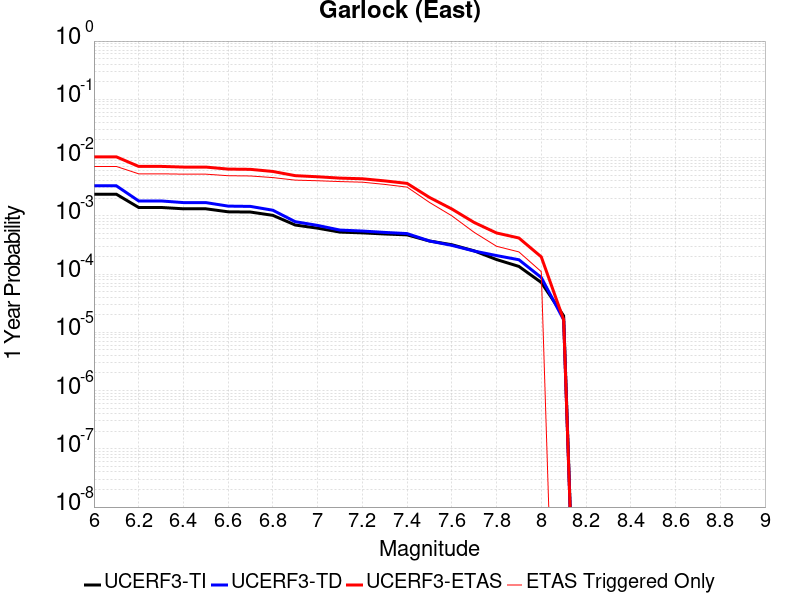 |  |

| Magnitude | 1 wk TI Prob | 1 wk TD Prob | 1 wk ETAS Prob | 1 wk ETAS/TD Gain | 1 wk ETAS Triggered Only | 1 mo TI Prob | 1 mo TD Prob | 1 mo ETAS Prob | 1 mo ETAS/TD Gain | 1 mo ETAS Triggered Only | 1 yr TI Prob | 1 yr TD Prob | 1 yr ETAS Prob | 1 yr ETAS/TD Gain | 1 yr ETAS Triggered Only | 10 yr TI Prob | 10 yr TD Prob | 10 yr ETAS Prob | 10 yr ETAS/TD Gain | 10 yr ETAS Triggered Only |
|-----|-----|-----|-----|-----|-----|-----|-----|-----|-----|-----|-----|-----|-----|-----|-----|-----|-----|-----|-----|-----|
| 6.0 | 4.5092507E-5 | 6.290882E-5 | 8.028623E-4 | 12.762317 | 7.4E-4 | 1.9323928E-4 | 2.6958386E-4 | 0.0027289207 | 10.122715 | 0.00246 | 0.0023501497 | 0.0032776897 | 0.010294614 | 3.1408143 | 0.00704 | 0.023254504 | 0.032354668 | 0.044934057 | 1.3887967 | 0.013 |
| 6.1 | 4.5092507E-5 | 6.290882E-5 | 8.028623E-4 | 12.762317 | 7.4E-4 | 1.9323928E-4 | 2.6958386E-4 | 0.0027289207 | 10.122715 | 0.00246 | 0.0023501497 | 0.0032776897 | 0.010294614 | 3.1408143 | 0.00704 | 0.023254504 | 0.032354668 | 0.044934057 | 1.3887967 | 0.013 |
| 6.2 | 2.6674514E-5 | 3.4514087E-5 | 6.6449237E-4 | 19.252787 | 6.3E-4 | 1.1431433E-4 | 1.4790932E-4 | 0.0020276313 | 13.708611 | 0.00188 | 0.0013908884 | 0.0017993415 | 0.007049877 | 3.9180315 | 0.00526 | 0.01382215 | 0.017892553 | 0.027026152 | 1.5104693 | 0.0093 |
| 6.3 | 2.6674514E-5 | 3.4514087E-5 | 6.6449237E-4 | 19.252787 | 6.3E-4 | 1.1431433E-4 | 1.4790932E-4 | 0.0020276313 | 13.708611 | 0.00188 | 0.0013908884 | 0.0017993415 | 0.007049877 | 3.9180315 | 0.00526 | 0.01382215 | 0.017892553 | 0.027026152 | 1.5104693 | 0.0093 |
| 6.4 | 2.5312667E-5 | 3.2343243E-5 | 6.523232E-4 | 20.168762 | 6.2E-4 | 1.0847834E-4 | 1.386067E-4 | 0.0019983489 | 14.417404 | 0.00186 | 0.0013199237 | 0.0016862598 | 0.006867508 | 4.0726275 | 0.00519 | 0.013121112 | 0.016780542 | 0.025786832 | 1.5367104 | 0.00916 |
| 6.5 | 2.5312667E-5 | 3.2343243E-5 | 6.523232E-4 | 20.168762 | 6.2E-4 | 1.0847834E-4 | 1.386067E-4 | 0.0019983489 | 14.417404 | 0.00186 | 0.0013199237 | 0.0016862598 | 0.006867508 | 4.0726275 | 0.00519 | 0.013121112 | 0.016780542 | 0.025786832 | 1.5367104 | 0.00916 |
| 6.6 | 2.246556E-5 | 2.8137929E-5 | 6.3812075E-4 | 22.678314 | 6.1E-4 | 9.627742E-5 | 1.2058568E-4 | 0.001900371 | 15.759508 | 0.00178 | 0.0011715472 | 0.0014671655 | 0.006340006 | 4.3212614 | 0.00488 | 0.011653901 | 0.01462079 | 0.02314432 | 1.5829732 | 0.00865 |
| 6.7 | 2.2241198E-5 | 2.7807659E-5 | 6.27791E-4 | 22.576189 | 6.0E-4 | 9.531594E-5 | 1.1917037E-4 | 0.0018789606 | 15.767012 | 0.00176 | 0.0011598538 | 0.0014499571 | 0.006272954 | 4.326303 | 0.00483 | 0.011538187 | 0.014450978 | 0.0229267 | 1.5865154 | 0.0086 |
| 6.8 | 1.9528685E-5 | 2.390206E-5 | 5.838887E-4 | 24.428383 | 5.6E-4 | 8.369167E-5 | 1.02433485E-4 | 0.0017122686 | 16.715906 | 0.00161 | 0.0010184698 | 0.0012464338 | 0.0057707876 | 4.6298385 | 0.00453 | 0.010138147 | 0.012438418 | 0.020388288 | 1.6391385 | 0.00805 |
| 6.9 | 1.3318621E-5 | 1.5202219E-5 | 5.55194E-4 | 36.520588 | 5.4E-4 | 5.7078556E-5 | 6.515077E-5 | 0.0015750524 | 24.175497 | 0.00151 | 6.9470983E-4 | 7.9292775E-4 | 0.004889677 | 6.1666107 | 0.0041 | 0.0069254204 | 0.007941613 | 0.015114196 | 1.9031644 | 0.00723 |
| 7.0 | 1.1760853E-5 | 1.3111009E-5 | 5.431041E-4 | 41.42351 | 5.3E-4 | 5.0402683E-5 | 5.618886E-5 | 0.0015261063 | 27.160301 | 0.00147 | 6.134799E-4 | 6.8388967E-4 | 0.004681154 | 6.844897 | 0.004 | 0.0061178906 | 0.006858188 | 0.013810181 | 2.0136776 | 0.007 |
| 7.1 | 1.0064758E-5 | 1.090604E-5 | 5.209005E-4 | 47.762566 | 5.1E-4 | 4.3133965E-5 | 4.6739355E-5 | 0.0014566735 | 31.165886 | 0.00141 | 5.2502943E-4 | 5.689066E-4 | 0.004436705 | 7.7986526 | 0.00387 | 0.005237907 | 0.0057146116 | 0.012356438 | 2.1622534 | 0.00668 |
| 7.2 | 9.768808E-6 | 1.0501895E-5 | 5.204965E-4 | 49.562153 | 5.1E-4 | 4.186565E-5 | 4.5007368E-5 | 0.0014349448 | 31.882444 | 0.00139 | 5.095951E-4 | 5.478304E-4 | 0.0043257596 | 7.896166 | 0.00378 | 0.0050842804 | 0.0055048666 | 0.012008865 | 2.1814997 | 0.00654 |
| 7.3 | 9.344516E-6 | 9.947497E-6 | 4.7994283E-4 | 48.247597 | 4.7E-4 | 4.004731E-5 | 4.2631455E-5 | 0.0013125773 | 30.78894 | 0.00127 | 4.8746695E-4 | 5.189178E-4 | 0.0039771223 | 7.664263 | 0.00346 | 0.0048639905 | 0.005216517 | 0.011185218 | 2.1441927 | 0.006 |
| 7.4 | 9.023491E-6 | 9.4936295E-6 | 4.1948975E-4 | 44.186443 | 4.1E-4 | 3.867153E-5 | 4.068637E-5 | 0.0011606409 | 28.526527 | 0.00112 | 4.7072413E-4 | 4.952473E-4 | 0.003603707 | 7.276581 | 0.00311 | 0.004697283 | 0.0049799387 | 0.010313246 | 2.0709586 | 0.00536 |
| 7.5 | 7.081253E-6 | 7.0903125E-6 | 1.8708904E-4 | 26.38657 | 1.8E-4 | 3.0347876E-5 | 3.0386704E-5 | 6.103691E-4 | 20.086716 | 5.8E-4 | 3.6942272E-4 | 3.6989606E-4 | 0.0020692672 | 5.594186 | 0.0017 | 0.003688092 | 0.0037256873 | 0.006525218 | 1.7514132 | 0.00281 |
| 7.6 | 6.116396E-6 | 5.9617546E-6 | 1.0596116E-4 | 17.773485 | 1.0E-4 | 2.6212863E-5 | 2.5550127E-5 | 3.8554092E-4 | 15.089589 | 3.6E-4 | 3.1909486E-4 | 3.1102865E-4 | 0.0013107177 | 4.214138 | 0.001 | 0.0031863707 | 0.003137061 | 0.004831728 | 1.5402085 | 0.0017 |
| 7.7 | 4.797145E-6 | 4.759656E-6 | 4.4759465E-5 | 9.403929 | 4.0E-5 | 2.055903E-5 | 2.0398365E-5 | 2.003947E-4 | 9.824057 | 1.8E-4 | 2.5027743E-4 | 2.4832194E-4 | 7.681928E-4 | 3.093536 | 5.2E-4 | 0.0024999576 | 0.0025105835 | 0.003398349 | 1.3536092 | 8.9E-4 |
| 7.8 | 3.4028885E-6 | 3.9805795E-6 | 2.39805E-5 | 6.024374 | 2.0E-5 | 1.4583726E-5 | 1.7059516E-5 | 1.0705798E-4 | 6.275558 | 9.0E-5 | 1.775424E-4 | 2.0767988E-4 | 5.076176E-4 | 2.4442308 | 3.0E-4 | 0.0017740062 | 0.0021023254 | 0.00264119 | 1.2563184 | 5.4E-4 |
| 7.9 | 2.5928412E-6 | 3.374239E-6 | 2.3374172E-5 | 6.9272423 | 2.0E-5 | 1.1112129E-5 | 1.4460944E-5 | 8.4459934E-5 | 5.840554 | 7.0E-5 | 1.3528178E-4 | 1.7604783E-4 | 4.1600558E-4 | 2.363026 | 2.4E-4 | 0.0013519945 | 0.001782172 | 0.0021914414 | 1.2296463 | 4.1E-4 |
| 8.0 | 1.3743648E-6 | 1.6742862E-6 | 1.1674269E-5 | 6.9726844 | 1.0E-5 | 5.8901214E-6 | 7.1754926E-6 | 3.7175276E-5 | 5.1808677 | 3.0E-5 | 7.1709874E-5 | 8.735815E-5 | 1.9734855E-4 | 2.2590742 | 1.1E-4 | 7.1686733E-4 | 8.841458E-4 | 0.0010539955 | 1.192106 | 1.7E-4 |
| 8.1 | 3.6733252E-7 | 3.1504456E-7 | 3.1504456E-7 | 1.0 | 0.0 | 1.5742813E-6 | 1.3501904E-6 | 1.3501904E-6 | 1.0 | 0.0 | 1.9166706E-5 | 1.643846E-5 | 1.643846E-5 | 1.0 | 0.0 | 1.9165053E-4 | 1.6646349E-4 | 1.7646184E-4 | 1.0600632 | 1.0E-5 |

## Ash Hill
*[(top)](#table-of-contents)*

| 1 Week | 1 Month | 1 Year | 10 Year |
|-----|-----|-----|-----|
| 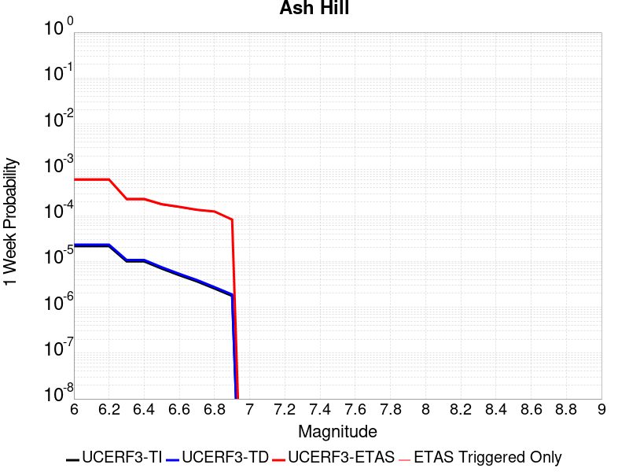 |  |  | 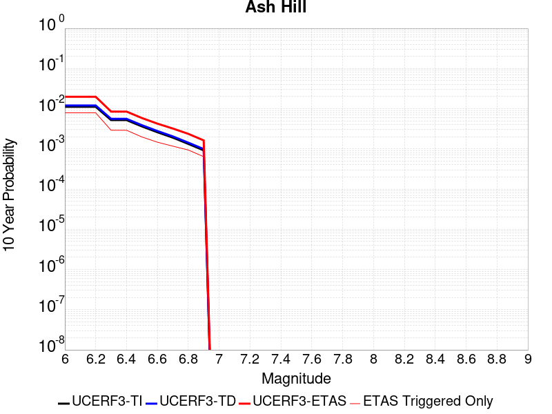 |

| Magnitude | 1 wk TI Prob | 1 wk TD Prob | 1 wk ETAS Prob | 1 wk ETAS/TD Gain | 1 wk ETAS Triggered Only | 1 mo TI Prob | 1 mo TD Prob | 1 mo ETAS Prob | 1 mo ETAS/TD Gain | 1 mo ETAS Triggered Only | 1 yr TI Prob | 1 yr TD Prob | 1 yr ETAS Prob | 1 yr ETAS/TD Gain | 1 yr ETAS Triggered Only | 10 yr TI Prob | 10 yr TD Prob | 10 yr ETAS Prob | 10 yr ETAS/TD Gain | 10 yr ETAS Triggered Only |
|-----|-----|-----|-----|-----|-----|-----|-----|-----|-----|-----|-----|-----|-----|-----|-----|-----|-----|-----|-----|-----|
| 6.0 | 2.1545662E-5 | 2.3194816E-5 | 6.1318115E-4 | 26.436127 | 5.9E-4 | 9.2335285E-5 | 9.940302E-5 | 0.0015892549 | 15.987994 | 0.00149 | 0.0011236023 | 0.0012096398 | 0.0054744747 | 4.5257063 | 0.00427 | 0.011179381 | 0.01203854 | 0.019833555 | 1.647505 | 0.00789 |
| 6.1 | 2.1545662E-5 | 2.3194816E-5 | 6.1318115E-4 | 26.436127 | 5.9E-4 | 9.2335285E-5 | 9.940302E-5 | 0.0015892549 | 15.987994 | 0.00149 | 0.0011236023 | 0.0012096398 | 0.0054744747 | 4.5257063 | 0.00427 | 0.011179381 | 0.01203854 | 0.019833555 | 1.647505 | 0.00789 |
| 6.2 | 2.1545662E-5 | 2.3194816E-5 | 6.1318115E-4 | 26.436127 | 5.9E-4 | 9.2335285E-5 | 9.940302E-5 | 0.0015892549 | 15.987994 | 0.00149 | 0.0011236023 | 0.0012096398 | 0.0054744747 | 4.5257063 | 0.00427 | 0.011179381 | 0.01203854 | 0.019833555 | 1.647505 | 0.00789 |
| 6.3 | 1.0025529E-5 | 1.0747095E-5 | 2.3074473E-4 | 21.470427 | 2.2E-4 | 4.2965847E-5 | 4.605824E-5 | 5.7603384E-4 | 12.5066395 | 5.3E-4 | 5.229836E-4 | 5.606281E-4 | 0.0021397423 | 3.8166878 | 0.00158 | 0.005217545 | 0.00559345 | 0.008487173 | 1.5173414 | 0.00291 |
| 6.4 | 1.0025529E-5 | 1.0747095E-5 | 2.3074473E-4 | 21.470427 | 2.2E-4 | 4.2965847E-5 | 4.605824E-5 | 5.7603384E-4 | 12.5066395 | 5.3E-4 | 5.229836E-4 | 5.606281E-4 | 0.0021397423 | 3.8166878 | 0.00158 | 0.005217545 | 0.00559345 | 0.008487173 | 1.5173414 | 0.00291 |
| 6.5 | 6.9617327E-6 | 7.4567447E-6 | 1.7745548E-4 | 23.797983 | 1.7E-4 | 2.9835655E-5 | 3.1957134E-5 | 3.9194562E-4 | 12.26473 | 3.6E-4 | 3.6318856E-4 | 3.890173E-4 | 0.0014985855 | 3.8522334 | 0.00111 | 0.0036259557 | 0.0038842177 | 0.005856527 | 1.5077752 | 0.00198 |
| 6.6 | 4.9919777E-6 | 5.3467675E-6 | 1.5534596E-4 | 29.054184 | 1.5E-4 | 2.1394015E-5 | 2.2914553E-5 | 3.0290813E-4 | 13.219028 | 2.8E-4 | 2.60441E-4 | 2.7895567E-4 | 0.0011487129 | 4.117905 | 8.7E-4 | 0.0026013597 | 0.002786714 | 0.0042526172 | 1.526033 | 0.00147 |
| 6.7 | 3.6630722E-6 | 3.924682E-6 | 1.3392417E-4 | 34.123573 | 1.3E-4 | 1.5698786E-5 | 1.681999E-5 | 2.468161E-4 | 14.673976 | 2.3E-4 | 1.9111596E-4 | 2.0476988E-4 | 8.946286E-4 | 4.3689466 | 6.9E-4 | 0.0019095168 | 0.002046375 | 0.0032139807 | 1.5705727 | 0.00117 |
| 6.8 | 2.5599613E-6 | 2.7449664E-6 | 1.2274463E-4 | 44.716263 | 1.2E-4 | 1.0971216E-5 | 1.1764117E-5 | 2.2176164E-4 | 18.850683 | 2.1E-4 | 1.3356637E-4 | 1.4322365E-4 | 7.031434E-4 | 4.9094086 | 5.6E-4 | 0.0013348613 | 0.0014317984 | 0.0023704525 | 1.655577 | 9.4E-4 |
| 6.9 | 1.7684905E-6 | 1.8968994E-6 | 8.1896746E-5 | 43.174007 | 8.0E-5 | 7.579223E-6 | 8.129569E-6 | 1.4812843E-4 | 18.220945 | 1.4E-4 | 9.2273134E-5 | 9.89775E-5 | 4.889389E-4 | 4.9398994 | 3.9E-4 | 9.223483E-4 | 9.89775E-4 | 0.0016291415 | 1.6459715 | 6.4E-4 |

## Hunter Mountain-Saline Valley
*[(top)](#table-of-contents)*

| 1 Week | 1 Month | 1 Year | 10 Year |
|-----|-----|-----|-----|
| 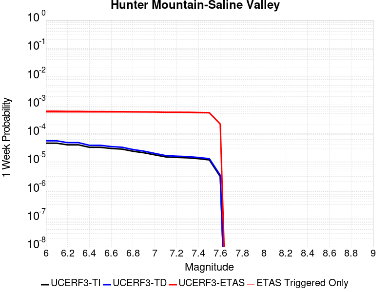 | 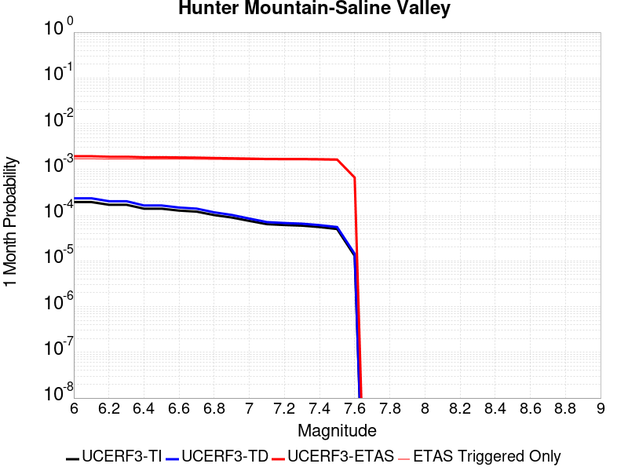 | 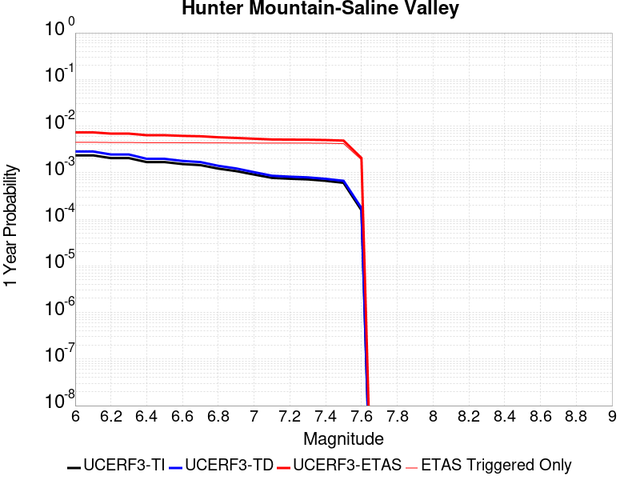 | 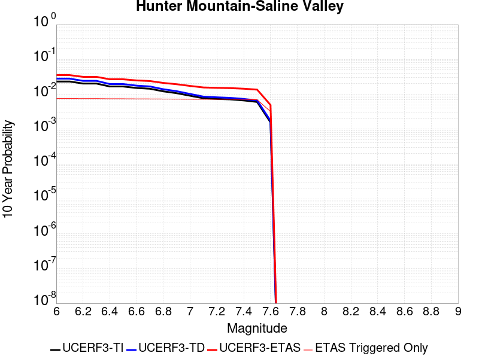 |

| Magnitude | 1 wk TI Prob | 1 wk TD Prob | 1 wk ETAS Prob | 1 wk ETAS/TD Gain | 1 wk ETAS Triggered Only | 1 mo TI Prob | 1 mo TD Prob | 1 mo ETAS Prob | 1 mo ETAS/TD Gain | 1 mo ETAS Triggered Only | 1 yr TI Prob | 1 yr TD Prob | 1 yr ETAS Prob | 1 yr ETAS/TD Gain | 1 yr ETAS Triggered Only | 10 yr TI Prob | 10 yr TD Prob | 10 yr ETAS Prob | 10 yr ETAS/TD Gain | 10 yr ETAS Triggered Only |
|-----|-----|-----|-----|-----|-----|-----|-----|-----|-----|-----|-----|-----|-----|-----|-----|-----|-----|-----|-----|-----|
| 6.0 | 4.5103672E-5 | 5.457298E-5 | 6.0454296E-4 | 11.077697 | 5.5E-4 | 1.9328714E-4 | 2.3386221E-4 | 0.0019434623 | 8.310288 | 0.00171 | 0.002350731 | 0.0028436547 | 0.0073109153 | 2.5709574 | 0.00448 | 0.023260195 | 0.028093278 | 0.03545061 | 1.2618895 | 0.00757 |
| 6.1 | 4.5103672E-5 | 5.457298E-5 | 6.0454296E-4 | 11.077697 | 5.5E-4 | 1.9328714E-4 | 2.3386221E-4 | 0.0019434623 | 8.310288 | 0.00171 | 0.002350731 | 0.0028436547 | 0.0073109153 | 2.5709574 | 0.00448 | 0.023260195 | 0.028093278 | 0.03545061 | 1.2618895 | 0.00757 |
| 6.2 | 3.9363465E-5 | 4.706569E-5 | 5.970398E-4 | 12.685245 | 5.5E-4 | 1.6868966E-4 | 2.0169314E-4 | 0.0018913522 | 9.377376 | 0.00169 | 0.002051862 | 0.002452935 | 0.006882044 | 2.8056364 | 0.00444 | 0.020330196 | 0.024274645 | 0.03162186 | 1.3026702 | 0.00753 |
| 6.3 | 3.9363465E-5 | 4.706569E-5 | 5.970398E-4 | 12.685245 | 5.5E-4 | 1.6868966E-4 | 2.0169314E-4 | 0.0018913522 | 9.377376 | 0.00169 | 0.002051862 | 0.002452935 | 0.006882044 | 2.8056364 | 0.00444 | 0.020330196 | 0.024274645 | 0.03162186 | 1.3026702 | 0.00753 |
| 6.4 | 3.2311684E-5 | 3.7952752E-5 | 5.879319E-4 | 15.491154 | 5.5E-4 | 1.384713E-4 | 1.6264491E-4 | 0.0018423717 | 11.32757 | 0.00168 | 0.0016845843 | 0.001978476 | 0.0063597905 | 3.2144895 | 0.00439 | 0.016718714 | 0.019617373 | 0.026911419 | 1.3718157 | 0.00744 |
| 6.5 | 3.2311684E-5 | 3.7952752E-5 | 5.879319E-4 | 15.491154 | 5.5E-4 | 1.384713E-4 | 1.6264491E-4 | 0.0018423717 | 11.32757 | 0.00168 | 0.0016845843 | 0.001978476 | 0.0063597905 | 3.2144895 | 0.00439 | 0.016718714 | 0.019617373 | 0.026911419 | 1.3718157 | 0.00744 |
| 6.6 | 2.9305844E-5 | 3.418339E-5 | 5.841646E-4 | 17.089134 | 5.5E-4 | 1.2559042E-4 | 1.4649238E-4 | 0.0018262463 | 12.466494 | 0.00168 | 0.0015279909 | 0.0017821483 | 0.0061543426 | 3.453328 | 0.00438 | 0.015175272 | 0.01768649 | 0.024945788 | 1.4104431 | 0.00739 |
| 6.7 | 2.7826512E-5 | 3.2345743E-5 | 5.8232795E-4 | 18.003233 | 5.5E-4 | 1.19251024E-4 | 1.3861759E-4 | 0.0018083861 | 13.045864 | 0.00167 | 0.0014509142 | 0.0016864229 | 0.00603907 | 3.580994 | 0.00436 | 0.014414776 | 0.01674394 | 0.023980703 | 1.432202 | 0.00736 |
| 6.8 | 2.3389874E-5 | 2.6867912E-5 | 5.768531E-4 | 21.469965 | 5.5E-4 | 1.0023846E-4 | 1.1514338E-4 | 0.0017749523 | 15.415148 | 0.00166 | 0.00121972 | 0.0014010164 | 0.005744922 | 4.1005387 | 0.00435 | 0.01213047 | 0.013928051 | 0.021146098 | 1.5182381 | 0.00732 |
| 6.9 | 2.069209E-5 | 2.3571078E-5 | 5.735581E-4 | 24.333132 | 5.5E-4 | 8.867737E-5 | 1.010152E-4 | 0.0017508485 | 17.332525 | 0.00165 | 0.0010791123 | 0.0012292023 | 0.00555388 | 4.5182796 | 0.00433 | 0.010738871 | 0.012229063 | 0.019410158 | 1.5872154 | 0.00727 |
| 7.0 | 1.7462342E-5 | 1.9634412E-5 | 5.696236E-4 | 29.011494 | 5.5E-4 | 7.483646E-5 | 8.414489E-5 | 0.0017240068 | 20.48855 | 0.00164 | 9.1075303E-4 | 0.0010240052 | 0.0053395815 | 5.2144084 | 0.00432 | 0.009070295 | 0.0101965 | 0.017342882 | 1.7008661 | 0.00722 |
| 7.1 | 1.4807709E-5 | 1.6442482E-5 | 5.564336E-4 | 33.841217 | 5.4E-4 | 6.3460066E-5 | 7.046597E-5 | 0.0016903518 | 23.988201 | 0.00162 | 7.723524E-4 | 8.5760193E-4 | 0.0051539144 | 6.009681 | 0.0043 | 0.007696735 | 0.008545911 | 0.01568438 | 1.8353082 | 0.0072 |
| 7.2 | 1.4180048E-5 | 1.5699039E-5 | 5.5569055E-4 | 35.39647 | 5.4E-4 | 6.077022E-5 | 6.727996E-5 | 0.0016871709 | 25.076874 | 0.00162 | 7.396263E-4 | 8.188418E-4 | 0.005115321 | 6.2470193 | 0.0043 | 0.0073716943 | 0.008161197 | 0.015292519 | 1.8738081 | 0.00719 |
| 7.3 | 1.3730402E-5 | 1.517276E-5 | 5.551646E-4 | 36.589558 | 5.4E-4 | 5.8843252E-5 | 6.5024586E-5 | 0.0016849192 | 25.912035 | 0.00162 | 7.161811E-4 | 7.914028E-4 | 0.0050879996 | 6.4290895 | 0.0043 | 0.007138774 | 0.007888777 | 0.015022057 | 1.9042313 | 0.00719 |
| 7.4 | 1.2810095E-5 | 1.4109926E-5 | 5.4410246E-4 | 38.56168 | 5.3E-4 | 5.489925E-5 | 6.04698E-5 | 0.0016703724 | 27.623251 | 0.00161 | 6.681934E-4 | 7.35987E-4 | 0.005012837 | 6.8110404 | 0.00428 | 0.006661878 | 0.0073383898 | 0.01443592 | 1.9671782 | 0.00715 |
| 7.5 | 1.1595659E-5 | 1.2801213E-5 | 5.3279457E-4 | 41.620632 | 5.2E-4 | 4.9694736E-5 | 5.4861277E-5 | 0.001644774 | 29.980602 | 0.00159 | 6.0486543E-4 | 6.67747E-4 | 0.004874936 | 7.300573 | 0.00421 | 0.006032217 | 0.006660277 | 0.013593788 | 2.0410244 | 0.00698 |
| 7.6 | 2.997694E-6 | 3.3253727E-6 | 2.1332467E-4 | 64.150604 | 2.1E-4 | 1.28471975E-5 | 1.4251561E-5 | 6.642423E-4 | 46.608387 | 6.5E-4 | 1.564034E-4 | 1.7350623E-4 | 0.0020631782 | 11.891091 | 0.00189 | 0.0015629337 | 0.0017351432 | 0.004929591 | 2.841028 | 0.0032 |

## Blackwater
*[(top)](#table-of-contents)*

| 1 Week | 1 Month | 1 Year | 10 Year |
|-----|-----|-----|-----|
|  | 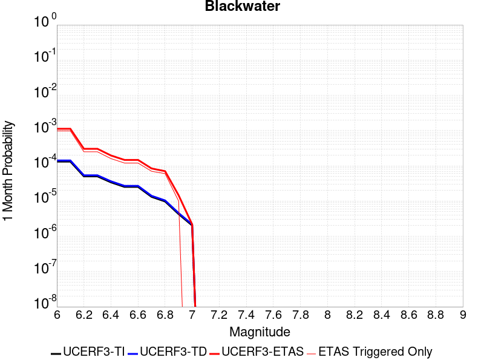 | 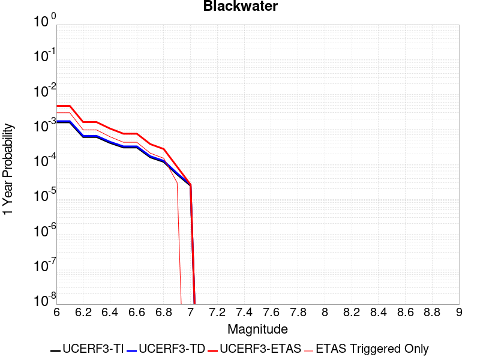 |  |

| Magnitude | 1 wk TI Prob | 1 wk TD Prob | 1 wk ETAS Prob | 1 wk ETAS/TD Gain | 1 wk ETAS Triggered Only | 1 mo TI Prob | 1 mo TD Prob | 1 mo ETAS Prob | 1 mo ETAS/TD Gain | 1 mo ETAS Triggered Only | 1 yr TI Prob | 1 yr TD Prob | 1 yr ETAS Prob | 1 yr ETAS/TD Gain | 1 yr ETAS Triggered Only | 10 yr TI Prob | 10 yr TD Prob | 10 yr ETAS Prob | 10 yr ETAS/TD Gain | 10 yr ETAS Triggered Only |
|-----|-----|-----|-----|-----|-----|-----|-----|-----|-----|-----|-----|-----|-----|-----|-----|-----|-----|-----|-----|-----|
| 6.0 | 3.0708583E-5 | 3.3096385E-5 | 3.130871E-4 | 9.459859 | 2.8E-4 | 1.3160157E-4 | 1.4183471E-4 | 0.0011216957 | 7.908471 | 9.8E-4 | 0.0016010714 | 0.0017256065 | 0.0047304123 | 2.7413044 | 0.00301 | 0.015895851 | 0.017135909 | 0.022905322 | 1.3366855 | 0.00587 |
| 6.1 | 3.0708583E-5 | 3.3096385E-5 | 3.130871E-4 | 9.459859 | 2.8E-4 | 1.3160157E-4 | 1.4183471E-4 | 0.0011216957 | 7.908471 | 9.8E-4 | 0.0016010714 | 0.0017256065 | 0.0047304123 | 2.7413044 | 0.00301 | 0.015895851 | 0.017135909 | 0.022905322 | 1.3366855 | 0.00587 |
| 6.2 | 1.1707779E-5 | 1.2545309E-5 | 8.254443E-5 | 6.5797048 | 7.0E-5 | 5.017523E-5 | 5.3764557E-5 | 3.0375112E-4 | 5.6496534 | 2.5E-4 | 6.107122E-4 | 6.543965E-4 | 0.0016237617 | 2.4813118 | 9.7E-4 | 0.006090366 | 0.0065256665 | 0.008472877 | 1.2983924 | 0.00196 |
| 6.3 | 1.1707779E-5 | 1.2545309E-5 | 8.254443E-5 | 6.5797048 | 7.0E-5 | 5.017523E-5 | 5.3764557E-5 | 3.0375112E-4 | 5.6496534 | 2.5E-4 | 6.107122E-4 | 6.543965E-4 | 0.0016237617 | 2.4813118 | 9.7E-4 | 0.006090366 | 0.0065256665 | 0.008472877 | 1.2983924 | 0.00196 |
| 6.4 | 7.929244E-6 | 8.4802205E-6 | 6.847971E-5 | 8.075228 | 6.0E-5 | 3.3982033E-5 | 3.634332E-5 | 1.9633751E-4 | 5.4023 | 1.6E-4 | 4.136527E-4 | 4.423941E-4 | 0.0010621198 | 2.4008453 | 6.2E-4 | 0.0041288356 | 0.00441554 | 0.0056998436 | 1.29086 | 0.00129 |
| 6.5 | 5.8832115E-6 | 6.2860804E-6 | 5.6285768E-5 | 8.954032 | 5.0E-5 | 2.521352E-5 | 2.694008E-5 | 1.4693684E-4 | 5.4542093 | 1.2E-4 | 3.0693135E-4 | 3.2794868E-4 | 7.5780763E-4 | 2.3107507 | 4.3E-4 | 0.0030650778 | 0.0032749004 | 0.004171953 | 1.2739176 | 9.0E-4 |
| 6.6 | 5.8832115E-6 | 6.2860804E-6 | 5.6285768E-5 | 8.954032 | 5.0E-5 | 2.521352E-5 | 2.694008E-5 | 1.4693684E-4 | 5.4542093 | 1.2E-4 | 3.0693135E-4 | 3.2794868E-4 | 7.5780763E-4 | 2.3107507 | 4.3E-4 | 0.0030650778 | 0.0032749004 | 0.004171953 | 1.2739176 | 9.0E-4 |
| 6.7 | 3.0715053E-6 | 3.2815128E-6 | 4.3281383E-5 | 13.18946 | 4.0E-5 | 1.3163528E-5 | 1.40635575E-5 | 8.406257E-5 | 5.9773335 | 7.0E-5 | 1.6025416E-4 | 1.7121152E-4 | 3.8117557E-4 | 2.226343 | 2.1E-4 | 0.0016013865 | 0.0017109107 | 0.002140175 | 1.2508981 | 4.3E-4 |
| 6.8 | 2.2722281E-6 | 2.4287885E-6 | 3.2428714E-5 | 13.351807 | 3.0E-5 | 9.738084E-6 | 1.0409058E-5 | 7.040843E-5 | 6.7641506 | 6.0E-5 | 1.1855473E-4 | 1.2672383E-4 | 2.767048E-4 | 2.1835265 | 1.5E-4 | 0.001184915 | 0.0012666058 | 0.0015762132 | 1.2444386 | 3.1E-4 |
| 6.9 | 9.952399E-7 | 1.0653645E-6 | 1.1065354E-5 | 10.386449 | 1.0E-5 | 4.265307E-6 | 4.5658426E-6 | 1.4565797E-5 | 3.1901662 | 1.0E-5 | 5.1928873E-5 | 5.5588232E-5 | 8.5586566E-5 | 1.5396526 | 3.0E-5 | 5.191674E-4 | 5.5579393E-4 | 6.757272E-4 | 1.2157874 | 1.2E-4 |
| 7.0 | 4.7385504E-7 | 5.0756347E-7 | 5.0756347E-7 | 1.0 | 0.0 | 2.0308057E-6 | 2.175272E-6 | 2.175272E-6 | 1.0 | 0.0 | 2.4724779E-5 | 2.6483936E-5 | 2.6483936E-5 | 1.0 | 0.0 | 2.4722028E-4 | 2.6483936E-4 | 3.1482612E-4 | 1.1887437 | 5.0E-5 |

## Garlock (West)
*[(top)](#table-of-contents)*

| 1 Week | 1 Month | 1 Year | 10 Year |
|-----|-----|-----|-----|
| 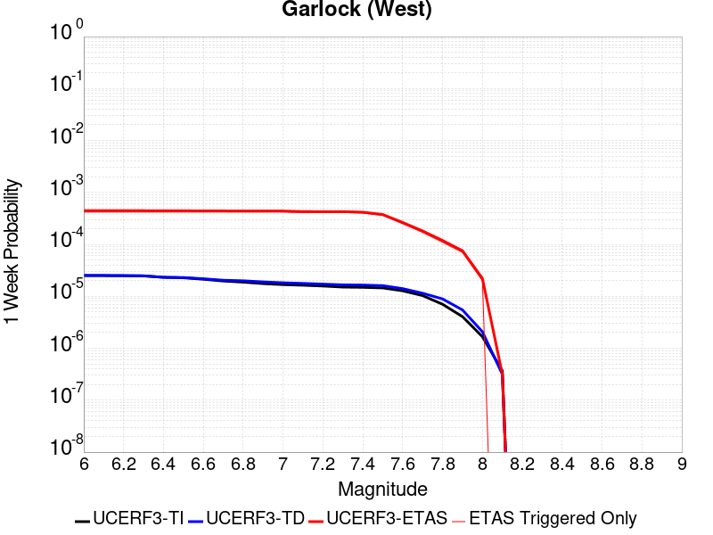 |  |  |  |

| Magnitude | 1 wk TI Prob | 1 wk TD Prob | 1 wk ETAS Prob | 1 wk ETAS/TD Gain | 1 wk ETAS Triggered Only | 1 mo TI Prob | 1 mo TD Prob | 1 mo ETAS Prob | 1 mo ETAS/TD Gain | 1 mo ETAS Triggered Only | 1 yr TI Prob | 1 yr TD Prob | 1 yr ETAS Prob | 1 yr ETAS/TD Gain | 1 yr ETAS Triggered Only | 10 yr TI Prob | 10 yr TD Prob | 10 yr ETAS Prob | 10 yr ETAS/TD Gain | 10 yr ETAS Triggered Only |
|-----|-----|-----|-----|-----|-----|-----|-----|-----|-----|-----|-----|-----|-----|-----|-----|-----|-----|-----|-----|-----|
| 6.0 | 2.5181727E-5 | 2.5204898E-5 | 4.451943E-4 | 17.663008 | 4.2E-4 | 1.0791722E-4 | 1.0801654E-4 | 0.0011079086 | 10.256842 | 0.001 | 0.0013131002 | 0.0013143114 | 0.004290395 | 3.2643669 | 0.00298 | 0.013053683 | 0.013145875 | 0.018070277 | 1.3745967 | 0.00499 |
| 6.1 | 2.5077732E-5 | 2.5105966E-5 | 4.4509541E-4 | 17.72867 | 4.2E-4 | 1.0747157E-4 | 1.0759258E-4 | 0.001107485 | 10.293321 | 0.001 | 0.001307681 | 0.001309156 | 0.0042852545 | 3.2732959 | 0.00298 | 0.013000126 | 0.01309493 | 0.018019587 | 1.3760735 | 0.00499 |
| 6.2 | 2.494612E-5 | 2.498764E-5 | 4.4497714E-4 | 17.80789 | 4.2E-4 | 1.0690756E-4 | 1.0708551E-4 | 0.0011069784 | 10.337332 | 0.001 | 0.0013008224 | 0.0013029897 | 0.004279107 | 3.284068 | 0.00298 | 0.012932341 | 0.013033992 | 0.017958952 | 1.3778551 | 0.00499 |
| 6.3 | 2.4733758E-5 | 2.4807E-5 | 4.4479658E-4 | 17.930285 | 4.2E-4 | 1.0599751E-4 | 1.06311396E-4 | 0.001106205 | 10.405329 | 0.001 | 0.0012897556 | 0.0012935762 | 0.0042697215 | 3.3007112 | 0.00298 | 0.012822957 | 0.012940957 | 0.01786638 | 1.3806075 | 0.00499 |
| 6.4 | 2.3237335E-5 | 2.3186256E-5 | 4.431765E-4 | 19.11376 | 4.2E-4 | 9.958477E-5 | 9.93659E-5 | 0.0010792685 | 10.861558 | 9.8E-4 | 0.0012117702 | 0.0012091112 | 0.0041355686 | 3.4203374 | 0.00293 | 0.012051838 | 0.012105782 | 0.0169761 | 1.4023135 | 0.00493 |
| 6.5 | 2.2732203E-5 | 2.3000786E-5 | 4.4299112E-4 | 19.259827 | 4.2E-4 | 9.742009E-5 | 9.857109E-5 | 0.0010784745 | 10.941084 | 9.8E-4 | 0.0011854442 | 0.0011994451 | 0.004125931 | 3.4398663 | 0.00293 | 0.011791403 | 0.012010168 | 0.01688096 | 1.4055555 | 0.00493 |
| 6.6 | 2.1319436E-5 | 2.1780923E-5 | 4.417718E-4 | 20.28251 | 4.2E-4 | 9.136581E-5 | 9.3343486E-5 | 0.0010732521 | 11.497878 | 9.8E-4 | 0.001111811 | 0.0011358667 | 0.0040625385 | 3.576598 | 0.00293 | 0.011062649 | 0.011381042 | 0.016245047 | 1.4273778 | 0.00492 |
| 6.7 | 1.970802E-5 | 2.0400741E-5 | 4.4039218E-4 | 21.587069 | 4.2E-4 | 8.446021E-5 | 8.742882E-5 | 0.0010673432 | 12.208138 | 9.8E-4 | 0.001027818 | 0.0010639279 | 0.0039708316 | 3.7322378 | 0.00291 | 0.010230771 | 0.010668742 | 0.0155164655 | 1.4543856 | 0.0049 |
| 6.8 | 1.8744462E-5 | 1.9908346E-5 | 4.3989997E-4 | 22.096258 | 4.2E-4 | 8.033094E-5 | 8.531871E-5 | 0.0010652351 | 12.485364 | 9.8E-4 | 9.775903E-4 | 0.0010382619 | 0.0039452408 | 3.799851 | 0.00291 | 0.009733009 | 0.010414507 | 0.015263476 | 1.4655975 | 0.0049 |
| 6.9 | 1.7559682E-5 | 1.8960667E-5 | 4.389527E-4 | 23.1507 | 4.2E-4 | 7.5253614E-5 | 8.125748E-5 | 0.0010611778 | 13.059448 | 9.8E-4 | 9.158276E-4 | 9.888622E-4 | 0.0038959847 | 3.9398658 | 0.00291 | 0.0091206245 | 0.009924965 | 0.014776332 | 1.4888046 | 0.0049 |
| 7.0 | 1.6794445E-5 | 1.8223436E-5 | 4.382158E-4 | 24.046824 | 4.2E-4 | 7.197421E-5 | 7.809811E-5 | 0.0010580216 | 13.5473385 | 9.8E-4 | 8.759337E-4 | 9.5043116E-4 | 0.0038576655 | 4.0588584 | 0.00291 | 0.008724891 | 0.009543848 | 0.014397083 | 1.5085198 | 0.0049 |
| 7.1 | 1.6337795E-5 | 1.7724205E-5 | 4.2771694E-4 | 24.131798 | 4.1E-4 | 7.0017246E-5 | 7.595868E-5 | 0.001045885 | 13.769132 | 9.7E-4 | 8.521265E-4 | 9.244059E-4 | 0.0038117343 | 4.123442 | 0.00289 | 0.008488664 | 0.009285684 | 0.014110463 | 1.5195932 | 0.00487 |
| 7.2 | 1.5780008E-5 | 1.7172819E-5 | 4.2716577E-4 | 24.874529 | 4.1E-4 | 6.762685E-5 | 7.359572E-5 | 0.0010435244 | 14.179144 | 9.7E-4 | 8.2304585E-4 | 8.956609E-4 | 0.0037830723 | 4.223778 | 0.00289 | 0.008200042 | 0.009000513 | 0.01381677 | 1.5351093 | 0.00486 |
| 7.3 | 1.5058865E-5 | 1.662584E-5 | 4.2661902E-4 | 25.659998 | 4.1E-4 | 6.45364E-5 | 7.125166E-5 | 0.0010311833 | 14.47241 | 9.6E-4 | 7.854473E-4 | 8.671449E-4 | 0.003724665 | 4.29532 | 0.00286 | 0.00782677 | 0.008717186 | 0.01349517 | 1.5481107 | 0.00482 |
| 7.4 | 1.4887923E-5 | 1.6461787E-5 | 4.164552E-4 | 25.298298 | 4.0E-4 | 6.380382E-5 | 7.0548616E-5 | 0.0010204816 | 14.464942 | 9.5E-4 | 7.7653467E-4 | 8.585921E-4 | 0.003676171 | 4.2816267 | 0.00282 | 0.0077382675 | 0.008632035 | 0.013350947 | 1.5466743 | 0.00476 |
| 7.5 | 1.4509299E-5 | 1.6053757E-5 | 3.7604797E-4 | 23.4243 | 3.6E-4 | 6.218123E-5 | 6.880001E-5 | 9.687381E-4 | 14.080495 | 9.0E-4 | 7.567935E-4 | 8.373193E-4 | 0.003495092 | 4.1741447 | 0.00266 | 0.0075422134 | 0.0084203165 | 0.012882425 | 1.5299217 | 0.0045 |
| 7.6 | 1.2756717E-5 | 1.4057576E-5 | 2.6405405E-4 | 18.783754 | 2.5E-4 | 5.4670498E-5 | 6.0245366E-5 | 6.8020803E-4 | 11.2906275 | 6.2E-4 | 6.6541E-4 | 7.3324115E-4 | 0.002481958 | 3.3849137 | 0.00175 | 0.006634211 | 0.0073851612 | 0.010363006 | 1.4032199 | 0.003 |
| 7.7 | 1.0328985E-5 | 1.1466867E-5 | 1.8146491E-4 | 15.825152 | 1.7E-4 | 4.4266326E-5 | 4.9142793E-5 | 4.291241E-4 | 8.732188 | 3.8E-4 | 5.388092E-4 | 5.9814967E-4 | 0.0016475216 | 2.7543635 | 0.00105 | 0.0053750467 | 0.0060417783 | 0.007850782 | 1.2994158 | 0.00182 |
| 7.8 | 7.0306583E-6 | 8.904648E-6 | 1.1890367E-4 | 13.352989 | 1.1E-4 | 3.0131043E-5 | 3.816222E-5 | 2.5815383E-4 | 6.7646437 | 2.2E-4 | 3.667837E-4 | 4.6452612E-4 | 0.0011142242 | 2.3986254 | 6.5E-4 | 0.003661789 | 0.0046978896 | 0.005872346 | 1.2499967 | 0.00118 |
| 7.9 | 4.060633E-6 | 5.468355E-6 | 7.546797E-5 | 13.800855 | 7.0E-5 | 1.7402595E-5 | 2.3435598E-5 | 1.6343231E-4 | 6.973678 | 1.4E-4 | 2.11856E-4 | 2.8529114E-4 | 6.751799E-4 | 2.3666346 | 3.9E-4 | 0.0021165414 | 0.0028857393 | 0.0035837193 | 1.2418722 | 7.0E-4 |
| 8.0 | 1.6729537E-6 | 2.0785212E-6 | 2.207848E-5 | 10.622206 | 2.0E-5 | 7.169782E-6 | 8.907918E-6 | 4.890756E-5 | 5.4903474 | 4.0E-5 | 8.7288594E-5 | 1.08448534E-4 | 2.4843335E-4 | 2.2907948 | 1.4E-4 | 8.7254314E-4 | 0.0010974575 | 0.001307227 | 1.1911414 | 2.1E-4 |
| 8.1 | 3.6733252E-7 | 3.1504456E-7 | 3.1504456E-7 | 1.0 | 0.0 | 1.5742813E-6 | 1.3501904E-6 | 1.3501904E-6 | 1.0 | 0.0 | 1.9166706E-5 | 1.643846E-5 | 1.643846E-5 | 1.0 | 0.0 | 1.9165053E-4 | 1.6646349E-4 | 1.7646184E-4 | 1.0600632 | 1.0E-5 |

## McLean Lake
*[(top)](#table-of-contents)*

| 1 Week | 1 Month | 1 Year | 10 Year |
|-----|-----|-----|-----|
|  |  |  |  |

| Magnitude | 1 wk TI Prob | 1 wk TD Prob | 1 wk ETAS Prob | 1 wk ETAS/TD Gain | 1 wk ETAS Triggered Only | 1 mo TI Prob | 1 mo TD Prob | 1 mo ETAS Prob | 1 mo ETAS/TD Gain | 1 mo ETAS Triggered Only | 1 yr TI Prob | 1 yr TD Prob | 1 yr ETAS Prob | 1 yr ETAS/TD Gain | 1 yr ETAS Triggered Only | 10 yr TI Prob | 10 yr TD Prob | 10 yr ETAS Prob | 10 yr ETAS/TD Gain | 10 yr ETAS Triggered Only |
|-----|-----|-----|-----|-----|-----|-----|-----|-----|-----|-----|-----|-----|-----|-----|-----|-----|-----|-----|-----|-----|
| 6.0 | 1.7360222E-5 | 1.8501882E-5 | 1.7849891E-4 | 9.647609 | 1.6E-4 | 7.439883E-5 | 7.929164E-5 | 5.4925436E-4 | 6.927015 | 4.7E-4 | 9.0542925E-4 | 9.649968E-4 | 0.0026333854 | 2.7289057 | 0.00167 | 0.009017491 | 0.009612906 | 0.0131981075 | 1.3729571 | 0.00362 |
| 6.1 | 9.062689E-6 | 9.592311E-6 | 1.09591354E-4 | 11.424917 | 1.0E-4 | 3.8839516E-5 | 4.1109302E-5 | 2.9109902E-4 | 7.0810986 | 2.5E-4 | 4.727685E-4 | 5.0039974E-4 | 0.0014399294 | 2.8775582 | 9.4E-4 | 0.0047176396 | 0.0049936124 | 0.0071726763 | 1.4363703 | 0.00219 |
| 6.2 | 9.062689E-6 | 9.592311E-6 | 1.09591354E-4 | 11.424917 | 1.0E-4 | 3.8839516E-5 | 4.1109302E-5 | 2.9109902E-4 | 7.0810986 | 2.5E-4 | 4.727685E-4 | 5.0039974E-4 | 0.0014399294 | 2.8775582 | 9.4E-4 | 0.0047176396 | 0.0049936124 | 0.0071726763 | 1.4363703 | 0.00219 |
| 6.3 | 7.2575485E-6 | 7.6678E-6 | 6.766734E-5 | 8.82487 | 6.0E-5 | 3.110341E-5 | 3.2861626E-5 | 2.3285505E-4 | 7.085926 | 2.0E-4 | 3.786182E-4 | 4.0002397E-4 | 0.0011797119 | 2.949103 | 7.8E-4 | 0.0037797375 | 0.0039937436 | 0.005796515 | 1.4513988 | 0.00181 |
| 6.4 | 7.2575485E-6 | 7.6678E-6 | 6.766734E-5 | 8.82487 | 6.0E-5 | 3.110341E-5 | 3.2861626E-5 | 2.3285505E-4 | 7.085926 | 2.0E-4 | 3.786182E-4 | 4.0002397E-4 | 0.0011797119 | 2.949103 | 7.8E-4 | 0.0037797375 | 0.0039937436 | 0.005796515 | 1.4513988 | 0.00181 |
| 6.5 | 6.06582E-6 | 6.4039514E-6 | 6.640357E-5 | 10.369155 | 6.0E-5 | 2.5996113E-5 | 2.7445254E-5 | 1.9744059E-4 | 7.1939793 | 1.7E-4 | 3.164567E-4 | 3.3410123E-4 | 0.0010238707 | 3.0645523 | 6.9E-4 | 0.0031600643 | 0.003336628 | 0.004911356 | 1.471952 | 0.00158 |
| 6.6 | 5.598744E-6 | 5.910331E-6 | 5.5910034E-5 | 9.459713 | 5.0E-5 | 2.3994397E-5 | 2.5329779E-5 | 1.8532573E-4 | 7.3165154 | 1.6E-4 | 2.9209262E-4 | 3.083528E-4 | 9.681493E-4 | 3.1397452 | 6.6E-4 | 0.0029170897 | 0.0030798789 | 0.0045054746 | 1.4628739 | 0.00143 |
| 6.7 | 5.246996E-6 | 5.5392265E-6 | 5.553895E-5 | 10.026482 | 5.0E-5 | 2.2486933E-5 | 2.3739361E-5 | 1.6373604E-4 | 6.8972387 | 1.4E-4 | 2.73744E-4 | 2.8899475E-4 | 8.788242E-4 | 3.0409696 | 5.9E-4 | 0.0027340704 | 0.0028868131 | 0.0042129736 | 1.4593856 | 0.00133 |
| 6.8 | 4.02324E-6 | 4.2469537E-6 | 5.4246742E-5 | 12.773094 | 5.0E-5 | 1.7242342E-5 | 1.8201137E-5 | 1.2819913E-4 | 7.0434685 | 1.1E-4 | 2.099053E-4 | 2.2158226E-4 | 6.51487E-4 | 2.9401586 | 4.3E-4 | 0.0020970714 | 0.0022141975 | 0.0031521162 | 1.423593 | 9.4E-4 |
| 6.9 | 6.835972E-7 | 7.1399944E-7 | 2.0713986E-5 | 29.011206 | 2.0E-5 | 2.9296991E-6 | 3.0599958E-6 | 2.3059934E-5 | 7.535937 | 2.0E-5 | 3.56685E-5 | 3.725513E-5 | 9.7252894E-5 | 2.6104565 | 6.0E-5 | 3.5662777E-4 | 3.7252012E-4 | 5.424568E-4 | 1.4561812 | 1.7E-4 |

## Gravel Hills-Harper Lk
*[(top)](#table-of-contents)*

| 1 Week | 1 Month | 1 Year | 10 Year |
|-----|-----|-----|-----|
| 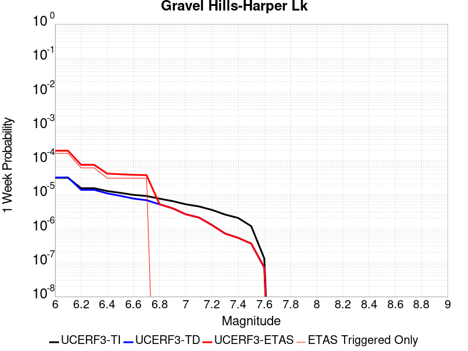 |  |  |  |

| Magnitude | 1 wk TI Prob | 1 wk TD Prob | 1 wk ETAS Prob | 1 wk ETAS/TD Gain | 1 wk ETAS Triggered Only | 1 mo TI Prob | 1 mo TD Prob | 1 mo ETAS Prob | 1 mo ETAS/TD Gain | 1 mo ETAS Triggered Only | 1 yr TI Prob | 1 yr TD Prob | 1 yr ETAS Prob | 1 yr ETAS/TD Gain | 1 yr ETAS Triggered Only | 10 yr TI Prob | 10 yr TD Prob | 10 yr ETAS Prob | 10 yr ETAS/TD Gain | 10 yr ETAS Triggered Only |
|-----|-----|-----|-----|-----|-----|-----|-----|-----|-----|-----|-----|-----|-----|-----|-----|-----|-----|-----|-----|-----|
| 6.0 | 3.0679566E-5 | 3.1465494E-5 | 1.9146045E-4 | 6.0847754 | 1.6E-4 | 1.3147724E-4 | 1.3484636E-4 | 7.047695E-4 | 5.226463 | 5.7E-4 | 0.0015995599 | 0.0016407346 | 0.0032381094 | 1.973573 | 0.0016 | 0.015880952 | 0.016307775 | 0.019298198 | 1.1833742 | 0.00304 |
| 6.1 | 3.0679566E-5 | 3.1465494E-5 | 1.9146045E-4 | 6.0847754 | 1.6E-4 | 1.3147724E-4 | 1.3484636E-4 | 7.047695E-4 | 5.226463 | 5.7E-4 | 0.0015995599 | 0.0016407346 | 0.0032381094 | 1.973573 | 0.0016 | 0.015880952 | 0.016307775 | 0.019298198 | 1.1833742 | 0.00304 |
| 6.2 | 1.514536E-5 | 1.3635497E-5 | 7.363468E-5 | 5.4002194 | 6.0E-5 | 6.490707E-5 | 5.8436606E-5 | 2.5842493E-4 | 4.4223123 | 2.0E-4 | 7.8995706E-4 | 7.112453E-4 | 0.0012008968 | 1.6884425 | 4.9E-4 | 0.007871548 | 0.0070908912 | 0.00798451 | 1.1260234 | 9.0E-4 |
| 6.3 | 1.514536E-5 | 1.3635497E-5 | 7.363468E-5 | 5.4002194 | 6.0E-5 | 6.490707E-5 | 5.8436606E-5 | 2.5842493E-4 | 4.4223123 | 2.0E-4 | 7.8995706E-4 | 7.112453E-4 | 0.0012008968 | 1.6884425 | 4.9E-4 | 0.007871548 | 0.0070908912 | 0.00798451 | 1.1260234 | 9.0E-4 |
| 6.4 | 1.2532521E-5 | 1.0689903E-5 | 4.068958E-5 | 3.8063564 | 3.0E-5 | 5.37097E-5 | 4.58131E-5 | 1.8580668E-4 | 4.0557547 | 1.4E-4 | 6.537194E-4 | 5.5763754E-4 | 8.8745356E-4 | 1.5914522 | 3.3E-4 | 0.0065179965 | 0.005562973 | 0.0060800803 | 1.0929552 | 5.2E-4 |
| 6.5 | 1.1094058E-5 | 9.083837E-6 | 3.9083563E-5 | 4.3025393 | 3.0E-5 | 4.7545094E-5 | 3.893017E-5 | 1.6892511E-4 | 4.3391824 | 1.3E-4 | 5.787078E-4 | 4.7387579E-4 | 7.237573E-4 | 1.5273144 | 2.5E-4 | 0.0057720304 | 0.0047290605 | 0.0051072636 | 1.0799742 | 3.8E-4 |
| 6.6 | 9.688328E-6 | 7.5318344E-6 | 3.753161E-5 | 4.983063 | 3.0E-5 | 4.1520743E-5 | 3.2278906E-5 | 1.22276E-4 | 3.7881086 | 9.0E-5 | 5.053978E-4 | 3.9292735E-4 | 5.3287233E-4 | 1.3561599 | 1.4E-4 | 0.0050424994 | 0.003922583 | 0.004131759 | 1.0533261 | 2.1E-4 |
| 6.7 | 8.974824E-6 | 6.7495366E-6 | 3.6749334E-5 | 5.44472 | 3.0E-5 | 3.8462964E-5 | 2.8926277E-5 | 1.0892396E-4 | 3.7655714 | 8.0E-5 | 4.6818596E-4 | 3.521227E-4 | 4.520875E-4 | 1.2838919 | 1.0E-4 | 0.004672008 | 0.003515869 | 0.0036753062 | 1.0453479 | 1.6E-4 |
| 6.8 | 7.4780046E-6 | 5.1162856E-6 | 5.1162856E-6 | 1.0 | 0.0 | 3.20482E-5 | 2.1926762E-5 | 3.1926542E-5 | 1.4560537 | 1.0E-5 | 3.9011694E-4 | 2.6692703E-4 | 2.7692434E-4 | 1.0374534 | 1.0E-5 | 0.0038943281 | 0.0026662024 | 0.002686149 | 1.0074813 | 2.0E-5 |
| 6.9 | 6.3409307E-6 | 3.907569E-6 | 3.907569E-6 | 1.0 | 0.0 | 2.7175134E-5 | 1.6746622E-5 | 2.6746455E-5 | 1.5971254 | 1.0E-5 | 3.3080703E-4 | 2.0387204E-4 | 2.1387E-4 | 1.0490403 | 1.0E-5 | 0.0033031502 | 0.0020369482 | 0.0020569074 | 1.0097986 | 2.0E-5 |
| 7.0 | 5.1239335E-6 | 2.6059067E-6 | 2.6059067E-6 | 1.0 | 0.0 | 2.195953E-5 | 1.1168126E-5 | 2.1168014E-5 | 1.8953954 | 1.0E-5 | 2.6732447E-4 | 1.359637E-4 | 1.4596233E-4 | 1.073539 | 1.0E-5 | 0.0026700313 | 0.0013588304 | 0.0013688168 | 1.0073493 | 1.0E-5 |
| 7.1 | 4.438899E-6 | 2.0985146E-6 | 2.0985146E-6 | 1.0 | 0.0 | 1.9023713E-5 | 8.993605E-6 | 8.993605E-6 | 1.0 | 0.0 | 2.315891E-4 | 1.09491855E-4 | 1.09491855E-4 | 1.0 | 0.0 | 0.002313479 | 0.001094401 | 0.001094401 | 1.0 | 0.0 |
| 7.2 | 3.50367E-6 | 1.2616023E-6 | 1.2616023E-6 | 1.0 | 0.0 | 1.5015643E-5 | 5.406856E-6 | 5.406856E-6 | 1.0 | 0.0 | 1.8280011E-4 | 6.582657E-5 | 6.582657E-5 | 1.0 | 0.0 | 0.0018264982 | 6.5807893E-4 | 6.5807893E-4 | 1.0 | 0.0 |
| 7.3 | 2.561638E-6 | 7.119392E-7 | 7.119392E-7 | 1.0 | 0.0 | 1.0978401E-5 | 3.0511644E-6 | 3.0511644E-6 | 1.0 | 0.0 | 1.3365384E-4 | 3.7147314E-5 | 3.7147314E-5 | 1.0 | 0.0 | 0.0013357349 | 3.7141304E-4 | 3.7141304E-4 | 1.0 | 0.0 |
| 7.4 | 2.0368864E-6 | 5.305023E-7 | 5.305023E-7 | 1.0 | 0.0 | 8.729483E-6 | 2.2735792E-6 | 2.2735792E-6 | 1.0 | 0.0 | 1.06276275E-4 | 2.768048E-5 | 2.768048E-5 | 1.0 | 0.0 | 0.0010622547 | 2.7677088E-4 | 2.7677088E-4 | 1.0 | 0.0 |
| 7.5 | 1.1681728E-6 | 3.6031688E-7 | 3.6031688E-7 | 1.0 | 0.0 | 5.0064455E-6 | 1.5442143E-6 | 1.5442143E-6 | 1.0 | 0.0 | 6.0951766E-5 | 1.8800652E-5 | 1.8800652E-5 | 1.0 | 0.0 | 6.093505E-4 | 1.8799109E-4 | 1.8799109E-4 | 1.0 | 0.0 |
| 7.6 | 1.3154387E-7 | 7.119876E-8 | 7.119876E-8 | 1.0 | 0.0 | 5.6375933E-7 | 3.0513755E-7 | 3.0513755E-7 | 1.0 | 0.0 | 6.863748E-6 | 3.7150448E-6 | 3.7150448E-6 | 1.0 | 0.0 | 6.863536E-5 | 3.7149985E-5 | 3.7149985E-5 | 1.0 | 0.0 |

## Goldstone Lake
*[(top)](#table-of-contents)*

| 1 Week | 1 Month | 1 Year | 10 Year |
|-----|-----|-----|-----|
| 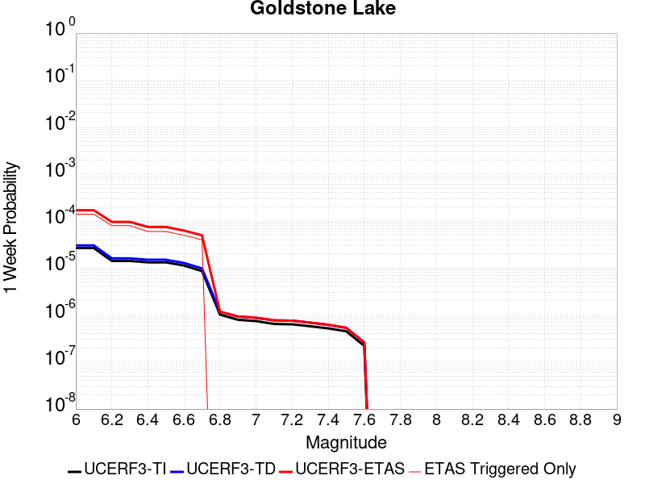 |  | 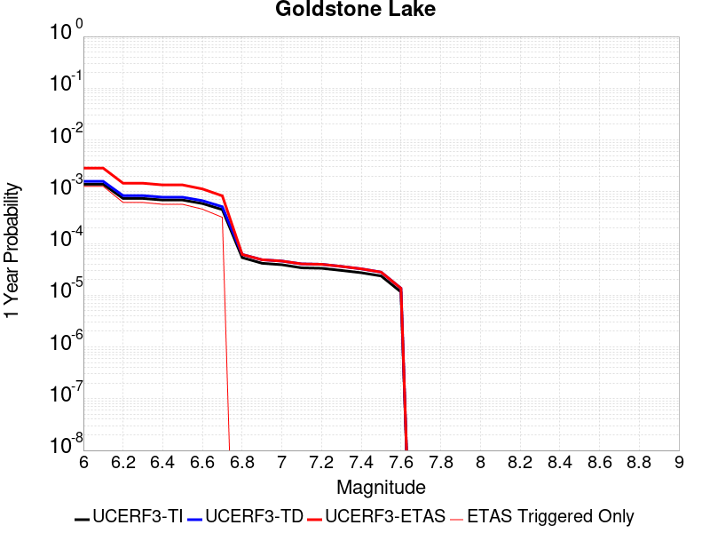 |  |

| Magnitude | 1 wk TI Prob | 1 wk TD Prob | 1 wk ETAS Prob | 1 wk ETAS/TD Gain | 1 wk ETAS Triggered Only | 1 mo TI Prob | 1 mo TD Prob | 1 mo ETAS Prob | 1 mo ETAS/TD Gain | 1 mo ETAS Triggered Only | 1 yr TI Prob | 1 yr TD Prob | 1 yr ETAS Prob | 1 yr ETAS/TD Gain | 1 yr ETAS Triggered Only | 10 yr TI Prob | 10 yr TD Prob | 10 yr ETAS Prob | 10 yr ETAS/TD Gain | 10 yr ETAS Triggered Only |
|-----|-----|-----|-----|-----|-----|-----|-----|-----|-----|-----|-----|-----|-----|-----|-----|-----|-----|-----|-----|-----|
| 6.0 | 2.671352E-5 | 3.0376936E-5 | 1.7037269E-4 | 5.6086197 | 1.4E-4 | 1.1448149E-4 | 1.3018148E-4 | 5.301294E-4 | 4.0722337 | 4.0E-4 | 0.001392921 | 0.0015840036 | 0.002851992 | 1.8004959 | 0.00127 | 0.013842222 | 0.01574663 | 0.01850254 | 1.1750158 | 0.0028 |
| 6.1 | 2.671352E-5 | 3.0376936E-5 | 1.7037269E-4 | 5.6086197 | 1.4E-4 | 1.1448149E-4 | 1.3018148E-4 | 5.301294E-4 | 4.0722337 | 4.0E-4 | 0.001392921 | 0.0015840036 | 0.002851992 | 1.8004959 | 0.00127 | 0.013842222 | 0.01574663 | 0.01850254 | 1.1750158 | 0.0028 |
| 6.2 | 1.4197047E-5 | 1.609667E-5 | 9.6095384E-5 | 5.969892 | 8.0E-5 | 6.0843064E-5 | 6.898446E-5 | 2.8896928E-4 | 4.188904 | 2.2E-4 | 7.4051257E-4 | 8.396608E-4 | 0.0014591402 | 1.7377734 | 6.2E-4 | 0.007380498 | 0.00837458 | 0.009703358 | 1.158668 | 0.00134 |
| 6.3 | 1.4197047E-5 | 1.609667E-5 | 9.6095384E-5 | 5.969892 | 8.0E-5 | 6.0843064E-5 | 6.898446E-5 | 2.8896928E-4 | 4.188904 | 2.2E-4 | 7.4051257E-4 | 8.396608E-4 | 0.0014591402 | 1.7377734 | 6.2E-4 | 0.007380498 | 0.00837458 | 0.009703358 | 1.158668 | 0.00134 |
| 6.4 | 1.3238931E-5 | 1.5008855E-5 | 7.5007956E-5 | 4.99758 | 6.0E-5 | 5.6737044E-5 | 6.432263E-5 | 2.543104E-4 | 3.9536693 | 1.9E-4 | 6.9055456E-4 | 7.8294467E-4 | 0.0013524984 | 1.7274508 | 5.7E-4 | 0.006884126 | 0.007811489 | 0.009061647 | 1.1600409 | 0.00126 |
| 6.5 | 1.3238931E-5 | 1.5008855E-5 | 7.5007956E-5 | 4.99758 | 6.0E-5 | 5.6737044E-5 | 6.432263E-5 | 2.543104E-4 | 3.9536693 | 1.9E-4 | 6.9055456E-4 | 7.8294467E-4 | 0.0013524984 | 1.7274508 | 5.7E-4 | 0.006884126 | 0.007811489 | 0.009061647 | 1.1600409 | 0.00126 |
| 6.6 | 1.1328278E-5 | 1.2855504E-5 | 6.285486E-5 | 4.8893347 | 5.0E-5 | 4.8548856E-5 | 5.509439E-5 | 2.0508612E-4 | 3.72245 | 1.5E-4 | 5.90922E-4 | 6.706635E-4 | 0.0011303549 | 1.6854279 | 4.6E-4 | 0.0058935313 | 0.0066957846 | 0.0077188876 | 1.1527982 | 0.00103 |
| 6.7 | 8.651175E-6 | 9.824819E-6 | 4.9824426E-5 | 5.0712814 | 4.0E-5 | 3.707594E-5 | 4.21062E-5 | 1.3210242E-4 | 3.1373625 | 9.0E-5 | 4.5130608E-4 | 5.126129E-4 | 8.324489E-4 | 1.6239327 | 3.2E-4 | 0.0045039062 | 0.005123184 | 0.0058892393 | 1.1495272 | 7.7E-4 |
| 6.8 | 1.0215377E-6 | 1.1754844E-6 | 1.1754844E-6 | 1.0 | 0.0 | 4.378012E-6 | 5.037781E-6 | 5.037781E-6 | 1.0 | 0.0 | 5.3300988E-5 | 6.1333376E-5 | 6.1333376E-5 | 1.0 | 0.0 | 5.3288206E-4 | 6.131757E-4 | 6.131757E-4 | 1.0 | 0.0 |
| 6.9 | 7.9360774E-7 | 9.2834944E-7 | 9.2834944E-7 | 1.0 | 0.0 | 3.4011714E-6 | 3.9786346E-6 | 3.9786346E-6 | 1.0 | 0.0 | 4.1408475E-5 | 4.8438873E-5 | 4.8438873E-5 | 1.0 | 0.0 | 4.140076E-4 | 4.8429015E-4 | 4.8429015E-4 | 1.0 | 0.0 |
| 7.0 | 7.4382757E-7 | 8.747418E-7 | 8.747418E-7 | 1.0 | 0.0 | 3.1878285E-6 | 3.7488883E-6 | 3.7488883E-6 | 1.0 | 0.0 | 3.8811122E-5 | 4.5641827E-5 | 4.5641827E-5 | 1.0 | 0.0 | 3.8804344E-4 | 4.5633118E-4 | 4.5633118E-4 | 1.0 | 0.0 |
| 7.1 | 6.4709513E-7 | 7.7113737E-7 | 7.7113737E-7 | 1.0 | 0.0 | 2.773262E-6 | 3.3048707E-6 | 3.3048707E-6 | 1.0 | 0.0 | 3.376394E-5 | 4.023612E-5 | 4.023612E-5 | 1.0 | 0.0 | 3.375881E-4 | 4.0229427E-4 | 4.0229427E-4 | 1.0 | 0.0 |
| 7.2 | 6.356704E-7 | 7.5884316E-7 | 7.5884316E-7 | 1.0 | 0.0 | 2.7242988E-6 | 3.2521812E-6 | 3.2521812E-6 | 1.0 | 0.0 | 3.3167835E-5 | 3.9594648E-5 | 3.9594648E-5 | 1.0 | 0.0 | 3.3162883E-4 | 3.9588186E-4 | 3.9588186E-4 | 1.0 | 0.0 |
| 7.3 | 5.7695723E-7 | 6.896632E-7 | 6.896632E-7 | 1.0 | 0.0 | 2.4726714E-6 | 2.9556963E-6 | 2.9556963E-6 | 1.0 | 0.0 | 3.0104358E-5 | 3.5985067E-5 | 3.5985067E-5 | 1.0 | 0.0 | 3.0100282E-4 | 3.597981E-4 | 3.597981E-4 | 1.0 | 0.0 |
| 7.4 | 5.209647E-7 | 6.1935697E-7 | 6.1935697E-7 | 1.0 | 0.0 | 2.232704E-6 | 2.6543846E-6 | 2.6543846E-6 | 1.0 | 0.0 | 2.718283E-5 | 3.231671E-5 | 3.231671E-5 | 1.0 | 0.0 | 2.7179506E-4 | 3.2312566E-4 | 3.2312566E-4 | 1.0 | 0.0 |
| 7.5 | 4.512955E-7 | 5.348931E-7 | 5.348931E-7 | 1.0 | 0.0 | 1.934122E-6 | 2.2923973E-6 | 2.2923973E-6 | 1.0 | 0.0 | 2.3547682E-5 | 2.7909635E-5 | 2.7909635E-5 | 1.0 | 0.0 | 2.3545188E-4 | 2.790666E-4 | 2.790666E-4 | 1.0 | 0.0 |
| 7.6 | 2.21172E-7 | 2.603981E-7 | 2.603981E-7 | 1.0 | 0.0 | 9.478797E-7 | 1.1159916E-6 | 1.1159916E-6 | 1.0 | 0.0 | 1.1540374E-5 | 1.3587141E-5 | 1.3587141E-5 | 1.0 | 0.0 | 1.1539775E-4 | 1.3586592E-4 | 1.3586592E-4 | 1.0 | 0.0 |

## San Andreas (Mojave S)
*[(top)](#table-of-contents)*

| 1 Week | 1 Month | 1 Year | 10 Year |
|-----|-----|-----|-----|
|  |  |  |  |

| Magnitude | 1 wk TI Prob | 1 wk TD Prob | 1 wk ETAS Prob | 1 wk ETAS/TD Gain | 1 wk ETAS Triggered Only | 1 mo TI Prob | 1 mo TD Prob | 1 mo ETAS Prob | 1 mo ETAS/TD Gain | 1 mo ETAS Triggered Only | 1 yr TI Prob | 1 yr TD Prob | 1 yr ETAS Prob | 1 yr ETAS/TD Gain | 1 yr ETAS Triggered Only | 10 yr TI Prob | 10 yr TD Prob | 10 yr ETAS Prob | 10 yr ETAS/TD Gain | 10 yr ETAS Triggered Only |
|-----|-----|-----|-----|-----|-----|-----|-----|-----|-----|-----|-----|-----|-----|-----|-----|-----|-----|-----|-----|-----|
| 6.0 | 3.1064058E-4 | 6.7476206E-4 | 8.5464056E-4 | 1.2665807 | 1.8E-4 | 0.0013306376 | 0.0028887608 | 0.003277634 | 1.134616 | 3.9E-4 | 0.016080605 | 0.034629513 | 0.03584588 | 1.0351251 | 0.00126 | 0.1496549 | 0.2866567 | 0.28839725 | 1.0060719 | 0.00244 |
| 6.1 | 3.1064058E-4 | 6.7476206E-4 | 8.5464056E-4 | 1.2665807 | 1.8E-4 | 0.0013306376 | 0.0028887608 | 0.003277634 | 1.134616 | 3.9E-4 | 0.016080605 | 0.034629513 | 0.03584588 | 1.0351251 | 0.00126 | 0.1496549 | 0.2866567 | 0.28839725 | 1.0060719 | 0.00244 |
| 6.2 | 3.1064058E-4 | 6.7476206E-4 | 8.5464056E-4 | 1.2665807 | 1.8E-4 | 0.0013306376 | 0.0028887608 | 0.003277634 | 1.134616 | 3.9E-4 | 0.016080605 | 0.034629513 | 0.03584588 | 1.0351251 | 0.00126 | 0.1496549 | 0.2866567 | 0.28839725 | 1.0060719 | 0.00244 |
| 6.3 | 3.1064058E-4 | 6.7476206E-4 | 8.5464056E-4 | 1.2665807 | 1.8E-4 | 0.0013306376 | 0.0028887608 | 0.003277634 | 1.134616 | 3.9E-4 | 0.016080605 | 0.034629513 | 0.03584588 | 1.0351251 | 0.00126 | 0.1496549 | 0.2866567 | 0.28839725 | 1.0060719 | 0.00244 |
| 6.4 | 1.9872203E-4 | 4.3193984E-4 | 6.018664E-4 | 1.3934033 | 1.7E-4 | 8.5138786E-4 | 0.0018498857 | 0.0022291827 | 1.2050381 | 3.8E-4 | 0.010316478 | 0.022295905 | 0.02340071 | 1.049552 | 0.00113 | 0.098504856 | 0.19705352 | 0.19875577 | 1.0086385 | 0.00212 |
| 6.5 | 1.291105E-4 | 2.8766552E-4 | 4.3762237E-4 | 1.521289 | 1.5E-4 | 5.5321335E-4 | 0.0012322725 | 0.0015618658 | 1.2674679 | 3.3E-4 | 0.006714592 | 0.014900537 | 0.015875787 | 1.0654505 | 9.9E-4 | 0.065152965 | 0.13809189 | 0.13971227 | 1.0117341 | 0.00188 |
| 6.6 | 1.291105E-4 | 2.8766552E-4 | 4.3762237E-4 | 1.521289 | 1.5E-4 | 5.5321335E-4 | 0.0012322725 | 0.0015618658 | 1.2674679 | 3.3E-4 | 0.006714592 | 0.014900537 | 0.015875787 | 1.0654505 | 9.9E-4 | 0.065152965 | 0.13809189 | 0.13971227 | 1.0117341 | 0.00188 |
| 6.7 | 1.08001186E-4 | 2.4347559E-4 | 3.9343908E-4 | 1.6159282 | 1.5E-4 | 4.6278012E-4 | 0.0010430501 | 0.0013627163 | 1.3064725 | 3.2E-4 | 0.0056198016 | 0.012625491 | 0.013553623 | 1.0735126 | 9.4E-4 | 0.054797906 | 0.11923485 | 0.12084665 | 1.0135179 | 0.00183 |
| 6.8 | 1.0624356E-4 | 2.3865186E-4 | 3.8861606E-4 | 1.6283807 | 1.5E-4 | 4.5525006E-4 | 0.0010223933 | 0.0013420661 | 1.3126711 | 3.2E-4 | 0.0055285925 | 0.01237687 | 0.013305236 | 1.0750082 | 9.4E-4 | 0.053930566 | 0.117184006 | 0.11879956 | 1.0137864 | 0.00183 |
| 6.9 | 1.0393785E-4 | 2.3235478E-4 | 3.8231994E-4 | 1.6454145 | 1.5E-4 | 4.4537184E-4 | 9.954267E-4 | 0.001315108 | 1.3211502 | 3.2E-4 | 0.0054089287 | 0.012052223 | 0.012980894 | 1.0770539 | 9.4E-4 | 0.05279156 | 0.11448143 | 0.11610193 | 1.0141551 | 0.00183 |
| 7.0 | 1.0155622E-4 | 2.2604945E-4 | 3.7601555E-4 | 1.6634216 | 1.5E-4 | 4.3516833E-4 | 9.684241E-4 | 0.0012881141 | 1.3301138 | 3.2E-4 | 0.005285311 | 0.011727047 | 0.012656024 | 1.0792166 | 9.4E-4 | 0.05161361 | 0.11174154 | 0.11336705 | 1.0145471 | 0.00183 |
| 7.1 | 9.885595E-5 | 2.1893268E-4 | 3.6889984E-4 | 1.6849921 | 1.5E-4 | 4.2359953E-4 | 9.3794585E-4 | 0.0012576458 | 1.3408511 | 3.2E-4 | 0.0051451353 | 0.011359897 | 0.01228922 | 1.0818073 | 9.4E-4 | 0.05027629 | 0.10862586 | 0.110257074 | 1.0150168 | 0.00183 |
| 7.2 | 9.6411415E-5 | 2.1256179E-4 | 3.625299E-4 | 1.7055272 | 1.5E-4 | 4.1312634E-4 | 9.1066136E-4 | 0.0012303699 | 1.3510729 | 3.2E-4 | 0.005018219 | 0.01103112 | 0.011950861 | 1.083377 | 9.3E-4 | 0.049064007 | 0.10581549 | 0.10743397 | 1.0152953 | 0.00181 |
| 7.3 | 9.1180635E-5 | 1.9484162E-4 | 3.448124E-4 | 1.769706 | 1.5E-4 | 3.907156E-4 | 8.347684E-4 | 0.0011545012 | 1.3830198 | 3.2E-4 | 0.004746591 | 0.010116057 | 0.011036648 | 1.0910031 | 9.3E-4 | 0.046464786 | 0.09800758 | 0.099622145 | 1.0164739 | 0.00179 |
| 7.4 | 8.887388E-5 | 1.8732602E-4 | 3.372979E-4 | 1.800593 | 1.5E-4 | 3.8083247E-4 | 8.0257887E-4 | 0.001122322 | 1.3983947 | 3.2E-4 | 0.0046267817 | 0.0097277155 | 0.010648669 | 1.0946732 | 9.3E-4 | 0.045316286 | 0.09464203 | 0.09623546 | 1.0168364 | 0.00176 |
| 7.5 | 8.6750515E-5 | 1.8064032E-4 | 3.3061323E-4 | 1.8302294 | 1.5E-4 | 3.7173493E-4 | 7.7394315E-4 | 0.0010936955 | 1.4131471 | 3.2E-4 | 0.004516484 | 0.009382132 | 0.010303408 | 1.0981946 | 9.3E-4 | 0.04425787 | 0.09160535 | 0.093204126 | 1.0174528 | 0.00176 |
| 7.6 | 8.453092E-5 | 1.7451479E-4 | 3.2448862E-4 | 1.859376 | 1.5E-4 | 3.6222505E-4 | 7.477062E-4 | 0.0010674669 | 1.4276556 | 3.2E-4 | 0.0044011753 | 0.009065401 | 0.009986971 | 1.1016579 | 9.3E-4 | 0.04315024 | 0.08876391 | 0.09035857 | 1.0179652 | 0.00175 |
| 7.7 | 8.259102E-5 | 1.697348E-4 | 3.1970933E-4 | 1.8835815 | 1.5E-4 | 3.539135E-4 | 7.2723214E-4 | 0.0010469994 | 1.4397045 | 3.2E-4 | 0.004300386 | 0.008818175 | 0.009739974 | 1.104534 | 9.3E-4 | 0.042181134 | 0.086514264 | 0.08810373 | 1.0183723 | 0.00174 |
| 7.8 | 7.444844E-5 | 1.529467E-4 | 2.6292988E-4 | 1.7190949 | 1.1E-4 | 3.1902574E-4 | 6.5532123E-4 | 8.951639E-4 | 1.3659927 | 2.4E-4 | 0.0038772223 | 0.007949397 | 0.008643833 | 1.087357 | 7.0E-4 | 0.03810269 | 0.078340776 | 0.07962188 | 1.016353 | 0.00139 |
| 7.9 | 5.2586525E-5 | 1.0014044E-4 | 1.7013343E-4 | 1.6989483 | 7.0E-5 | 2.2535135E-4 | 4.291027E-4 | 5.6904263E-4 | 1.3261222 | 1.4E-4 | 0.0027402006 | 0.005211822 | 0.0056196856 | 1.0782573 | 4.1E-4 | 0.027066574 | 0.05223562 | 0.053012785 | 1.0148782 | 8.2E-4 |
| 8.0 | 3.379877E-5 | 5.411816E-5 | 7.411708E-5 | 1.3695418 | 2.0E-5 | 1.4484383E-4 | 2.3191437E-4 | 2.719051E-4 | 1.1724374 | 4.0E-5 | 0.0017620471 | 0.0028199032 | 0.0029694804 | 1.0530434 | 1.5E-4 | 0.017481409 | 0.02885644 | 0.029118648 | 1.0090866 | 2.7E-4 |
| 8.1 | 1.8668277E-5 | 1.9330075E-5 | 1.9330075E-5 | 1.0 | 0.0 | 8.000444E-5 | 8.284055E-5 | 8.284055E-5 | 1.0 | 0.0 | 9.736188E-4 | 0.0010081177 | 0.0010081177 | 1.0 | 0.0 | 0.009693642 | 0.010809696 | 0.01082948 | 1.0018302 | 2.0E-5 |
| 8.2 | 8.541571E-6 | 5.4686293E-6 | 5.4686293E-6 | 1.0 | 0.0 | 3.660622E-5 | 2.3436773E-5 | 2.3436773E-5 | 1.0 | 0.0 | 4.455896E-4 | 2.8530543E-4 | 2.8530543E-4 | 1.0 | 0.0 | 0.0044469717 | 0.003245074 | 0.003245074 | 1.0 | 0.0 |
| 8.3 | 1.983087E-6 | 7.6730925E-7 | 7.6730925E-7 | 1.0 | 0.0 | 8.498917E-6 | 3.288464E-6 | 3.288464E-6 | 1.0 | 0.0 | 1.034694E-4 | 4.003633E-5 | 4.003633E-5 | 1.0 | 0.0 | 0.0010342124 | 4.7272502E-4 | 4.7272502E-4 | 1.0 | 0.0 |

## So Sierra Nevada
*[(top)](#table-of-contents)*

| 1 Week | 1 Month | 1 Year | 10 Year |
|-----|-----|-----|-----|
|  |  | 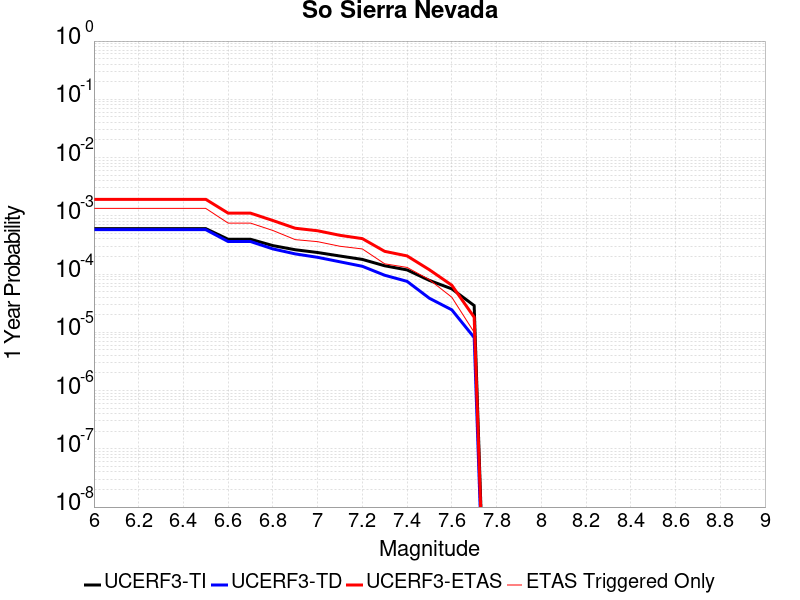 |  |

| Magnitude | 1 wk TI Prob | 1 wk TD Prob | 1 wk ETAS Prob | 1 wk ETAS/TD Gain | 1 wk ETAS Triggered Only | 1 mo TI Prob | 1 mo TD Prob | 1 mo ETAS Prob | 1 mo ETAS/TD Gain | 1 mo ETAS Triggered Only | 1 yr TI Prob | 1 yr TD Prob | 1 yr ETAS Prob | 1 yr ETAS/TD Gain | 1 yr ETAS Triggered Only | 10 yr TI Prob | 10 yr TD Prob | 10 yr ETAS Prob | 10 yr ETAS/TD Gain | 10 yr ETAS Triggered Only |
|-----|-----|-----|-----|-----|-----|-----|-----|-----|-----|-----|-----|-----|-----|-----|-----|-----|-----|-----|-----|-----|
| 6.0 | 1.15488665E-5 | 1.1079766E-5 | 2.0107767E-4 | 18.148186 | 1.9E-4 | 4.9494203E-5 | 4.748392E-5 | 4.374654E-4 | 9.212916 | 3.9E-4 | 6.024253E-4 | 5.7797617E-4 | 0.0019172017 | 3.3170948 | 0.00134 | 0.006007948 | 0.0057659987 | 0.008380834 | 1.4534922 | 0.00263 |
| 6.1 | 1.15488665E-5 | 1.1079766E-5 | 2.0107767E-4 | 18.148186 | 1.9E-4 | 4.9494203E-5 | 4.748392E-5 | 4.374654E-4 | 9.212916 | 3.9E-4 | 6.024253E-4 | 5.7797617E-4 | 0.0019172017 | 3.3170948 | 0.00134 | 0.006007948 | 0.0057659987 | 0.008380834 | 1.4534922 | 0.00263 |
| 6.2 | 1.15488665E-5 | 1.1079766E-5 | 2.0107767E-4 | 18.148186 | 1.9E-4 | 4.9494203E-5 | 4.748392E-5 | 4.374654E-4 | 9.212916 | 3.9E-4 | 6.024253E-4 | 5.7797617E-4 | 0.0019172017 | 3.3170948 | 0.00134 | 0.006007948 | 0.0057659987 | 0.008380834 | 1.4534922 | 0.00263 |
| 6.3 | 1.15488665E-5 | 1.1079766E-5 | 2.0107767E-4 | 18.148186 | 1.9E-4 | 4.9494203E-5 | 4.748392E-5 | 4.374654E-4 | 9.212916 | 3.9E-4 | 6.024253E-4 | 5.7797617E-4 | 0.0019172017 | 3.3170948 | 0.00134 | 0.006007948 | 0.0057659987 | 0.008380834 | 1.4534922 | 0.00263 |
| 6.4 | 1.15488665E-5 | 1.1079766E-5 | 2.0107767E-4 | 18.148186 | 1.9E-4 | 4.9494203E-5 | 4.748392E-5 | 4.374654E-4 | 9.212916 | 3.9E-4 | 6.024253E-4 | 5.7797617E-4 | 0.0019172017 | 3.3170948 | 0.00134 | 0.006007948 | 0.0057659987 | 0.008380834 | 1.4534922 | 0.00263 |
| 6.5 | 1.15488665E-5 | 1.1079766E-5 | 2.0107767E-4 | 18.148186 | 1.9E-4 | 4.9494203E-5 | 4.748392E-5 | 4.374654E-4 | 9.212916 | 3.9E-4 | 6.024253E-4 | 5.7797617E-4 | 0.0019172017 | 3.3170948 | 0.00134 | 0.006007948 | 0.0057659987 | 0.008380834 | 1.4534922 | 0.00263 |
| 6.6 | 7.587044E-6 | 6.9357197E-6 | 1.16934956E-4 | 16.859816 | 1.1E-4 | 3.2515498E-5 | 2.972419E-5 | 2.1971854E-4 | 7.39191 | 1.9E-4 | 3.9580427E-4 | 3.6183486E-4 | 0.0011115635 | 3.0720189 | 7.5E-4 | 0.003951 | 0.0036127488 | 0.005147185 | 1.4247283 | 0.00154 |
| 6.7 | 7.587044E-6 | 6.9357197E-6 | 1.16934956E-4 | 16.859816 | 1.1E-4 | 3.2515498E-5 | 2.972419E-5 | 2.1971854E-4 | 7.39191 | 1.9E-4 | 3.9580427E-4 | 3.6183486E-4 | 0.0011115635 | 3.0720189 | 7.5E-4 | 0.003951 | 0.0036127488 | 0.005147185 | 1.4247283 | 0.00154 |
| 6.8 | 5.9026956E-6 | 5.1794614E-6 | 9.5179E-5 | 18.376234 | 9.0E-5 | 2.5297022E-5 | 2.219751E-5 | 1.9219374E-4 | 8.658346 | 1.7E-4 | 3.0794772E-4 | 2.7022234E-4 | 8.30071E-4 | 3.0718076 | 5.6E-4 | 0.0030752132 | 0.0026990538 | 0.0039057878 | 1.4470953 | 0.00121 |
| 6.9 | 5.0118915E-6 | 4.252486E-6 | 8.425215E-5 | 19.812445 | 8.0E-5 | 2.1479358E-5 | 1.8224819E-5 | 1.4822245E-4 | 8.133 | 1.3E-4 | 2.614798E-4 | 2.218653E-4 | 6.1177876E-4 | 2.7574334 | 3.9E-4 | 0.0026117235 | 0.0022165105 | 0.0031145157 | 1.4051436 | 9.0E-4 |
| 7.0 | 4.4924795E-6 | 3.7139744E-6 | 8.3713676E-5 | 22.540186 | 8.0E-5 | 1.925334E-5 | 1.591694E-5 | 1.3591503E-4 | 8.539018 | 1.2E-4 | 2.3438422E-4 | 1.9377214E-4 | 5.537024E-4 | 2.8574922 | 3.6E-4 | 0.0023413717 | 0.0019360948 | 0.0027644879 | 1.427868 | 8.3E-4 |
| 7.1 | 3.9118436E-6 | 3.1120294E-6 | 8.311178E-5 | 26.706617 | 8.0E-5 | 1.6764936E-5 | 1.3337204E-5 | 1.333356E-4 | 9.997268 | 1.2E-4 | 2.0409399E-4 | 1.6236893E-4 | 4.6232023E-4 | 2.8473442 | 3.0E-4 | 0.0020390663 | 0.001622559 | 0.0022814882 | 1.4061049 | 6.6E-4 |
| 7.2 | 3.4200818E-6 | 2.605502E-6 | 7.260532E-5 | 27.866154 | 7.0E-5 | 1.4657411E-5 | 1.1166393E-5 | 1.2116516E-4 | 10.850878 | 1.1E-4 | 1.7843937E-4 | 1.3594286E-4 | 4.0590615E-4 | 2.9858587 | 2.7E-4 | 0.0017829615 | 0.0013586467 | 0.0019178858 | 1.4116149 | 5.6E-4 |
| 7.3 | 2.6593618E-6 | 1.828462E-6 | 6.182835E-5 | 33.814404 | 6.0E-5 | 1.13972155E-5 | 7.836244E-6 | 8.7835615E-5 | 11.208893 | 8.0E-5 | 1.3875226E-4 | 9.5402385E-5 | 2.4538807E-4 | 2.5721378 | 1.5E-4 | 0.0013866565 | 9.5364323E-4 | 0.0012633476 | 1.3247591 | 3.1E-4 |
| 7.4 | 2.2577992E-6 | 1.436476E-6 | 5.1436404E-5 | 35.80735 | 5.0E-5 | 9.676246E-6 | 6.156313E-6 | 7.6155884E-5 | 12.370372 | 7.0E-5 | 1.1780193E-4 | 7.495079E-5 | 2.0494104E-4 | 2.7343414 | 1.3E-4 | 0.001177395 | 7.4928015E-4 | 0.0010090853 | 1.3467398 | 2.6E-4 |
| 7.5 | 1.489319E-6 | 7.354235E-7 | 2.073541E-5 | 28.195194 | 2.0E-5 | 6.3827797E-6 | 3.1518111E-6 | 4.3151686E-5 | 13.691075 | 4.0E-5 | 7.770758E-5 | 3.837263E-5 | 1.1836956E-4 | 3.0847392 | 8.0E-5 | 7.7680405E-4 | 3.836605E-4 | 5.036144E-4 | 1.3126565 | 1.2E-4 |
| 7.6 | 1.0680322E-6 | 4.6598765E-7 | 1.0465983E-5 | 22.459787 | 1.0E-5 | 4.577273E-6 | 1.9970885E-6 | 3.1997028E-5 | 16.02184 | 3.0E-5 | 5.5726876E-5 | 2.4314282E-5 | 6.431331E-5 | 2.6450837 | 4.0E-5 | 5.5712904E-4 | 2.4311649E-4 | 2.9310433E-4 | 1.2056128 | 5.0E-5 |
| 7.7 | 5.509146E-7 | 1.5581608E-7 | 1.5581608E-7 | 1.0 | 0.0 | 2.3610605E-6 | 6.67783E-7 | 1.0667776E-5 | 15.974915 | 1.0E-5 | 2.8745531E-5 | 8.130229E-6 | 1.8130148E-5 | 2.2299676 | 1.0E-5 | 2.8741814E-4 | 8.129943E-5 | 9.1298614E-5 | 1.122992 | 1.0E-5 |

## San Andreas (Mojave N)
*[(top)](#table-of-contents)*

| 1 Week | 1 Month | 1 Year | 10 Year |
|-----|-----|-----|-----|
| 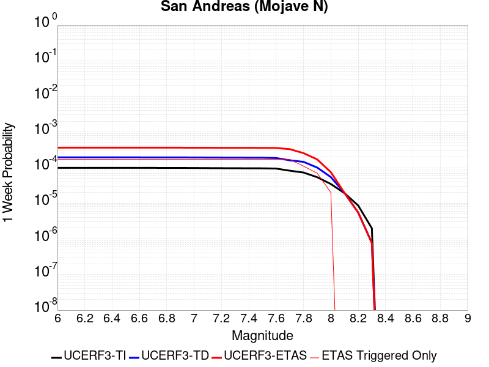 |  | 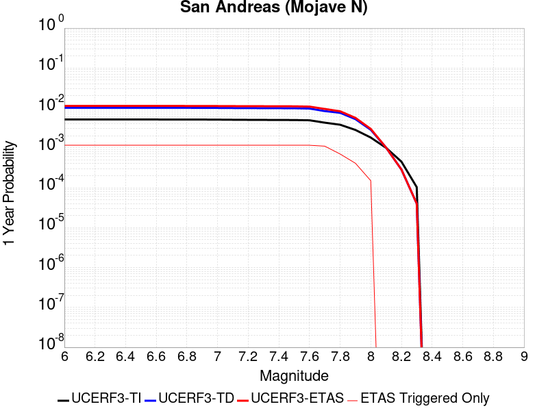 |  |

| Magnitude | 1 wk TI Prob | 1 wk TD Prob | 1 wk ETAS Prob | 1 wk ETAS/TD Gain | 1 wk ETAS Triggered Only | 1 mo TI Prob | 1 mo TD Prob | 1 mo ETAS Prob | 1 mo ETAS/TD Gain | 1 mo ETAS Triggered Only | 1 yr TI Prob | 1 yr TD Prob | 1 yr ETAS Prob | 1 yr ETAS/TD Gain | 1 yr ETAS Triggered Only | 10 yr TI Prob | 10 yr TD Prob | 10 yr ETAS Prob | 10 yr ETAS/TD Gain | 10 yr ETAS Triggered Only |
|-----|-----|-----|-----|-----|-----|-----|-----|-----|-----|-----|-----|-----|-----|-----|-----|-----|-----|-----|-----|-----|
| 6.0 | 9.877682E-5 | 1.9414346E-4 | 3.6411046E-4 | 1.8754711 | 1.7E-4 | 4.2326056E-4 | 8.317782E-4 | 0.0012514289 | 1.5045223 | 4.2E-4 | 0.0051410277 | 0.010080005 | 0.011228312 | 1.1139193 | 0.00116 | 0.05023708 | 0.09837406 | 0.10031255 | 1.0197053 | 0.00215 |
| 6.1 | 9.877682E-5 | 1.9414346E-4 | 3.6411046E-4 | 1.8754711 | 1.7E-4 | 4.2326056E-4 | 8.317782E-4 | 0.0012514289 | 1.5045223 | 4.2E-4 | 0.0051410277 | 0.010080005 | 0.011228312 | 1.1139193 | 0.00116 | 0.05023708 | 0.09837406 | 0.10031255 | 1.0197053 | 0.00215 |
| 6.2 | 9.877682E-5 | 1.9414346E-4 | 3.6411046E-4 | 1.8754711 | 1.7E-4 | 4.2326056E-4 | 8.317782E-4 | 0.0012514289 | 1.5045223 | 4.2E-4 | 0.0051410277 | 0.010080005 | 0.011228312 | 1.1139193 | 0.00116 | 0.05023708 | 0.09837406 | 0.10031255 | 1.0197053 | 0.00215 |
| 6.3 | 9.877682E-5 | 1.9414346E-4 | 3.6411046E-4 | 1.8754711 | 1.7E-4 | 4.2326056E-4 | 8.317782E-4 | 0.0012514289 | 1.5045223 | 4.2E-4 | 0.0051410277 | 0.010080005 | 0.011228312 | 1.1139193 | 0.00116 | 0.05023708 | 0.09837406 | 0.10031255 | 1.0197053 | 0.00215 |
| 6.4 | 9.877682E-5 | 1.9414346E-4 | 3.6411046E-4 | 1.8754711 | 1.7E-4 | 4.2326056E-4 | 8.317782E-4 | 0.0012514289 | 1.5045223 | 4.2E-4 | 0.0051410277 | 0.010080005 | 0.011228312 | 1.1139193 | 0.00116 | 0.05023708 | 0.09837406 | 0.10031255 | 1.0197053 | 0.00215 |
| 6.5 | 9.861474E-5 | 1.9388107E-4 | 3.638481E-4 | 1.8766562 | 1.7E-4 | 4.2256617E-4 | 8.3065446E-4 | 0.0012503056 | 1.5052054 | 4.2E-4 | 0.0051326132 | 0.01006645 | 0.011214772 | 1.1140742 | 0.00116 | 0.050156746 | 0.09825185 | 0.1001906 | 1.0197326 | 0.00215 |
| 6.6 | 9.861474E-5 | 1.9388107E-4 | 3.638481E-4 | 1.8766562 | 1.7E-4 | 4.2256617E-4 | 8.3065446E-4 | 0.0012503056 | 1.5052054 | 4.2E-4 | 0.0051326132 | 0.01006645 | 0.011214772 | 1.1140742 | 0.00116 | 0.050156746 | 0.09825185 | 0.1001906 | 1.0197326 | 0.00215 |
| 6.7 | 9.8552715E-5 | 1.937806E-4 | 3.6374765E-4 | 1.8771108 | 1.7E-4 | 4.223004E-4 | 8.3022413E-4 | 0.0012498754 | 1.5054675 | 4.2E-4 | 0.0051293927 | 0.0100612575 | 0.011209587 | 1.1141337 | 0.00116 | 0.050125998 | 0.09820503 | 0.10014389 | 1.019743 | 0.00215 |
| 6.8 | 9.8464974E-5 | 1.9363218E-4 | 3.6359928E-4 | 1.8777833 | 1.7E-4 | 4.219245E-4 | 8.2958845E-4 | 0.00124924 | 1.5058551 | 4.2E-4 | 0.0051248376 | 0.010053591 | 0.011201928 | 1.1142217 | 0.00116 | 0.05008251 | 0.09813504 | 0.10007405 | 1.0197586 | 0.00215 |
| 6.9 | 9.825824E-5 | 1.933122E-4 | 3.6327934E-4 | 1.8792365 | 1.7E-4 | 4.2103877E-4 | 8.28218E-4 | 0.0012478702 | 1.5066929 | 4.2E-4 | 0.0051141046 | 0.010037059 | 0.011185416 | 1.1144117 | 0.00116 | 0.049980022 | 0.09798412 | 0.099923454 | 1.0197923 | 0.00215 |
| 7.0 | 9.781462E-5 | 1.9262571E-4 | 3.6259295E-4 | 1.8823706 | 1.7E-4 | 4.1913814E-4 | 8.2527776E-4 | 0.0012449311 | 1.5084996 | 4.2E-4 | 0.005091073 | 0.0100015905 | 0.0111499885 | 1.1148216 | 0.00116 | 0.04976007 | 0.09766046 | 0.09960049 | 1.019865 | 0.00215 |
| 7.1 | 9.7121134E-5 | 1.9164261E-4 | 3.6161003E-4 | 1.8868979 | 1.7E-4 | 4.1616702E-4 | 8.2106714E-4 | 0.0012407223 | 1.5111095 | 4.2E-4 | 0.005055068 | 0.009950796 | 0.011099253 | 1.1154135 | 0.00116 | 0.04941613 | 0.0971969 | 0.099137925 | 1.01997 | 0.00215 |
| 7.2 | 9.663819E-5 | 1.909503E-4 | 3.6091785E-4 | 1.890114 | 1.7E-4 | 4.1409794E-4 | 8.18102E-4 | 0.0012377584 | 1.5129634 | 4.2E-4 | 0.0050299936 | 0.009915024 | 0.011063523 | 1.1158341 | 0.00116 | 0.049176537 | 0.09687012 | 0.09881184 | 1.0200447 | 0.00215 |
| 7.3 | 9.6277574E-5 | 1.9047524E-4 | 3.6044285E-4 | 1.8923345 | 1.7E-4 | 4.125529E-4 | 8.160673E-4 | 0.0012357245 | 1.5142435 | 4.2E-4 | 0.0050112694 | 0.009890477 | 0.011039004 | 1.1161245 | 0.00116 | 0.04899759 | 0.0966435 | 0.09858572 | 1.0200967 | 0.00215 |
| 7.4 | 9.593308E-5 | 1.8987284E-4 | 3.5984055E-4 | 1.895166 | 1.7E-4 | 4.1107697E-4 | 8.1348716E-4 | 0.0012331455 | 1.5158758 | 4.2E-4 | 0.0049933824 | 0.009859349 | 0.0110079115 | 1.1164948 | 0.00116 | 0.04882661 | 0.09636161 | 0.09829539 | 1.020068 | 0.00214 |
| 7.5 | 9.561707E-5 | 1.8933346E-4 | 3.5930128E-4 | 1.8977168 | 1.7E-4 | 4.0972308E-4 | 8.1117696E-4 | 0.0012308363 | 1.5173461 | 4.2E-4 | 0.0049769743 | 0.009831476 | 0.0109800715 | 1.1168284 | 0.00116 | 0.048669744 | 0.096107714 | 0.09804205 | 1.0201267 | 0.00214 |
| 7.6 | 9.418194E-5 | 1.8585501E-4 | 3.558234E-4 | 1.9145216 | 1.7E-4 | 4.0357444E-4 | 7.962785E-4 | 0.0012159441 | 1.5270337 | 4.2E-4 | 0.004902454 | 0.0096517075 | 0.010800512 | 1.119026 | 0.00116 | 0.047957025 | 0.09448965 | 0.09642744 | 1.0205079 | 0.00214 |
| 7.7 | 8.202141E-5 | 1.603355E-4 | 3.3030825E-4 | 2.0601068 | 1.7E-4 | 3.51473E-4 | 6.8697124E-4 | 0.0010866964 | 1.581866 | 4.0E-4 | 0.00427079 | 0.008331857 | 0.009422692 | 1.1309234 | 0.0011 | 0.04189639 | 0.08228696 | 0.08411321 | 1.0221937 | 0.00199 |
| 7.8 | 7.2859846E-5 | 1.4527468E-4 | 2.552587E-4 | 1.7570763 | 1.1E-4 | 3.1221908E-4 | 6.2245724E-4 | 8.6230785E-4 | 1.3853287 | 2.4E-4 | 0.003794643 | 0.007552125 | 0.008246838 | 1.0919892 | 7.0E-4 | 0.037304975 | 0.07477427 | 0.076051086 | 1.0170755 | 0.00138 |
| 7.9 | 5.3874453E-5 | 1.0053379E-4 | 1.7052675E-4 | 1.6962134 | 7.0E-5 | 2.3087008E-4 | 4.3078794E-4 | 5.707276E-4 | 1.3248459 | 1.4E-4 | 0.0028072202 | 0.0052322415 | 0.0056400965 | 1.0779502 | 4.1E-4 | 0.02772022 | 0.05246042 | 0.053237405 | 1.0148108 | 8.2E-4 |
| 8.0 | 3.468538E-5 | 5.4304666E-5 | 7.430358E-5 | 1.3682724 | 2.0E-5 | 1.4864317E-4 | 2.3271353E-4 | 2.7270423E-4 | 1.1718452 | 4.0E-5 | 0.0018082283 | 0.0028296078 | 0.0029791833 | 1.0528609 | 1.5E-4 | 0.017935853 | 0.028969273 | 0.029231451 | 1.0090503 | 2.7E-4 |
| 8.1 | 1.9152367E-5 | 1.9423505E-5 | 1.9423505E-5 | 1.0 | 0.0 | 8.207899E-5 | 8.324094E-5 | 8.324094E-5 | 1.0 | 0.0 | 9.988535E-4 | 0.0010129879 | 0.0010129879 | 1.0 | 0.0 | 0.009943757 | 0.010867172 | 0.010886954 | 1.0018204 | 2.0E-5 |
| 8.2 | 8.643924E-6 | 5.4827005E-6 | 5.4827005E-6 | 1.0 | 0.0 | 3.704486E-5 | 2.3497076E-5 | 2.3497076E-5 | 1.0 | 0.0 | 4.5092785E-4 | 2.8603943E-4 | 2.8603943E-4 | 1.0 | 0.0 | 0.0045001395 | 0.0032529908 | 0.0032529908 | 1.0 | 0.0 |
| 8.3 | 1.983087E-6 | 7.6730925E-7 | 7.6730925E-7 | 1.0 | 0.0 | 8.498917E-6 | 3.288464E-6 | 3.288464E-6 | 1.0 | 0.0 | 1.034694E-4 | 4.003633E-5 | 4.003633E-5 | 1.0 | 0.0 | 0.0010342124 | 4.7272502E-4 | 4.7272502E-4 | 1.0 | 0.0 |

## Death Valley (So)
*[(top)](#table-of-contents)*

| 1 Week | 1 Month | 1 Year | 10 Year |
|-----|-----|-----|-----|
|  |  |  |  |

| Magnitude | 1 wk TI Prob | 1 wk TD Prob | 1 wk ETAS Prob | 1 wk ETAS/TD Gain | 1 wk ETAS Triggered Only | 1 mo TI Prob | 1 mo TD Prob | 1 mo ETAS Prob | 1 mo ETAS/TD Gain | 1 mo ETAS Triggered Only | 1 yr TI Prob | 1 yr TD Prob | 1 yr ETAS Prob | 1 yr ETAS/TD Gain | 1 yr ETAS Triggered Only | 10 yr TI Prob | 10 yr TD Prob | 10 yr ETAS Prob | 10 yr ETAS/TD Gain | 10 yr ETAS Triggered Only |
|-----|-----|-----|-----|-----|-----|-----|-----|-----|-----|-----|-----|-----|-----|-----|-----|-----|-----|-----|-----|-----|
| 6.0 | 2.0684236E-5 | 2.5618792E-5 | 1.2561624E-4 | 4.9032845 | 1.0E-4 | 8.864371E-5 | 1.0979029E-4 | 3.4976396E-4 | 3.1857455 | 2.4E-4 | 0.0010787029 | 0.0013358941 | 0.002284625 | 1.7101842 | 9.5E-4 | 0.010734817 | 0.013281918 | 0.01530469 | 1.1522952 | 0.00205 |
| 6.1 | 2.0684236E-5 | 2.5618792E-5 | 1.2561624E-4 | 4.9032845 | 1.0E-4 | 8.864371E-5 | 1.0979029E-4 | 3.4976396E-4 | 3.1857455 | 2.4E-4 | 0.0010787029 | 0.0013358941 | 0.002284625 | 1.7101842 | 9.5E-4 | 0.010734817 | 0.013281918 | 0.01530469 | 1.1522952 | 0.00205 |
| 6.2 | 2.0684236E-5 | 2.5618792E-5 | 1.2561624E-4 | 4.9032845 | 1.0E-4 | 8.864371E-5 | 1.0979029E-4 | 3.4976396E-4 | 3.1857455 | 2.4E-4 | 0.0010787029 | 0.0013358941 | 0.002284625 | 1.7101842 | 9.5E-4 | 0.010734817 | 0.013281918 | 0.01530469 | 1.1522952 | 0.00205 |
| 6.3 | 2.0240292E-5 | 2.5118863E-5 | 1.0511685E-4 | 4.1847777 | 8.0E-5 | 8.6741224E-5 | 1.07647924E-4 | 3.2762424E-4 | 3.0434794 | 2.2E-4 | 0.0010555626 | 0.0013098422 | 0.0022186502 | 1.6938301 | 9.1E-4 | 0.010505628 | 0.013024472 | 0.0149194645 | 1.1454948 | 0.00192 |
| 6.4 | 2.0240292E-5 | 2.5118863E-5 | 1.0511685E-4 | 4.1847777 | 8.0E-5 | 8.6741224E-5 | 1.07647924E-4 | 3.2762424E-4 | 3.0434794 | 2.2E-4 | 0.0010555626 | 0.0013098422 | 0.0022186502 | 1.6938301 | 9.1E-4 | 0.010505628 | 0.013024472 | 0.0149194645 | 1.1454948 | 0.00192 |
| 6.5 | 1.9962767E-5 | 2.4808109E-5 | 1.04806124E-4 | 4.2246723 | 8.0E-5 | 8.55519E-5 | 1.0631623E-4 | 3.2629282E-4 | 3.0690784 | 2.2E-4 | 0.0010410968 | 0.0012936482 | 0.0021824967 | 1.6870868 | 8.9E-4 | 0.010362327 | 0.012864414 | 0.0147202285 | 1.1442596 | 0.00188 |
| 6.6 | 1.8937297E-5 | 2.3311914E-5 | 9.331028E-5 | 4.0026865 | 7.0E-5 | 8.115732E-5 | 9.990446E-5 | 2.7988647E-4 | 2.8015413 | 1.8E-4 | 9.876423E-4 | 0.0012156726 | 0.0020246878 | 1.6654878 | 8.1E-4 | 0.009832645 | 0.012093277 | 0.013782597 | 1.1396909 | 0.00171 |
| 6.7 | 1.8621096E-5 | 2.2912545E-5 | 9.2910945E-5 | 4.055025 | 7.0E-5 | 7.980225E-5 | 9.8193006E-5 | 2.7817534E-4 | 2.8329444 | 1.8E-4 | 9.711593E-4 | 0.0011948587 | 0.0019839148 | 1.6603761 | 7.9E-4 | 0.009669261 | 0.011887387 | 0.013547416 | 1.1396463 | 0.00168 |
| 6.8 | 1.7830353E-5 | 2.1806567E-5 | 7.180548E-5 | 3.2928371 | 5.0E-5 | 7.641356E-5 | 9.345345E-5 | 2.5343848E-4 | 2.7119224 | 1.6E-4 | 9.29938E-4 | 0.0011372159 | 0.0018663857 | 1.6411886 | 7.3E-4 | 0.009260561 | 0.011316808 | 0.012819606 | 1.1327935 | 0.00152 |
| 6.9 | 1.3135183E-5 | 1.5304422E-5 | 5.5303808E-5 | 3.6135838 | 4.0E-5 | 5.6292425E-5 | 6.558877E-5 | 1.9558024E-4 | 2.9819167 | 1.3E-4 | 6.8514474E-4 | 7.982571E-4 | 0.001287866 | 1.6133473 | 4.9E-4 | 0.006830362 | 0.007954906 | 0.008956871 | 1.1259557 | 0.00101 |
| 7.0 | 1.1507512E-5 | 1.3154584E-5 | 4.315419E-5 | 3.2805438 | 3.0E-5 | 4.9316975E-5 | 5.63756E-5 | 1.4637053E-4 | 2.5963452 | 9.0E-5 | 6.002687E-4 | 6.8616256E-4 | 0.0010459155 | 1.524297 | 3.6E-4 | 0.0059864987 | 0.006841141 | 0.0075959414 | 1.1103326 | 7.6E-4 |
| 7.1 | 9.715903E-6 | 1.0865554E-5 | 2.0865446E-5 | 1.9203296 | 1.0E-5 | 4.1638916E-5 | 4.6565856E-5 | 7.656446E-5 | 1.6442189 | 3.0E-5 | 5.068359E-4 | 5.6679605E-4 | 7.4669404E-4 | 1.3173945 | 1.8E-4 | 0.0050568148 | 0.005653958 | 0.0060318094 | 1.0668296 | 3.8E-4 |
| 7.2 | 9.233269E-6 | 1.0286566E-5 | 2.0286463E-5 | 1.9721317 | 1.0E-5 | 3.9570554E-5 | 4.408456E-5 | 7.408324E-5 | 1.6804804 | 3.0E-5 | 4.81665E-4 | 5.366016E-4 | 6.7652646E-4 | 1.2607613 | 1.4E-4 | 0.0048062233 | 0.0053534904 | 0.005661831 | 1.0575962 | 3.1E-4 |
| 7.3 | 8.8041315E-6 | 9.808398E-6 | 9.808398E-6 | 1.0 | 0.0 | 3.7731446E-5 | 4.203534E-5 | 6.2034494E-5 | 1.4757701 | 2.0E-5 | 4.592835E-4 | 5.1166426E-4 | 6.21608E-4 | 1.2148747 | 1.1E-4 | 0.0045833546 | 0.0051052887 | 0.0053341147 | 1.0448213 | 2.3E-4 |
| 7.4 | 8.708749E-6 | 9.707408E-6 | 9.707408E-6 | 1.0 | 0.0 | 3.7322676E-5 | 4.1602536E-5 | 6.1601706E-5 | 1.4807199 | 2.0E-5 | 4.5430884E-4 | 5.063974E-4 | 6.1634165E-4 | 1.2171108 | 1.1E-4 | 0.004533812 | 0.005052861 | 0.0052816984 | 1.0452888 | 2.3E-4 |
| 7.5 | 8.612678E-6 | 9.605049E-6 | 9.605049E-6 | 1.0 | 0.0 | 3.6910955E-5 | 4.116387E-5 | 6.1163046E-5 | 1.485843 | 2.0E-5 | 4.492982E-4 | 5.0105905E-4 | 6.0100894E-4 | 1.1994773 | 1.0E-4 | 0.004483909 | 0.004999719 | 0.005218619 | 1.0437825 | 2.2E-4 |
| 7.6 | 8.319024E-6 | 9.284142E-6 | 9.284142E-6 | 1.0 | 0.0 | 3.5652476E-5 | 3.9788596E-5 | 5.97878E-5 | 1.5026366 | 2.0E-5 | 4.3398244E-4 | 4.8432266E-4 | 5.742791E-4 | 1.1857365 | 9.0E-5 | 0.0043313587 | 0.0048330952 | 0.0050321287 | 1.0411813 | 2.0E-4 |
| 7.7 | 7.4718328E-6 | 8.345374E-6 | 8.345374E-6 | 1.0 | 0.0 | 3.2021748E-5 | 3.576542E-5 | 5.5764704E-5 | 1.5591793 | 2.0E-5 | 3.8979502E-4 | 4.3536103E-4 | 5.0533056E-4 | 1.160716 | 7.0E-5 | 0.00389112 | 0.0043454864 | 0.0044848784 | 1.0320773 | 1.4E-4 |
| 7.8 | 3.4586725E-7 | 3.6483033E-7 | 3.6483033E-7 | 1.0 | 0.0 | 1.4822873E-6 | 1.5635576E-6 | 1.1563542E-5 | 7.395661 | 1.0E-5 | 1.80467E-5 | 1.9036152E-5 | 2.9035962E-5 | 1.5253062 | 1.0E-5 | 1.8045233E-4 | 1.9034566E-4 | 2.0034375E-4 | 1.052526 | 1.0E-5 |
| 7.9 | 2.5591178E-9 | 2.6696958E-9 | 2.6696958E-9 | 1.0 | 0.0 | 1.0967647E-8 | 1.14415535E-8 | 1.14415535E-8 | 1.0 | 0.0 | 1.335311E-7 | 1.3930091E-7 | 1.3930091E-7 | 1.0 | 0.0 | 1.3353102E-6 | 1.3930091E-6 | 1.3930091E-6 | 1.0 | 0.0 |

## Coyote Canyon
*[(top)](#table-of-contents)*

| 1 Week | 1 Month | 1 Year | 10 Year |
|-----|-----|-----|-----|
|  |  | 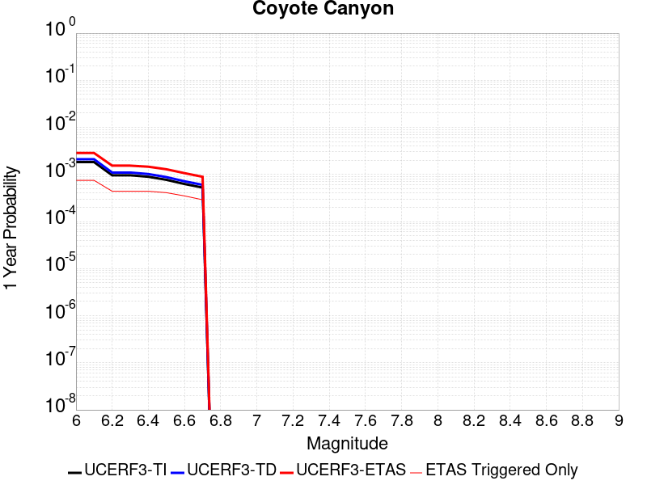 |  |

| Magnitude | 1 wk TI Prob | 1 wk TD Prob | 1 wk ETAS Prob | 1 wk ETAS/TD Gain | 1 wk ETAS Triggered Only | 1 mo TI Prob | 1 mo TD Prob | 1 mo ETAS Prob | 1 mo ETAS/TD Gain | 1 mo ETAS Triggered Only | 1 yr TI Prob | 1 yr TD Prob | 1 yr ETAS Prob | 1 yr ETAS/TD Gain | 1 yr ETAS Triggered Only | 10 yr TI Prob | 10 yr TD Prob | 10 yr ETAS Prob | 10 yr ETAS/TD Gain | 10 yr ETAS Triggered Only |
|-----|-----|-----|-----|-----|-----|-----|-----|-----|-----|-----|-----|-----|-----|-----|-----|-----|-----|-----|-----|-----|
| 6.0 | 3.5090034E-5 | 4.036559E-5 | 1.4036155E-4 | 3.4772577 | 1.0E-4 | 1.503772E-4 | 1.7298537E-4 | 3.8294905E-4 | 2.2137656 | 2.1E-4 | 0.0018293047 | 0.0021043187 | 0.0028527405 | 1.35566 | 7.5E-4 | 0.018143194 | 0.02086985 | 0.022495206 | 1.0778806 | 0.00166 |
| 6.1 | 3.5090034E-5 | 4.036559E-5 | 1.4036155E-4 | 3.4772577 | 1.0E-4 | 1.503772E-4 | 1.7298537E-4 | 3.8294905E-4 | 2.2137656 | 2.1E-4 | 0.0018293047 | 0.0021043187 | 0.0028527405 | 1.35566 | 7.5E-4 | 0.018143194 | 0.02086985 | 0.022495206 | 1.0778806 | 0.00166 |
| 6.2 | 1.841879E-5 | 2.1060423E-5 | 5.1059793E-5 | 2.4244428 | 3.0E-5 | 7.8935285E-5 | 9.0256406E-5 | 1.8024829E-4 | 1.9970691 | 9.0E-5 | 9.606133E-4 | 0.0010984198 | 0.0015379365 | 1.4001354 | 4.4E-4 | 0.0095647145 | 0.010939993 | 0.011760912 | 1.0750384 | 8.3E-4 |
| 6.3 | 1.841879E-5 | 2.1060423E-5 | 5.1059793E-5 | 2.4244428 | 3.0E-5 | 7.8935285E-5 | 9.0256406E-5 | 1.8024829E-4 | 1.9970691 | 9.0E-5 | 9.606133E-4 | 0.0010984198 | 0.0015379365 | 1.4001354 | 4.4E-4 | 0.0095647145 | 0.010939993 | 0.011760912 | 1.0750384 | 8.3E-4 |
| 6.4 | 1.712201E-5 | 1.9565794E-5 | 4.9565206E-5 | 2.5332582 | 3.0E-5 | 7.337798E-5 | 8.385127E-5 | 1.7384373E-4 | 2.0732388 | 9.0E-5 | 8.930107E-4 | 0.0010205116 | 0.0014600627 | 1.4307163 | 4.4E-4 | 0.008894307 | 0.0101681715 | 0.010979834 | 1.0798239 | 8.2E-4 |
| 6.5 | 1.4744935E-5 | 1.683747E-5 | 4.6836965E-5 | 2.7817104 | 3.0E-5 | 6.3191044E-5 | 7.215911E-5 | 1.5215334E-4 | 2.108581 | 8.0E-5 | 7.6907943E-4 | 8.782766E-4 | 0.0012879166 | 1.4664133 | 4.1E-4 | 0.007664232 | 0.008757252 | 0.009510597 | 1.0860252 | 7.6E-4 |
| 6.6 | 1.2017839E-5 | 1.3724495E-5 | 3.372422E-5 | 2.4572284 | 2.0E-5 | 5.150401E-5 | 5.881844E-5 | 1.2881432E-4 | 2.190033 | 7.0E-5 | 6.268809E-4 | 7.159678E-4 | 0.0010657172 | 1.4884988 | 3.5E-4 | 0.0062511545 | 0.0071453047 | 0.007830375 | 1.0958769 | 6.9E-4 |
| 6.7 | 1.00956095E-5 | 1.1533859E-5 | 3.153363E-5 | 2.734005 | 2.0E-5 | 4.326618E-5 | 4.943038E-5 | 1.0942741E-4 | 2.2137685 | 6.0E-5 | 5.266384E-4 | 6.0173566E-4 | 8.9156115E-4 | 1.4816492 | 2.9E-4 | 0.005253921 | 0.006009591 | 0.006586105 | 1.0959324 | 5.8E-4 |

## Nelson Lake
*[(top)](#table-of-contents)*

| 1 Week | 1 Month | 1 Year | 10 Year |
|-----|-----|-----|-----|
| 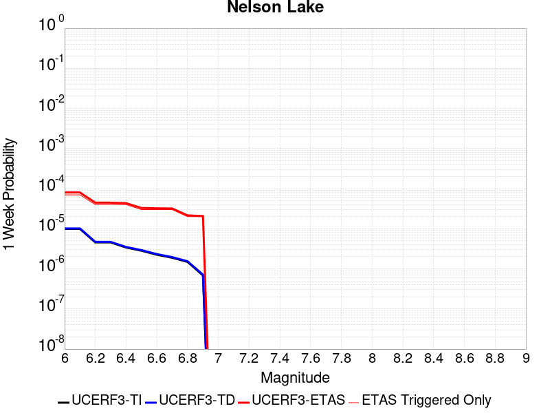 |  |  |  |

| Magnitude | 1 wk TI Prob | 1 wk TD Prob | 1 wk ETAS Prob | 1 wk ETAS/TD Gain | 1 wk ETAS Triggered Only | 1 mo TI Prob | 1 mo TD Prob | 1 mo ETAS Prob | 1 mo ETAS/TD Gain | 1 mo ETAS Triggered Only | 1 yr TI Prob | 1 yr TD Prob | 1 yr ETAS Prob | 1 yr ETAS/TD Gain | 1 yr ETAS Triggered Only | 10 yr TI Prob | 10 yr TD Prob | 10 yr ETAS Prob | 10 yr ETAS/TD Gain | 10 yr ETAS Triggered Only |
|-----|-----|-----|-----|-----|-----|-----|-----|-----|-----|-----|-----|-----|-----|-----|-----|-----|-----|-----|-----|-----|
| 6.0 | 9.913453E-6 | 1.0192315E-5 | 8.01916E-5 | 7.8678493 | 7.0E-5 | 4.2485535E-5 | 4.3680677E-5 | 2.0367368E-4 | 4.662787 | 1.6E-4 | 5.1713863E-4 | 5.316928E-4 | 0.0011813472 | 2.2218604 | 6.5E-4 | 0.0051593683 | 0.005305235 | 0.0069365343 | 1.3074887 | 0.00164 |
| 6.1 | 9.913453E-6 | 1.0192315E-5 | 8.01916E-5 | 7.8678493 | 7.0E-5 | 4.2485535E-5 | 4.3680677E-5 | 2.0367368E-4 | 4.662787 | 1.6E-4 | 5.1713863E-4 | 5.316928E-4 | 0.0011813472 | 2.2218604 | 6.5E-4 | 0.0051593683 | 0.005305235 | 0.0069365343 | 1.3074887 | 0.00164 |
| 6.2 | 4.5596407E-6 | 4.6963423E-6 | 4.4696153E-5 | 9.517226 | 4.0E-5 | 1.954117E-5 | 2.0127034E-5 | 9.012563E-5 | 4.4778395 | 7.0E-5 | 2.3788778E-4 | 2.4502035E-4 | 5.249517E-4 | 2.1424823 | 2.8E-4 | 0.0023763329 | 0.0024476282 | 0.0032755965 | 1.3382738 | 8.3E-4 |
| 6.3 | 4.5596407E-6 | 4.6963423E-6 | 4.4696153E-5 | 9.517226 | 4.0E-5 | 1.954117E-5 | 2.0127034E-5 | 9.012563E-5 | 4.4778395 | 7.0E-5 | 2.3788778E-4 | 2.4502035E-4 | 5.249517E-4 | 2.1424823 | 2.8E-4 | 0.0023763329 | 0.0024476282 | 0.0032755965 | 1.3382738 | 8.3E-4 |
| 6.4 | 3.4025713E-6 | 3.5099204E-6 | 4.350978E-5 | 12.39623 | 4.0E-5 | 1.4582367E-5 | 1.5042434E-5 | 8.504138E-5 | 5.6534324 | 7.0E-5 | 1.7752586E-4 | 1.8312708E-4 | 4.030868E-4 | 2.2011316 | 2.2E-4 | 0.001773841 | 0.0018298447 | 0.0024586918 | 1.3436615 | 6.3E-4 |
| 6.5 | 2.8352947E-6 | 2.927876E-6 | 3.292779E-5 | 11.246305 | 3.0E-5 | 1.2151207E-5 | 1.2547984E-5 | 7.2547235E-5 | 5.7815847 | 6.0E-5 | 1.479309E-4 | 1.5276174E-4 | 3.4273273E-4 | 2.2435768 | 1.9E-4 | 0.0014783246 | 0.0015266412 | 0.002095771 | 1.3727987 | 5.7E-4 |
| 6.6 | 2.251518E-6 | 2.3290843E-6 | 3.2329015E-5 | 13.8805685 | 3.0E-5 | 9.649328E-6 | 9.981755E-6 | 6.998116E-5 | 7.0109067 | 6.0E-5 | 1.1747423E-4 | 1.2152172E-4 | 2.815023E-4 | 2.316477 | 1.6E-4 | 0.0011741214 | 0.0012146145 | 0.0016940314 | 1.3947071 | 4.8E-4 |
| 6.7 | 1.8911853E-6 | 1.9591544E-6 | 3.1959094E-5 | 16.312698 | 3.0E-5 | 8.105055E-6 | 8.396352E-6 | 6.839585E-5 | 8.145901 | 6.0E-5 | 9.867457E-5 | 1.0222138E-4 | 2.4220707E-4 | 2.3694365 | 1.4E-4 | 9.863076E-4 | 0.0010218011 | 0.0014114026 | 1.381289 | 3.9E-4 |
| 6.8 | 1.4874814E-6 | 1.5438427E-6 | 2.1543812E-5 | 13.954668 | 2.0E-5 | 6.374905E-6 | 6.616455E-6 | 3.6616257E-5 | 5.53412 | 3.0E-5 | 7.76117E-5 | 8.055288E-5 | 1.8054483E-4 | 2.2413206 | 1.0E-4 | 7.75846E-4 | 8.052879E-4 | 0.0010850624 | 1.3474218 | 2.8E-4 |
| 6.9 | 6.835972E-7 | 7.1399944E-7 | 2.0713986E-5 | 29.011206 | 2.0E-5 | 2.9296991E-6 | 3.0599958E-6 | 2.3059934E-5 | 7.535937 | 2.0E-5 | 3.56685E-5 | 3.725513E-5 | 9.7252894E-5 | 2.6104565 | 6.0E-5 | 3.5662777E-4 | 3.7252012E-4 | 5.424568E-4 | 1.4561812 | 1.7E-4 |

## Lenwood-Lockhart-Old Woman Springs
*[(top)](#table-of-contents)*

| 1 Week | 1 Month | 1 Year | 10 Year |
|-----|-----|-----|-----|
|  |  |  |  |

| Magnitude | 1 wk TI Prob | 1 wk TD Prob | 1 wk ETAS Prob | 1 wk ETAS/TD Gain | 1 wk ETAS Triggered Only | 1 mo TI Prob | 1 mo TD Prob | 1 mo ETAS Prob | 1 mo ETAS/TD Gain | 1 mo ETAS Triggered Only | 1 yr TI Prob | 1 yr TD Prob | 1 yr ETAS Prob | 1 yr ETAS/TD Gain | 1 yr ETAS Triggered Only | 10 yr TI Prob | 10 yr TD Prob | 10 yr ETAS Prob | 10 yr ETAS/TD Gain | 10 yr ETAS Triggered Only |
|-----|-----|-----|-----|-----|-----|-----|-----|-----|-----|-----|-----|-----|-----|-----|-----|-----|-----|-----|-----|-----|
| 6.0 | 3.744542E-5 | 4.396322E-5 | 1.03960585E-4 | 2.3647172 | 6.0E-5 | 1.604705E-4 | 1.8840117E-4 | 4.2835597E-4 | 2.2736375 | 2.4E-4 | 0.0019519776 | 0.0022915434 | 0.0030897101 | 1.3483098 | 8.0E-4 | 0.019349206 | 0.022697147 | 0.024192419 | 1.0658793 | 0.00153 |
| 6.1 | 3.744542E-5 | 4.396322E-5 | 1.03960585E-4 | 2.3647172 | 6.0E-5 | 1.604705E-4 | 1.8840117E-4 | 4.2835597E-4 | 2.2736375 | 2.4E-4 | 0.0019519776 | 0.0022915434 | 0.0030897101 | 1.3483098 | 8.0E-4 | 0.019349206 | 0.022697147 | 0.024192419 | 1.0658793 | 0.00153 |
| 6.2 | 3.744542E-5 | 4.396322E-5 | 1.03960585E-4 | 2.3647172 | 6.0E-5 | 1.604705E-4 | 1.8840117E-4 | 4.2835597E-4 | 2.2736375 | 2.4E-4 | 0.0019519776 | 0.0022915434 | 0.0030897101 | 1.3483098 | 8.0E-4 | 0.019349206 | 0.022697147 | 0.024192419 | 1.0658793 | 0.00153 |
| 6.3 | 2.1079984E-5 | 2.535369E-5 | 3.5353434E-5 | 1.3944099 | 1.0E-5 | 9.0339665E-5 | 1.08654254E-4 | 2.086434E-4 | 1.9202505 | 1.0E-4 | 0.0010993304 | 0.0013220827 | 0.0016516465 | 1.2492762 | 3.3E-4 | 0.010939079 | 0.013144389 | 0.013775976 | 1.0480499 | 6.4E-4 |
| 6.4 | 2.1079984E-5 | 2.535369E-5 | 3.5353434E-5 | 1.3944099 | 1.0E-5 | 9.0339665E-5 | 1.08654254E-4 | 2.086434E-4 | 1.9202505 | 1.0E-4 | 0.0010993304 | 0.0013220827 | 0.0016516465 | 1.2492762 | 3.3E-4 | 0.010939079 | 0.013144389 | 0.013775976 | 1.0480499 | 6.4E-4 |
| 6.5 | 1.7397282E-5 | 2.0662608E-5 | 3.0662402E-5 | 1.483956 | 1.0E-5 | 7.455765E-5 | 8.8551096E-5 | 1.4854578E-4 | 1.6775149 | 6.0E-5 | 9.073613E-4 | 0.0010775881 | 0.001297351 | 1.2039397 | 2.2E-4 | 0.009036654 | 0.010724923 | 0.011189883 | 1.0433532 | 4.7E-4 |
| 6.6 | 1.52050325E-5 | 1.767986E-5 | 2.7679684E-5 | 1.5656054 | 1.0E-5 | 6.51628E-5 | 7.576867E-5 | 1.2576488E-4 | 1.6598533 | 5.0E-5 | 7.9306826E-4 | 9.22101E-4 | 0.0011119258 | 1.2058612 | 1.9E-4 | 0.007902439 | 0.009183612 | 0.009589847 | 1.0442348 | 4.1E-4 |
| 6.7 | 1.332523E-5 | 1.5264142E-5 | 1.5264142E-5 | 1.0 | 0.0 | 5.7106878E-5 | 6.541615E-5 | 8.541484E-5 | 1.305715 | 2.0E-5 | 6.950544E-4 | 7.9615635E-4 | 9.4603695E-4 | 1.1882552 | 1.5E-4 | 0.006928845 | 0.007933672 | 0.008300736 | 1.0462667 | 3.7E-4 |
| 6.8 | 1.1525329E-5 | 1.303109E-5 | 1.303109E-5 | 1.0 | 0.0 | 4.9393333E-5 | 5.5846358E-5 | 6.58458E-5 | 1.1790527 | 1.0E-5 | 6.011979E-4 | 6.7972153E-4 | 7.9963997E-4 | 1.1764228 | 1.2E-4 | 0.00599574 | 0.0067768767 | 0.0070847757 | 1.0454338 | 3.1E-4 |
| 6.9 | 1.0253909E-5 | 1.1514532E-5 | 1.1514532E-5 | 1.0 | 0.0 | 4.3944583E-5 | 4.934708E-5 | 4.934708E-5 | 1.0 | 0.0 | 5.3489394E-4 | 6.006387E-4 | 6.9058465E-4 | 1.1497505 | 9.0E-5 | 0.0053360825 | 0.0059905327 | 0.006239035 | 1.0414826 | 2.5E-4 |
| 7.0 | 8.104563E-6 | 8.991345E-6 | 8.991345E-6 | 1.0 | 0.0 | 3.4733377E-5 | 3.8533777E-5 | 3.8533777E-5 | 1.0 | 0.0 | 4.2279682E-4 | 4.6905017E-4 | 5.390173E-4 | 1.1491678 | 7.0E-5 | 0.0042199334 | 0.0046808496 | 0.0048699602 | 1.0404009 | 1.9E-4 |
| 7.1 | 6.7986157E-6 | 7.515867E-6 | 7.515867E-6 | 1.0 | 0.0 | 2.91366E-5 | 3.221047E-5 | 3.221047E-5 | 1.0 | 0.0 | 3.5468035E-4 | 3.9209408E-4 | 4.4207447E-4 | 1.1274704 | 5.0E-5 | 0.003541148 | 0.0039142394 | 0.0040437304 | 1.0330821 | 1.3E-4 |
| 7.2 | 5.6893327E-6 | 6.2800536E-6 | 6.2800536E-6 | 1.0 | 0.0 | 2.4382627E-5 | 2.691425E-5 | 2.691425E-5 | 1.0 | 0.0 | 2.9681803E-4 | 3.276337E-4 | 3.6762058E-4 | 1.1220475 | 4.0E-5 | 0.002964219 | 0.0032717052 | 0.0033713782 | 1.0304651 | 1.0E-4 |
| 7.3 | 4.253348E-6 | 4.7069366E-6 | 4.7069366E-6 | 1.0 | 0.0 | 1.8228506E-5 | 2.017244E-5 | 2.017244E-5 | 1.0 | 0.0 | 2.2190946E-4 | 2.455736E-4 | 2.655687E-4 | 1.081422 | 2.0E-5 | 0.00221688 | 0.0024532033 | 0.0025230316 | 1.0284641 | 7.0E-5 |
| 7.4 | 2.5448119E-6 | 2.8520583E-6 | 2.8520583E-6 | 1.0 | 0.0 | 1.0906291E-5 | 1.2223059E-5 | 1.2223059E-5 | 1.0 | 0.0 | 1.3277601E-4 | 1.4880723E-4 | 1.5880573E-4 | 1.067191 | 1.0E-5 | 0.001326967 | 0.001487238 | 0.0015371636 | 1.0335693 | 5.0E-5 |
| 7.5 | 4.3706837E-8 | 4.562951E-8 | 4.562951E-8 | 1.0 | 0.0 | 1.8731501E-7 | 1.9555503E-7 | 1.9555503E-7 | 1.0 | 0.0 | 2.2805577E-6 | 2.3808805E-6 | 2.3808805E-6 | 1.0 | 0.0 | 2.2805343E-5 | 2.3808605E-5 | 2.3808605E-5 | 1.0 | 0.0 |

## Towne Pass
*[(top)](#table-of-contents)*

| 1 Week | 1 Month | 1 Year | 10 Year |
|-----|-----|-----|-----|
|  |  | 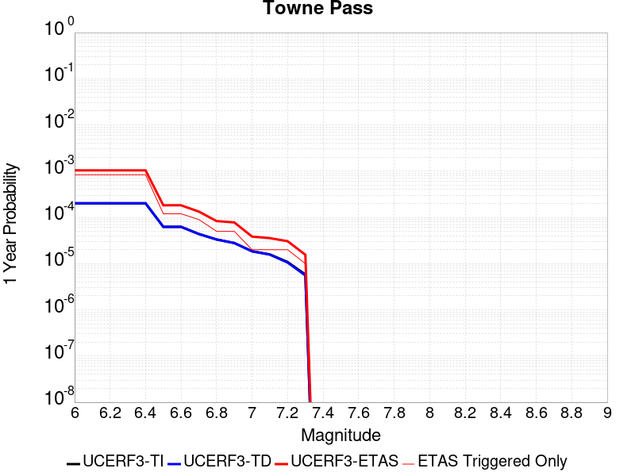 |  |

| Magnitude | 1 wk TI Prob | 1 wk TD Prob | 1 wk ETAS Prob | 1 wk ETAS/TD Gain | 1 wk ETAS Triggered Only | 1 mo TI Prob | 1 mo TD Prob | 1 mo ETAS Prob | 1 mo ETAS/TD Gain | 1 mo ETAS Triggered Only | 1 yr TI Prob | 1 yr TD Prob | 1 yr ETAS Prob | 1 yr ETAS/TD Gain | 1 yr ETAS Triggered Only | 10 yr TI Prob | 10 yr TD Prob | 10 yr ETAS Prob | 10 yr ETAS/TD Gain | 10 yr ETAS Triggered Only |
|-----|-----|-----|-----|-----|-----|-----|-----|-----|-----|-----|-----|-----|-----|-----|-----|-----|-----|-----|-----|-----|
| 6.0 | 3.849728E-6 | 3.8945545E-6 | 9.38942E-5 | 24.1091 | 9.0E-5 | 1.649873E-5 | 1.6690865E-5 | 2.3668719E-4 | 14.180643 | 2.2E-4 | 2.0085352E-4 | 2.031967E-4 | 0.001043026 | 5.1330853 | 8.4E-4 | 0.0020067208 | 0.0020305382 | 0.003567411 | 1.7568796 | 0.00154 |
| 6.1 | 3.849728E-6 | 3.8945545E-6 | 9.38942E-5 | 24.1091 | 9.0E-5 | 1.649873E-5 | 1.6690865E-5 | 2.3668719E-4 | 14.180643 | 2.2E-4 | 2.0085352E-4 | 2.031967E-4 | 0.001043026 | 5.1330853 | 8.4E-4 | 0.0020067208 | 0.0020305382 | 0.003567411 | 1.7568796 | 0.00154 |
| 6.2 | 3.849728E-6 | 3.8945545E-6 | 9.38942E-5 | 24.1091 | 9.0E-5 | 1.649873E-5 | 1.6690865E-5 | 2.3668719E-4 | 14.180643 | 2.2E-4 | 2.0085352E-4 | 2.031967E-4 | 0.001043026 | 5.1330853 | 8.4E-4 | 0.0020067208 | 0.0020305382 | 0.003567411 | 1.7568796 | 0.00154 |
| 6.3 | 3.849728E-6 | 3.8945545E-6 | 9.38942E-5 | 24.1091 | 9.0E-5 | 1.649873E-5 | 1.6690865E-5 | 2.3668719E-4 | 14.180643 | 2.2E-4 | 2.0085352E-4 | 2.031967E-4 | 0.001043026 | 5.1330853 | 8.4E-4 | 0.0020067208 | 0.0020305382 | 0.003567411 | 1.7568796 | 0.00154 |
| 6.4 | 3.849728E-6 | 3.8945545E-6 | 9.38942E-5 | 24.1091 | 9.0E-5 | 1.649873E-5 | 1.6690865E-5 | 2.3668719E-4 | 14.180643 | 2.2E-4 | 2.0085352E-4 | 2.031967E-4 | 0.001043026 | 5.1330853 | 8.4E-4 | 0.0020067208 | 0.0020305382 | 0.003567411 | 1.7568796 | 0.00154 |
| 6.5 | 1.1953545E-6 | 1.2030571E-6 | 1.1203045E-5 | 9.312147 | 1.0E-5 | 5.1229376E-6 | 5.1559496E-6 | 3.5155794E-5 | 6.818491 | 3.0E-5 | 6.236998E-5 | 6.2772E-5 | 1.8276446E-4 | 2.9115605 | 1.2E-4 | 6.235248E-4 | 6.275544E-4 | 8.074414E-4 | 1.2866477 | 1.8E-4 |
| 6.6 | 1.1953545E-6 | 1.2030571E-6 | 1.1203045E-5 | 9.312147 | 1.0E-5 | 5.1229376E-6 | 5.1559496E-6 | 3.5155794E-5 | 6.818491 | 3.0E-5 | 6.236998E-5 | 6.2772E-5 | 1.8276446E-4 | 2.9115605 | 1.2E-4 | 6.235248E-4 | 6.275544E-4 | 8.074414E-4 | 1.2866477 | 1.8E-4 |
| 6.7 | 8.375951E-7 | 8.4107126E-7 | 8.4107126E-7 | 1.0 | 0.0 | 3.5896885E-6 | 3.6045865E-6 | 2.3604514E-5 | 6.5484667 | 2.0E-5 | 4.370358E-5 | 4.3885015E-5 | 1.3388107E-4 | 3.050724 | 9.0E-5 | 4.3694986E-4 | 4.387692E-4 | 5.287297E-4 | 1.2050292 | 9.0E-5 |
| 6.8 | 6.38041E-7 | 6.3921937E-7 | 6.3921937E-7 | 1.0 | 0.0 | 2.7344586E-6 | 2.739509E-6 | 2.739509E-6 | 1.0 | 0.0 | 3.3291526E-5 | 3.335305E-5 | 8.3351384E-5 | 2.4990633 | 5.0E-5 | 3.3286537E-4 | 3.3348426E-4 | 3.834676E-4 | 1.1498821 | 5.0E-5 |
| 6.9 | 5.3460053E-7 | 5.3453675E-7 | 5.3453675E-7 | 1.0 | 0.0 | 2.2911431E-6 | 2.29087E-6 | 2.29087E-6 | 1.0 | 0.0 | 2.789431E-5 | 2.789102E-5 | 7.788963E-5 | 2.7926416 | 5.0E-5 | 2.789081E-4 | 2.7887852E-4 | 3.2886458E-4 | 1.1792395 | 5.0E-5 |
| 7.0 | 3.557783E-7 | 3.532452E-7 | 3.532452E-7 | 1.0 | 0.0 | 1.5247632E-6 | 1.5139073E-6 | 1.5139073E-6 | 1.0 | 0.0 | 1.8563835E-5 | 1.8431672E-5 | 3.8431306E-5 | 2.0850687 | 2.0E-5 | 1.8562283E-4 | 1.8430229E-4 | 2.042986E-4 | 1.1084974 | 2.0E-5 |
| 7.1 | 3.037942E-7 | 3.0002488E-7 | 3.0002488E-7 | 1.0 | 0.0 | 1.3019744E-6 | 1.2858203E-6 | 1.2858203E-6 | 1.0 | 0.0 | 1.5851423E-5 | 1.5654758E-5 | 3.5654444E-5 | 2.277547 | 2.0E-5 | 1.5850292E-4 | 1.565373E-4 | 1.7653416E-4 | 1.127745 | 2.0E-5 |
| 7.2 | 2.0808248E-7 | 2.021791E-7 | 2.021791E-7 | 1.0 | 0.0 | 8.917818E-7 | 8.6648157E-7 | 8.6648157E-7 | 1.0 | 0.0 | 1.0857389E-5 | 1.0549367E-5 | 3.0549156E-5 | 2.8958282 | 2.0E-5 | 1.0856859E-4 | 1.05489125E-4 | 1.2548701E-4 | 1.189573 | 2.0E-5 |
| 7.3 | 1.1162073E-7 | 1.0637034E-7 | 1.0637034E-7 | 1.0 | 0.0 | 4.7837443E-7 | 4.5587282E-7 | 4.5587282E-7 | 1.0 | 0.0 | 5.8241935E-6 | 5.550239E-6 | 1.5550184E-5 | 2.8017142 | 1.0E-5 | 5.8240406E-5 | 5.550121E-5 | 6.550065E-5 | 1.1801662 | 1.0E-5 |

## San Andreas (San Bernardino N)
*[(top)](#table-of-contents)*

| 1 Week | 1 Month | 1 Year | 10 Year |
|-----|-----|-----|-----|
|  | 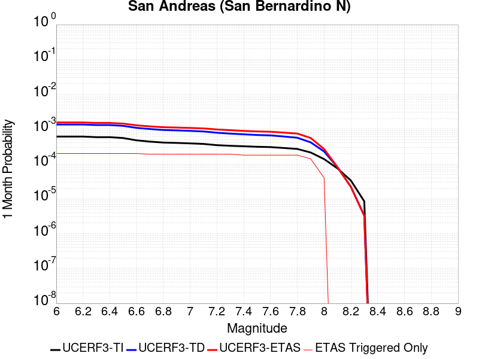 |  |  |

| Magnitude | 1 wk TI Prob | 1 wk TD Prob | 1 wk ETAS Prob | 1 wk ETAS/TD Gain | 1 wk ETAS Triggered Only | 1 mo TI Prob | 1 mo TD Prob | 1 mo ETAS Prob | 1 mo ETAS/TD Gain | 1 mo ETAS Triggered Only | 1 yr TI Prob | 1 yr TD Prob | 1 yr ETAS Prob | 1 yr ETAS/TD Gain | 1 yr ETAS Triggered Only | 10 yr TI Prob | 10 yr TD Prob | 10 yr ETAS Prob | 10 yr ETAS/TD Gain | 10 yr ETAS Triggered Only |
|-----|-----|-----|-----|-----|-----|-----|-----|-----|-----|-----|-----|-----|-----|-----|-----|-----|-----|-----|-----|-----|
| 6.0 | 1.4273766E-4 | 3.1618218E-4 | 4.0615373E-4 | 1.284556 | 9.0E-5 | 6.115894E-4 | 0.0013543688 | 0.0015540979 | 1.1474702 | 2.0E-4 | 0.0074207084 | 0.016366268 | 0.016956449 | 1.0360608 | 6.0E-4 | 0.07177748 | 0.15031487 | 0.15137698 | 1.0070659 | 0.00125 |
| 6.1 | 1.4273766E-4 | 3.1618218E-4 | 4.0615373E-4 | 1.284556 | 9.0E-5 | 6.115894E-4 | 0.0013543688 | 0.0015540979 | 1.1474702 | 2.0E-4 | 0.0074207084 | 0.016366268 | 0.016956449 | 1.0360608 | 6.0E-4 | 0.07177748 | 0.15031487 | 0.15137698 | 1.0070659 | 0.00125 |
| 6.2 | 1.4273766E-4 | 3.1618218E-4 | 4.0615373E-4 | 1.284556 | 9.0E-5 | 6.115894E-4 | 0.0013543688 | 0.0015540979 | 1.1474702 | 2.0E-4 | 0.0074207084 | 0.016366268 | 0.016956449 | 1.0360608 | 6.0E-4 | 0.07177748 | 0.15031487 | 0.15137698 | 1.0070659 | 0.00125 |
| 6.3 | 1.3730655E-4 | 3.0523015E-4 | 3.9520266E-4 | 1.2947695 | 9.0E-5 | 5.883239E-4 | 0.001307479 | 0.0015072175 | 1.1527661 | 2.0E-4 | 0.0071393442 | 0.01580377 | 0.016394287 | 1.0373657 | 6.0E-4 | 0.06914291 | 0.14561477 | 0.14667422 | 1.0072756 | 0.00124 |
| 6.4 | 1.3730655E-4 | 3.0523015E-4 | 3.9520266E-4 | 1.2947695 | 9.0E-5 | 5.883239E-4 | 0.001307479 | 0.0015072175 | 1.1527661 | 2.0E-4 | 0.0071393442 | 0.01580377 | 0.016394287 | 1.0373657 | 6.0E-4 | 0.06914291 | 0.14561477 | 0.14667422 | 1.0072756 | 0.00124 |
| 6.5 | 1.2942807E-4 | 2.8937397E-4 | 3.793479E-4 | 1.3109262 | 9.0E-5 | 5.545738E-4 | 0.0012395899 | 0.0014393419 | 1.1611437 | 2.0E-4 | 0.0067310524 | 0.014988818 | 0.015569975 | 1.0387727 | 5.9E-4 | 0.06530788 | 0.13875747 | 0.1398168 | 1.0076344 | 0.00123 |
| 6.6 | 1.1125901E-4 | 2.5376084E-4 | 3.4373798E-4 | 1.3545747 | 9.0E-5 | 4.767372E-4 | 0.0010870955 | 0.001286878 | 1.1837765 | 2.0E-4 | 0.005788839 | 0.0131557 | 0.013728069 | 1.0435073 | 5.8E-4 | 0.056403454 | 0.123047315 | 0.12409966 | 1.0085523 | 0.0012 |
| 6.7 | 1.02209575E-4 | 2.351098E-4 | 3.2508862E-4 | 1.3827099 | 9.0E-5 | 4.3796748E-4 | 0.0010072257 | 0.0011970343 | 1.188447 | 1.9E-4 | 0.0053192247 | 0.0121944435 | 0.012747615 | 1.0453626 | 5.6E-4 | 0.051936906 | 0.11483907 | 0.11588356 | 1.0090952 | 0.00118 |
| 6.8 | 9.610582E-5 | 2.2036643E-4 | 3.103466E-4 | 1.4083207 | 9.0E-5 | 4.1181705E-4 | 9.440864E-4 | 0.001133907 | 1.2010628 | 1.9E-4 | 0.0050023515 | 0.011433939 | 0.011987537 | 1.048417 | 5.6E-4 | 0.048912346 | 0.10824081 | 0.10927525 | 1.0095569 | 0.00116 |
| 6.9 | 9.3877505E-5 | 2.1492133E-4 | 3.0490197E-4 | 1.4186679 | 9.0E-5 | 4.0227012E-4 | 9.207669E-4 | 0.0011105919 | 1.2061597 | 1.9E-4 | 0.0048866454 | 0.01115296 | 0.011706715 | 1.0496509 | 5.6E-4 | 0.04780577 | 0.10583098 | 0.10686822 | 1.0098009 | 0.00116 |
| 7.0 | 9.1019785E-5 | 2.0818957E-4 | 2.9817084E-4 | 1.4322083 | 9.0E-5 | 3.900265E-4 | 8.919365E-4 | 0.001081767 | 1.2128297 | 1.9E-4 | 0.0047382377 | 0.010805482 | 0.011359431 | 1.0512656 | 5.6E-4 | 0.046384744 | 0.10280109 | 0.10383287 | 1.0100367 | 0.00115 |
| 7.1 | 8.771155E-5 | 1.9993426E-4 | 2.8991626E-4 | 1.450058 | 9.0E-5 | 3.758525E-4 | 8.5658033E-4 | 0.0010464175 | 1.2216222 | 1.9E-4 | 0.0045664064 | 0.010379194 | 0.0109333815 | 1.0533941 | 5.6E-4 | 0.044737056 | 0.09911244 | 0.10014847 | 1.010453 | 0.00115 |
| 7.2 | 8.0830236E-5 | 1.8398839E-4 | 2.7397182E-4 | 1.4890712 | 9.0E-5 | 3.4636928E-4 | 7.8828353E-4 | 9.781338E-4 | 1.2408401 | 1.9E-4 | 0.0042088944 | 0.009555225 | 0.01009997 | 1.0570102 | 5.5E-4 | 0.041300658 | 0.09184285 | 0.092869066 | 1.0111736 | 0.00113 |
| 7.3 | 7.7668235E-5 | 1.734218E-4 | 2.634062E-4 | 1.518876 | 9.0E-5 | 3.328214E-4 | 7.4302463E-4 | 9.328835E-4 | 1.2555215 | 1.9E-4 | 0.0040445733 | 0.009008882 | 0.009553926 | 1.0605009 | 5.5E-4 | 0.03971748 | 0.08710933 | 0.088122636 | 1.0116326 | 0.00111 |
| 7.4 | 7.520177E-5 | 1.6562137E-4 | 2.556065E-4 | 1.5433182 | 9.0E-5 | 3.2225347E-4 | 7.096129E-4 | 8.894852E-4 | 1.2534795 | 1.8E-4 | 0.0039163795 | 0.00860538 | 0.009140733 | 1.0622114 | 5.4E-4 | 0.038480744 | 0.083565034 | 0.084554784 | 1.011844 | 0.00108 |
| 7.5 | 7.274697E-5 | 1.5849658E-4 | 2.484823E-4 | 1.5677456 | 9.0E-5 | 3.1173544E-4 | 6.790943E-4 | 8.589721E-4 | 1.2648789 | 1.8E-4 | 0.003788775 | 0.008236687 | 0.008772239 | 1.0650203 | 5.4E-4 | 0.03724827 | 0.08028134 | 0.081274636 | 1.0123727 | 0.00108 |
| 7.6 | 7.1185845E-5 | 1.5419433E-4 | 2.4418044E-4 | 1.5835891 | 9.0E-5 | 3.0504653E-4 | 6.606655E-4 | 8.405466E-4 | 1.2722726 | 1.8E-4 | 0.0037076178 | 0.00801399 | 0.008549661 | 1.0668422 | 5.4E-4 | 0.036463667 | 0.07827072 | 0.079256974 | 1.0126005 | 0.00107 |
| 7.7 | 6.709961E-5 | 1.432807E-4 | 2.3326781E-4 | 1.6280476 | 9.0E-5 | 2.8753807E-4 | 6.1391573E-4 | 7.9380523E-4 | 1.2930199 | 1.8E-4 | 0.003495157 | 0.0074488465 | 0.0079848245 | 1.0719545 | 5.4E-4 | 0.034406938 | 0.07309862 | 0.07409041 | 1.0135678 | 0.00107 |
| 7.8 | 6.300812E-5 | 1.3211662E-4 | 2.2210472E-4 | 1.6811264 | 9.0E-5 | 2.7000686E-4 | 5.660912E-4 | 7.459893E-4 | 1.3177899 | 1.8E-4 | 0.0032823787 | 0.006870409 | 0.007396768 | 1.0766125 | 5.3E-4 | 0.032343175 | 0.067755476 | 0.068734325 | 1.0144469 | 0.00105 |
| 7.9 | 4.983037E-5 | 9.7307675E-5 | 1.6730087E-4 | 1.7192978 | 7.0E-5 | 2.1354125E-4 | 4.1696624E-4 | 5.5690785E-4 | 1.3356186 | 1.4E-4 | 0.0025967648 | 0.0050647575 | 0.005472681 | 1.0805416 | 4.1E-4 | 0.025666296 | 0.050682776 | 0.051461216 | 1.015359 | 8.2E-4 |
| 8.0 | 3.2211527E-5 | 5.33472E-5 | 7.3346135E-5 | 1.3748825 | 2.0E-5 | 1.380421E-4 | 2.2861084E-4 | 2.686017E-4 | 1.1749299 | 4.0E-5 | 0.0016793669 | 0.0027797862 | 0.0029293692 | 1.053811 | 1.5E-4 | 0.016667323 | 0.028382154 | 0.028644491 | 1.009243 | 2.7E-4 |
| 8.1 | 1.743376E-5 | 1.8844148E-5 | 1.8844148E-5 | 1.0 | 0.0 | 7.471398E-5 | 8.075814E-5 | 8.075814E-5 | 1.0 | 0.0 | 9.0926304E-4 | 9.827875E-4 | 9.827875E-4 | 1.0 | 0.0 | 0.009055517 | 0.010494357 | 0.010514148 | 1.0018858 | 2.0E-5 |
| 8.2 | 7.831616E-6 | 5.162336E-6 | 5.162336E-6 | 1.0 | 0.0 | 3.3563636E-5 | 2.2124112E-5 | 2.2124112E-5 | 1.0 | 0.0 | 4.0856065E-4 | 2.6932784E-4 | 2.6932784E-4 | 1.0 | 0.0 | 0.004078103 | 0.0030457443 | 0.0030457443 | 1.0 | 0.0 |
| 8.3 | 1.983087E-6 | 7.6730925E-7 | 7.6730925E-7 | 1.0 | 0.0 | 8.498917E-6 | 3.288464E-6 | 3.288464E-6 | 1.0 | 0.0 | 1.034694E-4 | 4.003633E-5 | 4.003633E-5 | 1.0 | 0.0 | 0.0010342124 | 4.7272502E-4 | 4.7272502E-4 | 1.0 | 0.0 |

## Paradise
*[(top)](#table-of-contents)*

| 1 Week | 1 Month | 1 Year | 10 Year |
|-----|-----|-----|-----|
|  |  | 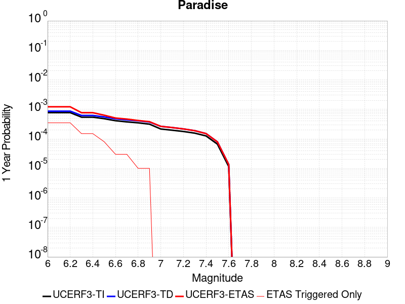 |  |

| Magnitude | 1 wk TI Prob | 1 wk TD Prob | 1 wk ETAS Prob | 1 wk ETAS/TD Gain | 1 wk ETAS Triggered Only | 1 mo TI Prob | 1 mo TD Prob | 1 mo ETAS Prob | 1 mo ETAS/TD Gain | 1 mo ETAS Triggered Only | 1 yr TI Prob | 1 yr TD Prob | 1 yr ETAS Prob | 1 yr ETAS/TD Gain | 1 yr ETAS Triggered Only | 10 yr TI Prob | 10 yr TD Prob | 10 yr ETAS Prob | 10 yr ETAS/TD Gain | 10 yr ETAS Triggered Only |
|-----|-----|-----|-----|-----|-----|-----|-----|-----|-----|-----|-----|-----|-----|-----|-----|-----|-----|-----|-----|-----|
| 6.0 | 1.4851273E-5 | 1.6694947E-5 | 1.6694947E-5 | 1.0 | 0.0 | 6.364676E-5 | 7.154794E-5 | 1.6154151E-4 | 2.2578077 | 9.0E-5 | 7.7462377E-4 | 8.7077165E-4 | 0.0012204669 | 1.4015924 | 3.5E-4 | 0.0077192914 | 0.008675977 | 0.009568168 | 1.1028347 | 9.0E-4 |
| 6.1 | 1.4851273E-5 | 1.6694947E-5 | 1.6694947E-5 | 1.0 | 0.0 | 6.364676E-5 | 7.154794E-5 | 1.6154151E-4 | 2.2578077 | 9.0E-5 | 7.7462377E-4 | 8.7077165E-4 | 0.0012204669 | 1.4015924 | 3.5E-4 | 0.0077192914 | 0.008675977 | 0.009568168 | 1.1028347 | 9.0E-4 |
| 6.2 | 1.4851273E-5 | 1.6694947E-5 | 1.6694947E-5 | 1.0 | 0.0 | 6.364676E-5 | 7.154794E-5 | 1.6154151E-4 | 2.2578077 | 9.0E-5 | 7.7462377E-4 | 8.7077165E-4 | 0.0012204669 | 1.4015924 | 3.5E-4 | 0.0077192914 | 0.008675977 | 0.009568168 | 1.1028347 | 9.0E-4 |
| 6.3 | 1.0426831E-5 | 1.1888789E-5 | 1.1888789E-5 | 1.0 | 0.0 | 4.4685654E-5 | 5.0950992E-5 | 8.094946E-5 | 1.5887711 | 3.0E-5 | 5.43912E-4 | 6.201577E-4 | 7.7006465E-4 | 1.241724 | 1.5E-4 | 0.0054258266 | 0.006184879 | 0.006592343 | 1.0658807 | 4.1E-4 |
| 6.4 | 1.0426831E-5 | 1.1888789E-5 | 1.1888789E-5 | 1.0 | 0.0 | 4.4685654E-5 | 5.0950992E-5 | 8.094946E-5 | 1.5887711 | 3.0E-5 | 5.43912E-4 | 6.201577E-4 | 7.7006465E-4 | 1.241724 | 1.5E-4 | 0.0054258266 | 0.006184879 | 0.006592343 | 1.0658807 | 4.1E-4 |
| 6.5 | 9.25027E-6 | 1.0620108E-5 | 1.0620108E-5 | 1.0 | 0.0 | 3.964341E-5 | 4.551398E-5 | 6.551307E-5 | 1.4394054 | 2.0E-5 | 4.8255164E-4 | 5.539967E-4 | 6.339524E-4 | 1.1443251 | 8.0E-5 | 0.0048150513 | 0.005526656 | 0.0057653296 | 1.043186 | 2.4E-4 |
| 6.6 | 7.904275E-6 | 9.159647E-6 | 9.159647E-6 | 1.0 | 0.0 | 3.3875025E-5 | 3.925506E-5 | 3.925506E-5 | 1.0 | 0.0 | 4.1235037E-4 | 4.7782948E-4 | 5.0781516E-4 | 1.0627539 | 3.0E-5 | 0.0041158604 | 0.0047684177 | 0.00490775 | 1.0292199 | 1.4E-4 |
| 6.7 | 7.2061953E-6 | 8.407358E-6 | 8.407358E-6 | 1.0 | 0.0 | 3.088333E-5 | 3.603106E-5 | 3.603106E-5 | 1.0 | 0.0 | 3.7593965E-4 | 4.385935E-4 | 4.6858034E-4 | 1.0683705 | 3.0E-5 | 0.003753043 | 0.004377648 | 0.0044772103 | 1.0227433 | 1.0E-4 |
| 6.8 | 6.6948724E-6 | 7.842267E-6 | 7.842267E-6 | 1.0 | 0.0 | 2.8691995E-5 | 3.3609304E-5 | 3.3609304E-5 | 1.0 | 0.0 | 3.4926904E-4 | 4.0912E-4 | 4.191159E-4 | 1.0244327 | 1.0E-5 | 0.003487206 | 0.0040840255 | 0.0041437806 | 1.0146314 | 6.0E-5 |
| 6.9 | 6.0421025E-6 | 7.1307113E-6 | 7.1307113E-6 | 1.0 | 0.0 | 2.5894467E-5 | 3.055985E-5 | 3.055985E-5 | 1.0 | 0.0 | 3.1521954E-4 | 3.7200606E-4 | 3.8200236E-4 | 1.0268713 | 1.0E-5 | 0.0031477278 | 0.0037141717 | 0.0037639858 | 1.013412 | 5.0E-5 |
| 7.0 | 4.134091E-6 | 5.0803715E-6 | 5.0803715E-6 | 1.0 | 0.0 | 1.7717413E-5 | 2.1772848E-5 | 2.1772848E-5 | 1.0 | 0.0 | 2.1568815E-4 | 2.6505374E-4 | 2.6505374E-4 | 1.0 | 0.0 | 0.0021547892 | 0.0026475291 | 0.0026774497 | 1.0113013 | 3.0E-5 |
| 7.1 | 3.7674888E-6 | 4.631926E-6 | 4.631926E-6 | 1.0 | 0.0 | 1.6146281E-5 | 1.9850968E-5 | 1.9850968E-5 | 1.0 | 0.0 | 1.9656324E-4 | 2.4166027E-4 | 2.4166027E-4 | 1.0 | 0.0 | 0.0019638946 | 0.0024141253 | 0.0024440528 | 1.0123968 | 3.0E-5 |
| 7.2 | 3.4065345E-6 | 4.1567737E-6 | 4.1567737E-6 | 1.0 | 0.0 | 1.4599351E-5 | 1.7814631E-5 | 1.7814631E-5 | 1.0 | 0.0 | 1.777326E-4 | 2.1687304E-4 | 2.1687304E-4 | 1.0 | 0.0 | 0.0017759053 | 0.0021667622 | 0.0021867189 | 1.0092103 | 2.0E-5 |
| 7.3 | 2.9934936E-6 | 3.6293584E-6 | 3.6293584E-6 | 1.0 | 0.0 | 1.2829195E-5 | 1.555431E-5 | 1.555431E-5 | 1.0 | 0.0 | 1.5618425E-4 | 1.8935873E-4 | 1.8935873E-4 | 1.0 | 0.0 | 0.0015607453 | 0.0018921192 | 0.0019021003 | 1.0052751 | 1.0E-5 |
| 7.4 | 2.4049796E-6 | 2.8890147E-6 | 2.8890147E-6 | 1.0 | 0.0 | 1.0307015E-5 | 1.2381441E-5 | 1.2381441E-5 | 1.0 | 0.0 | 1.2548068E-4 | 1.5073505E-4 | 1.5073505E-4 | 1.0 | 0.0 | 0.0012540985 | 0.0015064696 | 0.0015164545 | 1.006628 | 1.0E-5 |
| 7.5 | 1.2710091E-6 | 1.5134829E-6 | 1.5134829E-6 | 1.0 | 0.0 | 5.44717E-6 | 6.4863457E-6 | 6.4863457E-6 | 1.0 | 0.0 | 6.631728E-5 | 7.896965E-5 | 7.896965E-5 | 1.0 | 0.0 | 6.6297496E-4 | 7.895385E-4 | 7.995306E-4 | 1.0126556 | 1.0E-5 |
| 7.6 | 2.21172E-7 | 2.603981E-7 | 2.603981E-7 | 1.0 | 0.0 | 9.478797E-7 | 1.1159916E-6 | 1.1159916E-6 | 1.0 | 0.0 | 1.1540374E-5 | 1.3587141E-5 | 1.3587141E-5 | 1.0 | 0.0 | 1.1539775E-4 | 1.3586592E-4 | 1.3586592E-4 | 1.0 | 0.0 |

## Bicycle Lake
*[(top)](#table-of-contents)*

| 1 Week | 1 Month | 1 Year | 10 Year |
|-----|-----|-----|-----|
|  |  | 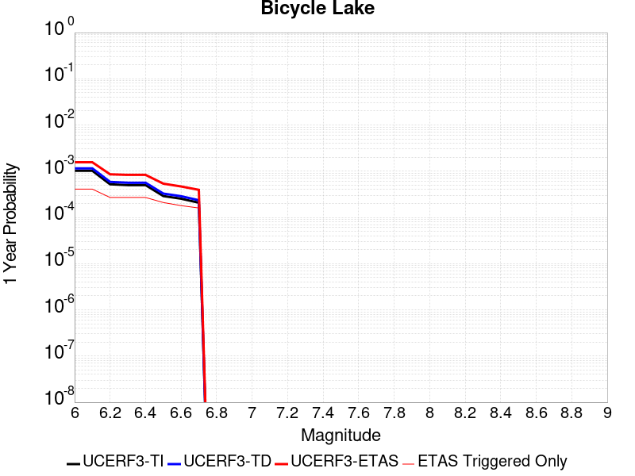 |  |

| Magnitude | 1 wk TI Prob | 1 wk TD Prob | 1 wk ETAS Prob | 1 wk ETAS/TD Gain | 1 wk ETAS Triggered Only | 1 mo TI Prob | 1 mo TD Prob | 1 mo ETAS Prob | 1 mo ETAS/TD Gain | 1 mo ETAS Triggered Only | 1 yr TI Prob | 1 yr TD Prob | 1 yr ETAS Prob | 1 yr ETAS/TD Gain | 1 yr ETAS Triggered Only | 10 yr TI Prob | 10 yr TD Prob | 10 yr ETAS Prob | 10 yr ETAS/TD Gain | 10 yr ETAS Triggered Only |
|-----|-----|-----|-----|-----|-----|-----|-----|-----|-----|-----|-----|-----|-----|-----|-----|-----|-----|-----|-----|-----|
| 6.0 | 1.9621975E-5 | 2.209766E-5 | 5.2096995E-5 | 2.35758 | 3.0E-5 | 8.4091465E-5 | 9.470158E-5 | 2.1469021E-4 | 2.2670183 | 1.2E-4 | 0.0010233327 | 0.0011525168 | 0.0015620443 | 1.3553332 | 4.1E-4 | 0.01018633 | 0.011478708 | 0.012338722 | 1.0749224 | 8.7E-4 |
| 6.1 | 1.9621975E-5 | 2.209766E-5 | 5.2096995E-5 | 2.35758 | 3.0E-5 | 8.4091465E-5 | 9.470158E-5 | 2.1469021E-4 | 2.2670183 | 1.2E-4 | 0.0010233327 | 0.0011525168 | 0.0015620443 | 1.3553332 | 4.1E-4 | 0.01018633 | 0.011478708 | 0.012338722 | 1.0749224 | 8.7E-4 |
| 6.2 | 9.9971285E-6 | 1.1255935E-5 | 4.1255596E-5 | 3.6652305 | 3.0E-5 | 4.2844134E-5 | 4.8239122E-5 | 1.3823478E-4 | 2.8656156 | 9.0E-5 | 5.2150246E-4 | 5.8720505E-4 | 8.570465E-4 | 1.4595354 | 2.7E-4 | 0.0052028033 | 0.00586164 | 0.0063686506 | 1.0864964 | 5.1E-4 |
| 6.3 | 9.589428E-6 | 1.079863E-5 | 4.0798306E-5 | 3.7781003 | 3.0E-5 | 4.10969E-5 | 4.6279314E-5 | 1.3627515E-4 | 2.9446235 | 9.0E-5 | 5.002399E-4 | 5.6335685E-4 | 8.332047E-4 | 1.479 | 2.7E-4 | 0.0049911533 | 0.005624377 | 0.006131509 | 1.0901667 | 5.1E-4 |
| 6.4 | 9.589428E-6 | 1.079863E-5 | 4.0798306E-5 | 3.7781003 | 3.0E-5 | 4.10969E-5 | 4.6279314E-5 | 1.3627515E-4 | 2.9446235 | 9.0E-5 | 5.002399E-4 | 5.6335685E-4 | 8.332047E-4 | 1.479 | 2.7E-4 | 0.0049911533 | 0.005624377 | 0.006131509 | 1.0901667 | 5.1E-4 |
| 6.5 | 5.557707E-6 | 6.285773E-6 | 2.6285647E-5 | 4.1817684 | 2.0E-5 | 2.3818526E-5 | 2.69389E-5 | 7.6937555E-5 | 2.856002 | 5.0E-5 | 2.8995197E-4 | 3.2795864E-4 | 5.378898E-4 | 1.6401147 | 2.1E-4 | 0.0028957394 | 0.0032773828 | 0.003636203 | 1.1094837 | 3.6E-4 |
| 6.6 | 4.8742945E-6 | 5.5134406E-6 | 1.5513386E-5 | 2.8137395 | 1.0E-5 | 2.0889667E-5 | 2.3628963E-5 | 6.362802E-5 | 2.6927977 | 4.0E-5 | 2.54302E-4 | 2.8767085E-4 | 4.6761907E-4 | 1.6255351 | 1.8E-4 | 0.002540112 | 0.0028755537 | 0.0032046048 | 1.1144305 | 3.3E-4 |
| 6.7 | 3.991108E-6 | 4.516034E-6 | 1.4515989E-5 | 3.2143223 | 1.0E-5 | 1.7104636E-5 | 1.9354431E-5 | 5.9353657E-5 | 3.0666702 | 4.0E-5 | 2.0822904E-4 | 2.3564021E-4 | 3.9560252E-4 | 1.6788412 | 1.6E-4 | 0.0020803404 | 0.002356402 | 0.0026457186 | 1.122779 | 2.9E-4 |

## San Andreas (San Bernardino S)
*[(top)](#table-of-contents)*

| 1 Week | 1 Month | 1 Year | 10 Year |
|-----|-----|-----|-----|
|  |  | 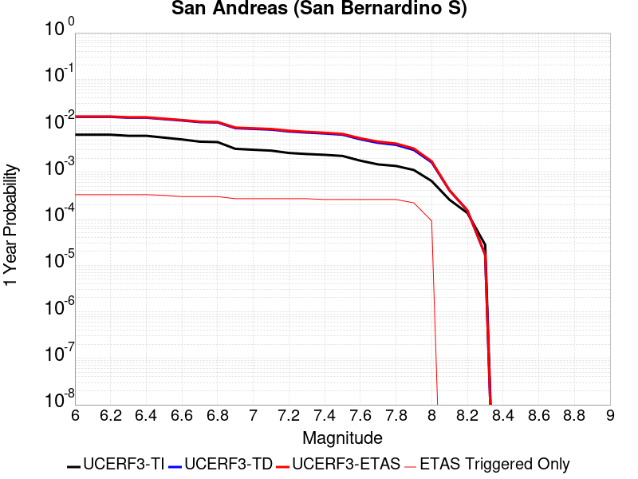 |  |

| Magnitude | 1 wk TI Prob | 1 wk TD Prob | 1 wk ETAS Prob | 1 wk ETAS/TD Gain | 1 wk ETAS Triggered Only | 1 mo TI Prob | 1 mo TD Prob | 1 mo ETAS Prob | 1 mo ETAS/TD Gain | 1 mo ETAS Triggered Only | 1 yr TI Prob | 1 yr TD Prob | 1 yr ETAS Prob | 1 yr ETAS/TD Gain | 1 yr ETAS Triggered Only | 10 yr TI Prob | 10 yr TD Prob | 10 yr ETAS Prob | 10 yr ETAS/TD Gain | 10 yr ETAS Triggered Only |
|-----|-----|-----|-----|-----|-----|-----|-----|-----|-----|-----|-----|-----|-----|-----|-----|-----|-----|-----|-----|-----|
| 6.0 | 1.2336002E-4 | 3.0011722E-4 | 3.5010223E-4 | 1.1665516 | 5.0E-5 | 5.2857865E-4 | 0.0012856087 | 0.0013854802 | 1.0776842 | 1.0E-4 | 0.006416472 | 0.015544911 | 0.015869781 | 1.0208988 | 3.3E-4 | 0.06234337 | 0.14286721 | 0.1435272 | 1.0046196 | 7.7E-4 |
| 6.1 | 1.2336002E-4 | 3.0011722E-4 | 3.5010223E-4 | 1.1665516 | 5.0E-5 | 5.2857865E-4 | 0.0012856087 | 0.0013854802 | 1.0776842 | 1.0E-4 | 0.006416472 | 0.015544911 | 0.015869781 | 1.0208988 | 3.3E-4 | 0.06234337 | 0.14286721 | 0.1435272 | 1.0046196 | 7.7E-4 |
| 6.2 | 1.2336002E-4 | 3.0011722E-4 | 3.5010223E-4 | 1.1665516 | 5.0E-5 | 5.2857865E-4 | 0.0012856087 | 0.0013854802 | 1.0776842 | 1.0E-4 | 0.006416472 | 0.015544911 | 0.015869781 | 1.0208988 | 3.3E-4 | 0.06234337 | 0.14286721 | 0.1435272 | 1.0046196 | 7.7E-4 |
| 6.3 | 1.1712257E-4 | 2.8799952E-4 | 3.379851E-4 | 1.1735615 | 5.0E-5 | 5.018573E-4 | 0.0012337255 | 0.0013336021 | 1.0809553 | 1.0E-4 | 0.006093008 | 0.014922001 | 0.015247078 | 1.021785 | 3.3E-4 | 0.059286322 | 0.13757558 | 0.13823102 | 1.0047642 | 7.6E-4 |
| 6.4 | 1.1712257E-4 | 2.8799952E-4 | 3.379851E-4 | 1.1735615 | 5.0E-5 | 5.018573E-4 | 0.0012337255 | 0.0013336021 | 1.0809553 | 1.0E-4 | 0.006093008 | 0.014922001 | 0.015247078 | 1.021785 | 3.3E-4 | 0.059286322 | 0.13757558 | 0.13823102 | 1.0047642 | 7.6E-4 |
| 6.5 | 1.0689076E-4 | 2.6812684E-4 | 3.1811342E-4 | 1.1864289 | 5.0E-5 | 4.5802278E-4 | 0.0011486337 | 0.0012485188 | 1.08696 | 1.0E-4 | 0.0055621783 | 0.013899562 | 0.0142151145 | 1.0227023 | 3.2E-4 | 0.05425003 | 0.12882262 | 0.12945859 | 1.0049367 | 7.3E-4 |
| 6.6 | 9.7648895E-5 | 2.5057374E-4 | 3.0056122E-4 | 1.1994921 | 5.0E-5 | 4.1842813E-4 | 0.0010734692 | 0.0011733618 | 1.093056 | 1.0E-4 | 0.005082469 | 0.012995533 | 0.013291635 | 1.0227848 | 3.0E-4 | 0.049677886 | 0.12098232 | 0.121597625 | 1.005086 | 7.0E-4 |
| 6.7 | 8.757013E-5 | 2.3128049E-4 | 2.812689E-4 | 1.2161378 | 5.0E-5 | 3.7524657E-4 | 9.908478E-4 | 0.0010907487 | 1.1008236 | 1.0E-4 | 0.00455906 | 0.0120009305 | 0.01229733 | 1.024698 | 3.0E-4 | 0.04466656 | 0.11229046 | 0.11290298 | 1.0054548 | 6.9E-4 |
| 6.8 | 8.562978E-5 | 2.2687875E-4 | 2.7686742E-4 | 1.220332 | 5.0E-5 | 3.6693315E-4 | 9.719974E-4 | 0.0010719002 | 1.1027809 | 1.0E-4 | 0.004458263 | 0.0117739225 | 0.01207039 | 1.02518 | 3.0E-4 | 0.043698758 | 0.11030059 | 0.11091449 | 1.0055656 | 6.9E-4 |
| 6.9 | 6.124075E-5 | 1.7072138E-4 | 2.2071286E-4 | 1.2928249 | 5.0E-5 | 2.6243398E-4 | 7.314588E-4 | 8.313856E-4 | 1.1366131 | 1.0E-4 | 0.0031904527 | 0.008869354 | 0.009136959 | 1.0301719 | 2.7E-4 | 0.031450346 | 0.08420983 | 0.08478678 | 1.0068513 | 6.3E-4 |
| 7.0 | 5.8598747E-5 | 1.6501089E-4 | 2.1500264E-4 | 1.3029603 | 5.0E-5 | 2.5111332E-4 | 7.069987E-4 | 8.06928E-4 | 1.141343 | 1.0E-4 | 0.0030530186 | 0.008573932 | 0.008841617 | 1.0312208 | 2.7E-4 | 0.03011414 | 0.08152735 | 0.082105994 | 1.0070975 | 6.3E-4 |
| 7.1 | 5.613814E-5 | 1.5919577E-4 | 2.0918781E-4 | 1.3140287 | 5.0E-5 | 2.4056983E-4 | 6.8208994E-4 | 7.820217E-4 | 1.1465082 | 1.0E-4 | 0.0029250039 | 0.0082730055 | 0.008540772 | 1.0323663 | 2.7E-4 | 0.028868021 | 0.078826115 | 0.079406455 | 1.0073622 | 6.3E-4 |
| 7.2 | 4.991222E-5 | 1.4525898E-4 | 1.9525172E-4 | 1.3441628 | 5.0E-5 | 2.1389198E-4 | 6.2239036E-4 | 7.2232814E-4 | 1.1605709 | 1.0E-4 | 0.002601025 | 0.007551378 | 0.007819339 | 1.035485 | 2.7E-4 | 0.025707912 | 0.0722795 | 0.07286396 | 1.0080862 | 6.3E-4 |
| 7.3 | 4.7410045E-5 | 1.371997E-4 | 1.8719284E-4 | 1.3643823 | 5.0E-5 | 2.0317009E-4 | 5.878666E-4 | 6.878078E-4 | 1.1700066 | 1.0E-4 | 0.0024707897 | 0.007133873 | 0.007401947 | 1.0375776 | 2.7E-4 | 0.024434982 | 0.06856146 | 0.06913895 | 1.008423 | 6.2E-4 |
| 7.4 | 4.5556746E-5 | 1.3127775E-4 | 1.8127119E-4 | 1.3808218 | 5.0E-5 | 1.952286E-4 | 5.6249794E-4 | 6.524473E-4 | 1.1599106 | 9.0E-5 | 0.002374317 | 0.0068269866 | 0.0070852116 | 1.0378242 | 2.6E-4 | 0.023491086 | 0.06581353 | 0.06637404 | 1.0085167 | 6.0E-4 |
| 7.5 | 4.3084514E-5 | 1.2362986E-4 | 1.7362367E-4 | 1.4043831 | 5.0E-5 | 1.8463485E-4 | 5.2973494E-4 | 6.1968726E-4 | 1.1698062 | 9.0E-5 | 0.0022456115 | 0.006430522 | 0.00668885 | 1.0401722 | 2.6E-4 | 0.022230545 | 0.062213875 | 0.06277654 | 1.0090442 | 6.0E-4 |
| 7.6 | 3.408608E-5 | 9.840787E-5 | 1.4840295E-4 | 1.5080395 | 5.0E-5 | 1.4607502E-4 | 4.2167996E-4 | 5.11642E-4 | 1.2133421 | 9.0E-5 | 0.0017770125 | 0.0051218937 | 0.005380562 | 1.0505024 | 2.6E-4 | 0.017628696 | 0.05004361 | 0.050604086 | 1.0111997 | 5.9E-4 |
| 7.7 | 2.8315713E-5 | 8.253626E-5 | 1.3253214E-4 | 1.6057444 | 5.0E-5 | 1.2134742E-4 | 3.536789E-4 | 4.4364706E-4 | 1.2543781 | 9.0E-5 | 0.0014764034 | 0.0042975475 | 0.0045564305 | 1.0602397 | 2.6E-4 | 0.01466633 | 0.042293478 | 0.042858522 | 1.0133601 | 5.9E-4 |
| 7.8 | 2.6222975E-5 | 7.467713E-5 | 1.246734E-4 | 1.669499 | 5.0E-5 | 1.1237934E-4 | 3.200056E-4 | 4.099768E-4 | 1.2811551 | 9.0E-5 | 0.0013673597 | 0.0038891144 | 0.0041481033 | 1.0665933 | 2.6E-4 | 0.013589768 | 0.038457487 | 0.03901518 | 1.0145016 | 5.8E-4 |
| 7.9 | 2.1469694E-5 | 5.7917237E-5 | 9.791492E-5 | 1.6906006 | 4.0E-5 | 9.200973E-5 | 2.4819313E-4 | 3.1817576E-4 | 1.2819685 | 7.0E-5 | 0.0011196428 | 0.0030175673 | 0.0032369036 | 1.0726864 | 2.2E-4 | 0.011140184 | 0.030169657 | 0.030644873 | 1.0157515 | 4.9E-4 |
| 8.0 | 1.2420249E-5 | 3.1340354E-5 | 4.134004E-5 | 1.3190675 | 1.0E-5 | 5.322855E-5 | 1.343089E-4 | 1.5430621E-4 | 1.1488905 | 2.0E-5 | 6.478649E-4 | 0.0016339853 | 0.0017238383 | 1.05499 | 9.0E-5 | 0.0064597935 | 0.016532484 | 0.016699674 | 1.0101128 | 1.7E-4 |
| 8.1 | 4.9197724E-6 | 7.830084E-6 | 7.830084E-6 | 1.0 | 0.0 | 2.1084568E-5 | 3.355707E-5 | 3.355707E-5 | 1.0 | 0.0 | 2.566744E-4 | 4.0848088E-4 | 4.0848088E-4 | 1.0 | 0.0 | 0.002563781 | 0.0043882565 | 0.0043882565 | 1.0 | 0.0 |
| 8.2 | 2.5634774E-6 | 2.9102962E-6 | 2.9102962E-6 | 1.0 | 0.0 | 1.0986286E-5 | 1.2472638E-5 | 1.2472638E-5 | 1.0 | 0.0 | 1.3374983E-4 | 1.5184384E-4 | 1.5184384E-4 | 1.0 | 0.0 | 0.0013366934 | 0.001706851 | 0.001706851 | 1.0 | 0.0 |
| 8.3 | 5.2850464E-7 | 3.2136995E-7 | 3.2136995E-7 | 1.0 | 0.0 | 2.2650179E-6 | 1.3772992E-6 | 1.3772992E-6 | 1.0 | 0.0 | 2.7576245E-5 | 1.6768501E-5 | 1.6768501E-5 | 1.0 | 0.0 | 2.7572823E-4 | 1.9897534E-4 | 1.9897534E-4 | 1.0 | 0.0 |

## Death Valley (Black Mtns Frontal)
*[(top)](#table-of-contents)*

| 1 Week | 1 Month | 1 Year | 10 Year |
|-----|-----|-----|-----|
|  |  |  |  |

| Magnitude | 1 wk TI Prob | 1 wk TD Prob | 1 wk ETAS Prob | 1 wk ETAS/TD Gain | 1 wk ETAS Triggered Only | 1 mo TI Prob | 1 mo TD Prob | 1 mo ETAS Prob | 1 mo ETAS/TD Gain | 1 mo ETAS Triggered Only | 1 yr TI Prob | 1 yr TD Prob | 1 yr ETAS Prob | 1 yr ETAS/TD Gain | 1 yr ETAS Triggered Only | 10 yr TI Prob | 10 yr TD Prob | 10 yr ETAS Prob | 10 yr ETAS/TD Gain | 10 yr ETAS Triggered Only |
|-----|-----|-----|-----|-----|-----|-----|-----|-----|-----|-----|-----|-----|-----|-----|-----|-----|-----|-----|-----|-----|
| 6.0 | 1.6707214E-5 | 1.8670728E-5 | 2.867054E-5 | 1.5355878 | 1.0E-5 | 7.160038E-5 | 8.0014994E-5 | 1.3001099E-4 | 1.6248329 | 5.0E-5 | 8.71386E-4 | 9.7375474E-4 | 0.0012734627 | 1.3077857 | 3.0E-4 | 0.00867977 | 0.009695734 | 0.010319625 | 1.064347 | 6.3E-4 |
| 6.1 | 1.6707214E-5 | 1.8670728E-5 | 2.867054E-5 | 1.5355878 | 1.0E-5 | 7.160038E-5 | 8.0014994E-5 | 1.3001099E-4 | 1.6248329 | 5.0E-5 | 8.71386E-4 | 9.7375474E-4 | 0.0012734627 | 1.3077857 | 3.0E-4 | 0.00867977 | 0.009695734 | 0.010319625 | 1.064347 | 6.3E-4 |
| 6.2 | 1.6707214E-5 | 1.8670728E-5 | 2.867054E-5 | 1.5355878 | 1.0E-5 | 7.160038E-5 | 8.0014994E-5 | 1.3001099E-4 | 1.6248329 | 5.0E-5 | 8.71386E-4 | 9.7375474E-4 | 0.0012734627 | 1.3077857 | 3.0E-4 | 0.00867977 | 0.009695734 | 0.010319625 | 1.064347 | 6.3E-4 |
| 6.3 | 1.6707214E-5 | 1.8670728E-5 | 2.867054E-5 | 1.5355878 | 1.0E-5 | 7.160038E-5 | 8.0014994E-5 | 1.3001099E-4 | 1.6248329 | 5.0E-5 | 8.71386E-4 | 9.7375474E-4 | 0.0012734627 | 1.3077857 | 3.0E-4 | 0.00867977 | 0.009695734 | 0.010319625 | 1.064347 | 6.3E-4 |
| 6.4 | 1.5515609E-5 | 1.733864E-5 | 1.733864E-5 | 1.0 | 0.0 | 6.649377E-5 | 7.430637E-5 | 1.14303395E-4 | 1.5382719 | 4.0E-5 | 8.0926094E-4 | 9.0431067E-4 | 0.0011740666 | 1.2982999 | 2.7E-4 | 0.008063202 | 0.009006993 | 0.009591679 | 1.0649147 | 5.9E-4 |
| 6.5 | 1.5515609E-5 | 1.733864E-5 | 1.733864E-5 | 1.0 | 0.0 | 6.649377E-5 | 7.430637E-5 | 1.14303395E-4 | 1.5382719 | 4.0E-5 | 8.0926094E-4 | 9.0431067E-4 | 0.0011740666 | 1.2982999 | 2.7E-4 | 0.008063202 | 0.009006993 | 0.009591679 | 1.0649147 | 5.9E-4 |
| 6.6 | 1.5041828E-5 | 1.6809558E-5 | 1.6809558E-5 | 1.0 | 0.0 | 6.4463384E-5 | 7.2039E-5 | 1.0203684E-4 | 1.416411 | 3.0E-5 | 7.8455906E-4 | 8.7672786E-4 | 0.0011265087 | 1.2849013 | 2.5E-4 | 0.00781795 | 0.008733346 | 0.00926863 | 1.0612919 | 5.4E-4 |
| 6.7 | 1.4634985E-5 | 1.6356418E-5 | 1.6356418E-5 | 1.0 | 0.0 | 6.271985E-5 | 7.0097085E-5 | 1.00094985E-4 | 1.4279479 | 3.0E-5 | 7.6334673E-4 | 8.5310364E-4 | 0.0010829074 | 1.2693738 | 2.3E-4 | 0.007607299 | 0.008498924 | 0.008994674 | 1.058331 | 5.0E-4 |
| 6.8 | 1.4209158E-5 | 1.5882439E-5 | 1.5882439E-5 | 1.0 | 0.0 | 6.089497E-5 | 6.806585E-5 | 9.806381E-5 | 1.4407196 | 3.0E-5 | 7.4114406E-4 | 8.283923E-4 | 0.00104821 | 1.2653546 | 2.2E-4 | 0.007386771 | 0.008253658 | 0.00868011 | 1.0516682 | 4.3E-4 |
| 6.9 | 1.3780098E-5 | 1.5404972E-5 | 1.5404972E-5 | 1.0 | 0.0 | 5.9056227E-5 | 6.6019675E-5 | 9.601769E-5 | 1.45438 | 3.0E-5 | 7.1877235E-4 | 8.0349855E-4 | 0.0010033378 | 1.2487115 | 2.0E-4 | 0.0071645193 | 0.008006529 | 0.008403326 | 1.0495592 | 4.0E-4 |
| 7.0 | 1.3585064E-5 | 1.518853E-5 | 1.518853E-5 | 1.0 | 0.0 | 5.8220405E-5 | 6.509211E-5 | 8.50908E-5 | 1.3072369 | 2.0E-5 | 7.086029E-4 | 7.922137E-4 | 9.7207114E-4 | 1.2270315 | 1.8E-4 | 0.007063476 | 0.007894488 | 0.008251646 | 1.0452415 | 3.6E-4 |
| 7.1 | 1.3398601E-5 | 1.498171E-5 | 1.498171E-5 | 1.0 | 0.0 | 5.742131E-5 | 6.420578E-5 | 8.420449E-5 | 1.3114785 | 2.0E-5 | 6.9888023E-4 | 7.8143046E-4 | 9.2132104E-4 | 1.1790186 | 1.4E-4 | 0.0069668638 | 0.0077874158 | 0.008104924 | 1.040772 | 3.2E-4 |
| 7.2 | 1.3126312E-5 | 1.4679924E-5 | 1.4679924E-5 | 1.0 | 0.0 | 5.6254412E-5 | 6.291247E-5 | 8.291122E-5 | 1.317882 | 2.0E-5 | 6.846822E-4 | 7.6569564E-4 | 8.856037E-4 | 1.1566002 | 1.2E-4 | 0.006825765 | 0.007631158 | 0.007909021 | 1.0364116 | 2.8E-4 |
| 7.3 | 1.2922429E-5 | 1.4454146E-5 | 1.4454146E-5 | 1.0 | 0.0 | 5.5380664E-5 | 6.19449E-5 | 8.194366E-5 | 1.3228476 | 2.0E-5 | 6.74051E-4 | 7.539236E-4 | 8.638407E-4 | 1.1457933 | 1.1E-4 | 0.006720101 | 0.00751424 | 0.0077722864 | 1.034341 | 2.6E-4 |
| 7.4 | 1.2768878E-5 | 1.4284125E-5 | 1.4284125E-5 | 1.0 | 0.0 | 5.4722615E-5 | 6.121628E-5 | 8.1215054E-5 | 1.3266906 | 2.0E-5 | 6.660441E-4 | 7.450587E-4 | 8.5497677E-4 | 1.1475294 | 1.1E-4 | 0.0066405144 | 0.007426187 | 0.0076842564 | 1.0347513 | 2.6E-4 |
| 7.5 | 1.2521929E-5 | 1.4012364E-5 | 1.4012364E-5 | 1.0 | 0.0 | 5.366431E-5 | 6.0051636E-5 | 8.0050435E-5 | 1.3330268 | 2.0E-5 | 6.531671E-4 | 7.308888E-4 | 8.3081576E-4 | 1.1367197 | 1.0E-4 | 0.006512506 | 0.0072854264 | 0.007533605 | 1.0340651 | 2.5E-4 |
| 7.6 | 1.1301089E-5 | 1.2648464E-5 | 1.2648464E-5 | 1.0 | 0.0 | 4.8432343E-5 | 5.420661E-5 | 7.420552E-5 | 1.3689387 | 2.0E-5 | 5.895042E-4 | 6.597709E-4 | 7.4971153E-4 | 1.136321 | 9.0E-5 | 0.0058794282 | 0.0065786736 | 0.006797226 | 1.0332214 | 2.2E-4 |
| 7.7 | 9.189108E-6 | 1.0283615E-5 | 1.0283615E-5 | 1.0 | 0.0 | 3.93813E-5 | 4.4071916E-5 | 6.4071035E-5 | 1.4537838 | 2.0E-5 | 4.7936183E-4 | 5.364485E-4 | 6.0641096E-4 | 1.1304178 | 7.0E-5 | 0.004783291 | 0.005352047 | 0.0055012438 | 1.0278766 | 1.5E-4 |
| 7.8 | 3.4586725E-7 | 3.6483033E-7 | 3.6483033E-7 | 1.0 | 0.0 | 1.4822873E-6 | 1.5635576E-6 | 1.1563542E-5 | 7.395661 | 1.0E-5 | 1.80467E-5 | 1.9036152E-5 | 2.9035962E-5 | 1.5253062 | 1.0E-5 | 1.8045233E-4 | 1.9034566E-4 | 2.0034375E-4 | 1.052526 | 1.0E-5 |
| 7.9 | 2.5591178E-9 | 2.6696958E-9 | 2.6696958E-9 | 1.0 | 0.0 | 1.0967647E-8 | 1.14415535E-8 | 1.14415535E-8 | 1.0 | 0.0 | 1.335311E-7 | 1.3930091E-7 | 1.3930091E-7 | 1.0 | 0.0 | 1.3353102E-6 | 1.3930091E-6 | 1.3930091E-6 | 1.0 | 0.0 |

## Garlic Springs
*[(top)](#table-of-contents)*

| 1 Week | 1 Month | 1 Year | 10 Year |
|-----|-----|-----|-----|
|  |  |  |  |

| Magnitude | 1 wk TI Prob | 1 wk TD Prob | 1 wk ETAS Prob | 1 wk ETAS/TD Gain | 1 wk ETAS Triggered Only | 1 mo TI Prob | 1 mo TD Prob | 1 mo ETAS Prob | 1 mo ETAS/TD Gain | 1 mo ETAS Triggered Only | 1 yr TI Prob | 1 yr TD Prob | 1 yr ETAS Prob | 1 yr ETAS/TD Gain | 1 yr ETAS Triggered Only | 10 yr TI Prob | 10 yr TD Prob | 10 yr ETAS Prob | 10 yr ETAS/TD Gain | 10 yr ETAS Triggered Only |
|-----|-----|-----|-----|-----|-----|-----|-----|-----|-----|-----|-----|-----|-----|-----|-----|-----|-----|-----|-----|-----|
| 6.0 | 1.6760017E-5 | 1.8777304E-5 | 2.8777116E-5 | 1.5325478 | 1.0E-5 | 7.182667E-5 | 8.047234E-5 | 1.3046831E-4 | 1.6212815 | 5.0E-5 | 8.7413884E-4 | 9.794277E-4 | 0.0011892221 | 1.214201 | 2.1E-4 | 0.008707083 | 0.009762657 | 0.010307288 | 1.0557871 | 5.5E-4 |
| 6.1 | 9.852767E-6 | 1.0973848E-5 | 1.0973848E-5 | 1.0 | 0.0 | 4.222546E-5 | 4.7030324E-5 | 6.702939E-5 | 1.4252375 | 2.0E-5 | 5.139737E-4 | 5.725147E-4 | 6.424747E-4 | 1.1221976 | 7.0E-5 | 0.005127866 | 0.0057173567 | 0.0060156416 | 1.0521718 | 3.0E-4 |
| 6.2 | 9.852767E-6 | 1.0973848E-5 | 1.0973848E-5 | 1.0 | 0.0 | 4.222546E-5 | 4.7030324E-5 | 6.702939E-5 | 1.4252375 | 2.0E-5 | 5.139737E-4 | 5.725147E-4 | 6.424747E-4 | 1.1221976 | 7.0E-5 | 0.005127866 | 0.0057173567 | 0.0060156416 | 1.0521718 | 3.0E-4 |
| 6.3 | 4.3167724E-6 | 4.778135E-6 | 4.778135E-6 | 1.0 | 0.0 | 1.8500323E-5 | 2.047769E-5 | 3.0477486E-5 | 1.4883263 | 1.0E-5 | 2.2521814E-4 | 2.493104E-4 | 2.693054E-4 | 1.0802013 | 2.0E-5 | 0.0022499003 | 0.0024925654 | 0.0026521666 | 1.0640309 | 1.6E-4 |
| 6.4 | 4.3167724E-6 | 4.778135E-6 | 4.778135E-6 | 1.0 | 0.0 | 1.8500323E-5 | 2.047769E-5 | 3.0477486E-5 | 1.4883263 | 1.0E-5 | 2.2521814E-4 | 2.493104E-4 | 2.693054E-4 | 1.0802013 | 2.0E-5 | 0.0022499003 | 0.0024925654 | 0.0026521666 | 1.0640309 | 1.6E-4 |
| 6.5 | 4.3167724E-6 | 4.778135E-6 | 4.778135E-6 | 1.0 | 0.0 | 1.8500323E-5 | 2.047769E-5 | 3.0477486E-5 | 1.4883263 | 1.0E-5 | 2.2521814E-4 | 2.493104E-4 | 2.693054E-4 | 1.0802013 | 2.0E-5 | 0.0022499003 | 0.0024925654 | 0.0026521666 | 1.0640309 | 1.6E-4 |
| 6.6 | 4.301311E-6 | 4.761003E-6 | 4.761003E-6 | 1.0 | 0.0 | 1.8434059E-5 | 2.040427E-5 | 3.0404066E-5 | 1.4900836 | 1.0E-5 | 2.2441156E-4 | 2.4841668E-4 | 2.684117E-4 | 1.0804899 | 2.0E-5 | 0.0022418506 | 0.0024836485 | 0.002643251 | 1.0642613 | 1.6E-4 |
| 6.7 | 3.8599724E-6 | 4.2711545E-6 | 4.2711545E-6 | 1.0 | 0.0 | 1.6542634E-5 | 1.8304949E-5 | 2.8304765E-5 | 1.5462904 | 1.0E-5 | 2.0138794E-4 | 2.2286274E-4 | 2.428583E-4 | 1.0897213 | 2.0E-5 | 0.0020120554 | 0.0022286274 | 0.0023683154 | 1.0626789 | 1.4E-4 |

## Helendale-So Lockhart
*[(top)](#table-of-contents)*

| 1 Week | 1 Month | 1 Year | 10 Year |
|-----|-----|-----|-----|
|  |  |  | 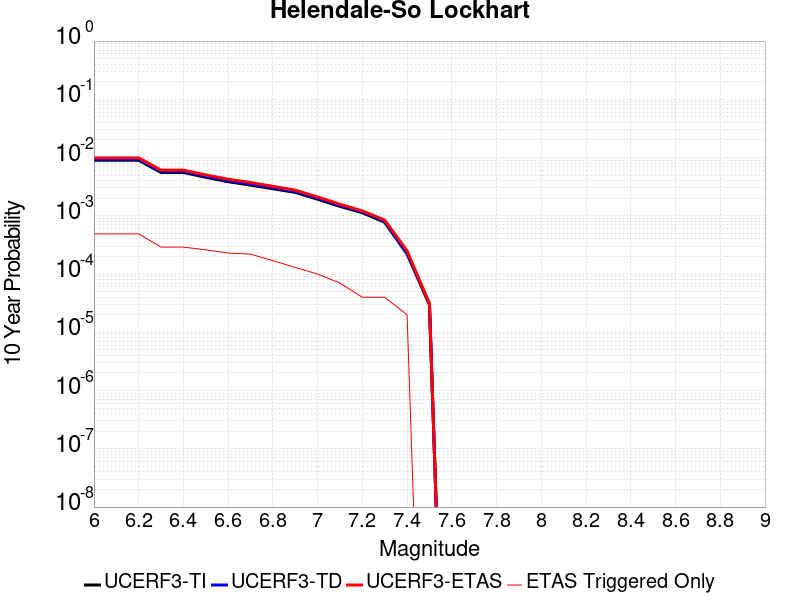 |

| Magnitude | 1 wk TI Prob | 1 wk TD Prob | 1 wk ETAS Prob | 1 wk ETAS/TD Gain | 1 wk ETAS Triggered Only | 1 mo TI Prob | 1 mo TD Prob | 1 mo ETAS Prob | 1 mo ETAS/TD Gain | 1 mo ETAS Triggered Only | 1 yr TI Prob | 1 yr TD Prob | 1 yr ETAS Prob | 1 yr ETAS/TD Gain | 1 yr ETAS Triggered Only | 10 yr TI Prob | 10 yr TD Prob | 10 yr ETAS Prob | 10 yr ETAS/TD Gain | 10 yr ETAS Triggered Only |
|-----|-----|-----|-----|-----|-----|-----|-----|-----|-----|-----|-----|-----|-----|-----|-----|-----|-----|-----|-----|-----|
| 6.0 | 1.7296055E-5 | 1.8103907E-5 | 4.8103364E-5 | 2.6570709 | 3.0E-5 | 7.412385E-5 | 7.758598E-5 | 1.3758132E-4 | 1.7732756 | 6.0E-5 | 9.0208417E-4 | 9.4422064E-4 | 0.0011640129 | 1.2327764 | 2.2E-4 | 0.008984311 | 0.009404208 | 0.0098896 | 1.0516143 | 4.9E-4 |
| 6.1 | 1.7296055E-5 | 1.8103907E-5 | 4.8103364E-5 | 2.6570709 | 3.0E-5 | 7.412385E-5 | 7.758598E-5 | 1.3758132E-4 | 1.7732756 | 6.0E-5 | 9.0208417E-4 | 9.4422064E-4 | 0.0011640129 | 1.2327764 | 2.2E-4 | 0.008984311 | 0.009404208 | 0.0098896 | 1.0516143 | 4.9E-4 |
| 6.2 | 1.7296055E-5 | 1.8103907E-5 | 4.8103364E-5 | 2.6570709 | 3.0E-5 | 7.412385E-5 | 7.758598E-5 | 1.3758132E-4 | 1.7732756 | 6.0E-5 | 9.0208417E-4 | 9.4422064E-4 | 0.0011640129 | 1.2327764 | 2.2E-4 | 0.008984311 | 0.009404208 | 0.0098896 | 1.0516143 | 4.9E-4 |
| 6.3 | 1.0669118E-5 | 1.1135526E-5 | 4.113519E-5 | 3.69405 | 3.0E-5 | 4.5723988E-5 | 4.7722824E-5 | 9.772044E-5 | 2.0476668 | 5.0E-5 | 5.5654737E-4 | 5.808733E-4 | 7.107978E-4 | 1.223671 | 1.3E-4 | 0.0055515557 | 0.005793846 | 0.006082166 | 1.0497631 | 2.9E-4 |
| 6.4 | 1.0669118E-5 | 1.1135526E-5 | 4.113519E-5 | 3.69405 | 3.0E-5 | 4.5723988E-5 | 4.7722824E-5 | 9.772044E-5 | 2.0476668 | 5.0E-5 | 5.5654737E-4 | 5.808733E-4 | 7.107978E-4 | 1.223671 | 1.3E-4 | 0.0055515557 | 0.005793846 | 0.006082166 | 1.0497631 | 2.9E-4 |
| 6.5 | 8.790038E-6 | 9.17028E-6 | 3.9170005E-5 | 4.271408 | 3.0E-5 | 3.767105E-5 | 3.9300616E-5 | 8.929865E-5 | 2.2721946 | 5.0E-5 | 4.585485E-4 | 4.783815E-4 | 5.9832406E-4 | 1.2507259 | 1.2E-4 | 0.0045760344 | 0.0047736815 | 0.00503244 | 1.0542053 | 2.6E-4 |
| 6.6 | 7.396949E-6 | 7.715606E-6 | 3.7715374E-5 | 4.888193 | 3.0E-5 | 3.1700827E-5 | 3.306647E-5 | 8.306482E-5 | 2.5120556 | 5.0E-5 | 3.858892E-4 | 4.0251092E-4 | 5.2246265E-4 | 1.2980086 | 1.2E-4 | 0.003852198 | 0.004017926 | 0.004247002 | 1.0570135 | 2.3E-4 |
| 6.7 | 6.4600285E-6 | 6.7380915E-6 | 2.6737956E-5 | 3.9681795 | 2.0E-5 | 2.7685543E-5 | 2.887722E-5 | 6.887606E-5 | 2.385135 | 4.0E-5 | 3.3701936E-4 | 3.515242E-4 | 4.6148556E-4 | 1.3128129 | 1.1E-4 | 0.0033650869 | 0.0035097634 | 0.0037289914 | 1.0624623 | 2.2E-4 |
| 6.8 | 5.600104E-6 | 5.8360606E-6 | 5.8360606E-6 | 1.0 | 0.0 | 2.4000226E-5 | 2.5011452E-5 | 3.5011202E-5 | 1.3998069 | 1.0E-5 | 2.9216358E-4 | 3.044725E-4 | 3.7445116E-4 | 1.2298359 | 7.0E-5 | 0.0029177975 | 0.0030406148 | 0.0032100978 | 1.0557398 | 1.7E-4 |
| 6.9 | 4.839122E-6 | 5.039553E-6 | 5.039553E-6 | 1.0 | 0.0 | 2.0738931E-5 | 2.1597907E-5 | 3.159769E-5 | 1.4629978 | 1.0E-5 | 2.5246723E-4 | 2.6292325E-4 | 3.2290746E-4 | 1.2281435 | 6.0E-5 | 0.002521806 | 0.0026261695 | 0.002755828 | 1.0493717 | 1.3E-4 |
| 7.0 | 3.6937633E-6 | 3.845241E-6 | 3.845241E-6 | 1.0 | 0.0 | 1.5830317E-5 | 1.6479502E-5 | 1.6479502E-5 | 1.0 | 0.0 | 1.9271708E-4 | 2.0061978E-4 | 2.3061375E-4 | 1.1495066 | 3.0E-5 | 0.0019255003 | 0.002004418 | 0.0021042177 | 1.0497898 | 1.0E-4 |
| 7.1 | 2.7858857E-6 | 2.8978782E-6 | 2.8978782E-6 | 1.0 | 0.0 | 1.1939455E-5 | 1.2419419E-5 | 1.2419419E-5 | 1.0 | 0.0 | 1.4535317E-4 | 1.5119616E-4 | 1.7119314E-4 | 1.1322585 | 2.0E-5 | 0.0014525814 | 0.0015109545 | 0.0015808486 | 1.0462583 | 7.0E-5 |
| 7.2 | 2.1672065E-6 | 2.2540316E-6 | 2.2540316E-6 | 1.0 | 0.0 | 9.2879945E-6 | 9.660101E-6 | 9.660101E-6 | 1.0 | 0.0 | 1.1307546E-4 | 1.1760556E-4 | 1.2760439E-4 | 1.08502 | 1.0E-5 | 0.0011301794 | 0.0011754514 | 0.0012154045 | 1.0339894 | 4.0E-5 |
| 7.3 | 1.4823496E-6 | 1.5422232E-6 | 1.5422232E-6 | 1.0 | 0.0 | 6.3529114E-6 | 6.609512E-6 | 6.609512E-6 | 1.0 | 0.0 | 7.734395E-5 | 8.0467995E-5 | 9.046718E-5 | 1.124263 | 1.0E-5 | 7.731704E-4 | 8.044036E-4 | 8.4437145E-4 | 1.0496863 | 4.0E-5 |
| 7.4 | 4.2321457E-7 | 4.4109154E-7 | 4.4109154E-7 | 1.0 | 0.0 | 1.8137755E-6 | 1.8903912E-6 | 1.8903912E-6 | 1.0 | 0.0 | 2.2082493E-5 | 2.3015316E-5 | 2.3015316E-5 | 1.0 | 0.0 | 2.2080299E-4 | 2.3013385E-4 | 2.5012923E-4 | 1.0868859 | 2.0E-5 |
| 7.5 | 5.6942316E-8 | 5.9416184E-8 | 5.9416184E-8 | 1.0 | 0.0 | 2.440385E-7 | 2.5464078E-7 | 2.5464078E-7 | 1.0 | 0.0 | 2.9711643E-6 | 3.1002478E-6 | 3.1002478E-6 | 1.0 | 0.0 | 2.9711247E-5 | 3.1002124E-5 | 3.1002124E-5 | 1.0 | 0.0 |

## Coyote Lake
*[(top)](#table-of-contents)*

| 1 Week | 1 Month | 1 Year | 10 Year |
|-----|-----|-----|-----|
|  |  |  |  |

| Magnitude | 1 wk TI Prob | 1 wk TD Prob | 1 wk ETAS Prob | 1 wk ETAS/TD Gain | 1 wk ETAS Triggered Only | 1 mo TI Prob | 1 mo TD Prob | 1 mo ETAS Prob | 1 mo ETAS/TD Gain | 1 mo ETAS Triggered Only | 1 yr TI Prob | 1 yr TD Prob | 1 yr ETAS Prob | 1 yr ETAS/TD Gain | 1 yr ETAS Triggered Only | 10 yr TI Prob | 10 yr TD Prob | 10 yr ETAS Prob | 10 yr ETAS/TD Gain | 10 yr ETAS Triggered Only |
|-----|-----|-----|-----|-----|-----|-----|-----|-----|-----|-----|-----|-----|-----|-----|-----|-----|-----|-----|-----|-----|
| 6.0 | 1.980352E-5 | 2.170718E-5 | 2.170718E-5 | 1.0 | 0.0 | 8.486947E-5 | 9.302786E-5 | 1.3302414E-4 | 1.4299387 | 4.0E-5 | 0.0010327959 | 0.0011320977 | 0.0013019053 | 1.1499937 | 1.7E-4 | 0.010280091 | 0.011270483 | 0.0116857495 | 1.0368454 | 4.2E-4 |
| 6.1 | 1.980352E-5 | 2.170718E-5 | 2.170718E-5 | 1.0 | 0.0 | 8.486947E-5 | 9.302786E-5 | 1.3302414E-4 | 1.4299387 | 4.0E-5 | 0.0010327959 | 0.0011320977 | 0.0013019053 | 1.1499937 | 1.7E-4 | 0.010280091 | 0.011270483 | 0.0116857495 | 1.0368454 | 4.2E-4 |
| 6.2 | 1.980352E-5 | 2.170718E-5 | 2.170718E-5 | 1.0 | 0.0 | 8.486947E-5 | 9.302786E-5 | 1.3302414E-4 | 1.4299387 | 4.0E-5 | 0.0010327959 | 0.0011320977 | 0.0013019053 | 1.1499937 | 1.7E-4 | 0.010280091 | 0.011270483 | 0.0116857495 | 1.0368454 | 4.2E-4 |
| 6.3 | 1.5344787E-5 | 1.6821006E-5 | 1.6821006E-5 | 1.0 | 0.0 | 6.576172E-5 | 7.208838E-5 | 1.0208622E-4 | 1.4161258 | 3.0E-5 | 8.003548E-4 | 8.7738386E-4 | 0.0010072698 | 1.1480378 | 1.3E-4 | 0.007974784 | 0.008745244 | 0.009092183 | 1.0396718 | 3.5E-4 |
| 6.4 | 1.5344787E-5 | 1.6821006E-5 | 1.6821006E-5 | 1.0 | 0.0 | 6.576172E-5 | 7.208838E-5 | 1.0208622E-4 | 1.4161258 | 3.0E-5 | 8.003548E-4 | 8.7738386E-4 | 0.0010072698 | 1.1480378 | 1.3E-4 | 0.007974784 | 0.008745244 | 0.009092183 | 1.0396718 | 3.5E-4 |
| 6.5 | 1.4189697E-5 | 1.55583E-5 | 1.55583E-5 | 1.0 | 0.0 | 6.081157E-5 | 6.6677065E-5 | 9.667506E-5 | 1.4498998 | 3.0E-5 | 7.401293E-4 | 8.115512E-4 | 9.414457E-4 | 1.1600571 | 1.3E-4 | 0.0073766913 | 0.008091819 | 0.008438986 | 1.0429035 | 3.5E-4 |
| 6.6 | 1.3469301E-5 | 1.4771875E-5 | 1.4771875E-5 | 1.0 | 0.0 | 5.7724297E-5 | 6.330684E-5 | 9.330494E-5 | 1.4738525 | 3.0E-5 | 7.025667E-4 | 7.705482E-4 | 9.00448E-4 | 1.168581 | 1.3E-4 | 0.0070034964 | 0.0076846685 | 0.008031979 | 1.0451952 | 3.5E-4 |
| 6.7 | 1.3027966E-5 | 1.4282032E-5 | 1.4282032E-5 | 1.0 | 0.0 | 5.5832945E-5 | 6.120761E-5 | 9.120577E-5 | 1.4901052 | 3.0E-5 | 6.7955407E-4 | 7.450076E-4 | 8.7491074E-4 | 1.1743649 | 1.3E-4 | 0.006774798 | 0.0074309777 | 0.007758525 | 1.0440787 | 3.3E-4 |
| 6.8 | 5.695434E-6 | 6.224538E-6 | 6.224538E-6 | 1.0 | 0.0 | 2.4408775E-5 | 2.667649E-5 | 2.667649E-5 | 1.0 | 0.0 | 2.971363E-4 | 3.2476784E-4 | 3.6475484E-4 | 1.123125 | 4.0E-5 | 0.0029673933 | 0.0032458731 | 0.0033256134 | 1.0245667 | 8.0E-5 |
| 6.9 | 4.385688E-6 | 4.793148E-6 | 4.793148E-6 | 1.0 | 0.0 | 1.879567E-5 | 2.0542064E-5 | 2.0542064E-5 | 1.0 | 0.0 | 2.2881327E-4 | 2.5009963E-4 | 2.6009712E-4 | 1.0399741 | 1.0E-5 | 0.002285778 | 0.0025009962 | 0.002550871 | 1.019942 | 5.0E-5 |

## San Andreas (Big Bend)
*[(top)](#table-of-contents)*

| 1 Week | 1 Month | 1 Year | 10 Year |
|-----|-----|-----|-----|
|  |  | 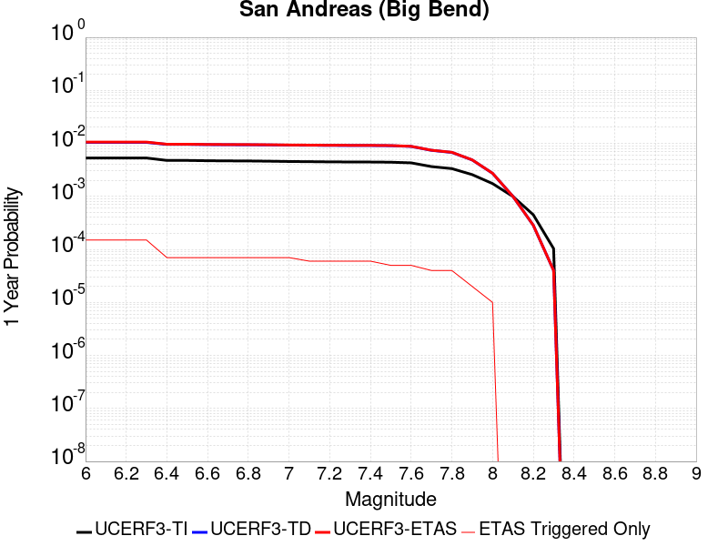 |  |

| Magnitude | 1 wk TI Prob | 1 wk TD Prob | 1 wk ETAS Prob | 1 wk ETAS/TD Gain | 1 wk ETAS Triggered Only | 1 mo TI Prob | 1 mo TD Prob | 1 mo ETAS Prob | 1 mo ETAS/TD Gain | 1 mo ETAS Triggered Only | 1 yr TI Prob | 1 yr TD Prob | 1 yr ETAS Prob | 1 yr ETAS/TD Gain | 1 yr ETAS Triggered Only | 10 yr TI Prob | 10 yr TD Prob | 10 yr ETAS Prob | 10 yr ETAS/TD Gain | 10 yr ETAS Triggered Only |
|-----|-----|-----|-----|-----|-----|-----|-----|-----|-----|-----|-----|-----|-----|-----|-----|-----|-----|-----|-----|-----|
| 6.0 | 1.0179969E-4 | 2.0085607E-4 | 2.1085406E-4 | 1.0497769 | 1.0E-5 | 4.362114E-4 | 8.605288E-4 | 9.0049434E-4 | 1.0464431 | 4.0E-5 | 0.0052979486 | 0.010426893 | 0.010575329 | 1.0142359 | 1.5E-4 | 0.051734097 | 0.10150713 | 0.10186653 | 1.0035406 | 4.0E-4 |
| 6.1 | 1.0179969E-4 | 2.0085607E-4 | 2.1085406E-4 | 1.0497769 | 1.0E-5 | 4.362114E-4 | 8.605288E-4 | 9.0049434E-4 | 1.0464431 | 4.0E-5 | 0.0052979486 | 0.010426893 | 0.010575329 | 1.0142359 | 1.5E-4 | 0.051734097 | 0.10150713 | 0.10186653 | 1.0035406 | 4.0E-4 |
| 6.2 | 1.0179969E-4 | 2.0085607E-4 | 2.1085406E-4 | 1.0497769 | 1.0E-5 | 4.362114E-4 | 8.605288E-4 | 9.0049434E-4 | 1.0464431 | 4.0E-5 | 0.0052979486 | 0.010426893 | 0.010575329 | 1.0142359 | 1.5E-4 | 0.051734097 | 0.10150713 | 0.10186653 | 1.0035406 | 4.0E-4 |
| 6.3 | 1.0179969E-4 | 2.0085607E-4 | 2.1085406E-4 | 1.0497769 | 1.0E-5 | 4.362114E-4 | 8.605288E-4 | 9.0049434E-4 | 1.0464431 | 4.0E-5 | 0.0052979486 | 0.010426893 | 0.010575329 | 1.0142359 | 1.5E-4 | 0.051734097 | 0.10150713 | 0.10186653 | 1.0035406 | 4.0E-4 |
| 6.4 | 9.1639464E-5 | 1.8442617E-4 | 1.9442433E-4 | 1.0542122 | 1.0E-5 | 3.9268145E-4 | 7.901587E-4 | 8.101429E-4 | 1.0252913 | 2.0E-5 | 0.0047704205 | 0.009577866 | 0.009647195 | 1.0072385 | 7.0E-5 | 0.046693064 | 0.09383273 | 0.09406833 | 1.0025109 | 2.6E-4 |
| 6.5 | 9.1639464E-5 | 1.8442617E-4 | 1.9442433E-4 | 1.0542122 | 1.0E-5 | 3.9268145E-4 | 7.901587E-4 | 8.101429E-4 | 1.0252913 | 2.0E-5 | 0.0047704205 | 0.009577866 | 0.009647195 | 1.0072385 | 7.0E-5 | 0.046693064 | 0.09383273 | 0.09406833 | 1.0025109 | 2.6E-4 |
| 6.6 | 9.042622E-5 | 1.8249643E-4 | 1.924946E-4 | 1.0547856 | 1.0E-5 | 3.8748336E-4 | 7.818933E-4 | 8.018777E-4 | 1.025559 | 2.0E-5 | 0.0047074095 | 0.009478113 | 0.009547449 | 1.0073154 | 7.0E-5 | 0.046089325 | 0.09292665 | 0.09316249 | 1.0025378 | 2.6E-4 |
| 6.7 | 8.9836685E-5 | 1.8163968E-4 | 1.9163785E-4 | 1.055044 | 1.0E-5 | 3.8495753E-4 | 7.7822374E-4 | 7.982082E-4 | 1.0256796 | 2.0E-5 | 0.00467679 | 0.009433822 | 0.009503162 | 1.0073501 | 7.0E-5 | 0.045795817 | 0.0925209 | 0.092756845 | 1.0025501 | 2.6E-4 |
| 6.8 | 8.9471854E-5 | 1.8110737E-4 | 1.9110557E-4 | 1.0552058 | 1.0E-5 | 3.8339442E-4 | 7.759438E-4 | 7.959283E-4 | 1.025755 | 2.0E-5 | 0.004657841 | 0.009406304 | 0.009475646 | 1.0073718 | 7.0E-5 | 0.04561414 | 0.092268065 | 0.09250408 | 1.0025579 | 2.6E-4 |
| 6.9 | 8.858234E-5 | 1.799269E-4 | 1.899251E-4 | 1.0555681 | 1.0E-5 | 3.7958333E-4 | 7.708876E-4 | 7.9087215E-4 | 1.0259241 | 2.0E-5 | 0.004611638 | 0.0093452735 | 0.00941462 | 1.0074204 | 7.0E-5 | 0.04517103 | 0.09170812 | 0.09194428 | 1.002575 | 2.6E-4 |
| 7.0 | 8.7433385E-5 | 1.7831456E-4 | 1.8831277E-4 | 1.0560707 | 1.0E-5 | 3.746607E-4 | 7.639816E-4 | 7.8396633E-4 | 1.0261587 | 2.0E-5 | 0.004551957 | 0.009261912 | 0.009331264 | 1.0074879 | 7.0E-5 | 0.044598386 | 0.09094246 | 0.09117881 | 1.002599 | 2.6E-4 |
| 7.1 | 8.684964E-5 | 1.7743389E-4 | 1.8743212E-4 | 1.056349 | 1.0E-5 | 3.7215967E-4 | 7.602095E-4 | 7.801943E-4 | 1.0262885 | 2.0E-5 | 0.0045216335 | 0.009216376 | 0.009275823 | 1.0064502 | 6.0E-5 | 0.04430731 | 0.090523936 | 0.090751305 | 1.0025117 | 2.5E-4 |
| 7.2 | 8.606521E-5 | 1.7633983E-4 | 1.8633807E-4 | 1.0566987 | 1.0E-5 | 3.6879873E-4 | 7.5552345E-4 | 7.7550835E-4 | 1.0264517 | 2.0E-5 | 0.0044808835 | 0.009159803 | 0.009219254 | 1.0064903 | 6.0E-5 | 0.043916024 | 0.09000438 | 0.090222776 | 1.0024265 | 2.4E-4 |
| 7.3 | 8.568266E-5 | 1.7575965E-4 | 1.8575789E-4 | 1.0568858 | 1.0E-5 | 3.6715972E-4 | 7.530384E-4 | 7.7302335E-4 | 1.0265391 | 2.0E-5 | 0.0044610105 | 0.009129803 | 0.009189255 | 1.0065119 | 6.0E-5 | 0.043725148 | 0.08972544 | 0.08994391 | 1.0024348 | 2.4E-4 |
| 7.4 | 8.5432206E-5 | 1.7538537E-4 | 1.8538361E-4 | 1.0570073 | 1.0E-5 | 3.6608664E-4 | 7.5143523E-4 | 7.7142025E-4 | 1.0265957 | 2.0E-5 | 0.004447999 | 0.009110448 | 0.009169901 | 1.0065259 | 6.0E-5 | 0.043600157 | 0.08954557 | 0.08975497 | 1.0023385 | 2.3E-4 |
| 7.5 | 8.4791965E-5 | 1.7407812E-4 | 1.7407812E-4 | 1.0 | 0.0 | 3.633435E-4 | 7.4583595E-4 | 7.558285E-4 | 1.0133978 | 1.0E-5 | 0.0044147377 | 0.009042844 | 0.009092392 | 1.0054792 | 5.0E-5 | 0.043280575 | 0.088923015 | 0.08912345 | 1.002254 | 2.2E-4 |
| 7.6 | 8.241105E-5 | 1.6853027E-4 | 1.6853027E-4 | 1.0 | 0.0 | 3.531424E-4 | 7.2207284E-4 | 7.3206564E-4 | 1.013839 | 1.0E-5 | 0.0042910352 | 0.008755889 | 0.008805451 | 1.0056604 | 5.0E-5 | 0.042091176 | 0.08629923 | 0.08650025 | 1.0023292 | 2.2E-4 |
| 7.7 | 7.00432E-5 | 1.4215888E-4 | 1.4215888E-4 | 1.0 | 0.0 | 3.001506E-4 | 6.0911017E-4 | 6.191041E-4 | 1.0164074 | 1.0E-5 | 0.0036482112 | 0.0073907394 | 0.007430444 | 1.0053722 | 4.0E-5 | 0.035888977 | 0.073568694 | 0.07373545 | 1.0022666 | 1.8E-4 |
| 7.8 | 6.415362E-5 | 1.2979201E-4 | 1.2979201E-4 | 1.0 | 0.0 | 2.749151E-4 | 5.5613293E-4 | 5.6612736E-4 | 1.0179713 | 1.0E-5 | 0.0033419547 | 0.0067499275 | 0.0067896578 | 1.005886 | 4.0E-5 | 0.03292141 | 0.06729893 | 0.06746681 | 1.0024947 | 1.8E-4 |
| 7.9 | 4.939911E-5 | 9.348506E-5 | 9.348506E-5 | 1.0 | 0.0 | 2.116933E-4 | 4.0058876E-4 | 4.0058876E-4 | 1.0 | 0.0 | 0.0025743195 | 0.004866271 | 0.004886173 | 1.00409 | 2.0E-5 | 0.025447013 | 0.04894887 | 0.049053486 | 1.0021372 | 1.1E-4 |
| 8.0 | 3.344983E-5 | 5.2270483E-5 | 5.2270483E-5 | 1.0 | 0.0 | 1.4334853E-4 | 2.2399712E-4 | 2.2399712E-4 | 1.0 | 0.0 | 0.0017438711 | 0.0027237562 | 0.0027337288 | 1.0036614 | 1.0E-5 | 0.017302496 | 0.027943615 | 0.028001938 | 1.0020872 | 6.0E-5 |
| 8.1 | 1.9104898E-5 | 1.9193989E-5 | 1.9193989E-5 | 1.0 | 0.0 | 8.1875565E-5 | 8.2257364E-5 | 8.2257364E-5 | 1.0 | 0.0 | 9.963791E-4 | 0.0010010239 | 0.0010010239 | 1.0 | 0.0 | 0.009919235 | 0.010760767 | 0.01077066 | 1.0009193 | 1.0E-5 |
| 8.2 | 8.643924E-6 | 5.4827005E-6 | 5.4827005E-6 | 1.0 | 0.0 | 3.704486E-5 | 2.3497076E-5 | 2.3497076E-5 | 1.0 | 0.0 | 4.5092785E-4 | 2.8603943E-4 | 2.8603943E-4 | 1.0 | 0.0 | 0.0045001395 | 0.0032529908 | 0.0032529908 | 1.0 | 0.0 |
| 8.3 | 1.983087E-6 | 7.6730925E-7 | 7.6730925E-7 | 1.0 | 0.0 | 8.498917E-6 | 3.288464E-6 | 3.288464E-6 | 1.0 | 0.0 | 1.034694E-4 | 4.003633E-5 | 4.003633E-5 | 1.0 | 0.0 | 0.0010342124 | 4.7272502E-4 | 4.7272502E-4 | 1.0 | 0.0 |

## San Andreas (San Gorgonio Pass-Garnet HIll)
*[(top)](#table-of-contents)*

| 1 Week | 1 Month | 1 Year | 10 Year |
|-----|-----|-----|-----|
| 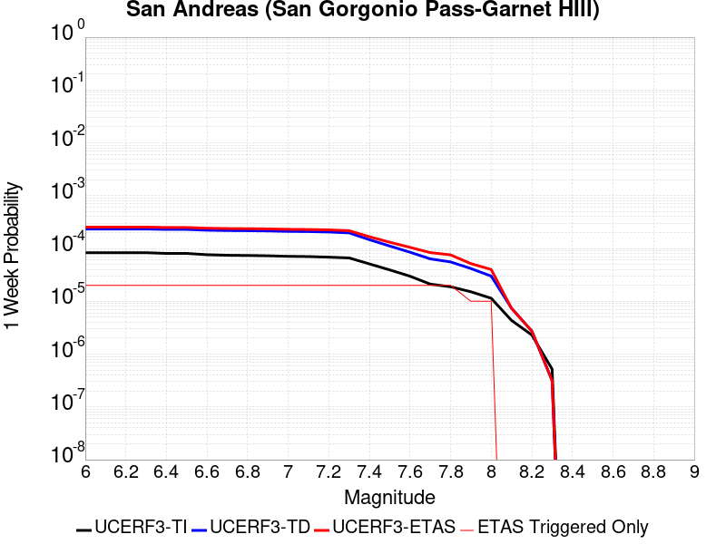 |  |  | 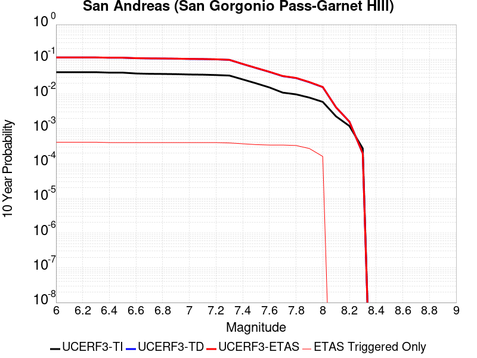 |

| Magnitude | 1 wk TI Prob | 1 wk TD Prob | 1 wk ETAS Prob | 1 wk ETAS/TD Gain | 1 wk ETAS Triggered Only | 1 mo TI Prob | 1 mo TD Prob | 1 mo ETAS Prob | 1 mo ETAS/TD Gain | 1 mo ETAS Triggered Only | 1 yr TI Prob | 1 yr TD Prob | 1 yr ETAS Prob | 1 yr ETAS/TD Gain | 1 yr ETAS Triggered Only | 10 yr TI Prob | 10 yr TD Prob | 10 yr ETAS Prob | 10 yr ETAS/TD Gain | 10 yr ETAS Triggered Only |
|-----|-----|-----|-----|-----|-----|-----|-----|-----|-----|-----|-----|-----|-----|-----|-----|-----|-----|-----|-----|-----|
| 6.0 | 8.31567E-5 | 2.3388721E-4 | 2.5388252E-4 | 1.0854913 | 2.0E-5 | 3.5633717E-4 | 0.001001991 | 0.0010819109 | 1.079761 | 8.0E-5 | 0.004329778 | 0.012131081 | 0.012318776 | 1.0154723 | 1.9E-4 | 0.042463828 | 0.112604246 | 0.11296807 | 1.003231 | 4.1E-4 |
| 6.1 | 8.31567E-5 | 2.3388721E-4 | 2.5388252E-4 | 1.0854913 | 2.0E-5 | 3.5633717E-4 | 0.001001991 | 0.0010819109 | 1.079761 | 8.0E-5 | 0.004329778 | 0.012131081 | 0.012318776 | 1.0154723 | 1.9E-4 | 0.042463828 | 0.112604246 | 0.11296807 | 1.003231 | 4.1E-4 |
| 6.2 | 8.31567E-5 | 2.3388721E-4 | 2.5388252E-4 | 1.0854913 | 2.0E-5 | 3.5633717E-4 | 0.001001991 | 0.0010819109 | 1.079761 | 8.0E-5 | 0.004329778 | 0.012131081 | 0.012318776 | 1.0154723 | 1.9E-4 | 0.042463828 | 0.112604246 | 0.11296807 | 1.003231 | 4.1E-4 |
| 6.3 | 8.31567E-5 | 2.3388721E-4 | 2.5388252E-4 | 1.0854913 | 2.0E-5 | 3.5633717E-4 | 0.001001991 | 0.0010819109 | 1.079761 | 8.0E-5 | 0.004329778 | 0.012131081 | 0.012318776 | 1.0154723 | 1.9E-4 | 0.042463828 | 0.112604246 | 0.11296807 | 1.003231 | 4.1E-4 |
| 6.4 | 8.059055E-5 | 2.2946985E-4 | 2.4946526E-4 | 1.0871375 | 2.0E-5 | 3.4534236E-4 | 9.830741E-4 | 0.0010629954 | 1.0812974 | 8.0E-5 | 0.0041964394 | 0.011903305 | 0.0120910425 | 1.015772 | 1.9E-4 | 0.041180745 | 0.11058536 | 0.11094113 | 1.0032171 | 4.0E-4 |
| 6.5 | 8.059055E-5 | 2.2946985E-4 | 2.4946526E-4 | 1.0871375 | 2.0E-5 | 3.4534236E-4 | 9.830741E-4 | 0.0010629954 | 1.0812974 | 8.0E-5 | 0.0041964394 | 0.011903305 | 0.0120910425 | 1.015772 | 1.9E-4 | 0.041180745 | 0.11058536 | 0.11094113 | 1.0032171 | 4.0E-4 |
| 6.6 | 7.619237E-5 | 2.2191244E-4 | 2.4190801E-4 | 1.0901057 | 2.0E-5 | 3.2649786E-4 | 9.50709E-4 | 0.001030633 | 1.0840677 | 8.0E-5 | 0.0039678677 | 0.011514003 | 0.011701816 | 1.0163116 | 1.9E-4 | 0.03897764 | 0.107121915 | 0.107479066 | 1.003334 | 4.0E-4 |
| 6.7 | 7.440636E-5 | 2.1867057E-4 | 2.386662E-4 | 1.0914418 | 2.0E-5 | 3.188454E-4 | 9.3682524E-4 | 0.0010167503 | 1.0853148 | 8.0E-5 | 0.0038750346 | 0.011346735 | 0.011534579 | 1.016555 | 1.9E-4 | 0.038081564 | 0.10563034 | 0.105988085 | 1.0033867 | 4.0E-4 |
| 6.8 | 7.3735864E-5 | 2.171422E-4 | 2.3713787E-4 | 1.0920856 | 2.0E-5 | 3.1597257E-4 | 9.302798E-4 | 0.0010102054 | 1.0859157 | 8.0E-5 | 0.0038401815 | 0.011267872 | 0.011455731 | 1.0166721 | 1.9E-4 | 0.03774495 | 0.104931876 | 0.105289906 | 1.003412 | 4.0E-4 |
| 6.9 | 7.27575E-5 | 2.1483183E-4 | 2.3482754E-4 | 1.0930761 | 2.0E-5 | 3.117806E-4 | 9.2038524E-4 | 0.0010003116 | 1.0868402 | 8.0E-5 | 0.003789323 | 0.011148645 | 0.011336526 | 1.0168524 | 1.9E-4 | 0.037253562 | 0.10387978 | 0.10423823 | 1.0034506 | 4.0E-4 |
| 7.0 | 7.102591E-5 | 2.10672E-4 | 2.3066779E-4 | 1.0949143 | 2.0E-5 | 3.0436125E-4 | 9.025698E-4 | 9.824976E-4 | 1.0885558 | 8.0E-5 | 0.003699303 | 0.010933937 | 0.011121859 | 1.0171871 | 1.9E-4 | 0.03638325 | 0.10198192 | 0.10234113 | 1.0035223 | 4.0E-4 |
| 7.1 | 7.028513E-5 | 2.0902834E-4 | 2.2902417E-4 | 1.0956608 | 2.0E-5 | 3.0118722E-4 | 8.9553045E-4 | 9.7545877E-4 | 1.0892525 | 8.0E-5 | 0.0036607897 | 0.010849088 | 0.011037027 | 1.017323 | 1.9E-4 | 0.036010686 | 0.10122493 | 0.10158444 | 1.0035516 | 4.0E-4 |
| 7.2 | 6.8498244E-5 | 2.051068E-4 | 2.2510269E-4 | 1.0974902 | 2.0E-5 | 2.9353087E-4 | 8.787352E-4 | 9.586649E-4 | 1.0909599 | 8.0E-5 | 0.003567883 | 0.010646621 | 0.010834598 | 1.0176561 | 1.9E-4 | 0.035111405 | 0.09941689 | 0.09977712 | 1.0036235 | 4.0E-4 |
| 7.3 | 6.622592E-5 | 1.9737906E-4 | 2.1737511E-4 | 1.1013079 | 2.0E-5 | 2.8379448E-4 | 8.456382E-4 | 9.2557055E-4 | 1.0945231 | 8.0E-5 | 0.0034497243 | 0.010247523 | 0.010425678 | 1.0173852 | 1.8E-4 | 0.033966612 | 0.095913164 | 0.096265756 | 1.0036762 | 3.9E-4 |
| 7.4 | 5.1050705E-5 | 1.4694112E-4 | 1.6693817E-4 | 1.136089 | 2.0E-5 | 2.1877038E-4 | 6.295965E-4 | 6.995525E-4 | 1.1111124 | 7.0E-5 | 0.002660276 | 0.0076385895 | 0.007807291 | 1.0220854 | 1.7E-4 | 0.02628654 | 0.07288495 | 0.07322798 | 1.0047065 | 3.7E-4 |
| 7.5 | 3.9302922E-5 | 1.11342604E-4 | 1.3134038E-4 | 1.1796057 | 2.0E-5 | 1.6843023E-4 | 4.7709566E-4 | 5.37067E-4 | 1.125701 | 6.0E-5 | 0.0020487092 | 0.005793239 | 0.0059523117 | 1.0274584 | 1.6E-4 | 0.020299247 | 0.05602899 | 0.05635938 | 1.0058968 | 3.5E-4 |
| 7.6 | 2.9851626E-5 | 8.498902E-5 | 1.0498732E-4 | 1.2353045 | 2.0E-5 | 1.2792926E-4 | 3.6418793E-4 | 4.2416606E-4 | 1.1646901 | 6.0E-5 | 0.0015564259 | 0.004424999 | 0.004584291 | 1.0359982 | 1.6E-4 | 0.0154556995 | 0.043211296 | 0.043536607 | 1.0075283 | 3.4E-4 |
| 7.7 | 2.1135214E-5 | 6.356387E-5 | 8.3562605E-5 | 1.3146242 | 2.0E-5 | 9.0576345E-5 | 2.723882E-4 | 3.3237183E-4 | 1.2202139 | 6.0E-5 | 0.0011022091 | 0.0033112885 | 0.0034707587 | 1.0481596 | 1.6E-4 | 0.010967582 | 0.03259829 | 0.032927208 | 1.01009 | 3.4E-4 |
| 7.8 | 1.883379E-5 | 5.567226E-5 | 7.5671145E-5 | 1.3592254 | 2.0E-5 | 8.0713755E-5 | 2.3857359E-4 | 2.985593E-4 | 1.2514347 | 6.0E-5 | 9.822468E-4 | 0.0029007678 | 0.0030603036 | 1.0549978 | 1.6E-4 | 0.0097791655 | 0.028709674 | 0.0290302 | 1.0111644 | 3.3E-4 |
| 7.9 | 1.5156185E-5 | 4.168473E-5 | 5.1684314E-5 | 1.239886 | 1.0E-5 | 6.495346E-5 | 1.7863662E-4 | 2.1862947E-4 | 1.2238783 | 4.0E-5 | 7.9052144E-4 | 0.0021727327 | 0.0023124286 | 1.0642949 | 1.4E-4 | 0.007877152 | 0.021771494 | 0.022035616 | 1.0121316 | 2.7E-4 |
| 8.0 | 1.1405907E-5 | 2.9994035E-5 | 3.9993734E-5 | 1.3333896 | 1.0E-5 | 4.8881542E-5 | 1.2853953E-4 | 1.4853696E-4 | 1.1555742 | 2.0E-5 | 5.9497025E-4 | 0.0015638464 | 0.0016537056 | 1.0574604 | 9.0E-5 | 0.005933798 | 0.01578204 | 0.015939513 | 1.009978 | 1.6E-4 |
| 8.1 | 4.3511436E-6 | 7.37625E-6 | 7.37625E-6 | 1.0 | 0.0 | 1.8647626E-5 | 3.161212E-5 | 3.161212E-5 | 1.0 | 0.0 | 2.2701119E-4 | 3.8480968E-4 | 3.8480968E-4 | 1.0 | 0.0 | 0.0022677942 | 0.0041198405 | 0.0041198405 | 1.0 | 0.0 |
| 8.2 | 2.3042528E-6 | 2.7362253E-6 | 2.7362253E-6 | 1.0 | 0.0 | 9.875332E-6 | 1.1726627E-5 | 1.1726627E-5 | 1.0 | 0.0 | 1.2022553E-4 | 1.4276238E-4 | 1.4276238E-4 | 1.0 | 0.0 | 0.0012016051 | 0.0015996931 | 0.0015996931 | 1.0 | 0.0 |
| 8.3 | 5.202968E-7 | 3.1645797E-7 | 3.1645797E-7 | 1.0 | 0.0 | 2.2298414E-6 | 1.3562478E-6 | 1.3562478E-6 | 1.0 | 0.0 | 2.714798E-5 | 1.6512206E-5 | 1.6512206E-5 | 1.0 | 0.0 | 2.7144665E-4 | 1.9589889E-4 | 1.9589889E-4 | 1.0 | 0.0 |

## San Andreas (Cholame) rev
*[(top)](#table-of-contents)*

| 1 Week | 1 Month | 1 Year | 10 Year |
|-----|-----|-----|-----|
| 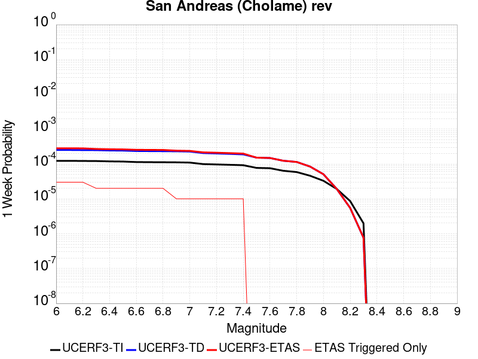 | 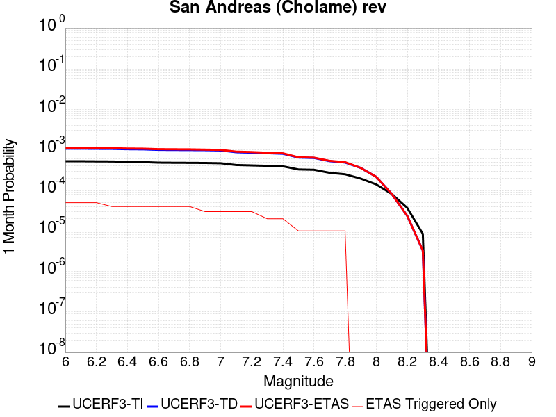 | 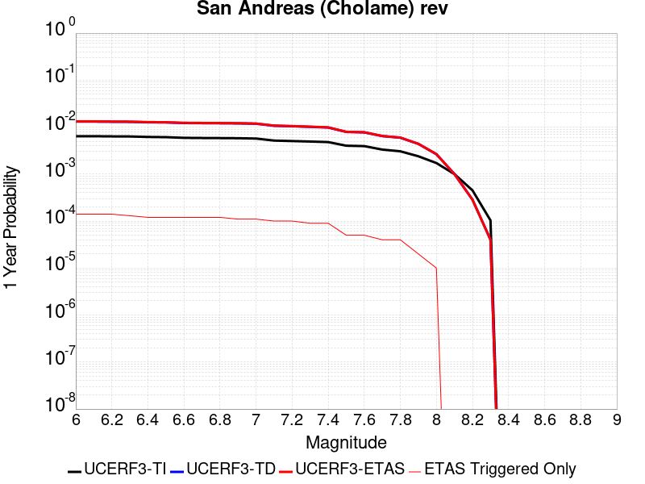 | 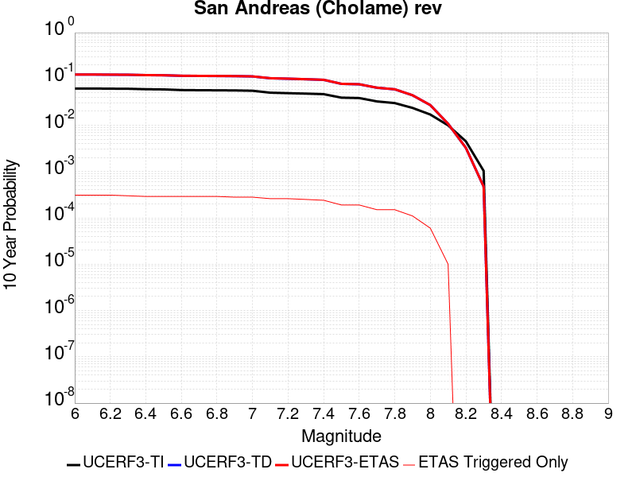 |

| Magnitude | 1 wk TI Prob | 1 wk TD Prob | 1 wk ETAS Prob | 1 wk ETAS/TD Gain | 1 wk ETAS Triggered Only | 1 mo TI Prob | 1 mo TD Prob | 1 mo ETAS Prob | 1 mo ETAS/TD Gain | 1 mo ETAS Triggered Only | 1 yr TI Prob | 1 yr TD Prob | 1 yr ETAS Prob | 1 yr ETAS/TD Gain | 1 yr ETAS Triggered Only | 10 yr TI Prob | 10 yr TD Prob | 10 yr ETAS Prob | 10 yr ETAS/TD Gain | 10 yr ETAS Triggered Only |
|-----|-----|-----|-----|-----|-----|-----|-----|-----|-----|-----|-----|-----|-----|-----|-----|-----|-----|-----|-----|-----|
| 6.0 | 1.2302514E-4 | 2.5219415E-4 | 2.821866E-4 | 1.1189259 | 3.0E-5 | 5.27144E-4 | 0.001080386 | 0.001130332 | 1.0462297 | 5.0E-5 | 0.0063991086 | 0.013074876 | 0.013213045 | 1.0105675 | 1.4E-4 | 0.06217949 | 0.12445372 | 0.12472514 | 1.0021809 | 3.1E-4 |
| 6.1 | 1.2302514E-4 | 2.5219415E-4 | 2.821866E-4 | 1.1189259 | 3.0E-5 | 5.27144E-4 | 0.001080386 | 0.001130332 | 1.0462297 | 5.0E-5 | 0.0063991086 | 0.013074876 | 0.013213045 | 1.0105675 | 1.4E-4 | 0.06217949 | 0.12445372 | 0.12472514 | 1.0021809 | 3.1E-4 |
| 6.2 | 1.2203569E-4 | 2.5036192E-4 | 2.803544E-4 | 1.1197965 | 3.0E-5 | 5.2290526E-4 | 0.0010725401 | 0.0011224864 | 1.0465683 | 5.0E-5 | 0.006347804 | 0.012980494 | 0.013118676 | 1.0106454 | 1.4E-4 | 0.061695136 | 0.12363988 | 0.12391155 | 1.0021973 | 3.1E-4 |
| 6.3 | 1.2142645E-4 | 2.4922154E-4 | 2.6921654E-4 | 1.0802299 | 2.0E-5 | 5.202953E-4 | 0.0010676567 | 0.001107614 | 1.0374253 | 4.0E-5 | 0.006316212 | 0.012921745 | 0.013050065 | 1.0099306 | 1.3E-4 | 0.06139677 | 0.123133995 | 0.12339706 | 1.0021363 | 3.0E-4 |
| 6.4 | 1.1865206E-4 | 2.4427602E-4 | 2.6427113E-4 | 1.0818546 | 2.0E-5 | 5.0840975E-4 | 0.0010464787 | 0.0010864369 | 1.0381835 | 4.0E-5 | 0.006172335 | 0.012666927 | 0.012785407 | 1.0093535 | 1.2E-4 | 0.060036868 | 0.12092657 | 0.121181495 | 1.0021081 | 2.9E-4 |
| 6.5 | 1.17443946E-4 | 2.4220857E-4 | 2.622037E-4 | 1.0825535 | 2.0E-5 | 5.032341E-4 | 0.0010376254 | 0.0010775839 | 1.0385096 | 4.0E-5 | 0.006109677 | 0.012560381 | 0.012678874 | 1.0094339 | 1.2E-4 | 0.059444077 | 0.12000062 | 0.12025582 | 1.0021267 | 2.9E-4 |
| 6.6 | 1.13579066E-4 | 2.3529708E-4 | 2.5529237E-4 | 1.0849789 | 2.0E-5 | 4.866766E-4 | 0.0010080278 | 0.0010479875 | 1.0396415 | 4.0E-5 | 0.0059092017 | 0.012204121 | 0.012322656 | 1.0097127 | 1.2E-4 | 0.057545185 | 0.11691425 | 0.11717034 | 1.0021905 | 2.9E-4 |
| 6.7 | 1.1271412E-4 | 2.3373985E-4 | 2.5373517E-4 | 1.0855452 | 2.0E-5 | 4.829711E-4 | 0.0010013592 | 0.0010413191 | 1.0399057 | 4.0E-5 | 0.005864331 | 0.012123836 | 0.012242381 | 1.0097779 | 1.2E-4 | 0.057119697 | 0.116217725 | 0.116474025 | 1.0022054 | 2.9E-4 |
| 6.8 | 1.1217975E-4 | 2.3262376E-4 | 2.526191E-4 | 1.0859557 | 2.0E-5 | 4.8068175E-4 | 9.965795E-4 | 0.0010365397 | 1.0400972 | 4.0E-5 | 0.005836608 | 0.012066291 | 0.012184843 | 1.0098251 | 1.2E-4 | 0.056856725 | 0.115715876 | 0.11597232 | 1.0022161 | 2.9E-4 |
| 6.9 | 1.1146753E-4 | 2.3111087E-4 | 2.4110854E-4 | 1.0432593 | 1.0E-5 | 4.7763053E-4 | 9.901007E-4 | 0.001020071 | 1.03027 | 3.0E-5 | 0.0057996577 | 0.011988281 | 0.012096963 | 1.0090656 | 1.1E-4 | 0.056506127 | 0.1150362 | 0.11528398 | 1.002154 | 2.8E-4 |
| 7.0 | 1.0965793E-4 | 2.2734312E-4 | 2.3734085E-4 | 1.0439764 | 1.0E-5 | 4.698779E-4 | 9.7396533E-4 | 0.0010039362 | 1.030772 | 3.0E-5 | 0.005705768 | 0.011793978 | 0.01190268 | 1.0092168 | 1.1E-4 | 0.055614736 | 0.11333743 | 0.113585696 | 1.0021905 | 2.8E-4 |
| 7.1 | 9.927982E-5 | 2.055289E-4 | 2.1552684E-4 | 1.0486449 | 1.0E-5 | 4.2541555E-4 | 8.805418E-4 | 9.105154E-4 | 1.03404 | 3.0E-5 | 0.0051671406 | 0.010668193 | 0.0107671255 | 1.0092736 | 1.0E-4 | 0.05048634 | 0.103430584 | 0.10366369 | 1.0022538 | 2.6E-4 |
| 7.2 | 9.696786E-5 | 2.005705E-4 | 2.105685E-4 | 1.0498477 | 1.0E-5 | 4.1551032E-4 | 8.593057E-4 | 8.8927994E-4 | 1.034882 | 3.0E-5 | 0.00504711 | 0.010412143 | 0.010511101 | 1.0095042 | 1.0E-4 | 0.04934009 | 0.10116833 | 0.10140202 | 1.0023099 | 2.6E-4 |
| 7.3 | 9.4727984E-5 | 1.9486115E-4 | 2.048592E-4 | 1.0513086 | 1.0E-5 | 4.0591392E-4 | 8.3485286E-4 | 8.548362E-4 | 1.0239363 | 2.0E-5 | 0.0049308087 | 0.010117232 | 0.010206322 | 1.0088058 | 9.0E-5 | 0.048228268 | 0.09853854 | 0.098763905 | 1.002287 | 2.5E-4 |
| 7.4 | 9.220358E-5 | 1.8856462E-4 | 1.9856273E-4 | 1.0530223 | 1.0E-5 | 3.9509835E-4 | 8.0788473E-4 | 8.278686E-4 | 1.024736 | 2.0E-5 | 0.004799717 | 0.009791885 | 0.009881003 | 1.0091013 | 9.0E-5 | 0.046973653 | 0.09561567 | 0.09583272 | 1.0022701 | 2.4E-4 |
| 7.5 | 7.71631E-5 | 1.5189666E-4 | 1.5189666E-4 | 1.0 | 0.0 | 3.306571E-4 | 6.508234E-4 | 6.608169E-4 | 1.0153551 | 1.0E-5 | 0.0040183207 | 0.007895059 | 0.007944664 | 1.006283 | 5.0E-5 | 0.03946433 | 0.07833768 | 0.078512795 | 1.0022354 | 1.9E-4 |
| 7.6 | 7.5634416E-5 | 1.484899E-4 | 1.484899E-4 | 1.0 | 0.0 | 3.241072E-4 | 6.362302E-4 | 6.4622384E-4 | 1.0157076 | 1.0E-5 | 0.0039388672 | 0.0077186585 | 0.007768273 | 1.0064278 | 5.0E-5 | 0.038697794 | 0.07670056 | 0.076875985 | 1.0022871 | 1.9E-4 |
| 7.7 | 6.3783E-5 | 1.2369074E-4 | 1.2369074E-4 | 1.0 | 0.0 | 2.7332708E-4 | 5.2999554E-4 | 5.3999026E-4 | 1.0188581 | 1.0E-5 | 0.0033226798 | 0.006433631 | 0.0064733736 | 1.0061773 | 4.0E-5 | 0.032734364 | 0.06458758 | 0.064727895 | 1.0021725 | 1.5E-4 |
| 7.8 | 5.863422E-5 | 1.1425524E-4 | 1.1425524E-4 | 1.0 | 0.0 | 2.512653E-4 | 4.8957346E-4 | 4.995686E-4 | 1.0204159 | 1.0E-5 | 0.003054864 | 0.005944288 | 0.00598405 | 1.0066892 | 4.0E-5 | 0.030132094 | 0.059702396 | 0.05984344 | 1.0023625 | 1.5E-4 |
| 7.9 | 4.595283E-5 | 8.433203E-5 | 8.433203E-5 | 1.0 | 0.0 | 1.9692584E-4 | 3.6137295E-4 | 3.6137295E-4 | 1.0 | 0.0 | 0.0023949358 | 0.0043908465 | 0.0044107586 | 1.004535 | 2.0E-5 | 0.023692891 | 0.04439443 | 0.044499546 | 1.0023677 | 1.1E-4 |
| 8.0 | 3.2950178E-5 | 5.0815757E-5 | 5.0815757E-5 | 1.0 | 0.0 | 1.412074E-4 | 2.1776365E-4 | 2.1776365E-4 | 1.0 | 0.0 | 0.0017178444 | 0.0026480507 | 0.002658024 | 1.0037664 | 1.0E-5 | 0.017046256 | 0.027201205 | 0.027259573 | 1.0021458 | 6.0E-5 |
| 8.1 | 1.9177472E-5 | 1.92061E-5 | 1.92061E-5 | 1.0 | 0.0 | 8.218658E-5 | 8.2309256E-5 | 8.2309256E-5 | 1.0 | 0.0 | 0.0010001622 | 0.0010016551 | 0.0010016551 | 1.0 | 0.0 | 0.009956728 | 0.010769127 | 0.010779019 | 1.0009186 | 1.0E-5 |
| 8.2 | 8.643924E-6 | 5.4827005E-6 | 5.4827005E-6 | 1.0 | 0.0 | 3.704486E-5 | 2.3497076E-5 | 2.3497076E-5 | 1.0 | 0.0 | 4.5092785E-4 | 2.8603943E-4 | 2.8603943E-4 | 1.0 | 0.0 | 0.0045001395 | 0.0032529908 | 0.0032529908 | 1.0 | 0.0 |
| 8.3 | 1.983087E-6 | 7.6730925E-7 | 7.6730925E-7 | 1.0 | 0.0 | 8.498917E-6 | 3.288464E-6 | 3.288464E-6 | 1.0 | 0.0 | 1.034694E-4 | 4.003633E-5 | 4.003633E-5 | 1.0 | 0.0 | 0.0010342124 | 4.7272502E-4 | 4.7272502E-4 | 1.0 | 0.0 |

## Death Valley (No)
*[(top)](#table-of-contents)*

| 1 Week | 1 Month | 1 Year | 10 Year |
|-----|-----|-----|-----|
|  | 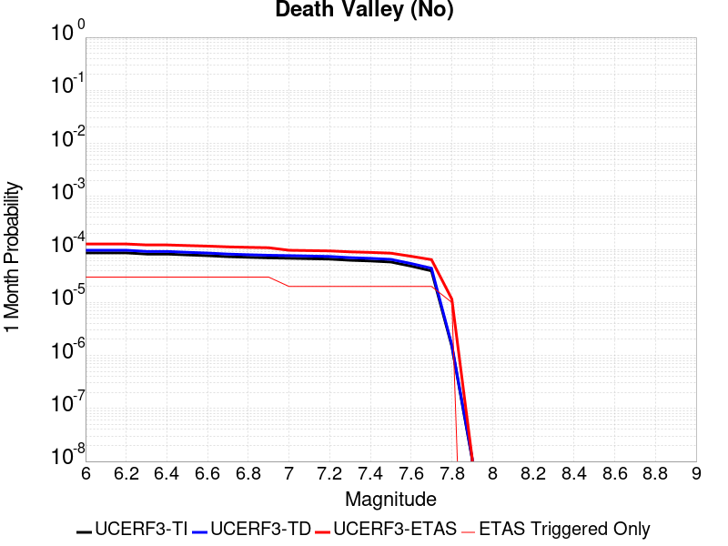 |  |  |

| Magnitude | 1 wk TI Prob | 1 wk TD Prob | 1 wk ETAS Prob | 1 wk ETAS/TD Gain | 1 wk ETAS Triggered Only | 1 mo TI Prob | 1 mo TD Prob | 1 mo ETAS Prob | 1 mo ETAS/TD Gain | 1 mo ETAS Triggered Only | 1 yr TI Prob | 1 yr TD Prob | 1 yr ETAS Prob | 1 yr ETAS/TD Gain | 1 yr ETAS Triggered Only | 10 yr TI Prob | 10 yr TD Prob | 10 yr ETAS Prob | 10 yr ETAS/TD Gain | 10 yr ETAS Triggered Only |
|-----|-----|-----|-----|-----|-----|-----|-----|-----|-----|-----|-----|-----|-----|-----|-----|-----|-----|-----|-----|-----|
| 6.0 | 2.0074807E-5 | 2.2500653E-5 | 2.2500653E-5 | 1.0 | 0.0 | 8.603206E-5 | 9.6427844E-5 | 1.2642496E-4 | 1.3110834 | 3.0E-5 | 0.001046937 | 0.0011733841 | 0.0013232081 | 1.1276854 | 1.5E-4 | 0.010420183 | 0.0116728 | 0.011979181 | 1.0262475 | 3.1E-4 |
| 6.1 | 2.0074807E-5 | 2.2500653E-5 | 2.2500653E-5 | 1.0 | 0.0 | 8.603206E-5 | 9.6427844E-5 | 1.2642496E-4 | 1.3110834 | 3.0E-5 | 0.001046937 | 0.0011733841 | 0.0013232081 | 1.1276854 | 1.5E-4 | 0.010420183 | 0.0116728 | 0.011979181 | 1.0262475 | 3.1E-4 |
| 6.2 | 2.0074807E-5 | 2.2500653E-5 | 2.2500653E-5 | 1.0 | 0.0 | 8.603206E-5 | 9.6427844E-5 | 1.2642496E-4 | 1.3110834 | 3.0E-5 | 0.001046937 | 0.0011733841 | 0.0013232081 | 1.1276854 | 1.5E-4 | 0.010420183 | 0.0116728 | 0.011979181 | 1.0262475 | 3.1E-4 |
| 6.3 | 1.9050609E-5 | 2.1337484E-5 | 2.1337484E-5 | 1.0 | 0.0 | 8.164292E-5 | 9.144319E-5 | 1.2144045E-4 | 1.3280425 | 3.0E-5 | 9.935491E-4 | 0.001112759 | 0.001262592 | 1.1346501 | 1.5E-4 | 0.009891188 | 0.011072695 | 0.011379263 | 1.0276868 | 3.1E-4 |
| 6.4 | 1.9050609E-5 | 2.1337484E-5 | 2.1337484E-5 | 1.0 | 0.0 | 8.164292E-5 | 9.144319E-5 | 1.2144045E-4 | 1.3280425 | 3.0E-5 | 9.935491E-4 | 0.001112759 | 0.001262592 | 1.1346501 | 1.5E-4 | 0.009891188 | 0.011072695 | 0.011379263 | 1.0276868 | 3.1E-4 |
| 6.5 | 1.8367004E-5 | 2.0561523E-5 | 2.0561523E-5 | 1.0 | 0.0 | 7.8713354E-5 | 8.811787E-5 | 1.18115226E-4 | 1.3404231 | 3.0E-5 | 9.5791375E-4 | 0.0010723136 | 0.0012221527 | 1.1397345 | 1.5E-4 | 0.009537951 | 0.010672181 | 0.010978873 | 1.0287374 | 3.1E-4 |
| 6.6 | 1.779439E-5 | 1.9911424E-5 | 1.9911424E-5 | 1.0 | 0.0 | 7.625944E-5 | 8.533192E-5 | 1.15329356E-4 | 1.3515383 | 3.0E-5 | 9.280632E-4 | 0.0010384273 | 0.0011682924 | 1.1250592 | 1.3E-4 | 0.009241969 | 0.010336509 | 0.010623511 | 1.0277659 | 2.9E-4 |
| 6.7 | 1.7025437E-5 | 1.9043899E-5 | 1.9043899E-5 | 1.0 | 0.0 | 7.296412E-5 | 8.161419E-5 | 1.1161174E-4 | 1.3675531 | 3.0E-5 | 8.87976E-4 | 9.932059E-4 | 0.0011230769 | 1.1307592 | 1.3E-4 | 0.008844362 | 0.009888389 | 0.010165621 | 1.028036 | 2.8E-4 |
| 6.8 | 1.6545107E-5 | 1.8513007E-5 | 1.8513007E-5 | 1.0 | 0.0 | 7.090568E-5 | 7.933908E-5 | 1.09336695E-4 | 1.3780938 | 3.0E-5 | 8.629347E-4 | 9.6553133E-4 | 0.0010954058 | 1.1345109 | 1.3E-4 | 0.008595915 | 0.009614067 | 0.009891375 | 1.028844 | 2.8E-4 |
| 6.9 | 1.615478E-5 | 1.8088047E-5 | 1.8088047E-5 | 1.0 | 0.0 | 6.9232934E-5 | 7.751793E-5 | 1.075156E-4 | 1.3869772 | 3.0E-5 | 8.4258494E-4 | 9.4337825E-4 | 0.0010732557 | 1.1376727 | 1.3E-4 | 0.008393973 | 0.00939443 | 0.009661893 | 1.0284704 | 2.7E-4 |
| 7.0 | 1.5894311E-5 | 1.7805998E-5 | 1.7805998E-5 | 1.0 | 0.0 | 6.81167E-5 | 7.630922E-5 | 9.63077E-5 | 1.2620715 | 2.0E-5 | 8.2900526E-4 | 9.286748E-4 | 0.0010485634 | 1.1290964 | 1.2E-4 | 0.008259195 | 0.009248629 | 0.009506225 | 1.0278523 | 2.6E-4 |
| 7.1 | 1.5602263E-5 | 1.7483944E-5 | 1.7483944E-5 | 1.0 | 0.0 | 6.6865134E-5 | 7.492907E-5 | 9.492757E-5 | 1.2668991 | 2.0E-5 | 8.137789E-4 | 9.118857E-4 | 0.0010317763 | 1.1314754 | 1.2E-4 | 0.008108052 | 0.009082122 | 0.00933976 | 1.0283676 | 2.6E-4 |
| 7.2 | 1.5323829E-5 | 1.7171064E-5 | 1.7171064E-5 | 1.0 | 0.0 | 6.56719E-5 | 7.358823E-5 | 9.358676E-5 | 1.2717626 | 2.0E-5 | 7.99262E-4 | 8.9557446E-4 | 0.001015467 | 1.1338722 | 1.2E-4 | 0.007963934 | 0.008920331 | 0.009178011 | 1.0288869 | 2.6E-4 |
| 7.3 | 1.4556212E-5 | 1.6302864E-5 | 1.6302864E-5 | 1.0 | 0.0 | 6.238227E-5 | 6.986758E-5 | 8.986618E-5 | 1.2862358 | 2.0E-5 | 7.592395E-4 | 8.5031166E-4 | 9.7020966E-4 | 1.1410047 | 1.2E-4 | 0.0075665074 | 0.008471226 | 0.008729024 | 1.0304321 | 2.6E-4 |
| 7.4 | 1.411725E-5 | 1.5808357E-5 | 1.5808357E-5 | 1.0 | 0.0 | 6.0501097E-5 | 6.774837E-5 | 8.7747016E-5 | 1.2951901 | 2.0E-5 | 7.363519E-4 | 8.245301E-4 | 9.444311E-4 | 1.1454175 | 1.2E-4 | 0.0073391674 | 0.008215344 | 0.008473207 | 1.031388 | 2.6E-4 |
| 7.5 | 1.3503312E-5 | 1.51266695E-5 | 1.51266695E-5 | 1.0 | 0.0 | 5.7870053E-5 | 6.482701E-5 | 8.4825704E-5 | 1.3084934 | 2.0E-5 | 7.043401E-4 | 7.889888E-4 | 8.9890196E-4 | 1.1393089 | 1.1E-4 | 0.007021119 | 0.007862501 | 0.008110535 | 1.0315465 | 2.5E-4 |
| 7.6 | 1.1279839E-5 | 1.2626642E-5 | 1.2626642E-5 | 1.0 | 0.0 | 4.834127E-5 | 5.4113087E-5 | 7.4112E-5 | 1.3695763 | 2.0E-5 | 5.88396E-4 | 6.58633E-4 | 7.485737E-4 | 1.1365566 | 9.0E-5 | 0.005868405 | 0.0065673618 | 0.006785917 | 1.033279 | 2.2E-4 |
| 7.7 | 9.189108E-6 | 1.0283615E-5 | 1.0283615E-5 | 1.0 | 0.0 | 3.93813E-5 | 4.4071916E-5 | 6.4071035E-5 | 1.4537838 | 2.0E-5 | 4.7936183E-4 | 5.364485E-4 | 6.0641096E-4 | 1.1304178 | 7.0E-5 | 0.004783291 | 0.005352047 | 0.0055012438 | 1.0278766 | 1.5E-4 |
| 7.8 | 3.4586725E-7 | 3.6483033E-7 | 3.6483033E-7 | 1.0 | 0.0 | 1.4822873E-6 | 1.5635576E-6 | 1.1563542E-5 | 7.395661 | 1.0E-5 | 1.80467E-5 | 1.9036152E-5 | 2.9035962E-5 | 1.5253062 | 1.0E-5 | 1.8045233E-4 | 1.9034566E-4 | 2.0034375E-4 | 1.052526 | 1.0E-5 |
| 7.9 | 2.5591178E-9 | 2.6696958E-9 | 2.6696958E-9 | 1.0 | 0.0 | 1.0967647E-8 | 1.14415535E-8 | 1.14415535E-8 | 1.0 | 0.0 | 1.335311E-7 | 1.3930091E-7 | 1.3930091E-7 | 1.0 | 0.0 | 1.3353102E-6 | 1.3930091E-6 | 1.3930091E-6 | 1.0 | 0.0 |

## San Andreas (Parkfield)
*[(top)](#table-of-contents)*

| 1 Week | 1 Month | 1 Year | 10 Year |
|-----|-----|-----|-----|
|  |  |  | 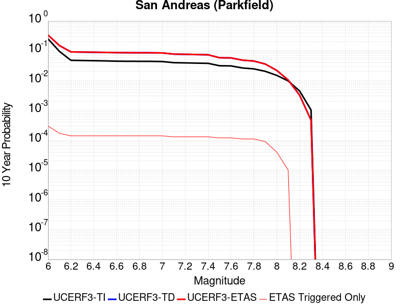 |

| Magnitude | 1 wk TI Prob | 1 wk TD Prob | 1 wk ETAS Prob | 1 wk ETAS/TD Gain | 1 wk ETAS Triggered Only | 1 mo TI Prob | 1 mo TD Prob | 1 mo ETAS Prob | 1 mo ETAS/TD Gain | 1 mo ETAS Triggered Only | 1 yr TI Prob | 1 yr TD Prob | 1 yr ETAS Prob | 1 yr ETAS/TD Gain | 1 yr ETAS Triggered Only | 10 yr TI Prob | 10 yr TD Prob | 10 yr ETAS Prob | 10 yr ETAS/TD Gain | 10 yr ETAS Triggered Only |
|-----|-----|-----|-----|-----|-----|-----|-----|-----|-----|-----|-----|-----|-----|-----|-----|-----|-----|-----|-----|-----|
| 6.0 | 5.556969E-4 | 7.794276E-4 | 7.794276E-4 | 1.0 | 0.0 | 0.0023793848 | 0.0033366783 | 0.0033665781 | 1.008961 | 3.0E-5 | 0.028586963 | 0.040267795 | 0.04039256 | 1.0030984 | 1.3E-4 | 0.25176284 | 0.33740374 | 0.33760253 | 1.0005891 | 3.0E-4 |
| 6.1 | 1.925858E-4 | 3.032105E-4 | 3.032105E-4 | 1.0 | 0.0 | 8.2510663E-4 | 0.0012989206 | 0.0013089076 | 1.0076886 | 1.0E-5 | 0.0099994885 | 0.015800275 | 0.015859328 | 1.0037374 | 6.0E-5 | 0.095613256 | 0.14983167 | 0.1499762 | 1.0009646 | 1.7E-4 |
| 6.2 | 9.4306815E-5 | 1.8254695E-4 | 1.8254695E-4 | 1.0 | 0.0 | 4.0410945E-4 | 7.821108E-4 | 7.821108E-4 | 1.0 | 0.0 | 0.0049089384 | 0.009480832 | 0.0095204525 | 1.004179 | 4.0E-5 | 0.048019063 | 0.09190566 | 0.09203279 | 1.0013833 | 1.4E-4 |
| 6.3 | 9.283051E-5 | 1.7951184E-4 | 1.7951184E-4 | 1.0 | 0.0 | 3.9778434E-4 | 7.691108E-4 | 7.691108E-4 | 1.0 | 0.0 | 0.0048322747 | 0.009323922 | 0.00936355 | 1.00425 | 4.0E-5 | 0.047285385 | 0.09055856 | 0.09068588 | 1.001406 | 1.4E-4 |
| 6.4 | 9.138826E-5 | 1.7713312E-4 | 1.7713312E-4 | 1.0 | 0.0 | 3.916052E-4 | 7.5892225E-4 | 7.5892225E-4 | 1.0 | 0.0 | 0.0047573745 | 0.0092009315 | 0.009240564 | 1.0043074 | 4.0E-5 | 0.046568092 | 0.089460544 | 0.089588016 | 1.0014249 | 1.4E-4 |
| 6.5 | 9.000255E-5 | 1.7471287E-4 | 1.7471287E-4 | 1.0 | 0.0 | 3.8566816E-4 | 7.4855576E-4 | 7.4855576E-4 | 1.0 | 0.0 | 0.0046854047 | 0.009075789 | 0.009115425 | 1.0043674 | 4.0E-5 | 0.045878403 | 0.08834611 | 0.08847374 | 1.0014447 | 1.4E-4 |
| 6.6 | 8.8109264E-5 | 1.7152308E-4 | 1.7152308E-4 | 1.0 | 0.0 | 3.7755648E-4 | 7.3489296E-4 | 7.3489296E-4 | 1.0 | 0.0 | 0.0045870654 | 0.008910831 | 0.008950475 | 1.0044489 | 4.0E-5 | 0.04493529 | 0.08687723 | 0.087005064 | 1.0014715 | 1.4E-4 |
| 6.7 | 8.738073E-5 | 1.7019355E-4 | 1.7019355E-4 | 1.0 | 0.0 | 3.7443507E-4 | 7.291982E-4 | 7.291982E-4 | 1.0 | 0.0 | 0.0045492216 | 0.008842104 | 0.0088817505 | 1.0044838 | 4.0E-5 | 0.04457213 | 0.0862775 | 0.08640542 | 1.0014827 | 1.4E-4 |
| 6.8 | 8.710195E-5 | 1.6964832E-4 | 1.6964832E-4 | 1.0 | 0.0 | 3.7324068E-4 | 7.2686275E-4 | 7.2686275E-4 | 1.0 | 0.0 | 0.0045347405 | 0.008813908 | 0.008853556 | 1.0044982 | 4.0E-5 | 0.04443313 | 0.086025015 | 0.08615297 | 1.0014874 | 1.4E-4 |
| 6.9 | 8.6801556E-5 | 1.6905765E-4 | 1.6905765E-4 | 1.0 | 0.0 | 3.7195362E-4 | 7.2433276E-4 | 7.2433276E-4 | 1.0 | 0.0 | 0.0045191357 | 0.008783354 | 0.008823003 | 1.0045141 | 4.0E-5 | 0.044283327 | 0.085751 | 0.08587899 | 1.0014926 | 1.4E-4 |
| 7.0 | 8.5571606E-5 | 1.6658509E-4 | 1.6658509E-4 | 1.0 | 0.0 | 3.6668387E-4 | 7.1374193E-4 | 7.1374193E-4 | 1.0 | 0.0 | 0.004455241 | 0.008655442 | 0.008695096 | 1.0045813 | 4.0E-5 | 0.043669727 | 0.08459909 | 0.08472725 | 1.0015149 | 1.4E-4 |
| 7.1 | 7.82589E-5 | 1.5139098E-4 | 1.5139098E-4 | 1.0 | 0.0 | 3.3535215E-4 | 6.486579E-4 | 6.486579E-4 | 1.0 | 0.0 | 0.0040752706 | 0.007868984 | 0.007898748 | 1.0037824 | 3.0E-5 | 0.040013418 | 0.07750977 | 0.07762969 | 1.0015472 | 1.3E-4 |
| 7.2 | 7.690929E-5 | 1.4876289E-4 | 1.4876289E-4 | 1.0 | 0.0 | 3.2956956E-4 | 6.374002E-4 | 6.374002E-4 | 1.0 | 0.0 | 0.004005129 | 0.0077329013 | 0.007762669 | 1.0038495 | 3.0E-5 | 0.0393371 | 0.07628273 | 0.07640281 | 1.0015742 | 1.3E-4 |
| 7.3 | 7.5543794E-5 | 1.4572745E-4 | 1.4572745E-4 | 1.0 | 0.0 | 3.2371894E-4 | 6.243974E-4 | 6.243974E-4 | 1.0 | 0.0 | 0.003934157 | 0.0075757033 | 0.0076054763 | 1.00393 | 3.0E-5 | 0.038652334 | 0.07484536 | 0.074965626 | 1.001607 | 1.3E-4 |
| 7.4 | 7.4214564E-5 | 1.4273584E-4 | 1.4273584E-4 | 1.0 | 0.0 | 3.1802364E-4 | 6.115823E-4 | 6.115823E-4 | 1.0 | 0.0 | 0.003865065 | 0.0074207517 | 0.0074505294 | 1.0040127 | 3.0E-5 | 0.03798529 | 0.07341872 | 0.073539175 | 1.0016407 | 1.3E-4 |
| 7.5 | 6.149578E-5 | 1.1199863E-4 | 1.1199863E-4 | 1.0 | 0.0 | 2.6352672E-4 | 4.799059E-4 | 4.799059E-4 | 1.0 | 0.0 | 0.0032037178 | 0.005827233 | 0.0058471165 | 1.0034121 | 2.0E-5 | 0.03157923 | 0.058599614 | 0.058712583 | 1.0019279 | 1.2E-4 |
| 7.6 | 6.0643448E-5 | 1.10284374E-4 | 1.10284374E-4 | 1.0 | 0.0 | 2.598746E-4 | 4.725618E-4 | 4.725618E-4 | 1.0 | 0.0 | 0.0031593828 | 0.0057382933 | 0.0057581784 | 1.0034654 | 2.0E-5 | 0.031148417 | 0.057760313 | 0.05787338 | 1.0019575 | 1.2E-4 |
| 7.7 | 5.1652263E-5 | 9.1828275E-5 | 9.1828275E-5 | 1.0 | 0.0 | 2.2134806E-4 | 3.934904E-4 | 3.934904E-4 | 1.0 | 0.0 | 0.002691582 | 0.004780232 | 0.004800136 | 1.0041639 | 2.0E-5 | 0.026592141 | 0.04857425 | 0.048678905 | 1.0021546 | 1.1E-4 |
| 7.8 | 4.8090482E-5 | 8.5671236E-5 | 8.5671236E-5 | 1.0 | 0.0 | 2.060858E-4 | 3.671108E-4 | 3.671108E-4 | 1.0 | 0.0 | 0.0025062072 | 0.004460422 | 0.0044803326 | 1.0044639 | 2.0E-5 | 0.024781305 | 0.045337588 | 0.0454426 | 1.0023162 | 1.1E-4 |
| 7.9 | 3.970278E-5 | 6.7562636E-5 | 6.7562636E-5 | 1.0 | 0.0 | 1.7014367E-4 | 2.8952205E-4 | 2.8952205E-4 | 1.0 | 0.0 | 0.002069531 | 0.0035192373 | 0.003529202 | 1.0028316 | 1.0E-5 | 0.020503636 | 0.035909295 | 0.035996065 | 1.0024164 | 9.0E-5 |
| 8.0 | 2.8982335E-5 | 4.0734834E-5 | 4.0734834E-5 | 1.0 | 0.0 | 1.2420409E-4 | 1.7456619E-4 | 1.7456619E-4 | 1.0 | 0.0 | 0.0015111357 | 0.0021232727 | 0.0021232727 | 1.0 | 0.0 | 0.015009012 | 0.022029094 | 0.022068212 | 1.0017757 | 4.0E-5 |
| 8.1 | 1.8836186E-5 | 1.870171E-5 | 1.870171E-5 | 1.0 | 0.0 | 8.0724014E-5 | 8.014773E-5 | 8.014773E-5 | 1.0 | 0.0 | 9.823717E-4 | 9.753624E-4 | 9.753624E-4 | 1.0 | 0.0 | 0.009780403 | 0.010498908 | 0.010508804 | 1.0009425 | 1.0E-5 |
| 8.2 | 8.643924E-6 | 5.4827005E-6 | 5.4827005E-6 | 1.0 | 0.0 | 3.704486E-5 | 2.3497076E-5 | 2.3497076E-5 | 1.0 | 0.0 | 4.5092785E-4 | 2.8603943E-4 | 2.8603943E-4 | 1.0 | 0.0 | 0.0045001395 | 0.0032529908 | 0.0032529908 | 1.0 | 0.0 |
| 8.3 | 1.983087E-6 | 7.6730925E-7 | 7.6730925E-7 | 1.0 | 0.0 | 8.498917E-6 | 3.288464E-6 | 3.288464E-6 | 1.0 | 0.0 | 1.034694E-4 | 4.003633E-5 | 4.003633E-5 | 1.0 | 0.0 | 0.0010342124 | 4.7272502E-4 | 4.7272502E-4 | 1.0 | 0.0 |

## San Andreas (Carrizo) rev
*[(top)](#table-of-contents)*

| 1 Week | 1 Month | 1 Year | 10 Year |
|-----|-----|-----|-----|
|  |  |  |  |

| Magnitude | 1 wk TI Prob | 1 wk TD Prob | 1 wk ETAS Prob | 1 wk ETAS/TD Gain | 1 wk ETAS Triggered Only | 1 mo TI Prob | 1 mo TD Prob | 1 mo ETAS Prob | 1 mo ETAS/TD Gain | 1 mo ETAS Triggered Only | 1 yr TI Prob | 1 yr TD Prob | 1 yr ETAS Prob | 1 yr ETAS/TD Gain | 1 yr ETAS Triggered Only | 10 yr TI Prob | 10 yr TD Prob | 10 yr ETAS Prob | 10 yr ETAS/TD Gain | 10 yr ETAS Triggered Only |
|-----|-----|-----|-----|-----|-----|-----|-----|-----|-----|-----|-----|-----|-----|-----|-----|-----|-----|-----|-----|-----|
| 6.0 | 1.1674632E-4 | 2.4338013E-4 | 2.6337526E-4 | 1.082156 | 2.0E-5 | 5.002454E-4 | 0.0010426424 | 0.0010826007 | 1.0383241 | 4.0E-5 | 0.006073493 | 0.0126207685 | 0.01272938 | 1.0086058 | 1.1E-4 | 0.0591016 | 0.12067723 | 0.12093224 | 1.0021131 | 2.9E-4 |
| 6.1 | 1.1674632E-4 | 2.4338013E-4 | 2.6337526E-4 | 1.082156 | 2.0E-5 | 5.002454E-4 | 0.0010426424 | 0.0010826007 | 1.0383241 | 4.0E-5 | 0.006073493 | 0.0126207685 | 0.01272938 | 1.0086058 | 1.1E-4 | 0.0591016 | 0.12067723 | 0.12093224 | 1.0021131 | 2.9E-4 |
| 6.2 | 1.1674632E-4 | 2.4338013E-4 | 2.6337526E-4 | 1.082156 | 2.0E-5 | 5.002454E-4 | 0.0010426424 | 0.0010826007 | 1.0383241 | 4.0E-5 | 0.006073493 | 0.0126207685 | 0.01272938 | 1.0086058 | 1.1E-4 | 0.0591016 | 0.12067723 | 0.12093224 | 1.0021131 | 2.9E-4 |
| 6.3 | 1.1674632E-4 | 2.4338013E-4 | 2.6337526E-4 | 1.082156 | 2.0E-5 | 5.002454E-4 | 0.0010426424 | 0.0010826007 | 1.0383241 | 4.0E-5 | 0.006073493 | 0.0126207685 | 0.01272938 | 1.0086058 | 1.1E-4 | 0.0591016 | 0.12067723 | 0.12093224 | 1.0021131 | 2.9E-4 |
| 6.4 | 1.1674632E-4 | 2.4338013E-4 | 2.6337526E-4 | 1.082156 | 2.0E-5 | 5.002454E-4 | 0.0010426424 | 0.0010826007 | 1.0383241 | 4.0E-5 | 0.006073493 | 0.0126207685 | 0.01272938 | 1.0086058 | 1.1E-4 | 0.0591016 | 0.12067723 | 0.12093224 | 1.0021131 | 2.9E-4 |
| 6.5 | 1.13136164E-4 | 2.3657958E-4 | 2.5657483E-4 | 1.0845182 | 2.0E-5 | 4.847792E-4 | 0.00101352 | 0.0010534795 | 1.0394264 | 4.0E-5 | 0.0058862255 | 0.012270238 | 0.012378889 | 1.0088547 | 1.1E-4 | 0.057327334 | 0.11764854 | 0.11790442 | 1.002175 | 2.9E-4 |
| 6.6 | 1.13136164E-4 | 2.3657958E-4 | 2.5657483E-4 | 1.0845182 | 2.0E-5 | 4.847792E-4 | 0.00101352 | 0.0010534795 | 1.0394264 | 4.0E-5 | 0.0058862255 | 0.012270238 | 0.012378889 | 1.0088547 | 1.1E-4 | 0.057327334 | 0.11764854 | 0.11790442 | 1.002175 | 2.9E-4 |
| 6.7 | 1.1149675E-4 | 2.3349149E-4 | 2.5348683E-4 | 1.0856363 | 2.0E-5 | 4.777557E-4 | 0.0010002955 | 0.0010402555 | 1.0399482 | 4.0E-5 | 0.0058011734 | 0.012111029 | 0.012219696 | 1.0089726 | 1.1E-4 | 0.05652051 | 0.11627006 | 0.116526335 | 1.0022042 | 2.9E-4 |
| 6.8 | 1.1103589E-4 | 2.3251289E-4 | 2.5250824E-4 | 1.0859967 | 2.0E-5 | 4.7578133E-4 | 9.961048E-4 | 0.0010360649 | 1.0401164 | 4.0E-5 | 0.005777263 | 0.012060572 | 0.012169246 | 1.0090107 | 1.1E-4 | 0.056293584 | 0.11583032 | 0.11608672 | 1.0022137 | 2.9E-4 |
| 6.9 | 1.1053259E-4 | 2.3143651E-4 | 2.414342E-4 | 1.0431983 | 1.0E-5 | 4.7362508E-4 | 9.914952E-4 | 0.0010214655 | 1.0302273 | 3.0E-5 | 0.0057511497 | 0.012005071 | 0.0121038705 | 1.0082299 | 1.0E-4 | 0.05604569 | 0.11534647 | 0.11559417 | 1.0021474 | 2.8E-4 |
| 7.0 | 1.1005377E-4 | 2.3044476E-4 | 2.4044244E-4 | 1.0433843 | 1.0E-5 | 4.7157376E-4 | 9.87248E-4 | 0.0010172185 | 1.0303575 | 3.0E-5 | 0.0057263062 | 0.01195393 | 0.012052735 | 1.0082655 | 1.0E-4 | 0.055809796 | 0.114898734 | 0.11514656 | 1.002157 | 2.8E-4 |
| 7.1 | 1.0308142E-4 | 2.1553901E-4 | 2.2553686E-4 | 1.0463853 | 1.0E-5 | 4.417027E-4 | 9.234127E-4 | 9.5338497E-4 | 1.0324582 | 3.0E-5 | 0.0053644776 | 0.01118491 | 0.011283792 | 1.0088406 | 1.0E-4 | 0.052368138 | 0.10815444 | 0.108395234 | 1.0022265 | 2.7E-4 |
| 7.2 | 1.0027479E-4 | 2.0961683E-4 | 2.1961473E-4 | 1.0476961 | 1.0E-5 | 4.296783E-4 | 8.9804956E-4 | 9.280226E-4 | 1.0333757 | 3.0E-5 | 0.0052187922 | 0.010879237 | 0.010978149 | 1.0090919 | 1.0E-4 | 0.050979212 | 0.10545814 | 0.105690725 | 1.0022055 | 2.6E-4 |
| 7.3 | 9.816942E-5 | 2.0436702E-4 | 2.1436498E-4 | 1.0489216 | 1.0E-5 | 4.2065824E-4 | 8.7556563E-4 | 8.9554815E-4 | 1.0228224 | 2.0E-5 | 0.005109493 | 0.010608193 | 0.010697239 | 1.008394 | 9.0E-5 | 0.049935985 | 0.10304125 | 0.10326549 | 1.0021762 | 2.5E-4 |
| 7.4 | 9.5634205E-5 | 1.9805974E-4 | 2.0805775E-4 | 1.0504798 | 1.0E-5 | 4.0979648E-4 | 8.4855227E-4 | 8.685353E-4 | 1.0235496 | 2.0E-5 | 0.0049778637 | 0.0102824485 | 0.010371523 | 1.0086628 | 9.0E-5 | 0.048678253 | 0.10012672 | 0.10034269 | 1.002157 | 2.4E-4 |
| 7.5 | 8.052417E-5 | 1.6124894E-4 | 1.6124894E-4 | 1.0 | 0.0 | 3.4505792E-4 | 6.90884E-4 | 7.008771E-4 | 1.0144643 | 1.0E-5 | 0.0041929903 | 0.008379153 | 0.008428734 | 1.0059172 | 5.0E-5 | 0.04114753 | 0.08286515 | 0.0830394 | 1.0021029 | 1.9E-4 |
| 7.6 | 7.897024E-5 | 1.5777988E-4 | 1.5777988E-4 | 1.0 | 0.0 | 3.384E-4 | 6.760244E-4 | 6.860177E-4 | 1.0147823 | 1.0E-5 | 0.0041122385 | 0.008199613 | 0.008249203 | 1.0060478 | 5.0E-5 | 0.040369697 | 0.08120584 | 0.08138041 | 1.0021497 | 1.9E-4 |
| 7.7 | 6.707427E-5 | 1.3287038E-4 | 1.3287038E-4 | 1.0 | 0.0 | 2.8742946E-4 | 5.693203E-4 | 5.7931454E-4 | 1.0175548 | 1.0E-5 | 0.003493839 | 0.006909477 | 0.0069492008 | 1.0057491 | 4.0E-5 | 0.034394164 | 0.06909768 | 0.06923732 | 1.0020208 | 1.5E-4 |
| 7.8 | 6.147705E-5 | 1.2207383E-4 | 1.2207383E-4 | 1.0 | 0.0 | 2.6344648E-4 | 5.230687E-4 | 5.3306343E-4 | 1.0191079 | 1.0E-5 | 0.0032027436 | 0.006349791 | 0.006389537 | 1.0062594 | 4.0E-5 | 0.031569764 | 0.06355974 | 0.06370021 | 1.00221 | 1.5E-4 |
| 7.9 | 4.7636717E-5 | 8.8868925E-5 | 8.8868925E-5 | 1.0 | 0.0 | 2.0414138E-4 | 3.8081122E-4 | 3.8081122E-4 | 1.0 | 0.0 | 0.0024825884 | 0.0046265284 | 0.004646436 | 1.0043029 | 2.0E-5 | 0.024550365 | 0.046661574 | 0.04676644 | 1.0022475 | 1.1E-4 |
| 8.0 | 3.3554235E-5 | 5.2180552E-5 | 5.2180552E-5 | 1.0 | 0.0 | 1.4379594E-4 | 2.2361179E-4 | 2.2361179E-4 | 1.0 | 0.0 | 0.0017493097 | 0.0027190764 | 0.002729049 | 1.0036677 | 1.0E-5 | 0.017356034 | 0.027902396 | 0.027960721 | 1.0020903 | 6.0E-5 |
| 8.1 | 1.9175432E-5 | 1.9205929E-5 | 1.9205929E-5 | 1.0 | 0.0 | 8.217783E-5 | 8.230853E-5 | 8.230853E-5 | 1.0 | 0.0 | 0.0010000558 | 0.0010016463 | 0.0010016463 | 1.0 | 0.0 | 0.009955673 | 0.0107690105 | 0.010778903 | 1.0009186 | 1.0E-5 |
| 8.2 | 8.643924E-6 | 5.4827005E-6 | 5.4827005E-6 | 1.0 | 0.0 | 3.704486E-5 | 2.3497076E-5 | 2.3497076E-5 | 1.0 | 0.0 | 4.5092785E-4 | 2.8603943E-4 | 2.8603943E-4 | 1.0 | 0.0 | 0.0045001395 | 0.0032529908 | 0.0032529908 | 1.0 | 0.0 |
| 8.3 | 1.983087E-6 | 7.6730925E-7 | 7.6730925E-7 | 1.0 | 0.0 | 8.498917E-6 | 3.288464E-6 | 3.288464E-6 | 1.0 | 0.0 | 1.034694E-4 | 4.003633E-5 | 4.003633E-5 | 1.0 | 0.0 | 0.0010342124 | 4.7272502E-4 | 4.7272502E-4 | 1.0 | 0.0 |

## Sierra Nevada  (No Extension)
*[(top)](#table-of-contents)*

| 1 Week | 1 Month | 1 Year | 10 Year |
|-----|-----|-----|-----|
| 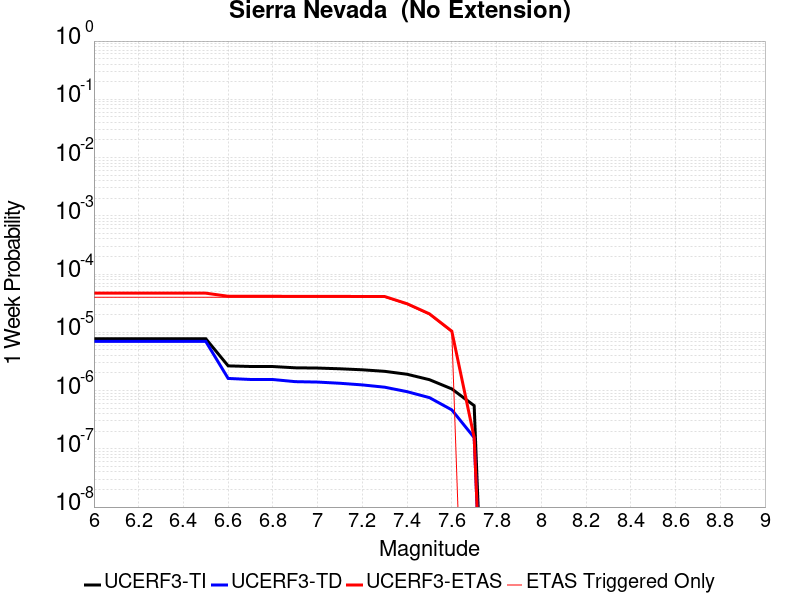 |  |  |  |

| Magnitude | 1 wk TI Prob | 1 wk TD Prob | 1 wk ETAS Prob | 1 wk ETAS/TD Gain | 1 wk ETAS Triggered Only | 1 mo TI Prob | 1 mo TD Prob | 1 mo ETAS Prob | 1 mo ETAS/TD Gain | 1 mo ETAS Triggered Only | 1 yr TI Prob | 1 yr TD Prob | 1 yr ETAS Prob | 1 yr ETAS/TD Gain | 1 yr ETAS Triggered Only | 10 yr TI Prob | 10 yr TD Prob | 10 yr ETAS Prob | 10 yr ETAS/TD Gain | 10 yr ETAS Triggered Only |
|-----|-----|-----|-----|-----|-----|-----|-----|-----|-----|-----|-----|-----|-----|-----|-----|-----|-----|-----|-----|-----|
| 6.0 | 7.7690465E-6 | 6.9764183E-6 | 4.697614E-5 | 6.733561 | 4.0E-5 | 3.329549E-5 | 2.9898794E-5 | 1.09896406E-4 | 3.6756132 | 8.0E-5 | 4.0529718E-4 | 3.6399288E-4 | 5.4392737E-4 | 1.4943352 | 1.8E-4 | 0.004045588 | 0.003637483 | 0.003906501 | 1.0739572 | 2.7E-4 |
| 6.1 | 7.7690465E-6 | 6.9764183E-6 | 4.697614E-5 | 6.733561 | 4.0E-5 | 3.329549E-5 | 2.9898794E-5 | 1.09896406E-4 | 3.6756132 | 8.0E-5 | 4.0529718E-4 | 3.6399288E-4 | 5.4392737E-4 | 1.4943352 | 1.8E-4 | 0.004045588 | 0.003637483 | 0.003906501 | 1.0739572 | 2.7E-4 |
| 6.2 | 7.7690465E-6 | 6.9764183E-6 | 4.697614E-5 | 6.733561 | 4.0E-5 | 3.329549E-5 | 2.9898794E-5 | 1.09896406E-4 | 3.6756132 | 8.0E-5 | 4.0529718E-4 | 3.6399288E-4 | 5.4392737E-4 | 1.4943352 | 1.8E-4 | 0.004045588 | 0.003637483 | 0.003906501 | 1.0739572 | 2.7E-4 |
| 6.3 | 7.7690465E-6 | 6.9764183E-6 | 4.697614E-5 | 6.733561 | 4.0E-5 | 3.329549E-5 | 2.9898794E-5 | 1.09896406E-4 | 3.6756132 | 8.0E-5 | 4.0529718E-4 | 3.6399288E-4 | 5.4392737E-4 | 1.4943352 | 1.8E-4 | 0.004045588 | 0.003637483 | 0.003906501 | 1.0739572 | 2.7E-4 |
| 6.4 | 7.7690465E-6 | 6.9764183E-6 | 4.697614E-5 | 6.733561 | 4.0E-5 | 3.329549E-5 | 2.9898794E-5 | 1.09896406E-4 | 3.6756132 | 8.0E-5 | 4.0529718E-4 | 3.6399288E-4 | 5.4392737E-4 | 1.4943352 | 1.8E-4 | 0.004045588 | 0.003637483 | 0.003906501 | 1.0739572 | 2.7E-4 |
| 6.5 | 7.7690465E-6 | 6.9764183E-6 | 4.697614E-5 | 6.733561 | 4.0E-5 | 3.329549E-5 | 2.9898794E-5 | 1.09896406E-4 | 3.6756132 | 8.0E-5 | 4.0529718E-4 | 3.6399288E-4 | 5.4392737E-4 | 1.4943352 | 1.8E-4 | 0.004045588 | 0.003637483 | 0.003906501 | 1.0739572 | 2.7E-4 |
| 6.6 | 2.653E-6 | 1.614897E-6 | 4.1614832E-5 | 25.769342 | 4.0E-5 | 1.136995E-5 | 6.920969E-6 | 6.6920555E-5 | 9.669247 | 6.0E-5 | 1.3842035E-4 | 8.425958E-5 | 2.0424946E-4 | 2.4240506 | 1.2E-4 | 0.0013833415 | 8.422797E-4 | 0.0010121365 | 1.2016631 | 1.7E-4 |
| 6.7 | 2.5902466E-6 | 1.5502301E-6 | 4.1550167E-5 | 26.80258 | 4.0E-5 | 1.11010095E-5 | 6.6438265E-6 | 6.664343E-5 | 10.03088 | 6.0E-5 | 1.351464E-4 | 8.088561E-5 | 2.008759E-4 | 2.4834566 | 1.2E-4 | 0.0013506424 | 8.085647E-4 | 9.784272E-4 | 1.2100791 | 1.7E-4 |
| 6.8 | 2.5853892E-6 | 1.5470301E-6 | 4.154697E-5 | 26.855953 | 4.0E-5 | 1.1080193E-5 | 6.6301127E-6 | 6.662971E-5 | 10.049561 | 6.0E-5 | 1.34893E-4 | 8.071866E-5 | 2.0070898E-4 | 2.486525 | 1.2E-4 | 0.0013481114 | 8.0689637E-4 | 9.767592E-4 | 1.2105138 | 1.7E-4 |
| 6.9 | 2.458257E-6 | 1.4221034E-6 | 4.1422045E-5 | 29.12731 | 4.0E-5 | 1.0535345E-5 | 6.094715E-6 | 6.609435E-5 | 10.844535 | 6.0E-5 | 1.2826028E-4 | 7.4200645E-5 | 1.9419174E-4 | 2.6171167 | 1.2E-4 | 0.0012818627 | 7.4176065E-4 | 9.116346E-4 | 1.2290144 | 1.7E-4 |
| 7.0 | 2.4341468E-6 | 1.3990671E-6 | 4.1399013E-5 | 29.59044 | 4.0E-5 | 1.0432016E-5 | 5.995988E-6 | 6.599563E-5 | 11.006631 | 6.0E-5 | 1.270024E-4 | 7.299873E-5 | 1.9298997E-4 | 2.6437442 | 1.2E-4 | 0.0012692984 | 7.297494E-4 | 8.9962536E-4 | 1.2327867 | 1.7E-4 |
| 7.1 | 2.3652476E-6 | 1.3340161E-6 | 4.1333962E-5 | 30.984606 | 4.0E-5 | 1.0136736E-5 | 5.7171997E-6 | 6.571686E-5 | 11.494589 | 6.0E-5 | 1.2340778E-4 | 6.96047E-5 | 1.8959635E-4 | 2.7239015 | 1.2E-4 | 0.0012333926 | 6.958307E-4 | 8.6571235E-4 | 1.2441423 | 1.7E-4 |
| 7.2 | 2.272158E-6 | 1.2503218E-6 | 4.125027E-5 | 32.991722 | 4.0E-5 | 9.737784E-6 | 5.3585113E-6 | 6.535819E-5 | 12.19708 | 6.0E-5 | 1.1855107E-4 | 6.523794E-5 | 1.852301E-4 | 2.8393006 | 1.2E-4 | 0.0011848784 | 6.5218937E-4 | 8.220785E-4 | 1.2604905 | 1.7E-4 |
| 7.3 | 2.1382127E-6 | 1.1420087E-6 | 4.1141964E-5 | 36.025963 | 4.0E-5 | 9.163737E-6 | 4.894314E-6 | 6.489402E-5 | 13.259064 | 6.0E-5 | 1.1156279E-4 | 5.9586655E-5 | 1.7957951E-4 | 3.0137537 | 1.2E-4 | 0.001115068 | 5.9570797E-4 | 7.656067E-4 | 1.2852048 | 1.7E-4 |
| 7.4 | 1.9048055E-6 | 9.575607E-7 | 3.0957533E-5 | 32.32958 | 3.0E-5 | 8.163426E-6 | 4.103825E-6 | 5.410362E-5 | 13.183705 | 5.0E-5 | 9.9385186E-5 | 4.996293E-5 | 1.5995743E-4 | 3.2015224 | 1.1E-4 | 9.934074E-4 | 4.9951766E-4 | 6.5943773E-4 | 1.320149 | 1.6E-4 |
| 7.5 | 1.5373403E-6 | 7.5603526E-7 | 2.075602E-5 | 27.453773 | 2.0E-5 | 6.5885843E-6 | 3.2401472E-6 | 4.3240016E-5 | 13.345078 | 4.0E-5 | 8.021306E-5 | 3.944808E-5 | 1.1944493E-4 | 3.0279021 | 8.0E-5 | 8.0184115E-4 | 3.9441127E-4 | 5.143639E-4 | 1.3041309 | 1.2E-4 |
| 7.6 | 1.0680322E-6 | 4.6598765E-7 | 1.0465983E-5 | 22.459787 | 1.0E-5 | 4.577273E-6 | 1.9970885E-6 | 3.1997028E-5 | 16.02184 | 3.0E-5 | 5.5726876E-5 | 2.4314282E-5 | 6.431331E-5 | 2.6450837 | 4.0E-5 | 5.5712904E-4 | 2.4311649E-4 | 2.9310433E-4 | 1.2056128 | 5.0E-5 |
| 7.7 | 5.509146E-7 | 1.5581608E-7 | 1.5581608E-7 | 1.0 | 0.0 | 2.3610605E-6 | 6.67783E-7 | 1.0667776E-5 | 15.974915 | 1.0E-5 | 2.8745531E-5 | 8.130229E-6 | 1.8130148E-5 | 2.2299676 | 1.0E-5 | 2.8741814E-4 | 8.129943E-5 | 9.1298614E-5 | 1.122992 | 1.0E-5 |

## San Andreas (Coachella) rev
*[(top)](#table-of-contents)*

| 1 Week | 1 Month | 1 Year | 10 Year |
|-----|-----|-----|-----|
| 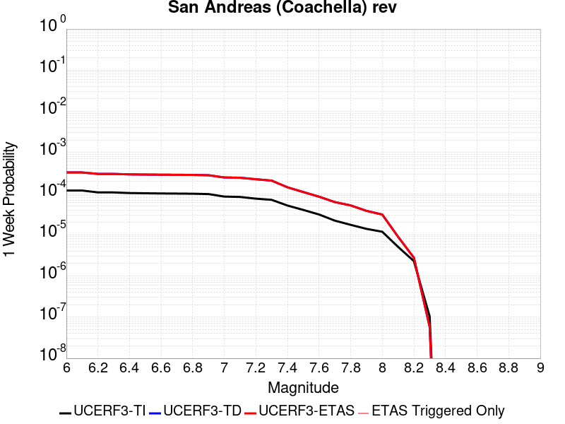 |  |  |  |

| Magnitude | 1 wk TI Prob | 1 wk TD Prob | 1 wk ETAS Prob | 1 wk ETAS/TD Gain | 1 wk ETAS Triggered Only | 1 mo TI Prob | 1 mo TD Prob | 1 mo ETAS Prob | 1 mo ETAS/TD Gain | 1 mo ETAS Triggered Only | 1 yr TI Prob | 1 yr TD Prob | 1 yr ETAS Prob | 1 yr ETAS/TD Gain | 1 yr ETAS Triggered Only | 10 yr TI Prob | 10 yr TD Prob | 10 yr ETAS Prob | 10 yr ETAS/TD Gain | 10 yr ETAS Triggered Only |
|-----|-----|-----|-----|-----|-----|-----|-----|-----|-----|-----|-----|-----|-----|-----|-----|-----|-----|-----|-----|-----|
| 6.0 | 1.1925945E-4 | 3.2736323E-4 | 3.2736323E-4 | 1.0 | 0.0 | 5.110118E-4 | 0.0014022356 | 0.0014321936 | 1.0213645 | 3.0E-5 | 0.0062038354 | 0.016939916 | 0.017028391 | 1.0052229 | 9.0E-5 | 0.060334753 | 0.15268017 | 0.15290049 | 1.0014429 | 2.6E-4 |
| 6.1 | 1.1925945E-4 | 3.2736323E-4 | 3.2736323E-4 | 1.0 | 0.0 | 5.110118E-4 | 0.0014022356 | 0.0014321936 | 1.0213645 | 3.0E-5 | 0.0062038354 | 0.016939916 | 0.017028391 | 1.0052229 | 9.0E-5 | 0.060334753 | 0.15268017 | 0.15290049 | 1.0014429 | 2.6E-4 |
| 6.2 | 1.07432395E-4 | 3.023703E-4 | 3.023703E-4 | 1.0 | 0.0 | 4.603433E-4 | 0.0012952331 | 0.0013251943 | 1.0231318 | 3.0E-5 | 0.005590286 | 0.01565654 | 0.015745131 | 1.0056584 | 9.0E-5 | 0.05451731 | 0.14185132 | 0.14206585 | 1.0015124 | 2.5E-4 |
| 6.3 | 1.0718766E-4 | 3.0182334E-4 | 3.0182334E-4 | 1.0 | 0.0 | 4.592948E-4 | 0.0012928913 | 0.0013228526 | 1.0231738 | 3.0E-5 | 0.005577586 | 0.015628438 | 0.015717031 | 1.0056688 | 9.0E-5 | 0.054396555 | 0.14161958 | 0.14183418 | 1.0015153 | 2.5E-4 |
| 6.4 | 1.0355944E-4 | 2.9390416E-4 | 2.9390416E-4 | 1.0 | 0.0 | 4.4375064E-4 | 0.0012589851 | 0.0012889473 | 1.0237987 | 3.0E-5 | 0.0053892885 | 0.015221469 | 0.015310099 | 1.0058227 | 9.0E-5 | 0.052604496 | 0.1381797 | 0.13839516 | 1.0015593 | 2.5E-4 |
| 6.5 | 1.0227914E-4 | 2.9109846E-4 | 2.9109846E-4 | 1.0 | 0.0 | 4.382655E-4 | 0.0012469722 | 0.0012769349 | 1.0240283 | 3.0E-5 | 0.0053228354 | 0.015077246 | 0.01516589 | 1.0058793 | 9.0E-5 | 0.051971316 | 0.1369589 | 0.13717465 | 1.0015754 | 2.5E-4 |
| 6.6 | 1.0116757E-4 | 2.8875592E-4 | 2.8875592E-4 | 1.0 | 0.0 | 4.3350324E-4 | 0.0012369425 | 0.0012669053 | 1.0242233 | 3.0E-5 | 0.0052651367 | 0.014956815 | 0.01504547 | 1.0059273 | 9.0E-5 | 0.051421247 | 0.1359371 | 0.1361531 | 1.0015891 | 2.5E-4 |
| 6.7 | 1.0050676E-4 | 2.8734154E-4 | 2.8734154E-4 | 1.0 | 0.0 | 4.3067214E-4 | 0.0012308866 | 0.0012608496 | 1.0243427 | 3.0E-5 | 0.005230834 | 0.014884095 | 0.014972755 | 1.0059568 | 9.0E-5 | 0.051094085 | 0.13532183 | 0.135538 | 1.0015974 | 2.5E-4 |
| 6.8 | 9.976819E-5 | 2.8537805E-4 | 2.8537805E-4 | 1.0 | 0.0 | 4.2750788E-4 | 0.0012224794 | 0.0012524427 | 1.0245103 | 3.0E-5 | 0.0051924936 | 0.014783132 | 0.014871801 | 1.005998 | 9.0E-5 | 0.050728295 | 0.1344735 | 0.1346899 | 1.0016091 | 2.5E-4 |
| 6.9 | 9.77719E-5 | 2.8034672E-4 | 2.8034672E-4 | 1.0 | 0.0 | 4.1895514E-4 | 0.0012009366 | 0.0012309005 | 1.0249505 | 3.0E-5 | 0.0050888555 | 0.014524374 | 0.014613067 | 1.0061065 | 9.0E-5 | 0.049738888 | 0.1323019 | 0.13251883 | 1.0016396 | 2.5E-4 |
| 7.0 | 8.500761E-5 | 2.4768902E-4 | 2.4768902E-4 | 1.0 | 0.0 | 3.6426744E-4 | 0.0010610959 | 0.001091064 | 1.0282427 | 3.0E-5 | 0.0044259406 | 0.012843092 | 0.012931936 | 1.0069177 | 9.0E-5 | 0.04338823 | 0.11815885 | 0.11837931 | 1.0018657 | 2.5E-4 |
| 7.1 | 8.319876E-5 | 2.4371575E-4 | 2.4371575E-4 | 1.0 | 0.0 | 3.5651738E-4 | 0.0010440812 | 0.0010740499 | 1.0287035 | 3.0E-5 | 0.004331963 | 0.012638362 | 0.012727224 | 1.0070312 | 9.0E-5 | 0.042484846 | 0.11637889 | 0.11659979 | 1.0018982 | 2.5E-4 |
| 7.2 | 7.563917E-5 | 2.2419832E-4 | 2.2419832E-4 | 1.0 | 0.0 | 3.2412758E-4 | 9.6049916E-4 | 9.904704E-4 | 1.0312037 | 3.0E-5 | 0.0039391145 | 0.011632065 | 0.011721018 | 1.0076473 | 9.0E-5 | 0.03870018 | 0.10778462 | 0.10799876 | 1.0019866 | 2.4E-4 |
| 7.3 | 7.082985E-5 | 2.073577E-4 | 2.073577E-4 | 1.0 | 0.0 | 3.0352117E-4 | 8.883761E-4 | 9.183495E-4 | 1.0337394 | 3.0E-5 | 0.0036891096 | 0.010762965 | 0.010842104 | 1.007353 | 8.0E-5 | 0.03628465 | 0.10030664 | 0.10051357 | 1.0020629 | 2.3E-4 |
| 7.4 | 5.146215E-5 | 1.4278607E-4 | 1.4278607E-4 | 1.0 | 0.0 | 2.2053342E-4 | 6.117977E-4 | 6.317854E-4 | 1.0326705 | 2.0E-5 | 0.0026816884 | 0.0074233864 | 0.007492867 | 1.0093597 | 7.0E-5 | 0.02649557 | 0.07087057 | 0.07106569 | 1.0027531 | 2.1E-4 |
| 7.5 | 4.0285166E-5 | 1.0945775E-4 | 1.0945775E-4 | 1.0 | 0.0 | 1.7263928E-4 | 4.6902063E-4 | 4.7901593E-4 | 1.021311 | 1.0E-5 | 0.002099857 | 0.0056954445 | 0.0057551027 | 1.0104747 | 6.0E-5 | 0.020801254 | 0.05502973 | 0.055209275 | 1.0032626 | 1.9E-4 |
| 7.6 | 3.1168736E-5 | 8.44262E-5 | 8.44262E-5 | 1.0 | 0.0 | 1.3357346E-4 | 3.6177653E-4 | 3.717729E-4 | 1.0276314 | 1.0E-5 | 0.0016250437 | 0.00439576 | 0.0044554966 | 1.0135895 | 6.0E-5 | 0.016132116 | 0.042826775 | 0.043008637 | 1.0042465 | 1.9E-4 |
| 7.7 | 2.2100989E-5 | 6.242018E-5 | 6.242018E-5 | 1.0 | 0.0 | 9.4715084E-5 | 2.6748766E-4 | 2.7748497E-4 | 1.0373749 | 1.0E-5 | 0.001152546 | 0.0032518052 | 0.00331161 | 1.0183913 | 6.0E-5 | 0.011465867 | 0.031915013 | 0.03209895 | 1.0057633 | 1.9E-4 |
| 7.8 | 1.7484861E-5 | 5.18248E-5 | 5.18248E-5 | 1.0 | 0.0 | 7.493296E-5 | 2.220874E-4 | 2.3208518E-4 | 1.0450174 | 1.0E-5 | 9.1192697E-4 | 0.0027005642 | 0.0027604022 | 1.0221575 | 6.0E-5 | 0.009081938 | 0.02665336 | 0.026828563 | 1.0065733 | 1.8E-4 |
| 7.9 | 1.3967285E-5 | 3.8246377E-5 | 3.8246377E-5 | 1.0 | 0.0 | 5.985842E-5 | 1.6390275E-4 | 1.6390275E-4 | 1.0 | 0.0 | 7.2853256E-4 | 0.0019936909 | 0.002043591 | 1.0250291 | 5.0E-5 | 0.0072614877 | 0.019920452 | 0.020047862 | 1.0063959 | 1.3E-4 |
| 8.0 | 1.1887396E-5 | 3.108567E-5 | 3.108567E-5 | 1.0 | 0.0 | 5.094499E-5 | 1.332175E-4 | 1.332175E-4 | 1.0 | 0.0 | 6.200787E-4 | 0.0016207173 | 0.0016706364 | 1.0308006 | 5.0E-5 | 0.006183513 | 0.016288802 | 0.016406847 | 1.007247 | 1.2E-4 |
| 8.1 | 5.100864E-6 | 8.981664E-6 | 8.981664E-6 | 1.0 | 0.0 | 2.1860664E-5 | 3.849228E-5 | 3.849228E-5 | 1.0 | 0.0 | 2.6612106E-4 | 4.6854283E-4 | 4.6854283E-4 | 1.0 | 0.0 | 0.002658026 | 0.0049218424 | 0.0049218424 | 1.0 | 0.0 |
| 8.2 | 2.3004484E-6 | 2.7897643E-6 | 2.7897643E-6 | 1.0 | 0.0 | 9.859027E-6 | 1.1956077E-5 | 1.1956077E-5 | 1.0 | 0.0 | 1.2002704E-4 | 1.4555555E-4 | 1.4555555E-4 | 1.0 | 0.0 | 0.0011996223 | 0.0015991034 | 0.0015991034 | 1.0 | 0.0 |
| 8.3 | 1.0424446E-7 | 5.8252756E-8 | 5.8252756E-8 | 1.0 | 0.0 | 4.4676187E-7 | 2.4965465E-7 | 2.4965465E-7 | 1.0 | 0.0 | 5.439312E-6 | 3.0395413E-6 | 3.0395413E-6 | 1.0 | 0.0 | 5.4391792E-5 | 3.195593E-5 | 3.195593E-5 | 1.0 | 0.0 |

## Elsinore (Glen Ivy) rev
*[(top)](#table-of-contents)*

| 1 Week | 1 Month | 1 Year | 10 Year |
|-----|-----|-----|-----|
|  |  | 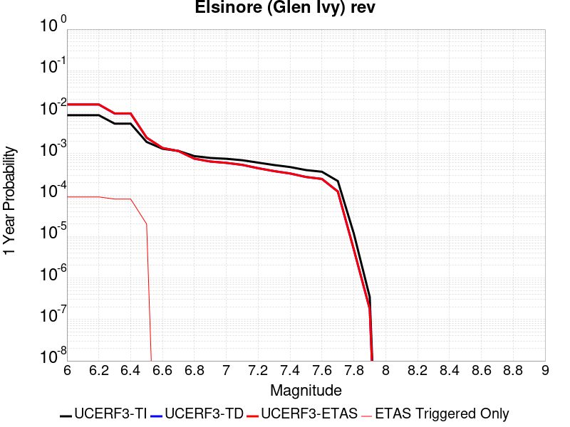 |  |

| Magnitude | 1 wk TI Prob | 1 wk TD Prob | 1 wk ETAS Prob | 1 wk ETAS/TD Gain | 1 wk ETAS Triggered Only | 1 mo TI Prob | 1 mo TD Prob | 1 mo ETAS Prob | 1 mo ETAS/TD Gain | 1 mo ETAS Triggered Only | 1 yr TI Prob | 1 yr TD Prob | 1 yr ETAS Prob | 1 yr ETAS/TD Gain | 1 yr ETAS Triggered Only | 10 yr TI Prob | 10 yr TD Prob | 10 yr ETAS Prob | 10 yr ETAS/TD Gain | 10 yr ETAS Triggered Only |
|-----|-----|-----|-----|-----|-----|-----|-----|-----|-----|-----|-----|-----|-----|-----|-----|-----|-----|-----|-----|-----|
| 6.0 | 1.6204086E-4 | 2.9362764E-4 | 2.9362764E-4 | 1.0 | 0.0 | 6.94276E-4 | 0.0012579521 | 0.0012679395 | 1.0079395 | 1.0E-5 | 0.008420097 | 0.015235546 | 0.015324175 | 1.0058173 | 9.0E-5 | 0.081081145 | 0.13969707 | 0.13986912 | 1.0012317 | 2.0E-4 |
| 6.1 | 1.6204086E-4 | 2.9362764E-4 | 2.9362764E-4 | 1.0 | 0.0 | 6.94276E-4 | 0.0012579521 | 0.0012679395 | 1.0079395 | 1.0E-5 | 0.008420097 | 0.015235546 | 0.015324175 | 1.0058173 | 9.0E-5 | 0.081081145 | 0.13969707 | 0.13986912 | 1.0012317 | 2.0E-4 |
| 6.2 | 1.6204086E-4 | 2.9362764E-4 | 2.9362764E-4 | 1.0 | 0.0 | 6.94276E-4 | 0.0012579521 | 0.0012679395 | 1.0079395 | 1.0E-5 | 0.008420097 | 0.015235546 | 0.015324175 | 1.0058173 | 9.0E-5 | 0.081081145 | 0.13969707 | 0.13986912 | 1.0012317 | 2.0E-4 |
| 6.3 | 1.0111737E-4 | 1.7703984E-4 | 1.7703984E-4 | 1.0 | 0.0 | 4.332882E-4 | 7.586382E-4 | 7.6863065E-4 | 1.0131716 | 1.0E-5 | 0.005262531 | 0.009217994 | 0.009297256 | 1.0085987 | 8.0E-5 | 0.0513964 | 0.08702178 | 0.087158725 | 1.0015737 | 1.5E-4 |
| 6.4 | 1.0111737E-4 | 1.7703984E-4 | 1.7703984E-4 | 1.0 | 0.0 | 4.332882E-4 | 7.586382E-4 | 7.6863065E-4 | 1.0131716 | 1.0E-5 | 0.005262531 | 0.009217994 | 0.009297256 | 1.0085987 | 8.0E-5 | 0.0513964 | 0.08702178 | 0.087158725 | 1.0015737 | 1.5E-4 |
| 6.5 | 3.6624708E-5 | 4.6394045E-5 | 4.6394045E-5 | 1.0 | 0.0 | 1.569536E-4 | 1.9881851E-4 | 1.9881851E-4 | 1.0 | 0.0 | 0.001909235 | 0.0024182913 | 0.0024382428 | 1.0082504 | 2.0E-5 | 0.01892915 | 0.023741428 | 0.023809765 | 1.0028784 | 7.0E-5 |
| 6.6 | 2.5051324E-5 | 2.6149793E-5 | 2.6149793E-5 | 1.0 | 0.0 | 1.073584E-4 | 1.1206598E-4 | 1.1206598E-4 | 1.0 | 0.0 | 0.0013063047 | 0.0013635939 | 0.0013635939 | 1.0 | 0.0 | 0.012986525 | 0.013565678 | 0.013595272 | 1.0021814 | 3.0E-5 |
| 6.7 | 2.2189772E-5 | 2.2074639E-5 | 2.2074639E-5 | 1.0 | 0.0 | 9.509556E-5 | 9.460237E-5 | 9.460237E-5 | 1.0 | 0.0 | 0.0011571734 | 0.0011512117 | 0.0011512117 | 1.0 | 0.0 | 0.011511663 | 0.011466335 | 0.011486106 | 1.0017242 | 2.0E-5 |
| 6.8 | 1.6654378E-5 | 1.4438802E-5 | 1.4438802E-5 | 1.0 | 0.0 | 7.137396E-5 | 6.1879146E-5 | 6.1879146E-5 | 1.0 | 0.0 | 8.686314E-4 | 7.531233E-4 | 7.531233E-4 | 1.0 | 0.0 | 0.008652439 | 0.0075110476 | 0.0075209728 | 1.0013213 | 1.0E-5 |
| 6.9 | 1.5042909E-5 | 1.2332982E-5 | 1.2332982E-5 | 1.0 | 0.0 | 6.446802E-5 | 5.2854582E-5 | 5.2854582E-5 | 1.0 | 0.0 | 7.8461546E-4 | 6.4331765E-4 | 6.4331765E-4 | 1.0 | 0.0 | 0.007818509 | 0.006418777 | 0.006428713 | 1.0015479 | 1.0E-5 |
| 7.0 | 1.4361385E-5 | 1.1452231E-5 | 1.1452231E-5 | 1.0 | 0.0 | 6.154734E-5 | 4.9080085E-5 | 4.9080085E-5 | 1.0 | 0.0 | 7.490812E-4 | 5.973891E-4 | 5.973891E-4 | 1.0 | 0.0 | 0.007465612 | 0.0059618237 | 0.005971764 | 1.0016674 | 1.0E-5 |
| 7.1 | 1.3265571E-5 | 1.0245655E-5 | 1.0245655E-5 | 1.0 | 0.0 | 5.6851208E-5 | 4.3909225E-5 | 4.3909225E-5 | 1.0 | 0.0 | 6.919436E-4 | 5.3446623E-4 | 5.3446623E-4 | 1.0 | 0.0 | 0.006897931 | 0.0053351647 | 0.0053451117 | 1.0018643 | 1.0E-5 |
| 7.2 | 1.1596403E-5 | 8.505653E-6 | 8.505653E-6 | 1.0 | 0.0 | 4.9697923E-5 | 3.6452297E-5 | 3.6452297E-5 | 1.0 | 0.0 | 6.049042E-4 | 4.4371802E-4 | 4.4371802E-4 | 1.0 | 0.0 | 0.006032603 | 0.0044297357 | 0.0044396915 | 1.0022475 | 1.0E-5 |
| 7.3 | 1.0150827E-5 | 7.2392454E-6 | 7.2392454E-6 | 1.0 | 0.0 | 4.3502816E-5 | 3.1024978E-5 | 3.1024978E-5 | 1.0 | 0.0 | 5.2951806E-4 | 3.7766507E-4 | 3.7766507E-4 | 1.0 | 0.0 | 0.005282581 | 0.003770619 | 0.0037805813 | 1.002642 | 1.0E-5 |
| 7.4 | 9.080705E-6 | 6.3529355E-6 | 6.3529355E-6 | 1.0 | 0.0 | 3.8916725E-5 | 2.7226592E-5 | 2.7226592E-5 | 1.0 | 0.0 | 4.7370812E-4 | 3.3143468E-4 | 3.3143468E-4 | 1.0 | 0.0 | 0.004726996 | 0.0033095547 | 0.0033195217 | 1.0030116 | 1.0E-5 |
| 7.5 | 7.671649E-6 | 5.225972E-6 | 5.225972E-6 | 1.0 | 0.0 | 3.287808E-5 | 2.2396838E-5 | 2.2396838E-5 | 1.0 | 0.0 | 4.0021708E-4 | 2.7264864E-4 | 2.7264864E-4 | 1.0 | 0.0 | 0.0039949706 | 0.0027232664 | 0.002733239 | 1.0036621 | 1.0E-5 |
| 7.6 | 6.990086E-6 | 4.6878486E-6 | 4.6878486E-6 | 1.0 | 0.0 | 2.9957167E-5 | 2.0090632E-5 | 2.0090632E-5 | 1.0 | 0.0 | 3.6466747E-4 | 2.4457715E-4 | 2.4457715E-4 | 1.0 | 0.0 | 0.0036406964 | 0.002443196 | 0.0024531716 | 1.004083 | 1.0E-5 |
| 7.7 | 4.163505E-6 | 2.3297123E-6 | 2.3297123E-6 | 1.0 | 0.0 | 1.7843471E-5 | 9.9844465E-6 | 9.9844465E-6 | 1.0 | 0.0 | 2.172226E-4 | 1.2155461E-4 | 1.2155461E-4 | 1.0 | 0.0 | 0.0021701038 | 0.0012149542 | 0.001224942 | 1.0082208 | 1.0E-5 |
| 7.8 | 2.2692414E-7 | 9.3862134E-8 | 9.3862134E-8 | 1.0 | 0.0 | 9.725317E-7 | 4.0226624E-7 | 4.0226624E-7 | 1.0 | 0.0 | 1.1840509E-5 | 4.8975835E-6 | 4.8975835E-6 | 1.0 | 0.0 | 1.1839878E-4 | 4.8975086E-5 | 4.8975086E-5 | 1.0 | 0.0 |
| 7.9 | 6.676829E-9 | 3.4400482E-9 | 3.4400482E-9 | 1.0 | 0.0 | 2.861498E-8 | 1.4743064E-8 | 1.4743064E-8 | 1.0 | 0.0 | 3.4838732E-7 | 1.7949678E-7 | 1.7949678E-7 | 1.0 | 0.0 | 3.4838679E-6 | 1.7949665E-6 | 1.7949665E-6 | 1.0 | 0.0 |

## Death Valley (Fish Lake Valley)
*[(top)](#table-of-contents)*

| 1 Week | 1 Month | 1 Year | 10 Year |
|-----|-----|-----|-----|
|  |  |  |  |

| Magnitude | 1 wk TI Prob | 1 wk TD Prob | 1 wk ETAS Prob | 1 wk ETAS/TD Gain | 1 wk ETAS Triggered Only | 1 mo TI Prob | 1 mo TD Prob | 1 mo ETAS Prob | 1 mo ETAS/TD Gain | 1 mo ETAS Triggered Only | 1 yr TI Prob | 1 yr TD Prob | 1 yr ETAS Prob | 1 yr ETAS/TD Gain | 1 yr ETAS Triggered Only | 10 yr TI Prob | 10 yr TD Prob | 10 yr ETAS Prob | 10 yr ETAS/TD Gain | 10 yr ETAS Triggered Only |
|-----|-----|-----|-----|-----|-----|-----|-----|-----|-----|-----|-----|-----|-----|-----|-----|-----|-----|-----|-----|-----|
| 6.0 | 3.872328E-5 | 4.7269707E-5 | 4.7269707E-5 | 1.0 | 0.0 | 1.6594635E-4 | 2.0257042E-4 | 2.2256636E-4 | 1.0987111 | 2.0E-5 | 0.0020185246 | 0.0024636437 | 0.0025633974 | 1.0404903 | 1.0E-4 | 0.02000288 | 0.024389282 | 0.024594162 | 1.0084003 | 2.1E-4 |
| 6.1 | 3.872328E-5 | 4.7269707E-5 | 4.7269707E-5 | 1.0 | 0.0 | 1.6594635E-4 | 2.0257042E-4 | 2.2256636E-4 | 1.0987111 | 2.0E-5 | 0.0020185246 | 0.0024636437 | 0.0025633974 | 1.0404903 | 1.0E-4 | 0.02000288 | 0.024389282 | 0.024594162 | 1.0084003 | 2.1E-4 |
| 6.2 | 3.872328E-5 | 4.7269707E-5 | 4.7269707E-5 | 1.0 | 0.0 | 1.6594635E-4 | 2.0257042E-4 | 2.2256636E-4 | 1.0987111 | 2.0E-5 | 0.0020185246 | 0.0024636437 | 0.0025633974 | 1.0404903 | 1.0E-4 | 0.02000288 | 0.024389282 | 0.024594162 | 1.0084003 | 2.1E-4 |
| 6.3 | 2.8356371E-5 | 3.3611173E-5 | 3.3611173E-5 | 1.0 | 0.0 | 1.2152165E-4 | 1.4404039E-4 | 1.6403751E-4 | 1.13883 | 2.0E-5 | 0.0014785219 | 0.00175236 | 0.0018521849 | 1.056966 | 1.0E-4 | 0.014687235 | 0.017392455 | 0.017598802 | 1.0118642 | 2.1E-4 |
| 6.4 | 2.8356371E-5 | 3.3611173E-5 | 3.3611173E-5 | 1.0 | 0.0 | 1.2152165E-4 | 1.4404039E-4 | 1.6403751E-4 | 1.13883 | 2.0E-5 | 0.0014785219 | 0.00175236 | 0.0018521849 | 1.056966 | 1.0E-4 | 0.014687235 | 0.017392455 | 0.017598802 | 1.0118642 | 2.1E-4 |
| 6.5 | 2.4448687E-5 | 2.8608583E-5 | 2.8608583E-5 | 1.0 | 0.0 | 1.0477588E-4 | 1.2260274E-4 | 1.4260029E-4 | 1.1631085 | 2.0E-5 | 0.0012748998 | 0.0014917168 | 0.0015815826 | 1.0602431 | 9.0E-5 | 0.012676105 | 0.014821904 | 0.015018939 | 1.0132935 | 2.0E-4 |
| 6.6 | 2.1298161E-5 | 2.4660905E-5 | 2.4660905E-5 | 1.0 | 0.0 | 9.127464E-5 | 1.056855E-4 | 1.256834E-4 | 1.1892207 | 2.0E-5 | 0.0011107022 | 0.0012859954 | 0.0013758796 | 1.0698947 | 9.0E-5 | 0.011051672 | 0.012788948 | 0.01298639 | 1.0154386 | 2.0E-4 |
| 6.7 | 1.8959729E-5 | 2.1781709E-5 | 2.1781709E-5 | 1.0 | 0.0 | 8.125345E-5 | 9.334698E-5 | 1.13345115E-4 | 1.2142344 | 2.0E-5 | 9.888117E-4 | 0.0011359325 | 0.0012258303 | 1.0791401 | 9.0E-5 | 0.009844234 | 0.011303922 | 0.0115016615 | 1.017493 | 2.0E-4 |
| 6.8 | 1.6691629E-5 | 1.901891E-5 | 1.901891E-5 | 1.0 | 0.0 | 7.153359E-5 | 8.1507154E-5 | 1.01505524E-4 | 1.2453573 | 2.0E-5 | 8.7057345E-4 | 9.919147E-4 | 0.0010818255 | 1.0906436 | 9.0E-5 | 0.008671708 | 0.009876631 | 0.010074656 | 1.0200498 | 2.0E-4 |
| 6.9 | 1.450505E-5 | 1.6389986E-5 | 1.6389986E-5 | 1.0 | 0.0 | 6.216302E-5 | 7.024095E-5 | 9.023955E-5 | 1.2847142 | 2.0E-5 | 7.5657194E-4 | 8.5485686E-4 | 9.4477995E-4 | 1.1051908 | 9.0E-5 | 0.007540013 | 0.008516616 | 0.008714913 | 1.0232835 | 2.0E-4 |
| 7.0 | 1.2940855E-5 | 1.45383465E-5 | 1.45383465E-5 | 1.0 | 0.0 | 5.545963E-5 | 6.230574E-5 | 8.23045E-5 | 1.3209777 | 2.0E-5 | 6.750118E-4 | 7.583142E-4 | 8.48246E-4 | 1.1185943 | 9.0E-5 | 0.006729651 | 0.0075578843 | 0.0077563724 | 1.0262624 | 2.0E-4 |
| 7.1 | 1.2544658E-5 | 1.4078567E-5 | 1.4078567E-5 | 1.0 | 0.0 | 5.3761712E-5 | 6.033535E-5 | 8.0334146E-5 | 1.3314606 | 2.0E-5 | 6.5435225E-4 | 7.343409E-4 | 8.2427484E-4 | 1.1224688 | 9.0E-5 | 0.006524288 | 0.007319737 | 0.0075182733 | 1.0271233 | 2.0E-4 |
| 7.2 | 1.2489416E-5 | 1.4016032E-5 | 1.4016032E-5 | 1.0 | 0.0 | 5.3524967E-5 | 6.006736E-5 | 8.006616E-5 | 1.3329395 | 2.0E-5 | 6.514716E-4 | 7.310803E-4 | 8.210145E-4 | 1.1230155 | 9.0E-5 | 0.006495651 | 0.007287345 | 0.0074858875 | 1.0272448 | 2.0E-4 |
| 7.3 | 1.2368307E-5 | 1.3880167E-5 | 1.3880167E-5 | 1.0 | 0.0 | 5.3005948E-5 | 5.9485104E-5 | 7.9483914E-5 | 1.3361986 | 2.0E-5 | 6.451563E-4 | 7.239961E-4 | 8.1393094E-4 | 1.12422 | 9.0E-5 | 0.0064328653 | 0.0072169653 | 0.007415522 | 1.0275124 | 2.0E-4 |
| 7.4 | 1.2161707E-5 | 1.3648217E-5 | 1.3648217E-5 | 1.0 | 0.0 | 5.212056E-5 | 5.8491074E-5 | 7.848991E-5 | 1.3419125 | 2.0E-5 | 6.3438306E-4 | 7.1190175E-4 | 8.018377E-4 | 1.1263319 | 9.0E-5 | 0.006325751 | 0.007096801 | 0.0072953817 | 1.0279818 | 2.0E-4 |
| 7.5 | 1.1707948E-5 | 1.3145852E-5 | 1.3145852E-5 | 1.0 | 0.0 | 5.0175953E-5 | 5.633818E-5 | 7.6337055E-5 | 1.354979 | 2.0E-5 | 6.10721E-4 | 6.857071E-4 | 7.7564537E-4 | 1.1311613 | 9.0E-5 | 0.0060904534 | 0.006836496 | 0.007035129 | 1.0290548 | 2.0E-4 |
| 7.6 | 1.0319538E-5 | 1.1579918E-5 | 1.1579918E-5 | 1.0 | 0.0 | 4.4225842E-5 | 4.9627302E-5 | 6.962631E-5 | 1.402984 | 2.0E-5 | 5.383166E-4 | 6.0405006E-4 | 6.840018E-4 | 1.1323594 | 8.0E-5 | 0.0053701443 | 0.0060246135 | 0.006213469 | 1.0313473 | 1.9E-4 |
| 7.7 | 8.937764E-6 | 1.0023033E-5 | 1.0023033E-5 | 1.0 | 0.0 | 3.830414E-5 | 4.2955176E-5 | 6.295432E-5 | 1.4655817 | 2.0E-5 | 4.6625308E-4 | 5.228588E-4 | 5.928222E-4 | 1.1338093 | 7.0E-5 | 0.0046527605 | 0.005216796 | 0.0053660134 | 1.0286033 | 1.5E-4 |
| 7.8 | 3.108007E-7 | 3.284693E-7 | 3.284693E-7 | 1.0 | 0.0 | 1.3320023E-6 | 1.4077249E-6 | 1.1407711E-5 | 8.103651 | 1.0E-5 | 1.6217007E-5 | 1.7138918E-5 | 2.7138747E-5 | 1.5834574 | 1.0E-5 | 1.6215823E-4 | 1.7137635E-4 | 1.8137463E-4 | 1.0583411 | 1.0E-5 |
| 7.9 | 2.5591178E-9 | 2.6696958E-9 | 2.6696958E-9 | 1.0 | 0.0 | 1.0967647E-8 | 1.14415535E-8 | 1.14415535E-8 | 1.0 | 0.0 | 1.335311E-7 | 1.3930091E-7 | 1.3930091E-7 | 1.0 | 0.0 | 1.3353102E-6 | 1.3930091E-6 | 1.3930091E-6 | 1.0 | 0.0 |

## San Jacinto (San Bernardino)
*[(top)](#table-of-contents)*

| 1 Week | 1 Month | 1 Year | 10 Year |
|-----|-----|-----|-----|
| 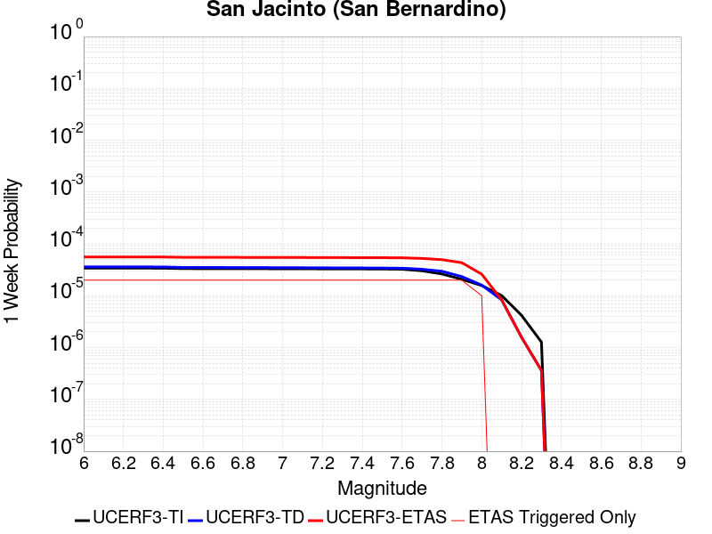 |  | 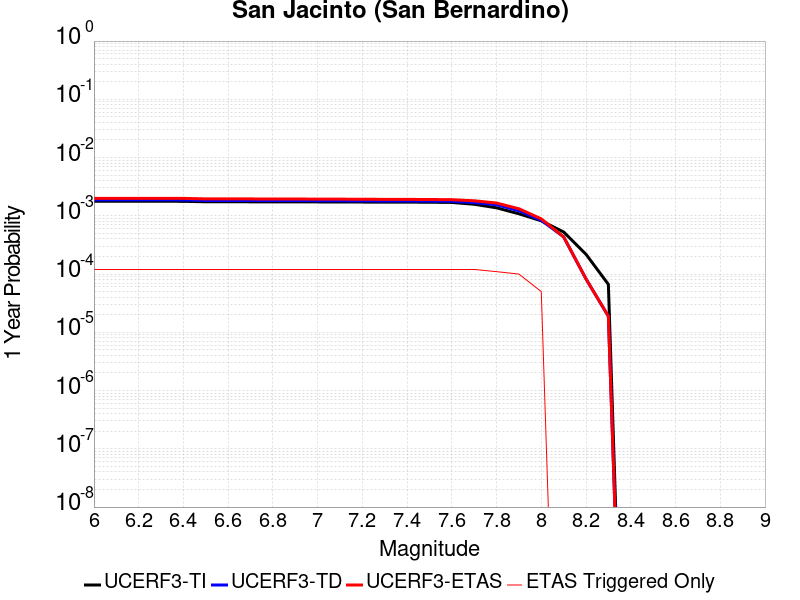 | 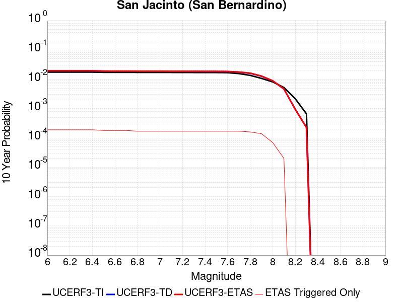 |

| Magnitude | 1 wk TI Prob | 1 wk TD Prob | 1 wk ETAS Prob | 1 wk ETAS/TD Gain | 1 wk ETAS Triggered Only | 1 mo TI Prob | 1 mo TD Prob | 1 mo ETAS Prob | 1 mo ETAS/TD Gain | 1 mo ETAS Triggered Only | 1 yr TI Prob | 1 yr TD Prob | 1 yr ETAS Prob | 1 yr ETAS/TD Gain | 1 yr ETAS Triggered Only | 10 yr TI Prob | 10 yr TD Prob | 10 yr ETAS Prob | 10 yr ETAS/TD Gain | 10 yr ETAS Triggered Only |
|-----|-----|-----|-----|-----|-----|-----|-----|-----|-----|-----|-----|-----|-----|-----|-----|-----|-----|-----|-----|-----|
| 6.0 | 3.409352E-5 | 3.6011723E-5 | 5.6011002E-5 | 1.5553547 | 2.0E-5 | 1.461069E-4 | 1.5432683E-4 | 1.9432066E-4 | 1.2591501 | 4.0E-5 | 0.0017774 | 0.0018773118 | 0.0019970865 | 1.0638012 | 1.2E-4 | 0.01763251 | 0.019362817 | 0.019549137 | 1.0096226 | 1.9E-4 |
| 6.1 | 3.409352E-5 | 3.6011723E-5 | 5.6011002E-5 | 1.5553547 | 2.0E-5 | 1.461069E-4 | 1.5432683E-4 | 1.9432066E-4 | 1.2591501 | 4.0E-5 | 0.0017774 | 0.0018773118 | 0.0019970865 | 1.0638012 | 1.2E-4 | 0.01763251 | 0.019362817 | 0.019549137 | 1.0096226 | 1.9E-4 |
| 6.2 | 3.409352E-5 | 3.6011723E-5 | 5.6011002E-5 | 1.5553547 | 2.0E-5 | 1.461069E-4 | 1.5432683E-4 | 1.9432066E-4 | 1.2591501 | 4.0E-5 | 0.0017774 | 0.0018773118 | 0.0019970865 | 1.0638012 | 1.2E-4 | 0.01763251 | 0.019362817 | 0.019549137 | 1.0096226 | 1.9E-4 |
| 6.3 | 3.409352E-5 | 3.6011723E-5 | 5.6011002E-5 | 1.5553547 | 2.0E-5 | 1.461069E-4 | 1.5432683E-4 | 1.9432066E-4 | 1.2591501 | 4.0E-5 | 0.0017774 | 0.0018773118 | 0.0019970865 | 1.0638012 | 1.2E-4 | 0.01763251 | 0.019362817 | 0.019549137 | 1.0096226 | 1.9E-4 |
| 6.4 | 3.400795E-5 | 3.590438E-5 | 5.590366E-5 | 1.5570151 | 2.0E-5 | 1.4574021E-4 | 1.5386684E-4 | 1.9386069E-4 | 1.259925 | 4.0E-5 | 0.0017729428 | 0.0018717212 | 0.0019914967 | 1.0639921 | 1.2E-4 | 0.017588645 | 0.019307896 | 0.019494228 | 1.0096506 | 1.9E-4 |
| 6.5 | 3.341482E-5 | 3.516498E-5 | 5.5164277E-5 | 1.5687276 | 2.0E-5 | 1.4319851E-4 | 1.5069835E-4 | 1.9069233E-4 | 1.2653909 | 4.0E-5 | 0.0017420477 | 0.0018332099 | 0.00195299 | 1.065339 | 1.2E-4 | 0.017284546 | 0.018929424 | 0.019106016 | 1.009329 | 1.8E-4 |
| 6.6 | 3.3364955E-5 | 3.5102195E-5 | 5.5101493E-5 | 1.569745 | 2.0E-5 | 1.4298483E-4 | 1.5042932E-4 | 1.9042329E-4 | 1.2658656 | 4.0E-5 | 0.0017394501 | 0.0018299398 | 0.0019497202 | 1.0654559 | 1.2E-4 | 0.017258976 | 0.018897288 | 0.019073885 | 1.0093452 | 1.8E-4 |
| 6.7 | 3.335922E-5 | 3.509197E-5 | 5.5091266E-5 | 1.569911 | 2.0E-5 | 1.4296026E-4 | 1.5038549E-4 | 1.9037948E-4 | 1.265943 | 4.0E-5 | 0.0017391514 | 0.0018294072 | 0.0019491876 | 1.065475 | 1.2E-4 | 0.017256035 | 0.018892078 | 0.019068677 | 1.0093478 | 1.8E-4 |
| 6.8 | 3.327683E-5 | 3.4986027E-5 | 5.498533E-5 | 1.5716368 | 2.0E-5 | 1.4260718E-4 | 1.4993151E-4 | 1.8992551E-4 | 1.2667484 | 4.0E-5 | 0.0017348597 | 0.0018238892 | 0.0019436703 | 1.0656735 | 1.2E-4 | 0.017213784 | 0.018837847 | 0.019004645 | 1.0088544 | 1.7E-4 |
| 6.9 | 3.3235785E-5 | 3.492698E-5 | 5.492628E-5 | 1.5726032 | 2.0E-5 | 1.4243131E-4 | 1.4967847E-4 | 1.8967249E-4 | 1.2671995 | 4.0E-5 | 0.0017327217 | 0.0018208136 | 0.0019405951 | 1.0657846 | 1.2E-4 | 0.017192734 | 0.018807715 | 0.018974517 | 1.0088688 | 1.7E-4 |
| 7.0 | 3.3197095E-5 | 3.4866905E-5 | 5.4866206E-5 | 1.5735898 | 2.0E-5 | 1.422655E-4 | 1.4942104E-4 | 1.8941506E-4 | 1.2676599 | 4.0E-5 | 0.0017307063 | 0.0018176846 | 0.0019374666 | 1.0658981 | 1.2E-4 | 0.017172894 | 0.018777091 | 0.018943898 | 1.0088836 | 1.7E-4 |
| 7.1 | 3.3129716E-5 | 3.4747107E-5 | 5.474641E-5 | 1.5755675 | 2.0E-5 | 1.4197677E-4 | 1.4890768E-4 | 1.8890171E-4 | 1.2685828 | 4.0E-5 | 0.0017271966 | 0.0018114449 | 0.0019312275 | 1.0661255 | 1.2E-4 | 0.017138338 | 0.018716166 | 0.018882984 | 1.008913 | 1.7E-4 |
| 7.2 | 3.3034008E-5 | 3.4614546E-5 | 5.4613854E-5 | 1.5777718 | 2.0E-5 | 1.4156665E-4 | 1.4833962E-4 | 1.883337E-4 | 1.2696115 | 4.0E-5 | 0.0017222111 | 0.0018045403 | 0.0019243237 | 1.066379 | 1.2E-4 | 0.017089253 | 0.018648556 | 0.018815385 | 1.008946 | 1.7E-4 |
| 7.3 | 3.2956614E-5 | 3.4482287E-5 | 5.44816E-5 | 1.5799879 | 2.0E-5 | 1.4123498E-4 | 1.4777287E-4 | 1.8776696E-4 | 1.2706456 | 4.0E-5 | 0.0017181796 | 0.0017976515 | 0.0019174358 | 1.0666338 | 1.2E-4 | 0.017049557 | 0.018581297 | 0.018748138 | 1.008979 | 1.7E-4 |
| 7.4 | 3.2915937E-5 | 3.4403973E-5 | 5.4403285E-5 | 1.5813082 | 2.0E-5 | 1.4106068E-4 | 1.4743727E-4 | 1.8743137E-4 | 1.2712618 | 4.0E-5 | 0.0017160608 | 0.0017935722 | 0.0019133571 | 1.0667856 | 1.2E-4 | 0.017028693 | 0.018541558 | 0.018708406 | 1.0089986 | 1.7E-4 |
| 7.5 | 3.281791E-5 | 3.426887E-5 | 5.4268185E-5 | 1.5836 | 2.0E-5 | 1.406406E-4 | 1.4685832E-4 | 1.8685244E-4 | 1.2723314 | 4.0E-5 | 0.0017109542 | 0.0017865351 | 0.0019063207 | 1.0670491 | 1.2E-4 | 0.016978411 | 0.018472437 | 0.018639296 | 1.0090328 | 1.7E-4 |
| 7.6 | 3.2521442E-5 | 3.3993772E-5 | 5.399309E-5 | 1.5883231 | 2.0E-5 | 1.3937015E-4 | 1.4567947E-4 | 1.8567363E-4 | 1.2745354 | 4.0E-5 | 0.0016955109 | 0.001772206 | 0.0018919933 | 1.0675923 | 1.2E-4 | 0.016826328 | 0.018330043 | 0.018496927 | 1.0091044 | 1.7E-4 |
| 7.7 | 3.0287873E-5 | 3.2477517E-5 | 5.2476866E-5 | 1.6157906 | 2.0E-5 | 1.297987E-4 | 1.3918194E-4 | 1.7917636E-4 | 1.2873536 | 4.0E-5 | 0.0015791537 | 0.0016932241 | 0.0018130209 | 1.0707507 | 1.2E-4 | 0.01567979 | 0.01754076 | 0.01770778 | 1.0095217 | 1.7E-4 |
| 7.8 | 2.6316151E-5 | 2.968745E-5 | 4.9686856E-5 | 1.6736654 | 2.0E-5 | 1.1277862E-4 | 1.2722572E-4 | 1.6722064E-4 | 1.3143618 | 4.0E-5 | 0.0013722149 | 0.0015478736 | 0.0016577033 | 1.0709553 | 1.1E-4 | 0.013637724 | 0.016081864 | 0.016239291 | 1.0097891 | 1.6E-4 |
| 7.9 | 2.0761147E-5 | 2.3438914E-5 | 4.3438446E-5 | 1.8532618 | 2.0E-5 | 8.897331E-5 | 1.00448626E-4 | 1.4044461E-4 | 1.3981736 | 4.0E-5 | 0.0010827117 | 0.0012222767 | 0.0013221545 | 1.0817145 | 1.0E-4 | 0.010774517 | 0.012803924 | 0.012942132 | 1.0107942 | 1.4E-4 |
| 8.0 | 1.5738568E-5 | 1.6049207E-5 | 2.6049047E-5 | 1.6230738 | 1.0E-5 | 6.744926E-5 | 6.87805E-5 | 8.8779125E-5 | 1.29076 | 2.0E-5 | 8.2088535E-4 | 8.370816E-4 | 8.8703976E-4 | 1.0596813 | 5.0E-5 | 0.008178596 | 0.008874145 | 0.008943524 | 1.0078181 | 7.0E-5 |
| 8.1 | 1.0105832E-5 | 8.33957E-6 | 8.33957E-6 | 1.0 | 0.0 | 4.3309992E-5 | 3.5740526E-5 | 3.5740526E-5 | 1.0 | 0.0 | 5.2717153E-4 | 4.3505454E-4 | 4.3505454E-4 | 1.0 | 0.0 | 0.005259227 | 0.0046821074 | 0.004702014 | 1.0042516 | 2.0E-5 |
| 8.2 | 4.189207E-6 | 1.5810583E-6 | 1.5810583E-6 | 1.0 | 0.0 | 1.7953622E-5 | 6.7759465E-6 | 6.7759465E-6 | 1.0 | 0.0 | 2.1856341E-4 | 8.249406E-5 | 8.249406E-5 | 1.0 | 0.0 | 0.0021834858 | 9.580845E-4 | 9.580845E-4 | 1.0 | 0.0 |
| 8.3 | 1.2758221E-6 | 3.6220413E-7 | 3.6220413E-7 | 1.0 | 0.0 | 5.4677976E-6 | 1.5523025E-6 | 1.5523025E-6 | 1.0 | 0.0 | 6.65684E-5 | 1.8899123E-5 | 1.8899123E-5 | 1.0 | 0.0 | 6.6548464E-4 | 2.2792698E-4 | 2.2792698E-4 | 1.0 | 0.0 |

## Red Pass
*[(top)](#table-of-contents)*

| 1 Week | 1 Month | 1 Year | 10 Year |
|-----|-----|-----|-----|
| 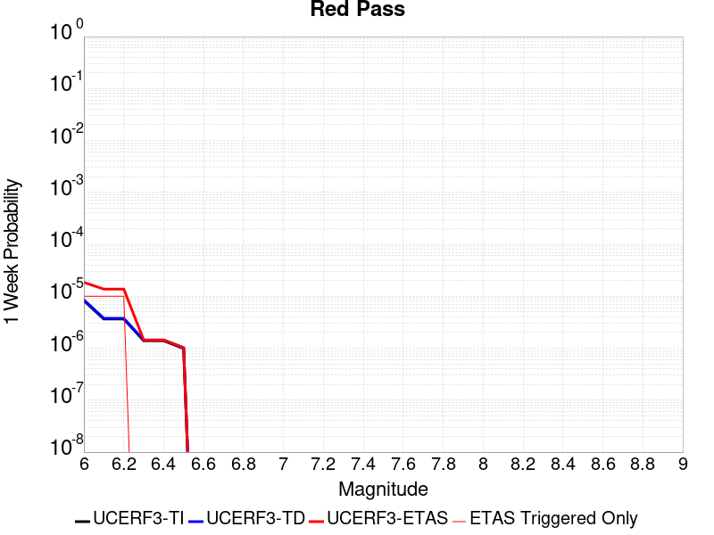 | 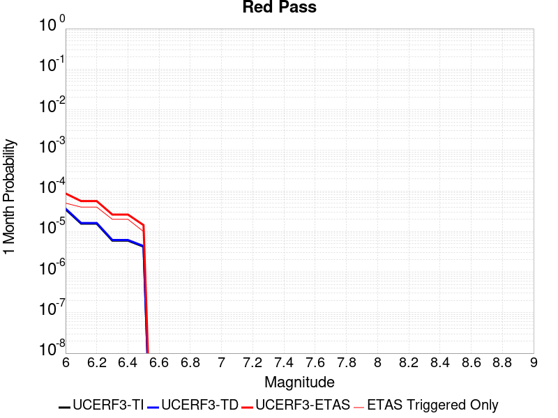 | 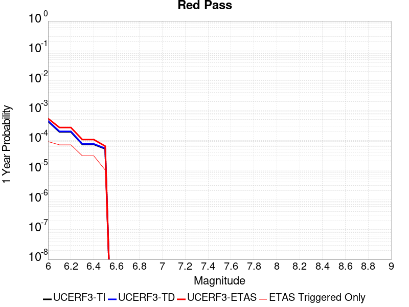 |  |

| Magnitude | 1 wk TI Prob | 1 wk TD Prob | 1 wk ETAS Prob | 1 wk ETAS/TD Gain | 1 wk ETAS Triggered Only | 1 mo TI Prob | 1 mo TD Prob | 1 mo ETAS Prob | 1 mo ETAS/TD Gain | 1 mo ETAS Triggered Only | 1 yr TI Prob | 1 yr TD Prob | 1 yr ETAS Prob | 1 yr ETAS/TD Gain | 1 yr ETAS Triggered Only | 10 yr TI Prob | 10 yr TD Prob | 10 yr ETAS Prob | 10 yr ETAS/TD Gain | 10 yr ETAS Triggered Only |
|-----|-----|-----|-----|-----|-----|-----|-----|-----|-----|-----|-----|-----|-----|-----|-----|-----|-----|-----|-----|-----|
| 6.0 | 8.258278E-6 | 8.551328E-6 | 1.8551242E-5 | 2.169399 | 1.0E-5 | 3.539214E-5 | 3.6648136E-5 | 8.66463E-5 | 2.364276 | 5.0E-5 | 4.308141E-4 | 4.4611757E-4 | 5.360774E-4 | 1.2016505 | 9.0E-5 | 0.0042997985 | 0.0044539776 | 0.0046232203 | 1.0379981 | 1.7E-4 |
| 6.1 | 3.649988E-6 | 3.7753432E-6 | 1.3775305E-5 | 3.6487558 | 1.0E-5 | 1.5642712E-5 | 1.6179969E-5 | 5.617932E-5 | 3.4721527 | 4.0E-5 | 1.9043336E-4 | 1.9697807E-4 | 2.6696429E-4 | 1.3552995 | 7.0E-5 | 0.0019027026 | 0.001968502 | 0.0020583249 | 1.0456301 | 9.0E-5 |
| 6.2 | 3.649988E-6 | 3.7753432E-6 | 1.3775305E-5 | 3.6487558 | 1.0E-5 | 1.5642712E-5 | 1.6179969E-5 | 5.617932E-5 | 3.4721527 | 4.0E-5 | 1.9043336E-4 | 1.9697807E-4 | 2.6696429E-4 | 1.3552995 | 7.0E-5 | 0.0019027026 | 0.001968502 | 0.0020583249 | 1.0456301 | 9.0E-5 |
| 6.3 | 1.3924937E-6 | 1.4411271E-6 | 1.4411271E-6 | 1.0 | 0.0 | 5.9678164E-6 | 6.1762526E-6 | 2.6176129E-5 | 4.2381897 | 2.0E-5 | 7.265574E-5 | 7.519469E-5 | 1.0519244E-4 | 1.3989344 | 3.0E-5 | 7.263199E-4 | 7.518313E-4 | 7.918012E-4 | 1.0531634 | 4.0E-5 |
| 6.4 | 1.3924937E-6 | 1.4411271E-6 | 1.4411271E-6 | 1.0 | 0.0 | 5.9678164E-6 | 6.1762526E-6 | 2.6176129E-5 | 4.2381897 | 2.0E-5 | 7.265574E-5 | 7.519469E-5 | 1.0519244E-4 | 1.3989344 | 3.0E-5 | 7.263199E-4 | 7.518313E-4 | 7.918012E-4 | 1.0531634 | 4.0E-5 |
| 6.5 | 9.876812E-7 | 1.0221986E-6 | 1.0221986E-6 | 1.0 | 0.0 | 4.2329125E-6 | 4.3808514E-6 | 1.4380807E-5 | 3.2826514 | 1.0E-5 | 5.153449E-5 | 5.3336866E-5 | 6.333633E-5 | 1.1874776 | 1.0E-5 | 5.1522546E-4 | 5.333687E-4 | 5.4336333E-4 | 1.0187387 | 1.0E-5 |

## Brawley (Seismic Zone) alt 1
*[(top)](#table-of-contents)*

| 1 Week | 1 Month | 1 Year | 10 Year |
|-----|-----|-----|-----|
|  |  |  |  |

| Magnitude | 1 wk TI Prob | 1 wk TD Prob | 1 wk ETAS Prob | 1 wk ETAS/TD Gain | 1 wk ETAS Triggered Only | 1 mo TI Prob | 1 mo TD Prob | 1 mo ETAS Prob | 1 mo ETAS/TD Gain | 1 mo ETAS Triggered Only | 1 yr TI Prob | 1 yr TD Prob | 1 yr ETAS Prob | 1 yr ETAS/TD Gain | 1 yr ETAS Triggered Only | 10 yr TI Prob | 10 yr TD Prob | 10 yr ETAS Prob | 10 yr ETAS/TD Gain | 10 yr ETAS Triggered Only |
|-----|-----|-----|-----|-----|-----|-----|-----|-----|-----|-----|-----|-----|-----|-----|-----|-----|-----|-----|-----|-----|
| 6.0 | 2.2521618E-4 | 4.7646262E-4 | 4.7646262E-4 | 1.0 | 0.0 | 9.6485513E-4 | 0.0020404218 | 0.0020703606 | 1.0146729 | 3.0E-5 | 0.011683988 | 0.024553232 | 0.024592249 | 1.0015891 | 4.0E-5 | 0.11088423 | 0.21354736 | 0.21365747 | 1.0005156 | 1.4E-4 |
| 6.1 | 2.2521618E-4 | 4.7646262E-4 | 4.7646262E-4 | 1.0 | 0.0 | 9.6485513E-4 | 0.0020404218 | 0.0020703606 | 1.0146729 | 3.0E-5 | 0.011683988 | 0.024553232 | 0.024582494 | 1.0011919 | 3.0E-5 | 0.11088423 | 0.21354736 | 0.2136496 | 1.0004787 | 1.3E-4 |
| 6.2 | 2.198148E-4 | 4.6730554E-4 | 4.6730554E-4 | 1.0 | 0.0 | 9.417233E-4 | 0.0020012376 | 0.0020311775 | 1.0149608 | 3.0E-5 | 0.011405343 | 0.024087342 | 0.024116619 | 1.0012155 | 3.0E-5 | 0.10837428 | 0.20998326 | 0.21008596 | 1.0004891 | 1.3E-4 |
| 6.3 | 2.1704129E-4 | 4.6166187E-4 | 4.6166187E-4 | 1.0 | 0.0 | 9.298453E-4 | 0.0019770872 | 0.0020070279 | 1.0151439 | 3.0E-5 | 0.011262234 | 0.023800476 | 0.023829762 | 1.0012305 | 3.0E-5 | 0.107082725 | 0.20787422 | 0.20797719 | 1.0004954 | 1.3E-4 |
| 6.4 | 1.876142E-4 | 4.0057916E-4 | 4.0057916E-4 | 1.0 | 0.0 | 8.038131E-4 | 0.0017156526 | 0.0017456012 | 1.017456 | 3.0E-5 | 0.00974259 | 0.020687046 | 0.020716425 | 1.0014201 | 3.0E-5 | 0.093263686 | 0.18462506 | 0.18473105 | 1.0005741 | 1.3E-4 |
| 6.5 | 1.7390939E-4 | 3.748963E-4 | 3.748963E-4 | 1.0 | 0.0 | 7.45113E-4 | 0.0016057213 | 0.0016356731 | 1.0186532 | 3.0E-5 | 0.009034078 | 0.019375147 | 0.019404566 | 1.0015184 | 3.0E-5 | 0.086755216 | 0.17444642 | 0.17455375 | 1.0006152 | 1.3E-4 |
| 6.6 | 1.591791E-4 | 3.4903886E-4 | 3.4903886E-4 | 1.0 | 0.0 | 6.8201777E-4 | 0.0014950333 | 0.0015249884 | 1.0200365 | 3.0E-5 | 0.008271996 | 0.01805168 | 0.018081138 | 1.0016319 | 3.0E-5 | 0.07970774 | 0.16385324 | 0.16396195 | 1.0006634 | 1.3E-4 |
| 6.7 | 1.4268003E-4 | 3.2069403E-4 | 3.2069403E-4 | 1.0 | 0.0 | 6.1134255E-4 | 0.0013736873 | 0.0014036461 | 1.021809 | 3.0E-5 | 0.007417723 | 0.016598351 | 0.016627854 | 1.0017774 | 3.0E-5 | 0.07174956 | 0.1519761 | 0.15208633 | 1.0007254 | 1.3E-4 |
| 6.8 | 1.239713E-4 | 2.906315E-4 | 2.906315E-4 | 1.0 | 0.0 | 5.3119735E-4 | 0.0012449751 | 0.0012749378 | 1.0240669 | 3.0E-5 | 0.0064481674 | 0.015053659 | 0.015083207 | 1.0019629 | 3.0E-5 | 0.06264243 | 0.1384153 | 0.13852732 | 1.0008092 | 1.3E-4 |
| 6.9 | 1.0180238E-4 | 2.6261745E-4 | 2.6261745E-4 | 1.0 | 0.0 | 4.3622297E-4 | 0.0011250222 | 0.0011549884 | 1.0266361 | 3.0E-5 | 0.005298089 | 0.013612123 | 0.013641715 | 1.0021739 | 3.0E-5 | 0.05173543 | 0.12499149 | 0.12510525 | 1.00091 | 1.3E-4 |
| 7.0 | 7.6619996E-5 | 2.2404914E-4 | 2.2404914E-4 | 1.0 | 0.0 | 3.283301E-4 | 9.5986045E-4 | 9.898316E-4 | 1.0312245 | 3.0E-5 | 0.0039900932 | 0.011624391 | 0.011654043 | 1.0025507 | 3.0E-5 | 0.039192066 | 0.10728989 | 0.10740594 | 1.0010817 | 1.3E-4 |
| 7.1 | 7.5127435E-5 | 2.2088006E-4 | 2.2088006E-4 | 1.0 | 0.0 | 3.2193496E-4 | 9.462886E-4 | 9.762602E-4 | 1.0316728 | 3.0E-5 | 0.0039125155 | 0.011460904 | 0.01149056 | 1.0025876 | 3.0E-5 | 0.038443442 | 0.10585362 | 0.10596986 | 1.0010982 | 1.3E-4 |
| 7.2 | 6.788582E-5 | 2.0215544E-4 | 2.0215544E-4 | 1.0 | 0.0 | 2.9090676E-4 | 8.6609577E-4 | 8.960698E-4 | 1.0346082 | 3.0E-5 | 0.0035360386 | 0.010494374 | 0.010524059 | 1.0028287 | 3.0E-5 | 0.034803 | 0.09752353 | 0.097631834 | 1.0011104 | 1.2E-4 |
| 7.3 | 6.399602E-5 | 1.8846264E-4 | 1.8846264E-4 | 1.0 | 0.0 | 2.7423984E-4 | 8.074499E-4 | 8.374257E-4 | 1.037124 | 3.0E-5 | 0.0033337586 | 0.009786981 | 0.009816688 | 1.0030353 | 3.0E-5 | 0.03284188 | 0.09141768 | 0.09152671 | 1.0011927 | 1.2E-4 |
| 7.4 | 4.506759E-5 | 1.2533256E-4 | 1.2533256E-4 | 1.0 | 0.0 | 1.9313251E-4 | 5.370298E-4 | 5.570191E-4 | 1.0372219 | 2.0E-5 | 0.0023488526 | 0.0065189116 | 0.0065387813 | 1.003048 | 2.0E-5 | 0.023241805 | 0.062381458 | 0.06247522 | 1.001503 | 1.0E-4 |
| 7.5 | 3.43289E-5 | 9.338831E-5 | 9.338831E-5 | 1.0 | 0.0 | 1.4711556E-4 | 4.0017455E-4 | 4.1017053E-4 | 1.0249791 | 1.0E-5 | 0.0017896603 | 0.004861303 | 0.0048712543 | 1.0020471 | 1.0E-5 | 0.01775316 | 0.0470705 | 0.047146734 | 1.0016196 | 8.0E-5 |
| 7.6 | 2.5980507E-5 | 7.056081E-5 | 7.056081E-5 | 1.0 | 0.0 | 1.1134028E-4 | 3.0236854E-4 | 3.1236553E-4 | 1.0330622 | 1.0E-5 | 0.001354725 | 0.0036751472 | 0.0036851105 | 1.0027109 | 1.0E-5 | 0.013464959 | 0.03585432 | 0.03593145 | 1.0021513 | 8.0E-5 |
| 7.7 | 1.7292105E-5 | 4.9432718E-5 | 4.9432718E-5 | 1.0 | 0.0 | 7.4106916E-5 | 2.1183734E-4 | 2.2183522E-4 | 1.047196 | 1.0E-5 | 9.018782E-4 | 0.0025760748 | 0.002586049 | 1.0038719 | 1.0E-5 | 0.008982267 | 0.025301963 | 0.025379939 | 1.0030818 | 8.0E-5 |
| 7.8 | 1.2927471E-5 | 3.9715396E-5 | 3.9715396E-5 | 1.0 | 0.0 | 5.5402274E-5 | 1.7019775E-4 | 1.8019605E-4 | 1.0587451 | 1.0E-5 | 6.743139E-4 | 0.0020701909 | 0.0020801702 | 1.0048205 | 1.0E-5 | 0.0067227143 | 0.020441806 | 0.020500578 | 1.0028752 | 6.0E-5 |
| 7.9 | 1.0200774E-5 | 2.8763581E-5 | 2.8763581E-5 | 1.0 | 0.0 | 4.371687E-5 | 1.2326667E-4 | 1.2326667E-4 | 1.0 | 0.0 | 5.321229E-4 | 0.0014997396 | 0.0014997396 | 1.0 | 0.0 | 0.005308505 | 0.01499992 | 0.0150294695 | 1.00197 | 3.0E-5 |
| 8.0 | 8.650396E-6 | 2.3292707E-5 | 2.3292707E-5 | 1.0 | 0.0 | 3.70726E-5 | 9.982207E-5 | 9.982207E-5 | 1.0 | 0.0 | 4.5126543E-4 | 0.001214657 | 0.001214657 | 1.0 | 0.0 | 0.0045035016 | 0.012218243 | 0.012237999 | 1.001617 | 2.0E-5 |
| 8.1 | 3.9368224E-6 | 7.334553E-6 | 7.334553E-6 | 1.0 | 0.0 | 1.6871985E-5 | 3.143342E-5 | 3.143342E-5 | 1.0 | 0.0 | 2.0539707E-4 | 3.8263484E-4 | 3.8263484E-4 | 1.0 | 0.0 | 0.0020520731 | 0.004004444 | 0.004004444 | 1.0 | 0.0 |
| 8.2 | 1.7101195E-6 | 2.2204472E-6 | 2.2204472E-6 | 1.0 | 0.0 | 7.329063E-6 | 9.516168E-6 | 9.516168E-6 | 1.0 | 0.0 | 8.922769E-5 | 1.1585321E-4 | 1.1585321E-4 | 1.0 | 0.0 | 8.9191867E-4 | 0.0012679962 | 0.0012679962 | 1.0 | 0.0 |
| 8.3 | 3.0346666E-8 | 1.7242932E-8 | 1.7242932E-8 | 1.0 | 0.0 | 1.3005713E-7 | 7.3898285E-8 | 7.3898285E-8 | 1.0 | 0.0 | 1.5834444E-6 | 8.997115E-7 | 8.997115E-7 | 1.0 | 0.0 | 1.5834332E-5 | 9.38217E-6 | 9.38217E-6 | 1.0 | 0.0 |

## San Andreas (Creeping Section) 2011 CFM
*[(top)](#table-of-contents)*

| 1 Week | 1 Month | 1 Year | 10 Year |
|-----|-----|-----|-----|
|  | 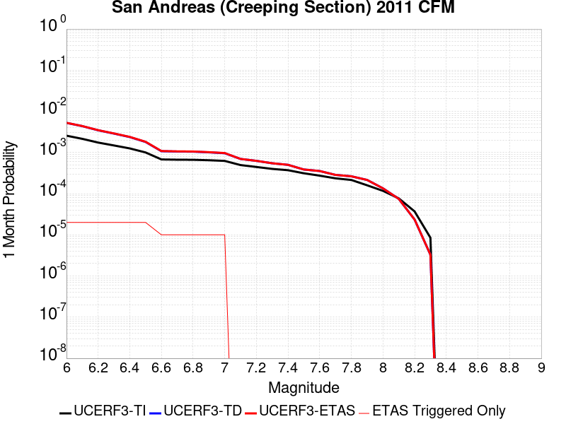 |  |  |

| Magnitude | 1 wk TI Prob | 1 wk TD Prob | 1 wk ETAS Prob | 1 wk ETAS/TD Gain | 1 wk ETAS Triggered Only | 1 mo TI Prob | 1 mo TD Prob | 1 mo ETAS Prob | 1 mo ETAS/TD Gain | 1 mo ETAS Triggered Only | 1 yr TI Prob | 1 yr TD Prob | 1 yr ETAS Prob | 1 yr ETAS/TD Gain | 1 yr ETAS Triggered Only | 10 yr TI Prob | 10 yr TD Prob | 10 yr ETAS Prob | 10 yr ETAS/TD Gain | 10 yr ETAS Triggered Only |
|-----|-----|-----|-----|-----|-----|-----|-----|-----|-----|-----|-----|-----|-----|-----|-----|-----|-----|-----|-----|-----|
| 6.0 | 5.986481E-4 | 0.0012278525 | 0.0012378403 | 1.0081342 | 1.0E-5 | 0.0025631124 | 0.005245959 | 0.005265854 | 1.0037924 | 2.0E-5 | 0.030762846 | 0.061215457 | 0.061253008 | 1.0006135 | 4.0E-5 | 0.26835477 | 0.4259989 | 0.42607352 | 1.0001751 | 1.3E-4 |
| 6.1 | 5.015945E-4 | 0.0010221525 | 0.0010321423 | 1.0097733 | 1.0E-5 | 0.00214792 | 0.004367999 | 0.0043879114 | 1.0045588 | 2.0E-5 | 0.025839351 | 0.05125747 | 0.05129542 | 1.0007404 | 4.0E-5 | 0.23032776 | 0.37291995 | 0.3730015 | 1.0002186 | 1.3E-4 |
| 6.2 | 4.073338E-4 | 8.110186E-4 | 8.2101044E-4 | 1.0123202 | 1.0E-5 | 0.0017445484 | 0.0034677892 | 0.0034877197 | 1.0057473 | 2.0E-5 | 0.021034058 | 0.040942684 | 0.040981047 | 1.000937 | 4.0E-5 | 0.19150782 | 0.31310305 | 0.31318545 | 1.0002632 | 1.2E-4 |
| 6.3 | 3.464099E-4 | 6.7407463E-4 | 6.840679E-4 | 1.0148251 | 1.0E-5 | 0.0014837692 | 0.0028831805 | 0.0029031227 | 1.0069168 | 2.0E-5 | 0.017915873 | 0.03419863 | 0.03423726 | 1.0011296 | 4.0E-5 | 0.16538359 | 0.27139044 | 0.27147785 | 1.0003222 | 1.2E-4 |
| 6.4 | 2.935057E-4 | 5.545828E-4 | 5.645773E-4 | 1.0180216 | 1.0E-5 | 0.0012572751 | 0.0023720895 | 0.0023920422 | 1.0084114 | 2.0E-5 | 0.015200248 | 0.028273724 | 0.028302874 | 1.001031 | 3.0E-5 | 0.14201577 | 0.23306303 | 0.23315506 | 1.0003949 | 1.2E-4 |
| 6.5 | 2.3409708E-4 | 4.2114416E-4 | 4.3113995E-4 | 1.0237348 | 1.0E-5 | 0.0010028875 | 0.0018020559 | 0.0018220198 | 1.0110785 | 2.0E-5 | 0.012141965 | 0.021597873 | 0.021627225 | 1.001359 | 3.0E-5 | 0.11499573 | 0.18690665 | 0.18700422 | 1.000522 | 1.2E-4 |
| 6.6 | 1.5842178E-4 | 2.509244E-4 | 2.509244E-4 | 1.0 | 0.0 | 6.7877385E-4 | 0.0010749479 | 0.0010849371 | 1.0092927 | 1.0E-5 | 0.0082328 | 0.013007499 | 0.01302724 | 1.0015175 | 2.0E-5 | 0.07934396 | 0.12323657 | 0.123324245 | 1.0007114 | 1.0E-4 |
| 6.7 | 1.5616413E-4 | 2.4628892E-4 | 2.4628892E-4 | 1.0 | 0.0 | 6.691031E-4 | 0.0010550978 | 0.0010650873 | 1.0094678 | 1.0E-5 | 0.0081159435 | 0.012769343 | 0.012789087 | 1.0015463 | 2.0E-5 | 0.0782586 | 0.12126372 | 0.1213516 | 1.0007247 | 1.0E-4 |
| 6.8 | 1.5538467E-4 | 2.4452727E-4 | 2.4452727E-4 | 1.0 | 0.0 | 6.6576427E-4 | 0.001047554 | 0.0010575434 | 1.009536 | 1.0E-5 | 0.008075596 | 0.012678709 | 0.012698456 | 1.0015575 | 2.0E-5 | 0.07788358 | 0.12049456 | 0.120582506 | 1.0007299 | 1.0E-4 |
| 6.9 | 1.5153569E-4 | 2.3561907E-4 | 2.3561907E-4 | 1.0 | 0.0 | 6.49277E-4 | 0.0010094072 | 0.0010193972 | 1.0098968 | 1.0E-5 | 0.007876333 | 0.012220812 | 0.012240568 | 1.0016166 | 2.0E-5 | 0.07602952 | 0.116564475 | 0.11665282 | 1.0007579 | 1.0E-4 |
| 7.0 | 1.4588932E-4 | 2.2419001E-4 | 2.2419001E-4 | 1.0 | 0.0 | 6.250901E-4 | 9.604625E-4 | 9.704529E-4 | 1.0104016 | 1.0E-5 | 0.0075839474 | 0.011631432 | 0.011651199 | 1.0016994 | 2.0E-5 | 0.073302895 | 0.1114107 | 0.11149956 | 1.0007976 | 1.0E-4 |
| 7.1 | 1.1565079E-4 | 1.6299551E-4 | 1.6299551E-4 | 1.0 | 0.0 | 4.955521E-4 | 6.98366E-4 | 6.98366E-4 | 1.0 | 0.0 | 0.006016669 | 0.008469661 | 0.008479577 | 1.0011706 | 1.0E-5 | 0.058563538 | 0.08374688 | 0.08382018 | 1.0008752 | 8.0E-5 |
| 7.2 | 1.0393792E-4 | 1.4632216E-4 | 1.4632216E-4 | 1.0 | 0.0 | 4.4537216E-4 | 6.26945E-4 | 6.26945E-4 | 1.0 | 0.0 | 0.005408933 | 0.0076065105 | 0.0076164347 | 1.0013046 | 1.0E-5 | 0.052791595 | 0.075691655 | 0.075765595 | 1.0009769 | 8.0E-5 |
| 7.3 | 9.332884E-5 | 1.279508E-4 | 1.279508E-4 | 1.0 | 0.0 | 3.999194E-4 | 5.4824597E-4 | 5.4824597E-4 | 1.0 | 0.0 | 0.0048581534 | 0.0066546006 | 0.006664534 | 1.0014927 | 1.0E-5 | 0.047533102 | 0.06654733 | 0.066622004 | 1.0011221 | 8.0E-5 |
| 7.4 | 8.670252E-5 | 1.1714084E-4 | 1.1714084E-4 | 1.0 | 0.0 | 3.715293E-4 | 5.019361E-4 | 5.019361E-4 | 1.0 | 0.0 | 0.004513991 | 0.00609407 | 0.006104009 | 1.0016309 | 1.0E-5 | 0.044233937 | 0.06120087 | 0.061275974 | 1.0012271 | 8.0E-5 |
| 7.5 | 7.3036405E-5 | 9.014738E-5 | 9.014738E-5 | 1.0 | 0.0 | 3.129756E-4 | 3.862888E-4 | 3.862888E-4 | 1.0 | 0.0 | 0.0038038217 | 0.0046929456 | 0.0046929456 | 1.0 | 0.0 | 0.03739367 | 0.04791924 | 0.047985885 | 1.0013908 | 7.0E-5 |
| 7.6 | 6.3935775E-5 | 8.287493E-5 | 8.287493E-5 | 1.0 | 0.0 | 2.7398168E-4 | 3.5513E-4 | 3.5513E-4 | 1.0 | 0.0 | 0.0033306254 | 0.0043151546 | 0.0043151546 | 1.0 | 0.0 | 0.032811474 | 0.044025145 | 0.044092063 | 1.00152 | 7.0E-5 |
| 7.7 | 5.5050095E-5 | 6.668109E-5 | 6.668109E-5 | 1.0 | 0.0 | 2.3590765E-4 | 2.857448E-4 | 2.857448E-4 | 1.0 | 0.0 | 0.0028683927 | 0.0034733976 | 0.0034733976 | 1.0 | 0.0 | 0.0283165 | 0.035826202 | 0.035884053 | 1.0016148 | 6.0E-5 |
| 7.8 | 5.027131E-5 | 6.1685845E-5 | 6.1685845E-5 | 1.0 | 0.0 | 2.1543067E-4 | 2.6434113E-4 | 2.6434113E-4 | 1.0 | 0.0 | 0.0026197135 | 0.0032136072 | 0.0032136072 | 1.0 | 0.0 | 0.025890453 | 0.033154093 | 0.033212103 | 1.0017498 | 6.0E-5 |
| 7.9 | 3.7271806E-5 | 5.02708E-5 | 5.02708E-5 | 1.0 | 0.0 | 1.5972654E-4 | 2.154285E-4 | 2.154285E-4 | 1.0 | 0.0 | 0.0019429359 | 0.0026196893 | 0.0026196893 | 1.0 | 0.0 | 0.019260362 | 0.02708947 | 0.027138114 | 1.0017958 | 5.0E-5 |
| 8.0 | 2.7310243E-5 | 3.1459145E-5 | 3.1459145E-5 | 1.0 | 0.0 | 1.17038646E-4 | 1.3481795E-4 | 1.3481795E-4 | 1.0 | 0.0 | 0.0014240141 | 0.0016401736 | 0.0016401736 | 1.0 | 0.0 | 0.014149235 | 0.01722948 | 0.017249135 | 1.0011408 | 2.0E-5 |
| 8.1 | 1.7940547E-5 | 1.7420305E-5 | 1.7420305E-5 | 1.0 | 0.0 | 7.688579E-5 | 7.465632E-5 | 7.465632E-5 | 1.0 | 0.0 | 9.3568244E-4 | 9.085621E-4 | 9.085621E-4 | 1.0 | 0.0 | 0.009317525 | 0.009809323 | 0.0098192245 | 1.0010095 | 1.0E-5 |
| 8.2 | 8.643924E-6 | 5.4827005E-6 | 5.4827005E-6 | 1.0 | 0.0 | 3.704486E-5 | 2.3497076E-5 | 2.3497076E-5 | 1.0 | 0.0 | 4.5092785E-4 | 2.8603943E-4 | 2.8603943E-4 | 1.0 | 0.0 | 0.0045001395 | 0.0032529908 | 0.0032529908 | 1.0 | 0.0 |
| 8.3 | 1.983087E-6 | 7.6730925E-7 | 7.6730925E-7 | 1.0 | 0.0 | 8.498917E-6 | 3.288464E-6 | 3.288464E-6 | 1.0 | 0.0 | 1.034694E-4 | 4.003633E-5 | 4.003633E-5 | 1.0 | 0.0 | 0.0010342124 | 4.7272502E-4 | 4.7272502E-4 | 1.0 | 0.0 |

## Scodie Lineament
*[(top)](#table-of-contents)*

| 1 Week | 1 Month | 1 Year | 10 Year |
|-----|-----|-----|-----|
|  | 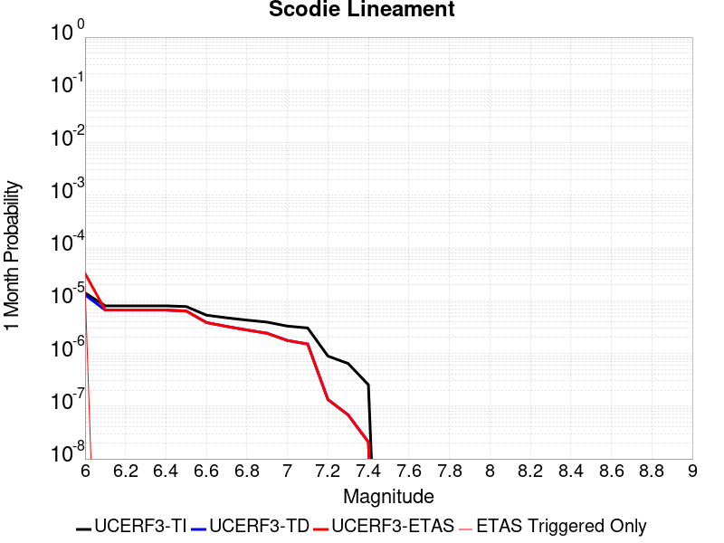 |  |  |

| Magnitude | 1 wk TI Prob | 1 wk TD Prob | 1 wk ETAS Prob | 1 wk ETAS/TD Gain | 1 wk ETAS Triggered Only | 1 mo TI Prob | 1 mo TD Prob | 1 mo ETAS Prob | 1 mo ETAS/TD Gain | 1 mo ETAS Triggered Only | 1 yr TI Prob | 1 yr TD Prob | 1 yr ETAS Prob | 1 yr ETAS/TD Gain | 1 yr ETAS Triggered Only | 10 yr TI Prob | 10 yr TD Prob | 10 yr ETAS Prob | 10 yr ETAS/TD Gain | 10 yr ETAS Triggered Only |
|-----|-----|-----|-----|-----|-----|-----|-----|-----|-----|-----|-----|-----|-----|-----|-----|-----|-----|-----|-----|-----|
| 6.0 | 3.2919327E-6 | 3.0133647E-6 | 1.3013335E-5 | 4.3185396 | 1.0E-5 | 1.4108206E-5 | 1.2914374E-5 | 3.2914115E-5 | 2.548642 | 2.0E-5 | 1.7175387E-4 | 1.5722433E-4 | 2.2721333E-4 | 1.4451537 | 7.0E-5 | 0.0017162118 | 0.0015714426 | 0.0017112226 | 1.0889502 | 1.4E-4 |
| 6.1 | 1.8663811E-6 | 1.549064E-6 | 1.549064E-6 | 1.0 | 0.0 | 7.998751E-6 | 6.6388316E-6 | 6.6388316E-6 | 1.0 | 0.0 | 9.738045E-5 | 8.082527E-5 | 8.082527E-5 | 1.0 | 0.0 | 9.7337784E-4 | 8.080076E-4 | 8.1799953E-4 | 1.0123662 | 1.0E-5 |
| 6.2 | 1.8663811E-6 | 1.549064E-6 | 1.549064E-6 | 1.0 | 0.0 | 7.998751E-6 | 6.6388316E-6 | 6.6388316E-6 | 1.0 | 0.0 | 9.738045E-5 | 8.082527E-5 | 8.082527E-5 | 1.0 | 0.0 | 9.7337784E-4 | 8.080076E-4 | 8.1799953E-4 | 1.0123662 | 1.0E-5 |
| 6.3 | 1.8663811E-6 | 1.549064E-6 | 1.549064E-6 | 1.0 | 0.0 | 7.998751E-6 | 6.6388316E-6 | 6.6388316E-6 | 1.0 | 0.0 | 9.738045E-5 | 8.082527E-5 | 8.082527E-5 | 1.0 | 0.0 | 9.7337784E-4 | 8.080076E-4 | 8.1799953E-4 | 1.0123662 | 1.0E-5 |
| 6.4 | 1.8663811E-6 | 1.549064E-6 | 1.549064E-6 | 1.0 | 0.0 | 7.998751E-6 | 6.6388316E-6 | 6.6388316E-6 | 1.0 | 0.0 | 9.738045E-5 | 8.082527E-5 | 8.082527E-5 | 1.0 | 0.0 | 9.7337784E-4 | 8.080076E-4 | 8.1799953E-4 | 1.0123662 | 1.0E-5 |
| 6.5 | 1.8106311E-6 | 1.4909975E-6 | 1.4909975E-6 | 1.0 | 0.0 | 7.759824E-6 | 6.3899765E-6 | 6.3899765E-6 | 1.0 | 0.0 | 9.447177E-5 | 7.779568E-5 | 7.779568E-5 | 1.0 | 0.0 | 9.4431615E-4 | 7.7773316E-4 | 7.877254E-4 | 1.0128479 | 1.0E-5 |
| 6.6 | 1.2414679E-6 | 8.997646E-7 | 8.997646E-7 | 1.0 | 0.0 | 5.320566E-6 | 3.856129E-6 | 3.856129E-6 | 1.0 | 0.0 | 6.477596E-5 | 4.6947443E-5 | 4.6947443E-5 | 1.0 | 0.0 | 6.475708E-4 | 4.693839E-4 | 4.693839E-4 | 1.0 | 0.0 |
| 6.7 | 1.1062215E-6 | 7.594388E-7 | 7.594388E-7 | 1.0 | 0.0 | 4.7409408E-6 | 3.254734E-6 | 3.254734E-6 | 1.0 | 0.0 | 5.7719422E-5 | 3.962574E-5 | 3.962574E-5 | 1.0 | 0.0 | 5.770443E-4 | 3.961937E-4 | 3.961937E-4 | 1.0 | 0.0 |
| 6.8 | 1.0006736E-6 | 6.5004656E-7 | 6.5004656E-7 | 1.0 | 0.0 | 4.288594E-6 | 2.7859112E-6 | 2.7859112E-6 | 1.0 | 0.0 | 5.221238E-5 | 3.3918004E-5 | 3.3918004E-5 | 1.0 | 0.0 | 5.220012E-4 | 3.3913433E-4 | 3.3913433E-4 | 1.0 | 0.0 |
| 6.9 | 9.167364E-7 | 5.631687E-7 | 5.631687E-7 | 1.0 | 0.0 | 3.9288643E-6 | 2.4135784E-6 | 2.4135784E-6 | 1.0 | 0.0 | 4.7832873E-5 | 2.9384977E-5 | 2.9384977E-5 | 1.0 | 0.0 | 4.782258E-4 | 2.9381659E-4 | 2.9381659E-4 | 1.0 | 0.0 |
| 7.0 | 7.6987664E-7 | 4.1134348E-7 | 4.1134348E-7 | 1.0 | 0.0 | 3.2994672E-6 | 1.7628996E-6 | 1.7628996E-6 | 1.0 | 0.0 | 4.0170275E-5 | 2.146313E-5 | 2.146313E-5 | 1.0 | 0.0 | 4.0163012E-4 | 2.1461444E-4 | 2.1461444E-4 | 1.0 | 0.0 |
| 7.1 | 7.1038727E-7 | 3.5211968E-7 | 3.5211968E-7 | 1.0 | 0.0 | 3.0445133E-6 | 1.5090837E-6 | 1.5090837E-6 | 1.0 | 0.0 | 3.706632E-5 | 1.8372975E-5 | 1.8372975E-5 | 1.0 | 0.0 | 3.7060137E-4 | 1.8371806E-4 | 1.8371806E-4 | 1.0 | 0.0 |
| 7.2 | 2.0799602E-7 | 3.1188165E-8 | 3.1188165E-8 | 1.0 | 0.0 | 8.914113E-7 | 1.3366355E-7 | 1.3366355E-7 | 1.0 | 0.0 | 1.0852878E-5 | 1.6273526E-6 | 1.6273526E-6 | 1.0 | 0.0 | 1.08523476E-4 | 1.6273414E-5 | 1.6273414E-5 | 1.0 | 0.0 |
| 7.3 | 1.5048182E-7 | 1.5946586E-8 | 1.5946586E-8 | 1.0 | 0.0 | 6.449219E-7 | 6.834251E-8 | 6.834251E-8 | 1.0 | 0.0 | 7.851896E-6 | 8.3206976E-7 | 8.3206976E-7 | 1.0 | 0.0 | 7.851618E-5 | 8.32067E-6 | 8.32067E-6 | 1.0 | 0.0 |
| 7.4 | 5.9334678E-8 | 4.8686823E-9 | 4.8686823E-9 | 1.0 | 0.0 | 2.5429145E-7 | 2.086578E-8 | 2.086578E-8 | 1.0 | 0.0 | 3.095994E-6 | 2.5404086E-7 | 2.5404086E-7 | 1.0 | 0.0 | 3.095951E-5 | 2.5404067E-6 | 2.5404067E-6 | 1.0 | 0.0 |

## Baker
*[(top)](#table-of-contents)*

| 1 Week | 1 Month | 1 Year | 10 Year |
|-----|-----|-----|-----|
| 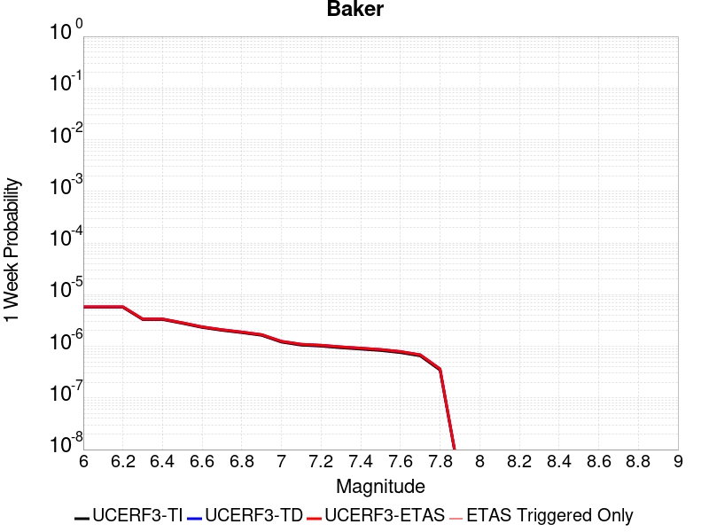 |  |  |  |

| Magnitude | 1 wk TI Prob | 1 wk TD Prob | 1 wk ETAS Prob | 1 wk ETAS/TD Gain | 1 wk ETAS Triggered Only | 1 mo TI Prob | 1 mo TD Prob | 1 mo ETAS Prob | 1 mo ETAS/TD Gain | 1 mo ETAS Triggered Only | 1 yr TI Prob | 1 yr TD Prob | 1 yr ETAS Prob | 1 yr ETAS/TD Gain | 1 yr ETAS Triggered Only | 10 yr TI Prob | 10 yr TD Prob | 10 yr ETAS Prob | 10 yr ETAS/TD Gain | 10 yr ETAS Triggered Only |
|-----|-----|-----|-----|-----|-----|-----|-----|-----|-----|-----|-----|-----|-----|-----|-----|-----|-----|-----|-----|-----|
| 6.0 | 5.695525E-6 | 5.834867E-6 | 5.834867E-6 | 1.0 | 0.0 | 2.4409164E-5 | 2.5006357E-5 | 3.5006105E-5 | 1.3998883 | 1.0E-5 | 2.9714106E-4 | 3.0441387E-4 | 3.5439865E-4 | 1.1642001 | 5.0E-5 | 0.0029674405 | 0.0030403642 | 0.0031799385 | 1.0459071 | 1.4E-4 |
| 6.1 | 5.695525E-6 | 5.834867E-6 | 5.834867E-6 | 1.0 | 0.0 | 2.4409164E-5 | 2.5006357E-5 | 3.5006105E-5 | 1.3998883 | 1.0E-5 | 2.9714106E-4 | 3.0441387E-4 | 3.5439865E-4 | 1.1642001 | 5.0E-5 | 0.0029674405 | 0.0030403642 | 0.0031799385 | 1.0459071 | 1.4E-4 |
| 6.2 | 5.695525E-6 | 5.834867E-6 | 5.834867E-6 | 1.0 | 0.0 | 2.4409164E-5 | 2.5006357E-5 | 3.5006105E-5 | 1.3998883 | 1.0E-5 | 2.9714106E-4 | 3.0441387E-4 | 3.5439865E-4 | 1.1642001 | 5.0E-5 | 0.0029674405 | 0.0030403642 | 0.0031799385 | 1.0459071 | 1.4E-4 |
| 6.3 | 3.2995713E-6 | 3.3836852E-6 | 3.3836852E-6 | 1.0 | 0.0 | 1.4140943E-5 | 1.450143E-5 | 2.4501285E-5 | 1.6895771 | 1.0E-5 | 1.7215237E-4 | 1.7654109E-4 | 2.0653578E-4 | 1.1699021 | 3.0E-5 | 0.0017201907 | 0.0017640555 | 0.0018439144 | 1.0452701 | 8.0E-5 |
| 6.4 | 3.2995713E-6 | 3.3836852E-6 | 3.3836852E-6 | 1.0 | 0.0 | 1.4140943E-5 | 1.450143E-5 | 2.4501285E-5 | 1.6895771 | 1.0E-5 | 1.7215237E-4 | 1.7654109E-4 | 2.0653578E-4 | 1.1699021 | 3.0E-5 | 0.0017201907 | 0.0017640555 | 0.0018439144 | 1.0452701 | 8.0E-5 |
| 6.5 | 2.782202E-6 | 2.8558563E-6 | 2.8558563E-6 | 1.0 | 0.0 | 1.1923668E-5 | 1.22393285E-5 | 2.2239206E-5 | 1.8170283 | 1.0E-5 | 1.4516099E-4 | 1.4900397E-4 | 1.789995E-4 | 1.2013069 | 3.0E-5 | 0.001450662 | 0.0014890734 | 0.0015689542 | 1.0536447 | 8.0E-5 |
| 6.6 | 2.3163404E-6 | 2.380934E-6 | 2.380934E-6 | 1.0 | 0.0 | 9.927136E-6 | 1.0203964E-5 | 2.0203863E-5 | 1.9800013 | 1.0E-5 | 1.20856166E-4 | 1.2422638E-4 | 1.5422265E-4 | 1.2414646 | 3.0E-5 | 0.0012079047 | 0.0012415897 | 0.0013015151 | 1.0482651 | 6.0E-5 |
| 6.7 | 2.037056E-6 | 2.0965133E-6 | 2.0965133E-6 | 1.0 | 0.0 | 8.7302105E-6 | 8.985027E-6 | 1.8984938E-5 | 2.1129527 | 1.0E-5 | 1.0628513E-4 | 1.0938738E-4 | 1.393841E-4 | 1.2742246 | 3.0E-5 | 0.0010623431 | 0.0010933515 | 0.0011432968 | 1.045681 | 5.0E-5 |
| 6.8 | 1.8356744E-6 | 1.8915408E-6 | 1.8915408E-6 | 1.0 | 0.0 | 7.867153E-6 | 8.106579E-6 | 1.8106499E-5 | 2.233556 | 1.0E-5 | 9.577837E-5 | 9.869327E-5 | 1.2869031E-4 | 1.3039421 | 3.0E-5 | 9.57371E-4 | 9.865083E-4 | 0.001036459 | 1.0506338 | 5.0E-5 |
| 6.9 | 1.6310546E-6 | 1.6832186E-6 | 1.6832186E-6 | 1.0 | 0.0 | 6.9902153E-6 | 7.2137746E-6 | 1.7213702E-5 | 2.386227 | 1.0E-5 | 8.510255E-5 | 8.782428E-5 | 1.1782164E-4 | 1.3415612 | 3.0E-5 | 8.5069967E-4 | 8.77907E-4 | 9.1787183E-4 | 1.0455229 | 4.0E-5 |
| 7.0 | 1.2058036E-6 | 1.2508764E-6 | 1.2508764E-6 | 1.0 | 0.0 | 5.1677193E-6 | 5.360888E-6 | 1.5360834E-5 | 2.8653526 | 1.0E-5 | 6.291517E-5 | 6.526688E-5 | 9.526492E-5 | 1.4596212 | 3.0E-5 | 6.289736E-4 | 6.524794E-4 | 6.9245335E-4 | 1.0612646 | 4.0E-5 |
| 7.1 | 1.052382E-6 | 1.0951702E-6 | 1.0951702E-6 | 1.0 | 0.0 | 4.5102006E-6 | 4.6935784E-6 | 1.4693532E-5 | 3.1305606 | 1.0E-5 | 5.491031E-5 | 5.7142825E-5 | 8.714111E-5 | 1.5249703 | 3.0E-5 | 5.4896745E-4 | 5.712822E-4 | 6.1125937E-4 | 1.0699779 | 4.0E-5 |
| 7.2 | 1.0067454E-6 | 1.0487803E-6 | 1.0487803E-6 | 1.0 | 0.0 | 4.3146156E-6 | 4.4947647E-6 | 1.449472E-5 | 3.2248006 | 1.0E-5 | 5.252918E-5 | 5.4722397E-5 | 7.4721305E-5 | 1.3654611 | 2.0E-5 | 5.251676E-4 | 5.470901E-4 | 5.7707366E-4 | 1.0548056 | 3.0E-5 |
| 7.3 | 9.3596316E-7 | 9.767813E-7 | 9.767813E-7 | 1.0 | 0.0 | 4.0112645E-6 | 4.1861986E-6 | 1.41861565E-5 | 3.388792 | 1.0E-5 | 4.8836053E-5 | 5.0965788E-5 | 6.0965278E-5 | 1.1962 | 1.0E-5 | 4.8825322E-4 | 5.095418E-4 | 5.2953156E-4 | 1.039231 | 2.0E-5 |
| 7.4 | 8.8117395E-7 | 9.20775E-7 | 9.20775E-7 | 1.0 | 0.0 | 3.7764542E-6 | 3.946173E-6 | 1.3946134E-5 | 3.534091 | 1.0E-5 | 4.5977362E-5 | 4.80436E-5 | 5.804312E-5 | 1.2081343 | 1.0E-5 | 4.596785E-4 | 4.803329E-4 | 5.003233E-4 | 1.0416178 | 2.0E-5 |
| 7.5 | 8.292386E-7 | 8.67468E-7 | 8.67468E-7 | 1.0 | 0.0 | 3.5538749E-6 | 3.7177147E-6 | 1.3717678E-5 | 3.6898146 | 1.0E-5 | 4.326757E-5 | 4.526224E-5 | 5.526179E-5 | 1.2209247 | 1.0E-5 | 4.3259145E-4 | 4.5253098E-4 | 4.725219E-4 | 1.0441759 | 2.0E-5 |
| 7.6 | 7.553842E-7 | 7.9145497E-7 | 7.9145497E-7 | 1.0 | 0.0 | 3.2373566E-6 | 3.3919455E-6 | 1.3391912E-5 | 3.9481506 | 1.0E-5 | 3.9414106E-5 | 4.129616E-5 | 5.129575E-5 | 1.2421433 | 1.0E-5 | 3.9407116E-4 | 4.1288557E-4 | 4.2288145E-4 | 1.0242097 | 1.0E-5 |
| 7.7 | 6.5285366E-7 | 6.852868E-7 | 6.852868E-7 | 1.0 | 0.0 | 2.797941E-6 | 2.9369403E-6 | 1.2936911E-5 | 4.4048944 | 1.0E-5 | 3.40644E-5 | 3.5756668E-5 | 4.575631E-5 | 1.2796581 | 1.0E-5 | 3.405918E-4 | 3.575098E-4 | 3.6750623E-4 | 1.0279613 | 1.0E-5 |
| 7.8 | 3.4586725E-7 | 3.6483033E-7 | 3.6483033E-7 | 1.0 | 0.0 | 1.4822873E-6 | 1.5635576E-6 | 1.1563542E-5 | 7.395661 | 1.0E-5 | 1.80467E-5 | 1.9036152E-5 | 2.9035962E-5 | 1.5253062 | 1.0E-5 | 1.8045233E-4 | 1.9034566E-4 | 2.0034375E-4 | 1.052526 | 1.0E-5 |
| 7.9 | 2.5591178E-9 | 2.6696958E-9 | 2.6696958E-9 | 1.0 | 0.0 | 1.0967647E-8 | 1.14415535E-8 | 1.14415535E-8 | 1.0 | 0.0 | 1.335311E-7 | 1.3930091E-7 | 1.3930091E-7 | 1.0 | 0.0 | 1.3353102E-6 | 1.3930091E-6 | 1.3930091E-6 | 1.0 | 0.0 |

## Mission Ridge-Arroyo Parida-Santa Ana
*[(top)](#table-of-contents)*

| 1 Week | 1 Month | 1 Year | 10 Year |
|-----|-----|-----|-----|
|  |  |  | 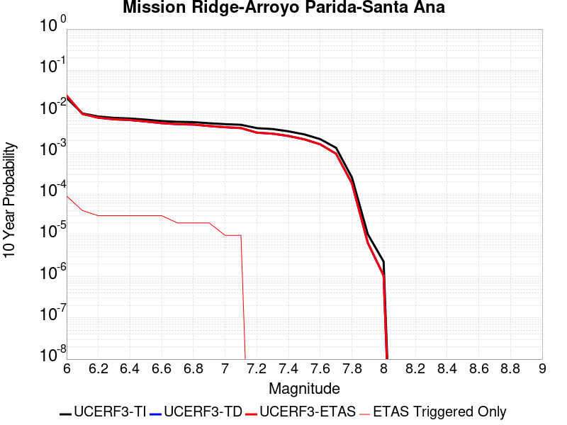 |

| Magnitude | 1 wk TI Prob | 1 wk TD Prob | 1 wk ETAS Prob | 1 wk ETAS/TD Gain | 1 wk ETAS Triggered Only | 1 mo TI Prob | 1 mo TD Prob | 1 mo ETAS Prob | 1 mo ETAS/TD Gain | 1 mo ETAS Triggered Only | 1 yr TI Prob | 1 yr TD Prob | 1 yr ETAS Prob | 1 yr ETAS/TD Gain | 1 yr ETAS Triggered Only | 10 yr TI Prob | 10 yr TD Prob | 10 yr ETAS Prob | 10 yr ETAS/TD Gain | 10 yr ETAS Triggered Only |
|-----|-----|-----|-----|-----|-----|-----|-----|-----|-----|-----|-----|-----|-----|-----|-----|-----|-----|-----|-----|-----|
| 6.0 | 4.169034E-5 | 4.71403E-5 | 4.71403E-5 | 1.0 | 0.0 | 1.7866064E-4 | 2.0201907E-4 | 2.0201907E-4 | 1.0 | 0.0 | 0.0021730233 | 0.0024575498 | 0.002487476 | 1.0121772 | 3.0E-5 | 0.021518968 | 0.02438564 | 0.024473445 | 1.0036007 | 9.0E-5 |
| 6.1 | 1.73813E-5 | 1.6854676E-5 | 1.6854676E-5 | 1.0 | 0.0 | 7.4489166E-5 | 7.223239E-5 | 7.223239E-5 | 1.0 | 0.0 | 9.065282E-4 | 8.790853E-4 | 8.890765E-4 | 1.0113654 | 1.0E-5 | 0.009028391 | 0.008757221 | 0.008796871 | 1.0045277 | 4.0E-5 |
| 6.2 | 1.4622182E-5 | 1.3673637E-5 | 1.3673637E-5 | 1.0 | 0.0 | 6.2664985E-5 | 5.8600006E-5 | 5.8600006E-5 | 1.0 | 0.0 | 7.6267915E-4 | 7.132254E-4 | 7.2321825E-4 | 1.0140108 | 1.0E-5 | 0.007600669 | 0.0071098073 | 0.007139594 | 1.0041895 | 3.0E-5 |
| 6.3 | 1.3552434E-5 | 1.2482519E-5 | 1.2482519E-5 | 1.0 | 0.0 | 5.8080568E-5 | 5.3495434E-5 | 5.3495434E-5 | 1.0 | 0.0 | 7.069015E-4 | 6.5111544E-4 | 6.611089E-4 | 1.0153483 | 1.0E-5 | 0.00704657 | 0.00649244 | 0.0065222452 | 1.0045907 | 3.0E-5 |
| 6.4 | 1.30977305E-5 | 1.1979463E-5 | 1.1979463E-5 | 1.0 | 0.0 | 5.613192E-5 | 5.1339564E-5 | 5.1339564E-5 | 1.0 | 0.0 | 6.831918E-4 | 6.2488293E-4 | 6.3487666E-4 | 1.015993 | 1.0E-5 | 0.006810953 | 0.0062316037 | 0.0062614167 | 1.0047842 | 3.0E-5 |
| 6.5 | 1.225205E-5 | 1.1049091E-5 | 1.1049091E-5 | 1.0 | 0.0 | 5.2507727E-5 | 4.73524E-5 | 4.73524E-5 | 1.0 | 0.0 | 6.3909404E-4 | 5.763657E-4 | 5.8635994E-4 | 1.0173401 | 1.0E-5 | 0.006372592 | 0.0057490184 | 0.005778846 | 1.0051882 | 3.0E-5 |
| 6.6 | 1.1352241E-5 | 1.00638035E-5 | 1.00638035E-5 | 1.0 | 0.0 | 4.8651553E-5 | 4.3129887E-5 | 4.3129887E-5 | 1.0 | 0.0 | 5.921717E-4 | 5.2498194E-4 | 5.349767E-4 | 1.0190383 | 1.0E-5 | 0.0059059616 | 0.0052376636 | 0.0052675065 | 1.0056977 | 3.0E-5 |
| 6.7 | 1.0864116E-5 | 9.517282E-6 | 9.517282E-6 | 1.0 | 0.0 | 4.6559664E-5 | 4.0787723E-5 | 4.0787723E-5 | 1.0 | 0.0 | 5.667165E-4 | 4.964794E-4 | 5.064744E-4 | 1.0201318 | 1.0E-5 | 0.005652734 | 0.004953936 | 0.004973837 | 1.0040172 | 2.0E-5 |
| 6.8 | 1.0666365E-5 | 9.300029E-6 | 9.300029E-6 | 1.0 | 0.0 | 4.571219E-5 | 3.985667E-5 | 3.985667E-5 | 1.0 | 0.0 | 5.564038E-4 | 4.851489E-4 | 4.9514405E-4 | 1.0206022 | 1.0E-5 | 0.005550127 | 0.00484113 | 0.004861033 | 1.0041113 | 2.0E-5 |
| 6.9 | 1.0038665E-5 | 8.592277E-6 | 8.592277E-6 | 1.0 | 0.0 | 4.302214E-5 | 3.6823534E-5 | 3.6823534E-5 | 1.0 | 0.0 | 5.236687E-4 | 4.482361E-4 | 4.5823163E-4 | 1.0222996 | 1.0E-5 | 0.005224364 | 0.004473531 | 0.0044934414 | 1.0044508 | 2.0E-5 |
| 7.0 | 9.5379955E-6 | 8.0252885E-6 | 8.0252885E-6 | 1.0 | 0.0 | 4.0876483E-5 | 3.4393648E-5 | 3.4393648E-5 | 1.0 | 0.0 | 4.975576E-4 | 4.1866393E-4 | 4.2865973E-4 | 1.0238755 | 1.0E-5 | 0.00496445 | 0.0041789515 | 0.0041889097 | 1.002383 | 1.0E-5 |
| 7.1 | 9.207389E-6 | 7.6525785E-6 | 7.6525785E-6 | 1.0 | 0.0 | 3.945964E-5 | 3.2796364E-5 | 3.2796364E-5 | 1.0 | 0.0 | 4.803152E-4 | 3.9922426E-4 | 4.0922026E-4 | 1.0250386 | 1.0E-5 | 0.004792784 | 0.003985267 | 0.003995227 | 1.0024992 | 1.0E-5 |
| 7.2 | 7.638091E-6 | 5.931264E-6 | 5.931264E-6 | 1.0 | 0.0 | 3.2734264E-5 | 2.5419457E-5 | 2.5419457E-5 | 1.0 | 0.0 | 3.984668E-4 | 3.0943824E-4 | 3.0943824E-4 | 1.0 | 0.0 | 0.0039775306 | 0.0030901306 | 0.0030901306 | 1.0 | 0.0 |
| 7.3 | 7.2500147E-6 | 5.596288E-6 | 5.596288E-6 | 1.0 | 0.0 | 3.1071122E-5 | 2.3983872E-5 | 2.3983872E-5 | 1.0 | 0.0 | 3.7822526E-4 | 2.9196483E-4 | 2.9196483E-4 | 1.0 | 0.0 | 0.0037758215 | 0.0029158678 | 0.0029158678 | 1.0 | 0.0 |
| 7.4 | 6.3899715E-6 | 4.9186083E-6 | 4.9186083E-6 | 1.0 | 0.0 | 2.7385306E-5 | 2.107958E-5 | 2.107958E-5 | 1.0 | 0.0 | 3.3336508E-4 | 2.566139E-4 | 2.566139E-4 | 1.0 | 0.0 | 0.0033286542 | 0.00256322 | 0.00256322 | 1.0 | 0.0 |
| 7.5 | 5.379025E-6 | 4.0839423E-6 | 4.0839423E-6 | 1.0 | 0.0 | 2.305276E-5 | 1.7502492E-5 | 1.7502492E-5 | 1.0 | 0.0 | 2.806312E-4 | 2.1307211E-4 | 2.1307211E-4 | 1.0 | 0.0 | 0.0028027708 | 0.0021286895 | 0.0021286895 | 1.0 | 0.0 |
| 7.6 | 4.1270696E-6 | 3.088409E-6 | 3.088409E-6 | 1.0 | 0.0 | 1.768732E-5 | 1.3235972E-5 | 1.3235972E-5 | 1.0 | 0.0 | 2.1532185E-4 | 1.6113611E-4 | 1.6113611E-4 | 1.0 | 0.0 | 0.0021511333 | 0.0016102009 | 0.0016102009 | 1.0 | 0.0 |
| 7.7 | 2.5406805E-6 | 1.8282411E-6 | 1.8282411E-6 | 1.0 | 0.0 | 1.0888585E-5 | 7.835296E-6 | 7.835296E-6 | 1.0 | 0.0 | 1.3256045E-4 | 9.539061E-5 | 9.539061E-5 | 1.0 | 0.0 | 0.0013248142 | 9.5350284E-4 | 9.5350284E-4 | 1.0 | 0.0 |
| 7.8 | 4.8608285E-7 | 3.5099544E-7 | 3.5099544E-7 | 1.0 | 0.0 | 2.0832106E-6 | 1.5042652E-6 | 1.5042652E-6 | 1.0 | 0.0 | 2.5362791E-5 | 1.8314277E-5 | 1.8314277E-5 | 1.0 | 0.0 | 2.5359896E-4 | 1.8312779E-4 | 1.8312779E-4 | 1.0 | 0.0 |
| 7.9 | 2.0472514E-8 | 1.2689271E-8 | 1.2689271E-8 | 1.0 | 0.0 | 8.7739345E-8 | 5.438259E-8 | 5.438259E-8 | 1.0 | 0.0 | 1.068226E-6 | 6.621078E-7 | 6.621078E-7 | 1.0 | 0.0 | 1.0682209E-5 | 6.6210596E-6 | 6.6210596E-6 | 1.0 | 0.0 |
| 8.0 | 4.443582E-9 | 2.032341E-9 | 2.032341E-9 | 1.0 | 0.0 | 1.9043922E-8 | 8.710032E-9 | 8.710032E-9 | 1.0 | 0.0 | 2.3185973E-7 | 1.0604463E-7 | 1.0604463E-7 | 1.0 | 0.0 | 2.3185949E-6 | 1.0604459E-6 | 1.0604459E-6 | 1.0 | 0.0 |

## Pinto Mtn
*[(top)](#table-of-contents)*

| 1 Week | 1 Month | 1 Year | 10 Year |
|-----|-----|-----|-----|
| 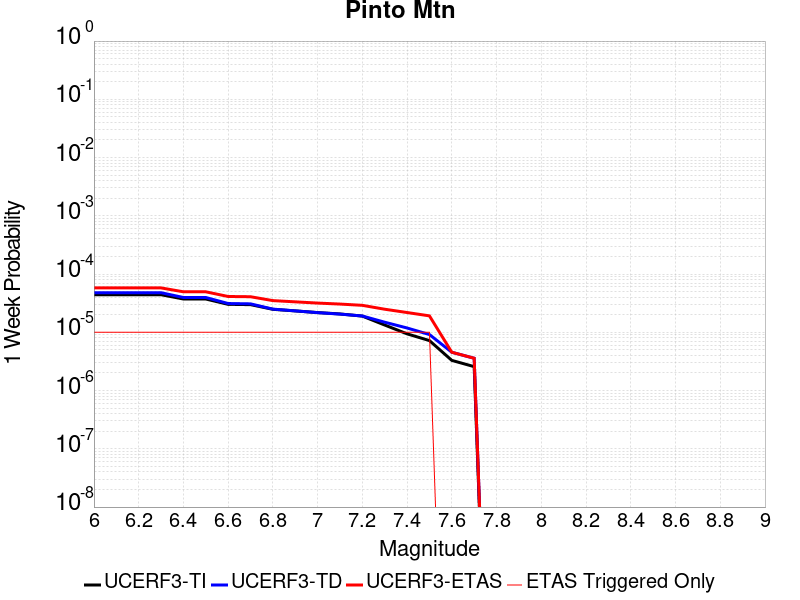 | 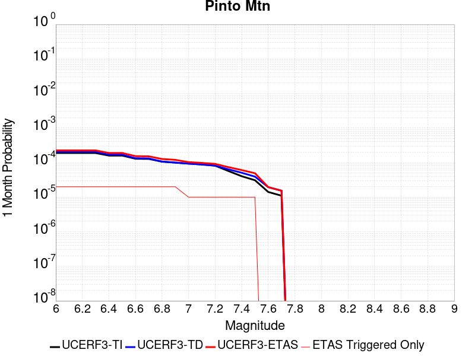 | 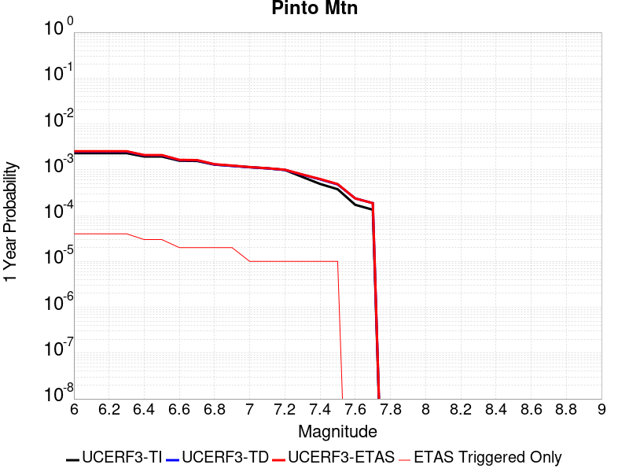 |  |

| Magnitude | 1 wk TI Prob | 1 wk TD Prob | 1 wk ETAS Prob | 1 wk ETAS/TD Gain | 1 wk ETAS Triggered Only | 1 mo TI Prob | 1 mo TD Prob | 1 mo ETAS Prob | 1 mo ETAS/TD Gain | 1 mo ETAS Triggered Only | 1 yr TI Prob | 1 yr TD Prob | 1 yr ETAS Prob | 1 yr ETAS/TD Gain | 1 yr ETAS Triggered Only | 10 yr TI Prob | 10 yr TD Prob | 10 yr ETAS Prob | 10 yr ETAS/TD Gain | 10 yr ETAS Triggered Only |
|-----|-----|-----|-----|-----|-----|-----|-----|-----|-----|-----|-----|-----|-----|-----|-----|-----|-----|-----|-----|-----|
| 6.0 | 4.4194956E-5 | 4.785615E-5 | 5.785567E-5 | 1.2089496 | 1.0E-5 | 1.893932E-4 | 2.0508259E-4 | 2.2507847E-4 | 1.0975016 | 2.0E-5 | 0.0023034236 | 0.002494186 | 0.0025340861 | 1.0159973 | 4.0E-5 | 0.022796938 | 0.024679434 | 0.024786718 | 1.0043472 | 1.1E-4 |
| 6.1 | 4.4194956E-5 | 4.785615E-5 | 5.785567E-5 | 1.2089496 | 1.0E-5 | 1.893932E-4 | 2.0508259E-4 | 2.2507847E-4 | 1.0975016 | 2.0E-5 | 0.0023034236 | 0.002494186 | 0.0025340861 | 1.0159973 | 4.0E-5 | 0.022796938 | 0.024679434 | 0.024786718 | 1.0043472 | 1.1E-4 |
| 6.2 | 4.4194956E-5 | 4.785615E-5 | 5.785567E-5 | 1.2089496 | 1.0E-5 | 1.893932E-4 | 2.0508259E-4 | 2.2507847E-4 | 1.0975016 | 2.0E-5 | 0.0023034236 | 0.002494186 | 0.0025340861 | 1.0159973 | 4.0E-5 | 0.022796938 | 0.024679434 | 0.024786718 | 1.0043472 | 1.1E-4 |
| 6.3 | 4.4194956E-5 | 4.785615E-5 | 5.785567E-5 | 1.2089496 | 1.0E-5 | 1.893932E-4 | 2.0508259E-4 | 2.2507847E-4 | 1.0975016 | 2.0E-5 | 0.0023034236 | 0.002494186 | 0.0025340861 | 1.0159973 | 4.0E-5 | 0.022796938 | 0.024679434 | 0.024786718 | 1.0043472 | 1.1E-4 |
| 6.4 | 3.729929E-5 | 3.9605377E-5 | 4.960498E-5 | 1.252481 | 1.0E-5 | 1.5984432E-4 | 1.6972682E-4 | 1.8972342E-4 | 1.1178164 | 2.0E-5 | 0.0019443673 | 0.0020645591 | 0.0020944972 | 1.014501 | 3.0E-5 | 0.019274427 | 0.020463811 | 0.020551968 | 1.004308 | 9.0E-5 |
| 6.5 | 3.729929E-5 | 3.9605377E-5 | 4.960498E-5 | 1.252481 | 1.0E-5 | 1.5984432E-4 | 1.6972682E-4 | 1.8972342E-4 | 1.1178164 | 2.0E-5 | 0.0019443673 | 0.0020645591 | 0.0020944972 | 1.014501 | 3.0E-5 | 0.019274427 | 0.020463811 | 0.020551968 | 1.004308 | 9.0E-5 |
| 6.6 | 3.0204548E-5 | 3.1207168E-5 | 4.1206855E-5 | 1.3204292 | 1.0E-5 | 1.2944164E-4 | 1.3373834E-4 | 1.5373566E-4 | 1.1495258 | 2.0E-5 | 0.0015748127 | 0.0016270828 | 0.0016470503 | 1.0122719 | 2.0E-5 | 0.015636992 | 0.016155569 | 0.0162146 | 1.0036539 | 6.0E-5 |
| 6.7 | 2.9857754E-5 | 3.081654E-5 | 4.0816234E-5 | 1.324491 | 1.0E-5 | 1.2795553E-4 | 1.320644E-4 | 1.5206175E-4 | 1.1514213 | 2.0E-5 | 0.0015567453 | 0.0016067327 | 0.0016267006 | 1.0124276 | 2.0E-5 | 0.015458848 | 0.015955003 | 0.016014047 | 1.0037006 | 6.0E-5 |
| 6.8 | 2.4819734E-5 | 2.5011037E-5 | 3.5010788E-5 | 1.3998135 | 1.0E-5 | 1.0636595E-4 | 1.0718587E-4 | 1.2718372E-4 | 1.1865717 | 2.0E-5 | 0.0012942362 | 0.0013042284 | 0.0013242024 | 1.0153147 | 2.0E-5 | 0.012867244 | 0.012968109 | 0.013027331 | 1.0045668 | 6.0E-5 |
| 6.9 | 2.331124E-5 | 2.3339278E-5 | 3.3339045E-5 | 1.4284523 | 1.0E-5 | 9.990149E-5 | 1.0002176E-4 | 1.2001976E-4 | 1.1999365 | 2.0E-5 | 0.001215622 | 0.001217105 | 0.0012370807 | 1.0164124 | 2.0E-5 | 0.012089936 | 0.012106584 | 0.012165858 | 1.0048959 | 6.0E-5 |
| 7.0 | 2.1818534E-5 | 2.1762376E-5 | 3.176216E-5 | 1.4594986 | 1.0E-5 | 9.3504656E-5 | 9.3264105E-5 | 1.0326317E-4 | 1.1072124 | 1.0E-5 | 0.0011378246 | 0.0011349188 | 0.0011449074 | 1.0088012 | 1.0E-5 | 0.011320163 | 0.011293331 | 0.011342767 | 1.0043774 | 5.0E-5 |
| 7.1 | 2.066081E-5 | 2.0541991E-5 | 3.0541785E-5 | 1.4867977 | 1.0E-5 | 8.854332E-5 | 8.803425E-5 | 9.8033364E-5 | 1.1135821 | 1.0E-5 | 0.0010774818 | 0.0010713094 | 0.0010812988 | 1.0093243 | 1.0E-5 | 0.010722724 | 0.010663501 | 0.010712968 | 1.0046389 | 5.0E-5 |
| 7.2 | 1.8990233E-5 | 1.9055246E-5 | 2.9055054E-5 | 1.5247799 | 1.0E-5 | 8.138417E-5 | 8.166289E-5 | 9.166207E-5 | 1.1224446 | 1.0E-5 | 9.904018E-4 | 9.938115E-4 | 0.0010038016 | 1.0100523 | 1.0E-5 | 0.009859995 | 0.009895671 | 0.009945177 | 1.0050027 | 5.0E-5 |
| 7.3 | 1.3335872E-5 | 1.4907792E-5 | 2.4907644E-5 | 1.6707802 | 1.0E-5 | 5.7152483E-5 | 6.388905E-5 | 7.3888405E-5 | 1.1565113 | 1.0E-5 | 6.956093E-4 | 7.7758427E-4 | 7.8757654E-4 | 1.0128503 | 1.0E-5 | 0.006934359 | 0.007749935 | 0.0077797025 | 1.003841 | 3.0E-5 |
| 7.4 | 9.414066E-6 | 1.1861961E-5 | 2.1861842E-5 | 1.8430209 | 1.0E-5 | 4.0345374E-5 | 5.083604E-5 | 6.083553E-5 | 1.1967008 | 1.0E-5 | 4.910942E-4 | 6.187624E-4 | 6.2875624E-4 | 1.0161513 | 1.0E-5 | 0.0049001034 | 0.0061713443 | 0.006191221 | 1.0032208 | 2.0E-5 |
| 7.5 | 7.2101157E-6 | 9.159212E-6 | 1.915912E-5 | 2.091787 | 1.0E-5 | 3.090013E-5 | 3.925322E-5 | 4.9252827E-5 | 1.2547462 | 1.0E-5 | 3.7614413E-4 | 4.7781094E-4 | 4.8780616E-4 | 1.0209187 | 1.0E-5 | 0.0037550807 | 0.0047686114 | 0.004788516 | 1.0041741 | 2.0E-5 |
| 7.6 | 3.296375E-6 | 4.5465813E-6 | 4.5465813E-6 | 1.0 | 0.0 | 1.4127245E-5 | 1.9485211E-5 | 1.9485211E-5 | 1.0 | 0.0 | 1.7198564E-4 | 2.37208E-4 | 2.37208E-4 | 1.0 | 0.0 | 0.0017185259 | 0.0023696856 | 0.002379662 | 1.00421 | 1.0E-5 |
| 7.7 | 2.5741092E-6 | 3.5854414E-6 | 3.5854414E-6 | 1.0 | 0.0 | 1.103185E-5 | 1.5366095E-5 | 1.5366095E-5 | 1.0 | 0.0 | 1.3430449E-4 | 1.8706746E-4 | 1.8706746E-4 | 1.0 | 0.0 | 0.0013422335 | 0.0018692298 | 0.0018792112 | 1.0053397 | 1.0E-5 |

## Imperial
*[(top)](#table-of-contents)*

| 1 Week | 1 Month | 1 Year | 10 Year |
|-----|-----|-----|-----|
|  | 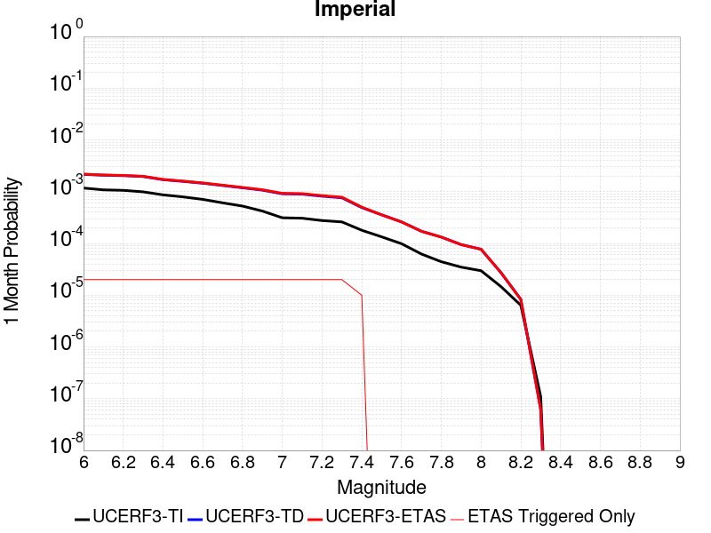 |  |  |

| Magnitude | 1 wk TI Prob | 1 wk TD Prob | 1 wk ETAS Prob | 1 wk ETAS/TD Gain | 1 wk ETAS Triggered Only | 1 mo TI Prob | 1 mo TD Prob | 1 mo ETAS Prob | 1 mo ETAS/TD Gain | 1 mo ETAS Triggered Only | 1 yr TI Prob | 1 yr TD Prob | 1 yr ETAS Prob | 1 yr ETAS/TD Gain | 1 yr ETAS Triggered Only | 10 yr TI Prob | 10 yr TD Prob | 10 yr ETAS Prob | 10 yr ETAS/TD Gain | 10 yr ETAS Triggered Only |
|-----|-----|-----|-----|-----|-----|-----|-----|-----|-----|-----|-----|-----|-----|-----|-----|-----|-----|-----|-----|-----|
| 6.0 | 2.7496446E-4 | 5.0572807E-4 | 5.0572807E-4 | 1.0 | 0.0 | 0.0011778869 | 0.0021656451 | 0.0021856017 | 1.0092151 | 2.0E-5 | 0.0142467655 | 0.026049016 | 0.026068496 | 1.0007478 | 2.0E-5 | 0.13367249 | 0.22811072 | 0.22819562 | 1.0003722 | 1.1E-4 |
| 6.1 | 2.5356023E-4 | 4.867423E-4 | 4.867423E-4 | 1.0 | 0.0 | 0.001086234 | 0.0020844091 | 0.0021043674 | 1.009575 | 2.0E-5 | 0.013144928 | 0.02508018 | 0.025099678 | 1.0007775 | 2.0E-5 | 0.123940155 | 0.21953915 | 0.219625 | 1.000391 | 1.1E-4 |
| 6.2 | 2.4820742E-4 | 4.776934E-4 | 4.776934E-4 | 1.0 | 0.0 | 0.0010633124 | 0.0020456892 | 0.002065648 | 1.0097567 | 2.0E-5 | 0.01286919 | 0.024620047 | 0.024639554 | 1.0007924 | 2.0E-5 | 0.12148927 | 0.21604426 | 0.2161305 | 1.0003991 | 1.1E-4 |
| 6.3 | 2.3205351E-4 | 4.590577E-4 | 4.590577E-4 | 1.0 | 0.0 | 9.94136E-4 | 0.0019659435 | 0.0019859043 | 1.0101532 | 2.0E-5 | 0.012036599 | 0.023669107 | 0.023688635 | 1.0008249 | 2.0E-5 | 0.11405133 | 0.2079881 | 0.20807521 | 1.0004189 | 1.1E-4 |
| 6.4 | 2.0304754E-4 | 3.989141E-4 | 3.989141E-4 | 1.0 | 0.0 | 8.6991355E-4 | 0.0017085263 | 0.0017284921 | 1.011686 | 2.0E-5 | 0.010539869 | 0.02060328 | 0.020622868 | 1.0009507 | 2.0E-5 | 0.100537635 | 0.18512078 | 0.18520227 | 1.0004402 | 1.0E-4 |
| 6.5 | 1.854992E-4 | 3.7002756E-4 | 3.7002756E-4 | 1.0 | 0.0 | 7.9475436E-4 | 0.0015848809 | 0.0016048491 | 1.0125992 | 2.0E-5 | 0.009633281 | 0.019126555 | 0.019146172 | 1.0010257 | 2.0E-5 | 0.0922623 | 0.17334943 | 0.1734321 | 1.0004768 | 1.0E-4 |
| 6.6 | 1.6586106E-4 | 3.4047663E-4 | 3.4047663E-4 | 1.0 | 0.0 | 7.106394E-4 | 0.0014583797 | 0.0014783505 | 1.0136938 | 2.0E-5 | 0.008617763 | 0.01761287 | 0.01763252 | 1.0011156 | 2.0E-5 | 0.08291132 | 0.16082329 | 0.16090721 | 1.0005218 | 1.0E-4 |
| 6.7 | 1.4224656E-4 | 3.077792E-4 | 3.077792E-4 | 1.0 | 0.0 | 6.094856E-4 | 0.001318395 | 0.0013383687 | 1.01515 | 2.0E-5 | 0.0073952693 | 0.015935227 | 0.015954908 | 1.0012351 | 2.0E-5 | 0.07153955 | 0.14652699 | 0.14661235 | 1.0005825 | 1.0E-4 |
| 6.8 | 1.2317259E-4 | 2.7800474E-4 | 2.7800474E-4 | 1.0 | 0.0 | 5.2777573E-4 | 0.001190911 | 0.0012108872 | 1.0167738 | 2.0E-5 | 0.0064067547 | 0.014404331 | 0.014424043 | 1.0013685 | 2.0E-5 | 0.06225166 | 0.13297406 | 0.13306077 | 1.0006521 | 1.0E-4 |
| 6.9 | 9.859898E-5 | 2.5021235E-4 | 2.5021235E-4 | 1.0 | 0.0 | 4.2249862E-4 | 0.0010719022 | 0.0010918808 | 1.0186384 | 2.0E-5 | 0.0051317946 | 0.0129732825 | 0.012993023 | 1.0015216 | 2.0E-5 | 0.05014893 | 0.119434625 | 0.11952268 | 1.0007373 | 1.0E-4 |
| 7.0 | 7.3191884E-5 | 2.1271942E-4 | 2.1271942E-4 | 1.0 | 0.0 | 3.136418E-4 | 9.113393E-4 | 9.313211E-4 | 1.0219257 | 2.0E-5 | 0.003811904 | 0.011039794 | 0.011059573 | 1.0017916 | 2.0E-5 | 0.037471764 | 0.10208623 | 0.102176026 | 1.0008795 | 1.0E-4 |
| 7.1 | 7.1760296E-5 | 2.0973237E-4 | 2.0973237E-4 | 1.0 | 0.0 | 3.0750787E-4 | 8.9854654E-4 | 9.185286E-4 | 1.0222381 | 2.0E-5 | 0.003737482 | 0.010885608 | 0.010905391 | 1.0018173 | 2.0E-5 | 0.03675245 | 0.10072251 | 0.100812435 | 1.0008929 | 1.0E-4 |
| 7.2 | 6.46614E-5 | 1.914159E-4 | 1.914159E-4 | 1.0 | 0.0 | 2.7709085E-4 | 8.200989E-4 | 8.4008253E-4 | 1.0243673 | 2.0E-5 | 0.0033683628 | 0.009939616 | 0.009959416 | 1.0019921 | 2.0E-5 | 0.033177625 | 0.09252946 | 0.092611134 | 1.0008826 | 9.0E-5 |
| 7.3 | 6.088115E-5 | 1.7813082E-4 | 1.7813082E-4 | 1.0 | 0.0 | 2.6089314E-4 | 7.631973E-4 | 7.831821E-4 | 1.0261855 | 2.0E-5 | 0.0031717476 | 0.009252915 | 0.00927273 | 1.0021415 | 2.0E-5 | 0.031268585 | 0.08657966 | 0.08666186 | 1.0009495 | 9.0E-5 |
| 7.4 | 4.199346E-5 | 1.1513971E-4 | 1.1513971E-4 | 1.0 | 0.0 | 1.7995955E-4 | 4.933634E-4 | 5.033585E-4 | 1.020259 | 1.0E-5 | 0.0021888057 | 0.005990326 | 0.006000266 | 1.0016594 | 1.0E-5 | 0.02167372 | 0.057455722 | 0.0575217 | 1.0011483 | 7.0E-5 |
| 7.5 | 3.130448E-5 | 8.3362596E-5 | 8.3362596E-5 | 1.0 | 0.0 | 1.3415517E-4 | 3.5721966E-4 | 3.5721966E-4 | 1.0 | 0.0 | 0.0016321153 | 0.0043405364 | 0.0043405364 | 1.0 | 0.0 | 0.016201803 | 0.042145453 | 0.042193346 | 1.0011364 | 5.0E-5 |
| 7.6 | 2.3074248E-5 | 6.0870065E-5 | 6.0870065E-5 | 1.0 | 0.0 | 9.888588E-5 | 2.6084576E-4 | 2.6084576E-4 | 1.0 | 0.0 | 0.0012032706 | 0.0031711955 | 0.0031711955 | 1.0 | 0.0 | 0.011967761 | 0.031037996 | 0.031086445 | 1.0015609 | 5.0E-5 |
| 7.7 | 1.45864815E-5 | 4.014578E-5 | 4.014578E-5 | 1.0 | 0.0 | 6.2511994E-5 | 1.7204203E-4 | 1.7204203E-4 | 1.0 | 0.0 | 7.608177E-4 | 0.0020926048 | 0.0020926048 | 1.0 | 0.0 | 0.007582182 | 0.020637432 | 0.020686401 | 1.0023727 | 5.0E-5 |
| 7.8 | 1.0352979E-5 | 3.097883E-5 | 3.097883E-5 | 1.0 | 0.0 | 4.4369157E-5 | 1.3275967E-4 | 1.3275967E-4 | 1.0 | 0.0 | 5.400606E-4 | 0.0016151529 | 0.0016151529 | 1.0 | 0.0 | 0.0053875 | 0.016025057 | 0.016064417 | 1.0024561 | 4.0E-5 |
| 7.9 | 8.137906E-6 | 2.2163507E-5 | 2.2163507E-5 | 1.0 | 0.0 | 3.4876273E-5 | 9.498301E-5 | 9.498301E-5 | 1.0 | 0.0 | 4.2453592E-4 | 0.0011558055 | 0.0011558055 | 1.0 | 0.0 | 0.004237258 | 0.011624615 | 0.011654266 | 1.0025507 | 3.0E-5 |
| 8.0 | 6.93792E-6 | 1.8021155E-5 | 1.8021155E-5 | 1.0 | 0.0 | 2.9733603E-5 | 7.723124E-5 | 7.723124E-5 | 1.0 | 0.0 | 3.6194647E-4 | 9.3988545E-4 | 9.3988545E-4 | 1.0 | 0.0 | 0.0036135751 | 0.009507363 | 0.009527173 | 1.0020837 | 2.0E-5 |
| 8.1 | 3.4286315E-6 | 6.3856264E-6 | 6.3856264E-6 | 1.0 | 0.0 | 1.4694053E-5 | 2.7366683E-5 | 2.7366683E-5 | 1.0 | 0.0 | 1.7888541E-4 | 3.3313854E-4 | 3.3313854E-4 | 1.0 | 0.0 | 0.0017874148 | 0.003488888 | 0.003488888 | 1.0 | 0.0 |
| 8.2 | 1.4906886E-6 | 1.9389215E-6 | 1.9389215E-6 | 1.0 | 0.0 | 6.3886496E-6 | 8.309637E-6 | 8.309637E-6 | 1.0 | 0.0 | 7.7779034E-5 | 1.0116518E-4 | 1.0116518E-4 | 1.0 | 0.0 | 7.775182E-4 | 0.0011086907 | 0.0011086907 | 1.0 | 0.0 |
| 8.3 | 2.5758007E-8 | 1.4523038E-8 | 1.4523038E-8 | 1.0 | 0.0 | 1.10391454E-7 | 6.224159E-8 | 6.224159E-8 | 1.0 | 0.0 | 1.3440151E-6 | 7.577913E-7 | 7.577913E-7 | 1.0 | 0.0 | 1.344007E-5 | 7.899997E-6 | 7.899997E-6 | 1.0 | 0.0 |

## Owens Valley
*[(top)](#table-of-contents)*

| 1 Week | 1 Month | 1 Year | 10 Year |
|-----|-----|-----|-----|
|  | 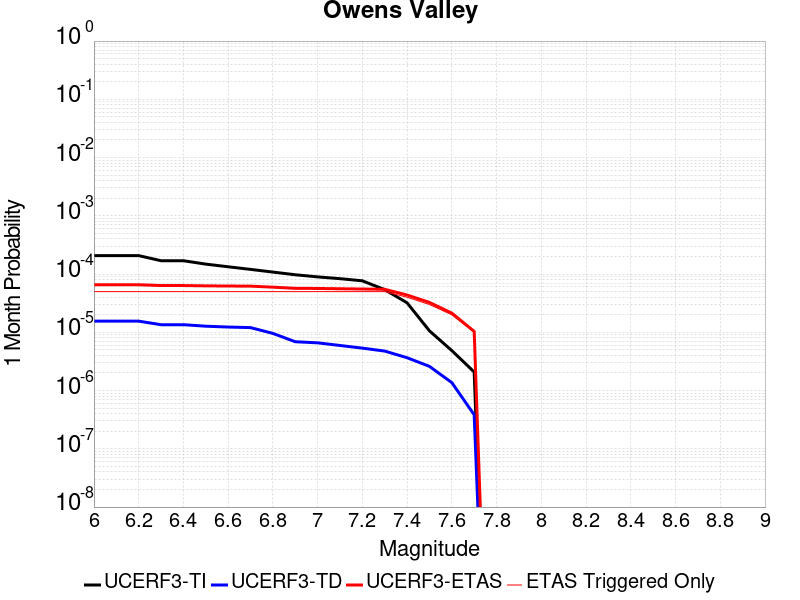 |  | 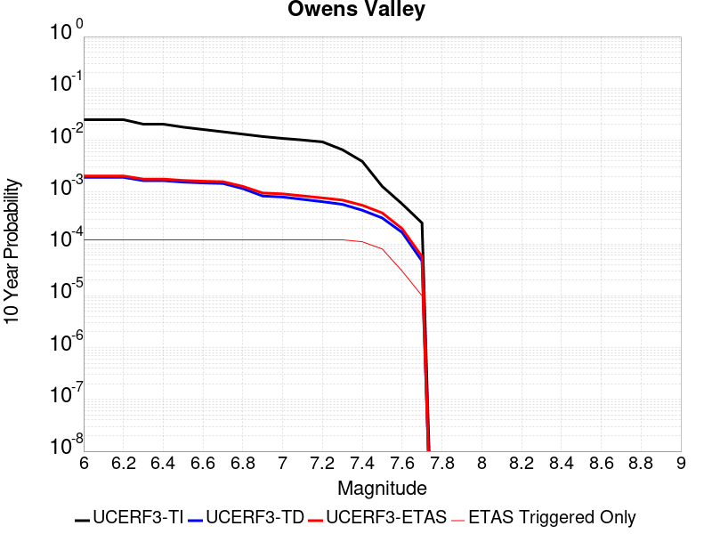 |

| Magnitude | 1 wk TI Prob | 1 wk TD Prob | 1 wk ETAS Prob | 1 wk ETAS/TD Gain | 1 wk ETAS Triggered Only | 1 mo TI Prob | 1 mo TD Prob | 1 mo ETAS Prob | 1 mo ETAS/TD Gain | 1 mo ETAS Triggered Only | 1 yr TI Prob | 1 yr TD Prob | 1 yr ETAS Prob | 1 yr ETAS/TD Gain | 1 yr ETAS Triggered Only | 10 yr TI Prob | 10 yr TD Prob | 10 yr ETAS Prob | 10 yr ETAS/TD Gain | 10 yr ETAS Triggered Only |
|-----|-----|-----|-----|-----|-----|-----|-----|-----|-----|-----|-----|-----|-----|-----|-----|-----|-----|-----|-----|-----|
| 6.0 | 4.83821E-5 | 3.6278698E-6 | 3.3627763E-5 | 9.269285 | 3.0E-5 | 2.0733538E-4 | 1.5547927E-5 | 6.554715E-5 | 4.215813 | 5.0E-5 | 0.002521386 | 1.8928056E-4 | 2.8926163E-4 | 1.5282162 | 1.0E-4 | 0.024929691 | 0.0019256821 | 0.002045451 | 1.0621955 | 1.2E-4 |
| 6.1 | 4.83821E-5 | 3.6278698E-6 | 3.3627763E-5 | 9.269285 | 3.0E-5 | 2.0733538E-4 | 1.5547927E-5 | 6.554715E-5 | 4.215813 | 5.0E-5 | 0.002521386 | 1.8928056E-4 | 2.8926163E-4 | 1.5282162 | 1.0E-4 | 0.024929691 | 0.0019256821 | 0.002045451 | 1.0621955 | 1.2E-4 |
| 6.2 | 4.83821E-5 | 3.6278698E-6 | 3.3627763E-5 | 9.269285 | 3.0E-5 | 2.0733538E-4 | 1.5547927E-5 | 6.554715E-5 | 4.215813 | 5.0E-5 | 0.002521386 | 1.8928056E-4 | 2.8926163E-4 | 1.5282162 | 1.0E-4 | 0.024929691 | 0.0019256821 | 0.002045451 | 1.0621955 | 1.2E-4 |
| 6.3 | 3.953008E-5 | 3.1561017E-6 | 3.3156008E-5 | 10.505367 | 3.0E-5 | 1.6940363E-4 | 1.3526084E-5 | 6.352541E-5 | 4.6965113 | 5.0E-5 | 0.002060538 | 1.6466837E-4 | 2.646519E-4 | 1.6071812 | 1.0E-4 | 0.020415364 | 0.0016595762 | 0.0017793771 | 1.0721877 | 1.2E-4 |
| 6.4 | 3.953008E-5 | 3.1561017E-6 | 3.3156008E-5 | 10.505367 | 3.0E-5 | 1.6940363E-4 | 1.3526084E-5 | 6.352541E-5 | 4.6965113 | 5.0E-5 | 0.002060538 | 1.6466837E-4 | 2.646519E-4 | 1.6071812 | 1.0E-4 | 0.020415364 | 0.0016595762 | 0.0017793771 | 1.0721877 | 1.2E-4 |
| 6.5 | 3.457342E-5 | 2.9720543E-6 | 3.2971966E-5 | 11.093998 | 3.0E-5 | 1.4816338E-4 | 1.2737317E-5 | 6.273668E-5 | 4.9254236 | 5.0E-5 | 0.0018023965 | 1.550665E-4 | 2.5505098E-4 | 1.6447846 | 1.0E-4 | 0.017878477 | 0.001555967 | 0.0016757803 | 1.0770024 | 1.2E-4 |
| 6.6 | 3.1127765E-5 | 2.8748148E-6 | 3.287473E-5 | 11.435425 | 3.0E-5 | 1.3339789E-4 | 1.232058E-5 | 6.231997E-5 | 5.0582004 | 5.0E-5 | 0.0016229092 | 1.4999343E-4 | 2.4997842E-4 | 1.6665958 | 1.0E-4 | 0.016111081 | 0.0015014273 | 0.0016212472 | 1.079804 | 1.2E-4 |
| 6.7 | 2.806885E-5 | 2.8106533E-6 | 3.281057E-5 | 11.673645 | 3.0E-5 | 1.2028952E-4 | 1.2045605E-5 | 6.2045E-5 | 5.1508417 | 5.0E-5 | 0.001463541 | 1.4664605E-4 | 2.466314E-4 | 1.681814 | 1.0E-4 | 0.014539397 | 0.0014658766 | 0.0015857007 | 1.0817423 | 1.2E-4 |
| 6.8 | 2.524524E-5 | 2.2355764E-6 | 3.2235508E-5 | 14.419329 | 3.0E-5 | 1.0818939E-4 | 9.581008E-6 | 5.958053E-5 | 6.2186074 | 5.0E-5 | 0.0013164099 | 1.16642834E-4 | 2.1663116E-4 | 1.857218 | 1.0E-4 | 0.01308639 | 0.0011660896 | 0.0012859496 | 1.1027881 | 1.2E-4 |
| 6.9 | 2.2704568E-5 | 1.6083212E-6 | 3.1608273E-5 | 19.65296 | 3.0E-5 | 9.730166E-5 | 6.8927875E-6 | 5.6892444E-5 | 8.253909 | 5.0E-5 | 0.0011840039 | 8.391647E-5 | 1.8390808E-4 | 2.1915612 | 1.0E-4 | 0.011777153 | 8.3905994E-4 | 9.589592E-4 | 1.1428972 | 1.2E-4 |
| 7.0 | 2.0871712E-5 | 1.53969E-6 | 3.1539643E-5 | 20.484413 | 3.0E-5 | 8.944713E-5 | 6.5986546E-6 | 5.6598325E-5 | 8.577252 | 5.0E-5 | 0.0010884746 | 8.0335674E-5 | 1.8032764E-4 | 2.244677 | 1.0E-4 | 0.010831586 | 8.0323854E-4 | 9.231422E-4 | 1.1492752 | 1.2E-4 |
| 7.1 | 1.944928E-5 | 1.3865414E-6 | 3.13865E-5 | 22.63654 | 3.0E-5 | 8.335139E-5 | 5.942307E-6 | 5.594201E-5 | 9.414191 | 5.0E-5 | 0.0010143308 | 7.2345196E-5 | 1.7233795E-4 | 2.3821619 | 1.0E-4 | 0.010097133 | 7.2337466E-4 | 8.4328785E-4 | 1.1657691 | 1.2E-4 |
| 7.2 | 1.7876306E-5 | 1.2490228E-6 | 3.1248986E-5 | 25.018745 | 3.0E-5 | 7.6610486E-5 | 5.3529443E-6 | 5.5352677E-5 | 10.340604 | 5.0E-5 | 9.3233347E-4 | 6.5170156E-5 | 1.6516364E-4 | 2.5343447 | 1.0E-4 | 0.009284316 | 6.5164815E-4 | 7.7156996E-4 | 1.1840285 | 1.2E-4 |
| 7.3 | 1.2618672E-5 | 1.1116218E-6 | 3.1111587E-5 | 27.987564 | 3.0E-5 | 5.40789E-5 | 4.764085E-6 | 5.476385E-5 | 11.495145 | 5.0E-5 | 6.582117E-4 | 5.80012E-5 | 1.579954E-4 | 2.7240024 | 1.0E-4 | 0.0065626553 | 5.799934E-4 | 6.999238E-4 | 1.2067789 | 1.2E-4 |
| 7.4 | 7.4874442E-6 | 8.549493E-7 | 2.0854932E-5 | 24.393179 | 2.0E-5 | 3.208865E-5 | 3.6640633E-6 | 4.3663917E-5 | 11.916801 | 4.0E-5 | 3.906093E-4 | 4.4609063E-5 | 1.3460504E-4 | 3.0174372 | 9.0E-5 | 0.003899234 | 4.460935E-4 | 5.560444E-4 | 1.2464751 | 1.1E-4 |
| 7.5 | 2.4734156E-6 | 6.069181E-7 | 1.0606912E-5 | 17.476677 | 1.0E-5 | 1.060031E-5 | 2.601075E-6 | 3.2600998E-5 | 12.533663 | 3.0E-5 | 1.2905113E-4 | 3.166763E-5 | 9.166573E-5 | 2.8946192 | 6.0E-5 | 0.0012897621 | 3.1663151E-4 | 3.966062E-4 | 1.2525797 | 8.0E-5 |
| 7.6 | 1.1328841E-6 | 3.1968113E-7 | 3.1968113E-7 | 1.0 | 0.0 | 4.8552088E-6 | 1.3700613E-6 | 2.1370033E-5 | 15.597867 | 2.0E-5 | 5.9110564E-5 | 1.6680371E-5 | 3.6680038E-5 | 2.1989942 | 2.0E-5 | 5.9094845E-4 | 1.6679137E-4 | 1.9678638E-4 | 1.1798354 | 3.0E-5 |
| 7.7 | 4.8613185E-7 | 8.965782E-8 | 8.965782E-8 | 1.0 | 0.0 | 2.0834207E-6 | 3.8424773E-7 | 1.0384244E-5 | 27.024868 | 1.0E-5 | 2.536535E-5 | 4.6782066E-6 | 1.46781595E-5 | 3.1375613 | 1.0E-5 | 2.5362454E-4 | 4.6781148E-5 | 5.6780682E-5 | 1.2137513 | 1.0E-5 |

## Cady
*[(top)](#table-of-contents)*

| 1 Week | 1 Month | 1 Year | 10 Year |
|-----|-----|-----|-----|
| 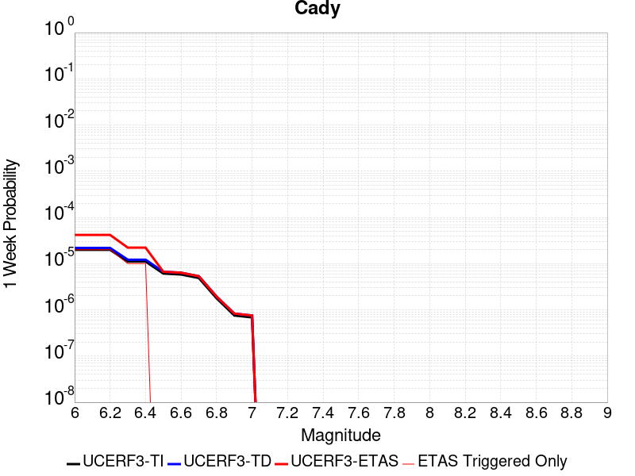 |  |  |  |

| Magnitude | 1 wk TI Prob | 1 wk TD Prob | 1 wk ETAS Prob | 1 wk ETAS/TD Gain | 1 wk ETAS Triggered Only | 1 mo TI Prob | 1 mo TD Prob | 1 mo ETAS Prob | 1 mo ETAS/TD Gain | 1 mo ETAS Triggered Only | 1 yr TI Prob | 1 yr TD Prob | 1 yr ETAS Prob | 1 yr ETAS/TD Gain | 1 yr ETAS Triggered Only | 10 yr TI Prob | 10 yr TD Prob | 10 yr ETAS Prob | 10 yr ETAS/TD Gain | 10 yr ETAS Triggered Only |
|-----|-----|-----|-----|-----|-----|-----|-----|-----|-----|-----|-----|-----|-----|-----|-----|-----|-----|-----|-----|-----|
| 6.0 | 1.9892565E-5 | 2.185918E-5 | 4.1858744E-5 | 1.9149274 | 2.0E-5 | 8.525106E-5 | 9.3679344E-5 | 1.2367654E-4 | 1.3202113 | 3.0E-5 | 0.0010374374 | 0.0011400402 | 0.0011999718 | 1.0525697 | 6.0E-5 | 0.010326075 | 0.011350933 | 0.011459685 | 1.0095809 | 1.1E-4 |
| 6.1 | 1.9892565E-5 | 2.185918E-5 | 4.1858744E-5 | 1.9149274 | 2.0E-5 | 8.525106E-5 | 9.3679344E-5 | 1.2367654E-4 | 1.3202113 | 3.0E-5 | 0.0010374374 | 0.0011400402 | 0.0011999718 | 1.0525697 | 6.0E-5 | 0.010326075 | 0.011350933 | 0.011459685 | 1.0095809 | 1.1E-4 |
| 6.2 | 1.9892565E-5 | 2.185918E-5 | 4.1858744E-5 | 1.9149274 | 2.0E-5 | 8.525106E-5 | 9.3679344E-5 | 1.2367654E-4 | 1.3202113 | 3.0E-5 | 0.0010374374 | 0.0011400402 | 0.0011999718 | 1.0525697 | 6.0E-5 | 0.010326075 | 0.011350933 | 0.011459685 | 1.0095809 | 1.1E-4 |
| 6.3 | 1.1117327E-5 | 1.2176825E-5 | 2.2176704E-5 | 1.8212221 | 1.0E-5 | 4.764482E-5 | 5.218553E-5 | 7.2184484E-5 | 1.3832281 | 2.0E-5 | 5.7992124E-4 | 6.352051E-4 | 6.95167E-4 | 1.0943977 | 6.0E-5 | 0.0057841022 | 0.006337001 | 0.006416494 | 1.0125443 | 8.0E-5 |
| 6.4 | 1.1117327E-5 | 1.2176825E-5 | 2.2176704E-5 | 1.8212221 | 1.0E-5 | 4.764482E-5 | 5.218553E-5 | 7.2184484E-5 | 1.3832281 | 2.0E-5 | 5.7992124E-4 | 6.352051E-4 | 6.95167E-4 | 1.0943977 | 6.0E-5 | 0.0057841022 | 0.006337001 | 0.006416494 | 1.0125443 | 8.0E-5 |
| 6.5 | 6.103093E-6 | 6.6721504E-6 | 6.6721504E-6 | 1.0 | 0.0 | 2.615585E-5 | 2.8594688E-5 | 3.85944E-5 | 1.3497053 | 1.0E-5 | 3.1840094E-4 | 3.4809727E-4 | 3.780868E-4 | 1.0861528 | 3.0E-5 | 0.0031794512 | 0.003476754 | 0.0035166151 | 1.011465 | 4.0E-5 |
| 6.6 | 5.817237E-6 | 6.3657835E-6 | 6.3657835E-6 | 1.0 | 0.0 | 2.4930776E-5 | 2.7281714E-5 | 3.7281443E-5 | 1.3665359 | 1.0E-5 | 3.034899E-4 | 3.321167E-4 | 3.6210674E-4 | 1.0902997 | 3.0E-5 | 0.0030307577 | 0.0033174257 | 0.003357293 | 1.0120175 | 4.0E-5 |
| 6.7 | 4.8846314E-6 | 5.340672E-6 | 5.340672E-6 | 1.0 | 0.0 | 2.0933967E-5 | 2.288846E-5 | 2.288846E-5 | 1.0 | 0.0 | 2.5484123E-4 | 2.7864316E-4 | 2.9863758E-4 | 1.0717564 | 2.0E-5 | 0.0025454918 | 0.0027840934 | 0.0028140098 | 1.0107455 | 3.0E-5 |
| 6.8 | 1.7788773E-6 | 1.9399447E-6 | 1.9399447E-6 | 1.0 | 0.0 | 7.6237375E-6 | 8.31403E-6 | 8.31403E-6 | 1.0 | 0.0 | 9.281505E-5 | 1.012202E-4 | 1.1121918E-4 | 1.0987846 | 1.0E-5 | 9.2776294E-4 | 0.0010118956 | 0.0010218854 | 1.0098724 | 1.0E-5 |
| 6.9 | 7.5455404E-7 | 8.2972645E-7 | 8.2972645E-7 | 1.0 | 0.0 | 3.233799E-6 | 3.5559674E-6 | 3.5559674E-6 | 1.0 | 0.0 | 3.937079E-5 | 4.329338E-5 | 4.329338E-5 | 1.0 | 0.0 | 3.9363815E-4 | 4.328824E-4 | 4.328824E-4 | 1.0 | 0.0 |
| 7.0 | 6.8578805E-7 | 7.541973E-7 | 7.541973E-7 | 1.0 | 0.0 | 2.9390883E-6 | 3.2322719E-6 | 3.2322719E-6 | 1.0 | 0.0 | 3.578281E-5 | 3.935253E-5 | 3.935253E-5 | 1.0 | 0.0 | 3.577705E-4 | 3.934881E-4 | 3.934881E-4 | 1.0 | 0.0 |

## Mission Creek
*[(top)](#table-of-contents)*

| 1 Week | 1 Month | 1 Year | 10 Year |
|-----|-----|-----|-----|
| 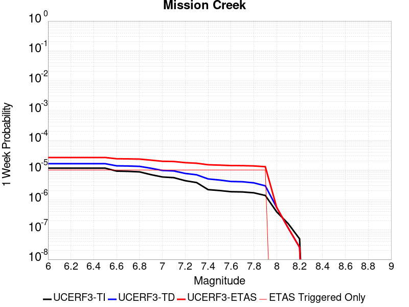 |  |  |  |

| Magnitude | 1 wk TI Prob | 1 wk TD Prob | 1 wk ETAS Prob | 1 wk ETAS/TD Gain | 1 wk ETAS Triggered Only | 1 mo TI Prob | 1 mo TD Prob | 1 mo ETAS Prob | 1 mo ETAS/TD Gain | 1 mo ETAS Triggered Only | 1 yr TI Prob | 1 yr TD Prob | 1 yr ETAS Prob | 1 yr ETAS/TD Gain | 1 yr ETAS Triggered Only | 10 yr TI Prob | 10 yr TD Prob | 10 yr ETAS Prob | 10 yr ETAS/TD Gain | 10 yr ETAS Triggered Only |
|-----|-----|-----|-----|-----|-----|-----|-----|-----|-----|-----|-----|-----|-----|-----|-----|-----|-----|-----|-----|-----|
| 6.0 | 1.1549387E-5 | 1.6326052E-5 | 2.6325888E-5 | 1.6125079 | 1.0E-5 | 4.9496433E-5 | 6.9967E-5 | 8.99656E-5 | 1.2858291 | 2.0E-5 | 6.0245243E-4 | 8.515303E-4 | 8.8150473E-4 | 1.0352007 | 3.0E-5 | 0.006008218 | 0.008511862 | 0.00863084 | 1.013978 | 1.2E-4 |
| 6.1 | 1.1549387E-5 | 1.6326052E-5 | 2.6325888E-5 | 1.6125079 | 1.0E-5 | 4.9496433E-5 | 6.9967E-5 | 8.99656E-5 | 1.2858291 | 2.0E-5 | 6.0245243E-4 | 8.515303E-4 | 8.8150473E-4 | 1.0352007 | 3.0E-5 | 0.006008218 | 0.008511862 | 0.00863084 | 1.013978 | 1.2E-4 |
| 6.2 | 1.1549387E-5 | 1.6326052E-5 | 2.6325888E-5 | 1.6125079 | 1.0E-5 | 4.9496433E-5 | 6.9967E-5 | 8.99656E-5 | 1.2858291 | 2.0E-5 | 6.0245243E-4 | 8.515303E-4 | 8.8150473E-4 | 1.0352007 | 3.0E-5 | 0.006008218 | 0.008511862 | 0.00863084 | 1.013978 | 1.2E-4 |
| 6.3 | 1.1549387E-5 | 1.6326052E-5 | 2.6325888E-5 | 1.6125079 | 1.0E-5 | 4.9496433E-5 | 6.9967E-5 | 8.99656E-5 | 1.2858291 | 2.0E-5 | 6.0245243E-4 | 8.515303E-4 | 8.8150473E-4 | 1.0352007 | 3.0E-5 | 0.006008218 | 0.008511862 | 0.00863084 | 1.013978 | 1.2E-4 |
| 6.4 | 1.1549387E-5 | 1.6326052E-5 | 2.6325888E-5 | 1.6125079 | 1.0E-5 | 4.9496433E-5 | 6.9967E-5 | 8.99656E-5 | 1.2858291 | 2.0E-5 | 6.0245243E-4 | 8.515303E-4 | 8.8150473E-4 | 1.0352007 | 3.0E-5 | 0.006008218 | 0.008511862 | 0.00863084 | 1.013978 | 1.2E-4 |
| 6.5 | 1.1549387E-5 | 1.6326052E-5 | 2.6325888E-5 | 1.6125079 | 1.0E-5 | 4.9496433E-5 | 6.9967E-5 | 8.99656E-5 | 1.2858291 | 2.0E-5 | 6.0245243E-4 | 8.515303E-4 | 8.8150473E-4 | 1.0352007 | 3.0E-5 | 0.006008218 | 0.008511862 | 0.00863084 | 1.013978 | 1.2E-4 |
| 6.6 | 9.202681E-6 | 1.3849299E-5 | 2.3849161E-5 | 1.7220482 | 1.0E-5 | 3.9439463E-5 | 5.935284E-5 | 7.935165E-5 | 1.3369479 | 2.0E-5 | 4.800697E-4 | 7.2239025E-4 | 7.523686E-4 | 1.0414988 | 3.0E-5 | 0.004790339 | 0.0072290325 | 0.0073382375 | 1.0151064 | 1.1E-4 |
| 6.7 | 9.019164E-6 | 1.3654966E-5 | 2.365483E-5 | 1.7323242 | 1.0E-5 | 3.8652986E-5 | 5.852002E-5 | 7.851885E-5 | 1.3417434 | 2.0E-5 | 4.7049852E-4 | 7.1225734E-4 | 7.42236E-4 | 1.0420896 | 3.0E-5 | 0.004695036 | 0.007128356 | 0.0072375718 | 1.0153214 | 1.1E-4 |
| 6.8 | 8.673558E-6 | 1.3277069E-5 | 2.3276936E-5 | 1.7531682 | 1.0E-5 | 3.717186E-5 | 5.6900535E-5 | 7.68994E-5 | 1.3514706 | 2.0E-5 | 4.524734E-4 | 6.9255265E-4 | 7.2253187E-4 | 1.043288 | 3.0E-5 | 0.0045155324 | 0.0069325403 | 0.007041778 | 1.0157572 | 1.1E-4 |
| 6.9 | 7.002255E-6 | 1.1481271E-5 | 2.1481155E-5 | 1.8709737 | 1.0E-5 | 3.000932E-5 | 4.920456E-5 | 6.9203576E-5 | 1.4064465 | 2.0E-5 | 3.653022E-4 | 5.9890765E-4 | 6.288897E-4 | 1.0500612 | 3.0E-5 | 0.0036470229 | 0.0060013505 | 0.0061106905 | 1.0182192 | 1.1E-4 |
| 7.0 | 5.84644E-6 | 9.67841E-6 | 1.9678313E-5 | 2.0332177 | 1.0E-5 | 2.5055931E-5 | 4.1478266E-5 | 6.147743E-5 | 1.4821602 | 2.0E-5 | 3.0501327E-4 | 5.0488545E-4 | 5.3487025E-4 | 1.0593895 | 3.0E-5 | 0.0030459496 | 0.0050655915 | 0.0051750345 | 1.0216051 | 1.1E-4 |
| 7.1 | 5.54703E-6 | 9.332874E-6 | 1.933278E-5 | 2.0714715 | 1.0E-5 | 2.377277E-5 | 3.999744E-5 | 5.999664E-5 | 1.500012 | 2.0E-5 | 2.8939504E-4 | 4.8686448E-4 | 5.1684986E-4 | 1.0615888 | 3.0E-5 | 0.0028901845 | 0.004886179 | 0.0049956418 | 1.0224025 | 1.1E-4 |
| 7.2 | 4.384709E-6 | 7.6848355E-6 | 1.7684759E-5 | 2.301254 | 1.0E-5 | 1.8791474E-5 | 3.2934615E-5 | 5.2933956E-5 | 1.6072438 | 2.0E-5 | 2.2876218E-4 | 4.0090882E-4 | 4.308968E-4 | 1.0748 | 3.0E-5 | 0.0022852682 | 0.0040300214 | 0.004139578 | 1.0271851 | 1.1E-4 |
| 7.3 | 3.7888456E-6 | 6.9186526E-6 | 1.6918584E-5 | 2.445358 | 1.0E-5 | 1.623781E-5 | 2.965105E-5 | 4.9650458E-5 | 1.6744924 | 2.0E-5 | 1.9767738E-4 | 3.609451E-4 | 3.9093426E-4 | 1.0830852 | 3.0E-5 | 0.0019750162 | 0.0036317378 | 0.0037413384 | 1.0301785 | 1.1E-4 |
| 7.4 | 2.1982462E-6 | 5.0268823E-6 | 1.5026832E-5 | 2.9892945 | 1.0E-5 | 9.421021E-6 | 2.1543605E-5 | 3.154339E-5 | 1.4641649 | 1.0E-5 | 1.1469489E-4 | 2.62262E-4 | 2.8225675E-4 | 1.0762396 | 2.0E-5 | 0.0011463572 | 0.0026474595 | 0.0027372213 | 1.0339049 | 9.0E-5 |
| 7.5 | 2.051923E-6 | 4.6180376E-6 | 1.4617991E-5 | 3.165412 | 1.0E-5 | 8.793926E-6 | 1.979144E-5 | 2.9791241E-5 | 1.5052589 | 1.0E-5 | 1.0706078E-4 | 2.4093427E-4 | 2.6092946E-4 | 1.0829902 | 2.0E-5 | 0.0010700922 | 0.0024350737 | 0.0025248546 | 1.0368699 | 9.0E-5 |
| 7.6 | 1.8733427E-6 | 4.126293E-6 | 1.4126252E-5 | 3.423473 | 1.0E-5 | 8.028587E-6 | 1.7683993E-5 | 2.7683816E-5 | 1.5654732 | 1.0E-5 | 9.774366E-5 | 2.1528143E-4 | 2.3527711E-4 | 1.0928817 | 2.0E-5 | 9.770069E-4 | 0.002179559 | 0.0022693628 | 1.0412028 | 9.0E-5 |
| 7.7 | 1.8411953E-6 | 4.045948E-6 | 1.4045908E-5 | 3.4715986 | 1.0E-5 | 7.890813E-6 | 1.7339662E-5 | 2.7339489E-5 | 1.5767025 | 1.0E-5 | 9.606641E-5 | 2.1109002E-4 | 2.310858E-4 | 1.0947263 | 2.0E-5 | 9.6024893E-4 | 0.0021378342 | 0.0022276416 | 1.0420086 | 9.0E-5 |
| 7.8 | 1.7194251E-6 | 3.7131272E-6 | 1.371309E-5 | 3.6931376 | 1.0E-5 | 7.368944E-6 | 1.5913305E-5 | 2.5913147E-5 | 1.628395 | 1.0E-5 | 8.97132E-5 | 1.9372735E-4 | 2.1372347E-4 | 1.1032178 | 2.0E-5 | 8.967699E-4 | 0.0019637202 | 0.0020535435 | 1.0457413 | 9.0E-5 |
| 7.9 | 1.4035052E-6 | 2.9522764E-6 | 1.2952247E-5 | 4.3872066 | 1.0E-5 | 6.0150082E-6 | 1.2652552E-5 | 2.2652426E-5 | 1.7903444 | 1.0E-5 | 7.3230265E-5 | 1.5403399E-4 | 1.7403091E-4 | 1.1298214 | 2.0E-5 | 7.3206134E-4 | 0.0015642297 | 0.001654089 | 1.0574464 | 9.0E-5 |
| 8.0 | 3.9318823E-7 | 5.5339035E-7 | 5.5339035E-7 | 1.0 | 0.0 | 1.6850913E-6 | 2.371671E-6 | 2.371671E-6 | 1.0 | 0.0 | 2.0515794E-5 | 2.8874716E-5 | 2.8874716E-5 | 1.0 | 0.0 | 2.0513899E-4 | 2.9927155E-4 | 3.0926857E-4 | 1.0334045 | 1.0E-5 |
| 8.1 | 1.596793E-7 | 1.13987035E-7 | 1.13987035E-7 | 1.0 | 0.0 | 6.8433974E-7 | 4.8851575E-7 | 4.8851575E-7 | 1.0 | 0.0 | 8.331805E-6 | 5.9476633E-6 | 5.9476633E-6 | 1.0 | 0.0 | 8.331492E-5 | 6.560129E-5 | 6.560129E-5 | 1.0 | 0.0 |
| 8.2 | 4.9003038E-8 | 2.5492362E-8 | 2.5492362E-8 | 1.0 | 0.0 | 2.10013E-7 | 1.0925297E-7 | 1.0925297E-7 | 1.0 | 0.0 | 2.5569052E-6 | 1.3301542E-6 | 1.3301542E-6 | 1.0 | 0.0 | 2.556876E-5 | 1.4982654E-5 | 1.4982654E-5 | 1.0 | 0.0 |

## San Jacinto (San Jacinto Valley) rev
*[(top)](#table-of-contents)*

| 1 Week | 1 Month | 1 Year | 10 Year |
|-----|-----|-----|-----|
|  |  | 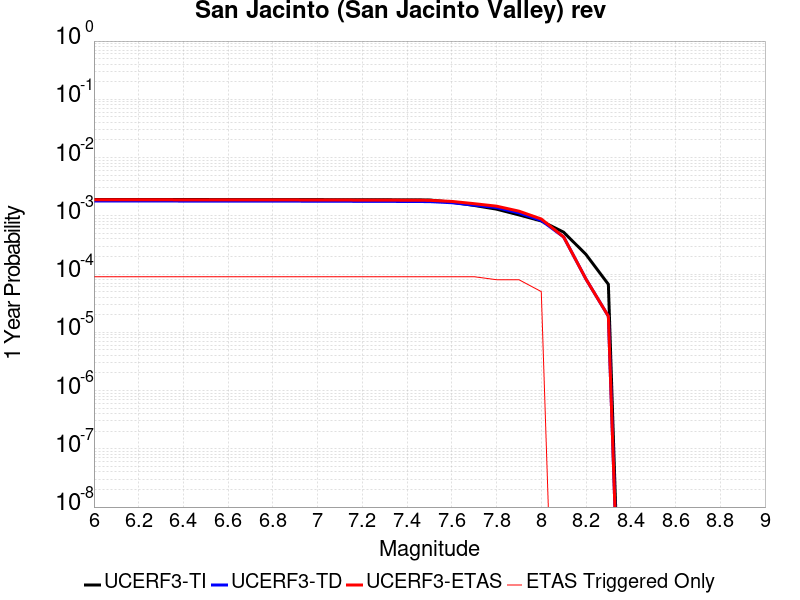 |  |

| Magnitude | 1 wk TI Prob | 1 wk TD Prob | 1 wk ETAS Prob | 1 wk ETAS/TD Gain | 1 wk ETAS Triggered Only | 1 mo TI Prob | 1 mo TD Prob | 1 mo ETAS Prob | 1 mo ETAS/TD Gain | 1 mo ETAS Triggered Only | 1 yr TI Prob | 1 yr TD Prob | 1 yr ETAS Prob | 1 yr ETAS/TD Gain | 1 yr ETAS Triggered Only | 10 yr TI Prob | 10 yr TD Prob | 10 yr ETAS Prob | 10 yr ETAS/TD Gain | 10 yr ETAS Triggered Only |
|-----|-----|-----|-----|-----|-----|-----|-----|-----|-----|-----|-----|-----|-----|-----|-----|-----|-----|-----|-----|-----|
| 6.0 | 3.652694E-5 | 3.4425575E-5 | 5.4424887E-5 | 1.5809435 | 2.0E-5 | 1.5653463E-4 | 1.4752983E-4 | 1.775254E-4 | 1.2033187 | 3.0E-5 | 0.0019041431 | 0.0017946975 | 0.001884536 | 1.0500578 | 9.0E-5 | 0.018879099 | 0.018538559 | 0.018656334 | 1.006353 | 1.2E-4 |
| 6.1 | 3.652694E-5 | 3.4425575E-5 | 5.4424887E-5 | 1.5809435 | 2.0E-5 | 1.5653463E-4 | 1.4752983E-4 | 1.775254E-4 | 1.2033187 | 3.0E-5 | 0.0019041431 | 0.0017946975 | 0.001884536 | 1.0500578 | 9.0E-5 | 0.018879099 | 0.018538559 | 0.018656334 | 1.006353 | 1.2E-4 |
| 6.2 | 3.652694E-5 | 3.4425575E-5 | 5.4424887E-5 | 1.5809435 | 2.0E-5 | 1.5653463E-4 | 1.4752983E-4 | 1.775254E-4 | 1.2033187 | 3.0E-5 | 0.0019041431 | 0.0017946975 | 0.001884536 | 1.0500578 | 9.0E-5 | 0.018879099 | 0.018538559 | 0.018656334 | 1.006353 | 1.2E-4 |
| 6.3 | 3.652694E-5 | 3.4425575E-5 | 5.4424887E-5 | 1.5809435 | 2.0E-5 | 1.5653463E-4 | 1.4752983E-4 | 1.775254E-4 | 1.2033187 | 3.0E-5 | 0.0019041431 | 0.0017946975 | 0.001884536 | 1.0500578 | 9.0E-5 | 0.018879099 | 0.018538559 | 0.018656334 | 1.006353 | 1.2E-4 |
| 6.4 | 3.646941E-5 | 3.4347147E-5 | 5.434646E-5 | 1.58227 | 2.0E-5 | 1.5628811E-4 | 1.4719374E-4 | 1.7718933E-4 | 1.203783 | 3.0E-5 | 0.0019011468 | 0.0017906128 | 0.0018804517 | 1.0501721 | 9.0E-5 | 0.018849645 | 0.018498437 | 0.018616216 | 1.0063671 | 1.2E-4 |
| 6.5 | 3.646941E-5 | 3.4347147E-5 | 5.434646E-5 | 1.58227 | 2.0E-5 | 1.5628811E-4 | 1.4719374E-4 | 1.7718933E-4 | 1.203783 | 3.0E-5 | 0.0019011468 | 0.0017906128 | 0.0018804517 | 1.0501721 | 9.0E-5 | 0.018849645 | 0.018498437 | 0.018616216 | 1.0063671 | 1.2E-4 |
| 6.6 | 3.6442503E-5 | 3.4310528E-5 | 5.4309843E-5 | 1.5828915 | 2.0E-5 | 1.561728E-4 | 1.4703683E-4 | 1.7703243E-4 | 1.2040005 | 3.0E-5 | 0.0018997455 | 0.0017887056 | 0.0018785446 | 1.0502257 | 9.0E-5 | 0.018835869 | 0.018479705 | 0.018597487 | 1.0063736 | 1.2E-4 |
| 6.7 | 3.6432113E-5 | 3.42961E-5 | 5.4295415E-5 | 1.5831367 | 2.0E-5 | 1.5612828E-4 | 1.46975E-4 | 1.769706E-4 | 1.2040863 | 3.0E-5 | 0.0018992044 | 0.0017879542 | 0.0018777933 | 1.0502468 | 9.0E-5 | 0.018830549 | 0.018472329 | 0.018590111 | 1.0063761 | 1.2E-4 |
| 6.8 | 3.6409598E-5 | 3.426515E-5 | 5.4264467E-5 | 1.5836633 | 2.0E-5 | 1.560318E-4 | 1.4684239E-4 | 1.7683799E-4 | 1.2042707 | 3.0E-5 | 0.0018980318 | 0.0017863424 | 0.0018761816 | 1.0502923 | 9.0E-5 | 0.018819023 | 0.018456481 | 0.018574268 | 1.0063818 | 1.2E-4 |
| 6.9 | 3.638078E-5 | 3.4225573E-5 | 5.422489E-5 | 1.5843383 | 2.0E-5 | 1.5590832E-4 | 1.4667278E-4 | 1.7666839E-4 | 1.2045069 | 3.0E-5 | 0.0018965311 | 0.0017842808 | 0.0018741202 | 1.0503505 | 9.0E-5 | 0.018804269 | 0.018436214 | 0.018554002 | 1.0063889 | 1.2E-4 |
| 7.0 | 3.6294874E-5 | 3.410758E-5 | 5.41069E-5 | 1.58636 | 2.0E-5 | 1.5554018E-4 | 1.4616716E-4 | 1.7616278E-4 | 1.2052145 | 3.0E-5 | 0.0018920569 | 0.0017781353 | 0.0018679752 | 1.0505248 | 9.0E-5 | 0.018760284 | 0.018375792 | 0.018493587 | 1.0064104 | 1.2E-4 |
| 7.1 | 3.6260717E-5 | 3.4063858E-5 | 5.4063177E-5 | 1.5871125 | 2.0E-5 | 1.5539382E-4 | 1.4597981E-4 | 1.7597544E-4 | 1.2054778 | 3.0E-5 | 0.001890278 | 0.001775858 | 0.0018656981 | 1.0505897 | 9.0E-5 | 0.018742796 | 0.018353391 | 0.018471189 | 1.0064183 | 1.2E-4 |
| 7.2 | 3.6210204E-5 | 3.3998072E-5 | 5.3997395E-5 | 1.5882486 | 2.0E-5 | 1.5517735E-4 | 1.4569791E-4 | 1.7569354E-4 | 1.2058755 | 3.0E-5 | 0.001887647 | 0.0017724314 | 0.0018622719 | 1.0506877 | 9.0E-5 | 0.01871693 | 0.01831967 | 0.018437471 | 1.0064304 | 1.2E-4 |
| 7.3 | 3.6119454E-5 | 3.3886347E-5 | 5.388567E-5 | 1.5901881 | 2.0E-5 | 1.5478847E-4 | 1.4521914E-4 | 1.7521478E-4 | 1.2065543 | 3.0E-5 | 0.0018829206 | 0.0017666118 | 0.0018564529 | 1.0508549 | 9.0E-5 | 0.018670462 | 0.018262219 | 0.018380025 | 1.0064509 | 1.2E-4 |
| 7.4 | 3.607848E-5 | 3.383384E-5 | 5.3833166E-5 | 1.5911041 | 2.0E-5 | 1.5461289E-4 | 1.4499413E-4 | 1.7498978E-4 | 1.206875 | 3.0E-5 | 0.0018807866 | 0.0017638769 | 0.0018537181 | 1.050934 | 9.0E-5 | 0.018649481 | 0.01823521 | 0.01835302 | 1.0064607 | 1.2E-4 |
| 7.5 | 3.5856774E-5 | 3.364358E-5 | 5.3642907E-5 | 1.594447 | 2.0E-5 | 1.5366284E-4 | 1.4417882E-4 | 1.7417449E-4 | 1.208045 | 3.0E-5 | 0.0018692396 | 0.0017539663 | 0.0018438085 | 1.0512223 | 9.0E-5 | 0.018535944 | 0.01813629 | 0.018254114 | 1.0064965 | 1.2E-4 |
| 7.6 | 3.286655E-5 | 3.216611E-5 | 5.2165466E-5 | 1.6217524 | 2.0E-5 | 1.4084904E-4 | 1.3784748E-4 | 1.6784335E-4 | 1.2176018 | 3.0E-5 | 0.001713488 | 0.0016770032 | 0.0017668522 | 1.0535772 | 9.0E-5 | 0.017003361 | 0.017355738 | 0.017473657 | 1.0067941 | 1.2E-4 |
| 7.7 | 2.8882527E-5 | 2.9258481E-5 | 4.9257895E-5 | 1.6835425 | 2.0E-5 | 1.237764E-4 | 1.2538747E-4 | 1.553837E-4 | 1.2392284 | 3.0E-5 | 0.0015059357 | 0.0015255245 | 0.0016153873 | 1.0589061 | 9.0E-5 | 0.014957713 | 0.01584194 | 0.01596004 | 1.0074549 | 1.2E-4 |
| 7.8 | 2.4950225E-5 | 2.6548549E-5 | 4.654802E-5 | 1.7533169 | 2.0E-5 | 1.0692515E-4 | 1.13774535E-4 | 1.4377112E-4 | 1.2636493 | 3.0E-5 | 0.0013010362 | 0.0013843257 | 0.0014642149 | 1.0577098 | 8.0E-5 | 0.012934455 | 0.014422816 | 0.01453123 | 1.0075169 | 1.1E-4 |
| 7.9 | 1.9881603E-5 | 2.1526626E-5 | 4.1526197E-5 | 1.9290619 | 2.0E-5 | 8.520408E-5 | 9.2253715E-5 | 1.2225095E-4 | 1.3251601 | 3.0E-5 | 0.001036866 | 0.001122611 | 0.0012025211 | 1.0711825 | 8.0E-5 | 0.010320415 | 0.011787008 | 0.011885829 | 1.0083839 | 1.0E-4 |
| 8.0 | 1.563292E-5 | 1.5952848E-5 | 2.595269E-5 | 1.6268373 | 1.0E-5 | 6.6996516E-5 | 6.836756E-5 | 8.836619E-5 | 1.2925164 | 2.0E-5 | 8.153773E-4 | 8.320579E-4 | 8.8201626E-4 | 1.060042 | 5.0E-5 | 0.00812392 | 0.008818663 | 0.008888045 | 1.0078677 | 7.0E-5 |
| 8.1 | 1.0045313E-5 | 8.310819E-6 | 8.310819E-6 | 1.0 | 0.0 | 4.305063E-5 | 3.561731E-5 | 3.561731E-5 | 1.0 | 0.0 | 5.2401534E-4 | 4.3355502E-4 | 4.3355502E-4 | 1.0 | 0.0 | 0.0052278144 | 0.0046639577 | 0.0046838643 | 1.0042682 | 2.0E-5 |
| 8.2 | 4.1554413E-6 | 1.5681568E-6 | 1.5681568E-6 | 1.0 | 0.0 | 1.7808914E-5 | 6.7206547E-6 | 6.7206547E-6 | 1.0 | 0.0 | 2.1680194E-4 | 8.182093E-5 | 8.182093E-5 | 1.0 | 0.0 | 0.0021659054 | 9.4977295E-4 | 9.4977295E-4 | 1.0 | 0.0 |
| 8.3 | 1.2758221E-6 | 3.6220413E-7 | 3.6220413E-7 | 1.0 | 0.0 | 5.4677976E-6 | 1.5523025E-6 | 1.5523025E-6 | 1.0 | 0.0 | 6.65684E-5 | 1.8899123E-5 | 1.8899123E-5 | 1.0 | 0.0 | 6.6548464E-4 | 2.2792698E-4 | 2.2792698E-4 | 1.0 | 0.0 |

## Santa Ynez (East)
*[(top)](#table-of-contents)*

| 1 Week | 1 Month | 1 Year | 10 Year |
|-----|-----|-----|-----|
| 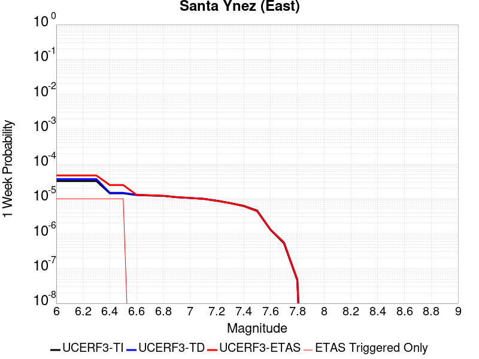 | 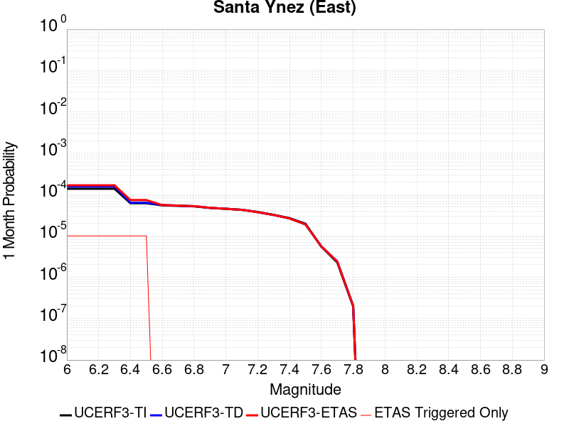 |  |  |

| Magnitude | 1 wk TI Prob | 1 wk TD Prob | 1 wk ETAS Prob | 1 wk ETAS/TD Gain | 1 wk ETAS Triggered Only | 1 mo TI Prob | 1 mo TD Prob | 1 mo ETAS Prob | 1 mo ETAS/TD Gain | 1 mo ETAS Triggered Only | 1 yr TI Prob | 1 yr TD Prob | 1 yr ETAS Prob | 1 yr ETAS/TD Gain | 1 yr ETAS Triggered Only | 10 yr TI Prob | 10 yr TD Prob | 10 yr ETAS Prob | 10 yr ETAS/TD Gain | 10 yr ETAS Triggered Only |
|-----|-----|-----|-----|-----|-----|-----|-----|-----|-----|-----|-----|-----|-----|-----|-----|-----|-----|-----|-----|-----|
| 6.0 | 3.2269712E-5 | 3.675183E-5 | 4.6751462E-5 | 1.2720853 | 1.0E-5 | 1.3829143E-4 | 1.5750166E-4 | 1.6750008E-4 | 1.0634815 | 1.0E-5 | 0.0016823979 | 0.0019164857 | 0.0019364475 | 1.0104158 | 2.0E-5 | 0.016697178 | 0.019057123 | 0.019155217 | 1.0051473 | 1.0E-4 |
| 6.1 | 3.2269712E-5 | 3.675183E-5 | 4.6751462E-5 | 1.2720853 | 1.0E-5 | 1.3829143E-4 | 1.5750166E-4 | 1.6750008E-4 | 1.0634815 | 1.0E-5 | 0.0016823979 | 0.0019164857 | 0.0019364475 | 1.0104158 | 2.0E-5 | 0.016697178 | 0.019057123 | 0.019155217 | 1.0051473 | 1.0E-4 |
| 6.2 | 3.2269712E-5 | 3.675183E-5 | 4.6751462E-5 | 1.2720853 | 1.0E-5 | 1.3829143E-4 | 1.5750166E-4 | 1.6750008E-4 | 1.0634815 | 1.0E-5 | 0.0016823979 | 0.0019164857 | 0.0019364475 | 1.0104158 | 2.0E-5 | 0.016697178 | 0.019057123 | 0.019155217 | 1.0051473 | 1.0E-4 |
| 6.3 | 3.2269712E-5 | 3.675183E-5 | 4.6751462E-5 | 1.2720853 | 1.0E-5 | 1.3829143E-4 | 1.5750166E-4 | 1.6750008E-4 | 1.0634815 | 1.0E-5 | 0.0016823979 | 0.0019164857 | 0.0019364475 | 1.0104158 | 2.0E-5 | 0.016697178 | 0.019057123 | 0.019155217 | 1.0051473 | 1.0E-4 |
| 6.4 | 1.4404779E-5 | 1.48496765E-5 | 2.4849527E-5 | 1.6734054 | 1.0E-5 | 6.1733306E-5 | 6.363994E-5 | 7.363931E-5 | 1.157124 | 1.0E-5 | 7.513438E-4 | 7.7454594E-4 | 7.8453816E-4 | 1.0129008 | 1.0E-5 | 0.0074880854 | 0.007719014 | 0.0077587054 | 1.005142 | 4.0E-5 |
| 6.5 | 1.4404779E-5 | 1.48496765E-5 | 2.4849527E-5 | 1.6734054 | 1.0E-5 | 6.1733306E-5 | 6.363994E-5 | 7.363931E-5 | 1.157124 | 1.0E-5 | 7.513438E-4 | 7.7454594E-4 | 7.8453816E-4 | 1.0129008 | 1.0E-5 | 0.0074880854 | 0.007719014 | 0.0077587054 | 1.005142 | 4.0E-5 |
| 6.6 | 1.280208E-5 | 1.3012184E-5 | 1.3012184E-5 | 1.0 | 0.0 | 5.4864904E-5 | 5.5765326E-5 | 5.5765326E-5 | 1.0 | 0.0 | 6.6777546E-4 | 6.787331E-4 | 6.787331E-4 | 1.0 | 0.0 | 0.006657724 | 0.0067668115 | 0.0067966087 | 1.0044034 | 3.0E-5 |
| 6.7 | 1.2457027E-5 | 1.2628696E-5 | 1.2628696E-5 | 1.0 | 0.0 | 5.3386164E-5 | 5.4121872E-5 | 5.4121872E-5 | 1.0 | 0.0 | 6.497827E-4 | 6.587362E-4 | 6.587362E-4 | 1.0 | 0.0 | 0.00647886 | 0.0065680337 | 0.0065978365 | 1.0045376 | 3.0E-5 |
| 6.8 | 1.2095134E-5 | 1.2231135E-5 | 1.2231135E-5 | 1.0 | 0.0 | 5.1835254E-5 | 5.2418105E-5 | 5.2418105E-5 | 1.0 | 0.0 | 6.309115E-4 | 6.3800515E-4 | 6.3800515E-4 | 1.0 | 0.0 | 0.0062912325 | 0.006361923 | 0.0063917325 | 1.0046855 | 3.0E-5 |
| 6.9 | 1.1104036E-5 | 1.1157549E-5 | 1.1157549E-5 | 1.0 | 0.0 | 4.758786E-5 | 4.7817197E-5 | 4.7817197E-5 | 1.0 | 0.0 | 5.7922816E-4 | 5.820201E-4 | 5.820201E-4 | 1.0 | 0.0 | 0.005777207 | 0.0058051036 | 0.0058349296 | 1.0051379 | 3.0E-5 |
| 7.0 | 1.0577444E-5 | 1.0581871E-5 | 1.0581871E-5 | 1.0 | 0.0 | 4.5331115E-5 | 4.5350094E-5 | 4.5350094E-5 | 1.0 | 0.0 | 5.5176654E-4 | 5.5199873E-4 | 5.5199873E-4 | 1.0 | 0.0 | 0.0055039856 | 0.0055064145 | 0.005536249 | 1.0054182 | 3.0E-5 |
| 7.1 | 1.0021775E-5 | 9.981168E-6 | 9.981168E-6 | 1.0 | 0.0 | 4.294976E-5 | 4.2775737E-5 | 4.2775737E-5 | 1.0 | 0.0 | 5.2278786E-4 | 5.2067137E-4 | 5.2067137E-4 | 1.0 | 0.0 | 0.0052155964 | 0.0051946472 | 0.005224491 | 1.0057452 | 3.0E-5 |
| 7.2 | 8.874109E-6 | 8.7489525E-6 | 8.7489525E-6 | 1.0 | 0.0 | 3.8031343E-5 | 3.7494978E-5 | 3.7494978E-5 | 1.0 | 0.0 | 4.629332E-4 | 4.564068E-4 | 4.564068E-4 | 1.0 | 0.0 | 0.0046197 | 0.004554813 | 0.004584676 | 1.0065564 | 3.0E-5 |
| 7.3 | 7.5504267E-6 | 7.5052453E-6 | 7.5052453E-6 | 1.0 | 0.0 | 3.235857E-5 | 3.2164946E-5 | 3.2164946E-5 | 1.0 | 0.0 | 3.9389438E-4 | 3.9153887E-4 | 3.9153887E-4 | 1.0 | 0.0 | 0.0039319694 | 0.0039085974 | 0.0039384803 | 1.0076454 | 3.0E-5 |
| 7.4 | 6.309394E-6 | 6.1832593E-6 | 6.1832593E-6 | 1.0 | 0.0 | 2.703998E-5 | 2.6499418E-5 | 2.6499418E-5 | 1.0 | 0.0 | 3.2916202E-4 | 3.225836E-4 | 3.225836E-4 | 1.0 | 0.0 | 0.003286749 | 0.0032212508 | 0.0032411865 | 1.0061888 | 2.0E-5 |
| 7.5 | 4.6103073E-6 | 4.4409603E-6 | 4.4409603E-6 | 1.0 | 0.0 | 1.975831E-5 | 1.9032552E-5 | 1.9032552E-5 | 1.0 | 0.0 | 2.4053088E-4 | 2.3169738E-4 | 2.3169738E-4 | 1.0 | 0.0 | 0.002402707 | 0.0023146276 | 0.0023246044 | 1.0043104 | 1.0E-5 |
| 7.6 | 1.2858658E-6 | 1.3008322E-6 | 1.3008322E-6 | 1.0 | 0.0 | 5.5108417E-6 | 5.574984E-6 | 5.574984E-6 | 1.0 | 0.0 | 6.7092435E-5 | 6.7873385E-5 | 6.7873385E-5 | 1.0 | 0.0 | 6.707218E-4 | 6.785334E-4 | 6.785334E-4 | 1.0 | 0.0 |
| 7.7 | 5.3302307E-7 | 5.612201E-7 | 5.612201E-7 | 1.0 | 0.0 | 2.2843826E-6 | 2.4052267E-6 | 2.4052267E-6 | 1.0 | 0.0 | 2.7812002E-5 | 2.928328E-5 | 2.928328E-5 | 1.0 | 0.0 | 2.7808524E-4 | 2.9279778E-4 | 2.9279778E-4 | 1.0 | 0.0 |
| 7.8 | 4.613933E-8 | 4.8030508E-8 | 4.8030508E-8 | 1.0 | 0.0 | 1.9773998E-7 | 2.0584501E-7 | 2.0584501E-7 | 1.0 | 0.0 | 2.4074816E-6 | 2.5061604E-6 | 2.5061604E-6 | 1.0 | 0.0 | 2.4074554E-5 | 2.506133E-5 | 2.506133E-5 | 1.0 | 0.0 |

## Chino alt 1
*[(top)](#table-of-contents)*

| 1 Week | 1 Month | 1 Year | 10 Year |
|-----|-----|-----|-----|
|  | 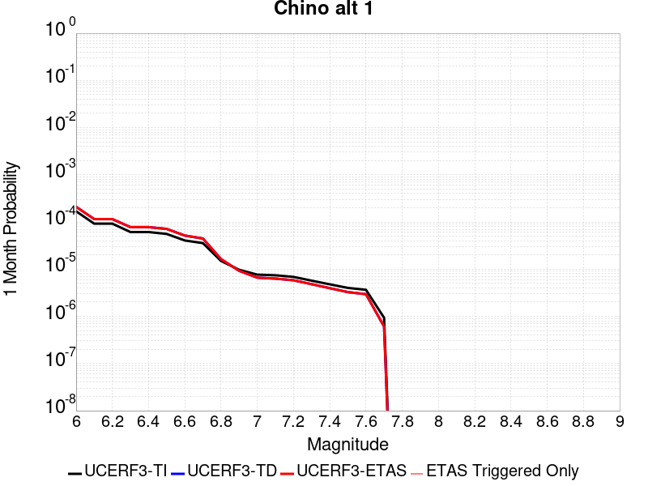 | 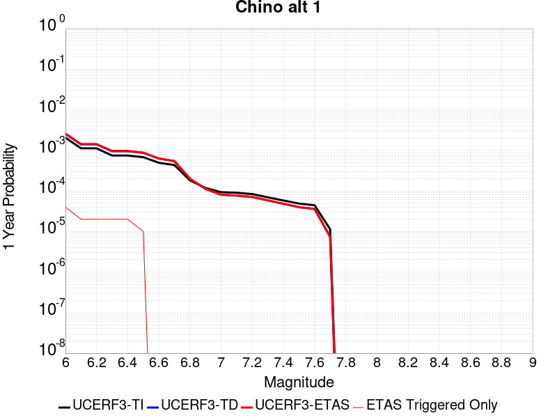 |  |

| Magnitude | 1 wk TI Prob | 1 wk TD Prob | 1 wk ETAS Prob | 1 wk ETAS/TD Gain | 1 wk ETAS Triggered Only | 1 mo TI Prob | 1 mo TD Prob | 1 mo ETAS Prob | 1 mo ETAS/TD Gain | 1 mo ETAS Triggered Only | 1 yr TI Prob | 1 yr TD Prob | 1 yr ETAS Prob | 1 yr ETAS/TD Gain | 1 yr ETAS Triggered Only | 10 yr TI Prob | 10 yr TD Prob | 10 yr ETAS Prob | 10 yr ETAS/TD Gain | 10 yr ETAS Triggered Only |
|-----|-----|-----|-----|-----|-----|-----|-----|-----|-----|-----|-----|-----|-----|-----|-----|-----|-----|-----|-----|-----|
| 6.0 | 3.939946E-5 | 4.8951395E-5 | 4.8951395E-5 | 1.0 | 0.0 | 1.6884391E-4 | 2.0977776E-4 | 2.0977776E-4 | 1.0 | 0.0 | 0.0020537362 | 0.0025515405 | 0.0025914384 | 1.0156368 | 4.0E-5 | 0.020348595 | 0.025279282 | 0.025367007 | 1.0034702 | 9.0E-5 |
| 6.1 | 2.1505624E-5 | 2.6880787E-5 | 2.6880787E-5 | 1.0 | 0.0 | 9.2163704E-5 | 1.1519891E-4 | 1.1519891E-4 | 1.0 | 0.0 | 0.0011215154 | 0.0014017558 | 0.0014217278 | 1.0142478 | 2.0E-5 | 0.011158722 | 0.0139460405 | 0.013995344 | 1.0035353 | 5.0E-5 |
| 6.2 | 2.1505624E-5 | 2.6880787E-5 | 2.6880787E-5 | 1.0 | 0.0 | 9.2163704E-5 | 1.1519891E-4 | 1.1519891E-4 | 1.0 | 0.0 | 0.0011215154 | 0.0014017558 | 0.0014217278 | 1.0142478 | 2.0E-5 | 0.011158722 | 0.0139460405 | 0.013995344 | 1.0035353 | 5.0E-5 |
| 6.3 | 1.4290785E-5 | 1.8166511E-5 | 1.8166511E-5 | 1.0 | 0.0 | 6.1244784E-5 | 7.7854405E-5 | 7.7854405E-5 | 1.0 | 0.0 | 7.454001E-4 | 9.4751065E-4 | 9.6749165E-4 | 1.0210879 | 2.0E-5 | 0.007429048 | 0.009445166 | 0.009484788 | 1.004195 | 4.0E-5 |
| 6.4 | 1.4290785E-5 | 1.8166511E-5 | 1.8166511E-5 | 1.0 | 0.0 | 6.1244784E-5 | 7.7854405E-5 | 7.7854405E-5 | 1.0 | 0.0 | 7.454001E-4 | 9.4751065E-4 | 9.6749165E-4 | 1.0210879 | 2.0E-5 | 0.007429048 | 0.009445166 | 0.009484788 | 1.004195 | 4.0E-5 |
| 6.5 | 1.3017944E-5 | 1.6653412E-5 | 1.6653412E-5 | 1.0 | 0.0 | 5.5789995E-5 | 7.137006E-5 | 7.137006E-5 | 1.0 | 0.0 | 6.790315E-4 | 8.6862786E-4 | 8.786192E-4 | 1.0115024 | 1.0E-5 | 0.0067696036 | 0.008662628 | 0.008692368 | 1.0034331 | 3.0E-5 |
| 6.6 | 9.470016E-6 | 1.20404075E-5 | 1.20404075E-5 | 1.0 | 0.0 | 4.058515E-5 | 5.1600917E-5 | 5.1600917E-5 | 1.0 | 0.0 | 4.940122E-4 | 6.28094E-4 | 6.28094E-4 | 1.0 | 0.0 | 0.004929154 | 0.0062724045 | 0.006292279 | 1.0031686 | 2.0E-5 |
| 6.7 | 8.314155E-6 | 1.04086E-5 | 1.04086E-5 | 1.0 | 0.0 | 3.5631605E-5 | 4.4607707E-5 | 4.4607707E-5 | 1.0 | 0.0 | 4.3372845E-4 | 5.4299575E-4 | 5.4299575E-4 | 1.0 | 0.0 | 0.004328829 | 0.00542622 | 0.005446112 | 1.0036658 | 2.0E-5 |
| 6.8 | 3.4856364E-6 | 3.8136216E-6 | 3.8136216E-6 | 1.0 | 0.0 | 1.4938357E-5 | 1.6344002E-5 | 1.6344002E-5 | 1.0 | 0.0 | 1.8185932E-4 | 1.9897213E-4 | 1.9897213E-4 | 1.0 | 0.0 | 0.0018171056 | 0.0019896168 | 0.0019896168 | 1.0 | 0.0 |
| 6.9 | 2.2645952E-6 | 2.1530434E-6 | 2.1530434E-6 | 1.0 | 0.0 | 9.705372E-6 | 9.227298E-6 | 9.227298E-6 | 1.0 | 0.0 | 1.18156495E-4 | 1.1233678E-4 | 1.1233678E-4 | 1.0 | 0.0 | 0.0011809369 | 0.001123416 | 0.001123416 | 1.0 | 0.0 |
| 7.0 | 1.7864003E-6 | 1.5431918E-6 | 1.5431918E-6 | 1.0 | 0.0 | 7.655979E-6 | 6.613663E-6 | 6.613663E-6 | 1.0 | 0.0 | 9.3207556E-5 | 8.051843E-5 | 8.051843E-5 | 1.0 | 0.0 | 9.316847E-4 | 8.0533966E-4 | 8.0533966E-4 | 1.0 | 0.0 |
| 7.1 | 1.7315456E-6 | 1.473461E-6 | 1.473461E-6 | 1.0 | 0.0 | 7.420889E-6 | 6.314818E-6 | 6.314818E-6 | 1.0 | 0.0 | 9.034557E-5 | 7.688026E-5 | 7.688026E-5 | 1.0 | 0.0 | 9.0308854E-4 | 7.689744E-4 | 7.689744E-4 | 1.0 | 0.0 |
| 7.2 | 1.6008337E-6 | 1.3575061E-6 | 1.3575061E-6 | 1.0 | 0.0 | 6.860698E-6 | 5.8178703E-6 | 5.8178703E-6 | 1.0 | 0.0 | 8.352579E-5 | 7.083033E-5 | 7.083033E-5 | 1.0 | 0.0 | 8.34944E-4 | 7.0850167E-4 | 7.0850167E-4 | 1.0 | 0.0 |
| 7.3 | 1.3320939E-6 | 1.1218498E-6 | 1.1218498E-6 | 1.0 | 0.0 | 5.7089615E-6 | 4.807919E-6 | 4.807919E-6 | 1.0 | 0.0 | 6.9504385E-5 | 5.853489E-5 | 5.853489E-5 | 1.0 | 0.0 | 6.9482654E-4 | 5.8533926E-4 | 5.8533926E-4 | 1.0 | 0.0 |
| 7.4 | 1.114294E-6 | 9.2376473E-7 | 9.2376473E-7 | 1.0 | 0.0 | 4.775537E-6 | 3.958986E-6 | 3.958986E-6 | 1.0 | 0.0 | 5.8140613E-5 | 4.8199625E-5 | 4.8199625E-5 | 1.0 | 0.0 | 5.81254E-4 | 4.8190853E-4 | 4.8190853E-4 | 1.0 | 0.0 |
| 7.5 | 9.354081E-7 | 7.623856E-7 | 7.623856E-7 | 1.0 | 0.0 | 4.0088858E-6 | 3.267363E-6 | 3.267363E-6 | 1.0 | 0.0 | 4.8807087E-5 | 3.977945E-5 | 3.977945E-5 | 1.0 | 0.0 | 4.879637E-4 | 3.977267E-4 | 3.977267E-4 | 1.0 | 0.0 |
| 7.6 | 8.521771E-7 | 6.881086E-7 | 6.881086E-7 | 1.0 | 0.0 | 3.6521824E-6 | 2.9490338E-6 | 2.9490338E-6 | 1.0 | 0.0 | 4.4464414E-5 | 3.5903926E-5 | 3.5903926E-5 | 1.0 | 0.0 | 4.4455516E-4 | 3.5898443E-4 | 3.5898443E-4 | 1.0 | 0.0 |
| 7.7 | 2.1803626E-7 | 1.4187529E-7 | 1.4187529E-7 | 1.0 | 0.0 | 9.344408E-7 | 6.080368E-7 | 6.080368E-7 | 1.0 | 0.0 | 1.1376757E-5 | 7.402833E-6 | 7.402833E-6 | 1.0 | 0.0 | 1.13761744E-4 | 7.402682E-5 | 7.402682E-5 | 1.0 | 0.0 |

## San Jacinto (Stepovers Combined)
*[(top)](#table-of-contents)*

| 1 Week | 1 Month | 1 Year | 10 Year |
|-----|-----|-----|-----|
|  |  |  | 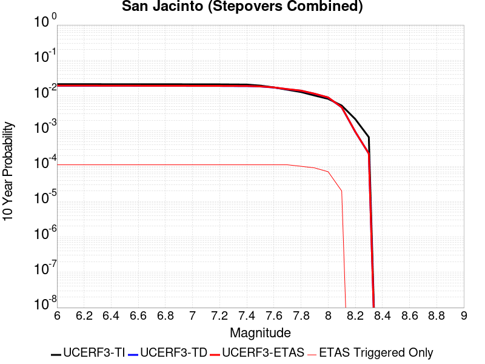 |

| Magnitude | 1 wk TI Prob | 1 wk TD Prob | 1 wk ETAS Prob | 1 wk ETAS/TD Gain | 1 wk ETAS Triggered Only | 1 mo TI Prob | 1 mo TD Prob | 1 mo ETAS Prob | 1 mo ETAS/TD Gain | 1 mo ETAS Triggered Only | 1 yr TI Prob | 1 yr TD Prob | 1 yr ETAS Prob | 1 yr ETAS/TD Gain | 1 yr ETAS Triggered Only | 10 yr TI Prob | 10 yr TD Prob | 10 yr ETAS Prob | 10 yr ETAS/TD Gain | 10 yr ETAS Triggered Only |
|-----|-----|-----|-----|-----|-----|-----|-----|-----|-----|-----|-----|-----|-----|-----|-----|-----|-----|-----|-----|-----|
| 6.0 | 4.0667746E-5 | 3.5295598E-5 | 5.5294895E-5 | 1.5666229 | 2.0E-5 | 1.742787E-4 | 1.512581E-4 | 1.8125355E-4 | 1.1983066 | 3.0E-5 | 0.0021197782 | 0.0018400123 | 0.0019198651 | 1.043398 | 8.0E-5 | 0.020996714 | 0.01899871 | 0.019106619 | 1.0056798 | 1.1E-4 |
| 6.1 | 4.0667746E-5 | 3.5295598E-5 | 5.5294895E-5 | 1.5666229 | 2.0E-5 | 1.742787E-4 | 1.512581E-4 | 1.8125355E-4 | 1.1983066 | 3.0E-5 | 0.0021197782 | 0.0018400123 | 0.0019198651 | 1.043398 | 8.0E-5 | 0.020996714 | 0.01899871 | 0.019106619 | 1.0056798 | 1.1E-4 |
| 6.2 | 4.0667746E-5 | 3.5295598E-5 | 5.5294895E-5 | 1.5666229 | 2.0E-5 | 1.742787E-4 | 1.512581E-4 | 1.8125355E-4 | 1.1983066 | 3.0E-5 | 0.0021197782 | 0.0018400123 | 0.0019198651 | 1.043398 | 8.0E-5 | 0.020996714 | 0.01899871 | 0.019106619 | 1.0056798 | 1.1E-4 |
| 6.3 | 4.0667746E-5 | 3.5295598E-5 | 5.5294895E-5 | 1.5666229 | 2.0E-5 | 1.742787E-4 | 1.512581E-4 | 1.8125355E-4 | 1.1983066 | 3.0E-5 | 0.0021197782 | 0.0018400123 | 0.0019198651 | 1.043398 | 8.0E-5 | 0.020996714 | 0.01899871 | 0.019106619 | 1.0056798 | 1.1E-4 |
| 6.4 | 4.0577226E-5 | 3.5167486E-5 | 5.5166784E-5 | 1.5686871 | 2.0E-5 | 1.738908E-4 | 1.507091E-4 | 1.8070458E-4 | 1.199029 | 3.0E-5 | 0.0021150648 | 0.0018333414 | 0.0019131948 | 1.0435562 | 8.0E-5 | 0.020950472 | 0.018933274 | 0.019041192 | 1.0056999 | 1.1E-4 |
| 6.5 | 4.0577226E-5 | 3.5167486E-5 | 5.5166784E-5 | 1.5686871 | 2.0E-5 | 1.738908E-4 | 1.507091E-4 | 1.8070458E-4 | 1.199029 | 3.0E-5 | 0.0021150648 | 0.0018333414 | 0.0019131948 | 1.0435562 | 8.0E-5 | 0.020950472 | 0.018933274 | 0.019041192 | 1.0056999 | 1.1E-4 |
| 6.6 | 4.053861E-5 | 3.511283E-5 | 5.5112127E-5 | 1.5695724 | 2.0E-5 | 1.7372532E-4 | 1.5047488E-4 | 1.8047036E-4 | 1.1993388 | 3.0E-5 | 0.0021130538 | 0.0018304945 | 0.0019103481 | 1.043624 | 8.0E-5 | 0.020930743 | 0.018905351 | 0.01901327 | 1.0057085 | 1.1E-4 |
| 6.7 | 4.0516545E-5 | 3.5081892E-5 | 5.5081193E-5 | 1.5700747 | 2.0E-5 | 1.7363077E-4 | 1.5034231E-4 | 1.803378E-4 | 1.1995146 | 3.0E-5 | 0.002111905 | 0.0018288839 | 0.0019087375 | 1.0436625 | 8.0E-5 | 0.020919468 | 0.018889546 | 0.018997468 | 1.0057133 | 1.1E-4 |
| 6.8 | 4.049434E-5 | 3.5053454E-5 | 5.505275E-5 | 1.5705372 | 2.0E-5 | 1.7353562E-4 | 1.5022044E-4 | 1.8021594E-4 | 1.1996765 | 3.0E-5 | 0.0021107488 | 0.0018274025 | 0.0019072563 | 1.043698 | 8.0E-5 | 0.020908125 | 0.018874958 | 0.018982882 | 1.0057179 | 1.1E-4 |
| 6.9 | 4.046386E-5 | 3.501601E-5 | 5.501531E-5 | 1.5711473 | 2.0E-5 | 1.73405E-4 | 1.5005999E-4 | 1.8005549E-4 | 1.19989 | 3.0E-5 | 0.0021091616 | 0.0018254523 | 0.0019053064 | 1.0437448 | 8.0E-5 | 0.020892553 | 0.01885573 | 0.018963655 | 1.0057237 | 1.1E-4 |
| 7.0 | 4.036382E-5 | 3.4896566E-5 | 5.4895867E-5 | 1.5731022 | 2.0E-5 | 1.7297632E-4 | 1.4954816E-4 | 1.7954367E-4 | 1.2005743 | 3.0E-5 | 0.0021039525 | 0.0018192315 | 0.0018990859 | 1.0438946 | 8.0E-5 | 0.02084144 | 0.01879434 | 0.018902272 | 1.0057428 | 1.1E-4 |
| 7.1 | 4.0343282E-5 | 3.4875025E-5 | 5.487433E-5 | 1.5734563 | 2.0E-5 | 1.7288832E-4 | 1.4945585E-4 | 1.7945137E-4 | 1.2006981 | 3.0E-5 | 0.002102883 | 0.0018181097 | 0.0018979642 | 1.0439217 | 8.0E-5 | 0.020830948 | 0.018783215 | 0.01889115 | 1.0057462 | 1.1E-4 |
| 7.2 | 4.0257353E-5 | 3.4779518E-5 | 5.4778822E-5 | 1.5750312 | 2.0E-5 | 1.725201E-4 | 1.4904658E-4 | 1.7904211E-4 | 1.2012494 | 3.0E-5 | 0.0020984085 | 0.001813135 | 0.00189299 | 1.0440425 | 8.0E-5 | 0.020787042 | 0.01873395 | 0.018841889 | 1.0057617 | 1.1E-4 |
| 7.3 | 3.9940667E-5 | 3.4607117E-5 | 5.4606426E-5 | 1.5778958 | 2.0E-5 | 1.7116306E-4 | 1.4830781E-4 | 1.7830337E-4 | 1.202252 | 3.0E-5 | 0.0020819185 | 0.0018041554 | 0.0018840111 | 1.044262 | 8.0E-5 | 0.020625217 | 0.018642554 | 0.018750504 | 1.0057905 | 1.1E-4 |
| 7.4 | 3.9721202E-5 | 3.449247E-5 | 5.449178E-5 | 1.5798167 | 2.0E-5 | 1.7022261E-4 | 1.478165E-4 | 1.7781208E-4 | 1.2029244 | 3.0E-5 | 0.0020704903 | 0.0017981838 | 0.0018780399 | 1.0444094 | 8.0E-5 | 0.020513052 | 0.018581657 | 0.018689614 | 1.0058098 | 1.1E-4 |
| 7.5 | 3.7036873E-5 | 3.3559496E-5 | 5.3558826E-5 | 1.5959365 | 2.0E-5 | 1.5871979E-4 | 1.438185E-4 | 1.7381419E-4 | 1.2085663 | 3.0E-5 | 0.0019307006 | 0.0017495869 | 0.0018294469 | 1.0456451 | 8.0E-5 | 0.019140124 | 0.018083014 | 0.018191025 | 1.0059731 | 1.1E-4 |
| 7.6 | 3.2940967E-5 | 3.1339732E-5 | 5.1339102E-5 | 1.6381476 | 2.0E-5 | 1.4116794E-4 | 1.3430623E-4 | 1.643022E-4 | 1.2233402 | 3.0E-5 | 0.0017173645 | 0.0016339541 | 0.0017138234 | 1.0488809 | 8.0E-5 | 0.01704153 | 0.016915623 | 0.017023763 | 1.0063928 | 1.1E-4 |
| 7.7 | 2.8236149E-5 | 2.7905073E-5 | 4.7904516E-5 | 1.7166955 | 2.0E-5 | 1.2100645E-4 | 1.195877E-4 | 1.4958411E-4 | 1.250832 | 3.0E-5 | 0.0014722579 | 0.0014550089 | 0.0015348924 | 1.0549024 | 8.0E-5 | 0.014625421 | 0.015126094 | 0.01523443 | 1.0071622 | 1.1E-4 |
| 7.8 | 2.4329287E-5 | 2.522789E-5 | 4.5227385E-5 | 1.7927533 | 2.0E-5 | 1.042642E-4 | 1.08115055E-4 | 1.381118E-4 | 1.2774522 | 3.0E-5 | 0.0012686774 | 0.0013155068 | 0.0013854147 | 1.0531415 | 7.0E-5 | 0.012614589 | 0.013722981 | 0.013821609 | 1.007187 | 1.0E-4 |
| 7.9 | 1.9370926E-5 | 2.0439798E-5 | 4.043939E-5 | 1.9784632 | 2.0E-5 | 8.301561E-5 | 8.75962E-5 | 1.17593576E-4 | 1.3424506 | 3.0E-5 | 0.0010102465 | 0.0010659627 | 0.0011358882 | 1.0655984 | 7.0E-5 | 0.0100566605 | 0.011209062 | 0.011298053 | 1.0079392 | 9.0E-5 |
| 8.0 | 1.5583017E-5 | 1.590191E-5 | 2.5901749E-5 | 1.6288453 | 1.0E-5 | 6.6782646E-5 | 6.814926E-5 | 8.81479E-5 | 1.2934535 | 2.0E-5 | 8.127754E-4 | 8.2940207E-4 | 8.793606E-4 | 1.0602344 | 5.0E-5 | 0.008098091 | 0.008789933 | 0.008859318 | 1.0078937 | 7.0E-5 |
| 8.1 | 1.0024873E-5 | 8.301404E-6 | 8.301404E-6 | 1.0 | 0.0 | 4.2963035E-5 | 3.5576963E-5 | 3.5576963E-5 | 1.0 | 0.0 | 5.229494E-4 | 4.3306392E-4 | 4.3306392E-4 | 1.0 | 0.0 | 0.0052172043 | 0.004658245 | 0.0046781516 | 1.0042734 | 2.0E-5 |
| 8.2 | 4.142796E-6 | 1.5635917E-6 | 1.5635917E-6 | 1.0 | 0.0 | 1.775472E-5 | 6.70109E-6 | 6.70109E-6 | 1.0 | 0.0 | 2.1614227E-4 | 8.158275E-5 | 8.158275E-5 | 1.0 | 0.0 | 0.0021593217 | 9.469422E-4 | 9.469422E-4 | 1.0 | 0.0 |
| 8.3 | 1.2750878E-6 | 3.6191753E-7 | 3.6191753E-7 | 1.0 | 0.0 | 5.4646503E-6 | 1.5510742E-6 | 1.5510742E-6 | 1.0 | 0.0 | 6.653009E-5 | 1.888417E-5 | 1.888417E-5 | 1.0 | 0.0 | 6.6510175E-4 | 2.2775632E-4 | 2.2775632E-4 | 1.0 | 0.0 |

## White Wolf (Extension)
*[(top)](#table-of-contents)*

| 1 Week | 1 Month | 1 Year | 10 Year |
|-----|-----|-----|-----|
|  |  | 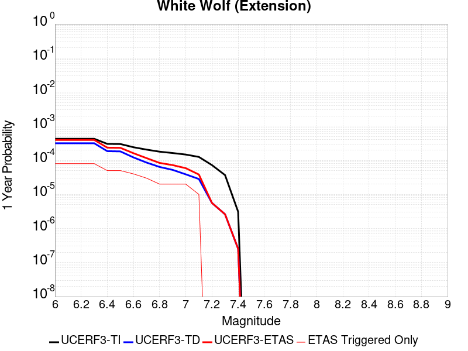 |  |

| Magnitude | 1 wk TI Prob | 1 wk TD Prob | 1 wk ETAS Prob | 1 wk ETAS/TD Gain | 1 wk ETAS Triggered Only | 1 mo TI Prob | 1 mo TD Prob | 1 mo ETAS Prob | 1 mo ETAS/TD Gain | 1 mo ETAS Triggered Only | 1 yr TI Prob | 1 yr TD Prob | 1 yr ETAS Prob | 1 yr ETAS/TD Gain | 1 yr ETAS Triggered Only | 10 yr TI Prob | 10 yr TD Prob | 10 yr ETAS Prob | 10 yr ETAS/TD Gain | 10 yr ETAS Triggered Only |
|-----|-----|-----|-----|-----|-----|-----|-----|-----|-----|-----|-----|-----|-----|-----|-----|-----|-----|-----|-----|-----|
| 6.0 | 8.222555E-6 | 6.066729E-6 | 1.6066668E-5 | 2.6483247 | 1.0E-5 | 3.5239045E-5 | 2.6000045E-5 | 6.5999004E-5 | 2.538419 | 4.0E-5 | 4.289509E-4 | 3.165112E-4 | 3.9648588E-4 | 1.2526757 | 8.0E-5 | 0.0042812387 | 0.003161256 | 0.0032709083 | 1.0346863 | 1.1E-4 |
| 6.1 | 8.222555E-6 | 6.066729E-6 | 1.6066668E-5 | 2.6483247 | 1.0E-5 | 3.5239045E-5 | 2.6000045E-5 | 6.5999004E-5 | 2.538419 | 4.0E-5 | 4.289509E-4 | 3.165112E-4 | 3.9648588E-4 | 1.2526757 | 8.0E-5 | 0.0042812387 | 0.003161256 | 0.0032709083 | 1.0346863 | 1.1E-4 |
| 6.2 | 8.222555E-6 | 6.066729E-6 | 1.6066668E-5 | 2.6483247 | 1.0E-5 | 3.5239045E-5 | 2.6000045E-5 | 6.5999004E-5 | 2.538419 | 4.0E-5 | 4.289509E-4 | 3.165112E-4 | 3.9648588E-4 | 1.2526757 | 8.0E-5 | 0.0042812387 | 0.003161256 | 0.0032709083 | 1.0346863 | 1.1E-4 |
| 6.3 | 8.222555E-6 | 6.066729E-6 | 1.6066668E-5 | 2.6483247 | 1.0E-5 | 3.5239045E-5 | 2.6000045E-5 | 6.5999004E-5 | 2.538419 | 4.0E-5 | 4.289509E-4 | 3.165112E-4 | 3.9648588E-4 | 1.2526757 | 8.0E-5 | 0.0042812387 | 0.003161256 | 0.0032709083 | 1.0346863 | 1.1E-4 |
| 6.4 | 5.821773E-6 | 3.557216E-6 | 3.557216E-6 | 1.0 | 0.0 | 2.4950215E-5 | 1.5245128E-5 | 3.5244822E-5 | 2.3118744 | 2.0E-5 | 3.0372653E-4 | 1.8559473E-4 | 2.3558545E-4 | 1.2693542 | 5.0E-5 | 0.0030331176 | 0.0018545056 | 0.0019343572 | 1.0430582 | 8.0E-5 |
| 6.5 | 5.766023E-6 | 3.4991497E-6 | 3.4991497E-6 | 1.0 | 0.0 | 2.4711293E-5 | 1.4996275E-5 | 3.4995974E-5 | 2.3336444 | 2.0E-5 | 3.0081844E-4 | 1.8256545E-4 | 2.3255633E-4 | 1.2738243 | 5.0E-5 | 0.0030041158 | 0.0018242629 | 0.001904117 | 1.0437733 | 8.0E-5 |
| 6.6 | 4.643576E-6 | 2.3326536E-6 | 2.3326536E-6 | 1.0 | 0.0 | 1.9900888E-5 | 9.99705E-6 | 2.999685E-5 | 3.00057 | 2.0E-5 | 2.4226638E-4 | 1.2170772E-4 | 1.6170286E-4 | 1.3286163 | 4.0E-5 | 0.0024200242 | 0.0012164532 | 0.0012663923 | 1.041053 | 5.0E-5 |
| 6.7 | 3.9529173E-6 | 1.6483714E-6 | 1.6483714E-6 | 1.0 | 0.0 | 1.6940963E-5 | 7.064431E-6 | 1.706436E-5 | 2.415532 | 1.0E-5 | 2.0623671E-4 | 8.600624E-5 | 1.1600366E-4 | 1.348782 | 3.0E-5 | 0.002060454 | 8.5974805E-4 | 8.9971366E-4 | 1.0464853 | 4.0E-5 |
| 6.8 | 3.4377522E-6 | 1.2245432E-6 | 1.2245432E-6 | 1.0 | 0.0 | 1.473314E-5 | 5.2480327E-6 | 1.524798E-5 | 2.905466 | 1.0E-5 | 1.7936122E-4 | 6.3893014E-5 | 8.389174E-5 | 1.3130033 | 2.0E-5 | 0.0017921652 | 6.3875556E-4 | 6.587428E-4 | 1.0312909 | 2.0E-5 |
| 6.9 | 3.1367306E-6 | 1.0033956E-6 | 1.0033956E-6 | 1.0 | 0.0 | 1.3443062E-5 | 4.30026E-6 | 1.4300217E-5 | 3.3254309 | 1.0E-5 | 1.63657E-4 | 5.2354484E-5 | 7.235344E-5 | 1.3819911 | 2.0E-5 | 0.0016353652 | 5.2342913E-4 | 5.434187E-4 | 1.0381895 | 2.0E-5 |
| 7.0 | 2.8298145E-6 | 7.428814E-7 | 7.428814E-7 | 1.0 | 0.0 | 1.2127721E-5 | 3.183774E-6 | 1.3183742E-5 | 4.140917 | 1.0E-5 | 1.47645E-4 | 3.876181E-5 | 5.8761034E-5 | 1.5159518 | 2.0E-5 | 0.0014754693 | 3.8755545E-4 | 4.0754772E-4 | 1.0515856 | 2.0E-5 |
| 7.1 | 2.4091064E-6 | 5.4228724E-7 | 5.4228724E-7 | 1.0 | 0.0 | 1.03247E-5 | 2.3240864E-6 | 2.3240864E-6 | 1.0 | 0.0 | 1.2569598E-4 | 2.8295424E-5 | 3.829514E-5 | 1.353404 | 1.0E-5 | 0.001256249 | 2.8292226E-4 | 2.9291943E-4 | 1.0353354 | 1.0E-5 |
| 7.2 | 1.3875518E-6 | 1.0743652E-7 | 1.0743652E-7 | 1.0 | 0.0 | 5.9466374E-6 | 4.6044215E-7 | 4.6044215E-7 | 1.0 | 0.0 | 7.23979E-5 | 5.6058702E-6 | 5.6058702E-6 | 1.0 | 0.0 | 7.2374323E-4 | 5.60574E-5 | 5.60574E-5 | 1.0 | 0.0 |
| 7.3 | 7.056077E-7 | 5.0023726E-8 | 5.0023726E-8 | 1.0 | 0.0 | 3.0240296E-6 | 2.1438737E-7 | 2.1438737E-7 | 1.0 | 0.0 | 3.681694E-5 | 2.6101636E-6 | 2.6101636E-6 | 1.0 | 0.0 | 3.681084E-4 | 2.6101376E-5 | 2.6101376E-5 | 1.0 | 0.0 |
| 7.4 | 5.9334678E-8 | 4.8686823E-9 | 4.8686823E-9 | 1.0 | 0.0 | 2.5429145E-7 | 2.086578E-8 | 2.086578E-8 | 1.0 | 0.0 | 3.095994E-6 | 2.5404086E-7 | 2.5404086E-7 | 1.0 | 0.0 | 3.095951E-5 | 2.5404067E-6 | 2.5404067E-6 | 1.0 | 0.0 |

## Ludlow
*[(top)](#table-of-contents)*

| 1 Week | 1 Month | 1 Year | 10 Year |
|-----|-----|-----|-----|
| 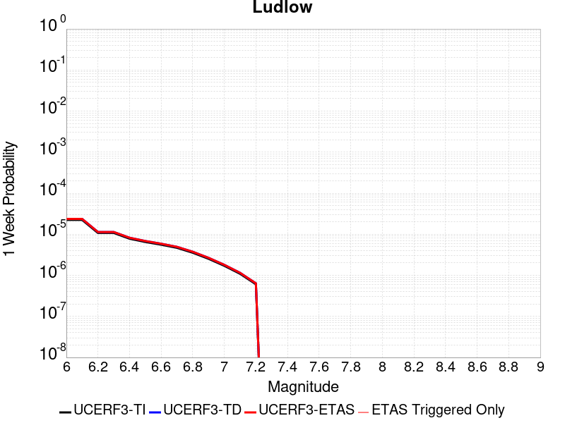 |  |  | 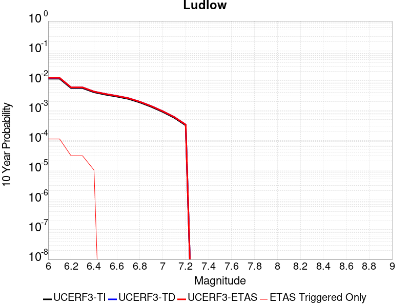 |

| Magnitude | 1 wk TI Prob | 1 wk TD Prob | 1 wk ETAS Prob | 1 wk ETAS/TD Gain | 1 wk ETAS Triggered Only | 1 mo TI Prob | 1 mo TD Prob | 1 mo ETAS Prob | 1 mo ETAS/TD Gain | 1 mo ETAS Triggered Only | 1 yr TI Prob | 1 yr TD Prob | 1 yr ETAS Prob | 1 yr ETAS/TD Gain | 1 yr ETAS Triggered Only | 10 yr TI Prob | 10 yr TD Prob | 10 yr ETAS Prob | 10 yr ETAS/TD Gain | 10 yr ETAS Triggered Only |
|-----|-----|-----|-----|-----|-----|-----|-----|-----|-----|-----|-----|-----|-----|-----|-----|-----|-----|-----|-----|-----|
| 6.0 | 2.2407607E-5 | 2.3657529E-5 | 2.3657529E-5 | 1.0 | 0.0 | 9.602906E-5 | 1.0138572E-4 | 1.0138572E-4 | 1.0 | 0.0 | 0.0011685267 | 0.0012337163 | 0.0012437039 | 1.0080956 | 1.0E-5 | 0.011624013 | 0.012273184 | 0.012381834 | 1.0088526 | 1.1E-4 |
| 6.1 | 2.2407607E-5 | 2.3657529E-5 | 2.3657529E-5 | 1.0 | 0.0 | 9.602906E-5 | 1.0138572E-4 | 1.0138572E-4 | 1.0 | 0.0 | 0.0011685267 | 0.0012337163 | 0.0012437039 | 1.0080956 | 1.0E-5 | 0.011624013 | 0.012273184 | 0.012381834 | 1.0088526 | 1.1E-4 |
| 6.2 | 1.0781252E-5 | 1.13657925E-5 | 1.13657925E-5 | 1.0 | 0.0 | 4.620455E-5 | 4.870965E-5 | 4.870965E-5 | 1.0 | 0.0 | 5.623952E-4 | 5.928827E-4 | 5.928827E-4 | 1.0 | 0.0 | 0.00560974 | 0.005913428 | 0.0059432504 | 1.0050431 | 3.0E-5 |
| 6.3 | 1.0781252E-5 | 1.13657925E-5 | 1.13657925E-5 | 1.0 | 0.0 | 4.620455E-5 | 4.870965E-5 | 4.870965E-5 | 1.0 | 0.0 | 5.623952E-4 | 5.928827E-4 | 5.928827E-4 | 1.0 | 0.0 | 0.00560974 | 0.005913428 | 0.0059432504 | 1.0050431 | 3.0E-5 |
| 6.4 | 7.814439E-6 | 8.237822E-6 | 8.237822E-6 | 1.0 | 0.0 | 3.3490025E-5 | 3.530448E-5 | 3.530448E-5 | 1.0 | 0.0 | 4.0766477E-4 | 4.2974867E-4 | 4.2974867E-4 | 1.0 | 0.0 | 0.0040691774 | 0.004289323 | 0.00429928 | 1.0023214 | 1.0E-5 |
| 6.5 | 6.4986366E-6 | 6.850997E-6 | 6.850997E-6 | 1.0 | 0.0 | 2.7851002E-5 | 2.936109E-5 | 2.936109E-5 | 1.0 | 0.0 | 3.390332E-4 | 3.5741358E-4 | 3.5741358E-4 | 1.0 | 0.0 | 0.003385164 | 0.0035684835 | 0.0035684835 | 1.0 | 0.0 |
| 6.6 | 5.582177E-6 | 5.8860724E-6 | 5.8860724E-6 | 1.0 | 0.0 | 2.3923398E-5 | 2.5225785E-5 | 2.5225785E-5 | 1.0 | 0.0 | 2.9122844E-4 | 3.0708135E-4 | 3.0708135E-4 | 1.0 | 0.0 | 0.0029084706 | 0.0030666436 | 0.0030666436 | 1.0 | 0.0 |
| 6.7 | 4.6858763E-6 | 4.940483E-6 | 4.940483E-6 | 1.0 | 0.0 | 2.0082172E-5 | 2.1173331E-5 | 2.1173331E-5 | 1.0 | 0.0 | 2.4447302E-4 | 2.5775537E-4 | 2.5775537E-4 | 1.0 | 0.0 | 0.0024420423 | 0.0025746205 | 0.0025746205 | 1.0 | 0.0 |
| 6.8 | 3.5584908E-6 | 3.7520608E-6 | 3.7520608E-6 | 1.0 | 0.0 | 1.5250586E-5 | 1.6080165E-5 | 1.6080165E-5 | 1.0 | 0.0 | 1.8566006E-4 | 1.9575882E-4 | 1.9575882E-4 | 1.0 | 0.0 | 0.0018550502 | 0.0019559048 | 0.0019559048 | 1.0 | 0.0 |
| 6.9 | 2.532834E-6 | 2.6710338E-6 | 2.6710338E-6 | 1.0 | 0.0 | 1.0854958E-5 | 1.144724E-5 | 1.144724E-5 | 1.0 | 0.0 | 1.3215111E-4 | 1.393615E-4 | 1.393615E-4 | 1.0 | 0.0 | 0.0013207254 | 0.0013927687 | 0.0013927687 | 1.0 | 0.0 |
| 7.0 | 1.7083285E-6 | 1.8019645E-6 | 1.8019645E-6 | 1.0 | 0.0 | 7.3213873E-6 | 7.722683E-6 | 7.722683E-6 | 1.0 | 0.0 | 8.913424E-5 | 9.401977E-5 | 9.401977E-5 | 1.0 | 0.0 | 8.9098496E-4 | 9.3981647E-4 | 9.3981647E-4 | 1.0 | 0.0 |
| 7.1 | 1.0905424E-6 | 1.149775E-6 | 1.149775E-6 | 1.0 | 0.0 | 4.6737446E-6 | 4.927598E-6 | 4.927598E-6 | 1.0 | 0.0 | 5.6901354E-5 | 5.999196E-5 | 5.999196E-5 | 1.0 | 0.0 | 5.6886784E-4 | 5.9976743E-4 | 5.9976743E-4 | 1.0 | 0.0 |
| 7.2 | 6.06668E-7 | 6.387348E-7 | 6.387348E-7 | 1.0 | 0.0 | 2.600003E-6 | 2.7374324E-6 | 2.7374324E-6 | 1.0 | 0.0 | 3.1654577E-5 | 3.33278E-5 | 3.33278E-5 | 1.0 | 0.0 | 3.1650066E-4 | 3.3323484E-4 | 3.3323484E-4 | 1.0 | 0.0 |

## Red Mountain
*[(top)](#table-of-contents)*

| 1 Week | 1 Month | 1 Year | 10 Year |
|-----|-----|-----|-----|
| 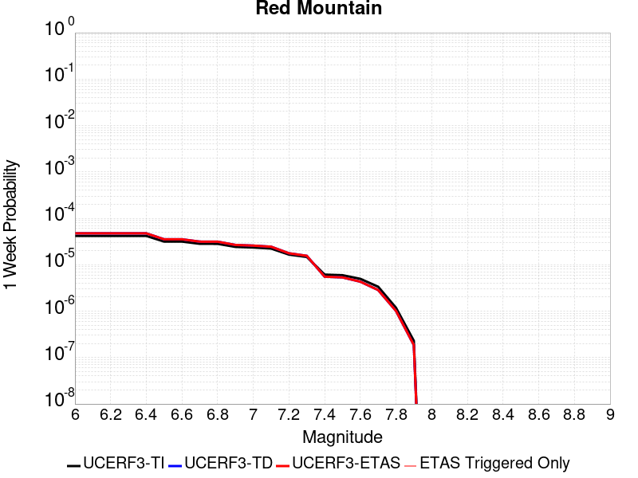 |  |  |  |

| Magnitude | 1 wk TI Prob | 1 wk TD Prob | 1 wk ETAS Prob | 1 wk ETAS/TD Gain | 1 wk ETAS Triggered Only | 1 mo TI Prob | 1 mo TD Prob | 1 mo ETAS Prob | 1 mo ETAS/TD Gain | 1 mo ETAS Triggered Only | 1 yr TI Prob | 1 yr TD Prob | 1 yr ETAS Prob | 1 yr ETAS/TD Gain | 1 yr ETAS Triggered Only | 10 yr TI Prob | 10 yr TD Prob | 10 yr ETAS Prob | 10 yr ETAS/TD Gain | 10 yr ETAS Triggered Only |
|-----|-----|-----|-----|-----|-----|-----|-----|-----|-----|-----|-----|-----|-----|-----|-----|-----|-----|-----|-----|-----|
| 6.0 | 4.1810763E-5 | 4.759161E-5 | 4.759161E-5 | 1.0 | 0.0 | 1.7917668E-4 | 2.0394904E-4 | 2.0394904E-4 | 1.0 | 0.0 | 0.0021792934 | 0.0024804173 | 0.0025103427 | 1.0120647 | 3.0E-5 | 0.021580452 | 0.02454494 | 0.02463273 | 1.0035768 | 9.0E-5 |
| 6.1 | 4.1810763E-5 | 4.759161E-5 | 4.759161E-5 | 1.0 | 0.0 | 1.7917668E-4 | 2.0394904E-4 | 2.0394904E-4 | 1.0 | 0.0 | 0.0021792934 | 0.0024804173 | 0.0025103427 | 1.0120647 | 3.0E-5 | 0.021580452 | 0.02454494 | 0.02463273 | 1.0035768 | 9.0E-5 |
| 6.2 | 4.1810763E-5 | 4.759161E-5 | 4.759161E-5 | 1.0 | 0.0 | 1.7917668E-4 | 2.0394904E-4 | 2.0394904E-4 | 1.0 | 0.0 | 0.0021792934 | 0.0024804173 | 0.0025103427 | 1.0120647 | 3.0E-5 | 0.021580452 | 0.02454494 | 0.02463273 | 1.0035768 | 9.0E-5 |
| 6.3 | 4.1810763E-5 | 4.759161E-5 | 4.759161E-5 | 1.0 | 0.0 | 1.7917668E-4 | 2.0394904E-4 | 2.0394904E-4 | 1.0 | 0.0 | 0.0021792934 | 0.0024804173 | 0.0025103427 | 1.0120647 | 3.0E-5 | 0.021580452 | 0.02454494 | 0.02463273 | 1.0035768 | 9.0E-5 |
| 6.4 | 4.1810763E-5 | 4.759161E-5 | 4.759161E-5 | 1.0 | 0.0 | 1.7917668E-4 | 2.0394904E-4 | 2.0394904E-4 | 1.0 | 0.0 | 0.0021792934 | 0.0024804173 | 0.0025103427 | 1.0120647 | 3.0E-5 | 0.021580452 | 0.02454494 | 0.02463273 | 1.0035768 | 9.0E-5 |
| 6.5 | 3.154503E-5 | 3.5360903E-5 | 3.5360903E-5 | 1.0 | 0.0 | 1.3518598E-4 | 1.5153845E-4 | 1.5153845E-4 | 1.0 | 0.0 | 0.0016446467 | 0.0018435114 | 0.0018634745 | 1.0108289 | 2.0E-5 | 0.01632528 | 0.018291837 | 0.018360557 | 1.0037569 | 7.0E-5 |
| 6.6 | 3.1535834E-5 | 3.5350284E-5 | 3.5350284E-5 | 1.0 | 0.0 | 1.3514658E-4 | 1.5149295E-4 | 1.5149295E-4 | 1.0 | 0.0 | 0.0016441676 | 0.0018429583 | 0.0018629214 | 1.0108321 | 2.0E-5 | 0.01632056 | 0.018286398 | 0.018355118 | 1.003758 | 7.0E-5 |
| 6.7 | 2.8267326E-5 | 3.1470365E-5 | 3.1470365E-5 | 1.0 | 0.0 | 1.2114006E-4 | 1.348665E-4 | 1.348665E-4 | 1.0 | 0.0 | 0.0014738824 | 0.0016408479 | 0.0016608151 | 1.0121688 | 2.0E-5 | 0.014641452 | 0.01629609 | 0.016355112 | 1.0036218 | 6.0E-5 |
| 6.8 | 2.8212884E-5 | 3.1408246E-5 | 3.1408246E-5 | 1.0 | 0.0 | 1.20906756E-4 | 1.3460031E-4 | 1.3460031E-4 | 1.0 | 0.0 | 0.0014710457 | 0.001637612 | 0.0016575792 | 1.012193 | 2.0E-5 | 0.014613459 | 0.016264206 | 0.01632323 | 1.0036291 | 6.0E-5 |
| 6.9 | 2.4227871E-5 | 2.6707825E-5 | 2.6707825E-5 | 1.0 | 0.0 | 1.03829596E-4 | 1.14457514E-4 | 1.14457514E-4 | 1.0 | 0.0 | 0.0012633923 | 0.0013927054 | 0.0014126775 | 1.0143405 | 2.0E-5 | 0.012562336 | 0.013847462 | 0.013906631 | 1.0042729 | 6.0E-5 |
| 7.0 | 2.348524E-5 | 2.5836578E-5 | 2.5836578E-5 | 1.0 | 0.0 | 1.0064714E-4 | 1.10723915E-4 | 1.10723915E-4 | 1.0 | 0.0 | 0.0012246901 | 0.0013473057 | 0.0013672787 | 1.0148244 | 2.0E-5 | 0.012179627 | 0.01339901 | 0.013438473 | 1.0029453 | 4.0E-5 |
| 7.1 | 2.2311642E-5 | 2.4463596E-5 | 2.4463596E-5 | 1.0 | 0.0 | 9.561782E-5 | 1.0484019E-4 | 1.0484019E-4 | 1.0 | 0.0 | 0.0011635252 | 0.0012757567 | 0.0012957312 | 1.015657 | 2.0E-5 | 0.01157452 | 0.012691847 | 0.012731339 | 1.0031116 | 4.0E-5 |
| 7.2 | 1.6533986E-5 | 1.7670864E-5 | 1.7670864E-5 | 1.0 | 0.0 | 7.085802E-5 | 7.573044E-5 | 7.573044E-5 | 1.0 | 0.0 | 8.623549E-4 | 9.216915E-4 | 9.216915E-4 | 1.0 | 0.0 | 0.008590161 | 0.009184967 | 0.009194875 | 1.0010787 | 1.0E-5 |
| 7.3 | 1.4703092E-5 | 1.555997E-5 | 1.555997E-5 | 1.0 | 0.0 | 6.301173E-5 | 6.668423E-5 | 6.668423E-5 | 1.0 | 0.0 | 7.668978E-4 | 8.116397E-4 | 8.116397E-4 | 1.0 | 0.0 | 0.0076425658 | 0.008092829 | 0.008102748 | 1.0012257 | 1.0E-5 |
| 7.4 | 6.1331984E-6 | 5.528964E-6 | 5.528964E-6 | 1.0 | 0.0 | 2.6284872E-5 | 2.3695347E-5 | 2.3695347E-5 | 1.0 | 0.0 | 3.199713E-4 | 2.884532E-4 | 2.884532E-4 | 1.0 | 0.0 | 0.0031951098 | 0.0028808422 | 0.0028908134 | 1.0034612 | 1.0E-5 |
| 7.5 | 5.954766E-6 | 5.33859E-6 | 5.33859E-6 | 1.0 | 0.0 | 2.5520176E-5 | 2.2879474E-5 | 2.2879474E-5 | 1.0 | 0.0 | 3.1066386E-4 | 2.7852252E-4 | 2.7852252E-4 | 1.0 | 0.0 | 0.003102299 | 0.0027817884 | 0.0027917605 | 1.0035849 | 1.0E-5 |
| 7.6 | 4.9726646E-6 | 4.315367E-6 | 4.315367E-6 | 1.0 | 0.0 | 2.1311245E-5 | 1.84943E-5 | 1.84943E-5 | 1.0 | 0.0 | 2.5943352E-4 | 2.2514518E-4 | 2.2514518E-4 | 1.0 | 0.0 | 0.0025913084 | 0.0022492055 | 0.002259183 | 1.004436 | 1.0E-5 |
| 7.7 | 3.3613894E-6 | 2.8527115E-6 | 2.8527115E-6 | 1.0 | 0.0 | 1.4405875E-5 | 1.2225851E-5 | 1.2225851E-5 | 1.0 | 0.0 | 1.7537741E-4 | 1.4883983E-4 | 1.4883983E-4 | 1.0 | 0.0 | 0.0017523908 | 0.0014874276 | 0.0014874276 | 1.0 | 0.0 |
| 7.8 | 1.1828961E-6 | 1.0122895E-6 | 1.0122895E-6 | 1.0 | 0.0 | 5.069545E-6 | 4.3383766E-6 | 4.3383766E-6 | 1.0 | 0.0 | 6.171996E-5 | 5.2818486E-5 | 5.2818486E-5 | 1.0 | 0.0 | 6.170282E-4 | 5.280622E-4 | 5.280622E-4 | 1.0 | 0.0 |
| 7.9 | 2.2967266E-7 | 1.8619212E-7 | 1.8619212E-7 | 1.0 | 0.0 | 9.843111E-7 | 7.9796604E-7 | 7.9796604E-7 | 1.0 | 0.0 | 1.19839215E-5 | 9.715196E-6 | 9.715196E-6 | 1.0 | 0.0 | 1.1983275E-4 | 9.7148004E-5 | 9.7148004E-5 | 1.0 | 0.0 |

## Deep Springs
*[(top)](#table-of-contents)*

| 1 Week | 1 Month | 1 Year | 10 Year |
|-----|-----|-----|-----|
|  | 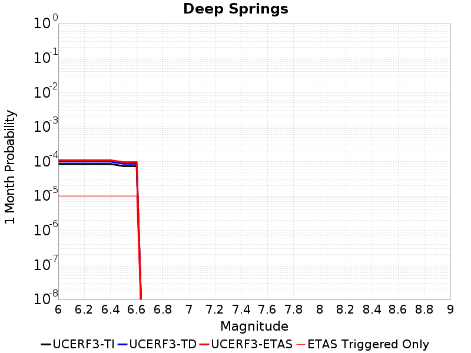 |  |  |

| Magnitude | 1 wk TI Prob | 1 wk TD Prob | 1 wk ETAS Prob | 1 wk ETAS/TD Gain | 1 wk ETAS Triggered Only | 1 mo TI Prob | 1 mo TD Prob | 1 mo ETAS Prob | 1 mo ETAS/TD Gain | 1 mo ETAS Triggered Only | 1 yr TI Prob | 1 yr TD Prob | 1 yr ETAS Prob | 1 yr ETAS/TD Gain | 1 yr ETAS Triggered Only | 10 yr TI Prob | 10 yr TD Prob | 10 yr ETAS Prob | 10 yr ETAS/TD Gain | 10 yr ETAS Triggered Only |
|-----|-----|-----|-----|-----|-----|-----|-----|-----|-----|-----|-----|-----|-----|-----|-----|-----|-----|-----|-----|-----|
| 6.0 | 1.9810619E-5 | 2.3113324E-5 | 3.311309E-5 | 1.4326409 | 1.0E-5 | 8.489989E-5 | 9.90562E-5 | 1.0905521E-4 | 1.1009429 | 1.0E-5 | 0.001033166 | 0.0012058498 | 0.0012258256 | 1.0165658 | 2.0E-5 | 0.010283757 | 0.012042842 | 0.0121416375 | 1.0082037 | 1.0E-4 |
| 6.1 | 1.9810619E-5 | 2.3113324E-5 | 3.311309E-5 | 1.4326409 | 1.0E-5 | 8.489989E-5 | 9.90562E-5 | 1.0905521E-4 | 1.1009429 | 1.0E-5 | 0.001033166 | 0.0012058498 | 0.0012258256 | 1.0165658 | 2.0E-5 | 0.010283757 | 0.012042842 | 0.0121416375 | 1.0082037 | 1.0E-4 |
| 6.2 | 1.9810619E-5 | 2.3113324E-5 | 3.311309E-5 | 1.4326409 | 1.0E-5 | 8.489989E-5 | 9.90562E-5 | 1.0905521E-4 | 1.1009429 | 1.0E-5 | 0.001033166 | 0.0012058498 | 0.0012258256 | 1.0165658 | 2.0E-5 | 0.010283757 | 0.012042842 | 0.0121416375 | 1.0082037 | 1.0E-4 |
| 6.3 | 1.9810619E-5 | 2.3113324E-5 | 3.311309E-5 | 1.4326409 | 1.0E-5 | 8.489989E-5 | 9.90562E-5 | 1.0905521E-4 | 1.1009429 | 1.0E-5 | 0.001033166 | 0.0012058498 | 0.0012258256 | 1.0165658 | 2.0E-5 | 0.010283757 | 0.012042842 | 0.0121416375 | 1.0082037 | 1.0E-4 |
| 6.4 | 1.9810619E-5 | 2.3113324E-5 | 3.311309E-5 | 1.4326409 | 1.0E-5 | 8.489989E-5 | 9.90562E-5 | 1.0905521E-4 | 1.1009429 | 1.0E-5 | 0.001033166 | 0.0012058498 | 0.0012258256 | 1.0165658 | 2.0E-5 | 0.010283757 | 0.012042842 | 0.0121416375 | 1.0082037 | 1.0E-4 |
| 6.5 | 1.7190405E-5 | 2.0051251E-5 | 3.0051051E-5 | 1.4987121 | 1.0E-5 | 7.367108E-5 | 8.5933934E-5 | 9.593307E-5 | 1.1163585 | 1.0E-5 | 8.9657627E-4 | 0.0010462456 | 0.0010662246 | 1.019096 | 2.0E-5 | 0.008929676 | 0.010462419 | 0.010551477 | 1.0085123 | 9.0E-5 |
| 6.6 | 1.7190405E-5 | 2.0051251E-5 | 3.0051051E-5 | 1.4987121 | 1.0E-5 | 7.367108E-5 | 8.5933934E-5 | 9.593307E-5 | 1.1163585 | 1.0E-5 | 8.9657627E-4 | 0.0010462456 | 0.0010662246 | 1.019096 | 2.0E-5 | 0.008929676 | 0.010462419 | 0.010551477 | 1.0085123 | 9.0E-5 |

## San Andreas (North Branch Mill Creek)
*[(top)](#table-of-contents)*

| 1 Week | 1 Month | 1 Year | 10 Year |
|-----|-----|-----|-----|
|  |  |  |  |

| Magnitude | 1 wk TI Prob | 1 wk TD Prob | 1 wk ETAS Prob | 1 wk ETAS/TD Gain | 1 wk ETAS Triggered Only | 1 mo TI Prob | 1 mo TD Prob | 1 mo ETAS Prob | 1 mo ETAS/TD Gain | 1 mo ETAS Triggered Only | 1 yr TI Prob | 1 yr TD Prob | 1 yr ETAS Prob | 1 yr ETAS/TD Gain | 1 yr ETAS Triggered Only | 10 yr TI Prob | 10 yr TD Prob | 10 yr ETAS Prob | 10 yr ETAS/TD Gain | 10 yr ETAS Triggered Only |
|-----|-----|-----|-----|-----|-----|-----|-----|-----|-----|-----|-----|-----|-----|-----|-----|-----|-----|-----|-----|-----|
| 6.0 | 1.3461156E-5 | 2.3510707E-5 | 2.3510707E-5 | 1.0 | 0.0 | 5.7689394E-5 | 1.00756304E-4 | 1.00756304E-4 | 1.0 | 0.0 | 7.02142E-4 | 0.001226021 | 0.0012559842 | 1.0244395 | 3.0E-5 | 0.0069992766 | 0.012235106 | 0.012333883 | 1.0080732 | 1.0E-4 |
| 6.1 | 1.3461156E-5 | 2.3510707E-5 | 2.3510707E-5 | 1.0 | 0.0 | 5.7689394E-5 | 1.00756304E-4 | 1.00756304E-4 | 1.0 | 0.0 | 7.02142E-4 | 0.001226021 | 0.0012559842 | 1.0244395 | 3.0E-5 | 0.0069992766 | 0.012235106 | 0.012333883 | 1.0080732 | 1.0E-4 |
| 6.2 | 1.3461156E-5 | 2.3510707E-5 | 2.3510707E-5 | 1.0 | 0.0 | 5.7689394E-5 | 1.00756304E-4 | 1.00756304E-4 | 1.0 | 0.0 | 7.02142E-4 | 0.001226021 | 0.0012559842 | 1.0244395 | 3.0E-5 | 0.0069992766 | 0.012235106 | 0.012333883 | 1.0080732 | 1.0E-4 |
| 6.3 | 1.3461156E-5 | 2.3510707E-5 | 2.3510707E-5 | 1.0 | 0.0 | 5.7689394E-5 | 1.00756304E-4 | 1.00756304E-4 | 1.0 | 0.0 | 7.02142E-4 | 0.001226021 | 0.0012559842 | 1.0244395 | 3.0E-5 | 0.0069992766 | 0.012235106 | 0.012333883 | 1.0080732 | 1.0E-4 |
| 6.4 | 1.3461156E-5 | 2.3510707E-5 | 2.3510707E-5 | 1.0 | 0.0 | 5.7689394E-5 | 1.00756304E-4 | 1.00756304E-4 | 1.0 | 0.0 | 7.02142E-4 | 0.001226021 | 0.0012559842 | 1.0244395 | 3.0E-5 | 0.0069992766 | 0.012235106 | 0.012333883 | 1.0080732 | 1.0E-4 |
| 6.5 | 1.3450706E-5 | 2.3499668E-5 | 2.3499668E-5 | 1.0 | 0.0 | 5.764461E-5 | 1.0070899E-4 | 1.0070899E-4 | 1.0 | 0.0 | 7.0159714E-4 | 0.0012254455 | 0.0012554089 | 1.0244509 | 3.0E-5 | 0.006993862 | 0.012229416 | 0.012328193 | 1.008077 | 1.0E-4 |
| 6.6 | 1.3074523E-5 | 2.3113946E-5 | 2.3113946E-5 | 1.0 | 0.0 | 5.6032466E-5 | 9.905602E-5 | 9.905602E-5 | 1.0 | 0.0 | 6.8198174E-4 | 0.0012053432 | 0.001235307 | 1.0248592 | 3.0E-5 | 0.006798926 | 0.01203058 | 0.012129377 | 1.0082122 | 1.0E-4 |
| 6.7 | 1.3050216E-5 | 2.3089242E-5 | 2.3089242E-5 | 1.0 | 0.0 | 5.59283E-5 | 9.895016E-5 | 9.895016E-5 | 1.0 | 0.0 | 6.8071426E-4 | 0.0012040556 | 0.0012340195 | 1.0248858 | 3.0E-5 | 0.0067863287 | 0.012017844 | 0.012116643 | 1.0082209 | 1.0E-4 |
| 6.8 | 1.29049395E-5 | 2.293765E-5 | 2.293765E-5 | 1.0 | 0.0 | 5.530571E-5 | 9.830052E-5 | 9.830052E-5 | 1.0 | 0.0 | 6.73139E-4 | 0.001196155 | 0.0012261191 | 1.0250504 | 3.0E-5 | 0.0067110364 | 0.011939689 | 0.012038494 | 1.0082754 | 1.0E-4 |
| 6.9 | 1.2867369E-5 | 2.2897051E-5 | 2.2897051E-5 | 1.0 | 0.0 | 5.51447E-5 | 9.812654E-5 | 9.812654E-5 | 1.0 | 0.0 | 6.711799E-4 | 0.0011940391 | 0.0012240033 | 1.0250947 | 3.0E-5 | 0.006691564 | 0.011918757 | 0.012017565 | 1.0082902 | 1.0E-4 |
| 7.0 | 1.2495996E-5 | 2.2297056E-5 | 2.2297056E-5 | 1.0 | 0.0 | 5.3553173E-5 | 9.5555326E-5 | 9.5555326E-5 | 1.0 | 0.0 | 6.518148E-4 | 0.0011627681 | 0.0011927332 | 1.0257705 | 3.0E-5 | 0.0064990623 | 0.011609325 | 0.011708165 | 1.0085138 | 1.0E-4 |
| 7.1 | 1.2452067E-5 | 2.2242126E-5 | 2.2242126E-5 | 1.0 | 0.0 | 5.3364907E-5 | 9.531993E-5 | 9.531993E-5 | 1.0 | 0.0 | 6.4952404E-4 | 0.0011599051 | 0.0011898703 | 1.0258342 | 3.0E-5 | 0.0064762887 | 0.011580995 | 0.011679837 | 1.0085348 | 1.0E-4 |
| 7.2 | 1.2002777E-5 | 2.1620634E-5 | 2.1620634E-5 | 1.0 | 0.0 | 5.143946E-5 | 9.265658E-5 | 9.265658E-5 | 1.0 | 0.0 | 6.2609545E-4 | 0.0011275127 | 0.0011574789 | 1.0265772 | 3.0E-5 | 0.006243344 | 0.01126039 | 0.011359264 | 1.0087807 | 1.0E-4 |
| 7.3 | 1.1923425E-5 | 2.149045E-5 | 2.149045E-5 | 1.0 | 0.0 | 5.109939E-5 | 9.209869E-5 | 9.209869E-5 | 1.0 | 0.0 | 6.219575E-4 | 0.0011207275 | 0.0011506939 | 1.0267383 | 3.0E-5 | 0.0062021962 | 0.01119325 | 0.011292131 | 1.008834 | 1.0E-4 |
| 7.4 | 1.16105175E-5 | 2.0864325E-5 | 2.0864325E-5 | 1.0 | 0.0 | 4.975841E-5 | 8.941549E-5 | 8.941549E-5 | 1.0 | 0.0 | 6.0564023E-4 | 0.0010880925 | 0.0011180599 | 1.0275412 | 3.0E-5 | 0.006039923 | 0.010870807 | 0.01096972 | 1.009099 | 1.0E-4 |
| 7.5 | 1.1037265E-5 | 1.9564091E-5 | 1.9564091E-5 | 1.0 | 0.0 | 4.7301706E-5 | 8.384342E-5 | 8.384342E-5 | 1.0 | 0.0 | 5.757461E-4 | 0.0010203178 | 0.0010502873 | 1.0293726 | 3.0E-5 | 0.005742567 | 0.010200123 | 0.010299103 | 1.0097038 | 1.0E-4 |
| 7.6 | 1.0720915E-5 | 1.9005876E-5 | 1.9005876E-5 | 1.0 | 0.0 | 4.5945973E-5 | 8.1451224E-5 | 8.1451224E-5 | 1.0 | 0.0 | 5.592486E-4 | 9.912197E-4 | 0.00102119 | 1.0302358 | 3.0E-5 | 0.005578433 | 0.009911784 | 0.010010793 | 1.009989 | 1.0E-4 |
| 7.7 | 9.276279E-6 | 1.6451226E-5 | 1.6451226E-5 | 1.0 | 0.0 | 3.9754876E-5 | 7.050336E-5 | 7.050336E-5 | 1.0 | 0.0 | 4.839081E-4 | 8.58042E-4 | 8.8801625E-4 | 1.0349333 | 3.0E-5 | 0.0048285574 | 0.008590961 | 0.008690102 | 1.0115402 | 1.0E-4 |
| 7.8 | 5.8346777E-6 | 1.1162792E-5 | 1.1162792E-5 | 1.0 | 0.0 | 2.5005522E-5 | 4.783966E-5 | 4.783966E-5 | 1.0 | 0.0 | 3.043997E-4 | 5.822923E-4 | 6.1227486E-4 | 1.0514905 | 3.0E-5 | 0.0030398308 | 0.0058509274 | 0.005940401 | 1.0152922 | 9.0E-5 |
| 7.9 | 4.690204E-6 | 8.515584E-6 | 8.515584E-6 | 1.0 | 0.0 | 2.0100719E-5 | 3.6494854E-5 | 3.6494854E-5 | 1.0 | 0.0 | 2.4469878E-4 | 4.4423435E-4 | 4.7422101E-4 | 1.0675019 | 3.0E-5 | 0.002444295 | 0.004474089 | 0.0045636864 | 1.0200258 | 9.0E-5 |
| 8.0 | 2.9570454E-6 | 4.850919E-6 | 4.850919E-6 | 1.0 | 0.0 | 1.267299E-5 | 2.0789488E-5 | 2.0789488E-5 | 1.0 | 0.0 | 1.5428272E-4 | 2.5308263E-4 | 2.6308012E-4 | 1.0395027 | 1.0E-5 | 0.0015417566 | 0.0025517102 | 0.0025816336 | 1.0117269 | 3.0E-5 |
| 8.1 | 1.6376824E-6 | 2.1989797E-6 | 2.1989797E-6 | 1.0 | 0.0 | 7.01862E-6 | 9.424164E-6 | 9.424164E-6 | 1.0 | 0.0 | 8.544835E-5 | 1.1473318E-4 | 1.1473318E-4 | 1.0 | 0.0 | 8.54155E-4 | 0.0011617499 | 0.0011617499 | 1.0 | 0.0 |
| 8.2 | 6.9631557E-7 | 4.542509E-7 | 4.542509E-7 | 1.0 | 0.0 | 2.984206E-6 | 1.9467882E-6 | 1.9467882E-6 | 1.0 | 0.0 | 3.63321E-5 | 2.370189E-5 | 2.370189E-5 | 1.0 | 0.0 | 3.6326164E-4 | 2.4550088E-4 | 2.4550088E-4 | 1.0 | 0.0 |
| 8.3 | 1.7876137E-7 | 8.373533E-8 | 8.373533E-8 | 1.0 | 0.0 | 7.661199E-7 | 3.5886566E-7 | 3.5886566E-7 | 1.0 | 0.0 | 9.32747E-6 | 4.3691807E-6 | 4.3691807E-6 | 1.0 | 0.0 | 9.3270784E-5 | 4.588763E-5 | 4.588763E-5 | 1.0 | 0.0 |

## Calico-Hidalgo
*[(top)](#table-of-contents)*

| 1 Week | 1 Month | 1 Year | 10 Year |
|-----|-----|-----|-----|
| 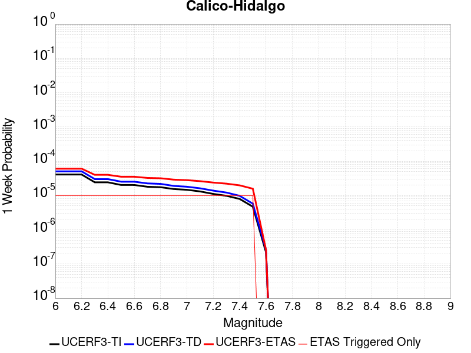 |  |  |  |

| Magnitude | 1 wk TI Prob | 1 wk TD Prob | 1 wk ETAS Prob | 1 wk ETAS/TD Gain | 1 wk ETAS Triggered Only | 1 mo TI Prob | 1 mo TD Prob | 1 mo ETAS Prob | 1 mo ETAS/TD Gain | 1 mo ETAS Triggered Only | 1 yr TI Prob | 1 yr TD Prob | 1 yr ETAS Prob | 1 yr ETAS/TD Gain | 1 yr ETAS Triggered Only | 10 yr TI Prob | 10 yr TD Prob | 10 yr ETAS Prob | 10 yr ETAS/TD Gain | 10 yr ETAS Triggered Only |
|-----|-----|-----|-----|-----|-----|-----|-----|-----|-----|-----|-----|-----|-----|-----|-----|-----|-----|-----|-----|-----|
| 6.0 | 4.0906612E-5 | 5.0705203E-5 | 6.0704697E-5 | 1.1972084 | 1.0E-5 | 1.7530227E-4 | 2.172922E-4 | 2.2729003E-4 | 1.046011 | 1.0E-5 | 0.0021322158 | 0.0026427268 | 0.0026726476 | 1.0113219 | 3.0E-5 | 0.02111873 | 0.026153376 | 0.026241023 | 1.0033512 | 9.0E-5 |
| 6.1 | 4.0906612E-5 | 5.0705203E-5 | 6.0704697E-5 | 1.1972084 | 1.0E-5 | 1.7530227E-4 | 2.172922E-4 | 2.2729003E-4 | 1.046011 | 1.0E-5 | 0.0021322158 | 0.0026427268 | 0.0026726476 | 1.0113219 | 3.0E-5 | 0.02111873 | 0.026153376 | 0.026241023 | 1.0033512 | 9.0E-5 |
| 6.2 | 4.0906612E-5 | 5.0705203E-5 | 6.0704697E-5 | 1.1972084 | 1.0E-5 | 1.7530227E-4 | 2.172922E-4 | 2.2729003E-4 | 1.046011 | 1.0E-5 | 0.0021322158 | 0.0026427268 | 0.0026726476 | 1.0113219 | 3.0E-5 | 0.02111873 | 0.026153376 | 0.026241023 | 1.0033512 | 9.0E-5 |
| 6.3 | 2.4242801E-5 | 3.009124E-5 | 4.0090938E-5 | 1.3323126 | 1.0E-5 | 1.0389358E-4 | 1.2895626E-4 | 1.3895497E-4 | 1.0775356 | 1.0E-5 | 0.0012641704 | 0.0015689448 | 0.001578929 | 1.0063637 | 1.0E-5 | 0.01257003 | 0.015582354 | 0.01562173 | 1.002527 | 4.0E-5 |
| 6.4 | 2.4242801E-5 | 3.009124E-5 | 4.0090938E-5 | 1.3323126 | 1.0E-5 | 1.0389358E-4 | 1.2895626E-4 | 1.3895497E-4 | 1.0775356 | 1.0E-5 | 0.0012641704 | 0.0015689448 | 0.001578929 | 1.0063637 | 1.0E-5 | 0.01257003 | 0.015582354 | 0.01562173 | 1.002527 | 4.0E-5 |
| 6.5 | 2.0286952E-5 | 2.5316127E-5 | 3.5315872E-5 | 1.3949951 | 1.0E-5 | 8.694118E-5 | 1.0849327E-4 | 1.18492186E-4 | 1.0921617 | 1.0E-5 | 0.0010579949 | 0.0013201223 | 0.0013301091 | 1.007565 | 1.0E-5 | 0.010529719 | 0.013124738 | 0.013164213 | 1.0030077 | 4.0E-5 |
| 6.6 | 2.0269223E-5 | 2.5297075E-5 | 3.5296824E-5 | 1.3952926 | 1.0E-5 | 8.6865206E-5 | 1.0841163E-4 | 1.1841054E-4 | 1.092231 | 1.0E-5 | 0.0010570707 | 0.0013191295 | 0.0013291163 | 1.0075707 | 1.0E-5 | 0.010520565 | 0.013114927 | 0.013154403 | 1.0030099 | 4.0E-5 |
| 6.7 | 1.799852E-5 | 2.2540915E-5 | 3.254069E-5 | 1.4436277 | 1.0E-5 | 7.713423E-5 | 9.660042E-5 | 1.0659946E-4 | 1.1035092 | 1.0E-5 | 9.3870464E-4 | 0.0011754902 | 0.0011854784 | 1.0084971 | 1.0E-5 | 0.009347493 | 0.011694335 | 0.011733868 | 1.0033804 | 4.0E-5 |
| 6.8 | 1.7458793E-5 | 2.1842423E-5 | 3.1842206E-5 | 1.4578147 | 1.0E-5 | 7.4821255E-5 | 9.360711E-5 | 1.0360617E-4 | 1.1068195 | 1.0E-5 | 9.10568E-4 | 0.0011390852 | 0.0011490738 | 1.0087689 | 1.0E-5 | 0.009068459 | 0.0113340495 | 0.011373596 | 1.0034891 | 4.0E-5 |
| 6.9 | 1.542884E-5 | 1.9026178E-5 | 2.9025989E-5 | 1.5255816 | 1.0E-5 | 6.612192E-5 | 8.153829E-5 | 9.153748E-5 | 1.1226318 | 1.0E-5 | 8.04737E-4 | 9.922897E-4 | 0.0010022798 | 1.0100677 | 1.0E-5 | 0.008018291 | 0.009879988 | 0.009919592 | 1.0040085 | 4.0E-5 |
| 7.0 | 1.468253E-5 | 1.803083E-5 | 2.803065E-5 | 1.5545956 | 1.0E-5 | 6.292361E-5 | 7.727277E-5 | 8.7272005E-5 | 1.1294017 | 1.0E-5 | 7.658257E-4 | 9.4040297E-4 | 9.503936E-4 | 1.0106237 | 1.0E-5 | 0.0076319184 | 0.009365601 | 0.009405226 | 1.004231 | 4.0E-5 |
| 7.1 | 1.3139281E-5 | 1.6201142E-5 | 2.620098E-5 | 1.6172304 | 1.0E-5 | 5.6309986E-5 | 6.943169E-5 | 7.9430996E-5 | 1.1440165 | 1.0E-5 | 6.853584E-4 | 8.450155E-4 | 8.550071E-4 | 1.0118241 | 1.0E-5 | 0.0068324856 | 0.008419322 | 0.008458985 | 1.004711 | 4.0E-5 |
| 7.2 | 1.1127404E-5 | 1.3866763E-5 | 2.3866625E-5 | 1.7211388 | 1.0E-5 | 4.7688E-5 | 5.9427693E-5 | 6.94271E-5 | 1.1682618 | 1.0E-5 | 5.8044674E-4 | 7.233029E-4 | 7.3329563E-4 | 1.0138155 | 1.0E-5 | 0.0057893298 | 0.0072105946 | 0.0072403783 | 1.0041306 | 3.0E-5 |
| 7.3 | 9.808154E-6 | 1.21763505E-5 | 2.217623E-5 | 1.8212541 | 1.0E-5 | 4.2034266E-5 | 5.2183375E-5 | 6.218285E-5 | 1.1916219 | 1.0E-5 | 5.11647E-4 | 6.351581E-4 | 6.4515177E-4 | 1.0157341 | 1.0E-5 | 0.0051047057 | 0.006334503 | 0.0063543767 | 1.0031374 | 2.0E-5 |
| 7.4 | 7.942452E-6 | 9.792245E-6 | 1.9792147E-5 | 2.0212064 | 1.0E-5 | 3.4038632E-5 | 4.196614E-5 | 5.196572E-5 | 1.2382773 | 1.0E-5 | 4.1434157E-4 | 5.1082746E-4 | 5.2082236E-4 | 1.019566 | 1.0E-5 | 0.0041356985 | 0.0050974735 | 0.0051173717 | 1.0039035 | 2.0E-5 |
| 7.5 | 4.7121216E-6 | 5.772891E-6 | 1.5772834E-5 | 2.7322242 | 1.0E-5 | 2.019465E-5 | 2.474077E-5 | 3.4740522E-5 | 1.4041811 | 1.0E-5 | 2.4584212E-4 | 3.011849E-4 | 3.1118188E-4 | 1.0331922 | 1.0E-5 | 0.0024557032 | 0.0030085195 | 0.0030284594 | 1.0066278 | 2.0E-5 |
| 7.6 | 2.21172E-7 | 2.603981E-7 | 2.603981E-7 | 1.0 | 0.0 | 9.478797E-7 | 1.1159916E-6 | 1.1159916E-6 | 1.0 | 0.0 | 1.1540374E-5 | 1.3587141E-5 | 1.3587141E-5 | 1.0 | 0.0 | 1.1539775E-4 | 1.3586592E-4 | 1.3586592E-4 | 1.0 | 0.0 |

## Manix-Afton Hills
*[(top)](#table-of-contents)*

| 1 Week | 1 Month | 1 Year | 10 Year |
|-----|-----|-----|-----|
|  | 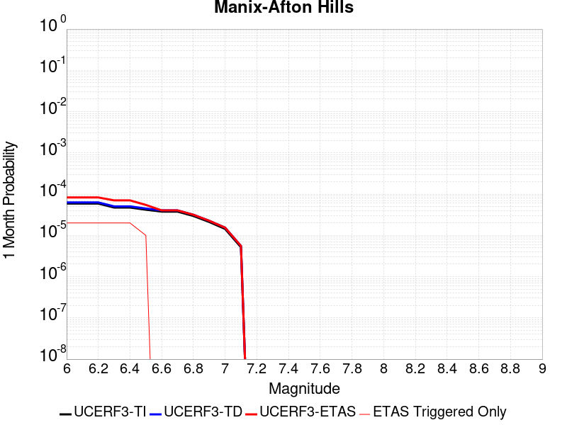 |  | 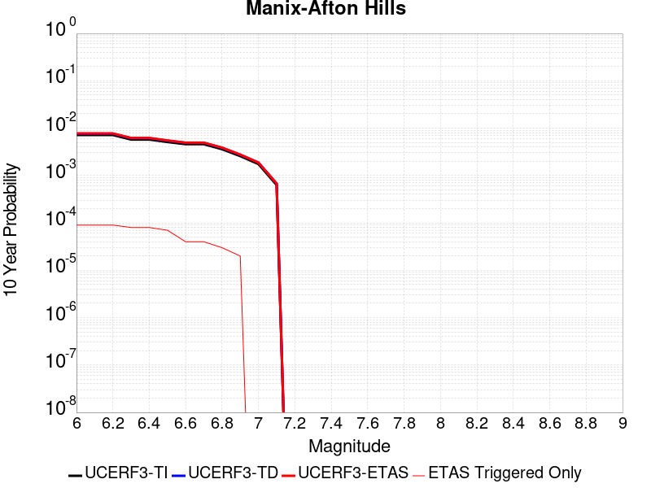 |

| Magnitude | 1 wk TI Prob | 1 wk TD Prob | 1 wk ETAS Prob | 1 wk ETAS/TD Gain | 1 wk ETAS Triggered Only | 1 mo TI Prob | 1 mo TD Prob | 1 mo ETAS Prob | 1 mo ETAS/TD Gain | 1 mo ETAS Triggered Only | 1 yr TI Prob | 1 yr TD Prob | 1 yr ETAS Prob | 1 yr ETAS/TD Gain | 1 yr ETAS Triggered Only | 10 yr TI Prob | 10 yr TD Prob | 10 yr ETAS Prob | 10 yr ETAS/TD Gain | 10 yr ETAS Triggered Only |
|-----|-----|-----|-----|-----|-----|-----|-----|-----|-----|-----|-----|-----|-----|-----|-----|-----|-----|-----|-----|-----|
| 6.0 | 1.3783202E-5 | 1.4711297E-5 | 3.4711004E-5 | 2.3594794 | 2.0E-5 | 5.906953E-5 | 6.304699E-5 | 8.304573E-5 | 1.3172038 | 2.0E-5 | 7.189342E-4 | 7.6734426E-4 | 8.472828E-4 | 1.1041757 | 8.0E-5 | 0.0071661277 | 0.007648703 | 0.0077380147 | 1.0116767 | 9.0E-5 |
| 6.1 | 1.3783202E-5 | 1.4711297E-5 | 3.4711004E-5 | 2.3594794 | 2.0E-5 | 5.906953E-5 | 6.304699E-5 | 8.304573E-5 | 1.3172038 | 2.0E-5 | 7.189342E-4 | 7.6734426E-4 | 8.472828E-4 | 1.1041757 | 8.0E-5 | 0.0071661277 | 0.007648703 | 0.0077380147 | 1.0116767 | 9.0E-5 |
| 6.2 | 1.3783202E-5 | 1.4711297E-5 | 3.4711004E-5 | 2.3594794 | 2.0E-5 | 5.906953E-5 | 6.304699E-5 | 8.304573E-5 | 1.3172038 | 2.0E-5 | 7.189342E-4 | 7.6734426E-4 | 8.472828E-4 | 1.1041757 | 8.0E-5 | 0.0071661277 | 0.007648703 | 0.0077380147 | 1.0116767 | 9.0E-5 |
| 6.3 | 1.10494875E-5 | 1.1793301E-5 | 3.1793064E-5 | 2.695858 | 2.0E-5 | 4.7354086E-5 | 5.05418E-5 | 7.054079E-5 | 1.3956921 | 2.0E-5 | 5.763835E-4 | 6.1518303E-4 | 6.8513997E-4 | 1.1137173 | 7.0E-5 | 0.005748908 | 0.0061358414 | 0.0062153507 | 1.0129582 | 8.0E-5 |
| 6.4 | 1.10494875E-5 | 1.1793301E-5 | 3.1793064E-5 | 2.695858 | 2.0E-5 | 4.7354086E-5 | 5.05418E-5 | 7.054079E-5 | 1.3956921 | 2.0E-5 | 5.763835E-4 | 6.1518303E-4 | 6.8513997E-4 | 1.1137173 | 7.0E-5 | 0.005748908 | 0.0061358414 | 0.0062153507 | 1.0129582 | 8.0E-5 |
| 6.5 | 9.788949E-6 | 1.0454468E-5 | 2.0454363E-5 | 1.9565188 | 1.0E-5 | 4.1951964E-5 | 4.4804146E-5 | 5.48037E-5 | 1.2231836 | 1.0E-5 | 5.1064545E-4 | 5.4536323E-4 | 6.053305E-4 | 1.1099584 | 6.0E-5 | 0.0050947363 | 0.005441176 | 0.005510795 | 1.0127949 | 7.0E-5 |
| 6.6 | 8.810006E-6 | 9.413763E-6 | 9.413763E-6 | 1.0 | 0.0 | 3.775662E-5 | 4.0344123E-5 | 4.0344123E-5 | 1.0 | 0.0 | 4.5958988E-4 | 4.910879E-4 | 5.3106825E-4 | 1.0814118 | 4.0E-5 | 0.0045864056 | 0.004900909 | 0.0049407133 | 1.0081217 | 4.0E-5 |
| 6.7 | 8.80128E-6 | 9.4042425E-6 | 9.4042425E-6 | 1.0 | 0.0 | 3.7719226E-5 | 4.0303323E-5 | 4.0303323E-5 | 1.0 | 0.0 | 4.591348E-4 | 4.905914E-4 | 5.3057173E-4 | 1.0814942 | 4.0E-5 | 0.004581874 | 0.004895966 | 0.00493577 | 1.00813 | 4.0E-5 |
| 6.8 | 6.8994877E-6 | 7.3801834E-6 | 7.3801834E-6 | 1.0 | 0.0 | 2.9568899E-5 | 3.162902E-5 | 3.162902E-5 | 1.0 | 0.0 | 3.5994186E-4 | 3.8502345E-4 | 4.150119E-4 | 1.0778873 | 3.0E-5 | 0.003593594 | 0.0038443687 | 0.0038742535 | 1.0077736 | 3.0E-5 |
| 6.9 | 4.9328037E-6 | 5.271037E-6 | 5.271037E-6 | 1.0 | 0.0 | 2.1140417E-5 | 2.2589997E-5 | 2.2589997E-5 | 1.0 | 0.0 | 2.5735417E-4 | 2.7500466E-4 | 2.9499916E-4 | 1.072706 | 2.0E-5 | 0.0025705635 | 0.0027472489 | 0.0027671938 | 1.00726 | 2.0E-5 |
| 7.0 | 3.347973E-6 | 3.5900841E-6 | 3.5900841E-6 | 1.0 | 0.0 | 1.4348378E-5 | 1.5386007E-5 | 1.5386007E-5 | 1.0 | 0.0 | 1.746775E-4 | 1.8731265E-4 | 1.8731265E-4 | 1.0 | 0.0 | 0.0017454025 | 0.0018719502 | 0.0018719502 | 1.0 | 0.0 |
| 7.1 | 1.2073567E-6 | 1.2935013E-6 | 1.2935013E-6 | 1.0 | 0.0 | 5.1743755E-6 | 5.5435744E-6 | 5.5435744E-6 | 1.0 | 0.0 | 6.29962E-5 | 6.749256E-5 | 6.749256E-5 | 1.0 | 0.0 | 6.297835E-4 | 6.748808E-4 | 6.748808E-4 | 1.0 | 0.0 |

## Rose Canyon
*[(top)](#table-of-contents)*

| 1 Week | 1 Month | 1 Year | 10 Year |
|-----|-----|-----|-----|
|  |  | 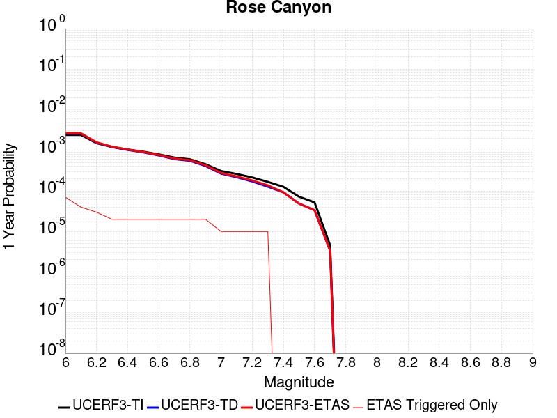 |  |

| Magnitude | 1 wk TI Prob | 1 wk TD Prob | 1 wk ETAS Prob | 1 wk ETAS/TD Gain | 1 wk ETAS Triggered Only | 1 mo TI Prob | 1 mo TD Prob | 1 mo ETAS Prob | 1 mo ETAS/TD Gain | 1 mo ETAS Triggered Only | 1 yr TI Prob | 1 yr TD Prob | 1 yr ETAS Prob | 1 yr ETAS/TD Gain | 1 yr ETAS Triggered Only | 10 yr TI Prob | 10 yr TD Prob | 10 yr ETAS Prob | 10 yr ETAS/TD Gain | 10 yr ETAS Triggered Only |
|-----|-----|-----|-----|-----|-----|-----|-----|-----|-----|-----|-----|-----|-----|-----|-----|-----|-----|-----|-----|-----|
| 6.0 | 4.5923203E-5 | 4.971674E-5 | 4.971674E-5 | 1.0 | 0.0 | 1.9679888E-4 | 2.130547E-4 | 2.3305045E-4 | 1.0938526 | 2.0E-5 | 0.0023933933 | 0.002591057 | 0.0026608754 | 1.026946 | 7.0E-5 | 0.023677798 | 0.02564122 | 0.025728913 | 1.00342 | 9.0E-5 |
| 6.1 | 4.5923203E-5 | 4.971674E-5 | 4.971674E-5 | 1.0 | 0.0 | 1.9679888E-4 | 2.130547E-4 | 2.3305045E-4 | 1.0938526 | 2.0E-5 | 0.0023933933 | 0.002591057 | 0.0026309532 | 1.0153977 | 4.0E-5 | 0.023677798 | 0.02564122 | 0.02569968 | 1.00228 | 6.0E-5 |
| 6.2 | 2.8844734E-5 | 2.9669858E-5 | 2.9669858E-5 | 1.0 | 0.0 | 1.2361443E-4 | 1.2714956E-4 | 1.371483E-4 | 1.0786375 | 1.0E-5 | 0.0015039665 | 0.0015469517 | 0.0015769053 | 1.0193629 | 3.0E-5 | 0.0149382865 | 0.015374849 | 0.015414233 | 1.0025617 | 4.0E-5 |
| 6.3 | 2.3171577E-5 | 2.3161947E-5 | 2.3161947E-5 | 1.0 | 0.0 | 9.9302975E-5 | 9.9261786E-5 | 1.0926079E-4 | 1.1007338 | 1.0E-5 | 0.0012083431 | 0.0012078555 | 0.0012278314 | 1.0165383 | 2.0E-5 | 0.012017938 | 0.012022801 | 0.01205244 | 1.0024652 | 3.0E-5 |
| 6.4 | 2.0066604E-5 | 1.9667617E-5 | 1.9667617E-5 | 1.0 | 0.0 | 8.599689E-5 | 8.428712E-5 | 9.428628E-5 | 1.1186321 | 1.0E-5 | 0.0010465092 | 0.0010257226 | 0.0010457021 | 1.0194784 | 2.0E-5 | 0.010415946 | 0.010217864 | 0.010247558 | 1.0029061 | 3.0E-5 |
| 6.5 | 1.776989E-5 | 1.7114304E-5 | 1.7114304E-5 | 1.0 | 0.0 | 7.615444E-5 | 7.334499E-5 | 8.334426E-5 | 1.1363319 | 1.0E-5 | 9.267859E-4 | 8.926164E-4 | 9.1259857E-4 | 1.0223861 | 2.0E-5 | 0.009229303 | 0.008896468 | 0.008926202 | 1.0033422 | 3.0E-5 |
| 6.6 | 1.5227364E-5 | 1.43396455E-5 | 1.43396455E-5 | 1.0 | 0.0 | 6.52585E-5 | 6.145421E-5 | 7.145359E-5 | 1.1627128 | 1.0E-5 | 7.942326E-4 | 7.479533E-4 | 7.679383E-4 | 1.0267197 | 2.0E-5 | 0.007914 | 0.007458559 | 0.007488335 | 1.0039922 | 3.0E-5 |
| 6.7 | 1.2703898E-5 | 1.1673551E-5 | 1.1673551E-5 | 1.0 | 0.0 | 5.4444143E-5 | 5.0028568E-5 | 6.002807E-5 | 1.1998758 | 1.0E-5 | 6.626558E-4 | 6.089318E-4 | 6.289197E-4 | 1.0328244 | 2.0E-5 | 0.006606833 | 0.006075229 | 0.0061050467 | 1.0049081 | 3.0E-5 |
| 6.8 | 1.1554917E-5 | 1.06095695E-5 | 1.06095695E-5 | 1.0 | 0.0 | 4.9520135E-5 | 4.5468816E-5 | 5.546836E-5 | 1.219921 | 1.0E-5 | 6.0274085E-4 | 5.5344624E-4 | 5.734352E-4 | 1.0361172 | 2.0E-5 | 0.0060110865 | 0.005522688 | 0.0055525224 | 1.0054021 | 3.0E-5 |
| 6.9 | 8.732078E-6 | 7.8815E-6 | 7.8815E-6 | 1.0 | 0.0 | 3.7422655E-5 | 3.3777436E-5 | 4.3777098E-5 | 1.2960457 | 1.0E-5 | 4.5552556E-4 | 4.1116562E-4 | 4.3115742E-4 | 1.0486223 | 2.0E-5 | 0.0045459294 | 0.004104882 | 0.0041248 | 1.0048523 | 2.0E-5 |
| 7.0 | 5.9337494E-6 | 5.107557E-6 | 5.107557E-6 | 1.0 | 0.0 | 2.5430107E-5 | 2.1889347E-5 | 3.188913E-5 | 1.4568332 | 1.0E-5 | 3.0956755E-4 | 2.6647034E-4 | 2.7646768E-4 | 1.0375177 | 1.0E-5 | 0.0030913667 | 0.0026615239 | 0.0026714974 | 1.0037472 | 1.0E-5 |
| 7.1 | 5.013409E-6 | 4.17744E-6 | 4.17744E-6 | 1.0 | 0.0 | 2.1485863E-5 | 1.7903192E-5 | 2.7903014E-5 | 1.5585496 | 1.0E-5 | 2.6155898E-4 | 2.1794967E-4 | 2.2794749E-4 | 1.0458722 | 1.0E-5 | 0.0026125133 | 0.0021773707 | 0.0021873491 | 1.0045826 | 1.0E-5 |
| 7.2 | 4.120763E-6 | 3.2821845E-6 | 3.2821845E-6 | 1.0 | 0.0 | 1.7660293E-5 | 1.406643E-5 | 2.4066288E-5 | 1.7109025 | 1.0E-5 | 2.1499286E-4 | 1.7124541E-4 | 1.812437E-4 | 1.0583857 | 1.0E-5 | 0.0021478499 | 0.001711144 | 0.001721127 | 1.0058341 | 1.0E-5 |
| 7.3 | 3.2081239E-6 | 2.4405724E-6 | 2.4405724E-6 | 1.0 | 0.0 | 1.374903E-5 | 1.0459555E-5 | 2.0459449E-5 | 1.9560537 | 1.0E-5 | 1.6738157E-4 | 1.273377E-4 | 1.3733642E-4 | 1.0785214 | 1.0E-5 | 0.0016725556 | 0.0012726544 | 0.0012826417 | 1.0078475 | 1.0E-5 |
| 7.4 | 2.4194755E-6 | 1.7680901E-6 | 1.7680901E-6 | 1.0 | 0.0 | 1.0369139E-5 | 7.577507E-6 | 7.577507E-6 | 1.0 | 0.0 | 1.2623696E-4 | 9.2252296E-5 | 9.2252296E-5 | 1.0 | 0.0 | 0.0012616527 | 9.221454E-4 | 9.221454E-4 | 1.0 | 0.0 |
| 7.5 | 1.3842889E-6 | 9.3788003E-7 | 9.3788003E-7 | 1.0 | 0.0 | 5.9326535E-6 | 4.01948E-6 | 4.01948E-6 | 1.0 | 0.0 | 7.222766E-5 | 4.8936105E-5 | 4.8936105E-5 | 1.0 | 0.0 | 7.220419E-4 | 4.892568E-4 | 4.892568E-4 | 1.0 | 0.0 |
| 7.6 | 1.0021575E-6 | 6.411597E-7 | 6.411597E-7 | 1.0 | 0.0 | 4.2949537E-6 | 2.7478247E-6 | 2.7478247E-6 | 1.0 | 0.0 | 5.2289808E-5 | 3.3454275E-5 | 3.3454275E-5 | 1.0 | 0.0 | 5.2277505E-4 | 3.344945E-4 | 3.344945E-4 | 1.0 | 0.0 |
| 7.7 | 8.7620116E-8 | 6.4493086E-8 | 6.4493086E-8 | 1.0 | 0.0 | 3.7551473E-7 | 2.7639894E-7 | 2.7639894E-7 | 1.0 | 0.0 | 4.5718825E-6 | 3.365152E-6 | 3.365152E-6 | 1.0 | 0.0 | 4.5717883E-5 | 3.365104E-5 | 3.365104E-5 | 1.0 | 0.0 |

## San Jacinto (Anza) rev
*[(top)](#table-of-contents)*

| 1 Week | 1 Month | 1 Year | 10 Year |
|-----|-----|-----|-----|
|  | 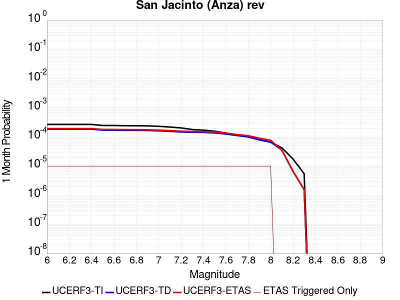 |  |  |

| Magnitude | 1 wk TI Prob | 1 wk TD Prob | 1 wk ETAS Prob | 1 wk ETAS/TD Gain | 1 wk ETAS Triggered Only | 1 mo TI Prob | 1 mo TD Prob | 1 mo ETAS Prob | 1 mo ETAS/TD Gain | 1 mo ETAS Triggered Only | 1 yr TI Prob | 1 yr TD Prob | 1 yr ETAS Prob | 1 yr ETAS/TD Gain | 1 yr ETAS Triggered Only | 10 yr TI Prob | 10 yr TD Prob | 10 yr ETAS Prob | 10 yr ETAS/TD Gain | 10 yr ETAS Triggered Only |
|-----|-----|-----|-----|-----|-----|-----|-----|-----|-----|-----|-----|-----|-----|-----|-----|-----|-----|-----|-----|-----|
| 6.0 | 6.3015636E-5 | 4.3329474E-5 | 4.3329474E-5 | 1.0 | 0.0 | 2.7003905E-4 | 1.8568459E-4 | 1.9568275E-4 | 1.0538448 | 1.0E-5 | 0.0032827691 | 0.002258378 | 0.002308265 | 1.0220898 | 5.0E-5 | 0.032346968 | 0.023310049 | 0.023388183 | 1.003352 | 8.0E-5 |
| 6.1 | 6.3015636E-5 | 4.3329474E-5 | 4.3329474E-5 | 1.0 | 0.0 | 2.7003905E-4 | 1.8568459E-4 | 1.9568275E-4 | 1.0538448 | 1.0E-5 | 0.0032827691 | 0.002258378 | 0.002308265 | 1.0220898 | 5.0E-5 | 0.032346968 | 0.023310049 | 0.023388183 | 1.003352 | 8.0E-5 |
| 6.2 | 6.3015636E-5 | 4.3329474E-5 | 4.3329474E-5 | 1.0 | 0.0 | 2.7003905E-4 | 1.8568459E-4 | 1.9568275E-4 | 1.0538448 | 1.0E-5 | 0.0032827691 | 0.002258378 | 0.002308265 | 1.0220898 | 5.0E-5 | 0.032346968 | 0.023310049 | 0.023388183 | 1.003352 | 8.0E-5 |
| 6.3 | 6.3015636E-5 | 4.3329474E-5 | 4.3329474E-5 | 1.0 | 0.0 | 2.7003905E-4 | 1.8568459E-4 | 1.9568275E-4 | 1.0538448 | 1.0E-5 | 0.0032827691 | 0.002258378 | 0.002308265 | 1.0220898 | 5.0E-5 | 0.032346968 | 0.023310049 | 0.023388183 | 1.003352 | 8.0E-5 |
| 6.4 | 6.3015636E-5 | 4.3329474E-5 | 4.3329474E-5 | 1.0 | 0.0 | 2.7003905E-4 | 1.8568459E-4 | 1.9568275E-4 | 1.0538448 | 1.0E-5 | 0.0032827691 | 0.002258378 | 0.002308265 | 1.0220898 | 5.0E-5 | 0.032346968 | 0.023310049 | 0.023388183 | 1.003352 | 8.0E-5 |
| 6.5 | 5.811017E-5 | 4.0107992E-5 | 4.0107992E-5 | 1.0 | 0.0 | 2.4901982E-4 | 1.7188009E-4 | 1.8187838E-4 | 1.0581701 | 1.0E-5 | 0.0030276014 | 0.0020906373 | 0.002140533 | 1.0238662 | 5.0E-5 | 0.02986684 | 0.021606935 | 0.021685205 | 1.0036225 | 8.0E-5 |
| 6.6 | 5.811017E-5 | 4.0107992E-5 | 4.0107992E-5 | 1.0 | 0.0 | 2.4901982E-4 | 1.7188009E-4 | 1.8187838E-4 | 1.0581701 | 1.0E-5 | 0.0030276014 | 0.0020906373 | 0.002140533 | 1.0238662 | 5.0E-5 | 0.02986684 | 0.021606935 | 0.021685205 | 1.0036225 | 8.0E-5 |
| 6.7 | 5.712442E-5 | 3.9530412E-5 | 3.9530412E-5 | 1.0 | 0.0 | 2.4479596E-4 | 1.6940509E-4 | 1.7940339E-4 | 1.0590202 | 1.0E-5 | 0.0029763177 | 0.0020605614 | 0.0021104584 | 1.0242152 | 5.0E-5 | 0.029367693 | 0.021298619 | 0.021376915 | 1.003676 | 8.0E-5 |
| 6.8 | 5.6967532E-5 | 3.9386785E-5 | 3.9386785E-5 | 1.0 | 0.0 | 2.4412372E-4 | 1.6878961E-4 | 1.7878792E-4 | 1.0592353 | 1.0E-5 | 0.0029681553 | 0.002053082 | 0.0021029795 | 1.0243037 | 5.0E-5 | 0.029288229 | 0.021223318 | 0.02130162 | 1.0036894 | 8.0E-5 |
| 6.9 | 5.6211324E-5 | 3.90914E-5 | 3.90914E-5 | 1.0 | 0.0 | 2.4088343E-4 | 1.6752385E-4 | 1.7752216E-4 | 1.059683 | 1.0E-5 | 0.0029288116 | 0.0020377003 | 0.0020875984 | 1.0244875 | 5.0E-5 | 0.028905109 | 0.021062657 | 0.021140972 | 1.0037181 | 8.0E-5 |
| 7.0 | 5.4383527E-5 | 3.7951344E-5 | 3.7951344E-5 | 1.0 | 0.0 | 2.3305144E-4 | 1.6263849E-4 | 1.7263686E-4 | 1.0614761 | 1.0E-5 | 0.0028337094 | 0.0019783303 | 0.0020282313 | 1.0252239 | 5.0E-5 | 0.027978465 | 0.020453325 | 0.020531688 | 1.0038314 | 8.0E-5 |
| 7.1 | 5.1393665E-5 | 3.641337E-5 | 3.641337E-5 | 1.0 | 0.0 | 2.2023996E-4 | 1.5604799E-4 | 1.6604643E-4 | 1.0640728 | 1.0E-5 | 0.0026781242 | 0.0018982328 | 0.001948138 | 1.0262903 | 5.0E-5 | 0.026460782 | 0.019626494 | 0.019704925 | 1.0039961 | 8.0E-5 |
| 7.2 | 4.785222E-5 | 3.4764278E-5 | 3.4764278E-5 | 1.0 | 0.0 | 2.0506482E-4 | 1.4898127E-4 | 1.5897979E-4 | 1.0671126 | 1.0E-5 | 0.0024938055 | 0.0018123415 | 0.0018622509 | 1.0275387 | 5.0E-5 | 0.024660049 | 0.018740693 | 0.018819194 | 1.0041888 | 8.0E-5 |
| 7.3 | 4.2143256E-5 | 3.385812E-5 | 3.385812E-5 | 1.0 | 0.0 | 1.8060145E-4 | 1.4509818E-4 | 1.5509673E-4 | 1.0689088 | 1.0E-5 | 0.002196605 | 0.0017651423 | 0.0018150541 | 1.0282763 | 5.0E-5 | 0.02175019 | 0.01824859 | 0.01832713 | 1.0043039 | 8.0E-5 |
| 7.4 | 4.0264713E-5 | 3.3496093E-5 | 3.3496093E-5 | 1.0 | 0.0 | 1.7255165E-4 | 1.435468E-4 | 1.5354538E-4 | 1.0696536 | 1.0E-5 | 0.002098792 | 0.0017462848 | 0.0017961975 | 1.0285822 | 5.0E-5 | 0.020790804 | 0.018053057 | 0.018131612 | 1.0043514 | 8.0E-5 |
| 7.5 | 3.694492E-5 | 3.220962E-5 | 3.220962E-5 | 1.0 | 0.0 | 1.5832575E-4 | 1.3803395E-4 | 1.4803257E-4 | 1.072436 | 1.0E-5 | 0.0019259118 | 0.001679271 | 0.001729187 | 1.0297248 | 5.0E-5 | 0.01909306 | 0.017369263 | 0.017447874 | 1.0045258 | 8.0E-5 |
| 7.6 | 3.200565E-5 | 2.9524583E-5 | 2.9524583E-5 | 1.0 | 0.0 | 1.3715986E-4 | 1.265278E-4 | 1.3652653E-4 | 1.079024 | 1.0E-5 | 0.001668642 | 0.0015393897 | 0.0015893127 | 1.0324304 | 5.0E-5 | 0.01656168 | 0.015956955 | 0.01603568 | 1.0049335 | 8.0E-5 |
| 7.7 | 2.731642E-5 | 2.6112706E-5 | 2.6112706E-5 | 1.0 | 0.0 | 1.1706512E-4 | 1.11906804E-4 | 1.2190569E-4 | 1.0893501 | 1.0E-5 | 0.001424336 | 0.0013616148 | 0.0014115467 | 1.0366712 | 5.0E-5 | 0.014152412 | 0.01417739 | 0.014256256 | 1.0055628 | 8.0E-5 |
| 7.8 | 2.3466424E-5 | 2.3523942E-5 | 2.3523942E-5 | 1.0 | 0.0 | 1.0056651E-4 | 1.00813006E-4 | 1.10812E-4 | 1.0991836 | 1.0E-5 | 0.0012237094 | 0.0012267081 | 0.001266659 | 1.0325676 | 4.0E-5 | 0.012169928 | 0.012818881 | 0.012887984 | 1.0053906 | 7.0E-5 |
| 7.9 | 1.8611925E-5 | 1.8925351E-5 | 1.8925351E-5 | 1.0 | 0.0 | 7.9762955E-5 | 8.1106125E-5 | 9.1105314E-5 | 1.1232853 | 1.0E-5 | 9.7068126E-4 | 9.870206E-4 | 0.001026981 | 1.040486 | 4.0E-5 | 0.0096645225 | 0.010402861 | 0.0104622375 | 1.0057076 | 6.0E-5 |
| 8.0 | 1.5460775E-5 | 1.575628E-5 | 1.575628E-5 | 1.0 | 0.0 | 6.6258784E-5 | 6.752517E-5 | 7.75245E-5 | 1.148083 | 1.0E-5 | 8.0640207E-4 | 8.218096E-4 | 8.617767E-4 | 1.0486331 | 4.0E-5 | 0.008034821 | 0.008710943 | 0.00877042 | 1.0068278 | 6.0E-5 |
| 8.1 | 9.983884E-6 | 8.278915E-6 | 8.278915E-6 | 1.0 | 0.0 | 4.2787375E-5 | 3.5480585E-5 | 3.5480585E-5 | 1.0 | 0.0 | 5.2081177E-4 | 4.31891E-4 | 4.31891E-4 | 1.0 | 0.0 | 0.0051959283 | 0.0046448363 | 0.0046647433 | 1.0042858 | 2.0E-5 |
| 8.2 | 4.1226E-6 | 1.5555515E-6 | 1.5555515E-6 | 1.0 | 0.0 | 1.7668166E-5 | 6.6666325E-6 | 6.6666325E-6 | 1.0 | 0.0 | 2.1508869E-4 | 8.1163256E-5 | 8.1163256E-5 | 1.0 | 0.0 | 0.0021488064 | 9.4197044E-4 | 9.4197044E-4 | 1.0 | 0.0 |
| 8.3 | 1.2750878E-6 | 3.6191753E-7 | 3.6191753E-7 | 1.0 | 0.0 | 5.4646503E-6 | 1.5510742E-6 | 1.5510742E-6 | 1.0 | 0.0 | 6.653009E-5 | 1.888417E-5 | 1.888417E-5 | 1.0 | 0.0 | 6.6510175E-4 | 2.2775632E-4 | 2.2775632E-4 | 1.0 | 0.0 |

## Lake Isabella (Seismicity)
*[(top)](#table-of-contents)*

| 1 Week | 1 Month | 1 Year | 10 Year |
|-----|-----|-----|-----|
|  |  |  |  |

| Magnitude | 1 wk TI Prob | 1 wk TD Prob | 1 wk ETAS Prob | 1 wk ETAS/TD Gain | 1 wk ETAS Triggered Only | 1 mo TI Prob | 1 mo TD Prob | 1 mo ETAS Prob | 1 mo ETAS/TD Gain | 1 mo ETAS Triggered Only | 1 yr TI Prob | 1 yr TD Prob | 1 yr ETAS Prob | 1 yr ETAS/TD Gain | 1 yr ETAS Triggered Only | 10 yr TI Prob | 10 yr TD Prob | 10 yr ETAS Prob | 10 yr ETAS/TD Gain | 10 yr ETAS Triggered Only |
|-----|-----|-----|-----|-----|-----|-----|-----|-----|-----|-----|-----|-----|-----|-----|-----|-----|-----|-----|-----|-----|
| 6.0 | 9.431637E-6 | 9.741719E-6 | 9.741719E-6 | 1.0 | 0.0 | 4.0420677E-5 | 4.1749627E-5 | 5.174921E-5 | 1.239513 | 1.0E-5 | 4.920106E-4 | 5.0819624E-4 | 5.6816573E-4 | 1.1180047 | 6.0E-5 | 0.004909227 | 0.0050716335 | 0.0051512276 | 1.015694 | 8.0E-5 |
| 6.1 | 9.431637E-6 | 9.741719E-6 | 9.741719E-6 | 1.0 | 0.0 | 4.0420677E-5 | 4.1749627E-5 | 5.174921E-5 | 1.239513 | 1.0E-5 | 4.920106E-4 | 5.0819624E-4 | 5.6816573E-4 | 1.1180047 | 6.0E-5 | 0.004909227 | 0.0050716335 | 0.0051512276 | 1.015694 | 8.0E-5 |
| 6.2 | 9.431637E-6 | 9.741719E-6 | 9.741719E-6 | 1.0 | 0.0 | 4.0420677E-5 | 4.1749627E-5 | 5.174921E-5 | 1.239513 | 1.0E-5 | 4.920106E-4 | 5.0819624E-4 | 5.6816573E-4 | 1.1180047 | 6.0E-5 | 0.004909227 | 0.0050716335 | 0.0051512276 | 1.015694 | 8.0E-5 |
| 6.3 | 9.431637E-6 | 9.741719E-6 | 9.741719E-6 | 1.0 | 0.0 | 4.0420677E-5 | 4.1749627E-5 | 5.174921E-5 | 1.239513 | 1.0E-5 | 4.920106E-4 | 5.0819624E-4 | 5.6816573E-4 | 1.1180047 | 6.0E-5 | 0.004909227 | 0.0050716335 | 0.0051512276 | 1.015694 | 8.0E-5 |
| 6.4 | 5.144063E-6 | 5.3001095E-6 | 5.3001095E-6 | 1.0 | 0.0 | 2.2045799E-5 | 2.2714577E-5 | 3.271435E-5 | 1.440236 | 1.0E-5 | 2.6837454E-4 | 2.7651835E-4 | 3.1650727E-4 | 1.1446159 | 4.0E-5 | 0.0026805066 | 0.0027620832 | 0.0028019727 | 1.0144418 | 4.0E-5 |
| 6.5 | 5.144063E-6 | 5.3001095E-6 | 5.3001095E-6 | 1.0 | 0.0 | 2.2045799E-5 | 2.2714577E-5 | 3.271435E-5 | 1.440236 | 1.0E-5 | 2.6837454E-4 | 2.7651835E-4 | 3.1650727E-4 | 1.1446159 | 4.0E-5 | 0.0026805066 | 0.0027620832 | 0.0028019727 | 1.0144418 | 4.0E-5 |
| 6.6 | 3.4009804E-6 | 3.498807E-6 | 3.498807E-6 | 1.0 | 0.0 | 1.4575549E-5 | 1.4994811E-5 | 1.4994811E-5 | 1.0 | 0.0 | 1.7744285E-4 | 1.8254813E-4 | 2.1254265E-4 | 1.1643102 | 3.0E-5 | 0.0017730123 | 0.0018241395 | 0.0018540848 | 1.0164161 | 3.0E-5 |
| 6.7 | 3.3880428E-6 | 3.4856737E-6 | 3.4856737E-6 | 1.0 | 0.0 | 1.4520103E-5 | 1.4938525E-5 | 1.4938525E-5 | 1.0 | 0.0 | 1.767679E-4 | 1.8186297E-4 | 2.118575E-4 | 1.1649294 | 3.0E-5 | 0.0017662736 | 0.0018172992 | 0.0018472446 | 1.0164781 | 3.0E-5 |
| 6.8 | 2.6582E-6 | 2.7337164E-6 | 2.7337164E-6 | 1.0 | 0.0 | 1.1392236E-5 | 1.17158825E-5 | 1.17158825E-5 | 1.0 | 0.0 | 1.3869164E-4 | 1.4263288E-4 | 1.726286E-4 | 1.2103002 | 3.0E-5 | 0.0013860512 | 0.0014255453 | 0.0014555026 | 1.0210146 | 3.0E-5 |
| 6.9 | 2.406011E-6 | 2.4743435E-6 | 2.4743435E-6 | 1.0 | 0.0 | 1.0311434E-5 | 1.06042935E-5 | 1.06042935E-5 | 1.0 | 0.0 | 1.2553448E-4 | 1.2910094E-4 | 1.5909708E-4 | 1.2323463 | 3.0E-5 | 0.0012546359 | 0.0012903891 | 0.0013203503 | 1.0232188 | 3.0E-5 |
| 7.0 | 1.6953097E-6 | 1.7429473E-6 | 1.7429473E-6 | 1.0 | 0.0 | 7.265593E-6 | 7.469759E-6 | 7.469759E-6 | 1.0 | 0.0 | 8.8455E-5 | 9.094157E-5 | 1.2093884E-4 | 1.3298521 | 3.0E-5 | 8.84198E-4 | 9.0914627E-4 | 9.39119E-4 | 1.032968 | 3.0E-5 |
| 7.1 | 3.5013824E-7 | 3.5714973E-7 | 3.5714973E-7 | 1.0 | 0.0 | 1.5005916E-6 | 1.5306408E-6 | 1.5306408E-6 | 1.0 | 0.0 | 1.826955E-5 | 1.8635395E-5 | 2.8635208E-5 | 1.5366032 | 1.0E-5 | 1.8268047E-4 | 1.8633857E-4 | 1.9633671E-4 | 1.0536557 | 1.0E-5 |
| 7.2 | 2.2321095E-7 | 2.2750665E-7 | 2.2750665E-7 | 1.0 | 0.0 | 9.56618E-7 | 9.750281E-7 | 9.750281E-7 | 1.0 | 0.0 | 1.1646762E-5 | 1.1870904E-5 | 2.1870785E-5 | 1.8423859 | 1.0E-5 | 1.1646151E-4 | 1.187028E-4 | 1.287016E-4 | 1.084234 | 1.0E-5 |
| 7.3 | 1.5760406E-7 | 1.6060986E-7 | 1.6060986E-7 | 1.0 | 0.0 | 6.7544585E-7 | 6.883278E-7 | 6.883278E-7 | 1.0 | 0.0 | 8.223522E-6 | 8.380359E-6 | 8.380359E-6 | 1.0 | 0.0 | 8.2232174E-5 | 8.380049E-5 | 8.380049E-5 | 1.0 | 0.0 |
| 7.4 | 1.1216497E-7 | 1.14317515E-7 | 1.14317515E-7 | 1.0 | 0.0 | 4.8070694E-7 | 4.899321E-7 | 4.899321E-7 | 1.0 | 0.0 | 5.852591E-6 | 5.964908E-6 | 5.964908E-6 | 1.0 | 0.0 | 5.8524372E-5 | 5.9647522E-5 | 5.9647522E-5 | 1.0 | 0.0 |
| 7.5 | 4.885185E-8 | 4.9787936E-8 | 4.9787936E-8 | 1.0 | 0.0 | 2.0936506E-7 | 2.1337685E-7 | 2.1337685E-7 | 1.0 | 0.0 | 2.5490165E-6 | 2.5978602E-6 | 2.5978602E-6 | 1.0 | 0.0 | 2.5489873E-5 | 2.5978317E-5 | 2.5978317E-5 | 1.0 | 0.0 |
| 7.6 | 1.504641E-9 | 1.531796E-9 | 1.531796E-9 | 1.0 | 0.0 | 6.4484613E-9 | 6.5648402E-9 | 6.5648402E-9 | 1.0 | 0.0 | 7.851001E-8 | 7.992693E-8 | 7.992693E-8 | 1.0 | 0.0 | 7.8509987E-7 | 7.992693E-7 | 7.992693E-7 | 1.0 | 0.0 |

## Big Pine (Central)
*[(top)](#table-of-contents)*

| 1 Week | 1 Month | 1 Year | 10 Year |
|-----|-----|-----|-----|
|  | 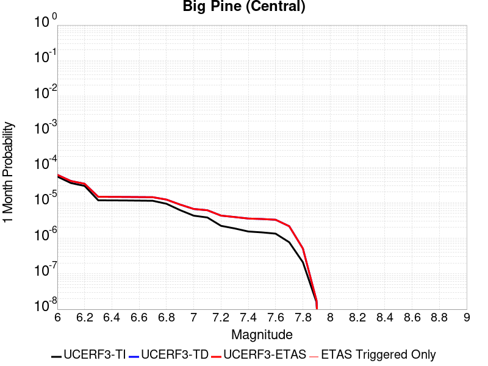 |  |  |

| Magnitude | 1 wk TI Prob | 1 wk TD Prob | 1 wk ETAS Prob | 1 wk ETAS/TD Gain | 1 wk ETAS Triggered Only | 1 mo TI Prob | 1 mo TD Prob | 1 mo ETAS Prob | 1 mo ETAS/TD Gain | 1 mo ETAS Triggered Only | 1 yr TI Prob | 1 yr TD Prob | 1 yr ETAS Prob | 1 yr ETAS/TD Gain | 1 yr ETAS Triggered Only | 10 yr TI Prob | 10 yr TD Prob | 10 yr ETAS Prob | 10 yr ETAS/TD Gain | 10 yr ETAS Triggered Only |
|-----|-----|-----|-----|-----|-----|-----|-----|-----|-----|-----|-----|-----|-----|-----|-----|-----|-----|-----|-----|-----|
| 6.0 | 1.2706755E-5 | 1.4251288E-5 | 1.4251288E-5 | 1.0 | 0.0 | 5.4456385E-5 | 6.107573E-5 | 6.107573E-5 | 1.0 | 0.0 | 6.628048E-4 | 7.433799E-4 | 7.63365E-4 | 1.0268842 | 2.0E-5 | 0.006608314 | 0.007413956 | 0.0074834367 | 1.0093716 | 7.0E-5 |
| 6.1 | 8.342579E-6 | 9.5114365E-6 | 9.5114365E-6 | 1.0 | 0.0 | 3.5753423E-5 | 4.0762785E-5 | 4.0762785E-5 | 1.0 | 0.0 | 4.3521097E-4 | 4.9619563E-4 | 4.9619563E-4 | 1.0 | 0.0 | 0.0043435963 | 0.0049544284 | 0.0049842796 | 1.0060252 | 3.0E-5 |
| 6.2 | 6.923899E-6 | 7.967794E-6 | 7.967794E-6 | 1.0 | 0.0 | 2.9673516E-5 | 3.414735E-5 | 3.414735E-5 | 1.0 | 0.0 | 3.6121515E-4 | 4.1568393E-4 | 4.1568393E-4 | 1.0 | 0.0 | 0.003606286 | 0.0041523683 | 0.004172285 | 1.0047965 | 2.0E-5 |
| 6.3 | 2.728396E-6 | 3.4248592E-6 | 3.4248592E-6 | 1.0 | 0.0 | 1.1693074E-5 | 1.467789E-5 | 1.467789E-5 | 1.0 | 0.0 | 1.4235388E-4 | 1.7868953E-4 | 1.7868953E-4 | 1.0 | 0.0 | 0.0014226272 | 0.0017869617 | 0.001806926 | 1.0111722 | 2.0E-5 |
| 6.4 | 2.7136944E-6 | 3.4091524E-6 | 3.4091524E-6 | 1.0 | 0.0 | 1.1630066E-5 | 1.4610576E-5 | 1.4610576E-5 | 1.0 | 0.0 | 1.4158686E-4 | 1.7787011E-4 | 1.7787011E-4 | 1.0 | 0.0 | 0.0014149669 | 0.0017787807 | 0.0017987451 | 1.0112237 | 2.0E-5 |
| 6.5 | 2.6971882E-6 | 3.3914973E-6 | 3.3914973E-6 | 1.0 | 0.0 | 1.1559327E-5 | 1.4534912E-5 | 1.4534912E-5 | 1.0 | 0.0 | 1.4072572E-4 | 1.7694905E-4 | 1.7694905E-4 | 1.0 | 0.0 | 0.0014063664 | 0.0017695847 | 0.0017895494 | 1.0112821 | 2.0E-5 |
| 6.6 | 2.669092E-6 | 3.3615172E-6 | 3.3615172E-6 | 1.0 | 0.0 | 1.1438916E-5 | 1.4406428E-5 | 1.4406428E-5 | 1.0 | 0.0 | 1.3925991E-4 | 1.7538501E-4 | 1.7538501E-4 | 1.0 | 0.0 | 0.0013917267 | 0.0017539691 | 0.001773934 | 1.0113827 | 2.0E-5 |
| 6.7 | 2.6408059E-6 | 3.3315425E-6 | 3.3315425E-6 | 1.0 | 0.0 | 1.1317691E-5 | 1.4277966E-5 | 1.4277966E-5 | 1.0 | 0.0 | 1.3778417E-4 | 1.7382124E-4 | 1.7382124E-4 | 1.0 | 0.0 | 0.0013769877 | 0.001738356 | 0.0017583212 | 1.0114851 | 2.0E-5 |
| 6.8 | 2.1786943E-6 | 2.8549966E-6 | 2.8549966E-6 | 1.0 | 0.0 | 9.337228E-6 | 1.2235647E-5 | 1.2235647E-5 | 1.0 | 0.0 | 1.1367482E-4 | 1.4895955E-4 | 1.4895955E-4 | 1.0 | 0.0 | 0.0011361669 | 0.0014900867 | 0.0014900867 | 1.0 | 0.0 |
| 6.9 | 1.4411696E-6 | 2.0690381E-6 | 2.0690381E-6 | 1.0 | 0.0 | 6.1764263E-6 | 8.867278E-6 | 8.867278E-6 | 1.0 | 0.0 | 7.51954E-5 | 1.0795403E-4 | 1.0795403E-4 | 1.0 | 0.0 | 7.5169955E-4 | 0.0010804608 | 0.0010804608 | 1.0 | 0.0 |
| 7.0 | 1.0073411E-6 | 1.5547424E-6 | 1.5547424E-6 | 1.0 | 0.0 | 4.317169E-6 | 6.6631655E-6 | 6.6631655E-6 | 1.0 | 0.0 | 5.2560266E-5 | 8.112117E-5 | 8.112117E-5 | 1.0 | 0.0 | 5.2547833E-4 | 8.123493E-4 | 8.123493E-4 | 1.0 | 0.0 |
| 7.1 | 8.947104E-7 | 1.430724E-6 | 1.430724E-6 | 1.0 | 0.0 | 3.834468E-6 | 6.1316605E-6 | 6.1316605E-6 | 1.0 | 0.0 | 4.6683643E-5 | 7.465056E-5 | 7.465056E-5 | 1.0 | 0.0 | 4.6673836E-4 | 7.4768835E-4 | 7.4768835E-4 | 1.0 | 0.0 |
| 7.2 | 5.215166E-7 | 1.0116107E-6 | 1.0116107E-6 | 1.0 | 0.0 | 2.2350691E-6 | 4.3354676E-6 | 4.3354676E-6 | 1.0 | 0.0 | 2.7211627E-5 | 5.278308E-5 | 5.278308E-5 | 1.0 | 0.0 | 2.7208295E-4 | 5.291288E-4 | 5.291288E-4 | 1.0 | 0.0 |
| 7.3 | 4.4024807E-7 | 9.223886E-7 | 9.223886E-7 | 1.0 | 0.0 | 1.8867761E-6 | 3.9530883E-6 | 3.9530883E-6 | 1.0 | 0.0 | 2.2971257E-5 | 4.812783E-5 | 4.812783E-5 | 1.0 | 0.0 | 2.2968883E-4 | 4.8259724E-4 | 4.8259724E-4 | 1.0 | 0.0 |
| 7.4 | 3.6130905E-7 | 8.3626867E-7 | 8.3626867E-7 | 1.0 | 0.0 | 1.5484665E-6 | 3.584004E-6 | 3.584004E-6 | 1.0 | 0.0 | 1.8852415E-5 | 4.3634413E-5 | 4.3634413E-5 | 1.0 | 0.0 | 1.8850817E-4 | 4.3767208E-4 | 4.3767208E-4 | 1.0 | 0.0 |
| 7.5 | 3.408184E-7 | 8.11222E-7 | 8.11222E-7 | 1.0 | 0.0 | 1.4606494E-6 | 3.4766613E-6 | 3.4766613E-6 | 1.0 | 0.0 | 1.7783263E-5 | 4.2327567E-5 | 4.2327567E-5 | 1.0 | 0.0 | 1.778184E-4 | 4.2458726E-4 | 4.2458726E-4 | 1.0 | 0.0 |
| 7.6 | 3.1428627E-7 | 7.7355287E-7 | 7.7355287E-7 | 1.0 | 0.0 | 1.3469405E-6 | 3.3152226E-6 | 3.3152226E-6 | 1.0 | 0.0 | 1.6398877E-5 | 4.0362123E-5 | 4.0362123E-5 | 1.0 | 0.0 | 1.6397667E-4 | 4.049112E-4 | 4.049112E-4 | 1.0 | 0.0 |
| 7.7 | 1.7972785E-7 | 5.0807546E-7 | 5.0807546E-7 | 1.0 | 0.0 | 7.70262E-7 | 2.1774645E-6 | 2.1774645E-6 | 1.0 | 0.0 | 9.377899E-6 | 2.6510317E-5 | 2.6510317E-5 | 1.0 | 0.0 | 9.377503E-5 | 2.6644196E-4 | 2.6644196E-4 | 1.0 | 0.0 |
| 7.8 | 4.9230927E-8 | 1.1987873E-7 | 1.1987873E-7 | 1.0 | 0.0 | 2.1098968E-7 | 5.137659E-7 | 5.137659E-7 | 1.0 | 0.0 | 2.5687964E-6 | 6.2550835E-6 | 6.2550835E-6 | 1.0 | 0.0 | 2.5687666E-5 | 6.299042E-5 | 6.299042E-5 | 1.0 | 0.0 |
| 7.9 | 3.6805972E-9 | 4.108083E-9 | 4.108083E-9 | 1.0 | 0.0 | 1.5773987E-8 | 1.7606071E-8 | 1.7606071E-8 | 1.0 | 0.0 | 1.9204828E-7 | 2.1435389E-7 | 2.1435389E-7 | 1.0 | 0.0 | 1.920481E-6 | 2.1915223E-6 | 2.1915223E-6 | 1.0 | 0.0 |

## Kern Canyon (North Kern) 2011
*[(top)](#table-of-contents)*

| 1 Week | 1 Month | 1 Year | 10 Year |
|-----|-----|-----|-----|
| 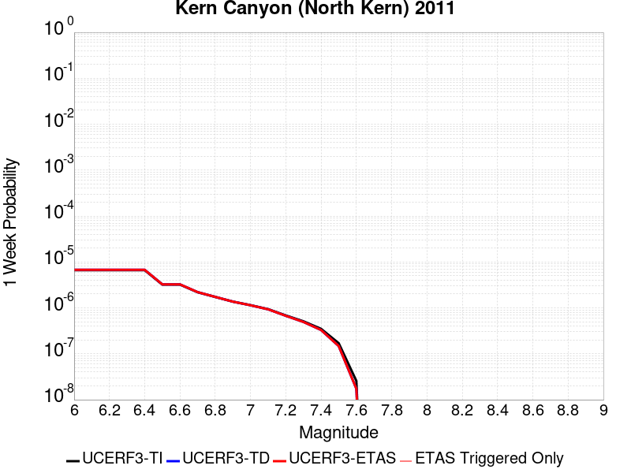 |  | 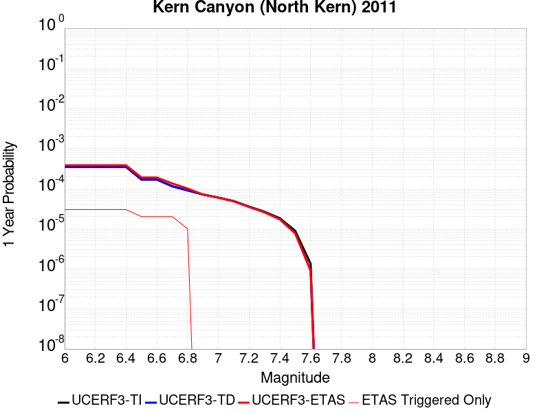 |  |

| Magnitude | 1 wk TI Prob | 1 wk TD Prob | 1 wk ETAS Prob | 1 wk ETAS/TD Gain | 1 wk ETAS Triggered Only | 1 mo TI Prob | 1 mo TD Prob | 1 mo ETAS Prob | 1 mo ETAS/TD Gain | 1 mo ETAS Triggered Only | 1 yr TI Prob | 1 yr TD Prob | 1 yr ETAS Prob | 1 yr ETAS/TD Gain | 1 yr ETAS Triggered Only | 10 yr TI Prob | 10 yr TD Prob | 10 yr ETAS Prob | 10 yr ETAS/TD Gain | 10 yr ETAS Triggered Only |
|-----|-----|-----|-----|-----|-----|-----|-----|-----|-----|-----|-----|-----|-----|-----|-----|-----|-----|-----|-----|-----|
| 6.0 | 6.6264497E-6 | 6.7573637E-6 | 6.7573637E-6 | 1.0 | 0.0 | 2.8398761E-5 | 2.8959854E-5 | 2.8959854E-5 | 1.0 | 0.0 | 3.4570007E-4 | 3.5253717E-4 | 3.825266E-4 | 1.0850674 | 3.0E-5 | 0.0034516277 | 0.0035205677 | 0.0035903214 | 1.0198132 | 7.0E-5 |
| 6.1 | 6.6264497E-6 | 6.7573637E-6 | 6.7573637E-6 | 1.0 | 0.0 | 2.8398761E-5 | 2.8959854E-5 | 2.8959854E-5 | 1.0 | 0.0 | 3.4570007E-4 | 3.5253717E-4 | 3.825266E-4 | 1.0850674 | 3.0E-5 | 0.0034516277 | 0.0035205677 | 0.0035903214 | 1.0198132 | 7.0E-5 |
| 6.2 | 6.6264497E-6 | 6.7573637E-6 | 6.7573637E-6 | 1.0 | 0.0 | 2.8398761E-5 | 2.8959854E-5 | 2.8959854E-5 | 1.0 | 0.0 | 3.4570007E-4 | 3.5253717E-4 | 3.825266E-4 | 1.0850674 | 3.0E-5 | 0.0034516277 | 0.0035205677 | 0.0035903214 | 1.0198132 | 7.0E-5 |
| 6.3 | 6.6264497E-6 | 6.7573637E-6 | 6.7573637E-6 | 1.0 | 0.0 | 2.8398761E-5 | 2.8959854E-5 | 2.8959854E-5 | 1.0 | 0.0 | 3.4570007E-4 | 3.5253717E-4 | 3.825266E-4 | 1.0850674 | 3.0E-5 | 0.0034516277 | 0.0035205677 | 0.0035903214 | 1.0198132 | 7.0E-5 |
| 6.4 | 6.6264497E-6 | 6.7573637E-6 | 6.7573637E-6 | 1.0 | 0.0 | 2.8398761E-5 | 2.8959854E-5 | 2.8959854E-5 | 1.0 | 0.0 | 3.4570007E-4 | 3.5253717E-4 | 3.825266E-4 | 1.0850674 | 3.0E-5 | 0.0034516277 | 0.0035205677 | 0.0035903214 | 1.0198132 | 7.0E-5 |
| 6.5 | 3.2162225E-6 | 3.2571058E-6 | 3.2571058E-6 | 1.0 | 0.0 | 1.3783738E-5 | 1.3958955E-5 | 1.3958955E-5 | 1.0 | 0.0 | 1.6780409E-4 | 1.6993783E-4 | 1.8993444E-4 | 1.11767 | 2.0E-5 | 0.0016767744 | 0.0016981584 | 0.0017380905 | 1.023515 | 4.0E-5 |
| 6.6 | 3.2162225E-6 | 3.2571058E-6 | 3.2571058E-6 | 1.0 | 0.0 | 1.3783738E-5 | 1.3958955E-5 | 1.3958955E-5 | 1.0 | 0.0 | 1.6780409E-4 | 1.6993783E-4 | 1.8993444E-4 | 1.11767 | 2.0E-5 | 0.0016767744 | 0.0016981584 | 0.0017380905 | 1.023515 | 4.0E-5 |
| 6.7 | 2.1908265E-6 | 2.2071313E-6 | 2.2071313E-6 | 1.0 | 0.0 | 9.389223E-6 | 9.459101E-6 | 9.459101E-6 | 1.0 | 0.0 | 1.1430779E-4 | 1.1515866E-4 | 1.3515636E-4 | 1.1736535 | 2.0E-5 | 0.0011424901 | 0.0011510093 | 0.0011809748 | 1.0260341 | 3.0E-5 |
| 6.8 | 1.7303895E-6 | 1.7365599E-6 | 1.7365599E-6 | 1.0 | 0.0 | 7.415934E-6 | 7.442379E-6 | 7.442379E-6 | 1.0 | 0.0 | 9.028525E-5 | 9.060729E-5 | 1.0060639E-4 | 1.1103565 | 1.0E-5 | 9.024858E-4 | 9.0571324E-4 | 9.256951E-4 | 1.0220621 | 2.0E-5 |
| 6.9 | 1.3700314E-6 | 1.3688676E-6 | 1.3688676E-6 | 1.0 | 0.0 | 5.87155E-6 | 5.866563E-6 | 5.866563E-6 | 1.0 | 0.0 | 7.148377E-5 | 7.142311E-5 | 7.142311E-5 | 1.0 | 0.0 | 7.146078E-4 | 7.140061E-4 | 7.2399894E-4 | 1.0139955 | 1.0E-5 |
| 7.0 | 1.1467797E-6 | 1.1413849E-6 | 1.1413849E-6 | 1.0 | 0.0 | 4.9147607E-6 | 4.891641E-6 | 4.891641E-6 | 1.0 | 0.0 | 5.983557E-5 | 5.955413E-5 | 5.955413E-5 | 1.0 | 0.0 | 5.981946E-4 | 5.9538486E-4 | 6.0537894E-4 | 1.0167859 | 1.0E-5 |
| 7.1 | 9.3952065E-7 | 9.3027273E-7 | 9.3027273E-7 | 1.0 | 0.0 | 4.026511E-6 | 3.9868773E-6 | 3.9868773E-6 | 1.0 | 0.0 | 4.9021666E-5 | 4.853917E-5 | 4.853917E-5 | 1.0 | 0.0 | 4.901085E-4 | 4.8528743E-4 | 4.8528743E-4 | 1.0 | 0.0 |
| 7.2 | 6.858055E-7 | 6.7193275E-7 | 6.7193275E-7 | 1.0 | 0.0 | 2.939163E-6 | 2.8797087E-6 | 2.8797087E-6 | 1.0 | 0.0 | 3.5783723E-5 | 3.50599E-5 | 3.50599E-5 | 1.0 | 0.0 | 3.5777962E-4 | 3.5054455E-4 | 3.5054455E-4 | 1.0 | 0.0 |
| 7.3 | 5.1101983E-7 | 4.93932E-7 | 4.93932E-7 | 1.0 | 0.0 | 2.1900833E-6 | 2.1168498E-6 | 2.1168498E-6 | 1.0 | 0.0 | 2.6663936E-5 | 2.5772348E-5 | 2.5772348E-5 | 1.0 | 0.0 | 2.6660739E-4 | 2.5769405E-4 | 2.5769405E-4 | 1.0 | 0.0 |
| 7.4 | 3.4999414E-7 | 3.2996047E-7 | 3.2996047E-7 | 1.0 | 0.0 | 1.499974E-6 | 1.4141156E-6 | 1.4141156E-6 | 1.0 | 0.0 | 1.8262032E-5 | 1.7216724E-5 | 1.7216724E-5 | 1.0 | 0.0 | 1.826053E-4 | 1.7215413E-4 | 1.7215413E-4 | 1.0 | 0.0 |
| 7.5 | 1.7021522E-7 | 1.4750117E-7 | 1.4750117E-7 | 1.0 | 0.0 | 7.2949354E-7 | 6.321477E-7 | 6.321477E-7 | 1.0 | 0.0 | 8.881548E-6 | 7.696372E-6 | 7.696372E-6 | 1.0 | 0.0 | 8.8811925E-5 | 7.6961136E-5 | 7.6961136E-5 | 1.0 | 0.0 |
| 7.6 | 2.572245E-8 | 1.7352685E-8 | 1.7352685E-8 | 1.0 | 0.0 | 1.10239064E-7 | 7.436864E-8 | 7.436864E-8 | 1.0 | 0.0 | 1.3421597E-6 | 9.054379E-7 | 9.054379E-7 | 1.0 | 0.0 | 1.3421517E-5 | 9.054348E-6 | 9.054348E-6 | 1.0 | 0.0 |

## Pisgah-Bullion Mtn-Mesquite Lk
*[(top)](#table-of-contents)*

| 1 Week | 1 Month | 1 Year | 10 Year |
|-----|-----|-----|-----|
|  |  |  |  |

| Magnitude | 1 wk TI Prob | 1 wk TD Prob | 1 wk ETAS Prob | 1 wk ETAS/TD Gain | 1 wk ETAS Triggered Only | 1 mo TI Prob | 1 mo TD Prob | 1 mo ETAS Prob | 1 mo ETAS/TD Gain | 1 mo ETAS Triggered Only | 1 yr TI Prob | 1 yr TD Prob | 1 yr ETAS Prob | 1 yr ETAS/TD Gain | 1 yr ETAS Triggered Only | 10 yr TI Prob | 10 yr TD Prob | 10 yr ETAS Prob | 10 yr ETAS/TD Gain | 10 yr ETAS Triggered Only |
|-----|-----|-----|-----|-----|-----|-----|-----|-----|-----|-----|-----|-----|-----|-----|-----|-----|-----|-----|-----|-----|
| 6.0 | 3.0240792E-5 | 2.4091714E-5 | 2.4091714E-5 | 1.0 | 0.0 | 1.2959696E-4 | 1.0324668E-4 | 1.2324462E-4 | 1.1936908 | 2.0E-5 | 0.0015767008 | 0.001256404 | 0.0012963538 | 1.0317969 | 4.0E-5 | 0.015655609 | 0.012503031 | 0.0125622805 | 1.0047388 | 6.0E-5 |
| 6.1 | 3.0240792E-5 | 2.4091714E-5 | 2.4091714E-5 | 1.0 | 0.0 | 1.2959696E-4 | 1.0324668E-4 | 1.2324462E-4 | 1.1936908 | 2.0E-5 | 0.0015767008 | 0.001256404 | 0.0012963538 | 1.0317969 | 4.0E-5 | 0.015655609 | 0.012503031 | 0.0125622805 | 1.0047388 | 6.0E-5 |
| 6.2 | 3.0240792E-5 | 2.4091714E-5 | 2.4091714E-5 | 1.0 | 0.0 | 1.2959696E-4 | 1.0324668E-4 | 1.2324462E-4 | 1.1936908 | 2.0E-5 | 0.0015767008 | 0.001256404 | 0.0012963538 | 1.0317969 | 4.0E-5 | 0.015655609 | 0.012503031 | 0.0125622805 | 1.0047388 | 6.0E-5 |
| 6.3 | 2.0498217E-5 | 1.363836E-5 | 1.363836E-5 | 1.0 | 0.0 | 8.784654E-5 | 5.8448895E-5 | 6.844831E-5 | 1.1710796 | 1.0E-5 | 0.0010690069 | 7.113992E-4 | 7.3138496E-4 | 1.0280936 | 2.0E-5 | 0.01063879 | 0.007092845 | 0.007122632 | 1.0041996 | 3.0E-5 |
| 6.4 | 2.0498217E-5 | 1.363836E-5 | 1.363836E-5 | 1.0 | 0.0 | 8.784654E-5 | 5.8448895E-5 | 6.844831E-5 | 1.1710796 | 1.0E-5 | 0.0010690069 | 7.113992E-4 | 7.3138496E-4 | 1.0280936 | 2.0E-5 | 0.01063879 | 0.007092845 | 0.007122632 | 1.0041996 | 3.0E-5 |
| 6.5 | 1.7316182E-5 | 1.0477254E-5 | 1.0477254E-5 | 1.0 | 0.0 | 7.42101E-5 | 4.4901804E-5 | 5.4901353E-5 | 1.2226982 | 1.0E-5 | 9.0313336E-4 | 5.465523E-4 | 5.5654685E-4 | 1.0182865 | 1.0E-5 | 0.008994718 | 0.005453077 | 0.005472968 | 1.0036477 | 2.0E-5 |
| 6.6 | 1.5251077E-5 | 8.414438E-6 | 8.414438E-6 | 1.0 | 0.0 | 6.536012E-5 | 3.6061418E-5 | 4.6061057E-5 | 1.2772946 | 1.0E-5 | 7.9546886E-4 | 4.3896653E-4 | 4.4896215E-4 | 1.0227708 | 1.0E-5 | 0.007926274 | 0.004381712 | 0.004401624 | 1.0045444 | 2.0E-5 |
| 6.7 | 1.2997425E-5 | 6.411617E-6 | 6.411617E-6 | 1.0 | 0.0 | 5.570206E-5 | 2.7478096E-5 | 3.747782E-5 | 1.3639163 | 1.0E-5 | 6.7796157E-4 | 3.344991E-4 | 3.4449575E-4 | 1.0298854 | 1.0E-5 | 0.0067589693 | 0.0033404164 | 0.0033603497 | 1.0059673 | 2.0E-5 |
| 6.8 | 1.035386E-5 | 4.3333193E-6 | 4.3333193E-6 | 1.0 | 0.0 | 4.437293E-5 | 1.8571242E-5 | 2.8571056E-5 | 1.538457 | 1.0E-5 | 5.401065E-4 | 2.2608227E-4 | 2.3608001E-4 | 1.0442216 | 1.0E-5 | 0.0053879567 | 0.0022586095 | 0.0022785643 | 1.008835 | 2.0E-5 |
| 6.9 | 8.816252E-6 | 3.5807232E-6 | 3.5807232E-6 | 1.0 | 0.0 | 3.778339E-5 | 1.534587E-5 | 2.5345716E-5 | 1.6516311 | 1.0E-5 | 4.5991567E-4 | 1.8682053E-4 | 1.9681866E-4 | 1.0535173 | 1.0E-5 | 0.00458965 | 0.0018666931 | 0.0018866558 | 1.0106941 | 2.0E-5 |
| 7.0 | 6.8232207E-6 | 2.5676493E-6 | 2.5676493E-6 | 1.0 | 0.0 | 2.9242048E-5 | 1.10041665E-5 | 1.10041665E-5 | 1.0 | 0.0 | 3.5596377E-4 | 1.3396781E-4 | 1.3396781E-4 | 1.0 | 0.0 | 0.0035539411 | 0.0013389016 | 0.0013488882 | 1.0074588 | 1.0E-5 |
| 7.1 | 5.837013E-6 | 2.227436E-6 | 2.227436E-6 | 1.0 | 0.0 | 2.501553E-5 | 9.546121E-6 | 9.546121E-6 | 1.0 | 0.0 | 3.045215E-4 | 1.1621812E-4 | 1.1621812E-4 | 1.0 | 0.0 | 0.0030410455 | 0.0011616024 | 0.0011715909 | 1.0085988 | 1.0E-5 |
| 7.2 | 4.278052E-6 | 1.627611E-6 | 1.627611E-6 | 1.0 | 0.0 | 1.833438E-5 | 6.9754587E-6 | 6.9754587E-6 | 1.0 | 0.0 | 2.231982E-4 | 8.492314E-5 | 8.492314E-5 | 1.0 | 0.0 | 0.0022297418 | 8.4893004E-4 | 8.5892156E-4 | 1.0117695 | 1.0E-5 |
| 7.3 | 1.8803692E-6 | 8.345103E-7 | 8.345103E-7 | 1.0 | 0.0 | 8.0587E-6 | 3.5764685E-6 | 3.5764685E-6 | 1.0 | 0.0 | 9.811026E-5 | 4.3542783E-5 | 4.3542783E-5 | 1.0 | 0.0 | 9.806695E-4 | 4.3535698E-4 | 4.3535698E-4 | 1.0 | 0.0 |

## Independence rev 2011
*[(top)](#table-of-contents)*

| 1 Week | 1 Month | 1 Year | 10 Year |
|-----|-----|-----|-----|
| 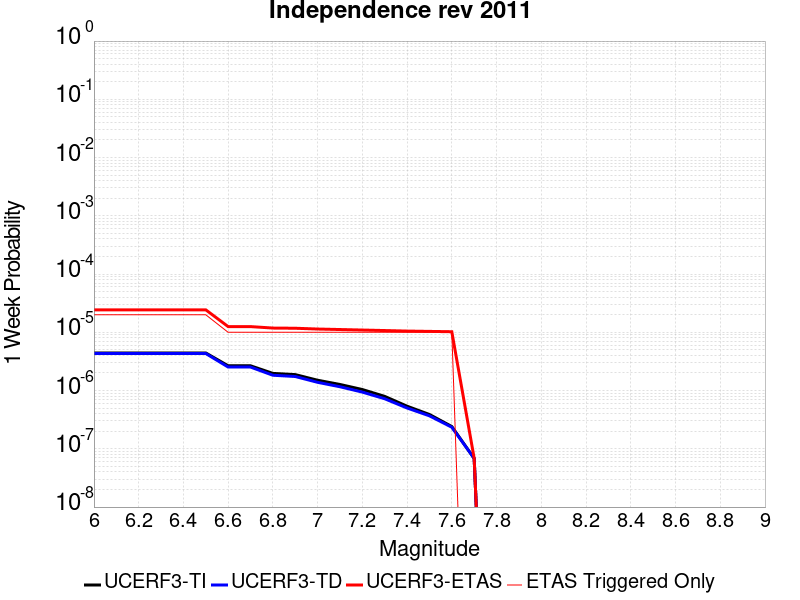 |  |  | 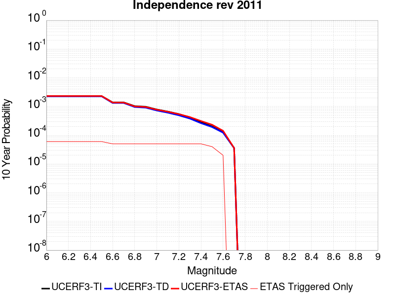 |

| Magnitude | 1 wk TI Prob | 1 wk TD Prob | 1 wk ETAS Prob | 1 wk ETAS/TD Gain | 1 wk ETAS Triggered Only | 1 mo TI Prob | 1 mo TD Prob | 1 mo ETAS Prob | 1 mo ETAS/TD Gain | 1 mo ETAS Triggered Only | 1 yr TI Prob | 1 yr TD Prob | 1 yr ETAS Prob | 1 yr ETAS/TD Gain | 1 yr ETAS Triggered Only | 10 yr TI Prob | 10 yr TD Prob | 10 yr ETAS Prob | 10 yr ETAS/TD Gain | 10 yr ETAS Triggered Only |
|-----|-----|-----|-----|-----|-----|-----|-----|-----|-----|-----|-----|-----|-----|-----|-----|-----|-----|-----|-----|-----|
| 6.0 | 4.422171E-6 | 4.3262557E-6 | 2.432617E-5 | 5.6229153 | 2.0E-5 | 1.8952025E-5 | 1.854098E-5 | 3.854061E-5 | 2.0786715 | 2.0E-5 | 2.3071647E-4 | 2.2571605E-4 | 2.5570928E-4 | 1.1328803 | 3.0E-5 | 0.0023047708 | 0.0022551615 | 0.0023150262 | 1.0265456 | 6.0E-5 |
| 6.1 | 4.422171E-6 | 4.3262557E-6 | 2.432617E-5 | 5.6229153 | 2.0E-5 | 1.8952025E-5 | 1.854098E-5 | 3.854061E-5 | 2.0786715 | 2.0E-5 | 2.3071647E-4 | 2.2571605E-4 | 2.5570928E-4 | 1.1328803 | 3.0E-5 | 0.0023047708 | 0.0022551615 | 0.0023150262 | 1.0265456 | 6.0E-5 |
| 6.2 | 4.422171E-6 | 4.3262557E-6 | 2.432617E-5 | 5.6229153 | 2.0E-5 | 1.8952025E-5 | 1.854098E-5 | 3.854061E-5 | 2.0786715 | 2.0E-5 | 2.3071647E-4 | 2.2571605E-4 | 2.5570928E-4 | 1.1328803 | 3.0E-5 | 0.0023047708 | 0.0022551615 | 0.0023150262 | 1.0265456 | 6.0E-5 |
| 6.3 | 4.422171E-6 | 4.3262557E-6 | 2.432617E-5 | 5.6229153 | 2.0E-5 | 1.8952025E-5 | 1.854098E-5 | 3.854061E-5 | 2.0786715 | 2.0E-5 | 2.3071647E-4 | 2.2571605E-4 | 2.5570928E-4 | 1.1328803 | 3.0E-5 | 0.0023047708 | 0.0022551615 | 0.0023150262 | 1.0265456 | 6.0E-5 |
| 6.4 | 4.422171E-6 | 4.3262557E-6 | 2.432617E-5 | 5.6229153 | 2.0E-5 | 1.8952025E-5 | 1.854098E-5 | 3.854061E-5 | 2.0786715 | 2.0E-5 | 2.3071647E-4 | 2.2571605E-4 | 2.5570928E-4 | 1.1328803 | 3.0E-5 | 0.0023047708 | 0.0022551615 | 0.0023150262 | 1.0265456 | 6.0E-5 |
| 6.5 | 4.422171E-6 | 4.3262557E-6 | 2.432617E-5 | 5.6229153 | 2.0E-5 | 1.8952025E-5 | 1.854098E-5 | 3.854061E-5 | 2.0786715 | 2.0E-5 | 2.3071647E-4 | 2.2571605E-4 | 2.5570928E-4 | 1.1328803 | 3.0E-5 | 0.0023047708 | 0.0022551615 | 0.0023150262 | 1.0265456 | 6.0E-5 |
| 6.6 | 2.663744E-6 | 2.5320073E-6 | 1.2531982E-5 | 4.9494257 | 1.0E-5 | 1.1415996E-5 | 1.0851418E-5 | 2.0851308E-5 | 1.9215286 | 1.0E-5 | 1.3898089E-4 | 1.3210849E-4 | 1.5210584E-4 | 1.1513708 | 2.0E-5 | 0.0013889399 | 0.0013203478 | 0.0013702818 | 1.0378188 | 5.0E-5 |
| 6.7 | 2.663744E-6 | 2.5320073E-6 | 1.2531982E-5 | 4.9494257 | 1.0E-5 | 1.1415996E-5 | 1.0851418E-5 | 2.0851308E-5 | 1.9215286 | 1.0E-5 | 1.3898089E-4 | 1.3210849E-4 | 1.5210584E-4 | 1.1513708 | 2.0E-5 | 0.0013889399 | 0.0013203478 | 0.0013702818 | 1.0378188 | 5.0E-5 |
| 6.8 | 1.9716529E-6 | 1.8322766E-6 | 1.1832258E-5 | 6.4576817 | 1.0E-5 | 8.449913E-6 | 7.852591E-6 | 1.7852512E-5 | 2.2734551 | 1.0E-5 | 1.0287284E-4 | 9.560123E-5 | 1.15599316E-4 | 1.2091824 | 2.0E-5 | 0.0010282523 | 9.556139E-4 | 0.0010055661 | 1.0522724 | 5.0E-5 |
| 6.9 | 1.8788617E-6 | 1.7430167E-6 | 1.1742999E-5 | 6.7371697 | 1.0E-5 | 8.0522395E-6 | 7.4700506E-6 | 1.7469976E-5 | 2.338669 | 1.0E-5 | 9.80316E-5 | 9.0944195E-5 | 1.10942376E-4 | 1.2198951 | 2.0E-5 | 9.798837E-4 | 9.090818E-4 | 9.5903635E-4 | 1.0549506 | 5.0E-5 |
| 7.0 | 1.5045488E-6 | 1.3849648E-6 | 1.1384951E-5 | 8.22039 | 1.0E-5 | 6.44805E-6 | 5.9355502E-6 | 1.5935491E-5 | 2.684754 | 1.0E-5 | 7.8502184E-5 | 7.226298E-5 | 9.226153E-5 | 1.2767469 | 2.0E-5 | 7.8474457E-4 | 7.223999E-4 | 7.723638E-4 | 1.0691637 | 5.0E-5 |
| 7.1 | 1.272341E-6 | 1.1625223E-6 | 1.116251E-5 | 9.601976 | 1.0E-5 | 5.4528787E-6 | 4.982229E-6 | 1.4982179E-5 | 3.007124 | 1.0E-5 | 6.6386776E-5 | 6.0656977E-5 | 8.0655765E-5 | 1.329703 | 2.0E-5 | 6.636695E-4 | 6.064074E-4 | 6.563771E-4 | 1.0824028 | 5.0E-5 |
| 7.2 | 1.0416892E-6 | 9.4099886E-7 | 1.0940989E-5 | 11.626996 | 1.0E-5 | 4.464375E-6 | 4.032846E-6 | 1.4032806E-5 | 3.4796283 | 1.0E-5 | 5.4352407E-5 | 4.9098813E-5 | 6.9097834E-5 | 1.4073218 | 2.0E-5 | 5.4339116E-4 | 4.908815E-4 | 5.4085697E-4 | 1.1018076 | 5.0E-5 |
| 7.3 | 7.9450155E-7 | 7.2350826E-7 | 1.0723501E-5 | 14.821532 | 1.0E-5 | 3.4050022E-6 | 3.100746E-6 | 1.31007155E-5 | 4.2250204 | 1.0E-5 | 4.1455114E-5 | 3.7750942E-5 | 5.7750185E-5 | 1.5297681 | 2.0E-5 | 4.144738E-4 | 3.7744638E-4 | 4.2742753E-4 | 1.1324191 | 5.0E-5 |
| 7.4 | 5.3893444E-7 | 5.0195626E-7 | 1.0501951E-5 | 20.922045 | 1.0E-5 | 2.309717E-6 | 2.1512394E-6 | 1.2151218E-5 | 5.6484733 | 1.0E-5 | 2.8120441E-5 | 2.6191028E-5 | 4.6190504E-5 | 1.7636002 | 2.0E-5 | 2.8116882E-4 | 2.6187988E-4 | 3.1186678E-4 | 1.1908772 | 5.0E-5 |
| 7.5 | 3.8852085E-7 | 3.6825867E-7 | 1.0368255E-5 | 28.154816 | 1.0E-5 | 1.6650882E-6 | 1.5782506E-6 | 1.1578235E-5 | 7.3361197 | 1.0E-5 | 2.027226E-5 | 1.9215033E-5 | 3.921465E-5 | 2.0408318 | 2.0E-5 | 2.0270412E-4 | 1.9213393E-4 | 2.3212624E-4 | 1.2081481 | 4.0E-5 |
| 7.6 | 2.414929E-7 | 2.3457721E-7 | 1.0234575E-5 | 43.629875 | 1.0E-5 | 1.0349692E-6 | 1.0053305E-6 | 1.1005321E-5 | 10.946967 | 1.0E-5 | 1.2600677E-5 | 1.2239832E-5 | 3.2239586E-5 | 2.6339893 | 2.0E-5 | 1.2599962E-4 | 1.223917E-4 | 1.4238925E-4 | 1.1633898 | 2.0E-5 |
| 7.7 | 6.8298014E-8 | 6.8590055E-8 | 6.8590055E-8 | 1.0 | 0.0 | 2.9270575E-7 | 2.9395736E-7 | 2.9395736E-7 | 1.0 | 0.0 | 3.5636867E-6 | 3.5789255E-6 | 3.5789255E-6 | 1.0 | 0.0 | 3.5636294E-5 | 3.5788726E-5 | 3.5788726E-5 | 1.0 | 0.0 |

## Lost Hills
*[(top)](#table-of-contents)*

| 1 Week | 1 Month | 1 Year | 10 Year |
|-----|-----|-----|-----|
|  | 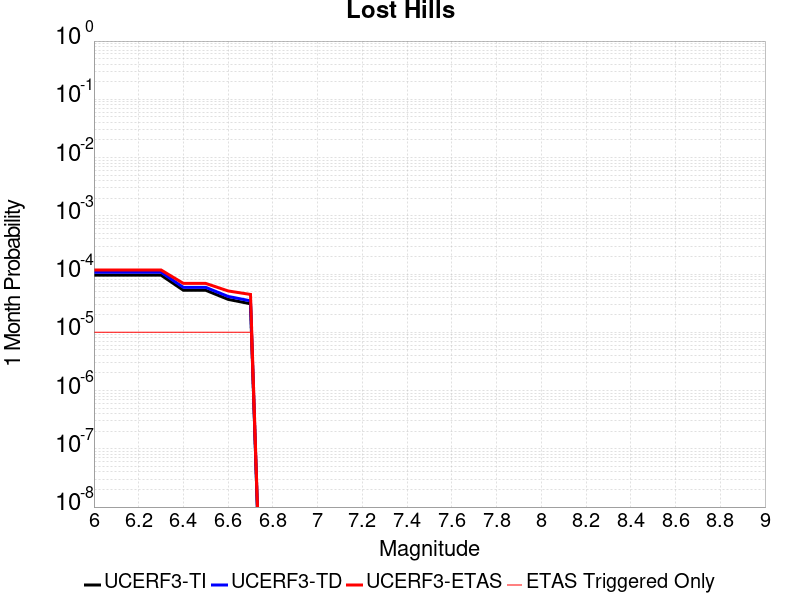 |  |  |

| Magnitude | 1 wk TI Prob | 1 wk TD Prob | 1 wk ETAS Prob | 1 wk ETAS/TD Gain | 1 wk ETAS Triggered Only | 1 mo TI Prob | 1 mo TD Prob | 1 mo ETAS Prob | 1 mo ETAS/TD Gain | 1 mo ETAS Triggered Only | 1 yr TI Prob | 1 yr TD Prob | 1 yr ETAS Prob | 1 yr ETAS/TD Gain | 1 yr ETAS Triggered Only | 10 yr TI Prob | 10 yr TD Prob | 10 yr ETAS Prob | 10 yr ETAS/TD Gain | 10 yr ETAS Triggered Only |
|-----|-----|-----|-----|-----|-----|-----|-----|-----|-----|-----|-----|-----|-----|-----|-----|-----|-----|-----|-----|-----|
| 6.0 | 2.233523E-5 | 2.5107232E-5 | 3.510698E-5 | 1.3982816 | 1.0E-5 | 9.571891E-5 | 1.07598935E-4 | 1.17597854E-4 | 1.0929277 | 1.0E-5 | 0.0011647546 | 0.0013093979 | 0.0013293717 | 1.0152541 | 2.0E-5 | 0.011586686 | 0.013033426 | 0.013092644 | 1.0045435 | 6.0E-5 |
| 6.1 | 2.233523E-5 | 2.5107232E-5 | 3.510698E-5 | 1.3982816 | 1.0E-5 | 9.571891E-5 | 1.07598935E-4 | 1.17597854E-4 | 1.0929277 | 1.0E-5 | 0.0011647546 | 0.0013093979 | 0.0013293717 | 1.0152541 | 2.0E-5 | 0.011586686 | 0.013033426 | 0.013092644 | 1.0045435 | 6.0E-5 |
| 6.2 | 2.233523E-5 | 2.5107232E-5 | 3.510698E-5 | 1.3982816 | 1.0E-5 | 9.571891E-5 | 1.07598935E-4 | 1.17597854E-4 | 1.0929277 | 1.0E-5 | 0.0011647546 | 0.0013093979 | 0.0013293717 | 1.0152541 | 2.0E-5 | 0.011586686 | 0.013033426 | 0.013092644 | 1.0045435 | 6.0E-5 |
| 6.3 | 2.233523E-5 | 2.5107232E-5 | 3.510698E-5 | 1.3982816 | 1.0E-5 | 9.571891E-5 | 1.07598935E-4 | 1.17597854E-4 | 1.0929277 | 1.0E-5 | 0.0011647546 | 0.0013093979 | 0.0013293717 | 1.0152541 | 2.0E-5 | 0.011586686 | 0.013033426 | 0.013092644 | 1.0045435 | 6.0E-5 |
| 6.4 | 1.2288092E-5 | 1.3781456E-5 | 2.3781318E-5 | 1.7256027 | 1.0E-5 | 5.2662188E-5 | 5.9062575E-5 | 6.9061985E-5 | 1.169302 | 1.0E-5 | 6.409735E-4 | 7.189434E-4 | 7.289362E-4 | 1.0138993 | 1.0E-5 | 0.006391279 | 0.007175382 | 0.007205167 | 1.004151 | 3.0E-5 |
| 6.5 | 1.2288092E-5 | 1.3781456E-5 | 2.3781318E-5 | 1.7256027 | 1.0E-5 | 5.2662188E-5 | 5.9062575E-5 | 6.9061985E-5 | 1.169302 | 1.0E-5 | 6.409735E-4 | 7.189434E-4 | 7.289362E-4 | 1.0138993 | 1.0E-5 | 0.006391279 | 0.007175382 | 0.007205167 | 1.004151 | 3.0E-5 |
| 6.6 | 8.58281E-6 | 9.634015E-6 | 1.9633919E-5 | 2.0379786 | 1.0E-5 | 3.6782953E-5 | 4.1288455E-5 | 5.1288043E-5 | 1.2421885 | 1.0E-5 | 4.4774043E-4 | 5.026542E-4 | 5.126492E-4 | 1.0198843 | 1.0E-5 | 0.0044683935 | 0.0050233332 | 0.005043233 | 1.0039614 | 2.0E-5 |
| 6.7 | 7.205685E-6 | 8.088508E-6 | 1.8088427E-5 | 2.236312 | 1.0E-5 | 3.088114E-5 | 3.4665034E-5 | 4.4664688E-5 | 1.2884651 | 1.0E-5 | 3.7591302E-4 | 4.220468E-4 | 4.3204258E-4 | 1.023684 | 1.0E-5 | 0.0037527776 | 0.004220468 | 0.0042304257 | 1.0023594 | 1.0E-5 |

## San Jacinto (Lytle Creek connector)
*[(top)](#table-of-contents)*

| 1 Week | 1 Month | 1 Year | 10 Year |
|-----|-----|-----|-----|
| 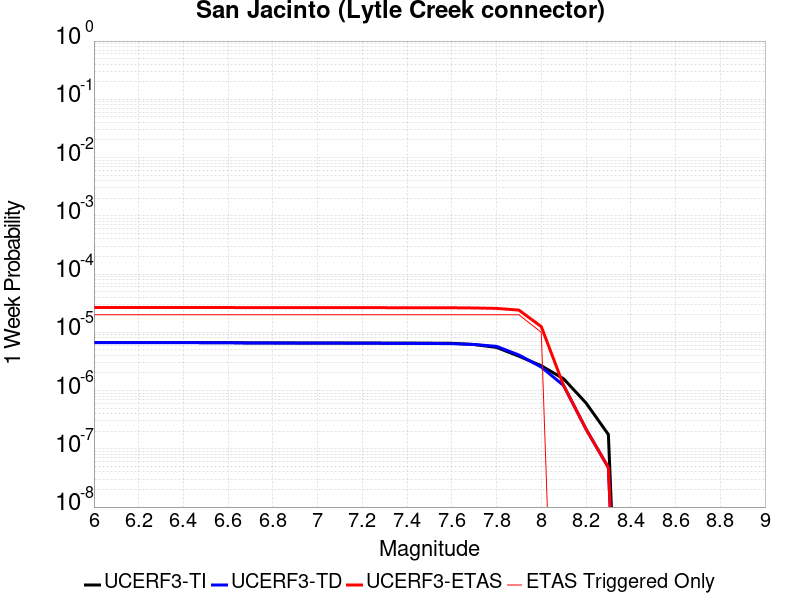 | 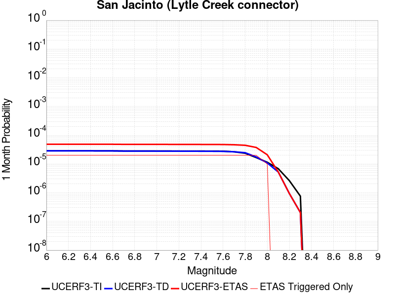 |  | 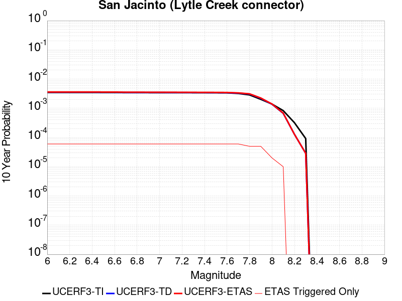 |

| Magnitude | 1 wk TI Prob | 1 wk TD Prob | 1 wk ETAS Prob | 1 wk ETAS/TD Gain | 1 wk ETAS Triggered Only | 1 mo TI Prob | 1 mo TD Prob | 1 mo ETAS Prob | 1 mo ETAS/TD Gain | 1 mo ETAS Triggered Only | 1 yr TI Prob | 1 yr TD Prob | 1 yr ETAS Prob | 1 yr ETAS/TD Gain | 1 yr ETAS Triggered Only | 10 yr TI Prob | 10 yr TD Prob | 10 yr ETAS Prob | 10 yr ETAS/TD Gain | 10 yr ETAS Triggered Only |
|-----|-----|-----|-----|-----|-----|-----|-----|-----|-----|-----|-----|-----|-----|-----|-----|-----|-----|-----|-----|-----|
| 6.0 | 6.693995E-6 | 6.664499E-6 | 2.6664366E-5 | 4.0009556 | 2.0E-5 | 2.8688235E-5 | 2.8561826E-5 | 4.8561255E-5 | 1.7002153 | 2.0E-5 | 3.492233E-4 | 3.4768484E-4 | 3.9766743E-4 | 1.1437584 | 5.0E-5 | 0.00348675 | 0.0035516098 | 0.0036113968 | 1.0168338 | 6.0E-5 |
| 6.1 | 6.693995E-6 | 6.664499E-6 | 2.6664366E-5 | 4.0009556 | 2.0E-5 | 2.8688235E-5 | 2.8561826E-5 | 4.8561255E-5 | 1.7002153 | 2.0E-5 | 3.492233E-4 | 3.4768484E-4 | 3.9766743E-4 | 1.1437584 | 5.0E-5 | 0.00348675 | 0.0035516098 | 0.0036113968 | 1.0168338 | 6.0E-5 |
| 6.2 | 6.693995E-6 | 6.664499E-6 | 2.6664366E-5 | 4.0009556 | 2.0E-5 | 2.8688235E-5 | 2.8561826E-5 | 4.8561255E-5 | 1.7002153 | 2.0E-5 | 3.492233E-4 | 3.4768484E-4 | 3.9766743E-4 | 1.1437584 | 5.0E-5 | 0.00348675 | 0.0035516098 | 0.0036113968 | 1.0168338 | 6.0E-5 |
| 6.3 | 6.693995E-6 | 6.664499E-6 | 2.6664366E-5 | 4.0009556 | 2.0E-5 | 2.8688235E-5 | 2.8561826E-5 | 4.8561255E-5 | 1.7002153 | 2.0E-5 | 3.492233E-4 | 3.4768484E-4 | 3.9766743E-4 | 1.1437584 | 5.0E-5 | 0.00348675 | 0.0035516098 | 0.0036113968 | 1.0168338 | 6.0E-5 |
| 6.4 | 6.693995E-6 | 6.664499E-6 | 2.6664366E-5 | 4.0009556 | 2.0E-5 | 2.8688235E-5 | 2.8561826E-5 | 4.8561255E-5 | 1.7002153 | 2.0E-5 | 3.492233E-4 | 3.4768484E-4 | 3.9766743E-4 | 1.1437584 | 5.0E-5 | 0.00348675 | 0.0035516098 | 0.0036113968 | 1.0168338 | 6.0E-5 |
| 6.5 | 6.6561875E-6 | 6.6247167E-6 | 2.6624584E-5 | 4.018977 | 2.0E-5 | 2.8526205E-5 | 2.8391334E-5 | 4.8390768E-5 | 1.7044203 | 2.0E-5 | 3.472512E-4 | 3.4560973E-4 | 3.9559248E-4 | 1.1446218 | 5.0E-5 | 0.0034670907 | 0.0035309251 | 0.0035907133 | 1.0169327 | 6.0E-5 |
| 6.6 | 6.6561875E-6 | 6.6247167E-6 | 2.6624584E-5 | 4.018977 | 2.0E-5 | 2.8526205E-5 | 2.8391334E-5 | 4.8390768E-5 | 1.7044203 | 2.0E-5 | 3.472512E-4 | 3.4560973E-4 | 3.9559248E-4 | 1.1446218 | 5.0E-5 | 0.0034670907 | 0.0035309251 | 0.0035907133 | 1.0169327 | 6.0E-5 |
| 6.7 | 6.5802237E-6 | 6.5438926E-6 | 2.6543761E-5 | 4.056265 | 2.0E-5 | 2.8200653E-5 | 2.8044951E-5 | 4.8044392E-5 | 1.7131208 | 2.0E-5 | 3.4328885E-4 | 3.4139387E-4 | 3.913768E-4 | 1.1464084 | 5.0E-5 | 0.0034275902 | 0.0034888992 | 0.00354869 | 1.0171374 | 6.0E-5 |
| 6.8 | 6.575632E-6 | 6.538382E-6 | 2.6538251E-5 | 4.0588408 | 2.0E-5 | 2.8180975E-5 | 2.8021335E-5 | 4.8020775E-5 | 1.7137219 | 2.0E-5 | 3.4304935E-4 | 3.4110644E-4 | 3.910894E-4 | 1.1465318 | 5.0E-5 | 0.0034252026 | 0.0034860338 | 0.0035458247 | 1.0171516 | 6.0E-5 |
| 6.9 | 6.570433E-6 | 6.5297754E-6 | 2.6529644E-5 | 4.0628724 | 2.0E-5 | 2.8158694E-5 | 2.7984452E-5 | 4.7983893E-5 | 1.7146626 | 2.0E-5 | 3.4277816E-4 | 3.406575E-4 | 3.9064046E-4 | 1.1467249 | 5.0E-5 | 0.0034224992 | 0.0034815588 | 0.00354135 | 1.0171736 | 6.0E-5 |
| 7.0 | 6.5643826E-6 | 6.5198956E-6 | 2.6519765E-5 | 4.067514 | 2.0E-5 | 2.8132765E-5 | 2.7942111E-5 | 4.7941554E-5 | 1.7157456 | 2.0E-5 | 3.424626E-4 | 3.4014217E-4 | 3.9012518E-4 | 1.1469474 | 5.0E-5 | 0.0034193532 | 0.0034764216 | 0.003536213 | 1.0171992 | 6.0E-5 |
| 7.1 | 6.557402E-6 | 6.508607E-6 | 2.6508476E-5 | 4.072834 | 2.0E-5 | 2.8102848E-5 | 2.7893731E-5 | 4.7893172E-5 | 1.716987 | 2.0E-5 | 3.4209844E-4 | 3.3955334E-4 | 3.8953635E-4 | 1.1472023 | 5.0E-5 | 0.0034157229 | 0.0034705526 | 0.0035303442 | 1.0172284 | 6.0E-5 |
| 7.2 | 6.546394E-6 | 6.490572E-6 | 2.6490443E-5 | 4.0813723 | 2.0E-5 | 2.8055672E-5 | 2.781644E-5 | 4.7815884E-5 | 1.7189792 | 2.0E-5 | 3.4152428E-4 | 3.3861262E-4 | 3.8859568E-4 | 1.1476114 | 5.0E-5 | 0.0034099987 | 0.003461179 | 0.0035209714 | 1.0172751 | 6.0E-5 |
| 7.3 | 6.5364216E-6 | 6.4713554E-6 | 2.6471225E-5 | 4.090523 | 2.0E-5 | 2.8012933E-5 | 2.7734086E-5 | 4.773353E-5 | 1.7211143 | 2.0E-5 | 3.4100408E-4 | 3.3761025E-4 | 3.8759338E-4 | 1.1480498 | 5.0E-5 | 0.003404813 | 0.0034511995 | 0.0035109923 | 1.0173253 | 6.0E-5 |
| 7.4 | 6.5269523E-6 | 6.4524393E-6 | 2.645231E-5 | 4.099583 | 2.0E-5 | 2.7972354E-5 | 2.7653019E-5 | 4.7652466E-5 | 1.7232283 | 2.0E-5 | 3.4051016E-4 | 3.3662358E-4 | 3.8660673E-4 | 1.1484839 | 5.0E-5 | 0.0033998888 | 0.00344138 | 0.0035011736 | 1.0173749 | 6.0E-5 |
| 7.5 | 6.5111835E-6 | 6.4287105E-6 | 2.642858E-5 | 4.111024 | 2.0E-5 | 2.7904773E-5 | 2.7551325E-5 | 4.7550773E-5 | 1.7258979 | 2.0E-5 | 3.3968766E-4 | 3.3538582E-4 | 3.8536906E-4 | 1.149032 | 5.0E-5 | 0.0033916887 | 0.0034290515 | 0.0034888457 | 1.0174376 | 6.0E-5 |
| 7.6 | 6.4768806E-6 | 6.3878147E-6 | 2.6387686E-5 | 4.1309414 | 2.0E-5 | 2.7757764E-5 | 2.7376062E-5 | 4.7375514E-5 | 1.7305453 | 2.0E-5 | 3.3789838E-4 | 3.3325262E-4 | 3.8323598E-4 | 1.1499863 | 5.0E-5 | 0.0033738504 | 0.003407781 | 0.0034675766 | 1.0175468 | 6.0E-5 |
| 7.7 | 6.1655364E-6 | 6.1802666E-6 | 2.6180143E-5 | 4.2360864 | 2.0E-5 | 2.642346E-5 | 2.6486587E-5 | 4.6486057E-5 | 1.7550792 | 2.0E-5 | 3.2165812E-4 | 3.2242655E-4 | 3.7241043E-4 | 1.155024 | 5.0E-5 | 0.0032119295 | 0.003299379 | 0.003359181 | 1.0181253 | 6.0E-5 |
| 7.8 | 5.5043524E-6 | 5.741209E-6 | 2.5741094E-5 | 4.4835668 | 2.0E-5 | 2.3589868E-5 | 2.460495E-5 | 4.4604458E-5 | 1.8128246 | 2.0E-5 | 2.871688E-4 | 2.9952414E-4 | 3.3951216E-4 | 1.1335051 | 4.0E-5 | 0.0028679797 | 0.0030694199 | 0.0031192664 | 1.0162398 | 5.0E-5 |
| 7.9 | 3.889249E-6 | 4.080121E-6 | 2.408004E-5 | 5.9017954 | 2.0E-5 | 1.6668104E-5 | 1.7486116E-5 | 3.7485766E-5 | 2.1437445 | 2.0E-5 | 2.0291525E-4 | 2.128727E-4 | 2.528642E-4 | 1.1878657 | 4.0E-5 | 0.0020273007 | 0.0021960873 | 0.0022459773 | 1.0227177 | 5.0E-5 |
| 8.0 | 2.668535E-6 | 2.533826E-6 | 1.2533801E-5 | 4.946591 | 1.0E-5 | 1.1436528E-5 | 1.0859209E-5 | 2.0859101E-5 | 1.9208673 | 1.0E-5 | 1.3923083E-4 | 1.3220288E-4 | 1.4220156E-4 | 1.0756313 | 1.0E-5 | 0.0013914363 | 0.0013770194 | 0.0013969919 | 1.0145041 | 2.0E-5 |
| 8.1 | 1.5911459E-6 | 1.2199117E-6 | 1.2199117E-6 | 1.0 | 0.0 | 6.8191785E-6 | 5.2281825E-6 | 5.2281825E-6 | 1.0 | 0.0 | 8.3020335E-5 | 6.3651285E-5 | 6.3651285E-5 | 1.0 | 0.0 | 8.298933E-4 | 6.699943E-4 | 6.799876E-4 | 1.0149155 | 1.0E-5 |
| 8.2 | 6.1294963E-7 | 2.18485E-7 | 2.18485E-7 | 1.0 | 0.0 | 2.6269242E-6 | 9.3636396E-7 | 9.3636396E-7 | 1.0 | 0.0 | 3.1982334E-5 | 1.1400171E-5 | 1.1400171E-5 | 1.0 | 0.0 | 3.1977732E-4 | 1.2804895E-4 | 1.2804895E-4 | 1.0 | 0.0 |
| 8.3 | 1.762871E-7 | 4.7637663E-8 | 4.7637663E-8 | 1.0 | 0.0 | 7.5551594E-7 | 2.041614E-7 | 2.041614E-7 | 1.0 | 0.0 | 9.1983675E-6 | 2.4856622E-6 | 2.4856622E-6 | 1.0 | 0.0 | 9.197987E-5 | 2.8739665E-5 | 2.8739665E-5 | 1.0 | 0.0 |

## Bullion Mountains
*[(top)](#table-of-contents)*

| 1 Week | 1 Month | 1 Year | 10 Year |
|-----|-----|-----|-----|
|  |  | 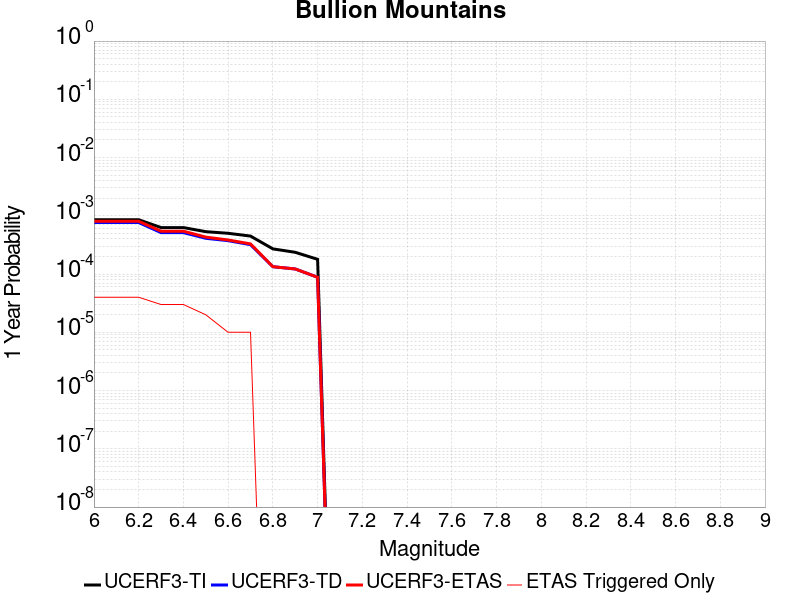 |  |

| Magnitude | 1 wk TI Prob | 1 wk TD Prob | 1 wk ETAS Prob | 1 wk ETAS/TD Gain | 1 wk ETAS Triggered Only | 1 mo TI Prob | 1 mo TD Prob | 1 mo ETAS Prob | 1 mo ETAS/TD Gain | 1 mo ETAS Triggered Only | 1 yr TI Prob | 1 yr TD Prob | 1 yr ETAS Prob | 1 yr ETAS/TD Gain | 1 yr ETAS Triggered Only | 10 yr TI Prob | 10 yr TD Prob | 10 yr ETAS Prob | 10 yr ETAS/TD Gain | 10 yr ETAS Triggered Only |
|-----|-----|-----|-----|-----|-----|-----|-----|-----|-----|-----|-----|-----|-----|-----|-----|-----|-----|-----|-----|-----|
| 6.0 | 1.6420427E-5 | 1.4692429E-5 | 2.4692283E-5 | 1.6806127 | 1.0E-5 | 7.037136E-5 | 6.296625E-5 | 8.2964994E-5 | 1.3176105 | 2.0E-5 | 8.5643446E-4 | 7.6638284E-4 | 8.063522E-4 | 1.0521532 | 4.0E-5 | 0.008531413 | 0.0076411925 | 0.007700734 | 1.0077922 | 6.0E-5 |
| 6.1 | 1.6420427E-5 | 1.4692429E-5 | 2.4692283E-5 | 1.6806127 | 1.0E-5 | 7.037136E-5 | 6.296625E-5 | 8.2964994E-5 | 1.3176105 | 2.0E-5 | 8.5643446E-4 | 7.6638284E-4 | 8.063522E-4 | 1.0521532 | 4.0E-5 | 0.008531413 | 0.0076411925 | 0.007700734 | 1.0077922 | 6.0E-5 |
| 6.2 | 1.6420427E-5 | 1.4692429E-5 | 2.4692283E-5 | 1.6806127 | 1.0E-5 | 7.037136E-5 | 6.296625E-5 | 8.2964994E-5 | 1.3176105 | 2.0E-5 | 8.5643446E-4 | 7.6638284E-4 | 8.063522E-4 | 1.0521532 | 4.0E-5 | 0.008531413 | 0.0076411925 | 0.007700734 | 1.0077922 | 6.0E-5 |
| 6.3 | 1.2046778E-5 | 9.862571E-6 | 1.9862471E-5 | 2.0139246 | 1.0E-5 | 5.1628023E-5 | 4.2267602E-5 | 6.226676E-5 | 1.4731556 | 2.0E-5 | 6.283899E-4 | 5.1450974E-4 | 5.444943E-4 | 1.058278 | 3.0E-5 | 0.0062661595 | 0.0051354673 | 0.0051752618 | 1.007749 | 4.0E-5 |
| 6.4 | 1.2046778E-5 | 9.862571E-6 | 1.9862471E-5 | 2.0139246 | 1.0E-5 | 5.1628023E-5 | 4.2267602E-5 | 6.226676E-5 | 1.4731556 | 2.0E-5 | 6.283899E-4 | 5.1450974E-4 | 5.444943E-4 | 1.058278 | 3.0E-5 | 0.0062661595 | 0.0051354673 | 0.0051752618 | 1.007749 | 4.0E-5 |
| 6.5 | 1.0244343E-5 | 7.879652E-6 | 7.879652E-6 | 1.0 | 0.0 | 4.390359E-5 | 3.376962E-5 | 4.376928E-5 | 1.2961142 | 1.0E-5 | 5.343951E-4 | 4.110882E-4 | 4.3107997E-4 | 1.0486313 | 2.0E-5 | 0.005331118 | 0.004105309 | 0.004135186 | 1.0072776 | 3.0E-5 |
| 6.6 | 9.605408E-6 | 7.177676E-6 | 7.177676E-6 | 1.0 | 0.0 | 4.1165385E-5 | 3.076122E-5 | 3.076122E-5 | 1.0 | 0.0 | 5.010733E-4 | 3.7447384E-4 | 3.844701E-4 | 1.0266942 | 1.0E-5 | 0.00499945 | 0.0037404255 | 0.0037603506 | 1.005327 | 2.0E-5 |
| 6.7 | 8.60418E-6 | 6.1241612E-6 | 6.1241612E-6 | 1.0 | 0.0 | 3.687454E-5 | 2.624625E-5 | 2.624625E-5 | 1.0 | 0.0 | 4.48855E-4 | 3.1952074E-4 | 3.2951756E-4 | 1.0312868 | 1.0E-5 | 0.004479495 | 0.0031925254 | 0.0032124615 | 1.0062447 | 2.0E-5 |
| 6.8 | 5.187994E-6 | 2.5632496E-6 | 2.5632496E-6 | 1.0 | 0.0 | 2.223407E-5 | 1.0985332E-5 | 1.0985332E-5 | 1.0 | 0.0 | 2.7066618E-4 | 1.337422E-4 | 1.337422E-4 | 1.0 | 0.0 | 0.0027033675 | 0.0013370087 | 0.0013469954 | 1.0074694 | 1.0E-5 |
| 6.9 | 4.5302368E-6 | 2.3443883E-6 | 2.3443883E-6 | 1.0 | 0.0 | 1.9415156E-5 | 1.0047363E-5 | 1.0047363E-5 | 1.0 | 0.0 | 2.3635388E-4 | 1.2232373E-4 | 1.2232373E-4 | 1.0 | 0.0 | 0.0023610266 | 0.0012229532 | 0.0012329409 | 1.0081669 | 1.0E-5 |
| 7.0 | 3.431668E-6 | 1.6882959E-6 | 1.6882959E-6 | 1.0 | 0.0 | 1.4707065E-5 | 7.2355538E-6 | 7.2355538E-6 | 1.0 | 0.0 | 1.7904381E-4 | 8.809287E-5 | 8.809287E-5 | 1.0 | 0.0 | 0.0017889962 | 8.809287E-4 | 8.909199E-4 | 1.0113417 | 1.0E-5 |

## San Diego Trough south
*[(top)](#table-of-contents)*

| 1 Week | 1 Month | 1 Year | 10 Year |
|-----|-----|-----|-----|
| 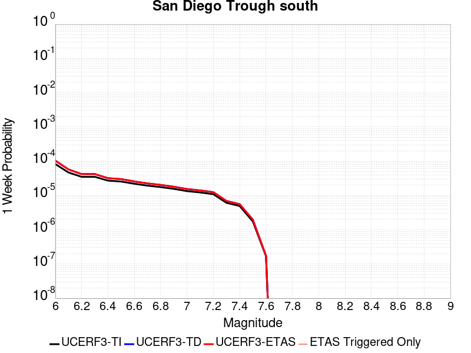 |  |  |  |

| Magnitude | 1 wk TI Prob | 1 wk TD Prob | 1 wk ETAS Prob | 1 wk ETAS/TD Gain | 1 wk ETAS Triggered Only | 1 mo TI Prob | 1 mo TD Prob | 1 mo ETAS Prob | 1 mo ETAS/TD Gain | 1 mo ETAS Triggered Only | 1 yr TI Prob | 1 yr TD Prob | 1 yr ETAS Prob | 1 yr ETAS/TD Gain | 1 yr ETAS Triggered Only | 10 yr TI Prob | 10 yr TD Prob | 10 yr ETAS Prob | 10 yr ETAS/TD Gain | 10 yr ETAS Triggered Only |
|-----|-----|-----|-----|-----|-----|-----|-----|-----|-----|-----|-----|-----|-----|-----|-----|-----|-----|-----|-----|-----|
| 6.0 | 8.279495E-5 | 1.0424723E-4 | 1.0424723E-4 | 1.0 | 0.0 | 3.5478722E-4 | 4.467023E-4 | 4.6669334E-4 | 1.0447526 | 2.0E-5 | 0.004310982 | 0.005425923 | 0.0054657063 | 1.007332 | 4.0E-5 | 0.042283054 | 0.052994892 | 0.053051714 | 1.0010722 | 6.0E-5 |
| 6.1 | 4.6961468E-5 | 5.773231E-5 | 5.773231E-5 | 1.0 | 0.0 | 2.0124791E-4 | 2.474017E-4 | 2.5739922E-4 | 1.04041 | 1.0E-5 | 0.00244744 | 0.0030081242 | 0.003028064 | 1.0066286 | 2.0E-5 | 0.024206603 | 0.029680839 | 0.029700246 | 1.0006539 | 2.0E-5 |
| 6.2 | 3.5079658E-5 | 4.214335E-5 | 4.214335E-5 | 1.0 | 0.0 | 1.5033272E-4 | 1.8060212E-4 | 1.906003E-4 | 1.0553603 | 1.0E-5 | 0.0018287642 | 0.0021966572 | 0.0022066352 | 1.0045424 | 1.0E-5 | 0.018137876 | 0.021752022 | 0.021761805 | 1.0004498 | 1.0E-5 |
| 6.3 | 3.5079658E-5 | 4.214335E-5 | 4.214335E-5 | 1.0 | 0.0 | 1.5033272E-4 | 1.8060212E-4 | 1.906003E-4 | 1.0553603 | 1.0E-5 | 0.0018287642 | 0.0021966572 | 0.0022066352 | 1.0045424 | 1.0E-5 | 0.018137876 | 0.021752022 | 0.021761805 | 1.0004498 | 1.0E-5 |
| 6.4 | 2.7196904E-5 | 3.208838E-5 | 3.208838E-5 | 1.0 | 0.0 | 1.16552954E-4 | 1.3751448E-4 | 1.4751311E-4 | 1.0727096 | 1.0E-5 | 0.0014181085 | 0.0016729672 | 0.0016829505 | 1.0059674 | 1.0E-5 | 0.014090929 | 0.016605264 | 0.016615098 | 1.0005922 | 1.0E-5 |
| 6.5 | 2.5584688E-5 | 3.0102761E-5 | 3.0102761E-5 | 1.0 | 0.0 | 1.0964406E-4 | 1.2900554E-4 | 1.3900425E-4 | 1.0775061 | 1.0E-5 | 0.0013340989 | 0.0015695236 | 0.0015795078 | 1.0063614 | 1.0E-5 | 0.013261181 | 0.015585886 | 0.01559573 | 1.0006316 | 1.0E-5 |
| 6.6 | 2.2034688E-5 | 2.574365E-5 | 2.574365E-5 | 1.0 | 0.0 | 9.443096E-5 | 1.1032531E-4 | 1.2032421E-4 | 1.090631 | 1.0E-5 | 0.0011490905 | 0.0013423895 | 0.0013523761 | 1.0074394 | 1.0E-5 | 0.011431668 | 0.013343786 | 0.013353652 | 1.0007395 | 1.0E-5 |
| 6.7 | 1.9394853E-5 | 2.2542528E-5 | 2.2542528E-5 | 1.0 | 0.0 | 8.311815E-5 | 9.6607284E-5 | 1.0660632E-4 | 1.1035019 | 1.0E-5 | 0.0010114936 | 0.0011755642 | 0.0011855526 | 1.0084965 | 1.0E-5 | 0.01006902 | 0.011694162 | 0.011704044 | 1.0008451 | 1.0E-5 |
| 6.8 | 1.7615313E-5 | 2.0403859E-5 | 2.0403859E-5 | 1.0 | 0.0 | 7.549201E-5 | 8.7442204E-5 | 9.744133E-5 | 1.1143513 | 1.0E-5 | 9.1872766E-4 | 0.0010640932 | 0.0010740826 | 1.0093877 | 1.0E-5 | 0.009149387 | 0.010590548 | 0.010600441 | 1.0009342 | 1.0E-5 |
| 6.9 | 1.5621423E-5 | 1.8026696E-5 | 1.8026696E-5 | 1.0 | 0.0 | 6.6947236E-5 | 7.7255E-5 | 8.725423E-5 | 1.1294315 | 1.0E-5 | 8.147778E-4 | 9.401773E-4 | 9.501679E-4 | 1.0106263 | 1.0E-5 | 0.008117969 | 0.009362442 | 0.009372348 | 1.0010581 | 1.0E-5 |
| 7.0 | 1.3444376E-5 | 1.544857E-5 | 1.544857E-5 | 1.0 | 0.0 | 5.7617483E-5 | 6.620649E-5 | 7.620583E-5 | 1.1510326 | 1.0E-5 | 7.0126704E-4 | 8.0576877E-4 | 8.157607E-4 | 1.0124005 | 1.0E-5 | 0.006990582 | 0.008028804 | 0.008038724 | 1.0012355 | 1.0E-5 |
| 7.1 | 1.2268361E-5 | 1.4073463E-5 | 1.4073463E-5 | 1.0 | 0.0 | 5.2577634E-5 | 6.031346E-5 | 7.031286E-5 | 1.1657904 | 1.0E-5 | 6.399447E-4 | 7.3407165E-4 | 7.440643E-4 | 1.0136126 | 1.0E-5 | 0.0063810493 | 0.0073167733 | 0.0073267003 | 1.0013567 | 1.0E-5 |
| 7.2 | 1.0922655E-5 | 1.2513944E-5 | 1.2513944E-5 | 1.0 | 0.0 | 4.681054E-5 | 5.36301E-5 | 6.3629566E-5 | 1.1864524 | 1.0E-5 | 5.697693E-4 | 6.527534E-4 | 6.627469E-4 | 1.0153097 | 1.0E-5 | 0.0056831064 | 0.0065086414 | 0.0065185763 | 1.0015265 | 1.0E-5 |
| 7.3 | 6.1106753E-6 | 6.929119E-6 | 6.929119E-6 | 1.0 | 0.0 | 2.6188345E-5 | 2.969589E-5 | 2.969589E-5 | 1.0 | 0.0 | 3.1879646E-4 | 3.6148788E-4 | 3.6148788E-4 | 1.0 | 0.0 | 0.0031833951 | 0.003609044 | 0.003609044 | 1.0 | 0.0 |
| 7.4 | 4.933187E-6 | 5.5897085E-6 | 5.5897085E-6 | 1.0 | 0.0 | 2.114206E-5 | 2.3955676E-5 | 2.3955676E-5 | 1.0 | 0.0 | 2.5737417E-4 | 2.9162172E-4 | 2.9162172E-4 | 1.0 | 0.0 | 0.002570763 | 0.0029124315 | 0.0029124315 | 1.0 | 0.0 |
| 7.5 | 1.7489613E-6 | 1.9697304E-6 | 1.9697304E-6 | 1.0 | 0.0 | 7.495527E-6 | 8.441675E-6 | 8.441675E-6 | 1.0 | 0.0 | 9.125422E-5 | 1.0277278E-4 | 1.0277278E-4 | 1.0 | 0.0 | 9.1216754E-4 | 0.0010272745 | 0.0010272745 | 1.0 | 0.0 |
| 7.6 | 1.6988751E-7 | 1.7533941E-7 | 1.7533941E-7 | 1.0 | 0.0 | 7.2808916E-7 | 7.514544E-7 | 7.514544E-7 | 1.0 | 0.0 | 8.864449E-6 | 9.148921E-6 | 9.148921E-6 | 1.0 | 0.0 | 8.8640954E-5 | 9.148564E-5 | 9.148564E-5 | 1.0 | 0.0 |

## Coronado Bank alt1
*[(top)](#table-of-contents)*

| 1 Week | 1 Month | 1 Year | 10 Year |
|-----|-----|-----|-----|
|  |  |  |  |

| Magnitude | 1 wk TI Prob | 1 wk TD Prob | 1 wk ETAS Prob | 1 wk ETAS/TD Gain | 1 wk ETAS Triggered Only | 1 mo TI Prob | 1 mo TD Prob | 1 mo ETAS Prob | 1 mo ETAS/TD Gain | 1 mo ETAS Triggered Only | 1 yr TI Prob | 1 yr TD Prob | 1 yr ETAS Prob | 1 yr ETAS/TD Gain | 1 yr ETAS Triggered Only | 10 yr TI Prob | 10 yr TD Prob | 10 yr ETAS Prob | 10 yr ETAS/TD Gain | 10 yr ETAS Triggered Only |
|-----|-----|-----|-----|-----|-----|-----|-----|-----|-----|-----|-----|-----|-----|-----|-----|-----|-----|-----|-----|-----|
| 6.0 | 7.533492E-5 | 9.3954106E-5 | 9.3954106E-5 | 1.0 | 0.0 | 3.22824E-4 | 4.0260257E-4 | 4.0260257E-4 | 1.0 | 0.0 | 0.0039233007 | 0.0048912144 | 0.004921068 | 1.0061034 | 3.0E-5 | 0.03854755 | 0.047905937 | 0.047953542 | 1.0009937 | 5.0E-5 |
| 6.1 | 4.1807285E-5 | 5.0495062E-5 | 5.0495062E-5 | 1.0 | 0.0 | 1.7916178E-4 | 2.1639005E-4 | 2.1639005E-4 | 1.0 | 0.0 | 0.0021791123 | 0.0026314629 | 0.0026414366 | 1.0037901 | 1.0E-5 | 0.021578677 | 0.026012164 | 0.026031643 | 1.0007489 | 2.0E-5 |
| 6.2 | 4.1807285E-5 | 5.0495062E-5 | 5.0495062E-5 | 1.0 | 0.0 | 1.7916178E-4 | 2.1639005E-4 | 2.1639005E-4 | 1.0 | 0.0 | 0.0021791123 | 0.0026314629 | 0.0026414366 | 1.0037901 | 1.0E-5 | 0.021578677 | 0.026012164 | 0.026031643 | 1.0007489 | 2.0E-5 |
| 6.3 | 3.1793104E-5 | 3.77126E-5 | 3.77126E-5 | 1.0 | 0.0 | 1.3624904E-4 | 1.6161562E-4 | 1.6161562E-4 | 1.0 | 0.0 | 0.0016575698 | 0.0019659249 | 0.0019759052 | 1.0050766 | 1.0E-5 | 0.016452603 | 0.01948922 | 0.01950883 | 1.0010062 | 2.0E-5 |
| 6.4 | 2.9878007E-5 | 3.5337158E-5 | 3.5337158E-5 | 1.0 | 0.0 | 1.2804232E-4 | 1.5143638E-4 | 1.5143638E-4 | 1.0 | 0.0 | 0.0015578003 | 0.0018422093 | 0.0018521909 | 1.0054183 | 1.0E-5 | 0.015469253 | 0.018273138 | 0.018292772 | 1.0010746 | 2.0E-5 |
| 6.5 | 2.4512565E-5 | 2.8765096E-5 | 2.8765096E-5 | 1.0 | 0.0 | 1.0504962E-4 | 1.2327332E-4 | 1.2327332E-4 | 1.0 | 0.0 | 0.0012782287 | 0.001499847 | 0.001509832 | 1.0066574 | 1.0E-5 | 0.012709012 | 0.014900224 | 0.0149199255 | 1.0013223 | 2.0E-5 |
| 6.6 | 2.1317413E-5 | 2.4907555E-5 | 2.4907555E-5 | 1.0 | 0.0 | 9.135714E-5 | 1.06742424E-4 | 1.06742424E-4 | 1.0 | 0.0 | 0.0011117056 | 0.0012988367 | 0.0013088237 | 1.0076892 | 1.0E-5 | 0.011061605 | 0.012914861 | 0.012934603 | 1.0015286 | 2.0E-5 |
| 6.7 | 1.8585655E-5 | 2.163563E-5 | 2.163563E-5 | 1.0 | 0.0 | 7.9650374E-5 | 9.272095E-5 | 9.272095E-5 | 1.0 | 0.0 | 9.6931186E-4 | 0.0011283134 | 0.0011383021 | 1.0088528 | 1.0E-5 | 0.0096509475 | 0.011228009 | 0.011247785 | 1.0017613 | 2.0E-5 |
| 6.8 | 1.5862879E-5 | 1.8420104E-5 | 1.8420104E-5 | 1.0 | 0.0 | 6.798199E-5 | 7.894102E-5 | 7.894102E-5 | 1.0 | 0.0 | 8.273665E-4 | 9.6070237E-4 | 9.706928E-4 | 1.0103991 | 1.0E-5 | 0.008242928 | 0.009567475 | 0.009587283 | 1.0020704 | 2.0E-5 |
| 6.9 | 1.3021509E-5 | 1.5095775E-5 | 1.5095775E-5 | 1.0 | 0.0 | 5.5805274E-5 | 6.469467E-5 | 6.469467E-5 | 1.0 | 0.0 | 6.792174E-4 | 7.873911E-4 | 7.9738325E-4 | 1.0126902 | 1.0E-5 | 0.006771452 | 0.007847836 | 0.007857758 | 1.0012642 | 1.0E-5 |
| 7.0 | 1.0974371E-5 | 1.2720534E-5 | 1.2720534E-5 | 1.0 | 0.0 | 4.7032172E-5 | 5.4515534E-5 | 5.4515534E-5 | 1.0 | 0.0 | 5.7246623E-4 | 6.635421E-4 | 6.7353545E-4 | 1.0150607 | 1.0E-5 | 0.0057099373 | 0.006617358 | 0.006627292 | 1.0015012 | 1.0E-5 |
| 7.1 | 8.766221E-6 | 1.0164178E-5 | 1.0164178E-5 | 1.0 | 0.0 | 3.7568978E-5 | 4.3560132E-5 | 4.3560132E-5 | 1.0 | 0.0 | 4.573063E-4 | 5.302328E-4 | 5.302328E-4 | 1.0 | 0.0 | 0.0045636636 | 0.0052913763 | 0.0052913763 | 1.0 | 0.0 |
| 7.2 | 8.026024E-7 | 8.331878E-7 | 8.331878E-7 | 1.0 | 0.0 | 3.43972E-6 | 3.5708001E-6 | 3.5708001E-6 | 1.0 | 0.0 | 4.1877785E-5 | 4.3473636E-5 | 4.3473636E-5 | 1.0 | 0.0 | 4.1869894E-4 | 4.346524E-4 | 4.346524E-4 | 1.0 | 0.0 |
| 7.3 | 3.7293114E-7 | 3.7001323E-7 | 3.7001323E-7 | 1.0 | 0.0 | 1.5982754E-6 | 1.58577E-6 | 1.58577E-6 | 1.0 | 0.0 | 1.9458828E-5 | 1.9306579E-5 | 1.9306579E-5 | 1.0 | 0.0 | 1.9457124E-4 | 1.9304908E-4 | 1.9304908E-4 | 1.0 | 0.0 |
| 7.4 | 2.0557036E-7 | 1.967452E-7 | 1.967452E-7 | 1.0 | 0.0 | 8.810155E-7 | 8.4319345E-7 | 8.4319345E-7 | 1.0 | 0.0 | 1.0726311E-5 | 1.0265832E-5 | 1.0265832E-5 | 1.0 | 0.0 | 1.0725793E-4 | 1.0265361E-4 | 1.0265361E-4 | 1.0 | 0.0 |
| 7.5 | 6.845446E-8 | 6.279399E-8 | 6.279399E-8 | 1.0 | 0.0 | 2.9337625E-7 | 2.6911707E-7 | 2.6911707E-7 | 1.0 | 0.0 | 3.5718497E-6 | 3.2764954E-6 | 3.2764954E-6 | 1.0 | 0.0 | 3.5717923E-5 | 3.276448E-5 | 3.276448E-5 | 1.0 | 0.0 |
| 7.6 | 6.0975145E-9 | 5.5318674E-9 | 5.5318674E-9 | 1.0 | 0.0 | 2.6132206E-8 | 2.3708003E-8 | 2.3708003E-8 | 1.0 | 0.0 | 3.1815955E-7 | 2.886449E-7 | 2.886449E-7 | 1.0 | 0.0 | 3.181591E-6 | 2.8864463E-6 | 2.8864463E-6 | 1.0 | 0.0 |

## Kern Canyon (Lake Isabella) 2011
*[(top)](#table-of-contents)*

| 1 Week | 1 Month | 1 Year | 10 Year |
|-----|-----|-----|-----|
|  |  |  | 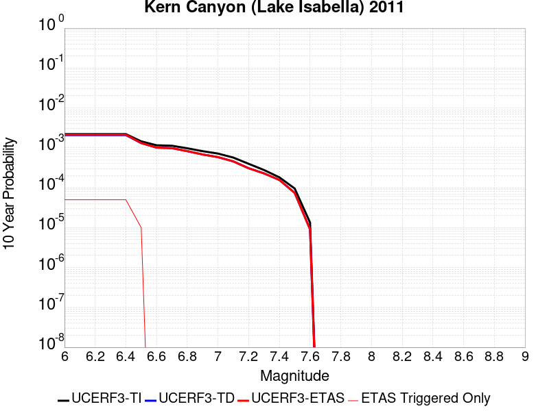 |

| Magnitude | 1 wk TI Prob | 1 wk TD Prob | 1 wk ETAS Prob | 1 wk ETAS/TD Gain | 1 wk ETAS Triggered Only | 1 mo TI Prob | 1 mo TD Prob | 1 mo ETAS Prob | 1 mo ETAS/TD Gain | 1 mo ETAS Triggered Only | 1 yr TI Prob | 1 yr TD Prob | 1 yr ETAS Prob | 1 yr ETAS/TD Gain | 1 yr ETAS Triggered Only | 10 yr TI Prob | 10 yr TD Prob | 10 yr ETAS Prob | 10 yr ETAS/TD Gain | 10 yr ETAS Triggered Only |
|-----|-----|-----|-----|-----|-----|-----|-----|-----|-----|-----|-----|-----|-----|-----|-----|-----|-----|-----|-----|-----|
| 6.0 | 4.2387383E-6 | 4.0016575E-6 | 4.0016575E-6 | 1.0 | 0.0 | 1.8165894E-5 | 1.714986E-5 | 1.714986E-5 | 1.0 | 0.0 | 2.2114732E-4 | 2.0878139E-4 | 2.4877305E-4 | 1.191548 | 4.0E-5 | 0.0022092736 | 0.0020860364 | 0.002135932 | 1.0239189 | 5.0E-5 |
| 6.1 | 4.2387383E-6 | 4.0016575E-6 | 4.0016575E-6 | 1.0 | 0.0 | 1.8165894E-5 | 1.714986E-5 | 1.714986E-5 | 1.0 | 0.0 | 2.2114732E-4 | 2.0878139E-4 | 2.4877305E-4 | 1.191548 | 4.0E-5 | 0.0022092736 | 0.0020860364 | 0.002135932 | 1.0239189 | 5.0E-5 |
| 6.2 | 4.2387383E-6 | 4.0016575E-6 | 4.0016575E-6 | 1.0 | 0.0 | 1.8165894E-5 | 1.714986E-5 | 1.714986E-5 | 1.0 | 0.0 | 2.2114732E-4 | 2.0878139E-4 | 2.4877305E-4 | 1.191548 | 4.0E-5 | 0.0022092736 | 0.0020860364 | 0.002135932 | 1.0239189 | 5.0E-5 |
| 6.3 | 4.2387383E-6 | 4.0016575E-6 | 4.0016575E-6 | 1.0 | 0.0 | 1.8165894E-5 | 1.714986E-5 | 1.714986E-5 | 1.0 | 0.0 | 2.2114732E-4 | 2.0878139E-4 | 2.4877305E-4 | 1.191548 | 4.0E-5 | 0.0022092736 | 0.0020860364 | 0.002135932 | 1.0239189 | 5.0E-5 |
| 6.4 | 4.2387383E-6 | 4.0016575E-6 | 4.0016575E-6 | 1.0 | 0.0 | 1.8165894E-5 | 1.714986E-5 | 1.714986E-5 | 1.0 | 0.0 | 2.2114732E-4 | 2.0878139E-4 | 2.4877305E-4 | 1.191548 | 4.0E-5 | 0.0022092736 | 0.0020860364 | 0.002135932 | 1.0239189 | 5.0E-5 |
| 6.5 | 2.7857532E-6 | 2.5178792E-6 | 2.5178792E-6 | 1.0 | 0.0 | 1.1938888E-5 | 1.0790868E-5 | 1.0790868E-5 | 1.0 | 0.0 | 1.4534626E-4 | 1.3137123E-4 | 1.4136992E-4 | 1.0761101 | 1.0E-5 | 0.0014525123 | 0.0013129684 | 0.0013229554 | 1.0076064 | 1.0E-5 |
| 6.6 | 2.2233348E-6 | 1.9441336E-6 | 1.9441336E-6 | 1.0 | 0.0 | 9.528543E-6 | 8.331975E-6 | 8.331975E-6 | 1.0 | 0.0 | 1.1600384E-4 | 1.0143715E-4 | 1.0143715E-4 | 1.0 | 0.0 | 0.001159433 | 0.0010139171 | 0.0010139171 | 1.0 | 0.0 |
| 6.7 | 2.1635126E-6 | 1.8835133E-6 | 1.8835133E-6 | 1.0 | 0.0 | 9.272164E-6 | 8.072176E-6 | 8.072176E-6 | 1.0 | 0.0 | 1.1288274E-4 | 9.827439E-5 | 9.827439E-5 | 1.0 | 0.0 | 0.0011282542 | 9.823175E-4 | 9.823175E-4 | 1.0 | 0.0 |
| 6.8 | 1.8685711E-6 | 1.5831512E-6 | 1.5831512E-6 | 1.0 | 0.0 | 8.008137E-6 | 6.784916E-6 | 6.784916E-6 | 1.0 | 0.0 | 9.74947E-5 | 8.260327E-5 | 8.260327E-5 | 1.0 | 0.0 | 9.745194E-4 | 8.257306E-4 | 8.257306E-4 | 1.0 | 0.0 |
| 6.9 | 1.5815071E-6 | 1.3065002E-6 | 1.3065002E-6 | 1.0 | 0.0 | 6.77787E-6 | 5.5992746E-6 | 5.5992746E-6 | 1.0 | 0.0 | 8.251744E-5 | 6.8169065E-5 | 6.8169065E-5 | 1.0 | 0.0 | 8.248681E-4 | 6.814842E-4 | 6.814842E-4 | 1.0 | 0.0 |
| 7.0 | 1.3772564E-6 | 1.1210782E-6 | 1.1210782E-6 | 1.0 | 0.0 | 5.9025137E-6 | 4.804612E-6 | 4.804612E-6 | 1.0 | 0.0 | 7.186073E-5 | 5.8494603E-5 | 5.8494603E-5 | 1.0 | 0.0 | 7.18375E-4 | 5.847941E-4 | 5.847941E-4 | 1.0 | 0.0 |
| 7.1 | 1.0916998E-6 | 8.7638256E-7 | 8.7638256E-7 | 1.0 | 0.0 | 4.678705E-6 | 3.75592E-6 | 3.75592E-6 | 1.0 | 0.0 | 5.6961744E-5 | 4.572738E-5 | 4.572738E-5 | 1.0 | 0.0 | 5.6947145E-4 | 4.5718104E-4 | 4.5718104E-4 | 1.0 | 0.0 |
| 7.2 | 7.6277024E-7 | 5.901487E-7 | 5.901487E-7 | 1.0 | 0.0 | 3.2690114E-6 | 2.5292063E-6 | 2.5292063E-6 | 1.0 | 0.0 | 3.9799485E-5 | 3.079266E-5 | 3.079266E-5 | 1.0 | 0.0 | 3.9792358E-4 | 3.0788453E-4 | 3.0788453E-4 | 1.0 | 0.0 |
| 7.3 | 5.3265916E-7 | 4.3824647E-7 | 4.3824647E-7 | 1.0 | 0.0 | 2.282823E-6 | 1.8781978E-6 | 1.8781978E-6 | 1.0 | 0.0 | 2.7793016E-5 | 2.2866823E-5 | 2.2866823E-5 | 1.0 | 0.0 | 2.778954E-4 | 2.2864508E-4 | 2.2864508E-4 | 1.0 | 0.0 |
| 7.4 | 3.4946007E-7 | 3.0065866E-7 | 3.0065866E-7 | 1.0 | 0.0 | 1.497685E-6 | 1.2885365E-6 | 1.2885365E-6 | 1.0 | 0.0 | 1.8234163E-5 | 1.5687821E-5 | 1.5687821E-5 | 1.0 | 0.0 | 1.8232666E-4 | 1.5686736E-4 | 1.5686736E-4 | 1.0 | 0.0 |
| 7.5 | 1.8317026E-7 | 1.4244901E-7 | 1.4244901E-7 | 1.0 | 0.0 | 7.850152E-7 | 6.104956E-7 | 6.104956E-7 | 1.0 | 0.0 | 9.557518E-6 | 7.432759E-6 | 7.432759E-6 | 1.0 | 0.0 | 9.5571064E-5 | 7.432519E-5 | 7.432519E-5 | 1.0 | 0.0 |
| 7.6 | 2.572245E-8 | 1.7352685E-8 | 1.7352685E-8 | 1.0 | 0.0 | 1.10239064E-7 | 7.436864E-8 | 7.436864E-8 | 1.0 | 0.0 | 1.3421597E-6 | 9.054379E-7 | 9.054379E-7 | 1.0 | 0.0 | 1.3421517E-5 | 9.054348E-6 | 9.054348E-6 | 1.0 | 0.0 |

## Pleito
*[(top)](#table-of-contents)*

| 1 Week | 1 Month | 1 Year | 10 Year |
|-----|-----|-----|-----|
|  |  | 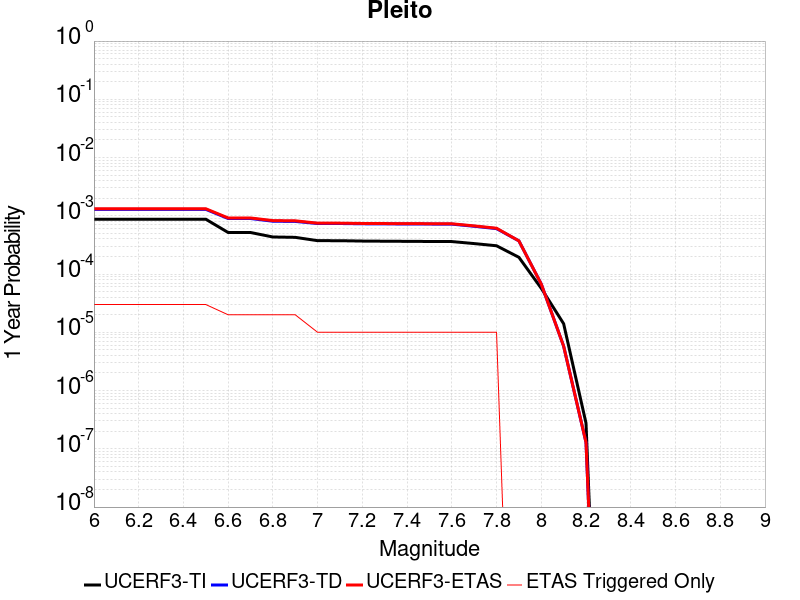 |  |

| Magnitude | 1 wk TI Prob | 1 wk TD Prob | 1 wk ETAS Prob | 1 wk ETAS/TD Gain | 1 wk ETAS Triggered Only | 1 mo TI Prob | 1 mo TD Prob | 1 mo ETAS Prob | 1 mo ETAS/TD Gain | 1 mo ETAS Triggered Only | 1 yr TI Prob | 1 yr TD Prob | 1 yr ETAS Prob | 1 yr ETAS/TD Gain | 1 yr ETAS Triggered Only | 10 yr TI Prob | 10 yr TD Prob | 10 yr ETAS Prob | 10 yr ETAS/TD Gain | 10 yr ETAS Triggered Only |
|-----|-----|-----|-----|-----|-----|-----|-----|-----|-----|-----|-----|-----|-----|-----|-----|-----|-----|-----|-----|-----|
| 6.0 | 1.6763008E-5 | 2.4774306E-5 | 2.4774306E-5 | 1.0 | 0.0 | 7.183948E-5 | 1.0617168E-4 | 1.0617168E-4 | 1.0 | 0.0 | 8.742947E-4 | 0.0012919458 | 0.001321907 | 1.0231907 | 3.0E-5 | 0.00870863 | 0.012959174 | 0.0130085265 | 1.0038083 | 5.0E-5 |
| 6.1 | 1.6763008E-5 | 2.4774306E-5 | 2.4774306E-5 | 1.0 | 0.0 | 7.183948E-5 | 1.0617168E-4 | 1.0617168E-4 | 1.0 | 0.0 | 8.742947E-4 | 0.0012919458 | 0.001321907 | 1.0231907 | 3.0E-5 | 0.00870863 | 0.012959174 | 0.0130085265 | 1.0038083 | 5.0E-5 |
| 6.2 | 1.6763008E-5 | 2.4774306E-5 | 2.4774306E-5 | 1.0 | 0.0 | 7.183948E-5 | 1.0617168E-4 | 1.0617168E-4 | 1.0 | 0.0 | 8.742947E-4 | 0.0012919458 | 0.001321907 | 1.0231907 | 3.0E-5 | 0.00870863 | 0.012959174 | 0.0130085265 | 1.0038083 | 5.0E-5 |
| 6.3 | 1.6763008E-5 | 2.4774306E-5 | 2.4774306E-5 | 1.0 | 0.0 | 7.183948E-5 | 1.0617168E-4 | 1.0617168E-4 | 1.0 | 0.0 | 8.742947E-4 | 0.0012919458 | 0.001321907 | 1.0231907 | 3.0E-5 | 0.00870863 | 0.012959174 | 0.0130085265 | 1.0038083 | 5.0E-5 |
| 6.4 | 1.6763008E-5 | 2.4774306E-5 | 2.4774306E-5 | 1.0 | 0.0 | 7.183948E-5 | 1.0617168E-4 | 1.0617168E-4 | 1.0 | 0.0 | 8.742947E-4 | 0.0012919458 | 0.001321907 | 1.0231907 | 3.0E-5 | 0.00870863 | 0.012959174 | 0.0130085265 | 1.0038083 | 5.0E-5 |
| 6.5 | 1.6763008E-5 | 2.4774306E-5 | 2.4774306E-5 | 1.0 | 0.0 | 7.183948E-5 | 1.0617168E-4 | 1.0617168E-4 | 1.0 | 0.0 | 8.742947E-4 | 0.0012919458 | 0.001321907 | 1.0231907 | 3.0E-5 | 0.00870863 | 0.012959174 | 0.0130085265 | 1.0038083 | 5.0E-5 |
| 6.6 | 9.910213E-6 | 1.7224931E-5 | 1.7224931E-5 | 1.0 | 0.0 | 4.247165E-5 | 7.3819065E-5 | 7.3819065E-5 | 1.0 | 0.0 | 5.169696E-4 | 8.9838024E-4 | 9.183623E-4 | 1.0222423 | 2.0E-5 | 0.0051576863 | 0.009055924 | 0.009085652 | 1.0032828 | 3.0E-5 |
| 6.7 | 9.910213E-6 | 1.7224931E-5 | 1.7224931E-5 | 1.0 | 0.0 | 4.247165E-5 | 7.3819065E-5 | 7.3819065E-5 | 1.0 | 0.0 | 5.169696E-4 | 8.9838024E-4 | 9.183623E-4 | 1.0222423 | 2.0E-5 | 0.0051576863 | 0.009055924 | 0.009085652 | 1.0032828 | 3.0E-5 |
| 6.8 | 8.300162E-6 | 1.5484511E-5 | 1.5484511E-5 | 1.0 | 0.0 | 3.557164E-5 | 6.636051E-5 | 6.636051E-5 | 1.0 | 0.0 | 4.3299864E-4 | 8.0764113E-4 | 8.27625E-4 | 1.0247434 | 2.0E-5 | 0.004321559 | 0.008155351 | 0.008185105 | 1.0036485 | 3.0E-5 |
| 6.9 | 8.183114E-6 | 1.5355721E-5 | 1.5355721E-5 | 1.0 | 0.0 | 3.5070017E-5 | 6.580858E-5 | 6.580858E-5 | 1.0 | 0.0 | 4.2689382E-4 | 8.0092635E-4 | 8.209103E-4 | 1.0249511 | 2.0E-5 | 0.0042607468 | 0.008088693 | 0.008118451 | 1.0036789 | 3.0E-5 |
| 7.0 | 7.1748823E-6 | 1.41425835E-5 | 1.41425835E-5 | 1.0 | 0.0 | 3.0749135E-5 | 6.0609666E-5 | 6.0609666E-5 | 1.0 | 0.0 | 3.743064E-4 | 7.3767337E-4 | 7.47666E-4 | 1.0135461 | 1.0E-5 | 0.0037367654 | 0.007460085 | 0.0074700103 | 1.0013305 | 1.0E-5 |
| 7.1 | 7.1671807E-6 | 1.4132953E-5 | 1.4132953E-5 | 1.0 | 0.0 | 3.0716128E-5 | 6.0568393E-5 | 6.0568393E-5 | 1.0 | 0.0 | 3.7390468E-4 | 7.371712E-4 | 7.4716384E-4 | 1.0135554 | 1.0E-5 | 0.0037327618 | 0.007455097 | 0.0074650226 | 1.0013313 | 1.0E-5 |
| 7.2 | 7.0649667E-6 | 1.39802105E-5 | 1.39802105E-5 | 1.0 | 0.0 | 3.0278077E-5 | 5.9913815E-5 | 5.9913815E-5 | 1.0 | 0.0 | 3.6857324E-4 | 7.2920707E-4 | 7.3919975E-4 | 1.0137036 | 1.0E-5 | 0.0036796255 | 0.007375838 | 0.007385764 | 1.0013458 | 1.0E-5 |
| 7.3 | 7.02082E-6 | 1.3923645E-5 | 1.3923645E-5 | 1.0 | 0.0 | 3.008888E-5 | 5.9671405E-5 | 5.9671405E-5 | 1.0 | 0.0 | 3.6627054E-4 | 7.262577E-4 | 7.362504E-4 | 1.0137593 | 1.0E-5 | 0.0036566744 | 0.0073463274 | 0.007356254 | 1.0013512 | 1.0E-5 |
| 7.4 | 6.987146E-6 | 1.38831965E-5 | 1.38831965E-5 | 1.0 | 0.0 | 2.9944567E-5 | 5.949806E-5 | 5.949806E-5 | 1.0 | 0.0 | 3.6451413E-4 | 7.241486E-4 | 7.341414E-4 | 1.0137993 | 1.0E-5 | 0.0036391679 | 0.007325257 | 0.0073351837 | 1.0013552 | 1.0E-5 |
| 7.5 | 6.9494554E-6 | 1.3840094E-5 | 1.3840094E-5 | 1.0 | 0.0 | 2.9783041E-5 | 5.931334E-5 | 5.931334E-5 | 1.0 | 0.0 | 3.625482E-4 | 7.219012E-4 | 7.3189393E-4 | 1.0138423 | 1.0E-5 | 0.0036195726 | 0.007302881 | 0.007312808 | 1.0013593 | 1.0E-5 |
| 7.6 | 6.92694E-6 | 1.3799192E-5 | 1.3799192E-5 | 1.0 | 0.0 | 2.9686547E-5 | 5.9138056E-5 | 5.9138056E-5 | 1.0 | 0.0 | 3.6137376E-4 | 7.1976846E-4 | 7.2976126E-4 | 1.0138834 | 1.0E-5 | 0.0036078666 | 0.0072816266 | 0.0072915535 | 1.0013633 | 1.0E-5 |
| 7.7 | 6.395867E-6 | 1.2677844E-5 | 1.2677844E-5 | 1.0 | 0.0 | 2.741057E-5 | 5.433249E-5 | 5.433249E-5 | 1.0 | 0.0 | 3.336726E-4 | 6.612976E-4 | 6.7129097E-4 | 1.0151118 | 1.0E-5 | 0.0033317201 | 0.0067000724 | 0.0067100055 | 1.0014825 | 1.0E-5 |
| 7.8 | 5.8664327E-6 | 1.1544649E-5 | 1.1544649E-5 | 1.0 | 0.0 | 2.5141611E-5 | 4.947613E-5 | 4.947613E-5 | 1.0 | 0.0 | 3.060561E-4 | 6.0220563E-4 | 6.121996E-4 | 1.0165956 | 1.0E-5 | 0.0030563495 | 0.0061051333 | 0.0061150724 | 1.0016279 | 1.0E-5 |
| 7.9 | 3.7167474E-6 | 7.1194077E-6 | 7.1194077E-6 | 1.0 | 0.0 | 1.592882E-5 | 3.0511392E-5 | 3.0511392E-5 | 1.0 | 0.0 | 1.9391612E-4 | 3.71413E-4 | 3.71413E-4 | 1.0 | 0.0 | 0.0019374699 | 0.0037701984 | 0.0037701984 | 1.0 | 0.0 |
| 8.0 | 1.0903841E-6 | 1.2891084E-6 | 1.2891084E-6 | 1.0 | 0.0 | 4.6730665E-6 | 5.5247383E-6 | 5.5247383E-6 | 1.0 | 0.0 | 5.68931E-5 | 6.726163E-5 | 6.726163E-5 | 1.0 | 0.0 | 5.6878536E-4 | 6.948089E-4 | 6.948089E-4 | 1.0 | 0.0 |
| 8.1 | 2.6894583E-7 | 1.1080092E-7 | 1.1080092E-7 | 1.0 | 0.0 | 1.1526245E-6 | 4.7486097E-7 | 4.7486097E-7 | 1.0 | 0.0 | 1.4033113E-5 | 5.7814173E-6 | 5.7814173E-6 | 1.0 | 0.0 | 1.4032227E-4 | 6.467939E-5 | 6.467939E-5 | 1.0 | 0.0 |
| 8.2 | 5.2967013E-9 | 2.462548E-9 | 2.462548E-9 | 1.0 | 0.0 | 2.2700148E-8 | 1.05537765E-8 | 1.05537765E-8 | 1.0 | 0.0 | 2.7637427E-7 | 1.2849222E-7 | 1.2849222E-7 | 1.0 | 0.0 | 2.7637393E-6 | 1.4619202E-6 | 1.4619202E-6 | 1.0 | 0.0 |

## Cleghorn Pass
*[(top)](#table-of-contents)*

| 1 Week | 1 Month | 1 Year | 10 Year |
|-----|-----|-----|-----|
|  |  |  |  |

| Magnitude | 1 wk TI Prob | 1 wk TD Prob | 1 wk ETAS Prob | 1 wk ETAS/TD Gain | 1 wk ETAS Triggered Only | 1 mo TI Prob | 1 mo TD Prob | 1 mo ETAS Prob | 1 mo ETAS/TD Gain | 1 mo ETAS Triggered Only | 1 yr TI Prob | 1 yr TD Prob | 1 yr ETAS Prob | 1 yr ETAS/TD Gain | 1 yr ETAS Triggered Only | 10 yr TI Prob | 10 yr TD Prob | 10 yr ETAS Prob | 10 yr ETAS/TD Gain | 10 yr ETAS Triggered Only |
|-----|-----|-----|-----|-----|-----|-----|-----|-----|-----|-----|-----|-----|-----|-----|-----|-----|-----|-----|-----|-----|
| 6.0 | 1.0522846E-5 | 1.10407545E-5 | 1.10407545E-5 | 1.0 | 0.0 | 4.509713E-5 | 4.731696E-5 | 4.731696E-5 | 1.0 | 0.0 | 5.4891926E-4 | 5.7598436E-4 | 6.159613E-4 | 1.0694064 | 4.0E-5 | 0.0054756533 | 0.0057500806 | 0.005799793 | 1.0086455 | 5.0E-5 |
| 6.1 | 1.0522846E-5 | 1.10407545E-5 | 1.10407545E-5 | 1.0 | 0.0 | 4.509713E-5 | 4.731696E-5 | 4.731696E-5 | 1.0 | 0.0 | 5.4891926E-4 | 5.7598436E-4 | 6.159613E-4 | 1.0694064 | 4.0E-5 | 0.0054756533 | 0.0057500806 | 0.005799793 | 1.0086455 | 5.0E-5 |
| 6.2 | 2.1045846E-6 | 2.2082252E-6 | 2.2082252E-6 | 1.0 | 0.0 | 9.019617E-6 | 9.463811E-6 | 9.463811E-6 | 1.0 | 0.0 | 1.098083E-4 | 1.15220006E-4 | 1.352177E-4 | 1.173561 | 2.0E-5 | 0.0010975406 | 0.0011520141 | 0.0011819795 | 1.0260113 | 3.0E-5 |
| 6.3 | 2.1045846E-6 | 2.2082252E-6 | 2.2082252E-6 | 1.0 | 0.0 | 9.019617E-6 | 9.463811E-6 | 9.463811E-6 | 1.0 | 0.0 | 1.098083E-4 | 1.15220006E-4 | 1.352177E-4 | 1.173561 | 2.0E-5 | 0.0010975406 | 0.0011520141 | 0.0011819795 | 1.0260113 | 3.0E-5 |
| 6.4 | 1.7259927E-6 | 1.8108957E-6 | 1.8108957E-6 | 1.0 | 0.0 | 7.3970905E-6 | 7.760981E-6 | 7.760981E-6 | 1.0 | 0.0 | 9.005586E-5 | 9.448995E-5 | 1.04489E-4 | 1.1058214 | 1.0E-5 | 9.001937E-4 | 9.4489945E-4 | 9.648806E-4 | 1.0211463 | 2.0E-5 |

## San Jacinto (Coyote Creek)
*[(top)](#table-of-contents)*

| 1 Week | 1 Month | 1 Year | 10 Year |
|-----|-----|-----|-----|
|  |  |  |  |

| Magnitude | 1 wk TI Prob | 1 wk TD Prob | 1 wk ETAS Prob | 1 wk ETAS/TD Gain | 1 wk ETAS Triggered Only | 1 mo TI Prob | 1 mo TD Prob | 1 mo ETAS Prob | 1 mo ETAS/TD Gain | 1 mo ETAS Triggered Only | 1 yr TI Prob | 1 yr TD Prob | 1 yr ETAS Prob | 1 yr ETAS/TD Gain | 1 yr ETAS Triggered Only | 10 yr TI Prob | 10 yr TD Prob | 10 yr ETAS Prob | 10 yr ETAS/TD Gain | 10 yr ETAS Triggered Only |
|-----|-----|-----|-----|-----|-----|-----|-----|-----|-----|-----|-----|-----|-----|-----|-----|-----|-----|-----|-----|-----|
| 6.0 | 2.7374346E-5 | 2.4157787E-5 | 2.4157787E-5 | 1.0 | 0.0 | 1.1731335E-4 | 1.0352928E-4 | 1.13528244E-4 | 1.096581 | 1.0E-5 | 0.0014273542 | 0.0012597427 | 0.0012797175 | 1.0158563 | 2.0E-5 | 0.01418221 | 0.01293486 | 0.012984213 | 1.0038155 | 5.0E-5 |
| 6.1 | 2.7374346E-5 | 2.4157787E-5 | 2.4157787E-5 | 1.0 | 0.0 | 1.1731335E-4 | 1.0352928E-4 | 1.13528244E-4 | 1.096581 | 1.0E-5 | 0.0014273542 | 0.0012597427 | 0.0012797175 | 1.0158563 | 2.0E-5 | 0.01418221 | 0.01293486 | 0.012984213 | 1.0038155 | 5.0E-5 |
| 6.2 | 2.7374346E-5 | 2.4157787E-5 | 2.4157787E-5 | 1.0 | 0.0 | 1.1731335E-4 | 1.0352928E-4 | 1.13528244E-4 | 1.096581 | 1.0E-5 | 0.0014273542 | 0.0012597427 | 0.0012797175 | 1.0158563 | 2.0E-5 | 0.01418221 | 0.01293486 | 0.012984213 | 1.0038155 | 5.0E-5 |
| 6.3 | 2.7374346E-5 | 2.4157787E-5 | 2.4157787E-5 | 1.0 | 0.0 | 1.1731335E-4 | 1.0352928E-4 | 1.13528244E-4 | 1.096581 | 1.0E-5 | 0.0014273542 | 0.0012597427 | 0.0012797175 | 1.0158563 | 2.0E-5 | 0.01418221 | 0.01293486 | 0.012984213 | 1.0038155 | 5.0E-5 |
| 6.4 | 2.7374346E-5 | 2.4157787E-5 | 2.4157787E-5 | 1.0 | 0.0 | 1.1731335E-4 | 1.0352928E-4 | 1.13528244E-4 | 1.096581 | 1.0E-5 | 0.0014273542 | 0.0012597427 | 0.0012797175 | 1.0158563 | 2.0E-5 | 0.01418221 | 0.01293486 | 0.012984213 | 1.0038155 | 5.0E-5 |
| 6.5 | 2.7282445E-5 | 2.404386E-5 | 2.404386E-5 | 1.0 | 0.0 | 1.16919524E-4 | 1.0304106E-4 | 1.1304003E-4 | 1.0970387 | 1.0E-5 | 0.0014225657 | 0.0012538055 | 0.0012737805 | 1.0159315 | 2.0E-5 | 0.014134934 | 0.012876185 | 0.012925541 | 1.0038332 | 5.0E-5 |
| 6.6 | 2.7282445E-5 | 2.404386E-5 | 2.404386E-5 | 1.0 | 0.0 | 1.16919524E-4 | 1.0304106E-4 | 1.1304003E-4 | 1.0970387 | 1.0E-5 | 0.0014225657 | 0.0012538055 | 0.0012737805 | 1.0159315 | 2.0E-5 | 0.014134934 | 0.012876185 | 0.012925541 | 1.0038332 | 5.0E-5 |
| 6.7 | 2.7216198E-5 | 2.3968976E-5 | 2.3968976E-5 | 1.0 | 0.0 | 1.1663563E-4 | 1.0272016E-4 | 1.1271913E-4 | 1.0973419 | 1.0E-5 | 0.0014191137 | 0.0012499031 | 0.001269878 | 1.0159812 | 2.0E-5 | 0.014100855 | 0.012837594 | 0.012886953 | 1.0038449 | 5.0E-5 |
| 6.8 | 2.7078617E-5 | 2.3886187E-5 | 2.3886187E-5 | 1.0 | 0.0 | 1.1604605E-4 | 1.0236537E-4 | 1.12364345E-4 | 1.0976793 | 1.0E-5 | 0.001411945 | 0.0012455884 | 0.0012655635 | 1.0160366 | 2.0E-5 | 0.014030075 | 0.012794733 | 0.012844093 | 1.0038579 | 5.0E-5 |
| 6.9 | 2.6982952E-5 | 2.380569E-5 | 2.380569E-5 | 1.0 | 0.0 | 1.15636096E-4 | 1.0202041E-4 | 1.1201939E-4 | 1.0980096 | 1.0E-5 | 0.0014069602 | 0.0012413934 | 0.0012613685 | 1.0160909 | 2.0E-5 | 0.013980856 | 0.012753045 | 0.012802407 | 1.0038706 | 5.0E-5 |
| 7.0 | 2.6449972E-5 | 2.3382685E-5 | 2.3382685E-5 | 1.0 | 0.0 | 1.1335209E-4 | 1.0020767E-4 | 1.1020667E-4 | 1.0997827 | 1.0E-5 | 0.001379188 | 0.0012193482 | 0.0012393238 | 1.0163822 | 2.0E-5 | 0.0137065975 | 0.012534394 | 0.012583767 | 1.003939 | 5.0E-5 |
| 7.1 | 2.6257849E-5 | 2.3208708E-5 | 2.3208708E-5 | 1.0 | 0.0 | 1.1252879E-4 | 9.9462115E-5 | 1.0946112E-4 | 1.1005307 | 1.0E-5 | 0.0013691769 | 0.0012102812 | 0.001230257 | 1.0165051 | 2.0E-5 | 0.013607717 | 0.012444253 | 0.012493631 | 1.0039679 | 5.0E-5 |
| 7.2 | 2.5270041E-5 | 2.240338E-5 | 2.240338E-5 | 1.0 | 0.0 | 1.0829568E-4 | 9.601096E-5 | 1.0601E-4 | 1.1041448 | 1.0E-5 | 0.0013177024 | 0.001168309 | 0.0011882856 | 1.0170988 | 2.0E-5 | 0.013099162 | 0.012025243 | 0.012074642 | 1.004108 | 5.0E-5 |
| 7.3 | 2.339701E-5 | 2.113505E-5 | 2.113505E-5 | 1.0 | 0.0 | 1.0026905E-4 | 9.057565E-5 | 1.0057475E-4 | 1.110395 | 1.0E-5 | 0.001220092 | 0.0011022028 | 0.0011221807 | 1.0181255 | 2.0E-5 | 0.012134149 | 0.0113640735 | 0.011413505 | 1.0043498 | 5.0E-5 |
| 7.4 | 2.296333E-5 | 2.0865362E-5 | 2.0865362E-5 | 1.0 | 0.0 | 9.841056E-5 | 8.9419926E-5 | 9.941903E-5 | 1.1118219 | 1.0E-5 | 0.0011974899 | 0.0010881459 | 0.0011081242 | 1.0183599 | 2.0E-5 | 0.011910575 | 0.011223165 | 0.011272604 | 1.004405 | 5.0E-5 |
| 7.5 | 2.2188895E-5 | 2.0388185E-5 | 2.0388185E-5 | 1.0 | 0.0 | 9.50918E-5 | 8.737502E-5 | 9.737415E-5 | 1.1144391 | 1.0E-5 | 0.0011571277 | 0.0010632738 | 0.0010832525 | 1.0187899 | 2.0E-5 | 0.011511209 | 0.010972733 | 0.011022184 | 1.0045067 | 5.0E-5 |
| 7.6 | 2.0013189E-5 | 1.8974184E-5 | 1.8974184E-5 | 1.0 | 0.0 | 8.5767984E-5 | 8.131541E-5 | 9.13146E-5 | 1.122968 | 1.0E-5 | 0.001043725 | 9.895673E-4 | 0.0010095475 | 1.0201908 | 2.0E-5 | 0.010388365 | 0.010230602 | 0.01028009 | 1.0048373 | 5.0E-5 |
| 7.7 | 1.7230794E-5 | 1.6755215E-5 | 1.6755215E-5 | 1.0 | 0.0 | 7.384417E-5 | 7.18061E-5 | 8.1805374E-5 | 1.139254 | 1.0E-5 | 8.986819E-4 | 8.7388937E-4 | 8.938719E-4 | 1.0228662 | 2.0E-5 | 0.008950562 | 0.009068969 | 0.009118515 | 1.0054634 | 5.0E-5 |
| 7.8 | 1.4478809E-5 | 1.5002081E-5 | 1.5002081E-5 | 1.0 | 0.0 | 6.205057E-5 | 6.429305E-5 | 7.429241E-5 | 1.1555278 | 1.0E-5 | 7.552038E-4 | 7.8248745E-4 | 7.924796E-4 | 1.0127697 | 1.0E-5 | 0.0075264242 | 0.008147196 | 0.00818687 | 1.0048697 | 4.0E-5 |
| 7.9 | 1.1114467E-5 | 1.1654929E-5 | 1.1654929E-5 | 1.0 | 0.0 | 4.7632562E-5 | 4.994874E-5 | 5.994824E-5 | 1.2001952 | 1.0E-5 | 5.797721E-4 | 6.079568E-4 | 6.1795075E-4 | 1.0164385 | 1.0E-5 | 0.0057826187 | 0.006385483 | 0.006415291 | 1.0046681 | 3.0E-5 |
| 8.0 | 9.327402E-6 | 9.908077E-6 | 9.908077E-6 | 1.0 | 0.0 | 3.9973966E-5 | 4.24625E-5 | 5.2462074E-5 | 1.2354919 | 1.0E-5 | 4.8657437E-4 | 5.168588E-4 | 5.2685366E-4 | 1.0193377 | 1.0E-5 | 0.0048551033 | 0.005454644 | 0.0054844804 | 1.0054699 | 3.0E-5 |
| 8.1 | 7.0235833E-6 | 6.834086E-6 | 6.834086E-6 | 1.0 | 0.0 | 3.0100724E-5 | 2.9288614E-5 | 2.9288614E-5 | 1.0 | 0.0 | 3.664147E-4 | 3.5653103E-4 | 3.5653103E-4 | 1.0 | 0.0 | 0.003658111 | 0.0037910964 | 0.0038110206 | 1.0052555 | 2.0E-5 |
| 8.2 | 2.0358202E-6 | 9.0078856E-7 | 9.0078856E-7 | 1.0 | 0.0 | 8.724915E-6 | 3.8605167E-6 | 3.8605167E-6 | 1.0 | 0.0 | 1.06220665E-4 | 4.70008E-5 | 4.70008E-5 | 1.0 | 0.0 | 0.001061699 | 5.332899E-4 | 5.332899E-4 | 1.0 | 0.0 |
| 8.3 | 2.0051264E-7 | 6.628604E-8 | 6.628604E-8 | 1.0 | 0.0 | 8.5933965E-7 | 2.84083E-7 | 2.84083E-7 | 1.0 | 0.0 | 1.046241E-5 | 3.4587056E-6 | 3.4587056E-6 | 1.0 | 0.0 | 1.0461917E-4 | 4.020385E-5 | 4.020385E-5 | 1.0 | 0.0 |

## Cleghorn Lake
*[(top)](#table-of-contents)*

| 1 Week | 1 Month | 1 Year | 10 Year |
|-----|-----|-----|-----|
| 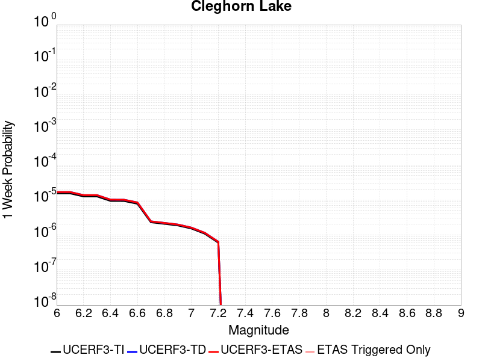 | 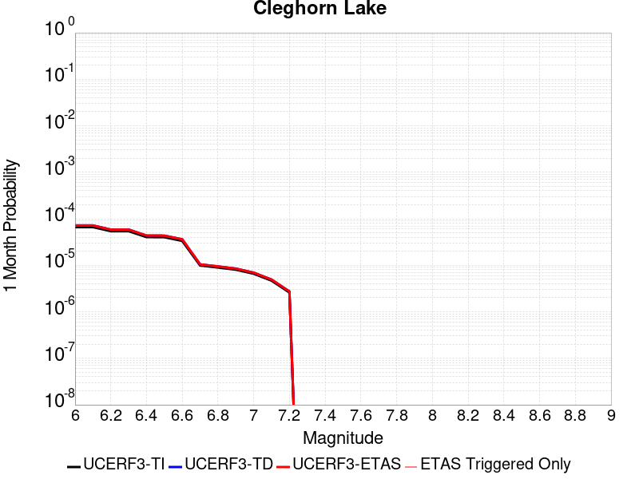 | 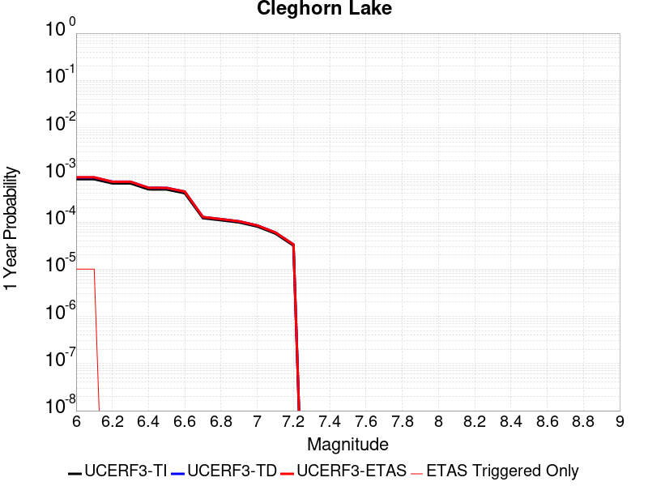 |  |

| Magnitude | 1 wk TI Prob | 1 wk TD Prob | 1 wk ETAS Prob | 1 wk ETAS/TD Gain | 1 wk ETAS Triggered Only | 1 mo TI Prob | 1 mo TD Prob | 1 mo ETAS Prob | 1 mo ETAS/TD Gain | 1 mo ETAS Triggered Only | 1 yr TI Prob | 1 yr TD Prob | 1 yr ETAS Prob | 1 yr ETAS/TD Gain | 1 yr ETAS Triggered Only | 10 yr TI Prob | 10 yr TD Prob | 10 yr ETAS Prob | 10 yr ETAS/TD Gain | 10 yr ETAS Triggered Only |
|-----|-----|-----|-----|-----|-----|-----|-----|-----|-----|-----|-----|-----|-----|-----|-----|-----|-----|-----|-----|-----|
| 6.0 | 1.5467183E-5 | 1.6794505E-5 | 1.6794505E-5 | 1.0 | 0.0 | 6.6286244E-5 | 7.197478E-5 | 7.197478E-5 | 1.0 | 0.0 | 8.067362E-4 | 8.7599544E-4 | 8.8598666E-4 | 1.0114056 | 1.0E-5 | 0.008038137 | 0.008730852 | 0.008780415 | 1.0056769 | 5.0E-5 |
| 6.1 | 1.5467183E-5 | 1.6794505E-5 | 1.6794505E-5 | 1.0 | 0.0 | 6.6286244E-5 | 7.197478E-5 | 7.197478E-5 | 1.0 | 0.0 | 8.067362E-4 | 8.7599544E-4 | 8.8598666E-4 | 1.0114056 | 1.0E-5 | 0.008038137 | 0.008730852 | 0.008780415 | 1.0056769 | 5.0E-5 |
| 6.2 | 1.2624631E-5 | 1.3681784E-5 | 1.3681784E-5 | 1.0 | 0.0 | 5.410444E-5 | 5.8635174E-5 | 5.8635174E-5 | 1.0 | 0.0 | 6.585225E-4 | 7.136981E-4 | 7.136981E-4 | 1.0 | 0.0 | 0.0065657445 | 0.007118856 | 0.007118856 | 1.0 | 0.0 |
| 6.3 | 1.2624631E-5 | 1.3681784E-5 | 1.3681784E-5 | 1.0 | 0.0 | 5.410444E-5 | 5.8635174E-5 | 5.8635174E-5 | 1.0 | 0.0 | 6.585225E-4 | 7.136981E-4 | 7.136981E-4 | 1.0 | 0.0 | 0.0065657445 | 0.007118856 | 0.007118856 | 1.0 | 0.0 |
| 6.4 | 9.417684E-6 | 1.0170288E-5 | 1.0170288E-5 | 1.0 | 0.0 | 4.036088E-5 | 4.358645E-5 | 4.358645E-5 | 1.0 | 0.0 | 4.912829E-4 | 5.305769E-4 | 5.305769E-4 | 1.0 | 0.0 | 0.004901982 | 0.0052971374 | 0.0052971374 | 1.0 | 0.0 |
| 6.5 | 9.368219E-6 | 1.0117714E-5 | 1.0117714E-5 | 1.0 | 0.0 | 4.014889E-5 | 4.3361142E-5 | 4.3361142E-5 | 1.0 | 0.0 | 4.8870314E-4 | 5.278351E-4 | 5.278351E-4 | 1.0 | 0.0 | 0.004876298 | 0.0052698497 | 0.0052698497 | 1.0 | 0.0 |
| 6.6 | 7.803798E-6 | 8.441975E-6 | 8.441975E-6 | 1.0 | 0.0 | 3.3444423E-5 | 3.617962E-5 | 3.617962E-5 | 1.0 | 0.0 | 4.0710976E-4 | 4.4043775E-4 | 4.4043775E-4 | 1.0 | 0.0 | 0.0040636472 | 0.0043995655 | 0.0043995655 | 1.0 | 0.0 |
| 6.7 | 2.3108669E-6 | 2.443863E-6 | 2.443863E-6 | 1.0 | 0.0 | 9.903678E-6 | 1.0473657E-5 | 1.0473657E-5 | 1.0 | 0.0 | 1.205706E-4 | 1.2750951E-4 | 1.2750951E-4 | 1.0 | 0.0 | 0.001205052 | 0.0012743821 | 0.0012743821 | 1.0 | 0.0 |
| 6.8 | 2.0882828E-6 | 2.2063082E-6 | 2.2063082E-6 | 1.0 | 0.0 | 8.949753E-6 | 9.4555735E-6 | 9.4555735E-6 | 1.0 | 0.0 | 1.08957785E-4 | 1.1511569E-4 | 1.1511569E-4 | 1.0 | 0.0 | 0.0010890438 | 0.0011505774 | 0.0011505774 | 1.0 | 0.0 |
| 6.9 | 1.876935E-6 | 1.9810739E-6 | 1.9810739E-6 | 1.0 | 0.0 | 8.043982E-6 | 8.49029E-6 | 8.49029E-6 | 1.0 | 0.0 | 9.7931086E-5 | 1.0336454E-4 | 1.0336454E-4 | 1.0 | 0.0 | 9.788794E-4 | 0.0010331806 | 0.0010331806 | 1.0 | 0.0 |
| 7.0 | 1.5357559E-6 | 1.6202993E-6 | 1.6202993E-6 | 1.0 | 0.0 | 6.5817944E-6 | 6.944122E-6 | 6.944122E-6 | 1.0 | 0.0 | 8.01304E-5 | 8.4541534E-5 | 8.4541534E-5 | 1.0 | 0.0 | 8.010151E-4 | 8.4510614E-4 | 8.4510614E-4 | 1.0 | 0.0 |
| 7.1 | 1.0905424E-6 | 1.149775E-6 | 1.149775E-6 | 1.0 | 0.0 | 4.6737446E-6 | 4.927598E-6 | 4.927598E-6 | 1.0 | 0.0 | 5.6901354E-5 | 5.999196E-5 | 5.999196E-5 | 1.0 | 0.0 | 5.6886784E-4 | 5.9976743E-4 | 5.9976743E-4 | 1.0 | 0.0 |
| 7.2 | 6.06668E-7 | 6.387348E-7 | 6.387348E-7 | 1.0 | 0.0 | 2.600003E-6 | 2.7374324E-6 | 2.7374324E-6 | 1.0 | 0.0 | 3.1654577E-5 | 3.33278E-5 | 3.33278E-5 | 1.0 | 0.0 | 3.1650066E-4 | 3.3323484E-4 | 3.3323484E-4 | 1.0 | 0.0 |

## Santa Cruz Island
*[(top)](#table-of-contents)*

| 1 Week | 1 Month | 1 Year | 10 Year |
|-----|-----|-----|-----|
|  |  |  |  |

| Magnitude | 1 wk TI Prob | 1 wk TD Prob | 1 wk ETAS Prob | 1 wk ETAS/TD Gain | 1 wk ETAS Triggered Only | 1 mo TI Prob | 1 mo TD Prob | 1 mo ETAS Prob | 1 mo ETAS/TD Gain | 1 mo ETAS Triggered Only | 1 yr TI Prob | 1 yr TD Prob | 1 yr ETAS Prob | 1 yr ETAS/TD Gain | 1 yr ETAS Triggered Only | 10 yr TI Prob | 10 yr TD Prob | 10 yr ETAS Prob | 10 yr ETAS/TD Gain | 10 yr ETAS Triggered Only |
|-----|-----|-----|-----|-----|-----|-----|-----|-----|-----|-----|-----|-----|-----|-----|-----|-----|-----|-----|-----|-----|
| 6.0 | 2.9164563E-5 | 3.16003E-5 | 3.16003E-5 | 1.0 | 0.0 | 1.2498499E-4 | 1.3542359E-4 | 1.3542359E-4 | 1.0 | 0.0 | 0.0015206301 | 0.0016476715 | 0.0016876055 | 1.0242367 | 4.0E-5 | 0.015102667 | 0.016368285 | 0.01640763 | 1.0024037 | 4.0E-5 |
| 6.1 | 2.9164563E-5 | 3.16003E-5 | 3.16003E-5 | 1.0 | 0.0 | 1.2498499E-4 | 1.3542359E-4 | 1.3542359E-4 | 1.0 | 0.0 | 0.0015206301 | 0.0016476715 | 0.0016876055 | 1.0242367 | 4.0E-5 | 0.015102667 | 0.016368285 | 0.01640763 | 1.0024037 | 4.0E-5 |
| 6.2 | 2.9164563E-5 | 3.16003E-5 | 3.16003E-5 | 1.0 | 0.0 | 1.2498499E-4 | 1.3542359E-4 | 1.3542359E-4 | 1.0 | 0.0 | 0.0015206301 | 0.0016476715 | 0.0016876055 | 1.0242367 | 4.0E-5 | 0.015102667 | 0.016368285 | 0.01640763 | 1.0024037 | 4.0E-5 |
| 6.3 | 1.6635553E-5 | 1.7804621E-5 | 1.7804621E-5 | 1.0 | 0.0 | 7.1293274E-5 | 7.630339E-5 | 7.630339E-5 | 1.0 | 0.0 | 8.6765E-4 | 9.286161E-4 | 9.386068E-4 | 1.0107588 | 1.0E-5 | 0.008642701 | 0.00924923 | 0.009269045 | 1.0021423 | 2.0E-5 |
| 6.4 | 1.6635553E-5 | 1.7804621E-5 | 1.7804621E-5 | 1.0 | 0.0 | 7.1293274E-5 | 7.630339E-5 | 7.630339E-5 | 1.0 | 0.0 | 8.6765E-4 | 9.286161E-4 | 9.386068E-4 | 1.0107588 | 1.0E-5 | 0.008642701 | 0.00924923 | 0.009269045 | 1.0021423 | 2.0E-5 |
| 6.5 | 1.2238748E-5 | 1.3043176E-5 | 1.3043176E-5 | 1.0 | 0.0 | 5.2450723E-5 | 5.589815E-5 | 5.589815E-5 | 1.0 | 0.0 | 6.3840044E-4 | 6.8035116E-4 | 6.903444E-4 | 1.0146883 | 1.0E-5 | 0.0063656955 | 0.0067830817 | 0.006802946 | 1.0029285 | 2.0E-5 |
| 6.6 | 1.0489767E-5 | 1.1156786E-5 | 1.1156786E-5 | 1.0 | 0.0 | 4.495537E-5 | 4.781393E-5 | 4.781393E-5 | 1.0 | 0.0 | 5.4719415E-4 | 5.819814E-4 | 5.819814E-4 | 1.0 | 0.0 | 0.005458487 | 0.0058048135 | 0.0058147553 | 1.0017127 | 1.0E-5 |
| 6.7 | 8.699222E-6 | 9.236903E-6 | 9.236903E-6 | 1.0 | 0.0 | 3.7281847E-5 | 3.9586128E-5 | 3.9586128E-5 | 1.0 | 0.0 | 4.5381195E-4 | 4.818551E-4 | 4.818551E-4 | 1.0 | 0.0 | 0.0045288634 | 0.0048081707 | 0.0048181224 | 1.0020698 | 1.0E-5 |
| 6.8 | 8.307732E-6 | 8.817019E-6 | 8.817019E-6 | 1.0 | 0.0 | 3.560408E-5 | 3.7786678E-5 | 3.7786678E-5 | 1.0 | 0.0 | 4.3339343E-4 | 4.5995612E-4 | 4.5995612E-4 | 1.0 | 0.0 | 0.004325492 | 0.0045900946 | 0.004600049 | 1.0021687 | 1.0E-5 |
| 6.9 | 8.073121E-6 | 8.56505E-6 | 8.56505E-6 | 1.0 | 0.0 | 3.459863E-5 | 3.6706842E-5 | 3.6706842E-5 | 1.0 | 0.0 | 4.2115687E-4 | 4.4681455E-4 | 4.4681455E-4 | 1.0 | 0.0 | 0.004203596 | 0.0044592135 | 0.004469169 | 1.0022326 | 1.0E-5 |
| 7.0 | 7.617019E-6 | 8.074767E-6 | 8.074767E-6 | 1.0 | 0.0 | 3.264396E-5 | 3.4605688E-5 | 3.4605688E-5 | 1.0 | 0.0 | 3.9736772E-4 | 4.212432E-4 | 4.212432E-4 | 1.0 | 0.0 | 0.003966579 | 0.0042044944 | 0.0042144526 | 1.0023685 | 1.0E-5 |
| 7.1 | 7.1224836E-6 | 7.545883E-6 | 7.545883E-6 | 1.0 | 0.0 | 3.052457E-5 | 3.23391E-5 | 3.23391E-5 | 1.0 | 0.0 | 3.715733E-4 | 3.9365777E-4 | 3.9365777E-4 | 1.0 | 0.0 | 0.003709526 | 0.003929647 | 0.003939608 | 1.0025347 | 1.0E-5 |
| 7.2 | 6.441115E-6 | 6.8274703E-6 | 6.8274703E-6 | 1.0 | 0.0 | 2.7604487E-5 | 2.926026E-5 | 2.926026E-5 | 1.0 | 0.0 | 3.360328E-4 | 3.5618566E-4 | 3.5618566E-4 | 1.0 | 0.0 | 0.0033552512 | 0.0035561763 | 0.0035561763 | 1.0 | 0.0 |
| 7.3 | 5.494274E-6 | 5.8200676E-6 | 5.8200676E-6 | 1.0 | 0.0 | 2.3546674E-5 | 2.494291E-5 | 2.494291E-5 | 1.0 | 0.0 | 2.8664304E-4 | 3.0363782E-4 | 3.0363782E-4 | 1.0 | 0.0 | 0.002862736 | 0.0030322527 | 0.0030322527 | 1.0 | 0.0 |
| 7.4 | 4.0802624E-6 | 4.3123086E-6 | 4.3123086E-6 | 1.0 | 0.0 | 1.7486722E-5 | 1.8481192E-5 | 1.8481192E-5 | 1.0 | 0.0 | 2.1288003E-4 | 2.2498537E-4 | 2.2498537E-4 | 1.0 | 0.0 | 0.0021267622 | 0.002247585 | 0.002247585 | 1.0 | 0.0 |
| 7.5 | 2.3584746E-6 | 2.4753365E-6 | 2.4753365E-6 | 1.0 | 0.0 | 1.0107709E-5 | 1.0608543E-5 | 1.0608543E-5 | 1.0 | 0.0 | 1.2305441E-4 | 1.2915139E-4 | 1.2915139E-4 | 1.0 | 0.0 | 0.0012298629 | 0.0012907684 | 0.0012907684 | 1.0 | 0.0 |
| 7.6 | 9.4981914E-7 | 9.861021E-7 | 9.861021E-7 | 1.0 | 0.0 | 4.0706473E-6 | 4.226145E-6 | 4.226145E-6 | 1.0 | 0.0 | 4.9559E-5 | 5.1452113E-5 | 5.1452113E-5 | 1.0 | 0.0 | 4.954795E-4 | 5.1440333E-4 | 5.1440333E-4 | 1.0 | 0.0 |
| 7.7 | 2.6013532E-7 | 2.6416785E-7 | 2.6416785E-7 | 1.0 | 0.0 | 1.1148652E-6 | 1.1321475E-6 | 1.1321475E-6 | 1.0 | 0.0 | 1.3573399E-5 | 1.3783809E-5 | 1.3783809E-5 | 1.0 | 0.0 | 1.357257E-4 | 1.3782961E-4 | 1.3782961E-4 | 1.0 | 0.0 |
| 7.8 | 4.1522263E-8 | 3.9656992E-8 | 3.9656992E-8 | 1.0 | 0.0 | 1.7795254E-7 | 1.6995853E-7 | 1.6995853E-7 | 1.0 | 0.0 | 2.16657E-6 | 2.0692432E-6 | 2.0692432E-6 | 1.0 | 0.0 | 2.1665488E-5 | 2.0692261E-5 | 2.0692261E-5 | 1.0 | 0.0 |
| 7.9 | 7.7242046E-10 | 5.9468686E-10 | 5.9468686E-10 | 1.0 | 0.0 | 3.3103735E-9 | 2.5486577E-9 | 2.5486577E-9 | 1.0 | 0.0 | 4.0303796E-8 | 3.1029906E-8 | 3.1029906E-8 | 1.0 | 0.0 | 4.030379E-7 | 3.1029904E-7 | 3.1029904E-7 | 1.0 | 0.0 |

## San Clemente
*[(top)](#table-of-contents)*

| 1 Week | 1 Month | 1 Year | 10 Year |
|-----|-----|-----|-----|
|  |  |  |  |

| Magnitude | 1 wk TI Prob | 1 wk TD Prob | 1 wk ETAS Prob | 1 wk ETAS/TD Gain | 1 wk ETAS Triggered Only | 1 mo TI Prob | 1 mo TD Prob | 1 mo ETAS Prob | 1 mo ETAS/TD Gain | 1 mo ETAS Triggered Only | 1 yr TI Prob | 1 yr TD Prob | 1 yr ETAS Prob | 1 yr ETAS/TD Gain | 1 yr ETAS Triggered Only | 10 yr TI Prob | 10 yr TD Prob | 10 yr ETAS Prob | 10 yr ETAS/TD Gain | 10 yr ETAS Triggered Only |
|-----|-----|-----|-----|-----|-----|-----|-----|-----|-----|-----|-----|-----|-----|-----|-----|-----|-----|-----|-----|-----|
| 6.0 | 6.681379E-5 | 8.16381E-5 | 8.16381E-5 | 1.0 | 0.0 | 2.8631336E-4 | 3.498339E-4 | 3.5983042E-4 | 1.028575 | 1.0E-5 | 0.003480294 | 0.004251489 | 0.004301276 | 1.0117106 | 5.0E-5 | 0.03426291 | 0.041757602 | 0.041805513 | 1.0011474 | 5.0E-5 |
| 6.1 | 6.681379E-5 | 8.16381E-5 | 8.16381E-5 | 1.0 | 0.0 | 2.8631336E-4 | 3.498339E-4 | 3.498339E-4 | 1.0 | 0.0 | 0.003480294 | 0.004251489 | 0.004291319 | 1.0093684 | 4.0E-5 | 0.03426291 | 0.041757602 | 0.04179593 | 1.0009179 | 4.0E-5 |
| 6.2 | 3.9400576E-5 | 4.6453744E-5 | 4.6453744E-5 | 1.0 | 0.0 | 1.6884868E-4 | 1.9907262E-4 | 1.9907262E-4 | 1.0 | 0.0 | 0.0020537945 | 0.0024210762 | 0.002431052 | 1.0041203 | 1.0E-5 | 0.020349167 | 0.023953747 | 0.023963507 | 1.0004075 | 1.0E-5 |
| 6.3 | 3.2590255E-5 | 3.7930393E-5 | 3.7930393E-5 | 1.0 | 0.0 | 1.3966505E-4 | 1.6254887E-4 | 1.6254887E-4 | 1.0 | 0.0 | 0.0016990956 | 0.0019772663 | 0.0019872466 | 1.0050474 | 1.0E-5 | 0.01686163 | 0.019600531 | 0.019610336 | 1.0005002 | 1.0E-5 |
| 6.4 | 2.9454652E-5 | 3.4098903E-5 | 3.4098903E-5 | 1.0 | 0.0 | 1.2622811E-4 | 1.461301E-4 | 1.461301E-4 | 1.0 | 0.0 | 0.0015357438 | 0.0017777067 | 0.0017876889 | 1.0056152 | 1.0E-5 | 0.015251739 | 0.017638035 | 0.017647859 | 1.000557 | 1.0E-5 |
| 6.5 | 2.790836E-5 | 3.2248514E-5 | 3.2248514E-5 | 1.0 | 0.0 | 1.1960178E-4 | 1.3820072E-4 | 1.3820072E-4 | 1.0 | 0.0 | 0.001455179 | 0.0016813197 | 0.0016913029 | 1.0059377 | 1.0E-5 | 0.014456868 | 0.016689014 | 0.016698847 | 1.0005893 | 1.0E-5 |
| 6.6 | 2.2492153E-5 | 2.576349E-5 | 2.576349E-5 | 1.0 | 0.0 | 9.639138E-5 | 1.10410365E-4 | 1.10410365E-4 | 1.0 | 0.0 | 0.0011729331 | 0.0013434316 | 0.0013534182 | 1.0074337 | 1.0E-5 | 0.011667615 | 0.013354818 | 0.013364685 | 1.0007387 | 1.0E-5 |
| 6.7 | 1.9862755E-5 | 2.266709E-5 | 2.266709E-5 | 1.0 | 0.0 | 8.512331E-5 | 9.714112E-5 | 9.714112E-5 | 1.0 | 0.0 | 0.0010358836 | 0.0011820628 | 0.0011920509 | 1.0084498 | 1.0E-5 | 0.010310682 | 0.0117590455 | 0.011768928 | 1.0008404 | 1.0E-5 |
| 6.8 | 1.6697575E-5 | 1.897825E-5 | 1.897825E-5 | 1.0 | 0.0 | 7.155907E-5 | 8.133287E-5 | 8.133287E-5 | 1.0 | 0.0 | 8.7088346E-4 | 9.897873E-4 | 9.897873E-4 | 1.0 | 0.0 | 0.008674784 | 0.009854816 | 0.009854816 | 1.0 | 0.0 |
| 6.9 | 1.5218415E-5 | 1.7269886E-5 | 1.7269886E-5 | 1.0 | 0.0 | 6.522015E-5 | 7.401175E-5 | 7.401175E-5 | 1.0 | 0.0 | 7.93766E-4 | 9.007293E-4 | 9.007293E-4 | 1.0 | 0.0 | 0.007909367 | 0.008971731 | 0.008971731 | 1.0 | 0.0 |
| 7.0 | 1.2392958E-5 | 1.4033402E-5 | 1.4033402E-5 | 1.0 | 0.0 | 5.3111595E-5 | 6.014181E-5 | 6.014181E-5 | 1.0 | 0.0 | 6.4644177E-4 | 7.319881E-4 | 7.319881E-4 | 1.0 | 0.0 | 0.0064456454 | 0.007296557 | 0.007296557 | 1.0 | 0.0 |
| 7.1 | 1.0934128E-5 | 1.2375478E-5 | 1.2375478E-5 | 1.0 | 0.0 | 4.6859706E-5 | 5.3036725E-5 | 5.3036725E-5 | 1.0 | 0.0 | 5.7036756E-4 | 6.4553815E-4 | 6.4553815E-4 | 1.0 | 0.0 | 0.0056890585 | 0.006437376 | 0.006437376 | 1.0 | 0.0 |
| 7.2 | 9.5798805E-6 | 1.0845234E-5 | 1.0845234E-5 | 1.0 | 0.0 | 4.1055984E-5 | 4.6478784E-5 | 4.6478784E-5 | 1.0 | 0.0 | 4.9974193E-4 | 5.6573946E-4 | 5.6573946E-4 | 1.0 | 0.0 | 0.0049861963 | 0.0056437165 | 0.0056437165 | 1.0 | 0.0 |
| 7.3 | 8.0167365E-6 | 9.0841695E-6 | 9.0841695E-6 | 1.0 | 0.0 | 3.4356988E-5 | 3.8931612E-5 | 3.8931612E-5 | 1.0 | 0.0 | 4.1821605E-4 | 4.7389636E-4 | 4.7389636E-4 | 1.0 | 0.0 | 0.0041742986 | 0.004729561 | 0.004729561 | 1.0 | 0.0 |
| 7.4 | 2.9581017E-6 | 3.362475E-6 | 3.362475E-6 | 1.0 | 0.0 | 1.2677518E-5 | 1.4410556E-5 | 1.4410556E-5 | 1.0 | 0.0 | 1.5433785E-4 | 1.7543945E-4 | 1.7543945E-4 | 1.0 | 0.0 | 0.001542307 | 0.0017535045 | 0.0017535045 | 1.0 | 0.0 |

## Oceanic - West Huasna
*[(top)](#table-of-contents)*

| 1 Week | 1 Month | 1 Year | 10 Year |
|-----|-----|-----|-----|
|  | 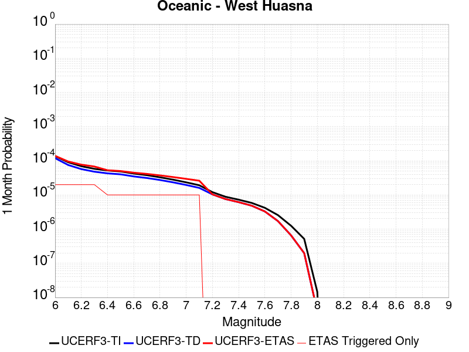 |  |  |

| Magnitude | 1 wk TI Prob | 1 wk TD Prob | 1 wk ETAS Prob | 1 wk ETAS/TD Gain | 1 wk ETAS Triggered Only | 1 mo TI Prob | 1 mo TD Prob | 1 mo ETAS Prob | 1 mo ETAS/TD Gain | 1 mo ETAS Triggered Only | 1 yr TI Prob | 1 yr TD Prob | 1 yr ETAS Prob | 1 yr ETAS/TD Gain | 1 yr ETAS Triggered Only | 10 yr TI Prob | 10 yr TD Prob | 10 yr ETAS Prob | 10 yr ETAS/TD Gain | 10 yr ETAS Triggered Only |
|-----|-----|-----|-----|-----|-----|-----|-----|-----|-----|-----|-----|-----|-----|-----|-----|-----|-----|-----|-----|-----|
| 6.0 | 3.195567E-5 | 2.7927317E-5 | 2.7927317E-5 | 1.0 | 0.0 | 1.3694567E-4 | 1.1968325E-4 | 1.3968087E-4 | 1.1670878 | 2.0E-5 | 0.0016660384 | 0.0014562128 | 0.0014761837 | 1.0137143 | 2.0E-5 | 0.016536033 | 0.014471259 | 0.014520535 | 1.0034051 | 5.0E-5 |
| 6.1 | 2.1156782E-5 | 1.757375E-5 | 1.757375E-5 | 1.0 | 0.0 | 9.066878E-5 | 7.5313954E-5 | 9.531245E-5 | 1.265535 | 2.0E-5 | 0.0011033333 | 9.16571E-4 | 9.3655265E-4 | 1.0218005 | 2.0E-5 | 0.010978713 | 0.009128914 | 0.009168549 | 1.0043417 | 4.0E-5 |
| 6.2 | 1.6195117E-5 | 1.3327337E-5 | 1.3327337E-5 | 1.0 | 0.0 | 6.9405796E-5 | 5.711592E-5 | 7.7114775E-5 | 1.3501451 | 2.0E-5 | 8.44688E-4 | 6.9516705E-4 | 7.151532E-4 | 1.0287501 | 2.0E-5 | 0.008414844 | 0.0069302185 | 0.0069699413 | 1.0057318 | 4.0E-5 |
| 6.3 | 1.3559345E-5 | 1.1179287E-5 | 1.1179287E-5 | 1.0 | 0.0 | 5.811018E-5 | 4.7910355E-5 | 6.7909394E-5 | 1.4174262 | 2.0E-5 | 7.072618E-4 | 5.831534E-4 | 6.031417E-4 | 1.0342762 | 2.0E-5 | 0.0070501505 | 0.0058163498 | 0.0058561172 | 1.0068371 | 4.0E-5 |
| 6.4 | 1.2120619E-5 | 1.0001102E-5 | 1.0001102E-5 | 1.0 | 0.0 | 5.1944477E-5 | 4.2861164E-5 | 5.2860734E-5 | 1.2333014 | 1.0E-5 | 6.322405E-4 | 5.217102E-4 | 5.31705E-4 | 1.0191578 | 1.0E-5 | 0.006304447 | 0.005204922 | 0.005234766 | 1.0057337 | 3.0E-5 |
| 6.5 | 1.13511915E-5 | 9.367588E-6 | 9.367588E-6 | 1.0 | 0.0 | 4.8647056E-5 | 4.014619E-5 | 5.014579E-5 | 1.2490796 | 1.0E-5 | 5.9211696E-4 | 4.886707E-4 | 4.9866585E-4 | 1.0204537 | 1.0E-5 | 0.0059054173 | 0.0048760204 | 0.004905874 | 1.0061226 | 3.0E-5 |
| 6.6 | 9.850605E-6 | 8.135516E-6 | 8.135516E-6 | 1.0 | 0.0 | 4.2216197E-5 | 3.4866032E-5 | 4.4865683E-5 | 1.2868022 | 1.0E-5 | 5.1386096E-4 | 4.2441147E-4 | 4.344072E-4 | 1.0235521 | 1.0E-5 | 0.0051267436 | 0.0042360416 | 0.004255957 | 1.0047014 | 2.0E-5 |
| 6.7 | 8.8558645E-6 | 7.3185197E-6 | 7.3185197E-6 | 1.0 | 0.0 | 3.7953152E-5 | 3.136471E-5 | 4.1364394E-5 | 1.3188196 | 1.0E-5 | 4.6198163E-4 | 3.817986E-4 | 3.9179478E-4 | 1.0261818 | 1.0E-5 | 0.004610224 | 0.003811452 | 0.0038313759 | 1.0052273 | 2.0E-5 |
| 6.8 | 7.67136E-6 | 6.391832E-6 | 6.391832E-6 | 1.0 | 0.0 | 3.2876844E-5 | 2.7393278E-5 | 3.7393005E-5 | 1.365043 | 1.0E-5 | 4.0020206E-4 | 3.334623E-4 | 3.4345896E-4 | 1.0299784 | 1.0E-5 | 0.003994821 | 0.0033296403 | 0.0033495736 | 1.0059867 | 2.0E-5 |
| 6.9 | 6.534529E-6 | 5.458395E-6 | 5.458395E-6 | 1.0 | 0.0 | 2.8004823E-5 | 2.3392913E-5 | 3.339268E-5 | 1.4274698 | 1.0E-5 | 3.4090536E-4 | 2.8477164E-4 | 2.9476878E-4 | 1.0351058 | 1.0E-5 | 0.0034038287 | 0.0028440838 | 0.0028540555 | 1.0035061 | 1.0E-5 |
| 7.0 | 5.460525E-6 | 4.5700085E-6 | 4.5700085E-6 | 1.0 | 0.0 | 2.3402039E-5 | 1.9585605E-5 | 2.9585408E-5 | 1.5105691 | 1.0E-5 | 2.8488258E-4 | 2.3842875E-4 | 2.4842637E-4 | 1.0419313 | 1.0E-5 | 0.0028451765 | 0.0023817432 | 0.0023917195 | 1.0041887 | 1.0E-5 |
| 7.1 | 4.4825083E-6 | 3.752494E-6 | 3.752494E-6 | 1.0 | 0.0 | 1.9210609E-5 | 1.6082018E-5 | 2.6081858E-5 | 1.6218026 | 1.0E-5 | 2.3386406E-4 | 1.9578107E-4 | 2.0577911E-4 | 1.0510675 | 1.0E-5 | 0.002336181 | 0.001956098 | 0.0019660783 | 1.0051023 | 1.0E-5 |
| 7.2 | 2.821708E-6 | 2.4249744E-6 | 2.4249744E-6 | 1.0 | 0.0 | 1.2092979E-5 | 1.0392706E-5 | 1.0392706E-5 | 1.0 | 0.0 | 1.4722206E-4 | 1.2652385E-4 | 1.2652385E-4 | 1.0 | 0.0 | 0.0014712457 | 0.0012645207 | 0.0012645207 | 1.0 | 0.0 |
| 7.3 | 2.0644757E-6 | 1.7687776E-6 | 1.7687776E-6 | 1.0 | 0.0 | 8.847723E-6 | 7.580453E-6 | 7.580453E-6 | 1.0 | 0.0 | 1.0771569E-4 | 9.228811E-5 | 9.228811E-5 | 1.0 | 0.0 | 0.001076635 | 9.224996E-4 | 9.224996E-4 | 1.0 | 0.0 |
| 7.4 | 1.6980367E-6 | 1.4380237E-6 | 1.4380237E-6 | 1.0 | 0.0 | 7.27728E-6 | 6.162944E-6 | 6.162944E-6 | 1.0 | 0.0 | 8.8597284E-5 | 7.503126E-5 | 7.503126E-5 | 1.0 | 0.0 | 8.8561967E-4 | 7.500609E-4 | 7.500609E-4 | 1.0 | 0.0 |
| 7.5 | 1.3637683E-6 | 1.1302964E-6 | 1.1302964E-6 | 1.0 | 0.0 | 5.844708E-6 | 4.8441184E-6 | 4.8441184E-6 | 1.0 | 0.0 | 7.1156996E-5 | 5.8975544E-5 | 5.8975544E-5 | 1.0 | 0.0 | 7.1134215E-4 | 5.896005E-4 | 5.896005E-4 | 1.0 | 0.0 |
| 7.6 | 9.802994E-7 | 7.6775416E-7 | 7.6775416E-7 | 1.0 | 0.0 | 4.2012766E-6 | 3.2903706E-6 | 3.2903706E-6 | 1.0 | 0.0 | 5.1149345E-5 | 4.0059527E-5 | 4.0059527E-5 | 1.0 | 0.0 | 5.113757E-4 | 4.005245E-4 | 4.005245E-4 | 1.0 | 0.0 |
| 7.7 | 5.986191E-7 | 4.0053322E-7 | 4.0053322E-7 | 1.0 | 0.0 | 2.5655079E-6 | 1.7165698E-6 | 1.7165698E-6 | 1.0 | 0.0 | 3.1234613E-5 | 2.0899037E-5 | 2.0899037E-5 | 1.0 | 0.0 | 3.123022E-4 | 2.0897207E-4 | 2.0897207E-4 | 1.0 | 0.0 |
| 7.8 | 2.9189815E-7 | 1.528825E-7 | 1.528825E-7 | 1.0 | 0.0 | 1.2509914E-6 | 6.5521056E-7 | 6.5521056E-7 | 1.0 | 0.0 | 1.5230714E-5 | 7.977159E-6 | 7.977159E-6 | 1.0 | 0.0 | 1.522967E-4 | 7.977004E-5 | 7.977004E-5 | 1.0 | 0.0 |
| 7.9 | 1.2057845E-7 | 4.6226127E-8 | 4.6226127E-8 | 1.0 | 0.0 | 5.1676466E-7 | 1.9811195E-7 | 1.9811195E-7 | 1.0 | 0.0 | 6.2915915E-6 | 2.4120104E-6 | 2.4120104E-6 | 1.0 | 0.0 | 6.2914136E-5 | 2.4121146E-5 | 2.4121146E-5 | 1.0 | 0.0 |
| 8.0 | 3.3806387E-9 | 9.016662E-10 | 9.016662E-10 | 1.0 | 0.0 | 1.4488451E-8 | 3.864284E-9 | 3.864284E-9 | 1.0 | 0.0 | 1.7639688E-7 | 4.704766E-8 | 4.704766E-8 | 1.0 | 0.0 | 1.7639674E-6 | 4.7157073E-7 | 4.7157073E-7 | 1.0 | 0.0 |

## Santa Ynez (West)
*[(top)](#table-of-contents)*

| 1 Week | 1 Month | 1 Year | 10 Year |
|-----|-----|-----|-----|
|  |  |  |  |

| Magnitude | 1 wk TI Prob | 1 wk TD Prob | 1 wk ETAS Prob | 1 wk ETAS/TD Gain | 1 wk ETAS Triggered Only | 1 mo TI Prob | 1 mo TD Prob | 1 mo ETAS Prob | 1 mo ETAS/TD Gain | 1 mo ETAS Triggered Only | 1 yr TI Prob | 1 yr TD Prob | 1 yr ETAS Prob | 1 yr ETAS/TD Gain | 1 yr ETAS Triggered Only | 10 yr TI Prob | 10 yr TD Prob | 10 yr ETAS Prob | 10 yr ETAS/TD Gain | 10 yr ETAS Triggered Only |
|-----|-----|-----|-----|-----|-----|-----|-----|-----|-----|-----|-----|-----|-----|-----|-----|-----|-----|-----|-----|-----|
| 6.0 | 4.7352758E-5 | 5.4974273E-5 | 5.4974273E-5 | 1.0 | 0.0 | 2.0292461E-4 | 2.355844E-4 | 2.355844E-4 | 1.0 | 0.0 | 0.0024678076 | 0.0028646353 | 0.0028646353 | 1.0 | 0.0 | 0.024405818 | 0.028305482 | 0.028354067 | 1.0017165 | 5.0E-5 |
| 6.1 | 4.7352758E-5 | 5.4974273E-5 | 5.4974273E-5 | 1.0 | 0.0 | 2.0292461E-4 | 2.355844E-4 | 2.355844E-4 | 1.0 | 0.0 | 0.0024678076 | 0.0028646353 | 0.0028646353 | 1.0 | 0.0 | 0.024405818 | 0.028305482 | 0.028354067 | 1.0017165 | 5.0E-5 |
| 6.2 | 3.0415853E-5 | 3.3926168E-5 | 3.3926168E-5 | 1.0 | 0.0 | 1.3034715E-4 | 1.4538999E-4 | 1.4538999E-4 | 1.0 | 0.0 | 0.0015858212 | 0.0017687212 | 0.0017687212 | 1.0 | 0.0 | 0.015745522 | 0.017550347 | 0.017589645 | 1.0022391 | 4.0E-5 |
| 6.3 | 3.0415853E-5 | 3.3926168E-5 | 3.3926168E-5 | 1.0 | 0.0 | 1.3034715E-4 | 1.4538999E-4 | 1.4538999E-4 | 1.0 | 0.0 | 0.0015858212 | 0.0017687212 | 0.0017687212 | 1.0 | 0.0 | 0.015745522 | 0.017550347 | 0.017589645 | 1.0022391 | 4.0E-5 |
| 6.4 | 2.5452082E-5 | 2.7913213E-5 | 2.7913213E-5 | 1.0 | 0.0 | 1.09075794E-4 | 1.1962268E-4 | 1.1962268E-4 | 1.0 | 0.0 | 0.0013271887 | 0.0014554498 | 0.0014554498 | 1.0 | 0.0 | 0.013192902 | 0.014461356 | 0.014500778 | 1.002726 | 4.0E-5 |
| 6.5 | 2.3143784E-5 | 2.5128926E-5 | 2.5128926E-5 | 1.0 | 0.0 | 9.9183875E-5 | 1.07691034E-4 | 1.07691034E-4 | 1.0 | 0.0 | 0.0012068948 | 0.0013103614 | 0.0013103614 | 1.0 | 0.0 | 0.012003611 | 0.013028024 | 0.0130675025 | 1.0030303 | 4.0E-5 |
| 6.6 | 1.9118515E-5 | 2.0354822E-5 | 2.0354822E-5 | 1.0 | 0.0 | 8.193392E-5 | 8.723208E-5 | 8.723208E-5 | 1.0 | 0.0 | 9.97089E-4 | 0.0010615411 | 0.0010615411 | 1.0 | 0.0 | 0.00992627 | 0.010565613 | 0.010605191 | 1.0037459 | 4.0E-5 |
| 6.7 | 1.722807E-5 | 1.8146751E-5 | 1.8146751E-5 | 1.0 | 0.0 | 7.3832496E-5 | 7.77695E-5 | 7.77695E-5 | 1.0 | 0.0 | 8.985399E-4 | 9.46438E-4 | 9.46438E-4 | 1.0 | 0.0 | 0.008949154 | 0.009424719 | 0.009464342 | 1.0042042 | 4.0E-5 |
| 6.8 | 1.5317364E-5 | 1.5926815E-5 | 1.5926815E-5 | 1.0 | 0.0 | 6.56442E-5 | 6.825601E-5 | 6.825601E-5 | 1.0 | 0.0 | 7.98925E-4 | 8.307044E-4 | 8.307044E-4 | 1.0 | 0.0 | 0.007960589 | 0.00827648 | 0.008316149 | 1.0047929 | 4.0E-5 |
| 6.9 | 1.3071226E-5 | 1.3329868E-5 | 1.3329868E-5 | 1.0 | 0.0 | 5.6018336E-5 | 5.7126766E-5 | 5.7126766E-5 | 1.0 | 0.0 | 6.8180985E-4 | 6.9529866E-4 | 6.9529866E-4 | 1.0 | 0.0 | 0.0067972173 | 0.0069314935 | 0.0069612856 | 1.0042981 | 3.0E-5 |
| 7.0 | 1.1836986E-5 | 1.1932987E-5 | 1.1932987E-5 | 1.0 | 0.0 | 5.0728955E-5 | 5.1140378E-5 | 5.1140378E-5 | 1.0 | 0.0 | 6.1745E-4 | 6.2245794E-4 | 6.2245794E-4 | 1.0 | 0.0 | 0.006157372 | 0.0062073376 | 0.006237151 | 1.004803 | 3.0E-5 |
| 7.1 | 1.0597169E-5 | 1.0542371E-5 | 1.0542371E-5 | 1.0 | 0.0 | 4.541565E-5 | 4.5180812E-5 | 4.5180812E-5 | 1.0 | 0.0 | 5.5279525E-4 | 5.499387E-4 | 5.499387E-4 | 1.0 | 0.0 | 0.0055142213 | 0.005485909 | 0.0055157444 | 1.0054386 | 3.0E-5 |
| 7.2 | 9.59113E-6 | 9.459296E-6 | 9.459296E-6 | 1.0 | 0.0 | 4.11042E-5 | 4.0539217E-5 | 4.0539217E-5 | 1.0 | 0.0 | 5.0032866E-4 | 4.934542E-4 | 4.934542E-4 | 1.0 | 0.0 | 0.004992037 | 0.004923704 | 0.0049535567 | 1.006063 | 3.0E-5 |
| 7.3 | 8.586084E-6 | 8.379719E-6 | 8.379719E-6 | 1.0 | 0.0 | 3.679698E-5 | 3.591259E-5 | 3.591259E-5 | 1.0 | 0.0 | 4.4791115E-4 | 4.371491E-4 | 4.371491E-4 | 1.0 | 0.0 | 0.004470094 | 0.004363003 | 0.004392872 | 1.006846 | 3.0E-5 |
| 7.4 | 7.2622997E-6 | 6.9516536E-6 | 6.9516536E-6 | 1.0 | 0.0 | 3.112377E-5 | 2.9792467E-5 | 2.9792467E-5 | 1.0 | 0.0 | 3.78866E-4 | 3.6266388E-4 | 3.6266388E-4 | 1.0 | 0.0 | 0.0037822074 | 0.0036208206 | 0.0036407483 | 1.0055037 | 2.0E-5 |
| 7.5 | 5.627296E-6 | 5.2516684E-6 | 5.2516684E-6 | 1.0 | 0.0 | 2.411676E-5 | 2.250696E-5 | 2.250696E-5 | 1.0 | 0.0 | 2.9358198E-4 | 2.739885E-4 | 2.739885E-4 | 1.0 | 0.0 | 0.0029319443 | 0.002736579 | 0.0027465515 | 1.0036442 | 1.0E-5 |
| 7.6 | 2.265244E-6 | 2.0608877E-6 | 2.0608877E-6 | 1.0 | 0.0 | 9.708152E-6 | 8.832346E-6 | 8.832346E-6 | 1.0 | 0.0 | 1.18190335E-4 | 1.075286E-4 | 1.075286E-4 | 1.0 | 0.0 | 0.001181275 | 0.0010747743 | 0.0010747743 | 1.0 | 0.0 |
| 7.7 | 1.3099874E-6 | 1.1016392E-6 | 1.1016392E-6 | 1.0 | 0.0 | 5.61422E-6 | 4.7213025E-6 | 4.7213025E-6 | 1.0 | 0.0 | 6.8350986E-5 | 5.7480367E-5 | 5.7480367E-5 | 1.0 | 0.0 | 6.832996E-4 | 5.746574E-4 | 5.746574E-4 | 1.0 | 0.0 |
| 7.8 | 7.903951E-7 | 6.071219E-7 | 6.071219E-7 | 1.0 | 0.0 | 3.3874032E-6 | 2.6019484E-6 | 2.6019484E-6 | 1.0 | 0.0 | 4.1240855E-5 | 3.1678275E-5 | 3.1678275E-5 | 1.0 | 0.0 | 4.12332E-4 | 3.167389E-4 | 3.167389E-4 | 1.0 | 0.0 |
| 7.9 | 7.0753297E-9 | 5.089996E-9 | 5.089996E-9 | 1.0 | 0.0 | 3.032284E-8 | 2.181427E-8 | 2.181427E-8 | 1.0 | 0.0 | 3.6918053E-7 | 2.655887E-7 | 2.655887E-7 | 1.0 | 0.0 | 3.691799E-6 | 2.6558848E-6 | 2.6558848E-6 | 1.0 | 0.0 |

## San Jacinto (Borrego)
*[(top)](#table-of-contents)*

| 1 Week | 1 Month | 1 Year | 10 Year |
|-----|-----|-----|-----|
|  |  |  |  |

| Magnitude | 1 wk TI Prob | 1 wk TD Prob | 1 wk ETAS Prob | 1 wk ETAS/TD Gain | 1 wk ETAS Triggered Only | 1 mo TI Prob | 1 mo TD Prob | 1 mo ETAS Prob | 1 mo ETAS/TD Gain | 1 mo ETAS Triggered Only | 1 yr TI Prob | 1 yr TD Prob | 1 yr ETAS Prob | 1 yr ETAS/TD Gain | 1 yr ETAS Triggered Only | 10 yr TI Prob | 10 yr TD Prob | 10 yr ETAS Prob | 10 yr ETAS/TD Gain | 10 yr ETAS Triggered Only |
|-----|-----|-----|-----|-----|-----|-----|-----|-----|-----|-----|-----|-----|-----|-----|-----|-----|-----|-----|-----|-----|
| 6.0 | 3.543992E-5 | 2.793839E-5 | 2.793839E-5 | 1.0 | 0.0 | 1.5187653E-4 | 1.1973053E-4 | 1.1973053E-4 | 1.0 | 0.0 | 0.0018475284 | 0.0014567567 | 0.0014667421 | 1.0068545 | 1.0E-5 | 0.018322436 | 0.014875817 | 0.014915222 | 1.002649 | 4.0E-5 |
| 6.1 | 3.542281E-5 | 2.793839E-5 | 2.793839E-5 | 1.0 | 0.0 | 1.5180321E-4 | 1.1973053E-4 | 1.1973053E-4 | 1.0 | 0.0 | 0.0018466372 | 0.0014567567 | 0.0014667421 | 1.0068545 | 1.0E-5 | 0.018313672 | 0.014875817 | 0.014915222 | 1.002649 | 4.0E-5 |
| 6.2 | 3.4688688E-5 | 2.793839E-5 | 2.793839E-5 | 1.0 | 0.0 | 1.4865733E-4 | 1.19730525E-4 | 1.19730525E-4 | 1.0 | 0.0 | 0.0018084005 | 0.0014567567 | 0.0014667421 | 1.0068545 | 1.0E-5 | 0.017937548 | 0.014875817 | 0.014915222 | 1.002649 | 4.0E-5 |
| 6.3 | 3.2087122E-5 | 2.7783733E-5 | 2.7783733E-5 | 1.0 | 0.0 | 1.3750899E-4 | 1.1906778E-4 | 1.1906778E-4 | 1.0 | 0.0 | 0.0016728862 | 0.0014486985 | 0.001458684 | 1.0068928 | 1.0E-5 | 0.016603488 | 0.014796849 | 0.014836257 | 1.0026633 | 4.0E-5 |
| 6.4 | 3.1828724E-5 | 2.7750719E-5 | 2.7750719E-5 | 1.0 | 0.0 | 1.364017E-4 | 1.189263E-4 | 1.189263E-4 | 1.0 | 0.0 | 0.0016594254 | 0.0014469782 | 0.0014569637 | 1.0069009 | 1.0E-5 | 0.016470885 | 0.014779927 | 0.014819336 | 1.0026664 | 4.0E-5 |
| 6.5 | 3.1563577E-5 | 2.7490418E-5 | 2.7490418E-5 | 1.0 | 0.0 | 1.3526545E-4 | 1.1781083E-4 | 1.1781083E-4 | 1.0 | 0.0 | 0.0016456128 | 0.0014334152 | 0.001443401 | 1.0069664 | 1.0E-5 | 0.0163348 | 0.014646504 | 0.014685919 | 1.002691 | 4.0E-5 |
| 6.6 | 3.1467625E-5 | 2.7334634E-5 | 2.7334634E-5 | 1.0 | 0.0 | 1.3485427E-4 | 1.17143245E-4 | 1.17143245E-4 | 1.0 | 0.0 | 0.0016406142 | 0.001425298 | 0.0014352838 | 1.007006 | 1.0E-5 | 0.016285548 | 0.0145667475 | 0.014606165 | 1.0027059 | 4.0E-5 |
| 6.7 | 3.1223695E-5 | 2.6952635E-5 | 2.6952635E-5 | 1.0 | 0.0 | 1.3380898E-4 | 1.1550625E-4 | 1.1550625E-4 | 1.0 | 0.0 | 0.0016279068 | 0.0014053936 | 0.0014153795 | 1.0071055 | 1.0E-5 | 0.01616033 | 0.014371111 | 0.014410536 | 1.0027434 | 4.0E-5 |
| 6.8 | 3.1015585E-5 | 2.6773623E-5 | 2.6773623E-5 | 1.0 | 0.0 | 1.3291716E-4 | 1.1473912E-4 | 1.1473912E-4 | 1.0 | 0.0 | 0.001617065 | 0.0013960657 | 0.0014060518 | 1.007153 | 1.0E-5 | 0.016053487 | 0.014278381 | 0.01431781 | 1.0027615 | 4.0E-5 |
| 6.9 | 2.6641965E-5 | 2.2195336E-5 | 2.2195336E-5 | 1.0 | 0.0 | 1.1417485E-4 | 9.511942E-5 | 9.511942E-5 | 1.0 | 0.0 | 0.0013891924 | 0.0011574677 | 0.0011674562 | 1.0086296 | 1.0E-5 | 0.0138054015 | 0.0118882265 | 0.011927751 | 1.0033246 | 4.0E-5 |
| 7.0 | 2.3854353E-5 | 2.0489711E-5 | 2.0489711E-5 | 1.0 | 0.0 | 1.02228936E-4 | 8.781011E-5 | 8.781011E-5 | 1.0 | 0.0 | 0.0012439266 | 0.0010685663 | 0.0010785556 | 1.0093484 | 1.0E-5 | 0.012369866 | 0.010988381 | 0.0110279415 | 1.0036002 | 4.0E-5 |
| 7.1 | 2.3672901E-5 | 2.0326188E-5 | 2.0326188E-5 | 1.0 | 0.0 | 1.0145135E-4 | 8.710934E-5 | 8.710934E-5 | 1.0 | 0.0 | 0.0012344702 | 0.0010600428 | 0.0010700322 | 1.0094236 | 1.0E-5 | 0.0122763505 | 0.010903551 | 0.010943116 | 1.0036285 | 4.0E-5 |
| 7.2 | 2.2717244E-5 | 1.955348E-5 | 1.955348E-5 | 1.0 | 0.0 | 9.735599E-5 | 8.379795E-5 | 8.379795E-5 | 1.0 | 0.0 | 0.0011846646 | 0.0010197649 | 0.0010297546 | 1.0097961 | 1.0E-5 | 0.01178369 | 0.0105008725 | 0.010540453 | 1.0037692 | 4.0E-5 |
| 7.3 | 2.1016205E-5 | 1.8394963E-5 | 1.8394963E-5 | 1.0 | 0.0 | 9.006634E-5 | 7.883319E-5 | 7.883319E-5 | 1.0 | 0.0 | 0.001096006 | 9.593735E-4 | 9.693639E-4 | 1.0104135 | 1.0E-5 | 0.010906163 | 0.009896424 | 0.009936027 | 1.0040019 | 4.0E-5 |
| 7.4 | 2.0683625E-5 | 1.8197454E-5 | 1.8197454E-5 | 1.0 | 0.0 | 8.86411E-5 | 7.798677E-5 | 7.798677E-5 | 1.0 | 0.0 | 0.001078671 | 9.4907737E-4 | 9.5906784E-4 | 1.0105265 | 1.0E-5 | 0.010734501 | 0.009793133 | 0.009832742 | 1.0040445 | 4.0E-5 |
| 7.5 | 1.9993966E-5 | 1.7792388E-5 | 1.7792388E-5 | 1.0 | 0.0 | 8.568561E-5 | 7.625088E-5 | 7.625088E-5 | 1.0 | 0.0 | 0.001042723 | 9.27961E-4 | 9.379518E-4 | 1.0107663 | 1.0E-5 | 0.010378438 | 0.009580009 | 0.009619625 | 1.0041354 | 4.0E-5 |
| 7.6 | 1.788966E-5 | 1.6445341E-5 | 1.6445341E-5 | 1.0 | 0.0 | 7.666772E-5 | 7.047814E-5 | 7.047814E-5 | 1.0 | 0.0 | 9.3302975E-4 | 8.5773534E-4 | 8.677268E-4 | 1.0116487 | 1.0E-5 | 0.00929122 | 0.008871747 | 0.008911393 | 1.0044687 | 4.0E-5 |
| 7.7 | 1.5125781E-5 | 1.4247118E-5 | 1.4247118E-5 | 1.0 | 0.0 | 6.4823165E-5 | 6.105765E-5 | 6.105765E-5 | 1.0 | 0.0 | 7.889362E-4 | 7.4312417E-4 | 7.5311674E-4 | 1.0134467 | 1.0E-5 | 0.007861412 | 0.007719309 | 0.0077590006 | 1.0051419 | 4.0E-5 |
| 7.8 | 1.250089E-5 | 1.2639882E-5 | 1.2639882E-5 | 1.0 | 0.0 | 5.3574146E-5 | 5.4169803E-5 | 5.4169803E-5 | 1.0 | 0.0 | 6.5207E-4 | 6.593184E-4 | 6.593184E-4 | 1.0 | 0.0 | 0.006501599 | 0.006872687 | 0.0069024805 | 1.004335 | 3.0E-5 |
| 7.9 | 9.561E-6 | 9.762902E-6 | 9.762902E-6 | 1.0 | 0.0 | 4.0975072E-5 | 4.184034E-5 | 4.184034E-5 | 1.0 | 0.0 | 4.987573E-4 | 5.0928764E-4 | 5.0928764E-4 | 1.0 | 0.0 | 0.0049763937 | 0.005356707 | 0.0053766 | 1.0037136 | 2.0E-5 |
| 8.0 | 8.01699E-6 | 8.301014E-6 | 8.301014E-6 | 1.0 | 0.0 | 3.4358076E-5 | 3.557529E-5 | 3.557529E-5 | 1.0 | 0.0 | 4.1822926E-4 | 4.330436E-4 | 4.330436E-4 | 1.0 | 0.0 | 0.0041744304 | 0.0045773424 | 0.004597251 | 1.0043494 | 2.0E-5 |
| 8.1 | 6.541947E-6 | 6.4683964E-6 | 6.4683964E-6 | 1.0 | 0.0 | 2.8036617E-5 | 2.7721408E-5 | 2.7721408E-5 | 1.0 | 0.0 | 3.4129233E-4 | 3.3745635E-4 | 3.3745635E-4 | 1.0 | 0.0 | 0.0034076865 | 0.0035839614 | 0.0036038896 | 1.0055604 | 2.0E-5 |
| 8.2 | 1.7968189E-6 | 7.983084E-7 | 7.983084E-7 | 1.0 | 0.0 | 7.70063E-6 | 3.4213174E-6 | 3.4213174E-6 | 1.0 | 0.0 | 9.3751136E-5 | 4.1653766E-5 | 4.1653766E-5 | 1.0 | 0.0 | 9.371159E-4 | 4.7186238E-4 | 4.7186238E-4 | 1.0 | 0.0 |
| 8.3 | 1.5167889E-7 | 4.906105E-8 | 4.906105E-8 | 1.0 | 0.0 | 6.500522E-7 | 2.1026162E-7 | 2.1026162E-7 | 1.0 | 0.0 | 7.9143565E-6 | 2.5599327E-6 | 2.5599327E-6 | 1.0 | 0.0 | 7.914075E-5 | 2.974316E-5 | 2.974316E-5 | 1.0 | 0.0 |

## Newport-Inglewood alt 1
*[(top)](#table-of-contents)*

| 1 Week | 1 Month | 1 Year | 10 Year |
|-----|-----|-----|-----|
|  | 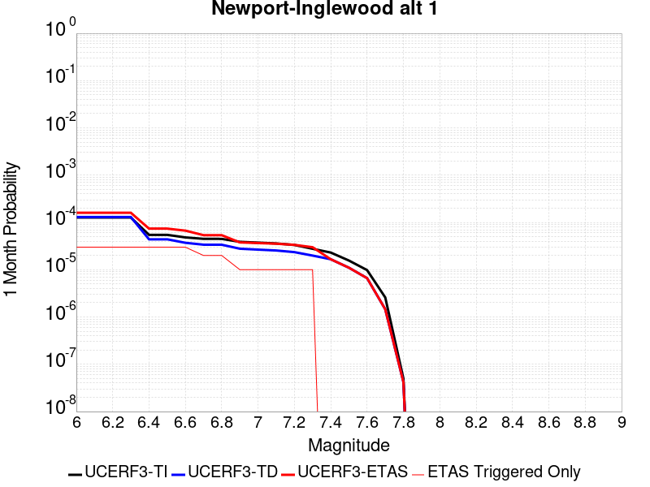 | 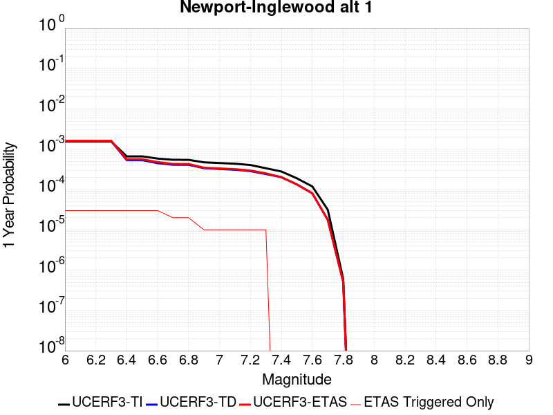 | 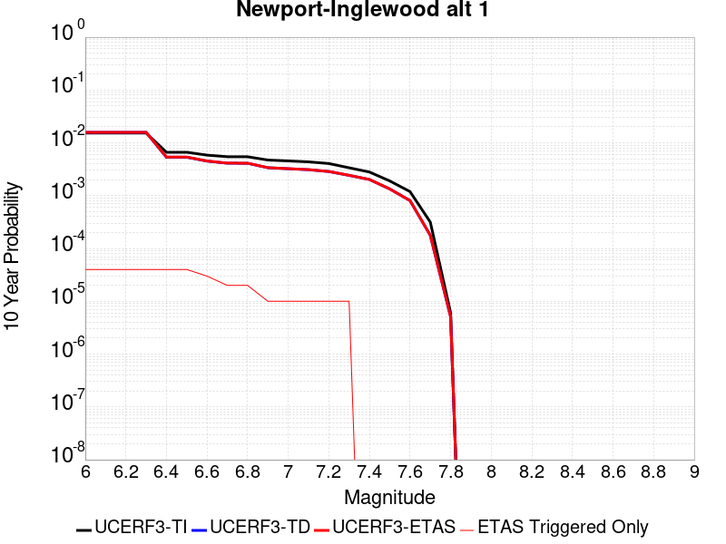 |

| Magnitude | 1 wk TI Prob | 1 wk TD Prob | 1 wk ETAS Prob | 1 wk ETAS/TD Gain | 1 wk ETAS Triggered Only | 1 mo TI Prob | 1 mo TD Prob | 1 mo ETAS Prob | 1 mo ETAS/TD Gain | 1 mo ETAS Triggered Only | 1 yr TI Prob | 1 yr TD Prob | 1 yr ETAS Prob | 1 yr ETAS/TD Gain | 1 yr ETAS Triggered Only | 10 yr TI Prob | 10 yr TD Prob | 10 yr ETAS Prob | 10 yr ETAS/TD Gain | 10 yr ETAS Triggered Only |
|-----|-----|-----|-----|-----|-----|-----|-----|-----|-----|-----|-----|-----|-----|-----|-----|-----|-----|-----|-----|-----|
| 6.0 | 2.9668912E-5 | 3.0405883E-5 | 4.040558E-5 | 1.3288738 | 1.0E-5 | 1.2714628E-4 | 1.3030716E-4 | 1.6030326E-4 | 1.2301953 | 3.0E-5 | 0.0015469068 | 0.0015858175 | 0.00161577 | 1.0188876 | 3.0E-5 | 0.015361829 | 0.015792593 | 0.01583196 | 1.0024928 | 4.0E-5 |
| 6.1 | 2.9668912E-5 | 3.0405883E-5 | 4.040558E-5 | 1.3288738 | 1.0E-5 | 1.2714628E-4 | 1.3030716E-4 | 1.6030326E-4 | 1.2301953 | 3.0E-5 | 0.0015469068 | 0.0015858175 | 0.00161577 | 1.0188876 | 3.0E-5 | 0.015361829 | 0.015792593 | 0.01583196 | 1.0024928 | 4.0E-5 |
| 6.2 | 2.9668912E-5 | 3.0405883E-5 | 4.040558E-5 | 1.3288738 | 1.0E-5 | 1.2714628E-4 | 1.3030716E-4 | 1.6030326E-4 | 1.2301953 | 3.0E-5 | 0.0015469068 | 0.0015858175 | 0.00161577 | 1.0188876 | 3.0E-5 | 0.015361829 | 0.015792593 | 0.01583196 | 1.0024928 | 4.0E-5 |
| 6.3 | 2.9668912E-5 | 3.0405883E-5 | 4.040558E-5 | 1.3288738 | 1.0E-5 | 1.2714628E-4 | 1.3030716E-4 | 1.6030326E-4 | 1.2301953 | 3.0E-5 | 0.0015469068 | 0.0015858175 | 0.00161577 | 1.0188876 | 3.0E-5 | 0.015361829 | 0.015792593 | 0.01583196 | 1.0024928 | 4.0E-5 |
| 6.4 | 1.275942E-5 | 1.0272727E-5 | 2.0272624E-5 | 1.9734414 | 1.0E-5 | 5.4682085E-5 | 4.402525E-5 | 7.4023934E-5 | 1.6813971 | 3.0E-5 | 6.65551E-4 | 5.358798E-4 | 5.658637E-4 | 1.0559527 | 3.0E-5 | 0.0066356123 | 0.0053463005 | 0.0053860866 | 1.0074418 | 4.0E-5 |
| 6.5 | 1.275942E-5 | 1.0272727E-5 | 2.0272624E-5 | 1.9734414 | 1.0E-5 | 5.4682085E-5 | 4.402525E-5 | 7.4023934E-5 | 1.6813971 | 3.0E-5 | 6.65551E-4 | 5.358798E-4 | 5.658637E-4 | 1.0559527 | 3.0E-5 | 0.0066356123 | 0.0053463005 | 0.0053860866 | 1.0074418 | 4.0E-5 |
| 6.6 | 1.1255358E-5 | 8.662064E-6 | 1.8661978E-5 | 2.1544492 | 1.0E-5 | 4.8236358E-5 | 3.7122612E-5 | 6.71215E-5 | 1.8081027 | 3.0E-5 | 5.871194E-4 | 4.518758E-4 | 4.8186223E-4 | 1.0663599 | 3.0E-5 | 0.005855706 | 0.004509747 | 0.0045396117 | 1.0066223 | 3.0E-5 |
| 6.7 | 1.0504745E-5 | 7.89996E-6 | 1.789988E-5 | 2.2658193 | 1.0E-5 | 4.5019555E-5 | 3.3856537E-5 | 5.385586E-5 | 1.5907079 | 2.0E-5 | 5.4797524E-4 | 4.1212662E-4 | 4.321184E-4 | 1.0485088 | 2.0E-5 | 0.0054662596 | 0.0041137533 | 0.004133671 | 1.0048417 | 2.0E-5 |
| 6.8 | 1.0476007E-5 | 7.881341E-6 | 1.7881262E-5 | 2.2688096 | 1.0E-5 | 4.4896402E-5 | 3.3776745E-5 | 5.3776068E-5 | 1.5921034 | 2.0E-5 | 5.464766E-4 | 4.111555E-4 | 4.311473E-4 | 1.0486234 | 2.0E-5 | 0.005451347 | 0.004104078 | 0.004123996 | 1.0048532 | 2.0E-5 |
| 6.9 | 9.076797E-6 | 6.4897686E-6 | 6.4897686E-6 | 1.0 | 0.0 | 3.889998E-5 | 2.7813E-5 | 3.781272E-5 | 1.3595341 | 1.0E-5 | 4.7350433E-4 | 3.3857097E-4 | 3.4856758E-4 | 1.0295259 | 1.0E-5 | 0.004724967 | 0.003380589 | 0.0033905553 | 1.002948 | 1.0E-5 |
| 7.0 | 8.73795E-6 | 6.212148E-6 | 6.212148E-6 | 1.0 | 0.0 | 3.7447822E-5 | 2.6623222E-5 | 3.6622954E-5 | 1.3756019 | 1.0E-5 | 4.5583185E-4 | 3.2408978E-4 | 3.3408654E-4 | 1.0308456 | 1.0E-5 | 0.0045489795 | 0.0032362032 | 0.0032461707 | 1.00308 | 1.0E-5 |
| 7.1 | 8.391299E-6 | 5.9559225E-6 | 5.9559225E-6 | 1.0 | 0.0 | 3.5962214E-5 | 2.5525133E-5 | 3.5524878E-5 | 1.3917607 | 1.0E-5 | 4.37752E-4 | 3.1072446E-4 | 3.2072133E-4 | 1.0321728 | 1.0E-5 | 0.004368907 | 0.0031029293 | 0.0031128984 | 1.0032128 | 1.0E-5 |
| 7.2 | 7.796882E-6 | 5.4966617E-6 | 5.4966617E-6 | 1.0 | 0.0 | 3.341478E-5 | 2.3556911E-5 | 3.3556676E-5 | 1.4244939 | 1.0E-5 | 4.06749E-4 | 2.8676787E-4 | 2.96765E-4 | 1.0348614 | 1.0E-5 | 0.0040600533 | 0.002864002 | 0.0028739735 | 1.0034816 | 1.0E-5 |
| 7.3 | 6.4738833E-6 | 4.64788E-6 | 4.64788E-6 | 1.0 | 0.0 | 2.774492E-5 | 1.9919335E-5 | 2.9919136E-5 | 1.5020148 | 1.0E-5 | 3.3774204E-4 | 2.4249106E-4 | 2.5248865E-4 | 1.0412287 | 1.0E-5 | 0.0033722918 | 0.0024222813 | 0.0024322572 | 1.0041183 | 1.0E-5 |
| 7.4 | 5.382145E-6 | 3.8858125E-6 | 3.8858125E-6 | 1.0 | 0.0 | 2.3066134E-5 | 1.6653375E-5 | 1.6653375E-5 | 1.0 | 0.0 | 2.8079396E-4 | 2.0273613E-4 | 2.0273613E-4 | 1.0 | 0.0 | 0.0028043943 | 0.0020255262 | 0.0020255262 | 1.0 | 0.0 |
| 7.5 | 3.648244E-6 | 2.5738166E-6 | 2.5738166E-6 | 1.0 | 0.0 | 1.5635238E-5 | 1.1030596E-5 | 1.1030596E-5 | 1.0 | 0.0 | 1.9034238E-4 | 1.3428934E-4 | 1.3428934E-4 | 1.0 | 0.0 | 0.0019017943 | 0.0013420924 | 0.0013420924 | 1.0 | 0.0 |
| 7.6 | 2.2906888E-6 | 1.5480064E-6 | 1.5480064E-6 | 1.0 | 0.0 | 9.817201E-6 | 6.634297E-6 | 6.634297E-6 | 1.0 | 0.0 | 1.1951787E-4 | 8.0769634E-5 | 8.0769634E-5 | 1.0 | 0.0 | 0.0011945361 | 8.074095E-4 | 8.074095E-4 | 1.0 | 0.0 |
| 7.7 | 6.0479874E-7 | 3.3975678E-7 | 3.3975678E-7 | 1.0 | 0.0 | 2.5919921E-6 | 1.4560998E-6 | 1.4560998E-6 | 1.0 | 0.0 | 3.1557047E-5 | 1.7727885E-5 | 1.7727885E-5 | 1.0 | 0.0 | 3.1552566E-4 | 1.7726608E-4 | 1.7726608E-4 | 1.0 | 0.0 |
| 7.8 | 1.16056995E-8 | 9.782402E-9 | 9.782402E-9 | 1.0 | 0.0 | 4.9738713E-8 | 4.1924583E-8 | 4.1924583E-8 | 1.0 | 0.0 | 6.0556863E-7 | 5.104318E-7 | 5.104318E-7 | 1.0 | 0.0 | 6.05567E-6 | 5.104318E-6 | 5.104318E-6 | 1.0 | 0.0 |

## Elsinore (Stepovers Combined)
*[(top)](#table-of-contents)*

| 1 Week | 1 Month | 1 Year | 10 Year |
|-----|-----|-----|-----|
|  | 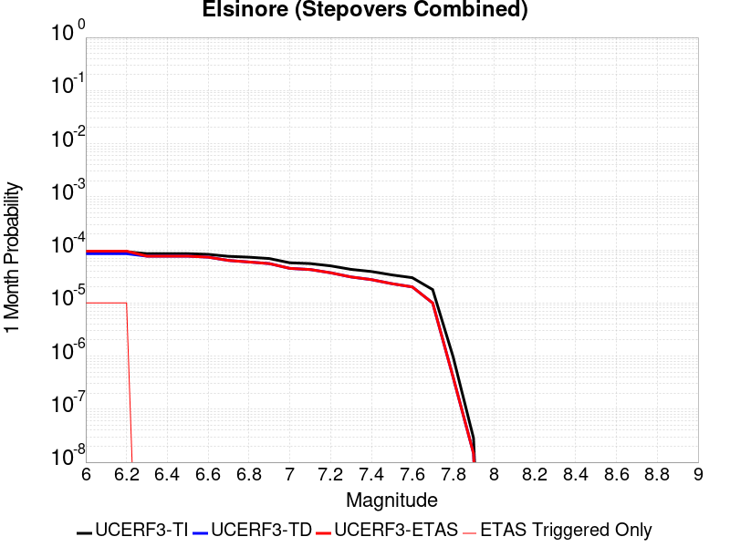 |  |  |

| Magnitude | 1 wk TI Prob | 1 wk TD Prob | 1 wk ETAS Prob | 1 wk ETAS/TD Gain | 1 wk ETAS Triggered Only | 1 mo TI Prob | 1 mo TD Prob | 1 mo ETAS Prob | 1 mo ETAS/TD Gain | 1 mo ETAS Triggered Only | 1 yr TI Prob | 1 yr TD Prob | 1 yr ETAS Prob | 1 yr ETAS/TD Gain | 1 yr ETAS Triggered Only | 10 yr TI Prob | 10 yr TD Prob | 10 yr ETAS Prob | 10 yr ETAS/TD Gain | 10 yr ETAS Triggered Only |
|-----|-----|-----|-----|-----|-----|-----|-----|-----|-----|-----|-----|-----|-----|-----|-----|-----|-----|-----|-----|-----|
| 6.0 | 2.144392E-5 | 1.9761523E-5 | 2.9761324E-5 | 1.5060239 | 1.0E-5 | 9.189928E-5 | 8.4689615E-5 | 9.468877E-5 | 1.1180682 | 1.0E-5 | 0.0011182994 | 0.00103063 | 0.0010506094 | 1.0193856 | 2.0E-5 | 0.011126885 | 0.0102656 | 0.0103051895 | 1.0038565 | 4.0E-5 |
| 6.1 | 2.144392E-5 | 1.9761523E-5 | 2.9761324E-5 | 1.5060239 | 1.0E-5 | 9.189928E-5 | 8.4689615E-5 | 9.468877E-5 | 1.1180682 | 1.0E-5 | 0.0011182994 | 0.00103063 | 0.0010506094 | 1.0193856 | 2.0E-5 | 0.011126885 | 0.0102656 | 0.0103051895 | 1.0038565 | 4.0E-5 |
| 6.2 | 2.144392E-5 | 1.9761523E-5 | 2.9761324E-5 | 1.5060239 | 1.0E-5 | 9.189928E-5 | 8.4689615E-5 | 9.468877E-5 | 1.1180682 | 1.0E-5 | 0.0011182994 | 0.00103063 | 0.0010506094 | 1.0193856 | 2.0E-5 | 0.011126885 | 0.0102656 | 0.0103051895 | 1.0038565 | 4.0E-5 |
| 6.3 | 1.9751555E-5 | 1.7742701E-5 | 1.7742701E-5 | 1.0 | 0.0 | 8.4646774E-5 | 7.603802E-5 | 7.603802E-5 | 1.0 | 0.0 | 0.0010300872 | 9.253864E-4 | 9.353771E-4 | 1.0107963 | 1.0E-5 | 0.010253254 | 0.009221918 | 0.009251641 | 1.0032231 | 3.0E-5 |
| 6.4 | 1.9751555E-5 | 1.7742701E-5 | 1.7742701E-5 | 1.0 | 0.0 | 8.4646774E-5 | 7.603802E-5 | 7.603802E-5 | 1.0 | 0.0 | 0.0010300872 | 9.253864E-4 | 9.353771E-4 | 1.0107963 | 1.0E-5 | 0.010253254 | 0.009221918 | 0.009251641 | 1.0032231 | 3.0E-5 |
| 6.5 | 1.9751555E-5 | 1.7742701E-5 | 1.7742701E-5 | 1.0 | 0.0 | 8.4646774E-5 | 7.603802E-5 | 7.603802E-5 | 1.0 | 0.0 | 0.0010300872 | 9.253864E-4 | 9.353771E-4 | 1.0107963 | 1.0E-5 | 0.010253254 | 0.009221918 | 0.009251641 | 1.0032231 | 3.0E-5 |
| 6.6 | 1.9188685E-5 | 1.7004593E-5 | 1.7004593E-5 | 1.0 | 0.0 | 8.2234634E-5 | 7.287488E-5 | 7.287488E-5 | 1.0 | 0.0 | 0.0010007467 | 8.869067E-4 | 8.968978E-4 | 1.0112652 | 1.0E-5 | 0.00996252 | 0.008840466 | 0.0088702 | 1.0033635 | 3.0E-5 |
| 6.7 | 1.7608272E-5 | 1.4733667E-5 | 1.4733667E-5 | 1.0 | 0.0 | 7.546184E-5 | 6.314281E-5 | 6.314281E-5 | 1.0 | 0.0 | 9.183606E-4 | 7.6850236E-4 | 7.7849464E-4 | 1.0130023 | 1.0E-5 | 0.009145746 | 0.0076654535 | 0.0076853004 | 1.0025891 | 2.0E-5 |
| 6.8 | 1.697165E-5 | 1.3784344E-5 | 1.3784344E-5 | 1.0 | 0.0 | 7.273361E-5 | 5.907447E-5 | 5.907447E-5 | 1.0 | 0.0 | 8.8517193E-4 | 7.1900303E-4 | 7.2899583E-4 | 1.0138981 | 1.0E-5 | 0.008816543 | 0.0071731824 | 0.007193039 | 1.0027682 | 2.0E-5 |
| 6.9 | 1.600365E-5 | 1.2847619E-5 | 1.2847619E-5 | 1.0 | 0.0 | 6.858527E-5 | 5.5060103E-5 | 5.5060103E-5 | 1.0 | 0.0 | 8.347058E-4 | 6.7015836E-4 | 6.801516E-4 | 1.0149119 | 1.0E-5 | 0.008315775 | 0.006687257 | 0.0067071235 | 1.0029708 | 2.0E-5 |
| 7.0 | 1.3314581E-5 | 1.0448378E-5 | 1.0448378E-5 | 1.0 | 0.0 | 5.7061243E-5 | 4.4778008E-5 | 4.4778008E-5 | 1.0 | 0.0 | 6.944992E-4 | 5.450386E-4 | 5.450386E-4 | 1.0 | 0.0 | 0.006923327 | 0.0054409457 | 0.0054508913 | 1.001828 | 1.0E-5 |
| 7.1 | 1.2865345E-5 | 9.938235E-6 | 9.938235E-6 | 1.0 | 0.0 | 5.5136024E-5 | 4.2591753E-5 | 4.2591753E-5 | 1.0 | 0.0 | 6.710743E-4 | 5.1843375E-4 | 5.1843375E-4 | 1.0 | 0.0 | 0.0066905143 | 0.005175576 | 0.0051855245 | 1.0019221 | 1.0E-5 |
| 7.2 | 1.1650051E-5 | 8.634394E-6 | 8.634394E-6 | 1.0 | 0.0 | 4.9927836E-5 | 3.7004032E-5 | 3.7004032E-5 | 1.0 | 0.0 | 6.0770183E-4 | 4.5043274E-4 | 4.5043274E-4 | 1.0 | 0.0 | 0.0060604266 | 0.004496621 | 0.0045065763 | 1.0022138 | 1.0E-5 |
| 7.3 | 1.0008533E-5 | 7.201519E-6 | 7.201519E-6 | 1.0 | 0.0 | 4.2893007E-5 | 3.08633E-5 | 3.08633E-5 | 1.0 | 0.0 | 5.220972E-4 | 3.756973E-4 | 3.756973E-4 | 1.0 | 0.0 | 0.005208723 | 0.0037510088 | 0.0037609714 | 1.002656 | 1.0E-5 |
| 7.4 | 9.116759E-6 | 6.410484E-6 | 6.410484E-6 | 1.0 | 0.0 | 3.907124E-5 | 2.747322E-5 | 2.747322E-5 | 1.0 | 0.0 | 4.7558855E-4 | 3.3443648E-4 | 3.3443648E-4 | 1.0 | 0.0 | 0.00474572 | 0.0033394839 | 0.0033494504 | 1.0029845 | 1.0E-5 |
| 7.5 | 7.870524E-6 | 5.3828808E-6 | 5.3828808E-6 | 1.0 | 0.0 | 3.3730383E-5 | 2.3069293E-5 | 2.3069293E-5 | 1.0 | 0.0 | 4.1059E-4 | 2.8083372E-4 | 2.8083372E-4 | 1.0 | 0.0 | 0.0040983222 | 0.0028049147 | 0.0028148866 | 1.0035552 | 1.0E-5 |
| 7.6 | 6.9774537E-6 | 4.6779105E-6 | 4.6779105E-6 | 1.0 | 0.0 | 2.990303E-5 | 2.004804E-5 | 2.004804E-5 | 1.0 | 0.0 | 3.640086E-4 | 2.4405873E-4 | 2.4405873E-4 | 1.0 | 0.0 | 0.003634129 | 0.0024380232 | 0.0024479988 | 1.0040917 | 1.0E-5 |
| 7.7 | 4.1616954E-6 | 2.3285181E-6 | 2.3285181E-6 | 1.0 | 0.0 | 1.7835715E-5 | 9.97933E-6 | 9.97933E-6 | 1.0 | 0.0 | 2.171282E-4 | 1.2149231E-4 | 1.2149231E-4 | 1.0 | 0.0 | 0.0021691616 | 0.001214332 | 0.0012243198 | 1.008225 | 1.0E-5 |
| 7.8 | 2.2692414E-7 | 9.3862134E-8 | 9.3862134E-8 | 1.0 | 0.0 | 9.725317E-7 | 4.0226624E-7 | 4.0226624E-7 | 1.0 | 0.0 | 1.1840509E-5 | 4.8975835E-6 | 4.8975835E-6 | 1.0 | 0.0 | 1.1839878E-4 | 4.8975086E-5 | 4.8975086E-5 | 1.0 | 0.0 |
| 7.9 | 6.676829E-9 | 3.4400482E-9 | 3.4400482E-9 | 1.0 | 0.0 | 2.861498E-8 | 1.4743064E-8 | 1.4743064E-8 | 1.0 | 0.0 | 3.4838732E-7 | 1.7949678E-7 | 1.7949678E-7 | 1.0 | 0.0 | 3.4838679E-6 | 1.7949665E-6 | 1.7949665E-6 | 1.0 | 0.0 |

## San Jacinto (Superstition Mtn)
*[(top)](#table-of-contents)*

| 1 Week | 1 Month | 1 Year | 10 Year |
|-----|-----|-----|-----|
|  |  |  |  |

| Magnitude | 1 wk TI Prob | 1 wk TD Prob | 1 wk ETAS Prob | 1 wk ETAS/TD Gain | 1 wk ETAS Triggered Only | 1 mo TI Prob | 1 mo TD Prob | 1 mo ETAS Prob | 1 mo ETAS/TD Gain | 1 mo ETAS Triggered Only | 1 yr TI Prob | 1 yr TD Prob | 1 yr ETAS Prob | 1 yr ETAS/TD Gain | 1 yr ETAS Triggered Only | 10 yr TI Prob | 10 yr TD Prob | 10 yr ETAS Prob | 10 yr ETAS/TD Gain | 10 yr ETAS Triggered Only |
|-----|-----|-----|-----|-----|-----|-----|-----|-----|-----|-----|-----|-----|-----|-----|-----|-----|-----|-----|-----|-----|
| 6.0 | 6.4193904E-5 | 9.600518E-5 | 1.0600422E-4 | 1.104151 | 1.0E-5 | 2.7508775E-4 | 4.1139568E-4 | 4.3138745E-4 | 1.048595 | 2.0E-5 | 0.0033440501 | 0.004998661 | 0.0050285114 | 1.0059716 | 3.0E-5 | 0.03294174 | 0.04882948 | 0.048867527 | 1.0007792 | 4.0E-5 |
| 6.1 | 6.4193904E-5 | 9.600518E-5 | 1.0600422E-4 | 1.104151 | 1.0E-5 | 2.7508775E-4 | 4.1139568E-4 | 4.3138745E-4 | 1.048595 | 2.0E-5 | 0.0033440501 | 0.004998661 | 0.0050285114 | 1.0059716 | 3.0E-5 | 0.03294174 | 0.04882948 | 0.048867527 | 1.0007792 | 4.0E-5 |
| 6.2 | 5.7023593E-5 | 8.3154846E-5 | 9.315401E-5 | 1.1202476 | 1.0E-5 | 2.4436394E-4 | 3.5633866E-4 | 3.7633153E-4 | 1.0561063 | 2.0E-5 | 0.002971072 | 0.0043314323 | 0.0043613026 | 1.0068961 | 3.0E-5 | 0.029316625 | 0.042509228 | 0.042547528 | 1.000901 | 4.0E-5 |
| 6.3 | 5.6940098E-5 | 8.30002E-5 | 9.299937E-5 | 1.1204716 | 1.0E-5 | 2.4400617E-4 | 3.5567605E-4 | 3.7566895E-4 | 1.056211 | 2.0E-5 | 0.002966728 | 0.0043233973 | 0.0043532676 | 1.006909 | 3.0E-5 | 0.029274331 | 0.042432476 | 0.04247078 | 1.0009027 | 4.0E-5 |
| 6.4 | 5.4171585E-5 | 7.749381E-5 | 8.7493034E-5 | 1.1290326 | 1.0E-5 | 2.3214328E-4 | 3.3208335E-4 | 3.520767E-4 | 1.0602058 | 2.0E-5 | 0.0028226813 | 0.0040372675 | 0.0040671467 | 1.0074008 | 3.0E-5 | 0.02787096 | 0.03972168 | 0.03976009 | 1.000967 | 4.0E-5 |
| 6.5 | 4.375144E-5 | 5.6431276E-5 | 6.6430715E-5 | 1.1771967 | 1.0E-5 | 1.874927E-4 | 2.4183255E-4 | 2.5183012E-4 | 1.041341 | 1.0E-5 | 0.0022803338 | 0.0029415116 | 0.0029614528 | 1.0067792 | 2.0E-5 | 0.022570757 | 0.029241866 | 0.029270988 | 1.0009959 | 3.0E-5 |
| 6.6 | 2.772192E-5 | 2.549782E-5 | 2.549782E-5 | 1.0 | 0.0 | 1.1880282E-4 | 1.0927191E-4 | 1.0927191E-4 | 1.0 | 0.0 | 0.0014454646 | 0.0013295929 | 0.0013395797 | 1.0075111 | 1.0E-5 | 0.014360986 | 0.0135453995 | 0.013565129 | 1.0014565 | 2.0E-5 |
| 6.7 | 2.7124124E-5 | 2.4708806E-5 | 2.4708806E-5 | 1.0 | 0.0 | 1.1624106E-4 | 1.0589069E-4 | 1.0589069E-4 | 1.0 | 0.0 | 0.0014143161 | 0.0012884759 | 0.0012984631 | 1.0077511 | 1.0E-5 | 0.014053487 | 0.0131388325 | 0.01315857 | 1.0015022 | 2.0E-5 |
| 6.8 | 2.5475807E-5 | 2.217365E-5 | 2.217365E-5 | 1.0 | 0.0 | 1.0917746E-4 | 9.502653E-5 | 9.502653E-5 | 1.0 | 0.0 | 0.001328425 | 0.0011563459 | 0.0011663344 | 1.0086379 | 1.0E-5 | 0.0132051185 | 0.011826962 | 0.011846726 | 1.0016711 | 2.0E-5 |
| 6.9 | 2.1162023E-5 | 1.7634726E-5 | 1.7634726E-5 | 1.0 | 0.0 | 9.069123E-5 | 7.5575226E-5 | 7.5575226E-5 | 1.0 | 0.0 | 0.0011036064 | 9.1974373E-4 | 9.2973455E-4 | 1.0108626 | 1.0E-5 | 0.010981417 | 0.00945131 | 0.00947112 | 1.002096 | 2.0E-5 |
| 7.0 | 1.8754288E-5 | 1.6169653E-5 | 1.6169653E-5 | 1.0 | 0.0 | 8.037304E-5 | 6.929669E-5 | 6.929669E-5 | 1.0 | 0.0 | 9.781026E-4 | 8.433631E-4 | 8.533547E-4 | 1.0118473 | 1.0E-5 | 0.009738087 | 0.0086742705 | 0.008694097 | 1.0022857 | 2.0E-5 |
| 7.1 | 1.8678527E-5 | 1.609479E-5 | 1.609479E-5 | 1.0 | 0.0 | 8.0048376E-5 | 6.897586E-5 | 6.897586E-5 | 1.0 | 0.0 | 9.7415317E-4 | 8.3946E-4 | 8.494516E-4 | 1.0119025 | 1.0E-5 | 0.009698939 | 0.008635223 | 0.00865505 | 1.0022961 | 2.0E-5 |
| 7.2 | 1.7804578E-5 | 1.5389282E-5 | 1.5389282E-5 | 1.0 | 0.0 | 7.6303106E-5 | 6.595241E-5 | 6.595241E-5 | 1.0 | 0.0 | 9.285943E-4 | 8.02677E-4 | 8.12669E-4 | 1.0124483 | 1.0E-5 | 0.009247236 | 0.008266493 | 0.008286327 | 1.0023994 | 2.0E-5 |
| 7.3 | 1.6583685E-5 | 1.4538294E-5 | 1.4538294E-5 | 1.0 | 0.0 | 7.1070994E-5 | 6.2305495E-5 | 6.2305495E-5 | 1.0 | 0.0 | 8.649459E-4 | 7.5830746E-4 | 7.6829985E-4 | 1.0131773 | 1.0E-5 | 0.00861587 | 0.007821757 | 0.007841601 | 1.002537 | 2.0E-5 |
| 7.4 | 1.6387552E-5 | 1.4403164E-5 | 1.4403164E-5 | 1.0 | 0.0 | 7.023047E-5 | 6.1726394E-5 | 6.1726394E-5 | 1.0 | 0.0 | 8.5472054E-4 | 7.512618E-4 | 7.612542E-4 | 1.0133009 | 1.0E-5 | 0.008514405 | 0.007751132 | 0.0077709765 | 1.0025603 | 2.0E-5 |
| 7.5 | 1.5790754E-5 | 1.404377E-5 | 1.404377E-5 | 1.0 | 0.0 | 6.767291E-5 | 6.018621E-5 | 6.018621E-5 | 1.0 | 0.0 | 8.236062E-4 | 7.325227E-4 | 7.425154E-4 | 1.0136415 | 1.0E-5 | 0.008205604 | 0.007561653 | 0.0075815017 | 1.0026249 | 2.0E-5 |
| 7.6 | 1.4248672E-5 | 1.3062535E-5 | 1.3062535E-5 | 1.0 | 0.0 | 6.106431E-5 | 5.59811E-5 | 5.59811E-5 | 1.0 | 0.0 | 7.432043E-4 | 6.813585E-4 | 6.9135166E-4 | 1.0146666 | 1.0E-5 | 0.007407237 | 0.0070441356 | 0.0070639946 | 1.0028193 | 2.0E-5 |
| 7.7 | 1.15449975E-5 | 1.0910976E-5 | 1.0910976E-5 | 1.0 | 0.0 | 4.947762E-5 | 4.676049E-5 | 4.676049E-5 | 1.0 | 0.0 | 6.022235E-4 | 5.69161E-4 | 5.7915534E-4 | 1.0175598 | 1.0E-5 | 0.006005941 | 0.0059140055 | 0.0059338873 | 1.0033618 | 2.0E-5 |
| 7.8 | 9.1391985E-6 | 9.521311E-6 | 9.521311E-6 | 1.0 | 0.0 | 3.9167408E-5 | 4.0804985E-5 | 4.0804985E-5 | 1.0 | 0.0 | 4.767588E-4 | 4.96688E-4 | 4.96688E-4 | 1.0 | 0.0 | 0.0047573727 | 0.005180364 | 0.0051903124 | 1.0019203 | 1.0E-5 |
| 7.9 | 6.973017E-6 | 7.3883775E-6 | 7.3883775E-6 | 1.0 | 0.0 | 2.9884017E-5 | 3.1664094E-5 | 3.1664094E-5 | 1.0 | 0.0 | 3.6377716E-4 | 3.8544266E-4 | 3.8544266E-4 | 1.0 | 0.0 | 0.0036318225 | 0.004055053 | 0.004065012 | 1.0024561 | 1.0E-5 |
| 8.0 | 5.7638235E-6 | 6.265624E-6 | 6.265624E-6 | 1.0 | 0.0 | 2.4701867E-5 | 2.6852402E-5 | 2.6852402E-5 | 1.0 | 0.0 | 3.0070372E-4 | 3.2687944E-4 | 3.2687944E-4 | 1.0 | 0.0 | 0.0030029714 | 0.0034564238 | 0.0034663894 | 1.0028832 | 1.0E-5 |
| 8.1 | 5.1124434E-6 | 5.5008163E-6 | 5.5008163E-6 | 1.0 | 0.0 | 2.1910288E-5 | 2.3574716E-5 | 2.3574716E-5 | 1.0 | 0.0 | 2.6672508E-4 | 2.8698487E-4 | 2.8698487E-4 | 1.0 | 0.0 | 0.0026640517 | 0.0030430472 | 0.0030530167 | 1.0032762 | 1.0E-5 |
| 8.2 | 1.1075938E-6 | 5.344119E-7 | 5.344119E-7 | 1.0 | 0.0 | 4.7468216E-6 | 2.2903348E-6 | 2.2903348E-6 | 1.0 | 0.0 | 5.779102E-5 | 2.7884493E-5 | 2.7884493E-5 | 1.0 | 0.0 | 5.777599E-4 | 3.1388528E-4 | 3.1388528E-4 | 1.0 | 0.0 |
| 8.3 | 1.3584393E-8 | 4.4810475E-9 | 4.4810475E-9 | 1.0 | 0.0 | 5.8218827E-8 | 1.920449E-8 | 1.920449E-8 | 1.0 | 0.0 | 7.0881396E-7 | 2.3381466E-7 | 2.3381466E-7 | 1.0 | 0.0 | 7.0881174E-6 | 2.620347E-6 | 2.620347E-6 | 1.0 | 0.0 |

## Santa Rosa Island
*[(top)](#table-of-contents)*

| 1 Week | 1 Month | 1 Year | 10 Year |
|-----|-----|-----|-----|
|  | 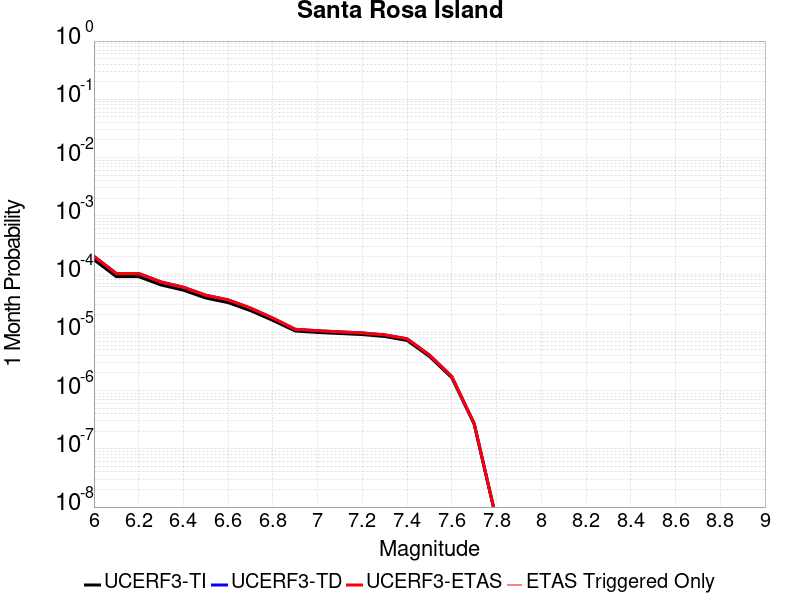 | 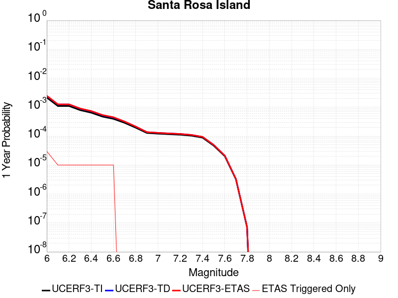 |  |

| Magnitude | 1 wk TI Prob | 1 wk TD Prob | 1 wk ETAS Prob | 1 wk ETAS/TD Gain | 1 wk ETAS Triggered Only | 1 mo TI Prob | 1 mo TD Prob | 1 mo ETAS Prob | 1 mo ETAS/TD Gain | 1 mo ETAS Triggered Only | 1 yr TI Prob | 1 yr TD Prob | 1 yr ETAS Prob | 1 yr ETAS/TD Gain | 1 yr ETAS Triggered Only | 10 yr TI Prob | 10 yr TD Prob | 10 yr ETAS Prob | 10 yr ETAS/TD Gain | 10 yr ETAS Triggered Only |
|-----|-----|-----|-----|-----|-----|-----|-----|-----|-----|-----|-----|-----|-----|-----|-----|-----|-----|-----|-----|-----|
| 6.0 | 4.1143165E-5 | 4.7092562E-5 | 4.7092562E-5 | 1.0 | 0.0 | 1.7631594E-4 | 2.0181076E-4 | 2.0181076E-4 | 1.0 | 0.0 | 0.002144533 | 0.0024544743 | 0.0024844005 | 1.0121926 | 3.0E-5 | 0.021239553 | 0.02429428 | 0.02432355 | 1.0012048 | 3.0E-5 |
| 6.1 | 2.1061249E-5 | 2.3865625E-5 | 2.3865625E-5 | 1.0 | 0.0 | 9.0259375E-5 | 1.0227741E-4 | 1.0227741E-4 | 1.0 | 0.0 | 0.0010983539 | 0.0012445451 | 0.0012545326 | 1.008025 | 1.0E-5 | 0.01092941 | 0.012378791 | 0.012398544 | 1.0015956 | 2.0E-5 |
| 6.2 | 2.1061249E-5 | 2.3865625E-5 | 2.3865625E-5 | 1.0 | 0.0 | 9.0259375E-5 | 1.0227741E-4 | 1.0227741E-4 | 1.0 | 0.0 | 0.0010983539 | 0.0012445451 | 0.0012545326 | 1.008025 | 1.0E-5 | 0.01092941 | 0.012378791 | 0.012398544 | 1.0015956 | 2.0E-5 |
| 6.3 | 1.5158236E-5 | 1.7074872E-5 | 1.7074872E-5 | 1.0 | 0.0 | 6.496225E-5 | 7.317604E-5 | 7.317604E-5 | 1.0 | 0.0 | 7.906284E-4 | 8.9056604E-4 | 9.005571E-4 | 1.0112188 | 1.0E-5 | 0.007878214 | 0.008871224 | 0.008891046 | 1.0022345 | 2.0E-5 |
| 6.4 | 1.2341918E-5 | 1.3853272E-5 | 1.3853272E-5 | 1.0 | 0.0 | 5.2892858E-5 | 5.936986E-5 | 5.936986E-5 | 1.0 | 0.0 | 6.437803E-4 | 7.225965E-4 | 7.325892E-4 | 1.013829 | 1.0E-5 | 0.006419184 | 0.0072033056 | 0.0072231614 | 1.0027565 | 2.0E-5 |
| 6.5 | 9.061158E-6 | 1.0117279E-5 | 1.0117279E-5 | 1.0 | 0.0 | 3.883296E-5 | 4.3359076E-5 | 4.3359076E-5 | 1.0 | 0.0 | 4.726887E-4 | 5.277742E-4 | 5.3776894E-4 | 1.0189375 | 1.0E-5 | 0.004716845 | 0.005265746 | 0.0052856407 | 1.0037781 | 2.0E-5 |
| 6.6 | 7.5461685E-6 | 8.400933E-6 | 8.400933E-6 | 1.0 | 0.0 | 3.2340322E-5 | 3.600353E-5 | 3.600353E-5 | 1.0 | 0.0 | 3.936723E-4 | 4.382591E-4 | 4.4825472E-4 | 1.0228076 | 1.0E-5 | 0.003929756 | 0.004374378 | 0.00439429 | 1.0045521 | 2.0E-5 |
| 6.7 | 5.5023775E-6 | 6.0875172E-6 | 6.0875172E-6 | 1.0 | 0.0 | 2.3581404E-5 | 2.6089117E-5 | 2.6089117E-5 | 1.0 | 0.0 | 2.8706578E-4 | 3.1759194E-4 | 3.1759194E-4 | 1.0 | 0.0 | 0.0028669522 | 0.0031717026 | 0.0031816708 | 1.0031428 | 1.0E-5 |
| 6.8 | 3.7351679E-6 | 4.083221E-6 | 4.083221E-6 | 1.0 | 0.0 | 1.6007763E-5 | 1.7499415E-5 | 1.7499415E-5 | 1.0 | 0.0 | 1.948771E-4 | 2.1303704E-4 | 2.1303704E-4 | 1.0 | 0.0 | 0.0019470629 | 0.0021285734 | 0.002138552 | 1.004688 | 1.0E-5 |
| 6.9 | 2.456366E-6 | 2.6293096E-6 | 2.6293096E-6 | 1.0 | 0.0 | 1.0527241E-5 | 1.1268421E-5 | 1.1268421E-5 | 1.0 | 0.0 | 1.2816161E-4 | 1.3718441E-4 | 1.3718441E-4 | 1.0 | 0.0 | 0.0012808773 | 0.0013710002 | 0.0013809865 | 1.0072839 | 1.0E-5 |
| 7.0 | 2.3245157E-6 | 2.482814E-6 | 2.482814E-6 | 1.0 | 0.0 | 9.962172E-6 | 1.0640588E-5 | 1.0640588E-5 | 1.0 | 0.0 | 1.2128269E-4 | 1.2954147E-4 | 1.2954147E-4 | 1.0 | 0.0 | 0.0012121652 | 0.0012946619 | 0.0013046489 | 1.007714 | 1.0E-5 |
| 7.1 | 2.2248344E-6 | 2.3732832E-6 | 2.3732832E-6 | 1.0 | 0.0 | 9.53497E-6 | 1.0171175E-5 | 1.0171175E-5 | 1.0 | 0.0 | 1.1608207E-4 | 1.2382703E-4 | 1.2382703E-4 | 1.0 | 0.0 | 0.0011602144 | 0.0012375823 | 0.0012475699 | 1.0080702 | 1.0E-5 |
| 7.2 | 2.1350402E-6 | 2.2761856E-6 | 2.2761856E-6 | 1.0 | 0.0 | 9.150141E-6 | 9.755045E-6 | 9.755045E-6 | 1.0 | 0.0 | 1.1139726E-4 | 1.18761214E-4 | 1.18761214E-4 | 1.0 | 0.0 | 0.0011134144 | 0.0011869795 | 0.0011869795 | 1.0 | 0.0 |
| 7.3 | 1.9793572E-6 | 2.108748E-6 | 2.108748E-6 | 1.0 | 0.0 | 8.482932E-6 | 9.037461E-6 | 9.037461E-6 | 1.0 | 0.0 | 1.032748E-4 | 1.1002555E-4 | 1.1002555E-4 | 1.0 | 0.0 | 0.0010322682 | 0.0010997126 | 0.0010997126 | 1.0 | 0.0 |
| 7.4 | 1.6951194E-6 | 1.804598E-6 | 1.804598E-6 | 1.0 | 0.0 | 7.264777E-6 | 7.733968E-6 | 7.733968E-6 | 1.0 | 0.0 | 8.844508E-5 | 9.415701E-5 | 9.415701E-5 | 1.0 | 0.0 | 8.840988E-4 | 9.411729E-4 | 9.411729E-4 | 1.0 | 0.0 |
| 7.5 | 8.987207E-7 | 9.5123335E-7 | 9.5123335E-7 | 1.0 | 0.0 | 3.8516546E-6 | 4.076708E-6 | 4.076708E-6 | 1.0 | 0.0 | 4.6892885E-5 | 4.9632803E-5 | 4.9632803E-5 | 1.0 | 0.0 | 4.688299E-4 | 4.9621833E-4 | 4.9621833E-4 | 1.0 | 0.0 |
| 7.6 | 3.8783037E-7 | 4.0529727E-7 | 4.0529727E-7 | 1.0 | 0.0 | 1.6621291E-6 | 1.7369872E-6 | 1.7369872E-6 | 1.0 | 0.0 | 2.0236233E-5 | 2.114762E-5 | 2.114762E-5 | 1.0 | 0.0 | 2.023439E-4 | 2.1145673E-4 | 2.1145673E-4 | 1.0 | 0.0 |
| 7.7 | 6.181804E-8 | 6.339084E-8 | 6.339084E-8 | 1.0 | 0.0 | 2.6493444E-7 | 2.7167502E-7 | 2.7167502E-7 | 1.0 | 0.0 | 3.225572E-6 | 3.3076383E-6 | 3.3076383E-6 | 1.0 | 0.0 | 3.225525E-5 | 3.30759E-5 | 3.30759E-5 | 1.0 | 0.0 |
| 7.8 | 1.3704449E-9 | 1.3964208E-9 | 1.3964208E-9 | 1.0 | 0.0 | 5.873335E-9 | 5.9846608E-9 | 5.9846608E-9 | 1.0 | 0.0 | 7.1507856E-8 | 7.2863244E-8 | 7.2863244E-8 | 1.0 | 0.0 | 7.1507833E-7 | 7.2863224E-7 | 7.2863224E-7 | 1.0 | 0.0 |

## Great Valley 07 (Orestimba)
*[(top)](#table-of-contents)*

| 1 Week | 1 Month | 1 Year | 10 Year |
|-----|-----|-----|-----|
|  | 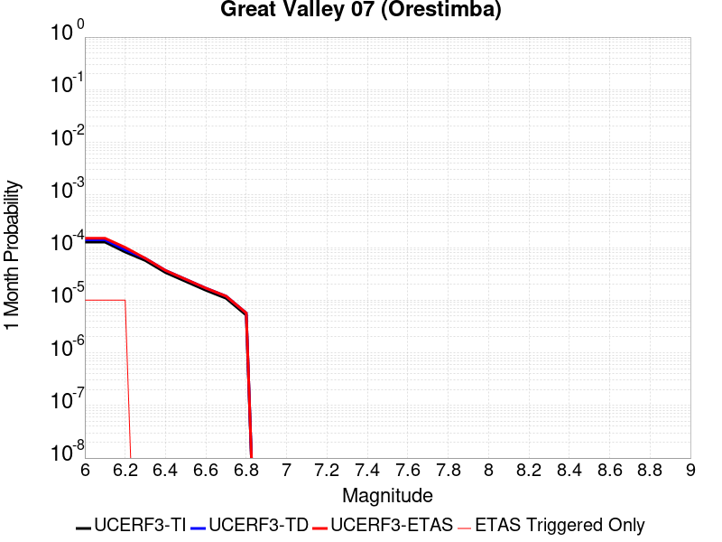 | 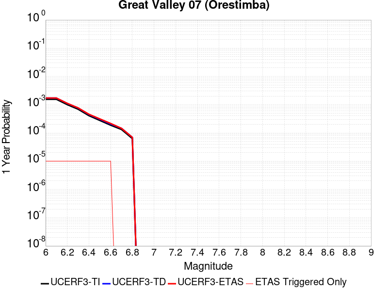 | 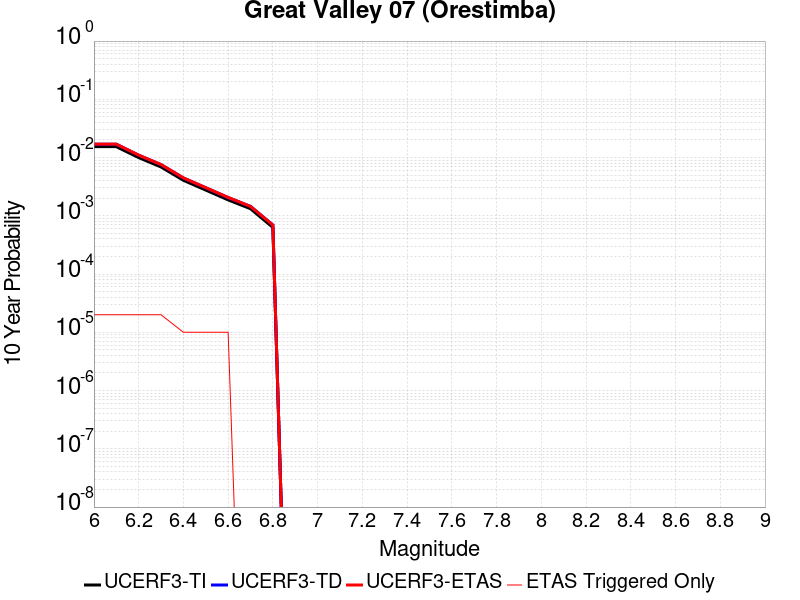 |

| Magnitude | 1 wk TI Prob | 1 wk TD Prob | 1 wk ETAS Prob | 1 wk ETAS/TD Gain | 1 wk ETAS Triggered Only | 1 mo TI Prob | 1 mo TD Prob | 1 mo ETAS Prob | 1 mo ETAS/TD Gain | 1 mo ETAS Triggered Only | 1 yr TI Prob | 1 yr TD Prob | 1 yr ETAS Prob | 1 yr ETAS/TD Gain | 1 yr ETAS Triggered Only | 10 yr TI Prob | 10 yr TD Prob | 10 yr ETAS Prob | 10 yr ETAS/TD Gain | 10 yr ETAS Triggered Only |
|-----|-----|-----|-----|-----|-----|-----|-----|-----|-----|-----|-----|-----|-----|-----|-----|-----|-----|-----|-----|-----|
| 6.0 | 2.9687902E-5 | 3.2758206E-5 | 4.2757878E-5 | 1.3052571 | 1.0E-5 | 1.2722766E-4 | 1.4038516E-4 | 1.5038376E-4 | 1.0712225 | 1.0E-5 | 0.0015478961 | 0.0017079213 | 0.0017179041 | 1.0058451 | 1.0E-5 | 0.015371585 | 0.016955499 | 0.016975159 | 1.0011595 | 2.0E-5 |
| 6.1 | 2.9687902E-5 | 3.2758206E-5 | 4.2757878E-5 | 1.3052571 | 1.0E-5 | 1.2722766E-4 | 1.4038516E-4 | 1.5038376E-4 | 1.0712225 | 1.0E-5 | 0.0015478961 | 0.0017079213 | 0.0017179041 | 1.0058451 | 1.0E-5 | 0.015371585 | 0.016955499 | 0.016975159 | 1.0011595 | 2.0E-5 |
| 6.2 | 1.9231524E-5 | 2.1159609E-5 | 3.1159398E-5 | 1.4725885 | 1.0E-5 | 8.2418206E-5 | 9.068102E-5 | 1.0068011E-4 | 1.1102667 | 1.0E-5 | 0.0010029797 | 0.0011035053 | 0.0011134943 | 1.009052 | 1.0E-5 | 0.00998465 | 0.010982669 | 0.011002449 | 1.001801 | 2.0E-5 |
| 6.3 | 1.324766E-5 | 1.4548831E-5 | 1.4548831E-5 | 1.0 | 0.0 | 5.6774446E-5 | 6.235069E-5 | 6.235069E-5 | 1.0 | 0.0 | 6.910097E-4 | 7.588645E-4 | 7.688569E-4 | 1.0131676 | 1.0E-5 | 0.006888649 | 0.007563678 | 0.0075835264 | 1.0026243 | 2.0E-5 |
| 6.4 | 7.818645E-6 | 8.573013E-6 | 8.573013E-6 | 1.0 | 0.0 | 3.3508048E-5 | 3.6740985E-5 | 3.6740985E-5 | 1.0 | 0.0 | 4.078841E-4 | 4.4723303E-4 | 4.5722857E-4 | 1.0223497 | 1.0E-5 | 0.004071363 | 0.0044636703 | 0.0044736257 | 1.0022303 | 1.0E-5 |
| 6.5 | 5.3076565E-6 | 5.8179176E-6 | 5.8179176E-6 | 1.0 | 0.0 | 2.27469E-5 | 2.4933704E-5 | 2.4933704E-5 | 1.0 | 0.0 | 2.7690834E-4 | 3.035277E-4 | 3.1352465E-4 | 1.032936 | 1.0E-5 | 0.0027656353 | 0.0030313404 | 0.0030413102 | 1.0032889 | 1.0E-5 |
| 6.6 | 3.6003578E-6 | 3.948575E-6 | 3.948575E-6 | 1.0 | 0.0 | 1.5430012E-5 | 1.6922364E-5 | 1.6922364E-5 | 1.0 | 0.0 | 1.8784421E-4 | 2.0601186E-4 | 2.160098E-4 | 1.0485309 | 1.0E-5 | 0.0018768552 | 0.0020583628 | 0.0020683422 | 1.0048482 | 1.0E-5 |
| 6.7 | 2.5361826E-6 | 2.7835245E-6 | 2.7835245E-6 | 1.0 | 0.0 | 1.0869308E-5 | 1.1929344E-5 | 1.1929344E-5 | 1.0 | 0.0 | 1.3232579E-4 | 1.452314E-4 | 1.452314E-4 | 1.0 | 0.0 | 0.0013224703 | 0.0014514948 | 0.0014514948 | 1.0 | 0.0 |
| 6.8 | 1.2115831E-6 | 1.3314072E-6 | 1.3314072E-6 | 1.0 | 0.0 | 5.1924885E-6 | 5.706024E-6 | 5.706024E-6 | 1.0 | 0.0 | 6.3216714E-5 | 6.94696E-5 | 6.94696E-5 | 1.0 | 0.0 | 6.3198735E-4 | 6.945739E-4 | 6.945739E-4 | 1.0 | 0.0 |

## Ortigalita (North)
*[(top)](#table-of-contents)*

| 1 Week | 1 Month | 1 Year | 10 Year |
|-----|-----|-----|-----|
|  |  |  |  |

| Magnitude | 1 wk TI Prob | 1 wk TD Prob | 1 wk ETAS Prob | 1 wk ETAS/TD Gain | 1 wk ETAS Triggered Only | 1 mo TI Prob | 1 mo TD Prob | 1 mo ETAS Prob | 1 mo ETAS/TD Gain | 1 mo ETAS Triggered Only | 1 yr TI Prob | 1 yr TD Prob | 1 yr ETAS Prob | 1 yr ETAS/TD Gain | 1 yr ETAS Triggered Only | 10 yr TI Prob | 10 yr TD Prob | 10 yr ETAS Prob | 10 yr ETAS/TD Gain | 10 yr ETAS Triggered Only |
|-----|-----|-----|-----|-----|-----|-----|-----|-----|-----|-----|-----|-----|-----|-----|-----|-----|-----|-----|-----|-----|
| 6.0 | 7.711876E-5 | 1.0507324E-4 | 1.0507324E-4 | 1.0 | 0.0 | 3.3046713E-4 | 4.5024703E-4 | 4.5024703E-4 | 1.0 | 0.0 | 0.004016016 | 0.005468449 | 0.005478394 | 1.0018187 | 1.0E-5 | 0.039442103 | 0.053458314 | 0.053496175 | 1.0007082 | 4.0E-5 |
| 6.1 | 4.607858E-5 | 6.0243186E-5 | 6.0243186E-5 | 1.0 | 0.0 | 1.9746469E-4 | 2.5816236E-4 | 2.5816236E-4 | 1.0 | 0.0 | 0.0024014818 | 0.0031389531 | 0.0031489215 | 1.0031757 | 1.0E-5 | 0.023756953 | 0.030976951 | 0.031006021 | 1.0009384 | 3.0E-5 |
| 6.2 | 4.607858E-5 | 6.0243186E-5 | 6.0243186E-5 | 1.0 | 0.0 | 1.9746469E-4 | 2.5816236E-4 | 2.5816236E-4 | 1.0 | 0.0 | 0.0024014818 | 0.0031389531 | 0.0031489215 | 1.0031757 | 1.0E-5 | 0.023756953 | 0.030976951 | 0.031006021 | 1.0009384 | 3.0E-5 |
| 6.3 | 3.327423E-5 | 4.2477655E-5 | 4.2477655E-5 | 1.0 | 0.0 | 1.4259605E-4 | 1.8203615E-4 | 1.8203615E-4 | 1.0 | 0.0 | 0.0017347244 | 0.002214327 | 0.002224305 | 1.004506 | 1.0E-5 | 0.017212452 | 0.02194689 | 0.021966452 | 1.0008913 | 2.0E-5 |
| 6.4 | 2.7732503E-5 | 3.5000572E-5 | 3.5000572E-5 | 1.0 | 0.0 | 1.1884817E-4 | 1.4999534E-4 | 1.4999534E-4 | 1.0 | 0.0 | 0.001446016 | 0.0018249109 | 0.0018348927 | 1.0054697 | 1.0E-5 | 0.014366428 | 0.018122217 | 0.018141855 | 1.0010836 | 2.0E-5 |
| 6.5 | 2.7689714E-5 | 3.4950386E-5 | 3.4950386E-5 | 1.0 | 0.0 | 1.186648E-4 | 1.4978027E-4 | 1.4978027E-4 | 1.0 | 0.0 | 0.0014437864 | 0.0018222968 | 0.0018322786 | 1.0054775 | 1.0E-5 | 0.014344421 | 0.018096503 | 0.01811614 | 1.0010852 | 2.0E-5 |
| 6.6 | 2.2976905E-5 | 2.8719822E-5 | 2.8719822E-5 | 1.0 | 0.0 | 9.846873E-5 | 1.2308056E-4 | 1.2308056E-4 | 1.0 | 0.0 | 0.0011981975 | 0.001497716 | 0.001507701 | 1.0066668 | 1.0E-5 | 0.011917574 | 0.014899489 | 0.014919191 | 1.0013223 | 2.0E-5 |
| 6.7 | 1.9871539E-5 | 2.4905776E-5 | 2.4905776E-5 | 1.0 | 0.0 | 8.516096E-5 | 1.0673607E-4 | 1.0673607E-4 | 1.0 | 0.0 | 0.0010363415 | 0.0012989857 | 0.0013089727 | 1.0076883 | 1.0E-5 | 0.010315218 | 0.01293762 | 0.01294749 | 1.0007629 | 1.0E-5 |
| 6.8 | 6.5640475E-6 | 7.6057445E-6 | 7.6057445E-6 | 1.0 | 0.0 | 2.813133E-5 | 3.2595657E-5 | 3.2595657E-5 | 1.0 | 0.0 | 3.424451E-4 | 3.967827E-4 | 3.967827E-4 | 1.0 | 0.0 | 0.0034191788 | 0.00396103 | 0.00396103 | 1.0 | 0.0 |
| 6.9 | 5.6219683E-6 | 6.50205E-6 | 6.50205E-6 | 1.0 | 0.0 | 2.4093928E-5 | 2.7865646E-5 | 2.7865646E-5 | 1.0 | 0.0 | 2.933041E-4 | 3.39214E-4 | 3.39214E-4 | 1.0 | 0.0 | 0.0029291727 | 0.0033872193 | 0.0033872193 | 1.0 | 0.0 |
| 7.0 | 3.875591E-6 | 4.484902E-6 | 4.484902E-6 | 1.0 | 0.0 | 1.6609569E-5 | 1.9220879E-5 | 1.9220879E-5 | 1.0 | 0.0 | 2.0220275E-4 | 2.3399119E-4 | 2.3399119E-4 | 1.0 | 0.0 | 0.0020201886 | 0.0023376564 | 0.0023376564 | 1.0 | 0.0 |
| 7.1 | 1.6017933E-6 | 1.8571035E-6 | 1.8571035E-6 | 1.0 | 0.0 | 6.8648105E-6 | 7.958996E-6 | 7.958996E-6 | 1.0 | 0.0 | 8.357586E-5 | 9.6897544E-5 | 9.6897544E-5 | 1.0 | 0.0 | 8.3544437E-4 | 9.6865767E-4 | 9.6865767E-4 | 1.0 | 0.0 |

## Whittier alt 1
*[(top)](#table-of-contents)*

| 1 Week | 1 Month | 1 Year | 10 Year |
|-----|-----|-----|-----|
| 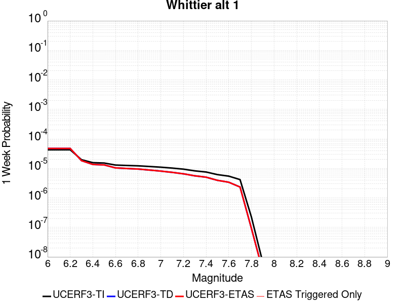 | 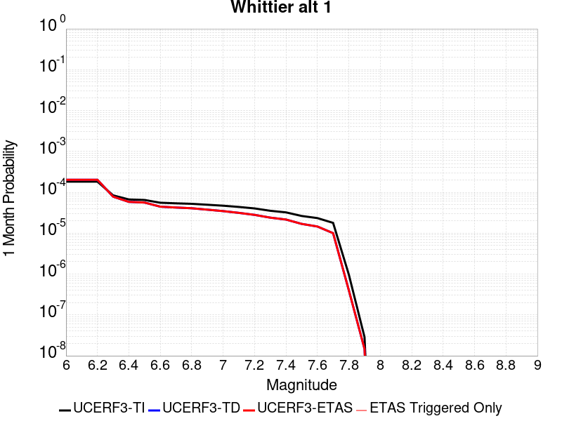 |  | 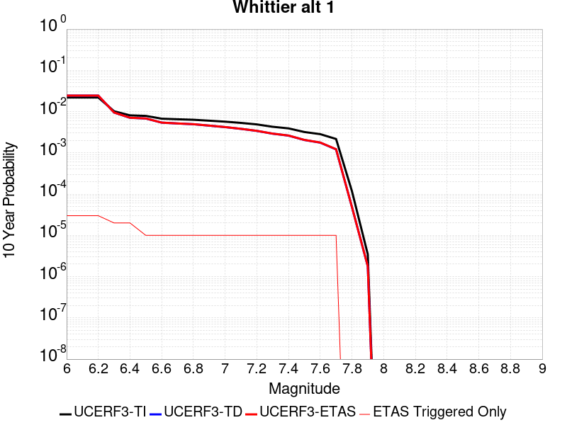 |

| Magnitude | 1 wk TI Prob | 1 wk TD Prob | 1 wk ETAS Prob | 1 wk ETAS/TD Gain | 1 wk ETAS Triggered Only | 1 mo TI Prob | 1 mo TD Prob | 1 mo ETAS Prob | 1 mo ETAS/TD Gain | 1 mo ETAS Triggered Only | 1 yr TI Prob | 1 yr TD Prob | 1 yr ETAS Prob | 1 yr ETAS/TD Gain | 1 yr ETAS Triggered Only | 10 yr TI Prob | 10 yr TD Prob | 10 yr ETAS Prob | 10 yr ETAS/TD Gain | 10 yr ETAS Triggered Only |
|-----|-----|-----|-----|-----|-----|-----|-----|-----|-----|-----|-----|-----|-----|-----|-----|-----|-----|-----|-----|-----|
| 6.0 | 4.2554693E-5 | 4.725413E-5 | 4.725413E-5 | 1.0 | 0.0 | 1.8236451E-4 | 2.025038E-4 | 2.025038E-4 | 1.0 | 0.0 | 0.002218027 | 0.002463017 | 0.0024729923 | 1.00405 | 1.0E-5 | 0.02196019 | 0.024391228 | 0.024420496 | 1.0012 | 3.0E-5 |
| 6.1 | 4.2554693E-5 | 4.725413E-5 | 4.725413E-5 | 1.0 | 0.0 | 1.8236451E-4 | 2.025038E-4 | 2.025038E-4 | 1.0 | 0.0 | 0.002218027 | 0.002463017 | 0.0024729923 | 1.00405 | 1.0E-5 | 0.02196019 | 0.024391228 | 0.024420496 | 1.0012 | 3.0E-5 |
| 6.2 | 4.2554693E-5 | 4.725413E-5 | 4.725413E-5 | 1.0 | 0.0 | 1.8236451E-4 | 2.025038E-4 | 2.025038E-4 | 1.0 | 0.0 | 0.002218027 | 0.002463017 | 0.0024729923 | 1.00405 | 1.0E-5 | 0.02196019 | 0.024391228 | 0.024420496 | 1.0012 | 3.0E-5 |
| 6.3 | 1.9617712E-5 | 1.826966E-5 | 1.826966E-5 | 1.0 | 0.0 | 8.40732E-5 | 7.82963E-5 | 7.82963E-5 | 1.0 | 0.0 | 0.0010231105 | 9.5285964E-4 | 9.628501E-4 | 1.0104847 | 1.0E-5 | 0.01018413 | 0.0094910255 | 0.009510836 | 1.0020872 | 2.0E-5 |
| 6.4 | 1.5611336E-5 | 1.3605183E-5 | 1.3605183E-5 | 1.0 | 0.0 | 6.690401E-5 | 5.8306658E-5 | 5.8306658E-5 | 1.0 | 0.0 | 8.142519E-4 | 7.096583E-4 | 7.1965123E-4 | 1.0140812 | 1.0E-5 | 0.008112748 | 0.0070758862 | 0.007095745 | 1.0028065 | 2.0E-5 |
| 6.5 | 1.5150166E-5 | 1.3101827E-5 | 1.3101827E-5 | 1.0 | 0.0 | 6.492767E-5 | 5.6149514E-5 | 5.6149514E-5 | 1.0 | 0.0 | 7.9020765E-4 | 6.834118E-4 | 6.834118E-4 | 1.0 | 0.0 | 0.007874036 | 0.006815051 | 0.0068249833 | 1.0014573 | 1.0E-5 |
| 6.6 | 1.295588E-5 | 1.0381483E-5 | 1.0381483E-5 | 1.0 | 0.0 | 5.552402E-5 | 4.449132E-5 | 4.449132E-5 | 1.0 | 0.0 | 6.7579525E-4 | 5.415491E-4 | 5.415491E-4 | 1.0 | 0.0 | 0.006737438 | 0.005403728 | 0.0054136743 | 1.0018406 | 1.0E-5 |
| 6.7 | 1.2542085E-5 | 9.900108E-6 | 9.900108E-6 | 1.0 | 0.0 | 5.3750682E-5 | 4.2428357E-5 | 4.2428357E-5 | 1.0 | 0.0 | 6.542181E-4 | 5.164447E-4 | 5.164447E-4 | 1.0 | 0.0 | 0.006522954 | 0.005153863 | 0.0051638116 | 1.0019302 | 1.0E-5 |
| 6.8 | 1.2195878E-5 | 9.4961315E-6 | 9.4961315E-6 | 1.0 | 0.0 | 5.2267E-5 | 4.069708E-5 | 4.069708E-5 | 1.0 | 0.0 | 6.36165E-4 | 4.953762E-4 | 4.953762E-4 | 1.0 | 0.0 | 0.0063434686 | 0.00494406 | 0.0049540107 | 1.0020126 | 1.0E-5 |
| 6.9 | 1.1580298E-5 | 8.773613E-6 | 8.773613E-6 | 1.0 | 0.0 | 4.9628903E-5 | 3.760067E-5 | 3.760067E-5 | 1.0 | 0.0 | 6.040644E-4 | 4.5769362E-4 | 4.5769362E-4 | 1.0 | 0.0 | 0.00602425 | 0.004568769 | 0.004578723 | 1.0021788 | 1.0E-5 |
| 7.0 | 1.0964795E-5 | 8.084642E-6 | 8.084642E-6 | 1.0 | 0.0 | 4.6991136E-5 | 3.4648016E-5 | 3.4648016E-5 | 1.0 | 0.0 | 5.7196687E-4 | 4.2175947E-4 | 4.2175947E-4 | 1.0 | 0.0 | 0.0057049696 | 0.0042107985 | 0.0042207567 | 1.0023649 | 1.0E-5 |
| 7.1 | 1.0230601E-5 | 7.3271744E-6 | 7.3271744E-6 | 1.0 | 0.0 | 4.3844695E-5 | 3.1401807E-5 | 3.1401807E-5 | 1.0 | 0.0 | 5.336784E-4 | 3.8225122E-4 | 3.8225122E-4 | 1.0 | 0.0 | 0.005323986 | 0.0038171005 | 0.0038270624 | 1.0026098 | 1.0E-5 |
| 7.2 | 9.40865E-6 | 6.543733E-6 | 6.543733E-6 | 1.0 | 0.0 | 4.032216E-5 | 2.8044276E-5 | 2.8044276E-5 | 1.0 | 0.0 | 4.908117E-4 | 3.413868E-4 | 3.413868E-4 | 1.0 | 0.0 | 0.0048972913 | 0.003409716 | 0.003419682 | 1.0029228 | 1.0E-5 |
| 7.3 | 8.237384E-6 | 5.5981313E-6 | 5.5981313E-6 | 1.0 | 0.0 | 3.5302593E-5 | 2.3991777E-5 | 2.3991777E-5 | 1.0 | 0.0 | 4.2972428E-4 | 2.9206177E-4 | 2.9206177E-4 | 1.0 | 0.0 | 0.0042889426 | 0.0029171002 | 0.0029270712 | 1.0034181 | 1.0E-5 |
| 7.4 | 7.5316966E-6 | 5.028162E-6 | 5.028162E-6 | 1.0 | 0.0 | 3.2278298E-5 | 2.1549093E-5 | 2.1549093E-5 | 1.0 | 0.0 | 3.9291743E-4 | 2.6232962E-4 | 2.6232962E-4 | 1.0 | 0.0 | 0.0039222343 | 0.0026203117 | 0.0026302855 | 1.0038064 | 1.0E-5 |
| 7.5 | 6.149649E-6 | 3.93411E-6 | 3.93411E-6 | 1.0 | 0.0 | 2.6355372E-5 | 1.6860367E-5 | 1.6860367E-5 | 1.0 | 0.0 | 3.208294E-4 | 2.0525653E-4 | 2.0525653E-4 | 1.0 | 0.0 | 0.003203666 | 0.0020507588 | 0.0020607382 | 1.0048662 | 1.0E-5 |
| 7.6 | 5.457711E-6 | 3.3956135E-6 | 3.3956135E-6 | 1.0 | 0.0 | 2.338998E-5 | 1.4552552E-5 | 1.4552552E-5 | 1.0 | 0.0 | 2.8473578E-4 | 1.7716373E-4 | 1.7716373E-4 | 1.0 | 0.0 | 0.0028437122 | 0.0017703057 | 0.0017802881 | 1.0056387 | 1.0E-5 |
| 7.7 | 4.1676276E-6 | 2.3333732E-6 | 2.3333732E-6 | 1.0 | 0.0 | 1.7861139E-5 | 1.0000137E-5 | 1.0000137E-5 | 1.0 | 0.0 | 2.1743766E-4 | 1.2174561E-4 | 1.2174561E-4 | 1.0 | 0.0 | 0.0021722503 | 0.0012168622 | 0.00122685 | 1.0082078 | 1.0E-5 |
| 7.8 | 2.2692414E-7 | 9.3862134E-8 | 9.3862134E-8 | 1.0 | 0.0 | 9.725317E-7 | 4.0226624E-7 | 4.0226624E-7 | 1.0 | 0.0 | 1.1840509E-5 | 4.8975835E-6 | 4.8975835E-6 | 1.0 | 0.0 | 1.1839878E-4 | 4.8975086E-5 | 4.8975086E-5 | 1.0 | 0.0 |
| 7.9 | 6.676829E-9 | 3.4400482E-9 | 3.4400482E-9 | 1.0 | 0.0 | 2.861498E-8 | 1.4743064E-8 | 1.4743064E-8 | 1.0 | 0.0 | 3.4838732E-7 | 1.7949678E-7 | 1.7949678E-7 | 1.0 | 0.0 | 3.4838679E-6 | 1.7949665E-6 | 1.7949665E-6 | 1.0 | 0.0 |

## White Mountains
*[(top)](#table-of-contents)*

| 1 Week | 1 Month | 1 Year | 10 Year |
|-----|-----|-----|-----|
|  | 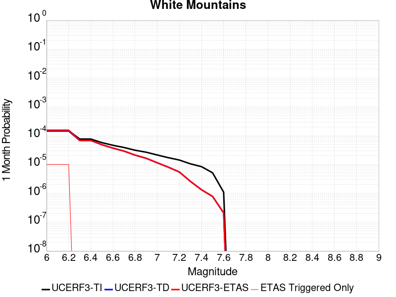 |  |  |

| Magnitude | 1 wk TI Prob | 1 wk TD Prob | 1 wk ETAS Prob | 1 wk ETAS/TD Gain | 1 wk ETAS Triggered Only | 1 mo TI Prob | 1 mo TD Prob | 1 mo ETAS Prob | 1 mo ETAS/TD Gain | 1 mo ETAS Triggered Only | 1 yr TI Prob | 1 yr TD Prob | 1 yr ETAS Prob | 1 yr ETAS/TD Gain | 1 yr ETAS Triggered Only | 10 yr TI Prob | 10 yr TD Prob | 10 yr ETAS Prob | 10 yr ETAS/TD Gain | 10 yr ETAS Triggered Only |
|-----|-----|-----|-----|-----|-----|-----|-----|-----|-----|-----|-----|-----|-----|-----|-----|-----|-----|-----|-----|-----|
| 6.0 | 3.503579E-5 | 3.378464E-5 | 4.37843E-5 | 1.2959825 | 1.0E-5 | 1.5014476E-4 | 1.4478396E-4 | 1.5478251E-4 | 1.0690584 | 1.0E-5 | 0.0018264796 | 0.0017614403 | 0.0017814051 | 1.0113343 | 2.0E-5 | 0.018115403 | 0.017487122 | 0.017526422 | 1.0022475 | 4.0E-5 |
| 6.1 | 3.503579E-5 | 3.378464E-5 | 4.37843E-5 | 1.2959825 | 1.0E-5 | 1.5014476E-4 | 1.4478396E-4 | 1.5478251E-4 | 1.0690584 | 1.0E-5 | 0.0018264796 | 0.0017614403 | 0.0017814051 | 1.0113343 | 2.0E-5 | 0.018115403 | 0.017487122 | 0.017526422 | 1.0022475 | 4.0E-5 |
| 6.2 | 3.503579E-5 | 3.378464E-5 | 4.37843E-5 | 1.2959825 | 1.0E-5 | 1.5014476E-4 | 1.4478396E-4 | 1.5478251E-4 | 1.0690584 | 1.0E-5 | 0.0018264796 | 0.0017614403 | 0.0017814051 | 1.0113343 | 2.0E-5 | 0.018115403 | 0.017487122 | 0.017526422 | 1.0022475 | 4.0E-5 |
| 6.3 | 1.7818425E-5 | 1.591633E-5 | 1.591633E-5 | 1.0 | 0.0 | 7.636245E-5 | 6.821114E-5 | 6.821114E-5 | 1.0 | 0.0 | 9.293162E-4 | 8.301685E-4 | 8.301685E-4 | 1.0 | 0.0 | 0.009254395 | 0.008272131 | 0.008291966 | 1.0023978 | 2.0E-5 |
| 6.4 | 1.7818425E-5 | 1.591633E-5 | 1.591633E-5 | 1.0 | 0.0 | 7.636245E-5 | 6.821114E-5 | 6.821114E-5 | 1.0 | 0.0 | 9.293162E-4 | 8.301685E-4 | 8.301685E-4 | 1.0 | 0.0 | 0.009254395 | 0.008272131 | 0.008291966 | 1.0023978 | 2.0E-5 |
| 6.5 | 1.3397557E-5 | 1.1336447E-5 | 1.1336447E-5 | 1.0 | 0.0 | 5.741684E-5 | 4.8583905E-5 | 4.8583905E-5 | 1.0 | 0.0 | 6.988258E-4 | 5.913555E-4 | 5.913555E-4 | 1.0 | 0.0 | 0.006966323 | 0.0058985245 | 0.0059084655 | 1.0016854 | 1.0E-5 |
| 6.6 | 1.0818695E-5 | 8.625501E-6 | 8.625501E-6 | 1.0 | 0.0 | 4.6365014E-5 | 3.6965936E-5 | 3.6965936E-5 | 1.0 | 0.0 | 5.6434784E-4 | 4.4997167E-4 | 4.4997167E-4 | 1.0 | 0.0 | 0.005629168 | 0.0044910423 | 0.0044910423 | 1.0 | 0.0 |
| 6.7 | 9.067908E-6 | 6.80255E-6 | 6.80255E-6 | 1.0 | 0.0 | 3.8861883E-5 | 2.9153478E-5 | 2.9153478E-5 | 1.0 | 0.0 | 4.7304068E-4 | 3.5488897E-4 | 3.5488897E-4 | 1.0 | 0.0 | 0.00472035 | 0.0035435397 | 0.0035435397 | 1.0 | 0.0 |
| 6.8 | 7.295947E-6 | 4.9364708E-6 | 4.9364708E-6 | 1.0 | 0.0 | 3.126797E-5 | 2.1156138E-5 | 2.1156138E-5 | 1.0 | 0.0 | 3.8062103E-4 | 2.5754666E-4 | 2.5754666E-4 | 1.0 | 0.0 | 0.0037996976 | 0.002572595 | 0.002572595 | 1.0 | 0.0 |
| 6.9 | 6.2243444E-6 | 3.8322787E-6 | 3.8322787E-6 | 1.0 | 0.0 | 2.6675489E-5 | 1.6423952E-5 | 1.6423952E-5 | 1.0 | 0.0 | 3.2472567E-4 | 1.9994378E-4 | 1.9994378E-4 | 1.0 | 0.0 | 0.0032425157 | 0.0019976916 | 0.0019976916 | 1.0 | 0.0 |
| 7.0 | 4.9878413E-6 | 2.6795901E-6 | 2.6795901E-6 | 1.0 | 0.0 | 2.1376287E-5 | 1.1483909E-5 | 1.1483909E-5 | 1.0 | 0.0 | 2.602252E-4 | 1.3980787E-4 | 1.3980787E-4 | 1.0 | 0.0 | 0.002599207 | 0.0013972254 | 0.0013972254 | 1.0 | 0.0 |
| 7.1 | 4.0252844E-6 | 1.8858086E-6 | 1.8858086E-6 | 1.0 | 0.0 | 1.7251105E-5 | 8.082013E-6 | 8.082013E-6 | 1.0 | 0.0 | 2.1001195E-4 | 9.839419E-5 | 9.839419E-5 | 1.0 | 0.0 | 0.0020981359 | 9.83519E-4 | 9.83519E-4 | 1.0 | 0.0 |
| 7.2 | 3.3284066E-6 | 1.2820117E-6 | 1.2820117E-6 | 1.0 | 0.0 | 1.4264522E-5 | 5.494325E-6 | 5.494325E-6 | 1.0 | 0.0 | 1.736567E-4 | 6.689145E-5 | 6.689145E-5 | 1.0 | 0.0 | 0.0017352107 | 6.6872325E-4 | 6.6872325E-4 | 1.0 | 0.0 |
| 7.3 | 2.458226E-6 | 6.0576485E-7 | 6.0576485E-7 | 1.0 | 0.0 | 1.0535211E-5 | 2.5961326E-6 | 2.5961326E-6 | 1.0 | 0.0 | 1.2825865E-4 | 3.1607495E-5 | 3.1607495E-5 | 1.0 | 0.0 | 0.0012818464 | 3.1603375E-4 | 3.1603375E-4 | 1.0 | 0.0 |
| 7.4 | 1.965953E-6 | 3.109302E-7 | 3.109302E-7 | 1.0 | 0.0 | 8.425486E-6 | 1.3325573E-6 | 1.3325573E-6 | 1.0 | 0.0 | 1.0257547E-4 | 1.6223767E-5 | 1.6223767E-5 | 1.0 | 0.0 | 0.0010252813 | 1.6222594E-4 | 1.6222594E-4 | 1.0 | 0.0 |
| 7.5 | 1.2014192E-6 | 1.8246826E-7 | 1.8246826E-7 | 1.0 | 0.0 | 5.148929E-6 | 7.8200657E-7 | 7.8200657E-7 | 1.0 | 0.0 | 6.2686406E-5 | 9.52089E-6 | 9.52089E-6 | 1.0 | 0.0 | 6.266873E-4 | 9.52049E-5 | 9.52049E-5 | 1.0 | 0.0 |
| 7.6 | 2.5612175E-7 | 4.895326E-8 | 4.895326E-8 | 1.0 | 0.0 | 1.0976642E-6 | 2.0979968E-7 | 2.0979968E-7 | 1.0 | 0.0 | 1.3363979E-5 | 2.5543086E-6 | 2.5543086E-6 | 1.0 | 0.0 | 1.3363175E-4 | 2.5542828E-5 | 2.5542828E-5 | 1.0 | 0.0 |

## San Diego Trough north alt1
*[(top)](#table-of-contents)*

| 1 Week | 1 Month | 1 Year | 10 Year |
|-----|-----|-----|-----|
|  |  | 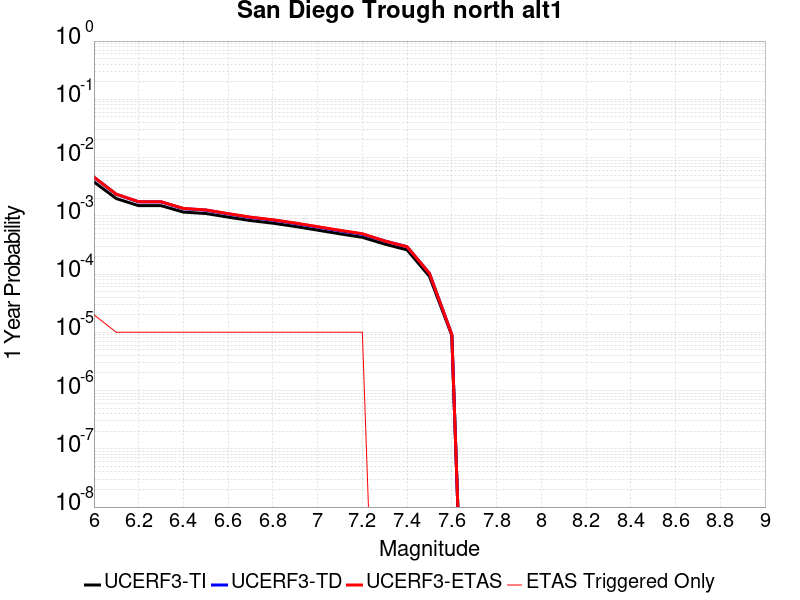 |  |

| Magnitude | 1 wk TI Prob | 1 wk TD Prob | 1 wk ETAS Prob | 1 wk ETAS/TD Gain | 1 wk ETAS Triggered Only | 1 mo TI Prob | 1 mo TD Prob | 1 mo ETAS Prob | 1 mo ETAS/TD Gain | 1 mo ETAS Triggered Only | 1 yr TI Prob | 1 yr TD Prob | 1 yr ETAS Prob | 1 yr ETAS/TD Gain | 1 yr ETAS Triggered Only | 10 yr TI Prob | 10 yr TD Prob | 10 yr ETAS Prob | 10 yr ETAS/TD Gain | 10 yr ETAS Triggered Only |
|-----|-----|-----|-----|-----|-----|-----|-----|-----|-----|-----|-----|-----|-----|-----|-----|-----|-----|-----|-----|-----|
| 6.0 | 7.329252E-5 | 8.8214794E-5 | 8.8214794E-5 | 1.0 | 0.0 | 3.14073E-4 | 3.7801228E-4 | 3.8800848E-4 | 1.0264442 | 1.0E-5 | 0.0038171355 | 0.004593227 | 0.004613135 | 1.0043342 | 2.0E-5 | 0.03752231 | 0.04504687 | 0.04507552 | 1.000636 | 3.0E-5 |
| 6.1 | 3.7940346E-5 | 4.488676E-5 | 4.488676E-5 | 1.0 | 0.0 | 1.6259136E-4 | 1.923582E-4 | 2.0235628E-4 | 1.0519763 | 1.0E-5 | 0.0019777524 | 0.002339534 | 0.0023495106 | 1.0042644 | 1.0E-5 | 0.019602431 | 0.02315757 | 0.023167338 | 1.0004219 | 1.0E-5 |
| 6.2 | 2.8645263E-5 | 3.329793E-5 | 3.329793E-5 | 1.0 | 0.0 | 1.2275964E-4 | 1.4269775E-4 | 1.5269633E-4 | 1.0700682 | 1.0E-5 | 0.0014935739 | 0.001735978 | 0.0017459606 | 1.0057504 | 1.0E-5 | 0.0148357535 | 0.017226832 | 0.017236661 | 1.0005705 | 1.0E-5 |
| 6.3 | 2.8645263E-5 | 3.329793E-5 | 3.329793E-5 | 1.0 | 0.0 | 1.2275964E-4 | 1.4269775E-4 | 1.5269633E-4 | 1.0700682 | 1.0E-5 | 0.0014935739 | 0.001735978 | 0.0017459606 | 1.0057504 | 1.0E-5 | 0.0148357535 | 0.017226832 | 0.017236661 | 1.0005705 | 1.0E-5 |
| 6.4 | 2.2204576E-5 | 2.5449102E-5 | 2.5449102E-5 | 1.0 | 0.0 | 9.5159E-5 | 1.09063076E-4 | 1.1906199E-4 | 1.09168 | 1.0E-5 | 0.001157945 | 0.0013270442 | 0.0013370309 | 1.0075256 | 1.0E-5 | 0.011519298 | 0.0131923575 | 0.013202226 | 1.000748 | 1.0E-5 |
| 6.5 | 2.1004838E-5 | 2.4025423E-5 | 2.4025423E-5 | 1.0 | 0.0 | 9.0017624E-5 | 1.0296208E-4 | 1.12961054E-4 | 1.0971131 | 1.0E-5 | 0.0010954136 | 0.0012528518 | 0.0012628393 | 1.0079718 | 1.0E-5 | 0.010900296 | 0.012458963 | 0.012468839 | 1.0007926 | 1.0E-5 |
| 6.6 | 1.820557E-5 | 2.0705384E-5 | 2.0705384E-5 | 1.0 | 0.0 | 7.802154E-5 | 8.873437E-5 | 9.8733486E-5 | 1.1126859 | 1.0E-5 | 9.4949827E-4 | 0.001079811 | 0.0010898003 | 1.0092509 | 1.0E-5 | 0.009454516 | 0.010746313 | 0.010756206 | 1.0009205 | 1.0E-5 |
| 6.7 | 1.5884485E-5 | 1.7984146E-5 | 1.7984146E-5 | 1.0 | 0.0 | 6.807459E-5 | 7.707265E-5 | 8.707188E-5 | 1.1297377 | 1.0E-5 | 8.284929E-4 | 9.379583E-4 | 9.479489E-4 | 1.0106515 | 1.0E-5 | 0.008254109 | 0.009340362 | 0.009350268 | 1.0010606 | 1.0E-5 |
| 6.8 | 1.4331171E-5 | 1.620151E-5 | 1.620151E-5 | 1.0 | 0.0 | 6.141786E-5 | 6.94332E-5 | 7.943251E-5 | 1.1440133 | 1.0E-5 | 7.4750587E-4 | 8.450234E-4 | 8.550149E-4 | 1.011824 | 1.0E-5 | 0.0074499645 | 0.008418369 | 0.008428285 | 1.0011779 | 1.0E-5 |
| 6.9 | 1.2574203E-5 | 1.4206222E-5 | 1.4206222E-5 | 1.0 | 0.0 | 5.3888325E-5 | 6.0882394E-5 | 7.088178E-5 | 1.1642411 | 1.0E-5 | 6.558929E-4 | 7.409925E-4 | 7.5098505E-4 | 1.0134854 | 1.0E-5 | 0.0065396037 | 0.007385404 | 0.00739533 | 1.001344 | 1.0E-5 |
| 7.0 | 1.0883844E-5 | 1.2289594E-5 | 1.2289594E-5 | 1.0 | 0.0 | 4.664421E-5 | 5.266863E-5 | 6.266811E-5 | 1.1898563 | 1.0E-5 | 5.677453E-4 | 6.410529E-4 | 6.510465E-4 | 1.0155894 | 1.0E-5 | 0.00566297 | 0.006392165 | 0.0064021014 | 1.0015544 | 1.0E-5 |
| 7.1 | 9.393088E-6 | 1.0607308E-5 | 1.0607308E-5 | 1.0 | 0.0 | 4.025547E-5 | 4.5459103E-5 | 5.5458648E-5 | 1.219968 | 1.0E-5 | 4.900001E-4 | 5.533248E-4 | 5.6331925E-4 | 1.0180626 | 1.0E-5 | 0.0048892107 | 0.005519567 | 0.005529512 | 1.0018017 | 1.0E-5 |
| 7.2 | 8.190791E-6 | 9.258879E-6 | 9.258879E-6 | 1.0 | 0.0 | 3.510292E-5 | 3.968031E-5 | 4.9679915E-5 | 1.2520041 | 1.0E-5 | 4.2729423E-4 | 4.8300138E-4 | 4.9299654E-4 | 1.0206939 | 1.0E-5 | 0.0042647356 | 0.004819596 | 0.0048295483 | 1.0020648 | 1.0E-5 |
| 7.3 | 6.268162E-6 | 7.0899105E-6 | 7.0899105E-6 | 1.0 | 0.0 | 2.6863276E-5 | 3.038498E-5 | 3.038498E-5 | 1.0 | 0.0 | 3.2701128E-4 | 3.6987473E-4 | 3.6987473E-4 | 1.0 | 0.0 | 0.003265305 | 0.0036926374 | 0.0036926374 | 1.0 | 0.0 |
| 7.4 | 4.985186E-6 | 5.6428376E-6 | 5.6428376E-6 | 1.0 | 0.0 | 2.1364907E-5 | 2.4183368E-5 | 2.4183368E-5 | 1.0 | 0.0 | 2.600867E-4 | 2.943931E-4 | 2.943931E-4 | 1.0 | 0.0 | 0.002597825 | 0.0029400727 | 0.0029400727 | 1.0 | 0.0 |
| 7.5 | 1.7489613E-6 | 1.9697304E-6 | 1.9697304E-6 | 1.0 | 0.0 | 7.495527E-6 | 8.441675E-6 | 8.441675E-6 | 1.0 | 0.0 | 9.125422E-5 | 1.0277278E-4 | 1.0277278E-4 | 1.0 | 0.0 | 9.1216754E-4 | 0.0010272745 | 0.0010272745 | 1.0 | 0.0 |
| 7.6 | 1.6988751E-7 | 1.7533941E-7 | 1.7533941E-7 | 1.0 | 0.0 | 7.2808916E-7 | 7.514544E-7 | 7.514544E-7 | 1.0 | 0.0 | 8.864449E-6 | 9.148921E-6 | 9.148921E-6 | 1.0 | 0.0 | 8.8640954E-5 | 9.148564E-5 | 9.148564E-5 | 1.0 | 0.0 |

## Tin Mountain
*[(top)](#table-of-contents)*

| 1 Week | 1 Month | 1 Year | 10 Year |
|-----|-----|-----|-----|
| 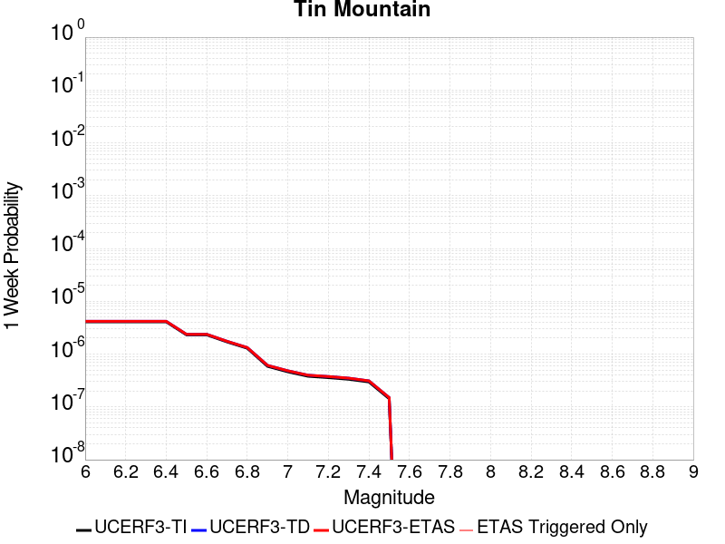 |  |  | 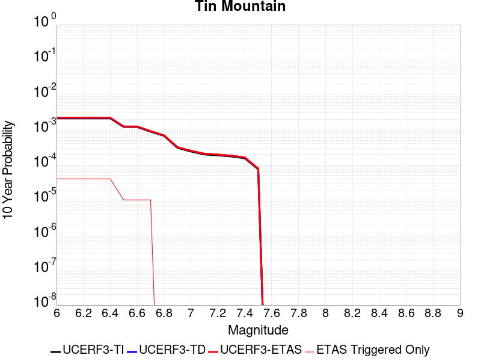 |

| Magnitude | 1 wk TI Prob | 1 wk TD Prob | 1 wk ETAS Prob | 1 wk ETAS/TD Gain | 1 wk ETAS Triggered Only | 1 mo TI Prob | 1 mo TD Prob | 1 mo ETAS Prob | 1 mo ETAS/TD Gain | 1 mo ETAS Triggered Only | 1 yr TI Prob | 1 yr TD Prob | 1 yr ETAS Prob | 1 yr ETAS/TD Gain | 1 yr ETAS Triggered Only | 10 yr TI Prob | 10 yr TD Prob | 10 yr ETAS Prob | 10 yr ETAS/TD Gain | 10 yr ETAS Triggered Only |
|-----|-----|-----|-----|-----|-----|-----|-----|-----|-----|-----|-----|-----|-----|-----|-----|-----|-----|-----|-----|-----|
| 6.0 | 4.083776E-6 | 4.1815574E-6 | 4.1815574E-6 | 1.0 | 0.0 | 1.750178E-5 | 1.7920858E-5 | 1.7920858E-5 | 1.0 | 0.0 | 2.1306332E-4 | 2.1816834E-4 | 2.2816616E-4 | 1.0458262 | 1.0E-5 | 0.0021285915 | 0.0021799072 | 0.0022198202 | 1.0183094 | 4.0E-5 |
| 6.1 | 4.083776E-6 | 4.1815574E-6 | 4.1815574E-6 | 1.0 | 0.0 | 1.750178E-5 | 1.7920858E-5 | 1.7920858E-5 | 1.0 | 0.0 | 2.1306332E-4 | 2.1816834E-4 | 2.2816616E-4 | 1.0458262 | 1.0E-5 | 0.0021285915 | 0.0021799072 | 0.0022198202 | 1.0183094 | 4.0E-5 |
| 6.2 | 4.083776E-6 | 4.1815574E-6 | 4.1815574E-6 | 1.0 | 0.0 | 1.750178E-5 | 1.7920858E-5 | 1.7920858E-5 | 1.0 | 0.0 | 2.1306332E-4 | 2.1816834E-4 | 2.2816616E-4 | 1.0458262 | 1.0E-5 | 0.0021285915 | 0.0021799072 | 0.0022198202 | 1.0183094 | 4.0E-5 |
| 6.3 | 4.083776E-6 | 4.1815574E-6 | 4.1815574E-6 | 1.0 | 0.0 | 1.750178E-5 | 1.7920858E-5 | 1.7920858E-5 | 1.0 | 0.0 | 2.1306332E-4 | 2.1816834E-4 | 2.2816616E-4 | 1.0458262 | 1.0E-5 | 0.0021285915 | 0.0021799072 | 0.0022198202 | 1.0183094 | 4.0E-5 |
| 6.4 | 4.083776E-6 | 4.1815574E-6 | 4.1815574E-6 | 1.0 | 0.0 | 1.750178E-5 | 1.7920858E-5 | 1.7920858E-5 | 1.0 | 0.0 | 2.1306332E-4 | 2.1816834E-4 | 2.2816616E-4 | 1.0458262 | 1.0E-5 | 0.0021285915 | 0.0021799072 | 0.0022198202 | 1.0183094 | 4.0E-5 |
| 6.5 | 2.3143427E-6 | 2.3731698E-6 | 2.3731698E-6 | 1.0 | 0.0 | 9.9185745E-6 | 1.0170693E-5 | 1.0170693E-5 | 1.0 | 0.0 | 1.2075195E-4 | 1.2382191E-4 | 1.2382191E-4 | 1.0 | 0.0 | 0.0012068636 | 0.0012376052 | 0.0012475929 | 1.0080701 | 1.0E-5 |
| 6.6 | 2.3143427E-6 | 2.3731698E-6 | 2.3731698E-6 | 1.0 | 0.0 | 9.9185745E-6 | 1.0170693E-5 | 1.0170693E-5 | 1.0 | 0.0 | 1.2075195E-4 | 1.2382191E-4 | 1.2382191E-4 | 1.0 | 0.0 | 0.0012068636 | 0.0012376052 | 0.0012475929 | 1.0080701 | 1.0E-5 |
| 6.7 | 1.7029532E-6 | 1.7498015E-6 | 1.7498015E-6 | 1.0 | 0.0 | 7.2983503E-6 | 7.4991312E-6 | 7.4991312E-6 | 1.0 | 0.0 | 8.885379E-5 | 9.129863E-5 | 9.129863E-5 | 1.0 | 0.0 | 8.881827E-4 | 9.126639E-4 | 9.2265476E-4 | 1.010947 | 1.0E-5 |
| 6.8 | 1.2914646E-6 | 1.3299461E-6 | 1.3299461E-6 | 1.0 | 0.0 | 5.534837E-6 | 5.699759E-6 | 5.699759E-6 | 1.0 | 0.0 | 6.738455E-5 | 6.93928E-5 | 6.93928E-5 | 1.0 | 0.0 | 6.736412E-4 | 6.937547E-4 | 6.937547E-4 | 1.0 | 0.0 |
| 6.9 | 5.8708974E-7 | 6.117047E-7 | 6.117047E-7 | 1.0 | 0.0 | 2.5160964E-6 | 2.6215894E-6 | 2.6215894E-6 | 1.0 | 0.0 | 3.0633044E-5 | 3.1917425E-5 | 3.1917425E-5 | 1.0 | 0.0 | 3.0628822E-4 | 3.191325E-4 | 3.191325E-4 | 1.0 | 0.0 |
| 7.0 | 4.6248786E-7 | 4.8320607E-7 | 4.8320607E-7 | 1.0 | 0.0 | 1.9820893E-6 | 2.0708817E-6 | 2.0708817E-6 | 1.0 | 0.0 | 2.413167E-5 | 2.521273E-5 | 2.521273E-5 | 1.0 | 0.0 | 2.412905E-4 | 2.5210239E-4 | 2.5210239E-4 | 1.0 | 0.0 |
| 7.1 | 3.804606E-7 | 3.987187E-7 | 3.987187E-7 | 1.0 | 0.0 | 1.6305444E-6 | 1.7087934E-6 | 1.7087934E-6 | 1.0 | 0.0 | 1.9851697E-5 | 2.0804397E-5 | 2.0804397E-5 | 1.0 | 0.0 | 1.9849923E-4 | 2.0802785E-4 | 2.0802785E-4 | 1.0 | 0.0 |
| 7.2 | 3.5864858E-7 | 3.7617247E-7 | 3.7617247E-7 | 1.0 | 0.0 | 1.5370645E-6 | 1.6121669E-6 | 1.6121669E-6 | 1.0 | 0.0 | 1.87136E-5 | 1.9627989E-5 | 1.9627989E-5 | 1.0 | 0.0 | 1.8712023E-4 | 1.9626587E-4 | 1.9626587E-4 | 1.0 | 0.0 |
| 7.3 | 3.342063E-7 | 3.5063832E-7 | 3.5063832E-7 | 1.0 | 0.0 | 1.4323119E-6 | 1.5027349E-6 | 1.5027349E-6 | 1.0 | 0.0 | 1.7438259E-5 | 1.8295677E-5 | 1.8295677E-5 | 1.0 | 0.0 | 1.743689E-4 | 1.8294502E-4 | 1.8294502E-4 | 1.0 | 0.0 |
| 7.4 | 2.971242E-7 | 3.1166135E-7 | 3.1166135E-7 | 1.0 | 0.0 | 1.2733886E-6 | 1.3356911E-6 | 1.3356911E-6 | 1.0 | 0.0 | 1.5503398E-5 | 1.626195E-5 | 1.626195E-5 | 1.0 | 0.0 | 1.5502315E-4 | 1.6261089E-4 | 1.6261089E-4 | 1.0 | 0.0 |
| 7.5 | 1.4326713E-7 | 1.5012674E-7 | 1.5012674E-7 | 1.0 | 0.0 | 6.140018E-7 | 6.434003E-7 | 6.434003E-7 | 1.0 | 0.0 | 7.4754466E-6 | 7.833399E-6 | 7.833399E-6 | 1.0 | 0.0 | 7.475195E-5 | 7.8333986E-5 | 7.8333986E-5 | 1.0 | 0.0 |

## San Cayetano
*[(top)](#table-of-contents)*

| 1 Week | 1 Month | 1 Year | 10 Year |
|-----|-----|-----|-----|
|  |  |  |  |

| Magnitude | 1 wk TI Prob | 1 wk TD Prob | 1 wk ETAS Prob | 1 wk ETAS/TD Gain | 1 wk ETAS Triggered Only | 1 mo TI Prob | 1 mo TD Prob | 1 mo ETAS Prob | 1 mo ETAS/TD Gain | 1 mo ETAS Triggered Only | 1 yr TI Prob | 1 yr TD Prob | 1 yr ETAS Prob | 1 yr ETAS/TD Gain | 1 yr ETAS Triggered Only | 10 yr TI Prob | 10 yr TD Prob | 10 yr ETAS Prob | 10 yr ETAS/TD Gain | 10 yr ETAS Triggered Only |
|-----|-----|-----|-----|-----|-----|-----|-----|-----|-----|-----|-----|-----|-----|-----|-----|-----|-----|-----|-----|-----|
| 6.0 | 2.3476267E-5 | 1.8169832E-5 | 1.8169832E-5 | 1.0 | 0.0 | 1.0060869E-4 | 7.7868404E-5 | 7.7868404E-5 | 1.0 | 0.0 | 0.0012242225 | 9.476391E-4 | 9.476391E-4 | 1.0 | 0.0 | 0.012175002 | 0.00943687 | 0.009476492 | 1.0041987 | 4.0E-5 |
| 6.1 | 2.3476267E-5 | 1.8169832E-5 | 1.8169832E-5 | 1.0 | 0.0 | 1.0060869E-4 | 7.7868404E-5 | 7.7868404E-5 | 1.0 | 0.0 | 0.0012242225 | 9.476391E-4 | 9.476391E-4 | 1.0 | 0.0 | 0.012175002 | 0.00943687 | 0.009476492 | 1.0041987 | 4.0E-5 |
| 6.2 | 2.3476267E-5 | 1.8169832E-5 | 1.8169832E-5 | 1.0 | 0.0 | 1.0060869E-4 | 7.7868404E-5 | 7.7868404E-5 | 1.0 | 0.0 | 0.0012242225 | 9.476391E-4 | 9.476391E-4 | 1.0 | 0.0 | 0.012175002 | 0.00943687 | 0.009476492 | 1.0041987 | 4.0E-5 |
| 6.3 | 2.3476267E-5 | 1.8169832E-5 | 1.8169832E-5 | 1.0 | 0.0 | 1.0060869E-4 | 7.7868404E-5 | 7.7868404E-5 | 1.0 | 0.0 | 0.0012242225 | 9.476391E-4 | 9.476391E-4 | 1.0 | 0.0 | 0.012175002 | 0.00943687 | 0.009476492 | 1.0041987 | 4.0E-5 |
| 6.4 | 2.3476267E-5 | 1.8169832E-5 | 1.8169832E-5 | 1.0 | 0.0 | 1.0060869E-4 | 7.7868404E-5 | 7.7868404E-5 | 1.0 | 0.0 | 0.0012242225 | 9.476391E-4 | 9.476391E-4 | 1.0 | 0.0 | 0.012175002 | 0.00943687 | 0.009476492 | 1.0041987 | 4.0E-5 |
| 6.5 | 2.3476267E-5 | 1.8169832E-5 | 1.8169832E-5 | 1.0 | 0.0 | 1.0060869E-4 | 7.7868404E-5 | 7.7868404E-5 | 1.0 | 0.0 | 0.0012242225 | 9.476391E-4 | 9.476391E-4 | 1.0 | 0.0 | 0.012175002 | 0.00943687 | 0.009476492 | 1.0041987 | 4.0E-5 |
| 6.6 | 2.3476267E-5 | 1.8169832E-5 | 1.8169832E-5 | 1.0 | 0.0 | 1.0060869E-4 | 7.7868404E-5 | 7.7868404E-5 | 1.0 | 0.0 | 0.0012242225 | 9.476391E-4 | 9.476391E-4 | 1.0 | 0.0 | 0.012175002 | 0.00943687 | 0.009476492 | 1.0041987 | 4.0E-5 |
| 6.7 | 2.3476267E-5 | 1.8169832E-5 | 1.8169832E-5 | 1.0 | 0.0 | 1.0060869E-4 | 7.7868404E-5 | 7.7868404E-5 | 1.0 | 0.0 | 0.0012242225 | 9.476391E-4 | 9.476391E-4 | 1.0 | 0.0 | 0.012175002 | 0.00943687 | 0.009476492 | 1.0041987 | 4.0E-5 |
| 6.8 | 2.3241924E-5 | 1.793753E-5 | 1.793753E-5 | 1.0 | 0.0 | 9.960445E-5 | 7.6872886E-5 | 7.6872886E-5 | 1.0 | 0.0 | 0.0012120095 | 9.355291E-4 | 9.355291E-4 | 1.0 | 0.0 | 0.012054204 | 0.009316763 | 0.00935639 | 1.0042534 | 4.0E-5 |
| 6.9 | 2.2761007E-5 | 1.743295E-5 | 1.743295E-5 | 1.0 | 0.0 | 9.7543525E-5 | 7.471052E-5 | 7.471052E-5 | 1.0 | 0.0 | 0.0011869454 | 9.092245E-4 | 9.092245E-4 | 1.0 | 0.0 | 0.011806256 | 0.009055875 | 0.009095513 | 1.004377 | 4.0E-5 |
| 7.0 | 2.240283E-5 | 1.7066684E-5 | 1.7066684E-5 | 1.0 | 0.0 | 9.600859E-5 | 7.31409E-5 | 7.31409E-5 | 1.0 | 0.0 | 0.0011682777 | 8.901301E-4 | 8.901301E-4 | 1.0 | 0.0 | 0.011621549 | 0.008866462 | 0.008906107 | 1.0044714 | 4.0E-5 |
| 7.1 | 2.1871154E-5 | 1.6586517E-5 | 1.6586517E-5 | 1.0 | 0.0 | 9.373015E-5 | 7.108315E-5 | 7.108315E-5 | 1.0 | 0.0 | 0.0011405671 | 8.650971E-4 | 8.650971E-4 | 1.0 | 0.0 | 0.011347309 | 0.008618096 | 0.008647838 | 1.003451 | 3.0E-5 |
| 7.2 | 2.0714133E-5 | 1.5565023E-5 | 1.5565023E-5 | 1.0 | 0.0 | 8.8771834E-5 | 6.670555E-5 | 6.670555E-5 | 1.0 | 0.0 | 0.0010802611 | 8.1184076E-4 | 8.1184076E-4 | 1.0 | 0.0 | 0.010750249 | 0.008089525 | 0.008109363 | 1.0024524 | 2.0E-5 |
| 7.3 | 1.8408395E-5 | 1.3997253E-5 | 1.3997253E-5 | 1.0 | 0.0 | 7.8890735E-5 | 5.998686E-5 | 5.998686E-5 | 1.0 | 0.0 | 9.600714E-4 | 7.300983E-4 | 7.300983E-4 | 1.0 | 0.0 | 0.009559342 | 0.0072777164 | 0.007297571 | 1.0027281 | 2.0E-5 |
| 7.4 | 1.6856795E-5 | 1.2850425E-5 | 1.2850425E-5 | 1.0 | 0.0 | 7.2241404E-5 | 5.50721E-5 | 5.50721E-5 | 1.0 | 0.0 | 8.7918417E-4 | 6.7029946E-4 | 6.7029946E-4 | 1.0 | 0.0 | 0.00875714 | 0.0066834567 | 0.006703323 | 1.0029725 | 2.0E-5 |
| 7.5 | 1.2822778E-5 | 9.577788E-6 | 9.577788E-6 | 1.0 | 0.0 | 5.495361E-5 | 4.1047024E-5 | 4.1047024E-5 | 1.0 | 0.0 | 6.688548E-4 | 4.9963454E-4 | 4.9963454E-4 | 1.0 | 0.0 | 0.006668452 | 0.004985283 | 0.005005183 | 1.0039918 | 2.0E-5 |
| 7.6 | 5.6272684E-6 | 3.855006E-6 | 3.855006E-6 | 1.0 | 0.0 | 2.4116642E-5 | 1.652135E-5 | 1.652135E-5 | 1.0 | 0.0 | 2.9358055E-4 | 2.0112898E-4 | 2.0112898E-4 | 1.0 | 0.0 | 0.0029319301 | 0.0020094803 | 0.0020194603 | 1.0049664 | 1.0E-5 |
| 7.7 | 3.5261346E-6 | 2.340766E-6 | 2.340766E-6 | 1.0 | 0.0 | 1.5111918E-5 | 1.0031817E-5 | 1.0031817E-5 | 1.0 | 0.0 | 1.8397206E-4 | 1.221306E-4 | 1.221306E-4 | 1.0 | 0.0 | 0.0018381984 | 0.0012206421 | 0.0012206421 | 1.0 | 0.0 |
| 7.8 | 1.4826929E-6 | 1.0564552E-6 | 1.0564552E-6 | 1.0 | 0.0 | 6.354383E-6 | 4.5276574E-6 | 4.5276574E-6 | 1.0 | 0.0 | 7.736187E-5 | 5.5122855E-5 | 5.5122855E-5 | 1.0 | 0.0 | 7.733494E-4 | 5.5109384E-4 | 5.5109384E-4 | 1.0 | 0.0 |
| 7.9 | 2.7568166E-7 | 1.6978915E-7 | 1.6978915E-7 | 1.0 | 0.0 | 1.1814923E-6 | 7.2766755E-7 | 7.2766755E-7 | 1.0 | 0.0 | 1.4384574E-5 | 8.859317E-6 | 8.859317E-6 | 1.0 | 0.0 | 1.4383643E-4 | 8.858967E-5 | 8.858967E-5 | 1.0 | 0.0 |
| 8.0 | 5.407832E-8 | 2.6889959E-8 | 2.6889959E-8 | 1.0 | 0.0 | 2.3176422E-7 | 1.1524267E-7 | 1.1524267E-7 | 1.0 | 0.0 | 2.8217257E-6 | 1.4030786E-6 | 1.4030786E-6 | 1.0 | 0.0 | 2.8216898E-5 | 1.4030702E-5 | 1.4030702E-5 | 1.0 | 0.0 |

## Hosgri (Extension)
*[(top)](#table-of-contents)*

| 1 Week | 1 Month | 1 Year | 10 Year |
|-----|-----|-----|-----|
| 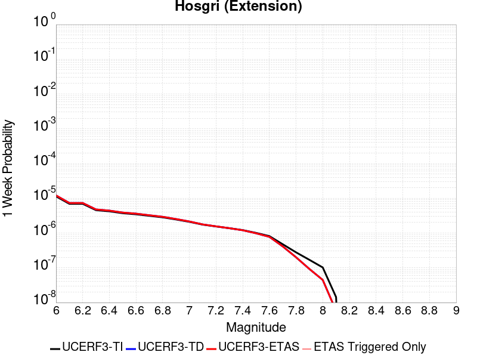 | 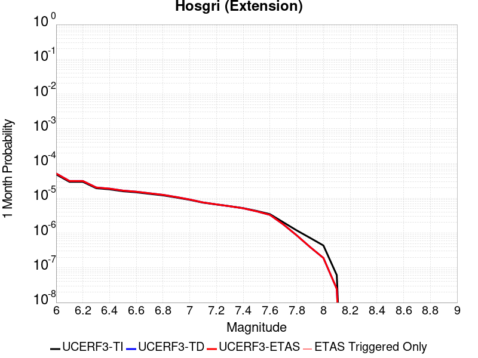 | 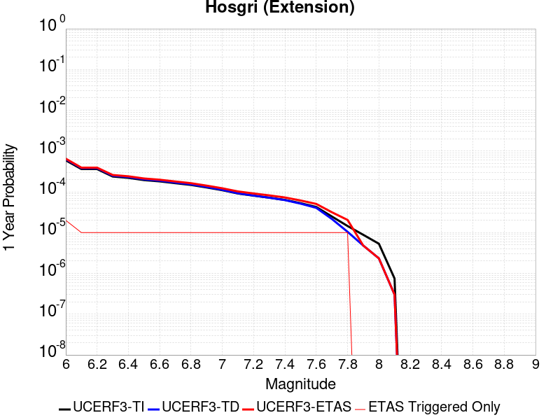 |  |

| Magnitude | 1 wk TI Prob | 1 wk TD Prob | 1 wk ETAS Prob | 1 wk ETAS/TD Gain | 1 wk ETAS Triggered Only | 1 mo TI Prob | 1 mo TD Prob | 1 mo ETAS Prob | 1 mo ETAS/TD Gain | 1 mo ETAS Triggered Only | 1 yr TI Prob | 1 yr TD Prob | 1 yr ETAS Prob | 1 yr ETAS/TD Gain | 1 yr ETAS Triggered Only | 10 yr TI Prob | 10 yr TD Prob | 10 yr ETAS Prob | 10 yr ETAS/TD Gain | 10 yr ETAS Triggered Only |
|-----|-----|-----|-----|-----|-----|-----|-----|-----|-----|-----|-----|-----|-----|-----|-----|-----|-----|-----|-----|-----|
| 6.0 | 1.1369135E-5 | 1.2083271E-5 | 1.2083271E-5 | 1.0 | 0.0 | 4.8723956E-5 | 5.1784547E-5 | 5.1784547E-5 | 1.0 | 0.0 | 5.9305265E-4 | 6.303172E-4 | 6.503046E-4 | 1.03171 | 2.0E-5 | 0.005914725 | 0.006287543 | 0.0063173543 | 1.0047413 | 3.0E-5 |
| 6.1 | 6.934979E-6 | 7.3246815E-6 | 7.3246815E-6 | 1.0 | 0.0 | 2.9721E-5 | 3.1391137E-5 | 3.1391137E-5 | 1.0 | 0.0 | 3.617931E-4 | 3.8212424E-4 | 3.9212042E-4 | 1.0261595 | 1.0E-5 | 0.0036120464 | 0.0038150842 | 0.003835008 | 1.0052223 | 2.0E-5 |
| 6.2 | 6.934979E-6 | 7.3246815E-6 | 7.3246815E-6 | 1.0 | 0.0 | 2.9721E-5 | 3.1391137E-5 | 3.1391137E-5 | 1.0 | 0.0 | 3.617931E-4 | 3.8212424E-4 | 3.9212042E-4 | 1.0261595 | 1.0E-5 | 0.0036120464 | 0.0038150842 | 0.003835008 | 1.0052223 | 2.0E-5 |
| 6.3 | 4.5484676E-6 | 4.7694193E-6 | 4.7694193E-6 | 1.0 | 0.0 | 1.9493287E-5 | 2.044021E-5 | 2.044021E-5 | 1.0 | 0.0 | 2.3730492E-4 | 2.4883155E-4 | 2.5882907E-4 | 1.0401778 | 1.0E-5 | 0.0023705168 | 0.0024855721 | 0.002495547 | 1.0040132 | 1.0E-5 |
| 6.4 | 4.218095E-6 | 4.4169456E-6 | 4.4169456E-6 | 1.0 | 0.0 | 1.8077424E-5 | 1.8929632E-5 | 1.8929632E-5 | 1.0 | 0.0 | 2.2007042E-4 | 2.3044422E-4 | 2.404419E-4 | 1.0433844 | 1.0E-5 | 0.002198526 | 0.002302086 | 0.002312063 | 1.0043339 | 1.0E-5 |
| 6.5 | 3.717374E-6 | 3.8839544E-6 | 3.8839544E-6 | 1.0 | 0.0 | 1.5931506E-5 | 1.6645414E-5 | 1.6645414E-5 | 1.0 | 0.0 | 1.9394881E-4 | 2.0263925E-4 | 2.1263723E-4 | 1.0493388 | 1.0E-5 | 0.0019377962 | 0.0020245635 | 0.0020345433 | 1.0049293 | 1.0E-5 |
| 6.6 | 3.4605036E-6 | 3.6083788E-6 | 3.6083788E-6 | 1.0 | 0.0 | 1.4830645E-5 | 1.546439E-5 | 1.546439E-5 | 1.0 | 0.0 | 1.8054814E-4 | 1.8826281E-4 | 1.9826094E-4 | 1.0531073 | 1.0E-5 | 0.0018040152 | 0.001881048 | 0.0018910292 | 1.0053062 | 1.0E-5 |
| 6.7 | 3.123439E-6 | 3.246636E-6 | 3.246636E-6 | 1.0 | 0.0 | 1.33860985E-5 | 1.391408E-5 | 1.391408E-5 | 1.0 | 0.0 | 1.6296357E-4 | 1.6939086E-4 | 1.7938917E-4 | 1.059025 | 1.0E-5 | 0.001628441 | 0.0016926284 | 0.0017026115 | 1.005898 | 1.0E-5 |
| 6.8 | 2.8290783E-6 | 2.9306027E-6 | 2.9306027E-6 | 1.0 | 0.0 | 1.2124565E-5 | 1.2559665E-5 | 1.2559665E-5 | 1.0 | 0.0 | 1.4760658E-4 | 1.5290329E-4 | 1.6290175E-4 | 1.0653908 | 1.0E-5 | 0.0014750857 | 0.0015279895 | 0.0015379742 | 1.0065346 | 1.0E-5 |
| 6.9 | 2.454112E-6 | 2.5283757E-6 | 2.5283757E-6 | 1.0 | 0.0 | 1.0517581E-5 | 1.0835852E-5 | 1.0835852E-5 | 1.0 | 0.0 | 1.2804402E-4 | 1.3191857E-4 | 1.4191725E-4 | 1.0757943 | 1.0E-5 | 0.0012797028 | 0.0013184086 | 0.0013283954 | 1.0075749 | 1.0E-5 |
| 7.0 | 2.1008145E-6 | 2.1499209E-6 | 2.1499209E-6 | 1.0 | 0.0 | 9.003459E-6 | 9.213914E-6 | 9.213914E-6 | 1.0 | 0.0 | 1.096116E-4 | 1.1217367E-4 | 1.2217255E-4 | 1.0891374 | 1.0E-5 | 0.0010955755 | 0.0011211742 | 0.001131163 | 1.0089092 | 1.0E-5 |
| 7.1 | 1.744384E-6 | 1.7686804E-6 | 1.7686804E-6 | 1.0 | 0.0 | 7.47591E-6 | 7.5800367E-6 | 7.5800367E-6 | 1.0 | 0.0 | 9.1015405E-5 | 9.228305E-5 | 1.0228213E-4 | 1.1083523 | 1.0E-5 | 9.097813E-4 | 9.2244905E-4 | 9.324398E-4 | 1.0108308 | 1.0E-5 |
| 7.2 | 1.5456587E-6 | 1.5563303E-6 | 1.5563303E-6 | 1.0 | 0.0 | 6.6242346E-6 | 6.66997E-6 | 6.66997E-6 | 1.0 | 0.0 | 8.064707E-5 | 8.120387E-5 | 9.120306E-5 | 1.1231369 | 1.0E-5 | 8.0617814E-4 | 8.1174326E-4 | 8.217351E-4 | 1.0123092 | 1.0E-5 |
| 7.3 | 1.3775123E-6 | 1.3766477E-6 | 1.3766477E-6 | 1.0 | 0.0 | 5.9036106E-6 | 5.8999053E-6 | 5.8999053E-6 | 1.0 | 0.0 | 7.187409E-5 | 7.182899E-5 | 8.182827E-5 | 1.1392095 | 1.0E-5 | 7.185085E-4 | 7.180587E-4 | 7.280516E-4 | 1.0139165 | 1.0E-5 |
| 7.4 | 1.214491E-6 | 1.202383E-6 | 1.202383E-6 | 1.0 | 0.0 | 5.2049513E-6 | 5.15306E-6 | 5.15306E-6 | 1.0 | 0.0 | 6.336844E-5 | 6.2736704E-5 | 7.273608E-5 | 1.1593863 | 1.0E-5 | 6.335037E-4 | 6.271908E-4 | 6.371845E-4 | 1.0159341 | 1.0E-5 |
| 7.5 | 1.0101123E-6 | 9.842585E-7 | 9.842585E-7 | 1.0 | 0.0 | 4.3290456E-6 | 4.2182437E-6 | 4.2182437E-6 | 1.0 | 0.0 | 5.2704854E-5 | 5.1355913E-5 | 6.13554E-5 | 1.1947095 | 1.0E-5 | 5.2692357E-4 | 5.1344105E-4 | 5.2343594E-4 | 1.0194664 | 1.0E-5 |
| 7.6 | 8.1558215E-7 | 7.7662764E-7 | 7.7662764E-7 | 1.0 | 0.0 | 3.4953473E-6 | 3.3283998E-6 | 3.3283998E-6 | 1.0 | 0.0 | 4.255502E-5 | 4.052252E-5 | 5.0522114E-5 | 1.2467663 | 1.0E-5 | 4.2546875E-4 | 4.0515175E-4 | 4.151477E-4 | 1.0246722 | 1.0E-5 |
| 7.7 | 4.757816E-7 | 4.131146E-7 | 4.131146E-7 | 1.0 | 0.0 | 2.0390623E-6 | 1.7704899E-6 | 1.7704899E-6 | 1.0 | 0.0 | 2.4825302E-5 | 2.1555503E-5 | 3.1555286E-5 | 1.4639087 | 1.0E-5 | 2.482253E-4 | 2.1553424E-4 | 2.2553209E-4 | 1.0463864 | 1.0E-5 |
| 7.8 | 2.782787E-7 | 2.0049954E-7 | 2.0049954E-7 | 1.0 | 0.0 | 1.1926223E-6 | 8.5928343E-7 | 8.5928343E-7 | 1.0 | 0.0 | 1.452008E-5 | 1.0461726E-5 | 2.046162E-5 | 1.9558553 | 1.0E-5 | 1.4519131E-4 | 1.04612365E-4 | 1.1461132E-4 | 1.0955809 | 1.0E-5 |
| 7.9 | 1.6948086E-7 | 9.246332E-8 | 9.246332E-8 | 1.0 | 0.0 | 7.2634634E-7 | 3.962713E-7 | 3.962713E-7 | 1.0 | 0.0 | 8.843231E-6 | 4.8245925E-6 | 4.8245925E-6 | 1.0 | 0.0 | 8.842879E-5 | 4.824488E-5 | 4.824488E-5 | 1.0 | 0.0 |
| 8.0 | 1.0225492E-7 | 4.4754035E-8 | 4.4754035E-8 | 1.0 | 0.0 | 4.382353E-7 | 1.9180298E-7 | 1.9180298E-7 | 1.0 | 0.0 | 5.335502E-6 | 2.3351988E-6 | 2.3351988E-6 | 1.0 | 0.0 | 5.335374E-5 | 2.3351746E-5 | 2.3351746E-5 | 1.0 | 0.0 |
| 8.1 | 1.43711345E-8 | 5.790072E-9 | 5.790072E-9 | 1.0 | 0.0 | 6.1590576E-8 | 2.4814595E-8 | 2.4814595E-8 | 1.0 | 0.0 | 7.4986497E-7 | 3.0211766E-7 | 3.0211766E-7 | 1.0 | 0.0 | 7.4986247E-6 | 3.021173E-6 | 3.021173E-6 | 1.0 | 0.0 |

## Mono Lake 2011 CFM
*[(top)](#table-of-contents)*

| 1 Week | 1 Month | 1 Year | 10 Year |
|-----|-----|-----|-----|
|  |  |  |  |

| Magnitude | 1 wk TI Prob | 1 wk TD Prob | 1 wk ETAS Prob | 1 wk ETAS/TD Gain | 1 wk ETAS Triggered Only | 1 mo TI Prob | 1 mo TD Prob | 1 mo ETAS Prob | 1 mo ETAS/TD Gain | 1 mo ETAS Triggered Only | 1 yr TI Prob | 1 yr TD Prob | 1 yr ETAS Prob | 1 yr ETAS/TD Gain | 1 yr ETAS Triggered Only | 10 yr TI Prob | 10 yr TD Prob | 10 yr ETAS Prob | 10 yr ETAS/TD Gain | 10 yr ETAS Triggered Only |
|-----|-----|-----|-----|-----|-----|-----|-----|-----|-----|-----|-----|-----|-----|-----|-----|-----|-----|-----|-----|-----|
| 6.0 | 2.0341662E-5 | 2.3829018E-5 | 2.3829018E-5 | 1.0 | 0.0 | 8.717564E-5 | 1.0212336E-4 | 1.1212234E-4 | 1.0979108 | 1.0E-5 | 0.0010608466 | 0.0012431742 | 0.0012631493 | 1.0160679 | 2.0E-5 | 0.010557966 | 0.0124142775 | 0.012443905 | 1.0023866 | 3.0E-5 |
| 6.1 | 2.0341662E-5 | 2.3829018E-5 | 2.3829018E-5 | 1.0 | 0.0 | 8.717564E-5 | 1.0212336E-4 | 1.1212234E-4 | 1.0979108 | 1.0E-5 | 0.0010608466 | 0.0012431742 | 0.0012631493 | 1.0160679 | 2.0E-5 | 0.010557966 | 0.0124142775 | 0.012443905 | 1.0023866 | 3.0E-5 |
| 6.2 | 2.0341662E-5 | 2.3829018E-5 | 2.3829018E-5 | 1.0 | 0.0 | 8.717564E-5 | 1.0212336E-4 | 1.1212234E-4 | 1.0979108 | 1.0E-5 | 0.0010608466 | 0.0012431742 | 0.0012631493 | 1.0160679 | 2.0E-5 | 0.010557966 | 0.0124142775 | 0.012443905 | 1.0023866 | 3.0E-5 |
| 6.3 | 2.0341662E-5 | 2.3829018E-5 | 2.3829018E-5 | 1.0 | 0.0 | 8.717564E-5 | 1.0212336E-4 | 1.1212234E-4 | 1.0979108 | 1.0E-5 | 0.0010608466 | 0.0012431742 | 0.0012631493 | 1.0160679 | 2.0E-5 | 0.010557966 | 0.0124142775 | 0.012443905 | 1.0023866 | 3.0E-5 |
| 6.4 | 1.749821E-5 | 2.0491716E-5 | 2.0491716E-5 | 1.0 | 0.0 | 7.499018E-5 | 8.782164E-5 | 9.782076E-5 | 1.1138572 | 1.0E-5 | 9.1262296E-4 | 0.0010692284 | 0.001089207 | 1.0186851 | 2.0E-5 | 0.009088841 | 0.010692245 | 0.010721925 | 1.0027758 | 3.0E-5 |
| 6.5 | 1.749821E-5 | 2.0491716E-5 | 2.0491716E-5 | 1.0 | 0.0 | 7.499018E-5 | 8.782164E-5 | 9.782076E-5 | 1.1138572 | 1.0E-5 | 9.1262296E-4 | 0.0010692284 | 0.001089207 | 1.0186851 | 2.0E-5 | 0.009088841 | 0.010692245 | 0.010721925 | 1.0027758 | 3.0E-5 |

## Cleghorn
*[(top)](#table-of-contents)*

| 1 Week | 1 Month | 1 Year | 10 Year |
|-----|-----|-----|-----|
|  |  |  |  |

| Magnitude | 1 wk TI Prob | 1 wk TD Prob | 1 wk ETAS Prob | 1 wk ETAS/TD Gain | 1 wk ETAS Triggered Only | 1 mo TI Prob | 1 mo TD Prob | 1 mo ETAS Prob | 1 mo ETAS/TD Gain | 1 mo ETAS Triggered Only | 1 yr TI Prob | 1 yr TD Prob | 1 yr ETAS Prob | 1 yr ETAS/TD Gain | 1 yr ETAS Triggered Only | 10 yr TI Prob | 10 yr TD Prob | 10 yr ETAS Prob | 10 yr ETAS/TD Gain | 10 yr ETAS Triggered Only |
|-----|-----|-----|-----|-----|-----|-----|-----|-----|-----|-----|-----|-----|-----|-----|-----|-----|-----|-----|-----|-----|
| 6.0 | 7.9267165E-6 | 9.835956E-6 | 9.835956E-6 | 1.0 | 0.0 | 3.39712E-5 | 4.215348E-5 | 4.215348E-5 | 1.0 | 0.0 | 4.1352084E-4 | 5.1310833E-4 | 5.1310833E-4 | 1.0 | 0.0 | 0.004127522 | 0.0051343124 | 0.0051641585 | 1.005813 | 3.0E-5 |
| 6.1 | 7.9267165E-6 | 9.835956E-6 | 9.835956E-6 | 1.0 | 0.0 | 3.39712E-5 | 4.215348E-5 | 4.215348E-5 | 1.0 | 0.0 | 4.1352084E-4 | 5.1310833E-4 | 5.1310833E-4 | 1.0 | 0.0 | 0.004127522 | 0.0051343124 | 0.0051641585 | 1.005813 | 3.0E-5 |
| 6.2 | 7.9267165E-6 | 9.835956E-6 | 9.835956E-6 | 1.0 | 0.0 | 3.39712E-5 | 4.215348E-5 | 4.215348E-5 | 1.0 | 0.0 | 4.1352084E-4 | 5.1310833E-4 | 5.1310833E-4 | 1.0 | 0.0 | 0.004127522 | 0.0051343124 | 0.0051641585 | 1.005813 | 3.0E-5 |
| 6.3 | 7.9267165E-6 | 9.835956E-6 | 9.835956E-6 | 1.0 | 0.0 | 3.39712E-5 | 4.215348E-5 | 4.215348E-5 | 1.0 | 0.0 | 4.1352084E-4 | 5.1310833E-4 | 5.1310833E-4 | 1.0 | 0.0 | 0.004127522 | 0.0051343124 | 0.0051641585 | 1.005813 | 3.0E-5 |
| 6.4 | 4.3445207E-6 | 6.0957827E-6 | 6.0957827E-6 | 1.0 | 0.0 | 1.8619241E-5 | 2.6124528E-5 | 2.6124528E-5 | 1.0 | 0.0 | 2.2666567E-4 | 3.180207E-4 | 3.180207E-4 | 1.0 | 0.0 | 0.0022643462 | 0.0031898092 | 0.0031898092 | 1.0 | 0.0 |
| 6.5 | 4.3445207E-6 | 6.0957827E-6 | 6.0957827E-6 | 1.0 | 0.0 | 1.8619241E-5 | 2.6124528E-5 | 2.6124528E-5 | 1.0 | 0.0 | 2.2666567E-4 | 3.180207E-4 | 3.180207E-4 | 1.0 | 0.0 | 0.0022643462 | 0.0031898092 | 0.0031898092 | 1.0 | 0.0 |
| 6.6 | 4.040109E-6 | 5.7781876E-6 | 5.7781876E-6 | 1.0 | 0.0 | 1.7314638E-5 | 2.476343E-5 | 2.476343E-5 | 1.0 | 0.0 | 2.1078532E-4 | 3.01454E-4 | 3.01454E-4 | 1.0 | 0.0 | 0.002105855 | 0.003024598 | 0.003024598 | 1.0 | 0.0 |
| 6.7 | 3.3632055E-6 | 5.071678E-6 | 5.071678E-6 | 1.0 | 0.0 | 1.4413658E-5 | 2.1735585E-5 | 2.1735585E-5 | 1.0 | 0.0 | 1.7547216E-4 | 2.6459893E-4 | 2.6459893E-4 | 1.0 | 0.0 | 0.0017533366 | 0.0026569297 | 0.0026569297 | 1.0 | 0.0 |
| 6.8 | 3.2902772E-6 | 4.9935848E-6 | 4.9935848E-6 | 1.0 | 0.0 | 1.4101111E-5 | 2.1400903E-5 | 2.1400903E-5 | 1.0 | 0.0 | 1.716675E-4 | 2.6052515E-4 | 2.6052515E-4 | 1.0 | 0.0 | 0.0017153495 | 0.002616288 | 0.002616288 | 1.0 | 0.0 |
| 6.9 | 3.031547E-6 | 4.695134E-6 | 4.695134E-6 | 1.0 | 0.0 | 1.299228E-5 | 2.012185E-5 | 2.012185E-5 | 1.0 | 0.0 | 1.5816953E-4 | 2.4495626E-4 | 2.4495626E-4 | 1.0 | 0.0 | 0.00158057 | 0.002460951 | 0.002460951 | 1.0 | 0.0 |
| 7.0 | 2.8259715E-6 | 4.3741716E-6 | 4.3741716E-6 | 1.0 | 0.0 | 1.211125E-5 | 1.8746316E-5 | 1.8746316E-5 | 1.0 | 0.0 | 1.4744449E-4 | 2.2821274E-4 | 2.2821274E-4 | 1.0 | 0.0 | 0.001473467 | 0.002293871 | 0.002293871 | 1.0 | 0.0 |
| 7.1 | 2.5962665E-6 | 4.0691802E-6 | 4.0691802E-6 | 1.0 | 0.0 | 1.1126809E-5 | 1.7439228E-5 | 1.7439228E-5 | 1.0 | 0.0 | 1.3546048E-4 | 2.1230214E-4 | 2.1230214E-4 | 1.0 | 0.0 | 0.0013537793 | 0.0021350852 | 0.0021350852 | 1.0 | 0.0 |
| 7.2 | 2.3247253E-6 | 3.6795018E-6 | 3.6795018E-6 | 1.0 | 0.0 | 9.96307E-6 | 1.57692E-5 | 1.57692E-5 | 1.0 | 0.0 | 1.21293626E-4 | 1.9197327E-4 | 1.9197327E-4 | 1.0 | 0.0 | 0.0012122744 | 0.0019321878 | 0.0019321878 | 1.0 | 0.0 |
| 7.3 | 2.056928E-6 | 3.2377761E-6 | 3.2377761E-6 | 1.0 | 0.0 | 8.815376E-6 | 1.3876111E-5 | 1.3876111E-5 | 1.0 | 0.0 | 1.0732192E-4 | 1.6892872E-4 | 1.6892872E-4 | 1.0 | 0.0 | 0.001072701 | 0.0017021828 | 0.0017021828 | 1.0 | 0.0 |
| 7.4 | 1.8055999E-6 | 2.8278093E-6 | 2.8278093E-6 | 1.0 | 0.0 | 7.738263E-6 | 1.2119128E-5 | 1.2119128E-5 | 1.0 | 0.0 | 9.4209274E-5 | 1.4754053E-4 | 1.4754053E-4 | 1.0 | 0.0 | 9.4169343E-4 | 0.001488743 | 0.001488743 | 1.0 | 0.0 |
| 7.5 | 1.4683443E-6 | 2.4268877E-6 | 2.4268877E-6 | 1.0 | 0.0 | 6.292889E-6 | 1.0400907E-5 | 1.0400907E-5 | 1.0 | 0.0 | 7.661323E-5 | 1.2662378E-4 | 1.2662378E-4 | 1.0 | 0.0 | 7.658682E-4 | 0.0012798762 | 0.0012798762 | 1.0 | 0.0 |
| 7.6 | 9.804088E-7 | 1.9023378E-6 | 1.9023378E-6 | 1.0 | 0.0 | 4.201745E-6 | 8.152851E-6 | 8.152851E-6 | 1.0 | 0.0 | 5.1155046E-5 | 9.925648E-5 | 9.925648E-5 | 1.0 | 0.0 | 5.114327E-4 | 0.0010065165 | 0.0010065165 | 1.0 | 0.0 |
| 7.7 | 7.3434086E-7 | 1.63043E-6 | 1.63043E-6 | 1.0 | 0.0 | 3.1471714E-6 | 6.9875387E-6 | 6.9875387E-6 | 1.0 | 0.0 | 3.831614E-5 | 8.506999E-5 | 8.506999E-5 | 1.0 | 0.0 | 3.8309532E-4 | 8.648037E-4 | 8.648037E-4 | 1.0 | 0.0 |
| 7.8 | 6.434184E-7 | 1.5238642E-6 | 1.5238642E-6 | 1.0 | 0.0 | 2.7575045E-6 | 6.53083E-6 | 6.53083E-6 | 1.0 | 0.0 | 3.35721E-5 | 7.950998E-5 | 7.950998E-5 | 1.0 | 0.0 | 3.3567028E-4 | 8.089048E-4 | 8.089048E-4 | 1.0 | 0.0 |
| 7.9 | 3.4943926E-7 | 7.583736E-7 | 7.583736E-7 | 1.0 | 0.0 | 1.497596E-6 | 3.2501684E-6 | 3.2501684E-6 | 1.0 | 0.0 | 1.8233079E-5 | 3.957009E-5 | 3.957009E-5 | 1.0 | 0.0 | 1.8231584E-4 | 4.0447986E-4 | 4.0447986E-4 | 1.0 | 0.0 |
| 8.0 | 6.717524E-8 | 5.8470924E-8 | 5.8470924E-8 | 1.0 | 0.0 | 2.8789387E-7 | 2.5058966E-7 | 2.5058966E-7 | 1.0 | 0.0 | 3.505102E-6 | 3.0509248E-6 | 3.0509248E-6 | 1.0 | 0.0 | 3.5050467E-5 | 3.2779404E-5 | 3.2779404E-5 | 1.0 | 0.0 |
| 8.1 | 3.1984914E-8 | 1.2983001E-8 | 1.2983001E-8 | 1.0 | 0.0 | 1.370782E-7 | 5.5641436E-8 | 5.5641436E-8 | 1.0 | 0.0 | 1.6689258E-6 | 6.774343E-7 | 6.774343E-7 | 1.0 | 0.0 | 1.6689133E-5 | 7.75973E-6 | 7.75973E-6 | 1.0 | 0.0 |
| 8.2 | 1.21887656E-8 | 3.6578265E-9 | 3.6578265E-9 | 1.0 | 0.0 | 5.2237567E-8 | 1.5676399E-8 | 1.5676399E-8 | 1.0 | 0.0 | 6.359922E-7 | 1.9086013E-7 | 1.9086013E-7 | 1.0 | 0.0 | 6.3599036E-6 | 2.2518882E-6 | 2.2518882E-6 | 1.0 | 0.0 |

## Palos Verdes
*[(top)](#table-of-contents)*

| 1 Week | 1 Month | 1 Year | 10 Year |
|-----|-----|-----|-----|
|  |  |  |  |

| Magnitude | 1 wk TI Prob | 1 wk TD Prob | 1 wk ETAS Prob | 1 wk ETAS/TD Gain | 1 wk ETAS Triggered Only | 1 mo TI Prob | 1 mo TD Prob | 1 mo ETAS Prob | 1 mo ETAS/TD Gain | 1 mo ETAS Triggered Only | 1 yr TI Prob | 1 yr TD Prob | 1 yr ETAS Prob | 1 yr ETAS/TD Gain | 1 yr ETAS Triggered Only | 10 yr TI Prob | 10 yr TD Prob | 10 yr ETAS Prob | 10 yr ETAS/TD Gain | 10 yr ETAS Triggered Only |
|-----|-----|-----|-----|-----|-----|-----|-----|-----|-----|-----|-----|-----|-----|-----|-----|-----|-----|-----|-----|-----|
| 6.0 | 6.126063E-5 | 7.6230055E-5 | 7.6230055E-5 | 1.0 | 0.0 | 2.6251914E-4 | 3.2666267E-4 | 3.2666267E-4 | 1.0 | 0.0 | 0.0031914865 | 0.0039703706 | 0.0039703706 | 1.0 | 0.0 | 0.031460393 | 0.039050825 | 0.03907965 | 1.0007383 | 3.0E-5 |
| 6.1 | 6.126063E-5 | 7.6230055E-5 | 7.6230055E-5 | 1.0 | 0.0 | 2.6251914E-4 | 3.2666267E-4 | 3.2666267E-4 | 1.0 | 0.0 | 0.0031914865 | 0.0039703706 | 0.0039703706 | 1.0 | 0.0 | 0.031460393 | 0.039050825 | 0.03907965 | 1.0007383 | 3.0E-5 |
| 6.2 | 6.126063E-5 | 7.6230055E-5 | 7.6230055E-5 | 1.0 | 0.0 | 2.6251914E-4 | 3.2666267E-4 | 3.2666267E-4 | 1.0 | 0.0 | 0.0031914865 | 0.0039703706 | 0.0039703706 | 1.0 | 0.0 | 0.031460393 | 0.039050825 | 0.03907965 | 1.0007383 | 3.0E-5 |
| 6.3 | 4.0838047E-5 | 4.9751725E-5 | 4.9751725E-5 | 1.0 | 0.0 | 1.7500846E-4 | 2.1320552E-4 | 2.1320552E-4 | 1.0 | 0.0 | 0.0021286458 | 0.0025928975 | 0.0025928975 | 1.0 | 0.0 | 0.021083709 | 0.025647834 | 0.025667321 | 1.0007598 | 2.0E-5 |
| 6.4 | 4.0838047E-5 | 4.9751725E-5 | 4.9751725E-5 | 1.0 | 0.0 | 1.7500846E-4 | 2.1320552E-4 | 2.1320552E-4 | 1.0 | 0.0 | 0.0021286458 | 0.0025928975 | 0.0025928975 | 1.0 | 0.0 | 0.021083709 | 0.025647834 | 0.025667321 | 1.0007598 | 2.0E-5 |
| 6.5 | 3.0512005E-5 | 3.656315E-5 | 3.656315E-5 | 1.0 | 0.0 | 1.3075917E-4 | 1.5669047E-4 | 1.5669047E-4 | 1.0 | 0.0 | 0.0015908304 | 0.0019061556 | 0.0019061556 | 1.0 | 0.0 | 0.015794903 | 0.018909933 | 0.018919744 | 1.0005188 | 1.0E-5 |
| 6.6 | 2.9255087E-5 | 3.515591E-5 | 3.515591E-5 | 1.0 | 0.0 | 1.2537291E-4 | 1.5066015E-4 | 1.5066015E-4 | 1.0 | 0.0 | 0.0015253464 | 0.00183286 | 0.00183286 | 1.0 | 0.0 | 0.015149189 | 0.018188987 | 0.018198805 | 1.0005398 | 1.0E-5 |
| 6.7 | 2.287198E-5 | 2.7249374E-5 | 2.7249374E-5 | 1.0 | 0.0 | 9.801909E-5 | 1.1677832E-4 | 1.1677832E-4 | 1.0 | 0.0 | 0.001192729 | 0.0014209405 | 0.0014209405 | 1.0 | 0.0 | 0.011863477 | 0.014127782 | 0.014137641 | 1.0006979 | 1.0E-5 |
| 6.8 | 2.1325764E-5 | 2.5432906E-5 | 2.5432906E-5 | 1.0 | 0.0 | 9.139293E-5 | 1.0899412E-4 | 1.0899412E-4 | 1.0 | 0.0 | 0.001112141 | 0.0013262859 | 0.0013262859 | 1.0 | 0.0 | 0.011065915 | 0.013192741 | 0.0132026095 | 1.000748 | 1.0E-5 |
| 6.9 | 1.9009392E-5 | 2.261445E-5 | 2.261445E-5 | 1.0 | 0.0 | 8.1466285E-5 | 9.691596E-5 | 9.691596E-5 | 1.0 | 0.0 | 9.914007E-4 | 0.0011794005 | 0.0011794005 | 1.0 | 0.0 | 0.009869894 | 0.011740098 | 0.011740098 | 1.0 | 0.0 |
| 7.0 | 1.7098473E-5 | 2.032016E-5 | 2.032016E-5 | 1.0 | 0.0 | 7.3277115E-5 | 8.708398E-5 | 8.708398E-5 | 1.0 | 0.0 | 8.917837E-4 | 0.0010598169 | 0.0010598169 | 1.0 | 0.0 | 0.008882134 | 0.010556063 | 0.010556063 | 1.0 | 0.0 |
| 7.1 | 1.5982785E-5 | 1.8995514E-5 | 1.8995514E-5 | 1.0 | 0.0 | 6.849585E-5 | 8.140728E-5 | 8.140728E-5 | 1.0 | 0.0 | 8.336179E-4 | 9.907677E-4 | 9.907677E-4 | 1.0 | 0.0 | 0.008304977 | 0.009871869 | 0.009871869 | 1.0 | 0.0 |
| 7.2 | 1.4468002E-5 | 1.7197919E-5 | 1.7197919E-5 | 1.0 | 0.0 | 6.200425E-5 | 7.3703755E-5 | 7.3703755E-5 | 1.0 | 0.0 | 7.546402E-4 | 8.970578E-4 | 8.970578E-4 | 1.0 | 0.0 | 0.007520827 | 0.008942638 | 0.008942638 | 1.0 | 0.0 |
| 7.3 | 5.288233E-6 | 6.2039044E-6 | 6.2039044E-6 | 1.0 | 0.0 | 2.2663658E-5 | 2.6588086E-5 | 2.6588086E-5 | 1.0 | 0.0 | 2.7589512E-4 | 3.236968E-4 | 3.236968E-4 | 1.0 | 0.0 | 0.0027555283 | 0.0032356759 | 0.0032356759 | 1.0 | 0.0 |
| 7.4 | 8.279556E-7 | 8.408374E-7 | 8.408374E-7 | 1.0 | 0.0 | 3.5483763E-6 | 3.6035842E-6 | 3.6035842E-6 | 1.0 | 0.0 | 4.3200624E-5 | 4.3872828E-5 | 4.3872828E-5 | 1.0 | 0.0 | 4.3192226E-4 | 4.386489E-4 | 4.386489E-4 | 1.0 | 0.0 |
| 7.5 | 6.559831E-7 | 6.6672516E-7 | 6.6672516E-7 | 1.0 | 0.0 | 2.8113532E-6 | 2.8573909E-6 | 2.8573909E-6 | 1.0 | 0.0 | 3.4227687E-5 | 3.4788245E-5 | 3.4788245E-5 | 1.0 | 0.0 | 3.4222414E-4 | 3.4783463E-4 | 3.4783463E-4 | 1.0 | 0.0 |
| 7.6 | 3.5018968E-7 | 3.5620155E-7 | 3.5620155E-7 | 1.0 | 0.0 | 1.500812E-6 | 1.5265774E-6 | 1.5265774E-6 | 1.0 | 0.0 | 1.8272232E-5 | 1.858597E-5 | 1.858597E-5 | 1.0 | 0.0 | 1.8270731E-4 | 1.8584875E-4 | 1.8584875E-4 | 1.0 | 0.0 |
| 7.7 | 1.1986104E-7 | 1.2198421E-7 | 1.2198421E-7 | 1.0 | 0.0 | 5.1369005E-7 | 5.227894E-7 | 5.227894E-7 | 1.0 | 0.0 | 6.2541585E-6 | 6.3649427E-6 | 6.3649427E-6 | 1.0 | 0.0 | 6.2539824E-5 | 6.364765E-5 | 6.364765E-5 | 1.0 | 0.0 |
| 7.8 | 3.0445005E-8 | 3.1027707E-8 | 3.1027707E-8 | 1.0 | 0.0 | 1.3047858E-7 | 1.3297588E-7 | 1.3297588E-7 | 1.0 | 0.0 | 1.5885756E-6 | 1.6189804E-6 | 1.6189804E-6 | 1.0 | 0.0 | 1.5885644E-5 | 1.6189706E-5 | 1.6189706E-5 | 1.0 | 0.0 |

## Cucamonga
*[(top)](#table-of-contents)*

| 1 Week | 1 Month | 1 Year | 10 Year |
|-----|-----|-----|-----|
|  |  |  |  |

| Magnitude | 1 wk TI Prob | 1 wk TD Prob | 1 wk ETAS Prob | 1 wk ETAS/TD Gain | 1 wk ETAS Triggered Only | 1 mo TI Prob | 1 mo TD Prob | 1 mo ETAS Prob | 1 mo ETAS/TD Gain | 1 mo ETAS Triggered Only | 1 yr TI Prob | 1 yr TD Prob | 1 yr ETAS Prob | 1 yr ETAS/TD Gain | 1 yr ETAS Triggered Only | 10 yr TI Prob | 10 yr TD Prob | 10 yr ETAS Prob | 10 yr ETAS/TD Gain | 10 yr ETAS Triggered Only |
|-----|-----|-----|-----|-----|-----|-----|-----|-----|-----|-----|-----|-----|-----|-----|-----|-----|-----|-----|-----|-----|
| 6.0 | 1.1848348E-5 | 1.1738122E-5 | 1.1738122E-5 | 1.0 | 0.0 | 5.0777642E-5 | 5.0305283E-5 | 5.0305283E-5 | 1.0 | 0.0 | 6.180424E-4 | 6.122974E-4 | 6.122974E-4 | 1.0 | 0.0 | 0.0061632637 | 0.0061072777 | 0.0061370945 | 1.0048822 | 3.0E-5 |
| 6.1 | 1.1848348E-5 | 1.1738122E-5 | 1.1738122E-5 | 1.0 | 0.0 | 5.0777642E-5 | 5.0305283E-5 | 5.0305283E-5 | 1.0 | 0.0 | 6.180424E-4 | 6.122974E-4 | 6.122974E-4 | 1.0 | 0.0 | 0.0061632637 | 0.0061072777 | 0.0061370945 | 1.0048822 | 3.0E-5 |
| 6.2 | 1.1848348E-5 | 1.1738122E-5 | 1.1738122E-5 | 1.0 | 0.0 | 5.0777642E-5 | 5.0305283E-5 | 5.0305283E-5 | 1.0 | 0.0 | 6.180424E-4 | 6.122974E-4 | 6.122974E-4 | 1.0 | 0.0 | 0.0061632637 | 0.0061072777 | 0.0061370945 | 1.0048822 | 3.0E-5 |
| 6.3 | 1.1848348E-5 | 1.1738122E-5 | 1.1738122E-5 | 1.0 | 0.0 | 5.0777642E-5 | 5.0305283E-5 | 5.0305283E-5 | 1.0 | 0.0 | 6.180424E-4 | 6.122974E-4 | 6.122974E-4 | 1.0 | 0.0 | 0.0061632637 | 0.0061072777 | 0.0061370945 | 1.0048822 | 3.0E-5 |
| 6.4 | 1.1848348E-5 | 1.1738122E-5 | 1.1738122E-5 | 1.0 | 0.0 | 5.0777642E-5 | 5.0305283E-5 | 5.0305283E-5 | 1.0 | 0.0 | 6.180424E-4 | 6.122974E-4 | 6.122974E-4 | 1.0 | 0.0 | 0.0061632637 | 0.0061072777 | 0.0061370945 | 1.0048822 | 3.0E-5 |
| 6.5 | 1.16988695E-5 | 1.157715E-5 | 1.157715E-5 | 1.0 | 0.0 | 5.013705E-5 | 4.961543E-5 | 4.961543E-5 | 1.0 | 0.0 | 6.102476E-4 | 6.0390314E-4 | 6.0390314E-4 | 1.0 | 0.0 | 0.006085745 | 0.0060237907 | 0.00605361 | 1.0049503 | 3.0E-5 |
| 6.6 | 1.16988695E-5 | 1.157715E-5 | 1.157715E-5 | 1.0 | 0.0 | 5.013705E-5 | 4.961543E-5 | 4.961543E-5 | 1.0 | 0.0 | 6.102476E-4 | 6.0390314E-4 | 6.0390314E-4 | 1.0 | 0.0 | 0.006085745 | 0.0060237907 | 0.00605361 | 1.0049503 | 3.0E-5 |
| 6.7 | 1.1397107E-5 | 1.1116032E-5 | 1.1116032E-5 | 1.0 | 0.0 | 4.884383E-5 | 4.763928E-5 | 4.763928E-5 | 1.0 | 0.0 | 5.9451134E-4 | 5.798564E-4 | 5.798564E-4 | 1.0 | 0.0 | 0.005929234 | 0.0057845833 | 0.00581441 | 1.0051562 | 3.0E-5 |
| 6.8 | 1.058387E-5 | 9.785951E-6 | 9.785951E-6 | 1.0 | 0.0 | 4.5358654E-5 | 4.193912E-5 | 4.193912E-5 | 1.0 | 0.0 | 5.521017E-4 | 5.1049027E-4 | 5.1049027E-4 | 1.0 | 0.0 | 0.00550732 | 0.005094184 | 0.005114082 | 1.003906 | 2.0E-5 |
| 6.9 | 9.690046E-6 | 8.580359E-6 | 8.580359E-6 | 1.0 | 0.0 | 4.1528107E-5 | 3.6772446E-5 | 3.6772446E-5 | 1.0 | 0.0 | 5.054874E-4 | 4.4761298E-4 | 4.4761298E-4 | 1.0 | 0.0 | 0.005043391 | 0.004468048 | 0.0044879587 | 1.0044563 | 2.0E-5 |
| 7.0 | 9.381461E-6 | 8.187957E-6 | 8.187957E-6 | 1.0 | 0.0 | 4.020564E-5 | 3.5090776E-5 | 3.5090776E-5 | 1.0 | 0.0 | 4.893937E-4 | 4.271468E-4 | 4.271468E-4 | 1.0 | 0.0 | 0.0048831734 | 0.0042641903 | 0.0042741476 | 1.0023351 | 1.0E-5 |
| 7.1 | 8.946492E-6 | 7.782726E-6 | 7.782726E-6 | 1.0 | 0.0 | 3.8341543E-5 | 3.3354114E-5 | 3.3354114E-5 | 1.0 | 0.0 | 4.667083E-4 | 4.06011E-4 | 4.06011E-4 | 1.0 | 0.0 | 0.0046572937 | 0.004053627 | 0.0040635862 | 1.0024569 | 1.0E-5 |
| 7.2 | 8.251016E-6 | 6.9760663E-6 | 6.9760663E-6 | 1.0 | 0.0 | 3.5361016E-5 | 2.9897086E-5 | 2.9897086E-5 | 1.0 | 0.0 | 4.3043532E-4 | 3.6393647E-4 | 3.6393647E-4 | 1.0 | 0.0 | 0.0042960253 | 0.0036343364 | 0.0036343364 | 1.0 | 0.0 |
| 7.3 | 7.717881E-6 | 6.4871138E-6 | 6.4871138E-6 | 1.0 | 0.0 | 3.3076216E-5 | 2.780162E-5 | 2.780162E-5 | 1.0 | 0.0 | 4.026285E-4 | 3.3843238E-4 | 3.3843238E-4 | 1.0 | 0.0 | 0.004018998 | 0.0033801051 | 0.0033801051 | 1.0 | 0.0 |
| 7.4 | 7.275623E-6 | 6.032732E-6 | 6.032732E-6 | 1.0 | 0.0 | 3.118087E-5 | 2.585431E-5 | 2.585431E-5 | 1.0 | 0.0 | 3.7956095E-4 | 3.1473098E-4 | 3.1473098E-4 | 1.0 | 0.0 | 0.0037891332 | 0.0031437867 | 0.0031437867 | 1.0 | 0.0 |
| 7.5 | 6.5109502E-6 | 5.101259E-6 | 5.101259E-6 | 1.0 | 0.0 | 2.7903774E-5 | 2.1862357E-5 | 2.1862357E-5 | 1.0 | 0.0 | 3.3967546E-4 | 2.661418E-4 | 2.661418E-4 | 1.0 | 0.0 | 0.0033915674 | 0.0026591537 | 0.0026591537 | 1.0 | 0.0 |
| 7.6 | 5.4495326E-6 | 3.90916E-6 | 3.90916E-6 | 1.0 | 0.0 | 2.335493E-5 | 1.6753436E-5 | 1.6753436E-5 | 1.0 | 0.0 | 2.8430918E-4 | 2.0395406E-4 | 2.0395406E-4 | 1.0 | 0.0 | 0.0028394572 | 0.0020385876 | 0.0020385876 | 1.0 | 0.0 |
| 7.7 | 4.7997164E-6 | 3.2007902E-6 | 3.2007902E-6 | 1.0 | 0.0 | 2.057005E-5 | 1.37176E-5 | 1.37176E-5 | 1.0 | 0.0 | 2.504116E-4 | 1.6699902E-4 | 1.6699902E-4 | 1.0 | 0.0 | 0.002501296 | 0.0016696649 | 0.0016696649 | 1.0 | 0.0 |
| 7.8 | 3.3941733E-6 | 2.064517E-6 | 2.064517E-6 | 1.0 | 0.0 | 1.4546376E-5 | 8.847901E-6 | 8.847901E-6 | 1.0 | 0.0 | 1.7708774E-4 | 1.0771788E-4 | 1.0771788E-4 | 1.0 | 0.0 | 0.0017694668 | 0.0010768936 | 0.0010768936 | 1.0 | 0.0 |
| 7.9 | 9.750552E-7 | 5.156901E-7 | 5.156901E-7 | 1.0 | 0.0 | 4.178801E-6 | 2.2100985E-6 | 2.2100985E-6 | 1.0 | 0.0 | 5.0875715E-5 | 2.690762E-5 | 2.690762E-5 | 1.0 | 0.0 | 5.086407E-4 | 2.6904405E-4 | 2.6904405E-4 | 1.0 | 0.0 |
| 8.0 | 1.133857E-7 | 6.054249E-8 | 6.054249E-8 | 1.0 | 0.0 | 4.8593864E-7 | 2.5946778E-7 | 2.5946778E-7 | 1.0 | 0.0 | 5.9162867E-6 | 3.159016E-6 | 3.159016E-6 | 1.0 | 0.0 | 5.916129E-5 | 3.1589727E-5 | 3.1589727E-5 | 1.0 | 0.0 |

## Kern Canyon (South Kern) 2011
*[(top)](#table-of-contents)*

| 1 Week | 1 Month | 1 Year | 10 Year |
|-----|-----|-----|-----|
|  | 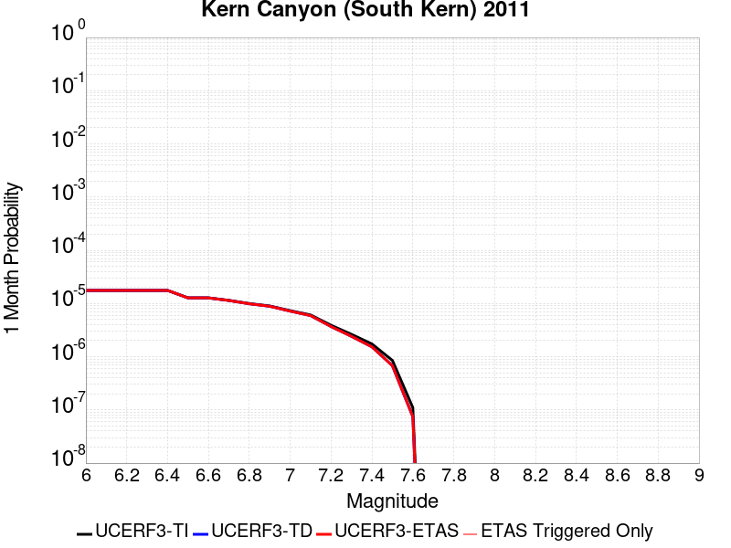 | 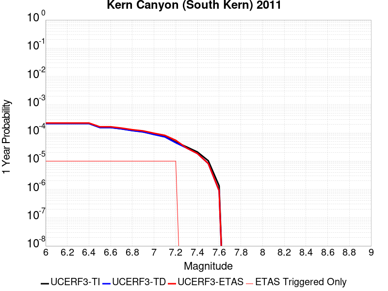 |  |

| Magnitude | 1 wk TI Prob | 1 wk TD Prob | 1 wk ETAS Prob | 1 wk ETAS/TD Gain | 1 wk ETAS Triggered Only | 1 mo TI Prob | 1 mo TD Prob | 1 mo ETAS Prob | 1 mo ETAS/TD Gain | 1 mo ETAS Triggered Only | 1 yr TI Prob | 1 yr TD Prob | 1 yr ETAS Prob | 1 yr ETAS/TD Gain | 1 yr ETAS Triggered Only | 10 yr TI Prob | 10 yr TD Prob | 10 yr ETAS Prob | 10 yr ETAS/TD Gain | 10 yr ETAS Triggered Only |
|-----|-----|-----|-----|-----|-----|-----|-----|-----|-----|-----|-----|-----|-----|-----|-----|-----|-----|-----|-----|-----|
| 6.0 | 4.105075E-6 | 4.1137428E-6 | 4.1137428E-6 | 1.0 | 0.0 | 1.7593058E-5 | 1.763021E-5 | 1.763021E-5 | 1.0 | 0.0 | 2.1417443E-4 | 2.146273E-4 | 2.2462515E-4 | 1.0465823 | 1.0E-5 | 0.0021396813 | 0.002144264 | 0.0021741998 | 1.0139608 | 3.0E-5 |
| 6.1 | 4.105075E-6 | 4.1137428E-6 | 4.1137428E-6 | 1.0 | 0.0 | 1.7593058E-5 | 1.763021E-5 | 1.763021E-5 | 1.0 | 0.0 | 2.1417443E-4 | 2.146273E-4 | 2.2462515E-4 | 1.0465823 | 1.0E-5 | 0.0021396813 | 0.002144264 | 0.0021741998 | 1.0139608 | 3.0E-5 |
| 6.2 | 4.105075E-6 | 4.1137428E-6 | 4.1137428E-6 | 1.0 | 0.0 | 1.7593058E-5 | 1.763021E-5 | 1.763021E-5 | 1.0 | 0.0 | 2.1417443E-4 | 2.146273E-4 | 2.2462515E-4 | 1.0465823 | 1.0E-5 | 0.0021396813 | 0.002144264 | 0.0021741998 | 1.0139608 | 3.0E-5 |
| 6.3 | 4.105075E-6 | 4.1137428E-6 | 4.1137428E-6 | 1.0 | 0.0 | 1.7593058E-5 | 1.763021E-5 | 1.763021E-5 | 1.0 | 0.0 | 2.1417443E-4 | 2.146273E-4 | 2.2462515E-4 | 1.0465823 | 1.0E-5 | 0.0021396813 | 0.002144264 | 0.0021741998 | 1.0139608 | 3.0E-5 |
| 6.4 | 4.105075E-6 | 4.1137428E-6 | 4.1137428E-6 | 1.0 | 0.0 | 1.7593058E-5 | 1.763021E-5 | 1.763021E-5 | 1.0 | 0.0 | 2.1417443E-4 | 2.146273E-4 | 2.2462515E-4 | 1.0465823 | 1.0E-5 | 0.0021396813 | 0.002144264 | 0.0021741998 | 1.0139608 | 3.0E-5 |
| 6.5 | 2.9849807E-6 | 2.9731666E-6 | 2.9731666E-6 | 1.0 | 0.0 | 1.2792712E-5 | 1.2742081E-5 | 1.2742081E-5 | 1.0 | 0.0 | 1.5574014E-4 | 1.5512394E-4 | 1.6512239E-4 | 1.0644546 | 1.0E-5 | 0.0015563103 | 0.0015501718 | 0.0015801253 | 1.0193228 | 3.0E-5 |
| 6.6 | 2.9849807E-6 | 2.9731666E-6 | 2.9731666E-6 | 1.0 | 0.0 | 1.2792712E-5 | 1.2742081E-5 | 1.2742081E-5 | 1.0 | 0.0 | 1.5574014E-4 | 1.5512394E-4 | 1.6512239E-4 | 1.0644546 | 1.0E-5 | 0.0015563103 | 0.0015501718 | 0.0015801253 | 1.0193228 | 3.0E-5 |
| 6.7 | 2.6756725E-6 | 2.6582313E-6 | 2.6582313E-6 | 1.0 | 0.0 | 1.1467117E-5 | 1.1392371E-5 | 1.1392371E-5 | 1.0 | 0.0 | 1.396032E-4 | 1.386934E-4 | 1.4869201E-4 | 1.0720915 | 1.0E-5 | 0.0013951553 | 0.0013860794 | 0.0014060516 | 1.0144092 | 2.0E-5 |
| 6.8 | 2.3283721E-6 | 2.304788E-6 | 2.304788E-6 | 1.0 | 0.0 | 9.9787E-6 | 9.877626E-6 | 9.877626E-6 | 1.0 | 0.0 | 1.214839E-4 | 1.20253535E-4 | 1.3025233E-4 | 1.0831476 | 1.0E-5 | 0.001214175 | 0.0012018922 | 0.0012218681 | 1.0166204 | 2.0E-5 |
| 6.9 | 2.0972677E-6 | 2.0696496E-6 | 2.0696496E-6 | 1.0 | 0.0 | 8.988259E-6 | 8.869897E-6 | 8.869897E-6 | 1.0 | 0.0 | 1.0942656E-4 | 1.079857E-4 | 1.1798462E-4 | 1.0925949 | 1.0E-5 | 0.0010937268 | 0.0010793381 | 0.0010993165 | 1.0185099 | 2.0E-5 |
| 7.0 | 1.7132242E-6 | 1.6787105E-6 | 1.6787105E-6 | 1.0 | 0.0 | 7.3423685E-6 | 7.194454E-6 | 7.194454E-6 | 1.0 | 0.0 | 8.938967E-5 | 8.7589E-5 | 9.758812E-5 | 1.1141596 | 1.0E-5 | 8.935372E-4 | 8.755486E-4 | 8.955311E-4 | 1.0228229 | 2.0E-5 |
| 7.1 | 1.4215541E-6 | 1.381581E-6 | 1.381581E-6 | 1.0 | 0.0 | 6.0923603E-6 | 5.9210483E-6 | 5.9210483E-6 | 1.0 | 0.0 | 7.417196E-5 | 7.2086405E-5 | 8.208568E-5 | 1.1387124 | 1.0E-5 | 7.414721E-4 | 7.206329E-4 | 7.306257E-4 | 1.0138667 | 1.0E-5 |
| 7.2 | 9.097853E-7 | 8.6038136E-7 | 8.6038136E-7 | 1.0 | 0.0 | 3.899074E-6 | 3.6873437E-6 | 3.6873437E-6 | 1.0 | 0.0 | 4.7470192E-5 | 4.4892495E-5 | 5.4892043E-5 | 1.2227443 | 1.0E-5 | 4.7460053E-4 | 4.4883534E-4 | 4.5883085E-4 | 1.0222698 | 1.0E-5 |
| 7.3 | 6.144169E-7 | 5.628233E-7 | 5.628233E-7 | 1.0 | 0.0 | 2.6332125E-6 | 2.4120975E-6 | 2.4120975E-6 | 1.0 | 0.0 | 3.205889E-5 | 2.9366896E-5 | 2.9366896E-5 | 1.0 | 0.0 | 3.2054266E-4 | 2.9363067E-4 | 2.9363067E-4 | 1.0 | 0.0 |
| 7.4 | 4.049844E-7 | 3.5728493E-7 | 3.5728493E-7 | 1.0 | 0.0 | 1.7356463E-6 | 1.5312203E-6 | 1.5312203E-6 | 1.0 | 0.0 | 2.1131287E-5 | 1.864245E-5 | 1.864245E-5 | 1.0 | 0.0 | 2.1129279E-4 | 1.864091E-4 | 1.864091E-4 | 1.0 | 0.0 |
| 7.5 | 1.9871162E-7 | 1.5830535E-7 | 1.5830535E-7 | 1.0 | 0.0 | 8.5162094E-7 | 6.7845133E-7 | 6.7845133E-7 | 1.0 | 0.0 | 1.0368436E-5 | 8.260115E-6 | 8.260115E-6 | 1.0 | 0.0 | 1.0367952E-4 | 8.259816E-5 | 8.259816E-5 | 1.0 | 0.0 |
| 7.6 | 2.572245E-8 | 1.7352685E-8 | 1.7352685E-8 | 1.0 | 0.0 | 1.10239064E-7 | 7.436864E-8 | 7.436864E-8 | 1.0 | 0.0 | 1.3421597E-6 | 9.054379E-7 | 9.054379E-7 | 1.0 | 0.0 | 1.3421517E-5 | 9.054348E-6 | 9.054348E-6 | 1.0 | 0.0 |

## San Pedro Basin
*[(top)](#table-of-contents)*

| 1 Week | 1 Month | 1 Year | 10 Year |
|-----|-----|-----|-----|
|  |  |  |  |

| Magnitude | 1 wk TI Prob | 1 wk TD Prob | 1 wk ETAS Prob | 1 wk ETAS/TD Gain | 1 wk ETAS Triggered Only | 1 mo TI Prob | 1 mo TD Prob | 1 mo ETAS Prob | 1 mo ETAS/TD Gain | 1 mo ETAS Triggered Only | 1 yr TI Prob | 1 yr TD Prob | 1 yr ETAS Prob | 1 yr ETAS/TD Gain | 1 yr ETAS Triggered Only | 10 yr TI Prob | 10 yr TD Prob | 10 yr ETAS Prob | 10 yr ETAS/TD Gain | 10 yr ETAS Triggered Only |
|-----|-----|-----|-----|-----|-----|-----|-----|-----|-----|-----|-----|-----|-----|-----|-----|-----|-----|-----|-----|-----|
| 6.0 | 5.3449043E-5 | 6.3372034E-5 | 7.33714E-5 | 1.1577883 | 1.0E-5 | 2.2904722E-4 | 2.7156962E-4 | 2.815669E-4 | 1.036813 | 1.0E-5 | 0.0027850836 | 0.003301955 | 0.003311922 | 1.0030185 | 1.0E-5 | 0.027504366 | 0.032590706 | 0.032619726 | 1.0008905 | 3.0E-5 |
| 6.1 | 5.3449043E-5 | 6.3372034E-5 | 7.33714E-5 | 1.1577883 | 1.0E-5 | 2.2904722E-4 | 2.7156962E-4 | 2.815669E-4 | 1.036813 | 1.0E-5 | 0.0027850836 | 0.003301955 | 0.003311922 | 1.0030185 | 1.0E-5 | 0.027504366 | 0.032590706 | 0.032619726 | 1.0008905 | 3.0E-5 |
| 6.2 | 2.3189454E-5 | 2.6643642E-5 | 2.6643642E-5 | 1.0 | 0.0 | 9.9379584E-5 | 1.141823E-4 | 1.141823E-4 | 1.0 | 0.0 | 0.0012092749 | 0.0013893305 | 0.0013893305 | 1.0 | 0.0 | 0.012027155 | 0.013811318 | 0.013811318 | 1.0 | 0.0 |
| 6.3 | 2.3189454E-5 | 2.6643642E-5 | 2.6643642E-5 | 1.0 | 0.0 | 9.9379584E-5 | 1.141823E-4 | 1.141823E-4 | 1.0 | 0.0 | 0.0012092749 | 0.0013893305 | 0.0013893305 | 1.0 | 0.0 | 0.012027155 | 0.013811318 | 0.013811318 | 1.0 | 0.0 |
| 6.4 | 1.966056E-5 | 2.2464097E-5 | 2.2464097E-5 | 1.0 | 0.0 | 8.425682E-5 | 9.6271375E-5 | 9.6271375E-5 | 1.0 | 0.0 | 0.001025344 | 0.0011715139 | 0.0011715139 | 1.0 | 0.0 | 0.010206259 | 0.011657469 | 0.011657469 | 1.0 | 0.0 |
| 6.5 | 1.7342953E-5 | 1.9745734E-5 | 1.9745734E-5 | 1.0 | 0.0 | 7.4324824E-5 | 8.4622036E-5 | 8.4622036E-5 | 1.0 | 0.0 | 9.04529E-4 | 0.0010298233 | 0.0010298233 | 1.0 | 0.0 | 0.009008561 | 0.010254234 | 0.010254234 | 1.0 | 0.0 |
| 6.6 | 1.439804E-5 | 1.6323185E-5 | 1.6323185E-5 | 1.0 | 0.0 | 6.170443E-5 | 6.995482E-5 | 6.995482E-5 | 1.0 | 0.0 | 7.509924E-4 | 8.513992E-4 | 8.513992E-4 | 1.0 | 0.0 | 0.0074845953 | 0.008484576 | 0.008484576 | 1.0 | 0.0 |
| 6.7 | 1.2634884E-5 | 1.4285701E-5 | 1.4285701E-5 | 1.0 | 0.0 | 5.414838E-5 | 6.122317E-5 | 6.122317E-5 | 1.0 | 0.0 | 6.590571E-4 | 7.451676E-4 | 7.451676E-4 | 1.0 | 0.0 | 0.006571059 | 0.0074297106 | 0.0074297106 | 1.0 | 0.0 |
| 6.8 | 1.146091E-5 | 1.2933553E-5 | 1.2933553E-5 | 1.0 | 0.0 | 4.911726E-5 | 5.5428503E-5 | 5.5428503E-5 | 1.0 | 0.0 | 5.9783855E-4 | 6.746628E-4 | 6.746628E-4 | 1.0 | 0.0 | 0.0059623276 | 0.0067290864 | 0.0067290864 | 1.0 | 0.0 |
| 6.9 | 9.109035E-6 | 1.023529E-5 | 1.023529E-5 | 1.0 | 0.0 | 3.9038136E-5 | 4.3864948E-5 | 4.3864948E-5 | 1.0 | 0.0 | 4.7518566E-4 | 5.3395284E-4 | 5.3395284E-4 | 1.0 | 0.0 | 0.0047417083 | 0.0053294534 | 0.0053294534 | 1.0 | 0.0 |
| 7.0 | 5.9351028E-6 | 6.5841277E-6 | 6.5841277E-6 | 1.0 | 0.0 | 2.5435906E-5 | 2.8217517E-5 | 2.8217517E-5 | 1.0 | 0.0 | 3.0963816E-4 | 3.4351772E-4 | 3.4351772E-4 | 1.0 | 0.0 | 0.0030920706 | 0.0034321845 | 0.0034321845 | 1.0 | 0.0 |
| 7.1 | 2.1557585E-6 | 2.209668E-6 | 2.209668E-6 | 1.0 | 0.0 | 9.238933E-6 | 9.469973E-6 | 9.469973E-6 | 1.0 | 0.0 | 1.1247819E-4 | 1.1529097E-4 | 1.1529097E-4 | 1.0 | 0.0 | 0.0011242128 | 0.0011523269 | 0.0011523269 | 1.0 | 0.0 |
| 7.2 | 2.1251979E-6 | 2.178014E-6 | 2.178014E-6 | 1.0 | 0.0 | 9.107958E-6 | 9.334313E-6 | 9.334313E-6 | 1.0 | 0.0 | 1.1088375E-4 | 1.1363949E-4 | 1.1363949E-4 | 1.0 | 0.0 | 0.0011082845 | 0.0011358291 | 0.0011358291 | 1.0 | 0.0 |
| 7.3 | 1.7145798E-6 | 1.744302E-6 | 1.744302E-6 | 1.0 | 0.0 | 7.3481783E-6 | 7.475559E-6 | 7.475559E-6 | 1.0 | 0.0 | 8.94604E-5 | 9.101122E-5 | 9.101122E-5 | 1.0 | 0.0 | 8.9424395E-4 | 9.097486E-4 | 9.097486E-4 | 1.0 | 0.0 |
| 7.4 | 1.4467993E-6 | 1.4641986E-6 | 1.4641986E-6 | 1.0 | 0.0 | 6.200554E-6 | 6.2751224E-6 | 6.2751224E-6 | 1.0 | 0.0 | 7.548913E-5 | 7.639701E-5 | 7.639701E-5 | 1.0 | 0.0 | 7.546349E-4 | 7.637147E-4 | 7.637147E-4 | 1.0 | 0.0 |
| 7.5 | 1.2803735E-6 | 1.2931602E-6 | 1.2931602E-6 | 1.0 | 0.0 | 5.487303E-6 | 5.5421037E-6 | 5.5421037E-6 | 1.0 | 0.0 | 6.680587E-5 | 6.747309E-5 | 6.747309E-5 | 1.0 | 0.0 | 6.678579E-4 | 6.745332E-4 | 6.745332E-4 | 1.0 | 0.0 |
| 7.6 | 6.755009E-7 | 6.769521E-7 | 6.769521E-7 | 1.0 | 0.0 | 2.8950008E-6 | 2.9012203E-6 | 2.9012203E-6 | 1.0 | 0.0 | 3.5246063E-5 | 3.5321842E-5 | 3.5321842E-5 | 1.0 | 0.0 | 3.5240475E-4 | 3.5316803E-4 | 3.5316803E-4 | 1.0 | 0.0 |
| 7.7 | 6.211885E-8 | 4.570005E-8 | 4.570005E-8 | 1.0 | 0.0 | 2.6622362E-7 | 1.9585735E-7 | 1.9585735E-7 | 1.0 | 0.0 | 3.2412677E-6 | 2.384561E-6 | 2.384561E-6 | 1.0 | 0.0 | 3.2412205E-5 | 2.3845374E-5 | 2.3845374E-5 | 1.0 | 0.0 |
| 7.8 | 2.6580573E-9 | 1.5138978E-9 | 1.5138978E-9 | 1.0 | 0.0 | 1.1391674E-8 | 6.488133E-9 | 6.488133E-9 | 1.0 | 0.0 | 1.3869362E-7 | 7.899302E-8 | 7.899302E-8 | 1.0 | 0.0 | 1.3869354E-6 | 7.899302E-7 | 7.899302E-7 | 1.0 | 0.0 |

## Ventura-Pitas Point
*[(top)](#table-of-contents)*

| 1 Week | 1 Month | 1 Year | 10 Year |
|-----|-----|-----|-----|
|  | 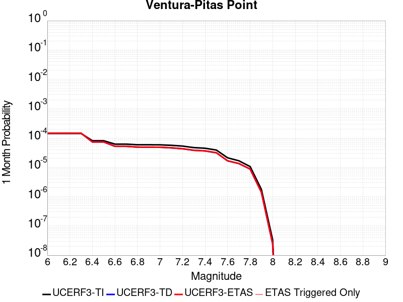 |  |  |

| Magnitude | 1 wk TI Prob | 1 wk TD Prob | 1 wk ETAS Prob | 1 wk ETAS/TD Gain | 1 wk ETAS Triggered Only | 1 mo TI Prob | 1 mo TD Prob | 1 mo ETAS Prob | 1 mo ETAS/TD Gain | 1 mo ETAS Triggered Only | 1 yr TI Prob | 1 yr TD Prob | 1 yr ETAS Prob | 1 yr ETAS/TD Gain | 1 yr ETAS Triggered Only | 10 yr TI Prob | 10 yr TD Prob | 10 yr ETAS Prob | 10 yr ETAS/TD Gain | 10 yr ETAS Triggered Only |
|-----|-----|-----|-----|-----|-----|-----|-----|-----|-----|-----|-----|-----|-----|-----|-----|-----|-----|-----|-----|-----|
| 6.0 | 3.3179622E-5 | 3.373616E-5 | 3.373616E-5 | 1.0 | 0.0 | 1.4219063E-4 | 1.4457699E-4 | 1.4457699E-4 | 1.0 | 0.0 | 0.0017297962 | 0.0017590605 | 0.0017690429 | 1.0056748 | 1.0E-5 | 0.017163932 | 0.017476903 | 0.01750638 | 1.0016866 | 3.0E-5 |
| 6.1 | 3.3179622E-5 | 3.373616E-5 | 3.373616E-5 | 1.0 | 0.0 | 1.4219063E-4 | 1.4457699E-4 | 1.4457699E-4 | 1.0 | 0.0 | 0.0017297962 | 0.0017590605 | 0.0017690429 | 1.0056748 | 1.0E-5 | 0.017163932 | 0.017476903 | 0.01750638 | 1.0016866 | 3.0E-5 |
| 6.2 | 3.3179622E-5 | 3.373616E-5 | 3.373616E-5 | 1.0 | 0.0 | 1.4219063E-4 | 1.4457699E-4 | 1.4457699E-4 | 1.0 | 0.0 | 0.0017297962 | 0.0017590605 | 0.0017690429 | 1.0056748 | 1.0E-5 | 0.017163932 | 0.017476903 | 0.01750638 | 1.0016866 | 3.0E-5 |
| 6.3 | 3.3179622E-5 | 3.373616E-5 | 3.373616E-5 | 1.0 | 0.0 | 1.4219063E-4 | 1.4457699E-4 | 1.4457699E-4 | 1.0 | 0.0 | 0.0017297962 | 0.0017590605 | 0.0017690429 | 1.0056748 | 1.0E-5 | 0.017163932 | 0.017476903 | 0.01750638 | 1.0016866 | 3.0E-5 |
| 6.4 | 1.8754668E-5 | 1.7020033E-5 | 1.7020033E-5 | 1.0 | 0.0 | 8.037467E-5 | 7.294109E-5 | 7.294109E-5 | 1.0 | 0.0 | 9.781223E-4 | 8.8771904E-4 | 8.9771015E-4 | 1.0112548 | 1.0E-5 | 0.009738282 | 0.008844066 | 0.00886389 | 1.0022414 | 2.0E-5 |
| 6.5 | 1.8754668E-5 | 1.7020033E-5 | 1.7020033E-5 | 1.0 | 0.0 | 8.037467E-5 | 7.294109E-5 | 7.294109E-5 | 1.0 | 0.0 | 9.781223E-4 | 8.8771904E-4 | 8.9771015E-4 | 1.0112548 | 1.0E-5 | 0.009738282 | 0.008844066 | 0.00886389 | 1.0022414 | 2.0E-5 |
| 6.6 | 1.4361558E-5 | 1.212258E-5 | 1.212258E-5 | 1.0 | 0.0 | 6.154808E-5 | 5.195289E-5 | 5.195289E-5 | 1.0 | 0.0 | 7.490902E-4 | 6.323452E-4 | 6.323452E-4 | 1.0 | 0.0 | 0.0074657016 | 0.006305716 | 0.0063156527 | 1.0015758 | 1.0E-5 |
| 6.7 | 1.4361558E-5 | 1.212258E-5 | 1.212258E-5 | 1.0 | 0.0 | 6.154808E-5 | 5.195289E-5 | 5.195289E-5 | 1.0 | 0.0 | 7.490902E-4 | 6.323452E-4 | 6.323452E-4 | 1.0 | 0.0 | 0.0074657016 | 0.006305716 | 0.0063156527 | 1.0015758 | 1.0E-5 |
| 6.8 | 1.3663846E-5 | 1.1344704E-5 | 1.1344704E-5 | 1.0 | 0.0 | 5.8558027E-5 | 4.8619266E-5 | 4.8619266E-5 | 1.0 | 0.0 | 7.127108E-4 | 5.9178076E-4 | 5.9178076E-4 | 1.0 | 0.0 | 0.007104293 | 0.0059022647 | 0.0059122057 | 1.0016843 | 1.0E-5 |
| 6.9 | 1.3644157E-5 | 1.1322804E-5 | 1.1322804E-5 | 1.0 | 0.0 | 5.8473648E-5 | 4.8525413E-5 | 4.8525413E-5 | 1.0 | 0.0 | 7.116841E-4 | 5.906387E-4 | 5.906387E-4 | 1.0 | 0.0 | 0.007094092 | 0.005890905 | 0.005900846 | 1.0016875 | 1.0E-5 |
| 7.0 | 1.3568845E-5 | 1.12423695E-5 | 1.12423695E-5 | 1.0 | 0.0 | 5.8150898E-5 | 4.8180704E-5 | 4.8180704E-5 | 1.0 | 0.0 | 7.077572E-4 | 5.864441E-4 | 5.864441E-4 | 1.0 | 0.0 | 0.007055073 | 0.0058491807 | 0.005859122 | 1.0016997 | 1.0E-5 |
| 7.1 | 1.306572E-5 | 1.0720809E-5 | 1.0720809E-5 | 1.0 | 0.0 | 5.599474E-5 | 4.5945526E-5 | 4.5945526E-5 | 1.0 | 0.0 | 6.815227E-4 | 5.5924506E-4 | 5.5924506E-4 | 1.0 | 0.0 | 0.0067943637 | 0.005578582 | 0.0055885264 | 1.0017825 | 1.0E-5 |
| 7.2 | 1.232604E-5 | 9.995386E-6 | 9.995386E-6 | 1.0 | 0.0 | 5.2824813E-5 | 4.2836677E-5 | 4.2836677E-5 | 1.0 | 0.0 | 6.429523E-4 | 5.214135E-4 | 5.214135E-4 | 1.0 | 0.0 | 0.0064109527 | 0.005202093 | 0.005202093 | 1.0 | 0.0 |
| 7.3 | 1.0917261E-5 | 8.844039E-6 | 8.844039E-6 | 1.0 | 0.0 | 4.678742E-5 | 3.7902486E-5 | 3.7902486E-5 | 1.0 | 0.0 | 5.69488E-4 | 4.613666E-4 | 4.613666E-4 | 1.0 | 0.0 | 0.0056803077 | 0.0046042535 | 0.0046042535 | 1.0 | 0.0 |
| 7.4 | 1.039959E-5 | 8.423746E-6 | 8.423746E-6 | 1.0 | 0.0 | 4.456891E-5 | 3.610128E-5 | 3.610128E-5 | 1.0 | 0.0 | 5.424914E-4 | 4.3944595E-4 | 4.3944595E-4 | 1.0 | 0.0 | 0.0054116896 | 0.0043859314 | 0.0043859314 | 1.0 | 0.0 |
| 7.5 | 9.015877E-6 | 7.2976927E-6 | 7.2976927E-6 | 1.0 | 0.0 | 3.86389E-5 | 3.127546E-5 | 3.127546E-5 | 1.0 | 0.0 | 4.7032707E-4 | 3.8071358E-4 | 3.8071358E-4 | 1.0 | 0.0 | 0.004693329 | 0.0038007589 | 0.0038007589 | 1.0 | 0.0 |
| 7.6 | 4.900162E-6 | 3.874172E-6 | 3.874172E-6 | 1.0 | 0.0 | 2.1000526E-5 | 1.660349E-5 | 1.660349E-5 | 1.0 | 0.0 | 2.556514E-4 | 2.0212887E-4 | 2.0212887E-4 | 1.0 | 0.0 | 0.0025535747 | 0.0020194638 | 0.0020194638 | 1.0 | 0.0 |
| 7.7 | 3.8850626E-6 | 3.126774E-6 | 3.126774E-6 | 1.0 | 0.0 | 1.6650163E-5 | 1.3400391E-5 | 1.3400391E-5 | 1.0 | 0.0 | 2.0269687E-4 | 1.6313764E-4 | 1.6313764E-4 | 1.0 | 0.0 | 0.002025121 | 0.0016301881 | 0.0016301881 | 1.0 | 0.0 |
| 7.8 | 2.4654719E-6 | 2.0299015E-6 | 2.0299015E-6 | 1.0 | 0.0 | 1.0566265E-5 | 8.699549E-6 | 8.699549E-6 | 1.0 | 0.0 | 1.2863669E-4 | 1.0591191E-4 | 1.0591191E-4 | 1.0 | 0.0 | 0.0012856225 | 0.001058619 | 0.001058619 | 1.0 | 0.0 |
| 7.9 | 4.095894E-7 | 3.276521E-7 | 3.276521E-7 | 1.0 | 0.0 | 1.7553821E-6 | 1.4042225E-6 | 1.4042225E-6 | 1.0 | 0.0 | 2.1371567E-5 | 1.7096278E-5 | 1.7096278E-5 | 1.0 | 0.0 | 2.1369511E-4 | 1.7094993E-4 | 1.7094993E-4 | 1.0 | 0.0 |
| 8.0 | 7.791402E-9 | 5.683585E-9 | 5.683585E-9 | 1.0 | 0.0 | 3.3391725E-8 | 2.4358222E-8 | 2.4358222E-8 | 1.0 | 0.0 | 4.0654416E-7 | 2.9656135E-7 | 2.9656135E-7 | 1.0 | 0.0 | 4.065434E-6 | 2.9656114E-6 | 2.9656114E-6 | 1.0 | 0.0 |

## Green Valley 2011 CFM
*[(top)](#table-of-contents)*

| 1 Week | 1 Month | 1 Year | 10 Year |
|-----|-----|-----|-----|
|  | 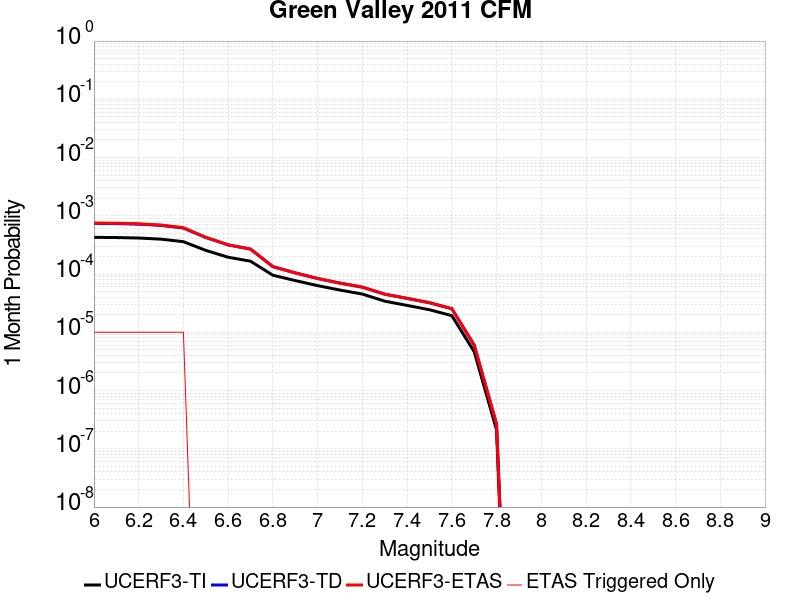 | 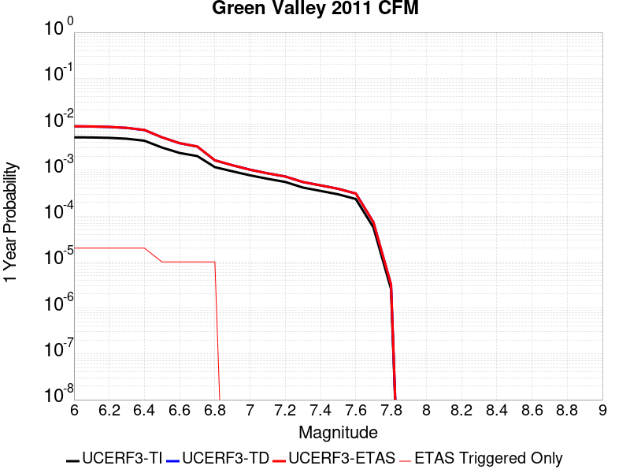 |  |

| Magnitude | 1 wk TI Prob | 1 wk TD Prob | 1 wk ETAS Prob | 1 wk ETAS/TD Gain | 1 wk ETAS Triggered Only | 1 mo TI Prob | 1 mo TD Prob | 1 mo ETAS Prob | 1 mo ETAS/TD Gain | 1 mo ETAS Triggered Only | 1 yr TI Prob | 1 yr TD Prob | 1 yr ETAS Prob | 1 yr ETAS/TD Gain | 1 yr ETAS Triggered Only | 10 yr TI Prob | 10 yr TD Prob | 10 yr ETAS Prob | 10 yr ETAS/TD Gain | 10 yr ETAS Triggered Only |
|-----|-----|-----|-----|-----|-----|-----|-----|-----|-----|-----|-----|-----|-----|-----|-----|-----|-----|-----|-----|-----|
| 6.0 | 9.9629346E-5 | 1.7306567E-4 | 1.7306567E-4 | 1.0 | 0.0 | 4.2691303E-4 | 7.4145413E-4 | 7.514467E-4 | 1.013477 | 1.0E-5 | 0.0051852856 | 0.008986971 | 0.009006792 | 1.0022055 | 2.0E-5 | 0.050659515 | 0.085524976 | 0.08555241 | 1.0003208 | 3.0E-5 |
| 6.1 | 9.88615E-5 | 1.7153878E-4 | 1.7153878E-4 | 1.0 | 0.0 | 4.2362334E-4 | 7.34914E-4 | 7.449066E-4 | 1.013597 | 1.0E-5 | 0.0051454236 | 0.008907998 | 0.00892782 | 1.0022252 | 2.0E-5 | 0.050279044 | 0.08481259 | 0.084840044 | 1.0003238 | 3.0E-5 |
| 6.2 | 9.696895E-5 | 1.6792899E-4 | 1.6792899E-4 | 1.0 | 0.0 | 4.15515E-4 | 7.1945204E-4 | 7.2944484E-4 | 1.0138894 | 1.0E-5 | 0.0050471667 | 0.008721375 | 0.0087412 | 1.0022732 | 2.0E-5 | 0.04934063 | 0.08312148 | 0.083148986 | 1.0003309 | 3.0E-5 |
| 6.3 | 9.275224E-5 | 1.5972226E-4 | 1.5972226E-4 | 1.0 | 0.0 | 3.9744904E-4 | 6.84299E-4 | 6.9429213E-4 | 1.0146035 | 1.0E-5 | 0.0048282105 | 0.008296695 | 0.008316529 | 1.0023906 | 2.0E-5 | 0.047246475 | 0.07925991 | 0.07928753 | 1.0003484 | 3.0E-5 |
| 6.4 | 8.391499E-5 | 1.4368704E-4 | 1.4368704E-4 | 1.0 | 0.0 | 3.595861E-4 | 6.1566365E-4 | 6.256575E-4 | 1.0162326 | 1.0E-5 | 0.004369175 | 0.0074673244 | 0.0074871746 | 1.0026584 | 2.0E-5 | 0.04284265 | 0.07163353 | 0.0716521 | 1.0002592 | 2.0E-5 |
| 6.5 | 5.9519385E-5 | 9.9348035E-5 | 9.9348035E-5 | 1.0 | 0.0 | 2.5505814E-4 | 4.2571197E-4 | 4.2571197E-4 | 1.0 | 0.0 | 0.0031009112 | 0.005168494 | 0.005178442 | 1.0019248 | 1.0E-5 | 0.030579966 | 0.050148074 | 0.050157573 | 1.0001894 | 1.0E-5 |
| 6.6 | 4.5361558E-5 | 7.403197E-5 | 7.403197E-5 | 1.0 | 0.0 | 1.9439218E-4 | 3.1724415E-4 | 3.1724415E-4 | 1.0 | 0.0 | 0.0023641558 | 0.0038541164 | 0.003864078 | 1.0025846 | 1.0E-5 | 0.023391623 | 0.037667878 | 0.0376775 | 1.0002555 | 1.0E-5 |
| 6.7 | 3.8808106E-5 | 6.265682E-5 | 6.265682E-5 | 1.0 | 0.0 | 1.6630985E-4 | 2.685042E-4 | 2.685042E-4 | 1.0 | 0.0 | 0.0020229418 | 0.0032628179 | 0.0032727853 | 1.0030549 | 1.0E-5 | 0.020046256 | 0.03200756 | 0.03201724 | 1.0003024 | 1.0E-5 |
| 6.8 | 2.2284667E-5 | 3.128592E-5 | 3.128592E-5 | 1.0 | 0.0 | 9.550222E-5 | 1.3407573E-4 | 1.3407573E-4 | 1.0 | 0.0 | 0.0011621192 | 0.0016311418 | 0.0016411254 | 1.0061207 | 1.0E-5 | 0.011560607 | 0.016166333 | 0.016176172 | 1.0006086 | 1.0E-5 |
| 6.9 | 1.8050168E-5 | 2.4448555E-5 | 2.4448555E-5 | 1.0 | 0.0 | 7.735557E-5 | 1.04775354E-4 | 1.04775354E-4 | 1.0 | 0.0 | 9.4139716E-4 | 0.0012748969 | 0.0012748969 | 1.0 | 0.0 | 0.009374191 | 0.012668088 | 0.012668088 | 1.0 | 0.0 |
| 7.0 | 1.4763166E-5 | 1.9583282E-5 | 1.9583282E-5 | 1.0 | 0.0 | 6.326917E-5 | 8.392567E-5 | 8.392567E-5 | 1.0 | 0.0 | 7.7002996E-4 | 0.001021319 | 0.001021319 | 1.0 | 0.0 | 0.007673672 | 0.010165563 | 0.010165563 | 1.0 | 0.0 |
| 7.1 | 1.2399713E-5 | 1.6304093E-5 | 1.6304093E-5 | 1.0 | 0.0 | 5.3140546E-5 | 6.9872825E-5 | 6.9872825E-5 | 1.0 | 0.0 | 6.467941E-4 | 8.5037155E-4 | 8.5037155E-4 | 1.0 | 0.0 | 0.006449148 | 0.0084714545 | 0.0084714545 | 1.0 | 0.0 |
| 7.2 | 1.0584195E-5 | 1.3922098E-5 | 1.3922098E-5 | 1.0 | 0.0 | 4.5360044E-5 | 5.966478E-5 | 5.966478E-5 | 1.0 | 0.0 | 5.521186E-4 | 7.2617823E-4 | 7.2617823E-4 | 1.0 | 0.0 | 0.0055074887 | 0.0072384696 | 0.0072384696 | 1.0 | 0.0 |
| 7.3 | 7.998173E-6 | 1.0544344E-5 | 1.0544344E-5 | 1.0 | 0.0 | 3.4277433E-5 | 4.518927E-5 | 4.518927E-5 | 1.0 | 0.0 | 4.1724785E-4 | 5.5004156E-4 | 5.5004156E-4 | 1.0 | 0.0 | 0.004164653 | 0.0054870676 | 0.0054870676 | 1.0 | 0.0 |
| 7.4 | 6.7571127E-6 | 8.933003E-6 | 8.933003E-6 | 1.0 | 0.0 | 2.8958733E-5 | 3.8283742E-5 | 3.8283742E-5 | 1.0 | 0.0 | 3.5251552E-4 | 4.6600585E-4 | 4.6600585E-4 | 1.0 | 0.0 | 0.0035195686 | 0.00465049 | 0.00465049 | 1.0 | 0.0 |
| 7.5 | 5.69878E-6 | 7.5165894E-6 | 7.5165894E-6 | 1.0 | 0.0 | 2.4423114E-5 | 3.2213564E-5 | 3.2213564E-5 | 1.0 | 0.0 | 2.9731085E-4 | 3.9213043E-4 | 3.9213043E-4 | 1.0 | 0.0 | 0.002969134 | 0.003914537 | 0.003914537 | 1.0 | 0.0 |
| 7.6 | 4.503664E-6 | 5.935765E-6 | 5.935765E-6 | 1.0 | 0.0 | 1.9301275E-5 | 2.5438749E-5 | 2.5438749E-5 | 1.0 | 0.0 | 2.3496768E-4 | 3.0967357E-4 | 3.0967357E-4 | 1.0 | 0.0 | 0.002347194 | 0.0030925458 | 0.0030925458 | 1.0 | 0.0 |
| 7.7 | 1.0873546E-6 | 1.4107181E-6 | 1.4107181E-6 | 1.0 | 0.0 | 4.6600826E-6 | 6.045921E-6 | 6.045921E-6 | 1.0 | 0.0 | 5.6735033E-5 | 7.3606636E-5 | 7.3606636E-5 | 1.0 | 0.0 | 5.672055E-4 | 7.358246E-4 | 7.358246E-4 | 1.0 | 0.0 |
| 7.8 | 4.9373917E-8 | 6.177828E-8 | 6.177828E-8 | 1.0 | 0.0 | 2.1160248E-7 | 2.6476405E-7 | 2.6476405E-7 | 1.0 | 0.0 | 2.5762572E-6 | 3.2234989E-6 | 3.2234989E-6 | 1.0 | 0.0 | 2.5762274E-5 | 3.22329E-5 | 3.22329E-5 | 1.0 | 0.0 |

## Pine Mtn
*[(top)](#table-of-contents)*

| 1 Week | 1 Month | 1 Year | 10 Year |
|-----|-----|-----|-----|
| 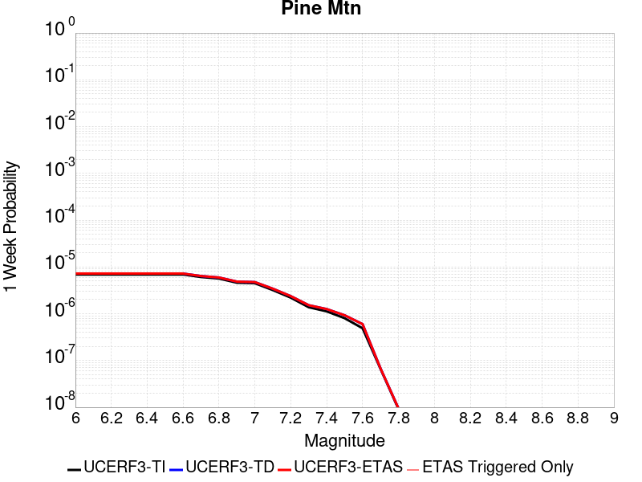 |  |  |  |

| Magnitude | 1 wk TI Prob | 1 wk TD Prob | 1 wk ETAS Prob | 1 wk ETAS/TD Gain | 1 wk ETAS Triggered Only | 1 mo TI Prob | 1 mo TD Prob | 1 mo ETAS Prob | 1 mo ETAS/TD Gain | 1 mo ETAS Triggered Only | 1 yr TI Prob | 1 yr TD Prob | 1 yr ETAS Prob | 1 yr ETAS/TD Gain | 1 yr ETAS Triggered Only | 10 yr TI Prob | 10 yr TD Prob | 10 yr ETAS Prob | 10 yr ETAS/TD Gain | 10 yr ETAS Triggered Only |
|-----|-----|-----|-----|-----|-----|-----|-----|-----|-----|-----|-----|-----|-----|-----|-----|-----|-----|-----|-----|-----|
| 6.0 | 6.894797E-6 | 7.225622E-6 | 7.225622E-6 | 1.0 | 0.0 | 2.9548795E-5 | 3.09666E-5 | 3.09666E-5 | 1.0 | 0.0 | 3.596972E-4 | 3.769561E-4 | 3.769561E-4 | 1.0 | 0.0 | 0.0035911554 | 0.0037634645 | 0.0037933516 | 1.0079414 | 3.0E-5 |
| 6.1 | 6.894797E-6 | 7.225622E-6 | 7.225622E-6 | 1.0 | 0.0 | 2.9548795E-5 | 3.09666E-5 | 3.09666E-5 | 1.0 | 0.0 | 3.596972E-4 | 3.769561E-4 | 3.769561E-4 | 1.0 | 0.0 | 0.0035911554 | 0.0037634645 | 0.0037933516 | 1.0079414 | 3.0E-5 |
| 6.2 | 6.894797E-6 | 7.225622E-6 | 7.225622E-6 | 1.0 | 0.0 | 2.9548795E-5 | 3.09666E-5 | 3.09666E-5 | 1.0 | 0.0 | 3.596972E-4 | 3.769561E-4 | 3.769561E-4 | 1.0 | 0.0 | 0.0035911554 | 0.0037634645 | 0.0037933516 | 1.0079414 | 3.0E-5 |
| 6.3 | 6.894797E-6 | 7.225622E-6 | 7.225622E-6 | 1.0 | 0.0 | 2.9548795E-5 | 3.09666E-5 | 3.09666E-5 | 1.0 | 0.0 | 3.596972E-4 | 3.769561E-4 | 3.769561E-4 | 1.0 | 0.0 | 0.0035911554 | 0.0037634645 | 0.0037933516 | 1.0079414 | 3.0E-5 |
| 6.4 | 6.894797E-6 | 7.225622E-6 | 7.225622E-6 | 1.0 | 0.0 | 2.9548795E-5 | 3.09666E-5 | 3.09666E-5 | 1.0 | 0.0 | 3.596972E-4 | 3.769561E-4 | 3.769561E-4 | 1.0 | 0.0 | 0.0035911554 | 0.0037634645 | 0.0037933516 | 1.0079414 | 3.0E-5 |
| 6.5 | 6.894797E-6 | 7.225622E-6 | 7.225622E-6 | 1.0 | 0.0 | 2.9548795E-5 | 3.09666E-5 | 3.09666E-5 | 1.0 | 0.0 | 3.596972E-4 | 3.769561E-4 | 3.769561E-4 | 1.0 | 0.0 | 0.0035911554 | 0.0037634645 | 0.0037933516 | 1.0079414 | 3.0E-5 |
| 6.6 | 6.894797E-6 | 7.225622E-6 | 7.225622E-6 | 1.0 | 0.0 | 2.9548795E-5 | 3.09666E-5 | 3.09666E-5 | 1.0 | 0.0 | 3.596972E-4 | 3.769561E-4 | 3.769561E-4 | 1.0 | 0.0 | 0.0035911554 | 0.0037634645 | 0.0037933516 | 1.0079414 | 3.0E-5 |
| 6.7 | 6.0867933E-6 | 6.3972698E-6 | 6.3972698E-6 | 1.0 | 0.0 | 2.6085996E-5 | 2.7416594E-5 | 2.7416594E-5 | 1.0 | 0.0 | 3.1755073E-4 | 3.337481E-4 | 3.337481E-4 | 1.0 | 0.0 | 0.0031709734 | 0.0033326878 | 0.0033426543 | 1.0029906 | 1.0E-5 |
| 6.8 | 5.6530425E-6 | 5.9507493E-6 | 5.9507493E-6 | 1.0 | 0.0 | 2.42271E-5 | 2.5502974E-5 | 2.5502974E-5 | 1.0 | 0.0 | 2.94925E-4 | 3.1045653E-4 | 3.1045653E-4 | 1.0 | 0.0 | 0.002945339 | 0.0031004327 | 0.0031004327 | 1.0 | 0.0 |
| 6.9 | 4.6015225E-6 | 4.86398E-6 | 4.86398E-6 | 1.0 | 0.0 | 1.9720663E-5 | 2.0845471E-5 | 2.0845471E-5 | 1.0 | 0.0 | 2.4007261E-4 | 2.537655E-4 | 2.537655E-4 | 1.0 | 0.0 | 0.0023981342 | 0.0025349015 | 0.0025349015 | 1.0 | 0.0 |
| 7.0 | 4.4875965E-6 | 4.7476187E-6 | 4.7476187E-6 | 1.0 | 0.0 | 1.9232413E-5 | 2.0346786E-5 | 2.0346786E-5 | 1.0 | 0.0 | 2.3412947E-4 | 2.4769543E-4 | 2.4769543E-4 | 1.0 | 0.0 | 0.0023388295 | 0.0024743371 | 0.0024743371 | 1.0 | 0.0 |
| 7.1 | 3.203907E-6 | 3.4295476E-6 | 3.4295476E-6 | 1.0 | 0.0 | 1.3730958E-5 | 1.4697982E-5 | 1.4697982E-5 | 1.0 | 0.0 | 1.6716159E-4 | 1.7893391E-4 | 1.7893391E-4 | 1.0 | 0.0 | 0.0016703589 | 0.0017879645 | 0.0017879645 | 1.0 | 0.0 |
| 7.2 | 2.2060601E-6 | 2.3785944E-6 | 2.3785944E-6 | 1.0 | 0.0 | 9.4545085E-6 | 1.01939395E-5 | 1.01939395E-5 | 1.0 | 0.0 | 1.15102564E-4 | 1.241046E-4 | 1.241046E-4 | 1.0 | 0.0 | 0.0011504296 | 0.0012403977 | 0.0012403977 | 1.0 | 0.0 |
| 7.3 | 1.3765207E-6 | 1.5217497E-6 | 1.5217497E-6 | 1.0 | 0.0 | 5.899361E-6 | 6.5217687E-6 | 6.5217687E-6 | 1.0 | 0.0 | 7.182235E-5 | 7.939973E-5 | 7.939973E-5 | 1.0 | 0.0 | 7.1799144E-4 | 7.9372275E-4 | 7.9372275E-4 | 1.0 | 0.0 |
| 7.4 | 1.1245983E-6 | 1.258799E-6 | 1.258799E-6 | 1.0 | 0.0 | 4.819698E-6 | 5.394842E-6 | 5.394842E-6 | 1.0 | 0.0 | 5.8678244E-5 | 6.568031E-5 | 6.568031E-5 | 1.0 | 0.0 | 5.866275E-4 | 6.566173E-4 | 6.566173E-4 | 1.0 | 0.0 |
| 7.5 | 8.031682E-7 | 9.2778055E-7 | 9.2778055E-7 | 1.0 | 0.0 | 3.4421448E-6 | 3.9761967E-6 | 3.9761967E-6 | 1.0 | 0.0 | 4.1907308E-5 | 4.8409187E-5 | 4.8409187E-5 | 1.0 | 0.0 | 4.1899405E-4 | 4.8399318E-4 | 4.8399318E-4 | 1.0 | 0.0 |
| 7.6 | 4.8953444E-7 | 6.003767E-7 | 6.003767E-7 | 1.0 | 0.0 | 2.098003E-6 | 2.5730408E-6 | 2.5730408E-6 | 1.0 | 0.0 | 2.5542888E-5 | 3.132637E-5 | 3.132637E-5 | 1.0 | 0.0 | 2.5539953E-4 | 3.1322442E-4 | 3.1322442E-4 | 1.0 | 0.0 |
| 7.7 | 6.634529E-8 | 6.788859E-8 | 6.788859E-8 | 1.0 | 0.0 | 2.843369E-7 | 2.9095108E-7 | 2.9095108E-7 | 1.0 | 0.0 | 3.4617963E-6 | 3.542324E-6 | 3.542324E-6 | 1.0 | 0.0 | 3.4617424E-5 | 3.5422723E-5 | 3.5422723E-5 | 1.0 | 0.0 |
| 7.8 | 9.235578E-9 | 9.4886214E-9 | 9.4886214E-9 | 1.0 | 0.0 | 3.9581046E-8 | 4.066552E-8 | 4.066552E-8 | 1.0 | 0.0 | 4.818991E-7 | 4.951026E-7 | 4.951026E-7 | 1.0 | 0.0 | 4.8189804E-6 | 4.9510168E-6 | 4.9510168E-6 | 1.0 | 0.0 |

## Channel Islands Thrust
*[(top)](#table-of-contents)*

| 1 Week | 1 Month | 1 Year | 10 Year |
|-----|-----|-----|-----|
|  |  |  |  |

| Magnitude | 1 wk TI Prob | 1 wk TD Prob | 1 wk ETAS Prob | 1 wk ETAS/TD Gain | 1 wk ETAS Triggered Only | 1 mo TI Prob | 1 mo TD Prob | 1 mo ETAS Prob | 1 mo ETAS/TD Gain | 1 mo ETAS Triggered Only | 1 yr TI Prob | 1 yr TD Prob | 1 yr ETAS Prob | 1 yr ETAS/TD Gain | 1 yr ETAS Triggered Only | 10 yr TI Prob | 10 yr TD Prob | 10 yr ETAS Prob | 10 yr ETAS/TD Gain | 10 yr ETAS Triggered Only |
|-----|-----|-----|-----|-----|-----|-----|-----|-----|-----|-----|-----|-----|-----|-----|-----|-----|-----|-----|-----|-----|
| 6.0 | 2.2156251E-5 | 2.4092464E-5 | 2.4092464E-5 | 1.0 | 0.0 | 9.495191E-5 | 1.0324993E-4 | 1.132489E-4 | 1.0968424 | 1.0E-5 | 0.0011554264 | 0.0012564495 | 0.0012864119 | 1.0238467 | 3.0E-5 | 0.011494373 | 0.012504049 | 0.012533674 | 1.0023692 | 3.0E-5 |
| 6.1 | 2.2156251E-5 | 2.4092464E-5 | 2.4092464E-5 | 1.0 | 0.0 | 9.495191E-5 | 1.0324993E-4 | 1.132489E-4 | 1.0968424 | 1.0E-5 | 0.0011554264 | 0.0012564495 | 0.0012864119 | 1.0238467 | 3.0E-5 | 0.011494373 | 0.012504049 | 0.012533674 | 1.0023692 | 3.0E-5 |
| 6.2 | 2.2156251E-5 | 2.4092464E-5 | 2.4092464E-5 | 1.0 | 0.0 | 9.495191E-5 | 1.0324993E-4 | 1.132489E-4 | 1.0968424 | 1.0E-5 | 0.0011554264 | 0.0012564495 | 0.0012864119 | 1.0238467 | 3.0E-5 | 0.011494373 | 0.012504049 | 0.012533674 | 1.0023692 | 3.0E-5 |
| 6.3 | 2.2156251E-5 | 2.4092464E-5 | 2.4092464E-5 | 1.0 | 0.0 | 9.495191E-5 | 1.0324993E-4 | 1.132489E-4 | 1.0968424 | 1.0E-5 | 0.0011554264 | 0.0012564495 | 0.0012864119 | 1.0238467 | 3.0E-5 | 0.011494373 | 0.012504049 | 0.012533674 | 1.0023692 | 3.0E-5 |
| 6.4 | 2.2156251E-5 | 2.4092464E-5 | 2.4092464E-5 | 1.0 | 0.0 | 9.495191E-5 | 1.0324993E-4 | 1.132489E-4 | 1.0968424 | 1.0E-5 | 0.0011554264 | 0.0012564495 | 0.0012864119 | 1.0238467 | 3.0E-5 | 0.011494373 | 0.012504049 | 0.012533674 | 1.0023692 | 3.0E-5 |
| 6.5 | 2.2156251E-5 | 2.4092464E-5 | 2.4092464E-5 | 1.0 | 0.0 | 9.495191E-5 | 1.0324993E-4 | 1.132489E-4 | 1.0968424 | 1.0E-5 | 0.0011554264 | 0.0012564495 | 0.0012864119 | 1.0238467 | 3.0E-5 | 0.011494373 | 0.012504049 | 0.012533674 | 1.0023692 | 3.0E-5 |
| 6.6 | 2.2156251E-5 | 2.4092464E-5 | 2.4092464E-5 | 1.0 | 0.0 | 9.495191E-5 | 1.0324993E-4 | 1.132489E-4 | 1.0968424 | 1.0E-5 | 0.0011554264 | 0.0012564495 | 0.0012864119 | 1.0238467 | 3.0E-5 | 0.011494373 | 0.012504049 | 0.012533674 | 1.0023692 | 3.0E-5 |
| 6.7 | 1.0601296E-5 | 1.13797205E-5 | 1.13797205E-5 | 1.0 | 0.0 | 4.5433335E-5 | 4.8769343E-5 | 5.8768856E-5 | 1.2050369 | 1.0E-5 | 5.5301044E-4 | 5.936099E-4 | 6.0360396E-4 | 1.016836 | 1.0E-5 | 0.005516363 | 0.005920745 | 0.005930686 | 1.001679 | 1.0E-5 |
| 6.8 | 1.0246747E-5 | 1.0996839E-5 | 1.0996839E-5 | 1.0 | 0.0 | 4.391389E-5 | 4.7128484E-5 | 5.7128014E-5 | 1.2121758 | 1.0E-5 | 5.345204E-4 | 5.73643E-4 | 5.836373E-4 | 1.0174224 | 1.0E-5 | 0.0053323656 | 0.005722113 | 0.0057320558 | 1.0017376 | 1.0E-5 |
| 6.9 | 9.049551E-6 | 9.699792E-6 | 9.699792E-6 | 1.0 | 0.0 | 3.878322E-5 | 4.1569896E-5 | 5.156948E-5 | 1.2405487 | 1.0E-5 | 4.7208337E-4 | 5.0600007E-4 | 5.15995E-4 | 1.0197529 | 1.0E-5 | 0.0047108172 | 0.0050488967 | 0.0050588464 | 1.0019706 | 1.0E-5 |
| 7.0 | 8.6542195E-6 | 9.274744E-6 | 9.274744E-6 | 1.0 | 0.0 | 3.7088983E-5 | 3.974832E-5 | 4.9747923E-5 | 1.251573 | 1.0E-5 | 4.5146482E-4 | 4.838324E-4 | 4.9382757E-4 | 1.0206583 | 1.0E-5 | 0.004505487 | 0.0048282025 | 0.004838154 | 1.0020611 | 1.0E-5 |
| 7.1 | 8.391028E-6 | 8.993062E-6 | 8.993062E-6 | 1.0 | 0.0 | 3.5961057E-5 | 3.8541148E-5 | 4.854076E-5 | 1.2594529 | 1.0E-5 | 4.3773788E-4 | 4.691415E-4 | 4.791368E-4 | 1.0213056 | 1.0E-5 | 0.004368766 | 0.004681921 | 0.0046918746 | 1.0021259 | 1.0E-5 |
| 7.2 | 5.965188E-6 | 6.371788E-6 | 6.371788E-6 | 1.0 | 0.0 | 2.556484E-5 | 2.730738E-5 | 2.730738E-5 | 1.0 | 0.0 | 3.1120746E-4 | 3.3241717E-4 | 3.3241717E-4 | 1.0 | 0.0 | 0.00310772 | 0.0033192574 | 0.0033192574 | 1.0 | 0.0 |
| 7.3 | 4.877518E-6 | 5.206082E-6 | 5.206082E-6 | 1.0 | 0.0 | 2.0903482E-5 | 2.2311591E-5 | 2.2311591E-5 | 1.0 | 0.0 | 2.5447016E-4 | 2.7161022E-4 | 2.7161022E-4 | 1.0 | 0.0 | 0.0025417898 | 0.0027128286 | 0.0027128286 | 1.0 | 0.0 |
| 7.4 | 3.8829853E-6 | 4.1419225E-6 | 4.1419225E-6 | 1.0 | 0.0 | 1.664126E-5 | 1.7750977E-5 | 1.7750977E-5 | 1.0 | 0.0 | 2.0258849E-4 | 2.1609713E-4 | 2.1609713E-4 | 1.0 | 0.0 | 0.002024039 | 0.002158912 | 0.002158912 | 1.0 | 0.0 |
| 7.5 | 1.3489616E-6 | 1.4278098E-6 | 1.4278098E-6 | 1.0 | 0.0 | 5.7812517E-6 | 6.1191704E-6 | 6.1191704E-6 | 1.0 | 0.0 | 7.038446E-5 | 7.449839E-5 | 7.449839E-5 | 1.0 | 0.0 | 7.036218E-4 | 7.4473815E-4 | 7.4473815E-4 | 1.0 | 0.0 |
| 7.6 | 6.058192E-7 | 6.3538624E-7 | 6.3538624E-7 | 1.0 | 0.0 | 2.5963652E-6 | 2.7230813E-6 | 2.7230813E-6 | 1.0 | 0.0 | 3.161029E-5 | 3.3153025E-5 | 3.3153025E-5 | 1.0 | 0.0 | 3.1605794E-4 | 3.314824E-4 | 3.314824E-4 | 1.0 | 0.0 |
| 7.7 | 2.2170494E-7 | 2.2608181E-7 | 2.2608181E-7 | 1.0 | 0.0 | 9.5016367E-7 | 9.689218E-7 | 9.689218E-7 | 1.0 | 0.0 | 1.1568181E-5 | 1.1796569E-5 | 1.1796569E-5 | 1.0 | 0.0 | 1.1567579E-4 | 1.1796054E-4 | 1.1796054E-4 | 1.0 | 0.0 |
| 7.8 | 2.1613102E-8 | 1.546685E-8 | 1.546685E-8 | 1.0 | 0.0 | 9.262757E-8 | 6.6286496E-8 | 6.6286496E-8 | 1.0 | 0.0 | 1.1277401E-6 | 8.0703785E-7 | 8.0703785E-7 | 1.0 | 0.0 | 1.1277344E-5 | 8.070357E-6 | 8.070357E-6 | 1.0 | 0.0 |

## White Wolf
*[(top)](#table-of-contents)*

| 1 Week | 1 Month | 1 Year | 10 Year |
|-----|-----|-----|-----|
|  |  | 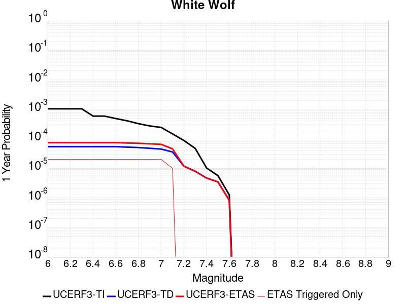 |  |

| Magnitude | 1 wk TI Prob | 1 wk TD Prob | 1 wk ETAS Prob | 1 wk ETAS/TD Gain | 1 wk ETAS Triggered Only | 1 mo TI Prob | 1 mo TD Prob | 1 mo ETAS Prob | 1 mo ETAS/TD Gain | 1 mo ETAS Triggered Only | 1 yr TI Prob | 1 yr TD Prob | 1 yr ETAS Prob | 1 yr ETAS/TD Gain | 1 yr ETAS Triggered Only | 10 yr TI Prob | 10 yr TD Prob | 10 yr ETAS Prob | 10 yr ETAS/TD Gain | 10 yr ETAS Triggered Only |
|-----|-----|-----|-----|-----|-----|-----|-----|-----|-----|-----|-----|-----|-----|-----|-----|-----|-----|-----|-----|-----|
| 6.0 | 2.0037822E-5 | 1.0469385E-6 | 1.0469385E-6 | 1.0 | 0.0 | 8.587355E-5 | 4.4868716E-6 | 1.4486826E-5 | 3.2287142 | 1.0E-5 | 0.001045009 | 5.4626344E-5 | 7.462525E-5 | 1.3661038 | 2.0E-5 | 0.010401085 | 5.4613425E-4 | 5.661233E-4 | 1.0366011 | 2.0E-5 |
| 6.1 | 2.0037822E-5 | 1.0469385E-6 | 1.0469385E-6 | 1.0 | 0.0 | 8.587355E-5 | 4.4868716E-6 | 1.4486826E-5 | 3.2287142 | 1.0E-5 | 0.001045009 | 5.4626344E-5 | 7.462525E-5 | 1.3661038 | 2.0E-5 | 0.010401085 | 5.4613425E-4 | 5.661233E-4 | 1.0366011 | 2.0E-5 |
| 6.2 | 2.0037822E-5 | 1.0469385E-6 | 1.0469385E-6 | 1.0 | 0.0 | 8.587355E-5 | 4.4868716E-6 | 1.4486826E-5 | 3.2287142 | 1.0E-5 | 0.001045009 | 5.4626344E-5 | 7.462525E-5 | 1.3661038 | 2.0E-5 | 0.010401085 | 5.4613425E-4 | 5.661233E-4 | 1.0366011 | 2.0E-5 |
| 6.3 | 2.0037822E-5 | 1.0469385E-6 | 1.0469385E-6 | 1.0 | 0.0 | 8.587355E-5 | 4.4868716E-6 | 1.4486826E-5 | 3.2287142 | 1.0E-5 | 0.001045009 | 5.4626344E-5 | 7.462525E-5 | 1.3661038 | 2.0E-5 | 0.010401085 | 5.4613425E-4 | 5.661233E-4 | 1.0366011 | 2.0E-5 |
| 6.4 | 1.132487E-5 | 1.0469385E-6 | 1.0469385E-6 | 1.0 | 0.0 | 4.8534253E-5 | 4.4868716E-6 | 1.4486826E-5 | 3.2287142 | 1.0E-5 | 5.907443E-4 | 5.4626344E-5 | 7.462525E-5 | 1.3661038 | 2.0E-5 | 0.005891764 | 5.4613425E-4 | 5.661233E-4 | 1.0366011 | 2.0E-5 |
| 6.5 | 1.132487E-5 | 1.0469385E-6 | 1.0469385E-6 | 1.0 | 0.0 | 4.8534253E-5 | 4.4868716E-6 | 1.4486826E-5 | 3.2287142 | 1.0E-5 | 5.907443E-4 | 5.4626344E-5 | 7.462525E-5 | 1.3661038 | 2.0E-5 | 0.005891764 | 5.4613425E-4 | 5.661233E-4 | 1.0366011 | 2.0E-5 |
| 6.6 | 9.347473E-6 | 1.0469385E-6 | 1.0469385E-6 | 1.0 | 0.0 | 4.0059982E-5 | 4.4868716E-6 | 1.4486826E-5 | 3.2287142 | 1.0E-5 | 4.8762115E-4 | 5.4626344E-5 | 7.462525E-5 | 1.3661038 | 2.0E-5 | 0.0048655253 | 5.4613425E-4 | 5.661233E-4 | 1.0366011 | 2.0E-5 |
| 6.7 | 7.842647E-6 | 1.0048553E-6 | 1.0048553E-6 | 1.0 | 0.0 | 3.361091E-5 | 4.306516E-6 | 1.4306473E-5 | 3.3220527 | 1.0E-5 | 4.0913603E-4 | 5.243062E-5 | 7.242957E-5 | 1.3814365 | 2.0E-5 | 0.004083836 | 5.2418746E-4 | 5.4417696E-4 | 1.0381343 | 2.0E-5 |
| 6.8 | 6.26597E-6 | 9.73502E-7 | 9.73502E-7 | 1.0 | 0.0 | 2.685388E-5 | 4.172145E-6 | 1.4172104E-5 | 3.3968384 | 1.0E-5 | 3.2689696E-4 | 5.0794733E-5 | 7.0793714E-5 | 1.3937216 | 2.0E-5 | 0.003264165 | 5.078361E-4 | 5.2782596E-4 | 1.0393628 | 2.0E-5 |
| 6.9 | 5.258436E-6 | 9.183438E-7 | 9.183438E-7 | 1.0 | 0.0 | 2.2535958E-5 | 3.9357537E-6 | 1.3935714E-5 | 3.5407994 | 1.0E-5 | 2.7434074E-4 | 4.7916794E-5 | 6.791583E-5 | 1.4173702 | 2.0E-5 | 0.0027400232 | 4.7906942E-4 | 4.9905985E-4 | 1.0417277 | 2.0E-5 |
| 7.0 | 4.675028E-6 | 8.6613534E-7 | 8.6613534E-7 | 1.0 | 0.0 | 2.003568E-5 | 3.7120035E-6 | 1.3711967E-5 | 3.693953 | 1.0E-5 | 2.4390711E-4 | 4.5192755E-5 | 6.519185E-5 | 1.4425288 | 2.0E-5 | 0.0024363957 | 4.5184034E-4 | 4.718313E-4 | 1.0442435 | 2.0E-5 |
| 7.1 | 2.8270078E-6 | 6.874311E-7 | 6.874311E-7 | 1.0 | 0.0 | 1.2115692E-5 | 2.94613E-6 | 2.94613E-6 | 1.0 | 0.0 | 1.4749856E-4 | 3.5868587E-5 | 4.5868226E-5 | 1.2787855 | 1.0E-5 | 0.001474007 | 3.5863207E-4 | 3.6862848E-4 | 1.0278738 | 1.0E-5 |
| 7.2 | 1.6881406E-6 | 2.2707124E-7 | 2.2707124E-7 | 1.0 | 0.0 | 7.2348685E-6 | 9.731621E-7 | 9.731621E-7 | 1.0 | 0.0 | 8.808096E-5 | 1.1848186E-5 | 1.1848186E-5 | 1.0 | 0.0 | 8.8046055E-4 | 1.1847569E-4 | 1.1847569E-4 | 1.0 | 0.0 |
| 7.3 | 9.086107E-7 | 1.526683E-7 | 1.526683E-7 | 1.0 | 0.0 | 3.8940398E-6 | 6.542926E-7 | 6.542926E-7 | 1.0 | 0.0 | 4.7408903E-5 | 7.965984E-6 | 7.965984E-6 | 1.0 | 0.0 | 4.739879E-4 | 7.965707E-5 | 7.965707E-5 | 1.0 | 0.0 |
| 7.4 | 1.9717383E-7 | 9.00402E-8 | 9.00402E-8 | 1.0 | 0.0 | 8.450304E-7 | 3.8588652E-7 | 3.8588652E-7 | 1.0 | 0.0 | 1.0288197E-5 | 4.6981586E-6 | 4.6981586E-6 | 1.0 | 0.0 | 1.028772E-4 | 4.6980622E-5 | 4.6980622E-5 | 1.0 | 0.0 |
| 7.5 | 1.086975E-7 | 6.6597785E-8 | 6.6597785E-8 | 1.0 | 0.0 | 4.6584634E-7 | 2.8541905E-7 | 2.8541905E-7 | 1.0 | 0.0 | 5.6716644E-6 | 3.4749717E-6 | 3.4749717E-6 | 1.0 | 0.0 | 5.6715195E-5 | 3.47492E-5 | 3.47492E-5 | 1.0 | 0.0 |
| 7.6 | 2.4217808E-8 | 1.5820888E-8 | 1.5820888E-8 | 1.0 | 0.0 | 1.03790605E-7 | 6.78038E-8 | 6.78038E-8 | 1.0 | 0.0 | 1.2636499E-6 | 8.2551105E-7 | 8.2551105E-7 | 1.0 | 0.0 | 1.2636427E-5 | 8.255085E-6 | 8.255085E-6 | 1.0 | 0.0 |

## Newport-Inglewood (Offshore)
*[(top)](#table-of-contents)*

| 1 Week | 1 Month | 1 Year | 10 Year |
|-----|-----|-----|-----|
| 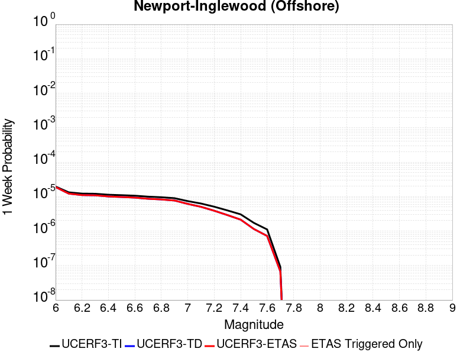 |  | 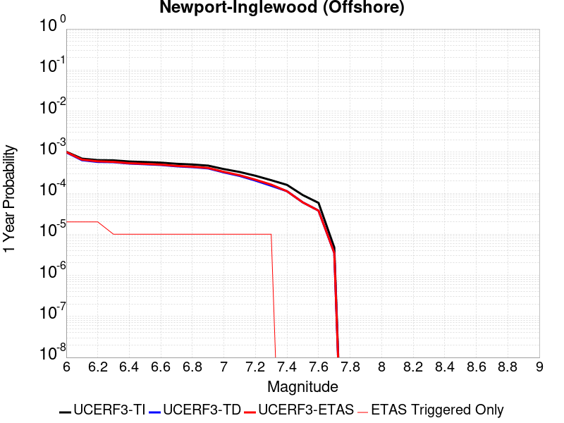 | 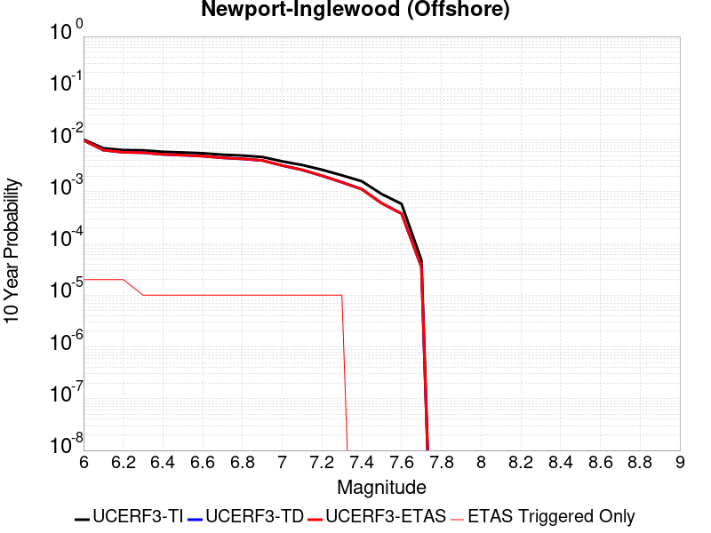 |

| Magnitude | 1 wk TI Prob | 1 wk TD Prob | 1 wk ETAS Prob | 1 wk ETAS/TD Gain | 1 wk ETAS Triggered Only | 1 mo TI Prob | 1 mo TD Prob | 1 mo ETAS Prob | 1 mo ETAS/TD Gain | 1 mo ETAS Triggered Only | 1 yr TI Prob | 1 yr TD Prob | 1 yr ETAS Prob | 1 yr ETAS/TD Gain | 1 yr ETAS Triggered Only | 10 yr TI Prob | 10 yr TD Prob | 10 yr ETAS Prob | 10 yr ETAS/TD Gain | 10 yr ETAS Triggered Only |
|-----|-----|-----|-----|-----|-----|-----|-----|-----|-----|-----|-----|-----|-----|-----|-----|-----|-----|-----|-----|-----|
| 6.0 | 1.9626508E-5 | 1.8965693E-5 | 1.8965693E-5 | 1.0 | 0.0 | 8.411089E-5 | 8.1279075E-5 | 9.127826E-5 | 1.1230229 | 1.0E-5 | 0.001023569 | 9.89136E-4 | 0.0010091163 | 1.0201997 | 2.0E-5 | 0.010188672 | 0.009848678 | 0.00986848 | 1.0020107 | 2.0E-5 |
| 6.1 | 1.331886E-5 | 1.221833E-5 | 1.221833E-5 | 1.0 | 0.0 | 5.707958E-5 | 5.236323E-5 | 6.2362706E-5 | 1.1909637 | 1.0E-5 | 6.947222E-4 | 6.3733733E-4 | 6.5732456E-4 | 1.0313605 | 2.0E-5 | 0.006925544 | 0.0063552726 | 0.006375145 | 1.003127 | 2.0E-5 |
| 6.2 | 1.2250852E-5 | 1.1076251E-5 | 1.1076251E-5 | 1.0 | 0.0 | 5.2502597E-5 | 4.7468788E-5 | 5.7468314E-5 | 1.2106547 | 1.0E-5 | 6.3903164E-4 | 5.7778024E-4 | 5.977687E-4 | 1.0345953 | 2.0E-5 | 0.006371971 | 0.0057629016 | 0.0057827863 | 1.0034505 | 2.0E-5 |
| 6.3 | 1.2106258E-5 | 1.091911E-5 | 1.091911E-5 | 1.0 | 0.0 | 5.1882926E-5 | 4.679535E-5 | 5.679488E-5 | 1.2136865 | 1.0E-5 | 6.3149154E-4 | 5.695854E-4 | 5.7957973E-4 | 1.0175467 | 1.0E-5 | 0.0062970007 | 0.0056813727 | 0.005691316 | 1.0017501 | 1.0E-5 |
| 6.4 | 1.1348758E-5 | 1.0109569E-5 | 1.0109569E-5 | 1.0 | 0.0 | 4.8636626E-5 | 4.332601E-5 | 5.3325577E-5 | 1.2307982 | 1.0E-5 | 5.919901E-4 | 5.273673E-4 | 5.37362E-4 | 1.0189521 | 1.0E-5 | 0.005904155 | 0.005261254 | 0.0052712015 | 1.0018907 | 1.0E-5 |
| 6.5 | 1.100837E-5 | 9.74359E-6 | 9.74359E-6 | 1.0 | 0.0 | 4.7177873E-5 | 4.175758E-5 | 5.1757164E-5 | 1.2394675 | 1.0E-5 | 5.7423924E-4 | 5.082807E-4 | 5.1827566E-4 | 1.0196642 | 1.0E-5 | 0.005727576 | 0.005071273 | 0.0050812224 | 1.001962 | 1.0E-5 |
| 6.6 | 1.0634696E-5 | 9.345738E-6 | 9.345738E-6 | 1.0 | 0.0 | 4.557647E-5 | 4.0052553E-5 | 5.0052153E-5 | 1.2496619 | 1.0E-5 | 5.5475225E-4 | 4.8753148E-4 | 4.975266E-4 | 1.0205015 | 1.0E-5 | 0.0055336943 | 0.0048647057 | 0.0048746574 | 1.0020456 | 1.0E-5 |
| 6.7 | 9.9780855E-6 | 8.668096E-6 | 8.668096E-6 | 1.0 | 0.0 | 4.276252E-5 | 3.7148457E-5 | 4.7148085E-5 | 1.2691802 | 1.0E-5 | 5.205093E-4 | 4.521893E-4 | 4.6218478E-4 | 1.0221046 | 1.0E-5 | 0.0051929182 | 0.004512771 | 0.004522726 | 1.002206 | 1.0E-5 |
| 6.8 | 9.59546E-6 | 8.27313E-6 | 8.27313E-6 | 1.0 | 0.0 | 4.1122752E-5 | 3.5455796E-5 | 4.545544E-5 | 1.2820313 | 1.0E-5 | 5.0055445E-4 | 4.3158946E-4 | 4.4158514E-4 | 1.0231602 | 1.0E-5 | 0.004994285 | 0.0043075886 | 0.0043175453 | 1.0023115 | 1.0E-5 |
| 6.9 | 9.000614E-6 | 7.70701E-6 | 7.70701E-6 | 1.0 | 0.0 | 3.857349E-5 | 3.3029624E-5 | 4.3029297E-5 | 1.3027484 | 1.0E-5 | 4.6953102E-4 | 4.0206214E-4 | 4.120581E-4 | 1.0248618 | 1.0E-5 | 0.004685402 | 0.0040134187 | 0.0040233787 | 1.0024817 | 1.0E-5 |
| 7.0 | 7.4070194E-6 | 6.149041E-6 | 6.149041E-6 | 1.0 | 0.0 | 3.1743984E-5 | 2.6352767E-5 | 3.6352503E-5 | 1.3794568 | 1.0E-5 | 3.8641447E-4 | 3.2079787E-4 | 3.3079466E-4 | 1.0311623 | 1.0E-5 | 0.0038574322 | 0.0032033676 | 0.0032133355 | 1.0031117 | 1.0E-5 |
| 7.1 | 6.299615E-6 | 5.0567137E-6 | 5.0567137E-6 | 1.0 | 0.0 | 2.699807E-5 | 2.167145E-5 | 3.1671236E-5 | 1.4614266 | 1.0E-5 | 3.2865192E-4 | 2.638181E-4 | 2.7381547E-4 | 1.037895 | 1.0E-5 | 0.003281663 | 0.0026350638 | 0.0026450376 | 1.003785 | 1.0E-5 |
| 7.2 | 5.096653E-6 | 3.892877E-6 | 3.892877E-6 | 1.0 | 0.0 | 2.1842614E-5 | 1.6683653E-5 | 2.6683485E-5 | 1.5993792 | 1.0E-5 | 2.6590136E-4 | 2.0310463E-4 | 2.1310261E-4 | 1.0492257 | 1.0E-5 | 0.0026558342 | 0.0020292012 | 0.002039181 | 1.0049181 | 1.0E-5 |
| 7.3 | 3.9753018E-6 | 2.909959E-6 | 2.909959E-6 | 1.0 | 0.0 | 1.7036897E-5 | 1.2471193E-5 | 2.247107E-5 | 1.8018379 | 1.0E-5 | 2.0740448E-4 | 1.5182629E-4 | 1.6182476E-4 | 1.0658548 | 1.0E-5 | 0.00207211 | 0.0015172337 | 0.0015272185 | 1.006581 | 1.0E-5 |
| 7.4 | 3.0568392E-6 | 2.145035E-6 | 2.145035E-6 | 1.0 | 0.0 | 1.3100675E-5 | 9.192976E-6 | 9.192976E-6 | 1.0 | 0.0 | 1.5948903E-4 | 1.11918795E-4 | 1.11918795E-4 | 1.0 | 0.0 | 0.0015937461 | 0.0011186305 | 0.0011186305 | 1.0 | 0.0 |
| 7.5 | 1.7279019E-6 | 1.1470092E-6 | 1.1470092E-6 | 1.0 | 0.0 | 7.405273E-6 | 4.915745E-6 | 4.915745E-6 | 1.0 | 0.0 | 9.015547E-5 | 5.9847593E-5 | 5.9847593E-5 | 1.0 | 0.0 | 9.01189E-4 | 5.9831864E-4 | 5.9831864E-4 | 1.0 | 0.0 |
| 7.6 | 1.1156416E-6 | 7.2231563E-7 | 7.2231563E-7 | 1.0 | 0.0 | 4.7813123E-6 | 3.0956348E-6 | 3.0956348E-6 | 1.0 | 0.0 | 5.821092E-5 | 3.7688726E-5 | 3.7688726E-5 | 1.0 | 0.0 | 5.8195676E-4 | 3.768257E-4 | 3.768257E-4 | 1.0 | 0.0 |
| 7.7 | 9.117973E-8 | 6.734214E-8 | 6.734214E-8 | 1.0 | 0.0 | 3.907702E-7 | 2.8860916E-7 | 2.8860916E-7 | 1.0 | 0.0 | 4.757617E-6 | 3.5138112E-6 | 3.5138112E-6 | 1.0 | 0.0 | 4.7575148E-5 | 3.5137586E-5 | 3.5137586E-5 | 1.0 | 0.0 |

## Big Pine (East)
*[(top)](#table-of-contents)*

| 1 Week | 1 Month | 1 Year | 10 Year |
|-----|-----|-----|-----|
|  |  |  | 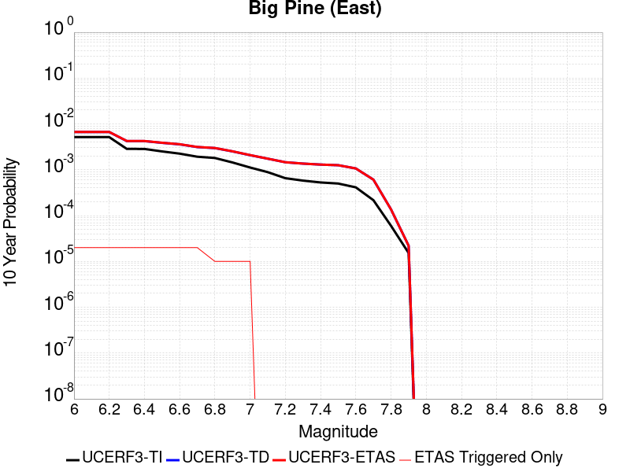 |

| Magnitude | 1 wk TI Prob | 1 wk TD Prob | 1 wk ETAS Prob | 1 wk ETAS/TD Gain | 1 wk ETAS Triggered Only | 1 mo TI Prob | 1 mo TD Prob | 1 mo ETAS Prob | 1 mo ETAS/TD Gain | 1 mo ETAS Triggered Only | 1 yr TI Prob | 1 yr TD Prob | 1 yr ETAS Prob | 1 yr ETAS/TD Gain | 1 yr ETAS Triggered Only | 10 yr TI Prob | 10 yr TD Prob | 10 yr ETAS Prob | 10 yr ETAS/TD Gain | 10 yr ETAS Triggered Only |
|-----|-----|-----|-----|-----|-----|-----|-----|-----|-----|-----|-----|-----|-----|-----|-----|-----|-----|-----|-----|-----|
| 6.0 | 9.916913E-6 | 1.2818943E-5 | 1.2818943E-5 | 1.0 | 0.0 | 4.250036E-5 | 5.4937296E-5 | 5.4937296E-5 | 1.0 | 0.0 | 5.173191E-4 | 6.6867843E-4 | 6.786717E-4 | 1.0149449 | 1.0E-5 | 0.0051611643 | 0.00667144 | 0.0066913064 | 1.0029778 | 2.0E-5 |
| 6.1 | 9.916913E-6 | 1.2818943E-5 | 1.2818943E-5 | 1.0 | 0.0 | 4.250036E-5 | 5.4937296E-5 | 5.4937296E-5 | 1.0 | 0.0 | 5.173191E-4 | 6.6867843E-4 | 6.786717E-4 | 1.0149449 | 1.0E-5 | 0.0051611643 | 0.00667144 | 0.0066913064 | 1.0029778 | 2.0E-5 |
| 6.2 | 9.916913E-6 | 1.2818943E-5 | 1.2818943E-5 | 1.0 | 0.0 | 4.250036E-5 | 5.4937296E-5 | 5.4937296E-5 | 1.0 | 0.0 | 5.173191E-4 | 6.6867843E-4 | 6.786717E-4 | 1.0149449 | 1.0E-5 | 0.0051611643 | 0.00667144 | 0.0066913064 | 1.0029778 | 2.0E-5 |
| 6.3 | 5.479711E-6 | 8.114851E-6 | 8.114851E-6 | 1.0 | 0.0 | 2.3484265E-5 | 3.4777488E-5 | 3.4777488E-5 | 1.0 | 0.0 | 2.858834E-4 | 4.2333684E-4 | 4.333326E-4 | 1.0236119 | 1.0E-5 | 0.0028551589 | 0.0042282143 | 0.0042481297 | 1.0047101 | 2.0E-5 |
| 6.4 | 5.465009E-6 | 8.099144E-6 | 8.099144E-6 | 1.0 | 0.0 | 2.3421257E-5 | 3.4710174E-5 | 3.4710174E-5 | 1.0 | 0.0 | 2.851165E-4 | 4.2251762E-4 | 4.325134E-4 | 1.0236577 | 1.0E-5 | 0.0028475097 | 0.004220053 | 0.0042399685 | 1.0047193 | 2.0E-5 |
| 6.5 | 4.826767E-6 | 7.4241925E-6 | 7.4241925E-6 | 1.0 | 0.0 | 2.068598E-5 | 3.1817595E-5 | 3.1817595E-5 | 1.0 | 0.0 | 2.518227E-4 | 3.8731314E-4 | 3.9730928E-4 | 1.0258089 | 1.0E-5 | 0.0025153751 | 0.0038692495 | 0.003889172 | 1.005149 | 2.0E-5 |
| 6.6 | 4.3146847E-6 | 6.8841223E-6 | 6.8841223E-6 | 1.0 | 0.0 | 1.8491375E-5 | 2.9503062E-5 | 2.9503062E-5 | 1.0 | 0.0 | 2.2510924E-4 | 3.59143E-4 | 3.6913942E-4 | 1.027834 | 1.0E-5 | 0.0022488134 | 0.003588462 | 0.0036083902 | 1.0055534 | 2.0E-5 |
| 6.7 | 3.6968106E-6 | 5.9972467E-6 | 5.9972467E-6 | 1.0 | 0.0 | 1.5843378E-5 | 2.570224E-5 | 2.570224E-5 | 1.0 | 0.0 | 1.9287605E-4 | 3.128814E-4 | 3.2287824E-4 | 1.031951 | 1.0E-5 | 0.0019270873 | 0.0031271544 | 0.0031470917 | 1.0063756 | 2.0E-5 |
| 6.8 | 3.4671132E-6 | 5.703903E-6 | 5.703903E-6 | 1.0 | 0.0 | 1.4858972E-5 | 2.4445078E-5 | 2.4445078E-5 | 1.0 | 0.0 | 1.8089297E-4 | 2.9757962E-4 | 3.0757664E-4 | 1.0335945 | 1.0E-5 | 0.0018074579 | 0.0029745484 | 0.0029845187 | 1.0033518 | 1.0E-5 |
| 6.9 | 2.7686972E-6 | 4.8268166E-6 | 4.8268166E-6 | 1.0 | 0.0 | 1.1865792E-5 | 2.0686197E-5 | 2.0686197E-5 | 1.0 | 0.0 | 1.4445644E-4 | 2.518261E-4 | 2.618236E-4 | 1.0396999 | 1.0E-5 | 0.0014436257 | 0.0025180764 | 0.0025280511 | 1.0039613 | 1.0E-5 |
| 7.0 | 2.1472624E-6 | 3.986488E-6 | 3.986488E-6 | 1.0 | 0.0 | 9.20252E-6 | 1.708484E-5 | 1.708484E-5 | 1.0 | 0.0 | 1.12034926E-4 | 2.079886E-4 | 2.1798653E-4 | 1.0480696 | 1.0E-5 | 0.0011197845 | 0.0020805765 | 0.0020905556 | 1.0047964 | 1.0E-5 |
| 7.1 | 1.7018335E-6 | 3.3461934E-6 | 3.3461934E-6 | 1.0 | 0.0 | 7.293552E-6 | 1.43407515E-5 | 1.43407515E-5 | 1.0 | 0.0 | 8.879537E-5 | 1.7458502E-4 | 1.7458502E-4 | 1.0 | 0.0 | 8.87599E-4 | 0.001747084 | 0.001747084 | 1.0 | 0.0 |
| 7.2 | 1.25603E-6 | 2.7957285E-6 | 2.7957285E-6 | 1.0 | 0.0 | 5.3829745E-6 | 1.198164E-5 | 1.198164E-5 | 1.0 | 0.0 | 6.553574E-5 | 1.4586693E-4 | 1.4586693E-4 | 1.0 | 0.0 | 6.551642E-4 | 0.0014602927 | 0.0014602927 | 1.0 | 0.0 |
| 7.3 | 1.112297E-6 | 2.6115072E-6 | 2.6115072E-6 | 1.0 | 0.0 | 4.7669787E-6 | 1.1192126E-5 | 1.1192126E-5 | 1.0 | 0.0 | 5.803642E-5 | 1.3625584E-4 | 1.3625584E-4 | 1.0 | 0.0 | 5.802127E-4 | 0.0013641362 | 0.0013641362 | 1.0 | 0.0 |
| 7.4 | 1.0137181E-6 | 2.4846163E-6 | 2.4846163E-6 | 1.0 | 0.0 | 4.3444993E-6 | 1.0648314E-5 | 1.0648314E-5 | 1.0 | 0.0 | 5.2892992E-5 | 1.2963572E-4 | 1.2963572E-4 | 1.0 | 0.0 | 5.288041E-4 | 0.0012977982 | 0.0012977982 | 1.0 | 0.0 |
| 7.5 | 9.598608E-7 | 2.4082394E-6 | 2.4082394E-6 | 1.0 | 0.0 | 4.1136827E-6 | 1.0320987E-5 | 1.0320987E-5 | 1.0 | 0.0 | 5.0082934E-5 | 1.2565097E-4 | 1.2565097E-4 | 1.0 | 0.0 | 5.007165E-4 | 0.0012578046 | 0.0012578046 | 1.0 | 0.0 |
| 7.6 | 7.929459E-7 | 2.0458226E-6 | 2.0458226E-6 | 1.0 | 0.0 | 3.3983351E-6 | 8.767783E-6 | 8.767783E-6 | 1.0 | 0.0 | 4.1373947E-5 | 1.067427E-4 | 1.067427E-4 | 1.0 | 0.0 | 4.1366243E-4 | 0.0010690097 | 0.0010690097 | 1.0 | 0.0 |
| 7.7 | 4.155788E-7 | 1.1612422E-6 | 1.1612422E-6 | 1.0 | 0.0 | 1.7810507E-6 | 4.9767427E-6 | 4.9767427E-6 | 1.0 | 0.0 | 2.1684076E-5 | 6.05902E-5 | 6.05902E-5 | 1.0 | 0.0 | 2.1681961E-4 | 6.0891797E-4 | 6.0891797E-4 | 1.0 | 0.0 |
| 7.8 | 1.14666925E-7 | 2.5935495E-7 | 2.5935495E-7 | 1.0 | 0.0 | 4.914296E-7 | 1.1115206E-6 | 1.1115206E-6 | 1.0 | 0.0 | 5.9831386E-6 | 1.35326845E-5 | 1.35326845E-5 | 1.0 | 0.0 | 5.9829777E-5 | 1.3641985E-4 | 1.3641985E-4 | 1.0 | 0.0 |
| 7.9 | 2.9231824E-8 | 4.1489546E-8 | 4.1489546E-8 | 1.0 | 0.0 | 1.2527924E-7 | 1.7781232E-7 | 1.7781232E-7 | 1.0 | 0.0 | 1.5252737E-6 | 2.1648632E-6 | 2.1648632E-6 | 1.0 | 0.0 | 1.5252632E-5 | 2.198114E-5 | 2.198114E-5 | 1.0 | 0.0 |

## Great Valley 08 (Quinto)
*[(top)](#table-of-contents)*

| 1 Week | 1 Month | 1 Year | 10 Year |
|-----|-----|-----|-----|
|  | 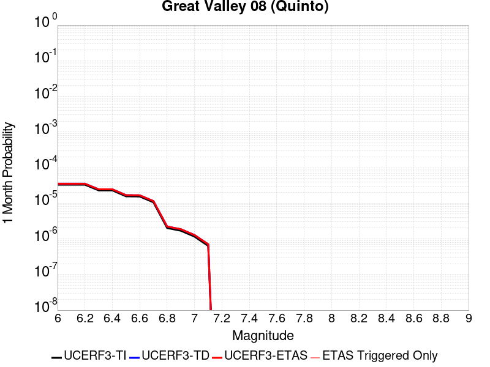 | 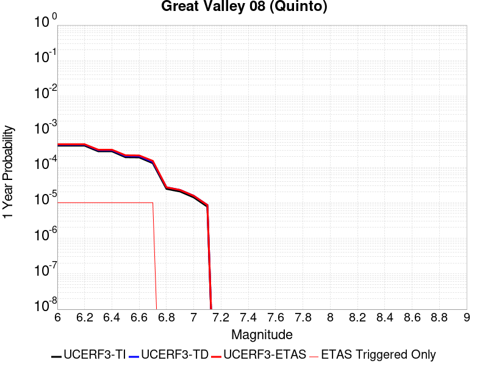 | 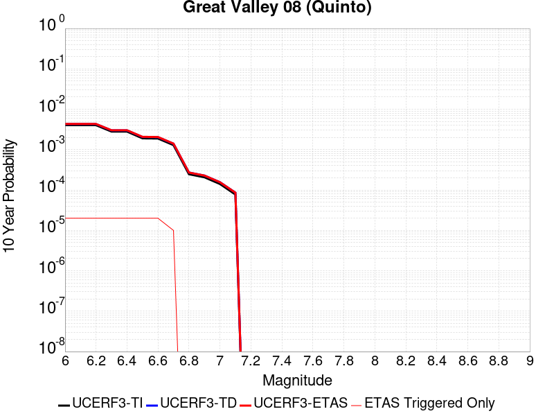 |

| Magnitude | 1 wk TI Prob | 1 wk TD Prob | 1 wk ETAS Prob | 1 wk ETAS/TD Gain | 1 wk ETAS Triggered Only | 1 mo TI Prob | 1 mo TD Prob | 1 mo ETAS Prob | 1 mo ETAS/TD Gain | 1 mo ETAS Triggered Only | 1 yr TI Prob | 1 yr TD Prob | 1 yr ETAS Prob | 1 yr ETAS/TD Gain | 1 yr ETAS Triggered Only | 10 yr TI Prob | 10 yr TD Prob | 10 yr ETAS Prob | 10 yr ETAS/TD Gain | 10 yr ETAS Triggered Only |
|-----|-----|-----|-----|-----|-----|-----|-----|-----|-----|-----|-----|-----|-----|-----|-----|-----|-----|-----|-----|-----|
| 6.0 | 7.737697E-6 | 8.253153E-6 | 8.253153E-6 | 1.0 | 0.0 | 3.3161137E-5 | 3.537028E-5 | 3.537028E-5 | 1.0 | 0.0 | 4.0366207E-4 | 4.3056696E-4 | 4.4056264E-4 | 1.0232152 | 1.0E-5 | 0.004029296 | 0.00429918 | 0.004319094 | 1.004632 | 2.0E-5 |
| 6.1 | 7.737697E-6 | 8.253153E-6 | 8.253153E-6 | 1.0 | 0.0 | 3.3161137E-5 | 3.537028E-5 | 3.537028E-5 | 1.0 | 0.0 | 4.0366207E-4 | 4.3056696E-4 | 4.4056264E-4 | 1.0232152 | 1.0E-5 | 0.004029296 | 0.00429918 | 0.004319094 | 1.004632 | 2.0E-5 |
| 6.2 | 7.737697E-6 | 8.253153E-6 | 8.253153E-6 | 1.0 | 0.0 | 3.3161137E-5 | 3.537028E-5 | 3.537028E-5 | 1.0 | 0.0 | 4.0366207E-4 | 4.3056696E-4 | 4.4056264E-4 | 1.0232152 | 1.0E-5 | 0.004029296 | 0.00429918 | 0.004319094 | 1.004632 | 2.0E-5 |
| 6.3 | 5.374012E-6 | 5.7506577E-6 | 5.7506577E-6 | 1.0 | 0.0 | 2.3031276E-5 | 2.4645506E-5 | 2.4645506E-5 | 1.0 | 0.0 | 2.803697E-4 | 3.0002886E-4 | 3.1002588E-4 | 1.0333201 | 1.0E-5 | 0.0028001624 | 0.0029973313 | 0.0030172714 | 1.0066526 | 2.0E-5 |
| 6.4 | 5.374012E-6 | 5.7506577E-6 | 5.7506577E-6 | 1.0 | 0.0 | 2.3031276E-5 | 2.4645506E-5 | 2.4645506E-5 | 1.0 | 0.0 | 2.803697E-4 | 3.0002886E-4 | 3.1002588E-4 | 1.0333201 | 1.0E-5 | 0.0028001624 | 0.0029973313 | 0.0030172714 | 1.0066526 | 2.0E-5 |
| 6.5 | 3.65427E-6 | 3.9413885E-6 | 3.9413885E-6 | 1.0 | 0.0 | 1.5661062E-5 | 1.6891596E-5 | 1.6891596E-5 | 1.0 | 0.0 | 1.9065675E-4 | 2.0564282E-4 | 2.1564076E-4 | 1.048618 | 1.0E-5 | 0.0019049325 | 0.002055217 | 0.0020751758 | 1.0097114 | 2.0E-5 |
| 6.6 | 3.6143538E-6 | 3.8985745E-6 | 3.8985745E-6 | 1.0 | 0.0 | 1.5489995E-5 | 1.6708109E-5 | 1.6708109E-5 | 1.0 | 0.0 | 1.8857437E-4 | 2.0340929E-4 | 2.1340726E-4 | 1.049152 | 1.0E-5 | 0.0018841444 | 0.0020329226 | 0.002052882 | 1.0098181 | 2.0E-5 |
| 6.7 | 2.4821015E-6 | 2.6857529E-6 | 2.6857529E-6 | 1.0 | 0.0 | 1.0637535E-5 | 1.151035E-5 | 1.151035E-5 | 1.0 | 0.0 | 1.2950429E-4 | 1.4013516E-4 | 1.5013375E-4 | 1.0713496 | 1.0E-5 | 0.0012942884 | 0.0014010228 | 0.0014110088 | 1.0071276 | 1.0E-5 |
| 6.8 | 4.7110538E-7 | 5.193132E-7 | 5.193132E-7 | 1.0 | 0.0 | 2.0190216E-6 | 2.225626E-6 | 2.225626E-6 | 1.0 | 0.0 | 2.458131E-5 | 2.709668E-5 | 2.709668E-5 | 1.0 | 0.0 | 2.457859E-4 | 2.7093556E-4 | 2.7093556E-4 | 1.0 | 0.0 |
| 6.9 | 3.958685E-7 | 4.37044E-7 | 4.37044E-7 | 1.0 | 0.0 | 1.6965782E-6 | 1.8730444E-6 | 1.8730444E-6 | 1.0 | 0.0 | 2.0655643E-5 | 2.2804094E-5 | 2.2804094E-5 | 1.0 | 0.0 | 2.0653724E-4 | 2.2801915E-4 | 2.2801915E-4 | 1.0 | 0.0 |
| 7.0 | 2.70294E-7 | 2.9920676E-7 | 2.9920676E-7 | 1.0 | 0.0 | 1.1584025E-6 | 1.2823141E-6 | 1.2823141E-6 | 1.0 | 0.0 | 1.4103458E-5 | 1.5612075E-5 | 1.5612075E-5 | 1.0 | 0.0 | 1.4102564E-4 | 1.5611107E-4 | 1.5611107E-4 | 1.0 | 0.0 |
| 7.1 | 1.4828602E-7 | 1.6469487E-7 | 1.6469487E-7 | 1.0 | 0.0 | 6.3551136E-7 | 7.05835E-7 | 7.05835E-7 | 1.0 | 0.0 | 7.737323E-6 | 8.593515E-6 | 8.593515E-6 | 1.0 | 0.0 | 7.737054E-5 | 8.593263E-5 | 8.593263E-5 | 1.0 | 0.0 |

## Cerro Prieto
*[(top)](#table-of-contents)*

| 1 Week | 1 Month | 1 Year | 10 Year |
|-----|-----|-----|-----|
| 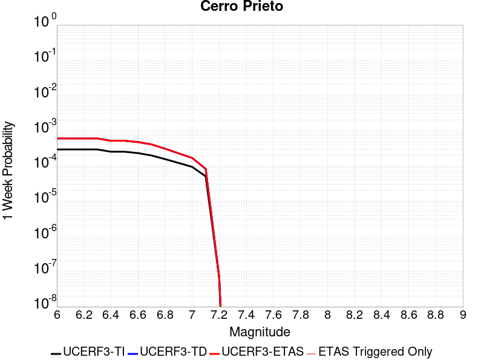 | 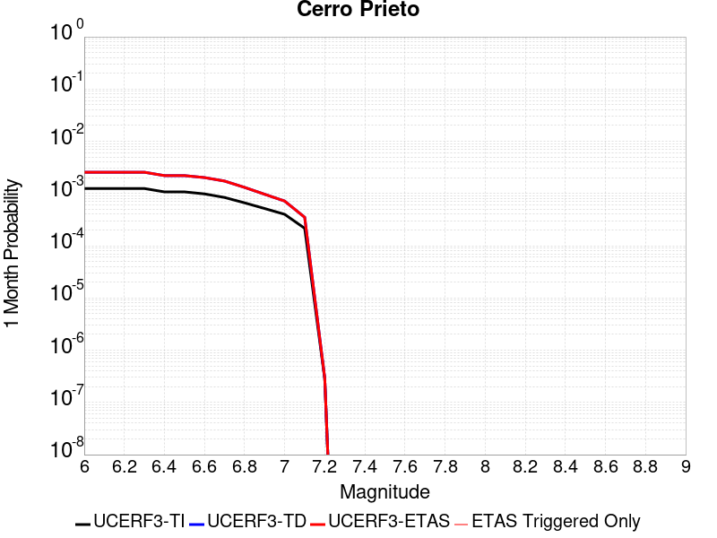 | 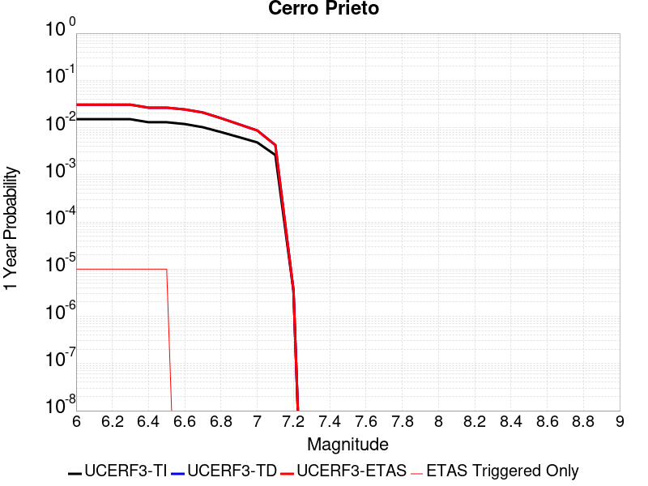 |  |

| Magnitude | 1 wk TI Prob | 1 wk TD Prob | 1 wk ETAS Prob | 1 wk ETAS/TD Gain | 1 wk ETAS Triggered Only | 1 mo TI Prob | 1 mo TD Prob | 1 mo ETAS Prob | 1 mo ETAS/TD Gain | 1 mo ETAS Triggered Only | 1 yr TI Prob | 1 yr TD Prob | 1 yr ETAS Prob | 1 yr ETAS/TD Gain | 1 yr ETAS Triggered Only | 10 yr TI Prob | 10 yr TD Prob | 10 yr ETAS Prob | 10 yr ETAS/TD Gain | 10 yr ETAS Triggered Only |
|-----|-----|-----|-----|-----|-----|-----|-----|-----|-----|-----|-----|-----|-----|-----|-----|-----|-----|-----|-----|-----|
| 6.0 | 2.9101528E-4 | 5.9665367E-4 | 5.9665367E-4 | 1.0 | 0.0 | 0.0012466122 | 0.0025548236 | 0.0025548236 | 1.0 | 0.0 | 0.015072231 | 0.030656058 | 0.030665752 | 1.0003161 | 1.0E-5 | 0.14089979 | 0.25403062 | 0.25404552 | 1.0000588 | 2.0E-5 |
| 6.1 | 2.9101528E-4 | 5.9665367E-4 | 5.9665367E-4 | 1.0 | 0.0 | 0.0012466122 | 0.0025548236 | 0.0025548236 | 1.0 | 0.0 | 0.015072231 | 0.030656058 | 0.030665752 | 1.0003161 | 1.0E-5 | 0.14089979 | 0.25403062 | 0.25404552 | 1.0000588 | 2.0E-5 |
| 6.2 | 2.9101528E-4 | 5.9665367E-4 | 5.9665367E-4 | 1.0 | 0.0 | 0.0012466122 | 0.0025548236 | 0.0025548236 | 1.0 | 0.0 | 0.015072231 | 0.030656058 | 0.030665752 | 1.0003161 | 1.0E-5 | 0.14089979 | 0.25403062 | 0.25404552 | 1.0000588 | 2.0E-5 |
| 6.3 | 2.9101528E-4 | 5.9665367E-4 | 5.9665367E-4 | 1.0 | 0.0 | 0.0012466122 | 0.0025548236 | 0.0025548236 | 1.0 | 0.0 | 0.015072231 | 0.030656058 | 0.030665752 | 1.0003161 | 1.0E-5 | 0.14089979 | 0.25403062 | 0.25404552 | 1.0000588 | 2.0E-5 |
| 6.4 | 2.508648E-4 | 5.141391E-4 | 5.141391E-4 | 1.0 | 0.0 | 0.0010746918 | 0.0022017912 | 0.0022017912 | 1.0 | 0.0 | 0.013006088 | 0.026479386 | 0.02648912 | 1.0003676 | 1.0E-5 | 0.12270685 | 0.22445618 | 0.22447169 | 1.0000691 | 2.0E-5 |
| 6.5 | 2.508648E-4 | 5.141391E-4 | 5.141391E-4 | 1.0 | 0.0 | 0.0010746918 | 0.0022017912 | 0.0022017912 | 1.0 | 0.0 | 0.013006088 | 0.026479386 | 0.02648912 | 1.0003676 | 1.0E-5 | 0.12270685 | 0.22445618 | 0.22447169 | 1.0000691 | 2.0E-5 |
| 6.6 | 2.294914E-4 | 4.7132745E-4 | 4.7132745E-4 | 1.0 | 0.0 | 9.831638E-4 | 0.0020185986 | 0.0020185986 | 1.0 | 0.0 | 0.011904482 | 0.02430616 | 0.02430616 | 1.0 | 0.0 | 0.11286586 | 0.20863713 | 0.20864505 | 1.0000379 | 1.0E-5 |
| 6.7 | 1.9621674E-4 | 4.0434205E-4 | 4.0434205E-4 | 1.0 | 0.0 | 8.4065786E-4 | 0.0017319021 | 0.0017319021 | 1.0 | 0.0 | 0.010187071 | 0.020892266 | 0.020892266 | 1.0 | 0.0 | 0.09732539 | 0.18295304 | 0.18296123 | 1.0000447 | 1.0E-5 |
| 6.8 | 1.5476145E-4 | 3.0577596E-4 | 3.0577596E-4 | 1.0 | 0.0 | 6.6309475E-4 | 0.0013099125 | 0.0013099125 | 1.0 | 0.0 | 0.008043335 | 0.015843261 | 0.015843261 | 1.0 | 0.0 | 0.07758363 | 0.14340837 | 0.14341694 | 1.0000597 | 1.0E-5 |
| 6.9 | 1.20509176E-4 | 2.2592656E-4 | 2.2592656E-4 | 1.0 | 0.0 | 5.1636563E-4 | 9.6796075E-4 | 9.6796075E-4 | 1.0 | 0.0 | 0.006268645 | 0.011731639 | 0.011731639 | 1.0 | 0.0 | 0.060947374 | 0.109490074 | 0.109498985 | 1.0000813 | 1.0E-5 |
| 7.0 | 9.3269155E-5 | 1.6724777E-4 | 1.6724777E-4 | 1.0 | 0.0 | 3.9966372E-4 | 7.1662234E-4 | 7.1662234E-4 | 1.0 | 0.0 | 0.0048550544 | 0.008697634 | 0.008697634 | 1.0 | 0.0 | 0.04750344 | 0.08319191 | 0.08320108 | 1.0001101 | 1.0E-5 |
| 7.1 | 5.029709E-5 | 8.1765065E-5 | 8.1765065E-5 | 1.0 | 0.0 | 2.1554115E-4 | 3.5039394E-4 | 3.5039394E-4 | 1.0 | 0.0 | 0.0026210553 | 0.00426112 | 0.00426112 | 1.0 | 0.0 | 0.025903556 | 0.042385496 | 0.042385496 | 1.0 | 0.0 |
| 7.2 | 6.5445185E-8 | 6.824211E-8 | 6.824211E-8 | 1.0 | 0.0 | 2.8047933E-7 | 2.9246618E-7 | 2.9246618E-7 | 1.0 | 0.0 | 3.4148304E-6 | 3.5607757E-6 | 3.5607757E-6 | 1.0 | 0.0 | 3.414778E-5 | 3.5607758E-5 | 3.5607758E-5 | 1.0 | 0.0 |

## Peralta Hills
*[(top)](#table-of-contents)*

| 1 Week | 1 Month | 1 Year | 10 Year |
|-----|-----|-----|-----|
| 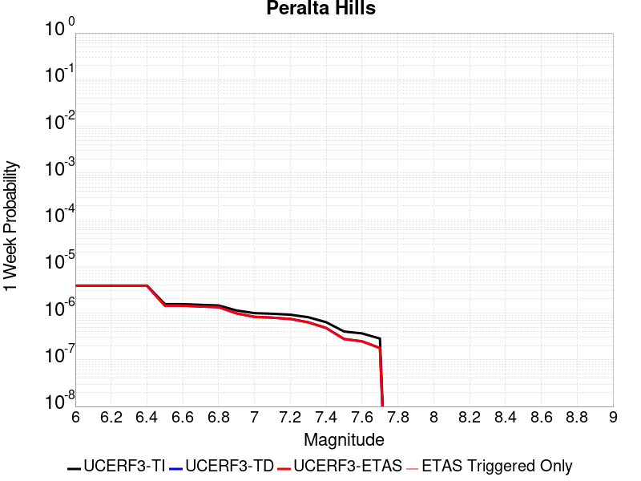 |  |  |  |

| Magnitude | 1 wk TI Prob | 1 wk TD Prob | 1 wk ETAS Prob | 1 wk ETAS/TD Gain | 1 wk ETAS Triggered Only | 1 mo TI Prob | 1 mo TD Prob | 1 mo ETAS Prob | 1 mo ETAS/TD Gain | 1 mo ETAS Triggered Only | 1 yr TI Prob | 1 yr TD Prob | 1 yr ETAS Prob | 1 yr ETAS/TD Gain | 1 yr ETAS Triggered Only | 10 yr TI Prob | 10 yr TD Prob | 10 yr ETAS Prob | 10 yr ETAS/TD Gain | 10 yr ETAS Triggered Only |
|-----|-----|-----|-----|-----|-----|-----|-----|-----|-----|-----|-----|-----|-----|-----|-----|-----|-----|-----|-----|-----|
| 6.0 | 3.8850067E-6 | 3.8396074E-6 | 3.8396074E-6 | 1.0 | 0.0 | 1.6649923E-5 | 1.6455399E-5 | 1.6455399E-5 | 1.0 | 0.0 | 2.0269395E-4 | 2.0033348E-4 | 2.1033148E-4 | 1.0499067 | 1.0E-5 | 0.0020250916 | 0.0020022565 | 0.0020222166 | 1.0099688 | 2.0E-5 |
| 6.1 | 3.8850067E-6 | 3.8396074E-6 | 3.8396074E-6 | 1.0 | 0.0 | 1.6649923E-5 | 1.6455399E-5 | 1.6455399E-5 | 1.0 | 0.0 | 2.0269395E-4 | 2.0033348E-4 | 2.1033148E-4 | 1.0499067 | 1.0E-5 | 0.0020250916 | 0.0020022565 | 0.0020222166 | 1.0099688 | 2.0E-5 |
| 6.2 | 3.8850067E-6 | 3.8396074E-6 | 3.8396074E-6 | 1.0 | 0.0 | 1.6649923E-5 | 1.6455399E-5 | 1.6455399E-5 | 1.0 | 0.0 | 2.0269395E-4 | 2.0033348E-4 | 2.1033148E-4 | 1.0499067 | 1.0E-5 | 0.0020250916 | 0.0020022565 | 0.0020222166 | 1.0099688 | 2.0E-5 |
| 6.3 | 3.8850067E-6 | 3.8396074E-6 | 3.8396074E-6 | 1.0 | 0.0 | 1.6649923E-5 | 1.6455399E-5 | 1.6455399E-5 | 1.0 | 0.0 | 2.0269395E-4 | 2.0033348E-4 | 2.1033148E-4 | 1.0499067 | 1.0E-5 | 0.0020250916 | 0.0020022565 | 0.0020222166 | 1.0099688 | 2.0E-5 |
| 6.4 | 3.8850067E-6 | 3.8396074E-6 | 3.8396074E-6 | 1.0 | 0.0 | 1.6649923E-5 | 1.6455399E-5 | 1.6455399E-5 | 1.0 | 0.0 | 2.0269395E-4 | 2.0033348E-4 | 2.1033148E-4 | 1.0499067 | 1.0E-5 | 0.0020250916 | 0.0020022565 | 0.0020222166 | 1.0099688 | 2.0E-5 |
| 6.5 | 1.5587785E-6 | 1.4431602E-6 | 1.4431602E-6 | 1.0 | 0.0 | 6.6804623E-6 | 6.1849587E-6 | 6.1849587E-6 | 1.0 | 0.0 | 8.133159E-5 | 7.529951E-5 | 7.529951E-5 | 1.0 | 0.0 | 8.1301836E-4 | 7.52764E-4 | 7.6275645E-4 | 1.0132744 | 1.0E-5 |
| 6.6 | 1.5587785E-6 | 1.4431602E-6 | 1.4431602E-6 | 1.0 | 0.0 | 6.6804623E-6 | 6.1849587E-6 | 6.1849587E-6 | 1.0 | 0.0 | 8.133159E-5 | 7.529951E-5 | 7.529951E-5 | 1.0 | 0.0 | 8.1301836E-4 | 7.52764E-4 | 7.6275645E-4 | 1.0132744 | 1.0E-5 |
| 6.7 | 1.5018579E-6 | 1.3837822E-6 | 1.3837822E-6 | 1.0 | 0.0 | 6.436518E-6 | 5.930483E-6 | 5.930483E-6 | 1.0 | 0.0 | 7.836179E-5 | 7.220148E-5 | 7.220148E-5 | 1.0 | 0.0 | 7.833416E-4 | 7.2180375E-4 | 7.3179655E-4 | 1.0138441 | 1.0E-5 |
| 6.8 | 1.4584314E-6 | 1.3382138E-6 | 1.3382138E-6 | 1.0 | 0.0 | 6.250405E-6 | 5.735191E-6 | 5.735191E-6 | 1.0 | 0.0 | 7.6096025E-5 | 6.982395E-5 | 6.982395E-5 | 1.0 | 0.0 | 7.6069974E-4 | 6.980435E-4 | 6.980435E-4 | 1.0 | 0.0 |
| 6.9 | 1.1382393E-6 | 9.862862E-7 | 9.862862E-7 | 1.0 | 0.0 | 4.8781594E-6 | 4.2269344E-6 | 4.2269344E-6 | 1.0 | 0.0 | 5.9389975E-5 | 5.1461793E-5 | 5.1461793E-5 | 1.0 | 0.0 | 5.93741E-4 | 5.14507E-4 | 5.14507E-4 | 1.0 | 0.0 |
| 7.0 | 9.970413E-7 | 8.3101304E-7 | 8.3101304E-7 | 1.0 | 0.0 | 4.273027E-6 | 3.56148E-6 | 3.56148E-6 | 1.0 | 0.0 | 5.2022864E-5 | 4.3360225E-5 | 4.3360225E-5 | 1.0 | 0.0 | 5.2010687E-4 | 4.3352446E-4 | 4.3352446E-4 | 1.0 | 0.0 |
| 7.1 | 9.684443E-7 | 7.9945534E-7 | 7.9945534E-7 | 1.0 | 0.0 | 4.150469E-6 | 3.426233E-6 | 3.426233E-6 | 1.0 | 0.0 | 5.053079E-5 | 4.1713654E-5 | 4.1713654E-5 | 1.0 | 0.0 | 5.05193E-4 | 4.17065E-4 | 4.17065E-4 | 1.0 | 0.0 |
| 7.2 | 9.240811E-7 | 7.503597E-7 | 7.503597E-7 | 1.0 | 0.0 | 3.960342E-6 | 3.2158237E-6 | 3.2158237E-6 | 1.0 | 0.0 | 4.8216094E-5 | 3.9152015E-5 | 3.9152015E-5 | 1.0 | 0.0 | 4.8205635E-4 | 3.9145772E-4 | 3.9145772E-4 | 1.0 | 0.0 |
| 7.3 | 8.158643E-7 | 6.35042E-7 | 6.35042E-7 | 1.0 | 0.0 | 3.4965567E-6 | 2.721606E-6 | 2.721606E-6 | 1.0 | 0.0 | 4.2569747E-5 | 3.3135115E-5 | 3.3135115E-5 | 1.0 | 0.0 | 4.2561593E-4 | 3.3130788E-4 | 3.3130788E-4 | 1.0 | 0.0 |
| 7.4 | 6.3822824E-7 | 4.796035E-7 | 4.796035E-7 | 1.0 | 0.0 | 2.7352612E-6 | 2.0554423E-6 | 2.0554423E-6 | 1.0 | 0.0 | 3.3301294E-5 | 2.5024776E-5 | 2.5024776E-5 | 1.0 | 0.0 | 3.3296304E-4 | 2.5022472E-4 | 2.5022472E-4 | 1.0 | 0.0 |
| 7.5 | 4.0292628E-7 | 2.7847838E-7 | 2.7847838E-7 | 1.0 | 0.0 | 1.7268258E-6 | 1.1934784E-6 | 1.1934784E-6 | 1.0 | 0.0 | 2.1023901E-5 | 1.4530531E-5 | 1.4530531E-5 | 1.0 | 0.0 | 2.1021912E-4 | 1.452986E-4 | 1.452986E-4 | 1.0 | 0.0 |
| 7.6 | 3.672993E-7 | 2.4856539E-7 | 2.4856539E-7 | 1.0 | 0.0 | 1.5741389E-6 | 1.06528E-6 | 1.06528E-6 | 1.0 | 0.0 | 1.9164972E-5 | 1.2969735E-5 | 1.2969735E-5 | 1.0 | 0.0 | 1.916332E-4 | 1.2969249E-4 | 1.2969249E-4 | 1.0 | 0.0 |
| 7.7 | 2.8466823E-7 | 1.7861132E-7 | 1.7861132E-7 | 1.0 | 0.0 | 1.2200061E-6 | 7.65477E-7 | 7.65477E-7 | 1.0 | 0.0 | 1.4853474E-5 | 9.319669E-6 | 9.319669E-6 | 1.0 | 0.0 | 1.485248E-4 | 9.3195384E-5 | 9.3195384E-5 | 1.0 | 0.0 |

## Greenville (So) 2011 CFM
*[(top)](#table-of-contents)*

| 1 Week | 1 Month | 1 Year | 10 Year |
|-----|-----|-----|-----|
|  |  |  |  |

| Magnitude | 1 wk TI Prob | 1 wk TD Prob | 1 wk ETAS Prob | 1 wk ETAS/TD Gain | 1 wk ETAS Triggered Only | 1 mo TI Prob | 1 mo TD Prob | 1 mo ETAS Prob | 1 mo ETAS/TD Gain | 1 mo ETAS Triggered Only | 1 yr TI Prob | 1 yr TD Prob | 1 yr ETAS Prob | 1 yr ETAS/TD Gain | 1 yr ETAS Triggered Only | 10 yr TI Prob | 10 yr TD Prob | 10 yr ETAS Prob | 10 yr ETAS/TD Gain | 10 yr ETAS Triggered Only |
|-----|-----|-----|-----|-----|-----|-----|-----|-----|-----|-----|-----|-----|-----|-----|-----|-----|-----|-----|-----|-----|
| 6.0 | 4.279693E-5 | 5.504317E-5 | 5.504317E-5 | 1.0 | 0.0 | 1.8340252E-4 | 2.3588E-4 | 2.4587763E-4 | 1.0423844 | 1.0E-5 | 0.0022306389 | 0.0028683953 | 0.0028783665 | 1.0034763 | 1.0E-5 | 0.022083808 | 0.02833962 | 0.028359054 | 1.0006857 | 2.0E-5 |
| 6.1 | 3.4037297E-5 | 4.319459E-5 | 4.319459E-5 | 1.0 | 0.0 | 1.4586597E-4 | 1.8510771E-4 | 1.9510587E-4 | 1.0540127 | 1.0E-5 | 0.0017744715 | 0.0022515457 | 0.0022615232 | 1.0044314 | 1.0E-5 | 0.01760369 | 0.02230365 | 0.022323204 | 1.0008767 | 2.0E-5 |
| 6.2 | 3.4037297E-5 | 4.319459E-5 | 4.319459E-5 | 1.0 | 0.0 | 1.4586597E-4 | 1.8510771E-4 | 1.9510587E-4 | 1.0540127 | 1.0E-5 | 0.0017744715 | 0.0022515457 | 0.0022615232 | 1.0044314 | 1.0E-5 | 0.01760369 | 0.02230365 | 0.022323204 | 1.0008767 | 2.0E-5 |
| 6.3 | 2.5956324E-5 | 3.2430355E-5 | 3.2430355E-5 | 1.0 | 0.0 | 1.11236644E-4 | 1.3898025E-4 | 1.3898025E-4 | 1.0 | 0.0 | 0.0013534647 | 0.0016908462 | 0.0016908462 | 1.0 | 0.0 | 0.013452509 | 0.016786618 | 0.01679645 | 1.0005857 | 1.0E-5 |
| 6.4 | 2.1145053E-5 | 2.619874E-5 | 2.619874E-5 | 1.0 | 0.0 | 9.061851E-5 | 1.12275666E-4 | 1.12275666E-4 | 1.0 | 0.0 | 0.0011027219 | 0.0013661304 | 0.0013661304 | 1.0 | 0.0 | 0.01097266 | 0.0135807255 | 0.01359059 | 1.0007263 | 1.0E-5 |
| 6.5 | 2.0030959E-5 | 2.479677E-5 | 2.479677E-5 | 1.0 | 0.0 | 8.584414E-5 | 1.06267704E-4 | 1.06267704E-4 | 1.0 | 0.0 | 0.0010446513 | 0.0012930736 | 0.0012930736 | 1.0 | 0.0 | 0.010397541 | 0.012858847 | 0.012868718 | 1.0007677 | 1.0E-5 |
| 6.6 | 1.8395405E-5 | 2.2755348E-5 | 2.2755348E-5 | 1.0 | 0.0 | 7.8835066E-5 | 9.751943E-5 | 9.751943E-5 | 1.0 | 0.0 | 9.5939427E-4 | 0.0011866807 | 0.0011866807 | 1.0 | 0.0 | 0.009552629 | 0.011806496 | 0.011816378 | 1.000837 | 1.0E-5 |
| 6.7 | 1.7883482E-5 | 2.2126364E-5 | 2.2126364E-5 | 1.0 | 0.0 | 7.664124E-5 | 9.4823976E-5 | 9.4823976E-5 | 1.0 | 0.0 | 9.3270757E-4 | 0.001153899 | 0.001153899 | 1.0 | 0.0 | 0.009288026 | 0.011482128 | 0.011492014 | 1.0008609 | 1.0E-5 |
| 6.8 | 1.3373564E-5 | 1.650653E-5 | 1.650653E-5 | 1.0 | 0.0 | 5.7314013E-5 | 7.074043E-5 | 7.074043E-5 | 1.0 | 0.0 | 6.975747E-4 | 8.6093927E-4 | 8.6093927E-4 | 1.0 | 0.0 | 0.0069538904 | 0.0085776495 | 0.008587563 | 1.0011559 | 1.0E-5 |
| 6.9 | 1.06692905E-5 | 1.3152979E-5 | 1.3152979E-5 | 1.0 | 0.0 | 4.5724726E-5 | 5.6368754E-5 | 5.6368754E-5 | 1.0 | 0.0 | 5.5655633E-4 | 6.8608474E-4 | 6.8608474E-4 | 1.0 | 0.0 | 0.005551645 | 0.006840899 | 0.006840899 | 1.0 | 0.0 |
| 7.0 | 8.157512E-6 | 1.0062888E-5 | 1.0062888E-5 | 1.0 | 0.0 | 3.4960296E-5 | 4.3125965E-5 | 4.3125965E-5 | 1.0 | 0.0 | 4.2555845E-4 | 5.2493584E-4 | 5.2493584E-4 | 1.0 | 0.0 | 0.004247444 | 0.0052374364 | 0.0052374364 | 1.0 | 0.0 |
| 7.1 | 6.1467113E-6 | 7.6275724E-6 | 7.6275724E-6 | 1.0 | 0.0 | 2.6342783E-5 | 3.2689193E-5 | 3.2689193E-5 | 1.0 | 0.0 | 3.206762E-4 | 3.9791907E-4 | 3.9791907E-4 | 1.0 | 0.0 | 0.0032021382 | 0.0039722538 | 0.0039722538 | 1.0 | 0.0 |
| 7.2 | 4.713467E-6 | 5.9142476E-6 | 5.9142476E-6 | 1.0 | 0.0 | 2.0200418E-5 | 2.5346533E-5 | 2.5346533E-5 | 1.0 | 0.0 | 2.4591232E-4 | 3.0855092E-4 | 3.0855092E-4 | 1.0 | 0.0 | 0.0024564038 | 0.0030813785 | 0.0030813785 | 1.0 | 0.0 |
| 7.3 | 2.3266216E-6 | 2.954043E-6 | 2.954043E-6 | 1.0 | 0.0 | 9.971197E-6 | 1.2660124E-5 | 1.2660124E-5 | 1.0 | 0.0 | 1.2139256E-4 | 1.5412626E-4 | 1.5412626E-4 | 1.0 | 0.0 | 0.0012132627 | 0.0015402632 | 0.0015402632 | 1.0 | 0.0 |
| 7.4 | 1.3314E-6 | 1.7179672E-6 | 1.7179672E-6 | 1.0 | 0.0 | 5.7059874E-6 | 7.3626957E-6 | 7.3626957E-6 | 1.0 | 0.0 | 6.946818E-5 | 8.9637186E-5 | 8.9637186E-5 | 1.0 | 0.0 | 6.9446466E-4 | 8.960491E-4 | 8.960491E-4 | 1.0 | 0.0 |
| 7.5 | 1.0362941E-6 | 1.346889E-6 | 1.346889E-6 | 1.0 | 0.0 | 4.4412527E-6 | 5.7723687E-6 | 5.7723687E-6 | 1.0 | 0.0 | 5.407091E-5 | 7.027637E-5 | 7.027637E-5 | 1.0 | 0.0 | 5.405776E-4 | 7.0257165E-4 | 7.0257165E-4 | 1.0 | 0.0 |
| 7.6 | 7.764784E-7 | 1.0088642E-6 | 1.0088642E-6 | 1.0 | 0.0 | 3.3277602E-6 | 4.3236964E-6 | 4.3236964E-6 | 1.0 | 0.0 | 4.0514726E-5 | 5.2639774E-5 | 5.2639774E-5 | 1.0 | 0.0 | 4.050734E-4 | 5.2629446E-4 | 5.2629446E-4 | 1.0 | 0.0 |
| 7.7 | 1.6927763E-7 | 2.2139375E-7 | 2.2139375E-7 | 1.0 | 0.0 | 7.2547533E-7 | 9.4883E-7 | 9.4883E-7 | 1.0 | 0.0 | 8.832627E-6 | 1.1551947E-5 | 1.1551947E-5 | 1.0 | 0.0 | 8.8322755E-5 | 1.1551619E-4 | 1.1551619E-4 | 1.0 | 0.0 |

## Oak Ridge (Onshore)
*[(top)](#table-of-contents)*

| 1 Week | 1 Month | 1 Year | 10 Year |
|-----|-----|-----|-----|
|  |  |  |  |

| Magnitude | 1 wk TI Prob | 1 wk TD Prob | 1 wk ETAS Prob | 1 wk ETAS/TD Gain | 1 wk ETAS Triggered Only | 1 mo TI Prob | 1 mo TD Prob | 1 mo ETAS Prob | 1 mo ETAS/TD Gain | 1 mo ETAS Triggered Only | 1 yr TI Prob | 1 yr TD Prob | 1 yr ETAS Prob | 1 yr ETAS/TD Gain | 1 yr ETAS Triggered Only | 10 yr TI Prob | 10 yr TD Prob | 10 yr ETAS Prob | 10 yr ETAS/TD Gain | 10 yr ETAS Triggered Only |
|-----|-----|-----|-----|-----|-----|-----|-----|-----|-----|-----|-----|-----|-----|-----|-----|-----|-----|-----|-----|-----|
| 6.0 | 3.155064E-5 | 2.9526722E-5 | 2.9526722E-5 | 1.0 | 0.0 | 1.3521002E-4 | 1.2653717E-4 | 1.2653717E-4 | 1.0 | 0.0 | 0.001644939 | 0.0015395394 | 0.001549524 | 1.0064855 | 1.0E-5 | 0.01632816 | 0.015293243 | 0.015312938 | 1.0012878 | 2.0E-5 |
| 6.1 | 3.155064E-5 | 2.9526722E-5 | 2.9526722E-5 | 1.0 | 0.0 | 1.3521002E-4 | 1.2653717E-4 | 1.2653717E-4 | 1.0 | 0.0 | 0.001644939 | 0.0015395394 | 0.001549524 | 1.0064855 | 1.0E-5 | 0.01632816 | 0.015293243 | 0.015312938 | 1.0012878 | 2.0E-5 |
| 6.2 | 3.155064E-5 | 2.9526722E-5 | 2.9526722E-5 | 1.0 | 0.0 | 1.3521002E-4 | 1.2653717E-4 | 1.2653717E-4 | 1.0 | 0.0 | 0.001644939 | 0.0015395394 | 0.001549524 | 1.0064855 | 1.0E-5 | 0.01632816 | 0.015293243 | 0.015312938 | 1.0012878 | 2.0E-5 |
| 6.3 | 3.155064E-5 | 2.9526722E-5 | 2.9526722E-5 | 1.0 | 0.0 | 1.3521002E-4 | 1.2653717E-4 | 1.2653717E-4 | 1.0 | 0.0 | 0.001644939 | 0.0015395394 | 0.001549524 | 1.0064855 | 1.0E-5 | 0.01632816 | 0.015293243 | 0.015312938 | 1.0012878 | 2.0E-5 |
| 6.4 | 3.155064E-5 | 2.9526722E-5 | 2.9526722E-5 | 1.0 | 0.0 | 1.3521002E-4 | 1.2653717E-4 | 1.2653717E-4 | 1.0 | 0.0 | 0.001644939 | 0.0015395394 | 0.001549524 | 1.0064855 | 1.0E-5 | 0.01632816 | 0.015293243 | 0.015312938 | 1.0012878 | 2.0E-5 |
| 6.5 | 3.155064E-5 | 2.9526722E-5 | 2.9526722E-5 | 1.0 | 0.0 | 1.3521002E-4 | 1.2653717E-4 | 1.2653717E-4 | 1.0 | 0.0 | 0.001644939 | 0.0015395394 | 0.001549524 | 1.0064855 | 1.0E-5 | 0.01632816 | 0.015293243 | 0.015312938 | 1.0012878 | 2.0E-5 |
| 6.6 | 3.155064E-5 | 2.9526722E-5 | 2.9526722E-5 | 1.0 | 0.0 | 1.3521002E-4 | 1.2653717E-4 | 1.2653717E-4 | 1.0 | 0.0 | 0.001644939 | 0.0015395394 | 0.001549524 | 1.0064855 | 1.0E-5 | 0.01632816 | 0.015293243 | 0.015312938 | 1.0012878 | 2.0E-5 |
| 6.7 | 3.098897E-5 | 2.8864899E-5 | 2.8864899E-5 | 1.0 | 0.0 | 1.328031E-4 | 1.2370106E-4 | 1.2370106E-4 | 1.0 | 0.0 | 0.0016156785 | 0.0015050576 | 0.0015150425 | 1.0066342 | 1.0E-5 | 0.016039822 | 0.014953086 | 0.014972787 | 1.0013175 | 2.0E-5 |
| 6.8 | 3.0449872E-5 | 2.8240076E-5 | 2.8240076E-5 | 1.0 | 0.0 | 1.3049292E-4 | 1.2102349E-4 | 1.2102349E-4 | 1.0 | 0.0 | 0.0015875935 | 0.0014725022 | 0.0014824875 | 1.0067812 | 1.0E-5 | 0.015762992 | 0.014631824 | 0.014651531 | 1.0013468 | 2.0E-5 |
| 6.9 | 2.697928E-5 | 2.4220344E-5 | 2.4220344E-5 | 1.0 | 0.0 | 1.15620365E-4 | 1.03797465E-4 | 1.03797465E-4 | 1.0 | 0.0 | 0.0014067689 | 0.001263023 | 0.0012730104 | 1.0079075 | 1.0E-5 | 0.0139789665 | 0.012561164 | 0.012580913 | 1.0015723 | 2.0E-5 |
| 7.0 | 2.4893961E-5 | 2.186254E-5 | 2.186254E-5 | 1.0 | 0.0 | 1.0668404E-4 | 9.3693336E-5 | 9.3693336E-5 | 1.0 | 0.0 | 0.0012981043 | 0.0011401371 | 0.0011501258 | 1.0087609 | 1.0E-5 | 0.012905477 | 0.011345162 | 0.011355049 | 1.0008714 | 1.0E-5 |
| 7.1 | 2.0945363E-5 | 1.7354849E-5 | 1.7354849E-5 | 1.0 | 0.0 | 8.976275E-5 | 7.437583E-5 | 7.437583E-5 | 1.0 | 0.0 | 0.0010923136 | 9.051543E-4 | 9.151452E-4 | 1.0110378 | 1.0E-5 | 0.0108696 | 0.00901561 | 0.00902552 | 1.0010992 | 1.0E-5 |
| 7.2 | 2.0439404E-5 | 1.680977E-5 | 1.680977E-5 | 1.0 | 0.0 | 8.7594504E-5 | 7.203991E-5 | 7.203991E-5 | 1.0 | 0.0 | 0.0010659413 | 8.7673764E-4 | 8.8672887E-4 | 1.0113959 | 1.0E-5 | 0.010608427 | 0.008733706 | 0.008743618 | 1.001135 | 1.0E-5 |
| 7.3 | 1.8463334E-5 | 1.5382113E-5 | 1.5382113E-5 | 1.0 | 0.0 | 7.912617E-5 | 6.59217E-5 | 6.59217E-5 | 1.0 | 0.0 | 9.6293533E-4 | 8.0230547E-4 | 8.1229745E-4 | 1.012454 | 1.0E-5 | 0.009587734 | 0.007994954 | 0.008004873 | 1.0012407 | 1.0E-5 |
| 7.4 | 1.763139E-5 | 1.45171125E-5 | 1.45171125E-5 | 1.0 | 0.0 | 7.556091E-5 | 6.2214734E-5 | 6.2214734E-5 | 1.0 | 0.0 | 9.1956573E-4 | 7.572051E-4 | 7.671975E-4 | 1.0131965 | 1.0E-5 | 0.009157699 | 0.007547055 | 0.007556979 | 1.001315 | 1.0E-5 |
| 7.5 | 1.3594944E-5 | 1.1163546E-5 | 1.1163546E-5 | 1.0 | 0.0 | 5.8262744E-5 | 4.784291E-5 | 4.784291E-5 | 1.0 | 0.0 | 7.0911803E-4 | 5.8233424E-4 | 5.9232843E-4 | 1.0171623 | 1.0E-5 | 0.007068595 | 0.0058083544 | 0.005818296 | 1.0017116 | 1.0E-5 |
| 7.6 | 6.9889534E-6 | 5.636789E-6 | 5.636789E-6 | 1.0 | 0.0 | 2.9952313E-5 | 2.4157445E-5 | 2.4157445E-5 | 1.0 | 0.0 | 3.646084E-4 | 2.9407762E-4 | 2.9407762E-4 | 1.0 | 0.0 | 0.0036401073 | 0.0029369285 | 0.0029369285 | 1.0 | 0.0 |
| 7.7 | 4.0824193E-6 | 3.2833054E-6 | 3.2833054E-6 | 1.0 | 0.0 | 1.7495966E-5 | 1.4071234E-5 | 1.4071234E-5 | 1.0 | 0.0 | 2.1299256E-4 | 1.7130392E-4 | 1.7130392E-4 | 1.0 | 0.0 | 0.0021278851 | 0.0017117322 | 0.0017117322 | 1.0 | 0.0 |
| 7.8 | 1.7023609E-6 | 1.4370663E-6 | 1.4370663E-6 | 1.0 | 0.0 | 7.295812E-6 | 6.158841E-6 | 6.158841E-6 | 1.0 | 0.0 | 8.882289E-5 | 7.498134E-5 | 7.498134E-5 | 1.0 | 0.0 | 8.8787393E-4 | 7.495632E-4 | 7.495632E-4 | 1.0 | 0.0 |
| 7.9 | 2.721225E-7 | 2.2616838E-7 | 2.2616838E-7 | 1.0 | 0.0 | 1.1662388E-6 | 9.692927E-7 | 9.692927E-7 | 1.0 | 0.0 | 1.4198865E-5 | 1.1801078E-5 | 1.1801078E-5 | 1.0 | 0.0 | 1.4197957E-4 | 1.1800479E-4 | 1.1800479E-4 | 1.0 | 0.0 |
| 8.0 | 9.364255E-9 | 5.12107E-9 | 5.12107E-9 | 1.0 | 0.0 | 4.0132523E-8 | 2.1947443E-8 | 2.1947443E-8 | 1.0 | 0.0 | 4.8861335E-7 | 2.6721008E-7 | 2.6721008E-7 | 1.0 | 0.0 | 4.8861225E-6 | 2.672098E-6 | 2.672098E-6 | 1.0 | 0.0 |

## San Andreas (Santa Cruz Mts) 2011 CFM
*[(top)](#table-of-contents)*

| 1 Week | 1 Month | 1 Year | 10 Year |
|-----|-----|-----|-----|
| 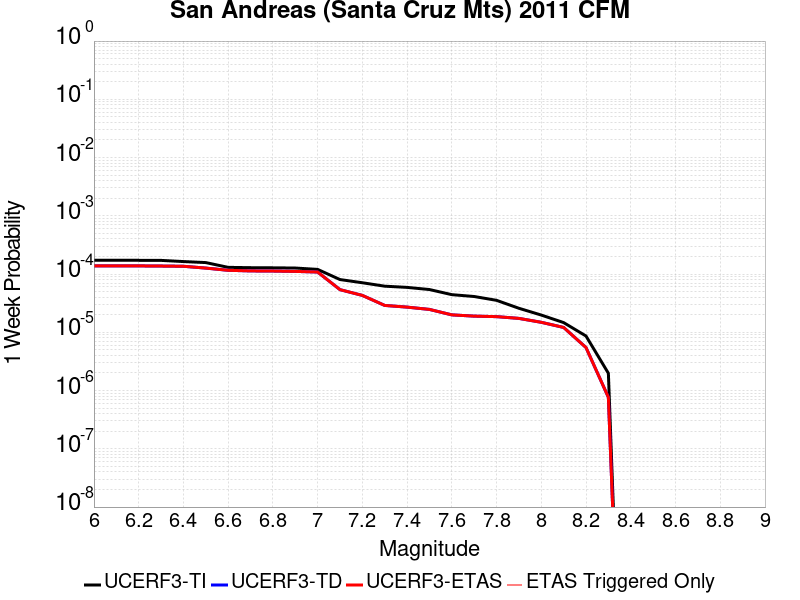 |  |  |  |

| Magnitude | 1 wk TI Prob | 1 wk TD Prob | 1 wk ETAS Prob | 1 wk ETAS/TD Gain | 1 wk ETAS Triggered Only | 1 mo TI Prob | 1 mo TD Prob | 1 mo ETAS Prob | 1 mo ETAS/TD Gain | 1 mo ETAS Triggered Only | 1 yr TI Prob | 1 yr TD Prob | 1 yr ETAS Prob | 1 yr ETAS/TD Gain | 1 yr ETAS Triggered Only | 10 yr TI Prob | 10 yr TD Prob | 10 yr ETAS Prob | 10 yr ETAS/TD Gain | 10 yr ETAS Triggered Only |
|-----|-----|-----|-----|-----|-----|-----|-----|-----|-----|-----|-----|-----|-----|-----|-----|-----|-----|-----|-----|-----|
| 6.0 | 1.7221631E-4 | 1.380927E-4 | 1.380927E-4 | 1.0 | 0.0 | 7.378611E-4 | 5.916937E-4 | 6.0168776E-4 | 1.0168906 | 1.0E-5 | 0.008946515 | 0.007180466 | 0.007190394 | 1.0013827 | 1.0E-5 | 0.08594794 | 0.07062826 | 0.070646845 | 1.0002632 | 2.0E-5 |
| 6.1 | 1.7221631E-4 | 1.380927E-4 | 1.380927E-4 | 1.0 | 0.0 | 7.378611E-4 | 5.916937E-4 | 6.0168776E-4 | 1.0168906 | 1.0E-5 | 0.008946515 | 0.007180466 | 0.007190394 | 1.0013827 | 1.0E-5 | 0.08594794 | 0.07062826 | 0.070646845 | 1.0002632 | 2.0E-5 |
| 6.2 | 1.7221631E-4 | 1.380927E-4 | 1.380927E-4 | 1.0 | 0.0 | 7.378611E-4 | 5.916937E-4 | 6.0168776E-4 | 1.0168906 | 1.0E-5 | 0.008946515 | 0.007180466 | 0.007190394 | 1.0013827 | 1.0E-5 | 0.08594794 | 0.07062826 | 0.070646845 | 1.0002632 | 2.0E-5 |
| 6.3 | 1.716926E-4 | 1.3728687E-4 | 1.3728687E-4 | 1.0 | 0.0 | 7.3561794E-4 | 5.882417E-4 | 5.982358E-4 | 1.0169898 | 1.0E-5 | 0.008919428 | 0.0071387133 | 0.0071486416 | 1.0013908 | 1.0E-5 | 0.08569809 | 0.07024037 | 0.07025897 | 1.0002648 | 2.0E-5 |
| 6.4 | 1.6392978E-4 | 1.3604353E-4 | 1.3604353E-4 | 1.0 | 0.0 | 7.02367E-4 | 5.8291544E-4 | 5.9290964E-4 | 1.0171452 | 1.0E-5 | 0.008517839 | 0.007074288 | 0.0070842174 | 1.0014036 | 1.0E-5 | 0.08198654 | 0.06947319 | 0.0694918 | 1.0002679 | 2.0E-5 |
| 6.5 | 1.5742714E-4 | 1.2663973E-4 | 1.2663973E-4 | 1.0 | 0.0 | 6.745133E-4 | 5.426305E-4 | 5.526251E-4 | 1.0184188 | 1.0E-5 | 0.00818132 | 0.0065868394 | 0.0065967734 | 1.0015082 | 1.0E-5 | 0.078865945 | 0.06493405 | 0.06495275 | 1.000288 | 2.0E-5 |
| 6.6 | 1.3038084E-4 | 1.16030504E-4 | 1.16030504E-4 | 1.0 | 0.0 | 5.5865536E-4 | 4.971801E-4 | 5.0717517E-4 | 1.0201035 | 1.0E-5 | 0.006780438 | 0.00603661 | 0.0060465494 | 1.0016465 | 1.0E-5 | 0.0657725 | 0.0593941 | 0.05941291 | 1.0003167 | 2.0E-5 |
| 6.7 | 1.2867592E-4 | 1.1329468E-4 | 1.1329468E-4 | 1.0 | 0.0 | 5.5135164E-4 | 4.8545955E-4 | 4.954547E-4 | 1.020589 | 1.0E-5 | 0.0066920654 | 0.0058946917 | 0.0059046326 | 1.0016865 | 1.0E-5 | 0.06494093 | 0.05810493 | 0.058123767 | 1.0003242 | 2.0E-5 |
| 6.8 | 1.2801298E-4 | 1.126701E-4 | 1.126701E-4 | 1.0 | 0.0 | 5.485117E-4 | 4.827838E-4 | 4.9277896E-4 | 1.0207032 | 1.0E-5 | 0.0066577005 | 0.0058622905 | 0.005872232 | 1.0016959 | 1.0E-5 | 0.06461738 | 0.05781873 | 0.057837572 | 1.0003259 | 2.0E-5 |
| 6.9 | 1.269149E-4 | 1.11091336E-4 | 1.11091336E-4 | 1.0 | 0.0 | 5.4380763E-4 | 4.7602013E-4 | 4.8601537E-4 | 1.0209975 | 1.0E-5 | 0.006600777 | 0.0057803825 | 0.005790325 | 1.00172 | 1.0E-5 | 0.06408122 | 0.057090286 | 0.057109144 | 1.0003303 | 2.0E-5 |
| 7.0 | 1.2030331E-4 | 1.08390355E-4 | 1.08390355E-4 | 1.0 | 0.0 | 5.154837E-4 | 4.6444868E-4 | 4.7444404E-4 | 1.0215209 | 1.0E-5 | 0.006257969 | 0.0056402376 | 0.0056501813 | 1.001763 | 1.0E-5 | 0.06084648 | 0.055762175 | 0.05578106 | 1.0003387 | 2.0E-5 |
| 7.1 | 8.049617E-5 | 5.4021923E-5 | 5.4021923E-5 | 1.0 | 0.0 | 3.4493793E-4 | 2.3150218E-4 | 2.3150218E-4 | 1.0 | 0.0 | 0.0041915346 | 0.002814931 | 0.002814931 | 1.0 | 0.0 | 0.041133516 | 0.029665241 | 0.029665241 | 1.0 | 0.0 |
| 7.2 | 7.093979E-5 | 4.301944E-5 | 4.301944E-5 | 1.0 | 0.0 | 3.0399222E-4 | 1.8435613E-4 | 1.8435613E-4 | 1.0 | 0.0 | 0.0036948253 | 0.0022422483 | 0.0022422483 | 1.0 | 0.0 | 0.03633994 | 0.023981791 | 0.023981791 | 1.0 | 0.0 |
| 7.3 | 6.193693E-5 | 2.8952954E-5 | 2.8952954E-5 | 1.0 | 0.0 | 2.6541698E-4 | 1.240782E-4 | 1.240782E-4 | 1.0 | 0.0 | 0.0032266637 | 0.001509607 | 0.001509607 | 1.0 | 0.0 | 0.031802133 | 0.016529797 | 0.016529797 | 1.0 | 0.0 |
| 7.4 | 5.906492E-5 | 2.7075883E-5 | 2.7075883E-5 | 1.0 | 0.0 | 2.5311083E-4 | 1.16034345E-4 | 1.16034345E-4 | 1.0 | 0.0 | 0.0030772698 | 0.001411804 | 0.001411804 | 1.0 | 0.0 | 0.030350044 | 0.015498643 | 0.015498643 | 1.0 | 0.0 |
| 7.5 | 5.424296E-5 | 2.4721901E-5 | 2.4721901E-5 | 1.0 | 0.0 | 2.324491E-4 | 1.0594671E-4 | 1.0594671E-4 | 1.0 | 0.0 | 0.002826395 | 0.0012891392 | 0.0012891392 | 1.0 | 0.0 | 0.027907165 | 0.014186434 | 0.014186434 | 1.0 | 0.0 |
| 7.6 | 4.43084E-5 | 1.993108E-5 | 1.993108E-5 | 1.0 | 0.0 | 1.8987931E-4 | 8.541612E-5 | 8.541612E-5 | 1.0 | 0.0 | 0.0023093296 | 0.0010394453 | 0.0010394453 | 1.0 | 0.0 | 0.022854783 | 0.011427196 | 0.011427196 | 1.0 | 0.0 |
| 7.7 | 4.118098E-5 | 1.8961262E-5 | 1.8961262E-5 | 1.0 | 0.0 | 1.7647797E-4 | 8.126002E-5 | 8.126002E-5 | 1.0 | 0.0 | 0.002146502 | 9.888919E-4 | 9.888919E-4 | 1.0 | 0.0 | 0.021258866 | 0.010883939 | 0.010883939 | 1.0 | 0.0 |
| 7.8 | 3.5408906E-5 | 1.8588367E-5 | 1.8588367E-5 | 1.0 | 0.0 | 1.5174363E-4 | 7.9662E-5 | 7.9662E-5 | 1.0 | 0.0 | 0.0018459131 | 9.694535E-4 | 9.694535E-4 | 1.0 | 0.0 | 0.018306552 | 0.010664909 | 0.010664909 | 1.0 | 0.0 |
| 7.9 | 2.5860836E-5 | 1.7337296E-5 | 1.7337296E-5 | 1.0 | 0.0 | 1.10827445E-4 | 7.430058E-5 | 7.430058E-5 | 1.0 | 0.0 | 0.001348489 | 9.0423436E-4 | 9.0423436E-4 | 1.0 | 0.0 | 0.013403354 | 0.009918882 | 0.009918882 | 1.0 | 0.0 |
| 8.0 | 1.9777332E-5 | 1.4857938E-5 | 1.4857938E-5 | 1.0 | 0.0 | 8.4757245E-5 | 6.3675325E-5 | 6.3675325E-5 | 1.0 | 0.0 | 0.0010314309 | 7.7497156E-4 | 7.7497156E-4 | 1.0 | 0.0 | 0.010266567 | 0.008518692 | 0.008518692 | 1.0 | 0.0 |
| 8.1 | 1.468494E-5 | 1.2122425E-5 | 1.2122425E-5 | 1.0 | 0.0 | 6.293394E-5 | 5.1952215E-5 | 5.1952215E-5 | 1.0 | 0.0 | 7.6595135E-4 | 6.3233485E-4 | 6.3233485E-4 | 1.0 | 0.0 | 0.0076331664 | 0.0069771605 | 0.0069771605 | 1.0 | 0.0 |
| 8.2 | 8.63836E-6 | 5.4768943E-6 | 5.4768943E-6 | 1.0 | 0.0 | 3.7021015E-5 | 2.3472194E-5 | 2.3472194E-5 | 1.0 | 0.0 | 4.5063766E-4 | 2.8573655E-4 | 2.8573655E-4 | 1.0 | 0.0 | 0.004497249 | 0.0032499712 | 0.0032499712 | 1.0 | 0.0 |
| 8.3 | 1.983087E-6 | 7.6730925E-7 | 7.6730925E-7 | 1.0 | 0.0 | 8.498917E-6 | 3.288464E-6 | 3.288464E-6 | 1.0 | 0.0 | 1.034694E-4 | 4.003633E-5 | 4.003633E-5 | 1.0 | 0.0 | 0.0010342124 | 4.7272502E-4 | 4.7272502E-4 | 1.0 | 0.0 |

## San Luis Range 2011 CFM
*[(top)](#table-of-contents)*

| 1 Week | 1 Month | 1 Year | 10 Year |
|-----|-----|-----|-----|
|  |  |  |  |

| Magnitude | 1 wk TI Prob | 1 wk TD Prob | 1 wk ETAS Prob | 1 wk ETAS/TD Gain | 1 wk ETAS Triggered Only | 1 mo TI Prob | 1 mo TD Prob | 1 mo ETAS Prob | 1 mo ETAS/TD Gain | 1 mo ETAS Triggered Only | 1 yr TI Prob | 1 yr TD Prob | 1 yr ETAS Prob | 1 yr ETAS/TD Gain | 1 yr ETAS Triggered Only | 10 yr TI Prob | 10 yr TD Prob | 10 yr ETAS Prob | 10 yr ETAS/TD Gain | 10 yr ETAS Triggered Only |
|-----|-----|-----|-----|-----|-----|-----|-----|-----|-----|-----|-----|-----|-----|-----|-----|-----|-----|-----|-----|-----|
| 6.0 | 8.8368415E-6 | 8.96549E-6 | 8.96549E-6 | 1.0 | 0.0 | 3.787163E-5 | 3.842301E-5 | 3.842301E-5 | 1.0 | 0.0 | 4.609895E-4 | 4.677076E-4 | 4.677076E-4 | 1.0 | 0.0 | 0.0046003438 | 0.0046680155 | 0.004687922 | 1.0042645 | 2.0E-5 |
| 6.1 | 8.8368415E-6 | 8.96549E-6 | 8.96549E-6 | 1.0 | 0.0 | 3.787163E-5 | 3.842301E-5 | 3.842301E-5 | 1.0 | 0.0 | 4.609895E-4 | 4.677076E-4 | 4.677076E-4 | 1.0 | 0.0 | 0.0046003438 | 0.0046680155 | 0.004687922 | 1.0042645 | 2.0E-5 |
| 6.2 | 8.8368415E-6 | 8.96549E-6 | 8.96549E-6 | 1.0 | 0.0 | 3.787163E-5 | 3.842301E-5 | 3.842301E-5 | 1.0 | 0.0 | 4.609895E-4 | 4.677076E-4 | 4.677076E-4 | 1.0 | 0.0 | 0.0046003438 | 0.0046680155 | 0.004687922 | 1.0042645 | 2.0E-5 |
| 6.3 | 8.8368415E-6 | 8.96549E-6 | 8.96549E-6 | 1.0 | 0.0 | 3.787163E-5 | 3.842301E-5 | 3.842301E-5 | 1.0 | 0.0 | 4.609895E-4 | 4.677076E-4 | 4.677076E-4 | 1.0 | 0.0 | 0.0046003438 | 0.0046680155 | 0.004687922 | 1.0042645 | 2.0E-5 |
| 6.4 | 3.9094193E-6 | 3.941219E-6 | 3.941219E-6 | 1.0 | 0.0 | 1.6754546E-5 | 1.6890832E-5 | 1.6890832E-5 | 1.0 | 0.0 | 2.039675E-4 | 2.0562674E-4 | 2.0562674E-4 | 1.0 | 0.0 | 0.0020378039 | 0.0020543935 | 0.0020743525 | 1.0097152 | 2.0E-5 |
| 6.5 | 3.9094193E-6 | 3.941219E-6 | 3.941219E-6 | 1.0 | 0.0 | 1.6754546E-5 | 1.6890832E-5 | 1.6890832E-5 | 1.0 | 0.0 | 2.039675E-4 | 2.0562674E-4 | 2.0562674E-4 | 1.0 | 0.0 | 0.0020378039 | 0.0020543935 | 0.0020743525 | 1.0097152 | 2.0E-5 |
| 6.6 | 3.0587726E-6 | 3.0754013E-6 | 3.0754013E-6 | 1.0 | 0.0 | 1.3108959E-5 | 1.3180226E-5 | 1.3180226E-5 | 1.0 | 0.0 | 1.595899E-4 | 1.6045755E-4 | 1.6045755E-4 | 1.0 | 0.0 | 0.0015947534 | 0.001603429 | 0.0016233969 | 1.0124533 | 2.0E-5 |
| 6.7 | 2.6160574E-6 | 2.625139E-6 | 2.625139E-6 | 1.0 | 0.0 | 1.1211626E-5 | 1.1250547E-5 | 1.1250547E-5 | 1.0 | 0.0 | 1.3649299E-4 | 1.3696686E-4 | 1.3696686E-4 | 1.0 | 0.0 | 0.0013640919 | 0.0013688306 | 0.0013788169 | 1.0072955 | 1.0E-5 |
| 6.8 | 2.5110312E-6 | 2.5181512E-6 | 2.5181512E-6 | 1.0 | 0.0 | 1.0761518E-5 | 1.0792032E-5 | 1.0792032E-5 | 1.0 | 0.0 | 1.310136E-4 | 1.3138512E-4 | 1.3138512E-4 | 1.0 | 0.0 | 0.0013093639 | 0.0013130804 | 0.0013230674 | 1.0076057 | 1.0E-5 |
| 6.9 | 1.8564405E-6 | 1.8524958E-6 | 1.8524958E-6 | 1.0 | 0.0 | 7.95615E-6 | 7.939244E-6 | 7.939244E-6 | 1.0 | 0.0 | 9.686181E-5 | 9.665602E-5 | 9.665602E-5 | 1.0 | 0.0 | 9.68196E-4 | 9.661419E-4 | 9.661419E-4 | 1.0 | 0.0 |
| 7.0 | 1.546127E-6 | 1.5369615E-6 | 1.5369615E-6 | 1.0 | 0.0 | 6.626242E-6 | 6.586961E-6 | 6.586961E-6 | 1.0 | 0.0 | 8.06715E-5 | 8.0193306E-5 | 8.0193306E-5 | 1.0 | 0.0 | 8.0642226E-4 | 8.0164435E-4 | 8.0164435E-4 | 1.0 | 0.0 |
| 7.1 | 1.3368208E-6 | 1.3235394E-6 | 1.3235394E-6 | 1.0 | 0.0 | 5.7292195E-6 | 5.6722993E-6 | 5.6722993E-6 | 1.0 | 0.0 | 6.975101E-5 | 6.9058064E-5 | 6.9058064E-5 | 1.0 | 0.0 | 6.972912E-4 | 6.903665E-4 | 6.903665E-4 | 1.0 | 0.0 |
| 7.2 | 1.0623363E-6 | 1.0454424E-6 | 1.0454424E-6 | 1.0 | 0.0 | 4.5528623E-6 | 4.4804597E-6 | 4.4804597E-6 | 1.0 | 0.0 | 5.5429686E-5 | 5.4548233E-5 | 5.4548233E-5 | 1.0 | 0.0 | 5.5415864E-4 | 5.4534874E-4 | 5.4534874E-4 | 1.0 | 0.0 |
| 7.3 | 7.831679E-7 | 7.727436E-7 | 7.727436E-7 | 1.0 | 0.0 | 3.3564295E-6 | 3.311754E-6 | 3.311754E-6 | 1.0 | 0.0 | 4.086376E-5 | 4.031986E-5 | 4.031986E-5 | 1.0 | 0.0 | 4.0856248E-4 | 4.0312557E-4 | 4.0312557E-4 | 1.0 | 0.0 |
| 7.4 | 5.9558846E-7 | 5.910674E-7 | 5.910674E-7 | 1.0 | 0.0 | 2.5525194E-6 | 2.5331435E-6 | 2.5331435E-6 | 1.0 | 0.0 | 3.107648E-5 | 3.0840587E-5 | 3.0840587E-5 | 1.0 | 0.0 | 3.1072134E-4 | 3.0836315E-4 | 3.0836315E-4 | 1.0 | 0.0 |
| 7.5 | 4.1616502E-7 | 4.1196617E-7 | 4.1196617E-7 | 1.0 | 0.0 | 1.7835631E-6 | 1.7655681E-6 | 1.7655681E-6 | 1.0 | 0.0 | 2.1714664E-5 | 2.149558E-5 | 2.149558E-5 | 1.0 | 0.0 | 2.1712543E-4 | 2.1493505E-4 | 2.1493505E-4 | 1.0 | 0.0 |
| 7.6 | 2.3816014E-7 | 2.3376782E-7 | 2.3376782E-7 | 1.0 | 0.0 | 1.0206859E-6 | 1.0018616E-6 | 1.0018616E-6 | 1.0 | 0.0 | 1.242678E-5 | 1.2197597E-5 | 1.2197597E-5 | 1.0 | 0.0 | 1.2426086E-4 | 1.219693E-4 | 1.219693E-4 | 1.0 | 0.0 |
| 7.7 | 9.918777E-8 | 9.386933E-8 | 9.386933E-8 | 1.0 | 0.0 | 4.2509038E-7 | 4.0229705E-7 | 4.0229705E-7 | 1.0 | 0.0 | 5.1754632E-6 | 4.8979555E-6 | 4.8979555E-6 | 1.0 | 0.0 | 5.1753424E-5 | 4.897848E-5 | 4.897848E-5 | 1.0 | 0.0 |
| 7.8 | 3.4982556E-8 | 2.9687971E-8 | 2.9687971E-8 | 1.0 | 0.0 | 1.4992524E-7 | 1.2723416E-7 | 1.2723416E-7 | 1.0 | 0.0 | 1.8253382E-6 | 1.5490748E-6 | 1.5490748E-6 | 1.0 | 0.0 | 1.8253233E-5 | 1.549064E-5 | 1.549064E-5 | 1.0 | 0.0 |
| 7.9 | 1.6624908E-8 | 1.14783285E-8 | 1.14783285E-8 | 1.0 | 0.0 | 7.12496E-8 | 4.919283E-8 | 4.919283E-8 | 1.0 | 0.0 | 8.6746354E-7 | 5.9892255E-7 | 5.9892255E-7 | 1.0 | 0.0 | 8.674601E-6 | 5.98921E-6 | 5.98921E-6 | 1.0 | 0.0 |
| 8.0 | 6.3352315E-9 | 3.0896379E-9 | 3.0896379E-9 | 1.0 | 0.0 | 2.715099E-8 | 1.3241306E-8 | 1.3241306E-8 | 1.0 | 0.0 | 3.3056327E-7 | 1.612129E-7 | 1.612129E-7 | 1.0 | 0.0 | 3.3056278E-6 | 1.6121277E-6 | 1.6121277E-6 | 1.0 | 0.0 |

## South Klamath Lake East
*[(top)](#table-of-contents)*

| 1 Week | 1 Month | 1 Year | 10 Year |
|-----|-----|-----|-----|
| 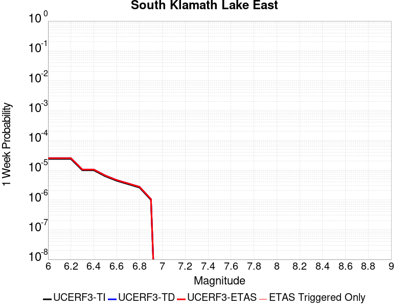 | 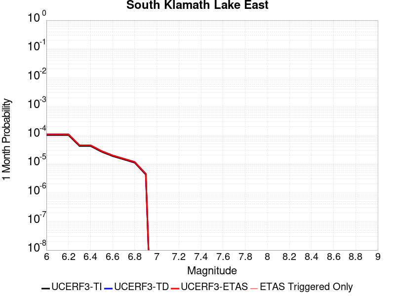 | 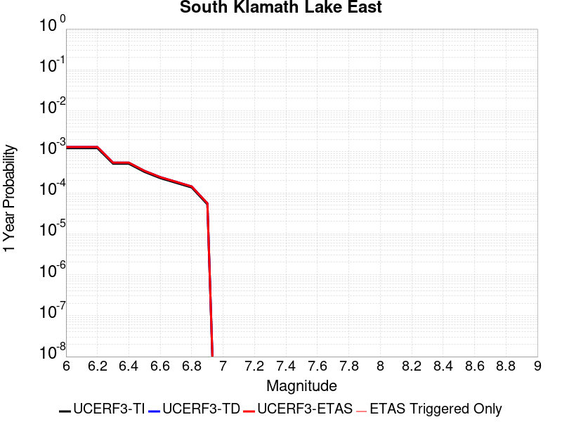 |  |

| Magnitude | 1 wk TI Prob | 1 wk TD Prob | 1 wk ETAS Prob | 1 wk ETAS/TD Gain | 1 wk ETAS Triggered Only | 1 mo TI Prob | 1 mo TD Prob | 1 mo ETAS Prob | 1 mo ETAS/TD Gain | 1 mo ETAS Triggered Only | 1 yr TI Prob | 1 yr TD Prob | 1 yr ETAS Prob | 1 yr ETAS/TD Gain | 1 yr ETAS Triggered Only | 10 yr TI Prob | 10 yr TD Prob | 10 yr ETAS Prob | 10 yr ETAS/TD Gain | 10 yr ETAS Triggered Only |
|-----|-----|-----|-----|-----|-----|-----|-----|-----|-----|-----|-----|-----|-----|-----|-----|-----|-----|-----|-----|-----|
| 6.0 | 2.3539369E-5 | 2.5047642E-5 | 2.5047642E-5 | 1.0 | 0.0 | 1.0087911E-4 | 1.0734309E-4 | 1.0734309E-4 | 1.0 | 0.0 | 0.0012275111 | 0.0013062018 | 0.0013062018 | 1.0 | 0.0 | 0.012207527 | 0.01299359 | 0.01300346 | 1.0007596 | 1.0E-5 |
| 6.1 | 2.3539369E-5 | 2.5047642E-5 | 2.5047642E-5 | 1.0 | 0.0 | 1.0087911E-4 | 1.0734309E-4 | 1.0734309E-4 | 1.0 | 0.0 | 0.0012275111 | 0.0013062018 | 0.0013062018 | 1.0 | 0.0 | 0.012207527 | 0.01299359 | 0.01300346 | 1.0007596 | 1.0E-5 |
| 6.2 | 2.3539369E-5 | 2.5047642E-5 | 2.5047642E-5 | 1.0 | 0.0 | 1.0087911E-4 | 1.0734309E-4 | 1.0734309E-4 | 1.0 | 0.0 | 0.0012275111 | 0.0013062018 | 0.0013062018 | 1.0 | 0.0 | 0.012207527 | 0.01299359 | 0.01300346 | 1.0007596 | 1.0E-5 |
| 6.3 | 9.807823E-6 | 1.0396174E-5 | 1.0396174E-5 | 1.0 | 0.0 | 4.2032847E-5 | 4.4554316E-5 | 4.4554316E-5 | 1.0 | 0.0 | 5.1162974E-4 | 5.423222E-4 | 5.423222E-4 | 1.0 | 0.0 | 0.005104534 | 0.0054108235 | 0.0054207696 | 1.0018381 | 1.0E-5 |
| 6.4 | 9.807823E-6 | 1.0396174E-5 | 1.0396174E-5 | 1.0 | 0.0 | 4.2032847E-5 | 4.4554316E-5 | 4.4554316E-5 | 1.0 | 0.0 | 5.1162974E-4 | 5.423222E-4 | 5.423222E-4 | 1.0 | 0.0 | 0.005104534 | 0.0054108235 | 0.0054207696 | 1.0018381 | 1.0E-5 |
| 6.5 | 6.191981E-6 | 6.550919E-6 | 6.550919E-6 | 1.0 | 0.0 | 2.653679E-5 | 2.8075081E-5 | 2.8075081E-5 | 1.0 | 0.0 | 3.2303753E-4 | 3.4176328E-4 | 3.4176328E-4 | 1.0 | 0.0 | 0.0032256835 | 0.003412655 | 0.003412655 | 1.0 | 0.0 |
| 6.6 | 4.3693776E-6 | 4.616612E-6 | 4.616612E-6 | 1.0 | 0.0 | 1.8725768E-5 | 1.9785335E-5 | 1.9785335E-5 | 1.0 | 0.0 | 2.2796239E-4 | 2.4086097E-4 | 2.4086097E-4 | 1.0 | 0.0 | 0.0022772867 | 0.0024061117 | 0.0024061117 | 1.0 | 0.0 |
| 6.7 | 3.360834E-6 | 3.5512821E-6 | 3.5512821E-6 | 1.0 | 0.0 | 1.4403494E-5 | 1.5219696E-5 | 1.5219696E-5 | 1.0 | 0.0 | 1.7534842E-4 | 1.8528485E-4 | 1.8528485E-4 | 1.0 | 0.0 | 0.0017521014 | 0.0018513837 | 0.0018513837 | 1.0 | 0.0 |
| 6.8 | 2.57873E-6 | 2.725203E-6 | 2.725203E-6 | 1.0 | 0.0 | 1.1051653E-5 | 1.1679393E-5 | 1.1679393E-5 | 1.0 | 0.0 | 1.3454557E-4 | 1.4218794E-4 | 1.4218794E-4 | 1.0 | 0.0 | 0.0013446413 | 0.0014210304 | 0.0014210304 | 1.0 | 0.0 |
| 6.9 | 9.987825E-7 | 1.056634E-6 | 1.056634E-6 | 1.0 | 0.0 | 4.2804895E-6 | 4.5284255E-6 | 4.5284255E-6 | 1.0 | 0.0 | 5.211371E-5 | 5.5132514E-5 | 5.5132514E-5 | 1.0 | 0.0 | 5.210149E-4 | 5.5122055E-4 | 5.5122055E-4 | 1.0 | 0.0 |

## Elysian Park (Upper)
*[(top)](#table-of-contents)*

| 1 Week | 1 Month | 1 Year | 10 Year |
|-----|-----|-----|-----|
| 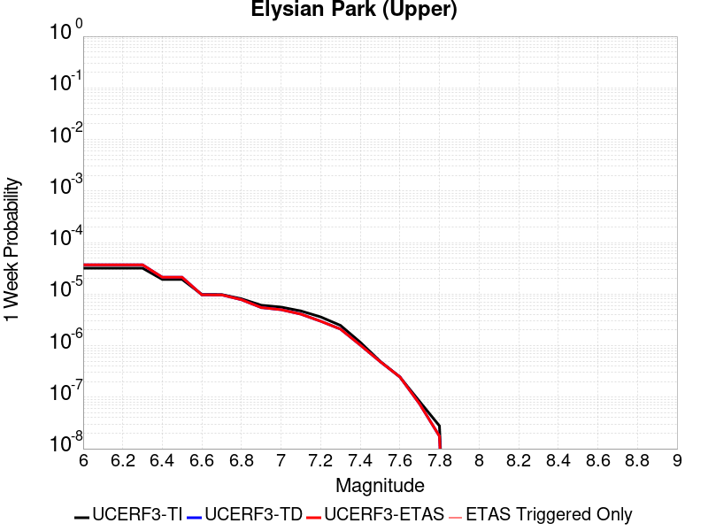 | 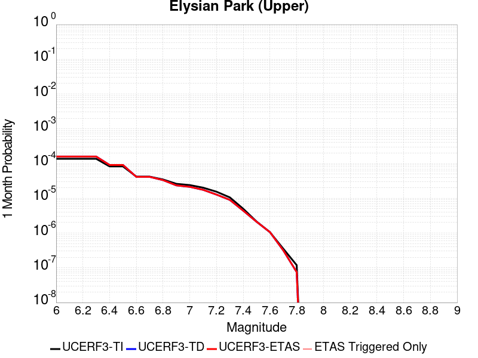 |  |  |

| Magnitude | 1 wk TI Prob | 1 wk TD Prob | 1 wk ETAS Prob | 1 wk ETAS/TD Gain | 1 wk ETAS Triggered Only | 1 mo TI Prob | 1 mo TD Prob | 1 mo ETAS Prob | 1 mo ETAS/TD Gain | 1 mo ETAS Triggered Only | 1 yr TI Prob | 1 yr TD Prob | 1 yr ETAS Prob | 1 yr ETAS/TD Gain | 1 yr ETAS Triggered Only | 10 yr TI Prob | 10 yr TD Prob | 10 yr ETAS Prob | 10 yr ETAS/TD Gain | 10 yr ETAS Triggered Only |
|-----|-----|-----|-----|-----|-----|-----|-----|-----|-----|-----|-----|-----|-----|-----|-----|-----|-----|-----|-----|-----|
| 6.0 | 3.1876025E-5 | 3.703709E-5 | 3.703709E-5 | 1.0 | 0.0 | 1.3660437E-4 | 1.5872347E-4 | 1.5872347E-4 | 1.0 | 0.0 | 0.0016618895 | 0.0019311875 | 0.0019411681 | 1.0051682 | 1.0E-5 | 0.016495159 | 0.019190587 | 0.019210203 | 1.0010222 | 2.0E-5 |
| 6.1 | 3.1876025E-5 | 3.703709E-5 | 3.703709E-5 | 1.0 | 0.0 | 1.3660437E-4 | 1.5872347E-4 | 1.5872347E-4 | 1.0 | 0.0 | 0.0016618895 | 0.0019311875 | 0.0019411681 | 1.0051682 | 1.0E-5 | 0.016495159 | 0.019190587 | 0.019210203 | 1.0010222 | 2.0E-5 |
| 6.2 | 3.1876025E-5 | 3.703709E-5 | 3.703709E-5 | 1.0 | 0.0 | 1.3660437E-4 | 1.5872347E-4 | 1.5872347E-4 | 1.0 | 0.0 | 0.0016618895 | 0.0019311875 | 0.0019411681 | 1.0051682 | 1.0E-5 | 0.016495159 | 0.019190587 | 0.019210203 | 1.0010222 | 2.0E-5 |
| 6.3 | 3.1876025E-5 | 3.703709E-5 | 3.703709E-5 | 1.0 | 0.0 | 1.3660437E-4 | 1.5872347E-4 | 1.5872347E-4 | 1.0 | 0.0 | 0.0016618895 | 0.0019311875 | 0.0019411681 | 1.0051682 | 1.0E-5 | 0.016495159 | 0.019190587 | 0.019210203 | 1.0010222 | 2.0E-5 |
| 6.4 | 1.9273462E-5 | 2.1202997E-5 | 2.1202997E-5 | 1.0 | 0.0 | 8.259794E-5 | 9.08678E-5 | 9.08678E-5 | 1.0 | 0.0 | 0.001005166 | 0.0011059274 | 0.0011159163 | 1.0090321 | 1.0E-5 | 0.010006315 | 0.011021101 | 0.011030991 | 1.0008974 | 1.0E-5 |
| 6.5 | 1.9273462E-5 | 2.1202997E-5 | 2.1202997E-5 | 1.0 | 0.0 | 8.259794E-5 | 9.08678E-5 | 9.08678E-5 | 1.0 | 0.0 | 0.001005166 | 0.0011059274 | 0.0011159163 | 1.0090321 | 1.0E-5 | 0.010006315 | 0.011021101 | 0.011030991 | 1.0008974 | 1.0E-5 |
| 6.6 | 9.813258E-6 | 9.665801E-6 | 9.665801E-6 | 1.0 | 0.0 | 4.205614E-5 | 4.1424246E-5 | 4.1424246E-5 | 1.0 | 0.0 | 5.119132E-4 | 5.0423073E-4 | 5.142257E-4 | 1.0198222 | 1.0E-5 | 0.005107356 | 0.0050315903 | 0.00504154 | 1.0019774 | 1.0E-5 |
| 6.7 | 9.801478E-6 | 9.653371E-6 | 9.653371E-6 | 1.0 | 0.0 | 4.2005657E-5 | 4.1370975E-5 | 4.1370975E-5 | 1.0 | 0.0 | 5.112989E-4 | 5.035825E-4 | 5.135774E-4 | 1.0198478 | 1.0E-5 | 0.0051012407 | 0.0050251368 | 0.0050350865 | 1.00198 | 1.0E-5 |
| 6.8 | 8.102489E-6 | 7.773165E-6 | 7.773165E-6 | 1.0 | 0.0 | 3.4724493E-5 | 3.331317E-5 | 3.331317E-5 | 1.0 | 0.0 | 4.2268867E-4 | 4.055173E-4 | 4.1551323E-4 | 1.0246499 | 1.0E-5 | 0.004218856 | 0.0040482674 | 0.004058227 | 1.0024602 | 1.0E-5 |
| 6.9 | 6.08275E-6 | 5.481548E-6 | 5.481548E-6 | 1.0 | 0.0 | 2.6068668E-5 | 2.349214E-5 | 2.349214E-5 | 1.0 | 0.0 | 3.173398E-4 | 2.8598006E-4 | 2.959772E-4 | 1.0349575 | 1.0E-5 | 0.0031688702 | 0.002856198 | 0.0028661694 | 1.0034912 | 1.0E-5 |
| 7.0 | 5.5995934E-6 | 4.9828673E-6 | 4.9828673E-6 | 1.0 | 0.0 | 2.3998036E-5 | 2.1354976E-5 | 2.1354976E-5 | 1.0 | 0.0 | 2.9213692E-4 | 2.5996647E-4 | 2.6996387E-4 | 1.0384564 | 1.0E-5 | 0.0029175316 | 0.0025966908 | 0.002606665 | 1.003841 | 1.0E-5 |
| 7.1 | 4.709881E-6 | 4.0874725E-6 | 4.0874725E-6 | 1.0 | 0.0 | 2.0185047E-5 | 1.7517625E-5 | 1.7517625E-5 | 1.0 | 0.0 | 2.4572524E-4 | 2.1325662E-4 | 2.1325662E-4 | 1.0 | 0.0 | 0.002454537 | 0.002130561 | 0.002130561 | 1.0 | 0.0 |
| 7.2 | 3.6063436E-6 | 2.9780049E-6 | 2.9780049E-6 | 1.0 | 0.0 | 1.5455667E-5 | 1.2762816E-5 | 1.2762816E-5 | 1.0 | 0.0 | 1.881565E-4 | 1.5537631E-4 | 1.5537631E-4 | 1.0 | 0.0 | 0.0018799726 | 0.0015526881 | 0.0015526881 | 1.0 | 0.0 |
| 7.3 | 2.471135E-6 | 2.0954972E-6 | 2.0954972E-6 | 1.0 | 0.0 | 1.0590536E-5 | 8.980671E-6 | 8.980671E-6 | 1.0 | 0.0 | 1.2893214E-4 | 1.0933426E-4 | 1.0933426E-4 | 1.0 | 0.0 | 0.0012885736 | 0.0010928119 | 0.0010928119 | 1.0 | 0.0 |
| 7.4 | 1.163943E-6 | 1.0275281E-6 | 1.0275281E-6 | 1.0 | 0.0 | 4.988318E-6 | 4.4036847E-6 | 4.4036847E-6 | 1.0 | 0.0 | 6.0731076E-5 | 5.361357E-5 | 5.361357E-5 | 1.0 | 0.0 | 6.071448E-4 | 5.360093E-4 | 5.360093E-4 | 1.0 | 0.0 |
| 7.5 | 4.99459E-7 | 4.917693E-7 | 4.917693E-7 | 1.0 | 0.0 | 2.140537E-6 | 2.107581E-6 | 2.107581E-6 | 1.0 | 0.0 | 2.6060725E-5 | 2.5659512E-5 | 2.5659512E-5 | 1.0 | 0.0 | 2.605767E-4 | 2.5656706E-4 | 2.5656706E-4 | 1.0 | 0.0 |
| 7.6 | 2.4667852E-7 | 2.477887E-7 | 2.477887E-7 | 1.0 | 0.0 | 1.0571932E-6 | 1.0619511E-6 | 1.0619511E-6 | 1.0 | 0.0 | 1.2871251E-5 | 1.2929182E-5 | 1.2929182E-5 | 1.0 | 0.0 | 1.2870505E-4 | 1.2928467E-4 | 1.2928467E-4 | 1.0 | 0.0 |
| 7.7 | 8.2312795E-8 | 7.386734E-8 | 7.386734E-8 | 1.0 | 0.0 | 3.527691E-7 | 3.1657427E-7 | 3.1657427E-7 | 1.0 | 0.0 | 4.294955E-6 | 3.854286E-6 | 3.854286E-6 | 1.0 | 0.0 | 4.2948723E-5 | 3.8542308E-5 | 3.8542308E-5 | 1.0 | 0.0 |
| 7.8 | 2.7819295E-8 | 1.7568064E-8 | 1.7568064E-8 | 1.0 | 0.0 | 1.1922555E-7 | 7.52917E-8 | 7.52917E-8 | 1.0 | 0.0 | 1.45157E-6 | 9.1667624E-7 | 9.1667624E-7 | 1.0 | 0.0 | 1.45156055E-5 | 9.166739E-6 | 9.166739E-6 | 1.0 | 0.0 |

## Breckenridge 2011
*[(top)](#table-of-contents)*

| 1 Week | 1 Month | 1 Year | 10 Year |
|-----|-----|-----|-----|
| 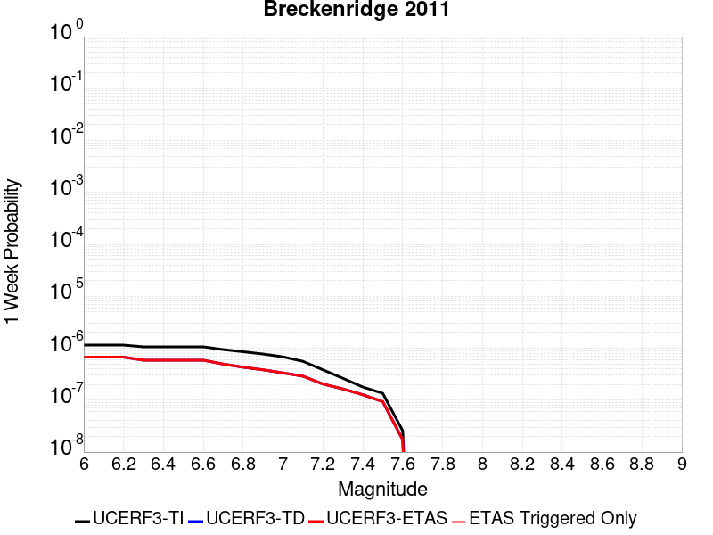 |  |  | 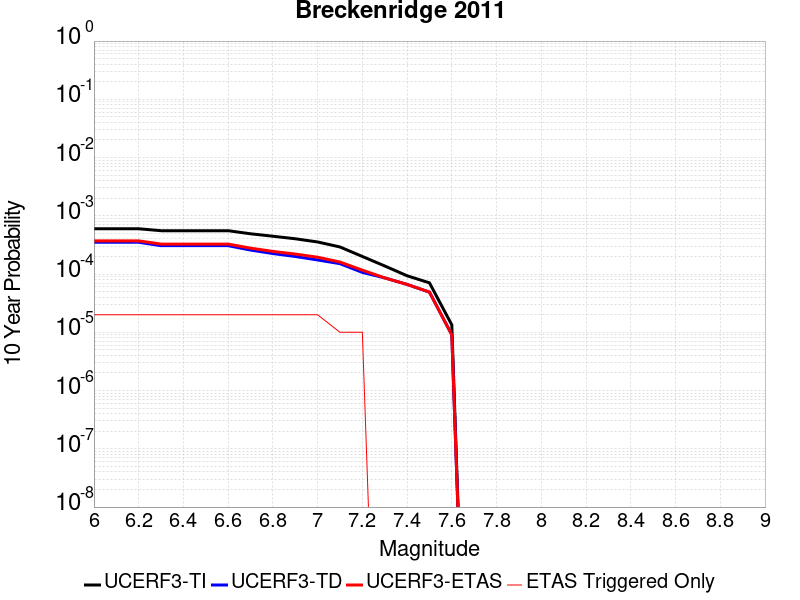 |

| Magnitude | 1 wk TI Prob | 1 wk TD Prob | 1 wk ETAS Prob | 1 wk ETAS/TD Gain | 1 wk ETAS Triggered Only | 1 mo TI Prob | 1 mo TD Prob | 1 mo ETAS Prob | 1 mo ETAS/TD Gain | 1 mo ETAS Triggered Only | 1 yr TI Prob | 1 yr TD Prob | 1 yr ETAS Prob | 1 yr ETAS/TD Gain | 1 yr ETAS Triggered Only | 10 yr TI Prob | 10 yr TD Prob | 10 yr ETAS Prob | 10 yr ETAS/TD Gain | 10 yr ETAS Triggered Only |
|-----|-----|-----|-----|-----|-----|-----|-----|-----|-----|-----|-----|-----|-----|-----|-----|-----|-----|-----|-----|-----|
| 6.0 | 1.1490393E-6 | 6.738134E-7 | 6.738134E-7 | 1.0 | 0.0 | 4.924445E-6 | 2.8877687E-6 | 2.8877687E-6 | 1.0 | 0.0 | 5.995347E-5 | 3.515804E-5 | 5.5157336E-5 | 1.5688399 | 2.0E-5 | 5.9937296E-4 | 3.515268E-4 | 3.7151977E-4 | 1.0568746 | 2.0E-5 |
| 6.1 | 1.1490393E-6 | 6.738134E-7 | 6.738134E-7 | 1.0 | 0.0 | 4.924445E-6 | 2.8877687E-6 | 2.8877687E-6 | 1.0 | 0.0 | 5.995347E-5 | 3.515804E-5 | 5.5157336E-5 | 1.5688399 | 2.0E-5 | 5.9937296E-4 | 3.515268E-4 | 3.7151977E-4 | 1.0568746 | 2.0E-5 |
| 6.2 | 1.1490393E-6 | 6.738134E-7 | 6.738134E-7 | 1.0 | 0.0 | 4.924445E-6 | 2.8877687E-6 | 2.8877687E-6 | 1.0 | 0.0 | 5.995347E-5 | 3.515804E-5 | 5.5157336E-5 | 1.5688399 | 2.0E-5 | 5.9937296E-4 | 3.515268E-4 | 3.7151977E-4 | 1.0568746 | 2.0E-5 |
| 6.3 | 1.064617E-6 | 5.8865305E-7 | 5.8865305E-7 | 1.0 | 0.0 | 4.5626366E-6 | 2.5227964E-6 | 2.5227964E-6 | 1.0 | 0.0 | 5.5548684E-5 | 3.0714626E-5 | 5.071401E-5 | 1.6511356 | 2.0E-5 | 5.55348E-4 | 3.0710496E-4 | 3.2709882E-4 | 1.0651044 | 2.0E-5 |
| 6.4 | 1.064617E-6 | 5.8865305E-7 | 5.8865305E-7 | 1.0 | 0.0 | 4.5626366E-6 | 2.5227964E-6 | 2.5227964E-6 | 1.0 | 0.0 | 5.5548684E-5 | 3.0714626E-5 | 5.071401E-5 | 1.6511356 | 2.0E-5 | 5.55348E-4 | 3.0710496E-4 | 3.2709882E-4 | 1.0651044 | 2.0E-5 |
| 6.5 | 1.064617E-6 | 5.8865305E-7 | 5.8865305E-7 | 1.0 | 0.0 | 4.5626366E-6 | 2.5227964E-6 | 2.5227964E-6 | 1.0 | 0.0 | 5.5548684E-5 | 3.0714626E-5 | 5.071401E-5 | 1.6511356 | 2.0E-5 | 5.55348E-4 | 3.0710496E-4 | 3.2709882E-4 | 1.0651044 | 2.0E-5 |
| 6.6 | 1.064617E-6 | 5.8865305E-7 | 5.8865305E-7 | 1.0 | 0.0 | 4.5626366E-6 | 2.5227964E-6 | 2.5227964E-6 | 1.0 | 0.0 | 5.5548684E-5 | 3.0714626E-5 | 5.071401E-5 | 1.6511356 | 2.0E-5 | 5.55348E-4 | 3.0710496E-4 | 3.2709882E-4 | 1.0651044 | 2.0E-5 |
| 6.7 | 9.4219524E-7 | 4.9541256E-7 | 4.9541256E-7 | 1.0 | 0.0 | 4.037973E-6 | 2.123195E-6 | 2.123195E-6 | 1.0 | 0.0 | 4.916122E-5 | 2.5849598E-5 | 4.5849083E-5 | 1.7736864 | 2.0E-5 | 4.9150345E-4 | 2.5846658E-4 | 2.784614E-4 | 1.0773594 | 2.0E-5 |
| 6.8 | 8.556422E-7 | 4.3120187E-7 | 4.3120187E-7 | 1.0 | 0.0 | 3.667033E-6 | 1.8480067E-6 | 1.8480067E-6 | 1.0 | 0.0 | 4.464521E-5 | 2.2499253E-5 | 4.2498803E-5 | 1.8888984 | 2.0E-5 | 4.4636242E-4 | 2.2497015E-4 | 2.4496566E-4 | 1.0888807 | 2.0E-5 |
| 6.9 | 7.7357794E-7 | 3.8420737E-7 | 3.8420737E-7 | 1.0 | 0.0 | 3.3153299E-6 | 1.646602E-6 | 1.646602E-6 | 1.0 | 0.0 | 4.0363393E-5 | 2.0047197E-5 | 4.0046798E-5 | 1.9976257 | 2.0E-5 | 4.035606E-4 | 2.0045419E-4 | 2.2045018E-4 | 1.0997534 | 2.0E-5 |
| 7.0 | 6.8172454E-7 | 3.3471758E-7 | 3.3471758E-7 | 1.0 | 0.0 | 2.9216735E-6 | 1.4345031E-6 | 1.4345031E-6 | 1.0 | 0.0 | 3.5570793E-5 | 1.7464938E-5 | 3.746459E-5 | 2.1451316 | 2.0E-5 | 3.55651E-4 | 1.7463588E-4 | 1.9463239E-4 | 1.114504 | 2.0E-5 |
| 7.1 | 5.5936397E-7 | 2.8909926E-7 | 2.8909926E-7 | 1.0 | 0.0 | 2.397272E-6 | 1.2389962E-6 | 1.2389962E-6 | 1.0 | 0.0 | 2.9186394E-5 | 1.5084676E-5 | 2.5084526E-5 | 1.6629144 | 1.0E-5 | 2.9182562E-4 | 1.508367E-4 | 1.608352E-4 | 1.0662868 | 1.0E-5 |
| 7.2 | 3.8420822E-7 | 2.0468521E-7 | 2.0468521E-7 | 1.0 | 0.0 | 1.6466057E-6 | 8.77222E-7 | 8.77222E-7 | 1.0 | 0.0 | 2.004724E-5 | 1.0680127E-5 | 2.068002E-5 | 1.9363085 | 1.0E-5 | 2.004543E-4 | 1.0679622E-4 | 1.16795156E-4 | 1.0936263 | 1.0E-5 |
| 7.3 | 2.6405158E-7 | 1.6473358E-7 | 1.6473358E-7 | 1.0 | 0.0 | 1.1316491E-6 | 7.0600083E-7 | 7.0600083E-7 | 1.0 | 0.0 | 1.37777415E-5 | 8.595527E-6 | 8.595527E-6 | 1.0 | 0.0 | 1.3776887E-4 | 8.5952015E-5 | 8.5952015E-5 | 1.0 | 0.0 |
| 7.4 | 1.792114E-7 | 1.2725404E-7 | 1.2725404E-7 | 1.0 | 0.0 | 7.6804866E-7 | 5.4537435E-7 | 5.4537435E-7 | 1.0 | 0.0 | 9.3509525E-6 | 6.639913E-6 | 6.639913E-6 | 1.0 | 0.0 | 9.350559E-5 | 6.6397195E-5 | 6.6397195E-5 | 1.0 | 0.0 |
| 7.5 | 1.3548703E-7 | 9.385472E-8 | 9.385472E-8 | 1.0 | 0.0 | 5.8065854E-7 | 4.0223446E-7 | 4.0223446E-7 | 1.0 | 0.0 | 7.0694946E-6 | 4.897194E-6 | 4.897194E-6 | 1.0 | 0.0 | 7.0692695E-5 | 4.8970895E-5 | 4.8970895E-5 | 1.0 | 0.0 |
| 7.6 | 2.572245E-8 | 1.7352685E-8 | 1.7352685E-8 | 1.0 | 0.0 | 1.10239064E-7 | 7.436864E-8 | 7.436864E-8 | 1.0 | 0.0 | 1.3421597E-6 | 9.054379E-7 | 9.054379E-7 | 1.0 | 0.0 | 1.3421517E-5 | 9.054348E-6 | 9.054348E-6 | 1.0 | 0.0 |

## Puente Hills
*[(top)](#table-of-contents)*

| 1 Week | 1 Month | 1 Year | 10 Year |
|-----|-----|-----|-----|
| 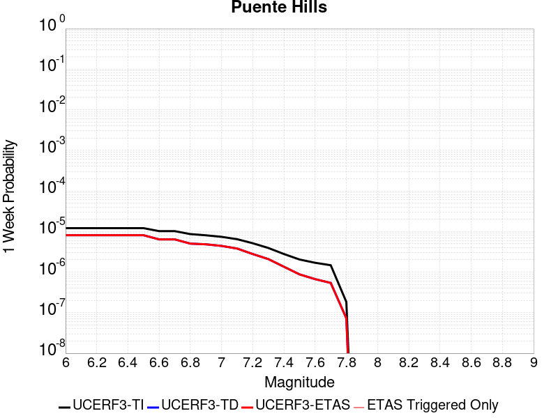 |  |  |  |

| Magnitude | 1 wk TI Prob | 1 wk TD Prob | 1 wk ETAS Prob | 1 wk ETAS/TD Gain | 1 wk ETAS Triggered Only | 1 mo TI Prob | 1 mo TD Prob | 1 mo ETAS Prob | 1 mo ETAS/TD Gain | 1 mo ETAS Triggered Only | 1 yr TI Prob | 1 yr TD Prob | 1 yr ETAS Prob | 1 yr ETAS/TD Gain | 1 yr ETAS Triggered Only | 10 yr TI Prob | 10 yr TD Prob | 10 yr ETAS Prob | 10 yr ETAS/TD Gain | 10 yr ETAS Triggered Only |
|-----|-----|-----|-----|-----|-----|-----|-----|-----|-----|-----|-----|-----|-----|-----|-----|-----|-----|-----|-----|-----|
| 6.0 | 1.2101656E-5 | 8.098876E-6 | 8.098876E-6 | 1.0 | 0.0 | 5.1863204E-5 | 3.4709035E-5 | 3.4709035E-5 | 1.0 | 0.0 | 6.312516E-4 | 4.2250621E-4 | 4.2250621E-4 | 1.0 | 0.0 | 0.0062946146 | 0.0042175897 | 0.004237505 | 1.004722 | 2.0E-5 |
| 6.1 | 1.2101656E-5 | 8.098876E-6 | 8.098876E-6 | 1.0 | 0.0 | 5.1863204E-5 | 3.4709035E-5 | 3.4709035E-5 | 1.0 | 0.0 | 6.312516E-4 | 4.2250621E-4 | 4.2250621E-4 | 1.0 | 0.0 | 0.0062946146 | 0.0042175897 | 0.004237505 | 1.004722 | 2.0E-5 |
| 6.2 | 1.2101656E-5 | 8.098876E-6 | 8.098876E-6 | 1.0 | 0.0 | 5.1863204E-5 | 3.4709035E-5 | 3.4709035E-5 | 1.0 | 0.0 | 6.312516E-4 | 4.2250621E-4 | 4.2250621E-4 | 1.0 | 0.0 | 0.0062946146 | 0.0042175897 | 0.004237505 | 1.004722 | 2.0E-5 |
| 6.3 | 1.2101656E-5 | 8.098876E-6 | 8.098876E-6 | 1.0 | 0.0 | 5.1863204E-5 | 3.4709035E-5 | 3.4709035E-5 | 1.0 | 0.0 | 6.312516E-4 | 4.2250621E-4 | 4.2250621E-4 | 1.0 | 0.0 | 0.0062946146 | 0.0042175897 | 0.004237505 | 1.004722 | 2.0E-5 |
| 6.4 | 1.2101656E-5 | 8.098876E-6 | 8.098876E-6 | 1.0 | 0.0 | 5.1863204E-5 | 3.4709035E-5 | 3.4709035E-5 | 1.0 | 0.0 | 6.312516E-4 | 4.2250621E-4 | 4.2250621E-4 | 1.0 | 0.0 | 0.0062946146 | 0.0042175897 | 0.004237505 | 1.004722 | 2.0E-5 |
| 6.5 | 1.2101656E-5 | 8.098876E-6 | 8.098876E-6 | 1.0 | 0.0 | 5.1863204E-5 | 3.4709035E-5 | 3.4709035E-5 | 1.0 | 0.0 | 6.312516E-4 | 4.2250621E-4 | 4.2250621E-4 | 1.0 | 0.0 | 0.0062946146 | 0.0042175897 | 0.004237505 | 1.004722 | 2.0E-5 |
| 6.6 | 1.0222488E-5 | 6.3994107E-6 | 6.3994107E-6 | 1.0 | 0.0 | 4.3809923E-5 | 2.7425773E-5 | 2.7425773E-5 | 1.0 | 0.0 | 5.332553E-4 | 3.3386008E-4 | 3.3386008E-4 | 1.0 | 0.0 | 0.0053197746 | 0.0033338303 | 0.0033338303 | 1.0 | 0.0 |
| 6.7 | 1.0222488E-5 | 6.3994107E-6 | 6.3994107E-6 | 1.0 | 0.0 | 4.3809923E-5 | 2.7425773E-5 | 2.7425773E-5 | 1.0 | 0.0 | 5.332553E-4 | 3.3386008E-4 | 3.3386008E-4 | 1.0 | 0.0 | 0.0053197746 | 0.0033338303 | 0.0033338303 | 1.0 | 0.0 |
| 6.8 | 8.6367845E-6 | 5.028453E-6 | 5.028453E-6 | 1.0 | 0.0 | 3.7014266E-5 | 2.1550339E-5 | 2.1550339E-5 | 1.0 | 0.0 | 4.505555E-4 | 2.623443E-4 | 2.623443E-4 | 1.0 | 0.0 | 0.004496431 | 0.0026204025 | 0.0026204025 | 1.0 | 0.0 |
| 6.9 | 8.066481E-6 | 4.8363113E-6 | 4.8363113E-6 | 1.0 | 0.0 | 3.4570177E-5 | 2.0726886E-5 | 2.0726886E-5 | 1.0 | 0.0 | 4.2081063E-4 | 2.5232116E-4 | 2.5232116E-4 | 1.0 | 0.0 | 0.0042001465 | 0.0025204003 | 0.0025204003 | 1.0 | 0.0 |
| 7.0 | 7.393828E-6 | 4.4174813E-6 | 4.4174813E-6 | 1.0 | 0.0 | 3.168745E-5 | 1.8931929E-5 | 1.8931929E-5 | 1.0 | 0.0 | 3.857264E-4 | 2.304723E-4 | 2.304723E-4 | 1.0 | 0.0 | 0.0038505755 | 0.0023023782 | 0.0023023782 | 1.0 | 0.0 |
| 7.1 | 6.4660953E-6 | 3.804607E-6 | 3.804607E-6 | 1.0 | 0.0 | 2.7711543E-5 | 1.630536E-5 | 1.630536E-5 | 1.0 | 0.0 | 3.373358E-4 | 1.9850001E-4 | 1.9850001E-4 | 1.0 | 0.0 | 0.0033682417 | 0.001983263 | 0.001983263 | 1.0 | 0.0 |
| 7.2 | 5.143232E-6 | 2.786668E-6 | 2.786668E-6 | 1.0 | 0.0 | 2.2042237E-5 | 1.1942809E-5 | 1.1942809E-5 | 1.0 | 0.0 | 2.6833118E-4 | 1.453941E-4 | 1.453941E-4 | 1.0 | 0.0 | 0.002680074 | 0.0014529994 | 0.0014529994 | 1.0 | 0.0 |
| 7.3 | 3.928255E-6 | 2.0914824E-6 | 2.0914824E-6 | 1.0 | 0.0 | 1.683527E-5 | 8.963466E-6 | 8.963466E-6 | 1.0 | 0.0 | 2.0495013E-4 | 1.091248E-4 | 1.091248E-4 | 1.0 | 0.0 | 0.002047612 | 0.0010907188 | 0.0010907188 | 1.0 | 0.0 |
| 7.4 | 2.7894434E-6 | 1.3547649E-6 | 1.3547649E-6 | 1.0 | 0.0 | 1.1954703E-5 | 5.8061228E-6 | 5.8061228E-6 | 1.0 | 0.0 | 1.4553878E-4 | 7.0687296E-5 | 7.0687296E-5 | 1.0 | 0.0 | 0.001454435 | 7.066525E-4 | 7.066525E-4 | 1.0 | 0.0 |
| 7.5 | 2.041735E-6 | 8.788018E-7 | 8.788018E-7 | 1.0 | 0.0 | 8.750263E-6 | 3.7662883E-6 | 3.7662883E-6 | 1.0 | 0.0 | 1.06529245E-4 | 4.585363E-5 | 4.585363E-5 | 1.0 | 0.0 | 0.0010647819 | 4.5844505E-4 | 4.5844505E-4 | 1.0 | 0.0 |
| 7.6 | 1.6959062E-6 | 6.699224E-7 | 6.699224E-7 | 1.0 | 0.0 | 7.268149E-6 | 2.8710929E-6 | 2.8710929E-6 | 1.0 | 0.0 | 8.848612E-5 | 3.4955025E-5 | 3.4955025E-5 | 1.0 | 0.0 | 8.84509E-4 | 3.4949812E-4 | 3.4949812E-4 | 1.0 | 0.0 |
| 7.7 | 1.4767965E-6 | 5.408114E-7 | 5.408114E-7 | 1.0 | 0.0 | 6.3291122E-6 | 2.3177613E-6 | 2.3177613E-6 | 1.0 | 0.0 | 7.705422E-5 | 2.8218406E-5 | 2.8218406E-5 | 1.0 | 0.0 | 7.702751E-4 | 2.821508E-4 | 2.821508E-4 | 1.0 | 0.0 |
| 7.8 | 1.8432911E-7 | 7.282613E-8 | 7.282613E-8 | 1.0 | 0.0 | 7.8998164E-7 | 3.1211198E-7 | 3.1211198E-7 | 1.0 | 0.0 | 9.617985E-6 | 3.79996E-6 | 3.79996E-6 | 1.0 | 0.0 | 9.617568E-5 | 3.7999278E-5 | 3.7999278E-5 | 1.0 | 0.0 |

## Elmore Ranch
*[(top)](#table-of-contents)*

| 1 Week | 1 Month | 1 Year | 10 Year |
|-----|-----|-----|-----|
| 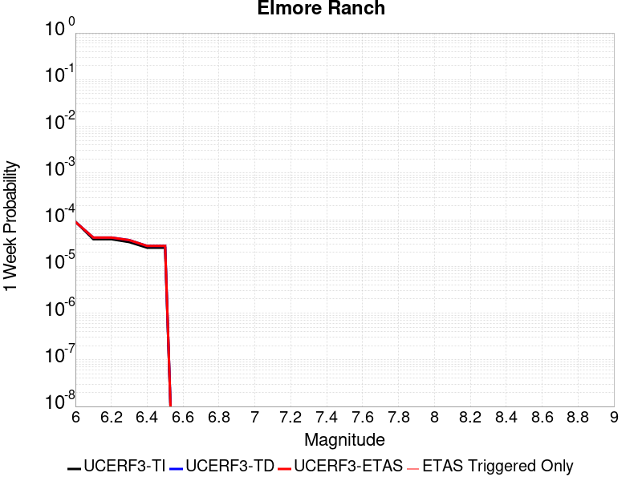 | 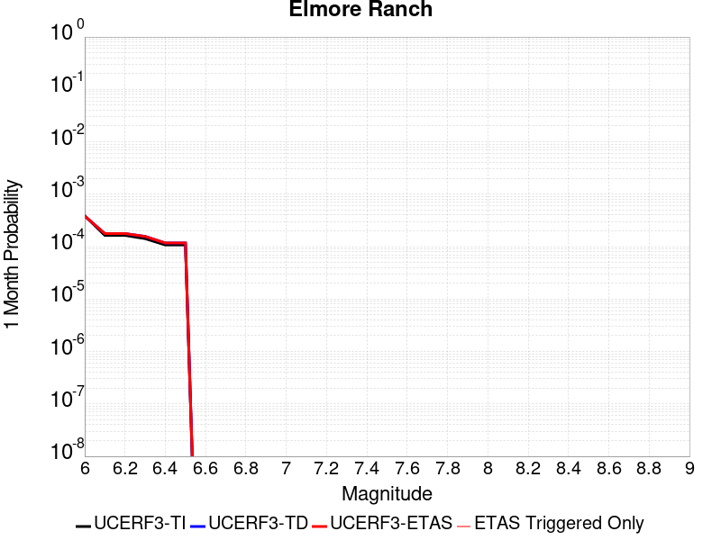 |  |  |

| Magnitude | 1 wk TI Prob | 1 wk TD Prob | 1 wk ETAS Prob | 1 wk ETAS/TD Gain | 1 wk ETAS Triggered Only | 1 mo TI Prob | 1 mo TD Prob | 1 mo ETAS Prob | 1 mo ETAS/TD Gain | 1 mo ETAS Triggered Only | 1 yr TI Prob | 1 yr TD Prob | 1 yr ETAS Prob | 1 yr ETAS/TD Gain | 1 yr ETAS Triggered Only | 10 yr TI Prob | 10 yr TD Prob | 10 yr ETAS Prob | 10 yr ETAS/TD Gain | 10 yr ETAS Triggered Only |
|-----|-----|-----|-----|-----|-----|-----|-----|-----|-----|-----|-----|-----|-----|-----|-----|-----|-----|-----|-----|-----|
| 6.0 | 9.102099E-5 | 8.952992E-5 | 8.952992E-5 | 1.0 | 0.0 | 3.9003167E-4 | 3.8365638E-4 | 3.8365638E-4 | 1.0 | 0.0 | 0.0047383 | 0.0046624783 | 0.004672432 | 1.0021348 | 1.0E-5 | 0.046385348 | 0.045874763 | 0.045893848 | 1.0004159 | 2.0E-5 |
| 6.1 | 3.8306698E-5 | 4.150231E-5 | 4.150231E-5 | 1.0 | 0.0 | 1.6416123E-4 | 1.77859E-4 | 1.77859E-4 | 1.0 | 0.0 | 0.0019968306 | 0.0021633052 | 0.0021732836 | 1.0046126 | 1.0E-5 | 0.019789828 | 0.021629987 | 0.021649554 | 1.0009047 | 2.0E-5 |
| 6.2 | 3.8306698E-5 | 4.150231E-5 | 4.150231E-5 | 1.0 | 0.0 | 1.6416123E-4 | 1.77859E-4 | 1.77859E-4 | 1.0 | 0.0 | 0.0019968306 | 0.0021633052 | 0.0021732836 | 1.0046126 | 1.0E-5 | 0.019789828 | 0.021629987 | 0.021649554 | 1.0009047 | 2.0E-5 |
| 6.3 | 3.3197924E-5 | 3.6557303E-5 | 3.6557303E-5 | 1.0 | 0.0 | 1.4226905E-4 | 1.5666873E-4 | 1.5666873E-4 | 1.0 | 0.0 | 0.0017307495 | 0.0019060541 | 0.001916035 | 1.0052364 | 1.0E-5 | 0.017173318 | 0.019091396 | 0.019111013 | 1.0010276 | 2.0E-5 |
| 6.4 | 2.5148964E-5 | 2.7422326E-5 | 2.7422326E-5 | 1.0 | 0.0 | 1.0777682E-4 | 1.1752261E-4 | 1.1752261E-4 | 1.0 | 0.0 | 0.0013113929 | 0.0014305466 | 0.0014405324 | 1.0069803 | 1.0E-5 | 0.01303681 | 0.014388145 | 0.014407857 | 1.0013701 | 2.0E-5 |
| 6.5 | 2.5148964E-5 | 2.7422326E-5 | 2.7422326E-5 | 1.0 | 0.0 | 1.0777682E-4 | 1.1752261E-4 | 1.1752261E-4 | 1.0 | 0.0 | 0.0013113929 | 0.0014305466 | 0.0014405324 | 1.0069803 | 1.0E-5 | 0.01303681 | 0.014388145 | 0.014407857 | 1.0013701 | 2.0E-5 |

## Camp Rock 2011
*[(top)](#table-of-contents)*

| 1 Week | 1 Month | 1 Year | 10 Year |
|-----|-----|-----|-----|
|  |  |  |  |

| Magnitude | 1 wk TI Prob | 1 wk TD Prob | 1 wk ETAS Prob | 1 wk ETAS/TD Gain | 1 wk ETAS Triggered Only | 1 mo TI Prob | 1 mo TD Prob | 1 mo ETAS Prob | 1 mo ETAS/TD Gain | 1 mo ETAS Triggered Only | 1 yr TI Prob | 1 yr TD Prob | 1 yr ETAS Prob | 1 yr ETAS/TD Gain | 1 yr ETAS Triggered Only | 10 yr TI Prob | 10 yr TD Prob | 10 yr ETAS Prob | 10 yr ETAS/TD Gain | 10 yr ETAS Triggered Only |
|-----|-----|-----|-----|-----|-----|-----|-----|-----|-----|-----|-----|-----|-----|-----|-----|-----|-----|-----|-----|-----|
| 6.0 | 1.6710783E-5 | 4.2503393E-6 | 4.2503393E-6 | 1.0 | 0.0 | 7.161568E-5 | 1.8215616E-5 | 2.8215434E-5 | 1.5489695 | 1.0E-5 | 8.7157206E-4 | 2.2175309E-4 | 2.4174864E-4 | 1.0901704 | 2.0E-5 | 0.008681616 | 0.002215371 | 0.0022353267 | 1.0090078 | 2.0E-5 |
| 6.1 | 1.6710783E-5 | 4.2503393E-6 | 4.2503393E-6 | 1.0 | 0.0 | 7.161568E-5 | 1.8215616E-5 | 2.8215434E-5 | 1.5489695 | 1.0E-5 | 8.7157206E-4 | 2.2175309E-4 | 2.4174864E-4 | 1.0901704 | 2.0E-5 | 0.008681616 | 0.002215371 | 0.0022353267 | 1.0090078 | 2.0E-5 |
| 6.2 | 1.6710783E-5 | 4.2503393E-6 | 4.2503393E-6 | 1.0 | 0.0 | 7.161568E-5 | 1.8215616E-5 | 2.8215434E-5 | 1.5489695 | 1.0E-5 | 8.7157206E-4 | 2.2175309E-4 | 2.4174864E-4 | 1.0901704 | 2.0E-5 | 0.008681616 | 0.002215371 | 0.0022353267 | 1.0090078 | 2.0E-5 |
| 6.3 | 1.6710783E-5 | 4.2503393E-6 | 4.2503393E-6 | 1.0 | 0.0 | 7.161568E-5 | 1.8215616E-5 | 2.8215434E-5 | 1.5489695 | 1.0E-5 | 8.7157206E-4 | 2.2175309E-4 | 2.4174864E-4 | 1.0901704 | 2.0E-5 | 0.008681616 | 0.002215371 | 0.0022353267 | 1.0090078 | 2.0E-5 |
| 6.4 | 7.982846E-6 | 3.6821582E-6 | 3.6821582E-6 | 1.0 | 0.0 | 3.421175E-5 | 1.5780584E-5 | 2.5780426E-5 | 1.6336801 | 1.0E-5 | 4.1644843E-4 | 1.9211203E-4 | 2.021101E-4 | 1.052043 | 1.0E-5 | 0.0041566887 | 0.0019194942 | 0.0019294751 | 1.0051997 | 1.0E-5 |
| 6.5 | 7.982846E-6 | 3.6821582E-6 | 3.6821582E-6 | 1.0 | 0.0 | 3.421175E-5 | 1.5780584E-5 | 2.5780426E-5 | 1.6336801 | 1.0E-5 | 4.1644843E-4 | 1.9211203E-4 | 2.021101E-4 | 1.052043 | 1.0E-5 | 0.0041566887 | 0.0019194942 | 0.0019294751 | 1.0051997 | 1.0E-5 |
| 6.6 | 7.048869E-6 | 3.4244238E-6 | 3.4244238E-6 | 1.0 | 0.0 | 3.0209088E-5 | 1.4676021E-5 | 2.4675874E-5 | 1.6813736 | 1.0E-5 | 3.677336E-4 | 1.7866622E-4 | 1.8866443E-4 | 1.0559603 | 1.0E-5 | 0.0036712566 | 0.0017852575 | 0.0017952396 | 1.0055914 | 1.0E-5 |
| 6.7 | 6.987307E-6 | 3.3624005E-6 | 3.3624005E-6 | 1.0 | 0.0 | 2.9945259E-5 | 1.44102105E-5 | 2.4410067E-5 | 1.6939424 | 1.0E-5 | 3.6452254E-4 | 1.754305E-4 | 1.8542874E-4 | 1.0569927 | 1.0E-5 | 0.0036392517 | 0.0017529513 | 0.0017629337 | 1.0056946 | 1.0E-5 |
| 6.8 | 6.3737602E-6 | 3.1179698E-6 | 3.1179698E-6 | 1.0 | 0.0 | 2.731583E-5 | 1.336266E-5 | 2.3362527E-5 | 1.748344 | 1.0E-5 | 3.3251947E-4 | 1.6267854E-4 | 1.7267691E-4 | 1.061461 | 1.0E-5 | 0.0033202237 | 0.0016256231 | 0.0016356069 | 1.0061415 | 1.0E-5 |
| 6.9 | 6.112211E-6 | 2.933175E-6 | 2.933175E-6 | 1.0 | 0.0 | 2.6194928E-5 | 1.2570691E-5 | 2.2570566E-5 | 1.7954912 | 1.0E-5 | 3.1887658E-4 | 1.5303769E-4 | 1.6303617E-4 | 1.0653334 | 1.0E-5 | 0.003184194 | 0.0015293509 | 0.0015393356 | 1.0065287 | 1.0E-5 |
| 7.0 | 5.5140117E-6 | 2.6419752E-6 | 2.6419752E-6 | 1.0 | 0.0 | 2.3631264E-5 | 1.1322703E-5 | 2.132259E-5 | 1.8831713 | 1.0E-5 | 2.8767265E-4 | 1.3784545E-4 | 1.4784407E-4 | 1.072535 | 1.0E-5 | 0.0028730053 | 0.0013776247 | 0.0013876109 | 1.0072489 | 1.0E-5 |
| 7.1 | 4.8151105E-6 | 2.1343144E-6 | 2.1343144E-6 | 1.0 | 0.0 | 2.0636026E-5 | 9.147031E-6 | 9.147031E-6 | 1.0 | 0.0 | 2.5121463E-4 | 1.1135963E-4 | 1.1135963E-4 | 1.0 | 0.0 | 0.0025093083 | 0.0011130602 | 0.0011130602 | 1.0 | 0.0 |
| 7.2 | 3.818335E-6 | 1.2937749E-6 | 1.2937749E-6 | 1.0 | 0.0 | 1.6364189E-5 | 5.544738E-6 | 5.544738E-6 | 1.0 | 0.0 | 1.9921579E-4 | 6.750518E-5 | 6.750518E-5 | 1.0 | 0.0 | 0.0019903728 | 6.7485496E-4 | 6.7485496E-4 | 1.0 | 0.0 |
| 7.3 | 2.7166698E-6 | 7.383823E-7 | 7.383823E-7 | 1.0 | 0.0 | 1.1642818E-5 | 3.164492E-6 | 3.164492E-6 | 1.0 | 0.0 | 1.4174209E-4 | 3.852703E-5 | 3.852703E-5 | 1.0 | 0.0 | 0.0014165172 | 3.852055E-4 | 3.852055E-4 | 1.0 | 0.0 |
| 7.4 | 2.0893426E-6 | 5.46203E-7 | 5.46203E-7 | 1.0 | 0.0 | 8.954295E-6 | 2.3408681E-6 | 2.3408681E-6 | 1.0 | 0.0 | 1.0901308E-4 | 2.84997E-5 | 2.84997E-5 | 1.0 | 0.0 | 0.0010895962 | 2.8496102E-4 | 2.8496102E-4 | 1.0 | 0.0 |
| 7.5 | 1.1681728E-6 | 3.6031688E-7 | 3.6031688E-7 | 1.0 | 0.0 | 5.0064455E-6 | 1.5442143E-6 | 1.5442143E-6 | 1.0 | 0.0 | 6.0951766E-5 | 1.8800652E-5 | 1.8800652E-5 | 1.0 | 0.0 | 6.093505E-4 | 1.8799109E-4 | 1.8799109E-4 | 1.0 | 0.0 |
| 7.6 | 1.3154387E-7 | 7.119876E-8 | 7.119876E-8 | 1.0 | 0.0 | 5.6375933E-7 | 3.0513755E-7 | 3.0513755E-7 | 1.0 | 0.0 | 6.863748E-6 | 3.7150448E-6 | 3.7150448E-6 | 1.0 | 0.0 | 6.863536E-5 | 3.7149985E-5 | 3.7149985E-5 | 1.0 | 0.0 |

## Hosgri
*[(top)](#table-of-contents)*

| 1 Week | 1 Month | 1 Year | 10 Year |
|-----|-----|-----|-----|
| 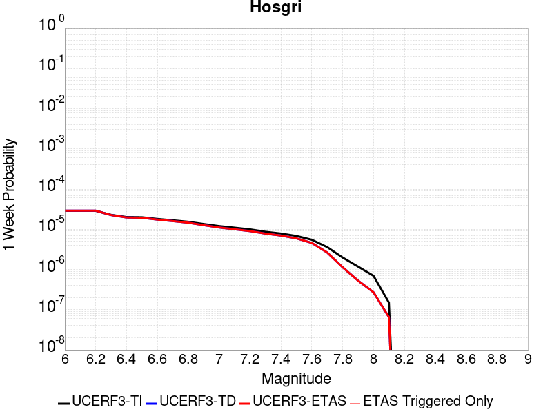 |  | 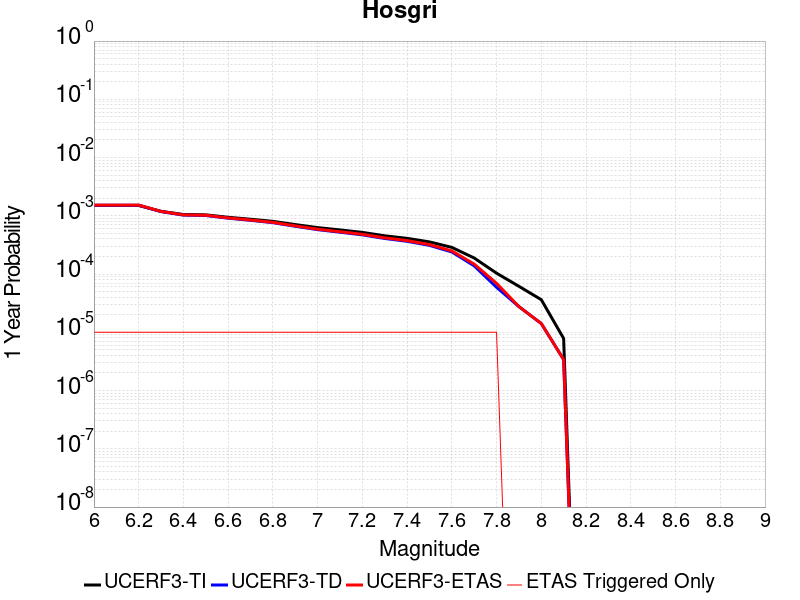 |  |

| Magnitude | 1 wk TI Prob | 1 wk TD Prob | 1 wk ETAS Prob | 1 wk ETAS/TD Gain | 1 wk ETAS Triggered Only | 1 mo TI Prob | 1 mo TD Prob | 1 mo ETAS Prob | 1 mo ETAS/TD Gain | 1 mo ETAS Triggered Only | 1 yr TI Prob | 1 yr TD Prob | 1 yr ETAS Prob | 1 yr ETAS/TD Gain | 1 yr ETAS Triggered Only | 10 yr TI Prob | 10 yr TD Prob | 10 yr ETAS Prob | 10 yr ETAS/TD Gain | 10 yr ETAS Triggered Only |
|-----|-----|-----|-----|-----|-----|-----|-----|-----|-----|-----|-----|-----|-----|-----|-----|-----|-----|-----|-----|-----|
| 6.0 | 2.883978E-5 | 2.9129062E-5 | 2.9129062E-5 | 1.0 | 0.0 | 1.235932E-4 | 1.2483301E-4 | 1.2483301E-4 | 1.0 | 0.0 | 0.0015037085 | 0.0015188096 | 0.0015287944 | 1.0065742 | 1.0E-5 | 0.01493574 | 0.015088072 | 0.01510777 | 1.0013056 | 2.0E-5 |
| 6.1 | 2.883978E-5 | 2.9129062E-5 | 2.9129062E-5 | 1.0 | 0.0 | 1.235932E-4 | 1.2483301E-4 | 1.2483301E-4 | 1.0 | 0.0 | 0.0015037085 | 0.0015188096 | 0.0015287944 | 1.0065742 | 1.0E-5 | 0.01493574 | 0.015088072 | 0.01510777 | 1.0013056 | 2.0E-5 |
| 6.2 | 2.883978E-5 | 2.9129062E-5 | 2.9129062E-5 | 1.0 | 0.0 | 1.235932E-4 | 1.2483301E-4 | 1.2483301E-4 | 1.0 | 0.0 | 0.0015037085 | 0.0015188096 | 0.0015287944 | 1.0065742 | 1.0E-5 | 0.01493574 | 0.015088072 | 0.01510777 | 1.0013056 | 2.0E-5 |
| 6.3 | 2.2914428E-5 | 2.2642487E-5 | 2.2642487E-5 | 1.0 | 0.0 | 9.8200995E-5 | 9.703565E-5 | 9.703565E-5 | 1.0 | 0.0 | 0.0011949413 | 0.0011807736 | 0.0011907618 | 1.008459 | 1.0E-5 | 0.011885363 | 0.0117464 | 0.011766165 | 1.0016826 | 2.0E-5 |
| 6.4 | 2.0195741E-5 | 1.9697027E-5 | 1.9697027E-5 | 1.0 | 0.0 | 8.65503E-5 | 8.441311E-5 | 8.441311E-5 | 1.0 | 0.0 | 0.0010532405 | 0.0010272469 | 0.0010372367 | 1.0097247 | 1.0E-5 | 0.010482626 | 0.010226034 | 0.010245829 | 1.0019358 | 2.0E-5 |
| 6.5 | 1.9924333E-5 | 1.9409443E-5 | 1.9409443E-5 | 1.0 | 0.0 | 8.53872E-5 | 8.318068E-5 | 8.318068E-5 | 1.0 | 0.0 | 0.0010390934 | 0.0010122563 | 0.0010222462 | 1.009869 | 1.0E-5 | 0.010342481 | 0.010077492 | 0.01009729 | 1.0019646 | 2.0E-5 |
| 6.6 | 1.809694E-5 | 1.7458733E-5 | 1.7458733E-5 | 1.0 | 0.0 | 7.7556004E-5 | 7.4821E-5 | 7.4821E-5 | 1.0 | 0.0 | 9.438353E-4 | 9.105663E-4 | 9.205572E-4 | 1.0109721 | 1.0E-5 | 0.009398366 | 0.009069297 | 0.009089116 | 1.0021852 | 2.0E-5 |
| 6.7 | 1.675989E-5 | 1.6043177E-5 | 1.6043177E-5 | 1.0 | 0.0 | 7.182612E-5 | 6.875467E-5 | 6.875467E-5 | 1.0 | 0.0 | 8.7413215E-4 | 8.367678E-4 | 8.4675936E-4 | 1.0119407 | 1.0E-5 | 0.008707017 | 0.008337077 | 0.00835691 | 1.002379 | 2.0E-5 |
| 6.8 | 1.5401129E-5 | 1.4614476E-5 | 1.4614476E-5 | 1.0 | 0.0 | 6.6003166E-5 | 6.263197E-5 | 6.263197E-5 | 1.0 | 0.0 | 8.032922E-4 | 7.622783E-4 | 7.7227067E-4 | 1.0131086 | 1.0E-5 | 0.008003947 | 0.0075975 | 0.0076173483 | 1.0026125 | 2.0E-5 |
| 6.9 | 1.356559E-5 | 1.2690334E-5 | 1.2690334E-5 | 1.0 | 0.0 | 5.8136946E-5 | 5.4386015E-5 | 5.4386015E-5 | 1.0 | 0.0 | 7.0758746E-4 | 6.61949E-4 | 6.7194237E-4 | 1.0150969 | 1.0E-5 | 0.007053386 | 0.0066005783 | 0.006620446 | 1.00301 | 2.0E-5 |
| 7.0 | 1.2030819E-5 | 1.1096307E-5 | 1.1096307E-5 | 1.0 | 0.0 | 5.155963E-5 | 4.7554735E-5 | 4.7554735E-5 | 1.0 | 0.0 | 6.275577E-4 | 5.788252E-4 | 5.888194E-4 | 1.0172664 | 1.0E-5 | 0.006257884 | 0.005773937 | 0.005783879 | 1.001722 | 1.0E-5 |
| 7.1 | 1.0972698E-5 | 1.00225125E-5 | 1.00225125E-5 | 1.0 | 0.0 | 4.7025E-5 | 4.2952917E-5 | 4.2952917E-5 | 1.0 | 0.0 | 5.72379E-4 | 5.2282633E-4 | 5.328211E-4 | 1.0191168 | 1.0E-5 | 0.0057090693 | 0.0052167154 | 0.0052266633 | 1.0019069 | 1.0E-5 |
| 7.2 | 9.961926E-6 | 9.035069E-6 | 9.035069E-6 | 1.0 | 0.0 | 4.2693267E-5 | 3.8721148E-5 | 3.8721148E-5 | 1.0 | 0.0 | 5.1966653E-4 | 4.7132804E-4 | 4.8132334E-4 | 1.0212066 | 1.0E-5 | 0.00518453 | 0.00470403 | 0.0047139833 | 1.0021158 | 1.0E-5 |
| 7.3 | 8.700929E-6 | 7.82841E-6 | 7.82841E-6 | 1.0 | 0.0 | 3.7289166E-5 | 3.35499E-5 | 3.35499E-5 | 1.0 | 0.0 | 4.53901E-4 | 4.083935E-4 | 4.1838942E-4 | 1.0244762 | 1.0E-5 | 0.00452975 | 0.0040771696 | 0.0040871287 | 1.0024427 | 1.0E-5 |
| 7.4 | 7.866285E-6 | 6.9990415E-6 | 6.9990415E-6 | 1.0 | 0.0 | 3.3712215E-5 | 2.9995548E-5 | 2.9995548E-5 | 1.0 | 0.0 | 4.103689E-4 | 3.6513462E-4 | 3.7513097E-4 | 1.0273771 | 1.0E-5 | 0.004096119 | 0.0036460843 | 0.0036560479 | 1.0027326 | 1.0E-5 |
| 7.5 | 6.8381305E-6 | 5.9599884E-6 | 5.9599884E-6 | 1.0 | 0.0 | 2.9305946E-5 | 2.5542557E-5 | 2.5542557E-5 | 1.0 | 0.0 | 3.5674145E-4 | 3.1093627E-4 | 3.2093315E-4 | 1.032151 | 1.0E-5 | 0.0035616932 | 0.0031057473 | 0.0031157162 | 1.0032098 | 1.0E-5 |
| 7.6 | 5.503376E-6 | 4.595522E-6 | 4.595522E-6 | 1.0 | 0.0 | 2.3585684E-5 | 1.9694946E-5 | 1.9694946E-5 | 1.0 | 0.0 | 2.8711787E-4 | 2.3975961E-4 | 2.497572E-4 | 1.0416985 | 1.0E-5 | 0.002867472 | 0.0023957426 | 0.0024057187 | 1.0041641 | 1.0E-5 |
| 7.7 | 3.6144982E-6 | 2.6524688E-6 | 2.6524688E-6 | 1.0 | 0.0 | 1.5490614E-5 | 1.1367673E-5 | 1.1367673E-5 | 1.0 | 0.0 | 1.8858191E-4 | 1.3839264E-4 | 1.4839126E-4 | 1.0722482 | 1.0E-5 | 0.0018842196 | 0.0013837959 | 0.0013937821 | 1.0072165 | 1.0E-5 |
| 7.8 | 1.9853494E-6 | 1.1363304E-6 | 1.1363304E-6 | 1.0 | 0.0 | 8.508612E-6 | 4.8699785E-6 | 4.8699785E-6 | 1.0 | 0.0 | 1.0358743E-4 | 5.9290374E-5 | 6.928978E-5 | 1.1686515 | 1.0E-5 | 0.0010353916 | 5.934756E-4 | 6.034696E-4 | 1.0168399 | 1.0E-5 |
| 7.9 | 1.1818757E-6 | 5.296902E-7 | 5.296902E-7 | 1.0 | 0.0 | 5.0651715E-6 | 2.2700988E-6 | 2.2700988E-6 | 1.0 | 0.0 | 6.1666724E-5 | 2.7638103E-5 | 2.7638103E-5 | 1.0 | 0.0 | 6.1649614E-4 | 2.77035E-4 | 2.77035E-4 | 1.0 | 0.0 |
| 8.0 | 6.962958E-7 | 2.7151677E-7 | 2.7151677E-7 | 1.0 | 0.0 | 2.9841215E-6 | 1.1636428E-6 | 1.1636428E-6 | 1.0 | 0.0 | 3.6331072E-5 | 1.4167258E-5 | 1.4167258E-5 | 1.0 | 0.0 | 3.6325134E-4 | 1.4223409E-4 | 1.4223409E-4 | 1.0 | 0.0 |
| 8.1 | 1.5033264E-7 | 6.530082E-8 | 6.530082E-8 | 1.0 | 0.0 | 6.442826E-7 | 2.7986061E-7 | 2.7986061E-7 | 1.0 | 0.0 | 7.844113E-6 | 3.407298E-6 | 3.407298E-6 | 1.0 | 0.0 | 7.843835E-5 | 3.4089764E-5 | 3.4089764E-5 | 1.0 | 0.0 |

## Dry Mountain
*[(top)](#table-of-contents)*

| 1 Week | 1 Month | 1 Year | 10 Year |
|-----|-----|-----|-----|
|  | 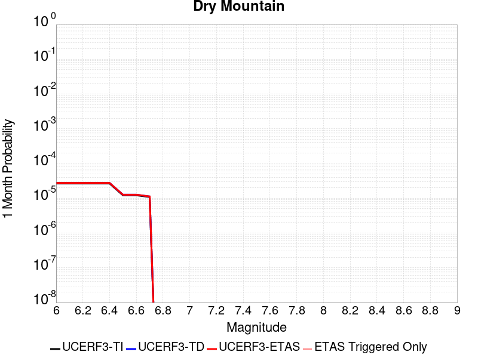 | 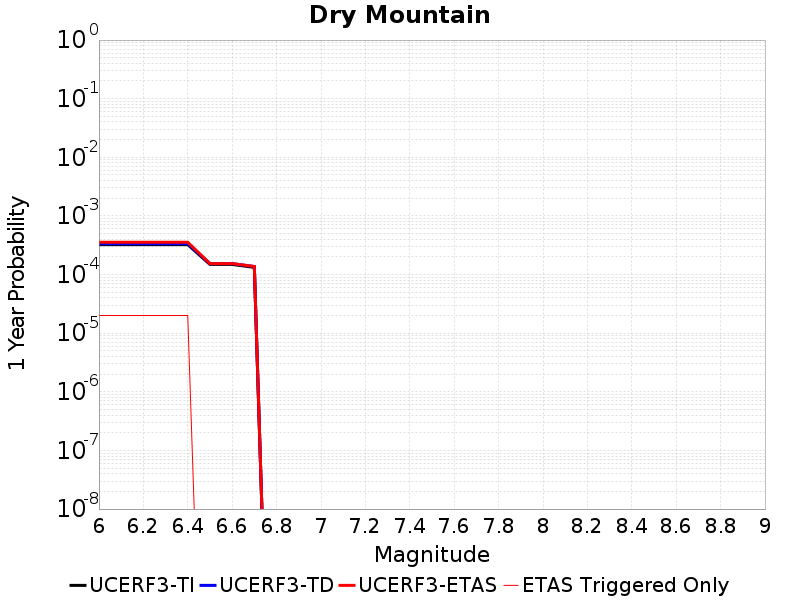 |  |

| Magnitude | 1 wk TI Prob | 1 wk TD Prob | 1 wk ETAS Prob | 1 wk ETAS/TD Gain | 1 wk ETAS Triggered Only | 1 mo TI Prob | 1 mo TD Prob | 1 mo ETAS Prob | 1 mo ETAS/TD Gain | 1 mo ETAS Triggered Only | 1 yr TI Prob | 1 yr TD Prob | 1 yr ETAS Prob | 1 yr ETAS/TD Gain | 1 yr ETAS Triggered Only | 10 yr TI Prob | 10 yr TD Prob | 10 yr ETAS Prob | 10 yr ETAS/TD Gain | 10 yr ETAS Triggered Only |
|-----|-----|-----|-----|-----|-----|-----|-----|-----|-----|-----|-----|-----|-----|-----|-----|-----|-----|-----|-----|-----|
| 6.0 | 6.222801E-6 | 6.439428E-6 | 6.439428E-6 | 1.0 | 0.0 | 2.6668875E-5 | 2.7597347E-5 | 2.7597347E-5 | 1.0 | 0.0 | 3.2464517E-4 | 3.359618E-4 | 3.559551E-4 | 1.0595106 | 2.0E-5 | 0.0032417132 | 0.0033561012 | 0.003376034 | 1.0059392 | 2.0E-5 |
| 6.1 | 6.222801E-6 | 6.439428E-6 | 6.439428E-6 | 1.0 | 0.0 | 2.6668875E-5 | 2.7597347E-5 | 2.7597347E-5 | 1.0 | 0.0 | 3.2464517E-4 | 3.359618E-4 | 3.559551E-4 | 1.0595106 | 2.0E-5 | 0.0032417132 | 0.0033561012 | 0.003376034 | 1.0059392 | 2.0E-5 |
| 6.2 | 6.222801E-6 | 6.439428E-6 | 6.439428E-6 | 1.0 | 0.0 | 2.6668875E-5 | 2.7597347E-5 | 2.7597347E-5 | 1.0 | 0.0 | 3.2464517E-4 | 3.359618E-4 | 3.559551E-4 | 1.0595106 | 2.0E-5 | 0.0032417132 | 0.0033561012 | 0.003376034 | 1.0059392 | 2.0E-5 |
| 6.3 | 6.222801E-6 | 6.439428E-6 | 6.439428E-6 | 1.0 | 0.0 | 2.6668875E-5 | 2.7597347E-5 | 2.7597347E-5 | 1.0 | 0.0 | 3.2464517E-4 | 3.359618E-4 | 3.559551E-4 | 1.0595106 | 2.0E-5 | 0.0032417132 | 0.0033561012 | 0.003376034 | 1.0059392 | 2.0E-5 |
| 6.4 | 6.222801E-6 | 6.439428E-6 | 6.439428E-6 | 1.0 | 0.0 | 2.6668875E-5 | 2.7597347E-5 | 2.7597347E-5 | 1.0 | 0.0 | 3.2464517E-4 | 3.359618E-4 | 3.559551E-4 | 1.0595106 | 2.0E-5 | 0.0032417132 | 0.0033561012 | 0.003376034 | 1.0059392 | 2.0E-5 |
| 6.5 | 2.8528623E-6 | 2.9521898E-6 | 2.9521898E-6 | 1.0 | 0.0 | 1.22264955E-5 | 1.265223E-5 | 1.265223E-5 | 1.0 | 0.0 | 1.4884741E-4 | 1.5403872E-4 | 1.5403872E-4 | 1.0 | 0.0 | 0.0014874774 | 0.0015401727 | 0.0015401727 | 1.0 | 0.0 |
| 6.6 | 2.8528623E-6 | 2.9521898E-6 | 2.9521898E-6 | 1.0 | 0.0 | 1.22264955E-5 | 1.265223E-5 | 1.265223E-5 | 1.0 | 0.0 | 1.4884741E-4 | 1.5403872E-4 | 1.5403872E-4 | 1.0 | 0.0 | 0.0014874774 | 0.0015401727 | 0.0015401727 | 1.0 | 0.0 |
| 6.7 | 2.541E-6 | 2.629377E-6 | 2.629377E-6 | 1.0 | 0.0 | 1.0889954E-5 | 1.12687585E-5 | 1.12687585E-5 | 1.0 | 0.0 | 1.3257713E-4 | 1.3719713E-4 | 1.3719713E-4 | 1.0 | 0.0 | 0.0013249806 | 0.0013719713 | 0.0013719713 | 1.0 | 0.0 |

## San Gregorio (South) 2011 CFM
*[(top)](#table-of-contents)*

| 1 Week | 1 Month | 1 Year | 10 Year |
|-----|-----|-----|-----|
| 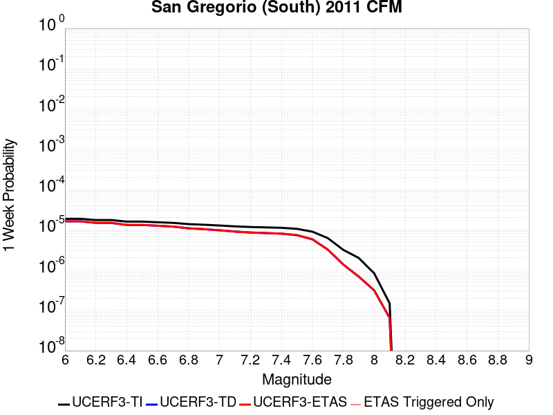 |  |  |  |

| Magnitude | 1 wk TI Prob | 1 wk TD Prob | 1 wk ETAS Prob | 1 wk ETAS/TD Gain | 1 wk ETAS Triggered Only | 1 mo TI Prob | 1 mo TD Prob | 1 mo ETAS Prob | 1 mo ETAS/TD Gain | 1 mo ETAS Triggered Only | 1 yr TI Prob | 1 yr TD Prob | 1 yr ETAS Prob | 1 yr ETAS/TD Gain | 1 yr ETAS Triggered Only | 10 yr TI Prob | 10 yr TD Prob | 10 yr ETAS Prob | 10 yr ETAS/TD Gain | 10 yr ETAS Triggered Only |
|-----|-----|-----|-----|-----|-----|-----|-----|-----|-----|-----|-----|-----|-----|-----|-----|-----|-----|-----|-----|-----|
| 6.0 | 1.8770423E-5 | 1.6280777E-5 | 1.6280777E-5 | 1.0 | 0.0 | 8.044219E-5 | 6.977292E-5 | 6.977292E-5 | 1.0 | 0.0 | 9.789435E-4 | 8.49158E-4 | 8.591495E-4 | 1.0117663 | 1.0E-5 | 0.009746423 | 0.008471848 | 0.008491678 | 1.0023408 | 2.0E-5 |
| 6.1 | 1.8770423E-5 | 1.6280777E-5 | 1.6280777E-5 | 1.0 | 0.0 | 8.044219E-5 | 6.977292E-5 | 6.977292E-5 | 1.0 | 0.0 | 9.789435E-4 | 8.49158E-4 | 8.591495E-4 | 1.0117663 | 1.0E-5 | 0.009746423 | 0.008471848 | 0.008491678 | 1.0023408 | 2.0E-5 |
| 6.2 | 1.7508692E-5 | 1.4900256E-5 | 1.4900256E-5 | 1.0 | 0.0 | 7.5035096E-5 | 6.385669E-5 | 6.385669E-5 | 1.0 | 0.0 | 9.1316935E-4 | 7.7718095E-4 | 7.8717317E-4 | 1.012857 | 1.0E-5 | 0.00909426 | 0.0077572623 | 0.0077771074 | 1.0025582 | 2.0E-5 |
| 6.3 | 1.7508692E-5 | 1.4900256E-5 | 1.4900256E-5 | 1.0 | 0.0 | 7.5035096E-5 | 6.385669E-5 | 6.385669E-5 | 1.0 | 0.0 | 9.1316935E-4 | 7.7718095E-4 | 7.8717317E-4 | 1.012857 | 1.0E-5 | 0.00909426 | 0.0077572623 | 0.0077771074 | 1.0025582 | 2.0E-5 |
| 6.4 | 1.6004591E-5 | 1.325006E-5 | 1.325006E-5 | 1.0 | 0.0 | 6.85893E-5 | 5.6784742E-5 | 5.6784742E-5 | 1.0 | 0.0 | 8.347548E-4 | 6.9113594E-4 | 7.01129E-4 | 1.0144589 | 1.0E-5 | 0.008316261 | 0.0069022966 | 0.006922159 | 1.0028776 | 2.0E-5 |
| 6.5 | 1.6004591E-5 | 1.325006E-5 | 1.325006E-5 | 1.0 | 0.0 | 6.85893E-5 | 5.6784742E-5 | 5.6784742E-5 | 1.0 | 0.0 | 8.347548E-4 | 6.9113594E-4 | 7.01129E-4 | 1.0144589 | 1.0E-5 | 0.008316261 | 0.0069022966 | 0.006922159 | 1.0028776 | 2.0E-5 |
| 6.6 | 1.5442201E-5 | 1.26346795E-5 | 1.26346795E-5 | 1.0 | 0.0 | 6.617918E-5 | 5.4147506E-5 | 5.4147506E-5 | 1.0 | 0.0 | 8.0543366E-4 | 6.5904733E-4 | 6.690407E-4 | 1.0151634 | 1.0E-5 | 0.008025207 | 0.0065833423 | 0.0066032107 | 1.003018 | 2.0E-5 |
| 6.7 | 1.489921E-5 | 1.2043177E-5 | 1.2043177E-5 | 1.0 | 0.0 | 6.3852196E-5 | 5.16126E-5 | 5.16126E-5 | 1.0 | 0.0 | 7.7712315E-4 | 6.282029E-4 | 6.3819665E-4 | 1.0159085 | 1.0E-5 | 0.0077441116 | 0.00627667 | 0.0062965443 | 1.0031664 | 2.0E-5 |
| 6.8 | 1.3876024E-5 | 1.0922105E-5 | 1.0922105E-5 | 1.0 | 0.0 | 5.9467322E-5 | 4.680818E-5 | 4.680818E-5 | 1.0 | 0.0 | 7.237741E-4 | 5.6974095E-4 | 5.7973526E-4 | 1.0175419 | 1.0E-5 | 0.0072142133 | 0.0056951675 | 0.0057150535 | 1.0034918 | 2.0E-5 |
| 6.9 | 1.33922495E-5 | 1.0393597E-5 | 1.0393597E-5 | 1.0 | 0.0 | 5.7394092E-5 | 4.4543227E-5 | 4.4543227E-5 | 1.0 | 0.0 | 6.9854903E-4 | 5.4217916E-4 | 5.521737E-4 | 1.018434 | 1.0E-5 | 0.0069635725 | 0.00542092 | 0.0054408116 | 1.0036694 | 2.0E-5 |
| 7.0 | 1.2807324E-5 | 9.753546E-6 | 9.753546E-6 | 1.0 | 0.0 | 5.4887376E-5 | 4.1800242E-5 | 4.1800242E-5 | 1.0 | 0.0 | 6.680489E-4 | 5.087993E-4 | 5.1879423E-4 | 1.0196441 | 1.0E-5 | 0.006660442 | 0.0050886916 | 0.005098641 | 1.0019552 | 1.0E-5 |
| 7.1 | 1.2191438E-5 | 9.062416E-6 | 9.062416E-6 | 1.0 | 0.0 | 5.224797E-5 | 3.883835E-5 | 3.883835E-5 | 1.0 | 0.0 | 6.3593336E-4 | 4.7275436E-4 | 4.8274963E-4 | 1.0211426 | 1.0E-5 | 0.0063411663 | 0.0047298265 | 0.004739779 | 1.0021043 | 1.0E-5 |
| 7.2 | 1.1769438E-5 | 8.582597E-6 | 8.582597E-6 | 1.0 | 0.0 | 5.0439474E-5 | 3.678204E-5 | 3.678204E-5 | 1.0 | 0.0 | 6.1392755E-4 | 4.4772937E-4 | 4.5772488E-4 | 1.0223249 | 1.0E-5 | 0.0061223423 | 0.004480612 | 0.0044905674 | 1.0022218 | 1.0E-5 |
| 7.3 | 1.150374E-5 | 8.2980205E-6 | 8.2980205E-6 | 1.0 | 0.0 | 4.9300812E-5 | 3.556246E-5 | 3.556246E-5 | 1.0 | 0.0 | 6.0007203E-4 | 4.3288703E-4 | 4.4288268E-4 | 1.0230907 | 1.0E-5 | 0.0059845424 | 0.004332759 | 0.0043427153 | 1.002298 | 1.0E-5 |
| 7.4 | 1.12514E-5 | 8.0437585E-6 | 8.0437585E-6 | 1.0 | 0.0 | 4.8219394E-5 | 3.4472796E-5 | 3.4472796E-5 | 1.0 | 0.0 | 5.8691297E-4 | 4.1962552E-4 | 4.2962132E-4 | 1.0238208 | 1.0E-5 | 0.005853653 | 0.0042006387 | 0.004210597 | 1.0023706 | 1.0E-5 |
| 7.5 | 1.059696E-5 | 7.3940373E-6 | 7.3940373E-6 | 1.0 | 0.0 | 4.5414752E-5 | 3.168835E-5 | 3.168835E-5 | 1.0 | 0.0 | 5.5278436E-4 | 3.857374E-4 | 3.957335E-4 | 1.0259144 | 1.0E-5 | 0.0055141128 | 0.0038629214 | 0.0038728826 | 1.0025787 | 1.0E-5 |
| 7.6 | 9.018592E-6 | 5.837766E-6 | 5.837766E-6 | 1.0 | 0.0 | 3.8650534E-5 | 2.5018757E-5 | 2.5018757E-5 | 1.0 | 0.0 | 4.7046866E-4 | 3.0456085E-4 | 3.1455778E-4 | 1.0328242 | 1.0E-5 | 0.004694739 | 0.003053299 | 0.0030632683 | 1.0032651 | 1.0E-5 |
| 7.7 | 6.243489E-6 | 3.2402045E-6 | 3.2402045E-6 | 1.0 | 0.0 | 2.6757538E-5 | 1.3886516E-5 | 1.3886516E-5 | 1.0 | 0.0 | 3.257243E-4 | 1.6905523E-4 | 1.7905355E-4 | 1.0591422 | 1.0E-5 | 0.003252473 | 0.0016994565 | 0.0017094394 | 1.0058743 | 1.0E-5 |
| 7.8 | 3.1941963E-6 | 1.3814077E-6 | 1.3814077E-6 | 1.0 | 0.0 | 1.368934E-5 | 5.9203053E-6 | 5.9203053E-6 | 1.0 | 0.0 | 1.6665498E-4 | 7.207733E-5 | 8.2076614E-5 | 1.1387299 | 1.0E-5 | 0.0016653005 | 7.265345E-4 | 7.3652726E-4 | 1.013754 | 1.0E-5 |
| 7.9 | 2.0098398E-6 | 6.919195E-7 | 6.919195E-7 | 1.0 | 0.0 | 8.6135715E-6 | 2.9653659E-6 | 2.9653659E-6 | 1.0 | 0.0 | 1.0486518E-4 | 3.610273E-5 | 3.610273E-5 | 1.0 | 0.0 | 0.0010481571 | 3.6588626E-4 | 3.6588626E-4 | 1.0 | 0.0 |
| 8.0 | 8.353119E-7 | 3.1637845E-7 | 3.1637845E-7 | 1.0 | 0.0 | 3.579903E-6 | 1.3559069E-6 | 1.3559069E-6 | 1.0 | 0.0 | 4.358445E-5 | 1.650804E-5 | 1.650804E-5 | 1.0 | 0.0 | 4.3575902E-4 | 1.6626841E-4 | 1.6626841E-4 | 1.0 | 0.0 |
| 8.1 | 1.5033264E-7 | 6.530082E-8 | 6.530082E-8 | 1.0 | 0.0 | 6.442826E-7 | 2.7986061E-7 | 2.7986061E-7 | 1.0 | 0.0 | 7.844113E-6 | 3.407298E-6 | 3.407298E-6 | 1.0 | 0.0 | 7.843835E-5 | 3.4089764E-5 | 3.4089764E-5 | 1.0 | 0.0 |

## Elsinore (Temecula) rev
*[(top)](#table-of-contents)*

| 1 Week | 1 Month | 1 Year | 10 Year |
|-----|-----|-----|-----|
| 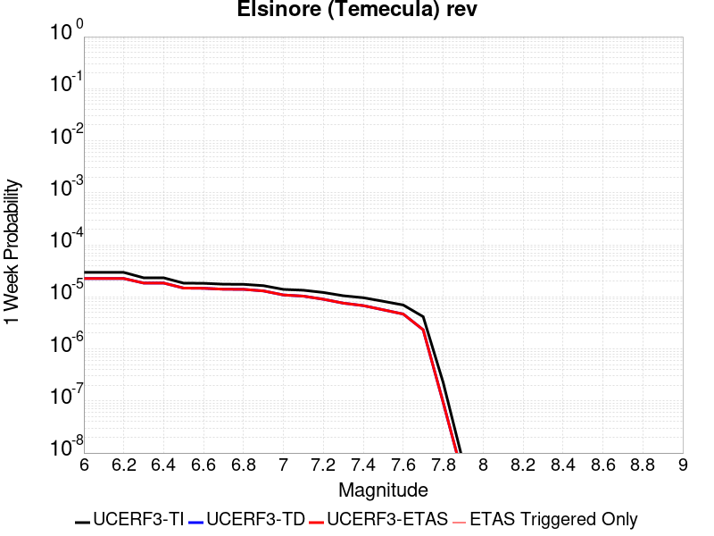 |  | 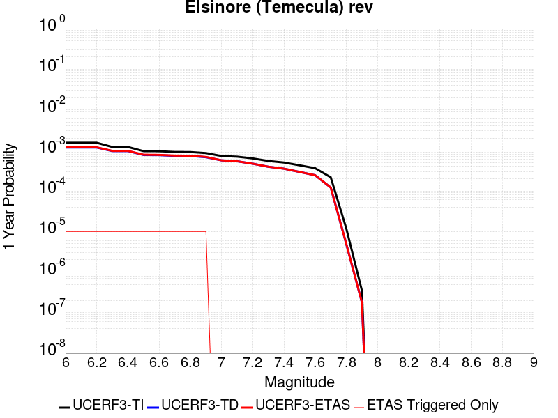 |  |

| Magnitude | 1 wk TI Prob | 1 wk TD Prob | 1 wk ETAS Prob | 1 wk ETAS/TD Gain | 1 wk ETAS Triggered Only | 1 mo TI Prob | 1 mo TD Prob | 1 mo ETAS Prob | 1 mo ETAS/TD Gain | 1 mo ETAS Triggered Only | 1 yr TI Prob | 1 yr TD Prob | 1 yr ETAS Prob | 1 yr ETAS/TD Gain | 1 yr ETAS Triggered Only | 10 yr TI Prob | 10 yr TD Prob | 10 yr ETAS Prob | 10 yr ETAS/TD Gain | 10 yr ETAS Triggered Only |
|-----|-----|-----|-----|-----|-----|-----|-----|-----|-----|-----|-----|-----|-----|-----|-----|-----|-----|-----|-----|-----|
| 6.0 | 2.9514995E-5 | 2.2519032E-5 | 2.2519032E-5 | 1.0 | 0.0 | 1.264867E-4 | 9.6506694E-5 | 9.6506694E-5 | 1.0 | 0.0 | 0.0015388876 | 0.001174358 | 0.0011843462 | 1.0085053 | 1.0E-5 | 0.015282745 | 0.011697896 | 0.011717661 | 1.0016897 | 2.0E-5 |
| 6.1 | 2.9514995E-5 | 2.2519032E-5 | 2.2519032E-5 | 1.0 | 0.0 | 1.264867E-4 | 9.6506694E-5 | 9.6506694E-5 | 1.0 | 0.0 | 0.0015388876 | 0.001174358 | 0.0011843462 | 1.0085053 | 1.0E-5 | 0.015282745 | 0.011697896 | 0.011717661 | 1.0016897 | 2.0E-5 |
| 6.2 | 2.9514995E-5 | 2.2519032E-5 | 2.2519032E-5 | 1.0 | 0.0 | 1.264867E-4 | 9.6506694E-5 | 9.6506694E-5 | 1.0 | 0.0 | 0.0015388876 | 0.001174358 | 0.0011843462 | 1.0085053 | 1.0E-5 | 0.015282745 | 0.011697896 | 0.011717661 | 1.0016897 | 2.0E-5 |
| 6.3 | 2.3223649E-5 | 1.8407813E-5 | 1.8407813E-5 | 1.0 | 0.0 | 9.952613E-5 | 7.888833E-5 | 7.888833E-5 | 1.0 | 0.0 | 0.001211057 | 9.600596E-4 | 9.7005E-4 | 1.010406 | 1.0E-5 | 0.012044783 | 0.009570632 | 0.00959044 | 1.0020697 | 2.0E-5 |
| 6.4 | 2.3223649E-5 | 1.8407813E-5 | 1.8407813E-5 | 1.0 | 0.0 | 9.952613E-5 | 7.888833E-5 | 7.888833E-5 | 1.0 | 0.0 | 0.001211057 | 9.600596E-4 | 9.7005E-4 | 1.010406 | 1.0E-5 | 0.012044783 | 0.009570632 | 0.00959044 | 1.0020697 | 2.0E-5 |
| 6.5 | 1.8338875E-5 | 1.4751068E-5 | 1.4751068E-5 | 1.0 | 0.0 | 7.8592806E-5 | 6.321738E-5 | 6.321738E-5 | 1.0 | 0.0 | 9.5644733E-4 | 7.694086E-4 | 7.7940087E-4 | 1.012987 | 1.0E-5 | 0.009523412 | 0.007674405 | 0.0076942514 | 1.002586 | 2.0E-5 |
| 6.6 | 1.8223333E-5 | 1.4613619E-5 | 1.4613619E-5 | 1.0 | 0.0 | 7.809766E-5 | 6.262834E-5 | 6.262834E-5 | 1.0 | 0.0 | 9.504242E-4 | 7.6224207E-4 | 7.7223446E-4 | 1.0131092 | 1.0E-5 | 0.009463696 | 0.007603231 | 0.007623079 | 1.0026104 | 2.0E-5 |
| 6.7 | 1.7512752E-5 | 1.4028107E-5 | 1.4028107E-5 | 1.0 | 0.0 | 7.505249E-5 | 6.0119124E-5 | 6.0119124E-5 | 1.0 | 0.0 | 9.13381E-4 | 7.3171314E-4 | 7.417058E-4 | 1.0136566 | 1.0E-5 | 0.00909636 | 0.007299385 | 0.007319239 | 1.00272 | 2.0E-5 |
| 6.8 | 1.7417142E-5 | 1.3952087E-5 | 1.3952087E-5 | 1.0 | 0.0 | 7.4642754E-5 | 5.9793336E-5 | 5.9793336E-5 | 1.0 | 0.0 | 9.083966E-4 | 7.277493E-4 | 7.37742E-4 | 1.013731 | 1.0E-5 | 0.009046922 | 0.007259951 | 0.007279806 | 1.0027348 | 2.0E-5 |
| 6.9 | 1.6402591E-5 | 1.29894715E-5 | 1.29894715E-5 | 1.0 | 0.0 | 7.0294926E-5 | 5.5668017E-5 | 5.5668017E-5 | 1.0 | 0.0 | 8.5550465E-4 | 6.7755504E-4 | 6.8754825E-4 | 1.0147489 | 1.0E-5 | 0.008522186 | 0.006760614 | 0.0067804786 | 1.0029383 | 2.0E-5 |
| 7.0 | 1.3912486E-5 | 1.0878989E-5 | 1.0878989E-5 | 1.0 | 0.0 | 5.9623577E-5 | 4.6623423E-5 | 4.6623423E-5 | 1.0 | 0.0 | 7.2567526E-4 | 5.6749507E-4 | 5.6749507E-4 | 1.0 | 0.0 | 0.0072331014 | 0.005664378 | 0.005674321 | 1.0017555 | 1.0E-5 |
| 7.1 | 1.3405147E-5 | 1.0328137E-5 | 1.0328137E-5 | 1.0 | 0.0 | 5.7449364E-5 | 4.426271E-5 | 4.426271E-5 | 1.0 | 0.0 | 6.9922156E-4 | 5.3876784E-4 | 5.3876784E-4 | 1.0 | 0.0 | 0.0069702556 | 0.0053779487 | 0.005387895 | 1.0018494 | 1.0E-5 |
| 7.2 | 1.21402E-5 | 8.997337E-6 | 8.997337E-6 | 1.0 | 0.0 | 5.202839E-5 | 3.8559454E-5 | 3.8559454E-5 | 1.0 | 0.0 | 6.332616E-4 | 4.69362E-4 | 4.69362E-4 | 1.0 | 0.0 | 0.0063146 | 0.0046851323 | 0.0046950853 | 1.0021244 | 1.0E-5 |
| 7.3 | 1.05047775E-5 | 7.572263E-6 | 7.572263E-6 | 1.0 | 0.0 | 4.5019697E-5 | 3.245216E-5 | 3.245216E-5 | 1.0 | 0.0 | 5.4797693E-4 | 3.9503488E-4 | 3.9503488E-4 | 1.0 | 0.0 | 0.005466277 | 0.0039437157 | 0.0039536767 | 1.0025257 | 1.0E-5 |
| 7.4 | 9.624483E-6 | 6.7873E-6 | 6.7873E-6 | 1.0 | 0.0 | 4.124713E-5 | 2.9088113E-5 | 2.9088113E-5 | 1.0 | 0.0 | 5.0206814E-4 | 3.540916E-4 | 3.540916E-4 | 1.0 | 0.0 | 0.005009353 | 0.003535428 | 0.0035453928 | 1.0028185 | 1.0E-5 |
| 7.5 | 8.215151E-6 | 5.6358926E-6 | 5.6358926E-6 | 1.0 | 0.0 | 3.5207315E-5 | 2.4153609E-5 | 2.4153609E-5 | 1.0 | 0.0 | 4.2856473E-4 | 2.940318E-4 | 2.940318E-4 | 1.0 | 0.0 | 0.004277392 | 0.0029365555 | 0.002946526 | 1.0033953 | 1.0E-5 |
| 7.6 | 6.975058E-6 | 4.6763485E-6 | 4.6763485E-6 | 1.0 | 0.0 | 2.9892764E-5 | 2.0041347E-5 | 2.0041347E-5 | 1.0 | 0.0 | 3.6388362E-4 | 2.4397725E-4 | 2.4397725E-4 | 1.0 | 0.0 | 0.0036328835 | 0.0024372102 | 0.0024471858 | 1.004093 | 1.0E-5 |
| 7.7 | 4.159604E-6 | 2.3271703E-6 | 2.3271703E-6 | 1.0 | 0.0 | 1.7826753E-5 | 9.9735535E-6 | 9.9735535E-6 | 1.0 | 0.0 | 2.1701909E-4 | 1.2142199E-4 | 1.2142199E-4 | 1.0 | 0.0 | 0.0021680726 | 0.0012136295 | 0.0012236173 | 1.0082297 | 1.0E-5 |
| 7.8 | 2.2692414E-7 | 9.3862134E-8 | 9.3862134E-8 | 1.0 | 0.0 | 9.725317E-7 | 4.0226624E-7 | 4.0226624E-7 | 1.0 | 0.0 | 1.1840509E-5 | 4.8975835E-6 | 4.8975835E-6 | 1.0 | 0.0 | 1.1839878E-4 | 4.8975086E-5 | 4.8975086E-5 | 1.0 | 0.0 |
| 7.9 | 6.676829E-9 | 3.4400482E-9 | 3.4400482E-9 | 1.0 | 0.0 | 2.861498E-8 | 1.4743064E-8 | 1.4743064E-8 | 1.0 | 0.0 | 3.4838732E-7 | 1.7949678E-7 | 1.7949678E-7 | 1.0 | 0.0 | 3.4838679E-6 | 1.7949665E-6 | 1.7949665E-6 | 1.0 | 0.0 |

## Concord 2011 CFM
*[(top)](#table-of-contents)*

| 1 Week | 1 Month | 1 Year | 10 Year |
|-----|-----|-----|-----|
|  |  | 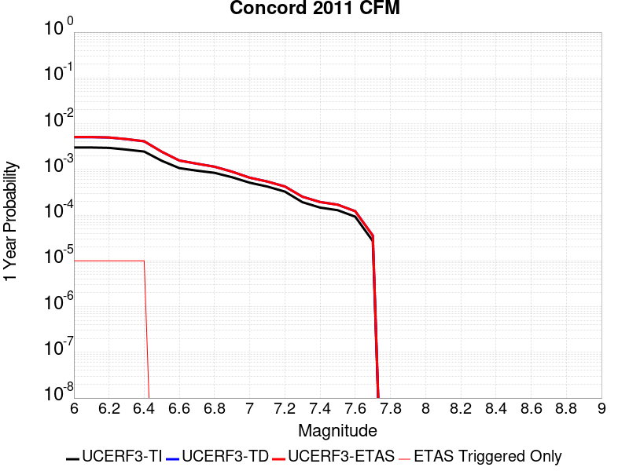 |  |

| Magnitude | 1 wk TI Prob | 1 wk TD Prob | 1 wk ETAS Prob | 1 wk ETAS/TD Gain | 1 wk ETAS Triggered Only | 1 mo TI Prob | 1 mo TD Prob | 1 mo ETAS Prob | 1 mo ETAS/TD Gain | 1 mo ETAS Triggered Only | 1 yr TI Prob | 1 yr TD Prob | 1 yr ETAS Prob | 1 yr ETAS/TD Gain | 1 yr ETAS Triggered Only | 10 yr TI Prob | 10 yr TD Prob | 10 yr ETAS Prob | 10 yr ETAS/TD Gain | 10 yr ETAS Triggered Only |
|-----|-----|-----|-----|-----|-----|-----|-----|-----|-----|-----|-----|-----|-----|-----|-----|-----|-----|-----|-----|-----|
| 6.0 | 5.7865112E-5 | 9.7594006E-5 | 9.7594006E-5 | 1.0 | 0.0 | 2.4796976E-4 | 4.1819774E-4 | 4.2819354E-4 | 1.0239022 | 1.0E-5 | 0.0030148525 | 0.0050795637 | 0.005089513 | 1.0019587 | 1.0E-5 | 0.029742775 | 0.049249955 | 0.04926897 | 1.0003861 | 2.0E-5 |
| 6.1 | 5.7865112E-5 | 9.7594006E-5 | 9.7594006E-5 | 1.0 | 0.0 | 2.4796976E-4 | 4.1819774E-4 | 4.2819354E-4 | 1.0239022 | 1.0E-5 | 0.0030148525 | 0.0050795637 | 0.005089513 | 1.0019587 | 1.0E-5 | 0.029742775 | 0.049249955 | 0.04926897 | 1.0003861 | 2.0E-5 |
| 6.2 | 5.6789337E-5 | 9.5797375E-5 | 9.5797375E-5 | 1.0 | 0.0 | 2.4336016E-4 | 4.1050033E-4 | 4.2049625E-4 | 1.0243505 | 1.0E-5 | 0.0029588845 | 0.0049862787 | 0.004996229 | 1.0019954 | 1.0E-5 | 0.029197963 | 0.048366472 | 0.048385505 | 1.0003935 | 2.0E-5 |
| 6.3 | 5.203322E-5 | 8.8031884E-5 | 8.8031884E-5 | 1.0 | 0.0 | 2.2298045E-4 | 3.7722933E-4 | 3.8722556E-4 | 1.026499 | 1.0E-5 | 0.0027114071 | 0.004583879 | 0.0045938333 | 1.0021715 | 1.0E-5 | 0.026785625 | 0.044537354 | 0.04455646 | 1.000429 | 2.0E-5 |
| 6.4 | 4.7120942E-5 | 7.897523E-5 | 7.897523E-5 | 1.0 | 0.0 | 2.0193127E-4 | 3.3842554E-4 | 3.4842218E-4 | 1.0295386 | 1.0E-5 | 0.0024557412 | 0.004113292 | 0.0041232505 | 1.0024211 | 1.0E-5 | 0.024287801 | 0.040066104 | 0.040075704 | 1.0002396 | 1.0E-5 |
| 6.5 | 2.9598437E-5 | 4.6675625E-5 | 4.6675625E-5 | 1.0 | 0.0 | 1.2684427E-4 | 2.0002424E-4 | 2.0002424E-4 | 1.0 | 0.0 | 0.001543235 | 0.0024327855 | 0.0024327855 | 1.0 | 0.0 | 0.015325619 | 0.023910353 | 0.023910353 | 1.0 | 0.0 |
| 6.6 | 2.0443718E-5 | 2.9984918E-5 | 2.9984918E-5 | 1.0 | 0.0 | 8.7613E-5 | 1.2850066E-4 | 1.2850066E-4 | 1.0 | 0.0 | 0.0010661662 | 0.001563409 | 0.001563409 | 1.0 | 0.0 | 0.010610655 | 0.015467293 | 0.015467293 | 1.0 | 0.0 |
| 6.7 | 1.798539E-5 | 2.5557927E-5 | 2.5557927E-5 | 1.0 | 0.0 | 7.7077966E-5 | 1.095295E-4 | 1.095295E-4 | 1.0 | 0.0 | 9.380202E-4 | 0.0013327274 | 0.0013327274 | 1.0 | 0.0 | 0.009340706 | 0.013217712 | 0.013217712 | 1.0 | 0.0 |
| 6.8 | 1.613555E-5 | 2.1959702E-5 | 2.1959702E-5 | 1.0 | 0.0 | 6.915052E-5 | 9.4109695E-5 | 9.4109695E-5 | 1.0 | 0.0 | 8.4158237E-4 | 0.0011451973 | 0.0011451973 | 1.0 | 0.0 | 0.008384023 | 0.011378457 | 0.011378457 | 1.0 | 0.0 |
| 6.9 | 1.2916435E-5 | 1.7081471E-5 | 1.7081471E-5 | 1.0 | 0.0 | 5.5354973E-5 | 7.320428E-5 | 7.320428E-5 | 1.0 | 0.0 | 6.7373837E-4 | 8.909036E-4 | 8.909036E-4 | 1.0 | 0.0 | 0.006716994 | 0.008867354 | 0.008867354 | 1.0 | 0.0 |
| 7.0 | 9.81129E-6 | 1.2631184E-5 | 1.2631184E-5 | 1.0 | 0.0 | 4.2047708E-5 | 5.413253E-5 | 5.413253E-5 | 1.0 | 0.0 | 5.118106E-4 | 6.588659E-4 | 6.588659E-4 | 1.0 | 0.0 | 0.005106334 | 0.006569337 | 0.006569337 | 1.0 | 0.0 |
| 7.1 | 8.0889195E-6 | 1.0418581E-5 | 1.0418581E-5 | 1.0 | 0.0 | 3.4666336E-5 | 4.4650304E-5 | 4.4650304E-5 | 1.0 | 0.0 | 4.219809E-4 | 5.4348295E-4 | 5.4348295E-4 | 1.0 | 0.0 | 0.004211805 | 0.005421764 | 0.005421764 | 1.0 | 0.0 |
| 7.2 | 6.267438E-6 | 8.115979E-6 | 8.115979E-6 | 1.0 | 0.0 | 2.6860173E-5 | 3.4782308E-5 | 3.4782308E-5 | 1.0 | 0.0 | 3.2697353E-4 | 4.2339304E-4 | 4.2339304E-4 | 1.0 | 0.0 | 0.0032649285 | 0.0042261146 | 0.0042261146 | 1.0 | 0.0 |
| 7.3 | 3.6761196E-6 | 4.8403886E-6 | 4.8403886E-6 | 1.0 | 0.0 | 1.5754704E-5 | 2.0744359E-5 | 2.0744359E-5 | 1.0 | 0.0 | 1.9179663E-4 | 2.525335E-4 | 2.525335E-4 | 1.0 | 0.0 | 0.0019163118 | 0.002522603 | 0.002522603 | 1.0 | 0.0 |
| 7.4 | 2.8044356E-6 | 3.7098143E-6 | 3.7098143E-6 | 1.0 | 0.0 | 1.2018954E-5 | 1.5899108E-5 | 1.5899108E-5 | 1.0 | 0.0 | 1.4632095E-4 | 1.9355456E-4 | 1.9355456E-4 | 1.0 | 0.0 | 0.0014622464 | 0.0019339579 | 0.0019339579 | 1.0 | 0.0 |
| 7.5 | 2.4578699E-6 | 3.244937E-6 | 3.244937E-6 | 1.0 | 0.0 | 1.0533685E-5 | 1.39068E-5 | 1.39068E-5 | 1.0 | 0.0 | 1.2824008E-4 | 1.6930224E-4 | 1.6930224E-4 | 1.0 | 0.0 | 0.0012816609 | 0.0016918133 | 0.0016918133 | 1.0 | 0.0 |
| 7.6 | 1.7713267E-6 | 2.3351308E-6 | 2.3351308E-6 | 1.0 | 0.0 | 7.591378E-6 | 1.0007665E-5 | 1.0007665E-5 | 1.0 | 0.0 | 9.2421105E-5 | 1.218366E-4 | 1.218366E-4 | 1.0 | 0.0 | 9.2382677E-4 | 0.0012177514 | 0.0012177514 | 1.0 | 0.0 |
| 7.7 | 5.1912366E-7 | 6.829054E-7 | 6.829054E-7 | 1.0 | 0.0 | 2.2248137E-6 | 2.9267342E-6 | 2.9267342E-6 | 1.0 | 0.0 | 2.708677E-5 | 3.5632416E-5 | 3.5632416E-5 | 1.0 | 0.0 | 2.708347E-4 | 3.56275E-4 | 3.56275E-4 | 1.0 | 0.0 |

## Hunting Creek - Berryessa 2011 CFM
*[(top)](#table-of-contents)*

| 1 Week | 1 Month | 1 Year | 10 Year |
|-----|-----|-----|-----|
| 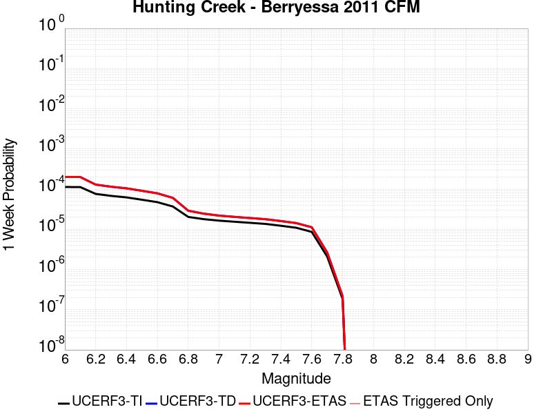 |  |  | 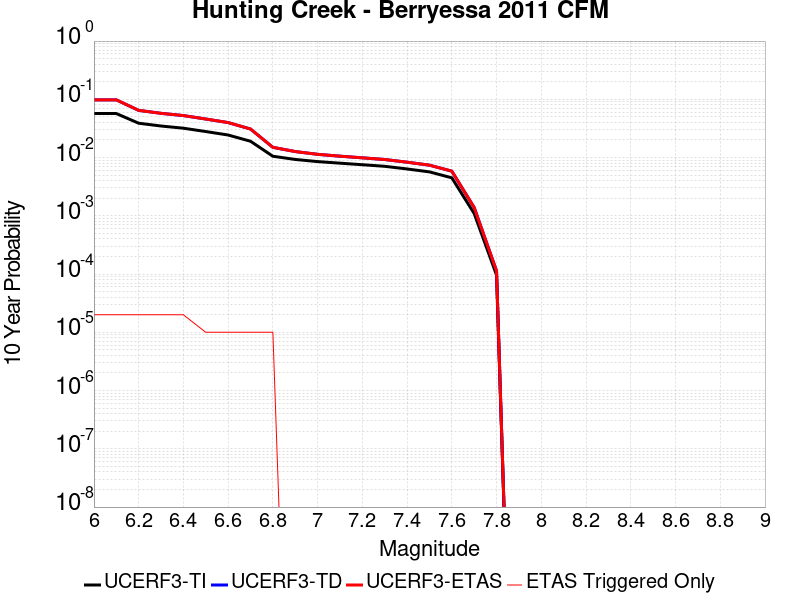 |

| Magnitude | 1 wk TI Prob | 1 wk TD Prob | 1 wk ETAS Prob | 1 wk ETAS/TD Gain | 1 wk ETAS Triggered Only | 1 mo TI Prob | 1 mo TD Prob | 1 mo ETAS Prob | 1 mo ETAS/TD Gain | 1 mo ETAS Triggered Only | 1 yr TI Prob | 1 yr TD Prob | 1 yr ETAS Prob | 1 yr ETAS/TD Gain | 1 yr ETAS Triggered Only | 10 yr TI Prob | 10 yr TD Prob | 10 yr ETAS Prob | 10 yr ETAS/TD Gain | 10 yr ETAS Triggered Only |
|-----|-----|-----|-----|-----|-----|-----|-----|-----|-----|-----|-----|-----|-----|-----|-----|-----|-----|-----|-----|-----|
| 6.0 | 1.1270982E-4 | 2.0015612E-4 | 2.0015612E-4 | 1.0 | 0.0 | 4.8295266E-4 | 8.57428E-4 | 8.57428E-4 | 1.0 | 0.0 | 0.0058641075 | 0.010387265 | 0.01039716 | 1.0009527 | 1.0E-5 | 0.057117578 | 0.0980428 | 0.09806084 | 1.0001839 | 2.0E-5 |
| 6.1 | 1.1239393E-4 | 1.9963745E-4 | 1.9963745E-4 | 1.0 | 0.0 | 4.8159933E-4 | 8.5520657E-4 | 8.5520657E-4 | 1.0 | 0.0 | 0.0058477195 | 0.0103605 | 0.010370396 | 1.0009552 | 1.0E-5 | 0.056962132 | 0.09780127 | 0.09781931 | 1.0001845 | 2.0E-5 |
| 6.2 | 7.596265E-5 | 1.2941749E-4 | 1.2941749E-4 | 1.0 | 0.0 | 3.2551357E-4 | 5.543934E-4 | 5.543934E-4 | 1.0 | 0.0 | 0.0039559277 | 0.006721337 | 0.0067312694 | 1.0014778 | 1.0E-5 | 0.038862433 | 0.06459519 | 0.0646139 | 1.0002897 | 2.0E-5 |
| 6.3 | 6.78794E-5 | 1.1452412E-4 | 1.1452412E-4 | 1.0 | 0.0 | 2.9087928E-4 | 4.9067603E-4 | 4.9067603E-4 | 1.0 | 0.0 | 0.003535705 | 0.0059529645 | 0.005962905 | 1.0016699 | 1.0E-5 | 0.034799766 | 0.057468727 | 0.057487577 | 1.0003281 | 2.0E-5 |
| 6.4 | 6.2165134E-5 | 1.04377075E-4 | 1.04377075E-4 | 1.0 | 0.0 | 2.6639478E-4 | 4.472573E-4 | 4.472573E-4 | 1.0 | 0.0 | 0.0032385332 | 0.005427842 | 0.0054377876 | 1.0018324 | 1.0E-5 | 0.03191742 | 0.052553628 | 0.05257258 | 1.0003606 | 2.0E-5 |
| 6.5 | 5.4368087E-5 | 9.0723166E-5 | 9.0723166E-5 | 1.0 | 0.0 | 2.3298527E-4 | 3.88759E-4 | 3.88759E-4 | 1.0 | 0.0 | 0.0028329059 | 0.0047201156 | 0.0047300686 | 1.0021086 | 1.0E-5 | 0.027970633 | 0.045882877 | 0.045892417 | 1.0002079 | 1.0E-5 |
| 6.6 | 4.729947E-5 | 7.848326E-5 | 7.848326E-5 | 1.0 | 0.0 | 2.0269625E-4 | 3.363165E-4 | 3.363165E-4 | 1.0 | 0.0 | 0.002465034 | 0.0040851813 | 0.0040951404 | 1.0024378 | 1.0E-5 | 0.02437869 | 0.039853964 | 0.039863568 | 1.0002409 | 1.0E-5 |
| 6.7 | 3.6875328E-5 | 6.0457172E-5 | 6.0457172E-5 | 1.0 | 0.0 | 1.5802756E-4 | 2.5907898E-4 | 2.5907898E-4 | 1.0 | 0.0 | 0.0019222875 | 0.0031483928 | 0.0031583614 | 1.0031662 | 1.0E-5 | 0.019057442 | 0.03089428 | 0.03090397 | 1.0003136 | 1.0E-5 |
| 6.8 | 2.0292036E-5 | 2.8977498E-5 | 2.8977498E-5 | 1.0 | 0.0 | 8.6962966E-5 | 1.241834E-4 | 1.241834E-4 | 1.0 | 0.0 | 0.0010582599 | 0.0015108675 | 0.0015208524 | 1.0066087 | 1.0E-5 | 0.010532344 | 0.014979117 | 0.014988967 | 1.0006576 | 1.0E-5 |
| 6.9 | 1.7871042E-5 | 2.447326E-5 | 2.447326E-5 | 1.0 | 0.0 | 7.658793E-5 | 1.0488122E-4 | 1.0488122E-4 | 1.0 | 0.0 | 9.320591E-4 | 0.0012761822 | 0.0012761822 | 1.0 | 0.0 | 0.009281595 | 0.012680289 | 0.012680289 | 1.0 | 0.0 |
| 7.0 | 1.6415532E-5 | 2.190721E-5 | 2.190721E-5 | 1.0 | 0.0 | 7.035038E-5 | 9.388468E-5 | 9.388468E-5 | 1.0 | 0.0 | 8.561793E-4 | 0.00114245 | 0.00114245 | 1.0 | 0.0 | 0.008528882 | 0.011364998 | 0.011364998 | 1.0 | 0.0 |
| 7.1 | 1.5409885E-5 | 2.0347228E-5 | 2.0347228E-5 | 1.0 | 0.0 | 6.6040695E-5 | 8.7199514E-5 | 8.7199514E-5 | 1.0 | 0.0 | 8.0374884E-4 | 0.00106114 | 0.00106114 | 1.0 | 0.0 | 0.00800848 | 0.010561053 | 0.010561053 | 1.0 | 0.0 |
| 7.2 | 1.4497423E-5 | 1.9055798E-5 | 1.9055798E-5 | 1.0 | 0.0 | 6.213033E-5 | 8.166517E-5 | 8.166517E-5 | 1.0 | 0.0 | 7.5617427E-4 | 9.938229E-4 | 9.938229E-4 | 1.0 | 0.0 | 0.0075360634 | 0.00989436 | 0.00989436 | 1.0 | 0.0 |
| 7.3 | 1.3615175E-5 | 1.7826938E-5 | 1.7826938E-5 | 1.0 | 0.0 | 5.8349444E-5 | 7.6398945E-5 | 7.6398945E-5 | 1.0 | 0.0 | 7.101729E-4 | 9.2976313E-4 | 9.2976313E-4 | 1.0 | 0.0 | 0.0070790765 | 0.009259242 | 0.009259242 | 1.0 | 0.0 |
| 7.4 | 1.2252825E-5 | 1.6026986E-5 | 1.6026986E-5 | 1.0 | 0.0 | 5.251105E-5 | 6.8685295E-5 | 6.8685295E-5 | 1.0 | 0.0 | 6.391345E-4 | 8.3592546E-4 | 8.3592546E-4 | 1.0 | 0.0 | 0.0063729943 | 0.008328253 | 0.008328253 | 1.0 | 0.0 |
| 7.5 | 1.0913301E-5 | 1.42418E-5 | 1.42418E-5 | 1.0 | 0.0 | 4.6770452E-5 | 6.1034872E-5 | 6.1034872E-5 | 1.0 | 0.0 | 5.6928146E-4 | 7.4284896E-4 | 7.4284896E-4 | 1.0 | 0.0 | 0.0056782532 | 0.007404033 | 0.007404033 | 1.0 | 0.0 |
| 7.6 | 8.623192E-6 | 1.12350435E-5 | 1.12350435E-5 | 1.0 | 0.0 | 3.6956015E-5 | 4.814931E-5 | 4.814931E-5 | 1.0 | 0.0 | 4.4984656E-4 | 5.860627E-4 | 5.860627E-4 | 1.0 | 0.0 | 0.00448937 | 0.0058454867 | 0.0058454867 | 1.0 | 0.0 |
| 7.7 | 2.0993634E-6 | 2.6626665E-6 | 2.6626665E-6 | 1.0 | 0.0 | 8.997241E-6 | 1.1411378E-5 | 1.1411378E-5 | 1.0 | 0.0 | 1.09535904E-4 | 1.3892475E-4 | 1.3892475E-4 | 1.0 | 0.0 | 0.0010948193 | 0.0013883855 | 0.0013883855 | 1.0 | 0.0 |
| 7.8 | 1.8428308E-7 | 2.1674967E-7 | 2.1674967E-7 | 1.0 | 0.0 | 7.897844E-7 | 9.289268E-7 | 9.289268E-7 | 1.0 | 0.0 | 9.615583E-6 | 1.1309629E-5 | 1.1309629E-5 | 1.0 | 0.0 | 9.615166E-5 | 1.1308914E-4 | 1.1308914E-4 | 1.0 | 0.0 |

## Homestead Valley 2011
*[(top)](#table-of-contents)*

| 1 Week | 1 Month | 1 Year | 10 Year |
|-----|-----|-----|-----|
| 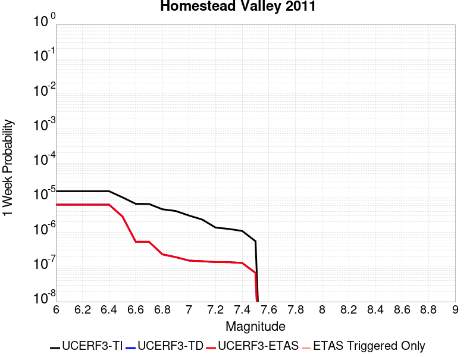 | 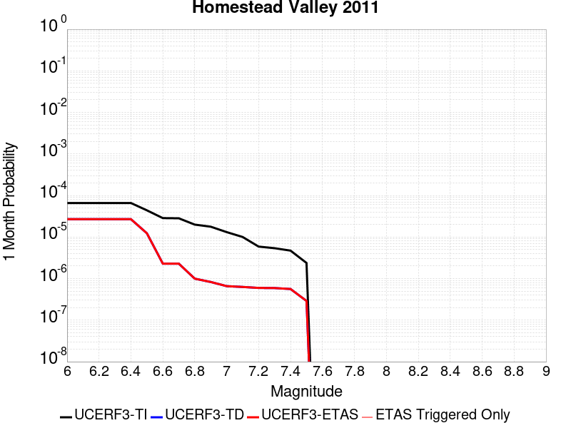 |  |  |

| Magnitude | 1 wk TI Prob | 1 wk TD Prob | 1 wk ETAS Prob | 1 wk ETAS/TD Gain | 1 wk ETAS Triggered Only | 1 mo TI Prob | 1 mo TD Prob | 1 mo ETAS Prob | 1 mo ETAS/TD Gain | 1 mo ETAS Triggered Only | 1 yr TI Prob | 1 yr TD Prob | 1 yr ETAS Prob | 1 yr ETAS/TD Gain | 1 yr ETAS Triggered Only | 10 yr TI Prob | 10 yr TD Prob | 10 yr ETAS Prob | 10 yr ETAS/TD Gain | 10 yr ETAS Triggered Only |
|-----|-----|-----|-----|-----|-----|-----|-----|-----|-----|-----|-----|-----|-----|-----|-----|-----|-----|-----|-----|-----|
| 6.0 | 1.539795E-5 | 6.2867102E-6 | 6.2867102E-6 | 1.0 | 0.0 | 6.5989545E-5 | 2.6942882E-5 | 2.6942882E-5 | 1.0 | 0.0 | 8.0312655E-4 | 3.2800084E-4 | 3.2800084E-4 | 1.0 | 0.0 | 0.008002302 | 0.0032771882 | 0.0032971227 | 1.0060828 | 2.0E-5 |
| 6.1 | 1.539795E-5 | 6.2867102E-6 | 6.2867102E-6 | 1.0 | 0.0 | 6.5989545E-5 | 2.6942882E-5 | 2.6942882E-5 | 1.0 | 0.0 | 8.0312655E-4 | 3.2800084E-4 | 3.2800084E-4 | 1.0 | 0.0 | 0.008002302 | 0.0032771882 | 0.0032971227 | 1.0060828 | 2.0E-5 |
| 6.2 | 1.539795E-5 | 6.2867102E-6 | 6.2867102E-6 | 1.0 | 0.0 | 6.5989545E-5 | 2.6942882E-5 | 2.6942882E-5 | 1.0 | 0.0 | 8.0312655E-4 | 3.2800084E-4 | 3.2800084E-4 | 1.0 | 0.0 | 0.008002302 | 0.0032771882 | 0.0032971227 | 1.0060828 | 2.0E-5 |
| 6.3 | 1.539795E-5 | 6.2867102E-6 | 6.2867102E-6 | 1.0 | 0.0 | 6.5989545E-5 | 2.6942882E-5 | 2.6942882E-5 | 1.0 | 0.0 | 8.0312655E-4 | 3.2800084E-4 | 3.2800084E-4 | 1.0 | 0.0 | 0.008002302 | 0.0032771882 | 0.0032971227 | 1.0060828 | 2.0E-5 |
| 6.4 | 1.539795E-5 | 6.2867102E-6 | 6.2867102E-6 | 1.0 | 0.0 | 6.5989545E-5 | 2.6942882E-5 | 2.6942882E-5 | 1.0 | 0.0 | 8.0312655E-4 | 3.2800084E-4 | 3.2800084E-4 | 1.0 | 0.0 | 0.008002302 | 0.0032771882 | 0.0032971227 | 1.0060828 | 2.0E-5 |
| 6.5 | 1.0265258E-5 | 2.8788993E-6 | 2.8788993E-6 | 1.0 | 0.0 | 4.3993223E-5 | 1.23381205E-5 | 1.23381205E-5 | 1.0 | 0.0 | 5.3548586E-4 | 1.502132E-4 | 1.502132E-4 | 1.0 | 0.0 | 0.005341973 | 0.0015017987 | 0.0015217686 | 1.0132973 | 2.0E-5 |
| 6.6 | 6.664671E-6 | 5.3484445E-7 | 5.3484445E-7 | 1.0 | 0.0 | 2.8562565E-5 | 2.2921893E-6 | 2.2921893E-6 | 1.0 | 0.0 | 3.476937E-4 | 2.7907165E-5 | 2.7907165E-5 | 1.0 | 0.0 | 0.003471502 | 2.7904825E-4 | 2.7904825E-4 | 1.0 | 0.0 |
| 6.7 | 6.5954046E-6 | 5.3484445E-7 | 5.3484445E-7 | 1.0 | 0.0 | 2.8265715E-5 | 2.2921893E-6 | 2.2921893E-6 | 1.0 | 0.0 | 3.4408073E-4 | 2.7907165E-5 | 2.7907165E-5 | 1.0 | 0.0 | 0.0034354846 | 2.7904825E-4 | 2.7904825E-4 | 1.0 | 0.0 |
| 6.8 | 4.648189E-6 | 2.326707E-7 | 2.326707E-7 | 1.0 | 0.0 | 1.9920659E-5 | 9.971598E-7 | 9.971598E-7 | 1.0 | 0.0 | 2.4250703E-4 | 1.2140358E-5 | 1.2140358E-5 | 1.0 | 0.0 | 0.0024224254 | 1.21397425E-4 | 1.21397425E-4 | 1.0 | 0.0 |
| 6.9 | 4.1428534E-6 | 1.9345865E-7 | 1.9345865E-7 | 1.0 | 0.0 | 1.7754966E-5 | 8.291082E-7 | 8.291082E-7 | 1.0 | 0.0 | 2.1614527E-4 | 1.0094349E-5 | 1.0094349E-5 | 1.0 | 0.0 | 0.0021593515 | 1.009392E-4 | 1.009392E-4 | 1.0 | 0.0 |
| 7.0 | 3.0673707E-6 | 1.5368654E-7 | 1.5368654E-7 | 1.0 | 0.0 | 1.3145808E-5 | 6.586564E-7 | 6.586564E-7 | 1.0 | 0.0 | 1.6003846E-4 | 8.019114E-6 | 8.019114E-6 | 1.0 | 0.0 | 0.0015992324 | 8.018834E-5 | 8.018834E-5 | 1.0 | 0.0 |
| 7.1 | 2.340854E-6 | 1.4688634E-7 | 1.4688634E-7 | 1.0 | 0.0 | 1.0032193E-5 | 6.295127E-7 | 6.295127E-7 | 1.0 | 0.0 | 1.221351E-4 | 7.664292E-6 | 7.664292E-6 | 1.0 | 0.0 | 0.00122068 | 7.6640375E-5 | 7.6640375E-5 | 1.0 | 0.0 |
| 7.2 | 1.3754182E-6 | 1.3923506E-7 | 1.3923506E-7 | 1.0 | 0.0 | 5.8946357E-6 | 5.967215E-7 | 5.967215E-7 | 1.0 | 0.0 | 7.176483E-5 | 7.2650614E-6 | 7.2650614E-6 | 1.0 | 0.0 | 7.174166E-4 | 7.2648334E-5 | 7.2648334E-5 | 1.0 | 0.0 |
| 7.3 | 1.2573237E-6 | 1.3828007E-7 | 1.3828007E-7 | 1.0 | 0.0 | 5.388519E-6 | 5.9262874E-7 | 5.9262874E-7 | 1.0 | 0.0 | 6.560324E-5 | 7.2152325E-6 | 7.2152325E-6 | 1.0 | 0.0 | 6.558388E-4 | 7.215007E-5 | 7.215007E-5 | 1.0 | 0.0 |
| 7.4 | 1.0994207E-6 | 1.3106909E-7 | 1.3106909E-7 | 1.0 | 0.0 | 4.7117946E-6 | 5.617245E-7 | 5.617245E-7 | 1.0 | 0.0 | 5.736459E-5 | 6.8389754E-6 | 6.8389754E-6 | 1.0 | 0.0 | 5.734978E-4 | 6.8387744E-5 | 6.8387744E-5 | 1.0 | 0.0 |
| 7.5 | 5.5569126E-7 | 6.773417E-8 | 6.773417E-8 | 1.0 | 0.0 | 2.3815317E-6 | 2.9028928E-7 | 2.9028928E-7 | 1.0 | 0.0 | 2.8994764E-5 | 3.5342666E-6 | 3.5342666E-6 | 1.0 | 0.0 | 2.899098E-4 | 3.5342167E-5 | 3.5342167E-5 | 1.0 | 0.0 |

## Santa Ynez River
*[(top)](#table-of-contents)*

| 1 Week | 1 Month | 1 Year | 10 Year |
|-----|-----|-----|-----|
|  |  |  | 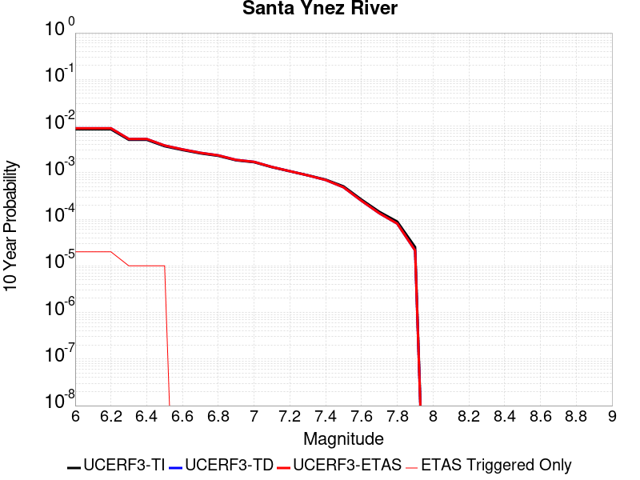 |

| Magnitude | 1 wk TI Prob | 1 wk TD Prob | 1 wk ETAS Prob | 1 wk ETAS/TD Gain | 1 wk ETAS Triggered Only | 1 mo TI Prob | 1 mo TD Prob | 1 mo ETAS Prob | 1 mo ETAS/TD Gain | 1 mo ETAS Triggered Only | 1 yr TI Prob | 1 yr TD Prob | 1 yr ETAS Prob | 1 yr ETAS/TD Gain | 1 yr ETAS Triggered Only | 10 yr TI Prob | 10 yr TD Prob | 10 yr ETAS Prob | 10 yr ETAS/TD Gain | 10 yr ETAS Triggered Only |
|-----|-----|-----|-----|-----|-----|-----|-----|-----|-----|-----|-----|-----|-----|-----|-----|-----|-----|-----|-----|-----|
| 6.0 | 1.6396456E-5 | 1.7209639E-5 | 1.7209639E-5 | 1.0 | 0.0 | 7.026863E-5 | 7.375371E-5 | 7.375371E-5 | 1.0 | 0.0 | 8.551848E-4 | 8.97617E-4 | 9.07608E-4 | 1.0111306 | 1.0E-5 | 0.0085190125 | 0.008943463 | 0.008963284 | 1.0022162 | 2.0E-5 |
| 6.1 | 1.6396456E-5 | 1.7209639E-5 | 1.7209639E-5 | 1.0 | 0.0 | 7.026863E-5 | 7.375371E-5 | 7.375371E-5 | 1.0 | 0.0 | 8.551848E-4 | 8.97617E-4 | 9.07608E-4 | 1.0111306 | 1.0E-5 | 0.0085190125 | 0.008943463 | 0.008963284 | 1.0022162 | 2.0E-5 |
| 6.2 | 1.6396456E-5 | 1.7209639E-5 | 1.7209639E-5 | 1.0 | 0.0 | 7.026863E-5 | 7.375371E-5 | 7.375371E-5 | 1.0 | 0.0 | 8.551848E-4 | 8.97617E-4 | 9.07608E-4 | 1.0111306 | 1.0E-5 | 0.0085190125 | 0.008943463 | 0.008963284 | 1.0022162 | 2.0E-5 |
| 6.3 | 9.736976E-6 | 1.0122438E-5 | 1.0122438E-5 | 1.0 | 0.0 | 4.172923E-5 | 4.3381184E-5 | 4.3381184E-5 | 1.0 | 0.0 | 5.0793495E-4 | 5.280429E-4 | 5.380376E-4 | 1.0189278 | 1.0E-5 | 0.005067755 | 0.005268388 | 0.0052783354 | 1.0018882 | 1.0E-5 |
| 6.4 | 9.736976E-6 | 1.0122438E-5 | 1.0122438E-5 | 1.0 | 0.0 | 4.172923E-5 | 4.3381184E-5 | 4.3381184E-5 | 1.0 | 0.0 | 5.0793495E-4 | 5.280429E-4 | 5.380376E-4 | 1.0189278 | 1.0E-5 | 0.005067755 | 0.005268388 | 0.0052783354 | 1.0018882 | 1.0E-5 |
| 6.5 | 7.081964E-6 | 7.329974E-6 | 7.329974E-6 | 1.0 | 0.0 | 3.035092E-5 | 3.1413805E-5 | 3.1413805E-5 | 1.0 | 0.0 | 3.694598E-4 | 3.8239753E-4 | 3.923937E-4 | 1.0261408 | 1.0E-5 | 0.0036884616 | 0.0038175571 | 0.0038275188 | 1.0026095 | 1.0E-5 |
| 6.6 | 5.873247E-6 | 6.059807E-6 | 6.059807E-6 | 1.0 | 0.0 | 2.5170815E-5 | 2.5970348E-5 | 2.5970348E-5 | 1.0 | 0.0 | 3.064116E-4 | 3.1614397E-4 | 3.1614397E-4 | 1.0 | 0.0 | 0.0030598943 | 0.0031570296 | 0.0031570296 | 1.0 | 0.0 |
| 6.7 | 4.973277E-6 | 5.1159554E-6 | 5.1159554E-6 | 1.0 | 0.0 | 2.1313872E-5 | 2.1925342E-5 | 2.1925342E-5 | 1.0 | 0.0 | 2.5946548E-4 | 2.669088E-4 | 2.669088E-4 | 1.0 | 0.0 | 0.0025916274 | 0.0026659314 | 0.0026659314 | 1.0 | 0.0 |
| 6.8 | 4.396492E-6 | 4.511026E-6 | 4.511026E-6 | 1.0 | 0.0 | 1.884197E-5 | 1.9332827E-5 | 1.9332827E-5 | 1.0 | 0.0 | 2.2937685E-4 | 2.353521E-4 | 2.353521E-4 | 1.0 | 0.0 | 0.0022914023 | 0.0023510638 | 0.0023510638 | 1.0 | 0.0 |
| 6.9 | 3.5255632E-6 | 3.6013732E-6 | 3.6013732E-6 | 1.0 | 0.0 | 1.5109469E-5 | 1.5434365E-5 | 1.5434365E-5 | 1.0 | 0.0 | 1.8394225E-4 | 1.8789736E-4 | 1.8789736E-4 | 1.0 | 0.0 | 0.0018379007 | 0.001877401 | 0.001877401 | 1.0 | 0.0 |
| 7.0 | 3.211603E-6 | 3.273691E-6 | 3.273691E-6 | 1.0 | 0.0 | 1.376394E-5 | 1.4030029E-5 | 1.4030029E-5 | 1.0 | 0.0 | 1.6756308E-4 | 1.7080235E-4 | 1.7080235E-4 | 1.0 | 0.0 | 0.0016743679 | 0.001706725 | 0.001706725 | 1.0 | 0.0 |
| 7.1 | 2.5094619E-6 | 2.5409506E-6 | 2.5409506E-6 | 1.0 | 0.0 | 1.0754793E-5 | 1.0889743E-5 | 1.0889743E-5 | 1.0 | 0.0 | 1.3093173E-4 | 1.3257461E-4 | 1.3257461E-4 | 1.0 | 0.0 | 0.0013085462 | 0.0013249613 | 0.0013249613 | 1.0 | 0.0 |
| 7.2 | 2.0515774E-6 | 2.0619632E-6 | 2.0619632E-6 | 1.0 | 0.0 | 8.792445E-6 | 8.836955E-6 | 8.836955E-6 | 1.0 | 0.0 | 1.0704277E-4 | 1.0758466E-4 | 1.0758466E-4 | 1.0 | 0.0 | 0.0010699122 | 0.0010753301 | 0.0010753301 | 1.0 | 0.0 |
| 7.3 | 1.6845745E-6 | 1.6774125E-6 | 1.6774125E-6 | 1.0 | 0.0 | 7.219585E-6 | 7.188891E-6 | 7.188891E-6 | 1.0 | 0.0 | 8.78949E-5 | 8.752126E-5 | 8.752126E-5 | 1.0 | 0.0 | 8.7860145E-4 | 8.7487075E-4 | 8.7487075E-4 | 1.0 | 0.0 |
| 7.4 | 1.3600285E-6 | 1.3333531E-6 | 1.3333531E-6 | 1.0 | 0.0 | 5.82868E-6 | 5.7143584E-6 | 5.7143584E-6 | 1.0 | 0.0 | 7.096187E-5 | 6.957012E-5 | 6.957012E-5 | 1.0 | 0.0 | 7.0939213E-4 | 6.9548556E-4 | 6.9548556E-4 | 1.0 | 0.0 |
| 7.5 | 9.735342E-7 | 9.2902286E-7 | 9.2902286E-7 | 1.0 | 0.0 | 4.172283E-6 | 3.9815204E-6 | 3.9815204E-6 | 1.0 | 0.0 | 5.079636E-5 | 4.847395E-5 | 4.847395E-5 | 1.0 | 0.0 | 5.0784746E-4 | 4.846355E-4 | 4.846355E-4 | 1.0 | 0.0 |
| 7.6 | 5.067187E-7 | 4.778628E-7 | 4.778628E-7 | 1.0 | 0.0 | 2.1716498E-6 | 2.0479818E-6 | 2.0479818E-6 | 1.0 | 0.0 | 2.6439517E-5 | 2.49339E-5 | 2.49339E-5 | 1.0 | 0.0 | 2.643637E-4 | 2.4931176E-4 | 2.4931176E-4 | 1.0 | 0.0 |
| 7.7 | 2.769089E-7 | 2.5759417E-7 | 2.5759417E-7 | 1.0 | 0.0 | 1.1867519E-6 | 1.1039745E-6 | 1.1039745E-6 | 1.0 | 0.0 | 1.4448608E-5 | 1.34408065E-5 | 1.34408065E-5 | 1.0 | 0.0 | 1.444767E-4 | 1.3439998E-4 | 1.3439998E-4 | 1.0 | 0.0 |
| 7.8 | 1.7044663E-7 | 1.544919E-7 | 1.544919E-7 | 1.0 | 0.0 | 7.3048534E-7 | 6.62108E-7 | 6.62108E-7 | 1.0 | 0.0 | 8.893623E-6 | 8.061135E-6 | 8.061135E-6 | 1.0 | 0.0 | 8.893267E-5 | 8.060845E-5 | 8.060845E-5 | 1.0 | 0.0 |
| 7.9 | 4.8344287E-8 | 4.0911416E-8 | 4.0911416E-8 | 1.0 | 0.0 | 2.0718979E-7 | 1.7533462E-7 | 1.7533462E-7 | 1.0 | 0.0 | 2.5225327E-6 | 2.134697E-6 | 2.134697E-6 | 1.0 | 0.0 | 2.5225041E-5 | 2.1346768E-5 | 2.1346768E-5 | 1.0 | 0.0 |

## Monterey Bay-Tularcitos
*[(top)](#table-of-contents)*

| 1 Week | 1 Month | 1 Year | 10 Year |
|-----|-----|-----|-----|
|  |  | 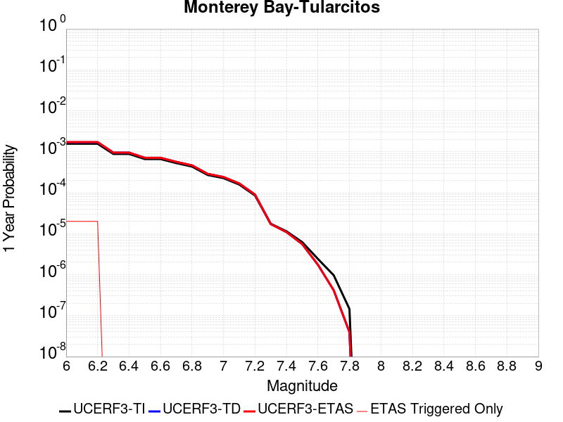 |  |

| Magnitude | 1 wk TI Prob | 1 wk TD Prob | 1 wk ETAS Prob | 1 wk ETAS/TD Gain | 1 wk ETAS Triggered Only | 1 mo TI Prob | 1 mo TD Prob | 1 mo ETAS Prob | 1 mo ETAS/TD Gain | 1 mo ETAS Triggered Only | 1 yr TI Prob | 1 yr TD Prob | 1 yr ETAS Prob | 1 yr ETAS/TD Gain | 1 yr ETAS Triggered Only | 10 yr TI Prob | 10 yr TD Prob | 10 yr ETAS Prob | 10 yr ETAS/TD Gain | 10 yr ETAS Triggered Only |
|-----|-----|-----|-----|-----|-----|-----|-----|-----|-----|-----|-----|-----|-----|-----|-----|-----|-----|-----|-----|-----|
| 6.0 | 3.0131365E-5 | 3.2799384E-5 | 3.2799384E-5 | 1.0 | 0.0 | 1.2912804E-4 | 1.4056181E-4 | 1.4056181E-4 | 1.0 | 0.0 | 0.001571 | 0.0017101022 | 0.001730068 | 1.0116752 | 2.0E-5 | 0.015599402 | 0.016980233 | 0.016999893 | 1.0011579 | 2.0E-5 |
| 6.1 | 3.0131365E-5 | 3.2799384E-5 | 3.2799384E-5 | 1.0 | 0.0 | 1.2912804E-4 | 1.4056181E-4 | 1.4056181E-4 | 1.0 | 0.0 | 0.001571 | 0.0017101022 | 0.001730068 | 1.0116752 | 2.0E-5 | 0.015599402 | 0.016980233 | 0.016999893 | 1.0011579 | 2.0E-5 |
| 6.2 | 3.0131365E-5 | 3.2799384E-5 | 3.2799384E-5 | 1.0 | 0.0 | 1.2912804E-4 | 1.4056181E-4 | 1.4056181E-4 | 1.0 | 0.0 | 0.001571 | 0.0017101022 | 0.001730068 | 1.0116752 | 2.0E-5 | 0.015599402 | 0.016980233 | 0.016999893 | 1.0011579 | 2.0E-5 |
| 6.3 | 1.6998249E-5 | 1.8331106E-5 | 1.8331106E-5 | 1.0 | 0.0 | 7.28476E-5 | 7.855962E-5 | 7.855962E-5 | 1.0 | 0.0 | 8.865586E-4 | 9.5606234E-4 | 9.5606234E-4 | 1.0 | 0.0 | 0.0088303005 | 0.009521417 | 0.009521417 | 1.0 | 0.0 |
| 6.4 | 1.6998249E-5 | 1.8331106E-5 | 1.8331106E-5 | 1.0 | 0.0 | 7.28476E-5 | 7.855962E-5 | 7.855962E-5 | 1.0 | 0.0 | 8.865586E-4 | 9.5606234E-4 | 9.5606234E-4 | 1.0 | 0.0 | 0.0088303005 | 0.009521417 | 0.009521417 | 1.0 | 0.0 |
| 6.5 | 1.27470785E-5 | 1.3693531E-5 | 1.3693531E-5 | 1.0 | 0.0 | 5.4629192E-5 | 5.8685302E-5 | 5.8685302E-5 | 1.0 | 0.0 | 6.649074E-4 | 7.142697E-4 | 7.142697E-4 | 1.0 | 0.0 | 0.0066292146 | 0.007120792 | 0.007120792 | 1.0 | 0.0 |
| 6.6 | 1.2739422E-5 | 1.3685619E-5 | 1.3685619E-5 | 1.0 | 0.0 | 5.4596385E-5 | 5.8651392E-5 | 5.8651392E-5 | 1.0 | 0.0 | 6.645082E-4 | 7.1385707E-4 | 7.1385707E-4 | 1.0 | 0.0 | 0.0066252467 | 0.0071166926 | 0.0071166926 | 1.0 | 0.0 |
| 6.7 | 1.0160109E-5 | 1.0885924E-5 | 1.0885924E-5 | 1.0 | 0.0 | 4.35426E-5 | 4.6653164E-5 | 4.6653164E-5 | 1.0 | 0.0 | 5.300022E-4 | 5.678613E-4 | 5.678613E-4 | 1.0 | 0.0 | 0.005287399 | 0.005664814 | 0.005664814 | 1.0 | 0.0 |
| 6.8 | 8.349859E-6 | 8.932724E-6 | 8.932724E-6 | 1.0 | 0.0 | 3.578462E-5 | 3.8282575E-5 | 3.8282575E-5 | 1.0 | 0.0 | 4.3559066E-4 | 4.659963E-4 | 4.659963E-4 | 1.0 | 0.0 | 0.004347378 | 0.0046507563 | 0.0046507563 | 1.0 | 0.0 |
| 6.9 | 5.193639E-6 | 5.536513E-6 | 5.536513E-6 | 1.0 | 0.0 | 2.2258262E-5 | 2.3727716E-5 | 2.3727716E-5 | 1.0 | 0.0 | 2.7096065E-4 | 2.888499E-4 | 2.888499E-4 | 1.0 | 0.0 | 0.0027063051 | 0.0028850657 | 0.0028850657 | 1.0 | 0.0 |
| 7.0 | 4.359381E-6 | 4.643436E-6 | 4.643436E-6 | 1.0 | 0.0 | 1.8682927E-5 | 1.9900306E-5 | 1.9900306E-5 | 1.0 | 0.0 | 2.274409E-4 | 2.4226225E-4 | 2.4226225E-4 | 1.0 | 0.0 | 0.0022720827 | 0.0024202745 | 0.0024202745 | 1.0 | 0.0 |
| 7.1 | 3.0398533E-6 | 3.231092E-6 | 3.231092E-6 | 1.0 | 0.0 | 1.3027877E-5 | 1.3847479E-5 | 1.3847479E-5 | 1.0 | 0.0 | 1.5860285E-4 | 1.6858263E-4 | 1.6858263E-4 | 1.0 | 0.0 | 0.001584897 | 0.0016848051 | 0.0016848051 | 1.0 | 0.0 |
| 7.2 | 1.642335E-6 | 1.7333424E-6 | 1.7333424E-6 | 1.0 | 0.0 | 7.0385595E-6 | 7.4286004E-6 | 7.4286004E-6 | 1.0 | 0.0 | 8.569109E-5 | 9.044153E-5 | 9.044153E-5 | 1.0 | 0.0 | 8.5658056E-4 | 9.042499E-4 | 9.042499E-4 | 1.0 | 0.0 |
| 7.3 | 3.356842E-7 | 3.295291E-7 | 3.295291E-7 | 1.0 | 0.0 | 1.4386458E-6 | 1.4122668E-6 | 1.4122668E-6 | 1.0 | 0.0 | 1.7515373E-5 | 1.7194214E-5 | 1.7194214E-5 | 1.0 | 0.0 | 1.7513991E-4 | 1.7192893E-4 | 1.7192893E-4 | 1.0 | 0.0 |
| 7.4 | 2.1973483E-7 | 2.1006859E-7 | 2.1006859E-7 | 1.0 | 0.0 | 9.417204E-7 | 9.002936E-7 | 9.002936E-7 | 1.0 | 0.0 | 1.1465385E-5 | 1.096102E-5 | 1.096102E-5 | 1.0 | 0.0 | 1.1464794E-4 | 1.09604836E-4 | 1.09604836E-4 | 1.0 | 0.0 |
| 7.5 | 1.1944135E-7 | 1.069642E-7 | 1.069642E-7 | 1.0 | 0.0 | 5.118914E-7 | 4.5841793E-7 | 4.5841793E-7 | 1.0 | 0.0 | 6.23226E-6 | 5.5812243E-6 | 5.5812243E-6 | 1.0 | 0.0 | 6.2320854E-5 | 5.581085E-5 | 5.581085E-5 | 1.0 | 0.0 |
| 7.6 | 4.636058E-8 | 3.336812E-8 | 3.336812E-8 | 1.0 | 0.0 | 1.9868818E-7 | 1.4300622E-7 | 1.4300622E-7 | 1.0 | 0.0 | 2.419026E-6 | 1.7410994E-6 | 1.7410994E-6 | 1.0 | 0.0 | 2.4189996E-5 | 1.7410859E-5 | 1.7410859E-5 | 1.0 | 0.0 |
| 7.7 | 1.8588572E-8 | 8.005946E-9 | 8.005946E-9 | 1.0 | 0.0 | 7.9665305E-8 | 3.43112E-8 | 3.43112E-8 | 1.0 | 0.0 | 9.699246E-7 | 4.1773876E-7 | 4.1773876E-7 | 1.0 | 0.0 | 9.699204E-6 | 4.17738E-6 | 4.17738E-6 | 1.0 | 0.0 |
| 7.8 | 2.7960154E-9 | 7.613655E-10 | 7.613655E-10 | 1.0 | 0.0 | 1.1982923E-8 | 3.262995E-9 | 3.262995E-9 | 1.0 | 0.0 | 1.4589209E-7 | 3.9726963E-8 | 3.9726963E-8 | 1.0 | 0.0 | 1.4589199E-6 | 3.9726962E-7 | 3.9726962E-7 | 1.0 | 0.0 |

## Emerson-Copper Mtn 2011
*[(top)](#table-of-contents)*

| 1 Week | 1 Month | 1 Year | 10 Year |
|-----|-----|-----|-----|
|  |  | 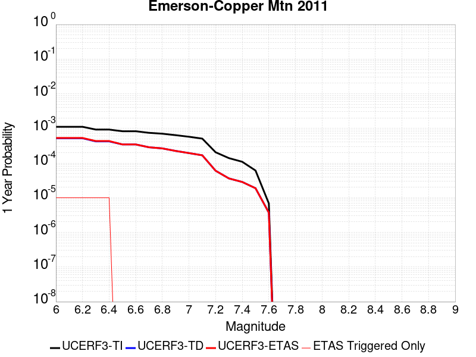 |  |

| Magnitude | 1 wk TI Prob | 1 wk TD Prob | 1 wk ETAS Prob | 1 wk ETAS/TD Gain | 1 wk ETAS Triggered Only | 1 mo TI Prob | 1 mo TD Prob | 1 mo ETAS Prob | 1 mo ETAS/TD Gain | 1 mo ETAS Triggered Only | 1 yr TI Prob | 1 yr TD Prob | 1 yr ETAS Prob | 1 yr ETAS/TD Gain | 1 yr ETAS Triggered Only | 10 yr TI Prob | 10 yr TD Prob | 10 yr ETAS Prob | 10 yr ETAS/TD Gain | 10 yr ETAS Triggered Only |
|-----|-----|-----|-----|-----|-----|-----|-----|-----|-----|-----|-----|-----|-----|-----|-----|-----|-----|-----|-----|-----|
| 6.0 | 2.1364202E-5 | 9.96837E-6 | 9.96837E-6 | 1.0 | 0.0 | 9.1557646E-5 | 4.2720938E-5 | 4.2720938E-5 | 1.0 | 0.0 | 0.0011141442 | 5.20012E-4 | 5.3000683E-4 | 1.0192204 | 1.0E-5 | 0.011085749 | 0.0051888213 | 0.0052087177 | 1.0038345 | 2.0E-5 |
| 6.1 | 2.1364202E-5 | 9.96837E-6 | 9.96837E-6 | 1.0 | 0.0 | 9.1557646E-5 | 4.2720938E-5 | 4.2720938E-5 | 1.0 | 0.0 | 0.0011141442 | 5.20012E-4 | 5.3000683E-4 | 1.0192204 | 1.0E-5 | 0.011085749 | 0.0051888213 | 0.0052087177 | 1.0038345 | 2.0E-5 |
| 6.2 | 2.1364202E-5 | 9.96837E-6 | 9.96837E-6 | 1.0 | 0.0 | 9.1557646E-5 | 4.2720938E-5 | 4.2720938E-5 | 1.0 | 0.0 | 0.0011141442 | 5.20012E-4 | 5.3000683E-4 | 1.0192204 | 1.0E-5 | 0.011085749 | 0.0051888213 | 0.0052087177 | 1.0038345 | 2.0E-5 |
| 6.3 | 1.7751237E-5 | 8.089444E-6 | 8.089444E-6 | 1.0 | 0.0 | 7.607452E-5 | 3.466862E-5 | 3.466862E-5 | 1.0 | 0.0 | 9.258136E-4 | 4.22015E-4 | 4.3201077E-4 | 1.0236858 | 1.0E-5 | 0.00921966 | 0.0042127585 | 0.0042326744 | 1.0047275 | 2.0E-5 |
| 6.4 | 1.7751237E-5 | 8.089444E-6 | 8.089444E-6 | 1.0 | 0.0 | 7.607452E-5 | 3.466862E-5 | 3.466862E-5 | 1.0 | 0.0 | 9.258136E-4 | 4.22015E-4 | 4.3201077E-4 | 1.0236858 | 1.0E-5 | 0.00921966 | 0.0042127585 | 0.0042326744 | 1.0047275 | 2.0E-5 |
| 6.5 | 1.5886664E-5 | 6.604002E-6 | 6.604002E-6 | 1.0 | 0.0 | 6.808392E-5 | 2.8302584E-5 | 2.8302584E-5 | 1.0 | 0.0 | 8.286065E-4 | 3.4453417E-4 | 3.4453417E-4 | 1.0 | 0.0 | 0.008255237 | 0.0034404646 | 0.0034504302 | 1.0028965 | 1.0E-5 |
| 6.6 | 1.5886664E-5 | 6.604002E-6 | 6.604002E-6 | 1.0 | 0.0 | 6.808392E-5 | 2.8302584E-5 | 2.8302584E-5 | 1.0 | 0.0 | 8.286065E-4 | 3.4453417E-4 | 3.4453417E-4 | 1.0 | 0.0 | 0.008255237 | 0.0034404646 | 0.0034504302 | 1.0028965 | 1.0E-5 |
| 6.7 | 1.428471E-5 | 5.47056E-6 | 5.47056E-6 | 1.0 | 0.0 | 6.121875E-5 | 2.3445069E-5 | 2.3445069E-5 | 1.0 | 0.0 | 7.450834E-4 | 2.8541026E-4 | 2.8541026E-4 | 1.0 | 0.0 | 0.007425902 | 0.0028508252 | 0.0028607966 | 1.0034977 | 1.0E-5 |
| 6.8 | 1.3490684E-5 | 5.0738468E-6 | 5.0738468E-6 | 1.0 | 0.0 | 5.7815934E-5 | 2.1744898E-5 | 2.1744898E-5 | 1.0 | 0.0 | 7.0368167E-4 | 2.6471584E-4 | 2.6471584E-4 | 1.0 | 0.0 | 0.007014576 | 0.002644386 | 0.0026543597 | 1.0037715 | 1.0E-5 |
| 6.9 | 1.2235421E-5 | 4.289812E-6 | 4.289812E-6 | 1.0 | 0.0 | 5.2436466E-5 | 1.8384797E-5 | 1.8384797E-5 | 1.0 | 0.0 | 6.38227E-4 | 2.2381553E-4 | 2.2381553E-4 | 1.0 | 0.0 | 0.0063639707 | 0.0022362554 | 0.0022462332 | 1.0044618 | 1.0E-5 |
| 7.0 | 1.1009851E-5 | 3.7191116E-6 | 3.7191116E-6 | 1.0 | 0.0 | 4.7184225E-5 | 1.5938973E-5 | 1.5938973E-5 | 1.0 | 0.0 | 5.743165E-4 | 1.9404315E-4 | 1.9404315E-4 | 1.0 | 0.0 | 0.005728345 | 0.001939075 | 0.0019490556 | 1.0051471 | 1.0E-5 |
| 7.1 | 9.726373E-6 | 3.2119035E-6 | 3.2119035E-6 | 1.0 | 0.0 | 4.168379E-5 | 1.3765247E-5 | 1.3765247E-5 | 1.0 | 0.0 | 5.07382E-4 | 1.6758237E-4 | 1.6758237E-4 | 1.0 | 0.0 | 0.0050622504 | 0.0016748912 | 0.0016848745 | 1.0059606 | 1.0E-5 |
| 7.2 | 3.9335127E-6 | 1.1525171E-6 | 1.1525171E-6 | 1.0 | 0.0 | 1.6857803E-5 | 4.9393498E-6 | 4.9393498E-6 | 1.0 | 0.0 | 2.0522442E-4 | 6.0134986E-5 | 6.0134986E-5 | 1.0 | 0.0 | 0.00205035 | 6.011931E-4 | 6.111871E-4 | 1.0166236 | 1.0E-5 |
| 7.3 | 2.661632E-6 | 6.91175E-7 | 6.91175E-7 | 1.0 | 0.0 | 1.14069435E-5 | 2.9621751E-6 | 2.9621751E-6 | 1.0 | 0.0 | 1.3887069E-4 | 3.6063895E-5 | 3.6063895E-5 | 1.0 | 0.0 | 0.0013878393 | 3.6058147E-4 | 3.6058147E-4 | 1.0 | 0.0 |
| 7.4 | 2.0893426E-6 | 5.46203E-7 | 5.46203E-7 | 1.0 | 0.0 | 8.954295E-6 | 2.3408681E-6 | 2.3408681E-6 | 1.0 | 0.0 | 1.0901308E-4 | 2.84997E-5 | 2.84997E-5 | 1.0 | 0.0 | 0.0010895962 | 2.8496102E-4 | 2.8496102E-4 | 1.0 | 0.0 |
| 7.5 | 1.1681728E-6 | 3.6031688E-7 | 3.6031688E-7 | 1.0 | 0.0 | 5.0064455E-6 | 1.5442143E-6 | 1.5442143E-6 | 1.0 | 0.0 | 6.0951766E-5 | 1.8800652E-5 | 1.8800652E-5 | 1.0 | 0.0 | 6.093505E-4 | 1.8799109E-4 | 1.8799109E-4 | 1.0 | 0.0 |
| 7.6 | 1.3154387E-7 | 7.119876E-8 | 7.119876E-8 | 1.0 | 0.0 | 5.6375933E-7 | 3.0513755E-7 | 3.0513755E-7 | 1.0 | 0.0 | 6.863748E-6 | 3.7150448E-6 | 3.7150448E-6 | 1.0 | 0.0 | 6.863536E-5 | 3.7149985E-5 | 3.7149985E-5 | 1.0 | 0.0 |

## Reliz 2011 CFM
*[(top)](#table-of-contents)*

| 1 Week | 1 Month | 1 Year | 10 Year |
|-----|-----|-----|-----|
|  |  |  | 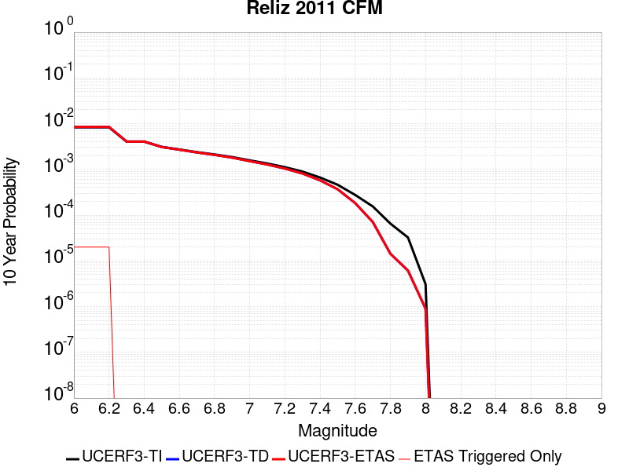 |

| Magnitude | 1 wk TI Prob | 1 wk TD Prob | 1 wk ETAS Prob | 1 wk ETAS/TD Gain | 1 wk ETAS Triggered Only | 1 mo TI Prob | 1 mo TD Prob | 1 mo ETAS Prob | 1 mo ETAS/TD Gain | 1 mo ETAS Triggered Only | 1 yr TI Prob | 1 yr TD Prob | 1 yr ETAS Prob | 1 yr ETAS/TD Gain | 1 yr ETAS Triggered Only | 10 yr TI Prob | 10 yr TD Prob | 10 yr ETAS Prob | 10 yr ETAS/TD Gain | 10 yr ETAS Triggered Only |
|-----|-----|-----|-----|-----|-----|-----|-----|-----|-----|-----|-----|-----|-----|-----|-----|-----|-----|-----|-----|-----|
| 6.0 | 1.6002472E-5 | 1.6282947E-5 | 1.6282947E-5 | 1.0 | 0.0 | 6.8580215E-5 | 6.9782305E-5 | 6.9782305E-5 | 1.0 | 0.0 | 8.3464425E-4 | 8.4928825E-4 | 8.5927977E-4 | 1.0117645 | 1.0E-5 | 0.008315164 | 0.008462622 | 0.0084824525 | 1.0023433 | 2.0E-5 |
| 6.1 | 1.6002472E-5 | 1.6282947E-5 | 1.6282947E-5 | 1.0 | 0.0 | 6.8580215E-5 | 6.9782305E-5 | 6.9782305E-5 | 1.0 | 0.0 | 8.3464425E-4 | 8.4928825E-4 | 8.5927977E-4 | 1.0117645 | 1.0E-5 | 0.008315164 | 0.008462622 | 0.0084824525 | 1.0023433 | 2.0E-5 |
| 6.2 | 1.6002472E-5 | 1.6282947E-5 | 1.6282947E-5 | 1.0 | 0.0 | 6.8580215E-5 | 6.9782305E-5 | 6.9782305E-5 | 1.0 | 0.0 | 8.3464425E-4 | 8.4928825E-4 | 8.5927977E-4 | 1.0117645 | 1.0E-5 | 0.008315164 | 0.008462622 | 0.0084824525 | 1.0023433 | 2.0E-5 |
| 6.3 | 7.792404E-6 | 7.803888E-6 | 7.803888E-6 | 1.0 | 0.0 | 3.339559E-5 | 3.344481E-5 | 3.344481E-5 | 1.0 | 0.0 | 4.0651546E-4 | 4.0711527E-4 | 4.0711527E-4 | 1.0 | 0.0 | 0.0040577264 | 0.004063971 | 0.004063971 | 1.0 | 0.0 |
| 6.4 | 7.792404E-6 | 7.803888E-6 | 7.803888E-6 | 1.0 | 0.0 | 3.339559E-5 | 3.344481E-5 | 3.344481E-5 | 1.0 | 0.0 | 4.0651546E-4 | 4.0711527E-4 | 4.0711527E-4 | 1.0 | 0.0 | 0.0040577264 | 0.004063971 | 0.004063971 | 1.0 | 0.0 |
| 6.5 | 5.9659374E-6 | 5.9288136E-6 | 5.9288136E-6 | 1.0 | 0.0 | 2.5568053E-5 | 2.5408955E-5 | 2.5408955E-5 | 1.0 | 0.0 | 3.1124658E-4 | 3.0931033E-4 | 3.0931033E-4 | 1.0 | 0.0 | 0.00310811 | 0.003089016 | 0.003089016 | 1.0 | 0.0 |
| 6.6 | 5.2350692E-6 | 5.1790576E-6 | 5.1790576E-6 | 1.0 | 0.0 | 2.2435817E-5 | 2.2195773E-5 | 2.2195773E-5 | 1.0 | 0.0 | 2.7312184E-4 | 2.7020017E-4 | 2.7020017E-4 | 1.0 | 0.0 | 0.002727864 | 0.0026989265 | 0.0026989265 | 1.0 | 0.0 |
| 6.7 | 4.580206E-6 | 4.506188E-6 | 4.506188E-6 | 1.0 | 0.0 | 1.9629308E-5 | 1.9312092E-5 | 1.9312092E-5 | 1.0 | 0.0 | 2.389606E-4 | 2.3509942E-4 | 2.3509942E-4 | 1.0 | 0.0 | 0.002387038 | 0.002348709 | 0.002348709 | 1.0 | 0.0 |
| 6.8 | 4.0765017E-6 | 3.9883025E-6 | 3.9883025E-6 | 1.0 | 0.0 | 1.7470604E-5 | 1.7092614E-5 | 1.7092614E-5 | 1.0 | 0.0 | 2.1268385E-4 | 2.0808274E-4 | 2.0808274E-4 | 1.0 | 0.0 | 0.002124804 | 0.0020790773 | 0.0020790773 | 1.0 | 0.0 |
| 6.9 | 3.5752896E-6 | 3.472579E-6 | 3.472579E-6 | 1.0 | 0.0 | 1.532258E-5 | 1.48823965E-5 | 1.48823965E-5 | 1.0 | 0.0 | 1.8653645E-4 | 1.8117814E-4 | 1.8117814E-4 | 1.0 | 0.0 | 0.0018637994 | 0.0018105007 | 0.0018105007 | 1.0 | 0.0 |
| 7.0 | 3.0259848E-6 | 2.908E-6 | 2.908E-6 | 1.0 | 0.0 | 1.2968442E-5 | 1.2462797E-5 | 1.2462797E-5 | 1.0 | 0.0 | 1.5787935E-4 | 1.51724E-4 | 1.51724E-4 | 1.0 | 0.0 | 0.0015776722 | 0.0015163994 | 0.0015163994 | 1.0 | 0.0 |
| 7.1 | 2.5861116E-6 | 2.4552223E-6 | 2.4552223E-6 | 1.0 | 0.0 | 1.1083288E-5 | 1.052234E-5 | 1.052234E-5 | 1.0 | 0.0 | 1.3493067E-4 | 1.2810196E-4 | 1.2810196E-4 | 1.0 | 0.0 | 0.0013484878 | 0.0012804759 | 0.0012804759 | 1.0 | 0.0 |
| 7.2 | 2.1482588E-6 | 2.0032892E-6 | 2.0032892E-6 | 1.0 | 0.0 | 9.20679E-6 | 8.585496E-6 | 8.585496E-6 | 1.0 | 0.0 | 1.12086906E-4 | 1.0452341E-4 | 1.0452341E-4 | 1.0 | 0.0 | 0.0011203039 | 0.0010449368 | 0.0010449368 | 1.0 | 0.0 |
| 7.3 | 1.7194744E-6 | 1.5611735E-6 | 1.5611735E-6 | 1.0 | 0.0 | 7.3691554E-6 | 6.6907264E-6 | 6.6907264E-6 | 1.0 | 0.0 | 8.971577E-5 | 8.145655E-5 | 8.145655E-5 | 1.0 | 0.0 | 8.967956E-4 | 8.14461E-4 | 8.14461E-4 | 1.0 | 0.0 |
| 7.4 | 1.2755178E-6 | 1.1056763E-6 | 1.1056763E-6 | 1.0 | 0.0 | 5.4664933E-6 | 4.7386043E-6 | 4.7386043E-6 | 1.0 | 0.0 | 6.655252E-5 | 5.7690984E-5 | 5.7690984E-5 | 1.0 | 0.0 | 6.6532596E-4 | 5.76954E-4 | 5.76954E-4 | 1.0 | 0.0 |
| 7.5 | 8.8463224E-7 | 7.0584656E-7 | 7.0584656E-7 | 1.0 | 0.0 | 3.7912755E-6 | 3.025053E-6 | 3.025053E-6 | 1.0 | 0.0 | 4.6157802E-5 | 3.68294E-5 | 3.68294E-5 | 1.0 | 0.0 | 4.6148215E-4 | 3.684268E-4 | 3.684268E-4 | 1.0 | 0.0 |
| 7.6 | 5.291355E-7 | 3.501177E-7 | 3.501177E-7 | 1.0 | 0.0 | 2.2677216E-6 | 1.5005035E-6 | 1.5005035E-6 | 1.0 | 0.0 | 2.760916E-5 | 1.8268476E-5 | 1.8268476E-5 | 1.0 | 0.0 | 2.760573E-4 | 1.8286263E-4 | 1.8286263E-4 | 1.0 | 0.0 |
| 7.7 | 2.9663357E-7 | 1.3514303E-7 | 1.3514303E-7 | 1.0 | 0.0 | 1.2712861E-6 | 5.7918425E-7 | 5.7918425E-7 | 1.0 | 0.0 | 1.5477797E-5 | 7.0515453E-6 | 7.0515453E-6 | 1.0 | 0.0 | 1.547672E-4 | 7.0698E-5 | 7.0698E-5 | 1.0 | 0.0 |
| 7.8 | 1.2509386E-7 | 2.7174922E-8 | 2.7174922E-8 | 1.0 | 0.0 | 5.3611643E-7 | 1.16463944E-7 | 1.16463944E-7 | 1.0 | 0.0 | 6.527198E-6 | 1.4179476E-6 | 1.4179476E-6 | 1.0 | 0.0 | 6.527006E-5 | 1.433589E-5 | 1.433589E-5 | 1.0 | 0.0 |
| 7.9 | 6.213493E-8 | 1.1491654E-8 | 1.1491654E-8 | 1.0 | 0.0 | 2.6629255E-7 | 4.9249945E-8 | 4.9249945E-8 | 1.0 | 0.0 | 3.242107E-6 | 5.996179E-7 | 5.996179E-7 | 1.0 | 0.0 | 3.2420594E-5 | 6.1274773E-6 | 6.1274773E-6 | 1.0 | 0.0 |
| 8.0 | 5.92383E-9 | 1.6789513E-9 | 1.6789513E-9 | 1.0 | 0.0 | 2.5387841E-8 | 7.1955064E-9 | 7.1955064E-9 | 1.0 | 0.0 | 3.0909692E-7 | 8.760529E-8 | 8.760529E-8 | 1.0 | 0.0 | 3.090965E-6 | 9.008712E-7 | 9.008712E-7 | 1.0 | 0.0 |

## Surprise Valley 2011 CFM
*[(top)](#table-of-contents)*

| 1 Week | 1 Month | 1 Year | 10 Year |
|-----|-----|-----|-----|
|  |  |  |  |

| Magnitude | 1 wk TI Prob | 1 wk TD Prob | 1 wk ETAS Prob | 1 wk ETAS/TD Gain | 1 wk ETAS Triggered Only | 1 mo TI Prob | 1 mo TD Prob | 1 mo ETAS Prob | 1 mo ETAS/TD Gain | 1 mo ETAS Triggered Only | 1 yr TI Prob | 1 yr TD Prob | 1 yr ETAS Prob | 1 yr ETAS/TD Gain | 1 yr ETAS Triggered Only | 10 yr TI Prob | 10 yr TD Prob | 10 yr ETAS Prob | 10 yr ETAS/TD Gain | 10 yr ETAS Triggered Only |
|-----|-----|-----|-----|-----|-----|-----|-----|-----|-----|-----|-----|-----|-----|-----|-----|-----|-----|-----|-----|-----|
| 6.0 | 4.0396248E-5 | 4.4852346E-5 | 4.4852346E-5 | 1.0 | 0.0 | 1.7311527E-4 | 1.9221136E-4 | 1.9221136E-4 | 1.0 | 0.0 | 0.002105641 | 0.0023378716 | 0.002357825 | 1.0085348 | 2.0E-5 | 0.020858008 | 0.023154495 | 0.023174033 | 1.0008438 | 2.0E-5 |
| 6.1 | 4.0396248E-5 | 4.4852346E-5 | 4.4852346E-5 | 1.0 | 0.0 | 1.7311527E-4 | 1.9221136E-4 | 1.9221136E-4 | 1.0 | 0.0 | 0.002105641 | 0.0023378716 | 0.002357825 | 1.0085348 | 2.0E-5 | 0.020858008 | 0.023154495 | 0.023174033 | 1.0008438 | 2.0E-5 |
| 6.2 | 2.2295266E-5 | 2.4401732E-5 | 2.4401732E-5 | 1.0 | 0.0 | 9.554764E-5 | 1.0457483E-4 | 1.0457483E-4 | 1.0 | 0.0 | 0.0011626717 | 0.0012724857 | 0.001282473 | 1.0078486 | 1.0E-5 | 0.011566074 | 0.012655229 | 0.012665103 | 1.0007802 | 1.0E-5 |
| 6.3 | 1.572643E-5 | 1.7097118E-5 | 1.7097118E-5 | 1.0 | 0.0 | 6.7397246E-5 | 7.327137E-5 | 7.327137E-5 | 1.0 | 0.0 | 8.202525E-4 | 8.9172425E-4 | 9.0171536E-4 | 1.0112042 | 1.0E-5 | 0.008172315 | 0.008882568 | 0.008892479 | 1.0011158 | 1.0E-5 |
| 6.4 | 1.5714395E-5 | 1.708494E-5 | 1.708494E-5 | 1.0 | 0.0 | 6.734567E-5 | 7.321918E-5 | 7.321918E-5 | 1.0 | 0.0 | 8.1962504E-4 | 8.910894E-4 | 9.010805E-4 | 1.0112122 | 1.0E-5 | 0.008166086 | 0.00887627 | 0.008886181 | 1.0011166 | 1.0E-5 |
| 6.5 | 1.2733495E-5 | 1.3801842E-5 | 1.3801842E-5 | 1.0 | 0.0 | 5.457098E-5 | 5.914945E-5 | 5.914945E-5 | 1.0 | 0.0 | 6.641992E-4 | 7.199133E-4 | 7.299061E-4 | 1.0138806 | 1.0E-5 | 0.0066221743 | 0.007176505 | 0.0071864333 | 1.0013834 | 1.0E-5 |
| 6.6 | 1.0983784E-5 | 1.1886758E-5 | 1.1886758E-5 | 1.0 | 0.0 | 4.7072506E-5 | 5.0942283E-5 | 5.0942283E-5 | 1.0 | 0.0 | 5.7295704E-4 | 6.2005117E-4 | 6.3004496E-4 | 1.0161177 | 1.0E-5 | 0.0057148207 | 0.0061837607 | 0.006193699 | 1.0016072 | 1.0E-5 |
| 6.7 | 9.104806E-6 | 9.839657E-6 | 9.839657E-6 | 1.0 | 0.0 | 3.902001E-5 | 4.21693E-5 | 4.21693E-5 | 1.0 | 0.0 | 4.7496508E-4 | 5.132942E-4 | 5.132942E-4 | 1.0 | 0.0 | 0.004739512 | 0.005121483 | 0.005121483 | 1.0 | 0.0 |
| 6.8 | 6.2162403E-6 | 6.704244E-6 | 6.704244E-6 | 1.0 | 0.0 | 2.6640759E-5 | 2.8732169E-5 | 2.8732169E-5 | 1.0 | 0.0 | 3.2430296E-4 | 3.4976026E-4 | 3.4976026E-4 | 1.0 | 0.0 | 0.003238301 | 0.0034923211 | 0.0034923211 | 1.0 | 0.0 |
| 6.9 | 4.1792696E-6 | 4.503303E-6 | 4.503303E-6 | 1.0 | 0.0 | 1.7911032E-5 | 1.9299736E-5 | 1.9299736E-5 | 1.0 | 0.0 | 2.1804498E-4 | 2.349505E-4 | 2.349505E-4 | 1.0 | 0.0 | 0.0021783116 | 0.0023471743 | 0.0023471743 | 1.0 | 0.0 |
| 7.0 | 2.7478413E-6 | 2.9622909E-6 | 2.9622909E-6 | 1.0 | 0.0 | 1.177641E-5 | 1.2695477E-5 | 1.2695477E-5 | 1.0 | 0.0 | 1.4336836E-4 | 1.5455773E-4 | 1.5455773E-4 | 1.0 | 0.0 | 0.001432759 | 0.0015446248 | 0.0015446248 | 1.0 | 0.0 |
| 7.1 | 8.128648E-7 | 8.7250567E-7 | 8.7250567E-7 | 1.0 | 0.0 | 3.4837017E-6 | 3.7393079E-6 | 3.7393079E-6 | 1.0 | 0.0 | 4.2413245E-5 | 4.552572E-5 | 4.552572E-5 | 1.0 | 0.0 | 4.2405148E-4 | 4.552228E-4 | 4.552228E-4 | 1.0 | 0.0 |
| 7.2 | 4.8641045E-8 | 4.9402228E-8 | 4.9402228E-8 | 1.0 | 0.0 | 2.084616E-7 | 2.1172382E-7 | 2.1172382E-7 | 1.0 | 0.0 | 2.538017E-6 | 2.5777344E-6 | 2.5777344E-6 | 1.0 | 0.0 | 2.537988E-5 | 2.5777057E-5 | 2.5777057E-5 | 1.0 | 0.0 |
| 7.3 | 5.3911844E-9 | 5.4758322E-9 | 5.4758322E-9 | 1.0 | 0.0 | 2.3105075E-8 | 2.3467852E-8 | 2.3467852E-8 | 1.0 | 0.0 | 2.8130427E-7 | 2.857211E-7 | 2.857211E-7 | 1.0 | 0.0 | 2.8130391E-6 | 2.8572085E-6 | 2.8572085E-6 | 1.0 | 0.0 |

## Sheephole
*[(top)](#table-of-contents)*

| 1 Week | 1 Month | 1 Year | 10 Year |
|-----|-----|-----|-----|
| 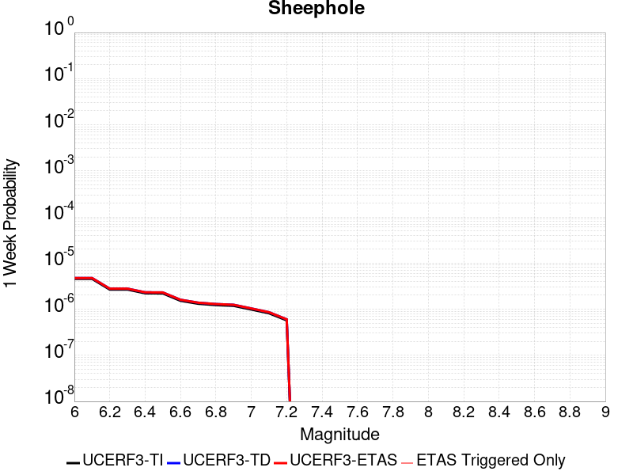 | 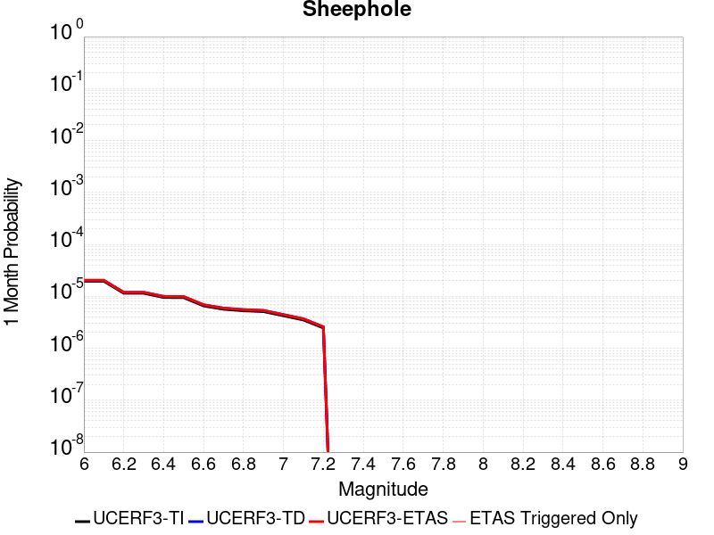 |  |  |

| Magnitude | 1 wk TI Prob | 1 wk TD Prob | 1 wk ETAS Prob | 1 wk ETAS/TD Gain | 1 wk ETAS Triggered Only | 1 mo TI Prob | 1 mo TD Prob | 1 mo ETAS Prob | 1 mo ETAS/TD Gain | 1 mo ETAS Triggered Only | 1 yr TI Prob | 1 yr TD Prob | 1 yr ETAS Prob | 1 yr ETAS/TD Gain | 1 yr ETAS Triggered Only | 10 yr TI Prob | 10 yr TD Prob | 10 yr ETAS Prob | 10 yr ETAS/TD Gain | 10 yr ETAS Triggered Only |
|-----|-----|-----|-----|-----|-----|-----|-----|-----|-----|-----|-----|-----|-----|-----|-----|-----|-----|-----|-----|-----|
| 6.0 | 4.5579695E-6 | 4.7413023E-6 | 4.7413023E-6 | 1.0 | 0.0 | 1.9534009E-5 | 2.031974E-5 | 2.031974E-5 | 1.0 | 0.0 | 2.3780059E-4 | 2.473703E-4 | 2.5736782E-4 | 1.0404152 | 1.0E-5 | 0.0023754628 | 0.0024714938 | 0.0024914443 | 1.0080723 | 2.0E-5 |
| 6.1 | 4.5579695E-6 | 4.7413023E-6 | 4.7413023E-6 | 1.0 | 0.0 | 1.9534009E-5 | 2.031974E-5 | 2.031974E-5 | 1.0 | 0.0 | 2.3780059E-4 | 2.473703E-4 | 2.5736782E-4 | 1.0404152 | 1.0E-5 | 0.0023754628 | 0.0024714938 | 0.0024914443 | 1.0080723 | 2.0E-5 |
| 6.2 | 2.6677674E-6 | 2.7874203E-6 | 2.7874203E-6 | 1.0 | 0.0 | 1.1433239E-5 | 1.1946038E-5 | 1.1946038E-5 | 1.0 | 0.0 | 1.3919079E-4 | 1.4543439E-4 | 1.4543439E-4 | 1.0 | 0.0 | 0.0013910364 | 0.001453498 | 0.001453498 | 1.0 | 0.0 |
| 6.3 | 2.6677674E-6 | 2.7874203E-6 | 2.7874203E-6 | 1.0 | 0.0 | 1.1433239E-5 | 1.1946038E-5 | 1.1946038E-5 | 1.0 | 0.0 | 1.3919079E-4 | 1.4543439E-4 | 1.4543439E-4 | 1.0 | 0.0 | 0.0013910364 | 0.001453498 | 0.001453498 | 1.0 | 0.0 |
| 6.4 | 2.2159759E-6 | 2.322902E-6 | 2.322902E-6 | 1.0 | 0.0 | 9.497005E-6 | 9.955261E-6 | 9.955261E-6 | 1.0 | 0.0 | 1.156199E-4 | 1.2119937E-4 | 1.2119937E-4 | 1.0 | 0.0 | 0.0011555976 | 0.0012114121 | 0.0012114121 | 1.0 | 0.0 |
| 6.5 | 2.1986082E-6 | 2.3047824E-6 | 2.3047824E-6 | 1.0 | 0.0 | 9.4225725E-6 | 9.877605E-6 | 9.877605E-6 | 1.0 | 0.0 | 1.1471378E-4 | 1.20254015E-4 | 1.20254015E-4 | 1.0 | 0.0 | 0.0011465458 | 0.0012019688 | 0.0012019688 | 1.0 | 0.0 |
| 6.6 | 1.5232331E-6 | 1.601909E-6 | 1.601909E-6 | 1.0 | 0.0 | 6.5281256E-6 | 6.8653076E-6 | 6.8653076E-6 | 1.0 | 0.0 | 7.947703E-5 | 8.3582105E-5 | 8.3582105E-5 | 1.0 | 0.0 | 7.9448614E-4 | 8.355254E-4 | 8.355254E-4 | 1.0 | 0.0 |
| 6.7 | 1.3137362E-6 | 1.3828342E-6 | 1.3828342E-6 | 1.0 | 0.0 | 5.6302856E-6 | 5.92642E-6 | 5.92642E-6 | 1.0 | 0.0 | 6.854657E-5 | 7.215191E-5 | 7.215191E-5 | 1.0 | 0.0 | 6.8525434E-4 | 7.2129874E-4 | 7.2129874E-4 | 1.0 | 0.0 |
| 6.8 | 1.2275751E-6 | 1.2922989E-6 | 1.2922989E-6 | 1.0 | 0.0 | 5.2610258E-6 | 5.5384126E-6 | 5.5384126E-6 | 1.0 | 0.0 | 6.4051106E-5 | 6.742822E-5 | 6.742822E-5 | 1.0 | 0.0 | 6.4032647E-4 | 6.74091E-4 | 6.74091E-4 | 1.0 | 0.0 |
| 6.9 | 1.1837088E-6 | 1.2461157E-6 | 1.2461157E-6 | 1.0 | 0.0 | 5.0730278E-6 | 5.3404856E-6 | 5.3404856E-6 | 1.0 | 0.0 | 6.176237E-5 | 6.5018605E-5 | 6.5018605E-5 | 1.0 | 0.0 | 6.17452E-4 | 6.5000897E-4 | 6.5000897E-4 | 1.0 | 0.0 |
| 7.0 | 9.849371E-7 | 1.0366401E-6 | 1.0366401E-6 | 1.0 | 0.0 | 4.2211523E-6 | 4.4427366E-6 | 4.4427366E-6 | 1.0 | 0.0 | 5.1391315E-5 | 5.4089076E-5 | 5.4089076E-5 | 1.0 | 0.0 | 5.137943E-4 | 5.407692E-4 | 5.407692E-4 | 1.0 | 0.0 |
| 7.1 | 8.1643645E-7 | 8.591763E-7 | 8.591763E-7 | 1.0 | 0.0 | 3.4990085E-6 | 3.6821793E-6 | 3.6821793E-6 | 1.0 | 0.0 | 4.2599597E-5 | 4.48297E-5 | 4.48297E-5 | 1.0 | 0.0 | 4.259143E-4 | 4.4821517E-4 | 4.4821517E-4 | 1.0 | 0.0 |
| 7.2 | 5.7295756E-7 | 6.029568E-7 | 6.029568E-7 | 1.0 | 0.0 | 2.45553E-6 | 2.5840982E-6 | 2.5840982E-6 | 1.0 | 0.0 | 2.9895667E-5 | 3.146101E-5 | 3.146101E-5 | 1.0 | 0.0 | 2.9891645E-4 | 3.1457224E-4 | 3.1457224E-4 | 1.0 | 0.0 |

## Ortigalita (South)
*[(top)](#table-of-contents)*

| 1 Week | 1 Month | 1 Year | 10 Year |
|-----|-----|-----|-----|
|  |  |  |  |

| Magnitude | 1 wk TI Prob | 1 wk TD Prob | 1 wk ETAS Prob | 1 wk ETAS/TD Gain | 1 wk ETAS Triggered Only | 1 mo TI Prob | 1 mo TD Prob | 1 mo ETAS Prob | 1 mo ETAS/TD Gain | 1 mo ETAS Triggered Only | 1 yr TI Prob | 1 yr TD Prob | 1 yr ETAS Prob | 1 yr ETAS/TD Gain | 1 yr ETAS Triggered Only | 10 yr TI Prob | 10 yr TD Prob | 10 yr ETAS Prob | 10 yr ETAS/TD Gain | 10 yr ETAS Triggered Only |
|-----|-----|-----|-----|-----|-----|-----|-----|-----|-----|-----|-----|-----|-----|-----|-----|-----|-----|-----|-----|-----|
| 6.0 | 3.72394E-5 | 4.325708E-5 | 4.325708E-5 | 1.0 | 0.0 | 1.5958765E-4 | 1.853752E-4 | 1.853752E-4 | 1.0 | 0.0 | 0.0019412481 | 0.0022547636 | 0.0022547636 | 1.0 | 0.0 | 0.019243775 | 0.022335244 | 0.022354797 | 1.0008755 | 2.0E-5 |
| 6.1 | 2.7299884E-5 | 3.1493055E-5 | 3.1493055E-5 | 1.0 | 0.0 | 1.16994255E-4 | 1.3496356E-4 | 1.3496356E-4 | 1.0 | 0.0 | 0.0014234743 | 0.0016419983 | 0.0016419983 | 1.0 | 0.0 | 0.014143906 | 0.01630459 | 0.016314426 | 1.0006033 | 1.0E-5 |
| 6.2 | 2.7299884E-5 | 3.1493055E-5 | 3.1493055E-5 | 1.0 | 0.0 | 1.16994255E-4 | 1.3496356E-4 | 1.3496356E-4 | 1.0 | 0.0 | 0.0014234743 | 0.0016419983 | 0.0016419983 | 1.0 | 0.0 | 0.014143906 | 0.01630459 | 0.016314426 | 1.0006033 | 1.0E-5 |
| 6.3 | 2.0546433E-5 | 2.3632192E-5 | 2.3632192E-5 | 1.0 | 0.0 | 8.805317E-5 | 1.01277E-4 | 1.01277E-4 | 1.0 | 0.0 | 0.00107152 | 0.001232369 | 0.001232369 | 1.0 | 0.0 | 0.010663681 | 0.012257413 | 0.01226729 | 1.0008059 | 1.0E-5 |
| 6.4 | 2.0546433E-5 | 2.3632192E-5 | 2.3632192E-5 | 1.0 | 0.0 | 8.805317E-5 | 1.01277E-4 | 1.01277E-4 | 1.0 | 0.0 | 0.00107152 | 0.001232369 | 0.001232369 | 1.0 | 0.0 | 0.010663681 | 0.012257413 | 0.01226729 | 1.0008059 | 1.0E-5 |
| 6.5 | 1.7779594E-5 | 2.0447615E-5 | 2.0447615E-5 | 1.0 | 0.0 | 7.619603E-5 | 8.762977E-5 | 8.762977E-5 | 1.0 | 0.0 | 9.272918E-4 | 0.0010663839 | 0.0010663839 | 1.0 | 0.0 | 0.009234319 | 0.010614134 | 0.010614134 | 1.0 | 0.0 |
| 6.6 | 1.6272212E-5 | 1.8715555E-5 | 1.8715555E-5 | 1.0 | 0.0 | 6.973618E-5 | 8.020712E-5 | 8.020712E-5 | 1.0 | 0.0 | 8.487073E-4 | 9.760965E-4 | 9.760965E-4 | 1.0 | 0.0 | 0.008454733 | 0.009719394 | 0.009719394 | 1.0 | 0.0 |
| 6.7 | 1.3051484E-5 | 1.5039237E-5 | 1.5039237E-5 | 1.0 | 0.0 | 5.593373E-5 | 6.445233E-5 | 6.445233E-5 | 1.0 | 0.0 | 6.807804E-4 | 7.8443415E-4 | 7.8443415E-4 | 1.0 | 0.0 | 0.006786986 | 0.007817635 | 0.007817635 | 1.0 | 0.0 |
| 6.8 | 1.04277415E-5 | 1.19876095E-5 | 1.19876095E-5 | 1.0 | 0.0 | 4.4689557E-5 | 5.13745E-5 | 5.13745E-5 | 1.0 | 0.0 | 5.439595E-4 | 6.2531244E-4 | 6.2531244E-4 | 1.0 | 0.0 | 0.0054262993 | 0.006236284 | 0.006236284 | 1.0 | 0.0 |
| 6.9 | 7.639968E-6 | 8.79178E-6 | 8.79178E-6 | 1.0 | 0.0 | 3.274231E-5 | 3.7678547E-5 | 3.7678547E-5 | 1.0 | 0.0 | 3.9856473E-4 | 4.586456E-4 | 4.586456E-4 | 1.0 | 0.0 | 0.003978506 | 0.0045775766 | 0.0045775766 | 1.0 | 0.0 |
| 7.0 | 3.919831E-6 | 4.5335496E-6 | 4.5335496E-6 | 1.0 | 0.0 | 1.679917E-5 | 1.9429364E-5 | 1.9429364E-5 | 1.0 | 0.0 | 2.045107E-4 | 2.3652895E-4 | 2.3652895E-4 | 1.0 | 0.0 | 0.0020432258 | 0.0023629805 | 0.0023629805 | 1.0 | 0.0 |
| 7.1 | 1.6017933E-6 | 1.8571035E-6 | 1.8571035E-6 | 1.0 | 0.0 | 6.8648105E-6 | 7.958996E-6 | 7.958996E-6 | 1.0 | 0.0 | 8.357586E-5 | 9.6897544E-5 | 9.6897544E-5 | 1.0 | 0.0 | 8.3544437E-4 | 9.6865767E-4 | 9.6865767E-4 | 1.0 | 0.0 |

## Oceanside alt1
*[(top)](#table-of-contents)*

| 1 Week | 1 Month | 1 Year | 10 Year |
|-----|-----|-----|-----|
|  |  |  |  |

| Magnitude | 1 wk TI Prob | 1 wk TD Prob | 1 wk ETAS Prob | 1 wk ETAS/TD Gain | 1 wk ETAS Triggered Only | 1 mo TI Prob | 1 mo TD Prob | 1 mo ETAS Prob | 1 mo ETAS/TD Gain | 1 mo ETAS Triggered Only | 1 yr TI Prob | 1 yr TD Prob | 1 yr ETAS Prob | 1 yr ETAS/TD Gain | 1 yr ETAS Triggered Only | 10 yr TI Prob | 10 yr TD Prob | 10 yr ETAS Prob | 10 yr ETAS/TD Gain | 10 yr ETAS Triggered Only |
|-----|-----|-----|-----|-----|-----|-----|-----|-----|-----|-----|-----|-----|-----|-----|-----|-----|-----|-----|-----|-----|
| 6.0 | 1.1617542E-5 | 1.1423611E-5 | 1.1423611E-5 | 1.0 | 0.0 | 4.9788516E-5 | 4.8957503E-5 | 5.8957015E-5 | 1.2042488 | 1.0E-5 | 6.060066E-4 | 5.959107E-4 | 6.158988E-4 | 1.033542 | 2.0E-5 | 0.0060435664 | 0.005944726 | 0.005964607 | 1.0033443 | 2.0E-5 |
| 6.1 | 1.1617542E-5 | 1.1423611E-5 | 1.1423611E-5 | 1.0 | 0.0 | 4.9788516E-5 | 4.8957503E-5 | 5.8957015E-5 | 1.2042488 | 1.0E-5 | 6.060066E-4 | 5.959107E-4 | 6.158988E-4 | 1.033542 | 2.0E-5 | 0.0060435664 | 0.005944726 | 0.005964607 | 1.0033443 | 2.0E-5 |
| 6.2 | 1.1617542E-5 | 1.1423611E-5 | 1.1423611E-5 | 1.0 | 0.0 | 4.9788516E-5 | 4.8957503E-5 | 5.8957015E-5 | 1.2042488 | 1.0E-5 | 6.060066E-4 | 5.959107E-4 | 6.158988E-4 | 1.033542 | 2.0E-5 | 0.0060435664 | 0.005944726 | 0.005964607 | 1.0033443 | 2.0E-5 |
| 6.3 | 1.1617542E-5 | 1.1423611E-5 | 1.1423611E-5 | 1.0 | 0.0 | 4.9788516E-5 | 4.8957503E-5 | 5.8957015E-5 | 1.2042488 | 1.0E-5 | 6.060066E-4 | 5.959107E-4 | 6.158988E-4 | 1.033542 | 2.0E-5 | 0.0060435664 | 0.005944726 | 0.005964607 | 1.0033443 | 2.0E-5 |
| 6.4 | 1.1617542E-5 | 1.1423611E-5 | 1.1423611E-5 | 1.0 | 0.0 | 4.9788516E-5 | 4.8957503E-5 | 5.8957015E-5 | 1.2042488 | 1.0E-5 | 6.060066E-4 | 5.959107E-4 | 6.158988E-4 | 1.033542 | 2.0E-5 | 0.0060435664 | 0.005944726 | 0.005964607 | 1.0033443 | 2.0E-5 |
| 6.5 | 1.1617542E-5 | 1.1423611E-5 | 1.1423611E-5 | 1.0 | 0.0 | 4.9788516E-5 | 4.8957503E-5 | 5.8957015E-5 | 1.2042488 | 1.0E-5 | 6.060066E-4 | 5.959107E-4 | 6.158988E-4 | 1.033542 | 2.0E-5 | 0.0060435664 | 0.005944726 | 0.005964607 | 1.0033443 | 2.0E-5 |
| 6.6 | 7.561768E-6 | 7.1336826E-6 | 7.1336826E-6 | 1.0 | 0.0 | 3.2407173E-5 | 3.0572573E-5 | 3.0572573E-5 | 1.0 | 0.0 | 3.9448592E-4 | 3.7215857E-4 | 3.8215486E-4 | 1.0268602 | 1.0E-5 | 0.0039378637 | 0.0037154648 | 0.0037254277 | 1.0026815 | 1.0E-5 |
| 6.7 | 7.1042605E-6 | 6.655748E-6 | 6.655748E-6 | 1.0 | 0.0 | 3.0446476E-5 | 2.8524328E-5 | 2.8524328E-5 | 1.0 | 0.0 | 3.706228E-4 | 3.4722916E-4 | 3.5722568E-4 | 1.0287894 | 1.0E-5 | 0.0037000529 | 0.0034669496 | 0.003476915 | 1.0028744 | 1.0E-5 |
| 6.8 | 6.285554E-6 | 5.7997604E-6 | 5.7997604E-6 | 1.0 | 0.0 | 2.693781E-5 | 2.4855883E-5 | 2.4855883E-5 | 1.0 | 0.0 | 3.2791847E-4 | 3.0257888E-4 | 3.0257888E-4 | 1.0 | 0.0 | 0.0032743502 | 0.0030217266 | 0.0030217266 | 1.0 | 0.0 |
| 6.9 | 6.148883E-6 | 5.6565973E-6 | 5.6565973E-6 | 1.0 | 0.0 | 2.635209E-5 | 2.4242338E-5 | 2.4242338E-5 | 1.0 | 0.0 | 3.2078946E-4 | 2.9511104E-4 | 2.9511104E-4 | 1.0 | 0.0 | 0.003203268 | 0.0029472485 | 0.0029472485 | 1.0 | 0.0 |
| 7.0 | 5.253857E-6 | 4.7224485E-6 | 4.7224485E-6 | 1.0 | 0.0 | 2.2516335E-5 | 2.023891E-5 | 2.023891E-5 | 1.0 | 0.0 | 2.7410188E-4 | 2.4638115E-4 | 2.4638115E-4 | 1.0 | 0.0 | 0.0027376404 | 0.0024611116 | 0.0024611116 | 1.0 | 0.0 |
| 7.1 | 4.730754E-6 | 4.1785493E-6 | 4.1785493E-6 | 1.0 | 0.0 | 2.0274503E-5 | 1.7907947E-5 | 1.7907947E-5 | 1.0 | 0.0 | 2.468141E-4 | 2.180077E-4 | 2.180077E-4 | 1.0 | 0.0 | 0.0024654015 | 0.002177965 | 0.002177965 | 1.0 | 0.0 |
| 7.2 | 3.7998386E-6 | 3.214056E-6 | 3.214056E-6 | 1.0 | 0.0 | 1.6284921E-5 | 1.3774454E-5 | 1.3774454E-5 | 1.0 | 0.0 | 1.9825088E-4 | 1.6769119E-4 | 1.6769119E-4 | 1.0 | 0.0 | 0.001980741 | 0.0016756587 | 0.0016756587 | 1.0 | 0.0 |
| 7.3 | 3.2656465E-6 | 2.6984017E-6 | 2.6984017E-6 | 1.0 | 0.0 | 1.3995553E-5 | 1.1564528E-5 | 1.1564528E-5 | 1.0 | 0.0 | 1.7038253E-4 | 1.4078914E-4 | 1.4078914E-4 | 1.0 | 0.0 | 0.0017025196 | 0.0014070106 | 0.0014070106 | 1.0 | 0.0 |
| 7.4 | 2.593703E-6 | 2.068048E-6 | 2.068048E-6 | 1.0 | 0.0 | 1.1115822E-5 | 8.863033E-6 | 8.863033E-6 | 1.0 | 0.0 | 1.3532673E-4 | 1.07902175E-4 | 1.07902175E-4 | 1.0 | 0.0 | 0.0013524436 | 0.0010785067 | 0.0010785067 | 1.0 | 0.0 |
| 7.5 | 1.8715585E-6 | 1.4137283E-6 | 1.4137283E-6 | 1.0 | 0.0 | 8.020941E-6 | 6.058822E-6 | 6.058822E-6 | 1.0 | 0.0 | 9.7650576E-5 | 7.3763724E-5 | 7.3763724E-5 | 1.0 | 0.0 | 9.7607676E-4 | 7.3739846E-4 | 7.3739846E-4 | 1.0 | 0.0 |
| 7.6 | 1.2246786E-6 | 8.526902E-7 | 8.526902E-7 | 1.0 | 0.0 | 5.248612E-6 | 3.6543818E-6 | 3.6543818E-6 | 1.0 | 0.0 | 6.389998E-5 | 4.4491233E-5 | 4.4491233E-5 | 1.0 | 0.0 | 6.3881604E-4 | 4.4482778E-4 | 4.4482778E-4 | 1.0 | 0.0 |
| 7.7 | 5.140719E-7 | 2.7347514E-7 | 2.7347514E-7 | 1.0 | 0.0 | 2.2031636E-6 | 1.1720358E-6 | 1.1720358E-6 | 1.0 | 0.0 | 2.6823185E-5 | 1.4269457E-5 | 1.4269457E-5 | 1.0 | 0.0 | 2.6819948E-4 | 1.4268675E-4 | 1.4268675E-4 | 1.0 | 0.0 |
| 7.8 | 1.16056995E-8 | 9.782402E-9 | 9.782402E-9 | 1.0 | 0.0 | 4.9738713E-8 | 4.1924583E-8 | 4.1924583E-8 | 1.0 | 0.0 | 6.0556863E-7 | 5.104318E-7 | 5.104318E-7 | 1.0 | 0.0 | 6.05567E-6 | 5.104318E-6 | 5.104318E-6 | 1.0 | 0.0 |

## Simi-Santa Rosa
*[(top)](#table-of-contents)*

| 1 Week | 1 Month | 1 Year | 10 Year |
|-----|-----|-----|-----|
|  |  |  |  |

| Magnitude | 1 wk TI Prob | 1 wk TD Prob | 1 wk ETAS Prob | 1 wk ETAS/TD Gain | 1 wk ETAS Triggered Only | 1 mo TI Prob | 1 mo TD Prob | 1 mo ETAS Prob | 1 mo ETAS/TD Gain | 1 mo ETAS Triggered Only | 1 yr TI Prob | 1 yr TD Prob | 1 yr ETAS Prob | 1 yr ETAS/TD Gain | 1 yr ETAS Triggered Only | 10 yr TI Prob | 10 yr TD Prob | 10 yr ETAS Prob | 10 yr ETAS/TD Gain | 10 yr ETAS Triggered Only |
|-----|-----|-----|-----|-----|-----|-----|-----|-----|-----|-----|-----|-----|-----|-----|-----|-----|-----|-----|-----|-----|
| 6.0 | 2.198912E-5 | 2.2276106E-5 | 2.2276106E-5 | 1.0 | 0.0 | 9.4235686E-5 | 9.546578E-5 | 9.546578E-5 | 1.0 | 0.0 | 0.0011467156 | 0.00116172 | 0.00116172 | 1.0 | 0.0 | 0.011408163 | 0.011560918 | 0.011580686 | 1.0017099 | 2.0E-5 |
| 6.1 | 2.198912E-5 | 2.2276106E-5 | 2.2276106E-5 | 1.0 | 0.0 | 9.4235686E-5 | 9.546578E-5 | 9.546578E-5 | 1.0 | 0.0 | 0.0011467156 | 0.00116172 | 0.00116172 | 1.0 | 0.0 | 0.011408163 | 0.011560918 | 0.011580686 | 1.0017099 | 2.0E-5 |
| 6.2 | 1.69983E-5 | 1.6669079E-5 | 1.6669079E-5 | 1.0 | 0.0 | 7.284782E-5 | 7.143712E-5 | 7.143712E-5 | 1.0 | 0.0 | 8.865613E-4 | 8.6942903E-4 | 8.6942903E-4 | 1.0 | 0.0 | 0.008830327 | 0.008663196 | 0.008683023 | 1.0022886 | 2.0E-5 |
| 6.3 | 1.69983E-5 | 1.6669079E-5 | 1.6669079E-5 | 1.0 | 0.0 | 7.284782E-5 | 7.143712E-5 | 7.143712E-5 | 1.0 | 0.0 | 8.865613E-4 | 8.6942903E-4 | 8.6942903E-4 | 1.0 | 0.0 | 0.008830327 | 0.008663196 | 0.008683023 | 1.0022886 | 2.0E-5 |
| 6.4 | 1.4666188E-5 | 1.4052996E-5 | 1.4052996E-5 | 1.0 | 0.0 | 6.285358E-5 | 6.0225877E-5 | 6.0225877E-5 | 1.0 | 0.0 | 7.6497364E-4 | 7.330283E-4 | 7.330283E-4 | 1.0 | 0.0 | 0.0076234564 | 0.007308579 | 0.007328433 | 1.0027165 | 2.0E-5 |
| 6.5 | 1.4666188E-5 | 1.4052996E-5 | 1.4052996E-5 | 1.0 | 0.0 | 6.285358E-5 | 6.0225877E-5 | 6.0225877E-5 | 1.0 | 0.0 | 7.6497364E-4 | 7.330283E-4 | 7.330283E-4 | 1.0 | 0.0 | 0.0076234564 | 0.007308579 | 0.007328433 | 1.0027165 | 2.0E-5 |
| 6.6 | 1.4377586E-5 | 1.3730028E-5 | 1.3730028E-5 | 1.0 | 0.0 | 6.1616774E-5 | 5.884179E-5 | 5.884179E-5 | 1.0 | 0.0 | 7.4992597E-4 | 7.1618817E-4 | 7.1618817E-4 | 1.0 | 0.0 | 0.007474003 | 0.0071412693 | 0.0071611265 | 1.0027807 | 2.0E-5 |
| 6.7 | 1.3881404E-5 | 1.3207982E-5 | 1.3207982E-5 | 1.0 | 0.0 | 5.9490372E-5 | 5.660455E-5 | 5.660455E-5 | 1.0 | 0.0 | 7.240546E-4 | 6.889672E-4 | 6.889672E-4 | 1.0 | 0.0 | 0.007217 | 0.006870762 | 0.0068906248 | 1.002891 | 2.0E-5 |
| 6.8 | 1.0176516E-5 | 9.154475E-6 | 9.154475E-6 | 1.0 | 0.0 | 4.3612912E-5 | 3.9232968E-5 | 3.9232968E-5 | 1.0 | 0.0 | 5.308578E-4 | 4.7757328E-4 | 4.7757328E-4 | 1.0 | 0.0 | 0.0052959146 | 0.004767103 | 0.004787008 | 1.0041754 | 2.0E-5 |
| 6.9 | 9.699797E-6 | 8.775032E-6 | 8.775032E-6 | 1.0 | 0.0 | 4.15699E-5 | 3.760683E-5 | 3.760683E-5 | 1.0 | 0.0 | 5.05996E-4 | 4.577834E-4 | 4.577834E-4 | 1.0 | 0.0 | 0.005048454 | 0.0045700218 | 0.0045899306 | 1.0043564 | 2.0E-5 |
| 7.0 | 7.4049476E-6 | 6.559577E-6 | 6.559577E-6 | 1.0 | 0.0 | 3.1735104E-5 | 2.8112241E-5 | 2.8112241E-5 | 1.0 | 0.0 | 3.8630638E-4 | 3.4222542E-4 | 3.4222542E-4 | 1.0 | 0.0 | 0.0038563553 | 0.0034182265 | 0.0034281923 | 1.0029155 | 1.0E-5 |
| 7.1 | 3.873439E-6 | 2.759641E-6 | 2.759641E-6 | 1.0 | 0.0 | 1.6600346E-5 | 1.182698E-5 | 1.182698E-5 | 1.0 | 0.0 | 2.0209046E-4 | 1.439842E-4 | 1.439842E-4 | 1.0 | 0.0 | 0.0020190678 | 0.0014389327 | 0.0014389327 | 1.0 | 0.0 |
| 7.2 | 3.417706E-6 | 2.3677705E-6 | 2.3677705E-6 | 1.0 | 0.0 | 1.4647229E-5 | 1.0147551E-5 | 1.0147551E-5 | 1.0 | 0.0 | 1.7831543E-4 | 1.2353965E-4 | 1.2353965E-4 | 1.0 | 0.0 | 0.0017817242 | 0.001234732 | 0.001234732 | 1.0 | 0.0 |
| 7.3 | 1.90225E-6 | 1.4074748E-6 | 1.4074748E-6 | 1.0 | 0.0 | 8.152474E-6 | 6.0320212E-6 | 6.0320212E-6 | 1.0 | 0.0 | 9.9251854E-5 | 7.3437404E-5 | 7.3437404E-5 | 1.0 | 0.0 | 9.920754E-4 | 7.341336E-4 | 7.341336E-4 | 1.0 | 0.0 |
| 7.4 | 1.5170556E-6 | 1.1025718E-6 | 1.1025718E-6 | 1.0 | 0.0 | 6.5016507E-6 | 4.725299E-6 | 4.725299E-6 | 1.0 | 0.0 | 7.915472E-5 | 5.7529007E-5 | 5.7529007E-5 | 1.0 | 0.0 | 7.9126534E-4 | 5.751423E-4 | 5.751423E-4 | 1.0 | 0.0 |
| 7.5 | 1.178732E-6 | 8.536015E-7 | 8.536015E-7 | 1.0 | 0.0 | 5.0516987E-6 | 3.658287E-6 | 3.658287E-6 | 1.0 | 0.0 | 6.1502695E-5 | 4.453874E-5 | 4.453874E-5 | 1.0 | 0.0 | 6.148568E-4 | 4.452991E-4 | 4.452991E-4 | 1.0 | 0.0 |
| 7.6 | 6.8722386E-7 | 4.7940625E-7 | 4.7940625E-7 | 1.0 | 0.0 | 2.9452417E-6 | 2.0545965E-6 | 2.0545965E-6 | 1.0 | 0.0 | 3.5857727E-5 | 2.5014428E-5 | 2.5014428E-5 | 1.0 | 0.0 | 3.5851944E-4 | 2.5011625E-4 | 2.5011625E-4 | 1.0 | 0.0 |
| 7.7 | 5.5126515E-7 | 3.6739692E-7 | 3.6739692E-7 | 1.0 | 0.0 | 2.3625628E-6 | 1.5745574E-6 | 1.5745574E-6 | 1.0 | 0.0 | 2.8763823E-5 | 1.9170067E-5 | 1.9170067E-5 | 1.0 | 0.0 | 2.87601E-4 | 1.9168424E-4 | 1.9168424E-4 | 1.0 | 0.0 |
| 7.8 | 3.3860243E-7 | 2.0082086E-7 | 2.0082086E-7 | 1.0 | 0.0 | 1.4511525E-6 | 8.606606E-7 | 8.606606E-7 | 1.0 | 0.0 | 1.7667637E-5 | 1.0478492E-5 | 1.0478492E-5 | 1.0 | 0.0 | 1.7666233E-4 | 1.0478004E-4 | 1.0478004E-4 | 1.0 | 0.0 |
| 7.9 | 2.7955386E-7 | 1.4655014E-7 | 1.4655014E-7 | 1.0 | 0.0 | 1.1980875E-6 | 6.2807186E-7 | 6.2807186E-7 | 1.0 | 0.0 | 1.4586617E-5 | 7.646749E-6 | 7.646749E-6 | 1.0 | 0.0 | 1.458566E-4 | 7.6464894E-5 | 7.6464894E-5 | 1.0 | 0.0 |
| 8.0 | 5.6259015E-8 | 3.3358095E-8 | 3.3358095E-8 | 1.0 | 0.0 | 2.4111003E-7 | 1.4296326E-7 | 1.4296326E-7 | 1.0 | 0.0 | 2.9355108E-6 | 1.7405765E-6 | 1.7405765E-6 | 1.0 | 0.0 | 2.935472E-5 | 1.7405642E-5 | 1.7405642E-5 | 1.0 | 0.0 |

## San Gabriel
*[(top)](#table-of-contents)*

| 1 Week | 1 Month | 1 Year | 10 Year |
|-----|-----|-----|-----|
|  |  |  |  |

| Magnitude | 1 wk TI Prob | 1 wk TD Prob | 1 wk ETAS Prob | 1 wk ETAS/TD Gain | 1 wk ETAS Triggered Only | 1 mo TI Prob | 1 mo TD Prob | 1 mo ETAS Prob | 1 mo ETAS/TD Gain | 1 mo ETAS Triggered Only | 1 yr TI Prob | 1 yr TD Prob | 1 yr ETAS Prob | 1 yr ETAS/TD Gain | 1 yr ETAS Triggered Only | 10 yr TI Prob | 10 yr TD Prob | 10 yr ETAS Prob | 10 yr ETAS/TD Gain | 10 yr ETAS Triggered Only |
|-----|-----|-----|-----|-----|-----|-----|-----|-----|-----|-----|-----|-----|-----|-----|-----|-----|-----|-----|-----|-----|
| 6.0 | 1.083775E-5 | 1.1988543E-5 | 1.1988543E-5 | 1.0 | 0.0 | 4.6446676E-5 | 5.137852E-5 | 5.137852E-5 | 1.0 | 0.0 | 5.653415E-4 | 6.253653E-4 | 6.253653E-4 | 1.0 | 0.0 | 0.0056390543 | 0.0062481454 | 0.0062680203 | 1.003181 | 2.0E-5 |
| 6.1 | 1.083775E-5 | 1.1988543E-5 | 1.1988543E-5 | 1.0 | 0.0 | 4.6446676E-5 | 5.137852E-5 | 5.137852E-5 | 1.0 | 0.0 | 5.653415E-4 | 6.253653E-4 | 6.253653E-4 | 1.0 | 0.0 | 0.0056390543 | 0.0062481454 | 0.0062680203 | 1.003181 | 2.0E-5 |
| 6.2 | 1.083775E-5 | 1.1988543E-5 | 1.1988543E-5 | 1.0 | 0.0 | 4.6446676E-5 | 5.137852E-5 | 5.137852E-5 | 1.0 | 0.0 | 5.653415E-4 | 6.253653E-4 | 6.253653E-4 | 1.0 | 0.0 | 0.0056390543 | 0.0062481454 | 0.0062680203 | 1.003181 | 2.0E-5 |
| 6.3 | 1.083775E-5 | 1.1988543E-5 | 1.1988543E-5 | 1.0 | 0.0 | 4.6446676E-5 | 5.137852E-5 | 5.137852E-5 | 1.0 | 0.0 | 5.653415E-4 | 6.253653E-4 | 6.253653E-4 | 1.0 | 0.0 | 0.0056390543 | 0.0062481454 | 0.0062680203 | 1.003181 | 2.0E-5 |
| 6.4 | 1.083775E-5 | 1.1988543E-5 | 1.1988543E-5 | 1.0 | 0.0 | 4.6446676E-5 | 5.137852E-5 | 5.137852E-5 | 1.0 | 0.0 | 5.653415E-4 | 6.253653E-4 | 6.253653E-4 | 1.0 | 0.0 | 0.0056390543 | 0.0062481454 | 0.0062680203 | 1.003181 | 2.0E-5 |
| 6.5 | 6.7317824E-6 | 7.720265E-6 | 7.720265E-6 | 1.0 | 0.0 | 2.8850178E-5 | 3.3086435E-5 | 3.3086435E-5 | 1.0 | 0.0 | 3.511943E-4 | 4.0275394E-4 | 4.0275394E-4 | 1.0 | 0.0 | 0.003506398 | 0.0040313317 | 0.0040412913 | 1.0024706 | 1.0E-5 |
| 6.6 | 6.7317824E-6 | 7.720265E-6 | 7.720265E-6 | 1.0 | 0.0 | 2.8850178E-5 | 3.3086435E-5 | 3.3086435E-5 | 1.0 | 0.0 | 3.511943E-4 | 4.0275394E-4 | 4.0275394E-4 | 1.0 | 0.0 | 0.003506398 | 0.0040313317 | 0.0040412913 | 1.0024706 | 1.0E-5 |
| 6.7 | 6.274881E-6 | 7.2491816E-6 | 7.2491816E-6 | 1.0 | 0.0 | 2.6892068E-5 | 3.1067557E-5 | 3.1067557E-5 | 1.0 | 0.0 | 3.2736175E-4 | 3.7818283E-4 | 3.7818283E-4 | 1.0 | 0.0 | 0.0032687993 | 0.003786477 | 0.0037964392 | 1.002631 | 1.0E-5 |
| 6.8 | 5.996209E-6 | 6.9619E-6 | 6.9619E-6 | 1.0 | 0.0 | 2.5697784E-5 | 2.9836378E-5 | 2.9836378E-5 | 1.0 | 0.0 | 3.128256E-4 | 3.6319828E-4 | 3.6319828E-4 | 1.0 | 0.0 | 0.003123856 | 0.0036371292 | 0.003647093 | 1.0027394 | 1.0E-5 |
| 6.9 | 5.686331E-6 | 6.6269336E-6 | 6.6269336E-6 | 1.0 | 0.0 | 2.4369761E-5 | 2.8400838E-5 | 2.8400838E-5 | 1.0 | 0.0 | 2.9666146E-4 | 3.4572626E-4 | 3.4572626E-4 | 1.0 | 0.0 | 0.0029626573 | 0.003462965 | 0.0034729303 | 1.0028777 | 1.0E-5 |
| 7.0 | 5.2329838E-6 | 6.1508076E-6 | 6.1508076E-6 | 1.0 | 0.0 | 2.242688E-5 | 2.6360342E-5 | 2.6360342E-5 | 1.0 | 0.0 | 2.7301308E-4 | 3.2089066E-4 | 3.2089066E-4 | 1.0 | 0.0 | 0.002726779 | 0.0032153416 | 0.0032253095 | 1.0031 | 1.0E-5 |
| 7.1 | 5.135671E-6 | 6.0409247E-6 | 6.0409247E-6 | 1.0 | 0.0 | 2.2009834E-5 | 2.5889425E-5 | 2.5889425E-5 | 1.0 | 0.0 | 2.6793676E-4 | 3.1515892E-4 | 3.1515892E-4 | 1.0 | 0.0 | 0.0026761394 | 0.0031581884 | 0.0031681568 | 1.0031564 | 1.0E-5 |
| 7.2 | 4.989062E-6 | 5.8742903E-6 | 5.8742903E-6 | 1.0 | 0.0 | 2.1381518E-5 | 2.517529E-5 | 2.517529E-5 | 1.0 | 0.0 | 2.6028889E-4 | 3.064668E-4 | 3.064668E-4 | 1.0 | 0.0 | 0.0025998424 | 0.0030715105 | 0.0030814796 | 1.0032457 | 1.0E-5 |
| 7.3 | 4.8219395E-6 | 5.705831E-6 | 5.705831E-6 | 1.0 | 0.0 | 2.0665291E-5 | 2.4453335E-5 | 2.4453335E-5 | 1.0 | 0.0 | 2.5157086E-4 | 2.9767945E-4 | 2.9767945E-4 | 1.0 | 0.0 | 0.0025128627 | 0.002983876 | 0.002993846 | 1.0033413 | 1.0E-5 |
| 7.4 | 4.7118383E-6 | 5.594378E-6 | 5.594378E-6 | 1.0 | 0.0 | 2.0193436E-5 | 2.3975688E-5 | 2.3975688E-5 | 1.0 | 0.0 | 2.4582737E-4 | 2.9186564E-4 | 2.9186564E-4 | 1.0 | 0.0 | 0.002455556 | 0.0029258914 | 0.0029358622 | 1.0034077 | 1.0E-5 |
| 7.5 | 4.5506545E-6 | 5.439729E-6 | 5.439729E-6 | 1.0 | 0.0 | 1.9502659E-5 | 2.3312921E-5 | 2.3312921E-5 | 1.0 | 0.0 | 2.37419E-4 | 2.837986E-4 | 2.837986E-4 | 1.0 | 0.0 | 0.002371655 | 0.0028454291 | 0.0028554008 | 1.0035044 | 1.0E-5 |
| 7.6 | 4.343636E-6 | 5.2325827E-6 | 5.2325827E-6 | 1.0 | 0.0 | 1.861545E-5 | 2.2425165E-5 | 2.2425165E-5 | 1.0 | 0.0 | 2.2661954E-4 | 2.7299294E-4 | 2.7299294E-4 | 1.0 | 0.0 | 0.0022638857 | 0.0027376343 | 0.002747607 | 1.0036428 | 1.0E-5 |
| 7.7 | 2.936235E-6 | 2.7461995E-6 | 2.7461995E-6 | 1.0 | 0.0 | 1.2583803E-5 | 1.17693735E-5 | 1.17693735E-5 | 1.0 | 0.0 | 1.5319703E-4 | 1.4328273E-4 | 1.4328273E-4 | 1.0 | 0.0 | 0.0015309147 | 0.0014392037 | 0.0014392037 | 1.0 | 0.0 |
| 7.8 | 1.4541639E-6 | 9.1323943E-7 | 9.1323943E-7 | 1.0 | 0.0 | 6.232116E-6 | 3.913877E-6 | 3.913877E-6 | 1.0 | 0.0 | 7.587337E-5 | 4.7650417E-5 | 4.7650417E-5 | 1.0 | 0.0 | 7.584747E-4 | 4.8131164E-4 | 4.8131164E-4 | 1.0 | 0.0 |
| 7.9 | 8.098958E-7 | 2.4209078E-7 | 2.4209078E-7 | 1.0 | 0.0 | 3.4709774E-6 | 1.0375314E-6 | 1.0375314E-6 | 1.0 | 0.0 | 4.225833E-5 | 1.2631872E-5 | 1.2631872E-5 | 1.0 | 0.0 | 4.2250296E-4 | 1.2939994E-4 | 1.2939994E-4 | 1.0 | 0.0 |
| 8.0 | 5.2473234E-7 | 7.694884E-8 | 7.694884E-8 | 1.0 | 0.0 | 2.248851E-6 | 3.2978068E-7 | 3.2978068E-7 | 1.0 | 0.0 | 2.7379416E-5 | 4.015072E-6 | 4.015072E-6 | 1.0 | 0.0 | 2.7376044E-4 | 4.22776E-5 | 4.22776E-5 | 1.0 | 0.0 |
| 8.1 | 3.3162388E-7 | 4.1583153E-8 | 4.1583153E-8 | 1.0 | 0.0 | 1.4212444E-6 | 1.7821351E-7 | 1.7821351E-7 | 1.0 | 0.0 | 1.7303513E-5 | 2.1697472E-6 | 2.1697472E-6 | 1.0 | 0.0 | 1.7302166E-4 | 2.301327E-5 | 2.301327E-5 | 1.0 | 0.0 |
| 8.2 | 1.0235345E-7 | 1.4070937E-8 | 1.4070937E-8 | 1.0 | 0.0 | 4.3865757E-7 | 6.030402E-8 | 6.030402E-8 | 1.0 | 0.0 | 5.340643E-6 | 7.3420114E-7 | 7.3420114E-7 | 1.0 | 0.0 | 5.3405143E-5 | 7.942569E-6 | 7.942569E-6 | 1.0 | 0.0 |

## West Napa 2011 CFM
*[(top)](#table-of-contents)*

| 1 Week | 1 Month | 1 Year | 10 Year |
|-----|-----|-----|-----|
|  | 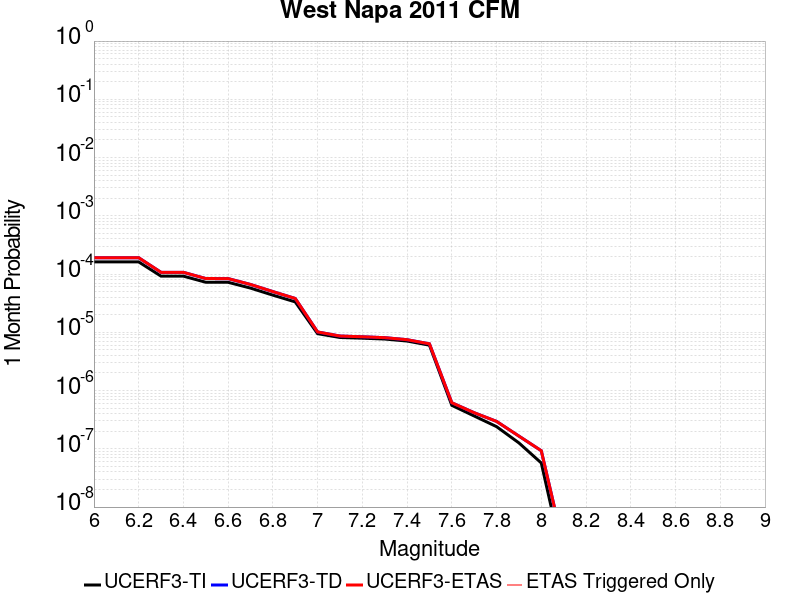 |  |  |

| Magnitude | 1 wk TI Prob | 1 wk TD Prob | 1 wk ETAS Prob | 1 wk ETAS/TD Gain | 1 wk ETAS Triggered Only | 1 mo TI Prob | 1 mo TD Prob | 1 mo ETAS Prob | 1 mo ETAS/TD Gain | 1 mo ETAS Triggered Only | 1 yr TI Prob | 1 yr TD Prob | 1 yr ETAS Prob | 1 yr ETAS/TD Gain | 1 yr ETAS Triggered Only | 10 yr TI Prob | 10 yr TD Prob | 10 yr ETAS Prob | 10 yr ETAS/TD Gain | 10 yr ETAS Triggered Only |
|-----|-----|-----|-----|-----|-----|-----|-----|-----|-----|-----|-----|-----|-----|-----|-----|-----|-----|-----|-----|-----|
| 6.0 | 3.773104E-5 | 4.4530316E-5 | 4.4530316E-5 | 1.0 | 0.0 | 1.6169442E-4 | 1.9083206E-4 | 1.9083206E-4 | 1.0 | 0.0 | 0.001966852 | 0.0023212216 | 0.0023212216 | 1.0 | 0.0 | 0.019495348 | 0.023003198 | 0.023012968 | 1.0004247 | 1.0E-5 |
| 6.1 | 3.773104E-5 | 4.4530316E-5 | 4.4530316E-5 | 1.0 | 0.0 | 1.6169442E-4 | 1.9083206E-4 | 1.9083206E-4 | 1.0 | 0.0 | 0.001966852 | 0.0023212216 | 0.0023212216 | 1.0 | 0.0 | 0.019495348 | 0.023003198 | 0.023012968 | 1.0004247 | 1.0E-5 |
| 6.2 | 3.773104E-5 | 4.4530316E-5 | 4.4530316E-5 | 1.0 | 0.0 | 1.6169442E-4 | 1.9083206E-4 | 1.9083206E-4 | 1.0 | 0.0 | 0.001966852 | 0.0023212216 | 0.0023212216 | 1.0 | 0.0 | 0.019495348 | 0.023003198 | 0.023012968 | 1.0004247 | 1.0E-5 |
| 6.3 | 2.147964E-5 | 2.4988081E-5 | 2.4988081E-5 | 1.0 | 0.0 | 9.2052345E-5 | 1.070879E-4 | 1.070879E-4 | 1.0 | 0.0 | 0.001120161 | 0.001303107 | 0.001303107 | 1.0 | 0.0 | 0.011145315 | 0.012965276 | 0.012975146 | 1.0007613 | 1.0E-5 |
| 6.4 | 2.147964E-5 | 2.4988081E-5 | 2.4988081E-5 | 1.0 | 0.0 | 9.2052345E-5 | 1.070879E-4 | 1.070879E-4 | 1.0 | 0.0 | 0.001120161 | 0.001303107 | 0.001303107 | 1.0 | 0.0 | 0.011145315 | 0.012965276 | 0.012975146 | 1.0007613 | 1.0E-5 |
| 6.5 | 1.688201E-5 | 1.954818E-5 | 1.954818E-5 | 1.0 | 0.0 | 7.234947E-5 | 8.377564E-5 | 8.377564E-5 | 1.0 | 0.0 | 8.804988E-4 | 0.0010195636 | 0.0010195636 | 1.0 | 0.0 | 0.008770182 | 0.010157529 | 0.010167428 | 1.0009745 | 1.0E-5 |
| 6.6 | 1.6846381E-5 | 1.9507872E-5 | 1.9507872E-5 | 1.0 | 0.0 | 7.219678E-5 | 8.36029E-5 | 8.36029E-5 | 1.0 | 0.0 | 8.7864127E-4 | 0.0010174625 | 0.0010174625 | 1.0 | 0.0 | 0.008751754 | 0.0101367105 | 0.010146609 | 1.0009766 | 1.0E-5 |
| 6.7 | 1.3396501E-5 | 1.5468346E-5 | 1.5468346E-5 | 1.0 | 0.0 | 5.7412315E-5 | 6.629158E-5 | 6.629158E-5 | 1.0 | 0.0 | 6.9877075E-4 | 8.0686464E-4 | 8.0686464E-4 | 1.0 | 0.0 | 0.0069657755 | 0.008047077 | 0.008056996 | 1.0012327 | 1.0E-5 |
| 6.8 | 1.0139058E-5 | 1.1672709E-5 | 1.1672709E-5 | 1.0 | 0.0 | 4.3452383E-5 | 5.002525E-5 | 5.002525E-5 | 1.0 | 0.0 | 5.289043E-4 | 6.089427E-4 | 6.089427E-4 | 1.0 | 0.0 | 0.005276473 | 0.006079663 | 0.0060896026 | 1.0016348 | 1.0E-5 |
| 6.9 | 7.761281E-6 | 8.891154E-6 | 8.891154E-6 | 1.0 | 0.0 | 3.326221E-5 | 3.8104678E-5 | 3.8104678E-5 | 1.0 | 0.0 | 4.0489217E-4 | 4.638771E-4 | 4.638771E-4 | 1.0 | 0.0 | 0.0040415525 | 0.0046356022 | 0.0046356022 | 1.0 | 0.0 |
| 7.0 | 2.2109202E-6 | 2.3668247E-6 | 2.3668247E-6 | 1.0 | 0.0 | 9.475338E-6 | 1.0143495E-5 | 1.0143495E-5 | 1.0 | 0.0 | 1.1535613E-4 | 1.2349014E-4 | 1.2349014E-4 | 1.0 | 0.0 | 0.0011529627 | 0.0012357008 | 0.0012357008 | 1.0 | 0.0 |
| 7.1 | 1.9008926E-6 | 2.0135033E-6 | 2.0135033E-6 | 1.0 | 0.0 | 8.146657E-6 | 8.629271E-6 | 8.629271E-6 | 1.0 | 0.0 | 9.918104E-5 | 1.0505634E-4 | 1.0505634E-4 | 1.0 | 0.0 | 9.913679E-4 | 0.0010515474 | 0.0010515474 | 1.0 | 0.0 |
| 7.2 | 1.8495944E-6 | 1.9563086E-6 | 1.9563086E-6 | 1.0 | 0.0 | 7.926808E-6 | 8.384152E-6 | 8.384152E-6 | 1.0 | 0.0 | 9.650462E-5 | 1.020723E-4 | 1.020723E-4 | 1.0 | 0.0 | 9.6462725E-4 | 0.0010217348 | 0.0010217348 | 1.0 | 0.0 |
| 7.3 | 1.7883189E-6 | 1.8882696E-6 | 1.8882696E-6 | 1.0 | 0.0 | 7.664201E-6 | 8.092559E-6 | 8.092559E-6 | 1.0 | 0.0 | 9.330765E-5 | 9.8522476E-5 | 9.8522476E-5 | 1.0 | 0.0 | 9.3268487E-4 | 9.862684E-4 | 9.862684E-4 | 1.0 | 0.0 |
| 7.4 | 1.6520572E-6 | 1.7416867E-6 | 1.7416867E-6 | 1.0 | 0.0 | 7.0802257E-6 | 7.4643503E-6 | 7.4643503E-6 | 1.0 | 0.0 | 8.6198335E-5 | 9.08747E-5 | 9.08747E-5 | 1.0 | 0.0 | 8.616491E-4 | 9.0985163E-4 | 9.0985163E-4 | 1.0 | 0.0 |
| 7.5 | 1.4040345E-6 | 1.4802018E-6 | 1.4802018E-6 | 1.0 | 0.0 | 6.0172765E-6 | 6.343707E-6 | 6.343707E-6 | 1.0 | 0.0 | 7.325788E-5 | 7.723192E-5 | 7.723192E-5 | 1.0 | 0.0 | 7.3233736E-4 | 7.734953E-4 | 7.734953E-4 | 1.0 | 0.0 |
| 7.6 | 1.3013842E-7 | 1.4422596E-7 | 1.4422596E-7 | 1.0 | 0.0 | 5.57736E-7 | 6.1811113E-7 | 6.1811113E-7 | 1.0 | 0.0 | 6.790414E-6 | 7.525477E-6 | 7.525477E-6 | 1.0 | 0.0 | 6.790207E-5 | 7.618339E-5 | 7.618339E-5 | 1.0 | 0.0 |
| 7.7 | 8.541512E-8 | 9.722414E-8 | 9.722414E-8 | 1.0 | 0.0 | 3.6606474E-7 | 4.166748E-7 | 4.166748E-7 | 1.0 | 0.0 | 4.456829E-6 | 5.073004E-6 | 5.073004E-6 | 1.0 | 0.0 | 4.4567398E-5 | 5.1634728E-5 | 5.1634728E-5 | 1.0 | 0.0 |
| 7.8 | 5.6074793E-8 | 6.9003995E-8 | 6.9003995E-8 | 1.0 | 0.0 | 2.403205E-7 | 2.9573138E-7 | 2.9573138E-7 | 1.0 | 0.0 | 2.9258983E-6 | 3.6005235E-6 | 3.6005235E-6 | 1.0 | 0.0 | 2.9258597E-5 | 3.6840676E-5 | 3.6840676E-5 | 1.0 | 0.0 |
| 7.9 | 2.9475839E-8 | 3.8596085E-8 | 3.8596085E-8 | 1.0 | 0.0 | 1.2632502E-7 | 1.6541178E-7 | 1.6541178E-7 | 1.0 | 0.0 | 1.538006E-6 | 2.0138866E-6 | 2.0138866E-6 | 1.0 | 0.0 | 1.5379954E-5 | 2.0681475E-5 | 2.0681475E-5 | 1.0 | 0.0 |
| 8.0 | 1.3337122E-8 | 2.1648754E-8 | 2.1648754E-8 | 1.0 | 0.0 | 5.7159088E-8 | 9.2780375E-8 | 9.2780375E-8 | 1.0 | 0.0 | 6.959117E-7 | 1.1296005E-6 | 1.1296005E-6 | 1.0 | 0.0 | 6.959095E-6 | 1.165465E-5 | 1.165465E-5 | 1.0 | 0.0 |
| 8.1 | 2.6589986E-10 | 4.8652327E-10 | 4.8652327E-10 | 1.0 | 0.0 | 1.1395708E-9 | 2.0850992E-9 | 2.0850992E-9 | 1.0 | 0.0 | 1.3874274E-8 | 2.538608E-8 | 2.538608E-8 | 1.0 | 0.0 | 1.3874273E-7 | 2.6054772E-7 | 2.6054772E-7 | 1.0 | 0.0 |

## Calaveras (So) - Paicines extension 2011 CFM
*[(top)](#table-of-contents)*

| 1 Week | 1 Month | 1 Year | 10 Year |
|-----|-----|-----|-----|
| 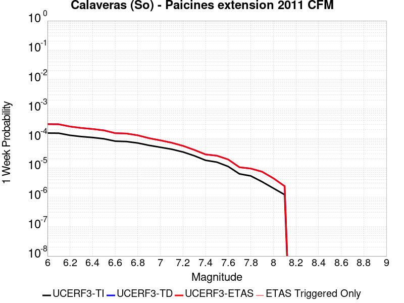 |  | 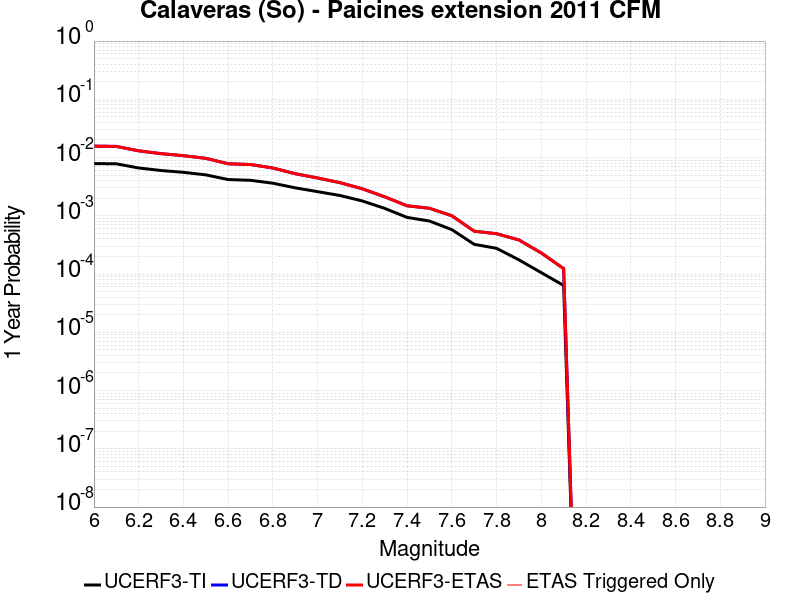 |  |

| Magnitude | 1 wk TI Prob | 1 wk TD Prob | 1 wk ETAS Prob | 1 wk ETAS/TD Gain | 1 wk ETAS Triggered Only | 1 mo TI Prob | 1 mo TD Prob | 1 mo ETAS Prob | 1 mo ETAS/TD Gain | 1 mo ETAS Triggered Only | 1 yr TI Prob | 1 yr TD Prob | 1 yr ETAS Prob | 1 yr ETAS/TD Gain | 1 yr ETAS Triggered Only | 10 yr TI Prob | 10 yr TD Prob | 10 yr ETAS Prob | 10 yr ETAS/TD Gain | 10 yr ETAS Triggered Only |
|-----|-----|-----|-----|-----|-----|-----|-----|-----|-----|-----|-----|-----|-----|-----|-----|-----|-----|-----|-----|-----|
| 6.0 | 1.5183659E-4 | 3.0526327E-4 | 3.0526327E-4 | 1.0 | 0.0 | 6.5056595E-4 | 0.0013072162 | 0.0013072162 | 1.0 | 0.0 | 0.007891912 | 0.015699763 | 0.015699763 | 1.0 | 0.0 | 0.076174594 | 0.13852057 | 0.13852918 | 1.0000622 | 1.0E-5 |
| 6.1 | 1.5024997E-4 | 3.0220364E-4 | 3.0220364E-4 | 1.0 | 0.0 | 6.437695E-4 | 0.0012941166 | 0.0012941166 | 1.0 | 0.0 | 0.0078097614 | 0.01554315 | 0.01554315 | 1.0 | 0.0 | 0.075409345 | 0.13719015 | 0.13719878 | 1.000063 | 1.0E-5 |
| 6.2 | 1.2743923E-4 | 2.5323636E-4 | 2.5323636E-4 | 1.0 | 0.0 | 5.460538E-4 | 0.0010848042 | 0.0010848042 | 1.0 | 0.0 | 0.0066279583 | 0.013050769 | 0.013050769 | 1.0 | 0.0 | 0.064337276 | 0.11728856 | 0.11729739 | 1.0000752 | 1.0E-5 |
| 6.3 | 1.1525114E-4 | 2.2609555E-4 | 2.2609555E-4 | 1.0 | 0.0 | 4.9383997E-4 | 9.686079E-4 | 9.686079E-4 | 1.0 | 0.0 | 0.0059959386 | 0.011671975 | 0.011671975 | 1.0 | 0.0 | 0.058367174 | 0.10640485 | 0.10641378 | 1.0000839 | 1.0E-5 |
| 6.4 | 1.07200925E-4 | 2.0849027E-4 | 2.0849027E-4 | 1.0 | 0.0 | 4.5935164E-4 | 8.932095E-4 | 8.932095E-4 | 1.0 | 0.0 | 0.0055782744 | 0.010776794 | 0.010776794 | 1.0 | 0.0 | 0.0544031 | 0.09922756 | 0.09923657 | 1.0000908 | 1.0E-5 |
| 6.5 | 9.69631E-5 | 1.874057E-4 | 1.874057E-4 | 1.0 | 0.0 | 4.1548995E-4 | 8.029048E-4 | 8.029048E-4 | 1.0 | 0.0 | 0.0050468626 | 0.0096986415 | 0.0096986415 | 1.0 | 0.0 | 0.04933773 | 0.09011929 | 0.090128385 | 1.000101 | 1.0E-5 |
| 6.6 | 8.0552316E-5 | 1.5078606E-4 | 1.5078606E-4 | 1.0 | 0.0 | 3.4517853E-4 | 6.4604875E-4 | 6.4604875E-4 | 1.0 | 0.0 | 0.0041944524 | 0.007830278 | 0.007830278 | 1.0 | 0.0 | 0.04116161 | 0.07488947 | 0.07489873 | 1.0001235 | 1.0E-5 |
| 6.7 | 7.815757E-5 | 1.4618573E-4 | 1.4618573E-4 | 1.0 | 0.0 | 3.34918E-4 | 6.2635983E-4 | 6.2635983E-4 | 1.0 | 0.0 | 0.004070005 | 0.0075931004 | 0.0075931004 | 1.0 | 0.0 | 0.039962657 | 0.072739 | 0.072748266 | 1.0001274 | 1.0E-5 |
| 6.8 | 6.965264E-5 | 1.2729045E-4 | 1.2729045E-4 | 1.0 | 0.0 | 2.9847719E-4 | 5.4541614E-4 | 5.4541614E-4 | 1.0 | 0.0 | 0.0036279052 | 0.0066172457 | 0.0066172457 | 1.0 | 0.0 | 0.03569247 | 0.06383303 | 0.063842386 | 1.0001466 | 1.0E-5 |
| 6.9 | 5.8000453E-5 | 1.0149955E-4 | 1.0149955E-4 | 1.0 | 0.0 | 2.4854968E-4 | 4.3492613E-4 | 4.3492613E-4 | 1.0 | 0.0 | 0.0030218933 | 0.005282474 | 0.005282474 | 1.0 | 0.0 | 0.029811295 | 0.05153192 | 0.051541403 | 1.000184 | 1.0E-5 |
| 7.0 | 4.9865852E-5 | 8.5740576E-5 | 8.5740576E-5 | 1.0 | 0.0 | 2.1369329E-4 | 3.6740836E-4 | 3.6740836E-4 | 1.0 | 0.0 | 0.0025986114 | 0.004464111 | 0.004464111 | 1.0 | 0.0 | 0.025684336 | 0.0438119 | 0.04382146 | 1.0002183 | 1.0E-5 |
| 7.1 | 4.283875E-5 | 7.116841E-5 | 7.116841E-5 | 1.0 | 0.0 | 1.8358172E-4 | 3.0497214E-4 | 3.0497214E-4 | 1.0 | 0.0 | 0.0022328163 | 0.0037067705 | 0.0037067705 | 1.0 | 0.0 | 0.022105146 | 0.03675858 | 0.036768213 | 1.000262 | 1.0E-5 |
| 7.2 | 3.450115E-5 | 5.5822005E-5 | 5.5822005E-5 | 1.0 | 0.0 | 1.478537E-4 | 2.392154E-4 | 2.392154E-4 | 1.0 | 0.0 | 0.0017986323 | 0.0029085868 | 0.0029085868 | 1.0 | 0.0 | 0.017841442 | 0.02910172 | 0.029111428 | 1.0003337 | 1.0E-5 |
| 7.3 | 2.5709045E-5 | 4.0631767E-5 | 4.0631767E-5 | 1.0 | 0.0 | 1.1017697E-4 | 1.7412461E-4 | 1.7412461E-4 | 1.0 | 0.0 | 0.0013405791 | 0.002117923 | 0.002117923 | 1.0 | 0.0 | 0.013325208 | 0.02131885 | 0.021328636 | 1.0004591 | 1.0E-5 |
| 7.4 | 1.8003093E-5 | 2.8526587E-5 | 2.8526587E-5 | 1.0 | 0.0 | 7.715383E-5 | 1.2225108E-4 | 1.2225108E-4 | 1.0 | 0.0 | 9.3894306E-4 | 0.001487393 | 0.001487393 | 1.0 | 0.0 | 0.009349857 | 0.015060302 | 0.015070152 | 1.000654 | 1.0E-5 |
| 7.5 | 1.5595824E-5 | 2.5838614E-5 | 2.5838614E-5 | 1.0 | 0.0 | 6.683753E-5 | 1.1073223E-4 | 1.1073223E-4 | 1.0 | 0.0 | 8.134431E-4 | 0.0013473333 | 0.0013473333 | 1.0 | 0.0 | 0.008104719 | 0.013659982 | 0.013669845 | 1.000722 | 1.0E-5 |
| 7.6 | 1.1110309E-5 | 1.9236333E-5 | 1.9236333E-5 | 1.0 | 0.0 | 4.761474E-5 | 8.2438826E-5 | 8.2438826E-5 | 1.0 | 0.0 | 5.795553E-4 | 0.001003232 | 0.001003232 | 1.0 | 0.0 | 0.0057804612 | 0.010210887 | 0.010220785 | 1.0009693 | 1.0E-5 |
| 7.7 | 6.2140443E-6 | 1.0445913E-5 | 1.0445913E-5 | 1.0 | 0.0 | 2.6631347E-5 | 4.4767432E-5 | 4.4767432E-5 | 1.0 | 0.0 | 3.241884E-4 | 5.449073E-4 | 5.449073E-4 | 1.0 | 0.0 | 0.0032371588 | 0.005624154 | 0.005634098 | 1.001768 | 1.0E-5 |
| 7.8 | 5.305533E-6 | 9.44099E-6 | 9.44099E-6 | 1.0 | 0.0 | 2.27378E-5 | 4.0460756E-5 | 4.0460756E-5 | 1.0 | 0.0 | 2.7679754E-4 | 4.9249845E-4 | 4.9249845E-4 | 1.0 | 0.0 | 0.0027645302 | 0.005078195 | 0.0050881444 | 1.0019592 | 1.0E-5 |
| 7.9 | 3.363505E-6 | 7.3908986E-6 | 7.3908986E-6 | 1.0 | 0.0 | 1.4414942E-5 | 3.1674896E-5 | 3.1674896E-5 | 1.0 | 0.0 | 1.7548777E-4 | 3.855737E-4 | 3.855737E-4 | 1.0 | 0.0 | 0.0017534926 | 0.0039514317 | 0.003961392 | 1.0025207 | 1.0E-5 |
| 8.0 | 2.0271132E-6 | 4.416589E-6 | 4.416589E-6 | 1.0 | 0.0 | 8.687599E-6 | 1.8928102E-5 | 1.8928102E-5 | 1.0 | 0.0 | 1.05766376E-4 | 2.3042533E-4 | 2.3042533E-4 | 1.0 | 0.0 | 0.0010571606 | 0.0023528046 | 0.002362781 | 1.0042403 | 1.0E-5 |
| 8.1 | 1.2206116E-6 | 2.3771058E-6 | 2.3771058E-6 | 1.0 | 0.0 | 5.2311816E-6 | 1.0187557E-5 | 1.0187557E-5 | 1.0 | 0.0 | 6.3687774E-5 | 1.2402647E-4 | 1.2402647E-4 | 1.0 | 0.0 | 6.366953E-4 | 0.0012715348 | 0.0012815221 | 1.0078545 | 1.0E-5 |

## Los Alamos 2011 CFM
*[(top)](#table-of-contents)*

| 1 Week | 1 Month | 1 Year | 10 Year |
|-----|-----|-----|-----|
|  |  |  |  |

| Magnitude | 1 wk TI Prob | 1 wk TD Prob | 1 wk ETAS Prob | 1 wk ETAS/TD Gain | 1 wk ETAS Triggered Only | 1 mo TI Prob | 1 mo TD Prob | 1 mo ETAS Prob | 1 mo ETAS/TD Gain | 1 mo ETAS Triggered Only | 1 yr TI Prob | 1 yr TD Prob | 1 yr ETAS Prob | 1 yr ETAS/TD Gain | 1 yr ETAS Triggered Only | 10 yr TI Prob | 10 yr TD Prob | 10 yr ETAS Prob | 10 yr ETAS/TD Gain | 10 yr ETAS Triggered Only |
|-----|-----|-----|-----|-----|-----|-----|-----|-----|-----|-----|-----|-----|-----|-----|-----|-----|-----|-----|-----|-----|
| 6.0 | 4.6284417E-6 | 4.7517656E-6 | 4.7517656E-6 | 1.0 | 0.0 | 1.9836029E-5 | 2.036456E-5 | 2.036456E-5 | 1.0 | 0.0 | 2.4147688E-4 | 2.4791207E-4 | 2.4791207E-4 | 1.0 | 0.0 | 0.0024121467 | 0.0024765292 | 0.0024865044 | 1.004028 | 1.0E-5 |
| 6.1 | 4.6284417E-6 | 4.7517656E-6 | 4.7517656E-6 | 1.0 | 0.0 | 1.9836029E-5 | 2.036456E-5 | 2.036456E-5 | 1.0 | 0.0 | 2.4147688E-4 | 2.4791207E-4 | 2.4791207E-4 | 1.0 | 0.0 | 0.0024121467 | 0.0024765292 | 0.0024865044 | 1.004028 | 1.0E-5 |
| 6.2 | 4.6284417E-6 | 4.7517656E-6 | 4.7517656E-6 | 1.0 | 0.0 | 1.9836029E-5 | 2.036456E-5 | 2.036456E-5 | 1.0 | 0.0 | 2.4147688E-4 | 2.4791207E-4 | 2.4791207E-4 | 1.0 | 0.0 | 0.0024121467 | 0.0024765292 | 0.0024865044 | 1.004028 | 1.0E-5 |
| 6.3 | 4.6284417E-6 | 4.7517656E-6 | 4.7517656E-6 | 1.0 | 0.0 | 1.9836029E-5 | 2.036456E-5 | 2.036456E-5 | 1.0 | 0.0 | 2.4147688E-4 | 2.4791207E-4 | 2.4791207E-4 | 1.0 | 0.0 | 0.0024121467 | 0.0024765292 | 0.0024865044 | 1.004028 | 1.0E-5 |
| 6.4 | 4.6284417E-6 | 4.7517656E-6 | 4.7517656E-6 | 1.0 | 0.0 | 1.9836029E-5 | 2.036456E-5 | 2.036456E-5 | 1.0 | 0.0 | 2.4147688E-4 | 2.4791207E-4 | 2.4791207E-4 | 1.0 | 0.0 | 0.0024121467 | 0.0024765292 | 0.0024865044 | 1.004028 | 1.0E-5 |
| 6.5 | 4.6284417E-6 | 4.7517656E-6 | 4.7517656E-6 | 1.0 | 0.0 | 1.9836029E-5 | 2.036456E-5 | 2.036456E-5 | 1.0 | 0.0 | 2.4147688E-4 | 2.4791207E-4 | 2.4791207E-4 | 1.0 | 0.0 | 0.0024121467 | 0.0024765292 | 0.0024865044 | 1.004028 | 1.0E-5 |
| 6.6 | 4.6284417E-6 | 4.7517656E-6 | 4.7517656E-6 | 1.0 | 0.0 | 1.9836029E-5 | 2.036456E-5 | 2.036456E-5 | 1.0 | 0.0 | 2.4147688E-4 | 2.4791207E-4 | 2.4791207E-4 | 1.0 | 0.0 | 0.0024121467 | 0.0024765292 | 0.0024865044 | 1.004028 | 1.0E-5 |
| 6.7 | 4.062321E-6 | 4.166379E-6 | 4.166379E-6 | 1.0 | 0.0 | 1.7409831E-5 | 1.7855797E-5 | 1.7855797E-5 | 1.0 | 0.0 | 2.1194408E-4 | 2.1737414E-4 | 2.1737414E-4 | 1.0 | 0.0 | 0.0021174205 | 0.0021717648 | 0.0021717648 | 1.0 | 0.0 |
| 6.8 | 4.062321E-6 | 4.166379E-6 | 4.166379E-6 | 1.0 | 0.0 | 1.7409831E-5 | 1.7855797E-5 | 1.7855797E-5 | 1.0 | 0.0 | 2.1194408E-4 | 2.1737414E-4 | 2.1737414E-4 | 1.0 | 0.0 | 0.0021174205 | 0.0021717648 | 0.0021717648 | 1.0 | 0.0 |
| 6.9 | 3.2936077E-6 | 3.3729827E-6 | 3.3729827E-6 | 1.0 | 0.0 | 1.4115385E-5 | 1.4455565E-5 | 1.4455565E-5 | 1.0 | 0.0 | 1.7184127E-4 | 1.7598324E-4 | 1.7598324E-4 | 1.0 | 0.0 | 0.0017170844 | 0.0017585313 | 0.0017585313 | 1.0 | 0.0 |
| 7.0 | 3.1687898E-6 | 3.2448397E-6 | 3.2448397E-6 | 1.0 | 0.0 | 1.3580457E-5 | 1.3906387E-5 | 1.3906387E-5 | 1.0 | 0.0 | 1.6532952E-4 | 1.6929803E-4 | 1.6929803E-4 | 1.0 | 0.0 | 0.0016520657 | 0.0016917821 | 0.0016917821 | 1.0 | 0.0 |
| 7.1 | 2.9379228E-6 | 3.0073486E-6 | 3.0073486E-6 | 1.0 | 0.0 | 1.25910365E-5 | 1.2888578E-5 | 1.2888578E-5 | 1.0 | 0.0 | 1.5328509E-4 | 1.5690805E-4 | 1.5690805E-4 | 1.0 | 0.0 | 0.001531794 | 0.0015680618 | 0.0015680618 | 1.0 | 0.0 |
| 7.2 | 2.0020686E-6 | 2.041646E-6 | 2.041646E-6 | 1.0 | 0.0 | 8.580266E-6 | 8.749883E-6 | 8.749883E-6 | 1.0 | 0.0 | 1.0445973E-4 | 1.06524654E-4 | 1.06524654E-4 | 1.0 | 0.0 | 0.0010441064 | 0.0010647404 | 0.0010647404 | 1.0 | 0.0 |
| 7.3 | 1.7364243E-6 | 1.7678948E-6 | 1.7678948E-6 | 1.0 | 0.0 | 7.441797E-6 | 7.57667E-6 | 7.57667E-6 | 1.0 | 0.0 | 9.0600115E-5 | 9.224209E-5 | 9.224209E-5 | 1.0 | 0.0 | 9.0563187E-4 | 9.2204113E-4 | 9.2204113E-4 | 1.0 | 0.0 |
| 7.4 | 1.5718434E-6 | 1.5983311E-6 | 1.5983311E-6 | 1.0 | 0.0 | 6.7364545E-6 | 6.8499726E-6 | 6.8499726E-6 | 1.0 | 0.0 | 8.201325E-5 | 8.339526E-5 | 8.339526E-5 | 1.0 | 0.0 | 8.198299E-4 | 8.336426E-4 | 8.336426E-4 | 1.0 | 0.0 |
| 7.5 | 1.3841119E-6 | 1.4042913E-6 | 1.4042913E-6 | 1.0 | 0.0 | 5.9318945E-6 | 6.018378E-6 | 6.018378E-6 | 1.0 | 0.0 | 7.221842E-5 | 7.3271316E-5 | 7.3271316E-5 | 1.0 | 0.0 | 7.2194956E-4 | 7.3247444E-4 | 7.3247444E-4 | 1.0 | 0.0 |
| 7.6 | 1.0843726E-6 | 1.0934518E-6 | 1.0934518E-6 | 1.0 | 0.0 | 4.647303E-6 | 4.6862137E-6 | 4.6862137E-6 | 1.0 | 0.0 | 5.6579443E-5 | 5.7053185E-5 | 5.7053185E-5 | 1.0 | 0.0 | 5.656504E-4 | 5.70388E-4 | 5.70388E-4 | 1.0 | 0.0 |
| 7.7 | 5.544814E-7 | 5.5019217E-7 | 5.5019217E-7 | 1.0 | 0.0 | 2.3763469E-6 | 2.3579641E-6 | 2.3579641E-6 | 1.0 | 0.0 | 2.8931638E-5 | 2.8707838E-5 | 2.8707838E-5 | 1.0 | 0.0 | 2.8927872E-4 | 2.8704145E-4 | 2.8704145E-4 | 1.0 | 0.0 |
| 7.8 | 2.0707465E-7 | 1.9778659E-7 | 1.9778659E-7 | 1.0 | 0.0 | 8.874625E-7 | 8.4765657E-7 | 8.4765657E-7 | 1.0 | 0.0 | 1.08048025E-5 | 1.032017E-5 | 1.032017E-5 | 1.0 | 0.0 | 1.0804277E-4 | 1.0319695E-4 | 1.0319695E-4 | 1.0 | 0.0 |
| 7.9 | 3.9821284E-8 | 3.4331457E-8 | 3.4331457E-8 | 1.0 | 0.0 | 1.7066264E-7 | 1.4713481E-7 | 1.4713481E-7 | 1.0 | 0.0 | 2.0778157E-6 | 1.7913649E-6 | 1.7913649E-6 | 1.0 | 0.0 | 2.0777963E-5 | 1.791351E-5 | 1.791351E-5 | 1.0 | 0.0 |
| 8.0 | 7.880441E-11 | 8.23539E-11 | 8.23539E-11 | 1.0 | 0.0 | 3.3773329E-10 | 3.5294534E-10 | 3.5294534E-10 | 1.0 | 0.0 | 4.1119033E-9 | 4.29711E-9 | 4.29711E-9 | 1.0 | 0.0 | 4.1119034E-8 | 4.29711E-8 | 4.29711E-8 | 1.0 | 0.0 |

## Elsinore (Coyote Mountains)
*[(top)](#table-of-contents)*

| 1 Week | 1 Month | 1 Year | 10 Year |
|-----|-----|-----|-----|
|  |  | 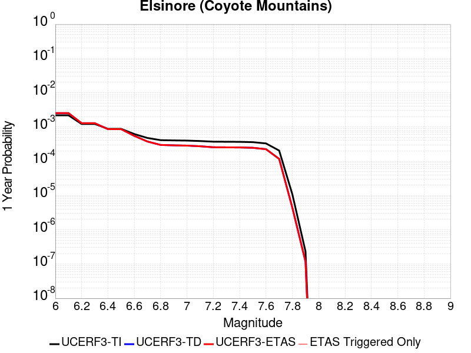 |  |

| Magnitude | 1 wk TI Prob | 1 wk TD Prob | 1 wk ETAS Prob | 1 wk ETAS/TD Gain | 1 wk ETAS Triggered Only | 1 mo TI Prob | 1 mo TD Prob | 1 mo ETAS Prob | 1 mo ETAS/TD Gain | 1 mo ETAS Triggered Only | 1 yr TI Prob | 1 yr TD Prob | 1 yr ETAS Prob | 1 yr ETAS/TD Gain | 1 yr ETAS Triggered Only | 10 yr TI Prob | 10 yr TD Prob | 10 yr ETAS Prob | 10 yr ETAS/TD Gain | 10 yr ETAS Triggered Only |
|-----|-----|-----|-----|-----|-----|-----|-----|-----|-----|-----|-----|-----|-----|-----|-----|-----|-----|-----|-----|-----|
| 6.0 | 4.20513E-5 | 4.863452E-5 | 4.863452E-5 | 1.0 | 0.0 | 1.8020741E-4 | 2.0842026E-4 | 2.0842026E-4 | 1.0 | 0.0 | 0.0021918174 | 0.0025351373 | 0.0025351373 | 1.0 | 0.0 | 0.021703249 | 0.025112594 | 0.025122343 | 1.0003883 | 1.0E-5 |
| 6.1 | 4.20513E-5 | 4.863452E-5 | 4.863452E-5 | 1.0 | 0.0 | 1.8020741E-4 | 2.0842026E-4 | 2.0842026E-4 | 1.0 | 0.0 | 0.0021918174 | 0.0025351373 | 0.0025351373 | 1.0 | 0.0 | 0.021703249 | 0.025112594 | 0.025122343 | 1.0003883 | 1.0E-5 |
| 6.2 | 2.3413893E-5 | 2.4696856E-5 | 2.4696856E-5 | 1.0 | 0.0 | 1.0034139E-4 | 1.05839914E-4 | 1.05839914E-4 | 1.0 | 0.0 | 0.0012209718 | 0.0012879329 | 0.0012879329 | 1.0 | 0.0 | 0.012142851 | 0.0128132505 | 0.012823123 | 1.0007704 | 1.0E-5 |
| 6.3 | 2.3413893E-5 | 2.4696856E-5 | 2.4696856E-5 | 1.0 | 0.0 | 1.0034139E-4 | 1.05839914E-4 | 1.05839914E-4 | 1.0 | 0.0 | 0.0012209718 | 0.0012879329 | 0.0012879329 | 1.0 | 0.0 | 0.012142851 | 0.0128132505 | 0.012823123 | 1.0007704 | 1.0E-5 |
| 6.4 | 1.6894814E-5 | 1.6569134E-5 | 1.6569134E-5 | 1.0 | 0.0 | 7.240433E-5 | 7.1008864E-5 | 7.1008864E-5 | 1.0 | 0.0 | 8.811662E-4 | 8.642268E-4 | 8.642268E-4 | 1.0 | 0.0 | 0.0087768035 | 0.008612339 | 0.008622253 | 1.0011511 | 1.0E-5 |
| 6.5 | 1.6894814E-5 | 1.6569134E-5 | 1.6569134E-5 | 1.0 | 0.0 | 7.240433E-5 | 7.1008864E-5 | 7.1008864E-5 | 1.0 | 0.0 | 8.811662E-4 | 8.642268E-4 | 8.642268E-4 | 1.0 | 0.0 | 0.0087768035 | 0.008612339 | 0.008622253 | 1.0011511 | 1.0E-5 |
| 6.6 | 1.1910969E-5 | 1.0531279E-5 | 1.0531279E-5 | 1.0 | 0.0 | 5.1046012E-5 | 4.513335E-5 | 4.513335E-5 | 1.0 | 0.0 | 6.21308E-4 | 5.4937147E-4 | 5.4937147E-4 | 1.0 | 0.0 | 0.0061957375 | 0.005481437 | 0.005491382 | 1.0018144 | 1.0E-5 |
| 6.7 | 9.1486E-6 | 7.203223E-6 | 7.203223E-6 | 1.0 | 0.0 | 3.9207694E-5 | 3.087061E-5 | 3.087061E-5 | 1.0 | 0.0 | 4.7724912E-4 | 3.757887E-4 | 3.757887E-4 | 1.0 | 0.0 | 0.0047622547 | 0.003751912 | 0.0037618745 | 1.0026553 | 1.0E-5 |
| 6.8 | 7.90441E-6 | 5.7293346E-6 | 5.7293346E-6 | 1.0 | 0.0 | 3.3875604E-5 | 2.4554067E-5 | 2.4554067E-5 | 1.0 | 0.0 | 4.1235742E-4 | 2.9890603E-4 | 2.9890603E-4 | 1.0 | 0.0 | 0.0041159308 | 0.0029851687 | 0.0029951388 | 1.0033399 | 1.0E-5 |
| 6.9 | 7.77015E-6 | 5.583286E-6 | 5.583286E-6 | 1.0 | 0.0 | 3.3300217E-5 | 2.3928156E-5 | 2.3928156E-5 | 1.0 | 0.0 | 4.0535472E-4 | 2.9128764E-4 | 2.9128764E-4 | 1.0 | 0.0 | 0.004046161 | 0.0029091854 | 0.0029191563 | 1.0034274 | 1.0E-5 |
| 7.0 | 7.675798E-6 | 5.4801426E-6 | 5.4801426E-6 | 1.0 | 0.0 | 3.289586E-5 | 2.3486122E-5 | 2.3486122E-5 | 1.0 | 0.0 | 4.004335E-4 | 2.8590727E-4 | 2.8590727E-4 | 1.0 | 0.0 | 0.003997127 | 0.002855521 | 0.0028654924 | 1.003492 | 1.0E-5 |
| 7.1 | 7.447814E-6 | 5.2390133E-6 | 5.2390133E-6 | 1.0 | 0.0 | 3.191881E-5 | 2.2452728E-5 | 2.2452728E-5 | 1.0 | 0.0 | 3.8854225E-4 | 2.7332891E-4 | 2.7332891E-4 | 1.0 | 0.0 | 0.003878636 | 0.002730052 | 0.0027400246 | 1.0036529 | 1.0E-5 |
| 7.2 | 7.128185E-6 | 4.90567E-6 | 4.90567E-6 | 1.0 | 0.0 | 3.0549007E-5 | 2.1024136E-5 | 2.1024136E-5 | 1.0 | 0.0 | 3.7187067E-4 | 2.5594E-4 | 2.5594E-4 | 1.0 | 0.0 | 0.00371249 | 0.0025565706 | 0.002566545 | 1.0039015 | 1.0E-5 |
| 7.3 | 7.0913875E-6 | 4.874344E-6 | 4.874344E-6 | 1.0 | 0.0 | 3.0391306E-5 | 2.0889885E-5 | 2.0889885E-5 | 1.0 | 0.0 | 3.6995133E-4 | 2.5430587E-4 | 2.5430587E-4 | 1.0 | 0.0 | 0.0036933604 | 0.0025402668 | 0.0025502415 | 1.0039266 | 1.0E-5 |
| 7.4 | 7.051521E-6 | 4.8381953E-6 | 4.8381953E-6 | 1.0 | 0.0 | 3.0220453E-5 | 2.0734964E-5 | 2.0734964E-5 | 1.0 | 0.0 | 3.6787192E-4 | 2.5242014E-4 | 2.5242014E-4 | 1.0 | 0.0 | 0.0036726352 | 0.0025214525 | 0.0025314272 | 1.003956 | 1.0E-5 |
| 7.5 | 6.910666E-6 | 4.7337403E-6 | 4.7337403E-6 | 1.0 | 0.0 | 2.9616802E-5 | 2.0287309E-5 | 2.0287309E-5 | 1.0 | 0.0 | 3.605249E-4 | 2.4697118E-4 | 2.4697118E-4 | 1.0 | 0.0 | 0.0035994058 | 0.0024670851 | 0.0024770603 | 1.0040433 | 1.0E-5 |
| 7.6 | 6.341753E-6 | 4.306832E-6 | 4.306832E-6 | 1.0 | 0.0 | 2.7178658E-5 | 1.8457727E-5 | 1.8457727E-5 | 1.0 | 0.0 | 3.3084993E-4 | 2.2470082E-4 | 2.2470082E-4 | 1.0 | 0.0 | 0.0033035777 | 0.0022448516 | 0.002254829 | 1.0044446 | 1.0E-5 |
| 7.7 | 3.9205916E-6 | 2.2441113E-6 | 2.2441113E-6 | 1.0 | 0.0 | 1.6802427E-5 | 9.617589E-6 | 9.617589E-6 | 1.0 | 0.0 | 2.0455034E-4 | 1.17088595E-4 | 1.17088595E-4 | 1.0 | 0.0 | 0.0020436216 | 0.001170342 | 0.0011803303 | 1.0085346 | 1.0E-5 |
| 7.8 | 2.0846227E-7 | 8.487101E-8 | 8.487101E-8 | 1.0 | 0.0 | 8.9340944E-7 | 3.6373288E-7 | 3.6373288E-7 | 1.0 | 0.0 | 1.0877206E-5 | 4.428442E-6 | 4.428442E-6 | 1.0 | 0.0 | 1.0876673E-4 | 4.4283865E-5 | 4.4283865E-5 | 1.0 | 0.0 |
| 7.9 | 4.4969806E-9 | 2.2693158E-9 | 2.2693158E-9 | 1.0 | 0.0 | 1.9272775E-8 | 9.725639E-9 | 9.725639E-9 | 1.0 | 0.0 | 2.3464601E-7 | 1.1840965E-7 | 1.1840965E-7 | 1.0 | 0.0 | 2.3464577E-6 | 1.184096E-6 | 1.184096E-6 | 1.0 | 0.0 |

## San Jacinto (Clark) rev
*[(top)](#table-of-contents)*

| 1 Week | 1 Month | 1 Year | 10 Year |
|-----|-----|-----|-----|
|  |  |  | 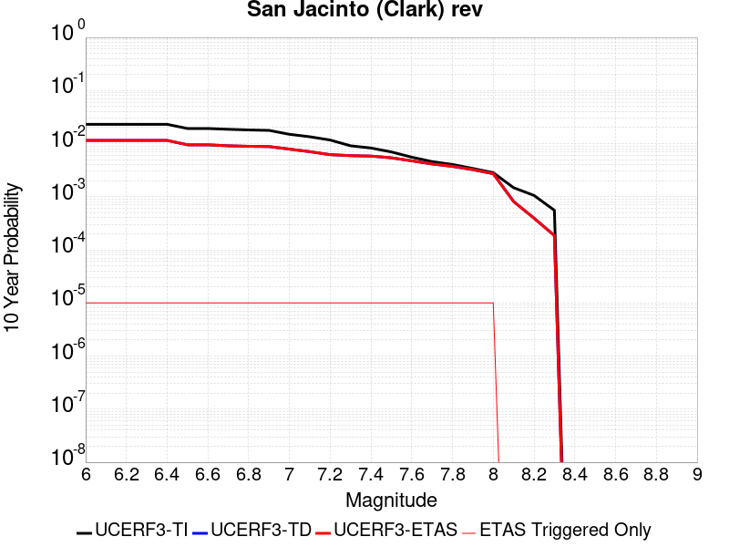 |

| Magnitude | 1 wk TI Prob | 1 wk TD Prob | 1 wk ETAS Prob | 1 wk ETAS/TD Gain | 1 wk ETAS Triggered Only | 1 mo TI Prob | 1 mo TD Prob | 1 mo ETAS Prob | 1 mo ETAS/TD Gain | 1 mo ETAS Triggered Only | 1 yr TI Prob | 1 yr TD Prob | 1 yr ETAS Prob | 1 yr ETAS/TD Gain | 1 yr ETAS Triggered Only | 10 yr TI Prob | 10 yr TD Prob | 10 yr ETAS Prob | 10 yr ETAS/TD Gain | 10 yr ETAS Triggered Only |
|-----|-----|-----|-----|-----|-----|-----|-----|-----|-----|-----|-----|-----|-----|-----|-----|-----|-----|-----|-----|-----|
| 6.0 | 4.482615E-5 | 2.1167943E-5 | 2.1167943E-5 | 1.0 | 0.0 | 1.9209793E-4 | 9.0716654E-5 | 9.0716654E-5 | 1.0 | 0.0 | 0.0023362834 | 0.0011039249 | 0.0011139138 | 1.0090486 | 1.0E-5 | 0.02311874 | 0.011511145 | 0.01152103 | 1.0008587 | 1.0E-5 |
| 6.1 | 4.482615E-5 | 2.1167943E-5 | 2.1167943E-5 | 1.0 | 0.0 | 1.9209793E-4 | 9.0716654E-5 | 9.0716654E-5 | 1.0 | 0.0 | 0.0023362834 | 0.0011039249 | 0.0011139138 | 1.0090486 | 1.0E-5 | 0.02311874 | 0.011511145 | 0.01152103 | 1.0008587 | 1.0E-5 |
| 6.2 | 4.482615E-5 | 2.1167943E-5 | 2.1167943E-5 | 1.0 | 0.0 | 1.9209793E-4 | 9.0716654E-5 | 9.0716654E-5 | 1.0 | 0.0 | 0.0023362834 | 0.0011039249 | 0.0011139138 | 1.0090486 | 1.0E-5 | 0.02311874 | 0.011511145 | 0.01152103 | 1.0008587 | 1.0E-5 |
| 6.3 | 4.482615E-5 | 2.1167943E-5 | 2.1167943E-5 | 1.0 | 0.0 | 1.9209793E-4 | 9.0716654E-5 | 9.0716654E-5 | 1.0 | 0.0 | 0.0023362834 | 0.0011039249 | 0.0011139138 | 1.0090486 | 1.0E-5 | 0.02311874 | 0.011511145 | 0.01152103 | 1.0008587 | 1.0E-5 |
| 6.4 | 4.482615E-5 | 2.1167943E-5 | 2.1167943E-5 | 1.0 | 0.0 | 1.9209793E-4 | 9.0716654E-5 | 9.0716654E-5 | 1.0 | 0.0 | 0.0023362834 | 0.0011039249 | 0.0011139138 | 1.0090486 | 1.0E-5 | 0.02311874 | 0.011511145 | 0.01152103 | 1.0008587 | 1.0E-5 |
| 6.5 | 3.7294863E-5 | 1.7368375E-5 | 1.7368375E-5 | 1.0 | 0.0 | 1.5982533E-4 | 7.443379E-5 | 7.443379E-5 | 1.0 | 0.0 | 0.0019441366 | 9.058591E-4 | 9.1585005E-4 | 1.0110292 | 1.0E-5 | 0.01927216 | 0.009500613 | 0.009510518 | 1.0010426 | 1.0E-5 |
| 6.6 | 3.7294863E-5 | 1.7368375E-5 | 1.7368375E-5 | 1.0 | 0.0 | 1.5982533E-4 | 7.443379E-5 | 7.443379E-5 | 1.0 | 0.0 | 0.0019441366 | 9.058591E-4 | 9.1585005E-4 | 1.0110292 | 1.0E-5 | 0.01927216 | 0.009500613 | 0.009510518 | 1.0010426 | 1.0E-5 |
| 6.7 | 3.6039248E-5 | 1.661633E-5 | 1.661633E-5 | 1.0 | 0.0 | 1.5444479E-4 | 7.121092E-5 | 7.121092E-5 | 1.0 | 0.0 | 0.0018787434 | 8.6665223E-4 | 8.766436E-4 | 1.0115286 | 1.0E-5 | 0.01862939 | 0.009102418 | 0.009112327 | 1.0010886 | 1.0E-5 |
| 6.8 | 3.5031844E-5 | 1.6244749E-5 | 1.6244749E-5 | 1.0 | 0.0 | 1.5012783E-4 | 6.9618516E-5 | 6.9618516E-5 | 1.0 | 0.0 | 0.0018262739 | 8.4727997E-4 | 8.572715E-4 | 1.0117924 | 1.0E-5 | 0.01811338 | 0.00890224 | 0.008912151 | 1.0011133 | 1.0E-5 |
| 6.9 | 3.435112E-5 | 1.6074891E-5 | 1.6074891E-5 | 1.0 | 0.0 | 1.4721078E-4 | 6.88906E-5 | 6.88906E-5 | 1.0 | 0.0 | 0.0017908178 | 8.3842437E-4 | 8.4841595E-4 | 1.0119171 | 1.0E-5 | 0.017764548 | 0.008810384 | 0.008820295 | 1.001125 | 1.0E-5 |
| 7.0 | 2.8959772E-5 | 1.4347364E-5 | 1.4347364E-5 | 1.0 | 0.0 | 1.241074E-4 | 6.148727E-5 | 6.148727E-5 | 1.0 | 0.0 | 0.0015099603 | 7.483532E-4 | 7.583457E-4 | 1.0133526 | 1.0E-5 | 0.014997416 | 0.007873673 | 0.007883593 | 1.00126 | 1.0E-5 |
| 7.1 | 2.6002877E-5 | 1.283871E-5 | 1.283871E-5 | 1.0 | 0.0 | 1.11436144E-4 | 5.5021897E-5 | 5.5021897E-5 | 1.0 | 0.0 | 0.0013558907 | 6.696878E-4 | 6.7968114E-4 | 1.0149224 | 1.0E-5 | 0.013476475 | 0.0070517017 | 0.007061631 | 1.0014081 | 1.0E-5 |
| 7.2 | 2.2544838E-5 | 1.1271289E-5 | 1.1271289E-5 | 1.0 | 0.0 | 9.661716E-5 | 4.8304635E-5 | 4.8304635E-5 | 1.0 | 0.0 | 0.001175679 | 5.879517E-4 | 5.979458E-4 | 1.0169982 | 1.0E-5 | 0.011694785 | 0.006197424 | 0.0062073623 | 1.0016036 | 1.0E-5 |
| 7.3 | 1.75334E-5 | 1.0819905E-5 | 1.0819905E-5 | 1.0 | 0.0 | 7.514098E-5 | 4.6370205E-5 | 4.6370205E-5 | 1.0 | 0.0 | 9.144575E-4 | 5.644124E-4 | 5.7440676E-4 | 1.0177076 | 1.0E-5 | 0.009107036 | 0.00593813 | 0.0059480704 | 1.001674 | 1.0E-5 |
| 7.4 | 1.5924552E-5 | 1.0619529E-5 | 1.0619529E-5 | 1.0 | 0.0 | 6.82463E-5 | 4.5511482E-5 | 4.5511482E-5 | 1.0 | 0.0 | 8.305819E-4 | 5.539628E-4 | 5.6395726E-4 | 1.0180417 | 1.0E-5 | 0.008274844 | 0.005825291 | 0.005835233 | 1.0017066 | 1.0E-5 |
| 7.5 | 1.3428931E-5 | 9.859542E-6 | 9.859542E-6 | 1.0 | 0.0 | 5.7551293E-5 | 4.22545E-5 | 4.22545E-5 | 1.0 | 0.0 | 7.004617E-4 | 5.1432825E-4 | 5.243231E-4 | 1.0194328 | 1.0E-5 | 0.006982579 | 0.0054106633 | 0.0054206094 | 1.0018382 | 1.0E-5 |
| 7.6 | 1.0688787E-5 | 8.62208E-6 | 8.62208E-6 | 1.0 | 0.0 | 4.5808283E-5 | 3.695125E-5 | 3.695125E-5 | 1.0 | 0.0 | 5.5757316E-4 | 4.4978908E-4 | 4.5978458E-4 | 1.0222226 | 1.0E-5 | 0.005561762 | 0.004745503 | 0.0047554555 | 1.0020972 | 1.0E-5 |
| 7.7 | 8.81236E-6 | 7.475032E-6 | 7.475032E-6 | 1.0 | 0.0 | 3.776671E-5 | 3.203546E-5 | 3.203546E-5 | 1.0 | 0.0 | 4.597127E-4 | 3.899621E-4 | 3.9995823E-4 | 1.0256336 | 1.0E-5 | 0.0045876284 | 0.0041383826 | 0.0041483412 | 1.0024064 | 1.0E-5 |
| 7.8 | 7.780431E-6 | 6.7032083E-6 | 6.7032083E-6 | 1.0 | 0.0 | 3.3344273E-5 | 2.8727722E-5 | 2.8727722E-5 | 1.0 | 0.0 | 4.0589093E-4 | 3.4970406E-4 | 3.5970056E-4 | 1.0285856 | 1.0E-5 | 0.0040515037 | 0.003726325 | 0.0037362878 | 1.0026736 | 1.0E-5 |
| 7.9 | 6.5437994E-6 | 5.7865855E-6 | 5.7865855E-6 | 1.0 | 0.0 | 2.8044553E-5 | 2.4799418E-5 | 2.4799418E-5 | 1.0 | 0.0 | 3.4138895E-4 | 3.0189124E-4 | 3.1188823E-4 | 1.0331146 | 1.0E-5 | 0.0034086495 | 0.0032377979 | 0.0032477654 | 1.0030785 | 1.0E-5 |
| 8.0 | 5.4488164E-6 | 4.81888E-6 | 4.81888E-6 | 1.0 | 0.0 | 2.3351862E-5 | 2.065218E-5 | 2.065218E-5 | 1.0 | 0.0 | 2.8427184E-4 | 2.5141143E-4 | 2.6140892E-4 | 1.0397655 | 1.0E-5 | 0.0028390845 | 0.002713805 | 0.002723778 | 1.0036749 | 1.0E-5 |
| 8.1 | 2.8397242E-6 | 1.3693046E-6 | 1.3693046E-6 | 1.0 | 0.0 | 1.217019E-5 | 5.868435E-6 | 5.868435E-6 | 1.0 | 0.0 | 1.4816198E-4 | 7.1445866E-5 | 7.1445866E-5 | 1.0 | 0.0 | 0.0014806325 | 8.128079E-4 | 8.128079E-4 | 1.0 | 0.0 |
| 8.2 | 2.030244E-6 | 6.330954E-7 | 6.330954E-7 | 1.0 | 0.0 | 8.701017E-6 | 2.7132633E-6 | 2.7132633E-6 | 1.0 | 0.0 | 1.05929736E-4 | 3.3033484E-5 | 3.3033484E-5 | 1.0 | 0.0 | 0.0010587925 | 3.9556492E-4 | 3.9556492E-4 | 1.0 | 0.0 |
| 8.3 | 1.0659804E-6 | 2.930869E-7 | 2.930869E-7 | 1.0 | 0.0 | 4.568479E-6 | 1.2560862E-6 | 1.2560862E-6 | 1.0 | 0.0 | 5.5619817E-5 | 1.5292746E-5 | 1.5292746E-5 | 1.0 | 0.0 | 5.5605895E-4 | 1.8600823E-4 | 1.8600823E-4 | 1.0 | 0.0 |

## Compton
*[(top)](#table-of-contents)*

| 1 Week | 1 Month | 1 Year | 10 Year |
|-----|-----|-----|-----|
|  |  |  |  |

| Magnitude | 1 wk TI Prob | 1 wk TD Prob | 1 wk ETAS Prob | 1 wk ETAS/TD Gain | 1 wk ETAS Triggered Only | 1 mo TI Prob | 1 mo TD Prob | 1 mo ETAS Prob | 1 mo ETAS/TD Gain | 1 mo ETAS Triggered Only | 1 yr TI Prob | 1 yr TD Prob | 1 yr ETAS Prob | 1 yr ETAS/TD Gain | 1 yr ETAS Triggered Only | 10 yr TI Prob | 10 yr TD Prob | 10 yr ETAS Prob | 10 yr ETAS/TD Gain | 10 yr ETAS Triggered Only |
|-----|-----|-----|-----|-----|-----|-----|-----|-----|-----|-----|-----|-----|-----|-----|-----|-----|-----|-----|-----|-----|
| 6.0 | 1.06050875E-5 | 6.3588645E-6 | 6.3588645E-6 | 1.0 | 0.0 | 4.5449582E-5 | 2.7252008E-5 | 2.7252008E-5 | 1.0 | 0.0 | 5.5320817E-4 | 3.3174554E-4 | 3.3174554E-4 | 1.0 | 0.0 | 0.0055183303 | 0.003312787 | 0.0033227538 | 1.0030086 | 1.0E-5 |
| 6.1 | 1.06050875E-5 | 6.3588645E-6 | 6.3588645E-6 | 1.0 | 0.0 | 4.5449582E-5 | 2.7252008E-5 | 2.7252008E-5 | 1.0 | 0.0 | 5.5320817E-4 | 3.3174554E-4 | 3.3174554E-4 | 1.0 | 0.0 | 0.0055183303 | 0.003312787 | 0.0033227538 | 1.0030086 | 1.0E-5 |
| 6.2 | 1.06050875E-5 | 6.3588645E-6 | 6.3588645E-6 | 1.0 | 0.0 | 4.5449582E-5 | 2.7252008E-5 | 2.7252008E-5 | 1.0 | 0.0 | 5.5320817E-4 | 3.3174554E-4 | 3.3174554E-4 | 1.0 | 0.0 | 0.0055183303 | 0.003312787 | 0.0033227538 | 1.0030086 | 1.0E-5 |
| 6.3 | 1.06050875E-5 | 6.3588645E-6 | 6.3588645E-6 | 1.0 | 0.0 | 4.5449582E-5 | 2.7252008E-5 | 2.7252008E-5 | 1.0 | 0.0 | 5.5320817E-4 | 3.3174554E-4 | 3.3174554E-4 | 1.0 | 0.0 | 0.0055183303 | 0.003312787 | 0.0033227538 | 1.0030086 | 1.0E-5 |
| 6.4 | 1.06050875E-5 | 6.3588645E-6 | 6.3588645E-6 | 1.0 | 0.0 | 4.5449582E-5 | 2.7252008E-5 | 2.7252008E-5 | 1.0 | 0.0 | 5.5320817E-4 | 3.3174554E-4 | 3.3174554E-4 | 1.0 | 0.0 | 0.0055183303 | 0.003312787 | 0.0033227538 | 1.0030086 | 1.0E-5 |
| 6.5 | 1.06050875E-5 | 6.3588645E-6 | 6.3588645E-6 | 1.0 | 0.0 | 4.5449582E-5 | 2.7252008E-5 | 2.7252008E-5 | 1.0 | 0.0 | 5.5320817E-4 | 3.3174554E-4 | 3.3174554E-4 | 1.0 | 0.0 | 0.0055183303 | 0.003312787 | 0.0033227538 | 1.0030086 | 1.0E-5 |
| 6.6 | 1.06050875E-5 | 6.3588645E-6 | 6.3588645E-6 | 1.0 | 0.0 | 4.5449582E-5 | 2.7252008E-5 | 2.7252008E-5 | 1.0 | 0.0 | 5.5320817E-4 | 3.3174554E-4 | 3.3174554E-4 | 1.0 | 0.0 | 0.0055183303 | 0.003312787 | 0.0033227538 | 1.0030086 | 1.0E-5 |
| 6.7 | 1.06050875E-5 | 6.3588645E-6 | 6.3588645E-6 | 1.0 | 0.0 | 4.5449582E-5 | 2.7252008E-5 | 2.7252008E-5 | 1.0 | 0.0 | 5.5320817E-4 | 3.3174554E-4 | 3.3174554E-4 | 1.0 | 0.0 | 0.0055183303 | 0.003312787 | 0.0033227538 | 1.0030086 | 1.0E-5 |
| 6.8 | 1.06050875E-5 | 6.3588645E-6 | 6.3588645E-6 | 1.0 | 0.0 | 4.5449582E-5 | 2.7252008E-5 | 2.7252008E-5 | 1.0 | 0.0 | 5.5320817E-4 | 3.3174554E-4 | 3.3174554E-4 | 1.0 | 0.0 | 0.0055183303 | 0.003312787 | 0.0033227538 | 1.0030086 | 1.0E-5 |
| 6.9 | 1.06050875E-5 | 6.3588645E-6 | 6.3588645E-6 | 1.0 | 0.0 | 4.5449582E-5 | 2.7252008E-5 | 2.7252008E-5 | 1.0 | 0.0 | 5.5320817E-4 | 3.3174554E-4 | 3.3174554E-4 | 1.0 | 0.0 | 0.0055183303 | 0.003312787 | 0.0033227538 | 1.0030086 | 1.0E-5 |
| 7.0 | 7.672486E-6 | 4.27219E-6 | 4.27219E-6 | 1.0 | 0.0 | 3.288167E-5 | 1.830926E-5 | 1.830926E-5 | 1.0 | 0.0 | 4.0026082E-4 | 2.2289305E-4 | 2.2289305E-4 | 1.0 | 0.0 | 0.0039954064 | 0.0022267571 | 0.0022267571 | 1.0 | 0.0 |
| 7.1 | 7.163992E-6 | 3.8838925E-6 | 3.8838925E-6 | 1.0 | 0.0 | 3.0702464E-5 | 1.664515E-5 | 1.664515E-5 | 1.0 | 0.0 | 3.7373835E-4 | 2.0263642E-4 | 2.0263642E-4 | 1.0 | 0.0 | 0.0037311043 | 0.0020245735 | 0.0020245735 | 1.0 | 0.0 |
| 7.2 | 6.3689185E-6 | 3.3103527E-6 | 3.3103527E-6 | 1.0 | 0.0 | 2.729508E-5 | 1.4187151E-5 | 1.4187151E-5 | 1.0 | 0.0 | 3.322669E-4 | 1.7271528E-4 | 1.7271528E-4 | 1.0 | 0.0 | 0.0033177056 | 0.0017258524 | 0.0017258524 | 1.0 | 0.0 |
| 7.3 | 4.4987873E-6 | 2.4481658E-6 | 2.4481658E-6 | 1.0 | 0.0 | 1.9280375E-5 | 1.0492098E-5 | 1.0492098E-5 | 1.0 | 0.0 | 2.3471327E-4 | 1.2773412E-4 | 1.2773412E-4 | 1.0 | 0.0 | 0.002344655 | 0.0012766372 | 0.0012766372 | 1.0 | 0.0 |
| 7.4 | 2.987296E-6 | 1.7394764E-6 | 1.7394764E-6 | 1.0 | 0.0 | 1.2802635E-5 | 7.4548775E-6 | 7.4548775E-6 | 1.0 | 0.0 | 1.5586092E-4 | 9.0759415E-5 | 9.0759415E-5 | 1.0 | 0.0 | 0.0015575165 | 9.0722926E-4 | 9.0722926E-4 | 1.0 | 0.0 |
| 7.5 | 2.4111696E-6 | 1.4472472E-6 | 1.4472472E-6 | 1.0 | 0.0 | 1.0333543E-5 | 6.2024737E-6 | 6.2024737E-6 | 1.0 | 0.0 | 1.2580362E-4 | 7.551255E-5 | 7.551255E-5 | 1.0 | 0.0 | 0.0012573242 | 7.5487356E-4 | 7.5487356E-4 | 1.0 | 0.0 |
| 7.6 | 1.8783096E-6 | 1.1360702E-6 | 1.1360702E-6 | 1.0 | 0.0 | 8.049874E-6 | 4.8688635E-6 | 4.8688635E-6 | 1.0 | 0.0 | 9.8002805E-5 | 5.927684E-5 | 5.927684E-5 | 1.0 | 0.0 | 9.795959E-4 | 5.926143E-4 | 5.926143E-4 | 1.0 | 0.0 |
| 7.7 | 6.6646817E-7 | 3.5603168E-7 | 3.5603168E-7 | 1.0 | 0.0 | 2.856289E-6 | 1.5258493E-6 | 1.5258493E-6 | 1.0 | 0.0 | 3.4774763E-5 | 1.857707E-5 | 1.857707E-5 | 1.0 | 0.0 | 3.4769322E-4 | 1.8575652E-4 | 1.8575652E-4 | 1.0 | 0.0 |
| 7.8 | 7.054689E-8 | 4.134443E-8 | 4.134443E-8 | 1.0 | 0.0 | 3.0234378E-7 | 1.771904E-7 | 1.771904E-7 | 1.0 | 0.0 | 3.6810293E-6 | 2.1572912E-6 | 2.1572912E-6 | 1.0 | 0.0 | 3.6809684E-5 | 2.1572712E-5 | 2.1572712E-5 | 1.0 | 0.0 |
| 7.9 | 7.420925E-9 | 4.0133283E-9 | 4.0133283E-9 | 1.0 | 0.0 | 3.1803964E-8 | 1.7199977E-8 | 1.7199977E-8 | 1.0 | 0.0 | 3.872132E-7 | 2.094097E-7 | 2.094097E-7 | 1.0 | 0.0 | 3.872125E-6 | 2.0940952E-6 | 2.0940952E-6 | 1.0 | 0.0 |

## Pitas Point (Lower West)
*[(top)](#table-of-contents)*

| 1 Week | 1 Month | 1 Year | 10 Year |
|-----|-----|-----|-----|
| 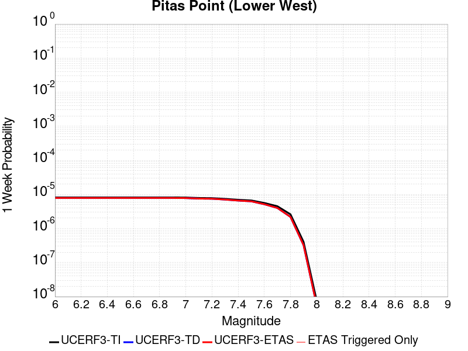 |  |  |  |

| Magnitude | 1 wk TI Prob | 1 wk TD Prob | 1 wk ETAS Prob | 1 wk ETAS/TD Gain | 1 wk ETAS Triggered Only | 1 mo TI Prob | 1 mo TD Prob | 1 mo ETAS Prob | 1 mo ETAS/TD Gain | 1 mo ETAS Triggered Only | 1 yr TI Prob | 1 yr TD Prob | 1 yr ETAS Prob | 1 yr ETAS/TD Gain | 1 yr ETAS Triggered Only | 10 yr TI Prob | 10 yr TD Prob | 10 yr ETAS Prob | 10 yr ETAS/TD Gain | 10 yr ETAS Triggered Only |
|-----|-----|-----|-----|-----|-----|-----|-----|-----|-----|-----|-----|-----|-----|-----|-----|-----|-----|-----|-----|-----|
| 6.0 | 8.151497E-6 | 7.855866E-6 | 7.855866E-6 | 1.0 | 0.0 | 3.493452E-5 | 3.366757E-5 | 3.366757E-5 | 1.0 | 0.0 | 4.252448E-4 | 4.098263E-4 | 4.098263E-4 | 1.0 | 0.0 | 0.0042443196 | 0.0040907855 | 0.0041007446 | 1.0024345 | 1.0E-5 |
| 6.1 | 8.151497E-6 | 7.855866E-6 | 7.855866E-6 | 1.0 | 0.0 | 3.493452E-5 | 3.366757E-5 | 3.366757E-5 | 1.0 | 0.0 | 4.252448E-4 | 4.098263E-4 | 4.098263E-4 | 1.0 | 0.0 | 0.0042443196 | 0.0040907855 | 0.0041007446 | 1.0024345 | 1.0E-5 |
| 6.2 | 8.151497E-6 | 7.855866E-6 | 7.855866E-6 | 1.0 | 0.0 | 3.493452E-5 | 3.366757E-5 | 3.366757E-5 | 1.0 | 0.0 | 4.252448E-4 | 4.098263E-4 | 4.098263E-4 | 1.0 | 0.0 | 0.0042443196 | 0.0040907855 | 0.0041007446 | 1.0024345 | 1.0E-5 |
| 6.3 | 8.151497E-6 | 7.855866E-6 | 7.855866E-6 | 1.0 | 0.0 | 3.493452E-5 | 3.366757E-5 | 3.366757E-5 | 1.0 | 0.0 | 4.252448E-4 | 4.098263E-4 | 4.098263E-4 | 1.0 | 0.0 | 0.0042443196 | 0.0040907855 | 0.0041007446 | 1.0024345 | 1.0E-5 |
| 6.4 | 8.151497E-6 | 7.855866E-6 | 7.855866E-6 | 1.0 | 0.0 | 3.493452E-5 | 3.366757E-5 | 3.366757E-5 | 1.0 | 0.0 | 4.252448E-4 | 4.098263E-4 | 4.098263E-4 | 1.0 | 0.0 | 0.0042443196 | 0.0040907855 | 0.0041007446 | 1.0024345 | 1.0E-5 |
| 6.5 | 8.151497E-6 | 7.855866E-6 | 7.855866E-6 | 1.0 | 0.0 | 3.493452E-5 | 3.366757E-5 | 3.366757E-5 | 1.0 | 0.0 | 4.252448E-4 | 4.098263E-4 | 4.098263E-4 | 1.0 | 0.0 | 0.0042443196 | 0.0040907855 | 0.0041007446 | 1.0024345 | 1.0E-5 |
| 6.6 | 8.151497E-6 | 7.855866E-6 | 7.855866E-6 | 1.0 | 0.0 | 3.493452E-5 | 3.366757E-5 | 3.366757E-5 | 1.0 | 0.0 | 4.252448E-4 | 4.098263E-4 | 4.098263E-4 | 1.0 | 0.0 | 0.0042443196 | 0.0040907855 | 0.0041007446 | 1.0024345 | 1.0E-5 |
| 6.7 | 8.151497E-6 | 7.855866E-6 | 7.855866E-6 | 1.0 | 0.0 | 3.493452E-5 | 3.366757E-5 | 3.366757E-5 | 1.0 | 0.0 | 4.252448E-4 | 4.098263E-4 | 4.098263E-4 | 1.0 | 0.0 | 0.0042443196 | 0.0040907855 | 0.0041007446 | 1.0024345 | 1.0E-5 |
| 6.8 | 8.151497E-6 | 7.855866E-6 | 7.855866E-6 | 1.0 | 0.0 | 3.493452E-5 | 3.366757E-5 | 3.366757E-5 | 1.0 | 0.0 | 4.252448E-4 | 4.098263E-4 | 4.098263E-4 | 1.0 | 0.0 | 0.0042443196 | 0.0040907855 | 0.0041007446 | 1.0024345 | 1.0E-5 |
| 6.9 | 8.151497E-6 | 7.855866E-6 | 7.855866E-6 | 1.0 | 0.0 | 3.493452E-5 | 3.366757E-5 | 3.366757E-5 | 1.0 | 0.0 | 4.252448E-4 | 4.098263E-4 | 4.098263E-4 | 1.0 | 0.0 | 0.0042443196 | 0.0040907855 | 0.0041007446 | 1.0024345 | 1.0E-5 |
| 7.0 | 8.103535E-6 | 7.805295E-6 | 7.805295E-6 | 1.0 | 0.0 | 3.4728975E-5 | 3.345084E-5 | 3.345084E-5 | 1.0 | 0.0 | 4.2274324E-4 | 4.0718864E-4 | 4.0718864E-4 | 1.0 | 0.0 | 0.0042193993 | 0.004064506 | 0.004074465 | 1.0024503 | 1.0E-5 |
| 7.1 | 7.853298E-6 | 7.5409835E-6 | 7.5409835E-6 | 1.0 | 0.0 | 3.3656554E-5 | 3.2318105E-5 | 3.2318105E-5 | 1.0 | 0.0 | 4.096915E-4 | 3.934026E-4 | 3.934026E-4 | 1.0 | 0.0 | 0.00408937 | 0.0039271377 | 0.003937098 | 1.0025364 | 1.0E-5 |
| 7.2 | 7.771102E-6 | 7.453264E-6 | 7.453264E-6 | 1.0 | 0.0 | 3.33043E-5 | 3.1942174E-5 | 3.1942174E-5 | 1.0 | 0.0 | 4.0540437E-4 | 3.8882726E-4 | 3.8882726E-4 | 1.0 | 0.0 | 0.0040466557 | 0.003881545 | 0.0038915062 | 1.0025663 | 1.0E-5 |
| 7.3 | 7.3945344E-6 | 7.0493625E-6 | 7.0493625E-6 | 1.0 | 0.0 | 3.1690477E-5 | 3.0211208E-5 | 3.0211208E-5 | 1.0 | 0.0 | 3.8576324E-4 | 3.6776E-4 | 3.6776E-4 | 1.0 | 0.0 | 0.0038509427 | 0.0036715816 | 0.003681545 | 1.0027137 | 1.0E-5 |
| 7.4 | 6.964645E-6 | 6.590205E-6 | 6.590205E-6 | 1.0 | 0.0 | 2.9848137E-5 | 2.8243432E-5 | 2.8243432E-5 | 1.0 | 0.0 | 3.6334046E-4 | 3.4381004E-4 | 3.4381004E-4 | 1.0 | 0.0 | 0.0036274698 | 0.0034328345 | 0.0034428001 | 1.0029031 | 1.0E-5 |
| 7.5 | 6.6525035E-6 | 6.2592394E-6 | 6.2592394E-6 | 1.0 | 0.0 | 2.851042E-5 | 2.6825039E-5 | 2.6825039E-5 | 1.0 | 0.0 | 3.4705905E-4 | 3.2654637E-4 | 3.2654637E-4 | 1.0 | 0.0 | 0.0034651754 | 0.003260717 | 0.0032706845 | 1.0030568 | 1.0E-5 |
| 7.6 | 5.613338E-6 | 5.151452E-6 | 5.151452E-6 | 1.0 | 0.0 | 2.405694E-5 | 2.2077467E-5 | 2.2077467E-5 | 1.0 | 0.0 | 2.928539E-4 | 2.687603E-4 | 2.687603E-4 | 1.0 | 0.0 | 0.0029246826 | 0.0026843844 | 0.0026943577 | 1.0037153 | 1.0E-5 |
| 7.7 | 4.494704E-6 | 3.996963E-6 | 3.996963E-6 | 1.0 | 0.0 | 1.9262876E-5 | 1.712973E-5 | 1.712973E-5 | 1.0 | 0.0 | 2.3450027E-4 | 2.0853475E-4 | 2.0853475E-4 | 1.0 | 0.0 | 0.0023425296 | 0.0020834147 | 0.0020834147 | 1.0 | 0.0 |
| 7.8 | 2.6075882E-6 | 2.1836659E-6 | 2.1836659E-6 | 1.0 | 0.0 | 1.117533E-5 | 9.358534E-6 | 9.358534E-6 | 1.0 | 0.0 | 1.3605114E-4 | 1.1393424E-4 | 1.1393424E-4 | 1.0 | 0.0 | 0.0013596788 | 0.001138763 | 0.001138763 | 1.0 | 0.0 |
| 7.9 | 4.045984E-7 | 3.2424188E-7 | 3.2424188E-7 | 1.0 | 0.0 | 1.733992E-6 | 1.3896073E-6 | 1.3896073E-6 | 1.0 | 0.0 | 2.1111147E-5 | 1.691834E-5 | 1.691834E-5 | 1.0 | 0.0 | 2.1109142E-4 | 1.6917085E-4 | 1.6917085E-4 | 1.0 | 0.0 |
| 8.0 | 7.791402E-9 | 5.683585E-9 | 5.683585E-9 | 1.0 | 0.0 | 3.3391725E-8 | 2.4358222E-8 | 2.4358222E-8 | 1.0 | 0.0 | 4.0654416E-7 | 2.9656135E-7 | 2.9656135E-7 | 1.0 | 0.0 | 4.065434E-6 | 2.9656114E-6 | 2.9656114E-6 | 1.0 | 0.0 |

## Santa Susana East (connector)
*[(top)](#table-of-contents)*

| 1 Week | 1 Month | 1 Year | 10 Year |
|-----|-----|-----|-----|
|  |  |  |  |

| Magnitude | 1 wk TI Prob | 1 wk TD Prob | 1 wk ETAS Prob | 1 wk ETAS/TD Gain | 1 wk ETAS Triggered Only | 1 mo TI Prob | 1 mo TD Prob | 1 mo ETAS Prob | 1 mo ETAS/TD Gain | 1 mo ETAS Triggered Only | 1 yr TI Prob | 1 yr TD Prob | 1 yr ETAS Prob | 1 yr ETAS/TD Gain | 1 yr ETAS Triggered Only | 10 yr TI Prob | 10 yr TD Prob | 10 yr ETAS Prob | 10 yr ETAS/TD Gain | 10 yr ETAS Triggered Only |
|-----|-----|-----|-----|-----|-----|-----|-----|-----|-----|-----|-----|-----|-----|-----|-----|-----|-----|-----|-----|-----|
| 6.0 | 2.858397E-5 | 3.2022355E-5 | 3.2022355E-5 | 1.0 | 0.0 | 1.2249697E-4 | 1.3723303E-4 | 1.3723303E-4 | 1.0 | 0.0 | 0.0014903803 | 0.0016698134 | 0.0016797966 | 1.0059787 | 1.0E-5 | 0.014804244 | 0.016599786 | 0.01660962 | 1.0005925 | 1.0E-5 |
| 6.1 | 2.858397E-5 | 3.2022355E-5 | 3.2022355E-5 | 1.0 | 0.0 | 1.2249697E-4 | 1.3723303E-4 | 1.3723303E-4 | 1.0 | 0.0 | 0.0014903803 | 0.0016698134 | 0.0016797966 | 1.0059787 | 1.0E-5 | 0.014804244 | 0.016599786 | 0.01660962 | 1.0005925 | 1.0E-5 |
| 6.2 | 2.858397E-5 | 3.2022355E-5 | 3.2022355E-5 | 1.0 | 0.0 | 1.2249697E-4 | 1.3723303E-4 | 1.3723303E-4 | 1.0 | 0.0 | 0.0014903803 | 0.0016698134 | 0.0016797966 | 1.0059787 | 1.0E-5 | 0.014804244 | 0.016599786 | 0.01660962 | 1.0005925 | 1.0E-5 |
| 6.3 | 1.943582E-5 | 2.0367957E-5 | 2.0367957E-5 | 1.0 | 0.0 | 8.329371E-5 | 8.728896E-5 | 8.728896E-5 | 1.0 | 0.0 | 0.001013629 | 0.0010623372 | 0.0010723266 | 1.0094032 | 1.0E-5 | 0.010090181 | 0.010584021 | 0.010593915 | 1.0009348 | 1.0E-5 |
| 6.4 | 1.943582E-5 | 2.0367957E-5 | 2.0367957E-5 | 1.0 | 0.0 | 8.329371E-5 | 8.728896E-5 | 8.728896E-5 | 1.0 | 0.0 | 0.001013629 | 0.0010623372 | 0.0010723266 | 1.0094032 | 1.0E-5 | 0.010090181 | 0.010584021 | 0.010593915 | 1.0009348 | 1.0E-5 |
| 6.5 | 1.943582E-5 | 2.0367957E-5 | 2.0367957E-5 | 1.0 | 0.0 | 8.329371E-5 | 8.728896E-5 | 8.728896E-5 | 1.0 | 0.0 | 0.001013629 | 0.0010623372 | 0.0010723266 | 1.0094032 | 1.0E-5 | 0.010090181 | 0.010584021 | 0.010593915 | 1.0009348 | 1.0E-5 |
| 6.6 | 1.943582E-5 | 2.0367957E-5 | 2.0367957E-5 | 1.0 | 0.0 | 8.329371E-5 | 8.728896E-5 | 8.728896E-5 | 1.0 | 0.0 | 0.001013629 | 0.0010623372 | 0.0010723266 | 1.0094032 | 1.0E-5 | 0.010090181 | 0.010584021 | 0.010593915 | 1.0009348 | 1.0E-5 |
| 6.7 | 1.9404439E-5 | 2.0355377E-5 | 2.0355377E-5 | 1.0 | 0.0 | 8.3159226E-5 | 8.723505E-5 | 8.723505E-5 | 1.0 | 0.0 | 0.0010119933 | 0.0010616814 | 0.0010716708 | 1.0094091 | 1.0E-5 | 0.010073971 | 0.010577526 | 0.01058742 | 1.0009354 | 1.0E-5 |
| 6.8 | 1.2217526E-5 | 1.1593314E-5 | 1.1593314E-5 | 1.0 | 0.0 | 5.2359774E-5 | 4.9684782E-5 | 4.9684782E-5 | 1.0 | 0.0 | 6.372938E-4 | 6.047612E-4 | 6.147551E-4 | 1.0165255 | 1.0E-5 | 0.0063546924 | 0.0060332012 | 0.006043141 | 1.0016475 | 1.0E-5 |
| 6.9 | 1.2217526E-5 | 1.1593314E-5 | 1.1593314E-5 | 1.0 | 0.0 | 5.2359774E-5 | 4.9684782E-5 | 4.9684782E-5 | 1.0 | 0.0 | 6.372938E-4 | 6.047612E-4 | 6.147551E-4 | 1.0165255 | 1.0E-5 | 0.0063546924 | 0.0060332012 | 0.006043141 | 1.0016475 | 1.0E-5 |
| 7.0 | 9.276017E-6 | 8.059274E-6 | 8.059274E-6 | 1.0 | 0.0 | 3.9753755E-5 | 3.4539305E-5 | 3.4539305E-5 | 1.0 | 0.0 | 4.8389446E-4 | 4.2043836E-4 | 4.3043416E-4 | 1.0237747 | 1.0E-5 | 0.0048284214 | 0.004197156 | 0.0042071138 | 1.0023726 | 1.0E-5 |
| 7.1 | 9.130355E-6 | 7.942444E-6 | 7.942444E-6 | 1.0 | 0.0 | 3.9129503E-5 | 3.403862E-5 | 3.403862E-5 | 1.0 | 0.0 | 4.7629757E-4 | 4.1434486E-4 | 4.2434072E-4 | 1.0241245 | 1.0E-5 | 0.00475278 | 0.0041364487 | 0.0041464074 | 1.0024076 | 1.0E-5 |
| 7.2 | 8.851015E-6 | 7.7416E-6 | 7.7416E-6 | 1.0 | 0.0 | 3.7932372E-5 | 3.3177883E-5 | 3.3177883E-5 | 1.0 | 0.0 | 4.6172875E-4 | 4.0386926E-4 | 4.1386523E-4 | 1.0247505 | 1.0E-5 | 0.0046077054 | 0.004032076 | 0.0040420354 | 1.0024701 | 1.0E-5 |
| 7.3 | 8.573006E-6 | 7.5503167E-6 | 7.5503167E-6 | 1.0 | 0.0 | 3.6740938E-5 | 3.235812E-5 | 3.235812E-5 | 1.0 | 0.0 | 4.472291E-4 | 3.938923E-4 | 4.0388835E-4 | 1.0253776 | 1.0E-5 | 0.004463301 | 0.0039326586 | 0.0039426195 | 1.0025328 | 1.0E-5 |
| 7.4 | 7.852282E-6 | 6.8178124E-6 | 6.8178124E-6 | 1.0 | 0.0 | 3.36522E-5 | 2.9218887E-5 | 2.9218887E-5 | 1.0 | 0.0 | 4.096385E-4 | 3.556849E-4 | 3.6568134E-4 | 1.0281048 | 1.0E-5 | 0.0040888423 | 0.0035518208 | 0.0035617852 | 1.0028055 | 1.0E-5 |
| 7.5 | 4.8869324E-6 | 4.2791244E-6 | 4.2791244E-6 | 1.0 | 0.0 | 2.0943828E-5 | 1.8338986E-5 | 1.8338986E-5 | 1.0 | 0.0 | 2.5496128E-4 | 2.2325593E-4 | 2.332537E-4 | 1.0447817 | 1.0E-5 | 0.0025466895 | 0.0022304808 | 0.0022404585 | 1.0044733 | 1.0E-5 |
| 7.6 | 1.3894544E-6 | 1.15683E-6 | 1.15683E-6 | 1.0 | 0.0 | 5.954791E-6 | 4.9578343E-6 | 4.9578343E-6 | 1.0 | 0.0 | 7.249717E-5 | 6.0360184E-5 | 6.0360184E-5 | 1.0 | 0.0 | 7.247352E-4 | 6.034597E-4 | 6.034597E-4 | 1.0 | 0.0 |
| 7.7 | 2.9924632E-7 | 2.3719826E-7 | 2.3719826E-7 | 1.0 | 0.0 | 1.2824837E-6 | 1.0165636E-6 | 1.0165636E-6 | 1.0 | 0.0 | 1.5614127E-5 | 1.2376599E-5 | 1.2376599E-5 | 1.0 | 0.0 | 1.5613029E-4 | 1.2375982E-4 | 1.2375982E-4 | 1.0 | 0.0 |
| 7.8 | 4.8188564E-8 | 2.632532E-8 | 2.632532E-8 | 1.0 | 0.0 | 2.065224E-7 | 1.12822796E-7 | 1.12822796E-7 | 1.0 | 0.0 | 2.5144072E-6 | 1.3736168E-6 | 1.3736168E-6 | 1.0 | 0.0 | 2.5143789E-5 | 1.3736091E-5 | 1.3736091E-5 | 1.0 | 0.0 |
| 7.9 | 2.6127251E-9 | 2.7681444E-9 | 2.7681444E-9 | 1.0 | 0.0 | 1.1197393E-8 | 1.1863476E-8 | 1.1863476E-8 | 1.0 | 0.0 | 1.3632825E-7 | 1.4443782E-7 | 1.4443782E-7 | 1.0 | 0.0 | 1.3632817E-6 | 1.4443782E-6 | 1.4443782E-6 | 1.0 | 0.0 |

## Anaheim
*[(top)](#table-of-contents)*

| 1 Week | 1 Month | 1 Year | 10 Year |
|-----|-----|-----|-----|
|  | 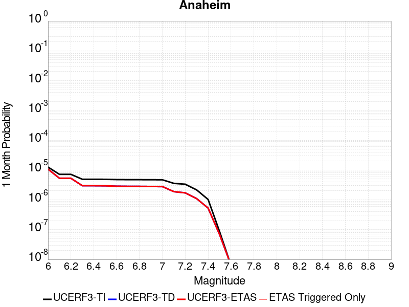 |  |  |

| Magnitude | 1 wk TI Prob | 1 wk TD Prob | 1 wk ETAS Prob | 1 wk ETAS/TD Gain | 1 wk ETAS Triggered Only | 1 mo TI Prob | 1 mo TD Prob | 1 mo ETAS Prob | 1 mo ETAS/TD Gain | 1 mo ETAS Triggered Only | 1 yr TI Prob | 1 yr TD Prob | 1 yr ETAS Prob | 1 yr ETAS/TD Gain | 1 yr ETAS Triggered Only | 10 yr TI Prob | 10 yr TD Prob | 10 yr ETAS Prob | 10 yr ETAS/TD Gain | 10 yr ETAS Triggered Only |
|-----|-----|-----|-----|-----|-----|-----|-----|-----|-----|-----|-----|-----|-----|-----|-----|-----|-----|-----|-----|-----|
| 6.0 | 2.9254998E-6 | 2.512312E-6 | 2.512312E-6 | 1.0 | 0.0 | 1.25377965E-5 | 1.076702E-5 | 1.076702E-5 | 1.0 | 0.0 | 1.5263697E-4 | 1.3108292E-4 | 1.3108292E-4 | 1.0 | 0.0 | 0.0015253217 | 0.0013102863 | 0.0013202731 | 1.0076219 | 1.0E-5 |
| 6.1 | 1.6729715E-6 | 1.2337549E-6 | 1.2337549E-6 | 1.0 | 0.0 | 7.1698582E-6 | 5.287513E-6 | 5.287513E-6 | 1.0 | 0.0 | 8.7289525E-5 | 6.4373984E-5 | 6.4373984E-5 | 1.0 | 0.0 | 8.7255245E-4 | 6.435943E-4 | 6.435943E-4 | 1.0 | 0.0 |
| 6.2 | 1.6729715E-6 | 1.2337549E-6 | 1.2337549E-6 | 1.0 | 0.0 | 7.1698582E-6 | 5.287513E-6 | 5.287513E-6 | 1.0 | 0.0 | 8.7289525E-5 | 6.4373984E-5 | 6.4373984E-5 | 1.0 | 0.0 | 8.7255245E-4 | 6.435943E-4 | 6.435943E-4 | 1.0 | 0.0 |
| 6.3 | 1.1444064E-6 | 6.9598497E-7 | 6.9598497E-7 | 1.0 | 0.0 | 4.9045893E-6 | 2.9827895E-6 | 2.9827895E-6 | 1.0 | 0.0 | 5.971174E-5 | 3.6314912E-5 | 3.6314912E-5 | 1.0 | 0.0 | 5.96957E-4 | 3.6309529E-4 | 3.6309529E-4 | 1.0 | 0.0 |
| 6.4 | 1.1444064E-6 | 6.9598497E-7 | 6.9598497E-7 | 1.0 | 0.0 | 4.9045893E-6 | 2.9827895E-6 | 2.9827895E-6 | 1.0 | 0.0 | 5.971174E-5 | 3.6314912E-5 | 3.6314912E-5 | 1.0 | 0.0 | 5.96957E-4 | 3.6309529E-4 | 3.6309529E-4 | 1.0 | 0.0 |
| 6.5 | 1.1385318E-6 | 6.900533E-7 | 6.900533E-7 | 1.0 | 0.0 | 4.879413E-6 | 2.9573682E-6 | 2.9573682E-6 | 1.0 | 0.0 | 5.9405233E-5 | 3.600542E-5 | 3.600542E-5 | 1.0 | 0.0 | 5.938936E-4 | 3.6000134E-4 | 3.6000134E-4 | 1.0 | 0.0 |
| 6.6 | 1.1165511E-6 | 6.6784037E-7 | 6.6784037E-7 | 1.0 | 0.0 | 4.78521E-6 | 2.86217E-6 | 2.86217E-6 | 1.0 | 0.0 | 5.8258374E-5 | 3.484642E-5 | 3.484642E-5 | 1.0 | 0.0 | 5.8243104E-4 | 3.48415E-4 | 3.48415E-4 | 1.0 | 0.0 |
| 6.7 | 1.1098243E-6 | 6.610598E-7 | 6.610598E-7 | 1.0 | 0.0 | 4.7563813E-6 | 2.8331106E-6 | 2.8331106E-6 | 1.0 | 0.0 | 5.7907404E-5 | 3.449263E-5 | 3.449263E-5 | 1.0 | 0.0 | 5.7892315E-4 | 3.448782E-4 | 3.448782E-4 | 1.0 | 0.0 |
| 6.8 | 1.1077587E-6 | 6.5898007E-7 | 6.5898007E-7 | 1.0 | 0.0 | 4.7475287E-6 | 2.8241975E-6 | 2.8241975E-6 | 1.0 | 0.0 | 5.779963E-5 | 3.4384117E-5 | 3.4384117E-5 | 1.0 | 0.0 | 5.77846E-4 | 3.4379342E-4 | 3.4379342E-4 | 1.0 | 0.0 |
| 6.9 | 1.1024468E-6 | 6.5363776E-7 | 6.5363776E-7 | 1.0 | 0.0 | 4.7247636E-6 | 2.8013021E-6 | 2.8013021E-6 | 1.0 | 0.0 | 5.752248E-5 | 3.4105375E-5 | 3.4105375E-5 | 1.0 | 0.0 | 5.750759E-4 | 3.4100685E-4 | 3.4100685E-4 | 1.0 | 0.0 |
| 7.0 | 1.0993066E-6 | 6.510485E-7 | 6.510485E-7 | 1.0 | 0.0 | 4.7113053E-6 | 2.7902051E-6 | 2.7902051E-6 | 1.0 | 0.0 | 5.7358633E-5 | 3.397027E-5 | 3.397027E-5 | 1.0 | 0.0 | 5.734383E-4 | 3.3965622E-4 | 3.3965622E-4 | 1.0 | 0.0 |
| 7.1 | 8.334877E-7 | 4.4050665E-7 | 4.4050665E-7 | 1.0 | 0.0 | 3.5720855E-6 | 1.8878844E-6 | 1.8878844E-6 | 1.0 | 0.0 | 4.348927E-5 | 2.2984774E-5 | 2.2984774E-5 | 1.0 | 0.0 | 4.3480762E-4 | 2.298262E-4 | 2.298262E-4 | 1.0 | 0.0 |
| 7.2 | 7.794411E-7 | 3.997785E-7 | 3.997785E-7 | 1.0 | 0.0 | 3.3404576E-6 | 1.7133355E-6 | 1.7133355E-6 | 1.0 | 0.0 | 4.0669314E-5 | 2.085968E-5 | 2.085968E-5 | 1.0 | 0.0 | 4.066187E-4 | 2.0857927E-4 | 2.0857927E-4 | 1.0 | 0.0 |
| 7.3 | 5.01704E-7 | 2.5574272E-7 | 2.5574272E-7 | 1.0 | 0.0 | 2.150158E-6 | 1.0960398E-6 | 1.0960398E-6 | 1.0 | 0.0 | 2.617786E-5 | 1.3344215E-5 | 1.3344215E-5 | 1.0 | 0.0 | 2.6174777E-4 | 1.3343539E-4 | 1.3343539E-4 | 1.0 | 0.0 |
| 7.4 | 2.4008182E-7 | 1.2368267E-7 | 1.2368267E-7 | 1.0 | 0.0 | 1.0289217E-6 | 5.300685E-7 | 5.300685E-7 | 1.0 | 0.0 | 1.252705E-5 | 6.453573E-6 | 6.453573E-6 | 1.0 | 0.0 | 1.2526344E-4 | 6.4534615E-5 | 6.4534615E-5 | 1.0 | 0.0 |
| 7.5 | 2.0263876E-8 | 1.6121039E-8 | 1.6121039E-8 | 1.0 | 0.0 | 8.684518E-8 | 6.909017E-8 | 6.909017E-8 | 1.0 | 0.0 | 1.0573395E-6 | 8.4117255E-7 | 8.4117255E-7 | 1.0 | 0.0 | 1.0573345E-5 | 8.411703E-6 | 8.411703E-6 | 1.0 | 0.0 |
| 7.6 | 1.4871431E-9 | 1.5084223E-9 | 1.5084223E-9 | 1.0 | 0.0 | 6.37347E-9 | 6.4646675E-9 | 6.4646675E-9 | 1.0 | 0.0 | 7.7596994E-8 | 7.870732E-8 | 7.870732E-8 | 1.0 | 0.0 | 7.759697E-7 | 7.8707296E-7 | 7.8707296E-7 | 1.0 | 0.0 |
| 7.7 | 1.5093293E-10 | 1.5333568E-10 | 1.5333568E-10 | 1.0 | 0.0 | 6.4685546E-10 | 6.57153E-10 | 6.57153E-10 | 1.0 | 0.0 | 7.875465E-9 | 8.000839E-9 | 8.000839E-9 | 1.0 | 0.0 | 7.8754645E-8 | 8.000839E-8 | 8.000839E-8 | 1.0 | 0.0 |

## San Juan
*[(top)](#table-of-contents)*

| 1 Week | 1 Month | 1 Year | 10 Year |
|-----|-----|-----|-----|
|  |  |  | 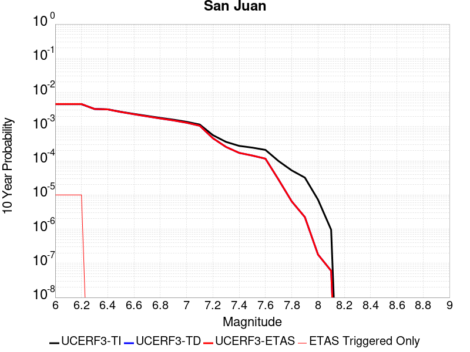 |

| Magnitude | 1 wk TI Prob | 1 wk TD Prob | 1 wk ETAS Prob | 1 wk ETAS/TD Gain | 1 wk ETAS Triggered Only | 1 mo TI Prob | 1 mo TD Prob | 1 mo ETAS Prob | 1 mo ETAS/TD Gain | 1 mo ETAS Triggered Only | 1 yr TI Prob | 1 yr TD Prob | 1 yr ETAS Prob | 1 yr ETAS/TD Gain | 1 yr ETAS Triggered Only | 10 yr TI Prob | 10 yr TD Prob | 10 yr ETAS Prob | 10 yr ETAS/TD Gain | 10 yr ETAS Triggered Only |
|-----|-----|-----|-----|-----|-----|-----|-----|-----|-----|-----|-----|-----|-----|-----|-----|-----|-----|-----|-----|-----|
| 6.0 | 8.682808E-6 | 8.749785E-6 | 8.749785E-6 | 1.0 | 0.0 | 3.72115E-5 | 3.7498565E-5 | 3.7498565E-5 | 1.0 | 0.0 | 4.5295584E-4 | 4.5645423E-4 | 4.5645423E-4 | 1.0 | 0.0 | 0.004520337 | 0.004555708 | 0.0045656622 | 1.0021851 | 1.0E-5 |
| 6.1 | 8.682808E-6 | 8.749785E-6 | 8.749785E-6 | 1.0 | 0.0 | 3.72115E-5 | 3.7498565E-5 | 3.7498565E-5 | 1.0 | 0.0 | 4.5295584E-4 | 4.5645423E-4 | 4.5645423E-4 | 1.0 | 0.0 | 0.004520337 | 0.004555708 | 0.0045656622 | 1.0021851 | 1.0E-5 |
| 6.2 | 8.682808E-6 | 8.749785E-6 | 8.749785E-6 | 1.0 | 0.0 | 3.72115E-5 | 3.7498565E-5 | 3.7498565E-5 | 1.0 | 0.0 | 4.5295584E-4 | 4.5645423E-4 | 4.5645423E-4 | 1.0 | 0.0 | 0.004520337 | 0.004555708 | 0.0045656622 | 1.0021851 | 1.0E-5 |
| 6.3 | 6.3054235E-6 | 6.283187E-6 | 6.283187E-6 | 1.0 | 0.0 | 2.7022963E-5 | 2.6927675E-5 | 2.6927675E-5 | 1.0 | 0.0 | 3.2895492E-4 | 3.2779653E-4 | 3.2779653E-4 | 1.0 | 0.0 | 0.003284684 | 0.0032733302 | 0.0032733302 | 1.0 | 0.0 |
| 6.4 | 6.1490473E-6 | 6.114985E-6 | 6.114985E-6 | 1.0 | 0.0 | 2.6352795E-5 | 2.6206822E-5 | 2.6206822E-5 | 1.0 | 0.0 | 3.2079802E-4 | 3.190227E-4 | 3.190227E-4 | 1.0 | 0.0 | 0.0032033534 | 0.0031858438 | 0.0031858438 | 1.0 | 0.0 |
| 6.5 | 5.204848E-6 | 5.1377356E-6 | 5.1377356E-6 | 1.0 | 0.0 | 2.23063E-5 | 2.2018687E-5 | 2.2018687E-5 | 1.0 | 0.0 | 2.7154534E-4 | 2.680455E-4 | 2.680455E-4 | 1.0 | 0.0 | 0.0027121378 | 0.002677376 | 0.002677376 | 1.0 | 0.0 |
| 6.6 | 4.5179986E-6 | 4.415406E-6 | 4.415406E-6 | 1.0 | 0.0 | 1.9362706E-5 | 1.8923034E-5 | 1.8923034E-5 | 1.0 | 0.0 | 2.3571544E-4 | 2.3036439E-4 | 2.3036439E-4 | 1.0 | 0.0 | 0.0023546559 | 0.0023013928 | 0.0023013928 | 1.0 | 0.0 |
| 6.7 | 3.9442616E-6 | 3.820164E-6 | 3.820164E-6 | 1.0 | 0.0 | 1.6903869E-5 | 1.637203E-5 | 1.637203E-5 | 1.0 | 0.0 | 2.0578515E-4 | 1.9931192E-4 | 1.9931192E-4 | 1.0 | 0.0 | 0.002055947 | 0.0019914566 | 0.0019914566 | 1.0 | 0.0 |
| 6.8 | 3.4536245E-6 | 3.316657E-6 | 3.316657E-6 | 1.0 | 0.0 | 1.4801163E-5 | 1.421417E-5 | 1.421417E-5 | 1.0 | 0.0 | 1.8018926E-4 | 1.7304439E-4 | 1.7304439E-4 | 1.0 | 0.0 | 0.0018004322 | 0.0017292154 | 0.0017292154 | 1.0 | 0.0 |
| 6.9 | 3.059865E-6 | 2.9123387E-6 | 2.9123387E-6 | 1.0 | 0.0 | 1.3113641E-5 | 1.2481394E-5 | 1.2481394E-5 | 1.0 | 0.0 | 1.596469E-4 | 1.5195095E-4 | 1.5195095E-4 | 1.0 | 0.0 | 0.0015953224 | 0.0015185853 | 0.0015185853 | 1.0 | 0.0 |
| 7.0 | 2.6504351E-6 | 2.4922902E-6 | 2.4922902E-6 | 1.0 | 0.0 | 1.1358958E-5 | 1.0681203E-5 | 1.0681203E-5 | 1.0 | 0.0 | 1.3828653E-4 | 1.3003642E-4 | 1.3003642E-4 | 1.0 | 0.0 | 0.0013820052 | 0.0012997153 | 0.0012997153 | 1.0 | 0.0 |
| 7.1 | 2.2039317E-6 | 2.0340667E-6 | 2.0340667E-6 | 1.0 | 0.0 | 9.445387E-6 | 8.717403E-6 | 8.717403E-6 | 1.0 | 0.0 | 1.1499152E-4 | 1.0612974E-4 | 1.0612974E-4 | 1.0 | 0.0 | 0.0011493203 | 0.0010609005 | 0.0010609005 | 1.0 | 0.0 |
| 7.2 | 1.0786707E-6 | 8.772224E-7 | 8.772224E-7 | 1.0 | 0.0 | 4.622866E-6 | 3.7595191E-6 | 3.7595191E-6 | 1.0 | 0.0 | 5.628194E-5 | 4.5771194E-5 | 4.5771194E-5 | 1.0 | 0.0 | 5.6267687E-4 | 4.5767674E-4 | 4.5767674E-4 | 1.0 | 0.0 |
| 7.3 | 6.846433E-7 | 4.8700895E-7 | 4.8700895E-7 | 1.0 | 0.0 | 2.9341822E-6 | 2.0871794E-6 | 2.0871794E-6 | 1.0 | 0.0 | 3.5723086E-5 | 2.5411115E-5 | 2.5411115E-5 | 1.0 | 0.0 | 3.571734E-4 | 2.541156E-4 | 2.541156E-4 | 1.0 | 0.0 |
| 7.4 | 5.23043E-7 | 3.263768E-7 | 3.263768E-7 | 1.0 | 0.0 | 2.2416111E-6 | 1.3987569E-6 | 1.3987569E-6 | 1.0 | 0.0 | 2.7291273E-5 | 1.7029733E-5 | 1.7029733E-5 | 1.0 | 0.0 | 2.7287923E-4 | 1.7031624E-4 | 1.7031624E-4 | 1.0 | 0.0 |
| 7.5 | 4.648444E-7 | 2.7243135E-7 | 2.7243135E-7 | 1.0 | 0.0 | 1.9921886E-6 | 1.1675625E-6 | 1.1675625E-6 | 1.0 | 0.0 | 2.4254627E-5 | 1.421498E-5 | 1.421498E-5 | 1.0 | 0.0 | 2.425198E-4 | 1.4217035E-4 | 1.4217035E-4 | 1.0 | 0.0 |
| 7.6 | 3.9906567E-7 | 2.2089861E-7 | 2.2089861E-7 | 1.0 | 0.0 | 1.7102802E-6 | 9.46708E-7 | 9.46708E-7 | 1.0 | 0.0 | 2.0822463E-5 | 1.152611E-5 | 1.152611E-5 | 1.0 | 0.0 | 2.0820512E-4 | 1.15279734E-4 | 1.15279734E-4 | 1.0 | 0.0 |
| 7.7 | 1.8784601E-7 | 5.3691306E-8 | 5.3691306E-8 | 1.0 | 0.0 | 8.0505407E-7 | 2.3010557E-7 | 2.3010557E-7 | 1.0 | 0.0 | 9.80149E-6 | 2.8015315E-6 | 2.8015315E-6 | 1.0 | 0.0 | 9.801057E-5 | 2.8024026E-5 | 2.8024026E-5 | 1.0 | 0.0 |
| 7.8 | 1.00154914E-7 | 1.2423657E-8 | 1.2423657E-8 | 1.0 | 0.0 | 4.2923529E-7 | 5.3244236E-8 | 5.3244236E-8 | 1.0 | 0.0 | 5.225927E-6 | 6.4824843E-7 | 6.4824843E-7 | 1.0 | 0.0 | 5.225804E-5 | 6.4883698E-6 | 6.4883698E-6 | 1.0 | 0.0 |
| 7.9 | 6.171429E-8 | 4.300676E-9 | 4.300676E-9 | 1.0 | 0.0 | 2.6448978E-7 | 1.8431463E-8 | 1.8431463E-8 | 1.0 | 0.0 | 3.2201583E-6 | 2.2440304E-7 | 2.2440304E-7 | 1.0 | 0.0 | 3.2201115E-5 | 2.2493314E-6 | 2.2493314E-6 | 1.0 | 0.0 |
| 8.0 | 1.3974572E-8 | 3.3862357E-10 | 3.3862357E-10 | 1.0 | 0.0 | 5.989102E-8 | 1.4512416E-9 | 1.4512416E-9 | 1.0 | 0.0 | 7.2917294E-7 | 1.7668878E-8 | 1.7668878E-8 | 1.0 | 0.0 | 7.2917055E-6 | 1.8099979E-7 | 1.8099979E-7 | 1.0 | 0.0 |
| 8.1 | 1.8403477E-9 | 1.13211995E-10 | 1.13211995E-10 | 1.0 | 0.0 | 7.887204E-9 | 4.8519266E-10 | 4.8519266E-10 | 1.0 | 0.0 | 9.602671E-8 | 5.9072214E-9 | 5.9072214E-9 | 1.0 | 0.0 | 9.602667E-7 | 6.03174E-8 | 6.03174E-8 | 1.0 | 0.0 |

## South Klamath Lake West
*[(top)](#table-of-contents)*

| 1 Week | 1 Month | 1 Year | 10 Year |
|-----|-----|-----|-----|
| 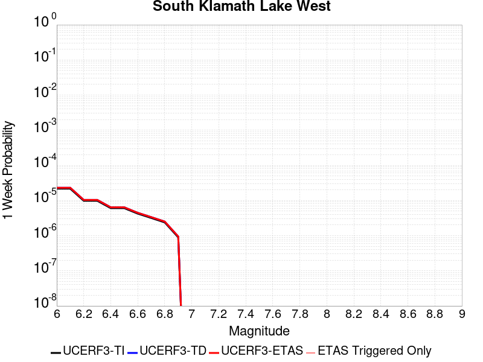 |  | 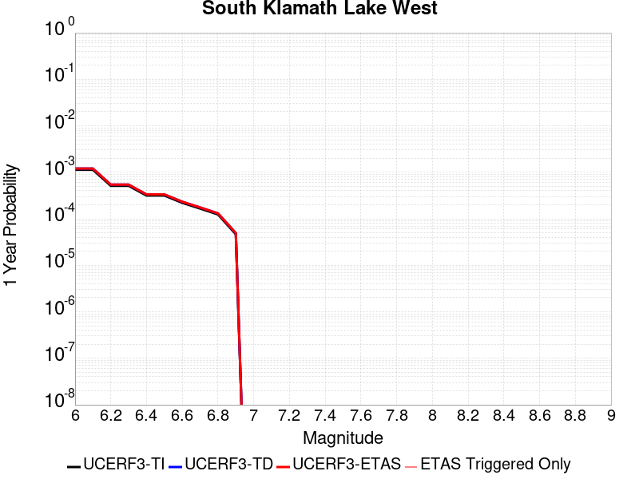 | 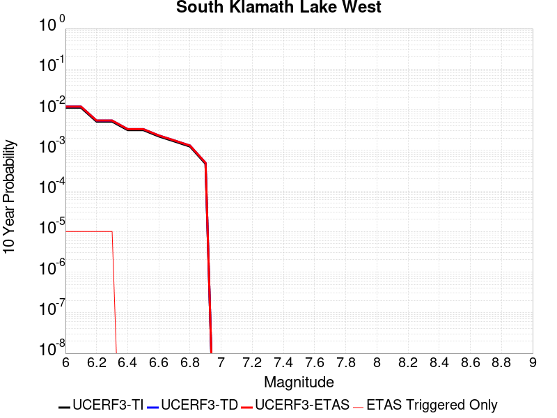 |

| Magnitude | 1 wk TI Prob | 1 wk TD Prob | 1 wk ETAS Prob | 1 wk ETAS/TD Gain | 1 wk ETAS Triggered Only | 1 mo TI Prob | 1 mo TD Prob | 1 mo ETAS Prob | 1 mo ETAS/TD Gain | 1 mo ETAS Triggered Only | 1 yr TI Prob | 1 yr TD Prob | 1 yr ETAS Prob | 1 yr ETAS/TD Gain | 1 yr ETAS Triggered Only | 10 yr TI Prob | 10 yr TD Prob | 10 yr ETAS Prob | 10 yr ETAS/TD Gain | 10 yr ETAS Triggered Only |
|-----|-----|-----|-----|-----|-----|-----|-----|-----|-----|-----|-----|-----|-----|-----|-----|-----|-----|-----|-----|-----|
| 6.0 | 2.174025E-5 | 2.3042314E-5 | 2.3042314E-5 | 1.0 | 0.0 | 9.3169176E-5 | 9.8749406E-5 | 9.8749406E-5 | 1.0 | 0.0 | 0.0011337444 | 0.0012016767 | 0.0012016767 | 1.0 | 0.0 | 0.011279777 | 0.011958389 | 0.011968269 | 1.0008262 | 1.0E-5 |
| 6.1 | 2.174025E-5 | 2.3042314E-5 | 2.3042314E-5 | 1.0 | 0.0 | 9.3169176E-5 | 9.8749406E-5 | 9.8749406E-5 | 1.0 | 0.0 | 0.0011337444 | 0.0012016767 | 0.0012016767 | 1.0 | 0.0 | 0.011279777 | 0.011958389 | 0.011968269 | 1.0008262 | 1.0E-5 |
| 6.2 | 9.834929E-6 | 1.0393965E-5 | 1.0393965E-5 | 1.0 | 0.0 | 4.2149015E-5 | 4.4544853E-5 | 4.4544853E-5 | 1.0 | 0.0 | 5.1304343E-4 | 5.422077E-4 | 5.422077E-4 | 1.0 | 0.0 | 0.0051186057 | 0.005409749 | 0.0054196953 | 1.0018386 | 1.0E-5 |
| 6.3 | 9.834929E-6 | 1.0393965E-5 | 1.0393965E-5 | 1.0 | 0.0 | 4.2149015E-5 | 4.4544853E-5 | 4.4544853E-5 | 1.0 | 0.0 | 5.1304343E-4 | 5.422077E-4 | 5.422077E-4 | 1.0 | 0.0 | 0.0051186057 | 0.005409749 | 0.0054196953 | 1.0018386 | 1.0E-5 |
| 6.4 | 6.066321E-6 | 6.4005035E-6 | 6.4005035E-6 | 1.0 | 0.0 | 2.5998259E-5 | 2.7430455E-5 | 2.7430455E-5 | 1.0 | 0.0 | 3.1648282E-4 | 3.3391733E-4 | 3.3391733E-4 | 1.0 | 0.0 | 0.0031603249 | 0.0033344263 | 0.0033344263 | 1.0 | 0.0 |
| 6.5 | 6.066321E-6 | 6.4005035E-6 | 6.4005035E-6 | 1.0 | 0.0 | 2.5998259E-5 | 2.7430455E-5 | 2.7430455E-5 | 1.0 | 0.0 | 3.1648282E-4 | 3.3391733E-4 | 3.3391733E-4 | 1.0 | 0.0 | 0.0031603249 | 0.0033344263 | 0.0033344263 | 1.0 | 0.0 |
| 6.6 | 4.2321803E-6 | 4.4613416E-6 | 4.4613416E-6 | 1.0 | 0.0 | 1.8137789E-5 | 1.9119901E-5 | 1.9119901E-5 | 1.0 | 0.0 | 2.208052E-4 | 2.3276095E-4 | 2.3276095E-4 | 1.0 | 0.0 | 0.0022058594 | 0.0023252736 | 0.0023252736 | 1.0 | 0.0 |
| 6.7 | 3.186646E-6 | 3.3603433E-6 | 3.3603433E-6 | 1.0 | 0.0 | 1.3656982E-5 | 1.4401396E-5 | 1.4401396E-5 | 1.0 | 0.0 | 1.6626107E-4 | 1.7532357E-4 | 1.7532357E-4 | 1.0 | 0.0 | 0.0016613674 | 0.0017519196 | 0.0017519196 | 1.0 | 0.0 |
| 6.8 | 2.380121E-6 | 2.5109357E-6 | 2.5109357E-6 | 1.0 | 0.0 | 1.0200479E-5 | 1.0761111E-5 | 1.0761111E-5 | 1.0 | 0.0 | 1.2418375E-4 | 1.3100912E-4 | 1.3100912E-4 | 1.0 | 0.0 | 0.0012411437 | 0.0013093647 | 0.0013093647 | 1.0 | 0.0 |
| 6.9 | 8.928287E-7 | 9.4303607E-7 | 9.4303607E-7 | 1.0 | 0.0 | 3.826403E-6 | 4.041578E-6 | 4.041578E-6 | 1.0 | 0.0 | 4.658546E-5 | 4.9205322E-5 | 4.9205322E-5 | 1.0 | 0.0 | 4.6575698E-4 | 4.919659E-4 | 4.919659E-4 | 1.0 | 0.0 |

## Hector Mine
*[(top)](#table-of-contents)*

| 1 Week | 1 Month | 1 Year | 10 Year |
|-----|-----|-----|-----|
| 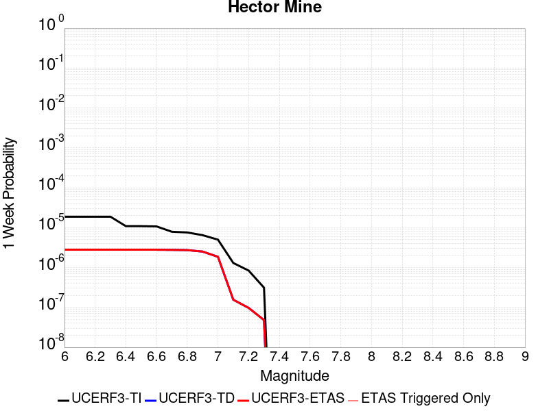 |  |  |  |

| Magnitude | 1 wk TI Prob | 1 wk TD Prob | 1 wk ETAS Prob | 1 wk ETAS/TD Gain | 1 wk ETAS Triggered Only | 1 mo TI Prob | 1 mo TD Prob | 1 mo ETAS Prob | 1 mo ETAS/TD Gain | 1 mo ETAS Triggered Only | 1 yr TI Prob | 1 yr TD Prob | 1 yr ETAS Prob | 1 yr ETAS/TD Gain | 1 yr ETAS Triggered Only | 10 yr TI Prob | 10 yr TD Prob | 10 yr ETAS Prob | 10 yr ETAS/TD Gain | 10 yr ETAS Triggered Only |
|-----|-----|-----|-----|-----|-----|-----|-----|-----|-----|-----|-----|-----|-----|-----|-----|-----|-----|-----|-----|-----|
| 6.0 | 1.8760093E-5 | 2.796481E-6 | 2.796481E-6 | 1.0 | 0.0 | 8.039792E-5 | 1.1984886E-5 | 1.1984886E-5 | 1.0 | 0.0 | 9.78405E-4 | 1.4591022E-4 | 1.4591022E-4 | 1.0 | 0.0 | 0.009741086 | 0.0014585364 | 0.0014685218 | 1.0068462 | 1.0E-5 |
| 6.1 | 1.8760093E-5 | 2.796481E-6 | 2.796481E-6 | 1.0 | 0.0 | 8.039792E-5 | 1.1984886E-5 | 1.1984886E-5 | 1.0 | 0.0 | 9.78405E-4 | 1.4591022E-4 | 1.4591022E-4 | 1.0 | 0.0 | 0.009741086 | 0.0014585364 | 0.0014685218 | 1.0068462 | 1.0E-5 |
| 6.2 | 1.8760093E-5 | 2.796481E-6 | 2.796481E-6 | 1.0 | 0.0 | 8.039792E-5 | 1.1984886E-5 | 1.1984886E-5 | 1.0 | 0.0 | 9.78405E-4 | 1.4591022E-4 | 1.4591022E-4 | 1.0 | 0.0 | 0.009741086 | 0.0014585364 | 0.0014685218 | 1.0068462 | 1.0E-5 |
| 6.3 | 1.8760093E-5 | 2.796481E-6 | 2.796481E-6 | 1.0 | 0.0 | 8.039792E-5 | 1.1984886E-5 | 1.1984886E-5 | 1.0 | 0.0 | 9.78405E-4 | 1.4591022E-4 | 1.4591022E-4 | 1.0 | 0.0 | 0.009741086 | 0.0014585364 | 0.0014685218 | 1.0068462 | 1.0E-5 |
| 6.4 | 1.0888055E-5 | 2.796481E-6 | 2.796481E-6 | 1.0 | 0.0 | 4.666226E-5 | 1.1984886E-5 | 1.1984886E-5 | 1.0 | 0.0 | 5.679649E-4 | 1.4591022E-4 | 1.4591022E-4 | 1.0 | 0.0 | 0.0056651547 | 0.0014585364 | 0.0014685218 | 1.0068462 | 1.0E-5 |
| 6.5 | 1.0888055E-5 | 2.796481E-6 | 2.796481E-6 | 1.0 | 0.0 | 4.666226E-5 | 1.1984886E-5 | 1.1984886E-5 | 1.0 | 0.0 | 5.679649E-4 | 1.4591022E-4 | 1.4591022E-4 | 1.0 | 0.0 | 0.0056651547 | 0.0014585364 | 0.0014685218 | 1.0068462 | 1.0E-5 |
| 6.6 | 1.0730738E-5 | 2.796481E-6 | 2.796481E-6 | 1.0 | 0.0 | 4.5988065E-5 | 1.1984886E-5 | 1.1984886E-5 | 1.0 | 0.0 | 5.5976084E-4 | 1.4591022E-4 | 1.4591022E-4 | 1.0 | 0.0 | 0.0055835294 | 0.0014585364 | 0.0014685218 | 1.0068462 | 1.0E-5 |
| 6.7 | 7.881326E-6 | 2.7711603E-6 | 2.7711603E-6 | 1.0 | 0.0 | 3.3776672E-5 | 1.187637E-5 | 1.187637E-5 | 1.0 | 0.0 | 4.111534E-4 | 1.4458921E-4 | 1.4458921E-4 | 1.0 | 0.0 | 0.0041039353 | 0.0014453435 | 0.001455329 | 1.0069088 | 1.0E-5 |
| 6.8 | 7.5683483E-6 | 2.7329088E-6 | 2.7329088E-6 | 1.0 | 0.0 | 3.2435375E-5 | 1.1712436E-5 | 1.1712436E-5 | 1.0 | 0.0 | 3.9482914E-4 | 1.4259358E-4 | 1.4259358E-4 | 1.0 | 0.0 | 0.0039412836 | 0.0014254128 | 0.0014353986 | 1.0070055 | 1.0E-5 |
| 6.9 | 6.473048E-6 | 2.5139784E-6 | 2.5139784E-6 | 1.0 | 0.0 | 2.7741338E-5 | 1.0774172E-5 | 1.0774172E-5 | 1.0 | 0.0 | 3.3769844E-4 | 1.311716E-4 | 1.311716E-4 | 1.0 | 0.0 | 0.0033718573 | 0.0013113314 | 0.0013213183 | 1.0076158 | 1.0E-5 |
| 7.0 | 4.9959954E-6 | 1.85658E-6 | 1.85658E-6 | 1.0 | 0.0 | 2.1411232E-5 | 7.956767E-6 | 7.956767E-6 | 1.0 | 0.0 | 2.6065056E-4 | 9.68729E-5 | 9.68729E-5 | 1.0 | 0.0 | 0.0026034506 | 9.686563E-4 | 9.786467E-4 | 1.0103136 | 1.0E-5 |
| 7.1 | 1.2997541E-6 | 1.5603229E-7 | 1.5603229E-7 | 1.0 | 0.0 | 5.5703626E-6 | 6.687096E-7 | 6.687096E-7 | 1.0 | 0.0 | 6.7817055E-5 | 8.141513E-6 | 8.141513E-6 | 1.0 | 0.0 | 6.779636E-4 | 8.1412545E-5 | 8.1412545E-5 | 1.0 | 0.0 |
| 7.2 | 8.392699E-7 | 9.728277E-8 | 9.728277E-8 | 1.0 | 0.0 | 3.596866E-6 | 4.169261E-7 | 4.169261E-7 | 1.0 | 0.0 | 4.3790962E-5 | 5.0760655E-6 | 5.0760655E-6 | 1.0 | 0.0 | 4.3782333E-4 | 5.0759685E-5 | 5.0759685E-5 | 1.0 | 0.0 |
| 7.3 | 3.13015E-7 | 4.8295576E-8 | 4.8295576E-8 | 1.0 | 0.0 | 1.3414921E-6 | 2.0698103E-7 | 2.0698103E-7 | 1.0 | 0.0 | 1.6332544E-5 | 2.519992E-6 | 2.519992E-6 | 1.0 | 0.0 | 1.6331344E-4 | 2.5199719E-5 | 2.5199719E-5 | 1.0 | 0.0 |

## San Jose
*[(top)](#table-of-contents)*

| 1 Week | 1 Month | 1 Year | 10 Year |
|-----|-----|-----|-----|
| 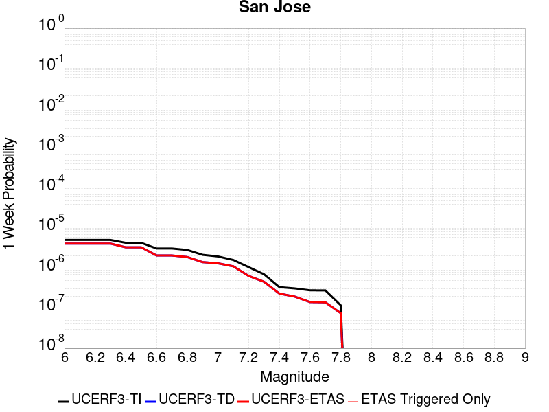 |  |  |  |

| Magnitude | 1 wk TI Prob | 1 wk TD Prob | 1 wk ETAS Prob | 1 wk ETAS/TD Gain | 1 wk ETAS Triggered Only | 1 mo TI Prob | 1 mo TD Prob | 1 mo ETAS Prob | 1 mo ETAS/TD Gain | 1 mo ETAS Triggered Only | 1 yr TI Prob | 1 yr TD Prob | 1 yr ETAS Prob | 1 yr ETAS/TD Gain | 1 yr ETAS Triggered Only | 10 yr TI Prob | 10 yr TD Prob | 10 yr ETAS Prob | 10 yr ETAS/TD Gain | 10 yr ETAS Triggered Only |
|-----|-----|-----|-----|-----|-----|-----|-----|-----|-----|-----|-----|-----|-----|-----|-----|-----|-----|-----|-----|-----|
| 6.0 | 5.0851277E-6 | 4.125796E-6 | 4.125796E-6 | 1.0 | 0.0 | 2.1793223E-5 | 1.7681876E-5 | 1.7681876E-5 | 1.0 | 0.0 | 2.653002E-4 | 2.1525822E-4 | 2.1525822E-4 | 1.0 | 0.0 | 0.0026498367 | 0.0021507882 | 0.0021607666 | 1.0046395 | 1.0E-5 |
| 6.1 | 5.0851277E-6 | 4.125796E-6 | 4.125796E-6 | 1.0 | 0.0 | 2.1793223E-5 | 1.7681876E-5 | 1.7681876E-5 | 1.0 | 0.0 | 2.653002E-4 | 2.1525822E-4 | 2.1525822E-4 | 1.0 | 0.0 | 0.0026498367 | 0.0021507882 | 0.0021607666 | 1.0046395 | 1.0E-5 |
| 6.2 | 5.0851277E-6 | 4.125796E-6 | 4.125796E-6 | 1.0 | 0.0 | 2.1793223E-5 | 1.7681876E-5 | 1.7681876E-5 | 1.0 | 0.0 | 2.653002E-4 | 2.1525822E-4 | 2.1525822E-4 | 1.0 | 0.0 | 0.0026498367 | 0.0021507882 | 0.0021607666 | 1.0046395 | 1.0E-5 |
| 6.3 | 5.0851277E-6 | 4.125796E-6 | 4.125796E-6 | 1.0 | 0.0 | 2.1793223E-5 | 1.7681876E-5 | 1.7681876E-5 | 1.0 | 0.0 | 2.653002E-4 | 2.1525822E-4 | 2.1525822E-4 | 1.0 | 0.0 | 0.0026498367 | 0.0021507882 | 0.0021607666 | 1.0046395 | 1.0E-5 |
| 6.4 | 4.3115124E-6 | 3.3239E-6 | 3.3239E-6 | 1.0 | 0.0 | 1.8477778E-5 | 1.4245221E-5 | 1.4245221E-5 | 1.0 | 0.0 | 2.2494372E-4 | 1.7342396E-4 | 1.7342396E-4 | 1.0 | 0.0 | 0.0022471617 | 0.001733136 | 0.0017431186 | 1.0057598 | 1.0E-5 |
| 6.5 | 4.3115124E-6 | 3.3239E-6 | 3.3239E-6 | 1.0 | 0.0 | 1.8477778E-5 | 1.4245221E-5 | 1.4245221E-5 | 1.0 | 0.0 | 2.2494372E-4 | 1.7342396E-4 | 1.7342396E-4 | 1.0 | 0.0 | 0.0022471617 | 0.001733136 | 0.0017431186 | 1.0057598 | 1.0E-5 |
| 6.6 | 3.110396E-6 | 2.0800942E-6 | 2.0800942E-6 | 1.0 | 0.0 | 1.33302E-5 | 8.914661E-6 | 8.914661E-6 | 1.0 | 0.0 | 1.622831E-4 | 1.0853087E-4 | 1.0853087E-4 | 1.0 | 0.0 | 0.0016216465 | 0.0010848386 | 0.0010948278 | 1.009208 | 1.0E-5 |
| 6.7 | 3.110396E-6 | 2.0800942E-6 | 2.0800942E-6 | 1.0 | 0.0 | 1.33302E-5 | 8.914661E-6 | 8.914661E-6 | 1.0 | 0.0 | 1.622831E-4 | 1.0853087E-4 | 1.0853087E-4 | 1.0 | 0.0 | 0.0016216465 | 0.0010848386 | 0.0010948278 | 1.009208 | 1.0E-5 |
| 6.8 | 2.856651E-6 | 1.9025399E-6 | 1.9025399E-6 | 1.0 | 0.0 | 1.2242733E-5 | 8.153718E-6 | 8.153718E-6 | 1.0 | 0.0 | 1.4904508E-4 | 9.926725E-5 | 9.926725E-5 | 1.0 | 0.0 | 0.0014894515 | 9.922861E-4 | 0.0010022762 | 1.0100677 | 1.0E-5 |
| 6.9 | 2.1618725E-6 | 1.4187619E-6 | 1.4187619E-6 | 1.0 | 0.0 | 9.265135E-6 | 6.080395E-6 | 6.080395E-6 | 1.0 | 0.0 | 1.12797185E-4 | 7.402638E-5 | 7.402638E-5 | 1.0 | 0.0 | 0.0011273995 | 7.400584E-4 | 7.50051E-4 | 1.0135025 | 1.0E-5 |
| 7.0 | 1.9684312E-6 | 1.325729E-6 | 1.325729E-6 | 1.0 | 0.0 | 8.436106E-6 | 5.681684E-6 | 5.681684E-6 | 1.0 | 0.0 | 1.02704755E-4 | 6.917239E-5 | 6.917239E-5 | 1.0 | 0.0 | 0.001026573 | 6.9154927E-4 | 7.015423E-4 | 1.0144503 | 1.0E-5 |
| 7.1 | 1.6070337E-6 | 1.1155997E-6 | 1.1155997E-6 | 1.0 | 0.0 | 6.887269E-6 | 4.7811336E-6 | 4.7811336E-6 | 1.0 | 0.0 | 8.384928E-5 | 5.8208807E-5 | 5.8208807E-5 | 1.0 | 0.0 | 8.3817646E-4 | 5.819743E-4 | 5.919685E-4 | 1.0171729 | 1.0E-5 |
| 7.2 | 1.0631658E-6 | 6.404439E-7 | 6.404439E-7 | 1.0 | 0.0 | 4.556417E-6 | 2.7447568E-6 | 2.7447568E-6 | 1.0 | 0.0 | 5.5472963E-5 | 3.3416916E-5 | 3.3416916E-5 | 1.0 | 0.0 | 5.545912E-4 | 3.3415278E-4 | 3.3415278E-4 | 1.0 | 0.0 |
| 7.3 | 7.060711E-7 | 4.5830163E-7 | 4.5830163E-7 | 1.0 | 0.0 | 3.0260155E-6 | 1.9641484E-6 | 1.9641484E-6 | 1.0 | 0.0 | 3.6841117E-5 | 2.3913253E-5 | 2.3913253E-5 | 1.0 | 0.0 | 3.6835007E-4 | 2.3914018E-4 | 2.3914018E-4 | 1.0 | 0.0 |
| 7.4 | 3.3677085E-7 | 2.3237051E-7 | 2.3237051E-7 | 1.0 | 0.0 | 1.4433028E-6 | 9.958733E-7 | 9.958733E-7 | 1.0 | 0.0 | 1.757207E-5 | 1.2124692E-5 | 1.2124692E-5 | 1.0 | 0.0 | 1.7570681E-4 | 1.2127308E-4 | 1.2127308E-4 | 1.0 | 0.0 |
| 7.5 | 3.129161E-7 | 1.9534129E-7 | 1.9534129E-7 | 1.0 | 0.0 | 1.3410682E-6 | 8.371767E-7 | 8.371767E-7 | 1.0 | 0.0 | 1.6327383E-5 | 1.0192581E-5 | 1.0192581E-5 | 1.0 | 0.0 | 1.6326184E-4 | 1.0195386E-4 | 1.0195386E-4 | 1.0 | 0.0 |
| 7.6 | 2.8008668E-7 | 1.424454E-7 | 1.424454E-7 | 1.0 | 0.0 | 1.2003709E-6 | 6.104802E-7 | 6.104802E-7 | 1.0 | 0.0 | 1.46144175E-5 | 7.4325726E-6 | 7.4325726E-6 | 1.0 | 0.0 | 1.4613457E-4 | 7.435585E-5 | 7.435585E-5 | 1.0 | 0.0 |
| 7.7 | 2.7852005E-7 | 1.40191E-7 | 1.40191E-7 | 1.0 | 0.0 | 1.1936568E-6 | 6.0081845E-7 | 6.0081845E-7 | 1.0 | 0.0 | 1.4532674E-5 | 7.3149417E-6 | 7.3149417E-6 | 1.0 | 0.0 | 1.4531724E-4 | 7.317962E-5 | 7.317962E-5 | 1.0 | 0.0 |
| 7.8 | 1.1810797E-7 | 7.519916E-8 | 7.519916E-8 | 1.0 | 0.0 | 5.0617695E-7 | 3.2228206E-7 | 3.2228206E-7 | 1.0 | 0.0 | 6.1626865E-6 | 3.9237775E-6 | 3.9237775E-6 | 1.0 | 0.0 | 6.162516E-5 | 3.9255454E-5 | 3.9255454E-5 | 1.0 | 0.0 |

## North Frontal  (East)
*[(top)](#table-of-contents)*

| 1 Week | 1 Month | 1 Year | 10 Year |
|-----|-----|-----|-----|
|  | 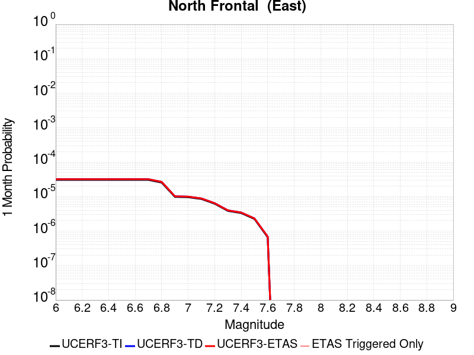 | 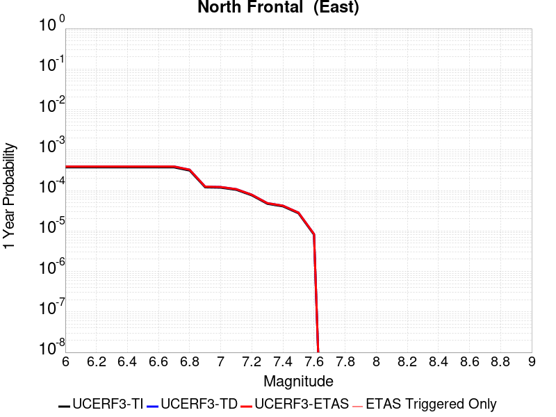 |  |

| Magnitude | 1 wk TI Prob | 1 wk TD Prob | 1 wk ETAS Prob | 1 wk ETAS/TD Gain | 1 wk ETAS Triggered Only | 1 mo TI Prob | 1 mo TD Prob | 1 mo ETAS Prob | 1 mo ETAS/TD Gain | 1 mo ETAS Triggered Only | 1 yr TI Prob | 1 yr TD Prob | 1 yr ETAS Prob | 1 yr ETAS/TD Gain | 1 yr ETAS Triggered Only | 10 yr TI Prob | 10 yr TD Prob | 10 yr ETAS Prob | 10 yr ETAS/TD Gain | 10 yr ETAS Triggered Only |
|-----|-----|-----|-----|-----|-----|-----|-----|-----|-----|-----|-----|-----|-----|-----|-----|-----|-----|-----|-----|-----|
| 6.0 | 7.135738E-6 | 7.477251E-6 | 7.477251E-6 | 1.0 | 0.0 | 3.0581377E-5 | 3.204508E-5 | 3.204508E-5 | 1.0 | 0.0 | 3.7226462E-4 | 3.9009895E-4 | 3.9009895E-4 | 1.0 | 0.0 | 0.0037164164 | 0.0038960995 | 0.0039060607 | 1.0025567 | 1.0E-5 |
| 6.1 | 7.135738E-6 | 7.477251E-6 | 7.477251E-6 | 1.0 | 0.0 | 3.0581377E-5 | 3.204508E-5 | 3.204508E-5 | 1.0 | 0.0 | 3.7226462E-4 | 3.9009895E-4 | 3.9009895E-4 | 1.0 | 0.0 | 0.0037164164 | 0.0038960995 | 0.0039060607 | 1.0025567 | 1.0E-5 |
| 6.2 | 7.135738E-6 | 7.477251E-6 | 7.477251E-6 | 1.0 | 0.0 | 3.0581377E-5 | 3.204508E-5 | 3.204508E-5 | 1.0 | 0.0 | 3.7226462E-4 | 3.9009895E-4 | 3.9009895E-4 | 1.0 | 0.0 | 0.0037164164 | 0.0038960995 | 0.0039060607 | 1.0025567 | 1.0E-5 |
| 6.3 | 7.135738E-6 | 7.477251E-6 | 7.477251E-6 | 1.0 | 0.0 | 3.0581377E-5 | 3.204508E-5 | 3.204508E-5 | 1.0 | 0.0 | 3.7226462E-4 | 3.9009895E-4 | 3.9009895E-4 | 1.0 | 0.0 | 0.0037164164 | 0.0038960995 | 0.0039060607 | 1.0025567 | 1.0E-5 |
| 6.4 | 7.135738E-6 | 7.477251E-6 | 7.477251E-6 | 1.0 | 0.0 | 3.0581377E-5 | 3.204508E-5 | 3.204508E-5 | 1.0 | 0.0 | 3.7226462E-4 | 3.9009895E-4 | 3.9009895E-4 | 1.0 | 0.0 | 0.0037164164 | 0.0038960995 | 0.0039060607 | 1.0025567 | 1.0E-5 |
| 6.5 | 7.135738E-6 | 7.477251E-6 | 7.477251E-6 | 1.0 | 0.0 | 3.0581377E-5 | 3.204508E-5 | 3.204508E-5 | 1.0 | 0.0 | 3.7226462E-4 | 3.9009895E-4 | 3.9009895E-4 | 1.0 | 0.0 | 0.0037164164 | 0.0038960995 | 0.0039060607 | 1.0025567 | 1.0E-5 |
| 6.6 | 7.135738E-6 | 7.477251E-6 | 7.477251E-6 | 1.0 | 0.0 | 3.0581377E-5 | 3.204508E-5 | 3.204508E-5 | 1.0 | 0.0 | 3.7226462E-4 | 3.9009895E-4 | 3.9009895E-4 | 1.0 | 0.0 | 0.0037164164 | 0.0038960995 | 0.0039060607 | 1.0025567 | 1.0E-5 |
| 6.7 | 7.135738E-6 | 7.477251E-6 | 7.477251E-6 | 1.0 | 0.0 | 3.0581377E-5 | 3.204508E-5 | 3.204508E-5 | 1.0 | 0.0 | 3.7226462E-4 | 3.9009895E-4 | 3.9009895E-4 | 1.0 | 0.0 | 0.0037164164 | 0.0038960995 | 0.0039060607 | 1.0025567 | 1.0E-5 |
| 6.8 | 5.959142E-6 | 6.2367435E-6 | 6.2367435E-6 | 1.0 | 0.0 | 2.553893E-5 | 2.6728729E-5 | 2.6728729E-5 | 1.0 | 0.0 | 3.108921E-4 | 3.2539174E-4 | 3.2539174E-4 | 1.0 | 0.0 | 0.0031045752 | 0.0032509263 | 0.0032608937 | 1.0030661 | 1.0E-5 |
| 6.9 | 2.2946929E-6 | 2.3824796E-6 | 2.3824796E-6 | 1.0 | 0.0 | 9.834361E-6 | 1.021059E-5 | 1.021059E-5 | 1.0 | 0.0 | 1.1972676E-4 | 1.243073E-4 | 1.243073E-4 | 1.0 | 0.0 | 0.0011966228 | 0.0012424242 | 0.0012424242 | 1.0 | 0.0 |
| 7.0 | 2.2468673E-6 | 2.3321722E-6 | 2.3321722E-6 | 1.0 | 0.0 | 9.629396E-6 | 9.994988E-6 | 9.994988E-6 | 1.0 | 0.0 | 1.1723159E-4 | 1.2168266E-4 | 1.2168266E-4 | 1.0 | 0.0 | 0.0011716976 | 0.0012162066 | 0.0012162066 | 1.0 | 0.0 |
| 7.1 | 1.9921076E-6 | 2.064619E-6 | 2.064619E-6 | 1.0 | 0.0 | 8.537577E-6 | 8.848339E-6 | 8.848339E-6 | 1.0 | 0.0 | 1.0394004E-4 | 1.0772364E-4 | 1.0772364E-4 | 1.0 | 0.0 | 0.0010389143 | 0.001076757 | 0.001076757 | 1.0 | 0.0 |
| 7.2 | 1.4524545E-6 | 1.504526E-6 | 1.504526E-6 | 1.0 | 0.0 | 6.2247905E-6 | 6.447954E-6 | 6.447954E-6 | 1.0 | 0.0 | 7.5784184E-5 | 7.850126E-5 | 7.850126E-5 | 1.0 | 0.0 | 7.575835E-4 | 7.8475976E-4 | 7.8475976E-4 | 1.0 | 0.0 |
| 7.3 | 8.9802575E-7 | 9.308799E-7 | 9.308799E-7 | 1.0 | 0.0 | 3.848676E-6 | 3.98948E-6 | 3.98948E-6 | 1.0 | 0.0 | 4.685662E-5 | 4.857095E-5 | 4.857095E-5 | 1.0 | 0.0 | 4.6846745E-4 | 4.8561464E-4 | 4.8561464E-4 | 1.0 | 0.0 |
| 7.4 | 7.776139E-7 | 8.060536E-7 | 8.060536E-7 | 1.0 | 0.0 | 3.3326266E-6 | 3.4545117E-6 | 3.4545117E-6 | 1.0 | 0.0 | 4.0573974E-5 | 4.2057974E-5 | 4.2057974E-5 | 1.0 | 0.0 | 4.0566566E-4 | 4.205109E-4 | 4.205109E-4 | 1.0 | 0.0 |
| 7.5 | 5.244417E-7 | 5.441262E-7 | 5.441262E-7 | 1.0 | 0.0 | 2.2476054E-6 | 2.3319676E-6 | 2.3319676E-6 | 1.0 | 0.0 | 2.7364253E-5 | 2.8391403E-5 | 2.8391403E-5 | 1.0 | 0.0 | 2.7360884E-4 | 2.8388426E-4 | 2.8388426E-4 | 1.0 | 0.0 |
| 7.6 | 1.5489647E-7 | 1.6089633E-7 | 1.6089633E-7 | 1.0 | 0.0 | 6.6384183E-7 | 6.895557E-7 | 6.895557E-7 | 1.0 | 0.0 | 8.082245E-6 | 8.395328E-6 | 8.395328E-6 | 1.0 | 0.0 | 8.08195E-5 | 8.395211E-5 | 8.395211E-5 | 1.0 | 0.0 |

## Elsinore (Julian)
*[(top)](#table-of-contents)*

| 1 Week | 1 Month | 1 Year | 10 Year |
|-----|-----|-----|-----|
|  | 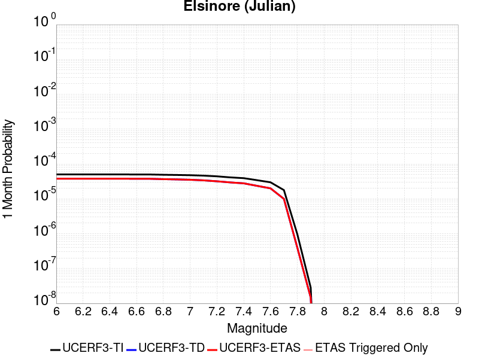 |  |  |

| Magnitude | 1 wk TI Prob | 1 wk TD Prob | 1 wk ETAS Prob | 1 wk ETAS/TD Gain | 1 wk ETAS Triggered Only | 1 mo TI Prob | 1 mo TD Prob | 1 mo ETAS Prob | 1 mo ETAS/TD Gain | 1 mo ETAS Triggered Only | 1 yr TI Prob | 1 yr TD Prob | 1 yr ETAS Prob | 1 yr ETAS/TD Gain | 1 yr ETAS Triggered Only | 10 yr TI Prob | 10 yr TD Prob | 10 yr ETAS Prob | 10 yr ETAS/TD Gain | 10 yr ETAS Triggered Only |
|-----|-----|-----|-----|-----|-----|-----|-----|-----|-----|-----|-----|-----|-----|-----|-----|-----|-----|-----|-----|-----|
| 6.0 | 1.1710231E-5 | 8.846027E-6 | 8.846027E-6 | 1.0 | 0.0 | 5.0185736E-5 | 3.7911006E-5 | 3.7911006E-5 | 1.0 | 0.0 | 6.1084004E-4 | 4.6147045E-4 | 4.6147045E-4 | 1.0 | 0.0 | 0.006091637 | 0.0046053263 | 0.0046152803 | 1.0021614 | 1.0E-5 |
| 6.1 | 1.1710231E-5 | 8.846027E-6 | 8.846027E-6 | 1.0 | 0.0 | 5.0185736E-5 | 3.7911006E-5 | 3.7911006E-5 | 1.0 | 0.0 | 6.1084004E-4 | 4.6147045E-4 | 4.6147045E-4 | 1.0 | 0.0 | 0.006091637 | 0.0046053263 | 0.0046152803 | 1.0021614 | 1.0E-5 |
| 6.2 | 1.1710231E-5 | 8.846027E-6 | 8.846027E-6 | 1.0 | 0.0 | 5.0185736E-5 | 3.7911006E-5 | 3.7911006E-5 | 1.0 | 0.0 | 6.1084004E-4 | 4.6147045E-4 | 4.6147045E-4 | 1.0 | 0.0 | 0.006091637 | 0.0046053263 | 0.0046152803 | 1.0021614 | 1.0E-5 |
| 6.3 | 1.1710231E-5 | 8.846027E-6 | 8.846027E-6 | 1.0 | 0.0 | 5.0185736E-5 | 3.7911006E-5 | 3.7911006E-5 | 1.0 | 0.0 | 6.1084004E-4 | 4.6147045E-4 | 4.6147045E-4 | 1.0 | 0.0 | 0.006091637 | 0.0046053263 | 0.0046152803 | 1.0021614 | 1.0E-5 |
| 6.4 | 1.1710231E-5 | 8.846027E-6 | 8.846027E-6 | 1.0 | 0.0 | 5.0185736E-5 | 3.7911006E-5 | 3.7911006E-5 | 1.0 | 0.0 | 6.1084004E-4 | 4.6147045E-4 | 4.6147045E-4 | 1.0 | 0.0 | 0.006091637 | 0.0046053263 | 0.0046152803 | 1.0021614 | 1.0E-5 |
| 6.5 | 1.1710231E-5 | 8.846027E-6 | 8.846027E-6 | 1.0 | 0.0 | 5.0185736E-5 | 3.7911006E-5 | 3.7911006E-5 | 1.0 | 0.0 | 6.1084004E-4 | 4.6147045E-4 | 4.6147045E-4 | 1.0 | 0.0 | 0.006091637 | 0.0046053263 | 0.0046152803 | 1.0021614 | 1.0E-5 |
| 6.6 | 1.1650619E-5 | 8.778398E-6 | 8.778398E-6 | 1.0 | 0.0 | 4.993027E-5 | 3.7621176E-5 | 3.7621176E-5 | 1.0 | 0.0 | 6.0773146E-4 | 4.579432E-4 | 4.579432E-4 | 1.0 | 0.0 | 0.0060607214 | 0.0045701996 | 0.004580154 | 1.0021781 | 1.0E-5 |
| 6.7 | 1.1650619E-5 | 8.778398E-6 | 8.778398E-6 | 1.0 | 0.0 | 4.993027E-5 | 3.7621176E-5 | 3.7621176E-5 | 1.0 | 0.0 | 6.0773146E-4 | 4.579432E-4 | 4.579432E-4 | 1.0 | 0.0 | 0.0060607214 | 0.0045701996 | 0.004580154 | 1.0021781 | 1.0E-5 |
| 6.8 | 1.1442698E-5 | 8.561554E-6 | 8.561554E-6 | 1.0 | 0.0 | 4.9039216E-5 | 3.669187E-5 | 3.669187E-5 | 1.0 | 0.0 | 5.968889E-4 | 4.466336E-4 | 4.466336E-4 | 1.0 | 0.0 | 0.0059528816 | 0.0044575613 | 0.0044675167 | 1.0022334 | 1.0E-5 |
| 6.9 | 1.1300589E-5 | 8.409417E-6 | 8.409417E-6 | 1.0 | 0.0 | 4.8430196E-5 | 3.603987E-5 | 3.603987E-5 | 1.0 | 0.0 | 5.894781E-4 | 4.3869874E-4 | 4.3869874E-4 | 1.0 | 0.0 | 0.005879169 | 0.0043785274 | 0.0043884832 | 1.0022739 | 1.0E-5 |
| 7.0 | 1.1117729E-5 | 8.2265915E-6 | 8.2265915E-6 | 1.0 | 0.0 | 4.764654E-5 | 3.525635E-5 | 3.525635E-5 | 1.0 | 0.0 | 5.799422E-4 | 4.291632E-4 | 4.291632E-4 | 1.0 | 0.0 | 0.0057843104 | 0.0042835427 | 0.0042935 | 1.0023245 | 1.0E-5 |
| 7.1 | 1.08053955E-5 | 7.912251E-6 | 7.912251E-6 | 1.0 | 0.0 | 4.6308014E-5 | 3.3909215E-5 | 3.3909215E-5 | 1.0 | 0.0 | 5.6365423E-4 | 4.127681E-4 | 4.127681E-4 | 1.0 | 0.0 | 0.005622267 | 0.00412021 | 0.004130169 | 1.0024171 | 1.0E-5 |
| 7.2 | 1.032804E-5 | 7.4335085E-6 | 7.4335085E-6 | 1.0 | 0.0 | 4.4262277E-5 | 3.1857515E-5 | 3.1857515E-5 | 1.0 | 0.0 | 5.387599E-4 | 3.8779777E-4 | 3.8779777E-4 | 1.0 | 0.0 | 0.0053745564 | 0.003871398 | 0.0038813592 | 1.002573 | 1.0E-5 |
| 7.3 | 9.622426E-6 | 6.8982913E-6 | 6.8982913E-6 | 1.0 | 0.0 | 4.1238312E-5 | 2.9563778E-5 | 2.9563778E-5 | 1.0 | 0.0 | 5.019608E-4 | 3.5988097E-4 | 3.5988097E-4 | 1.0 | 0.0 | 0.005008285 | 0.0035931538 | 0.0036031178 | 1.002773 | 1.0E-5 |
| 7.4 | 9.144434E-6 | 6.4968035E-6 | 6.4968035E-6 | 1.0 | 0.0 | 3.9189843E-5 | 2.7843154E-5 | 2.7843154E-5 | 1.0 | 0.0 | 4.7703186E-4 | 3.3893905E-4 | 3.3893905E-4 | 1.0 | 0.0 | 0.0047600917 | 0.0033843648 | 0.0033943309 | 1.0029447 | 1.0E-5 |
| 7.5 | 7.988981E-6 | 5.4986767E-6 | 5.4986767E-6 | 1.0 | 0.0 | 3.4238044E-5 | 2.3565552E-5 | 2.3565552E-5 | 1.0 | 0.0 | 4.1676845E-4 | 2.868741E-4 | 2.868741E-4 | 1.0 | 0.0 | 0.0041598766 | 0.002865165 | 0.0028751364 | 1.0034802 | 1.0E-5 |
| 7.6 | 6.9554876E-6 | 4.6628375E-6 | 4.6628375E-6 | 1.0 | 0.0 | 2.9808893E-5 | 1.9983441E-5 | 1.9983441E-5 | 1.0 | 0.0 | 3.6286283E-4 | 2.4327241E-4 | 2.4327241E-4 | 1.0 | 0.0 | 0.0036227088 | 0.0024301773 | 0.002440153 | 1.004105 | 1.0E-5 |
| 7.7 | 4.1557314E-6 | 2.324824E-6 | 2.324824E-6 | 1.0 | 0.0 | 1.7810156E-5 | 9.963497E-6 | 9.963497E-6 | 1.0 | 0.0 | 2.1681708E-4 | 1.2129957E-4 | 1.2129957E-4 | 1.0 | 0.0 | 0.0021660565 | 0.0012124067 | 0.0012223945 | 1.0082381 | 1.0E-5 |
| 7.8 | 2.2597293E-7 | 9.333655E-8 | 9.333655E-8 | 1.0 | 0.0 | 9.684551E-7 | 4.0001376E-7 | 4.0001376E-7 | 1.0 | 0.0 | 1.1790877E-5 | 4.87016E-6 | 4.87016E-6 | 1.0 | 0.0 | 1.17902506E-4 | 4.870086E-5 | 4.870086E-5 | 1.0 | 0.0 |
| 7.9 | 6.676829E-9 | 3.4400482E-9 | 3.4400482E-9 | 1.0 | 0.0 | 2.861498E-8 | 1.4743064E-8 | 1.4743064E-8 | 1.0 | 0.0 | 3.4838732E-7 | 1.7949678E-7 | 1.7949678E-7 | 1.0 | 0.0 | 3.4838679E-6 | 1.7949665E-6 | 1.7949665E-6 | 1.0 | 0.0 |

## Del Valle
*[(top)](#table-of-contents)*

| 1 Week | 1 Month | 1 Year | 10 Year |
|-----|-----|-----|-----|
| 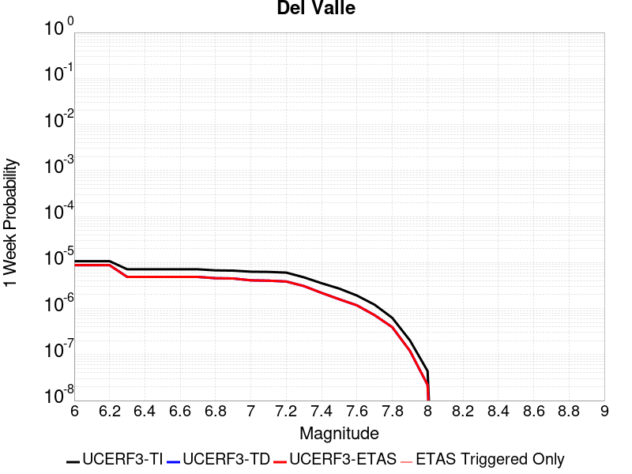 |  | 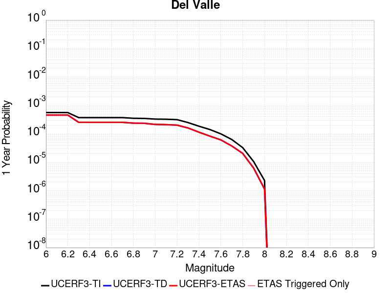 | 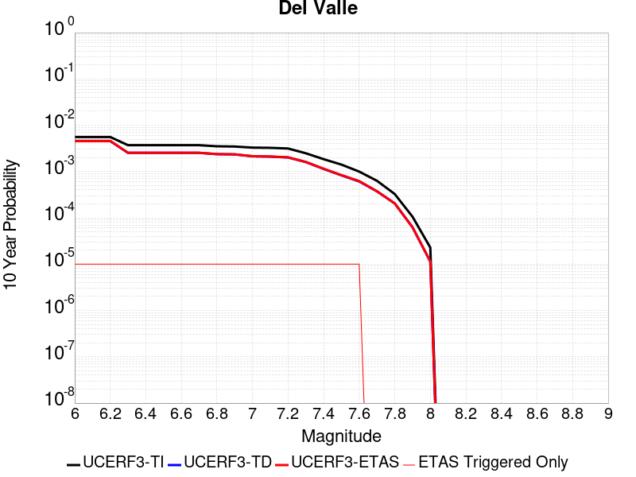 |

| Magnitude | 1 wk TI Prob | 1 wk TD Prob | 1 wk ETAS Prob | 1 wk ETAS/TD Gain | 1 wk ETAS Triggered Only | 1 mo TI Prob | 1 mo TD Prob | 1 mo ETAS Prob | 1 mo ETAS/TD Gain | 1 mo ETAS Triggered Only | 1 yr TI Prob | 1 yr TD Prob | 1 yr ETAS Prob | 1 yr ETAS/TD Gain | 1 yr ETAS Triggered Only | 10 yr TI Prob | 10 yr TD Prob | 10 yr ETAS Prob | 10 yr ETAS/TD Gain | 10 yr ETAS Triggered Only |
|-----|-----|-----|-----|-----|-----|-----|-----|-----|-----|-----|-----|-----|-----|-----|-----|-----|-----|-----|-----|-----|
| 6.0 | 1.0716125E-5 | 8.76815E-6 | 8.76815E-6 | 1.0 | 0.0 | 4.592544E-5 | 3.7577356E-5 | 3.7577356E-5 | 1.0 | 0.0 | 5.589988E-4 | 4.5742802E-4 | 4.5742802E-4 | 1.0 | 0.0 | 0.0055759475 | 0.0045668194 | 0.004576774 | 1.0021797 | 1.0E-5 |
| 6.1 | 1.0716125E-5 | 8.76815E-6 | 8.76815E-6 | 1.0 | 0.0 | 4.592544E-5 | 3.7577356E-5 | 3.7577356E-5 | 1.0 | 0.0 | 5.589988E-4 | 4.5742802E-4 | 4.5742802E-4 | 1.0 | 0.0 | 0.0055759475 | 0.0045668194 | 0.004576774 | 1.0021797 | 1.0E-5 |
| 6.2 | 1.0716125E-5 | 8.76815E-6 | 8.76815E-6 | 1.0 | 0.0 | 4.592544E-5 | 3.7577356E-5 | 3.7577356E-5 | 1.0 | 0.0 | 5.589988E-4 | 4.5742802E-4 | 4.5742802E-4 | 1.0 | 0.0 | 0.0055759475 | 0.0045668194 | 0.004576774 | 1.0021797 | 1.0E-5 |
| 6.3 | 7.1293784E-6 | 4.8660195E-6 | 4.8660195E-6 | 1.0 | 0.0 | 3.055412E-5 | 2.0854206E-5 | 2.0854206E-5 | 1.0 | 0.0 | 3.7193293E-4 | 2.538711E-4 | 2.538711E-4 | 1.0 | 0.0 | 0.0037131102 | 0.0025358968 | 0.0025458715 | 1.0039334 | 1.0E-5 |
| 6.4 | 7.1293784E-6 | 4.8660195E-6 | 4.8660195E-6 | 1.0 | 0.0 | 3.055412E-5 | 2.0854206E-5 | 2.0854206E-5 | 1.0 | 0.0 | 3.7193293E-4 | 2.538711E-4 | 2.538711E-4 | 1.0 | 0.0 | 0.0037131102 | 0.0025358968 | 0.0025458715 | 1.0039334 | 1.0E-5 |
| 6.5 | 7.1293784E-6 | 4.8660195E-6 | 4.8660195E-6 | 1.0 | 0.0 | 3.055412E-5 | 2.0854206E-5 | 2.0854206E-5 | 1.0 | 0.0 | 3.7193293E-4 | 2.538711E-4 | 2.538711E-4 | 1.0 | 0.0 | 0.0037131102 | 0.0025358968 | 0.0025458715 | 1.0039334 | 1.0E-5 |
| 6.6 | 7.1293784E-6 | 4.8660195E-6 | 4.8660195E-6 | 1.0 | 0.0 | 3.055412E-5 | 2.0854206E-5 | 2.0854206E-5 | 1.0 | 0.0 | 3.7193293E-4 | 2.538711E-4 | 2.538711E-4 | 1.0 | 0.0 | 0.0037131102 | 0.0025358968 | 0.0025458715 | 1.0039334 | 1.0E-5 |
| 6.7 | 7.12272E-6 | 4.8633947E-6 | 4.8633947E-6 | 1.0 | 0.0 | 3.0525585E-5 | 2.084296E-5 | 2.084296E-5 | 1.0 | 0.0 | 3.7158563E-4 | 2.537342E-4 | 2.537342E-4 | 1.0 | 0.0 | 0.003709649 | 0.002534531 | 0.0025445055 | 1.0039355 | 1.0E-5 |
| 6.8 | 6.7558703E-6 | 4.559588E-6 | 4.559588E-6 | 1.0 | 0.0 | 2.895341E-5 | 1.9540948E-5 | 1.9540948E-5 | 1.0 | 0.0 | 3.5245073E-4 | 2.378857E-4 | 2.378857E-4 | 1.0 | 0.0 | 0.0035189227 | 0.002376386 | 0.002386362 | 1.0041981 | 1.0E-5 |
| 6.9 | 6.6700386E-6 | 4.5027214E-6 | 4.5027214E-6 | 1.0 | 0.0 | 2.8585566E-5 | 1.9297237E-5 | 1.9297237E-5 | 1.0 | 0.0 | 3.479737E-4 | 2.3491916E-4 | 2.3491916E-4 | 1.0 | 0.0 | 0.003474293 | 0.0023467834 | 0.00235676 | 1.0042511 | 1.0E-5 |
| 7.0 | 6.3181424E-6 | 4.0988725E-6 | 4.0988725E-6 | 1.0 | 0.0 | 2.7077473E-5 | 1.7566479E-5 | 1.7566479E-5 | 1.0 | 0.0 | 3.2961834E-4 | 2.1385132E-4 | 2.1385132E-4 | 1.0 | 0.0 | 0.0032912986 | 0.00213651 | 0.0021464888 | 1.0046705 | 1.0E-5 |
| 7.1 | 6.248759E-6 | 4.034061E-6 | 4.034061E-6 | 1.0 | 0.0 | 2.678012E-5 | 1.7288721E-5 | 1.7288721E-5 | 1.0 | 0.0 | 3.2599916E-4 | 2.1047027E-4 | 2.1047027E-4 | 1.0 | 0.0 | 0.0032552136 | 0.0021027639 | 0.0021127427 | 1.0047456 | 1.0E-5 |
| 7.2 | 6.0411944E-6 | 3.870047E-6 | 3.870047E-6 | 1.0 | 0.0 | 2.5890577E-5 | 1.6585811E-5 | 1.6585811E-5 | 1.0 | 0.0 | 3.1517216E-4 | 2.0191395E-4 | 2.0191395E-4 | 1.0 | 0.0 | 0.0031472554 | 0.0020173583 | 0.0020273381 | 1.004947 | 1.0E-5 |
| 7.3 | 4.7691183E-6 | 3.0782355E-6 | 3.0782355E-6 | 1.0 | 0.0 | 2.0438918E-5 | 1.31923725E-5 | 1.31923725E-5 | 1.0 | 0.0 | 2.488154E-4 | 1.6060552E-4 | 1.6060552E-4 | 1.0 | 0.0 | 0.00248537 | 0.0016049203 | 0.0016149041 | 1.0062208 | 1.0E-5 |
| 7.4 | 3.5524722E-6 | 2.1894166E-6 | 2.1894166E-6 | 1.0 | 0.0 | 1.5224792E-5 | 9.383181E-6 | 9.383181E-6 | 1.0 | 0.0 | 1.8534607E-4 | 1.14234324E-4 | 1.14234324E-4 | 1.0 | 0.0 | 0.0018519156 | 0.0011417642 | 0.0011517529 | 1.0087484 | 1.0E-5 |
| 7.5 | 2.7133442E-6 | 1.5916693E-6 | 1.5916693E-6 | 1.0 | 0.0 | 1.1628566E-5 | 6.821422E-6 | 6.821422E-6 | 1.0 | 0.0 | 1.415686E-4 | 8.304767E-5 | 8.304767E-5 | 1.0 | 0.0 | 0.0014147845 | 8.3016825E-4 | 8.4015995E-4 | 1.0120357 | 1.0E-5 |
| 7.6 | 1.915338E-6 | 1.1739561E-6 | 1.1739561E-6 | 1.0 | 0.0 | 8.208566E-6 | 5.031231E-6 | 5.031231E-6 | 1.0 | 0.0 | 9.993471E-5 | 6.125352E-5 | 6.125352E-5 | 1.0 | 0.0 | 9.988978E-4 | 6.1236735E-4 | 6.223612E-4 | 1.0163201 | 1.0E-5 |
| 7.7 | 1.2120448E-6 | 7.180599E-7 | 7.180599E-7 | 1.0 | 0.0 | 5.194467E-6 | 3.077396E-6 | 3.077396E-6 | 1.0 | 0.0 | 6.3240805E-5 | 3.7466656E-5 | 3.7466656E-5 | 1.0 | 0.0 | 6.322281E-4 | 3.7460378E-4 | 3.7460378E-4 | 1.0 | 0.0 |
| 7.8 | 6.272381E-7 | 3.932711E-7 | 3.932711E-7 | 1.0 | 0.0 | 2.6881603E-6 | 1.6854465E-6 | 1.6854465E-6 | 1.0 | 0.0 | 3.272786E-5 | 2.052012E-5 | 2.052012E-5 | 1.0 | 0.0 | 3.272304E-4 | 2.051824E-4 | 2.051824E-4 | 1.0 | 0.0 |
| 7.9 | 2.0292627E-7 | 1.2005235E-7 | 1.2005235E-7 | 1.0 | 0.0 | 8.6968373E-7 | 5.1450996E-7 | 5.1450996E-7 | 1.0 | 0.0 | 1.0588348E-5 | 6.2641407E-6 | 6.2641407E-6 | 1.0 | 0.0 | 1.0587843E-4 | 6.2639665E-5 | 6.2639665E-5 | 1.0 | 0.0 |
| 8.0 | 4.374492E-8 | 2.190146E-8 | 2.190146E-8 | 1.0 | 0.0 | 1.8747821E-7 | 9.38634E-8 | 9.38634E-8 | 1.0 | 0.0 | 2.2825448E-6 | 1.1427863E-6 | 1.1427863E-6 | 1.0 | 0.0 | 2.2825214E-5 | 1.1427808E-5 | 1.1427808E-5 | 1.0 | 0.0 |

## Robinson Creek
*[(top)](#table-of-contents)*

| 1 Week | 1 Month | 1 Year | 10 Year |
|-----|-----|-----|-----|
|  |  |  |  |

| Magnitude | 1 wk TI Prob | 1 wk TD Prob | 1 wk ETAS Prob | 1 wk ETAS/TD Gain | 1 wk ETAS Triggered Only | 1 mo TI Prob | 1 mo TD Prob | 1 mo ETAS Prob | 1 mo ETAS/TD Gain | 1 mo ETAS Triggered Only | 1 yr TI Prob | 1 yr TD Prob | 1 yr ETAS Prob | 1 yr ETAS/TD Gain | 1 yr ETAS Triggered Only | 10 yr TI Prob | 10 yr TD Prob | 10 yr ETAS Prob | 10 yr ETAS/TD Gain | 10 yr ETAS Triggered Only |
|-----|-----|-----|-----|-----|-----|-----|-----|-----|-----|-----|-----|-----|-----|-----|-----|-----|-----|-----|-----|-----|
| 6.0 | 1.3705327E-5 | 1.528538E-5 | 1.528538E-5 | 1.0 | 0.0 | 5.8735794E-5 | 6.550877E-5 | 6.550877E-5 | 1.0 | 0.0 | 7.1487366E-4 | 7.9756934E-4 | 8.0756133E-4 | 1.0125281 | 1.0E-5 | 0.0071257832 | 0.007975693 | 0.007985613 | 1.0012438 | 1.0E-5 |
| 6.1 | 1.3705327E-5 | 1.528538E-5 | 1.528538E-5 | 1.0 | 0.0 | 5.8735794E-5 | 6.550877E-5 | 6.550877E-5 | 1.0 | 0.0 | 7.1487366E-4 | 7.9756934E-4 | 8.0756133E-4 | 1.0125281 | 1.0E-5 | 0.0071257832 | 0.007975693 | 0.007985613 | 1.0012438 | 1.0E-5 |
| 6.2 | 1.3705327E-5 | 1.528538E-5 | 1.528538E-5 | 1.0 | 0.0 | 5.8735794E-5 | 6.550877E-5 | 6.550877E-5 | 1.0 | 0.0 | 7.1487366E-4 | 7.9756934E-4 | 8.0756133E-4 | 1.0125281 | 1.0E-5 | 0.0071257832 | 0.007975693 | 0.007985613 | 1.0012438 | 1.0E-5 |
| 6.3 | 1.3705327E-5 | 1.528538E-5 | 1.528538E-5 | 1.0 | 0.0 | 5.8735794E-5 | 6.550877E-5 | 6.550877E-5 | 1.0 | 0.0 | 7.1487366E-4 | 7.9756934E-4 | 8.0756133E-4 | 1.0125281 | 1.0E-5 | 0.0071257832 | 0.007975693 | 0.007985613 | 1.0012438 | 1.0E-5 |
| 6.4 | 1.3705327E-5 | 1.528538E-5 | 1.528538E-5 | 1.0 | 0.0 | 5.8735794E-5 | 6.550877E-5 | 6.550877E-5 | 1.0 | 0.0 | 7.1487366E-4 | 7.9756934E-4 | 8.0756133E-4 | 1.0125281 | 1.0E-5 | 0.0071257832 | 0.007975693 | 0.007985613 | 1.0012438 | 1.0E-5 |

## Northridge
*[(top)](#table-of-contents)*

| 1 Week | 1 Month | 1 Year | 10 Year |
|-----|-----|-----|-----|
| 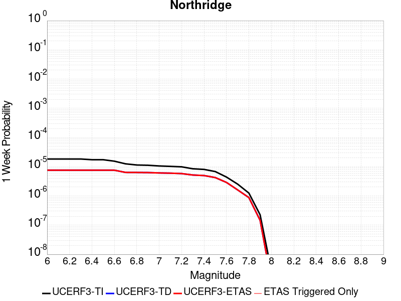 |  | 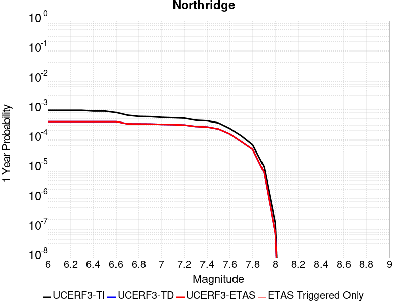 |  |

| Magnitude | 1 wk TI Prob | 1 wk TD Prob | 1 wk ETAS Prob | 1 wk ETAS/TD Gain | 1 wk ETAS Triggered Only | 1 mo TI Prob | 1 mo TD Prob | 1 mo ETAS Prob | 1 mo ETAS/TD Gain | 1 mo ETAS Triggered Only | 1 yr TI Prob | 1 yr TD Prob | 1 yr ETAS Prob | 1 yr ETAS/TD Gain | 1 yr ETAS Triggered Only | 10 yr TI Prob | 10 yr TD Prob | 10 yr ETAS Prob | 10 yr ETAS/TD Gain | 10 yr ETAS Triggered Only |
|-----|-----|-----|-----|-----|-----|-----|-----|-----|-----|-----|-----|-----|-----|-----|-----|-----|-----|-----|-----|-----|
| 6.0 | 1.8340852E-5 | 7.58823E-6 | 7.58823E-6 | 1.0 | 0.0 | 7.860128E-5 | 3.252059E-5 | 3.252059E-5 | 1.0 | 0.0 | 9.565505E-4 | 3.9586847E-4 | 3.9586847E-4 | 1.0 | 0.0 | 0.009524435 | 0.0039518555 | 0.003961816 | 1.0025204 | 1.0E-5 |
| 6.1 | 1.8340852E-5 | 7.58823E-6 | 7.58823E-6 | 1.0 | 0.0 | 7.860128E-5 | 3.252059E-5 | 3.252059E-5 | 1.0 | 0.0 | 9.565505E-4 | 3.9586847E-4 | 3.9586847E-4 | 1.0 | 0.0 | 0.009524435 | 0.0039518555 | 0.003961816 | 1.0025204 | 1.0E-5 |
| 6.2 | 1.8340852E-5 | 7.58823E-6 | 7.58823E-6 | 1.0 | 0.0 | 7.860128E-5 | 3.252059E-5 | 3.252059E-5 | 1.0 | 0.0 | 9.565505E-4 | 3.9586847E-4 | 3.9586847E-4 | 1.0 | 0.0 | 0.009524435 | 0.0039518555 | 0.003961816 | 1.0025204 | 1.0E-5 |
| 6.3 | 1.8340852E-5 | 7.58823E-6 | 7.58823E-6 | 1.0 | 0.0 | 7.860128E-5 | 3.252059E-5 | 3.252059E-5 | 1.0 | 0.0 | 9.565505E-4 | 3.9586847E-4 | 3.9586847E-4 | 1.0 | 0.0 | 0.009524435 | 0.0039518555 | 0.003961816 | 1.0025204 | 1.0E-5 |
| 6.4 | 1.7361892E-5 | 7.58823E-6 | 7.58823E-6 | 1.0 | 0.0 | 7.440598E-5 | 3.252059E-5 | 3.252059E-5 | 1.0 | 0.0 | 9.055163E-4 | 3.9586847E-4 | 3.9586847E-4 | 1.0 | 0.0 | 0.009018354 | 0.0039518555 | 0.003961816 | 1.0025204 | 1.0E-5 |
| 6.5 | 1.7361892E-5 | 7.58823E-6 | 7.58823E-6 | 1.0 | 0.0 | 7.440598E-5 | 3.252059E-5 | 3.252059E-5 | 1.0 | 0.0 | 9.055163E-4 | 3.9586847E-4 | 3.9586847E-4 | 1.0 | 0.0 | 0.009018354 | 0.0039518555 | 0.003961816 | 1.0025204 | 1.0E-5 |
| 6.6 | 1.5458201E-5 | 7.58823E-6 | 7.58823E-6 | 1.0 | 0.0 | 6.624775E-5 | 3.252059E-5 | 3.252059E-5 | 1.0 | 0.0 | 8.0626784E-4 | 3.9586847E-4 | 3.9586847E-4 | 1.0 | 0.0 | 0.008033488 | 0.0039518555 | 0.003961816 | 1.0025204 | 1.0E-5 |
| 6.7 | 1.2538368E-5 | 6.381766E-6 | 6.381766E-6 | 1.0 | 0.0 | 5.3734755E-5 | 2.7350141E-5 | 2.7350141E-5 | 1.0 | 0.0 | 6.5402425E-4 | 3.3293752E-4 | 3.3293752E-4 | 1.0 | 0.0 | 0.0065210275 | 0.0033244353 | 0.003334402 | 1.002998 | 1.0E-5 |
| 6.8 | 1.1438097E-5 | 6.3504176E-6 | 6.3504176E-6 | 1.0 | 0.0 | 4.9019498E-5 | 2.7215794E-5 | 2.7215794E-5 | 1.0 | 0.0 | 5.9664896E-4 | 3.3130235E-4 | 3.3130235E-4 | 1.0 | 0.0 | 0.005950495 | 0.0033081323 | 0.003318099 | 1.0030129 | 1.0E-5 |
| 6.9 | 1.1204891E-5 | 6.286866E-6 | 6.286866E-6 | 1.0 | 0.0 | 4.8020076E-5 | 2.6943437E-5 | 2.6943437E-5 | 1.0 | 0.0 | 5.8448757E-4 | 3.279874E-4 | 3.279874E-4 | 1.0 | 0.0 | 0.0058295266 | 0.0032750808 | 0.003285048 | 1.0030434 | 1.0E-5 |
| 7.0 | 1.061046E-5 | 6.1155115E-6 | 6.1155115E-6 | 1.0 | 0.0 | 4.5472607E-5 | 2.6209074E-5 | 2.6209074E-5 | 1.0 | 0.0 | 5.534883E-4 | 3.1904917E-4 | 3.1904917E-4 | 1.0 | 0.0 | 0.0055211177 | 0.0031859577 | 0.0031959258 | 1.0031288 | 1.0E-5 |
| 7.1 | 1.0266979E-5 | 6.0044217E-6 | 6.0044217E-6 | 1.0 | 0.0 | 4.40006E-5 | 2.5732985E-5 | 2.5732985E-5 | 1.0 | 0.0 | 5.355756E-4 | 3.1325448E-4 | 3.1325448E-4 | 1.0 | 0.0 | 0.0053428668 | 0.003128175 | 0.003128175 | 1.0 | 0.0 |
| 7.2 | 9.91273E-6 | 5.8201276E-6 | 5.8201276E-6 | 1.0 | 0.0 | 4.248244E-5 | 2.4943167E-5 | 2.4943167E-5 | 1.0 | 0.0 | 5.171009E-4 | 3.0364117E-4 | 3.0364117E-4 | 1.0 | 0.0 | 0.0051589934 | 0.0030323078 | 0.0030323078 | 1.0 | 0.0 |
| 7.3 | 8.4959265E-6 | 5.1931866E-6 | 5.1931866E-6 | 1.0 | 0.0 | 3.6410605E-5 | 2.2256325E-5 | 2.2256325E-5 | 1.0 | 0.0 | 4.4320893E-4 | 2.709373E-4 | 2.709373E-4 | 1.0 | 0.0 | 0.00442326 | 0.0027060963 | 0.0027060963 | 1.0 | 0.0 |
| 7.4 | 8.0847185E-6 | 4.9820546E-6 | 4.9820546E-6 | 1.0 | 0.0 | 3.4648332E-5 | 2.1351489E-5 | 2.1351489E-5 | 1.0 | 0.0 | 4.2176177E-4 | 2.599236E-4 | 2.599236E-4 | 1.0 | 0.0 | 0.0042096223 | 0.0025962219 | 0.0025962219 | 1.0 | 0.0 |
| 7.5 | 6.8220684E-6 | 4.253404E-6 | 4.253404E-6 | 1.0 | 0.0 | 2.9237108E-5 | 1.8228748E-5 | 1.8228748E-5 | 1.0 | 0.0 | 3.5590364E-4 | 2.219126E-4 | 2.219126E-4 | 1.0 | 0.0 | 0.0035533418 | 0.002216931 | 0.002216931 | 1.0 | 0.0 |
| 7.6 | 4.4224143E-6 | 2.9000103E-6 | 2.9000103E-6 | 1.0 | 0.0 | 1.8953066E-5 | 1.2428557E-5 | 1.2428557E-5 | 1.0 | 0.0 | 2.3072914E-4 | 1.513073E-4 | 1.513073E-4 | 1.0 | 0.0 | 0.0023048974 | 0.0015120542 | 0.0015120542 | 1.0 | 0.0 |
| 7.7 | 2.5297056E-6 | 1.6046167E-6 | 1.6046167E-6 | 1.0 | 0.0 | 1.0841551E-5 | 6.876911E-6 | 6.876911E-6 | 1.0 | 0.0 | 1.319879E-4 | 8.372322E-5 | 8.372322E-5 | 1.0 | 0.0 | 0.0013190953 | 8.369215E-4 | 8.369215E-4 | 1.0 | 0.0 |
| 7.8 | 1.2508156E-6 | 8.780192E-7 | 8.780192E-7 | 1.0 | 0.0 | 5.3606273E-6 | 3.762934E-6 | 3.762934E-6 | 1.0 | 0.0 | 6.526368E-5 | 4.5812772E-5 | 4.5812772E-5 | 1.0 | 0.0 | 6.524452E-4 | 4.5803457E-4 | 4.5803457E-4 | 1.0 | 0.0 |
| 7.9 | 2.262199E-7 | 1.466502E-7 | 1.466502E-7 | 1.0 | 0.0 | 9.695135E-7 | 6.285007E-7 | 6.285007E-7 | 1.0 | 0.0 | 1.1803763E-5 | 7.651969E-6 | 7.651969E-6 | 1.0 | 0.0 | 1.1803136E-4 | 7.6517135E-5 | 7.6517135E-5 | 1.0 | 0.0 |
| 8.0 | 2.865362E-9 | 1.2754441E-9 | 1.2754441E-9 | 1.0 | 0.0 | 1.2280123E-8 | 5.4661893E-9 | 5.4661893E-9 | 1.0 | 0.0 | 1.4951048E-7 | 6.6550854E-8 | 6.6550854E-8 | 1.0 | 0.0 | 1.4951038E-6 | 6.6550854E-7 | 6.6550854E-7 | 1.0 | 0.0 |

## Earthquake Valley (No  Extension)
*[(top)](#table-of-contents)*

| 1 Week | 1 Month | 1 Year | 10 Year |
|-----|-----|-----|-----|
|  |  |  |  |

| Magnitude | 1 wk TI Prob | 1 wk TD Prob | 1 wk ETAS Prob | 1 wk ETAS/TD Gain | 1 wk ETAS Triggered Only | 1 mo TI Prob | 1 mo TD Prob | 1 mo ETAS Prob | 1 mo ETAS/TD Gain | 1 mo ETAS Triggered Only | 1 yr TI Prob | 1 yr TD Prob | 1 yr ETAS Prob | 1 yr ETAS/TD Gain | 1 yr ETAS Triggered Only | 10 yr TI Prob | 10 yr TD Prob | 10 yr ETAS Prob | 10 yr ETAS/TD Gain | 10 yr ETAS Triggered Only |
|-----|-----|-----|-----|-----|-----|-----|-----|-----|-----|-----|-----|-----|-----|-----|-----|-----|-----|-----|-----|-----|
| 6.0 | 2.1859703E-5 | 2.5199188E-5 | 2.5199188E-5 | 1.0 | 0.0 | 9.3681076E-5 | 1.0799286E-4 | 1.0799286E-4 | 1.0 | 0.0 | 0.0011399703 | 0.0013141651 | 0.0013141651 | 1.0 | 0.0 | 0.011341401 | 0.0130782975 | 0.013088167 | 1.0007546 | 1.0E-5 |
| 6.1 | 2.1859703E-5 | 2.5199188E-5 | 2.5199188E-5 | 1.0 | 0.0 | 9.3681076E-5 | 1.0799286E-4 | 1.0799286E-4 | 1.0 | 0.0 | 0.0011399703 | 0.0013141651 | 0.0013141651 | 1.0 | 0.0 | 0.011341401 | 0.0130782975 | 0.013088167 | 1.0007546 | 1.0E-5 |
| 6.2 | 2.1859703E-5 | 2.5199188E-5 | 2.5199188E-5 | 1.0 | 0.0 | 9.3681076E-5 | 1.0799286E-4 | 1.0799286E-4 | 1.0 | 0.0 | 0.0011399703 | 0.0013141651 | 0.0013141651 | 1.0 | 0.0 | 0.011341401 | 0.0130782975 | 0.013088167 | 1.0007546 | 1.0E-5 |
| 6.3 | 2.1859703E-5 | 2.5199188E-5 | 2.5199188E-5 | 1.0 | 0.0 | 9.3681076E-5 | 1.0799286E-4 | 1.0799286E-4 | 1.0 | 0.0 | 0.0011399703 | 0.0013141651 | 0.0013141651 | 1.0 | 0.0 | 0.011341401 | 0.0130782975 | 0.013088167 | 1.0007546 | 1.0E-5 |
| 6.4 | 2.1859703E-5 | 2.5199188E-5 | 2.5199188E-5 | 1.0 | 0.0 | 9.3681076E-5 | 1.0799286E-4 | 1.0799286E-4 | 1.0 | 0.0 | 0.0011399703 | 0.0013141651 | 0.0013141651 | 1.0 | 0.0 | 0.011341401 | 0.0130782975 | 0.013088167 | 1.0007546 | 1.0E-5 |
| 6.5 | 2.1859703E-5 | 2.5199188E-5 | 2.5199188E-5 | 1.0 | 0.0 | 9.3681076E-5 | 1.0799286E-4 | 1.0799286E-4 | 1.0 | 0.0 | 0.0011399703 | 0.0013141651 | 0.0013141651 | 1.0 | 0.0 | 0.011341401 | 0.0130782975 | 0.013088167 | 1.0007546 | 1.0E-5 |
| 6.6 | 1.597E-5 | 1.8356872E-5 | 1.8356872E-5 | 1.0 | 0.0 | 6.8441055E-5 | 7.8670426E-5 | 7.8670426E-5 | 1.0 | 0.0 | 8.329513E-4 | 9.574788E-4 | 9.574788E-4 | 1.0 | 0.0 | 0.008298361 | 0.009542144 | 0.0095520485 | 1.001038 | 1.0E-5 |
| 6.7 | 1.597E-5 | 1.8356872E-5 | 1.8356872E-5 | 1.0 | 0.0 | 6.8441055E-5 | 7.8670426E-5 | 7.8670426E-5 | 1.0 | 0.0 | 8.329513E-4 | 9.574788E-4 | 9.574788E-4 | 1.0 | 0.0 | 0.008298361 | 0.009542144 | 0.0095520485 | 1.001038 | 1.0E-5 |
| 6.8 | 1.5315149E-5 | 1.7602664E-5 | 1.7602664E-5 | 1.0 | 0.0 | 6.5634704E-5 | 7.543829E-5 | 7.543829E-5 | 1.0 | 0.0 | 7.988095E-4 | 9.181609E-4 | 9.181609E-4 | 1.0 | 0.0 | 0.007959441 | 0.009152215 | 0.009152215 | 1.0 | 0.0 |
| 6.9 | 1.3634728E-5 | 1.5676334E-5 | 1.5676334E-5 | 1.0 | 0.0 | 5.8433237E-5 | 6.718302E-5 | 6.718302E-5 | 1.0 | 0.0 | 7.1119244E-4 | 8.177284E-4 | 8.177284E-4 | 1.0 | 0.0 | 0.007089207 | 0.008155267 | 0.008155267 | 1.0 | 0.0 |
| 7.0 | 1.3496271E-5 | 1.5518362E-5 | 1.5518362E-5 | 1.0 | 0.0 | 5.783988E-5 | 6.650603E-5 | 6.650603E-5 | 1.0 | 0.0 | 7.03973E-4 | 8.094922E-4 | 8.094922E-4 | 1.0 | 0.0 | 0.007017471 | 0.008073504 | 0.008073504 | 1.0 | 0.0 |
| 7.1 | 8.242798E-6 | 9.4729185E-6 | 9.4729185E-6 | 1.0 | 0.0 | 3.53258E-5 | 4.0597966E-5 | 4.0597966E-5 | 1.0 | 0.0 | 4.300067E-4 | 4.9423525E-4 | 4.9423525E-4 | 1.0 | 0.0 | 0.004291756 | 0.0049379375 | 0.0049379375 | 1.0 | 0.0 |
| 7.2 | 2.6506527E-7 | 2.2561456E-7 | 2.2561456E-7 | 1.0 | 0.0 | 1.1359936E-6 | 9.669192E-7 | 9.669192E-7 | 1.0 | 0.0 | 1.3830633E-5 | 1.1772182E-5 | 1.1772182E-5 | 1.0 | 0.0 | 1.3829772E-4 | 1.17716E-4 | 1.17716E-4 | 1.0 | 0.0 |
| 7.3 | 2.5810488E-7 | 2.1956575E-7 | 2.1956575E-7 | 1.0 | 0.0 | 1.1061633E-6 | 9.4099573E-7 | 9.4099573E-7 | 1.0 | 0.0 | 1.3467455E-5 | 1.1456567E-5 | 1.1456567E-5 | 1.0 | 0.0 | 1.3466639E-4 | 1.1456018E-4 | 1.1456018E-4 | 1.0 | 0.0 |
| 7.4 | 2.2676066E-7 | 1.9111694E-7 | 1.9111694E-7 | 1.0 | 0.0 | 9.71831E-7 | 8.1907234E-7 | 8.1907234E-7 | 1.0 | 0.0 | 1.1831979E-5 | 9.972164E-6 | 9.972164E-6 | 1.0 | 0.0 | 1.1831349E-4 | 9.971756E-5 | 9.971756E-5 | 1.0 | 0.0 |
| 7.5 | 1.5553917E-7 | 1.311301E-7 | 1.311301E-7 | 1.0 | 0.0 | 6.6659624E-7 | 5.6198604E-7 | 5.6198604E-7 | 1.0 | 0.0 | 8.115779E-6 | 6.8421605E-6 | 6.8421605E-6 | 1.0 | 0.0 | 8.115482E-5 | 6.8419715E-5 | 6.8419715E-5 | 1.0 | 0.0 |
| 7.6 | 1.3448629E-7 | 1.12892444E-7 | 1.12892444E-7 | 1.0 | 0.0 | 5.7636964E-7 | 4.838247E-7 | 4.838247E-7 | 1.0 | 0.0 | 7.017278E-6 | 5.8905516E-6 | 5.8905516E-6 | 1.0 | 0.0 | 7.0170565E-5 | 5.8904167E-5 | 5.8904167E-5 | 1.0 | 0.0 |
| 7.7 | 2.9719402E-8 | 1.458321E-8 | 1.458321E-8 | 1.0 | 0.0 | 1.2736886E-7 | 6.249947E-8 | 6.249947E-8 | 1.0 | 0.0 | 1.5507147E-6 | 7.6093085E-7 | 7.6093085E-7 | 1.0 | 0.0 | 1.550704E-5 | 7.6092874E-6 | 7.6092874E-6 | 1.0 | 0.0 |
| 7.8 | 7.4390196E-9 | 3.2504612E-9 | 3.2504612E-9 | 1.0 | 0.0 | 3.1881513E-8 | 1.3930547E-8 | 1.3930547E-8 | 1.0 | 0.0 | 3.8815733E-7 | 1.696044E-7 | 1.696044E-7 | 1.0 | 0.0 | 3.8815665E-6 | 1.696043E-6 | 1.696043E-6 | 1.0 | 0.0 |
| 7.9 | 1.5373532E-9 | 8.440616E-10 | 8.440616E-10 | 1.0 | 0.0 | 6.5886567E-9 | 3.6174066E-9 | 3.6174066E-9 | 1.0 | 0.0 | 8.021689E-8 | 4.4041926E-8 | 4.4041926E-8 | 1.0 | 0.0 | 8.0216864E-7 | 4.4041923E-7 | 4.4041923E-7 | 1.0 | 0.0 |

## Goose Lake 2011 CFM
*[(top)](#table-of-contents)*

| 1 Week | 1 Month | 1 Year | 10 Year |
|-----|-----|-----|-----|
|  |  |  | 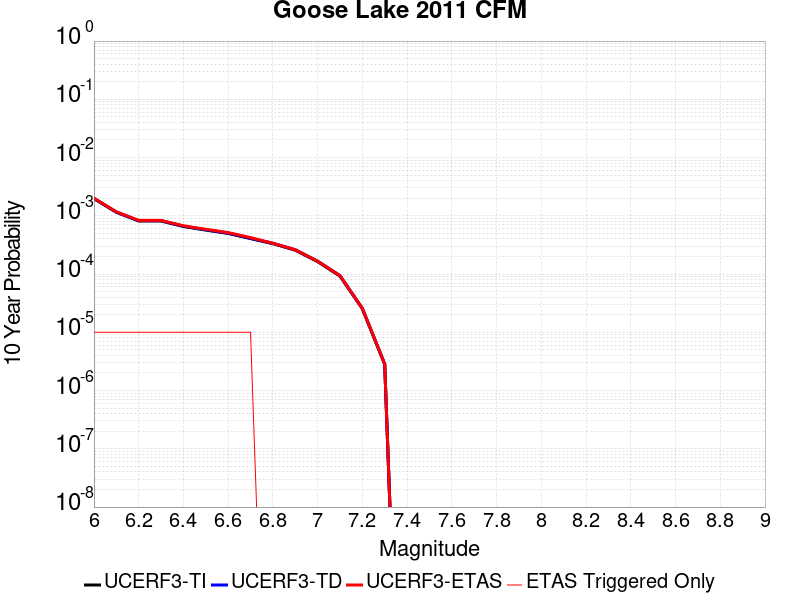 |

| Magnitude | 1 wk TI Prob | 1 wk TD Prob | 1 wk ETAS Prob | 1 wk ETAS/TD Gain | 1 wk ETAS Triggered Only | 1 mo TI Prob | 1 mo TD Prob | 1 mo ETAS Prob | 1 mo ETAS/TD Gain | 1 mo ETAS Triggered Only | 1 yr TI Prob | 1 yr TD Prob | 1 yr ETAS Prob | 1 yr ETAS/TD Gain | 1 yr ETAS Triggered Only | 10 yr TI Prob | 10 yr TD Prob | 10 yr ETAS Prob | 10 yr ETAS/TD Gain | 10 yr ETAS Triggered Only |
|-----|-----|-----|-----|-----|-----|-----|-----|-----|-----|-----|-----|-----|-----|-----|-----|-----|-----|-----|-----|-----|
| 6.0 | 3.780968E-6 | 3.823031E-6 | 3.823031E-6 | 1.0 | 0.0 | 1.6204049E-5 | 1.6384323E-5 | 1.6384323E-5 | 1.0 | 0.0 | 1.9726643E-4 | 1.9946197E-4 | 1.9946197E-4 | 1.0 | 0.0 | 0.001970914 | 0.0019929376 | 0.0020029177 | 1.0050077 | 1.0E-5 |
| 6.1 | 2.2035124E-6 | 2.2298068E-6 | 2.2298068E-6 | 1.0 | 0.0 | 9.443591E-6 | 9.556281E-6 | 9.556281E-6 | 1.0 | 0.0 | 1.1496965E-4 | 1.1634169E-4 | 1.1634169E-4 | 1.0 | 0.0 | 0.0011491019 | 0.0011628261 | 0.0011728145 | 1.0085897 | 1.0E-5 |
| 6.2 | 1.5624689E-6 | 1.5826967E-6 | 1.5826967E-6 | 1.0 | 0.0 | 6.6962784E-6 | 6.782968E-6 | 6.782968E-6 | 1.0 | 0.0 | 8.152414E-5 | 8.257955E-5 | 8.257955E-5 | 1.0 | 0.0 | 8.1494235E-4 | 8.254931E-4 | 8.354848E-4 | 1.0121039 | 1.0E-5 |
| 6.3 | 1.5624689E-6 | 1.5826967E-6 | 1.5826967E-6 | 1.0 | 0.0 | 6.6962784E-6 | 6.782968E-6 | 6.782968E-6 | 1.0 | 0.0 | 8.152414E-5 | 8.257955E-5 | 8.257955E-5 | 1.0 | 0.0 | 8.1494235E-4 | 8.254931E-4 | 8.354848E-4 | 1.0121039 | 1.0E-5 |
| 6.4 | 1.256464E-6 | 1.2738732E-6 | 1.2738732E-6 | 1.0 | 0.0 | 5.3848344E-6 | 5.459445E-6 | 5.459445E-6 | 1.0 | 0.0 | 6.5558386E-5 | 6.646674E-5 | 6.646674E-5 | 1.0 | 0.0 | 6.553905E-4 | 6.644706E-4 | 6.74464E-4 | 1.0150396 | 1.0E-5 |
| 6.5 | 1.0910911E-6 | 1.1069437E-6 | 1.1069437E-6 | 1.0 | 0.0 | 4.6760965E-6 | 4.7440362E-6 | 4.7440362E-6 | 1.0 | 0.0 | 5.692999E-5 | 5.7757123E-5 | 5.7757123E-5 | 1.0 | 0.0 | 5.6915404E-4 | 5.774224E-4 | 5.874166E-4 | 1.0173084 | 1.0E-5 |
| 6.6 | 9.546601E-7 | 9.691277E-7 | 9.691277E-7 | 1.0 | 0.0 | 4.091394E-6 | 4.1533976E-6 | 4.1533976E-6 | 1.0 | 0.0 | 4.9811584E-5 | 5.056645E-5 | 5.056645E-5 | 1.0 | 0.0 | 4.980042E-4 | 5.0555036E-4 | 5.155453E-4 | 1.0197704 | 1.0E-5 |
| 6.7 | 7.790316E-7 | 7.91599E-7 | 7.91599E-7 | 1.0 | 0.0 | 3.3387028E-6 | 3.3925628E-6 | 3.3925628E-6 | 1.0 | 0.0 | 4.0647945E-5 | 4.1303676E-5 | 4.1303676E-5 | 1.0 | 0.0 | 4.0640513E-4 | 4.129606E-4 | 4.2295645E-4 | 1.0242053 | 1.0E-5 |
| 6.8 | 6.3714384E-7 | 6.478762E-7 | 6.478762E-7 | 1.0 | 0.0 | 2.7306137E-6 | 2.7766096E-6 | 2.7766096E-6 | 1.0 | 0.0 | 3.3244716E-5 | 3.3804703E-5 | 3.3804703E-5 | 1.0 | 0.0 | 3.323974E-4 | 3.3799608E-4 | 3.3799608E-4 | 1.0 | 0.0 |
| 6.9 | 4.92586E-7 | 5.0139334E-7 | 5.0139334E-7 | 1.0 | 0.0 | 2.1110811E-6 | 2.148827E-6 | 2.148827E-6 | 1.0 | 0.0 | 2.5702111E-5 | 2.6161657E-5 | 2.6161657E-5 | 1.0 | 0.0 | 2.569914E-4 | 2.6158616E-4 | 2.6158616E-4 | 1.0 | 0.0 |
| 7.0 | 3.130245E-7 | 3.1903667E-7 | 3.1903667E-7 | 1.0 | 0.0 | 1.3415328E-6 | 1.3672993E-6 | 1.3672993E-6 | 1.0 | 0.0 | 1.6333039E-5 | 1.6646745E-5 | 1.6646745E-5 | 1.0 | 0.0 | 1.6331839E-4 | 1.6645518E-4 | 1.6645518E-4 | 1.0 | 0.0 |
| 7.1 | 1.7680084E-7 | 1.8023995E-7 | 1.8023995E-7 | 1.0 | 0.0 | 7.5771766E-7 | 7.724567E-7 | 7.724567E-7 | 1.0 | 0.0 | 9.225173E-6 | 9.404621E-6 | 9.404621E-6 | 1.0 | 0.0 | 9.22479E-5 | 9.404234E-5 | 9.404234E-5 | 1.0 | 0.0 |
| 7.2 | 4.8641045E-8 | 4.9402228E-8 | 4.9402228E-8 | 1.0 | 0.0 | 2.084616E-7 | 2.1172382E-7 | 2.1172382E-7 | 1.0 | 0.0 | 2.538017E-6 | 2.5777344E-6 | 2.5777344E-6 | 1.0 | 0.0 | 2.537988E-5 | 2.5777057E-5 | 2.5777057E-5 | 1.0 | 0.0 |
| 7.3 | 5.3911844E-9 | 5.4758322E-9 | 5.4758322E-9 | 1.0 | 0.0 | 2.3105075E-8 | 2.3467852E-8 | 2.3467852E-8 | 1.0 | 0.0 | 2.8130427E-7 | 2.857211E-7 | 2.857211E-7 | 1.0 | 0.0 | 2.8130391E-6 | 2.8572085E-6 | 2.8572085E-6 | 1.0 | 0.0 |

## Blue Cut
*[(top)](#table-of-contents)*

| 1 Week | 1 Month | 1 Year | 10 Year |
|-----|-----|-----|-----|
|  | 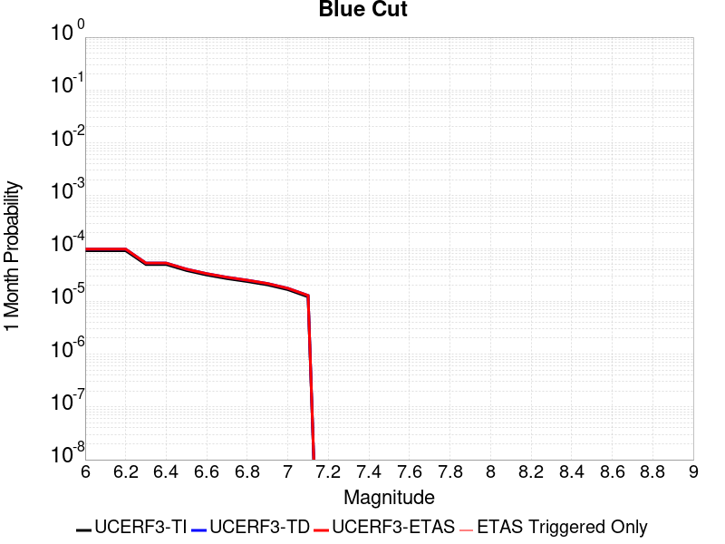 |  |  |

| Magnitude | 1 wk TI Prob | 1 wk TD Prob | 1 wk ETAS Prob | 1 wk ETAS/TD Gain | 1 wk ETAS Triggered Only | 1 mo TI Prob | 1 mo TD Prob | 1 mo ETAS Prob | 1 mo ETAS/TD Gain | 1 mo ETAS Triggered Only | 1 yr TI Prob | 1 yr TD Prob | 1 yr ETAS Prob | 1 yr ETAS/TD Gain | 1 yr ETAS Triggered Only | 10 yr TI Prob | 10 yr TD Prob | 10 yr ETAS Prob | 10 yr ETAS/TD Gain | 10 yr ETAS Triggered Only |
|-----|-----|-----|-----|-----|-----|-----|-----|-----|-----|-----|-----|-----|-----|-----|-----|-----|-----|-----|-----|-----|
| 6.0 | 2.1227985E-5 | 2.2719907E-5 | 2.2719907E-5 | 1.0 | 0.0 | 9.097391E-5 | 9.736773E-5 | 9.736773E-5 | 1.0 | 0.0 | 0.0011070445 | 0.0011848655 | 0.0011848655 | 1.0 | 0.0 | 0.011015458 | 0.011791323 | 0.011801206 | 1.000838 | 1.0E-5 |
| 6.1 | 2.1227985E-5 | 2.2719907E-5 | 2.2719907E-5 | 1.0 | 0.0 | 9.097391E-5 | 9.736773E-5 | 9.736773E-5 | 1.0 | 0.0 | 0.0011070445 | 0.0011848655 | 0.0011848655 | 1.0 | 0.0 | 0.011015458 | 0.011791323 | 0.011801206 | 1.000838 | 1.0E-5 |
| 6.2 | 2.1227985E-5 | 2.2719907E-5 | 2.2719907E-5 | 1.0 | 0.0 | 9.097391E-5 | 9.736773E-5 | 9.736773E-5 | 1.0 | 0.0 | 0.0011070445 | 0.0011848655 | 0.0011848655 | 1.0 | 0.0 | 0.011015458 | 0.011791323 | 0.011801206 | 1.000838 | 1.0E-5 |
| 6.3 | 1.1613981E-5 | 1.2353706E-5 | 1.2353706E-5 | 1.0 | 0.0 | 4.9773254E-5 | 5.294345E-5 | 5.294345E-5 | 1.0 | 0.0 | 6.0582085E-4 | 6.4440834E-4 | 6.4440834E-4 | 1.0 | 0.0 | 0.0060417196 | 0.0064266445 | 0.00643658 | 1.001546 | 1.0E-5 |
| 6.4 | 1.1613981E-5 | 1.2353706E-5 | 1.2353706E-5 | 1.0 | 0.0 | 4.9773254E-5 | 5.294345E-5 | 5.294345E-5 | 1.0 | 0.0 | 6.0582085E-4 | 6.4440834E-4 | 6.4440834E-4 | 1.0 | 0.0 | 0.0060417196 | 0.0064266445 | 0.00643658 | 1.001546 | 1.0E-5 |
| 6.5 | 8.931326E-6 | 9.4817215E-6 | 9.4817215E-6 | 1.0 | 0.0 | 3.8276554E-5 | 4.063537E-5 | 4.063537E-5 | 1.0 | 0.0 | 4.6591737E-4 | 4.9463246E-4 | 4.9463246E-4 | 1.0 | 0.0 | 0.0046494175 | 0.0049362243 | 0.004946175 | 1.0020158 | 1.0E-5 |
| 6.6 | 7.345353E-6 | 7.790378E-6 | 7.790378E-6 | 1.0 | 0.0 | 3.1479703E-5 | 3.338695E-5 | 3.338695E-5 | 1.0 | 0.0 | 3.83198E-4 | 4.0641832E-4 | 4.0641832E-4 | 1.0 | 0.0 | 0.0038253788 | 0.004057542 | 0.0040675015 | 1.0024545 | 1.0E-5 |
| 6.7 | 6.2775666E-6 | 6.6552325E-6 | 6.6552325E-6 | 1.0 | 0.0 | 2.690358E-5 | 2.8522156E-5 | 2.8522156E-5 | 1.0 | 0.0 | 3.2750185E-4 | 3.4720942E-4 | 3.4720942E-4 | 1.0 | 0.0 | 0.0032701963 | 0.0034674106 | 0.0034773757 | 1.002874 | 1.0E-5 |
| 6.8 | 5.5234095E-6 | 5.8551846E-6 | 5.8551846E-6 | 1.0 | 0.0 | 2.367154E-5 | 2.5093448E-5 | 2.5093448E-5 | 1.0 | 0.0 | 2.8816288E-4 | 3.0547718E-4 | 3.0547718E-4 | 1.0 | 0.0 | 0.002877895 | 0.0030512887 | 0.0030612582 | 1.0032673 | 1.0E-5 |
| 6.9 | 4.7780054E-6 | 5.065484E-6 | 5.065484E-6 | 1.0 | 0.0 | 2.0477004E-5 | 2.1709076E-5 | 2.1709076E-5 | 1.0 | 0.0 | 2.4927902E-4 | 2.64283E-4 | 2.64283E-4 | 1.0 | 0.0 | 0.0024899957 | 0.0026403791 | 0.002650353 | 1.0037774 | 1.0E-5 |
| 7.0 | 3.883171E-6 | 4.118539E-6 | 4.118539E-6 | 1.0 | 0.0 | 1.6642054E-5 | 1.7650802E-5 | 1.7650802E-5 | 1.0 | 0.0 | 2.0259817E-4 | 2.148842E-4 | 2.148842E-4 | 1.0 | 0.0 | 0.0020241356 | 0.0021474399 | 0.0021574185 | 1.0046467 | 1.0E-5 |
| 7.1 | 2.8358215E-6 | 3.0097544E-6 | 3.0097544E-6 | 1.0 | 0.0 | 1.2153464E-5 | 1.289892E-5 | 1.289892E-5 | 1.0 | 0.0 | 1.4795837E-4 | 1.5703961E-4 | 1.5703961E-4 | 1.0 | 0.0 | 0.001478599 | 0.0015699316 | 0.001579916 | 1.0063597 | 1.0E-5 |

## San Gregorio (North) 2011 CFM
*[(top)](#table-of-contents)*

| 1 Week | 1 Month | 1 Year | 10 Year |
|-----|-----|-----|-----|
| 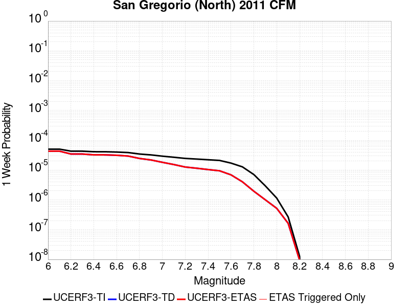 |  |  |  |

| Magnitude | 1 wk TI Prob | 1 wk TD Prob | 1 wk ETAS Prob | 1 wk ETAS/TD Gain | 1 wk ETAS Triggered Only | 1 mo TI Prob | 1 mo TD Prob | 1 mo ETAS Prob | 1 mo ETAS/TD Gain | 1 mo ETAS Triggered Only | 1 yr TI Prob | 1 yr TD Prob | 1 yr ETAS Prob | 1 yr ETAS/TD Gain | 1 yr ETAS Triggered Only | 10 yr TI Prob | 10 yr TD Prob | 10 yr ETAS Prob | 10 yr ETAS/TD Gain | 10 yr ETAS Triggered Only |
|-----|-----|-----|-----|-----|-----|-----|-----|-----|-----|-----|-----|-----|-----|-----|-----|-----|-----|-----|-----|-----|
| 6.0 | 5.0283932E-5 | 4.3062522E-5 | 4.3062522E-5 | 1.0 | 0.0 | 2.1548476E-4 | 1.8454058E-4 | 1.8454058E-4 | 1.0 | 0.0 | 0.0026203706 | 0.0022444816 | 0.0022544593 | 1.0044453 | 1.0E-5 | 0.02589687 | 0.022295611 | 0.022305388 | 1.0004386 | 1.0E-5 |
| 6.1 | 5.0283932E-5 | 4.3062522E-5 | 4.3062522E-5 | 1.0 | 0.0 | 2.1548476E-4 | 1.8454058E-4 | 1.8454058E-4 | 1.0 | 0.0 | 0.0026203706 | 0.0022444816 | 0.0022544593 | 1.0044453 | 1.0E-5 | 0.02589687 | 0.022295611 | 0.022305388 | 1.0004386 | 1.0E-5 |
| 6.2 | 4.2998647E-5 | 3.4445773E-5 | 3.4445773E-5 | 1.0 | 0.0 | 1.842669E-4 | 1.4761632E-4 | 1.4761632E-4 | 1.0 | 0.0 | 0.0022411412 | 0.001795759 | 0.001805741 | 1.0055587 | 1.0E-5 | 0.022186736 | 0.017888714 | 0.017898535 | 1.000549 | 1.0E-5 |
| 6.3 | 4.2998647E-5 | 3.4445773E-5 | 3.4445773E-5 | 1.0 | 0.0 | 1.842669E-4 | 1.4761632E-4 | 1.4761632E-4 | 1.0 | 0.0 | 0.0022411412 | 0.001795759 | 0.001805741 | 1.0055587 | 1.0E-5 | 0.022186736 | 0.017888714 | 0.017898535 | 1.000549 | 1.0E-5 |
| 6.4 | 4.1101295E-5 | 3.2330947E-5 | 3.2330947E-5 | 1.0 | 0.0 | 1.7613651E-4 | 1.3855378E-4 | 1.3855378E-4 | 1.0 | 0.0 | 0.0021423528 | 0.001685599 | 0.0016955821 | 1.0059226 | 1.0E-5 | 0.02121817 | 0.016804026 | 0.01681386 | 1.0005851 | 1.0E-5 |
| 6.5 | 4.1032585E-5 | 3.224898E-5 | 3.224898E-5 | 1.0 | 0.0 | 1.7584208E-4 | 1.3820251E-4 | 1.3820251E-4 | 1.0 | 0.0 | 0.0021387753 | 0.001681329 | 0.0016913122 | 1.0059377 | 1.0E-5 | 0.021183075 | 0.01676198 | 0.01677181 | 1.0005866 | 1.0E-5 |
| 6.6 | 4.011629E-5 | 3.1270567E-5 | 3.1270567E-5 | 1.0 | 0.0 | 1.7191563E-4 | 1.3400977E-4 | 1.3400977E-4 | 1.0 | 0.0 | 0.0020910634 | 0.0016303604 | 0.001640344 | 1.0061237 | 1.0E-5 | 0.020714961 | 0.01625952 | 0.016269358 | 1.000605 | 1.0E-5 |
| 6.7 | 3.8583938E-5 | 2.94575E-5 | 2.94575E-5 | 1.0 | 0.0 | 1.6534925E-4 | 1.2624041E-4 | 1.2624041E-4 | 1.0 | 0.0 | 0.0020112682 | 0.0015359075 | 0.0015458921 | 1.0065008 | 1.0E-5 | 0.019931622 | 0.015328013 | 0.01533786 | 1.0006424 | 1.0E-5 |
| 6.8 | 3.44341E-5 | 2.4454503E-5 | 2.4454503E-5 | 1.0 | 0.0 | 1.4756636E-4 | 1.0480086E-4 | 1.0480086E-4 | 1.0 | 0.0 | 0.0017951399 | 0.0012752139 | 0.0012852012 | 1.0078318 | 1.0E-5 | 0.017807078 | 0.012753062 | 0.012762935 | 1.0007741 | 1.0E-5 |
| 6.9 | 3.221199E-5 | 2.178154E-5 | 2.178154E-5 | 1.0 | 0.0 | 1.3804408E-4 | 9.3346156E-5 | 9.3346156E-5 | 1.0 | 0.0 | 0.0016793909 | 0.0011359053 | 0.0011458938 | 1.0087936 | 1.0E-5 | 0.01666756 | 0.011374445 | 0.011384331 | 1.0008692 | 1.0E-5 |
| 7.0 | 2.9186718E-5 | 1.8150193E-5 | 1.8150193E-5 | 1.0 | 0.0 | 1.2507994E-4 | 7.778425E-5 | 7.778425E-5 | 1.0 | 0.0 | 0.0015217843 | 9.466161E-4 | 9.5660664E-4 | 1.010554 | 1.0E-5 | 0.015114053 | 0.009498565 | 0.00950847 | 1.0010428 | 1.0E-5 |
| 7.1 | 2.6840138E-5 | 1.528765E-5 | 1.528765E-5 | 1.0 | 0.0 | 1.1502409E-4 | 6.551686E-5 | 6.551686E-5 | 1.0 | 0.0 | 0.0013995186 | 7.973778E-4 | 8.073698E-4 | 1.0125312 | 1.0E-5 | 0.013907375 | 0.0080174 | 0.00802732 | 1.0012373 | 1.0E-5 |
| 7.2 | 2.453002E-5 | 1.2609728E-5 | 1.2609728E-5 | 1.0 | 0.0 | 1.05124425E-4 | 5.4040574E-5 | 5.4040574E-5 | 1.0 | 0.0 | 0.0012791384 | 6.57746E-4 | 6.677394E-4 | 1.0151935 | 1.0E-5 | 0.012718005 | 0.006629266 | 0.0066392 | 1.0014985 | 1.0E-5 |
| 7.3 | 2.3330727E-5 | 1.1491685E-5 | 1.1491685E-5 | 1.0 | 0.0 | 9.9985E-5 | 4.924915E-5 | 4.924915E-5 | 1.0 | 0.0 | 0.0012166376 | 5.994439E-4 | 6.094379E-4 | 1.0166721 | 1.0E-5 | 0.012099981 | 0.006048176 | 0.0060581155 | 1.0016434 | 1.0E-5 |
| 7.4 | 2.2136466E-5 | 1.0371934E-5 | 1.0371934E-5 | 1.0 | 0.0 | 9.486712E-5 | 4.445039E-5 | 4.445039E-5 | 1.0 | 0.0 | 0.0011543952 | 5.4104935E-4 | 5.5104395E-4 | 1.0184726 | 1.0E-5 | 0.011484168 | 0.005465833 | 0.005475778 | 1.0018195 | 1.0E-5 |
| 7.5 | 2.0994974E-5 | 9.430077E-6 | 9.430077E-6 | 1.0 | 0.0 | 8.997535E-5 | 4.0413986E-5 | 4.0413986E-5 | 1.0 | 0.0 | 0.0010948994 | 4.919295E-4 | 5.0192454E-4 | 1.0203182 | 1.0E-5 | 0.010895205 | 0.004974893 | 0.004984843 | 1.0020001 | 1.0E-5 |
| 7.6 | 1.7091823E-5 | 6.8960894E-6 | 6.8960894E-6 | 1.0 | 0.0 | 7.3248615E-5 | 2.9554334E-5 | 2.9554334E-5 | 1.0 | 0.0 | 8.9143694E-4 | 3.5976473E-4 | 3.697611E-4 | 1.0277859 | 1.0E-5 | 0.008878695 | 0.0036495405 | 0.003659504 | 1.00273 | 1.0E-5 |
| 7.7 | 1.2772179E-5 | 4.02254E-6 | 4.02254E-6 | 1.0 | 0.0 | 5.473676E-5 | 1.7239343E-5 | 1.7239343E-5 | 1.0 | 0.0 | 6.6621625E-4 | 2.0986881E-4 | 2.1986672E-4 | 1.0476388 | 1.0E-5 | 0.006642225 | 0.0021378323 | 0.002147811 | 1.0046676 | 1.0E-5 |
| 7.8 | 7.041923E-6 | 1.9417187E-6 | 1.9417187E-6 | 1.0 | 0.0 | 3.017932E-5 | 8.321625E-6 | 8.321625E-6 | 1.0 | 0.0 | 3.6737128E-4 | 1.01311074E-4 | 1.1131006E-4 | 1.0986959 | 1.0E-5 | 0.0036676454 | 0.0010384971 | 0.0010484867 | 1.0096194 | 1.0E-5 |
| 7.9 | 2.946768E-6 | 1.0040059E-6 | 1.0040059E-6 | 1.0 | 0.0 | 1.2628945E-5 | 4.302875E-6 | 4.302875E-6 | 1.0 | 0.0 | 1.5374656E-4 | 5.2386244E-5 | 5.2386244E-5 | 1.0 | 0.0 | 0.0015364023 | 5.343499E-4 | 5.343499E-4 | 1.0 | 0.0 |
| 8.0 | 1.1433375E-6 | 5.18521E-7 | 5.18521E-7 | 1.0 | 0.0 | 4.9000087E-6 | 2.222231E-6 | 2.222231E-6 | 1.0 | 0.0 | 5.965597E-5 | 2.7055326E-5 | 2.7055326E-5 | 1.0 | 0.0 | 5.963996E-4 | 2.7418137E-4 | 2.7418137E-4 | 1.0 | 0.0 |
| 8.1 | 2.6675295E-7 | 1.6304008E-7 | 1.6304008E-7 | 1.0 | 0.0 | 1.1432264E-6 | 6.9874307E-7 | 6.9874307E-7 | 1.0 | 0.0 | 1.3918692E-5 | 8.507163E-6 | 8.507163E-6 | 1.0 | 0.0 | 1.391782E-4 | 8.645394E-5 | 8.645394E-5 | 1.0 | 0.0 |
| 8.2 | 1.2704569E-8 | 9.444143E-9 | 9.444143E-9 | 1.0 | 0.0 | 5.444815E-8 | 4.0474898E-8 | 4.0474898E-8 | 1.0 | 0.0 | 6.629061E-7 | 4.927818E-7 | 4.927818E-7 | 1.0 | 0.0 | 6.629041E-6 | 5.1189295E-6 | 5.1189295E-6 | 1.0 | 0.0 |

## Raymond
*[(top)](#table-of-contents)*

| 1 Week | 1 Month | 1 Year | 10 Year |
|-----|-----|-----|-----|
| 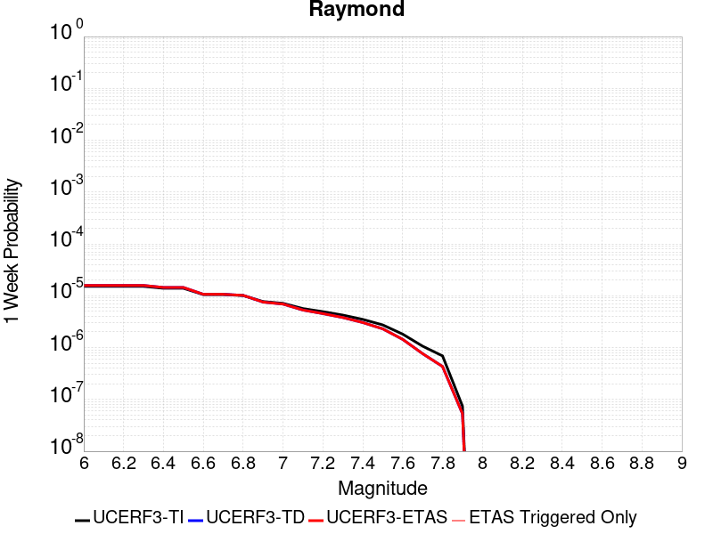 | 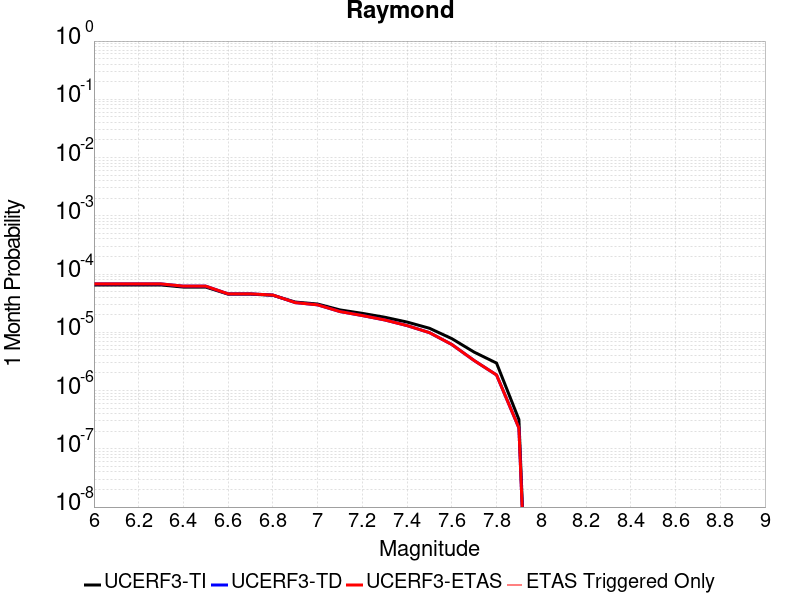 |  |  |

| Magnitude | 1 wk TI Prob | 1 wk TD Prob | 1 wk ETAS Prob | 1 wk ETAS/TD Gain | 1 wk ETAS Triggered Only | 1 mo TI Prob | 1 mo TD Prob | 1 mo ETAS Prob | 1 mo ETAS/TD Gain | 1 mo ETAS Triggered Only | 1 yr TI Prob | 1 yr TD Prob | 1 yr ETAS Prob | 1 yr ETAS/TD Gain | 1 yr ETAS Triggered Only | 10 yr TI Prob | 10 yr TD Prob | 10 yr ETAS Prob | 10 yr ETAS/TD Gain | 10 yr ETAS Triggered Only |
|-----|-----|-----|-----|-----|-----|-----|-----|-----|-----|-----|-----|-----|-----|-----|-----|-----|-----|-----|-----|-----|
| 6.0 | 1.5157413E-5 | 1.5810518E-5 | 1.5810518E-5 | 1.0 | 0.0 | 6.4958724E-5 | 6.775774E-5 | 6.775774E-5 | 1.0 | 0.0 | 7.905855E-4 | 8.246634E-4 | 8.3465513E-4 | 1.0121162 | 1.0E-5 | 0.007877788 | 0.00821855 | 0.008228468 | 1.0012068 | 1.0E-5 |
| 6.1 | 1.5157413E-5 | 1.5810518E-5 | 1.5810518E-5 | 1.0 | 0.0 | 6.4958724E-5 | 6.775774E-5 | 6.775774E-5 | 1.0 | 0.0 | 7.905855E-4 | 8.246634E-4 | 8.3465513E-4 | 1.0121162 | 1.0E-5 | 0.007877788 | 0.00821855 | 0.008228468 | 1.0012068 | 1.0E-5 |
| 6.2 | 1.5157413E-5 | 1.5810518E-5 | 1.5810518E-5 | 1.0 | 0.0 | 6.4958724E-5 | 6.775774E-5 | 6.775774E-5 | 1.0 | 0.0 | 7.905855E-4 | 8.246634E-4 | 8.3465513E-4 | 1.0121162 | 1.0E-5 | 0.007877788 | 0.00821855 | 0.008228468 | 1.0012068 | 1.0E-5 |
| 6.3 | 1.5157413E-5 | 1.5810518E-5 | 1.5810518E-5 | 1.0 | 0.0 | 6.4958724E-5 | 6.775774E-5 | 6.775774E-5 | 1.0 | 0.0 | 7.905855E-4 | 8.246634E-4 | 8.3465513E-4 | 1.0121162 | 1.0E-5 | 0.007877788 | 0.00821855 | 0.008228468 | 1.0012068 | 1.0E-5 |
| 6.4 | 1.3941944E-5 | 1.4455048E-5 | 1.4455048E-5 | 1.0 | 0.0 | 5.9749822E-5 | 6.1948864E-5 | 6.1948864E-5 | 1.0 | 0.0 | 7.2721124E-4 | 7.539898E-4 | 7.6398224E-4 | 1.0132527 | 1.0E-5 | 0.007248361 | 0.00751665 | 0.0075265747 | 1.0013204 | 1.0E-5 |
| 6.5 | 1.3941944E-5 | 1.4455048E-5 | 1.4455048E-5 | 1.0 | 0.0 | 5.9749822E-5 | 6.1948864E-5 | 6.1948864E-5 | 1.0 | 0.0 | 7.2721124E-4 | 7.539898E-4 | 7.6398224E-4 | 1.0132527 | 1.0E-5 | 0.007248361 | 0.00751665 | 0.0075265747 | 1.0013204 | 1.0E-5 |
| 6.6 | 1.0542609E-5 | 1.06713815E-5 | 1.06713815E-5 | 1.0 | 0.0 | 4.5181827E-5 | 4.573372E-5 | 4.573372E-5 | 1.0 | 0.0 | 5.499499E-4 | 5.5667124E-4 | 5.6666567E-4 | 1.0179539 | 1.0E-5 | 0.005485909 | 0.0055533294 | 0.005563274 | 1.0017908 | 1.0E-5 |
| 6.7 | 1.0542609E-5 | 1.06713815E-5 | 1.06713815E-5 | 1.0 | 0.0 | 4.5181827E-5 | 4.573372E-5 | 4.573372E-5 | 1.0 | 0.0 | 5.499499E-4 | 5.5667124E-4 | 5.6666567E-4 | 1.0179539 | 1.0E-5 | 0.005485909 | 0.0055533294 | 0.005563274 | 1.0017908 | 1.0E-5 |
| 6.8 | 1.0079132E-5 | 1.0176907E-5 | 1.0176907E-5 | 1.0 | 0.0 | 4.3195567E-5 | 4.361462E-5 | 4.361462E-5 | 1.0 | 0.0 | 5.257791E-4 | 5.3088396E-4 | 5.408786E-4 | 1.0188265 | 1.0E-5 | 0.0052453685 | 0.0052967067 | 0.0053066537 | 1.001878 | 1.0E-5 |
| 6.9 | 7.721598E-6 | 7.5491025E-6 | 7.5491025E-6 | 1.0 | 0.0 | 3.3092143E-5 | 3.2352902E-5 | 3.2352902E-5 | 1.0 | 0.0 | 4.0282236E-4 | 3.938266E-4 | 4.0382266E-4 | 1.0253819 | 1.0E-5 | 0.0040209293 | 0.0039314204 | 0.003941381 | 1.0025336 | 1.0E-5 |
| 7.0 | 7.137566E-6 | 6.9114913E-6 | 6.9114913E-6 | 1.0 | 0.0 | 3.058921E-5 | 2.9620345E-5 | 2.9620345E-5 | 1.0 | 0.0 | 3.7236E-4 | 3.605691E-4 | 3.705655E-4 | 1.0277239 | 1.0E-5 | 0.0037173668 | 0.0035999592 | 0.0036099232 | 1.0027678 | 1.0E-5 |
| 7.1 | 5.654976E-6 | 5.299696E-6 | 5.299696E-6 | 1.0 | 0.0 | 2.4235387E-5 | 2.2712788E-5 | 2.2712788E-5 | 1.0 | 0.0 | 2.9502588E-4 | 2.7649332E-4 | 2.7649332E-4 | 1.0 | 0.0 | 0.0029463451 | 0.0027615242 | 0.0027615242 | 1.0 | 0.0 |
| 7.2 | 4.9358455E-6 | 4.5268002E-6 | 4.5268002E-6 | 1.0 | 0.0 | 2.1153453E-5 | 1.9400428E-5 | 1.9400428E-5 | 1.0 | 0.0 | 2.5751285E-4 | 2.3617475E-4 | 2.3617475E-4 | 1.0 | 0.0 | 0.0025721465 | 0.0023592596 | 0.0023592596 | 1.0 | 0.0 |
| 7.3 | 4.2368597E-6 | 3.8057476E-6 | 3.8057476E-6 | 1.0 | 0.0 | 1.8157843E-5 | 1.6310245E-5 | 1.6310245E-5 | 1.0 | 0.0 | 2.2104931E-4 | 1.9855925E-4 | 1.9855925E-4 | 1.0 | 0.0 | 0.0022082955 | 0.0019838372 | 0.0019838372 | 1.0 | 0.0 |
| 7.4 | 3.4999923E-6 | 3.043861E-6 | 3.043861E-6 | 1.0 | 0.0 | 1.49998805E-5 | 1.30450535E-5 | 1.30450535E-5 | 1.0 | 0.0 | 1.8260824E-4 | 1.5881204E-4 | 1.5881204E-4 | 1.0 | 0.0 | 0.0018245826 | 0.0015870011 | 0.0015870011 | 1.0 | 0.0 |
| 7.5 | 2.738017E-6 | 2.3021466E-6 | 2.3021466E-6 | 1.0 | 0.0 | 1.1734306E-5 | 9.866306E-6 | 9.866306E-6 | 1.0 | 0.0 | 1.428558E-4 | 1.2011572E-4 | 1.2011572E-4 | 1.0 | 0.0 | 0.0014276401 | 0.0012005224 | 0.0012005224 | 1.0 | 0.0 |
| 7.6 | 1.8186392E-6 | 1.4423821E-6 | 1.4423821E-6 | 1.0 | 0.0 | 7.794145E-6 | 6.181623E-6 | 6.181623E-6 | 1.0 | 0.0 | 9.488958E-5 | 7.52587E-5 | 7.52587E-5 | 1.0 | 0.0 | 9.4849075E-4 | 7.523437E-4 | 7.523437E-4 | 1.0 | 0.0 |
| 7.7 | 1.0660348E-6 | 7.6443706E-7 | 7.6443706E-7 | 1.0 | 0.0 | 4.5687125E-6 | 3.2761548E-6 | 3.2761548E-6 | 1.0 | 0.0 | 5.5622655E-5 | 3.9886472E-5 | 3.9886472E-5 | 1.0 | 0.0 | 5.5608735E-4 | 3.9880225E-4 | 3.9880225E-4 | 1.0 | 0.0 |
| 7.8 | 6.913602E-7 | 4.320886E-7 | 4.320886E-7 | 1.0 | 0.0 | 2.962969E-6 | 1.8518069E-6 | 1.8518069E-6 | 1.0 | 0.0 | 3.607355E-5 | 2.2545522E-5 | 2.2545522E-5 | 1.0 | 0.0 | 3.6067693E-4 | 2.254402E-4 | 2.254402E-4 | 1.0 | 0.0 |
| 7.9 | 7.425201E-8 | 5.3226902E-8 | 5.3226902E-8 | 1.0 | 0.0 | 3.1822285E-7 | 2.2811528E-7 | 2.2811528E-7 | 1.0 | 0.0 | 3.874356E-6 | 2.7773012E-6 | 2.7773012E-6 | 1.0 | 0.0 | 3.8742884E-5 | 2.7772796E-5 | 2.7772796E-5 | 1.0 | 0.0 |

## Los Alamos extension
*[(top)](#table-of-contents)*

| 1 Week | 1 Month | 1 Year | 10 Year |
|-----|-----|-----|-----|
|  |  | 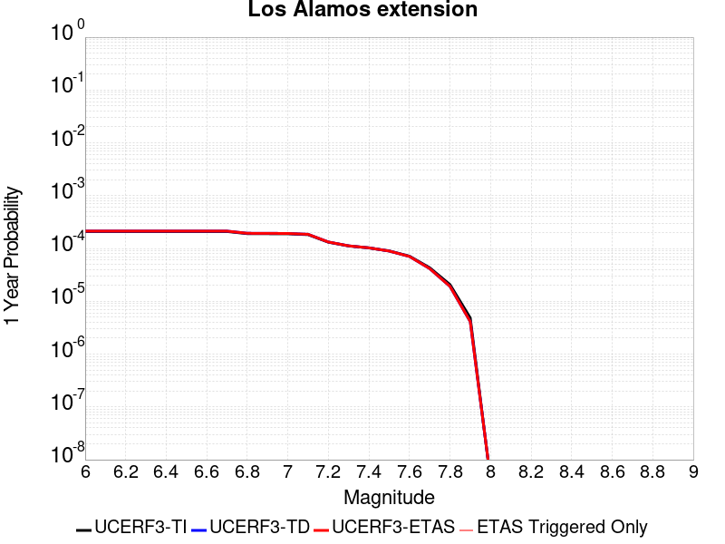 |  |

| Magnitude | 1 wk TI Prob | 1 wk TD Prob | 1 wk ETAS Prob | 1 wk ETAS/TD Gain | 1 wk ETAS Triggered Only | 1 mo TI Prob | 1 mo TD Prob | 1 mo ETAS Prob | 1 mo ETAS/TD Gain | 1 mo ETAS Triggered Only | 1 yr TI Prob | 1 yr TD Prob | 1 yr ETAS Prob | 1 yr ETAS/TD Gain | 1 yr ETAS Triggered Only | 10 yr TI Prob | 10 yr TD Prob | 10 yr ETAS Prob | 10 yr ETAS/TD Gain | 10 yr ETAS Triggered Only |
|-----|-----|-----|-----|-----|-----|-----|-----|-----|-----|-----|-----|-----|-----|-----|-----|-----|-----|-----|-----|-----|
| 6.0 | 4.0146506E-6 | 4.0861923E-6 | 4.0861923E-6 | 1.0 | 0.0 | 1.7205533E-5 | 1.751214E-5 | 1.751214E-5 | 1.0 | 0.0 | 2.0945723E-4 | 2.1319056E-4 | 2.1319056E-4 | 1.0 | 0.0 | 0.0020925992 | 0.0021299697 | 0.0021399483 | 1.0046849 | 1.0E-5 |
| 6.1 | 4.0146506E-6 | 4.0861923E-6 | 4.0861923E-6 | 1.0 | 0.0 | 1.7205533E-5 | 1.751214E-5 | 1.751214E-5 | 1.0 | 0.0 | 2.0945723E-4 | 2.1319056E-4 | 2.1319056E-4 | 1.0 | 0.0 | 0.0020925992 | 0.0021299697 | 0.0021399483 | 1.0046849 | 1.0E-5 |
| 6.2 | 4.0146506E-6 | 4.0861923E-6 | 4.0861923E-6 | 1.0 | 0.0 | 1.7205533E-5 | 1.751214E-5 | 1.751214E-5 | 1.0 | 0.0 | 2.0945723E-4 | 2.1319056E-4 | 2.1319056E-4 | 1.0 | 0.0 | 0.0020925992 | 0.0021299697 | 0.0021399483 | 1.0046849 | 1.0E-5 |
| 6.3 | 4.0146506E-6 | 4.0861923E-6 | 4.0861923E-6 | 1.0 | 0.0 | 1.7205533E-5 | 1.751214E-5 | 1.751214E-5 | 1.0 | 0.0 | 2.0945723E-4 | 2.1319056E-4 | 2.1319056E-4 | 1.0 | 0.0 | 0.0020925992 | 0.0021299697 | 0.0021399483 | 1.0046849 | 1.0E-5 |
| 6.4 | 4.0146506E-6 | 4.0861923E-6 | 4.0861923E-6 | 1.0 | 0.0 | 1.7205533E-5 | 1.751214E-5 | 1.751214E-5 | 1.0 | 0.0 | 2.0945723E-4 | 2.1319056E-4 | 2.1319056E-4 | 1.0 | 0.0 | 0.0020925992 | 0.0021299697 | 0.0021399483 | 1.0046849 | 1.0E-5 |
| 6.5 | 4.0146506E-6 | 4.0861923E-6 | 4.0861923E-6 | 1.0 | 0.0 | 1.7205533E-5 | 1.751214E-5 | 1.751214E-5 | 1.0 | 0.0 | 2.0945723E-4 | 2.1319056E-4 | 2.1319056E-4 | 1.0 | 0.0 | 0.0020925992 | 0.0021299697 | 0.0021399483 | 1.0046849 | 1.0E-5 |
| 6.6 | 4.0146506E-6 | 4.0861923E-6 | 4.0861923E-6 | 1.0 | 0.0 | 1.7205533E-5 | 1.751214E-5 | 1.751214E-5 | 1.0 | 0.0 | 2.0945723E-4 | 2.1319056E-4 | 2.1319056E-4 | 1.0 | 0.0 | 0.0020925992 | 0.0021299697 | 0.0021399483 | 1.0046849 | 1.0E-5 |
| 6.7 | 4.0146506E-6 | 4.0861923E-6 | 4.0861923E-6 | 1.0 | 0.0 | 1.7205533E-5 | 1.751214E-5 | 1.751214E-5 | 1.0 | 0.0 | 2.0945723E-4 | 2.1319056E-4 | 2.1319056E-4 | 1.0 | 0.0 | 0.0020925992 | 0.0021299697 | 0.0021399483 | 1.0046849 | 1.0E-5 |
| 6.8 | 3.6584688E-6 | 3.718889E-6 | 3.718889E-6 | 1.0 | 0.0 | 1.5679057E-5 | 1.5938003E-5 | 1.5938003E-5 | 1.0 | 0.0 | 1.9087581E-4 | 1.9402885E-4 | 1.9402885E-4 | 1.0 | 0.0 | 0.0019071194 | 0.0019386869 | 0.0019386869 | 1.0 | 0.0 |
| 6.9 | 3.644631E-6 | 3.7045988E-6 | 3.7045988E-6 | 1.0 | 0.0 | 1.5619753E-5 | 1.5876762E-5 | 1.5876762E-5 | 1.0 | 0.0 | 1.901539E-4 | 1.9328335E-4 | 1.9328335E-4 | 1.0 | 0.0 | 0.0018999127 | 0.0019312449 | 0.0019312449 | 1.0 | 0.0 |
| 7.0 | 3.6318522E-6 | 3.6913593E-6 | 3.6913593E-6 | 1.0 | 0.0 | 1.5564989E-5 | 1.582002E-5 | 1.582002E-5 | 1.0 | 0.0 | 1.8948725E-4 | 1.9259266E-4 | 1.9259266E-4 | 1.0 | 0.0 | 0.0018932576 | 0.0019243499 | 0.0019243499 | 1.0 | 0.0 |
| 7.1 | 3.5001724E-6 | 3.555429E-6 | 3.555429E-6 | 1.0 | 0.0 | 1.5000653E-5 | 1.523747E-5 | 1.523747E-5 | 1.0 | 0.0 | 1.8261763E-4 | 1.8550131E-4 | 1.8550131E-4 | 1.0 | 0.0 | 0.0018246764 | 0.0018535553 | 0.0018535553 | 1.0 | 0.0 |
| 7.2 | 2.5204702E-6 | 2.5437164E-6 | 2.5437164E-6 | 1.0 | 0.0 | 1.080197E-5 | 1.0901596E-5 | 1.0901596E-5 | 1.0 | 0.0 | 1.3150605E-4 | 1.3271891E-4 | 1.3271891E-4 | 1.0 | 0.0 | 0.0013142825 | 0.0013264021 | 0.0013264021 | 1.0 | 0.0 |
| 7.3 | 2.1399692E-6 | 2.150151E-6 | 2.150151E-6 | 1.0 | 0.0 | 9.1712645E-6 | 9.2149E-6 | 9.2149E-6 | 1.0 | 0.0 | 1.1165442E-4 | 1.1218566E-4 | 1.1218566E-4 | 1.0 | 0.0 | 0.0011159834 | 0.0011212936 | 0.0011212936 | 1.0 | 0.0 |
| 7.4 | 1.9660122E-6 | 1.9702543E-6 | 1.9702543E-6 | 1.0 | 0.0 | 8.42574E-6 | 8.44392E-6 | 8.44392E-6 | 1.0 | 0.0 | 1.0257855E-4 | 1.0279991E-4 | 1.0279991E-4 | 1.0 | 0.0 | 0.0010253121 | 0.0010275267 | 0.0010275267 | 1.0 | 0.0 |
| 7.5 | 1.7204633E-6 | 1.7151143E-6 | 1.7151143E-6 | 1.0 | 0.0 | 7.373393E-6 | 7.3504693E-6 | 7.3504693E-6 | 1.0 | 0.0 | 8.976737E-5 | 8.948832E-5 | 8.948832E-5 | 1.0 | 0.0 | 8.9731114E-4 | 8.945258E-4 | 8.945258E-4 | 1.0 | 0.0 |
| 7.6 | 1.3717638E-6 | 1.3535955E-6 | 1.3535955E-6 | 1.0 | 0.0 | 5.878974E-6 | 5.8011105E-6 | 5.8011105E-6 | 1.0 | 0.0 | 7.157416E-5 | 7.062626E-5 | 7.062626E-5 | 1.0 | 0.0 | 7.1551115E-4 | 7.0604077E-4 | 7.0604077E-4 | 1.0 | 0.0 |
| 7.7 | 8.272564E-7 | 7.9577165E-7 | 7.9577165E-7 | 1.0 | 0.0 | 3.5453797E-6 | 3.4104455E-6 | 3.4104455E-6 | 1.0 | 0.0 | 4.3164142E-5 | 4.1521384E-5 | 4.1521384E-5 | 1.0 | 0.0 | 4.315576E-4 | 4.1513646E-4 | 4.1513646E-4 | 1.0 | 0.0 |
| 7.8 | 3.9708277E-7 | 3.6719425E-7 | 3.6719425E-7 | 1.0 | 0.0 | 1.7017821E-6 | 1.5736886E-6 | 1.5736886E-6 | 1.0 | 0.0 | 2.0719E-5 | 1.9159492E-5 | 1.9159492E-5 | 1.0 | 0.0 | 2.071707E-4 | 1.9157845E-4 | 1.9157845E-4 | 1.0 | 0.0 |
| 7.9 | 9.292528E-8 | 7.889177E-8 | 7.889177E-8 | 1.0 | 0.0 | 3.9825116E-7 | 3.3810755E-7 | 3.3810755E-7 | 1.0 | 0.0 | 4.848697E-6 | 4.1164517E-6 | 4.1164517E-6 | 1.0 | 0.0 | 4.8485912E-5 | 4.1163767E-5 | 4.1163767E-5 | 1.0 | 0.0 |
| 8.0 | 7.880441E-11 | 8.23539E-11 | 8.23539E-11 | 1.0 | 0.0 | 3.3773329E-10 | 3.5294534E-10 | 3.5294534E-10 | 1.0 | 0.0 | 4.1119033E-9 | 4.29711E-9 | 4.29711E-9 | 1.0 | 0.0 | 4.1119034E-8 | 4.29711E-8 | 4.29711E-8 | 1.0 | 0.0 |

## Santa Cruz Catalina Ridge alt1
*[(top)](#table-of-contents)*

| 1 Week | 1 Month | 1 Year | 10 Year |
|-----|-----|-----|-----|
|  |  |  |  |

| Magnitude | 1 wk TI Prob | 1 wk TD Prob | 1 wk ETAS Prob | 1 wk ETAS/TD Gain | 1 wk ETAS Triggered Only | 1 mo TI Prob | 1 mo TD Prob | 1 mo ETAS Prob | 1 mo ETAS/TD Gain | 1 mo ETAS Triggered Only | 1 yr TI Prob | 1 yr TD Prob | 1 yr ETAS Prob | 1 yr ETAS/TD Gain | 1 yr ETAS Triggered Only | 10 yr TI Prob | 10 yr TD Prob | 10 yr ETAS Prob | 10 yr ETAS/TD Gain | 10 yr ETAS Triggered Only |
|-----|-----|-----|-----|-----|-----|-----|-----|-----|-----|-----|-----|-----|-----|-----|-----|-----|-----|-----|-----|-----|
| 6.0 | 3.2833184E-5 | 3.6559275E-5 | 3.6559275E-5 | 1.0 | 0.0 | 1.4070606E-4 | 1.5667414E-4 | 1.5667414E-4 | 1.0 | 0.0 | 0.00171175 | 0.0019060053 | 0.0019159862 | 1.0052366 | 1.0E-5 | 0.016986247 | 0.01891348 | 0.01892329 | 1.0005187 | 1.0E-5 |
| 6.1 | 1.9835548E-5 | 2.1659924E-5 | 2.1659924E-5 | 1.0 | 0.0 | 8.500672E-5 | 9.282505E-5 | 9.282505E-5 | 1.0 | 0.0 | 0.0010344655 | 0.0011295793 | 0.001139568 | 1.0088428 | 1.0E-5 | 0.010296632 | 0.011240511 | 0.011250399 | 1.0008796 | 1.0E-5 |
| 6.2 | 1.9835548E-5 | 2.1659924E-5 | 2.1659924E-5 | 1.0 | 0.0 | 8.500672E-5 | 9.282505E-5 | 9.282505E-5 | 1.0 | 0.0 | 0.0010344655 | 0.0011295793 | 0.001139568 | 1.0088428 | 1.0E-5 | 0.010296632 | 0.011240511 | 0.011250399 | 1.0008796 | 1.0E-5 |
| 6.3 | 1.5728183E-5 | 1.7034245E-5 | 1.7034245E-5 | 1.0 | 0.0 | 6.7404755E-5 | 7.30019E-5 | 7.30019E-5 | 1.0 | 0.0 | 8.2034385E-4 | 8.884418E-4 | 8.984329E-4 | 1.0112456 | 1.0E-5 | 0.008173222 | 0.00884958 | 0.008859492 | 1.00112 | 1.0E-5 |
| 6.4 | 1.5728183E-5 | 1.7034245E-5 | 1.7034245E-5 | 1.0 | 0.0 | 6.7404755E-5 | 7.30019E-5 | 7.30019E-5 | 1.0 | 0.0 | 8.2034385E-4 | 8.884418E-4 | 8.984329E-4 | 1.0112456 | 1.0E-5 | 0.008173222 | 0.00884958 | 0.008859492 | 1.00112 | 1.0E-5 |
| 6.5 | 1.3707734E-5 | 1.4794767E-5 | 1.4794767E-5 | 1.0 | 0.0 | 5.8746107E-5 | 6.340462E-5 | 6.340462E-5 | 1.0 | 0.0 | 7.1499916E-4 | 7.716814E-4 | 7.716814E-4 | 1.0 | 0.0 | 0.0071270303 | 0.0076904166 | 0.0076904166 | 1.0 | 0.0 |
| 6.6 | 1.2539813E-5 | 1.3510438E-5 | 1.3510438E-5 | 1.0 | 0.0 | 5.3740947E-5 | 5.790061E-5 | 5.790061E-5 | 1.0 | 0.0 | 6.540996E-4 | 7.0471456E-4 | 7.0471456E-4 | 1.0 | 0.0 | 0.0065217763 | 0.0070251017 | 0.0070251017 | 1.0 | 0.0 |
| 6.7 | 1.1504083E-5 | 1.2377571E-5 | 1.2377571E-5 | 1.0 | 0.0 | 4.930228E-5 | 5.3045667E-5 | 5.3045667E-5 | 1.0 | 0.0 | 6.0008996E-4 | 6.4564164E-4 | 6.4564164E-4 | 1.0 | 0.0 | 0.005984721 | 0.006437888 | 0.006437888 | 1.0 | 0.0 |
| 6.8 | 1.012739E-5 | 1.0877239E-5 | 1.0877239E-5 | 1.0 | 0.0 | 4.340238E-5 | 4.6615914E-5 | 4.6615914E-5 | 1.0 | 0.0 | 5.282958E-4 | 5.674025E-4 | 5.674025E-4 | 1.0 | 0.0 | 0.0052704164 | 0.005659707 | 0.005659707 | 1.0 | 0.0 |
| 6.9 | 8.9607865E-6 | 9.609263E-6 | 9.609263E-6 | 1.0 | 0.0 | 3.8402806E-5 | 4.118191E-5 | 4.118191E-5 | 1.0 | 0.0 | 4.6745385E-4 | 5.0127547E-4 | 5.0127547E-4 | 1.0 | 0.0 | 0.0046647177 | 0.0050015673 | 0.0050015673 | 1.0 | 0.0 |
| 7.0 | 8.046829E-6 | 8.619874E-6 | 8.619874E-6 | 1.0 | 0.0 | 3.4485955E-5 | 3.6941798E-5 | 3.6941798E-5 | 1.0 | 0.0 | 4.1978562E-4 | 4.4967438E-4 | 4.4967438E-4 | 1.0 | 0.0 | 0.004189935 | 0.004487735 | 0.004487735 | 1.0 | 0.0 |
| 7.1 | 7.136131E-6 | 7.637768E-6 | 7.637768E-6 | 1.0 | 0.0 | 3.0583058E-5 | 3.2732885E-5 | 3.2732885E-5 | 1.0 | 0.0 | 3.7228514E-4 | 3.984507E-4 | 3.984507E-4 | 1.0 | 0.0 | 0.0037166206 | 0.0039774394 | 0.0039774394 | 1.0 | 0.0 |
| 7.2 | 6.362014E-6 | 6.8050576E-6 | 6.8050576E-6 | 1.0 | 0.0 | 2.726549E-5 | 2.916421E-5 | 2.916421E-5 | 1.0 | 0.0 | 3.3190678E-4 | 3.5501705E-4 | 3.5501705E-4 | 1.0 | 0.0 | 0.0033141149 | 0.0035445674 | 0.0035445674 | 1.0 | 0.0 |
| 7.3 | 5.004101E-6 | 5.3517924E-6 | 5.3517924E-6 | 1.0 | 0.0 | 2.1445969E-5 | 2.2936056E-5 | 2.2936056E-5 | 1.0 | 0.0 | 2.6107338E-4 | 2.7921124E-4 | 2.7921124E-4 | 1.0 | 0.0 | 0.002607669 | 0.002788659 | 0.002788659 | 1.0 | 0.0 |
| 7.4 | 3.4901443E-6 | 3.7321065E-6 | 3.7321065E-6 | 1.0 | 0.0 | 1.4957676E-5 | 1.5994647E-5 | 1.5994647E-5 | 1.0 | 0.0 | 1.8209449E-4 | 1.9471781E-4 | 1.9471781E-4 | 1.0 | 0.0 | 0.0018194534 | 0.0019455105 | 0.0019455105 | 1.0 | 0.0 |
| 7.5 | 1.1215045E-6 | 1.1894022E-6 | 1.1894022E-6 | 1.0 | 0.0 | 4.806439E-6 | 5.0974277E-6 | 5.0974277E-6 | 1.0 | 0.0 | 5.851682E-5 | 6.2059444E-5 | 6.2059444E-5 | 1.0 | 0.0 | 5.850142E-4 | 6.204242E-4 | 6.204242E-4 | 1.0 | 0.0 |
| 7.6 | 2.8599047E-7 | 2.995229E-7 | 2.995229E-7 | 1.0 | 0.0 | 1.2256729E-6 | 1.2836689E-6 | 1.2836689E-6 | 1.0 | 0.0 | 1.4922465E-5 | 1.5628559E-5 | 1.5628559E-5 | 1.0 | 0.0 | 1.4921463E-4 | 1.5627472E-4 | 1.5627472E-4 | 1.0 | 0.0 |
| 7.7 | 2.0781519E-7 | 2.1744533E-7 | 2.1744533E-7 | 1.0 | 0.0 | 8.906362E-7 | 9.3190823E-7 | 9.3190823E-7 | 1.0 | 0.0 | 1.08434415E-5 | 1.1345925E-5 | 1.1345925E-5 | 1.0 | 0.0 | 1.0842913E-4 | 1.1345355E-4 | 1.1345355E-4 | 1.0 | 0.0 |
| 7.8 | 3.614776E-8 | 3.7641342E-8 | 3.7641342E-8 | 1.0 | 0.0 | 1.5491896E-7 | 1.6132003E-7 | 1.6132003E-7 | 1.0 | 0.0 | 1.8861368E-6 | 1.9640697E-6 | 1.9640697E-6 | 1.0 | 0.0 | 1.8861208E-5 | 1.9640536E-5 | 1.9640536E-5 | 1.0 | 0.0 |

## Las Positas
*[(top)](#table-of-contents)*

| 1 Week | 1 Month | 1 Year | 10 Year |
|-----|-----|-----|-----|
|  | 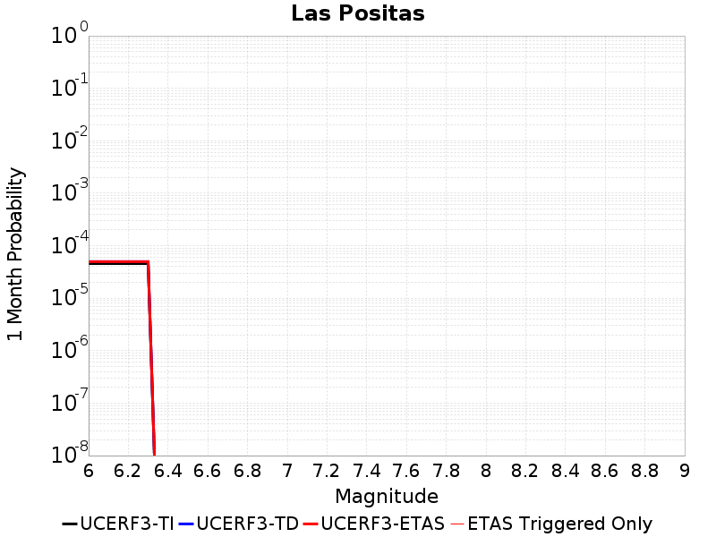 |  |  |

| Magnitude | 1 wk TI Prob | 1 wk TD Prob | 1 wk ETAS Prob | 1 wk ETAS/TD Gain | 1 wk ETAS Triggered Only | 1 mo TI Prob | 1 mo TD Prob | 1 mo ETAS Prob | 1 mo ETAS/TD Gain | 1 mo ETAS Triggered Only | 1 yr TI Prob | 1 yr TD Prob | 1 yr ETAS Prob | 1 yr ETAS/TD Gain | 1 yr ETAS Triggered Only | 10 yr TI Prob | 10 yr TD Prob | 10 yr ETAS Prob | 10 yr ETAS/TD Gain | 10 yr ETAS Triggered Only |
|-----|-----|-----|-----|-----|-----|-----|-----|-----|-----|-----|-----|-----|-----|-----|-----|-----|-----|-----|-----|-----|
| 6.0 | 1.0659424E-5 | 1.15913335E-5 | 1.15913335E-5 | 1.0 | 0.0 | 4.568245E-5 | 4.9677143E-5 | 4.9677143E-5 | 1.0 | 0.0 | 5.560419E-4 | 6.048192E-4 | 6.048192E-4 | 1.0 | 0.0 | 0.005546526 | 0.0060481923 | 0.006058132 | 1.0016434 | 1.0E-5 |
| 6.1 | 1.0659424E-5 | 1.15913335E-5 | 1.15913335E-5 | 1.0 | 0.0 | 4.568245E-5 | 4.9677143E-5 | 4.9677143E-5 | 1.0 | 0.0 | 5.560419E-4 | 6.048192E-4 | 6.048192E-4 | 1.0 | 0.0 | 0.005546526 | 0.0060481923 | 0.006058132 | 1.0016434 | 1.0E-5 |
| 6.2 | 1.0659424E-5 | 1.15913335E-5 | 1.15913335E-5 | 1.0 | 0.0 | 4.568245E-5 | 4.9677143E-5 | 4.9677143E-5 | 1.0 | 0.0 | 5.560419E-4 | 6.048192E-4 | 6.048192E-4 | 1.0 | 0.0 | 0.005546526 | 0.0060481923 | 0.006058132 | 1.0016434 | 1.0E-5 |
| 6.3 | 1.0659424E-5 | 1.15913335E-5 | 1.15913335E-5 | 1.0 | 0.0 | 4.568245E-5 | 4.9677143E-5 | 4.9677143E-5 | 1.0 | 0.0 | 5.560419E-4 | 6.048192E-4 | 6.048192E-4 | 1.0 | 0.0 | 0.005546526 | 0.0060481923 | 0.006058132 | 1.0016434 | 1.0E-5 |

## Likely 2011 CFM
*[(top)](#table-of-contents)*

| 1 Week | 1 Month | 1 Year | 10 Year |
|-----|-----|-----|-----|
|  |  |  | 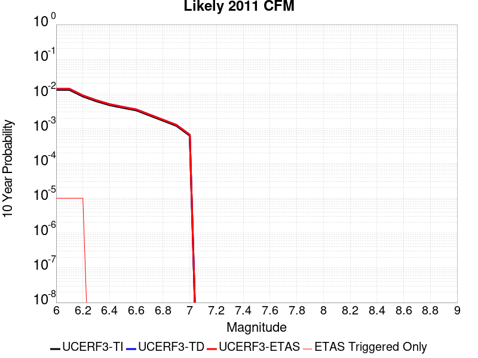 |

| Magnitude | 1 wk TI Prob | 1 wk TD Prob | 1 wk ETAS Prob | 1 wk ETAS/TD Gain | 1 wk ETAS Triggered Only | 1 mo TI Prob | 1 mo TD Prob | 1 mo ETAS Prob | 1 mo ETAS/TD Gain | 1 mo ETAS Triggered Only | 1 yr TI Prob | 1 yr TD Prob | 1 yr ETAS Prob | 1 yr ETAS/TD Gain | 1 yr ETAS Triggered Only | 10 yr TI Prob | 10 yr TD Prob | 10 yr ETAS Prob | 10 yr ETAS/TD Gain | 10 yr ETAS Triggered Only |
|-----|-----|-----|-----|-----|-----|-----|-----|-----|-----|-----|-----|-----|-----|-----|-----|-----|-----|-----|-----|-----|
| 6.0 | 2.5315949E-5 | 2.7105149E-5 | 2.7105149E-5 | 1.0 | 0.0 | 1.0849241E-4 | 1.1616E-4 | 1.1616E-4 | 1.0 | 0.0 | 0.0013200947 | 0.001413375 | 0.001413375 | 1.0 | 0.0 | 0.013122803 | 0.014048516 | 0.014058376 | 1.0007018 | 1.0E-5 |
| 6.1 | 2.5315949E-5 | 2.7105149E-5 | 2.7105149E-5 | 1.0 | 0.0 | 1.0849241E-4 | 1.1616E-4 | 1.1616E-4 | 1.0 | 0.0 | 0.0013200947 | 0.001413375 | 0.001413375 | 1.0 | 0.0 | 0.013122803 | 0.014048516 | 0.014058376 | 1.0007018 | 1.0E-5 |
| 6.2 | 1.6375941E-5 | 1.7466085E-5 | 1.7466085E-5 | 1.0 | 0.0 | 7.0180715E-5 | 7.485257E-5 | 7.485257E-5 | 1.0 | 0.0 | 8.5411523E-4 | 9.109613E-4 | 9.109613E-4 | 1.0 | 0.0 | 0.008508399 | 0.009073558 | 0.009083468 | 1.0010921 | 1.0E-5 |
| 6.3 | 1.1945543E-5 | 1.2712757E-5 | 1.2712757E-5 | 1.0 | 0.0 | 5.119418E-5 | 5.4482138E-5 | 5.4482138E-5 | 1.0 | 0.0 | 6.2311086E-4 | 6.6312344E-4 | 6.6312344E-4 | 1.0 | 0.0 | 0.0062136655 | 0.006612003 | 0.006612003 | 1.0 | 0.0 |
| 6.4 | 9.192729E-6 | 9.768615E-6 | 9.768615E-6 | 1.0 | 0.0 | 3.939681E-5 | 4.1864838E-5 | 4.1864838E-5 | 1.0 | 0.0 | 4.7955062E-4 | 5.0958793E-4 | 5.0958793E-4 | 1.0 | 0.0 | 0.004785171 | 0.0050844755 | 0.0050844755 | 1.0 | 0.0 |
| 6.5 | 7.67906E-6 | 8.152727E-6 | 8.152727E-6 | 1.0 | 0.0 | 3.2909844E-5 | 3.49398E-5 | 3.49398E-5 | 1.0 | 0.0 | 4.006037E-4 | 4.2531092E-4 | 4.2531092E-4 | 1.0 | 0.0 | 0.0039988225 | 0.0042451625 | 0.0042451625 | 1.0 | 0.0 |
| 6.6 | 6.4884057E-6 | 6.8848385E-6 | 6.8848385E-6 | 1.0 | 0.0 | 2.7807157E-5 | 2.9506124E-5 | 2.9506124E-5 | 1.0 | 0.0 | 3.3849955E-4 | 3.5917928E-4 | 3.5917928E-4 | 1.0 | 0.0 | 0.003379844 | 0.0035861323 | 0.0035861323 | 1.0 | 0.0 |
| 6.7 | 4.6060636E-6 | 4.8841025E-6 | 4.8841025E-6 | 1.0 | 0.0 | 1.9740122E-5 | 2.0931706E-5 | 2.0931706E-5 | 1.0 | 0.0 | 2.403095E-4 | 2.5481454E-4 | 2.5481454E-4 | 1.0 | 0.0 | 0.002400498 | 0.0025453067 | 0.0025453067 | 1.0 | 0.0 |
| 6.8 | 3.2795615E-6 | 3.4774168E-6 | 3.4774168E-6 | 1.0 | 0.0 | 1.4055187E-5 | 1.4903133E-5 | 1.4903133E-5 | 1.0 | 0.0 | 1.7110848E-4 | 1.814311E-4 | 1.814311E-4 | 1.0 | 0.0 | 0.0017097679 | 0.0018128849 | 0.0018128849 | 1.0 | 0.0 |
| 6.9 | 2.3289967E-6 | 2.4705882E-6 | 2.4705882E-6 | 1.0 | 0.0 | 9.981376E-6 | 1.05881945E-5 | 1.05881945E-5 | 1.0 | 0.0 | 1.2151648E-4 | 1.2890408E-4 | 1.2890408E-4 | 1.0 | 0.0 | 0.0012145005 | 0.001288336 | 0.001288336 | 1.0 | 0.0 |
| 7.0 | 1.211292E-6 | 1.2864124E-6 | 1.2864124E-6 | 1.0 | 0.0 | 5.1912407E-6 | 5.513186E-6 | 5.513186E-6 | 1.0 | 0.0 | 6.320152E-5 | 6.712128E-5 | 6.712128E-5 | 1.0 | 0.0 | 6.3183554E-4 | 6.7103986E-4 | 6.7103986E-4 | 1.0 | 0.0 |

## Sierra Madre
*[(top)](#table-of-contents)*

| 1 Week | 1 Month | 1 Year | 10 Year |
|-----|-----|-----|-----|
| 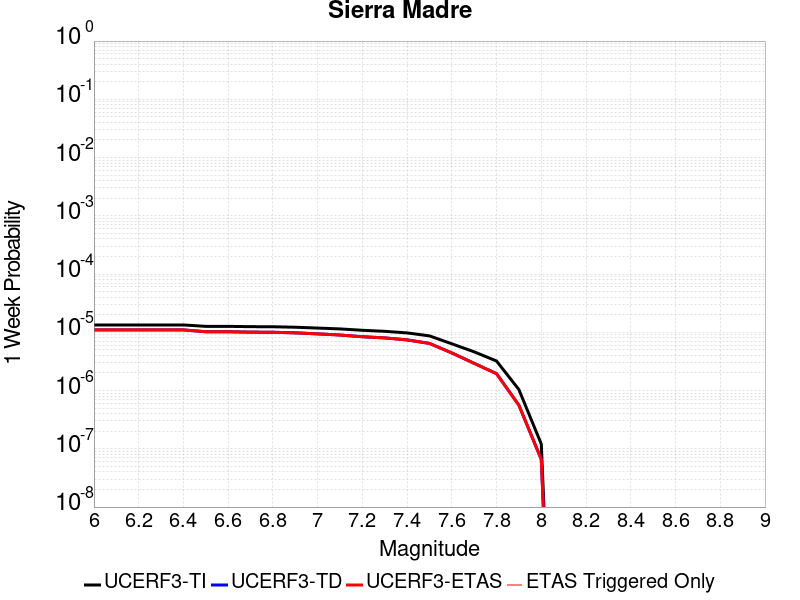 |  |  |  |

| Magnitude | 1 wk TI Prob | 1 wk TD Prob | 1 wk ETAS Prob | 1 wk ETAS/TD Gain | 1 wk ETAS Triggered Only | 1 mo TI Prob | 1 mo TD Prob | 1 mo ETAS Prob | 1 mo ETAS/TD Gain | 1 mo ETAS Triggered Only | 1 yr TI Prob | 1 yr TD Prob | 1 yr ETAS Prob | 1 yr ETAS/TD Gain | 1 yr ETAS Triggered Only | 10 yr TI Prob | 10 yr TD Prob | 10 yr ETAS Prob | 10 yr ETAS/TD Gain | 10 yr ETAS Triggered Only |
|-----|-----|-----|-----|-----|-----|-----|-----|-----|-----|-----|-----|-----|-----|-----|-----|-----|-----|-----|-----|-----|
| 6.0 | 1.3379373E-5 | 1.1001292E-5 | 1.1001292E-5 | 1.0 | 0.0 | 5.7338908E-5 | 4.714755E-5 | 4.714755E-5 | 1.0 | 0.0 | 6.978776E-4 | 5.738717E-4 | 5.8386597E-4 | 1.0174155 | 1.0E-5 | 0.0069569005 | 0.005724262 | 0.005734205 | 1.001737 | 1.0E-5 |
| 6.1 | 1.3379373E-5 | 1.1001292E-5 | 1.1001292E-5 | 1.0 | 0.0 | 5.7338908E-5 | 4.714755E-5 | 4.714755E-5 | 1.0 | 0.0 | 6.978776E-4 | 5.738717E-4 | 5.8386597E-4 | 1.0174155 | 1.0E-5 | 0.0069569005 | 0.005724262 | 0.005734205 | 1.001737 | 1.0E-5 |
| 6.2 | 1.3379373E-5 | 1.1001292E-5 | 1.1001292E-5 | 1.0 | 0.0 | 5.7338908E-5 | 4.714755E-5 | 4.714755E-5 | 1.0 | 0.0 | 6.978776E-4 | 5.738717E-4 | 5.8386597E-4 | 1.0174155 | 1.0E-5 | 0.0069569005 | 0.005724262 | 0.005734205 | 1.001737 | 1.0E-5 |
| 6.3 | 1.3379373E-5 | 1.1001292E-5 | 1.1001292E-5 | 1.0 | 0.0 | 5.7338908E-5 | 4.714755E-5 | 4.714755E-5 | 1.0 | 0.0 | 6.978776E-4 | 5.738717E-4 | 5.8386597E-4 | 1.0174155 | 1.0E-5 | 0.0069569005 | 0.005724262 | 0.005734205 | 1.001737 | 1.0E-5 |
| 6.4 | 1.3379373E-5 | 1.1001292E-5 | 1.1001292E-5 | 1.0 | 0.0 | 5.7338908E-5 | 4.714755E-5 | 4.714755E-5 | 1.0 | 0.0 | 6.978776E-4 | 5.738717E-4 | 5.8386597E-4 | 1.0174155 | 1.0E-5 | 0.0069569005 | 0.005724262 | 0.005734205 | 1.001737 | 1.0E-5 |
| 6.5 | 1.26563245E-5 | 1.0230738E-5 | 1.0230738E-5 | 1.0 | 0.0 | 5.4240263E-5 | 4.3845284E-5 | 4.3845284E-5 | 1.0 | 0.0 | 6.601751E-4 | 5.3368666E-4 | 5.436813E-4 | 1.0187275 | 1.0E-5 | 0.006582173 | 0.005324372 | 0.005334319 | 1.0018681 | 1.0E-5 |
| 6.6 | 1.26563245E-5 | 1.0230738E-5 | 1.0230738E-5 | 1.0 | 0.0 | 5.4240263E-5 | 4.3845284E-5 | 4.3845284E-5 | 1.0 | 0.0 | 6.601751E-4 | 5.3368666E-4 | 5.436813E-4 | 1.0187275 | 1.0E-5 | 0.006582173 | 0.005324372 | 0.005334319 | 1.0018681 | 1.0E-5 |
| 6.7 | 1.2502474E-5 | 1.0066879E-5 | 1.0066879E-5 | 1.0 | 0.0 | 5.3580934E-5 | 4.314306E-5 | 4.314306E-5 | 1.0 | 0.0 | 6.521526E-4 | 5.2514125E-4 | 5.35136E-4 | 1.0190325 | 1.0E-5 | 0.0065024206 | 0.0052393223 | 0.00524927 | 1.0018986 | 1.0E-5 |
| 6.8 | 1.2454966E-5 | 1.0019164E-5 | 1.0019164E-5 | 1.0 | 0.0 | 5.3377335E-5 | 4.2938573E-5 | 4.2938573E-5 | 1.0 | 0.0 | 6.4967526E-4 | 5.226528E-4 | 5.326476E-4 | 1.0191232 | 1.0E-5 | 0.006477792 | 0.0052145547 | 0.0052245026 | 1.0019077 | 1.0E-5 |
| 6.9 | 1.2225574E-5 | 9.793138E-6 | 9.793138E-6 | 1.0 | 0.0 | 5.2394265E-5 | 4.196992E-5 | 4.196992E-5 | 1.0 | 0.0 | 6.3771347E-4 | 5.10865E-4 | 5.208599E-4 | 1.0195646 | 1.0E-5 | 0.006358865 | 0.0050972225 | 0.0051071714 | 1.0019518 | 1.0E-5 |
| 7.0 | 1.182946E-5 | 9.399674E-6 | 9.399674E-6 | 1.0 | 0.0 | 5.06967E-5 | 4.02837E-5 | 4.02837E-5 | 1.0 | 0.0 | 6.1705755E-4 | 4.903447E-4 | 5.003398E-4 | 1.0203838 | 1.0E-5 | 0.006153469 | 0.0048929392 | 0.0049028904 | 1.0020337 | 1.0E-5 |
| 7.1 | 1.14369095E-5 | 8.986676E-6 | 8.986676E-6 | 1.0 | 0.0 | 4.9014405E-5 | 3.8513765E-5 | 3.8513765E-5 | 1.0 | 0.0 | 5.9658696E-4 | 4.6880514E-4 | 4.7880047E-4 | 1.0213208 | 1.0E-5 | 0.005949879 | 0.0046784678 | 0.004688421 | 1.0021274 | 1.0E-5 |
| 7.2 | 1.0836419E-5 | 8.400059E-6 | 8.400059E-6 | 1.0 | 0.0 | 4.644097E-5 | 3.5999765E-5 | 3.5999765E-5 | 1.0 | 0.0 | 5.652721E-4 | 4.3820989E-4 | 4.482055E-4 | 1.0228101 | 1.0E-5 | 0.0056383642 | 0.0043737553 | 0.0043837116 | 1.0022764 | 1.0E-5 |
| 7.3 | 1.0403439E-5 | 8.021315E-6 | 8.021315E-6 | 1.0 | 0.0 | 4.4585406E-5 | 3.4376615E-5 | 3.4376615E-5 | 1.0 | 0.0 | 5.426921E-4 | 4.184558E-4 | 4.2845163E-4 | 1.0238874 | 1.0E-5 | 0.005413687 | 0.004176974 | 0.004186932 | 1.0023841 | 1.0E-5 |
| 7.4 | 9.768864E-6 | 7.414929E-6 | 7.414929E-6 | 1.0 | 0.0 | 4.186589E-5 | 3.1777883E-5 | 3.1777883E-5 | 1.0 | 0.0 | 5.09598E-4 | 3.8682795E-4 | 3.968241E-4 | 1.0258412 | 1.0E-5 | 0.0050843097 | 0.003861838 | 0.0038717994 | 1.0025795 | 1.0E-5 |
| 7.5 | 8.687089E-6 | 6.450616E-6 | 6.450616E-6 | 1.0 | 0.0 | 3.722985E-5 | 2.764521E-5 | 2.764521E-5 | 1.0 | 0.0 | 4.5317915E-4 | 3.365293E-4 | 3.4652595E-4 | 1.029705 | 1.0E-5 | 0.004522561 | 0.0033604843 | 0.0033704506 | 1.0029658 | 1.0E-5 |
| 7.6 | 6.3506063E-6 | 4.4307394E-6 | 4.4307394E-6 | 1.0 | 0.0 | 2.72166E-5 | 1.8988747E-5 | 1.8988747E-5 | 1.0 | 0.0 | 3.3131172E-4 | 2.3116372E-4 | 2.3116372E-4 | 1.0 | 0.0 | 0.003308182 | 0.0023094576 | 0.0023094576 | 1.0 | 0.0 |
| 7.7 | 4.62223E-6 | 2.9333594E-6 | 2.9333594E-6 | 1.0 | 0.0 | 1.9809406E-5 | 1.257148E-5 | 1.257148E-5 | 1.0 | 0.0 | 2.4115283E-4 | 1.5304703E-4 | 1.5304703E-4 | 1.0 | 0.0 | 0.0024089129 | 0.0015296175 | 0.0015296175 | 1.0 | 0.0 |
| 7.8 | 3.2145008E-6 | 1.9497302E-6 | 1.9497302E-6 | 1.0 | 0.0 | 1.3776359E-5 | 8.35596E-6 | 8.35596E-6 | 1.0 | 0.0 | 1.6771426E-4 | 1.0172908E-4 | 1.0172908E-4 | 1.0 | 0.0 | 0.0016758774 | 0.0010169694 | 0.0010169694 | 1.0 | 0.0 |
| 7.9 | 1.0391769E-6 | 5.603596E-7 | 5.603596E-7 | 1.0 | 0.0 | 4.4536077E-6 | 2.401539E-6 | 2.401539E-6 | 1.0 | 0.0 | 5.4221324E-5 | 2.9238348E-5 | 2.9238348E-5 | 1.0 | 0.0 | 5.4208096E-4 | 2.9234544E-4 | 2.9234544E-4 | 1.0 | 0.0 |
| 8.0 | 1.210983E-7 | 6.614372E-8 | 6.614372E-8 | 1.0 | 0.0 | 5.1899264E-7 | 2.8347307E-7 | 2.8347307E-7 | 1.0 | 0.0 | 6.3187167E-6 | 3.451279E-6 | 3.451279E-6 | 1.0 | 0.0 | 6.318537E-5 | 3.4512275E-5 | 3.4512275E-5 | 1.0 | 0.0 |

## Keddie Ridge 2011 CFM
*[(top)](#table-of-contents)*

| 1 Week | 1 Month | 1 Year | 10 Year |
|-----|-----|-----|-----|
|  | 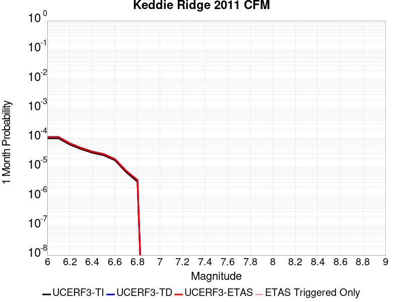 |  |  |

| Magnitude | 1 wk TI Prob | 1 wk TD Prob | 1 wk ETAS Prob | 1 wk ETAS/TD Gain | 1 wk ETAS Triggered Only | 1 mo TI Prob | 1 mo TD Prob | 1 mo ETAS Prob | 1 mo ETAS/TD Gain | 1 mo ETAS Triggered Only | 1 yr TI Prob | 1 yr TD Prob | 1 yr ETAS Prob | 1 yr ETAS/TD Gain | 1 yr ETAS Triggered Only | 10 yr TI Prob | 10 yr TD Prob | 10 yr ETAS Prob | 10 yr ETAS/TD Gain | 10 yr ETAS Triggered Only |
|-----|-----|-----|-----|-----|-----|-----|-----|-----|-----|-----|-----|-----|-----|-----|-----|-----|-----|-----|-----|-----|
| 6.0 | 2.2591947E-5 | 2.5189795E-5 | 2.5189795E-5 | 1.0 | 0.0 | 9.6819036E-5 | 1.0795224E-4 | 1.0795224E-4 | 1.0 | 0.0 | 0.0011781343 | 0.0013136051 | 0.001323592 | 1.0076027 | 1.0E-5 | 0.011719079 | 0.01306635 | 0.013076219 | 1.0007553 | 1.0E-5 |
| 6.1 | 2.2591947E-5 | 2.5189795E-5 | 2.5189795E-5 | 1.0 | 0.0 | 9.6819036E-5 | 1.0795224E-4 | 1.0795224E-4 | 1.0 | 0.0 | 0.0011781343 | 0.0013136051 | 0.001323592 | 1.0076027 | 1.0E-5 | 0.011719079 | 0.01306635 | 0.013076219 | 1.0007553 | 1.0E-5 |
| 6.2 | 1.3775145E-5 | 1.532318E-5 | 1.532318E-5 | 1.0 | 0.0 | 5.9035E-5 | 6.566926E-5 | 6.566926E-5 | 1.0 | 0.0 | 7.185141E-4 | 7.992541E-4 | 7.992541E-4 | 1.0 | 0.0 | 0.0071619535 | 0.007966215 | 0.007966215 | 1.0 | 0.0 |
| 6.3 | 9.705435E-6 | 1.0768599E-5 | 1.0768599E-5 | 1.0 | 0.0 | 4.1594063E-5 | 4.6150395E-5 | 4.6150395E-5 | 1.0 | 0.0 | 5.0629E-4 | 5.617486E-4 | 5.617486E-4 | 1.0 | 0.0 | 0.005051381 | 0.0056045162 | 0.0056045162 | 1.0 | 0.0 |
| 6.4 | 7.2549733E-6 | 8.027449E-6 | 8.027449E-6 | 1.0 | 0.0 | 3.109237E-5 | 3.4402947E-5 | 3.4402947E-5 | 1.0 | 0.0 | 3.7848388E-4 | 4.1878334E-4 | 4.1878334E-4 | 1.0 | 0.0 | 0.003778399 | 0.004180728 | 0.004180728 | 1.0 | 0.0 |
| 6.5 | 5.983293E-6 | 6.613172E-6 | 6.613172E-6 | 1.0 | 0.0 | 2.5642432E-5 | 2.8341896E-5 | 2.8341896E-5 | 1.0 | 0.0 | 3.1215188E-4 | 3.4501465E-4 | 3.4501465E-4 | 1.0 | 0.0 | 0.0031171376 | 0.0034454523 | 0.0034454523 | 1.0 | 0.0 |
| 6.6 | 4.0336154E-6 | 4.457904E-6 | 4.457904E-6 | 1.0 | 0.0 | 1.728681E-5 | 1.9105188E-5 | 1.9105188E-5 | 1.0 | 0.0 | 2.1044657E-4 | 2.3258485E-4 | 2.3258485E-4 | 1.0 | 0.0 | 0.002102474 | 0.0023238098 | 0.0023238098 | 1.0 | 0.0 |
| 6.7 | 1.5832104E-6 | 1.7816562E-6 | 1.7816562E-6 | 1.0 | 0.0 | 6.7851697E-6 | 7.635649E-6 | 7.635649E-6 | 1.0 | 0.0 | 8.260631E-5 | 9.2960334E-5 | 9.2960334E-5 | 1.0 | 0.0 | 8.2575605E-4 | 9.292411E-4 | 9.292411E-4 | 1.0 | 0.0 |
| 6.8 | 7.5177275E-7 | 8.590554E-7 | 8.590554E-7 | 1.0 | 0.0 | 3.221879E-6 | 3.6816616E-6 | 3.6816616E-6 | 1.0 | 0.0 | 3.9225673E-5 | 4.482348E-5 | 4.482348E-5 | 1.0 | 0.0 | 3.921875E-4 | 4.4816092E-4 | 4.4816092E-4 | 1.0 | 0.0 |

## Morales (East)
*[(top)](#table-of-contents)*

| 1 Week | 1 Month | 1 Year | 10 Year |
|-----|-----|-----|-----|
| 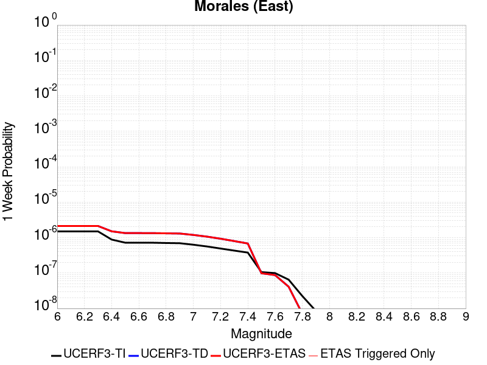 |  |  |  |

| Magnitude | 1 wk TI Prob | 1 wk TD Prob | 1 wk ETAS Prob | 1 wk ETAS/TD Gain | 1 wk ETAS Triggered Only | 1 mo TI Prob | 1 mo TD Prob | 1 mo ETAS Prob | 1 mo ETAS/TD Gain | 1 mo ETAS Triggered Only | 1 yr TI Prob | 1 yr TD Prob | 1 yr ETAS Prob | 1 yr ETAS/TD Gain | 1 yr ETAS Triggered Only | 10 yr TI Prob | 10 yr TD Prob | 10 yr ETAS Prob | 10 yr ETAS/TD Gain | 10 yr ETAS Triggered Only |
|-----|-----|-----|-----|-----|-----|-----|-----|-----|-----|-----|-----|-----|-----|-----|-----|-----|-----|-----|-----|-----|
| 6.0 | 1.4942771E-6 | 2.1240173E-6 | 2.1240173E-6 | 1.0 | 0.0 | 6.404029E-6 | 9.102903E-6 | 9.102903E-6 | 1.0 | 0.0 | 7.7966266E-5 | 1.10822795E-4 | 1.10822795E-4 | 1.0 | 0.0 | 7.793892E-4 | 0.0011077351 | 0.001117724 | 1.0090175 | 1.0E-5 |
| 6.1 | 1.4942771E-6 | 2.1240173E-6 | 2.1240173E-6 | 1.0 | 0.0 | 6.404029E-6 | 9.102903E-6 | 9.102903E-6 | 1.0 | 0.0 | 7.7966266E-5 | 1.10822795E-4 | 1.10822795E-4 | 1.0 | 0.0 | 7.793892E-4 | 0.0011077351 | 0.001117724 | 1.0090175 | 1.0E-5 |
| 6.2 | 1.4942771E-6 | 2.1240173E-6 | 2.1240173E-6 | 1.0 | 0.0 | 6.404029E-6 | 9.102903E-6 | 9.102903E-6 | 1.0 | 0.0 | 7.7966266E-5 | 1.10822795E-4 | 1.10822795E-4 | 1.0 | 0.0 | 7.793892E-4 | 0.0011077351 | 0.001117724 | 1.0090175 | 1.0E-5 |
| 6.3 | 1.4942771E-6 | 2.1240173E-6 | 2.1240173E-6 | 1.0 | 0.0 | 6.404029E-6 | 9.102903E-6 | 9.102903E-6 | 1.0 | 0.0 | 7.7966266E-5 | 1.10822795E-4 | 1.10822795E-4 | 1.0 | 0.0 | 7.793892E-4 | 0.0011077351 | 0.001117724 | 1.0090175 | 1.0E-5 |
| 6.4 | 8.798845E-7 | 1.50281E-6 | 1.50281E-6 | 1.0 | 0.0 | 3.7709283E-6 | 6.4405995E-6 | 6.4405995E-6 | 1.0 | 0.0 | 4.5910085E-5 | 7.8411584E-5 | 7.8411584E-5 | 1.0 | 0.0 | 4.59006E-4 | 7.8385265E-4 | 7.938448E-4 | 1.0127475 | 1.0E-5 |
| 6.5 | 7.1751725E-7 | 1.3389596E-6 | 1.3389596E-6 | 1.0 | 0.0 | 3.0750705E-6 | 5.738386E-6 | 5.738386E-6 | 1.0 | 0.0 | 3.7438338E-5 | 6.986268E-5 | 6.986268E-5 | 1.0 | 0.0 | 3.743203E-4 | 6.984174E-4 | 6.984174E-4 | 1.0 | 0.0 |
| 6.6 | 7.1751725E-7 | 1.3389596E-6 | 1.3389596E-6 | 1.0 | 0.0 | 3.0750705E-6 | 5.738386E-6 | 5.738386E-6 | 1.0 | 0.0 | 3.7438338E-5 | 6.986268E-5 | 6.986268E-5 | 1.0 | 0.0 | 3.743203E-4 | 6.984174E-4 | 6.984174E-4 | 1.0 | 0.0 |
| 6.7 | 7.159057E-7 | 1.3364254E-6 | 1.3364254E-6 | 1.0 | 0.0 | 3.0681638E-6 | 5.727525E-6 | 5.727525E-6 | 1.0 | 0.0 | 3.7354253E-5 | 6.9730464E-5 | 6.9730464E-5 | 1.0 | 0.0 | 3.7347974E-4 | 6.97096E-4 | 6.97096E-4 | 1.0 | 0.0 |
| 6.8 | 7.032203E-7 | 1.3179774E-6 | 1.3179774E-6 | 1.0 | 0.0 | 3.0137978E-6 | 5.648463E-6 | 5.648463E-6 | 1.0 | 0.0 | 3.669237E-5 | 6.876794E-5 | 6.876794E-5 | 1.0 | 0.0 | 3.6686313E-4 | 6.874768E-4 | 6.874768E-4 | 1.0 | 0.0 |
| 6.9 | 6.941549E-7 | 1.3030364E-6 | 1.3030364E-6 | 1.0 | 0.0 | 2.974946E-6 | 5.58443E-6 | 5.58443E-6 | 1.0 | 0.0 | 3.6219368E-5 | 6.798839E-5 | 6.798839E-5 | 1.0 | 0.0 | 3.6213463E-4 | 6.79686E-4 | 6.79686E-4 | 1.0 | 0.0 |
| 7.0 | 6.2932247E-7 | 1.1882478E-6 | 1.1882478E-6 | 1.0 | 0.0 | 2.6970936E-6 | 5.092481E-6 | 5.092481E-6 | 1.0 | 0.0 | 3.283662E-5 | 6.199926E-5 | 6.199926E-5 | 1.0 | 0.0 | 3.283177E-4 | 6.1982847E-4 | 6.1982847E-4 | 1.0 | 0.0 |
| 7.1 | 5.6200963E-7 | 1.0645209E-6 | 1.0645209E-6 | 1.0 | 0.0 | 2.4086105E-6 | 4.5622246E-6 | 4.5622246E-6 | 1.0 | 0.0 | 2.9324437E-5 | 5.554372E-5 | 5.554372E-5 | 1.0 | 0.0 | 2.9320567E-4 | 5.553056E-4 | 5.553056E-4 | 1.0 | 0.0 |
| 7.2 | 4.91044E-7 | 9.2902854E-7 | 9.2902854E-7 | 1.0 | 0.0 | 2.1044725E-6 | 3.981545E-6 | 3.981545E-6 | 1.0 | 0.0 | 2.5621652E-5 | 4.847427E-5 | 4.847427E-5 | 1.0 | 0.0 | 2.56187E-4 | 4.846433E-4 | 4.846433E-4 | 1.0 | 0.0 |
| 7.3 | 4.2978448E-7 | 7.9780966E-7 | 7.9780966E-7 | 1.0 | 0.0 | 1.8419321E-6 | 3.4191798E-6 | 3.4191798E-6 | 1.0 | 0.0 | 2.2425293E-5 | 4.162775E-5 | 4.162775E-5 | 1.0 | 0.0 | 2.242303E-4 | 4.1620518E-4 | 4.1620518E-4 | 1.0 | 0.0 |
| 7.4 | 3.774317E-7 | 6.8104447E-7 | 6.8104447E-7 | 1.0 | 0.0 | 1.6175634E-6 | 2.9187588E-6 | 2.9187588E-6 | 1.0 | 0.0 | 1.9693656E-5 | 3.5535337E-5 | 3.5535337E-5 | 1.0 | 0.0 | 1.969191E-4 | 3.5530186E-4 | 3.5530186E-4 | 1.0 | 0.0 |
| 7.5 | 1.0603232E-7 | 9.848246E-8 | 9.848246E-8 | 1.0 | 0.0 | 4.5442414E-7 | 4.2206761E-7 | 4.2206761E-7 | 1.0 | 0.0 | 5.5326E-6 | 5.138661E-6 | 5.138661E-6 | 1.0 | 0.0 | 5.532462E-5 | 5.1387997E-5 | 5.1387997E-5 | 1.0 | 0.0 |
| 7.6 | 9.960384E-8 | 8.762058E-8 | 8.762058E-8 | 1.0 | 0.0 | 4.2687353E-7 | 3.755167E-7 | 3.755167E-7 | 1.0 | 0.0 | 5.197173E-6 | 4.571906E-6 | 4.571906E-6 | 1.0 | 0.0 | 5.1970514E-5 | 4.5720695E-5 | 4.5720695E-5 | 1.0 | 0.0 |
| 7.7 | 6.499468E-8 | 4.1077325E-8 | 4.1077325E-8 | 1.0 | 0.0 | 2.785486E-7 | 1.7604566E-7 | 1.7604566E-7 | 1.0 | 0.0 | 3.3913238E-6 | 2.1433539E-6 | 2.1433539E-6 | 1.0 | 0.0 | 3.3912722E-5 | 2.1435897E-5 | 2.1435897E-5 | 1.0 | 0.0 |
| 7.8 | 2.2517119E-8 | 7.138981E-9 | 7.138981E-9 | 1.0 | 0.0 | 9.6501935E-8 | 3.059563E-8 | 3.059563E-8 | 1.0 | 0.0 | 1.1749105E-6 | 3.7250172E-7 | 3.7250172E-7 | 1.0 | 0.0 | 1.1749043E-5 | 3.7275558E-6 | 3.7275558E-6 | 1.0 | 0.0 |
| 7.9 | 8.493023E-9 | 9.987622E-10 | 9.987622E-10 | 1.0 | 0.0 | 3.639867E-8 | 4.2804063E-9 | 4.2804063E-9 | 1.0 | 0.0 | 4.4315374E-7 | 5.2113965E-8 | 5.2113965E-8 | 1.0 | 0.0 | 4.4315284E-6 | 5.2325095E-7 | 5.2325095E-7 | 1.0 | 0.0 |
| 8.0 | 1.4971842E-9 | 5.5647043E-11 | 5.5647043E-11 | 1.0 | 0.0 | 6.4165038E-9 | 2.3848568E-10 | 2.3848568E-10 | 1.0 | 0.0 | 7.812093E-8 | 2.903568E-9 | 2.903568E-9 | 1.0 | 0.0 | 7.81209E-7 | 3.0295407E-8 | 3.0295407E-8 | 1.0 | 0.0 |

## Rinconada 2011 CFM
*[(top)](#table-of-contents)*

| 1 Week | 1 Month | 1 Year | 10 Year |
|-----|-----|-----|-----|
|  |  |  |  |

| Magnitude | 1 wk TI Prob | 1 wk TD Prob | 1 wk ETAS Prob | 1 wk ETAS/TD Gain | 1 wk ETAS Triggered Only | 1 mo TI Prob | 1 mo TD Prob | 1 mo ETAS Prob | 1 mo ETAS/TD Gain | 1 mo ETAS Triggered Only | 1 yr TI Prob | 1 yr TD Prob | 1 yr ETAS Prob | 1 yr ETAS/TD Gain | 1 yr ETAS Triggered Only | 10 yr TI Prob | 10 yr TD Prob | 10 yr ETAS Prob | 10 yr ETAS/TD Gain | 10 yr ETAS Triggered Only |
|-----|-----|-----|-----|-----|-----|-----|-----|-----|-----|-----|-----|-----|-----|-----|-----|-----|-----|-----|-----|-----|
| 6.0 | 1.5752368E-5 | 1.627483E-5 | 1.627483E-5 | 1.0 | 0.0 | 6.75084E-5 | 6.974742E-5 | 6.974742E-5 | 1.0 | 0.0 | 8.2160486E-4 | 8.4884715E-4 | 8.588386E-4 | 1.0117707 | 1.0E-5 | 0.008185739 | 0.008456429 | 0.008466343 | 1.0011725 | 1.0E-5 |
| 6.1 | 1.0966133E-5 | 1.1323106E-5 | 1.1323106E-5 | 1.0 | 0.0 | 4.6996865E-5 | 4.85267E-5 | 4.85267E-5 | 1.0 | 0.0 | 5.720366E-4 | 5.9065316E-4 | 6.0064724E-4 | 1.0169204 | 1.0E-5 | 0.0057056635 | 0.0058909287 | 0.00590087 | 1.0016875 | 1.0E-5 |
| 6.2 | 1.0966133E-5 | 1.1323106E-5 | 1.1323106E-5 | 1.0 | 0.0 | 4.6996865E-5 | 4.85267E-5 | 4.85267E-5 | 1.0 | 0.0 | 5.720366E-4 | 5.9065316E-4 | 6.0064724E-4 | 1.0169204 | 1.0E-5 | 0.0057056635 | 0.0058909287 | 0.00590087 | 1.0016875 | 1.0E-5 |
| 6.3 | 8.926149E-6 | 9.212834E-6 | 9.212834E-6 | 1.0 | 0.0 | 3.8254362E-5 | 3.9482977E-5 | 3.9482977E-5 | 1.0 | 0.0 | 4.6564735E-4 | 4.8059956E-4 | 4.8059956E-4 | 1.0 | 0.0 | 0.0046467283 | 0.0047956468 | 0.0047956468 | 1.0 | 0.0 |
| 6.4 | 7.676955E-6 | 7.920244E-6 | 7.920244E-6 | 1.0 | 0.0 | 3.290082E-5 | 3.394346E-5 | 3.394346E-5 | 1.0 | 0.0 | 4.0049385E-4 | 4.1318344E-4 | 4.1318344E-4 | 1.0 | 0.0 | 0.0039977287 | 0.0041241786 | 0.0041241786 | 1.0 | 0.0 |
| 6.5 | 6.1671026E-6 | 6.3589964E-6 | 6.3589964E-6 | 1.0 | 0.0 | 2.6430173E-5 | 2.7252558E-5 | 2.7252558E-5 | 1.0 | 0.0 | 3.2173982E-4 | 3.3174944E-4 | 3.3174944E-4 | 1.0 | 0.0 | 0.003212744 | 0.0033125542 | 0.0033125542 | 1.0 | 0.0 |
| 6.6 | 5.553456E-6 | 5.72485E-6 | 5.72485E-6 | 1.0 | 0.0 | 2.3800309E-5 | 2.453484E-5 | 2.453484E-5 | 1.0 | 0.0 | 2.897302E-4 | 2.9867078E-4 | 2.9867078E-4 | 1.0 | 0.0 | 0.0028935277 | 0.0029827026 | 0.0029827026 | 1.0 | 0.0 |
| 6.7 | 4.787857E-6 | 4.933341E-6 | 4.933341E-6 | 1.0 | 0.0 | 2.0519226E-5 | 2.114272E-5 | 2.114272E-5 | 1.0 | 0.0 | 2.4979294E-4 | 2.5738226E-4 | 2.5738226E-4 | 1.0 | 0.0 | 0.0024951235 | 0.0025708473 | 0.0025708473 | 1.0 | 0.0 |
| 6.8 | 3.9955166E-6 | 4.1135017E-6 | 4.1135017E-6 | 1.0 | 0.0 | 1.7123532E-5 | 1.7629174E-5 | 1.7629174E-5 | 1.0 | 0.0 | 2.0845905E-4 | 2.1461409E-4 | 2.1461409E-4 | 1.0 | 0.0 | 0.002082636 | 0.002144072 | 0.002144072 | 1.0 | 0.0 |
| 6.9 | 3.4250072E-6 | 3.5224678E-6 | 3.5224678E-6 | 1.0 | 0.0 | 1.46785205E-5 | 1.5096202E-5 | 1.5096202E-5 | 1.0 | 0.0 | 1.7869633E-4 | 1.8378078E-4 | 1.8378078E-4 | 1.0 | 0.0 | 0.001785527 | 0.0018362905 | 0.0018362905 | 1.0 | 0.0 |
| 7.0 | 2.7712713E-6 | 2.8467166E-6 | 2.8467166E-6 | 1.0 | 0.0 | 1.1876823E-5 | 1.2200157E-5 | 1.2200157E-5 | 1.0 | 0.0 | 1.4459073E-4 | 1.485268E-4 | 1.485268E-4 | 1.0 | 0.0 | 0.0014449668 | 0.0014842768 | 0.0014842768 | 1.0 | 0.0 |
| 7.1 | 2.227358E-6 | 2.2857114E-6 | 2.2857114E-6 | 1.0 | 0.0 | 9.545785E-6 | 9.795869E-6 | 9.795869E-6 | 1.0 | 0.0 | 1.16213734E-4 | 1.19258184E-4 | 1.19258184E-4 | 1.0 | 0.0 | 0.0011615298 | 0.001191943 | 0.001191943 | 1.0 | 0.0 |
| 7.2 | 1.581796E-6 | 1.6209099E-6 | 1.6209099E-6 | 1.0 | 0.0 | 6.779108E-6 | 6.9467383E-6 | 6.9467383E-6 | 1.0 | 0.0 | 8.253252E-5 | 8.457326E-5 | 8.457326E-5 | 1.0 | 0.0 | 8.250187E-4 | 8.4541127E-4 | 8.4541127E-4 | 1.0 | 0.0 |
| 7.3 | 1.0306567E-6 | 1.0546532E-6 | 1.0546532E-6 | 1.0 | 0.0 | 4.4170924E-6 | 4.5199345E-6 | 4.5199345E-6 | 1.0 | 0.0 | 5.3776774E-5 | 5.5028813E-5 | 5.5028813E-5 | 1.0 | 0.0 | 5.376376E-4 | 5.501521E-4 | 5.501521E-4 | 1.0 | 0.0 |
| 7.4 | 6.535541E-7 | 6.682777E-7 | 6.682777E-7 | 1.0 | 0.0 | 2.800943E-6 | 2.864044E-6 | 2.864044E-6 | 1.0 | 0.0 | 3.4100947E-5 | 3.486918E-5 | 3.486918E-5 | 1.0 | 0.0 | 3.4095717E-4 | 3.486372E-4 | 3.486372E-4 | 1.0 | 0.0 |
| 7.5 | 3.2656962E-7 | 3.3316863E-7 | 3.3316863E-7 | 1.0 | 0.0 | 1.3995833E-6 | 1.4278647E-6 | 1.4278647E-6 | 1.0 | 0.0 | 1.7039794E-5 | 1.7384116E-5 | 1.7384116E-5 | 1.0 | 0.0 | 1.7038487E-4 | 1.738276E-4 | 1.738276E-4 | 1.0 | 0.0 |
| 7.6 | 9.754343E-8 | 9.821041E-8 | 9.821041E-8 | 1.0 | 0.0 | 4.180432E-7 | 4.2090167E-7 | 4.2090167E-7 | 1.0 | 0.0 | 5.089664E-6 | 5.124466E-6 | 5.124466E-6 | 1.0 | 0.0 | 5.0895473E-5 | 5.1243485E-5 | 5.1243485E-5 | 1.0 | 0.0 |
| 7.7 | 6.0001453E-9 | 5.8490843E-9 | 5.8490843E-9 | 1.0 | 0.0 | 2.5714908E-8 | 2.5067504E-8 | 2.5067504E-8 | 1.0 | 0.0 | 3.1307894E-7 | 3.051968E-7 | 3.051968E-7 | 1.0 | 0.0 | 3.1307852E-6 | 3.051964E-6 | 3.051964E-6 | 1.0 | 0.0 |
| 7.8 | 7.400003E-11 | 7.4654616E-11 | 7.4654616E-11 | 1.0 | 0.0 | 3.171432E-10 | 3.199483E-10 | 3.199483E-10 | 1.0 | 0.0 | 3.861218E-9 | 3.8953702E-9 | 3.8953702E-9 | 1.0 | 0.0 | 3.861218E-8 | 3.8953704E-8 | 3.8953704E-8 | 1.0 | 0.0 |

## Clamshell-Sawpit
*[(top)](#table-of-contents)*

| 1 Week | 1 Month | 1 Year | 10 Year |
|-----|-----|-----|-----|
|  | 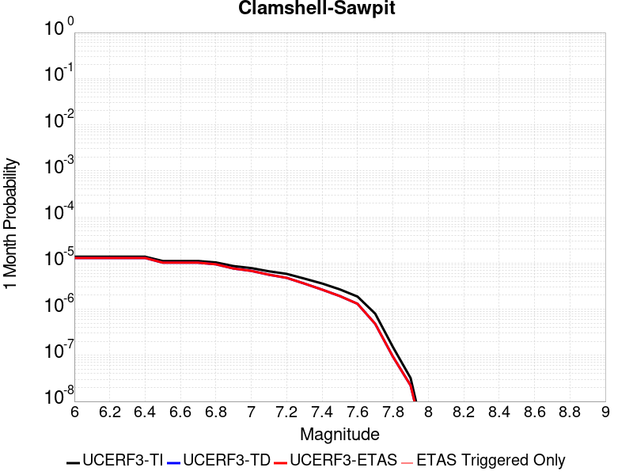 | 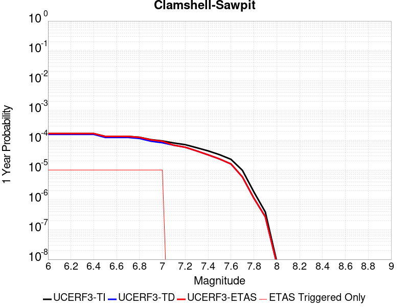 | 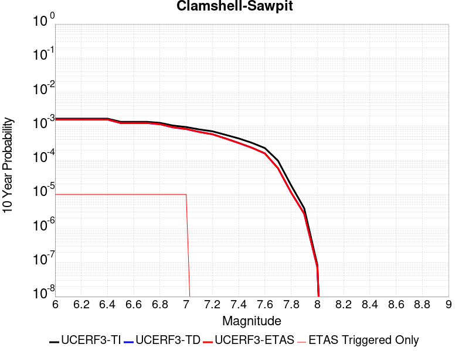 |

| Magnitude | 1 wk TI Prob | 1 wk TD Prob | 1 wk ETAS Prob | 1 wk ETAS/TD Gain | 1 wk ETAS Triggered Only | 1 mo TI Prob | 1 mo TD Prob | 1 mo ETAS Prob | 1 mo ETAS/TD Gain | 1 mo ETAS Triggered Only | 1 yr TI Prob | 1 yr TD Prob | 1 yr ETAS Prob | 1 yr ETAS/TD Gain | 1 yr ETAS Triggered Only | 10 yr TI Prob | 10 yr TD Prob | 10 yr ETAS Prob | 10 yr ETAS/TD Gain | 10 yr ETAS Triggered Only |
|-----|-----|-----|-----|-----|-----|-----|-----|-----|-----|-----|-----|-----|-----|-----|-----|-----|-----|-----|-----|-----|
| 6.0 | 3.202998E-6 | 3.012794E-6 | 3.012794E-6 | 1.0 | 0.0 | 1.3727062E-5 | 1.2911914E-5 | 1.2911914E-5 | 1.0 | 0.0 | 1.6711417E-4 | 1.5719203E-4 | 1.6719045E-4 | 1.0636065 | 1.0E-5 | 0.0016698855 | 0.0015708877 | 0.001580872 | 1.0063559 | 1.0E-5 |
| 6.1 | 3.202998E-6 | 3.012794E-6 | 3.012794E-6 | 1.0 | 0.0 | 1.3727062E-5 | 1.2911914E-5 | 1.2911914E-5 | 1.0 | 0.0 | 1.6711417E-4 | 1.5719203E-4 | 1.6719045E-4 | 1.0636065 | 1.0E-5 | 0.0016698855 | 0.0015708877 | 0.001580872 | 1.0063559 | 1.0E-5 |
| 6.2 | 3.202998E-6 | 3.012794E-6 | 3.012794E-6 | 1.0 | 0.0 | 1.3727062E-5 | 1.2911914E-5 | 1.2911914E-5 | 1.0 | 0.0 | 1.6711417E-4 | 1.5719203E-4 | 1.6719045E-4 | 1.0636065 | 1.0E-5 | 0.0016698855 | 0.0015708877 | 0.001580872 | 1.0063559 | 1.0E-5 |
| 6.3 | 3.202998E-6 | 3.012794E-6 | 3.012794E-6 | 1.0 | 0.0 | 1.3727062E-5 | 1.2911914E-5 | 1.2911914E-5 | 1.0 | 0.0 | 1.6711417E-4 | 1.5719203E-4 | 1.6719045E-4 | 1.0636065 | 1.0E-5 | 0.0016698855 | 0.0015708877 | 0.001580872 | 1.0063559 | 1.0E-5 |
| 6.4 | 3.202998E-6 | 3.012794E-6 | 3.012794E-6 | 1.0 | 0.0 | 1.3727062E-5 | 1.2911914E-5 | 1.2911914E-5 | 1.0 | 0.0 | 1.6711417E-4 | 1.5719203E-4 | 1.6719045E-4 | 1.0636065 | 1.0E-5 | 0.0016698855 | 0.0015708877 | 0.001580872 | 1.0063559 | 1.0E-5 |
| 6.5 | 2.5862723E-6 | 2.380801E-6 | 2.380801E-6 | 1.0 | 0.0 | 1.1083977E-5 | 1.02033955E-5 | 1.02033955E-5 | 1.0 | 0.0 | 1.3493907E-4 | 1.2421957E-4 | 1.3421832E-4 | 1.0804926 | 1.0E-5 | 0.0013485716 | 0.0012415316 | 0.0012515192 | 1.0080446 | 1.0E-5 |
| 6.6 | 2.5862723E-6 | 2.380801E-6 | 2.380801E-6 | 1.0 | 0.0 | 1.1083977E-5 | 1.02033955E-5 | 1.02033955E-5 | 1.0 | 0.0 | 1.3493907E-4 | 1.2421957E-4 | 1.3421832E-4 | 1.0804926 | 1.0E-5 | 0.0013485716 | 0.0012415316 | 0.0012515192 | 1.0080446 | 1.0E-5 |
| 6.7 | 2.5862723E-6 | 2.380801E-6 | 2.380801E-6 | 1.0 | 0.0 | 1.1083977E-5 | 1.02033955E-5 | 1.02033955E-5 | 1.0 | 0.0 | 1.3493907E-4 | 1.2421957E-4 | 1.3421832E-4 | 1.0804926 | 1.0E-5 | 0.0013485716 | 0.0012415316 | 0.0012515192 | 1.0080446 | 1.0E-5 |
| 6.8 | 2.4098806E-6 | 2.1977557E-6 | 2.1977557E-6 | 1.0 | 0.0 | 1.0328019E-5 | 9.41892E-6 | 9.41892E-6 | 1.0 | 0.0 | 1.2573638E-4 | 1.14669594E-4 | 1.2466844E-4 | 1.0871971 | 1.0E-5 | 0.0012566525 | 0.0011461308 | 0.0011561193 | 1.008715 | 1.0E-5 |
| 6.9 | 2.0073985E-6 | 1.7784461E-6 | 1.7784461E-6 | 1.0 | 0.0 | 8.603109E-6 | 7.62189E-6 | 7.62189E-6 | 1.0 | 0.0 | 1.0473781E-4 | 9.2792674E-5 | 1.02791746E-4 | 1.1077571 | 1.0E-5 | 0.0010468846 | 9.275512E-4 | 9.375419E-4 | 1.010771 | 1.0E-5 |
| 7.0 | 1.8166766E-6 | 1.5807292E-6 | 1.5807292E-6 | 1.0 | 0.0 | 7.785734E-6 | 6.774537E-6 | 6.774537E-6 | 1.0 | 0.0 | 9.478718E-5 | 8.247697E-5 | 9.247614E-5 | 1.121236 | 1.0E-5 | 9.4746763E-4 | 8.244736E-4 | 8.344654E-4 | 1.0121189 | 1.0E-5 |
| 7.1 | 1.5471421E-6 | 1.3053129E-6 | 1.3053129E-6 | 1.0 | 0.0 | 6.6305925E-6 | 5.594187E-6 | 5.594187E-6 | 1.0 | 0.0 | 8.072447E-5 | 6.8107154E-5 | 6.8107154E-5 | 1.0 | 0.0 | 8.0695155E-4 | 6.808682E-4 | 6.808682E-4 | 1.0 | 0.0 |
| 7.2 | 1.3608037E-6 | 1.1153592E-6 | 1.1153592E-6 | 1.0 | 0.0 | 5.8320024E-6 | 4.7801022E-6 | 4.7801022E-6 | 1.0 | 0.0 | 7.1002316E-5 | 5.8196238E-5 | 5.8196238E-5 | 1.0 | 0.0 | 7.097964E-4 | 5.818146E-4 | 5.818146E-4 | 1.0 | 0.0 |
| 7.3 | 1.0749634E-6 | 8.3843696E-7 | 8.3843696E-7 | 1.0 | 0.0 | 4.6069777E-6 | 3.5932965E-6 | 3.5932965E-6 | 1.0 | 0.0 | 5.608851E-5 | 4.3747532E-5 | 4.3747532E-5 | 1.0 | 0.0 | 5.6074356E-4 | 4.3739204E-4 | 4.3739204E-4 | 1.0 | 0.0 |
| 7.4 | 8.416856E-7 | 6.200135E-7 | 6.200135E-7 | 1.0 | 0.0 | 3.607219E-6 | 2.6571981E-6 | 2.6571981E-6 | 1.0 | 0.0 | 4.3917007E-5 | 3.2350927E-5 | 3.2350927E-5 | 1.0 | 0.0 | 4.390833E-4 | 3.2346416E-4 | 3.2346416E-4 | 1.0 | 0.0 |
| 7.5 | 6.2779594E-7 | 4.4969525E-7 | 4.4969525E-7 | 1.0 | 0.0 | 2.6905511E-6 | 1.927264E-6 | 1.927264E-6 | 1.0 | 0.0 | 3.275697E-5 | 2.3464207E-5 | 2.3464207E-5 | 1.0 | 0.0 | 3.275214E-4 | 2.3461916E-4 | 2.3461916E-4 | 1.0 | 0.0 |
| 7.6 | 4.3822078E-7 | 3.0595925E-7 | 3.0595925E-7 | 1.0 | 0.0 | 1.8780877E-6 | 1.3112533E-6 | 1.3112533E-6 | 1.0 | 0.0 | 2.2865479E-5 | 1.5964408E-5 | 1.5964408E-5 | 1.0 | 0.0 | 2.2863125E-4 | 1.5963416E-4 | 1.5963416E-4 | 1.0 | 0.0 |
| 7.7 | 1.8704569E-7 | 1.1238246E-7 | 1.1238246E-7 | 1.0 | 0.0 | 8.0162414E-7 | 4.81639E-7 | 4.81639E-7 | 1.0 | 0.0 | 9.75973E-6 | 5.86394E-6 | 5.86394E-6 | 1.0 | 0.0 | 9.7593016E-5 | 5.8637914E-5 | 5.8637914E-5 | 1.0 | 0.0 |
| 7.8 | 3.5378733E-8 | 2.1838607E-8 | 2.1838607E-8 | 1.0 | 0.0 | 1.5162313E-7 | 9.3594025E-8 | 9.3594025E-8 | 1.0 | 0.0 | 1.84601E-6 | 1.1395067E-6 | 1.1395067E-6 | 1.0 | 0.0 | 1.8459947E-5 | 1.1395012E-5 | 1.1395012E-5 | 1.0 | 0.0 |
| 7.9 | 7.504945E-9 | 5.192124E-9 | 5.192124E-9 | 1.0 | 0.0 | 3.2164053E-8 | 2.225196E-8 | 2.225196E-8 | 1.0 | 0.0 | 3.9159727E-7 | 2.7091758E-7 | 2.7091758E-7 | 1.0 | 0.0 | 3.915966E-6 | 2.7091733E-6 | 2.7091733E-6 | 1.0 | 0.0 |
| 8.0 | 1.6554036E-10 | 1.4180834E-10 | 1.4180834E-10 | 1.0 | 0.0 | 7.0945894E-10 | 6.0774985E-10 | 6.0774985E-10 | 1.0 | 0.0 | 8.637662E-9 | 7.399355E-9 | 7.399355E-9 | 1.0 | 0.0 | 8.6376616E-8 | 7.399355E-8 | 7.399355E-8 | 1.0 | 0.0 |

## Calaveras (Central) 2011 CFM
*[(top)](#table-of-contents)*

| 1 Week | 1 Month | 1 Year | 10 Year |
|-----|-----|-----|-----|
| 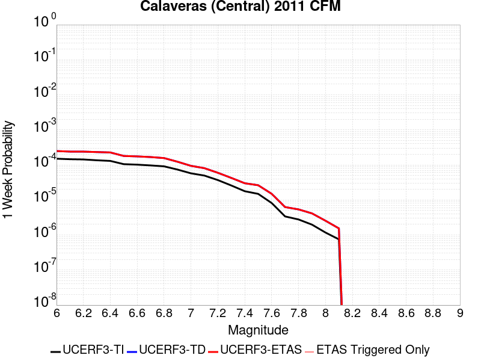 | 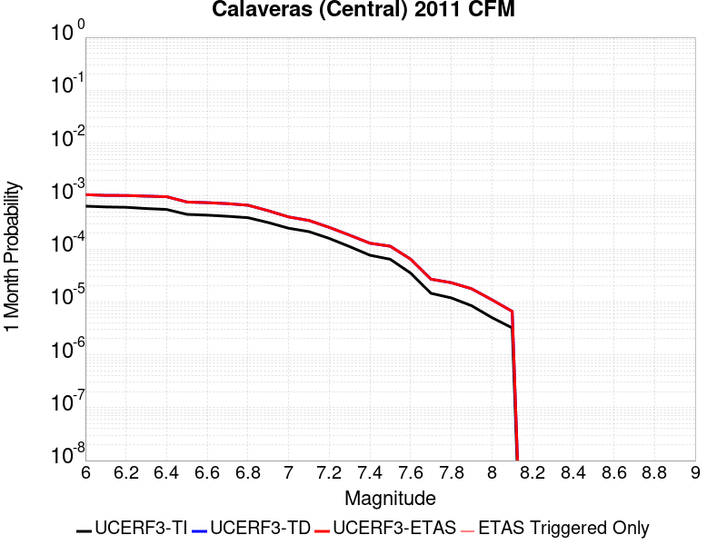 |  | 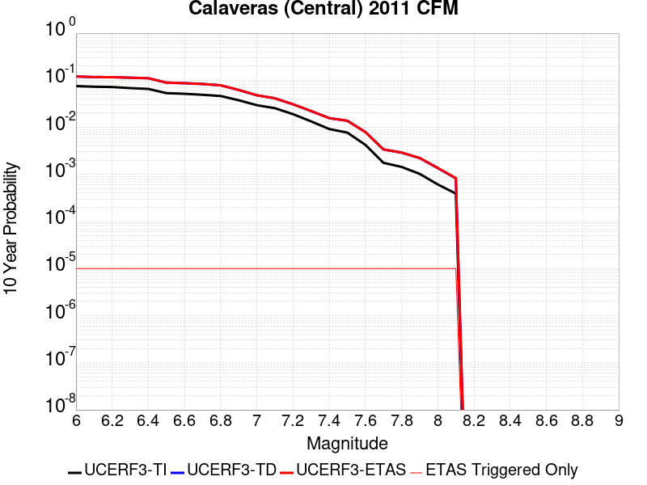 |

| Magnitude | 1 wk TI Prob | 1 wk TD Prob | 1 wk ETAS Prob | 1 wk ETAS/TD Gain | 1 wk ETAS Triggered Only | 1 mo TI Prob | 1 mo TD Prob | 1 mo ETAS Prob | 1 mo ETAS/TD Gain | 1 mo ETAS Triggered Only | 1 yr TI Prob | 1 yr TD Prob | 1 yr ETAS Prob | 1 yr ETAS/TD Gain | 1 yr ETAS Triggered Only | 10 yr TI Prob | 10 yr TD Prob | 10 yr ETAS Prob | 10 yr ETAS/TD Gain | 10 yr ETAS Triggered Only |
|-----|-----|-----|-----|-----|-----|-----|-----|-----|-----|-----|-----|-----|-----|-----|-----|-----|-----|-----|-----|-----|
| 6.0 | 1.5010907E-4 | 2.4792104E-4 | 2.4792104E-4 | 1.0 | 0.0 | 6.4316596E-4 | 0.001062098 | 0.001062098 | 1.0 | 0.0 | 0.0078024664 | 0.012854148 | 0.012854148 | 1.0 | 0.0 | 0.07534136 | 0.120438896 | 0.120447695 | 1.0000731 | 1.0E-5 |
| 6.1 | 1.4521465E-4 | 2.3955994E-4 | 2.3955994E-4 | 1.0 | 0.0 | 6.222001E-4 | 0.0010262942 | 0.0010262942 | 1.0 | 0.0 | 0.0075490056 | 0.0124233905 | 0.0124233905 | 1.0 | 0.0 | 0.07297657 | 0.116710566 | 0.116719395 | 1.0000757 | 1.0E-5 |
| 6.2 | 1.429998E-4 | 2.3887197E-4 | 2.3887197E-4 | 1.0 | 0.0 | 6.127123E-4 | 0.0010233481 | 0.0010233481 | 1.0 | 0.0 | 0.007434286 | 0.012387964 | 0.012387964 | 1.0 | 0.0 | 0.07190444 | 0.11636428 | 0.116373114 | 1.0000759 | 1.0E-5 |
| 6.3 | 1.3536277E-4 | 2.3218426E-4 | 2.3218426E-4 | 1.0 | 0.0 | 5.799972E-4 | 9.947086E-4 | 9.947086E-4 | 1.0 | 0.0 | 0.0070386264 | 0.012044075 | 0.012044075 | 1.0 | 0.0 | 0.0681982 | 0.11327621 | 0.11328508 | 1.0000783 | 1.0E-5 |
| 6.4 | 1.2993296E-4 | 2.2641828E-4 | 2.2641828E-4 | 1.0 | 0.0 | 5.5673666E-4 | 9.700158E-4 | 9.700158E-4 | 1.0 | 0.0 | 0.006757223 | 0.011746811 | 0.011746811 | 1.0 | 0.0 | 0.06555412 | 0.110553645 | 0.11056254 | 1.0000805 | 1.0E-5 |
| 6.5 | 1.0498927E-4 | 1.7989619E-4 | 1.7989619E-4 | 1.0 | 0.0 | 4.498764E-4 | 7.7075727E-4 | 7.7075727E-4 | 1.0 | 0.0 | 0.005463498 | 0.009343347 | 0.009343347 | 1.0 | 0.0 | 0.053311124 | 0.08923471 | 0.089243814 | 1.000102 | 1.0E-5 |
| 6.6 | 1.0157505E-4 | 1.747708E-4 | 1.747708E-4 | 1.0 | 0.0 | 4.35249E-4 | 7.4880413E-4 | 7.4880413E-4 | 1.0 | 0.0 | 0.0052862884 | 0.009078382 | 0.009078382 | 1.0 | 0.0 | 0.05162293 | 0.086812116 | 0.08682125 | 1.0001051 | 1.0E-5 |
| 6.7 | 9.660386E-5 | 1.6736341E-4 | 1.6736341E-4 | 1.0 | 0.0 | 4.1395082E-4 | 7.17076E-4 | 7.17076E-4 | 1.0 | 0.0 | 0.0050282106 | 0.008695267 | 0.008695267 | 1.0 | 0.0 | 0.049159497 | 0.08330137 | 0.08331054 | 1.00011 | 1.0E-5 |
| 6.8 | 9.089927E-5 | 1.5650596E-4 | 1.5650596E-4 | 1.0 | 0.0 | 3.8951015E-4 | 6.705686E-4 | 6.705686E-4 | 1.0 | 0.0 | 0.0047319788 | 0.008133383 | 0.008133383 | 1.0 | 0.0 | 0.046324775 | 0.07819363 | 0.07820285 | 1.0001179 | 1.0E-5 |
| 6.9 | 7.353187E-5 | 1.2301802E-4 | 1.2301802E-4 | 1.0 | 0.0 | 3.150985E-4 | 5.2711414E-4 | 5.2711414E-4 | 1.0 | 0.0 | 0.0038295772 | 0.006398851 | 0.006398851 | 1.0 | 0.0 | 0.037642512 | 0.06221786 | 0.062227238 | 1.0001507 | 1.0E-5 |
| 7.0 | 5.746064E-5 | 9.3949035E-5 | 9.3949035E-5 | 1.0 | 0.0 | 2.4623662E-4 | 4.0257693E-4 | 4.0257693E-4 | 1.0 | 0.0 | 0.0029938098 | 0.0048904303 | 0.0048904303 | 1.0 | 0.0 | 0.02953797 | 0.048016015 | 0.048025534 | 1.0001982 | 1.0E-5 |
| 7.1 | 4.9557195E-5 | 8.056884E-5 | 8.056884E-5 | 1.0 | 0.0 | 2.123707E-4 | 3.452497E-4 | 3.452497E-4 | 1.0 | 0.0 | 0.0025825473 | 0.004195376 | 0.004195376 | 1.0 | 0.0 | 0.0255274 | 0.041394535 | 0.04140412 | 1.0002316 | 1.0E-5 |
| 7.2 | 3.687595E-5 | 5.9567446E-5 | 5.9567446E-5 | 1.0 | 0.0 | 1.5803022E-4 | 2.5526423E-4 | 2.5526423E-4 | 1.0 | 0.0 | 0.0019223199 | 0.003103442 | 0.003103442 | 1.0 | 0.0 | 0.01905776 | 0.030904783 | 0.030914474 | 1.0003135 | 1.0E-5 |
| 7.3 | 2.5846984E-5 | 4.251281E-5 | 4.251281E-5 | 1.0 | 0.0 | 1.1076809E-4 | 1.8218512E-4 | 1.8218512E-4 | 1.0 | 0.0 | 0.0013477671 | 0.002215865 | 0.002215865 | 1.0 | 0.0 | 0.013396223 | 0.022195721 | 0.0222055 | 1.0004405 | 1.0E-5 |
| 7.4 | 1.7747854E-5 | 2.9949968E-5 | 2.9949968E-5 | 1.0 | 0.0 | 7.6060016E-5 | 1.2835072E-4 | 1.2835072E-4 | 1.0 | 0.0 | 9.2563726E-4 | 0.0015615526 | 0.0015615526 | 1.0 | 0.0 | 0.009217911 | 0.015715946 | 0.015725788 | 1.0006263 | 1.0E-5 |
| 7.5 | 1.4883479E-5 | 2.625655E-5 | 2.625655E-5 | 1.0 | 0.0 | 6.378478E-5 | 1.1252324E-4 | 1.1252324E-4 | 1.0 | 0.0 | 7.76303E-4 | 0.0013691122 | 0.0013691122 | 1.0 | 0.0 | 0.0077359667 | 0.013808859 | 0.01381872 | 1.0007142 | 1.0E-5 |
| 7.6 | 8.166975E-6 | 1.4974178E-5 | 1.4974178E-5 | 1.0 | 0.0 | 3.5000852E-5 | 6.417347E-5 | 6.417347E-5 | 1.0 | 0.0 | 4.2605202E-4 | 7.8103336E-4 | 7.8103336E-4 | 1.0 | 0.0 | 0.004252361 | 0.007945094 | 0.007955015 | 1.0012486 | 1.0E-5 |
| 7.7 | 3.3858064E-6 | 6.2592885E-6 | 6.2592885E-6 | 1.0 | 0.0 | 1.4510518E-5 | 2.6825246E-5 | 2.6825246E-5 | 1.0 | 0.0 | 1.7665124E-4 | 3.265485E-4 | 3.265485E-4 | 1.0 | 0.0 | 0.0017651088 | 0.0033908836 | 0.0034008496 | 1.0029391 | 1.0E-5 |
| 7.8 | 2.7721615E-6 | 5.3710314E-6 | 5.3710314E-6 | 1.0 | 0.0 | 1.1880637E-5 | 2.3018503E-5 | 2.3018503E-5 | 1.0 | 0.0 | 1.4463716E-4 | 2.8021427E-4 | 2.8021427E-4 | 1.0 | 0.0 | 0.0014454306 | 0.0029097511 | 0.002919722 | 1.0034267 | 1.0E-5 |
| 7.9 | 1.9736292E-6 | 4.131897E-6 | 4.131897E-6 | 1.0 | 0.0 | 8.4583835E-6 | 1.7708011E-5 | 1.7708011E-5 | 1.0 | 0.0 | 1.0297595E-4 | 2.1557375E-4 | 2.1557375E-4 | 1.0 | 0.0 | 0.0010292825 | 0.0022253138 | 0.0022352915 | 1.0044837 | 1.0E-5 |
| 8.0 | 1.1767289E-6 | 2.556598E-6 | 2.556598E-6 | 1.0 | 0.0 | 5.0431145E-6 | 1.0956803E-5 | 1.0956803E-5 | 1.0 | 0.0 | 6.139818E-5 | 1.3339093E-4 | 1.3339093E-4 | 1.0 | 0.0 | 6.1381224E-4 | 0.0013671297 | 0.0013771161 | 1.0073045 | 1.0E-5 |
| 8.1 | 7.5112825E-7 | 1.5423317E-6 | 1.5423317E-6 | 1.0 | 0.0 | 3.2191172E-6 | 6.6099765E-6 | 6.6099765E-6 | 1.0 | 0.0 | 3.9192048E-5 | 8.047352E-5 | 8.047352E-5 | 1.0 | 0.0 | 3.9185135E-4 | 8.242309E-4 | 8.3422265E-4 | 1.0121225 | 1.0E-5 |

## Pitas Point (Lower)-Montalvo
*[(top)](#table-of-contents)*

| 1 Week | 1 Month | 1 Year | 10 Year |
|-----|-----|-----|-----|
| 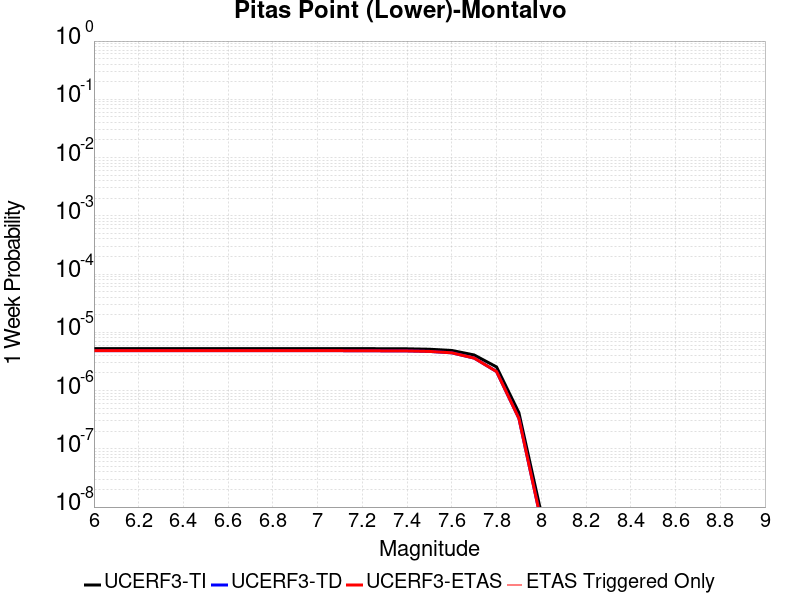 |  | 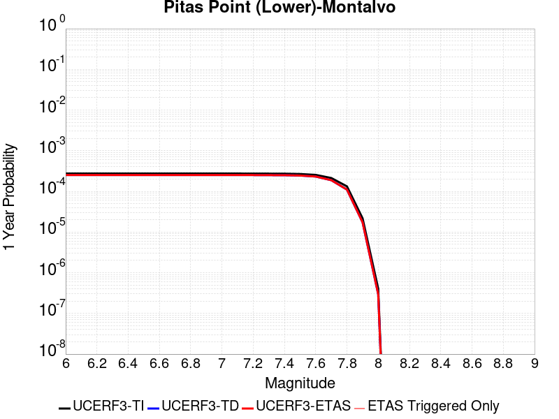 |  |

| Magnitude | 1 wk TI Prob | 1 wk TD Prob | 1 wk ETAS Prob | 1 wk ETAS/TD Gain | 1 wk ETAS Triggered Only | 1 mo TI Prob | 1 mo TD Prob | 1 mo ETAS Prob | 1 mo ETAS/TD Gain | 1 mo ETAS Triggered Only | 1 yr TI Prob | 1 yr TD Prob | 1 yr ETAS Prob | 1 yr ETAS/TD Gain | 1 yr ETAS Triggered Only | 10 yr TI Prob | 10 yr TD Prob | 10 yr ETAS Prob | 10 yr ETAS/TD Gain | 10 yr ETAS Triggered Only |
|-----|-----|-----|-----|-----|-----|-----|-----|-----|-----|-----|-----|-----|-----|-----|-----|-----|-----|-----|-----|-----|
| 6.0 | 5.2543637E-6 | 4.8379316E-6 | 4.8379316E-6 | 1.0 | 0.0 | 2.2518509E-5 | 2.0733829E-5 | 2.0733829E-5 | 1.0 | 0.0 | 2.7412834E-4 | 2.5240544E-4 | 2.5240544E-4 | 1.0 | 0.0 | 0.0027379042 | 0.0025212201 | 0.0025311948 | 1.0039563 | 1.0E-5 |
| 6.1 | 5.2543637E-6 | 4.8379316E-6 | 4.8379316E-6 | 1.0 | 0.0 | 2.2518509E-5 | 2.0733829E-5 | 2.0733829E-5 | 1.0 | 0.0 | 2.7412834E-4 | 2.5240544E-4 | 2.5240544E-4 | 1.0 | 0.0 | 0.0027379042 | 0.0025212201 | 0.0025311948 | 1.0039563 | 1.0E-5 |
| 6.2 | 5.2543637E-6 | 4.8379316E-6 | 4.8379316E-6 | 1.0 | 0.0 | 2.2518509E-5 | 2.0733829E-5 | 2.0733829E-5 | 1.0 | 0.0 | 2.7412834E-4 | 2.5240544E-4 | 2.5240544E-4 | 1.0 | 0.0 | 0.0027379042 | 0.0025212201 | 0.0025311948 | 1.0039563 | 1.0E-5 |
| 6.3 | 5.2543637E-6 | 4.8379316E-6 | 4.8379316E-6 | 1.0 | 0.0 | 2.2518509E-5 | 2.0733829E-5 | 2.0733829E-5 | 1.0 | 0.0 | 2.7412834E-4 | 2.5240544E-4 | 2.5240544E-4 | 1.0 | 0.0 | 0.0027379042 | 0.0025212201 | 0.0025311948 | 1.0039563 | 1.0E-5 |
| 6.4 | 5.2543637E-6 | 4.8379316E-6 | 4.8379316E-6 | 1.0 | 0.0 | 2.2518509E-5 | 2.0733829E-5 | 2.0733829E-5 | 1.0 | 0.0 | 2.7412834E-4 | 2.5240544E-4 | 2.5240544E-4 | 1.0 | 0.0 | 0.0027379042 | 0.0025212201 | 0.0025311948 | 1.0039563 | 1.0E-5 |
| 6.5 | 5.2543637E-6 | 4.8379316E-6 | 4.8379316E-6 | 1.0 | 0.0 | 2.2518509E-5 | 2.0733829E-5 | 2.0733829E-5 | 1.0 | 0.0 | 2.7412834E-4 | 2.5240544E-4 | 2.5240544E-4 | 1.0 | 0.0 | 0.0027379042 | 0.0025212201 | 0.0025311948 | 1.0039563 | 1.0E-5 |
| 6.6 | 5.2543637E-6 | 4.8379316E-6 | 4.8379316E-6 | 1.0 | 0.0 | 2.2518509E-5 | 2.0733829E-5 | 2.0733829E-5 | 1.0 | 0.0 | 2.7412834E-4 | 2.5240544E-4 | 2.5240544E-4 | 1.0 | 0.0 | 0.0027379042 | 0.0025212201 | 0.0025311948 | 1.0039563 | 1.0E-5 |
| 6.7 | 5.2543637E-6 | 4.8379316E-6 | 4.8379316E-6 | 1.0 | 0.0 | 2.2518509E-5 | 2.0733829E-5 | 2.0733829E-5 | 1.0 | 0.0 | 2.7412834E-4 | 2.5240544E-4 | 2.5240544E-4 | 1.0 | 0.0 | 0.0027379042 | 0.0025212201 | 0.0025311948 | 1.0039563 | 1.0E-5 |
| 6.8 | 5.2543637E-6 | 4.8379316E-6 | 4.8379316E-6 | 1.0 | 0.0 | 2.2518509E-5 | 2.0733829E-5 | 2.0733829E-5 | 1.0 | 0.0 | 2.7412834E-4 | 2.5240544E-4 | 2.5240544E-4 | 1.0 | 0.0 | 0.0027379042 | 0.0025212201 | 0.0025311948 | 1.0039563 | 1.0E-5 |
| 6.9 | 5.2543637E-6 | 4.8379316E-6 | 4.8379316E-6 | 1.0 | 0.0 | 2.2518509E-5 | 2.0733829E-5 | 2.0733829E-5 | 1.0 | 0.0 | 2.7412834E-4 | 2.5240544E-4 | 2.5240544E-4 | 1.0 | 0.0 | 0.0027379042 | 0.0025212201 | 0.0025311948 | 1.0039563 | 1.0E-5 |
| 7.0 | 5.2543637E-6 | 4.8379316E-6 | 4.8379316E-6 | 1.0 | 0.0 | 2.2518509E-5 | 2.0733829E-5 | 2.0733829E-5 | 1.0 | 0.0 | 2.7412834E-4 | 2.5240544E-4 | 2.5240544E-4 | 1.0 | 0.0 | 0.0027379042 | 0.0025212201 | 0.0025311948 | 1.0039563 | 1.0E-5 |
| 7.1 | 5.2543637E-6 | 4.8379316E-6 | 4.8379316E-6 | 1.0 | 0.0 | 2.2518509E-5 | 2.0733829E-5 | 2.0733829E-5 | 1.0 | 0.0 | 2.7412834E-4 | 2.5240544E-4 | 2.5240544E-4 | 1.0 | 0.0 | 0.0027379042 | 0.0025212201 | 0.0025311948 | 1.0039563 | 1.0E-5 |
| 7.2 | 5.2458695E-6 | 4.8290854E-6 | 4.8290854E-6 | 1.0 | 0.0 | 2.2482105E-5 | 2.0695918E-5 | 2.0695918E-5 | 1.0 | 0.0 | 2.7368523E-4 | 2.5194397E-4 | 2.5194397E-4 | 1.0 | 0.0 | 0.0027334841 | 0.002516616 | 0.0025265906 | 1.0039636 | 1.0E-5 |
| 7.3 | 5.22665E-6 | 4.8090023E-6 | 4.8090023E-6 | 1.0 | 0.0 | 2.2399736E-5 | 2.0609848E-5 | 2.0609848E-5 | 1.0 | 0.0 | 2.7268266E-4 | 2.5089632E-4 | 2.5089632E-4 | 1.0 | 0.0 | 0.002723483 | 0.0025061632 | 0.0025161381 | 1.0039802 | 1.0E-5 |
| 7.4 | 5.210642E-6 | 4.7922144E-6 | 4.7922144E-6 | 1.0 | 0.0 | 2.233113E-5 | 2.0537902E-5 | 2.0537902E-5 | 1.0 | 0.0 | 2.718476E-4 | 2.500206E-4 | 2.500206E-4 | 1.0 | 0.0 | 0.002715153 | 0.0024974253 | 0.0025074005 | 1.0039941 | 1.0E-5 |
| 7.5 | 5.1226016E-6 | 4.7001004E-6 | 4.7001004E-6 | 1.0 | 0.0 | 2.1953823E-5 | 2.0143132E-5 | 2.0143132E-5 | 1.0 | 0.0 | 2.67255E-4 | 2.4521534E-4 | 2.4521534E-4 | 1.0 | 0.0 | 0.0026693381 | 0.0024494794 | 0.0024594548 | 1.0040725 | 1.0E-5 |
| 7.6 | 4.8796987E-6 | 4.4449976E-6 | 4.4449976E-6 | 1.0 | 0.0 | 2.0912828E-5 | 1.904985E-5 | 1.904985E-5 | 1.0 | 0.0 | 2.5458392E-4 | 2.3190756E-4 | 2.3190756E-4 | 1.0 | 0.0 | 0.0025429246 | 0.002316686 | 0.002326663 | 1.0043066 | 1.0E-5 |
| 7.7 | 4.0834398E-6 | 3.6091594E-6 | 3.6091594E-6 | 1.0 | 0.0 | 1.7500339E-5 | 1.5467736E-5 | 1.5467736E-5 | 1.0 | 0.0 | 2.1304579E-4 | 1.8830365E-4 | 1.8830365E-4 | 1.0 | 0.0 | 0.0021284167 | 0.0018814646 | 0.0018814646 | 1.0 | 0.0 |
| 7.8 | 2.5445438E-6 | 2.1212552E-6 | 2.1212552E-6 | 1.0 | 0.0 | 1.0905142E-5 | 9.091063E-6 | 9.091063E-6 | 1.0 | 0.0 | 1.3276201E-4 | 1.10678106E-4 | 1.10678106E-4 | 1.0 | 0.0 | 0.0013268272 | 0.0011062345 | 0.0011062345 | 1.0 | 0.0 |
| 7.9 | 4.1677114E-7 | 3.3294145E-7 | 3.3294145E-7 | 1.0 | 0.0 | 1.7861609E-6 | 1.4268912E-6 | 1.4268912E-6 | 1.0 | 0.0 | 2.1746291E-5 | 1.7372266E-5 | 1.7372266E-5 | 1.0 | 0.0 | 2.1744163E-4 | 1.7370938E-4 | 1.7370938E-4 | 1.0 | 0.0 |
| 8.0 | 7.791402E-9 | 5.683585E-9 | 5.683585E-9 | 1.0 | 0.0 | 3.3391725E-8 | 2.4358222E-8 | 2.4358222E-8 | 1.0 | 0.0 | 4.0654416E-7 | 2.9656135E-7 | 2.9656135E-7 | 1.0 | 0.0 | 4.065434E-6 | 2.9656114E-6 | 2.9656114E-6 | 1.0 | 0.0 |

## Great Valley 09 (Laguna Seca)
*[(top)](#table-of-contents)*

| 1 Week | 1 Month | 1 Year | 10 Year |
|-----|-----|-----|-----|
| 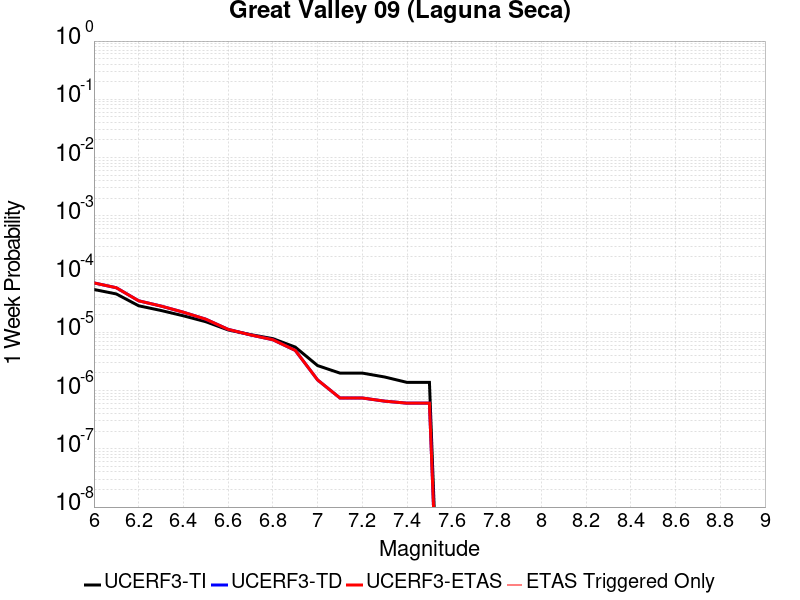 | 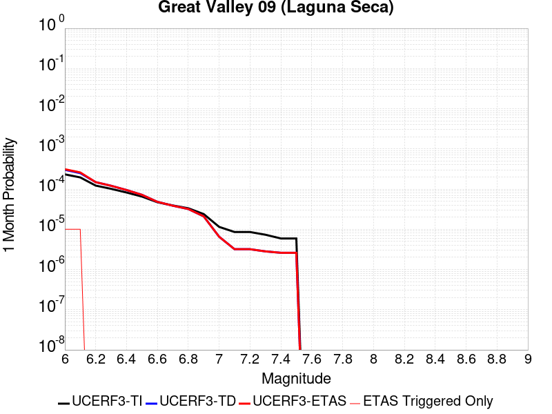 |  |  |

| Magnitude | 1 wk TI Prob | 1 wk TD Prob | 1 wk ETAS Prob | 1 wk ETAS/TD Gain | 1 wk ETAS Triggered Only | 1 mo TI Prob | 1 mo TD Prob | 1 mo ETAS Prob | 1 mo ETAS/TD Gain | 1 mo ETAS Triggered Only | 1 yr TI Prob | 1 yr TD Prob | 1 yr ETAS Prob | 1 yr ETAS/TD Gain | 1 yr ETAS Triggered Only | 10 yr TI Prob | 10 yr TD Prob | 10 yr ETAS Prob | 10 yr ETAS/TD Gain | 10 yr ETAS Triggered Only |
|-----|-----|-----|-----|-----|-----|-----|-----|-----|-----|-----|-----|-----|-----|-----|-----|-----|-----|-----|-----|-----|
| 6.0 | 5.4353277E-5 | 7.0507056E-5 | 7.0507056E-5 | 1.0 | 0.0 | 2.3292181E-4 | 3.0213385E-4 | 3.1213084E-4 | 1.033088 | 1.0E-5 | 0.0028321352 | 0.0036724159 | 0.0036823791 | 1.002713 | 1.0E-5 | 0.02796312 | 0.036117733 | 0.036127374 | 1.0002669 | 1.0E-5 |
| 6.1 | 4.5578287E-5 | 5.8225003E-5 | 5.8225003E-5 | 1.0 | 0.0 | 1.953209E-4 | 2.4950696E-4 | 2.5950448E-4 | 1.040069 | 1.0E-5 | 0.0023754383 | 0.0030336163 | 0.0030435862 | 1.0032864 | 1.0E-5 | 0.023502063 | 0.029921366 | 0.029931067 | 1.0003242 | 1.0E-5 |
| 6.2 | 2.8536782E-5 | 3.47392E-5 | 3.47392E-5 | 1.0 | 0.0 | 1.2229476E-4 | 1.4886782E-4 | 1.4886782E-4 | 1.0 | 0.0 | 0.0014879217 | 0.001810913 | 0.001810913 | 1.0 | 0.0 | 0.014779986 | 0.017959105 | 0.017959105 | 1.0 | 0.0 |
| 6.3 | 2.3698774E-5 | 2.8214738E-5 | 2.8214738E-5 | 1.0 | 0.0 | 1.01562226E-4 | 1.2090859E-4 | 1.2090859E-4 | 1.0 | 0.0 | 0.0012358186 | 0.0014711015 | 0.0014711015 | 1.0 | 0.0 | 0.012289686 | 0.01461211 | 0.01461211 | 1.0 | 0.0 |
| 6.4 | 1.9191197E-5 | 2.212417E-5 | 2.212417E-5 | 1.0 | 0.0 | 8.2245395E-5 | 9.480822E-5 | 9.480822E-5 | 1.0 | 0.0 | 0.0010008777 | 0.001153699 | 0.001153699 | 1.0 | 0.0 | 0.009963818 | 0.011477509 | 0.011477509 | 1.0 | 0.0 |
| 6.5 | 1.5203241E-5 | 1.6802813E-5 | 1.6802813E-5 | 1.0 | 0.0 | 6.5155116E-5 | 7.20038E-5 | 7.20038E-5 | 1.0 | 0.0 | 7.9297484E-4 | 8.7630237E-4 | 8.7630237E-4 | 1.0 | 0.0 | 0.007901512 | 0.008729897 | 0.008729897 | 1.0 | 0.0 |
| 6.6 | 1.0984925E-5 | 1.1242986E-5 | 1.1242986E-5 | 1.0 | 0.0 | 4.70774E-5 | 4.8183338E-5 | 4.8183338E-5 | 1.0 | 0.0 | 5.730166E-4 | 5.864769E-4 | 5.864769E-4 | 1.0 | 0.0 | 0.005715413 | 0.005849688 | 0.005849688 | 1.0 | 0.0 |
| 6.7 | 9.134616E-6 | 9.020192E-6 | 9.020192E-6 | 1.0 | 0.0 | 3.9147766E-5 | 3.8657403E-5 | 3.8657403E-5 | 1.0 | 0.0 | 4.7651984E-4 | 4.7055463E-4 | 4.7055463E-4 | 1.0 | 0.0 | 0.004754993 | 0.0046958276 | 0.0046958276 | 1.0 | 0.0 |
| 6.8 | 7.785589E-6 | 7.4521886E-6 | 7.4521886E-6 | 1.0 | 0.0 | 3.3366385E-5 | 3.1937572E-5 | 3.1937572E-5 | 1.0 | 0.0 | 4.0616E-4 | 3.8877258E-4 | 3.8877258E-4 | 1.0 | 0.0 | 0.0040541845 | 0.0038811285 | 0.0038811285 | 1.0 | 0.0 |
| 6.9 | 5.579095E-6 | 4.898653E-6 | 4.898653E-6 | 1.0 | 0.0 | 2.3910188E-5 | 2.0994066E-5 | 2.0994066E-5 | 1.0 | 0.0 | 2.9106764E-4 | 2.5557415E-4 | 2.5557415E-4 | 1.0 | 0.0 | 0.002906867 | 0.0025529398 | 0.0025529398 | 1.0 | 0.0 |
| 7.0 | 2.6816688E-6 | 1.5216567E-6 | 1.5216567E-6 | 1.0 | 0.0 | 1.1492816E-5 | 6.5213703E-6 | 6.5213703E-6 | 1.0 | 0.0 | 1.3991605E-4 | 7.939488E-5 | 7.939488E-5 | 1.0 | 0.0 | 0.0013982799 | 7.9367385E-4 | 7.9367385E-4 | 1.0 | 0.0 |
| 7.1 | 1.9951021E-6 | 7.454056E-7 | 7.454056E-7 | 1.0 | 0.0 | 8.55041E-6 | 3.1945917E-6 | 3.1945917E-6 | 1.0 | 0.0 | 1.0409627E-4 | 3.8893504E-5 | 3.8893504E-5 | 1.0 | 0.0 | 0.0010404752 | 3.888711E-4 | 3.888711E-4 | 1.0 | 0.0 |
| 7.2 | 1.9951021E-6 | 7.454056E-7 | 7.454056E-7 | 1.0 | 0.0 | 8.55041E-6 | 3.1945917E-6 | 3.1945917E-6 | 1.0 | 0.0 | 1.0409627E-4 | 3.8893504E-5 | 3.8893504E-5 | 1.0 | 0.0 | 0.0010404752 | 3.888711E-4 | 3.888711E-4 | 1.0 | 0.0 |
| 7.3 | 1.7087556E-6 | 6.5790726E-7 | 6.5790726E-7 | 1.0 | 0.0 | 7.3232177E-6 | 2.8195998E-6 | 2.8195998E-6 | 1.0 | 0.0 | 8.915652E-5 | 3.4328128E-5 | 3.4328128E-5 | 1.0 | 0.0 | 8.9120766E-4 | 3.432323E-4 | 3.432323E-4 | 1.0 | 0.0 |
| 7.4 | 1.3804846E-6 | 6.07401E-7 | 6.07401E-7 | 1.0 | 0.0 | 5.916349E-6 | 2.6031448E-6 | 2.6031448E-6 | 1.0 | 0.0 | 7.2029165E-5 | 3.1692867E-5 | 3.1692867E-5 | 1.0 | 0.0 | 7.200583E-4 | 3.1688748E-4 | 3.1688748E-4 | 1.0 | 0.0 |
| 7.5 | 1.3804846E-6 | 6.07401E-7 | 6.07401E-7 | 1.0 | 0.0 | 5.916349E-6 | 2.6031448E-6 | 2.6031448E-6 | 1.0 | 0.0 | 7.2029165E-5 | 3.1692867E-5 | 3.1692867E-5 | 1.0 | 0.0 | 7.200583E-4 | 3.1688748E-4 | 3.1688748E-4 | 1.0 | 0.0 |

## Cedar Mtn-Mahogany Mtn
*[(top)](#table-of-contents)*

| 1 Week | 1 Month | 1 Year | 10 Year |
|-----|-----|-----|-----|
|  |  |  |  |

| Magnitude | 1 wk TI Prob | 1 wk TD Prob | 1 wk ETAS Prob | 1 wk ETAS/TD Gain | 1 wk ETAS Triggered Only | 1 mo TI Prob | 1 mo TD Prob | 1 mo ETAS Prob | 1 mo ETAS/TD Gain | 1 mo ETAS Triggered Only | 1 yr TI Prob | 1 yr TD Prob | 1 yr ETAS Prob | 1 yr ETAS/TD Gain | 1 yr ETAS Triggered Only | 10 yr TI Prob | 10 yr TD Prob | 10 yr ETAS Prob | 10 yr ETAS/TD Gain | 10 yr ETAS Triggered Only |
|-----|-----|-----|-----|-----|-----|-----|-----|-----|-----|-----|-----|-----|-----|-----|-----|-----|-----|-----|-----|-----|
| 6.0 | 2.7763876E-5 | 2.9589271E-5 | 2.9589271E-5 | 1.0 | 0.0 | 1.1898261E-4 | 1.2680539E-4 | 1.3680413E-4 | 1.078851 | 1.0E-5 | 0.0014476506 | 0.0015428324 | 0.001552817 | 1.0064716 | 1.0E-5 | 0.0143825635 | 0.015328434 | 0.015338281 | 1.0006424 | 1.0E-5 |
| 6.1 | 1.6162443E-5 | 1.7143182E-5 | 1.7143182E-5 | 1.0 | 0.0 | 6.926578E-5 | 7.3468815E-5 | 7.3468815E-5 | 1.0 | 0.0 | 8.4298453E-4 | 8.9413347E-4 | 8.9413347E-4 | 1.0 | 0.0 | 0.008397939 | 0.008907171 | 0.008907171 | 1.0 | 0.0 |
| 6.2 | 1.6162443E-5 | 1.7143182E-5 | 1.7143182E-5 | 1.0 | 0.0 | 6.926578E-5 | 7.3468815E-5 | 7.3468815E-5 | 1.0 | 0.0 | 8.4298453E-4 | 8.9413347E-4 | 8.9413347E-4 | 1.0 | 0.0 | 0.008397939 | 0.008907171 | 0.008907171 | 1.0 | 0.0 |
| 6.3 | 9.746053E-6 | 1.0303274E-5 | 1.0303274E-5 | 1.0 | 0.0 | 4.1768133E-5 | 4.4156168E-5 | 4.4156168E-5 | 1.0 | 0.0 | 5.0840835E-4 | 5.3747284E-4 | 5.3747284E-4 | 1.0 | 0.0 | 0.0050724675 | 0.005362148 | 0.005362148 | 1.0 | 0.0 |
| 6.4 | 9.746053E-6 | 1.0303274E-5 | 1.0303274E-5 | 1.0 | 0.0 | 4.1768133E-5 | 4.4156168E-5 | 4.4156168E-5 | 1.0 | 0.0 | 5.0840835E-4 | 5.3747284E-4 | 5.3747284E-4 | 1.0 | 0.0 | 0.0050724675 | 0.005362148 | 0.005362148 | 1.0 | 0.0 |
| 6.5 | 7.290083E-6 | 7.695414E-6 | 7.695414E-6 | 1.0 | 0.0 | 3.124284E-5 | 3.297994E-5 | 3.297994E-5 | 1.0 | 0.0 | 3.8031515E-4 | 4.0145896E-4 | 4.0145896E-4 | 1.0 | 0.0 | 0.0037966494 | 0.0040075574 | 0.0040075574 | 1.0 | 0.0 |
| 6.6 | 5.67907E-6 | 5.989221E-6 | 5.989221E-6 | 1.0 | 0.0 | 2.4338644E-5 | 2.5667845E-5 | 2.5667845E-5 | 1.0 | 0.0 | 2.962827E-4 | 3.1246254E-4 | 3.1246254E-4 | 1.0 | 0.0 | 0.0029588798 | 0.0031203683 | 0.0031203683 | 1.0 | 0.0 |
| 6.7 | 3.4853963E-6 | 3.6726722E-6 | 3.6726722E-6 | 1.0 | 0.0 | 1.4937327E-5 | 1.5739932E-5 | 1.5739932E-5 | 1.0 | 0.0 | 1.8184677E-4 | 1.9161745E-4 | 1.9161745E-4 | 1.0 | 0.0 | 0.0018169804 | 0.0019145843 | 0.0019145843 | 1.0 | 0.0 |
| 6.8 | 2.7535168E-6 | 2.901609E-6 | 2.901609E-6 | 1.0 | 0.0 | 1.1800733E-5 | 1.243541E-5 | 1.243541E-5 | 1.0 | 0.0 | 1.4366445E-4 | 1.5139108E-4 | 1.5139108E-4 | 1.0 | 0.0 | 0.0014357162 | 0.0015129267 | 0.0015129267 | 1.0 | 0.0 |
| 6.9 | 1.6594106E-6 | 1.7497184E-6 | 1.7497184E-6 | 1.0 | 0.0 | 7.1117406E-6 | 7.4987734E-6 | 7.4987734E-6 | 1.0 | 0.0 | 8.6582E-5 | 9.129405E-5 | 9.129405E-5 | 1.0 | 0.0 | 8.654827E-4 | 9.1259595E-4 | 9.1259595E-4 | 1.0 | 0.0 |
| 7.0 | 5.10215E-7 | 5.389317E-7 | 5.389317E-7 | 1.0 | 0.0 | 2.186634E-6 | 2.309706E-6 | 2.309706E-6 | 1.0 | 0.0 | 2.6621943E-5 | 2.8120436E-5 | 2.8120436E-5 | 1.0 | 0.0 | 2.6618753E-4 | 2.8118133E-4 | 2.8118133E-4 | 1.0 | 0.0 |

## San Andreas (Offshore) 2011 CFM
*[(top)](#table-of-contents)*

| 1 Week | 1 Month | 1 Year | 10 Year |
|-----|-----|-----|-----|
|  |  |  |  |

| Magnitude | 1 wk TI Prob | 1 wk TD Prob | 1 wk ETAS Prob | 1 wk ETAS/TD Gain | 1 wk ETAS Triggered Only | 1 mo TI Prob | 1 mo TD Prob | 1 mo ETAS Prob | 1 mo ETAS/TD Gain | 1 mo ETAS Triggered Only | 1 yr TI Prob | 1 yr TD Prob | 1 yr ETAS Prob | 1 yr ETAS/TD Gain | 1 yr ETAS Triggered Only | 10 yr TI Prob | 10 yr TD Prob | 10 yr ETAS Prob | 10 yr ETAS/TD Gain | 10 yr ETAS Triggered Only |
|-----|-----|-----|-----|-----|-----|-----|-----|-----|-----|-----|-----|-----|-----|-----|-----|-----|-----|-----|-----|-----|
| 6.0 | 1.7072787E-4 | 1.923298E-4 | 1.923298E-4 | 1.0 | 0.0 | 7.3148566E-4 | 8.2401256E-4 | 8.2401256E-4 | 1.0 | 0.0 | 0.008869528 | 0.009986718 | 0.009986718 | 1.0 | 0.0 | 0.085237645 | 0.096858576 | 0.096867606 | 1.0000932 | 1.0E-5 |
| 6.1 | 1.7072787E-4 | 1.923298E-4 | 1.923298E-4 | 1.0 | 0.0 | 7.3148566E-4 | 8.2401256E-4 | 8.2401256E-4 | 1.0 | 0.0 | 0.008869528 | 0.009986718 | 0.009986718 | 1.0 | 0.0 | 0.085237645 | 0.096858576 | 0.096867606 | 1.0000932 | 1.0E-5 |
| 6.2 | 1.6312556E-4 | 1.8414375E-4 | 1.8414375E-4 | 1.0 | 0.0 | 6.989222E-4 | 7.889512E-4 | 7.889512E-4 | 1.0 | 0.0 | 0.008476226 | 0.009563673 | 0.009563673 | 1.0 | 0.0 | 0.08160117 | 0.09287798 | 0.092887044 | 1.0000976 | 1.0E-5 |
| 6.3 | 1.5103363E-4 | 1.6886792E-4 | 1.6886792E-4 | 1.0 | 0.0 | 6.471264E-4 | 7.235211E-4 | 7.235211E-4 | 1.0 | 0.0 | 0.007850339 | 0.008773735 | 0.008773735 | 1.0 | 0.0 | 0.075787395 | 0.08551681 | 0.08551681 | 1.0 | 0.0 |
| 6.4 | 1.5047993E-4 | 1.6772718E-4 | 1.6772718E-4 | 1.0 | 0.0 | 6.4475456E-4 | 7.186349E-4 | 7.186349E-4 | 1.0 | 0.0 | 0.007821669 | 0.008714722 | 0.008714722 | 1.0 | 0.0 | 0.0755203 | 0.08499701 | 0.08499701 | 1.0 | 0.0 |
| 6.5 | 1.2760791E-4 | 1.3740099E-4 | 1.3740099E-4 | 1.0 | 0.0 | 5.467764E-4 | 5.8872986E-4 | 5.8872986E-4 | 1.0 | 0.0 | 0.0066367025 | 0.0071445024 | 0.0071445024 | 1.0 | 0.0 | 0.064419635 | 0.07027398 | 0.07027398 | 1.0 | 0.0 |
| 6.6 | 1.1063525E-4 | 1.1560974E-4 | 1.1560974E-4 | 1.0 | 0.0 | 4.740649E-4 | 4.953773E-4 | 4.953773E-4 | 1.0 | 0.0 | 0.0057564764 | 0.006014742 | 0.006014742 | 1.0 | 0.0 | 0.05609626 | 0.05950995 | 0.05950995 | 1.0 | 0.0 |
| 6.7 | 1.0391049E-4 | 1.0649988E-4 | 1.0649988E-4 | 1.0 | 0.0 | 4.4525467E-4 | 4.5634923E-4 | 4.5634923E-4 | 1.0 | 0.0 | 0.0054075094 | 0.0055420855 | 0.0055420855 | 1.0 | 0.0 | 0.052778035 | 0.055008665 | 0.055008665 | 1.0 | 0.0 |
| 6.8 | 1.0096706E-4 | 1.0162226E-4 | 1.0162226E-4 | 1.0 | 0.0 | 4.3264418E-4 | 4.354522E-4 | 4.354522E-4 | 1.0 | 0.0 | 0.0052547283 | 0.0052889204 | 0.0052889204 | 1.0 | 0.0 | 0.051321987 | 0.05270701 | 0.05270701 | 1.0 | 0.0 |
| 6.9 | 9.800265E-5 | 9.59262E-5 | 9.59262E-5 | 1.0 | 0.0 | 4.1994374E-4 | 4.1104842E-4 | 4.1104842E-4 | 1.0 | 0.0 | 0.0051008356 | 0.0049931994 | 0.0049931994 | 1.0 | 0.0 | 0.049853306 | 0.050034124 | 0.050034124 | 1.0 | 0.0 |
| 7.0 | 9.4642375E-5 | 9.005911E-5 | 9.005911E-5 | 1.0 | 0.0 | 4.0554712E-4 | 3.8591144E-4 | 3.8591144E-4 | 1.0 | 0.0 | 0.004926363 | 0.0046885116 | 0.0046885116 | 1.0 | 0.0 | 0.048185747 | 0.047214698 | 0.047214698 | 1.0 | 0.0 |
| 7.1 | 9.0996844E-5 | 8.357828E-5 | 8.357828E-5 | 1.0 | 0.0 | 3.8992817E-4 | 3.5814432E-4 | 3.5814432E-4 | 1.0 | 0.0 | 0.004737046 | 0.0043518455 | 0.0043518455 | 1.0 | 0.0 | 0.04637333 | 0.044065822 | 0.044065822 | 1.0 | 0.0 |
| 7.2 | 8.848287E-5 | 7.9853744E-5 | 7.9853744E-5 | 1.0 | 0.0 | 3.791572E-4 | 3.421863E-4 | 3.421863E-4 | 1.0 | 0.0 | 0.004606472 | 0.004158314 | 0.004158314 | 1.0 | 0.0 | 0.045121472 | 0.042209327 | 0.042209327 | 1.0 | 0.0 |
| 7.3 | 7.9280784E-5 | 6.1306746E-5 | 6.1306746E-5 | 1.0 | 0.0 | 3.3973053E-4 | 2.627173E-4 | 2.627173E-4 | 1.0 | 0.0 | 0.004128377 | 0.0031939943 | 0.0031939943 | 1.0 | 0.0 | 0.040525194 | 0.032920003 | 0.032920003 | 1.0 | 0.0 |
| 7.4 | 6.468038E-5 | 3.7955186E-5 | 3.7955186E-5 | 1.0 | 0.0 | 2.771722E-4 | 1.6265527E-4 | 1.6265527E-4 | 1.0 | 0.0 | 0.0033693502 | 0.001978587 | 0.001978587 | 1.0 | 0.0 | 0.0331872 | 0.020833557 | 0.020833557 | 1.0 | 0.0 |
| 7.5 | 4.930574E-5 | 1.271631E-5 | 1.271631E-5 | 1.0 | 0.0 | 2.1129321E-4 | 5.449734E-5 | 5.449734E-5 | 1.0 | 0.0 | 0.0025694598 | 6.6330476E-4 | 6.6330476E-4 | 1.0 | 0.0 | 0.02539953 | 0.007489022 | 0.007489022 | 1.0 | 0.0 |
| 7.6 | 4.612566E-5 | 1.0347881E-5 | 1.0347881E-5 | 1.0 | 0.0 | 1.9766642E-4 | 4.4347315E-5 | 4.4347315E-5 | 1.0 | 0.0 | 0.0024039324 | 5.3979614E-4 | 5.3979614E-4 | 1.0 | 0.0 | 0.023780935 | 0.006179031 | 0.006179031 | 1.0 | 0.0 |
| 7.7 | 3.9435414E-5 | 5.5840273E-6 | 5.5840273E-6 | 1.0 | 0.0 | 1.6899795E-4 | 2.3931327E-5 | 2.3931327E-5 | 1.0 | 0.0 | 0.0020556084 | 2.9132512E-4 | 2.9132512E-4 | 1.0 | 0.0 | 0.020366974 | 0.0035476207 | 0.0035476207 | 1.0 | 0.0 |
| 7.8 | 2.7787428E-5 | 3.761986E-6 | 3.761986E-6 | 1.0 | 0.0 | 1.1908354E-4 | 1.6122696E-5 | 1.6122696E-5 | 1.0 | 0.0 | 0.0014488777 | 1.9627619E-4 | 1.9627619E-4 | 1.0 | 0.0 | 0.014394675 | 0.0023917651 | 0.0023917651 | 1.0 | 0.0 |
| 7.9 | 1.590671E-5 | 3.0460671E-6 | 3.0460671E-6 | 1.0 | 0.0 | 6.816983E-5 | 1.3054508E-5 | 1.3054508E-5 | 1.0 | 0.0 | 8.2965166E-4 | 1.5892707E-4 | 1.5892707E-4 | 1.0 | 0.0 | 0.008265611 | 0.0019073678 | 0.0019073678 | 1.0 | 0.0 |
| 8.0 | 9.193638E-6 | 2.596452E-6 | 2.596452E-6 | 1.0 | 0.0 | 3.940071E-5 | 1.1127604E-5 | 1.1127604E-5 | 1.0 | 0.0 | 4.7959806E-4 | 1.3547018E-4 | 1.3547018E-4 | 1.0 | 0.0 | 0.0047856434 | 0.0016140469 | 0.0016140469 | 1.0 | 0.0 |
| 8.1 | 5.601576E-6 | 2.238299E-6 | 2.238299E-6 | 1.0 | 0.0 | 2.4006533E-5 | 9.592674E-6 | 9.592674E-6 | 1.0 | 0.0 | 2.9224035E-4 | 1.1678458E-4 | 1.1678458E-4 | 1.0 | 0.0 | 0.0029185633 | 0.0014043492 | 0.0014043492 | 1.0 | 0.0 |
| 8.2 | 4.3508785E-6 | 1.8608141E-6 | 1.8608141E-6 | 1.0 | 0.0 | 1.864649E-5 | 7.974893E-6 | 7.974893E-6 | 1.0 | 0.0 | 2.2699735E-4 | 9.709003E-5 | 9.709003E-5 | 1.0 | 0.0 | 0.0022676561 | 0.0011612815 | 0.0011612815 | 1.0 | 0.0 |
| 8.3 | 1.9573292E-6 | 7.527862E-7 | 7.527862E-7 | 1.0 | 0.0 | 8.388526E-6 | 3.2262228E-6 | 3.2262228E-6 | 1.0 | 0.0 | 1.0212552E-4 | 3.927857E-5 | 3.927857E-5 | 1.0 | 0.0 | 0.001020786 | 4.6482868E-4 | 4.6482868E-4 | 1.0 | 0.0 |

## San Gabriel (Extension)
*[(top)](#table-of-contents)*

| 1 Week | 1 Month | 1 Year | 10 Year |
|-----|-----|-----|-----|
| 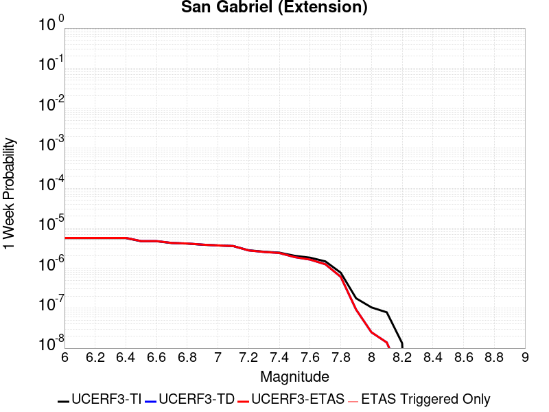 |  |  |  |

| Magnitude | 1 wk TI Prob | 1 wk TD Prob | 1 wk ETAS Prob | 1 wk ETAS/TD Gain | 1 wk ETAS Triggered Only | 1 mo TI Prob | 1 mo TD Prob | 1 mo ETAS Prob | 1 mo ETAS/TD Gain | 1 mo ETAS Triggered Only | 1 yr TI Prob | 1 yr TD Prob | 1 yr ETAS Prob | 1 yr ETAS/TD Gain | 1 yr ETAS Triggered Only | 10 yr TI Prob | 10 yr TD Prob | 10 yr ETAS Prob | 10 yr ETAS/TD Gain | 10 yr ETAS Triggered Only |
|-----|-----|-----|-----|-----|-----|-----|-----|-----|-----|-----|-----|-----|-----|-----|-----|-----|-----|-----|-----|-----|
| 6.0 | 5.6486106E-6 | 5.7173243E-6 | 5.7173243E-6 | 1.0 | 0.0 | 2.4208108E-5 | 2.4502595E-5 | 2.4502595E-5 | 1.0 | 0.0 | 2.9469383E-4 | 2.982795E-4 | 2.982795E-4 | 1.0 | 0.0 | 0.0029430336 | 0.002978922 | 0.0029888924 | 1.0033469 | 1.0E-5 |
| 6.1 | 5.6486106E-6 | 5.7173243E-6 | 5.7173243E-6 | 1.0 | 0.0 | 2.4208108E-5 | 2.4502595E-5 | 2.4502595E-5 | 1.0 | 0.0 | 2.9469383E-4 | 2.982795E-4 | 2.982795E-4 | 1.0 | 0.0 | 0.0029430336 | 0.002978922 | 0.0029888924 | 1.0033469 | 1.0E-5 |
| 6.2 | 5.6486106E-6 | 5.7173243E-6 | 5.7173243E-6 | 1.0 | 0.0 | 2.4208108E-5 | 2.4502595E-5 | 2.4502595E-5 | 1.0 | 0.0 | 2.9469383E-4 | 2.982795E-4 | 2.982795E-4 | 1.0 | 0.0 | 0.0029430336 | 0.002978922 | 0.0029888924 | 1.0033469 | 1.0E-5 |
| 6.3 | 5.6486106E-6 | 5.7173243E-6 | 5.7173243E-6 | 1.0 | 0.0 | 2.4208108E-5 | 2.4502595E-5 | 2.4502595E-5 | 1.0 | 0.0 | 2.9469383E-4 | 2.982795E-4 | 2.982795E-4 | 1.0 | 0.0 | 0.0029430336 | 0.002978922 | 0.0029888924 | 1.0033469 | 1.0E-5 |
| 6.4 | 5.6486106E-6 | 5.7173243E-6 | 5.7173243E-6 | 1.0 | 0.0 | 2.4208108E-5 | 2.4502595E-5 | 2.4502595E-5 | 1.0 | 0.0 | 2.9469383E-4 | 2.982795E-4 | 2.982795E-4 | 1.0 | 0.0 | 0.0029430336 | 0.002978922 | 0.0029888924 | 1.0033469 | 1.0E-5 |
| 6.5 | 4.7134554E-6 | 4.7547423E-6 | 4.7547423E-6 | 1.0 | 0.0 | 2.0200367E-5 | 2.0377312E-5 | 2.0377312E-5 | 1.0 | 0.0 | 2.459117E-4 | 2.4806638E-4 | 2.4806638E-4 | 1.0 | 0.0 | 0.0024563975 | 0.002477983 | 0.0024879582 | 1.0040256 | 1.0E-5 |
| 6.6 | 4.7134554E-6 | 4.7547423E-6 | 4.7547423E-6 | 1.0 | 0.0 | 2.0200367E-5 | 2.0377312E-5 | 2.0377312E-5 | 1.0 | 0.0 | 2.459117E-4 | 2.4806638E-4 | 2.4806638E-4 | 1.0 | 0.0 | 0.0024563975 | 0.002477983 | 0.0024879582 | 1.0040256 | 1.0E-5 |
| 6.7 | 4.2468837E-6 | 4.274557E-6 | 4.274557E-6 | 1.0 | 0.0 | 1.8200803E-5 | 1.8319404E-5 | 1.8319404E-5 | 1.0 | 0.0 | 2.2157225E-4 | 2.2301664E-4 | 2.2301664E-4 | 1.0 | 0.0 | 0.0022135144 | 0.0022280042 | 0.002237982 | 1.0044783 | 1.0E-5 |
| 6.8 | 4.1180615E-6 | 4.1419453E-6 | 4.1419453E-6 | 1.0 | 0.0 | 1.7648716E-5 | 1.7751077E-5 | 1.7751077E-5 | 1.0 | 0.0 | 2.1485193E-4 | 2.1609866E-4 | 2.1609866E-4 | 1.0 | 0.0 | 0.0021464431 | 0.0021589603 | 0.0021689388 | 1.0046219 | 1.0E-5 |
| 6.9 | 3.863861E-6 | 3.880259E-6 | 3.880259E-6 | 1.0 | 0.0 | 1.65593E-5 | 1.662958E-5 | 1.662958E-5 | 1.0 | 0.0 | 2.0159081E-4 | 2.0244702E-4 | 2.0244702E-4 | 1.0 | 0.0 | 0.0020140803 | 0.0020226974 | 0.0020326772 | 1.0049338 | 1.0E-5 |
| 7.0 | 3.6947372E-6 | 3.7061575E-6 | 3.7061575E-6 | 1.0 | 0.0 | 1.5834492E-5 | 1.588344E-5 | 1.588344E-5 | 1.0 | 0.0 | 1.9276788E-4 | 1.9336438E-4 | 1.9336438E-4 | 1.0 | 0.0 | 0.0019260074 | 0.0019320315 | 0.0019420122 | 1.0051659 | 1.0E-5 |
| 7.1 | 3.5686835E-6 | 3.5733763E-6 | 3.5733763E-6 | 1.0 | 0.0 | 1.5294268E-5 | 1.5314383E-5 | 1.5314383E-5 | 1.0 | 0.0 | 1.861918E-4 | 1.8643733E-4 | 1.8643733E-4 | 1.0 | 0.0 | 0.0018603588 | 0.0018628788 | 0.0018728602 | 1.005358 | 1.0E-5 |
| 7.2 | 2.8023446E-6 | 2.7772612E-6 | 2.7772612E-6 | 1.0 | 0.0 | 1.2009994E-5 | 1.1902494E-5 | 1.1902494E-5 | 1.0 | 0.0 | 1.4621185E-4 | 1.4490334E-4 | 1.4490334E-4 | 1.0 | 0.0 | 0.001461157 | 0.0014481032 | 0.0014580888 | 1.0068955 | 1.0E-5 |
| 7.3 | 2.5843012E-6 | 2.5464324E-6 | 2.5464324E-6 | 1.0 | 0.0 | 1.1075529E-5 | 1.0913236E-5 | 1.0913236E-5 | 1.0 | 0.0 | 1.3483623E-4 | 1.3286064E-4 | 1.3286064E-4 | 1.0 | 0.0 | 0.0013475444 | 0.0013278257 | 0.0013378124 | 1.0075212 | 1.0E-5 |
| 7.4 | 2.4464468E-6 | 2.3971263E-6 | 2.3971263E-6 | 1.0 | 0.0 | 1.04847295E-5 | 1.0273358E-5 | 1.0273358E-5 | 1.0 | 0.0 | 1.276441E-4 | 1.2507106E-4 | 1.2507106E-4 | 1.0 | 0.0 | 0.0012757082 | 0.00125002 | 0.0012600075 | 1.0079899 | 1.0E-5 |
| 7.5 | 2.0420266E-6 | 1.8914499E-6 | 1.8914499E-6 | 1.0 | 0.0 | 8.751514E-6 | 8.106188E-6 | 8.106188E-6 | 1.0 | 0.0 | 1.0654447E-4 | 9.868841E-5 | 9.868841E-5 | 1.0 | 0.0 | 0.001064934 | 9.86453E-4 | 9.964432E-4 | 1.0101273 | 1.0E-5 |
| 7.6 | 1.8326596E-6 | 1.6402144E-6 | 1.6402144E-6 | 1.0 | 0.0 | 7.854232E-6 | 7.029471E-6 | 7.029471E-6 | 1.0 | 0.0 | 9.562107E-5 | 8.5580476E-5 | 8.5580476E-5 | 1.0 | 0.0 | 9.5579936E-4 | 8.55481E-4 | 8.654725E-4 | 1.0116793 | 1.0E-5 |
| 7.7 | 1.4786998E-6 | 1.2527333E-6 | 1.2527333E-6 | 1.0 | 0.0 | 6.3372695E-6 | 5.368846E-6 | 5.368846E-6 | 1.0 | 0.0 | 7.715353E-5 | 6.5363754E-5 | 6.5363754E-5 | 1.0 | 0.0 | 7.7126746E-4 | 6.53453E-4 | 6.53453E-4 | 1.0 | 0.0 |
| 7.8 | 7.6975533E-7 | 6.072337E-7 | 6.072337E-7 | 1.0 | 0.0 | 3.2989474E-6 | 2.6024275E-6 | 2.6024275E-6 | 1.0 | 0.0 | 4.0163945E-5 | 3.1684096E-5 | 3.1684096E-5 | 1.0 | 0.0 | 4.0156685E-4 | 3.1680186E-4 | 3.1680186E-4 | 1.0 | 0.0 |
| 7.9 | 1.7645915E-7 | 9.2215814E-8 | 9.2215814E-8 | 1.0 | 0.0 | 7.562533E-7 | 3.9521055E-7 | 3.9521055E-7 | 1.0 | 0.0 | 9.207345E-6 | 4.811678E-6 | 4.811678E-6 | 1.0 | 0.0 | 9.206964E-5 | 4.8120433E-5 | 4.8120433E-5 | 1.0 | 0.0 |
| 8.0 | 1.0463461E-7 | 2.4984683E-8 | 2.4984683E-8 | 1.0 | 0.0 | 4.4843398E-7 | 1.0707721E-7 | 1.0707721E-7 | 1.0 | 0.0 | 5.45967E-6 | 1.3036642E-6 | 1.3036642E-6 | 1.0 | 0.0 | 5.459536E-5 | 1.3041256E-5 | 1.3041256E-5 | 1.0 | 0.0 |
| 8.1 | 7.875717E-8 | 1.3890023E-8 | 1.3890023E-8 | 1.0 | 0.0 | 3.3753068E-7 | 5.9528674E-8 | 5.9528674E-8 | 1.0 | 0.0 | 4.109428E-6 | 7.247613E-7 | 7.247613E-7 | 1.0 | 0.0 | 4.109352E-5 | 7.2522794E-6 | 7.2522794E-6 | 1.0 | 0.0 |
| 8.2 | 1.33163E-8 | 1.7767628E-9 | 1.7767628E-9 | 1.0 | 0.0 | 5.7069855E-8 | 7.614698E-9 | 7.614698E-9 | 1.0 | 0.0 | 6.9482525E-7 | 9.270895E-8 | 9.270895E-8 | 1.0 | 0.0 | 6.9482307E-6 | 9.2905896E-7 | 9.2905896E-7 | 1.0 | 0.0 |

## Great Valley 05 Pittsburg - Kirby Hills alt1
*[(top)](#table-of-contents)*

| 1 Week | 1 Month | 1 Year | 10 Year |
|-----|-----|-----|-----|
| 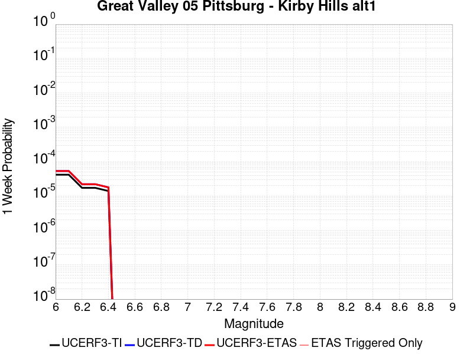 |  |  |  |

| Magnitude | 1 wk TI Prob | 1 wk TD Prob | 1 wk ETAS Prob | 1 wk ETAS/TD Gain | 1 wk ETAS Triggered Only | 1 mo TI Prob | 1 mo TD Prob | 1 mo ETAS Prob | 1 mo ETAS/TD Gain | 1 mo ETAS Triggered Only | 1 yr TI Prob | 1 yr TD Prob | 1 yr ETAS Prob | 1 yr ETAS/TD Gain | 1 yr ETAS Triggered Only | 10 yr TI Prob | 10 yr TD Prob | 10 yr ETAS Prob | 10 yr ETAS/TD Gain | 10 yr ETAS Triggered Only |
|-----|-----|-----|-----|-----|-----|-----|-----|-----|-----|-----|-----|-----|-----|-----|-----|-----|-----|-----|-----|-----|
| 6.0 | 4.187212E-5 | 5.3445157E-5 | 5.3445157E-5 | 1.0 | 0.0 | 1.794396E-4 | 2.2903632E-4 | 2.2903632E-4 | 1.0 | 0.0 | 0.002182488 | 0.0027859444 | 0.0027959165 | 1.0035795 | 1.0E-5 | 0.021611776 | 0.027604576 | 0.0276143 | 1.0003523 | 1.0E-5 |
| 6.1 | 4.187212E-5 | 5.3445157E-5 | 5.3445157E-5 | 1.0 | 0.0 | 1.794396E-4 | 2.2903632E-4 | 2.2903632E-4 | 1.0 | 0.0 | 0.002182488 | 0.0027859444 | 0.0027959165 | 1.0035795 | 1.0E-5 | 0.021611776 | 0.027604576 | 0.0276143 | 1.0003523 | 1.0E-5 |
| 6.2 | 1.7353306E-5 | 2.2155655E-5 | 2.2155655E-5 | 1.0 | 0.0 | 7.436919E-5 | 9.495167E-5 | 9.495167E-5 | 1.0 | 0.0 | 9.050688E-4 | 0.0011558206 | 0.0011558206 | 1.0 | 0.0 | 0.009013915 | 0.01153576 | 0.01153576 | 1.0 | 0.0 |
| 6.3 | 1.7353306E-5 | 2.2155655E-5 | 2.2155655E-5 | 1.0 | 0.0 | 7.436919E-5 | 9.495167E-5 | 9.495167E-5 | 1.0 | 0.0 | 9.050688E-4 | 0.0011558206 | 0.0011558206 | 1.0 | 0.0 | 0.009013915 | 0.01153576 | 0.01153576 | 1.0 | 0.0 |
| 6.4 | 1.4028824E-5 | 1.7901628E-5 | 1.7901628E-5 | 1.0 | 0.0 | 6.0122147E-5 | 7.672126E-5 | 7.672126E-5 | 1.0 | 0.0 | 7.3174125E-4 | 9.340814E-4 | 9.340814E-4 | 1.0 | 0.0 | 0.0072933645 | 0.00933866 | 0.00933866 | 1.0 | 0.0 |

## Sierra Madre (San Fernando)
*[(top)](#table-of-contents)*

| 1 Week | 1 Month | 1 Year | 10 Year |
|-----|-----|-----|-----|
|  | 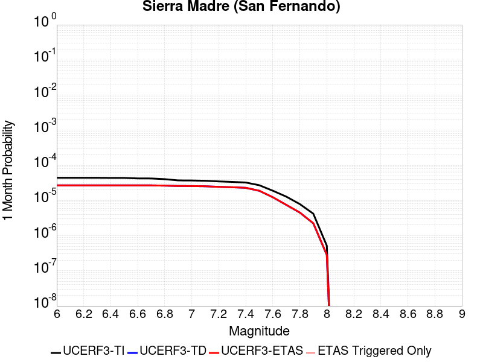 |  |  |

| Magnitude | 1 wk TI Prob | 1 wk TD Prob | 1 wk ETAS Prob | 1 wk ETAS/TD Gain | 1 wk ETAS Triggered Only | 1 mo TI Prob | 1 mo TD Prob | 1 mo ETAS Prob | 1 mo ETAS/TD Gain | 1 mo ETAS Triggered Only | 1 yr TI Prob | 1 yr TD Prob | 1 yr ETAS Prob | 1 yr ETAS/TD Gain | 1 yr ETAS Triggered Only | 10 yr TI Prob | 10 yr TD Prob | 10 yr ETAS Prob | 10 yr ETAS/TD Gain | 10 yr ETAS Triggered Only |
|-----|-----|-----|-----|-----|-----|-----|-----|-----|-----|-----|-----|-----|-----|-----|-----|-----|-----|-----|-----|-----|
| 6.0 | 1.0346413E-5 | 6.287503E-6 | 6.287503E-6 | 1.0 | 0.0 | 4.4341014E-5 | 2.6946169E-5 | 2.6946169E-5 | 1.0 | 0.0 | 5.3971814E-4 | 3.2802133E-4 | 3.3801806E-4 | 1.0304759 | 1.0E-5 | 0.0053840918 | 0.003275484 | 0.0032854513 | 1.0030429 | 1.0E-5 |
| 6.1 | 1.0346413E-5 | 6.287503E-6 | 6.287503E-6 | 1.0 | 0.0 | 4.4341014E-5 | 2.6946169E-5 | 2.6946169E-5 | 1.0 | 0.0 | 5.3971814E-4 | 3.2802133E-4 | 3.3801806E-4 | 1.0304759 | 1.0E-5 | 0.0053840918 | 0.003275484 | 0.0032854513 | 1.0030429 | 1.0E-5 |
| 6.2 | 1.0346413E-5 | 6.287503E-6 | 6.287503E-6 | 1.0 | 0.0 | 4.4341014E-5 | 2.6946169E-5 | 2.6946169E-5 | 1.0 | 0.0 | 5.3971814E-4 | 3.2802133E-4 | 3.3801806E-4 | 1.0304759 | 1.0E-5 | 0.0053840918 | 0.003275484 | 0.0032854513 | 1.0030429 | 1.0E-5 |
| 6.3 | 1.0346413E-5 | 6.287503E-6 | 6.287503E-6 | 1.0 | 0.0 | 4.4341014E-5 | 2.6946169E-5 | 2.6946169E-5 | 1.0 | 0.0 | 5.3971814E-4 | 3.2802133E-4 | 3.3801806E-4 | 1.0304759 | 1.0E-5 | 0.0053840918 | 0.003275484 | 0.0032854513 | 1.0030429 | 1.0E-5 |
| 6.4 | 1.0249558E-5 | 6.287503E-6 | 6.287503E-6 | 1.0 | 0.0 | 4.392594E-5 | 2.6946169E-5 | 2.6946169E-5 | 1.0 | 0.0 | 5.3466705E-4 | 3.2802133E-4 | 3.3801806E-4 | 1.0304759 | 1.0E-5 | 0.0053338245 | 0.003275484 | 0.0032854513 | 1.0030429 | 1.0E-5 |
| 6.5 | 1.0249558E-5 | 6.287503E-6 | 6.287503E-6 | 1.0 | 0.0 | 4.392594E-5 | 2.6946169E-5 | 2.6946169E-5 | 1.0 | 0.0 | 5.3466705E-4 | 3.2802133E-4 | 3.3801806E-4 | 1.0304759 | 1.0E-5 | 0.0053338245 | 0.003275484 | 0.0032854513 | 1.0030429 | 1.0E-5 |
| 6.6 | 9.9035515E-6 | 6.287503E-6 | 6.287503E-6 | 1.0 | 0.0 | 4.2443102E-5 | 2.6946169E-5 | 2.6946169E-5 | 1.0 | 0.0 | 5.166222E-4 | 3.2802133E-4 | 3.3801806E-4 | 1.0304759 | 1.0E-5 | 0.0051542283 | 0.003275484 | 0.0032854513 | 1.0030429 | 1.0E-5 |
| 6.7 | 9.87217E-6 | 6.274923E-6 | 6.274923E-6 | 1.0 | 0.0 | 4.2308613E-5 | 2.6892258E-5 | 2.6892258E-5 | 1.0 | 0.0 | 5.149856E-4 | 3.2736515E-4 | 3.3736188E-4 | 1.0305369 | 1.0E-5 | 0.005137938 | 0.0032689415 | 0.003278909 | 1.0030491 | 1.0E-5 |
| 6.8 | 9.4359175E-6 | 6.178895E-6 | 6.178895E-6 | 1.0 | 0.0 | 4.043902E-5 | 2.6480717E-5 | 2.6480717E-5 | 1.0 | 0.0 | 4.9223384E-4 | 3.2235612E-4 | 3.323529E-4 | 1.0310116 | 1.0E-5 | 0.0049114493 | 0.003218997 | 0.0032289647 | 1.0030966 | 1.0E-5 |
| 6.9 | 8.700447E-6 | 6.0401503E-6 | 6.0401503E-6 | 1.0 | 0.0 | 3.72871E-5 | 2.5886107E-5 | 2.5886107E-5 | 1.0 | 0.0 | 4.5387587E-4 | 3.1511884E-4 | 3.251157E-4 | 1.0317241 | 1.0E-5 | 0.0045295 | 0.0031468298 | 0.0031567982 | 1.0031677 | 1.0E-5 |
| 7.0 | 8.648878E-6 | 6.0150646E-6 | 6.0150646E-6 | 1.0 | 0.0 | 3.7066096E-5 | 2.57786E-5 | 2.57786E-5 | 1.0 | 0.0 | 4.5118626E-4 | 3.1381033E-4 | 3.238072E-4 | 1.0318564 | 1.0E-5 | 0.004502713 | 0.0031337815 | 0.0031437501 | 1.003181 | 1.0E-5 |
| 7.1 | 8.505786E-6 | 5.9246936E-6 | 5.9246936E-6 | 1.0 | 0.0 | 3.645286E-5 | 2.5391304E-5 | 2.5391304E-5 | 1.0 | 0.0 | 4.437232E-4 | 3.0909633E-4 | 3.1909326E-4 | 1.0323423 | 1.0E-5 | 0.0044283825 | 0.0030867732 | 0.0030967423 | 1.0032296 | 1.0E-5 |
| 7.2 | 8.139752E-6 | 5.6989843E-6 | 5.6989843E-6 | 1.0 | 0.0 | 3.4884186E-5 | 2.4423996E-5 | 2.4423996E-5 | 1.0 | 0.0 | 4.246322E-4 | 2.9732264E-4 | 3.0731966E-4 | 1.0336235 | 1.0E-5 | 0.004238217 | 0.0029693544 | 0.0029793247 | 1.0033578 | 1.0E-5 |
| 7.3 | 7.8816E-6 | 5.5522964E-6 | 5.5522964E-6 | 1.0 | 0.0 | 3.3777847E-5 | 2.3795345E-5 | 2.3795345E-5 | 1.0 | 0.0 | 4.111677E-4 | 2.8967086E-4 | 2.9966797E-4 | 1.0345119 | 1.0E-5 | 0.004104078 | 0.0028930383 | 0.0029030095 | 1.0034466 | 1.0E-5 |
| 7.4 | 7.5810603E-6 | 5.3565295E-6 | 5.3565295E-6 | 1.0 | 0.0 | 3.2489854E-5 | 2.295636E-5 | 2.295636E-5 | 1.0 | 0.0 | 3.9549218E-4 | 2.7945888E-4 | 2.8945607E-4 | 1.0357734 | 1.0E-5 | 0.0039478904 | 0.0027911796 | 0.0028011517 | 1.0035727 | 1.0E-5 |
| 7.5 | 6.349153E-6 | 4.4077838E-6 | 4.4077838E-6 | 1.0 | 0.0 | 2.7210372E-5 | 1.889037E-5 | 1.889037E-5 | 1.0 | 0.0 | 3.312359E-4 | 2.299668E-4 | 2.399645E-4 | 1.0434746 | 1.0E-5 | 0.0033074263 | 0.0022973702 | 0.0023073473 | 1.0043428 | 1.0E-5 |
| 7.6 | 4.430576E-6 | 2.890781E-6 | 2.890781E-6 | 1.0 | 0.0 | 1.8988047E-5 | 1.2389004E-5 | 1.2389004E-5 | 1.0 | 0.0 | 2.3115493E-4 | 1.5082592E-4 | 1.5082592E-4 | 1.0 | 0.0 | 0.0023091463 | 0.001507258 | 0.001507258 | 1.0 | 0.0 |
| 7.7 | 3.005066E-6 | 1.7511906E-6 | 1.7511906E-6 | 1.0 | 0.0 | 1.2878791E-5 | 7.5050807E-6 | 7.5050807E-6 | 1.0 | 0.0 | 1.56788E-4 | 9.137054E-5 | 9.137054E-5 | 1.0 | 0.0 | 0.0015667742 | 9.133309E-4 | 9.133309E-4 | 1.0 | 0.0 |
| 7.8 | 1.8459098E-6 | 1.058342E-6 | 1.058342E-6 | 1.0 | 0.0 | 7.911018E-6 | 4.5357438E-6 | 4.5357438E-6 | 1.0 | 0.0 | 9.631238E-5 | 5.5221288E-5 | 5.5221288E-5 | 1.0 | 0.0 | 9.627065E-4 | 5.520761E-4 | 5.520761E-4 | 1.0 | 0.0 |
| 7.9 | 9.839262E-7 | 5.235113E-7 | 5.235113E-7 | 1.0 | 0.0 | 4.2168194E-6 | 2.2436177E-6 | 2.2436177E-6 | 1.0 | 0.0 | 5.1338568E-5 | 2.7315707E-5 | 2.7315707E-5 | 1.0 | 0.0 | 5.132671E-4 | 2.731238E-4 | 2.731238E-4 | 1.0 | 0.0 |
| 8.0 | 1.210983E-7 | 6.614372E-8 | 6.614372E-8 | 1.0 | 0.0 | 5.1899264E-7 | 2.8347307E-7 | 2.8347307E-7 | 1.0 | 0.0 | 6.3187167E-6 | 3.451279E-6 | 3.451279E-6 | 1.0 | 0.0 | 6.318537E-5 | 3.4512275E-5 | 3.4512275E-5 | 1.0 | 0.0 |

## Malibu Coast (Extension) alt 1
*[(top)](#table-of-contents)*

| 1 Week | 1 Month | 1 Year | 10 Year |
|-----|-----|-----|-----|
|  |  |  |  |

| Magnitude | 1 wk TI Prob | 1 wk TD Prob | 1 wk ETAS Prob | 1 wk ETAS/TD Gain | 1 wk ETAS Triggered Only | 1 mo TI Prob | 1 mo TD Prob | 1 mo ETAS Prob | 1 mo ETAS/TD Gain | 1 mo ETAS Triggered Only | 1 yr TI Prob | 1 yr TD Prob | 1 yr ETAS Prob | 1 yr ETAS/TD Gain | 1 yr ETAS Triggered Only | 10 yr TI Prob | 10 yr TD Prob | 10 yr ETAS Prob | 10 yr ETAS/TD Gain | 10 yr ETAS Triggered Only |
|-----|-----|-----|-----|-----|-----|-----|-----|-----|-----|-----|-----|-----|-----|-----|-----|-----|-----|-----|-----|-----|
| 6.0 | 8.930738E-6 | 9.329386E-6 | 9.329386E-6 | 1.0 | 0.0 | 3.827403E-5 | 3.998248E-5 | 3.998248E-5 | 1.0 | 0.0 | 4.6588664E-4 | 4.8667967E-4 | 4.8667967E-4 | 1.0 | 0.0 | 0.0046491115 | 0.004856321 | 0.004866272 | 1.0020492 | 1.0E-5 |
| 6.1 | 7.199952E-6 | 7.530391E-6 | 7.530391E-6 | 1.0 | 0.0 | 3.0856572E-5 | 3.227271E-5 | 3.227271E-5 | 1.0 | 0.0 | 3.75614E-4 | 3.9285E-4 | 3.9285E-4 | 1.0 | 0.0 | 0.0037497976 | 0.0039216215 | 0.0039315824 | 1.00254 | 1.0E-5 |
| 6.2 | 6.3721413E-6 | 6.6668786E-6 | 6.6668786E-6 | 1.0 | 0.0 | 2.7308892E-5 | 2.8572025E-5 | 2.8572025E-5 | 1.0 | 0.0 | 3.3243504E-4 | 3.4780925E-4 | 3.4780925E-4 | 1.0 | 0.0 | 0.0033193815 | 0.0034726888 | 0.0034726888 | 1.0 | 0.0 |
| 6.3 | 6.016345E-6 | 6.2952417E-6 | 6.2952417E-6 | 1.0 | 0.0 | 2.578408E-5 | 2.697933E-5 | 2.697933E-5 | 1.0 | 0.0 | 3.1387596E-4 | 3.2842415E-4 | 3.2842415E-4 | 1.0 | 0.0 | 0.00313433 | 0.003279424 | 0.003279424 | 1.0 | 0.0 |
| 6.4 | 5.8104883E-6 | 6.079626E-6 | 6.079626E-6 | 1.0 | 0.0 | 2.4901856E-5 | 2.605528E-5 | 2.605528E-5 | 1.0 | 0.0 | 3.031379E-4 | 3.1717718E-4 | 3.1717718E-4 | 1.0 | 0.0 | 0.0030272473 | 0.0031672798 | 0.0031672798 | 1.0 | 0.0 |
| 6.5 | 5.476925E-6 | 5.7275906E-6 | 5.7275906E-6 | 1.0 | 0.0 | 2.3472323E-5 | 2.4546587E-5 | 2.4546587E-5 | 1.0 | 0.0 | 2.8573806E-4 | 2.98814E-4 | 2.98814E-4 | 1.0 | 0.0 | 0.0028537093 | 0.002984154 | 0.002984154 | 1.0 | 0.0 |
| 6.6 | 5.222387E-6 | 5.458654E-6 | 5.458654E-6 | 1.0 | 0.0 | 2.2381464E-5 | 2.3394023E-5 | 2.3394023E-5 | 1.0 | 0.0 | 2.7246025E-4 | 2.847853E-4 | 2.847853E-4 | 1.0 | 0.0 | 0.0027212645 | 0.002844234 | 0.002844234 | 1.0 | 0.0 |
| 6.7 | 5.0337076E-6 | 5.259175E-6 | 5.259175E-6 | 1.0 | 0.0 | 2.1572854E-5 | 2.2539129E-5 | 2.2539129E-5 | 1.0 | 0.0 | 2.6261783E-4 | 2.7437962E-4 | 2.7437962E-4 | 1.0 | 0.0 | 0.002623077 | 0.0027404386 | 0.0027404386 | 1.0 | 0.0 |
| 6.8 | 4.5675624E-6 | 4.7587805E-6 | 4.7587805E-6 | 1.0 | 0.0 | 1.9575122E-5 | 2.0394615E-5 | 2.0394615E-5 | 1.0 | 0.0 | 2.3830103E-4 | 2.4827634E-4 | 2.4827634E-4 | 1.0 | 0.0 | 0.0023804565 | 0.0024800093 | 0.0024800093 | 1.0 | 0.0 |
| 6.9 | 4.2802412E-6 | 4.4520802E-6 | 4.4520802E-6 | 1.0 | 0.0 | 1.8343762E-5 | 1.9080206E-5 | 1.9080206E-5 | 1.0 | 0.0 | 2.2331243E-4 | 2.322769E-4 | 2.322769E-4 | 1.0 | 0.0 | 0.0022308815 | 0.0023203578 | 0.0023203578 | 1.0 | 0.0 |
| 7.0 | 3.9794063E-6 | 4.130154E-6 | 4.130154E-6 | 1.0 | 0.0 | 1.7054486E-5 | 1.770054E-5 | 1.770054E-5 | 1.0 | 0.0 | 2.0761859E-4 | 2.154829E-4 | 2.154829E-4 | 1.0 | 0.0 | 0.0020742472 | 0.002152753 | 0.002152753 | 1.0 | 0.0 |
| 7.1 | 3.7730424E-6 | 3.9112692E-6 | 3.9112692E-6 | 1.0 | 0.0 | 1.6170083E-5 | 1.6762477E-5 | 1.6762477E-5 | 1.0 | 0.0 | 1.9685295E-4 | 2.0406416E-4 | 2.0406416E-4 | 1.0 | 0.0 | 0.0019667868 | 0.0020387806 | 0.0020387806 | 1.0 | 0.0 |
| 7.2 | 3.424985E-6 | 3.5413846E-6 | 3.5413846E-6 | 1.0 | 0.0 | 1.4678424E-5 | 1.5177275E-5 | 1.5177275E-5 | 1.0 | 0.0 | 1.7869516E-4 | 1.8476776E-4 | 1.8476776E-4 | 1.0 | 0.0 | 0.0017855153 | 0.0018461535 | 0.0018461535 | 1.0 | 0.0 |
| 7.3 | 2.6966375E-6 | 2.7596889E-6 | 2.7596889E-6 | 1.0 | 0.0 | 1.15569665E-5 | 1.1827185E-5 | 1.1827185E-5 | 1.0 | 0.0 | 1.4069698E-4 | 1.4398649E-4 | 1.4398649E-4 | 1.0 | 0.0 | 0.0014060794 | 0.0014389361 | 0.0014389361 | 1.0 | 0.0 |
| 7.4 | 2.215957E-6 | 2.2494066E-6 | 2.2494066E-6 | 1.0 | 0.0 | 9.496924E-6 | 9.640278E-6 | 9.640278E-6 | 1.0 | 0.0 | 1.1561892E-4 | 1.1736411E-4 | 1.1736411E-4 | 1.0 | 0.0 | 0.0011555878 | 0.001173025 | 0.001173025 | 1.0 | 0.0 |
| 7.5 | 1.2040218E-6 | 1.2219228E-6 | 1.2219228E-6 | 1.0 | 0.0 | 5.160083E-6 | 5.236802E-6 | 5.236802E-6 | 1.0 | 0.0 | 6.2822204E-5 | 6.375622E-5 | 6.375622E-5 | 1.0 | 0.0 | 6.280445E-4 | 6.373811E-4 | 6.373811E-4 | 1.0 | 0.0 |
| 7.6 | 6.6157446E-7 | 6.679067E-7 | 6.679067E-7 | 1.0 | 0.0 | 2.835316E-6 | 2.8624543E-6 | 2.8624543E-6 | 1.0 | 0.0 | 3.4519428E-5 | 3.4849836E-5 | 3.4849836E-5 | 1.0 | 0.0 | 3.4514067E-4 | 3.4844526E-4 | 3.4844526E-4 | 1.0 | 0.0 |
| 7.7 | 2.6012302E-7 | 2.4357908E-7 | 2.4357908E-7 | 1.0 | 0.0 | 1.1148124E-6 | 1.0439101E-6 | 1.0439101E-6 | 1.0 | 0.0 | 1.3572758E-5 | 1.2709542E-5 | 1.2709542E-5 | 1.0 | 0.0 | 1.3571928E-4 | 1.2708921E-4 | 1.2708921E-4 | 1.0 | 0.0 |
| 7.8 | 2.8323132E-8 | 2.0266933E-8 | 2.0266933E-8 | 1.0 | 0.0 | 1.2138484E-7 | 8.6858286E-8 | 8.6858286E-8 | 1.0 | 0.0 | 1.4778595E-6 | 1.0574992E-6 | 1.0574992E-6 | 1.0 | 0.0 | 1.4778497E-5 | 1.057495E-5 | 1.057495E-5 | 1.0 | 0.0 |

## Greenville (No) 2011 CFM
*[(top)](#table-of-contents)*

| 1 Week | 1 Month | 1 Year | 10 Year |
|-----|-----|-----|-----|
|  | 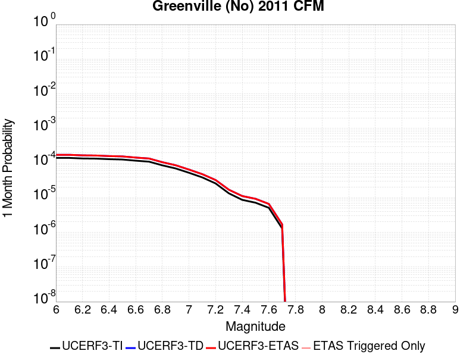 |  | 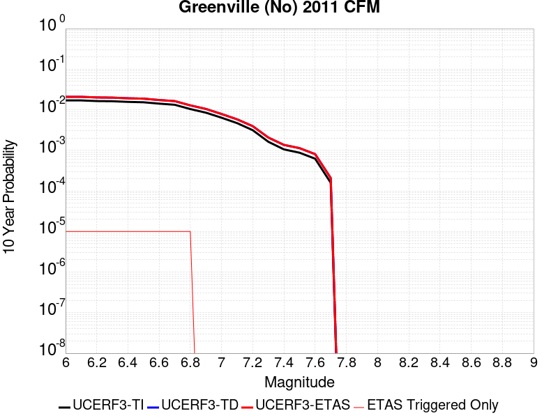 |

| Magnitude | 1 wk TI Prob | 1 wk TD Prob | 1 wk ETAS Prob | 1 wk ETAS/TD Gain | 1 wk ETAS Triggered Only | 1 mo TI Prob | 1 mo TD Prob | 1 mo ETAS Prob | 1 mo ETAS/TD Gain | 1 mo ETAS Triggered Only | 1 yr TI Prob | 1 yr TD Prob | 1 yr ETAS Prob | 1 yr ETAS/TD Gain | 1 yr ETAS Triggered Only | 10 yr TI Prob | 10 yr TD Prob | 10 yr ETAS Prob | 10 yr ETAS/TD Gain | 10 yr ETAS Triggered Only |
|-----|-----|-----|-----|-----|-----|-----|-----|-----|-----|-----|-----|-----|-----|-----|-----|-----|-----|-----|-----|-----|
| 6.0 | 3.286654E-5 | 4.036793E-5 | 4.036793E-5 | 1.0 | 0.0 | 1.4084899E-4 | 1.7299416E-4 | 1.7299416E-4 | 1.0 | 0.0 | 0.0017134876 | 0.0021042074 | 0.0021042074 | 1.0 | 0.0 | 0.017003356 | 0.020847721 | 0.020857511 | 1.0004697 | 1.0E-5 |
| 6.1 | 3.286654E-5 | 4.036793E-5 | 4.036793E-5 | 1.0 | 0.0 | 1.4084899E-4 | 1.7299416E-4 | 1.7299416E-4 | 1.0 | 0.0 | 0.0017134876 | 0.0021042074 | 0.0021042074 | 1.0 | 0.0 | 0.017003356 | 0.020847721 | 0.020857511 | 1.0004697 | 1.0E-5 |
| 6.2 | 3.1697953E-5 | 3.8930764E-5 | 3.8930764E-5 | 1.0 | 0.0 | 1.358413E-4 | 1.6683567E-4 | 1.6683567E-4 | 1.0 | 0.0 | 0.0016526132 | 0.00202937 | 0.00202937 | 1.0 | 0.0 | 0.01640377 | 0.02011308 | 0.02012288 | 1.0004872 | 1.0E-5 |
| 6.3 | 3.1363317E-5 | 3.851962E-5 | 3.851962E-5 | 1.0 | 0.0 | 1.344073E-4 | 1.6507384E-4 | 1.6507384E-4 | 1.0 | 0.0 | 0.0016351803 | 0.0020079594 | 0.0020079594 | 1.0 | 0.0 | 0.016232004 | 0.019902838 | 0.01991264 | 1.0004925 | 1.0E-5 |
| 6.4 | 3.0228604E-5 | 3.712669E-5 | 3.712669E-5 | 1.0 | 0.0 | 1.2954473E-4 | 1.5910488E-4 | 1.5910488E-4 | 1.0 | 0.0 | 0.0015760659 | 0.0019354179 | 0.0019354179 | 1.0 | 0.0 | 0.015649348 | 0.019190146 | 0.019199954 | 1.000511 | 1.0E-5 |
| 6.5 | 2.9537814E-5 | 3.6282105E-5 | 3.6282105E-5 | 1.0 | 0.0 | 1.2658449E-4 | 1.5548567E-4 | 1.5548567E-4 | 1.0 | 0.0 | 0.0015400766 | 0.0018914312 | 0.0018914312 | 1.0 | 0.0 | 0.01529447 | 0.018757788 | 0.0187676 | 1.0005231 | 1.0E-5 |
| 6.6 | 2.7345395E-5 | 3.359131E-5 | 3.359131E-5 | 1.0 | 0.0 | 1.1718928E-4 | 1.4395498E-4 | 1.4395498E-4 | 1.0 | 0.0 | 0.0014258457 | 0.0017512739 | 0.0017512739 | 1.0 | 0.0 | 0.014167317 | 0.017378548 | 0.017388374 | 1.0005654 | 1.0E-5 |
| 6.7 | 2.5615784E-5 | 3.1568143E-5 | 3.1568143E-5 | 1.0 | 0.0 | 1.09777306E-4 | 1.3528518E-4 | 1.3528518E-4 | 1.0 | 0.0 | 0.0013357193 | 0.0016458832 | 0.0016458832 | 1.0 | 0.0 | 0.013277191 | 0.016340606 | 0.016350443 | 1.000602 | 1.0E-5 |
| 6.8 | 2.0059057E-5 | 2.4712792E-5 | 2.4712792E-5 | 1.0 | 0.0 | 8.596455E-5 | 1.05907755E-4 | 1.05907755E-4 | 1.0 | 0.0 | 0.0010461159 | 0.0012886805 | 0.0012886805 | 1.0 | 0.0 | 0.0104120495 | 0.012814093 | 0.012823965 | 1.0007704 | 1.0E-5 |
| 6.9 | 1.6321746E-5 | 2.0185187E-5 | 2.0185187E-5 | 1.0 | 0.0 | 6.9948466E-5 | 8.650514E-5 | 8.650514E-5 | 1.0 | 0.0 | 8.5128983E-4 | 0.0010527036 | 0.0010527036 | 1.0 | 0.0 | 0.008480361 | 0.010478699 | 0.010478699 | 1.0 | 0.0 |
| 7.0 | 1.22527645E-5 | 1.5135967E-5 | 1.5135967E-5 | 1.0 | 0.0 | 5.2510793E-5 | 6.4866836E-5 | 6.4866836E-5 | 1.0 | 0.0 | 6.3913135E-4 | 7.894718E-4 | 7.894718E-4 | 1.0 | 0.0 | 0.0063729626 | 0.007867309 | 0.007867309 | 1.0 | 0.0 |
| 7.1 | 8.996482E-6 | 1.1165152E-5 | 1.1165152E-5 | 1.0 | 0.0 | 3.8555783E-5 | 4.784978E-5 | 4.784978E-5 | 1.0 | 0.0 | 4.6931554E-4 | 5.8241654E-4 | 5.8241654E-4 | 1.0 | 0.0 | 0.004683256 | 0.005809193 | 0.005809193 | 1.0 | 0.0 |
| 7.2 | 6.0273087E-6 | 7.5695893E-6 | 7.5695893E-6 | 1.0 | 0.0 | 2.5831067E-5 | 3.2440697E-5 | 3.2440697E-5 | 1.0 | 0.0 | 3.1444785E-4 | 3.948946E-4 | 3.948946E-4 | 1.0 | 0.0 | 0.0031400328 | 0.003942126 | 0.003942126 | 1.0 | 0.0 |
| 7.3 | 3.1209995E-6 | 3.9664233E-6 | 3.9664233E-6 | 1.0 | 0.0 | 1.3375643E-5 | 1.6998847E-5 | 1.6998847E-5 | 1.0 | 0.0 | 1.6283628E-4 | 2.0694146E-4 | 2.0694146E-4 | 1.0 | 0.0 | 0.0016271701 | 0.0020675778 | 0.0020675778 | 1.0 | 0.0 |
| 7.4 | 2.0254208E-6 | 2.609635E-6 | 2.609635E-6 | 1.0 | 0.0 | 8.680347E-6 | 1.1184102E-5 | 1.1184102E-5 | 1.0 | 0.0 | 1.0567809E-4 | 1.3615799E-4 | 1.3615799E-4 | 1.0 | 0.0 | 0.0010562785 | 0.0013608026 | 0.0013608026 | 1.0 | 0.0 |
| 7.5 | 1.6763418E-6 | 2.1733642E-6 | 2.1733642E-6 | 1.0 | 0.0 | 7.184302E-6 | 9.314385E-6 | 9.314385E-6 | 1.0 | 0.0 | 8.746537E-5 | 1.13396796E-4 | 1.13396796E-4 | 1.0 | 0.0 | 8.743095E-4 | 0.0011334363 | 0.0011334363 | 1.0 | 0.0 |
| 7.6 | 1.1935462E-6 | 1.5458543E-6 | 1.5458543E-6 | 1.0 | 0.0 | 5.115188E-6 | 6.625073E-6 | 6.625073E-6 | 1.0 | 0.0 | 6.2275634E-5 | 8.065732E-5 | 8.065732E-5 | 1.0 | 0.0 | 6.2258187E-4 | 8.063112E-4 | 8.063112E-4 | 1.0 | 0.0 |
| 7.7 | 3.0464201E-7 | 3.9847052E-7 | 3.9847052E-7 | 1.0 | 0.0 | 1.3056081E-6 | 1.7077297E-6 | 1.7077297E-6 | 1.0 | 0.0 | 1.589566E-5 | 2.0791416E-5 | 2.0791416E-5 | 1.0 | 0.0 | 1.5894524E-4 | 2.0789941E-4 | 2.0789941E-4 | 1.0 | 0.0 |

## Northridge Hills
*[(top)](#table-of-contents)*

| 1 Week | 1 Month | 1 Year | 10 Year |
|-----|-----|-----|-----|
| 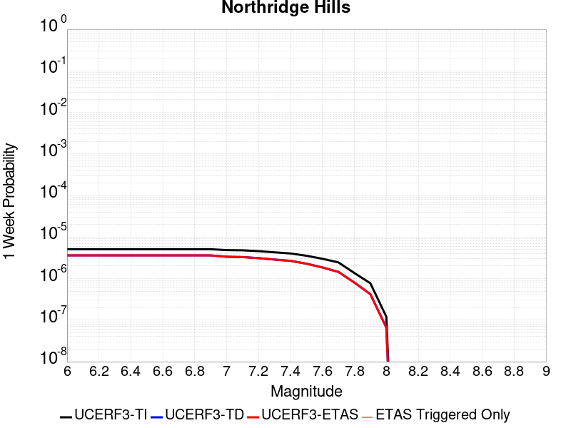 |  |  | 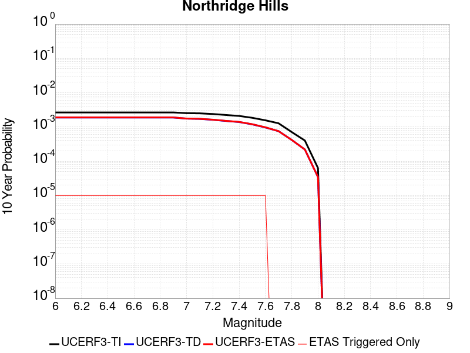 |

| Magnitude | 1 wk TI Prob | 1 wk TD Prob | 1 wk ETAS Prob | 1 wk ETAS/TD Gain | 1 wk ETAS Triggered Only | 1 mo TI Prob | 1 mo TD Prob | 1 mo ETAS Prob | 1 mo ETAS/TD Gain | 1 mo ETAS Triggered Only | 1 yr TI Prob | 1 yr TD Prob | 1 yr ETAS Prob | 1 yr ETAS/TD Gain | 1 yr ETAS Triggered Only | 10 yr TI Prob | 10 yr TD Prob | 10 yr ETAS Prob | 10 yr ETAS/TD Gain | 10 yr ETAS Triggered Only |
|-----|-----|-----|-----|-----|-----|-----|-----|-----|-----|-----|-----|-----|-----|-----|-----|-----|-----|-----|-----|-----|
| 6.0 | 5.095982E-6 | 3.615373E-6 | 3.615373E-6 | 1.0 | 0.0 | 2.183974E-5 | 1.5494365E-5 | 1.5494365E-5 | 1.0 | 0.0 | 2.658664E-4 | 1.8862767E-4 | 1.8862767E-4 | 1.0 | 0.0 | 0.0026554854 | 0.001884688 | 0.0018946693 | 1.0052959 | 1.0E-5 |
| 6.1 | 5.095982E-6 | 3.615373E-6 | 3.615373E-6 | 1.0 | 0.0 | 2.183974E-5 | 1.5494365E-5 | 1.5494365E-5 | 1.0 | 0.0 | 2.658664E-4 | 1.8862767E-4 | 1.8862767E-4 | 1.0 | 0.0 | 0.0026554854 | 0.001884688 | 0.0018946693 | 1.0052959 | 1.0E-5 |
| 6.2 | 5.095982E-6 | 3.615373E-6 | 3.615373E-6 | 1.0 | 0.0 | 2.183974E-5 | 1.5494365E-5 | 1.5494365E-5 | 1.0 | 0.0 | 2.658664E-4 | 1.8862767E-4 | 1.8862767E-4 | 1.0 | 0.0 | 0.0026554854 | 0.001884688 | 0.0018946693 | 1.0052959 | 1.0E-5 |
| 6.3 | 5.095982E-6 | 3.615373E-6 | 3.615373E-6 | 1.0 | 0.0 | 2.183974E-5 | 1.5494365E-5 | 1.5494365E-5 | 1.0 | 0.0 | 2.658664E-4 | 1.8862767E-4 | 1.8862767E-4 | 1.0 | 0.0 | 0.0026554854 | 0.001884688 | 0.0018946693 | 1.0052959 | 1.0E-5 |
| 6.4 | 5.095982E-6 | 3.615373E-6 | 3.615373E-6 | 1.0 | 0.0 | 2.183974E-5 | 1.5494365E-5 | 1.5494365E-5 | 1.0 | 0.0 | 2.658664E-4 | 1.8862767E-4 | 1.8862767E-4 | 1.0 | 0.0 | 0.0026554854 | 0.001884688 | 0.0018946693 | 1.0052959 | 1.0E-5 |
| 6.5 | 5.095982E-6 | 3.615373E-6 | 3.615373E-6 | 1.0 | 0.0 | 2.183974E-5 | 1.5494365E-5 | 1.5494365E-5 | 1.0 | 0.0 | 2.658664E-4 | 1.8862767E-4 | 1.8862767E-4 | 1.0 | 0.0 | 0.0026554854 | 0.001884688 | 0.0018946693 | 1.0052959 | 1.0E-5 |
| 6.6 | 5.095982E-6 | 3.615373E-6 | 3.615373E-6 | 1.0 | 0.0 | 2.183974E-5 | 1.5494365E-5 | 1.5494365E-5 | 1.0 | 0.0 | 2.658664E-4 | 1.8862767E-4 | 1.8862767E-4 | 1.0 | 0.0 | 0.0026554854 | 0.001884688 | 0.0018946693 | 1.0052959 | 1.0E-5 |
| 6.7 | 5.095982E-6 | 3.615373E-6 | 3.615373E-6 | 1.0 | 0.0 | 2.183974E-5 | 1.5494365E-5 | 1.5494365E-5 | 1.0 | 0.0 | 2.658664E-4 | 1.8862767E-4 | 1.8862767E-4 | 1.0 | 0.0 | 0.0026554854 | 0.001884688 | 0.0018946693 | 1.0052959 | 1.0E-5 |
| 6.8 | 5.095982E-6 | 3.615373E-6 | 3.615373E-6 | 1.0 | 0.0 | 2.183974E-5 | 1.5494365E-5 | 1.5494365E-5 | 1.0 | 0.0 | 2.658664E-4 | 1.8862767E-4 | 1.8862767E-4 | 1.0 | 0.0 | 0.0026554854 | 0.001884688 | 0.0018946693 | 1.0052959 | 1.0E-5 |
| 6.9 | 5.0942654E-6 | 3.613588E-6 | 3.613588E-6 | 1.0 | 0.0 | 2.1832384E-5 | 1.5486714E-5 | 1.5486714E-5 | 1.0 | 0.0 | 2.6577685E-4 | 1.8853454E-4 | 1.8853454E-4 | 1.0 | 0.0 | 0.002654592 | 0.0018837585 | 0.0018937396 | 1.0052985 | 1.0E-5 |
| 7.0 | 4.851143E-6 | 3.3589004E-6 | 3.3589004E-6 | 1.0 | 0.0 | 2.0790447E-5 | 1.43952075E-5 | 1.43952075E-5 | 1.0 | 0.0 | 2.5309427E-4 | 1.752476E-4 | 1.752476E-4 | 1.0 | 0.0 | 0.0025280623 | 0.0017510984 | 0.0017610809 | 1.0057007 | 1.0E-5 |
| 7.1 | 4.7910607E-6 | 3.297181E-6 | 3.297181E-6 | 1.0 | 0.0 | 2.0532956E-5 | 1.4130699E-5 | 1.4130699E-5 | 1.0 | 0.0 | 2.4996005E-4 | 1.720277E-4 | 1.720277E-4 | 1.0 | 0.0 | 0.0024967908 | 0.0017189495 | 0.0017289324 | 1.0058075 | 1.0E-5 |
| 7.2 | 4.580079E-6 | 3.1069567E-6 | 3.1069567E-6 | 1.0 | 0.0 | 1.9628762E-5 | 1.3315461E-5 | 1.3315461E-5 | 1.0 | 0.0 | 2.3895396E-4 | 1.6210371E-4 | 1.6210371E-4 | 1.0 | 0.0 | 0.0023869718 | 0.0016198581 | 0.001629842 | 1.0061634 | 1.0E-5 |
| 7.3 | 4.290062E-6 | 2.8683826E-6 | 2.8683826E-6 | 1.0 | 0.0 | 1.838585E-5 | 1.22930105E-5 | 1.22930105E-5 | 1.0 | 0.0 | 2.2382473E-4 | 1.4965715E-4 | 1.4965715E-4 | 1.0 | 0.0 | 0.0022359942 | 0.0014955667 | 0.0015055517 | 1.0066764 | 1.0E-5 |
| 7.4 | 4.0259683E-6 | 2.674057E-6 | 2.674057E-6 | 1.0 | 0.0 | 1.7254037E-5 | 1.14601935E-5 | 1.14601935E-5 | 1.0 | 0.0 | 2.1004764E-4 | 1.3951895E-4 | 1.3951895E-4 | 1.0 | 0.0 | 0.002098492 | 0.0013943164 | 0.0014043024 | 1.007162 | 1.0E-5 |
| 7.5 | 3.5477108E-6 | 2.2853644E-6 | 2.2853644E-6 | 1.0 | 0.0 | 1.5204386E-5 | 9.794382E-6 | 9.794382E-6 | 1.0 | 0.0 | 1.8509767E-4 | 1.1924009E-4 | 1.1924009E-4 | 1.0 | 0.0 | 0.0018494357 | 0.0011917626 | 0.0012017507 | 1.0083809 | 1.0E-5 |
| 7.6 | 2.9990608E-6 | 1.8529752E-6 | 1.8529752E-6 | 1.0 | 0.0 | 1.2853055E-5 | 7.941298E-6 | 7.941298E-6 | 1.0 | 0.0 | 1.564747E-4 | 9.668102E-5 | 9.668102E-5 | 1.0 | 0.0 | 0.0015636457 | 9.663904E-4 | 9.763807E-4 | 1.0103378 | 1.0E-5 |
| 7.7 | 2.4542855E-6 | 1.4462669E-6 | 1.4462669E-6 | 1.0 | 0.0 | 1.05183235E-5 | 6.198272E-6 | 6.198272E-6 | 1.0 | 0.0 | 1.2805307E-4 | 7.546135E-5 | 7.546135E-5 | 1.0 | 0.0 | 0.001279793 | 7.5435784E-4 | 7.5435784E-4 | 1.0 | 0.0 |
| 7.8 | 1.3623128E-6 | 8.0170895E-7 | 8.0170895E-7 | 1.0 | 0.0 | 5.8384703E-6 | 3.4358911E-6 | 3.4358911E-6 | 1.0 | 0.0 | 7.108106E-5 | 4.1831172E-5 | 4.1831172E-5 | 1.0 | 0.0 | 7.1058323E-4 | 4.182332E-4 | 4.182332E-4 | 1.0 | 0.0 |
| 7.9 | 7.716622E-7 | 4.219532E-7 | 4.219532E-7 | 1.0 | 0.0 | 3.3071194E-6 | 1.8083696E-6 | 1.8083696E-6 | 1.0 | 0.0 | 4.0263436E-5 | 2.2016678E-5 | 2.2016678E-5 | 1.0 | 0.0 | 4.0256142E-4 | 2.2014508E-4 | 2.2014508E-4 | 1.0 | 0.0 |
| 8.0 | 1.2117711E-7 | 6.622607E-8 | 6.622607E-8 | 1.0 | 0.0 | 5.1933034E-7 | 2.83826E-7 | 2.83826E-7 | 1.0 | 0.0 | 6.3228285E-6 | 3.4555762E-6 | 3.4555762E-6 | 1.0 | 0.0 | 6.3226486E-5 | 3.4555243E-5 | 3.4555243E-5 | 1.0 | 0.0 |

## Santa Susana alt 1
*[(top)](#table-of-contents)*

| 1 Week | 1 Month | 1 Year | 10 Year |
|-----|-----|-----|-----|
|  | 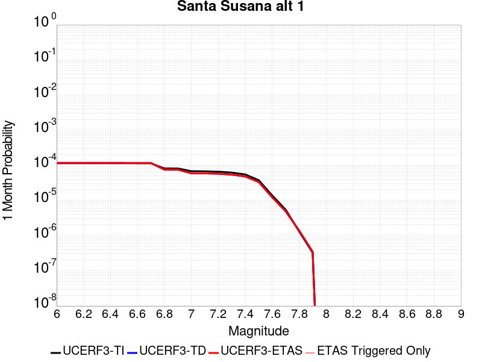 | 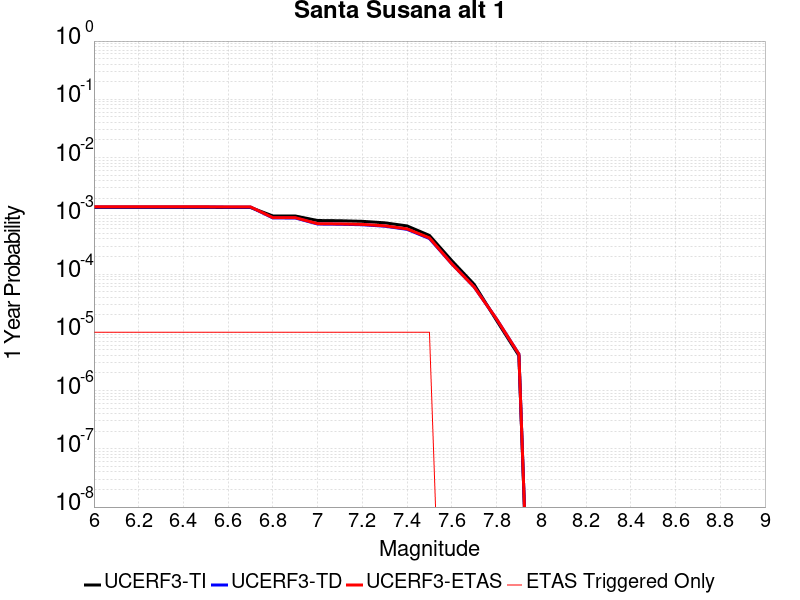 |  |

| Magnitude | 1 wk TI Prob | 1 wk TD Prob | 1 wk ETAS Prob | 1 wk ETAS/TD Gain | 1 wk ETAS Triggered Only | 1 mo TI Prob | 1 mo TD Prob | 1 mo ETAS Prob | 1 mo ETAS/TD Gain | 1 mo ETAS Triggered Only | 1 yr TI Prob | 1 yr TD Prob | 1 yr ETAS Prob | 1 yr ETAS/TD Gain | 1 yr ETAS Triggered Only | 10 yr TI Prob | 10 yr TD Prob | 10 yr ETAS Prob | 10 yr ETAS/TD Gain | 10 yr ETAS Triggered Only |
|-----|-----|-----|-----|-----|-----|-----|-----|-----|-----|-----|-----|-----|-----|-----|-----|-----|-----|-----|-----|-----|
| 6.0 | 2.674877E-5 | 2.7198987E-5 | 2.7198987E-5 | 1.0 | 0.0 | 1.1463255E-4 | 1.1656252E-4 | 1.1656252E-4 | 1.0 | 0.0 | 0.0013947578 | 0.0014183384 | 0.0014283243 | 1.0070405 | 1.0E-5 | 0.013860362 | 0.014104625 | 0.014114484 | 1.000699 | 1.0E-5 |
| 6.1 | 2.674877E-5 | 2.7198987E-5 | 2.7198987E-5 | 1.0 | 0.0 | 1.1463255E-4 | 1.1656252E-4 | 1.1656252E-4 | 1.0 | 0.0 | 0.0013947578 | 0.0014183384 | 0.0014283243 | 1.0070405 | 1.0E-5 | 0.013860362 | 0.014104625 | 0.014114484 | 1.000699 | 1.0E-5 |
| 6.2 | 2.674877E-5 | 2.7198987E-5 | 2.7198987E-5 | 1.0 | 0.0 | 1.1463255E-4 | 1.1656252E-4 | 1.1656252E-4 | 1.0 | 0.0 | 0.0013947578 | 0.0014183384 | 0.0014283243 | 1.0070405 | 1.0E-5 | 0.013860362 | 0.014104625 | 0.014114484 | 1.000699 | 1.0E-5 |
| 6.3 | 2.674877E-5 | 2.7198987E-5 | 2.7198987E-5 | 1.0 | 0.0 | 1.1463255E-4 | 1.1656252E-4 | 1.1656252E-4 | 1.0 | 0.0 | 0.0013947578 | 0.0014183384 | 0.0014283243 | 1.0070405 | 1.0E-5 | 0.013860362 | 0.014104625 | 0.014114484 | 1.000699 | 1.0E-5 |
| 6.4 | 2.674877E-5 | 2.7198987E-5 | 2.7198987E-5 | 1.0 | 0.0 | 1.1463255E-4 | 1.1656252E-4 | 1.1656252E-4 | 1.0 | 0.0 | 0.0013947578 | 0.0014183384 | 0.0014283243 | 1.0070405 | 1.0E-5 | 0.013860362 | 0.014104625 | 0.014114484 | 1.000699 | 1.0E-5 |
| 6.5 | 2.674877E-5 | 2.7198987E-5 | 2.7198987E-5 | 1.0 | 0.0 | 1.1463255E-4 | 1.1656252E-4 | 1.1656252E-4 | 1.0 | 0.0 | 0.0013947578 | 0.0014183384 | 0.0014283243 | 1.0070405 | 1.0E-5 | 0.013860362 | 0.014104625 | 0.014114484 | 1.000699 | 1.0E-5 |
| 6.6 | 2.6647976E-5 | 2.7075317E-5 | 2.7075317E-5 | 1.0 | 0.0 | 1.14200615E-4 | 1.16032556E-4 | 1.16032556E-4 | 1.0 | 0.0 | 0.0013895056 | 0.0014118948 | 0.0014218807 | 1.0070727 | 1.0E-5 | 0.013808494 | 0.0140410075 | 0.0140508665 | 1.0007021 | 1.0E-5 |
| 6.7 | 2.6647976E-5 | 2.7075317E-5 | 2.7075317E-5 | 1.0 | 0.0 | 1.14200615E-4 | 1.16032556E-4 | 1.16032556E-4 | 1.0 | 0.0 | 0.0013895056 | 0.0014118948 | 0.0014218807 | 1.0070727 | 1.0E-5 | 0.013808494 | 0.0140410075 | 0.0140508665 | 1.0007021 | 1.0E-5 |
| 6.8 | 1.9073179E-5 | 1.7637758E-5 | 1.7637758E-5 | 1.0 | 0.0 | 8.1739636E-5 | 7.55883E-5 | 7.55883E-5 | 1.0 | 0.0 | 9.947256E-4 | 9.199172E-4 | 9.29908E-4 | 1.0108606 | 1.0E-5 | 0.009902848 | 0.009163346 | 0.0091732545 | 1.0010813 | 1.0E-5 |
| 6.9 | 1.9041876E-5 | 1.7619888E-5 | 1.7619888E-5 | 1.0 | 0.0 | 8.160549E-5 | 7.551173E-5 | 7.551173E-5 | 1.0 | 0.0 | 9.930939E-4 | 9.1898564E-4 | 9.2897646E-4 | 1.0108715 | 1.0E-5 | 0.0098866755 | 0.009154107 | 0.009164016 | 1.0010824 | 1.0E-5 |
| 7.0 | 1.5917482E-5 | 1.386417E-5 | 1.386417E-5 | 1.0 | 0.0 | 6.8215995E-5 | 5.9416547E-5 | 5.9416547E-5 | 1.0 | 0.0 | 8.302132E-4 | 7.23161E-4 | 7.331538E-4 | 1.0138181 | 1.0E-5 | 0.008271185 | 0.0072089727 | 0.0072189006 | 1.0013771 | 1.0E-5 |
| 7.1 | 1.577788E-5 | 1.3744174E-5 | 1.3744174E-5 | 1.0 | 0.0 | 6.761774E-5 | 5.89023E-5 | 5.89023E-5 | 1.0 | 0.0 | 8.2293496E-4 | 7.169042E-4 | 7.2689704E-4 | 1.0139389 | 1.0E-5 | 0.008198941 | 0.007146809 | 0.007156737 | 1.0013893 | 1.0E-5 |
| 7.2 | 1.5416446E-5 | 1.3470239E-5 | 1.3470239E-5 | 1.0 | 0.0 | 6.606882E-5 | 5.7728343E-5 | 5.7728343E-5 | 1.0 | 0.0 | 8.0409093E-4 | 7.0262054E-4 | 7.126135E-4 | 1.0142224 | 1.0E-5 | 0.008011877 | 0.007004876 | 0.007014806 | 1.0014175 | 1.0E-5 |
| 7.3 | 1.4534083E-5 | 1.2718145E-5 | 1.2718145E-5 | 1.0 | 0.0 | 6.228744E-5 | 5.450522E-5 | 5.450522E-5 | 1.0 | 0.0 | 7.580857E-4 | 6.634035E-4 | 6.7339686E-4 | 1.0150638 | 1.0E-5 | 0.007555048 | 0.0066150823 | 0.006625016 | 1.0015017 | 1.0E-5 |
| 7.4 | 1.2858995E-5 | 1.1229864E-5 | 1.1229864E-5 | 1.0 | 0.0 | 5.5108816E-5 | 4.8127124E-5 | 4.8127124E-5 | 1.0 | 0.0 | 6.7074323E-4 | 5.8579416E-4 | 5.957883E-4 | 1.0170609 | 1.0E-5 | 0.0066872234 | 0.0058432748 | 0.0058532166 | 1.0017014 | 1.0E-5 |
| 7.5 | 8.827668E-6 | 7.805585E-6 | 7.805585E-6 | 1.0 | 0.0 | 3.7832317E-5 | 3.3452092E-5 | 3.3452092E-5 | 1.0 | 0.0 | 4.605111E-4 | 4.0720555E-4 | 4.1720146E-4 | 1.0245476 | 1.0E-5 | 0.0045955796 | 0.0040648426 | 0.004074802 | 1.0024501 | 1.0E-5 |
| 7.6 | 3.2533426E-6 | 2.8720196E-6 | 2.8720196E-6 | 1.0 | 0.0 | 1.3942822E-5 | 1.2308599E-5 | 1.2308599E-5 | 1.0 | 0.0 | 1.6974064E-4 | 1.4984726E-4 | 1.4984726E-4 | 1.0 | 0.0 | 0.0016961104 | 0.0014974991 | 0.0014974991 | 1.0 | 0.0 |
| 7.7 | 1.2751709E-6 | 1.1491261E-6 | 1.1491261E-6 | 1.0 | 0.0 | 5.4650063E-6 | 4.924817E-6 | 4.924817E-6 | 1.0 | 0.0 | 6.653442E-5 | 5.995809E-5 | 5.995809E-5 | 1.0 | 0.0 | 6.6514505E-4 | 5.99428E-4 | 5.99428E-4 | 1.0 | 0.0 |
| 7.8 | 3.067544E-7 | 3.2400882E-7 | 3.2400882E-7 | 1.0 | 0.0 | 1.3146611E-6 | 1.3886086E-6 | 1.3886086E-6 | 1.0 | 0.0 | 1.600588E-5 | 1.6906188E-5 | 1.6906188E-5 | 1.0 | 0.0 | 1.6004729E-4 | 1.6905005E-4 | 1.6905005E-4 | 1.0 | 0.0 |
| 7.9 | 7.622999E-8 | 8.088071E-8 | 8.088071E-8 | 1.0 | 0.0 | 3.2669993E-7 | 3.466316E-7 | 3.466316E-7 | 1.0 | 0.0 | 3.977564E-6 | 4.2202337E-6 | 4.2202337E-6 | 1.0 | 0.0 | 3.977493E-5 | 4.220174E-5 | 4.220174E-5 | 1.0 | 0.0 |

## Channel Islands Western Deep Ramp
*[(top)](#table-of-contents)*

| 1 Week | 1 Month | 1 Year | 10 Year |
|-----|-----|-----|-----|
|  |  |  |  |

| Magnitude | 1 wk TI Prob | 1 wk TD Prob | 1 wk ETAS Prob | 1 wk ETAS/TD Gain | 1 wk ETAS Triggered Only | 1 mo TI Prob | 1 mo TD Prob | 1 mo ETAS Prob | 1 mo ETAS/TD Gain | 1 mo ETAS Triggered Only | 1 yr TI Prob | 1 yr TD Prob | 1 yr ETAS Prob | 1 yr ETAS/TD Gain | 1 yr ETAS Triggered Only | 10 yr TI Prob | 10 yr TD Prob | 10 yr ETAS Prob | 10 yr ETAS/TD Gain | 10 yr ETAS Triggered Only |
|-----|-----|-----|-----|-----|-----|-----|-----|-----|-----|-----|-----|-----|-----|-----|-----|-----|-----|-----|-----|-----|
| 6.0 | 6.0213506E-6 | 6.254919E-6 | 6.254919E-6 | 1.0 | 0.0 | 2.5805533E-5 | 2.6806545E-5 | 2.6806545E-5 | 1.0 | 0.0 | 3.1413708E-4 | 3.2632527E-4 | 3.2632527E-4 | 1.0 | 0.0 | 0.0031369338 | 0.0032589026 | 0.00326887 | 1.0030586 | 1.0E-5 |
| 6.1 | 6.0213506E-6 | 6.254919E-6 | 6.254919E-6 | 1.0 | 0.0 | 2.5805533E-5 | 2.6806545E-5 | 2.6806545E-5 | 1.0 | 0.0 | 3.1413708E-4 | 3.2632527E-4 | 3.2632527E-4 | 1.0 | 0.0 | 0.0031369338 | 0.0032589026 | 0.00326887 | 1.0030586 | 1.0E-5 |
| 6.2 | 6.0213506E-6 | 6.254919E-6 | 6.254919E-6 | 1.0 | 0.0 | 2.5805533E-5 | 2.6806545E-5 | 2.6806545E-5 | 1.0 | 0.0 | 3.1413708E-4 | 3.2632527E-4 | 3.2632527E-4 | 1.0 | 0.0 | 0.0031369338 | 0.0032589026 | 0.00326887 | 1.0030586 | 1.0E-5 |
| 6.3 | 6.0213506E-6 | 6.254919E-6 | 6.254919E-6 | 1.0 | 0.0 | 2.5805533E-5 | 2.6806545E-5 | 2.6806545E-5 | 1.0 | 0.0 | 3.1413708E-4 | 3.2632527E-4 | 3.2632527E-4 | 1.0 | 0.0 | 0.0031369338 | 0.0032589026 | 0.00326887 | 1.0030586 | 1.0E-5 |
| 6.4 | 6.0213506E-6 | 6.254919E-6 | 6.254919E-6 | 1.0 | 0.0 | 2.5805533E-5 | 2.6806545E-5 | 2.6806545E-5 | 1.0 | 0.0 | 3.1413708E-4 | 3.2632527E-4 | 3.2632527E-4 | 1.0 | 0.0 | 0.0031369338 | 0.0032589026 | 0.00326887 | 1.0030586 | 1.0E-5 |
| 6.5 | 6.0213506E-6 | 6.254919E-6 | 6.254919E-6 | 1.0 | 0.0 | 2.5805533E-5 | 2.6806545E-5 | 2.6806545E-5 | 1.0 | 0.0 | 3.1413708E-4 | 3.2632527E-4 | 3.2632527E-4 | 1.0 | 0.0 | 0.0031369338 | 0.0032589026 | 0.00326887 | 1.0030586 | 1.0E-5 |
| 6.6 | 6.0213506E-6 | 6.254919E-6 | 6.254919E-6 | 1.0 | 0.0 | 2.5805533E-5 | 2.6806545E-5 | 2.6806545E-5 | 1.0 | 0.0 | 3.1413708E-4 | 3.2632527E-4 | 3.2632527E-4 | 1.0 | 0.0 | 0.0031369338 | 0.0032589026 | 0.00326887 | 1.0030586 | 1.0E-5 |
| 6.7 | 5.313309E-6 | 5.5252867E-6 | 5.5252867E-6 | 1.0 | 0.0 | 2.2771126E-5 | 2.3679608E-5 | 2.3679608E-5 | 1.0 | 0.0 | 2.772032E-4 | 2.8826518E-4 | 2.8826518E-4 | 1.0 | 0.0 | 0.0027685766 | 0.0028793155 | 0.0028892867 | 1.003463 | 1.0E-5 |
| 6.8 | 5.313309E-6 | 5.5252867E-6 | 5.5252867E-6 | 1.0 | 0.0 | 2.2771126E-5 | 2.3679608E-5 | 2.3679608E-5 | 1.0 | 0.0 | 2.772032E-4 | 2.8826518E-4 | 2.8826518E-4 | 1.0 | 0.0 | 0.0027685766 | 0.0028793155 | 0.0028892867 | 1.003463 | 1.0E-5 |
| 6.9 | 4.744377E-6 | 4.939473E-6 | 4.939473E-6 | 1.0 | 0.0 | 2.0332885E-5 | 2.1169019E-5 | 2.1169019E-5 | 1.0 | 0.0 | 2.4752476E-4 | 2.5770607E-4 | 2.5770607E-4 | 1.0 | 0.0 | 0.0024724922 | 0.0025744396 | 0.0025844139 | 1.0038743 | 1.0E-5 |
| 7.0 | 4.722209E-6 | 4.9165155E-6 | 4.9165155E-6 | 1.0 | 0.0 | 2.0237881E-5 | 2.1070631E-5 | 2.1070631E-5 | 1.0 | 0.0 | 2.4636835E-4 | 2.5650847E-4 | 2.5650847E-4 | 1.0 | 0.0 | 0.002460954 | 0.0025624912 | 0.0025724657 | 1.0038924 | 1.0E-5 |
| 7.1 | 4.611174E-6 | 4.8014504E-6 | 4.8014504E-6 | 1.0 | 0.0 | 1.9762025E-5 | 2.0577503E-5 | 2.0577503E-5 | 1.0 | 0.0 | 2.4057609E-4 | 2.5050604E-4 | 2.5050604E-4 | 1.0 | 0.0 | 0.002403158 | 0.0025026035 | 0.0025125784 | 1.0039859 | 1.0E-5 |
| 7.2 | 4.043994E-6 | 4.2120632E-6 | 4.2120632E-6 | 1.0 | 0.0 | 1.7331287E-5 | 1.8051594E-5 | 1.8051594E-5 | 1.0 | 0.0 | 2.10988E-4 | 2.1975956E-4 | 2.1975956E-4 | 1.0 | 0.0 | 0.002107878 | 0.0021957732 | 0.0022057514 | 1.0045443 | 1.0E-5 |
| 7.3 | 2.1233036E-6 | 2.229811E-6 | 2.229811E-6 | 1.0 | 0.0 | 9.099841E-6 | 9.556297E-6 | 9.556297E-6 | 1.0 | 0.0 | 1.1078493E-4 | 1.1634176E-4 | 1.1634176E-4 | 1.0 | 0.0 | 0.0011072971 | 0.0011628141 | 0.0011628141 | 1.0 | 0.0 |
| 7.4 | 1.9051884E-6 | 2.0015184E-6 | 2.0015184E-6 | 1.0 | 0.0 | 8.165067E-6 | 8.577908E-6 | 8.577908E-6 | 1.0 | 0.0 | 9.940516E-5 | 1.0443108E-4 | 1.0443108E-4 | 1.0 | 0.0 | 9.93607E-4 | 0.0010438253 | 0.0010438253 | 1.0 | 0.0 |
| 7.5 | 1.2408497E-6 | 1.3038978E-6 | 1.3038978E-6 | 1.0 | 0.0 | 5.317916E-6 | 5.5881214E-6 | 5.5881214E-6 | 1.0 | 0.0 | 6.4743705E-5 | 6.8033274E-5 | 6.8033274E-5 | 1.0 | 0.0 | 6.4724847E-4 | 6.8012666E-4 | 6.8012666E-4 | 1.0 | 0.0 |
| 7.6 | 6.5440025E-7 | 6.8867934E-7 | 6.8867934E-7 | 1.0 | 0.0 | 2.8045695E-6 | 2.9514795E-6 | 2.9514795E-6 | 1.0 | 0.0 | 3.4145098E-5 | 3.5933685E-5 | 3.5933685E-5 | 1.0 | 0.0 | 3.4139853E-4 | 3.5928018E-4 | 3.5928018E-4 | 1.0 | 0.0 |
| 7.7 | 3.985963E-7 | 4.193124E-7 | 4.193124E-7 | 1.0 | 0.0 | 1.7082689E-6 | 1.797052E-6 | 1.797052E-6 | 1.0 | 0.0 | 2.0797976E-5 | 2.1878901E-5 | 2.1878901E-5 | 1.0 | 0.0 | 2.0796029E-4 | 2.1876865E-4 | 2.1876865E-4 | 1.0 | 0.0 |
| 7.8 | 3.706329E-8 | 3.8592127E-8 | 3.8592127E-8 | 1.0 | 0.0 | 1.5884267E-7 | 1.6539482E-7 | 1.6539482E-7 | 1.0 | 0.0 | 1.9339077E-6 | 2.0136802E-6 | 2.0136802E-6 | 1.0 | 0.0 | 1.933891E-5 | 2.0136631E-5 | 2.0136631E-5 | 1.0 | 0.0 |

## Calaveras (So) 2011 CFM
*[(top)](#table-of-contents)*

| 1 Week | 1 Month | 1 Year | 10 Year |
|-----|-----|-----|-----|
|  |  |  |  |

| Magnitude | 1 wk TI Prob | 1 wk TD Prob | 1 wk ETAS Prob | 1 wk ETAS/TD Gain | 1 wk ETAS Triggered Only | 1 mo TI Prob | 1 mo TD Prob | 1 mo ETAS Prob | 1 mo ETAS/TD Gain | 1 mo ETAS Triggered Only | 1 yr TI Prob | 1 yr TD Prob | 1 yr ETAS Prob | 1 yr ETAS/TD Gain | 1 yr ETAS Triggered Only | 10 yr TI Prob | 10 yr TD Prob | 10 yr ETAS Prob | 10 yr ETAS/TD Gain | 10 yr ETAS Triggered Only |
|-----|-----|-----|-----|-----|-----|-----|-----|-----|-----|-----|-----|-----|-----|-----|-----|-----|-----|-----|-----|-----|
| 6.0 | 1.5950744E-4 | 3.0725458E-4 | 3.0725458E-4 | 1.0 | 0.0 | 6.834242E-4 | 0.0013161583 | 0.0013161583 | 1.0 | 0.0 | 0.00828899 | 0.015863078 | 0.015863078 | 1.0 | 0.0 | 0.079865426 | 0.14443597 | 0.14444453 | 1.0000592 | 1.0E-5 |
| 6.1 | 1.3584697E-4 | 2.6049113E-4 | 2.6049113E-4 | 1.0 | 0.0 | 5.8207137E-4 | 0.0011159335 | 0.0011159335 | 1.0 | 0.0 | 0.007063716 | 0.013465972 | 0.013465972 | 1.0 | 0.0 | 0.06843361 | 0.12406343 | 0.12407219 | 1.0000706 | 1.0E-5 |
| 6.2 | 1.14676266E-4 | 2.1736759E-4 | 2.1736759E-4 | 1.0 | 0.0 | 4.9137714E-4 | 9.3125994E-4 | 9.3125994E-4 | 1.0 | 0.0 | 0.0059661185 | 0.011249232 | 0.011249232 | 1.0 | 0.0 | 0.058084648 | 0.10505382 | 0.105062775 | 1.0000852 | 1.0E-5 |
| 6.3 | 8.691518E-5 | 1.5995163E-4 | 1.5995163E-4 | 1.0 | 0.0 | 3.7244044E-4 | 6.8532437E-4 | 6.8532437E-4 | 1.0 | 0.0 | 0.004525038 | 0.008304858 | 0.008304858 | 1.0 | 0.0 | 0.044339992 | 0.07936951 | 0.07937872 | 1.000116 | 1.0E-5 |
| 6.4 | 8.50982E-5 | 1.5701546E-4 | 1.5701546E-4 | 1.0 | 0.0 | 3.646556E-4 | 6.727473E-4 | 6.727473E-4 | 1.0 | 0.0 | 0.0044306475 | 0.008152884 | 0.008152884 | 1.0 | 0.0 | 0.04343345 | 0.077975616 | 0.07798484 | 1.0001183 | 1.0E-5 |
| 6.5 | 8.4062965E-5 | 1.552609E-4 | 1.552609E-4 | 1.0 | 0.0 | 3.602201E-4 | 6.6523167E-4 | 6.6523167E-4 | 1.0 | 0.0 | 0.004376863 | 0.008062082 | 0.008062082 | 1.0 | 0.0 | 0.042916555 | 0.077146865 | 0.0771561 | 1.0001196 | 1.0E-5 |
| 6.6 | 8.194716E-5 | 1.5161974E-4 | 1.5161974E-4 | 1.0 | 0.0 | 3.5115483E-4 | 6.496345E-4 | 6.496345E-4 | 1.0 | 0.0 | 0.0042669317 | 0.007873914 | 0.007873914 | 1.0 | 0.0 | 0.04185927 | 0.075432085 | 0.07544133 | 1.0001225 | 1.0E-5 |
| 6.7 | 8.012326E-5 | 1.4829634E-4 | 1.4829634E-4 | 1.0 | 0.0 | 3.433402E-4 | 6.354009E-4 | 6.354009E-4 | 1.0 | 0.0 | 0.004172157 | 0.0077024 | 0.0077024 | 1.0 | 0.0 | 0.040946912 | 0.07387418 | 0.073883444 | 1.0001254 | 1.0E-5 |
| 6.8 | 7.119773E-5 | 1.2887981E-4 | 1.2887981E-4 | 1.0 | 0.0 | 3.0509746E-4 | 5.5222475E-4 | 5.5222475E-4 | 1.0 | 0.0 | 0.0037082357 | 0.0066996207 | 0.0066996207 | 1.0 | 0.0 | 0.036469642 | 0.06471731 | 0.06472666 | 1.0001445 | 1.0E-5 |
| 6.9 | 5.7343088E-5 | 9.9251316E-5 | 9.9251316E-5 | 1.0 | 0.0 | 2.4573295E-4 | 4.2529387E-4 | 4.2529387E-4 | 1.0 | 0.0 | 0.0029876942 | 0.005165742 | 0.005165742 | 1.0 | 0.0 | 0.02947844 | 0.05053851 | 0.050548006 | 1.0001879 | 1.0E-5 |
| 7.0 | 4.8746577E-5 | 8.290868E-5 | 8.290868E-5 | 1.0 | 0.0 | 2.0889717E-4 | 3.5527485E-4 | 3.5527485E-4 | 1.0 | 0.0 | 0.0025403565 | 0.004316959 | 0.004316959 | 1.0 | 0.0 | 0.025115121 | 0.042514168 | 0.04252374 | 1.0002252 | 1.0E-5 |
| 7.1 | 4.2998014E-5 | 7.269338E-5 | 7.269338E-5 | 1.0 | 0.0 | 1.8426418E-4 | 3.1150618E-4 | 3.1150618E-4 | 1.0 | 0.0 | 0.002241108 | 0.0037860526 | 0.0037860526 | 1.0 | 0.0 | 0.022186412 | 0.037444763 | 0.03745439 | 1.000257 | 1.0E-5 |
| 7.2 | 3.221292E-5 | 5.394872E-5 | 5.394872E-5 | 1.0 | 0.0 | 1.3804805E-4 | 2.3118846E-4 | 2.3118846E-4 | 1.0 | 0.0 | 0.0016794393 | 0.0028111145 | 0.0028111145 | 1.0 | 0.0 | 0.016668037 | 0.028057167 | 0.028066888 | 1.0003464 | 1.0E-5 |
| 7.3 | 2.3756531E-5 | 3.95127E-5 | 3.95127E-5 | 1.0 | 0.0 | 1.0180973E-4 | 1.6932924E-4 | 1.6932924E-4 | 1.0 | 0.0 | 0.0012388286 | 0.0020596513 | 0.0020596513 | 1.0 | 0.0 | 0.012319452 | 0.020663794 | 0.020673588 | 1.000474 | 1.0E-5 |
| 7.4 | 1.5997684E-5 | 2.7354998E-5 | 2.7354998E-5 | 1.0 | 0.0 | 6.8559704E-5 | 1.1723045E-4 | 1.1723045E-4 | 1.0 | 0.0 | 8.343947E-4 | 0.0014263487 | 0.0014263487 | 1.0 | 0.0 | 0.008312687 | 0.014383431 | 0.014393287 | 1.0006852 | 1.0E-5 |
| 7.5 | 1.3814293E-5 | 2.4796405E-5 | 2.4796405E-5 | 1.0 | 0.0 | 5.9202768E-5 | 1.06265994E-4 | 1.06265994E-4 | 1.0 | 0.0 | 7.205553E-4 | 0.001293023 | 0.001293023 | 1.0 | 0.0 | 0.007182234 | 0.013062489 | 0.013072358 | 1.0007555 | 1.0E-5 |
| 7.6 | 8.817309E-6 | 1.6441743E-5 | 1.6441743E-5 | 1.0 | 0.0 | 3.7787922E-5 | 7.046272E-5 | 7.046272E-5 | 1.0 | 0.0 | 4.5997082E-4 | 8.575473E-4 | 8.575473E-4 | 1.0 | 0.0 | 0.004590199 | 0.008725693 | 0.008735606 | 1.0011361 | 1.0E-5 |
| 7.7 | 4.0352206E-6 | 7.713456E-6 | 7.713456E-6 | 1.0 | 0.0 | 1.7293689E-5 | 3.305725E-5 | 3.305725E-5 | 1.0 | 0.0 | 2.1053031E-4 | 4.023978E-4 | 4.023978E-4 | 1.0 | 0.0 | 0.0021033096 | 0.0041682166 | 0.0041781752 | 1.0023891 | 1.0E-5 |
| 7.8 | 3.413169E-6 | 6.792667E-6 | 6.792667E-6 | 1.0 | 0.0 | 1.4627784E-5 | 2.9111106E-5 | 2.9111106E-5 | 1.0 | 0.0 | 1.7807873E-4 | 3.5437013E-4 | 3.5437013E-4 | 1.0 | 0.0 | 0.0017793609 | 0.0036691492 | 0.0036791125 | 1.0027155 | 1.0E-5 |
| 7.9 | 2.4740732E-6 | 5.283191E-6 | 5.283191E-6 | 1.0 | 0.0 | 1.06031275E-5 | 2.264205E-5 | 2.264205E-5 | 1.0 | 0.0 | 1.2908543E-4 | 2.7563216E-4 | 2.7563216E-4 | 1.0 | 0.0 | 0.0012901047 | 0.0028367722 | 0.002846744 | 1.0035151 | 1.0E-5 |
| 8.0 | 1.5231818E-6 | 3.2913404E-6 | 3.2913404E-6 | 1.0 | 0.0 | 6.527906E-6 | 1.4105668E-5 | 1.4105668E-5 | 1.0 | 0.0 | 7.9474354E-5 | 1.7172302E-4 | 1.7172302E-4 | 1.0 | 0.0 | 7.944594E-4 | 0.001757665 | 0.0017676473 | 1.0056794 | 1.0E-5 |
| 8.1 | 1.0104524E-6 | 2.0473624E-6 | 2.0473624E-6 | 1.0 | 0.0 | 4.330503E-6 | 8.774381E-6 | 8.774381E-6 | 1.0 | 0.0 | 5.2722597E-5 | 1.0682288E-4 | 1.0682288E-4 | 1.0 | 0.0 | 5.271009E-4 | 0.001093772 | 0.001103761 | 1.0091326 | 1.0E-5 |

