# Parent Section Magnitude-Probability Distributions

Only fault sections with at least one triggered aftershock are plotted. Sections are sorted by total supraseismogenic trigger rate (decreasing)

## Table Of Contents

* [Garlock (Central)](#garlock-central)
* [Tank Canyon](#tank-canyon)
* [Little Lake](#little-lake)
* [Airport Lake](#airport-lake)
* [Owl Lake](#owl-lake)
* [Panamint Valley](#panamint-valley)
* [Garlock (East)](#garlock-east)
* [Ash Hill](#ash-hill)
* [Hunter Mountain-Saline Valley](#hunter-mountain-saline-valley)
* [Blackwater](#blackwater)
* [Garlock (West)](#garlock-west)
* [McLean Lake](#mclean-lake)
* [Gravel Hills-Harper Lk](#gravel-hills-harper-lk)
* [Goldstone Lake](#goldstone-lake)
* [So Sierra Nevada](#so-sierra-nevada)
* [Coyote Canyon](#coyote-canyon)
* [San Andreas (Mojave S)](#san-andreas-mojave-s)
* [San Andreas (Mojave N)](#san-andreas-mojave-n)
* [Nelson Lake](#nelson-lake)
* [Death Valley (So)](#death-valley-so)
* [Lenwood-Lockhart-Old Woman Springs](#lenwood-lockhart-old-woman-springs)
* [Towne Pass](#towne-pass)
* [San Andreas (San Bernardino N)](#san-andreas-san-bernardino-n)
* [Paradise](#paradise)
* [Bicycle Lake](#bicycle-lake)
* [Garlic Springs](#garlic-springs)
* [Death Valley (Black Mtns Frontal)](#death-valley-black-mtns-frontal)
* [San Andreas (San Bernardino S)](#san-andreas-san-bernardino-s)
* [Helendale-So Lockhart](#helendale-so-lockhart)
* [Coyote Lake](#coyote-lake)
* [San Andreas (Big Bend)](#san-andreas-big-bend)
* [Death Valley (No)](#death-valley-no)
* [San Andreas (Parkfield)](#san-andreas-parkfield)
* [Sierra Nevada  (No Extension)](#sierra-nevada--no-extension)
* [San Andreas (San Gorgonio Pass-Garnet HIll)](#san-andreas-san-gorgonio-pass-garnet-hill)
* [Manix-Afton Hills](#manix-afton-hills)
* [San Andreas (Cholame) rev](#san-andreas-cholame-rev)
* [San Andreas (Carrizo) rev](#san-andreas-carrizo-rev)
* [Ludlow](#ludlow)
* [Scodie Lineament](#scodie-lineament)
* [Death Valley (Fish Lake Valley)](#death-valley-fish-lake-valley)
* [San Jacinto (San Bernardino)](#san-jacinto-san-bernardino)
* [Cady](#cady)
* [San Jacinto (San Jacinto Valley) rev](#san-jacinto-san-jacinto-valley-rev)
* [Red Pass](#red-pass)
* [Elsinore (Glen Ivy) rev](#elsinore-glen-ivy-rev)
* [San Jacinto (Stepovers Combined)](#san-jacinto-stepovers-combined)
* [Lake Isabella (Seismicity)](#lake-isabella-seismicity)
* [White Wolf (Extension)](#white-wolf-extension)
* [San Jacinto (Anza) rev](#san-jacinto-anza-rev)
* [San Andreas (Coachella) rev](#san-andreas-coachella-rev)
* [Santa Ynez (West)](#santa-ynez-west)
* [Baker](#baker)
* [San Andreas (North Branch Mill Creek)](#san-andreas-north-branch-mill-creek)
* [Owens Valley](#owens-valley)
* [Mission Ridge-Arroyo Parida-Santa Ana](#mission-ridge-arroyo-parida-santa-ana)
* [San Andreas (Creeping Section) 2011 CFM](#san-andreas-creeping-section-2011-cfm)
* [Red Mountain](#red-mountain)
* [Cleghorn Lake](#cleghorn-lake)
* [San Jacinto (Coyote Creek)](#san-jacinto-coyote-creek)
* [Calico-Hidalgo](#calico-hidalgo)
* [Dry Mountain](#dry-mountain)
* [Pleito](#pleito)
* [Cleghorn Pass](#cleghorn-pass)
* [Independence rev 2011](#independence-rev-2011)
* [Kern Canyon (North Kern) 2011](#kern-canyon-north-kern-2011)
* [Pinto Mtn](#pinto-mtn)
* [Santa Ynez (East)](#santa-ynez-east)
* [Ortigalita (North)](#ortigalita-north)
* [Santa Rosa Island](#santa-rosa-island)
* [Blue Cut](#blue-cut)
* [Ventura-Pitas Point](#ventura-pitas-point)
* [Bullion Mountains](#bullion-mountains)
* [Palos Verdes](#palos-verdes)
* [Mission Creek](#mission-creek)
* [San Clemente](#san-clemente)
* [San Diego Trough north alt1](#san-diego-trough-north-alt1)
* [Chino alt 1](#chino-alt-1)
* [Deep Springs](#deep-springs)
* [San Jacinto (Borrego)](#san-jacinto-borrego)
* [Santa Ynez River](#santa-ynez-river)
* [Rose Canyon](#rose-canyon)
* [Great Valley 09 (Laguna Seca)](#great-valley-09-laguna-seca)
* [Santa Cruz Island](#santa-cruz-island)
* [Lost Hills](#lost-hills)
* [Whittier alt 1](#whittier-alt-1)
* [Coronado Bank alt1](#coronado-bank-alt1)
* [San Jacinto (Lytle Creek connector)](#san-jacinto-lytle-creek-connector)
* [Santa Cruz Catalina Ridge alt1](#santa-cruz-catalina-ridge-alt1)
* [Sheephole](#sheephole)
* [Camp Rock 2011](#camp-rock-2011)
* [Oceanic - West Huasna](#oceanic---west-huasna)
* [White Mountains](#white-mountains)
* [San Gabriel](#san-gabriel)
* [Elysian Park (Upper)](#elysian-park-upper)
* [Brawley (Seismic Zone) alt 1](#brawley-seismic-zone-alt-1)
* [Pitas Point (Lower West)](#pitas-point-lower-west)
* [San Luis Range 2011 CFM](#san-luis-range-2011-cfm)
* [Monterey Bay-Tularcitos](#monterey-bay-tularcitos)
* [Channel Islands Thrust](#channel-islands-thrust)
* [Imperial](#imperial)
* [Cleghorn](#cleghorn)
* [Tin Mountain](#tin-mountain)
* [North Frontal  (East)](#north-frontal--east)
* [Kern Canyon (South Kern) 2011](#kern-canyon-south-kern-2011)
* [Big Pine (East)](#big-pine-east)
* [Kern Canyon (Lake Isabella) 2011](#kern-canyon-lake-isabella-2011)
* [Ortigalita (South)](#ortigalita-south)
* [Pitas Point (Lower)-Montalvo](#pitas-point-lower-montalvo)
* [Hosgri (Extension)](#hosgri-extension)
* [Big Pine (Central)](#big-pine-central)
* [San Jacinto (Clark) rev](#san-jacinto-clark-rev)
* [Hosgri](#hosgri)
* [Simi-Santa Rosa](#simi-santa-rosa)
* [Hartley Springs 2011 CFM](#hartley-springs-2011-cfm)
* [Hayward (No) 2011 CFM](#hayward-no-2011-cfm)
* [San Andreas (Santa Cruz Mts) 2011 CFM](#san-andreas-santa-cruz-mts-2011-cfm)
* [San Pedro Basin](#san-pedro-basin)
* [Jess Valley](#jess-valley)
* [Elmore Ranch](#elmore-ranch)
* [Great Valley 05 Pittsburg - Kirby Hills alt1](#great-valley-05-pittsburg---kirby-hills-alt1)
* [Oak Ridge (Onshore)](#oak-ridge-onshore)
* [Raymond](#raymond)
* [Greenville (No) 2011 CFM](#greenville-no-2011-cfm)
* [Rinconada 2011 CFM](#rinconada-2011-cfm)
* [Calaveras (So) - Paicines extension 2011 CFM](#calaveras-so---paicines-extension-2011-cfm)
* [Antelope Valley 2011](#antelope-valley-2011)
* [White Wolf](#white-wolf)
* [San Diego Trough south](#san-diego-trough-south)
* [San Juan](#san-juan)
* [Elsinore (Stepovers Combined)](#elsinore-stepovers-combined)
* [Pisgah-Bullion Mtn-Mesquite Lk](#pisgah-bullion-mtn-mesquite-lk)
* [North Frontal  (West)](#north-frontal--west)
* [San Cayetano](#san-cayetano)
* [Elsinore (Temecula) rev](#elsinore-temecula-rev)
* [San Andreas (North Coast) 2011 CFM](#san-andreas-north-coast-2011-cfm)
* [Eaton Roughs 2011 CFM](#eaton-roughs-2011-cfm)
* [Newport-Inglewood alt 1](#newport-inglewood-alt-1)
* [Santa Susana alt 1](#santa-susana-alt-1)
* [Calaveras (So) 2011 CFM](#calaveras-so-2011-cfm)
* [San Andreas (Offshore) 2011 CFM](#san-andreas-offshore-2011-cfm)
* [Rodgers Creek - Healdsburg 2011 CFM](#rodgers-creek---healdsburg-2011-cfm)
* [Puente Hills](#puente-hills)
* [Gillem - Big Crack 2011 CFM](#gillem---big-crack-2011-cfm)
* [Goose Lake 2011 CFM](#goose-lake-2011-cfm)
* [San Jacinto (Superstition Mtn)](#san-jacinto-superstition-mtn)
* [Homestead Valley 2011](#homestead-valley-2011)
* [Los Medanos - Roe Island](#los-medanos---roe-island)
* [Hector Mine](#hector-mine)
* [Robinson Creek](#robinson-creek)
* [Laguna Salada](#laguna-salada)
* [San Jose](#san-jose)
* [Hayward (So) 2011 CFM](#hayward-so-2011-cfm)
* [La Panza 2011](#la-panza-2011)
* [Quien Sabe 2011 CFM](#quien-sabe-2011-cfm)
* [Great Valley 07 (Orestimba)](#great-valley-07-orestimba)
* [San Gregorio (North) 2011 CFM](#san-gregorio-north-2011-cfm)
* [Cucamonga](#cucamonga)
* [Trinidad (alt1)](#trinidad-alt1)
* [East Huasna 2011 CFM](#east-huasna-2011-cfm)
* [Great Valley 08 (Quinto)](#great-valley-08-quinto)
* [Elsinore (Coyote Mountains)](#elsinore-coyote-mountains)
* [Green Valley 2011 CFM](#green-valley-2011-cfm)
* [Calaveras (No) 2011 CFM](#calaveras-no-2011-cfm)
* [Superstition Hills](#superstition-hills)
* [Mono Lake 2011 CFM](#mono-lake-2011-cfm)
* [Clayton](#clayton)
* [Santa Susana East (connector)](#santa-susana-east-connector)
* [Reliz 2011 CFM](#reliz-2011-cfm)
* [Calaveras (Central) 2011 CFM](#calaveras-central-2011-cfm)
* [Emerson-Copper Mtn 2011](#emerson-copper-mtn-2011)
* [Los Osos 2011](#los-osos-2011)
* [Maacama 2011 CFM](#maacama-2011-cfm)

## Garlock (Central)
*[(top)](#table-of-contents)*

| 1 Week | 1 Month | 1 Year | 10 Year |
|-----|-----|-----|-----|
| 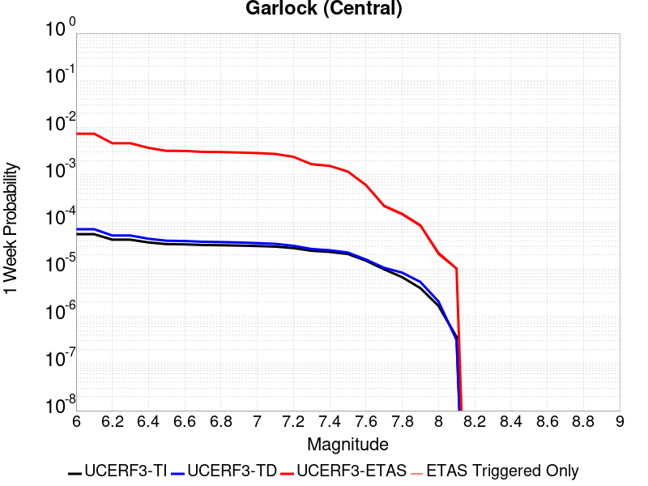 |  | 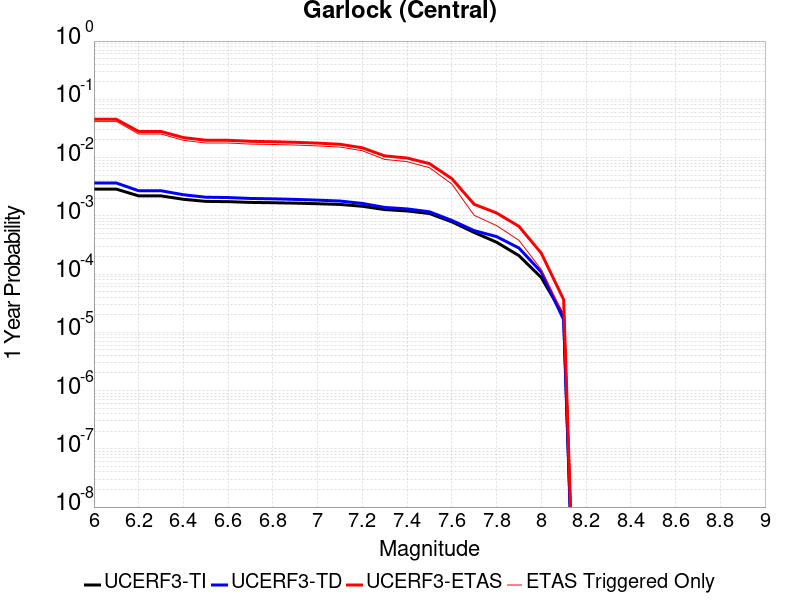 |  |

| Magnitude | 1 wk TI Prob | 1 wk TD Prob | 1 wk ETAS Prob | 1 wk ETAS/TD Gain | 1 wk ETAS Triggered Only | 1 mo TI Prob | 1 mo TD Prob | 1 mo ETAS Prob | 1 mo ETAS/TD Gain | 1 mo ETAS Triggered Only | 1 yr TI Prob | 1 yr TD Prob | 1 yr ETAS Prob | 1 yr ETAS/TD Gain | 1 yr ETAS Triggered Only | 10 yr TI Prob | 10 yr TD Prob | 10 yr ETAS Prob | 10 yr ETAS/TD Gain | 10 yr ETAS Triggered Only |
|-----|-----|-----|-----|-----|-----|-----|-----|-----|-----|-----|-----|-----|-----|-----|-----|-----|-----|-----|-----|-----|
| 6.0 | 5.5131142E-5 | 7.0252914E-5 | 0.0074197366 | 105.61464 | 0.00735 | 2.3625491E-4 | 3.0104956E-4 | 0.01783577 | 59.245293 | 0.01754 | 0.0028726095 | 0.0036591839 | 0.0453959 | 12.406018 | 0.04189 | 0.028357591 | 0.03608289 | 0.10118585 | 2.8042612 | 0.06754 |
| 6.1 | 5.5131142E-5 | 7.0252914E-5 | 0.0074197366 | 105.61464 | 0.00735 | 2.3625491E-4 | 3.0104956E-4 | 0.01783577 | 59.245293 | 0.01754 | 0.0028726095 | 0.0036591839 | 0.0453959 | 12.406018 | 0.04189 | 0.028357591 | 0.03608289 | 0.10118585 | 2.8042612 | 0.06754 |
| 6.2 | 4.216245E-5 | 5.166702E-5 | 0.0046714284 | 90.41412 | 0.00462 | 1.806837E-4 | 2.2141146E-4 | 0.010639104 | 48.05128 | 0.01042 | 0.0021976046 | 0.0026923837 | 0.02800405 | 10.401211 | 0.02538 | 0.021759989 | 0.02669258 | 0.0673379 | 2.5227196 | 0.04176 |
| 6.3 | 4.216245E-5 | 5.166702E-5 | 0.0046714284 | 90.41412 | 0.00462 | 1.806837E-4 | 2.2141146E-4 | 0.010639104 | 48.05128 | 0.01042 | 0.0021976046 | 0.0026923837 | 0.02800405 | 10.401211 | 0.02538 | 0.021759989 | 0.02669258 | 0.0673379 | 2.5227196 | 0.04176 |
| 6.4 | 3.6858168E-5 | 4.411584E-5 | 0.0037239534 | 84.41307 | 0.00368 | 1.5795401E-4 | 1.8905434E-4 | 0.008337514 | 44.10115 | 0.00815 | 0.0019213937 | 0.0022993318 | 0.02200392 | 9.569701 | 0.01975 | 0.019048655 | 0.02285164 | 0.054618735 | 2.390145 | 0.03251 |
| 6.5 | 3.39199E-5 | 4.0023286E-5 | 0.0032098964 | 80.20072 | 0.00317 | 1.453629E-4 | 1.7151721E-4 | 0.0074402704 | 43.379147 | 0.00727 | 0.0017683565 | 0.0020862438 | 0.01983913 | 9.509497 | 0.01779 | 0.017543508 | 0.02076252 | 0.049532518 | 2.3856697 | 0.02938 |
| 6.6 | 3.3571985E-5 | 3.947746E-5 | 0.0032093523 | 81.295815 | 0.00317 | 1.4387199E-4 | 1.6917827E-4 | 0.007437948 | 43.965153 | 0.00727 | 0.0017502342 | 0.0020578213 | 0.019791255 | 9.617577 | 0.01777 | 0.017365133 | 0.02048383 | 0.04923263 | 2.4034877 | 0.02935 |
| 6.7 | 3.2580007E-5 | 3.8093858E-5 | 0.0030579788 | 80.27486 | 0.00302 | 1.3962112E-4 | 1.632493E-4 | 0.00714211 | 43.749714 | 0.00698 | 0.0016985617 | 0.0019857697 | 0.019001912 | 9.569041 | 0.01705 | 0.016856372 | 0.019776449 | 0.047281522 | 2.3907995 | 0.02806 |
| 6.8 | 3.2185937E-5 | 3.7521055E-5 | 0.0030374085 | 80.95211 | 0.003 | 1.3793244E-4 | 1.6079473E-4 | 0.0070096934 | 43.594048 | 0.00685 | 0.0016780337 | 0.0019559395 | 0.018703118 | 9.562218 | 0.01678 | 0.016654192 | 0.01948324 | 0.0465455 | 2.389002 | 0.0276 |
| 6.9 | 3.165394E-5 | 3.672561E-5 | 0.002966618 | 80.77791 | 0.00293 | 1.3565269E-4 | 1.5738611E-4 | 0.0068563316 | 43.563766 | 0.0067 | 0.0016503202 | 0.0019145131 | 0.018283116 | 9.5497465 | 0.0164 | 0.01638118 | 0.01907586 | 0.045511764 | 2.3858304 | 0.02695 |
| 7.0 | 3.0903822E-5 | 3.5630834E-5 | 0.0028855293 | 80.98405 | 0.00285 | 1.3243823E-4 | 1.5269476E-4 | 0.0066117086 | 43.300163 | 0.00646 | 0.0016112428 | 0.0018574947 | 0.017688034 | 9.522522 | 0.01586 | 0.015996104 | 0.018515008 | 0.044033617 | 2.378266 | 0.026 |
| 7.1 | 3.0069863E-5 | 3.4397097E-5 | 0.0027643032 | 80.36443 | 0.00273 | 1.2886449E-4 | 1.4740792E-4 | 0.0063164984 | 42.850468 | 0.00617 | 0.0015677959 | 0.0017932352 | 0.016906086 | 9.427701 | 0.01514 | 0.01556781 | 0.017882649 | 0.042376656 | 2.3697078 | 0.02494 |
| 7.2 | 2.7957109E-5 | 3.1286367E-5 | 0.0024012122 | 76.74947 | 0.00237 | 1.1981068E-4 | 1.3407765E-4 | 0.005493359 | 40.971474 | 0.00536 | 0.0014577188 | 0.0016311926 | 0.01469984 | 9.011713 | 0.01309 | 0.014481937 | 0.016286217 | 0.037042577 | 2.2744741 | 0.0211 |
| 7.3 | 2.4519275E-5 | 2.6719412E-5 | 0.0016766753 | 62.751205 | 0.00165 | 1.0507837E-4 | 1.14506816E-4 | 0.0038640774 | 33.74539 | 0.00375 | 0.0012785783 | 0.0013932437 | 0.010680286 | 7.665771 | 0.0093 | 0.012712469 | 0.013930428 | 0.028790496 | 2.0667346 | 0.01507 |
| 7.4 | 2.3225532E-5 | 2.5203923E-5 | 0.0015451657 | 61.306553 | 0.00152 | 9.95342E-5 | 1.0801242E-4 | 0.0035376418 | 32.75218 | 0.00343 | 0.0012111551 | 0.0013142723 | 0.009813088 | 7.466556 | 0.00851 | 0.012045753 | 0.013148054 | 0.026648188 | 2.0267782 | 0.01368 |
| 7.5 | 2.097765E-5 | 2.2487986E-5 | 0.0011724621 | 52.137268 | 0.00115 | 8.9901114E-5 | 9.637359E-5 | 0.0028161115 | 29.220781 | 0.00272 | 0.0010939965 | 0.0011727286 | 0.007864871 | 6.7064714 | 0.0067 | 0.010886264 | 0.011742581 | 0.022455292 | 1.912296 | 0.01084 |
| 7.6 | 1.511254E-5 | 1.5995334E-5 | 6.059859E-4 | 37.885166 | 5.9E-4 | 6.476642E-5 | 6.854967E-5 | 0.0015784461 | 23.026312 | 0.00151 | 7.882459E-4 | 8.342805E-4 | 0.004351344 | 5.2156844 | 0.00352 | 0.007854558 | 0.008385628 | 0.014226237 | 1.6965022 | 0.00589 |
| 7.7 | 9.934069E-6 | 1.0682508E-5 | 2.2068026E-4 | 20.658094 | 2.1E-4 | 4.2573887E-5 | 4.5781377E-5 | 4.9576076E-4 | 10.828875 | 4.5E-4 | 5.182138E-4 | 5.572461E-4 | 0.0015766777 | 2.82941 | 0.00102 | 0.00517007 | 0.0056296107 | 0.0073797023 | 1.3108727 | 0.00176 |
| 7.8 | 6.7562896E-6 | 8.431477E-6 | 1.4843029E-4 | 17.604307 | 1.4E-4 | 2.8955206E-5 | 3.61344E-5 | 3.3612357E-4 | 9.302038 | 3.0E-4 | 3.5247262E-4 | 4.3984767E-4 | 0.0011195486 | 2.5453098 | 6.8E-4 | 0.0035191406 | 0.0044482257 | 0.0056428877 | 1.2685705 | 0.0012 |
| 7.9 | 3.975453E-6 | 5.3728795E-6 | 8.537245E-5 | 15.889515 | 8.0E-5 | 1.7037546E-5 | 2.3026425E-5 | 1.9302251E-4 | 8.382652 | 1.7E-4 | 2.0741238E-4 | 2.8031075E-4 | 6.602042E-4 | 2.3552582 | 3.8E-4 | 0.002072189 | 0.0028345888 | 0.0035226329 | 1.2427316 | 6.9E-4 |
| 8.0 | 1.6729537E-6 | 2.078155E-6 | 2.2078113E-5 | 10.623901 | 2.0E-5 | 7.169782E-6 | 8.906349E-6 | 6.8905814E-5 | 7.7367077 | 6.0E-5 | 8.7288594E-5 | 1.08429434E-4 | 2.2841642E-4 | 2.1065905 | 1.2E-4 | 8.7254314E-4 | 0.001097267 | 0.0013469927 | 1.2275888 | 2.5E-4 |
| 8.1 | 3.6733252E-7 | 3.1499187E-7 | 1.0314989E-5 | 32.74684 | 1.0E-5 | 1.5742813E-6 | 1.3499646E-6 | 1.1349951E-5 | 8.407592 | 1.0E-5 | 1.9166706E-5 | 1.643571E-5 | 3.643538E-5 | 2.2168424 | 2.0E-5 | 1.9165053E-4 | 1.6643589E-4 | 2.1642756E-4 | 1.3003659 | 5.0E-5 |

## Tank Canyon
*[(top)](#table-of-contents)*

| 1 Week | 1 Month | 1 Year | 10 Year |
|-----|-----|-----|-----|
|  |  |  |  |

| Magnitude | 1 wk TI Prob | 1 wk TD Prob | 1 wk ETAS Prob | 1 wk ETAS/TD Gain | 1 wk ETAS Triggered Only | 1 mo TI Prob | 1 mo TD Prob | 1 mo ETAS Prob | 1 mo ETAS/TD Gain | 1 mo ETAS Triggered Only | 1 yr TI Prob | 1 yr TD Prob | 1 yr ETAS Prob | 1 yr ETAS/TD Gain | 1 yr ETAS Triggered Only | 10 yr TI Prob | 10 yr TD Prob | 10 yr ETAS Prob | 10 yr ETAS/TD Gain | 10 yr ETAS Triggered Only |
|-----|-----|-----|-----|-----|-----|-----|-----|-----|-----|-----|-----|-----|-----|-----|-----|-----|-----|-----|-----|-----|
| 6.0 | 4.8284557E-5 | 5.796635E-5 | 0.0044377125 | 76.5567 | 0.00438 | 2.0691741E-4 | 2.484074E-4 | 0.010655821 | 42.896553 | 0.01041 | 0.0025163088 | 0.0030208372 | 0.031364955 | 10.382868 | 0.02843 | 0.02488006 | 0.029864404 | 0.07903088 | 2.6463234 | 0.05068 |
| 6.1 | 1.7796336E-5 | 2.0873764E-5 | 0.0014708434 | 70.463745 | 0.00145 | 7.626778E-5 | 8.945614E-5 | 0.003579144 | 40.010044 | 0.00349 | 9.281647E-4 | 0.0010886216 | 0.011097713 | 10.194281 | 0.01002 | 0.009242975 | 0.010836975 | 0.028721042 | 2.6502824 | 0.01808 |
| 6.2 | 1.7796336E-5 | 2.0873764E-5 | 0.0014708434 | 70.463745 | 0.00145 | 7.626778E-5 | 8.945614E-5 | 0.003579144 | 40.010044 | 0.00349 | 9.281647E-4 | 0.0010886216 | 0.011097713 | 10.194281 | 0.01002 | 0.009242975 | 0.010836975 | 0.028721042 | 2.6502824 | 0.01808 |
| 6.3 | 1.3515912E-5 | 1.575988E-5 | 0.0010457437 | 66.3548 | 0.00103 | 5.792405E-5 | 6.7540735E-5 | 0.0025273745 | 37.420006 | 0.00246 | 7.049971E-4 | 8.220222E-4 | 0.007906194 | 9.617981 | 0.00709 | 0.007027647 | 0.008192427 | 0.02116527 | 2.5835164 | 0.01308 |
| 6.4 | 1.0870146E-5 | 1.2618259E-5 | 8.5260766E-4 | 67.56936 | 8.4E-4 | 4.658551E-5 | 5.407723E-5 | 0.0019139766 | 35.39339 | 0.00186 | 5.67031E-4 | 6.582093E-4 | 0.0060946285 | 9.259408 | 0.00544 | 0.005655863 | 0.006564614 | 0.01645923 | 2.5072656 | 0.00996 |
| 6.5 | 7.964826E-6 | 9.196251E-6 | 4.9919175E-4 | 54.28209 | 4.9E-4 | 3.4134522E-5 | 3.941197E-5 | 0.0011993663 | 30.431522 | 0.00116 | 4.1550855E-4 | 4.7974577E-4 | 0.0038181434 | 7.9586806 | 0.00334 | 0.0041473247 | 0.0047884025 | 0.011028379 | 2.3031437 | 0.00627 |
| 6.6 | 6.6317E-6 | 7.6124184E-6 | 4.0760936E-4 | 53.54532 | 4.0E-4 | 2.8421264E-5 | 3.2624295E-5 | 8.625972E-4 | 26.440334 | 8.3E-4 | 3.4597394E-4 | 3.971375E-4 | 0.0028061804 | 7.066017 | 0.00241 | 0.0034543579 | 0.00396543 | 0.00857707 | 2.1629608 | 0.00463 |
| 6.7 | 4.793663E-6 | 5.4308543E-6 | 2.2542966E-4 | 41.50906 | 2.2E-4 | 2.0544108E-5 | 2.3274906E-5 | 5.33263E-4 | 22.9115 | 5.1E-4 | 2.500958E-4 | 2.8333953E-4 | 0.001632957 | 5.763252 | 0.00135 | 0.0024981452 | 0.0028304753 | 0.0054829465 | 1.9371115 | 0.00266 |
| 6.8 | 4.382823E-6 | 4.969316E-6 | 1.9496836E-4 | 39.23445 | 1.9E-4 | 1.8783392E-5 | 2.1296917E-5 | 5.012867E-4 | 23.537992 | 4.8E-4 | 2.286638E-4 | 2.5926338E-4 | 0.0014989419 | 5.781541 | 0.00124 | 0.0022842865 | 0.0025902835 | 0.004994041 | 1.9279901 | 0.00241 |
| 6.9 | 2.729601E-6 | 3.0735694E-6 | 1.13073234E-4 | 36.7889 | 1.1E-4 | 1.1698237E-5 | 1.317238E-5 | 2.631691E-4 | 19.978855 | 2.5E-4 | 1.4241673E-4 | 1.6036315E-4 | 8.202573E-4 | 5.114999 | 6.6E-4 | 0.001423255 | 0.0016026403 | 0.002780749 | 1.735105 | 0.00118 |
| 7.0 | 1.8987357E-6 | 2.126954E-6 | 5.212685E-5 | 24.507746 | 5.0E-5 | 8.137413E-6 | 9.115489E-6 | 1.391143E-4 | 15.26131 | 1.3E-4 | 9.90685E-5 | 1.1097613E-4 | 4.2094174E-4 | 3.7930834 | 3.1E-4 | 9.902435E-4 | 0.0011092757 | 0.0016986213 | 1.5312885 | 5.9E-4 |
| 7.1 | 1.4928986E-6 | 1.6641375E-6 | 3.1664087E-5 | 19.027327 | 3.0E-5 | 6.398121E-6 | 7.1320014E-6 | 7.71315E-5 | 10.814846 | 7.0E-5 | 7.789434E-5 | 8.682925E-5 | 2.568145E-4 | 2.9576955 | 1.7E-4 | 7.786704E-4 | 8.680111E-4 | 0.0012177073 | 1.4028707 | 3.5E-4 |
| 7.2 | 1.069082E-6 | 1.1828638E-6 | 1.1182852E-5 | 9.454049 | 1.0E-5 | 4.581772E-6 | 5.0694093E-6 | 2.5069308E-5 | 4.945213 | 2.0E-5 | 5.5781646E-5 | 6.171884E-5 | 1.21715144E-4 | 1.9720904 | 6.0E-5 | 5.576765E-4 | 6.170693E-4 | 7.569829E-4 | 1.2267389 | 1.4E-4 |
| 7.3 | 8.776551E-7 | 9.770052E-7 | 1.0976995E-5 | 11.23535 | 1.0E-5 | 3.7613736E-6 | 4.1871617E-6 | 2.4187078E-5 | 5.7764854 | 2.0E-5 | 4.579376E-5 | 5.097802E-5 | 1.0097547E-4 | 1.9807649 | 5.0E-5 | 4.5784327E-4 | 5.0971424E-4 | 6.296531E-4 | 1.235306 | 1.2E-4 |
| 7.4 | 7.55721E-7 | 8.510284E-7 | 1.085102E-5 | 12.75048 | 1.0E-5 | 3.2388E-6 | 3.6472622E-6 | 1.3647226E-5 | 3.7417724 | 1.0E-5 | 3.9431678E-5 | 4.440503E-5 | 7.44037E-5 | 1.675569 | 3.0E-5 | 3.942468E-4 | 4.4401243E-4 | 5.239769E-4 | 1.1800951 | 8.0E-5 |
| 7.5 | 5.587665E-7 | 6.305647E-7 | 1.0630559E-5 | 16.85879 | 1.0E-5 | 2.3947114E-6 | 2.7024203E-6 | 1.2702393E-5 | 4.7003765 | 1.0E-5 | 2.915522E-5 | 3.2901968E-5 | 5.290131E-5 | 1.6078464 | 2.0E-5 | 2.9151395E-4 | 3.2901968E-4 | 3.9899664E-4 | 1.2126832 | 7.0E-5 |

## Little Lake
*[(top)](#table-of-contents)*

| 1 Week | 1 Month | 1 Year | 10 Year |
|-----|-----|-----|-----|
|  |  | 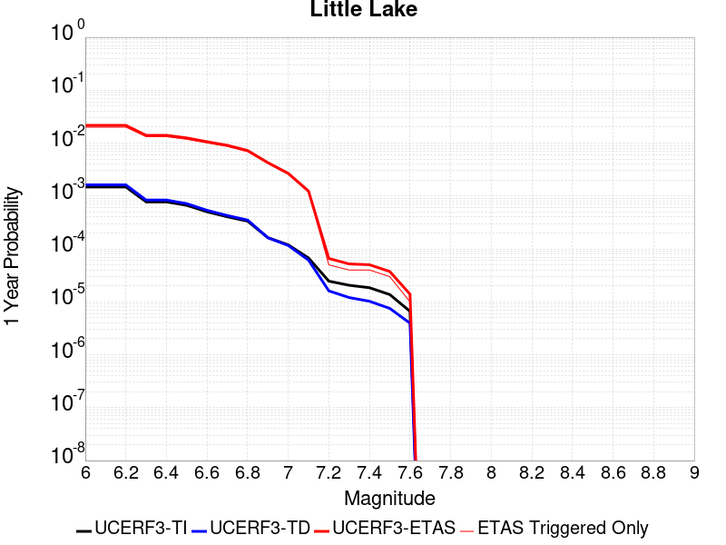 |  |

| Magnitude | 1 wk TI Prob | 1 wk TD Prob | 1 wk ETAS Prob | 1 wk ETAS/TD Gain | 1 wk ETAS Triggered Only | 1 mo TI Prob | 1 mo TD Prob | 1 mo ETAS Prob | 1 mo ETAS/TD Gain | 1 mo ETAS Triggered Only | 1 yr TI Prob | 1 yr TD Prob | 1 yr ETAS Prob | 1 yr ETAS/TD Gain | 1 yr ETAS Triggered Only | 10 yr TI Prob | 10 yr TD Prob | 10 yr ETAS Prob | 10 yr ETAS/TD Gain | 10 yr ETAS Triggered Only |
|-----|-----|-----|-----|-----|-----|-----|-----|-----|-----|-----|-----|-----|-----|-----|-----|-----|-----|-----|-----|-----|
| 6.0 | 2.8424427E-5 | 3.120616E-5 | 0.0032011073 | 102.57934 | 0.00317 | 1.2181328E-4 | 1.3373457E-4 | 0.007992683 | 59.76527 | 0.00786 | 0.0014820677 | 0.0016271356 | 0.021644512 | 13.3022175 | 0.02005 | 0.014722223 | 0.016165627 | 0.04696948 | 2.9055157 | 0.03131 |
| 6.1 | 2.8424427E-5 | 3.120616E-5 | 0.0032011073 | 102.57934 | 0.00317 | 1.2181328E-4 | 1.3373457E-4 | 0.007992683 | 59.76527 | 0.00786 | 0.0014820677 | 0.0016271356 | 0.021644512 | 13.3022175 | 0.02005 | 0.014722223 | 0.016165627 | 0.04696948 | 2.9055157 | 0.03131 |
| 6.2 | 2.8424427E-5 | 3.120616E-5 | 0.0032011073 | 102.57934 | 0.00317 | 1.2181328E-4 | 1.3373457E-4 | 0.007992683 | 59.76527 | 0.00786 | 0.0014820677 | 0.0016271356 | 0.021644512 | 13.3022175 | 0.02005 | 0.014722223 | 0.016165627 | 0.04696948 | 2.9055157 | 0.03131 |
| 6.3 | 1.48860645E-5 | 1.6081593E-5 | 0.002166047 | 134.69107 | 0.00215 | 6.379586E-5 | 6.891945E-5 | 0.005358555 | 77.75098 | 0.00529 | 7.7643775E-4 | 8.387995E-4 | 0.014057702 | 16.759312 | 0.01323 | 0.007737305 | 0.008359154 | 0.028588627 | 3.4200385 | 0.0204 |
| 6.4 | 1.48860645E-5 | 1.6081593E-5 | 0.002166047 | 134.69107 | 0.00215 | 6.379586E-5 | 6.891945E-5 | 0.005358555 | 77.75098 | 0.00529 | 7.7643775E-4 | 8.387995E-4 | 0.014057702 | 16.759312 | 0.01323 | 0.007737305 | 0.008359154 | 0.028588627 | 3.4200385 | 0.0204 |
| 6.5 | 1.2797581E-5 | 1.3765735E-5 | 0.001953739 | 141.92769 | 0.00194 | 5.4845623E-5 | 5.899482E-5 | 0.004788716 | 81.1718 | 0.00473 | 6.675408E-4 | 7.180509E-4 | 0.012529563 | 17.449408 | 0.01182 | 0.006655392 | 0.0071598585 | 0.02540826 | 3.5487099 | 0.01838 |
| 6.6 | 9.661896E-6 | 1.0289158E-5 | 0.0016402724 | 159.41756 | 0.00163 | 4.1407468E-5 | 4.4095737E-5 | 0.0041339155 | 93.74864 | 0.00409 | 5.040193E-4 | 5.367496E-4 | 0.0106213335 | 19.788248 | 0.01009 | 0.005028777 | 0.0053561367 | 0.021001885 | 3.9210882 | 0.01573 |
| 6.7 | 7.767871E-6 | 8.199779E-6 | 0.0014281882 | 174.174 | 0.00142 | 3.329045E-5 | 3.514151E-5 | 0.0035950164 | 102.30113 | 0.00356 | 4.0523586E-4 | 4.2777765E-4 | 0.009084073 | 21.235502 | 0.00866 | 0.004044977 | 0.0042708935 | 0.017842682 | 4.1777396 | 0.01363 |
| 6.8 | 6.4235196E-6 | 6.735819E-6 | 0.001156728 | 171.7279 | 0.00115 | 2.752908E-5 | 2.886755E-5 | 0.002888785 | 100.07033 | 0.00286 | 3.35115E-4 | 3.5141854E-4 | 0.007238997 | 20.59936 | 0.00689 | 0.003346101 | 0.0035098887 | 0.014301877 | 4.074738 | 0.01083 |
| 6.9 | 3.1283696E-6 | 3.1122067E-6 | 8.431096E-4 | 270.9041 | 8.4E-4 | 1.3407229E-5 | 1.3337969E-5 | 0.0018733132 | 140.44965 | 0.00186 | 1.6322079E-4 | 1.6237919E-4 | 0.0042717117 | 26.307016 | 0.00411 | 0.0016310095 | 0.0016227537 | 0.00812219 | 5.0051894 | 0.00651 |
| 7.0 | 2.290603E-6 | 2.2287015E-6 | 5.922274E-4 | 265.72754 | 5.9E-4 | 9.816834E-6 | 9.551549E-6 | 0.0011895403 | 124.538994 | 0.00118 | 1.19513395E-4 | 1.16284944E-4 | 0.002685986 | 23.098314 | 0.00257 | 0.0011944914 | 0.0011623431 | 0.0052376008 | 4.506071 | 0.00408 |
| 7.1 | 1.293693E-6 | 1.1776951E-6 | 2.4117742E-4 | 204.78764 | 2.4E-4 | 5.5443866E-6 | 5.047259E-6 | 5.7504437E-4 | 113.932014 | 5.7E-4 | 6.750081E-5 | 6.144935E-5 | 0.0012413769 | 20.201628 | 0.00118 | 6.7480316E-4 | 6.14392E-4 | 0.0024532615 | 3.9929907 | 0.00184 |
| 7.2 | 4.715842E-7 | 3.0918443E-7 | 1.0309182E-5 | 33.343147 | 1.0E-5 | 2.0210737E-6 | 1.3250755E-6 | 3.1325035E-5 | 23.64019 | 3.0E-5 | 2.4606294E-5 | 1.613268E-5 | 6.613187E-5 | 4.099249 | 5.0E-5 | 2.460357E-4 | 1.6131563E-4 | 2.8129626E-4 | 1.7437633 | 1.2E-4 |
| 7.3 | 3.9430947E-7 | 2.3098025E-7 | 1.0230978E-5 | 44.293736 | 1.0E-5 | 1.6898966E-6 | 9.89915E-7 | 3.0989886E-5 | 31.305603 | 3.0E-5 | 2.0574296E-5 | 1.2052149E-5 | 5.2051666E-5 | 4.31887 | 4.0E-5 | 2.0572392E-4 | 1.20515026E-4 | 2.1050418E-4 | 1.7467048 | 9.0E-5 |
| 7.4 | 3.547123E-7 | 1.9679635E-7 | 1.0196794E-5 | 51.813942 | 1.0E-5 | 1.5201948E-6 | 8.4341264E-7 | 3.084339E-5 | 36.569748 | 3.0E-5 | 1.8508214E-5 | 1.0268501E-5 | 5.026809E-5 | 4.8953676 | 4.0E-5 | 1.8506673E-4 | 1.0268033E-4 | 1.926711E-4 | 1.8764167 | 9.0E-5 |
| 7.5 | 2.6354266E-7 | 1.4423487E-7 | 1.0144234E-5 | 70.33135 | 1.0E-5 | 1.129468E-6 | 6.1814933E-7 | 2.0618138E-5 | 33.35462 | 2.0E-5 | 1.3751187E-5 | 7.5259427E-6 | 3.7525715E-5 | 4.9861817 | 3.0E-5 | 1.3750336E-4 | 7.525693E-5 | 1.552509E-4 | 2.0629451 | 8.0E-5 |
| 7.6 | 1.269913E-7 | 7.5727044E-8 | 7.5727044E-8 | 1.0 | 0.0 | 5.4424834E-7 | 3.2454443E-7 | 3.2454443E-7 | 1.0 | 0.0 | 6.6262032E-6 | 3.9513216E-6 | 1.3951282E-5 | 3.5307887 | 1.0E-5 | 6.626006E-5 | 3.951255E-5 | 7.9510966E-5 | 2.0122967 | 4.0E-5 |

## Airport Lake
*[(top)](#table-of-contents)*

| 1 Week | 1 Month | 1 Year | 10 Year |
|-----|-----|-----|-----|
|  | 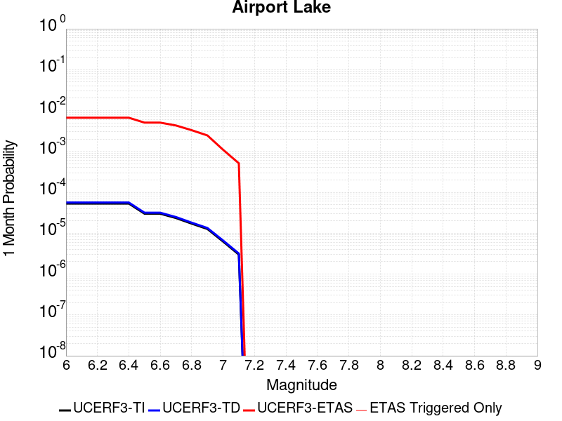 |  |  |

| Magnitude | 1 wk TI Prob | 1 wk TD Prob | 1 wk ETAS Prob | 1 wk ETAS/TD Gain | 1 wk ETAS Triggered Only | 1 mo TI Prob | 1 mo TD Prob | 1 mo ETAS Prob | 1 mo ETAS/TD Gain | 1 mo ETAS Triggered Only | 1 yr TI Prob | 1 yr TD Prob | 1 yr ETAS Prob | 1 yr ETAS/TD Gain | 1 yr ETAS Triggered Only | 10 yr TI Prob | 10 yr TD Prob | 10 yr ETAS Prob | 10 yr ETAS/TD Gain | 10 yr ETAS Triggered Only |
|-----|-----|-----|-----|-----|-----|-----|-----|-----|-----|-----|-----|-----|-----|-----|-----|-----|-----|-----|-----|-----|
| 6.0 | 1.2387061E-5 | 1.31032575E-5 | 0.0027630671 | 210.86873 | 0.00275 | 5.3086325E-5 | 5.6155768E-5 | 0.006675784 | 118.87975 | 0.00662 | 6.461343E-4 | 6.835104E-4 | 0.016522678 | 24.173264 | 0.01585 | 0.0064425888 | 0.0068168915 | 0.03105056 | 4.554944 | 0.0244 |
| 6.1 | 1.2387061E-5 | 1.31032575E-5 | 0.0027630671 | 210.86873 | 0.00275 | 5.3086325E-5 | 5.6155768E-5 | 0.006675784 | 118.87975 | 0.00662 | 6.461343E-4 | 6.835104E-4 | 0.016522678 | 24.173264 | 0.01585 | 0.0064425888 | 0.0068168915 | 0.03105056 | 4.554944 | 0.0244 |
| 6.2 | 1.2387061E-5 | 1.31032575E-5 | 0.0027630671 | 210.86873 | 0.00275 | 5.3086325E-5 | 5.6155768E-5 | 0.006675784 | 118.87975 | 0.00662 | 6.461343E-4 | 6.835104E-4 | 0.016522678 | 24.173264 | 0.01585 | 0.0064425888 | 0.0068168915 | 0.03105056 | 4.554944 | 0.0244 |
| 6.3 | 1.2387061E-5 | 1.31032575E-5 | 0.0027630671 | 210.86873 | 0.00275 | 5.3086325E-5 | 5.6155768E-5 | 0.006675784 | 118.87975 | 0.00662 | 6.461343E-4 | 6.835104E-4 | 0.016522678 | 24.173264 | 0.01585 | 0.0064425888 | 0.0068168915 | 0.03105056 | 4.554944 | 0.0244 |
| 6.4 | 1.2387061E-5 | 1.31032575E-5 | 0.0027630671 | 210.86873 | 0.00275 | 5.3086325E-5 | 5.6155768E-5 | 0.006675784 | 118.87975 | 0.00662 | 6.461343E-4 | 6.835104E-4 | 0.016522678 | 24.173264 | 0.01585 | 0.0064425888 | 0.0068168915 | 0.03105056 | 4.554944 | 0.0244 |
| 6.5 | 6.9922594E-6 | 7.38498E-6 | 0.0020873696 | 282.65067 | 0.00208 | 2.996648E-5 | 3.164956E-5 | 0.0050614905 | 159.92293 | 0.00503 | 3.6478083E-4 | 3.8527072E-4 | 0.012220709 | 31.719799 | 0.01184 | 0.003641826 | 0.0038465653 | 0.021627905 | 5.6226535 | 0.01785 |
| 6.6 | 6.9922594E-6 | 7.38498E-6 | 0.0020873696 | 282.65067 | 0.00208 | 2.996648E-5 | 3.164956E-5 | 0.0050614905 | 159.92293 | 0.00503 | 3.6478083E-4 | 3.8527072E-4 | 0.012220709 | 31.719799 | 0.01184 | 0.003641826 | 0.0038465653 | 0.021627905 | 5.6226535 | 0.01785 |
| 6.7 | 5.477277E-6 | 5.7861116E-6 | 0.0017057763 | 294.80527 | 0.0017 | 2.3473833E-5 | 2.4797408E-5 | 0.004314691 | 173.99767 | 0.00429 | 2.8575645E-4 | 3.0187052E-4 | 0.010298852 | 34.116787 | 0.01 | 0.0028538927 | 0.0030149885 | 0.01819907 | 6.036199 | 0.01523 |
| 6.8 | 3.9950432E-6 | 4.2191186E-6 | 0.0014242132 | 337.56177 | 0.00142 | 1.7121502E-5 | 1.8081826E-5 | 0.0033080224 | 182.94736 | 0.00329 | 2.0843433E-4 | 2.2012675E-4 | 0.0077484692 | 35.200035 | 0.00753 | 0.0020823893 | 0.002199358 | 0.013654109 | 6.208225 | 0.01148 |
| 6.9 | 2.95695E-6 | 3.1230477E-6 | 0.0010231199 | 327.60303 | 0.00102 | 1.2672582E-5 | 1.3384434E-5 | 0.0024633517 | 184.046 | 0.00245 | 1.5427776E-4 | 1.6294557E-4 | 0.005462082 | 33.5209 | 0.0053 | 0.001541707 | 0.0016284833 | 0.009895 | 6.0762057 | 0.00828 |
| 7.0 | 1.456072E-6 | 1.5408239E-6 | 5.3154E-4 | 344.97128 | 5.3E-4 | 6.2402937E-6 | 6.60352E-6 | 0.0010965964 | 166.0624 | 0.00109 | 7.597293E-5 | 8.03959E-5 | 0.0024702037 | 30.725494 | 0.00239 | 7.594696E-4 | 8.03767E-4 | 0.0046107047 | 5.7363696 | 0.00381 |
| 7.1 | 6.995192E-7 | 7.4090326E-7 | 2.1074075E-4 | 284.4376 | 2.1E-4 | 2.997936E-6 | 3.1752998E-6 | 5.131737E-4 | 161.61426 | 5.1E-4 | 3.649926E-5 | 3.8659273E-5 | 0.0011186175 | 28.935297 | 0.00108 | 3.6493264E-4 | 3.8659273E-4 | 0.002035955 | 5.2664075 | 0.00165 |

## Owl Lake
*[(top)](#table-of-contents)*

| 1 Week | 1 Month | 1 Year | 10 Year |
|-----|-----|-----|-----|
|  |  |  |  |

| Magnitude | 1 wk TI Prob | 1 wk TD Prob | 1 wk ETAS Prob | 1 wk ETAS/TD Gain | 1 wk ETAS Triggered Only | 1 mo TI Prob | 1 mo TD Prob | 1 mo ETAS Prob | 1 mo ETAS/TD Gain | 1 mo ETAS Triggered Only | 1 yr TI Prob | 1 yr TD Prob | 1 yr ETAS Prob | 1 yr ETAS/TD Gain | 1 yr ETAS Triggered Only | 10 yr TI Prob | 10 yr TD Prob | 10 yr ETAS Prob | 10 yr ETAS/TD Gain | 10 yr ETAS Triggered Only |
|-----|-----|-----|-----|-----|-----|-----|-----|-----|-----|-----|-----|-----|-----|-----|-----|-----|-----|-----|-----|-----|
| 6.0 | 5.0320643E-5 | 6.636149E-5 | 0.00174625 | 26.314205 | 0.00168 | 2.1564208E-4 | 2.8438168E-4 | 0.0044332016 | 15.588914 | 0.00415 | 0.0026222812 | 0.00345791 | 0.014609216 | 4.224869 | 0.01119 | 0.02591553 | 0.0341423 | 0.05342082 | 1.5646521 | 0.01996 |
| 6.1 | 5.0320643E-5 | 6.636149E-5 | 0.00174625 | 26.314205 | 0.00168 | 2.1564208E-4 | 2.8438168E-4 | 0.0044332016 | 15.588914 | 0.00415 | 0.0026222812 | 0.00345791 | 0.014609216 | 4.224869 | 0.01119 | 0.02591553 | 0.0341423 | 0.05342082 | 1.5646521 | 0.01996 |
| 6.2 | 2.4125871E-5 | 3.098269E-5 | 0.0013009433 | 41.989357 | 0.00127 | 1.0339249E-4 | 1.3277736E-4 | 0.0032923578 | 24.796076 | 0.00316 | 0.0012580766 | 0.0016155228 | 0.009912098 | 6.1355357 | 0.00831 | 0.012509781 | 0.016071297 | 0.031007335 | 1.929361 | 0.01518 |
| 6.3 | 1.7433485E-5 | 2.2356835E-5 | 0.0012023305 | 53.7791 | 0.00118 | 7.471279E-5 | 9.5812386E-5 | 0.0029655374 | 30.951504 | 0.00287 | 9.0924866E-4 | 0.0011660426 | 0.008497484 | 7.2874556 | 0.00734 | 0.009055373 | 0.01162957 | 0.024478385 | 2.10484 | 0.013 |
| 6.4 | 1.7433485E-5 | 2.2356835E-5 | 0.0012023305 | 53.7791 | 0.00118 | 7.471279E-5 | 9.5812386E-5 | 0.0029655374 | 30.951504 | 0.00287 | 9.0924866E-4 | 0.0011660426 | 0.008497484 | 7.2874556 | 0.00734 | 0.009055373 | 0.01162957 | 0.024478385 | 2.10484 | 0.013 |
| 6.5 | 1.5182742E-5 | 1.9430352E-5 | 0.0011594082 | 59.669952 | 0.00114 | 6.506727E-5 | 8.327114E-5 | 0.0028130438 | 33.78174 | 0.00273 | 7.919061E-4 | 0.0010135059 | 0.007986432 | 7.8800054 | 0.00698 | 0.0078909 | 0.010119047 | 0.022353975 | 2.209099 | 0.01236 |
| 6.6 | 6.7271576E-6 | 8.548157E-6 | 9.385402E-4 | 109.79445 | 9.3E-4 | 2.8830356E-5 | 3.6634476E-5 | 0.0022765524 | 62.14235 | 0.00224 | 3.5095305E-4 | 4.4593913E-4 | 0.005843531 | 13.103876 | 0.0054 | 0.0035039932 | 0.004468226 | 0.013637073 | 3.0520108 | 0.00921 |
| 6.7 | 6.682835E-6 | 8.4806015E-6 | 9.384727E-4 | 110.6611 | 9.3E-4 | 2.8640408E-5 | 3.634496E-5 | 0.0022562642 | 62.079147 | 0.00222 | 3.4864116E-4 | 4.424157E-4 | 0.00581004 | 13.132535 | 0.00537 | 0.003480947 | 0.004433152 | 0.0135625 | 3.059336 | 0.00917 |
| 6.8 | 6.5774975E-6 | 8.327072E-6 | 9.383193E-4 | 112.68299 | 9.3E-4 | 2.8188972E-5 | 3.5686993E-5 | 0.0022556079 | 63.20532 | 0.00222 | 3.4314668E-4 | 4.3440814E-4 | 0.0058020754 | 13.3562765 | 0.00537 | 0.0034261728 | 0.0043532955 | 0.013483376 | 3.0972803 | 0.00917 |
| 6.9 | 6.363419E-6 | 8.0002355E-6 | 9.379928E-4 | 117.24564 | 9.3E-4 | 2.727151E-5 | 3.4286306E-5 | 0.0022442106 | 65.45501 | 0.00221 | 3.3198006E-4 | 4.173614E-4 | 0.0057651284 | 13.813276 | 0.00535 | 0.0033148455 | 0.004183282 | 0.013285047 | 3.1757472 | 0.00914 |
| 7.0 | 6.1342453E-6 | 7.632424E-6 | 9.376253E-4 | 122.84765 | 9.3E-4 | 2.6289357E-5 | 3.271001E-5 | 0.0022226383 | 67.94979 | 0.00219 | 3.2002592E-4 | 3.981771E-4 | 0.0057060625 | 14.330464 | 0.00531 | 0.0031956544 | 0.00399197 | 0.013015803 | 3.2604961 | 0.00906 |
| 7.1 | 5.842926E-6 | 7.142961E-6 | 9.1713644E-4 | 128.39725 | 9.1E-4 | 2.504087E-5 | 3.0612362E-5 | 0.0021205484 | 69.27099 | 0.00209 | 3.0482994E-4 | 3.7264716E-4 | 0.0054607503 | 14.653943 | 0.00509 | 0.0030441214 | 0.0037374226 | 0.012384982 | 3.313776 | 0.00868 |
| 7.2 | 4.77173E-6 | 5.3591634E-6 | 6.2535587E-4 | 116.68908 | 6.2E-4 | 2.045011E-5 | 2.2967664E-5 | 0.0015229332 | 66.30771 | 0.0015 | 2.4895166E-4 | 2.7959948E-4 | 0.0038286068 | 13.693183 | 0.00355 | 0.0024867293 | 0.0028089995 | 0.008522904 | 3.0341423 | 0.00573 |
| 7.3 | 3.0494948E-6 | 2.7109647E-6 | 1.4271059E-4 | 52.641994 | 1.4E-4 | 1.3069198E-5 | 1.1618369E-5 | 3.7161418E-4 | 31.985056 | 3.6E-4 | 1.5910587E-4 | 1.4144463E-4 | 0.0010913103 | 7.7154593 | 9.5E-4 | 0.0015899199 | 0.0014235033 | 0.0029812825 | 2.094328 | 0.00156 |
| 7.4 | 2.7263884E-6 | 2.3061473E-6 | 1.02305916E-4 | 44.362263 | 1.0E-4 | 1.1684469E-5 | 9.883452E-6 | 2.2988128E-4 | 23.259209 | 2.2E-4 | 1.4224913E-4 | 1.2032448E-4 | 7.5024867E-4 | 6.235212 | 6.3E-4 | 0.0014215811 | 0.0012114698 | 0.002240222 | 1.8491769 | 0.00103 |
| 7.5 | 2.6090431E-6 | 2.1660758E-6 | 8.2165905E-5 | 37.93307 | 8.0E-5 | 1.1181565E-5 | 9.283149E-6 | 2.092813E-4 | 22.544212 | 2.0E-4 | 1.3612706E-4 | 1.1301658E-4 | 6.429567E-4 | 5.689048 | 5.3E-4 | 0.001360437 | 0.001138222 | 0.0020172205 | 1.7722555 | 8.8E-4 |
| 7.6 | 2.3008756E-6 | 1.8732376E-6 | 8.1873084E-5 | 43.70673 | 8.0E-5 | 9.860858E-6 | 8.028137E-6 | 1.6802685E-4 | 20.929745 | 1.6E-4 | 1.20049335E-4 | 9.7738266E-5 | 5.176972E-4 | 5.296771 | 4.2E-4 | 0.001199845 | 9.852252E-4 | 0.0017045158 | 1.7300774 | 7.2E-4 |
| 7.7 | 1.7184348E-6 | 1.3423282E-6 | 5.134226E-5 | 38.248665 | 5.0E-5 | 7.3646997E-6 | 5.7528227E-6 | 9.575231E-5 | 16.644403 | 9.0E-5 | 8.966153E-5 | 7.0038404E-5 | 3.300202E-4 | 4.711989 | 2.6E-4 | 8.962536E-4 | 7.080495E-4 | 0.0011077663 | 1.5645323 | 4.0E-4 |
| 7.8 | 8.4612907E-7 | 8.4087924E-7 | 1.0840871E-5 | 12.892303 | 1.0E-5 | 3.6262625E-6 | 3.6037634E-6 | 3.3603654E-5 | 9.324601 | 3.0E-5 | 4.4148852E-5 | 4.3874956E-5 | 1.5387013E-4 | 3.507015 | 1.1E-4 | 4.414008E-4 | 4.4413717E-4 | 6.1406166E-4 | 1.3825946 | 1.7E-4 |
| 7.9 | 2.716738E-7 | 3.7694025E-7 | 1.0376936E-5 | 27.529392 | 1.0E-5 | 1.1643157E-6 | 1.6154573E-6 | 2.1615426E-5 | 13.380375 | 2.0E-5 | 1.4175452E-5 | 1.9668027E-5 | 8.9666646E-5 | 4.559006 | 7.0E-5 | 1.4174548E-4 | 1.9843443E-4 | 2.7841856E-4 | 1.4030758 | 8.0E-5 |
| 8.0 | 2.1995428E-8 | 3.386013E-8 | 3.386013E-8 | 1.0 | 0.0 | 9.426611E-8 | 1.4511484E-7 | 1.0145113E-5 | 69.910934 | 1.0E-5 | 1.1476893E-6 | 1.7667724E-6 | 2.1766737E-5 | 12.320058 | 2.0E-5 | 1.14768345E-5 | 1.7968985E-5 | 3.7968624E-5 | 2.113009 | 2.0E-5 |

## Panamint Valley
*[(top)](#table-of-contents)*

| 1 Week | 1 Month | 1 Year | 10 Year |
|-----|-----|-----|-----|
|  |  |  |  |

| Magnitude | 1 wk TI Prob | 1 wk TD Prob | 1 wk ETAS Prob | 1 wk ETAS/TD Gain | 1 wk ETAS Triggered Only | 1 mo TI Prob | 1 mo TD Prob | 1 mo ETAS Prob | 1 mo ETAS/TD Gain | 1 mo ETAS Triggered Only | 1 yr TI Prob | 1 yr TD Prob | 1 yr ETAS Prob | 1 yr ETAS/TD Gain | 1 yr ETAS Triggered Only | 10 yr TI Prob | 10 yr TD Prob | 10 yr ETAS Prob | 10 yr ETAS/TD Gain | 10 yr ETAS Triggered Only |
|-----|-----|-----|-----|-----|-----|-----|-----|-----|-----|-----|-----|-----|-----|-----|-----|-----|-----|-----|-----|-----|
| 6.0 | 3.0211835E-5 | 3.3985398E-5 | 0.0014939358 | 43.958168 | 0.00146 | 1.2947287E-4 | 1.4564373E-4 | 0.0036851282 | 25.302345 | 0.00354 | 0.0015751923 | 0.0017717998 | 0.01135479 | 6.4086194 | 0.0096 | 0.015640736 | 0.01758359 | 0.033518385 | 1.9062309 | 0.01622 |
| 6.1 | 3.0211835E-5 | 3.3985398E-5 | 0.0014939358 | 43.958168 | 0.00146 | 1.2947287E-4 | 1.4564373E-4 | 0.0036851282 | 25.302345 | 0.00354 | 0.0015751923 | 0.0017717998 | 0.01135479 | 6.4086194 | 0.0096 | 0.015640736 | 0.01758359 | 0.033518385 | 1.9062309 | 0.01622 |
| 6.2 | 3.0211835E-5 | 3.3985398E-5 | 0.0014939358 | 43.958168 | 0.00146 | 1.2947287E-4 | 1.4564373E-4 | 0.0036851282 | 25.302345 | 0.00354 | 0.0015751923 | 0.0017717998 | 0.01135479 | 6.4086194 | 0.0096 | 0.015640736 | 0.01758359 | 0.033518385 | 1.9062309 | 0.01622 |
| 6.3 | 2.8573924E-5 | 3.2103522E-5 | 0.001452058 | 45.230488 | 0.00142 | 1.2245393E-4 | 1.3757942E-4 | 0.0035771062 | 26.0003 | 0.00344 | 0.001489857 | 0.0016737703 | 0.010808455 | 6.45755 | 0.00915 | 0.01479908 | 0.016618231 | 0.031772144 | 1.9118848 | 0.01541 |
| 6.4 | 2.8573924E-5 | 3.2103522E-5 | 0.001452058 | 45.230488 | 0.00142 | 1.2245393E-4 | 1.3757942E-4 | 0.0035771062 | 26.0003 | 0.00344 | 0.001489857 | 0.0016737703 | 0.010808455 | 6.45755 | 0.00915 | 0.01479908 | 0.016618231 | 0.031772144 | 1.9118848 | 0.01541 |
| 6.5 | 2.7468774E-5 | 3.0829244E-5 | 0.0014107866 | 45.761314 | 0.00138 | 1.1771801E-4 | 1.3211879E-4 | 0.00345168 | 26.12558 | 0.00332 | 0.0014322745 | 0.0016073869 | 0.010423194 | 6.484558 | 0.00883 | 0.014230782 | 0.015964093 | 0.030577026 | 1.9153626 | 0.01485 |
| 6.6 | 2.6135967E-5 | 2.9253257E-5 | 0.001369214 | 46.805527 | 0.00134 | 1.1200648E-4 | 1.2536523E-4 | 0.003324964 | 26.522219 | 0.0032 | 0.0013628257 | 0.0015252795 | 0.01000233 | 6.557703 | 0.00849 | 0.013544982 | 0.015154443 | 0.029178644 | 1.9254185 | 0.01424 |
| 6.7 | 2.4498746E-5 | 2.7342086E-5 | 0.0013273065 | 48.54445 | 0.0013 | 1.04990395E-4 | 1.1717525E-4 | 0.0031668178 | 27.026337 | 0.00305 | 0.0012775084 | 0.0014257001 | 0.009484195 | 6.6523066 | 0.00807 | 0.012701893 | 0.014171662 | 0.027421195 | 1.9349315 | 0.01344 |
| 6.8 | 2.2244329E-5 | 2.4936131E-5 | 0.0012149065 | 48.720726 | 0.00119 | 9.532935E-5 | 1.0686488E-4 | 0.0029665593 | 27.759909 | 0.00286 | 0.0011600169 | 0.0013003252 | 0.008840508 | 6.79869 | 0.00755 | 0.011539802 | 0.012932883 | 0.025172515 | 1.9463962 | 0.0124 |
| 6.9 | 1.9902658E-5 | 2.2290924E-5 | 0.0011322661 | 50.79494 | 0.00111 | 8.529431E-5 | 9.552913E-5 | 0.0027252778 | 28.528238 | 0.00263 | 0.0010379635 | 0.0011624652 | 0.008004502 | 6.8858 | 0.00685 | 0.010331288 | 0.011568946 | 0.022451572 | 1.9406756 | 0.01101 |
| 7.0 | 1.8353881E-5 | 2.056681E-5 | 0.0010705452 | 52.052082 | 0.00105 | 7.865712E-5 | 8.814059E-5 | 0.0025879203 | 29.361277 | 0.0025 | 9.5722964E-4 | 0.0010726011 | 0.007515683 | 7.0069695 | 0.00645 | 0.009531168 | 0.0106791705 | 0.020908747 | 1.9579 | 0.01034 |
| 7.1 | 1.7667631E-5 | 1.9773222E-5 | 0.0010097537 | 51.066723 | 9.9E-4 | 7.571623E-5 | 8.473973E-5 | 0.0024445397 | 28.847624 | 0.00236 | 9.2145515E-4 | 0.0010312354 | 0.0071748933 | 6.9575706 | 0.00615 | 0.009176437 | 0.010269388 | 0.020047925 | 1.9522027 | 0.00988 |
| 7.2 | 1.6381597E-5 | 1.8158824E-5 | 9.381421E-4 | 51.663155 | 9.2E-4 | 7.020495E-5 | 7.782131E-5 | 0.0022376531 | 28.753735 | 0.00216 | 8.544101E-4 | 9.4707985E-4 | 0.006541776 | 6.9073124 | 0.0056 | 0.008511325 | 0.009435088 | 0.018221399 | 1.9312378 | 0.00887 |
| 7.3 | 1.4520491E-5 | 1.5966963E-5 | 7.4595533E-4 | 46.71867 | 7.3E-4 | 6.222919E-5 | 6.842814E-5 | 0.0018183084 | 26.572525 | 0.00175 | 7.57377E-4 | 8.3281036E-4 | 0.005418988 | 6.506869 | 0.00459 | 0.0075480095 | 0.008300003 | 0.015559247 | 1.8746073 | 0.00732 |
| 7.4 | 1.2852287E-5 | 1.4145856E-5 | 7.2413584E-4 | 51.190666 | 7.1E-4 | 5.5080065E-5 | 6.0623777E-5 | 0.0017705201 | 29.205044 | 0.00171 | 6.7039346E-4 | 7.3786033E-4 | 0.0051645916 | 6.999416 | 0.00443 | 0.0066837464 | 0.007357025 | 0.014335305 | 1.9485192 | 0.00703 |
| 7.5 | 1.1637851E-5 | 1.2837149E-5 | 7.128282E-4 | 55.528538 | 7.0E-4 | 4.987555E-5 | 5.5015284E-5 | 0.0017549217 | 31.898804 | 0.0017 | 6.070656E-4 | 6.6962093E-4 | 0.0050167083 | 7.491863 | 0.00435 | 0.006054099 | 0.0066789286 | 0.013522911 | 2.0247126 | 0.00689 |
| 7.6 | 3.0068115E-6 | 3.3331687E-6 | 2.8333222E-4 | 85.00387 | 2.8E-4 | 1.2886271E-5 | 1.4284972E-5 | 8.4427313E-4 | 59.10219 | 8.3E-4 | 1.5687906E-4 | 1.7391294E-4 | 0.0020735825 | 11.923107 | 0.0019 | 0.0015676835 | 0.001739208 | 0.004773921 | 2.744882 | 0.00304 |

## Garlock (East)
*[(top)](#table-of-contents)*

| 1 Week | 1 Month | 1 Year | 10 Year |
|-----|-----|-----|-----|
|  |  |  |  |

| Magnitude | 1 wk TI Prob | 1 wk TD Prob | 1 wk ETAS Prob | 1 wk ETAS/TD Gain | 1 wk ETAS Triggered Only | 1 mo TI Prob | 1 mo TD Prob | 1 mo ETAS Prob | 1 mo ETAS/TD Gain | 1 mo ETAS Triggered Only | 1 yr TI Prob | 1 yr TD Prob | 1 yr ETAS Prob | 1 yr ETAS/TD Gain | 1 yr ETAS Triggered Only | 10 yr TI Prob | 10 yr TD Prob | 10 yr ETAS Prob | 10 yr ETAS/TD Gain | 10 yr ETAS Triggered Only |
|-----|-----|-----|-----|-----|-----|-----|-----|-----|-----|-----|-----|-----|-----|-----|-----|-----|-----|-----|-----|-----|
| 6.0 | 4.5092507E-5 | 6.2906794E-5 | 0.0011828364 | 18.802998 | 0.00112 | 1.9323928E-4 | 2.695752E-4 | 0.0031987852 | 11.866022 | 0.00293 | 0.0023501497 | 0.0032775842 | 0.01101215 | 3.3598373 | 0.00776 | 0.023254504 | 0.03235364 | 0.04573619 | 1.4136335 | 0.01383 |
| 6.1 | 4.5092507E-5 | 6.2906794E-5 | 0.0011828364 | 18.802998 | 0.00112 | 1.9323928E-4 | 2.695752E-4 | 0.0031987852 | 11.866022 | 0.00293 | 0.0023501497 | 0.0032775842 | 0.01101215 | 3.3598373 | 0.00776 | 0.023254504 | 0.03235364 | 0.04573619 | 1.4136335 | 0.01383 |
| 6.2 | 2.6674514E-5 | 3.4512483E-5 | 9.4448106E-4 | 27.366362 | 9.1E-4 | 1.1431433E-4 | 1.4790244E-4 | 0.0023875711 | 16.142878 | 0.00224 | 0.0013908884 | 0.001799258 | 0.007498984 | 4.1678205 | 0.00571 | 0.01382215 | 0.017891733 | 0.027457466 | 1.5346456 | 0.00974 |
| 6.3 | 2.6674514E-5 | 3.4512483E-5 | 9.4448106E-4 | 27.366362 | 9.1E-4 | 1.1431433E-4 | 1.4790244E-4 | 0.0023875711 | 16.142878 | 0.00224 | 0.0013908884 | 0.001799258 | 0.007498984 | 4.1678205 | 0.00571 | 0.01382215 | 0.017891733 | 0.027457466 | 1.5346456 | 0.00974 |
| 6.4 | 2.5312667E-5 | 3.2341675E-5 | 9.0231356E-4 | 27.899406 | 8.7E-4 | 1.0847834E-4 | 1.3859998E-4 | 0.0023282964 | 16.798677 | 0.00219 | 0.0013199237 | 0.001686178 | 0.0073266514 | 4.3451233 | 0.00565 | 0.013121112 | 0.01677974 | 0.026228486 | 1.5631045 | 0.00961 |
| 6.5 | 2.5312667E-5 | 3.2341675E-5 | 9.0231356E-4 | 27.899406 | 8.7E-4 | 1.0847834E-4 | 1.3859998E-4 | 0.0023282964 | 16.798677 | 0.00219 | 0.0013199237 | 0.001686178 | 0.0073266514 | 4.3451233 | 0.00565 | 0.013121112 | 0.01677974 | 0.026228486 | 1.5631045 | 0.00961 |
| 6.6 | 2.246556E-5 | 2.813642E-5 | 8.9811196E-4 | 31.919909 | 8.7E-4 | 9.627742E-5 | 1.20579214E-4 | 0.0022503224 | 18.662607 | 0.00213 | 0.0011715472 | 0.0014670868 | 0.0068591647 | 4.6753635 | 0.0054 | 0.011653901 | 0.014620015 | 0.023567267 | 1.6119864 | 0.00908 |
| 6.7 | 2.2241198E-5 | 2.7806154E-5 | 8.97782E-4 | 32.287167 | 8.7E-4 | 9.531594E-5 | 1.1916392E-4 | 0.0022389113 | 18.7885 | 0.00212 | 0.0011598538 | 0.0014498787 | 0.0068220785 | 4.705275 | 0.00538 | 0.011538187 | 0.0144502055 | 0.023359574 | 1.6165566 | 0.00904 |
| 6.8 | 1.9528685E-5 | 2.3900653E-5 | 8.6388056E-4 | 36.144646 | 8.4E-4 | 8.369167E-5 | 1.0242746E-4 | 0.0021122217 | 20.621634 | 0.00201 | 0.0010184698 | 0.0012463606 | 0.006359979 | 5.1028404 | 0.00512 | 0.010138147 | 0.012437694 | 0.020782596 | 1.6709363 | 0.00845 |
| 6.9 | 1.3318621E-5 | 1.5201007E-5 | 8.05189E-4 | 52.96945 | 7.9E-4 | 5.7078556E-5 | 6.514558E-5 | 0.0018950263 | 29.089102 | 0.00183 | 6.9470983E-4 | 7.928645E-4 | 0.005299289 | 6.6837254 | 0.00451 | 0.0069254204 | 0.007940986 | 0.015282223 | 1.9244742 | 0.0074 |
| 7.0 | 1.1760853E-5 | 1.3109839E-5 | 8.030995E-4 | 61.259296 | 7.9E-4 | 5.0402683E-5 | 5.618384E-5 | 0.0018360838 | 32.679928 | 0.00178 | 6.134799E-4 | 6.838286E-4 | 0.0050508403 | 7.3861203 | 0.00437 | 0.0061178906 | 0.006857582 | 0.013928756 | 2.031147 | 0.00712 |
| 7.1 | 1.0064758E-5 | 1.090491E-5 | 7.608967E-4 | 69.77561 | 7.5E-4 | 4.3133965E-5 | 4.673451E-5 | 0.0017666541 | 37.801918 | 0.00172 | 5.2502943E-4 | 5.688476E-4 | 0.004726481 | 8.30887 | 0.00416 | 0.005237907 | 0.005714025 | 0.012495056 | 2.1867344 | 0.00682 |
| 7.2 | 9.768808E-6 | 1.0500772E-5 | 7.6049287E-4 | 72.42257 | 7.5E-4 | 4.186565E-5 | 4.500255E-5 | 0.0017149274 | 38.107338 | 0.00167 | 5.095951E-4 | 5.477718E-4 | 0.0045955535 | 8.38954 | 0.00405 | 0.0050842804 | 0.005504284 | 0.012127626 | 2.2033067 | 0.00666 |
| 7.3 | 9.344516E-6 | 9.946395E-6 | 7.2993926E-4 | 73.387314 | 7.2E-4 | 4.004731E-5 | 4.2626732E-5 | 0.0016425585 | 38.53353 | 0.0016 | 4.8746695E-4 | 5.1886035E-4 | 0.004296899 | 8.281418 | 0.00378 | 0.0048639905 | 0.005215945 | 0.011343814 | 2.174834 | 0.00616 |
| 7.4 | 9.023491E-6 | 9.49255E-6 | 6.594864E-4 | 69.4741 | 6.5E-4 | 3.867153E-5 | 4.068174E-5 | 0.0014806231 | 36.395275 | 0.00144 | 4.7072413E-4 | 4.95191E-4 | 0.0039035024 | 7.8828216 | 0.00341 | 0.004697283 | 0.004979378 | 0.010442041 | 2.0970573 | 0.00549 |
| 7.5 | 7.081253E-6 | 7.0893525E-6 | 3.0708723E-4 | 43.31668 | 3.0E-4 | 3.0347876E-5 | 3.038259E-5 | 7.903595E-4 | 26.013567 | 7.6E-4 | 3.6942272E-4 | 3.6984598E-4 | 0.0020692172 | 5.594808 | 0.0017 | 0.003688092 | 0.0037251879 | 0.00652472 | 1.7515143 | 0.00281 |
| 7.6 | 6.116396E-6 | 5.9608415E-6 | 1.9595971E-4 | 32.874504 | 1.9E-4 | 2.6212863E-5 | 2.5546216E-5 | 4.6553498E-4 | 18.223246 | 4.4E-4 | 3.1909486E-4 | 3.1098103E-4 | 0.0012107012 | 3.893167 | 9.0E-4 | 0.0031863707 | 0.003136586 | 0.0047116303 | 1.5021524 | 0.00158 |
| 7.7 | 4.797145E-6 | 4.7587923E-6 | 1.2475823E-4 | 26.216362 | 1.2E-4 | 2.055903E-5 | 2.0394666E-5 | 2.9038917E-4 | 14.238486 | 2.7E-4 | 2.5027743E-4 | 2.482769E-4 | 7.181602E-4 | 2.892578 | 4.7E-4 | 0.0024999576 | 0.002510134 | 0.0033580004 | 1.3377774 | 8.5E-4 |
| 7.8 | 3.4028885E-6 | 3.979809E-6 | 9.397945E-5 | 23.61406 | 9.0E-5 | 1.4583726E-5 | 1.7056214E-5 | 2.0705297E-4 | 12.139444 | 1.9E-4 | 1.775424E-4 | 2.076397E-4 | 5.375712E-4 | 2.5889614 | 3.3E-4 | 0.0017740062 | 0.0021019245 | 0.0027206212 | 1.2943478 | 6.2E-4 |
| 7.9 | 2.5928412E-6 | 3.373588E-6 | 5.337342E-5 | 15.820966 | 5.0E-5 | 1.1112129E-5 | 1.44581545E-5 | 1.2445656E-4 | 8.608053 | 1.1E-4 | 1.3528178E-4 | 1.7601387E-4 | 3.9597516E-4 | 2.2496815 | 2.2E-4 | 0.0013519945 | 0.0017818334 | 0.002201085 | 1.2352923 | 4.2E-4 |
| 8.0 | 1.3743648E-6 | 1.673991E-6 | 2.1673957E-5 | 12.947475 | 2.0E-5 | 5.8901214E-6 | 7.174228E-6 | 5.7173867E-5 | 7.9693413 | 5.0E-5 | 7.1709874E-5 | 8.7342756E-5 | 1.8733402E-4 | 2.1448147 | 1.0E-4 | 7.1686733E-4 | 8.839922E-4 | 0.0010738242 | 1.214744 | 1.9E-4 |
| 8.1 | 3.6733252E-7 | 3.1499187E-7 | 1.0314989E-5 | 32.74684 | 1.0E-5 | 1.5742813E-6 | 1.3499646E-6 | 1.1349951E-5 | 8.407592 | 1.0E-5 | 1.9166706E-5 | 1.643571E-5 | 3.643538E-5 | 2.2168424 | 2.0E-5 | 1.9165053E-4 | 1.6643589E-4 | 2.1642756E-4 | 1.3003659 | 5.0E-5 |

## Ash Hill
*[(top)](#table-of-contents)*

| 1 Week | 1 Month | 1 Year | 10 Year |
|-----|-----|-----|-----|
|  |  |  |  |

| Magnitude | 1 wk TI Prob | 1 wk TD Prob | 1 wk ETAS Prob | 1 wk ETAS/TD Gain | 1 wk ETAS Triggered Only | 1 mo TI Prob | 1 mo TD Prob | 1 mo ETAS Prob | 1 mo ETAS/TD Gain | 1 mo ETAS Triggered Only | 1 yr TI Prob | 1 yr TD Prob | 1 yr ETAS Prob | 1 yr ETAS/TD Gain | 1 yr ETAS Triggered Only | 10 yr TI Prob | 10 yr TD Prob | 10 yr ETAS Prob | 10 yr ETAS/TD Gain | 10 yr ETAS Triggered Only |
|-----|-----|-----|-----|-----|-----|-----|-----|-----|-----|-----|-----|-----|-----|-----|-----|-----|-----|-----|-----|-----|
| 6.0 | 2.1545662E-5 | 2.3194681E-5 | 6.9317914E-4 | 29.885262 | 6.7E-4 | 9.2335285E-5 | 9.9402445E-5 | 0.0017592375 | 17.69813 | 0.00166 | 0.0011236023 | 0.0012096328 | 0.00565425 | 4.674352 | 0.00445 | 0.011179381 | 0.01203847 | 0.019793969 | 1.6442262 | 0.00785 |
| 6.1 | 2.1545662E-5 | 2.3194681E-5 | 6.9317914E-4 | 29.885262 | 6.7E-4 | 9.2335285E-5 | 9.9402445E-5 | 0.0017592375 | 17.69813 | 0.00166 | 0.0011236023 | 0.0012096328 | 0.00565425 | 4.674352 | 0.00445 | 0.011179381 | 0.01203847 | 0.019793969 | 1.6442262 | 0.00785 |
| 6.2 | 2.1545662E-5 | 2.3194681E-5 | 6.9317914E-4 | 29.885262 | 6.7E-4 | 9.2335285E-5 | 9.9402445E-5 | 0.0017592375 | 17.69813 | 0.00166 | 0.0011236023 | 0.0012096328 | 0.00565425 | 4.674352 | 0.00445 | 0.011179381 | 0.01203847 | 0.019793969 | 1.6442262 | 0.00785 |
| 6.3 | 1.0025529E-5 | 1.0747037E-5 | 2.9074404E-4 | 27.053413 | 2.8E-4 | 4.2965847E-5 | 4.605799E-5 | 7.560253E-4 | 16.414639 | 7.1E-4 | 5.229836E-4 | 5.60625E-4 | 0.0024095878 | 4.2980385 | 0.00185 | 0.005217545 | 0.0055934195 | 0.008825241 | 1.5777899 | 0.00325 |
| 6.4 | 1.0025529E-5 | 1.0747037E-5 | 2.9074404E-4 | 27.053413 | 2.8E-4 | 4.2965847E-5 | 4.605799E-5 | 7.560253E-4 | 16.414639 | 7.1E-4 | 5.229836E-4 | 5.60625E-4 | 0.0024095878 | 4.2980385 | 0.00185 | 0.005217545 | 0.0055934195 | 0.008825241 | 1.5777899 | 0.00325 |
| 6.5 | 6.9617327E-6 | 7.456704E-6 | 1.6745551E-4 | 22.45704 | 1.6E-4 | 2.9835655E-5 | 3.1956963E-5 | 4.8194258E-4 | 15.080989 | 4.5E-4 | 3.6318856E-4 | 3.8901521E-4 | 0.001548564 | 3.9807284 | 0.00116 | 0.0036259557 | 0.0038841967 | 0.0060059237 | 1.5462459 | 0.00213 |
| 6.6 | 4.9919777E-6 | 5.346739E-6 | 1.253461E-4 | 23.443468 | 1.2E-4 | 2.1394015E-5 | 2.2914432E-5 | 3.2290755E-4 | 14.0918865 | 3.0E-4 | 2.60441E-4 | 2.789542E-4 | 0.0011687059 | 4.189598 | 8.9E-4 | 0.0026013597 | 0.0027866988 | 0.004372268 | 1.5689776 | 0.00159 |
| 6.7 | 3.6630722E-6 | 3.9246606E-6 | 1.1392423E-4 | 29.02779 | 1.1E-4 | 1.5698786E-5 | 1.6819899E-5 | 2.9681518E-4 | 17.64667 | 2.8E-4 | 1.9111596E-4 | 2.0476876E-4 | 9.146234E-4 | 4.4666157 | 7.1E-4 | 0.0019095168 | 0.002046364 | 0.0032339287 | 1.5803293 | 0.00119 |
| 6.8 | 2.5599613E-6 | 2.7449514E-6 | 8.274473E-5 | 30.144335 | 8.0E-5 | 1.0971216E-5 | 1.1764052E-5 | 2.0176181E-4 | 17.150707 | 1.9E-4 | 1.3356637E-4 | 1.4322287E-4 | 6.631484E-4 | 4.630185 | 5.2E-4 | 0.0013348613 | 0.0014317906 | 0.002270588 | 1.585838 | 8.4E-4 |
| 6.9 | 1.7684905E-6 | 1.896889E-6 | 6.1896775E-5 | 32.63068 | 6.0E-5 | 7.579223E-6 | 8.129524E-6 | 1.3812847E-4 | 16.990965 | 1.3E-4 | 9.2273134E-5 | 9.8976954E-5 | 4.7893936E-4 | 4.838897 | 3.8E-4 | 9.223483E-4 | 9.897696E-4 | 0.0016091559 | 1.6257885 | 6.2E-4 |

## Hunter Mountain-Saline Valley
*[(top)](#table-of-contents)*

| 1 Week | 1 Month | 1 Year | 10 Year |
|-----|-----|-----|-----|
|  |  |  |  |

| Magnitude | 1 wk TI Prob | 1 wk TD Prob | 1 wk ETAS Prob | 1 wk ETAS/TD Gain | 1 wk ETAS Triggered Only | 1 mo TI Prob | 1 mo TD Prob | 1 mo ETAS Prob | 1 mo ETAS/TD Gain | 1 mo ETAS Triggered Only | 1 yr TI Prob | 1 yr TD Prob | 1 yr ETAS Prob | 1 yr ETAS/TD Gain | 1 yr ETAS Triggered Only | 10 yr TI Prob | 10 yr TD Prob | 10 yr ETAS Prob | 10 yr ETAS/TD Gain | 10 yr ETAS Triggered Only |
|-----|-----|-----|-----|-----|-----|-----|-----|-----|-----|-----|-----|-----|-----|-----|-----|-----|-----|-----|-----|-----|
| 6.0 | 4.5103672E-5 | 5.4571992E-5 | 8.0453104E-4 | 14.742564 | 7.5E-4 | 1.9328714E-4 | 2.3385909E-4 | 0.0020434358 | 8.737893 | 0.00181 | 0.002350731 | 0.0028436056 | 0.0074903546 | 2.6341045 | 0.00466 | 0.023260195 | 0.028092787 | 0.03529462 | 1.2563587 | 0.00741 |
| 6.1 | 4.5103672E-5 | 5.4571992E-5 | 8.0453104E-4 | 14.742564 | 7.5E-4 | 1.9328714E-4 | 2.3385909E-4 | 0.0020434358 | 8.737893 | 0.00181 | 0.002350731 | 0.0028436056 | 0.0074903546 | 2.6341045 | 0.00466 | 0.023260195 | 0.028092787 | 0.03529462 | 1.2563587 | 0.00741 |
| 6.2 | 3.9363465E-5 | 4.7064877E-5 | 7.8703003E-4 | 16.722239 | 7.4E-4 | 1.6868966E-4 | 2.0169078E-4 | 0.0020013277 | 9.922753 | 0.0018 | 0.002051862 | 0.0024528939 | 0.0070615616 | 2.8788695 | 0.00462 | 0.020330196 | 0.024274237 | 0.031445824 | 1.2954402 | 0.00735 |
| 6.3 | 3.9363465E-5 | 4.7064877E-5 | 7.8703003E-4 | 16.722239 | 7.4E-4 | 1.6868966E-4 | 2.0169078E-4 | 0.0020013277 | 9.922753 | 0.0018 | 0.002051862 | 0.0024528939 | 0.0070615616 | 2.8788695 | 0.00462 | 0.020330196 | 0.024274237 | 0.031445824 | 1.2954402 | 0.00735 |
| 6.4 | 3.2311684E-5 | 3.795214E-5 | 7.679244E-4 | 20.234022 | 7.3E-4 | 1.384713E-4 | 1.626423E-4 | 0.0019523512 | 12.003957 | 0.00179 | 0.0016845843 | 0.0019784442 | 0.006539403 | 3.3053257 | 0.00457 | 0.016718714 | 0.019617062 | 0.026754249 | 1.3638256 | 0.00728 |
| 6.5 | 3.2311684E-5 | 3.795214E-5 | 7.679244E-4 | 20.234022 | 7.3E-4 | 1.384713E-4 | 1.626423E-4 | 0.0019523512 | 12.003957 | 0.00179 | 0.0016845843 | 0.0019784442 | 0.006539403 | 3.3053257 | 0.00457 | 0.016718714 | 0.019617062 | 0.026754249 | 1.3638256 | 0.00728 |
| 6.6 | 2.9305844E-5 | 3.4182853E-5 | 7.5415825E-4 | 22.062471 | 7.2E-4 | 1.2559042E-4 | 1.4649007E-4 | 0.0019262293 | 13.149214 | 0.00178 | 0.0015279909 | 0.0017821203 | 0.0063339937 | 3.55419 | 0.00456 | 0.015175272 | 0.017686214 | 0.02480799 | 1.4026737 | 0.00725 |
| 6.7 | 2.7826512E-5 | 3.2345237E-5 | 7.423223E-4 | 22.94997 | 7.1E-4 | 1.19251024E-4 | 1.3861542E-4 | 0.0019083701 | 13.767372 | 0.00177 | 0.0014509142 | 0.0016863967 | 0.0062287236 | 3.6935105 | 0.00455 | 0.014414776 | 0.01674368 | 0.023862457 | 1.425162 | 0.00724 |
| 6.8 | 2.3389874E-5 | 2.6867507E-5 | 7.3684845E-4 | 27.425262 | 7.1E-4 | 1.0023846E-4 | 1.1514164E-4 | 0.0018849379 | 16.370602 | 0.00177 | 0.00121972 | 0.0014009953 | 0.0059246486 | 4.2288857 | 0.00453 | 0.01213047 | 0.013927842 | 0.0210177 | 1.5090421 | 0.00719 |
| 6.9 | 2.069209E-5 | 2.3570727E-5 | 7.33554E-4 | 31.121399 | 7.1E-4 | 8.867737E-5 | 1.0101369E-4 | 0.0018608359 | 18.421621 | 0.00176 | 0.0010791123 | 0.001229184 | 0.0057336404 | 4.664591 | 0.00451 | 0.010738871 | 0.012228882 | 0.019281568 | 1.5767237 | 0.00714 |
| 7.0 | 1.7462342E-5 | 1.9634126E-5 | 7.2962017E-4 | 37.160816 | 7.1E-4 | 7.483646E-5 | 8.414367E-5 | 0.0018339964 | 21.796011 | 0.00175 | 9.1075303E-4 | 0.0010239903 | 0.005489413 | 5.3608055 | 0.00447 | 0.009070295 | 0.010196352 | 0.01721406 | 1.6882566 | 0.00709 |
| 7.1 | 1.4807709E-5 | 1.6442245E-5 | 7.2643056E-4 | 44.18074 | 7.1E-4 | 6.3460066E-5 | 7.046495E-5 | 0.0017903438 | 25.407578 | 0.00172 | 7.723524E-4 | 8.575896E-4 | 0.0052837906 | 6.161211 | 0.00443 | 0.007696735 | 0.008545788 | 0.015525626 | 1.8167577 | 0.00704 |
| 7.2 | 1.4180048E-5 | 1.5698814E-5 | 7.2568766E-4 | 46.22564 | 7.1E-4 | 6.077022E-5 | 6.727898E-5 | 0.0017771639 | 26.414845 | 0.00171 | 7.396263E-4 | 8.1883004E-4 | 0.005235211 | 6.3935256 | 0.00442 | 0.0073716943 | 0.00816108 | 0.015133708 | 1.8543756 | 0.00703 |
| 7.3 | 1.3730402E-5 | 1.5172541E-5 | 7.2516175E-4 | 47.794353 | 7.1E-4 | 5.8843252E-5 | 6.502365E-5 | 0.0017749125 | 27.296417 | 0.00171 | 7.161811E-4 | 7.913914E-4 | 0.0052078934 | 6.58068 | 0.00442 | 0.007138774 | 0.007888664 | 0.014863206 | 1.8841223 | 0.00703 |
| 7.4 | 1.2810095E-5 | 1.410972E-5 | 7.240997E-4 | 51.31921 | 7.1E-4 | 5.489925E-5 | 6.0468916E-5 | 0.0017603661 | 29.111917 | 0.0017 | 6.681934E-4 | 7.359762E-4 | 0.005132738 | 6.9740543 | 0.0044 | 0.006661878 | 0.0073382827 | 0.014267062 | 1.9441962 | 0.00698 |
| 7.5 | 1.1595659E-5 | 1.2801013E-5 | 7.1279204E-4 | 55.682472 | 7.0E-4 | 4.9694736E-5 | 5.4860422E-5 | 0.0017447677 | 31.80376 | 0.00169 | 6.0486543E-4 | 6.677366E-4 | 0.004984852 | 7.4652967 | 0.00432 | 0.006032217 | 0.0066601736 | 0.013454618 | 2.0201602 | 0.00684 |
| 7.6 | 2.997694E-6 | 3.3252948E-6 | 2.8332436E-4 | 85.20278 | 2.8E-4 | 1.28471975E-5 | 1.4251226E-5 | 8.442394E-4 | 59.239773 | 8.3E-4 | 1.564034E-4 | 1.7350215E-4 | 0.0020631743 | 11.891347 | 0.00189 | 0.0015629337 | 0.0017351025 | 0.0047598453 | 2.7432647 | 0.00303 |

## Blackwater
*[(top)](#table-of-contents)*

| 1 Week | 1 Month | 1 Year | 10 Year |
|-----|-----|-----|-----|
|  |  |  |  |

| Magnitude | 1 wk TI Prob | 1 wk TD Prob | 1 wk ETAS Prob | 1 wk ETAS/TD Gain | 1 wk ETAS Triggered Only | 1 mo TI Prob | 1 mo TD Prob | 1 mo ETAS Prob | 1 mo ETAS/TD Gain | 1 mo ETAS Triggered Only | 1 yr TI Prob | 1 yr TD Prob | 1 yr ETAS Prob | 1 yr ETAS/TD Gain | 1 yr ETAS Triggered Only | 10 yr TI Prob | 10 yr TD Prob | 10 yr ETAS Prob | 10 yr ETAS/TD Gain | 10 yr ETAS Triggered Only |
|-----|-----|-----|-----|-----|-----|-----|-----|-----|-----|-----|-----|-----|-----|-----|-----|-----|-----|-----|-----|-----|
| 6.0 | 3.0708583E-5 | 3.309619E-5 | 4.4308262E-4 | 13.387723 | 4.1E-4 | 1.3160157E-4 | 1.4183388E-4 | 0.001261675 | 8.895442 | 0.00112 | 0.0016010714 | 0.0017255963 | 0.004969988 | 2.880157 | 0.00325 | 0.015895851 | 0.017135808 | 0.023082137 | 1.3470118 | 0.00605 |
| 6.1 | 3.0708583E-5 | 3.309619E-5 | 4.4308262E-4 | 13.387723 | 4.1E-4 | 1.3160157E-4 | 1.4183388E-4 | 0.001261675 | 8.895442 | 0.00112 | 0.0016010714 | 0.0017255963 | 0.004969988 | 2.880157 | 0.00325 | 0.015895851 | 0.017135808 | 0.023082137 | 1.3470118 | 0.00605 |
| 6.2 | 1.1707779E-5 | 1.2545242E-5 | 1.7254324E-4 | 13.75368 | 1.6E-4 | 5.017523E-5 | 5.3764266E-5 | 4.137449E-4 | 7.695537 | 3.6E-4 | 6.107122E-4 | 6.5439293E-4 | 0.0017037059 | 2.6034906 | 0.00105 | 0.006090366 | 0.006525631 | 0.008562254 | 1.3120959 | 0.00205 |
| 6.3 | 1.1707779E-5 | 1.2545242E-5 | 1.7254324E-4 | 13.75368 | 1.6E-4 | 5.017523E-5 | 5.3764266E-5 | 4.137449E-4 | 7.695537 | 3.6E-4 | 6.107122E-4 | 6.5439293E-4 | 0.0017037059 | 2.6034906 | 0.00105 | 0.006090366 | 0.006525631 | 0.008562254 | 1.3120959 | 0.00205 |
| 6.4 | 7.929244E-6 | 8.480176E-6 | 1.2847917E-4 | 15.15053 | 1.2E-4 | 3.3982033E-5 | 3.6343128E-5 | 2.6633477E-4 | 7.328339 | 2.3E-4 | 4.136527E-4 | 4.4239179E-4 | 0.0011520777 | 2.6042023 | 7.1E-4 | 0.0041288356 | 0.0044155167 | 0.0057197325 | 1.295371 | 0.00131 |
| 6.5 | 5.8832115E-6 | 6.286048E-6 | 9.628548E-5 | 15.317331 | 9.0E-5 | 2.521352E-5 | 2.6939942E-5 | 2.0693509E-4 | 7.681349 | 1.8E-4 | 3.0693135E-4 | 3.2794697E-4 | 8.677699E-4 | 2.6460676 | 5.4E-4 | 0.0030650778 | 0.0032748834 | 0.004281576 | 1.307398 | 0.00101 |
| 6.6 | 5.8832115E-6 | 6.286048E-6 | 9.628548E-5 | 15.317331 | 9.0E-5 | 2.521352E-5 | 2.6939942E-5 | 2.0693509E-4 | 7.681349 | 1.8E-4 | 3.0693135E-4 | 3.2794697E-4 | 8.677699E-4 | 2.6460676 | 5.4E-4 | 0.0030650778 | 0.0032748834 | 0.004281576 | 1.307398 | 0.00101 |
| 6.7 | 3.0715053E-6 | 3.281496E-6 | 6.32813E-5 | 19.284285 | 6.0E-5 | 1.3163528E-5 | 1.4063485E-5 | 8.40625E-5 | 5.9773593 | 7.0E-5 | 1.6025416E-4 | 1.7121063E-4 | 4.4116442E-4 | 2.5767348 | 2.7E-4 | 0.0016013865 | 0.0017109019 | 0.002249978 | 1.315083 | 5.4E-4 |
| 6.8 | 2.2722281E-6 | 2.4287758E-6 | 3.2428703E-5 | 13.3518715 | 3.0E-5 | 9.738084E-6 | 1.0409003E-5 | 5.0408587E-5 | 4.8427873 | 4.0E-5 | 1.1855473E-4 | 1.2672316E-4 | 2.7670414E-4 | 2.1835327 | 1.5E-4 | 0.001184915 | 0.0012665992 | 0.0016061685 | 1.2680954 | 3.4E-4 |
| 6.9 | 9.952399E-7 | 1.0653588E-6 | 1.0653588E-6 | 1.0 | 0.0 | 4.265307E-6 | 4.5658185E-6 | 1.4565773E-5 | 3.190178 | 1.0E-5 | 5.1928873E-5 | 5.5587938E-5 | 1.15584604E-4 | 2.079311 | 6.0E-5 | 5.191674E-4 | 5.5579096E-4 | 7.2569645E-4 | 1.3057004 | 1.7E-4 |
| 7.0 | 4.7385504E-7 | 5.0756074E-7 | 5.0756074E-7 | 1.0 | 0.0 | 2.0308057E-6 | 2.1752603E-6 | 1.2175238E-5 | 5.597141 | 1.0E-5 | 2.4724779E-5 | 2.6483794E-5 | 5.6483E-5 | 2.132738 | 3.0E-5 | 2.4722028E-4 | 2.6483793E-4 | 3.548141E-4 | 1.3397405 | 9.0E-5 |

## Garlock (West)
*[(top)](#table-of-contents)*

| 1 Week | 1 Month | 1 Year | 10 Year |
|-----|-----|-----|-----|
|  |  |  |  |

| Magnitude | 1 wk TI Prob | 1 wk TD Prob | 1 wk ETAS Prob | 1 wk ETAS/TD Gain | 1 wk ETAS Triggered Only | 1 mo TI Prob | 1 mo TD Prob | 1 mo ETAS Prob | 1 mo ETAS/TD Gain | 1 mo ETAS Triggered Only | 1 yr TI Prob | 1 yr TD Prob | 1 yr ETAS Prob | 1 yr ETAS/TD Gain | 1 yr ETAS Triggered Only | 10 yr TI Prob | 10 yr TD Prob | 10 yr ETAS Prob | 10 yr ETAS/TD Gain | 10 yr ETAS Triggered Only |
|-----|-----|-----|-----|-----|-----|-----|-----|-----|-----|-----|-----|-----|-----|-----|-----|-----|-----|-----|-----|-----|
| 6.0 | 2.5181727E-5 | 2.5202135E-5 | 5.551888E-4 | 22.029434 | 5.3E-4 | 1.0791722E-4 | 1.080047E-4 | 0.001327873 | 12.294585 | 0.00122 | 0.0013131002 | 0.0013141674 | 0.0043501724 | 3.3102117 | 0.00304 | 0.013053683 | 0.013144457 | 0.018128078 | 1.3791424 | 0.00505 |
| 6.1 | 2.5077732E-5 | 2.5103205E-5 | 5.550899E-4 | 22.112312 | 5.3E-4 | 1.0747157E-4 | 1.07580745E-4 | 0.0013274495 | 12.339099 | 0.00122 | 0.001307681 | 0.0013090121 | 0.004345033 | 3.319322 | 0.00304 | 0.013000126 | 0.0130935125 | 0.01807739 | 1.3806372 | 0.00505 |
| 6.2 | 2.494612E-5 | 2.498488E-5 | 5.5497163E-4 | 22.2123 | 5.3E-4 | 1.0690756E-4 | 1.07073676E-4 | 0.001326943 | 12.392803 | 0.00122 | 0.0013008224 | 0.0013028459 | 0.004338885 | 3.3303134 | 0.00304 | 0.012932341 | 0.013032575 | 0.018016761 | 1.3824406 | 0.00505 |
| 6.3 | 2.4733758E-5 | 2.4804243E-5 | 5.5479107E-4 | 22.366781 | 5.3E-4 | 1.0599751E-4 | 1.0629959E-4 | 0.0013261699 | 12.475777 | 0.00122 | 0.0012897556 | 0.0012934325 | 0.0043295003 | 3.3472953 | 0.00304 | 0.012822957 | 0.012939542 | 0.017924197 | 1.3852266 | 0.00505 |
| 6.4 | 2.3237335E-5 | 2.318352E-5 | 5.531712E-4 | 23.860537 | 5.3E-4 | 9.958477E-5 | 9.935417E-5 | 0.001319233 | 13.278083 | 0.00122 | 0.0012117702 | 0.0012089686 | 0.0042253174 | 3.494977 | 0.00302 | 0.012051838 | 0.012104375 | 0.01707349 | 1.4105222 | 0.00503 |
| 6.5 | 2.2732203E-5 | 2.2998063E-5 | 5.529859E-4 | 24.04489 | 5.3E-4 | 9.742009E-5 | 9.8559416E-5 | 0.0013184391 | 13.3771 | 0.00122 | 0.0011854442 | 0.0011993032 | 0.0042156815 | 3.515109 | 0.00302 | 0.011791403 | 0.012008769 | 0.016968485 | 1.4130079 | 0.00502 |
| 6.6 | 2.1319436E-5 | 2.1778224E-5 | 5.5176666E-4 | 25.335707 | 5.3E-4 | 9.136581E-5 | 9.333192E-5 | 0.001313218 | 14.070407 | 0.00122 | 0.001111811 | 0.001135726 | 0.004152296 | 3.656072 | 0.00302 | 0.011062649 | 0.0113796545 | 0.016342528 | 1.4361182 | 0.00502 |
| 6.7 | 1.970802E-5 | 2.0398069E-5 | 5.5038725E-4 | 26.98232 | 5.3E-4 | 8.446021E-5 | 8.741738E-5 | 0.0013073108 | 14.954815 | 0.00122 | 0.001027818 | 0.0010637887 | 0.004080576 | 3.8358898 | 0.00302 | 0.010230771 | 0.010667368 | 0.015623924 | 1.4646466 | 0.00501 |
| 6.8 | 1.8744462E-5 | 1.9905692E-5 | 5.4989517E-4 | 27.625021 | 5.3E-4 | 8.033094E-5 | 8.530733E-5 | 0.0013052033 | 15.300014 | 0.00122 | 9.775903E-4 | 0.0010381235 | 0.0040549883 | 3.9060752 | 0.00302 | 0.009733009 | 0.010413141 | 0.0153709715 | 1.4761128 | 0.00501 |
| 6.9 | 1.7559682E-5 | 1.895803E-5 | 5.48948E-4 | 28.955961 | 5.3E-4 | 7.5253614E-5 | 8.124618E-5 | 0.001301147 | 16.014872 | 0.00122 | 9.158276E-4 | 9.887248E-4 | 0.004005739 | 4.0514197 | 0.00302 | 0.0091206245 | 0.009923607 | 0.014873989 | 1.498849 | 0.005 |
| 7.0 | 1.6794445E-5 | 1.8220819E-5 | 5.4821116E-4 | 30.087076 | 5.3E-4 | 7.197421E-5 | 7.8086894E-5 | 0.0012879925 | 16.494349 | 0.00121 | 8.759337E-4 | 9.5029466E-4 | 0.003947444 | 4.1539154 | 0.003 | 0.008724891 | 0.0095425 | 0.014465073 | 1.5158579 | 0.00497 |
| 7.1 | 1.6337795E-5 | 1.7721602E-5 | 5.3771236E-4 | 30.3422 | 5.2E-4 | 7.0017246E-5 | 7.5947515E-5 | 0.0012758564 | 16.799185 | 0.0012 | 8.521265E-4 | 9.2427013E-4 | 0.003891525 | 4.2103763 | 0.00297 | 0.008488664 | 0.009284343 | 0.014178478 | 1.5271386 | 0.00494 |
| 7.2 | 1.5780008E-5 | 1.7170225E-5 | 5.371613E-4 | 31.284466 | 5.2E-4 | 6.762685E-5 | 7.358461E-5 | 0.0012534978 | 17.034782 | 0.00118 | 8.2304585E-4 | 8.955257E-4 | 0.0038229018 | 4.2688913 | 0.00293 | 0.008200042 | 0.008999176 | 0.01384517 | 1.538493 | 0.00489 |
| 7.3 | 1.5058865E-5 | 1.6623266E-5 | 5.366146E-4 | 32.280937 | 5.2E-4 | 6.45364E-5 | 7.124063E-5 | 0.0012511566 | 17.562403 | 0.00118 | 7.854473E-4 | 8.6701073E-4 | 0.0037944703 | 4.3764977 | 0.00293 | 0.00782677 | 0.00871586 | 0.0135335 | 1.5527443 | 0.00486 |
| 7.4 | 1.4887923E-5 | 1.6459222E-5 | 5.3645065E-4 | 32.592712 | 5.2E-4 | 6.380382E-5 | 7.053762E-5 | 0.0012504543 | 17.727482 | 0.00118 | 7.7653467E-4 | 8.5845834E-4 | 0.0037459773 | 4.36361 | 0.00289 | 0.0077382675 | 0.0086307125 | 0.013389286 | 1.5513533 | 0.0048 |
| 7.5 | 1.4509299E-5 | 1.6051208E-5 | 4.960435E-4 | 30.903812 | 4.8E-4 | 6.218123E-5 | 6.8789086E-5 | 0.0011887121 | 17.280533 | 0.00112 | 7.567935E-4 | 8.3718647E-4 | 0.0035249344 | 4.210453 | 0.00269 | 0.0075422134 | 0.008419003 | 0.012891034 | 1.5311829 | 0.00451 |
| 7.6 | 1.2756717E-5 | 1.4055129E-5 | 3.2405078E-4 | 23.055695 | 3.1E-4 | 5.4670498E-5 | 6.023488E-5 | 7.501933E-4 | 12.454467 | 6.9E-4 | 6.6541E-4 | 7.331136E-4 | 0.002381904 | 3.2490244 | 0.00165 | 0.006634211 | 0.007383898 | 0.010242633 | 1.3871579 | 0.00288 |
| 7.7 | 1.0328985E-5 | 1.1464573E-5 | 2.2146216E-4 | 19.31709 | 2.1E-4 | 4.4266326E-5 | 4.913296E-5 | 4.9911084E-4 | 10.158372 | 4.5E-4 | 5.388092E-4 | 5.9803E-4 | 0.00161742 | 2.70458 | 0.00102 | 0.0053750467 | 0.0060405903 | 0.0077899587 | 1.2896023 | 0.00176 |
| 7.8 | 7.0306583E-6 | 8.902813E-6 | 1.4890157E-4 | 16.725227 | 1.4E-4 | 3.0131043E-5 | 3.8154354E-5 | 3.381429E-4 | 8.862498 | 3.0E-4 | 3.667837E-4 | 4.644304E-4 | 0.0011441146 | 2.463479 | 6.8E-4 | 0.003661789 | 0.0046969377 | 0.0058913017 | 1.2542856 | 0.0012 |
| 7.9 | 4.060633E-6 | 5.4672782E-6 | 8.546684E-5 | 15.632429 | 8.0E-5 | 1.7402595E-5 | 2.3430983E-5 | 1.93427E-4 | 8.255181 | 1.7E-4 | 2.11856E-4 | 2.8523497E-4 | 6.651266E-4 | 2.331855 | 3.8E-4 | 0.0021165414 | 0.0028851798 | 0.003573189 | 1.2384632 | 6.9E-4 |
| 8.0 | 1.6729537E-6 | 2.078155E-6 | 2.2078113E-5 | 10.623901 | 2.0E-5 | 7.169782E-6 | 8.906349E-6 | 6.8905814E-5 | 7.7367077 | 6.0E-5 | 8.7288594E-5 | 1.08429434E-4 | 2.2841642E-4 | 2.1065905 | 1.2E-4 | 8.7254314E-4 | 0.001097267 | 0.0013469927 | 1.2275888 | 2.5E-4 |
| 8.1 | 3.6733252E-7 | 3.1499187E-7 | 1.0314989E-5 | 32.74684 | 1.0E-5 | 1.5742813E-6 | 1.3499646E-6 | 1.1349951E-5 | 8.407592 | 1.0E-5 | 1.9166706E-5 | 1.643571E-5 | 3.643538E-5 | 2.2168424 | 2.0E-5 | 1.9165053E-4 | 1.6643589E-4 | 2.1642756E-4 | 1.3003659 | 5.0E-5 |

## McLean Lake
*[(top)](#table-of-contents)*

| 1 Week | 1 Month | 1 Year | 10 Year |
|-----|-----|-----|-----|
|  |  |  |  |

| Magnitude | 1 wk TI Prob | 1 wk TD Prob | 1 wk ETAS Prob | 1 wk ETAS/TD Gain | 1 wk ETAS Triggered Only | 1 mo TI Prob | 1 mo TD Prob | 1 mo ETAS Prob | 1 mo ETAS/TD Gain | 1 mo ETAS Triggered Only | 1 yr TI Prob | 1 yr TD Prob | 1 yr ETAS Prob | 1 yr ETAS/TD Gain | 1 yr ETAS Triggered Only | 10 yr TI Prob | 10 yr TD Prob | 10 yr ETAS Prob | 10 yr ETAS/TD Gain | 10 yr ETAS Triggered Only |
|-----|-----|-----|-----|-----|-----|-----|-----|-----|-----|-----|-----|-----|-----|-----|-----|-----|-----|-----|-----|-----|
| 6.0 | 1.7360222E-5 | 1.8501789E-5 | 1.3849957E-4 | 7.485739 | 1.2E-4 | 7.439883E-5 | 7.929125E-5 | 4.7925953E-4 | 6.044293 | 4.0E-4 | 9.0542925E-4 | 9.64992E-4 | 0.0029231007 | 3.029145 | 0.00196 | 0.009017491 | 0.009612858 | 0.013653638 | 1.4203515 | 0.00408 |
| 6.1 | 9.062689E-6 | 9.592268E-6 | 1.0959131E-4 | 11.424963 | 1.0E-4 | 3.8839516E-5 | 4.110912E-5 | 3.0109842E-4 | 7.3243704 | 2.6E-4 | 4.727685E-4 | 5.003975E-4 | 0.0015798571 | 3.1572042 | 0.00108 | 0.0047176396 | 0.0049935905 | 0.0071925544 | 1.4403573 | 0.00221 |
| 6.2 | 9.062689E-6 | 9.592268E-6 | 1.0959131E-4 | 11.424963 | 1.0E-4 | 3.8839516E-5 | 4.110912E-5 | 3.0109842E-4 | 7.3243704 | 2.6E-4 | 4.727685E-4 | 5.003975E-4 | 0.0015798571 | 3.1572042 | 0.00108 | 0.0047176396 | 0.0049935905 | 0.0071925544 | 1.4403573 | 0.00221 |
| 6.3 | 7.2575485E-6 | 7.667767E-6 | 7.766723E-5 | 10.129055 | 7.0E-5 | 3.110341E-5 | 3.2861484E-5 | 2.2285525E-4 | 6.781655 | 1.9E-4 | 3.786182E-4 | 4.0002225E-4 | 0.0012496823 | 3.1240318 | 8.5E-4 | 0.0037797375 | 0.003993727 | 0.0057367375 | 1.4364372 | 0.00175 |
| 6.4 | 7.2575485E-6 | 7.667767E-6 | 7.766723E-5 | 10.129055 | 7.0E-5 | 3.110341E-5 | 3.2861484E-5 | 2.2285525E-4 | 6.781655 | 1.9E-4 | 3.786182E-4 | 4.0002225E-4 | 0.0012496823 | 3.1240318 | 8.5E-4 | 0.0037797375 | 0.003993727 | 0.0057367375 | 1.4364372 | 0.00175 |
| 6.5 | 6.06582E-6 | 6.4039245E-6 | 6.640354E-5 | 10.369195 | 6.0E-5 | 2.5996113E-5 | 2.7445138E-5 | 1.8744075E-4 | 6.8296523 | 1.6E-4 | 3.164567E-4 | 3.340998E-4 | 0.0010238693 | 3.0645611 | 6.9E-4 | 0.0031600643 | 0.0033366138 | 0.004751876 | 1.4241612 | 0.00142 |
| 6.6 | 5.598744E-6 | 5.910306E-6 | 5.591001E-5 | 9.459749 | 5.0E-5 | 2.3994397E-5 | 2.5329673E-5 | 1.7532587E-4 | 6.921758 | 1.5E-4 | 2.9209262E-4 | 3.083515E-4 | 9.3815726E-4 | 3.0424929 | 6.3E-4 | 0.0029170897 | 0.0030798658 | 0.0043459544 | 1.4110856 | 0.00127 |
| 6.7 | 5.246996E-6 | 5.539203E-6 | 5.5538927E-5 | 10.02652 | 5.0E-5 | 2.2486933E-5 | 2.3739261E-5 | 1.5373618E-4 | 6.4760303 | 1.3E-4 | 2.73744E-4 | 2.8899353E-4 | 8.588288E-4 | 2.9717925 | 5.7E-4 | 0.0027340704 | 0.002886801 | 0.0040434524 | 1.4006689 | 0.00116 |
| 6.8 | 4.02324E-6 | 4.246936E-6 | 3.424681E-5 | 8.063887 | 3.0E-5 | 1.7242342E-5 | 1.820106E-5 | 1.0819942E-4 | 5.944677 | 9.0E-5 | 2.099053E-4 | 2.2158133E-4 | 6.314905E-4 | 2.8499265 | 4.1E-4 | 0.0020970714 | 0.0022141882 | 0.0030323726 | 1.3695189 | 8.2E-4 |
| 6.9 | 6.835972E-7 | 7.1399705E-7 | 7.1399705E-7 | 1.0 | 0.0 | 2.9296991E-6 | 3.0599856E-6 | 1.3059955E-5 | 4.267979 | 1.0E-5 | 3.56685E-5 | 3.7255006E-5 | 5.725426E-5 | 1.5368207 | 2.0E-5 | 3.5662777E-4 | 3.7251884E-4 | 4.4249278E-4 | 1.18784 | 7.0E-5 |

## Gravel Hills-Harper Lk
*[(top)](#table-of-contents)*

| 1 Week | 1 Month | 1 Year | 10 Year |
|-----|-----|-----|-----|
|  |  |  |  |

| Magnitude | 1 wk TI Prob | 1 wk TD Prob | 1 wk ETAS Prob | 1 wk ETAS/TD Gain | 1 wk ETAS Triggered Only | 1 mo TI Prob | 1 mo TD Prob | 1 mo ETAS Prob | 1 mo ETAS/TD Gain | 1 mo ETAS Triggered Only | 1 yr TI Prob | 1 yr TD Prob | 1 yr ETAS Prob | 1 yr ETAS/TD Gain | 1 yr ETAS Triggered Only | 10 yr TI Prob | 10 yr TD Prob | 10 yr ETAS Prob | 10 yr ETAS/TD Gain | 10 yr ETAS Triggered Only |
|-----|-----|-----|-----|-----|-----|-----|-----|-----|-----|-----|-----|-----|-----|-----|-----|-----|-----|-----|-----|-----|
| 6.0 | 3.0679566E-5 | 3.1465184E-5 | 2.6145796E-4 | 8.309437 | 2.3E-4 | 1.3147724E-4 | 1.3484505E-4 | 7.847574E-4 | 5.819698 | 6.5E-4 | 0.0015995599 | 0.0016407187 | 0.003447749 | 2.101365 | 0.00181 | 0.015880952 | 0.016307615 | 0.019642333 | 1.2044883 | 0.00339 |
| 6.1 | 3.0679566E-5 | 3.1465184E-5 | 2.6145796E-4 | 8.309437 | 2.3E-4 | 1.3147724E-4 | 1.3484505E-4 | 7.847574E-4 | 5.819698 | 6.5E-4 | 0.0015995599 | 0.0016407187 | 0.003447749 | 2.101365 | 0.00181 | 0.015880952 | 0.016307615 | 0.019642333 | 1.2044883 | 0.00339 |
| 6.2 | 1.514536E-5 | 1.3635392E-5 | 7.3634576E-5 | 5.400254 | 6.0E-5 | 6.490707E-5 | 5.843615E-5 | 2.0842739E-4 | 3.566754 | 1.5E-4 | 7.8995706E-4 | 7.112398E-4 | 0.0011908984 | 1.6743978 | 4.8E-4 | 0.007871548 | 0.0070908363 | 0.008063887 | 1.1372266 | 9.8E-4 |
| 6.3 | 1.514536E-5 | 1.3635392E-5 | 7.3634576E-5 | 5.400254 | 6.0E-5 | 6.490707E-5 | 5.843615E-5 | 2.0842739E-4 | 3.566754 | 1.5E-4 | 7.8995706E-4 | 7.112398E-4 | 0.0011908984 | 1.6743978 | 4.8E-4 | 0.007871548 | 0.0070908363 | 0.008063887 | 1.1372266 | 9.8E-4 |
| 6.4 | 1.2532521E-5 | 1.0689826E-5 | 4.0689505E-5 | 3.8063767 | 3.0E-5 | 5.37097E-5 | 4.581277E-5 | 1.5580773E-4 | 3.4009674 | 1.1E-4 | 6.537194E-4 | 5.576335E-4 | 8.474718E-4 | 1.5197648 | 2.9E-4 | 0.0065179965 | 0.0055629327 | 0.006149651 | 1.1054691 | 5.9E-4 |
| 6.5 | 1.1094058E-5 | 9.083774E-6 | 2.9083592E-5 | 3.201708 | 2.0E-5 | 4.7545094E-5 | 3.89299E-5 | 1.2892639E-4 | 3.3117578 | 9.0E-5 | 5.787078E-4 | 4.738725E-4 | 6.537872E-4 | 1.3796691 | 1.8E-4 | 0.0057720304 | 0.004729028 | 0.0051370887 | 1.0862886 | 4.1E-4 |
| 6.6 | 9.688328E-6 | 7.531784E-6 | 7.531784E-6 | 1.0 | 0.0 | 4.1520743E-5 | 3.2278687E-5 | 6.227772E-5 | 1.9293758 | 3.0E-5 | 5.053978E-4 | 3.929247E-4 | 4.7289327E-4 | 1.2035214 | 8.0E-5 | 0.0050424994 | 0.0039225565 | 0.0041118115 | 1.0482478 | 1.9E-4 |
| 6.7 | 8.974824E-6 | 6.7494916E-6 | 6.7494916E-6 | 1.0 | 0.0 | 3.8462964E-5 | 2.8926084E-5 | 4.8925507E-5 | 1.6913974 | 2.0E-5 | 4.6818596E-4 | 3.5212038E-4 | 4.1209924E-4 | 1.1703362 | 6.0E-5 | 0.004672008 | 0.0035158454 | 0.0036453884 | 1.0368454 | 1.3E-4 |
| 6.8 | 7.4780046E-6 | 5.116252E-6 | 5.116252E-6 | 1.0 | 0.0 | 3.20482E-5 | 2.1926619E-5 | 4.192618E-5 | 1.9121133 | 2.0E-5 | 3.9011694E-4 | 2.6692526E-4 | 3.069146E-4 | 1.1498147 | 4.0E-5 | 0.0038943281 | 0.002666185 | 0.0027459715 | 1.0299255 | 8.0E-5 |
| 6.9 | 6.3409307E-6 | 3.9075426E-6 | 3.9075426E-6 | 1.0 | 0.0 | 2.7175134E-5 | 1.674651E-5 | 1.674651E-5 | 1.0 | 0.0 | 3.3080703E-4 | 2.0387067E-4 | 2.0387067E-4 | 1.0 | 0.0 | 0.0033031502 | 0.0020369345 | 0.002076853 | 1.0195974 | 4.0E-5 |
| 7.0 | 5.1239335E-6 | 2.6058885E-6 | 2.6058885E-6 | 1.0 | 0.0 | 2.195953E-5 | 1.11680465E-5 | 1.11680465E-5 | 1.0 | 0.0 | 2.6732447E-4 | 1.3596273E-4 | 1.3596273E-4 | 1.0 | 0.0 | 0.0026700313 | 0.0013588208 | 0.0013787936 | 1.0146986 | 2.0E-5 |
| 7.1 | 4.438899E-6 | 2.0984994E-6 | 2.0984994E-6 | 1.0 | 0.0 | 1.9023713E-5 | 8.993539E-6 | 8.993539E-6 | 1.0 | 0.0 | 2.315891E-4 | 1.0949106E-4 | 1.0949106E-4 | 1.0 | 0.0 | 0.002313479 | 0.0010943931 | 0.0011143711 | 1.018255 | 2.0E-5 |
| 7.2 | 3.50367E-6 | 1.2615911E-6 | 1.2615911E-6 | 1.0 | 0.0 | 1.5015643E-5 | 5.406808E-6 | 5.406808E-6 | 1.0 | 0.0 | 1.8280011E-4 | 6.582599E-5 | 6.582599E-5 | 1.0 | 0.0 | 0.0018264982 | 6.580731E-4 | 6.580731E-4 | 1.0 | 0.0 |
| 7.3 | 2.561638E-6 | 7.119307E-7 | 7.119307E-7 | 1.0 | 0.0 | 1.0978401E-5 | 3.051128E-6 | 3.051128E-6 | 1.0 | 0.0 | 1.3365384E-4 | 3.714687E-5 | 3.714687E-5 | 1.0 | 0.0 | 0.0013357349 | 3.7140862E-4 | 3.7140862E-4 | 1.0 | 0.0 |
| 7.4 | 2.0368864E-6 | 5.304955E-7 | 5.304955E-7 | 1.0 | 0.0 | 8.729483E-6 | 2.2735503E-6 | 2.2735503E-6 | 1.0 | 0.0 | 1.06276275E-4 | 2.768013E-5 | 2.768013E-5 | 1.0 | 0.0 | 0.0010622547 | 2.7676736E-4 | 2.7676736E-4 | 1.0 | 0.0 |
| 7.5 | 1.1681728E-6 | 3.6031287E-7 | 3.6031287E-7 | 1.0 | 0.0 | 5.0064455E-6 | 1.5441972E-6 | 1.5441972E-6 | 1.0 | 0.0 | 6.0951766E-5 | 1.8800443E-5 | 1.8800443E-5 | 1.0 | 0.0 | 6.093505E-4 | 1.8798899E-4 | 1.8798899E-4 | 1.0 | 0.0 |
| 7.6 | 1.3154387E-7 | 7.1198265E-8 | 7.1198265E-8 | 1.0 | 0.0 | 5.6375933E-7 | 3.051354E-7 | 3.051354E-7 | 1.0 | 0.0 | 6.863748E-6 | 3.7150185E-6 | 3.7150185E-6 | 1.0 | 0.0 | 6.863536E-5 | 3.7149723E-5 | 3.7149723E-5 | 1.0 | 0.0 |

## Goldstone Lake
*[(top)](#table-of-contents)*

| 1 Week | 1 Month | 1 Year | 10 Year |
|-----|-----|-----|-----|
|  |  |  |  |

| Magnitude | 1 wk TI Prob | 1 wk TD Prob | 1 wk ETAS Prob | 1 wk ETAS/TD Gain | 1 wk ETAS Triggered Only | 1 mo TI Prob | 1 mo TD Prob | 1 mo ETAS Prob | 1 mo ETAS/TD Gain | 1 mo ETAS Triggered Only | 1 yr TI Prob | 1 yr TD Prob | 1 yr ETAS Prob | 1 yr ETAS/TD Gain | 1 yr ETAS Triggered Only | 10 yr TI Prob | 10 yr TD Prob | 10 yr ETAS Prob | 10 yr ETAS/TD Gain | 10 yr ETAS Triggered Only |
|-----|-----|-----|-----|-----|-----|-----|-----|-----|-----|-----|-----|-----|-----|-----|-----|-----|-----|-----|-----|-----|
| 6.0 | 2.671352E-5 | 3.0376628E-5 | 1.6037269E-4 | 5.279476 | 1.3E-4 | 1.1448149E-4 | 1.3018015E-4 | 5.201294E-4 | 3.9954581 | 3.9E-4 | 0.001392921 | 0.0015839875 | 0.003051659 | 1.9265677 | 0.00147 | 0.013842222 | 0.015746472 | 0.018866558 | 1.1981449 | 0.00317 |
| 6.1 | 2.671352E-5 | 3.0376628E-5 | 1.6037269E-4 | 5.279476 | 1.3E-4 | 1.1448149E-4 | 1.3018015E-4 | 5.201294E-4 | 3.9954581 | 3.9E-4 | 0.001392921 | 0.0015839875 | 0.003051659 | 1.9265677 | 0.00147 | 0.013842222 | 0.015746472 | 0.018866558 | 1.1981449 | 0.00317 |
| 6.2 | 1.4197047E-5 | 1.6096516E-5 | 5.6095872E-5 | 3.4849699 | 4.0E-5 | 6.0843064E-5 | 6.89838E-5 | 2.3897208E-4 | 3.4641767 | 1.7E-4 | 7.4051257E-4 | 8.396528E-4 | 0.0015990146 | 1.904376 | 7.6E-4 | 0.007380498 | 0.008374499 | 0.009971017 | 1.1906403 | 0.00161 |
| 6.3 | 1.4197047E-5 | 1.6096516E-5 | 5.6095872E-5 | 3.4849699 | 4.0E-5 | 6.0843064E-5 | 6.89838E-5 | 2.3897208E-4 | 3.4641767 | 1.7E-4 | 7.4051257E-4 | 8.396528E-4 | 0.0015990146 | 1.904376 | 7.6E-4 | 0.007380498 | 0.008374499 | 0.009971017 | 1.1906403 | 0.00161 |
| 6.4 | 1.3238931E-5 | 1.5008711E-5 | 5.500811E-5 | 3.6650789 | 4.0E-5 | 5.6737044E-5 | 6.432201E-5 | 2.1431237E-4 | 3.3318665 | 1.5E-4 | 6.9055456E-4 | 7.8293716E-4 | 0.0014723969 | 1.8806068 | 6.9E-4 | 0.006884126 | 0.007811414 | 0.009269931 | 1.1867162 | 0.00147 |
| 6.5 | 1.3238931E-5 | 1.5008711E-5 | 5.500811E-5 | 3.6650789 | 4.0E-5 | 5.6737044E-5 | 6.432201E-5 | 2.1431237E-4 | 3.3318665 | 1.5E-4 | 6.9055456E-4 | 7.8293716E-4 | 0.0014723969 | 1.8806068 | 6.9E-4 | 0.006884126 | 0.007811414 | 0.009269931 | 1.1867162 | 0.00147 |
| 6.6 | 1.1328278E-5 | 1.2855381E-5 | 4.2854994E-5 | 3.3336232 | 3.0E-5 | 4.8548856E-5 | 5.5093864E-5 | 1.9508615E-4 | 3.5409777 | 1.4E-4 | 5.90922E-4 | 6.706571E-4 | 0.0012502681 | 1.8642435 | 5.8E-4 | 0.0058935313 | 0.0066957204 | 0.007887686 | 1.1780189 | 0.0012 |
| 6.7 | 8.651175E-6 | 9.8247265E-6 | 3.9824434E-5 | 4.05349 | 3.0E-5 | 3.707594E-5 | 4.2105803E-5 | 1.2210243E-4 | 2.8998957 | 8.0E-5 | 4.5130608E-4 | 5.126081E-4 | 9.1240305E-4 | 1.7799232 | 4.0E-4 | 0.0045039062 | 0.0051231356 | 0.0059787296 | 1.1670059 | 8.6E-4 |
| 6.8 | 1.0215377E-6 | 1.1754793E-6 | 1.1754793E-6 | 1.0 | 0.0 | 4.378012E-6 | 5.037759E-6 | 5.037759E-6 | 1.0 | 0.0 | 5.3300988E-5 | 6.133311E-5 | 6.133311E-5 | 1.0 | 0.0 | 5.3288206E-4 | 6.13173E-4 | 6.231669E-4 | 1.0162987 | 1.0E-5 |
| 6.9 | 7.9360774E-7 | 9.2834586E-7 | 9.2834586E-7 | 1.0 | 0.0 | 3.4011714E-6 | 3.9786196E-6 | 3.9786196E-6 | 1.0 | 0.0 | 4.1408475E-5 | 4.8438687E-5 | 4.8438687E-5 | 1.0 | 0.0 | 4.140076E-4 | 4.842883E-4 | 4.842883E-4 | 1.0 | 0.0 |
| 7.0 | 7.4382757E-7 | 8.7473853E-7 | 8.7473853E-7 | 1.0 | 0.0 | 3.1878285E-6 | 3.7488744E-6 | 3.7488744E-6 | 1.0 | 0.0 | 3.8811122E-5 | 4.5641656E-5 | 4.5641656E-5 | 1.0 | 0.0 | 3.8804344E-4 | 4.563295E-4 | 4.563295E-4 | 1.0 | 0.0 |
| 7.1 | 6.4709513E-7 | 7.711347E-7 | 7.711347E-7 | 1.0 | 0.0 | 2.773262E-6 | 3.304859E-6 | 3.304859E-6 | 1.0 | 0.0 | 3.376394E-5 | 4.0235976E-5 | 4.0235976E-5 | 1.0 | 0.0 | 3.375881E-4 | 4.0229288E-4 | 4.0229288E-4 | 1.0 | 0.0 |
| 7.2 | 6.356704E-7 | 7.5884054E-7 | 7.5884054E-7 | 1.0 | 0.0 | 2.7242988E-6 | 3.25217E-6 | 3.25217E-6 | 1.0 | 0.0 | 3.3167835E-5 | 3.959451E-5 | 3.959451E-5 | 1.0 | 0.0 | 3.3162883E-4 | 3.958805E-4 | 3.958805E-4 | 1.0 | 0.0 |
| 7.3 | 5.7695723E-7 | 6.8966074E-7 | 6.8966074E-7 | 1.0 | 0.0 | 2.4726714E-6 | 2.9556859E-6 | 2.9556859E-6 | 1.0 | 0.0 | 3.0104358E-5 | 3.598494E-5 | 3.598494E-5 | 1.0 | 0.0 | 3.0100282E-4 | 3.5979686E-4 | 3.5979686E-4 | 1.0 | 0.0 |
| 7.4 | 5.209647E-7 | 6.193549E-7 | 6.193549E-7 | 1.0 | 0.0 | 2.232704E-6 | 2.654376E-6 | 2.654376E-6 | 1.0 | 0.0 | 2.718283E-5 | 3.2316606E-5 | 3.2316606E-5 | 1.0 | 0.0 | 2.7179506E-4 | 3.231246E-4 | 3.231246E-4 | 1.0 | 0.0 |
| 7.5 | 4.512955E-7 | 5.3489146E-7 | 5.3489146E-7 | 1.0 | 0.0 | 1.934122E-6 | 2.2923903E-6 | 2.2923903E-6 | 1.0 | 0.0 | 2.3547682E-5 | 2.7909547E-5 | 2.7909547E-5 | 1.0 | 0.0 | 2.3545188E-4 | 2.7906572E-4 | 2.7906572E-4 | 1.0 | 0.0 |
| 7.6 | 2.21172E-7 | 2.6039737E-7 | 2.6039737E-7 | 1.0 | 0.0 | 9.478797E-7 | 1.1159884E-6 | 1.1159884E-6 | 1.0 | 0.0 | 1.1540374E-5 | 1.3587103E-5 | 1.3587103E-5 | 1.0 | 0.0 | 1.1539775E-4 | 1.3586554E-4 | 1.3586554E-4 | 1.0 | 0.0 |

## So Sierra Nevada
*[(top)](#table-of-contents)*

| 1 Week | 1 Month | 1 Year | 10 Year |
|-----|-----|-----|-----|
|  |  |  |  |

| Magnitude | 1 wk TI Prob | 1 wk TD Prob | 1 wk ETAS Prob | 1 wk ETAS/TD Gain | 1 wk ETAS Triggered Only | 1 mo TI Prob | 1 mo TD Prob | 1 mo ETAS Prob | 1 mo ETAS/TD Gain | 1 mo ETAS Triggered Only | 1 yr TI Prob | 1 yr TD Prob | 1 yr ETAS Prob | 1 yr ETAS/TD Gain | 1 yr ETAS Triggered Only | 10 yr TI Prob | 10 yr TD Prob | 10 yr ETAS Prob | 10 yr ETAS/TD Gain | 10 yr ETAS Triggered Only |
|-----|-----|-----|-----|-----|-----|-----|-----|-----|-----|-----|-----|-----|-----|-----|-----|-----|-----|-----|-----|-----|
| 6.0 | 1.15488665E-5 | 1.1079722E-5 | 2.7107683E-4 | 24.466034 | 2.6E-4 | 4.9494203E-5 | 4.748373E-5 | 6.074571E-4 | 12.7929535 | 5.6E-4 | 6.024253E-4 | 5.779738E-4 | 0.0021070894 | 3.6456487 | 0.00153 | 0.006007948 | 0.005765975 | 0.008559773 | 1.4845316 | 0.00281 |
| 6.1 | 1.15488665E-5 | 1.1079722E-5 | 2.7107683E-4 | 24.466034 | 2.6E-4 | 4.9494203E-5 | 4.748373E-5 | 6.074571E-4 | 12.7929535 | 5.6E-4 | 6.024253E-4 | 5.779738E-4 | 0.0021070894 | 3.6456487 | 0.00153 | 0.006007948 | 0.005765975 | 0.008559773 | 1.4845316 | 0.00281 |
| 6.2 | 1.15488665E-5 | 1.1079722E-5 | 2.7107683E-4 | 24.466034 | 2.6E-4 | 4.9494203E-5 | 4.748373E-5 | 6.074571E-4 | 12.7929535 | 5.6E-4 | 6.024253E-4 | 5.779738E-4 | 0.0021070894 | 3.6456487 | 0.00153 | 0.006007948 | 0.005765975 | 0.008559773 | 1.4845316 | 0.00281 |
| 6.3 | 1.15488665E-5 | 1.1079722E-5 | 2.7107683E-4 | 24.466034 | 2.6E-4 | 4.9494203E-5 | 4.748373E-5 | 6.074571E-4 | 12.7929535 | 5.6E-4 | 6.024253E-4 | 5.779738E-4 | 0.0021070894 | 3.6456487 | 0.00153 | 0.006007948 | 0.005765975 | 0.008559773 | 1.4845316 | 0.00281 |
| 6.4 | 1.15488665E-5 | 1.1079722E-5 | 2.7107683E-4 | 24.466034 | 2.6E-4 | 4.9494203E-5 | 4.748373E-5 | 6.074571E-4 | 12.7929535 | 5.6E-4 | 6.024253E-4 | 5.779738E-4 | 0.0021070894 | 3.6456487 | 0.00153 | 0.006007948 | 0.005765975 | 0.008559773 | 1.4845316 | 0.00281 |
| 6.5 | 1.15488665E-5 | 1.1079722E-5 | 2.7107683E-4 | 24.466034 | 2.6E-4 | 4.9494203E-5 | 4.748373E-5 | 6.074571E-4 | 12.7929535 | 5.6E-4 | 6.024253E-4 | 5.779738E-4 | 0.0021070894 | 3.6456487 | 0.00153 | 0.006007948 | 0.005765975 | 0.008559773 | 1.4845316 | 0.00281 |
| 6.6 | 7.587044E-6 | 6.935689E-6 | 1.4693472E-4 | 21.18531 | 1.4E-4 | 3.2515498E-5 | 2.9724059E-5 | 3.5971426E-4 | 12.101788 | 3.3E-4 | 3.9580427E-4 | 3.6183326E-4 | 0.0012115256 | 3.3482985 | 8.5E-4 | 0.003951 | 0.0036127327 | 0.005107314 | 1.4136982 | 0.0015 |
| 6.7 | 7.587044E-6 | 6.935689E-6 | 1.4693472E-4 | 21.18531 | 1.4E-4 | 3.2515498E-5 | 2.9724059E-5 | 3.5971426E-4 | 12.101788 | 3.3E-4 | 3.9580427E-4 | 3.6183326E-4 | 0.0012115256 | 3.3482985 | 8.5E-4 | 0.003951 | 0.0036127327 | 0.005107314 | 1.4136982 | 0.0015 |
| 6.8 | 5.9026956E-6 | 5.1794364E-6 | 1.1517887E-4 | 22.237722 | 1.1E-4 | 2.5297022E-5 | 2.2197402E-5 | 2.6219207E-4 | 11.811835 | 2.4E-4 | 3.0794772E-4 | 2.7022103E-4 | 8.500643E-4 | 3.145811 | 5.8E-4 | 0.0030752132 | 0.0026990408 | 0.0037362338 | 1.3842821 | 0.00104 |
| 6.9 | 5.0118915E-6 | 4.2524644E-6 | 1.14252E-4 | 26.867245 | 1.1E-4 | 2.1479358E-5 | 1.8224722E-5 | 2.3822072E-4 | 13.071294 | 2.2E-4 | 2.614798E-4 | 2.2186415E-4 | 7.217532E-4 | 3.2531314 | 5.0E-4 | 0.0026117235 | 0.002216499 | 0.0030845706 | 1.3916409 | 8.7E-4 |
| 7.0 | 4.4924795E-6 | 3.713954E-6 | 1.1371355E-4 | 30.617922 | 1.1E-4 | 1.925334E-5 | 1.5916852E-5 | 2.0591382E-4 | 12.936844 | 1.9E-4 | 2.3438422E-4 | 1.9377106E-4 | 6.336858E-4 | 3.2702808 | 4.4E-4 | 0.0023413717 | 0.001936084 | 0.0026447093 | 1.3660096 | 7.1E-4 |
| 7.1 | 3.9118436E-6 | 3.1120105E-6 | 8.3111765E-5 | 26.706774 | 8.0E-5 | 1.6764936E-5 | 1.3337123E-5 | 1.7333499E-4 | 12.99643 | 1.6E-4 | 2.0409399E-4 | 1.6236794E-4 | 5.0231273E-4 | 3.0936694 | 3.4E-4 | 0.0020390663 | 0.0016225493 | 0.0022016081 | 1.3568822 | 5.8E-4 |
| 7.2 | 3.4200818E-6 | 2.6054847E-6 | 3.2605407E-5 | 12.514142 | 3.0E-5 | 1.4657411E-5 | 1.11663185E-5 | 1.111652E-4 | 9.955403 | 1.0E-4 | 1.7843937E-4 | 1.3594194E-4 | 3.7590932E-4 | 2.7652194 | 2.4E-4 | 0.0017829615 | 0.0013586376 | 0.0018180127 | 1.3381145 | 4.6E-4 |
| 7.3 | 2.6593618E-6 | 1.8284468E-6 | 3.1828393E-5 | 17.407337 | 3.0E-5 | 1.13972155E-5 | 7.836179E-6 | 8.783555E-5 | 11.208978 | 8.0E-5 | 1.3875226E-4 | 9.540159E-5 | 2.5538632E-4 | 2.6769607 | 1.6E-4 | 0.0013866565 | 9.536353E-4 | 0.0012333683 | 1.2933333 | 2.8E-4 |
| 7.4 | 2.2577992E-6 | 1.4364622E-6 | 2.1436434E-5 | 14.923075 | 2.0E-5 | 9.676246E-6 | 6.1562537E-6 | 6.615588E-5 | 10.746127 | 6.0E-5 | 1.1780193E-4 | 7.495006E-5 | 2.0494033E-4 | 2.734358 | 1.3E-4 | 0.001177395 | 7.4927293E-4 | 9.890931E-4 | 1.3200705 | 2.4E-4 |
| 7.5 | 1.489319E-6 | 7.3541264E-7 | 2.0735399E-5 | 28.195597 | 2.0E-5 | 6.3827797E-6 | 3.1517645E-6 | 4.315164E-5 | 13.691263 | 4.0E-5 | 7.770758E-5 | 3.837206E-5 | 1.0836938E-4 | 2.824174 | 7.0E-5 | 7.7680405E-4 | 3.836548E-4 | 5.3359725E-4 | 1.3908265 | 1.5E-4 |
| 7.6 | 1.0680322E-6 | 4.659796E-7 | 4.659796E-7 | 1.0 | 0.0 | 4.577273E-6 | 1.997054E-6 | 1.1997034E-5 | 6.007366 | 1.0E-5 | 5.5726876E-5 | 2.4313864E-5 | 4.4313376E-5 | 1.822556 | 2.0E-5 | 5.5712904E-4 | 2.431123E-4 | 3.030977E-4 | 1.2467395 | 6.0E-5 |
| 7.7 | 5.509146E-7 | 1.5581199E-7 | 1.5581199E-7 | 1.0 | 0.0 | 2.3610605E-6 | 6.677655E-7 | 1.0667759E-5 | 15.9753065 | 1.0E-5 | 2.8745531E-5 | 8.130016E-6 | 1.8129935E-5 | 2.2299998 | 1.0E-5 | 2.8741814E-4 | 8.12973E-5 | 1.0129568E-4 | 1.2459906 | 2.0E-5 |

## Coyote Canyon
*[(top)](#table-of-contents)*

| 1 Week | 1 Month | 1 Year | 10 Year |
|-----|-----|-----|-----|
|  |  |  |  |

| Magnitude | 1 wk TI Prob | 1 wk TD Prob | 1 wk ETAS Prob | 1 wk ETAS/TD Gain | 1 wk ETAS Triggered Only | 1 mo TI Prob | 1 mo TD Prob | 1 mo ETAS Prob | 1 mo ETAS/TD Gain | 1 mo ETAS Triggered Only | 1 yr TI Prob | 1 yr TD Prob | 1 yr ETAS Prob | 1 yr ETAS/TD Gain | 1 yr ETAS Triggered Only | 10 yr TI Prob | 10 yr TD Prob | 10 yr ETAS Prob | 10 yr ETAS/TD Gain | 10 yr ETAS Triggered Only |
|-----|-----|-----|-----|-----|-----|-----|-----|-----|-----|-----|-----|-----|-----|-----|-----|-----|-----|-----|-----|-----|
| 6.0 | 3.5090034E-5 | 4.036513E-5 | 1.203619E-4 | 2.9818287 | 8.0E-5 | 1.503772E-4 | 1.7298339E-4 | 4.5293497E-4 | 2.6183724 | 2.8E-4 | 0.0018293047 | 0.0021042947 | 0.0030522957 | 1.4505076 | 9.5E-4 | 0.018143194 | 0.020869615 | 0.023004118 | 1.1022781 | 0.00218 |
| 6.1 | 3.5090034E-5 | 4.036513E-5 | 1.203619E-4 | 2.9818287 | 8.0E-5 | 1.503772E-4 | 1.7298339E-4 | 4.5293497E-4 | 2.6183724 | 2.8E-4 | 0.0018293047 | 0.0021042947 | 0.0030522957 | 1.4505076 | 9.5E-4 | 0.018143194 | 0.020869615 | 0.023004118 | 1.1022781 | 0.00218 |
| 6.2 | 1.841879E-5 | 2.1060194E-5 | 6.105935E-5 | 2.8992777 | 4.0E-5 | 7.8935285E-5 | 9.0255424E-5 | 2.4024189E-4 | 2.6618 | 1.5E-4 | 9.606133E-4 | 0.0010984079 | 0.0015778806 | 1.4365162 | 4.8E-4 | 0.0095647145 | 0.010939874 | 0.012136637 | 1.1093946 | 0.00121 |
| 6.3 | 1.841879E-5 | 2.1060194E-5 | 6.105935E-5 | 2.8992777 | 4.0E-5 | 7.8935285E-5 | 9.0255424E-5 | 2.4024189E-4 | 2.6618 | 1.5E-4 | 9.606133E-4 | 0.0010984079 | 0.0015778806 | 1.4365162 | 4.8E-4 | 0.0095647145 | 0.010939874 | 0.012136637 | 1.1093946 | 0.00121 |
| 6.4 | 1.712201E-5 | 1.9565581E-5 | 5.9564798E-5 | 3.0443664 | 4.0E-5 | 7.337798E-5 | 8.385037E-5 | 2.338378E-4 | 2.788751 | 1.5E-4 | 8.930107E-4 | 0.0010205007 | 0.0015000108 | 1.4698774 | 4.8E-4 | 0.008894307 | 0.0101680625 | 0.011326166 | 1.1138961 | 0.00117 |
| 6.5 | 1.4744935E-5 | 1.6837288E-5 | 4.6836783E-5 | 2.7817295 | 3.0E-5 | 6.3191044E-5 | 7.215834E-5 | 2.0214896E-4 | 2.8014636 | 1.3E-4 | 7.6907943E-4 | 8.7826716E-4 | 0.0013278719 | 1.5119226 | 4.5E-4 | 0.007664232 | 0.008757159 | 0.009827701 | 1.1222477 | 0.00108 |
| 6.6 | 1.2017839E-5 | 1.3724348E-5 | 3.3724074E-5 | 2.4572442 | 2.0E-5 | 5.150401E-5 | 5.8817808E-5 | 1.5881192E-4 | 2.7000654 | 1.0E-4 | 6.268809E-4 | 7.159601E-4 | 0.0010557167 | 1.4745468 | 3.4E-4 | 0.0062511545 | 0.007145228 | 0.007989154 | 1.1181105 | 8.5E-4 |
| 6.7 | 1.00956095E-5 | 1.1533734E-5 | 3.1533506E-5 | 2.7340238 | 2.0E-5 | 4.326618E-5 | 4.9429844E-5 | 1.494249E-4 | 3.0229692 | 1.0E-4 | 5.266384E-4 | 6.0172915E-4 | 8.9155464E-4 | 1.4816544 | 2.9E-4 | 0.005253921 | 0.006009526 | 0.0067550186 | 1.1240518 | 7.5E-4 |

## San Andreas (Mojave S)
*[(top)](#table-of-contents)*

| 1 Week | 1 Month | 1 Year | 10 Year |
|-----|-----|-----|-----|
|  |  |  |  |

| Magnitude | 1 wk TI Prob | 1 wk TD Prob | 1 wk ETAS Prob | 1 wk ETAS/TD Gain | 1 wk ETAS Triggered Only | 1 mo TI Prob | 1 mo TD Prob | 1 mo ETAS Prob | 1 mo ETAS/TD Gain | 1 mo ETAS Triggered Only | 1 yr TI Prob | 1 yr TD Prob | 1 yr ETAS Prob | 1 yr ETAS/TD Gain | 1 yr ETAS Triggered Only | 10 yr TI Prob | 10 yr TD Prob | 10 yr ETAS Prob | 10 yr ETAS/TD Gain | 10 yr ETAS Triggered Only |
|-----|-----|-----|-----|-----|-----|-----|-----|-----|-----|-----|-----|-----|-----|-----|-----|-----|-----|-----|-----|-----|
| 6.0 | 3.1064058E-4 | 6.747043E-4 | 8.6457614E-4 | 1.2814149 | 1.9E-4 | 0.0013306376 | 0.002888514 | 0.0033671274 | 1.1656954 | 4.8E-4 | 0.016080605 | 0.03462661 | 0.035746444 | 1.0323403 | 0.00116 | 0.1496549 | 0.28663692 | 0.28810644 | 1.0051268 | 0.00206 |
| 6.1 | 3.1064058E-4 | 6.747043E-4 | 8.6457614E-4 | 1.2814149 | 1.9E-4 | 0.0013306376 | 0.002888514 | 0.0033671274 | 1.1656954 | 4.8E-4 | 0.016080605 | 0.03462661 | 0.035746444 | 1.0323403 | 0.00116 | 0.1496549 | 0.28663692 | 0.28810644 | 1.0051268 | 0.00206 |
| 6.2 | 3.1064058E-4 | 6.747043E-4 | 8.6457614E-4 | 1.2814149 | 1.9E-4 | 0.0013306376 | 0.002888514 | 0.0033671274 | 1.1656954 | 4.8E-4 | 0.016080605 | 0.03462661 | 0.035746444 | 1.0323403 | 0.00116 | 0.1496549 | 0.28663692 | 0.28810644 | 1.0051268 | 0.00206 |
| 6.3 | 3.1064058E-4 | 6.747043E-4 | 8.6457614E-4 | 1.2814149 | 1.9E-4 | 0.0013306376 | 0.002888514 | 0.0033671274 | 1.1656954 | 4.8E-4 | 0.016080605 | 0.03462661 | 0.035746444 | 1.0323403 | 0.00116 | 0.1496549 | 0.28663692 | 0.28810644 | 1.0051268 | 0.00206 |
| 6.4 | 1.9872203E-4 | 4.318848E-4 | 6.2180276E-4 | 1.4397421 | 1.9E-4 | 8.5138786E-4 | 0.0018496502 | 0.0023087994 | 1.2482357 | 4.6E-4 | 0.010316478 | 0.022293096 | 0.02334902 | 1.0473655 | 0.00108 | 0.098504856 | 0.19703239 | 0.19855 | 1.0077024 | 0.00189 |
| 6.5 | 1.291105E-4 | 2.8761322E-4 | 4.7755855E-4 | 1.6604195 | 1.9E-4 | 5.5321335E-4 | 0.0012320485 | 0.0016814941 | 1.3647953 | 4.5E-4 | 0.006714592 | 0.0148978485 | 0.015922355 | 1.0687687 | 0.00104 | 0.065152965 | 0.13807017 | 0.13956992 | 1.0108622 | 0.00174 |
| 6.6 | 1.291105E-4 | 2.8761322E-4 | 4.7755855E-4 | 1.6604195 | 1.9E-4 | 5.5321335E-4 | 0.0012320485 | 0.0016814941 | 1.3647953 | 4.5E-4 | 0.006714592 | 0.0148978485 | 0.015922355 | 1.0687687 | 0.00104 | 0.065152965 | 0.13807017 | 0.13956992 | 1.0108622 | 0.00174 |
| 6.7 | 1.08001186E-4 | 2.4342406E-4 | 4.333778E-4 | 1.7803409 | 1.9E-4 | 4.6278012E-4 | 0.0010428295 | 0.0014923601 | 1.4310683 | 4.5E-4 | 0.0056198016 | 0.012622835 | 0.013649708 | 1.0813503 | 0.00104 | 0.054797906 | 0.11921291 | 0.12071905 | 1.012634 | 0.00171 |
| 6.8 | 1.0624356E-4 | 2.3860046E-4 | 4.2855513E-4 | 1.7961203 | 1.9E-4 | 4.5525006E-4 | 0.0010221732 | 0.0014617235 | 1.4300154 | 4.4E-4 | 0.0055285925 | 0.01237422 | 0.0133815985 | 1.0814095 | 0.00102 | 0.053930566 | 0.117162056 | 0.11865405 | 1.0127344 | 0.00169 |
| 6.9 | 1.0393785E-4 | 2.3230357E-4 | 4.2225944E-4 | 1.8177053 | 1.9E-4 | 4.4537184E-4 | 9.952073E-4 | 0.0014347695 | 1.4416789 | 4.4E-4 | 0.0054089287 | 0.012049583 | 0.013057292 | 1.0836302 | 0.00102 | 0.05279156 | 0.11445948 | 0.115956046 | 1.013075 | 0.00169 |
| 7.0 | 1.0155622E-4 | 2.2599897E-4 | 4.059583E-4 | 1.7962838 | 1.8E-4 | 4.3516833E-4 | 9.682079E-4 | 0.0013977916 | 1.4436895 | 4.3E-4 | 0.005285311 | 0.011724443 | 0.012722602 | 1.0851349 | 0.00101 | 0.05161361 | 0.11171984 | 0.11321215 | 1.0133576 | 0.00168 |
| 7.1 | 9.885595E-5 | 2.1888265E-4 | 3.9884326E-4 | 1.8221785 | 1.8E-4 | 4.2359953E-4 | 9.377316E-4 | 0.0013673283 | 1.4581234 | 4.3E-4 | 0.0051451353 | 0.011357316 | 0.012355845 | 1.0879195 | 0.00101 | 0.05027629 | 0.10860426 | 0.110101804 | 1.013789 | 0.00168 |
| 7.2 | 9.6411415E-5 | 2.125122E-4 | 3.9247394E-4 | 1.8468302 | 1.8E-4 | 4.1312634E-4 | 9.1044896E-4 | 0.0013400575 | 1.4718645 | 4.3E-4 | 0.005018219 | 0.01102856 | 0.012027421 | 1.0905704 | 0.00101 | 0.049064007 | 0.10579402 | 0.10729629 | 1.0142 | 0.00168 |
| 7.3 | 9.1180635E-5 | 1.9479371E-4 | 3.7475865E-4 | 1.9238745 | 1.8E-4 | 3.907156E-4 | 8.345632E-4 | 0.0012642044 | 1.5148096 | 4.3E-4 | 0.004746591 | 0.010113581 | 0.011113367 | 1.0988557 | 0.00101 | 0.046464786 | 0.09798661 | 0.09949297 | 1.0153731 | 0.00167 |
| 7.4 | 8.887388E-5 | 1.8727897E-4 | 3.6724526E-4 | 1.960953 | 1.8E-4 | 3.8083247E-4 | 8.023774E-4 | 0.0012320323 | 1.5354774 | 4.3E-4 | 0.0046267817 | 0.009725285 | 0.010725462 | 1.102843 | 0.00101 | 0.045316286 | 0.09462135 | 0.096115224 | 1.015788 | 0.00165 |
| 7.5 | 8.6750515E-5 | 1.8059391E-4 | 3.605614E-4 | 1.9965314 | 1.8E-4 | 3.7173493E-4 | 7.7374437E-4 | 0.0012034117 | 1.555309 | 4.3E-4 | 0.004516484 | 0.009379733 | 0.01038026 | 1.106669 | 0.00101 | 0.04425787 | 0.09158487 | 0.093083754 | 1.0163661 | 0.00165 |
| 7.6 | 8.453092E-5 | 1.7446902E-4 | 3.5443762E-4 | 2.0315218 | 1.8E-4 | 3.6222505E-4 | 7.475102E-4 | 0.0011771888 | 1.574813 | 4.3E-4 | 0.0044011753 | 0.009063034 | 0.010053971 | 1.1093383 | 0.001 | 0.04315024 | 0.088743635 | 0.090238094 | 1.0168402 | 0.00164 |
| 7.7 | 8.259102E-5 | 1.6968958E-4 | 3.4965904E-4 | 2.0605805 | 1.8E-4 | 3.539135E-4 | 7.270384E-4 | 0.0011567258 | 1.5910106 | 4.3E-4 | 0.004300386 | 0.008815835 | 0.0098070195 | 1.1124322 | 0.001 | 0.042181134 | 0.08649418 | 0.087992325 | 1.0173209 | 0.00164 |
| 7.8 | 7.444844E-5 | 1.5290553E-4 | 3.028826E-4 | 1.9808478 | 1.5E-4 | 3.1902574E-4 | 6.551449E-4 | 0.0010049156 | 1.533883 | 3.5E-4 | 0.0038772223 | 0.007947266 | 0.008750829 | 1.1011119 | 8.1E-4 | 0.03810269 | 0.07832232 | 0.07957581 | 1.0160041 | 0.00136 |
| 7.9 | 5.2586525E-5 | 1.0011239E-4 | 1.9010338E-4 | 1.8988996 | 9.0E-5 | 2.2535135E-4 | 4.2898257E-4 | 6.488882E-4 | 1.5126214 | 2.2E-4 | 0.0027402006 | 0.005210366 | 0.0056878654 | 1.091644 | 4.8E-4 | 0.027066574 | 0.052222524 | 0.052990224 | 1.0147005 | 8.1E-4 |
| 8.0 | 3.379877E-5 | 5.4101976E-5 | 8.410035E-5 | 1.5544784 | 3.0E-5 | 1.4484383E-4 | 2.3184501E-4 | 3.2182413E-4 | 1.3881004 | 9.0E-5 | 0.0017620471 | 0.002819061 | 0.00297861 | 1.0565965 | 1.6E-4 | 0.017481409 | 0.028848516 | 0.02913015 | 1.0097625 | 2.9E-4 |
| 8.1 | 1.8668277E-5 | 1.9322531E-5 | 3.9322145E-5 | 2.035041 | 2.0E-5 | 8.000444E-5 | 8.280823E-5 | 1.02806574E-4 | 1.2415019 | 2.0E-5 | 9.736188E-4 | 0.0010077246 | 0.0010376943 | 1.0297401 | 3.0E-5 | 0.009693642 | 0.010805754 | 0.010865105 | 1.0054926 | 6.0E-5 |
| 8.2 | 8.541571E-6 | 5.465789E-6 | 5.465789E-6 | 1.0 | 0.0 | 3.660622E-5 | 2.34246E-5 | 2.34246E-5 | 1.0 | 0.0 | 4.455896E-4 | 2.8515726E-4 | 2.8515726E-4 | 1.0 | 0.0 | 0.0044469717 | 0.0032435213 | 0.0032435213 | 1.0 | 0.0 |
| 8.3 | 1.983087E-6 | 7.668296E-7 | 7.668296E-7 | 1.0 | 0.0 | 8.498917E-6 | 3.2864084E-6 | 3.2864084E-6 | 1.0 | 0.0 | 1.034694E-4 | 4.0011306E-5 | 4.0011306E-5 | 1.0 | 0.0 | 0.0010342124 | 4.724499E-4 | 4.724499E-4 | 1.0 | 0.0 |

## San Andreas (Mojave N)
*[(top)](#table-of-contents)*

| 1 Week | 1 Month | 1 Year | 10 Year |
|-----|-----|-----|-----|
|  |  |  |  |

| Magnitude | 1 wk TI Prob | 1 wk TD Prob | 1 wk ETAS Prob | 1 wk ETAS/TD Gain | 1 wk ETAS Triggered Only | 1 mo TI Prob | 1 mo TD Prob | 1 mo ETAS Prob | 1 mo ETAS/TD Gain | 1 mo ETAS Triggered Only | 1 yr TI Prob | 1 yr TD Prob | 1 yr ETAS Prob | 1 yr ETAS/TD Gain | 1 yr ETAS Triggered Only | 10 yr TI Prob | 10 yr TD Prob | 10 yr ETAS Prob | 10 yr ETAS/TD Gain | 10 yr ETAS Triggered Only |
|-----|-----|-----|-----|-----|-----|-----|-----|-----|-----|-----|-----|-----|-----|-----|-----|-----|-----|-----|-----|-----|
| 6.0 | 9.877682E-5 | 1.9409315E-4 | 4.3404658E-4 | 2.2362797 | 2.4E-4 | 4.2326056E-4 | 8.315628E-4 | 0.0013711138 | 1.6488397 | 5.4E-4 | 0.0051410277 | 0.010077406 | 0.011314809 | 1.1227899 | 0.00125 | 0.05023708 | 0.09835201 | 0.1002635 | 1.0194353 | 0.00212 |
| 6.1 | 9.877682E-5 | 1.9409315E-4 | 4.3404658E-4 | 2.2362797 | 2.4E-4 | 4.2326056E-4 | 8.315628E-4 | 0.0013711138 | 1.6488397 | 5.4E-4 | 0.0051410277 | 0.010077406 | 0.011314809 | 1.1227899 | 0.00125 | 0.05023708 | 0.09835201 | 0.1002635 | 1.0194353 | 0.00212 |
| 6.2 | 9.877682E-5 | 1.9409315E-4 | 4.3404658E-4 | 2.2362797 | 2.4E-4 | 4.2326056E-4 | 8.315628E-4 | 0.0013711138 | 1.6488397 | 5.4E-4 | 0.0051410277 | 0.010077406 | 0.011314809 | 1.1227899 | 0.00125 | 0.05023708 | 0.09835201 | 0.1002635 | 1.0194353 | 0.00212 |
| 6.3 | 9.877682E-5 | 1.9409315E-4 | 4.3404658E-4 | 2.2362797 | 2.4E-4 | 4.2326056E-4 | 8.315628E-4 | 0.0013711138 | 1.6488397 | 5.4E-4 | 0.0051410277 | 0.010077406 | 0.011314809 | 1.1227899 | 0.00125 | 0.05023708 | 0.09835201 | 0.1002635 | 1.0194353 | 0.00212 |
| 6.4 | 9.877682E-5 | 1.9409315E-4 | 4.3404658E-4 | 2.2362797 | 2.4E-4 | 4.2326056E-4 | 8.315628E-4 | 0.0013711138 | 1.6488397 | 5.4E-4 | 0.0051410277 | 0.010077406 | 0.011314809 | 1.1227899 | 0.00125 | 0.05023708 | 0.09835201 | 0.1002635 | 1.0194353 | 0.00212 |
| 6.5 | 9.861474E-5 | 1.9383078E-4 | 4.3378427E-4 | 2.2379534 | 2.4E-4 | 4.2256617E-4 | 8.304391E-4 | 0.0013699906 | 1.6497184 | 5.4E-4 | 0.0051326132 | 0.010063851 | 0.011301272 | 1.1229569 | 0.00125 | 0.050156746 | 0.098229796 | 0.10014155 | 1.019462 | 0.00212 |
| 6.6 | 9.861474E-5 | 1.9383078E-4 | 4.3378427E-4 | 2.2379534 | 2.4E-4 | 4.2256617E-4 | 8.304391E-4 | 0.0013699906 | 1.6497184 | 5.4E-4 | 0.0051326132 | 0.010063851 | 0.011301272 | 1.1229569 | 0.00125 | 0.050156746 | 0.098229796 | 0.10014155 | 1.019462 | 0.00212 |
| 6.7 | 9.8552715E-5 | 1.9373032E-4 | 4.336838E-4 | 2.2385955 | 2.4E-4 | 4.223004E-4 | 8.3000876E-4 | 0.0013695606 | 1.6500555 | 5.4E-4 | 0.0051293927 | 0.01005866 | 0.011296087 | 1.123021 | 0.00125 | 0.050125998 | 0.098182976 | 0.10009483 | 1.0194724 | 0.00212 |
| 6.8 | 9.8464974E-5 | 1.9358192E-4 | 4.3353546E-4 | 2.2395453 | 2.4E-4 | 4.219245E-4 | 8.293732E-4 | 0.0013689253 | 1.6505541 | 5.4E-4 | 0.0051248376 | 0.010050993 | 0.01128843 | 1.1231158 | 0.00125 | 0.05008251 | 0.09811299 | 0.10002499 | 1.0194877 | 0.00212 |
| 6.9 | 9.825824E-5 | 1.9326196E-4 | 4.3321558E-4 | 2.2415977 | 2.4E-4 | 4.2103877E-4 | 8.280028E-4 | 0.0013675557 | 1.6516317 | 5.4E-4 | 0.0051141046 | 0.010034463 | 0.01127192 | 1.1233207 | 0.00125 | 0.049980022 | 0.09796208 | 0.0998744 | 1.019521 | 0.00212 |
| 7.0 | 9.781462E-5 | 1.9257552E-4 | 4.325293E-4 | 2.2460244 | 2.4E-4 | 4.1913814E-4 | 8.250628E-4 | 0.0013646173 | 1.6539556 | 5.4E-4 | 0.005091073 | 0.009998998 | 0.011236499 | 1.1237625 | 0.00125 | 0.04976007 | 0.097638436 | 0.09955145 | 1.0195928 | 0.00212 |
| 7.1 | 9.7121134E-5 | 1.9159251E-4 | 4.3154653E-4 | 2.2524185 | 2.4E-4 | 4.1616702E-4 | 8.208525E-4 | 0.0013604093 | 1.6573126 | 5.4E-4 | 0.005055068 | 0.009948207 | 0.011185772 | 1.1244007 | 0.00125 | 0.04941613 | 0.097174905 | 0.09907987 | 1.0196034 | 0.00211 |
| 7.2 | 9.663819E-5 | 1.9090026E-4 | 4.3085444E-4 | 2.256961 | 2.4E-4 | 4.1409794E-4 | 8.178876E-4 | 0.001357446 | 1.6596974 | 5.4E-4 | 0.0050299936 | 0.009912439 | 0.011150048 | 1.1248542 | 0.00125 | 0.049176537 | 0.09684814 | 0.09875379 | 1.0196767 | 0.00211 |
| 7.3 | 9.6277574E-5 | 1.9042526E-4 | 4.3037956E-4 | 2.260097 | 2.4E-4 | 4.125529E-4 | 8.158532E-4 | 0.0013554126 | 1.6613438 | 5.4E-4 | 0.0050112694 | 0.009887895 | 0.011125535 | 1.1251673 | 0.00125 | 0.04899759 | 0.09662155 | 0.09852768 | 1.0197278 | 0.00211 |
| 7.4 | 9.593308E-5 | 1.8982294E-4 | 4.2977737E-4 | 2.2640963 | 2.4E-4 | 4.1107697E-4 | 8.132734E-4 | 0.0013528343 | 1.6634433 | 5.4E-4 | 0.0049933824 | 0.00985677 | 0.011094449 | 1.1255664 | 0.00125 | 0.04882661 | 0.09633968 | 0.0982464 | 1.0197917 | 0.00211 |
| 7.5 | 9.561707E-5 | 1.8928363E-4 | 4.292382E-4 | 2.2676985 | 2.4E-4 | 4.0972308E-4 | 8.109635E-4 | 0.0013505257 | 1.6653346 | 5.4E-4 | 0.0049769743 | 0.009828901 | 0.011066616 | 1.125926 | 0.00125 | 0.048669744 | 0.09608582 | 0.097993076 | 1.0198495 | 0.00211 |
| 7.6 | 9.418194E-5 | 1.8580563E-4 | 4.2576104E-4 | 2.2914324 | 2.4E-4 | 4.0357444E-4 | 7.96067E-4 | 0.0013356372 | 1.6777948 | 5.4E-4 | 0.004902454 | 0.009649157 | 0.010877191 | 1.1272687 | 0.00124 | 0.047957025 | 0.09446791 | 0.09636953 | 1.0201298 | 0.0021 |
| 7.7 | 8.202141E-5 | 1.6029038E-4 | 3.802551E-4 | 2.372289 | 2.2E-4 | 3.51473E-4 | 6.86778E-4 | 0.0011864345 | 1.7275374 | 5.0E-4 | 0.00427079 | 0.008329522 | 0.009469942 | 1.1369132 | 0.00115 | 0.04189639 | 0.08226675 | 0.084028795 | 1.0214187 | 0.00192 |
| 7.8 | 7.2859846E-5 | 1.4523414E-4 | 2.9521235E-4 | 2.032665 | 1.5E-4 | 3.1221908E-4 | 6.2228355E-4 | 9.720658E-4 | 1.5620946 | 3.5E-4 | 0.003794643 | 0.007550025 | 0.0083539095 | 1.1064744 | 8.1E-4 | 0.037304975 | 0.074755974 | 0.07601431 | 1.0168325 | 0.00136 |
| 7.9 | 5.3874453E-5 | 1.0050546E-4 | 1.9049642E-4 | 1.8953837 | 9.0E-5 | 2.3087008E-4 | 4.3066658E-4 | 6.5057183E-4 | 1.5106161 | 2.2E-4 | 0.0028072202 | 0.005230771 | 0.00570826 | 1.0912846 | 4.8E-4 | 0.02772022 | 0.052447177 | 0.053214695 | 1.0146341 | 8.1E-4 |
| 8.0 | 3.468538E-5 | 5.4288335E-5 | 8.428671E-5 | 1.5525749 | 3.0E-5 | 1.4864317E-4 | 2.3264355E-4 | 3.2262263E-4 | 1.3867679 | 9.0E-5 | 0.0018082283 | 0.0028287582 | 0.0029883054 | 1.056402 | 1.6E-4 | 0.017935853 | 0.028961267 | 0.02924287 | 1.0097234 | 2.9E-4 |
| 8.1 | 1.9152367E-5 | 1.9415891E-5 | 3.9415503E-5 | 2.030064 | 2.0E-5 | 8.207899E-5 | 8.320831E-5 | 1.0320665E-4 | 1.2403406 | 2.0E-5 | 9.988535E-4 | 0.0010125911 | 0.0010425607 | 1.0295969 | 3.0E-5 | 0.009943757 | 0.010863188 | 0.010922536 | 1.0054632 | 6.0E-5 |
| 8.2 | 8.643924E-6 | 5.4798497E-6 | 5.4798497E-6 | 1.0 | 0.0 | 3.704486E-5 | 2.348486E-5 | 2.348486E-5 | 1.0 | 0.0 | 4.5092785E-4 | 2.858907E-4 | 2.858907E-4 | 1.0 | 0.0 | 0.0045001395 | 0.0032514327 | 0.0032514327 | 1.0 | 0.0 |
| 8.3 | 1.983087E-6 | 7.668296E-7 | 7.668296E-7 | 1.0 | 0.0 | 8.498917E-6 | 3.2864084E-6 | 3.2864084E-6 | 1.0 | 0.0 | 1.034694E-4 | 4.0011306E-5 | 4.0011306E-5 | 1.0 | 0.0 | 0.0010342124 | 4.724499E-4 | 4.724499E-4 | 1.0 | 0.0 |

## Nelson Lake
*[(top)](#table-of-contents)*

| 1 Week | 1 Month | 1 Year | 10 Year |
|-----|-----|-----|-----|
|  |  |  |  |

| Magnitude | 1 wk TI Prob | 1 wk TD Prob | 1 wk ETAS Prob | 1 wk ETAS/TD Gain | 1 wk ETAS Triggered Only | 1 mo TI Prob | 1 mo TD Prob | 1 mo ETAS Prob | 1 mo ETAS/TD Gain | 1 mo ETAS Triggered Only | 1 yr TI Prob | 1 yr TD Prob | 1 yr ETAS Prob | 1 yr ETAS/TD Gain | 1 yr ETAS Triggered Only | 10 yr TI Prob | 10 yr TD Prob | 10 yr ETAS Prob | 10 yr ETAS/TD Gain | 10 yr ETAS Triggered Only |
|-----|-----|-----|-----|-----|-----|-----|-----|-----|-----|-----|-----|-----|-----|-----|-----|-----|-----|-----|-----|-----|
| 6.0 | 9.913453E-6 | 1.0192293E-5 | 1.0019138E-4 | 9.8301115 | 9.0E-5 | 4.2485535E-5 | 4.3680586E-5 | 2.3367228E-4 | 5.349569 | 1.9E-4 | 5.1713863E-4 | 5.316917E-4 | 0.0013112769 | 2.4662356 | 7.8E-4 | 0.0051593683 | 0.0053052236 | 0.007195144 | 1.3562375 | 0.0019 |
| 6.1 | 9.913453E-6 | 1.0192293E-5 | 1.0019138E-4 | 9.8301115 | 9.0E-5 | 4.2485535E-5 | 4.3680586E-5 | 2.3367228E-4 | 5.349569 | 1.9E-4 | 5.1713863E-4 | 5.316917E-4 | 0.0013112769 | 2.4662356 | 7.8E-4 | 0.0051593683 | 0.0053052236 | 0.007195144 | 1.3562375 | 0.0019 |
| 6.2 | 4.5596407E-6 | 4.696332E-6 | 5.46961E-5 | 11.646557 | 5.0E-5 | 1.954117E-5 | 2.0126989E-5 | 1.3012477E-4 | 6.4651885 | 1.1E-4 | 2.3788778E-4 | 2.450198E-4 | 6.1492913E-4 | 2.509712 | 3.7E-4 | 0.0023763329 | 0.0024476226 | 0.0032257135 | 1.3178966 | 7.8E-4 |
| 6.3 | 4.5596407E-6 | 4.696332E-6 | 5.46961E-5 | 11.646557 | 5.0E-5 | 1.954117E-5 | 2.0126989E-5 | 1.3012477E-4 | 6.4651885 | 1.1E-4 | 2.3788778E-4 | 2.450198E-4 | 6.1492913E-4 | 2.509712 | 3.7E-4 | 0.0023763329 | 0.0024476226 | 0.0032257135 | 1.3178966 | 7.8E-4 |
| 6.4 | 3.4025713E-6 | 3.509912E-6 | 4.350977E-5 | 12.396257 | 4.0E-5 | 1.4582367E-5 | 1.50423975E-5 | 9.504119E-5 | 6.318221 | 8.0E-5 | 1.7752586E-4 | 1.8312664E-4 | 4.4307904E-4 | 2.4195225 | 2.6E-4 | 0.001773841 | 0.0018298404 | 0.0024187607 | 1.3218426 | 5.9E-4 |
| 6.5 | 2.8352947E-6 | 2.9278688E-6 | 3.2927783E-5 | 11.24633 | 3.0E-5 | 1.2151207E-5 | 1.2547953E-5 | 8.254708E-5 | 6.5785294 | 7.0E-5 | 1.479309E-4 | 1.5276136E-4 | 3.7272775E-4 | 2.4399347 | 2.2E-4 | 0.0014783246 | 0.0015266375 | 0.0020558282 | 1.3466382 | 5.3E-4 |
| 6.6 | 2.251518E-6 | 2.3290781E-6 | 3.2329008E-5 | 13.880602 | 3.0E-5 | 9.649328E-6 | 9.981729E-6 | 6.998113E-5 | 7.0109224 | 6.0E-5 | 1.1747423E-4 | 1.2152141E-4 | 2.7150317E-4 | 2.2342005 | 1.5E-4 | 0.0011741214 | 0.0012146112 | 0.0016141254 | 1.3289235 | 4.0E-4 |
| 6.7 | 1.8911853E-6 | 1.9591491E-6 | 2.195911E-5 | 11.208494 | 2.0E-5 | 8.105055E-6 | 8.39633E-6 | 4.8395992E-5 | 5.7639465 | 4.0E-5 | 9.867457E-5 | 1.022211E-4 | 2.2220884E-4 | 2.173806 | 1.2E-4 | 9.863076E-4 | 0.0010217984 | 0.0013614509 | 1.3324066 | 3.4E-4 |
| 6.8 | 1.4874814E-6 | 1.5438383E-6 | 1.1543822E-5 | 7.4773526 | 1.0E-5 | 6.374905E-6 | 6.6164357E-6 | 3.661624E-5 | 5.5341334 | 3.0E-5 | 7.76117E-5 | 8.055265E-5 | 1.705454E-4 | 2.1171918 | 9.0E-5 | 7.75846E-4 | 8.052856E-4 | 0.0010550843 | 1.3101989 | 2.5E-4 |
| 6.9 | 6.835972E-7 | 7.1399705E-7 | 7.1399705E-7 | 1.0 | 0.0 | 2.9296991E-6 | 3.0599856E-6 | 1.3059955E-5 | 4.267979 | 1.0E-5 | 3.56685E-5 | 3.7255006E-5 | 5.725426E-5 | 1.5368207 | 2.0E-5 | 3.5662777E-4 | 3.7251884E-4 | 4.4249278E-4 | 1.18784 | 7.0E-5 |

## Death Valley (So)
*[(top)](#table-of-contents)*

| 1 Week | 1 Month | 1 Year | 10 Year |
|-----|-----|-----|-----|
|  |  |  |  |

| Magnitude | 1 wk TI Prob | 1 wk TD Prob | 1 wk ETAS Prob | 1 wk ETAS/TD Gain | 1 wk ETAS Triggered Only | 1 mo TI Prob | 1 mo TD Prob | 1 mo ETAS Prob | 1 mo ETAS/TD Gain | 1 mo ETAS Triggered Only | 1 yr TI Prob | 1 yr TD Prob | 1 yr ETAS Prob | 1 yr ETAS/TD Gain | 1 yr ETAS Triggered Only | 10 yr TI Prob | 10 yr TD Prob | 10 yr ETAS Prob | 10 yr ETAS/TD Gain | 10 yr ETAS Triggered Only |
|-----|-----|-----|-----|-----|-----|-----|-----|-----|-----|-----|-----|-----|-----|-----|-----|-----|-----|-----|-----|-----|
| 6.0 | 2.0684236E-5 | 2.5618423E-5 | 9.5616626E-5 | 3.7323387 | 7.0E-5 | 8.864371E-5 | 1.09788714E-4 | 3.7975906E-4 | 3.4589992 | 2.7E-4 | 0.0010787029 | 0.0013358749 | 0.0024543786 | 1.837282 | 0.00112 | 0.010734817 | 0.013281729 | 0.015353837 | 1.1560119 | 0.0021 |
| 6.1 | 2.0684236E-5 | 2.5618423E-5 | 9.5616626E-5 | 3.7323387 | 7.0E-5 | 8.864371E-5 | 1.09788714E-4 | 3.7975906E-4 | 3.4589992 | 2.7E-4 | 0.0010787029 | 0.0013358749 | 0.0024543786 | 1.837282 | 0.00112 | 0.010734817 | 0.013281729 | 0.015353837 | 1.1560119 | 0.0021 |
| 6.2 | 2.0684236E-5 | 2.5618423E-5 | 9.5616626E-5 | 3.7323387 | 7.0E-5 | 8.864371E-5 | 1.09788714E-4 | 3.7975906E-4 | 3.4589992 | 2.7E-4 | 0.0010787029 | 0.0013358749 | 0.0024543786 | 1.837282 | 0.00112 | 0.010734817 | 0.013281729 | 0.015353837 | 1.1560119 | 0.0021 |
| 6.3 | 2.0240292E-5 | 2.5118497E-5 | 9.511674E-5 | 3.7867208 | 7.0E-5 | 8.6741224E-5 | 1.0764636E-4 | 3.6761837E-4 | 3.4150562 | 2.6E-4 | 0.0010555626 | 0.0013098232 | 0.002358448 | 1.8005849 | 0.00105 | 0.010505628 | 0.013024284 | 0.014968626 | 1.1492859 | 0.00197 |
| 6.4 | 2.0240292E-5 | 2.5118497E-5 | 9.511674E-5 | 3.7867208 | 7.0E-5 | 8.6741224E-5 | 1.0764636E-4 | 3.6761837E-4 | 3.4150562 | 2.6E-4 | 0.0010555626 | 0.0013098232 | 0.002358448 | 1.8005849 | 0.00105 | 0.010505628 | 0.013024284 | 0.014968626 | 1.1492859 | 0.00197 |
| 6.5 | 1.9962767E-5 | 2.4807747E-5 | 9.480601E-5 | 3.8216293 | 7.0E-5 | 8.55519E-5 | 1.0631468E-4 | 3.6628704E-4 | 3.44531 | 2.6E-4 | 0.0010410968 | 0.0012936293 | 0.0023123098 | 1.7874594 | 0.00102 | 0.010362327 | 0.012864228 | 0.014749657 | 1.1465638 | 0.00191 |
| 6.6 | 1.8937297E-5 | 2.3311568E-5 | 8.331017E-5 | 3.5737693 | 6.0E-5 | 8.115732E-5 | 9.990298E-5 | 3.49878E-4 | 3.502178 | 2.5E-4 | 9.876423E-4 | 0.0012156547 | 0.0021345362 | 1.7558739 | 9.2E-4 | 0.009832645 | 0.0120931 | 0.013812058 | 1.1421437 | 0.00174 |
| 6.7 | 1.8621096E-5 | 2.2912203E-5 | 8.291083E-5 | 3.6186318 | 6.0E-5 | 7.980225E-5 | 9.8191544E-5 | 3.48167E-4 | 3.545794 | 2.5E-4 | 9.711593E-4 | 0.0011948409 | 0.0020937657 | 1.7523383 | 9.0E-4 | 0.009669261 | 0.011887211 | 0.013537359 | 1.1388171 | 0.00167 |
| 6.8 | 1.7830353E-5 | 2.1806247E-5 | 8.180494E-5 | 3.751445 | 6.0E-5 | 7.641356E-5 | 9.345208E-5 | 3.2343058E-4 | 3.4609244 | 2.3E-4 | 9.29938E-4 | 0.0011371992 | 0.0019862326 | 1.7466004 | 8.5E-4 | 0.009260561 | 0.011316643 | 0.012868876 | 1.1371638 | 0.00157 |
| 6.9 | 1.3135183E-5 | 1.5304242E-5 | 5.530363E-5 | 3.6136146 | 4.0E-5 | 5.6292425E-5 | 6.558799E-5 | 2.1557815E-4 | 3.286854 | 1.5E-4 | 6.8514474E-4 | 7.982477E-4 | 0.0013677927 | 1.7134941 | 5.7E-4 | 0.006830362 | 0.007954813 | 0.008966698 | 1.1272043 | 0.00102 |
| 7.0 | 1.1507512E-5 | 1.3154444E-5 | 5.315392E-5 | 4.0407577 | 4.0E-5 | 4.9316975E-5 | 5.6375004E-5 | 1.4636993E-4 | 2.5963624 | 9.0E-5 | 6.002687E-4 | 6.861553E-4 | 0.001095874 | 1.5971224 | 4.1E-4 | 0.0059864987 | 0.006841068 | 0.007576006 | 1.1074302 | 7.4E-4 |
| 7.1 | 9.715903E-6 | 1.0865454E-5 | 1.0865454E-5 | 1.0 | 0.0 | 4.1638916E-5 | 4.6565423E-5 | 7.656403E-5 | 1.6442249 | 3.0E-5 | 5.068359E-4 | 5.667908E-4 | 7.566831E-4 | 1.3350307 | 1.9E-4 | 0.0050568148 | 0.0056539057 | 0.006031757 | 1.0668302 | 3.8E-4 |
| 7.2 | 9.233269E-6 | 1.0286473E-5 | 1.0286473E-5 | 1.0 | 0.0 | 3.9570554E-5 | 4.4084165E-5 | 5.408372E-5 | 1.2268288 | 1.0E-5 | 4.81665E-4 | 5.3659675E-4 | 6.865162E-4 | 1.2793895 | 1.5E-4 | 0.0048062233 | 0.005353442 | 0.005671729 | 1.0594547 | 3.2E-4 |
| 7.3 | 8.8041315E-6 | 9.808313E-6 | 9.808313E-6 | 1.0 | 0.0 | 3.7731446E-5 | 4.2034975E-5 | 5.2034553E-5 | 1.2378871 | 1.0E-5 | 4.592835E-4 | 5.1165983E-4 | 6.315984E-4 | 1.2344108 | 1.2E-4 | 0.0045833546 | 0.0051052445 | 0.005353968 | 1.0487193 | 2.5E-4 |
| 7.4 | 8.708749E-6 | 9.707323E-6 | 9.707323E-6 | 1.0 | 0.0 | 3.7322676E-5 | 4.1602176E-5 | 5.1601757E-5 | 1.240362 | 1.0E-5 | 4.5430884E-4 | 5.06393E-4 | 6.1633723E-4 | 1.2171127 | 1.1E-4 | 0.004533812 | 0.0050528166 | 0.0052816547 | 1.0452892 | 2.3E-4 |
| 7.5 | 8.612678E-6 | 9.604964E-6 | 9.604964E-6 | 1.0 | 0.0 | 3.6910955E-5 | 4.116351E-5 | 5.1163097E-5 | 1.2429236 | 1.0E-5 | 4.492982E-4 | 5.010547E-4 | 6.1099953E-4 | 1.2194269 | 1.1E-4 | 0.004483909 | 0.0049996753 | 0.0052185752 | 1.0437828 | 2.2E-4 |
| 7.6 | 8.319024E-6 | 9.28406E-6 | 9.28406E-6 | 1.0 | 0.0 | 3.5652476E-5 | 3.9788243E-5 | 3.9788243E-5 | 1.0 | 0.0 | 4.3398244E-4 | 4.8431839E-4 | 5.642797E-4 | 1.1651006 | 8.0E-5 | 0.0043313587 | 0.004833053 | 0.0050022313 | 1.0350045 | 1.7E-4 |
| 7.7 | 7.4718328E-6 | 8.3453E-6 | 8.3453E-6 | 1.0 | 0.0 | 3.2021748E-5 | 3.57651E-5 | 3.57651E-5 | 1.0 | 0.0 | 3.8979502E-4 | 4.3535716E-4 | 5.153223E-4 | 1.1836772 | 8.0E-5 | 0.00389112 | 0.004345448 | 0.004504753 | 1.0366602 | 1.6E-4 |
| 7.8 | 3.4586725E-7 | 3.648288E-7 | 3.648288E-7 | 1.0 | 0.0 | 1.4822873E-6 | 1.5635511E-6 | 1.5635511E-6 | 1.0 | 0.0 | 1.80467E-5 | 1.9036073E-5 | 1.9036073E-5 | 1.0 | 0.0 | 1.8045233E-4 | 1.9034486E-4 | 2.1034105E-4 | 1.1050525 | 2.0E-5 |
| 7.9 | 2.5591178E-9 | 2.6696871E-9 | 2.6696871E-9 | 1.0 | 0.0 | 1.0967647E-8 | 1.1441516E-8 | 1.1441516E-8 | 1.0 | 0.0 | 1.335311E-7 | 1.3930045E-7 | 1.3930045E-7 | 1.0 | 0.0 | 1.3353102E-6 | 1.3930046E-6 | 1.3930046E-6 | 1.0 | 0.0 |

## Lenwood-Lockhart-Old Woman Springs
*[(top)](#table-of-contents)*

| 1 Week | 1 Month | 1 Year | 10 Year |
|-----|-----|-----|-----|
|  |  |  |  |

| Magnitude | 1 wk TI Prob | 1 wk TD Prob | 1 wk ETAS Prob | 1 wk ETAS/TD Gain | 1 wk ETAS Triggered Only | 1 mo TI Prob | 1 mo TD Prob | 1 mo ETAS Prob | 1 mo ETAS/TD Gain | 1 mo ETAS Triggered Only | 1 yr TI Prob | 1 yr TD Prob | 1 yr ETAS Prob | 1 yr ETAS/TD Gain | 1 yr ETAS Triggered Only | 10 yr TI Prob | 10 yr TD Prob | 10 yr ETAS Prob | 10 yr ETAS/TD Gain | 10 yr ETAS Triggered Only |
|-----|-----|-----|-----|-----|-----|-----|-----|-----|-----|-----|-----|-----|-----|-----|-----|-----|-----|-----|-----|-----|
| 6.0 | 3.744542E-5 | 4.3962966E-5 | 1.9395637E-4 | 4.411813 | 1.5E-4 | 1.604705E-4 | 1.8840008E-4 | 5.083398E-4 | 2.698193 | 3.2E-4 | 0.0019519776 | 0.0022915301 | 0.0031296052 | 1.3657273 | 8.4E-4 | 0.019349206 | 0.022697017 | 0.02435843 | 1.0731997 | 0.0017 |
| 6.1 | 3.744542E-5 | 4.3962966E-5 | 1.9395637E-4 | 4.411813 | 1.5E-4 | 1.604705E-4 | 1.8840008E-4 | 5.083398E-4 | 2.698193 | 3.2E-4 | 0.0019519776 | 0.0022915301 | 0.0031296052 | 1.3657273 | 8.4E-4 | 0.019349206 | 0.022697017 | 0.02435843 | 1.0731997 | 0.0017 |
| 6.2 | 3.744542E-5 | 4.3962966E-5 | 1.9395637E-4 | 4.411813 | 1.5E-4 | 1.604705E-4 | 1.8840008E-4 | 5.083398E-4 | 2.698193 | 3.2E-4 | 0.0019519776 | 0.0022915301 | 0.0031296052 | 1.3657273 | 8.4E-4 | 0.019349206 | 0.022697017 | 0.02435843 | 1.0731997 | 0.0017 |
| 6.3 | 2.1079984E-5 | 2.5353596E-5 | 8.5352076E-5 | 3.3664682 | 6.0E-5 | 9.0339665E-5 | 1.0865386E-4 | 2.4863865E-4 | 2.2883554 | 1.4E-4 | 0.0010993304 | 0.0013220779 | 0.0016716152 | 1.2643847 | 3.5E-4 | 0.010939079 | 0.013144341 | 0.013854877 | 1.0540564 | 7.2E-4 |
| 6.4 | 2.1079984E-5 | 2.5353596E-5 | 8.5352076E-5 | 3.3664682 | 6.0E-5 | 9.0339665E-5 | 1.0865386E-4 | 2.4863865E-4 | 2.2883554 | 1.4E-4 | 0.0010993304 | 0.0013220779 | 0.0016716152 | 1.2643847 | 3.5E-4 | 0.010939079 | 0.013144341 | 0.013854877 | 1.0540564 | 7.2E-4 |
| 6.5 | 1.7397282E-5 | 2.0662535E-5 | 6.066171E-5 | 2.9358308 | 4.0E-5 | 7.455765E-5 | 8.855078E-5 | 2.0854016E-4 | 2.3550346 | 1.2E-4 | 9.073613E-4 | 0.0010775843 | 0.0013572826 | 1.2595605 | 2.8E-4 | 0.009036654 | 0.010724886 | 0.011239309 | 1.0479654 | 5.2E-4 |
| 6.6 | 1.52050325E-5 | 1.76798E-5 | 5.767909E-5 | 3.262429 | 4.0E-5 | 6.51628E-5 | 7.576841E-5 | 1.8576007E-4 | 2.4516823 | 1.1E-4 | 7.9306826E-4 | 9.220979E-4 | 0.0011518858 | 1.2492012 | 2.3E-4 | 0.007902439 | 0.009183581 | 0.009599724 | 1.0453138 | 4.2E-4 |
| 6.7 | 1.332523E-5 | 1.5264091E-5 | 5.526348E-5 | 3.6204894 | 4.0E-5 | 5.7106878E-5 | 6.541593E-5 | 1.6540938E-4 | 2.5285797 | 1.0E-4 | 6.950544E-4 | 7.9615373E-4 | 9.860025E-4 | 1.2384573 | 1.9E-4 | 0.006928845 | 0.007933645 | 0.008280868 | 1.0437659 | 3.5E-4 |
| 6.8 | 1.1525329E-5 | 1.303105E-5 | 4.3030657E-5 | 3.3021636 | 3.0E-5 | 4.9393333E-5 | 5.5846183E-5 | 1.2584227E-4 | 2.253373 | 7.0E-5 | 6.011979E-4 | 6.7971944E-4 | 8.3961064E-4 | 1.2352313 | 1.6E-4 | 0.00599574 | 0.006776856 | 0.0070648906 | 1.0425028 | 2.9E-4 |
| 6.9 | 1.0253909E-5 | 1.15144985E-5 | 3.1514268E-5 | 2.7369206 | 2.0E-5 | 4.3944583E-5 | 4.9346934E-5 | 9.934447E-5 | 2.013184 | 5.0E-5 | 5.3489394E-4 | 6.0063694E-4 | 7.305589E-4 | 1.2163069 | 1.3E-4 | 0.0053360825 | 0.005990515 | 0.0062290775 | 1.0398233 | 2.4E-4 |
| 7.0 | 8.104563E-6 | 8.991321E-6 | 2.899114E-5 | 3.2243474 | 2.0E-5 | 3.4733377E-5 | 3.8533675E-5 | 8.853175E-5 | 2.2975163 | 5.0E-5 | 4.2279682E-4 | 4.6904891E-4 | 5.789973E-4 | 1.2344071 | 1.1E-4 | 0.0042199334 | 0.0046808375 | 0.004879901 | 1.0425274 | 2.0E-4 |
| 7.1 | 6.7986157E-6 | 7.515848E-6 | 1.7515773E-5 | 2.3305118 | 1.0E-5 | 2.91366E-5 | 3.221039E-5 | 7.2209106E-5 | 2.2417953 | 4.0E-5 | 3.5468035E-4 | 3.9209312E-4 | 4.8205783E-4 | 1.2294474 | 9.0E-5 | 0.003541148 | 0.0039142296 | 0.0040536816 | 1.0356269 | 1.4E-4 |
| 7.2 | 5.6893327E-6 | 6.280039E-6 | 6.280039E-6 | 1.0 | 0.0 | 2.4382627E-5 | 2.6914187E-5 | 4.691365E-5 | 1.7430825 | 2.0E-5 | 2.9681803E-4 | 3.2763294E-4 | 3.7761655E-4 | 1.1525598 | 5.0E-5 | 0.002964219 | 0.0032716978 | 0.003351436 | 1.0243721 | 8.0E-5 |
| 7.3 | 4.253348E-6 | 4.706927E-6 | 4.706927E-6 | 1.0 | 0.0 | 1.8228506E-5 | 2.01724E-5 | 4.0171995E-5 | 1.9914337 | 2.0E-5 | 2.2190946E-4 | 2.4557312E-4 | 2.855633E-4 | 1.1628443 | 4.0E-5 | 0.00221688 | 0.0024531984 | 0.0025030756 | 1.0203315 | 5.0E-5 |
| 7.4 | 2.5448119E-6 | 2.8520535E-6 | 2.8520535E-6 | 1.0 | 0.0 | 1.0906291E-5 | 1.22230385E-5 | 2.2222916E-5 | 1.8181173 | 1.0E-5 | 1.3277601E-4 | 1.4880698E-4 | 1.7880251E-4 | 1.2015735 | 3.0E-5 | 0.001326967 | 0.0014872355 | 0.001517191 | 1.0201416 | 3.0E-5 |
| 7.5 | 4.3706837E-8 | 4.5629356E-8 | 4.5629356E-8 | 1.0 | 0.0 | 1.8731501E-7 | 1.9555438E-7 | 1.9555438E-7 | 1.0 | 0.0 | 2.2805577E-6 | 2.3808725E-6 | 2.3808725E-6 | 1.0 | 0.0 | 2.2805343E-5 | 2.3808525E-5 | 2.3808525E-5 | 1.0 | 0.0 |

## Towne Pass
*[(top)](#table-of-contents)*

| 1 Week | 1 Month | 1 Year | 10 Year |
|-----|-----|-----|-----|
|  |  |  |  |

| Magnitude | 1 wk TI Prob | 1 wk TD Prob | 1 wk ETAS Prob | 1 wk ETAS/TD Gain | 1 wk ETAS Triggered Only | 1 mo TI Prob | 1 mo TD Prob | 1 mo ETAS Prob | 1 mo ETAS/TD Gain | 1 mo ETAS Triggered Only | 1 yr TI Prob | 1 yr TD Prob | 1 yr ETAS Prob | 1 yr ETAS/TD Gain | 1 yr ETAS Triggered Only | 10 yr TI Prob | 10 yr TD Prob | 10 yr ETAS Prob | 10 yr ETAS/TD Gain | 10 yr ETAS Triggered Only |
|-----|-----|-----|-----|-----|-----|-----|-----|-----|-----|-----|-----|-----|-----|-----|-----|-----|-----|-----|-----|-----|
| 6.0 | 3.849728E-6 | 3.8945495E-6 | 1.0389416E-4 | 26.67681 | 1.0E-4 | 1.649873E-5 | 1.6690845E-5 | 3.2668567E-4 | 19.572746 | 3.1E-4 | 2.0085352E-4 | 2.0319645E-4 | 0.0011130115 | 5.4775147 | 9.1E-4 | 0.0020067208 | 0.0020305358 | 0.0036073276 | 1.7765398 | 0.00158 |
| 6.1 | 3.849728E-6 | 3.8945495E-6 | 1.0389416E-4 | 26.67681 | 1.0E-4 | 1.649873E-5 | 1.6690845E-5 | 3.2668567E-4 | 19.572746 | 3.1E-4 | 2.0085352E-4 | 2.0319645E-4 | 0.0011130115 | 5.4775147 | 9.1E-4 | 0.0020067208 | 0.0020305358 | 0.0036073276 | 1.7765398 | 0.00158 |
| 6.2 | 3.849728E-6 | 3.8945495E-6 | 1.0389416E-4 | 26.67681 | 1.0E-4 | 1.649873E-5 | 1.6690845E-5 | 3.2668567E-4 | 19.572746 | 3.1E-4 | 2.0085352E-4 | 2.0319645E-4 | 0.0011130115 | 5.4775147 | 9.1E-4 | 0.0020067208 | 0.0020305358 | 0.0036073276 | 1.7765398 | 0.00158 |
| 6.3 | 3.849728E-6 | 3.8945495E-6 | 1.0389416E-4 | 26.67681 | 1.0E-4 | 1.649873E-5 | 1.6690845E-5 | 3.2668567E-4 | 19.572746 | 3.1E-4 | 2.0085352E-4 | 2.0319645E-4 | 0.0011130115 | 5.4775147 | 9.1E-4 | 0.0020067208 | 0.0020305358 | 0.0036073276 | 1.7765398 | 0.00158 |
| 6.4 | 3.849728E-6 | 3.8945495E-6 | 1.0389416E-4 | 26.67681 | 1.0E-4 | 1.649873E-5 | 1.6690845E-5 | 3.2668567E-4 | 19.572746 | 3.1E-4 | 2.0085352E-4 | 2.0319645E-4 | 0.0011130115 | 5.4775147 | 9.1E-4 | 0.0020067208 | 0.0020305358 | 0.0036073276 | 1.7765398 | 0.00158 |
| 6.5 | 1.1953545E-6 | 1.2030553E-6 | 1.1203043E-5 | 9.3121605 | 1.0E-5 | 5.1229376E-6 | 5.155942E-6 | 3.5155786E-5 | 6.8184996 | 3.0E-5 | 6.236998E-5 | 6.27719E-5 | 1.2276814E-4 | 1.9557817 | 6.0E-5 | 6.235248E-4 | 6.2755344E-4 | 8.0744043E-4 | 1.2866482 | 1.8E-4 |
| 6.6 | 1.1953545E-6 | 1.2030553E-6 | 1.1203043E-5 | 9.3121605 | 1.0E-5 | 5.1229376E-6 | 5.155942E-6 | 3.5155786E-5 | 6.8184996 | 3.0E-5 | 6.236998E-5 | 6.27719E-5 | 1.2276814E-4 | 1.9557817 | 6.0E-5 | 6.235248E-4 | 6.2755344E-4 | 8.0744043E-4 | 1.2866482 | 1.8E-4 |
| 6.7 | 8.375951E-7 | 8.410697E-7 | 8.410697E-7 | 1.0 | 0.0 | 3.5896885E-6 | 3.60458E-6 | 2.3604507E-5 | 6.5484767 | 2.0E-5 | 4.370358E-5 | 4.3884935E-5 | 9.388274E-5 | 2.1392932 | 5.0E-5 | 4.3694986E-4 | 4.387684E-4 | 5.187333E-4 | 1.1822486 | 8.0E-5 |
| 6.8 | 6.38041E-7 | 6.39218E-7 | 6.39218E-7 | 1.0 | 0.0 | 2.7344586E-6 | 2.739503E-6 | 2.739503E-6 | 1.0 | 0.0 | 3.3291526E-5 | 3.335298E-5 | 5.3352313E-5 | 1.5996265 | 2.0E-5 | 3.3286537E-4 | 3.3348353E-4 | 3.6347355E-4 | 1.0899295 | 3.0E-5 |
| 6.9 | 5.3460053E-7 | 5.345355E-7 | 5.345355E-7 | 1.0 | 0.0 | 2.2911431E-6 | 2.2908646E-6 | 2.2908646E-6 | 1.0 | 0.0 | 2.789431E-5 | 2.7890954E-5 | 3.7890677E-5 | 1.3585292 | 1.0E-5 | 2.789081E-4 | 2.7887785E-4 | 2.9887227E-4 | 1.071696 | 2.0E-5 |
| 7.0 | 3.557783E-7 | 3.5324413E-7 | 3.5324413E-7 | 1.0 | 0.0 | 1.5247632E-6 | 1.5139026E-6 | 1.5139026E-6 | 1.0 | 0.0 | 1.8563835E-5 | 1.8431618E-5 | 1.8431618E-5 | 1.0 | 0.0 | 1.8562283E-4 | 1.8430172E-4 | 1.8430172E-4 | 1.0 | 0.0 |
| 7.1 | 3.037942E-7 | 3.0002388E-7 | 3.0002388E-7 | 1.0 | 0.0 | 1.3019744E-6 | 1.2858161E-6 | 1.2858161E-6 | 1.0 | 0.0 | 1.5851423E-5 | 1.5654707E-5 | 1.5654707E-5 | 1.0 | 0.0 | 1.5850292E-4 | 1.5653679E-4 | 1.5653679E-4 | 1.0 | 0.0 |
| 7.2 | 2.0808248E-7 | 2.021783E-7 | 2.021783E-7 | 1.0 | 0.0 | 8.917818E-7 | 8.6647816E-7 | 8.6647816E-7 | 1.0 | 0.0 | 1.0857389E-5 | 1.0549325E-5 | 1.0549325E-5 | 1.0 | 0.0 | 1.0856859E-4 | 1.054887E-4 | 1.054887E-4 | 1.0 | 0.0 |
| 7.3 | 1.1162073E-7 | 1.06369825E-7 | 1.06369825E-7 | 1.0 | 0.0 | 4.7837443E-7 | 4.5587063E-7 | 4.5587063E-7 | 1.0 | 0.0 | 5.8241935E-6 | 5.550213E-6 | 5.550213E-6 | 1.0 | 0.0 | 5.8240406E-5 | 5.5500943E-5 | 5.5500943E-5 | 1.0 | 0.0 |

## San Andreas (San Bernardino N)
*[(top)](#table-of-contents)*

| 1 Week | 1 Month | 1 Year | 10 Year |
|-----|-----|-----|-----|
|  |  |  |  |

| Magnitude | 1 wk TI Prob | 1 wk TD Prob | 1 wk ETAS Prob | 1 wk ETAS/TD Gain | 1 wk ETAS Triggered Only | 1 mo TI Prob | 1 mo TD Prob | 1 mo ETAS Prob | 1 mo ETAS/TD Gain | 1 mo ETAS Triggered Only | 1 yr TI Prob | 1 yr TD Prob | 1 yr ETAS Prob | 1 yr ETAS/TD Gain | 1 yr ETAS Triggered Only | 10 yr TI Prob | 10 yr TD Prob | 10 yr ETAS Prob | 10 yr ETAS/TD Gain | 10 yr ETAS Triggered Only |
|-----|-----|-----|-----|-----|-----|-----|-----|-----|-----|-----|-----|-----|-----|-----|-----|-----|-----|-----|-----|-----|
| 6.0 | 1.4273766E-4 | 3.161376E-4 | 4.261028E-4 | 1.3478397 | 1.1E-4 | 6.115894E-4 | 0.0013541778 | 0.0016038392 | 1.1843638 | 2.5E-4 | 0.0074207084 | 0.016363978 | 0.016934486 | 1.0348637 | 5.8E-4 | 0.07177748 | 0.15029658 | 0.15114628 | 1.0056535 | 0.001 |
| 6.1 | 1.4273766E-4 | 3.161376E-4 | 4.261028E-4 | 1.3478397 | 1.1E-4 | 6.115894E-4 | 0.0013541778 | 0.0016038392 | 1.1843638 | 2.5E-4 | 0.0074207084 | 0.016363978 | 0.016934486 | 1.0348637 | 5.8E-4 | 0.07177748 | 0.15029658 | 0.15114628 | 1.0056535 | 0.001 |
| 6.2 | 1.4273766E-4 | 3.161376E-4 | 4.261028E-4 | 1.3478397 | 1.1E-4 | 6.115894E-4 | 0.0013541778 | 0.0016038392 | 1.1843638 | 2.5E-4 | 0.0074207084 | 0.016363978 | 0.016934486 | 1.0348637 | 5.8E-4 | 0.07177748 | 0.15029658 | 0.15114628 | 1.0056535 | 0.001 |
| 6.3 | 1.3730655E-4 | 3.0518573E-4 | 4.1515217E-4 | 1.3603262 | 1.1E-4 | 5.883239E-4 | 0.001307289 | 0.0015569621 | 1.1909854 | 2.5E-4 | 0.0071393442 | 0.01580149 | 0.016372325 | 1.0361254 | 5.8E-4 | 0.06914291 | 0.14559646 | 0.14645086 | 1.0058683 | 0.001 |
| 6.4 | 1.3730655E-4 | 3.0518573E-4 | 4.1515217E-4 | 1.3603262 | 1.1E-4 | 5.883239E-4 | 0.001307289 | 0.0015569621 | 1.1909854 | 2.5E-4 | 0.0071393442 | 0.01580149 | 0.016372325 | 1.0361254 | 5.8E-4 | 0.06914291 | 0.14559646 | 0.14645086 | 1.0058683 | 0.001 |
| 6.5 | 1.2942807E-4 | 2.8932988E-4 | 3.8930096E-4 | 1.3455262 | 1.0E-4 | 5.545738E-4 | 0.0012394012 | 0.0014791037 | 1.1934019 | 2.4E-4 | 0.0067310524 | 0.014986552 | 0.015548009 | 1.0374641 | 5.7E-4 | 0.06530788 | 0.13873914 | 0.13959178 | 1.0061457 | 9.9E-4 |
| 6.6 | 1.1125901E-4 | 2.537176E-4 | 3.5369222E-4 | 1.394039 | 1.0E-4 | 4.767372E-4 | 0.0010869103 | 0.0013266493 | 1.2205694 | 2.4E-4 | 0.005788839 | 0.013153472 | 0.013706106 | 1.0420144 | 5.6E-4 | 0.056403454 | 0.12302898 | 0.12388841 | 1.0069855 | 9.8E-4 |
| 6.7 | 1.02209575E-4 | 2.3506685E-4 | 3.3504335E-4 | 1.4253109 | 1.0E-4 | 4.3796748E-4 | 0.0010070418 | 0.0012468001 | 1.2380818 | 2.4E-4 | 0.0053192247 | 0.01219223 | 0.012735524 | 1.0445607 | 5.5E-4 | 0.051936906 | 0.11482068 | 0.1156793 | 1.007478 | 9.7E-4 |
| 6.8 | 9.610582E-5 | 2.2032406E-4 | 3.2030203E-4 | 1.453777 | 1.0E-4 | 4.1181705E-4 | 9.439049E-4 | 0.0011836784 | 1.2540228 | 2.4E-4 | 0.0050023515 | 0.011431754 | 0.011975466 | 1.0475616 | 5.5E-4 | 0.048912346 | 0.1082225 | 0.10908753 | 1.007993 | 9.7E-4 |
| 6.9 | 9.3877505E-5 | 2.1487933E-4 | 3.1485784E-4 | 1.4652774 | 1.0E-4 | 4.0227012E-4 | 9.2058704E-4 | 0.0011603661 | 1.2604632 | 2.4E-4 | 0.0048866454 | 0.011150793 | 0.01169466 | 1.0487739 | 5.5E-4 | 0.04780577 | 0.10581279 | 0.106680155 | 1.0081972 | 9.7E-4 |
| 7.0 | 9.1019785E-5 | 2.0814833E-4 | 3.0812752E-4 | 1.4803267 | 1.0E-4 | 3.900265E-4 | 8.917599E-4 | 0.0011315459 | 1.2688907 | 2.4E-4 | 0.0047382377 | 0.010803353 | 0.011347411 | 1.0503601 | 5.5E-4 | 0.046384744 | 0.10278319 | 0.10365348 | 1.0084673 | 9.7E-4 |
| 7.1 | 8.771155E-5 | 1.9989353E-4 | 2.9987353E-4 | 1.5001663 | 1.0E-4 | 3.758525E-4 | 8.564058E-4 | 0.0010962003 | 1.2800009 | 2.4E-4 | 0.0045664064 | 0.01037709 | 0.010921382 | 1.0524514 | 5.5E-4 | 0.044737056 | 0.09909467 | 0.099968545 | 1.0088186 | 9.7E-4 |
| 7.2 | 8.0830236E-5 | 1.8394848E-4 | 2.8393007E-4 | 1.5435305 | 1.0E-4 | 3.4636928E-4 | 7.881126E-4 | 0.0010279234 | 1.304285 | 2.4E-4 | 0.0042088944 | 0.009553162 | 0.010097908 | 1.0570226 | 5.5E-4 | 0.041300658 | 0.09182531 | 0.09270623 | 1.0095935 | 9.7E-4 |
| 7.3 | 7.7668235E-5 | 1.7338296E-4 | 2.7336561E-4 | 1.576658 | 1.0E-4 | 3.328214E-4 | 7.428583E-4 | 9.8268E-4 | 1.3228364 | 2.4E-4 | 0.0040445733 | 0.009006873 | 0.009551919 | 1.0605145 | 5.5E-4 | 0.03971748 | 0.087092124 | 0.08797765 | 1.0101676 | 9.7E-4 |
| 7.4 | 7.520177E-5 | 1.6558339E-4 | 2.6556684E-4 | 1.6038253 | 1.0E-4 | 3.2225347E-4 | 7.0945016E-4 | 9.492799E-4 | 1.3380501 | 2.4E-4 | 0.0039163795 | 0.0086034145 | 0.0091486825 | 1.0633781 | 5.5E-4 | 0.038480744 | 0.08354814 | 0.08441877 | 1.0104207 | 9.5E-4 |
| 7.5 | 7.274697E-5 | 1.5845922E-4 | 2.5844338E-4 | 1.6309772 | 1.0E-4 | 3.1173544E-4 | 6.789343E-4 | 9.187713E-4 | 1.3532552 | 2.4E-4 | 0.003788775 | 0.008234753 | 0.008780223 | 1.0662401 | 5.5E-4 | 0.03724827 | 0.08026466 | 0.08113841 | 1.0108858 | 9.5E-4 |
| 7.6 | 7.1185845E-5 | 1.5415733E-4 | 2.5414192E-4 | 1.648588 | 1.0E-4 | 3.0504653E-4 | 6.6050707E-4 | 9.0034853E-4 | 1.3631172 | 2.4E-4 | 0.0037076178 | 0.008012074 | 0.008557667 | 1.0680964 | 5.5E-4 | 0.036463667 | 0.078254156 | 0.079129815 | 1.0111899 | 9.5E-4 |
| 7.7 | 6.709961E-5 | 1.4324463E-4 | 2.432303E-4 | 1.6980065 | 1.0E-4 | 2.8753807E-4 | 6.1376113E-4 | 8.5361383E-4 | 1.3907917 | 2.4E-4 | 0.003495157 | 0.007446978 | 0.007992882 | 1.0733055 | 5.5E-4 | 0.034406938 | 0.073082365 | 0.073962934 | 1.0120491 | 9.5E-4 |
| 7.8 | 6.300812E-5 | 1.3208245E-4 | 2.3206924E-4 | 1.7570028 | 1.0E-4 | 2.7000686E-4 | 5.659449E-4 | 8.0580905E-4 | 1.4238296 | 2.4E-4 | 0.0032823787 | 0.0068686386 | 0.007414861 | 1.079524 | 5.5E-4 | 0.032343175 | 0.06773997 | 0.06862562 | 1.0130742 | 9.5E-4 |
| 7.9 | 4.983037E-5 | 9.728091E-5 | 1.8727215E-4 | 1.9250659 | 9.0E-5 | 2.1354125E-4 | 4.1685157E-4 | 6.3675985E-4 | 1.5275458 | 2.2E-4 | 0.0025967648 | 0.005063368 | 0.0055309883 | 1.0923536 | 4.7E-4 | 0.025666296 | 0.0506703 | 0.051429763 | 1.0149883 | 8.0E-4 |
| 8.0 | 3.2211527E-5 | 5.333152E-5 | 8.332992E-5 | 1.5624892 | 3.0E-5 | 1.380421E-4 | 2.2854365E-4 | 3.185231E-4 | 1.3937079 | 9.0E-5 | 0.0016793669 | 0.0027789702 | 0.0029385258 | 1.0574152 | 1.6E-4 | 0.016667323 | 0.02837451 | 0.028656282 | 1.0099305 | 2.9E-4 |
| 8.1 | 1.743376E-5 | 1.8836954E-5 | 3.8836577E-5 | 2.0617228 | 2.0E-5 | 7.471398E-5 | 8.07273E-5 | 1.00725694E-4 | 1.2477276 | 2.0E-5 | 9.0926304E-4 | 9.824124E-4 | 0.0010123829 | 1.0305071 | 3.0E-5 | 0.009055517 | 0.010490617 | 0.010549988 | 1.0056593 | 6.0E-5 |
| 8.2 | 7.831616E-6 | 5.1597067E-6 | 5.1597067E-6 | 1.0 | 0.0 | 3.3563636E-5 | 2.2112841E-5 | 2.2112841E-5 | 1.0 | 0.0 | 4.0856065E-4 | 2.6919067E-4 | 2.6919067E-4 | 1.0 | 0.0 | 0.004078103 | 0.003044315 | 0.003044315 | 1.0 | 0.0 |
| 8.3 | 1.983087E-6 | 7.668296E-7 | 7.668296E-7 | 1.0 | 0.0 | 8.498917E-6 | 3.2864084E-6 | 3.2864084E-6 | 1.0 | 0.0 | 1.034694E-4 | 4.0011306E-5 | 4.0011306E-5 | 1.0 | 0.0 | 0.0010342124 | 4.724499E-4 | 4.724499E-4 | 1.0 | 0.0 |

## Paradise
*[(top)](#table-of-contents)*

| 1 Week | 1 Month | 1 Year | 10 Year |
|-----|-----|-----|-----|
|  |  |  |  |

| Magnitude | 1 wk TI Prob | 1 wk TD Prob | 1 wk ETAS Prob | 1 wk ETAS/TD Gain | 1 wk ETAS Triggered Only | 1 mo TI Prob | 1 mo TD Prob | 1 mo ETAS Prob | 1 mo ETAS/TD Gain | 1 mo ETAS Triggered Only | 1 yr TI Prob | 1 yr TD Prob | 1 yr ETAS Prob | 1 yr ETAS/TD Gain | 1 yr ETAS Triggered Only | 10 yr TI Prob | 10 yr TD Prob | 10 yr ETAS Prob | 10 yr ETAS/TD Gain | 10 yr ETAS Triggered Only |
|-----|-----|-----|-----|-----|-----|-----|-----|-----|-----|-----|-----|-----|-----|-----|-----|-----|-----|-----|-----|-----|
| 6.0 | 1.4851273E-5 | 1.6694854E-5 | 3.669452E-5 | 2.197954 | 2.0E-5 | 6.364676E-5 | 7.154755E-5 | 1.4154254E-4 | 1.9783005 | 7.0E-5 | 7.7462377E-4 | 8.707668E-4 | 0.0013003924 | 1.4933876 | 4.3E-4 | 0.0077192914 | 0.008675928 | 0.009766385 | 1.1256876 | 0.0011 |
| 6.1 | 1.4851273E-5 | 1.6694854E-5 | 3.669452E-5 | 2.197954 | 2.0E-5 | 6.364676E-5 | 7.154755E-5 | 1.4154254E-4 | 1.9783005 | 7.0E-5 | 7.7462377E-4 | 8.707668E-4 | 0.0013003924 | 1.4933876 | 4.3E-4 | 0.0077192914 | 0.008675928 | 0.009766385 | 1.1256876 | 0.0011 |
| 6.2 | 1.4851273E-5 | 1.6694854E-5 | 3.669452E-5 | 2.197954 | 2.0E-5 | 6.364676E-5 | 7.154755E-5 | 1.4154254E-4 | 1.9783005 | 7.0E-5 | 7.7462377E-4 | 8.707668E-4 | 0.0013003924 | 1.4933876 | 4.3E-4 | 0.0077192914 | 0.008675928 | 0.009766385 | 1.1256876 | 0.0011 |
| 6.3 | 1.0426831E-5 | 1.1888727E-5 | 1.1888727E-5 | 1.0 | 0.0 | 4.4685654E-5 | 5.0950726E-5 | 6.0950217E-5 | 1.1962581 | 1.0E-5 | 5.43912E-4 | 6.201545E-4 | 7.800553E-4 | 1.2578403 | 1.6E-4 | 0.0054258266 | 0.006184847 | 0.0066718166 | 1.0787358 | 4.9E-4 |
| 6.4 | 1.0426831E-5 | 1.1888727E-5 | 1.1888727E-5 | 1.0 | 0.0 | 4.4685654E-5 | 5.0950726E-5 | 6.0950217E-5 | 1.1962581 | 1.0E-5 | 5.43912E-4 | 6.201545E-4 | 7.800553E-4 | 1.2578403 | 1.6E-4 | 0.0054258266 | 0.006184847 | 0.0066718166 | 1.0787358 | 4.9E-4 |
| 6.5 | 9.25027E-6 | 1.0620054E-5 | 1.0620054E-5 | 1.0 | 0.0 | 3.964341E-5 | 4.551375E-5 | 4.551375E-5 | 1.0 | 0.0 | 4.8255164E-4 | 5.539939E-4 | 6.63933E-4 | 1.1984482 | 1.1E-4 | 0.0048150513 | 0.0055266283 | 0.005904528 | 1.068378 | 3.8E-4 |
| 6.6 | 7.904275E-6 | 9.159603E-6 | 9.159603E-6 | 1.0 | 0.0 | 3.3875025E-5 | 3.925487E-5 | 3.925487E-5 | 1.0 | 0.0 | 4.1235037E-4 | 4.7782718E-4 | 5.0781283E-4 | 1.0627542 | 3.0E-5 | 0.0041158604 | 0.004768395 | 0.0049176794 | 1.0313071 | 1.5E-4 |
| 6.7 | 7.2061953E-6 | 8.407318E-6 | 8.407318E-6 | 1.0 | 0.0 | 3.088333E-5 | 3.6030888E-5 | 3.6030888E-5 | 1.0 | 0.0 | 3.7593965E-4 | 4.385914E-4 | 4.6857825E-4 | 1.0683708 | 3.0E-5 | 0.003753043 | 0.0043776273 | 0.0044871457 | 1.0250177 | 1.1E-4 |
| 6.8 | 6.6948724E-6 | 7.84223E-6 | 7.84223E-6 | 1.0 | 0.0 | 2.8691995E-5 | 3.3609143E-5 | 3.3609143E-5 | 1.0 | 0.0 | 3.4926904E-4 | 4.0911807E-4 | 4.19114E-4 | 1.0244328 | 1.0E-5 | 0.003487206 | 0.0040840064 | 0.0041537206 | 1.01707 | 7.0E-5 |
| 6.9 | 6.0421025E-6 | 7.130678E-6 | 7.130678E-6 | 1.0 | 0.0 | 2.5894467E-5 | 3.055971E-5 | 3.055971E-5 | 1.0 | 0.0 | 3.1521954E-4 | 3.7200435E-4 | 3.8200064E-4 | 1.0268714 | 1.0E-5 | 0.0031477278 | 0.0037141545 | 0.0037639688 | 1.013412 | 5.0E-5 |
| 7.0 | 4.134091E-6 | 5.0803487E-6 | 5.0803487E-6 | 1.0 | 0.0 | 1.7717413E-5 | 2.177275E-5 | 2.177275E-5 | 1.0 | 0.0 | 2.1568815E-4 | 2.6505254E-4 | 2.7504988E-4 | 1.0377184 | 1.0E-5 | 0.0021547892 | 0.0026475172 | 0.0026874111 | 1.0150685 | 4.0E-5 |
| 7.1 | 3.7674888E-6 | 4.6319055E-6 | 4.6319055E-6 | 1.0 | 0.0 | 1.6146281E-5 | 1.985088E-5 | 1.985088E-5 | 1.0 | 0.0 | 1.9656324E-4 | 2.4165919E-4 | 2.5165678E-4 | 1.0413706 | 1.0E-5 | 0.0019638946 | 0.0024141145 | 0.002454018 | 1.0165292 | 4.0E-5 |
| 7.2 | 3.4065345E-6 | 4.156755E-6 | 4.156755E-6 | 1.0 | 0.0 | 1.4599351E-5 | 1.7814553E-5 | 1.7814553E-5 | 1.0 | 0.0 | 1.777326E-4 | 2.1687208E-4 | 2.2686992E-4 | 1.0461001 | 1.0E-5 | 0.0017759053 | 0.0021667527 | 0.002206666 | 1.0184208 | 4.0E-5 |
| 7.3 | 2.9934936E-6 | 3.6293434E-6 | 3.6293434E-6 | 1.0 | 0.0 | 1.2829195E-5 | 1.5554244E-5 | 1.5554244E-5 | 1.0 | 0.0 | 1.5618425E-4 | 1.8935793E-4 | 1.9935604E-4 | 1.0528 | 1.0E-5 | 0.0015607453 | 0.0018921113 | 0.0019220544 | 1.0158253 | 3.0E-5 |
| 7.4 | 2.4049796E-6 | 2.8890036E-6 | 2.8890036E-6 | 1.0 | 0.0 | 1.0307015E-5 | 1.2381393E-5 | 1.2381393E-5 | 1.0 | 0.0 | 1.2548068E-4 | 1.5073447E-4 | 1.6073298E-4 | 1.0663319 | 1.0E-5 | 0.0012540985 | 0.0015064639 | 0.0015364186 | 1.0198842 | 3.0E-5 |
| 7.5 | 1.2710091E-6 | 1.5134775E-6 | 1.5134775E-6 | 1.0 | 0.0 | 5.44717E-6 | 6.486323E-6 | 6.486323E-6 | 1.0 | 0.0 | 6.631728E-5 | 7.896937E-5 | 8.896858E-5 | 1.1266214 | 1.0E-5 | 6.6297496E-4 | 7.8953576E-4 | 8.1951206E-4 | 1.037967 | 3.0E-5 |
| 7.6 | 2.21172E-7 | 2.6039737E-7 | 2.6039737E-7 | 1.0 | 0.0 | 9.478797E-7 | 1.1159884E-6 | 1.1159884E-6 | 1.0 | 0.0 | 1.1540374E-5 | 1.3587103E-5 | 1.3587103E-5 | 1.0 | 0.0 | 1.1539775E-4 | 1.3586554E-4 | 1.3586554E-4 | 1.0 | 0.0 |

## Bicycle Lake
*[(top)](#table-of-contents)*

| 1 Week | 1 Month | 1 Year | 10 Year |
|-----|-----|-----|-----|
|  |  |  |  |

| Magnitude | 1 wk TI Prob | 1 wk TD Prob | 1 wk ETAS Prob | 1 wk ETAS/TD Gain | 1 wk ETAS Triggered Only | 1 mo TI Prob | 1 mo TD Prob | 1 mo ETAS Prob | 1 mo ETAS/TD Gain | 1 mo ETAS Triggered Only | 1 yr TI Prob | 1 yr TD Prob | 1 yr ETAS Prob | 1 yr ETAS/TD Gain | 1 yr ETAS Triggered Only | 10 yr TI Prob | 10 yr TD Prob | 10 yr ETAS Prob | 10 yr ETAS/TD Gain | 10 yr ETAS Triggered Only |
|-----|-----|-----|-----|-----|-----|-----|-----|-----|-----|-----|-----|-----|-----|-----|-----|-----|-----|-----|-----|-----|
| 6.0 | 1.9621975E-5 | 2.2097447E-5 | 3.209723E-5 | 1.452531 | 1.0E-5 | 8.4091465E-5 | 9.470067E-5 | 2.1468931E-4 | 2.2670305 | 1.2E-4 | 0.0010233327 | 0.0011525059 | 0.0015021025 | 1.3033361 | 3.5E-4 | 0.01018633 | 0.011478599 | 0.012457236 | 1.0852574 | 9.9E-4 |
| 6.1 | 1.9621975E-5 | 2.2097447E-5 | 3.209723E-5 | 1.452531 | 1.0E-5 | 8.4091465E-5 | 9.470067E-5 | 2.1468931E-4 | 2.2670305 | 1.2E-4 | 0.0010233327 | 0.0011525059 | 0.0015021025 | 1.3033361 | 3.5E-4 | 0.01018633 | 0.011478599 | 0.012457236 | 1.0852574 | 9.9E-4 |
| 6.2 | 9.9971285E-6 | 1.1255827E-5 | 2.1255715E-5 | 1.8884187 | 1.0E-5 | 4.2844134E-5 | 4.823866E-5 | 1.3823432E-4 | 2.8656335 | 9.0E-5 | 5.2150246E-4 | 5.8719947E-4 | 8.070703E-4 | 1.3744397 | 2.2E-4 | 0.0052028033 | 0.005861584 | 0.0065375986 | 1.1153296 | 6.8E-4 |
| 6.3 | 9.589428E-6 | 1.0798527E-5 | 2.079842E-5 | 1.9260423 | 1.0E-5 | 4.10969E-5 | 4.627887E-5 | 1.362747E-4 | 2.944642 | 9.0E-5 | 5.002399E-4 | 5.6335144E-4 | 7.732332E-4 | 1.3725591 | 2.1E-4 | 0.0049911533 | 0.0056243236 | 0.006290555 | 1.1184554 | 6.7E-4 |
| 6.4 | 9.589428E-6 | 1.0798527E-5 | 2.079842E-5 | 1.9260423 | 1.0E-5 | 4.10969E-5 | 4.627887E-5 | 1.362747E-4 | 2.944642 | 9.0E-5 | 5.002399E-4 | 5.6335144E-4 | 7.732332E-4 | 1.3725591 | 2.1E-4 | 0.0049911533 | 0.0056243236 | 0.006290555 | 1.1184554 | 6.7E-4 |
| 6.5 | 5.557707E-6 | 6.2857107E-6 | 6.2857107E-6 | 1.0 | 0.0 | 2.3818526E-5 | 2.6938633E-5 | 6.693756E-5 | 2.4848163 | 4.0E-5 | 2.8995197E-4 | 3.2795538E-4 | 4.879029E-4 | 1.4877112 | 1.6E-4 | 0.0028957394 | 0.0032773502 | 0.0037557771 | 1.1459798 | 4.8E-4 |
| 6.6 | 4.8742945E-6 | 5.5133855E-6 | 5.5133855E-6 | 1.0 | 0.0 | 2.0889667E-5 | 2.3628729E-5 | 6.3627784E-5 | 2.6928146 | 4.0E-5 | 2.54302E-4 | 2.87668E-4 | 4.176306E-4 | 1.4517798 | 1.3E-4 | 0.002540112 | 0.0028755253 | 0.0032644037 | 1.1352375 | 3.9E-4 |
| 6.7 | 3.991108E-6 | 4.515989E-6 | 4.515989E-6 | 1.0 | 0.0 | 1.7104636E-5 | 1.9354238E-5 | 5.9353464E-5 | 3.0666907 | 4.0E-5 | 2.0822904E-4 | 2.3563785E-4 | 3.4561194E-4 | 1.4667081 | 1.1E-4 | 0.0020803404 | 0.0023563786 | 0.002685601 | 1.1397154 | 3.3E-4 |

## Garlic Springs
*[(top)](#table-of-contents)*

| 1 Week | 1 Month | 1 Year | 10 Year |
|-----|-----|-----|-----|
|  |  |  |  |

| Magnitude | 1 wk TI Prob | 1 wk TD Prob | 1 wk ETAS Prob | 1 wk ETAS/TD Gain | 1 wk ETAS Triggered Only | 1 mo TI Prob | 1 mo TD Prob | 1 mo ETAS Prob | 1 mo ETAS/TD Gain | 1 mo ETAS Triggered Only | 1 yr TI Prob | 1 yr TD Prob | 1 yr ETAS Prob | 1 yr ETAS/TD Gain | 1 yr ETAS Triggered Only | 10 yr TI Prob | 10 yr TD Prob | 10 yr ETAS Prob | 10 yr ETAS/TD Gain | 10 yr ETAS Triggered Only |
|-----|-----|-----|-----|-----|-----|-----|-----|-----|-----|-----|-----|-----|-----|-----|-----|-----|-----|-----|-----|-----|
| 6.0 | 1.6760017E-5 | 1.8777133E-5 | 3.8776758E-5 | 2.0651054 | 2.0E-5 | 7.182667E-5 | 8.0471604E-5 | 2.3045954E-4 | 2.8638616 | 1.5E-4 | 8.7413884E-4 | 9.794189E-4 | 0.0013390662 | 1.3672049 | 3.6E-4 | 0.008707083 | 0.009762568 | 0.010614173 | 1.0872315 | 8.6E-4 |
| 6.1 | 9.852767E-6 | 1.0973752E-5 | 2.0973643E-5 | 1.9112554 | 1.0E-5 | 4.222546E-5 | 4.702992E-5 | 1.370257E-4 | 2.9135854 | 9.0E-5 | 5.139737E-4 | 5.7250983E-4 | 7.4241246E-4 | 1.2967682 | 1.7E-4 | 0.005127866 | 0.0057173073 | 0.006154792 | 1.0765193 | 4.4E-4 |
| 6.2 | 9.852767E-6 | 1.0973752E-5 | 2.0973643E-5 | 1.9112554 | 1.0E-5 | 4.222546E-5 | 4.702992E-5 | 1.370257E-4 | 2.9135854 | 9.0E-5 | 5.139737E-4 | 5.7250983E-4 | 7.4241246E-4 | 1.2967682 | 1.7E-4 | 0.005127866 | 0.0057173073 | 0.006154792 | 1.0765193 | 4.4E-4 |
| 6.3 | 4.3167724E-6 | 4.7780964E-6 | 1.4778048E-5 | 3.0928738 | 1.0E-5 | 1.8500323E-5 | 2.0477524E-5 | 7.0476504E-5 | 3.4416513 | 5.0E-5 | 2.2521814E-4 | 2.4930836E-4 | 3.3928594E-4 | 1.3609087 | 9.0E-5 | 0.0022499003 | 0.0024925452 | 0.0026920468 | 1.0800393 | 2.0E-4 |
| 6.4 | 4.3167724E-6 | 4.7780964E-6 | 1.4778048E-5 | 3.0928738 | 1.0E-5 | 1.8500323E-5 | 2.0477524E-5 | 7.0476504E-5 | 3.4416513 | 5.0E-5 | 2.2521814E-4 | 2.4930836E-4 | 3.3928594E-4 | 1.3609087 | 9.0E-5 | 0.0022499003 | 0.0024925452 | 0.0026920468 | 1.0800393 | 2.0E-4 |
| 6.5 | 4.3167724E-6 | 4.7780964E-6 | 1.4778048E-5 | 3.0928738 | 1.0E-5 | 1.8500323E-5 | 2.0477524E-5 | 7.0476504E-5 | 3.4416513 | 5.0E-5 | 2.2521814E-4 | 2.4930836E-4 | 3.3928594E-4 | 1.3609087 | 9.0E-5 | 0.0022499003 | 0.0024925452 | 0.0026920468 | 1.0800393 | 2.0E-4 |
| 6.6 | 4.301311E-6 | 4.7609647E-6 | 1.4760917E-5 | 3.1004047 | 1.0E-5 | 1.8434059E-5 | 2.0404104E-5 | 7.040308E-5 | 3.4504375 | 5.0E-5 | 2.2441156E-4 | 2.4841467E-4 | 3.3839233E-4 | 1.3622074 | 9.0E-5 | 0.0022418506 | 0.0024836282 | 0.0026831315 | 1.0803274 | 2.0E-4 |
| 6.7 | 3.8599724E-6 | 4.2711204E-6 | 1.4271078E-5 | 3.3412962 | 1.0E-5 | 1.6542634E-5 | 1.8304801E-5 | 6.830389E-5 | 3.731474 | 5.0E-5 | 2.0138794E-4 | 2.2286095E-4 | 3.128409E-4 | 1.4037492 | 9.0E-5 | 0.0020120554 | 0.0022286095 | 0.0024082083 | 1.0805879 | 1.8E-4 |

## Death Valley (Black Mtns Frontal)
*[(top)](#table-of-contents)*

| 1 Week | 1 Month | 1 Year | 10 Year |
|-----|-----|-----|-----|
|  |  |  |  |

| Magnitude | 1 wk TI Prob | 1 wk TD Prob | 1 wk ETAS Prob | 1 wk ETAS/TD Gain | 1 wk ETAS Triggered Only | 1 mo TI Prob | 1 mo TD Prob | 1 mo ETAS Prob | 1 mo ETAS/TD Gain | 1 mo ETAS Triggered Only | 1 yr TI Prob | 1 yr TD Prob | 1 yr ETAS Prob | 1 yr ETAS/TD Gain | 1 yr ETAS Triggered Only | 10 yr TI Prob | 10 yr TD Prob | 10 yr ETAS Prob | 10 yr ETAS/TD Gain | 10 yr ETAS Triggered Only |
|-----|-----|-----|-----|-----|-----|-----|-----|-----|-----|-----|-----|-----|-----|-----|-----|-----|-----|-----|-----|-----|
| 6.0 | 1.6707214E-5 | 1.867056E-5 | 2.8670374E-5 | 1.5355926 | 1.0E-5 | 7.160038E-5 | 8.001427E-5 | 1.3001027E-4 | 1.6248385 | 5.0E-5 | 8.71386E-4 | 9.7374606E-4 | 0.0012934344 | 1.3283077 | 3.2E-4 | 0.00867977 | 0.009695647 | 0.01028983 | 1.0612835 | 6.0E-4 |
| 6.1 | 1.6707214E-5 | 1.867056E-5 | 2.8670374E-5 | 1.5355926 | 1.0E-5 | 7.160038E-5 | 8.001427E-5 | 1.3001027E-4 | 1.6248385 | 5.0E-5 | 8.71386E-4 | 9.7374606E-4 | 0.0012934344 | 1.3283077 | 3.2E-4 | 0.00867977 | 0.009695647 | 0.01028983 | 1.0612835 | 6.0E-4 |
| 6.2 | 1.6707214E-5 | 1.867056E-5 | 2.8670374E-5 | 1.5355926 | 1.0E-5 | 7.160038E-5 | 8.001427E-5 | 1.3001027E-4 | 1.6248385 | 5.0E-5 | 8.71386E-4 | 9.7374606E-4 | 0.0012934344 | 1.3283077 | 3.2E-4 | 0.00867977 | 0.009695647 | 0.01028983 | 1.0612835 | 6.0E-4 |
| 6.3 | 1.6707214E-5 | 1.867056E-5 | 2.8670374E-5 | 1.5355926 | 1.0E-5 | 7.160038E-5 | 8.001427E-5 | 1.3001027E-4 | 1.6248385 | 5.0E-5 | 8.71386E-4 | 9.7374606E-4 | 0.0012934344 | 1.3283077 | 3.2E-4 | 0.00867977 | 0.009695647 | 0.01028983 | 1.0612835 | 6.0E-4 |
| 6.4 | 1.5515609E-5 | 1.7338483E-5 | 2.733831E-5 | 1.5767417 | 1.0E-5 | 6.649377E-5 | 7.430571E-5 | 1.1430273E-4 | 1.5382767 | 4.0E-5 | 8.0926094E-4 | 9.0430264E-4 | 0.0011340947 | 1.2541096 | 2.3E-4 | 0.008063202 | 0.009006913 | 0.0094925 | 1.0539126 | 4.9E-4 |
| 6.5 | 1.5515609E-5 | 1.7338483E-5 | 2.733831E-5 | 1.5767417 | 1.0E-5 | 6.649377E-5 | 7.430571E-5 | 1.1430273E-4 | 1.5382767 | 4.0E-5 | 8.0926094E-4 | 9.0430264E-4 | 0.0011340947 | 1.2541096 | 2.3E-4 | 0.008063202 | 0.009006913 | 0.0094925 | 1.0539126 | 4.9E-4 |
| 6.6 | 1.5041828E-5 | 1.6809407E-5 | 2.6809239E-5 | 1.594895 | 1.0E-5 | 6.4463384E-5 | 7.203836E-5 | 1.1203548E-4 | 1.5552198 | 4.0E-5 | 7.8455906E-4 | 8.7672E-4 | 0.0010865359 | 1.2393192 | 2.1E-4 | 0.00781795 | 0.008733268 | 0.009159513 | 1.048807 | 4.3E-4 |
| 6.7 | 1.4634985E-5 | 1.6356273E-5 | 2.6356109E-5 | 1.6113763 | 1.0E-5 | 6.271985E-5 | 7.009646E-5 | 1.0009435E-4 | 1.4279517 | 3.0E-5 | 7.6334673E-4 | 8.53096E-4 | 0.0010529254 | 1.2342402 | 2.0E-4 | 0.007607299 | 0.008498848 | 0.008915278 | 1.0489985 | 4.2E-4 |
| 6.8 | 1.4209158E-5 | 1.5882297E-5 | 2.5882138E-5 | 1.6296219 | 1.0E-5 | 6.089497E-5 | 6.806524E-5 | 9.8063196E-5 | 1.4407237 | 3.0E-5 | 7.4114406E-4 | 8.2838483E-4 | 0.0010182274 | 1.229172 | 1.9E-4 | 0.007386771 | 0.008253585 | 0.008650283 | 1.0480638 | 4.0E-4 |
| 6.9 | 1.3780098E-5 | 1.5404834E-5 | 2.540468E-5 | 1.6491369 | 1.0E-5 | 5.9056227E-5 | 6.601908E-5 | 9.60171E-5 | 1.4543841 | 3.0E-5 | 7.1877235E-4 | 8.0349133E-4 | 9.933386E-4 | 1.236278 | 1.9E-4 | 0.0071645193 | 0.008006458 | 0.008383416 | 1.0470817 | 3.8E-4 |
| 7.0 | 1.3585064E-5 | 1.5188394E-5 | 2.5188241E-5 | 1.6583874 | 1.0E-5 | 5.8220405E-5 | 6.5091524E-5 | 8.509022E-5 | 1.3072397 | 2.0E-5 | 7.086029E-4 | 7.922066E-4 | 9.7206404E-4 | 1.2270335 | 1.8E-4 | 0.007063476 | 0.007894417 | 0.008271418 | 1.0477552 | 3.8E-4 |
| 7.1 | 1.3398601E-5 | 1.4981575E-5 | 1.4981575E-5 | 1.0 | 0.0 | 5.742131E-5 | 6.4205204E-5 | 7.420456E-5 | 1.1557406 | 1.0E-5 | 6.9888023E-4 | 7.814234E-4 | 9.512906E-4 | 1.2173817 | 1.7E-4 | 0.0069668638 | 0.007787346 | 0.008124698 | 1.0433205 | 3.4E-4 |
| 7.2 | 1.3126312E-5 | 1.4679792E-5 | 1.4679792E-5 | 1.0 | 0.0 | 5.6254412E-5 | 6.291191E-5 | 7.291128E-5 | 1.1589425 | 1.0E-5 | 6.846822E-4 | 7.656887E-4 | 9.355586E-4 | 1.2218523 | 1.7E-4 | 0.006825765 | 0.00763109 | 0.007958571 | 1.0429142 | 3.3E-4 |
| 7.3 | 1.2922429E-5 | 1.4454016E-5 | 1.4454016E-5 | 1.0 | 0.0 | 5.5380664E-5 | 6.1944345E-5 | 7.194372E-5 | 1.1614252 | 1.0E-5 | 6.74051E-4 | 7.5391686E-4 | 9.0380374E-4 | 1.1988109 | 1.5E-4 | 0.006720101 | 0.0075141727 | 0.0078119184 | 1.0396246 | 3.0E-4 |
| 7.4 | 1.2768878E-5 | 1.4283997E-5 | 1.4283997E-5 | 1.0 | 0.0 | 5.4722615E-5 | 6.1215724E-5 | 7.121511E-5 | 1.1633468 | 1.0E-5 | 6.660441E-4 | 7.45052E-4 | 8.7495515E-4 | 1.1743544 | 1.3E-4 | 0.0066405144 | 0.0074261203 | 0.007704041 | 1.0374248 | 2.8E-4 |
| 7.5 | 1.2521929E-5 | 1.40122365E-5 | 1.40122365E-5 | 1.0 | 0.0 | 5.366431E-5 | 6.0051094E-5 | 7.005049E-5 | 1.1665149 | 1.0E-5 | 6.531671E-4 | 7.308822E-4 | 8.6078723E-4 | 1.1777372 | 1.3E-4 | 0.006512506 | 0.0072853607 | 0.0075533935 | 1.0367906 | 2.7E-4 |
| 7.6 | 1.1301089E-5 | 1.2648349E-5 | 1.2648349E-5 | 1.0 | 0.0 | 4.8432343E-5 | 5.4206117E-5 | 5.4206117E-5 | 1.0 | 0.0 | 5.895042E-4 | 6.597649E-4 | 7.4970553E-4 | 1.1363223 | 9.0E-5 | 0.0058794282 | 0.0065786145 | 0.0067772986 | 1.0302016 | 2.0E-4 |
| 7.7 | 9.189108E-6 | 1.0283521E-5 | 1.0283521E-5 | 1.0 | 0.0 | 3.93813E-5 | 4.407152E-5 | 4.407152E-5 | 1.0 | 0.0 | 4.7936183E-4 | 5.3644367E-4 | 6.1640074E-4 | 1.1490502 | 8.0E-5 | 0.004783291 | 0.0053519984 | 0.0055111423 | 1.0297353 | 1.6E-4 |
| 7.8 | 3.4586725E-7 | 3.648288E-7 | 3.648288E-7 | 1.0 | 0.0 | 1.4822873E-6 | 1.5635511E-6 | 1.5635511E-6 | 1.0 | 0.0 | 1.80467E-5 | 1.9036073E-5 | 1.9036073E-5 | 1.0 | 0.0 | 1.8045233E-4 | 1.9034486E-4 | 2.1034105E-4 | 1.1050525 | 2.0E-5 |
| 7.9 | 2.5591178E-9 | 2.6696871E-9 | 2.6696871E-9 | 1.0 | 0.0 | 1.0967647E-8 | 1.1441516E-8 | 1.1441516E-8 | 1.0 | 0.0 | 1.335311E-7 | 1.3930045E-7 | 1.3930045E-7 | 1.0 | 0.0 | 1.3353102E-6 | 1.3930046E-6 | 1.3930046E-6 | 1.0 | 0.0 |

## San Andreas (San Bernardino S)
*[(top)](#table-of-contents)*

| 1 Week | 1 Month | 1 Year | 10 Year |
|-----|-----|-----|-----|
|  |  |  |  |

| Magnitude | 1 wk TI Prob | 1 wk TD Prob | 1 wk ETAS Prob | 1 wk ETAS/TD Gain | 1 wk ETAS Triggered Only | 1 mo TI Prob | 1 mo TD Prob | 1 mo ETAS Prob | 1 mo ETAS/TD Gain | 1 mo ETAS Triggered Only | 1 yr TI Prob | 1 yr TD Prob | 1 yr ETAS Prob | 1 yr ETAS/TD Gain | 1 yr ETAS Triggered Only | 10 yr TI Prob | 10 yr TD Prob | 10 yr ETAS Prob | 10 yr ETAS/TD Gain | 10 yr ETAS Triggered Only |
|-----|-----|-----|-----|-----|-----|-----|-----|-----|-----|-----|-----|-----|-----|-----|-----|-----|-----|-----|-----|-----|
| 6.0 | 1.2336002E-4 | 3.0008948E-4 | 3.2008346E-4 | 1.0666268 | 2.0E-5 | 5.2857865E-4 | 0.0012854899 | 0.0014053356 | 1.0932297 | 1.2E-4 | 0.006416472 | 0.015543484 | 0.01585851 | 1.0202674 | 3.2E-4 | 0.06234337 | 0.14285627 | 0.1433277 | 1.0033001 | 5.5E-4 |
| 6.1 | 1.2336002E-4 | 3.0008948E-4 | 3.2008346E-4 | 1.0666268 | 2.0E-5 | 5.2857865E-4 | 0.0012854899 | 0.0014053356 | 1.0932297 | 1.2E-4 | 0.006416472 | 0.015543484 | 0.01585851 | 1.0202674 | 3.2E-4 | 0.06234337 | 0.14285627 | 0.1433277 | 1.0033001 | 5.5E-4 |
| 6.2 | 1.2336002E-4 | 3.0008948E-4 | 3.2008346E-4 | 1.0666268 | 2.0E-5 | 5.2857865E-4 | 0.0012854899 | 0.0014053356 | 1.0932297 | 1.2E-4 | 0.006416472 | 0.015543484 | 0.01585851 | 1.0202674 | 3.2E-4 | 0.06234337 | 0.14285627 | 0.1433277 | 1.0033001 | 5.5E-4 |
| 6.3 | 1.1712257E-4 | 2.8797207E-4 | 3.0796631E-4 | 1.0694312 | 2.0E-5 | 5.018573E-4 | 0.001233608 | 0.0013534599 | 1.0971557 | 1.2E-4 | 0.006093008 | 0.01492059 | 0.015235815 | 1.0211269 | 3.2E-4 | 0.059286322 | 0.13756467 | 0.13803901 | 1.0034481 | 5.5E-4 |
| 6.4 | 1.1712257E-4 | 2.8797207E-4 | 3.0796631E-4 | 1.0694312 | 2.0E-5 | 5.018573E-4 | 0.001233608 | 0.0013534599 | 1.0971557 | 1.2E-4 | 0.006093008 | 0.01492059 | 0.015235815 | 1.0211269 | 3.2E-4 | 0.059286322 | 0.13756467 | 0.13803901 | 1.0034481 | 5.5E-4 |
| 6.5 | 1.0689076E-4 | 2.6809986E-4 | 2.880945E-4 | 1.0745791 | 2.0E-5 | 4.5802278E-4 | 0.0011485183 | 0.0012683804 | 1.1043625 | 1.2E-4 | 0.0055621783 | 0.013898174 | 0.014203865 | 1.0219951 | 3.1E-4 | 0.05425003 | 0.12881182 | 0.12928227 | 1.0036522 | 5.4E-4 |
| 6.6 | 9.7648895E-5 | 2.5054725E-4 | 2.7054225E-4 | 1.0798053 | 2.0E-5 | 4.1842813E-4 | 0.0010733557 | 0.0011932269 | 1.111679 | 1.2E-4 | 0.005082469 | 0.012994168 | 0.01330014 | 1.0235468 | 3.1E-4 | 0.049677886 | 0.12097161 | 0.1214375 | 1.0038512 | 5.3E-4 |
| 6.7 | 8.757013E-5 | 2.3125445E-4 | 2.5124985E-4 | 1.0864648 | 2.0E-5 | 3.7524657E-4 | 9.907364E-4 | 0.0011106175 | 1.1210021 | 1.2E-4 | 0.00455906 | 0.011999588 | 0.012305869 | 1.0255243 | 3.1E-4 | 0.04466656 | 0.11227982 | 0.112741426 | 1.0041113 | 5.2E-4 |
| 6.8 | 8.562978E-5 | 2.2685292E-4 | 2.468484E-4 | 1.0881429 | 2.0E-5 | 3.6693315E-4 | 9.7188674E-4 | 0.0010917701 | 1.1233512 | 1.2E-4 | 0.004458263 | 0.01177259 | 0.01207894 | 1.0260223 | 3.1E-4 | 0.043698758 | 0.11029001 | 0.110752665 | 1.0041949 | 5.2E-4 |
| 6.9 | 6.124075E-5 | 1.7069813E-4 | 1.9069471E-4 | 1.1171459 | 2.0E-5 | 2.6243398E-4 | 7.313591E-4 | 8.512713E-4 | 1.1639581 | 1.2E-4 | 0.0031904527 | 0.00886815 | 0.009175401 | 1.0346465 | 3.1E-4 | 0.031450346 | 0.08419993 | 0.08463951 | 1.0052208 | 4.8E-4 |
| 7.0 | 5.8598747E-5 | 1.6498787E-4 | 1.8498457E-4 | 1.121201 | 2.0E-5 | 2.5111332E-4 | 7.069001E-4 | 8.2681526E-4 | 1.1696353 | 1.2E-4 | 0.0030530186 | 0.008572741 | 0.008880083 | 1.0358511 | 3.1E-4 | 0.03011414 | 0.08151753 | 0.081958406 | 1.0054083 | 4.8E-4 |
| 7.1 | 5.613814E-5 | 1.5917298E-4 | 1.791698E-4 | 1.1256294 | 2.0E-5 | 2.4056983E-4 | 6.819924E-4 | 8.0191053E-4 | 1.175835 | 1.2E-4 | 0.0029250039 | 0.008271826 | 0.0085792625 | 1.0371666 | 3.1E-4 | 0.028868021 | 0.078816354 | 0.079258524 | 1.0056101 | 4.8E-4 |
| 7.2 | 4.991222E-5 | 1.4523676E-4 | 1.6523384E-4 | 1.1376861 | 2.0E-5 | 2.1389198E-4 | 6.2229513E-4 | 7.4222044E-4 | 1.1927146 | 1.2E-4 | 0.002601025 | 0.0075502265 | 0.007857886 | 1.0407484 | 3.1E-4 | 0.025707912 | 0.072269924 | 0.072705954 | 1.0060334 | 4.7E-4 |
| 7.3 | 4.7410045E-5 | 1.3717797E-4 | 1.5717522E-4 | 1.145776 | 2.0E-5 | 2.0317009E-4 | 5.8777345E-4 | 7.077029E-4 | 1.2040403 | 1.2E-4 | 0.0024707897 | 0.0071327467 | 0.007440536 | 1.0431515 | 3.1E-4 | 0.024434982 | 0.06855203 | 0.06898981 | 1.0063862 | 4.7E-4 |
| 7.4 | 4.5556746E-5 | 1.3125638E-4 | 1.5125377E-4 | 1.1523535 | 2.0E-5 | 1.952286E-4 | 5.6240644E-4 | 6.8233896E-4 | 1.2132488 | 1.2E-4 | 0.002374317 | 0.006825879 | 0.0071337633 | 1.0451053 | 3.1E-4 | 0.023491086 | 0.065804236 | 0.06623396 | 1.0065304 | 4.6E-4 |
| 7.5 | 4.3084514E-5 | 1.2360894E-4 | 1.4360648E-4 | 1.1617806 | 2.0E-5 | 1.8463485E-4 | 5.2964536E-4 | 6.495818E-4 | 1.2264467 | 1.2E-4 | 0.0022456115 | 0.006429438 | 0.006737445 | 1.0479057 | 3.1E-4 | 0.022230545 | 0.062204733 | 0.06263612 | 1.0069349 | 4.6E-4 |
| 7.6 | 3.408608E-5 | 9.838868E-5 | 1.18386706E-4 | 1.2032554 | 2.0E-5 | 1.4607502E-4 | 4.215977E-4 | 5.4154714E-4 | 1.2845116 | 1.2E-4 | 0.0017770125 | 0.005120897 | 0.00542931 | 1.0602263 | 3.1E-4 | 0.017628696 | 0.050035115 | 0.0504721 | 1.0087335 | 4.6E-4 |
| 7.7 | 2.8315713E-5 | 8.251823E-5 | 1.02516584E-4 | 1.2423507 | 2.0E-5 | 1.2134742E-4 | 3.5360164E-4 | 4.7355922E-4 | 1.339245 | 1.2E-4 | 0.0014764034 | 0.004296611 | 0.004595322 | 1.0695225 | 3.0E-4 | 0.01466633 | 0.04228543 | 0.042716403 | 1.0101919 | 4.5E-4 |
| 7.8 | 2.6222975E-5 | 7.4660275E-5 | 9.465878E-5 | 1.26786 | 2.0E-5 | 1.1237934E-4 | 3.1993337E-4 | 4.39895E-4 | 1.374958 | 1.2E-4 | 0.0013673597 | 0.003888238 | 0.0041870717 | 1.0768558 | 3.0E-4 | 0.013589768 | 0.03844993 | 0.038882624 | 1.0112535 | 4.5E-4 |
| 7.9 | 2.1469694E-5 | 5.7903162E-5 | 7.7902005E-5 | 1.3453842 | 2.0E-5 | 9.200973E-5 | 2.4813283E-4 | 3.6810304E-4 | 1.483492 | 1.2E-4 | 0.0011196428 | 0.003016835 | 0.0032860206 | 1.0892278 | 2.7E-4 | 0.011140184 | 0.030163256 | 0.03056089 | 1.0131826 | 4.1E-4 |
| 8.0 | 1.2420249E-5 | 3.1332525E-5 | 3.1332525E-5 | 1.0 | 0.0 | 5.322855E-5 | 1.3427534E-4 | 1.9426728E-4 | 1.4467831 | 6.0E-5 | 6.478649E-4 | 0.0016335774 | 0.0017134467 | 1.0488923 | 8.0E-5 | 0.0064597935 | 0.016528832 | 0.016637014 | 1.0065451 | 1.1E-4 |
| 8.1 | 4.9197724E-6 | 7.827271E-6 | 7.827271E-6 | 1.0 | 0.0 | 2.1084568E-5 | 3.3545013E-5 | 3.3545013E-5 | 1.0 | 0.0 | 2.566744E-4 | 4.0833413E-4 | 4.0833413E-4 | 1.0 | 0.0 | 0.002563781 | 0.0043868436 | 0.0043868436 | 1.0 | 0.0 |
| 8.2 | 2.5634774E-6 | 2.9089954E-6 | 2.9089954E-6 | 1.0 | 0.0 | 1.0986286E-5 | 1.2467063E-5 | 1.2467063E-5 | 1.0 | 0.0 | 1.3374983E-4 | 1.5177597E-4 | 1.5177597E-4 | 1.0 | 0.0 | 0.0013366934 | 0.0017061684 | 0.0017061684 | 1.0 | 0.0 |
| 8.3 | 5.2850464E-7 | 3.211945E-7 | 3.211945E-7 | 1.0 | 0.0 | 2.2650179E-6 | 1.3765473E-6 | 1.3765473E-6 | 1.0 | 0.0 | 2.7576245E-5 | 1.6759346E-5 | 1.6759346E-5 | 1.0 | 0.0 | 2.7572823E-4 | 1.9887649E-4 | 1.9887649E-4 | 1.0 | 0.0 |

## Helendale-So Lockhart
*[(top)](#table-of-contents)*

| 1 Week | 1 Month | 1 Year | 10 Year |
|-----|-----|-----|-----|
|  |  |  |  |

| Magnitude | 1 wk TI Prob | 1 wk TD Prob | 1 wk ETAS Prob | 1 wk ETAS/TD Gain | 1 wk ETAS Triggered Only | 1 mo TI Prob | 1 mo TD Prob | 1 mo ETAS Prob | 1 mo ETAS/TD Gain | 1 mo ETAS Triggered Only | 1 yr TI Prob | 1 yr TD Prob | 1 yr ETAS Prob | 1 yr ETAS/TD Gain | 1 yr ETAS Triggered Only | 10 yr TI Prob | 10 yr TD Prob | 10 yr ETAS Prob | 10 yr ETAS/TD Gain | 10 yr ETAS Triggered Only |
|-----|-----|-----|-----|-----|-----|-----|-----|-----|-----|-----|-----|-----|-----|-----|-----|-----|-----|-----|-----|-----|
| 6.0 | 1.7296055E-5 | 1.8103841E-5 | 5.8103116E-5 | 3.2094357 | 4.0E-5 | 7.412385E-5 | 7.7585704E-5 | 1.8757717E-4 | 2.417677 | 1.1E-4 | 9.0208417E-4 | 9.442173E-4 | 0.0011939813 | 1.2645196 | 2.5E-4 | 0.008984311 | 0.009404174 | 0.00992919 | 1.055828 | 5.3E-4 |
| 6.1 | 1.7296055E-5 | 1.8103841E-5 | 5.8103116E-5 | 3.2094357 | 4.0E-5 | 7.412385E-5 | 7.7585704E-5 | 1.8757717E-4 | 2.417677 | 1.1E-4 | 9.0208417E-4 | 9.442173E-4 | 0.0011939813 | 1.2645196 | 2.5E-4 | 0.008984311 | 0.009404174 | 0.00992919 | 1.055828 | 5.3E-4 |
| 6.2 | 1.7296055E-5 | 1.8103841E-5 | 5.8103116E-5 | 3.2094357 | 4.0E-5 | 7.412385E-5 | 7.7585704E-5 | 1.8757717E-4 | 2.417677 | 1.1E-4 | 9.0208417E-4 | 9.442173E-4 | 0.0011939813 | 1.2645196 | 2.5E-4 | 0.008984311 | 0.009404174 | 0.00992919 | 1.055828 | 5.3E-4 |
| 6.3 | 1.0669118E-5 | 1.1135489E-5 | 4.1135154E-5 | 3.6940591 | 3.0E-5 | 4.5723988E-5 | 4.7722668E-5 | 1.4771789E-4 | 3.0953403 | 1.0E-4 | 5.5654737E-4 | 5.8087136E-4 | 7.907494E-4 | 1.3613158 | 2.1E-4 | 0.0055515557 | 0.005793827 | 0.0061616832 | 1.0634911 | 3.7E-4 |
| 6.4 | 1.0669118E-5 | 1.1135489E-5 | 4.1135154E-5 | 3.6940591 | 3.0E-5 | 4.5723988E-5 | 4.7722668E-5 | 1.4771789E-4 | 3.0953403 | 1.0E-4 | 5.5654737E-4 | 5.8087136E-4 | 7.907494E-4 | 1.3613158 | 2.1E-4 | 0.0055515557 | 0.005793827 | 0.0061616832 | 1.0634911 | 3.7E-4 |
| 6.5 | 8.790038E-6 | 9.1702495E-6 | 2.9170065E-5 | 3.1809456 | 2.0E-5 | 3.767105E-5 | 3.9300485E-5 | 1.0929773E-4 | 2.7810786 | 7.0E-5 | 4.585485E-4 | 4.7837992E-4 | 6.582938E-4 | 1.3760899 | 1.8E-4 | 0.0045760344 | 0.0047736657 | 0.005092138 | 1.0667144 | 3.2E-4 |
| 6.6 | 7.396949E-6 | 7.715581E-6 | 2.7715427E-5 | 3.5921373 | 2.0E-5 | 3.1700827E-5 | 3.3066364E-5 | 1.0306405E-4 | 3.116885 | 7.0E-5 | 3.858892E-4 | 4.025096E-4 | 5.724412E-4 | 1.4221802 | 1.7E-4 | 0.003852198 | 0.004017913 | 0.004316707 | 1.0743656 | 3.0E-4 |
| 6.7 | 6.4600285E-6 | 6.7380697E-6 | 2.6737935E-5 | 3.9681892 | 2.0E-5 | 2.7685543E-5 | 2.8877126E-5 | 9.8875105E-5 | 3.423994 | 7.0E-5 | 3.3701936E-4 | 3.5152308E-4 | 5.114668E-4 | 1.4550022 | 1.6E-4 | 0.0033650869 | 0.003509752 | 0.0037887692 | 1.0794977 | 2.8E-4 |
| 6.8 | 5.600104E-6 | 5.836042E-6 | 2.5835925E-5 | 4.42696 | 2.0E-5 | 2.4000226E-5 | 2.5011372E-5 | 7.5010124E-5 | 2.9990406 | 5.0E-5 | 2.9216358E-4 | 3.044715E-4 | 4.4442888E-4 | 1.4596732 | 1.4E-4 | 0.0029177975 | 0.003040605 | 0.0032898448 | 1.0819705 | 2.5E-4 |
| 6.9 | 4.839122E-6 | 5.039537E-6 | 2.5039437E-5 | 4.9685984 | 2.0E-5 | 2.0738931E-5 | 2.159784E-5 | 7.159676E-5 | 3.3149965 | 5.0E-5 | 2.5246723E-4 | 2.6292243E-4 | 3.8289087E-4 | 1.4562883 | 1.2E-4 | 0.002521806 | 0.002626161 | 0.0028356097 | 1.0797546 | 2.1E-4 |
| 7.0 | 3.6937633E-6 | 3.845229E-6 | 2.3845152E-5 | 6.201231 | 2.0E-5 | 1.5830317E-5 | 1.6479451E-5 | 6.647863E-5 | 4.034032 | 5.0E-5 | 1.9271708E-4 | 2.0061915E-4 | 3.005991E-4 | 1.4983569 | 1.0E-4 | 0.0019255003 | 0.0020044118 | 0.002174071 | 1.0846429 | 1.7E-4 |
| 7.1 | 2.7858857E-6 | 2.8978693E-6 | 1.289784E-5 | 4.4508014 | 1.0E-5 | 1.1939455E-5 | 1.2419382E-5 | 4.2419008E-5 | 3.4155493 | 3.0E-5 | 1.4535317E-4 | 1.511957E-4 | 2.2118511E-4 | 1.4629061 | 7.0E-5 | 0.0014525814 | 0.0015109498 | 0.0016107988 | 1.0660836 | 1.0E-4 |
| 7.2 | 2.1672065E-6 | 2.2540248E-6 | 2.2540248E-6 | 1.0 | 0.0 | 9.2879945E-6 | 9.660072E-6 | 2.9659877E-5 | 3.070358 | 2.0E-5 | 1.1307546E-4 | 1.176052E-4 | 1.576005E-4 | 1.340081 | 4.0E-5 | 0.0011301794 | 0.0011754478 | 0.0012353774 | 1.0509844 | 6.0E-5 |
| 7.3 | 1.4823496E-6 | 1.5422185E-6 | 1.5422185E-6 | 1.0 | 0.0 | 6.3529114E-6 | 6.6094917E-6 | 2.660936E-5 | 4.0259314 | 2.0E-5 | 7.734395E-5 | 8.046775E-5 | 1.10465335E-4 | 1.3727902 | 3.0E-5 | 7.731704E-4 | 8.044012E-4 | 8.54361E-4 | 1.062108 | 5.0E-5 |
| 7.4 | 4.2321457E-7 | 4.4109012E-7 | 4.4109012E-7 | 1.0 | 0.0 | 1.8137755E-6 | 1.8903852E-6 | 1.1890366E-5 | 6.2899175 | 1.0E-5 | 2.2082493E-5 | 2.3015242E-5 | 3.301501E-5 | 1.4344847 | 1.0E-5 | 2.2080299E-4 | 2.3013311E-4 | 2.4013082E-4 | 1.0434431 | 1.0E-5 |
| 7.5 | 5.6942316E-8 | 5.941599E-8 | 5.941599E-8 | 1.0 | 0.0 | 2.440385E-7 | 2.5463993E-7 | 2.5463993E-7 | 1.0 | 0.0 | 2.9711643E-6 | 3.1002376E-6 | 3.1002376E-6 | 1.0 | 0.0 | 2.9711247E-5 | 3.1002022E-5 | 3.1002022E-5 | 1.0 | 0.0 |

## Coyote Lake
*[(top)](#table-of-contents)*

| 1 Week | 1 Month | 1 Year | 10 Year |
|-----|-----|-----|-----|
|  |  |  |  |

| Magnitude | 1 wk TI Prob | 1 wk TD Prob | 1 wk ETAS Prob | 1 wk ETAS/TD Gain | 1 wk ETAS Triggered Only | 1 mo TI Prob | 1 mo TD Prob | 1 mo ETAS Prob | 1 mo ETAS/TD Gain | 1 mo ETAS Triggered Only | 1 yr TI Prob | 1 yr TD Prob | 1 yr ETAS Prob | 1 yr ETAS/TD Gain | 1 yr ETAS Triggered Only | 10 yr TI Prob | 10 yr TD Prob | 10 yr ETAS Prob | 10 yr ETAS/TD Gain | 10 yr ETAS Triggered Only |
|-----|-----|-----|-----|-----|-----|-----|-----|-----|-----|-----|-----|-----|-----|-----|-----|-----|-----|-----|-----|-----|
| 6.0 | 1.980352E-5 | 2.1707021E-5 | 4.1706586E-5 | 1.9213408 | 2.0E-5 | 8.486947E-5 | 9.302718E-5 | 2.0301694E-4 | 2.1823401 | 1.1E-4 | 0.0010327959 | 0.0011320895 | 0.0013518404 | 1.1941109 | 2.2E-4 | 0.010280091 | 0.011270401 | 0.011665893 | 1.0350912 | 4.0E-4 |
| 6.1 | 1.980352E-5 | 2.1707021E-5 | 4.1706586E-5 | 1.9213408 | 2.0E-5 | 8.486947E-5 | 9.302718E-5 | 2.0301694E-4 | 2.1823401 | 1.1E-4 | 0.0010327959 | 0.0011320895 | 0.0013518404 | 1.1941109 | 2.2E-4 | 0.010280091 | 0.011270401 | 0.011665893 | 1.0350912 | 4.0E-4 |
| 6.2 | 1.980352E-5 | 2.1707021E-5 | 4.1706586E-5 | 1.9213408 | 2.0E-5 | 8.486947E-5 | 9.302718E-5 | 2.0301694E-4 | 2.1823401 | 1.1E-4 | 0.0010327959 | 0.0011320895 | 0.0013518404 | 1.1941109 | 2.2E-4 | 0.010280091 | 0.011270401 | 0.011665893 | 1.0350912 | 4.0E-4 |
| 6.3 | 1.5344787E-5 | 1.6820884E-5 | 3.6820547E-5 | 2.1889782 | 2.0E-5 | 6.576172E-5 | 7.208785E-5 | 1.7208065E-4 | 2.3870962 | 1.0E-4 | 8.003548E-4 | 8.7737746E-4 | 0.0010672107 | 1.2163645 | 1.9E-4 | 0.007974784 | 0.00874518 | 0.0091020325 | 1.0408056 | 3.6E-4 |
| 6.4 | 1.5344787E-5 | 1.6820884E-5 | 3.6820547E-5 | 2.1889782 | 2.0E-5 | 6.576172E-5 | 7.208785E-5 | 1.7208065E-4 | 2.3870962 | 1.0E-4 | 8.003548E-4 | 8.7737746E-4 | 0.0010672107 | 1.2163645 | 1.9E-4 | 0.007974784 | 0.00874518 | 0.0091020325 | 1.0408056 | 3.6E-4 |
| 6.5 | 1.4189697E-5 | 1.5558186E-5 | 3.5557874E-5 | 2.285477 | 2.0E-5 | 6.081157E-5 | 6.667658E-5 | 1.6666991E-4 | 2.4996772 | 1.0E-4 | 7.401293E-4 | 8.1154524E-4 | 9.913992E-4 | 1.2216191 | 1.8E-4 | 0.0073766913 | 0.008091759 | 0.008438927 | 1.0429039 | 3.5E-4 |
| 6.6 | 1.3469301E-5 | 1.47717665E-5 | 2.477162E-5 | 1.6769571 | 1.0E-5 | 5.7724297E-5 | 6.3306376E-5 | 1.5330067E-4 | 2.4215677 | 9.0E-5 | 7.025667E-4 | 7.7054254E-4 | 9.404115E-4 | 1.2204537 | 1.7E-4 | 0.0070034964 | 0.0076846126 | 0.008012077 | 1.0426129 | 3.3E-4 |
| 6.7 | 1.3027966E-5 | 1.4281927E-5 | 2.4281784E-5 | 1.7001756 | 1.0E-5 | 5.5832945E-5 | 6.120716E-5 | 1.5120165E-4 | 2.4703262 | 9.0E-5 | 6.7955407E-4 | 7.450021E-4 | 9.148755E-4 | 1.2280172 | 1.7E-4 | 0.006774798 | 0.007430923 | 0.0077386196 | 1.0414076 | 3.1E-4 |
| 6.8 | 5.695434E-6 | 6.2244944E-6 | 6.2244944E-6 | 1.0 | 0.0 | 2.4408775E-5 | 2.6676302E-5 | 5.66755E-5 | 2.1245637 | 3.0E-5 | 2.971363E-4 | 3.2476554E-4 | 3.747493E-4 | 1.1539072 | 5.0E-5 | 0.0029673933 | 0.0032458503 | 0.0033255906 | 1.0245669 | 8.0E-5 |
| 6.9 | 4.385688E-6 | 4.7931144E-6 | 4.7931144E-6 | 1.0 | 0.0 | 1.879567E-5 | 2.0541918E-5 | 5.0541305E-5 | 2.4603982 | 3.0E-5 | 2.2881327E-4 | 2.5009786E-4 | 3.0008535E-4 | 1.1998718 | 5.0E-5 | 0.002285778 | 0.0025009785 | 0.0025708035 | 1.027919 | 7.0E-5 |

## San Andreas (Big Bend)
*[(top)](#table-of-contents)*

| 1 Week | 1 Month | 1 Year | 10 Year |
|-----|-----|-----|-----|
|  |  |  |  |

| Magnitude | 1 wk TI Prob | 1 wk TD Prob | 1 wk ETAS Prob | 1 wk ETAS/TD Gain | 1 wk ETAS Triggered Only | 1 mo TI Prob | 1 mo TD Prob | 1 mo ETAS Prob | 1 mo ETAS/TD Gain | 1 mo ETAS Triggered Only | 1 yr TI Prob | 1 yr TD Prob | 1 yr ETAS Prob | 1 yr ETAS/TD Gain | 1 yr ETAS Triggered Only | 10 yr TI Prob | 10 yr TD Prob | 10 yr ETAS Prob | 10 yr ETAS/TD Gain | 10 yr ETAS Triggered Only |
|-----|-----|-----|-----|-----|-----|-----|-----|-----|-----|-----|-----|-----|-----|-----|-----|-----|-----|-----|-----|-----|
| 6.0 | 1.0179969E-4 | 2.0080687E-4 | 2.2080285E-4 | 1.0995781 | 2.0E-5 | 4.362114E-4 | 8.60318E-4 | 9.502406E-4 | 1.1045225 | 9.0E-5 | 0.0052979486 | 0.010424351 | 0.0106519535 | 1.0218338 | 2.3E-4 | 0.051734097 | 0.1014857 | 0.101818144 | 1.0032759 | 3.7E-4 |
| 6.1 | 1.0179969E-4 | 2.0080687E-4 | 2.2080285E-4 | 1.0995781 | 2.0E-5 | 4.362114E-4 | 8.60318E-4 | 9.502406E-4 | 1.1045225 | 9.0E-5 | 0.0052979486 | 0.010424351 | 0.0106519535 | 1.0218338 | 2.3E-4 | 0.051734097 | 0.1014857 | 0.101818144 | 1.0032759 | 3.7E-4 |
| 6.2 | 1.0179969E-4 | 2.0080687E-4 | 2.2080285E-4 | 1.0995781 | 2.0E-5 | 4.362114E-4 | 8.60318E-4 | 9.502406E-4 | 1.1045225 | 9.0E-5 | 0.0052979486 | 0.010424351 | 0.0106519535 | 1.0218338 | 2.3E-4 | 0.051734097 | 0.1014857 | 0.101818144 | 1.0032759 | 3.7E-4 |
| 6.3 | 1.0179969E-4 | 2.0080687E-4 | 2.2080285E-4 | 1.0995781 | 2.0E-5 | 4.362114E-4 | 8.60318E-4 | 9.502406E-4 | 1.1045225 | 9.0E-5 | 0.0052979486 | 0.010424351 | 0.0106519535 | 1.0218338 | 2.3E-4 | 0.051734097 | 0.1014857 | 0.101818144 | 1.0032759 | 3.7E-4 |
| 6.4 | 9.1639464E-5 | 1.8437792E-4 | 2.0437423E-4 | 1.1084529 | 2.0E-5 | 3.9268145E-4 | 7.89952E-4 | 8.598967E-4 | 1.0885429 | 7.0E-5 | 0.0047704205 | 0.009575372 | 0.009743744 | 1.0175838 | 1.7E-4 | 0.046693064 | 0.09381153 | 0.09401995 | 1.0022217 | 2.3E-4 |
| 6.5 | 9.1639464E-5 | 1.8437792E-4 | 2.0437423E-4 | 1.1084529 | 2.0E-5 | 3.9268145E-4 | 7.89952E-4 | 8.598967E-4 | 1.0885429 | 7.0E-5 | 0.0047704205 | 0.009575372 | 0.009743744 | 1.0175838 | 1.7E-4 | 0.046693064 | 0.09381153 | 0.09401995 | 1.0022217 | 2.3E-4 |
| 6.6 | 9.042622E-5 | 1.8244829E-4 | 2.0244464E-4 | 1.1096001 | 2.0E-5 | 3.8748336E-4 | 7.8168715E-4 | 8.5163245E-4 | 1.0894799 | 7.0E-5 | 0.0047074095 | 0.009475624 | 0.009634108 | 1.0167254 | 1.6E-4 | 0.046089325 | 0.09290548 | 0.09309597 | 1.0020504 | 2.1E-4 |
| 6.7 | 8.9836685E-5 | 1.8159159E-4 | 2.0158796E-4 | 1.1101173 | 2.0E-5 | 3.8495753E-4 | 7.7801774E-4 | 8.4796327E-4 | 1.0899023 | 7.0E-5 | 0.00467679 | 0.009431336 | 0.009589827 | 1.0168047 | 1.6E-4 | 0.045795817 | 0.09249973 | 0.09269031 | 1.0020603 | 2.1E-4 |
| 6.8 | 8.9471854E-5 | 1.8105932E-4 | 2.0105571E-4 | 1.110441 | 2.0E-5 | 3.8339442E-4 | 7.75738E-4 | 8.456837E-4 | 1.0901667 | 7.0E-5 | 0.004657841 | 0.00940382 | 0.009562315 | 1.0168544 | 1.6E-4 | 0.04561414 | 0.09224692 | 0.09243755 | 1.0020665 | 2.1E-4 |
| 6.9 | 8.858234E-5 | 1.7987892E-4 | 1.9987533E-4 | 1.1111659 | 2.0E-5 | 3.7958333E-4 | 7.706821E-4 | 8.4062817E-4 | 1.0907587 | 7.0E-5 | 0.004611638 | 0.009342793 | 0.009501299 | 1.0169655 | 1.6E-4 | 0.04517103 | 0.091686994 | 0.09187774 | 1.0020804 | 2.1E-4 |
| 7.0 | 8.7433385E-5 | 1.7826671E-4 | 1.9826314E-4 | 1.1121714 | 2.0E-5 | 3.746607E-4 | 7.6377665E-4 | 8.337232E-4 | 1.0915798 | 7.0E-5 | 0.004551957 | 0.009259437 | 0.009417956 | 1.0171196 | 1.6E-4 | 0.044598386 | 0.09092137 | 0.09110319 | 1.0019997 | 2.0E-4 |
| 7.1 | 8.684964E-5 | 1.7738611E-4 | 1.9738257E-4 | 1.1127284 | 2.0E-5 | 3.7215967E-4 | 7.600049E-4 | 8.299517E-4 | 1.0920347 | 7.0E-5 | 0.0045216335 | 0.009213906 | 0.009372431 | 1.017205 | 1.6E-4 | 0.04430731 | 0.09050287 | 0.090675674 | 1.0019094 | 1.9E-4 |
| 7.2 | 8.606521E-5 | 1.7629213E-4 | 1.962886E-4 | 1.1134281 | 2.0E-5 | 3.6879873E-4 | 7.5531914E-4 | 8.252663E-4 | 1.0926061 | 7.0E-5 | 0.0044808835 | 0.009157337 | 0.009315873 | 1.0173123 | 1.6E-4 | 0.043916024 | 0.08998334 | 0.09015624 | 1.0019215 | 1.9E-4 |
| 7.3 | 8.568266E-5 | 1.7571205E-4 | 1.9570853E-4 | 1.1138026 | 2.0E-5 | 3.6715972E-4 | 7.528345E-4 | 8.2278176E-4 | 1.092912 | 7.0E-5 | 0.0044610105 | 0.00912734 | 0.00928588 | 1.0173697 | 1.6E-4 | 0.043725148 | 0.08970444 | 0.0898774 | 1.0019281 | 1.9E-4 |
| 7.4 | 8.5432206E-5 | 1.7533782E-4 | 1.9533432E-4 | 1.1140455 | 2.0E-5 | 3.6608664E-4 | 7.5123156E-4 | 8.21179E-4 | 1.0931103 | 7.0E-5 | 0.004447999 | 0.009107988 | 0.009266531 | 1.017407 | 1.6E-4 | 0.043600157 | 0.08952458 | 0.08969757 | 1.0019323 | 1.9E-4 |
| 7.5 | 8.4791965E-5 | 1.7403076E-4 | 1.9402728E-4 | 1.1149023 | 2.0E-5 | 3.633435E-4 | 7.4563315E-4 | 8.1558095E-4 | 1.09381 | 7.0E-5 | 0.0044147377 | 0.009040395 | 0.009198949 | 1.0175383 | 1.6E-4 | 0.043280575 | 0.0889021 | 0.08907521 | 1.0019472 | 1.9E-4 |
| 7.6 | 8.241105E-5 | 1.684837E-4 | 1.8848034E-4 | 1.1186858 | 2.0E-5 | 3.531424E-4 | 7.2187337E-4 | 7.918228E-4 | 1.0968999 | 7.0E-5 | 0.0042910352 | 0.008753479 | 0.008902167 | 1.016986 | 1.5E-4 | 0.042091176 | 0.08627858 | 0.08644305 | 1.0019063 | 1.8E-4 |
| 7.7 | 7.00432E-5 | 1.4211683E-4 | 1.521154E-4 | 1.0703547 | 1.0E-5 | 3.001506E-4 | 6.0893E-4 | 6.5889955E-4 | 1.0820613 | 5.0E-5 | 0.0036482112 | 0.007388561 | 0.0075176004 | 1.0174648 | 1.3E-4 | 0.035888977 | 0.07354971 | 0.07369795 | 1.0020154 | 1.6E-4 |
| 7.8 | 6.415362E-5 | 1.297541E-4 | 1.3975281E-4 | 1.0770588 | 1.0E-5 | 2.749151E-4 | 5.5597053E-4 | 6.0594274E-4 | 1.0898829 | 5.0E-5 | 0.0033419547 | 0.006747963 | 0.0068770857 | 1.0191351 | 1.3E-4 | 0.03292141 | 0.0672817 | 0.067430936 | 1.002218 | 1.6E-4 |
| 7.9 | 4.939911E-5 | 9.345801E-5 | 1.03457074E-4 | 1.10699 | 1.0E-5 | 2.116933E-4 | 4.0047284E-4 | 4.5045282E-4 | 1.1248024 | 5.0E-5 | 0.0025743195 | 0.0048648654 | 0.004964379 | 1.0204556 | 1.0E-4 | 0.025447013 | 0.048936196 | 0.049050324 | 1.0023322 | 1.2E-4 |
| 8.0 | 3.344983E-5 | 5.225443E-5 | 6.225391E-5 | 1.1913613 | 1.0E-5 | 1.4334853E-4 | 2.2392833E-4 | 2.539216E-4 | 1.1339414 | 3.0E-5 | 0.0017438711 | 0.0027229206 | 0.0027628117 | 1.0146501 | 4.0E-5 | 0.017302496 | 0.02793573 | 0.027974613 | 1.0013919 | 4.0E-5 |
| 8.1 | 1.9104898E-5 | 1.9186356E-5 | 2.9186165E-5 | 1.5211937 | 1.0E-5 | 8.1875565E-5 | 8.222465E-5 | 9.222383E-5 | 1.121608 | 1.0E-5 | 9.963791E-4 | 0.001000626 | 0.0010106161 | 1.0099838 | 1.0E-5 | 0.009919235 | 0.010756767 | 0.01076666 | 1.0009197 | 1.0E-5 |
| 8.2 | 8.643924E-6 | 5.4798497E-6 | 5.4798497E-6 | 1.0 | 0.0 | 3.704486E-5 | 2.348486E-5 | 2.348486E-5 | 1.0 | 0.0 | 4.5092785E-4 | 2.858907E-4 | 2.858907E-4 | 1.0 | 0.0 | 0.0045001395 | 0.0032514327 | 0.0032514327 | 1.0 | 0.0 |
| 8.3 | 1.983087E-6 | 7.668296E-7 | 7.668296E-7 | 1.0 | 0.0 | 8.498917E-6 | 3.2864084E-6 | 3.2864084E-6 | 1.0 | 0.0 | 1.034694E-4 | 4.0011306E-5 | 4.0011306E-5 | 1.0 | 0.0 | 0.0010342124 | 4.724499E-4 | 4.724499E-4 | 1.0 | 0.0 |

## Death Valley (No)
*[(top)](#table-of-contents)*

| 1 Week | 1 Month | 1 Year | 10 Year |
|-----|-----|-----|-----|
|  |  |  |  |

| Magnitude | 1 wk TI Prob | 1 wk TD Prob | 1 wk ETAS Prob | 1 wk ETAS/TD Gain | 1 wk ETAS Triggered Only | 1 mo TI Prob | 1 mo TD Prob | 1 mo ETAS Prob | 1 mo ETAS/TD Gain | 1 mo ETAS Triggered Only | 1 yr TI Prob | 1 yr TD Prob | 1 yr ETAS Prob | 1 yr ETAS/TD Gain | 1 yr ETAS Triggered Only | 10 yr TI Prob | 10 yr TD Prob | 10 yr ETAS Prob | 10 yr ETAS/TD Gain | 10 yr ETAS Triggered Only |
|-----|-----|-----|-----|-----|-----|-----|-----|-----|-----|-----|-----|-----|-----|-----|-----|-----|-----|-----|-----|-----|
| 6.0 | 2.0074807E-5 | 2.2500446E-5 | 2.2500446E-5 | 1.0 | 0.0 | 8.603206E-5 | 9.642696E-5 | 1.1642503E-4 | 1.2073909 | 2.0E-5 | 0.001046937 | 0.0011733733 | 0.0013331856 | 1.136199 | 1.6E-4 | 0.010420183 | 0.011672693 | 0.011988958 | 1.0270944 | 3.2E-4 |
| 6.1 | 2.0074807E-5 | 2.2500446E-5 | 2.2500446E-5 | 1.0 | 0.0 | 8.603206E-5 | 9.642696E-5 | 1.1642503E-4 | 1.2073909 | 2.0E-5 | 0.001046937 | 0.0011733733 | 0.0013331856 | 1.136199 | 1.6E-4 | 0.010420183 | 0.011672693 | 0.011988958 | 1.0270944 | 3.2E-4 |
| 6.2 | 2.0074807E-5 | 2.2500446E-5 | 2.2500446E-5 | 1.0 | 0.0 | 8.603206E-5 | 9.642696E-5 | 1.1642503E-4 | 1.2073909 | 2.0E-5 | 0.001046937 | 0.0011733733 | 0.0013331856 | 1.136199 | 1.6E-4 | 0.010420183 | 0.011672693 | 0.011988958 | 1.0270944 | 3.2E-4 |
| 6.3 | 1.9050609E-5 | 2.1337288E-5 | 2.1337288E-5 | 1.0 | 0.0 | 8.164292E-5 | 9.144236E-5 | 1.11440524E-4 | 1.2186971 | 2.0E-5 | 9.935491E-4 | 0.0011127489 | 0.0012725708 | 1.1436281 | 1.6E-4 | 0.009891188 | 0.011072595 | 0.011379163 | 1.0276871 | 3.1E-4 |
| 6.4 | 1.9050609E-5 | 2.1337288E-5 | 2.1337288E-5 | 1.0 | 0.0 | 8.164292E-5 | 9.144236E-5 | 1.11440524E-4 | 1.2186971 | 2.0E-5 | 9.935491E-4 | 0.0011127489 | 0.0012725708 | 1.1436281 | 1.6E-4 | 0.009891188 | 0.011072595 | 0.011379163 | 1.0276871 | 3.1E-4 |
| 6.5 | 1.8367004E-5 | 2.0561336E-5 | 2.0561336E-5 | 1.0 | 0.0 | 7.8713354E-5 | 8.811707E-5 | 1.0811531E-4 | 1.2269508 | 2.0E-5 | 9.5791375E-4 | 0.0010723039 | 0.0012321323 | 1.1490514 | 1.6E-4 | 0.009537951 | 0.010672084 | 0.010968883 | 1.0278107 | 3.0E-4 |
| 6.6 | 1.779439E-5 | 1.9911244E-5 | 1.9911244E-5 | 1.0 | 0.0 | 7.625944E-5 | 8.533114E-5 | 1.0532944E-4 | 1.234361 | 2.0E-5 | 9.280632E-4 | 0.0010384179 | 0.0011982518 | 1.1539205 | 1.6E-4 | 0.009241969 | 0.010336416 | 0.010633315 | 1.0287236 | 3.0E-4 |
| 6.7 | 1.7025437E-5 | 1.9043726E-5 | 1.9043726E-5 | 1.0 | 0.0 | 7.296412E-5 | 8.161345E-5 | 1.0161182E-4 | 1.2450377 | 2.0E-5 | 8.87976E-4 | 9.93197E-4 | 0.0011530381 | 1.1609359 | 1.6E-4 | 0.008844362 | 0.009888301 | 0.010185334 | 1.0300388 | 3.0E-4 |
| 6.8 | 1.6545107E-5 | 1.851284E-5 | 1.851284E-5 | 1.0 | 0.0 | 7.090568E-5 | 7.933836E-5 | 8.933757E-5 | 1.1260325 | 1.0E-5 | 8.629347E-4 | 9.655226E-4 | 0.0011153778 | 1.1552063 | 1.5E-4 | 0.008595915 | 0.009613981 | 0.009901192 | 1.0298744 | 2.9E-4 |
| 6.9 | 1.615478E-5 | 1.8087881E-5 | 1.8087881E-5 | 1.0 | 0.0 | 6.9232934E-5 | 7.751722E-5 | 8.751645E-5 | 1.1289936 | 1.0E-5 | 8.4258494E-4 | 9.433697E-4 | 0.0010932281 | 1.1588545 | 1.5E-4 | 0.008393973 | 0.009394345 | 0.009681621 | 1.0305797 | 2.9E-4 |
| 7.0 | 1.5894311E-5 | 1.7805834E-5 | 1.7805834E-5 | 1.0 | 0.0 | 6.81167E-5 | 7.6308526E-5 | 8.630776E-5 | 1.131037 | 1.0E-5 | 8.2900526E-4 | 9.286663E-4 | 0.0010785271 | 1.161372 | 1.5E-4 | 0.008259195 | 0.009248544 | 0.009535863 | 1.0310663 | 2.9E-4 |
| 7.1 | 1.5602263E-5 | 1.7483784E-5 | 1.7483784E-5 | 1.0 | 0.0 | 6.6865134E-5 | 7.4928386E-5 | 8.492763E-5 | 1.1334507 | 1.0E-5 | 8.137789E-4 | 9.118773E-4 | 0.0010517497 | 1.1533895 | 1.4E-4 | 0.008108052 | 0.009082039 | 0.009359496 | 1.0305501 | 2.8E-4 |
| 7.2 | 1.5323829E-5 | 1.7170905E-5 | 1.7170905E-5 | 1.0 | 0.0 | 6.56719E-5 | 7.358755E-5 | 8.358682E-5 | 1.1358825 | 1.0E-5 | 7.99262E-4 | 8.9556625E-4 | 0.0010354408 | 1.1561856 | 1.4E-4 | 0.007963934 | 0.008920249 | 0.009197751 | 1.0311092 | 2.8E-4 |
| 7.3 | 1.4556212E-5 | 1.6302716E-5 | 1.6302716E-5 | 1.0 | 0.0 | 6.238227E-5 | 6.986695E-5 | 7.9866244E-5 | 1.1431192 | 1.0E-5 | 7.592395E-4 | 8.503039E-4 | 9.901848E-4 | 1.164507 | 1.4E-4 | 0.0075665074 | 0.008471149 | 0.008738861 | 1.0316029 | 2.7E-4 |
| 7.4 | 1.411725E-5 | 1.5808211E-5 | 1.5808211E-5 | 1.0 | 0.0 | 6.0501097E-5 | 6.774775E-5 | 7.774708E-5 | 1.1475964 | 1.0E-5 | 7.363519E-4 | 8.245226E-4 | 9.5441536E-4 | 1.157537 | 1.3E-4 | 0.0073391674 | 0.008215268 | 0.008473133 | 1.0313884 | 2.6E-4 |
| 7.5 | 1.3503312E-5 | 1.5126531E-5 | 1.5126531E-5 | 1.0 | 0.0 | 5.7870053E-5 | 6.482641E-5 | 7.4825766E-5 | 1.1542481 | 1.0E-5 | 7.043401E-4 | 7.8898156E-4 | 9.18879E-4 | 1.1646394 | 1.3E-4 | 0.007021119 | 0.007862429 | 0.008120385 | 1.0328087 | 2.6E-4 |
| 7.6 | 1.1279839E-5 | 1.2626528E-5 | 1.2626528E-5 | 1.0 | 0.0 | 4.834127E-5 | 5.4112596E-5 | 5.4112596E-5 | 1.0 | 0.0 | 5.88396E-4 | 6.58627E-4 | 7.4856775E-4 | 1.1365579 | 9.0E-5 | 0.005868405 | 0.0065673026 | 0.006765989 | 1.0302539 | 2.0E-4 |
| 7.7 | 9.189108E-6 | 1.0283521E-5 | 1.0283521E-5 | 1.0 | 0.0 | 3.93813E-5 | 4.407152E-5 | 4.407152E-5 | 1.0 | 0.0 | 4.7936183E-4 | 5.3644367E-4 | 6.1640074E-4 | 1.1490502 | 8.0E-5 | 0.004783291 | 0.0053519984 | 0.0055111423 | 1.0297353 | 1.6E-4 |
| 7.8 | 3.4586725E-7 | 3.648288E-7 | 3.648288E-7 | 1.0 | 0.0 | 1.4822873E-6 | 1.5635511E-6 | 1.5635511E-6 | 1.0 | 0.0 | 1.80467E-5 | 1.9036073E-5 | 1.9036073E-5 | 1.0 | 0.0 | 1.8045233E-4 | 1.9034486E-4 | 2.1034105E-4 | 1.1050525 | 2.0E-5 |
| 7.9 | 2.5591178E-9 | 2.6696871E-9 | 2.6696871E-9 | 1.0 | 0.0 | 1.0967647E-8 | 1.1441516E-8 | 1.1441516E-8 | 1.0 | 0.0 | 1.335311E-7 | 1.3930045E-7 | 1.3930045E-7 | 1.0 | 0.0 | 1.3353102E-6 | 1.3930046E-6 | 1.3930046E-6 | 1.0 | 0.0 |

## San Andreas (Parkfield)
*[(top)](#table-of-contents)*

| 1 Week | 1 Month | 1 Year | 10 Year |
|-----|-----|-----|-----|
|  |  |  |  |

| Magnitude | 1 wk TI Prob | 1 wk TD Prob | 1 wk ETAS Prob | 1 wk ETAS/TD Gain | 1 wk ETAS Triggered Only | 1 mo TI Prob | 1 mo TD Prob | 1 mo ETAS Prob | 1 mo ETAS/TD Gain | 1 mo ETAS Triggered Only | 1 yr TI Prob | 1 yr TD Prob | 1 yr ETAS Prob | 1 yr ETAS/TD Gain | 1 yr ETAS Triggered Only | 10 yr TI Prob | 10 yr TD Prob | 10 yr ETAS Prob | 10 yr ETAS/TD Gain | 10 yr ETAS Triggered Only |
|-----|-----|-----|-----|-----|-----|-----|-----|-----|-----|-----|-----|-----|-----|-----|-----|-----|-----|-----|-----|-----|
| 6.0 | 5.556969E-4 | 7.788437E-4 | 8.188125E-4 | 1.0513182 | 4.0E-5 | 0.0023793848 | 0.0033341812 | 0.0034039477 | 1.0209247 | 7.0E-5 | 0.028586963 | 0.04023991 | 0.04044146 | 1.0050087 | 2.1E-4 | 0.25176284 | 0.33731642 | 0.33751523 | 1.0005894 | 3.0E-4 |
| 6.1 | 1.925858E-4 | 3.0304783E-4 | 3.2304178E-4 | 1.0659761 | 2.0E-5 | 8.2510663E-4 | 0.0012982241 | 0.0013381721 | 1.0307714 | 4.0E-5 | 0.0099994885 | 0.015792182 | 0.015900444 | 1.0068555 | 1.1E-4 | 0.095613256 | 0.14979222 | 0.14990275 | 1.0007379 | 1.3E-4 |
| 6.2 | 9.4306815E-5 | 1.8250331E-4 | 2.0249965E-4 | 1.109567 | 2.0E-5 | 4.0410945E-4 | 7.819238E-4 | 8.218925E-4 | 1.0511159 | 4.0E-5 | 0.0049089384 | 0.009478576 | 0.009587533 | 1.0114951 | 1.1E-4 | 0.048019063 | 0.09188674 | 0.09200479 | 1.0012848 | 1.3E-4 |
| 6.3 | 9.283051E-5 | 1.7946832E-4 | 1.9946473E-4 | 1.1114203 | 2.0E-5 | 3.9778434E-4 | 7.689244E-4 | 8.0889364E-4 | 1.0519807 | 4.0E-5 | 0.0048322747 | 0.009321672 | 0.009430647 | 1.0116905 | 1.1E-4 | 0.047285385 | 0.09053965 | 0.09065788 | 1.0013058 | 1.3E-4 |
| 6.4 | 9.138826E-5 | 1.770899E-4 | 1.9708635E-4 | 1.112917 | 2.0E-5 | 3.916052E-4 | 7.5873715E-4 | 7.987068E-4 | 1.0526792 | 4.0E-5 | 0.0047573745 | 0.009198696 | 0.009307685 | 1.0118482 | 1.1E-4 | 0.046568092 | 0.089441724 | 0.089550994 | 1.0012217 | 1.2E-4 |
| 6.5 | 9.000255E-5 | 1.746699E-4 | 1.9466641E-4 | 1.1144817 | 2.0E-5 | 3.8566816E-4 | 7.483717E-4 | 7.883418E-4 | 1.0534093 | 4.0E-5 | 0.0046854047 | 0.009073567 | 0.009182569 | 1.0120131 | 1.1E-4 | 0.045878403 | 0.08832737 | 0.088436775 | 1.0012386 | 1.2E-4 |
| 6.6 | 8.8109264E-5 | 1.7148067E-4 | 1.9147724E-4 | 1.1166112 | 2.0E-5 | 3.7755648E-4 | 7.3471136E-4 | 7.74682E-4 | 1.0544032 | 4.0E-5 | 0.0045870654 | 0.008908638 | 0.0090176575 | 1.0122375 | 1.1E-4 | 0.04493529 | 0.086858675 | 0.08696825 | 1.0012616 | 1.2E-4 |
| 6.7 | 8.738073E-5 | 1.7015127E-4 | 1.9014787E-4 | 1.1175225 | 2.0E-5 | 3.7443507E-4 | 7.290171E-4 | 7.689879E-4 | 1.0548284 | 4.0E-5 | 0.0045492216 | 0.008839916 | 0.0089489445 | 1.0123335 | 1.1E-4 | 0.04457213 | 0.086258985 | 0.086368635 | 1.0012711 | 1.2E-4 |
| 6.8 | 8.710195E-5 | 1.6960612E-4 | 1.8960274E-4 | 1.1179003 | 2.0E-5 | 3.7324068E-4 | 7.266821E-4 | 7.66653E-4 | 1.0550047 | 4.0E-5 | 0.0045347405 | 0.008811726 | 0.008920756 | 1.0123733 | 1.1E-4 | 0.04443313 | 0.08600653 | 0.08611621 | 1.0012753 | 1.2E-4 |
| 6.9 | 8.6801556E-5 | 1.6901553E-4 | 1.8901216E-4 | 1.1183124 | 2.0E-5 | 3.7195362E-4 | 7.2415237E-4 | 7.641234E-4 | 1.055197 | 4.0E-5 | 0.0045191357 | 0.008781176 | 0.00889021 | 1.0124168 | 1.1E-4 | 0.044283327 | 0.08573254 | 0.08584226 | 1.0012797 | 1.2E-4 |
| 7.0 | 8.5571606E-5 | 1.6654332E-4 | 1.8654E-4 | 1.1200689 | 2.0E-5 | 3.6668387E-4 | 7.13563E-4 | 7.5353443E-4 | 1.0560167 | 4.0E-5 | 0.004455241 | 0.008653281 | 0.008762329 | 1.012602 | 1.1E-4 | 0.043669727 | 0.08458075 | 0.0846906 | 1.0012988 | 1.2E-4 |
| 7.1 | 7.82589E-5 | 1.5135074E-4 | 1.7134771E-4 | 1.1321234 | 2.0E-5 | 3.3535215E-4 | 6.484855E-4 | 6.8845955E-4 | 1.0616422 | 4.0E-5 | 0.0040752706 | 0.0078668995 | 0.007966113 | 1.0126115 | 1.0E-4 | 0.040013418 | 0.077491894 | 0.07759337 | 1.0013095 | 1.1E-4 |
| 7.2 | 7.690929E-5 | 1.4872287E-4 | 1.687199E-4 | 1.1344583 | 2.0E-5 | 3.2956956E-4 | 6.372288E-4 | 6.772033E-4 | 1.0627317 | 4.0E-5 | 0.004005129 | 0.007730829 | 0.007830056 | 1.0128353 | 1.0E-4 | 0.0393371 | 0.07626493 | 0.076366544 | 1.0013323 | 1.1E-4 |
| 7.3 | 7.5543794E-5 | 1.4568791E-4 | 1.6568499E-4 | 1.1372597 | 2.0E-5 | 3.2371894E-4 | 6.242281E-4 | 6.6420314E-4 | 1.0640391 | 4.0E-5 | 0.003934157 | 0.007573656 | 0.0076728985 | 1.0131036 | 1.0E-4 | 0.038652334 | 0.07482772 | 0.07492949 | 1.00136 | 1.1E-4 |
| 7.4 | 7.4214564E-5 | 1.4269682E-4 | 1.6269398E-4 | 1.1401373 | 2.0E-5 | 3.1802364E-4 | 6.114152E-4 | 6.5139076E-4 | 1.065382 | 4.0E-5 | 0.003865065 | 0.007418731 | 0.0075179897 | 1.0133793 | 1.0E-4 | 0.03798529 | 0.07340127 | 0.073503196 | 1.0013887 | 1.1E-4 |
| 7.5 | 6.149578E-5 | 1.1196503E-4 | 1.3196279E-4 | 1.1786072 | 2.0E-5 | 2.6352672E-4 | 4.7976198E-4 | 5.197428E-4 | 1.0833347 | 4.0E-5 | 0.0032037178 | 0.00582549 | 0.0059149656 | 1.0153594 | 9.0E-5 | 0.03157923 | 0.058584154 | 0.058678295 | 1.001607 | 1.0E-4 |
| 7.6 | 6.0643448E-5 | 1.10251094E-4 | 1.302489E-4 | 1.1813841 | 2.0E-5 | 2.598746E-4 | 4.7241923E-4 | 5.1240035E-4 | 1.0846306 | 4.0E-5 | 0.0031593828 | 0.0057365666 | 0.0058260504 | 1.0155988 | 9.0E-5 | 0.031148417 | 0.057744972 | 0.0578392 | 1.0016317 | 1.0E-4 |
| 7.7 | 5.1652263E-5 | 9.179838E-5 | 1.01797465E-4 | 1.1089244 | 1.0E-5 | 2.2134806E-4 | 3.9336234E-4 | 4.1335446E-4 | 1.0508237 | 2.0E-5 | 0.002691582 | 0.0047786795 | 0.004848345 | 1.0145783 | 7.0E-5 | 0.026592141 | 0.048560265 | 0.04863638 | 1.0015675 | 8.0E-5 |
| 7.8 | 4.8090482E-5 | 8.564368E-5 | 9.564283E-5 | 1.1167529 | 1.0E-5 | 2.060858E-4 | 3.6699275E-4 | 3.8698543E-4 | 1.054477 | 2.0E-5 | 0.0025062072 | 0.004458991 | 0.0045286785 | 1.0156286 | 7.0E-5 | 0.024781305 | 0.045324653 | 0.04540103 | 1.001685 | 8.0E-5 |
| 7.9 | 3.970278E-5 | 6.754111E-5 | 7.754043E-5 | 1.1480479 | 1.0E-5 | 1.7014367E-4 | 2.894298E-4 | 3.09424E-4 | 1.0690814 | 2.0E-5 | 0.002069531 | 0.0035181176 | 0.0035679417 | 1.0141622 | 5.0E-5 | 0.020503636 | 0.03589899 | 0.035956837 | 1.0016114 | 6.0E-5 |
| 8.0 | 2.8982335E-5 | 4.072124E-5 | 5.072083E-5 | 1.2455621 | 1.0E-5 | 1.2420409E-4 | 1.7450792E-4 | 1.9450444E-4 | 1.114588 | 2.0E-5 | 0.0015111357 | 0.002122565 | 0.0021425225 | 1.0094025 | 2.0E-5 | 0.015009012 | 0.02202231 | 0.02204187 | 1.0008882 | 2.0E-5 |
| 8.1 | 1.8836186E-5 | 1.8694205E-5 | 2.8694018E-5 | 1.5349151 | 1.0E-5 | 8.0724014E-5 | 8.011556E-5 | 9.0114765E-5 | 1.1248097 | 1.0E-5 | 9.823717E-4 | 9.749711E-4 | 9.849614E-4 | 1.0102468 | 1.0E-5 | 0.009780403 | 0.010494972 | 0.010504866 | 1.0009428 | 1.0E-5 |
| 8.2 | 8.643924E-6 | 5.4798497E-6 | 5.4798497E-6 | 1.0 | 0.0 | 3.704486E-5 | 2.348486E-5 | 2.348486E-5 | 1.0 | 0.0 | 4.5092785E-4 | 2.858907E-4 | 2.858907E-4 | 1.0 | 0.0 | 0.0045001395 | 0.0032514327 | 0.0032514327 | 1.0 | 0.0 |
| 8.3 | 1.983087E-6 | 7.668296E-7 | 7.668296E-7 | 1.0 | 0.0 | 8.498917E-6 | 3.2864084E-6 | 3.2864084E-6 | 1.0 | 0.0 | 1.034694E-4 | 4.0011306E-5 | 4.0011306E-5 | 1.0 | 0.0 | 0.0010342124 | 4.724499E-4 | 4.724499E-4 | 1.0 | 0.0 |

## Sierra Nevada  (No Extension)
*[(top)](#table-of-contents)*

| 1 Week | 1 Month | 1 Year | 10 Year |
|-----|-----|-----|-----|
|  |  |  |  |

| Magnitude | 1 wk TI Prob | 1 wk TD Prob | 1 wk ETAS Prob | 1 wk ETAS/TD Gain | 1 wk ETAS Triggered Only | 1 mo TI Prob | 1 mo TD Prob | 1 mo ETAS Prob | 1 mo ETAS/TD Gain | 1 mo ETAS Triggered Only | 1 yr TI Prob | 1 yr TD Prob | 1 yr ETAS Prob | 1 yr ETAS/TD Gain | 1 yr ETAS Triggered Only | 10 yr TI Prob | 10 yr TD Prob | 10 yr ETAS Prob | 10 yr ETAS/TD Gain | 10 yr ETAS Triggered Only |
|-----|-----|-----|-----|-----|-----|-----|-----|-----|-----|-----|-----|-----|-----|-----|-----|-----|-----|-----|-----|-----|
| 6.0 | 7.7690465E-6 | 6.9763832E-6 | 2.6976244E-5 | 3.866795 | 2.0E-5 | 3.329549E-5 | 2.9898645E-5 | 8.989685E-5 | 3.0067198 | 6.0E-5 | 4.0529718E-4 | 3.6399104E-4 | 5.039401E-4 | 1.3844849 | 1.4E-4 | 0.004045588 | 0.0036374647 | 0.003916446 | 1.0766966 | 2.8E-4 |
| 6.1 | 7.7690465E-6 | 6.9763832E-6 | 2.6976244E-5 | 3.866795 | 2.0E-5 | 3.329549E-5 | 2.9898645E-5 | 8.989685E-5 | 3.0067198 | 6.0E-5 | 4.0529718E-4 | 3.6399104E-4 | 5.039401E-4 | 1.3844849 | 1.4E-4 | 0.004045588 | 0.0036374647 | 0.003916446 | 1.0766966 | 2.8E-4 |
| 6.2 | 7.7690465E-6 | 6.9763832E-6 | 2.6976244E-5 | 3.866795 | 2.0E-5 | 3.329549E-5 | 2.9898645E-5 | 8.989685E-5 | 3.0067198 | 6.0E-5 | 4.0529718E-4 | 3.6399104E-4 | 5.039401E-4 | 1.3844849 | 1.4E-4 | 0.004045588 | 0.0036374647 | 0.003916446 | 1.0766966 | 2.8E-4 |
| 6.3 | 7.7690465E-6 | 6.9763832E-6 | 2.6976244E-5 | 3.866795 | 2.0E-5 | 3.329549E-5 | 2.9898645E-5 | 8.989685E-5 | 3.0067198 | 6.0E-5 | 4.0529718E-4 | 3.6399104E-4 | 5.039401E-4 | 1.3844849 | 1.4E-4 | 0.004045588 | 0.0036374647 | 0.003916446 | 1.0766966 | 2.8E-4 |
| 6.4 | 7.7690465E-6 | 6.9763832E-6 | 2.6976244E-5 | 3.866795 | 2.0E-5 | 3.329549E-5 | 2.9898645E-5 | 8.989685E-5 | 3.0067198 | 6.0E-5 | 4.0529718E-4 | 3.6399104E-4 | 5.039401E-4 | 1.3844849 | 1.4E-4 | 0.004045588 | 0.0036374647 | 0.003916446 | 1.0766966 | 2.8E-4 |
| 6.5 | 7.7690465E-6 | 6.9763832E-6 | 2.6976244E-5 | 3.866795 | 2.0E-5 | 3.329549E-5 | 2.9898645E-5 | 8.989685E-5 | 3.0067198 | 6.0E-5 | 4.0529718E-4 | 3.6399104E-4 | 5.039401E-4 | 1.3844849 | 1.4E-4 | 0.004045588 | 0.0036374647 | 0.003916446 | 1.0766966 | 2.8E-4 |
| 6.6 | 2.653E-6 | 1.6148814E-6 | 2.161485E-5 | 13.38479 | 2.0E-5 | 1.136995E-5 | 6.920902E-6 | 5.6920555E-5 | 8.224442 | 5.0E-5 | 1.3842035E-4 | 8.4258754E-5 | 1.7425117E-4 | 2.0680482 | 9.0E-5 | 0.0013833415 | 8.4227155E-4 | 0.0010121283 | 1.2016652 | 1.7E-4 |
| 6.7 | 2.5902466E-6 | 1.5502146E-6 | 2.1550184E-5 | 13.90142 | 2.0E-5 | 1.11010095E-5 | 6.64376E-6 | 5.664343E-5 | 8.525808 | 5.0E-5 | 1.351464E-4 | 8.0884805E-5 | 1.7087752E-4 | 2.1126034 | 9.0E-5 | 0.0013506424 | 8.085567E-4 | 9.784192E-4 | 1.2100812 | 1.7E-4 |
| 6.8 | 2.5853892E-6 | 1.5470148E-6 | 2.1546984E-5 | 13.928105 | 2.0E-5 | 1.1080193E-5 | 6.6300463E-6 | 5.6629717E-5 | 8.541375 | 5.0E-5 | 1.34893E-4 | 8.071786E-5 | 1.7071058E-4 | 2.1149049 | 9.0E-5 | 0.0013481114 | 8.0688833E-4 | 9.767512E-4 | 1.2105159 | 1.7E-4 |
| 6.9 | 2.458257E-6 | 1.4220883E-6 | 2.142206E-5 | 15.063804 | 2.0E-5 | 1.0535345E-5 | 6.0946504E-6 | 5.6094344E-5 | 9.203866 | 5.0E-5 | 1.2826028E-4 | 7.419986E-5 | 1.6419319E-4 | 2.2128503 | 9.0E-5 | 0.0012818627 | 7.417528E-4 | 9.1162673E-4 | 1.2290169 | 1.7E-4 |
| 7.0 | 2.4341468E-6 | 1.399052E-6 | 2.1399024E-5 | 15.295374 | 2.0E-5 | 1.0432016E-5 | 5.995924E-6 | 5.5995624E-5 | 9.338948 | 5.0E-5 | 1.270024E-4 | 7.2997944E-5 | 1.6299137E-4 | 2.2328215 | 9.0E-5 | 0.0012692984 | 7.297416E-4 | 8.9961756E-4 | 1.2327892 | 1.7E-4 |
| 7.1 | 2.3652476E-6 | 1.3340014E-6 | 2.1333975E-5 | 15.992469 | 2.0E-5 | 1.0136736E-5 | 5.717136E-6 | 5.571685E-5 | 9.745587 | 5.0E-5 | 1.2340778E-4 | 6.960393E-5 | 1.5959766E-4 | 2.2929406 | 9.0E-5 | 0.0012333926 | 6.9582294E-4 | 8.657047E-4 | 1.244145 | 1.7E-4 |
| 7.2 | 2.272158E-6 | 1.2503074E-6 | 2.1250282E-5 | 16.996046 | 2.0E-5 | 9.737784E-6 | 5.3584495E-6 | 5.535818E-5 | 10.331008 | 5.0E-5 | 1.1855107E-4 | 6.523718E-5 | 1.5523132E-4 | 2.3794913 | 9.0E-5 | 0.0011848784 | 6.5218186E-4 | 8.22071E-4 | 1.2604935 | 1.7E-4 |
| 7.3 | 2.1382127E-6 | 1.1419947E-6 | 2.1141972E-5 | 18.513195 | 2.0E-5 | 9.163737E-6 | 4.8942543E-6 | 5.4894008E-5 | 11.216011 | 5.0E-5 | 1.1156279E-4 | 5.9585927E-5 | 1.4958056E-4 | 2.5103338 | 9.0E-5 | 0.001115068 | 5.957007E-4 | 7.655994E-4 | 1.2852082 | 1.7E-4 |
| 7.4 | 1.9048055E-6 | 9.575474E-7 | 2.0957528E-5 | 21.886675 | 2.0E-5 | 8.163426E-6 | 4.1037683E-6 | 5.4103562E-5 | 13.183874 | 5.0E-5 | 9.9385186E-5 | 4.996224E-5 | 1.3995774E-4 | 2.8012705 | 9.0E-5 | 9.934074E-4 | 4.995108E-4 | 6.694258E-4 | 1.340163 | 1.7E-4 |
| 7.5 | 1.5373403E-6 | 7.5602395E-7 | 2.075601E-5 | 27.454168 | 2.0E-5 | 6.5885843E-6 | 3.2400987E-6 | 4.323997E-5 | 13.345263 | 4.0E-5 | 8.021306E-5 | 3.9447492E-5 | 1.0944473E-4 | 2.7744408 | 7.0E-5 | 8.0184115E-4 | 3.944054E-4 | 5.443462E-4 | 1.3801694 | 1.5E-4 |
| 7.6 | 1.0680322E-6 | 4.659796E-7 | 4.659796E-7 | 1.0 | 0.0 | 4.577273E-6 | 1.997054E-6 | 1.1997034E-5 | 6.007366 | 1.0E-5 | 5.5726876E-5 | 2.4313864E-5 | 4.4313376E-5 | 1.822556 | 2.0E-5 | 5.5712904E-4 | 2.431123E-4 | 3.030977E-4 | 1.2467395 | 6.0E-5 |
| 7.7 | 5.509146E-7 | 1.5581199E-7 | 1.5581199E-7 | 1.0 | 0.0 | 2.3610605E-6 | 6.677655E-7 | 1.0667759E-5 | 15.9753065 | 1.0E-5 | 2.8745531E-5 | 8.130016E-6 | 1.8129935E-5 | 2.2299998 | 1.0E-5 | 2.8741814E-4 | 8.12973E-5 | 1.0129568E-4 | 1.2459906 | 2.0E-5 |

## San Andreas (San Gorgonio Pass-Garnet HIll)
*[(top)](#table-of-contents)*

| 1 Week | 1 Month | 1 Year | 10 Year |
|-----|-----|-----|-----|
|  |  |  |  |

| Magnitude | 1 wk TI Prob | 1 wk TD Prob | 1 wk ETAS Prob | 1 wk ETAS/TD Gain | 1 wk ETAS Triggered Only | 1 mo TI Prob | 1 mo TD Prob | 1 mo ETAS Prob | 1 mo ETAS/TD Gain | 1 mo ETAS Triggered Only | 1 yr TI Prob | 1 yr TD Prob | 1 yr ETAS Prob | 1 yr ETAS/TD Gain | 1 yr ETAS Triggered Only | 10 yr TI Prob | 10 yr TD Prob | 10 yr ETAS Prob | 10 yr ETAS/TD Gain | 10 yr ETAS Triggered Only |
|-----|-----|-----|-----|-----|-----|-----|-----|-----|-----|-----|-----|-----|-----|-----|-----|-----|-----|-----|-----|-----|
| 6.0 | 8.31567E-5 | 2.3386451E-4 | 2.4386217E-4 | 1.0427498 | 1.0E-5 | 3.5633717E-4 | 0.0010018935 | 0.0010818134 | 1.0797688 | 8.0E-5 | 0.004329778 | 0.012129918 | 0.012278099 | 1.0122161 | 1.5E-4 | 0.042463828 | 0.11259502 | 0.112825744 | 1.0020492 | 2.6E-4 |
| 6.1 | 8.31567E-5 | 2.3386451E-4 | 2.4386217E-4 | 1.0427498 | 1.0E-5 | 3.5633717E-4 | 0.0010018935 | 0.0010818134 | 1.0797688 | 8.0E-5 | 0.004329778 | 0.012129918 | 0.012278099 | 1.0122161 | 1.5E-4 | 0.042463828 | 0.11259502 | 0.112825744 | 1.0020492 | 2.6E-4 |
| 6.2 | 8.31567E-5 | 2.3386451E-4 | 2.4386217E-4 | 1.0427498 | 1.0E-5 | 3.5633717E-4 | 0.0010018935 | 0.0010818134 | 1.0797688 | 8.0E-5 | 0.004329778 | 0.012129918 | 0.012278099 | 1.0122161 | 1.5E-4 | 0.042463828 | 0.11259502 | 0.112825744 | 1.0020492 | 2.6E-4 |
| 6.3 | 8.31567E-5 | 2.3386451E-4 | 2.4386217E-4 | 1.0427498 | 1.0E-5 | 3.5633717E-4 | 0.0010018935 | 0.0010818134 | 1.0797688 | 8.0E-5 | 0.004329778 | 0.012129918 | 0.012278099 | 1.0122161 | 1.5E-4 | 0.042463828 | 0.11259502 | 0.112825744 | 1.0020492 | 2.6E-4 |
| 6.4 | 8.059055E-5 | 2.2944735E-4 | 2.3944506E-4 | 1.043573 | 1.0E-5 | 3.4534236E-4 | 9.829777E-4 | 0.001062899 | 1.0813054 | 8.0E-5 | 0.0041964394 | 0.011902156 | 0.012050371 | 1.0124527 | 1.5E-4 | 0.041180745 | 0.110576175 | 0.110807426 | 1.0020913 | 2.6E-4 |
| 6.5 | 8.059055E-5 | 2.2944735E-4 | 2.3944506E-4 | 1.043573 | 1.0E-5 | 3.4534236E-4 | 9.829777E-4 | 0.001062899 | 1.0813054 | 8.0E-5 | 0.0041964394 | 0.011902156 | 0.012050371 | 1.0124527 | 1.5E-4 | 0.041180745 | 0.110576175 | 0.110807426 | 1.0020913 | 2.6E-4 |
| 6.6 | 7.619237E-5 | 2.2189032E-4 | 2.318881E-4 | 1.0450573 | 1.0E-5 | 3.2649786E-4 | 9.506143E-4 | 0.0010305382 | 1.0840762 | 8.0E-5 | 0.0039678677 | 0.0115128625 | 0.011661136 | 1.0128789 | 1.5E-4 | 0.03897764 | 0.10711278 | 0.10732707 | 1.0020006 | 2.4E-4 |
| 6.7 | 7.440636E-5 | 2.1864849E-4 | 2.2864631E-4 | 1.0457255 | 1.0E-5 | 3.188454E-4 | 9.367307E-4 | 0.0010166558 | 1.0853235 | 8.0E-5 | 0.0038750346 | 0.011345596 | 0.011493894 | 1.013071 | 1.5E-4 | 0.038081564 | 0.10562121 | 0.10583586 | 1.0020323 | 2.4E-4 |
| 6.8 | 7.3735864E-5 | 2.1712016E-4 | 2.2711798E-4 | 1.0460474 | 1.0E-5 | 3.1597257E-4 | 9.3018543E-4 | 0.001010111 | 1.0859244 | 8.0E-5 | 0.0038401815 | 0.011266734 | 0.011415045 | 1.0131636 | 1.5E-4 | 0.03774495 | 0.10492276 | 0.10513757 | 1.0020474 | 2.4E-4 |
| 6.9 | 7.27575E-5 | 2.1480983E-4 | 2.2480768E-4 | 1.0465428 | 1.0E-5 | 3.117806E-4 | 9.20291E-4 | 0.0010002174 | 1.086849 | 8.0E-5 | 0.003789323 | 0.011147508 | 0.011295836 | 1.0133059 | 1.5E-4 | 0.037253562 | 0.10387066 | 0.10408573 | 1.0020705 | 2.4E-4 |
| 7.0 | 7.102591E-5 | 2.1065009E-4 | 2.2064798E-4 | 1.0474621 | 1.0E-5 | 3.0436125E-4 | 9.0247596E-4 | 9.824038E-4 | 1.088565 | 8.0E-5 | 0.003699303 | 0.010932805 | 0.011081166 | 1.0135702 | 1.5E-4 | 0.03638325 | 0.101972826 | 0.102188356 | 1.0021136 | 2.4E-4 |
| 7.1 | 7.028513E-5 | 2.0900648E-4 | 2.1900439E-4 | 1.0478354 | 1.0E-5 | 3.0118722E-4 | 8.954368E-4 | 9.7536517E-4 | 1.0892619 | 8.0E-5 | 0.0036607897 | 0.01084796 | 0.010996332 | 1.0136775 | 1.5E-4 | 0.036010686 | 0.10121585 | 0.101431556 | 1.0021312 | 2.4E-4 |
| 7.2 | 6.8498244E-5 | 2.0508505E-4 | 2.15083E-4 | 1.0487503 | 1.0E-5 | 2.9353087E-4 | 8.78642E-4 | 9.5857173E-4 | 1.0909696 | 8.0E-5 | 0.003567883 | 0.010645497 | 0.0107939 | 1.0139405 | 1.5E-4 | 0.035111405 | 0.09940783 | 0.09962397 | 1.0021743 | 2.4E-4 |
| 7.3 | 6.622592E-5 | 1.973576E-4 | 2.0735562E-4 | 1.0506594 | 1.0E-5 | 2.8379448E-4 | 8.4554625E-4 | 9.2547864E-4 | 1.0945334 | 8.0E-5 | 0.0034497243 | 0.010246415 | 0.010394878 | 1.0144893 | 1.5E-4 | 0.033966612 | 0.09590419 | 0.09612117 | 1.0022625 | 2.4E-4 |
| 7.4 | 5.1050705E-5 | 1.4692261E-4 | 1.5692115E-4 | 1.068053 | 1.0E-5 | 2.1877038E-4 | 6.295173E-4 | 7.094669E-4 | 1.1270015 | 8.0E-5 | 0.002660276 | 0.0076376316 | 0.007786486 | 1.0194896 | 1.5E-4 | 0.02628654 | 0.07287696 | 0.073090196 | 1.002926 | 2.3E-4 |
| 7.5 | 3.9302922E-5 | 1.11326524E-4 | 1.2132541E-4 | 1.0898159 | 1.0E-5 | 1.6843023E-4 | 4.7702674E-4 | 5.569886E-4 | 1.1676254 | 8.0E-5 | 0.0020487092 | 0.005792404 | 0.0059415353 | 1.025746 | 1.5E-4 | 0.020299247 | 0.05602189 | 0.056239005 | 1.0038755 | 2.3E-4 |
| 7.6 | 2.9851626E-5 | 8.49747E-5 | 9.497385E-5 | 1.1176721 | 1.0E-5 | 1.2792926E-4 | 3.6412658E-4 | 4.4409744E-4 | 1.2196238 | 8.0E-5 | 0.0015564259 | 0.004424255 | 0.0045735915 | 1.033754 | 1.5E-4 | 0.0154556995 | 0.043204896 | 0.04342496 | 1.0050935 | 2.3E-4 |
| 7.7 | 2.1135214E-5 | 6.355116E-5 | 7.3550524E-5 | 1.1573435 | 1.0E-5 | 9.0576345E-5 | 2.723337E-4 | 3.523119E-4 | 1.2936772 | 8.0E-5 | 0.0011022091 | 0.003310627 | 0.0034501636 | 1.0421481 | 1.4E-4 | 0.010967582 | 0.032592565 | 0.032805394 | 1.00653 | 2.2E-4 |
| 7.8 | 1.883379E-5 | 5.5660596E-5 | 6.566004E-5 | 1.1796503 | 1.0E-5 | 8.0713755E-5 | 2.3852361E-4 | 3.1850452E-4 | 1.3353165 | 8.0E-5 | 9.822468E-4 | 0.0029001608 | 0.003039755 | 1.0481331 | 1.4E-4 | 0.0097791655 | 0.028704397 | 0.028918082 | 1.0074444 | 2.2E-4 |
| 7.9 | 1.5156185E-5 | 4.1675128E-5 | 5.1674713E-5 | 1.2399412 | 1.0E-5 | 6.495346E-5 | 1.7859548E-4 | 2.585812E-4 | 1.4478596 | 8.0E-5 | 7.9052144E-4 | 0.0021722328 | 0.002311929 | 1.0643098 | 1.4E-4 | 0.007877152 | 0.02176709 | 0.0219823 | 1.009887 | 2.2E-4 |
| 8.0 | 1.1405907E-5 | 2.9986788E-5 | 2.9986788E-5 | 1.0 | 0.0 | 4.8881542E-5 | 1.2850849E-4 | 1.8850077E-4 | 1.4668353 | 6.0E-5 | 5.9497025E-4 | 0.0015634688 | 0.0016433438 | 1.0510882 | 8.0E-5 | 0.005933798 | 0.015778678 | 0.015886942 | 1.0068614 | 1.1E-4 |
| 8.1 | 4.3511436E-6 | 7.373693E-6 | 7.373693E-6 | 1.0 | 0.0 | 1.8647626E-5 | 3.160116E-5 | 3.160116E-5 | 1.0 | 0.0 | 2.2701119E-4 | 3.8467633E-4 | 3.8467633E-4 | 1.0 | 0.0 | 0.0022677942 | 0.004118566 | 0.004118566 | 1.0 | 0.0 |
| 8.2 | 2.3042528E-6 | 2.7350309E-6 | 2.7350309E-6 | 1.0 | 0.0 | 9.875332E-6 | 1.1721509E-5 | 1.1721509E-5 | 1.0 | 0.0 | 1.2022553E-4 | 1.4270007E-4 | 1.4270007E-4 | 1.0 | 0.0 | 0.0012016051 | 0.0015990696 | 0.0015990696 | 1.0 | 0.0 |
| 8.3 | 5.202968E-7 | 3.1628537E-7 | 3.1628537E-7 | 1.0 | 0.0 | 2.2298414E-6 | 1.3555081E-6 | 1.3555081E-6 | 1.0 | 0.0 | 2.714798E-5 | 1.6503198E-5 | 1.6503198E-5 | 1.0 | 0.0 | 2.7144665E-4 | 1.9580164E-4 | 1.9580164E-4 | 1.0 | 0.0 |

## Manix-Afton Hills
*[(top)](#table-of-contents)*

| 1 Week | 1 Month | 1 Year | 10 Year |
|-----|-----|-----|-----|
|  |  |  |  |

| Magnitude | 1 wk TI Prob | 1 wk TD Prob | 1 wk ETAS Prob | 1 wk ETAS/TD Gain | 1 wk ETAS Triggered Only | 1 mo TI Prob | 1 mo TD Prob | 1 mo ETAS Prob | 1 mo ETAS/TD Gain | 1 mo ETAS Triggered Only | 1 yr TI Prob | 1 yr TD Prob | 1 yr ETAS Prob | 1 yr ETAS/TD Gain | 1 yr ETAS Triggered Only | 10 yr TI Prob | 10 yr TD Prob | 10 yr ETAS Prob | 10 yr ETAS/TD Gain | 10 yr ETAS Triggered Only |
|-----|-----|-----|-----|-----|-----|-----|-----|-----|-----|-----|-----|-----|-----|-----|-----|-----|-----|-----|-----|-----|
| 6.0 | 1.3783202E-5 | 1.4711221E-5 | 3.4710927E-5 | 2.3594863 | 2.0E-5 | 5.906953E-5 | 6.304667E-5 | 9.304478E-5 | 1.475808 | 3.0E-5 | 7.189342E-4 | 7.673403E-4 | 9.0723287E-4 | 1.1823084 | 1.4E-4 | 0.0071661277 | 0.007648664 | 0.007857058 | 1.0272458 | 2.1E-4 |
| 6.1 | 1.3783202E-5 | 1.4711221E-5 | 3.4710927E-5 | 2.3594863 | 2.0E-5 | 5.906953E-5 | 6.304667E-5 | 9.304478E-5 | 1.475808 | 3.0E-5 | 7.189342E-4 | 7.673403E-4 | 9.0723287E-4 | 1.1823084 | 1.4E-4 | 0.0071661277 | 0.007648664 | 0.007857058 | 1.0272458 | 2.1E-4 |
| 6.2 | 1.3783202E-5 | 1.4711221E-5 | 3.4710927E-5 | 2.3594863 | 2.0E-5 | 5.906953E-5 | 6.304667E-5 | 9.304478E-5 | 1.475808 | 3.0E-5 | 7.189342E-4 | 7.673403E-4 | 9.0723287E-4 | 1.1823084 | 1.4E-4 | 0.0071661277 | 0.007648664 | 0.007857058 | 1.0272458 | 2.1E-4 |
| 6.3 | 1.10494875E-5 | 1.1793241E-5 | 3.1793006E-5 | 2.6958666 | 2.0E-5 | 4.7354086E-5 | 5.054154E-5 | 8.054003E-5 | 1.5935411 | 3.0E-5 | 5.763835E-4 | 6.151799E-4 | 7.450999E-4 | 1.2111903 | 1.3E-4 | 0.005748908 | 0.00613581 | 0.006324644 | 1.0307758 | 1.9E-4 |
| 6.4 | 1.10494875E-5 | 1.1793241E-5 | 3.1793006E-5 | 2.6958666 | 2.0E-5 | 4.7354086E-5 | 5.054154E-5 | 8.054003E-5 | 1.5935411 | 3.0E-5 | 5.763835E-4 | 6.151799E-4 | 7.450999E-4 | 1.2111903 | 1.3E-4 | 0.005748908 | 0.00613581 | 0.006324644 | 1.0307758 | 1.9E-4 |
| 6.5 | 9.788949E-6 | 1.0454414E-5 | 3.0454205E-5 | 2.9130476 | 2.0E-5 | 4.1951964E-5 | 4.4803914E-5 | 7.480257E-5 | 1.6695544 | 3.0E-5 | 5.1064545E-4 | 5.4536044E-4 | 6.7528954E-4 | 1.2382444 | 1.3E-4 | 0.0050947363 | 0.005441148 | 0.0056102225 | 1.0310735 | 1.7E-4 |
| 6.6 | 8.810006E-6 | 9.413714E-6 | 2.9413526E-5 | 3.12454 | 2.0E-5 | 3.775662E-5 | 4.0343915E-5 | 7.034271E-5 | 1.7435765 | 3.0E-5 | 4.5958988E-4 | 4.9108535E-4 | 6.210215E-4 | 1.2645898 | 1.3E-4 | 0.0045864056 | 0.004900884 | 0.0050700507 | 1.0345176 | 1.7E-4 |
| 6.7 | 8.80128E-6 | 9.404193E-6 | 2.9404006E-5 | 3.1266909 | 2.0E-5 | 3.7719226E-5 | 4.0303115E-5 | 7.03019E-5 | 1.7443293 | 3.0E-5 | 4.591348E-4 | 4.9058883E-4 | 6.2052504E-4 | 1.2648576 | 1.3E-4 | 0.004581874 | 0.0048959404 | 0.005065108 | 1.0345527 | 1.7E-4 |
| 6.8 | 6.8994877E-6 | 7.3801443E-6 | 7.3801443E-6 | 1.0 | 0.0 | 2.9568899E-5 | 3.1628853E-5 | 4.1628537E-5 | 1.316157 | 1.0E-5 | 3.5994186E-4 | 3.850214E-4 | 4.7498674E-4 | 1.2336632 | 9.0E-5 | 0.003593594 | 0.0038443485 | 0.003963887 | 1.0310947 | 1.2E-4 |
| 6.9 | 4.9328037E-6 | 5.2710093E-6 | 5.2710093E-6 | 1.0 | 0.0 | 2.1140417E-5 | 2.258988E-5 | 3.2589654E-5 | 1.442666 | 1.0E-5 | 2.5735417E-4 | 2.7500323E-4 | 3.3498675E-4 | 1.2181193 | 6.0E-5 | 0.0025705635 | 0.0027472344 | 0.0028070696 | 1.0217801 | 6.0E-5 |
| 7.0 | 3.347973E-6 | 3.5900646E-6 | 3.5900646E-6 | 1.0 | 0.0 | 1.4348378E-5 | 1.5385924E-5 | 2.5385769E-5 | 1.6499348 | 1.0E-5 | 1.746775E-4 | 1.8731161E-4 | 2.1730599E-4 | 1.1601309 | 3.0E-5 | 0.0017454025 | 0.00187194 | 0.0019018837 | 1.0159961 | 3.0E-5 |
| 7.1 | 1.2073567E-6 | 1.2934943E-6 | 1.2934943E-6 | 1.0 | 0.0 | 5.1743755E-6 | 5.5435444E-6 | 5.5435444E-6 | 1.0 | 0.0 | 6.29962E-5 | 6.74922E-5 | 7.7491524E-5 | 1.1481553 | 1.0E-5 | 6.297835E-4 | 6.7487714E-4 | 6.848704E-4 | 1.0148075 | 1.0E-5 |

## San Andreas (Cholame) rev
*[(top)](#table-of-contents)*

| 1 Week | 1 Month | 1 Year | 10 Year |
|-----|-----|-----|-----|
|  |  |  |  |

| Magnitude | 1 wk TI Prob | 1 wk TD Prob | 1 wk ETAS Prob | 1 wk ETAS/TD Gain | 1 wk ETAS Triggered Only | 1 mo TI Prob | 1 mo TD Prob | 1 mo ETAS Prob | 1 mo ETAS/TD Gain | 1 mo ETAS Triggered Only | 1 yr TI Prob | 1 yr TD Prob | 1 yr ETAS Prob | 1 yr ETAS/TD Gain | 1 yr ETAS Triggered Only | 10 yr TI Prob | 10 yr TD Prob | 10 yr ETAS Prob | 10 yr ETAS/TD Gain | 10 yr ETAS Triggered Only |
|-----|-----|-----|-----|-----|-----|-----|-----|-----|-----|-----|-----|-----|-----|-----|-----|-----|-----|-----|-----|-----|
| 6.0 | 1.2302514E-4 | 2.5213862E-4 | 2.8213105E-4 | 1.1189522 | 3.0E-5 | 5.27144E-4 | 0.0010801482 | 0.0011600618 | 1.0739839 | 8.0E-5 | 0.0063991086 | 0.013072014 | 0.013249661 | 1.0135899 | 1.8E-4 | 0.06217949 | 0.12443058 | 0.12462321 | 1.001548 | 2.2E-4 |
| 6.1 | 1.2302514E-4 | 2.5213862E-4 | 2.8213105E-4 | 1.1189522 | 3.0E-5 | 5.27144E-4 | 0.0010801482 | 0.0011600618 | 1.0739839 | 8.0E-5 | 0.0063991086 | 0.013072014 | 0.013249661 | 1.0135899 | 1.8E-4 | 0.06217949 | 0.12443058 | 0.12462321 | 1.001548 | 2.2E-4 |
| 6.2 | 1.2203569E-4 | 2.5030645E-4 | 2.8029893E-4 | 1.1198231 | 3.0E-5 | 5.2290526E-4 | 0.0010723026 | 0.0011522167 | 1.0745258 | 8.0E-5 | 0.006347804 | 0.0129776355 | 0.013155299 | 1.01369 | 1.8E-4 | 0.061695136 | 0.12361675 | 0.12380955 | 1.0015597 | 2.2E-4 |
| 6.3 | 1.2142645E-4 | 2.491661E-4 | 2.7915862E-4 | 1.1203716 | 3.0E-5 | 5.202953E-4 | 0.0010674193 | 0.0011473339 | 1.0748671 | 8.0E-5 | 0.006316212 | 0.012918889 | 0.0130965635 | 1.013753 | 1.8E-4 | 0.06139677 | 0.12311087 | 0.12330378 | 1.001567 | 2.2E-4 |
| 6.4 | 1.1865206E-4 | 2.4422092E-4 | 2.742136E-4 | 1.1228096 | 3.0E-5 | 5.0840975E-4 | 0.0010462429 | 0.0011261592 | 1.0763841 | 8.0E-5 | 0.006172335 | 0.012664088 | 0.012841809 | 1.0140334 | 1.8E-4 | 0.060036868 | 0.12090351 | 0.12108812 | 1.001527 | 2.1E-4 |
| 6.5 | 1.17443946E-4 | 2.421537E-4 | 2.7214646E-4 | 1.1238582 | 3.0E-5 | 5.032341E-4 | 0.0010373904 | 0.0011173075 | 1.0770366 | 8.0E-5 | 0.006109677 | 0.012557554 | 0.012735293 | 1.014154 | 1.8E-4 | 0.059444077 | 0.11997763 | 0.12016244 | 1.0015403 | 2.1E-4 |
| 6.6 | 1.13579066E-4 | 2.3524289E-4 | 2.6523584E-4 | 1.1274978 | 3.0E-5 | 4.866766E-4 | 0.0010077958 | 0.0010877152 | 1.0793011 | 8.0E-5 | 0.0059092017 | 0.012201327 | 0.012379131 | 1.0145725 | 1.8E-4 | 0.057545185 | 0.11689143 | 0.11707688 | 1.0015866 | 2.1E-4 |
| 6.7 | 1.1271412E-4 | 2.336858E-4 | 2.6367878E-4 | 1.1283475 | 3.0E-5 | 4.829711E-4 | 0.0010011276 | 0.0010810476 | 1.0798299 | 8.0E-5 | 0.005864331 | 0.01212105 | 0.012298868 | 1.0146703 | 1.8E-4 | 0.057119697 | 0.11619493 | 0.116380535 | 1.0015973 | 2.1E-4 |
| 6.8 | 1.1217975E-4 | 2.3256983E-4 | 2.6256285E-4 | 1.1289635 | 3.0E-5 | 4.8068175E-4 | 9.963487E-4 | 0.001076269 | 1.0802132 | 8.0E-5 | 0.005836608 | 0.012063511 | 0.012241339 | 1.0147411 | 1.8E-4 | 0.056856725 | 0.11569312 | 0.11587883 | 1.0016052 | 2.1E-4 |
| 6.9 | 1.1146753E-4 | 2.3105709E-4 | 2.5105246E-4 | 1.0865387 | 2.0E-5 | 4.7763053E-4 | 9.898704E-4 | 0.0010598011 | 1.0706463 | 7.0E-5 | 0.0057996577 | 0.011985509 | 0.012153471 | 1.0140138 | 1.7E-4 | 0.056506127 | 0.11501348 | 0.115190476 | 1.0015389 | 2.0E-4 |
| 7.0 | 1.0965793E-4 | 2.2728977E-4 | 2.4728524E-4 | 1.0879734 | 2.0E-5 | 4.698779E-4 | 9.7373687E-4 | 0.0010436687 | 1.071818 | 7.0E-5 | 0.005705768 | 0.0117912255 | 0.011959221 | 1.0142475 | 1.7E-4 | 0.055614736 | 0.11331484 | 0.113492176 | 1.001565 | 2.0E-4 |
| 7.1 | 9.927982E-5 | 2.0547757E-4 | 2.2547347E-4 | 1.0973142 | 2.0E-5 | 4.2541555E-4 | 8.80322E-4 | 9.502604E-4 | 1.0794463 | 7.0E-5 | 0.0051671406 | 0.010665542 | 0.010823836 | 1.0148416 | 1.6E-4 | 0.05048634 | 0.10340853 | 0.10357888 | 1.0016474 | 1.9E-4 |
| 7.2 | 9.696786E-5 | 2.0051954E-4 | 2.2051553E-4 | 1.099721 | 2.0E-5 | 4.1551032E-4 | 8.5908745E-4 | 9.2902733E-4 | 1.0814118 | 7.0E-5 | 0.00504711 | 0.010409511 | 0.010567845 | 1.0152105 | 1.6E-4 | 0.04934009 | 0.10114636 | 0.101317145 | 1.0016885 | 1.9E-4 |
| 7.3 | 9.4727984E-5 | 1.9481099E-4 | 2.1480709E-4 | 1.1026436 | 2.0E-5 | 4.0591392E-4 | 8.346381E-4 | 9.0457965E-4 | 1.0837986 | 7.0E-5 | 0.0049308087 | 0.010114641 | 0.010273023 | 1.0156586 | 1.6E-4 | 0.048228268 | 0.09851684 | 0.09868812 | 1.0017385 | 1.9E-4 |
| 7.4 | 9.220358E-5 | 1.885154E-4 | 2.0851163E-4 | 1.1060721 | 2.0E-5 | 3.9509835E-4 | 8.076739E-4 | 8.776174E-4 | 1.0865986 | 7.0E-5 | 0.004799717 | 0.009789341 | 0.009947775 | 1.0161843 | 1.6E-4 | 0.046973653 | 0.09559427 | 0.09576611 | 1.0017976 | 1.9E-4 |
| 7.5 | 7.71631E-5 | 1.5185357E-4 | 1.7185054E-4 | 1.1316859 | 2.0E-5 | 3.306571E-4 | 6.506389E-4 | 7.105999E-4 | 1.092157 | 6.0E-5 | 0.0040183207 | 0.007892828 | 0.008031723 | 1.0175977 | 1.4E-4 | 0.03946433 | 0.07831838 | 0.078475066 | 1.0020006 | 1.7E-4 |
| 7.6 | 7.5634416E-5 | 1.4844738E-4 | 1.684444E-4 | 1.1347079 | 2.0E-5 | 3.241072E-4 | 6.360481E-4 | 6.960099E-4 | 1.0942725 | 6.0E-5 | 0.0039388672 | 0.007716457 | 0.007855376 | 1.018003 | 1.4E-4 | 0.038697794 | 0.076681465 | 0.07683843 | 1.002047 | 1.7E-4 |
| 7.7 | 6.3783E-5 | 1.2365259E-4 | 1.3365135E-4 | 1.0808617 | 1.0E-5 | 2.7332708E-4 | 5.2983203E-4 | 5.6981086E-4 | 1.0754557 | 4.0E-5 | 0.0033226798 | 0.0064316522 | 0.0065508806 | 1.0185378 | 1.2E-4 | 0.032734364 | 0.064570144 | 0.06471046 | 1.0021731 | 1.5E-4 |
| 7.8 | 5.863422E-5 | 1.142205E-4 | 1.2421935E-4 | 1.0875399 | 1.0E-5 | 2.512653E-4 | 4.894246E-4 | 5.294051E-4 | 1.0816886 | 4.0E-5 | 0.003054864 | 0.0059424853 | 0.0060617724 | 1.0200735 | 1.2E-4 | 0.030132094 | 0.059686445 | 0.05982749 | 1.0023631 | 1.5E-4 |
| 7.9 | 4.595283E-5 | 8.4306725E-5 | 9.430588E-5 | 1.1186045 | 1.0E-5 | 1.9692584E-4 | 3.612645E-4 | 4.0125006E-4 | 1.1106822 | 4.0E-5 | 0.0023949358 | 0.0043895314 | 0.0044791363 | 1.0204133 | 9.0E-5 | 0.023692891 | 0.044382483 | 0.044487603 | 1.0023685 | 1.1E-4 |
| 8.0 | 3.2950178E-5 | 5.08E-5 | 6.079949E-5 | 1.1968404 | 1.0E-5 | 1.412074E-4 | 2.1769613E-4 | 2.476896E-4 | 1.1377767 | 3.0E-5 | 0.0017178444 | 0.0026472306 | 0.0026871248 | 1.0150701 | 4.0E-5 | 0.017046256 | 0.027193451 | 0.027232364 | 1.001431 | 4.0E-5 |
| 8.1 | 1.9177472E-5 | 1.9198456E-5 | 2.9198265E-5 | 1.5208652 | 1.0E-5 | 8.218658E-5 | 8.227651E-5 | 9.227569E-5 | 1.1215314 | 1.0E-5 | 0.0010001622 | 0.0010012568 | 0.0010112468 | 1.0099775 | 1.0E-5 | 0.009956728 | 0.01076512 | 0.010775012 | 1.000919 | 1.0E-5 |
| 8.2 | 8.643924E-6 | 5.4798497E-6 | 5.4798497E-6 | 1.0 | 0.0 | 3.704486E-5 | 2.348486E-5 | 2.348486E-5 | 1.0 | 0.0 | 4.5092785E-4 | 2.858907E-4 | 2.858907E-4 | 1.0 | 0.0 | 0.0045001395 | 0.0032514327 | 0.0032514327 | 1.0 | 0.0 |
| 8.3 | 1.983087E-6 | 7.668296E-7 | 7.668296E-7 | 1.0 | 0.0 | 8.498917E-6 | 3.2864084E-6 | 3.2864084E-6 | 1.0 | 0.0 | 1.034694E-4 | 4.0011306E-5 | 4.0011306E-5 | 1.0 | 0.0 | 0.0010342124 | 4.724499E-4 | 4.724499E-4 | 1.0 | 0.0 |

## San Andreas (Carrizo) rev
*[(top)](#table-of-contents)*

| 1 Week | 1 Month | 1 Year | 10 Year |
|-----|-----|-----|-----|
|  |  |  |  |

| Magnitude | 1 wk TI Prob | 1 wk TD Prob | 1 wk ETAS Prob | 1 wk ETAS/TD Gain | 1 wk ETAS Triggered Only | 1 mo TI Prob | 1 mo TD Prob | 1 mo ETAS Prob | 1 mo ETAS/TD Gain | 1 mo ETAS Triggered Only | 1 yr TI Prob | 1 yr TD Prob | 1 yr ETAS Prob | 1 yr ETAS/TD Gain | 1 yr ETAS Triggered Only | 10 yr TI Prob | 10 yr TD Prob | 10 yr ETAS Prob | 10 yr ETAS/TD Gain | 10 yr ETAS Triggered Only |
|-----|-----|-----|-----|-----|-----|-----|-----|-----|-----|-----|-----|-----|-----|-----|-----|-----|-----|-----|-----|-----|
| 6.0 | 1.1674632E-4 | 2.4332498E-4 | 2.7331768E-4 | 1.1232619 | 3.0E-5 | 5.002454E-4 | 0.0010424062 | 0.0011323123 | 1.0862488 | 9.0E-5 | 0.006073493 | 0.012617926 | 0.012795655 | 1.0140854 | 1.8E-4 | 0.0591016 | 0.12065402 | 0.12083868 | 1.0015305 | 2.1E-4 |
| 6.1 | 1.1674632E-4 | 2.4332498E-4 | 2.7331768E-4 | 1.1232619 | 3.0E-5 | 5.002454E-4 | 0.0010424062 | 0.0011323123 | 1.0862488 | 9.0E-5 | 0.006073493 | 0.012617926 | 0.012795655 | 1.0140854 | 1.8E-4 | 0.0591016 | 0.12065402 | 0.12083868 | 1.0015305 | 2.1E-4 |
| 6.2 | 1.1674632E-4 | 2.4332498E-4 | 2.7331768E-4 | 1.1232619 | 3.0E-5 | 5.002454E-4 | 0.0010424062 | 0.0011323123 | 1.0862488 | 9.0E-5 | 0.006073493 | 0.012617926 | 0.012795655 | 1.0140854 | 1.8E-4 | 0.0591016 | 0.12065402 | 0.12083868 | 1.0015305 | 2.1E-4 |
| 6.3 | 1.1674632E-4 | 2.4332498E-4 | 2.7331768E-4 | 1.1232619 | 3.0E-5 | 5.002454E-4 | 0.0010424062 | 0.0011323123 | 1.0862488 | 9.0E-5 | 0.006073493 | 0.012617926 | 0.012795655 | 1.0140854 | 1.8E-4 | 0.0591016 | 0.12065402 | 0.12083868 | 1.0015305 | 2.1E-4 |
| 6.4 | 1.1674632E-4 | 2.4332498E-4 | 2.7331768E-4 | 1.1232619 | 3.0E-5 | 5.002454E-4 | 0.0010424062 | 0.0011323123 | 1.0862488 | 9.0E-5 | 0.006073493 | 0.012617926 | 0.012795655 | 1.0140854 | 1.8E-4 | 0.0591016 | 0.12065402 | 0.12083868 | 1.0015305 | 2.1E-4 |
| 6.5 | 1.13136164E-4 | 2.3652466E-4 | 2.6651757E-4 | 1.1268066 | 3.0E-5 | 4.847792E-4 | 0.0010132849 | 0.0011031936 | 1.0887301 | 9.0E-5 | 0.0058862255 | 0.012267408 | 0.012445199 | 1.014493 | 1.8E-4 | 0.057327334 | 0.11762535 | 0.11781065 | 1.0015754 | 2.1E-4 |
| 6.6 | 1.13136164E-4 | 2.3652466E-4 | 2.6651757E-4 | 1.1268066 | 3.0E-5 | 4.847792E-4 | 0.0010132849 | 0.0011031936 | 1.0887301 | 9.0E-5 | 0.0058862255 | 0.012267408 | 0.012445199 | 1.014493 | 1.8E-4 | 0.057327334 | 0.11762535 | 0.11781065 | 1.0015754 | 2.1E-4 |
| 6.7 | 1.1149675E-4 | 2.3343669E-4 | 2.6342968E-4 | 1.1284845 | 3.0E-5 | 4.777557E-4 | 0.0010000608 | 0.0010899708 | 1.0899045 | 9.0E-5 | 0.0058011734 | 0.012108203 | 0.012286024 | 1.014686 | 1.8E-4 | 0.05652051 | 0.11624688 | 0.116432466 | 1.0015965 | 2.1E-4 |
| 6.8 | 1.1103589E-4 | 2.3245816E-4 | 2.6245118E-4 | 1.1290255 | 3.0E-5 | 4.7578133E-4 | 9.958703E-4 | 0.0010857808 | 1.0902832 | 9.0E-5 | 0.005777263 | 0.0120577505 | 0.01223558 | 1.0147482 | 1.8E-4 | 0.056293584 | 0.11580715 | 0.11599283 | 1.0016034 | 2.1E-4 |
| 6.9 | 1.1053259E-4 | 2.3138185E-4 | 2.5137723E-4 | 1.0864172 | 2.0E-5 | 4.7362508E-4 | 9.912612E-4 | 0.0010711818 | 1.0806253 | 8.0E-5 | 0.0057511497 | 0.012002253 | 0.012170212 | 1.013994 | 1.7E-4 | 0.05604569 | 0.11532332 | 0.11550026 | 1.0015342 | 2.0E-4 |
| 7.0 | 1.1005377E-4 | 2.3039016E-4 | 2.5038555E-4 | 1.0867893 | 2.0E-5 | 4.7157376E-4 | 9.870143E-4 | 0.0010669352 | 1.0809726 | 8.0E-5 | 0.0057263062 | 0.011951115 | 0.012119084 | 1.0140547 | 1.7E-4 | 0.055809796 | 0.11487561 | 0.11505263 | 1.001541 | 2.0E-4 |
| 7.1 | 1.0308142E-4 | 2.1548544E-4 | 2.3548113E-4 | 1.0927937 | 2.0E-5 | 4.417027E-4 | 9.231832E-4 | 0.0010031094 | 1.0865767 | 8.0E-5 | 0.0053644776 | 0.011182146 | 0.011350245 | 1.0150328 | 1.7E-4 | 0.052368138 | 0.108131535 | 0.10830991 | 1.0016496 | 2.0E-4 |
| 7.2 | 1.0027479E-4 | 2.0956367E-4 | 2.2955949E-4 | 1.0954164 | 2.0E-5 | 4.296783E-4 | 8.978219E-4 | 9.7775E-4 | 1.0890245 | 8.0E-5 | 0.0052187922 | 0.0108764935 | 0.011044645 | 1.01546 | 1.7E-4 | 0.050979212 | 0.10543535 | 0.10561426 | 1.001697 | 2.0E-4 |
| 7.3 | 9.816942E-5 | 2.0431461E-4 | 2.2431053E-4 | 1.0978682 | 2.0E-5 | 4.2065824E-4 | 8.753412E-4 | 9.552711E-4 | 1.0913129 | 8.0E-5 | 0.005109493 | 0.010605487 | 0.010773685 | 1.0158595 | 1.7E-4 | 0.049935985 | 0.103018686 | 0.10319808 | 1.0017414 | 2.0E-4 |
| 7.4 | 9.5634205E-5 | 1.9800827E-4 | 2.1800432E-4 | 1.1009859 | 2.0E-5 | 4.0979648E-4 | 8.4833184E-4 | 9.28264E-4 | 1.0942227 | 8.0E-5 | 0.0049778637 | 0.0102797905 | 0.010448043 | 1.0163673 | 1.7E-4 | 0.048678253 | 0.100104466 | 0.10028445 | 1.0017979 | 2.0E-4 |
| 7.5 | 8.052417E-5 | 1.6120363E-4 | 1.812004E-4 | 1.1240467 | 2.0E-5 | 3.4505792E-4 | 6.9068995E-4 | 7.606416E-4 | 1.101278 | 7.0E-5 | 0.0041929903 | 0.008376808 | 0.008525551 | 1.0177566 | 1.5E-4 | 0.04114753 | 0.08284498 | 0.08301006 | 1.0019927 | 1.8E-4 |
| 7.6 | 7.897024E-5 | 1.5773512E-4 | 1.7773197E-4 | 1.1267748 | 2.0E-5 | 3.384E-4 | 6.758327E-4 | 7.4578536E-4 | 1.103506 | 7.0E-5 | 0.0041122385 | 0.008197296 | 0.008346067 | 1.0181487 | 1.5E-4 | 0.040369697 | 0.081185855 | 0.08135124 | 1.0020372 | 1.8E-4 |
| 7.7 | 6.707427E-5 | 1.3282998E-4 | 1.4282865E-4 | 1.0752742 | 1.0E-5 | 2.8742946E-4 | 5.691472E-4 | 6.1911874E-4 | 1.0878007 | 5.0E-5 | 0.003493839 | 0.0069073834 | 0.0070364857 | 1.0186905 | 1.3E-4 | 0.034394164 | 0.06907934 | 0.069228284 | 1.0021561 | 1.6E-4 |
| 7.8 | 6.147705E-5 | 1.2203727E-4 | 1.3203605E-4 | 1.0819322 | 1.0E-5 | 2.6344648E-4 | 5.229121E-4 | 5.728859E-4 | 1.0955684 | 5.0E-5 | 0.0032027436 | 0.006347895 | 0.00647707 | 1.0203493 | 1.3E-4 | 0.031569764 | 0.063543044 | 0.063692875 | 1.002358 | 1.6E-4 |
| 7.9 | 4.7636717E-5 | 8.88427E-5 | 9.884182E-5 | 1.1125485 | 1.0E-5 | 2.0414138E-4 | 3.806989E-4 | 4.3067985E-4 | 1.1312873 | 5.0E-5 | 0.0024825884 | 0.0046251663 | 0.0047247037 | 1.0215209 | 1.0E-4 | 0.024550365 | 0.046649244 | 0.046763647 | 1.0024524 | 1.2E-4 |
| 8.0 | 3.3554235E-5 | 5.2164494E-5 | 6.216397E-5 | 1.1916913 | 1.0E-5 | 1.4379594E-4 | 2.2354297E-4 | 2.5353627E-4 | 1.1341724 | 3.0E-5 | 0.0017493097 | 0.0027182405 | 0.0027581318 | 1.0146754 | 4.0E-5 | 0.017356034 | 0.027894506 | 0.02793339 | 1.001394 | 4.0E-5 |
| 8.1 | 1.9175432E-5 | 1.9198285E-5 | 2.9198094E-5 | 1.5208699 | 1.0E-5 | 8.217783E-5 | 8.227578E-5 | 9.227495E-5 | 1.1215324 | 1.0E-5 | 0.0010000558 | 0.0010012479 | 0.0010112379 | 1.0099776 | 1.0E-5 | 0.009955673 | 0.010765004 | 0.0107748965 | 1.000919 | 1.0E-5 |
| 8.2 | 8.643924E-6 | 5.4798497E-6 | 5.4798497E-6 | 1.0 | 0.0 | 3.704486E-5 | 2.348486E-5 | 2.348486E-5 | 1.0 | 0.0 | 4.5092785E-4 | 2.858907E-4 | 2.858907E-4 | 1.0 | 0.0 | 0.0045001395 | 0.0032514327 | 0.0032514327 | 1.0 | 0.0 |
| 8.3 | 1.983087E-6 | 7.668296E-7 | 7.668296E-7 | 1.0 | 0.0 | 8.498917E-6 | 3.2864084E-6 | 3.2864084E-6 | 1.0 | 0.0 | 1.034694E-4 | 4.0011306E-5 | 4.0011306E-5 | 1.0 | 0.0 | 0.0010342124 | 4.724499E-4 | 4.724499E-4 | 1.0 | 0.0 |

## Ludlow
*[(top)](#table-of-contents)*

| 1 Week | 1 Month | 1 Year | 10 Year |
|-----|-----|-----|-----|
|  |  |  |  |

| Magnitude | 1 wk TI Prob | 1 wk TD Prob | 1 wk ETAS Prob | 1 wk ETAS/TD Gain | 1 wk ETAS Triggered Only | 1 mo TI Prob | 1 mo TD Prob | 1 mo ETAS Prob | 1 mo ETAS/TD Gain | 1 mo ETAS Triggered Only | 1 yr TI Prob | 1 yr TD Prob | 1 yr ETAS Prob | 1 yr ETAS/TD Gain | 1 yr ETAS Triggered Only | 10 yr TI Prob | 10 yr TD Prob | 10 yr ETAS Prob | 10 yr ETAS/TD Gain | 10 yr ETAS Triggered Only |
|-----|-----|-----|-----|-----|-----|-----|-----|-----|-----|-----|-----|-----|-----|-----|-----|-----|-----|-----|-----|-----|
| 6.0 | 2.2407607E-5 | 2.3657429E-5 | 3.3657194E-5 | 1.4226902 | 1.0E-5 | 9.602906E-5 | 1.0138529E-4 | 1.2138326E-4 | 1.1972473 | 2.0E-5 | 0.0011685267 | 0.001233711 | 0.0013335877 | 1.0809562 | 1.0E-4 | 0.011624013 | 0.012273132 | 0.0124706775 | 1.0160958 | 2.0E-4 |
| 6.1 | 2.2407607E-5 | 2.3657429E-5 | 3.3657194E-5 | 1.4226902 | 1.0E-5 | 9.602906E-5 | 1.0138529E-4 | 1.2138326E-4 | 1.1972473 | 2.0E-5 | 0.0011685267 | 0.001233711 | 0.0013335877 | 1.0809562 | 1.0E-4 | 0.011624013 | 0.012273132 | 0.0124706775 | 1.0160958 | 2.0E-4 |
| 6.2 | 1.0781252E-5 | 1.1365745E-5 | 1.1365745E-5 | 1.0 | 0.0 | 4.620455E-5 | 4.870945E-5 | 5.8708963E-5 | 1.205289 | 1.0E-5 | 5.623952E-4 | 5.9288024E-4 | 6.1286835E-4 | 1.0337136 | 2.0E-5 | 0.00560974 | 0.005913404 | 0.00598299 | 1.0117675 | 7.0E-5 |
| 6.3 | 1.0781252E-5 | 1.1365745E-5 | 1.1365745E-5 | 1.0 | 0.0 | 4.620455E-5 | 4.870945E-5 | 5.8708963E-5 | 1.205289 | 1.0E-5 | 5.623952E-4 | 5.9288024E-4 | 6.1286835E-4 | 1.0337136 | 2.0E-5 | 0.00560974 | 0.005913404 | 0.00598299 | 1.0117675 | 7.0E-5 |
| 6.4 | 7.814439E-6 | 8.237788E-6 | 8.237788E-6 | 1.0 | 0.0 | 3.3490025E-5 | 3.5304336E-5 | 4.5303983E-5 | 1.2832413 | 1.0E-5 | 4.0766477E-4 | 4.2974693E-4 | 4.4973832E-4 | 1.046519 | 2.0E-5 | 0.0040691774 | 0.0042893053 | 0.004339091 | 1.0116069 | 5.0E-5 |
| 6.5 | 6.4986366E-6 | 6.850969E-6 | 6.850969E-6 | 1.0 | 0.0 | 2.7851002E-5 | 2.936097E-5 | 3.9360675E-5 | 1.3405782 | 1.0E-5 | 3.390332E-4 | 3.574121E-4 | 3.7740494E-4 | 1.0559378 | 2.0E-5 | 0.003385164 | 0.0035684688 | 0.0036083262 | 1.0111693 | 4.0E-5 |
| 6.6 | 5.582177E-6 | 5.8860483E-6 | 5.8860483E-6 | 1.0 | 0.0 | 2.3923398E-5 | 2.522568E-5 | 3.522543E-5 | 1.3964114 | 1.0E-5 | 2.9122844E-4 | 3.070801E-4 | 3.2707394E-4 | 1.0651096 | 2.0E-5 | 0.0029084706 | 0.003066631 | 0.0031065084 | 1.0130036 | 4.0E-5 |
| 6.7 | 4.6858763E-6 | 4.940463E-6 | 4.940463E-6 | 1.0 | 0.0 | 2.0082172E-5 | 2.1173244E-5 | 3.1173033E-5 | 1.4722842 | 1.0E-5 | 2.4447302E-4 | 2.577543E-4 | 2.7774915E-4 | 1.0775733 | 2.0E-5 | 0.0024420423 | 0.0025746098 | 0.0026145068 | 1.0154964 | 4.0E-5 |
| 6.8 | 3.5584908E-6 | 3.7520454E-6 | 3.7520454E-6 | 1.0 | 0.0 | 1.5250586E-5 | 1.6080097E-5 | 2.6079937E-5 | 1.6218767 | 1.0E-5 | 1.8566006E-4 | 1.9575801E-4 | 2.157541E-4 | 1.102147 | 2.0E-5 | 0.0018550502 | 0.0019558968 | 0.0019858382 | 1.0153083 | 3.0E-5 |
| 6.9 | 2.532834E-6 | 2.6710227E-6 | 2.6710227E-6 | 1.0 | 0.0 | 1.0854958E-5 | 1.1447192E-5 | 2.1447077E-5 | 1.8735667 | 1.0E-5 | 1.3215111E-4 | 1.3936093E-4 | 1.5935814E-4 | 1.1434922 | 2.0E-5 | 0.0013207254 | 0.0013927629 | 0.0014127351 | 1.0143399 | 2.0E-5 |
| 7.0 | 1.7083285E-6 | 1.801957E-6 | 1.801957E-6 | 1.0 | 0.0 | 7.3213873E-6 | 7.7226505E-6 | 1.7722574E-5 | 2.2948823 | 1.0E-5 | 8.913424E-5 | 9.4019386E-5 | 1.0401844E-4 | 1.106351 | 1.0E-5 | 8.9098496E-4 | 9.3981257E-4 | 9.4980316E-4 | 1.0106304 | 1.0E-5 |
| 7.1 | 1.0905424E-6 | 1.1497702E-6 | 1.1497702E-6 | 1.0 | 0.0 | 4.6737446E-6 | 4.927578E-6 | 4.927578E-6 | 1.0 | 0.0 | 5.6901354E-5 | 5.999171E-5 | 5.999171E-5 | 1.0 | 0.0 | 5.6886784E-4 | 5.997649E-4 | 5.997649E-4 | 1.0 | 0.0 |
| 7.2 | 6.06668E-7 | 6.387322E-7 | 6.387322E-7 | 1.0 | 0.0 | 2.600003E-6 | 2.7374213E-6 | 2.7374213E-6 | 1.0 | 0.0 | 3.1654577E-5 | 3.3327666E-5 | 3.3327666E-5 | 1.0 | 0.0 | 3.1650066E-4 | 3.332335E-4 | 3.332335E-4 | 1.0 | 0.0 |

## Scodie Lineament
*[(top)](#table-of-contents)*

| 1 Week | 1 Month | 1 Year | 10 Year |
|-----|-----|-----|-----|
|  |  |  | 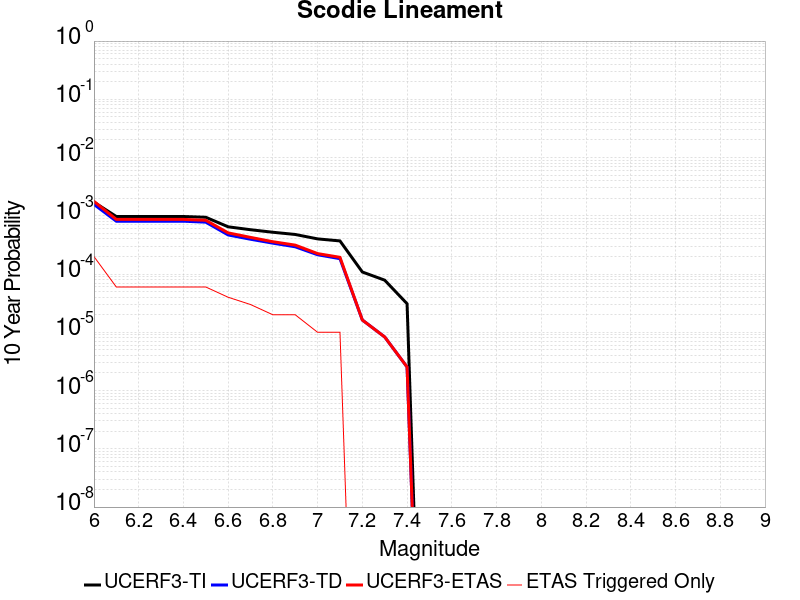 |

| Magnitude | 1 wk TI Prob | 1 wk TD Prob | 1 wk ETAS Prob | 1 wk ETAS/TD Gain | 1 wk ETAS Triggered Only | 1 mo TI Prob | 1 mo TD Prob | 1 mo ETAS Prob | 1 mo ETAS/TD Gain | 1 mo ETAS Triggered Only | 1 yr TI Prob | 1 yr TD Prob | 1 yr ETAS Prob | 1 yr ETAS/TD Gain | 1 yr ETAS Triggered Only | 10 yr TI Prob | 10 yr TD Prob | 10 yr ETAS Prob | 10 yr ETAS/TD Gain | 10 yr ETAS Triggered Only |
|-----|-----|-----|-----|-----|-----|-----|-----|-----|-----|-----|-----|-----|-----|-----|-----|-----|-----|-----|-----|-----|
| 6.0 | 3.2919327E-6 | 3.0133565E-6 | 2.3013296E-5 | 7.6370974 | 2.0E-5 | 1.4108206E-5 | 1.2914339E-5 | 5.2913823E-5 | 4.0972924 | 4.0E-5 | 1.7175387E-4 | 1.5722391E-4 | 2.8720347E-4 | 1.8267163 | 1.3E-4 | 0.0017162118 | 0.0015714383 | 0.0017711241 | 1.127072 | 2.0E-4 |
| 6.1 | 1.8663811E-6 | 1.5490589E-6 | 1.5490589E-6 | 1.0 | 0.0 | 7.998751E-6 | 6.6388097E-6 | 1.6638744E-5 | 2.506284 | 1.0E-5 | 9.738045E-5 | 8.082501E-5 | 1.2082177E-4 | 1.4948564 | 4.0E-5 | 9.7337784E-4 | 8.0800493E-4 | 8.6795643E-4 | 1.0741969 | 6.0E-5 |
| 6.2 | 1.8663811E-6 | 1.5490589E-6 | 1.5490589E-6 | 1.0 | 0.0 | 7.998751E-6 | 6.6388097E-6 | 1.6638744E-5 | 2.506284 | 1.0E-5 | 9.738045E-5 | 8.082501E-5 | 1.2082177E-4 | 1.4948564 | 4.0E-5 | 9.7337784E-4 | 8.0800493E-4 | 8.6795643E-4 | 1.0741969 | 6.0E-5 |
| 6.3 | 1.8663811E-6 | 1.5490589E-6 | 1.5490589E-6 | 1.0 | 0.0 | 7.998751E-6 | 6.6388097E-6 | 1.6638744E-5 | 2.506284 | 1.0E-5 | 9.738045E-5 | 8.082501E-5 | 1.2082177E-4 | 1.4948564 | 4.0E-5 | 9.7337784E-4 | 8.0800493E-4 | 8.6795643E-4 | 1.0741969 | 6.0E-5 |
| 6.4 | 1.8663811E-6 | 1.5490589E-6 | 1.5490589E-6 | 1.0 | 0.0 | 7.998751E-6 | 6.6388097E-6 | 1.6638744E-5 | 2.506284 | 1.0E-5 | 9.738045E-5 | 8.082501E-5 | 1.2082177E-4 | 1.4948564 | 4.0E-5 | 9.7337784E-4 | 8.0800493E-4 | 8.6795643E-4 | 1.0741969 | 6.0E-5 |
| 6.5 | 1.8106311E-6 | 1.4909926E-6 | 1.4909926E-6 | 1.0 | 0.0 | 7.759824E-6 | 6.3899556E-6 | 1.6389891E-5 | 2.5649462 | 1.0E-5 | 9.447177E-5 | 7.779543E-5 | 1.1779231E-4 | 1.514129 | 4.0E-5 | 9.4431615E-4 | 7.777306E-4 | 8.376839E-4 | 1.0770875 | 6.0E-5 |
| 6.6 | 1.2414679E-6 | 8.9976135E-7 | 8.9976135E-7 | 1.0 | 0.0 | 5.320566E-6 | 3.8561147E-6 | 3.8561147E-6 | 1.0 | 0.0 | 6.477596E-5 | 4.6947276E-5 | 6.694634E-5 | 1.4259897 | 2.0E-5 | 6.475708E-4 | 4.6938224E-4 | 5.093635E-4 | 1.0851784 | 4.0E-5 |
| 6.7 | 1.1062215E-6 | 7.5943603E-7 | 7.5943603E-7 | 1.0 | 0.0 | 4.7409408E-6 | 3.254722E-6 | 3.254722E-6 | 1.0 | 0.0 | 5.7719422E-5 | 3.9625593E-5 | 5.96248E-5 | 1.5047044 | 2.0E-5 | 5.770443E-4 | 3.9619225E-4 | 4.2618037E-4 | 1.0756909 | 3.0E-5 |
| 6.8 | 1.0006736E-6 | 6.5004406E-7 | 6.5004406E-7 | 1.0 | 0.0 | 4.288594E-6 | 2.7859005E-6 | 2.7859005E-6 | 1.0 | 0.0 | 5.221238E-5 | 3.3917873E-5 | 5.3917192E-5 | 1.5896397 | 2.0E-5 | 5.220012E-4 | 3.3913302E-4 | 3.5912625E-4 | 1.0589539 | 2.0E-5 |
| 6.9 | 9.167364E-7 | 5.6316645E-7 | 5.6316645E-7 | 1.0 | 0.0 | 3.9288643E-6 | 2.4135686E-6 | 2.4135686E-6 | 1.0 | 0.0 | 4.7832873E-5 | 2.9384859E-5 | 4.938427E-5 | 1.6806027 | 2.0E-5 | 4.782258E-4 | 2.9381542E-4 | 3.1380952E-4 | 1.0680499 | 2.0E-5 |
| 7.0 | 7.6987664E-7 | 4.113416E-7 | 4.113416E-7 | 1.0 | 0.0 | 3.2994672E-6 | 1.7628915E-6 | 1.7628915E-6 | 1.0 | 0.0 | 4.0170275E-5 | 2.1463033E-5 | 3.146282E-5 | 1.4659073 | 1.0E-5 | 4.0163012E-4 | 2.1461345E-4 | 2.2461131E-4 | 1.0465854 | 1.0E-5 |
| 7.1 | 7.1038727E-7 | 3.5211795E-7 | 3.5211795E-7 | 1.0 | 0.0 | 3.0445133E-6 | 1.5090762E-6 | 1.5090762E-6 | 1.0 | 0.0 | 3.706632E-5 | 1.8372884E-5 | 2.83727E-5 | 1.5442704 | 1.0E-5 | 3.7060137E-4 | 1.8371714E-4 | 1.9371531E-4 | 1.0544215 | 1.0E-5 |
| 7.2 | 2.0799602E-7 | 3.1187685E-8 | 3.1187685E-8 | 1.0 | 0.0 | 8.914113E-7 | 1.336615E-7 | 1.336615E-7 | 1.0 | 0.0 | 1.0852878E-5 | 1.6273277E-6 | 1.6273277E-6 | 1.0 | 0.0 | 1.08523476E-4 | 1.6273165E-5 | 1.6273165E-5 | 1.0 | 0.0 |
| 7.3 | 1.5048182E-7 | 1.5946263E-8 | 1.5946263E-8 | 1.0 | 0.0 | 6.449219E-7 | 6.834112E-8 | 6.834112E-8 | 1.0 | 0.0 | 7.851896E-6 | 8.320529E-7 | 8.320529E-7 | 1.0 | 0.0 | 7.851618E-5 | 8.3205005E-6 | 8.3205005E-6 | 1.0 | 0.0 |
| 7.4 | 5.9334678E-8 | 4.8685624E-9 | 4.8685624E-9 | 1.0 | 0.0 | 2.5429145E-7 | 2.0865269E-8 | 2.0865269E-8 | 1.0 | 0.0 | 3.095994E-6 | 2.5403463E-7 | 2.5403463E-7 | 1.0 | 0.0 | 3.095951E-5 | 2.5403444E-6 | 2.5403444E-6 | 1.0 | 0.0 |

## Death Valley (Fish Lake Valley)
*[(top)](#table-of-contents)*

| 1 Week | 1 Month | 1 Year | 10 Year |
|-----|-----|-----|-----|
|  |  |  |  |

| Magnitude | 1 wk TI Prob | 1 wk TD Prob | 1 wk ETAS Prob | 1 wk ETAS/TD Gain | 1 wk ETAS Triggered Only | 1 mo TI Prob | 1 mo TD Prob | 1 mo ETAS Prob | 1 mo ETAS/TD Gain | 1 mo ETAS Triggered Only | 1 yr TI Prob | 1 yr TD Prob | 1 yr ETAS Prob | 1 yr ETAS/TD Gain | 1 yr ETAS Triggered Only | 10 yr TI Prob | 10 yr TD Prob | 10 yr ETAS Prob | 10 yr ETAS/TD Gain | 10 yr ETAS Triggered Only |
|-----|-----|-----|-----|-----|-----|-----|-----|-----|-----|-----|-----|-----|-----|-----|-----|-----|-----|-----|-----|-----|
| 6.0 | 3.872328E-5 | 4.7268895E-5 | 4.7268895E-5 | 1.0 | 0.0 | 1.6594635E-4 | 2.0256694E-4 | 2.0256694E-4 | 1.0 | 0.0 | 0.0020185246 | 0.0024636039 | 0.0025434068 | 1.0323927 | 8.0E-5 | 0.02000288 | 0.024388881 | 0.024584005 | 1.0080005 | 2.0E-4 |
| 6.1 | 3.872328E-5 | 4.7268895E-5 | 4.7268895E-5 | 1.0 | 0.0 | 1.6594635E-4 | 2.0256694E-4 | 2.0256694E-4 | 1.0 | 0.0 | 0.0020185246 | 0.0024636039 | 0.0025434068 | 1.0323927 | 8.0E-5 | 0.02000288 | 0.024388881 | 0.024584005 | 1.0080005 | 2.0E-4 |
| 6.2 | 3.872328E-5 | 4.7268895E-5 | 4.7268895E-5 | 1.0 | 0.0 | 1.6594635E-4 | 2.0256694E-4 | 2.0256694E-4 | 1.0 | 0.0 | 0.0020185246 | 0.0024636039 | 0.0025434068 | 1.0323927 | 8.0E-5 | 0.02000288 | 0.024388881 | 0.024584005 | 1.0080005 | 2.0E-4 |
| 6.3 | 2.8356371E-5 | 3.3610693E-5 | 3.3610693E-5 | 1.0 | 0.0 | 1.2152165E-4 | 1.4403832E-4 | 1.4403832E-4 | 1.0 | 0.0 | 0.0014785219 | 0.001752335 | 0.0018321947 | 1.0455734 | 8.0E-5 | 0.014687235 | 0.01739221 | 0.01758873 | 1.0112994 | 2.0E-4 |
| 6.4 | 2.8356371E-5 | 3.3610693E-5 | 3.3610693E-5 | 1.0 | 0.0 | 1.2152165E-4 | 1.4403832E-4 | 1.4403832E-4 | 1.0 | 0.0 | 0.0014785219 | 0.001752335 | 0.0018321947 | 1.0455734 | 8.0E-5 | 0.014687235 | 0.01739221 | 0.01758873 | 1.0112994 | 2.0E-4 |
| 6.5 | 2.4448687E-5 | 2.8608209E-5 | 2.8608209E-5 | 1.0 | 0.0 | 1.0477588E-4 | 1.2260114E-4 | 1.2260114E-4 | 1.0 | 0.0 | 0.0012748998 | 0.0014916973 | 0.001571578 | 1.0535502 | 8.0E-5 | 0.012676105 | 0.014821712 | 0.015018747 | 1.0132937 | 2.0E-4 |
| 6.6 | 2.1298161E-5 | 2.4660607E-5 | 2.4660607E-5 | 1.0 | 0.0 | 9.127464E-5 | 1.0568422E-4 | 1.0568422E-4 | 1.0 | 0.0 | 0.0011107022 | 0.0012859798 | 0.0013658769 | 1.0621294 | 8.0E-5 | 0.011051672 | 0.012788794 | 0.012986236 | 1.0154387 | 2.0E-4 |
| 6.7 | 1.8959729E-5 | 2.178146E-5 | 2.178146E-5 | 1.0 | 0.0 | 8.125345E-5 | 9.3345916E-5 | 9.3345916E-5 | 1.0 | 0.0 | 9.888117E-4 | 0.0011359196 | 0.0012158287 | 1.0703475 | 8.0E-5 | 0.009844234 | 0.011303794 | 0.011501533 | 1.0174931 | 2.0E-4 |
| 6.8 | 1.6691629E-5 | 1.9018706E-5 | 1.9018706E-5 | 1.0 | 0.0 | 7.153359E-5 | 8.150629E-5 | 8.150629E-5 | 1.0 | 0.0 | 8.7057345E-4 | 9.919042E-4 | 0.0010718248 | 1.080573 | 8.0E-5 | 0.008671708 | 0.009876527 | 0.010074551 | 1.02005 | 2.0E-4 |
| 6.9 | 1.450505E-5 | 1.6389824E-5 | 1.6389824E-5 | 1.0 | 0.0 | 6.216302E-5 | 7.024026E-5 | 7.024026E-5 | 1.0 | 0.0 | 7.5657194E-4 | 8.548484E-4 | 9.3478005E-4 | 1.0935038 | 8.0E-5 | 0.007540013 | 0.008516532 | 0.00871483 | 1.0232837 | 2.0E-4 |
| 7.0 | 1.2940855E-5 | 1.453821E-5 | 1.453821E-5 | 1.0 | 0.0 | 5.545963E-5 | 6.230516E-5 | 6.230516E-5 | 1.0 | 0.0 | 6.750118E-4 | 7.583071E-4 | 8.3824643E-4 | 1.1054182 | 8.0E-5 | 0.006729651 | 0.0075578135 | 0.007756302 | 1.0262626 | 2.0E-4 |
| 7.1 | 1.2544658E-5 | 1.4078437E-5 | 1.4078437E-5 | 1.0 | 0.0 | 5.3761712E-5 | 6.033479E-5 | 6.033479E-5 | 1.0 | 0.0 | 6.5435225E-4 | 7.343341E-4 | 8.1427535E-4 | 1.1088623 | 8.0E-5 | 0.006524288 | 0.0073196692 | 0.0075182053 | 1.0271237 | 2.0E-4 |
| 7.2 | 1.2489416E-5 | 1.4015902E-5 | 1.4015902E-5 | 1.0 | 0.0 | 5.3524967E-5 | 6.00668E-5 | 6.00668E-5 | 1.0 | 0.0 | 6.514716E-4 | 7.310735E-4 | 8.11015E-4 | 1.1093482 | 8.0E-5 | 0.006495651 | 0.007287278 | 0.00748582 | 1.027245 | 2.0E-4 |
| 7.3 | 1.2368307E-5 | 1.3880038E-5 | 1.3880038E-5 | 1.0 | 0.0 | 5.3005948E-5 | 5.948455E-5 | 5.948455E-5 | 1.0 | 0.0 | 6.451563E-4 | 7.239894E-4 | 8.0393144E-4 | 1.1104189 | 8.0E-5 | 0.0064328653 | 0.0072168987 | 0.0074154553 | 1.0275128 | 2.0E-4 |
| 7.4 | 1.2161707E-5 | 1.3648089E-5 | 1.3648089E-5 | 1.0 | 0.0 | 5.212056E-5 | 5.8490532E-5 | 5.8490532E-5 | 1.0 | 0.0 | 6.3438306E-4 | 7.118952E-4 | 7.918382E-4 | 1.1122961 | 8.0E-5 | 0.006325751 | 0.0070967353 | 0.007295316 | 1.027982 | 2.0E-4 |
| 7.5 | 1.1707948E-5 | 1.314573E-5 | 1.314573E-5 | 1.0 | 0.0 | 5.0175953E-5 | 5.6337656E-5 | 5.6337656E-5 | 1.0 | 0.0 | 6.10721E-4 | 6.857007E-4 | 7.656458E-4 | 1.116589 | 8.0E-5 | 0.0060904534 | 0.0068364325 | 0.007035065 | 1.029055 | 2.0E-4 |
| 7.6 | 1.0319538E-5 | 1.157981E-5 | 1.157981E-5 | 1.0 | 0.0 | 4.4225842E-5 | 4.9626844E-5 | 4.9626844E-5 | 1.0 | 0.0 | 5.383166E-4 | 6.040445E-4 | 6.839961E-4 | 1.1323606 | 8.0E-5 | 0.0053701443 | 0.0060245576 | 0.006213413 | 1.0313476 | 1.9E-4 |
| 7.7 | 8.937764E-6 | 1.0022941E-5 | 1.0022941E-5 | 1.0 | 0.0 | 3.830414E-5 | 4.295478E-5 | 4.295478E-5 | 1.0 | 0.0 | 4.6625308E-4 | 5.2285404E-4 | 5.9281744E-4 | 1.1338106 | 7.0E-5 | 0.0046527605 | 0.005216748 | 0.0053659654 | 1.0286036 | 1.5E-4 |
| 7.8 | 3.108007E-7 | 3.2846788E-7 | 3.2846788E-7 | 1.0 | 0.0 | 1.3320023E-6 | 1.4077187E-6 | 1.4077187E-6 | 1.0 | 0.0 | 1.6217007E-5 | 1.7138846E-5 | 1.7138846E-5 | 1.0 | 0.0 | 1.6215823E-4 | 1.713756E-4 | 1.9137218E-4 | 1.1166828 | 2.0E-5 |
| 7.9 | 2.5591178E-9 | 2.6696871E-9 | 2.6696871E-9 | 1.0 | 0.0 | 1.0967647E-8 | 1.1441516E-8 | 1.1441516E-8 | 1.0 | 0.0 | 1.335311E-7 | 1.3930045E-7 | 1.3930045E-7 | 1.0 | 0.0 | 1.3353102E-6 | 1.3930046E-6 | 1.3930046E-6 | 1.0 | 0.0 |

## San Jacinto (San Bernardino)
*[(top)](#table-of-contents)*

| 1 Week | 1 Month | 1 Year | 10 Year |
|-----|-----|-----|-----|
|  |  |  |  |

| Magnitude | 1 wk TI Prob | 1 wk TD Prob | 1 wk ETAS Prob | 1 wk ETAS/TD Gain | 1 wk ETAS Triggered Only | 1 mo TI Prob | 1 mo TD Prob | 1 mo ETAS Prob | 1 mo ETAS/TD Gain | 1 mo ETAS Triggered Only | 1 yr TI Prob | 1 yr TD Prob | 1 yr ETAS Prob | 1 yr ETAS/TD Gain | 1 yr ETAS Triggered Only | 10 yr TI Prob | 10 yr TD Prob | 10 yr ETAS Prob | 10 yr ETAS/TD Gain | 10 yr ETAS Triggered Only |
|-----|-----|-----|-----|-----|-----|-----|-----|-----|-----|-----|-----|-----|-----|-----|-----|-----|-----|-----|-----|-----|
| 6.0 | 3.409352E-5 | 3.600249E-5 | 8.600069E-5 | 2.3887427 | 5.0E-5 | 1.461069E-4 | 1.5428728E-4 | 2.1427801E-4 | 1.3888249 | 6.0E-5 | 0.0017774 | 0.001876831 | 0.001996606 | 1.0638176 | 1.2E-4 | 0.01763251 | 0.019358097 | 0.019554226 | 1.0101316 | 2.0E-4 |
| 6.1 | 3.409352E-5 | 3.600249E-5 | 8.600069E-5 | 2.3887427 | 5.0E-5 | 1.461069E-4 | 1.5428728E-4 | 2.1427801E-4 | 1.3888249 | 6.0E-5 | 0.0017774 | 0.001876831 | 0.001996606 | 1.0638176 | 1.2E-4 | 0.01763251 | 0.019358097 | 0.019554226 | 1.0101316 | 2.0E-4 |
| 6.2 | 3.409352E-5 | 3.600249E-5 | 8.600069E-5 | 2.3887427 | 5.0E-5 | 1.461069E-4 | 1.5428728E-4 | 2.1427801E-4 | 1.3888249 | 6.0E-5 | 0.0017774 | 0.001876831 | 0.001996606 | 1.0638176 | 1.2E-4 | 0.01763251 | 0.019358097 | 0.019554226 | 1.0101316 | 2.0E-4 |
| 6.3 | 3.409352E-5 | 3.600249E-5 | 8.600069E-5 | 2.3887427 | 5.0E-5 | 1.461069E-4 | 1.5428728E-4 | 2.1427801E-4 | 1.3888249 | 6.0E-5 | 0.0017774 | 0.001876831 | 0.001996606 | 1.0638176 | 1.2E-4 | 0.01763251 | 0.019358097 | 0.019554226 | 1.0101316 | 2.0E-4 |
| 6.4 | 3.400795E-5 | 3.589515E-5 | 8.5893356E-5 | 2.392896 | 5.0E-5 | 1.4574021E-4 | 1.5382729E-4 | 2.1381807E-4 | 1.3899878 | 6.0E-5 | 0.0017729428 | 0.0018712406 | 0.001991016 | 1.0640086 | 1.2E-4 | 0.017588645 | 0.019303178 | 0.019499317 | 1.010161 | 2.0E-4 |
| 6.5 | 3.341482E-5 | 3.5155765E-5 | 8.5154E-5 | 2.4221919 | 5.0E-5 | 1.4319851E-4 | 1.5065886E-4 | 2.1064983E-4 | 1.3981907 | 6.0E-5 | 0.0017420477 | 0.0018327299 | 0.00195251 | 1.0653561 | 1.2E-4 | 0.017284546 | 0.018924711 | 0.019120926 | 1.0103682 | 2.0E-4 |
| 6.6 | 3.3364955E-5 | 3.509298E-5 | 8.5091226E-5 | 2.4247363 | 5.0E-5 | 1.4298483E-4 | 1.5038982E-4 | 2.1038081E-4 | 1.3989031 | 6.0E-5 | 0.0017394501 | 0.0018294598 | 0.0019492403 | 1.0654731 | 1.2E-4 | 0.017258976 | 0.018892575 | 0.019088795 | 1.0103862 | 2.0E-4 |
| 6.7 | 3.335922E-5 | 3.5082754E-5 | 8.5081E-5 | 2.4251516 | 5.0E-5 | 1.4296026E-4 | 1.5034601E-4 | 2.1033699E-4 | 1.3990195 | 6.0E-5 | 0.0017391514 | 0.0018289272 | 0.0019487077 | 1.0654923 | 1.2E-4 | 0.017256035 | 0.018887365 | 0.01908359 | 1.0103891 | 2.0E-4 |
| 6.8 | 3.327683E-5 | 3.4976816E-5 | 8.4975065E-5 | 2.4294684 | 5.0E-5 | 1.4260718E-4 | 1.4989203E-4 | 2.0988304E-4 | 1.4002281 | 6.0E-5 | 0.0017348597 | 0.0018234095 | 0.0019431906 | 1.0656908 | 1.2E-4 | 0.017213784 | 0.018833136 | 0.01902937 | 1.0104196 | 2.0E-4 |
| 6.9 | 3.3235785E-5 | 3.4917768E-5 | 8.491602E-5 | 2.4318857 | 5.0E-5 | 1.4243131E-4 | 1.49639E-4 | 2.0963003E-4 | 1.400905 | 6.0E-5 | 0.0017327217 | 0.0018203339 | 0.0019401155 | 1.065802 | 1.2E-4 | 0.017192734 | 0.018803004 | 0.018999243 | 1.0104367 | 2.0E-4 |
| 7.0 | 3.3197095E-5 | 3.4857694E-5 | 8.485595E-5 | 2.4343536 | 5.0E-5 | 1.422655E-4 | 1.4938158E-4 | 2.0937262E-4 | 1.401596 | 6.0E-5 | 0.0017307063 | 0.001817205 | 0.0019369869 | 1.0659155 | 1.2E-4 | 0.017172894 | 0.01877238 | 0.018968625 | 1.0104539 | 2.0E-4 |
| 7.1 | 3.3129716E-5 | 3.47379E-5 | 8.4736166E-5 | 2.4393 | 5.0E-5 | 1.4197677E-4 | 1.4886823E-4 | 2.088593E-4 | 1.402981 | 6.0E-5 | 0.0017271966 | 0.0018109654 | 0.001930748 | 1.066143 | 1.2E-4 | 0.017138338 | 0.018711457 | 0.018907715 | 1.0104886 | 2.0E-4 |
| 7.2 | 3.3034008E-5 | 3.4605342E-5 | 8.460361E-5 | 2.4448135 | 5.0E-5 | 1.4156665E-4 | 1.4830018E-4 | 2.0829128E-4 | 1.4045248 | 6.0E-5 | 0.0017222111 | 0.001804061 | 0.0019238445 | 1.0663966 | 1.2E-4 | 0.017089253 | 0.018643849 | 0.01884012 | 1.0105274 | 2.0E-4 |
| 7.3 | 3.2956614E-5 | 3.447309E-5 | 8.4471365E-5 | 2.4503567 | 5.0E-5 | 1.4123498E-4 | 1.4773346E-4 | 2.077246E-4 | 1.4060768 | 6.0E-5 | 0.0017181796 | 0.0017971725 | 0.0019169567 | 1.0666516 | 1.2E-4 | 0.017049557 | 0.018576592 | 0.018772876 | 1.0105662 | 2.0E-4 |
| 7.4 | 3.2915937E-5 | 3.439478E-5 | 8.439306E-5 | 2.453659 | 5.0E-5 | 1.4106068E-4 | 1.4739788E-4 | 2.0738904E-4 | 1.4070015 | 6.0E-5 | 0.0017160608 | 0.0017930934 | 0.0019128782 | 1.0668035 | 1.2E-4 | 0.017028693 | 0.018536855 | 0.018733148 | 1.0105894 | 2.0E-4 |
| 7.5 | 3.281791E-5 | 3.4259683E-5 | 8.425797E-5 | 2.4593914 | 5.0E-5 | 1.406406E-4 | 1.4681896E-4 | 2.0681015E-4 | 1.4086065 | 6.0E-5 | 0.0017109542 | 0.0017860567 | 0.0019058423 | 1.0670671 | 1.2E-4 | 0.016978411 | 0.018467735 | 0.018664043 | 1.0106297 | 2.0E-4 |
| 7.6 | 3.2521442E-5 | 3.39846E-5 | 8.39829E-5 | 2.4712045 | 5.0E-5 | 1.3937015E-4 | 1.4564018E-4 | 2.0563144E-4 | 1.4119142 | 6.0E-5 | 0.0016955109 | 0.0017717284 | 0.0018915158 | 1.0676105 | 1.2E-4 | 0.016826328 | 0.01832535 | 0.018521685 | 1.0107138 | 2.0E-4 |
| 7.7 | 3.0287873E-5 | 3.246845E-5 | 8.246683E-5 | 2.5399063 | 5.0E-5 | 1.297987E-4 | 1.391431E-4 | 1.9913475E-4 | 1.4311508 | 6.0E-5 | 0.0015791537 | 0.001692752 | 0.0018125488 | 1.0707705 | 1.2E-4 | 0.01567979 | 0.017536119 | 0.017732613 | 1.0112051 | 2.0E-4 |
| 7.8 | 2.6316151E-5 | 2.9678711E-5 | 7.967723E-5 | 2.6846592 | 5.0E-5 | 1.1277862E-4 | 1.2718828E-4 | 1.8718066E-4 | 1.4716816 | 6.0E-5 | 0.0013722149 | 0.0015474184 | 0.0016672327 | 1.0774285 | 1.2E-4 | 0.013637724 | 0.016077382 | 0.016274167 | 1.0122398 | 2.0E-4 |
| 7.9 | 2.0761147E-5 | 2.3431265E-5 | 7.343009E-5 | 3.133851 | 5.0E-5 | 8.897331E-5 | 1.0041584E-4 | 1.6040982E-4 | 1.5974553 | 6.0E-5 | 0.0010827117 | 0.0012218781 | 0.0013317437 | 1.0899154 | 1.1E-4 | 0.010774517 | 0.012799971 | 0.012987539 | 1.0146538 | 1.9E-4 |
| 8.0 | 1.5738568E-5 | 1.6043394E-5 | 4.604291E-5 | 2.8698986 | 3.0E-5 | 6.744926E-5 | 6.8755595E-5 | 9.875353E-5 | 1.4362981 | 3.0E-5 | 8.2088535E-4 | 8.3677855E-4 | 9.167116E-4 | 1.0955248 | 8.0E-5 | 0.008178596 | 0.008871087 | 0.009029668 | 1.0178761 | 1.6E-4 |
| 8.1 | 1.0105832E-5 | 8.336244E-6 | 2.8336077E-5 | 3.399142 | 2.0E-5 | 4.3309992E-5 | 3.5726272E-5 | 5.572556E-5 | 1.559792 | 2.0E-5 | 5.2717153E-4 | 4.3488108E-4 | 4.6486803E-4 | 1.0689543 | 3.0E-5 | 0.005259227 | 0.00468032 | 0.0047400394 | 1.0127597 | 6.0E-5 |
| 8.2 | 4.189207E-6 | 1.5801045E-6 | 1.5801045E-6 | 1.0 | 0.0 | 1.7953622E-5 | 6.771859E-6 | 6.771859E-6 | 1.0 | 0.0 | 2.1856341E-4 | 8.244429E-5 | 8.244429E-5 | 1.0 | 0.0 | 0.0021834858 | 9.575395E-4 | 9.575395E-4 | 1.0 | 0.0 |
| 8.3 | 1.2758221E-6 | 3.6194777E-7 | 3.6194777E-7 | 1.0 | 0.0 | 5.4677976E-6 | 1.5512038E-6 | 1.5512038E-6 | 1.0 | 0.0 | 6.65684E-5 | 1.8885747E-5 | 1.8885747E-5 | 1.0 | 0.0 | 6.6548464E-4 | 2.2777634E-4 | 2.2777634E-4 | 1.0 | 0.0 |

## Cady
*[(top)](#table-of-contents)*

| 1 Week | 1 Month | 1 Year | 10 Year |
|-----|-----|-----|-----|
|  |  |  |  |

| Magnitude | 1 wk TI Prob | 1 wk TD Prob | 1 wk ETAS Prob | 1 wk ETAS/TD Gain | 1 wk ETAS Triggered Only | 1 mo TI Prob | 1 mo TD Prob | 1 mo ETAS Prob | 1 mo ETAS/TD Gain | 1 mo ETAS Triggered Only | 1 yr TI Prob | 1 yr TD Prob | 1 yr ETAS Prob | 1 yr ETAS/TD Gain | 1 yr ETAS Triggered Only | 10 yr TI Prob | 10 yr TD Prob | 10 yr ETAS Prob | 10 yr ETAS/TD Gain | 10 yr ETAS Triggered Only |
|-----|-----|-----|-----|-----|-----|-----|-----|-----|-----|-----|-----|-----|-----|-----|-----|-----|-----|-----|-----|-----|
| 6.0 | 1.9892565E-5 | 2.1859016E-5 | 4.1858577E-5 | 1.9149343 | 2.0E-5 | 8.525106E-5 | 9.3678645E-5 | 1.2367584E-4 | 1.3202138 | 3.0E-5 | 0.0010374374 | 0.0011400316 | 0.001279872 | 1.1226636 | 1.4E-4 | 0.010326075 | 0.011350849 | 0.011538692 | 1.0165489 | 1.9E-4 |
| 6.1 | 1.9892565E-5 | 2.1859016E-5 | 4.1858577E-5 | 1.9149343 | 2.0E-5 | 8.525106E-5 | 9.3678645E-5 | 1.2367584E-4 | 1.3202138 | 3.0E-5 | 0.0010374374 | 0.0011400316 | 0.001279872 | 1.1226636 | 1.4E-4 | 0.010326075 | 0.011350849 | 0.011538692 | 1.0165489 | 1.9E-4 |
| 6.2 | 1.9892565E-5 | 2.1859016E-5 | 4.1858577E-5 | 1.9149343 | 2.0E-5 | 8.525106E-5 | 9.3678645E-5 | 1.2367584E-4 | 1.3202138 | 3.0E-5 | 0.0010374374 | 0.0011400316 | 0.001279872 | 1.1226636 | 1.4E-4 | 0.010326075 | 0.011350849 | 0.011538692 | 1.0165489 | 1.9E-4 |
| 6.3 | 1.1117327E-5 | 1.2176738E-5 | 2.2176615E-5 | 1.821228 | 1.0E-5 | 4.764482E-5 | 5.218515E-5 | 7.2184106E-5 | 1.3832308 | 2.0E-5 | 5.7992124E-4 | 6.3520053E-4 | 7.0515607E-4 | 1.1101314 | 7.0E-5 | 0.0057841022 | 0.0063369554 | 0.006426385 | 1.0141124 | 9.0E-5 |
| 6.4 | 1.1117327E-5 | 1.2176738E-5 | 2.2176615E-5 | 1.821228 | 1.0E-5 | 4.764482E-5 | 5.218515E-5 | 7.2184106E-5 | 1.3832308 | 2.0E-5 | 5.7992124E-4 | 6.3520053E-4 | 7.0515607E-4 | 1.1101314 | 7.0E-5 | 0.0057841022 | 0.0063369554 | 0.006426385 | 1.0141124 | 9.0E-5 |
| 6.5 | 6.103093E-6 | 6.672103E-6 | 1.6672037E-5 | 2.4987679 | 1.0E-5 | 2.615585E-5 | 2.8594486E-5 | 3.85942E-5 | 1.3497077 | 1.0E-5 | 3.1840094E-4 | 3.4809482E-4 | 3.7808437E-4 | 1.0861534 | 3.0E-5 | 0.0031794512 | 0.0034767296 | 0.0035265558 | 1.0143313 | 5.0E-5 |
| 6.6 | 5.817237E-6 | 6.365738E-6 | 1.6365675E-5 | 2.5708997 | 1.0E-5 | 2.4930776E-5 | 2.728152E-5 | 3.7281246E-5 | 1.3665385 | 1.0E-5 | 3.034899E-4 | 3.3211432E-4 | 3.6210436E-4 | 1.0903003 | 3.0E-5 | 0.0030307577 | 0.003317402 | 0.0033672361 | 1.015022 | 5.0E-5 |
| 6.7 | 4.8846314E-6 | 5.3406343E-6 | 5.3406343E-6 | 1.0 | 0.0 | 2.0933967E-5 | 2.2888298E-5 | 2.2888298E-5 | 1.0 | 0.0 | 2.5484123E-4 | 2.7864118E-4 | 2.986356E-4 | 1.071757 | 2.0E-5 | 0.0025454918 | 0.0027840736 | 0.0028239621 | 1.0143274 | 4.0E-5 |
| 6.8 | 1.7788773E-6 | 1.9399313E-6 | 1.9399313E-6 | 1.0 | 0.0 | 7.6237375E-6 | 8.313974E-6 | 8.313974E-6 | 1.0 | 0.0 | 9.281505E-5 | 1.01219506E-4 | 1.21217476E-4 | 1.1975703 | 2.0E-5 | 9.2776294E-4 | 0.0010118886 | 0.0010418582 | 1.0296175 | 3.0E-5 |
| 6.9 | 7.5455404E-7 | 8.297202E-7 | 8.297202E-7 | 1.0 | 0.0 | 3.233799E-6 | 3.5559406E-6 | 3.5559406E-6 | 1.0 | 0.0 | 3.937079E-5 | 4.3293054E-5 | 4.3293054E-5 | 1.0 | 0.0 | 3.9363815E-4 | 4.3287914E-4 | 4.3287914E-4 | 1.0 | 0.0 |
| 7.0 | 6.8578805E-7 | 7.541916E-7 | 7.541916E-7 | 1.0 | 0.0 | 2.9390883E-6 | 3.2322475E-6 | 3.2322475E-6 | 1.0 | 0.0 | 3.578281E-5 | 3.9352235E-5 | 3.9352235E-5 | 1.0 | 0.0 | 3.577705E-4 | 3.9348513E-4 | 3.9348513E-4 | 1.0 | 0.0 |

## San Jacinto (San Jacinto Valley) rev
*[(top)](#table-of-contents)*

| 1 Week | 1 Month | 1 Year | 10 Year |
|-----|-----|-----|-----|
|  |  |  |  |

| Magnitude | 1 wk TI Prob | 1 wk TD Prob | 1 wk ETAS Prob | 1 wk ETAS/TD Gain | 1 wk ETAS Triggered Only | 1 mo TI Prob | 1 mo TD Prob | 1 mo ETAS Prob | 1 mo ETAS/TD Gain | 1 mo ETAS Triggered Only | 1 yr TI Prob | 1 yr TD Prob | 1 yr ETAS Prob | 1 yr ETAS/TD Gain | 1 yr ETAS Triggered Only | 10 yr TI Prob | 10 yr TD Prob | 10 yr ETAS Prob | 10 yr ETAS/TD Gain | 10 yr ETAS Triggered Only |
|-----|-----|-----|-----|-----|-----|-----|-----|-----|-----|-----|-----|-----|-----|-----|-----|-----|-----|-----|-----|-----|
| 6.0 | 3.652694E-5 | 3.4417048E-5 | 7.441567E-5 | 2.1621747 | 4.0E-5 | 1.5653463E-4 | 1.4749331E-4 | 1.9748593E-4 | 1.3389485 | 5.0E-5 | 0.0019041431 | 0.0017942534 | 0.0018940739 | 1.0556335 | 1.0E-4 | 0.018879099 | 0.018534157 | 0.018710822 | 1.0095319 | 1.8E-4 |
| 6.1 | 3.652694E-5 | 3.4417048E-5 | 7.441567E-5 | 2.1621747 | 4.0E-5 | 1.5653463E-4 | 1.4749331E-4 | 1.9748593E-4 | 1.3389485 | 5.0E-5 | 0.0019041431 | 0.0017942534 | 0.0018940739 | 1.0556335 | 1.0E-4 | 0.018879099 | 0.018534157 | 0.018710822 | 1.0095319 | 1.8E-4 |
| 6.2 | 3.652694E-5 | 3.4417048E-5 | 7.441567E-5 | 2.1621747 | 4.0E-5 | 1.5653463E-4 | 1.4749331E-4 | 1.9748593E-4 | 1.3389485 | 5.0E-5 | 0.0019041431 | 0.0017942534 | 0.0018940739 | 1.0556335 | 1.0E-4 | 0.018879099 | 0.018534157 | 0.018710822 | 1.0095319 | 1.8E-4 |
| 6.3 | 3.652694E-5 | 3.4417048E-5 | 7.441567E-5 | 2.1621747 | 4.0E-5 | 1.5653463E-4 | 1.4749331E-4 | 1.9748593E-4 | 1.3389485 | 5.0E-5 | 0.0019041431 | 0.0017942534 | 0.0018940739 | 1.0556335 | 1.0E-4 | 0.018879099 | 0.018534157 | 0.018710822 | 1.0095319 | 1.8E-4 |
| 6.4 | 3.646941E-5 | 3.433862E-5 | 7.433725E-5 | 2.164829 | 4.0E-5 | 1.5628811E-4 | 1.4715722E-4 | 1.9714987E-4 | 1.3397226 | 5.0E-5 | 0.0019011468 | 0.0017901688 | 0.0018899898 | 1.0557606 | 1.0E-4 | 0.018849645 | 0.018494038 | 0.018670708 | 1.0095528 | 1.8E-4 |
| 6.5 | 3.646941E-5 | 3.433862E-5 | 7.433725E-5 | 2.164829 | 4.0E-5 | 1.5628811E-4 | 1.4715722E-4 | 1.9714987E-4 | 1.3397226 | 5.0E-5 | 0.0019011468 | 0.0017901688 | 0.0018899898 | 1.0557606 | 1.0E-4 | 0.018849645 | 0.018494038 | 0.018670708 | 1.0095528 | 1.8E-4 |
| 6.6 | 3.6442503E-5 | 3.4302004E-5 | 7.430063E-5 | 2.1660726 | 4.0E-5 | 1.561728E-4 | 1.4700032E-4 | 1.9699296E-4 | 1.3400853 | 5.0E-5 | 0.0018997455 | 0.0017882616 | 0.0018880828 | 1.0558202 | 1.0E-4 | 0.018835869 | 0.018475305 | 0.01865198 | 1.0095627 | 1.8E-4 |
| 6.7 | 3.6432113E-5 | 3.4287576E-5 | 7.42862E-5 | 2.1665633 | 4.0E-5 | 1.5612828E-4 | 1.4693849E-4 | 1.9693114E-4 | 1.3402284 | 5.0E-5 | 0.0018992044 | 0.0017875104 | 0.0018873316 | 1.0558437 | 1.0E-4 | 0.018830549 | 0.01846793 | 0.018644605 | 1.0095667 | 1.8E-4 |
| 6.8 | 3.6409598E-5 | 3.425663E-5 | 7.425526E-5 | 2.167617 | 4.0E-5 | 1.560318E-4 | 1.4680588E-4 | 1.9679853E-4 | 1.3405359 | 5.0E-5 | 0.0018980318 | 0.0017858985 | 0.0018857198 | 1.0558943 | 1.0E-4 | 0.018819023 | 0.018452084 | 0.018628761 | 1.009575 | 1.8E-4 |
| 6.9 | 3.638078E-5 | 3.4217053E-5 | 7.4215684E-5 | 2.1689677 | 4.0E-5 | 1.5590832E-4 | 1.4663627E-4 | 1.9662894E-4 | 1.3409297 | 5.0E-5 | 0.0018965311 | 0.001783837 | 0.0018836586 | 1.055959 | 1.0E-4 | 0.018804269 | 0.018431816 | 0.018608497 | 1.0095857 | 1.8E-4 |
| 7.0 | 3.6294874E-5 | 3.4099063E-5 | 7.40977E-5 | 2.1730127 | 4.0E-5 | 1.5554018E-4 | 1.4613067E-4 | 1.9612335E-4 | 1.3421096 | 5.0E-5 | 0.0018920569 | 0.0017776915 | 0.0018775138 | 1.0561527 | 1.0E-4 | 0.018760284 | 0.018371396 | 0.018548088 | 1.0096178 | 1.8E-4 |
| 7.1 | 3.6260717E-5 | 3.405534E-5 | 7.4053976E-5 | 2.1745188 | 4.0E-5 | 1.5539382E-4 | 1.4594331E-4 | 1.9593602E-4 | 1.3425487 | 5.0E-5 | 0.001890278 | 0.0017754143 | 0.0018752369 | 1.0562248 | 1.0E-4 | 0.018742796 | 0.018348996 | 0.018525692 | 1.0096298 | 1.8E-4 |
| 7.2 | 3.6210204E-5 | 3.398956E-5 | 7.39882E-5 | 2.176792 | 4.0E-5 | 1.5517735E-4 | 1.4566141E-4 | 1.9565414E-4 | 1.3432118 | 5.0E-5 | 0.001887647 | 0.0017719879 | 0.0018718106 | 1.0563338 | 1.0E-4 | 0.01871693 | 0.018315274 | 0.018491978 | 1.0096478 | 1.8E-4 |
| 7.3 | 3.6119454E-5 | 3.3877837E-5 | 7.387648E-5 | 2.180673 | 4.0E-5 | 1.5478847E-4 | 1.4518267E-4 | 1.9517541E-4 | 1.3443438 | 5.0E-5 | 0.0018829206 | 0.0017661685 | 0.0018659919 | 1.0565197 | 1.0E-4 | 0.018670462 | 0.018257825 | 0.018434538 | 1.0096788 | 1.8E-4 |
| 7.4 | 3.607848E-5 | 3.3825334E-5 | 7.382398E-5 | 2.1825056 | 4.0E-5 | 1.5461289E-4 | 1.4495767E-4 | 1.9495042E-4 | 1.3448783 | 5.0E-5 | 0.0018807866 | 0.0017634337 | 0.0018632574 | 1.0566076 | 1.0E-4 | 0.018649481 | 0.018230818 | 0.018407537 | 1.0096934 | 1.8E-4 |
| 7.5 | 3.5856774E-5 | 3.3635082E-5 | 7.363374E-5 | 2.1891944 | 4.0E-5 | 1.5366284E-4 | 1.4414241E-4 | 1.941352E-4 | 1.3468292 | 5.0E-5 | 0.0018692396 | 0.0017535238 | 0.0018533485 | 1.056928 | 1.0E-4 | 0.018535944 | 0.018131904 | 0.018308641 | 1.0097473 | 1.8E-4 |
| 7.6 | 3.286655E-5 | 3.215777E-5 | 7.215649E-5 | 2.2438273 | 4.0E-5 | 1.4084904E-4 | 1.3781176E-4 | 1.8780486E-4 | 1.3627638 | 5.0E-5 | 0.001713488 | 0.0016765689 | 0.0017764012 | 1.0595456 | 1.0E-4 | 0.017003361 | 0.017351432 | 0.017528309 | 1.0101938 | 1.8E-4 |
| 7.7 | 2.8882527E-5 | 2.9250317E-5 | 6.9249145E-5 | 2.3674664 | 4.0E-5 | 1.237764E-4 | 1.2535248E-4 | 1.7534623E-4 | 1.3988252 | 5.0E-5 | 0.0015059357 | 0.0015250992 | 0.0016249467 | 1.0654695 | 1.0E-4 | 0.014957713 | 0.015837716 | 0.016014865 | 1.0111853 | 1.8E-4 |
| 7.8 | 2.4950225E-5 | 2.6540692E-5 | 6.653963E-5 | 2.5070798 | 4.0E-5 | 1.0692515E-4 | 1.1374087E-4 | 1.6373518E-4 | 1.4395458 | 5.0E-5 | 0.0013010362 | 0.0013839162 | 0.0014837779 | 1.0721587 | 1.0E-4 | 0.012934455 | 0.0144187445 | 0.014596148 | 1.0123037 | 1.8E-4 |
| 7.9 | 1.9881603E-5 | 2.1519538E-5 | 6.151868E-5 | 2.858736 | 4.0E-5 | 8.520408E-5 | 9.222333E-5 | 1.4221872E-4 | 1.5421121 | 5.0E-5 | 0.001036866 | 0.0011222415 | 0.0012221293 | 1.0890074 | 1.0E-4 | 0.010320415 | 0.011783319 | 0.0119611975 | 1.0150958 | 1.8E-4 |
| 8.0 | 1.563292E-5 | 1.5947082E-5 | 4.5946603E-5 | 2.881192 | 3.0E-5 | 6.6996516E-5 | 6.834285E-5 | 9.83408E-5 | 1.4389333 | 3.0E-5 | 8.153773E-4 | 8.3175726E-4 | 9.116907E-4 | 1.0961019 | 8.0E-5 | 0.00812392 | 0.008815629 | 0.008974219 | 1.0179896 | 1.6E-4 |
| 8.1 | 1.0045313E-5 | 8.307514E-6 | 2.8307348E-5 | 3.4074392 | 2.0E-5 | 4.305063E-5 | 3.5603145E-5 | 5.5602435E-5 | 1.5617281 | 2.0E-5 | 5.2401534E-4 | 4.333826E-4 | 4.633696E-4 | 1.0691929 | 3.0E-5 | 0.0052278144 | 0.0046621817 | 0.0047219023 | 1.0128095 | 6.0E-5 |
| 8.2 | 4.1554413E-6 | 1.5672123E-6 | 1.5672123E-6 | 1.0 | 0.0 | 1.7808914E-5 | 6.716607E-6 | 6.716607E-6 | 1.0 | 0.0 | 2.1680194E-4 | 8.177165E-5 | 8.177165E-5 | 1.0 | 0.0 | 0.0021659054 | 9.492334E-4 | 9.492334E-4 | 1.0 | 0.0 |
| 8.3 | 1.2758221E-6 | 3.6194777E-7 | 3.6194777E-7 | 1.0 | 0.0 | 5.4677976E-6 | 1.5512038E-6 | 1.5512038E-6 | 1.0 | 0.0 | 6.65684E-5 | 1.8885747E-5 | 1.8885747E-5 | 1.0 | 0.0 | 6.6548464E-4 | 2.2777634E-4 | 2.2777634E-4 | 1.0 | 0.0 |

## Red Pass
*[(top)](#table-of-contents)*

| 1 Week | 1 Month | 1 Year | 10 Year |
|-----|-----|-----|-----|
|  |  |  |  |

| Magnitude | 1 wk TI Prob | 1 wk TD Prob | 1 wk ETAS Prob | 1 wk ETAS/TD Gain | 1 wk ETAS Triggered Only | 1 mo TI Prob | 1 mo TD Prob | 1 mo ETAS Prob | 1 mo ETAS/TD Gain | 1 mo ETAS Triggered Only | 1 yr TI Prob | 1 yr TD Prob | 1 yr ETAS Prob | 1 yr ETAS/TD Gain | 1 yr ETAS Triggered Only | 10 yr TI Prob | 10 yr TD Prob | 10 yr ETAS Prob | 10 yr ETAS/TD Gain | 10 yr ETAS Triggered Only |
|-----|-----|-----|-----|-----|-----|-----|-----|-----|-----|-----|-----|-----|-----|-----|-----|-----|-----|-----|-----|-----|
| 6.0 | 8.258278E-6 | 8.551305E-6 | 8.551305E-6 | 1.0 | 0.0 | 3.539214E-5 | 3.6648038E-5 | 6.6646935E-5 | 1.8185678 | 3.0E-5 | 4.308141E-4 | 4.4611638E-4 | 5.360762E-4 | 1.2016511 | 9.0E-5 | 0.0042997985 | 0.004453966 | 0.004633164 | 1.0402334 | 1.8E-4 |
| 6.1 | 3.649988E-6 | 3.7753332E-6 | 3.7753332E-6 | 1.0 | 0.0 | 1.5642712E-5 | 1.6179927E-5 | 2.6179765E-5 | 1.6180398 | 1.0E-5 | 1.9043336E-4 | 1.9697756E-4 | 2.2697165E-4 | 1.1522716 | 3.0E-5 | 0.0019027026 | 0.001968497 | 0.0020583197 | 1.0456302 | 9.0E-5 |
| 6.2 | 3.649988E-6 | 3.7753332E-6 | 3.7753332E-6 | 1.0 | 0.0 | 1.5642712E-5 | 1.6179927E-5 | 2.6179765E-5 | 1.6180398 | 1.0E-5 | 1.9043336E-4 | 1.9697756E-4 | 2.2697165E-4 | 1.1522716 | 3.0E-5 | 0.0019027026 | 0.001968497 | 0.0020583197 | 1.0456302 | 9.0E-5 |
| 6.3 | 1.3924937E-6 | 1.4411233E-6 | 1.4411233E-6 | 1.0 | 0.0 | 5.9678164E-6 | 6.176236E-6 | 6.176236E-6 | 1.0 | 0.0 | 7.265574E-5 | 7.51945E-5 | 8.5193744E-5 | 1.1329784 | 1.0E-5 | 7.263199E-4 | 7.518293E-4 | 7.917992E-4 | 1.0531635 | 4.0E-5 |
| 6.4 | 1.3924937E-6 | 1.4411233E-6 | 1.4411233E-6 | 1.0 | 0.0 | 5.9678164E-6 | 6.176236E-6 | 6.176236E-6 | 1.0 | 0.0 | 7.265574E-5 | 7.51945E-5 | 8.5193744E-5 | 1.1329784 | 1.0E-5 | 7.263199E-4 | 7.518293E-4 | 7.917992E-4 | 1.0531635 | 4.0E-5 |
| 6.5 | 9.876812E-7 | 1.022196E-6 | 1.022196E-6 | 1.0 | 0.0 | 4.2329125E-6 | 4.38084E-6 | 4.38084E-6 | 1.0 | 0.0 | 5.153449E-5 | 5.3336724E-5 | 5.3336724E-5 | 1.0 | 0.0 | 5.1522546E-4 | 5.333672E-4 | 5.6335126E-4 | 1.0562165 | 3.0E-5 |

## Elsinore (Glen Ivy) rev
*[(top)](#table-of-contents)*

| 1 Week | 1 Month | 1 Year | 10 Year |
|-----|-----|-----|-----|
|  |  |  |  |

| Magnitude | 1 wk TI Prob | 1 wk TD Prob | 1 wk ETAS Prob | 1 wk ETAS/TD Gain | 1 wk ETAS Triggered Only | 1 mo TI Prob | 1 mo TD Prob | 1 mo ETAS Prob | 1 mo ETAS/TD Gain | 1 mo ETAS Triggered Only | 1 yr TI Prob | 1 yr TD Prob | 1 yr ETAS Prob | 1 yr ETAS/TD Gain | 1 yr ETAS Triggered Only | 10 yr TI Prob | 10 yr TD Prob | 10 yr ETAS Prob | 10 yr ETAS/TD Gain | 10 yr ETAS Triggered Only |
|-----|-----|-----|-----|-----|-----|-----|-----|-----|-----|-----|-----|-----|-----|-----|-----|-----|-----|-----|-----|-----|
| 6.0 | 1.6204086E-4 | 2.9362022E-4 | 3.0361727E-4 | 1.0340476 | 1.0E-5 | 6.94276E-4 | 0.0012579202 | 0.0012679076 | 1.0079396 | 1.0E-5 | 0.008420097 | 0.015235162 | 0.015323792 | 1.0058174 | 9.0E-5 | 0.081081145 | 0.13969512 | 0.13982417 | 1.0009238 | 1.5E-4 |
| 6.1 | 1.6204086E-4 | 2.9362022E-4 | 3.0361727E-4 | 1.0340476 | 1.0E-5 | 6.94276E-4 | 0.0012579202 | 0.0012679076 | 1.0079396 | 1.0E-5 | 0.008420097 | 0.015235162 | 0.015323792 | 1.0058174 | 9.0E-5 | 0.081081145 | 0.13969512 | 0.13982417 | 1.0009238 | 1.5E-4 |
| 6.2 | 1.6204086E-4 | 2.9362022E-4 | 3.0361727E-4 | 1.0340476 | 1.0E-5 | 6.94276E-4 | 0.0012579202 | 0.0012679076 | 1.0079396 | 1.0E-5 | 0.008420097 | 0.015235162 | 0.015323792 | 1.0058174 | 9.0E-5 | 0.081081145 | 0.13969512 | 0.13982417 | 1.0009238 | 1.5E-4 |
| 6.3 | 1.0111737E-4 | 1.7703768E-4 | 1.8703593E-4 | 1.0564752 | 1.0E-5 | 4.332882E-4 | 7.58629E-4 | 7.6862145E-4 | 1.0131717 | 1.0E-5 | 0.005262531 | 0.0092178825 | 0.00927733 | 1.0064491 | 6.0E-5 | 0.0513964 | 0.08702082 | 0.087121256 | 1.0011541 | 1.1E-4 |
| 6.4 | 1.0111737E-4 | 1.7703768E-4 | 1.8703593E-4 | 1.0564752 | 1.0E-5 | 4.332882E-4 | 7.58629E-4 | 7.6862145E-4 | 1.0131717 | 1.0E-5 | 0.005262531 | 0.0092178825 | 0.00927733 | 1.0064491 | 6.0E-5 | 0.0513964 | 0.08702082 | 0.087121256 | 1.0011541 | 1.1E-4 |
| 6.5 | 3.6624708E-5 | 4.639301E-5 | 4.639301E-5 | 1.0 | 0.0 | 1.569536E-4 | 1.9881407E-4 | 1.9881407E-4 | 1.0 | 0.0 | 0.001909235 | 0.0024182373 | 0.002438189 | 1.0082505 | 2.0E-5 | 0.01892915 | 0.023740914 | 0.023779964 | 1.0016448 | 4.0E-5 |
| 6.6 | 2.5051324E-5 | 2.614908E-5 | 2.614908E-5 | 1.0 | 0.0 | 1.073584E-4 | 1.1206293E-4 | 1.1206293E-4 | 1.0 | 0.0 | 0.0013063047 | 0.0013635567 | 0.0013735432 | 1.0073237 | 1.0E-5 | 0.012986525 | 0.013565315 | 0.013585043 | 1.0014544 | 2.0E-5 |
| 6.7 | 2.2189772E-5 | 2.207403E-5 | 2.207403E-5 | 1.0 | 0.0 | 9.509556E-5 | 9.459976E-5 | 9.459976E-5 | 1.0 | 0.0 | 0.0011571734 | 0.0011511799 | 0.0011611684 | 1.0086768 | 1.0E-5 | 0.011511663 | 0.011466023 | 0.011475908 | 1.0008621 | 1.0E-5 |
| 6.8 | 1.6654378E-5 | 1.4438445E-5 | 1.4438445E-5 | 1.0 | 0.0 | 7.137396E-5 | 6.187761E-5 | 6.187761E-5 | 1.0 | 0.0 | 8.686314E-4 | 7.531047E-4 | 7.6309714E-4 | 1.0132684 | 1.0E-5 | 0.008652439 | 0.0075108632 | 0.007520788 | 1.0013214 | 1.0E-5 |
| 6.9 | 1.5042909E-5 | 1.23326745E-5 | 1.23326745E-5 | 1.0 | 0.0 | 6.446802E-5 | 5.2853266E-5 | 5.2853266E-5 | 1.0 | 0.0 | 7.8461546E-4 | 6.433017E-4 | 6.5329525E-4 | 1.0155348 | 1.0E-5 | 0.007818509 | 0.006418618 | 0.0064285537 | 1.0015479 | 1.0E-5 |
| 7.0 | 1.4361385E-5 | 1.14519435E-5 | 1.14519435E-5 | 1.0 | 0.0 | 6.154734E-5 | 4.907885E-5 | 4.907885E-5 | 1.0 | 0.0 | 7.490812E-4 | 5.973741E-4 | 6.073681E-4 | 1.01673 | 1.0E-5 | 0.007465612 | 0.0059616743 | 0.0059716147 | 1.0016674 | 1.0E-5 |
| 7.1 | 1.3265571E-5 | 1.0245398E-5 | 1.0245398E-5 | 1.0 | 0.0 | 5.6851208E-5 | 4.3908123E-5 | 4.3908123E-5 | 1.0 | 0.0 | 6.919436E-4 | 5.344528E-4 | 5.4444745E-4 | 1.0187007 | 1.0E-5 | 0.006897931 | 0.0053350315 | 0.005344978 | 1.0018644 | 1.0E-5 |
| 7.2 | 1.1596403E-5 | 8.50544E-6 | 8.50544E-6 | 1.0 | 0.0 | 4.9697923E-5 | 3.6451387E-5 | 3.6451387E-5 | 1.0 | 0.0 | 6.049042E-4 | 4.4370696E-4 | 4.4370696E-4 | 1.0 | 0.0 | 0.006032603 | 0.004429626 | 0.004429626 | 1.0 | 0.0 |
| 7.3 | 1.0150827E-5 | 7.23907E-6 | 7.23907E-6 | 1.0 | 0.0 | 4.3502816E-5 | 3.1024225E-5 | 3.1024225E-5 | 1.0 | 0.0 | 5.2951806E-4 | 3.776559E-4 | 3.776559E-4 | 1.0 | 0.0 | 0.005282581 | 0.0037705277 | 0.0037705277 | 1.0 | 0.0 |
| 7.4 | 9.080705E-6 | 6.352785E-6 | 6.352785E-6 | 1.0 | 0.0 | 3.8916725E-5 | 2.7225946E-5 | 2.7225946E-5 | 1.0 | 0.0 | 4.7370812E-4 | 3.3142683E-4 | 3.3142683E-4 | 1.0 | 0.0 | 0.004726996 | 0.0033094764 | 0.0033094764 | 1.0 | 0.0 |
| 7.5 | 7.671649E-6 | 5.2258497E-6 | 5.2258497E-6 | 1.0 | 0.0 | 3.287808E-5 | 2.2396314E-5 | 2.2396314E-5 | 1.0 | 0.0 | 4.0021708E-4 | 2.7264224E-4 | 2.7264224E-4 | 1.0 | 0.0 | 0.0039949706 | 0.0027232026 | 0.0027232026 | 1.0 | 0.0 |
| 7.6 | 6.990086E-6 | 4.687739E-6 | 4.687739E-6 | 1.0 | 0.0 | 2.9957167E-5 | 2.0090161E-5 | 2.0090161E-5 | 1.0 | 0.0 | 3.6466747E-4 | 2.4457145E-4 | 2.4457145E-4 | 1.0 | 0.0 | 0.0036406964 | 0.002443139 | 0.002443139 | 1.0 | 0.0 |
| 7.7 | 4.163505E-6 | 2.3296475E-6 | 2.3296475E-6 | 1.0 | 0.0 | 1.7843471E-5 | 9.984169E-6 | 9.984169E-6 | 1.0 | 0.0 | 2.172226E-4 | 1.21551224E-4 | 1.21551224E-4 | 1.0 | 0.0 | 0.0021701038 | 0.0012149204 | 0.0012149204 | 1.0 | 0.0 |
| 7.8 | 2.2692414E-7 | 9.385943E-8 | 9.385943E-8 | 1.0 | 0.0 | 9.725317E-7 | 4.0225464E-7 | 4.0225464E-7 | 1.0 | 0.0 | 1.1840509E-5 | 4.8974425E-6 | 4.8974425E-6 | 1.0 | 0.0 | 1.1839878E-4 | 4.8973674E-5 | 4.8973674E-5 | 1.0 | 0.0 |
| 7.9 | 6.676829E-9 | 3.4399772E-9 | 3.4399772E-9 | 1.0 | 0.0 | 2.861498E-8 | 1.4742759E-8 | 1.4742759E-8 | 1.0 | 0.0 | 3.4838732E-7 | 1.7949307E-7 | 1.7949307E-7 | 1.0 | 0.0 | 3.4838679E-6 | 1.7949295E-6 | 1.7949295E-6 | 1.0 | 0.0 |

## San Jacinto (Stepovers Combined)
*[(top)](#table-of-contents)*

| 1 Week | 1 Month | 1 Year | 10 Year |
|-----|-----|-----|-----|
|  |  |  |  |

| Magnitude | 1 wk TI Prob | 1 wk TD Prob | 1 wk ETAS Prob | 1 wk ETAS/TD Gain | 1 wk ETAS Triggered Only | 1 mo TI Prob | 1 mo TD Prob | 1 mo ETAS Prob | 1 mo ETAS/TD Gain | 1 mo ETAS Triggered Only | 1 yr TI Prob | 1 yr TD Prob | 1 yr ETAS Prob | 1 yr ETAS/TD Gain | 1 yr ETAS Triggered Only | 10 yr TI Prob | 10 yr TD Prob | 10 yr ETAS Prob | 10 yr ETAS/TD Gain | 10 yr ETAS Triggered Only |
|-----|-----|-----|-----|-----|-----|-----|-----|-----|-----|-----|-----|-----|-----|-----|-----|-----|-----|-----|-----|-----|
| 6.0 | 4.0667746E-5 | 3.5287198E-5 | 6.528614E-5 | 1.8501368 | 3.0E-5 | 1.742787E-4 | 1.5122209E-4 | 1.9121604E-4 | 1.2644717 | 4.0E-5 | 0.0021197782 | 0.0018395748 | 0.0019294092 | 1.0488343 | 9.0E-5 | 0.020996714 | 0.018994363 | 0.019161133 | 1.00878 | 1.7E-4 |
| 6.1 | 4.0667746E-5 | 3.5287198E-5 | 6.528614E-5 | 1.8501368 | 3.0E-5 | 1.742787E-4 | 1.5122209E-4 | 1.9121604E-4 | 1.2644717 | 4.0E-5 | 0.0021197782 | 0.0018395748 | 0.0019294092 | 1.0488343 | 9.0E-5 | 0.020996714 | 0.018994363 | 0.019161133 | 1.00878 | 1.7E-4 |
| 6.2 | 4.0667746E-5 | 3.5287198E-5 | 6.528614E-5 | 1.8501368 | 3.0E-5 | 1.742787E-4 | 1.5122209E-4 | 1.9121604E-4 | 1.2644717 | 4.0E-5 | 0.0021197782 | 0.0018395748 | 0.0019294092 | 1.0488343 | 9.0E-5 | 0.020996714 | 0.018994363 | 0.019161133 | 1.00878 | 1.7E-4 |
| 6.3 | 4.0667746E-5 | 3.5287198E-5 | 6.528614E-5 | 1.8501368 | 3.0E-5 | 1.742787E-4 | 1.5122209E-4 | 1.9121604E-4 | 1.2644717 | 4.0E-5 | 0.0021197782 | 0.0018395748 | 0.0019294092 | 1.0488343 | 9.0E-5 | 0.020996714 | 0.018994363 | 0.019161133 | 1.00878 | 1.7E-4 |
| 6.4 | 4.0577226E-5 | 3.515909E-5 | 6.5158034E-5 | 1.8532344 | 3.0E-5 | 1.738908E-4 | 1.5067312E-4 | 1.906671E-4 | 1.2654353 | 4.0E-5 | 0.0021150648 | 0.0018329041 | 0.0019227391 | 1.0490124 | 9.0E-5 | 0.020950472 | 0.018928928 | 0.019095711 | 1.008811 | 1.7E-4 |
| 6.5 | 4.0577226E-5 | 3.515909E-5 | 6.5158034E-5 | 1.8532344 | 3.0E-5 | 1.738908E-4 | 1.5067312E-4 | 1.906671E-4 | 1.2654353 | 4.0E-5 | 0.0021150648 | 0.0018329041 | 0.0019227391 | 1.0490124 | 9.0E-5 | 0.020950472 | 0.018928928 | 0.019095711 | 1.008811 | 1.7E-4 |
| 6.6 | 4.053861E-5 | 3.5104433E-5 | 6.510338E-5 | 1.8545629 | 3.0E-5 | 1.7372532E-4 | 1.5043891E-4 | 1.9043288E-4 | 1.2658486 | 4.0E-5 | 0.0021130538 | 0.0018300572 | 0.0019198926 | 1.0490888 | 9.0E-5 | 0.020930743 | 0.018901005 | 0.019067792 | 1.0088242 | 1.7E-4 |
| 6.7 | 4.0516545E-5 | 3.50735E-5 | 6.507245E-5 | 1.8553166 | 3.0E-5 | 1.7363077E-4 | 1.5030634E-4 | 1.9030033E-4 | 1.2660831 | 4.0E-5 | 0.002111905 | 0.0018284466 | 0.001918282 | 1.0491321 | 9.0E-5 | 0.020919468 | 0.018885203 | 0.019051991 | 1.0088317 | 1.7E-4 |
| 6.8 | 4.049434E-5 | 3.504506E-5 | 6.5044005E-5 | 1.8560108 | 3.0E-5 | 1.7353562E-4 | 1.5018447E-4 | 1.9017847E-4 | 1.2662991 | 4.0E-5 | 0.0021107488 | 0.0018269654 | 0.0019168009 | 1.049172 | 9.0E-5 | 0.020908125 | 0.018870614 | 0.019037407 | 1.0088388 | 1.7E-4 |
| 6.9 | 4.046386E-5 | 3.500762E-5 | 6.500657E-5 | 1.8569263 | 3.0E-5 | 1.73405E-4 | 1.5002403E-4 | 1.9001802E-4 | 1.2665839 | 4.0E-5 | 0.0021091616 | 0.0018250152 | 0.0019148509 | 1.0492246 | 9.0E-5 | 0.020892553 | 0.018851386 | 0.019018183 | 1.008848 | 1.7E-4 |
| 7.0 | 4.036382E-5 | 3.4888177E-5 | 6.488713E-5 | 1.8598602 | 3.0E-5 | 1.7297632E-4 | 1.4951221E-4 | 1.8950623E-4 | 1.2674967 | 4.0E-5 | 0.0021039525 | 0.0018187946 | 0.001908631 | 1.0493933 | 9.0E-5 | 0.02084144 | 0.018789997 | 0.018956805 | 1.0088774 | 1.7E-4 |
| 7.1 | 4.0343282E-5 | 3.486664E-5 | 6.486559E-5 | 1.8603914 | 3.0E-5 | 1.7288832E-4 | 1.4941991E-4 | 1.8941394E-4 | 1.2676619 | 4.0E-5 | 0.002102883 | 0.0018176727 | 0.0019075092 | 1.0494238 | 9.0E-5 | 0.020830948 | 0.018778874 | 0.018945683 | 1.0088828 | 1.7E-4 |
| 7.2 | 4.0257353E-5 | 3.4771132E-5 | 6.477009E-5 | 1.8627547 | 3.0E-5 | 1.725201E-4 | 1.4901065E-4 | 1.8900468E-4 | 1.2683972 | 4.0E-5 | 0.0020984085 | 0.0018126983 | 0.0019025352 | 1.0495597 | 9.0E-5 | 0.020787042 | 0.01872961 | 0.018896427 | 1.0089065 | 1.7E-4 |
| 7.3 | 3.9940667E-5 | 3.4598754E-5 | 6.459771E-5 | 1.8670533 | 3.0E-5 | 1.7116306E-4 | 1.4827197E-4 | 1.8826603E-4 | 1.2697345 | 4.0E-5 | 0.0020819185 | 0.0018037198 | 0.0018935574 | 1.0498068 | 9.0E-5 | 0.020625217 | 0.018638225 | 0.018805057 | 1.0089511 | 1.7E-4 |
| 7.4 | 3.9721202E-5 | 3.4484117E-5 | 6.448309E-5 | 1.8699358 | 3.0E-5 | 1.7022261E-4 | 1.4778072E-4 | 1.8777481E-4 | 1.2706313 | 4.0E-5 | 0.0020704903 | 0.0017977487 | 0.001887587 | 1.0499727 | 9.0E-5 | 0.020513052 | 0.018577335 | 0.018744176 | 1.008981 | 1.7E-4 |
| 7.5 | 3.7036873E-5 | 3.355129E-5 | 6.355028E-5 | 1.8941234 | 3.0E-5 | 1.5871979E-4 | 1.4378333E-4 | 1.8377758E-4 | 1.2781564 | 4.0E-5 | 0.0019307006 | 0.0017491594 | 0.0018390019 | 1.0513632 | 9.0E-5 | 0.019140124 | 0.018078765 | 0.018245691 | 1.0092334 | 1.7E-4 |
| 7.6 | 3.2940967E-5 | 3.133173E-5 | 6.1330786E-5 | 1.9574659 | 3.0E-5 | 1.4116794E-4 | 1.3427193E-4 | 1.7426656E-4 | 1.2978629 | 4.0E-5 | 0.0017173645 | 0.0016335372 | 0.0017233903 | 1.0550052 | 9.0E-5 | 0.01704153 | 0.016911475 | 0.0170786 | 1.0098823 | 1.7E-4 |
| 7.7 | 2.8236149E-5 | 2.7897275E-5 | 5.789644E-5 | 2.0753438 | 3.0E-5 | 1.2100645E-4 | 1.1955428E-4 | 1.595495E-4 | 1.3345361 | 4.0E-5 | 0.0014722579 | 0.0014546025 | 0.0015444716 | 1.0617826 | 9.0E-5 | 0.014625421 | 0.015122045 | 0.015289474 | 1.0110719 | 1.7E-4 |
| 7.8 | 2.4329287E-5 | 2.5220394E-5 | 5.5219636E-5 | 2.1894836 | 3.0E-5 | 1.042642E-4 | 1.0808293E-4 | 1.480786E-4 | 1.3700461 | 4.0E-5 | 0.0012686774 | 0.0013151162 | 0.0014049978 | 1.0683451 | 9.0E-5 | 0.012614589 | 0.013719083 | 0.013886751 | 1.0122215 | 1.7E-4 |
| 7.9 | 1.9370926E-5 | 2.0433014E-5 | 5.04324E-5 | 2.4681823 | 3.0E-5 | 8.301561E-5 | 8.7567125E-5 | 1.2756362E-4 | 1.4567524 | 4.0E-5 | 0.0010102465 | 0.001065609 | 0.0011555131 | 1.0843687 | 9.0E-5 | 0.0100566605 | 0.011205519 | 0.011373614 | 1.015001 | 1.7E-4 |
| 8.0 | 1.5583017E-5 | 1.5896165E-5 | 4.589569E-5 | 2.8872175 | 3.0E-5 | 6.6782646E-5 | 6.8124646E-5 | 9.8122604E-5 | 1.4403392 | 3.0E-5 | 8.127754E-4 | 8.2910265E-4 | 9.090363E-4 | 1.0964099 | 8.0E-5 | 0.008098091 | 0.008786912 | 0.008945506 | 1.0180489 | 1.6E-4 |
| 8.1 | 1.0024873E-5 | 8.298104E-6 | 2.8297938E-5 | 3.4101691 | 2.0E-5 | 4.2963035E-5 | 3.556282E-5 | 5.5562108E-5 | 1.562365 | 2.0E-5 | 5.229494E-4 | 4.3289183E-4 | 4.6287884E-4 | 1.0692713 | 3.0E-5 | 0.0052172043 | 0.0046564727 | 0.0047161933 | 1.0128253 | 6.0E-5 |
| 8.2 | 4.142796E-6 | 1.5626505E-6 | 1.5626505E-6 | 1.0 | 0.0 | 1.775472E-5 | 6.697056E-6 | 6.697056E-6 | 1.0 | 0.0 | 2.1614227E-4 | 8.153364E-5 | 8.153364E-5 | 1.0 | 0.0 | 0.0021593217 | 9.464045E-4 | 9.464045E-4 | 1.0 | 0.0 |
| 8.3 | 1.2750878E-6 | 3.6166134E-7 | 3.6166134E-7 | 1.0 | 0.0 | 5.4646503E-6 | 1.5499762E-6 | 1.5499762E-6 | 1.0 | 0.0 | 6.653009E-5 | 1.8870802E-5 | 1.8870802E-5 | 1.0 | 0.0 | 6.6510175E-4 | 2.2760578E-4 | 2.2760578E-4 | 1.0 | 0.0 |

## Lake Isabella (Seismicity)
*[(top)](#table-of-contents)*

| 1 Week | 1 Month | 1 Year | 10 Year |
|-----|-----|-----|-----|
|  |  |  |  |

| Magnitude | 1 wk TI Prob | 1 wk TD Prob | 1 wk ETAS Prob | 1 wk ETAS/TD Gain | 1 wk ETAS Triggered Only | 1 mo TI Prob | 1 mo TD Prob | 1 mo ETAS Prob | 1 mo ETAS/TD Gain | 1 mo ETAS Triggered Only | 1 yr TI Prob | 1 yr TD Prob | 1 yr ETAS Prob | 1 yr ETAS/TD Gain | 1 yr ETAS Triggered Only | 10 yr TI Prob | 10 yr TD Prob | 10 yr ETAS Prob | 10 yr ETAS/TD Gain | 10 yr ETAS Triggered Only |
|-----|-----|-----|-----|-----|-----|-----|-----|-----|-----|-----|-----|-----|-----|-----|-----|-----|-----|-----|-----|-----|
| 6.0 | 9.431637E-6 | 9.741694E-6 | 3.97414E-5 | 4.0795164 | 3.0E-5 | 4.0420677E-5 | 4.1749525E-5 | 8.174785E-5 | 1.9580548 | 4.0E-5 | 4.920106E-4 | 5.0819496E-4 | 6.28134E-4 | 1.2360098 | 1.2E-4 | 0.004909227 | 0.005071621 | 0.005240759 | 1.0333499 | 1.7E-4 |
| 6.1 | 9.431637E-6 | 9.741694E-6 | 3.97414E-5 | 4.0795164 | 3.0E-5 | 4.0420677E-5 | 4.1749525E-5 | 8.174785E-5 | 1.9580548 | 4.0E-5 | 4.920106E-4 | 5.0819496E-4 | 6.28134E-4 | 1.2360098 | 1.2E-4 | 0.004909227 | 0.005071621 | 0.005240759 | 1.0333499 | 1.7E-4 |
| 6.2 | 9.431637E-6 | 9.741694E-6 | 3.97414E-5 | 4.0795164 | 3.0E-5 | 4.0420677E-5 | 4.1749525E-5 | 8.174785E-5 | 1.9580548 | 4.0E-5 | 4.920106E-4 | 5.0819496E-4 | 6.28134E-4 | 1.2360098 | 1.2E-4 | 0.004909227 | 0.005071621 | 0.005240759 | 1.0333499 | 1.7E-4 |
| 6.3 | 9.431637E-6 | 9.741694E-6 | 3.97414E-5 | 4.0795164 | 3.0E-5 | 4.0420677E-5 | 4.1749525E-5 | 8.174785E-5 | 1.9580548 | 4.0E-5 | 4.920106E-4 | 5.0819496E-4 | 6.28134E-4 | 1.2360098 | 1.2E-4 | 0.004909227 | 0.005071621 | 0.005240759 | 1.0333499 | 1.7E-4 |
| 6.4 | 5.144063E-6 | 5.3000977E-6 | 2.529999E-5 | 4.7734957 | 2.0E-5 | 2.2045799E-5 | 2.2714525E-5 | 4.271407E-5 | 1.8804739 | 2.0E-5 | 2.6837454E-4 | 2.765177E-4 | 3.365011E-4 | 1.2169243 | 6.0E-5 | 0.0026805066 | 0.002762077 | 0.0028518282 | 1.0324942 | 9.0E-5 |
| 6.5 | 5.144063E-6 | 5.3000977E-6 | 2.529999E-5 | 4.7734957 | 2.0E-5 | 2.2045799E-5 | 2.2714525E-5 | 4.271407E-5 | 1.8804739 | 2.0E-5 | 2.6837454E-4 | 2.765177E-4 | 3.365011E-4 | 1.2169243 | 6.0E-5 | 0.0026805066 | 0.002762077 | 0.0028518282 | 1.0324942 | 9.0E-5 |
| 6.6 | 3.4009804E-6 | 3.4987995E-6 | 1.3498765E-5 | 3.8581133 | 1.0E-5 | 1.4575549E-5 | 1.4994778E-5 | 2.4994628E-5 | 1.6668888 | 1.0E-5 | 1.7744285E-4 | 1.8254772E-4 | 2.2254043E-4 | 1.2190808 | 4.0E-5 | 0.0017730123 | 0.0018241355 | 0.0018640626 | 1.0218881 | 4.0E-5 |
| 6.7 | 3.3880428E-6 | 3.4856662E-6 | 1.3485631E-5 | 3.8688822 | 1.0E-5 | 1.4520103E-5 | 1.4938492E-5 | 2.4938343E-5 | 1.6694016 | 1.0E-5 | 1.767679E-4 | 1.8186258E-4 | 2.218553E-4 | 1.2199063 | 4.0E-5 | 0.0017662736 | 0.0018172951 | 0.0018572224 | 1.0219707 | 4.0E-5 |
| 6.8 | 2.6582E-6 | 2.7337105E-6 | 1.2733683E-5 | 4.658022 | 1.0E-5 | 1.1392236E-5 | 1.1715857E-5 | 2.171574E-5 | 1.853534 | 1.0E-5 | 1.3869164E-4 | 1.4263256E-4 | 1.8262686E-4 | 1.2804009 | 4.0E-5 | 0.0013860512 | 0.0014255423 | 0.0014654853 | 1.0280195 | 4.0E-5 |
| 6.9 | 2.406011E-6 | 2.474338E-6 | 1.2474314E-5 | 5.041475 | 1.0E-5 | 1.0311434E-5 | 1.0604271E-5 | 2.0604164E-5 | 1.9430063 | 1.0E-5 | 1.2553448E-4 | 1.2910066E-4 | 1.6909551E-4 | 1.3097957 | 4.0E-5 | 0.0012546359 | 0.0012903863 | 0.0013303347 | 1.0309584 | 4.0E-5 |
| 7.0 | 1.6953097E-6 | 1.7429437E-6 | 1.7429437E-6 | 1.0 | 0.0 | 7.265593E-6 | 7.469743E-6 | 7.469743E-6 | 1.0 | 0.0 | 8.8455E-5 | 9.094137E-5 | 1.1093955E-4 | 1.2199019 | 2.0E-5 | 8.84198E-4 | 9.0914435E-4 | 9.2912617E-4 | 1.0219787 | 2.0E-5 |
| 7.1 | 3.5013824E-7 | 3.571492E-7 | 3.571492E-7 | 1.0 | 0.0 | 1.5005916E-6 | 1.5306384E-6 | 1.5306384E-6 | 1.0 | 0.0 | 1.826955E-5 | 1.8635366E-5 | 1.8635366E-5 | 1.0 | 0.0 | 1.8268047E-4 | 1.863383E-4 | 1.863383E-4 | 1.0 | 0.0 |
| 7.2 | 2.2321095E-7 | 2.2750632E-7 | 2.2750632E-7 | 1.0 | 0.0 | 9.56618E-7 | 9.750268E-7 | 9.750268E-7 | 1.0 | 0.0 | 1.1646762E-5 | 1.1870887E-5 | 1.1870887E-5 | 1.0 | 0.0 | 1.1646151E-4 | 1.1870263E-4 | 1.1870263E-4 | 1.0 | 0.0 |
| 7.3 | 1.5760406E-7 | 1.6060963E-7 | 1.6060963E-7 | 1.0 | 0.0 | 6.7544585E-7 | 6.883268E-7 | 6.883268E-7 | 1.0 | 0.0 | 8.223522E-6 | 8.380347E-6 | 8.380347E-6 | 1.0 | 0.0 | 8.2232174E-5 | 8.3800376E-5 | 8.3800376E-5 | 1.0 | 0.0 |
| 7.4 | 1.1216497E-7 | 1.1431735E-7 | 1.1431735E-7 | 1.0 | 0.0 | 4.8070694E-7 | 4.8993144E-7 | 4.8993144E-7 | 1.0 | 0.0 | 5.852591E-6 | 5.964899E-6 | 5.964899E-6 | 1.0 | 0.0 | 5.8524372E-5 | 5.9647435E-5 | 5.9647435E-5 | 1.0 | 0.0 |
| 7.5 | 4.885185E-8 | 4.9787864E-8 | 4.9787864E-8 | 1.0 | 0.0 | 2.0936506E-7 | 2.1337654E-7 | 2.1337654E-7 | 1.0 | 0.0 | 2.5490165E-6 | 2.5978566E-6 | 2.5978566E-6 | 1.0 | 0.0 | 2.5489873E-5 | 2.597828E-5 | 2.597828E-5 | 1.0 | 0.0 |
| 7.6 | 1.504641E-9 | 1.5317939E-9 | 1.5317939E-9 | 1.0 | 0.0 | 6.4484613E-9 | 6.5648313E-9 | 6.5648313E-9 | 1.0 | 0.0 | 7.851001E-8 | 7.992682E-8 | 7.992682E-8 | 1.0 | 0.0 | 7.8509987E-7 | 7.992682E-7 | 7.992682E-7 | 1.0 | 0.0 |

## White Wolf (Extension)
*[(top)](#table-of-contents)*

| 1 Week | 1 Month | 1 Year | 10 Year |
|-----|-----|-----|-----|
|  |  |  |  |

| Magnitude | 1 wk TI Prob | 1 wk TD Prob | 1 wk ETAS Prob | 1 wk ETAS/TD Gain | 1 wk ETAS Triggered Only | 1 mo TI Prob | 1 mo TD Prob | 1 mo ETAS Prob | 1 mo ETAS/TD Gain | 1 mo ETAS Triggered Only | 1 yr TI Prob | 1 yr TD Prob | 1 yr ETAS Prob | 1 yr ETAS/TD Gain | 1 yr ETAS Triggered Only | 10 yr TI Prob | 10 yr TD Prob | 10 yr ETAS Prob | 10 yr ETAS/TD Gain | 10 yr ETAS Triggered Only |
|-----|-----|-----|-----|-----|-----|-----|-----|-----|-----|-----|-----|-----|-----|-----|-----|-----|-----|-----|-----|-----|
| 6.0 | 8.222555E-6 | 6.0667057E-6 | 6.0667057E-6 | 1.0 | 0.0 | 3.5239045E-5 | 2.5999947E-5 | 5.5999168E-5 | 2.1538186 | 3.0E-5 | 4.289509E-4 | 3.1650998E-4 | 3.9648465E-4 | 1.2526766 | 8.0E-5 | 0.0042812387 | 0.0031612439 | 0.0033207382 | 1.050453 | 1.6E-4 |
| 6.1 | 8.222555E-6 | 6.0667057E-6 | 6.0667057E-6 | 1.0 | 0.0 | 3.5239045E-5 | 2.5999947E-5 | 5.5999168E-5 | 2.1538186 | 3.0E-5 | 4.289509E-4 | 3.1650998E-4 | 3.9648465E-4 | 1.2526766 | 8.0E-5 | 0.0042812387 | 0.0031612439 | 0.0033207382 | 1.050453 | 1.6E-4 |
| 6.2 | 8.222555E-6 | 6.0667057E-6 | 6.0667057E-6 | 1.0 | 0.0 | 3.5239045E-5 | 2.5999947E-5 | 5.5999168E-5 | 2.1538186 | 3.0E-5 | 4.289509E-4 | 3.1650998E-4 | 3.9648465E-4 | 1.2526766 | 8.0E-5 | 0.0042812387 | 0.0031612439 | 0.0033207382 | 1.050453 | 1.6E-4 |
| 6.3 | 8.222555E-6 | 6.0667057E-6 | 6.0667057E-6 | 1.0 | 0.0 | 3.5239045E-5 | 2.5999947E-5 | 5.5999168E-5 | 2.1538186 | 3.0E-5 | 4.289509E-4 | 3.1650998E-4 | 3.9648465E-4 | 1.2526766 | 8.0E-5 | 0.0042812387 | 0.0031612439 | 0.0033207382 | 1.050453 | 1.6E-4 |
| 6.4 | 5.821773E-6 | 3.5572016E-6 | 3.5572016E-6 | 1.0 | 0.0 | 2.4950215E-5 | 1.5245067E-5 | 3.524476E-5 | 2.3118799 | 2.0E-5 | 3.0372653E-4 | 1.8559398E-4 | 2.4558284E-4 | 1.3232263 | 6.0E-5 | 0.0030331176 | 0.0018544982 | 0.0019742756 | 1.0645875 | 1.2E-4 |
| 6.5 | 5.766023E-6 | 3.4991353E-6 | 3.4991353E-6 | 1.0 | 0.0 | 2.4711293E-5 | 1.4996214E-5 | 3.4995915E-5 | 2.3336499 | 2.0E-5 | 3.0081844E-4 | 1.8256472E-4 | 2.4255375E-4 | 1.3285906 | 6.0E-5 | 0.0030041158 | 0.0018242556 | 0.0019440366 | 1.0656602 | 1.2E-4 |
| 6.6 | 4.643576E-6 | 2.332643E-6 | 2.332643E-6 | 1.0 | 0.0 | 1.9900888E-5 | 9.997005E-6 | 1.9996905E-5 | 2.0002897 | 1.0E-5 | 2.4226638E-4 | 1.2170716E-4 | 1.5170351E-4 | 1.2464633 | 3.0E-5 | 0.0024200242 | 0.0012164476 | 0.001306338 | 1.0738959 | 9.0E-5 |
| 6.7 | 3.9529173E-6 | 1.6483629E-6 | 1.6483629E-6 | 1.0 | 0.0 | 1.6940963E-5 | 7.064394E-6 | 7.064394E-6 | 1.0 | 0.0 | 2.0623671E-4 | 8.600579E-5 | 1.06004074E-4 | 1.2325225 | 2.0E-5 | 0.002060454 | 8.5974357E-4 | 9.296834E-4 | 1.0813496 | 7.0E-5 |
| 6.8 | 3.4377522E-6 | 1.2245362E-6 | 1.2245362E-6 | 1.0 | 0.0 | 1.473314E-5 | 5.2480023E-6 | 5.2480023E-6 | 1.0 | 0.0 | 1.7936122E-4 | 6.389264E-5 | 8.389137E-5 | 1.3130051 | 2.0E-5 | 0.0017921652 | 6.3875184E-4 | 6.887199E-4 | 1.0782276 | 5.0E-5 |
| 6.9 | 3.1367306E-6 | 1.0033893E-6 | 1.0033893E-6 | 1.0 | 0.0 | 1.3443062E-5 | 4.3002333E-6 | 4.3002333E-6 | 1.0 | 0.0 | 1.63657E-4 | 5.235416E-5 | 7.235311E-5 | 1.3819935 | 2.0E-5 | 0.0016353652 | 5.234259E-4 | 5.534102E-4 | 1.0572847 | 3.0E-5 |
| 7.0 | 2.8298145E-6 | 7.4287595E-7 | 7.4287595E-7 | 1.0 | 0.0 | 1.2127721E-5 | 3.1837506E-6 | 3.1837506E-6 | 1.0 | 0.0 | 1.47645E-4 | 3.8761526E-5 | 4.8761136E-5 | 1.2579778 | 1.0E-5 | 0.0014754693 | 3.8755263E-4 | 4.0754487E-4 | 1.0515859 | 2.0E-5 |
| 7.1 | 2.4091064E-6 | 5.4228286E-7 | 5.4228286E-7 | 1.0 | 0.0 | 1.03247E-5 | 2.3240675E-6 | 2.3240675E-6 | 1.0 | 0.0 | 1.2569598E-4 | 2.8295197E-5 | 3.8294915E-5 | 1.3534069 | 1.0E-5 | 0.001256249 | 2.8291997E-4 | 2.9291716E-4 | 1.0353357 | 1.0E-5 |
| 7.2 | 1.3875518E-6 | 1.07434374E-7 | 1.07434374E-7 | 1.0 | 0.0 | 5.9466374E-6 | 4.6043297E-7 | 4.6043297E-7 | 1.0 | 0.0 | 7.23979E-5 | 5.6057584E-6 | 5.6057584E-6 | 1.0 | 0.0 | 7.2374323E-4 | 5.605628E-5 | 5.605628E-5 | 1.0 | 0.0 |
| 7.3 | 7.056077E-7 | 5.0022493E-8 | 5.0022493E-8 | 1.0 | 0.0 | 3.0240296E-6 | 2.143821E-7 | 2.143821E-7 | 1.0 | 0.0 | 3.681694E-5 | 2.6100993E-6 | 2.6100993E-6 | 1.0 | 0.0 | 3.681084E-4 | 2.6100734E-5 | 2.6100734E-5 | 1.0 | 0.0 |
| 7.4 | 5.9334678E-8 | 4.8685624E-9 | 4.8685624E-9 | 1.0 | 0.0 | 2.5429145E-7 | 2.0865269E-8 | 2.0865269E-8 | 1.0 | 0.0 | 3.095994E-6 | 2.5403463E-7 | 2.5403463E-7 | 1.0 | 0.0 | 3.095951E-5 | 2.5403444E-6 | 2.5403444E-6 | 1.0 | 0.0 |

## San Jacinto (Anza) rev
*[(top)](#table-of-contents)*

| 1 Week | 1 Month | 1 Year | 10 Year |
|-----|-----|-----|-----|
|  |  |  |  |

| Magnitude | 1 wk TI Prob | 1 wk TD Prob | 1 wk ETAS Prob | 1 wk ETAS/TD Gain | 1 wk ETAS Triggered Only | 1 mo TI Prob | 1 mo TD Prob | 1 mo ETAS Prob | 1 mo ETAS/TD Gain | 1 mo ETAS Triggered Only | 1 yr TI Prob | 1 yr TD Prob | 1 yr ETAS Prob | 1 yr ETAS/TD Gain | 1 yr ETAS Triggered Only | 10 yr TI Prob | 10 yr TD Prob | 10 yr ETAS Prob | 10 yr ETAS/TD Gain | 10 yr ETAS Triggered Only |
|-----|-----|-----|-----|-----|-----|-----|-----|-----|-----|-----|-----|-----|-----|-----|-----|-----|-----|-----|-----|-----|
| 6.0 | 6.3015636E-5 | 4.3319626E-5 | 7.3318326E-5 | 1.6924968 | 3.0E-5 | 2.7003905E-4 | 1.8564239E-4 | 2.1563683E-4 | 1.161571 | 3.0E-5 | 0.0032827691 | 0.0022578652 | 0.0023376846 | 1.0353518 | 8.0E-5 | 0.032346968 | 0.02330496 | 0.023461232 | 1.0067055 | 1.6E-4 |
| 6.1 | 6.3015636E-5 | 4.3319626E-5 | 7.3318326E-5 | 1.6924968 | 3.0E-5 | 2.7003905E-4 | 1.8564239E-4 | 2.1563683E-4 | 1.161571 | 3.0E-5 | 0.0032827691 | 0.0022578652 | 0.0023376846 | 1.0353518 | 8.0E-5 | 0.032346968 | 0.02330496 | 0.023461232 | 1.0067055 | 1.6E-4 |
| 6.2 | 6.3015636E-5 | 4.3319626E-5 | 7.3318326E-5 | 1.6924968 | 3.0E-5 | 2.7003905E-4 | 1.8564239E-4 | 2.1563683E-4 | 1.161571 | 3.0E-5 | 0.0032827691 | 0.0022578652 | 0.0023376846 | 1.0353518 | 8.0E-5 | 0.032346968 | 0.02330496 | 0.023461232 | 1.0067055 | 1.6E-4 |
| 6.3 | 6.3015636E-5 | 4.3319626E-5 | 7.3318326E-5 | 1.6924968 | 3.0E-5 | 2.7003905E-4 | 1.8564239E-4 | 2.1563683E-4 | 1.161571 | 3.0E-5 | 0.0032827691 | 0.0022578652 | 0.0023376846 | 1.0353518 | 8.0E-5 | 0.032346968 | 0.02330496 | 0.023461232 | 1.0067055 | 1.6E-4 |
| 6.4 | 6.3015636E-5 | 4.3319626E-5 | 7.3318326E-5 | 1.6924968 | 3.0E-5 | 2.7003905E-4 | 1.8564239E-4 | 2.1563683E-4 | 1.161571 | 3.0E-5 | 0.0032827691 | 0.0022578652 | 0.0023376846 | 1.0353518 | 8.0E-5 | 0.032346968 | 0.02330496 | 0.023461232 | 1.0067055 | 1.6E-4 |
| 6.5 | 5.811017E-5 | 4.0098632E-5 | 7.009743E-5 | 1.7481252 | 3.0E-5 | 2.4901982E-4 | 1.7184E-4 | 2.0183485E-4 | 1.174551 | 3.0E-5 | 0.0030276014 | 0.00209015 | 0.002169983 | 1.0381948 | 8.0E-5 | 0.02986684 | 0.021602087 | 0.021758629 | 1.0072467 | 1.6E-4 |
| 6.6 | 5.811017E-5 | 4.0098632E-5 | 7.009743E-5 | 1.7481252 | 3.0E-5 | 2.4901982E-4 | 1.7184E-4 | 2.0183485E-4 | 1.174551 | 3.0E-5 | 0.0030276014 | 0.00209015 | 0.002169983 | 1.0381948 | 8.0E-5 | 0.02986684 | 0.021602087 | 0.021758629 | 1.0072467 | 1.6E-4 |
| 6.7 | 5.712442E-5 | 3.952116E-5 | 6.951997E-5 | 1.759057 | 3.0E-5 | 2.4479596E-4 | 1.6936543E-4 | 1.9936035E-4 | 1.1771017 | 3.0E-5 | 0.0029763177 | 0.0020600795 | 0.0021399148 | 1.0387535 | 8.0E-5 | 0.029367693 | 0.021293823 | 0.021450415 | 1.0073539 | 1.6E-4 |
| 6.8 | 5.6967532E-5 | 3.9377548E-5 | 6.9376365E-5 | 1.7618254 | 3.0E-5 | 2.4412372E-4 | 1.6875003E-4 | 1.9874498E-4 | 1.1777477 | 3.0E-5 | 0.0029681553 | 0.0020526012 | 0.002132437 | 1.0388949 | 8.0E-5 | 0.029288229 | 0.021218529 | 0.021375133 | 1.0073806 | 1.6E-4 |
| 6.9 | 5.6211324E-5 | 3.9082228E-5 | 6.9081056E-5 | 1.7675823 | 3.0E-5 | 2.4088343E-4 | 1.6748454E-4 | 1.9747952E-4 | 1.179091 | 3.0E-5 | 0.0029288116 | 0.0020372227 | 0.0021170597 | 1.0391891 | 8.0E-5 | 0.028905109 | 0.021057902 | 0.021214534 | 1.0074381 | 1.6E-4 |
| 7.0 | 5.4383527E-5 | 3.7942387E-5 | 6.794125E-5 | 1.7906425 | 3.0E-5 | 2.3305144E-4 | 1.6260012E-4 | 1.9259524E-4 | 1.1844717 | 3.0E-5 | 0.0028337094 | 0.001977864 | 0.0020577055 | 1.0403677 | 8.0E-5 | 0.027978465 | 0.020448677 | 0.020605404 | 1.0076644 | 1.6E-4 |
| 7.1 | 5.1393665E-5 | 3.640475E-5 | 6.6403656E-5 | 1.8240384 | 3.0E-5 | 2.2023996E-4 | 1.5601104E-4 | 1.8600635E-4 | 1.1922641 | 3.0E-5 | 0.0026781242 | 0.0018977838 | 0.001977632 | 1.0420744 | 8.0E-5 | 0.026460782 | 0.019622007 | 0.019778866 | 1.007994 | 1.6E-4 |
| 7.2 | 4.785222E-5 | 3.475601E-5 | 6.475497E-5 | 1.8631301 | 3.0E-5 | 2.0506482E-4 | 1.4894584E-4 | 1.7894138E-4 | 1.2013855 | 3.0E-5 | 0.0024938055 | 0.0018119109 | 0.0018917659 | 1.0440723 | 8.0E-5 | 0.024660049 | 0.018736389 | 0.01889339 | 1.0083796 | 1.6E-4 |
| 7.3 | 4.2143256E-5 | 3.3850083E-5 | 6.384907E-5 | 1.8862307 | 3.0E-5 | 1.8060145E-4 | 1.4506375E-4 | 1.750594E-4 | 1.2067757 | 3.0E-5 | 0.002196605 | 0.0017647238 | 0.0018445826 | 1.0452529 | 8.0E-5 | 0.02175019 | 0.018244414 | 0.018401494 | 1.0086098 | 1.6E-4 |
| 7.4 | 4.0264713E-5 | 3.3488133E-5 | 6.348713E-5 | 1.8958097 | 3.0E-5 | 1.7255165E-4 | 1.435127E-4 | 1.735084E-4 | 1.2090107 | 3.0E-5 | 0.002098792 | 0.0017458702 | 0.0018257305 | 1.0457424 | 8.0E-5 | 0.020790804 | 0.018048922 | 0.018206034 | 1.0087048 | 1.6E-4 |
| 7.5 | 3.694492E-5 | 3.2201835E-5 | 6.220087E-5 | 1.9315939 | 3.0E-5 | 1.5832575E-4 | 1.3800059E-4 | 1.6799645E-4 | 1.2173604 | 3.0E-5 | 0.0019259118 | 0.0016788654 | 0.0017587311 | 1.0475712 | 8.0E-5 | 0.01909306 | 0.017365217 | 0.01752244 | 1.0090538 | 1.6E-4 |
| 7.6 | 3.200565E-5 | 2.9517045E-5 | 5.951616E-5 | 2.016332 | 3.0E-5 | 1.3715986E-4 | 1.2649549E-4 | 1.564917E-4 | 1.2371325 | 3.0E-5 | 0.001668642 | 0.0015389969 | 0.0016188738 | 1.0519019 | 8.0E-5 | 0.01656168 | 0.015953032 | 0.01611048 | 1.0098695 | 1.6E-4 |
| 7.7 | 2.731642E-5 | 2.610537E-5 | 5.6104585E-5 | 2.149159 | 3.0E-5 | 1.1706512E-4 | 1.11875364E-4 | 1.41872E-4 | 1.2681255 | 3.0E-5 | 0.001424336 | 0.0013612325 | 0.0014411237 | 1.0586903 | 8.0E-5 | 0.014152412 | 0.0141735645 | 0.014331297 | 1.0111287 | 1.6E-4 |
| 7.8 | 2.3466424E-5 | 2.3516895E-5 | 5.351619E-5 | 2.2756486 | 3.0E-5 | 1.0056651E-4 | 1.007828E-4 | 1.3077978E-4 | 1.2976398 | 3.0E-5 | 0.0012237094 | 0.0012263408 | 0.0013062427 | 1.0651547 | 8.0E-5 | 0.012169928 | 0.012815201 | 0.01297315 | 1.0123252 | 1.6E-4 |
| 7.9 | 1.8611925E-5 | 1.8918972E-5 | 4.8918406E-5 | 2.5856798 | 3.0E-5 | 7.9762955E-5 | 8.107879E-5 | 1.11076355E-4 | 1.3699805 | 3.0E-5 | 9.7068126E-4 | 9.86688E-4 | 0.001066609 | 1.0809994 | 8.0E-5 | 0.0096645225 | 0.010399517 | 0.010557853 | 1.0152253 | 1.6E-4 |
| 8.0 | 1.5460775E-5 | 1.5750582E-5 | 4.5750112E-5 | 2.9046614 | 3.0E-5 | 6.6258784E-5 | 6.7500754E-5 | 9.749873E-5 | 1.4444095 | 3.0E-5 | 8.0640207E-4 | 8.215125E-4 | 9.014468E-4 | 1.0973014 | 8.0E-5 | 0.008034821 | 0.008707945 | 0.008866552 | 1.018214 | 1.6E-4 |
| 8.1 | 9.983884E-6 | 8.275629E-6 | 2.8275463E-5 | 3.416715 | 2.0E-5 | 4.2787375E-5 | 3.54665E-5 | 5.546579E-5 | 1.5638925 | 2.0E-5 | 5.2081177E-4 | 4.3171959E-4 | 4.6170666E-4 | 1.0694596 | 3.0E-5 | 0.0051959283 | 0.004643071 | 0.0047027925 | 1.0128624 | 6.0E-5 |
| 8.2 | 4.1226E-6 | 1.5546157E-6 | 1.5546157E-6 | 1.0 | 0.0 | 1.7668166E-5 | 6.6626217E-6 | 6.6626217E-6 | 1.0 | 0.0 | 2.1508869E-4 | 8.111443E-5 | 8.111443E-5 | 1.0 | 0.0 | 0.0021488064 | 9.4143586E-4 | 9.4143586E-4 | 1.0 | 0.0 |
| 8.3 | 1.2750878E-6 | 3.6166134E-7 | 3.6166134E-7 | 1.0 | 0.0 | 5.4646503E-6 | 1.5499762E-6 | 1.5499762E-6 | 1.0 | 0.0 | 6.653009E-5 | 1.8870802E-5 | 1.8870802E-5 | 1.0 | 0.0 | 6.6510175E-4 | 2.2760578E-4 | 2.2760578E-4 | 1.0 | 0.0 |

## San Andreas (Coachella) rev
*[(top)](#table-of-contents)*

| 1 Week | 1 Month | 1 Year | 10 Year |
|-----|-----|-----|-----|
|  |  |  |  |

| Magnitude | 1 wk TI Prob | 1 wk TD Prob | 1 wk ETAS Prob | 1 wk ETAS/TD Gain | 1 wk ETAS Triggered Only | 1 mo TI Prob | 1 mo TD Prob | 1 mo ETAS Prob | 1 mo ETAS/TD Gain | 1 mo ETAS Triggered Only | 1 yr TI Prob | 1 yr TD Prob | 1 yr ETAS Prob | 1 yr ETAS/TD Gain | 1 yr ETAS Triggered Only | 10 yr TI Prob | 10 yr TD Prob | 10 yr ETAS Prob | 10 yr ETAS/TD Gain | 10 yr ETAS Triggered Only |
|-----|-----|-----|-----|-----|-----|-----|-----|-----|-----|-----|-----|-----|-----|-----|-----|-----|-----|-----|-----|-----|
| 6.0 | 1.1925945E-4 | 3.2733803E-4 | 3.2733803E-4 | 1.0 | 0.0 | 5.110118E-4 | 0.0014021277 | 0.0014420716 | 1.028488 | 4.0E-5 | 0.0062038354 | 0.016938623 | 0.017027099 | 1.0052233 | 9.0E-5 | 0.060334753 | 0.15267034 | 0.15279743 | 1.0008326 | 1.5E-4 |
| 6.1 | 1.1925945E-4 | 3.2733803E-4 | 3.2733803E-4 | 1.0 | 0.0 | 5.110118E-4 | 0.0014021277 | 0.0014420716 | 1.028488 | 4.0E-5 | 0.0062038354 | 0.016938623 | 0.017027099 | 1.0052233 | 9.0E-5 | 0.060334753 | 0.15267034 | 0.15279743 | 1.0008326 | 1.5E-4 |
| 6.2 | 1.07432395E-4 | 3.0234526E-4 | 3.0234526E-4 | 1.0 | 0.0 | 4.603433E-4 | 0.0012951259 | 0.0013350741 | 1.030845 | 4.0E-5 | 0.005590286 | 0.015655253 | 0.015743844 | 1.0056589 | 9.0E-5 | 0.05451731 | 0.14184146 | 0.1419616 | 1.000847 | 1.4E-4 |
| 6.3 | 1.0718766E-4 | 3.017983E-4 | 3.017983E-4 | 1.0 | 0.0 | 4.592948E-4 | 0.0012927842 | 0.0013327325 | 1.030901 | 4.0E-5 | 0.005577586 | 0.015627153 | 0.015715746 | 1.0056692 | 9.0E-5 | 0.054396555 | 0.14160971 | 0.14172989 | 1.0008487 | 1.4E-4 |
| 6.4 | 1.0355944E-4 | 2.9387916E-4 | 2.9387916E-4 | 1.0 | 0.0 | 4.4375064E-4 | 0.0012588782 | 0.0012988277 | 1.0317343 | 4.0E-5 | 0.0053892885 | 0.015220184 | 0.015308814 | 1.0058233 | 9.0E-5 | 0.052604496 | 0.13816981 | 0.13829048 | 1.0008732 | 1.4E-4 |
| 6.5 | 1.0227914E-4 | 2.910735E-4 | 2.910735E-4 | 1.0 | 0.0 | 4.382655E-4 | 0.0012468654 | 0.0012868155 | 1.0320405 | 4.0E-5 | 0.0053228354 | 0.015075962 | 0.015164605 | 1.0058798 | 9.0E-5 | 0.051971316 | 0.136949 | 0.13706982 | 1.0008823 | 1.4E-4 |
| 6.6 | 1.0116757E-4 | 2.8873098E-4 | 2.8873098E-4 | 1.0 | 0.0 | 4.3350324E-4 | 0.0012368355 | 0.0012767861 | 1.0323006 | 4.0E-5 | 0.0052651367 | 0.014955532 | 0.015044185 | 1.0059278 | 9.0E-5 | 0.051421247 | 0.13592719 | 0.13604815 | 1.00089 | 1.4E-4 |
| 6.7 | 1.0050676E-4 | 2.873166E-4 | 2.873166E-4 | 1.0 | 0.0 | 4.3067214E-4 | 0.0012307797 | 0.0012707304 | 1.0324597 | 4.0E-5 | 0.005230834 | 0.01488281 | 0.014971471 | 1.0059572 | 9.0E-5 | 0.051094085 | 0.13531192 | 0.13543297 | 1.0008947 | 1.4E-4 |
| 6.8 | 9.976819E-5 | 2.853531E-4 | 2.853531E-4 | 1.0 | 0.0 | 4.2750788E-4 | 0.0012223726 | 0.0012623238 | 1.0326833 | 4.0E-5 | 0.0051924936 | 0.014781849 | 0.014870519 | 1.0059985 | 9.0E-5 | 0.050728295 | 0.13446361 | 0.13458478 | 1.0009012 | 1.4E-4 |
| 6.9 | 9.77719E-5 | 2.8032195E-4 | 2.8032195E-4 | 1.0 | 0.0 | 4.1895514E-4 | 0.0012008306 | 0.0012407826 | 1.0332702 | 4.0E-5 | 0.0050888555 | 0.014523101 | 0.014611794 | 1.006107 | 9.0E-5 | 0.049738888 | 0.13229203 | 0.13241352 | 1.0009183 | 1.4E-4 |
| 7.0 | 8.500761E-5 | 2.4766565E-4 | 2.4766565E-4 | 1.0 | 0.0 | 3.6426744E-4 | 0.0010609957 | 0.0011009533 | 1.0376605 | 4.0E-5 | 0.0044259406 | 0.012841888 | 0.012910989 | 1.0053809 | 7.0E-5 | 0.04338823 | 0.11814933 | 0.11825516 | 1.0008956 | 1.2E-4 |
| 7.1 | 8.319876E-5 | 2.4369264E-4 | 2.4369264E-4 | 1.0 | 0.0 | 3.5651738E-4 | 0.0010439822 | 0.0010839405 | 1.0382749 | 4.0E-5 | 0.004331963 | 0.012637171 | 0.012706286 | 1.0054692 | 7.0E-5 | 0.042484846 | 0.116369456 | 0.11647549 | 1.0009112 | 1.2E-4 |
| 7.2 | 7.563917E-5 | 2.2417592E-4 | 2.2417592E-4 | 1.0 | 0.0 | 3.2412758E-4 | 9.6040324E-4 | 0.0010003649 | 1.0416092 | 4.0E-5 | 0.0039391145 | 0.0116309095 | 0.011700096 | 1.0059484 | 7.0E-5 | 0.03870018 | 0.10777538 | 0.10788245 | 1.0009934 | 1.2E-4 |
| 7.3 | 7.082985E-5 | 2.073362E-4 | 2.073362E-4 | 1.0 | 0.0 | 3.0352117E-4 | 8.88284E-4 | 9.2824845E-4 | 1.0449907 | 4.0E-5 | 0.0036891096 | 0.010761855 | 0.010831102 | 1.0064344 | 7.0E-5 | 0.03628465 | 0.10029767 | 0.100405626 | 1.0010765 | 1.2E-4 |
| 7.4 | 5.146215E-5 | 1.4276853E-4 | 1.4276853E-4 | 1.0 | 0.0 | 2.2053342E-4 | 6.117225E-4 | 6.5169804E-4 | 1.0653491 | 4.0E-5 | 0.0026816884 | 0.007422478 | 0.0074919583 | 1.0093608 | 7.0E-5 | 0.02649557 | 0.07086292 | 0.070965126 | 1.0014423 | 1.1E-4 |
| 7.5 | 4.0285166E-5 | 1.0944253E-4 | 1.0944253E-4 | 1.0 | 0.0 | 1.7263928E-4 | 4.689554E-4 | 5.0893665E-4 | 1.085256 | 4.0E-5 | 0.002099857 | 0.005694655 | 0.005764256 | 1.0122222 | 7.0E-5 | 0.020801254 | 0.055022955 | 0.055126905 | 1.0018891 | 1.1E-4 |
| 7.6 | 3.1168736E-5 | 8.441267E-5 | 8.441267E-5 | 1.0 | 0.0 | 1.3357346E-4 | 3.6171856E-4 | 4.0170408E-4 | 1.1105433 | 4.0E-5 | 0.0016250437 | 0.004395057 | 0.0044647497 | 1.015857 | 7.0E-5 | 0.016132116 | 0.042820677 | 0.042925965 | 1.0024588 | 1.1E-4 |
| 7.7 | 2.2100989E-5 | 6.2408275E-5 | 6.2408275E-5 | 1.0 | 0.0 | 9.4715084E-5 | 2.6743664E-4 | 3.0742594E-4 | 1.1495281 | 4.0E-5 | 0.001152546 | 0.003251186 | 0.003310991 | 1.0183948 | 6.0E-5 | 0.011465867 | 0.03190961 | 0.03200642 | 1.0030339 | 1.0E-4 |
| 7.8 | 1.7484861E-5 | 5.1814186E-5 | 5.1814186E-5 | 1.0 | 0.0 | 7.493296E-5 | 2.2204191E-4 | 2.6203305E-4 | 1.1801062 | 4.0E-5 | 9.1192697E-4 | 0.002700012 | 0.00275985 | 1.0221621 | 6.0E-5 | 0.009081938 | 0.026648527 | 0.026745863 | 1.0036526 | 1.0E-4 |
| 7.9 | 1.3967285E-5 | 3.8237675E-5 | 3.8237675E-5 | 1.0 | 0.0 | 5.985842E-5 | 1.6386545E-4 | 2.038589E-4 | 1.2440627 | 4.0E-5 | 7.2853256E-4 | 0.0019932375 | 0.002053118 | 1.0300418 | 6.0E-5 | 0.0072614877 | 0.019916428 | 0.020014437 | 1.004921 | 1.0E-4 |
| 8.0 | 1.1887396E-5 | 3.107819E-5 | 3.107819E-5 | 1.0 | 0.0 | 5.094499E-5 | 1.3318544E-4 | 1.6318145E-4 | 1.2252198 | 3.0E-5 | 6.200787E-4 | 0.0016203277 | 0.0016602629 | 1.0246464 | 4.0E-5 | 0.006183513 | 0.016285317 | 0.016364014 | 1.0048324 | 8.0E-5 |
| 8.1 | 5.100864E-6 | 8.978668E-6 | 8.978668E-6 | 1.0 | 0.0 | 2.1860664E-5 | 3.847944E-5 | 3.847944E-5 | 1.0 | 0.0 | 2.6612106E-4 | 4.6838663E-4 | 4.6838663E-4 | 1.0 | 0.0 | 0.002658026 | 0.004920349 | 0.004920349 | 1.0 | 0.0 |
| 8.2 | 2.3004484E-6 | 2.7885583E-6 | 2.7885583E-6 | 1.0 | 0.0 | 9.859027E-6 | 1.19509095E-5 | 1.19509095E-5 | 1.0 | 0.0 | 1.2002704E-4 | 1.4549264E-4 | 1.4549264E-4 | 1.0 | 0.0 | 0.0011996223 | 0.0015984807 | 0.0015984807 | 1.0 | 0.0 |
| 8.3 | 1.0424446E-7 | 5.8219563E-8 | 5.8219563E-8 | 1.0 | 0.0 | 4.4676187E-7 | 2.495124E-7 | 2.495124E-7 | 1.0 | 0.0 | 5.439312E-6 | 3.0378094E-6 | 3.0378094E-6 | 1.0 | 0.0 | 5.4391792E-5 | 3.193819E-5 | 3.193819E-5 | 1.0 | 0.0 |

## Santa Ynez (West)
*[(top)](#table-of-contents)*

| 1 Week | 1 Month | 1 Year | 10 Year |
|-----|-----|-----|-----|
|  |  |  |  |

| Magnitude | 1 wk TI Prob | 1 wk TD Prob | 1 wk ETAS Prob | 1 wk ETAS/TD Gain | 1 wk ETAS Triggered Only | 1 mo TI Prob | 1 mo TD Prob | 1 mo ETAS Prob | 1 mo ETAS/TD Gain | 1 mo ETAS Triggered Only | 1 yr TI Prob | 1 yr TD Prob | 1 yr ETAS Prob | 1 yr ETAS/TD Gain | 1 yr ETAS Triggered Only | 10 yr TI Prob | 10 yr TD Prob | 10 yr ETAS Prob | 10 yr ETAS/TD Gain | 10 yr ETAS Triggered Only |
|-----|-----|-----|-----|-----|-----|-----|-----|-----|-----|-----|-----|-----|-----|-----|-----|-----|-----|-----|-----|-----|
| 6.0 | 4.7352758E-5 | 5.497349E-5 | 6.497294E-5 | 1.1818959 | 1.0E-5 | 2.0292461E-4 | 2.3558107E-4 | 2.65574E-4 | 1.1273147 | 3.0E-5 | 0.0024678076 | 0.0028645964 | 0.0029244246 | 1.0208853 | 6.0E-5 | 0.024405818 | 0.028305095 | 0.028421698 | 1.0041195 | 1.2E-4 |
| 6.1 | 4.7352758E-5 | 5.497349E-5 | 6.497294E-5 | 1.1818959 | 1.0E-5 | 2.0292461E-4 | 2.3558107E-4 | 2.65574E-4 | 1.1273147 | 3.0E-5 | 0.0024678076 | 0.0028645964 | 0.0029244246 | 1.0208853 | 6.0E-5 | 0.024405818 | 0.028305095 | 0.028411983 | 1.0037762 | 1.1E-4 |
| 6.2 | 3.0415853E-5 | 3.3925786E-5 | 3.3925786E-5 | 1.0 | 0.0 | 1.3034715E-4 | 1.4538833E-4 | 1.6538543E-4 | 1.1375426 | 2.0E-5 | 0.0015858212 | 0.0017687011 | 0.001798648 | 1.0169317 | 3.0E-5 | 0.015745522 | 0.01755015 | 0.017628746 | 1.0044783 | 8.0E-5 |
| 6.3 | 3.0415853E-5 | 3.3925786E-5 | 3.3925786E-5 | 1.0 | 0.0 | 1.3034715E-4 | 1.4538833E-4 | 1.6538543E-4 | 1.1375426 | 2.0E-5 | 0.0015858212 | 0.0017687011 | 0.001798648 | 1.0169317 | 3.0E-5 | 0.015745522 | 0.01755015 | 0.017628746 | 1.0044783 | 8.0E-5 |
| 6.4 | 2.5452082E-5 | 2.7912925E-5 | 2.7912925E-5 | 1.0 | 0.0 | 1.09075794E-4 | 1.1962145E-4 | 1.3961906E-4 | 1.1671741 | 2.0E-5 | 0.0013271887 | 0.001455435 | 0.0014853913 | 1.0205824 | 3.0E-5 | 0.013192902 | 0.014461209 | 0.014530197 | 1.0047705 | 7.0E-5 |
| 6.5 | 2.3143784E-5 | 2.5128682E-5 | 2.5128682E-5 | 1.0 | 0.0 | 9.9183875E-5 | 1.0768999E-4 | 1.2768783E-4 | 1.1856983 | 2.0E-5 | 0.0012068948 | 0.0013103489 | 0.0013403095 | 1.0228647 | 3.0E-5 | 0.012003611 | 0.013027899 | 0.013096987 | 1.005303 | 7.0E-5 |
| 6.6 | 1.9118515E-5 | 2.0354646E-5 | 2.0354646E-5 | 1.0 | 0.0 | 8.193392E-5 | 8.723133E-5 | 1.07229585E-4 | 1.2292554 | 2.0E-5 | 9.97089E-4 | 0.001061532 | 0.0010815108 | 1.0188206 | 2.0E-5 | 0.00992627 | 0.010565523 | 0.010624889 | 1.0056188 | 6.0E-5 |
| 6.7 | 1.722807E-5 | 1.8146604E-5 | 1.8146604E-5 | 1.0 | 0.0 | 7.3832496E-5 | 7.776888E-5 | 9.776732E-5 | 1.2571523 | 2.0E-5 | 8.985399E-4 | 9.464303E-4 | 9.6641143E-4 | 1.0211121 | 2.0E-5 | 0.008949154 | 0.009424643 | 0.009474171 | 1.0052552 | 5.0E-5 |
| 6.8 | 1.5317364E-5 | 1.5926695E-5 | 1.5926695E-5 | 1.0 | 0.0 | 6.56442E-5 | 6.82555E-5 | 8.8254135E-5 | 1.2929966 | 2.0E-5 | 7.98925E-4 | 8.306982E-4 | 8.5068156E-4 | 1.0240561 | 2.0E-5 | 0.007960589 | 0.008276418 | 0.008326004 | 1.0059912 | 5.0E-5 |
| 6.9 | 1.3071226E-5 | 1.3329779E-5 | 1.3329779E-5 | 1.0 | 0.0 | 5.6018336E-5 | 5.7126388E-5 | 7.7125245E-5 | 1.350081 | 2.0E-5 | 6.8180985E-4 | 6.9529406E-4 | 7.152802E-4 | 1.0287448 | 2.0E-5 | 0.0067972173 | 0.0069314474 | 0.006981101 | 1.0071635 | 5.0E-5 |
| 7.0 | 1.1836986E-5 | 1.19329125E-5 | 1.19329125E-5 | 1.0 | 0.0 | 5.0728955E-5 | 5.1140058E-5 | 6.1139544E-5 | 1.1955314 | 1.0E-5 | 6.1745E-4 | 6.2245404E-4 | 6.324478E-4 | 1.0160555 | 1.0E-5 | 0.006157372 | 0.006207299 | 0.0062470506 | 1.006404 | 4.0E-5 |
| 7.1 | 1.0597169E-5 | 1.0542309E-5 | 1.0542309E-5 | 1.0 | 0.0 | 4.541565E-5 | 4.5180546E-5 | 5.5180095E-5 | 1.2213242 | 1.0E-5 | 5.5279525E-4 | 5.4993544E-4 | 5.5993E-4 | 1.0181739 | 1.0E-5 | 0.0055142213 | 0.005485877 | 0.0055157123 | 1.0054386 | 3.0E-5 |
| 7.2 | 9.59113E-6 | 9.459241E-6 | 9.459241E-6 | 1.0 | 0.0 | 4.11042E-5 | 4.053898E-5 | 5.0538572E-5 | 1.2466662 | 1.0E-5 | 5.0032866E-4 | 4.9345137E-4 | 5.0344644E-4 | 1.0202554 | 1.0E-5 | 0.004992037 | 0.0049236757 | 0.004943577 | 1.004042 | 2.0E-5 |
| 7.3 | 8.586084E-6 | 8.379669E-6 | 8.379669E-6 | 1.0 | 0.0 | 3.679698E-5 | 3.591238E-5 | 4.591202E-5 | 1.2784455 | 1.0E-5 | 4.4791115E-4 | 4.3714655E-4 | 4.4714217E-4 | 1.0228657 | 1.0E-5 | 0.004470094 | 0.0043629776 | 0.00438289 | 1.004564 | 2.0E-5 |
| 7.4 | 7.2622997E-6 | 6.951613E-6 | 6.951613E-6 | 1.0 | 0.0 | 3.112377E-5 | 2.9792294E-5 | 3.9791998E-5 | 1.3356472 | 1.0E-5 | 3.78866E-4 | 3.6266178E-4 | 3.7265813E-4 | 1.0275639 | 1.0E-5 | 0.0037822074 | 0.0036207996 | 0.0036407271 | 1.0055037 | 2.0E-5 |
| 7.5 | 5.627296E-6 | 5.251639E-6 | 5.251639E-6 | 1.0 | 0.0 | 2.411676E-5 | 2.2506834E-5 | 3.250661E-5 | 1.4442995 | 1.0E-5 | 2.9358198E-4 | 2.7398695E-4 | 2.8398423E-4 | 1.036488 | 1.0E-5 | 0.0029319443 | 0.0027365636 | 0.002756509 | 1.0072885 | 2.0E-5 |
| 7.6 | 2.265244E-6 | 2.0608784E-6 | 2.0608784E-6 | 1.0 | 0.0 | 9.708152E-6 | 8.832307E-6 | 8.832307E-6 | 1.0 | 0.0 | 1.18190335E-4 | 1.0752812E-4 | 1.0752812E-4 | 1.0 | 0.0 | 0.001181275 | 0.0010747695 | 0.0010847588 | 1.0092943 | 1.0E-5 |
| 7.7 | 1.3099874E-6 | 1.1016341E-6 | 1.1016341E-6 | 1.0 | 0.0 | 5.61422E-6 | 4.7212807E-6 | 4.7212807E-6 | 1.0 | 0.0 | 6.8350986E-5 | 5.74801E-5 | 5.74801E-5 | 1.0 | 0.0 | 6.832996E-4 | 5.746547E-4 | 5.746547E-4 | 1.0 | 0.0 |
| 7.8 | 7.903951E-7 | 6.071191E-7 | 6.071191E-7 | 1.0 | 0.0 | 3.3874032E-6 | 2.6019363E-6 | 2.6019363E-6 | 1.0 | 0.0 | 4.1240855E-5 | 3.1678126E-5 | 3.1678126E-5 | 1.0 | 0.0 | 4.12332E-4 | 3.1673745E-4 | 3.1673745E-4 | 1.0 | 0.0 |
| 7.9 | 7.0753297E-9 | 5.089978E-9 | 5.089978E-9 | 1.0 | 0.0 | 3.032284E-8 | 2.1814193E-8 | 2.1814193E-8 | 1.0 | 0.0 | 3.6918053E-7 | 2.6558777E-7 | 2.6558777E-7 | 1.0 | 0.0 | 3.691799E-6 | 2.6558755E-6 | 2.6558755E-6 | 1.0 | 0.0 |

## Baker
*[(top)](#table-of-contents)*

| 1 Week | 1 Month | 1 Year | 10 Year |
|-----|-----|-----|-----|
|  |  |  |  |

| Magnitude | 1 wk TI Prob | 1 wk TD Prob | 1 wk ETAS Prob | 1 wk ETAS/TD Gain | 1 wk ETAS Triggered Only | 1 mo TI Prob | 1 mo TD Prob | 1 mo ETAS Prob | 1 mo ETAS/TD Gain | 1 mo ETAS Triggered Only | 1 yr TI Prob | 1 yr TD Prob | 1 yr ETAS Prob | 1 yr ETAS/TD Gain | 1 yr ETAS Triggered Only | 10 yr TI Prob | 10 yr TD Prob | 10 yr ETAS Prob | 10 yr ETAS/TD Gain | 10 yr ETAS Triggered Only |
|-----|-----|-----|-----|-----|-----|-----|-----|-----|-----|-----|-----|-----|-----|-----|-----|-----|-----|-----|-----|-----|
| 6.0 | 5.695525E-6 | 5.834856E-6 | 1.5834798E-5 | 2.7138283 | 1.0E-5 | 2.4409164E-5 | 2.500631E-5 | 4.500581E-5 | 1.7997781 | 2.0E-5 | 2.9714106E-4 | 3.044133E-4 | 3.444011E-4 | 1.1313603 | 4.0E-5 | 0.0029674405 | 0.0030403587 | 0.0031899025 | 1.0491862 | 1.5E-4 |
| 6.1 | 5.695525E-6 | 5.834856E-6 | 1.5834798E-5 | 2.7138283 | 1.0E-5 | 2.4409164E-5 | 2.500631E-5 | 4.500581E-5 | 1.7997781 | 2.0E-5 | 2.9714106E-4 | 3.044133E-4 | 3.444011E-4 | 1.1313603 | 4.0E-5 | 0.0029674405 | 0.0030403587 | 0.0031899025 | 1.0491862 | 1.5E-4 |
| 6.2 | 5.695525E-6 | 5.834856E-6 | 1.5834798E-5 | 2.7138283 | 1.0E-5 | 2.4409164E-5 | 2.500631E-5 | 4.500581E-5 | 1.7997781 | 2.0E-5 | 2.9714106E-4 | 3.044133E-4 | 3.444011E-4 | 1.1313603 | 4.0E-5 | 0.0029674405 | 0.0030403587 | 0.0031899025 | 1.0491862 | 1.5E-4 |
| 6.3 | 3.2995713E-6 | 3.3836786E-6 | 3.3836786E-6 | 1.0 | 0.0 | 1.4140943E-5 | 1.4501402E-5 | 2.4501256E-5 | 1.6895785 | 1.0E-5 | 1.7215237E-4 | 1.7654074E-4 | 2.0653545E-4 | 1.1699024 | 3.0E-5 | 0.0017201907 | 0.0017640521 | 0.0018838403 | 1.0679052 | 1.2E-4 |
| 6.4 | 3.2995713E-6 | 3.3836786E-6 | 3.3836786E-6 | 1.0 | 0.0 | 1.4140943E-5 | 1.4501402E-5 | 2.4501256E-5 | 1.6895785 | 1.0E-5 | 1.7215237E-4 | 1.7654074E-4 | 2.0653545E-4 | 1.1699024 | 3.0E-5 | 0.0017201907 | 0.0017640521 | 0.0018838403 | 1.0679052 | 1.2E-4 |
| 6.5 | 2.782202E-6 | 2.8558507E-6 | 2.8558507E-6 | 1.0 | 0.0 | 1.1923668E-5 | 1.2239304E-5 | 2.223918E-5 | 1.81703 | 1.0E-5 | 1.4516099E-4 | 1.4900367E-4 | 1.789992E-4 | 1.2013073 | 3.0E-5 | 0.001450662 | 0.0014890704 | 0.0016088916 | 1.0804672 | 1.2E-4 |
| 6.6 | 2.3163404E-6 | 2.380929E-6 | 2.380929E-6 | 1.0 | 0.0 | 9.927136E-6 | 1.0203942E-5 | 2.020384E-5 | 1.9800034 | 1.0E-5 | 1.20856166E-4 | 1.2422612E-4 | 1.5422239E-4 | 1.2414651 | 3.0E-5 | 0.0012079047 | 0.001241587 | 0.0013514503 | 1.0884863 | 1.1E-4 |
| 6.7 | 2.037056E-6 | 2.0965088E-6 | 2.0965088E-6 | 1.0 | 0.0 | 8.7302105E-6 | 8.985007E-6 | 1.8984918E-5 | 2.112955 | 1.0E-5 | 1.0628513E-4 | 1.0938713E-4 | 1.3938385E-4 | 1.2742252 | 3.0E-5 | 0.0010623431 | 0.0010933491 | 0.0011932397 | 1.0913621 | 1.0E-4 |
| 6.8 | 1.8356744E-6 | 1.8915364E-6 | 1.8915364E-6 | 1.0 | 0.0 | 7.867153E-6 | 8.10656E-6 | 1.8106479E-5 | 2.233559 | 1.0E-5 | 9.577837E-5 | 9.869304E-5 | 1.1869107E-4 | 1.2026285 | 2.0E-5 | 9.57371E-4 | 9.865061E-4 | 0.0010664271 | 1.0810143 | 8.0E-5 |
| 6.9 | 1.6310546E-6 | 1.6832144E-6 | 1.6832144E-6 | 1.0 | 0.0 | 6.9902153E-6 | 7.213757E-6 | 7.213757E-6 | 1.0 | 0.0 | 8.510255E-5 | 8.782406E-5 | 9.7823184E-5 | 1.113854 | 1.0E-5 | 8.5069967E-4 | 8.779048E-4 | 9.4784336E-4 | 1.0796653 | 7.0E-5 |
| 7.0 | 1.2058036E-6 | 1.2508729E-6 | 1.2508729E-6 | 1.0 | 0.0 | 5.1677193E-6 | 5.3608724E-6 | 5.3608724E-6 | 1.0 | 0.0 | 6.291517E-5 | 6.526669E-5 | 7.526604E-5 | 1.1532075 | 1.0E-5 | 6.289736E-4 | 6.5247755E-4 | 7.124384E-4 | 1.0918971 | 6.0E-5 |
| 7.1 | 1.052382E-6 | 1.0951668E-6 | 1.0951668E-6 | 1.0 | 0.0 | 4.5102006E-6 | 4.693564E-6 | 4.693564E-6 | 1.0 | 0.0 | 5.491031E-5 | 5.7142646E-5 | 6.714208E-5 | 1.1749907 | 1.0E-5 | 5.4896745E-4 | 5.712804E-4 | 6.3124613E-4 | 1.1049672 | 6.0E-5 |
| 7.2 | 1.0067454E-6 | 1.0487769E-6 | 1.0487769E-6 | 1.0 | 0.0 | 4.3146156E-6 | 4.4947506E-6 | 4.4947506E-6 | 1.0 | 0.0 | 5.252918E-5 | 5.4722223E-5 | 6.472167E-5 | 1.1827312 | 1.0E-5 | 5.251676E-4 | 5.4708833E-4 | 6.070555E-4 | 1.1096115 | 6.0E-5 |
| 7.3 | 9.3596316E-7 | 9.76778E-7 | 9.76778E-7 | 1.0 | 0.0 | 4.0112645E-6 | 4.186185E-6 | 4.186185E-6 | 1.0 | 0.0 | 4.8836053E-5 | 5.0965617E-5 | 6.0965107E-5 | 1.1962007 | 1.0E-5 | 4.8825322E-4 | 5.095401E-4 | 5.695095E-4 | 1.1176933 | 6.0E-5 |
| 7.4 | 8.8117395E-7 | 9.2077187E-7 | 9.2077187E-7 | 1.0 | 0.0 | 3.7764542E-6 | 3.9461593E-6 | 3.9461593E-6 | 1.0 | 0.0 | 4.5977362E-5 | 4.8043436E-5 | 5.8042955E-5 | 1.208135 | 1.0E-5 | 4.596785E-4 | 4.8033125E-4 | 5.3030724E-4 | 1.1040448 | 5.0E-5 |
| 7.5 | 8.292386E-7 | 8.674649E-7 | 8.674649E-7 | 1.0 | 0.0 | 3.5538749E-6 | 3.7177015E-6 | 3.7177015E-6 | 1.0 | 0.0 | 4.326757E-5 | 4.5262084E-5 | 5.526163E-5 | 1.2209255 | 1.0E-5 | 4.3259145E-4 | 4.5252938E-4 | 4.9251126E-4 | 1.0883521 | 4.0E-5 |
| 7.6 | 7.553842E-7 | 7.9145207E-7 | 7.9145207E-7 | 1.0 | 0.0 | 3.2373566E-6 | 3.3919332E-6 | 3.3919332E-6 | 1.0 | 0.0 | 3.9414106E-5 | 4.129601E-5 | 5.12956E-5 | 1.2421441 | 1.0E-5 | 3.9407116E-4 | 4.1288408E-4 | 4.4287168E-4 | 1.0726296 | 3.0E-5 |
| 7.7 | 6.5285366E-7 | 6.852842E-7 | 6.852842E-7 | 1.0 | 0.0 | 2.797941E-6 | 2.9369291E-6 | 2.9369291E-6 | 1.0 | 0.0 | 3.40644E-5 | 3.5756533E-5 | 4.5756173E-5 | 1.2796592 | 1.0E-5 | 3.405918E-4 | 3.5750846E-4 | 3.874977E-4 | 1.0838841 | 3.0E-5 |
| 7.8 | 3.4586725E-7 | 3.648288E-7 | 3.648288E-7 | 1.0 | 0.0 | 1.4822873E-6 | 1.5635511E-6 | 1.5635511E-6 | 1.0 | 0.0 | 1.80467E-5 | 1.9036073E-5 | 1.9036073E-5 | 1.0 | 0.0 | 1.8045233E-4 | 1.9034486E-4 | 2.1034105E-4 | 1.1050525 | 2.0E-5 |
| 7.9 | 2.5591178E-9 | 2.6696871E-9 | 2.6696871E-9 | 1.0 | 0.0 | 1.0967647E-8 | 1.1441516E-8 | 1.1441516E-8 | 1.0 | 0.0 | 1.335311E-7 | 1.3930045E-7 | 1.3930045E-7 | 1.0 | 0.0 | 1.3353102E-6 | 1.3930046E-6 | 1.3930046E-6 | 1.0 | 0.0 |

## San Andreas (North Branch Mill Creek)
*[(top)](#table-of-contents)*

| 1 Week | 1 Month | 1 Year | 10 Year |
|-----|-----|-----|-----|
|  |  |  |  |

| Magnitude | 1 wk TI Prob | 1 wk TD Prob | 1 wk ETAS Prob | 1 wk ETAS/TD Gain | 1 wk ETAS Triggered Only | 1 mo TI Prob | 1 mo TD Prob | 1 mo ETAS Prob | 1 mo ETAS/TD Gain | 1 mo ETAS Triggered Only | 1 yr TI Prob | 1 yr TD Prob | 1 yr ETAS Prob | 1 yr ETAS/TD Gain | 1 yr ETAS Triggered Only | 10 yr TI Prob | 10 yr TD Prob | 10 yr ETAS Prob | 10 yr ETAS/TD Gain | 10 yr ETAS Triggered Only |
|-----|-----|-----|-----|-----|-----|-----|-----|-----|-----|-----|-----|-----|-----|-----|-----|-----|-----|-----|-----|-----|
| 6.0 | 1.3461156E-5 | 2.3506776E-5 | 3.350654E-5 | 1.4253993 | 1.0E-5 | 5.7689394E-5 | 1.0073945E-4 | 1.10738445E-4 | 1.0992559 | 1.0E-5 | 7.02142E-4 | 0.0012258161 | 0.001305718 | 1.0651827 | 8.0E-5 | 0.0069992766 | 0.012233093 | 0.012371381 | 1.0113044 | 1.4E-4 |
| 6.1 | 1.3461156E-5 | 2.3506776E-5 | 3.350654E-5 | 1.4253993 | 1.0E-5 | 5.7689394E-5 | 1.0073945E-4 | 1.10738445E-4 | 1.0992559 | 1.0E-5 | 7.02142E-4 | 0.0012258161 | 0.001305718 | 1.0651827 | 8.0E-5 | 0.0069992766 | 0.012233093 | 0.012371381 | 1.0113044 | 1.4E-4 |
| 6.2 | 1.3461156E-5 | 2.3506776E-5 | 3.350654E-5 | 1.4253993 | 1.0E-5 | 5.7689394E-5 | 1.0073945E-4 | 1.10738445E-4 | 1.0992559 | 1.0E-5 | 7.02142E-4 | 0.0012258161 | 0.001305718 | 1.0651827 | 8.0E-5 | 0.0069992766 | 0.012233093 | 0.012371381 | 1.0113044 | 1.4E-4 |
| 6.3 | 1.3461156E-5 | 2.3506776E-5 | 3.350654E-5 | 1.4253993 | 1.0E-5 | 5.7689394E-5 | 1.0073945E-4 | 1.10738445E-4 | 1.0992559 | 1.0E-5 | 7.02142E-4 | 0.0012258161 | 0.001305718 | 1.0651827 | 8.0E-5 | 0.0069992766 | 0.012233093 | 0.012371381 | 1.0113044 | 1.4E-4 |
| 6.4 | 1.3461156E-5 | 2.3506776E-5 | 3.350654E-5 | 1.4253993 | 1.0E-5 | 5.7689394E-5 | 1.0073945E-4 | 1.10738445E-4 | 1.0992559 | 1.0E-5 | 7.02142E-4 | 0.0012258161 | 0.001305718 | 1.0651827 | 8.0E-5 | 0.0069992766 | 0.012233093 | 0.012371381 | 1.0113044 | 1.4E-4 |
| 6.5 | 1.3450706E-5 | 2.3495735E-5 | 3.34955E-5 | 1.4255991 | 1.0E-5 | 5.764461E-5 | 1.0069214E-4 | 1.1069114E-4 | 1.0993026 | 1.0E-5 | 7.0159714E-4 | 0.0012252406 | 0.0013051427 | 1.0652133 | 8.0E-5 | 0.006993862 | 0.012227403 | 0.012365691 | 1.0113097 | 1.4E-4 |
| 6.6 | 1.3074523E-5 | 2.3110017E-5 | 3.3109784E-5 | 1.4327028 | 1.0E-5 | 5.6032466E-5 | 9.9039185E-5 | 1.0903819E-4 | 1.1009601 | 1.0E-5 | 6.8198174E-4 | 0.0012051383 | 0.0012850419 | 1.0663024 | 8.0E-5 | 0.006798926 | 0.0120285675 | 0.012166884 | 1.0114989 | 1.4E-4 |
| 6.7 | 1.3050216E-5 | 2.3085311E-5 | 3.308508E-5 | 1.4331659 | 1.0E-5 | 5.59283E-5 | 9.893332E-5 | 1.0893233E-4 | 1.1010681 | 1.0E-5 | 6.8071426E-4 | 0.0012038508 | 0.0012837545 | 1.0663735 | 8.0E-5 | 0.0067863287 | 0.012015832 | 0.01215415 | 1.0115113 | 1.4E-4 |
| 6.8 | 1.29049395E-5 | 2.293372E-5 | 3.293349E-5 | 1.4360292 | 1.0E-5 | 5.530571E-5 | 9.828369E-5 | 1.082827E-4 | 1.1017363 | 1.0E-5 | 6.73139E-4 | 0.0011959502 | 0.0012758545 | 1.0668124 | 8.0E-5 | 0.0067110364 | 0.011937677 | 0.012076005 | 1.0115876 | 1.4E-4 |
| 6.9 | 1.2867369E-5 | 2.2893122E-5 | 3.2892895E-5 | 1.4368024 | 1.0E-5 | 5.51447E-5 | 9.810971E-5 | 1.08108725E-4 | 1.1019167 | 1.0E-5 | 6.711799E-4 | 0.0011938344 | 0.0012737389 | 1.066931 | 8.0E-5 | 0.006691564 | 0.011916745 | 0.012055077 | 1.0116081 | 1.4E-4 |
| 7.0 | 1.2495996E-5 | 2.2293154E-5 | 3.2292934E-5 | 1.4485582 | 1.0E-5 | 5.3553173E-5 | 9.5538606E-5 | 1.05537656E-4 | 1.1046597 | 1.0E-5 | 6.518148E-4 | 0.0011625647 | 0.0012424717 | 1.0687333 | 8.0E-5 | 0.0064990623 | 0.011607327 | 0.011745702 | 1.0119214 | 1.4E-4 |
| 7.1 | 1.2452067E-5 | 2.2238226E-5 | 3.2238004E-5 | 1.4496661 | 1.0E-5 | 5.3364907E-5 | 9.5303214E-5 | 1.05302264E-4 | 1.1049182 | 1.0E-5 | 6.4952404E-4 | 0.0011597018 | 0.0012396091 | 1.0689032 | 8.0E-5 | 0.0064762887 | 0.011578998 | 0.011717376 | 1.0119509 | 1.4E-4 |
| 7.2 | 1.2002777E-5 | 2.1616754E-5 | 3.161654E-5 | 1.4625942 | 1.0E-5 | 5.143946E-5 | 9.263996E-5 | 1.0263903E-4 | 1.1079348 | 1.0E-5 | 6.2609545E-4 | 0.0011273106 | 0.0011972316 | 1.0620247 | 7.0E-5 | 0.006243344 | 0.011258403 | 0.011386939 | 1.0114169 | 1.3E-4 |
| 7.3 | 1.1923425E-5 | 2.1486576E-5 | 3.148636E-5 | 1.4653969 | 1.0E-5 | 5.109939E-5 | 9.208209E-5 | 1.0208117E-4 | 1.1085887 | 1.0E-5 | 6.219575E-4 | 0.0011205255 | 0.0011904471 | 1.0624007 | 7.0E-5 | 0.0062021962 | 0.011191265 | 0.01131981 | 1.0114862 | 1.3E-4 |
| 7.4 | 1.16105175E-5 | 2.0860489E-5 | 3.086028E-5 | 1.4793651 | 1.0E-5 | 4.975841E-5 | 8.9399044E-5 | 9.939815E-5 | 1.111848 | 1.0E-5 | 6.0564023E-4 | 0.0010878925 | 0.0011478272 | 1.0550925 | 6.0E-5 | 0.006039923 | 0.01086884 | 0.010987535 | 1.0109208 | 1.2E-4 |
| 7.5 | 1.1037265E-5 | 1.956039E-5 | 2.9560193E-5 | 1.5112273 | 1.0E-5 | 4.7301706E-5 | 8.382756E-5 | 9.382672E-5 | 1.1192825 | 1.0E-5 | 5.757461E-4 | 0.0010201249 | 0.0010800636 | 1.0587564 | 6.0E-5 | 0.005742567 | 0.010198223 | 0.010317 | 1.0116467 | 1.2E-4 |
| 7.6 | 1.0720915E-5 | 1.900222E-5 | 2.9002029E-5 | 1.5262443 | 1.0E-5 | 4.5945973E-5 | 8.143555E-5 | 9.143474E-5 | 1.1227865 | 1.0E-5 | 5.592486E-4 | 9.910291E-4 | 0.0010509696 | 1.0604831 | 6.0E-5 | 0.005578433 | 0.009909907 | 0.010028718 | 1.0119891 | 1.2E-4 |
| 7.7 | 9.276279E-6 | 1.6447744E-5 | 2.644758E-5 | 1.6079761 | 1.0E-5 | 3.9754876E-5 | 7.048844E-5 | 8.0487735E-5 | 1.1418573 | 1.0E-5 | 4.839081E-4 | 8.578605E-4 | 9.17809E-4 | 1.0698814 | 6.0E-5 | 0.0048285574 | 0.008589173 | 0.008708142 | 1.013851 | 1.2E-4 |
| 7.8 | 5.8346777E-6 | 1.1159965E-5 | 2.1159853E-5 | 1.8960502 | 1.0E-5 | 2.5005522E-5 | 4.7827543E-5 | 5.7827063E-5 | 1.2090745 | 1.0E-5 | 3.043997E-4 | 5.821449E-4 | 6.4210995E-4 | 1.1030071 | 6.0E-5 | 0.0030398308 | 0.005849473 | 0.005968771 | 1.0203947 | 1.2E-4 |
| 7.9 | 4.690204E-6 | 8.513225E-6 | 1.851314E-5 | 2.174633 | 1.0E-5 | 2.0100719E-5 | 3.648474E-5 | 4.6484376E-5 | 1.2740772 | 1.0E-5 | 2.4469878E-4 | 4.4411127E-4 | 4.940891E-4 | 1.1125344 | 5.0E-5 | 0.002444295 | 0.0044728746 | 0.0045823823 | 1.0244827 | 1.1E-4 |
| 8.0 | 2.9570454E-6 | 4.8494758E-6 | 4.8494758E-6 | 1.0 | 0.0 | 1.267299E-5 | 2.0783302E-5 | 2.0783302E-5 | 1.0 | 0.0 | 1.5428272E-4 | 2.5300734E-4 | 2.5300734E-4 | 1.0 | 0.0 | 0.0015417566 | 0.0025509594 | 0.0025709083 | 1.0078201 | 2.0E-5 |
| 8.1 | 1.6376824E-6 | 2.198225E-6 | 2.198225E-6 | 1.0 | 0.0 | 7.01862E-6 | 9.420931E-6 | 9.420931E-6 | 1.0 | 0.0 | 8.544835E-5 | 1.1469381E-4 | 1.1469381E-4 | 1.0 | 0.0 | 8.54155E-4 | 0.0011613552 | 0.0011613552 | 1.0 | 0.0 |
| 8.2 | 6.9631557E-7 | 4.5401492E-7 | 4.5401492E-7 | 1.0 | 0.0 | 2.984206E-6 | 1.9457768E-6 | 1.9457768E-6 | 1.0 | 0.0 | 3.63321E-5 | 2.3689576E-5 | 2.3689576E-5 | 1.0 | 0.0 | 3.6326164E-4 | 2.453756E-4 | 2.453756E-4 | 1.0 | 0.0 |
| 8.3 | 1.7876137E-7 | 8.368747E-8 | 8.368747E-8 | 1.0 | 0.0 | 7.661199E-7 | 3.5866054E-7 | 3.5866054E-7 | 1.0 | 0.0 | 9.32747E-6 | 4.3666837E-6 | 4.3666837E-6 | 1.0 | 0.0 | 9.3270784E-5 | 4.5861943E-5 | 4.5861943E-5 | 1.0 | 0.0 |

## Owens Valley
*[(top)](#table-of-contents)*

| 1 Week | 1 Month | 1 Year | 10 Year |
|-----|-----|-----|-----|
|  |  |  |  |

| Magnitude | 1 wk TI Prob | 1 wk TD Prob | 1 wk ETAS Prob | 1 wk ETAS/TD Gain | 1 wk ETAS Triggered Only | 1 mo TI Prob | 1 mo TD Prob | 1 mo ETAS Prob | 1 mo ETAS/TD Gain | 1 mo ETAS Triggered Only | 1 yr TI Prob | 1 yr TD Prob | 1 yr ETAS Prob | 1 yr ETAS/TD Gain | 1 yr ETAS Triggered Only | 10 yr TI Prob | 10 yr TD Prob | 10 yr ETAS Prob | 10 yr ETAS/TD Gain | 10 yr ETAS Triggered Only |
|-----|-----|-----|-----|-----|-----|-----|-----|-----|-----|-----|-----|-----|-----|-----|-----|-----|-----|-----|-----|-----|
| 6.0 | 4.83821E-5 | 3.627396E-6 | 2.3627323E-5 | 6.513577 | 2.0E-5 | 2.0733538E-4 | 1.5545897E-5 | 6.5545115E-5 | 4.216233 | 5.0E-5 | 0.002521386 | 1.8925584E-4 | 2.4924448E-4 | 1.3169712 | 6.0E-5 | 0.024929691 | 0.0019254381 | 0.0020352262 | 1.0570198 | 1.1E-4 |
| 6.1 | 4.83821E-5 | 3.627396E-6 | 2.3627323E-5 | 6.513577 | 2.0E-5 | 2.0733538E-4 | 1.5545897E-5 | 6.5545115E-5 | 4.216233 | 5.0E-5 | 0.002521386 | 1.8925584E-4 | 2.4924448E-4 | 1.3169712 | 6.0E-5 | 0.024929691 | 0.0019254381 | 0.0020352262 | 1.0570198 | 1.1E-4 |
| 6.2 | 4.83821E-5 | 3.627396E-6 | 2.3627323E-5 | 6.513577 | 2.0E-5 | 2.0733538E-4 | 1.5545897E-5 | 6.5545115E-5 | 4.216233 | 5.0E-5 | 0.002521386 | 1.8925584E-4 | 2.4924448E-4 | 1.3169712 | 6.0E-5 | 0.024929691 | 0.0019254381 | 0.0020352262 | 1.0570198 | 1.1E-4 |
| 6.3 | 3.953008E-5 | 3.1558448E-6 | 2.3155782E-5 | 7.3374276 | 2.0E-5 | 1.6940363E-4 | 1.3524983E-5 | 6.3524305E-5 | 4.6968126 | 5.0E-5 | 0.002060538 | 1.6465495E-4 | 2.2464507E-4 | 1.3643384 | 6.0E-5 | 0.020415364 | 0.0016594394 | 0.0017692569 | 1.0661775 | 1.1E-4 |
| 6.4 | 3.953008E-5 | 3.1558448E-6 | 2.3155782E-5 | 7.3374276 | 2.0E-5 | 1.6940363E-4 | 1.3524983E-5 | 6.3524305E-5 | 4.6968126 | 5.0E-5 | 0.002060538 | 1.6465495E-4 | 2.2464507E-4 | 1.3643384 | 6.0E-5 | 0.020415364 | 0.0016594394 | 0.0017692569 | 1.0661775 | 1.1E-4 |
| 6.5 | 3.457342E-5 | 2.9718876E-6 | 2.2971828E-5 | 7.7297096 | 2.0E-5 | 1.4816338E-4 | 1.2736603E-5 | 6.273597E-5 | 4.9256434 | 5.0E-5 | 0.0018023965 | 1.5505782E-4 | 2.1504851E-4 | 1.3868924 | 6.0E-5 | 0.017878477 | 0.0015558768 | 0.0016657056 | 1.0705897 | 1.1E-4 |
| 6.6 | 3.1127765E-5 | 2.8746979E-6 | 2.2874641E-5 | 7.957233 | 2.0E-5 | 1.3339789E-4 | 1.232008E-5 | 6.2319465E-5 | 5.0583653 | 5.0E-5 | 0.0016229092 | 1.4998733E-4 | 2.0997833E-4 | 1.3999738 | 6.0E-5 | 0.016111081 | 0.001501365 | 0.0016111998 | 1.0731567 | 1.1E-4 |
| 6.7 | 2.806885E-5 | 2.810566E-6 | 2.281051E-5 | 8.115984 | 2.0E-5 | 1.2028952E-4 | 1.2045231E-5 | 6.204463E-5 | 5.1509705 | 5.0E-5 | 0.001463541 | 1.4664151E-4 | 2.0663271E-4 | 1.4091011 | 6.0E-5 | 0.014539397 | 0.001465831 | 0.0015756697 | 1.0749328 | 1.1E-4 |
| 6.8 | 2.524524E-5 | 2.235501E-6 | 2.2235456E-5 | 9.946521 | 2.0E-5 | 1.0818939E-4 | 9.5806845E-6 | 5.9580205E-5 | 6.218784 | 5.0E-5 | 0.0013164099 | 1.1663889E-4 | 1.7663189E-4 | 1.5143481 | 6.0E-5 | 0.01308639 | 0.0011660501 | 0.0012759218 | 1.0942255 | 1.1E-4 |
| 6.9 | 2.2704568E-5 | 1.6082656E-6 | 2.1608234E-5 | 13.435737 | 2.0E-5 | 9.730166E-5 | 6.8925488E-6 | 5.6892204E-5 | 8.254161 | 5.0E-5 | 0.0011840039 | 8.391357E-5 | 1.4390853E-4 | 1.7149614 | 6.0E-5 | 0.011777153 | 8.390308E-4 | 9.489385E-4 | 1.1309936 | 1.1E-4 |
| 7.0 | 2.0871712E-5 | 1.5396373E-6 | 2.1539607E-5 | 13.990052 | 2.0E-5 | 8.944713E-5 | 6.598429E-6 | 5.65981E-5 | 8.577511 | 5.0E-5 | 0.0010884746 | 8.033293E-5 | 1.403281E-4 | 1.7468318 | 6.0E-5 | 0.010831586 | 8.0321095E-4 | 9.131226E-4 | 1.1368403 | 1.1E-4 |
| 7.1 | 1.944928E-5 | 1.3864965E-6 | 2.138647E-5 | 15.424828 | 2.0E-5 | 8.335139E-5 | 5.942114E-6 | 5.594182E-5 | 9.414464 | 5.0E-5 | 0.0010143308 | 7.2342846E-5 | 1.3233851E-4 | 1.829324 | 6.0E-5 | 0.010097133 | 7.233511E-4 | 8.332715E-4 | 1.15196 | 1.1E-4 |
| 7.2 | 1.7876306E-5 | 1.2489834E-6 | 2.1248958E-5 | 17.013004 | 2.0E-5 | 7.6610486E-5 | 5.3527747E-6 | 5.5352506E-5 | 10.340899 | 5.0E-5 | 9.3233347E-4 | 6.516809E-5 | 1.2516418E-4 | 1.9206359 | 6.0E-5 | 0.009284316 | 6.516274E-4 | 7.615557E-4 | 1.1686981 | 1.1E-4 |
| 7.3 | 1.2618672E-5 | 1.1115851E-6 | 2.1111562E-5 | 18.992304 | 2.0E-5 | 5.40789E-5 | 4.763928E-6 | 5.476369E-5 | 11.495491 | 5.0E-5 | 6.582117E-4 | 5.799928E-5 | 1.17995805E-4 | 2.0344355 | 6.0E-5 | 0.0065626553 | 5.799741E-4 | 6.899103E-4 | 1.1895536 | 1.1E-4 |
| 7.4 | 7.4874442E-6 | 8.549184E-7 | 2.08549E-5 | 24.394024 | 2.0E-5 | 3.208865E-5 | 3.663931E-6 | 5.366375E-5 | 14.646495 | 5.0E-5 | 3.906093E-4 | 4.4607452E-5 | 1.0460478E-4 | 2.3450067 | 6.0E-5 | 0.003899234 | 4.4607726E-4 | 5.560282E-4 | 1.246484 | 1.1E-4 |
| 7.5 | 2.4734156E-6 | 6.068976E-7 | 2.0606885E-5 | 33.95447 | 2.0E-5 | 1.060031E-5 | 2.6009868E-6 | 4.2600885E-5 | 16.378738 | 4.0E-5 | 1.2905113E-4 | 3.1666557E-5 | 8.166498E-5 | 2.5789027 | 5.0E-5 | 0.0012897621 | 3.1662078E-4 | 4.1658912E-4 | 1.3157352 | 1.0E-4 |
| 7.6 | 1.1328841E-6 | 3.1967096E-7 | 3.1967096E-7 | 1.0 | 0.0 | 4.8552088E-6 | 1.3700177E-6 | 1.1370004E-5 | 8.299166 | 1.0E-5 | 5.9110564E-5 | 1.6679838E-5 | 3.6679507E-5 | 2.1990323 | 2.0E-5 | 5.9094845E-4 | 1.6678606E-4 | 1.9678105E-4 | 1.1798412 | 3.0E-5 |
| 7.7 | 4.8613185E-7 | 8.965384E-8 | 8.965384E-8 | 1.0 | 0.0 | 2.0834207E-6 | 3.842307E-7 | 1.0384227E-5 | 27.026022 | 1.0E-5 | 2.536535E-5 | 4.677999E-6 | 1.4677953E-5 | 3.137656 | 1.0E-5 | 2.5362454E-4 | 4.6779078E-5 | 5.677861E-5 | 1.2137607 | 1.0E-5 |

## Mission Ridge-Arroyo Parida-Santa Ana
*[(top)](#table-of-contents)*

| 1 Week | 1 Month | 1 Year | 10 Year |
|-----|-----|-----|-----|
|  |  |  |  |

| Magnitude | 1 wk TI Prob | 1 wk TD Prob | 1 wk ETAS Prob | 1 wk ETAS/TD Gain | 1 wk ETAS Triggered Only | 1 mo TI Prob | 1 mo TD Prob | 1 mo ETAS Prob | 1 mo ETAS/TD Gain | 1 mo ETAS Triggered Only | 1 yr TI Prob | 1 yr TD Prob | 1 yr ETAS Prob | 1 yr ETAS/TD Gain | 1 yr ETAS Triggered Only | 10 yr TI Prob | 10 yr TD Prob | 10 yr ETAS Prob | 10 yr ETAS/TD Gain | 10 yr ETAS Triggered Only |
|-----|-----|-----|-----|-----|-----|-----|-----|-----|-----|-----|-----|-----|-----|-----|-----|-----|-----|-----|-----|-----|
| 6.0 | 4.169034E-5 | 4.7139558E-5 | 4.7139558E-5 | 1.0 | 0.0 | 1.7866064E-4 | 2.0201589E-4 | 2.1201387E-4 | 1.049491 | 1.0E-5 | 0.0021730233 | 0.0024575135 | 0.0024774643 | 1.0081183 | 2.0E-5 | 0.021518968 | 0.024385266 | 0.024463316 | 1.0032007 | 8.0E-5 |
| 6.1 | 1.73813E-5 | 1.6854512E-5 | 1.6854512E-5 | 1.0 | 0.0 | 7.4489166E-5 | 7.223168E-5 | 7.223168E-5 | 1.0 | 0.0 | 9.065282E-4 | 8.790767E-4 | 8.790767E-4 | 1.0 | 0.0 | 0.009028391 | 0.008757136 | 0.008796786 | 1.0045277 | 4.0E-5 |
| 6.2 | 1.4622182E-5 | 1.367351E-5 | 1.367351E-5 | 1.0 | 0.0 | 6.2664985E-5 | 5.8599464E-5 | 5.8599464E-5 | 1.0 | 0.0 | 7.6267915E-4 | 7.1321876E-4 | 7.1321876E-4 | 1.0 | 0.0 | 0.007600669 | 0.007109741 | 0.007139528 | 1.0041896 | 3.0E-5 |
| 6.3 | 1.3552434E-5 | 1.2482403E-5 | 1.2482403E-5 | 1.0 | 0.0 | 5.8080568E-5 | 5.3494932E-5 | 5.3494932E-5 | 1.0 | 0.0 | 7.069015E-4 | 6.511093E-4 | 6.511093E-4 | 1.0 | 0.0 | 0.00704657 | 0.0064923796 | 0.006522185 | 1.0045907 | 3.0E-5 |
| 6.4 | 1.30977305E-5 | 1.1979351E-5 | 1.1979351E-5 | 1.0 | 0.0 | 5.613192E-5 | 5.133908E-5 | 5.133908E-5 | 1.0 | 0.0 | 6.831918E-4 | 6.2487705E-4 | 6.2487705E-4 | 1.0 | 0.0 | 0.006810953 | 0.0062315455 | 0.0062613585 | 1.0047842 | 3.0E-5 |
| 6.5 | 1.225205E-5 | 1.10489855E-5 | 1.10489855E-5 | 1.0 | 0.0 | 5.2507727E-5 | 4.735195E-5 | 4.735195E-5 | 1.0 | 0.0 | 6.3909404E-4 | 5.763602E-4 | 5.763602E-4 | 1.0 | 0.0 | 0.006372592 | 0.005748964 | 0.0057787914 | 1.0051883 | 3.0E-5 |
| 6.6 | 1.1352241E-5 | 1.0063705E-5 | 1.0063705E-5 | 1.0 | 0.0 | 4.8651553E-5 | 4.3129465E-5 | 4.3129465E-5 | 1.0 | 0.0 | 5.921717E-4 | 5.249768E-4 | 5.249768E-4 | 1.0 | 0.0 | 0.0059059616 | 0.005237613 | 0.005257508 | 1.0037985 | 2.0E-5 |
| 6.7 | 1.0864116E-5 | 9.517188E-6 | 9.517188E-6 | 1.0 | 0.0 | 4.6559664E-5 | 4.0787323E-5 | 4.0787323E-5 | 1.0 | 0.0 | 5.667165E-4 | 4.964745E-4 | 4.964745E-4 | 1.0 | 0.0 | 0.005652734 | 0.004953888 | 0.0049737887 | 1.0040172 | 2.0E-5 |
| 6.8 | 1.0666365E-5 | 9.299937E-6 | 9.299937E-6 | 1.0 | 0.0 | 4.571219E-5 | 3.9856277E-5 | 3.9856277E-5 | 1.0 | 0.0 | 5.564038E-4 | 4.8514412E-4 | 4.8514412E-4 | 1.0 | 0.0 | 0.005550127 | 0.0048410823 | 0.004851034 | 1.0020556 | 1.0E-5 |
| 6.9 | 1.0038665E-5 | 8.592192E-6 | 8.592192E-6 | 1.0 | 0.0 | 4.302214E-5 | 3.682317E-5 | 3.682317E-5 | 1.0 | 0.0 | 5.236687E-4 | 4.4823167E-4 | 4.4823167E-4 | 1.0 | 0.0 | 0.005224364 | 0.004473487 | 0.0044834423 | 1.0022254 | 1.0E-5 |
| 7.0 | 9.5379955E-6 | 8.025209E-6 | 8.025209E-6 | 1.0 | 0.0 | 4.0876483E-5 | 3.439331E-5 | 3.439331E-5 | 1.0 | 0.0 | 4.975576E-4 | 4.186598E-4 | 4.186598E-4 | 1.0 | 0.0 | 0.00496445 | 0.0041789105 | 0.0041888687 | 1.002383 | 1.0E-5 |
| 7.1 | 9.207389E-6 | 7.652504E-6 | 7.652504E-6 | 1.0 | 0.0 | 3.945964E-5 | 3.2796044E-5 | 3.2796044E-5 | 1.0 | 0.0 | 4.803152E-4 | 3.9922036E-4 | 3.9922036E-4 | 1.0 | 0.0 | 0.004792784 | 0.003985228 | 0.003995188 | 1.0024992 | 1.0E-5 |
| 7.2 | 7.638091E-6 | 5.93121E-6 | 5.93121E-6 | 1.0 | 0.0 | 3.2734264E-5 | 2.5419227E-5 | 2.5419227E-5 | 1.0 | 0.0 | 3.984668E-4 | 3.0943545E-4 | 3.0943545E-4 | 1.0 | 0.0 | 0.0039775306 | 0.0030901027 | 0.0031000718 | 1.0032262 | 1.0E-5 |
| 7.3 | 7.2500147E-6 | 5.596238E-6 | 5.596238E-6 | 1.0 | 0.0 | 3.1071122E-5 | 2.3983659E-5 | 2.3983659E-5 | 1.0 | 0.0 | 3.7822526E-4 | 2.919622E-4 | 2.919622E-4 | 1.0 | 0.0 | 0.0037758215 | 0.002915842 | 0.0029258127 | 1.0034195 | 1.0E-5 |
| 7.4 | 6.3899715E-6 | 4.918567E-6 | 4.918567E-6 | 1.0 | 0.0 | 2.7385306E-5 | 2.1079404E-5 | 2.1079404E-5 | 1.0 | 0.0 | 3.3336508E-4 | 2.566117E-4 | 2.566117E-4 | 1.0 | 0.0 | 0.0033286542 | 0.0025631986 | 0.0025731728 | 1.0038913 | 1.0E-5 |
| 7.5 | 5.379025E-6 | 4.083909E-6 | 4.083909E-6 | 1.0 | 0.0 | 2.305276E-5 | 1.750235E-5 | 1.750235E-5 | 1.0 | 0.0 | 2.806312E-4 | 2.1307038E-4 | 2.1307038E-4 | 1.0 | 0.0 | 0.0028027708 | 0.0021286723 | 0.002138651 | 1.0046878 | 1.0E-5 |
| 7.6 | 4.1270696E-6 | 3.0883848E-6 | 3.0883848E-6 | 1.0 | 0.0 | 1.768732E-5 | 1.3235868E-5 | 1.3235868E-5 | 1.0 | 0.0 | 2.1532185E-4 | 1.6113486E-4 | 1.6113486E-4 | 1.0 | 0.0 | 0.0021511333 | 0.0016101883 | 0.0016201722 | 1.0062004 | 1.0E-5 |
| 7.7 | 2.5406805E-6 | 1.8282261E-6 | 1.8282261E-6 | 1.0 | 0.0 | 1.0888585E-5 | 7.835231E-6 | 7.835231E-6 | 1.0 | 0.0 | 1.3256045E-4 | 9.538983E-5 | 9.538983E-5 | 1.0 | 0.0 | 0.0013248142 | 9.53495E-4 | 9.6348545E-4 | 1.0104778 | 1.0E-5 |
| 7.8 | 4.8608285E-7 | 3.5099296E-7 | 3.5099296E-7 | 1.0 | 0.0 | 2.0832106E-6 | 1.5042547E-6 | 1.5042547E-6 | 1.0 | 0.0 | 2.5362791E-5 | 1.8314147E-5 | 1.8314147E-5 | 1.0 | 0.0 | 2.5359896E-4 | 1.8312651E-4 | 1.8312651E-4 | 1.0 | 0.0 |
| 7.9 | 2.0472514E-8 | 1.2689093E-8 | 1.2689093E-8 | 1.0 | 0.0 | 8.7739345E-8 | 5.438183E-8 | 5.438183E-8 | 1.0 | 0.0 | 1.068226E-6 | 6.6209856E-7 | 6.6209856E-7 | 1.0 | 0.0 | 1.0682209E-5 | 6.620967E-6 | 6.620967E-6 | 1.0 | 0.0 |
| 8.0 | 4.443582E-9 | 2.0322608E-9 | 2.0322608E-9 | 1.0 | 0.0 | 1.9043922E-8 | 8.709689E-9 | 8.709689E-9 | 1.0 | 0.0 | 2.3185973E-7 | 1.0604046E-7 | 1.0604046E-7 | 1.0 | 0.0 | 2.3185949E-6 | 1.0604042E-6 | 1.0604042E-6 | 1.0 | 0.0 |

## San Andreas (Creeping Section) 2011 CFM
*[(top)](#table-of-contents)*

| 1 Week | 1 Month | 1 Year | 10 Year |
|-----|-----|-----|-----|
|  |  |  |  |

| Magnitude | 1 wk TI Prob | 1 wk TD Prob | 1 wk ETAS Prob | 1 wk ETAS/TD Gain | 1 wk ETAS Triggered Only | 1 mo TI Prob | 1 mo TD Prob | 1 mo ETAS Prob | 1 mo ETAS/TD Gain | 1 mo ETAS Triggered Only | 1 yr TI Prob | 1 yr TD Prob | 1 yr ETAS Prob | 1 yr ETAS/TD Gain | 1 yr ETAS Triggered Only | 10 yr TI Prob | 10 yr TD Prob | 10 yr ETAS Prob | 10 yr ETAS/TD Gain | 10 yr ETAS Triggered Only |
|-----|-----|-----|-----|-----|-----|-----|-----|-----|-----|-----|-----|-----|-----|-----|-----|-----|-----|-----|-----|-----|
| 6.0 | 5.986481E-4 | 0.0012278741 | 0.0012478494 | 1.0162684 | 2.0E-5 | 0.0025631124 | 0.0052457973 | 0.0052855876 | 1.0075852 | 4.0E-5 | 0.030762846 | 0.061208665 | 0.06127438 | 1.0010736 | 7.0E-5 | 0.26835477 | 0.4259623 | 0.42603117 | 1.0001618 | 1.2E-4 |
| 6.1 | 5.015945E-4 | 0.0010222398 | 0.0010422193 | 1.0195448 | 2.0E-5 | 0.00214792 | 0.004368119 | 0.004407944 | 1.0091172 | 4.0E-5 | 0.025839351 | 0.0512512 | 0.05131761 | 1.0012958 | 7.0E-5 | 0.23032776 | 0.37288252 | 0.37294522 | 1.0001682 | 1.0E-4 |
| 6.2 | 4.073338E-4 | 8.109135E-4 | 8.308973E-4 | 1.0246435 | 2.0E-5 | 0.0017445484 | 0.0034676173 | 0.0035074786 | 1.0114954 | 4.0E-5 | 0.021034058 | 0.040936444 | 0.041003577 | 1.00164 | 7.0E-5 | 0.19150782 | 0.3130621 | 0.3131239 | 1.0001975 | 9.0E-5 |
| 6.3 | 3.464099E-4 | 6.7394925E-4 | 6.939358E-4 | 1.0296558 | 2.0E-5 | 0.0014837692 | 0.00288274 | 0.0029226246 | 1.0138357 | 4.0E-5 | 0.017915873 | 0.034192428 | 0.034250375 | 1.0016948 | 6.0E-5 | 0.16538359 | 0.27134693 | 0.27140522 | 1.0002148 | 8.0E-5 |
| 6.4 | 2.935057E-4 | 5.545115E-4 | 5.745004E-4 | 1.0360478 | 2.0E-5 | 0.0012572751 | 0.0023718805 | 0.0024117855 | 1.0168242 | 4.0E-5 | 0.015200248 | 0.028267467 | 0.028325772 | 1.0020626 | 6.0E-5 | 0.14201577 | 0.2330172 | 0.23307857 | 1.0002633 | 8.0E-5 |
| 6.5 | 2.3409708E-4 | 4.2095222E-4 | 4.4094378E-4 | 1.0474913 | 2.0E-5 | 0.0010028875 | 0.0018015768 | 0.0018415048 | 1.0221628 | 4.0E-5 | 0.012141965 | 0.021591473 | 0.021650178 | 1.0027189 | 6.0E-5 | 0.11499573 | 0.18685804 | 0.18692309 | 1.0003481 | 8.0E-5 |
| 6.6 | 1.5842178E-4 | 2.5079807E-4 | 2.7079304E-4 | 1.0797254 | 2.0E-5 | 6.7877385E-4 | 0.0010744074 | 0.0011143644 | 1.0371898 | 4.0E-5 | 0.0082328 | 0.013001034 | 0.013060254 | 1.004555 | 6.0E-5 | 0.07934396 | 0.12318426 | 0.12323687 | 1.0004271 | 6.0E-5 |
| 6.7 | 1.5616413E-4 | 2.461632E-4 | 2.6615825E-4 | 1.081227 | 2.0E-5 | 6.691031E-4 | 0.0010545597 | 0.0010945175 | 1.0378906 | 4.0E-5 | 0.0081159435 | 0.012762894 | 0.012822128 | 1.0046412 | 6.0E-5 | 0.0782586 | 0.12121142 | 0.121264145 | 1.000435 | 6.0E-5 |
| 6.8 | 1.5538467E-4 | 2.4440174E-4 | 2.6439686E-4 | 1.0818125 | 2.0E-5 | 6.6576427E-4 | 0.0010470168 | 0.001086975 | 1.0381638 | 4.0E-5 | 0.008075596 | 0.012672268 | 0.012731507 | 1.0046748 | 6.0E-5 | 0.07788358 | 0.12044227 | 0.12049504 | 1.0004382 | 6.0E-5 |
| 6.9 | 1.5153569E-4 | 2.3549511E-4 | 2.554904E-4 | 1.0849074 | 2.0E-5 | 6.49277E-4 | 0.0010088764 | 0.001048836 | 1.0396081 | 4.0E-5 | 0.007876333 | 0.012214421 | 0.012273689 | 1.0048522 | 6.0E-5 | 0.07602952 | 0.11651233 | 0.11656534 | 1.000455 | 6.0E-5 |
| 7.0 | 1.4588932E-4 | 2.2406683E-4 | 2.4406235E-4 | 1.0892391 | 2.0E-5 | 6.250901E-4 | 9.5993496E-4 | 9.998966E-4 | 1.0416294 | 4.0E-5 | 0.0075839474 | 0.011625077 | 0.01168438 | 1.0051012 | 6.0E-5 | 0.073302895 | 0.111358546 | 0.11141186 | 1.0004787 | 6.0E-5 |
| 7.1 | 1.1565079E-4 | 1.6290719E-4 | 1.8290394E-4 | 1.1227493 | 2.0E-5 | 4.955521E-4 | 6.9798774E-4 | 7.379598E-4 | 1.0572675 | 4.0E-5 | 0.006016669 | 0.008465091 | 0.008524583 | 1.007028 | 6.0E-5 | 0.058563538 | 0.08370675 | 0.08376173 | 1.0006568 | 6.0E-5 |
| 7.2 | 1.0393792E-4 | 1.4624344E-4 | 1.6624051E-4 | 1.1367383 | 2.0E-5 | 4.4537216E-4 | 6.2660786E-4 | 6.665828E-4 | 1.0637958 | 4.0E-5 | 0.005408933 | 0.007602434 | 0.0076619782 | 1.0078322 | 6.0E-5 | 0.052791595 | 0.07565546 | 0.07571092 | 1.000733 | 6.0E-5 |
| 7.3 | 9.332884E-5 | 1.2788197E-4 | 1.4787941E-4 | 1.1563742 | 2.0E-5 | 3.999194E-4 | 5.479511E-4 | 5.8792916E-4 | 1.0729592 | 4.0E-5 | 0.0048581534 | 0.0066510327 | 0.0067106336 | 1.0089612 | 6.0E-5 | 0.047533102 | 0.06651482 | 0.066570826 | 1.0008421 | 6.0E-5 |
| 7.4 | 8.670252E-5 | 1.17095995E-4 | 1.3709365E-4 | 1.1707801 | 2.0E-5 | 3.715293E-4 | 5.0174404E-4 | 5.41724E-4 | 1.0796819 | 4.0E-5 | 0.004513991 | 0.006091744 | 0.0061513786 | 1.0097893 | 6.0E-5 | 0.044233937 | 0.061179653 | 0.061235983 | 1.0009208 | 6.0E-5 |
| 7.5 | 7.3036405E-5 | 9.011144E-5 | 1.10109635E-4 | 1.2219274 | 2.0E-5 | 3.129756E-4 | 3.861348E-4 | 4.2611937E-4 | 1.1035508 | 4.0E-5 | 0.0038038217 | 0.004691079 | 0.004740844 | 1.0106086 | 5.0E-5 | 0.03739367 | 0.047901772 | 0.047949377 | 1.0009938 | 5.0E-5 |
| 7.6 | 6.3935775E-5 | 8.284792E-5 | 1.02846265E-4 | 1.2413862 | 2.0E-5 | 2.7398168E-4 | 3.550143E-4 | 3.9500007E-4 | 1.1126316 | 4.0E-5 | 0.0033306254 | 0.004313751 | 0.0043635354 | 1.0115409 | 5.0E-5 | 0.032811474 | 0.04401211 | 0.04405991 | 1.001086 | 5.0E-5 |
| 7.7 | 5.5050095E-5 | 6.6657536E-5 | 7.665687E-5 | 1.1500106 | 1.0E-5 | 2.3590765E-4 | 2.8564388E-4 | 3.0563818E-4 | 1.0699973 | 2.0E-5 | 0.0028683927 | 0.0034721727 | 0.0035020686 | 1.0086101 | 3.0E-5 | 0.0283165 | 0.035814673 | 0.035843596 | 1.0008076 | 3.0E-5 |
| 7.8 | 5.027131E-5 | 6.166444E-5 | 7.1663824E-5 | 1.162158 | 1.0E-5 | 2.1543067E-4 | 2.6424942E-4 | 2.8424413E-4 | 1.0756661 | 2.0E-5 | 0.0026197135 | 0.0032124936 | 0.0032423972 | 1.0093086 | 3.0E-5 | 0.025890453 | 0.033143617 | 0.033172622 | 1.0008751 | 3.0E-5 |
| 7.9 | 3.7271806E-5 | 5.0253755E-5 | 6.0253253E-5 | 1.1989801 | 1.0E-5 | 1.5972654E-4 | 2.1535547E-4 | 2.3535117E-4 | 1.0928497 | 2.0E-5 | 0.0019429359 | 0.0026188022 | 0.0026387498 | 1.0076171 | 2.0E-5 | 0.019260362 | 0.027081102 | 0.02710056 | 1.0007185 | 2.0E-5 |
| 8.0 | 2.7310243E-5 | 3.144777E-5 | 4.1447453E-5 | 1.3179775 | 1.0E-5 | 1.17038646E-4 | 1.3476919E-4 | 1.5476649E-4 | 1.1483818 | 2.0E-5 | 0.0014240141 | 0.0016395808 | 0.001659548 | 1.0121782 | 2.0E-5 | 0.014149235 | 0.0172237 | 0.017243357 | 1.0011412 | 2.0E-5 |
| 8.1 | 1.7940547E-5 | 1.7413187E-5 | 2.7413013E-5 | 1.5742674 | 1.0E-5 | 7.688579E-5 | 7.4625816E-5 | 8.462507E-5 | 1.1339918 | 1.0E-5 | 9.3568244E-4 | 9.081911E-4 | 9.18182E-4 | 1.0110009 | 1.0E-5 | 0.009317525 | 0.009805583 | 0.009815485 | 1.0010098 | 1.0E-5 |
| 8.2 | 8.643924E-6 | 5.4798497E-6 | 5.4798497E-6 | 1.0 | 0.0 | 3.704486E-5 | 2.348486E-5 | 2.348486E-5 | 1.0 | 0.0 | 4.5092785E-4 | 2.858907E-4 | 2.858907E-4 | 1.0 | 0.0 | 0.0045001395 | 0.0032514327 | 0.0032514327 | 1.0 | 0.0 |
| 8.3 | 1.983087E-6 | 7.668296E-7 | 7.668296E-7 | 1.0 | 0.0 | 8.498917E-6 | 3.2864084E-6 | 3.2864084E-6 | 1.0 | 0.0 | 1.034694E-4 | 4.0011306E-5 | 4.0011306E-5 | 1.0 | 0.0 | 0.0010342124 | 4.724499E-4 | 4.724499E-4 | 1.0 | 0.0 |

## Red Mountain
*[(top)](#table-of-contents)*

| 1 Week | 1 Month | 1 Year | 10 Year |
|-----|-----|-----|-----|
|  |  |  |  |

| Magnitude | 1 wk TI Prob | 1 wk TD Prob | 1 wk ETAS Prob | 1 wk ETAS/TD Gain | 1 wk ETAS Triggered Only | 1 mo TI Prob | 1 mo TD Prob | 1 mo ETAS Prob | 1 mo ETAS/TD Gain | 1 mo ETAS Triggered Only | 1 yr TI Prob | 1 yr TD Prob | 1 yr ETAS Prob | 1 yr ETAS/TD Gain | 1 yr ETAS Triggered Only | 10 yr TI Prob | 10 yr TD Prob | 10 yr ETAS Prob | 10 yr ETAS/TD Gain | 10 yr ETAS Triggered Only |
|-----|-----|-----|-----|-----|-----|-----|-----|-----|-----|-----|-----|-----|-----|-----|-----|-----|-----|-----|-----|-----|
| 6.0 | 4.1810763E-5 | 4.7591006E-5 | 4.7591006E-5 | 1.0 | 0.0 | 1.7917668E-4 | 2.0394645E-4 | 2.139444E-4 | 1.0490224 | 1.0E-5 | 0.0021792934 | 0.0024803858 | 0.0025003362 | 1.0080433 | 2.0E-5 | 0.021580452 | 0.02454463 | 0.024622668 | 1.0031793 | 8.0E-5 |
| 6.1 | 4.1810763E-5 | 4.7591006E-5 | 4.7591006E-5 | 1.0 | 0.0 | 1.7917668E-4 | 2.0394645E-4 | 2.139444E-4 | 1.0490224 | 1.0E-5 | 0.0021792934 | 0.0024803858 | 0.0025003362 | 1.0080433 | 2.0E-5 | 0.021580452 | 0.02454463 | 0.024622668 | 1.0031793 | 8.0E-5 |
| 6.2 | 4.1810763E-5 | 4.7591006E-5 | 4.7591006E-5 | 1.0 | 0.0 | 1.7917668E-4 | 2.0394645E-4 | 2.139444E-4 | 1.0490224 | 1.0E-5 | 0.0021792934 | 0.0024803858 | 0.0025003362 | 1.0080433 | 2.0E-5 | 0.021580452 | 0.02454463 | 0.024622668 | 1.0031793 | 8.0E-5 |
| 6.3 | 4.1810763E-5 | 4.7591006E-5 | 4.7591006E-5 | 1.0 | 0.0 | 1.7917668E-4 | 2.0394645E-4 | 2.139444E-4 | 1.0490224 | 1.0E-5 | 0.0021792934 | 0.0024803858 | 0.0025003362 | 1.0080433 | 2.0E-5 | 0.021580452 | 0.02454463 | 0.024622668 | 1.0031793 | 8.0E-5 |
| 6.4 | 4.1810763E-5 | 4.7591006E-5 | 4.7591006E-5 | 1.0 | 0.0 | 1.7917668E-4 | 2.0394645E-4 | 2.139444E-4 | 1.0490224 | 1.0E-5 | 0.0021792934 | 0.0024803858 | 0.0025003362 | 1.0080433 | 2.0E-5 | 0.021580452 | 0.02454463 | 0.024622668 | 1.0031793 | 8.0E-5 |
| 6.5 | 3.154503E-5 | 3.5360477E-5 | 3.5360477E-5 | 1.0 | 0.0 | 1.3518598E-4 | 1.5153662E-4 | 1.6153509E-4 | 1.0659807 | 1.0E-5 | 0.0016446467 | 0.0018434891 | 0.0018534707 | 1.0054145 | 1.0E-5 | 0.01632528 | 0.018291617 | 0.01835052 | 1.0032202 | 6.0E-5 |
| 6.6 | 3.1535834E-5 | 3.5349858E-5 | 3.5349858E-5 | 1.0 | 0.0 | 1.3514658E-4 | 1.5149111E-4 | 1.614896E-4 | 1.0660005 | 1.0E-5 | 0.0016441676 | 0.001842936 | 0.0018529176 | 1.0054162 | 1.0E-5 | 0.01632056 | 0.018286178 | 0.01834508 | 1.0032212 | 6.0E-5 |
| 6.7 | 2.8267326E-5 | 3.146999E-5 | 3.146999E-5 | 1.0 | 0.0 | 1.2114006E-4 | 1.348649E-4 | 1.4486354E-4 | 1.0741383 | 1.0E-5 | 0.0014738824 | 0.0016408286 | 0.0016508121 | 1.0060844 | 1.0E-5 | 0.014641452 | 0.016295899 | 0.01635492 | 1.0036219 | 6.0E-5 |
| 6.8 | 2.8212884E-5 | 3.1407875E-5 | 3.1407875E-5 | 1.0 | 0.0 | 1.20906756E-4 | 1.3459871E-4 | 1.4459738E-4 | 1.0742849 | 1.0E-5 | 0.0014710457 | 0.0016375926 | 0.0016475762 | 1.0060965 | 1.0E-5 | 0.014613459 | 0.016264014 | 0.016323037 | 1.0036291 | 6.0E-5 |
| 6.9 | 2.4227871E-5 | 2.6707517E-5 | 2.6707517E-5 | 1.0 | 0.0 | 1.03829596E-4 | 1.1445619E-4 | 1.2445505E-4 | 1.0873597 | 1.0E-5 | 0.0012633923 | 0.0013926893 | 0.0014026753 | 1.0071703 | 1.0E-5 | 0.012562336 | 0.013847304 | 0.013906472 | 1.0042729 | 6.0E-5 |
| 7.0 | 2.348524E-5 | 2.5836282E-5 | 2.5836282E-5 | 1.0 | 0.0 | 1.0064714E-4 | 1.1072265E-4 | 1.2072154E-4 | 1.0903058 | 1.0E-5 | 0.0012246901 | 0.0013472902 | 0.0013572768 | 1.0074123 | 1.0E-5 | 0.012179627 | 0.013398857 | 0.013458053 | 1.004418 | 6.0E-5 |
| 7.1 | 2.2311642E-5 | 2.4463316E-5 | 2.4463316E-5 | 1.0 | 0.0 | 9.561782E-5 | 1.04839E-4 | 1.14837945E-4 | 1.0953743 | 1.0E-5 | 0.0011635252 | 0.0012757422 | 0.0012857295 | 1.0078286 | 1.0E-5 | 0.01157452 | 0.012691703 | 0.012750941 | 1.0046675 | 6.0E-5 |
| 7.2 | 1.6533986E-5 | 1.7670676E-5 | 1.7670676E-5 | 1.0 | 0.0 | 7.085802E-5 | 7.572963E-5 | 8.572887E-5 | 1.1320387 | 1.0E-5 | 8.623549E-4 | 9.2168164E-4 | 9.3167246E-4 | 1.0108397 | 1.0E-5 | 0.008590161 | 0.009184869 | 0.00923441 | 1.0053937 | 5.0E-5 |
| 7.3 | 1.4703092E-5 | 1.5559806E-5 | 1.5559806E-5 | 1.0 | 0.0 | 6.301173E-5 | 6.6683526E-5 | 7.668286E-5 | 1.149952 | 1.0E-5 | 7.668978E-4 | 8.1163115E-4 | 8.216231E-4 | 1.0123109 | 1.0E-5 | 0.0076425658 | 0.008092744 | 0.008142339 | 1.0061284 | 5.0E-5 |
| 7.4 | 6.1331984E-6 | 5.52893E-6 | 5.52893E-6 | 1.0 | 0.0 | 2.6284872E-5 | 2.3695204E-5 | 3.3694967E-5 | 1.4220164 | 1.0E-5 | 3.199713E-4 | 2.8845144E-4 | 2.9844855E-4 | 1.0346578 | 1.0E-5 | 0.0031951098 | 0.0028808247 | 0.0029306808 | 1.0173061 | 5.0E-5 |
| 7.5 | 5.954766E-6 | 5.338558E-6 | 5.338558E-6 | 1.0 | 0.0 | 2.5520176E-5 | 2.2879336E-5 | 3.2879107E-5 | 1.4370656 | 1.0E-5 | 3.1066386E-4 | 2.7852083E-4 | 2.8851806E-4 | 1.0358939 | 1.0E-5 | 0.003102299 | 0.0027817716 | 0.0028316325 | 1.0179242 | 5.0E-5 |
| 7.6 | 4.9726646E-6 | 4.315341E-6 | 4.315341E-6 | 1.0 | 0.0 | 2.1311245E-5 | 1.8494187E-5 | 1.8494187E-5 | 1.0 | 0.0 | 2.5943352E-4 | 2.2514381E-4 | 2.2514381E-4 | 1.0 | 0.0 | 0.0025913084 | 0.0022491917 | 0.002289102 | 1.0177442 | 4.0E-5 |
| 7.7 | 3.3613894E-6 | 2.8526943E-6 | 2.8526943E-6 | 1.0 | 0.0 | 1.4405875E-5 | 1.2225777E-5 | 1.2225777E-5 | 1.0 | 0.0 | 1.7537741E-4 | 1.4883894E-4 | 1.4883894E-4 | 1.0 | 0.0 | 0.0017523908 | 0.0014874188 | 0.001507389 | 1.0134261 | 2.0E-5 |
| 7.8 | 1.1828961E-6 | 1.0122844E-6 | 1.0122844E-6 | 1.0 | 0.0 | 5.069545E-6 | 4.338355E-6 | 4.338355E-6 | 1.0 | 0.0 | 6.171996E-5 | 5.281822E-5 | 5.281822E-5 | 1.0 | 0.0 | 6.170282E-4 | 5.280596E-4 | 5.280596E-4 | 1.0 | 0.0 |
| 7.9 | 2.2967266E-7 | 1.8619119E-7 | 1.8619119E-7 | 1.0 | 0.0 | 9.843111E-7 | 7.9796195E-7 | 7.9796195E-7 | 1.0 | 0.0 | 1.19839215E-5 | 9.715147E-6 | 9.715147E-6 | 1.0 | 0.0 | 1.1983275E-4 | 9.714751E-5 | 9.714751E-5 | 1.0 | 0.0 |

## Cleghorn Lake
*[(top)](#table-of-contents)*

| 1 Week | 1 Month | 1 Year | 10 Year |
|-----|-----|-----|-----|
|  |  |  |  |

| Magnitude | 1 wk TI Prob | 1 wk TD Prob | 1 wk ETAS Prob | 1 wk ETAS/TD Gain | 1 wk ETAS Triggered Only | 1 mo TI Prob | 1 mo TD Prob | 1 mo ETAS Prob | 1 mo ETAS/TD Gain | 1 mo ETAS Triggered Only | 1 yr TI Prob | 1 yr TD Prob | 1 yr ETAS Prob | 1 yr ETAS/TD Gain | 1 yr ETAS Triggered Only | 10 yr TI Prob | 10 yr TD Prob | 10 yr ETAS Prob | 10 yr ETAS/TD Gain | 10 yr ETAS Triggered Only |
|-----|-----|-----|-----|-----|-----|-----|-----|-----|-----|-----|-----|-----|-----|-----|-----|-----|-----|-----|-----|-----|
| 6.0 | 1.5467183E-5 | 1.6794396E-5 | 1.6794396E-5 | 1.0 | 0.0 | 6.6286244E-5 | 7.1974304E-5 | 8.197359E-5 | 1.1389285 | 1.0E-5 | 8.067362E-4 | 8.7598973E-4 | 9.3593716E-4 | 1.068434 | 6.0E-5 | 0.008038137 | 0.008730795 | 0.0088398345 | 1.0124891 | 1.1E-4 |
| 6.1 | 1.5467183E-5 | 1.6794396E-5 | 1.6794396E-5 | 1.0 | 0.0 | 6.6286244E-5 | 7.1974304E-5 | 8.197359E-5 | 1.1389285 | 1.0E-5 | 8.067362E-4 | 8.7598973E-4 | 9.3593716E-4 | 1.068434 | 6.0E-5 | 0.008038137 | 0.008730795 | 0.0088398345 | 1.0124891 | 1.1E-4 |
| 6.2 | 1.2624631E-5 | 1.3681697E-5 | 1.3681697E-5 | 1.0 | 0.0 | 5.410444E-5 | 5.86348E-5 | 6.863422E-5 | 1.1705372 | 1.0E-5 | 6.585225E-4 | 7.1369356E-4 | 7.7365077E-4 | 1.0840096 | 6.0E-5 | 0.0065657445 | 0.007118811 | 0.007228028 | 1.015342 | 1.1E-4 |
| 6.3 | 1.2624631E-5 | 1.3681697E-5 | 1.3681697E-5 | 1.0 | 0.0 | 5.410444E-5 | 5.86348E-5 | 6.863422E-5 | 1.1705372 | 1.0E-5 | 6.585225E-4 | 7.1369356E-4 | 7.7365077E-4 | 1.0840096 | 6.0E-5 | 0.0065657445 | 0.007118811 | 0.007228028 | 1.015342 | 1.1E-4 |
| 6.4 | 9.417684E-6 | 1.0170226E-5 | 1.0170226E-5 | 1.0 | 0.0 | 4.036088E-5 | 4.3586184E-5 | 5.358575E-5 | 1.2294205 | 1.0E-5 | 4.912829E-4 | 5.305737E-4 | 5.705525E-4 | 1.07535 | 4.0E-5 | 0.004901982 | 0.0052971053 | 0.0053866287 | 1.0169004 | 9.0E-5 |
| 6.5 | 9.368219E-6 | 1.0117652E-5 | 1.0117652E-5 | 1.0 | 0.0 | 4.014889E-5 | 4.3360877E-5 | 5.3360443E-5 | 1.2306126 | 1.0E-5 | 4.8870314E-4 | 5.278319E-4 | 5.678108E-4 | 1.0757416 | 4.0E-5 | 0.004876298 | 0.0052698175 | 0.0053593433 | 1.0169884 | 9.0E-5 |
| 6.6 | 7.803798E-6 | 8.441923E-6 | 8.441923E-6 | 1.0 | 0.0 | 3.3444423E-5 | 3.6179394E-5 | 4.617903E-5 | 1.2763904 | 1.0E-5 | 4.0710976E-4 | 4.40435E-4 | 4.704218E-4 | 1.0680845 | 3.0E-5 | 0.0040636472 | 0.004399538 | 0.004479186 | 1.0181037 | 8.0E-5 |
| 6.7 | 2.3108669E-6 | 2.4438523E-6 | 2.4438523E-6 | 1.0 | 0.0 | 9.903678E-6 | 1.0473612E-5 | 1.0473612E-5 | 1.0 | 0.0 | 1.205706E-4 | 1.2750895E-4 | 1.2750895E-4 | 1.0 | 0.0 | 0.001205052 | 0.0012743765 | 0.0012943511 | 1.015674 | 2.0E-5 |
| 6.8 | 2.0882828E-6 | 2.2062986E-6 | 2.2062986E-6 | 1.0 | 0.0 | 8.949753E-6 | 9.455533E-6 | 9.455533E-6 | 1.0 | 0.0 | 1.08957785E-4 | 1.15115196E-4 | 1.15115196E-4 | 1.0 | 0.0 | 0.0010890438 | 0.0011505726 | 0.0011505726 | 1.0 | 0.0 |
| 6.9 | 1.876935E-6 | 1.9810657E-6 | 1.9810657E-6 | 1.0 | 0.0 | 8.043982E-6 | 8.490254E-6 | 8.490254E-6 | 1.0 | 0.0 | 9.7931086E-5 | 1.033641E-4 | 1.033641E-4 | 1.0 | 0.0 | 9.788794E-4 | 0.0010331762 | 0.0010331762 | 1.0 | 0.0 |
| 7.0 | 1.5357559E-6 | 1.6202926E-6 | 1.6202926E-6 | 1.0 | 0.0 | 6.5817944E-6 | 6.944093E-6 | 6.944093E-6 | 1.0 | 0.0 | 8.01304E-5 | 8.454118E-5 | 8.454118E-5 | 1.0 | 0.0 | 8.010151E-4 | 8.4510265E-4 | 8.4510265E-4 | 1.0 | 0.0 |
| 7.1 | 1.0905424E-6 | 1.1497702E-6 | 1.1497702E-6 | 1.0 | 0.0 | 4.6737446E-6 | 4.927578E-6 | 4.927578E-6 | 1.0 | 0.0 | 5.6901354E-5 | 5.999171E-5 | 5.999171E-5 | 1.0 | 0.0 | 5.6886784E-4 | 5.997649E-4 | 5.997649E-4 | 1.0 | 0.0 |
| 7.2 | 6.06668E-7 | 6.387322E-7 | 6.387322E-7 | 1.0 | 0.0 | 2.600003E-6 | 2.7374213E-6 | 2.7374213E-6 | 1.0 | 0.0 | 3.1654577E-5 | 3.3327666E-5 | 3.3327666E-5 | 1.0 | 0.0 | 3.1650066E-4 | 3.332335E-4 | 3.332335E-4 | 1.0 | 0.0 |

## San Jacinto (Coyote Creek)
*[(top)](#table-of-contents)*

| 1 Week | 1 Month | 1 Year | 10 Year |
|-----|-----|-----|-----|
|  | 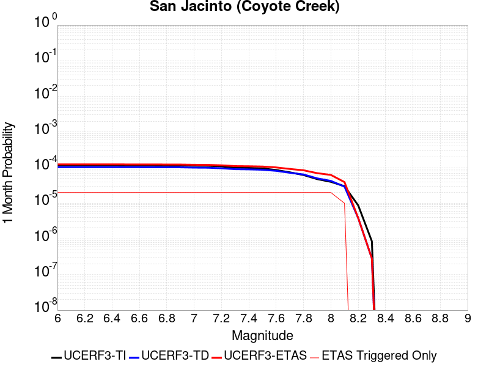 |  |  |

| Magnitude | 1 wk TI Prob | 1 wk TD Prob | 1 wk ETAS Prob | 1 wk ETAS/TD Gain | 1 wk ETAS Triggered Only | 1 mo TI Prob | 1 mo TD Prob | 1 mo ETAS Prob | 1 mo ETAS/TD Gain | 1 mo ETAS Triggered Only | 1 yr TI Prob | 1 yr TD Prob | 1 yr ETAS Prob | 1 yr ETAS/TD Gain | 1 yr ETAS Triggered Only | 10 yr TI Prob | 10 yr TD Prob | 10 yr ETAS Prob | 10 yr ETAS/TD Gain | 10 yr ETAS Triggered Only |
|-----|-----|-----|-----|-----|-----|-----|-----|-----|-----|-----|-----|-----|-----|-----|-----|-----|-----|-----|-----|-----|
| 6.0 | 2.7374346E-5 | 2.415327E-5 | 4.4152788E-5 | 1.8280252 | 2.0E-5 | 1.1731335E-4 | 1.0350993E-4 | 1.2350785E-4 | 1.1931982 | 2.0E-5 | 0.0014273542 | 0.0012595074 | 0.0013094444 | 1.039648 | 5.0E-5 | 0.01418221 | 0.01293251 | 0.013031216 | 1.0076325 | 1.0E-4 |
| 6.1 | 2.7374346E-5 | 2.415327E-5 | 4.4152788E-5 | 1.8280252 | 2.0E-5 | 1.1731335E-4 | 1.0350993E-4 | 1.2350785E-4 | 1.1931982 | 2.0E-5 | 0.0014273542 | 0.0012595074 | 0.0013094444 | 1.039648 | 5.0E-5 | 0.01418221 | 0.01293251 | 0.013031216 | 1.0076325 | 1.0E-4 |
| 6.2 | 2.7374346E-5 | 2.415327E-5 | 4.4152788E-5 | 1.8280252 | 2.0E-5 | 1.1731335E-4 | 1.0350993E-4 | 1.2350785E-4 | 1.1931982 | 2.0E-5 | 0.0014273542 | 0.0012595074 | 0.0013094444 | 1.039648 | 5.0E-5 | 0.01418221 | 0.01293251 | 0.013031216 | 1.0076325 | 1.0E-4 |
| 6.3 | 2.7374346E-5 | 2.415327E-5 | 4.4152788E-5 | 1.8280252 | 2.0E-5 | 1.1731335E-4 | 1.0350993E-4 | 1.2350785E-4 | 1.1931982 | 2.0E-5 | 0.0014273542 | 0.0012595074 | 0.0013094444 | 1.039648 | 5.0E-5 | 0.01418221 | 0.01293251 | 0.013031216 | 1.0076325 | 1.0E-4 |
| 6.4 | 2.7374346E-5 | 2.415327E-5 | 4.4152788E-5 | 1.8280252 | 2.0E-5 | 1.1731335E-4 | 1.0350993E-4 | 1.2350785E-4 | 1.1931982 | 2.0E-5 | 0.0014273542 | 0.0012595074 | 0.0013094444 | 1.039648 | 5.0E-5 | 0.01418221 | 0.01293251 | 0.013031216 | 1.0076325 | 1.0E-4 |
| 6.5 | 2.7282445E-5 | 2.4039346E-5 | 4.4038865E-5 | 1.8319494 | 2.0E-5 | 1.16919524E-4 | 1.0302171E-4 | 1.2301965E-4 | 1.1941139 | 2.0E-5 | 0.0014225657 | 0.0012535703 | 0.0013035076 | 1.039836 | 5.0E-5 | 0.014134934 | 0.012873836 | 0.012972549 | 1.0076677 | 1.0E-4 |
| 6.6 | 2.7282445E-5 | 2.4039346E-5 | 4.4038865E-5 | 1.8319494 | 2.0E-5 | 1.16919524E-4 | 1.0302171E-4 | 1.2301965E-4 | 1.1941139 | 2.0E-5 | 0.0014225657 | 0.0012535703 | 0.0013035076 | 1.039836 | 5.0E-5 | 0.014134934 | 0.012873836 | 0.012972549 | 1.0076677 | 1.0E-4 |
| 6.7 | 2.7216198E-5 | 2.3964463E-5 | 4.3963984E-5 | 1.8345491 | 2.0E-5 | 1.1663563E-4 | 1.0270082E-4 | 1.2269877E-4 | 1.1947204 | 2.0E-5 | 0.0014191137 | 0.0012496678 | 0.0012996054 | 1.0399606 | 5.0E-5 | 0.014100855 | 0.0128352465 | 0.012933963 | 1.007691 | 1.0E-4 |
| 6.8 | 2.7078617E-5 | 2.3881676E-5 | 4.38812E-5 | 1.8374422 | 2.0E-5 | 1.1604605E-4 | 1.0234604E-4 | 1.2234399E-4 | 1.1953955 | 2.0E-5 | 0.001411945 | 0.0012453535 | 0.0012952911 | 1.0400993 | 5.0E-5 | 0.014030075 | 0.012792386 | 0.012891106 | 1.0077171 | 1.0E-4 |
| 6.9 | 2.6982952E-5 | 2.3801183E-5 | 4.380071E-5 | 1.8402743 | 2.0E-5 | 1.15636096E-4 | 1.020011E-4 | 1.2199906E-4 | 1.1960564 | 2.0E-5 | 0.0014069602 | 0.0012411585 | 0.0012910964 | 1.0402349 | 5.0E-5 | 0.013980856 | 0.012750699 | 0.012849424 | 1.0077428 | 1.0E-4 |
| 7.0 | 2.6449972E-5 | 2.3378187E-5 | 4.337772E-5 | 1.8554783 | 2.0E-5 | 1.1335209E-4 | 1.001884E-4 | 1.2018639E-4 | 1.1996039 | 2.0E-5 | 0.001379188 | 0.0012191138 | 0.0012690529 | 1.0409634 | 5.0E-5 | 0.0137065975 | 0.0125320535 | 0.0126308 | 1.0078795 | 1.0E-4 |
| 7.1 | 2.6257849E-5 | 2.3204217E-5 | 4.3203752E-5 | 1.8618923 | 2.0E-5 | 1.1252879E-4 | 9.944286E-5 | 1.19440876E-4 | 1.2011005 | 2.0E-5 | 0.0013691769 | 0.001210047 | 0.0012599865 | 1.0412707 | 5.0E-5 | 0.013607717 | 0.012441914 | 0.01254067 | 1.0079373 | 1.0E-4 |
| 7.2 | 2.5270041E-5 | 2.2398921E-5 | 4.2398475E-5 | 1.8928802 | 2.0E-5 | 1.0829568E-4 | 9.5991854E-5 | 1.1598994E-4 | 1.208331 | 2.0E-5 | 0.0013177024 | 0.0011680766 | 0.0012180182 | 1.0427554 | 5.0E-5 | 0.013099162 | 0.012022921 | 0.012121718 | 1.0082175 | 1.0E-4 |
| 7.3 | 2.339701E-5 | 2.1130656E-5 | 4.1130235E-5 | 1.946472 | 2.0E-5 | 1.0026905E-4 | 9.055682E-5 | 1.1055502E-4 | 1.2208358 | 2.0E-5 | 0.001220092 | 0.0011019738 | 0.0011519187 | 1.0453231 | 5.0E-5 | 0.012134149 | 0.011361783 | 0.011460647 | 1.0087014 | 1.0E-4 |
| 7.4 | 2.296333E-5 | 2.0860984E-5 | 4.0860567E-5 | 1.9587076 | 2.0E-5 | 9.841056E-5 | 8.940117E-5 | 1.0939938E-4 | 1.2236907 | 2.0E-5 | 0.0011974899 | 0.0010879177 | 0.0011378634 | 1.0459094 | 5.0E-5 | 0.011910575 | 0.011220883 | 0.011319761 | 1.008812 | 1.0E-4 |
| 7.5 | 2.2188895E-5 | 2.0383844E-5 | 4.038344E-5 | 1.9811492 | 2.0E-5 | 9.50918E-5 | 8.735642E-5 | 1.07354674E-4 | 1.2289271 | 2.0E-5 | 0.0011571277 | 0.0010630476 | 0.0011129944 | 1.0469846 | 5.0E-5 | 0.011511209 | 0.010970469 | 0.011069372 | 1.0090153 | 1.0E-4 |
| 7.6 | 2.0013189E-5 | 1.8969942E-5 | 3.8969563E-5 | 2.0542793 | 2.0E-5 | 8.5767984E-5 | 8.1297236E-5 | 1.01295605E-4 | 1.2459909 | 2.0E-5 | 0.001043725 | 9.893461E-4 | 0.0010392966 | 1.0504885 | 5.0E-5 | 0.010388365 | 0.010228388 | 0.010327365 | 1.0096767 | 1.0E-4 |
| 7.7 | 1.7230794E-5 | 1.6751088E-5 | 3.6750753E-5 | 2.1939323 | 2.0E-5 | 7.384417E-5 | 7.17884E-5 | 9.178697E-5 | 1.2785765 | 2.0E-5 | 8.986819E-4 | 8.736742E-4 | 9.236305E-4 | 1.0571796 | 5.0E-5 | 0.008950562 | 0.009066812 | 0.0091659045 | 1.0109292 | 1.0E-4 |
| 7.8 | 1.4478809E-5 | 1.49981E-5 | 3.49978E-5 | 2.3334823 | 2.0E-5 | 6.205057E-5 | 6.427599E-5 | 8.42747E-5 | 1.3111382 | 2.0E-5 | 7.552038E-4 | 7.822799E-4 | 8.3224074E-4 | 1.0638658 | 5.0E-5 | 0.0075264242 | 0.008145113 | 0.008244298 | 1.0121773 | 1.0E-4 |
| 7.9 | 1.1114467E-5 | 1.1651392E-5 | 3.1651158E-5 | 2.7165132 | 2.0E-5 | 4.7632562E-5 | 4.9933584E-5 | 6.993259E-5 | 1.400512 | 2.0E-5 | 5.797721E-4 | 6.077724E-4 | 6.57742E-4 | 1.0822177 | 5.0E-5 | 0.0057826187 | 0.0063836263 | 0.006482988 | 1.015565 | 1.0E-4 |
| 8.0 | 9.327402E-6 | 9.904865E-6 | 2.9904666E-5 | 3.0191898 | 2.0E-5 | 3.9973966E-5 | 4.2448733E-5 | 6.2447885E-5 | 1.4711366 | 2.0E-5 | 4.8657437E-4 | 5.166913E-4 | 5.666655E-4 | 1.0967196 | 5.0E-5 | 0.0048551033 | 0.0054529547 | 0.005552409 | 1.0182387 | 1.0E-4 |
| 8.1 | 7.0235833E-6 | 6.83171E-6 | 1.6831642E-5 | 2.4637525 | 1.0E-5 | 3.0100724E-5 | 2.9278432E-5 | 3.9278137E-5 | 1.3415383 | 1.0E-5 | 3.664147E-4 | 3.5640708E-4 | 3.6640352E-4 | 1.0280478 | 1.0E-5 | 0.003658111 | 0.0037898365 | 0.0038296848 | 1.0105145 | 4.0E-5 |
| 8.2 | 2.0358202E-6 | 9.0030267E-7 | 9.0030267E-7 | 1.0 | 0.0 | 8.724915E-6 | 3.8584344E-6 | 3.8584344E-6 | 1.0 | 0.0 | 1.06220665E-4 | 4.697545E-5 | 4.697545E-5 | 1.0 | 0.0 | 0.001061699 | 5.3301745E-4 | 5.3301745E-4 | 1.0 | 0.0 |
| 8.3 | 2.0051264E-7 | 6.6244816E-8 | 6.6244816E-8 | 1.0 | 0.0 | 8.5933965E-7 | 2.8390633E-7 | 2.8390633E-7 | 1.0 | 0.0 | 1.046241E-5 | 3.4565546E-6 | 3.4565546E-6 | 1.0 | 0.0 | 1.0461917E-4 | 4.018022E-5 | 4.018022E-5 | 1.0 | 0.0 |

## Calico-Hidalgo
*[(top)](#table-of-contents)*

| 1 Week | 1 Month | 1 Year | 10 Year |
|-----|-----|-----|-----|
|  |  |  |  |

| Magnitude | 1 wk TI Prob | 1 wk TD Prob | 1 wk ETAS Prob | 1 wk ETAS/TD Gain | 1 wk ETAS Triggered Only | 1 mo TI Prob | 1 mo TD Prob | 1 mo ETAS Prob | 1 mo ETAS/TD Gain | 1 mo ETAS Triggered Only | 1 yr TI Prob | 1 yr TD Prob | 1 yr ETAS Prob | 1 yr ETAS/TD Gain | 1 yr ETAS Triggered Only | 10 yr TI Prob | 10 yr TD Prob | 10 yr ETAS Prob | 10 yr ETAS/TD Gain | 10 yr ETAS Triggered Only |
|-----|-----|-----|-----|-----|-----|-----|-----|-----|-----|-----|-----|-----|-----|-----|-----|-----|-----|-----|-----|-----|
| 6.0 | 4.0906612E-5 | 5.0704653E-5 | 6.0704144E-5 | 1.1972106 | 1.0E-5 | 1.7530227E-4 | 2.1728984E-4 | 2.372855E-4 | 1.092023 | 2.0E-5 | 0.0021322158 | 0.0026426981 | 0.0027025396 | 1.022644 | 6.0E-5 | 0.02111873 | 0.026153097 | 0.026250482 | 1.0037236 | 1.0E-4 |
| 6.1 | 4.0906612E-5 | 5.0704653E-5 | 6.0704144E-5 | 1.1972106 | 1.0E-5 | 1.7530227E-4 | 2.1728984E-4 | 2.372855E-4 | 1.092023 | 2.0E-5 | 0.0021322158 | 0.0026426981 | 0.0027025396 | 1.022644 | 6.0E-5 | 0.02111873 | 0.026153097 | 0.026250482 | 1.0037236 | 1.0E-4 |
| 6.2 | 4.0906612E-5 | 5.0704653E-5 | 6.0704144E-5 | 1.1972106 | 1.0E-5 | 1.7530227E-4 | 2.1728984E-4 | 2.372855E-4 | 1.092023 | 2.0E-5 | 0.0021322158 | 0.0026426981 | 0.0027025396 | 1.022644 | 6.0E-5 | 0.02111873 | 0.026153097 | 0.026250482 | 1.0037236 | 1.0E-4 |
| 6.3 | 2.4242801E-5 | 3.009103E-5 | 4.009073E-5 | 1.332315 | 1.0E-5 | 1.0389358E-4 | 1.2895538E-4 | 1.489528E-4 | 1.1550725 | 2.0E-5 | 0.0012641704 | 0.001568934 | 0.0016188555 | 1.0318187 | 5.0E-5 | 0.01257003 | 0.015582247 | 0.015661 | 1.005054 | 8.0E-5 |
| 6.4 | 2.4242801E-5 | 3.009103E-5 | 4.009073E-5 | 1.332315 | 1.0E-5 | 1.0389358E-4 | 1.2895538E-4 | 1.489528E-4 | 1.1550725 | 2.0E-5 | 0.0012641704 | 0.001568934 | 0.0016188555 | 1.0318187 | 5.0E-5 | 0.01257003 | 0.015582247 | 0.015661 | 1.005054 | 8.0E-5 |
| 6.5 | 2.0286952E-5 | 2.5315985E-5 | 2.5315985E-5 | 1.0 | 0.0 | 8.694118E-5 | 1.0849266E-4 | 1.1849158E-4 | 1.0921621 | 1.0E-5 | 0.0010579949 | 0.0013201149 | 0.0013600622 | 1.0302604 | 4.0E-5 | 0.010529719 | 0.013124665 | 0.013193746 | 1.0052634 | 7.0E-5 |
| 6.6 | 2.0269223E-5 | 2.5296935E-5 | 2.5296935E-5 | 1.0 | 0.0 | 8.6865206E-5 | 1.08411026E-4 | 1.1840994E-4 | 1.0922315 | 1.0E-5 | 0.0010570707 | 0.0013191222 | 0.0013590694 | 1.0302832 | 4.0E-5 | 0.010520565 | 0.013114855 | 0.0131839365 | 1.0052675 | 7.0E-5 |
| 6.7 | 1.799852E-5 | 2.25408E-5 | 2.25408E-5 | 1.0 | 0.0 | 7.713423E-5 | 9.6599935E-5 | 1.0659897E-4 | 1.1035098 | 1.0E-5 | 9.3870464E-4 | 0.0011754843 | 0.001205449 | 1.0254914 | 3.0E-5 | 0.009347493 | 0.011694277 | 0.011753575 | 1.0050707 | 6.0E-5 |
| 6.8 | 1.7458793E-5 | 2.1842314E-5 | 2.1842314E-5 | 1.0 | 0.0 | 7.4821255E-5 | 9.3606635E-5 | 1.036057E-4 | 1.10682 | 1.0E-5 | 9.10568E-4 | 0.0011390795 | 0.0011690452 | 1.0263071 | 3.0E-5 | 0.009068459 | 0.011333993 | 0.011393313 | 1.0052338 | 6.0E-5 |
| 6.9 | 1.542884E-5 | 1.9026087E-5 | 1.9026087E-5 | 1.0 | 0.0 | 6.612192E-5 | 8.1537895E-5 | 9.1537084E-5 | 1.1226324 | 1.0E-5 | 8.04737E-4 | 9.92285E-4 | 0.0010222552 | 1.0302032 | 3.0E-5 | 0.008018291 | 0.00987994 | 0.009939347 | 1.0060129 | 6.0E-5 |
| 7.0 | 1.468253E-5 | 1.8030747E-5 | 1.8030747E-5 | 1.0 | 0.0 | 6.292361E-5 | 7.7272416E-5 | 8.727164E-5 | 1.1294023 | 1.0E-5 | 7.658257E-4 | 9.403986E-4 | 9.7037037E-4 | 1.0318713 | 3.0E-5 | 0.0076319184 | 0.009365558 | 0.009424996 | 1.0063465 | 6.0E-5 |
| 7.1 | 1.3139281E-5 | 1.620107E-5 | 1.620107E-5 | 1.0 | 0.0 | 5.6309986E-5 | 6.943138E-5 | 7.943068E-5 | 1.1440171 | 1.0E-5 | 6.853584E-4 | 8.4501173E-4 | 8.749864E-4 | 1.0354725 | 3.0E-5 | 0.0068324856 | 0.008419285 | 0.008478779 | 1.0070665 | 6.0E-5 |
| 7.2 | 1.1127404E-5 | 1.3866703E-5 | 1.3866703E-5 | 1.0 | 0.0 | 4.7688E-5 | 5.9427435E-5 | 6.942684E-5 | 1.1682625 | 1.0E-5 | 5.8044674E-4 | 7.2329975E-4 | 7.432852E-4 | 1.027631 | 2.0E-5 | 0.0057893298 | 0.0072105634 | 0.007260203 | 1.0068842 | 5.0E-5 |
| 7.3 | 9.808154E-6 | 1.2176301E-5 | 1.2176301E-5 | 1.0 | 0.0 | 4.2034266E-5 | 5.2183164E-5 | 6.218264E-5 | 1.1916227 | 1.0E-5 | 5.11647E-4 | 6.3515553E-4 | 6.551428E-4 | 1.0314684 | 2.0E-5 | 0.0051047057 | 0.0063344776 | 0.0063742246 | 1.0062747 | 4.0E-5 |
| 7.4 | 7.942452E-6 | 9.7922075E-6 | 9.7922075E-6 | 1.0 | 0.0 | 3.4038632E-5 | 4.196598E-5 | 5.1965562E-5 | 1.2382783 | 1.0E-5 | 4.1434157E-4 | 5.1082554E-4 | 5.3081533E-4 | 1.0391324 | 2.0E-5 | 0.0041356985 | 0.0050974544 | 0.0051372508 | 1.007807 | 4.0E-5 |
| 7.5 | 4.7121216E-6 | 5.772871E-6 | 5.772871E-6 | 1.0 | 0.0 | 2.019465E-5 | 2.4740684E-5 | 3.474044E-5 | 1.4041826 | 1.0E-5 | 2.4584212E-4 | 3.0118387E-4 | 3.2117785E-4 | 1.0663847 | 2.0E-5 | 0.0024557032 | 0.0030085093 | 0.003048389 | 1.0132556 | 4.0E-5 |
| 7.6 | 2.21172E-7 | 2.6039737E-7 | 2.6039737E-7 | 1.0 | 0.0 | 9.478797E-7 | 1.1159884E-6 | 1.1159884E-6 | 1.0 | 0.0 | 1.1540374E-5 | 1.3587103E-5 | 1.3587103E-5 | 1.0 | 0.0 | 1.1539775E-4 | 1.3586554E-4 | 1.3586554E-4 | 1.0 | 0.0 |

## Dry Mountain
*[(top)](#table-of-contents)*

| 1 Week | 1 Month | 1 Year | 10 Year |
|-----|-----|-----|-----|
|  |  |  |  |

| Magnitude | 1 wk TI Prob | 1 wk TD Prob | 1 wk ETAS Prob | 1 wk ETAS/TD Gain | 1 wk ETAS Triggered Only | 1 mo TI Prob | 1 mo TD Prob | 1 mo ETAS Prob | 1 mo ETAS/TD Gain | 1 mo ETAS Triggered Only | 1 yr TI Prob | 1 yr TD Prob | 1 yr ETAS Prob | 1 yr ETAS/TD Gain | 1 yr ETAS Triggered Only | 10 yr TI Prob | 10 yr TD Prob | 10 yr ETAS Prob | 10 yr ETAS/TD Gain | 10 yr ETAS Triggered Only |
|-----|-----|-----|-----|-----|-----|-----|-----|-----|-----|-----|-----|-----|-----|-----|-----|-----|-----|-----|-----|-----|
| 6.0 | 6.222801E-6 | 6.439411E-6 | 6.439411E-6 | 1.0 | 0.0 | 2.6668875E-5 | 2.7597274E-5 | 2.7597274E-5 | 1.0 | 0.0 | 3.2464517E-4 | 3.359609E-4 | 3.8594412E-4 | 1.1487769 | 5.0E-5 | 0.0032417132 | 0.0033560924 | 0.0034457904 | 1.026727 | 9.0E-5 |
| 6.1 | 6.222801E-6 | 6.439411E-6 | 6.439411E-6 | 1.0 | 0.0 | 2.6668875E-5 | 2.7597274E-5 | 2.7597274E-5 | 1.0 | 0.0 | 3.2464517E-4 | 3.359609E-4 | 3.8594412E-4 | 1.1487769 | 5.0E-5 | 0.0032417132 | 0.0033560924 | 0.0034457904 | 1.026727 | 9.0E-5 |
| 6.2 | 6.222801E-6 | 6.439411E-6 | 6.439411E-6 | 1.0 | 0.0 | 2.6668875E-5 | 2.7597274E-5 | 2.7597274E-5 | 1.0 | 0.0 | 3.2464517E-4 | 3.359609E-4 | 3.8594412E-4 | 1.1487769 | 5.0E-5 | 0.0032417132 | 0.0033560924 | 0.0034457904 | 1.026727 | 9.0E-5 |
| 6.3 | 6.222801E-6 | 6.439411E-6 | 6.439411E-6 | 1.0 | 0.0 | 2.6668875E-5 | 2.7597274E-5 | 2.7597274E-5 | 1.0 | 0.0 | 3.2464517E-4 | 3.359609E-4 | 3.8594412E-4 | 1.1487769 | 5.0E-5 | 0.0032417132 | 0.0033560924 | 0.0034457904 | 1.026727 | 9.0E-5 |
| 6.4 | 6.222801E-6 | 6.439411E-6 | 6.439411E-6 | 1.0 | 0.0 | 2.6668875E-5 | 2.7597274E-5 | 2.7597274E-5 | 1.0 | 0.0 | 3.2464517E-4 | 3.359609E-4 | 3.8594412E-4 | 1.1487769 | 5.0E-5 | 0.0032417132 | 0.0033560924 | 0.0034457904 | 1.026727 | 9.0E-5 |
| 6.5 | 2.8528623E-6 | 2.952182E-6 | 2.952182E-6 | 1.0 | 0.0 | 1.22264955E-5 | 1.2652196E-5 | 1.2652196E-5 | 1.0 | 0.0 | 1.4884741E-4 | 1.5403831E-4 | 1.6403677E-4 | 1.0649089 | 1.0E-5 | 0.0014874774 | 0.0015401688 | 0.0015801071 | 1.0259312 | 4.0E-5 |
| 6.6 | 2.8528623E-6 | 2.952182E-6 | 2.952182E-6 | 1.0 | 0.0 | 1.22264955E-5 | 1.2652196E-5 | 1.2652196E-5 | 1.0 | 0.0 | 1.4884741E-4 | 1.5403831E-4 | 1.6403677E-4 | 1.0649089 | 1.0E-5 | 0.0014874774 | 0.0015401688 | 0.0015801071 | 1.0259312 | 4.0E-5 |
| 6.7 | 2.541E-6 | 2.62937E-6 | 2.62937E-6 | 1.0 | 0.0 | 1.0889954E-5 | 1.12687285E-5 | 1.12687285E-5 | 1.0 | 0.0 | 1.3257713E-4 | 1.3719677E-4 | 1.471954E-4 | 1.072878 | 1.0E-5 | 0.0013249806 | 0.0013719677 | 0.0014019265 | 1.0218364 | 3.0E-5 |

## Pleito
*[(top)](#table-of-contents)*

| 1 Week | 1 Month | 1 Year | 10 Year |
|-----|-----|-----|-----|
|  |  |  |  |

| Magnitude | 1 wk TI Prob | 1 wk TD Prob | 1 wk ETAS Prob | 1 wk ETAS/TD Gain | 1 wk ETAS Triggered Only | 1 mo TI Prob | 1 mo TD Prob | 1 mo ETAS Prob | 1 mo ETAS/TD Gain | 1 mo ETAS Triggered Only | 1 yr TI Prob | 1 yr TD Prob | 1 yr ETAS Prob | 1 yr ETAS/TD Gain | 1 yr ETAS Triggered Only | 10 yr TI Prob | 10 yr TD Prob | 10 yr ETAS Prob | 10 yr ETAS/TD Gain | 10 yr ETAS Triggered Only |
|-----|-----|-----|-----|-----|-----|-----|-----|-----|-----|-----|-----|-----|-----|-----|-----|-----|-----|-----|-----|-----|
| 6.0 | 1.6763008E-5 | 2.47705E-5 | 2.47705E-5 | 1.0 | 0.0 | 7.183948E-5 | 1.0615537E-4 | 1.1615431E-4 | 1.0941916 | 1.0E-5 | 8.742947E-4 | 0.0012917474 | 0.0013217087 | 1.0231943 | 3.0E-5 | 0.00870863 | 0.012957253 | 0.0130263455 | 1.0053324 | 7.0E-5 |
| 6.1 | 1.6763008E-5 | 2.47705E-5 | 2.47705E-5 | 1.0 | 0.0 | 7.183948E-5 | 1.0615537E-4 | 1.1615431E-4 | 1.0941916 | 1.0E-5 | 8.742947E-4 | 0.0012917474 | 0.0013217087 | 1.0231943 | 3.0E-5 | 0.00870863 | 0.012957253 | 0.0130263455 | 1.0053324 | 7.0E-5 |
| 6.2 | 1.6763008E-5 | 2.47705E-5 | 2.47705E-5 | 1.0 | 0.0 | 7.183948E-5 | 1.0615537E-4 | 1.1615431E-4 | 1.0941916 | 1.0E-5 | 8.742947E-4 | 0.0012917474 | 0.0013217087 | 1.0231943 | 3.0E-5 | 0.00870863 | 0.012957253 | 0.0130263455 | 1.0053324 | 7.0E-5 |
| 6.3 | 1.6763008E-5 | 2.47705E-5 | 2.47705E-5 | 1.0 | 0.0 | 7.183948E-5 | 1.0615537E-4 | 1.1615431E-4 | 1.0941916 | 1.0E-5 | 8.742947E-4 | 0.0012917474 | 0.0013217087 | 1.0231943 | 3.0E-5 | 0.00870863 | 0.012957253 | 0.0130263455 | 1.0053324 | 7.0E-5 |
| 6.4 | 1.6763008E-5 | 2.47705E-5 | 2.47705E-5 | 1.0 | 0.0 | 7.183948E-5 | 1.0615537E-4 | 1.1615431E-4 | 1.0941916 | 1.0E-5 | 8.742947E-4 | 0.0012917474 | 0.0013217087 | 1.0231943 | 3.0E-5 | 0.00870863 | 0.012957253 | 0.0130263455 | 1.0053324 | 7.0E-5 |
| 6.5 | 1.6763008E-5 | 2.47705E-5 | 2.47705E-5 | 1.0 | 0.0 | 7.183948E-5 | 1.0615537E-4 | 1.1615431E-4 | 1.0941916 | 1.0E-5 | 8.742947E-4 | 0.0012917474 | 0.0013217087 | 1.0231943 | 3.0E-5 | 0.00870863 | 0.012957253 | 0.0130263455 | 1.0053324 | 7.0E-5 |
| 6.6 | 9.910213E-6 | 1.7221182E-5 | 1.7221182E-5 | 1.0 | 0.0 | 4.247165E-5 | 7.3803E-5 | 8.380226E-5 | 1.1354859 | 1.0E-5 | 5.169696E-4 | 8.9818484E-4 | 9.281579E-4 | 1.0333707 | 3.0E-5 | 0.0051576863 | 0.009054025 | 0.009113481 | 1.0065669 | 6.0E-5 |
| 6.7 | 9.910213E-6 | 1.7221182E-5 | 1.7221182E-5 | 1.0 | 0.0 | 4.247165E-5 | 7.3803E-5 | 8.380226E-5 | 1.1354859 | 1.0E-5 | 5.169696E-4 | 8.9818484E-4 | 9.281579E-4 | 1.0333707 | 3.0E-5 | 0.0051576863 | 0.009054025 | 0.009113481 | 1.0065669 | 6.0E-5 |
| 6.8 | 8.300162E-6 | 1.5480773E-5 | 1.5480773E-5 | 1.0 | 0.0 | 3.557164E-5 | 6.634449E-5 | 7.634383E-5 | 1.1507185 | 1.0E-5 | 4.3299864E-4 | 8.0744625E-4 | 8.3742203E-4 | 1.0371242 | 3.0E-5 | 0.004321559 | 0.008153455 | 0.008212966 | 1.0072988 | 6.0E-5 |
| 6.9 | 8.183114E-6 | 1.5351985E-5 | 1.5351985E-5 | 1.0 | 0.0 | 3.5070017E-5 | 6.579257E-5 | 7.579191E-5 | 1.1519829 | 1.0E-5 | 4.2689382E-4 | 8.007316E-4 | 8.3070755E-4 | 1.0374358 | 3.0E-5 | 0.0042607468 | 0.008086799 | 0.008146313 | 1.0073595 | 6.0E-5 |
| 7.0 | 7.1748823E-6 | 1.4138895E-5 | 1.4138895E-5 | 1.0 | 0.0 | 3.0749135E-5 | 6.059386E-5 | 7.0593254E-5 | 1.1650232 | 1.0E-5 | 3.743064E-4 | 7.3748105E-4 | 7.674589E-4 | 1.040649 | 3.0E-5 | 0.0037367654 | 0.0074582137 | 0.0075078406 | 1.006654 | 5.0E-5 |
| 7.1 | 7.1671807E-6 | 1.4129264E-5 | 1.4129264E-5 | 1.0 | 0.0 | 3.0716128E-5 | 6.0552586E-5 | 7.0551985E-5 | 1.1651357 | 1.0E-5 | 3.7390468E-4 | 7.369789E-4 | 7.6695683E-4 | 1.0406767 | 3.0E-5 | 0.0037327618 | 0.007453226 | 0.0075028534 | 1.0066586 | 5.0E-5 |
| 7.2 | 7.0649667E-6 | 1.3976534E-5 | 1.3976534E-5 | 1.0 | 0.0 | 3.0278077E-5 | 5.989806E-5 | 6.989746E-5 | 1.1669403 | 1.0E-5 | 3.6857324E-4 | 7.290154E-4 | 7.589935E-4 | 1.0411214 | 3.0E-5 | 0.0036796255 | 0.007373973 | 0.007423604 | 1.0067306 | 5.0E-5 |
| 7.3 | 7.02082E-6 | 1.39199765E-5 | 1.39199765E-5 | 1.0 | 0.0 | 3.008888E-5 | 5.9655682E-5 | 6.9655085E-5 | 1.1676186 | 1.0E-5 | 3.6627054E-4 | 7.260664E-4 | 7.5604464E-4 | 1.0412885 | 3.0E-5 | 0.0036566744 | 0.0073444657 | 0.0073940987 | 1.0067579 | 5.0E-5 |
| 7.4 | 6.987146E-6 | 1.3879531E-5 | 1.3879531E-5 | 1.0 | 0.0 | 2.9944567E-5 | 5.948235E-5 | 6.948176E-5 | 1.168107 | 1.0E-5 | 3.6451413E-4 | 7.239575E-4 | 7.539358E-4 | 1.0414089 | 3.0E-5 | 0.0036391679 | 0.007323398 | 0.0073730317 | 1.0067774 | 5.0E-5 |
| 7.5 | 6.9494554E-6 | 1.3836431E-5 | 1.3836431E-5 | 1.0 | 0.0 | 2.9783041E-5 | 5.9297647E-5 | 6.929706E-5 | 1.1686307 | 1.0E-5 | 3.625482E-4 | 7.217102E-4 | 7.5168855E-4 | 1.0415379 | 3.0E-5 | 0.0036195726 | 0.007301023 | 0.0073506585 | 1.0067984 | 5.0E-5 |
| 7.6 | 6.92694E-6 | 1.3795536E-5 | 1.3795536E-5 | 1.0 | 0.0 | 2.9686547E-5 | 5.9122387E-5 | 6.9121794E-5 | 1.1691307 | 1.0E-5 | 3.6137376E-4 | 7.1957783E-4 | 7.4955623E-4 | 1.0416611 | 3.0E-5 | 0.0036078666 | 0.0072797714 | 0.0073294076 | 1.0068183 | 5.0E-5 |
| 7.7 | 6.395867E-6 | 1.2674343E-5 | 1.2674343E-5 | 1.0 | 0.0 | 2.741057E-5 | 5.4317487E-5 | 6.431694E-5 | 1.1840928 | 1.0E-5 | 3.336726E-4 | 6.6111505E-4 | 6.9109525E-4 | 1.0453479 | 3.0E-5 | 0.0033317201 | 0.006698295 | 0.0067479596 | 1.0074146 | 5.0E-5 |
| 7.8 | 5.8664327E-6 | 1.1541453E-5 | 1.1541453E-5 | 1.0 | 0.0 | 2.5141611E-5 | 4.9462433E-5 | 5.9461938E-5 | 1.2021636 | 1.0E-5 | 3.060561E-4 | 6.020389E-4 | 6.320209E-4 | 1.0498006 | 3.0E-5 | 0.0030563495 | 0.006103509 | 0.006153204 | 1.008142 | 5.0E-5 |
| 7.9 | 3.7167474E-6 | 7.1174723E-6 | 7.1174723E-6 | 1.0 | 0.0 | 1.592882E-5 | 3.0503097E-5 | 4.0502793E-5 | 1.3278255 | 1.0E-5 | 1.9391612E-4 | 3.7131205E-4 | 4.0130093E-4 | 1.0807645 | 3.0E-5 | 0.0019374699 | 0.0037692138 | 0.0038190254 | 1.0132154 | 5.0E-5 |
| 8.0 | 1.0903841E-6 | 1.2886832E-6 | 1.2886832E-6 | 1.0 | 0.0 | 4.6730665E-6 | 5.522916E-6 | 1.552286E-5 | 2.8106277 | 1.0E-5 | 5.68931E-5 | 6.723944E-5 | 7.7238765E-5 | 1.1487123 | 1.0E-5 | 5.6878536E-4 | 6.9458556E-4 | 7.045786E-4 | 1.0143871 | 1.0E-5 |
| 8.1 | 2.6894583E-7 | 1.1072907E-7 | 1.1072907E-7 | 1.0 | 0.0 | 1.1526245E-6 | 4.7455305E-7 | 4.7455305E-7 | 1.0 | 0.0 | 1.4033113E-5 | 5.7776683E-6 | 5.7776683E-6 | 1.0 | 0.0 | 1.4032227E-4 | 6.4639265E-5 | 6.4639265E-5 | 1.0 | 0.0 |
| 8.2 | 5.2967013E-9 | 2.4608289E-9 | 2.4608289E-9 | 1.0 | 0.0 | 2.2700148E-8 | 1.054641E-8 | 1.054641E-8 | 1.0 | 0.0 | 2.7637427E-7 | 1.2840253E-7 | 1.2840253E-7 | 1.0 | 0.0 | 2.7637393E-6 | 1.46096E-6 | 1.46096E-6 | 1.0 | 0.0 |

## Cleghorn Pass
*[(top)](#table-of-contents)*

| 1 Week | 1 Month | 1 Year | 10 Year |
|-----|-----|-----|-----|
|  |  |  |  |

| Magnitude | 1 wk TI Prob | 1 wk TD Prob | 1 wk ETAS Prob | 1 wk ETAS/TD Gain | 1 wk ETAS Triggered Only | 1 mo TI Prob | 1 mo TD Prob | 1 mo ETAS Prob | 1 mo ETAS/TD Gain | 1 mo ETAS Triggered Only | 1 yr TI Prob | 1 yr TD Prob | 1 yr ETAS Prob | 1 yr ETAS/TD Gain | 1 yr ETAS Triggered Only | 10 yr TI Prob | 10 yr TD Prob | 10 yr ETAS Prob | 10 yr ETAS/TD Gain | 10 yr ETAS Triggered Only |
|-----|-----|-----|-----|-----|-----|-----|-----|-----|-----|-----|-----|-----|-----|-----|-----|-----|-----|-----|-----|-----|
| 6.0 | 1.0522846E-5 | 1.1040714E-5 | 1.1040714E-5 | 1.0 | 0.0 | 4.509713E-5 | 4.7316782E-5 | 5.731631E-5 | 1.2113315 | 1.0E-5 | 5.4891926E-4 | 5.759822E-4 | 6.059649E-4 | 1.052055 | 3.0E-5 | 0.0054756533 | 0.005750059 | 0.005829599 | 1.0138329 | 8.0E-5 |
| 6.1 | 1.0522846E-5 | 1.1040714E-5 | 1.1040714E-5 | 1.0 | 0.0 | 4.509713E-5 | 4.7316782E-5 | 5.731631E-5 | 1.2113315 | 1.0E-5 | 5.4891926E-4 | 5.759822E-4 | 6.059649E-4 | 1.052055 | 3.0E-5 | 0.0054756533 | 0.005750059 | 0.005829599 | 1.0138329 | 8.0E-5 |
| 6.2 | 2.1045846E-6 | 2.2082168E-6 | 2.2082168E-6 | 1.0 | 0.0 | 9.019617E-6 | 9.463776E-6 | 9.463776E-6 | 1.0 | 0.0 | 1.098083E-4 | 1.1521958E-4 | 1.1521958E-4 | 1.0 | 0.0 | 0.0010975406 | 0.0011520098 | 0.0011619983 | 1.0086704 | 1.0E-5 |
| 6.3 | 2.1045846E-6 | 2.2082168E-6 | 2.2082168E-6 | 1.0 | 0.0 | 9.019617E-6 | 9.463776E-6 | 9.463776E-6 | 1.0 | 0.0 | 1.098083E-4 | 1.1521958E-4 | 1.1521958E-4 | 1.0 | 0.0 | 0.0010975406 | 0.0011520098 | 0.0011619983 | 1.0086704 | 1.0E-5 |
| 6.4 | 1.7259927E-6 | 1.8108889E-6 | 1.8108889E-6 | 1.0 | 0.0 | 7.3970905E-6 | 7.760952E-6 | 7.760952E-6 | 1.0 | 0.0 | 9.005586E-5 | 9.4489595E-5 | 9.4489595E-5 | 1.0 | 0.0 | 9.001937E-4 | 9.4489596E-4 | 9.548865E-4 | 1.0105731 | 1.0E-5 |

## Independence rev 2011
*[(top)](#table-of-contents)*

| 1 Week | 1 Month | 1 Year | 10 Year |
|-----|-----|-----|-----|
|  |  |  |  |

| Magnitude | 1 wk TI Prob | 1 wk TD Prob | 1 wk ETAS Prob | 1 wk ETAS/TD Gain | 1 wk ETAS Triggered Only | 1 mo TI Prob | 1 mo TD Prob | 1 mo ETAS Prob | 1 mo ETAS/TD Gain | 1 mo ETAS Triggered Only | 1 yr TI Prob | 1 yr TD Prob | 1 yr ETAS Prob | 1 yr ETAS/TD Gain | 1 yr ETAS Triggered Only | 10 yr TI Prob | 10 yr TD Prob | 10 yr ETAS Prob | 10 yr ETAS/TD Gain | 10 yr ETAS Triggered Only |
|-----|-----|-----|-----|-----|-----|-----|-----|-----|-----|-----|-----|-----|-----|-----|-----|-----|-----|-----|-----|-----|
| 6.0 | 4.422171E-6 | 4.3262453E-6 | 4.3262453E-6 | 1.0 | 0.0 | 1.8952025E-5 | 1.8540937E-5 | 1.8540937E-5 | 1.0 | 0.0 | 2.3071647E-4 | 2.257155E-4 | 2.5570873E-4 | 1.1328807 | 3.0E-5 | 0.0023047708 | 0.0022551562 | 0.0023349756 | 1.0353943 | 8.0E-5 |
| 6.1 | 4.422171E-6 | 4.3262453E-6 | 4.3262453E-6 | 1.0 | 0.0 | 1.8952025E-5 | 1.8540937E-5 | 1.8540937E-5 | 1.0 | 0.0 | 2.3071647E-4 | 2.257155E-4 | 2.5570873E-4 | 1.1328807 | 3.0E-5 | 0.0023047708 | 0.0022551562 | 0.0023349756 | 1.0353943 | 8.0E-5 |
| 6.2 | 4.422171E-6 | 4.3262453E-6 | 4.3262453E-6 | 1.0 | 0.0 | 1.8952025E-5 | 1.8540937E-5 | 1.8540937E-5 | 1.0 | 0.0 | 2.3071647E-4 | 2.257155E-4 | 2.5570873E-4 | 1.1328807 | 3.0E-5 | 0.0023047708 | 0.0022551562 | 0.0023349756 | 1.0353943 | 8.0E-5 |
| 6.3 | 4.422171E-6 | 4.3262453E-6 | 4.3262453E-6 | 1.0 | 0.0 | 1.8952025E-5 | 1.8540937E-5 | 1.8540937E-5 | 1.0 | 0.0 | 2.3071647E-4 | 2.257155E-4 | 2.5570873E-4 | 1.1328807 | 3.0E-5 | 0.0023047708 | 0.0022551562 | 0.0023349756 | 1.0353943 | 8.0E-5 |
| 6.4 | 4.422171E-6 | 4.3262453E-6 | 4.3262453E-6 | 1.0 | 0.0 | 1.8952025E-5 | 1.8540937E-5 | 1.8540937E-5 | 1.0 | 0.0 | 2.3071647E-4 | 2.257155E-4 | 2.5570873E-4 | 1.1328807 | 3.0E-5 | 0.0023047708 | 0.0022551562 | 0.0023349756 | 1.0353943 | 8.0E-5 |
| 6.5 | 4.422171E-6 | 4.3262453E-6 | 4.3262453E-6 | 1.0 | 0.0 | 1.8952025E-5 | 1.8540937E-5 | 1.8540937E-5 | 1.0 | 0.0 | 2.3071647E-4 | 2.257155E-4 | 2.5570873E-4 | 1.1328807 | 3.0E-5 | 0.0023047708 | 0.0022551562 | 0.0023349756 | 1.0353943 | 8.0E-5 |
| 6.6 | 2.663744E-6 | 2.5319996E-6 | 2.5319996E-6 | 1.0 | 0.0 | 1.1415996E-5 | 1.0851385E-5 | 1.0851385E-5 | 1.0 | 0.0 | 1.3898089E-4 | 1.3210809E-4 | 1.6210413E-4 | 1.2270567 | 3.0E-5 | 0.0013889399 | 0.0013203438 | 0.0014002381 | 1.0605103 | 8.0E-5 |
| 6.7 | 2.663744E-6 | 2.5319996E-6 | 2.5319996E-6 | 1.0 | 0.0 | 1.1415996E-5 | 1.0851385E-5 | 1.0851385E-5 | 1.0 | 0.0 | 1.3898089E-4 | 1.3210809E-4 | 1.6210413E-4 | 1.2270567 | 3.0E-5 | 0.0013889399 | 0.0013203438 | 0.0014002381 | 1.0605103 | 8.0E-5 |
| 6.8 | 1.9716529E-6 | 1.83227E-6 | 1.83227E-6 | 1.0 | 0.0 | 8.449913E-6 | 7.852563E-6 | 7.852563E-6 | 1.0 | 0.0 | 1.0287284E-4 | 9.560089E-5 | 1.2559802E-4 | 1.3137746 | 3.0E-5 | 0.0010282523 | 9.556105E-4 | 0.0010355341 | 1.0836362 | 8.0E-5 |
| 6.9 | 1.8788617E-6 | 1.7430103E-6 | 1.7430103E-6 | 1.0 | 0.0 | 8.0522395E-6 | 7.470024E-6 | 7.470024E-6 | 1.0 | 0.0 | 9.80316E-5 | 9.094387E-5 | 1.20941135E-4 | 1.3298439 | 3.0E-5 | 9.798837E-4 | 9.090785E-4 | 9.890058E-4 | 1.0879211 | 8.0E-5 |
| 7.0 | 1.5045488E-6 | 1.3849595E-6 | 1.3849595E-6 | 1.0 | 0.0 | 6.44805E-6 | 5.9355275E-6 | 5.9355275E-6 | 1.0 | 0.0 | 7.8502184E-5 | 7.226271E-5 | 1.02260536E-4 | 1.4151219 | 3.0E-5 | 7.8474457E-4 | 7.2239724E-4 | 8.023394E-4 | 1.1106623 | 8.0E-5 |
| 7.1 | 1.272341E-6 | 1.1625177E-6 | 1.1625177E-6 | 1.0 | 0.0 | 5.4528787E-6 | 4.9822092E-6 | 4.9822092E-6 | 1.0 | 0.0 | 6.6386776E-5 | 6.065674E-5 | 9.0654925E-5 | 1.4945564 | 3.0E-5 | 6.636695E-4 | 6.06405E-4 | 6.763626E-4 | 1.1153644 | 7.0E-5 |
| 7.2 | 1.0416892E-6 | 9.4099494E-7 | 9.4099494E-7 | 1.0 | 0.0 | 4.464375E-6 | 4.032829E-6 | 4.032829E-6 | 1.0 | 0.0 | 5.4352407E-5 | 4.909861E-5 | 7.909714E-5 | 1.6109853 | 3.0E-5 | 5.4339116E-4 | 4.9087947E-4 | 5.6084513E-4 | 1.1425312 | 7.0E-5 |
| 7.3 | 7.9450155E-7 | 7.235053E-7 | 7.235053E-7 | 1.0 | 0.0 | 3.4050022E-6 | 3.1007335E-6 | 3.1007335E-6 | 1.0 | 0.0 | 4.1455114E-5 | 3.7750786E-5 | 6.774966E-5 | 1.7946554 | 3.0E-5 | 4.144738E-4 | 3.7744487E-4 | 4.3742222E-4 | 1.1589036 | 6.0E-5 |
| 7.4 | 5.3893444E-7 | 5.0195445E-7 | 5.0195445E-7 | 1.0 | 0.0 | 2.309717E-6 | 2.1512315E-6 | 2.1512315E-6 | 1.0 | 0.0 | 2.8120441E-5 | 2.6190934E-5 | 5.6190147E-5 | 2.1454046 | 3.0E-5 | 2.8116882E-4 | 2.6187891E-4 | 3.2186322E-4 | 1.2290535 | 6.0E-5 |
| 7.5 | 3.8852085E-7 | 3.6825747E-7 | 3.6825747E-7 | 1.0 | 0.0 | 1.6650882E-6 | 1.5782454E-6 | 1.5782454E-6 | 1.0 | 0.0 | 2.027226E-5 | 1.9214971E-5 | 3.9214585E-5 | 2.0408351 | 2.0E-5 | 2.0270412E-4 | 1.921333E-4 | 2.421237E-4 | 1.260186 | 5.0E-5 |
| 7.6 | 2.414929E-7 | 2.3457659E-7 | 2.3457659E-7 | 1.0 | 0.0 | 1.0349692E-6 | 1.0053279E-6 | 1.0053279E-6 | 1.0 | 0.0 | 1.2600677E-5 | 1.22398E-5 | 1.22398E-5 | 1.0 | 0.0 | 1.2599962E-4 | 1.2239137E-4 | 1.523877E-4 | 1.2450854 | 3.0E-5 |
| 7.7 | 6.8298014E-8 | 6.858993E-8 | 6.858993E-8 | 1.0 | 0.0 | 2.9270575E-7 | 2.939568E-7 | 2.939568E-7 | 1.0 | 0.0 | 3.5636867E-6 | 3.5789185E-6 | 3.5789185E-6 | 1.0 | 0.0 | 3.5636294E-5 | 3.5788657E-5 | 4.57883E-5 | 1.2794081 | 1.0E-5 |

## Kern Canyon (North Kern) 2011
*[(top)](#table-of-contents)*

| 1 Week | 1 Month | 1 Year | 10 Year |
|-----|-----|-----|-----|
|  |  |  |  |

| Magnitude | 1 wk TI Prob | 1 wk TD Prob | 1 wk ETAS Prob | 1 wk ETAS/TD Gain | 1 wk ETAS Triggered Only | 1 mo TI Prob | 1 mo TD Prob | 1 mo ETAS Prob | 1 mo ETAS/TD Gain | 1 mo ETAS Triggered Only | 1 yr TI Prob | 1 yr TD Prob | 1 yr ETAS Prob | 1 yr ETAS/TD Gain | 1 yr ETAS Triggered Only | 10 yr TI Prob | 10 yr TD Prob | 10 yr ETAS Prob | 10 yr ETAS/TD Gain | 10 yr ETAS Triggered Only |
|-----|-----|-----|-----|-----|-----|-----|-----|-----|-----|-----|-----|-----|-----|-----|-----|-----|-----|-----|-----|-----|
| 6.0 | 6.6264497E-6 | 6.7573515E-6 | 6.7573515E-6 | 1.0 | 0.0 | 2.8398761E-5 | 2.8959801E-5 | 4.8959224E-5 | 1.6905925 | 2.0E-5 | 3.4570007E-4 | 3.5253653E-4 | 4.125154E-4 | 1.1701351 | 6.0E-5 | 0.0034516277 | 0.0035205614 | 0.0036002798 | 1.0226437 | 8.0E-5 |
| 6.1 | 6.6264497E-6 | 6.7573515E-6 | 6.7573515E-6 | 1.0 | 0.0 | 2.8398761E-5 | 2.8959801E-5 | 4.8959224E-5 | 1.6905925 | 2.0E-5 | 3.4570007E-4 | 3.5253653E-4 | 4.125154E-4 | 1.1701351 | 6.0E-5 | 0.0034516277 | 0.0035205614 | 0.0036002798 | 1.0226437 | 8.0E-5 |
| 6.2 | 6.6264497E-6 | 6.7573515E-6 | 6.7573515E-6 | 1.0 | 0.0 | 2.8398761E-5 | 2.8959801E-5 | 4.8959224E-5 | 1.6905925 | 2.0E-5 | 3.4570007E-4 | 3.5253653E-4 | 4.125154E-4 | 1.1701351 | 6.0E-5 | 0.0034516277 | 0.0035205614 | 0.0036002798 | 1.0226437 | 8.0E-5 |
| 6.3 | 6.6264497E-6 | 6.7573515E-6 | 6.7573515E-6 | 1.0 | 0.0 | 2.8398761E-5 | 2.8959801E-5 | 4.8959224E-5 | 1.6905925 | 2.0E-5 | 3.4570007E-4 | 3.5253653E-4 | 4.125154E-4 | 1.1701351 | 6.0E-5 | 0.0034516277 | 0.0035205614 | 0.0036002798 | 1.0226437 | 8.0E-5 |
| 6.4 | 6.6264497E-6 | 6.7573515E-6 | 6.7573515E-6 | 1.0 | 0.0 | 2.8398761E-5 | 2.8959801E-5 | 4.8959224E-5 | 1.6905925 | 2.0E-5 | 3.4570007E-4 | 3.5253653E-4 | 4.125154E-4 | 1.1701351 | 6.0E-5 | 0.0034516277 | 0.0035205614 | 0.0036002798 | 1.0226437 | 8.0E-5 |
| 6.5 | 3.2162225E-6 | 3.2571006E-6 | 3.2571006E-6 | 1.0 | 0.0 | 1.3783738E-5 | 1.3958933E-5 | 2.3958793E-5 | 1.7163771 | 1.0E-5 | 1.6780409E-4 | 1.6993756E-4 | 1.9993246E-4 | 1.1765054 | 3.0E-5 | 0.0016767744 | 0.0016981558 | 0.0017380879 | 1.023515 | 4.0E-5 |
| 6.6 | 3.2162225E-6 | 3.2571006E-6 | 3.2571006E-6 | 1.0 | 0.0 | 1.3783738E-5 | 1.3958933E-5 | 2.3958793E-5 | 1.7163771 | 1.0E-5 | 1.6780409E-4 | 1.6993756E-4 | 1.9993246E-4 | 1.1765054 | 3.0E-5 | 0.0016767744 | 0.0016981558 | 0.0017380879 | 1.023515 | 4.0E-5 |
| 6.7 | 2.1908265E-6 | 2.2071279E-6 | 2.2071279E-6 | 1.0 | 0.0 | 9.389223E-6 | 9.459087E-6 | 1.9458992E-5 | 2.0571744 | 1.0E-5 | 1.1430779E-4 | 1.1515849E-4 | 1.3515618E-4 | 1.1736537 | 2.0E-5 | 0.0011424901 | 0.0011510076 | 0.0011709846 | 1.017356 | 2.0E-5 |
| 6.8 | 1.7303895E-6 | 1.7365574E-6 | 1.7365574E-6 | 1.0 | 0.0 | 7.415934E-6 | 7.442368E-6 | 1.7442293E-5 | 2.3436484 | 1.0E-5 | 9.028525E-5 | 9.060716E-5 | 1.0060625E-4 | 1.1103566 | 1.0E-5 | 9.024858E-4 | 9.057119E-4 | 9.1570284E-4 | 1.011031 | 1.0E-5 |
| 6.9 | 1.3700314E-6 | 1.3688657E-6 | 1.3688657E-6 | 1.0 | 0.0 | 5.87155E-6 | 5.866554E-6 | 1.5866495E-5 | 2.7045681 | 1.0E-5 | 7.148377E-5 | 7.1423005E-5 | 8.142229E-5 | 1.1400009 | 1.0E-5 | 7.146078E-4 | 7.1400503E-4 | 7.239979E-4 | 1.0139955 | 1.0E-5 |
| 7.0 | 1.1467797E-6 | 1.1413833E-6 | 1.1413833E-6 | 1.0 | 0.0 | 4.9147607E-6 | 4.8916336E-6 | 1.4891585E-5 | 3.0442967 | 1.0E-5 | 5.983557E-5 | 5.9554044E-5 | 6.955345E-5 | 1.1679047 | 1.0E-5 | 5.981946E-4 | 5.95384E-4 | 6.0537807E-4 | 1.0167859 | 1.0E-5 |
| 7.1 | 9.3952065E-7 | 9.302714E-7 | 9.302714E-7 | 1.0 | 0.0 | 4.026511E-6 | 3.9868714E-6 | 3.9868714E-6 | 1.0 | 0.0 | 4.9021666E-5 | 4.8539096E-5 | 4.8539096E-5 | 1.0 | 0.0 | 4.901085E-4 | 4.8528673E-4 | 4.8528673E-4 | 1.0 | 0.0 |
| 7.2 | 6.858055E-7 | 6.719318E-7 | 6.719318E-7 | 1.0 | 0.0 | 2.939163E-6 | 2.8797044E-6 | 2.8797044E-6 | 1.0 | 0.0 | 3.5783723E-5 | 3.5059846E-5 | 3.5059846E-5 | 1.0 | 0.0 | 3.5777962E-4 | 3.5054405E-4 | 3.5054405E-4 | 1.0 | 0.0 |
| 7.3 | 5.1101983E-7 | 4.939313E-7 | 4.939313E-7 | 1.0 | 0.0 | 2.1900833E-6 | 2.1168466E-6 | 2.1168466E-6 | 1.0 | 0.0 | 2.6663936E-5 | 2.5772308E-5 | 2.5772308E-5 | 1.0 | 0.0 | 2.6660739E-4 | 2.5769367E-4 | 2.5769367E-4 | 1.0 | 0.0 |
| 7.4 | 3.4999414E-7 | 3.2995996E-7 | 3.2995996E-7 | 1.0 | 0.0 | 1.499974E-6 | 1.4141134E-6 | 1.4141134E-6 | 1.0 | 0.0 | 1.8262032E-5 | 1.7216697E-5 | 1.7216697E-5 | 1.0 | 0.0 | 1.826053E-4 | 1.7215387E-4 | 1.7215387E-4 | 1.0 | 0.0 |
| 7.5 | 1.7021522E-7 | 1.4750091E-7 | 1.4750091E-7 | 1.0 | 0.0 | 7.2949354E-7 | 6.3214657E-7 | 6.3214657E-7 | 1.0 | 0.0 | 8.881548E-6 | 7.696359E-6 | 7.696359E-6 | 1.0 | 0.0 | 8.8811925E-5 | 7.6961E-5 | 7.6961E-5 | 1.0 | 0.0 |
| 7.6 | 2.572245E-8 | 1.7352637E-8 | 1.7352637E-8 | 1.0 | 0.0 | 1.10239064E-7 | 7.4368444E-8 | 7.4368444E-8 | 1.0 | 0.0 | 1.3421597E-6 | 9.0543546E-7 | 9.0543546E-7 | 1.0 | 0.0 | 1.3421517E-5 | 9.0543235E-6 | 9.0543235E-6 | 1.0 | 0.0 |

## Pinto Mtn
*[(top)](#table-of-contents)*

| 1 Week | 1 Month | 1 Year | 10 Year |
|-----|-----|-----|-----|
|  |  |  |  |

| Magnitude | 1 wk TI Prob | 1 wk TD Prob | 1 wk ETAS Prob | 1 wk ETAS/TD Gain | 1 wk ETAS Triggered Only | 1 mo TI Prob | 1 mo TD Prob | 1 mo ETAS Prob | 1 mo ETAS/TD Gain | 1 mo ETAS Triggered Only | 1 yr TI Prob | 1 yr TD Prob | 1 yr ETAS Prob | 1 yr ETAS/TD Gain | 1 yr ETAS Triggered Only | 10 yr TI Prob | 10 yr TD Prob | 10 yr ETAS Prob | 10 yr ETAS/TD Gain | 10 yr ETAS Triggered Only |
|-----|-----|-----|-----|-----|-----|-----|-----|-----|-----|-----|-----|-----|-----|-----|-----|-----|-----|-----|-----|-----|
| 6.0 | 4.4194956E-5 | 4.785523E-5 | 4.785523E-5 | 1.0 | 0.0 | 1.893932E-4 | 2.0507864E-4 | 2.150766E-4 | 1.0487518 | 1.0E-5 | 0.0023034236 | 0.002494138 | 0.0025240632 | 1.0119982 | 3.0E-5 | 0.022796938 | 0.024678964 | 0.02475699 | 1.0031617 | 8.0E-5 |
| 6.1 | 4.4194956E-5 | 4.785523E-5 | 4.785523E-5 | 1.0 | 0.0 | 1.893932E-4 | 2.0507864E-4 | 2.150766E-4 | 1.0487518 | 1.0E-5 | 0.0023034236 | 0.002494138 | 0.0025240632 | 1.0119982 | 3.0E-5 | 0.022796938 | 0.024678964 | 0.02475699 | 1.0031617 | 8.0E-5 |
| 6.2 | 4.4194956E-5 | 4.785523E-5 | 4.785523E-5 | 1.0 | 0.0 | 1.893932E-4 | 2.0507864E-4 | 2.150766E-4 | 1.0487518 | 1.0E-5 | 0.0023034236 | 0.002494138 | 0.0025240632 | 1.0119982 | 3.0E-5 | 0.022796938 | 0.024678964 | 0.02475699 | 1.0031617 | 8.0E-5 |
| 6.3 | 4.4194956E-5 | 4.785523E-5 | 4.785523E-5 | 1.0 | 0.0 | 1.893932E-4 | 2.0507864E-4 | 2.150766E-4 | 1.0487518 | 1.0E-5 | 0.0023034236 | 0.002494138 | 0.0025240632 | 1.0119982 | 3.0E-5 | 0.022796938 | 0.024678964 | 0.02475699 | 1.0031617 | 8.0E-5 |
| 6.4 | 3.729929E-5 | 3.960458E-5 | 3.960458E-5 | 1.0 | 0.0 | 1.5984432E-4 | 1.697234E-4 | 1.797217E-4 | 1.0589094 | 1.0E-5 | 0.0019443673 | 0.0020645177 | 0.0020944558 | 1.0145012 | 3.0E-5 | 0.019274427 | 0.020463403 | 0.020531971 | 1.0033507 | 7.0E-5 |
| 6.5 | 3.729929E-5 | 3.960458E-5 | 3.960458E-5 | 1.0 | 0.0 | 1.5984432E-4 | 1.697234E-4 | 1.797217E-4 | 1.0589094 | 1.0E-5 | 0.0019443673 | 0.0020645177 | 0.0020944558 | 1.0145012 | 3.0E-5 | 0.019274427 | 0.020463403 | 0.020531971 | 1.0033507 | 7.0E-5 |
| 6.6 | 3.0204548E-5 | 3.1206488E-5 | 3.1206488E-5 | 1.0 | 0.0 | 1.2944164E-4 | 1.3373543E-4 | 1.4373408E-4 | 1.0747645 | 1.0E-5 | 0.0015748127 | 0.0016270474 | 0.0016470149 | 1.0122722 | 2.0E-5 | 0.015636992 | 0.01615522 | 0.016194573 | 1.0024359 | 4.0E-5 |
| 6.7 | 2.9857754E-5 | 3.0815863E-5 | 3.0815863E-5 | 1.0 | 0.0 | 1.2795553E-4 | 1.320615E-4 | 1.4206018E-4 | 1.0757123 | 1.0E-5 | 0.0015567453 | 0.0016066976 | 0.0016266655 | 1.0124279 | 2.0E-5 | 0.015458848 | 0.015954657 | 0.015994018 | 1.0024672 | 4.0E-5 |
| 6.8 | 2.4819734E-5 | 2.5010428E-5 | 2.5010428E-5 | 1.0 | 0.0 | 1.0636595E-4 | 1.0718327E-4 | 1.1718219E-4 | 1.0932882 | 1.0E-5 | 0.0012942362 | 0.0013041968 | 0.0013241706 | 1.015315 | 2.0E-5 | 0.012867244 | 0.012967796 | 0.013007277 | 1.0030446 | 4.0E-5 |
| 6.9 | 2.331124E-5 | 2.3338684E-5 | 2.3338684E-5 | 1.0 | 0.0 | 9.990149E-5 | 1.00019206E-4 | 1.10018205E-4 | 1.0999708 | 1.0E-5 | 0.001215622 | 0.001217074 | 0.0012370496 | 1.0164129 | 2.0E-5 | 0.012089936 | 0.012106278 | 0.012145793 | 1.0032641 | 4.0E-5 |
| 7.0 | 2.1818534E-5 | 2.1761793E-5 | 2.1761793E-5 | 1.0 | 0.0 | 9.3504656E-5 | 9.32616E-5 | 1.03260674E-4 | 1.1072153 | 1.0E-5 | 0.0011378246 | 0.0011348884 | 0.0011548657 | 1.0176029 | 2.0E-5 | 0.011320163 | 0.01129303 | 0.011322692 | 1.0026265 | 3.0E-5 |
| 7.1 | 2.066081E-5 | 2.054142E-5 | 2.054142E-5 | 1.0 | 0.0 | 8.854332E-5 | 8.80318E-5 | 9.803091E-5 | 1.1135854 | 1.0E-5 | 0.0010774818 | 0.0010712796 | 0.0010912583 | 1.0186492 | 2.0E-5 | 0.010722724 | 0.010663206 | 0.010692886 | 1.0027834 | 3.0E-5 |
| 7.2 | 1.8990233E-5 | 1.9054683E-5 | 1.9054683E-5 | 1.0 | 0.0 | 8.138417E-5 | 8.166048E-5 | 9.165967E-5 | 1.1224482 | 1.0E-5 | 9.904018E-4 | 9.937823E-4 | 0.0010137623 | 1.0201051 | 2.0E-5 | 0.009859995 | 0.0098953815 | 0.009925084 | 1.0030017 | 3.0E-5 |
| 7.3 | 1.3335872E-5 | 1.4907276E-5 | 1.4907276E-5 | 1.0 | 0.0 | 5.7152483E-5 | 6.388683E-5 | 7.388619E-5 | 1.1565168 | 1.0E-5 | 6.956093E-4 | 7.775574E-4 | 7.975418E-4 | 1.0257015 | 2.0E-5 | 0.006934359 | 0.0077496674 | 0.0077695125 | 1.0025607 | 2.0E-5 |
| 7.4 | 9.414066E-6 | 1.186147E-5 | 1.186147E-5 | 1.0 | 0.0 | 4.0345374E-5 | 5.0833933E-5 | 6.0833423E-5 | 1.196709 | 1.0E-5 | 4.910942E-4 | 6.187368E-4 | 6.2873063E-4 | 1.0161519 | 1.0E-5 | 0.0049001034 | 0.0061710896 | 0.006181028 | 1.0016105 | 1.0E-5 |
| 7.5 | 7.2101157E-6 | 9.158733E-6 | 9.158733E-6 | 1.0 | 0.0 | 3.090013E-5 | 3.9251165E-5 | 4.925077E-5 | 1.2547596 | 1.0E-5 | 3.7614413E-4 | 4.7778594E-4 | 4.8778116E-4 | 1.0209199 | 1.0E-5 | 0.0037550807 | 0.0047683627 | 0.004778315 | 1.0020871 | 1.0E-5 |
| 7.6 | 3.296375E-6 | 4.546122E-6 | 4.546122E-6 | 1.0 | 0.0 | 1.4127245E-5 | 1.9483241E-5 | 1.9483241E-5 | 1.0 | 0.0 | 1.7198564E-4 | 2.3718402E-4 | 2.3718402E-4 | 1.0 | 0.0 | 0.0017185259 | 0.0023694462 | 0.0023694462 | 1.0 | 0.0 |
| 7.7 | 2.5741092E-6 | 3.5850085E-6 | 3.5850085E-6 | 1.0 | 0.0 | 1.103185E-5 | 1.536424E-5 | 1.536424E-5 | 1.0 | 0.0 | 1.3430449E-4 | 1.8704488E-4 | 1.8704488E-4 | 1.0 | 0.0 | 0.0013422335 | 0.0018690043 | 0.0018690043 | 1.0 | 0.0 |

## Santa Ynez (East)
*[(top)](#table-of-contents)*

| 1 Week | 1 Month | 1 Year | 10 Year |
|-----|-----|-----|-----|
|  |  |  |  |

| Magnitude | 1 wk TI Prob | 1 wk TD Prob | 1 wk ETAS Prob | 1 wk ETAS/TD Gain | 1 wk ETAS Triggered Only | 1 mo TI Prob | 1 mo TD Prob | 1 mo ETAS Prob | 1 mo ETAS/TD Gain | 1 mo ETAS Triggered Only | 1 yr TI Prob | 1 yr TD Prob | 1 yr ETAS Prob | 1 yr ETAS/TD Gain | 1 yr ETAS Triggered Only | 10 yr TI Prob | 10 yr TD Prob | 10 yr ETAS Prob | 10 yr ETAS/TD Gain | 10 yr ETAS Triggered Only |
|-----|-----|-----|-----|-----|-----|-----|-----|-----|-----|-----|-----|-----|-----|-----|-----|-----|-----|-----|-----|-----|
| 6.0 | 3.2269712E-5 | 3.6751346E-5 | 3.6751346E-5 | 1.0 | 0.0 | 1.3829143E-4 | 1.5749958E-4 | 1.8749486E-4 | 1.1904467 | 3.0E-5 | 0.0016823979 | 0.0019164606 | 0.0019663647 | 1.0260397 | 5.0E-5 | 0.016697178 | 0.019056875 | 0.01913535 | 1.004118 | 8.0E-5 |
| 6.1 | 3.2269712E-5 | 3.6751346E-5 | 3.6751346E-5 | 1.0 | 0.0 | 1.3829143E-4 | 1.5749958E-4 | 1.8749486E-4 | 1.1904467 | 3.0E-5 | 0.0016823979 | 0.0019164606 | 0.0019663647 | 1.0260397 | 5.0E-5 | 0.016697178 | 0.019056875 | 0.01913535 | 1.004118 | 8.0E-5 |
| 6.2 | 3.2269712E-5 | 3.6751346E-5 | 3.6751346E-5 | 1.0 | 0.0 | 1.3829143E-4 | 1.5749958E-4 | 1.8749486E-4 | 1.1904467 | 3.0E-5 | 0.0016823979 | 0.0019164606 | 0.0019663647 | 1.0260397 | 5.0E-5 | 0.016697178 | 0.019056875 | 0.01913535 | 1.004118 | 8.0E-5 |
| 6.3 | 3.2269712E-5 | 3.6751346E-5 | 3.6751346E-5 | 1.0 | 0.0 | 1.3829143E-4 | 1.5749958E-4 | 1.8749486E-4 | 1.1904467 | 3.0E-5 | 0.0016823979 | 0.0019164606 | 0.0019663647 | 1.0260397 | 5.0E-5 | 0.016697178 | 0.019056875 | 0.01913535 | 1.004118 | 8.0E-5 |
| 6.4 | 1.4404779E-5 | 1.4849569E-5 | 1.4849569E-5 | 1.0 | 0.0 | 6.1733306E-5 | 6.363949E-5 | 8.363822E-5 | 1.3142502 | 2.0E-5 | 7.513438E-4 | 7.7454036E-4 | 8.045171E-4 | 1.0387026 | 3.0E-5 | 0.0074880854 | 0.007718959 | 0.00775865 | 1.0051421 | 4.0E-5 |
| 6.5 | 1.4404779E-5 | 1.4849569E-5 | 1.4849569E-5 | 1.0 | 0.0 | 6.1733306E-5 | 6.363949E-5 | 8.363822E-5 | 1.3142502 | 2.0E-5 | 7.513438E-4 | 7.7454036E-4 | 8.045171E-4 | 1.0387026 | 3.0E-5 | 0.0074880854 | 0.007718959 | 0.00775865 | 1.0051421 | 4.0E-5 |
| 6.6 | 1.280208E-5 | 1.3012098E-5 | 1.3012098E-5 | 1.0 | 0.0 | 5.4864904E-5 | 5.5764955E-5 | 7.576384E-5 | 1.3586282 | 2.0E-5 | 6.6777546E-4 | 6.7872857E-4 | 7.0870825E-4 | 1.0441703 | 3.0E-5 | 0.006657724 | 0.006766767 | 0.006806496 | 1.0058713 | 4.0E-5 |
| 6.7 | 1.2457027E-5 | 1.2628613E-5 | 1.2628613E-5 | 1.0 | 0.0 | 5.3386164E-5 | 5.4121516E-5 | 7.4120435E-5 | 1.3695188 | 2.0E-5 | 6.497827E-4 | 6.587319E-4 | 6.887121E-4 | 1.0455121 | 3.0E-5 | 0.00647886 | 0.0065679904 | 0.0066077276 | 1.0060501 | 4.0E-5 |
| 6.8 | 1.2095134E-5 | 1.2231055E-5 | 1.2231055E-5 | 1.0 | 0.0 | 5.1835254E-5 | 5.2417763E-5 | 7.241671E-5 | 1.38153 | 2.0E-5 | 6.309115E-4 | 6.38001E-4 | 6.6798186E-4 | 1.0469918 | 3.0E-5 | 0.0062912325 | 0.0063618817 | 0.0064016273 | 1.0062474 | 4.0E-5 |
| 6.9 | 1.1104036E-5 | 1.11574755E-5 | 1.11574755E-5 | 1.0 | 0.0 | 4.758786E-5 | 4.7816884E-5 | 6.781593E-5 | 1.4182423 | 2.0E-5 | 5.7922816E-4 | 5.820163E-4 | 6.1199884E-4 | 1.051515 | 3.0E-5 | 0.005777207 | 0.005805066 | 0.0058448333 | 1.0068505 | 4.0E-5 |
| 7.0 | 1.0577444E-5 | 1.0581802E-5 | 1.0581802E-5 | 1.0 | 0.0 | 4.5331115E-5 | 4.5349796E-5 | 5.534934E-5 | 1.2204982 | 1.0E-5 | 5.5176654E-4 | 5.519951E-4 | 5.7198404E-4 | 1.0362122 | 2.0E-5 | 0.0055039856 | 0.0055063786 | 0.005536213 | 1.0054182 | 3.0E-5 |
| 7.1 | 1.0021775E-5 | 9.981102E-6 | 9.981102E-6 | 1.0 | 0.0 | 4.294976E-5 | 4.2775457E-5 | 5.277503E-5 | 1.2337689 | 1.0E-5 | 5.2278786E-4 | 5.2066793E-4 | 5.406575E-4 | 1.0383922 | 2.0E-5 | 0.0052155964 | 0.0051946132 | 0.005224457 | 1.0057452 | 3.0E-5 |
| 7.2 | 8.874109E-6 | 8.748894E-6 | 8.748894E-6 | 1.0 | 0.0 | 3.8031343E-5 | 3.749473E-5 | 4.7494355E-5 | 1.2666942 | 1.0E-5 | 4.629332E-4 | 4.564038E-4 | 4.7639466E-4 | 1.0438008 | 2.0E-5 | 0.0046197 | 0.0045547825 | 0.0045746914 | 1.004371 | 2.0E-5 |
| 7.3 | 7.5504267E-6 | 7.505199E-6 | 7.505199E-6 | 1.0 | 0.0 | 3.235857E-5 | 3.216475E-5 | 4.2164425E-5 | 1.3108894 | 1.0E-5 | 3.9389438E-4 | 3.9153645E-4 | 4.0153254E-4 | 1.0255305 | 1.0E-5 | 0.0039319694 | 0.003908573 | 0.003918534 | 1.0025485 | 1.0E-5 |
| 7.4 | 6.309394E-6 | 6.1832216E-6 | 6.1832216E-6 | 1.0 | 0.0 | 2.703998E-5 | 2.6499258E-5 | 3.6498994E-5 | 1.377359 | 1.0E-5 | 3.2916202E-4 | 3.2258165E-4 | 3.325784E-4 | 1.0309899 | 1.0E-5 | 0.003286749 | 0.0032212313 | 0.003231199 | 1.0030944 | 1.0E-5 |
| 7.5 | 4.6103073E-6 | 4.440935E-6 | 4.440935E-6 | 1.0 | 0.0 | 1.975831E-5 | 1.9032443E-5 | 2.9032253E-5 | 1.5254086 | 1.0E-5 | 2.4053088E-4 | 2.3169606E-4 | 2.4169374E-4 | 1.04315 | 1.0E-5 | 0.002402707 | 0.0023146144 | 0.0023245912 | 1.0043104 | 1.0E-5 |
| 7.6 | 1.2858658E-6 | 1.3008267E-6 | 1.3008267E-6 | 1.0 | 0.0 | 5.5108417E-6 | 5.5749606E-6 | 5.5749606E-6 | 1.0 | 0.0 | 6.7092435E-5 | 6.78731E-5 | 6.78731E-5 | 1.0 | 0.0 | 6.707218E-4 | 6.7853054E-4 | 6.7853054E-4 | 1.0 | 0.0 |
| 7.7 | 5.3302307E-7 | 5.612178E-7 | 5.612178E-7 | 1.0 | 0.0 | 2.2843826E-6 | 2.4052172E-6 | 2.4052172E-6 | 1.0 | 0.0 | 2.7812002E-5 | 2.9283161E-5 | 2.9283161E-5 | 1.0 | 0.0 | 2.7808524E-4 | 2.9279658E-4 | 2.9279658E-4 | 1.0 | 0.0 |
| 7.8 | 4.613933E-8 | 4.803036E-8 | 4.803036E-8 | 1.0 | 0.0 | 1.9773998E-7 | 2.0584437E-7 | 2.0584437E-7 | 1.0 | 0.0 | 2.4074816E-6 | 2.5061524E-6 | 2.5061524E-6 | 1.0 | 0.0 | 2.4074554E-5 | 2.5061252E-5 | 2.5061252E-5 | 1.0 | 0.0 |

## Ortigalita (North)
*[(top)](#table-of-contents)*

| 1 Week | 1 Month | 1 Year | 10 Year |
|-----|-----|-----|-----|
|  |  |  |  |

| Magnitude | 1 wk TI Prob | 1 wk TD Prob | 1 wk ETAS Prob | 1 wk ETAS/TD Gain | 1 wk ETAS Triggered Only | 1 mo TI Prob | 1 mo TD Prob | 1 mo ETAS Prob | 1 mo ETAS/TD Gain | 1 mo ETAS Triggered Only | 1 yr TI Prob | 1 yr TD Prob | 1 yr ETAS Prob | 1 yr ETAS/TD Gain | 1 yr ETAS Triggered Only | 10 yr TI Prob | 10 yr TD Prob | 10 yr ETAS Prob | 10 yr ETAS/TD Gain | 10 yr ETAS Triggered Only |
|-----|-----|-----|-----|-----|-----|-----|-----|-----|-----|-----|-----|-----|-----|-----|-----|-----|-----|-----|-----|-----|
| 6.0 | 7.711876E-5 | 1.0507023E-4 | 1.0507023E-4 | 1.0 | 0.0 | 3.3046713E-4 | 4.5023413E-4 | 4.5023413E-4 | 1.0 | 0.0 | 0.004016016 | 0.005468329 | 0.0055180555 | 1.0090935 | 5.0E-5 | 0.039442103 | 0.053457033 | 0.053513825 | 1.0010624 | 6.0E-5 |
| 6.1 | 4.607858E-5 | 6.024174E-5 | 6.024174E-5 | 1.0 | 0.0 | 1.9746469E-4 | 2.5815613E-4 | 2.5815613E-4 | 1.0 | 0.0 | 0.0024014818 | 0.0031388826 | 0.0031787571 | 1.0127034 | 4.0E-5 | 0.023756953 | 0.030976266 | 0.031024717 | 1.0015641 | 5.0E-5 |
| 6.2 | 4.607858E-5 | 6.024174E-5 | 6.024174E-5 | 1.0 | 0.0 | 1.9746469E-4 | 2.5815613E-4 | 2.5815613E-4 | 1.0 | 0.0 | 0.0024014818 | 0.0031388826 | 0.0031787571 | 1.0127034 | 4.0E-5 | 0.023756953 | 0.030976266 | 0.031024717 | 1.0015641 | 5.0E-5 |
| 6.3 | 3.327423E-5 | 4.247674E-5 | 4.247674E-5 | 1.0 | 0.0 | 1.4259605E-4 | 1.820322E-4 | 1.820322E-4 | 1.0 | 0.0 | 0.0017347244 | 0.0022142797 | 0.002254191 | 1.0180246 | 4.0E-5 | 0.017212452 | 0.021946438 | 0.02199534 | 1.0022283 | 5.0E-5 |
| 6.4 | 2.7732503E-5 | 3.4999855E-5 | 3.4999855E-5 | 1.0 | 0.0 | 1.1884817E-4 | 1.4999225E-4 | 1.4999225E-4 | 1.0 | 0.0 | 0.001446016 | 0.001824874 | 0.0018548192 | 1.0164095 | 3.0E-5 | 0.014366428 | 0.018121855 | 0.018161131 | 1.0021672 | 4.0E-5 |
| 6.5 | 2.7689714E-5 | 3.4949666E-5 | 3.4949666E-5 | 1.0 | 0.0 | 1.186648E-4 | 1.4977719E-4 | 1.4977719E-4 | 1.0 | 0.0 | 0.0014437864 | 0.00182226 | 0.0018522054 | 1.0164331 | 3.0E-5 | 0.014344421 | 0.018096142 | 0.01813542 | 1.0021704 | 4.0E-5 |
| 6.6 | 2.2976905E-5 | 2.8719256E-5 | 2.8719256E-5 | 1.0 | 0.0 | 9.846873E-5 | 1.2307815E-4 | 1.2307815E-4 | 1.0 | 0.0 | 0.0011981975 | 0.001497687 | 0.0015176571 | 1.0133339 | 2.0E-5 | 0.011917574 | 0.014899201 | 0.0149287535 | 1.0019835 | 3.0E-5 |
| 6.7 | 1.9871539E-5 | 2.490528E-5 | 2.490528E-5 | 1.0 | 0.0 | 8.516096E-5 | 1.0673395E-4 | 1.0673395E-4 | 1.0 | 0.0 | 0.0010363415 | 0.0012989598 | 0.0013189338 | 1.0153769 | 2.0E-5 | 0.010315218 | 0.012937365 | 0.0129669765 | 1.0022888 | 3.0E-5 |
| 6.8 | 6.5640475E-6 | 7.6056526E-6 | 7.6056526E-6 | 1.0 | 0.0 | 2.813133E-5 | 3.2595264E-5 | 3.2595264E-5 | 1.0 | 0.0 | 3.424451E-4 | 3.9677793E-4 | 4.1677E-4 | 1.0503861 | 2.0E-5 | 0.0034191788 | 0.0039609824 | 0.003980903 | 1.0050292 | 2.0E-5 |
| 6.9 | 5.6219683E-6 | 6.5019726E-6 | 6.5019726E-6 | 1.0 | 0.0 | 2.4093928E-5 | 2.7865315E-5 | 2.7865315E-5 | 1.0 | 0.0 | 2.933041E-4 | 3.3920998E-4 | 3.492066E-4 | 1.0294703 | 1.0E-5 | 0.0029291727 | 0.0033871792 | 0.0033971453 | 1.0029423 | 1.0E-5 |
| 7.0 | 3.875591E-6 | 4.4848484E-6 | 4.4848484E-6 | 1.0 | 0.0 | 1.6609569E-5 | 1.922065E-5 | 1.922065E-5 | 1.0 | 0.0 | 2.0220275E-4 | 2.339884E-4 | 2.4398605E-4 | 1.0427271 | 1.0E-5 | 0.0020201886 | 0.0023376285 | 0.0023476053 | 1.0042678 | 1.0E-5 |
| 7.1 | 1.6017933E-6 | 1.8570811E-6 | 1.8570811E-6 | 1.0 | 0.0 | 6.8648105E-6 | 7.958901E-6 | 7.958901E-6 | 1.0 | 0.0 | 8.357586E-5 | 9.689637E-5 | 9.689637E-5 | 1.0 | 0.0 | 8.3544437E-4 | 9.686459E-4 | 9.686459E-4 | 1.0 | 0.0 |

## Santa Rosa Island
*[(top)](#table-of-contents)*

| 1 Week | 1 Month | 1 Year | 10 Year |
|-----|-----|-----|-----|
|  |  |  |  |

| Magnitude | 1 wk TI Prob | 1 wk TD Prob | 1 wk ETAS Prob | 1 wk ETAS/TD Gain | 1 wk ETAS Triggered Only | 1 mo TI Prob | 1 mo TD Prob | 1 mo ETAS Prob | 1 mo ETAS/TD Gain | 1 mo ETAS Triggered Only | 1 yr TI Prob | 1 yr TD Prob | 1 yr ETAS Prob | 1 yr ETAS/TD Gain | 1 yr ETAS Triggered Only | 10 yr TI Prob | 10 yr TD Prob | 10 yr ETAS Prob | 10 yr ETAS/TD Gain | 10 yr ETAS Triggered Only |
|-----|-----|-----|-----|-----|-----|-----|-----|-----|-----|-----|-----|-----|-----|-----|-----|-----|-----|-----|-----|-----|
| 6.0 | 4.1143165E-5 | 4.7092042E-5 | 4.7092042E-5 | 1.0 | 0.0 | 1.7631594E-4 | 2.0180854E-4 | 2.0180854E-4 | 1.0 | 0.0 | 0.002144533 | 0.0024544473 | 0.0024743981 | 1.0081285 | 2.0E-5 | 0.021239553 | 0.024294013 | 0.024352556 | 1.0024097 | 6.0E-5 |
| 6.1 | 2.1061249E-5 | 2.3865383E-5 | 2.3865383E-5 | 1.0 | 0.0 | 9.0259375E-5 | 1.0227637E-4 | 1.0227637E-4 | 1.0 | 0.0 | 0.0010983539 | 0.0012445324 | 0.00125452 | 1.0080252 | 1.0E-5 | 0.01092941 | 0.012378667 | 0.012398419 | 1.0015957 | 2.0E-5 |
| 6.2 | 2.1061249E-5 | 2.3865383E-5 | 2.3865383E-5 | 1.0 | 0.0 | 9.0259375E-5 | 1.0227637E-4 | 1.0227637E-4 | 1.0 | 0.0 | 0.0010983539 | 0.0012445324 | 0.00125452 | 1.0080252 | 1.0E-5 | 0.01092941 | 0.012378667 | 0.012398419 | 1.0015957 | 2.0E-5 |
| 6.3 | 1.5158236E-5 | 1.7074708E-5 | 1.7074708E-5 | 1.0 | 0.0 | 6.496225E-5 | 7.317533E-5 | 7.317533E-5 | 1.0 | 0.0 | 7.906284E-4 | 8.905574E-4 | 9.0054853E-4 | 1.0112189 | 1.0E-5 | 0.007878214 | 0.008871138 | 0.008890961 | 1.0022345 | 2.0E-5 |
| 6.4 | 1.2341918E-5 | 1.3853143E-5 | 1.3853143E-5 | 1.0 | 0.0 | 5.2892858E-5 | 5.9369308E-5 | 5.9369308E-5 | 1.0 | 0.0 | 6.437803E-4 | 7.225897E-4 | 7.325825E-4 | 1.0138291 | 1.0E-5 | 0.006419184 | 0.0072032386 | 0.0072230943 | 1.0027565 | 2.0E-5 |
| 6.5 | 9.061158E-6 | 1.0117188E-5 | 1.0117188E-5 | 1.0 | 0.0 | 3.883296E-5 | 4.335869E-5 | 4.335869E-5 | 1.0 | 0.0 | 4.726887E-4 | 5.277695E-4 | 5.377642E-4 | 1.0189377 | 1.0E-5 | 0.004716845 | 0.0052656992 | 0.0052855937 | 1.0037782 | 2.0E-5 |
| 6.6 | 7.5461685E-6 | 8.400861E-6 | 8.400861E-6 | 1.0 | 0.0 | 3.2340322E-5 | 3.6003217E-5 | 3.6003217E-5 | 1.0 | 0.0 | 3.936723E-4 | 4.382553E-4 | 4.482509E-4 | 1.0228077 | 1.0E-5 | 0.003929756 | 0.0043743397 | 0.0043942523 | 1.0045521 | 2.0E-5 |
| 6.7 | 5.5023775E-6 | 6.0874677E-6 | 6.0874677E-6 | 1.0 | 0.0 | 2.3581404E-5 | 2.6088905E-5 | 2.6088905E-5 | 1.0 | 0.0 | 2.8706578E-4 | 3.1758935E-4 | 3.1758935E-4 | 1.0 | 0.0 | 0.0028669522 | 0.0031716768 | 0.0031716768 | 1.0 | 0.0 |
| 6.8 | 3.7351679E-6 | 4.0831915E-6 | 4.0831915E-6 | 1.0 | 0.0 | 1.6007763E-5 | 1.749929E-5 | 1.749929E-5 | 1.0 | 0.0 | 1.948771E-4 | 2.1303551E-4 | 2.1303551E-4 | 1.0 | 0.0 | 0.0019470629 | 0.002128558 | 0.002128558 | 1.0 | 0.0 |
| 6.9 | 2.456366E-6 | 2.6292953E-6 | 2.6292953E-6 | 1.0 | 0.0 | 1.0527241E-5 | 1.126836E-5 | 1.126836E-5 | 1.0 | 0.0 | 1.2816161E-4 | 1.3718367E-4 | 1.3718367E-4 | 1.0 | 0.0 | 0.0012808773 | 0.0013709929 | 0.0013709929 | 1.0 | 0.0 |
| 7.0 | 2.3245157E-6 | 2.482801E-6 | 2.482801E-6 | 1.0 | 0.0 | 9.962172E-6 | 1.0640532E-5 | 1.0640532E-5 | 1.0 | 0.0 | 1.2128269E-4 | 1.295408E-4 | 1.295408E-4 | 1.0 | 0.0 | 0.0012121652 | 0.0012946551 | 0.0012946551 | 1.0 | 0.0 |
| 7.1 | 2.2248344E-6 | 2.3732712E-6 | 2.3732712E-6 | 1.0 | 0.0 | 9.53497E-6 | 1.0171123E-5 | 1.0171123E-5 | 1.0 | 0.0 | 1.1608207E-4 | 1.238264E-4 | 1.238264E-4 | 1.0 | 0.0 | 0.0011602144 | 0.001237576 | 0.001237576 | 1.0 | 0.0 |
| 7.2 | 2.1350402E-6 | 2.2761742E-6 | 2.2761742E-6 | 1.0 | 0.0 | 9.150141E-6 | 9.7549955E-6 | 9.7549955E-6 | 1.0 | 0.0 | 1.1139726E-4 | 1.1876062E-4 | 1.1876062E-4 | 1.0 | 0.0 | 0.0011134144 | 0.0011869734 | 0.0011869734 | 1.0 | 0.0 |
| 7.3 | 1.9793572E-6 | 2.1087376E-6 | 2.1087376E-6 | 1.0 | 0.0 | 8.482932E-6 | 9.037415E-6 | 9.037415E-6 | 1.0 | 0.0 | 1.032748E-4 | 1.10024994E-4 | 1.10024994E-4 | 1.0 | 0.0 | 0.0010322682 | 0.001099707 | 0.001099707 | 1.0 | 0.0 |
| 7.4 | 1.6951194E-6 | 1.804589E-6 | 1.804589E-6 | 1.0 | 0.0 | 7.264777E-6 | 7.73393E-6 | 7.73393E-6 | 1.0 | 0.0 | 8.844508E-5 | 9.4156545E-5 | 9.4156545E-5 | 1.0 | 0.0 | 8.840988E-4 | 9.411682E-4 | 9.411682E-4 | 1.0 | 0.0 |
| 7.5 | 8.987207E-7 | 9.51229E-7 | 9.51229E-7 | 1.0 | 0.0 | 3.8516546E-6 | 4.0766895E-6 | 4.0766895E-6 | 1.0 | 0.0 | 4.6892885E-5 | 4.9632577E-5 | 4.9632577E-5 | 1.0 | 0.0 | 4.688299E-4 | 4.9621606E-4 | 4.9621606E-4 | 1.0 | 0.0 |
| 7.6 | 3.8783037E-7 | 4.052958E-7 | 4.052958E-7 | 1.0 | 0.0 | 1.6621291E-6 | 1.7369808E-6 | 1.7369808E-6 | 1.0 | 0.0 | 2.0236233E-5 | 2.1147544E-5 | 2.1147544E-5 | 1.0 | 0.0 | 2.023439E-4 | 2.1145596E-4 | 2.1145596E-4 | 1.0 | 0.0 |
| 7.7 | 6.181804E-8 | 6.3390665E-8 | 6.3390665E-8 | 1.0 | 0.0 | 2.6493444E-7 | 2.7167425E-7 | 2.7167425E-7 | 1.0 | 0.0 | 3.225572E-6 | 3.307629E-6 | 3.307629E-6 | 1.0 | 0.0 | 3.225525E-5 | 3.3075805E-5 | 3.3075805E-5 | 1.0 | 0.0 |
| 7.8 | 1.3704449E-9 | 1.3964188E-9 | 1.3964188E-9 | 1.0 | 0.0 | 5.873335E-9 | 5.984652E-9 | 5.984652E-9 | 1.0 | 0.0 | 7.1507856E-8 | 7.286314E-8 | 7.286314E-8 | 1.0 | 0.0 | 7.1507833E-7 | 7.286312E-7 | 7.286312E-7 | 1.0 | 0.0 |

## Blue Cut
*[(top)](#table-of-contents)*

| 1 Week | 1 Month | 1 Year | 10 Year |
|-----|-----|-----|-----|
|  |  |  |  |

| Magnitude | 1 wk TI Prob | 1 wk TD Prob | 1 wk ETAS Prob | 1 wk ETAS/TD Gain | 1 wk ETAS Triggered Only | 1 mo TI Prob | 1 mo TD Prob | 1 mo ETAS Prob | 1 mo ETAS/TD Gain | 1 mo ETAS Triggered Only | 1 yr TI Prob | 1 yr TD Prob | 1 yr ETAS Prob | 1 yr ETAS/TD Gain | 1 yr ETAS Triggered Only | 10 yr TI Prob | 10 yr TD Prob | 10 yr ETAS Prob | 10 yr ETAS/TD Gain | 10 yr ETAS Triggered Only |
|-----|-----|-----|-----|-----|-----|-----|-----|-----|-----|-----|-----|-----|-----|-----|-----|-----|-----|-----|-----|-----|
| 6.0 | 2.1227985E-5 | 2.2719787E-5 | 2.2719787E-5 | 1.0 | 0.0 | 9.097391E-5 | 9.736721E-5 | 1.07366235E-4 | 1.102694 | 1.0E-5 | 0.0011070445 | 0.0011848592 | 0.0012248118 | 1.0337193 | 4.0E-5 | 0.011015458 | 0.011791261 | 0.011860436 | 1.0058666 | 7.0E-5 |
| 6.1 | 2.1227985E-5 | 2.2719787E-5 | 2.2719787E-5 | 1.0 | 0.0 | 9.097391E-5 | 9.736721E-5 | 1.07366235E-4 | 1.102694 | 1.0E-5 | 0.0011070445 | 0.0011848592 | 0.0012248118 | 1.0337193 | 4.0E-5 | 0.011015458 | 0.011791261 | 0.011860436 | 1.0058666 | 7.0E-5 |
| 6.2 | 2.1227985E-5 | 2.2719787E-5 | 2.2719787E-5 | 1.0 | 0.0 | 9.097391E-5 | 9.736721E-5 | 1.07366235E-4 | 1.102694 | 1.0E-5 | 0.0011070445 | 0.0011848592 | 0.0012248118 | 1.0337193 | 4.0E-5 | 0.011015458 | 0.011791261 | 0.011860436 | 1.0058666 | 7.0E-5 |
| 6.3 | 1.1613981E-5 | 1.23536465E-5 | 1.23536465E-5 | 1.0 | 0.0 | 4.9773254E-5 | 5.2943193E-5 | 6.2942665E-5 | 1.1888717 | 1.0E-5 | 6.0582085E-4 | 6.444052E-4 | 6.643923E-4 | 1.0310163 | 2.0E-5 | 0.0060417196 | 0.0064266133 | 0.006476292 | 1.0077301 | 5.0E-5 |
| 6.4 | 1.1613981E-5 | 1.23536465E-5 | 1.23536465E-5 | 1.0 | 0.0 | 4.9773254E-5 | 5.2943193E-5 | 6.2942665E-5 | 1.1888717 | 1.0E-5 | 6.0582085E-4 | 6.444052E-4 | 6.643923E-4 | 1.0310163 | 2.0E-5 | 0.0060417196 | 0.0064266133 | 0.006476292 | 1.0077301 | 5.0E-5 |
| 6.5 | 8.931326E-6 | 9.481677E-6 | 9.481677E-6 | 1.0 | 0.0 | 3.8276554E-5 | 4.063518E-5 | 4.063518E-5 | 1.0 | 0.0 | 4.6591737E-4 | 4.9463013E-4 | 5.046252E-4 | 1.0202072 | 1.0E-5 | 0.0046494175 | 0.0049362015 | 0.004976004 | 1.0080634 | 4.0E-5 |
| 6.6 | 7.345353E-6 | 7.790341E-6 | 7.790341E-6 | 1.0 | 0.0 | 3.1479703E-5 | 3.3386797E-5 | 3.3386797E-5 | 1.0 | 0.0 | 3.83198E-4 | 4.0641645E-4 | 4.164124E-4 | 1.0245953 | 1.0E-5 | 0.0038253788 | 0.0040575233 | 0.0040874016 | 1.0073637 | 3.0E-5 |
| 6.7 | 6.2775666E-6 | 6.655202E-6 | 6.655202E-6 | 1.0 | 0.0 | 2.690358E-5 | 2.8522025E-5 | 2.8522025E-5 | 1.0 | 0.0 | 3.2750185E-4 | 3.4720785E-4 | 3.4720785E-4 | 1.0 | 0.0 | 0.0032701963 | 0.0034673947 | 0.0034873253 | 1.005748 | 2.0E-5 |
| 6.8 | 5.5234095E-6 | 5.8551577E-6 | 5.8551577E-6 | 1.0 | 0.0 | 2.367154E-5 | 2.5093334E-5 | 2.5093334E-5 | 1.0 | 0.0 | 2.8816288E-4 | 3.0547578E-4 | 3.0547578E-4 | 1.0 | 0.0 | 0.002877895 | 0.003051275 | 0.0030712138 | 1.0065347 | 2.0E-5 |
| 6.9 | 4.7780054E-6 | 5.0654608E-6 | 5.0654608E-6 | 1.0 | 0.0 | 2.0477004E-5 | 2.1708976E-5 | 2.1708976E-5 | 1.0 | 0.0 | 2.4927902E-4 | 2.6428179E-4 | 2.6428179E-4 | 1.0 | 0.0 | 0.0024899957 | 0.0026403673 | 0.0026603143 | 1.0075547 | 2.0E-5 |
| 7.0 | 3.883171E-6 | 4.1185203E-6 | 4.1185203E-6 | 1.0 | 0.0 | 1.6642054E-5 | 1.765072E-5 | 1.765072E-5 | 1.0 | 0.0 | 2.0259817E-4 | 2.1488321E-4 | 2.1488321E-4 | 1.0 | 0.0 | 0.0020241356 | 0.00214743 | 0.0021673872 | 1.0092934 | 2.0E-5 |
| 7.1 | 2.8358215E-6 | 3.0097403E-6 | 3.0097403E-6 | 1.0 | 0.0 | 1.2153464E-5 | 1.289886E-5 | 1.289886E-5 | 1.0 | 0.0 | 1.4795837E-4 | 1.5703888E-4 | 1.5703888E-4 | 1.0 | 0.0 | 0.001478599 | 0.0015699244 | 0.001589893 | 1.0127195 | 2.0E-5 |

## Ventura-Pitas Point
*[(top)](#table-of-contents)*

| 1 Week | 1 Month | 1 Year | 10 Year |
|-----|-----|-----|-----|
|  |  |  |  |

| Magnitude | 1 wk TI Prob | 1 wk TD Prob | 1 wk ETAS Prob | 1 wk ETAS/TD Gain | 1 wk ETAS Triggered Only | 1 mo TI Prob | 1 mo TD Prob | 1 mo ETAS Prob | 1 mo ETAS/TD Gain | 1 mo ETAS Triggered Only | 1 yr TI Prob | 1 yr TD Prob | 1 yr ETAS Prob | 1 yr ETAS/TD Gain | 1 yr ETAS Triggered Only | 10 yr TI Prob | 10 yr TD Prob | 10 yr ETAS Prob | 10 yr ETAS/TD Gain | 10 yr ETAS Triggered Only |
|-----|-----|-----|-----|-----|-----|-----|-----|-----|-----|-----|-----|-----|-----|-----|-----|-----|-----|-----|-----|-----|
| 6.0 | 3.3179622E-5 | 3.3735807E-5 | 4.373547E-5 | 1.2964109 | 1.0E-5 | 1.4219063E-4 | 1.4457546E-4 | 1.5457401E-4 | 1.0691581 | 1.0E-5 | 0.0017297962 | 0.001759042 | 0.0017989717 | 1.0226996 | 4.0E-5 | 0.017163932 | 0.01747672 | 0.017545497 | 1.0039353 | 7.0E-5 |
| 6.1 | 3.3179622E-5 | 3.3735807E-5 | 4.373547E-5 | 1.2964109 | 1.0E-5 | 1.4219063E-4 | 1.4457546E-4 | 1.5457401E-4 | 1.0691581 | 1.0E-5 | 0.0017297962 | 0.001759042 | 0.0017989717 | 1.0226996 | 4.0E-5 | 0.017163932 | 0.01747672 | 0.017545497 | 1.0039353 | 7.0E-5 |
| 6.2 | 3.3179622E-5 | 3.3735807E-5 | 4.373547E-5 | 1.2964109 | 1.0E-5 | 1.4219063E-4 | 1.4457546E-4 | 1.5457401E-4 | 1.0691581 | 1.0E-5 | 0.0017297962 | 0.001759042 | 0.0017989717 | 1.0226996 | 4.0E-5 | 0.017163932 | 0.01747672 | 0.017545497 | 1.0039353 | 7.0E-5 |
| 6.3 | 3.3179622E-5 | 3.3735807E-5 | 4.373547E-5 | 1.2964109 | 1.0E-5 | 1.4219063E-4 | 1.4457546E-4 | 1.5457401E-4 | 1.0691581 | 1.0E-5 | 0.0017297962 | 0.001759042 | 0.0017989717 | 1.0226996 | 4.0E-5 | 0.017163932 | 0.01747672 | 0.017545497 | 1.0039353 | 7.0E-5 |
| 6.4 | 1.8754668E-5 | 1.701988E-5 | 1.701988E-5 | 1.0 | 0.0 | 8.037467E-5 | 7.2940435E-5 | 7.2940435E-5 | 1.0 | 0.0 | 9.781223E-4 | 8.87711E-4 | 8.977022E-4 | 1.0112549 | 1.0E-5 | 0.009738282 | 0.008843987 | 0.008853898 | 1.0011207 | 1.0E-5 |
| 6.5 | 1.8754668E-5 | 1.701988E-5 | 1.701988E-5 | 1.0 | 0.0 | 8.037467E-5 | 7.2940435E-5 | 7.2940435E-5 | 1.0 | 0.0 | 9.781223E-4 | 8.87711E-4 | 8.977022E-4 | 1.0112549 | 1.0E-5 | 0.009738282 | 0.008843987 | 0.008853898 | 1.0011207 | 1.0E-5 |
| 6.6 | 1.4361558E-5 | 1.2122469E-5 | 1.2122469E-5 | 1.0 | 0.0 | 6.154808E-5 | 5.195242E-5 | 5.195242E-5 | 1.0 | 0.0 | 7.490902E-4 | 6.323394E-4 | 6.4233306E-4 | 1.0158043 | 1.0E-5 | 0.0074657016 | 0.0063056583 | 0.006315595 | 1.0015758 | 1.0E-5 |
| 6.7 | 1.4361558E-5 | 1.2122469E-5 | 1.2122469E-5 | 1.0 | 0.0 | 6.154808E-5 | 5.195242E-5 | 5.195242E-5 | 1.0 | 0.0 | 7.490902E-4 | 6.323394E-4 | 6.4233306E-4 | 1.0158043 | 1.0E-5 | 0.0074657016 | 0.0063056583 | 0.006315595 | 1.0015758 | 1.0E-5 |
| 6.8 | 1.3663846E-5 | 1.13446E-5 | 1.13446E-5 | 1.0 | 0.0 | 5.8558027E-5 | 4.8618822E-5 | 4.8618822E-5 | 1.0 | 0.0 | 7.127108E-4 | 5.917753E-4 | 6.0176937E-4 | 1.0168883 | 1.0E-5 | 0.007104293 | 0.0059022107 | 0.0059121517 | 1.0016843 | 1.0E-5 |
| 6.9 | 1.3644157E-5 | 1.1322701E-5 | 1.1322701E-5 | 1.0 | 0.0 | 5.8473648E-5 | 4.852497E-5 | 4.852497E-5 | 1.0 | 0.0 | 7.116841E-4 | 5.9063325E-4 | 6.006274E-4 | 1.0169209 | 1.0E-5 | 0.007094092 | 0.005890851 | 0.0059007923 | 1.0016875 | 1.0E-5 |
| 7.0 | 1.3568845E-5 | 1.1242266E-5 | 1.1242266E-5 | 1.0 | 0.0 | 5.8150898E-5 | 4.818026E-5 | 4.818026E-5 | 1.0 | 0.0 | 7.077572E-4 | 5.8643875E-4 | 5.964329E-4 | 1.017042 | 1.0E-5 | 0.007055073 | 0.005849127 | 0.0058590686 | 1.0016997 | 1.0E-5 |
| 7.1 | 1.306572E-5 | 1.0720711E-5 | 1.0720711E-5 | 1.0 | 0.0 | 5.599474E-5 | 4.5945108E-5 | 4.5945108E-5 | 1.0 | 0.0 | 6.815227E-4 | 5.5923994E-4 | 5.6923437E-4 | 1.0178714 | 1.0E-5 | 0.0067943637 | 0.0055785314 | 0.0055884756 | 1.0017825 | 1.0E-5 |
| 7.2 | 1.232604E-5 | 9.995298E-6 | 9.995298E-6 | 1.0 | 0.0 | 5.2824813E-5 | 4.28363E-5 | 4.28363E-5 | 1.0 | 0.0 | 6.429523E-4 | 5.2140886E-4 | 5.314037E-4 | 1.0191689 | 1.0E-5 | 0.0064109527 | 0.005202047 | 0.005211995 | 1.0019124 | 1.0E-5 |
| 7.3 | 1.0917261E-5 | 8.843967E-6 | 8.843967E-6 | 1.0 | 0.0 | 4.678742E-5 | 3.7902173E-5 | 3.7902173E-5 | 1.0 | 0.0 | 5.69488E-4 | 4.6136283E-4 | 4.7135822E-4 | 1.0216649 | 1.0E-5 | 0.0056803077 | 0.0046042157 | 0.0046141697 | 1.002162 | 1.0E-5 |
| 7.4 | 1.039959E-5 | 8.423679E-6 | 8.423679E-6 | 1.0 | 0.0 | 4.456891E-5 | 3.610099E-5 | 3.610099E-5 | 1.0 | 0.0 | 5.424914E-4 | 4.3944246E-4 | 4.4943808E-4 | 1.0227461 | 1.0E-5 | 0.0054116896 | 0.004385897 | 0.004395853 | 1.00227 | 1.0E-5 |
| 7.5 | 9.015877E-6 | 7.297639E-6 | 7.297639E-6 | 1.0 | 0.0 | 3.86389E-5 | 3.1275227E-5 | 3.1275227E-5 | 1.0 | 0.0 | 4.7032707E-4 | 3.807108E-4 | 3.9070696E-4 | 1.0262567 | 1.0E-5 | 0.004693329 | 0.003800731 | 0.0038106928 | 1.002621 | 1.0E-5 |
| 7.6 | 4.900162E-6 | 3.8741514E-6 | 3.8741514E-6 | 1.0 | 0.0 | 2.1000526E-5 | 1.66034E-5 | 1.66034E-5 | 1.0 | 0.0 | 2.556514E-4 | 2.0212779E-4 | 2.0212779E-4 | 1.0 | 0.0 | 0.0025535747 | 0.002019453 | 0.002019453 | 1.0 | 0.0 |
| 7.7 | 3.8850626E-6 | 3.126758E-6 | 3.126758E-6 | 1.0 | 0.0 | 1.6650163E-5 | 1.3400323E-5 | 1.3400323E-5 | 1.0 | 0.0 | 2.0269687E-4 | 1.631368E-4 | 1.631368E-4 | 1.0 | 0.0 | 0.002025121 | 0.0016301798 | 0.0016301798 | 1.0 | 0.0 |
| 7.8 | 2.4654719E-6 | 2.029892E-6 | 2.029892E-6 | 1.0 | 0.0 | 1.0566265E-5 | 8.699508E-6 | 8.699508E-6 | 1.0 | 0.0 | 1.2863669E-4 | 1.0591141E-4 | 1.0591141E-4 | 1.0 | 0.0 | 0.0012856225 | 0.001058614 | 0.001058614 | 1.0 | 0.0 |
| 7.9 | 4.095894E-7 | 3.2765047E-7 | 3.2765047E-7 | 1.0 | 0.0 | 1.7553821E-6 | 1.4042156E-6 | 1.4042156E-6 | 1.0 | 0.0 | 2.1371567E-5 | 1.7096194E-5 | 1.7096194E-5 | 1.0 | 0.0 | 2.1369511E-4 | 1.7094909E-4 | 1.7094909E-4 | 1.0 | 0.0 |
| 8.0 | 7.791402E-9 | 5.683553E-9 | 5.683553E-9 | 1.0 | 0.0 | 3.3391725E-8 | 2.4358085E-8 | 2.4358085E-8 | 1.0 | 0.0 | 4.0654416E-7 | 2.9655968E-7 | 2.9655968E-7 | 1.0 | 0.0 | 4.065434E-6 | 2.9655946E-6 | 2.9655946E-6 | 1.0 | 0.0 |

## Bullion Mountains
*[(top)](#table-of-contents)*

| 1 Week | 1 Month | 1 Year | 10 Year |
|-----|-----|-----|-----|
|  |  |  |  |

| Magnitude | 1 wk TI Prob | 1 wk TD Prob | 1 wk ETAS Prob | 1 wk ETAS/TD Gain | 1 wk ETAS Triggered Only | 1 mo TI Prob | 1 mo TD Prob | 1 mo ETAS Prob | 1 mo ETAS/TD Gain | 1 mo ETAS Triggered Only | 1 yr TI Prob | 1 yr TD Prob | 1 yr ETAS Prob | 1 yr ETAS/TD Gain | 1 yr ETAS Triggered Only | 10 yr TI Prob | 10 yr TD Prob | 10 yr ETAS Prob | 10 yr ETAS/TD Gain | 10 yr ETAS Triggered Only |
|-----|-----|-----|-----|-----|-----|-----|-----|-----|-----|-----|-----|-----|-----|-----|-----|-----|-----|-----|-----|-----|
| 6.0 | 1.6420427E-5 | 1.4692306E-5 | 1.4692306E-5 | 1.0 | 0.0 | 7.037136E-5 | 6.296572E-5 | 8.296446E-5 | 1.3176131 | 2.0E-5 | 8.5643446E-4 | 7.663764E-4 | 8.263304E-4 | 1.0782305 | 6.0E-5 | 0.008531413 | 0.0076411283 | 0.0077105933 | 1.0090909 | 7.0E-5 |
| 6.1 | 1.6420427E-5 | 1.4692306E-5 | 1.4692306E-5 | 1.0 | 0.0 | 7.037136E-5 | 6.296572E-5 | 8.296446E-5 | 1.3176131 | 2.0E-5 | 8.5643446E-4 | 7.663764E-4 | 8.263304E-4 | 1.0782305 | 6.0E-5 | 0.008531413 | 0.0076411283 | 0.0077105933 | 1.0090909 | 7.0E-5 |
| 6.2 | 1.6420427E-5 | 1.4692306E-5 | 1.4692306E-5 | 1.0 | 0.0 | 7.037136E-5 | 6.296572E-5 | 8.296446E-5 | 1.3176131 | 2.0E-5 | 8.5643446E-4 | 7.663764E-4 | 8.263304E-4 | 1.0782305 | 6.0E-5 | 0.008531413 | 0.0076411283 | 0.0077105933 | 1.0090909 | 7.0E-5 |
| 6.3 | 1.2046778E-5 | 9.862485E-6 | 9.862485E-6 | 1.0 | 0.0 | 5.1628023E-5 | 4.226724E-5 | 5.2266816E-5 | 1.2365799 | 1.0E-5 | 6.283899E-4 | 5.145053E-4 | 5.444898E-4 | 1.0582784 | 3.0E-5 | 0.0062661595 | 0.0051354226 | 0.005175217 | 1.0077491 | 4.0E-5 |
| 6.4 | 1.2046778E-5 | 9.862485E-6 | 9.862485E-6 | 1.0 | 0.0 | 5.1628023E-5 | 4.226724E-5 | 5.2266816E-5 | 1.2365799 | 1.0E-5 | 6.283899E-4 | 5.145053E-4 | 5.444898E-4 | 1.0582784 | 3.0E-5 | 0.0062661595 | 0.0051354226 | 0.005175217 | 1.0077491 | 4.0E-5 |
| 6.5 | 1.0244343E-5 | 7.879582E-6 | 7.879582E-6 | 1.0 | 0.0 | 4.390359E-5 | 3.3769316E-5 | 4.3768978E-5 | 1.2961168 | 1.0E-5 | 5.343951E-4 | 4.1108453E-4 | 4.310763E-4 | 1.0486318 | 2.0E-5 | 0.005331118 | 0.0041052722 | 0.004135149 | 1.0072777 | 3.0E-5 |
| 6.6 | 9.605408E-6 | 7.1776108E-6 | 7.1776108E-6 | 1.0 | 0.0 | 4.1165385E-5 | 3.076094E-5 | 3.076094E-5 | 1.0 | 0.0 | 5.010733E-4 | 3.7447043E-4 | 3.844667E-4 | 1.0266944 | 1.0E-5 | 0.00499945 | 0.0037403915 | 0.0037603166 | 1.005327 | 2.0E-5 |
| 6.7 | 8.60418E-6 | 6.1241044E-6 | 6.1241044E-6 | 1.0 | 0.0 | 3.687454E-5 | 2.6246007E-5 | 2.6246007E-5 | 1.0 | 0.0 | 4.48855E-4 | 3.1951777E-4 | 3.295146E-4 | 1.0312872 | 1.0E-5 | 0.004479495 | 0.0031924958 | 0.003212432 | 1.0062447 | 2.0E-5 |
| 6.8 | 5.187994E-6 | 2.5632194E-6 | 2.5632194E-6 | 1.0 | 0.0 | 2.223407E-5 | 1.0985203E-5 | 1.0985203E-5 | 1.0 | 0.0 | 2.7066618E-4 | 1.3374063E-4 | 1.437393E-4 | 1.0747616 | 1.0E-5 | 0.0027033675 | 0.001336993 | 0.0013469796 | 1.0074694 | 1.0E-5 |
| 6.9 | 4.5302368E-6 | 2.3443622E-6 | 2.3443622E-6 | 1.0 | 0.0 | 1.9415156E-5 | 1.0047251E-5 | 1.0047251E-5 | 1.0 | 0.0 | 2.3635388E-4 | 1.2232238E-4 | 1.2232238E-4 | 1.0 | 0.0 | 0.0023610266 | 0.0012229396 | 0.0012229396 | 1.0 | 0.0 |
| 7.0 | 3.431668E-6 | 1.6882757E-6 | 1.6882757E-6 | 1.0 | 0.0 | 1.4707065E-5 | 7.2354674E-6 | 7.2354674E-6 | 1.0 | 0.0 | 1.7904381E-4 | 8.8091816E-5 | 8.8091816E-5 | 1.0 | 0.0 | 0.0017889962 | 8.809181E-4 | 8.809181E-4 | 1.0 | 0.0 |

## Palos Verdes
*[(top)](#table-of-contents)*

| 1 Week | 1 Month | 1 Year | 10 Year |
|-----|-----|-----|-----|
|  |  |  |  |

| Magnitude | 1 wk TI Prob | 1 wk TD Prob | 1 wk ETAS Prob | 1 wk ETAS/TD Gain | 1 wk ETAS Triggered Only | 1 mo TI Prob | 1 mo TD Prob | 1 mo ETAS Prob | 1 mo ETAS/TD Gain | 1 mo ETAS Triggered Only | 1 yr TI Prob | 1 yr TD Prob | 1 yr ETAS Prob | 1 yr ETAS/TD Gain | 1 yr ETAS Triggered Only | 10 yr TI Prob | 10 yr TD Prob | 10 yr ETAS Prob | 10 yr ETAS/TD Gain | 10 yr ETAS Triggered Only |
|-----|-----|-----|-----|-----|-----|-----|-----|-----|-----|-----|-----|-----|-----|-----|-----|-----|-----|-----|-----|-----|
| 6.0 | 6.126063E-5 | 7.622862E-5 | 7.622862E-5 | 1.0 | 0.0 | 2.6251914E-4 | 3.2665656E-4 | 3.2665656E-4 | 1.0 | 0.0 | 0.0031914865 | 0.0039702994 | 0.0040001804 | 1.0075262 | 3.0E-5 | 0.031460393 | 0.039050125 | 0.03911739 | 1.0017226 | 7.0E-5 |
| 6.1 | 6.126063E-5 | 7.622862E-5 | 7.622862E-5 | 1.0 | 0.0 | 2.6251914E-4 | 3.2665656E-4 | 3.2665656E-4 | 1.0 | 0.0 | 0.0031914865 | 0.0039702994 | 0.0040001804 | 1.0075262 | 3.0E-5 | 0.031460393 | 0.039050125 | 0.03911739 | 1.0017226 | 7.0E-5 |
| 6.2 | 6.126063E-5 | 7.622862E-5 | 7.622862E-5 | 1.0 | 0.0 | 2.6251914E-4 | 3.2665656E-4 | 3.2665656E-4 | 1.0 | 0.0 | 0.0031914865 | 0.0039702994 | 0.0040001804 | 1.0075262 | 3.0E-5 | 0.031460393 | 0.039050125 | 0.03911739 | 1.0017226 | 7.0E-5 |
| 6.3 | 4.0838047E-5 | 4.975089E-5 | 4.975089E-5 | 1.0 | 0.0 | 1.7500846E-4 | 2.1320196E-4 | 2.1320196E-4 | 1.0 | 0.0 | 0.0021286458 | 0.0025928554 | 0.0026128036 | 1.0076935 | 2.0E-5 | 0.021083709 | 0.025647415 | 0.025705876 | 1.0022794 | 6.0E-5 |
| 6.4 | 4.0838047E-5 | 4.975089E-5 | 4.975089E-5 | 1.0 | 0.0 | 1.7500846E-4 | 2.1320196E-4 | 2.1320196E-4 | 1.0 | 0.0 | 0.0021286458 | 0.0025928554 | 0.0026128036 | 1.0076935 | 2.0E-5 | 0.021083709 | 0.025647415 | 0.025705876 | 1.0022794 | 6.0E-5 |
| 6.5 | 3.0512005E-5 | 3.6562593E-5 | 3.6562593E-5 | 1.0 | 0.0 | 1.3075917E-4 | 1.566881E-4 | 1.566881E-4 | 1.0 | 0.0 | 0.0015908304 | 0.001906127 | 0.0019260888 | 1.0104725 | 2.0E-5 | 0.015794903 | 0.01890965 | 0.018958705 | 1.0025941 | 5.0E-5 |
| 6.6 | 2.9255087E-5 | 3.5155368E-5 | 3.5155368E-5 | 1.0 | 0.0 | 1.2537291E-4 | 1.5065783E-4 | 1.5065783E-4 | 1.0 | 0.0 | 0.0015253464 | 0.0018328319 | 0.0018527952 | 1.010892 | 2.0E-5 | 0.015149189 | 0.01818871 | 0.0182378 | 1.002699 | 5.0E-5 |
| 6.7 | 2.287198E-5 | 2.7248976E-5 | 2.7248976E-5 | 1.0 | 0.0 | 9.801909E-5 | 1.1677662E-4 | 1.1677662E-4 | 1.0 | 0.0 | 0.001192729 | 0.0014209197 | 0.0014408913 | 1.0140554 | 2.0E-5 | 0.011863477 | 0.014127577 | 0.014167012 | 1.0027913 | 4.0E-5 |
| 6.8 | 2.1325764E-5 | 2.5432531E-5 | 2.5432531E-5 | 1.0 | 0.0 | 9.139293E-5 | 1.0899252E-4 | 1.0899252E-4 | 1.0 | 0.0 | 0.001112141 | 0.0013262664 | 0.0013362531 | 1.00753 | 1.0E-5 | 0.011065915 | 0.013192548 | 0.013222153 | 1.002244 | 3.0E-5 |
| 6.9 | 1.9009392E-5 | 2.2614122E-5 | 2.2614122E-5 | 1.0 | 0.0 | 8.1466285E-5 | 9.6914555E-5 | 9.6914555E-5 | 1.0 | 0.0 | 9.914007E-4 | 0.0011793834 | 0.0011793834 | 1.0 | 0.0 | 0.009869894 | 0.011739929 | 0.011759694 | 1.0016836 | 2.0E-5 |
| 7.0 | 1.7098473E-5 | 2.0319867E-5 | 2.0319867E-5 | 1.0 | 0.0 | 7.3277115E-5 | 8.708272E-5 | 8.708272E-5 | 1.0 | 0.0 | 8.917837E-4 | 0.0010598017 | 0.0010598017 | 1.0 | 0.0 | 0.008882134 | 0.010555912 | 0.010575701 | 1.0018747 | 2.0E-5 |
| 7.1 | 1.5982785E-5 | 1.8995239E-5 | 1.8995239E-5 | 1.0 | 0.0 | 6.849585E-5 | 8.1406106E-5 | 8.1406106E-5 | 1.0 | 0.0 | 8.336179E-4 | 9.907534E-4 | 9.907534E-4 | 1.0 | 0.0 | 0.008304977 | 0.009871728 | 0.0098915305 | 1.0020059 | 2.0E-5 |
| 7.2 | 1.4468002E-5 | 1.719767E-5 | 1.719767E-5 | 1.0 | 0.0 | 6.200425E-5 | 7.370269E-5 | 7.370269E-5 | 1.0 | 0.0 | 7.546402E-4 | 8.970449E-4 | 8.970449E-4 | 1.0 | 0.0 | 0.007520827 | 0.008942509 | 0.00896233 | 1.0022165 | 2.0E-5 |
| 7.3 | 5.288233E-6 | 6.2038207E-6 | 6.2038207E-6 | 1.0 | 0.0 | 2.2663658E-5 | 2.658773E-5 | 2.658773E-5 | 1.0 | 0.0 | 2.7589512E-4 | 3.2369242E-4 | 3.2369242E-4 | 1.0 | 0.0 | 0.0027555283 | 0.0032356323 | 0.0032456 | 1.0030806 | 1.0E-5 |
| 7.4 | 8.279556E-7 | 8.408364E-7 | 8.408364E-7 | 1.0 | 0.0 | 3.5483763E-6 | 3.60358E-6 | 3.60358E-6 | 1.0 | 0.0 | 4.3200624E-5 | 4.3872777E-5 | 4.3872777E-5 | 1.0 | 0.0 | 4.3192226E-4 | 4.3864836E-4 | 4.3864836E-4 | 1.0 | 0.0 |
| 7.5 | 6.559831E-7 | 6.667243E-7 | 6.667243E-7 | 1.0 | 0.0 | 2.8113532E-6 | 2.8573872E-6 | 2.8573872E-6 | 1.0 | 0.0 | 3.4227687E-5 | 3.47882E-5 | 3.47882E-5 | 1.0 | 0.0 | 3.4222414E-4 | 3.478342E-4 | 3.478342E-4 | 1.0 | 0.0 |
| 7.6 | 3.5018968E-7 | 3.562011E-7 | 3.562011E-7 | 1.0 | 0.0 | 1.500812E-6 | 1.5265755E-6 | 1.5265755E-6 | 1.0 | 0.0 | 1.8272232E-5 | 1.8585944E-5 | 1.8585944E-5 | 1.0 | 0.0 | 1.8270731E-4 | 1.858485E-4 | 1.858485E-4 | 1.0 | 0.0 |
| 7.7 | 1.1986104E-7 | 1.2198406E-7 | 1.2198406E-7 | 1.0 | 0.0 | 5.1369005E-7 | 5.227887E-7 | 5.227887E-7 | 1.0 | 0.0 | 6.2541585E-6 | 6.364934E-6 | 6.364934E-6 | 1.0 | 0.0 | 6.2539824E-5 | 6.364756E-5 | 6.364756E-5 | 1.0 | 0.0 |
| 7.8 | 3.0445005E-8 | 3.1027664E-8 | 3.1027664E-8 | 1.0 | 0.0 | 1.3047858E-7 | 1.3297569E-7 | 1.3297569E-7 | 1.0 | 0.0 | 1.5885756E-6 | 1.6189781E-6 | 1.6189781E-6 | 1.0 | 0.0 | 1.5885644E-5 | 1.6189684E-5 | 1.6189684E-5 | 1.0 | 0.0 |

## Mission Creek
*[(top)](#table-of-contents)*

| 1 Week | 1 Month | 1 Year | 10 Year |
|-----|-----|-----|-----|
|  |  |  |  |

| Magnitude | 1 wk TI Prob | 1 wk TD Prob | 1 wk ETAS Prob | 1 wk ETAS/TD Gain | 1 wk ETAS Triggered Only | 1 mo TI Prob | 1 mo TD Prob | 1 mo ETAS Prob | 1 mo ETAS/TD Gain | 1 mo ETAS Triggered Only | 1 yr TI Prob | 1 yr TD Prob | 1 yr ETAS Prob | 1 yr ETAS/TD Gain | 1 yr ETAS Triggered Only | 10 yr TI Prob | 10 yr TD Prob | 10 yr ETAS Prob | 10 yr ETAS/TD Gain | 10 yr ETAS Triggered Only |
|-----|-----|-----|-----|-----|-----|-----|-----|-----|-----|-----|-----|-----|-----|-----|-----|-----|-----|-----|-----|-----|
| 6.0 | 1.1549387E-5 | 1.6324713E-5 | 2.632455E-5 | 1.6125582 | 1.0E-5 | 4.9496433E-5 | 6.9961265E-5 | 8.995987E-5 | 1.2858524 | 2.0E-5 | 6.0245243E-4 | 8.5146056E-4 | 8.81435E-4 | 1.0352036 | 3.0E-5 | 0.006008218 | 0.008511184 | 0.008570674 | 1.0069896 | 6.0E-5 |
| 6.1 | 1.1549387E-5 | 1.6324713E-5 | 2.632455E-5 | 1.6125582 | 1.0E-5 | 4.9496433E-5 | 6.9961265E-5 | 8.995987E-5 | 1.2858524 | 2.0E-5 | 6.0245243E-4 | 8.5146056E-4 | 8.81435E-4 | 1.0352036 | 3.0E-5 | 0.006008218 | 0.008511184 | 0.008570674 | 1.0069896 | 6.0E-5 |
| 6.2 | 1.1549387E-5 | 1.6324713E-5 | 2.632455E-5 | 1.6125582 | 1.0E-5 | 4.9496433E-5 | 6.9961265E-5 | 8.995987E-5 | 1.2858524 | 2.0E-5 | 6.0245243E-4 | 8.5146056E-4 | 8.81435E-4 | 1.0352036 | 3.0E-5 | 0.006008218 | 0.008511184 | 0.008570674 | 1.0069896 | 6.0E-5 |
| 6.3 | 1.1549387E-5 | 1.6324713E-5 | 2.632455E-5 | 1.6125582 | 1.0E-5 | 4.9496433E-5 | 6.9961265E-5 | 8.995987E-5 | 1.2858524 | 2.0E-5 | 6.0245243E-4 | 8.5146056E-4 | 8.81435E-4 | 1.0352036 | 3.0E-5 | 0.006008218 | 0.008511184 | 0.008570674 | 1.0069896 | 6.0E-5 |
| 6.4 | 1.1549387E-5 | 1.6324713E-5 | 2.632455E-5 | 1.6125582 | 1.0E-5 | 4.9496433E-5 | 6.9961265E-5 | 8.995987E-5 | 1.2858524 | 2.0E-5 | 6.0245243E-4 | 8.5146056E-4 | 8.81435E-4 | 1.0352036 | 3.0E-5 | 0.006008218 | 0.008511184 | 0.008570674 | 1.0069896 | 6.0E-5 |
| 6.5 | 1.1549387E-5 | 1.6324713E-5 | 2.632455E-5 | 1.6125582 | 1.0E-5 | 4.9496433E-5 | 6.9961265E-5 | 8.995987E-5 | 1.2858524 | 2.0E-5 | 6.0245243E-4 | 8.5146056E-4 | 8.81435E-4 | 1.0352036 | 3.0E-5 | 0.006008218 | 0.008511184 | 0.008570674 | 1.0069896 | 6.0E-5 |
| 6.6 | 9.202681E-6 | 1.3847972E-5 | 2.3847833E-5 | 1.7221174 | 1.0E-5 | 3.9439463E-5 | 5.9347152E-5 | 7.934596E-5 | 1.3369802 | 2.0E-5 | 4.800697E-4 | 7.2232104E-4 | 7.522994E-4 | 1.0415028 | 3.0E-5 | 0.004790339 | 0.0072283596 | 0.007287926 | 1.0082406 | 6.0E-5 |
| 6.7 | 9.019164E-6 | 1.365364E-5 | 2.3653503E-5 | 1.7323954 | 1.0E-5 | 3.8652986E-5 | 5.8514335E-5 | 7.851316E-5 | 1.3417766 | 2.0E-5 | 4.7049852E-4 | 7.121882E-4 | 7.421668E-4 | 1.0420938 | 3.0E-5 | 0.004695036 | 0.0071276836 | 0.0071872557 | 1.0083579 | 6.0E-5 |
| 6.8 | 8.673558E-6 | 1.3275746E-5 | 2.3275614E-5 | 1.7532433 | 1.0E-5 | 3.717186E-5 | 5.6894864E-5 | 7.6893724E-5 | 1.3515056 | 2.0E-5 | 4.524734E-4 | 6.924836E-4 | 7.2246284E-4 | 1.0432923 | 3.0E-5 | 0.0045155324 | 0.0069318693 | 0.0069914535 | 1.0085957 | 6.0E-5 |
| 6.9 | 7.002255E-6 | 1.1479958E-5 | 2.1479842E-5 | 1.8710734 | 1.0E-5 | 3.000932E-5 | 4.9198927E-5 | 6.9197944E-5 | 1.406493 | 2.0E-5 | 3.653022E-4 | 5.988392E-4 | 6.288212E-4 | 1.050067 | 3.0E-5 | 0.0036470229 | 0.0060006846 | 0.006060324 | 1.0099388 | 6.0E-5 |
| 7.0 | 5.84644E-6 | 9.677164E-6 | 1.9677067E-5 | 2.0333507 | 1.0E-5 | 2.5055931E-5 | 4.1472922E-5 | 6.147209E-5 | 1.4822223 | 2.0E-5 | 3.0501327E-4 | 5.0482043E-4 | 5.348053E-4 | 1.0593971 | 3.0E-5 | 0.0030459496 | 0.0050649596 | 0.0051246556 | 1.0117861 | 6.0E-5 |
| 7.1 | 5.54703E-6 | 9.331631E-6 | 1.9331537E-5 | 2.071614 | 1.0E-5 | 2.377277E-5 | 3.999212E-5 | 5.999132E-5 | 1.5000786 | 2.0E-5 | 2.8939504E-4 | 4.8679972E-4 | 5.1678513E-4 | 1.061597 | 3.0E-5 | 0.0028901845 | 0.0048855497 | 0.0049452563 | 1.0122211 | 6.0E-5 |
| 7.2 | 4.384709E-6 | 7.6836495E-6 | 1.7683573E-5 | 2.301455 | 1.0E-5 | 1.8791474E-5 | 3.292953E-5 | 5.292887E-5 | 1.6073376 | 2.0E-5 | 2.2876218E-4 | 4.0084694E-4 | 4.3083492E-4 | 1.0748116 | 3.0E-5 | 0.0022852682 | 0.0040294197 | 0.004089178 | 1.0148305 | 6.0E-5 |
| 7.3 | 3.7888456E-6 | 6.9174894E-6 | 1.691742E-5 | 2.4456012 | 1.0E-5 | 1.623781E-5 | 2.9646066E-5 | 4.9645474E-5 | 1.6746057 | 2.0E-5 | 1.9767738E-4 | 3.608844E-4 | 3.9087358E-4 | 1.0830991 | 3.0E-5 | 0.0019750162 | 0.0036311483 | 0.0036909303 | 1.0164638 | 6.0E-5 |
| 7.4 | 2.1982462E-6 | 5.0257536E-6 | 1.5025704E-5 | 2.9897413 | 1.0E-5 | 9.421021E-6 | 2.1538768E-5 | 4.1538337E-5 | 1.9285382 | 2.0E-5 | 1.1469489E-4 | 2.6220313E-4 | 2.9219527E-4 | 1.1143851 | 3.0E-5 | 0.0011463572 | 0.0026468872 | 0.0027067284 | 1.0226082 | 6.0E-5 |
| 7.5 | 2.051923E-6 | 4.6169393E-6 | 1.4616893E-5 | 3.165927 | 1.0E-5 | 8.793926E-6 | 1.9786734E-5 | 3.9786337E-5 | 2.0107582 | 2.0E-5 | 1.0706078E-4 | 2.40877E-4 | 2.708698E-4 | 1.1245149 | 3.0E-5 | 0.0010700922 | 0.0024345173 | 0.002494371 | 1.0245855 | 6.0E-5 |
| 7.6 | 1.8733427E-6 | 4.1252324E-6 | 1.4125191E-5 | 3.4240959 | 1.0E-5 | 8.028587E-6 | 1.767945E-5 | 3.7679096E-5 | 2.131237 | 2.0E-5 | 9.774366E-5 | 2.1522611E-4 | 2.4521965E-4 | 1.1393583 | 3.0E-5 | 9.770069E-4 | 0.0021790217 | 0.0022388909 | 1.0274752 | 6.0E-5 |
| 7.7 | 1.8411953E-6 | 4.044895E-6 | 1.4044855E-5 | 3.472242 | 1.0E-5 | 7.890813E-6 | 1.733515E-5 | 3.73348E-5 | 2.1537054 | 2.0E-5 | 9.606641E-5 | 2.1103508E-4 | 2.4102874E-4 | 1.1421264 | 3.0E-5 | 9.6024893E-4 | 0.0021373003 | 0.0021971723 | 1.0280128 | 6.0E-5 |
| 7.8 | 1.7194251E-6 | 3.7121463E-6 | 1.3712109E-5 | 3.6938493 | 1.0E-5 | 7.368944E-6 | 1.5909101E-5 | 3.5908783E-5 | 2.257122 | 2.0E-5 | 8.97132E-5 | 1.9367617E-4 | 2.2367036E-4 | 1.1548678 | 3.0E-5 | 8.967699E-4 | 0.0019632233 | 0.0020231055 | 1.030502 | 6.0E-5 |
| 7.9 | 1.4035052E-6 | 2.9514722E-6 | 1.2951443E-5 | 4.3881297 | 1.0E-5 | 6.0150082E-6 | 1.2649106E-5 | 3.264885E-5 | 2.5811193 | 2.0E-5 | 7.3230265E-5 | 1.5399205E-4 | 1.8398742E-4 | 1.1947852 | 3.0E-5 | 7.3206134E-4 | 0.0015638224 | 0.0016237285 | 1.0383075 | 6.0E-5 |
| 8.0 | 3.9318823E-7 | 5.5319464E-7 | 5.5319464E-7 | 1.0 | 0.0 | 1.6850913E-6 | 2.3708321E-6 | 2.3708321E-6 | 1.0 | 0.0 | 2.0515794E-5 | 2.8864504E-5 | 2.8864504E-5 | 1.0 | 0.0 | 2.0513899E-4 | 2.9916913E-4 | 2.9916913E-4 | 1.0 | 0.0 |
| 8.1 | 1.596793E-7 | 1.1391901E-7 | 1.1391901E-7 | 1.0 | 0.0 | 6.8433974E-7 | 4.8822426E-7 | 4.8822426E-7 | 1.0 | 0.0 | 8.331805E-6 | 5.944114E-6 | 5.944114E-6 | 1.0 | 0.0 | 8.331492E-5 | 6.5564316E-5 | 6.5564316E-5 | 1.0 | 0.0 |
| 8.2 | 4.9003038E-8 | 2.5475106E-8 | 2.5475106E-8 | 1.0 | 0.0 | 2.10013E-7 | 1.0917902E-7 | 1.0917902E-7 | 1.0 | 0.0 | 2.5569052E-6 | 1.3292538E-6 | 1.3292538E-6 | 1.0 | 0.0 | 2.556876E-5 | 1.4973085E-5 | 1.4973085E-5 | 1.0 | 0.0 |

## San Clemente
*[(top)](#table-of-contents)*

| 1 Week | 1 Month | 1 Year | 10 Year |
|-----|-----|-----|-----|
|  |  |  |  |

| Magnitude | 1 wk TI Prob | 1 wk TD Prob | 1 wk ETAS Prob | 1 wk ETAS/TD Gain | 1 wk ETAS Triggered Only | 1 mo TI Prob | 1 mo TD Prob | 1 mo ETAS Prob | 1 mo ETAS/TD Gain | 1 mo ETAS Triggered Only | 1 yr TI Prob | 1 yr TD Prob | 1 yr ETAS Prob | 1 yr ETAS/TD Gain | 1 yr ETAS Triggered Only | 10 yr TI Prob | 10 yr TD Prob | 10 yr ETAS Prob | 10 yr ETAS/TD Gain | 10 yr ETAS Triggered Only |
|-----|-----|-----|-----|-----|-----|-----|-----|-----|-----|-----|-----|-----|-----|-----|-----|-----|-----|-----|-----|-----|
| 6.0 | 6.681379E-5 | 8.163669E-5 | 8.163669E-5 | 1.0 | 0.0 | 2.8631336E-4 | 3.4982787E-4 | 3.5982436E-4 | 1.0285755 | 1.0E-5 | 0.003480294 | 0.004251416 | 0.004261373 | 1.0023421 | 1.0E-5 | 0.03426291 | 0.041756913 | 0.04181441 | 1.0013769 | 6.0E-5 |
| 6.1 | 6.681379E-5 | 8.163669E-5 | 8.163669E-5 | 1.0 | 0.0 | 2.8631336E-4 | 3.4982787E-4 | 3.5982436E-4 | 1.0285755 | 1.0E-5 | 0.003480294 | 0.004251416 | 0.004261373 | 1.0023421 | 1.0E-5 | 0.03426291 | 0.041756913 | 0.041804828 | 1.0011474 | 5.0E-5 |
| 6.2 | 3.9400576E-5 | 4.6453104E-5 | 4.6453104E-5 | 1.0 | 0.0 | 1.6884868E-4 | 1.9906988E-4 | 1.9906988E-4 | 1.0 | 0.0 | 0.0020537945 | 0.0024210429 | 0.0024210429 | 1.0 | 0.0 | 0.020349167 | 0.023953425 | 0.023982706 | 1.0012224 | 3.0E-5 |
| 6.3 | 3.2590255E-5 | 3.792992E-5 | 3.792992E-5 | 1.0 | 0.0 | 1.3966505E-4 | 1.6254683E-4 | 1.6254683E-4 | 1.0 | 0.0 | 0.0016990956 | 0.0019772416 | 0.0019772416 | 1.0 | 0.0 | 0.01686163 | 0.019600289 | 0.019629702 | 1.0015006 | 3.0E-5 |
| 6.4 | 2.9454652E-5 | 3.4098495E-5 | 3.4098495E-5 | 1.0 | 0.0 | 1.2622811E-4 | 1.4612835E-4 | 1.4612835E-4 | 1.0 | 0.0 | 0.0015357438 | 0.0017776854 | 0.0017776854 | 1.0 | 0.0 | 0.015251739 | 0.017637825 | 0.017657472 | 1.0011139 | 2.0E-5 |
| 6.5 | 2.790836E-5 | 3.2248132E-5 | 3.2248132E-5 | 1.0 | 0.0 | 1.1960178E-4 | 1.3819907E-4 | 1.3819907E-4 | 1.0 | 0.0 | 0.001455179 | 0.0016812999 | 0.0016812999 | 1.0 | 0.0 | 0.014456868 | 0.016688818 | 0.016708484 | 1.0011784 | 2.0E-5 |
| 6.6 | 2.2492153E-5 | 2.5763205E-5 | 2.5763205E-5 | 1.0 | 0.0 | 9.639138E-5 | 1.1040914E-4 | 1.1040914E-4 | 1.0 | 0.0 | 0.0011729331 | 0.0013434167 | 0.0013434167 | 1.0 | 0.0 | 0.011667615 | 0.013354672 | 0.013364539 | 1.0007389 | 1.0E-5 |
| 6.7 | 1.9862755E-5 | 2.2666847E-5 | 2.2666847E-5 | 1.0 | 0.0 | 8.512331E-5 | 9.714008E-5 | 9.714008E-5 | 1.0 | 0.0 | 0.0010358836 | 0.0011820501 | 0.0011820501 | 1.0 | 0.0 | 0.010310682 | 0.01175892 | 0.01175892 | 1.0 | 0.0 |
| 6.8 | 1.6697575E-5 | 1.8978053E-5 | 1.8978053E-5 | 1.0 | 0.0 | 7.155907E-5 | 8.133203E-5 | 8.133203E-5 | 1.0 | 0.0 | 8.7088346E-4 | 9.89777E-4 | 9.89777E-4 | 1.0 | 0.0 | 0.008674784 | 0.009854714 | 0.009854714 | 1.0 | 0.0 |
| 6.9 | 1.5218415E-5 | 1.726971E-5 | 1.726971E-5 | 1.0 | 0.0 | 6.522015E-5 | 7.401099E-5 | 7.401099E-5 | 1.0 | 0.0 | 7.93766E-4 | 9.0072013E-4 | 9.0072013E-4 | 1.0 | 0.0 | 0.007909367 | 0.00897164 | 0.00897164 | 1.0 | 0.0 |
| 7.0 | 1.2392958E-5 | 1.4033262E-5 | 1.4033262E-5 | 1.0 | 0.0 | 5.3111595E-5 | 6.0141207E-5 | 6.0141207E-5 | 1.0 | 0.0 | 6.4644177E-4 | 7.319808E-4 | 7.319808E-4 | 1.0 | 0.0 | 0.0064456454 | 0.0072964844 | 0.0072964844 | 1.0 | 0.0 |
| 7.1 | 1.0934128E-5 | 1.2375354E-5 | 1.2375354E-5 | 1.0 | 0.0 | 4.6859706E-5 | 5.3036194E-5 | 5.3036194E-5 | 1.0 | 0.0 | 5.7036756E-4 | 6.455317E-4 | 6.455317E-4 | 1.0 | 0.0 | 0.0056890585 | 0.006437312 | 0.006437312 | 1.0 | 0.0 |
| 7.2 | 9.5798805E-6 | 1.0845125E-5 | 1.0845125E-5 | 1.0 | 0.0 | 4.1055984E-5 | 4.647832E-5 | 4.647832E-5 | 1.0 | 0.0 | 4.9974193E-4 | 5.657338E-4 | 5.657338E-4 | 1.0 | 0.0 | 0.0049861963 | 0.00564366 | 0.00564366 | 1.0 | 0.0 |
| 7.3 | 8.0167365E-6 | 9.084078E-6 | 9.084078E-6 | 1.0 | 0.0 | 3.4356988E-5 | 3.8931223E-5 | 3.8931223E-5 | 1.0 | 0.0 | 4.1821605E-4 | 4.738916E-4 | 4.738916E-4 | 1.0 | 0.0 | 0.0041742986 | 0.004729513 | 0.004729513 | 1.0 | 0.0 |
| 7.4 | 2.9581017E-6 | 3.36244E-6 | 3.36244E-6 | 1.0 | 0.0 | 1.2677518E-5 | 1.4410407E-5 | 1.4410407E-5 | 1.0 | 0.0 | 1.5433785E-4 | 1.7543763E-4 | 1.7543763E-4 | 1.0 | 0.0 | 0.001542307 | 0.0017534863 | 0.0017534863 | 1.0 | 0.0 |

## San Diego Trough north alt1
*[(top)](#table-of-contents)*

| 1 Week | 1 Month | 1 Year | 10 Year |
|-----|-----|-----|-----|
|  |  |  |  |

| Magnitude | 1 wk TI Prob | 1 wk TD Prob | 1 wk ETAS Prob | 1 wk ETAS/TD Gain | 1 wk ETAS Triggered Only | 1 mo TI Prob | 1 mo TD Prob | 1 mo ETAS Prob | 1 mo ETAS/TD Gain | 1 mo ETAS Triggered Only | 1 yr TI Prob | 1 yr TD Prob | 1 yr ETAS Prob | 1 yr ETAS/TD Gain | 1 yr ETAS Triggered Only | 10 yr TI Prob | 10 yr TD Prob | 10 yr ETAS Prob | 10 yr ETAS/TD Gain | 10 yr ETAS Triggered Only |
|-----|-----|-----|-----|-----|-----|-----|-----|-----|-----|-----|-----|-----|-----|-----|-----|-----|-----|-----|-----|-----|
| 6.0 | 7.329252E-5 | 8.821339E-5 | 9.8212506E-5 | 1.1133515 | 1.0E-5 | 3.14073E-4 | 3.7800625E-4 | 3.979987E-4 | 1.0528892 | 2.0E-5 | 0.0038171355 | 0.0045931544 | 0.0046528787 | 1.0130029 | 6.0E-5 | 0.03752231 | 0.045046188 | 0.045103483 | 1.001272 | 6.0E-5 |
| 6.1 | 3.7940346E-5 | 4.488612E-5 | 4.488612E-5 | 1.0 | 0.0 | 1.6259136E-4 | 1.9235547E-4 | 1.9235547E-4 | 1.0 | 0.0 | 0.0019777524 | 0.002339501 | 0.0023594543 | 1.0085288 | 2.0E-5 | 0.019602431 | 0.023157248 | 0.023176786 | 1.0008436 | 2.0E-5 |
| 6.2 | 2.8645263E-5 | 3.329751E-5 | 3.329751E-5 | 1.0 | 0.0 | 1.2275964E-4 | 1.4269596E-4 | 1.4269596E-4 | 1.0 | 0.0 | 0.0014935739 | 0.0017359565 | 0.0017459391 | 1.0057505 | 1.0E-5 | 0.0148357535 | 0.01722662 | 0.017236447 | 1.0005705 | 1.0E-5 |
| 6.3 | 2.8645263E-5 | 3.329751E-5 | 3.329751E-5 | 1.0 | 0.0 | 1.2275964E-4 | 1.4269596E-4 | 1.4269596E-4 | 1.0 | 0.0 | 0.0014935739 | 0.0017359565 | 0.0017459391 | 1.0057505 | 1.0E-5 | 0.0148357535 | 0.01722662 | 0.017236447 | 1.0005705 | 1.0E-5 |
| 6.4 | 2.2204576E-5 | 2.5448817E-5 | 2.5448817E-5 | 1.0 | 0.0 | 9.5159E-5 | 1.0906186E-4 | 1.0906186E-4 | 1.0 | 0.0 | 0.001157945 | 0.0013270293 | 0.0013370161 | 1.0075257 | 1.0E-5 | 0.011519298 | 0.013192211 | 0.01320208 | 1.000748 | 1.0E-5 |
| 6.5 | 2.1004838E-5 | 2.4025157E-5 | 2.4025157E-5 | 1.0 | 0.0 | 9.0017624E-5 | 1.0296095E-4 | 1.0296095E-4 | 1.0 | 0.0 | 0.0010954136 | 0.001252838 | 0.0012628254 | 1.0079719 | 1.0E-5 | 0.010900296 | 0.012458827 | 0.012468702 | 1.0007926 | 1.0E-5 |
| 6.6 | 1.820557E-5 | 2.0705167E-5 | 2.0705167E-5 | 1.0 | 0.0 | 7.802154E-5 | 8.873344E-5 | 8.873344E-5 | 1.0 | 0.0 | 9.4949827E-4 | 0.0010797997 | 0.001089789 | 1.009251 | 1.0E-5 | 0.009454516 | 0.010746201 | 0.010756093 | 1.0009205 | 1.0E-5 |
| 6.7 | 1.5884485E-5 | 1.7983964E-5 | 1.7983964E-5 | 1.0 | 0.0 | 6.807459E-5 | 7.707187E-5 | 7.707187E-5 | 1.0 | 0.0 | 8.284929E-4 | 9.379488E-4 | 9.4793946E-4 | 1.0106516 | 1.0E-5 | 0.008254109 | 0.009340268 | 0.009350174 | 1.0010606 | 1.0E-5 |
| 6.8 | 1.4331171E-5 | 1.6201348E-5 | 1.6201348E-5 | 1.0 | 0.0 | 6.141786E-5 | 6.9432506E-5 | 6.9432506E-5 | 1.0 | 0.0 | 7.4750587E-4 | 8.4501493E-4 | 8.4501493E-4 | 1.0 | 0.0 | 0.0074499645 | 0.008418285 | 0.008418285 | 1.0 | 0.0 |
| 6.9 | 1.2574203E-5 | 1.4206081E-5 | 1.4206081E-5 | 1.0 | 0.0 | 5.3888325E-5 | 6.088179E-5 | 6.088179E-5 | 1.0 | 0.0 | 6.558929E-4 | 7.4098515E-4 | 7.4098515E-4 | 1.0 | 0.0 | 0.0065396037 | 0.0073853307 | 0.0073853307 | 1.0 | 0.0 |
| 7.0 | 1.0883844E-5 | 1.22894735E-5 | 1.22894735E-5 | 1.0 | 0.0 | 4.664421E-5 | 5.2668114E-5 | 5.2668114E-5 | 1.0 | 0.0 | 5.677453E-4 | 6.410466E-4 | 6.410466E-4 | 1.0 | 0.0 | 0.00566297 | 0.0063921027 | 0.0063921027 | 1.0 | 0.0 |
| 7.1 | 9.393088E-6 | 1.0607203E-5 | 1.0607203E-5 | 1.0 | 0.0 | 4.025547E-5 | 4.5458655E-5 | 4.5458655E-5 | 1.0 | 0.0 | 4.900001E-4 | 5.5331935E-4 | 5.5331935E-4 | 1.0 | 0.0 | 0.0048892107 | 0.005519513 | 0.005519513 | 1.0 | 0.0 |
| 7.2 | 8.190791E-6 | 9.258787E-6 | 9.258787E-6 | 1.0 | 0.0 | 3.510292E-5 | 3.9679915E-5 | 3.9679915E-5 | 1.0 | 0.0 | 4.2729423E-4 | 4.8299658E-4 | 4.8299658E-4 | 1.0 | 0.0 | 0.0042647356 | 0.004819548 | 0.004819548 | 1.0 | 0.0 |
| 7.3 | 6.268162E-6 | 7.08984E-6 | 7.08984E-6 | 1.0 | 0.0 | 2.6863276E-5 | 3.0384675E-5 | 3.0384675E-5 | 1.0 | 0.0 | 3.2701128E-4 | 3.6987104E-4 | 3.6987104E-4 | 1.0 | 0.0 | 0.003265305 | 0.0036926004 | 0.0036926004 | 1.0 | 0.0 |
| 7.4 | 4.985186E-6 | 5.6427807E-6 | 5.6427807E-6 | 1.0 | 0.0 | 2.1364907E-5 | 2.4183124E-5 | 2.4183124E-5 | 1.0 | 0.0 | 2.600867E-4 | 2.9439016E-4 | 2.9439016E-4 | 1.0 | 0.0 | 0.002597825 | 0.002940043 | 0.002940043 | 1.0 | 0.0 |
| 7.5 | 1.7489613E-6 | 1.9697113E-6 | 1.9697113E-6 | 1.0 | 0.0 | 7.495527E-6 | 8.441594E-6 | 8.441594E-6 | 1.0 | 0.0 | 9.125422E-5 | 1.0277178E-4 | 1.0277178E-4 | 1.0 | 0.0 | 9.1216754E-4 | 0.0010272645 | 0.0010272645 | 1.0 | 0.0 |
| 7.6 | 1.6988751E-7 | 1.7533898E-7 | 1.7533898E-7 | 1.0 | 0.0 | 7.2808916E-7 | 7.5145255E-7 | 7.5145255E-7 | 1.0 | 0.0 | 8.864449E-6 | 9.148898E-6 | 9.148898E-6 | 1.0 | 0.0 | 8.8640954E-5 | 9.148542E-5 | 9.148542E-5 | 1.0 | 0.0 |

## Chino alt 1
*[(top)](#table-of-contents)*

| 1 Week | 1 Month | 1 Year | 10 Year |
|-----|-----|-----|-----|
|  | 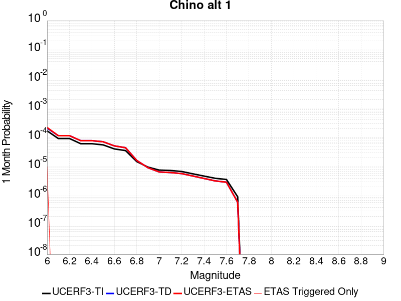 |  |  |

| Magnitude | 1 wk TI Prob | 1 wk TD Prob | 1 wk ETAS Prob | 1 wk ETAS/TD Gain | 1 wk ETAS Triggered Only | 1 mo TI Prob | 1 mo TD Prob | 1 mo ETAS Prob | 1 mo ETAS/TD Gain | 1 mo ETAS Triggered Only | 1 yr TI Prob | 1 yr TD Prob | 1 yr ETAS Prob | 1 yr ETAS/TD Gain | 1 yr ETAS Triggered Only | 10 yr TI Prob | 10 yr TD Prob | 10 yr ETAS Prob | 10 yr ETAS/TD Gain | 10 yr ETAS Triggered Only |
|-----|-----|-----|-----|-----|-----|-----|-----|-----|-----|-----|-----|-----|-----|-----|-----|-----|-----|-----|-----|-----|
| 6.0 | 3.939946E-5 | 4.895037E-5 | 5.8949878E-5 | 1.2042786 | 1.0E-5 | 1.6884391E-4 | 2.0977337E-4 | 2.1977127E-4 | 1.0476605 | 1.0E-5 | 0.0020537362 | 0.0025514876 | 0.0025913857 | 1.0156372 | 4.0E-5 | 0.020348595 | 0.025278764 | 0.025337247 | 1.0023135 | 6.0E-5 |
| 6.1 | 2.1505624E-5 | 2.6880154E-5 | 2.6880154E-5 | 1.0 | 0.0 | 9.2163704E-5 | 1.151962E-4 | 1.151962E-4 | 1.0 | 0.0 | 0.0011215154 | 0.0014017228 | 0.0014117088 | 1.0071241 | 1.0E-5 | 0.011158722 | 0.013945717 | 0.013965438 | 1.0014142 | 2.0E-5 |
| 6.2 | 2.1505624E-5 | 2.6880154E-5 | 2.6880154E-5 | 1.0 | 0.0 | 9.2163704E-5 | 1.151962E-4 | 1.151962E-4 | 1.0 | 0.0 | 0.0011215154 | 0.0014017228 | 0.0014117088 | 1.0071241 | 1.0E-5 | 0.011158722 | 0.013945717 | 0.013965438 | 1.0014142 | 2.0E-5 |
| 6.3 | 1.4290785E-5 | 1.8166014E-5 | 1.8166014E-5 | 1.0 | 0.0 | 6.1244784E-5 | 7.785228E-5 | 7.785228E-5 | 1.0 | 0.0 | 7.454001E-4 | 9.4748475E-4 | 9.4748475E-4 | 1.0 | 0.0 | 0.007429048 | 0.009444912 | 0.0094548175 | 1.0010488 | 1.0E-5 |
| 6.4 | 1.4290785E-5 | 1.8166014E-5 | 1.8166014E-5 | 1.0 | 0.0 | 6.1244784E-5 | 7.785228E-5 | 7.785228E-5 | 1.0 | 0.0 | 7.454001E-4 | 9.4748475E-4 | 9.4748475E-4 | 1.0 | 0.0 | 0.007429048 | 0.009444912 | 0.0094548175 | 1.0010488 | 1.0E-5 |
| 6.5 | 1.3017944E-5 | 1.6652937E-5 | 1.6652937E-5 | 1.0 | 0.0 | 5.5789995E-5 | 7.136803E-5 | 7.136803E-5 | 1.0 | 0.0 | 6.790315E-4 | 8.686031E-4 | 8.686031E-4 | 1.0 | 0.0 | 0.0067696036 | 0.008662385 | 0.008672298 | 1.0011444 | 1.0E-5 |
| 6.6 | 9.470016E-6 | 1.2040057E-5 | 1.2040057E-5 | 1.0 | 0.0 | 4.058515E-5 | 5.1599414E-5 | 5.1599414E-5 | 1.0 | 0.0 | 4.940122E-4 | 6.2807574E-4 | 6.2807574E-4 | 1.0 | 0.0 | 0.004929154 | 0.0062722242 | 0.0062821615 | 1.0015843 | 1.0E-5 |
| 6.7 | 8.314155E-6 | 1.0408293E-5 | 1.0408293E-5 | 1.0 | 0.0 | 3.5631605E-5 | 4.460639E-5 | 4.460639E-5 | 1.0 | 0.0 | 4.3372845E-4 | 5.429797E-4 | 5.429797E-4 | 1.0 | 0.0 | 0.004328829 | 0.005426062 | 0.005426062 | 1.0 | 0.0 |
| 6.8 | 3.4856364E-6 | 3.8135372E-6 | 3.8135372E-6 | 1.0 | 0.0 | 1.4938357E-5 | 1.634364E-5 | 1.634364E-5 | 1.0 | 0.0 | 1.8185932E-4 | 1.9896773E-4 | 1.9896773E-4 | 1.0 | 0.0 | 0.0018171056 | 0.001989573 | 0.001989573 | 1.0 | 0.0 |
| 6.9 | 2.2645952E-6 | 2.152999E-6 | 2.152999E-6 | 1.0 | 0.0 | 9.705372E-6 | 9.227107E-6 | 9.227107E-6 | 1.0 | 0.0 | 1.18156495E-4 | 1.1233445E-4 | 1.1233445E-4 | 1.0 | 0.0 | 0.0011809369 | 0.0011233927 | 0.0011233927 | 1.0 | 0.0 |
| 7.0 | 1.7864003E-6 | 1.5431575E-6 | 1.5431575E-6 | 1.0 | 0.0 | 7.655979E-6 | 6.613516E-6 | 6.613516E-6 | 1.0 | 0.0 | 9.3207556E-5 | 8.0516635E-5 | 8.0516635E-5 | 1.0 | 0.0 | 9.316847E-4 | 8.0532173E-4 | 8.0532173E-4 | 1.0 | 0.0 |
| 7.1 | 1.7315456E-6 | 1.4734279E-6 | 1.4734279E-6 | 1.0 | 0.0 | 7.420889E-6 | 6.3146763E-6 | 6.3146763E-6 | 1.0 | 0.0 | 9.034557E-5 | 7.6878525E-5 | 7.6878525E-5 | 1.0 | 0.0 | 9.0308854E-4 | 7.6895714E-4 | 7.6895714E-4 | 1.0 | 0.0 |
| 7.2 | 1.6008337E-6 | 1.3574753E-6 | 1.3574753E-6 | 1.0 | 0.0 | 6.860698E-6 | 5.817739E-6 | 5.817739E-6 | 1.0 | 0.0 | 8.352579E-5 | 7.082872E-5 | 7.082872E-5 | 1.0 | 0.0 | 8.34944E-4 | 7.084856E-4 | 7.084856E-4 | 1.0 | 0.0 |
| 7.3 | 1.3320939E-6 | 1.1218251E-6 | 1.1218251E-6 | 1.0 | 0.0 | 5.7089615E-6 | 4.8078136E-6 | 4.8078136E-6 | 1.0 | 0.0 | 6.9504385E-5 | 5.8533606E-5 | 5.8533606E-5 | 1.0 | 0.0 | 6.9482654E-4 | 5.853264E-4 | 5.853264E-4 | 1.0 | 0.0 |
| 7.4 | 1.114294E-6 | 9.2374523E-7 | 9.2374523E-7 | 1.0 | 0.0 | 4.775537E-6 | 3.958902E-6 | 3.958902E-6 | 1.0 | 0.0 | 5.8140613E-5 | 4.8198606E-5 | 4.8198606E-5 | 1.0 | 0.0 | 5.81254E-4 | 4.8189834E-4 | 4.8189834E-4 | 1.0 | 0.0 |
| 7.5 | 9.354081E-7 | 7.623702E-7 | 7.623702E-7 | 1.0 | 0.0 | 4.0088858E-6 | 3.2672967E-6 | 3.2672967E-6 | 1.0 | 0.0 | 4.8807087E-5 | 3.9778646E-5 | 3.9778646E-5 | 1.0 | 0.0 | 4.879637E-4 | 3.9771866E-4 | 3.9771866E-4 | 1.0 | 0.0 |
| 7.6 | 8.521771E-7 | 6.8809493E-7 | 6.8809493E-7 | 1.0 | 0.0 | 3.6521824E-6 | 2.9489752E-6 | 2.9489752E-6 | 1.0 | 0.0 | 4.4464414E-5 | 3.5903213E-5 | 3.5903213E-5 | 1.0 | 0.0 | 4.4455516E-4 | 3.589773E-4 | 3.589773E-4 | 1.0 | 0.0 |
| 7.7 | 2.1803626E-7 | 1.4187151E-7 | 1.4187151E-7 | 1.0 | 0.0 | 9.344408E-7 | 6.080207E-7 | 6.080207E-7 | 1.0 | 0.0 | 1.1376757E-5 | 7.402636E-6 | 7.402636E-6 | 1.0 | 0.0 | 1.13761744E-4 | 7.402486E-5 | 7.402486E-5 | 1.0 | 0.0 |

## Deep Springs
*[(top)](#table-of-contents)*

| 1 Week | 1 Month | 1 Year | 10 Year |
|-----|-----|-----|-----|
|  |  |  |  |

| Magnitude | 1 wk TI Prob | 1 wk TD Prob | 1 wk ETAS Prob | 1 wk ETAS/TD Gain | 1 wk ETAS Triggered Only | 1 mo TI Prob | 1 mo TD Prob | 1 mo ETAS Prob | 1 mo ETAS/TD Gain | 1 mo ETAS Triggered Only | 1 yr TI Prob | 1 yr TD Prob | 1 yr ETAS Prob | 1 yr ETAS/TD Gain | 1 yr ETAS Triggered Only | 10 yr TI Prob | 10 yr TD Prob | 10 yr ETAS Prob | 10 yr ETAS/TD Gain | 10 yr ETAS Triggered Only |
|-----|-----|-----|-----|-----|-----|-----|-----|-----|-----|-----|-----|-----|-----|-----|-----|-----|-----|-----|-----|-----|
| 6.0 | 1.9810619E-5 | 2.311303E-5 | 2.311303E-5 | 1.0 | 0.0 | 8.489989E-5 | 9.905495E-5 | 9.905495E-5 | 1.0 | 0.0 | 0.001033166 | 0.0012058346 | 0.0012457863 | 1.0331321 | 4.0E-5 | 0.010283757 | 0.01204269 | 0.012101968 | 1.0049223 | 6.0E-5 |
| 6.1 | 1.9810619E-5 | 2.311303E-5 | 2.311303E-5 | 1.0 | 0.0 | 8.489989E-5 | 9.905495E-5 | 9.905495E-5 | 1.0 | 0.0 | 0.001033166 | 0.0012058346 | 0.0012457863 | 1.0331321 | 4.0E-5 | 0.010283757 | 0.01204269 | 0.012101968 | 1.0049223 | 6.0E-5 |
| 6.2 | 1.9810619E-5 | 2.311303E-5 | 2.311303E-5 | 1.0 | 0.0 | 8.489989E-5 | 9.905495E-5 | 9.905495E-5 | 1.0 | 0.0 | 0.001033166 | 0.0012058346 | 0.0012457863 | 1.0331321 | 4.0E-5 | 0.010283757 | 0.01204269 | 0.012101968 | 1.0049223 | 6.0E-5 |
| 6.3 | 1.9810619E-5 | 2.311303E-5 | 2.311303E-5 | 1.0 | 0.0 | 8.489989E-5 | 9.905495E-5 | 9.905495E-5 | 1.0 | 0.0 | 0.001033166 | 0.0012058346 | 0.0012457863 | 1.0331321 | 4.0E-5 | 0.010283757 | 0.01204269 | 0.012101968 | 1.0049223 | 6.0E-5 |
| 6.4 | 1.9810619E-5 | 2.311303E-5 | 2.311303E-5 | 1.0 | 0.0 | 8.489989E-5 | 9.905495E-5 | 9.905495E-5 | 1.0 | 0.0 | 0.001033166 | 0.0012058346 | 0.0012457863 | 1.0331321 | 4.0E-5 | 0.010283757 | 0.01204269 | 0.012101968 | 1.0049223 | 6.0E-5 |
| 6.5 | 1.7190405E-5 | 2.0050999E-5 | 2.0050999E-5 | 1.0 | 0.0 | 7.367108E-5 | 8.593285E-5 | 8.593285E-5 | 1.0 | 0.0 | 8.9657627E-4 | 0.0010462324 | 0.0010762011 | 1.0286443 | 3.0E-5 | 0.008929676 | 0.010462287 | 0.010501868 | 1.0037832 | 4.0E-5 |
| 6.6 | 1.7190405E-5 | 2.0050999E-5 | 2.0050999E-5 | 1.0 | 0.0 | 7.367108E-5 | 8.593285E-5 | 8.593285E-5 | 1.0 | 0.0 | 8.9657627E-4 | 0.0010462324 | 0.0010762011 | 1.0286443 | 3.0E-5 | 0.008929676 | 0.010462287 | 0.010501868 | 1.0037832 | 4.0E-5 |

## San Jacinto (Borrego)
*[(top)](#table-of-contents)*

| 1 Week | 1 Month | 1 Year | 10 Year |
|-----|-----|-----|-----|
|  |  |  |  |

| Magnitude | 1 wk TI Prob | 1 wk TD Prob | 1 wk ETAS Prob | 1 wk ETAS/TD Gain | 1 wk ETAS Triggered Only | 1 mo TI Prob | 1 mo TD Prob | 1 mo ETAS Prob | 1 mo ETAS/TD Gain | 1 mo ETAS Triggered Only | 1 yr TI Prob | 1 yr TD Prob | 1 yr ETAS Prob | 1 yr ETAS/TD Gain | 1 yr ETAS Triggered Only | 10 yr TI Prob | 10 yr TD Prob | 10 yr ETAS Prob | 10 yr ETAS/TD Gain | 10 yr ETAS Triggered Only |
|-----|-----|-----|-----|-----|-----|-----|-----|-----|-----|-----|-----|-----|-----|-----|-----|-----|-----|-----|-----|-----|
| 6.0 | 3.543992E-5 | 2.7934115E-5 | 3.7933834E-5 | 1.3579752 | 1.0E-5 | 1.5187653E-4 | 1.1971221E-4 | 1.2971101E-4 | 1.0835236 | 1.0E-5 | 0.0018475284 | 0.001456534 | 0.0014765048 | 1.0137112 | 2.0E-5 | 0.018322436 | 0.014873597 | 0.014922853 | 1.0033116 | 5.0E-5 |
| 6.1 | 3.542281E-5 | 2.7934115E-5 | 3.7933834E-5 | 1.3579752 | 1.0E-5 | 1.5180321E-4 | 1.1971221E-4 | 1.2971101E-4 | 1.0835236 | 1.0E-5 | 0.0018466372 | 0.001456534 | 0.0014765048 | 1.0137112 | 2.0E-5 | 0.018313672 | 0.014873597 | 0.014922853 | 1.0033116 | 5.0E-5 |
| 6.2 | 3.4688688E-5 | 2.7934115E-5 | 3.7933834E-5 | 1.3579752 | 1.0E-5 | 1.4865733E-4 | 1.1971221E-4 | 1.2971101E-4 | 1.0835236 | 1.0E-5 | 0.0018084005 | 0.0014565339 | 0.0014765048 | 1.0137112 | 2.0E-5 | 0.017937548 | 0.014873596 | 0.014922853 | 1.0033116 | 5.0E-5 |
| 6.3 | 3.2087122E-5 | 2.7779462E-5 | 3.7779184E-5 | 1.3599682 | 1.0E-5 | 1.3750899E-4 | 1.1904947E-4 | 1.2904829E-4 | 1.0839887 | 1.0E-5 | 0.0016728862 | 0.0014484759 | 0.0014684469 | 1.0137876 | 2.0E-5 | 0.016603488 | 0.01479463 | 0.01484389 | 1.0033296 | 5.0E-5 |
| 6.4 | 3.1828724E-5 | 2.7746448E-5 | 3.774617E-5 | 1.3603965 | 1.0E-5 | 1.364017E-4 | 1.18908E-4 | 1.289068E-4 | 1.0840887 | 1.0E-5 | 0.0016594254 | 0.0014467557 | 0.0014667268 | 1.0138041 | 2.0E-5 | 0.016470885 | 0.014777708 | 0.014826969 | 1.0033334 | 5.0E-5 |
| 6.5 | 3.1563577E-5 | 2.7486154E-5 | 3.748588E-5 | 1.3638096 | 1.0E-5 | 1.3526545E-4 | 1.1779256E-4 | 1.2779138E-4 | 1.084885 | 1.0E-5 | 0.0016456128 | 0.0014331931 | 0.0014531645 | 1.0139349 | 2.0E-5 | 0.0163348 | 0.014644288 | 0.014693556 | 1.0033643 | 5.0E-5 |
| 6.6 | 3.1467625E-5 | 2.7330374E-5 | 3.73301E-5 | 1.3658832 | 1.0E-5 | 1.3485427E-4 | 1.1712498E-4 | 1.2712381E-4 | 1.0853689 | 1.0E-5 | 0.0016406142 | 0.001425076 | 0.0014450476 | 1.0140144 | 2.0E-5 | 0.016285548 | 0.014564533 | 0.014613804 | 1.003383 | 5.0E-5 |
| 6.7 | 3.1223695E-5 | 2.6948383E-5 | 3.6948113E-5 | 1.3710698 | 1.0E-5 | 1.3380898E-4 | 1.1548802E-4 | 1.2548687E-4 | 1.0865791 | 1.0E-5 | 0.0016279068 | 0.0014051719 | 0.0014251438 | 1.0142131 | 2.0E-5 | 0.01616033 | 0.014368899 | 0.014418181 | 1.0034298 | 5.0E-5 |
| 6.8 | 3.1015585E-5 | 2.6769376E-5 | 3.676911E-5 | 1.3735511 | 1.0E-5 | 1.3291716E-4 | 1.14720926E-4 | 1.2471978E-4 | 1.0871581 | 1.0E-5 | 0.001617065 | 0.0013958444 | 0.0014158165 | 1.0143082 | 2.0E-5 | 0.016053487 | 0.014276173 | 0.0143254595 | 1.0034523 | 5.0E-5 |
| 6.9 | 2.6641965E-5 | 2.2191349E-5 | 3.219113E-5 | 1.450616 | 1.0E-5 | 1.1417485E-4 | 9.510233E-5 | 1.0510138E-4 | 1.1051399 | 1.0E-5 | 0.0013891924 | 0.0011572598 | 0.0011772367 | 1.0172622 | 2.0E-5 | 0.0138054015 | 0.011886145 | 0.011935551 | 1.0041566 | 5.0E-5 |
| 7.0 | 2.3854353E-5 | 2.048587E-5 | 3.0485666E-5 | 1.4881313 | 1.0E-5 | 1.02228936E-4 | 8.779365E-5 | 9.779277E-5 | 1.1138935 | 1.0E-5 | 0.0012439266 | 0.0010683661 | 0.0010883447 | 1.0187001 | 2.0E-5 | 0.012369866 | 0.010986375 | 0.011035825 | 1.0045011 | 5.0E-5 |
| 7.1 | 2.3672901E-5 | 2.032235E-5 | 3.0322148E-5 | 1.4920591 | 1.0E-5 | 1.0145135E-4 | 8.709289E-5 | 9.709202E-5 | 1.1148099 | 1.0E-5 | 0.0012344702 | 0.0010598428 | 0.0010798215 | 1.0188507 | 2.0E-5 | 0.0122763505 | 0.010901547 | 0.010951002 | 1.0045365 | 5.0E-5 |
| 7.2 | 2.2717244E-5 | 1.9549674E-5 | 2.954948E-5 | 1.5115075 | 1.0E-5 | 9.735599E-5 | 8.378164E-5 | 9.378081E-5 | 1.1193479 | 1.0E-5 | 0.0011846646 | 0.0010195666 | 0.0010395461 | 1.0195962 | 2.0E-5 | 0.01178369 | 0.010498884 | 0.010548359 | 1.0047125 | 5.0E-5 |
| 7.3 | 2.1016205E-5 | 1.8391213E-5 | 2.8391029E-5 | 1.543728 | 1.0E-5 | 9.006634E-5 | 7.881711E-5 | 8.881633E-5 | 1.126866 | 1.0E-5 | 0.001096006 | 9.5917797E-4 | 9.791588E-4 | 1.0208312 | 2.0E-5 | 0.010906163 | 0.009894462 | 0.009943968 | 1.0050033 | 5.0E-5 |
| 7.4 | 2.0683625E-5 | 1.8193714E-5 | 2.8193532E-5 | 1.5496304 | 1.0E-5 | 8.86411E-5 | 7.797074E-5 | 8.7969966E-5 | 1.1282432 | 1.0E-5 | 0.001078671 | 9.488824E-4 | 9.6886343E-4 | 1.0210575 | 2.0E-5 | 0.010734501 | 0.009791178 | 0.009840688 | 1.0050566 | 5.0E-5 |
| 7.5 | 1.9993966E-5 | 1.7788683E-5 | 2.7788505E-5 | 1.5621452 | 1.0E-5 | 8.568561E-5 | 7.6234996E-5 | 8.6234235E-5 | 1.1311634 | 1.0E-5 | 0.001042723 | 9.2776783E-4 | 9.477493E-4 | 1.0215371 | 2.0E-5 | 0.010378438 | 0.00957807 | 0.009627591 | 1.0051702 | 5.0E-5 |
| 7.6 | 1.788966E-5 | 1.6441732E-5 | 2.6441567E-5 | 1.6081984 | 1.0E-5 | 7.666772E-5 | 7.046267E-5 | 8.046196E-5 | 1.1419091 | 1.0E-5 | 9.3302975E-4 | 8.575471E-4 | 8.7752996E-4 | 1.0233023 | 2.0E-5 | 0.00929122 | 0.0088698575 | 0.008919414 | 1.0055871 | 5.0E-5 |
| 7.7 | 1.5125781E-5 | 1.4243621E-5 | 2.4243478E-5 | 1.7020587 | 1.0E-5 | 6.4823165E-5 | 6.1042665E-5 | 7.104206E-5 | 1.1638099 | 1.0E-5 | 7.889362E-4 | 7.4294186E-4 | 7.62927E-4 | 1.0269 | 2.0E-5 | 0.007861412 | 0.0077174758 | 0.00776709 | 1.0064288 | 5.0E-5 |
| 7.8 | 1.250089E-5 | 1.2636515E-5 | 2.2636388E-5 | 1.7913475 | 1.0E-5 | 5.3574146E-5 | 5.415537E-5 | 6.4154825E-5 | 1.1846439 | 1.0E-5 | 6.5207E-4 | 6.591428E-4 | 6.791296E-4 | 1.0303224 | 2.0E-5 | 0.006501599 | 0.00687092 | 0.006920576 | 1.0072271 | 5.0E-5 |
| 7.9 | 9.561E-6 | 9.759914E-6 | 1.9759816E-5 | 2.024589 | 1.0E-5 | 4.0975072E-5 | 4.1827538E-5 | 5.182712E-5 | 1.239067 | 1.0E-5 | 4.987573E-4 | 5.091318E-4 | 5.2912167E-4 | 1.0392625 | 2.0E-5 | 0.0049763937 | 0.0053551346 | 0.0054048668 | 1.0092869 | 5.0E-5 |
| 8.0 | 8.01699E-6 | 8.2982915E-6 | 1.8298208E-5 | 2.2050574 | 1.0E-5 | 3.4358076E-5 | 3.5563622E-5 | 4.556327E-5 | 1.2811762 | 1.0E-5 | 4.1822926E-4 | 4.329016E-4 | 4.5289297E-4 | 1.0461799 | 2.0E-5 | 0.0041744304 | 0.0045759073 | 0.0046256785 | 1.0108768 | 5.0E-5 |
| 8.1 | 6.541947E-6 | 6.466171E-6 | 1.6466107E-5 | 2.5465004 | 1.0E-5 | 2.8036617E-5 | 2.7711869E-5 | 3.771159E-5 | 1.3608462 | 1.0E-5 | 3.4129233E-4 | 3.3734026E-4 | 3.473369E-4 | 1.0296336 | 1.0E-5 | 0.0034076865 | 0.0035827826 | 0.0036126752 | 1.0083433 | 3.0E-5 |
| 8.2 | 1.7968189E-6 | 7.978815E-7 | 7.978815E-7 | 1.0 | 0.0 | 7.70063E-6 | 3.419488E-6 | 3.419488E-6 | 1.0 | 0.0 | 9.3751136E-5 | 4.163149E-5 | 4.163149E-5 | 1.0 | 0.0 | 9.371159E-4 | 4.7162327E-4 | 4.7162327E-4 | 1.0 | 0.0 |
| 8.3 | 1.5167889E-7 | 4.9030522E-8 | 4.9030522E-8 | 1.0 | 0.0 | 6.500522E-7 | 2.1013079E-7 | 2.1013079E-7 | 1.0 | 0.0 | 7.9143565E-6 | 2.55834E-6 | 2.55834E-6 | 1.0 | 0.0 | 7.914075E-5 | 2.9725656E-5 | 2.9725656E-5 | 1.0 | 0.0 |

## Santa Ynez River
*[(top)](#table-of-contents)*

| 1 Week | 1 Month | 1 Year | 10 Year |
|-----|-----|-----|-----|
|  |  |  |  |

| Magnitude | 1 wk TI Prob | 1 wk TD Prob | 1 wk ETAS Prob | 1 wk ETAS/TD Gain | 1 wk ETAS Triggered Only | 1 mo TI Prob | 1 mo TD Prob | 1 mo ETAS Prob | 1 mo ETAS/TD Gain | 1 mo ETAS Triggered Only | 1 yr TI Prob | 1 yr TD Prob | 1 yr ETAS Prob | 1 yr ETAS/TD Gain | 1 yr ETAS Triggered Only | 10 yr TI Prob | 10 yr TD Prob | 10 yr ETAS Prob | 10 yr ETAS/TD Gain | 10 yr ETAS Triggered Only |
|-----|-----|-----|-----|-----|-----|-----|-----|-----|-----|-----|-----|-----|-----|-----|-----|-----|-----|-----|-----|-----|
| 6.0 | 1.6396456E-5 | 1.7209564E-5 | 1.7209564E-5 | 1.0 | 0.0 | 7.026863E-5 | 7.375339E-5 | 7.375339E-5 | 1.0 | 0.0 | 8.551848E-4 | 8.976132E-4 | 9.1759523E-4 | 1.0222613 | 2.0E-5 | 0.0085190125 | 0.008943425 | 0.008992977 | 1.0055407 | 5.0E-5 |
| 6.1 | 1.6396456E-5 | 1.7209564E-5 | 1.7209564E-5 | 1.0 | 0.0 | 7.026863E-5 | 7.375339E-5 | 7.375339E-5 | 1.0 | 0.0 | 8.551848E-4 | 8.976132E-4 | 9.1759523E-4 | 1.0222613 | 2.0E-5 | 0.0085190125 | 0.008943425 | 0.008992977 | 1.0055407 | 5.0E-5 |
| 6.2 | 1.6396456E-5 | 1.7209564E-5 | 1.7209564E-5 | 1.0 | 0.0 | 7.026863E-5 | 7.375339E-5 | 7.375339E-5 | 1.0 | 0.0 | 8.551848E-4 | 8.976132E-4 | 9.1759523E-4 | 1.0222613 | 2.0E-5 | 0.0085190125 | 0.008943425 | 0.008992977 | 1.0055407 | 5.0E-5 |
| 6.3 | 9.736976E-6 | 1.0122399E-5 | 1.0122399E-5 | 1.0 | 0.0 | 4.172923E-5 | 4.3381016E-5 | 4.3381016E-5 | 1.0 | 0.0 | 5.0793495E-4 | 5.2804087E-4 | 5.380356E-4 | 1.0189279 | 1.0E-5 | 0.005067755 | 0.0052683675 | 0.005308157 | 1.0075525 | 4.0E-5 |
| 6.4 | 9.736976E-6 | 1.0122399E-5 | 1.0122399E-5 | 1.0 | 0.0 | 4.172923E-5 | 4.3381016E-5 | 4.3381016E-5 | 1.0 | 0.0 | 5.0793495E-4 | 5.2804087E-4 | 5.380356E-4 | 1.0189279 | 1.0E-5 | 0.005067755 | 0.0052683675 | 0.005308157 | 1.0075525 | 4.0E-5 |
| 6.5 | 7.081964E-6 | 7.3299457E-6 | 7.3299457E-6 | 1.0 | 0.0 | 3.035092E-5 | 3.1413685E-5 | 3.1413685E-5 | 1.0 | 0.0 | 3.694598E-4 | 3.8239607E-4 | 3.9239225E-4 | 1.0261409 | 1.0E-5 | 0.0036884616 | 0.0038175425 | 0.003847428 | 1.0078285 | 3.0E-5 |
| 6.6 | 5.873247E-6 | 6.0597836E-6 | 6.0597836E-6 | 1.0 | 0.0 | 2.5170815E-5 | 2.5970248E-5 | 2.5970248E-5 | 1.0 | 0.0 | 3.064116E-4 | 3.1614274E-4 | 3.1614274E-4 | 1.0 | 0.0 | 0.0030598943 | 0.0031570175 | 0.003166986 | 1.0031575 | 1.0E-5 |
| 6.7 | 4.973277E-6 | 5.115936E-6 | 5.115936E-6 | 1.0 | 0.0 | 2.1313872E-5 | 2.1925258E-5 | 2.1925258E-5 | 1.0 | 0.0 | 2.5946548E-4 | 2.669078E-4 | 2.669078E-4 | 1.0 | 0.0 | 0.0025916274 | 0.002665921 | 0.002665921 | 1.0 | 0.0 |
| 6.8 | 4.396492E-6 | 4.5110087E-6 | 4.5110087E-6 | 1.0 | 0.0 | 1.884197E-5 | 1.9332752E-5 | 1.9332752E-5 | 1.0 | 0.0 | 2.2937685E-4 | 2.3535118E-4 | 2.3535118E-4 | 1.0 | 0.0 | 0.0022914023 | 0.0023510547 | 0.0023510547 | 1.0 | 0.0 |
| 6.9 | 3.5255632E-6 | 3.6013587E-6 | 3.6013587E-6 | 1.0 | 0.0 | 1.5109469E-5 | 1.5434303E-5 | 1.5434303E-5 | 1.0 | 0.0 | 1.8394225E-4 | 1.878966E-4 | 1.878966E-4 | 1.0 | 0.0 | 0.0018379007 | 0.0018773936 | 0.0018773936 | 1.0 | 0.0 |
| 7.0 | 3.211603E-6 | 3.2736775E-6 | 3.2736775E-6 | 1.0 | 0.0 | 1.376394E-5 | 1.4029972E-5 | 1.4029972E-5 | 1.0 | 0.0 | 1.6756308E-4 | 1.7080165E-4 | 1.7080165E-4 | 1.0 | 0.0 | 0.0016743679 | 0.001706718 | 0.001706718 | 1.0 | 0.0 |
| 7.1 | 2.5094619E-6 | 2.5409397E-6 | 2.5409397E-6 | 1.0 | 0.0 | 1.0754793E-5 | 1.0889697E-5 | 1.0889697E-5 | 1.0 | 0.0 | 1.3093173E-4 | 1.3257404E-4 | 1.3257404E-4 | 1.0 | 0.0 | 0.0013085462 | 0.0013249556 | 0.0013249556 | 1.0 | 0.0 |
| 7.2 | 2.0515774E-6 | 2.0619539E-6 | 2.0619539E-6 | 1.0 | 0.0 | 8.792445E-6 | 8.836915E-6 | 8.836915E-6 | 1.0 | 0.0 | 1.0704277E-4 | 1.0758417E-4 | 1.0758417E-4 | 1.0 | 0.0 | 0.0010699122 | 0.0010753252 | 0.0010753252 | 1.0 | 0.0 |
| 7.3 | 1.6845745E-6 | 1.6774045E-6 | 1.6774045E-6 | 1.0 | 0.0 | 7.219585E-6 | 7.1888567E-6 | 7.1888567E-6 | 1.0 | 0.0 | 8.78949E-5 | 8.752084E-5 | 8.752084E-5 | 1.0 | 0.0 | 8.7860145E-4 | 8.748666E-4 | 8.748666E-4 | 1.0 | 0.0 |
| 7.4 | 1.3600285E-6 | 1.3333469E-6 | 1.3333469E-6 | 1.0 | 0.0 | 5.82868E-6 | 5.714331E-6 | 5.714331E-6 | 1.0 | 0.0 | 7.096187E-5 | 6.956978E-5 | 6.956978E-5 | 1.0 | 0.0 | 7.0939213E-4 | 6.9548225E-4 | 6.9548225E-4 | 1.0 | 0.0 |
| 7.5 | 9.735342E-7 | 9.290183E-7 | 9.290183E-7 | 1.0 | 0.0 | 4.172283E-6 | 3.981501E-6 | 3.981501E-6 | 1.0 | 0.0 | 5.079636E-5 | 4.8473714E-5 | 4.8473714E-5 | 1.0 | 0.0 | 5.0784746E-4 | 4.846331E-4 | 4.846331E-4 | 1.0 | 0.0 |
| 7.6 | 5.067187E-7 | 4.778607E-7 | 4.778607E-7 | 1.0 | 0.0 | 2.1716498E-6 | 2.0479727E-6 | 2.0479727E-6 | 1.0 | 0.0 | 2.6439517E-5 | 2.493379E-5 | 2.493379E-5 | 1.0 | 0.0 | 2.643637E-4 | 2.4931066E-4 | 2.4931066E-4 | 1.0 | 0.0 |
| 7.7 | 2.769089E-7 | 2.5759311E-7 | 2.5759311E-7 | 1.0 | 0.0 | 1.1867519E-6 | 1.1039699E-6 | 1.1039699E-6 | 1.0 | 0.0 | 1.4448608E-5 | 1.3440752E-5 | 1.3440752E-5 | 1.0 | 0.0 | 1.444767E-4 | 1.3439942E-4 | 1.3439942E-4 | 1.0 | 0.0 |
| 7.8 | 1.7044663E-7 | 1.5449127E-7 | 1.5449127E-7 | 1.0 | 0.0 | 7.3048534E-7 | 6.6210526E-7 | 6.6210526E-7 | 1.0 | 0.0 | 8.893623E-6 | 8.061102E-6 | 8.061102E-6 | 1.0 | 0.0 | 8.893267E-5 | 8.0608115E-5 | 8.0608115E-5 | 1.0 | 0.0 |
| 7.9 | 4.8344287E-8 | 4.0911235E-8 | 4.0911235E-8 | 1.0 | 0.0 | 2.0718979E-7 | 1.7533385E-7 | 1.7533385E-7 | 1.0 | 0.0 | 2.5225327E-6 | 2.1346877E-6 | 2.1346877E-6 | 1.0 | 0.0 | 2.5225041E-5 | 2.1346676E-5 | 2.1346676E-5 | 1.0 | 0.0 |

## Rose Canyon
*[(top)](#table-of-contents)*

| 1 Week | 1 Month | 1 Year | 10 Year |
|-----|-----|-----|-----|
|  |  |  |  |

| Magnitude | 1 wk TI Prob | 1 wk TD Prob | 1 wk ETAS Prob | 1 wk ETAS/TD Gain | 1 wk ETAS Triggered Only | 1 mo TI Prob | 1 mo TD Prob | 1 mo ETAS Prob | 1 mo ETAS/TD Gain | 1 mo ETAS Triggered Only | 1 yr TI Prob | 1 yr TD Prob | 1 yr ETAS Prob | 1 yr ETAS/TD Gain | 1 yr ETAS Triggered Only | 10 yr TI Prob | 10 yr TD Prob | 10 yr ETAS Prob | 10 yr ETAS/TD Gain | 10 yr ETAS Triggered Only |
|-----|-----|-----|-----|-----|-----|-----|-----|-----|-----|-----|-----|-----|-----|-----|-----|-----|-----|-----|-----|-----|
| 6.0 | 4.5923203E-5 | 4.9715825E-5 | 4.9715825E-5 | 1.0 | 0.0 | 1.9679888E-4 | 2.1305127E-4 | 2.2304915E-4 | 1.0469271 | 1.0E-5 | 0.0023933933 | 0.0025910123 | 0.0026309087 | 1.015398 | 4.0E-5 | 0.023677798 | 0.025640773 | 0.02568949 | 1.0019001 | 5.0E-5 |
| 6.1 | 4.5923203E-5 | 4.9715825E-5 | 4.9715825E-5 | 1.0 | 0.0 | 1.9679888E-4 | 2.1305127E-4 | 2.1305127E-4 | 1.0 | 0.0 | 0.0023933933 | 0.0025910123 | 0.0026209347 | 1.0115485 | 3.0E-5 | 0.023677798 | 0.025640773 | 0.025670003 | 1.00114 | 3.0E-5 |
| 6.2 | 2.8844734E-5 | 2.9669445E-5 | 2.9669445E-5 | 1.0 | 0.0 | 1.2361443E-4 | 1.2714828E-4 | 1.2714828E-4 | 1.0 | 0.0 | 0.0015039665 | 0.0015469306 | 0.0015668997 | 1.0129088 | 2.0E-5 | 0.0149382865 | 0.01537464 | 0.015394333 | 1.0012808 | 2.0E-5 |
| 6.3 | 2.3171577E-5 | 2.3161689E-5 | 2.3161689E-5 | 1.0 | 0.0 | 9.9302975E-5 | 9.926068E-5 | 9.926068E-5 | 1.0 | 0.0 | 0.0012083431 | 0.0012078421 | 0.0012078421 | 1.0 | 0.0 | 0.012017938 | 0.0120226685 | 0.0120226685 | 1.0 | 0.0 |
| 6.4 | 2.0066604E-5 | 1.9667403E-5 | 1.9667403E-5 | 1.0 | 0.0 | 8.599689E-5 | 8.42862E-5 | 8.42862E-5 | 1.0 | 0.0 | 0.0010465092 | 0.0010257114 | 0.0010257114 | 1.0 | 0.0 | 0.010415946 | 0.010217753 | 0.010217753 | 1.0 | 0.0 |
| 6.5 | 1.776989E-5 | 1.7114124E-5 | 1.7114124E-5 | 1.0 | 0.0 | 7.615444E-5 | 7.334422E-5 | 7.334422E-5 | 1.0 | 0.0 | 9.267859E-4 | 8.92607E-4 | 8.92607E-4 | 1.0 | 0.0 | 0.009229303 | 0.008896374 | 0.008896374 | 1.0 | 0.0 |
| 6.6 | 1.5227364E-5 | 1.43395055E-5 | 1.43395055E-5 | 1.0 | 0.0 | 6.52585E-5 | 6.1453604E-5 | 6.1453604E-5 | 1.0 | 0.0 | 7.942326E-4 | 7.47946E-4 | 7.47946E-4 | 1.0 | 0.0 | 0.007914 | 0.007458486 | 0.007458486 | 1.0 | 0.0 |
| 6.7 | 1.2703898E-5 | 1.167345E-5 | 1.167345E-5 | 1.0 | 0.0 | 5.4444143E-5 | 5.002814E-5 | 5.002814E-5 | 1.0 | 0.0 | 6.626558E-4 | 6.089266E-4 | 6.089266E-4 | 1.0 | 0.0 | 0.006606833 | 0.006075177 | 0.006075177 | 1.0 | 0.0 |
| 6.8 | 1.1554917E-5 | 1.0609485E-5 | 1.0609485E-5 | 1.0 | 0.0 | 4.9520135E-5 | 4.5468452E-5 | 4.5468452E-5 | 1.0 | 0.0 | 6.0274085E-4 | 5.534419E-4 | 5.534419E-4 | 1.0 | 0.0 | 0.0060110865 | 0.005522644 | 0.005522644 | 1.0 | 0.0 |
| 6.9 | 8.732078E-6 | 7.881448E-6 | 7.881448E-6 | 1.0 | 0.0 | 3.7422655E-5 | 3.3777214E-5 | 3.3777214E-5 | 1.0 | 0.0 | 4.5552556E-4 | 4.111629E-4 | 4.111629E-4 | 1.0 | 0.0 | 0.0045459294 | 0.0041048555 | 0.0041048555 | 1.0 | 0.0 |
| 7.0 | 5.9337494E-6 | 5.107531E-6 | 5.107531E-6 | 1.0 | 0.0 | 2.5430107E-5 | 2.1889235E-5 | 2.1889235E-5 | 1.0 | 0.0 | 3.0956755E-4 | 2.66469E-4 | 2.66469E-4 | 1.0 | 0.0 | 0.0030913667 | 0.0026615104 | 0.0026615104 | 1.0 | 0.0 |
| 7.1 | 5.013409E-6 | 4.177419E-6 | 4.177419E-6 | 1.0 | 0.0 | 2.1485863E-5 | 1.7903103E-5 | 1.7903103E-5 | 1.0 | 0.0 | 2.6155898E-4 | 2.1794859E-4 | 2.1794859E-4 | 1.0 | 0.0 | 0.0026125133 | 0.00217736 | 0.00217736 | 1.0 | 0.0 |
| 7.2 | 4.120763E-6 | 3.2821677E-6 | 3.2821677E-6 | 1.0 | 0.0 | 1.7660293E-5 | 1.4066358E-5 | 1.4066358E-5 | 1.0 | 0.0 | 2.1499286E-4 | 1.7124454E-4 | 1.7124454E-4 | 1.0 | 0.0 | 0.0021478499 | 0.0017111353 | 0.0017111353 | 1.0 | 0.0 |
| 7.3 | 3.2081239E-6 | 2.4405597E-6 | 2.4405597E-6 | 1.0 | 0.0 | 1.374903E-5 | 1.04595E-5 | 1.04595E-5 | 1.0 | 0.0 | 1.6738157E-4 | 1.2733703E-4 | 1.2733703E-4 | 1.0 | 0.0 | 0.0016725556 | 0.0012726476 | 0.0012726476 | 1.0 | 0.0 |
| 7.4 | 2.4194755E-6 | 1.7680803E-6 | 1.7680803E-6 | 1.0 | 0.0 | 1.0369139E-5 | 7.5774656E-6 | 7.5774656E-6 | 1.0 | 0.0 | 1.2623696E-4 | 9.2251794E-5 | 9.2251794E-5 | 1.0 | 0.0 | 0.0012616527 | 9.221403E-4 | 9.221403E-4 | 1.0 | 0.0 |
| 7.5 | 1.3842889E-6 | 9.378737E-7 | 9.378737E-7 | 1.0 | 0.0 | 5.9326535E-6 | 4.0194527E-6 | 4.0194527E-6 | 1.0 | 0.0 | 7.222766E-5 | 4.8935777E-5 | 4.8935777E-5 | 1.0 | 0.0 | 7.220419E-4 | 4.8925355E-4 | 4.8925355E-4 | 1.0 | 0.0 |
| 7.6 | 1.0021575E-6 | 6.411548E-7 | 6.411548E-7 | 1.0 | 0.0 | 4.2949537E-6 | 2.7478038E-6 | 2.7478038E-6 | 1.0 | 0.0 | 5.2289808E-5 | 3.345402E-5 | 3.345402E-5 | 1.0 | 0.0 | 5.2277505E-4 | 3.3449198E-4 | 3.3449198E-4 | 1.0 | 0.0 |
| 7.7 | 8.7620116E-8 | 6.449284E-8 | 6.449284E-8 | 1.0 | 0.0 | 3.7551473E-7 | 2.7639786E-7 | 2.7639786E-7 | 1.0 | 0.0 | 4.5718825E-6 | 3.365139E-6 | 3.365139E-6 | 1.0 | 0.0 | 4.5717883E-5 | 3.365091E-5 | 3.365091E-5 | 1.0 | 0.0 |

## Great Valley 09 (Laguna Seca)
*[(top)](#table-of-contents)*

| 1 Week | 1 Month | 1 Year | 10 Year |
|-----|-----|-----|-----|
|  |  |  |  |

| Magnitude | 1 wk TI Prob | 1 wk TD Prob | 1 wk ETAS Prob | 1 wk ETAS/TD Gain | 1 wk ETAS Triggered Only | 1 mo TI Prob | 1 mo TD Prob | 1 mo ETAS Prob | 1 mo ETAS/TD Gain | 1 mo ETAS Triggered Only | 1 yr TI Prob | 1 yr TD Prob | 1 yr ETAS Prob | 1 yr ETAS/TD Gain | 1 yr ETAS Triggered Only | 10 yr TI Prob | 10 yr TD Prob | 10 yr ETAS Prob | 10 yr ETAS/TD Gain | 10 yr ETAS Triggered Only |
|-----|-----|-----|-----|-----|-----|-----|-----|-----|-----|-----|-----|-----|-----|-----|-----|-----|-----|-----|-----|-----|
| 6.0 | 5.4353277E-5 | 7.050538E-5 | 7.050538E-5 | 1.0 | 0.0 | 2.3292181E-4 | 3.0212724E-4 | 3.0212724E-4 | 1.0 | 0.0 | 0.0028321352 | 0.003672335 | 0.003702225 | 1.0081391 | 3.0E-5 | 0.02796312 | 0.036116913 | 0.036165107 | 1.0013344 | 5.0E-5 |
| 6.1 | 4.5578287E-5 | 5.822371E-5 | 5.822371E-5 | 1.0 | 0.0 | 1.953209E-4 | 2.49502E-4 | 2.49502E-4 | 1.0 | 0.0 | 0.0023754383 | 0.0030335493 | 0.0030634583 | 1.0098594 | 3.0E-5 | 0.023502063 | 0.029920705 | 0.029959507 | 1.0012969 | 4.0E-5 |
| 6.2 | 2.8536782E-5 | 3.47386E-5 | 3.47386E-5 | 1.0 | 0.0 | 1.2229476E-4 | 1.488658E-4 | 1.488658E-4 | 1.0 | 0.0 | 0.0014879217 | 0.0018108767 | 0.0018308404 | 1.0110244 | 2.0E-5 | 0.014779986 | 0.017958745 | 0.017978387 | 1.0010936 | 2.0E-5 |
| 6.3 | 2.3698774E-5 | 2.8214314E-5 | 2.8214314E-5 | 1.0 | 0.0 | 1.01562226E-4 | 1.2090732E-4 | 1.2090732E-4 | 1.0 | 0.0 | 0.0012358186 | 0.0014710726 | 0.001491043 | 1.0135756 | 2.0E-5 | 0.012289686 | 0.014611831 | 0.014631539 | 1.0013487 | 2.0E-5 |
| 6.4 | 1.9191197E-5 | 2.2123912E-5 | 2.2123912E-5 | 1.0 | 0.0 | 8.2245395E-5 | 9.480767E-5 | 9.480767E-5 | 1.0 | 0.0 | 0.0010008777 | 0.0011536786 | 0.0011636671 | 1.0086579 | 1.0E-5 | 0.009963818 | 0.011477305 | 0.01148719 | 1.0008613 | 1.0E-5 |
| 6.5 | 1.5203241E-5 | 1.680269E-5 | 1.680269E-5 | 1.0 | 0.0 | 6.5155116E-5 | 7.200383E-5 | 7.200383E-5 | 1.0 | 0.0 | 7.9297484E-4 | 8.7628904E-4 | 8.7628904E-4 | 1.0 | 0.0 | 0.007901512 | 0.008729759 | 0.008729759 | 1.0 | 0.0 |
| 6.6 | 1.0984925E-5 | 1.1242844E-5 | 1.1242844E-5 | 1.0 | 0.0 | 4.70774E-5 | 4.818275E-5 | 4.818275E-5 | 1.0 | 0.0 | 5.730166E-4 | 5.864695E-4 | 5.864695E-4 | 1.0 | 0.0 | 0.005715413 | 0.0058496143 | 0.0058496143 | 1.0 | 0.0 |
| 6.7 | 9.134616E-6 | 9.020084E-6 | 9.020084E-6 | 1.0 | 0.0 | 3.9147766E-5 | 3.865694E-5 | 3.865694E-5 | 1.0 | 0.0 | 4.7651984E-4 | 4.7054898E-4 | 4.7054898E-4 | 1.0 | 0.0 | 0.004754993 | 0.0046957717 | 0.0046957717 | 1.0 | 0.0 |
| 6.8 | 7.785589E-6 | 7.4521E-6 | 7.4521E-6 | 1.0 | 0.0 | 3.3366385E-5 | 3.193719E-5 | 3.193719E-5 | 1.0 | 0.0 | 4.0616E-4 | 3.8876795E-4 | 3.8876795E-4 | 1.0 | 0.0 | 0.0040541845 | 0.0038810824 | 0.0038810824 | 1.0 | 0.0 |
| 6.9 | 5.579095E-6 | 4.8985944E-6 | 4.8985944E-6 | 1.0 | 0.0 | 2.3910188E-5 | 2.0993815E-5 | 2.0993815E-5 | 1.0 | 0.0 | 2.9106764E-4 | 2.555711E-4 | 2.555711E-4 | 1.0 | 0.0 | 0.002906867 | 0.0025529093 | 0.0025529093 | 1.0 | 0.0 |
| 7.0 | 2.6816688E-6 | 1.5216407E-6 | 1.5216407E-6 | 1.0 | 0.0 | 1.1492816E-5 | 6.5213017E-6 | 6.5213017E-6 | 1.0 | 0.0 | 1.3991605E-4 | 7.939404E-5 | 7.939404E-5 | 1.0 | 0.0 | 0.0013982799 | 7.936655E-4 | 7.936655E-4 | 1.0 | 0.0 |
| 7.1 | 1.9951021E-6 | 7.4539724E-7 | 7.4539724E-7 | 1.0 | 0.0 | 8.55041E-6 | 3.194556E-6 | 3.194556E-6 | 1.0 | 0.0 | 1.0409627E-4 | 3.8893068E-5 | 3.8893068E-5 | 1.0 | 0.0 | 0.0010404752 | 3.8886676E-4 | 3.8886676E-4 | 1.0 | 0.0 |
| 7.2 | 1.9951021E-6 | 7.4539724E-7 | 7.4539724E-7 | 1.0 | 0.0 | 8.55041E-6 | 3.194556E-6 | 3.194556E-6 | 1.0 | 0.0 | 1.0409627E-4 | 3.8893068E-5 | 3.8893068E-5 | 1.0 | 0.0 | 0.0010404752 | 3.8886676E-4 | 3.8886676E-4 | 1.0 | 0.0 |
| 7.3 | 1.7087556E-6 | 6.579003E-7 | 6.579003E-7 | 1.0 | 0.0 | 7.3232177E-6 | 2.81957E-6 | 2.81957E-6 | 1.0 | 0.0 | 8.915652E-5 | 3.4327764E-5 | 3.4327764E-5 | 1.0 | 0.0 | 8.9120766E-4 | 3.4322866E-4 | 3.4322866E-4 | 1.0 | 0.0 |
| 7.4 | 1.3804846E-6 | 6.0739524E-7 | 6.0739524E-7 | 1.0 | 0.0 | 5.916349E-6 | 2.60312E-6 | 2.60312E-6 | 1.0 | 0.0 | 7.2029165E-5 | 3.1692565E-5 | 3.1692565E-5 | 1.0 | 0.0 | 7.200583E-4 | 3.1688449E-4 | 3.1688449E-4 | 1.0 | 0.0 |
| 7.5 | 1.3804846E-6 | 6.0739524E-7 | 6.0739524E-7 | 1.0 | 0.0 | 5.916349E-6 | 2.60312E-6 | 2.60312E-6 | 1.0 | 0.0 | 7.2029165E-5 | 3.1692565E-5 | 3.1692565E-5 | 1.0 | 0.0 | 7.200583E-4 | 3.1688449E-4 | 3.1688449E-4 | 1.0 | 0.0 |

## Santa Cruz Island
*[(top)](#table-of-contents)*

| 1 Week | 1 Month | 1 Year | 10 Year |
|-----|-----|-----|-----|
|  |  |  |  |

| Magnitude | 1 wk TI Prob | 1 wk TD Prob | 1 wk ETAS Prob | 1 wk ETAS/TD Gain | 1 wk ETAS Triggered Only | 1 mo TI Prob | 1 mo TD Prob | 1 mo ETAS Prob | 1 mo ETAS/TD Gain | 1 mo ETAS Triggered Only | 1 yr TI Prob | 1 yr TD Prob | 1 yr ETAS Prob | 1 yr ETAS/TD Gain | 1 yr ETAS Triggered Only | 10 yr TI Prob | 10 yr TD Prob | 10 yr ETAS Prob | 10 yr ETAS/TD Gain | 10 yr ETAS Triggered Only |
|-----|-----|-----|-----|-----|-----|-----|-----|-----|-----|-----|-----|-----|-----|-----|-----|-----|-----|-----|-----|-----|
| 6.0 | 2.9164563E-5 | 3.1600095E-5 | 3.1600095E-5 | 1.0 | 0.0 | 1.2498499E-4 | 1.3542273E-4 | 1.3542273E-4 | 1.0 | 0.0 | 0.0015206301 | 0.0016476609 | 0.0016576444 | 1.0060592 | 1.0E-5 | 0.015102667 | 0.01636818 | 0.016417362 | 1.0030047 | 5.0E-5 |
| 6.1 | 2.9164563E-5 | 3.1600095E-5 | 3.1600095E-5 | 1.0 | 0.0 | 1.2498499E-4 | 1.3542273E-4 | 1.3542273E-4 | 1.0 | 0.0 | 0.0015206301 | 0.0016476609 | 0.0016576444 | 1.0060592 | 1.0E-5 | 0.015102667 | 0.01636818 | 0.016417362 | 1.0030047 | 5.0E-5 |
| 6.2 | 2.9164563E-5 | 3.1600095E-5 | 3.1600095E-5 | 1.0 | 0.0 | 1.2498499E-4 | 1.3542273E-4 | 1.3542273E-4 | 1.0 | 0.0 | 0.0015206301 | 0.0016476609 | 0.0016576444 | 1.0060592 | 1.0E-5 | 0.015102667 | 0.01636818 | 0.016417362 | 1.0030047 | 5.0E-5 |
| 6.3 | 1.6635553E-5 | 1.7804527E-5 | 1.7804527E-5 | 1.0 | 0.0 | 7.1293274E-5 | 7.630298E-5 | 7.630298E-5 | 1.0 | 0.0 | 8.6765E-4 | 9.286111E-4 | 9.286111E-4 | 1.0 | 0.0 | 0.008642701 | 0.009249181 | 0.009268995 | 1.0021423 | 2.0E-5 |
| 6.4 | 1.6635553E-5 | 1.7804527E-5 | 1.7804527E-5 | 1.0 | 0.0 | 7.1293274E-5 | 7.630298E-5 | 7.630298E-5 | 1.0 | 0.0 | 8.6765E-4 | 9.286111E-4 | 9.286111E-4 | 1.0 | 0.0 | 0.008642701 | 0.009249181 | 0.009268995 | 1.0021423 | 2.0E-5 |
| 6.5 | 1.2238748E-5 | 1.3043111E-5 | 1.3043111E-5 | 1.0 | 0.0 | 5.2450723E-5 | 5.5897868E-5 | 5.5897868E-5 | 1.0 | 0.0 | 6.3840044E-4 | 6.8034773E-4 | 6.8034773E-4 | 1.0 | 0.0 | 0.0063656955 | 0.006783047 | 0.006802912 | 1.0029285 | 2.0E-5 |
| 6.6 | 1.0489767E-5 | 1.11567315E-5 | 1.11567315E-5 | 1.0 | 0.0 | 4.495537E-5 | 4.7813697E-5 | 4.7813697E-5 | 1.0 | 0.0 | 5.4719415E-4 | 5.8197853E-4 | 5.8197853E-4 | 1.0 | 0.0 | 0.005458487 | 0.005804785 | 0.0058147274 | 1.0017127 | 1.0E-5 |
| 6.7 | 8.699222E-6 | 9.236859E-6 | 9.236859E-6 | 1.0 | 0.0 | 3.7281847E-5 | 3.958594E-5 | 3.958594E-5 | 1.0 | 0.0 | 4.5381195E-4 | 4.818528E-4 | 4.818528E-4 | 1.0 | 0.0 | 0.0045288634 | 0.004808148 | 0.0048180996 | 1.0020698 | 1.0E-5 |
| 6.8 | 8.307732E-6 | 8.816977E-6 | 8.816977E-6 | 1.0 | 0.0 | 3.560408E-5 | 3.77865E-5 | 3.77865E-5 | 1.0 | 0.0 | 4.3339343E-4 | 4.5995394E-4 | 4.5995394E-4 | 1.0 | 0.0 | 0.004325492 | 0.004590073 | 0.004600027 | 1.0021687 | 1.0E-5 |
| 6.9 | 8.073121E-6 | 8.565009E-6 | 8.565009E-6 | 1.0 | 0.0 | 3.459863E-5 | 3.6706668E-5 | 3.6706668E-5 | 1.0 | 0.0 | 4.2115687E-4 | 4.4681245E-4 | 4.4681245E-4 | 1.0 | 0.0 | 0.004203596 | 0.0044591925 | 0.004469148 | 1.0022326 | 1.0E-5 |
| 7.0 | 7.617019E-6 | 8.0747295E-6 | 8.0747295E-6 | 1.0 | 0.0 | 3.264396E-5 | 3.4605528E-5 | 3.4605528E-5 | 1.0 | 0.0 | 3.9736772E-4 | 4.2124125E-4 | 4.2124125E-4 | 1.0 | 0.0 | 0.003966579 | 0.0042044753 | 0.004214433 | 1.0023685 | 1.0E-5 |
| 7.1 | 7.1224836E-6 | 7.5458483E-6 | 7.5458483E-6 | 1.0 | 0.0 | 3.052457E-5 | 3.233895E-5 | 3.233895E-5 | 1.0 | 0.0 | 3.715733E-4 | 3.9365597E-4 | 3.9365597E-4 | 1.0 | 0.0 | 0.003709526 | 0.0039296295 | 0.00393959 | 1.0025347 | 1.0E-5 |
| 7.2 | 6.441115E-6 | 6.8274385E-6 | 6.8274385E-6 | 1.0 | 0.0 | 2.7604487E-5 | 2.9260125E-5 | 2.9260125E-5 | 1.0 | 0.0 | 3.360328E-4 | 3.5618403E-4 | 3.5618403E-4 | 1.0 | 0.0 | 0.0033552512 | 0.0035561598 | 0.0035661242 | 1.002802 | 1.0E-5 |
| 7.3 | 5.494274E-6 | 5.820041E-6 | 5.820041E-6 | 1.0 | 0.0 | 2.3546674E-5 | 2.4942796E-5 | 2.4942796E-5 | 1.0 | 0.0 | 2.8664304E-4 | 3.0363642E-4 | 3.0363642E-4 | 1.0 | 0.0 | 0.002862736 | 0.0030322387 | 0.0030322387 | 1.0 | 0.0 |
| 7.4 | 4.0802624E-6 | 4.3122895E-6 | 4.3122895E-6 | 1.0 | 0.0 | 1.7486722E-5 | 1.848111E-5 | 1.848111E-5 | 1.0 | 0.0 | 2.1288003E-4 | 2.2498437E-4 | 2.2498437E-4 | 1.0 | 0.0 | 0.0021267622 | 0.002247575 | 0.002247575 | 1.0 | 0.0 |
| 7.5 | 2.3584746E-6 | 2.4753267E-6 | 2.4753267E-6 | 1.0 | 0.0 | 1.0107709E-5 | 1.06085E-5 | 1.06085E-5 | 1.0 | 0.0 | 1.2305441E-4 | 1.2915088E-4 | 1.2915088E-4 | 1.0 | 0.0 | 0.0012298629 | 0.0012907633 | 0.0012907633 | 1.0 | 0.0 |
| 7.6 | 9.4981914E-7 | 9.860988E-7 | 9.860988E-7 | 1.0 | 0.0 | 4.0706473E-6 | 4.226131E-6 | 4.226131E-6 | 1.0 | 0.0 | 4.9559E-5 | 5.145194E-5 | 5.145194E-5 | 1.0 | 0.0 | 4.954795E-4 | 5.144016E-4 | 5.144016E-4 | 1.0 | 0.0 |
| 7.7 | 2.6013532E-7 | 2.641672E-7 | 2.641672E-7 | 1.0 | 0.0 | 1.1148652E-6 | 1.1321447E-6 | 1.1321447E-6 | 1.0 | 0.0 | 1.3573399E-5 | 1.3783775E-5 | 1.3783775E-5 | 1.0 | 0.0 | 1.357257E-4 | 1.3782927E-4 | 1.3782927E-4 | 1.0 | 0.0 |
| 7.8 | 4.1522263E-8 | 3.9656918E-8 | 3.9656918E-8 | 1.0 | 0.0 | 1.7795254E-7 | 1.6995821E-7 | 1.6995821E-7 | 1.0 | 0.0 | 2.16657E-6 | 2.0692394E-6 | 2.0692394E-6 | 1.0 | 0.0 | 2.1665488E-5 | 2.0692223E-5 | 2.0692223E-5 | 1.0 | 0.0 |
| 7.9 | 7.7242046E-10 | 5.946851E-10 | 5.946851E-10 | 1.0 | 0.0 | 3.3103735E-9 | 2.54865E-9 | 2.54865E-9 | 1.0 | 0.0 | 4.0303796E-8 | 3.1029813E-8 | 3.1029813E-8 | 1.0 | 0.0 | 4.030379E-7 | 3.102981E-7 | 3.102981E-7 | 1.0 | 0.0 |

## Lost Hills
*[(top)](#table-of-contents)*

| 1 Week | 1 Month | 1 Year | 10 Year |
|-----|-----|-----|-----|
|  |  |  |  |

| Magnitude | 1 wk TI Prob | 1 wk TD Prob | 1 wk ETAS Prob | 1 wk ETAS/TD Gain | 1 wk ETAS Triggered Only | 1 mo TI Prob | 1 mo TD Prob | 1 mo ETAS Prob | 1 mo ETAS/TD Gain | 1 mo ETAS Triggered Only | 1 yr TI Prob | 1 yr TD Prob | 1 yr ETAS Prob | 1 yr ETAS/TD Gain | 1 yr ETAS Triggered Only | 10 yr TI Prob | 10 yr TD Prob | 10 yr ETAS Prob | 10 yr ETAS/TD Gain | 10 yr ETAS Triggered Only |
|-----|-----|-----|-----|-----|-----|-----|-----|-----|-----|-----|-----|-----|-----|-----|-----|-----|-----|-----|-----|-----|
| 6.0 | 2.233523E-5 | 2.5106996E-5 | 3.5106743E-5 | 1.3982854 | 1.0E-5 | 9.571891E-5 | 1.0759792E-4 | 1.1759684E-4 | 1.0929286 | 1.0E-5 | 0.0011647546 | 0.0013093855 | 0.0013193724 | 1.0076271 | 1.0E-5 | 0.011586686 | 0.013033304 | 0.013082652 | 1.0037863 | 5.0E-5 |
| 6.1 | 2.233523E-5 | 2.5106996E-5 | 3.5106743E-5 | 1.3982854 | 1.0E-5 | 9.571891E-5 | 1.0759792E-4 | 1.1759684E-4 | 1.0929286 | 1.0E-5 | 0.0011647546 | 0.0013093855 | 0.0013193724 | 1.0076271 | 1.0E-5 | 0.011586686 | 0.013033304 | 0.013082652 | 1.0037863 | 5.0E-5 |
| 6.2 | 2.233523E-5 | 2.5106996E-5 | 3.5106743E-5 | 1.3982854 | 1.0E-5 | 9.571891E-5 | 1.0759792E-4 | 1.1759684E-4 | 1.0929286 | 1.0E-5 | 0.0011647546 | 0.0013093855 | 0.0013193724 | 1.0076271 | 1.0E-5 | 0.011586686 | 0.013033304 | 0.013082652 | 1.0037863 | 5.0E-5 |
| 6.3 | 2.233523E-5 | 2.5106996E-5 | 3.5106743E-5 | 1.3982854 | 1.0E-5 | 9.571891E-5 | 1.0759792E-4 | 1.1759684E-4 | 1.0929286 | 1.0E-5 | 0.0011647546 | 0.0013093855 | 0.0013193724 | 1.0076271 | 1.0E-5 | 0.011586686 | 0.013033304 | 0.013082652 | 1.0037863 | 5.0E-5 |
| 6.4 | 1.2288092E-5 | 1.37813295E-5 | 2.3781191E-5 | 1.7256094 | 1.0E-5 | 5.2662188E-5 | 5.9062033E-5 | 6.906144E-5 | 1.1693035 | 1.0E-5 | 6.409735E-4 | 7.189368E-4 | 7.289296E-4 | 1.0138994 | 1.0E-5 | 0.006391279 | 0.007175316 | 0.007215029 | 1.0055346 | 4.0E-5 |
| 6.5 | 1.2288092E-5 | 1.37813295E-5 | 2.3781191E-5 | 1.7256094 | 1.0E-5 | 5.2662188E-5 | 5.9062033E-5 | 6.906144E-5 | 1.1693035 | 1.0E-5 | 6.409735E-4 | 7.189368E-4 | 7.289296E-4 | 1.0138994 | 1.0E-5 | 0.006391279 | 0.007175316 | 0.007215029 | 1.0055346 | 4.0E-5 |
| 6.6 | 8.58281E-6 | 9.633926E-6 | 1.963383E-5 | 2.0379884 | 1.0E-5 | 3.6782953E-5 | 4.1288073E-5 | 5.1287658E-5 | 1.2421907 | 1.0E-5 | 4.4774043E-4 | 5.026495E-4 | 5.1264453E-4 | 1.0198846 | 1.0E-5 | 0.0044683935 | 0.0050232867 | 0.005063086 | 1.0079229 | 4.0E-5 |
| 6.7 | 7.205685E-6 | 8.088433E-6 | 1.8088353E-5 | 2.2363234 | 1.0E-5 | 3.088114E-5 | 3.4664714E-5 | 4.4664368E-5 | 1.2884678 | 1.0E-5 | 3.7591302E-4 | 4.2204288E-4 | 4.3203865E-4 | 1.0236843 | 1.0E-5 | 0.0037527776 | 0.004220429 | 0.00426026 | 1.0094377 | 4.0E-5 |

## Whittier alt 1
*[(top)](#table-of-contents)*

| 1 Week | 1 Month | 1 Year | 10 Year |
|-----|-----|-----|-----|
|  |  |  |  |

| Magnitude | 1 wk TI Prob | 1 wk TD Prob | 1 wk ETAS Prob | 1 wk ETAS/TD Gain | 1 wk ETAS Triggered Only | 1 mo TI Prob | 1 mo TD Prob | 1 mo ETAS Prob | 1 mo ETAS/TD Gain | 1 mo ETAS Triggered Only | 1 yr TI Prob | 1 yr TD Prob | 1 yr ETAS Prob | 1 yr ETAS/TD Gain | 1 yr ETAS Triggered Only | 10 yr TI Prob | 10 yr TD Prob | 10 yr ETAS Prob | 10 yr ETAS/TD Gain | 10 yr ETAS Triggered Only |
|-----|-----|-----|-----|-----|-----|-----|-----|-----|-----|-----|-----|-----|-----|-----|-----|-----|-----|-----|-----|-----|
| 6.0 | 4.2554693E-5 | 4.7253463E-5 | 4.7253463E-5 | 1.0 | 0.0 | 1.8236451E-4 | 2.0250095E-4 | 2.0250095E-4 | 1.0 | 0.0 | 0.002218027 | 0.0024629822 | 0.0024829328 | 1.0081003 | 2.0E-5 | 0.02196019 | 0.02439089 | 0.024429914 | 1.0015999 | 4.0E-5 |
| 6.1 | 4.2554693E-5 | 4.7253463E-5 | 4.7253463E-5 | 1.0 | 0.0 | 1.8236451E-4 | 2.0250095E-4 | 2.0250095E-4 | 1.0 | 0.0 | 0.002218027 | 0.0024629822 | 0.0024829328 | 1.0081003 | 2.0E-5 | 0.02196019 | 0.02439089 | 0.024429914 | 1.0015999 | 4.0E-5 |
| 6.2 | 4.2554693E-5 | 4.7253463E-5 | 4.7253463E-5 | 1.0 | 0.0 | 1.8236451E-4 | 2.0250095E-4 | 2.0250095E-4 | 1.0 | 0.0 | 0.002218027 | 0.0024629822 | 0.0024829328 | 1.0081003 | 2.0E-5 | 0.02196019 | 0.02439089 | 0.024429914 | 1.0015999 | 4.0E-5 |
| 6.3 | 1.9617712E-5 | 1.8269313E-5 | 1.8269313E-5 | 1.0 | 0.0 | 8.40732E-5 | 7.829482E-5 | 7.829482E-5 | 1.0 | 0.0 | 0.0010231105 | 9.528416E-4 | 9.6283207E-4 | 1.0104849 | 1.0E-5 | 0.01018413 | 0.009490847 | 0.009500752 | 1.0010437 | 1.0E-5 |
| 6.4 | 1.5611336E-5 | 1.3604893E-5 | 1.3604893E-5 | 1.0 | 0.0 | 6.690401E-5 | 5.8305417E-5 | 5.8305417E-5 | 1.0 | 0.0 | 8.142519E-4 | 7.0964324E-4 | 7.196361E-4 | 1.0140816 | 1.0E-5 | 0.008112748 | 0.0070757363 | 0.0070856656 | 1.0014033 | 1.0E-5 |
| 6.5 | 1.5150166E-5 | 1.3101541E-5 | 1.3101541E-5 | 1.0 | 0.0 | 6.492767E-5 | 5.614829E-5 | 5.614829E-5 | 1.0 | 0.0 | 7.9020765E-4 | 6.833969E-4 | 6.9339003E-4 | 1.0146228 | 1.0E-5 | 0.007874036 | 0.0068149036 | 0.006824835 | 1.0014573 | 1.0E-5 |
| 6.6 | 1.295588E-5 | 1.0381249E-5 | 1.0381249E-5 | 1.0 | 0.0 | 5.552402E-5 | 4.449032E-5 | 4.449032E-5 | 1.0 | 0.0 | 6.7579525E-4 | 5.4153695E-4 | 5.4153695E-4 | 1.0 | 0.0 | 0.006737438 | 0.005403607 | 0.005403607 | 1.0 | 0.0 |
| 6.7 | 1.2542085E-5 | 9.899882E-6 | 9.899882E-6 | 1.0 | 0.0 | 5.3750682E-5 | 4.2427386E-5 | 4.2427386E-5 | 1.0 | 0.0 | 6.542181E-4 | 5.1643286E-4 | 5.1643286E-4 | 1.0 | 0.0 | 0.006522954 | 0.0051537454 | 0.0051537454 | 1.0 | 0.0 |
| 6.8 | 1.2195878E-5 | 9.495912E-6 | 9.495912E-6 | 1.0 | 0.0 | 5.2267E-5 | 4.0696144E-5 | 4.0696144E-5 | 1.0 | 0.0 | 6.36165E-4 | 4.953648E-4 | 4.953648E-4 | 1.0 | 0.0 | 0.0063434686 | 0.0049439464 | 0.0049439464 | 1.0 | 0.0 |
| 6.9 | 1.1580298E-5 | 8.773408E-6 | 8.773408E-6 | 1.0 | 0.0 | 4.9628903E-5 | 3.7599788E-5 | 3.7599788E-5 | 1.0 | 0.0 | 6.040644E-4 | 4.576829E-4 | 4.576829E-4 | 1.0 | 0.0 | 0.00602425 | 0.0045686625 | 0.0045686625 | 1.0 | 0.0 |
| 7.0 | 1.0964795E-5 | 8.084448E-6 | 8.084448E-6 | 1.0 | 0.0 | 4.6991136E-5 | 3.4647182E-5 | 3.4647182E-5 | 1.0 | 0.0 | 5.7196687E-4 | 4.2174934E-4 | 4.2174934E-4 | 1.0 | 0.0 | 0.0057049696 | 0.004210698 | 0.004210698 | 1.0 | 0.0 |
| 7.1 | 1.0230601E-5 | 7.3269985E-6 | 7.3269985E-6 | 1.0 | 0.0 | 4.3844695E-5 | 3.140105E-5 | 3.140105E-5 | 1.0 | 0.0 | 5.336784E-4 | 3.8224205E-4 | 3.8224205E-4 | 1.0 | 0.0 | 0.005323986 | 0.0038170093 | 0.0038170093 | 1.0 | 0.0 |
| 7.2 | 9.40865E-6 | 6.5435725E-6 | 6.5435725E-6 | 1.0 | 0.0 | 4.032216E-5 | 2.8043587E-5 | 2.8043587E-5 | 1.0 | 0.0 | 4.908117E-4 | 3.413784E-4 | 3.413784E-4 | 1.0 | 0.0 | 0.0048972913 | 0.0034096325 | 0.0034096325 | 1.0 | 0.0 |
| 7.3 | 8.237384E-6 | 5.5979945E-6 | 5.5979945E-6 | 1.0 | 0.0 | 3.5302593E-5 | 2.399119E-5 | 2.399119E-5 | 1.0 | 0.0 | 4.2972428E-4 | 2.9205464E-4 | 2.9205464E-4 | 1.0 | 0.0 | 0.0042889426 | 0.002917029 | 0.002917029 | 1.0 | 0.0 |
| 7.4 | 7.5316966E-6 | 5.0280382E-6 | 5.0280382E-6 | 1.0 | 0.0 | 3.2278298E-5 | 2.1548563E-5 | 2.1548563E-5 | 1.0 | 0.0 | 3.9291743E-4 | 2.6232318E-4 | 2.6232318E-4 | 1.0 | 0.0 | 0.0039222343 | 0.0026202472 | 0.0026202472 | 1.0 | 0.0 |
| 7.5 | 6.149649E-6 | 3.934013E-6 | 3.934013E-6 | 1.0 | 0.0 | 2.6355372E-5 | 1.685995E-5 | 1.685995E-5 | 1.0 | 0.0 | 3.208294E-4 | 2.0525148E-4 | 2.0525148E-4 | 1.0 | 0.0 | 0.003203666 | 0.0020507083 | 0.0020507083 | 1.0 | 0.0 |
| 7.6 | 5.457711E-6 | 3.395529E-6 | 3.395529E-6 | 1.0 | 0.0 | 2.338998E-5 | 1.4552191E-5 | 1.4552191E-5 | 1.0 | 0.0 | 2.8473578E-4 | 1.7715934E-4 | 1.7715934E-4 | 1.0 | 0.0 | 0.0028437122 | 0.0017702618 | 0.0017702618 | 1.0 | 0.0 |
| 7.7 | 4.1676276E-6 | 2.3333084E-6 | 2.3333084E-6 | 1.0 | 0.0 | 1.7861139E-5 | 9.99986E-6 | 9.99986E-6 | 1.0 | 0.0 | 2.1743766E-4 | 1.2174223E-4 | 1.2174223E-4 | 1.0 | 0.0 | 0.0021722503 | 0.0012168285 | 0.0012168285 | 1.0 | 0.0 |
| 7.8 | 2.2692414E-7 | 9.385943E-8 | 9.385943E-8 | 1.0 | 0.0 | 9.725317E-7 | 4.0225464E-7 | 4.0225464E-7 | 1.0 | 0.0 | 1.1840509E-5 | 4.8974425E-6 | 4.8974425E-6 | 1.0 | 0.0 | 1.1839878E-4 | 4.8973674E-5 | 4.8973674E-5 | 1.0 | 0.0 |
| 7.9 | 6.676829E-9 | 3.4399772E-9 | 3.4399772E-9 | 1.0 | 0.0 | 2.861498E-8 | 1.4742759E-8 | 1.4742759E-8 | 1.0 | 0.0 | 3.4838732E-7 | 1.7949307E-7 | 1.7949307E-7 | 1.0 | 0.0 | 3.4838679E-6 | 1.7949295E-6 | 1.7949295E-6 | 1.0 | 0.0 |

## Coronado Bank alt1
*[(top)](#table-of-contents)*

| 1 Week | 1 Month | 1 Year | 10 Year |
|-----|-----|-----|-----|
|  |  |  |  |

| Magnitude | 1 wk TI Prob | 1 wk TD Prob | 1 wk ETAS Prob | 1 wk ETAS/TD Gain | 1 wk ETAS Triggered Only | 1 mo TI Prob | 1 mo TD Prob | 1 mo ETAS Prob | 1 mo ETAS/TD Gain | 1 mo ETAS Triggered Only | 1 yr TI Prob | 1 yr TD Prob | 1 yr ETAS Prob | 1 yr ETAS/TD Gain | 1 yr ETAS Triggered Only | 10 yr TI Prob | 10 yr TD Prob | 10 yr ETAS Prob | 10 yr ETAS/TD Gain | 10 yr ETAS Triggered Only |
|-----|-----|-----|-----|-----|-----|-----|-----|-----|-----|-----|-----|-----|-----|-----|-----|-----|-----|-----|-----|-----|
| 6.0 | 7.533492E-5 | 9.3952294E-5 | 1.0395136E-4 | 1.106427 | 1.0E-5 | 3.22824E-4 | 4.0259483E-4 | 4.2258677E-4 | 1.0496577 | 2.0E-5 | 0.0039233007 | 0.004891124 | 0.004920977 | 1.0061035 | 3.0E-5 | 0.03854755 | 0.047905073 | 0.047952678 | 1.0009937 | 5.0E-5 |
| 6.1 | 4.1807285E-5 | 5.049425E-5 | 5.049425E-5 | 1.0 | 0.0 | 1.7916178E-4 | 2.1638657E-4 | 2.263844E-4 | 1.0462036 | 1.0E-5 | 0.0021791123 | 0.002631421 | 0.0026513683 | 1.0075804 | 2.0E-5 | 0.021578677 | 0.026011758 | 0.026031237 | 1.0007489 | 2.0E-5 |
| 6.2 | 4.1807285E-5 | 5.049425E-5 | 5.049425E-5 | 1.0 | 0.0 | 1.7916178E-4 | 2.1638657E-4 | 2.263844E-4 | 1.0462036 | 1.0E-5 | 0.0021791123 | 0.002631421 | 0.0026513683 | 1.0075804 | 2.0E-5 | 0.021578677 | 0.026011758 | 0.026031237 | 1.0007489 | 2.0E-5 |
| 6.3 | 3.1793104E-5 | 3.771206E-5 | 3.771206E-5 | 1.0 | 0.0 | 1.3624904E-4 | 1.6161331E-4 | 1.716117E-4 | 1.061866 | 1.0E-5 | 0.0016575698 | 0.001965897 | 0.0019858575 | 1.0101535 | 2.0E-5 | 0.016452603 | 0.019488946 | 0.019508556 | 1.0010062 | 2.0E-5 |
| 6.4 | 2.9878007E-5 | 3.5336663E-5 | 3.5336663E-5 | 1.0 | 0.0 | 1.2804232E-4 | 1.5143424E-4 | 1.6143273E-4 | 1.0660253 | 1.0E-5 | 0.0015578003 | 0.0018421836 | 0.0018621468 | 1.0108367 | 2.0E-5 | 0.015469253 | 0.018272884 | 0.018292518 | 1.0010746 | 2.0E-5 |
| 6.5 | 2.4512565E-5 | 2.8764713E-5 | 2.8764713E-5 | 1.0 | 0.0 | 1.0504962E-4 | 1.2327167E-4 | 1.2327167E-4 | 1.0 | 0.0 | 0.0012782287 | 0.001499827 | 0.0015098121 | 1.0066575 | 1.0E-5 | 0.012709012 | 0.014900027 | 0.014909878 | 1.0006611 | 1.0E-5 |
| 6.6 | 2.1317413E-5 | 2.4907233E-5 | 2.4907233E-5 | 1.0 | 0.0 | 9.135714E-5 | 1.0674105E-4 | 1.0674105E-4 | 1.0 | 0.0 | 0.0011117056 | 0.0012988199 | 0.0013088068 | 1.0076892 | 1.0E-5 | 0.011061605 | 0.012914695 | 0.012924566 | 1.0007644 | 1.0E-5 |
| 6.7 | 1.8585655E-5 | 2.1635356E-5 | 2.1635356E-5 | 1.0 | 0.0 | 7.9650374E-5 | 9.2719776E-5 | 9.2719776E-5 | 1.0 | 0.0 | 9.6931186E-4 | 0.0011282992 | 0.001138288 | 1.0088528 | 1.0E-5 | 0.0096509475 | 0.0112278685 | 0.011237756 | 1.0008806 | 1.0E-5 |
| 6.8 | 1.5862879E-5 | 1.8419874E-5 | 1.8419874E-5 | 1.0 | 0.0 | 6.798199E-5 | 7.894004E-5 | 7.894004E-5 | 1.0 | 0.0 | 8.273665E-4 | 9.606905E-4 | 9.7068085E-4 | 1.0103992 | 1.0E-5 | 0.008242928 | 0.009567357 | 0.009577261 | 1.0010352 | 1.0E-5 |
| 6.9 | 1.3021509E-5 | 1.5095589E-5 | 1.5095589E-5 | 1.0 | 0.0 | 5.5805274E-5 | 6.469388E-5 | 6.469388E-5 | 1.0 | 0.0 | 6.792174E-4 | 7.8738143E-4 | 7.973736E-4 | 1.0126903 | 1.0E-5 | 0.006771452 | 0.00784774 | 0.007857662 | 1.0012642 | 1.0E-5 |
| 7.0 | 1.0974371E-5 | 1.27203775E-5 | 1.27203775E-5 | 1.0 | 0.0 | 4.7032172E-5 | 5.4514865E-5 | 5.4514865E-5 | 1.0 | 0.0 | 5.7246623E-4 | 6.635339E-4 | 6.735273E-4 | 1.0150608 | 1.0E-5 | 0.0057099373 | 0.006617277 | 0.0066272104 | 1.0015012 | 1.0E-5 |
| 7.1 | 8.766221E-6 | 1.0164053E-5 | 1.0164053E-5 | 1.0 | 0.0 | 3.7568978E-5 | 4.3559594E-5 | 4.3559594E-5 | 1.0 | 0.0 | 4.573063E-4 | 5.302262E-4 | 5.4022094E-4 | 1.0188498 | 1.0E-5 | 0.0045636636 | 0.005291311 | 0.005301258 | 1.0018799 | 1.0E-5 |
| 7.2 | 8.026024E-7 | 8.331837E-7 | 8.331837E-7 | 1.0 | 0.0 | 3.43972E-6 | 3.5707824E-6 | 3.5707824E-6 | 1.0 | 0.0 | 4.1877785E-5 | 4.347342E-5 | 4.347342E-5 | 1.0 | 0.0 | 4.1869894E-4 | 4.3465025E-4 | 4.3465025E-4 | 1.0 | 0.0 |
| 7.3 | 3.7293114E-7 | 3.7001186E-7 | 3.7001186E-7 | 1.0 | 0.0 | 1.5982754E-6 | 1.5857643E-6 | 1.5857643E-6 | 1.0 | 0.0 | 1.9458828E-5 | 1.930651E-5 | 1.930651E-5 | 1.0 | 0.0 | 1.9457124E-4 | 1.9304838E-4 | 1.9304838E-4 | 1.0 | 0.0 |
| 7.4 | 2.0557036E-7 | 1.9674462E-7 | 1.9674462E-7 | 1.0 | 0.0 | 8.810155E-7 | 8.43191E-7 | 8.43191E-7 | 1.0 | 0.0 | 1.0726311E-5 | 1.0265802E-5 | 1.0265802E-5 | 1.0 | 0.0 | 1.0725793E-4 | 1.02653314E-4 | 1.02653314E-4 | 1.0 | 0.0 |
| 7.5 | 6.845446E-8 | 6.279388E-8 | 6.279388E-8 | 1.0 | 0.0 | 2.9337625E-7 | 2.6911658E-7 | 2.6911658E-7 | 1.0 | 0.0 | 3.5718497E-6 | 3.2764897E-6 | 3.2764897E-6 | 1.0 | 0.0 | 3.5717923E-5 | 3.2764423E-5 | 3.2764423E-5 | 1.0 | 0.0 |
| 7.6 | 6.0975145E-9 | 5.531861E-9 | 5.531861E-9 | 1.0 | 0.0 | 2.6132206E-8 | 2.3707976E-8 | 2.3707976E-8 | 1.0 | 0.0 | 3.1815955E-7 | 2.8864457E-7 | 2.8864457E-7 | 1.0 | 0.0 | 3.181591E-6 | 2.886443E-6 | 2.886443E-6 | 1.0 | 0.0 |

## San Jacinto (Lytle Creek connector)
*[(top)](#table-of-contents)*

| 1 Week | 1 Month | 1 Year | 10 Year |
|-----|-----|-----|-----|
|  |  |  |  |

| Magnitude | 1 wk TI Prob | 1 wk TD Prob | 1 wk ETAS Prob | 1 wk ETAS/TD Gain | 1 wk ETAS Triggered Only | 1 mo TI Prob | 1 mo TD Prob | 1 mo ETAS Prob | 1 mo ETAS/TD Gain | 1 mo ETAS Triggered Only | 1 yr TI Prob | 1 yr TD Prob | 1 yr ETAS Prob | 1 yr ETAS/TD Gain | 1 yr ETAS Triggered Only | 10 yr TI Prob | 10 yr TD Prob | 10 yr ETAS Prob | 10 yr ETAS/TD Gain | 10 yr ETAS Triggered Only |
|-----|-----|-----|-----|-----|-----|-----|-----|-----|-----|-----|-----|-----|-----|-----|-----|-----|-----|-----|-----|-----|
| 6.0 | 6.693995E-6 | 6.662972E-6 | 1.6662905E-5 | 2.5008218 | 1.0E-5 | 2.8688235E-5 | 2.8555281E-5 | 3.8554997E-5 | 1.3501879 | 1.0E-5 | 3.492233E-4 | 3.4760518E-4 | 3.576017E-4 | 1.0287583 | 1.0E-5 | 0.00348675 | 0.0035508168 | 0.0036006393 | 1.0140313 | 5.0E-5 |
| 6.1 | 6.693995E-6 | 6.662972E-6 | 1.6662905E-5 | 2.5008218 | 1.0E-5 | 2.8688235E-5 | 2.8555281E-5 | 3.8554997E-5 | 1.3501879 | 1.0E-5 | 3.492233E-4 | 3.4760518E-4 | 3.576017E-4 | 1.0287583 | 1.0E-5 | 0.00348675 | 0.0035508168 | 0.0036006393 | 1.0140313 | 5.0E-5 |
| 6.2 | 6.693995E-6 | 6.662972E-6 | 1.6662905E-5 | 2.5008218 | 1.0E-5 | 2.8688235E-5 | 2.8555281E-5 | 3.8554997E-5 | 1.3501879 | 1.0E-5 | 3.492233E-4 | 3.4760518E-4 | 3.576017E-4 | 1.0287583 | 1.0E-5 | 0.00348675 | 0.0035508168 | 0.0036006393 | 1.0140313 | 5.0E-5 |
| 6.3 | 6.693995E-6 | 6.662972E-6 | 1.6662905E-5 | 2.5008218 | 1.0E-5 | 2.8688235E-5 | 2.8555281E-5 | 3.8554997E-5 | 1.3501879 | 1.0E-5 | 3.492233E-4 | 3.4760518E-4 | 3.576017E-4 | 1.0287583 | 1.0E-5 | 0.00348675 | 0.0035508168 | 0.0036006393 | 1.0140313 | 5.0E-5 |
| 6.4 | 6.693995E-6 | 6.662972E-6 | 1.6662905E-5 | 2.5008218 | 1.0E-5 | 2.8688235E-5 | 2.8555281E-5 | 3.8554997E-5 | 1.3501879 | 1.0E-5 | 3.492233E-4 | 3.4760518E-4 | 3.576017E-4 | 1.0287583 | 1.0E-5 | 0.00348675 | 0.0035508168 | 0.0036006393 | 1.0140313 | 5.0E-5 |
| 6.5 | 6.6561875E-6 | 6.6231896E-6 | 1.6623124E-5 | 2.5098364 | 1.0E-5 | 2.8526205E-5 | 2.838479E-5 | 3.8384507E-5 | 1.3522913 | 1.0E-5 | 3.472512E-4 | 3.455301E-4 | 3.5552663E-4 | 1.028931 | 1.0E-5 | 0.0034670907 | 0.0035301324 | 0.0035799558 | 1.0141138 | 5.0E-5 |
| 6.6 | 6.6561875E-6 | 6.6231896E-6 | 1.6623124E-5 | 2.5098364 | 1.0E-5 | 2.8526205E-5 | 2.838479E-5 | 3.8384507E-5 | 1.3522913 | 1.0E-5 | 3.472512E-4 | 3.455301E-4 | 3.5552663E-4 | 1.028931 | 1.0E-5 | 0.0034670907 | 0.0035301324 | 0.0035799558 | 1.0141138 | 5.0E-5 |
| 6.7 | 6.5802237E-6 | 6.5423656E-6 | 1.65423E-5 | 2.528489 | 1.0E-5 | 2.8200653E-5 | 2.803841E-5 | 3.8038128E-5 | 1.3566436 | 1.0E-5 | 3.4328885E-4 | 3.4131424E-4 | 3.5131082E-4 | 1.0292885 | 1.0E-5 | 0.0034275902 | 0.0034881064 | 0.003537932 | 1.0142844 | 5.0E-5 |
| 6.8 | 6.575632E-6 | 6.5368554E-6 | 1.653679E-5 | 2.5297775 | 1.0E-5 | 2.8180975E-5 | 2.8014794E-5 | 3.8014514E-5 | 1.3569443 | 1.0E-5 | 3.4304935E-4 | 3.410268E-4 | 3.510234E-4 | 1.0293132 | 1.0E-5 | 0.0034252026 | 0.0034852412 | 0.0035350667 | 1.0142962 | 5.0E-5 |
| 6.9 | 6.570433E-6 | 6.528249E-6 | 1.6528184E-5 | 2.5317943 | 1.0E-5 | 2.8158694E-5 | 2.797791E-5 | 3.7977632E-5 | 1.3574148 | 1.0E-5 | 3.4277816E-4 | 3.4057788E-4 | 3.5057447E-4 | 1.0293518 | 1.0E-5 | 0.0034224992 | 0.003480766 | 0.003530592 | 1.0143147 | 5.0E-5 |
| 7.0 | 6.5643826E-6 | 6.5183694E-6 | 1.6518305E-5 | 2.534116 | 1.0E-5 | 2.8132765E-5 | 2.7935572E-5 | 3.7935293E-5 | 1.3579565 | 1.0E-5 | 3.424626E-4 | 3.4006257E-4 | 3.5005916E-4 | 1.0293963 | 1.0E-5 | 0.0034193532 | 0.003475629 | 0.0035254552 | 1.0143359 | 5.0E-5 |
| 7.1 | 6.557402E-6 | 6.5070813E-6 | 1.6507016E-5 | 2.5367775 | 1.0E-5 | 2.8102848E-5 | 2.7887192E-5 | 3.788691E-5 | 1.3585776 | 1.0E-5 | 3.4209844E-4 | 3.3947374E-4 | 3.4947036E-4 | 1.0294473 | 1.0E-5 | 0.0034157229 | 0.0034697603 | 0.0035195868 | 1.0143602 | 5.0E-5 |
| 7.2 | 6.546394E-6 | 6.489047E-6 | 1.6488983E-5 | 2.5410483 | 1.0E-5 | 2.8055672E-5 | 2.7809905E-5 | 3.7809627E-5 | 1.3595741 | 1.0E-5 | 3.4152428E-4 | 3.3853305E-4 | 3.4852966E-4 | 1.0295292 | 1.0E-5 | 0.0034099987 | 0.003460387 | 0.003510214 | 1.0143993 | 5.0E-5 |
| 7.3 | 6.5364216E-6 | 6.469831E-6 | 1.6469767E-5 | 2.5456254 | 1.0E-5 | 2.8012933E-5 | 2.7727552E-5 | 3.7727277E-5 | 1.3606421 | 1.0E-5 | 3.4100408E-4 | 3.3753074E-4 | 3.4752736E-4 | 1.029617 | 1.0E-5 | 0.003404813 | 0.0034504079 | 0.0035002353 | 1.014441 | 5.0E-5 |
| 7.4 | 6.5269523E-6 | 6.4509163E-6 | 1.6450851E-5 | 2.5501573 | 1.0E-5 | 2.7972354E-5 | 2.764649E-5 | 3.7646216E-5 | 1.3616996 | 1.0E-5 | 3.4051016E-4 | 3.3654412E-4 | 3.4654074E-4 | 1.0297037 | 1.0E-5 | 0.0033998888 | 0.003440589 | 0.003490417 | 1.0144824 | 5.0E-5 |
| 7.5 | 6.5111835E-6 | 6.4271885E-6 | 1.6427124E-5 | 2.5558803 | 1.0E-5 | 2.7904773E-5 | 2.7544802E-5 | 3.7544527E-5 | 1.3630348 | 1.0E-5 | 3.3968766E-4 | 3.3530645E-4 | 3.453031E-4 | 1.0298134 | 1.0E-5 | 0.0033916887 | 0.003428261 | 0.0034780896 | 1.0145347 | 5.0E-5 |
| 7.6 | 6.4768806E-6 | 6.3862944E-6 | 1.6386231E-5 | 2.5658433 | 1.0E-5 | 2.7757764E-5 | 2.7369546E-5 | 3.736927E-5 | 1.3653595 | 1.0E-5 | 3.3789838E-4 | 3.3317335E-4 | 3.4317002E-4 | 1.0300044 | 1.0E-5 | 0.0033738504 | 0.0034069915 | 0.0034568212 | 1.0146257 | 5.0E-5 |
| 7.7 | 6.1655364E-6 | 6.1787587E-6 | 1.6178697E-5 | 2.618438 | 1.0E-5 | 2.642346E-5 | 2.6480126E-5 | 3.647986E-5 | 1.3776317 | 1.0E-5 | 3.2165812E-4 | 3.2234789E-4 | 3.3234467E-4 | 1.0310124 | 1.0E-5 | 0.0032119295 | 0.003298596 | 0.003348431 | 1.015108 | 5.0E-5 |
| 7.8 | 5.5043524E-6 | 5.7397438E-6 | 1.5739686E-5 | 2.742228 | 1.0E-5 | 2.3589868E-5 | 2.459867E-5 | 3.4598426E-5 | 1.4065161 | 1.0E-5 | 2.871688E-4 | 2.994477E-4 | 3.0944473E-4 | 1.0333848 | 1.0E-5 | 0.0028679797 | 0.0030686588 | 0.0031185055 | 1.0162438 | 5.0E-5 |
| 7.9 | 3.889249E-6 | 4.0789296E-6 | 1.4078889E-5 | 3.4516137 | 1.0E-5 | 1.6668104E-5 | 1.748101E-5 | 2.7480835E-5 | 1.5720394 | 1.0E-5 | 2.0291525E-4 | 2.1281054E-4 | 2.2280842E-4 | 1.0469801 | 1.0E-5 | 0.0020273007 | 0.0021954647 | 0.002245355 | 1.0227243 | 5.0E-5 |
| 8.0 | 2.668535E-6 | 2.5329996E-6 | 2.5329996E-6 | 1.0 | 0.0 | 1.1436528E-5 | 1.0855668E-5 | 1.0855668E-5 | 1.0 | 0.0 | 1.3923083E-4 | 1.3215977E-4 | 1.3215977E-4 | 1.0 | 0.0 | 0.0013914363 | 0.0013765821 | 0.0014165271 | 1.0290174 | 4.0E-5 |
| 8.1 | 1.5911459E-6 | 1.2194711E-6 | 1.2194711E-6 | 1.0 | 0.0 | 6.8191785E-6 | 5.226294E-6 | 5.226294E-6 | 1.0 | 0.0 | 8.3020335E-5 | 6.362829E-5 | 6.362829E-5 | 1.0 | 0.0 | 8.298933E-4 | 6.6975754E-4 | 6.8974413E-4 | 1.0298415 | 2.0E-5 |
| 8.2 | 6.1294963E-7 | 2.1835329E-7 | 2.1835329E-7 | 1.0 | 0.0 | 2.6269242E-6 | 9.357995E-7 | 9.357995E-7 | 1.0 | 0.0 | 3.1982334E-5 | 1.1393299E-5 | 1.1393299E-5 | 1.0 | 0.0 | 3.1977732E-4 | 1.2797497E-4 | 1.2797497E-4 | 1.0 | 0.0 |
| 8.3 | 1.762871E-7 | 4.7604622E-8 | 4.7604622E-8 | 1.0 | 0.0 | 7.5551594E-7 | 2.0401978E-7 | 2.0401978E-7 | 1.0 | 0.0 | 9.1983675E-6 | 2.4839383E-6 | 2.4839383E-6 | 1.0 | 0.0 | 9.197987E-5 | 2.8720697E-5 | 2.8720697E-5 | 1.0 | 0.0 |

## Santa Cruz Catalina Ridge alt1
*[(top)](#table-of-contents)*

| 1 Week | 1 Month | 1 Year | 10 Year |
|-----|-----|-----|-----|
|  |  |  |  |

| Magnitude | 1 wk TI Prob | 1 wk TD Prob | 1 wk ETAS Prob | 1 wk ETAS/TD Gain | 1 wk ETAS Triggered Only | 1 mo TI Prob | 1 mo TD Prob | 1 mo ETAS Prob | 1 mo ETAS/TD Gain | 1 mo ETAS Triggered Only | 1 yr TI Prob | 1 yr TD Prob | 1 yr ETAS Prob | 1 yr ETAS/TD Gain | 1 yr ETAS Triggered Only | 10 yr TI Prob | 10 yr TD Prob | 10 yr ETAS Prob | 10 yr ETAS/TD Gain | 10 yr ETAS Triggered Only |
|-----|-----|-----|-----|-----|-----|-----|-----|-----|-----|-----|-----|-----|-----|-----|-----|-----|-----|-----|-----|-----|
| 6.0 | 3.2833184E-5 | 3.655896E-5 | 3.655896E-5 | 1.0 | 0.0 | 1.4070606E-4 | 1.5667277E-4 | 1.5667277E-4 | 1.0 | 0.0 | 0.00171175 | 0.0019059887 | 0.0019059887 | 1.0 | 0.0 | 0.016986247 | 0.018913316 | 0.01896237 | 1.0025936 | 5.0E-5 |
| 6.1 | 1.9835548E-5 | 2.1659771E-5 | 2.1659771E-5 | 1.0 | 0.0 | 8.500672E-5 | 9.2824404E-5 | 9.2824404E-5 | 1.0 | 0.0 | 0.0010344655 | 0.0011295713 | 0.0011295713 | 1.0 | 0.0 | 0.010296632 | 0.011240433 | 0.011260208 | 1.0017593 | 2.0E-5 |
| 6.2 | 1.9835548E-5 | 2.1659771E-5 | 2.1659771E-5 | 1.0 | 0.0 | 8.500672E-5 | 9.2824404E-5 | 9.2824404E-5 | 1.0 | 0.0 | 0.0010344655 | 0.0011295713 | 0.0011295713 | 1.0 | 0.0 | 0.010296632 | 0.011240433 | 0.011260208 | 1.0017593 | 2.0E-5 |
| 6.3 | 1.5728183E-5 | 1.7034137E-5 | 1.7034137E-5 | 1.0 | 0.0 | 6.7404755E-5 | 7.3001436E-5 | 7.3001436E-5 | 1.0 | 0.0 | 8.2034385E-4 | 8.884362E-4 | 8.884362E-4 | 1.0 | 0.0 | 0.008173222 | 0.008849524 | 0.008869347 | 1.0022401 | 2.0E-5 |
| 6.4 | 1.5728183E-5 | 1.7034137E-5 | 1.7034137E-5 | 1.0 | 0.0 | 6.7404755E-5 | 7.3001436E-5 | 7.3001436E-5 | 1.0 | 0.0 | 8.2034385E-4 | 8.884362E-4 | 8.884362E-4 | 1.0 | 0.0 | 0.008173222 | 0.008849524 | 0.008869347 | 1.0022401 | 2.0E-5 |
| 6.5 | 1.3707734E-5 | 1.4794678E-5 | 1.4794678E-5 | 1.0 | 0.0 | 5.8746107E-5 | 6.3404244E-5 | 6.3404244E-5 | 1.0 | 0.0 | 7.1499916E-4 | 7.716768E-4 | 7.716768E-4 | 1.0 | 0.0 | 0.0071270303 | 0.0076903705 | 0.0077102166 | 1.0025806 | 2.0E-5 |
| 6.6 | 1.2539813E-5 | 1.3510358E-5 | 1.3510358E-5 | 1.0 | 0.0 | 5.3740947E-5 | 5.7900266E-5 | 5.7900266E-5 | 1.0 | 0.0 | 6.540996E-4 | 7.0471043E-4 | 7.0471043E-4 | 1.0 | 0.0 | 0.0065217763 | 0.0070250607 | 0.0070449198 | 1.0028269 | 2.0E-5 |
| 6.7 | 1.1504083E-5 | 1.23775E-5 | 1.23775E-5 | 1.0 | 0.0 | 4.930228E-5 | 5.304536E-5 | 5.304536E-5 | 1.0 | 0.0 | 6.0008996E-4 | 6.456379E-4 | 6.456379E-4 | 1.0 | 0.0 | 0.005984721 | 0.0064378507 | 0.0064477865 | 1.0015433 | 1.0E-5 |
| 6.8 | 1.012739E-5 | 1.0877178E-5 | 1.0877178E-5 | 1.0 | 0.0 | 4.340238E-5 | 4.6615653E-5 | 4.6615653E-5 | 1.0 | 0.0 | 5.282958E-4 | 5.673993E-4 | 5.673993E-4 | 1.0 | 0.0 | 0.0052704164 | 0.005659675 | 0.0056696185 | 1.0017569 | 1.0E-5 |
| 6.9 | 8.9607865E-6 | 9.60921E-6 | 9.60921E-6 | 1.0 | 0.0 | 3.8402806E-5 | 4.1181684E-5 | 4.1181684E-5 | 1.0 | 0.0 | 4.6745385E-4 | 5.0127273E-4 | 5.0127273E-4 | 1.0 | 0.0 | 0.0046647177 | 0.00500154 | 0.0050114896 | 1.0019894 | 1.0E-5 |
| 7.0 | 8.046829E-6 | 8.619827E-6 | 8.619827E-6 | 1.0 | 0.0 | 3.4485955E-5 | 3.6941598E-5 | 3.6941598E-5 | 1.0 | 0.0 | 4.1978562E-4 | 4.4967196E-4 | 4.4967196E-4 | 1.0 | 0.0 | 0.004189935 | 0.004487711 | 0.0044976664 | 1.0022184 | 1.0E-5 |
| 7.1 | 7.136131E-6 | 7.637727E-6 | 7.637727E-6 | 1.0 | 0.0 | 3.0583058E-5 | 3.273271E-5 | 3.273271E-5 | 1.0 | 0.0 | 3.7228514E-4 | 3.9844858E-4 | 3.9844858E-4 | 1.0 | 0.0 | 0.0037166206 | 0.0039774184 | 0.0039873784 | 1.0025042 | 1.0E-5 |
| 7.2 | 6.362014E-6 | 6.8050217E-6 | 6.8050217E-6 | 1.0 | 0.0 | 2.726549E-5 | 2.9164055E-5 | 2.9164055E-5 | 1.0 | 0.0 | 3.3190678E-4 | 3.5501516E-4 | 3.5501516E-4 | 1.0 | 0.0 | 0.0033141149 | 0.0035445488 | 0.0035545132 | 1.0028112 | 1.0E-5 |
| 7.3 | 5.004101E-6 | 5.3517642E-6 | 5.3517642E-6 | 1.0 | 0.0 | 2.1445969E-5 | 2.2935934E-5 | 2.2935934E-5 | 1.0 | 0.0 | 2.6107338E-4 | 2.7920975E-4 | 2.7920975E-4 | 1.0 | 0.0 | 0.002607669 | 0.0027886443 | 0.0027886443 | 1.0 | 0.0 |
| 7.4 | 3.4901443E-6 | 3.732087E-6 | 3.732087E-6 | 1.0 | 0.0 | 1.4957676E-5 | 1.5994563E-5 | 1.5994563E-5 | 1.0 | 0.0 | 1.8209449E-4 | 1.9471678E-4 | 1.9471678E-4 | 1.0 | 0.0 | 0.0018194534 | 0.0019455003 | 0.0019455003 | 1.0 | 0.0 |
| 7.5 | 1.1215045E-6 | 1.1893966E-6 | 1.1893966E-6 | 1.0 | 0.0 | 4.806439E-6 | 5.0974045E-6 | 5.0974045E-6 | 1.0 | 0.0 | 5.851682E-5 | 6.205916E-5 | 6.205916E-5 | 1.0 | 0.0 | 5.850142E-4 | 6.204214E-4 | 6.204214E-4 | 1.0 | 0.0 |
| 7.6 | 2.8599047E-7 | 2.9952182E-7 | 2.9952182E-7 | 1.0 | 0.0 | 1.2256729E-6 | 1.2836642E-6 | 1.2836642E-6 | 1.0 | 0.0 | 1.4922465E-5 | 1.5628502E-5 | 1.5628502E-5 | 1.0 | 0.0 | 1.4921463E-4 | 1.5627417E-4 | 1.5627417E-4 | 1.0 | 0.0 |
| 7.7 | 2.0781519E-7 | 2.1744457E-7 | 2.1744457E-7 | 1.0 | 0.0 | 8.906362E-7 | 9.3190494E-7 | 9.3190494E-7 | 1.0 | 0.0 | 1.08434415E-5 | 1.1345885E-5 | 1.1345885E-5 | 1.0 | 0.0 | 1.0842913E-4 | 1.1345315E-4 | 1.1345315E-4 | 1.0 | 0.0 |
| 7.8 | 3.614776E-8 | 3.7641225E-8 | 3.7641225E-8 | 1.0 | 0.0 | 1.5491896E-7 | 1.6131952E-7 | 1.6131952E-7 | 1.0 | 0.0 | 1.8861368E-6 | 1.9640636E-6 | 1.9640636E-6 | 1.0 | 0.0 | 1.8861208E-5 | 1.9640474E-5 | 1.9640474E-5 | 1.0 | 0.0 |

## Sheephole
*[(top)](#table-of-contents)*

| 1 Week | 1 Month | 1 Year | 10 Year |
|-----|-----|-----|-----|
|  |  |  |  |

| Magnitude | 1 wk TI Prob | 1 wk TD Prob | 1 wk ETAS Prob | 1 wk ETAS/TD Gain | 1 wk ETAS Triggered Only | 1 mo TI Prob | 1 mo TD Prob | 1 mo ETAS Prob | 1 mo ETAS/TD Gain | 1 mo ETAS Triggered Only | 1 yr TI Prob | 1 yr TD Prob | 1 yr ETAS Prob | 1 yr ETAS/TD Gain | 1 yr ETAS Triggered Only | 10 yr TI Prob | 10 yr TD Prob | 10 yr ETAS Prob | 10 yr ETAS/TD Gain | 10 yr ETAS Triggered Only |
|-----|-----|-----|-----|-----|-----|-----|-----|-----|-----|-----|-----|-----|-----|-----|-----|-----|-----|-----|-----|-----|
| 6.0 | 4.5579695E-6 | 4.7412877E-6 | 4.7412877E-6 | 1.0 | 0.0 | 1.9534009E-5 | 2.0319678E-5 | 2.0319678E-5 | 1.0 | 0.0 | 2.3780059E-4 | 2.4736955E-4 | 2.5736706E-4 | 1.0404154 | 1.0E-5 | 0.0023754628 | 0.0024714863 | 0.0025113875 | 1.0161446 | 4.0E-5 |
| 6.1 | 4.5579695E-6 | 4.7412877E-6 | 4.7412877E-6 | 1.0 | 0.0 | 1.9534009E-5 | 2.0319678E-5 | 2.0319678E-5 | 1.0 | 0.0 | 2.3780059E-4 | 2.4736955E-4 | 2.5736706E-4 | 1.0404154 | 1.0E-5 | 0.0023754628 | 0.0024714863 | 0.0025113875 | 1.0161446 | 4.0E-5 |
| 6.2 | 2.6677674E-6 | 2.7874107E-6 | 2.7874107E-6 | 1.0 | 0.0 | 1.1433239E-5 | 1.1945997E-5 | 1.1945997E-5 | 1.0 | 0.0 | 1.3919079E-4 | 1.4543389E-4 | 1.5543244E-4 | 1.0687498 | 1.0E-5 | 0.0013910364 | 0.001453493 | 0.0014834495 | 1.02061 | 3.0E-5 |
| 6.3 | 2.6677674E-6 | 2.7874107E-6 | 2.7874107E-6 | 1.0 | 0.0 | 1.1433239E-5 | 1.1945997E-5 | 1.1945997E-5 | 1.0 | 0.0 | 1.3919079E-4 | 1.4543389E-4 | 1.5543244E-4 | 1.0687498 | 1.0E-5 | 0.0013910364 | 0.001453493 | 0.0014834495 | 1.02061 | 3.0E-5 |
| 6.4 | 2.2159759E-6 | 2.3228936E-6 | 2.3228936E-6 | 1.0 | 0.0 | 9.497005E-6 | 9.955224E-6 | 9.955224E-6 | 1.0 | 0.0 | 1.156199E-4 | 1.2119893E-4 | 1.3119771E-4 | 1.082499 | 1.0E-5 | 0.0011555976 | 0.0012114076 | 0.0012313834 | 1.0164897 | 2.0E-5 |
| 6.5 | 2.1986082E-6 | 2.3047737E-6 | 2.3047737E-6 | 1.0 | 0.0 | 9.4225725E-6 | 9.877569E-6 | 9.877569E-6 | 1.0 | 0.0 | 1.1471378E-4 | 1.2025358E-4 | 1.3025237E-4 | 1.0831476 | 1.0E-5 | 0.0011465458 | 0.0012019643 | 0.0012219403 | 1.0166194 | 2.0E-5 |
| 6.6 | 1.5232331E-6 | 1.6019028E-6 | 1.6019028E-6 | 1.0 | 0.0 | 6.5281256E-6 | 6.8652807E-6 | 6.8652807E-6 | 1.0 | 0.0 | 7.947703E-5 | 8.358178E-5 | 8.358178E-5 | 1.0 | 0.0 | 7.9448614E-4 | 8.3552214E-4 | 8.455138E-4 | 1.0119586 | 1.0E-5 |
| 6.7 | 1.3137362E-6 | 1.3828287E-6 | 1.3828287E-6 | 1.0 | 0.0 | 5.6302856E-6 | 5.926396E-6 | 5.926396E-6 | 1.0 | 0.0 | 6.854657E-5 | 7.2151626E-5 | 7.2151626E-5 | 1.0 | 0.0 | 6.8525434E-4 | 7.212959E-4 | 7.312887E-4 | 1.0138539 | 1.0E-5 |
| 6.8 | 1.2275751E-6 | 1.2922936E-6 | 1.2922936E-6 | 1.0 | 0.0 | 5.2610258E-6 | 5.5383903E-6 | 5.5383903E-6 | 1.0 | 0.0 | 6.4051106E-5 | 6.742795E-5 | 6.742795E-5 | 1.0 | 0.0 | 6.4032647E-4 | 6.740883E-4 | 6.740883E-4 | 1.0 | 0.0 |
| 6.9 | 1.1837088E-6 | 1.2461107E-6 | 1.2461107E-6 | 1.0 | 0.0 | 5.0730278E-6 | 5.340464E-6 | 5.340464E-6 | 1.0 | 0.0 | 6.176237E-5 | 6.501835E-5 | 6.501835E-5 | 1.0 | 0.0 | 6.17452E-4 | 6.500064E-4 | 6.500064E-4 | 1.0 | 0.0 |
| 7.0 | 9.849371E-7 | 1.036636E-6 | 1.036636E-6 | 1.0 | 0.0 | 4.2211523E-6 | 4.442719E-6 | 4.442719E-6 | 1.0 | 0.0 | 5.1391315E-5 | 5.408886E-5 | 5.408886E-5 | 1.0 | 0.0 | 5.137943E-4 | 5.4076704E-4 | 5.4076704E-4 | 1.0 | 0.0 |
| 7.1 | 8.1643645E-7 | 8.5917287E-7 | 8.5917287E-7 | 1.0 | 0.0 | 3.4990085E-6 | 3.6821648E-6 | 3.6821648E-6 | 1.0 | 0.0 | 4.2599597E-5 | 4.482952E-5 | 4.482952E-5 | 1.0 | 0.0 | 4.259143E-4 | 4.482134E-4 | 4.482134E-4 | 1.0 | 0.0 |
| 7.2 | 5.7295756E-7 | 6.029544E-7 | 6.029544E-7 | 1.0 | 0.0 | 2.45553E-6 | 2.584088E-6 | 2.584088E-6 | 1.0 | 0.0 | 2.9895667E-5 | 3.1460884E-5 | 3.1460884E-5 | 1.0 | 0.0 | 2.9891645E-4 | 3.14571E-4 | 3.14571E-4 | 1.0 | 0.0 |

## Camp Rock 2011
*[(top)](#table-of-contents)*

| 1 Week | 1 Month | 1 Year | 10 Year |
|-----|-----|-----|-----|
|  |  |  |  |

| Magnitude | 1 wk TI Prob | 1 wk TD Prob | 1 wk ETAS Prob | 1 wk ETAS/TD Gain | 1 wk ETAS Triggered Only | 1 mo TI Prob | 1 mo TD Prob | 1 mo ETAS Prob | 1 mo ETAS/TD Gain | 1 mo ETAS Triggered Only | 1 yr TI Prob | 1 yr TD Prob | 1 yr ETAS Prob | 1 yr ETAS/TD Gain | 1 yr ETAS Triggered Only | 10 yr TI Prob | 10 yr TD Prob | 10 yr ETAS Prob | 10 yr ETAS/TD Gain | 10 yr ETAS Triggered Only |
|-----|-----|-----|-----|-----|-----|-----|-----|-----|-----|-----|-----|-----|-----|-----|-----|-----|-----|-----|-----|-----|
| 6.0 | 1.6710783E-5 | 4.2503107E-6 | 4.2503107E-6 | 1.0 | 0.0 | 7.161568E-5 | 1.8215493E-5 | 1.8215493E-5 | 1.0 | 0.0 | 8.7157206E-4 | 2.2175159E-4 | 2.3174936E-4 | 1.0450855 | 1.0E-5 | 0.008681616 | 0.0022153559 | 0.0022552672 | 1.0180157 | 4.0E-5 |
| 6.1 | 1.6710783E-5 | 4.2503107E-6 | 4.2503107E-6 | 1.0 | 0.0 | 7.161568E-5 | 1.8215493E-5 | 1.8215493E-5 | 1.0 | 0.0 | 8.7157206E-4 | 2.2175159E-4 | 2.3174936E-4 | 1.0450855 | 1.0E-5 | 0.008681616 | 0.0022153559 | 0.0022552672 | 1.0180157 | 4.0E-5 |
| 6.2 | 1.6710783E-5 | 4.2503107E-6 | 4.2503107E-6 | 1.0 | 0.0 | 7.161568E-5 | 1.8215493E-5 | 1.8215493E-5 | 1.0 | 0.0 | 8.7157206E-4 | 2.2175159E-4 | 2.3174936E-4 | 1.0450855 | 1.0E-5 | 0.008681616 | 0.0022153559 | 0.0022552672 | 1.0180157 | 4.0E-5 |
| 6.3 | 1.6710783E-5 | 4.2503107E-6 | 4.2503107E-6 | 1.0 | 0.0 | 7.161568E-5 | 1.8215493E-5 | 1.8215493E-5 | 1.0 | 0.0 | 8.7157206E-4 | 2.2175159E-4 | 2.3174936E-4 | 1.0450855 | 1.0E-5 | 0.008681616 | 0.0022153559 | 0.0022552672 | 1.0180157 | 4.0E-5 |
| 6.4 | 7.982846E-6 | 3.6821327E-6 | 3.6821327E-6 | 1.0 | 0.0 | 3.421175E-5 | 1.5780475E-5 | 1.5780475E-5 | 1.0 | 0.0 | 4.1644843E-4 | 1.921107E-4 | 1.921107E-4 | 1.0 | 0.0 | 0.0041566887 | 0.0019194811 | 0.0019394427 | 1.0103995 | 2.0E-5 |
| 6.5 | 7.982846E-6 | 3.6821327E-6 | 3.6821327E-6 | 1.0 | 0.0 | 3.421175E-5 | 1.5780475E-5 | 1.5780475E-5 | 1.0 | 0.0 | 4.1644843E-4 | 1.921107E-4 | 1.921107E-4 | 1.0 | 0.0 | 0.0041566887 | 0.0019194811 | 0.0019394427 | 1.0103995 | 2.0E-5 |
| 6.6 | 7.048869E-6 | 3.4243997E-6 | 3.4243997E-6 | 1.0 | 0.0 | 3.0209088E-5 | 1.4675918E-5 | 1.4675918E-5 | 1.0 | 0.0 | 3.677336E-4 | 1.7866497E-4 | 1.7866497E-4 | 1.0 | 0.0 | 0.0036712566 | 0.0017852448 | 0.0018052091 | 1.0111829 | 2.0E-5 |
| 6.7 | 6.987307E-6 | 3.3623767E-6 | 3.3623767E-6 | 1.0 | 0.0 | 2.9945259E-5 | 1.4410108E-5 | 1.4410108E-5 | 1.0 | 0.0 | 3.6452254E-4 | 1.7542925E-4 | 1.7542925E-4 | 1.0 | 0.0 | 0.0036392517 | 0.0017529388 | 0.0017729037 | 1.0113894 | 2.0E-5 |
| 6.8 | 6.3737602E-6 | 3.117947E-6 | 3.117947E-6 | 1.0 | 0.0 | 2.731583E-5 | 1.3362564E-5 | 1.3362564E-5 | 1.0 | 0.0 | 3.3251947E-4 | 1.6267736E-4 | 1.6267736E-4 | 1.0 | 0.0 | 0.0033202237 | 0.0016256113 | 0.0016455788 | 1.0122831 | 2.0E-5 |
| 6.9 | 6.112211E-6 | 2.9331534E-6 | 2.9331534E-6 | 1.0 | 0.0 | 2.6194928E-5 | 1.2570598E-5 | 1.2570598E-5 | 1.0 | 0.0 | 3.1887658E-4 | 1.5303657E-4 | 1.5303657E-4 | 1.0 | 0.0 | 0.003184194 | 0.0015293396 | 0.001549309 | 1.0130576 | 2.0E-5 |
| 7.0 | 5.5140117E-6 | 2.6419564E-6 | 2.6419564E-6 | 1.0 | 0.0 | 2.3631264E-5 | 1.1322622E-5 | 1.1322622E-5 | 1.0 | 0.0 | 2.8767265E-4 | 1.3784446E-4 | 1.3784446E-4 | 1.0 | 0.0 | 0.0028730053 | 0.0013776148 | 0.0013975872 | 1.0144979 | 2.0E-5 |
| 7.1 | 4.8151105E-6 | 2.1342985E-6 | 2.1342985E-6 | 1.0 | 0.0 | 2.0636026E-5 | 9.146962E-6 | 9.146962E-6 | 1.0 | 0.0 | 2.5121463E-4 | 1.1135879E-4 | 1.1135879E-4 | 1.0 | 0.0 | 0.0025093083 | 0.0011130519 | 0.0011330296 | 1.0179486 | 2.0E-5 |
| 7.2 | 3.818335E-6 | 1.293763E-6 | 1.293763E-6 | 1.0 | 0.0 | 1.6364189E-5 | 5.5446876E-6 | 5.5446876E-6 | 1.0 | 0.0 | 1.9921579E-4 | 6.750456E-5 | 6.750456E-5 | 1.0 | 0.0 | 0.0019903728 | 6.748488E-4 | 6.748488E-4 | 1.0 | 0.0 |
| 7.3 | 2.7166698E-6 | 7.383734E-7 | 7.383734E-7 | 1.0 | 0.0 | 1.1642818E-5 | 3.1644536E-6 | 3.1644536E-6 | 1.0 | 0.0 | 1.4174209E-4 | 3.8526563E-5 | 3.8526563E-5 | 1.0 | 0.0 | 0.0014165172 | 3.8520084E-4 | 3.8520084E-4 | 1.0 | 0.0 |
| 7.4 | 2.0893426E-6 | 5.461961E-7 | 5.461961E-7 | 1.0 | 0.0 | 8.954295E-6 | 2.3408381E-6 | 2.3408381E-6 | 1.0 | 0.0 | 1.0901308E-4 | 2.8499337E-5 | 2.8499337E-5 | 1.0 | 0.0 | 0.0010895962 | 2.8495738E-4 | 2.8495738E-4 | 1.0 | 0.0 |
| 7.5 | 1.1681728E-6 | 3.6031287E-7 | 3.6031287E-7 | 1.0 | 0.0 | 5.0064455E-6 | 1.5441972E-6 | 1.5441972E-6 | 1.0 | 0.0 | 6.0951766E-5 | 1.8800443E-5 | 1.8800443E-5 | 1.0 | 0.0 | 6.093505E-4 | 1.8798899E-4 | 1.8798899E-4 | 1.0 | 0.0 |
| 7.6 | 1.3154387E-7 | 7.1198265E-8 | 7.1198265E-8 | 1.0 | 0.0 | 5.6375933E-7 | 3.051354E-7 | 3.051354E-7 | 1.0 | 0.0 | 6.863748E-6 | 3.7150185E-6 | 3.7150185E-6 | 1.0 | 0.0 | 6.863536E-5 | 3.7149723E-5 | 3.7149723E-5 | 1.0 | 0.0 |

## Oceanic - West Huasna
*[(top)](#table-of-contents)*

| 1 Week | 1 Month | 1 Year | 10 Year |
|-----|-----|-----|-----|
|  |  |  |  |

| Magnitude | 1 wk TI Prob | 1 wk TD Prob | 1 wk ETAS Prob | 1 wk ETAS/TD Gain | 1 wk ETAS Triggered Only | 1 mo TI Prob | 1 mo TD Prob | 1 mo ETAS Prob | 1 mo ETAS/TD Gain | 1 mo ETAS Triggered Only | 1 yr TI Prob | 1 yr TD Prob | 1 yr ETAS Prob | 1 yr ETAS/TD Gain | 1 yr ETAS Triggered Only | 10 yr TI Prob | 10 yr TD Prob | 10 yr ETAS Prob | 10 yr ETAS/TD Gain | 10 yr ETAS Triggered Only |
|-----|-----|-----|-----|-----|-----|-----|-----|-----|-----|-----|-----|-----|-----|-----|-----|-----|-----|-----|-----|-----|
| 6.0 | 3.195567E-5 | 2.7927153E-5 | 2.7927153E-5 | 1.0 | 0.0 | 1.3694567E-4 | 1.19682554E-4 | 1.19682554E-4 | 1.0 | 0.0 | 0.0016660384 | 0.0014562042 | 0.001476175 | 1.0137143 | 2.0E-5 | 0.016536033 | 0.014471174 | 0.014510595 | 1.0027242 | 4.0E-5 |
| 6.1 | 2.1156782E-5 | 1.7573653E-5 | 1.7573653E-5 | 1.0 | 0.0 | 9.066878E-5 | 7.531353E-5 | 7.531353E-5 | 1.0 | 0.0 | 0.0011033333 | 9.1656594E-4 | 9.365476E-4 | 1.0218006 | 2.0E-5 | 0.010978713 | 0.009128864 | 0.009148682 | 1.0021708 | 2.0E-5 |
| 6.2 | 1.6195117E-5 | 1.3327269E-5 | 1.3327269E-5 | 1.0 | 0.0 | 6.9405796E-5 | 5.711563E-5 | 5.711563E-5 | 1.0 | 0.0 | 8.44688E-4 | 6.951635E-4 | 7.0515653E-4 | 1.0143751 | 1.0E-5 | 0.008414844 | 0.006930183 | 0.006940114 | 1.001433 | 1.0E-5 |
| 6.3 | 1.3559345E-5 | 1.1179233E-5 | 1.1179233E-5 | 1.0 | 0.0 | 5.811018E-5 | 4.7910125E-5 | 4.7910125E-5 | 1.0 | 0.0 | 7.072618E-4 | 5.831506E-4 | 5.831506E-4 | 1.0 | 0.0 | 0.0070501505 | 0.0058163223 | 0.0058163223 | 1.0 | 0.0 |
| 6.4 | 1.2120619E-5 | 1.0001056E-5 | 1.0001056E-5 | 1.0 | 0.0 | 5.1944477E-5 | 4.2860964E-5 | 4.2860964E-5 | 1.0 | 0.0 | 6.322405E-4 | 5.217078E-4 | 5.217078E-4 | 1.0 | 0.0 | 0.006304447 | 0.005204898 | 0.005204898 | 1.0 | 0.0 |
| 6.5 | 1.13511915E-5 | 9.367545E-6 | 9.367545E-6 | 1.0 | 0.0 | 4.8647056E-5 | 4.014601E-5 | 4.014601E-5 | 1.0 | 0.0 | 5.9211696E-4 | 4.8866845E-4 | 4.8866845E-4 | 1.0 | 0.0 | 0.0059054173 | 0.004875998 | 0.004875998 | 1.0 | 0.0 |
| 6.6 | 9.850605E-6 | 8.135479E-6 | 8.135479E-6 | 1.0 | 0.0 | 4.2216197E-5 | 3.4865876E-5 | 3.4865876E-5 | 1.0 | 0.0 | 5.1386096E-4 | 4.2440955E-4 | 4.2440955E-4 | 1.0 | 0.0 | 0.0051267436 | 0.0042360225 | 0.0042360225 | 1.0 | 0.0 |
| 6.7 | 8.8558645E-6 | 7.318487E-6 | 7.318487E-6 | 1.0 | 0.0 | 3.7953152E-5 | 3.136457E-5 | 3.136457E-5 | 1.0 | 0.0 | 4.6198163E-4 | 3.8179688E-4 | 3.8179688E-4 | 1.0 | 0.0 | 0.004610224 | 0.003811435 | 0.003811435 | 1.0 | 0.0 |
| 6.8 | 7.67136E-6 | 6.3918033E-6 | 6.3918033E-6 | 1.0 | 0.0 | 3.2876844E-5 | 2.7393156E-5 | 2.7393156E-5 | 1.0 | 0.0 | 4.0020206E-4 | 3.334608E-4 | 3.334608E-4 | 1.0 | 0.0 | 0.003994821 | 0.0033296254 | 0.0033296254 | 1.0 | 0.0 |
| 6.9 | 6.534529E-6 | 5.45837E-6 | 5.45837E-6 | 1.0 | 0.0 | 2.8004823E-5 | 2.3392806E-5 | 2.3392806E-5 | 1.0 | 0.0 | 3.4090536E-4 | 2.8477033E-4 | 2.8477033E-4 | 1.0 | 0.0 | 0.0034038287 | 0.002844071 | 0.002844071 | 1.0 | 0.0 |
| 7.0 | 5.460525E-6 | 4.5699867E-6 | 4.5699867E-6 | 1.0 | 0.0 | 2.3402039E-5 | 1.9585512E-5 | 1.9585512E-5 | 1.0 | 0.0 | 2.8488258E-4 | 2.3842762E-4 | 2.3842762E-4 | 1.0 | 0.0 | 0.0028451765 | 0.002381732 | 0.002381732 | 1.0 | 0.0 |
| 7.1 | 4.4825083E-6 | 3.7524742E-6 | 3.7524742E-6 | 1.0 | 0.0 | 1.9210609E-5 | 1.6081935E-5 | 1.6081935E-5 | 1.0 | 0.0 | 2.3386406E-4 | 1.9578006E-4 | 1.9578006E-4 | 1.0 | 0.0 | 0.002336181 | 0.0019560878 | 0.0019560878 | 1.0 | 0.0 |
| 7.2 | 2.821708E-6 | 2.4249584E-6 | 2.4249584E-6 | 1.0 | 0.0 | 1.2092979E-5 | 1.0392638E-5 | 1.0392638E-5 | 1.0 | 0.0 | 1.4722206E-4 | 1.2652302E-4 | 1.2652302E-4 | 1.0 | 0.0 | 0.0014712457 | 0.0012645123 | 0.0012645123 | 1.0 | 0.0 |
| 7.3 | 2.0644757E-6 | 1.7687632E-6 | 1.7687632E-6 | 1.0 | 0.0 | 8.847723E-6 | 7.580392E-6 | 7.580392E-6 | 1.0 | 0.0 | 1.0771569E-4 | 9.2287366E-5 | 9.2287366E-5 | 1.0 | 0.0 | 0.001076635 | 9.224921E-4 | 9.224921E-4 | 1.0 | 0.0 |
| 7.4 | 1.6980367E-6 | 1.43801E-6 | 1.43801E-6 | 1.0 | 0.0 | 7.27728E-6 | 6.1628857E-6 | 6.1628857E-6 | 1.0 | 0.0 | 8.8597284E-5 | 7.503055E-5 | 7.503055E-5 | 1.0 | 0.0 | 8.8561967E-4 | 7.500538E-4 | 7.500538E-4 | 1.0 | 0.0 |
| 7.5 | 1.3637683E-6 | 1.1302833E-6 | 1.1302833E-6 | 1.0 | 0.0 | 5.844708E-6 | 4.8440625E-6 | 4.8440625E-6 | 1.0 | 0.0 | 7.1156996E-5 | 5.8974863E-5 | 5.8974863E-5 | 1.0 | 0.0 | 7.1134215E-4 | 5.8959366E-4 | 5.8959366E-4 | 1.0 | 0.0 |
| 7.6 | 9.802994E-7 | 7.677435E-7 | 7.677435E-7 | 1.0 | 0.0 | 4.2012766E-6 | 3.290325E-6 | 3.290325E-6 | 1.0 | 0.0 | 5.1149345E-5 | 4.005897E-5 | 4.005897E-5 | 1.0 | 0.0 | 5.113757E-4 | 4.005189E-4 | 4.005189E-4 | 1.0 | 0.0 |
| 7.7 | 5.986191E-7 | 4.0052313E-7 | 4.0052313E-7 | 1.0 | 0.0 | 2.5655079E-6 | 1.7165265E-6 | 1.7165265E-6 | 1.0 | 0.0 | 3.1234613E-5 | 2.0898511E-5 | 2.0898511E-5 | 1.0 | 0.0 | 3.123022E-4 | 2.0896681E-4 | 2.0896681E-4 | 1.0 | 0.0 |
| 7.8 | 2.9189815E-7 | 1.5287357E-7 | 1.5287357E-7 | 1.0 | 0.0 | 1.2509914E-6 | 6.5517224E-7 | 6.5517224E-7 | 1.0 | 0.0 | 1.5230714E-5 | 7.976692E-6 | 7.976692E-6 | 1.0 | 0.0 | 1.522967E-4 | 7.976538E-5 | 7.976538E-5 | 1.0 | 0.0 |
| 7.9 | 1.2057845E-7 | 4.6221164E-8 | 4.6221164E-8 | 1.0 | 0.0 | 5.1676466E-7 | 1.9809069E-7 | 1.9809069E-7 | 1.0 | 0.0 | 6.2915915E-6 | 2.4117514E-6 | 2.4117514E-6 | 1.0 | 0.0 | 6.2914136E-5 | 2.4118557E-5 | 2.4118557E-5 | 1.0 | 0.0 |
| 8.0 | 3.3806387E-9 | 9.0147434E-10 | 9.0147434E-10 | 1.0 | 0.0 | 1.4488451E-8 | 3.8634624E-9 | 3.8634624E-9 | 1.0 | 0.0 | 1.7639688E-7 | 4.703766E-8 | 4.703766E-8 | 1.0 | 0.0 | 1.7639674E-6 | 4.714705E-7 | 4.714705E-7 | 1.0 | 0.0 |

## White Mountains
*[(top)](#table-of-contents)*

| 1 Week | 1 Month | 1 Year | 10 Year |
|-----|-----|-----|-----|
|  |  |  |  |

| Magnitude | 1 wk TI Prob | 1 wk TD Prob | 1 wk ETAS Prob | 1 wk ETAS/TD Gain | 1 wk ETAS Triggered Only | 1 mo TI Prob | 1 mo TD Prob | 1 mo ETAS Prob | 1 mo ETAS/TD Gain | 1 mo ETAS Triggered Only | 1 yr TI Prob | 1 yr TD Prob | 1 yr ETAS Prob | 1 yr ETAS/TD Gain | 1 yr ETAS Triggered Only | 10 yr TI Prob | 10 yr TD Prob | 10 yr ETAS Prob | 10 yr ETAS/TD Gain | 10 yr ETAS Triggered Only |
|-----|-----|-----|-----|-----|-----|-----|-----|-----|-----|-----|-----|-----|-----|-----|-----|-----|-----|-----|-----|-----|
| 6.0 | 3.503579E-5 | 3.3784425E-5 | 3.3784425E-5 | 1.0 | 0.0 | 1.5014476E-4 | 1.4478304E-4 | 1.5478159E-4 | 1.0690589 | 1.0E-5 | 0.0018264796 | 0.0017614291 | 0.0017813939 | 1.0113344 | 2.0E-5 | 0.018115403 | 0.017487012 | 0.017526312 | 1.0022475 | 4.0E-5 |
| 6.1 | 3.503579E-5 | 3.3784425E-5 | 3.3784425E-5 | 1.0 | 0.0 | 1.5014476E-4 | 1.4478304E-4 | 1.5478159E-4 | 1.0690589 | 1.0E-5 | 0.0018264796 | 0.0017614291 | 0.0017813939 | 1.0113344 | 2.0E-5 | 0.018115403 | 0.017487012 | 0.017526312 | 1.0022475 | 4.0E-5 |
| 6.2 | 3.503579E-5 | 3.3784425E-5 | 3.3784425E-5 | 1.0 | 0.0 | 1.5014476E-4 | 1.4478304E-4 | 1.5478159E-4 | 1.0690589 | 1.0E-5 | 0.0018264796 | 0.0017614291 | 0.0017813939 | 1.0113344 | 2.0E-5 | 0.018115403 | 0.017487012 | 0.017526312 | 1.0022475 | 4.0E-5 |
| 6.3 | 1.7818425E-5 | 1.5916237E-5 | 1.5916237E-5 | 1.0 | 0.0 | 7.636245E-5 | 6.821074E-5 | 6.821074E-5 | 1.0 | 0.0 | 9.293162E-4 | 8.301636E-4 | 8.4015535E-4 | 1.0120358 | 1.0E-5 | 0.009254395 | 0.0082720835 | 0.008291918 | 1.0023978 | 2.0E-5 |
| 6.4 | 1.7818425E-5 | 1.5916237E-5 | 1.5916237E-5 | 1.0 | 0.0 | 7.636245E-5 | 6.821074E-5 | 6.821074E-5 | 1.0 | 0.0 | 9.293162E-4 | 8.301636E-4 | 8.4015535E-4 | 1.0120358 | 1.0E-5 | 0.009254395 | 0.0082720835 | 0.008291918 | 1.0023978 | 2.0E-5 |
| 6.5 | 1.3397557E-5 | 1.1336382E-5 | 1.1336382E-5 | 1.0 | 0.0 | 5.741684E-5 | 4.8583628E-5 | 4.8583628E-5 | 1.0 | 0.0 | 6.988258E-4 | 5.913521E-4 | 5.913521E-4 | 1.0 | 0.0 | 0.006966323 | 0.0058984905 | 0.005908432 | 1.0016854 | 1.0E-5 |
| 6.6 | 1.0818695E-5 | 8.625452E-6 | 8.625452E-6 | 1.0 | 0.0 | 4.6365014E-5 | 3.6965725E-5 | 3.6965725E-5 | 1.0 | 0.0 | 5.6434784E-4 | 4.499691E-4 | 4.499691E-4 | 1.0 | 0.0 | 0.005629168 | 0.0044910167 | 0.0044910167 | 1.0 | 0.0 |
| 6.7 | 9.067908E-6 | 6.8025106E-6 | 6.8025106E-6 | 1.0 | 0.0 | 3.8861883E-5 | 2.915331E-5 | 2.915331E-5 | 1.0 | 0.0 | 4.7304068E-4 | 3.5488693E-4 | 3.5488693E-4 | 1.0 | 0.0 | 0.00472035 | 0.0035435192 | 0.0035435192 | 1.0 | 0.0 |
| 6.8 | 7.295947E-6 | 4.9364417E-6 | 4.9364417E-6 | 1.0 | 0.0 | 3.126797E-5 | 2.1156015E-5 | 2.1156015E-5 | 1.0 | 0.0 | 3.8062103E-4 | 2.5754515E-4 | 2.5754515E-4 | 1.0 | 0.0 | 0.0037996976 | 0.0025725798 | 0.0025725798 | 1.0 | 0.0 |
| 6.9 | 6.2243444E-6 | 3.832255E-6 | 3.832255E-6 | 1.0 | 0.0 | 2.6675489E-5 | 1.6423848E-5 | 1.6423848E-5 | 1.0 | 0.0 | 3.2472567E-4 | 1.9994254E-4 | 1.9994254E-4 | 1.0 | 0.0 | 0.0032425157 | 0.0019976792 | 0.0019976792 | 1.0 | 0.0 |
| 7.0 | 4.9878413E-6 | 2.6795697E-6 | 2.6795697E-6 | 1.0 | 0.0 | 2.1376287E-5 | 1.1483821E-5 | 1.1483821E-5 | 1.0 | 0.0 | 2.602252E-4 | 1.3980681E-4 | 1.3980681E-4 | 1.0 | 0.0 | 0.002599207 | 0.0013972148 | 0.0013972148 | 1.0 | 0.0 |
| 7.1 | 4.0252844E-6 | 1.88579E-6 | 1.88579E-6 | 1.0 | 0.0 | 1.7251105E-5 | 8.081933E-6 | 8.081933E-6 | 1.0 | 0.0 | 2.1001195E-4 | 9.839322E-5 | 9.839322E-5 | 1.0 | 0.0 | 0.0020981359 | 9.835094E-4 | 9.835094E-4 | 1.0 | 0.0 |
| 7.2 | 3.3284066E-6 | 1.2819944E-6 | 1.2819944E-6 | 1.0 | 0.0 | 1.4264522E-5 | 5.4942507E-6 | 5.4942507E-6 | 1.0 | 0.0 | 1.736567E-4 | 6.689055E-5 | 6.689055E-5 | 1.0 | 0.0 | 0.0017352107 | 6.6871423E-4 | 6.6871423E-4 | 1.0 | 0.0 |
| 7.3 | 2.458226E-6 | 6.057493E-7 | 6.057493E-7 | 1.0 | 0.0 | 1.0535211E-5 | 2.596066E-6 | 2.596066E-6 | 1.0 | 0.0 | 1.2825865E-4 | 3.1606683E-5 | 3.1606683E-5 | 1.0 | 0.0 | 0.0012818464 | 3.1602563E-4 | 3.1602563E-4 | 1.0 | 0.0 |
| 7.4 | 1.965953E-6 | 3.1091668E-7 | 3.1091668E-7 | 1.0 | 0.0 | 8.425486E-6 | 1.3324994E-6 | 1.3324994E-6 | 1.0 | 0.0 | 1.0257547E-4 | 1.622306E-5 | 1.622306E-5 | 1.0 | 0.0 | 0.0010252813 | 1.6221889E-4 | 1.6221889E-4 | 1.0 | 0.0 |
| 7.5 | 1.2014192E-6 | 1.824589E-7 | 1.824589E-7 | 1.0 | 0.0 | 5.148929E-6 | 7.819665E-7 | 7.819665E-7 | 1.0 | 0.0 | 6.2686406E-5 | 9.520401E-6 | 9.520401E-6 | 1.0 | 0.0 | 6.266873E-4 | 9.520002E-5 | 9.520002E-5 | 1.0 | 0.0 |
| 7.6 | 2.5612175E-7 | 4.8950795E-8 | 4.8950795E-8 | 1.0 | 0.0 | 1.0976642E-6 | 2.097891E-7 | 2.097891E-7 | 1.0 | 0.0 | 1.3363979E-5 | 2.5541797E-6 | 2.5541797E-6 | 1.0 | 0.0 | 1.3363175E-4 | 2.554154E-5 | 2.554154E-5 | 1.0 | 0.0 |

## San Gabriel
*[(top)](#table-of-contents)*

| 1 Week | 1 Month | 1 Year | 10 Year |
|-----|-----|-----|-----|
|  |  |  |  |

| Magnitude | 1 wk TI Prob | 1 wk TD Prob | 1 wk ETAS Prob | 1 wk ETAS/TD Gain | 1 wk ETAS Triggered Only | 1 mo TI Prob | 1 mo TD Prob | 1 mo ETAS Prob | 1 mo ETAS/TD Gain | 1 mo ETAS Triggered Only | 1 yr TI Prob | 1 yr TD Prob | 1 yr ETAS Prob | 1 yr ETAS/TD Gain | 1 yr ETAS Triggered Only | 10 yr TI Prob | 10 yr TD Prob | 10 yr ETAS Prob | 10 yr ETAS/TD Gain | 10 yr ETAS Triggered Only |
|-----|-----|-----|-----|-----|-----|-----|-----|-----|-----|-----|-----|-----|-----|-----|-----|-----|-----|-----|-----|-----|
| 6.0 | 1.083775E-5 | 1.1987322E-5 | 3.198708E-5 | 2.6684093 | 2.0E-5 | 4.6446676E-5 | 5.1373292E-5 | 7.137226E-5 | 1.3892874 | 2.0E-5 | 5.653415E-4 | 6.253016E-4 | 6.5528287E-4 | 1.0479468 | 3.0E-5 | 0.0056390543 | 0.006247514 | 0.006287264 | 1.0063626 | 4.0E-5 |
| 6.1 | 1.083775E-5 | 1.1987322E-5 | 3.198708E-5 | 2.6684093 | 2.0E-5 | 4.6446676E-5 | 5.1373292E-5 | 7.137226E-5 | 1.3892874 | 2.0E-5 | 5.653415E-4 | 6.253016E-4 | 6.5528287E-4 | 1.0479468 | 3.0E-5 | 0.0056390543 | 0.006247514 | 0.006287264 | 1.0063626 | 4.0E-5 |
| 6.2 | 1.083775E-5 | 1.1987322E-5 | 3.198708E-5 | 2.6684093 | 2.0E-5 | 4.6446676E-5 | 5.1373292E-5 | 7.137226E-5 | 1.3892874 | 2.0E-5 | 5.653415E-4 | 6.253016E-4 | 6.5528287E-4 | 1.0479468 | 3.0E-5 | 0.0056390543 | 0.006247514 | 0.006287264 | 1.0063626 | 4.0E-5 |
| 6.3 | 1.083775E-5 | 1.1987322E-5 | 3.198708E-5 | 2.6684093 | 2.0E-5 | 4.6446676E-5 | 5.1373292E-5 | 7.137226E-5 | 1.3892874 | 2.0E-5 | 5.653415E-4 | 6.253016E-4 | 6.5528287E-4 | 1.0479468 | 3.0E-5 | 0.0056390543 | 0.006247514 | 0.006287264 | 1.0063626 | 4.0E-5 |
| 6.4 | 1.083775E-5 | 1.1987322E-5 | 3.198708E-5 | 2.6684093 | 2.0E-5 | 4.6446676E-5 | 5.1373292E-5 | 7.137226E-5 | 1.3892874 | 2.0E-5 | 5.653415E-4 | 6.253016E-4 | 6.5528287E-4 | 1.0479468 | 3.0E-5 | 0.0056390543 | 0.006247514 | 0.006287264 | 1.0063626 | 4.0E-5 |
| 6.5 | 6.7317824E-6 | 7.719057E-6 | 1.771898E-5 | 2.295485 | 1.0E-5 | 2.8850178E-5 | 3.308126E-5 | 4.308093E-5 | 1.3022759 | 1.0E-5 | 3.511943E-4 | 4.0269096E-4 | 4.1268693E-4 | 1.024823 | 1.0E-5 | 0.003506398 | 0.0040307054 | 0.004040665 | 1.002471 | 1.0E-5 |
| 6.6 | 6.7317824E-6 | 7.719057E-6 | 1.771898E-5 | 2.295485 | 1.0E-5 | 2.8850178E-5 | 3.308126E-5 | 4.308093E-5 | 1.3022759 | 1.0E-5 | 3.511943E-4 | 4.0269096E-4 | 4.1268693E-4 | 1.024823 | 1.0E-5 | 0.003506398 | 0.0040307054 | 0.004040665 | 1.002471 | 1.0E-5 |
| 6.7 | 6.274881E-6 | 7.247975E-6 | 1.7247903E-5 | 2.3796856 | 1.0E-5 | 2.6892068E-5 | 3.1062387E-5 | 4.1062078E-5 | 1.3219228 | 1.0E-5 | 3.2736175E-4 | 3.781199E-4 | 3.881161E-4 | 1.0264367 | 1.0E-5 | 0.0032687993 | 0.0037858514 | 0.0037958135 | 1.0026314 | 1.0E-5 |
| 6.8 | 5.996209E-6 | 6.9606945E-6 | 1.6960625E-5 | 2.4366283 | 1.0E-5 | 2.5697784E-5 | 2.9831212E-5 | 3.9830913E-5 | 1.3352094 | 1.0E-5 | 3.128256E-4 | 3.6313542E-4 | 3.7313177E-4 | 1.0275279 | 1.0E-5 | 0.003123856 | 0.0036365038 | 0.0036464673 | 1.0027399 | 1.0E-5 |
| 6.9 | 5.686331E-6 | 6.6257326E-6 | 1.6625667E-5 | 2.509257 | 1.0E-5 | 2.4369761E-5 | 2.8395692E-5 | 3.839541E-5 | 1.352156 | 1.0E-5 | 2.9666146E-4 | 3.4566363E-4 | 3.5566016E-4 | 1.0289198 | 1.0E-5 | 0.0029626573 | 0.0034623418 | 0.0034723072 | 1.0028782 | 1.0E-5 |
| 7.0 | 5.2329838E-6 | 6.14961E-6 | 1.6149548E-5 | 2.6261094 | 1.0E-5 | 2.242688E-5 | 2.6355208E-5 | 3.6354944E-5 | 1.3794216 | 1.0E-5 | 2.7301308E-4 | 3.2082817E-4 | 3.3082496E-4 | 1.0311593 | 1.0E-5 | 0.002726779 | 0.00321472 | 0.003224688 | 1.0031006 | 1.0E-5 |
| 7.1 | 5.135671E-6 | 6.03973E-6 | 1.603967E-5 | 2.655693 | 1.0E-5 | 2.2009834E-5 | 2.5884305E-5 | 3.5884048E-5 | 1.3863245 | 1.0E-5 | 2.6793676E-4 | 3.150966E-4 | 3.2509345E-4 | 1.0317262 | 1.0E-5 | 0.0026761394 | 0.0031575684 | 0.0031675368 | 1.003157 | 1.0E-5 |
| 7.2 | 4.989062E-6 | 5.873101E-6 | 1.5873042E-5 | 2.702668 | 1.0E-5 | 2.1381518E-5 | 2.5170193E-5 | 3.5169942E-5 | 1.3972853 | 1.0E-5 | 2.6028889E-4 | 3.0640478E-4 | 3.164017E-4 | 1.0326265 | 1.0E-5 | 0.0025998424 | 0.003070893 | 0.0030808623 | 1.0032464 | 1.0E-5 |
| 7.3 | 4.8219395E-6 | 5.7046464E-6 | 1.5704589E-5 | 2.752947 | 1.0E-5 | 2.0665291E-5 | 2.444826E-5 | 3.4448014E-5 | 1.4090171 | 1.0E-5 | 2.5157086E-4 | 2.9761766E-4 | 3.0761468E-4 | 1.0335902 | 1.0E-5 | 0.0025128627 | 0.0029832611 | 0.0029932314 | 1.003342 | 1.0E-5 |
| 7.4 | 4.7118383E-6 | 5.593198E-6 | 1.5593141E-5 | 2.7878761 | 1.0E-5 | 2.0193436E-5 | 2.3970631E-5 | 3.397039E-5 | 1.4171672 | 1.0E-5 | 2.4582737E-4 | 2.918041E-4 | 3.018012E-4 | 1.0342596 | 1.0E-5 | 0.002455556 | 0.0029252786 | 0.0029352494 | 1.0034084 | 1.0E-5 |
| 7.5 | 4.5506545E-6 | 5.4385555E-6 | 1.5438502E-5 | 2.8387136 | 1.0E-5 | 1.9502659E-5 | 2.330789E-5 | 3.3307657E-5 | 1.4290292 | 1.0E-5 | 2.37419E-4 | 2.8373738E-4 | 2.9373454E-4 | 1.0352339 | 1.0E-5 | 0.002371655 | 0.0028448196 | 0.002854791 | 1.0035051 | 1.0E-5 |
| 7.6 | 4.343636E-6 | 5.2314185E-6 | 1.5231366E-5 | 2.9115174 | 1.0E-5 | 1.861545E-5 | 2.2420176E-5 | 3.2419954E-5 | 1.4460168 | 1.0E-5 | 2.2661954E-4 | 2.729322E-4 | 2.8292948E-4 | 1.0366291 | 1.0E-5 | 0.0022638857 | 0.00273703 | 0.0027470025 | 1.0036436 | 1.0E-5 |
| 7.7 | 2.936235E-6 | 2.7454162E-6 | 2.7454162E-6 | 1.0 | 0.0 | 1.2583803E-5 | 1.17660165E-5 | 1.17660165E-5 | 1.0 | 0.0 | 1.5319703E-4 | 1.4324186E-4 | 1.4324186E-4 | 1.0 | 0.0 | 0.0015309147 | 0.0014387933 | 0.0014387933 | 1.0 | 0.0 |
| 7.8 | 1.4541639E-6 | 9.129234E-7 | 9.129234E-7 | 1.0 | 0.0 | 6.232116E-6 | 3.912523E-6 | 3.912523E-6 | 1.0 | 0.0 | 7.587337E-5 | 4.7633926E-5 | 4.7633926E-5 | 1.0 | 0.0 | 7.584747E-4 | 4.8114438E-4 | 4.8114438E-4 | 1.0 | 0.0 |
| 7.9 | 8.098958E-7 | 2.419679E-7 | 2.419679E-7 | 1.0 | 0.0 | 3.4709774E-6 | 1.0370048E-6 | 1.0370048E-6 | 1.0 | 0.0 | 4.225833E-5 | 1.2625461E-5 | 1.2625461E-5 | 1.0 | 0.0 | 4.2250296E-4 | 1.2933378E-4 | 1.2933378E-4 | 1.0 | 0.0 |
| 8.0 | 5.2473234E-7 | 7.6891794E-8 | 7.6891794E-8 | 1.0 | 0.0 | 2.248851E-6 | 3.2953622E-7 | 3.2953622E-7 | 1.0 | 0.0 | 2.7379416E-5 | 4.012096E-6 | 4.012096E-6 | 1.0 | 0.0 | 2.7376044E-4 | 4.224638E-5 | 4.224638E-5 | 1.0 | 0.0 |
| 8.1 | 3.3162388E-7 | 4.155149E-8 | 4.155149E-8 | 1.0 | 0.0 | 1.4212444E-6 | 1.7807781E-7 | 1.7807781E-7 | 1.0 | 0.0 | 1.7303513E-5 | 2.168095E-6 | 2.168095E-6 | 1.0 | 0.0 | 1.7302166E-4 | 2.2995899E-5 | 2.2995899E-5 | 1.0 | 0.0 |
| 8.2 | 1.0235345E-7 | 1.4060946E-8 | 1.4060946E-8 | 1.0 | 0.0 | 4.3865757E-7 | 6.02612E-8 | 6.02612E-8 | 1.0 | 0.0 | 5.340643E-6 | 7.336798E-7 | 7.336798E-7 | 1.0 | 0.0 | 5.3405143E-5 | 7.937039E-6 | 7.937039E-6 | 1.0 | 0.0 |

## Elysian Park (Upper)
*[(top)](#table-of-contents)*

| 1 Week | 1 Month | 1 Year | 10 Year |
|-----|-----|-----|-----|
|  |  |  | 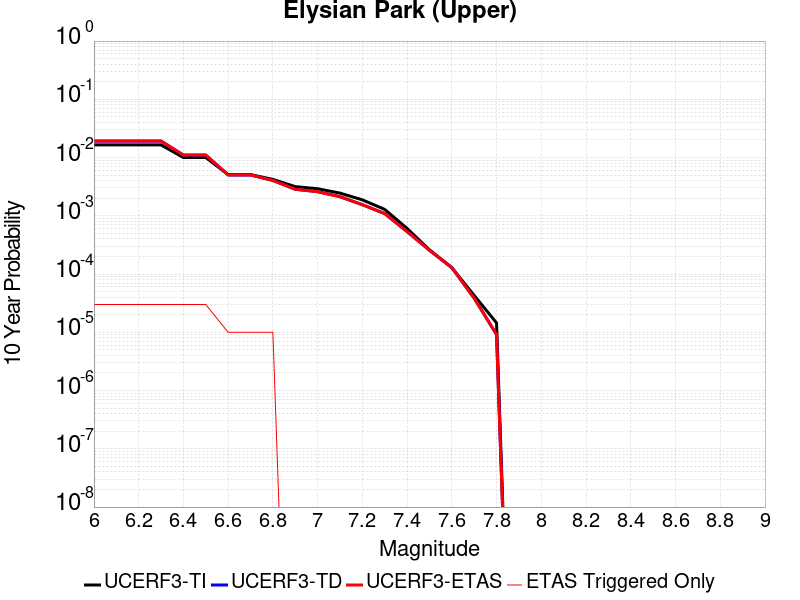 |

| Magnitude | 1 wk TI Prob | 1 wk TD Prob | 1 wk ETAS Prob | 1 wk ETAS/TD Gain | 1 wk ETAS Triggered Only | 1 mo TI Prob | 1 mo TD Prob | 1 mo ETAS Prob | 1 mo ETAS/TD Gain | 1 mo ETAS Triggered Only | 1 yr TI Prob | 1 yr TD Prob | 1 yr ETAS Prob | 1 yr ETAS/TD Gain | 1 yr ETAS Triggered Only | 10 yr TI Prob | 10 yr TD Prob | 10 yr ETAS Prob | 10 yr ETAS/TD Gain | 10 yr ETAS Triggered Only |
|-----|-----|-----|-----|-----|-----|-----|-----|-----|-----|-----|-----|-----|-----|-----|-----|-----|-----|-----|-----|-----|
| 6.0 | 3.1876025E-5 | 3.703652E-5 | 3.703652E-5 | 1.0 | 0.0 | 1.3660437E-4 | 1.5872101E-4 | 1.5872101E-4 | 1.0 | 0.0 | 0.0016618895 | 0.0019311584 | 0.001941139 | 1.0051682 | 1.0E-5 | 0.016495159 | 0.019190295 | 0.019219719 | 1.0015333 | 3.0E-5 |
| 6.1 | 3.1876025E-5 | 3.703652E-5 | 3.703652E-5 | 1.0 | 0.0 | 1.3660437E-4 | 1.5872101E-4 | 1.5872101E-4 | 1.0 | 0.0 | 0.0016618895 | 0.0019311584 | 0.001941139 | 1.0051682 | 1.0E-5 | 0.016495159 | 0.019190295 | 0.019219719 | 1.0015333 | 3.0E-5 |
| 6.2 | 3.1876025E-5 | 3.703652E-5 | 3.703652E-5 | 1.0 | 0.0 | 1.3660437E-4 | 1.5872101E-4 | 1.5872101E-4 | 1.0 | 0.0 | 0.0016618895 | 0.0019311584 | 0.001941139 | 1.0051682 | 1.0E-5 | 0.016495159 | 0.019190295 | 0.019219719 | 1.0015333 | 3.0E-5 |
| 6.3 | 3.1876025E-5 | 3.703652E-5 | 3.703652E-5 | 1.0 | 0.0 | 1.3660437E-4 | 1.5872101E-4 | 1.5872101E-4 | 1.0 | 0.0 | 0.0016618895 | 0.0019311584 | 0.001941139 | 1.0051682 | 1.0E-5 | 0.016495159 | 0.019190295 | 0.019219719 | 1.0015333 | 3.0E-5 |
| 6.4 | 1.9273462E-5 | 2.120273E-5 | 2.120273E-5 | 1.0 | 0.0 | 8.259794E-5 | 9.0866655E-5 | 9.0866655E-5 | 1.0 | 0.0 | 0.001005166 | 0.0011059135 | 0.0011159024 | 1.0090322 | 1.0E-5 | 0.010006315 | 0.011020964 | 0.011050633 | 1.0026921 | 3.0E-5 |
| 6.5 | 1.9273462E-5 | 2.120273E-5 | 2.120273E-5 | 1.0 | 0.0 | 8.259794E-5 | 9.0866655E-5 | 9.0866655E-5 | 1.0 | 0.0 | 0.001005166 | 0.0011059135 | 0.0011159024 | 1.0090322 | 1.0E-5 | 0.010006315 | 0.011020964 | 0.011050633 | 1.0026921 | 3.0E-5 |
| 6.6 | 9.813258E-6 | 9.665728E-6 | 9.665728E-6 | 1.0 | 0.0 | 4.205614E-5 | 4.142393E-5 | 4.142393E-5 | 1.0 | 0.0 | 5.119132E-4 | 5.042269E-4 | 5.1422184E-4 | 1.0198224 | 1.0E-5 | 0.005107356 | 0.005031552 | 0.0050415015 | 1.0019774 | 1.0E-5 |
| 6.7 | 9.801478E-6 | 9.653297E-6 | 9.653297E-6 | 1.0 | 0.0 | 4.2005657E-5 | 4.137066E-5 | 4.137066E-5 | 1.0 | 0.0 | 5.112989E-4 | 5.0357863E-4 | 5.135736E-4 | 1.0198479 | 1.0E-5 | 0.0051012407 | 0.0050250986 | 0.0050350484 | 1.0019801 | 1.0E-5 |
| 6.8 | 8.102489E-6 | 7.7731065E-6 | 7.7731065E-6 | 1.0 | 0.0 | 3.4724493E-5 | 3.3312917E-5 | 3.3312917E-5 | 1.0 | 0.0 | 4.2268867E-4 | 4.0551423E-4 | 4.1551018E-4 | 1.0246501 | 1.0E-5 | 0.004218856 | 0.0040482366 | 0.004058196 | 1.0024602 | 1.0E-5 |
| 6.9 | 6.08275E-6 | 5.4815127E-6 | 5.4815127E-6 | 1.0 | 0.0 | 2.6068668E-5 | 2.349199E-5 | 2.349199E-5 | 1.0 | 0.0 | 3.173398E-4 | 2.8597823E-4 | 2.8597823E-4 | 1.0 | 0.0 | 0.0031688702 | 0.0028561796 | 0.0028561796 | 1.0 | 0.0 |
| 7.0 | 5.5995934E-6 | 4.982836E-6 | 4.982836E-6 | 1.0 | 0.0 | 2.3998036E-5 | 2.135484E-5 | 2.135484E-5 | 1.0 | 0.0 | 2.9213692E-4 | 2.599648E-4 | 2.599648E-4 | 1.0 | 0.0 | 0.0029175316 | 0.0025966743 | 0.0025966743 | 1.0 | 0.0 |
| 7.1 | 4.709881E-6 | 4.0874465E-6 | 4.0874465E-6 | 1.0 | 0.0 | 2.0185047E-5 | 1.7517514E-5 | 1.7517514E-5 | 1.0 | 0.0 | 2.4572524E-4 | 2.1325526E-4 | 2.1325526E-4 | 1.0 | 0.0 | 0.002454537 | 0.0021305475 | 0.0021305475 | 1.0 | 0.0 |
| 7.2 | 3.6063436E-6 | 2.9779865E-6 | 2.9779865E-6 | 1.0 | 0.0 | 1.5455667E-5 | 1.2762738E-5 | 1.2762738E-5 | 1.0 | 0.0 | 1.881565E-4 | 1.5537537E-4 | 1.5537537E-4 | 1.0 | 0.0 | 0.0018799726 | 0.0015526785 | 0.0015526785 | 1.0 | 0.0 |
| 7.3 | 2.471135E-6 | 2.0954842E-6 | 2.0954842E-6 | 1.0 | 0.0 | 1.0590536E-5 | 8.980616E-6 | 8.980616E-6 | 1.0 | 0.0 | 1.2893214E-4 | 1.0933358E-4 | 1.0933358E-4 | 1.0 | 0.0 | 0.0012885736 | 0.0010928052 | 0.0010928052 | 1.0 | 0.0 |
| 7.4 | 1.163943E-6 | 1.0275212E-6 | 1.0275212E-6 | 1.0 | 0.0 | 4.988318E-6 | 4.403655E-6 | 4.403655E-6 | 1.0 | 0.0 | 6.0731076E-5 | 5.3613214E-5 | 5.3613214E-5 | 1.0 | 0.0 | 6.071448E-4 | 5.3600577E-4 | 5.3600577E-4 | 1.0 | 0.0 |
| 7.5 | 4.99459E-7 | 4.9176606E-7 | 4.9176606E-7 | 1.0 | 0.0 | 2.140537E-6 | 2.107567E-6 | 2.107567E-6 | 1.0 | 0.0 | 2.6060725E-5 | 2.5659343E-5 | 2.5659343E-5 | 1.0 | 0.0 | 2.605767E-4 | 2.5656537E-4 | 2.5656537E-4 | 1.0 | 0.0 |
| 7.6 | 2.4667852E-7 | 2.4778674E-7 | 2.4778674E-7 | 1.0 | 0.0 | 1.0571932E-6 | 1.0619428E-6 | 1.0619428E-6 | 1.0 | 0.0 | 1.2871251E-5 | 1.2929081E-5 | 1.2929081E-5 | 1.0 | 0.0 | 1.2870505E-4 | 1.2928365E-4 | 1.2928365E-4 | 1.0 | 0.0 |
| 7.7 | 8.2312795E-8 | 7.386629E-8 | 7.386629E-8 | 1.0 | 0.0 | 3.527691E-7 | 3.1656978E-7 | 3.1656978E-7 | 1.0 | 0.0 | 4.294955E-6 | 3.8542316E-6 | 3.8542316E-6 | 1.0 | 0.0 | 4.2948723E-5 | 3.8541762E-5 | 3.8541762E-5 | 1.0 | 0.0 |
| 7.8 | 2.7819295E-8 | 1.7567322E-8 | 1.7567322E-8 | 1.0 | 0.0 | 1.1922555E-7 | 7.528852E-8 | 7.528852E-8 | 1.0 | 0.0 | 1.45157E-6 | 9.166375E-7 | 9.166375E-7 | 1.0 | 0.0 | 1.45156055E-5 | 9.166352E-6 | 9.166352E-6 | 1.0 | 0.0 |

## Brawley (Seismic Zone) alt 1
*[(top)](#table-of-contents)*

| 1 Week | 1 Month | 1 Year | 10 Year |
|-----|-----|-----|-----|
|  |  |  |  |

| Magnitude | 1 wk TI Prob | 1 wk TD Prob | 1 wk ETAS Prob | 1 wk ETAS/TD Gain | 1 wk ETAS Triggered Only | 1 mo TI Prob | 1 mo TD Prob | 1 mo ETAS Prob | 1 mo ETAS/TD Gain | 1 mo ETAS Triggered Only | 1 yr TI Prob | 1 yr TD Prob | 1 yr ETAS Prob | 1 yr ETAS/TD Gain | 1 yr ETAS Triggered Only | 10 yr TI Prob | 10 yr TD Prob | 10 yr ETAS Prob | 10 yr ETAS/TD Gain | 10 yr ETAS Triggered Only |
|-----|-----|-----|-----|-----|-----|-----|-----|-----|-----|-----|-----|-----|-----|-----|-----|-----|-----|-----|-----|-----|
| 6.0 | 2.2521618E-4 | 4.7641253E-4 | 4.7641253E-4 | 1.0 | 0.0 | 9.6485513E-4 | 0.0020402074 | 0.0020402074 | 1.0 | 0.0 | 0.011683988 | 0.02455069 | 0.024579952 | 1.001192 | 3.0E-5 | 0.11088423 | 0.21353015 | 0.21356161 | 1.0001473 | 4.0E-5 |
| 6.1 | 2.2521618E-4 | 4.7641253E-4 | 4.7641253E-4 | 1.0 | 0.0 | 9.6485513E-4 | 0.0020402074 | 0.0020402074 | 1.0 | 0.0 | 0.011683988 | 0.02455069 | 0.024579952 | 1.001192 | 3.0E-5 | 0.11088423 | 0.21353015 | 0.21356161 | 1.0001473 | 4.0E-5 |
| 6.2 | 2.198148E-4 | 4.6725658E-4 | 4.6725658E-4 | 1.0 | 0.0 | 9.417233E-4 | 0.002001028 | 0.002001028 | 1.0 | 0.0 | 0.011405343 | 0.024084855 | 0.024114134 | 1.0012156 | 3.0E-5 | 0.10837428 | 0.20996629 | 0.20999788 | 1.0001506 | 4.0E-5 |
| 6.3 | 2.1704129E-4 | 4.6161312E-4 | 4.6161312E-4 | 1.0 | 0.0 | 9.298453E-4 | 0.0019768786 | 0.0019768786 | 1.0 | 0.0 | 0.011262234 | 0.023797998 | 0.023827285 | 1.0012306 | 3.0E-5 | 0.107082725 | 0.20785725 | 0.20788893 | 1.0001525 | 4.0E-5 |
| 6.4 | 1.876142E-4 | 4.0053183E-4 | 4.0053183E-4 | 1.0 | 0.0 | 8.038131E-4 | 0.0017154501 | 0.0017154501 | 1.0 | 0.0 | 0.00974259 | 0.02068463 | 0.02071401 | 1.0014204 | 3.0E-5 | 0.093263686 | 0.184608 | 0.18464062 | 1.0001767 | 4.0E-5 |
| 6.5 | 1.7390939E-4 | 3.7485067E-4 | 3.7485067E-4 | 1.0 | 0.0 | 7.45113E-4 | 0.0016055258 | 0.0016055258 | 1.0 | 0.0 | 0.009034078 | 0.019372813 | 0.019402232 | 1.0015186 | 3.0E-5 | 0.086755216 | 0.17442966 | 0.17446269 | 1.0001893 | 4.0E-5 |
| 6.6 | 1.591791E-4 | 3.489955E-4 | 3.489955E-4 | 1.0 | 0.0 | 6.8201777E-4 | 0.0014948477 | 0.0014948477 | 1.0 | 0.0 | 0.008271996 | 0.018049458 | 0.018078918 | 1.0016321 | 3.0E-5 | 0.07970774 | 0.16383699 | 0.16387044 | 1.0002041 | 4.0E-5 |
| 6.7 | 1.4268003E-4 | 3.206533E-4 | 3.206533E-4 | 1.0 | 0.0 | 6.1134255E-4 | 0.0013735129 | 0.0013735129 | 1.0 | 0.0 | 0.007417723 | 0.016596261 | 0.016625764 | 1.0017776 | 3.0E-5 | 0.07174956 | 0.15196045 | 0.15199438 | 1.0002233 | 4.0E-5 |
| 6.8 | 1.239713E-4 | 2.9059697E-4 | 2.9059697E-4 | 1.0 | 0.0 | 5.3119735E-4 | 0.0012448273 | 0.0012448273 | 1.0 | 0.0 | 0.0064481674 | 0.015051884 | 0.015081432 | 1.0019631 | 3.0E-5 | 0.06264243 | 0.13840161 | 0.13843606 | 1.000249 | 4.0E-5 |
| 6.9 | 1.0180238E-4 | 2.625907E-4 | 2.625907E-4 | 1.0 | 0.0 | 4.3622297E-4 | 0.0011249076 | 0.0011249076 | 1.0 | 0.0 | 0.005298089 | 0.013610746 | 0.013640338 | 1.0021741 | 3.0E-5 | 0.05173543 | 0.12498065 | 0.12501565 | 1.00028 | 4.0E-5 |
| 7.0 | 7.6619996E-5 | 2.2402873E-4 | 2.2402873E-4 | 1.0 | 0.0 | 3.283301E-4 | 9.59773E-4 | 9.59773E-4 | 1.0 | 0.0 | 0.0039900932 | 0.011623339 | 0.011643106 | 1.0017006 | 2.0E-5 | 0.039192066 | 0.10728151 | 0.1073083 | 1.0002496 | 3.0E-5 |
| 7.1 | 7.5127435E-5 | 2.208599E-4 | 2.208599E-4 | 1.0 | 0.0 | 3.2193496E-4 | 9.4620226E-4 | 9.4620226E-4 | 1.0 | 0.0 | 0.0039125155 | 0.011459865 | 0.011479635 | 1.0017252 | 2.0E-5 | 0.038443442 | 0.10584534 | 0.10587216 | 1.0002534 | 3.0E-5 |
| 7.2 | 6.788582E-5 | 2.0213598E-4 | 2.0213598E-4 | 1.0 | 0.0 | 2.9090676E-4 | 8.660125E-4 | 8.660125E-4 | 1.0 | 0.0 | 0.0035360386 | 0.010493369 | 0.0105131585 | 1.001886 | 2.0E-5 | 0.034803 | 0.09751546 | 0.09754253 | 1.0002776 | 3.0E-5 |
| 7.3 | 6.399602E-5 | 1.88444E-4 | 1.88444E-4 | 1.0 | 0.0 | 2.7423984E-4 | 8.0737006E-4 | 8.0737006E-4 | 1.0 | 0.0 | 0.0033337586 | 0.009786017 | 0.009805822 | 1.0020237 | 2.0E-5 | 0.03284188 | 0.091409855 | 0.091437116 | 1.0002981 | 3.0E-5 |
| 7.4 | 4.506759E-5 | 1.2531783E-4 | 1.2531783E-4 | 1.0 | 0.0 | 1.9313251E-4 | 5.369668E-4 | 5.369668E-4 | 1.0 | 0.0 | 0.0023488526 | 0.0065181484 | 0.006538018 | 1.0030483 | 2.0E-5 | 0.023241805 | 0.062375 | 0.062393755 | 1.0003006 | 2.0E-5 |
| 7.5 | 3.43289E-5 | 9.337587E-5 | 9.337587E-5 | 1.0 | 0.0 | 1.4711556E-4 | 4.0012124E-4 | 4.0012124E-4 | 1.0 | 0.0 | 0.0017896603 | 0.004860657 | 0.0048805596 | 1.0040947 | 2.0E-5 | 0.01775316 | 0.04706493 | 0.04708399 | 1.000405 | 2.0E-5 |
| 7.6 | 2.5980507E-5 | 7.054998E-5 | 7.054998E-5 | 1.0 | 0.0 | 1.1134028E-4 | 3.0232212E-4 | 3.0232212E-4 | 1.0 | 0.0 | 0.001354725 | 0.0036745837 | 0.0036945103 | 1.0054228 | 2.0E-5 | 0.013464959 | 0.035849415 | 0.035868697 | 1.0005379 | 2.0E-5 |
| 7.7 | 1.7292105E-5 | 4.9423474E-5 | 4.9423474E-5 | 1.0 | 0.0 | 7.4106916E-5 | 2.1179771E-4 | 2.1179771E-4 | 1.0 | 0.0 | 9.018782E-4 | 0.0025755935 | 0.0025855678 | 1.0038726 | 1.0E-5 | 0.008982267 | 0.025297757 | 0.025307504 | 1.0003853 | 1.0E-5 |
| 7.8 | 1.2927471E-5 | 3.970735E-5 | 3.970735E-5 | 1.0 | 0.0 | 5.5402274E-5 | 1.7016326E-4 | 1.7016326E-4 | 1.0 | 0.0 | 6.743139E-4 | 0.0020697718 | 0.002079751 | 1.0048214 | 1.0E-5 | 0.0067227143 | 0.02043814 | 0.020447936 | 1.0004793 | 1.0E-5 |
| 7.9 | 1.0200774E-5 | 2.8757075E-5 | 2.8757075E-5 | 1.0 | 0.0 | 4.371687E-5 | 1.2323879E-4 | 1.2323879E-4 | 1.0 | 0.0 | 5.321229E-4 | 0.0014994006 | 0.0015093856 | 1.0066594 | 1.0E-5 | 0.005308505 | 0.0149969105 | 0.01500676 | 1.0006568 | 1.0E-5 |
| 8.0 | 8.650396E-6 | 2.3287128E-5 | 2.3287128E-5 | 1.0 | 0.0 | 3.70726E-5 | 9.979816E-5 | 9.979816E-5 | 1.0 | 0.0 | 4.5126543E-4 | 0.0012143662 | 0.001224354 | 1.0082247 | 1.0E-5 | 0.0045035016 | 0.012215644 | 0.012225523 | 1.0008086 | 1.0E-5 |
| 8.1 | 3.9368224E-6 | 7.3321658E-6 | 7.3321658E-6 | 1.0 | 0.0 | 1.6871985E-5 | 3.1423187E-5 | 3.1423187E-5 | 1.0 | 0.0 | 2.0539707E-4 | 3.825103E-4 | 3.825103E-4 | 1.0 | 0.0 | 0.0020520731 | 0.00400326 | 0.00400326 | 1.0 | 0.0 |
| 8.2 | 1.7101195E-6 | 2.2195122E-6 | 2.2195122E-6 | 1.0 | 0.0 | 7.329063E-6 | 9.51216E-6 | 9.51216E-6 | 1.0 | 0.0 | 8.922769E-5 | 1.15804425E-4 | 1.15804425E-4 | 1.0 | 0.0 | 8.9191867E-4 | 0.0012675166 | 0.0012675166 | 1.0 | 0.0 |
| 8.3 | 3.0346666E-8 | 1.7233086E-8 | 1.7233086E-8 | 1.0 | 0.0 | 1.3005713E-7 | 7.385608E-8 | 7.385608E-8 | 1.0 | 0.0 | 1.5834444E-6 | 8.991977E-7 | 8.991977E-7 | 1.0 | 0.0 | 1.5834332E-5 | 9.37692E-6 | 9.37692E-6 | 1.0 | 0.0 |

## Pitas Point (Lower West)
*[(top)](#table-of-contents)*

| 1 Week | 1 Month | 1 Year | 10 Year |
|-----|-----|-----|-----|
|  | 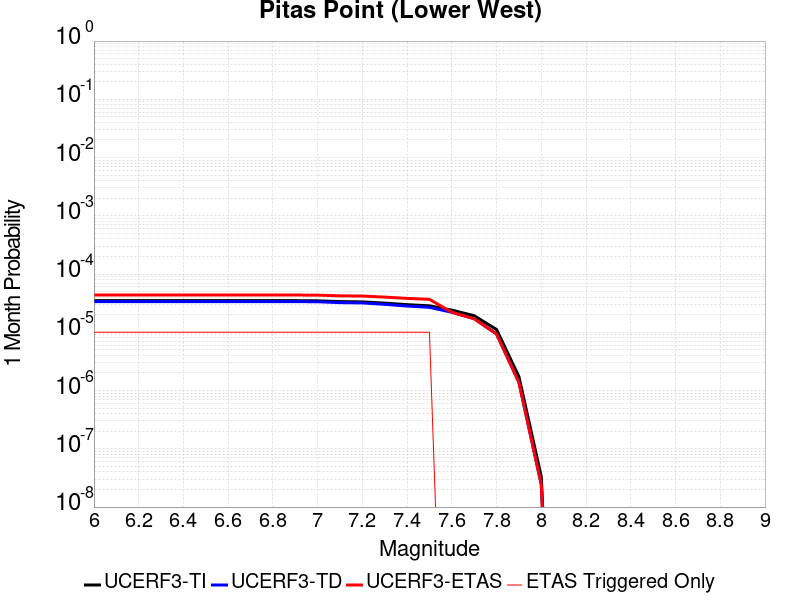 |  |  |

| Magnitude | 1 wk TI Prob | 1 wk TD Prob | 1 wk ETAS Prob | 1 wk ETAS/TD Gain | 1 wk ETAS Triggered Only | 1 mo TI Prob | 1 mo TD Prob | 1 mo ETAS Prob | 1 mo ETAS/TD Gain | 1 mo ETAS Triggered Only | 1 yr TI Prob | 1 yr TD Prob | 1 yr ETAS Prob | 1 yr ETAS/TD Gain | 1 yr ETAS Triggered Only | 10 yr TI Prob | 10 yr TD Prob | 10 yr ETAS Prob | 10 yr ETAS/TD Gain | 10 yr ETAS Triggered Only |
|-----|-----|-----|-----|-----|-----|-----|-----|-----|-----|-----|-----|-----|-----|-----|-----|-----|-----|-----|-----|-----|
| 6.0 | 8.151497E-6 | 7.855829E-6 | 7.855829E-6 | 1.0 | 0.0 | 3.493452E-5 | 3.3667406E-5 | 4.366707E-5 | 1.2970132 | 1.0E-5 | 4.252448E-4 | 4.098243E-4 | 4.1982022E-4 | 1.0243907 | 1.0E-5 | 0.0042443196 | 0.004090766 | 0.0041306023 | 1.0097381 | 4.0E-5 |
| 6.1 | 8.151497E-6 | 7.855829E-6 | 7.855829E-6 | 1.0 | 0.0 | 3.493452E-5 | 3.3667406E-5 | 4.366707E-5 | 1.2970132 | 1.0E-5 | 4.252448E-4 | 4.098243E-4 | 4.1982022E-4 | 1.0243907 | 1.0E-5 | 0.0042443196 | 0.004090766 | 0.0041306023 | 1.0097381 | 4.0E-5 |
| 6.2 | 8.151497E-6 | 7.855829E-6 | 7.855829E-6 | 1.0 | 0.0 | 3.493452E-5 | 3.3667406E-5 | 4.366707E-5 | 1.2970132 | 1.0E-5 | 4.252448E-4 | 4.098243E-4 | 4.1982022E-4 | 1.0243907 | 1.0E-5 | 0.0042443196 | 0.004090766 | 0.0041306023 | 1.0097381 | 4.0E-5 |
| 6.3 | 8.151497E-6 | 7.855829E-6 | 7.855829E-6 | 1.0 | 0.0 | 3.493452E-5 | 3.3667406E-5 | 4.366707E-5 | 1.2970132 | 1.0E-5 | 4.252448E-4 | 4.098243E-4 | 4.1982022E-4 | 1.0243907 | 1.0E-5 | 0.0042443196 | 0.004090766 | 0.0041306023 | 1.0097381 | 4.0E-5 |
| 6.4 | 8.151497E-6 | 7.855829E-6 | 7.855829E-6 | 1.0 | 0.0 | 3.493452E-5 | 3.3667406E-5 | 4.366707E-5 | 1.2970132 | 1.0E-5 | 4.252448E-4 | 4.098243E-4 | 4.1982022E-4 | 1.0243907 | 1.0E-5 | 0.0042443196 | 0.004090766 | 0.0041306023 | 1.0097381 | 4.0E-5 |
| 6.5 | 8.151497E-6 | 7.855829E-6 | 7.855829E-6 | 1.0 | 0.0 | 3.493452E-5 | 3.3667406E-5 | 4.366707E-5 | 1.2970132 | 1.0E-5 | 4.252448E-4 | 4.098243E-4 | 4.1982022E-4 | 1.0243907 | 1.0E-5 | 0.0042443196 | 0.004090766 | 0.0041306023 | 1.0097381 | 4.0E-5 |
| 6.6 | 8.151497E-6 | 7.855829E-6 | 7.855829E-6 | 1.0 | 0.0 | 3.493452E-5 | 3.3667406E-5 | 4.366707E-5 | 1.2970132 | 1.0E-5 | 4.252448E-4 | 4.098243E-4 | 4.1982022E-4 | 1.0243907 | 1.0E-5 | 0.0042443196 | 0.004090766 | 0.0041306023 | 1.0097381 | 4.0E-5 |
| 6.7 | 8.151497E-6 | 7.855829E-6 | 7.855829E-6 | 1.0 | 0.0 | 3.493452E-5 | 3.3667406E-5 | 4.366707E-5 | 1.2970132 | 1.0E-5 | 4.252448E-4 | 4.098243E-4 | 4.1982022E-4 | 1.0243907 | 1.0E-5 | 0.0042443196 | 0.004090766 | 0.0041306023 | 1.0097381 | 4.0E-5 |
| 6.8 | 8.151497E-6 | 7.855829E-6 | 7.855829E-6 | 1.0 | 0.0 | 3.493452E-5 | 3.3667406E-5 | 4.366707E-5 | 1.2970132 | 1.0E-5 | 4.252448E-4 | 4.098243E-4 | 4.1982022E-4 | 1.0243907 | 1.0E-5 | 0.0042443196 | 0.004090766 | 0.0041306023 | 1.0097381 | 4.0E-5 |
| 6.9 | 8.151497E-6 | 7.855829E-6 | 7.855829E-6 | 1.0 | 0.0 | 3.493452E-5 | 3.3667406E-5 | 4.366707E-5 | 1.2970132 | 1.0E-5 | 4.252448E-4 | 4.098243E-4 | 4.1982022E-4 | 1.0243907 | 1.0E-5 | 0.0042443196 | 0.004090766 | 0.0041306023 | 1.0097381 | 4.0E-5 |
| 7.0 | 8.103535E-6 | 7.805258E-6 | 7.805258E-6 | 1.0 | 0.0 | 3.4728975E-5 | 3.345068E-5 | 4.3450345E-5 | 1.2989376 | 1.0E-5 | 4.2274324E-4 | 4.0718666E-4 | 4.171826E-4 | 1.0245488 | 1.0E-5 | 0.0042193993 | 0.0040644864 | 0.0041043237 | 1.0098014 | 4.0E-5 |
| 7.1 | 7.853298E-6 | 7.540947E-6 | 7.540947E-6 | 1.0 | 0.0 | 3.3656554E-5 | 3.231795E-5 | 4.2317624E-5 | 1.3094156 | 1.0E-5 | 4.096915E-4 | 3.9340067E-4 | 4.0339673E-4 | 1.0254093 | 1.0E-5 | 0.00408937 | 0.0039271186 | 0.0039669615 | 1.0101455 | 4.0E-5 |
| 7.2 | 7.771102E-6 | 7.453228E-6 | 7.453228E-6 | 1.0 | 0.0 | 3.33043E-5 | 3.1942018E-5 | 4.1941697E-5 | 1.3130573 | 1.0E-5 | 4.0540437E-4 | 3.8882537E-4 | 3.988215E-4 | 1.0257084 | 1.0E-5 | 0.0040466557 | 0.0038815264 | 0.003921371 | 1.0102652 | 4.0E-5 |
| 7.3 | 7.3945344E-6 | 7.049329E-6 | 7.049329E-6 | 1.0 | 0.0 | 3.1690477E-5 | 3.0211062E-5 | 4.021076E-5 | 1.3309946 | 1.0E-5 | 3.8576324E-4 | 3.6775824E-4 | 3.7775456E-4 | 1.0271817 | 1.0E-5 | 0.0038509427 | 0.0036715642 | 0.0037114173 | 1.0108545 | 4.0E-5 |
| 7.4 | 6.964645E-6 | 6.5901736E-6 | 6.5901736E-6 | 1.0 | 0.0 | 2.9848137E-5 | 2.8243297E-5 | 3.8243015E-5 | 1.3540562 | 1.0E-5 | 3.6334046E-4 | 3.4380838E-4 | 3.5380496E-4 | 1.029076 | 1.0E-5 | 0.0036274698 | 0.0034328182 | 0.003472681 | 1.0116122 | 4.0E-5 |
| 7.5 | 6.6525035E-6 | 6.2592094E-6 | 6.2592094E-6 | 1.0 | 0.0 | 2.851042E-5 | 2.682491E-5 | 3.6824644E-5 | 1.3727778 | 1.0E-5 | 3.4705905E-4 | 3.2654483E-4 | 3.3654156E-4 | 1.0306137 | 1.0E-5 | 0.0034651754 | 0.0032607014 | 0.003300571 | 1.0122273 | 4.0E-5 |
| 7.6 | 5.613338E-6 | 5.1514285E-6 | 5.1514285E-6 | 1.0 | 0.0 | 2.405694E-5 | 2.2077365E-5 | 2.2077365E-5 | 1.0 | 0.0 | 2.928539E-4 | 2.6875906E-4 | 2.6875906E-4 | 1.0 | 0.0 | 0.0029246826 | 0.002684372 | 0.0027142914 | 1.0111458 | 3.0E-5 |
| 7.7 | 4.494704E-6 | 3.996944E-6 | 3.996944E-6 | 1.0 | 0.0 | 1.9262876E-5 | 1.712965E-5 | 1.712965E-5 | 1.0 | 0.0 | 2.3450027E-4 | 2.0853376E-4 | 2.0853376E-4 | 1.0 | 0.0 | 0.0023425296 | 0.002083405 | 0.002093384 | 1.0047898 | 1.0E-5 |
| 7.8 | 2.6075882E-6 | 2.1836554E-6 | 2.1836554E-6 | 1.0 | 0.0 | 1.117533E-5 | 9.35849E-6 | 9.35849E-6 | 1.0 | 0.0 | 1.3605114E-4 | 1.1393371E-4 | 1.1393371E-4 | 1.0 | 0.0 | 0.0013596788 | 0.0011387577 | 0.0011387577 | 1.0 | 0.0 |
| 7.9 | 4.045984E-7 | 3.242403E-7 | 3.242403E-7 | 1.0 | 0.0 | 1.733992E-6 | 1.3896005E-6 | 1.3896005E-6 | 1.0 | 0.0 | 2.1111147E-5 | 1.6918259E-5 | 1.6918259E-5 | 1.0 | 0.0 | 2.1109142E-4 | 1.6917E-4 | 1.6917E-4 | 1.0 | 0.0 |
| 8.0 | 7.791402E-9 | 5.683553E-9 | 5.683553E-9 | 1.0 | 0.0 | 3.3391725E-8 | 2.4358085E-8 | 2.4358085E-8 | 1.0 | 0.0 | 4.0654416E-7 | 2.9655968E-7 | 2.9655968E-7 | 1.0 | 0.0 | 4.065434E-6 | 2.9655946E-6 | 2.9655946E-6 | 1.0 | 0.0 |

## San Luis Range 2011 CFM
*[(top)](#table-of-contents)*

| 1 Week | 1 Month | 1 Year | 10 Year |
|-----|-----|-----|-----|
|  |  |  |  |

| Magnitude | 1 wk TI Prob | 1 wk TD Prob | 1 wk ETAS Prob | 1 wk ETAS/TD Gain | 1 wk ETAS Triggered Only | 1 mo TI Prob | 1 mo TD Prob | 1 mo ETAS Prob | 1 mo ETAS/TD Gain | 1 mo ETAS Triggered Only | 1 yr TI Prob | 1 yr TD Prob | 1 yr ETAS Prob | 1 yr ETAS/TD Gain | 1 yr ETAS Triggered Only | 10 yr TI Prob | 10 yr TD Prob | 10 yr ETAS Prob | 10 yr ETAS/TD Gain | 10 yr ETAS Triggered Only |
|-----|-----|-----|-----|-----|-----|-----|-----|-----|-----|-----|-----|-----|-----|-----|-----|-----|-----|-----|-----|-----|
| 6.0 | 8.8368415E-6 | 8.965477E-6 | 1.8965387E-5 | 2.1153796 | 1.0E-5 | 3.787163E-5 | 3.8422953E-5 | 5.8422185E-5 | 1.5205022 | 2.0E-5 | 4.609895E-4 | 4.677069E-4 | 4.8769757E-4 | 1.0427418 | 2.0E-5 | 0.0046003438 | 0.0046680085 | 0.0047078216 | 1.008529 | 4.0E-5 |
| 6.1 | 8.8368415E-6 | 8.965477E-6 | 1.8965387E-5 | 2.1153796 | 1.0E-5 | 3.787163E-5 | 3.8422953E-5 | 5.8422185E-5 | 1.5205022 | 2.0E-5 | 4.609895E-4 | 4.677069E-4 | 4.8769757E-4 | 1.0427418 | 2.0E-5 | 0.0046003438 | 0.0046680085 | 0.0047078216 | 1.008529 | 4.0E-5 |
| 6.2 | 8.8368415E-6 | 8.965477E-6 | 1.8965387E-5 | 2.1153796 | 1.0E-5 | 3.787163E-5 | 3.8422953E-5 | 5.8422185E-5 | 1.5205022 | 2.0E-5 | 4.609895E-4 | 4.677069E-4 | 4.8769757E-4 | 1.0427418 | 2.0E-5 | 0.0046003438 | 0.0046680085 | 0.0047078216 | 1.008529 | 4.0E-5 |
| 6.3 | 8.8368415E-6 | 8.965477E-6 | 1.8965387E-5 | 2.1153796 | 1.0E-5 | 3.787163E-5 | 3.8422953E-5 | 5.8422185E-5 | 1.5205022 | 2.0E-5 | 4.609895E-4 | 4.677069E-4 | 4.8769757E-4 | 1.0427418 | 2.0E-5 | 0.0046003438 | 0.0046680085 | 0.0047078216 | 1.008529 | 4.0E-5 |
| 6.4 | 3.9094193E-6 | 3.941213E-6 | 1.3941174E-5 | 3.5372798 | 1.0E-5 | 1.6754546E-5 | 1.6890806E-5 | 2.6890637E-5 | 1.592028 | 1.0E-5 | 2.039675E-4 | 2.0562643E-4 | 2.1562437E-4 | 1.0486219 | 1.0E-5 | 0.0020378039 | 0.0020543905 | 0.0020643699 | 1.0048577 | 1.0E-5 |
| 6.5 | 3.9094193E-6 | 3.941213E-6 | 1.3941174E-5 | 3.5372798 | 1.0E-5 | 1.6754546E-5 | 1.6890806E-5 | 2.6890637E-5 | 1.592028 | 1.0E-5 | 2.039675E-4 | 2.0562643E-4 | 2.1562437E-4 | 1.0486219 | 1.0E-5 | 0.0020378039 | 0.0020543905 | 0.0020643699 | 1.0048577 | 1.0E-5 |
| 6.6 | 3.0587726E-6 | 3.0753965E-6 | 3.0753965E-6 | 1.0 | 0.0 | 1.3108959E-5 | 1.3180205E-5 | 1.3180205E-5 | 1.0 | 0.0 | 1.595899E-4 | 1.604573E-4 | 1.604573E-4 | 1.0 | 0.0 | 0.0015947534 | 0.0016034264 | 0.0016034264 | 1.0 | 0.0 |
| 6.7 | 2.6160574E-6 | 2.6251346E-6 | 2.6251346E-6 | 1.0 | 0.0 | 1.1211626E-5 | 1.1250529E-5 | 1.1250529E-5 | 1.0 | 0.0 | 1.3649299E-4 | 1.3696664E-4 | 1.3696664E-4 | 1.0 | 0.0 | 0.0013640919 | 0.0013688284 | 0.0013688284 | 1.0 | 0.0 |
| 6.8 | 2.5110312E-6 | 2.5181473E-6 | 2.5181473E-6 | 1.0 | 0.0 | 1.0761518E-5 | 1.0792015E-5 | 1.0792015E-5 | 1.0 | 0.0 | 1.310136E-4 | 1.3138492E-4 | 1.3138492E-4 | 1.0 | 0.0 | 0.0013093639 | 0.0013130783 | 0.0013130783 | 1.0 | 0.0 |
| 6.9 | 1.8564405E-6 | 1.8524926E-6 | 1.8524926E-6 | 1.0 | 0.0 | 7.95615E-6 | 7.93923E-6 | 7.93923E-6 | 1.0 | 0.0 | 9.686181E-5 | 9.665586E-5 | 9.665586E-5 | 1.0 | 0.0 | 9.68196E-4 | 9.661402E-4 | 9.661402E-4 | 1.0 | 0.0 |
| 7.0 | 1.546127E-6 | 1.5369586E-6 | 1.5369586E-6 | 1.0 | 0.0 | 6.626242E-6 | 6.586949E-6 | 6.586949E-6 | 1.0 | 0.0 | 8.06715E-5 | 8.019316E-5 | 8.019316E-5 | 1.0 | 0.0 | 8.0642226E-4 | 8.016429E-4 | 8.016429E-4 | 1.0 | 0.0 |
| 7.1 | 1.3368208E-6 | 1.3235369E-6 | 1.3235369E-6 | 1.0 | 0.0 | 5.7292195E-6 | 5.672289E-6 | 5.672289E-6 | 1.0 | 0.0 | 6.975101E-5 | 6.905793E-5 | 6.905793E-5 | 1.0 | 0.0 | 6.972912E-4 | 6.903652E-4 | 6.903652E-4 | 1.0 | 0.0 |
| 7.2 | 1.0623363E-6 | 1.0454403E-6 | 1.0454403E-6 | 1.0 | 0.0 | 4.5528623E-6 | 4.480451E-6 | 4.480451E-6 | 1.0 | 0.0 | 5.5429686E-5 | 5.4548127E-5 | 5.4548127E-5 | 1.0 | 0.0 | 5.5415864E-4 | 5.4534763E-4 | 5.4534763E-4 | 1.0 | 0.0 |
| 7.3 | 7.831679E-7 | 7.7274194E-7 | 7.7274194E-7 | 1.0 | 0.0 | 3.3564295E-6 | 3.311747E-6 | 3.311747E-6 | 1.0 | 0.0 | 4.086376E-5 | 4.0319774E-5 | 4.0319774E-5 | 1.0 | 0.0 | 4.0856248E-4 | 4.0312472E-4 | 4.0312472E-4 | 1.0 | 0.0 |
| 7.4 | 5.9558846E-7 | 5.91066E-7 | 5.91066E-7 | 1.0 | 0.0 | 2.5525194E-6 | 2.5331376E-6 | 2.5331376E-6 | 1.0 | 0.0 | 3.107648E-5 | 3.0840514E-5 | 3.0840514E-5 | 1.0 | 0.0 | 3.1072134E-4 | 3.0836245E-4 | 3.0836245E-4 | 1.0 | 0.0 |
| 7.5 | 4.1616502E-7 | 4.1196506E-7 | 4.1196506E-7 | 1.0 | 0.0 | 1.7835631E-6 | 1.7655633E-6 | 1.7655633E-6 | 1.0 | 0.0 | 2.1714664E-5 | 2.1495522E-5 | 2.1495522E-5 | 1.0 | 0.0 | 2.1712543E-4 | 2.1493447E-4 | 2.1493447E-4 | 1.0 | 0.0 |
| 7.6 | 2.3816014E-7 | 2.3376697E-7 | 2.3376697E-7 | 1.0 | 0.0 | 1.0206859E-6 | 1.001858E-6 | 1.001858E-6 | 1.0 | 0.0 | 1.242678E-5 | 1.2197554E-5 | 1.2197554E-5 | 1.0 | 0.0 | 1.2426086E-4 | 1.2196886E-4 | 1.2196886E-4 | 1.0 | 0.0 |
| 7.7 | 9.918777E-8 | 9.386869E-8 | 9.386869E-8 | 1.0 | 0.0 | 4.2509038E-7 | 4.0229432E-7 | 4.0229432E-7 | 1.0 | 0.0 | 5.1754632E-6 | 4.8979223E-6 | 4.8979223E-6 | 1.0 | 0.0 | 5.1753424E-5 | 4.897815E-5 | 4.897815E-5 | 1.0 | 0.0 |
| 7.8 | 3.4982556E-8 | 2.9687454E-8 | 2.9687454E-8 | 1.0 | 0.0 | 1.4992524E-7 | 1.2723194E-7 | 1.2723194E-7 | 1.0 | 0.0 | 1.8253382E-6 | 1.5490477E-6 | 1.5490477E-6 | 1.0 | 0.0 | 1.8253233E-5 | 1.549037E-5 | 1.549037E-5 | 1.0 | 0.0 |
| 7.9 | 1.6624908E-8 | 1.1477859E-8 | 1.1477859E-8 | 1.0 | 0.0 | 7.12496E-8 | 4.919082E-8 | 4.919082E-8 | 1.0 | 0.0 | 8.6746354E-7 | 5.9889805E-7 | 5.9889805E-7 | 1.0 | 0.0 | 8.674601E-6 | 5.988965E-6 | 5.988965E-6 | 1.0 | 0.0 |
| 8.0 | 6.3352315E-9 | 3.0893488E-9 | 3.0893488E-9 | 1.0 | 0.0 | 2.715099E-8 | 1.3240064E-8 | 1.3240064E-8 | 1.0 | 0.0 | 3.3056327E-7 | 1.6119778E-7 | 1.6119778E-7 | 1.0 | 0.0 | 3.3056278E-6 | 1.6119766E-6 | 1.6119766E-6 | 1.0 | 0.0 |

## Monterey Bay-Tularcitos
*[(top)](#table-of-contents)*

| 1 Week | 1 Month | 1 Year | 10 Year |
|-----|-----|-----|-----|
|  |  |  |  |

| Magnitude | 1 wk TI Prob | 1 wk TD Prob | 1 wk ETAS Prob | 1 wk ETAS/TD Gain | 1 wk ETAS Triggered Only | 1 mo TI Prob | 1 mo TD Prob | 1 mo ETAS Prob | 1 mo ETAS/TD Gain | 1 mo ETAS Triggered Only | 1 yr TI Prob | 1 yr TD Prob | 1 yr ETAS Prob | 1 yr ETAS/TD Gain | 1 yr ETAS Triggered Only | 10 yr TI Prob | 10 yr TD Prob | 10 yr ETAS Prob | 10 yr ETAS/TD Gain | 10 yr ETAS Triggered Only |
|-----|-----|-----|-----|-----|-----|-----|-----|-----|-----|-----|-----|-----|-----|-----|-----|-----|-----|-----|-----|-----|
| 6.0 | 3.0131365E-5 | 3.2799162E-5 | 3.2799162E-5 | 1.0 | 0.0 | 1.2912804E-4 | 1.4056086E-4 | 1.4056086E-4 | 1.0 | 0.0 | 0.001571 | 0.0017100906 | 0.0017300564 | 1.0116752 | 2.0E-5 | 0.015599402 | 0.016980117 | 0.017019438 | 1.0023156 | 4.0E-5 |
| 6.1 | 3.0131365E-5 | 3.2799162E-5 | 3.2799162E-5 | 1.0 | 0.0 | 1.2912804E-4 | 1.4056086E-4 | 1.4056086E-4 | 1.0 | 0.0 | 0.001571 | 0.0017100906 | 0.0017300564 | 1.0116752 | 2.0E-5 | 0.015599402 | 0.016980117 | 0.017019438 | 1.0023156 | 4.0E-5 |
| 6.2 | 3.0131365E-5 | 3.2799162E-5 | 3.2799162E-5 | 1.0 | 0.0 | 1.2912804E-4 | 1.4056086E-4 | 1.4056086E-4 | 1.0 | 0.0 | 0.001571 | 0.0017100906 | 0.0017300564 | 1.0116752 | 2.0E-5 | 0.015599402 | 0.016980117 | 0.017019438 | 1.0023156 | 4.0E-5 |
| 6.3 | 1.6998249E-5 | 1.8330993E-5 | 1.8330993E-5 | 1.0 | 0.0 | 7.28476E-5 | 7.855914E-5 | 7.855914E-5 | 1.0 | 0.0 | 8.865586E-4 | 9.560565E-4 | 9.66047E-4 | 1.0104496 | 1.0E-5 | 0.0088303005 | 0.00952136 | 0.009541169 | 1.0020806 | 2.0E-5 |
| 6.4 | 1.6998249E-5 | 1.8330993E-5 | 1.8330993E-5 | 1.0 | 0.0 | 7.28476E-5 | 7.855914E-5 | 7.855914E-5 | 1.0 | 0.0 | 8.865586E-4 | 9.560565E-4 | 9.66047E-4 | 1.0104496 | 1.0E-5 | 0.0088303005 | 0.00952136 | 0.009541169 | 1.0020806 | 2.0E-5 |
| 6.5 | 1.27470785E-5 | 1.3693452E-5 | 1.3693452E-5 | 1.0 | 0.0 | 5.4629192E-5 | 5.868496E-5 | 5.868496E-5 | 1.0 | 0.0 | 6.649074E-4 | 7.142655E-4 | 7.2425837E-4 | 1.0139904 | 1.0E-5 | 0.0066292146 | 0.007120751 | 0.0071406085 | 1.0027887 | 2.0E-5 |
| 6.6 | 1.2739422E-5 | 1.3685539E-5 | 1.3685539E-5 | 1.0 | 0.0 | 5.4596385E-5 | 5.865105E-5 | 5.865105E-5 | 1.0 | 0.0 | 6.645082E-4 | 7.1385293E-4 | 7.238458E-4 | 1.0139985 | 1.0E-5 | 0.0066252467 | 0.007116651 | 0.007136509 | 1.0027903 | 2.0E-5 |
| 6.7 | 1.0160109E-5 | 1.0885862E-5 | 1.0885862E-5 | 1.0 | 0.0 | 4.35426E-5 | 4.66529E-5 | 4.66529E-5 | 1.0 | 0.0 | 5.300022E-4 | 5.678581E-4 | 5.778524E-4 | 1.0176 | 1.0E-5 | 0.005287399 | 0.005664782 | 0.0056846687 | 1.0035106 | 2.0E-5 |
| 6.8 | 8.349859E-6 | 8.932674E-6 | 8.932674E-6 | 1.0 | 0.0 | 3.578462E-5 | 3.828236E-5 | 3.828236E-5 | 1.0 | 0.0 | 4.3559066E-4 | 4.659937E-4 | 4.7598904E-4 | 1.0214496 | 1.0E-5 | 0.004347378 | 0.0046507306 | 0.004660684 | 1.0021402 | 1.0E-5 |
| 6.9 | 5.193639E-6 | 5.536483E-6 | 5.536483E-6 | 1.0 | 0.0 | 2.2258262E-5 | 2.3727587E-5 | 2.3727587E-5 | 1.0 | 0.0 | 2.7096065E-4 | 2.8884833E-4 | 2.9884544E-4 | 1.0346103 | 1.0E-5 | 0.0027063051 | 0.00288505 | 0.002895021 | 1.0034561 | 1.0E-5 |
| 7.0 | 4.359381E-6 | 4.6434106E-6 | 4.6434106E-6 | 1.0 | 0.0 | 1.8682927E-5 | 1.9900195E-5 | 1.9900195E-5 | 1.0 | 0.0 | 2.274409E-4 | 2.4226093E-4 | 2.522585E-4 | 1.0412678 | 1.0E-5 | 0.0022720827 | 0.0024202613 | 0.002430237 | 1.0041218 | 1.0E-5 |
| 7.1 | 3.0398533E-6 | 3.231074E-6 | 3.231074E-6 | 1.0 | 0.0 | 1.3027877E-5 | 1.38474015E-5 | 1.38474015E-5 | 1.0 | 0.0 | 1.5860285E-4 | 1.685817E-4 | 1.685817E-4 | 1.0 | 0.0 | 0.001584897 | 0.0016847957 | 0.0016847957 | 1.0 | 0.0 |
| 7.2 | 1.642335E-6 | 1.7333325E-6 | 1.7333325E-6 | 1.0 | 0.0 | 7.0385595E-6 | 7.4285585E-6 | 7.4285585E-6 | 1.0 | 0.0 | 8.569109E-5 | 9.044101E-5 | 9.044101E-5 | 1.0 | 0.0 | 8.5658056E-4 | 9.042448E-4 | 9.042448E-4 | 1.0 | 0.0 |
| 7.3 | 3.356842E-7 | 3.295272E-7 | 3.295272E-7 | 1.0 | 0.0 | 1.4386458E-6 | 1.4122586E-6 | 1.4122586E-6 | 1.0 | 0.0 | 1.7515373E-5 | 1.7194114E-5 | 1.7194114E-5 | 1.0 | 0.0 | 1.7513991E-4 | 1.7192794E-4 | 1.7192794E-4 | 1.0 | 0.0 |
| 7.4 | 2.1973483E-7 | 2.1006697E-7 | 2.1006697E-7 | 1.0 | 0.0 | 9.417204E-7 | 9.002867E-7 | 9.002867E-7 | 1.0 | 0.0 | 1.1465385E-5 | 1.09609355E-5 | 1.09609355E-5 | 1.0 | 0.0 | 1.1464794E-4 | 1.09603985E-4 | 1.09603985E-4 | 1.0 | 0.0 |
| 7.5 | 1.1944135E-7 | 1.0696283E-7 | 1.0696283E-7 | 1.0 | 0.0 | 5.118914E-7 | 4.5841205E-7 | 4.5841205E-7 | 1.0 | 0.0 | 6.23226E-6 | 5.5811524E-6 | 5.5811524E-6 | 1.0 | 0.0 | 6.2320854E-5 | 5.5810135E-5 | 5.5810135E-5 | 1.0 | 0.0 |
| 7.6 | 4.636058E-8 | 3.3366945E-8 | 3.3366945E-8 | 1.0 | 0.0 | 1.9868818E-7 | 1.4300119E-7 | 1.4300119E-7 | 1.0 | 0.0 | 2.419026E-6 | 1.7410381E-6 | 1.7410381E-6 | 1.0 | 0.0 | 2.4189996E-5 | 1.7410246E-5 | 1.7410246E-5 | 1.0 | 0.0 |
| 7.7 | 1.8588572E-8 | 8.005146E-9 | 8.005146E-9 | 1.0 | 0.0 | 7.9665305E-8 | 3.4307767E-8 | 3.4307767E-8 | 1.0 | 0.0 | 9.699246E-7 | 4.1769698E-7 | 4.1769698E-7 | 1.0 | 0.0 | 9.699204E-6 | 4.176962E-6 | 4.176962E-6 | 1.0 | 0.0 |
| 7.8 | 2.7960154E-9 | 7.612305E-10 | 7.612305E-10 | 1.0 | 0.0 | 1.1982923E-8 | 3.2624166E-9 | 3.2624166E-9 | 1.0 | 0.0 | 1.4589209E-7 | 3.971992E-8 | 3.971992E-8 | 1.0 | 0.0 | 1.4589199E-6 | 3.9719916E-7 | 3.9719916E-7 | 1.0 | 0.0 |

## Channel Islands Thrust
*[(top)](#table-of-contents)*

| 1 Week | 1 Month | 1 Year | 10 Year |
|-----|-----|-----|-----|
|  |  |  |  |

| Magnitude | 1 wk TI Prob | 1 wk TD Prob | 1 wk ETAS Prob | 1 wk ETAS/TD Gain | 1 wk ETAS Triggered Only | 1 mo TI Prob | 1 mo TD Prob | 1 mo ETAS Prob | 1 mo ETAS/TD Gain | 1 mo ETAS Triggered Only | 1 yr TI Prob | 1 yr TD Prob | 1 yr ETAS Prob | 1 yr ETAS/TD Gain | 1 yr ETAS Triggered Only | 10 yr TI Prob | 10 yr TD Prob | 10 yr ETAS Prob | 10 yr ETAS/TD Gain | 10 yr ETAS Triggered Only |
|-----|-----|-----|-----|-----|-----|-----|-----|-----|-----|-----|-----|-----|-----|-----|-----|-----|-----|-----|-----|-----|
| 6.0 | 2.2156251E-5 | 2.4092304E-5 | 2.4092304E-5 | 1.0 | 0.0 | 9.495191E-5 | 1.03249244E-4 | 1.03249244E-4 | 1.0 | 0.0 | 0.0011554264 | 0.0012564411 | 0.0012864035 | 1.023847 | 3.0E-5 | 0.011494373 | 0.012503966 | 0.012543466 | 1.0031589 | 4.0E-5 |
| 6.1 | 2.2156251E-5 | 2.4092304E-5 | 2.4092304E-5 | 1.0 | 0.0 | 9.495191E-5 | 1.03249244E-4 | 1.03249244E-4 | 1.0 | 0.0 | 0.0011554264 | 0.0012564411 | 0.0012864035 | 1.023847 | 3.0E-5 | 0.011494373 | 0.012503966 | 0.012543466 | 1.0031589 | 4.0E-5 |
| 6.2 | 2.2156251E-5 | 2.4092304E-5 | 2.4092304E-5 | 1.0 | 0.0 | 9.495191E-5 | 1.03249244E-4 | 1.03249244E-4 | 1.0 | 0.0 | 0.0011554264 | 0.0012564411 | 0.0012864035 | 1.023847 | 3.0E-5 | 0.011494373 | 0.012503966 | 0.012543466 | 1.0031589 | 4.0E-5 |
| 6.3 | 2.2156251E-5 | 2.4092304E-5 | 2.4092304E-5 | 1.0 | 0.0 | 9.495191E-5 | 1.03249244E-4 | 1.03249244E-4 | 1.0 | 0.0 | 0.0011554264 | 0.0012564411 | 0.0012864035 | 1.023847 | 3.0E-5 | 0.011494373 | 0.012503966 | 0.012543466 | 1.0031589 | 4.0E-5 |
| 6.4 | 2.2156251E-5 | 2.4092304E-5 | 2.4092304E-5 | 1.0 | 0.0 | 9.495191E-5 | 1.03249244E-4 | 1.03249244E-4 | 1.0 | 0.0 | 0.0011554264 | 0.0012564411 | 0.0012864035 | 1.023847 | 3.0E-5 | 0.011494373 | 0.012503966 | 0.012543466 | 1.0031589 | 4.0E-5 |
| 6.5 | 2.2156251E-5 | 2.4092304E-5 | 2.4092304E-5 | 1.0 | 0.0 | 9.495191E-5 | 1.03249244E-4 | 1.03249244E-4 | 1.0 | 0.0 | 0.0011554264 | 0.0012564411 | 0.0012864035 | 1.023847 | 3.0E-5 | 0.011494373 | 0.012503966 | 0.012543466 | 1.0031589 | 4.0E-5 |
| 6.6 | 2.2156251E-5 | 2.4092304E-5 | 2.4092304E-5 | 1.0 | 0.0 | 9.495191E-5 | 1.03249244E-4 | 1.03249244E-4 | 1.0 | 0.0 | 0.0011554264 | 0.0012564411 | 0.0012864035 | 1.023847 | 3.0E-5 | 0.011494373 | 0.012503966 | 0.012543466 | 1.0031589 | 4.0E-5 |
| 6.7 | 1.0601296E-5 | 1.1379656E-5 | 1.1379656E-5 | 1.0 | 0.0 | 4.5433335E-5 | 4.876907E-5 | 4.876907E-5 | 1.0 | 0.0 | 5.5301044E-4 | 5.9360656E-4 | 5.9360656E-4 | 1.0 | 0.0 | 0.005516363 | 0.0059207114 | 0.0059207114 | 1.0 | 0.0 |
| 6.8 | 1.0246747E-5 | 1.0996777E-5 | 1.0996777E-5 | 1.0 | 0.0 | 4.391389E-5 | 4.712822E-5 | 4.712822E-5 | 1.0 | 0.0 | 5.345204E-4 | 5.736398E-4 | 5.736398E-4 | 1.0 | 0.0 | 0.0053323656 | 0.005722081 | 0.005722081 | 1.0 | 0.0 |
| 6.9 | 9.049551E-6 | 9.699738E-6 | 9.699738E-6 | 1.0 | 0.0 | 3.878322E-5 | 4.1569667E-5 | 4.1569667E-5 | 1.0 | 0.0 | 4.7208337E-4 | 5.059973E-4 | 5.059973E-4 | 1.0 | 0.0 | 0.0047108172 | 0.005048869 | 0.005048869 | 1.0 | 0.0 |
| 7.0 | 8.6542195E-6 | 9.274692E-6 | 9.274692E-6 | 1.0 | 0.0 | 3.7088983E-5 | 3.97481E-5 | 3.97481E-5 | 1.0 | 0.0 | 4.5146482E-4 | 4.8382973E-4 | 4.8382973E-4 | 1.0 | 0.0 | 0.004505487 | 0.0048281755 | 0.0048281755 | 1.0 | 0.0 |
| 7.1 | 8.391028E-6 | 8.993012E-6 | 8.993012E-6 | 1.0 | 0.0 | 3.5961057E-5 | 3.8540933E-5 | 3.8540933E-5 | 1.0 | 0.0 | 4.3773788E-4 | 4.691389E-4 | 4.691389E-4 | 1.0 | 0.0 | 0.004368766 | 0.0046818955 | 0.0046818955 | 1.0 | 0.0 |
| 7.2 | 5.965188E-6 | 6.3717544E-6 | 6.3717544E-6 | 1.0 | 0.0 | 2.556484E-5 | 2.7307235E-5 | 2.7307235E-5 | 1.0 | 0.0 | 3.1120746E-4 | 3.3241542E-4 | 3.3241542E-4 | 1.0 | 0.0 | 0.00310772 | 0.00331924 | 0.00331924 | 1.0 | 0.0 |
| 7.3 | 4.877518E-6 | 5.2060545E-6 | 5.2060545E-6 | 1.0 | 0.0 | 2.0903482E-5 | 2.2311473E-5 | 2.2311473E-5 | 1.0 | 0.0 | 2.5447016E-4 | 2.7160876E-4 | 2.7160876E-4 | 1.0 | 0.0 | 0.0025417898 | 0.0027128144 | 0.0027128144 | 1.0 | 0.0 |
| 7.4 | 3.8829853E-6 | 4.1419007E-6 | 4.1419007E-6 | 1.0 | 0.0 | 1.664126E-5 | 1.7750885E-5 | 1.7750885E-5 | 1.0 | 0.0 | 2.0258849E-4 | 2.16096E-4 | 2.16096E-4 | 1.0 | 0.0 | 0.002024039 | 0.0021589005 | 0.0021589005 | 1.0 | 0.0 |
| 7.5 | 1.3489616E-6 | 1.4278027E-6 | 1.4278027E-6 | 1.0 | 0.0 | 5.7812517E-6 | 6.1191404E-6 | 6.1191404E-6 | 1.0 | 0.0 | 7.038446E-5 | 7.449803E-5 | 7.449803E-5 | 1.0 | 0.0 | 7.036218E-4 | 7.447345E-4 | 7.447345E-4 | 1.0 | 0.0 |
| 7.6 | 6.058192E-7 | 6.353832E-7 | 6.353832E-7 | 1.0 | 0.0 | 2.5963652E-6 | 2.723068E-6 | 2.723068E-6 | 1.0 | 0.0 | 3.161029E-5 | 3.3152864E-5 | 3.3152864E-5 | 1.0 | 0.0 | 3.1605794E-4 | 3.314808E-4 | 3.314808E-4 | 1.0 | 0.0 |
| 7.7 | 2.2170494E-7 | 2.260808E-7 | 2.260808E-7 | 1.0 | 0.0 | 9.5016367E-7 | 9.689174E-7 | 9.689174E-7 | 1.0 | 0.0 | 1.1568181E-5 | 1.1796516E-5 | 1.1796516E-5 | 1.0 | 0.0 | 1.1567579E-4 | 1.17960015E-4 | 1.17960015E-4 | 1.0 | 0.0 |
| 7.8 | 2.1613102E-8 | 1.5466789E-8 | 1.5466789E-8 | 1.0 | 0.0 | 9.262757E-8 | 6.628623E-8 | 6.628623E-8 | 1.0 | 0.0 | 1.1277401E-6 | 8.0703467E-7 | 8.0703467E-7 | 1.0 | 0.0 | 1.1277344E-5 | 8.070325E-6 | 8.070325E-6 | 1.0 | 0.0 |

## Imperial
*[(top)](#table-of-contents)*

| 1 Week | 1 Month | 1 Year | 10 Year |
|-----|-----|-----|-----|
|  |  |  |  |

| Magnitude | 1 wk TI Prob | 1 wk TD Prob | 1 wk ETAS Prob | 1 wk ETAS/TD Gain | 1 wk ETAS Triggered Only | 1 mo TI Prob | 1 mo TD Prob | 1 mo ETAS Prob | 1 mo ETAS/TD Gain | 1 mo ETAS Triggered Only | 1 yr TI Prob | 1 yr TD Prob | 1 yr ETAS Prob | 1 yr ETAS/TD Gain | 1 yr ETAS Triggered Only | 10 yr TI Prob | 10 yr TD Prob | 10 yr ETAS Prob | 10 yr ETAS/TD Gain | 10 yr ETAS Triggered Only |
|-----|-----|-----|-----|-----|-----|-----|-----|-----|-----|-----|-----|-----|-----|-----|-----|-----|-----|-----|-----|-----|
| 6.0 | 2.7496446E-4 | 5.0565513E-4 | 5.0565513E-4 | 1.0 | 0.0 | 0.0011778869 | 0.002165333 | 0.002165333 | 1.0 | 0.0 | 0.0142467655 | 0.026045265 | 0.026074484 | 1.0011219 | 3.0E-5 | 0.13367249 | 0.22808637 | 0.22811724 | 1.0001354 | 4.0E-5 |
| 6.1 | 2.5356023E-4 | 4.8667885E-4 | 4.8667885E-4 | 1.0 | 0.0 | 0.001086234 | 0.0020841376 | 0.0020841376 | 1.0 | 0.0 | 0.013144928 | 0.02507692 | 0.02510617 | 1.0011663 | 3.0E-5 | 0.123940155 | 0.21951756 | 0.21954878 | 1.0001422 | 4.0E-5 |
| 6.2 | 2.4820742E-4 | 4.7763108E-4 | 4.7763108E-4 | 1.0 | 0.0 | 0.0010633124 | 0.0020454223 | 0.0020454223 | 1.0 | 0.0 | 0.01286919 | 0.024616843 | 0.024646103 | 1.0011886 | 3.0E-5 | 0.12148927 | 0.2160229 | 0.21605425 | 1.0001452 | 4.0E-5 |
| 6.3 | 2.3205351E-4 | 4.590021E-4 | 4.590021E-4 | 1.0 | 0.0 | 9.94136E-4 | 0.0019657058 | 0.0019657058 | 1.0 | 0.0 | 0.012036599 | 0.023666281 | 0.023695571 | 1.0012376 | 3.0E-5 | 0.11405133 | 0.20796864 | 0.20800032 | 1.0001523 | 4.0E-5 |
| 6.4 | 2.0304754E-4 | 3.9885996E-4 | 3.9885996E-4 | 1.0 | 0.0 | 8.6991355E-4 | 0.0017082945 | 0.0017082945 | 1.0 | 0.0 | 0.010539869 | 0.020600514 | 0.020629896 | 1.0014262 | 3.0E-5 | 0.100537635 | 0.18510117 | 0.18513377 | 1.0001761 | 4.0E-5 |
| 6.5 | 1.854992E-4 | 3.6997703E-4 | 3.6997703E-4 | 1.0 | 0.0 | 7.9475436E-4 | 0.0015846646 | 0.0015846646 | 1.0 | 0.0 | 0.009633281 | 0.019123985 | 0.01915341 | 1.0015388 | 3.0E-5 | 0.0922623 | 0.17333072 | 0.17336379 | 1.0001907 | 4.0E-5 |
| 6.6 | 1.6586106E-4 | 3.4043082E-4 | 3.4043082E-4 | 1.0 | 0.0 | 7.106394E-4 | 0.0014581835 | 0.0014581835 | 1.0 | 0.0 | 0.008617763 | 0.017610526 | 0.017639998 | 1.0016736 | 3.0E-5 | 0.08291132 | 0.16080588 | 0.16083945 | 1.0002087 | 4.0E-5 |
| 6.7 | 1.4224656E-4 | 3.077392E-4 | 3.077392E-4 | 1.0 | 0.0 | 6.094856E-4 | 0.0013182238 | 0.0013182238 | 1.0 | 0.0 | 0.0073952693 | 0.015933173 | 0.015962694 | 1.0018529 | 3.0E-5 | 0.07153955 | 0.1465114 | 0.14654554 | 1.000233 | 4.0E-5 |
| 6.8 | 1.2317259E-4 | 2.779711E-4 | 2.779711E-4 | 1.0 | 0.0 | 5.2777573E-4 | 0.0011907669 | 0.0011907669 | 1.0 | 0.0 | 0.0064067547 | 0.0144026 | 0.014432168 | 1.0020529 | 3.0E-5 | 0.06225166 | 0.13296051 | 0.13299519 | 1.0002608 | 4.0E-5 |
| 6.9 | 9.859898E-5 | 2.5018715E-4 | 2.5018715E-4 | 1.0 | 0.0 | 4.2249862E-4 | 0.0010717943 | 0.0010717943 | 1.0 | 0.0 | 0.0051317946 | 0.012971984 | 0.013001595 | 1.0022826 | 3.0E-5 | 0.05014893 | 0.11942433 | 0.119459555 | 1.0002949 | 4.0E-5 |
| 7.0 | 7.3191884E-5 | 2.1270063E-4 | 2.1270063E-4 | 1.0 | 0.0 | 3.136418E-4 | 9.1125886E-4 | 9.1125886E-4 | 1.0 | 0.0 | 0.003811904 | 0.011038825 | 0.011058603 | 1.0017918 | 2.0E-5 | 0.037471764 | 0.10207849 | 0.102105424 | 1.0002639 | 3.0E-5 |
| 7.1 | 7.1760296E-5 | 2.0971385E-4 | 2.0971385E-4 | 1.0 | 0.0 | 3.0750787E-4 | 8.984672E-4 | 8.984672E-4 | 1.0 | 0.0 | 0.003737482 | 0.010884652 | 0.010904434 | 1.0018175 | 2.0E-5 | 0.03675245 | 0.100714855 | 0.10074183 | 1.0002679 | 3.0E-5 |
| 7.2 | 6.46614E-5 | 1.9139807E-4 | 1.9139807E-4 | 1.0 | 0.0 | 2.7709085E-4 | 8.2002254E-4 | 8.2002254E-4 | 1.0 | 0.0 | 0.0033683628 | 0.009938694 | 0.009958495 | 1.0019923 | 2.0E-5 | 0.033177625 | 0.09252202 | 0.09254924 | 1.0002942 | 3.0E-5 |
| 7.3 | 6.088115E-5 | 1.781138E-4 | 1.781138E-4 | 1.0 | 0.0 | 2.6089314E-4 | 7.631244E-4 | 7.631244E-4 | 1.0 | 0.0 | 0.0031717476 | 0.009252035 | 0.00927185 | 1.0021417 | 2.0E-5 | 0.031268585 | 0.08657247 | 0.08659987 | 1.0003165 | 3.0E-5 |
| 7.4 | 4.199346E-5 | 1.15126604E-4 | 1.15126604E-4 | 1.0 | 0.0 | 1.7995955E-4 | 4.933073E-4 | 4.933073E-4 | 1.0 | 0.0 | 0.0021888057 | 0.005989646 | 0.006009526 | 1.0033191 | 2.0E-5 | 0.02167372 | 0.057449933 | 0.057468783 | 1.0003282 | 2.0E-5 |
| 7.5 | 3.130448E-5 | 8.335176E-5 | 8.335176E-5 | 1.0 | 0.0 | 1.3415517E-4 | 3.5717324E-4 | 3.5717324E-4 | 1.0 | 0.0 | 0.0016321153 | 0.0043399734 | 0.0043598865 | 1.0045884 | 2.0E-5 | 0.016201803 | 0.042140562 | 0.04215972 | 1.0004545 | 2.0E-5 |
| 7.6 | 2.3074248E-5 | 6.0860824E-5 | 6.0860824E-5 | 1.0 | 0.0 | 9.888588E-5 | 2.6080615E-4 | 2.6080615E-4 | 1.0 | 0.0 | 0.0012032706 | 0.0031707147 | 0.0031906513 | 1.0062877 | 2.0E-5 | 0.011967761 | 0.031033779 | 0.031053158 | 1.0006244 | 2.0E-5 |
| 7.7 | 1.45864815E-5 | 4.0138115E-5 | 4.0138115E-5 | 1.0 | 0.0 | 6.2511994E-5 | 1.7200918E-4 | 1.7200918E-4 | 1.0 | 0.0 | 7.608177E-4 | 0.0020922057 | 0.0021021848 | 1.0047697 | 1.0E-5 | 0.007582182 | 0.020633917 | 0.020643711 | 1.0004747 | 1.0E-5 |
| 7.8 | 1.0352979E-5 | 3.097231E-5 | 3.097231E-5 | 1.0 | 0.0 | 4.4369157E-5 | 1.3273173E-4 | 1.3273173E-4 | 1.0 | 0.0 | 5.400606E-4 | 0.0016148133 | 0.0016247971 | 1.0061827 | 1.0E-5 | 0.0053875 | 0.016022068 | 0.016031906 | 1.0006142 | 1.0E-5 |
| 7.9 | 8.137906E-6 | 2.2158269E-5 | 2.2158269E-5 | 1.0 | 0.0 | 3.4876273E-5 | 9.496055E-5 | 9.496055E-5 | 1.0 | 0.0 | 4.2453592E-4 | 0.0011555325 | 0.001165521 | 1.008644 | 1.0E-5 | 0.004237258 | 0.011622174 | 0.011632058 | 1.0008504 | 1.0E-5 |
| 8.0 | 6.93792E-6 | 1.801665E-5 | 1.801665E-5 | 1.0 | 0.0 | 2.9733603E-5 | 7.721193E-5 | 7.721193E-5 | 1.0 | 0.0 | 3.6194647E-4 | 9.396506E-4 | 9.496412E-4 | 1.0106323 | 1.0E-5 | 0.0036135751 | 0.00950525 | 0.009515154 | 1.001042 | 1.0E-5 |
| 8.1 | 3.4286315E-6 | 6.3835337E-6 | 6.3835337E-6 | 1.0 | 0.0 | 1.4694053E-5 | 2.7357715E-5 | 2.7357715E-5 | 1.0 | 0.0 | 1.7888541E-4 | 3.330294E-4 | 3.330294E-4 | 1.0 | 0.0 | 0.0017874148 | 0.0034878491 | 0.0034878491 | 1.0 | 0.0 |
| 8.2 | 1.4906886E-6 | 1.9381007E-6 | 1.9381007E-6 | 1.0 | 0.0 | 6.3886496E-6 | 8.3061195E-6 | 8.3061195E-6 | 1.0 | 0.0 | 7.7779034E-5 | 1.0112235E-4 | 1.0112235E-4 | 1.0 | 0.0 | 7.775182E-4 | 0.0011082698 | 0.0011082698 | 1.0 | 0.0 |
| 8.3 | 2.5758007E-8 | 1.4514695E-8 | 1.4514695E-8 | 1.0 | 0.0 | 1.10391454E-7 | 6.2205835E-8 | 6.2205835E-8 | 1.0 | 0.0 | 1.3440151E-6 | 7.57356E-7 | 7.57356E-7 | 1.0 | 0.0 | 1.344007E-5 | 7.895551E-6 | 7.895551E-6 | 1.0 | 0.0 |

## Cleghorn
*[(top)](#table-of-contents)*

| 1 Week | 1 Month | 1 Year | 10 Year |
|-----|-----|-----|-----|
|  |  |  |  |

| Magnitude | 1 wk TI Prob | 1 wk TD Prob | 1 wk ETAS Prob | 1 wk ETAS/TD Gain | 1 wk ETAS Triggered Only | 1 mo TI Prob | 1 mo TD Prob | 1 mo ETAS Prob | 1 mo ETAS/TD Gain | 1 mo ETAS Triggered Only | 1 yr TI Prob | 1 yr TD Prob | 1 yr ETAS Prob | 1 yr ETAS/TD Gain | 1 yr ETAS Triggered Only | 10 yr TI Prob | 10 yr TD Prob | 10 yr ETAS Prob | 10 yr ETAS/TD Gain | 10 yr ETAS Triggered Only |
|-----|-----|-----|-----|-----|-----|-----|-----|-----|-----|-----|-----|-----|-----|-----|-----|-----|-----|-----|-----|-----|
| 6.0 | 7.9267165E-6 | 9.832575E-6 | 9.832575E-6 | 1.0 | 0.0 | 3.39712E-5 | 4.213899E-5 | 4.213899E-5 | 1.0 | 0.0 | 4.1352084E-4 | 5.12932E-4 | 5.229269E-4 | 1.0194857 | 1.0E-5 | 0.004127522 | 0.005132577 | 0.0051723714 | 1.0077534 | 4.0E-5 |
| 6.1 | 7.9267165E-6 | 9.832575E-6 | 9.832575E-6 | 1.0 | 0.0 | 3.39712E-5 | 4.213899E-5 | 4.213899E-5 | 1.0 | 0.0 | 4.1352084E-4 | 5.12932E-4 | 5.229269E-4 | 1.0194857 | 1.0E-5 | 0.004127522 | 0.005132577 | 0.0051723714 | 1.0077534 | 4.0E-5 |
| 6.2 | 7.9267165E-6 | 9.832575E-6 | 9.832575E-6 | 1.0 | 0.0 | 3.39712E-5 | 4.213899E-5 | 4.213899E-5 | 1.0 | 0.0 | 4.1352084E-4 | 5.12932E-4 | 5.229269E-4 | 1.0194857 | 1.0E-5 | 0.004127522 | 0.005132577 | 0.0051723714 | 1.0077534 | 4.0E-5 |
| 6.3 | 7.9267165E-6 | 9.832575E-6 | 9.832575E-6 | 1.0 | 0.0 | 3.39712E-5 | 4.213899E-5 | 4.213899E-5 | 1.0 | 0.0 | 4.1352084E-4 | 5.12932E-4 | 5.229269E-4 | 1.0194857 | 1.0E-5 | 0.004127522 | 0.005132577 | 0.0051723714 | 1.0077534 | 4.0E-5 |
| 6.4 | 4.3445207E-6 | 6.0924144E-6 | 6.0924144E-6 | 1.0 | 0.0 | 1.8619241E-5 | 2.6110092E-5 | 2.6110092E-5 | 1.0 | 0.0 | 2.2666567E-4 | 3.1784503E-4 | 3.2784184E-4 | 1.0314518 | 1.0E-5 | 0.0022643462 | 0.0031880767 | 0.0032080128 | 1.0062534 | 2.0E-5 |
| 6.5 | 4.3445207E-6 | 6.0924144E-6 | 6.0924144E-6 | 1.0 | 0.0 | 1.8619241E-5 | 2.6110092E-5 | 2.6110092E-5 | 1.0 | 0.0 | 2.2666567E-4 | 3.1784503E-4 | 3.2784184E-4 | 1.0314518 | 1.0E-5 | 0.0022643462 | 0.0031880767 | 0.0032080128 | 1.0062534 | 2.0E-5 |
| 6.6 | 4.040109E-6 | 5.7748202E-6 | 5.7748202E-6 | 1.0 | 0.0 | 1.7314638E-5 | 2.4749E-5 | 2.4749E-5 | 1.0 | 0.0 | 2.1078532E-4 | 3.0127834E-4 | 3.1127533E-4 | 1.0331819 | 1.0E-5 | 0.002105855 | 0.0030228654 | 0.003042805 | 1.0065962 | 2.0E-5 |
| 6.7 | 3.3632055E-6 | 5.0683134E-6 | 5.0683134E-6 | 1.0 | 0.0 | 1.4413658E-5 | 2.1721164E-5 | 2.1721164E-5 | 1.0 | 0.0 | 1.7547216E-4 | 2.6442338E-4 | 2.7442074E-4 | 1.0378082 | 1.0E-5 | 0.0017533366 | 0.0026551976 | 0.0026751445 | 1.0075125 | 2.0E-5 |
| 6.8 | 3.2902772E-6 | 4.99022E-6 | 4.99022E-6 | 1.0 | 0.0 | 1.4101111E-5 | 2.1386484E-5 | 2.1386484E-5 | 1.0 | 0.0 | 1.716675E-4 | 2.6034965E-4 | 2.7034705E-4 | 1.0383999 | 1.0E-5 | 0.0017153495 | 0.0026145563 | 0.0026345039 | 1.0076295 | 2.0E-5 |
| 6.9 | 3.031547E-6 | 4.6919777E-6 | 4.6919777E-6 | 1.0 | 0.0 | 1.299228E-5 | 2.0108322E-5 | 2.0108322E-5 | 1.0 | 0.0 | 1.5816953E-4 | 2.447916E-4 | 2.5478913E-4 | 1.0408411 | 1.0E-5 | 0.00158057 | 0.0024593272 | 0.0024792782 | 1.0081123 | 2.0E-5 |
| 7.0 | 2.8259715E-6 | 4.371534E-6 | 4.371534E-6 | 1.0 | 0.0 | 1.211125E-5 | 1.8735012E-5 | 1.8735012E-5 | 1.0 | 0.0 | 1.4744449E-4 | 2.2807514E-4 | 2.3807285E-4 | 1.0438352 | 1.0E-5 | 0.001473467 | 0.002292517 | 0.0023124712 | 1.0087041 | 2.0E-5 |
| 7.1 | 2.5962665E-6 | 4.066747E-6 | 4.066747E-6 | 1.0 | 0.0 | 1.1126809E-5 | 1.74288E-5 | 1.74288E-5 | 1.0 | 0.0 | 1.3546048E-4 | 2.1217519E-4 | 2.2217307E-4 | 1.0471208 | 1.0E-5 | 0.0013537793 | 0.0021338374 | 0.0021537947 | 1.0093528 | 2.0E-5 |
| 7.2 | 2.3247253E-6 | 3.6772897E-6 | 3.6772897E-6 | 1.0 | 0.0 | 9.96307E-6 | 1.5759719E-5 | 1.5759719E-5 | 1.0 | 0.0 | 1.21293626E-4 | 1.9185786E-4 | 2.0185595E-4 | 1.0521119 | 1.0E-5 | 0.0012122744 | 0.0019310551 | 0.0019510165 | 1.010337 | 2.0E-5 |
| 7.3 | 2.056928E-6 | 3.2359856E-6 | 3.2359856E-6 | 1.0 | 0.0 | 8.815376E-6 | 1.3868437E-5 | 1.3868437E-5 | 1.0 | 0.0 | 1.0732192E-4 | 1.688353E-4 | 1.7883361E-4 | 1.0592194 | 1.0E-5 | 0.001072701 | 0.0017012694 | 0.0017212353 | 1.0117359 | 2.0E-5 |
| 7.4 | 1.8055999E-6 | 2.8263637E-6 | 2.8263637E-6 | 1.0 | 0.0 | 7.738263E-6 | 1.21129315E-5 | 1.21129315E-5 | 1.0 | 0.0 | 9.4209274E-5 | 1.474651E-4 | 1.5746363E-4 | 1.0678027 | 1.0E-5 | 9.4169343E-4 | 0.001488009 | 0.0015079792 | 1.0134208 | 2.0E-5 |
| 7.5 | 1.4683443E-6 | 2.425593E-6 | 2.425593E-6 | 1.0 | 0.0 | 6.292889E-6 | 1.0395358E-5 | 1.0395358E-5 | 1.0 | 0.0 | 7.661323E-5 | 1.2655623E-4 | 1.3655495E-4 | 1.0790063 | 1.0E-5 | 7.658682E-4 | 0.0012792206 | 0.0012892077 | 1.0078073 | 1.0E-5 |
| 7.6 | 9.804088E-7 | 1.901101E-6 | 1.901101E-6 | 1.0 | 0.0 | 4.201745E-6 | 8.147551E-6 | 8.147551E-6 | 1.0 | 0.0 | 5.1155046E-5 | 9.919196E-5 | 9.919196E-5 | 1.0 | 0.0 | 5.114327E-4 | 0.0010058905 | 0.0010058905 | 1.0 | 0.0 |
| 7.7 | 7.3434086E-7 | 1.6292396E-6 | 1.6292396E-6 | 1.0 | 0.0 | 3.1471714E-6 | 6.982437E-6 | 6.982437E-6 | 1.0 | 0.0 | 3.831614E-5 | 8.500788E-5 | 8.500788E-5 | 1.0 | 0.0 | 3.8309532E-4 | 8.642013E-4 | 8.642013E-4 | 1.0 | 0.0 |
| 7.8 | 6.434184E-7 | 1.522801E-6 | 1.522801E-6 | 1.0 | 0.0 | 2.7575045E-6 | 6.5262734E-6 | 6.5262734E-6 | 1.0 | 0.0 | 3.35721E-5 | 7.9454505E-5 | 7.9454505E-5 | 1.0 | 0.0 | 3.3567028E-4 | 8.083677E-4 | 8.083677E-4 | 1.0 | 0.0 |
| 7.9 | 3.4943926E-7 | 7.5788125E-7 | 7.5788125E-7 | 1.0 | 0.0 | 1.497596E-6 | 3.2480586E-6 | 3.2480586E-6 | 1.0 | 0.0 | 1.8233079E-5 | 3.9544404E-5 | 3.9544404E-5 | 1.0 | 0.0 | 1.8231584E-4 | 4.0423044E-4 | 4.0423044E-4 | 1.0 | 0.0 |
| 8.0 | 6.717524E-8 | 5.8440865E-8 | 5.8440865E-8 | 1.0 | 0.0 | 2.8789387E-7 | 2.5046083E-7 | 2.5046083E-7 | 1.0 | 0.0 | 3.505102E-6 | 3.0493563E-6 | 3.0493563E-6 | 1.0 | 0.0 | 3.5050467E-5 | 3.276327E-5 | 3.276327E-5 | 1.0 | 0.0 |
| 8.1 | 3.1984914E-8 | 1.2973213E-8 | 1.2973213E-8 | 1.0 | 0.0 | 1.370782E-7 | 5.5599482E-8 | 5.5599482E-8 | 1.0 | 0.0 | 1.6689258E-6 | 6.769235E-7 | 6.769235E-7 | 1.0 | 0.0 | 1.6689133E-5 | 7.754204E-6 | 7.754204E-6 | 1.0 | 0.0 |
| 8.2 | 1.21887656E-8 | 3.654808E-9 | 3.654808E-9 | 1.0 | 0.0 | 5.2237567E-8 | 1.5663463E-8 | 1.5663463E-8 | 1.0 | 0.0 | 6.359922E-7 | 1.9070265E-7 | 1.9070265E-7 | 1.0 | 0.0 | 6.3599036E-6 | 2.2501451E-6 | 2.2501451E-6 | 1.0 | 0.0 |

## Tin Mountain
*[(top)](#table-of-contents)*

| 1 Week | 1 Month | 1 Year | 10 Year |
|-----|-----|-----|-----|
|  |  |  |  |

| Magnitude | 1 wk TI Prob | 1 wk TD Prob | 1 wk ETAS Prob | 1 wk ETAS/TD Gain | 1 wk ETAS Triggered Only | 1 mo TI Prob | 1 mo TD Prob | 1 mo ETAS Prob | 1 mo ETAS/TD Gain | 1 mo ETAS Triggered Only | 1 yr TI Prob | 1 yr TD Prob | 1 yr ETAS Prob | 1 yr ETAS/TD Gain | 1 yr ETAS Triggered Only | 10 yr TI Prob | 10 yr TD Prob | 10 yr ETAS Prob | 10 yr ETAS/TD Gain | 10 yr ETAS Triggered Only |
|-----|-----|-----|-----|-----|-----|-----|-----|-----|-----|-----|-----|-----|-----|-----|-----|-----|-----|-----|-----|-----|
| 6.0 | 4.083776E-6 | 4.18155E-6 | 4.18155E-6 | 1.0 | 0.0 | 1.750178E-5 | 1.7920827E-5 | 2.7920647E-5 | 1.558 | 1.0E-5 | 2.1306332E-4 | 2.1816794E-4 | 2.3816357E-4 | 1.0916525 | 2.0E-5 | 0.0021285915 | 0.0021799032 | 0.002209838 | 1.0137321 | 3.0E-5 |
| 6.1 | 4.083776E-6 | 4.18155E-6 | 4.18155E-6 | 1.0 | 0.0 | 1.750178E-5 | 1.7920827E-5 | 2.7920647E-5 | 1.558 | 1.0E-5 | 2.1306332E-4 | 2.1816794E-4 | 2.3816357E-4 | 1.0916525 | 2.0E-5 | 0.0021285915 | 0.0021799032 | 0.002209838 | 1.0137321 | 3.0E-5 |
| 6.2 | 4.083776E-6 | 4.18155E-6 | 4.18155E-6 | 1.0 | 0.0 | 1.750178E-5 | 1.7920827E-5 | 2.7920647E-5 | 1.558 | 1.0E-5 | 2.1306332E-4 | 2.1816794E-4 | 2.3816357E-4 | 1.0916525 | 2.0E-5 | 0.0021285915 | 0.0021799032 | 0.002209838 | 1.0137321 | 3.0E-5 |
| 6.3 | 4.083776E-6 | 4.18155E-6 | 4.18155E-6 | 1.0 | 0.0 | 1.750178E-5 | 1.7920827E-5 | 2.7920647E-5 | 1.558 | 1.0E-5 | 2.1306332E-4 | 2.1816794E-4 | 2.3816357E-4 | 1.0916525 | 2.0E-5 | 0.0021285915 | 0.0021799032 | 0.002209838 | 1.0137321 | 3.0E-5 |
| 6.4 | 4.083776E-6 | 4.18155E-6 | 4.18155E-6 | 1.0 | 0.0 | 1.750178E-5 | 1.7920827E-5 | 2.7920647E-5 | 1.558 | 1.0E-5 | 2.1306332E-4 | 2.1816794E-4 | 2.3816357E-4 | 1.0916525 | 2.0E-5 | 0.0021285915 | 0.0021799032 | 0.002209838 | 1.0137321 | 3.0E-5 |
| 6.5 | 2.3143427E-6 | 2.3731652E-6 | 2.3731652E-6 | 1.0 | 0.0 | 9.9185745E-6 | 1.0170673E-5 | 2.0170572E-5 | 1.9832091 | 1.0E-5 | 1.2075195E-4 | 1.2382168E-4 | 1.438192E-4 | 1.1615026 | 2.0E-5 | 0.0012068636 | 0.0012376028 | 0.001257578 | 1.0161402 | 2.0E-5 |
| 6.6 | 2.3143427E-6 | 2.3731652E-6 | 2.3731652E-6 | 1.0 | 0.0 | 9.9185745E-6 | 1.0170673E-5 | 2.0170572E-5 | 1.9832091 | 1.0E-5 | 1.2075195E-4 | 1.2382168E-4 | 1.438192E-4 | 1.1615026 | 2.0E-5 | 0.0012068636 | 0.0012376028 | 0.001257578 | 1.0161402 | 2.0E-5 |
| 6.7 | 1.7029532E-6 | 1.7497979E-6 | 1.7497979E-6 | 1.0 | 0.0 | 7.2983503E-6 | 7.4991153E-6 | 1.749904E-5 | 2.3334806 | 1.0E-5 | 8.885379E-5 | 9.129844E-5 | 1.1129661E-4 | 1.2190418 | 2.0E-5 | 8.881827E-4 | 9.1266196E-4 | 9.326437E-4 | 1.021894 | 2.0E-5 |
| 6.8 | 1.2914646E-6 | 1.3299432E-6 | 1.3299432E-6 | 1.0 | 0.0 | 5.534837E-6 | 5.6997465E-6 | 5.6997465E-6 | 1.0 | 0.0 | 6.738455E-5 | 6.939264E-5 | 7.939195E-5 | 1.1440974 | 1.0E-5 | 6.736412E-4 | 6.937531E-4 | 7.0374616E-4 | 1.0144043 | 1.0E-5 |
| 6.9 | 5.8708974E-7 | 6.117028E-7 | 6.117028E-7 | 1.0 | 0.0 | 2.5160964E-6 | 2.621581E-6 | 2.621581E-6 | 1.0 | 0.0 | 3.0633044E-5 | 3.1917323E-5 | 4.1917003E-5 | 1.3132995 | 1.0E-5 | 3.0628822E-4 | 3.191315E-4 | 3.291283E-4 | 1.0313251 | 1.0E-5 |
| 7.0 | 4.6248786E-7 | 4.832044E-7 | 4.832044E-7 | 1.0 | 0.0 | 1.9820893E-6 | 2.0708746E-6 | 2.0708746E-6 | 1.0 | 0.0 | 2.413167E-5 | 2.5212645E-5 | 3.5212393E-5 | 1.3966163 | 1.0E-5 | 2.412905E-4 | 2.5210154E-4 | 2.62099E-4 | 1.0396565 | 1.0E-5 |
| 7.1 | 3.804606E-7 | 3.9871725E-7 | 3.9871725E-7 | 1.0 | 0.0 | 1.6305444E-6 | 1.7087873E-6 | 1.7087873E-6 | 1.0 | 0.0 | 1.9851697E-5 | 2.080432E-5 | 2.080432E-5 | 1.0 | 0.0 | 1.9849923E-4 | 2.080271E-4 | 2.080271E-4 | 1.0 | 0.0 |
| 7.2 | 3.5864858E-7 | 3.7617107E-7 | 3.7617107E-7 | 1.0 | 0.0 | 1.5370645E-6 | 1.6121609E-6 | 1.6121609E-6 | 1.0 | 0.0 | 1.87136E-5 | 1.9627916E-5 | 1.9627916E-5 | 1.0 | 0.0 | 1.8712023E-4 | 1.9626514E-4 | 1.9626514E-4 | 1.0 | 0.0 |
| 7.3 | 3.342063E-7 | 3.50637E-7 | 3.50637E-7 | 1.0 | 0.0 | 1.4323119E-6 | 1.5027293E-6 | 1.5027293E-6 | 1.0 | 0.0 | 1.7438259E-5 | 1.829561E-5 | 1.829561E-5 | 1.0 | 0.0 | 1.743689E-4 | 1.8294434E-4 | 1.8294434E-4 | 1.0 | 0.0 |
| 7.4 | 2.971242E-7 | 3.116602E-7 | 3.116602E-7 | 1.0 | 0.0 | 1.2733886E-6 | 1.3356861E-6 | 1.3356861E-6 | 1.0 | 0.0 | 1.5503398E-5 | 1.626189E-5 | 1.626189E-5 | 1.0 | 0.0 | 1.5502315E-4 | 1.6261027E-4 | 1.6261027E-4 | 1.0 | 0.0 |
| 7.5 | 1.4326713E-7 | 1.501262E-7 | 1.501262E-7 | 1.0 | 0.0 | 6.140018E-7 | 6.43398E-7 | 6.43398E-7 | 1.0 | 0.0 | 7.4754466E-6 | 7.833371E-6 | 7.833371E-6 | 1.0 | 0.0 | 7.475195E-5 | 7.83337E-5 | 7.83337E-5 | 1.0 | 0.0 |

## North Frontal  (East)
*[(top)](#table-of-contents)*

| 1 Week | 1 Month | 1 Year | 10 Year |
|-----|-----|-----|-----|
|  |  |  |  |

| Magnitude | 1 wk TI Prob | 1 wk TD Prob | 1 wk ETAS Prob | 1 wk ETAS/TD Gain | 1 wk ETAS Triggered Only | 1 mo TI Prob | 1 mo TD Prob | 1 mo ETAS Prob | 1 mo ETAS/TD Gain | 1 mo ETAS Triggered Only | 1 yr TI Prob | 1 yr TD Prob | 1 yr ETAS Prob | 1 yr ETAS/TD Gain | 1 yr ETAS Triggered Only | 10 yr TI Prob | 10 yr TD Prob | 10 yr ETAS Prob | 10 yr ETAS/TD Gain | 10 yr ETAS Triggered Only |
|-----|-----|-----|-----|-----|-----|-----|-----|-----|-----|-----|-----|-----|-----|-----|-----|-----|-----|-----|-----|-----|
| 6.0 | 7.135738E-6 | 7.4772242E-6 | 7.4772242E-6 | 1.0 | 0.0 | 3.0581377E-5 | 3.2044965E-5 | 4.2044645E-5 | 1.3120515 | 1.0E-5 | 3.7226462E-4 | 3.9009753E-4 | 4.1008973E-4 | 1.0512493 | 2.0E-5 | 0.0037164164 | 0.0038960855 | 0.00393593 | 1.0102267 | 4.0E-5 |
| 6.1 | 7.135738E-6 | 7.4772242E-6 | 7.4772242E-6 | 1.0 | 0.0 | 3.0581377E-5 | 3.2044965E-5 | 4.2044645E-5 | 1.3120515 | 1.0E-5 | 3.7226462E-4 | 3.9009753E-4 | 4.1008973E-4 | 1.0512493 | 2.0E-5 | 0.0037164164 | 0.0038960855 | 0.00393593 | 1.0102267 | 4.0E-5 |
| 6.2 | 7.135738E-6 | 7.4772242E-6 | 7.4772242E-6 | 1.0 | 0.0 | 3.0581377E-5 | 3.2044965E-5 | 4.2044645E-5 | 1.3120515 | 1.0E-5 | 3.7226462E-4 | 3.9009753E-4 | 4.1008973E-4 | 1.0512493 | 2.0E-5 | 0.0037164164 | 0.0038960855 | 0.00393593 | 1.0102267 | 4.0E-5 |
| 6.3 | 7.135738E-6 | 7.4772242E-6 | 7.4772242E-6 | 1.0 | 0.0 | 3.0581377E-5 | 3.2044965E-5 | 4.2044645E-5 | 1.3120515 | 1.0E-5 | 3.7226462E-4 | 3.9009753E-4 | 4.1008973E-4 | 1.0512493 | 2.0E-5 | 0.0037164164 | 0.0038960855 | 0.00393593 | 1.0102267 | 4.0E-5 |
| 6.4 | 7.135738E-6 | 7.4772242E-6 | 7.4772242E-6 | 1.0 | 0.0 | 3.0581377E-5 | 3.2044965E-5 | 4.2044645E-5 | 1.3120515 | 1.0E-5 | 3.7226462E-4 | 3.9009753E-4 | 4.1008973E-4 | 1.0512493 | 2.0E-5 | 0.0037164164 | 0.0038960855 | 0.00393593 | 1.0102267 | 4.0E-5 |
| 6.5 | 7.135738E-6 | 7.4772242E-6 | 7.4772242E-6 | 1.0 | 0.0 | 3.0581377E-5 | 3.2044965E-5 | 4.2044645E-5 | 1.3120515 | 1.0E-5 | 3.7226462E-4 | 3.9009753E-4 | 4.1008973E-4 | 1.0512493 | 2.0E-5 | 0.0037164164 | 0.0038960855 | 0.00393593 | 1.0102267 | 4.0E-5 |
| 6.6 | 7.135738E-6 | 7.4772242E-6 | 7.4772242E-6 | 1.0 | 0.0 | 3.0581377E-5 | 3.2044965E-5 | 4.2044645E-5 | 1.3120515 | 1.0E-5 | 3.7226462E-4 | 3.9009753E-4 | 4.1008973E-4 | 1.0512493 | 2.0E-5 | 0.0037164164 | 0.0038960855 | 0.00393593 | 1.0102267 | 4.0E-5 |
| 6.7 | 7.135738E-6 | 7.4772242E-6 | 7.4772242E-6 | 1.0 | 0.0 | 3.0581377E-5 | 3.2044965E-5 | 4.2044645E-5 | 1.3120515 | 1.0E-5 | 3.7226462E-4 | 3.9009753E-4 | 4.1008973E-4 | 1.0512493 | 2.0E-5 | 0.0037164164 | 0.0038960855 | 0.00393593 | 1.0102267 | 4.0E-5 |
| 6.8 | 5.959142E-6 | 6.236721E-6 | 6.236721E-6 | 1.0 | 0.0 | 2.553893E-5 | 2.6728634E-5 | 3.672837E-5 | 1.3741206 | 1.0E-5 | 3.108921E-4 | 3.253906E-4 | 3.453841E-4 | 1.0614446 | 2.0E-5 | 0.0031045752 | 0.0032509149 | 0.0032808173 | 1.0091982 | 3.0E-5 |
| 6.9 | 2.2946929E-6 | 2.3824725E-6 | 2.3824725E-6 | 1.0 | 0.0 | 9.834361E-6 | 1.021056E-5 | 1.021056E-5 | 1.0 | 0.0 | 1.1972676E-4 | 1.2430694E-4 | 1.343057E-4 | 1.080436 | 1.0E-5 | 0.0011966228 | 0.0012424206 | 0.0012623958 | 1.0160776 | 2.0E-5 |
| 7.0 | 2.2468673E-6 | 2.3321654E-6 | 2.3321654E-6 | 1.0 | 0.0 | 9.629396E-6 | 9.994959E-6 | 9.994959E-6 | 1.0 | 0.0 | 1.1723159E-4 | 1.2168231E-4 | 1.316811E-4 | 1.0821712 | 1.0E-5 | 0.0011716976 | 0.0012162031 | 0.0012361788 | 1.0164247 | 2.0E-5 |
| 7.1 | 1.9921076E-6 | 2.0646132E-6 | 2.0646132E-6 | 1.0 | 0.0 | 8.537577E-6 | 8.848315E-6 | 8.848315E-6 | 1.0 | 0.0 | 1.0394004E-4 | 1.0772334E-4 | 1.17722266E-4 | 1.0928204 | 1.0E-5 | 0.0010389143 | 0.001076754 | 0.0010967324 | 1.0185543 | 2.0E-5 |
| 7.2 | 1.4524545E-6 | 1.504522E-6 | 1.504522E-6 | 1.0 | 0.0 | 6.2247905E-6 | 6.447937E-6 | 6.447937E-6 | 1.0 | 0.0 | 7.5784184E-5 | 7.850105E-5 | 8.850027E-5 | 1.1273768 | 1.0E-5 | 7.575835E-4 | 7.8475766E-4 | 8.04742E-4 | 1.0254656 | 2.0E-5 |
| 7.3 | 8.9802575E-7 | 9.308773E-7 | 9.308773E-7 | 1.0 | 0.0 | 3.848676E-6 | 3.989469E-6 | 3.989469E-6 | 1.0 | 0.0 | 4.685662E-5 | 4.8570815E-5 | 5.8570327E-5 | 1.2058749 | 1.0E-5 | 4.6846745E-4 | 4.856133E-4 | 5.0560356E-4 | 1.041165 | 2.0E-5 |
| 7.4 | 7.776139E-7 | 8.060514E-7 | 8.060514E-7 | 1.0 | 0.0 | 3.3326266E-6 | 3.454502E-6 | 3.454502E-6 | 1.0 | 0.0 | 4.0573974E-5 | 4.2057858E-5 | 5.205744E-5 | 1.2377577 | 1.0E-5 | 4.0566566E-4 | 4.2050975E-4 | 4.4050135E-4 | 1.0475414 | 2.0E-5 |
| 7.5 | 5.244417E-7 | 5.4412465E-7 | 5.4412465E-7 | 1.0 | 0.0 | 2.2476054E-6 | 2.331961E-6 | 2.331961E-6 | 1.0 | 0.0 | 2.7364253E-5 | 2.8391321E-5 | 3.8391037E-5 | 1.3522103 | 1.0E-5 | 2.7360884E-4 | 2.8388345E-4 | 2.938806E-4 | 1.0352157 | 1.0E-5 |
| 7.6 | 1.5489647E-7 | 1.6089587E-7 | 1.6089587E-7 | 1.0 | 0.0 | 6.6384183E-7 | 6.8955364E-7 | 6.8955364E-7 | 1.0 | 0.0 | 8.082245E-6 | 8.395304E-6 | 8.395304E-6 | 1.0 | 0.0 | 8.08195E-5 | 8.395186E-5 | 8.395186E-5 | 1.0 | 0.0 |

## Kern Canyon (South Kern) 2011
*[(top)](#table-of-contents)*

| 1 Week | 1 Month | 1 Year | 10 Year |
|-----|-----|-----|-----|
|  |  |  |  |

| Magnitude | 1 wk TI Prob | 1 wk TD Prob | 1 wk ETAS Prob | 1 wk ETAS/TD Gain | 1 wk ETAS Triggered Only | 1 mo TI Prob | 1 mo TD Prob | 1 mo ETAS Prob | 1 mo ETAS/TD Gain | 1 mo ETAS Triggered Only | 1 yr TI Prob | 1 yr TD Prob | 1 yr ETAS Prob | 1 yr ETAS/TD Gain | 1 yr ETAS Triggered Only | 10 yr TI Prob | 10 yr TD Prob | 10 yr ETAS Prob | 10 yr ETAS/TD Gain | 10 yr ETAS Triggered Only |
|-----|-----|-----|-----|-----|-----|-----|-----|-----|-----|-----|-----|-----|-----|-----|-----|-----|-----|-----|-----|-----|
| 6.0 | 4.105075E-6 | 4.113737E-6 | 4.113737E-6 | 1.0 | 0.0 | 1.7593058E-5 | 1.7630186E-5 | 3.762983E-5 | 2.134398 | 2.0E-5 | 2.1417443E-4 | 2.14627E-4 | 2.346227E-4 | 1.0931649 | 2.0E-5 | 0.0021396813 | 0.002144261 | 0.0021741968 | 1.0139608 | 3.0E-5 |
| 6.1 | 4.105075E-6 | 4.113737E-6 | 4.113737E-6 | 1.0 | 0.0 | 1.7593058E-5 | 1.7630186E-5 | 3.762983E-5 | 2.134398 | 2.0E-5 | 2.1417443E-4 | 2.14627E-4 | 2.346227E-4 | 1.0931649 | 2.0E-5 | 0.0021396813 | 0.002144261 | 0.0021741968 | 1.0139608 | 3.0E-5 |
| 6.2 | 4.105075E-6 | 4.113737E-6 | 4.113737E-6 | 1.0 | 0.0 | 1.7593058E-5 | 1.7630186E-5 | 3.762983E-5 | 2.134398 | 2.0E-5 | 2.1417443E-4 | 2.14627E-4 | 2.346227E-4 | 1.0931649 | 2.0E-5 | 0.0021396813 | 0.002144261 | 0.0021741968 | 1.0139608 | 3.0E-5 |
| 6.3 | 4.105075E-6 | 4.113737E-6 | 4.113737E-6 | 1.0 | 0.0 | 1.7593058E-5 | 1.7630186E-5 | 3.762983E-5 | 2.134398 | 2.0E-5 | 2.1417443E-4 | 2.14627E-4 | 2.346227E-4 | 1.0931649 | 2.0E-5 | 0.0021396813 | 0.002144261 | 0.0021741968 | 1.0139608 | 3.0E-5 |
| 6.4 | 4.105075E-6 | 4.113737E-6 | 4.113737E-6 | 1.0 | 0.0 | 1.7593058E-5 | 1.7630186E-5 | 3.762983E-5 | 2.134398 | 2.0E-5 | 2.1417443E-4 | 2.14627E-4 | 2.346227E-4 | 1.0931649 | 2.0E-5 | 0.0021396813 | 0.002144261 | 0.0021741968 | 1.0139608 | 3.0E-5 |
| 6.5 | 2.9849807E-6 | 2.9731623E-6 | 2.9731623E-6 | 1.0 | 0.0 | 1.2792712E-5 | 1.2742063E-5 | 3.274181E-5 | 2.5695846 | 2.0E-5 | 1.5574014E-4 | 1.5512372E-4 | 1.7512061E-4 | 1.1289093 | 2.0E-5 | 0.0015563103 | 0.0015501695 | 0.001580123 | 1.0193228 | 3.0E-5 |
| 6.6 | 2.9849807E-6 | 2.9731623E-6 | 2.9731623E-6 | 1.0 | 0.0 | 1.2792712E-5 | 1.2742063E-5 | 3.274181E-5 | 2.5695846 | 2.0E-5 | 1.5574014E-4 | 1.5512372E-4 | 1.7512061E-4 | 1.1289093 | 2.0E-5 | 0.0015563103 | 0.0015501695 | 0.001580123 | 1.0193228 | 3.0E-5 |
| 6.7 | 2.6756725E-6 | 2.6582275E-6 | 2.6582275E-6 | 1.0 | 0.0 | 1.1467117E-5 | 1.1392354E-5 | 3.1392126E-5 | 2.7555435 | 2.0E-5 | 1.396032E-4 | 1.386932E-4 | 1.5869043E-4 | 1.1441832 | 2.0E-5 | 0.0013951553 | 0.0013860773 | 0.0014060496 | 1.0144092 | 2.0E-5 |
| 6.8 | 2.3283721E-6 | 2.3047846E-6 | 2.3047846E-6 | 1.0 | 0.0 | 9.9787E-6 | 9.877612E-6 | 2.9877414E-5 | 3.024761 | 2.0E-5 | 1.214839E-4 | 1.2025336E-4 | 1.4025095E-4 | 1.1662955 | 2.0E-5 | 0.001214175 | 0.0012018904 | 0.0012218663 | 1.0166204 | 2.0E-5 |
| 6.9 | 2.0972677E-6 | 2.0696464E-6 | 2.0696464E-6 | 1.0 | 0.0 | 8.988259E-6 | 8.8698835E-6 | 2.8869707E-5 | 3.254801 | 2.0E-5 | 1.0942656E-4 | 1.0798554E-4 | 1.2798338E-4 | 1.18519 | 2.0E-5 | 0.0010937268 | 0.0010793365 | 0.0010993149 | 1.0185099 | 2.0E-5 |
| 7.0 | 1.7132242E-6 | 1.678708E-6 | 1.678708E-6 | 1.0 | 0.0 | 7.3423685E-6 | 7.1944432E-6 | 1.7194372E-5 | 2.3899517 | 1.0E-5 | 8.938967E-5 | 8.7588865E-5 | 9.758799E-5 | 1.1141598 | 1.0E-5 | 8.935372E-4 | 8.7554724E-4 | 8.855385E-4 | 1.0114114 | 1.0E-5 |
| 7.1 | 1.4215541E-6 | 1.381579E-6 | 1.381579E-6 | 1.0 | 0.0 | 6.0923603E-6 | 5.9210392E-6 | 5.9210392E-6 | 1.0 | 0.0 | 7.417196E-5 | 7.2086295E-5 | 7.2086295E-5 | 1.0 | 0.0 | 7.414721E-4 | 7.206318E-4 | 7.206318E-4 | 1.0 | 0.0 |
| 7.2 | 9.097853E-7 | 8.6038E-7 | 8.6038E-7 | 1.0 | 0.0 | 3.899074E-6 | 3.6873375E-6 | 3.6873375E-6 | 1.0 | 0.0 | 4.7470192E-5 | 4.4892422E-5 | 4.4892422E-5 | 1.0 | 0.0 | 4.7460053E-4 | 4.4883462E-4 | 4.4883462E-4 | 1.0 | 0.0 |
| 7.3 | 6.144169E-7 | 5.628223E-7 | 5.628223E-7 | 1.0 | 0.0 | 2.6332125E-6 | 2.4120934E-6 | 2.4120934E-6 | 1.0 | 0.0 | 3.205889E-5 | 2.9366847E-5 | 2.9366847E-5 | 1.0 | 0.0 | 3.2054266E-4 | 2.9363018E-4 | 2.9363018E-4 | 1.0 | 0.0 |
| 7.4 | 4.049844E-7 | 3.5728428E-7 | 3.5728428E-7 | 1.0 | 0.0 | 1.7356463E-6 | 1.5312174E-6 | 1.5312174E-6 | 1.0 | 0.0 | 2.1131287E-5 | 1.8642415E-5 | 1.8642415E-5 | 1.0 | 0.0 | 2.1129279E-4 | 1.8640877E-4 | 1.8640877E-4 | 1.0 | 0.0 |
| 7.5 | 1.9871162E-7 | 1.58305E-7 | 1.58305E-7 | 1.0 | 0.0 | 8.5162094E-7 | 6.7844985E-7 | 6.7844985E-7 | 1.0 | 0.0 | 1.0368436E-5 | 8.260096E-6 | 8.260096E-6 | 1.0 | 0.0 | 1.0367952E-4 | 8.259798E-5 | 8.259798E-5 | 1.0 | 0.0 |
| 7.6 | 2.572245E-8 | 1.7352637E-8 | 1.7352637E-8 | 1.0 | 0.0 | 1.10239064E-7 | 7.4368444E-8 | 7.4368444E-8 | 1.0 | 0.0 | 1.3421597E-6 | 9.0543546E-7 | 9.0543546E-7 | 1.0 | 0.0 | 1.3421517E-5 | 9.0543235E-6 | 9.0543235E-6 | 1.0 | 0.0 |

## Big Pine (East)
*[(top)](#table-of-contents)*

| 1 Week | 1 Month | 1 Year | 10 Year |
|-----|-----|-----|-----|
|  |  |  |  |

| Magnitude | 1 wk TI Prob | 1 wk TD Prob | 1 wk ETAS Prob | 1 wk ETAS/TD Gain | 1 wk ETAS Triggered Only | 1 mo TI Prob | 1 mo TD Prob | 1 mo ETAS Prob | 1 mo ETAS/TD Gain | 1 mo ETAS Triggered Only | 1 yr TI Prob | 1 yr TD Prob | 1 yr ETAS Prob | 1 yr ETAS/TD Gain | 1 yr ETAS Triggered Only | 10 yr TI Prob | 10 yr TD Prob | 10 yr ETAS Prob | 10 yr ETAS/TD Gain | 10 yr ETAS Triggered Only |
|-----|-----|-----|-----|-----|-----|-----|-----|-----|-----|-----|-----|-----|-----|-----|-----|-----|-----|-----|-----|-----|
| 6.0 | 9.916913E-6 | 1.2818231E-5 | 1.2818231E-5 | 1.0 | 0.0 | 4.250036E-5 | 5.4934244E-5 | 5.4934244E-5 | 1.0 | 0.0 | 5.173191E-4 | 6.686413E-4 | 6.686413E-4 | 1.0 | 0.0 | 0.0051611643 | 0.0066710766 | 0.0067008766 | 1.004467 | 3.0E-5 |
| 6.1 | 9.916913E-6 | 1.2818231E-5 | 1.2818231E-5 | 1.0 | 0.0 | 4.250036E-5 | 5.4934244E-5 | 5.4934244E-5 | 1.0 | 0.0 | 5.173191E-4 | 6.686413E-4 | 6.686413E-4 | 1.0 | 0.0 | 0.0051611643 | 0.0066710766 | 0.0067008766 | 1.004467 | 3.0E-5 |
| 6.2 | 9.916913E-6 | 1.2818231E-5 | 1.2818231E-5 | 1.0 | 0.0 | 4.250036E-5 | 5.4934244E-5 | 5.4934244E-5 | 1.0 | 0.0 | 5.173191E-4 | 6.686413E-4 | 6.686413E-4 | 1.0 | 0.0 | 0.0051611643 | 0.0066710766 | 0.0067008766 | 1.004467 | 3.0E-5 |
| 6.3 | 5.479711E-6 | 8.114161E-6 | 8.114161E-6 | 1.0 | 0.0 | 2.3484265E-5 | 3.4774526E-5 | 3.4774526E-5 | 1.0 | 0.0 | 2.858834E-4 | 4.233008E-4 | 4.233008E-4 | 1.0 | 0.0 | 0.0028551589 | 0.0042278613 | 0.0042477767 | 1.0047106 | 2.0E-5 |
| 6.4 | 5.465009E-6 | 8.098454E-6 | 8.098454E-6 | 1.0 | 0.0 | 2.3421257E-5 | 3.4707216E-5 | 3.4707216E-5 | 1.0 | 0.0 | 2.851165E-4 | 4.224816E-4 | 4.224816E-4 | 1.0 | 0.0 | 0.0028475097 | 0.0042197 | 0.004239616 | 1.0047196 | 2.0E-5 |
| 6.5 | 4.826767E-6 | 7.423505E-6 | 7.423505E-6 | 1.0 | 0.0 | 2.068598E-5 | 3.181465E-5 | 3.181465E-5 | 1.0 | 0.0 | 2.518227E-4 | 3.8727728E-4 | 3.8727728E-4 | 1.0 | 0.0 | 0.0025153751 | 0.003868898 | 0.0038888205 | 1.0051495 | 2.0E-5 |
| 6.6 | 4.3146847E-6 | 6.883437E-6 | 6.883437E-6 | 1.0 | 0.0 | 1.8491375E-5 | 2.9500125E-5 | 2.9500125E-5 | 1.0 | 0.0 | 2.2510924E-4 | 3.5910727E-4 | 3.5910727E-4 | 1.0 | 0.0 | 0.0022488134 | 0.0035881116 | 0.0035980758 | 1.002777 | 1.0E-5 |
| 6.7 | 3.6968106E-6 | 5.9966014E-6 | 5.9966014E-6 | 1.0 | 0.0 | 1.5843378E-5 | 2.5699477E-5 | 2.5699477E-5 | 1.0 | 0.0 | 1.9287605E-4 | 3.1284773E-4 | 3.1284773E-4 | 1.0 | 0.0 | 0.0019270873 | 0.003126825 | 0.0031367936 | 1.0031881 | 1.0E-5 |
| 6.8 | 3.4671132E-6 | 5.7032753E-6 | 5.7032753E-6 | 1.0 | 0.0 | 1.4858972E-5 | 2.4442388E-5 | 2.4442388E-5 | 1.0 | 0.0 | 1.8089297E-4 | 2.9754688E-4 | 2.9754688E-4 | 1.0 | 0.0 | 0.0018074579 | 0.002974228 | 0.0029841983 | 1.0033522 | 1.0E-5 |
| 6.9 | 2.7686972E-6 | 4.8262373E-6 | 4.8262373E-6 | 1.0 | 0.0 | 1.1865792E-5 | 2.0683714E-5 | 2.0683714E-5 | 1.0 | 0.0 | 1.4445644E-4 | 2.5179586E-4 | 2.5179586E-4 | 1.0 | 0.0 | 0.0014436257 | 0.002517781 | 0.0025277557 | 1.0039618 | 1.0E-5 |
| 7.0 | 2.1472624E-6 | 3.985962E-6 | 3.985962E-6 | 1.0 | 0.0 | 9.20252E-6 | 1.7082584E-5 | 1.7082584E-5 | 1.0 | 0.0 | 1.12034926E-4 | 2.0796116E-4 | 2.0796116E-4 | 1.0 | 0.0 | 0.0011197845 | 0.0020803085 | 0.0020902876 | 1.004797 | 1.0E-5 |
| 7.1 | 1.7018335E-6 | 3.3457143E-6 | 3.3457143E-6 | 1.0 | 0.0 | 7.293552E-6 | 1.4338699E-5 | 1.4338699E-5 | 1.0 | 0.0 | 8.879537E-5 | 1.7456003E-4 | 1.7456003E-4 | 1.0 | 0.0 | 8.87599E-4 | 0.0017468405 | 0.0017468405 | 1.0 | 0.0 |
| 7.2 | 1.25603E-6 | 2.795276E-6 | 2.795276E-6 | 1.0 | 0.0 | 5.3829745E-6 | 1.19797005E-5 | 1.19797005E-5 | 1.0 | 0.0 | 6.553574E-5 | 1.4584333E-4 | 1.4584333E-4 | 1.0 | 0.0 | 6.551642E-4 | 0.001460063 | 0.001460063 | 1.0 | 0.0 |
| 7.3 | 1.112297E-6 | 2.6110797E-6 | 2.6110797E-6 | 1.0 | 0.0 | 4.7669787E-6 | 1.11902955E-5 | 1.11902955E-5 | 1.0 | 0.0 | 5.803642E-5 | 1.3623355E-4 | 1.3623355E-4 | 1.0 | 0.0 | 5.802127E-4 | 0.0013639197 | 0.0013639197 | 1.0 | 0.0 |
| 7.4 | 1.0137181E-6 | 2.4842075E-6 | 2.4842075E-6 | 1.0 | 0.0 | 4.3444993E-6 | 1.0646561E-5 | 1.0646561E-5 | 1.0 | 0.0 | 5.2892992E-5 | 1.2961439E-4 | 1.2961439E-4 | 1.0 | 0.0 | 5.288041E-4 | 0.0012975911 | 0.0012975911 | 1.0 | 0.0 |
| 7.5 | 9.598608E-7 | 2.4078427E-6 | 2.4078427E-6 | 1.0 | 0.0 | 4.1136827E-6 | 1.0319286E-5 | 1.0319286E-5 | 1.0 | 0.0 | 5.0082934E-5 | 1.2563028E-4 | 1.2563028E-4 | 1.0 | 0.0 | 5.007165E-4 | 0.0012576039 | 0.0012576039 | 1.0 | 0.0 |
| 7.6 | 7.929459E-7 | 2.0454722E-6 | 2.0454722E-6 | 1.0 | 0.0 | 3.3983351E-6 | 8.766281E-6 | 8.766281E-6 | 1.0 | 0.0 | 4.1373947E-5 | 1.06724416E-4 | 1.06724416E-4 | 1.0 | 0.0 | 4.1366243E-4 | 0.0010688324 | 0.0010688324 | 1.0 | 0.0 |
| 7.7 | 4.155788E-7 | 1.1609936E-6 | 1.1609936E-6 | 1.0 | 0.0 | 1.7810507E-6 | 4.975678E-6 | 4.975678E-6 | 1.0 | 0.0 | 2.1684076E-5 | 6.0577237E-5 | 6.0577237E-5 | 1.0 | 0.0 | 2.1681961E-4 | 6.087925E-4 | 6.087925E-4 | 1.0 | 0.0 |
| 7.8 | 1.14666925E-7 | 2.5929913E-7 | 2.5929913E-7 | 1.0 | 0.0 | 4.914296E-7 | 1.1112816E-6 | 1.1112816E-6 | 1.0 | 0.0 | 5.9831386E-6 | 1.3529773E-5 | 1.3529773E-5 | 1.0 | 0.0 | 5.9829777E-5 | 1.3639126E-4 | 1.3639126E-4 | 1.0 | 0.0 |
| 7.9 | 2.9231824E-8 | 4.148024E-8 | 4.148024E-8 | 1.0 | 0.0 | 1.2527924E-7 | 1.7777246E-7 | 1.7777246E-7 | 1.0 | 0.0 | 1.5252737E-6 | 2.1643777E-6 | 2.1643777E-6 | 1.0 | 0.0 | 1.5252632E-5 | 2.1976275E-5 | 2.1976275E-5 | 1.0 | 0.0 |

## Kern Canyon (Lake Isabella) 2011
*[(top)](#table-of-contents)*

| 1 Week | 1 Month | 1 Year | 10 Year |
|-----|-----|-----|-----|
|  |  |  |  |

| Magnitude | 1 wk TI Prob | 1 wk TD Prob | 1 wk ETAS Prob | 1 wk ETAS/TD Gain | 1 wk ETAS Triggered Only | 1 mo TI Prob | 1 mo TD Prob | 1 mo ETAS Prob | 1 mo ETAS/TD Gain | 1 mo ETAS Triggered Only | 1 yr TI Prob | 1 yr TD Prob | 1 yr ETAS Prob | 1 yr ETAS/TD Gain | 1 yr ETAS Triggered Only | 10 yr TI Prob | 10 yr TD Prob | 10 yr ETAS Prob | 10 yr ETAS/TD Gain | 10 yr ETAS Triggered Only |
|-----|-----|-----|-----|-----|-----|-----|-----|-----|-----|-----|-----|-----|-----|-----|-----|-----|-----|-----|-----|-----|
| 6.0 | 4.2387383E-6 | 4.0016507E-6 | 1.4001611E-5 | 3.4989588 | 1.0E-5 | 1.8165894E-5 | 1.7149829E-5 | 3.7149486E-5 | 2.1661723 | 2.0E-5 | 2.2114732E-4 | 2.0878103E-4 | 2.3877477E-4 | 1.1436613 | 3.0E-5 | 0.0022092736 | 0.0020860326 | 0.0021159702 | 1.0143514 | 3.0E-5 |
| 6.1 | 4.2387383E-6 | 4.0016507E-6 | 1.4001611E-5 | 3.4989588 | 1.0E-5 | 1.8165894E-5 | 1.7149829E-5 | 3.7149486E-5 | 2.1661723 | 2.0E-5 | 2.2114732E-4 | 2.0878103E-4 | 2.3877477E-4 | 1.1436613 | 3.0E-5 | 0.0022092736 | 0.0020860326 | 0.0021159702 | 1.0143514 | 3.0E-5 |
| 6.2 | 4.2387383E-6 | 4.0016507E-6 | 1.4001611E-5 | 3.4989588 | 1.0E-5 | 1.8165894E-5 | 1.7149829E-5 | 3.7149486E-5 | 2.1661723 | 2.0E-5 | 2.2114732E-4 | 2.0878103E-4 | 2.3877477E-4 | 1.1436613 | 3.0E-5 | 0.0022092736 | 0.0020860326 | 0.0021159702 | 1.0143514 | 3.0E-5 |
| 6.3 | 4.2387383E-6 | 4.0016507E-6 | 1.4001611E-5 | 3.4989588 | 1.0E-5 | 1.8165894E-5 | 1.7149829E-5 | 3.7149486E-5 | 2.1661723 | 2.0E-5 | 2.2114732E-4 | 2.0878103E-4 | 2.3877477E-4 | 1.1436613 | 3.0E-5 | 0.0022092736 | 0.0020860326 | 0.0021159702 | 1.0143514 | 3.0E-5 |
| 6.4 | 4.2387383E-6 | 4.0016507E-6 | 1.4001611E-5 | 3.4989588 | 1.0E-5 | 1.8165894E-5 | 1.7149829E-5 | 3.7149486E-5 | 2.1661723 | 2.0E-5 | 2.2114732E-4 | 2.0878103E-4 | 2.3877477E-4 | 1.1436613 | 3.0E-5 | 0.0022092736 | 0.0020860326 | 0.0021159702 | 1.0143514 | 3.0E-5 |
| 6.5 | 2.7857532E-6 | 2.5178747E-6 | 1.2517849E-5 | 4.9715934 | 1.0E-5 | 1.1938888E-5 | 1.0790849E-5 | 3.0790634E-5 | 2.8534024 | 2.0E-5 | 1.4534626E-4 | 1.31371E-4 | 1.5136837E-4 | 1.1522206 | 2.0E-5 | 0.0014525123 | 0.0013129661 | 0.0013329398 | 1.0152127 | 2.0E-5 |
| 6.6 | 2.2233348E-6 | 1.94413E-6 | 1.94413E-6 | 1.0 | 0.0 | 9.528543E-6 | 8.331959E-6 | 1.8331875E-5 | 2.200188 | 1.0E-5 | 1.1600384E-4 | 1.0143697E-4 | 1.11435955E-4 | 1.0985734 | 1.0E-5 | 0.001159433 | 0.0010139153 | 0.0010239051 | 1.0098528 | 1.0E-5 |
| 6.7 | 2.1635126E-6 | 1.8835098E-6 | 1.8835098E-6 | 1.0 | 0.0 | 9.272164E-6 | 8.07216E-6 | 1.807208E-5 | 2.2388158 | 1.0E-5 | 1.1288274E-4 | 9.82742E-5 | 1.0827322E-4 | 1.1017461 | 1.0E-5 | 0.0011282542 | 9.823156E-4 | 9.923058E-4 | 1.01017 | 1.0E-5 |
| 6.8 | 1.8685711E-6 | 1.583148E-6 | 1.583148E-6 | 1.0 | 0.0 | 8.008137E-6 | 6.784903E-6 | 1.6784836E-5 | 2.4738505 | 1.0E-5 | 9.74947E-5 | 8.260311E-5 | 9.2602284E-5 | 1.1210508 | 1.0E-5 | 9.745194E-4 | 8.25729E-4 | 8.357207E-4 | 1.0121005 | 1.0E-5 |
| 6.9 | 1.5815071E-6 | 1.3064976E-6 | 1.3064976E-6 | 1.0 | 0.0 | 6.77787E-6 | 5.599263E-6 | 1.5599207E-5 | 2.7859392 | 1.0E-5 | 8.251744E-5 | 6.816892E-5 | 7.816824E-5 | 1.1466844 | 1.0E-5 | 8.248681E-4 | 6.814828E-4 | 6.91476E-4 | 1.0146639 | 1.0E-5 |
| 7.0 | 1.3772564E-6 | 1.1210758E-6 | 1.1210758E-6 | 1.0 | 0.0 | 5.9025137E-6 | 4.804602E-6 | 4.804602E-6 | 1.0 | 0.0 | 7.186073E-5 | 5.849448E-5 | 5.849448E-5 | 1.0 | 0.0 | 7.18375E-4 | 5.8479287E-4 | 5.8479287E-4 | 1.0 | 0.0 |
| 7.1 | 1.0916998E-6 | 8.763808E-7 | 8.763808E-7 | 1.0 | 0.0 | 4.678705E-6 | 3.7559125E-6 | 3.7559125E-6 | 1.0 | 0.0 | 5.6961744E-5 | 4.5727287E-5 | 4.5727287E-5 | 1.0 | 0.0 | 5.6947145E-4 | 4.5718014E-4 | 4.5718014E-4 | 1.0 | 0.0 |
| 7.2 | 7.6277024E-7 | 5.901475E-7 | 5.901475E-7 | 1.0 | 0.0 | 3.2690114E-6 | 2.5292013E-6 | 2.5292013E-6 | 1.0 | 0.0 | 3.9799485E-5 | 3.0792595E-5 | 3.0792595E-5 | 1.0 | 0.0 | 3.9792358E-4 | 3.078839E-4 | 3.078839E-4 | 1.0 | 0.0 |
| 7.3 | 5.3265916E-7 | 4.3824562E-7 | 4.3824562E-7 | 1.0 | 0.0 | 2.282823E-6 | 1.8781942E-6 | 1.8781942E-6 | 1.0 | 0.0 | 2.7793016E-5 | 2.286678E-5 | 2.286678E-5 | 1.0 | 0.0 | 2.778954E-4 | 2.2864464E-4 | 2.2864464E-4 | 1.0 | 0.0 |
| 7.4 | 3.4946007E-7 | 3.006581E-7 | 3.006581E-7 | 1.0 | 0.0 | 1.497685E-6 | 1.288534E-6 | 1.288534E-6 | 1.0 | 0.0 | 1.8234163E-5 | 1.568779E-5 | 1.568779E-5 | 1.0 | 0.0 | 1.8232666E-4 | 1.5686706E-4 | 1.5686706E-4 | 1.0 | 0.0 |
| 7.5 | 1.8317026E-7 | 1.4244868E-7 | 1.4244868E-7 | 1.0 | 0.0 | 7.850152E-7 | 6.104942E-7 | 6.104942E-7 | 1.0 | 0.0 | 9.557518E-6 | 7.4327427E-6 | 7.4327427E-6 | 1.0 | 0.0 | 9.5571064E-5 | 7.432502E-5 | 7.432502E-5 | 1.0 | 0.0 |
| 7.6 | 2.572245E-8 | 1.7352637E-8 | 1.7352637E-8 | 1.0 | 0.0 | 1.10239064E-7 | 7.4368444E-8 | 7.4368444E-8 | 1.0 | 0.0 | 1.3421597E-6 | 9.0543546E-7 | 9.0543546E-7 | 1.0 | 0.0 | 1.3421517E-5 | 9.0543235E-6 | 9.0543235E-6 | 1.0 | 0.0 |

## Ortigalita (South)
*[(top)](#table-of-contents)*

| 1 Week | 1 Month | 1 Year | 10 Year |
|-----|-----|-----|-----|
|  |  |  |  |

| Magnitude | 1 wk TI Prob | 1 wk TD Prob | 1 wk ETAS Prob | 1 wk ETAS/TD Gain | 1 wk ETAS Triggered Only | 1 mo TI Prob | 1 mo TD Prob | 1 mo ETAS Prob | 1 mo ETAS/TD Gain | 1 mo ETAS Triggered Only | 1 yr TI Prob | 1 yr TD Prob | 1 yr ETAS Prob | 1 yr ETAS/TD Gain | 1 yr ETAS Triggered Only | 10 yr TI Prob | 10 yr TD Prob | 10 yr ETAS Prob | 10 yr ETAS/TD Gain | 10 yr ETAS Triggered Only |
|-----|-----|-----|-----|-----|-----|-----|-----|-----|-----|-----|-----|-----|-----|-----|-----|-----|-----|-----|-----|-----|
| 6.0 | 3.72394E-5 | 4.325655E-5 | 4.325655E-5 | 1.0 | 0.0 | 1.5958765E-4 | 1.8537292E-4 | 1.8537292E-4 | 1.0 | 0.0 | 0.0019412481 | 0.002254736 | 0.002274691 | 1.0088502 | 2.0E-5 | 0.019243775 | 0.022334972 | 0.022364302 | 1.0013132 | 3.0E-5 |
| 6.1 | 2.7299884E-5 | 3.1492684E-5 | 3.1492684E-5 | 1.0 | 0.0 | 1.16994255E-4 | 1.3496199E-4 | 1.3496199E-4 | 1.0 | 0.0 | 0.0014234743 | 0.0016419792 | 0.0016619463 | 1.0121604 | 2.0E-5 | 0.014143906 | 0.016304402 | 0.016333912 | 1.00181 | 3.0E-5 |
| 6.2 | 2.7299884E-5 | 3.1492684E-5 | 3.1492684E-5 | 1.0 | 0.0 | 1.16994255E-4 | 1.3496199E-4 | 1.3496199E-4 | 1.0 | 0.0 | 0.0014234743 | 0.0016419792 | 0.0016619463 | 1.0121604 | 2.0E-5 | 0.014143906 | 0.016304402 | 0.016333912 | 1.00181 | 3.0E-5 |
| 6.3 | 2.0546433E-5 | 2.3631923E-5 | 2.3631923E-5 | 1.0 | 0.0 | 8.805317E-5 | 1.01275844E-4 | 1.01275844E-4 | 1.0 | 0.0 | 0.00107152 | 0.0012323549 | 0.0012523303 | 1.0162091 | 2.0E-5 | 0.010663681 | 0.012257273 | 0.012286906 | 1.0024176 | 3.0E-5 |
| 6.4 | 2.0546433E-5 | 2.3631923E-5 | 2.3631923E-5 | 1.0 | 0.0 | 8.805317E-5 | 1.01275844E-4 | 1.01275844E-4 | 1.0 | 0.0 | 0.00107152 | 0.0012323549 | 0.0012523303 | 1.0162091 | 2.0E-5 | 0.010663681 | 0.012257273 | 0.012286906 | 1.0024176 | 3.0E-5 |
| 6.5 | 1.7779594E-5 | 2.0447382E-5 | 2.0447382E-5 | 1.0 | 0.0 | 7.619603E-5 | 8.7628774E-5 | 8.7628774E-5 | 1.0 | 0.0 | 9.272918E-4 | 0.0010663717 | 0.0010863504 | 1.0187352 | 2.0E-5 | 0.009234319 | 0.010614014 | 0.0106436955 | 1.0027964 | 3.0E-5 |
| 6.6 | 1.6272212E-5 | 1.8715342E-5 | 1.8715342E-5 | 1.0 | 0.0 | 6.973618E-5 | 8.0206206E-5 | 8.0206206E-5 | 1.0 | 0.0 | 8.487073E-4 | 9.760853E-4 | 9.960658E-4 | 1.02047 | 2.0E-5 | 0.008454733 | 0.009719283 | 0.009748992 | 1.0030566 | 3.0E-5 |
| 6.7 | 1.3051484E-5 | 1.5039062E-5 | 1.5039062E-5 | 1.0 | 0.0 | 5.593373E-5 | 6.445159E-5 | 6.445159E-5 | 1.0 | 0.0 | 6.807804E-4 | 7.8442506E-4 | 8.044094E-4 | 1.0254763 | 2.0E-5 | 0.006786986 | 0.007817546 | 0.007847311 | 1.0038075 | 3.0E-5 |
| 6.8 | 1.04277415E-5 | 1.1987473E-5 | 1.1987473E-5 | 1.0 | 0.0 | 4.4689557E-5 | 5.1373918E-5 | 5.1373918E-5 | 1.0 | 0.0 | 5.439595E-4 | 6.2530534E-4 | 6.4529286E-4 | 1.0319644 | 2.0E-5 | 0.0054262993 | 0.0062362133 | 0.0062660263 | 1.0047807 | 3.0E-5 |
| 6.9 | 7.639968E-6 | 8.79168E-6 | 8.79168E-6 | 1.0 | 0.0 | 3.274231E-5 | 3.7678114E-5 | 3.7678114E-5 | 1.0 | 0.0 | 3.9856473E-4 | 4.5864037E-4 | 4.686358E-4 | 1.0217936 | 1.0E-5 | 0.003978506 | 0.0045775245 | 0.004597433 | 1.0043492 | 2.0E-5 |
| 7.0 | 3.919831E-6 | 4.5334955E-6 | 4.5334955E-6 | 1.0 | 0.0 | 1.679917E-5 | 1.9429133E-5 | 1.9429133E-5 | 1.0 | 0.0 | 2.045107E-4 | 2.3652615E-4 | 2.4652376E-4 | 1.0422686 | 1.0E-5 | 0.0020432258 | 0.0023629526 | 0.002372929 | 1.004222 | 1.0E-5 |
| 7.1 | 1.6017933E-6 | 1.8570811E-6 | 1.8570811E-6 | 1.0 | 0.0 | 6.8648105E-6 | 7.958901E-6 | 7.958901E-6 | 1.0 | 0.0 | 8.357586E-5 | 9.689637E-5 | 9.689637E-5 | 1.0 | 0.0 | 8.3544437E-4 | 9.686459E-4 | 9.686459E-4 | 1.0 | 0.0 |

## Pitas Point (Lower)-Montalvo
*[(top)](#table-of-contents)*

| 1 Week | 1 Month | 1 Year | 10 Year |
|-----|-----|-----|-----|
|  |  |  |  |

| Magnitude | 1 wk TI Prob | 1 wk TD Prob | 1 wk ETAS Prob | 1 wk ETAS/TD Gain | 1 wk ETAS Triggered Only | 1 mo TI Prob | 1 mo TD Prob | 1 mo ETAS Prob | 1 mo ETAS/TD Gain | 1 mo ETAS Triggered Only | 1 yr TI Prob | 1 yr TD Prob | 1 yr ETAS Prob | 1 yr ETAS/TD Gain | 1 yr ETAS Triggered Only | 10 yr TI Prob | 10 yr TD Prob | 10 yr ETAS Prob | 10 yr ETAS/TD Gain | 10 yr ETAS Triggered Only |
|-----|-----|-----|-----|-----|-----|-----|-----|-----|-----|-----|-----|-----|-----|-----|-----|-----|-----|-----|-----|-----|
| 6.0 | 5.2543637E-6 | 4.8379093E-6 | 4.8379093E-6 | 1.0 | 0.0 | 2.2518509E-5 | 2.0733734E-5 | 2.0733734E-5 | 1.0 | 0.0 | 2.7412834E-4 | 2.5240428E-4 | 2.5240428E-4 | 1.0 | 0.0 | 0.0027379042 | 0.0025212085 | 0.002551133 | 1.0118691 | 3.0E-5 |
| 6.1 | 5.2543637E-6 | 4.8379093E-6 | 4.8379093E-6 | 1.0 | 0.0 | 2.2518509E-5 | 2.0733734E-5 | 2.0733734E-5 | 1.0 | 0.0 | 2.7412834E-4 | 2.5240428E-4 | 2.5240428E-4 | 1.0 | 0.0 | 0.0027379042 | 0.0025212085 | 0.002551133 | 1.0118691 | 3.0E-5 |
| 6.2 | 5.2543637E-6 | 4.8379093E-6 | 4.8379093E-6 | 1.0 | 0.0 | 2.2518509E-5 | 2.0733734E-5 | 2.0733734E-5 | 1.0 | 0.0 | 2.7412834E-4 | 2.5240428E-4 | 2.5240428E-4 | 1.0 | 0.0 | 0.0027379042 | 0.0025212085 | 0.002551133 | 1.0118691 | 3.0E-5 |
| 6.3 | 5.2543637E-6 | 4.8379093E-6 | 4.8379093E-6 | 1.0 | 0.0 | 2.2518509E-5 | 2.0733734E-5 | 2.0733734E-5 | 1.0 | 0.0 | 2.7412834E-4 | 2.5240428E-4 | 2.5240428E-4 | 1.0 | 0.0 | 0.0027379042 | 0.0025212085 | 0.002551133 | 1.0118691 | 3.0E-5 |
| 6.4 | 5.2543637E-6 | 4.8379093E-6 | 4.8379093E-6 | 1.0 | 0.0 | 2.2518509E-5 | 2.0733734E-5 | 2.0733734E-5 | 1.0 | 0.0 | 2.7412834E-4 | 2.5240428E-4 | 2.5240428E-4 | 1.0 | 0.0 | 0.0027379042 | 0.0025212085 | 0.002551133 | 1.0118691 | 3.0E-5 |
| 6.5 | 5.2543637E-6 | 4.8379093E-6 | 4.8379093E-6 | 1.0 | 0.0 | 2.2518509E-5 | 2.0733734E-5 | 2.0733734E-5 | 1.0 | 0.0 | 2.7412834E-4 | 2.5240428E-4 | 2.5240428E-4 | 1.0 | 0.0 | 0.0027379042 | 0.0025212085 | 0.002551133 | 1.0118691 | 3.0E-5 |
| 6.6 | 5.2543637E-6 | 4.8379093E-6 | 4.8379093E-6 | 1.0 | 0.0 | 2.2518509E-5 | 2.0733734E-5 | 2.0733734E-5 | 1.0 | 0.0 | 2.7412834E-4 | 2.5240428E-4 | 2.5240428E-4 | 1.0 | 0.0 | 0.0027379042 | 0.0025212085 | 0.002551133 | 1.0118691 | 3.0E-5 |
| 6.7 | 5.2543637E-6 | 4.8379093E-6 | 4.8379093E-6 | 1.0 | 0.0 | 2.2518509E-5 | 2.0733734E-5 | 2.0733734E-5 | 1.0 | 0.0 | 2.7412834E-4 | 2.5240428E-4 | 2.5240428E-4 | 1.0 | 0.0 | 0.0027379042 | 0.0025212085 | 0.002551133 | 1.0118691 | 3.0E-5 |
| 6.8 | 5.2543637E-6 | 4.8379093E-6 | 4.8379093E-6 | 1.0 | 0.0 | 2.2518509E-5 | 2.0733734E-5 | 2.0733734E-5 | 1.0 | 0.0 | 2.7412834E-4 | 2.5240428E-4 | 2.5240428E-4 | 1.0 | 0.0 | 0.0027379042 | 0.0025212085 | 0.002551133 | 1.0118691 | 3.0E-5 |
| 6.9 | 5.2543637E-6 | 4.8379093E-6 | 4.8379093E-6 | 1.0 | 0.0 | 2.2518509E-5 | 2.0733734E-5 | 2.0733734E-5 | 1.0 | 0.0 | 2.7412834E-4 | 2.5240428E-4 | 2.5240428E-4 | 1.0 | 0.0 | 0.0027379042 | 0.0025212085 | 0.002551133 | 1.0118691 | 3.0E-5 |
| 7.0 | 5.2543637E-6 | 4.8379093E-6 | 4.8379093E-6 | 1.0 | 0.0 | 2.2518509E-5 | 2.0733734E-5 | 2.0733734E-5 | 1.0 | 0.0 | 2.7412834E-4 | 2.5240428E-4 | 2.5240428E-4 | 1.0 | 0.0 | 0.0027379042 | 0.0025212085 | 0.002551133 | 1.0118691 | 3.0E-5 |
| 7.1 | 5.2543637E-6 | 4.8379093E-6 | 4.8379093E-6 | 1.0 | 0.0 | 2.2518509E-5 | 2.0733734E-5 | 2.0733734E-5 | 1.0 | 0.0 | 2.7412834E-4 | 2.5240428E-4 | 2.5240428E-4 | 1.0 | 0.0 | 0.0027379042 | 0.0025212085 | 0.002551133 | 1.0118691 | 3.0E-5 |
| 7.2 | 5.2458695E-6 | 4.829063E-6 | 4.829063E-6 | 1.0 | 0.0 | 2.2482105E-5 | 2.0695821E-5 | 2.0695821E-5 | 1.0 | 0.0 | 2.7368523E-4 | 2.519428E-4 | 2.519428E-4 | 1.0 | 0.0 | 0.0027334841 | 0.0025166043 | 0.0025465288 | 1.0118908 | 3.0E-5 |
| 7.3 | 5.22665E-6 | 4.80898E-6 | 4.80898E-6 | 1.0 | 0.0 | 2.2399736E-5 | 2.0609754E-5 | 2.0609754E-5 | 1.0 | 0.0 | 2.7268266E-4 | 2.508952E-4 | 2.508952E-4 | 1.0 | 0.0 | 0.002723483 | 0.0025061516 | 0.0025360766 | 1.0119406 | 3.0E-5 |
| 7.4 | 5.210642E-6 | 4.7921926E-6 | 4.7921926E-6 | 1.0 | 0.0 | 2.233113E-5 | 2.0537807E-5 | 2.0537807E-5 | 1.0 | 0.0 | 2.718476E-4 | 2.5001942E-4 | 2.5001942E-4 | 1.0 | 0.0 | 0.002715153 | 0.002497414 | 0.002527339 | 1.0119824 | 3.0E-5 |
| 7.5 | 5.1226016E-6 | 4.7000785E-6 | 4.7000785E-6 | 1.0 | 0.0 | 2.1953823E-5 | 2.014304E-5 | 2.014304E-5 | 1.0 | 0.0 | 2.67255E-4 | 2.452142E-4 | 2.452142E-4 | 1.0 | 0.0 | 0.0026693381 | 0.002449468 | 0.0024793947 | 1.0122175 | 3.0E-5 |
| 7.6 | 4.8796987E-6 | 4.4449766E-6 | 4.4449766E-6 | 1.0 | 0.0 | 2.0912828E-5 | 1.9049763E-5 | 1.9049763E-5 | 1.0 | 0.0 | 2.5458392E-4 | 2.3190647E-4 | 2.3190647E-4 | 1.0 | 0.0 | 0.0025429246 | 0.0023166754 | 0.0023466058 | 1.0129195 | 3.0E-5 |
| 7.7 | 4.0834398E-6 | 3.6091424E-6 | 3.6091424E-6 | 1.0 | 0.0 | 1.7500339E-5 | 1.5467662E-5 | 1.5467662E-5 | 1.0 | 0.0 | 2.1304579E-4 | 1.8830276E-4 | 1.8830276E-4 | 1.0 | 0.0 | 0.0021284167 | 0.0018814557 | 0.0018914369 | 1.005305 | 1.0E-5 |
| 7.8 | 2.5445438E-6 | 2.1212452E-6 | 2.1212452E-6 | 1.0 | 0.0 | 1.0905142E-5 | 9.09102E-6 | 9.09102E-6 | 1.0 | 0.0 | 1.3276201E-4 | 1.1067759E-4 | 1.1067759E-4 | 1.0 | 0.0 | 0.0013268272 | 0.0011062294 | 0.0011062294 | 1.0 | 0.0 |
| 7.9 | 4.1677114E-7 | 3.3293983E-7 | 3.3293983E-7 | 1.0 | 0.0 | 1.7861609E-6 | 1.4268842E-6 | 1.4268842E-6 | 1.0 | 0.0 | 2.1746291E-5 | 1.737218E-5 | 1.737218E-5 | 1.0 | 0.0 | 2.1744163E-4 | 1.7370853E-4 | 1.7370853E-4 | 1.0 | 0.0 |
| 8.0 | 7.791402E-9 | 5.683553E-9 | 5.683553E-9 | 1.0 | 0.0 | 3.3391725E-8 | 2.4358085E-8 | 2.4358085E-8 | 1.0 | 0.0 | 4.0654416E-7 | 2.9655968E-7 | 2.9655968E-7 | 1.0 | 0.0 | 4.065434E-6 | 2.9655946E-6 | 2.9655946E-6 | 1.0 | 0.0 |

## Hosgri (Extension)
*[(top)](#table-of-contents)*

| 1 Week | 1 Month | 1 Year | 10 Year |
|-----|-----|-----|-----|
|  |  |  |  |

| Magnitude | 1 wk TI Prob | 1 wk TD Prob | 1 wk ETAS Prob | 1 wk ETAS/TD Gain | 1 wk ETAS Triggered Only | 1 mo TI Prob | 1 mo TD Prob | 1 mo ETAS Prob | 1 mo ETAS/TD Gain | 1 mo ETAS Triggered Only | 1 yr TI Prob | 1 yr TD Prob | 1 yr ETAS Prob | 1 yr ETAS/TD Gain | 1 yr ETAS Triggered Only | 10 yr TI Prob | 10 yr TD Prob | 10 yr ETAS Prob | 10 yr ETAS/TD Gain | 10 yr ETAS Triggered Only |
|-----|-----|-----|-----|-----|-----|-----|-----|-----|-----|-----|-----|-----|-----|-----|-----|-----|-----|-----|-----|-----|
| 6.0 | 1.1369135E-5 | 1.2083198E-5 | 1.2083198E-5 | 1.0 | 0.0 | 4.8723956E-5 | 5.1784238E-5 | 5.1784238E-5 | 1.0 | 0.0 | 5.9305265E-4 | 6.303134E-4 | 6.303134E-4 | 1.0 | 0.0 | 0.005914725 | 0.0062875054 | 0.006317317 | 1.0047413 | 3.0E-5 |
| 6.1 | 6.934979E-6 | 7.3246356E-6 | 7.3246356E-6 | 1.0 | 0.0 | 2.9721E-5 | 3.139094E-5 | 3.139094E-5 | 1.0 | 0.0 | 3.617931E-4 | 3.8212183E-4 | 3.8212183E-4 | 1.0 | 0.0 | 0.0036120464 | 0.0038150605 | 0.003834984 | 1.0052224 | 2.0E-5 |
| 6.2 | 6.934979E-6 | 7.3246356E-6 | 7.3246356E-6 | 1.0 | 0.0 | 2.9721E-5 | 3.139094E-5 | 3.139094E-5 | 1.0 | 0.0 | 3.617931E-4 | 3.8212183E-4 | 3.8212183E-4 | 1.0 | 0.0 | 0.0036120464 | 0.0038150605 | 0.003834984 | 1.0052224 | 2.0E-5 |
| 6.3 | 4.5484676E-6 | 4.769387E-6 | 4.769387E-6 | 1.0 | 0.0 | 1.9493287E-5 | 2.0440071E-5 | 2.0440071E-5 | 1.0 | 0.0 | 2.3730492E-4 | 2.4882986E-4 | 2.4882986E-4 | 1.0 | 0.0 | 0.0023705168 | 0.0024855551 | 0.0024955303 | 1.0040133 | 1.0E-5 |
| 6.4 | 4.218095E-6 | 4.416915E-6 | 4.416915E-6 | 1.0 | 0.0 | 1.8077424E-5 | 1.89295E-5 | 1.89295E-5 | 1.0 | 0.0 | 2.2007042E-4 | 2.3044262E-4 | 2.3044262E-4 | 1.0 | 0.0 | 0.002198526 | 0.0023020701 | 0.0023120472 | 1.004334 | 1.0E-5 |
| 6.5 | 3.717374E-6 | 3.8839266E-6 | 3.8839266E-6 | 1.0 | 0.0 | 1.5931506E-5 | 1.6645294E-5 | 1.6645294E-5 | 1.0 | 0.0 | 1.9394881E-4 | 2.0263779E-4 | 2.0263779E-4 | 1.0 | 0.0 | 0.0019377962 | 0.002024549 | 0.002024549 | 1.0 | 0.0 |
| 6.6 | 3.4605036E-6 | 3.6083522E-6 | 3.6083522E-6 | 1.0 | 0.0 | 1.4830645E-5 | 1.5464277E-5 | 1.5464277E-5 | 1.0 | 0.0 | 1.8054814E-4 | 1.8826143E-4 | 1.8826143E-4 | 1.0 | 0.0 | 0.0018040152 | 0.0018810342 | 0.0018810342 | 1.0 | 0.0 |
| 6.7 | 3.123439E-6 | 3.2466114E-6 | 3.2466114E-6 | 1.0 | 0.0 | 1.33860985E-5 | 1.3913976E-5 | 1.3913976E-5 | 1.0 | 0.0 | 1.6296357E-4 | 1.6938959E-4 | 1.6938959E-4 | 1.0 | 0.0 | 0.001628441 | 0.0016926157 | 0.0016926157 | 1.0 | 0.0 |
| 6.8 | 2.8290783E-6 | 2.93058E-6 | 2.93058E-6 | 1.0 | 0.0 | 1.2124565E-5 | 1.2559569E-5 | 1.2559569E-5 | 1.0 | 0.0 | 1.4760658E-4 | 1.529021E-4 | 1.529021E-4 | 1.0 | 0.0 | 0.0014750857 | 0.0015279776 | 0.0015279776 | 1.0 | 0.0 |
| 6.9 | 2.454112E-6 | 2.5283553E-6 | 2.5283553E-6 | 1.0 | 0.0 | 1.0517581E-5 | 1.08357635E-5 | 1.08357635E-5 | 1.0 | 0.0 | 1.2804402E-4 | 1.3191749E-4 | 1.3191749E-4 | 1.0 | 0.0 | 0.0012797028 | 0.001318398 | 0.001318398 | 1.0 | 0.0 |
| 7.0 | 2.1008145E-6 | 2.1499025E-6 | 2.1499025E-6 | 1.0 | 0.0 | 9.003459E-6 | 9.213836E-6 | 9.213836E-6 | 1.0 | 0.0 | 1.096116E-4 | 1.1217271E-4 | 1.1217271E-4 | 1.0 | 0.0 | 0.0010955755 | 0.0011211646 | 0.0011211646 | 1.0 | 0.0 |
| 7.1 | 1.744384E-6 | 1.7686639E-6 | 1.7686639E-6 | 1.0 | 0.0 | 7.47591E-6 | 7.579966E-6 | 7.579966E-6 | 1.0 | 0.0 | 9.1015405E-5 | 9.22822E-5 | 9.22822E-5 | 1.0 | 0.0 | 9.097813E-4 | 9.224405E-4 | 9.224405E-4 | 1.0 | 0.0 |
| 7.2 | 1.5456587E-6 | 1.556315E-6 | 1.556315E-6 | 1.0 | 0.0 | 6.6242346E-6 | 6.6699045E-6 | 6.6699045E-6 | 1.0 | 0.0 | 8.064707E-5 | 8.120307E-5 | 8.120307E-5 | 1.0 | 0.0 | 8.0617814E-4 | 8.117353E-4 | 8.117353E-4 | 1.0 | 0.0 |
| 7.3 | 1.3775123E-6 | 1.3766333E-6 | 1.3766333E-6 | 1.0 | 0.0 | 5.9036106E-6 | 5.899844E-6 | 5.899844E-6 | 1.0 | 0.0 | 7.187409E-5 | 7.182824E-5 | 7.182824E-5 | 1.0 | 0.0 | 7.185085E-4 | 7.180513E-4 | 7.180513E-4 | 1.0 | 0.0 |
| 7.4 | 1.214491E-6 | 1.2023696E-6 | 1.2023696E-6 | 1.0 | 0.0 | 5.2049513E-6 | 5.1530023E-6 | 5.1530023E-6 | 1.0 | 0.0 | 6.336844E-5 | 6.2736006E-5 | 6.2736006E-5 | 1.0 | 0.0 | 6.335037E-4 | 6.2718376E-4 | 6.2718376E-4 | 1.0 | 0.0 |
| 7.5 | 1.0101123E-6 | 9.842462E-7 | 9.842462E-7 | 1.0 | 0.0 | 4.3290456E-6 | 4.218191E-6 | 4.218191E-6 | 1.0 | 0.0 | 5.2704854E-5 | 5.135527E-5 | 5.135527E-5 | 1.0 | 0.0 | 5.2692357E-4 | 5.1343464E-4 | 5.1343464E-4 | 1.0 | 0.0 |
| 7.6 | 8.1558215E-7 | 7.7661633E-7 | 7.7661633E-7 | 1.0 | 0.0 | 3.4953473E-6 | 3.3283516E-6 | 3.3283516E-6 | 1.0 | 0.0 | 4.255502E-5 | 4.0521933E-5 | 4.0521933E-5 | 1.0 | 0.0 | 4.2546875E-4 | 4.0514587E-4 | 4.0514587E-4 | 1.0 | 0.0 |
| 7.7 | 4.757816E-7 | 4.1310525E-7 | 4.1310525E-7 | 1.0 | 0.0 | 2.0390623E-6 | 1.7704498E-6 | 1.7704498E-6 | 1.0 | 0.0 | 2.4825302E-5 | 2.1555015E-5 | 2.1555015E-5 | 1.0 | 0.0 | 2.482253E-4 | 2.1552936E-4 | 2.1552936E-4 | 1.0 | 0.0 |
| 7.8 | 2.782787E-7 | 2.0049143E-7 | 2.0049143E-7 | 1.0 | 0.0 | 1.1926223E-6 | 8.5924864E-7 | 8.5924864E-7 | 1.0 | 0.0 | 1.452008E-5 | 1.0461303E-5 | 1.0461303E-5 | 1.0 | 0.0 | 1.4519131E-4 | 1.0460813E-4 | 1.0460813E-4 | 1.0 | 0.0 |
| 7.9 | 1.6948086E-7 | 9.2455664E-8 | 9.2455664E-8 | 1.0 | 0.0 | 7.2634634E-7 | 3.9623848E-7 | 3.9623848E-7 | 1.0 | 0.0 | 8.843231E-6 | 4.824193E-6 | 4.824193E-6 | 1.0 | 0.0 | 8.842879E-5 | 4.824089E-5 | 4.824089E-5 | 1.0 | 0.0 |
| 8.0 | 1.0225492E-7 | 4.4748486E-8 | 4.4748486E-8 | 1.0 | 0.0 | 4.382353E-7 | 1.9177921E-7 | 1.9177921E-7 | 1.0 | 0.0 | 5.335502E-6 | 2.3349094E-6 | 2.3349094E-6 | 1.0 | 0.0 | 5.335374E-5 | 2.3348852E-5 | 2.3348852E-5 | 1.0 | 0.0 |
| 8.1 | 1.43711345E-8 | 5.789212E-9 | 5.789212E-9 | 1.0 | 0.0 | 6.1590576E-8 | 2.4810909E-8 | 2.4810909E-8 | 1.0 | 0.0 | 7.4986497E-7 | 3.0207278E-7 | 3.0207278E-7 | 1.0 | 0.0 | 7.4986247E-6 | 3.0207243E-6 | 3.0207243E-6 | 1.0 | 0.0 |

## Big Pine (Central)
*[(top)](#table-of-contents)*

| 1 Week | 1 Month | 1 Year | 10 Year |
|-----|-----|-----|-----|
|  |  |  |  |

| Magnitude | 1 wk TI Prob | 1 wk TD Prob | 1 wk ETAS Prob | 1 wk ETAS/TD Gain | 1 wk ETAS Triggered Only | 1 mo TI Prob | 1 mo TD Prob | 1 mo ETAS Prob | 1 mo ETAS/TD Gain | 1 mo ETAS Triggered Only | 1 yr TI Prob | 1 yr TD Prob | 1 yr ETAS Prob | 1 yr ETAS/TD Gain | 1 yr ETAS Triggered Only | 10 yr TI Prob | 10 yr TD Prob | 10 yr ETAS Prob | 10 yr ETAS/TD Gain | 10 yr ETAS Triggered Only |
|-----|-----|-----|-----|-----|-----|-----|-----|-----|-----|-----|-----|-----|-----|-----|-----|-----|-----|-----|-----|-----|
| 6.0 | 1.2706755E-5 | 1.4251012E-5 | 1.4251012E-5 | 1.0 | 0.0 | 5.4456385E-5 | 6.107454E-5 | 6.107454E-5 | 1.0 | 0.0 | 6.628048E-4 | 7.4336544E-4 | 7.4336544E-4 | 1.0 | 0.0 | 0.006608314 | 0.0074138143 | 0.007433666 | 1.0026777 | 2.0E-5 |
| 6.1 | 8.342579E-6 | 9.511191E-6 | 9.511191E-6 | 1.0 | 0.0 | 3.5753423E-5 | 4.0761734E-5 | 4.0761734E-5 | 1.0 | 0.0 | 4.3521097E-4 | 4.961828E-4 | 4.961828E-4 | 1.0 | 0.0 | 0.0043435963 | 0.0049543027 | 0.0049543027 | 1.0 | 0.0 |
| 6.2 | 6.923899E-6 | 7.967559E-6 | 7.967559E-6 | 1.0 | 0.0 | 2.9673516E-5 | 3.4146342E-5 | 3.4146342E-5 | 1.0 | 0.0 | 3.6121515E-4 | 4.1567165E-4 | 4.1567165E-4 | 1.0 | 0.0 | 0.003606286 | 0.0041522477 | 0.0041522477 | 1.0 | 0.0 |
| 6.3 | 2.728396E-6 | 3.4246525E-6 | 3.4246525E-6 | 1.0 | 0.0 | 1.1693074E-5 | 1.4677004E-5 | 1.4677004E-5 | 1.0 | 0.0 | 1.4235388E-4 | 1.7867875E-4 | 1.7867875E-4 | 1.0 | 0.0 | 0.0014226272 | 0.0017868559 | 0.0017868559 | 1.0 | 0.0 |
| 6.4 | 2.7136944E-6 | 3.4089458E-6 | 3.4089458E-6 | 1.0 | 0.0 | 1.1630066E-5 | 1.4609691E-5 | 1.4609691E-5 | 1.0 | 0.0 | 1.4158686E-4 | 1.7785933E-4 | 1.7785933E-4 | 1.0 | 0.0 | 0.0014149669 | 0.0017786748 | 0.0017786748 | 1.0 | 0.0 |
| 6.5 | 2.6971882E-6 | 3.3912906E-6 | 3.3912906E-6 | 1.0 | 0.0 | 1.1559327E-5 | 1.4534027E-5 | 1.4534027E-5 | 1.0 | 0.0 | 1.4072572E-4 | 1.7693828E-4 | 1.7693828E-4 | 1.0 | 0.0 | 0.0014063664 | 0.0017694789 | 0.0017694789 | 1.0 | 0.0 |
| 6.6 | 2.669092E-6 | 3.361311E-6 | 3.361311E-6 | 1.0 | 0.0 | 1.1438916E-5 | 1.4405543E-5 | 1.4405543E-5 | 1.0 | 0.0 | 1.3925991E-4 | 1.7537424E-4 | 1.7537424E-4 | 1.0 | 0.0 | 0.0013917267 | 0.0017538633 | 0.0017538633 | 1.0 | 0.0 |
| 6.7 | 2.6408059E-6 | 3.3313363E-6 | 3.3313363E-6 | 1.0 | 0.0 | 1.1317691E-5 | 1.4277082E-5 | 1.4277082E-5 | 1.0 | 0.0 | 1.3778417E-4 | 1.7381048E-4 | 1.7381048E-4 | 1.0 | 0.0 | 0.0013769877 | 0.0017382503 | 0.0017382503 | 1.0 | 0.0 |
| 6.8 | 2.1786943E-6 | 2.8547915E-6 | 2.8547915E-6 | 1.0 | 0.0 | 9.337228E-6 | 1.2234768E-5 | 1.2234768E-5 | 1.0 | 0.0 | 1.1367482E-4 | 1.4894885E-4 | 1.4894885E-4 | 1.0 | 0.0 | 0.0011361669 | 0.0014899815 | 0.0014899815 | 1.0 | 0.0 |
| 6.9 | 1.4411696E-6 | 2.0688422E-6 | 2.0688422E-6 | 1.0 | 0.0 | 6.1764263E-6 | 8.866437E-6 | 8.866437E-6 | 1.0 | 0.0 | 7.51954E-5 | 1.079438E-4 | 1.079438E-4 | 1.0 | 0.0 | 7.5169955E-4 | 0.0010803605 | 0.0010803605 | 1.0 | 0.0 |
| 7.0 | 1.0073411E-6 | 1.5545673E-6 | 1.5545673E-6 | 1.0 | 0.0 | 4.317169E-6 | 6.662415E-6 | 6.662415E-6 | 1.0 | 0.0 | 5.2560266E-5 | 8.111204E-5 | 8.111204E-5 | 1.0 | 0.0 | 5.2547833E-4 | 8.1225985E-4 | 8.1225985E-4 | 1.0 | 0.0 |
| 7.1 | 8.947104E-7 | 1.4305514E-6 | 1.4305514E-6 | 1.0 | 0.0 | 3.834468E-6 | 6.130921E-6 | 6.130921E-6 | 1.0 | 0.0 | 4.6683643E-5 | 7.464155E-5 | 7.464155E-5 | 1.0 | 0.0 | 4.6673836E-4 | 7.476001E-4 | 7.476001E-4 | 1.0 | 0.0 |
| 7.2 | 5.215166E-7 | 1.0114496E-6 | 1.0114496E-6 | 1.0 | 0.0 | 2.2350691E-6 | 4.3347773E-6 | 4.3347773E-6 | 1.0 | 0.0 | 2.7211627E-5 | 5.2774678E-5 | 5.2774678E-5 | 1.0 | 0.0 | 2.7208295E-4 | 5.290466E-4 | 5.290466E-4 | 1.0 | 0.0 |
| 7.3 | 4.4024807E-7 | 9.2223235E-7 | 9.2223235E-7 | 1.0 | 0.0 | 1.8867761E-6 | 3.9524184E-6 | 3.9524184E-6 | 1.0 | 0.0 | 2.2971257E-5 | 4.8119677E-5 | 4.8119677E-5 | 1.0 | 0.0 | 2.2968883E-4 | 4.8251753E-4 | 4.8251753E-4 | 1.0 | 0.0 |
| 7.4 | 3.6130905E-7 | 8.3611724E-7 | 8.3611724E-7 | 1.0 | 0.0 | 1.5484665E-6 | 3.583355E-6 | 3.583355E-6 | 1.0 | 0.0 | 1.8852415E-5 | 4.362651E-5 | 4.362651E-5 | 1.0 | 0.0 | 1.8850817E-4 | 4.3759486E-4 | 4.3759486E-4 | 1.0 | 0.0 |
| 7.5 | 3.408184E-7 | 8.110739E-7 | 8.110739E-7 | 1.0 | 0.0 | 1.4606494E-6 | 3.4760267E-6 | 3.4760267E-6 | 1.0 | 0.0 | 1.7783263E-5 | 4.231984E-5 | 4.231984E-5 | 1.0 | 0.0 | 1.778184E-4 | 4.2451176E-4 | 4.2451176E-4 | 1.0 | 0.0 |
| 7.6 | 3.1428627E-7 | 7.7341E-7 | 7.7341E-7 | 1.0 | 0.0 | 1.3469405E-6 | 3.3146102E-6 | 3.3146102E-6 | 1.0 | 0.0 | 1.6398877E-5 | 4.0354673E-5 | 4.0354673E-5 | 1.0 | 0.0 | 1.6397667E-4 | 4.0483844E-4 | 4.0483844E-4 | 1.0 | 0.0 |
| 7.7 | 1.7972785E-7 | 5.0796626E-7 | 5.0796626E-7 | 1.0 | 0.0 | 7.70262E-7 | 2.1769965E-6 | 2.1769965E-6 | 1.0 | 0.0 | 9.377899E-6 | 2.6504622E-5 | 2.6504622E-5 | 1.0 | 0.0 | 9.377503E-5 | 2.663867E-4 | 2.663867E-4 | 1.0 | 0.0 |
| 7.8 | 4.9230927E-8 | 1.1985297E-7 | 1.1985297E-7 | 1.0 | 0.0 | 2.1098968E-7 | 5.136555E-7 | 5.136555E-7 | 1.0 | 0.0 | 2.5687964E-6 | 6.2537392E-6 | 6.2537392E-6 | 1.0 | 0.0 | 2.5687666E-5 | 6.2977226E-5 | 6.2977226E-5 | 1.0 | 0.0 |
| 7.9 | 3.6805972E-9 | 4.1070685E-9 | 4.1070685E-9 | 1.0 | 0.0 | 1.5773987E-8 | 1.7601723E-8 | 1.7601723E-8 | 1.0 | 0.0 | 1.9204828E-7 | 2.1430095E-7 | 2.1430095E-7 | 1.0 | 0.0 | 1.920481E-6 | 2.190991E-6 | 2.190991E-6 | 1.0 | 0.0 |

## San Jacinto (Clark) rev
*[(top)](#table-of-contents)*

| 1 Week | 1 Month | 1 Year | 10 Year |
|-----|-----|-----|-----|
|  |  |  |  |

| Magnitude | 1 wk TI Prob | 1 wk TD Prob | 1 wk ETAS Prob | 1 wk ETAS/TD Gain | 1 wk ETAS Triggered Only | 1 mo TI Prob | 1 mo TD Prob | 1 mo ETAS Prob | 1 mo ETAS/TD Gain | 1 mo ETAS Triggered Only | 1 yr TI Prob | 1 yr TD Prob | 1 yr ETAS Prob | 1 yr ETAS/TD Gain | 1 yr ETAS Triggered Only | 10 yr TI Prob | 10 yr TD Prob | 10 yr ETAS Prob | 10 yr ETAS/TD Gain | 10 yr ETAS Triggered Only |
|-----|-----|-----|-----|-----|-----|-----|-----|-----|-----|-----|-----|-----|-----|-----|-----|-----|-----|-----|-----|-----|
| 6.0 | 4.482615E-5 | 2.1162805E-5 | 3.116259E-5 | 1.4725171 | 1.0E-5 | 1.9209793E-4 | 9.069463E-5 | 1.00693724E-4 | 1.1102501 | 1.0E-5 | 0.0023362834 | 0.0011036571 | 0.001133624 | 1.0271523 | 3.0E-5 | 0.02311874 | 0.011508432 | 0.011538086 | 1.0025768 | 3.0E-5 |
| 6.1 | 4.482615E-5 | 2.1162805E-5 | 3.116259E-5 | 1.4725171 | 1.0E-5 | 1.9209793E-4 | 9.069463E-5 | 1.00693724E-4 | 1.1102501 | 1.0E-5 | 0.0023362834 | 0.0011036571 | 0.001133624 | 1.0271523 | 3.0E-5 | 0.02311874 | 0.011508432 | 0.011538086 | 1.0025768 | 3.0E-5 |
| 6.2 | 4.482615E-5 | 2.1162805E-5 | 3.116259E-5 | 1.4725171 | 1.0E-5 | 1.9209793E-4 | 9.069463E-5 | 1.00693724E-4 | 1.1102501 | 1.0E-5 | 0.0023362834 | 0.0011036571 | 0.001133624 | 1.0271523 | 3.0E-5 | 0.02311874 | 0.011508432 | 0.011538086 | 1.0025768 | 3.0E-5 |
| 6.3 | 4.482615E-5 | 2.1162805E-5 | 3.116259E-5 | 1.4725171 | 1.0E-5 | 1.9209793E-4 | 9.069463E-5 | 1.00693724E-4 | 1.1102501 | 1.0E-5 | 0.0023362834 | 0.0011036571 | 0.001133624 | 1.0271523 | 3.0E-5 | 0.02311874 | 0.011508432 | 0.011538086 | 1.0025768 | 3.0E-5 |
| 6.4 | 4.482615E-5 | 2.1162805E-5 | 3.116259E-5 | 1.4725171 | 1.0E-5 | 1.9209793E-4 | 9.069463E-5 | 1.00693724E-4 | 1.1102501 | 1.0E-5 | 0.0023362834 | 0.0011036571 | 0.001133624 | 1.0271523 | 3.0E-5 | 0.02311874 | 0.011508432 | 0.011538086 | 1.0025768 | 3.0E-5 |
| 6.5 | 3.7294863E-5 | 1.7363767E-5 | 2.7363592E-5 | 1.5759019 | 1.0E-5 | 1.5982533E-4 | 7.441404E-5 | 8.44133E-5 | 1.1343732 | 1.0E-5 | 0.0019441366 | 9.056189E-4 | 9.3559176E-4 | 1.0330966 | 3.0E-5 | 0.01927216 | 0.009498186 | 0.009527901 | 1.0031285 | 3.0E-5 |
| 6.6 | 3.7294863E-5 | 1.7363767E-5 | 2.7363592E-5 | 1.5759019 | 1.0E-5 | 1.5982533E-4 | 7.441404E-5 | 8.44133E-5 | 1.1343732 | 1.0E-5 | 0.0019441366 | 9.056189E-4 | 9.3559176E-4 | 1.0330966 | 3.0E-5 | 0.01927216 | 0.009498186 | 0.009527901 | 1.0031285 | 3.0E-5 |
| 6.7 | 3.6039248E-5 | 1.661182E-5 | 2.6611655E-5 | 1.601971 | 1.0E-5 | 1.5444479E-4 | 7.11916E-5 | 8.119088E-5 | 1.140456 | 1.0E-5 | 0.0018787434 | 8.6641713E-4 | 8.9639117E-4 | 1.0345954 | 3.0E-5 | 0.01862939 | 0.009100041 | 0.009129768 | 1.0032667 | 3.0E-5 |
| 6.8 | 3.5031844E-5 | 1.6240316E-5 | 2.6240154E-5 | 1.6157416 | 1.0E-5 | 1.5012783E-4 | 6.959952E-5 | 7.959882E-5 | 1.1436691 | 1.0E-5 | 0.0018262739 | 8.470488E-4 | 8.770234E-4 | 1.035387 | 3.0E-5 | 0.01811338 | 0.008899899 | 0.008929633 | 1.0033408 | 3.0E-5 |
| 6.9 | 3.435112E-5 | 1.6070499E-5 | 2.6070338E-5 | 1.6222482 | 1.0E-5 | 1.4721078E-4 | 6.887177E-5 | 7.887108E-5 | 1.1451874 | 1.0E-5 | 0.0017908178 | 8.381953E-4 | 8.681702E-4 | 1.0357612 | 3.0E-5 | 0.017764548 | 0.008808068 | 0.008837804 | 1.003376 | 3.0E-5 |
| 7.0 | 2.8959772E-5 | 1.4343366E-5 | 2.4343222E-5 | 1.6971765 | 1.0E-5 | 1.241074E-4 | 6.1470135E-5 | 7.146952E-5 | 1.1626706 | 1.0E-5 | 0.0015099603 | 7.481447E-4 | 7.781223E-4 | 1.0400692 | 3.0E-5 | 0.014997416 | 0.0078715505 | 0.007901315 | 1.0037812 | 3.0E-5 |
| 7.1 | 2.6002877E-5 | 1.2835043E-5 | 2.2834914E-5 | 1.779107 | 1.0E-5 | 1.11436144E-4 | 5.500618E-5 | 6.500563E-5 | 1.1817877 | 1.0E-5 | 0.0013558907 | 6.694966E-4 | 6.994765E-4 | 1.0447798 | 3.0E-5 | 0.013476475 | 0.007049743 | 0.0070795314 | 1.0042255 | 3.0E-5 |
| 7.2 | 2.2544838E-5 | 1.1267972E-5 | 2.1267859E-5 | 1.8874612 | 1.0E-5 | 9.661716E-5 | 4.829042E-5 | 5.828994E-5 | 1.2070704 | 1.0E-5 | 0.001175679 | 5.8777875E-4 | 6.177611E-4 | 1.0510097 | 3.0E-5 | 0.011694785 | 0.0061956523 | 0.0062254663 | 1.0048121 | 3.0E-5 |
| 7.3 | 1.75334E-5 | 1.081679E-5 | 2.0816682E-5 | 1.9244787 | 1.0E-5 | 7.514098E-5 | 4.6356854E-5 | 5.635639E-5 | 1.2157078 | 1.0E-5 | 9.144575E-4 | 5.6424993E-4 | 5.9423305E-4 | 1.0531379 | 3.0E-5 | 0.009107036 | 0.005936473 | 0.0059662955 | 1.0050235 | 3.0E-5 |
| 7.4 | 1.5924552E-5 | 1.0616479E-5 | 2.0616373E-5 | 1.941922 | 1.0E-5 | 6.82463E-5 | 4.5498407E-5 | 5.5497956E-5 | 1.219778 | 1.0E-5 | 8.305819E-4 | 5.538037E-4 | 5.837871E-4 | 1.0541408 | 3.0E-5 | 0.008274844 | 0.005823671 | 0.0058534965 | 1.0051214 | 3.0E-5 |
| 7.5 | 1.3428931E-5 | 9.856627E-6 | 1.9856529E-5 | 2.014536 | 1.0E-5 | 5.7551293E-5 | 4.224201E-5 | 5.2241587E-5 | 1.2367212 | 1.0E-5 | 7.004617E-4 | 5.1417615E-4 | 5.441607E-4 | 1.0583158 | 3.0E-5 | 0.006982579 | 0.005409115 | 0.0054389527 | 1.0055162 | 3.0E-5 |
| 7.6 | 1.0688787E-5 | 8.61931E-6 | 1.8619225E-5 | 2.1601756 | 1.0E-5 | 4.5808283E-5 | 3.6939382E-5 | 4.6939014E-5 | 1.2707038 | 1.0E-5 | 5.5757316E-4 | 4.4964463E-4 | 4.7963116E-4 | 1.0666894 | 3.0E-5 | 0.005561762 | 0.004744031 | 0.0047738887 | 1.0062938 | 3.0E-5 |
| 7.7 | 8.81236E-6 | 7.4723484E-6 | 1.7472274E-5 | 2.3382573 | 1.0E-5 | 3.776671E-5 | 3.202396E-5 | 4.202364E-5 | 1.3122562 | 1.0E-5 | 4.597127E-4 | 3.8982215E-4 | 4.1981044E-4 | 1.0769281 | 3.0E-5 | 0.0045876284 | 0.004136955 | 0.004166831 | 1.0072217 | 3.0E-5 |
| 7.8 | 7.780431E-6 | 6.7006613E-6 | 1.6700595E-5 | 2.49238 | 1.0E-5 | 3.3344273E-5 | 2.8716804E-5 | 3.8716516E-5 | 1.3482182 | 1.0E-5 | 4.0589093E-4 | 3.4957117E-4 | 3.795607E-4 | 1.0857894 | 3.0E-5 | 0.0040515037 | 0.0037249678 | 0.003754856 | 1.0080237 | 3.0E-5 |
| 7.9 | 6.5437994E-6 | 5.784193E-6 | 1.5784135E-5 | 2.7288396 | 1.0E-5 | 2.8044553E-5 | 2.4789164E-5 | 3.4788918E-5 | 1.4033921 | 1.0E-5 | 3.4138895E-4 | 3.0176644E-4 | 3.317574E-4 | 1.0993847 | 3.0E-5 | 0.0034086495 | 0.003236521 | 0.003266424 | 1.0092392 | 3.0E-5 |
| 8.0 | 5.4488164E-6 | 4.8167294E-6 | 1.4816681E-5 | 3.0760877 | 1.0E-5 | 2.3351862E-5 | 2.0642963E-5 | 3.0642757E-5 | 1.4844166 | 1.0E-5 | 2.8427184E-4 | 2.5129924E-4 | 2.812917E-4 | 1.1193496 | 3.0E-5 | 0.0028390845 | 0.0027126544 | 0.0027425732 | 1.0110292 | 3.0E-5 |
| 8.1 | 2.8397242E-6 | 1.3684335E-6 | 1.136842E-5 | 8.307616 | 1.0E-5 | 1.217019E-5 | 5.864702E-6 | 1.5864644E-5 | 2.7051065 | 1.0E-5 | 1.4816198E-4 | 7.140042E-5 | 9.1398986E-5 | 1.2800905 | 2.0E-5 | 0.0014806325 | 8.12321E-4 | 8.323048E-4 | 1.0246009 | 2.0E-5 |
| 8.2 | 2.030244E-6 | 6.326596E-7 | 6.326596E-7 | 1.0 | 0.0 | 8.701017E-6 | 2.7113954E-6 | 2.7113954E-6 | 1.0 | 0.0 | 1.05929736E-4 | 3.3010747E-5 | 3.3010747E-5 | 1.0 | 0.0 | 0.0010587925 | 3.9531066E-4 | 3.9531066E-4 | 1.0 | 0.0 |
| 8.3 | 1.0659804E-6 | 2.9287372E-7 | 2.9287372E-7 | 1.0 | 0.0 | 4.568479E-6 | 1.2551725E-6 | 1.2551725E-6 | 1.0 | 0.0 | 5.5619817E-5 | 1.5281621E-5 | 1.5281621E-5 | 1.0 | 0.0 | 5.5605895E-4 | 1.8588232E-4 | 1.8588232E-4 | 1.0 | 0.0 |

## Hosgri
*[(top)](#table-of-contents)*

| 1 Week | 1 Month | 1 Year | 10 Year |
|-----|-----|-----|-----|
|  |  |  |  |

| Magnitude | 1 wk TI Prob | 1 wk TD Prob | 1 wk ETAS Prob | 1 wk ETAS/TD Gain | 1 wk ETAS Triggered Only | 1 mo TI Prob | 1 mo TD Prob | 1 mo ETAS Prob | 1 mo ETAS/TD Gain | 1 mo ETAS Triggered Only | 1 yr TI Prob | 1 yr TD Prob | 1 yr ETAS Prob | 1 yr ETAS/TD Gain | 1 yr ETAS Triggered Only | 10 yr TI Prob | 10 yr TD Prob | 10 yr ETAS Prob | 10 yr ETAS/TD Gain | 10 yr ETAS Triggered Only |
|-----|-----|-----|-----|-----|-----|-----|-----|-----|-----|-----|-----|-----|-----|-----|-----|-----|-----|-----|-----|-----|
| 6.0 | 2.883978E-5 | 2.9128829E-5 | 2.9128829E-5 | 1.0 | 0.0 | 1.235932E-4 | 1.2483202E-4 | 1.2483202E-4 | 1.0 | 0.0 | 0.0015037085 | 0.0015187975 | 0.0015187975 | 1.0 | 0.0 | 0.01493574 | 0.015087952 | 0.015117499 | 1.0019584 | 3.0E-5 |
| 6.1 | 2.883978E-5 | 2.9128829E-5 | 2.9128829E-5 | 1.0 | 0.0 | 1.235932E-4 | 1.2483202E-4 | 1.2483202E-4 | 1.0 | 0.0 | 0.0015037085 | 0.0015187975 | 0.0015187975 | 1.0 | 0.0 | 0.01493574 | 0.015087952 | 0.015117499 | 1.0019584 | 3.0E-5 |
| 6.2 | 2.883978E-5 | 2.9128829E-5 | 2.9128829E-5 | 1.0 | 0.0 | 1.235932E-4 | 1.2483202E-4 | 1.2483202E-4 | 1.0 | 0.0 | 0.0015037085 | 0.0015187975 | 0.0015187975 | 1.0 | 0.0 | 0.01493574 | 0.015087952 | 0.015117499 | 1.0019584 | 3.0E-5 |
| 6.3 | 2.2914428E-5 | 2.26423E-5 | 2.26423E-5 | 1.0 | 0.0 | 9.8200995E-5 | 9.703485E-5 | 9.703485E-5 | 1.0 | 0.0 | 0.0011949413 | 0.0011807639 | 0.0011807639 | 1.0 | 0.0 | 0.011885363 | 0.011746303 | 0.011766069 | 1.0016826 | 2.0E-5 |
| 6.4 | 2.0195741E-5 | 1.9696858E-5 | 1.9696858E-5 | 1.0 | 0.0 | 8.65503E-5 | 8.4412386E-5 | 8.4412386E-5 | 1.0 | 0.0 | 0.0010532405 | 0.0010272382 | 0.0010272382 | 1.0 | 0.0 | 0.010482626 | 0.010225947 | 0.010245742 | 1.0019358 | 2.0E-5 |
| 6.5 | 1.9924333E-5 | 1.9409275E-5 | 1.9409275E-5 | 1.0 | 0.0 | 8.53872E-5 | 8.317997E-5 | 8.317997E-5 | 1.0 | 0.0 | 0.0010390934 | 0.0010122475 | 0.0010122475 | 1.0 | 0.0 | 0.010342481 | 0.010077406 | 0.010087305 | 1.0009823 | 1.0E-5 |
| 6.6 | 1.809694E-5 | 1.7458577E-5 | 1.7458577E-5 | 1.0 | 0.0 | 7.7556004E-5 | 7.482033E-5 | 7.482033E-5 | 1.0 | 0.0 | 9.438353E-4 | 9.1055816E-4 | 9.1055816E-4 | 1.0 | 0.0 | 0.009398366 | 0.009069216 | 0.009069216 | 1.0 | 0.0 |
| 6.7 | 1.675989E-5 | 1.6043028E-5 | 1.6043028E-5 | 1.0 | 0.0 | 7.182612E-5 | 6.875403E-5 | 6.875403E-5 | 1.0 | 0.0 | 8.7413215E-4 | 8.3676E-4 | 8.3676E-4 | 1.0 | 0.0 | 0.008707017 | 0.008337 | 0.008337 | 1.0 | 0.0 |
| 6.8 | 1.5401129E-5 | 1.4614334E-5 | 1.4614334E-5 | 1.0 | 0.0 | 6.6003166E-5 | 6.263136E-5 | 6.263136E-5 | 1.0 | 0.0 | 8.032922E-4 | 7.622709E-4 | 7.622709E-4 | 1.0 | 0.0 | 0.008003947 | 0.0075974264 | 0.0075974264 | 1.0 | 0.0 |
| 6.9 | 1.356559E-5 | 1.2690202E-5 | 1.2690202E-5 | 1.0 | 0.0 | 5.8136946E-5 | 5.4385448E-5 | 5.4385448E-5 | 1.0 | 0.0 | 7.0758746E-4 | 6.619421E-4 | 6.619421E-4 | 1.0 | 0.0 | 0.007053386 | 0.00660051 | 0.00660051 | 1.0 | 0.0 |
| 7.0 | 1.2030819E-5 | 1.1096183E-5 | 1.1096183E-5 | 1.0 | 0.0 | 5.155963E-5 | 4.75542E-5 | 4.75542E-5 | 1.0 | 0.0 | 6.275577E-4 | 5.788187E-4 | 5.788187E-4 | 1.0 | 0.0 | 0.006257884 | 0.005773872 | 0.005773872 | 1.0 | 0.0 |
| 7.1 | 1.0972698E-5 | 1.0022392E-5 | 1.0022392E-5 | 1.0 | 0.0 | 4.7025E-5 | 4.29524E-5 | 4.29524E-5 | 1.0 | 0.0 | 5.72379E-4 | 5.228201E-4 | 5.228201E-4 | 1.0 | 0.0 | 0.0057090693 | 0.005216653 | 0.005216653 | 1.0 | 0.0 |
| 7.2 | 9.961926E-6 | 9.034952E-6 | 9.034952E-6 | 1.0 | 0.0 | 4.2693267E-5 | 3.872065E-5 | 3.872065E-5 | 1.0 | 0.0 | 5.1966653E-4 | 4.7132198E-4 | 4.7132198E-4 | 1.0 | 0.0 | 0.00518453 | 0.00470397 | 0.00470397 | 1.0 | 0.0 |
| 7.3 | 8.700929E-6 | 7.828299E-6 | 7.828299E-6 | 1.0 | 0.0 | 3.7289166E-5 | 3.3549422E-5 | 3.3549422E-5 | 1.0 | 0.0 | 4.53901E-4 | 4.0838768E-4 | 4.0838768E-4 | 1.0 | 0.0 | 0.00452975 | 0.0040771114 | 0.0040771114 | 1.0 | 0.0 |
| 7.4 | 7.866285E-6 | 6.998933E-6 | 6.998933E-6 | 1.0 | 0.0 | 3.3712215E-5 | 2.999508E-5 | 2.999508E-5 | 1.0 | 0.0 | 4.103689E-4 | 3.6512894E-4 | 3.6512894E-4 | 1.0 | 0.0 | 0.004096119 | 0.0036460275 | 0.0036460275 | 1.0 | 0.0 |
| 7.5 | 6.8381305E-6 | 5.959883E-6 | 5.959883E-6 | 1.0 | 0.0 | 2.9305946E-5 | 2.5542106E-5 | 2.5542106E-5 | 1.0 | 0.0 | 3.5674145E-4 | 3.1093077E-4 | 3.1093077E-4 | 1.0 | 0.0 | 0.0035616932 | 0.0031056926 | 0.0031056926 | 1.0 | 0.0 |
| 7.6 | 5.503376E-6 | 4.5954234E-6 | 4.5954234E-6 | 1.0 | 0.0 | 2.3585684E-5 | 1.9694522E-5 | 1.9694522E-5 | 1.0 | 0.0 | 2.8711787E-4 | 2.3975444E-4 | 2.3975444E-4 | 1.0 | 0.0 | 0.002867472 | 0.002395691 | 0.002395691 | 1.0 | 0.0 |
| 7.7 | 3.6144982E-6 | 2.6523774E-6 | 2.6523774E-6 | 1.0 | 0.0 | 1.5490614E-5 | 1.1367281E-5 | 1.1367281E-5 | 1.0 | 0.0 | 1.8858191E-4 | 1.3838787E-4 | 1.3838787E-4 | 1.0 | 0.0 | 0.0018842196 | 0.0013837481 | 0.0013837481 | 1.0 | 0.0 |
| 7.8 | 1.9853494E-6 | 1.1362536E-6 | 1.1362536E-6 | 1.0 | 0.0 | 8.508612E-6 | 4.8696493E-6 | 4.8696493E-6 | 1.0 | 0.0 | 1.0358743E-4 | 5.9286365E-5 | 5.9286365E-5 | 1.0 | 0.0 | 0.0010353916 | 5.934354E-4 | 5.934354E-4 | 1.0 | 0.0 |
| 7.9 | 1.1818757E-6 | 5.2963003E-7 | 5.2963003E-7 | 1.0 | 0.0 | 5.0651715E-6 | 2.269841E-6 | 2.269841E-6 | 1.0 | 0.0 | 6.1666724E-5 | 2.7634964E-5 | 2.7634964E-5 | 1.0 | 0.0 | 6.1649614E-4 | 2.7700354E-4 | 2.7700354E-4 | 1.0 | 0.0 |
| 8.0 | 6.962958E-7 | 2.7147578E-7 | 2.7147578E-7 | 1.0 | 0.0 | 2.9841215E-6 | 1.163467E-6 | 1.163467E-6 | 1.0 | 0.0 | 3.6331072E-5 | 1.4165119E-5 | 1.4165119E-5 | 1.0 | 0.0 | 3.6325134E-4 | 1.4221264E-4 | 1.4221264E-4 | 1.0 | 0.0 |
| 8.1 | 1.5033264E-7 | 6.529188E-8 | 6.529188E-8 | 1.0 | 0.0 | 6.442826E-7 | 2.798223E-7 | 2.798223E-7 | 1.0 | 0.0 | 7.844113E-6 | 3.4068314E-6 | 3.4068314E-6 | 1.0 | 0.0 | 7.843835E-5 | 3.4085097E-5 | 3.4085097E-5 | 1.0 | 0.0 |

## Simi-Santa Rosa
*[(top)](#table-of-contents)*

| 1 Week | 1 Month | 1 Year | 10 Year |
|-----|-----|-----|-----|
|  |  |  |  |

| Magnitude | 1 wk TI Prob | 1 wk TD Prob | 1 wk ETAS Prob | 1 wk ETAS/TD Gain | 1 wk ETAS Triggered Only | 1 mo TI Prob | 1 mo TD Prob | 1 mo ETAS Prob | 1 mo ETAS/TD Gain | 1 mo ETAS Triggered Only | 1 yr TI Prob | 1 yr TD Prob | 1 yr ETAS Prob | 1 yr ETAS/TD Gain | 1 yr ETAS Triggered Only | 10 yr TI Prob | 10 yr TD Prob | 10 yr ETAS Prob | 10 yr ETAS/TD Gain | 10 yr ETAS Triggered Only |
|-----|-----|-----|-----|-----|-----|-----|-----|-----|-----|-----|-----|-----|-----|-----|-----|-----|-----|-----|-----|-----|
| 6.0 | 2.198912E-5 | 2.2275886E-5 | 2.2275886E-5 | 1.0 | 0.0 | 9.4235686E-5 | 9.5464835E-5 | 9.5464835E-5 | 1.0 | 0.0 | 0.0011467156 | 0.0011617085 | 0.0011816852 | 1.017196 | 2.0E-5 | 0.011408163 | 0.011560804 | 0.0115904575 | 1.002565 | 3.0E-5 |
| 6.1 | 2.198912E-5 | 2.2275886E-5 | 2.2275886E-5 | 1.0 | 0.0 | 9.4235686E-5 | 9.5464835E-5 | 9.5464835E-5 | 1.0 | 0.0 | 0.0011467156 | 0.0011617085 | 0.0011816852 | 1.017196 | 2.0E-5 | 0.011408163 | 0.011560804 | 0.0115904575 | 1.002565 | 3.0E-5 |
| 6.2 | 1.69983E-5 | 1.6668911E-5 | 1.6668911E-5 | 1.0 | 0.0 | 7.284782E-5 | 7.14364E-5 | 7.14364E-5 | 1.0 | 0.0 | 8.865613E-4 | 8.694203E-4 | 8.894029E-4 | 1.0229838 | 2.0E-5 | 0.008830327 | 0.0086631095 | 0.008682936 | 1.0022887 | 2.0E-5 |
| 6.3 | 1.69983E-5 | 1.6668911E-5 | 1.6668911E-5 | 1.0 | 0.0 | 7.284782E-5 | 7.14364E-5 | 7.14364E-5 | 1.0 | 0.0 | 8.865613E-4 | 8.694203E-4 | 8.894029E-4 | 1.0229838 | 2.0E-5 | 0.008830327 | 0.0086631095 | 0.008682936 | 1.0022887 | 2.0E-5 |
| 6.4 | 1.4666188E-5 | 1.4052852E-5 | 1.4052852E-5 | 1.0 | 0.0 | 6.285358E-5 | 6.022526E-5 | 6.022526E-5 | 1.0 | 0.0 | 7.6497364E-4 | 7.330208E-4 | 7.530061E-4 | 1.0272644 | 2.0E-5 | 0.0076234564 | 0.0073085045 | 0.0073283585 | 1.0027165 | 2.0E-5 |
| 6.5 | 1.4666188E-5 | 1.4052852E-5 | 1.4052852E-5 | 1.0 | 0.0 | 6.285358E-5 | 6.022526E-5 | 6.022526E-5 | 1.0 | 0.0 | 7.6497364E-4 | 7.330208E-4 | 7.530061E-4 | 1.0272644 | 2.0E-5 | 0.0076234564 | 0.0073085045 | 0.0073283585 | 1.0027165 | 2.0E-5 |
| 6.6 | 1.4377586E-5 | 1.3729887E-5 | 1.3729887E-5 | 1.0 | 0.0 | 6.1616774E-5 | 5.8841186E-5 | 5.8841186E-5 | 1.0 | 0.0 | 7.4992597E-4 | 7.1618083E-4 | 7.2617363E-4 | 1.013953 | 1.0E-5 | 0.007474003 | 0.007141196 | 0.0071511245 | 1.0013903 | 1.0E-5 |
| 6.7 | 1.3881404E-5 | 1.3207847E-5 | 1.3207847E-5 | 1.0 | 0.0 | 5.9490372E-5 | 5.6603967E-5 | 5.6603967E-5 | 1.0 | 0.0 | 7.240546E-4 | 6.889601E-4 | 6.989532E-4 | 1.0145047 | 1.0E-5 | 0.007217 | 0.0068706917 | 0.006880623 | 1.0014454 | 1.0E-5 |
| 6.8 | 1.0176516E-5 | 9.154378E-6 | 9.154378E-6 | 1.0 | 0.0 | 4.3612912E-5 | 3.9232553E-5 | 3.9232553E-5 | 1.0 | 0.0 | 5.308578E-4 | 4.7756822E-4 | 4.7756822E-4 | 1.0 | 0.0 | 0.0052959146 | 0.004767053 | 0.004767053 | 1.0 | 0.0 |
| 6.9 | 9.699797E-6 | 8.7749395E-6 | 8.7749395E-6 | 1.0 | 0.0 | 4.15699E-5 | 3.7606434E-5 | 3.7606434E-5 | 1.0 | 0.0 | 5.05996E-4 | 4.5777857E-4 | 4.5777857E-4 | 1.0 | 0.0 | 0.005048454 | 0.004569974 | 0.004569974 | 1.0 | 0.0 |
| 7.0 | 7.4049476E-6 | 6.559509E-6 | 6.559509E-6 | 1.0 | 0.0 | 3.1735104E-5 | 2.811195E-5 | 2.811195E-5 | 1.0 | 0.0 | 3.8630638E-4 | 3.422219E-4 | 3.422219E-4 | 1.0 | 0.0 | 0.0038563553 | 0.0034181913 | 0.0034181913 | 1.0 | 0.0 |
| 7.1 | 3.873439E-6 | 2.759614E-6 | 2.759614E-6 | 1.0 | 0.0 | 1.6600346E-5 | 1.1826865E-5 | 1.1826865E-5 | 1.0 | 0.0 | 2.0209046E-4 | 1.439828E-4 | 1.439828E-4 | 1.0 | 0.0 | 0.0020190678 | 0.0014389188 | 0.0014389188 | 1.0 | 0.0 |
| 7.2 | 3.417706E-6 | 2.3677471E-6 | 2.3677471E-6 | 1.0 | 0.0 | 1.4647229E-5 | 1.014745E-5 | 1.014745E-5 | 1.0 | 0.0 | 1.7831543E-4 | 1.2353843E-4 | 1.2353843E-4 | 1.0 | 0.0 | 0.0017817242 | 0.0012347198 | 0.0012347198 | 1.0 | 0.0 |
| 7.3 | 1.90225E-6 | 1.4074596E-6 | 1.4074596E-6 | 1.0 | 0.0 | 8.152474E-6 | 6.0319558E-6 | 6.0319558E-6 | 1.0 | 0.0 | 9.9251854E-5 | 7.343661E-5 | 7.343661E-5 | 1.0 | 0.0 | 9.920754E-4 | 7.341257E-4 | 7.341257E-4 | 1.0 | 0.0 |
| 7.4 | 1.5170556E-6 | 1.1025584E-6 | 1.1025584E-6 | 1.0 | 0.0 | 6.5016507E-6 | 4.7252415E-6 | 4.7252415E-6 | 1.0 | 0.0 | 7.915472E-5 | 5.752831E-5 | 5.752831E-5 | 1.0 | 0.0 | 7.9126534E-4 | 5.751353E-4 | 5.751353E-4 | 1.0 | 0.0 |
| 7.5 | 1.178732E-6 | 8.5358926E-7 | 8.5358926E-7 | 1.0 | 0.0 | 5.0516987E-6 | 3.6582346E-6 | 3.6582346E-6 | 1.0 | 0.0 | 6.1502695E-5 | 4.4538105E-5 | 4.4538105E-5 | 1.0 | 0.0 | 6.148568E-4 | 4.4529274E-4 | 4.4529274E-4 | 1.0 | 0.0 |
| 7.6 | 6.8722386E-7 | 4.793958E-7 | 4.793958E-7 | 1.0 | 0.0 | 2.9452417E-6 | 2.0545517E-6 | 2.0545517E-6 | 1.0 | 0.0 | 3.5857727E-5 | 2.5013882E-5 | 2.5013882E-5 | 1.0 | 0.0 | 3.5851944E-4 | 2.5011078E-4 | 2.5011078E-4 | 1.0 | 0.0 |
| 7.7 | 5.5126515E-7 | 3.673869E-7 | 3.673869E-7 | 1.0 | 0.0 | 2.3625628E-6 | 1.5745143E-6 | 1.5745143E-6 | 1.0 | 0.0 | 2.8763823E-5 | 1.9169544E-5 | 1.9169544E-5 | 1.0 | 0.0 | 2.87601E-4 | 1.91679E-4 | 1.91679E-4 | 1.0 | 0.0 |
| 7.8 | 3.3860243E-7 | 2.0081488E-7 | 2.0081488E-7 | 1.0 | 0.0 | 1.4511525E-6 | 8.6063494E-7 | 8.6063494E-7 | 1.0 | 0.0 | 1.7667637E-5 | 1.047818E-5 | 1.047818E-5 | 1.0 | 0.0 | 1.7666233E-4 | 1.0477692E-4 | 1.0477692E-4 | 1.0 | 0.0 |
| 7.9 | 2.7955386E-7 | 1.4654502E-7 | 1.4654502E-7 | 1.0 | 0.0 | 1.1980875E-6 | 6.280499E-7 | 6.280499E-7 | 1.0 | 0.0 | 1.4586617E-5 | 7.646482E-6 | 7.646482E-6 | 1.0 | 0.0 | 1.458566E-4 | 7.646223E-5 | 7.646223E-5 | 1.0 | 0.0 |
| 8.0 | 5.6259015E-8 | 3.3357086E-8 | 3.3357086E-8 | 1.0 | 0.0 | 2.4111003E-7 | 1.4295894E-7 | 1.4295894E-7 | 1.0 | 0.0 | 2.9355108E-6 | 1.7405239E-6 | 1.7405239E-6 | 1.0 | 0.0 | 2.935472E-5 | 1.7405117E-5 | 1.7405117E-5 | 1.0 | 0.0 |

## Hartley Springs 2011 CFM
*[(top)](#table-of-contents)*

| 1 Week | 1 Month | 1 Year | 10 Year |
|-----|-----|-----|-----|
|  |  |  |  |

| Magnitude | 1 wk TI Prob | 1 wk TD Prob | 1 wk ETAS Prob | 1 wk ETAS/TD Gain | 1 wk ETAS Triggered Only | 1 mo TI Prob | 1 mo TD Prob | 1 mo ETAS Prob | 1 mo ETAS/TD Gain | 1 mo ETAS Triggered Only | 1 yr TI Prob | 1 yr TD Prob | 1 yr ETAS Prob | 1 yr ETAS/TD Gain | 1 yr ETAS Triggered Only | 10 yr TI Prob | 10 yr TD Prob | 10 yr ETAS Prob | 10 yr ETAS/TD Gain | 10 yr ETAS Triggered Only |
|-----|-----|-----|-----|-----|-----|-----|-----|-----|-----|-----|-----|-----|-----|-----|-----|-----|-----|-----|-----|-----|
| 6.0 | 1.4352418E-5 | 1.443441E-5 | 1.443441E-5 | 1.0 | 0.0 | 6.1508916E-5 | 6.186122E-5 | 7.1860595E-5 | 1.1616422 | 1.0E-5 | 7.486137E-4 | 7.5306447E-4 | 7.630569E-4 | 1.0132691 | 1.0E-5 | 0.007460968 | 0.007521247 | 0.007541097 | 1.0026392 | 2.0E-5 |
| 6.1 | 1.4352418E-5 | 1.443441E-5 | 1.443441E-5 | 1.0 | 0.0 | 6.1508916E-5 | 6.186122E-5 | 7.1860595E-5 | 1.1616422 | 1.0E-5 | 7.486137E-4 | 7.5306447E-4 | 7.630569E-4 | 1.0132691 | 1.0E-5 | 0.007460968 | 0.007521247 | 0.007541097 | 1.0026392 | 2.0E-5 |
| 6.2 | 1.4352418E-5 | 1.443441E-5 | 1.443441E-5 | 1.0 | 0.0 | 6.1508916E-5 | 6.186122E-5 | 7.1860595E-5 | 1.1616422 | 1.0E-5 | 7.486137E-4 | 7.5306447E-4 | 7.630569E-4 | 1.0132691 | 1.0E-5 | 0.007460968 | 0.007521247 | 0.007541097 | 1.0026392 | 2.0E-5 |
| 6.3 | 1.4352418E-5 | 1.443441E-5 | 1.443441E-5 | 1.0 | 0.0 | 6.1508916E-5 | 6.186122E-5 | 7.1860595E-5 | 1.1616422 | 1.0E-5 | 7.486137E-4 | 7.5306447E-4 | 7.630569E-4 | 1.0132691 | 1.0E-5 | 0.007460968 | 0.007521247 | 0.007541097 | 1.0026392 | 2.0E-5 |
| 6.4 | 1.4352418E-5 | 1.443441E-5 | 1.443441E-5 | 1.0 | 0.0 | 6.1508916E-5 | 6.186122E-5 | 7.1860595E-5 | 1.1616422 | 1.0E-5 | 7.486137E-4 | 7.5306447E-4 | 7.630569E-4 | 1.0132691 | 1.0E-5 | 0.007460968 | 0.007521247 | 0.007541097 | 1.0026392 | 2.0E-5 |
| 6.5 | 1.2279858E-5 | 1.21333005E-5 | 1.21333005E-5 | 1.0 | 0.0 | 5.26269E-5 | 5.1999716E-5 | 6.19992E-5 | 1.1922988 | 1.0E-5 | 6.4054417E-4 | 6.330708E-4 | 6.430645E-4 | 1.015786 | 1.0E-5 | 0.0063870098 | 0.006328186 | 0.0063480595 | 1.0031404 | 2.0E-5 |
| 6.6 | 1.2279858E-5 | 1.21333005E-5 | 1.21333005E-5 | 1.0 | 0.0 | 5.26269E-5 | 5.1999716E-5 | 6.19992E-5 | 1.1922988 | 1.0E-5 | 6.4054417E-4 | 6.330708E-4 | 6.430645E-4 | 1.015786 | 1.0E-5 | 0.0063870098 | 0.006328186 | 0.0063480595 | 1.0031404 | 2.0E-5 |
| 6.7 | 2.1282601E-6 | 8.8951737E-7 | 8.8951737E-7 | 1.0 | 0.0 | 9.121083E-6 | 3.8122132E-6 | 3.8122132E-6 | 1.0 | 0.0 | 1.11043526E-4 | 4.6412963E-5 | 4.6412963E-5 | 1.0 | 0.0 | 0.0011098806 | 4.6405804E-4 | 4.6405804E-4 | 1.0 | 0.0 |
| 6.8 | 2.00516E-6 | 8.517915E-7 | 8.517915E-7 | 1.0 | 0.0 | 8.593515E-6 | 3.6505314E-6 | 3.6505314E-6 | 1.0 | 0.0 | 1.04621024E-4 | 4.4444572E-5 | 4.4444572E-5 | 1.0 | 0.0 | 0.0010457177 | 4.4438196E-4 | 4.4438196E-4 | 1.0 | 0.0 |
| 6.9 | 2.00516E-6 | 8.517915E-7 | 8.517915E-7 | 1.0 | 0.0 | 8.593515E-6 | 3.6505314E-6 | 3.6505314E-6 | 1.0 | 0.0 | 1.04621024E-4 | 4.4444572E-5 | 4.4444572E-5 | 1.0 | 0.0 | 0.0010457177 | 4.4438196E-4 | 4.4438196E-4 | 1.0 | 0.0 |
| 7.0 | 1.8366732E-6 | 8.2375976E-7 | 8.2375976E-7 | 1.0 | 0.0 | 7.871433E-6 | 3.5303958E-6 | 3.5303958E-6 | 1.0 | 0.0 | 9.583048E-5 | 4.2981977E-5 | 4.2981977E-5 | 1.0 | 0.0 | 9.5789164E-4 | 4.2976168E-4 | 4.2976168E-4 | 1.0 | 0.0 |
| 7.1 | 1.5097997E-6 | 7.1904884E-7 | 7.1904884E-7 | 1.0 | 0.0 | 6.470554E-6 | 3.0816354E-6 | 3.0816354E-6 | 1.0 | 0.0 | 7.877615E-5 | 3.7518508E-5 | 3.7518508E-5 | 1.0 | 0.0 | 7.874823E-4 | 3.7514546E-4 | 3.7514546E-4 | 1.0 | 0.0 |
| 7.2 | 1.3490993E-6 | 6.405452E-7 | 6.405452E-7 | 1.0 | 0.0 | 5.7818415E-6 | 2.7451922E-6 | 2.7451922E-6 | 1.0 | 0.0 | 7.0391645E-5 | 3.3422435E-5 | 3.3422435E-5 | 1.0 | 0.0 | 7.0369354E-4 | 3.3419704E-4 | 3.3419704E-4 | 1.0 | 0.0 |
| 7.3 | 7.900015E-7 | 4.089063E-7 | 4.089063E-7 | 1.0 | 0.0 | 3.3857161E-6 | 1.7524555E-6 | 1.7524555E-6 | 1.0 | 0.0 | 4.1220315E-5 | 2.1336145E-5 | 2.1336145E-5 | 1.0 | 0.0 | 4.121267E-4 | 2.1336146E-4 | 2.1336146E-4 | 1.0 | 0.0 |

## Hayward (No) 2011 CFM
*[(top)](#table-of-contents)*

| 1 Week | 1 Month | 1 Year | 10 Year |
|-----|-----|-----|-----|
|  |  |  |  |

| Magnitude | 1 wk TI Prob | 1 wk TD Prob | 1 wk ETAS Prob | 1 wk ETAS/TD Gain | 1 wk ETAS Triggered Only | 1 mo TI Prob | 1 mo TD Prob | 1 mo ETAS Prob | 1 mo ETAS/TD Gain | 1 mo ETAS Triggered Only | 1 yr TI Prob | 1 yr TD Prob | 1 yr ETAS Prob | 1 yr ETAS/TD Gain | 1 yr ETAS Triggered Only | 10 yr TI Prob | 10 yr TD Prob | 10 yr ETAS Prob | 10 yr ETAS/TD Gain | 10 yr ETAS Triggered Only |
|-----|-----|-----|-----|-----|-----|-----|-----|-----|-----|-----|-----|-----|-----|-----|-----|-----|-----|-----|-----|-----|
| 6.0 | 9.3068506E-5 | 1.7397478E-4 | 1.7397478E-4 | 1.0 | 0.0 | 3.9880406E-4 | 7.453825E-4 | 7.55375E-4 | 1.0134059 | 1.0E-5 | 0.0048446343 | 0.009037196 | 0.009047105 | 1.0010965 | 1.0E-5 | 0.047403704 | 0.08638188 | 0.08640015 | 1.0002115 | 2.0E-5 |
| 6.1 | 9.055486E-5 | 1.6948568E-4 | 1.6948568E-4 | 1.0 | 0.0 | 3.880345E-4 | 7.261632E-4 | 7.3615595E-4 | 1.013761 | 1.0E-5 | 0.0047140904 | 0.008805285 | 0.008815197 | 1.0011257 | 1.0E-5 | 0.046153355 | 0.08427502 | 0.084293336 | 1.0002173 | 2.0E-5 |
| 6.2 | 9.006742E-5 | 1.686916E-4 | 1.686916E-4 | 1.0 | 0.0 | 3.859461E-4 | 7.2276185E-4 | 7.327546E-4 | 1.0138258 | 1.0E-5 | 0.0046887742 | 0.008764258 | 0.008774171 | 1.0011309 | 1.0E-5 | 0.0459107 | 0.083899245 | 0.083917566 | 1.0002184 | 2.0E-5 |
| 6.3 | 8.8336754E-5 | 1.6548682E-4 | 1.6548682E-4 | 1.0 | 0.0 | 3.7853114E-4 | 7.090373E-4 | 7.1903015E-4 | 1.0140936 | 1.0E-5 | 0.004598882 | 0.00859853 | 0.008608444 | 1.001153 | 1.0E-5 | 0.04504866 | 0.08239243 | 0.08241078 | 1.0002227 | 2.0E-5 |
| 6.4 | 8.526157E-5 | 1.5975675E-4 | 1.5975675E-4 | 1.0 | 0.0 | 3.6535555E-4 | 6.844929E-4 | 6.94486E-4 | 1.0145993 | 1.0E-5 | 0.0044391346 | 0.008302015 | 0.008311932 | 1.0011945 | 1.0E-5 | 0.043514993 | 0.079689264 | 0.079707675 | 1.000231 | 2.0E-5 |
| 6.5 | 8.152396E-5 | 1.5308043E-4 | 1.5308043E-4 | 1.0 | 0.0 | 3.493416E-4 | 6.5589475E-4 | 6.658882E-4 | 1.0152364 | 1.0E-5 | 0.0042449418 | 0.007956429 | 0.00796635 | 1.0012468 | 1.0E-5 | 0.04164765 | 0.076520085 | 0.076538555 | 1.0002414 | 2.0E-5 |
| 6.6 | 7.987405E-5 | 1.5012249E-4 | 1.5012249E-4 | 1.0 | 0.0 | 3.4227243E-4 | 6.4322416E-4 | 6.532177E-4 | 1.0155367 | 1.0E-5 | 0.0041592065 | 0.0078032906 | 0.007813212 | 1.0012715 | 1.0E-5 | 0.04082218 | 0.0751126 | 0.0751311 | 1.0002463 | 2.0E-5 |
| 6.7 | 7.777665E-5 | 1.4651503E-4 | 1.4651503E-4 | 1.0 | 0.0 | 3.332859E-4 | 6.277711E-4 | 6.377648E-4 | 1.0159193 | 1.0E-5 | 0.004050208 | 0.007616483 | 0.007626407 | 1.001303 | 1.0E-5 | 0.039771806 | 0.073388964 | 0.07340749 | 1.0002525 | 2.0E-5 |
| 6.8 | 7.3284005E-5 | 1.3802089E-4 | 1.3802089E-4 | 1.0 | 0.0 | 3.140365E-4 | 5.913846E-4 | 6.013787E-4 | 1.0168995 | 1.0E-5 | 0.0038166929 | 0.0071764747 | 0.0071864026 | 1.0013834 | 1.0E-5 | 0.037518036 | 0.06930231 | 0.06932093 | 1.0002686 | 2.0E-5 |
| 6.9 | 6.458263E-5 | 1.2132651E-4 | 1.2132651E-4 | 1.0 | 0.0 | 2.7675333E-4 | 5.1986764E-4 | 5.298624E-4 | 1.0192257 | 1.0E-5 | 0.0033642664 | 0.0063111205 | 0.0063210577 | 1.0015745 | 1.0E-5 | 0.033137884 | 0.061230626 | 0.0612494 | 1.0003066 | 2.0E-5 |
| 7.0 | 5.3853604E-5 | 1.002612E-4 | 1.002612E-4 | 1.0 | 0.0 | 2.3078074E-4 | 4.2962038E-4 | 4.396161E-4 | 1.0232663 | 1.0E-5 | 0.0028061352 | 0.0052181478 | 0.0052280957 | 1.0019064 | 1.0E-5 | 0.027709642 | 0.05096286 | 0.050981842 | 1.0003724 | 2.0E-5 |
| 7.1 | 4.4308683E-5 | 8.171591E-5 | 8.171591E-5 | 1.0 | 0.0 | 1.8988053E-4 | 3.5016425E-4 | 3.5016425E-4 | 1.0 | 0.0 | 0.0023093442 | 0.004254957 | 0.004254957 | 1.0 | 0.0 | 0.022854926 | 0.04182932 | 0.041838903 | 1.0002291 | 1.0E-5 |
| 7.2 | 3.295973E-5 | 6.0780003E-5 | 6.0780003E-5 | 1.0 | 0.0 | 1.4124835E-4 | 2.6045984E-4 | 2.6045984E-4 | 1.0 | 0.0 | 0.0017183421 | 0.0031665103 | 0.0031665103 | 1.0 | 0.0 | 0.017051157 | 0.031374145 | 0.031374145 | 1.0 | 0.0 |
| 7.3 | 2.452256E-5 | 4.5188142E-5 | 4.5188142E-5 | 1.0 | 0.0 | 1.05092455E-4 | 1.9364918E-4 | 1.9364918E-4 | 1.0 | 0.0 | 0.0012787496 | 0.0023551432 | 0.0023551432 | 1.0 | 0.0 | 0.0127141625 | 0.023444904 | 0.023444904 | 1.0 | 0.0 |
| 7.4 | 1.8829967E-5 | 3.460924E-5 | 3.460924E-5 | 1.0 | 0.0 | 8.069736E-5 | 1.4831693E-4 | 1.4831693E-4 | 1.0 | 0.0 | 9.820475E-4 | 0.0018042729 | 0.0018042729 | 1.0 | 0.0 | 0.009777189 | 0.018022776 | 0.018022776 | 1.0 | 0.0 |
| 7.5 | 1.26374125E-5 | 2.292422E-5 | 2.292422E-5 | 1.0 | 0.0 | 5.4159216E-5 | 9.8242985E-5 | 9.8242985E-5 | 1.0 | 0.0 | 6.5918895E-4 | 0.0011954579 | 0.0011954579 | 1.0 | 0.0 | 0.00657237 | 0.011990363 | 0.011990363 | 1.0 | 0.0 |
| 7.6 | 4.666429E-6 | 8.48047E-6 | 8.48047E-6 | 1.0 | 0.0 | 1.9998828E-5 | 3.634437E-5 | 3.634437E-5 | 1.0 | 0.0 | 2.4345852E-4 | 4.424041E-4 | 4.424041E-4 | 1.0 | 0.0 | 0.0024319198 | 0.0044597466 | 0.0044597466 | 1.0 | 0.0 |
| 7.7 | 3.8399318E-7 | 7.136995E-7 | 7.136995E-7 | 1.0 | 0.0 | 1.6456839E-6 | 3.0587082E-6 | 3.0587082E-6 | 1.0 | 0.0 | 2.003602E-5 | 3.723914E-5 | 3.723914E-5 | 1.0 | 0.0 | 2.0034213E-4 | 3.8630242E-4 | 3.8630242E-4 | 1.0 | 0.0 |
| 7.8 | 2.5637698E-7 | 5.3688825E-7 | 5.3688825E-7 | 1.0 | 0.0 | 1.098758E-6 | 2.3009477E-6 | 2.3009477E-6 | 1.0 | 0.0 | 1.3377297E-5 | 2.801368E-5 | 2.801368E-5 | 1.0 | 0.0 | 1.3376492E-4 | 2.9257344E-4 | 2.9257344E-4 | 1.0 | 0.0 |
| 7.9 | 1.7141245E-7 | 3.7309206E-7 | 3.7309206E-7 | 1.0 | 0.0 | 7.3462456E-7 | 1.5989649E-6 | 1.5989649E-6 | 1.0 | 0.0 | 8.944017E-6 | 1.9467225E-5 | 1.9467225E-5 | 1.0 | 0.0 | 8.943657E-5 | 2.0254472E-4 | 2.0254472E-4 | 1.0 | 0.0 |
| 8.0 | 1.1808895E-7 | 2.7523066E-7 | 2.7523066E-7 | 1.0 | 0.0 | 5.060954E-7 | 1.1795595E-6 | 1.1795595E-6 | 1.0 | 0.0 | 6.161694E-6 | 1.4361042E-5 | 1.4361042E-5 | 1.0 | 0.0 | 6.161523E-5 | 1.4822849E-4 | 1.4822849E-4 | 1.0 | 0.0 |
| 8.1 | 5.138535E-8 | 1.1235469E-7 | 1.1235469E-7 | 1.0 | 0.0 | 2.2022292E-7 | 4.8152003E-7 | 4.8152003E-7 | 1.0 | 0.0 | 2.6812106E-6 | 5.8624905E-6 | 5.8624905E-6 | 1.0 | 0.0 | 2.6811784E-5 | 6.018607E-5 | 6.018607E-5 | 1.0 | 0.0 |

## San Andreas (Santa Cruz Mts) 2011 CFM
*[(top)](#table-of-contents)*

| 1 Week | 1 Month | 1 Year | 10 Year |
|-----|-----|-----|-----|
|  |  |  |  |

| Magnitude | 1 wk TI Prob | 1 wk TD Prob | 1 wk ETAS Prob | 1 wk ETAS/TD Gain | 1 wk ETAS Triggered Only | 1 mo TI Prob | 1 mo TD Prob | 1 mo ETAS Prob | 1 mo ETAS/TD Gain | 1 mo ETAS Triggered Only | 1 yr TI Prob | 1 yr TD Prob | 1 yr ETAS Prob | 1 yr ETAS/TD Gain | 1 yr ETAS Triggered Only | 10 yr TI Prob | 10 yr TD Prob | 10 yr ETAS Prob | 10 yr ETAS/TD Gain | 10 yr ETAS Triggered Only |
|-----|-----|-----|-----|-----|-----|-----|-----|-----|-----|-----|-----|-----|-----|-----|-----|-----|-----|-----|-----|-----|
| 6.0 | 1.7221631E-4 | 1.3800614E-4 | 1.4800476E-4 | 1.0724505 | 1.0E-5 | 7.378611E-4 | 5.9132284E-4 | 6.1131106E-4 | 1.0338025 | 2.0E-5 | 0.008946515 | 0.0071759806 | 0.007195837 | 1.0027671 | 2.0E-5 | 0.08594794 | 0.070589736 | 0.070608325 | 1.0002633 | 2.0E-5 |
| 6.1 | 1.7221631E-4 | 1.3800614E-4 | 1.4800476E-4 | 1.0724505 | 1.0E-5 | 7.378611E-4 | 5.9132284E-4 | 6.1131106E-4 | 1.0338025 | 2.0E-5 | 0.008946515 | 0.0071759806 | 0.007195837 | 1.0027671 | 2.0E-5 | 0.08594794 | 0.070589736 | 0.070608325 | 1.0002633 | 2.0E-5 |
| 6.2 | 1.7221631E-4 | 1.3800614E-4 | 1.4800476E-4 | 1.0724505 | 1.0E-5 | 7.378611E-4 | 5.9132284E-4 | 6.1131106E-4 | 1.0338025 | 2.0E-5 | 0.008946515 | 0.0071759806 | 0.007195837 | 1.0027671 | 2.0E-5 | 0.08594794 | 0.070589736 | 0.070608325 | 1.0002633 | 2.0E-5 |
| 6.3 | 1.716926E-4 | 1.3720038E-4 | 1.4719901E-4 | 1.0728761 | 1.0E-5 | 7.3561794E-4 | 5.878712E-4 | 6.078594E-4 | 1.0340011 | 2.0E-5 | 0.008919428 | 0.0071342313 | 0.007154089 | 1.0027834 | 2.0E-5 | 0.08569809 | 0.07020187 | 0.07022046 | 1.0002649 | 2.0E-5 |
| 6.4 | 1.6392978E-4 | 1.3595779E-4 | 1.4595644E-4 | 1.0735422 | 1.0E-5 | 7.02367E-4 | 5.8254815E-4 | 6.0253654E-4 | 1.0343119 | 2.0E-5 | 0.008517839 | 0.007069845 | 0.007089704 | 1.0028089 | 2.0E-5 | 0.08198654 | 0.06943514 | 0.06945375 | 1.000268 | 2.0E-5 |
| 6.5 | 1.5742714E-4 | 1.2655502E-4 | 1.3655376E-4 | 1.079007 | 1.0E-5 | 6.745133E-4 | 5.422677E-4 | 5.6225684E-4 | 1.0368621 | 2.0E-5 | 0.00818132 | 0.0065824483 | 0.0066023166 | 1.0030184 | 2.0E-5 | 0.078865945 | 0.064896256 | 0.064914964 | 1.0002881 | 2.0E-5 |
| 6.6 | 1.3038084E-4 | 1.1594853E-4 | 1.2594736E-4 | 1.0862352 | 1.0E-5 | 5.5865536E-4 | 4.968289E-4 | 5.16819E-4 | 1.0402353 | 2.0E-5 | 0.006780438 | 0.0060323575 | 0.006052237 | 1.0032954 | 2.0E-5 | 0.0657725 | 0.059357777 | 0.05937659 | 1.000317 | 2.0E-5 |
| 6.7 | 1.2867592E-4 | 1.1321309E-4 | 1.2321197E-4 | 1.0883191 | 1.0E-5 | 5.5135164E-4 | 4.8511004E-4 | 5.0510035E-4 | 1.0412078 | 2.0E-5 | 0.0066920654 | 0.005890459 | 0.005910341 | 1.0033753 | 2.0E-5 | 0.06494093 | 0.058068715 | 0.058087554 | 1.0003244 | 2.0E-5 |
| 6.8 | 1.2801298E-4 | 1.1258862E-4 | 1.2258749E-4 | 1.0888089 | 1.0E-5 | 5.485117E-4 | 4.824347E-4 | 5.024251E-4 | 1.0414364 | 2.0E-5 | 0.0066577005 | 0.0058580628 | 0.0058779456 | 1.0033941 | 2.0E-5 | 0.06461738 | 0.057782546 | 0.05780139 | 1.0003262 | 2.0E-5 |
| 6.9 | 1.269149E-4 | 1.1101053E-4 | 1.2100942E-4 | 1.0900716 | 1.0E-5 | 5.4380763E-4 | 4.7567394E-4 | 4.956644E-4 | 1.0420256 | 2.0E-5 | 0.006600777 | 0.0057761897 | 0.0057960744 | 1.0034425 | 2.0E-5 | 0.06408122 | 0.05705434 | 0.0570732 | 1.0003306 | 2.0E-5 |
| 7.0 | 1.2030331E-4 | 1.0831018E-4 | 1.183091E-4 | 1.0923175 | 1.0E-5 | 5.154837E-4 | 4.641052E-4 | 4.8409592E-4 | 1.0430737 | 2.0E-5 | 0.006257969 | 0.0056360774 | 0.0056559644 | 1.0035286 | 2.0E-5 | 0.06084648 | 0.055726517 | 0.055745404 | 1.0003389 | 2.0E-5 |
| 7.1 | 8.049617E-5 | 5.3976473E-5 | 6.397594E-5 | 1.1852559 | 1.0E-5 | 3.4493793E-4 | 2.3130744E-4 | 2.5130282E-4 | 1.086445 | 2.0E-5 | 0.0041915346 | 0.002812566 | 0.0028325098 | 1.0070909 | 2.0E-5 | 0.041133516 | 0.02964314 | 0.02966255 | 1.0006547 | 2.0E-5 |
| 7.2 | 7.093979E-5 | 4.298351E-5 | 5.298308E-5 | 1.2326374 | 1.0E-5 | 3.0399222E-4 | 1.8420216E-4 | 2.0419848E-4 | 1.1085564 | 2.0E-5 | 0.0036948253 | 0.0022403775 | 0.0022603327 | 1.0089071 | 2.0E-5 | 0.03633994 | 0.023964057 | 0.023983577 | 1.0008146 | 2.0E-5 |
| 7.3 | 6.193693E-5 | 2.8926645E-5 | 3.8926355E-5 | 1.345692 | 1.0E-5 | 2.6541698E-4 | 1.2396545E-4 | 1.4396297E-4 | 1.1613153 | 2.0E-5 | 0.0032266637 | 0.0015082362 | 0.001528206 | 1.0132406 | 2.0E-5 | 0.031802133 | 0.016516065 | 0.016535735 | 1.0011909 | 2.0E-5 |
| 7.4 | 5.906492E-5 | 2.7052607E-5 | 3.7052338E-5 | 1.3696401 | 1.0E-5 | 2.5311083E-4 | 1.159346E-4 | 1.3593228E-4 | 1.1724911 | 2.0E-5 | 0.0030772698 | 0.0014105912 | 0.001430563 | 1.0141585 | 2.0E-5 | 0.030350044 | 0.01548636 | 0.01550605 | 1.0012715 | 2.0E-5 |
| 7.5 | 5.424296E-5 | 2.4703162E-5 | 3.4702916E-5 | 1.4047965 | 1.0E-5 | 2.324491E-4 | 1.05866406E-4 | 1.2586429E-4 | 1.1888974 | 2.0E-5 | 0.002826395 | 0.0012881625 | 0.0013081369 | 1.015506 | 2.0E-5 | 0.027907165 | 0.014176421 | 0.014196137 | 1.0013908 | 2.0E-5 |
| 7.6 | 4.43084E-5 | 1.9920975E-5 | 2.9920775E-5 | 1.5019735 | 1.0E-5 | 1.8987931E-4 | 8.537281E-5 | 1.0537111E-4 | 1.2342466 | 2.0E-5 | 0.0023093296 | 0.0010389186 | 0.0010588978 | 1.0192308 | 2.0E-5 | 0.022854783 | 0.011421678 | 0.01144145 | 1.001731 | 2.0E-5 |
| 7.7 | 4.118098E-5 | 1.8952078E-5 | 2.8951888E-5 | 1.5276366 | 1.0E-5 | 1.7647797E-4 | 8.122066E-5 | 1.0121904E-4 | 1.2462227 | 2.0E-5 | 0.002146502 | 9.884132E-4 | 0.0010083935 | 1.0202144 | 2.0E-5 | 0.021258866 | 0.010878919 | 0.010898701 | 1.0018184 | 2.0E-5 |
| 7.8 | 3.5408906E-5 | 1.8579587E-5 | 2.8579401E-5 | 1.538215 | 1.0E-5 | 1.5174363E-4 | 7.962437E-5 | 9.962278E-5 | 1.2511594 | 2.0E-5 | 0.0018459131 | 9.6899585E-4 | 9.889764E-4 | 1.0206199 | 2.0E-5 | 0.018306552 | 0.010660154 | 0.010679941 | 1.0018561 | 2.0E-5 |
| 7.9 | 2.5860836E-5 | 1.732955E-5 | 2.7329377E-5 | 1.577039 | 1.0E-5 | 1.10827445E-4 | 7.426739E-5 | 9.42659E-5 | 1.2692772 | 2.0E-5 | 0.001348489 | 9.038306E-4 | 9.238125E-4 | 1.0221081 | 2.0E-5 | 0.013403354 | 0.009914779 | 0.009934581 | 1.0019972 | 2.0E-5 |
| 8.0 | 1.9777332E-5 | 1.4851258E-5 | 2.485111E-5 | 1.6733336 | 1.0E-5 | 8.4757245E-5 | 6.36467E-5 | 8.364543E-5 | 1.3142147 | 2.0E-5 | 0.0010314309 | 7.7462324E-4 | 7.9460774E-4 | 1.025799 | 2.0E-5 | 0.010266567 | 0.008515148 | 0.008534978 | 1.0023288 | 2.0E-5 |
| 8.1 | 1.468494E-5 | 1.2116955E-5 | 2.2116834E-5 | 1.8252798 | 1.0E-5 | 6.293394E-5 | 5.1928775E-5 | 6.192826E-5 | 1.1925615 | 1.0E-5 | 7.6595135E-4 | 6.3204963E-4 | 6.420433E-4 | 1.0158116 | 1.0E-5 | 0.0076331664 | 0.006974249 | 0.0069841794 | 1.0014238 | 1.0E-5 |
| 8.2 | 8.63836E-6 | 5.4740453E-6 | 5.4740453E-6 | 1.0 | 0.0 | 3.7021015E-5 | 2.3459983E-5 | 2.3459983E-5 | 1.0 | 0.0 | 4.5063766E-4 | 2.8558794E-4 | 2.8558794E-4 | 1.0 | 0.0 | 0.004497249 | 0.0032484138 | 0.0032484138 | 1.0 | 0.0 |
| 8.3 | 1.983087E-6 | 7.668296E-7 | 7.668296E-7 | 1.0 | 0.0 | 8.498917E-6 | 3.2864084E-6 | 3.2864084E-6 | 1.0 | 0.0 | 1.034694E-4 | 4.0011306E-5 | 4.0011306E-5 | 1.0 | 0.0 | 0.0010342124 | 4.724499E-4 | 4.724499E-4 | 1.0 | 0.0 |

## San Pedro Basin
*[(top)](#table-of-contents)*

| 1 Week | 1 Month | 1 Year | 10 Year |
|-----|-----|-----|-----|
|  |  |  |  |

| Magnitude | 1 wk TI Prob | 1 wk TD Prob | 1 wk ETAS Prob | 1 wk ETAS/TD Gain | 1 wk ETAS Triggered Only | 1 mo TI Prob | 1 mo TD Prob | 1 mo ETAS Prob | 1 mo ETAS/TD Gain | 1 mo ETAS Triggered Only | 1 yr TI Prob | 1 yr TD Prob | 1 yr ETAS Prob | 1 yr ETAS/TD Gain | 1 yr ETAS Triggered Only | 10 yr TI Prob | 10 yr TD Prob | 10 yr ETAS Prob | 10 yr ETAS/TD Gain | 10 yr ETAS Triggered Only |
|-----|-----|-----|-----|-----|-----|-----|-----|-----|-----|-----|-----|-----|-----|-----|-----|-----|-----|-----|-----|-----|
| 6.0 | 5.3449043E-5 | 6.3371124E-5 | 7.337049E-5 | 1.1577905 | 1.0E-5 | 2.2904722E-4 | 2.7156572E-4 | 2.81563E-4 | 1.0368135 | 1.0E-5 | 0.0027850836 | 0.0033019078 | 0.0033118748 | 1.0030185 | 1.0E-5 | 0.027504366 | 0.032590248 | 0.032609597 | 1.0005937 | 2.0E-5 |
| 6.1 | 5.3449043E-5 | 6.3371124E-5 | 7.337049E-5 | 1.1577905 | 1.0E-5 | 2.2904722E-4 | 2.7156572E-4 | 2.81563E-4 | 1.0368135 | 1.0E-5 | 0.0027850836 | 0.0033019078 | 0.0033118748 | 1.0030185 | 1.0E-5 | 0.027504366 | 0.032590248 | 0.032609597 | 1.0005937 | 2.0E-5 |
| 6.2 | 2.3189454E-5 | 2.6643334E-5 | 2.6643334E-5 | 1.0 | 0.0 | 9.9379584E-5 | 1.14180984E-4 | 1.14180984E-4 | 1.0 | 0.0 | 0.0012092749 | 0.0013893144 | 0.0013893144 | 1.0 | 0.0 | 0.012027155 | 0.013811161 | 0.013811161 | 1.0 | 0.0 |
| 6.3 | 2.3189454E-5 | 2.6643334E-5 | 2.6643334E-5 | 1.0 | 0.0 | 9.9379584E-5 | 1.14180984E-4 | 1.14180984E-4 | 1.0 | 0.0 | 0.0012092749 | 0.0013893144 | 0.0013893144 | 1.0 | 0.0 | 0.012027155 | 0.013811161 | 0.013811161 | 1.0 | 0.0 |
| 6.4 | 1.966056E-5 | 2.2463848E-5 | 2.2463848E-5 | 1.0 | 0.0 | 8.425682E-5 | 9.627031E-5 | 9.627031E-5 | 1.0 | 0.0 | 0.001025344 | 0.001171501 | 0.001171501 | 1.0 | 0.0 | 0.010206259 | 0.011657341 | 0.011657341 | 1.0 | 0.0 |
| 6.5 | 1.7342953E-5 | 1.9745521E-5 | 1.9745521E-5 | 1.0 | 0.0 | 7.4324824E-5 | 8.4621126E-5 | 8.4621126E-5 | 1.0 | 0.0 | 9.04529E-4 | 0.0010298121 | 0.0010298121 | 1.0 | 0.0 | 0.009008561 | 0.010254124 | 0.010254124 | 1.0 | 0.0 |
| 6.6 | 1.439804E-5 | 1.6323014E-5 | 1.6323014E-5 | 1.0 | 0.0 | 6.170443E-5 | 6.995408E-5 | 6.995408E-5 | 1.0 | 0.0 | 7.509924E-4 | 8.513903E-4 | 8.513903E-4 | 1.0 | 0.0 | 0.0074845953 | 0.008484487 | 0.008484487 | 1.0 | 0.0 |
| 6.7 | 1.2634884E-5 | 1.4285554E-5 | 1.4285554E-5 | 1.0 | 0.0 | 5.414838E-5 | 6.1222534E-5 | 6.1222534E-5 | 1.0 | 0.0 | 6.590571E-4 | 7.451599E-4 | 7.451599E-4 | 1.0 | 0.0 | 0.006571059 | 0.007429634 | 0.007429634 | 1.0 | 0.0 |
| 6.8 | 1.146091E-5 | 1.2933421E-5 | 1.2933421E-5 | 1.0 | 0.0 | 4.911726E-5 | 5.542794E-5 | 5.542794E-5 | 1.0 | 0.0 | 5.9783855E-4 | 6.7465595E-4 | 6.7465595E-4 | 1.0 | 0.0 | 0.0059623276 | 0.0067290184 | 0.0067290184 | 1.0 | 0.0 |
| 6.9 | 9.109035E-6 | 1.0235189E-5 | 1.0235189E-5 | 1.0 | 0.0 | 3.9038136E-5 | 4.3864515E-5 | 4.3864515E-5 | 1.0 | 0.0 | 4.7518566E-4 | 5.339476E-4 | 5.339476E-4 | 1.0 | 0.0 | 0.0047417083 | 0.0053294008 | 0.0053294008 | 1.0 | 0.0 |
| 7.0 | 5.9351028E-6 | 6.584068E-6 | 6.584068E-6 | 1.0 | 0.0 | 2.5435906E-5 | 2.8217262E-5 | 2.8217262E-5 | 1.0 | 0.0 | 3.0963816E-4 | 3.4351464E-4 | 3.4351464E-4 | 1.0 | 0.0 | 0.0030920706 | 0.0034321535 | 0.0034321535 | 1.0 | 0.0 |
| 7.1 | 2.1557585E-6 | 2.2096608E-6 | 2.2096608E-6 | 1.0 | 0.0 | 9.238933E-6 | 9.469942E-6 | 9.469942E-6 | 1.0 | 0.0 | 1.1247819E-4 | 1.1529059E-4 | 1.1529059E-4 | 1.0 | 0.0 | 0.0011242128 | 0.0011523232 | 0.0011523232 | 1.0 | 0.0 |
| 7.2 | 2.1251979E-6 | 2.178007E-6 | 2.178007E-6 | 1.0 | 0.0 | 9.107958E-6 | 9.334282E-6 | 9.334282E-6 | 1.0 | 0.0 | 1.1088375E-4 | 1.1363912E-4 | 1.1363912E-4 | 1.0 | 0.0 | 0.0011082845 | 0.0011358254 | 0.0011358254 | 1.0 | 0.0 |
| 7.3 | 1.7145798E-6 | 1.7442967E-6 | 1.7442967E-6 | 1.0 | 0.0 | 7.3481783E-6 | 7.475536E-6 | 7.475536E-6 | 1.0 | 0.0 | 8.94604E-5 | 9.1010945E-5 | 9.1010945E-5 | 1.0 | 0.0 | 8.9424395E-4 | 9.0974587E-4 | 9.0974587E-4 | 1.0 | 0.0 |
| 7.4 | 1.4467993E-6 | 1.4641943E-6 | 1.4641943E-6 | 1.0 | 0.0 | 6.200554E-6 | 6.2751037E-6 | 6.2751037E-6 | 1.0 | 0.0 | 7.548913E-5 | 7.6396784E-5 | 7.6396784E-5 | 1.0 | 0.0 | 7.546349E-4 | 7.637125E-4 | 7.637125E-4 | 1.0 | 0.0 |
| 7.5 | 1.2803735E-6 | 1.2931564E-6 | 1.2931564E-6 | 1.0 | 0.0 | 5.487303E-6 | 5.5420874E-6 | 5.5420874E-6 | 1.0 | 0.0 | 6.680587E-5 | 6.7472894E-5 | 6.7472894E-5 | 1.0 | 0.0 | 6.678579E-4 | 6.7453115E-4 | 6.7453115E-4 | 1.0 | 0.0 |
| 7.6 | 6.755009E-7 | 6.769501E-7 | 6.769501E-7 | 1.0 | 0.0 | 2.8950008E-6 | 2.9012117E-6 | 2.9012117E-6 | 1.0 | 0.0 | 3.5246063E-5 | 3.5321737E-5 | 3.5321737E-5 | 1.0 | 0.0 | 3.5240475E-4 | 3.5316695E-4 | 3.5316695E-4 | 1.0 | 0.0 |
| 7.7 | 6.211885E-8 | 4.5699863E-8 | 4.5699863E-8 | 1.0 | 0.0 | 2.6622362E-7 | 1.9585654E-7 | 1.9585654E-7 | 1.0 | 0.0 | 3.2412677E-6 | 2.384551E-6 | 2.384551E-6 | 1.0 | 0.0 | 3.2412205E-5 | 2.3845274E-5 | 2.3845274E-5 | 1.0 | 0.0 |
| 7.8 | 2.6580573E-9 | 1.5138681E-9 | 1.5138681E-9 | 1.0 | 0.0 | 1.1391674E-8 | 6.488006E-9 | 6.488006E-9 | 1.0 | 0.0 | 1.3869362E-7 | 7.899148E-8 | 7.899148E-8 | 1.0 | 0.0 | 1.3869354E-6 | 7.8991474E-7 | 7.8991474E-7 | 1.0 | 0.0 |

## Jess Valley
*[(top)](#table-of-contents)*

| 1 Week | 1 Month | 1 Year | 10 Year |
|-----|-----|-----|-----|
| 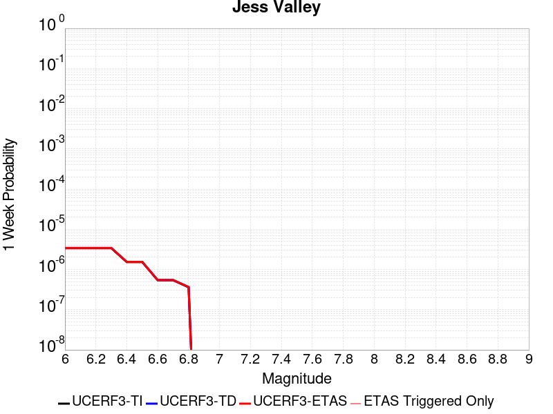 | 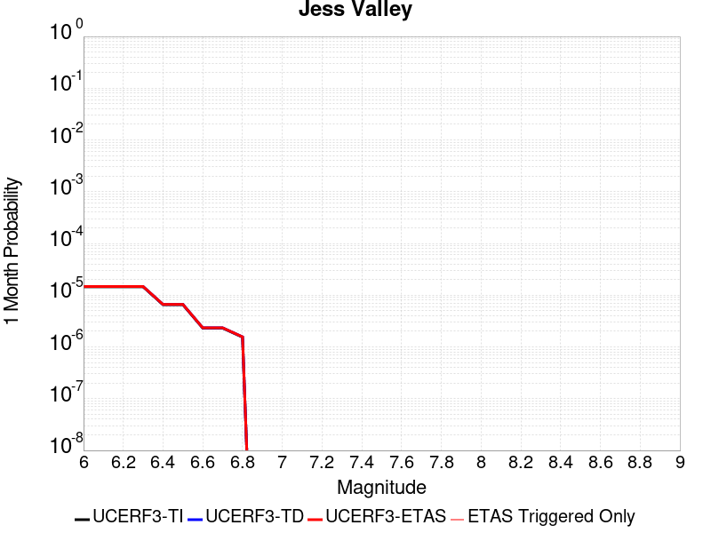 |  |  |

| Magnitude | 1 wk TI Prob | 1 wk TD Prob | 1 wk ETAS Prob | 1 wk ETAS/TD Gain | 1 wk ETAS Triggered Only | 1 mo TI Prob | 1 mo TD Prob | 1 mo ETAS Prob | 1 mo ETAS/TD Gain | 1 mo ETAS Triggered Only | 1 yr TI Prob | 1 yr TD Prob | 1 yr ETAS Prob | 1 yr ETAS/TD Gain | 1 yr ETAS Triggered Only | 10 yr TI Prob | 10 yr TD Prob | 10 yr ETAS Prob | 10 yr ETAS/TD Gain | 10 yr ETAS Triggered Only |
|-----|-----|-----|-----|-----|-----|-----|-----|-----|-----|-----|-----|-----|-----|-----|-----|-----|-----|-----|-----|-----|
| 6.0 | 3.3861274E-6 | 3.4340655E-6 | 3.4340655E-6 | 1.0 | 0.0 | 1.4511894E-5 | 1.4717357E-5 | 1.4717357E-5 | 1.0 | 0.0 | 1.7666799E-4 | 1.7917191E-4 | 1.8917011E-4 | 1.0558023 | 1.0E-5 | 0.001765276 | 0.001790551 | 0.0018105152 | 1.0111498 | 2.0E-5 |
| 6.1 | 3.3861274E-6 | 3.4340655E-6 | 3.4340655E-6 | 1.0 | 0.0 | 1.4511894E-5 | 1.4717357E-5 | 1.4717357E-5 | 1.0 | 0.0 | 1.7666799E-4 | 1.7917191E-4 | 1.8917011E-4 | 1.0558023 | 1.0E-5 | 0.001765276 | 0.001790551 | 0.0018105152 | 1.0111498 | 2.0E-5 |
| 6.2 | 3.3861274E-6 | 3.4340655E-6 | 3.4340655E-6 | 1.0 | 0.0 | 1.4511894E-5 | 1.4717357E-5 | 1.4717357E-5 | 1.0 | 0.0 | 1.7666799E-4 | 1.7917191E-4 | 1.8917011E-4 | 1.0558023 | 1.0E-5 | 0.001765276 | 0.001790551 | 0.0018105152 | 1.0111498 | 2.0E-5 |
| 6.3 | 3.3861274E-6 | 3.4340655E-6 | 3.4340655E-6 | 1.0 | 0.0 | 1.4511894E-5 | 1.4717357E-5 | 1.4717357E-5 | 1.0 | 0.0 | 1.7666799E-4 | 1.7917191E-4 | 1.8917011E-4 | 1.0558023 | 1.0E-5 | 0.001765276 | 0.001790551 | 0.0018105152 | 1.0111498 | 2.0E-5 |
| 6.4 | 1.5291708E-6 | 1.5502812E-6 | 1.5502812E-6 | 1.0 | 0.0 | 6.553573E-6 | 6.6440502E-6 | 6.6440502E-6 | 1.0 | 0.0 | 7.978683E-5 | 8.0889105E-5 | 8.0889105E-5 | 1.0 | 0.0 | 7.975819E-4 | 8.0867484E-4 | 8.0867484E-4 | 1.0 | 0.0 |
| 6.5 | 1.5291708E-6 | 1.5502812E-6 | 1.5502812E-6 | 1.0 | 0.0 | 6.553573E-6 | 6.6440502E-6 | 6.6440502E-6 | 1.0 | 0.0 | 7.978683E-5 | 8.0889105E-5 | 8.0889105E-5 | 1.0 | 0.0 | 7.975819E-4 | 8.0867484E-4 | 8.0867484E-4 | 1.0 | 0.0 |
| 6.6 | 5.396423E-7 | 5.4720056E-7 | 5.4720056E-7 | 1.0 | 0.0 | 2.312751E-6 | 2.3451441E-6 | 2.3451441E-6 | 1.0 | 0.0 | 2.8157378E-5 | 2.8551944E-5 | 2.8551944E-5 | 1.0 | 0.0 | 2.8153812E-4 | 2.8550118E-4 | 2.8550118E-4 | 1.0 | 0.0 |
| 6.7 | 5.396423E-7 | 5.4720056E-7 | 5.4720056E-7 | 1.0 | 0.0 | 2.312751E-6 | 2.3451441E-6 | 2.3451441E-6 | 1.0 | 0.0 | 2.8157378E-5 | 2.8551944E-5 | 2.8551944E-5 | 1.0 | 0.0 | 2.8153812E-4 | 2.8550118E-4 | 2.8550118E-4 | 1.0 | 0.0 |
| 6.8 | 3.6058395E-7 | 3.6563134E-7 | 3.6563134E-7 | 1.0 | 0.0 | 1.5453588E-6 | 1.5669915E-6 | 1.5669915E-6 | 1.0 | 0.0 | 1.8814582E-5 | 1.9078121E-5 | 1.9078121E-5 | 1.0 | 0.0 | 1.8812988E-4 | 1.9078121E-4 | 1.9078121E-4 | 1.0 | 0.0 |

## Elmore Ranch
*[(top)](#table-of-contents)*

| 1 Week | 1 Month | 1 Year | 10 Year |
|-----|-----|-----|-----|
|  |  |  |  |

| Magnitude | 1 wk TI Prob | 1 wk TD Prob | 1 wk ETAS Prob | 1 wk ETAS/TD Gain | 1 wk ETAS Triggered Only | 1 mo TI Prob | 1 mo TD Prob | 1 mo ETAS Prob | 1 mo ETAS/TD Gain | 1 mo ETAS Triggered Only | 1 yr TI Prob | 1 yr TD Prob | 1 yr ETAS Prob | 1 yr ETAS/TD Gain | 1 yr ETAS Triggered Only | 10 yr TI Prob | 10 yr TD Prob | 10 yr ETAS Prob | 10 yr ETAS/TD Gain | 10 yr ETAS Triggered Only |
|-----|-----|-----|-----|-----|-----|-----|-----|-----|-----|-----|-----|-----|-----|-----|-----|-----|-----|-----|-----|-----|
| 6.0 | 9.102099E-5 | 8.9526366E-5 | 8.9526366E-5 | 1.0 | 0.0 | 3.9003167E-4 | 3.8364116E-4 | 3.8364116E-4 | 1.0 | 0.0 | 0.0047383 | 0.004662308 | 0.004662308 | 1.0 | 0.0 | 0.046385348 | 0.045873385 | 0.04589247 | 1.000416 | 2.0E-5 |
| 6.1 | 3.8306698E-5 | 4.1500927E-5 | 4.1500927E-5 | 1.0 | 0.0 | 1.6416123E-4 | 1.7785306E-4 | 1.7785306E-4 | 1.0 | 0.0 | 0.0019968306 | 0.0021632449 | 0.0021632449 | 1.0 | 0.0 | 0.019789828 | 0.02162934 | 0.021639122 | 1.0004523 | 1.0E-5 |
| 6.2 | 3.8306698E-5 | 4.1500927E-5 | 4.1500927E-5 | 1.0 | 0.0 | 1.6416123E-4 | 1.7785306E-4 | 1.7785306E-4 | 1.0 | 0.0 | 0.0019968306 | 0.0021632449 | 0.0021632449 | 1.0 | 0.0 | 0.019789828 | 0.02162934 | 0.021639122 | 1.0004523 | 1.0E-5 |
| 6.3 | 3.3197924E-5 | 3.6556212E-5 | 3.6556212E-5 | 1.0 | 0.0 | 1.4226905E-4 | 1.5666404E-4 | 1.5666404E-4 | 1.0 | 0.0 | 0.0017307495 | 0.0019060043 | 0.0019060043 | 1.0 | 0.0 | 0.017173318 | 0.019090874 | 0.019100683 | 1.0005138 | 1.0E-5 |
| 6.4 | 2.5148964E-5 | 2.7421656E-5 | 2.7421656E-5 | 1.0 | 0.0 | 1.0777682E-4 | 1.1751975E-4 | 1.1751975E-4 | 1.0 | 0.0 | 0.0013113929 | 0.0014305117 | 0.0014305117 | 1.0 | 0.0 | 0.01303681 | 0.014387799 | 0.014397656 | 1.000685 | 1.0E-5 |
| 6.5 | 2.5148964E-5 | 2.7421656E-5 | 2.7421656E-5 | 1.0 | 0.0 | 1.0777682E-4 | 1.1751975E-4 | 1.1751975E-4 | 1.0 | 0.0 | 0.0013113929 | 0.0014305117 | 0.0014305117 | 1.0 | 0.0 | 0.01303681 | 0.014387799 | 0.014397656 | 1.000685 | 1.0E-5 |

## Great Valley 05 Pittsburg - Kirby Hills alt1
*[(top)](#table-of-contents)*

| 1 Week | 1 Month | 1 Year | 10 Year |
|-----|-----|-----|-----|
|  |  |  |  |

| Magnitude | 1 wk TI Prob | 1 wk TD Prob | 1 wk ETAS Prob | 1 wk ETAS/TD Gain | 1 wk ETAS Triggered Only | 1 mo TI Prob | 1 mo TD Prob | 1 mo ETAS Prob | 1 mo ETAS/TD Gain | 1 mo ETAS Triggered Only | 1 yr TI Prob | 1 yr TD Prob | 1 yr ETAS Prob | 1 yr ETAS/TD Gain | 1 yr ETAS Triggered Only | 10 yr TI Prob | 10 yr TD Prob | 10 yr ETAS Prob | 10 yr ETAS/TD Gain | 10 yr ETAS Triggered Only |
|-----|-----|-----|-----|-----|-----|-----|-----|-----|-----|-----|-----|-----|-----|-----|-----|-----|-----|-----|-----|-----|
| 6.0 | 4.187212E-5 | 5.3444037E-5 | 5.3444037E-5 | 1.0 | 0.0 | 1.794396E-4 | 2.2903152E-4 | 2.2903152E-4 | 1.0 | 0.0 | 0.002182488 | 0.0027858876 | 0.0027958597 | 1.0035795 | 1.0E-5 | 0.021611776 | 0.027604017 | 0.027623465 | 1.0007045 | 2.0E-5 |
| 6.1 | 4.187212E-5 | 5.3444037E-5 | 5.3444037E-5 | 1.0 | 0.0 | 1.794396E-4 | 2.2903152E-4 | 2.2903152E-4 | 1.0 | 0.0 | 0.002182488 | 0.0027858876 | 0.0027958597 | 1.0035795 | 1.0E-5 | 0.021611776 | 0.027604017 | 0.027623465 | 1.0007045 | 2.0E-5 |
| 6.2 | 1.7353306E-5 | 2.2155189E-5 | 2.2155189E-5 | 1.0 | 0.0 | 7.436919E-5 | 9.4949675E-5 | 9.4949675E-5 | 1.0 | 0.0 | 9.050688E-4 | 0.0011557965 | 0.0011557965 | 1.0 | 0.0 | 0.009013915 | 0.011535524 | 0.011545409 | 1.0008569 | 1.0E-5 |
| 6.3 | 1.7353306E-5 | 2.2155189E-5 | 2.2155189E-5 | 1.0 | 0.0 | 7.436919E-5 | 9.4949675E-5 | 9.4949675E-5 | 1.0 | 0.0 | 9.050688E-4 | 0.0011557965 | 0.0011557965 | 1.0 | 0.0 | 0.009013915 | 0.011535524 | 0.011545409 | 1.0008569 | 1.0E-5 |
| 6.4 | 1.4028824E-5 | 1.7901253E-5 | 1.7901253E-5 | 1.0 | 0.0 | 6.0122147E-5 | 7.6719654E-5 | 7.6719654E-5 | 1.0 | 0.0 | 7.3174125E-4 | 9.3406177E-4 | 9.3406177E-4 | 1.0 | 0.0 | 0.0072933645 | 0.00933847 | 0.009348377 | 1.0010608 | 1.0E-5 |

## Oak Ridge (Onshore)
*[(top)](#table-of-contents)*

| 1 Week | 1 Month | 1 Year | 10 Year |
|-----|-----|-----|-----|
|  |  |  |  |

| Magnitude | 1 wk TI Prob | 1 wk TD Prob | 1 wk ETAS Prob | 1 wk ETAS/TD Gain | 1 wk ETAS Triggered Only | 1 mo TI Prob | 1 mo TD Prob | 1 mo ETAS Prob | 1 mo ETAS/TD Gain | 1 mo ETAS Triggered Only | 1 yr TI Prob | 1 yr TD Prob | 1 yr ETAS Prob | 1 yr ETAS/TD Gain | 1 yr ETAS Triggered Only | 10 yr TI Prob | 10 yr TD Prob | 10 yr ETAS Prob | 10 yr ETAS/TD Gain | 10 yr ETAS Triggered Only |
|-----|-----|-----|-----|-----|-----|-----|-----|-----|-----|-----|-----|-----|-----|-----|-----|-----|-----|-----|-----|-----|
| 6.0 | 3.155064E-5 | 2.952645E-5 | 2.952645E-5 | 1.0 | 0.0 | 1.3521002E-4 | 1.26536E-4 | 1.26536E-4 | 1.0 | 0.0 | 0.001644939 | 0.0015395252 | 0.0015495098 | 1.0064855 | 1.0E-5 | 0.01632816 | 0.015293104 | 0.015312798 | 1.0012878 | 2.0E-5 |
| 6.1 | 3.155064E-5 | 2.952645E-5 | 2.952645E-5 | 1.0 | 0.0 | 1.3521002E-4 | 1.26536E-4 | 1.26536E-4 | 1.0 | 0.0 | 0.001644939 | 0.0015395252 | 0.0015495098 | 1.0064855 | 1.0E-5 | 0.01632816 | 0.015293104 | 0.015312798 | 1.0012878 | 2.0E-5 |
| 6.2 | 3.155064E-5 | 2.952645E-5 | 2.952645E-5 | 1.0 | 0.0 | 1.3521002E-4 | 1.26536E-4 | 1.26536E-4 | 1.0 | 0.0 | 0.001644939 | 0.0015395252 | 0.0015495098 | 1.0064855 | 1.0E-5 | 0.01632816 | 0.015293104 | 0.015312798 | 1.0012878 | 2.0E-5 |
| 6.3 | 3.155064E-5 | 2.952645E-5 | 2.952645E-5 | 1.0 | 0.0 | 1.3521002E-4 | 1.26536E-4 | 1.26536E-4 | 1.0 | 0.0 | 0.001644939 | 0.0015395252 | 0.0015495098 | 1.0064855 | 1.0E-5 | 0.01632816 | 0.015293104 | 0.015312798 | 1.0012878 | 2.0E-5 |
| 6.4 | 3.155064E-5 | 2.952645E-5 | 2.952645E-5 | 1.0 | 0.0 | 1.3521002E-4 | 1.26536E-4 | 1.26536E-4 | 1.0 | 0.0 | 0.001644939 | 0.0015395252 | 0.0015495098 | 1.0064855 | 1.0E-5 | 0.01632816 | 0.015293104 | 0.015312798 | 1.0012878 | 2.0E-5 |
| 6.5 | 3.155064E-5 | 2.952645E-5 | 2.952645E-5 | 1.0 | 0.0 | 1.3521002E-4 | 1.26536E-4 | 1.26536E-4 | 1.0 | 0.0 | 0.001644939 | 0.0015395252 | 0.0015495098 | 1.0064855 | 1.0E-5 | 0.01632816 | 0.015293104 | 0.015312798 | 1.0012878 | 2.0E-5 |
| 6.6 | 3.155064E-5 | 2.952645E-5 | 2.952645E-5 | 1.0 | 0.0 | 1.3521002E-4 | 1.26536E-4 | 1.26536E-4 | 1.0 | 0.0 | 0.001644939 | 0.0015395252 | 0.0015495098 | 1.0064855 | 1.0E-5 | 0.01632816 | 0.015293104 | 0.015312798 | 1.0012878 | 2.0E-5 |
| 6.7 | 3.098897E-5 | 2.8864635E-5 | 2.8864635E-5 | 1.0 | 0.0 | 1.328031E-4 | 1.2369992E-4 | 1.2369992E-4 | 1.0 | 0.0 | 0.0016156785 | 0.0015050438 | 0.0015150288 | 1.0066344 | 1.0E-5 | 0.016039822 | 0.014952951 | 0.014972651 | 1.0013175 | 2.0E-5 |
| 6.8 | 3.0449872E-5 | 2.823982E-5 | 2.823982E-5 | 1.0 | 0.0 | 1.3049292E-4 | 1.2102239E-4 | 1.2102239E-4 | 1.0 | 0.0 | 0.0015875935 | 0.001472489 | 0.0014824743 | 1.0067812 | 1.0E-5 | 0.015762992 | 0.014631692 | 0.014651399 | 1.001347 | 2.0E-5 |
| 6.9 | 2.697928E-5 | 2.4220137E-5 | 2.4220137E-5 | 1.0 | 0.0 | 1.15620365E-4 | 1.0379658E-4 | 1.0379658E-4 | 1.0 | 0.0 | 0.0014067689 | 0.0012630123 | 0.0012729996 | 1.0079076 | 1.0E-5 | 0.0139789665 | 0.012561057 | 0.012580805 | 1.0015723 | 2.0E-5 |
| 7.0 | 2.4893961E-5 | 2.1862359E-5 | 2.1862359E-5 | 1.0 | 0.0 | 1.0668404E-4 | 9.369256E-5 | 9.369256E-5 | 1.0 | 0.0 | 0.0012981043 | 0.0011401277 | 0.0011501163 | 1.0087609 | 1.0E-5 | 0.012905477 | 0.011345069 | 0.011364842 | 1.0017428 | 2.0E-5 |
| 7.1 | 2.0945363E-5 | 1.7354718E-5 | 1.7354718E-5 | 1.0 | 0.0 | 8.976275E-5 | 7.437527E-5 | 7.437527E-5 | 1.0 | 0.0 | 0.0010923136 | 9.051474E-4 | 9.1513834E-4 | 1.011038 | 1.0E-5 | 0.0108696 | 0.009015542 | 0.009035362 | 1.0021983 | 2.0E-5 |
| 7.2 | 2.0439404E-5 | 1.6809645E-5 | 1.6809645E-5 | 1.0 | 0.0 | 8.7594504E-5 | 7.2039365E-5 | 7.2039365E-5 | 1.0 | 0.0 | 0.0010659413 | 8.7673106E-4 | 8.867223E-4 | 1.011396 | 1.0E-5 | 0.010608427 | 0.00873364 | 0.0087534655 | 1.00227 | 2.0E-5 |
| 7.3 | 1.8463334E-5 | 1.5382002E-5 | 1.5382002E-5 | 1.0 | 0.0 | 7.912617E-5 | 6.5921224E-5 | 6.5921224E-5 | 1.0 | 0.0 | 9.6293533E-4 | 8.0229976E-4 | 8.1229175E-4 | 1.0124542 | 1.0E-5 | 0.009587734 | 0.007994897 | 0.008014737 | 1.0024816 | 2.0E-5 |
| 7.4 | 1.763139E-5 | 1.4517013E-5 | 1.4517013E-5 | 1.0 | 0.0 | 7.556091E-5 | 6.221431E-5 | 6.221431E-5 | 1.0 | 0.0 | 9.1956573E-4 | 7.5719994E-4 | 7.6719234E-4 | 1.0131966 | 1.0E-5 | 0.009157699 | 0.007547003 | 0.0075668525 | 1.0026301 | 2.0E-5 |
| 7.5 | 1.3594944E-5 | 1.1163477E-5 | 1.1163477E-5 | 1.0 | 0.0 | 5.8262744E-5 | 4.7842612E-5 | 4.7842612E-5 | 1.0 | 0.0 | 7.0911803E-4 | 5.823306E-4 | 5.923248E-4 | 1.0171623 | 1.0E-5 | 0.007068595 | 0.0058083185 | 0.0058282022 | 1.0034233 | 2.0E-5 |
| 7.6 | 6.9889534E-6 | 5.6367617E-6 | 5.6367617E-6 | 1.0 | 0.0 | 2.9952313E-5 | 2.4157329E-5 | 2.4157329E-5 | 1.0 | 0.0 | 3.646084E-4 | 2.940762E-4 | 2.940762E-4 | 1.0 | 0.0 | 0.0036401073 | 0.0029369146 | 0.002946885 | 1.003395 | 1.0E-5 |
| 7.7 | 4.0824193E-6 | 3.2832884E-6 | 3.2832884E-6 | 1.0 | 0.0 | 1.7495966E-5 | 1.4071161E-5 | 1.4071161E-5 | 1.0 | 0.0 | 2.1299256E-4 | 1.7130304E-4 | 1.7130304E-4 | 1.0 | 0.0 | 0.0021278851 | 0.0017117234 | 0.0017217062 | 1.0058321 | 1.0E-5 |
| 7.8 | 1.7023609E-6 | 1.4370602E-6 | 1.4370602E-6 | 1.0 | 0.0 | 7.295812E-6 | 6.158815E-6 | 6.158815E-6 | 1.0 | 0.0 | 8.882289E-5 | 7.498102E-5 | 7.498102E-5 | 1.0 | 0.0 | 8.8787393E-4 | 7.4956E-4 | 7.4956E-4 | 1.0 | 0.0 |
| 7.9 | 2.721225E-7 | 2.2616715E-7 | 2.2616715E-7 | 1.0 | 0.0 | 1.1662388E-6 | 9.692874E-7 | 9.692874E-7 | 1.0 | 0.0 | 1.4198865E-5 | 1.1801013E-5 | 1.1801013E-5 | 1.0 | 0.0 | 1.4197957E-4 | 1.1800414E-4 | 1.1800414E-4 | 1.0 | 0.0 |
| 8.0 | 9.364255E-9 | 5.1209232E-9 | 5.1209232E-9 | 1.0 | 0.0 | 4.0132523E-8 | 2.1946814E-8 | 2.1946814E-8 | 1.0 | 0.0 | 4.8861335E-7 | 2.6720244E-7 | 2.6720244E-7 | 1.0 | 0.0 | 4.8861225E-6 | 2.6720215E-6 | 2.6720215E-6 | 1.0 | 0.0 |

## Raymond
*[(top)](#table-of-contents)*

| 1 Week | 1 Month | 1 Year | 10 Year |
|-----|-----|-----|-----|
|  |  |  |  |

| Magnitude | 1 wk TI Prob | 1 wk TD Prob | 1 wk ETAS Prob | 1 wk ETAS/TD Gain | 1 wk ETAS Triggered Only | 1 mo TI Prob | 1 mo TD Prob | 1 mo ETAS Prob | 1 mo ETAS/TD Gain | 1 mo ETAS Triggered Only | 1 yr TI Prob | 1 yr TD Prob | 1 yr ETAS Prob | 1 yr ETAS/TD Gain | 1 yr ETAS Triggered Only | 10 yr TI Prob | 10 yr TD Prob | 10 yr ETAS Prob | 10 yr ETAS/TD Gain | 10 yr ETAS Triggered Only |
|-----|-----|-----|-----|-----|-----|-----|-----|-----|-----|-----|-----|-----|-----|-----|-----|-----|-----|-----|-----|-----|
| 6.0 | 1.5157413E-5 | 1.5810376E-5 | 1.5810376E-5 | 1.0 | 0.0 | 6.4958724E-5 | 6.775714E-5 | 6.775714E-5 | 1.0 | 0.0 | 7.905855E-4 | 8.24656E-4 | 8.3464774E-4 | 1.0121163 | 1.0E-5 | 0.007877788 | 0.008218477 | 0.008238312 | 1.0024135 | 2.0E-5 |
| 6.1 | 1.5157413E-5 | 1.5810376E-5 | 1.5810376E-5 | 1.0 | 0.0 | 6.4958724E-5 | 6.775714E-5 | 6.775714E-5 | 1.0 | 0.0 | 7.905855E-4 | 8.24656E-4 | 8.3464774E-4 | 1.0121163 | 1.0E-5 | 0.007877788 | 0.008218477 | 0.008238312 | 1.0024135 | 2.0E-5 |
| 6.2 | 1.5157413E-5 | 1.5810376E-5 | 1.5810376E-5 | 1.0 | 0.0 | 6.4958724E-5 | 6.775714E-5 | 6.775714E-5 | 1.0 | 0.0 | 7.905855E-4 | 8.24656E-4 | 8.3464774E-4 | 1.0121163 | 1.0E-5 | 0.007877788 | 0.008218477 | 0.008238312 | 1.0024135 | 2.0E-5 |
| 6.3 | 1.5157413E-5 | 1.5810376E-5 | 1.5810376E-5 | 1.0 | 0.0 | 6.4958724E-5 | 6.775714E-5 | 6.775714E-5 | 1.0 | 0.0 | 7.905855E-4 | 8.24656E-4 | 8.3464774E-4 | 1.0121163 | 1.0E-5 | 0.007877788 | 0.008218477 | 0.008238312 | 1.0024135 | 2.0E-5 |
| 6.4 | 1.3941944E-5 | 1.4454918E-5 | 1.4454918E-5 | 1.0 | 0.0 | 5.9749822E-5 | 6.194831E-5 | 6.194831E-5 | 1.0 | 0.0 | 7.2721124E-4 | 7.53983E-4 | 7.6397543E-4 | 1.0132529 | 1.0E-5 | 0.007248361 | 0.0075165825 | 0.0075364322 | 1.0026407 | 2.0E-5 |
| 6.5 | 1.3941944E-5 | 1.4454918E-5 | 1.4454918E-5 | 1.0 | 0.0 | 5.9749822E-5 | 6.194831E-5 | 6.194831E-5 | 1.0 | 0.0 | 7.2721124E-4 | 7.53983E-4 | 7.6397543E-4 | 1.0132529 | 1.0E-5 | 0.007248361 | 0.0075165825 | 0.0075364322 | 1.0026407 | 2.0E-5 |
| 6.6 | 1.0542609E-5 | 1.0671283E-5 | 1.0671283E-5 | 1.0 | 0.0 | 4.5181827E-5 | 4.57333E-5 | 4.57333E-5 | 1.0 | 0.0 | 5.499499E-4 | 5.566662E-4 | 5.666606E-4 | 1.0179541 | 1.0E-5 | 0.005485909 | 0.0055532786 | 0.0055632233 | 1.0017908 | 1.0E-5 |
| 6.7 | 1.0542609E-5 | 1.0671283E-5 | 1.0671283E-5 | 1.0 | 0.0 | 4.5181827E-5 | 4.57333E-5 | 4.57333E-5 | 1.0 | 0.0 | 5.499499E-4 | 5.566662E-4 | 5.666606E-4 | 1.0179541 | 1.0E-5 | 0.005485909 | 0.0055532786 | 0.0055632233 | 1.0017908 | 1.0E-5 |
| 6.8 | 1.0079132E-5 | 1.0176812E-5 | 1.0176812E-5 | 1.0 | 0.0 | 4.3195567E-5 | 4.361421E-5 | 4.361421E-5 | 1.0 | 0.0 | 5.257791E-4 | 5.30879E-4 | 5.408737E-4 | 1.0188267 | 1.0E-5 | 0.0052453685 | 0.0052966573 | 0.005306605 | 1.001878 | 1.0E-5 |
| 6.9 | 7.721598E-6 | 7.5490307E-6 | 7.5490307E-6 | 1.0 | 0.0 | 3.3092143E-5 | 3.2352593E-5 | 3.2352593E-5 | 1.0 | 0.0 | 4.0282236E-4 | 3.9382285E-4 | 3.9382285E-4 | 1.0 | 0.0 | 0.0040209293 | 0.003931383 | 0.003931383 | 1.0 | 0.0 |
| 7.0 | 7.137566E-6 | 6.9114235E-6 | 6.9114235E-6 | 1.0 | 0.0 | 3.058921E-5 | 2.9620056E-5 | 2.9620056E-5 | 1.0 | 0.0 | 3.7236E-4 | 3.6056558E-4 | 3.6056558E-4 | 1.0 | 0.0 | 0.0037173668 | 0.003599924 | 0.003599924 | 1.0 | 0.0 |
| 7.1 | 5.654976E-6 | 5.2996397E-6 | 5.2996397E-6 | 1.0 | 0.0 | 2.4235387E-5 | 2.2712544E-5 | 2.2712544E-5 | 1.0 | 0.0 | 2.9502588E-4 | 2.7649035E-4 | 2.7649035E-4 | 1.0 | 0.0 | 0.0029463451 | 0.0027614946 | 0.0027614946 | 1.0 | 0.0 |
| 7.2 | 4.9358455E-6 | 4.5267484E-6 | 4.5267484E-6 | 1.0 | 0.0 | 2.1153453E-5 | 1.9400206E-5 | 1.9400206E-5 | 1.0 | 0.0 | 2.5751285E-4 | 2.3617204E-4 | 2.3617204E-4 | 1.0 | 0.0 | 0.0025721465 | 0.0023592326 | 0.0023592326 | 1.0 | 0.0 |
| 7.3 | 4.2368597E-6 | 3.8056999E-6 | 3.8056999E-6 | 1.0 | 0.0 | 1.8157843E-5 | 1.6310041E-5 | 1.6310041E-5 | 1.0 | 0.0 | 2.2104931E-4 | 1.9855677E-4 | 1.9855677E-4 | 1.0 | 0.0 | 0.0022082955 | 0.0019838123 | 0.0019838123 | 1.0 | 0.0 |
| 7.4 | 3.4999923E-6 | 3.0438184E-6 | 3.0438184E-6 | 1.0 | 0.0 | 1.49998805E-5 | 1.3044872E-5 | 1.3044872E-5 | 1.0 | 0.0 | 1.8260824E-4 | 1.5880981E-4 | 1.5880981E-4 | 1.0 | 0.0 | 0.0018245826 | 0.001586979 | 0.001586979 | 1.0 | 0.0 |
| 7.5 | 2.738017E-6 | 2.3021105E-6 | 2.3021105E-6 | 1.0 | 0.0 | 1.1734306E-5 | 9.86615E-6 | 9.86615E-6 | 1.0 | 0.0 | 1.428558E-4 | 1.2011383E-4 | 1.2011383E-4 | 1.0 | 0.0 | 0.0014276401 | 0.0012005034 | 0.0012005034 | 1.0 | 0.0 |
| 7.6 | 1.8186392E-6 | 1.4423566E-6 | 1.4423566E-6 | 1.0 | 0.0 | 7.794145E-6 | 6.181514E-6 | 6.181514E-6 | 1.0 | 0.0 | 9.488958E-5 | 7.5257376E-5 | 7.5257376E-5 | 1.0 | 0.0 | 9.4849075E-4 | 7.523304E-4 | 7.523304E-4 | 1.0 | 0.0 |
| 7.7 | 1.0660348E-6 | 7.644165E-7 | 7.644165E-7 | 1.0 | 0.0 | 4.5687125E-6 | 3.2760668E-6 | 3.2760668E-6 | 1.0 | 0.0 | 5.5622655E-5 | 3.98854E-5 | 3.98854E-5 | 1.0 | 0.0 | 5.5608735E-4 | 3.9879154E-4 | 3.9879154E-4 | 1.0 | 0.0 |
| 7.8 | 6.913602E-7 | 4.320714E-7 | 4.320714E-7 | 1.0 | 0.0 | 2.962969E-6 | 1.8517333E-6 | 1.8517333E-6 | 1.0 | 0.0 | 3.607355E-5 | 2.2544626E-5 | 2.2544626E-5 | 1.0 | 0.0 | 3.6067693E-4 | 2.2543124E-4 | 2.2543124E-4 | 1.0 | 0.0 |
| 7.9 | 7.425201E-8 | 5.322516E-8 | 5.322516E-8 | 1.0 | 0.0 | 3.1822285E-7 | 2.2810782E-7 | 2.2810782E-7 | 1.0 | 0.0 | 3.874356E-6 | 2.7772105E-6 | 2.7772105E-6 | 1.0 | 0.0 | 3.8742884E-5 | 2.7771888E-5 | 2.7771888E-5 | 1.0 | 0.0 |

## Greenville (No) 2011 CFM
*[(top)](#table-of-contents)*

| 1 Week | 1 Month | 1 Year | 10 Year |
|-----|-----|-----|-----|
|  |  |  |  |

| Magnitude | 1 wk TI Prob | 1 wk TD Prob | 1 wk ETAS Prob | 1 wk ETAS/TD Gain | 1 wk ETAS Triggered Only | 1 mo TI Prob | 1 mo TD Prob | 1 mo ETAS Prob | 1 mo ETAS/TD Gain | 1 mo ETAS Triggered Only | 1 yr TI Prob | 1 yr TD Prob | 1 yr ETAS Prob | 1 yr ETAS/TD Gain | 1 yr ETAS Triggered Only | 10 yr TI Prob | 10 yr TD Prob | 10 yr ETAS Prob | 10 yr ETAS/TD Gain | 10 yr ETAS Triggered Only |
|-----|-----|-----|-----|-----|-----|-----|-----|-----|-----|-----|-----|-----|-----|-----|-----|-----|-----|-----|-----|-----|
| 6.0 | 3.286654E-5 | 4.036741E-5 | 4.036741E-5 | 1.0 | 0.0 | 1.4084899E-4 | 1.7299193E-4 | 1.7299193E-4 | 1.0 | 0.0 | 0.0017134876 | 0.0021041804 | 0.0021041804 | 1.0 | 0.0 | 0.017003356 | 0.020847455 | 0.020867039 | 1.0009394 | 2.0E-5 |
| 6.1 | 3.286654E-5 | 4.036741E-5 | 4.036741E-5 | 1.0 | 0.0 | 1.4084899E-4 | 1.7299193E-4 | 1.7299193E-4 | 1.0 | 0.0 | 0.0017134876 | 0.0021041804 | 0.0021041804 | 1.0 | 0.0 | 0.017003356 | 0.020847455 | 0.020857247 | 1.0004697 | 1.0E-5 |
| 6.2 | 3.1697953E-5 | 3.893027E-5 | 3.893027E-5 | 1.0 | 0.0 | 1.358413E-4 | 1.6683355E-4 | 1.6683355E-4 | 1.0 | 0.0 | 0.0016526132 | 0.0020293442 | 0.0020293442 | 1.0 | 0.0 | 0.01640377 | 0.020112827 | 0.020122627 | 1.0004872 | 1.0E-5 |
| 6.3 | 3.1363317E-5 | 3.8519134E-5 | 3.8519134E-5 | 1.0 | 0.0 | 1.344073E-4 | 1.6507176E-4 | 1.6507176E-4 | 1.0 | 0.0 | 0.0016351803 | 0.002007934 | 0.002007934 | 1.0 | 0.0 | 0.016232004 | 0.019902589 | 0.01991239 | 1.0004925 | 1.0E-5 |
| 6.4 | 3.0228604E-5 | 3.7126225E-5 | 3.7126225E-5 | 1.0 | 0.0 | 1.2954473E-4 | 1.5910288E-4 | 1.5910288E-4 | 1.0 | 0.0 | 0.0015760659 | 0.0019353938 | 0.0019353938 | 1.0 | 0.0 | 0.015649348 | 0.01918991 | 0.019199718 | 1.000511 | 1.0E-5 |
| 6.5 | 2.9537814E-5 | 3.6281657E-5 | 3.6281657E-5 | 1.0 | 0.0 | 1.2658449E-4 | 1.5548375E-4 | 1.5548375E-4 | 1.0 | 0.0 | 0.0015400766 | 0.0018914078 | 0.0018914078 | 1.0 | 0.0 | 0.01529447 | 0.018757557 | 0.01876737 | 1.0005231 | 1.0E-5 |
| 6.6 | 2.7345395E-5 | 3.3590906E-5 | 3.3590906E-5 | 1.0 | 0.0 | 1.1718928E-4 | 1.4395325E-4 | 1.4395325E-4 | 1.0 | 0.0 | 0.0014258457 | 0.0017512529 | 0.0017512529 | 1.0 | 0.0 | 0.014167317 | 0.017378341 | 0.017388167 | 1.0005654 | 1.0E-5 |
| 6.7 | 2.5615784E-5 | 3.1567764E-5 | 3.1567764E-5 | 1.0 | 0.0 | 1.09777306E-4 | 1.3528357E-4 | 1.3528357E-4 | 1.0 | 0.0 | 0.0013357193 | 0.0016458635 | 0.0016458635 | 1.0 | 0.0 | 0.013277191 | 0.016340412 | 0.016350249 | 1.000602 | 1.0E-5 |
| 6.8 | 2.0059057E-5 | 2.4712537E-5 | 2.4712537E-5 | 1.0 | 0.0 | 8.596455E-5 | 1.0590666E-4 | 1.0590666E-4 | 1.0 | 0.0 | 0.0010461159 | 0.0012886672 | 0.0012886672 | 1.0 | 0.0 | 0.0104120495 | 0.012813962 | 0.012823834 | 1.0007704 | 1.0E-5 |
| 6.9 | 1.6321746E-5 | 2.0185005E-5 | 2.0185005E-5 | 1.0 | 0.0 | 6.9948466E-5 | 8.650436E-5 | 8.650436E-5 | 1.0 | 0.0 | 8.5128983E-4 | 0.0010526942 | 0.0010526942 | 1.0 | 0.0 | 0.008480361 | 0.010478605 | 0.0104885 | 1.0009444 | 1.0E-5 |
| 7.0 | 1.22527645E-5 | 1.5135852E-5 | 1.5135852E-5 | 1.0 | 0.0 | 5.2510793E-5 | 6.486634E-5 | 6.486634E-5 | 1.0 | 0.0 | 6.3913135E-4 | 7.894658E-4 | 7.894658E-4 | 1.0 | 0.0 | 0.0063729626 | 0.00786725 | 0.007877171 | 1.0012611 | 1.0E-5 |
| 7.1 | 8.996482E-6 | 1.1165086E-5 | 1.1165086E-5 | 1.0 | 0.0 | 3.8555783E-5 | 4.78495E-5 | 4.78495E-5 | 1.0 | 0.0 | 4.6931554E-4 | 5.8241317E-4 | 5.8241317E-4 | 1.0 | 0.0 | 0.004683256 | 0.005809159 | 0.005819101 | 1.0017114 | 1.0E-5 |
| 7.2 | 6.0273087E-6 | 7.569554E-6 | 7.569554E-6 | 1.0 | 0.0 | 2.5831067E-5 | 3.2440545E-5 | 3.2440545E-5 | 1.0 | 0.0 | 3.1444785E-4 | 3.9489273E-4 | 3.9489273E-4 | 1.0 | 0.0 | 0.0031400328 | 0.0039421073 | 0.0039421073 | 1.0 | 0.0 |
| 7.3 | 3.1209995E-6 | 3.966412E-6 | 3.966412E-6 | 1.0 | 0.0 | 1.3375643E-5 | 1.6998798E-5 | 1.6998798E-5 | 1.0 | 0.0 | 1.6283628E-4 | 2.0694088E-4 | 2.0694088E-4 | 1.0 | 0.0 | 0.0016271701 | 0.002067572 | 0.002067572 | 1.0 | 0.0 |
| 7.4 | 2.0254208E-6 | 2.609629E-6 | 2.609629E-6 | 1.0 | 0.0 | 8.680347E-6 | 1.1184077E-5 | 1.1184077E-5 | 1.0 | 0.0 | 1.0567809E-4 | 1.3615769E-4 | 1.3615769E-4 | 1.0 | 0.0 | 0.0010562785 | 0.0013607995 | 0.0013607995 | 1.0 | 0.0 |
| 7.5 | 1.6763418E-6 | 2.1733601E-6 | 2.1733601E-6 | 1.0 | 0.0 | 7.184302E-6 | 9.314368E-6 | 9.314368E-6 | 1.0 | 0.0 | 8.746537E-5 | 1.1339658E-4 | 1.1339658E-4 | 1.0 | 0.0 | 8.743095E-4 | 0.0011334341 | 0.0011334341 | 1.0 | 0.0 |
| 7.6 | 1.1935462E-6 | 1.5458515E-6 | 1.5458515E-6 | 1.0 | 0.0 | 5.115188E-6 | 6.6250614E-6 | 6.6250614E-6 | 1.0 | 0.0 | 6.2275634E-5 | 8.065718E-5 | 8.065718E-5 | 1.0 | 0.0 | 6.2258187E-4 | 8.0630975E-4 | 8.0630975E-4 | 1.0 | 0.0 |
| 7.7 | 3.0464201E-7 | 3.984697E-7 | 3.984697E-7 | 1.0 | 0.0 | 1.3056081E-6 | 1.7077261E-6 | 1.7077261E-6 | 1.0 | 0.0 | 1.589566E-5 | 2.0791373E-5 | 2.0791373E-5 | 1.0 | 0.0 | 1.5894524E-4 | 2.0789898E-4 | 2.0789898E-4 | 1.0 | 0.0 |

## Rinconada 2011 CFM
*[(top)](#table-of-contents)*

| 1 Week | 1 Month | 1 Year | 10 Year |
|-----|-----|-----|-----|
|  |  |  |  |

| Magnitude | 1 wk TI Prob | 1 wk TD Prob | 1 wk ETAS Prob | 1 wk ETAS/TD Gain | 1 wk ETAS Triggered Only | 1 mo TI Prob | 1 mo TD Prob | 1 mo ETAS Prob | 1 mo ETAS/TD Gain | 1 mo ETAS Triggered Only | 1 yr TI Prob | 1 yr TD Prob | 1 yr ETAS Prob | 1 yr ETAS/TD Gain | 1 yr ETAS Triggered Only | 10 yr TI Prob | 10 yr TD Prob | 10 yr ETAS Prob | 10 yr ETAS/TD Gain | 10 yr ETAS Triggered Only |
|-----|-----|-----|-----|-----|-----|-----|-----|-----|-----|-----|-----|-----|-----|-----|-----|-----|-----|-----|-----|-----|
| 6.0 | 1.5752368E-5 | 1.6274787E-5 | 1.6274787E-5 | 1.0 | 0.0 | 6.75084E-5 | 6.974724E-5 | 6.974724E-5 | 1.0 | 0.0 | 8.2160486E-4 | 8.48845E-4 | 8.588365E-4 | 1.0117707 | 1.0E-5 | 0.008185739 | 0.008456407 | 0.008476238 | 1.0023451 | 2.0E-5 |
| 6.1 | 1.0966133E-5 | 1.1323078E-5 | 1.1323078E-5 | 1.0 | 0.0 | 4.6996865E-5 | 4.8526577E-5 | 4.8526577E-5 | 1.0 | 0.0 | 5.720366E-4 | 5.9065165E-4 | 6.006458E-4 | 1.0169204 | 1.0E-5 | 0.0057056635 | 0.0058909142 | 0.0059107966 | 1.003375 | 2.0E-5 |
| 6.2 | 1.0966133E-5 | 1.1323078E-5 | 1.1323078E-5 | 1.0 | 0.0 | 4.6996865E-5 | 4.8526577E-5 | 4.8526577E-5 | 1.0 | 0.0 | 5.720366E-4 | 5.9065165E-4 | 6.006458E-4 | 1.0169204 | 1.0E-5 | 0.0057056635 | 0.0058909142 | 0.0059107966 | 1.003375 | 2.0E-5 |
| 6.3 | 8.926149E-6 | 9.212811E-6 | 9.212811E-6 | 1.0 | 0.0 | 3.8254362E-5 | 3.9482882E-5 | 3.9482882E-5 | 1.0 | 0.0 | 4.6564735E-4 | 4.8059836E-4 | 4.8059836E-4 | 1.0 | 0.0 | 0.0046467283 | 0.004795635 | 0.004805587 | 1.0020752 | 1.0E-5 |
| 6.4 | 7.676955E-6 | 7.920225E-6 | 7.920225E-6 | 1.0 | 0.0 | 3.290082E-5 | 3.394338E-5 | 3.394338E-5 | 1.0 | 0.0 | 4.0049385E-4 | 4.1318245E-4 | 4.1318245E-4 | 1.0 | 0.0 | 0.0039977287 | 0.004124169 | 0.004124169 | 1.0 | 0.0 |
| 6.5 | 6.1671026E-6 | 6.3589814E-6 | 6.3589814E-6 | 1.0 | 0.0 | 2.6430173E-5 | 2.7252492E-5 | 2.7252492E-5 | 1.0 | 0.0 | 3.2173982E-4 | 3.3174866E-4 | 3.3174866E-4 | 1.0 | 0.0 | 0.003212744 | 0.0033125463 | 0.0033125463 | 1.0 | 0.0 |
| 6.6 | 5.553456E-6 | 5.7248362E-6 | 5.7248362E-6 | 1.0 | 0.0 | 2.3800309E-5 | 2.4534782E-5 | 2.4534782E-5 | 1.0 | 0.0 | 2.897302E-4 | 2.986701E-4 | 2.986701E-4 | 1.0 | 0.0 | 0.0028935277 | 0.0029826954 | 0.0029826954 | 1.0 | 0.0 |
| 6.7 | 4.787857E-6 | 4.93333E-6 | 4.93333E-6 | 1.0 | 0.0 | 2.0519226E-5 | 2.114267E-5 | 2.114267E-5 | 1.0 | 0.0 | 2.4979294E-4 | 2.5738165E-4 | 2.5738165E-4 | 1.0 | 0.0 | 0.0024951235 | 0.0025708412 | 0.0025708412 | 1.0 | 0.0 |
| 6.8 | 3.9955166E-6 | 4.1134927E-6 | 4.1134927E-6 | 1.0 | 0.0 | 1.7123532E-5 | 1.7629134E-5 | 1.7629134E-5 | 1.0 | 0.0 | 2.0845905E-4 | 2.146136E-4 | 2.146136E-4 | 1.0 | 0.0 | 0.002082636 | 0.002144067 | 0.002144067 | 1.0 | 0.0 |
| 6.9 | 3.4250072E-6 | 3.5224598E-6 | 3.5224598E-6 | 1.0 | 0.0 | 1.46785205E-5 | 1.509617E-5 | 1.509617E-5 | 1.0 | 0.0 | 1.7869633E-4 | 1.8378037E-4 | 1.8378037E-4 | 1.0 | 0.0 | 0.001785527 | 0.0018362864 | 0.0018362864 | 1.0 | 0.0 |
| 7.0 | 2.7712713E-6 | 2.8467105E-6 | 2.8467105E-6 | 1.0 | 0.0 | 1.1876823E-5 | 1.2200131E-5 | 1.2200131E-5 | 1.0 | 0.0 | 1.4459073E-4 | 1.4852648E-4 | 1.4852648E-4 | 1.0 | 0.0 | 0.0014449668 | 0.0014842737 | 0.0014842737 | 1.0 | 0.0 |
| 7.1 | 2.227358E-6 | 2.2857066E-6 | 2.2857066E-6 | 1.0 | 0.0 | 9.545785E-6 | 9.795849E-6 | 9.795849E-6 | 1.0 | 0.0 | 1.16213734E-4 | 1.19257944E-4 | 1.19257944E-4 | 1.0 | 0.0 | 0.0011615298 | 0.0011919405 | 0.0011919405 | 1.0 | 0.0 |
| 7.2 | 1.581796E-6 | 1.6209067E-6 | 1.6209067E-6 | 1.0 | 0.0 | 6.779108E-6 | 6.9467246E-6 | 6.9467246E-6 | 1.0 | 0.0 | 8.253252E-5 | 8.457309E-5 | 8.457309E-5 | 1.0 | 0.0 | 8.250187E-4 | 8.4540964E-4 | 8.4540964E-4 | 1.0 | 0.0 |
| 7.3 | 1.0306567E-6 | 1.0546512E-6 | 1.0546512E-6 | 1.0 | 0.0 | 4.4170924E-6 | 4.519926E-6 | 4.519926E-6 | 1.0 | 0.0 | 5.3776774E-5 | 5.5028708E-5 | 5.5028708E-5 | 1.0 | 0.0 | 5.376376E-4 | 5.5015105E-4 | 5.5015105E-4 | 1.0 | 0.0 |
| 7.4 | 6.535541E-7 | 6.682764E-7 | 6.682764E-7 | 1.0 | 0.0 | 2.800943E-6 | 2.8640386E-6 | 2.8640386E-6 | 1.0 | 0.0 | 3.4100947E-5 | 3.4869114E-5 | 3.4869114E-5 | 1.0 | 0.0 | 3.4095717E-4 | 3.4863656E-4 | 3.4863656E-4 | 1.0 | 0.0 |
| 7.5 | 3.2656962E-7 | 3.33168E-7 | 3.33168E-7 | 1.0 | 0.0 | 1.3995833E-6 | 1.427862E-6 | 1.427862E-6 | 1.0 | 0.0 | 1.7039794E-5 | 1.7384082E-5 | 1.7384082E-5 | 1.0 | 0.0 | 1.7038487E-4 | 1.7382725E-4 | 1.7382725E-4 | 1.0 | 0.0 |
| 7.6 | 9.754343E-8 | 9.821022E-8 | 9.821022E-8 | 1.0 | 0.0 | 4.180432E-7 | 4.2090088E-7 | 4.2090088E-7 | 1.0 | 0.0 | 5.089664E-6 | 5.1244565E-6 | 5.1244565E-6 | 1.0 | 0.0 | 5.0895473E-5 | 5.124339E-5 | 5.124339E-5 | 1.0 | 0.0 |
| 7.7 | 6.0001453E-9 | 5.8490692E-9 | 5.8490692E-9 | 1.0 | 0.0 | 2.5714908E-8 | 2.506744E-8 | 2.506744E-8 | 1.0 | 0.0 | 3.1307894E-7 | 3.0519604E-7 | 3.0519604E-7 | 1.0 | 0.0 | 3.1307852E-6 | 3.0519564E-6 | 3.0519564E-6 | 1.0 | 0.0 |
| 7.8 | 7.400003E-11 | 7.4654505E-11 | 7.4654505E-11 | 1.0 | 0.0 | 3.171432E-10 | 3.1994807E-10 | 3.1994807E-10 | 1.0 | 0.0 | 3.861218E-9 | 3.8953676E-9 | 3.8953676E-9 | 1.0 | 0.0 | 3.861218E-8 | 3.8953676E-8 | 3.8953676E-8 | 1.0 | 0.0 |

## Calaveras (So) - Paicines extension 2011 CFM
*[(top)](#table-of-contents)*

| 1 Week | 1 Month | 1 Year | 10 Year |
|-----|-----|-----|-----|
|  |  |  |  |

| Magnitude | 1 wk TI Prob | 1 wk TD Prob | 1 wk ETAS Prob | 1 wk ETAS/TD Gain | 1 wk ETAS Triggered Only | 1 mo TI Prob | 1 mo TD Prob | 1 mo ETAS Prob | 1 mo ETAS/TD Gain | 1 mo ETAS Triggered Only | 1 yr TI Prob | 1 yr TD Prob | 1 yr ETAS Prob | 1 yr ETAS/TD Gain | 1 yr ETAS Triggered Only | 10 yr TI Prob | 10 yr TD Prob | 10 yr ETAS Prob | 10 yr ETAS/TD Gain | 10 yr ETAS Triggered Only |
|-----|-----|-----|-----|-----|-----|-----|-----|-----|-----|-----|-----|-----|-----|-----|-----|-----|-----|-----|-----|-----|
| 6.0 | 1.5183659E-4 | 3.0539723E-4 | 3.0539723E-4 | 1.0 | 0.0 | 6.5056595E-4 | 0.0013070651 | 0.0013070651 | 1.0 | 0.0 | 0.007891912 | 0.015697578 | 0.015697578 | 1.0 | 0.0 | 0.076174594 | 0.13850221 | 0.13851944 | 1.0001245 | 2.0E-5 |
| 6.1 | 1.5024997E-4 | 3.0233792E-4 | 3.0233792E-4 | 1.0 | 0.0 | 6.437695E-4 | 0.0012939668 | 0.0012939668 | 1.0 | 0.0 | 0.0078097614 | 0.015540968 | 0.015540968 | 1.0 | 0.0 | 0.075409345 | 0.13717179 | 0.13718905 | 1.0001258 | 2.0E-5 |
| 6.2 | 1.2743923E-4 | 2.5316013E-4 | 2.5316013E-4 | 1.0 | 0.0 | 5.460538E-4 | 0.0010844896 | 0.0010844896 | 1.0 | 0.0 | 0.0066279583 | 0.013048578 | 0.013048578 | 1.0 | 0.0 | 0.064337276 | 0.11726981 | 0.11728746 | 1.0001506 | 2.0E-5 |
| 6.3 | 1.1525114E-4 | 2.260286E-4 | 2.260286E-4 | 1.0 | 0.0 | 4.9383997E-4 | 9.683249E-4 | 9.683249E-4 | 1.0 | 0.0 | 0.0059959386 | 0.011669789 | 0.011669789 | 1.0 | 0.0 | 0.058367174 | 0.106385924 | 0.10640379 | 1.000168 | 2.0E-5 |
| 6.4 | 1.07200925E-4 | 2.0842902E-4 | 2.0842902E-4 | 1.0 | 0.0 | 4.5935164E-4 | 8.9295075E-4 | 8.9295075E-4 | 1.0 | 0.0 | 0.0055782744 | 0.010774614 | 0.010774614 | 1.0 | 0.0 | 0.0544031 | 0.099208504 | 0.09922652 | 1.0001816 | 2.0E-5 |
| 6.5 | 9.69631E-5 | 1.8734904E-4 | 1.8734904E-4 | 1.0 | 0.0 | 4.1548995E-4 | 8.026659E-4 | 8.026659E-4 | 1.0 | 0.0 | 0.0050468626 | 0.009696479 | 0.009696479 | 1.0 | 0.0 | 0.04933773 | 0.090100124 | 0.090118326 | 1.000202 | 2.0E-5 |
| 6.6 | 8.0552316E-5 | 1.5074172E-4 | 1.5074172E-4 | 1.0 | 0.0 | 3.4517853E-4 | 6.458615E-4 | 6.458615E-4 | 1.0 | 0.0 | 0.0041944524 | 0.007828098 | 0.007828098 | 1.0 | 0.0 | 0.04116161 | 0.07487006 | 0.07487006 | 1.0 | 0.0 |
| 6.7 | 7.815757E-5 | 1.4614181E-4 | 1.4614181E-4 | 1.0 | 0.0 | 3.34918E-4 | 6.2616885E-4 | 6.2616885E-4 | 1.0 | 0.0 | 0.004070005 | 0.007590925 | 0.007590925 | 1.0 | 0.0 | 0.039962657 | 0.072719574 | 0.072719574 | 1.0 | 0.0 |
| 6.8 | 6.965264E-5 | 1.2724761E-4 | 1.2724761E-4 | 1.0 | 0.0 | 2.9847719E-4 | 5.4523296E-4 | 5.4523296E-4 | 1.0 | 0.0 | 0.0036279052 | 0.006615107 | 0.006615107 | 1.0 | 0.0 | 0.03569247 | 0.06381377 | 0.06381377 | 1.0 | 0.0 |
| 6.9 | 5.8000453E-5 | 1.0145923E-4 | 1.0145923E-4 | 1.0 | 0.0 | 2.4854968E-4 | 4.347534E-4 | 4.347534E-4 | 1.0 | 0.0 | 0.0030218933 | 0.0052803815 | 0.0052803815 | 1.0 | 0.0 | 0.029811295 | 0.051512837 | 0.051512837 | 1.0 | 0.0 |
| 7.0 | 4.9865852E-5 | 8.570066E-5 | 8.570066E-5 | 1.0 | 0.0 | 2.1369329E-4 | 3.672373E-4 | 3.672373E-4 | 1.0 | 0.0 | 0.0025986114 | 0.0044620372 | 0.0044620372 | 1.0 | 0.0 | 0.025684336 | 0.04379284 | 0.04379284 | 1.0 | 0.0 |
| 7.1 | 4.283875E-5 | 7.113806E-5 | 7.113806E-5 | 1.0 | 0.0 | 1.8358172E-4 | 3.048421E-4 | 3.048421E-4 | 1.0 | 0.0 | 0.0022328163 | 0.0037051928 | 0.0037051928 | 1.0 | 0.0 | 0.022105146 | 0.036743753 | 0.036743753 | 1.0 | 0.0 |
| 7.2 | 3.450115E-5 | 5.579191E-5 | 5.579191E-5 | 1.0 | 0.0 | 1.478537E-4 | 2.3908642E-4 | 2.3908642E-4 | 1.0 | 0.0 | 0.0017986323 | 0.0029070205 | 0.0029070205 | 1.0 | 0.0 | 0.017841442 | 0.02908689 | 0.02908689 | 1.0 | 0.0 |
| 7.3 | 2.5709045E-5 | 4.060244E-5 | 4.060244E-5 | 1.0 | 0.0 | 1.1017697E-4 | 1.7399895E-4 | 1.7399895E-4 | 1.0 | 0.0 | 0.0013405791 | 0.0021163959 | 0.0021163959 | 1.0 | 0.0 | 0.013325208 | 0.02130426 | 0.02130426 | 1.0 | 0.0 |
| 7.4 | 1.8003093E-5 | 2.8518018E-5 | 2.8518018E-5 | 1.0 | 0.0 | 7.715383E-5 | 1.2221436E-4 | 1.2221436E-4 | 1.0 | 0.0 | 9.3894306E-4 | 0.0014869466 | 0.0014869466 | 1.0 | 0.0 | 0.009349857 | 0.0150561305 | 0.0150561305 | 1.0 | 0.0 |
| 7.5 | 1.5595824E-5 | 2.5830264E-5 | 2.5830264E-5 | 1.0 | 0.0 | 6.683753E-5 | 1.1069645E-4 | 1.1069645E-4 | 1.0 | 0.0 | 8.134431E-4 | 0.0013468983 | 0.0013468983 | 1.0 | 0.0 | 0.008104719 | 0.013655912 | 0.013655912 | 1.0 | 0.0 |
| 7.6 | 1.1110309E-5 | 1.9228919E-5 | 1.9228919E-5 | 1.0 | 0.0 | 4.761474E-5 | 8.240705E-5 | 8.240705E-5 | 1.0 | 0.0 | 5.795553E-4 | 0.0010028455 | 0.0010028455 | 1.0 | 0.0 | 0.0057804612 | 0.010207267 | 0.010207267 | 1.0 | 0.0 |
| 7.7 | 6.2140443E-6 | 1.04426E-5 | 1.04426E-5 | 1.0 | 0.0 | 2.6631347E-5 | 4.4753233E-5 | 4.4753233E-5 | 1.0 | 0.0 | 3.241884E-4 | 5.447345E-4 | 5.447345E-4 | 1.0 | 0.0 | 0.0032371588 | 0.0056225345 | 0.0056225345 | 1.0 | 0.0 |
| 7.8 | 5.305533E-6 | 9.438008E-6 | 9.438008E-6 | 1.0 | 0.0 | 2.27378E-5 | 4.0447983E-5 | 4.0447983E-5 | 1.0 | 0.0 | 2.7679754E-4 | 4.92343E-4 | 4.92343E-4 | 1.0 | 0.0 | 0.0027645302 | 0.005076744 | 0.005076744 | 1.0 | 0.0 |
| 7.9 | 3.363505E-6 | 7.3886436E-6 | 7.3886436E-6 | 1.0 | 0.0 | 1.4414942E-5 | 3.1665233E-5 | 3.1665233E-5 | 1.0 | 0.0 | 1.7548777E-4 | 3.8545608E-4 | 3.8545608E-4 | 1.0 | 0.0 | 0.0017534926 | 0.00395034 | 0.00395034 | 1.0 | 0.0 |
| 8.0 | 2.0271132E-6 | 4.4152353E-6 | 4.4152353E-6 | 1.0 | 0.0 | 8.687599E-6 | 1.8922301E-5 | 1.8922301E-5 | 1.0 | 0.0 | 1.05766376E-4 | 2.3035471E-4 | 2.3035471E-4 | 1.0 | 0.0 | 0.0010571606 | 0.0023521425 | 0.0023521425 | 1.0 | 0.0 |
| 8.1 | 1.2206116E-6 | 2.3763587E-6 | 2.3763587E-6 | 1.0 | 0.0 | 5.2311816E-6 | 1.0184355E-5 | 1.0184355E-5 | 1.0 | 0.0 | 6.3687774E-5 | 1.239875E-4 | 1.239875E-4 | 1.0 | 0.0 | 6.366953E-4 | 0.0012711601 | 0.0012711601 | 1.0 | 0.0 |

## Antelope Valley 2011
*[(top)](#table-of-contents)*

| 1 Week | 1 Month | 1 Year | 10 Year |
|-----|-----|-----|-----|
|  |  |  |  |

| Magnitude | 1 wk TI Prob | 1 wk TD Prob | 1 wk ETAS Prob | 1 wk ETAS/TD Gain | 1 wk ETAS Triggered Only | 1 mo TI Prob | 1 mo TD Prob | 1 mo ETAS Prob | 1 mo ETAS/TD Gain | 1 mo ETAS Triggered Only | 1 yr TI Prob | 1 yr TD Prob | 1 yr ETAS Prob | 1 yr ETAS/TD Gain | 1 yr ETAS Triggered Only | 10 yr TI Prob | 10 yr TD Prob | 10 yr ETAS Prob | 10 yr ETAS/TD Gain | 10 yr ETAS Triggered Only |
|-----|-----|-----|-----|-----|-----|-----|-----|-----|-----|-----|-----|-----|-----|-----|-----|-----|-----|-----|-----|-----|
| 6.0 | 3.1646934E-5 | 3.6905214E-5 | 3.6905214E-5 | 1.0 | 0.0 | 1.3562266E-4 | 1.5815711E-4 | 1.6815553E-4 | 1.0632182 | 1.0E-5 | 0.0016499552 | 0.0019241268 | 0.0019341075 | 1.0051872 | 1.0E-5 | 0.016377583 | 0.019101068 | 0.019120686 | 1.0010271 | 2.0E-5 |
| 6.1 | 3.1646934E-5 | 3.6905214E-5 | 3.6905214E-5 | 1.0 | 0.0 | 1.3562266E-4 | 1.5815711E-4 | 1.6815553E-4 | 1.0632182 | 1.0E-5 | 0.0016499552 | 0.0019241268 | 0.0019341075 | 1.0051872 | 1.0E-5 | 0.016377583 | 0.019101068 | 0.019120686 | 1.0010271 | 2.0E-5 |
| 6.2 | 3.1646934E-5 | 3.6905214E-5 | 3.6905214E-5 | 1.0 | 0.0 | 1.3562266E-4 | 1.5815711E-4 | 1.6815553E-4 | 1.0632182 | 1.0E-5 | 0.0016499552 | 0.0019241268 | 0.0019341075 | 1.0051872 | 1.0E-5 | 0.016377583 | 0.019101068 | 0.019120686 | 1.0010271 | 2.0E-5 |
| 6.3 | 3.1646934E-5 | 3.6905214E-5 | 3.6905214E-5 | 1.0 | 0.0 | 1.3562266E-4 | 1.5815711E-4 | 1.6815553E-4 | 1.0632182 | 1.0E-5 | 0.0016499552 | 0.0019241268 | 0.0019341075 | 1.0051872 | 1.0E-5 | 0.016377583 | 0.019101068 | 0.019120686 | 1.0010271 | 2.0E-5 |
| 6.4 | 3.1646934E-5 | 3.6905214E-5 | 3.6905214E-5 | 1.0 | 0.0 | 1.3562266E-4 | 1.5815711E-4 | 1.6815553E-4 | 1.0632182 | 1.0E-5 | 0.0016499552 | 0.0019241268 | 0.0019341075 | 1.0051872 | 1.0E-5 | 0.016377583 | 0.019101068 | 0.019120686 | 1.0010271 | 2.0E-5 |
| 6.5 | 1.8034107E-5 | 2.0941407E-5 | 2.0941407E-5 | 1.0 | 0.0 | 7.7286735E-5 | 8.9746485E-5 | 8.9746485E-5 | 1.0 | 0.0 | 9.405598E-4 | 0.0010922379 | 0.0010922379 | 1.0 | 0.0 | 0.009365888 | 0.010880773 | 0.010880773 | 1.0 | 0.0 |
| 6.6 | 1.8034107E-5 | 2.0941407E-5 | 2.0941407E-5 | 1.0 | 0.0 | 7.7286735E-5 | 8.9746485E-5 | 8.9746485E-5 | 1.0 | 0.0 | 9.405598E-4 | 0.0010922379 | 0.0010922379 | 1.0 | 0.0 | 0.009365888 | 0.010880773 | 0.010880773 | 1.0 | 0.0 |
| 6.7 | 1.3567667E-5 | 1.5749845E-5 | 1.5749845E-5 | 1.0 | 0.0 | 5.814585E-5 | 6.7498186E-5 | 6.7498186E-5 | 1.0 | 0.0 | 7.076958E-4 | 8.215869E-4 | 8.215869E-4 | 1.0 | 0.0 | 0.007054463 | 0.008195928 | 0.008195928 | 1.0 | 0.0 |
| 6.8 | 9.867387E-6 | 1.1468182E-5 | 1.1468182E-5 | 1.0 | 0.0 | 4.2288117E-5 | 4.914896E-5 | 4.914896E-5 | 1.0 | 0.0 | 5.1473617E-4 | 5.983192E-4 | 5.983192E-4 | 1.0 | 0.0 | 0.005135455 | 0.0059763966 | 0.0059763966 | 1.0 | 0.0 |
| 6.9 | 7.273233E-6 | 8.455046E-6 | 8.455046E-6 | 1.0 | 0.0 | 3.1170628E-5 | 3.623591E-5 | 3.623591E-5 | 1.0 | 0.0 | 3.794363E-4 | 4.4117222E-4 | 4.4117222E-4 | 1.0 | 0.0 | 0.0037878908 | 0.004411722 | 0.004411722 | 1.0 | 0.0 |

## White Wolf
*[(top)](#table-of-contents)*

| 1 Week | 1 Month | 1 Year | 10 Year |
|-----|-----|-----|-----|
|  |  |  |  |

| Magnitude | 1 wk TI Prob | 1 wk TD Prob | 1 wk ETAS Prob | 1 wk ETAS/TD Gain | 1 wk ETAS Triggered Only | 1 mo TI Prob | 1 mo TD Prob | 1 mo ETAS Prob | 1 mo ETAS/TD Gain | 1 mo ETAS Triggered Only | 1 yr TI Prob | 1 yr TD Prob | 1 yr ETAS Prob | 1 yr ETAS/TD Gain | 1 yr ETAS Triggered Only | 10 yr TI Prob | 10 yr TD Prob | 10 yr ETAS Prob | 10 yr ETAS/TD Gain | 10 yr ETAS Triggered Only |
|-----|-----|-----|-----|-----|-----|-----|-----|-----|-----|-----|-----|-----|-----|-----|-----|-----|-----|-----|-----|-----|
| 6.0 | 2.0037822E-5 | 1.0469304E-6 | 1.0469304E-6 | 1.0 | 0.0 | 8.587355E-5 | 4.486837E-6 | 4.486837E-6 | 1.0 | 0.0 | 0.001045009 | 5.462592E-5 | 6.4625376E-5 | 1.1830533 | 1.0E-5 | 0.010401085 | 5.4613E-4 | 5.661191E-4 | 1.0366013 | 2.0E-5 |
| 6.1 | 2.0037822E-5 | 1.0469304E-6 | 1.0469304E-6 | 1.0 | 0.0 | 8.587355E-5 | 4.486837E-6 | 4.486837E-6 | 1.0 | 0.0 | 0.001045009 | 5.462592E-5 | 6.4625376E-5 | 1.1830533 | 1.0E-5 | 0.010401085 | 5.4613E-4 | 5.661191E-4 | 1.0366013 | 2.0E-5 |
| 6.2 | 2.0037822E-5 | 1.0469304E-6 | 1.0469304E-6 | 1.0 | 0.0 | 8.587355E-5 | 4.486837E-6 | 4.486837E-6 | 1.0 | 0.0 | 0.001045009 | 5.462592E-5 | 6.4625376E-5 | 1.1830533 | 1.0E-5 | 0.010401085 | 5.4613E-4 | 5.661191E-4 | 1.0366013 | 2.0E-5 |
| 6.3 | 2.0037822E-5 | 1.0469304E-6 | 1.0469304E-6 | 1.0 | 0.0 | 8.587355E-5 | 4.486837E-6 | 4.486837E-6 | 1.0 | 0.0 | 0.001045009 | 5.462592E-5 | 6.4625376E-5 | 1.1830533 | 1.0E-5 | 0.010401085 | 5.4613E-4 | 5.661191E-4 | 1.0366013 | 2.0E-5 |
| 6.4 | 1.132487E-5 | 1.0469304E-6 | 1.0469304E-6 | 1.0 | 0.0 | 4.8534253E-5 | 4.486837E-6 | 4.486837E-6 | 1.0 | 0.0 | 5.907443E-4 | 5.462592E-5 | 6.4625376E-5 | 1.1830533 | 1.0E-5 | 0.005891764 | 5.4613E-4 | 5.661191E-4 | 1.0366013 | 2.0E-5 |
| 6.5 | 1.132487E-5 | 1.0469304E-6 | 1.0469304E-6 | 1.0 | 0.0 | 4.8534253E-5 | 4.486837E-6 | 4.486837E-6 | 1.0 | 0.0 | 5.907443E-4 | 5.462592E-5 | 6.4625376E-5 | 1.1830533 | 1.0E-5 | 0.005891764 | 5.4613E-4 | 5.661191E-4 | 1.0366013 | 2.0E-5 |
| 6.6 | 9.347473E-6 | 1.0469304E-6 | 1.0469304E-6 | 1.0 | 0.0 | 4.0059982E-5 | 4.486837E-6 | 4.486837E-6 | 1.0 | 0.0 | 4.8762115E-4 | 5.462592E-5 | 6.4625376E-5 | 1.1830533 | 1.0E-5 | 0.0048655253 | 5.4613E-4 | 5.661191E-4 | 1.0366013 | 2.0E-5 |
| 6.7 | 7.842647E-6 | 1.0048476E-6 | 1.0048476E-6 | 1.0 | 0.0 | 3.361091E-5 | 4.306483E-6 | 4.306483E-6 | 1.0 | 0.0 | 4.0913603E-4 | 5.243022E-5 | 6.2429695E-5 | 1.1907197 | 1.0E-5 | 0.004083836 | 5.2418344E-4 | 5.4417294E-4 | 1.0381346 | 2.0E-5 |
| 6.8 | 6.26597E-6 | 9.734948E-7 | 9.734948E-7 | 1.0 | 0.0 | 2.685388E-5 | 4.172114E-6 | 4.172114E-6 | 1.0 | 0.0 | 3.2689696E-4 | 5.079436E-5 | 6.079385E-5 | 1.1968622 | 1.0E-5 | 0.003264165 | 5.078324E-4 | 5.2782224E-4 | 1.039363 | 2.0E-5 |
| 6.9 | 5.258436E-6 | 9.183371E-7 | 9.183371E-7 | 1.0 | 0.0 | 2.2535958E-5 | 3.9357246E-6 | 3.9357246E-6 | 1.0 | 0.0 | 2.7434074E-4 | 4.7916445E-5 | 5.7915964E-5 | 1.2086866 | 1.0E-5 | 0.0027400232 | 4.7906593E-4 | 4.9905636E-4 | 1.0417279 | 2.0E-5 |
| 7.0 | 4.675028E-6 | 8.66129E-7 | 8.66129E-7 | 1.0 | 0.0 | 2.003568E-5 | 3.7119764E-6 | 3.7119764E-6 | 1.0 | 0.0 | 2.4390711E-4 | 4.5192424E-5 | 5.5191973E-5 | 1.221266 | 1.0E-5 | 0.0024363957 | 4.5183706E-4 | 4.71828E-4 | 1.0442437 | 2.0E-5 |
| 7.1 | 2.8270078E-6 | 6.8742594E-7 | 6.8742594E-7 | 1.0 | 0.0 | 1.2115692E-5 | 2.9461082E-6 | 2.9461082E-6 | 1.0 | 0.0 | 1.4749856E-4 | 3.5868317E-5 | 4.586796E-5 | 1.2787876 | 1.0E-5 | 0.001474007 | 3.586294E-4 | 3.686258E-4 | 1.027874 | 1.0E-5 |
| 7.2 | 1.6881406E-6 | 2.2706854E-7 | 2.2706854E-7 | 1.0 | 0.0 | 7.2348685E-6 | 9.731506E-7 | 9.731506E-7 | 1.0 | 0.0 | 8.808096E-5 | 1.1848045E-5 | 1.1848045E-5 | 1.0 | 0.0 | 8.8046055E-4 | 1.1847429E-4 | 1.1847429E-4 | 1.0 | 0.0 |
| 7.3 | 9.086107E-7 | 1.5266669E-7 | 1.5266669E-7 | 1.0 | 0.0 | 3.8940398E-6 | 6.5428566E-7 | 6.5428566E-7 | 1.0 | 0.0 | 4.7408903E-5 | 7.965899E-6 | 7.965899E-6 | 1.0 | 0.0 | 4.739879E-4 | 7.965622E-5 | 7.965622E-5 | 1.0 | 0.0 |
| 7.4 | 1.9717383E-7 | 9.003981E-8 | 9.003981E-8 | 1.0 | 0.0 | 8.450304E-7 | 3.8588485E-7 | 3.8588485E-7 | 1.0 | 0.0 | 1.0288197E-5 | 4.698138E-6 | 4.698138E-6 | 1.0 | 0.0 | 1.028772E-4 | 4.6980418E-5 | 4.6980418E-5 | 1.0 | 0.0 |
| 7.5 | 1.086975E-7 | 6.659757E-8 | 6.659757E-8 | 1.0 | 0.0 | 4.6584634E-7 | 2.8541814E-7 | 2.8541814E-7 | 1.0 | 0.0 | 5.6716644E-6 | 3.4749605E-6 | 3.4749605E-6 | 1.0 | 0.0 | 5.6715195E-5 | 3.4749086E-5 | 3.4749086E-5 | 1.0 | 0.0 |
| 7.6 | 2.4217808E-8 | 1.5820843E-8 | 1.5820843E-8 | 1.0 | 0.0 | 1.03790605E-7 | 6.780361E-8 | 6.780361E-8 | 1.0 | 0.0 | 1.2636499E-6 | 8.255087E-7 | 8.255087E-7 | 1.0 | 0.0 | 1.2636427E-5 | 8.255061E-6 | 8.255061E-6 | 1.0 | 0.0 |

## San Diego Trough south
*[(top)](#table-of-contents)*

| 1 Week | 1 Month | 1 Year | 10 Year |
|-----|-----|-----|-----|
|  |  |  |  |

| Magnitude | 1 wk TI Prob | 1 wk TD Prob | 1 wk ETAS Prob | 1 wk ETAS/TD Gain | 1 wk ETAS Triggered Only | 1 mo TI Prob | 1 mo TD Prob | 1 mo ETAS Prob | 1 mo ETAS/TD Gain | 1 mo ETAS Triggered Only | 1 yr TI Prob | 1 yr TD Prob | 1 yr ETAS Prob | 1 yr ETAS/TD Gain | 1 yr ETAS Triggered Only | 10 yr TI Prob | 10 yr TD Prob | 10 yr ETAS Prob | 10 yr ETAS/TD Gain | 10 yr ETAS Triggered Only |
|-----|-----|-----|-----|-----|-----|-----|-----|-----|-----|-----|-----|-----|-----|-----|-----|-----|-----|-----|-----|-----|
| 6.0 | 8.279495E-5 | 1.0424506E-4 | 1.0424506E-4 | 1.0 | 0.0 | 3.5478722E-4 | 4.4669298E-4 | 4.5668852E-4 | 1.0223768 | 1.0E-5 | 0.004310982 | 0.005425812 | 0.0054357583 | 1.0018331 | 1.0E-5 | 0.042283054 | 0.052993916 | 0.053012855 | 1.0003574 | 2.0E-5 |
| 6.1 | 4.6961468E-5 | 5.7731268E-5 | 5.7731268E-5 | 1.0 | 0.0 | 2.0124791E-4 | 2.4739723E-4 | 2.5739474E-4 | 1.0404109 | 1.0E-5 | 0.00244744 | 0.0030080716 | 0.0030180416 | 1.0033144 | 1.0E-5 | 0.024206603 | 0.029680338 | 0.02969004 | 1.0003269 | 1.0E-5 |
| 6.2 | 3.5079658E-5 | 4.2142692E-5 | 4.2142692E-5 | 1.0 | 0.0 | 1.5033272E-4 | 1.805993E-4 | 1.805993E-4 | 1.0 | 0.0 | 0.0018287642 | 0.002196623 | 0.002196623 | 1.0 | 0.0 | 0.018137876 | 0.021751693 | 0.021751693 | 1.0 | 0.0 |
| 6.3 | 3.5079658E-5 | 4.2142692E-5 | 4.2142692E-5 | 1.0 | 0.0 | 1.5033272E-4 | 1.805993E-4 | 1.805993E-4 | 1.0 | 0.0 | 0.0018287642 | 0.002196623 | 0.002196623 | 1.0 | 0.0 | 0.018137876 | 0.021751693 | 0.021751693 | 1.0 | 0.0 |
| 6.4 | 2.7196904E-5 | 3.2087937E-5 | 3.2087937E-5 | 1.0 | 0.0 | 1.16552954E-4 | 1.3751259E-4 | 1.3751259E-4 | 1.0 | 0.0 | 0.0014181085 | 0.0016729443 | 0.0016729443 | 1.0 | 0.0 | 0.014090929 | 0.016605038 | 0.016605038 | 1.0 | 0.0 |
| 6.5 | 2.5584688E-5 | 3.0102354E-5 | 3.0102354E-5 | 1.0 | 0.0 | 1.0964406E-4 | 1.2900379E-4 | 1.2900379E-4 | 1.0 | 0.0 | 0.0013340989 | 0.0015695024 | 0.0015695024 | 1.0 | 0.0 | 0.013261181 | 0.015585679 | 0.015585679 | 1.0 | 0.0 |
| 6.6 | 2.2034688E-5 | 2.5743318E-5 | 2.5743318E-5 | 1.0 | 0.0 | 9.443096E-5 | 1.1032389E-4 | 1.1032389E-4 | 1.0 | 0.0 | 0.0011490905 | 0.0013423724 | 0.0013423724 | 1.0 | 0.0 | 0.011431668 | 0.013343615 | 0.013343615 | 1.0 | 0.0 |
| 6.7 | 1.9394853E-5 | 2.2542248E-5 | 2.2542248E-5 | 1.0 | 0.0 | 8.311815E-5 | 9.660609E-5 | 9.660609E-5 | 1.0 | 0.0 | 0.0010114936 | 0.0011755497 | 0.0011755497 | 1.0 | 0.0 | 0.01006902 | 0.011694018 | 0.011694018 | 1.0 | 0.0 |
| 6.8 | 1.7615313E-5 | 2.0403613E-5 | 2.0403613E-5 | 1.0 | 0.0 | 7.549201E-5 | 8.744115E-5 | 8.744115E-5 | 1.0 | 0.0 | 9.1872766E-4 | 0.0010640804 | 0.0010640804 | 1.0 | 0.0 | 0.009149387 | 0.01059042 | 0.01059042 | 1.0 | 0.0 |
| 6.9 | 1.5621423E-5 | 1.8026485E-5 | 1.8026485E-5 | 1.0 | 0.0 | 6.6947236E-5 | 7.7254095E-5 | 7.7254095E-5 | 1.0 | 0.0 | 8.147778E-4 | 9.4016624E-4 | 9.4016624E-4 | 1.0 | 0.0 | 0.008117969 | 0.0093623325 | 0.0093623325 | 1.0 | 0.0 |
| 7.0 | 1.3444376E-5 | 1.5448395E-5 | 1.5448395E-5 | 1.0 | 0.0 | 5.7617483E-5 | 6.620574E-5 | 6.620574E-5 | 1.0 | 0.0 | 7.0126704E-4 | 8.057596E-4 | 8.057596E-4 | 1.0 | 0.0 | 0.006990582 | 0.008028714 | 0.008028714 | 1.0 | 0.0 |
| 7.1 | 1.2268361E-5 | 1.40733055E-5 | 1.40733055E-5 | 1.0 | 0.0 | 5.2577634E-5 | 6.031279E-5 | 6.031279E-5 | 1.0 | 0.0 | 6.399447E-4 | 7.3406345E-4 | 7.3406345E-4 | 1.0 | 0.0 | 0.0063810493 | 0.007316692 | 0.007316692 | 1.0 | 0.0 |
| 7.2 | 1.0922655E-5 | 1.2513806E-5 | 1.2513806E-5 | 1.0 | 0.0 | 4.681054E-5 | 5.362951E-5 | 5.362951E-5 | 1.0 | 0.0 | 5.697693E-4 | 6.527462E-4 | 6.527462E-4 | 1.0 | 0.0 | 0.0056831064 | 0.0065085697 | 0.0065085697 | 1.0 | 0.0 |
| 7.3 | 6.1106753E-6 | 6.9290486E-6 | 6.9290486E-6 | 1.0 | 0.0 | 2.6188345E-5 | 2.9695586E-5 | 2.9695586E-5 | 1.0 | 0.0 | 3.1879646E-4 | 3.6148418E-4 | 3.6148418E-4 | 1.0 | 0.0 | 0.0031833951 | 0.0036090072 | 0.0036090072 | 1.0 | 0.0 |
| 7.4 | 4.933187E-6 | 5.5896517E-6 | 5.5896517E-6 | 1.0 | 0.0 | 2.114206E-5 | 2.3955432E-5 | 2.3955432E-5 | 1.0 | 0.0 | 2.5737417E-4 | 2.9161875E-4 | 2.9161875E-4 | 1.0 | 0.0 | 0.002570763 | 0.002912402 | 0.002912402 | 1.0 | 0.0 |
| 7.5 | 1.7489613E-6 | 1.9697113E-6 | 1.9697113E-6 | 1.0 | 0.0 | 7.495527E-6 | 8.441594E-6 | 8.441594E-6 | 1.0 | 0.0 | 9.125422E-5 | 1.0277178E-4 | 1.0277178E-4 | 1.0 | 0.0 | 9.1216754E-4 | 0.0010272645 | 0.0010272645 | 1.0 | 0.0 |
| 7.6 | 1.6988751E-7 | 1.7533898E-7 | 1.7533898E-7 | 1.0 | 0.0 | 7.2808916E-7 | 7.5145255E-7 | 7.5145255E-7 | 1.0 | 0.0 | 8.864449E-6 | 9.148898E-6 | 9.148898E-6 | 1.0 | 0.0 | 8.8640954E-5 | 9.148542E-5 | 9.148542E-5 | 1.0 | 0.0 |

## San Juan
*[(top)](#table-of-contents)*

| 1 Week | 1 Month | 1 Year | 10 Year |
|-----|-----|-----|-----|
|  |  |  |  |

| Magnitude | 1 wk TI Prob | 1 wk TD Prob | 1 wk ETAS Prob | 1 wk ETAS/TD Gain | 1 wk ETAS Triggered Only | 1 mo TI Prob | 1 mo TD Prob | 1 mo ETAS Prob | 1 mo ETAS/TD Gain | 1 mo ETAS Triggered Only | 1 yr TI Prob | 1 yr TD Prob | 1 yr ETAS Prob | 1 yr ETAS/TD Gain | 1 yr ETAS Triggered Only | 10 yr TI Prob | 10 yr TD Prob | 10 yr ETAS Prob | 10 yr ETAS/TD Gain | 10 yr ETAS Triggered Only |
|-----|-----|-----|-----|-----|-----|-----|-----|-----|-----|-----|-----|-----|-----|-----|-----|-----|-----|-----|-----|-----|
| 6.0 | 8.682808E-6 | 8.749559E-6 | 8.749559E-6 | 1.0 | 0.0 | 3.72115E-5 | 3.7497597E-5 | 3.7497597E-5 | 1.0 | 0.0 | 4.5295584E-4 | 4.5644245E-4 | 4.6643786E-4 | 1.0218985 | 1.0E-5 | 0.004520337 | 0.0045555905 | 0.0045754993 | 1.0043702 | 2.0E-5 |
| 6.1 | 8.682808E-6 | 8.749559E-6 | 8.749559E-6 | 1.0 | 0.0 | 3.72115E-5 | 3.7497597E-5 | 3.7497597E-5 | 1.0 | 0.0 | 4.5295584E-4 | 4.5644245E-4 | 4.6643786E-4 | 1.0218985 | 1.0E-5 | 0.004520337 | 0.0045555905 | 0.0045754993 | 1.0043702 | 2.0E-5 |
| 6.2 | 8.682808E-6 | 8.749559E-6 | 8.749559E-6 | 1.0 | 0.0 | 3.72115E-5 | 3.7497597E-5 | 3.7497597E-5 | 1.0 | 0.0 | 4.5295584E-4 | 4.5644245E-4 | 4.6643786E-4 | 1.0218985 | 1.0E-5 | 0.004520337 | 0.0045555905 | 0.0045754993 | 1.0043702 | 2.0E-5 |
| 6.3 | 6.3054235E-6 | 6.282968E-6 | 6.282968E-6 | 1.0 | 0.0 | 2.7022963E-5 | 2.6926737E-5 | 2.6926737E-5 | 1.0 | 0.0 | 3.2895492E-4 | 3.277851E-4 | 3.3778182E-4 | 1.0304978 | 1.0E-5 | 0.003284684 | 0.0032732163 | 0.0032931508 | 1.0060902 | 2.0E-5 |
| 6.4 | 6.1490473E-6 | 6.114796E-6 | 6.114796E-6 | 1.0 | 0.0 | 2.6352795E-5 | 2.6206013E-5 | 2.6206013E-5 | 1.0 | 0.0 | 3.2079802E-4 | 3.1901288E-4 | 3.290097E-4 | 1.0313367 | 1.0E-5 | 0.0032033534 | 0.0031857456 | 0.003205682 | 1.006258 | 2.0E-5 |
| 6.5 | 5.204848E-6 | 5.137553E-6 | 5.137553E-6 | 1.0 | 0.0 | 2.23063E-5 | 2.2017904E-5 | 2.2017904E-5 | 1.0 | 0.0 | 2.7154534E-4 | 2.6803595E-4 | 2.780333E-4 | 1.0372984 | 1.0E-5 | 0.0027121378 | 0.002677281 | 0.0026972273 | 1.0074502 | 2.0E-5 |
| 6.6 | 4.5179986E-6 | 4.415269E-6 | 4.415269E-6 | 1.0 | 0.0 | 1.9362706E-5 | 1.8922448E-5 | 1.8922448E-5 | 1.0 | 0.0 | 2.3571544E-4 | 2.3035725E-4 | 2.3035725E-4 | 1.0 | 0.0 | 0.0023546559 | 0.0023013218 | 0.0023013218 | 1.0 | 0.0 |
| 6.7 | 3.9442616E-6 | 3.8200415E-6 | 3.8200415E-6 | 1.0 | 0.0 | 1.6903869E-5 | 1.6371509E-5 | 1.6371509E-5 | 1.0 | 0.0 | 2.0578515E-4 | 1.9930555E-4 | 1.9930555E-4 | 1.0 | 0.0 | 0.002055947 | 0.001991393 | 0.001991393 | 1.0 | 0.0 |
| 6.8 | 3.4536245E-6 | 3.31654E-6 | 3.31654E-6 | 1.0 | 0.0 | 1.4801163E-5 | 1.4213669E-5 | 1.4213669E-5 | 1.0 | 0.0 | 1.8018926E-4 | 1.730383E-4 | 1.730383E-4 | 1.0 | 0.0 | 0.0018004322 | 0.0017291544 | 0.0017291544 | 1.0 | 0.0 |
| 6.9 | 3.059865E-6 | 2.912227E-6 | 2.912227E-6 | 1.0 | 0.0 | 1.3113641E-5 | 1.2480916E-5 | 1.2480916E-5 | 1.0 | 0.0 | 1.596469E-4 | 1.5194513E-4 | 1.5194513E-4 | 1.0 | 0.0 | 0.0015953224 | 0.001518527 | 0.001518527 | 1.0 | 0.0 |
| 7.0 | 2.6504351E-6 | 2.4921849E-6 | 2.4921849E-6 | 1.0 | 0.0 | 1.1358958E-5 | 1.0680751E-5 | 1.0680751E-5 | 1.0 | 0.0 | 1.3828653E-4 | 1.3003094E-4 | 1.3003094E-4 | 1.0 | 0.0 | 0.0013820052 | 0.0012996603 | 0.0012996603 | 1.0 | 0.0 |
| 7.1 | 2.2039317E-6 | 2.0339805E-6 | 2.0339805E-6 | 1.0 | 0.0 | 9.445387E-6 | 8.717033E-6 | 8.717033E-6 | 1.0 | 0.0 | 1.1499152E-4 | 1.0612523E-4 | 1.0612523E-4 | 1.0 | 0.0 | 0.0011493203 | 0.0010608556 | 0.0010608556 | 1.0 | 0.0 |
| 7.2 | 1.0786707E-6 | 8.7714847E-7 | 8.7714847E-7 | 1.0 | 0.0 | 4.622866E-6 | 3.7592022E-6 | 3.7592022E-6 | 1.0 | 0.0 | 5.628194E-5 | 4.5767338E-5 | 4.5767338E-5 | 1.0 | 0.0 | 5.6267687E-4 | 4.5763818E-4 | 4.5763818E-4 | 1.0 | 0.0 |
| 7.3 | 6.846433E-7 | 4.869622E-7 | 4.869622E-7 | 1.0 | 0.0 | 2.9341822E-6 | 2.0869793E-6 | 2.0869793E-6 | 1.0 | 0.0 | 3.5723086E-5 | 2.5408679E-5 | 2.5408679E-5 | 1.0 | 0.0 | 3.571734E-4 | 2.5409125E-4 | 2.5409125E-4 | 1.0 | 0.0 |
| 7.4 | 5.23043E-7 | 3.2634222E-7 | 3.2634222E-7 | 1.0 | 0.0 | 2.2416111E-6 | 1.3986087E-6 | 1.3986087E-6 | 1.0 | 0.0 | 2.7291273E-5 | 1.7027929E-5 | 1.7027929E-5 | 1.0 | 0.0 | 2.7287923E-4 | 1.7029818E-4 | 1.7029818E-4 | 1.0 | 0.0 |
| 7.5 | 4.648444E-7 | 2.724016E-7 | 2.724016E-7 | 1.0 | 0.0 | 1.9921886E-6 | 1.1674349E-6 | 1.1674349E-6 | 1.0 | 0.0 | 2.4254627E-5 | 1.4213428E-5 | 1.4213428E-5 | 1.0 | 0.0 | 2.425198E-4 | 1.4215481E-4 | 1.4215481E-4 | 1.0 | 0.0 |
| 7.6 | 3.9906567E-7 | 2.2087482E-7 | 2.2087482E-7 | 1.0 | 0.0 | 1.7102802E-6 | 9.4660606E-7 | 9.4660606E-7 | 1.0 | 0.0 | 2.0822463E-5 | 1.1524869E-5 | 1.1524869E-5 | 1.0 | 0.0 | 2.0820512E-4 | 1.1526732E-4 | 1.1526732E-4 | 1.0 | 0.0 |
| 7.7 | 1.8784601E-7 | 5.3682427E-8 | 5.3682427E-8 | 1.0 | 0.0 | 8.0505407E-7 | 2.3006753E-7 | 2.3006753E-7 | 1.0 | 0.0 | 9.80149E-6 | 2.8010686E-6 | 2.8010686E-6 | 1.0 | 0.0 | 9.801057E-5 | 2.801939E-5 | 2.801939E-5 | 1.0 | 0.0 |
| 7.8 | 1.00154914E-7 | 1.24208075E-8 | 1.24208075E-8 | 1.0 | 0.0 | 4.2923529E-7 | 5.323204E-8 | 5.323204E-8 | 1.0 | 0.0 | 5.225927E-6 | 6.4809996E-7 | 6.4809996E-7 | 1.0 | 0.0 | 5.225804E-5 | 6.4868796E-6 | 6.4868796E-6 | 1.0 | 0.0 |
| 7.9 | 6.171429E-8 | 4.2991957E-9 | 4.2991957E-9 | 1.0 | 0.0 | 2.6448978E-7 | 1.8425133E-8 | 1.8425133E-8 | 1.0 | 0.0 | 3.2201583E-6 | 2.2432597E-7 | 2.2432597E-7 | 1.0 | 0.0 | 3.2201115E-5 | 2.248556E-6 | 2.248556E-6 | 1.0 | 0.0 |
| 8.0 | 1.3974572E-8 | 3.3835368E-10 | 3.3835368E-10 | 1.0 | 0.0 | 5.989102E-8 | 1.450087E-9 | 1.450087E-9 | 1.0 | 0.0 | 7.2917294E-7 | 1.7654811E-8 | 1.7654811E-8 | 1.0 | 0.0 | 7.2917055E-6 | 1.8085565E-7 | 1.8085565E-7 | 1.0 | 0.0 |
| 8.1 | 1.8403477E-9 | 1.13145604E-10 | 1.13145604E-10 | 1.0 | 0.0 | 7.887204E-9 | 4.8490567E-10 | 4.8490567E-10 | 1.0 | 0.0 | 9.602671E-8 | 5.903737E-9 | 5.903737E-9 | 1.0 | 0.0 | 9.602667E-7 | 6.028191E-8 | 6.028191E-8 | 1.0 | 0.0 |

## Elsinore (Stepovers Combined)
*[(top)](#table-of-contents)*

| 1 Week | 1 Month | 1 Year | 10 Year |
|-----|-----|-----|-----|
|  |  |  |  |

| Magnitude | 1 wk TI Prob | 1 wk TD Prob | 1 wk ETAS Prob | 1 wk ETAS/TD Gain | 1 wk ETAS Triggered Only | 1 mo TI Prob | 1 mo TD Prob | 1 mo ETAS Prob | 1 mo ETAS/TD Gain | 1 mo ETAS Triggered Only | 1 yr TI Prob | 1 yr TD Prob | 1 yr ETAS Prob | 1 yr ETAS/TD Gain | 1 yr ETAS Triggered Only | 10 yr TI Prob | 10 yr TD Prob | 10 yr ETAS Prob | 10 yr ETAS/TD Gain | 10 yr ETAS Triggered Only |
|-----|-----|-----|-----|-----|-----|-----|-----|-----|-----|-----|-----|-----|-----|-----|-----|-----|-----|-----|-----|-----|
| 6.0 | 2.144392E-5 | 1.976108E-5 | 1.976108E-5 | 1.0 | 0.0 | 9.189928E-5 | 8.468772E-5 | 8.468772E-5 | 1.0 | 0.0 | 0.0011182994 | 0.0010306069 | 0.0010505863 | 1.019386 | 2.0E-5 | 0.011126885 | 0.010265374 | 0.010285168 | 1.0019283 | 2.0E-5 |
| 6.1 | 2.144392E-5 | 1.976108E-5 | 1.976108E-5 | 1.0 | 0.0 | 9.189928E-5 | 8.468772E-5 | 8.468772E-5 | 1.0 | 0.0 | 0.0011182994 | 0.0010306069 | 0.0010505863 | 1.019386 | 2.0E-5 | 0.011126885 | 0.010265374 | 0.010285168 | 1.0019283 | 2.0E-5 |
| 6.2 | 2.144392E-5 | 1.976108E-5 | 1.976108E-5 | 1.0 | 0.0 | 9.189928E-5 | 8.468772E-5 | 8.468772E-5 | 1.0 | 0.0 | 0.0011182994 | 0.0010306069 | 0.0010505863 | 1.019386 | 2.0E-5 | 0.011126885 | 0.010265374 | 0.010285168 | 1.0019283 | 2.0E-5 |
| 6.3 | 1.9751555E-5 | 1.7742288E-5 | 1.7742288E-5 | 1.0 | 0.0 | 8.4646774E-5 | 7.603626E-5 | 7.603626E-5 | 1.0 | 0.0 | 0.0010300872 | 9.253649E-4 | 9.3535567E-4 | 1.0107965 | 1.0E-5 | 0.010253254 | 0.009221707 | 0.009231614 | 1.0010744 | 1.0E-5 |
| 6.4 | 1.9751555E-5 | 1.7742288E-5 | 1.7742288E-5 | 1.0 | 0.0 | 8.4646774E-5 | 7.603626E-5 | 7.603626E-5 | 1.0 | 0.0 | 0.0010300872 | 9.253649E-4 | 9.3535567E-4 | 1.0107965 | 1.0E-5 | 0.010253254 | 0.009221707 | 0.009231614 | 1.0010744 | 1.0E-5 |
| 6.5 | 1.9751555E-5 | 1.7742288E-5 | 1.7742288E-5 | 1.0 | 0.0 | 8.4646774E-5 | 7.603626E-5 | 7.603626E-5 | 1.0 | 0.0 | 0.0010300872 | 9.253649E-4 | 9.3535567E-4 | 1.0107965 | 1.0E-5 | 0.010253254 | 0.009221707 | 0.009231614 | 1.0010744 | 1.0E-5 |
| 6.6 | 1.9188685E-5 | 1.7004199E-5 | 1.7004199E-5 | 1.0 | 0.0 | 8.2234634E-5 | 7.287319E-5 | 7.287319E-5 | 1.0 | 0.0 | 0.0010007467 | 8.8688615E-4 | 8.9687726E-4 | 1.0112654 | 1.0E-5 | 0.00996252 | 0.008840263 | 0.008850174 | 1.0011212 | 1.0E-5 |
| 6.7 | 1.7608272E-5 | 1.4733327E-5 | 1.4733327E-5 | 1.0 | 0.0 | 7.546184E-5 | 6.314136E-5 | 6.314136E-5 | 1.0 | 0.0 | 9.183606E-4 | 7.684846E-4 | 7.7847694E-4 | 1.0130026 | 1.0E-5 | 0.009145746 | 0.0076652775 | 0.007675201 | 1.0012946 | 1.0E-5 |
| 6.8 | 1.697165E-5 | 1.378403E-5 | 1.378403E-5 | 1.0 | 0.0 | 7.273361E-5 | 5.9073125E-5 | 5.9073125E-5 | 1.0 | 0.0 | 8.8517193E-4 | 7.189867E-4 | 7.289795E-4 | 1.0138985 | 1.0E-5 | 0.008816543 | 0.0071730195 | 0.007182948 | 1.0013841 | 1.0E-5 |
| 6.9 | 1.600365E-5 | 1.2847316E-5 | 1.2847316E-5 | 1.0 | 0.0 | 6.858527E-5 | 5.505881E-5 | 5.505881E-5 | 1.0 | 0.0 | 8.347058E-4 | 6.701426E-4 | 6.8013585E-4 | 1.0149122 | 1.0E-5 | 0.008315775 | 0.0066871 | 0.0066970335 | 1.0014855 | 1.0E-5 |
| 7.0 | 1.3314581E-5 | 1.0448118E-5 | 1.0448118E-5 | 1.0 | 0.0 | 5.7061243E-5 | 4.4776894E-5 | 4.4776894E-5 | 1.0 | 0.0 | 6.944992E-4 | 5.4502505E-4 | 5.550196E-4 | 1.0183377 | 1.0E-5 | 0.006923327 | 0.0054408107 | 0.0054507563 | 1.001828 | 1.0E-5 |
| 7.1 | 1.2865345E-5 | 9.937989E-6 | 9.937989E-6 | 1.0 | 0.0 | 5.5136024E-5 | 4.25907E-5 | 4.25907E-5 | 1.0 | 0.0 | 6.710743E-4 | 5.1842094E-4 | 5.284157E-4 | 1.0192794 | 1.0E-5 | 0.0066905143 | 0.005175448 | 0.0051853964 | 1.0019222 | 1.0E-5 |
| 7.2 | 1.1650051E-5 | 8.634182E-6 | 8.634182E-6 | 1.0 | 0.0 | 4.9927836E-5 | 3.7003123E-5 | 3.7003123E-5 | 1.0 | 0.0 | 6.0770183E-4 | 4.5042168E-4 | 4.5042168E-4 | 1.0 | 0.0 | 0.0060604266 | 0.004496511 | 0.004496511 | 1.0 | 0.0 |
| 7.3 | 1.0008533E-5 | 7.2013468E-6 | 7.2013468E-6 | 1.0 | 0.0 | 4.2893007E-5 | 3.0862557E-5 | 3.0862557E-5 | 1.0 | 0.0 | 5.220972E-4 | 3.756883E-4 | 3.756883E-4 | 1.0 | 0.0 | 0.005208723 | 0.0037509191 | 0.0037509191 | 1.0 | 0.0 |
| 7.4 | 9.116759E-6 | 6.4103333E-6 | 6.4103333E-6 | 1.0 | 0.0 | 3.907124E-5 | 2.7472577E-5 | 2.7472577E-5 | 1.0 | 0.0 | 4.7558855E-4 | 3.3442865E-4 | 3.3442865E-4 | 1.0 | 0.0 | 0.00474572 | 0.0033394059 | 0.0033394059 | 1.0 | 0.0 |
| 7.5 | 7.870524E-6 | 5.3827566E-6 | 5.3827566E-6 | 1.0 | 0.0 | 3.3730383E-5 | 2.306876E-5 | 2.306876E-5 | 1.0 | 0.0 | 4.1059E-4 | 2.8082723E-4 | 2.8082723E-4 | 1.0 | 0.0 | 0.0040983222 | 0.00280485 | 0.00280485 | 1.0 | 0.0 |
| 7.6 | 6.9774537E-6 | 4.677801E-6 | 4.677801E-6 | 1.0 | 0.0 | 2.990303E-5 | 2.0047572E-5 | 2.0047572E-5 | 1.0 | 0.0 | 3.640086E-4 | 2.4405301E-4 | 2.4405301E-4 | 1.0 | 0.0 | 0.003634129 | 0.0024379662 | 0.0024379662 | 1.0 | 0.0 |
| 7.7 | 4.1616954E-6 | 2.3284533E-6 | 2.3284533E-6 | 1.0 | 0.0 | 1.7835715E-5 | 9.979052E-6 | 9.979052E-6 | 1.0 | 0.0 | 2.171282E-4 | 1.2148893E-4 | 1.2148893E-4 | 1.0 | 0.0 | 0.0021691616 | 0.0012142982 | 0.0012142982 | 1.0 | 0.0 |
| 7.8 | 2.2692414E-7 | 9.385943E-8 | 9.385943E-8 | 1.0 | 0.0 | 9.725317E-7 | 4.0225464E-7 | 4.0225464E-7 | 1.0 | 0.0 | 1.1840509E-5 | 4.8974425E-6 | 4.8974425E-6 | 1.0 | 0.0 | 1.1839878E-4 | 4.8973674E-5 | 4.8973674E-5 | 1.0 | 0.0 |
| 7.9 | 6.676829E-9 | 3.4399772E-9 | 3.4399772E-9 | 1.0 | 0.0 | 2.861498E-8 | 1.4742759E-8 | 1.4742759E-8 | 1.0 | 0.0 | 3.4838732E-7 | 1.7949307E-7 | 1.7949307E-7 | 1.0 | 0.0 | 3.4838679E-6 | 1.7949295E-6 | 1.7949295E-6 | 1.0 | 0.0 |

## Pisgah-Bullion Mtn-Mesquite Lk
*[(top)](#table-of-contents)*

| 1 Week | 1 Month | 1 Year | 10 Year |
|-----|-----|-----|-----|
|  |  |  |  |

| Magnitude | 1 wk TI Prob | 1 wk TD Prob | 1 wk ETAS Prob | 1 wk ETAS/TD Gain | 1 wk ETAS Triggered Only | 1 mo TI Prob | 1 mo TD Prob | 1 mo ETAS Prob | 1 mo ETAS/TD Gain | 1 mo ETAS Triggered Only | 1 yr TI Prob | 1 yr TD Prob | 1 yr ETAS Prob | 1 yr ETAS/TD Gain | 1 yr ETAS Triggered Only | 10 yr TI Prob | 10 yr TD Prob | 10 yr ETAS Prob | 10 yr ETAS/TD Gain | 10 yr ETAS Triggered Only |
|-----|-----|-----|-----|-----|-----|-----|-----|-----|-----|-----|-----|-----|-----|-----|-----|-----|-----|-----|-----|-----|
| 6.0 | 3.0240792E-5 | 2.4091496E-5 | 2.4091496E-5 | 1.0 | 0.0 | 1.2959696E-4 | 1.0324575E-4 | 1.0324575E-4 | 1.0 | 0.0 | 0.0015767008 | 0.0012563926 | 0.0012563926 | 1.0 | 0.0 | 0.015655609 | 0.012502918 | 0.012522668 | 1.0015796 | 2.0E-5 |
| 6.1 | 3.0240792E-5 | 2.4091496E-5 | 2.4091496E-5 | 1.0 | 0.0 | 1.2959696E-4 | 1.0324575E-4 | 1.0324575E-4 | 1.0 | 0.0 | 0.0015767008 | 0.0012563926 | 0.0012563926 | 1.0 | 0.0 | 0.015655609 | 0.012502918 | 0.012522668 | 1.0015796 | 2.0E-5 |
| 6.2 | 3.0240792E-5 | 2.4091496E-5 | 2.4091496E-5 | 1.0 | 0.0 | 1.2959696E-4 | 1.0324575E-4 | 1.0324575E-4 | 1.0 | 0.0 | 0.0015767008 | 0.0012563926 | 0.0012563926 | 1.0 | 0.0 | 0.015655609 | 0.012502918 | 0.012522668 | 1.0015796 | 2.0E-5 |
| 6.3 | 2.0498217E-5 | 1.3638254E-5 | 1.3638254E-5 | 1.0 | 0.0 | 8.784654E-5 | 5.8448444E-5 | 5.8448444E-5 | 1.0 | 0.0 | 0.0010690069 | 7.1139366E-4 | 7.1139366E-4 | 1.0 | 0.0 | 0.01063879 | 0.00709279 | 0.0071027195 | 1.0013999 | 1.0E-5 |
| 6.4 | 2.0498217E-5 | 1.3638254E-5 | 1.3638254E-5 | 1.0 | 0.0 | 8.784654E-5 | 5.8448444E-5 | 5.8448444E-5 | 1.0 | 0.0 | 0.0010690069 | 7.1139366E-4 | 7.1139366E-4 | 1.0 | 0.0 | 0.01063879 | 0.00709279 | 0.0071027195 | 1.0013999 | 1.0E-5 |
| 6.5 | 1.7316182E-5 | 1.0477178E-5 | 1.0477178E-5 | 1.0 | 0.0 | 7.42101E-5 | 4.4901473E-5 | 4.4901473E-5 | 1.0 | 0.0 | 9.0313336E-4 | 5.465483E-4 | 5.465483E-4 | 1.0 | 0.0 | 0.008994718 | 0.005453037 | 0.005453037 | 1.0 | 0.0 |
| 6.6 | 1.5251077E-5 | 8.414378E-6 | 8.414378E-6 | 1.0 | 0.0 | 6.536012E-5 | 3.606116E-5 | 3.606116E-5 | 1.0 | 0.0 | 7.9546886E-4 | 4.389634E-4 | 4.389634E-4 | 1.0 | 0.0 | 0.007926274 | 0.004381681 | 0.004381681 | 1.0 | 0.0 |
| 6.7 | 1.2997425E-5 | 6.411573E-6 | 6.411573E-6 | 1.0 | 0.0 | 5.570206E-5 | 2.7477907E-5 | 2.7477907E-5 | 1.0 | 0.0 | 6.7796157E-4 | 3.344968E-4 | 3.344968E-4 | 1.0 | 0.0 | 0.0067589693 | 0.0033403935 | 0.0033403935 | 1.0 | 0.0 |
| 6.8 | 1.035386E-5 | 4.333283E-6 | 4.333283E-6 | 1.0 | 0.0 | 4.437293E-5 | 1.8571085E-5 | 1.8571085E-5 | 1.0 | 0.0 | 5.401065E-4 | 2.2608037E-4 | 2.2608037E-4 | 1.0 | 0.0 | 0.0053879567 | 0.0022585907 | 0.0022585907 | 1.0 | 0.0 |
| 6.9 | 8.816252E-6 | 3.580692E-6 | 3.580692E-6 | 1.0 | 0.0 | 3.778339E-5 | 1.5345737E-5 | 1.5345737E-5 | 1.0 | 0.0 | 4.5991567E-4 | 1.8681891E-4 | 1.8681891E-4 | 1.0 | 0.0 | 0.00458965 | 0.0018666771 | 0.0018666771 | 1.0 | 0.0 |
| 7.0 | 6.8232207E-6 | 2.5676256E-6 | 2.5676256E-6 | 1.0 | 0.0 | 2.9242048E-5 | 1.10040655E-5 | 1.10040655E-5 | 1.0 | 0.0 | 3.5596377E-4 | 1.3396658E-4 | 1.3396658E-4 | 1.0 | 0.0 | 0.0035539411 | 0.0013388892 | 0.0013388892 | 1.0 | 0.0 |
| 7.1 | 5.837013E-6 | 2.2274157E-6 | 2.2274157E-6 | 1.0 | 0.0 | 2.501553E-5 | 9.546034E-6 | 9.546034E-6 | 1.0 | 0.0 | 3.045215E-4 | 1.1621706E-4 | 1.1621706E-4 | 1.0 | 0.0 | 0.0030410455 | 0.0011615918 | 0.0011615918 | 1.0 | 0.0 |
| 7.2 | 4.278052E-6 | 1.6275965E-6 | 1.6275965E-6 | 1.0 | 0.0 | 1.833438E-5 | 6.9753964E-6 | 6.9753964E-6 | 1.0 | 0.0 | 2.231982E-4 | 8.492238E-5 | 8.492238E-5 | 1.0 | 0.0 | 0.0022297418 | 8.489225E-4 | 8.489225E-4 | 1.0 | 0.0 |
| 7.3 | 1.8803692E-6 | 8.3450385E-7 | 8.3450385E-7 | 1.0 | 0.0 | 8.0587E-6 | 3.576441E-6 | 3.576441E-6 | 1.0 | 0.0 | 9.811026E-5 | 4.3542448E-5 | 4.3542448E-5 | 1.0 | 0.0 | 9.806695E-4 | 4.353536E-4 | 4.353536E-4 | 1.0 | 0.0 |

## North Frontal  (West)
*[(top)](#table-of-contents)*

| 1 Week | 1 Month | 1 Year | 10 Year |
|-----|-----|-----|-----|
|  |  |  |  |

| Magnitude | 1 wk TI Prob | 1 wk TD Prob | 1 wk ETAS Prob | 1 wk ETAS/TD Gain | 1 wk ETAS Triggered Only | 1 mo TI Prob | 1 mo TD Prob | 1 mo ETAS Prob | 1 mo ETAS/TD Gain | 1 mo ETAS Triggered Only | 1 yr TI Prob | 1 yr TD Prob | 1 yr ETAS Prob | 1 yr ETAS/TD Gain | 1 yr ETAS Triggered Only | 10 yr TI Prob | 10 yr TD Prob | 10 yr ETAS Prob | 10 yr ETAS/TD Gain | 10 yr ETAS Triggered Only |
|-----|-----|-----|-----|-----|-----|-----|-----|-----|-----|-----|-----|-----|-----|-----|-----|-----|-----|-----|-----|-----|
| 6.0 | 4.7316266E-6 | 4.8526913E-6 | 4.8526913E-6 | 1.0 | 0.0 | 2.0278241E-5 | 2.0797092E-5 | 2.0797092E-5 | 1.0 | 0.0 | 2.4685962E-4 | 2.5317664E-4 | 2.6317412E-4 | 1.0394881 | 1.0E-5 | 0.0024658558 | 0.002529028 | 0.0025489775 | 1.0078882 | 2.0E-5 |
| 6.1 | 4.7316266E-6 | 4.8526913E-6 | 4.8526913E-6 | 1.0 | 0.0 | 2.0278241E-5 | 2.0797092E-5 | 2.0797092E-5 | 1.0 | 0.0 | 2.4685962E-4 | 2.5317664E-4 | 2.6317412E-4 | 1.0394881 | 1.0E-5 | 0.0024658558 | 0.002529028 | 0.0025489775 | 1.0078882 | 2.0E-5 |
| 6.2 | 4.7316266E-6 | 4.8526913E-6 | 4.8526913E-6 | 1.0 | 0.0 | 2.0278241E-5 | 2.0797092E-5 | 2.0797092E-5 | 1.0 | 0.0 | 2.4685962E-4 | 2.5317664E-4 | 2.6317412E-4 | 1.0394881 | 1.0E-5 | 0.0024658558 | 0.002529028 | 0.0025489775 | 1.0078882 | 2.0E-5 |
| 6.3 | 4.7316266E-6 | 4.8526913E-6 | 4.8526913E-6 | 1.0 | 0.0 | 2.0278241E-5 | 2.0797092E-5 | 2.0797092E-5 | 1.0 | 0.0 | 2.4685962E-4 | 2.5317664E-4 | 2.6317412E-4 | 1.0394881 | 1.0E-5 | 0.0024658558 | 0.002529028 | 0.0025489775 | 1.0078882 | 2.0E-5 |
| 6.4 | 4.7316266E-6 | 4.8526913E-6 | 4.8526913E-6 | 1.0 | 0.0 | 2.0278241E-5 | 2.0797092E-5 | 2.0797092E-5 | 1.0 | 0.0 | 2.4685962E-4 | 2.5317664E-4 | 2.6317412E-4 | 1.0394881 | 1.0E-5 | 0.0024658558 | 0.002529028 | 0.0025489775 | 1.0078882 | 2.0E-5 |
| 6.5 | 4.7316266E-6 | 4.8526913E-6 | 4.8526913E-6 | 1.0 | 0.0 | 2.0278241E-5 | 2.0797092E-5 | 2.0797092E-5 | 1.0 | 0.0 | 2.4685962E-4 | 2.5317664E-4 | 2.6317412E-4 | 1.0394881 | 1.0E-5 | 0.0024658558 | 0.002529028 | 0.0025489775 | 1.0078882 | 2.0E-5 |
| 6.6 | 4.7316266E-6 | 4.8526913E-6 | 4.8526913E-6 | 1.0 | 0.0 | 2.0278241E-5 | 2.0797092E-5 | 2.0797092E-5 | 1.0 | 0.0 | 2.4685962E-4 | 2.5317664E-4 | 2.6317412E-4 | 1.0394881 | 1.0E-5 | 0.0024658558 | 0.002529028 | 0.0025489775 | 1.0078882 | 2.0E-5 |
| 6.7 | 3.5382777E-6 | 3.630901E-6 | 3.630901E-6 | 1.0 | 0.0 | 1.516396E-5 | 1.5560916E-5 | 1.5560916E-5 | 1.0 | 0.0 | 1.8460557E-4 | 1.8943845E-4 | 1.9943656E-4 | 1.0527776 | 1.0E-5 | 0.0018445229 | 0.0018928467 | 0.0019128087 | 1.0105461 | 2.0E-5 |
| 6.8 | 3.5382777E-6 | 3.630901E-6 | 3.630901E-6 | 1.0 | 0.0 | 1.516396E-5 | 1.5560916E-5 | 1.5560916E-5 | 1.0 | 0.0 | 1.8460557E-4 | 1.8943845E-4 | 1.9943656E-4 | 1.0527776 | 1.0E-5 | 0.0018445229 | 0.0018928467 | 0.0019128087 | 1.0105461 | 2.0E-5 |
| 6.9 | 3.0428037E-6 | 3.1227737E-6 | 3.1227737E-6 | 1.0 | 0.0 | 1.30405215E-5 | 1.3383251E-5 | 1.3383251E-5 | 1.0 | 0.0 | 1.5875678E-4 | 1.6292959E-4 | 1.7292795E-4 | 1.0613662 | 1.0E-5 | 0.0015864341 | 0.0016281684 | 0.0016481358 | 1.0122638 | 2.0E-5 |
| 7.0 | 2.538778E-6 | 2.6061018E-6 | 2.6061018E-6 | 1.0 | 0.0 | 1.0880432E-5 | 1.1168962E-5 | 1.1168962E-5 | 1.0 | 0.0 | 1.324612E-4 | 1.3597411E-4 | 1.4597275E-4 | 1.0735334 | 1.0E-5 | 0.0013238228 | 0.0013589559 | 0.0013789287 | 1.0146972 | 2.0E-5 |
| 7.1 | 2.2418935E-6 | 2.3012176E-6 | 2.3012176E-6 | 1.0 | 0.0 | 9.60808E-6 | 9.862327E-6 | 9.862327E-6 | 1.0 | 0.0 | 1.1697209E-4 | 1.20067656E-4 | 1.3006646E-4 | 1.0832764 | 1.0E-5 | 0.0011691054 | 0.0012000718 | 0.0012200478 | 1.0166457 | 2.0E-5 |
| 7.2 | 1.6526745E-6 | 1.6924928E-6 | 1.6924928E-6 | 1.0 | 0.0 | 7.082872E-6 | 7.2535217E-6 | 7.2535217E-6 | 1.0 | 0.0 | 8.623055E-5 | 8.8308305E-5 | 9.830742E-5 | 1.1132296 | 1.0E-5 | 8.61971E-4 | 8.827572E-4 | 9.027395E-4 | 1.0226363 | 2.0E-5 |
| 7.3 | 1.0246019E-6 | 1.044231E-6 | 1.044231E-6 | 1.0 | 0.0 | 4.391144E-6 | 4.4752687E-6 | 4.4752687E-6 | 1.0 | 0.0 | 5.3460866E-5 | 5.448515E-5 | 6.448461E-5 | 1.1835263 | 1.0E-5 | 5.344801E-4 | 5.447294E-4 | 5.647185E-4 | 1.0366955 | 2.0E-5 |
| 7.4 | 8.9045164E-7 | 9.0566016E-7 | 9.0566016E-7 | 1.0 | 0.0 | 3.8162157E-6 | 3.8813955E-6 | 3.8813955E-6 | 1.0 | 0.0 | 4.646144E-5 | 4.725508E-5 | 5.7254605E-5 | 1.2116075 | 1.0E-5 | 4.6451724E-4 | 4.7246116E-4 | 4.924517E-4 | 1.0423115 | 2.0E-5 |
| 7.5 | 6.3357E-7 | 6.402732E-7 | 6.402732E-7 | 1.0 | 0.0 | 2.7152971E-6 | 2.7440256E-6 | 2.7440256E-6 | 1.0 | 0.0 | 3.305824E-5 | 3.3408065E-5 | 4.340773E-5 | 1.2993189 | 1.0E-5 | 3.3053322E-4 | 3.34037E-4 | 3.4403367E-4 | 1.0299268 | 1.0E-5 |
| 7.6 | 2.5087024E-7 | 2.4361222E-7 | 2.4361222E-7 | 1.0 | 0.0 | 1.0751578E-6 | 1.044052E-6 | 1.044052E-6 | 1.0 | 0.0 | 1.3089967E-5 | 1.2711281E-5 | 1.2711281E-5 | 1.0 | 0.0 | 1.3089196E-4 | 1.2710759E-4 | 1.2710759E-4 | 1.0 | 0.0 |
| 7.7 | 3.282987E-8 | 2.2874342E-8 | 2.2874342E-8 | 1.0 | 0.0 | 1.4069944E-7 | 9.803289E-8 | 9.803289E-8 | 1.0 | 0.0 | 1.7130144E-6 | 1.1935499E-6 | 1.1935499E-6 | 1.0 | 0.0 | 1.7130013E-5 | 1.1935444E-5 | 1.1935444E-5 | 1.0 | 0.0 |
| 7.8 | 8.77499E-9 | 5.681659E-9 | 5.681659E-9 | 1.0 | 0.0 | 3.7607098E-8 | 2.4349967E-8 | 2.4349967E-8 | 1.0 | 0.0 | 4.578663E-7 | 2.9646083E-7 | 2.9646083E-7 | 1.0 | 0.0 | 4.5786537E-6 | 2.9646058E-6 | 2.9646058E-6 | 1.0 | 0.0 |

## San Cayetano
*[(top)](#table-of-contents)*

| 1 Week | 1 Month | 1 Year | 10 Year |
|-----|-----|-----|-----|
|  |  |  |  |

| Magnitude | 1 wk TI Prob | 1 wk TD Prob | 1 wk ETAS Prob | 1 wk ETAS/TD Gain | 1 wk ETAS Triggered Only | 1 mo TI Prob | 1 mo TD Prob | 1 mo ETAS Prob | 1 mo ETAS/TD Gain | 1 mo ETAS Triggered Only | 1 yr TI Prob | 1 yr TD Prob | 1 yr ETAS Prob | 1 yr ETAS/TD Gain | 1 yr ETAS Triggered Only | 10 yr TI Prob | 10 yr TD Prob | 10 yr ETAS Prob | 10 yr ETAS/TD Gain | 10 yr ETAS Triggered Only |
|-----|-----|-----|-----|-----|-----|-----|-----|-----|-----|-----|-----|-----|-----|-----|-----|-----|-----|-----|-----|-----|
| 6.0 | 2.3476267E-5 | 1.816963E-5 | 1.816963E-5 | 1.0 | 0.0 | 1.0060869E-4 | 7.786754E-5 | 7.786754E-5 | 1.0 | 0.0 | 0.0012242225 | 9.4762864E-4 | 9.5761917E-4 | 1.0105426 | 1.0E-5 | 0.012175002 | 0.009436766 | 0.009456577 | 1.0020994 | 2.0E-5 |
| 6.1 | 2.3476267E-5 | 1.816963E-5 | 1.816963E-5 | 1.0 | 0.0 | 1.0060869E-4 | 7.786754E-5 | 7.786754E-5 | 1.0 | 0.0 | 0.0012242225 | 9.4762864E-4 | 9.5761917E-4 | 1.0105426 | 1.0E-5 | 0.012175002 | 0.009436766 | 0.009456577 | 1.0020994 | 2.0E-5 |
| 6.2 | 2.3476267E-5 | 1.816963E-5 | 1.816963E-5 | 1.0 | 0.0 | 1.0060869E-4 | 7.786754E-5 | 7.786754E-5 | 1.0 | 0.0 | 0.0012242225 | 9.4762864E-4 | 9.5761917E-4 | 1.0105426 | 1.0E-5 | 0.012175002 | 0.009436766 | 0.009456577 | 1.0020994 | 2.0E-5 |
| 6.3 | 2.3476267E-5 | 1.816963E-5 | 1.816963E-5 | 1.0 | 0.0 | 1.0060869E-4 | 7.786754E-5 | 7.786754E-5 | 1.0 | 0.0 | 0.0012242225 | 9.4762864E-4 | 9.5761917E-4 | 1.0105426 | 1.0E-5 | 0.012175002 | 0.009436766 | 0.009456577 | 1.0020994 | 2.0E-5 |
| 6.4 | 2.3476267E-5 | 1.816963E-5 | 1.816963E-5 | 1.0 | 0.0 | 1.0060869E-4 | 7.786754E-5 | 7.786754E-5 | 1.0 | 0.0 | 0.0012242225 | 9.4762864E-4 | 9.5761917E-4 | 1.0105426 | 1.0E-5 | 0.012175002 | 0.009436766 | 0.009456577 | 1.0020994 | 2.0E-5 |
| 6.5 | 2.3476267E-5 | 1.816963E-5 | 1.816963E-5 | 1.0 | 0.0 | 1.0060869E-4 | 7.786754E-5 | 7.786754E-5 | 1.0 | 0.0 | 0.0012242225 | 9.4762864E-4 | 9.5761917E-4 | 1.0105426 | 1.0E-5 | 0.012175002 | 0.009436766 | 0.009456577 | 1.0020994 | 2.0E-5 |
| 6.6 | 2.3476267E-5 | 1.816963E-5 | 1.816963E-5 | 1.0 | 0.0 | 1.0060869E-4 | 7.786754E-5 | 7.786754E-5 | 1.0 | 0.0 | 0.0012242225 | 9.4762864E-4 | 9.5761917E-4 | 1.0105426 | 1.0E-5 | 0.012175002 | 0.009436766 | 0.009456577 | 1.0020994 | 2.0E-5 |
| 6.7 | 2.3476267E-5 | 1.816963E-5 | 1.816963E-5 | 1.0 | 0.0 | 1.0060869E-4 | 7.786754E-5 | 7.786754E-5 | 1.0 | 0.0 | 0.0012242225 | 9.4762864E-4 | 9.5761917E-4 | 1.0105426 | 1.0E-5 | 0.012175002 | 0.009436766 | 0.009456577 | 1.0020994 | 2.0E-5 |
| 6.8 | 2.3241924E-5 | 1.7937333E-5 | 1.7937333E-5 | 1.0 | 0.0 | 9.960445E-5 | 7.6872035E-5 | 7.6872035E-5 | 1.0 | 0.0 | 0.0012120095 | 9.3551876E-4 | 9.455094E-4 | 1.0106792 | 1.0E-5 | 0.012054204 | 0.00931666 | 0.009336474 | 1.0021267 | 2.0E-5 |
| 6.9 | 2.2761007E-5 | 1.7432758E-5 | 1.7432758E-5 | 1.0 | 0.0 | 9.7543525E-5 | 7.47097E-5 | 7.47097E-5 | 1.0 | 0.0 | 0.0011869454 | 9.092145E-4 | 9.1920537E-4 | 1.0109885 | 1.0E-5 | 0.011806256 | 0.009055776 | 0.009075595 | 1.0021886 | 2.0E-5 |
| 7.0 | 2.240283E-5 | 1.7066497E-5 | 1.7066497E-5 | 1.0 | 0.0 | 9.600859E-5 | 7.3140094E-5 | 7.3140094E-5 | 1.0 | 0.0 | 0.0011682777 | 8.901203E-4 | 9.001114E-4 | 1.0112244 | 1.0E-5 | 0.011621549 | 0.008866365 | 0.008886187 | 1.0022358 | 2.0E-5 |
| 7.1 | 2.1871154E-5 | 1.6586335E-5 | 1.6586335E-5 | 1.0 | 0.0 | 9.373015E-5 | 7.108237E-5 | 7.108237E-5 | 1.0 | 0.0 | 0.0011405671 | 8.650876E-4 | 8.75079E-4 | 1.0115495 | 1.0E-5 | 0.011347309 | 0.008618002 | 0.00863783 | 1.0023007 | 2.0E-5 |
| 7.2 | 2.0714133E-5 | 1.5564854E-5 | 1.5564854E-5 | 1.0 | 0.0 | 8.8771834E-5 | 6.670483E-5 | 6.670483E-5 | 1.0 | 0.0 | 0.0010802611 | 8.1183197E-4 | 8.2182384E-4 | 1.0123078 | 1.0E-5 | 0.010750249 | 0.008089437 | 0.008109275 | 1.0024524 | 2.0E-5 |
| 7.3 | 1.8408395E-5 | 1.3997111E-5 | 1.3997111E-5 | 1.0 | 0.0 | 7.8890735E-5 | 5.9986254E-5 | 5.9986254E-5 | 1.0 | 0.0 | 9.600714E-4 | 7.3009095E-4 | 7.3009095E-4 | 1.0 | 0.0 | 0.009559342 | 0.007277643 | 0.0072875703 | 1.0013641 | 1.0E-5 |
| 7.4 | 1.6856795E-5 | 1.28503E-5 | 1.28503E-5 | 1.0 | 0.0 | 7.2241404E-5 | 5.5071567E-5 | 5.5071567E-5 | 1.0 | 0.0 | 8.7918417E-4 | 6.702929E-4 | 6.702929E-4 | 1.0 | 0.0 | 0.00875714 | 0.0066833915 | 0.006693325 | 1.0014863 | 1.0E-5 |
| 7.5 | 1.2822778E-5 | 9.577698E-6 | 9.577698E-6 | 1.0 | 0.0 | 5.495361E-5 | 4.104664E-5 | 4.104664E-5 | 1.0 | 0.0 | 6.688548E-4 | 4.996298E-4 | 4.996298E-4 | 1.0 | 0.0 | 0.006668452 | 0.0049852366 | 0.0049951863 | 1.0019959 | 1.0E-5 |
| 7.6 | 5.6272684E-6 | 3.8549683E-6 | 3.8549683E-6 | 1.0 | 0.0 | 2.4116642E-5 | 1.6521188E-5 | 1.6521188E-5 | 1.0 | 0.0 | 2.9358055E-4 | 2.01127E-4 | 2.01127E-4 | 1.0 | 0.0 | 0.0029319301 | 0.0020094607 | 0.0020194405 | 1.0049665 | 1.0E-5 |
| 7.7 | 3.5261346E-6 | 2.340742E-6 | 2.340742E-6 | 1.0 | 0.0 | 1.5111918E-5 | 1.0031713E-5 | 1.0031713E-5 | 1.0 | 0.0 | 1.8397206E-4 | 1.2212934E-4 | 1.2212934E-4 | 1.0 | 0.0 | 0.0018381984 | 0.0012206296 | 0.0012306173 | 1.0081825 | 1.0E-5 |
| 7.8 | 1.4826929E-6 | 1.0564453E-6 | 1.0564453E-6 | 1.0 | 0.0 | 6.354383E-6 | 4.5276147E-6 | 4.5276147E-6 | 1.0 | 0.0 | 7.736187E-5 | 5.512234E-5 | 5.512234E-5 | 1.0 | 0.0 | 7.733494E-4 | 5.5108865E-4 | 5.5108865E-4 | 1.0 | 0.0 |
| 7.9 | 2.7568166E-7 | 1.6978672E-7 | 1.6978672E-7 | 1.0 | 0.0 | 1.1814923E-6 | 7.2765715E-7 | 7.2765715E-7 | 1.0 | 0.0 | 1.4384574E-5 | 8.85919E-6 | 8.85919E-6 | 1.0 | 0.0 | 1.4383643E-4 | 8.85884E-5 | 8.85884E-5 | 1.0 | 0.0 |
| 8.0 | 5.407832E-8 | 2.6889136E-8 | 2.6889136E-8 | 1.0 | 0.0 | 2.3176422E-7 | 1.15239146E-7 | 1.15239146E-7 | 1.0 | 0.0 | 2.8217257E-6 | 1.4030358E-6 | 1.4030358E-6 | 1.0 | 0.0 | 2.8216898E-5 | 1.4030274E-5 | 1.4030274E-5 | 1.0 | 0.0 |

## Elsinore (Temecula) rev
*[(top)](#table-of-contents)*

| 1 Week | 1 Month | 1 Year | 10 Year |
|-----|-----|-----|-----|
|  |  |  |  |

| Magnitude | 1 wk TI Prob | 1 wk TD Prob | 1 wk ETAS Prob | 1 wk ETAS/TD Gain | 1 wk ETAS Triggered Only | 1 mo TI Prob | 1 mo TD Prob | 1 mo ETAS Prob | 1 mo ETAS/TD Gain | 1 mo ETAS Triggered Only | 1 yr TI Prob | 1 yr TD Prob | 1 yr ETAS Prob | 1 yr ETAS/TD Gain | 1 yr ETAS Triggered Only | 10 yr TI Prob | 10 yr TD Prob | 10 yr ETAS Prob | 10 yr ETAS/TD Gain | 10 yr ETAS Triggered Only |
|-----|-----|-----|-----|-----|-----|-----|-----|-----|-----|-----|-----|-----|-----|-----|-----|-----|-----|-----|-----|-----|
| 6.0 | 2.9514995E-5 | 2.2518343E-5 | 2.2518343E-5 | 1.0 | 0.0 | 1.264867E-4 | 9.650374E-5 | 9.650374E-5 | 1.0 | 0.0 | 0.0015388876 | 0.001174322 | 0.0011843103 | 1.0085056 | 1.0E-5 | 0.015282745 | 0.011697536 | 0.011717302 | 1.0016898 | 2.0E-5 |
| 6.1 | 2.9514995E-5 | 2.2518343E-5 | 2.2518343E-5 | 1.0 | 0.0 | 1.264867E-4 | 9.650374E-5 | 9.650374E-5 | 1.0 | 0.0 | 0.0015388876 | 0.001174322 | 0.0011843103 | 1.0085056 | 1.0E-5 | 0.015282745 | 0.011697536 | 0.011717302 | 1.0016898 | 2.0E-5 |
| 6.2 | 2.9514995E-5 | 2.2518343E-5 | 2.2518343E-5 | 1.0 | 0.0 | 1.264867E-4 | 9.650374E-5 | 9.650374E-5 | 1.0 | 0.0 | 0.0015388876 | 0.001174322 | 0.0011843103 | 1.0085056 | 1.0E-5 | 0.015282745 | 0.011697536 | 0.011717302 | 1.0016898 | 2.0E-5 |
| 6.3 | 2.3223649E-5 | 1.8407327E-5 | 1.8407327E-5 | 1.0 | 0.0 | 9.952613E-5 | 7.888625E-5 | 7.888625E-5 | 1.0 | 0.0 | 0.001211057 | 9.6003426E-4 | 9.700246E-4 | 1.0104063 | 1.0E-5 | 0.012044783 | 0.009570387 | 0.009580291 | 1.0010349 | 1.0E-5 |
| 6.4 | 2.3223649E-5 | 1.8407327E-5 | 1.8407327E-5 | 1.0 | 0.0 | 9.952613E-5 | 7.888625E-5 | 7.888625E-5 | 1.0 | 0.0 | 0.001211057 | 9.6003426E-4 | 9.700246E-4 | 1.0104063 | 1.0E-5 | 0.012044783 | 0.009570387 | 0.009580291 | 1.0010349 | 1.0E-5 |
| 6.5 | 1.8338875E-5 | 1.4750731E-5 | 1.4750731E-5 | 1.0 | 0.0 | 7.8592806E-5 | 6.3215935E-5 | 6.3215935E-5 | 1.0 | 0.0 | 9.5644733E-4 | 7.6939096E-4 | 7.793833E-4 | 1.0129873 | 1.0E-5 | 0.009523412 | 0.007674229 | 0.007684152 | 1.0012931 | 1.0E-5 |
| 6.6 | 1.8223333E-5 | 1.46132825E-5 | 1.46132825E-5 | 1.0 | 0.0 | 7.809766E-5 | 6.26269E-5 | 6.26269E-5 | 1.0 | 0.0 | 9.504242E-4 | 7.6222455E-4 | 7.7221694E-4 | 1.0131094 | 1.0E-5 | 0.009463696 | 0.0076030563 | 0.00761298 | 1.0013052 | 1.0E-5 |
| 6.7 | 1.7512752E-5 | 1.4027789E-5 | 1.4027789E-5 | 1.0 | 0.0 | 7.505249E-5 | 6.011776E-5 | 6.011776E-5 | 1.0 | 0.0 | 9.13381E-4 | 7.316965E-4 | 7.416892E-4 | 1.0136569 | 1.0E-5 | 0.00909636 | 0.0072992197 | 0.0073091467 | 1.00136 | 1.0E-5 |
| 6.8 | 1.7417142E-5 | 1.3951771E-5 | 1.3951771E-5 | 1.0 | 0.0 | 7.4642754E-5 | 5.979198E-5 | 5.979198E-5 | 1.0 | 0.0 | 9.083966E-4 | 7.277328E-4 | 7.377255E-4 | 1.0137314 | 1.0E-5 | 0.009046922 | 0.0072597866 | 0.007269714 | 1.0013674 | 1.0E-5 |
| 6.9 | 1.6402591E-5 | 1.2989167E-5 | 1.2989167E-5 | 1.0 | 0.0 | 7.0294926E-5 | 5.5666715E-5 | 5.5666715E-5 | 1.0 | 0.0 | 8.5550465E-4 | 6.7753915E-4 | 6.875324E-4 | 1.0147493 | 1.0E-5 | 0.008522186 | 0.006760456 | 0.006770388 | 1.0014691 | 1.0E-5 |
| 7.0 | 1.3912486E-5 | 1.0878723E-5 | 1.0878723E-5 | 1.0 | 0.0 | 5.9623577E-5 | 4.6622277E-5 | 4.6622277E-5 | 1.0 | 0.0 | 7.2567526E-4 | 5.674811E-4 | 5.7747547E-4 | 1.0176117 | 1.0E-5 | 0.0072331014 | 0.005664239 | 0.005674183 | 1.0017555 | 1.0E-5 |
| 7.1 | 1.3405147E-5 | 1.0327884E-5 | 1.0327884E-5 | 1.0 | 0.0 | 5.7449364E-5 | 4.4261626E-5 | 4.4261626E-5 | 1.0 | 0.0 | 6.9922156E-4 | 5.387546E-4 | 5.4874923E-4 | 1.0185513 | 1.0E-5 | 0.0069702556 | 0.0053778174 | 0.0053877635 | 1.0018495 | 1.0E-5 |
| 7.2 | 1.21402E-5 | 8.99712E-6 | 8.99712E-6 | 1.0 | 0.0 | 5.202839E-5 | 3.8558526E-5 | 3.8558526E-5 | 1.0 | 0.0 | 6.332616E-4 | 4.693507E-4 | 4.693507E-4 | 1.0 | 0.0 | 0.0063146 | 0.0046850196 | 0.0046850196 | 1.0 | 0.0 |
| 7.3 | 1.05047775E-5 | 7.572085E-6 | 7.572085E-6 | 1.0 | 0.0 | 4.5019697E-5 | 3.2451397E-5 | 3.2451397E-5 | 1.0 | 0.0 | 5.4797693E-4 | 3.950256E-4 | 3.950256E-4 | 1.0 | 0.0 | 0.005466277 | 0.0039436235 | 0.0039436235 | 1.0 | 0.0 |
| 7.4 | 9.624483E-6 | 6.7871442E-6 | 6.7871442E-6 | 1.0 | 0.0 | 4.124713E-5 | 2.9087445E-5 | 2.9087445E-5 | 1.0 | 0.0 | 5.0206814E-4 | 3.540835E-4 | 3.540835E-4 | 1.0 | 0.0 | 0.005009353 | 0.003535347 | 0.003535347 | 1.0 | 0.0 |
| 7.5 | 8.215151E-6 | 5.635765E-6 | 5.635765E-6 | 1.0 | 0.0 | 3.5207315E-5 | 2.4153062E-5 | 2.4153062E-5 | 1.0 | 0.0 | 4.2856473E-4 | 2.940251E-4 | 2.940251E-4 | 1.0 | 0.0 | 0.004277392 | 0.002936489 | 0.002936489 | 1.0 | 0.0 |
| 7.6 | 6.975058E-6 | 4.6762393E-6 | 4.6762393E-6 | 1.0 | 0.0 | 2.9892764E-5 | 2.0040878E-5 | 2.0040878E-5 | 1.0 | 0.0 | 3.6388362E-4 | 2.4397153E-4 | 2.4397153E-4 | 1.0 | 0.0 | 0.0036328835 | 0.0024371531 | 0.0024371531 | 1.0 | 0.0 |
| 7.7 | 4.159604E-6 | 2.3271057E-6 | 2.3271057E-6 | 1.0 | 0.0 | 1.7826753E-5 | 9.973276E-6 | 9.973276E-6 | 1.0 | 0.0 | 2.1701909E-4 | 1.2141861E-4 | 1.2141861E-4 | 1.0 | 0.0 | 0.0021680726 | 0.0012135957 | 0.0012135957 | 1.0 | 0.0 |
| 7.8 | 2.2692414E-7 | 9.385943E-8 | 9.385943E-8 | 1.0 | 0.0 | 9.725317E-7 | 4.0225464E-7 | 4.0225464E-7 | 1.0 | 0.0 | 1.1840509E-5 | 4.8974425E-6 | 4.8974425E-6 | 1.0 | 0.0 | 1.1839878E-4 | 4.8973674E-5 | 4.8973674E-5 | 1.0 | 0.0 |
| 7.9 | 6.676829E-9 | 3.4399772E-9 | 3.4399772E-9 | 1.0 | 0.0 | 2.861498E-8 | 1.4742759E-8 | 1.4742759E-8 | 1.0 | 0.0 | 3.4838732E-7 | 1.7949307E-7 | 1.7949307E-7 | 1.0 | 0.0 | 3.4838679E-6 | 1.7949295E-6 | 1.7949295E-6 | 1.0 | 0.0 |

## San Andreas (North Coast) 2011 CFM
*[(top)](#table-of-contents)*

| 1 Week | 1 Month | 1 Year | 10 Year |
|-----|-----|-----|-----|
|  |  |  |  |

| Magnitude | 1 wk TI Prob | 1 wk TD Prob | 1 wk ETAS Prob | 1 wk ETAS/TD Gain | 1 wk ETAS Triggered Only | 1 mo TI Prob | 1 mo TD Prob | 1 mo ETAS Prob | 1 mo ETAS/TD Gain | 1 mo ETAS Triggered Only | 1 yr TI Prob | 1 yr TD Prob | 1 yr ETAS Prob | 1 yr ETAS/TD Gain | 1 yr ETAS Triggered Only | 10 yr TI Prob | 10 yr TD Prob | 10 yr ETAS Prob | 10 yr ETAS/TD Gain | 10 yr ETAS Triggered Only |
|-----|-----|-----|-----|-----|-----|-----|-----|-----|-----|-----|-----|-----|-----|-----|-----|-----|-----|-----|-----|-----|
| 6.0 | 1.5333705E-4 | 7.1141556E-5 | 7.1141556E-5 | 1.0 | 0.0 | 6.5699324E-4 | 3.0485695E-4 | 3.1485388E-4 | 1.0327923 | 1.0E-5 | 0.007969595 | 0.0037053502 | 0.0037153133 | 1.0026888 | 1.0E-5 | 0.0768977 | 0.03937111 | 0.039390326 | 1.000488 | 2.0E-5 |
| 6.1 | 1.5333705E-4 | 7.1141556E-5 | 7.1141556E-5 | 1.0 | 0.0 | 6.5699324E-4 | 3.0485695E-4 | 3.1485388E-4 | 1.0327923 | 1.0E-5 | 0.007969595 | 0.0037053502 | 0.0037153133 | 1.0026888 | 1.0E-5 | 0.0768977 | 0.03937111 | 0.039390326 | 1.000488 | 2.0E-5 |
| 6.2 | 1.3912938E-4 | 6.0533035E-5 | 6.0533035E-5 | 1.0 | 0.0 | 5.961325E-4 | 2.5940166E-4 | 2.6939905E-4 | 1.0385402 | 1.0E-5 | 0.007233787 | 0.0031536683 | 0.0031636367 | 1.003161 | 1.0E-5 | 0.07002798 | 0.03370866 | 0.03372799 | 1.0005733 | 2.0E-5 |
| 6.3 | 1.3912938E-4 | 6.0533035E-5 | 6.0533035E-5 | 1.0 | 0.0 | 5.961325E-4 | 2.5940166E-4 | 2.6939905E-4 | 1.0385402 | 1.0E-5 | 0.007233787 | 0.0031536683 | 0.0031636367 | 1.003161 | 1.0E-5 | 0.07002798 | 0.03370866 | 0.03372799 | 1.0005733 | 2.0E-5 |
| 6.4 | 1.2623647E-4 | 5.0469214E-5 | 5.0469214E-5 | 1.0 | 0.0 | 5.4090127E-4 | 2.162788E-4 | 2.162788E-4 | 1.0 | 0.0 | 0.0065656058 | 0.0026300347 | 0.0026300347 | 1.0 | 0.0 | 0.06374981 | 0.02831788 | 0.02831788 | 1.0 | 0.0 |
| 6.5 | 1.1736096E-4 | 4.3548378E-5 | 4.3548378E-5 | 1.0 | 0.0 | 5.028786E-4 | 1.8662264E-4 | 1.8662264E-4 | 1.0 | 0.0 | 0.006105373 | 0.0022697793 | 0.0022697793 | 1.0 | 0.0 | 0.05940335 | 0.024592753 | 0.024592753 | 1.0 | 0.0 |
| 6.6 | 1.1586959E-4 | 4.244781E-5 | 4.244781E-5 | 1.0 | 0.0 | 4.964894E-4 | 1.8190658E-4 | 1.8190658E-4 | 1.0 | 0.0 | 0.006028018 | 0.0022124792 | 0.0022124792 | 1.0 | 0.0 | 0.058671024 | 0.023998221 | 0.023998221 | 1.0 | 0.0 |
| 6.7 | 1.13693764E-4 | 4.075945E-5 | 4.075945E-5 | 1.0 | 0.0 | 4.87168E-4 | 1.7467175E-4 | 1.7467175E-4 | 1.0 | 0.0 | 0.005915152 | 0.0021245703 | 0.0021245703 | 1.0 | 0.0 | 0.057601593 | 0.023089329 | 0.023089329 | 1.0 | 0.0 |
| 6.8 | 1.1204889E-4 | 3.9976534E-5 | 3.9976534E-5 | 1.0 | 0.0 | 4.8012115E-4 | 1.7131683E-4 | 1.7131683E-4 | 1.0 | 0.0 | 0.005829819 | 0.002083803 | 0.002083803 | 1.0 | 0.0 | 0.05679232 | 0.022649366 | 0.022649366 | 1.0 | 0.0 |
| 6.9 | 1.1005794E-4 | 3.903209E-5 | 3.903209E-5 | 1.0 | 0.0 | 4.7159163E-4 | 1.6726975E-4 | 1.6726975E-4 | 1.0 | 0.0 | 0.0057265228 | 0.002034623 | 0.002034623 | 1.0 | 0.0 | 0.055811852 | 0.02211497 | 0.02211497 | 1.0 | 0.0 |
| 7.0 | 1.0647948E-4 | 3.7187776E-5 | 3.7187776E-5 | 1.0 | 0.0 | 4.562608E-4 | 1.5936654E-4 | 1.5936654E-4 | 1.0 | 0.0 | 0.0055408357 | 0.0019385765 | 0.0019385765 | 1.0 | 0.0 | 0.054047033 | 0.021074155 | 0.021074155 | 1.0 | 0.0 |
| 7.1 | 1.04795035E-4 | 3.6236856E-5 | 3.6236856E-5 | 1.0 | 0.0 | 4.4904428E-4 | 1.5529165E-4 | 1.5529165E-4 | 1.0 | 0.0 | 0.0054534175 | 0.0018890519 | 0.0018890519 | 1.0 | 0.0 | 0.053215165 | 0.020541927 | 0.020541927 | 1.0 | 0.0 |
| 7.2 | 1.02724036E-4 | 3.514485E-5 | 3.514485E-5 | 1.0 | 0.0 | 4.401716E-4 | 1.5061218E-4 | 1.5061218E-4 | 1.0 | 0.0 | 0.0053459285 | 0.0018321763 | 0.0018321763 | 1.0 | 0.0 | 0.052191395 | 0.019930558 | 0.019930558 | 1.0 | 0.0 |
| 7.3 | 1.00650694E-4 | 3.4611825E-5 | 3.4611825E-5 | 1.0 | 0.0 | 4.312888E-4 | 1.4832805E-4 | 1.4832805E-4 | 1.0 | 0.0 | 0.005238306 | 0.0018044134 | 0.0018044134 | 1.0 | 0.0 | 0.051165357 | 0.019607486 | 0.019607486 | 1.0 | 0.0 |
| 7.4 | 9.672919E-5 | 3.3400014E-5 | 3.3400014E-5 | 1.0 | 0.0 | 4.144878E-4 | 1.4313516E-4 | 1.4313516E-4 | 1.0 | 0.0 | 0.005034718 | 0.0017412928 | 0.0017412928 | 1.0 | 0.0 | 0.049221683 | 0.018880244 | 0.018880244 | 1.0 | 0.0 |
| 7.5 | 8.7600405E-5 | 2.2716442E-5 | 2.2716442E-5 | 1.0 | 0.0 | 3.753763E-4 | 9.735256E-5 | 9.735256E-5 | 1.0 | 0.0 | 0.0045606326 | 0.0011846247 | 0.0011846247 | 1.0 | 0.0 | 0.04468165 | 0.013139147 | 0.013139147 | 1.0 | 0.0 |
| 7.6 | 7.9562284E-5 | 1.924054E-5 | 1.924054E-5 | 1.0 | 0.0 | 3.4093665E-4 | 8.2456856E-5 | 8.2456856E-5 | 1.0 | 0.0 | 0.0041430052 | 0.0010034514 | 0.0010034514 | 1.0 | 0.0 | 0.040666126 | 0.011229912 | 0.011229912 | 1.0 | 0.0 |
| 7.7 | 6.3866544E-5 | 1.1952783E-5 | 1.1952783E-5 | 1.0 | 0.0 | 2.7368503E-4 | 5.1225208E-5 | 5.1225208E-5 | 1.0 | 0.0 | 0.0033270244 | 6.2348874E-4 | 6.2348874E-4 | 1.0 | 0.0 | 0.032776527 | 0.007216897 | 0.007216897 | 1.0 | 0.0 |
| 7.8 | 4.2543215E-5 | 9.0854555E-6 | 9.0854555E-6 | 1.0 | 0.0 | 1.8231533E-4 | 3.8937087E-5 | 3.8937087E-5 | 1.0 | 0.0 | 0.0022174292 | 4.73956E-4 | 4.73956E-4 | 1.0 | 0.0 | 0.021954332 | 0.0054957564 | 0.0054957564 | 1.0 | 0.0 |
| 7.9 | 2.2636612E-5 | 7.821691E-6 | 7.821691E-6 | 1.0 | 0.0 | 9.7010445E-5 | 3.35211E-5 | 3.35211E-5 | 1.0 | 0.0 | 0.0011804621 | 4.080431E-4 | 4.080431E-4 | 1.0 | 0.0 | 0.011742111 | 0.004687419 | 0.004687419 | 1.0 | 0.0 |
| 8.0 | 1.5167874E-5 | 7.056108E-6 | 7.056108E-6 | 1.0 | 0.0 | 6.500356E-5 | 3.0240113E-5 | 3.0240113E-5 | 1.0 | 0.0 | 7.9113094E-4 | 3.6811127E-4 | 3.6811127E-4 | 1.0 | 0.0 | 0.007883203 | 0.0042192712 | 0.0042192712 | 1.0 | 0.0 |
| 8.1 | 1.0681047E-5 | 6.393015E-6 | 6.393015E-6 | 1.0 | 0.0 | 4.5775112E-5 | 2.739835E-5 | 2.739835E-5 | 1.0 | 0.0 | 5.5716943E-4 | 3.3352393E-4 | 3.3352393E-4 | 1.0 | 0.0 | 0.0055577457 | 0.0038207078 | 0.0038207078 | 1.0 | 0.0 |
| 8.2 | 8.226114E-6 | 5.1197717E-6 | 5.1197717E-6 | 1.0 | 0.0 | 3.52543E-5 | 2.1941696E-5 | 2.1941696E-5 | 1.0 | 0.0 | 4.2913653E-4 | 2.6710748E-4 | 2.6710748E-4 | 1.0 | 0.0 | 0.004283088 | 0.0030476742 | 0.0030476742 | 1.0 | 0.0 |
| 8.3 | 1.983087E-6 | 7.668296E-7 | 7.668296E-7 | 1.0 | 0.0 | 8.498917E-6 | 3.2864084E-6 | 3.2864084E-6 | 1.0 | 0.0 | 1.034694E-4 | 4.0011306E-5 | 4.0011306E-5 | 1.0 | 0.0 | 0.0010342124 | 4.724499E-4 | 4.724499E-4 | 1.0 | 0.0 |

## Eaton Roughs 2011 CFM
*[(top)](#table-of-contents)*

| 1 Week | 1 Month | 1 Year | 10 Year |
|-----|-----|-----|-----|
|  |  |  |  |

| Magnitude | 1 wk TI Prob | 1 wk TD Prob | 1 wk ETAS Prob | 1 wk ETAS/TD Gain | 1 wk ETAS Triggered Only | 1 mo TI Prob | 1 mo TD Prob | 1 mo ETAS Prob | 1 mo ETAS/TD Gain | 1 mo ETAS Triggered Only | 1 yr TI Prob | 1 yr TD Prob | 1 yr ETAS Prob | 1 yr ETAS/TD Gain | 1 yr ETAS Triggered Only | 10 yr TI Prob | 10 yr TD Prob | 10 yr ETAS Prob | 10 yr ETAS/TD Gain | 10 yr ETAS Triggered Only |
|-----|-----|-----|-----|-----|-----|-----|-----|-----|-----|-----|-----|-----|-----|-----|-----|-----|-----|-----|-----|-----|
| 6.0 | 6.8044945E-5 | 8.844017E-5 | 9.843928E-5 | 1.1130608 | 1.0E-5 | 2.9158857E-4 | 3.7898083E-4 | 3.9897324E-4 | 1.0527531 | 2.0E-5 | 0.0035443127 | 0.0046052514 | 0.0046251593 | 1.0043229 | 2.0E-5 | 0.03488314 | 0.045164995 | 0.04518409 | 1.0004228 | 2.0E-5 |
| 6.1 | 6.8044945E-5 | 8.844017E-5 | 9.843928E-5 | 1.1130608 | 1.0E-5 | 2.9158857E-4 | 3.7898083E-4 | 3.9897324E-4 | 1.0527531 | 2.0E-5 | 0.0035443127 | 0.0046052514 | 0.0046251593 | 1.0043229 | 2.0E-5 | 0.03488314 | 0.045164995 | 0.04518409 | 1.0004228 | 2.0E-5 |
| 6.2 | 6.8044945E-5 | 8.844017E-5 | 9.843928E-5 | 1.1130608 | 1.0E-5 | 2.9158857E-4 | 3.7898083E-4 | 3.9897324E-4 | 1.0527531 | 2.0E-5 | 0.0035443127 | 0.0046052514 | 0.0046251593 | 1.0043229 | 2.0E-5 | 0.03488314 | 0.045164995 | 0.04518409 | 1.0004228 | 2.0E-5 |
| 6.3 | 6.8044945E-5 | 8.844017E-5 | 9.843928E-5 | 1.1130608 | 1.0E-5 | 2.9158857E-4 | 3.7898083E-4 | 3.9897324E-4 | 1.0527531 | 2.0E-5 | 0.0035443127 | 0.0046052514 | 0.0046251593 | 1.0043229 | 2.0E-5 | 0.03488314 | 0.045164995 | 0.04518409 | 1.0004228 | 2.0E-5 |
| 6.4 | 4.5830013E-5 | 5.7156227E-5 | 5.7156227E-5 | 1.0 | 0.0 | 1.9639956E-4 | 2.449353E-4 | 2.449353E-4 | 1.0 | 0.0 | 0.0023885423 | 0.0029785489 | 0.0029785489 | 1.0 | 0.0 | 0.023630321 | 0.029422507 | 0.029422507 | 1.0 | 0.0 |
| 6.5 | 4.5830013E-5 | 5.7156227E-5 | 5.7156227E-5 | 1.0 | 0.0 | 1.9639956E-4 | 2.449353E-4 | 2.449353E-4 | 1.0 | 0.0 | 0.0023885423 | 0.0029785489 | 0.0029785489 | 1.0 | 0.0 | 0.023630321 | 0.029422507 | 0.029422507 | 1.0 | 0.0 |
| 6.6 | 3.222194E-5 | 3.8262464E-5 | 3.8262464E-5 | 1.0 | 0.0 | 1.3808672E-4 | 1.6397233E-4 | 1.6397233E-4 | 1.0 | 0.0 | 0.0016799092 | 0.001994649 | 0.001994649 | 1.0 | 0.0 | 0.016672665 | 0.019777084 | 0.019777084 | 1.0 | 0.0 |
| 6.7 | 2.4155654E-5 | 2.7786778E-5 | 2.7786778E-5 | 1.0 | 0.0 | 1.0352012E-4 | 1.190808E-4 | 1.190808E-4 | 1.0 | 0.0 | 0.0012596287 | 0.0014488528 | 0.0014488528 | 1.0 | 0.0 | 0.012525126 | 0.014395221 | 0.014395221 | 1.0 | 0.0 |
| 6.8 | 2.1814667E-5 | 2.4941326E-5 | 2.4941326E-5 | 1.0 | 0.0 | 9.348808E-5 | 1.0688704E-4 | 1.0688704E-4 | 1.0 | 0.0 | 0.001137623 | 0.0013005766 | 0.0013005766 | 1.0 | 0.0 | 0.011318169 | 0.012930275 | 0.012930275 | 1.0 | 0.0 |
| 6.9 | 2.0700467E-5 | 2.3629362E-5 | 2.3629362E-5 | 1.0 | 0.0 | 8.871327E-5 | 1.0126478E-4 | 1.0126478E-4 | 1.0 | 0.0 | 0.0010795488 | 0.0012322046 | 0.0012322046 | 1.0 | 0.0 | 0.010743194 | 0.012254256 | 0.012254256 | 1.0 | 0.0 |
| 7.0 | 2.0104066E-5 | 2.2936913E-5 | 2.2936913E-5 | 1.0 | 0.0 | 8.615744E-5 | 9.8297365E-5 | 9.8297365E-5 | 1.0 | 0.0 | 0.0010484619 | 0.0011961164 | 0.0011961164 | 1.0 | 0.0 | 0.010435291 | 0.0118972855 | 0.0118972855 | 1.0 | 0.0 |
| 7.1 | 1.8225232E-5 | 2.0773416E-5 | 2.0773416E-5 | 1.0 | 0.0 | 7.81058E-5 | 8.9025896E-5 | 8.9025896E-5 | 1.0 | 0.0 | 9.5052324E-4 | 0.0010833528 | 0.0010833528 | 1.0 | 0.0 | 0.009464677 | 0.010781016 | 0.010781016 | 1.0 | 0.0 |
| 7.2 | 1.7526572E-5 | 1.9993846E-5 | 1.9993846E-5 | 1.0 | 0.0 | 7.511172E-5 | 8.5685104E-5 | 8.5685104E-5 | 1.0 | 0.0 | 9.141015E-4 | 0.0010427183 | 0.0010427183 | 1.0 | 0.0 | 0.009103506 | 0.010378536 | 0.010378536 | 1.0 | 0.0 |
| 7.3 | 1.5727232E-5 | 1.8021838E-5 | 1.8021838E-5 | 1.0 | 0.0 | 6.740067E-5 | 7.723417E-5 | 7.723417E-5 | 1.0 | 0.0 | 8.2029426E-4 | 9.399216E-4 | 9.399216E-4 | 1.0 | 0.0 | 0.008172729 | 0.009359682 | 0.009359682 | 1.0 | 0.0 |
| 7.4 | 1.4457361E-5 | 1.6598666E-5 | 1.6598666E-5 | 1.0 | 0.0 | 6.195865E-5 | 7.1135204E-5 | 7.1135204E-5 | 1.0 | 0.0 | 7.540854E-4 | 8.657279E-4 | 8.657279E-4 | 1.0 | 0.0 | 0.007515317 | 0.008623715 | 0.008623715 | 1.0 | 0.0 |
| 7.5 | 1.33280955E-5 | 1.5345724E-5 | 1.5345724E-5 | 1.0 | 0.0 | 5.711916E-5 | 6.576574E-5 | 6.576574E-5 | 1.0 | 0.0 | 6.9520384E-4 | 8.004045E-4 | 8.004045E-4 | 1.0 | 0.0 | 0.00693033 | 0.0079753585 | 0.0079753585 | 1.0 | 0.0 |
| 7.6 | 1.0699478E-5 | 1.2388054E-5 | 1.2388054E-5 | 1.0 | 0.0 | 4.5854096E-5 | 5.3090578E-5 | 5.3090578E-5 | 1.0 | 0.0 | 5.581306E-4 | 6.4618664E-4 | 6.4618664E-4 | 1.0 | 0.0 | 0.005567309 | 0.0064431587 | 0.0064431587 | 1.0 | 0.0 |
| 7.7 | 5.9390236E-6 | 6.8530726E-6 | 6.8530726E-6 | 1.0 | 0.0 | 2.545271E-5 | 2.9369981E-5 | 2.9369981E-5 | 1.0 | 0.0 | 3.0984267E-4 | 3.575211E-4 | 3.575211E-4 | 1.0 | 0.0 | 0.0030941102 | 0.0035694835 | 0.0035694835 | 1.0 | 0.0 |
| 7.8 | 2.1622036E-6 | 2.3297227E-6 | 2.3297227E-6 | 1.0 | 0.0 | 9.266554E-6 | 9.984488E-6 | 9.984488E-6 | 1.0 | 0.0 | 1.1281446E-4 | 1.2155443E-4 | 1.2155443E-4 | 1.0 | 0.0 | 0.001127572 | 0.0012148852 | 0.0012148852 | 1.0 | 0.0 |
| 7.9 | 4.9586197E-7 | 5.2189574E-7 | 5.2189574E-7 | 1.0 | 0.0 | 2.125121E-6 | 2.2366944E-6 | 2.2366944E-6 | 1.0 | 0.0 | 2.5873042E-5 | 2.7231436E-5 | 2.7231436E-5 | 1.0 | 0.0 | 2.5870028E-4 | 2.7228307E-4 | 2.7228307E-4 | 1.0 | 0.0 |

## Newport-Inglewood alt 1
*[(top)](#table-of-contents)*

| 1 Week | 1 Month | 1 Year | 10 Year |
|-----|-----|-----|-----|
|  |  |  |  |

| Magnitude | 1 wk TI Prob | 1 wk TD Prob | 1 wk ETAS Prob | 1 wk ETAS/TD Gain | 1 wk ETAS Triggered Only | 1 mo TI Prob | 1 mo TD Prob | 1 mo ETAS Prob | 1 mo ETAS/TD Gain | 1 mo ETAS Triggered Only | 1 yr TI Prob | 1 yr TD Prob | 1 yr ETAS Prob | 1 yr ETAS/TD Gain | 1 yr ETAS Triggered Only | 10 yr TI Prob | 10 yr TD Prob | 10 yr ETAS Prob | 10 yr ETAS/TD Gain | 10 yr ETAS Triggered Only |
|-----|-----|-----|-----|-----|-----|-----|-----|-----|-----|-----|-----|-----|-----|-----|-----|-----|-----|-----|-----|-----|
| 6.0 | 2.9668912E-5 | 3.0405516E-5 | 3.0405516E-5 | 1.0 | 0.0 | 1.2714628E-4 | 1.3030559E-4 | 1.3030559E-4 | 1.0 | 0.0 | 0.0015469068 | 0.0015857986 | 0.0015957827 | 1.0062959 | 1.0E-5 | 0.015361829 | 0.015792403 | 0.015812088 | 1.0012465 | 2.0E-5 |
| 6.1 | 2.9668912E-5 | 3.0405516E-5 | 3.0405516E-5 | 1.0 | 0.0 | 1.2714628E-4 | 1.3030559E-4 | 1.3030559E-4 | 1.0 | 0.0 | 0.0015469068 | 0.0015857986 | 0.0015957827 | 1.0062959 | 1.0E-5 | 0.015361829 | 0.015792403 | 0.015812088 | 1.0012465 | 2.0E-5 |
| 6.2 | 2.9668912E-5 | 3.0405516E-5 | 3.0405516E-5 | 1.0 | 0.0 | 1.2714628E-4 | 1.3030559E-4 | 1.3030559E-4 | 1.0 | 0.0 | 0.0015469068 | 0.0015857986 | 0.0015957827 | 1.0062959 | 1.0E-5 | 0.015361829 | 0.015792403 | 0.015812088 | 1.0012465 | 2.0E-5 |
| 6.3 | 2.9668912E-5 | 3.0405516E-5 | 3.0405516E-5 | 1.0 | 0.0 | 1.2714628E-4 | 1.3030559E-4 | 1.3030559E-4 | 1.0 | 0.0 | 0.0015469068 | 0.0015857986 | 0.0015957827 | 1.0062959 | 1.0E-5 | 0.015361829 | 0.015792403 | 0.015812088 | 1.0012465 | 2.0E-5 |
| 6.4 | 1.275942E-5 | 1.0272664E-5 | 1.0272664E-5 | 1.0 | 0.0 | 5.4682085E-5 | 4.4024986E-5 | 4.4024986E-5 | 1.0 | 0.0 | 6.65551E-4 | 5.3587655E-4 | 5.3587655E-4 | 1.0 | 0.0 | 0.0066356123 | 0.0053462684 | 0.0053462684 | 1.0 | 0.0 |
| 6.5 | 1.275942E-5 | 1.0272664E-5 | 1.0272664E-5 | 1.0 | 0.0 | 5.4682085E-5 | 4.4024986E-5 | 4.4024986E-5 | 1.0 | 0.0 | 6.65551E-4 | 5.3587655E-4 | 5.3587655E-4 | 1.0 | 0.0 | 0.0066356123 | 0.0053462684 | 0.0053462684 | 1.0 | 0.0 |
| 6.6 | 1.1255358E-5 | 8.662018E-6 | 8.662018E-6 | 1.0 | 0.0 | 4.8236358E-5 | 3.7122416E-5 | 3.7122416E-5 | 1.0 | 0.0 | 5.871194E-4 | 4.5187338E-4 | 4.5187338E-4 | 1.0 | 0.0 | 0.005855706 | 0.004509723 | 0.004509723 | 1.0 | 0.0 |
| 6.7 | 1.0504745E-5 | 7.899919E-6 | 7.899919E-6 | 1.0 | 0.0 | 4.5019555E-5 | 3.3856366E-5 | 3.3856366E-5 | 1.0 | 0.0 | 5.4797524E-4 | 4.1212453E-4 | 4.1212453E-4 | 1.0 | 0.0 | 0.0054662596 | 0.0041137324 | 0.0041137324 | 1.0 | 0.0 |
| 6.8 | 1.0476007E-5 | 7.881301E-6 | 7.881301E-6 | 1.0 | 0.0 | 4.4896402E-5 | 3.377657E-5 | 3.377657E-5 | 1.0 | 0.0 | 5.464766E-4 | 4.1115342E-4 | 4.1115342E-4 | 1.0 | 0.0 | 0.005451347 | 0.0041040573 | 0.0041040573 | 1.0 | 0.0 |
| 6.9 | 9.076797E-6 | 6.489738E-6 | 6.489738E-6 | 1.0 | 0.0 | 3.889998E-5 | 2.7812868E-5 | 2.7812868E-5 | 1.0 | 0.0 | 4.7350433E-4 | 3.385694E-4 | 3.385694E-4 | 1.0 | 0.0 | 0.004724967 | 0.0033805731 | 0.0033805731 | 1.0 | 0.0 |
| 7.0 | 8.73795E-6 | 6.212118E-6 | 6.212118E-6 | 1.0 | 0.0 | 3.7447822E-5 | 2.6623095E-5 | 2.6623095E-5 | 1.0 | 0.0 | 4.5583185E-4 | 3.2408824E-4 | 3.2408824E-4 | 1.0 | 0.0 | 0.0045489795 | 0.0032361876 | 0.0032361876 | 1.0 | 0.0 |
| 7.1 | 8.391299E-6 | 5.955894E-6 | 5.955894E-6 | 1.0 | 0.0 | 3.5962214E-5 | 2.552501E-5 | 2.552501E-5 | 1.0 | 0.0 | 4.37752E-4 | 3.1072294E-4 | 3.1072294E-4 | 1.0 | 0.0 | 0.004368907 | 0.0031029144 | 0.0031029144 | 1.0 | 0.0 |
| 7.2 | 7.796882E-6 | 5.496635E-6 | 5.496635E-6 | 1.0 | 0.0 | 3.341478E-5 | 2.3556795E-5 | 2.3556795E-5 | 1.0 | 0.0 | 4.06749E-4 | 2.8676644E-4 | 2.8676644E-4 | 1.0 | 0.0 | 0.0040600533 | 0.002863988 | 0.002863988 | 1.0 | 0.0 |
| 7.3 | 6.4738833E-6 | 4.647859E-6 | 4.647859E-6 | 1.0 | 0.0 | 2.774492E-5 | 1.9919245E-5 | 1.9919245E-5 | 1.0 | 0.0 | 3.3774204E-4 | 2.4248997E-4 | 2.4248997E-4 | 1.0 | 0.0 | 0.0033722918 | 0.0024222704 | 0.0024222704 | 1.0 | 0.0 |
| 7.4 | 5.382145E-6 | 3.8857956E-6 | 3.8857956E-6 | 1.0 | 0.0 | 2.3066134E-5 | 1.6653305E-5 | 1.6653305E-5 | 1.0 | 0.0 | 2.8079396E-4 | 2.0273525E-4 | 2.0273525E-4 | 1.0 | 0.0 | 0.0028043943 | 0.0020255174 | 0.0020255174 | 1.0 | 0.0 |
| 7.5 | 3.648244E-6 | 2.573805E-6 | 2.573805E-6 | 1.0 | 0.0 | 1.5635238E-5 | 1.1030546E-5 | 1.1030546E-5 | 1.0 | 0.0 | 1.9034238E-4 | 1.3428873E-4 | 1.3428873E-4 | 1.0 | 0.0 | 0.0019017943 | 0.0013420862 | 0.0013420862 | 1.0 | 0.0 |
| 7.6 | 2.2906888E-6 | 1.5479983E-6 | 1.5479983E-6 | 1.0 | 0.0 | 9.817201E-6 | 6.6342623E-6 | 6.6342623E-6 | 1.0 | 0.0 | 1.1951787E-4 | 8.076921E-5 | 8.076921E-5 | 1.0 | 0.0 | 0.0011945361 | 8.0740533E-4 | 8.0740533E-4 | 1.0 | 0.0 |
| 7.7 | 6.0479874E-7 | 3.3975476E-7 | 3.3975476E-7 | 1.0 | 0.0 | 2.5919921E-6 | 1.456091E-6 | 1.456091E-6 | 1.0 | 0.0 | 3.1557047E-5 | 1.7727778E-5 | 1.7727778E-5 | 1.0 | 0.0 | 3.1552566E-4 | 1.7726503E-4 | 1.7726503E-4 | 1.0 | 0.0 |
| 7.8 | 1.16056995E-8 | 9.782392E-9 | 9.782392E-9 | 1.0 | 0.0 | 4.9738713E-8 | 4.1924537E-8 | 4.1924537E-8 | 1.0 | 0.0 | 6.0556863E-7 | 5.104312E-7 | 5.104312E-7 | 1.0 | 0.0 | 6.05567E-6 | 5.104312E-6 | 5.104312E-6 | 1.0 | 0.0 |

## Santa Susana alt 1
*[(top)](#table-of-contents)*

| 1 Week | 1 Month | 1 Year | 10 Year |
|-----|-----|-----|-----|
|  |  |  |  |

| Magnitude | 1 wk TI Prob | 1 wk TD Prob | 1 wk ETAS Prob | 1 wk ETAS/TD Gain | 1 wk ETAS Triggered Only | 1 mo TI Prob | 1 mo TD Prob | 1 mo ETAS Prob | 1 mo ETAS/TD Gain | 1 mo ETAS Triggered Only | 1 yr TI Prob | 1 yr TD Prob | 1 yr ETAS Prob | 1 yr ETAS/TD Gain | 1 yr ETAS Triggered Only | 10 yr TI Prob | 10 yr TD Prob | 10 yr ETAS Prob | 10 yr ETAS/TD Gain | 10 yr ETAS Triggered Only |
|-----|-----|-----|-----|-----|-----|-----|-----|-----|-----|-----|-----|-----|-----|-----|-----|-----|-----|-----|-----|-----|
| 6.0 | 2.674877E-5 | 2.7198636E-5 | 2.7198636E-5 | 1.0 | 0.0 | 1.1463255E-4 | 1.16561016E-4 | 1.16561016E-4 | 1.0 | 0.0 | 0.0013947578 | 0.0014183201 | 0.001428306 | 1.0070406 | 1.0E-5 | 0.013860362 | 0.014104444 | 0.014124162 | 1.001398 | 2.0E-5 |
| 6.1 | 2.674877E-5 | 2.7198636E-5 | 2.7198636E-5 | 1.0 | 0.0 | 1.1463255E-4 | 1.16561016E-4 | 1.16561016E-4 | 1.0 | 0.0 | 0.0013947578 | 0.0014183201 | 0.001428306 | 1.0070406 | 1.0E-5 | 0.013860362 | 0.014104444 | 0.014124162 | 1.001398 | 2.0E-5 |
| 6.2 | 2.674877E-5 | 2.7198636E-5 | 2.7198636E-5 | 1.0 | 0.0 | 1.1463255E-4 | 1.16561016E-4 | 1.16561016E-4 | 1.0 | 0.0 | 0.0013947578 | 0.0014183201 | 0.001428306 | 1.0070406 | 1.0E-5 | 0.013860362 | 0.014104444 | 0.014124162 | 1.001398 | 2.0E-5 |
| 6.3 | 2.674877E-5 | 2.7198636E-5 | 2.7198636E-5 | 1.0 | 0.0 | 1.1463255E-4 | 1.16561016E-4 | 1.16561016E-4 | 1.0 | 0.0 | 0.0013947578 | 0.0014183201 | 0.001428306 | 1.0070406 | 1.0E-5 | 0.013860362 | 0.014104444 | 0.014124162 | 1.001398 | 2.0E-5 |
| 6.4 | 2.674877E-5 | 2.7198636E-5 | 2.7198636E-5 | 1.0 | 0.0 | 1.1463255E-4 | 1.16561016E-4 | 1.16561016E-4 | 1.0 | 0.0 | 0.0013947578 | 0.0014183201 | 0.001428306 | 1.0070406 | 1.0E-5 | 0.013860362 | 0.014104444 | 0.014124162 | 1.001398 | 2.0E-5 |
| 6.5 | 2.674877E-5 | 2.7198636E-5 | 2.7198636E-5 | 1.0 | 0.0 | 1.1463255E-4 | 1.16561016E-4 | 1.16561016E-4 | 1.0 | 0.0 | 0.0013947578 | 0.0014183201 | 0.001428306 | 1.0070406 | 1.0E-5 | 0.013860362 | 0.014104444 | 0.014124162 | 1.001398 | 2.0E-5 |
| 6.6 | 2.6647976E-5 | 2.707497E-5 | 2.707497E-5 | 1.0 | 0.0 | 1.14200615E-4 | 1.16031064E-4 | 1.16031064E-4 | 1.0 | 0.0 | 0.0013895056 | 0.0014118766 | 0.0014218625 | 1.0070728 | 1.0E-5 | 0.013808494 | 0.014040828 | 0.014060547 | 1.0014044 | 2.0E-5 |
| 6.7 | 2.6647976E-5 | 2.707497E-5 | 2.707497E-5 | 1.0 | 0.0 | 1.14200615E-4 | 1.16031064E-4 | 1.16031064E-4 | 1.0 | 0.0 | 0.0013895056 | 0.0014118766 | 0.0014218625 | 1.0070728 | 1.0E-5 | 0.013808494 | 0.014040828 | 0.014060547 | 1.0014044 | 2.0E-5 |
| 6.8 | 1.9073179E-5 | 1.7637585E-5 | 1.7637585E-5 | 1.0 | 0.0 | 8.1739636E-5 | 7.5587566E-5 | 7.5587566E-5 | 1.0 | 0.0 | 9.947256E-4 | 9.199082E-4 | 9.29899E-4 | 1.0108607 | 1.0E-5 | 0.009902848 | 0.009163258 | 0.009183074 | 1.0021626 | 2.0E-5 |
| 6.9 | 1.9041876E-5 | 1.7619717E-5 | 1.7619717E-5 | 1.0 | 0.0 | 8.160549E-5 | 7.551099E-5 | 7.551099E-5 | 1.0 | 0.0 | 9.930939E-4 | 9.189767E-4 | 9.289675E-4 | 1.0108716 | 1.0E-5 | 0.0098866755 | 0.009154019 | 0.009173836 | 1.0021648 | 2.0E-5 |
| 7.0 | 1.5917482E-5 | 1.3864059E-5 | 1.3864059E-5 | 1.0 | 0.0 | 6.8215995E-5 | 5.941607E-5 | 5.941607E-5 | 1.0 | 0.0 | 8.302132E-4 | 7.231552E-4 | 7.3314796E-4 | 1.0138183 | 1.0E-5 | 0.008271185 | 0.007208915 | 0.0072287708 | 1.0027543 | 2.0E-5 |
| 7.1 | 1.577788E-5 | 1.3744065E-5 | 1.3744065E-5 | 1.0 | 0.0 | 6.761774E-5 | 5.890183E-5 | 5.890183E-5 | 1.0 | 0.0 | 8.2293496E-4 | 7.168985E-4 | 7.268913E-4 | 1.013939 | 1.0E-5 | 0.008198941 | 0.0071467515 | 0.0071666087 | 1.0027785 | 2.0E-5 |
| 7.2 | 1.5416446E-5 | 1.3470131E-5 | 1.3470131E-5 | 1.0 | 0.0 | 6.606882E-5 | 5.7727884E-5 | 5.7727884E-5 | 1.0 | 0.0 | 8.0409093E-4 | 7.0261495E-4 | 7.126079E-4 | 1.0142225 | 1.0E-5 | 0.008011877 | 0.0070048203 | 0.0070246803 | 1.0028352 | 2.0E-5 |
| 7.3 | 1.4534083E-5 | 1.2718048E-5 | 1.2718048E-5 | 1.0 | 0.0 | 6.228744E-5 | 5.4504806E-5 | 5.4504806E-5 | 1.0 | 0.0 | 7.580857E-4 | 6.633984E-4 | 6.733918E-4 | 1.0150639 | 1.0E-5 | 0.007555048 | 0.006615032 | 0.0066349 | 1.0030034 | 2.0E-5 |
| 7.4 | 1.2858995E-5 | 1.1229788E-5 | 1.1229788E-5 | 1.0 | 0.0 | 5.5108816E-5 | 4.8126793E-5 | 4.8126793E-5 | 1.0 | 0.0 | 6.7074323E-4 | 5.8579014E-4 | 5.957843E-4 | 1.017061 | 1.0E-5 | 0.0066872234 | 0.0058432347 | 0.005863118 | 1.0034027 | 2.0E-5 |
| 7.5 | 8.827668E-6 | 7.805538E-6 | 7.805538E-6 | 1.0 | 0.0 | 3.7832317E-5 | 3.345189E-5 | 3.345189E-5 | 1.0 | 0.0 | 4.605111E-4 | 4.0720313E-4 | 4.1719904E-4 | 1.0245478 | 1.0E-5 | 0.0045955796 | 0.004064819 | 0.0040847375 | 1.0049002 | 2.0E-5 |
| 7.6 | 3.2533426E-6 | 2.872008E-6 | 2.872008E-6 | 1.0 | 0.0 | 1.3942822E-5 | 1.230855E-5 | 1.230855E-5 | 1.0 | 0.0 | 1.6974064E-4 | 1.4984666E-4 | 1.4984666E-4 | 1.0 | 0.0 | 0.0016961104 | 0.0014974931 | 0.0015074781 | 1.0066679 | 1.0E-5 |
| 7.7 | 1.2751709E-6 | 1.1491198E-6 | 1.1491198E-6 | 1.0 | 0.0 | 5.4650063E-6 | 4.9247906E-6 | 4.9247906E-6 | 1.0 | 0.0 | 6.653442E-5 | 5.9957765E-5 | 5.9957765E-5 | 1.0 | 0.0 | 6.6514505E-4 | 5.994248E-4 | 6.094188E-4 | 1.0166726 | 1.0E-5 |
| 7.8 | 3.067544E-7 | 3.240072E-7 | 3.240072E-7 | 1.0 | 0.0 | 1.3146611E-6 | 1.3886016E-6 | 1.3886016E-6 | 1.0 | 0.0 | 1.600588E-5 | 1.6906104E-5 | 1.6906104E-5 | 1.0 | 0.0 | 1.6004729E-4 | 1.690492E-4 | 1.690492E-4 | 1.0 | 0.0 |
| 7.9 | 7.622999E-8 | 8.088032E-8 | 8.088032E-8 | 1.0 | 0.0 | 3.2669993E-7 | 3.4662992E-7 | 3.4662992E-7 | 1.0 | 0.0 | 3.977564E-6 | 4.220213E-6 | 4.220213E-6 | 1.0 | 0.0 | 3.977493E-5 | 4.2201536E-5 | 4.2201536E-5 | 1.0 | 0.0 |

## Calaveras (So) 2011 CFM
*[(top)](#table-of-contents)*

| 1 Week | 1 Month | 1 Year | 10 Year |
|-----|-----|-----|-----|
|  |  |  |  |

| Magnitude | 1 wk TI Prob | 1 wk TD Prob | 1 wk ETAS Prob | 1 wk ETAS/TD Gain | 1 wk ETAS Triggered Only | 1 mo TI Prob | 1 mo TD Prob | 1 mo ETAS Prob | 1 mo ETAS/TD Gain | 1 mo ETAS Triggered Only | 1 yr TI Prob | 1 yr TD Prob | 1 yr ETAS Prob | 1 yr ETAS/TD Gain | 1 yr ETAS Triggered Only | 10 yr TI Prob | 10 yr TD Prob | 10 yr ETAS Prob | 10 yr ETAS/TD Gain | 10 yr ETAS Triggered Only |
|-----|-----|-----|-----|-----|-----|-----|-----|-----|-----|-----|-----|-----|-----|-----|-----|-----|-----|-----|-----|-----|
| 6.0 | 1.5950744E-4 | 3.0719102E-4 | 3.0719102E-4 | 1.0 | 0.0 | 6.834242E-4 | 0.0013158836 | 0.0013158836 | 1.0 | 0.0 | 0.00828899 | 0.015860915 | 0.015870756 | 1.0006205 | 1.0E-5 | 0.079865426 | 0.14441721 | 0.14442576 | 1.0000592 | 1.0E-5 |
| 6.1 | 1.3584697E-4 | 2.604323E-4 | 2.604323E-4 | 1.0 | 0.0 | 5.8207137E-4 | 0.0011156795 | 0.0011156795 | 1.0 | 0.0 | 0.007063716 | 0.013463869 | 0.013473734 | 1.0007328 | 1.0E-5 | 0.06843361 | 0.124044694 | 0.124053456 | 1.0000706 | 1.0E-5 |
| 6.2 | 1.14676266E-4 | 2.1731424E-4 | 2.1731424E-4 | 1.0 | 0.0 | 4.9137714E-4 | 9.310301E-4 | 9.310301E-4 | 1.0 | 0.0 | 0.0059661185 | 0.01124721 | 0.011257097 | 1.0008792 | 1.0E-5 | 0.058084648 | 0.10503508 | 0.10504404 | 1.0000852 | 1.0E-5 |
| 6.3 | 8.691518E-5 | 1.5990793E-4 | 1.5990793E-4 | 1.0 | 0.0 | 3.7244044E-4 | 6.851358E-4 | 6.851358E-4 | 1.0 | 0.0 | 0.004525038 | 0.008302716 | 0.008312632 | 1.0011945 | 1.0E-5 | 0.044339992 | 0.079350494 | 0.0793597 | 1.000116 | 1.0E-5 |
| 6.4 | 8.50982E-5 | 1.5697183E-4 | 1.5697183E-4 | 1.0 | 0.0 | 3.646556E-4 | 6.725591E-4 | 6.725591E-4 | 1.0 | 0.0 | 0.0044306475 | 0.008150746 | 0.008160665 | 1.0012169 | 1.0E-5 | 0.04343345 | 0.0779566 | 0.077965826 | 1.0001183 | 1.0E-5 |
| 6.5 | 8.4062965E-5 | 1.5521735E-4 | 1.5521735E-4 | 1.0 | 0.0 | 3.602201E-4 | 6.650437E-4 | 6.650437E-4 | 1.0 | 0.0 | 0.004376863 | 0.008059946 | 0.0080698645 | 1.0012307 | 1.0E-5 | 0.042916555 | 0.07712786 | 0.07713708 | 1.0001197 | 1.0E-5 |
| 6.6 | 8.194716E-5 | 1.5157646E-4 | 1.5157646E-4 | 1.0 | 0.0 | 3.5115483E-4 | 6.494477E-4 | 6.494477E-4 | 1.0 | 0.0 | 0.0042669317 | 0.007871782 | 0.007881704 | 1.0012604 | 1.0E-5 | 0.04185927 | 0.075413086 | 0.07542233 | 1.0001225 | 1.0E-5 |
| 6.7 | 8.012326E-5 | 1.4825336E-4 | 1.4825336E-4 | 1.0 | 0.0 | 3.433402E-4 | 6.3521386E-4 | 6.3521386E-4 | 1.0 | 0.0 | 0.004172157 | 0.0077002714 | 0.0077101947 | 1.0012887 | 1.0E-5 | 0.040946912 | 0.073855184 | 0.073864445 | 1.0001254 | 1.0E-5 |
| 6.8 | 7.119773E-5 | 1.2883788E-4 | 1.2883788E-4 | 1.0 | 0.0 | 3.0509746E-4 | 5.5204553E-4 | 5.5204553E-4 | 1.0 | 0.0 | 0.0037082357 | 0.0066975304 | 0.0067074634 | 1.0014831 | 1.0E-5 | 0.036469642 | 0.064698465 | 0.06470782 | 1.0001446 | 1.0E-5 |
| 6.9 | 5.7343088E-5 | 9.921204E-5 | 9.921204E-5 | 1.0 | 0.0 | 2.4573295E-4 | 4.2512562E-4 | 4.2512562E-4 | 1.0 | 0.0 | 0.0029876942 | 0.005163703 | 0.0051736515 | 1.0019265 | 1.0E-5 | 0.02947844 | 0.050519872 | 0.05052937 | 1.000188 | 1.0E-5 |
| 7.0 | 4.8746577E-5 | 8.286983E-5 | 8.286983E-5 | 1.0 | 0.0 | 2.0889717E-4 | 3.5510844E-4 | 3.5510844E-4 | 1.0 | 0.0 | 0.0025403565 | 0.004314941 | 0.0043248977 | 1.0023075 | 1.0E-5 | 0.025115121 | 0.042495564 | 0.042505138 | 1.0002253 | 1.0E-5 |
| 7.1 | 4.2998014E-5 | 7.266396E-5 | 7.266396E-5 | 1.0 | 0.0 | 1.8426418E-4 | 3.1138014E-4 | 3.1138014E-4 | 1.0 | 0.0 | 0.002241108 | 0.0037845233 | 0.0037845233 | 1.0 | 0.0 | 0.022186412 | 0.03743038 | 0.03743038 | 1.0 | 0.0 |
| 7.2 | 3.221292E-5 | 5.3919634E-5 | 5.3919634E-5 | 1.0 | 0.0 | 1.3804805E-4 | 2.3106382E-4 | 2.3106382E-4 | 1.0 | 0.0 | 0.0016794393 | 0.002809601 | 0.002809601 | 1.0 | 0.0 | 0.016668037 | 0.0280428 | 0.0280428 | 1.0 | 0.0 |
| 7.3 | 2.3756531E-5 | 3.9484363E-5 | 3.9484363E-5 | 1.0 | 0.0 | 1.0180973E-4 | 1.6920782E-4 | 1.6920782E-4 | 1.0 | 0.0 | 0.0012388286 | 0.0020581756 | 0.0020581756 | 1.0 | 0.0 | 0.012319452 | 0.020649675 | 0.020649675 | 1.0 | 0.0 |
| 7.4 | 1.5997684E-5 | 2.7347376E-5 | 2.7347376E-5 | 1.0 | 0.0 | 6.8559704E-5 | 1.17197786E-4 | 1.17197786E-4 | 1.0 | 0.0 | 8.343947E-4 | 0.0014259516 | 0.0014259516 | 1.0 | 0.0 | 0.008312687 | 0.014379721 | 0.014379721 | 1.0 | 0.0 |
| 7.5 | 1.3814293E-5 | 2.4788933E-5 | 2.4788933E-5 | 1.0 | 0.0 | 5.9202768E-5 | 1.0623397E-4 | 1.0623397E-4 | 1.0 | 0.0 | 7.205553E-4 | 0.0012926336 | 0.0012926336 | 1.0 | 0.0 | 0.007182234 | 0.013058846 | 0.013058846 | 1.0 | 0.0 |
| 7.6 | 8.817309E-6 | 1.643521E-5 | 1.643521E-5 | 1.0 | 0.0 | 3.7787922E-5 | 7.043472E-5 | 7.043472E-5 | 1.0 | 0.0 | 4.5997082E-4 | 8.572067E-4 | 8.572067E-4 | 1.0 | 0.0 | 0.004590199 | 0.008722494 | 0.008722494 | 1.0 | 0.0 |
| 7.7 | 4.0352206E-6 | 7.711002E-6 | 7.711002E-6 | 1.0 | 0.0 | 1.7293689E-5 | 3.304673E-5 | 3.304673E-5 | 1.0 | 0.0 | 2.1053031E-4 | 4.0226974E-4 | 4.0226974E-4 | 1.0 | 0.0 | 0.0021033096 | 0.00416701 | 0.00416701 | 1.0 | 0.0 |
| 7.8 | 3.413169E-6 | 6.7905053E-6 | 6.7905053E-6 | 1.0 | 0.0 | 1.4627784E-5 | 2.910184E-5 | 2.910184E-5 | 1.0 | 0.0 | 1.7807873E-4 | 3.5425735E-4 | 3.5425735E-4 | 1.0 | 0.0 | 0.0017793609 | 0.0036680899 | 0.0036680899 | 1.0 | 0.0 |
| 7.9 | 2.4740732E-6 | 5.2815635E-6 | 5.2815635E-6 | 1.0 | 0.0 | 1.06031275E-5 | 2.2635075E-5 | 2.2635075E-5 | 1.0 | 0.0 | 1.2908543E-4 | 2.7554724E-4 | 2.7554724E-4 | 1.0 | 0.0 | 0.0012901047 | 0.0028359778 | 0.0028359778 | 1.0 | 0.0 |
| 8.0 | 1.5231818E-6 | 3.2903374E-6 | 3.2903374E-6 | 1.0 | 0.0 | 6.527906E-6 | 1.410137E-5 | 1.410137E-5 | 1.0 | 0.0 | 7.9474354E-5 | 1.7167069E-4 | 1.7167069E-4 | 1.0 | 0.0 | 7.944594E-4 | 0.0017571712 | 0.0017571712 | 1.0 | 0.0 |
| 8.1 | 1.0104524E-6 | 2.0467116E-6 | 2.0467116E-6 | 1.0 | 0.0 | 4.330503E-6 | 8.771593E-6 | 8.771593E-6 | 1.0 | 0.0 | 5.2722597E-5 | 1.0678893E-4 | 1.0678893E-4 | 1.0 | 0.0 | 5.271009E-4 | 0.0010934469 | 0.0010934469 | 1.0 | 0.0 |

## San Andreas (Offshore) 2011 CFM
*[(top)](#table-of-contents)*

| 1 Week | 1 Month | 1 Year | 10 Year |
|-----|-----|-----|-----|
|  |  |  |  |

| Magnitude | 1 wk TI Prob | 1 wk TD Prob | 1 wk ETAS Prob | 1 wk ETAS/TD Gain | 1 wk ETAS Triggered Only | 1 mo TI Prob | 1 mo TD Prob | 1 mo ETAS Prob | 1 mo ETAS/TD Gain | 1 mo ETAS Triggered Only | 1 yr TI Prob | 1 yr TD Prob | 1 yr ETAS Prob | 1 yr ETAS/TD Gain | 1 yr ETAS Triggered Only | 10 yr TI Prob | 10 yr TD Prob | 10 yr ETAS Prob | 10 yr ETAS/TD Gain | 10 yr ETAS Triggered Only |
|-----|-----|-----|-----|-----|-----|-----|-----|-----|-----|-----|-----|-----|-----|-----|-----|-----|-----|-----|-----|-----|
| 6.0 | 1.7072787E-4 | 1.9230456E-4 | 1.9230456E-4 | 1.0 | 0.0 | 7.3148566E-4 | 8.2390447E-4 | 8.2390447E-4 | 1.0 | 0.0 | 0.008869528 | 0.009985414 | 0.009985414 | 1.0 | 0.0 | 0.085237645 | 0.09684723 | 0.09685626 | 1.0000932 | 1.0E-5 |
| 6.1 | 1.7072787E-4 | 1.9230456E-4 | 1.9230456E-4 | 1.0 | 0.0 | 7.3148566E-4 | 8.2390447E-4 | 8.2390447E-4 | 1.0 | 0.0 | 0.008869528 | 0.009985414 | 0.009985414 | 1.0 | 0.0 | 0.085237645 | 0.09684723 | 0.09685626 | 1.0000932 | 1.0E-5 |
| 6.2 | 1.6312556E-4 | 1.841198E-4 | 1.841198E-4 | 1.0 | 0.0 | 6.989222E-4 | 7.8884856E-4 | 7.8884856E-4 | 1.0 | 0.0 | 0.008476226 | 0.009562436 | 0.009562436 | 1.0 | 0.0 | 0.08160117 | 0.092867136 | 0.0928762 | 1.0000976 | 1.0E-5 |
| 6.3 | 1.5103363E-4 | 1.688459E-4 | 1.688459E-4 | 1.0 | 0.0 | 6.471264E-4 | 7.234268E-4 | 7.234268E-4 | 1.0 | 0.0 | 0.007850339 | 0.008772596 | 0.008772596 | 1.0 | 0.0 | 0.075787395 | 0.08550672 | 0.085515864 | 1.0001069 | 1.0E-5 |
| 6.4 | 1.5047993E-4 | 1.6770518E-4 | 1.6770518E-4 | 1.0 | 0.0 | 6.4475456E-4 | 7.185407E-4 | 7.185407E-4 | 1.0 | 0.0 | 0.007821669 | 0.008713583 | 0.008713583 | 1.0 | 0.0 | 0.0755203 | 0.08498692 | 0.08499607 | 1.0001076 | 1.0E-5 |
| 6.5 | 1.2760791E-4 | 1.3738252E-4 | 1.3738252E-4 | 1.0 | 0.0 | 5.467764E-4 | 5.886508E-4 | 5.886508E-4 | 1.0 | 0.0 | 0.0066367025 | 0.0071435464 | 0.0071435464 | 1.0 | 0.0 | 0.064419635 | 0.07026526 | 0.07026526 | 1.0 | 0.0 |
| 6.6 | 1.1063525E-4 | 1.1559396E-4 | 1.1559396E-4 | 1.0 | 0.0 | 4.740649E-4 | 4.953097E-4 | 4.953097E-4 | 1.0 | 0.0 | 0.0057564764 | 0.006013923 | 0.006013923 | 1.0 | 0.0 | 0.05609626 | 0.059502304 | 0.059502304 | 1.0 | 0.0 |
| 6.7 | 1.0391049E-4 | 1.06485095E-4 | 1.06485095E-4 | 1.0 | 0.0 | 4.4525467E-4 | 4.5628587E-4 | 4.5628587E-4 | 1.0 | 0.0 | 0.0054075094 | 0.0055413176 | 0.0055413176 | 1.0 | 0.0 | 0.052778035 | 0.055001423 | 0.055001423 | 1.0 | 0.0 |
| 6.8 | 1.0096706E-4 | 1.0160786E-4 | 1.0160786E-4 | 1.0 | 0.0 | 4.3264418E-4 | 4.3539054E-4 | 4.3539054E-4 | 1.0 | 0.0 | 0.0052547283 | 0.005288173 | 0.005288173 | 1.0 | 0.0 | 0.051321987 | 0.052699935 | 0.052699935 | 1.0 | 0.0 |
| 6.9 | 9.800265E-5 | 9.591212E-5 | 9.591212E-5 | 1.0 | 0.0 | 4.1994374E-4 | 4.1098808E-4 | 4.1098808E-4 | 1.0 | 0.0 | 0.0051008356 | 0.004992468 | 0.004992468 | 1.0 | 0.0 | 0.049853306 | 0.05002718 | 0.05002718 | 1.0 | 0.0 |
| 7.0 | 9.4642375E-5 | 9.00454E-5 | 9.00454E-5 | 1.0 | 0.0 | 4.0554712E-4 | 3.8585268E-4 | 3.8585268E-4 | 1.0 | 0.0 | 0.004926363 | 0.0046877996 | 0.0046877996 | 1.0 | 0.0 | 0.048185747 | 0.047207914 | 0.047207914 | 1.0 | 0.0 |
| 7.1 | 9.0996844E-5 | 8.356496E-5 | 8.356496E-5 | 1.0 | 0.0 | 3.8992817E-4 | 3.5808727E-4 | 3.5808727E-4 | 1.0 | 0.0 | 0.004737046 | 0.004351154 | 0.004351154 | 1.0 | 0.0 | 0.04637333 | 0.044059202 | 0.044059202 | 1.0 | 0.0 |
| 7.2 | 8.848287E-5 | 7.984079E-5 | 7.984079E-5 | 1.0 | 0.0 | 3.791572E-4 | 3.421308E-4 | 3.421308E-4 | 1.0 | 0.0 | 0.004606472 | 0.0041576405 | 0.0041576405 | 1.0 | 0.0 | 0.045121472 | 0.042202868 | 0.042202868 | 1.0 | 0.0 |
| 7.3 | 7.9280784E-5 | 6.1295636E-5 | 6.1295636E-5 | 1.0 | 0.0 | 3.3973053E-4 | 2.626697E-4 | 2.626697E-4 | 1.0 | 0.0 | 0.004128377 | 0.0031934164 | 0.0031934164 | 1.0 | 0.0 | 0.040525194 | 0.032914314 | 0.032914314 | 1.0 | 0.0 |
| 7.4 | 6.468038E-5 | 3.794719E-5 | 3.794719E-5 | 1.0 | 0.0 | 2.771722E-4 | 1.62621E-4 | 1.62621E-4 | 1.0 | 0.0 | 0.0033693502 | 0.0019781706 | 0.0019781706 | 1.0 | 0.0 | 0.0331872 | 0.02082928 | 0.02082928 | 1.0 | 0.0 |
| 7.5 | 4.930574E-5 | 1.2711595E-5 | 1.2711595E-5 | 1.0 | 0.0 | 2.1129321E-4 | 5.447714E-5 | 5.447714E-5 | 1.0 | 0.0 | 0.0025694598 | 6.6305895E-4 | 6.6305895E-4 | 1.0 | 0.0 | 0.02539953 | 0.0074862516 | 0.0074862516 | 1.0 | 0.0 |
| 7.6 | 4.612566E-5 | 1.0343632E-5 | 1.0343632E-5 | 1.0 | 0.0 | 1.9766642E-4 | 4.4329106E-5 | 4.4329106E-5 | 1.0 | 0.0 | 0.0024039324 | 5.395746E-4 | 5.395746E-4 | 1.0 | 0.0 | 0.023780935 | 0.0061765052 | 0.0061765052 | 1.0 | 0.0 |
| 7.7 | 3.9435414E-5 | 5.580712E-6 | 5.580712E-6 | 1.0 | 0.0 | 1.6899795E-4 | 2.3917117E-5 | 2.3917117E-5 | 1.0 | 0.0 | 0.0020556084 | 2.911522E-4 | 2.911522E-4 | 1.0 | 0.0 | 0.020366974 | 0.0035455872 | 0.0035455872 | 1.0 | 0.0 |
| 7.8 | 2.7787428E-5 | 3.7595619E-6 | 3.7595619E-6 | 1.0 | 0.0 | 1.1908354E-4 | 1.6112308E-5 | 1.6112308E-5 | 1.0 | 0.0 | 0.0014488777 | 1.9614973E-4 | 1.9614973E-4 | 1.0 | 0.0 | 0.014394675 | 0.0023902871 | 0.0023902871 | 1.0 | 0.0 |
| 7.9 | 1.590671E-5 | 3.0441697E-6 | 3.0441697E-6 | 1.0 | 0.0 | 6.816983E-5 | 1.3046377E-5 | 1.3046377E-5 | 1.0 | 0.0 | 8.2965166E-4 | 1.5882809E-4 | 1.5882809E-4 | 1.0 | 0.0 | 0.008265611 | 0.0019062381 | 0.0019062381 | 1.0 | 0.0 |
| 8.0 | 9.193638E-6 | 2.594852E-6 | 2.594852E-6 | 1.0 | 0.0 | 3.940071E-5 | 1.1120747E-5 | 1.1120747E-5 | 1.0 | 0.0 | 4.7959806E-4 | 1.3538671E-4 | 1.3538671E-4 | 1.0 | 0.0 | 0.0047856434 | 0.0016131136 | 0.0016131136 | 1.0 | 0.0 |
| 8.1 | 5.601576E-6 | 2.2368615E-6 | 2.2368615E-6 | 1.0 | 0.0 | 2.4006533E-5 | 9.586514E-6 | 9.586514E-6 | 1.0 | 0.0 | 2.9224035E-4 | 1.1670959E-4 | 1.1670959E-4 | 1.0 | 0.0 | 0.0029185633 | 0.0014035193 | 0.0014035193 | 1.0 | 0.0 |
| 8.2 | 4.3508785E-6 | 1.8596328E-6 | 1.8596328E-6 | 1.0 | 0.0 | 1.864649E-5 | 7.96983E-6 | 7.96983E-6 | 1.0 | 0.0 | 2.2699735E-4 | 9.7028395E-5 | 9.7028395E-5 | 1.0 | 0.0 | 0.0022676561 | 0.0011606053 | 0.0011606053 | 1.0 | 0.0 |
| 8.3 | 1.9573292E-6 | 7.523149E-7 | 7.523149E-7 | 1.0 | 0.0 | 8.388526E-6 | 3.2242028E-6 | 3.2242028E-6 | 1.0 | 0.0 | 1.0212552E-4 | 3.9253977E-5 | 3.9253977E-5 | 1.0 | 0.0 | 0.001020786 | 4.6455802E-4 | 4.6455802E-4 | 1.0 | 0.0 |

## Rodgers Creek - Healdsburg 2011 CFM
*[(top)](#table-of-contents)*

| 1 Week | 1 Month | 1 Year | 10 Year |
|-----|-----|-----|-----|
|  |  |  |  |

| Magnitude | 1 wk TI Prob | 1 wk TD Prob | 1 wk ETAS Prob | 1 wk ETAS/TD Gain | 1 wk ETAS Triggered Only | 1 mo TI Prob | 1 mo TD Prob | 1 mo ETAS Prob | 1 mo ETAS/TD Gain | 1 mo ETAS Triggered Only | 1 yr TI Prob | 1 yr TD Prob | 1 yr ETAS Prob | 1 yr ETAS/TD Gain | 1 yr ETAS Triggered Only | 10 yr TI Prob | 10 yr TD Prob | 10 yr ETAS Prob | 10 yr ETAS/TD Gain | 10 yr ETAS Triggered Only |
|-----|-----|-----|-----|-----|-----|-----|-----|-----|-----|-----|-----|-----|-----|-----|-----|-----|-----|-----|-----|-----|
| 6.0 | 7.390182E-5 | 1.3138485E-4 | 1.3138485E-4 | 1.0 | 0.0 | 3.1668364E-4 | 5.6295475E-4 | 5.729491E-4 | 1.0177534 | 1.0E-5 | 0.0038488081 | 0.006832442 | 0.006842374 | 1.0014536 | 1.0E-5 | 0.037828278 | 0.066200145 | 0.066218816 | 1.0002822 | 2.0E-5 |
| 6.1 | 7.318768E-5 | 1.3036447E-4 | 1.3036447E-4 | 1.0 | 0.0 | 3.1362378E-4 | 5.585857E-4 | 5.685801E-4 | 1.0178924 | 1.0E-5 | 0.0038116854 | 0.006779612 | 0.006789544 | 1.001465 | 1.0E-5 | 0.037469655 | 0.06570473 | 0.06572342 | 1.0002844 | 2.0E-5 |
| 6.2 | 7.1379836E-5 | 1.2729295E-4 | 1.2729295E-4 | 1.0 | 0.0 | 3.058777E-4 | 5.454276E-4 | 5.5542216E-4 | 1.0183243 | 1.0E-5 | 0.003717703 | 0.0066203945 | 0.0066303285 | 1.0015005 | 1.0E-5 | 0.0365612 | 0.06422292 | 0.06424163 | 1.0002915 | 2.0E-5 |
| 6.3 | 6.9255926E-5 | 1.238384E-4 | 1.238384E-4 | 1.0 | 0.0 | 2.9677735E-4 | 5.306285E-4 | 5.406232E-4 | 1.0188355 | 1.0E-5 | 0.0036072785 | 0.006441296 | 0.006451232 | 1.0015424 | 1.0E-5 | 0.035492823 | 0.06254921 | 0.062567964 | 1.0002997 | 2.0E-5 |
| 6.4 | 6.6757144E-5 | 1.1960512E-4 | 1.1960512E-4 | 1.0 | 0.0 | 2.8607066E-4 | 5.1249313E-4 | 5.22488E-4 | 1.0195024 | 1.0E-5 | 0.0034773487 | 0.006221823 | 0.0062317606 | 1.0015973 | 1.0E-5 | 0.034234364 | 0.06049842 | 0.06051721 | 1.0003105 | 2.0E-5 |
| 6.5 | 6.5735134E-5 | 1.18095566E-4 | 1.18095566E-4 | 1.0 | 0.0 | 2.8169158E-4 | 5.060261E-4 | 5.1602104E-4 | 1.0197518 | 1.0E-5 | 0.003424202 | 0.006143551 | 0.0061534895 | 1.0016177 | 1.0E-5 | 0.03371918 | 0.059762176 | 0.059780978 | 1.0003147 | 2.0E-5 |
| 6.6 | 6.289601E-5 | 1.1344904E-4 | 1.1344904E-4 | 1.0 | 0.0 | 2.6952647E-4 | 4.8611994E-4 | 4.9611507E-4 | 1.0205611 | 1.0E-5 | 0.0032765474 | 0.0059025297 | 0.0059124706 | 1.0016842 | 1.0E-5 | 0.032286562 | 0.057499647 | 0.057518497 | 1.0003278 | 2.0E-5 |
| 6.7 | 6.115274E-5 | 1.1061855E-4 | 1.1061855E-4 | 1.0 | 0.0 | 2.6205686E-4 | 4.7399374E-4 | 4.8398902E-4 | 1.0210873 | 1.0E-5 | 0.0031858748 | 0.005755683 | 0.0057656253 | 1.0017275 | 1.0E-5 | 0.031405866 | 0.0561175 | 0.056136377 | 1.0003364 | 2.0E-5 |
| 6.8 | 5.9232367E-5 | 1.0729192E-4 | 1.0729192E-4 | 1.0 | 0.0 | 2.538283E-4 | 4.5974186E-4 | 4.6973725E-4 | 1.0217414 | 1.0E-5 | 0.0030859804 | 0.0055830684 | 0.005593012 | 1.0017811 | 1.0E-5 | 0.030434765 | 0.05448421 | 0.054503124 | 1.0003471 | 2.0E-5 |
| 6.9 | 5.4030377E-5 | 9.823363E-5 | 9.823363E-5 | 1.0 | 0.0 | 2.315382E-4 | 4.2093368E-4 | 4.3092945E-4 | 1.0237467 | 1.0E-5 | 0.0028153337 | 0.0051128906 | 0.0051228395 | 1.0019459 | 1.0E-5 | 0.027799325 | 0.050019518 | 0.050038517 | 1.0003798 | 2.0E-5 |
| 7.0 | 4.8260714E-5 | 8.741411E-5 | 8.741411E-5 | 1.0 | 0.0 | 2.0681522E-4 | 3.745784E-4 | 3.8457467E-4 | 1.0266867 | 1.0E-5 | 0.0025150678 | 0.00455101 | 0.0045609646 | 1.0021874 | 1.0E-5 | 0.024867928 | 0.044671893 | 0.044691 | 1.0004277 | 2.0E-5 |
| 7.1 | 4.0294493E-5 | 7.389889E-5 | 7.389889E-5 | 1.0 | 0.0 | 1.7267925E-4 | 3.1667127E-4 | 3.1667127E-4 | 1.0 | 0.0 | 0.0021003427 | 0.003848695 | 0.003848695 | 1.0 | 0.0 | 0.02080602 | 0.037927456 | 0.03793708 | 1.0002537 | 1.0E-5 |
| 7.2 | 3.096388E-5 | 5.6985547E-5 | 5.6985547E-5 | 1.0 | 0.0 | 1.326956E-4 | 2.4420104E-4 | 2.4420104E-4 | 1.0 | 0.0 | 0.0016143717 | 0.002969116 | 0.002969116 | 1.0 | 0.0 | 0.01602694 | 0.029440882 | 0.029440882 | 1.0 | 0.0 |
| 7.3 | 2.3615226E-5 | 4.3635315E-5 | 4.3635315E-5 | 1.0 | 0.0 | 1.0120418E-4 | 1.8699517E-4 | 1.8699517E-4 | 1.0 | 0.0 | 0.0012314644 | 0.0022743028 | 0.0022743028 | 1.0 | 0.0 | 0.0122466255 | 0.022640556 | 0.022640556 | 1.0 | 0.0 |
| 7.4 | 1.8251132E-5 | 3.3547414E-5 | 3.3547414E-5 | 1.0 | 0.0 | 7.821679E-5 | 1.4376677E-4 | 1.4376677E-4 | 1.0 | 0.0 | 9.518733E-4 | 0.001748965 | 0.001748965 | 1.0 | 0.0 | 0.009478063 | 0.017468661 | 0.017468661 | 1.0 | 0.0 |
| 7.5 | 1.2411432E-5 | 2.2462924E-5 | 2.2462924E-5 | 1.0 | 0.0 | 5.3190768E-5 | 9.626616E-5 | 9.626616E-5 | 1.0 | 0.0 | 6.4740516E-4 | 0.001171416 | 0.001171416 | 1.0 | 0.0 | 0.006455223 | 0.01174471 | 0.01174471 | 1.0 | 0.0 |
| 7.6 | 4.4771446E-6 | 8.0851005E-6 | 8.0851005E-6 | 1.0 | 0.0 | 1.918762E-5 | 3.4649976E-5 | 3.4649976E-5 | 1.0 | 0.0 | 2.3358424E-4 | 4.21783E-4 | 4.21783E-4 | 1.0 | 0.0 | 0.0023333887 | 0.004246617 | 0.004246617 | 1.0 | 0.0 |
| 7.7 | 2.157941E-7 | 3.5361987E-7 | 3.5361987E-7 | 1.0 | 0.0 | 9.248315E-7 | 1.5155127E-6 | 1.5155127E-6 | 1.0 | 0.0 | 1.1259765E-5 | 1.8451212E-5 | 1.8451212E-5 | 1.0 | 0.0 | 1.1259195E-4 | 1.9075433E-4 | 1.9075433E-4 | 1.0 | 0.0 |
| 7.8 | 9.9623286E-8 | 1.990896E-7 | 1.990896E-7 | 1.0 | 0.0 | 4.269569E-7 | 8.532408E-7 | 8.532408E-7 | 1.0 | 0.0 | 5.1981874E-6 | 1.03881575E-5 | 1.03881575E-5 | 1.0 | 0.0 | 5.198066E-5 | 1.0906368E-4 | 1.0906368E-4 | 1.0 | 0.0 |
| 7.9 | 5.6745257E-8 | 1.1779674E-7 | 1.1779674E-7 | 1.0 | 0.0 | 2.4319394E-7 | 5.0484306E-7 | 5.0484306E-7 | 1.0 | 0.0 | 2.960882E-6 | 6.146447E-6 | 6.146447E-6 | 1.0 | 0.0 | 2.9608427E-5 | 6.4737185E-5 | 6.4737185E-5 | 1.0 | 0.0 |
| 8.0 | 2.8614323E-8 | 6.581546E-8 | 6.581546E-8 | 1.0 | 0.0 | 1.2263281E-7 | 2.8206622E-7 | 2.8206622E-7 | 1.0 | 0.0 | 1.4930534E-6 | 3.434151E-6 | 3.434151E-6 | 1.0 | 0.0 | 1.4930434E-5 | 3.584074E-5 | 3.584074E-5 | 1.0 | 0.0 |
| 8.1 | 3.5045191E-9 | 8.969694E-9 | 8.969694E-9 | 1.0 | 0.0 | 1.5019367E-8 | 3.844155E-8 | 3.844155E-8 | 1.0 | 0.0 | 1.8286079E-7 | 4.6802575E-7 | 4.6802575E-7 | 1.0 | 0.0 | 1.8286064E-6 | 4.834645E-6 | 4.834645E-6 | 1.0 | 0.0 |

## Puente Hills
*[(top)](#table-of-contents)*

| 1 Week | 1 Month | 1 Year | 10 Year |
|-----|-----|-----|-----|
|  |  |  |  |

| Magnitude | 1 wk TI Prob | 1 wk TD Prob | 1 wk ETAS Prob | 1 wk ETAS/TD Gain | 1 wk ETAS Triggered Only | 1 mo TI Prob | 1 mo TD Prob | 1 mo ETAS Prob | 1 mo ETAS/TD Gain | 1 mo ETAS Triggered Only | 1 yr TI Prob | 1 yr TD Prob | 1 yr ETAS Prob | 1 yr ETAS/TD Gain | 1 yr ETAS Triggered Only | 10 yr TI Prob | 10 yr TD Prob | 10 yr ETAS Prob | 10 yr ETAS/TD Gain | 10 yr ETAS Triggered Only |
|-----|-----|-----|-----|-----|-----|-----|-----|-----|-----|-----|-----|-----|-----|-----|-----|-----|-----|-----|-----|-----|
| 6.0 | 1.2101656E-5 | 8.098785E-6 | 8.098785E-6 | 1.0 | 0.0 | 5.1863204E-5 | 3.4708646E-5 | 3.4708646E-5 | 1.0 | 0.0 | 6.312516E-4 | 4.2250147E-4 | 4.2250147E-4 | 1.0 | 0.0 | 0.0062946146 | 0.0042175422 | 0.0042275 | 1.002361 | 1.0E-5 |
| 6.1 | 1.2101656E-5 | 8.098785E-6 | 8.098785E-6 | 1.0 | 0.0 | 5.1863204E-5 | 3.4708646E-5 | 3.4708646E-5 | 1.0 | 0.0 | 6.312516E-4 | 4.2250147E-4 | 4.2250147E-4 | 1.0 | 0.0 | 0.0062946146 | 0.0042175422 | 0.0042275 | 1.002361 | 1.0E-5 |
| 6.2 | 1.2101656E-5 | 8.098785E-6 | 8.098785E-6 | 1.0 | 0.0 | 5.1863204E-5 | 3.4708646E-5 | 3.4708646E-5 | 1.0 | 0.0 | 6.312516E-4 | 4.2250147E-4 | 4.2250147E-4 | 1.0 | 0.0 | 0.0062946146 | 0.0042175422 | 0.0042275 | 1.002361 | 1.0E-5 |
| 6.3 | 1.2101656E-5 | 8.098785E-6 | 8.098785E-6 | 1.0 | 0.0 | 5.1863204E-5 | 3.4708646E-5 | 3.4708646E-5 | 1.0 | 0.0 | 6.312516E-4 | 4.2250147E-4 | 4.2250147E-4 | 1.0 | 0.0 | 0.0062946146 | 0.0042175422 | 0.0042275 | 1.002361 | 1.0E-5 |
| 6.4 | 1.2101656E-5 | 8.098785E-6 | 8.098785E-6 | 1.0 | 0.0 | 5.1863204E-5 | 3.4708646E-5 | 3.4708646E-5 | 1.0 | 0.0 | 6.312516E-4 | 4.2250147E-4 | 4.2250147E-4 | 1.0 | 0.0 | 0.0062946146 | 0.0042175422 | 0.0042275 | 1.002361 | 1.0E-5 |
| 6.5 | 1.2101656E-5 | 8.098785E-6 | 8.098785E-6 | 1.0 | 0.0 | 5.1863204E-5 | 3.4708646E-5 | 3.4708646E-5 | 1.0 | 0.0 | 6.312516E-4 | 4.2250147E-4 | 4.2250147E-4 | 1.0 | 0.0 | 0.0062946146 | 0.0042175422 | 0.0042275 | 1.002361 | 1.0E-5 |
| 6.6 | 1.0222488E-5 | 6.3993284E-6 | 6.3993284E-6 | 1.0 | 0.0 | 4.3809923E-5 | 2.742542E-5 | 2.742542E-5 | 1.0 | 0.0 | 5.332553E-4 | 3.3385577E-4 | 3.3385577E-4 | 1.0 | 0.0 | 0.0053197746 | 0.0033337874 | 0.0033337874 | 1.0 | 0.0 |
| 6.7 | 1.0222488E-5 | 6.3993284E-6 | 6.3993284E-6 | 1.0 | 0.0 | 4.3809923E-5 | 2.742542E-5 | 2.742542E-5 | 1.0 | 0.0 | 5.332553E-4 | 3.3385577E-4 | 3.3385577E-4 | 1.0 | 0.0 | 0.0053197746 | 0.0033337874 | 0.0033337874 | 1.0 | 0.0 |
| 6.8 | 8.6367845E-6 | 5.02838E-6 | 5.02838E-6 | 1.0 | 0.0 | 3.7014266E-5 | 2.1550026E-5 | 2.1550026E-5 | 1.0 | 0.0 | 4.505555E-4 | 2.6234053E-4 | 2.6234053E-4 | 1.0 | 0.0 | 0.004496431 | 0.0026203648 | 0.0026203648 | 1.0 | 0.0 |
| 6.9 | 8.066481E-6 | 4.8362404E-6 | 4.8362404E-6 | 1.0 | 0.0 | 3.4570177E-5 | 2.0726584E-5 | 2.0726584E-5 | 1.0 | 0.0 | 4.2081063E-4 | 2.5231746E-4 | 2.5231746E-4 | 1.0 | 0.0 | 0.0042001465 | 0.0025203635 | 0.0025203635 | 1.0 | 0.0 |
| 7.0 | 7.393828E-6 | 4.417414E-6 | 4.417414E-6 | 1.0 | 0.0 | 3.168745E-5 | 1.893164E-5 | 1.893164E-5 | 1.0 | 0.0 | 3.857264E-4 | 2.3046878E-4 | 2.3046878E-4 | 1.0 | 0.0 | 0.0038505755 | 0.0023023433 | 0.0023023433 | 1.0 | 0.0 |
| 7.1 | 6.4660953E-6 | 3.8045498E-6 | 3.8045498E-6 | 1.0 | 0.0 | 2.7711543E-5 | 1.6305114E-5 | 1.6305114E-5 | 1.0 | 0.0 | 3.373358E-4 | 1.9849703E-4 | 1.9849703E-4 | 1.0 | 0.0 | 0.0033682417 | 0.0019832333 | 0.0019832333 | 1.0 | 0.0 |
| 7.2 | 5.143232E-6 | 2.7866233E-6 | 2.7866233E-6 | 1.0 | 0.0 | 2.2042237E-5 | 1.1942618E-5 | 1.1942618E-5 | 1.0 | 0.0 | 2.6833118E-4 | 1.4539176E-4 | 1.4539176E-4 | 1.0 | 0.0 | 0.002680074 | 0.0014529761 | 0.0014529761 | 1.0 | 0.0 |
| 7.3 | 3.928255E-6 | 2.0914442E-6 | 2.0914442E-6 | 1.0 | 0.0 | 1.683527E-5 | 8.963302E-6 | 8.963302E-6 | 1.0 | 0.0 | 2.0495013E-4 | 1.091228E-4 | 1.091228E-4 | 1.0 | 0.0 | 0.002047612 | 0.0010906989 | 0.0010906989 | 1.0 | 0.0 |
| 7.4 | 2.7894434E-6 | 1.3547324E-6 | 1.3547324E-6 | 1.0 | 0.0 | 1.1954703E-5 | 5.805983E-6 | 5.805983E-6 | 1.0 | 0.0 | 1.4553878E-4 | 7.068559E-5 | 7.068559E-5 | 1.0 | 0.0 | 0.001454435 | 7.0663553E-4 | 7.0663553E-4 | 1.0 | 0.0 |
| 7.5 | 2.041735E-6 | 8.787759E-7 | 8.787759E-7 | 1.0 | 0.0 | 8.750263E-6 | 3.766177E-6 | 3.766177E-6 | 1.0 | 0.0 | 1.06529245E-4 | 4.5852277E-5 | 4.5852277E-5 | 1.0 | 0.0 | 0.0010647819 | 4.5843152E-4 | 4.5843152E-4 | 1.0 | 0.0 |
| 7.6 | 1.6959062E-6 | 6.699006E-7 | 6.699006E-7 | 1.0 | 0.0 | 7.268149E-6 | 2.8709997E-6 | 2.8709997E-6 | 1.0 | 0.0 | 8.848612E-5 | 3.495389E-5 | 3.495389E-5 | 1.0 | 0.0 | 8.84509E-4 | 3.494868E-4 | 3.494868E-4 | 1.0 | 0.0 |
| 7.7 | 1.4767965E-6 | 5.40793E-7 | 5.40793E-7 | 1.0 | 0.0 | 6.3291122E-6 | 2.3176822E-6 | 2.3176822E-6 | 1.0 | 0.0 | 7.705422E-5 | 2.8217442E-5 | 2.8217442E-5 | 1.0 | 0.0 | 7.702751E-4 | 2.8214118E-4 | 2.8214118E-4 | 1.0 | 0.0 |
| 7.8 | 1.8432911E-7 | 7.282394E-8 | 7.282394E-8 | 1.0 | 0.0 | 7.8998164E-7 | 3.1210257E-7 | 3.1210257E-7 | 1.0 | 0.0 | 9.617985E-6 | 3.7998457E-6 | 3.7998457E-6 | 1.0 | 0.0 | 9.617568E-5 | 3.7998132E-5 | 3.7998132E-5 | 1.0 | 0.0 |

## Gillem - Big Crack 2011 CFM
*[(top)](#table-of-contents)*

| 1 Week | 1 Month | 1 Year | 10 Year |
|-----|-----|-----|-----|
|  |  |  |  |

| Magnitude | 1 wk TI Prob | 1 wk TD Prob | 1 wk ETAS Prob | 1 wk ETAS/TD Gain | 1 wk ETAS Triggered Only | 1 mo TI Prob | 1 mo TD Prob | 1 mo ETAS Prob | 1 mo ETAS/TD Gain | 1 mo ETAS Triggered Only | 1 yr TI Prob | 1 yr TD Prob | 1 yr ETAS Prob | 1 yr ETAS/TD Gain | 1 yr ETAS Triggered Only | 10 yr TI Prob | 10 yr TD Prob | 10 yr ETAS Prob | 10 yr ETAS/TD Gain | 10 yr ETAS Triggered Only |
|-----|-----|-----|-----|-----|-----|-----|-----|-----|-----|-----|-----|-----|-----|-----|-----|-----|-----|-----|-----|-----|
| 6.0 | 2.196852E-5 | 2.360472E-5 | 2.360472E-5 | 1.0 | 0.0 | 9.4147406E-5 | 1.0115966E-4 | 1.0115966E-4 | 1.0 | 0.0 | 0.0011456419 | 0.0012310119 | 0.0012310119 | 1.0 | 0.0 | 0.011397537 | 0.01225079 | 0.012260667 | 1.0008063 | 1.0E-5 |
| 6.1 | 9.992795E-6 | 1.0711992E-5 | 1.0711992E-5 | 1.0 | 0.0 | 4.2825563E-5 | 4.5907833E-5 | 4.5907833E-5 | 1.0 | 0.0 | 5.2127644E-4 | 5.5880286E-4 | 5.5880286E-4 | 1.0 | 0.0 | 0.0052005537 | 0.0055757877 | 0.0055757877 | 1.0 | 0.0 |
| 6.2 | 9.992795E-6 | 1.0711992E-5 | 1.0711992E-5 | 1.0 | 0.0 | 4.2825563E-5 | 4.5907833E-5 | 4.5907833E-5 | 1.0 | 0.0 | 5.2127644E-4 | 5.5880286E-4 | 5.5880286E-4 | 1.0 | 0.0 | 0.0052005537 | 0.0055757877 | 0.0055757877 | 1.0 | 0.0 |
| 6.3 | 4.6127884E-6 | 4.942704E-6 | 4.942704E-6 | 1.0 | 0.0 | 1.9768944E-5 | 2.118287E-5 | 2.118287E-5 | 1.0 | 0.0 | 2.406603E-4 | 2.5787536E-4 | 2.5787536E-4 | 1.0 | 0.0 | 0.0024039985 | 0.0025761996 | 0.0025761996 | 1.0 | 0.0 |
| 6.4 | 4.6127884E-6 | 4.942704E-6 | 4.942704E-6 | 1.0 | 0.0 | 1.9768944E-5 | 2.118287E-5 | 2.118287E-5 | 1.0 | 0.0 | 2.406603E-4 | 2.5787536E-4 | 2.5787536E-4 | 1.0 | 0.0 | 0.0024039985 | 0.0025761996 | 0.0025761996 | 1.0 | 0.0 |
| 6.5 | 2.716712E-6 | 2.911139E-6 | 2.911139E-6 | 1.0 | 0.0 | 1.1643E-5 | 1.2476264E-5 | 1.2476264E-5 | 1.0 | 0.0 | 1.417443E-4 | 1.5189036E-4 | 1.5189036E-4 | 1.0 | 0.0 | 0.0014165393 | 0.0015181034 | 0.0015181034 | 1.0 | 0.0 |
| 6.6 | 1.3818255E-6 | 1.4820831E-6 | 1.4820831E-6 | 1.0 | 0.0 | 5.922096E-6 | 6.3517764E-6 | 6.3517764E-6 | 1.0 | 0.0 | 7.209913E-5 | 7.7331366E-5 | 7.7331366E-5 | 1.0 | 0.0 | 7.2075747E-4 | 7.731655E-4 | 7.731655E-4 | 1.0 | 0.0 |

## Goose Lake 2011 CFM
*[(top)](#table-of-contents)*

| 1 Week | 1 Month | 1 Year | 10 Year |
|-----|-----|-----|-----|
| 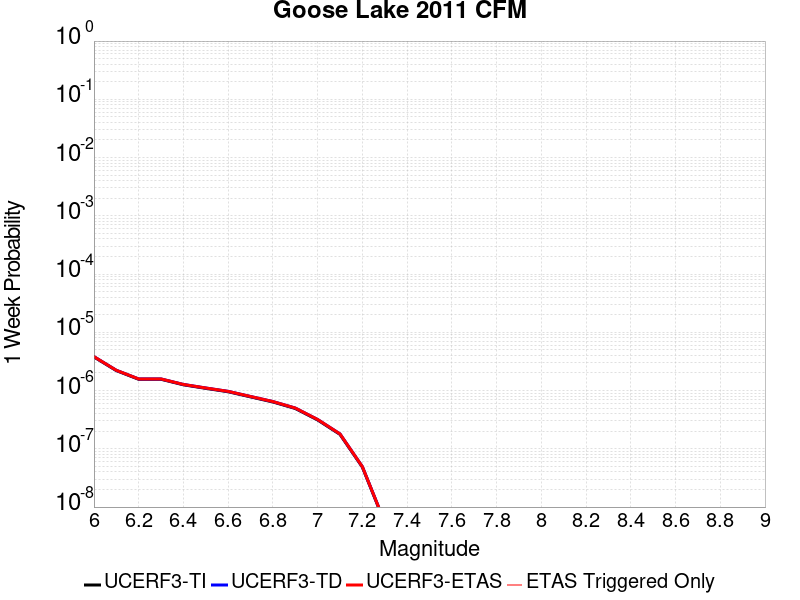 |  |  |  |

| Magnitude | 1 wk TI Prob | 1 wk TD Prob | 1 wk ETAS Prob | 1 wk ETAS/TD Gain | 1 wk ETAS Triggered Only | 1 mo TI Prob | 1 mo TD Prob | 1 mo ETAS Prob | 1 mo ETAS/TD Gain | 1 mo ETAS Triggered Only | 1 yr TI Prob | 1 yr TD Prob | 1 yr ETAS Prob | 1 yr ETAS/TD Gain | 1 yr ETAS Triggered Only | 10 yr TI Prob | 10 yr TD Prob | 10 yr ETAS Prob | 10 yr ETAS/TD Gain | 10 yr ETAS Triggered Only |
|-----|-----|-----|-----|-----|-----|-----|-----|-----|-----|-----|-----|-----|-----|-----|-----|-----|-----|-----|-----|-----|
| 6.0 | 3.780968E-6 | 3.823028E-6 | 3.823028E-6 | 1.0 | 0.0 | 1.6204049E-5 | 1.6384309E-5 | 1.6384309E-5 | 1.0 | 0.0 | 1.9726643E-4 | 1.9946179E-4 | 1.9946179E-4 | 1.0 | 0.0 | 0.001970914 | 0.001992936 | 0.002002916 | 1.0050077 | 1.0E-5 |
| 6.1 | 2.2035124E-6 | 2.2298047E-6 | 2.2298047E-6 | 1.0 | 0.0 | 9.443591E-6 | 9.556272E-6 | 9.556272E-6 | 1.0 | 0.0 | 1.1496965E-4 | 1.1634159E-4 | 1.1634159E-4 | 1.0 | 0.0 | 0.0011491019 | 0.001162825 | 0.0011728135 | 1.0085897 | 1.0E-5 |
| 6.2 | 1.5624689E-6 | 1.5826951E-6 | 1.5826951E-6 | 1.0 | 0.0 | 6.6962784E-6 | 6.7829615E-6 | 6.7829615E-6 | 1.0 | 0.0 | 8.152414E-5 | 8.257947E-5 | 8.257947E-5 | 1.0 | 0.0 | 8.1494235E-4 | 8.2549226E-4 | 8.35484E-4 | 1.012104 | 1.0E-5 |
| 6.3 | 1.5624689E-6 | 1.5826951E-6 | 1.5826951E-6 | 1.0 | 0.0 | 6.6962784E-6 | 6.7829615E-6 | 6.7829615E-6 | 1.0 | 0.0 | 8.152414E-5 | 8.257947E-5 | 8.257947E-5 | 1.0 | 0.0 | 8.1494235E-4 | 8.2549226E-4 | 8.35484E-4 | 1.012104 | 1.0E-5 |
| 6.4 | 1.256464E-6 | 1.2738719E-6 | 1.2738719E-6 | 1.0 | 0.0 | 5.3848344E-6 | 5.4594398E-6 | 5.4594398E-6 | 1.0 | 0.0 | 6.5558386E-5 | 6.6466666E-5 | 6.6466666E-5 | 1.0 | 0.0 | 6.553905E-4 | 6.644699E-4 | 6.744633E-4 | 1.0150396 | 1.0E-5 |
| 6.5 | 1.0910911E-6 | 1.1069426E-6 | 1.1069426E-6 | 1.0 | 0.0 | 4.6760965E-6 | 4.744031E-6 | 4.744031E-6 | 1.0 | 0.0 | 5.692999E-5 | 5.7757057E-5 | 5.7757057E-5 | 1.0 | 0.0 | 5.6915404E-4 | 5.7742174E-4 | 5.7742174E-4 | 1.0 | 0.0 |
| 6.6 | 9.546601E-7 | 9.691265E-7 | 9.691265E-7 | 1.0 | 0.0 | 4.091394E-6 | 4.1533926E-6 | 4.1533926E-6 | 1.0 | 0.0 | 4.9811584E-5 | 5.0566392E-5 | 5.0566392E-5 | 1.0 | 0.0 | 4.980042E-4 | 5.055498E-4 | 5.055498E-4 | 1.0 | 0.0 |
| 6.7 | 7.790316E-7 | 7.9159804E-7 | 7.9159804E-7 | 1.0 | 0.0 | 3.3387028E-6 | 3.3925587E-6 | 3.3925587E-6 | 1.0 | 0.0 | 4.0647945E-5 | 4.1303625E-5 | 4.1303625E-5 | 1.0 | 0.0 | 4.0640513E-4 | 4.1296007E-4 | 4.1296007E-4 | 1.0 | 0.0 |
| 6.8 | 6.3714384E-7 | 6.478754E-7 | 6.478754E-7 | 1.0 | 0.0 | 2.7306137E-6 | 2.776606E-6 | 2.776606E-6 | 1.0 | 0.0 | 3.3244716E-5 | 3.380466E-5 | 3.380466E-5 | 1.0 | 0.0 | 3.323974E-4 | 3.3799565E-4 | 3.3799565E-4 | 1.0 | 0.0 |
| 6.9 | 4.92586E-7 | 5.0139266E-7 | 5.0139266E-7 | 1.0 | 0.0 | 2.1110811E-6 | 2.148824E-6 | 2.148824E-6 | 1.0 | 0.0 | 2.5702111E-5 | 2.6161622E-5 | 2.6161622E-5 | 1.0 | 0.0 | 2.569914E-4 | 2.6158578E-4 | 2.6158578E-4 | 1.0 | 0.0 |
| 7.0 | 3.130245E-7 | 3.1903622E-7 | 3.1903622E-7 | 1.0 | 0.0 | 1.3415328E-6 | 1.3672974E-6 | 1.3672974E-6 | 1.0 | 0.0 | 1.6333039E-5 | 1.664672E-5 | 1.664672E-5 | 1.0 | 0.0 | 1.6331839E-4 | 1.6645493E-4 | 1.6645493E-4 | 1.0 | 0.0 |
| 7.1 | 1.7680084E-7 | 1.8023968E-7 | 1.8023968E-7 | 1.0 | 0.0 | 7.5771766E-7 | 7.7245556E-7 | 7.7245556E-7 | 1.0 | 0.0 | 9.225173E-6 | 9.404607E-6 | 9.404607E-6 | 1.0 | 0.0 | 9.22479E-5 | 9.4042196E-5 | 9.4042196E-5 | 1.0 | 0.0 |
| 7.2 | 4.8641045E-8 | 4.9402168E-8 | 4.9402168E-8 | 1.0 | 0.0 | 2.084616E-7 | 2.1172356E-7 | 2.1172356E-7 | 1.0 | 0.0 | 2.538017E-6 | 2.5777315E-6 | 2.5777315E-6 | 1.0 | 0.0 | 2.537988E-5 | 2.5777028E-5 | 2.5777028E-5 | 1.0 | 0.0 |
| 7.3 | 5.3911844E-9 | 5.4758256E-9 | 5.4758256E-9 | 1.0 | 0.0 | 2.3105075E-8 | 2.3467823E-8 | 2.3467823E-8 | 1.0 | 0.0 | 2.8130427E-7 | 2.8572074E-7 | 2.8572074E-7 | 1.0 | 0.0 | 2.8130391E-6 | 2.8572053E-6 | 2.8572053E-6 | 1.0 | 0.0 |

## San Jacinto (Superstition Mtn)
*[(top)](#table-of-contents)*

| 1 Week | 1 Month | 1 Year | 10 Year |
|-----|-----|-----|-----|
|  |  |  |  |

| Magnitude | 1 wk TI Prob | 1 wk TD Prob | 1 wk ETAS Prob | 1 wk ETAS/TD Gain | 1 wk ETAS Triggered Only | 1 mo TI Prob | 1 mo TD Prob | 1 mo ETAS Prob | 1 mo ETAS/TD Gain | 1 mo ETAS Triggered Only | 1 yr TI Prob | 1 yr TD Prob | 1 yr ETAS Prob | 1 yr ETAS/TD Gain | 1 yr ETAS Triggered Only | 10 yr TI Prob | 10 yr TD Prob | 10 yr ETAS Prob | 10 yr ETAS/TD Gain | 10 yr ETAS Triggered Only |
|-----|-----|-----|-----|-----|-----|-----|-----|-----|-----|-----|-----|-----|-----|-----|-----|-----|-----|-----|-----|-----|
| 6.0 | 6.4193904E-5 | 9.600102E-5 | 1.0600006E-4 | 1.1041555 | 1.0E-5 | 2.7508775E-4 | 4.1137784E-4 | 4.2137373E-4 | 1.0242985 | 1.0E-5 | 0.0033440501 | 0.004998455 | 0.0050084046 | 1.0019907 | 1.0E-5 | 0.03294174 | 0.048827495 | 0.048837006 | 1.0001948 | 1.0E-5 |
| 6.1 | 6.4193904E-5 | 9.600102E-5 | 1.0600006E-4 | 1.1041555 | 1.0E-5 | 2.7508775E-4 | 4.1137784E-4 | 4.2137373E-4 | 1.0242985 | 1.0E-5 | 0.0033440501 | 0.004998455 | 0.0050084046 | 1.0019907 | 1.0E-5 | 0.03294174 | 0.048827495 | 0.048837006 | 1.0001948 | 1.0E-5 |
| 6.2 | 5.7023593E-5 | 8.3151084E-5 | 9.315025E-5 | 1.120253 | 1.0E-5 | 2.4436394E-4 | 3.5632253E-4 | 3.6631897E-4 | 1.0280545 | 1.0E-5 | 0.002971072 | 0.004331238 | 0.004341195 | 1.0022988 | 1.0E-5 | 0.029316625 | 0.04250735 | 0.042516924 | 1.0002253 | 1.0E-5 |
| 6.3 | 5.6940098E-5 | 8.299644E-5 | 9.299561E-5 | 1.1204771 | 1.0E-5 | 2.4400617E-4 | 3.5565995E-4 | 3.656564E-4 | 1.0281067 | 1.0E-5 | 0.002966728 | 0.004323203 | 0.00433316 | 1.0023031 | 1.0E-5 | 0.029274331 | 0.0424306 | 0.042440176 | 1.0002257 | 1.0E-5 |
| 6.4 | 5.4171585E-5 | 7.7490105E-5 | 8.748933E-5 | 1.1290387 | 1.0E-5 | 2.3214328E-4 | 3.320675E-4 | 3.4206416E-4 | 1.0301044 | 1.0E-5 | 0.0028226813 | 0.004037075 | 0.004047035 | 1.002467 | 1.0E-5 | 0.02787096 | 0.03971982 | 0.039729424 | 1.0002418 | 1.0E-5 |
| 6.5 | 4.375144E-5 | 5.6427685E-5 | 6.642712E-5 | 1.177208 | 1.0E-5 | 1.874927E-4 | 2.4181715E-4 | 2.5181472E-4 | 1.0413436 | 1.0E-5 | 0.0022803338 | 0.0029413246 | 0.0029512953 | 1.0033898 | 1.0E-5 | 0.022570757 | 0.029240036 | 0.029249744 | 1.000332 | 1.0E-5 |
| 6.6 | 2.772192E-5 | 2.5494404E-5 | 3.549415E-5 | 1.3922329 | 1.0E-5 | 1.1880282E-4 | 1.0925727E-4 | 1.19256176E-4 | 1.0915171 | 1.0E-5 | 0.0014454646 | 0.0013294149 | 0.0013394016 | 1.0075121 | 1.0E-5 | 0.014360986 | 0.013543627 | 0.013553492 | 1.0007284 | 1.0E-5 |
| 6.7 | 2.7124124E-5 | 2.4705407E-5 | 3.470516E-5 | 1.4047596 | 1.0E-5 | 1.1624106E-4 | 1.05876126E-4 | 1.1587507E-4 | 1.09444 | 1.0E-5 | 0.0014143161 | 0.0012882988 | 0.0012982859 | 1.0077522 | 1.0E-5 | 0.014053487 | 0.013137068 | 0.013146936 | 1.0007513 | 1.0E-5 |
| 6.8 | 2.5475807E-5 | 2.2170334E-5 | 3.217011E-5 | 1.4510432 | 1.0E-5 | 1.0917746E-4 | 9.501232E-5 | 1.0501137E-4 | 1.1052395 | 1.0E-5 | 0.001328425 | 0.0011561731 | 0.0011661616 | 1.0086392 | 1.0E-5 | 0.0132051185 | 0.0118252365 | 0.011835119 | 1.0008357 | 1.0E-5 |
| 6.9 | 2.1162023E-5 | 1.7631666E-5 | 2.763149E-5 | 1.5671514 | 1.0E-5 | 9.069123E-5 | 7.5562115E-5 | 8.556136E-5 | 1.1323315 | 1.0E-5 | 0.0011036064 | 9.195843E-4 | 9.2957506E-4 | 1.0108645 | 1.0E-5 | 0.010981417 | 0.009449712 | 0.009459618 | 1.0010482 | 1.0E-5 |
| 7.0 | 1.8754288E-5 | 1.6166736E-5 | 2.6166574E-5 | 1.6185441 | 1.0E-5 | 8.037304E-5 | 6.9284186E-5 | 7.928349E-5 | 1.1443231 | 1.0E-5 | 9.781026E-4 | 8.4321096E-4 | 8.5320254E-4 | 1.0118494 | 1.0E-5 | 0.009738087 | 0.008672746 | 0.008682659 | 1.001143 | 1.0E-5 |
| 7.1 | 1.8678527E-5 | 1.6091873E-5 | 2.6091713E-5 | 1.6214217 | 1.0E-5 | 8.0048376E-5 | 6.896337E-5 | 7.896267E-5 | 1.1449945 | 1.0E-5 | 9.7415317E-4 | 8.3930796E-4 | 8.492996E-4 | 1.0119046 | 1.0E-5 | 0.009698939 | 0.008633699 | 0.008643613 | 1.0011482 | 1.0E-5 |
| 7.2 | 1.7804578E-5 | 1.5386398E-5 | 2.5386244E-5 | 1.6499147 | 1.0E-5 | 7.6303106E-5 | 6.5940054E-5 | 7.593939E-5 | 1.1516429 | 1.0E-5 | 9.285943E-4 | 8.0252666E-4 | 8.1251864E-4 | 1.0124507 | 1.0E-5 | 0.009247236 | 0.008264985 | 0.008274903 | 1.0012 | 1.0E-5 |
| 7.3 | 1.6583685E-5 | 1.4535444E-5 | 2.4535299E-5 | 1.6879635 | 1.0E-5 | 7.1070994E-5 | 6.2293286E-5 | 7.229266E-5 | 1.1605209 | 1.0E-5 | 8.649459E-4 | 7.5815886E-4 | 7.681513E-4 | 1.0131799 | 1.0E-5 | 0.00861587 | 0.007820267 | 0.007830189 | 1.0012687 | 1.0E-5 |
| 7.4 | 1.6387552E-5 | 1.4400321E-5 | 2.4400177E-5 | 1.694419 | 1.0E-5 | 7.023047E-5 | 6.171421E-5 | 7.171359E-5 | 1.1620272 | 1.0E-5 | 8.5472054E-4 | 7.5111346E-4 | 7.6110597E-4 | 1.0133035 | 1.0E-5 | 0.008514405 | 0.007749644 | 0.007759567 | 1.0012804 | 1.0E-5 |
| 7.5 | 1.5790754E-5 | 1.4040957E-5 | 2.4040815E-5 | 1.7121922 | 1.0E-5 | 6.767291E-5 | 6.017415E-5 | 7.017355E-5 | 1.1661743 | 1.0E-5 | 8.236062E-4 | 7.32376E-4 | 7.4236863E-4 | 1.0136442 | 1.0E-5 | 0.008205604 | 0.007560181 | 0.007570105 | 1.0013127 | 1.0E-5 |
| 7.6 | 1.4248672E-5 | 1.30597955E-5 | 2.3059665E-5 | 1.7656988 | 1.0E-5 | 6.106431E-5 | 5.596936E-5 | 6.59688E-5 | 1.1786592 | 1.0E-5 | 7.432043E-4 | 6.8121566E-4 | 6.912089E-4 | 1.0146697 | 1.0E-5 | 0.007407237 | 0.007042702 | 0.007052631 | 1.0014099 | 1.0E-5 |
| 7.7 | 1.15449975E-5 | 1.09083485E-5 | 2.090824E-5 | 1.9167191 | 1.0E-5 | 4.947762E-5 | 4.6749232E-5 | 5.6748762E-5 | 1.2138972 | 1.0E-5 | 6.022235E-4 | 5.69024E-4 | 5.790183E-4 | 1.0175639 | 1.0E-5 | 0.006005941 | 0.005912628 | 0.005922569 | 1.0016813 | 1.0E-5 |
| 7.8 | 9.1391985E-6 | 9.518787E-6 | 1.9518691E-5 | 2.050544 | 1.0E-5 | 3.9167408E-5 | 4.0794166E-5 | 5.079376E-5 | 1.2451231 | 1.0E-5 | 4.767588E-4 | 4.9655634E-4 | 5.065514E-4 | 1.0201287 | 1.0E-5 | 0.0047573727 | 0.0051790397 | 0.005188988 | 1.0019208 | 1.0E-5 |
| 7.9 | 6.973017E-6 | 7.3861297E-6 | 1.7386055E-5 | 2.353879 | 1.0E-5 | 2.9884017E-5 | 3.165446E-5 | 4.1654144E-5 | 1.3159013 | 1.0E-5 | 3.6377716E-4 | 3.8532543E-4 | 3.9532158E-4 | 1.0259421 | 1.0E-5 | 0.0036318225 | 0.004053871 | 0.0040638302 | 1.0024568 | 1.0E-5 |
| 8.0 | 5.7638235E-6 | 6.263572E-6 | 1.626351E-5 | 2.596523 | 1.0E-5 | 2.4701867E-5 | 2.6843605E-5 | 3.6843336E-5 | 1.3725182 | 1.0E-5 | 3.0070372E-4 | 3.267724E-4 | 3.3676912E-4 | 1.0305923 | 1.0E-5 | 0.0030029714 | 0.0034553434 | 0.0034653088 | 1.002884 | 1.0E-5 |
| 8.1 | 5.1124434E-6 | 5.498948E-6 | 1.5498894E-5 | 2.8185196 | 1.0E-5 | 2.1910288E-5 | 2.3566712E-5 | 3.3566477E-5 | 1.4243174 | 1.0E-5 | 2.6672508E-4 | 2.8688743E-4 | 2.9688457E-4 | 1.0348469 | 1.0E-5 | 0.0026640517 | 0.0030420625 | 0.003052032 | 1.0032773 | 1.0E-5 |
| 8.2 | 1.1075938E-6 | 5.341373E-7 | 5.341373E-7 | 1.0 | 0.0 | 4.7468216E-6 | 2.289158E-6 | 2.289158E-6 | 1.0 | 0.0 | 5.779102E-5 | 2.7870163E-5 | 2.7870163E-5 | 1.0 | 0.0 | 5.777599E-4 | 3.1373248E-4 | 3.1373248E-4 | 1.0 | 0.0 |
| 8.3 | 1.3584393E-8 | 4.478424E-9 | 4.478424E-9 | 1.0 | 0.0 | 5.8218827E-8 | 1.9193244E-8 | 1.9193244E-8 | 1.0 | 0.0 | 7.0881396E-7 | 2.3367775E-7 | 2.3367775E-7 | 1.0 | 0.0 | 7.0881174E-6 | 2.6188773E-6 | 2.6188773E-6 | 1.0 | 0.0 |

## Homestead Valley 2011
*[(top)](#table-of-contents)*

| 1 Week | 1 Month | 1 Year | 10 Year |
|-----|-----|-----|-----|
|  |  |  |  |

| Magnitude | 1 wk TI Prob | 1 wk TD Prob | 1 wk ETAS Prob | 1 wk ETAS/TD Gain | 1 wk ETAS Triggered Only | 1 mo TI Prob | 1 mo TD Prob | 1 mo ETAS Prob | 1 mo ETAS/TD Gain | 1 mo ETAS Triggered Only | 1 yr TI Prob | 1 yr TD Prob | 1 yr ETAS Prob | 1 yr ETAS/TD Gain | 1 yr ETAS Triggered Only | 10 yr TI Prob | 10 yr TD Prob | 10 yr ETAS Prob | 10 yr ETAS/TD Gain | 10 yr ETAS Triggered Only |
|-----|-----|-----|-----|-----|-----|-----|-----|-----|-----|-----|-----|-----|-----|-----|-----|-----|-----|-----|-----|-----|
| 6.0 | 1.539795E-5 | 6.2866725E-6 | 6.2866725E-6 | 1.0 | 0.0 | 6.5989545E-5 | 2.694272E-5 | 2.694272E-5 | 1.0 | 0.0 | 8.0312655E-4 | 3.2799886E-4 | 3.3799556E-4 | 1.0304779 | 1.0E-5 | 0.008002302 | 0.0032771684 | 0.0032871356 | 1.0030414 | 1.0E-5 |
| 6.1 | 1.539795E-5 | 6.2866725E-6 | 6.2866725E-6 | 1.0 | 0.0 | 6.5989545E-5 | 2.694272E-5 | 2.694272E-5 | 1.0 | 0.0 | 8.0312655E-4 | 3.2799886E-4 | 3.3799556E-4 | 1.0304779 | 1.0E-5 | 0.008002302 | 0.0032771684 | 0.0032871356 | 1.0030414 | 1.0E-5 |
| 6.2 | 1.539795E-5 | 6.2866725E-6 | 6.2866725E-6 | 1.0 | 0.0 | 6.5989545E-5 | 2.694272E-5 | 2.694272E-5 | 1.0 | 0.0 | 8.0312655E-4 | 3.2799886E-4 | 3.3799556E-4 | 1.0304779 | 1.0E-5 | 0.008002302 | 0.0032771684 | 0.0032871356 | 1.0030414 | 1.0E-5 |
| 6.3 | 1.539795E-5 | 6.2866725E-6 | 6.2866725E-6 | 1.0 | 0.0 | 6.5989545E-5 | 2.694272E-5 | 2.694272E-5 | 1.0 | 0.0 | 8.0312655E-4 | 3.2799886E-4 | 3.3799556E-4 | 1.0304779 | 1.0E-5 | 0.008002302 | 0.0032771684 | 0.0032871356 | 1.0030414 | 1.0E-5 |
| 6.4 | 1.539795E-5 | 6.2866725E-6 | 6.2866725E-6 | 1.0 | 0.0 | 6.5989545E-5 | 2.694272E-5 | 2.694272E-5 | 1.0 | 0.0 | 8.0312655E-4 | 3.2799886E-4 | 3.3799556E-4 | 1.0304779 | 1.0E-5 | 0.008002302 | 0.0032771684 | 0.0032871356 | 1.0030414 | 1.0E-5 |
| 6.5 | 1.0265258E-5 | 2.8788809E-6 | 2.8788809E-6 | 1.0 | 0.0 | 4.3993223E-5 | 1.2338042E-5 | 1.2338042E-5 | 1.0 | 0.0 | 5.3548586E-4 | 1.5021226E-4 | 1.5021226E-4 | 1.0 | 0.0 | 0.005341973 | 0.0015017892 | 0.0015017892 | 1.0 | 0.0 |
| 6.6 | 6.664671E-6 | 5.3483575E-7 | 5.3483575E-7 | 1.0 | 0.0 | 2.8562565E-5 | 2.2921517E-6 | 2.2921517E-6 | 1.0 | 0.0 | 3.476937E-4 | 2.790671E-5 | 2.790671E-5 | 1.0 | 0.0 | 0.003471502 | 2.7904368E-4 | 2.7904368E-4 | 1.0 | 0.0 |
| 6.7 | 6.5954046E-6 | 5.3483575E-7 | 5.3483575E-7 | 1.0 | 0.0 | 2.8265715E-5 | 2.2921517E-6 | 2.2921517E-6 | 1.0 | 0.0 | 3.4408073E-4 | 2.790671E-5 | 2.790671E-5 | 1.0 | 0.0 | 0.0034354846 | 2.7904368E-4 | 2.7904368E-4 | 1.0 | 0.0 |
| 6.8 | 4.648189E-6 | 2.3266526E-7 | 2.3266526E-7 | 1.0 | 0.0 | 1.9920659E-5 | 9.971365E-7 | 9.971365E-7 | 1.0 | 0.0 | 2.4250703E-4 | 1.21400735E-5 | 1.21400735E-5 | 1.0 | 0.0 | 0.0024224254 | 1.2139459E-4 | 1.2139459E-4 | 1.0 | 0.0 |
| 6.9 | 4.1428534E-6 | 1.9345389E-7 | 1.9345389E-7 | 1.0 | 0.0 | 1.7754966E-5 | 8.2908787E-7 | 8.2908787E-7 | 1.0 | 0.0 | 2.1614527E-4 | 1.0094101E-5 | 1.0094101E-5 | 1.0 | 0.0 | 0.0021593515 | 1.0093672E-4 | 1.0093672E-4 | 1.0 | 0.0 |
| 7.0 | 3.0673707E-6 | 1.5368272E-7 | 1.5368272E-7 | 1.0 | 0.0 | 1.3145808E-5 | 6.5864003E-7 | 6.5864003E-7 | 1.0 | 0.0 | 1.6003846E-4 | 8.018914E-6 | 8.018914E-6 | 1.0 | 0.0 | 0.0015992324 | 8.018635E-5 | 8.018635E-5 | 1.0 | 0.0 |
| 7.1 | 2.340854E-6 | 1.468828E-7 | 1.468828E-7 | 1.0 | 0.0 | 1.0032193E-5 | 6.2949755E-7 | 6.2949755E-7 | 1.0 | 0.0 | 1.221351E-4 | 7.664107E-6 | 7.664107E-6 | 1.0 | 0.0 | 0.00122068 | 7.663853E-5 | 7.663853E-5 | 1.0 | 0.0 |
| 7.2 | 1.3754182E-6 | 1.3923189E-7 | 1.3923189E-7 | 1.0 | 0.0 | 5.8946357E-6 | 5.9670793E-7 | 5.9670793E-7 | 1.0 | 0.0 | 7.176483E-5 | 7.264896E-6 | 7.264896E-6 | 1.0 | 0.0 | 7.174166E-4 | 7.2646675E-5 | 7.2646675E-5 | 1.0 | 0.0 |
| 7.3 | 1.2573237E-6 | 1.3827695E-7 | 1.3827695E-7 | 1.0 | 0.0 | 5.388519E-6 | 5.926153E-7 | 5.926153E-7 | 1.0 | 0.0 | 6.560324E-5 | 7.2150688E-6 | 7.2150688E-6 | 1.0 | 0.0 | 6.558388E-4 | 7.214844E-5 | 7.214844E-5 | 1.0 | 0.0 |
| 7.4 | 1.0994207E-6 | 1.3106616E-7 | 1.3106616E-7 | 1.0 | 0.0 | 4.7117946E-6 | 5.61712E-7 | 5.61712E-7 | 1.0 | 0.0 | 5.736459E-5 | 6.838823E-6 | 6.838823E-6 | 1.0 | 0.0 | 5.734978E-4 | 6.8386216E-5 | 6.8386216E-5 | 1.0 | 0.0 |
| 7.5 | 5.5569126E-7 | 6.773262E-8 | 6.773262E-8 | 1.0 | 0.0 | 2.3815317E-6 | 2.9028263E-7 | 2.9028263E-7 | 1.0 | 0.0 | 2.8994764E-5 | 3.534186E-6 | 3.534186E-6 | 1.0 | 0.0 | 2.899098E-4 | 3.534136E-5 | 3.534136E-5 | 1.0 | 0.0 |

## Los Medanos - Roe Island
*[(top)](#table-of-contents)*

| 1 Week | 1 Month | 1 Year | 10 Year |
|-----|-----|-----|-----|
|  |  |  |  |

| Magnitude | 1 wk TI Prob | 1 wk TD Prob | 1 wk ETAS Prob | 1 wk ETAS/TD Gain | 1 wk ETAS Triggered Only | 1 mo TI Prob | 1 mo TD Prob | 1 mo ETAS Prob | 1 mo ETAS/TD Gain | 1 mo ETAS Triggered Only | 1 yr TI Prob | 1 yr TD Prob | 1 yr ETAS Prob | 1 yr ETAS/TD Gain | 1 yr ETAS Triggered Only | 10 yr TI Prob | 10 yr TD Prob | 10 yr ETAS Prob | 10 yr ETAS/TD Gain | 10 yr ETAS Triggered Only |
|-----|-----|-----|-----|-----|-----|-----|-----|-----|-----|-----|-----|-----|-----|-----|-----|-----|-----|-----|-----|-----|
| 6.0 | 9.06745E-7 | 9.796379E-7 | 9.796379E-7 | 1.0 | 0.0 | 3.8860444E-6 | 4.1984417E-6 | 4.1984417E-6 | 1.0 | 0.0 | 4.731156E-5 | 5.1114836E-5 | 5.1114836E-5 | 1.0 | 0.0 | 4.730149E-4 | 5.1103166E-4 | 5.2102655E-4 | 1.0195583 | 1.0E-5 |
| 6.1 | 9.06745E-7 | 9.796379E-7 | 9.796379E-7 | 1.0 | 0.0 | 3.8860444E-6 | 4.1984417E-6 | 4.1984417E-6 | 1.0 | 0.0 | 4.731156E-5 | 5.1114836E-5 | 5.1114836E-5 | 1.0 | 0.0 | 4.730149E-4 | 5.1103166E-4 | 5.2102655E-4 | 1.0195583 | 1.0E-5 |
| 6.2 | 9.06745E-7 | 9.796379E-7 | 9.796379E-7 | 1.0 | 0.0 | 3.8860444E-6 | 4.1984417E-6 | 4.1984417E-6 | 1.0 | 0.0 | 4.731156E-5 | 5.1114836E-5 | 5.1114836E-5 | 1.0 | 0.0 | 4.730149E-4 | 5.1103166E-4 | 5.2102655E-4 | 1.0195583 | 1.0E-5 |
| 6.3 | 9.06745E-7 | 9.796379E-7 | 9.796379E-7 | 1.0 | 0.0 | 3.8860444E-6 | 4.1984417E-6 | 4.1984417E-6 | 1.0 | 0.0 | 4.731156E-5 | 5.1114836E-5 | 5.1114836E-5 | 1.0 | 0.0 | 4.730149E-4 | 5.1103166E-4 | 5.2102655E-4 | 1.0195583 | 1.0E-5 |
| 6.4 | 9.06745E-7 | 9.796379E-7 | 9.796379E-7 | 1.0 | 0.0 | 3.8860444E-6 | 4.1984417E-6 | 4.1984417E-6 | 1.0 | 0.0 | 4.731156E-5 | 5.1114836E-5 | 5.1114836E-5 | 1.0 | 0.0 | 4.730149E-4 | 5.1103166E-4 | 5.2102655E-4 | 1.0195583 | 1.0E-5 |
| 6.5 | 9.06745E-7 | 9.796379E-7 | 9.796379E-7 | 1.0 | 0.0 | 3.8860444E-6 | 4.1984417E-6 | 4.1984417E-6 | 1.0 | 0.0 | 4.731156E-5 | 5.1114836E-5 | 5.1114836E-5 | 1.0 | 0.0 | 4.730149E-4 | 5.1103166E-4 | 5.2102655E-4 | 1.0195583 | 1.0E-5 |
| 6.6 | 9.06745E-7 | 9.796379E-7 | 9.796379E-7 | 1.0 | 0.0 | 3.8860444E-6 | 4.1984417E-6 | 4.1984417E-6 | 1.0 | 0.0 | 4.731156E-5 | 5.1114836E-5 | 5.1114836E-5 | 1.0 | 0.0 | 4.730149E-4 | 5.1103166E-4 | 5.2102655E-4 | 1.0195583 | 1.0E-5 |
| 6.7 | 8.984686E-7 | 9.713045E-7 | 9.713045E-7 | 1.0 | 0.0 | 3.850574E-6 | 4.1627272E-6 | 4.1627272E-6 | 1.0 | 0.0 | 4.687973E-5 | 5.0680035E-5 | 5.0680035E-5 | 1.0 | 0.0 | 4.6869842E-4 | 5.0668564E-4 | 5.166806E-4 | 1.0197262 | 1.0E-5 |
| 6.8 | 8.5634423E-7 | 9.227546E-7 | 9.227546E-7 | 1.0 | 0.0 | 3.6700415E-6 | 3.9546567E-6 | 3.9546567E-6 | 1.0 | 0.0 | 4.4681838E-5 | 4.814689E-5 | 4.814689E-5 | 1.0 | 0.0 | 4.4672855E-4 | 4.813653E-4 | 4.913605E-4 | 1.0207642 | 1.0E-5 |
| 6.9 | 7.9857483E-7 | 8.59453E-7 | 8.59453E-7 | 1.0 | 0.0 | 3.422459E-6 | 3.6833649E-6 | 3.6833649E-6 | 1.0 | 0.0 | 4.166764E-5 | 4.484405E-5 | 4.484405E-5 | 1.0 | 0.0 | 4.165983E-4 | 4.4835065E-4 | 4.5834616E-4 | 1.0222939 | 1.0E-5 |
| 7.0 | 6.898334E-7 | 7.39724E-7 | 7.39724E-7 | 1.0 | 0.0 | 2.9564258E-6 | 3.1702418E-6 | 3.1702418E-6 | 1.0 | 0.0 | 3.599389E-5 | 3.8597016E-5 | 3.8597016E-5 | 1.0 | 0.0 | 3.598806E-4 | 3.8590352E-4 | 3.9589967E-4 | 1.0259032 | 1.0E-5 |
| 7.1 | 5.5734876E-7 | 5.968393E-7 | 5.968393E-7 | 1.0 | 0.0 | 2.3886353E-6 | 2.5578802E-6 | 2.5578802E-6 | 1.0 | 0.0 | 2.9081246E-5 | 3.114175E-5 | 3.114175E-5 | 1.0 | 0.0 | 2.9077442E-4 | 3.113741E-4 | 3.21371E-4 | 1.0321057 | 1.0E-5 |
| 7.2 | 4.0792582E-7 | 4.3569815E-7 | 4.3569815E-7 | 1.0 | 0.0 | 1.7482523E-6 | 1.8672764E-6 | 1.8672764E-6 | 1.0 | 0.0 | 2.1284764E-5 | 2.2733855E-5 | 2.2733855E-5 | 1.0 | 0.0 | 2.1282726E-4 | 2.2731545E-4 | 2.2731545E-4 | 1.0 | 0.0 |
| 7.3 | 2.6733358E-7 | 2.8579413E-7 | 2.8579413E-7 | 1.0 | 0.0 | 1.1457148E-6 | 1.2248314E-6 | 1.2248314E-6 | 1.0 | 0.0 | 1.3948988E-5 | 1.4912222E-5 | 1.4912222E-5 | 1.0 | 0.0 | 1.3948113E-4 | 1.4911228E-4 | 1.4911228E-4 | 1.0 | 0.0 |
| 7.4 | 1.5851728E-7 | 1.691008E-7 | 1.691008E-7 | 1.0 | 0.0 | 6.7935963E-7 | 7.247175E-7 | 7.247175E-7 | 1.0 | 0.0 | 8.271172E-6 | 8.8234E-6 | 8.8234E-6 | 1.0 | 0.0 | 8.270864E-5 | 8.8230525E-5 | 8.8230525E-5 | 1.0 | 0.0 |
| 7.5 | 1.06756E-7 | 1.1379502E-7 | 1.1379502E-7 | 1.0 | 0.0 | 4.575256E-7 | 4.8769283E-7 | 4.8769283E-7 | 1.0 | 0.0 | 5.57036E-6 | 5.9376443E-6 | 5.9376443E-6 | 1.0 | 0.0 | 5.5702203E-5 | 5.9374877E-5 | 5.9374877E-5 | 1.0 | 0.0 |
| 7.6 | 6.48122E-8 | 6.90474E-8 | 6.90474E-8 | 1.0 | 0.0 | 2.7776653E-7 | 2.959174E-7 | 2.959174E-7 | 1.0 | 0.0 | 3.3818023E-6 | 3.6027886E-6 | 3.6027886E-6 | 1.0 | 0.0 | 3.381751E-5 | 3.6027315E-5 | 3.6027315E-5 | 1.0 | 0.0 |
| 7.7 | 1.198296E-9 | 1.2904097E-9 | 1.2904097E-9 | 1.0 | 0.0 | 5.135554E-9 | 5.5303273E-9 | 5.5303273E-9 | 1.0 | 0.0 | 6.252537E-8 | 6.733173E-8 | 6.733173E-8 | 1.0 | 0.0 | 6.2525356E-7 | 6.733172E-7 | 6.733172E-7 | 1.0 | 0.0 |

## Hector Mine
*[(top)](#table-of-contents)*

| 1 Week | 1 Month | 1 Year | 10 Year |
|-----|-----|-----|-----|
|  |  |  |  |

| Magnitude | 1 wk TI Prob | 1 wk TD Prob | 1 wk ETAS Prob | 1 wk ETAS/TD Gain | 1 wk ETAS Triggered Only | 1 mo TI Prob | 1 mo TD Prob | 1 mo ETAS Prob | 1 mo ETAS/TD Gain | 1 mo ETAS Triggered Only | 1 yr TI Prob | 1 yr TD Prob | 1 yr ETAS Prob | 1 yr ETAS/TD Gain | 1 yr ETAS Triggered Only | 10 yr TI Prob | 10 yr TD Prob | 10 yr ETAS Prob | 10 yr ETAS/TD Gain | 10 yr ETAS Triggered Only |
|-----|-----|-----|-----|-----|-----|-----|-----|-----|-----|-----|-----|-----|-----|-----|-----|-----|-----|-----|-----|-----|
| 6.0 | 1.8760093E-5 | 2.796445E-6 | 2.796445E-6 | 1.0 | 0.0 | 8.039792E-5 | 1.1984732E-5 | 1.1984732E-5 | 1.0 | 0.0 | 9.78405E-4 | 1.4590833E-4 | 1.5590688E-4 | 1.0685261 | 1.0E-5 | 0.009741086 | 0.0014585176 | 0.001468503 | 1.0068463 | 1.0E-5 |
| 6.1 | 1.8760093E-5 | 2.796445E-6 | 2.796445E-6 | 1.0 | 0.0 | 8.039792E-5 | 1.1984732E-5 | 1.1984732E-5 | 1.0 | 0.0 | 9.78405E-4 | 1.4590833E-4 | 1.5590688E-4 | 1.0685261 | 1.0E-5 | 0.009741086 | 0.0014585176 | 0.001468503 | 1.0068463 | 1.0E-5 |
| 6.2 | 1.8760093E-5 | 2.796445E-6 | 2.796445E-6 | 1.0 | 0.0 | 8.039792E-5 | 1.1984732E-5 | 1.1984732E-5 | 1.0 | 0.0 | 9.78405E-4 | 1.4590833E-4 | 1.5590688E-4 | 1.0685261 | 1.0E-5 | 0.009741086 | 0.0014585176 | 0.001468503 | 1.0068463 | 1.0E-5 |
| 6.3 | 1.8760093E-5 | 2.796445E-6 | 2.796445E-6 | 1.0 | 0.0 | 8.039792E-5 | 1.1984732E-5 | 1.1984732E-5 | 1.0 | 0.0 | 9.78405E-4 | 1.4590833E-4 | 1.5590688E-4 | 1.0685261 | 1.0E-5 | 0.009741086 | 0.0014585176 | 0.001468503 | 1.0068463 | 1.0E-5 |
| 6.4 | 1.0888055E-5 | 2.796445E-6 | 2.796445E-6 | 1.0 | 0.0 | 4.666226E-5 | 1.1984732E-5 | 1.1984732E-5 | 1.0 | 0.0 | 5.679649E-4 | 1.4590833E-4 | 1.5590688E-4 | 1.0685261 | 1.0E-5 | 0.0056651547 | 0.0014585176 | 0.001468503 | 1.0068463 | 1.0E-5 |
| 6.5 | 1.0888055E-5 | 2.796445E-6 | 2.796445E-6 | 1.0 | 0.0 | 4.666226E-5 | 1.1984732E-5 | 1.1984732E-5 | 1.0 | 0.0 | 5.679649E-4 | 1.4590833E-4 | 1.5590688E-4 | 1.0685261 | 1.0E-5 | 0.0056651547 | 0.0014585176 | 0.001468503 | 1.0068463 | 1.0E-5 |
| 6.6 | 1.0730738E-5 | 2.796445E-6 | 2.796445E-6 | 1.0 | 0.0 | 4.5988065E-5 | 1.1984732E-5 | 1.1984732E-5 | 1.0 | 0.0 | 5.5976084E-4 | 1.4590833E-4 | 1.5590688E-4 | 1.0685261 | 1.0E-5 | 0.0055835294 | 0.0014585176 | 0.001468503 | 1.0068463 | 1.0E-5 |
| 6.7 | 7.881326E-6 | 2.7711246E-6 | 2.7711246E-6 | 1.0 | 0.0 | 3.3776672E-5 | 1.1876217E-5 | 1.1876217E-5 | 1.0 | 0.0 | 4.111534E-4 | 1.4458735E-4 | 1.545859E-4 | 1.0691524 | 1.0E-5 | 0.0041039353 | 0.0014453249 | 0.0014553105 | 1.0069089 | 1.0E-5 |
| 6.8 | 7.5683483E-6 | 2.7328742E-6 | 2.7328742E-6 | 1.0 | 0.0 | 3.2435375E-5 | 1.1712288E-5 | 1.1712288E-5 | 1.0 | 0.0 | 3.9482914E-4 | 1.4259177E-4 | 1.5259035E-4 | 1.0701202 | 1.0E-5 | 0.0039412836 | 0.0014253948 | 0.0014353805 | 1.0070056 | 1.0E-5 |
| 6.9 | 6.473048E-6 | 2.513948E-6 | 2.513948E-6 | 1.0 | 0.0 | 2.7741338E-5 | 1.0774041E-5 | 1.0774041E-5 | 1.0 | 0.0 | 3.3769844E-4 | 1.3117002E-4 | 1.3117002E-4 | 1.0 | 0.0 | 0.0033718573 | 0.0013113155 | 0.0013113155 | 1.0 | 0.0 |
| 7.0 | 4.9959954E-6 | 1.8565554E-6 | 1.8565554E-6 | 1.0 | 0.0 | 2.1411232E-5 | 7.956662E-6 | 7.956662E-6 | 1.0 | 0.0 | 2.6065056E-4 | 9.687162E-5 | 9.687162E-5 | 1.0 | 0.0 | 0.0026034506 | 9.686435E-4 | 9.686435E-4 | 1.0 | 0.0 |
| 7.1 | 1.2997541E-6 | 1.5602835E-7 | 1.5602835E-7 | 1.0 | 0.0 | 5.5703626E-6 | 6.686928E-7 | 6.686928E-7 | 1.0 | 0.0 | 6.7817055E-5 | 8.141308E-6 | 8.141308E-6 | 1.0 | 0.0 | 6.779636E-4 | 8.141049E-5 | 8.141049E-5 | 1.0 | 0.0 |
| 7.2 | 8.392699E-7 | 9.728028E-8 | 9.728028E-8 | 1.0 | 0.0 | 3.596866E-6 | 4.1691544E-7 | 4.1691544E-7 | 1.0 | 0.0 | 4.3790962E-5 | 5.0759354E-6 | 5.0759354E-6 | 1.0 | 0.0 | 4.3782333E-4 | 5.075839E-5 | 5.075839E-5 | 1.0 | 0.0 |
| 7.3 | 3.13015E-7 | 4.8294503E-8 | 4.8294503E-8 | 1.0 | 0.0 | 1.3414921E-6 | 2.0697642E-7 | 2.0697642E-7 | 1.0 | 0.0 | 1.6332544E-5 | 2.5199358E-6 | 2.5199358E-6 | 1.0 | 0.0 | 1.6331344E-4 | 2.5199157E-5 | 2.5199157E-5 | 1.0 | 0.0 |

## Robinson Creek
*[(top)](#table-of-contents)*

| 1 Week | 1 Month | 1 Year | 10 Year |
|-----|-----|-----|-----|
|  |  |  |  |

| Magnitude | 1 wk TI Prob | 1 wk TD Prob | 1 wk ETAS Prob | 1 wk ETAS/TD Gain | 1 wk ETAS Triggered Only | 1 mo TI Prob | 1 mo TD Prob | 1 mo ETAS Prob | 1 mo ETAS/TD Gain | 1 mo ETAS Triggered Only | 1 yr TI Prob | 1 yr TD Prob | 1 yr ETAS Prob | 1 yr ETAS/TD Gain | 1 yr ETAS Triggered Only | 10 yr TI Prob | 10 yr TD Prob | 10 yr ETAS Prob | 10 yr ETAS/TD Gain | 10 yr ETAS Triggered Only |
|-----|-----|-----|-----|-----|-----|-----|-----|-----|-----|-----|-----|-----|-----|-----|-----|-----|-----|-----|-----|-----|
| 6.0 | 1.3705327E-5 | 1.5285246E-5 | 1.5285246E-5 | 1.0 | 0.0 | 5.8735794E-5 | 6.5508204E-5 | 6.5508204E-5 | 1.0 | 0.0 | 7.1487366E-4 | 7.9756236E-4 | 8.075544E-4 | 1.0125282 | 1.0E-5 | 0.0071257832 | 0.007975623 | 0.007985543 | 1.0012438 | 1.0E-5 |
| 6.1 | 1.3705327E-5 | 1.5285246E-5 | 1.5285246E-5 | 1.0 | 0.0 | 5.8735794E-5 | 6.5508204E-5 | 6.5508204E-5 | 1.0 | 0.0 | 7.1487366E-4 | 7.9756236E-4 | 8.075544E-4 | 1.0125282 | 1.0E-5 | 0.0071257832 | 0.007975623 | 0.007985543 | 1.0012438 | 1.0E-5 |
| 6.2 | 1.3705327E-5 | 1.5285246E-5 | 1.5285246E-5 | 1.0 | 0.0 | 5.8735794E-5 | 6.5508204E-5 | 6.5508204E-5 | 1.0 | 0.0 | 7.1487366E-4 | 7.9756236E-4 | 8.075544E-4 | 1.0125282 | 1.0E-5 | 0.0071257832 | 0.007975623 | 0.007985543 | 1.0012438 | 1.0E-5 |
| 6.3 | 1.3705327E-5 | 1.5285246E-5 | 1.5285246E-5 | 1.0 | 0.0 | 5.8735794E-5 | 6.5508204E-5 | 6.5508204E-5 | 1.0 | 0.0 | 7.1487366E-4 | 7.9756236E-4 | 8.075544E-4 | 1.0125282 | 1.0E-5 | 0.0071257832 | 0.007975623 | 0.007985543 | 1.0012438 | 1.0E-5 |
| 6.4 | 1.3705327E-5 | 1.5285246E-5 | 1.5285246E-5 | 1.0 | 0.0 | 5.8735794E-5 | 6.5508204E-5 | 6.5508204E-5 | 1.0 | 0.0 | 7.1487366E-4 | 7.9756236E-4 | 8.075544E-4 | 1.0125282 | 1.0E-5 | 0.0071257832 | 0.007975623 | 0.007985543 | 1.0012438 | 1.0E-5 |

## Laguna Salada
*[(top)](#table-of-contents)*

| 1 Week | 1 Month | 1 Year | 10 Year |
|-----|-----|-----|-----|
|  |  |  |  |

| Magnitude | 1 wk TI Prob | 1 wk TD Prob | 1 wk ETAS Prob | 1 wk ETAS/TD Gain | 1 wk ETAS Triggered Only | 1 mo TI Prob | 1 mo TD Prob | 1 mo ETAS Prob | 1 mo ETAS/TD Gain | 1 mo ETAS Triggered Only | 1 yr TI Prob | 1 yr TD Prob | 1 yr ETAS Prob | 1 yr ETAS/TD Gain | 1 yr ETAS Triggered Only | 10 yr TI Prob | 10 yr TD Prob | 10 yr ETAS Prob | 10 yr ETAS/TD Gain | 10 yr ETAS Triggered Only |
|-----|-----|-----|-----|-----|-----|-----|-----|-----|-----|-----|-----|-----|-----|-----|-----|-----|-----|-----|-----|-----|
| 6.0 | 4.6465593E-5 | 4.6348207E-5 | 4.6348207E-5 | 1.0 | 0.0 | 1.9912305E-4 | 1.9861726E-4 | 1.9861726E-4 | 1.0 | 0.0 | 0.0024216278 | 0.00241552 | 0.0024254958 | 1.0041299 | 1.0E-5 | 0.02395408 | 0.023976143 | 0.023985904 | 1.0004071 | 1.0E-5 |
| 6.1 | 3.982297E-5 | 3.724746E-5 | 3.724746E-5 | 1.0 | 0.0 | 1.706587E-4 | 1.596229E-4 | 1.596229E-4 | 1.0 | 0.0 | 0.0020757897 | 0.0019417991 | 0.0019417991 | 1.0 | 0.0 | 0.020565065 | 0.019332534 | 0.019332534 | 1.0 | 0.0 |
| 6.2 | 3.6067784E-5 | 3.2603868E-5 | 3.2603868E-5 | 1.0 | 0.0 | 1.5456705E-4 | 1.3972401E-4 | 1.3972401E-4 | 1.0 | 0.0 | 0.0018802295 | 0.0016999225 | 0.0016999225 | 1.0 | 0.0 | 0.018644003 | 0.016950224 | 0.016950224 | 1.0 | 0.0 |
| 6.3 | 3.2859112E-5 | 2.885047E-5 | 2.885047E-5 | 1.0 | 0.0 | 1.4081717E-4 | 1.2363958E-4 | 1.2363958E-4 | 1.0 | 0.0 | 0.0017131006 | 0.0015043735 | 0.0015043735 | 1.0 | 0.0 | 0.016999546 | 0.015019288 | 0.015019288 | 1.0 | 0.0 |
| 6.4 | 2.9132116E-5 | 2.4853804E-5 | 2.4853804E-5 | 1.0 | 0.0 | 1.2484594E-4 | 1.0651246E-4 | 1.0651246E-4 | 1.0 | 0.0 | 0.0015189396 | 0.0012961086 | 0.0012961086 | 1.0 | 0.0 | 0.015085992 | 0.012956688 | 0.012956688 | 1.0 | 0.0 |
| 6.5 | 2.7075037E-5 | 2.282657E-5 | 2.282657E-5 | 1.0 | 0.0 | 1.1603071E-4 | 9.782499E-5 | 9.782499E-5 | 1.0 | 0.0 | 0.0014117584 | 0.0011904568 | 0.0011904568 | 1.0 | 0.0 | 0.014028233 | 0.011908123 | 0.011908123 | 1.0 | 0.0 |
| 6.6 | 2.2367465E-5 | 1.8574116E-5 | 1.8574116E-5 | 1.0 | 0.0 | 9.5857045E-5 | 7.960139E-5 | 7.960139E-5 | 1.0 | 0.0 | 0.0011664346 | 9.6879835E-4 | 9.6879835E-4 | 1.0 | 0.0 | 0.011603311 | 0.009702492 | 0.009702492 | 1.0 | 0.0 |
| 6.7 | 1.9458053E-5 | 1.5914746E-5 | 1.5914746E-5 | 1.0 | 0.0 | 8.338899E-5 | 6.8204725E-5 | 6.8204725E-5 | 1.0 | 0.0 | 0.001014788 | 8.301565E-4 | 8.301565E-4 | 1.0 | 0.0 | 0.010101665 | 0.0083212 | 0.0083212 | 1.0 | 0.0 |
| 6.8 | 1.0767866E-5 | 9.1846005E-6 | 9.1846005E-6 | 1.0 | 0.0 | 4.614718E-5 | 3.9362367E-5 | 3.9362367E-5 | 1.0 | 0.0 | 5.6169706E-4 | 4.7920013E-4 | 4.7920013E-4 | 1.0 | 0.0 | 0.0056027942 | 0.0048098178 | 0.0048098178 | 1.0 | 0.0 |
| 6.9 | 2.1384765E-6 | 1.791388E-6 | 1.791388E-6 | 1.0 | 0.0 | 9.164866E-6 | 7.677357E-6 | 7.677357E-6 | 1.0 | 0.0 | 1.1157654E-4 | 9.3468196E-5 | 9.3468196E-5 | 1.0 | 0.0 | 0.0011152053 | 9.343271E-4 | 9.343271E-4 | 1.0 | 0.0 |
| 7.0 | 2.0952946E-6 | 1.7493248E-6 | 1.7493248E-6 | 1.0 | 0.0 | 8.979802E-6 | 7.4970867E-6 | 7.4970867E-6 | 1.0 | 0.0 | 1.0932361E-4 | 9.12736E-5 | 9.12736E-5 | 1.0 | 0.0 | 0.0010926984 | 9.123993E-4 | 9.123993E-4 | 1.0 | 0.0 |
| 7.1 | 1.7887576E-6 | 1.4500439E-6 | 1.4500439E-6 | 1.0 | 0.0 | 7.666081E-6 | 6.214461E-6 | 6.214461E-6 | 1.0 | 0.0 | 9.333054E-5 | 7.565874E-5 | 7.565874E-5 | 1.0 | 0.0 | 9.329135E-4 | 7.5636024E-4 | 7.5636024E-4 | 1.0 | 0.0 |
| 7.2 | 9.723109E-7 | 7.135746E-7 | 7.135746E-7 | 1.0 | 0.0 | 4.16704E-6 | 3.0581741E-6 | 3.0581741E-6 | 1.0 | 0.0 | 5.073253E-5 | 3.72328E-5 | 3.72328E-5 | 1.0 | 0.0 | 5.072095E-4 | 3.7228188E-4 | 3.7228188E-4 | 1.0 | 0.0 |

## San Jose
*[(top)](#table-of-contents)*

| 1 Week | 1 Month | 1 Year | 10 Year |
|-----|-----|-----|-----|
|  |  |  |  |

| Magnitude | 1 wk TI Prob | 1 wk TD Prob | 1 wk ETAS Prob | 1 wk ETAS/TD Gain | 1 wk ETAS Triggered Only | 1 mo TI Prob | 1 mo TD Prob | 1 mo ETAS Prob | 1 mo ETAS/TD Gain | 1 mo ETAS Triggered Only | 1 yr TI Prob | 1 yr TD Prob | 1 yr ETAS Prob | 1 yr ETAS/TD Gain | 1 yr ETAS Triggered Only | 10 yr TI Prob | 10 yr TD Prob | 10 yr ETAS Prob | 10 yr ETAS/TD Gain | 10 yr ETAS Triggered Only |
|-----|-----|-----|-----|-----|-----|-----|-----|-----|-----|-----|-----|-----|-----|-----|-----|-----|-----|-----|-----|-----|
| 6.0 | 5.0851277E-6 | 4.125751E-6 | 4.125751E-6 | 1.0 | 0.0 | 2.1793223E-5 | 1.7681685E-5 | 1.7681685E-5 | 1.0 | 0.0 | 2.653002E-4 | 2.1525587E-4 | 2.2525372E-4 | 1.0464463 | 1.0E-5 | 0.0026498367 | 0.002150765 | 0.0021607433 | 1.0046395 | 1.0E-5 |
| 6.1 | 5.0851277E-6 | 4.125751E-6 | 4.125751E-6 | 1.0 | 0.0 | 2.1793223E-5 | 1.7681685E-5 | 1.7681685E-5 | 1.0 | 0.0 | 2.653002E-4 | 2.1525587E-4 | 2.2525372E-4 | 1.0464463 | 1.0E-5 | 0.0026498367 | 0.002150765 | 0.0021607433 | 1.0046395 | 1.0E-5 |
| 6.2 | 5.0851277E-6 | 4.125751E-6 | 4.125751E-6 | 1.0 | 0.0 | 2.1793223E-5 | 1.7681685E-5 | 1.7681685E-5 | 1.0 | 0.0 | 2.653002E-4 | 2.1525587E-4 | 2.2525372E-4 | 1.0464463 | 1.0E-5 | 0.0026498367 | 0.002150765 | 0.0021607433 | 1.0046395 | 1.0E-5 |
| 6.3 | 5.0851277E-6 | 4.125751E-6 | 4.125751E-6 | 1.0 | 0.0 | 2.1793223E-5 | 1.7681685E-5 | 1.7681685E-5 | 1.0 | 0.0 | 2.653002E-4 | 2.1525587E-4 | 2.2525372E-4 | 1.0464463 | 1.0E-5 | 0.0026498367 | 0.002150765 | 0.0021607433 | 1.0046395 | 1.0E-5 |
| 6.4 | 4.3115124E-6 | 3.3238575E-6 | 3.3238575E-6 | 1.0 | 0.0 | 1.8477778E-5 | 1.4245038E-5 | 1.4245038E-5 | 1.0 | 0.0 | 2.2494372E-4 | 1.7342175E-4 | 1.8342002E-4 | 1.057653 | 1.0E-5 | 0.0022471617 | 0.0017331139 | 0.0017430965 | 1.00576 | 1.0E-5 |
| 6.5 | 4.3115124E-6 | 3.3238575E-6 | 3.3238575E-6 | 1.0 | 0.0 | 1.8477778E-5 | 1.4245038E-5 | 1.4245038E-5 | 1.0 | 0.0 | 2.2494372E-4 | 1.7342175E-4 | 1.8342002E-4 | 1.057653 | 1.0E-5 | 0.0022471617 | 0.0017331139 | 0.0017430965 | 1.00576 | 1.0E-5 |
| 6.6 | 3.110396E-6 | 2.080055E-6 | 2.080055E-6 | 1.0 | 0.0 | 1.33302E-5 | 8.914493E-6 | 8.914493E-6 | 1.0 | 0.0 | 1.622831E-4 | 1.0852883E-4 | 1.0852883E-4 | 1.0 | 0.0 | 0.0016216465 | 0.0010848183 | 0.0010848183 | 1.0 | 0.0 |
| 6.7 | 3.110396E-6 | 2.080055E-6 | 2.080055E-6 | 1.0 | 0.0 | 1.33302E-5 | 8.914493E-6 | 8.914493E-6 | 1.0 | 0.0 | 1.622831E-4 | 1.0852883E-4 | 1.0852883E-4 | 1.0 | 0.0 | 0.0016216465 | 0.0010848183 | 0.0010848183 | 1.0 | 0.0 |
| 6.8 | 2.856651E-6 | 1.9025018E-6 | 1.9025018E-6 | 1.0 | 0.0 | 1.2242733E-5 | 8.153555E-6 | 8.153555E-6 | 1.0 | 0.0 | 1.4904508E-4 | 9.926526E-5 | 9.926526E-5 | 1.0 | 0.0 | 0.0014894515 | 9.922662E-4 | 9.922662E-4 | 1.0 | 0.0 |
| 6.9 | 2.1618725E-6 | 1.4187265E-6 | 1.4187265E-6 | 1.0 | 0.0 | 9.265135E-6 | 6.080242E-6 | 6.080242E-6 | 1.0 | 0.0 | 1.12797185E-4 | 7.402452E-5 | 7.402452E-5 | 1.0 | 0.0 | 0.0011273995 | 7.4003986E-4 | 7.4003986E-4 | 1.0 | 0.0 |
| 7.0 | 1.9684312E-6 | 1.3256941E-6 | 1.3256941E-6 | 1.0 | 0.0 | 8.436106E-6 | 5.6815347E-6 | 5.6815347E-6 | 1.0 | 0.0 | 1.02704755E-4 | 6.917057E-5 | 6.917057E-5 | 1.0 | 0.0 | 0.001026573 | 6.9153105E-4 | 6.9153105E-4 | 1.0 | 0.0 |
| 7.1 | 1.6070337E-6 | 1.1155666E-6 | 1.1155666E-6 | 1.0 | 0.0 | 6.887269E-6 | 4.7809913E-6 | 4.7809913E-6 | 1.0 | 0.0 | 8.384928E-5 | 5.820708E-5 | 5.820708E-5 | 1.0 | 0.0 | 8.3817646E-4 | 5.81957E-4 | 5.81957E-4 | 1.0 | 0.0 |
| 7.2 | 1.0631658E-6 | 6.4041933E-7 | 6.4041933E-7 | 1.0 | 0.0 | 4.556417E-6 | 2.7446513E-6 | 2.7446513E-6 | 1.0 | 0.0 | 5.5472963E-5 | 3.3415632E-5 | 3.3415632E-5 | 1.0 | 0.0 | 5.545912E-4 | 3.3413994E-4 | 3.3413994E-4 | 1.0 | 0.0 |
| 7.3 | 7.060711E-7 | 4.582818E-7 | 4.582818E-7 | 1.0 | 0.0 | 3.0260155E-6 | 1.9640634E-6 | 1.9640634E-6 | 1.0 | 0.0 | 3.6841117E-5 | 2.3912218E-5 | 2.3912218E-5 | 1.0 | 0.0 | 3.6835007E-4 | 2.3912982E-4 | 2.3912982E-4 | 1.0 | 0.0 |
| 7.4 | 3.3677085E-7 | 2.3235627E-7 | 2.3235627E-7 | 1.0 | 0.0 | 1.4433028E-6 | 9.958122E-7 | 9.958122E-7 | 1.0 | 0.0 | 1.757207E-5 | 1.2123949E-5 | 1.2123949E-5 | 1.0 | 0.0 | 1.7570681E-4 | 1.2126564E-4 | 1.2126564E-4 | 1.0 | 0.0 |
| 7.5 | 3.129161E-7 | 1.9532963E-7 | 1.9532963E-7 | 1.0 | 0.0 | 1.3410682E-6 | 8.371268E-7 | 8.371268E-7 | 1.0 | 0.0 | 1.6327383E-5 | 1.0191973E-5 | 1.0191973E-5 | 1.0 | 0.0 | 1.6326184E-4 | 1.0194778E-4 | 1.0194778E-4 | 1.0 | 0.0 |
| 7.6 | 2.8008668E-7 | 1.4243734E-7 | 1.4243734E-7 | 1.0 | 0.0 | 1.2003709E-6 | 6.104456E-7 | 6.104456E-7 | 1.0 | 0.0 | 1.46144175E-5 | 7.4321515E-6 | 7.4321515E-6 | 1.0 | 0.0 | 1.4613457E-4 | 7.4351636E-5 | 7.4351636E-5 | 1.0 | 0.0 |
| 7.7 | 2.7852005E-7 | 1.4018305E-7 | 1.4018305E-7 | 1.0 | 0.0 | 1.1936568E-6 | 6.007844E-7 | 6.007844E-7 | 1.0 | 0.0 | 1.4532674E-5 | 7.314527E-6 | 7.314527E-6 | 1.0 | 0.0 | 1.4531724E-4 | 7.317547E-5 | 7.317547E-5 | 1.0 | 0.0 |
| 7.8 | 1.1810797E-7 | 7.5195864E-8 | 7.5195864E-8 | 1.0 | 0.0 | 5.0617695E-7 | 3.2226794E-7 | 3.2226794E-7 | 1.0 | 0.0 | 6.1626865E-6 | 3.9236056E-6 | 3.9236056E-6 | 1.0 | 0.0 | 6.162516E-5 | 3.9253733E-5 | 3.9253733E-5 | 1.0 | 0.0 |

## Hayward (So) 2011 CFM
*[(top)](#table-of-contents)*

| 1 Week | 1 Month | 1 Year | 10 Year |
|-----|-----|-----|-----|
|  |  |  |  |

| Magnitude | 1 wk TI Prob | 1 wk TD Prob | 1 wk ETAS Prob | 1 wk ETAS/TD Gain | 1 wk ETAS Triggered Only | 1 mo TI Prob | 1 mo TD Prob | 1 mo ETAS Prob | 1 mo ETAS/TD Gain | 1 mo ETAS Triggered Only | 1 yr TI Prob | 1 yr TD Prob | 1 yr ETAS Prob | 1 yr ETAS/TD Gain | 1 yr ETAS Triggered Only | 10 yr TI Prob | 10 yr TD Prob | 10 yr ETAS Prob | 10 yr ETAS/TD Gain | 10 yr ETAS Triggered Only |
|-----|-----|-----|-----|-----|-----|-----|-----|-----|-----|-----|-----|-----|-----|-----|-----|-----|-----|-----|-----|-----|
| 6.0 | 1.8091932E-4 | 3.5709047E-4 | 3.5709047E-4 | 1.0 | 0.0 | 7.751381E-4 | 0.0015295 | 0.0015394847 | 1.0065281 | 1.0E-5 | 0.00939654 | 0.018465072 | 0.018474888 | 1.0005316 | 1.0E-5 | 0.090090066 | 0.1667456 | 0.16675393 | 1.00005 | 1.0E-5 |
| 6.1 | 1.8091932E-4 | 3.5709047E-4 | 3.5709047E-4 | 1.0 | 0.0 | 7.751381E-4 | 0.0015295 | 0.0015394847 | 1.0065281 | 1.0E-5 | 0.00939654 | 0.018465072 | 0.018474888 | 1.0005316 | 1.0E-5 | 0.090090066 | 0.1667456 | 0.16675393 | 1.00005 | 1.0E-5 |
| 6.2 | 1.8091932E-4 | 3.5709047E-4 | 3.5709047E-4 | 1.0 | 0.0 | 7.751381E-4 | 0.0015295 | 0.0015394847 | 1.0065281 | 1.0E-5 | 0.00939654 | 0.018465072 | 0.018474888 | 1.0005316 | 1.0E-5 | 0.090090066 | 0.1667456 | 0.16675393 | 1.00005 | 1.0E-5 |
| 6.3 | 1.7322872E-4 | 3.426588E-4 | 3.426588E-4 | 1.0 | 0.0 | 7.4219756E-4 | 0.001467721 | 0.0014777062 | 1.0068033 | 1.0E-5 | 0.0089988755 | 0.017725362 | 0.017735183 | 1.0005542 | 1.0E-5 | 0.08643075 | 0.16068102 | 0.16068941 | 1.0000522 | 1.0E-5 |
| 6.4 | 1.6334097E-4 | 3.2347543E-4 | 3.2347543E-4 | 1.0 | 0.0 | 6.998449E-4 | 0.0013855953 | 0.0013955815 | 1.0072072 | 1.0E-5 | 0.008487372 | 0.016741147 | 0.01675098 | 1.0005873 | 1.0E-5 | 0.081704415 | 0.15256941 | 0.15257788 | 1.0000556 | 1.0E-5 |
| 6.5 | 1.5600289E-4 | 3.1022163E-4 | 3.1022163E-4 | 1.0 | 0.0 | 6.684125E-4 | 0.0013288521 | 0.001338839 | 1.0075153 | 1.0E-5 | 0.008107598 | 0.016060648 | 0.016070487 | 1.0006126 | 1.0E-5 | 0.078181036 | 0.1468459 | 0.14685443 | 1.000058 | 1.0E-5 |
| 6.6 | 1.4046066E-4 | 2.803607E-4 | 2.803607E-4 | 1.0 | 0.0 | 6.018354E-4 | 0.0012009992 | 0.0012109873 | 1.0083164 | 1.0E-5 | 0.0073027555 | 0.014525633 | 0.014535488 | 1.0006784 | 1.0E-5 | 0.07067384 | 0.13393258 | 0.13394123 | 1.0000646 | 1.0E-5 |
| 6.7 | 1.14696966E-4 | 2.327433E-4 | 2.327433E-4 | 1.0 | 0.0 | 4.914658E-4 | 9.970951E-4 | 0.0010070851 | 1.0100192 | 1.0E-5 | 0.0059671924 | 0.012073125 | 0.012083004 | 1.0008183 | 1.0E-5 | 0.058094822 | 0.11275855 | 0.11276742 | 1.0000787 | 1.0E-5 |
| 6.8 | 9.3874296E-5 | 1.8863835E-4 | 1.8863835E-4 | 1.0 | 0.0 | 4.0225635E-4 | 8.082033E-4 | 8.082033E-4 | 1.0 | 0.0 | 0.0048864787 | 0.009796215 | 0.009796215 | 1.0 | 0.0 | 0.047804173 | 0.092608735 | 0.092608735 | 1.0 | 0.0 |
| 6.9 | 5.551852E-5 | 1.0731048E-4 | 1.0731048E-4 | 1.0 | 0.0 | 2.3791482E-4 | 4.598216E-4 | 4.598216E-4 | 1.0 | 0.0 | 0.0028927654 | 0.005584076 | 0.005584076 | 1.0 | 0.0 | 0.028553981 | 0.054252647 | 0.054252647 | 1.0 | 0.0 |
| 7.0 | 4.2662363E-5 | 8.2477156E-5 | 8.2477156E-5 | 1.0 | 0.0 | 1.8282588E-4 | 3.5342603E-4 | 3.5342603E-4 | 1.0 | 0.0 | 0.0022236328 | 0.0042945454 | 0.0042945454 | 1.0 | 0.0 | 0.022015138 | 0.042070437 | 0.042070437 | 1.0 | 0.0 |
| 7.1 | 3.305886E-5 | 6.3029416E-5 | 6.3029416E-5 | 1.0 | 0.0 | 1.4167312E-4 | 2.7009821E-4 | 2.7009821E-4 | 1.0 | 0.0 | 0.0017235056 | 0.0032835058 | 0.0032835058 | 1.0 | 0.0 | 0.017101998 | 0.032457817 | 0.032457817 | 1.0 | 0.0 |
| 7.2 | 2.9856887E-5 | 5.702347E-5 | 5.702347E-5 | 1.0 | 0.0 | 1.2795182E-4 | 2.443635E-4 | 2.443635E-4 | 1.0 | 0.0 | 0.0015567001 | 0.0029710834 | 0.0029710834 | 1.0 | 0.0 | 0.015458403 | 0.029458297 | 0.029458297 | 1.0 | 0.0 |
| 7.3 | 2.4559737E-5 | 4.599918E-5 | 4.599918E-5 | 1.0 | 0.0 | 1.0525176E-4 | 1.9712451E-4 | 1.9712451E-4 | 1.0 | 0.0 | 0.0012806869 | 0.0023973624 | 0.0023973624 | 1.0 | 0.0 | 0.012733313 | 0.023861503 | 0.023861503 | 1.0 | 0.0 |
| 7.4 | 1.9002231E-5 | 3.505627E-5 | 3.505627E-5 | 1.0 | 0.0 | 8.143559E-5 | 1.5023256E-4 | 1.5023256E-4 | 1.0 | 0.0 | 9.910273E-4 | 0.0018275568 | 0.0018275568 | 1.0 | 0.0 | 0.009866194 | 0.018261688 | 0.018261688 | 1.0 | 0.0 |
| 7.5 | 1.2783333E-5 | 2.333344E-5 | 2.333344E-5 | 1.0 | 0.0 | 5.4784563E-5 | 9.999665E-5 | 9.999665E-5 | 1.0 | 0.0 | 6.667979E-4 | 0.001216785 | 0.001216785 | 1.0 | 0.0 | 0.006648007 | 0.012211235 | 0.012211235 | 1.0 | 0.0 |
| 7.6 | 4.8149627E-6 | 8.889109E-6 | 8.889109E-6 | 1.0 | 0.0 | 2.063539E-5 | 3.8095633E-5 | 3.8095633E-5 | 1.0 | 0.0 | 2.5120692E-4 | 4.6371686E-4 | 4.6371686E-4 | 1.0 | 0.0 | 0.0025092314 | 0.0046820138 | 0.0046820138 | 1.0 | 0.0 |
| 7.7 | 6.0838227E-7 | 1.2062297E-6 | 1.2062297E-6 | 1.0 | 0.0 | 2.6073499E-6 | 5.1695456E-6 | 5.1695456E-6 | 1.0 | 0.0 | 3.174402E-5 | 6.2937404E-5 | 6.2937404E-5 | 1.0 | 0.0 | 3.1739488E-4 | 6.5320614E-4 | 6.5320614E-4 | 1.0 | 0.0 |
| 7.8 | 4.5542808E-7 | 9.797042E-7 | 9.797042E-7 | 1.0 | 0.0 | 1.9518332E-6 | 4.1987255E-6 | 4.1987255E-6 | 1.0 | 0.0 | 2.376331E-5 | 5.1118284E-5 | 5.1118284E-5 | 1.0 | 0.0 | 2.3760769E-4 | 5.3237256E-4 | 5.3237256E-4 | 1.0 | 0.0 |
| 7.9 | 3.3016747E-7 | 7.389937E-7 | 7.389937E-7 | 1.0 | 0.0 | 1.4150027E-6 | 3.1671123E-6 | 3.1671123E-6 | 1.0 | 0.0 | 1.7227521E-5 | 3.8558912E-5 | 3.8558912E-5 | 1.0 | 0.0 | 1.7226185E-4 | 3.9948142E-4 | 3.9948142E-4 | 1.0 | 0.0 |
| 8.0 | 2.347038E-7 | 5.474045E-7 | 5.474045E-7 | 1.0 | 0.0 | 1.0058731E-6 | 2.3460173E-6 | 2.3460173E-6 | 1.0 | 0.0 | 1.2246436E-5 | 2.8562388E-5 | 2.8562388E-5 | 1.0 | 0.0 | 1.2245761E-4 | 2.9367572E-4 | 2.9367572E-4 | 1.0 | 0.0 |
| 8.1 | 1.18822804E-7 | 2.6070907E-7 | 2.6070907E-7 | 1.0 | 0.0 | 5.092405E-7 | 1.1173241E-6 | 1.1173241E-6 | 1.0 | 0.0 | 6.1999854E-6 | 1.3603338E-5 | 1.3603338E-5 | 1.0 | 0.0 | 6.199812E-5 | 1.3923709E-4 | 1.3923709E-4 | 1.0 | 0.0 |

## La Panza 2011
*[(top)](#table-of-contents)*

| 1 Week | 1 Month | 1 Year | 10 Year |
|-----|-----|-----|-----|
|  |  |  |  |

| Magnitude | 1 wk TI Prob | 1 wk TD Prob | 1 wk ETAS Prob | 1 wk ETAS/TD Gain | 1 wk ETAS Triggered Only | 1 mo TI Prob | 1 mo TD Prob | 1 mo ETAS Prob | 1 mo ETAS/TD Gain | 1 mo ETAS Triggered Only | 1 yr TI Prob | 1 yr TD Prob | 1 yr ETAS Prob | 1 yr ETAS/TD Gain | 1 yr ETAS Triggered Only | 10 yr TI Prob | 10 yr TD Prob | 10 yr ETAS Prob | 10 yr ETAS/TD Gain | 10 yr ETAS Triggered Only |
|-----|-----|-----|-----|-----|-----|-----|-----|-----|-----|-----|-----|-----|-----|-----|-----|-----|-----|-----|-----|-----|
| 6.0 | 4.6754544E-6 | 4.717608E-6 | 4.717608E-6 | 1.0 | 0.0 | 2.0037509E-5 | 2.0218175E-5 | 2.0218175E-5 | 1.0 | 0.0 | 2.4392935E-4 | 2.4613045E-4 | 2.5612797E-4 | 1.0406189 | 1.0E-5 | 0.0024366176 | 0.0024587729 | 0.0024687483 | 1.004057 | 1.0E-5 |
| 6.1 | 4.6754544E-6 | 4.717608E-6 | 4.717608E-6 | 1.0 | 0.0 | 2.0037509E-5 | 2.0218175E-5 | 2.0218175E-5 | 1.0 | 0.0 | 2.4392935E-4 | 2.4613045E-4 | 2.5612797E-4 | 1.0406189 | 1.0E-5 | 0.0024366176 | 0.0024587729 | 0.0024687483 | 1.004057 | 1.0E-5 |
| 6.2 | 4.6754544E-6 | 4.717608E-6 | 4.717608E-6 | 1.0 | 0.0 | 2.0037509E-5 | 2.0218175E-5 | 2.0218175E-5 | 1.0 | 0.0 | 2.4392935E-4 | 2.4613045E-4 | 2.5612797E-4 | 1.0406189 | 1.0E-5 | 0.0024366176 | 0.0024587729 | 0.0024687483 | 1.004057 | 1.0E-5 |
| 6.3 | 4.6754544E-6 | 4.717608E-6 | 4.717608E-6 | 1.0 | 0.0 | 2.0037509E-5 | 2.0218175E-5 | 2.0218175E-5 | 1.0 | 0.0 | 2.4392935E-4 | 2.4613045E-4 | 2.5612797E-4 | 1.0406189 | 1.0E-5 | 0.0024366176 | 0.0024587729 | 0.0024687483 | 1.004057 | 1.0E-5 |
| 6.4 | 4.6754544E-6 | 4.717608E-6 | 4.717608E-6 | 1.0 | 0.0 | 2.0037509E-5 | 2.0218175E-5 | 2.0218175E-5 | 1.0 | 0.0 | 2.4392935E-4 | 2.4613045E-4 | 2.5612797E-4 | 1.0406189 | 1.0E-5 | 0.0024366176 | 0.0024587729 | 0.0024687483 | 1.004057 | 1.0E-5 |
| 6.5 | 2.485343E-6 | 2.5006163E-6 | 2.5006163E-6 | 1.0 | 0.0 | 1.0651426E-5 | 1.0716885E-5 | 1.0716885E-5 | 1.0 | 0.0 | 1.296734E-4 | 1.3047065E-4 | 1.3047065E-4 | 1.0 | 0.0 | 0.0012959775 | 0.001303979 | 0.001303979 | 1.0 | 0.0 |
| 6.6 | 2.485343E-6 | 2.5006163E-6 | 2.5006163E-6 | 1.0 | 0.0 | 1.0651426E-5 | 1.0716885E-5 | 1.0716885E-5 | 1.0 | 0.0 | 1.296734E-4 | 1.3047065E-4 | 1.3047065E-4 | 1.0 | 0.0 | 0.0012959775 | 0.001303979 | 0.001303979 | 1.0 | 0.0 |
| 6.7 | 1.5108508E-6 | 1.5146534E-6 | 1.5146534E-6 | 1.0 | 0.0 | 6.4750584E-6 | 6.491356E-6 | 6.491356E-6 | 1.0 | 0.0 | 7.8830984E-5 | 7.90295E-5 | 7.90295E-5 | 1.0 | 0.0 | 7.880303E-4 | 7.900248E-4 | 7.900248E-4 | 1.0 | 0.0 |
| 6.8 | 1.3865837E-6 | 1.3885259E-6 | 1.3885259E-6 | 1.0 | 0.0 | 5.942488E-6 | 5.950812E-6 | 5.950812E-6 | 1.0 | 0.0 | 7.234739E-5 | 7.244883E-5 | 7.244883E-5 | 1.0 | 0.0 | 7.232384E-4 | 7.242619E-4 | 7.242619E-4 | 1.0 | 0.0 |
| 6.9 | 9.826583E-7 | 9.796437E-7 | 9.796437E-7 | 1.0 | 0.0 | 4.2113857E-6 | 4.1984663E-6 | 4.1984663E-6 | 1.0 | 0.0 | 5.1272415E-5 | 5.1115185E-5 | 5.1115185E-5 | 1.0 | 0.0 | 5.126059E-4 | 5.1103963E-4 | 5.1103963E-4 | 1.0 | 0.0 |
| 7.0 | 6.7797646E-7 | 6.71036E-7 | 6.71036E-7 | 1.0 | 0.0 | 2.9056102E-6 | 2.8758654E-6 | 2.8758654E-6 | 1.0 | 0.0 | 3.537523E-5 | 3.501313E-5 | 3.501313E-5 | 1.0 | 0.0 | 3.5369597E-4 | 3.5007924E-4 | 3.5007924E-4 | 1.0 | 0.0 |
| 7.1 | 3.4979826E-7 | 3.3875276E-7 | 3.3875276E-7 | 1.0 | 0.0 | 1.4991346E-6 | 1.4517968E-6 | 1.4517968E-6 | 1.0 | 0.0 | 1.825181E-5 | 1.7675495E-5 | 1.7675495E-5 | 1.0 | 0.0 | 1.825031E-4 | 1.7674206E-4 | 1.7674206E-4 | 1.0 | 0.0 |
| 7.2 | 2.5088332E-7 | 2.3833275E-7 | 2.3833275E-7 | 1.0 | 0.0 | 1.0752137E-6 | 1.0214256E-6 | 1.0214256E-6 | 1.0 | 0.0 | 1.3090649E-5 | 1.2435796E-5 | 1.2435796E-5 | 1.0 | 0.0 | 1.3089878E-4 | 1.2435185E-4 | 1.2435185E-4 | 1.0 | 0.0 |
| 7.3 | 1.0159086E-7 | 8.645961E-8 | 8.645961E-8 | 1.0 | 0.0 | 4.3538932E-7 | 3.7054113E-7 | 3.7054113E-7 | 1.0 | 0.0 | 5.300852E-6 | 4.5113293E-6 | 4.5113293E-6 | 1.0 | 0.0 | 5.3007258E-5 | 4.5112418E-5 | 4.5112418E-5 | 1.0 | 0.0 |
| 7.4 | 3.5006252E-8 | 1.940863E-8 | 1.940863E-8 | 1.0 | 0.0 | 1.5002678E-7 | 8.3179835E-8 | 8.3179835E-8 | 1.0 | 0.0 | 1.8265745E-6 | 1.012714E-6 | 1.012714E-6 | 1.0 | 0.0 | 1.8265595E-5 | 1.0127096E-5 | 1.0127096E-5 | 1.0 | 0.0 |
| 7.5 | 2.592274E-8 | 1.0242307E-8 | 1.0242307E-8 | 1.0 | 0.0 | 1.1109746E-7 | 4.3895596E-8 | 4.3895596E-8 | 1.0 | 0.0 | 1.3526106E-6 | 5.3442875E-7 | 5.3442875E-7 | 1.0 | 0.0 | 1.3526024E-5 | 5.3442755E-6 | 5.3442755E-6 | 1.0 | 0.0 |
| 7.6 | 1.9016717E-8 | 5.2468647E-9 | 5.2468647E-9 | 1.0 | 0.0 | 8.150022E-8 | 2.2486562E-8 | 2.2486562E-8 | 1.0 | 0.0 | 9.922647E-7 | 2.7377385E-7 | 2.7377385E-7 | 1.0 | 0.0 | 9.922603E-6 | 2.7377353E-6 | 2.7377353E-6 | 1.0 | 0.0 |
| 7.7 | 1.17738495E-8 | 1.2407027E-9 | 1.2407027E-9 | 1.0 | 0.0 | 5.0459356E-8 | 5.317297E-9 | 5.317297E-9 | 1.0 | 0.0 | 6.1434247E-7 | 6.473808E-8 | 6.473808E-8 | 1.0 | 0.0 | 6.143408E-6 | 6.4738066E-7 | 6.4738066E-7 | 1.0 | 0.0 |
| 7.8 | 5.489079E-9 | 2.0135205E-10 | 2.0135205E-10 | 1.0 | 0.0 | 2.3524624E-8 | 8.6293683E-10 | 8.6293683E-10 | 1.0 | 0.0 | 2.8641225E-7 | 1.0506253E-8 | 1.0506253E-8 | 1.0 | 0.0 | 2.8641189E-6 | 1.0506252E-7 | 1.0506252E-7 | 1.0 | 0.0 |
| 7.9 | 2.5081048E-9 | 6.6927686E-11 | 6.6927686E-11 | 1.0 | 0.0 | 1.0749021E-8 | 2.868329E-10 | 2.868329E-10 | 1.0 | 0.0 | 1.3086932E-7 | 3.492187E-9 | 3.492187E-9 | 1.0 | 0.0 | 1.3086925E-6 | 3.4921865E-8 | 3.4921865E-8 | 1.0 | 0.0 |

## Quien Sabe 2011 CFM
*[(top)](#table-of-contents)*

| 1 Week | 1 Month | 1 Year | 10 Year |
|-----|-----|-----|-----|
|  |  |  |  |

| Magnitude | 1 wk TI Prob | 1 wk TD Prob | 1 wk ETAS Prob | 1 wk ETAS/TD Gain | 1 wk ETAS Triggered Only | 1 mo TI Prob | 1 mo TD Prob | 1 mo ETAS Prob | 1 mo ETAS/TD Gain | 1 mo ETAS Triggered Only | 1 yr TI Prob | 1 yr TD Prob | 1 yr ETAS Prob | 1 yr ETAS/TD Gain | 1 yr ETAS Triggered Only | 10 yr TI Prob | 10 yr TD Prob | 10 yr ETAS Prob | 10 yr ETAS/TD Gain | 10 yr ETAS Triggered Only |
|-----|-----|-----|-----|-----|-----|-----|-----|-----|-----|-----|-----|-----|-----|-----|-----|-----|-----|-----|-----|-----|
| 6.0 | 3.729899E-5 | 7.088948E-5 | 7.088948E-5 | 1.0 | 0.0 | 1.5984301E-4 | 3.0378034E-4 | 3.0378034E-4 | 1.0 | 0.0 | 0.0019443515 | 0.0036853587 | 0.0036953217 | 1.0027034 | 1.0E-5 | 0.019274272 | 0.0353513 | 0.035360944 | 1.0002729 | 1.0E-5 |
| 6.1 | 1.7825725E-5 | 3.315054E-5 | 3.315054E-5 | 1.0 | 0.0 | 7.639373E-5 | 1.4206769E-4 | 1.4206769E-4 | 1.0 | 0.0 | 9.296967E-4 | 0.0017267886 | 0.0017367713 | 1.005781 | 1.0E-5 | 0.009258169 | 0.01669935 | 0.016709182 | 1.0005888 | 1.0E-5 |
| 6.2 | 4.8865336E-6 | 7.805606E-6 | 7.805606E-6 | 1.0 | 0.0 | 2.0942118E-5 | 3.3452223E-5 | 3.3452223E-5 | 1.0 | 0.0 | 2.5494045E-4 | 4.069332E-4 | 4.1692914E-4 | 1.024564 | 1.0E-5 | 0.0025464818 | 0.004013725 | 0.0040236847 | 1.0024815 | 1.0E-5 |
| 6.3 | 3.858491E-6 | 5.7898515E-6 | 5.7898515E-6 | 1.0 | 0.0 | 1.6536285E-5 | 2.481344E-5 | 2.481344E-5 | 1.0 | 0.0 | 2.0131067E-4 | 3.0206644E-4 | 3.120634E-4 | 1.0330954 | 1.0E-5 | 0.002011284 | 0.0030021158 | 0.0030120858 | 1.0033209 | 1.0E-5 |
| 6.4 | 3.0771805E-6 | 4.3850664E-6 | 4.3850664E-6 | 1.0 | 0.0 | 1.318785E-5 | 1.879302E-5 | 1.879302E-5 | 1.0 | 0.0 | 1.6055023E-4 | 2.2878342E-4 | 2.3878113E-4 | 1.0436995 | 1.0E-5 | 0.001604343 | 0.002286603 | 0.0022965802 | 1.0043633 | 1.0E-5 |
| 6.5 | 2.5081235E-6 | 3.4637387E-6 | 3.4637387E-6 | 1.0 | 0.0 | 1.0749056E-5 | 1.4844519E-5 | 1.4844519E-5 | 1.0 | 0.0 | 1.308619E-4 | 1.8071849E-4 | 1.9071669E-4 | 1.0553247 | 1.0E-5 | 0.0013078486 | 0.0018124225 | 0.0018224044 | 1.0055075 | 1.0E-5 |
| 6.6 | 1.7505364E-6 | 2.4024678E-6 | 2.4024678E-6 | 1.0 | 0.0 | 7.502277E-6 | 1.0296253E-5 | 1.0296253E-5 | 1.0 | 0.0 | 9.13364E-5 | 1.2535039E-4 | 1.3534914E-4 | 1.0797664 | 1.0E-5 | 9.129886E-4 | 0.001258366 | 0.0012683534 | 1.0079368 | 1.0E-5 |
| 6.7 | 1.505737E-6 | 2.0638643E-6 | 2.0638643E-6 | 1.0 | 0.0 | 6.4531428E-6 | 8.845105E-6 | 8.845105E-6 | 1.0 | 0.0 | 7.8564175E-5 | 1.07684435E-4 | 1.1768336E-4 | 1.0928539 | 1.0E-5 | 7.853641E-4 | 0.0010818782 | 0.0010918673 | 1.0092332 | 1.0E-5 |
| 6.8 | 1.2924105E-6 | 1.7485087E-6 | 1.7485087E-6 | 1.0 | 0.0 | 5.5388905E-6 | 7.49359E-6 | 7.49359E-6 | 1.0 | 0.0 | 6.74339E-5 | 9.123119E-5 | 1.01230275E-4 | 1.1096016 | 1.0E-5 | 6.741344E-4 | 9.1614906E-4 | 9.2613994E-4 | 1.0109053 | 1.0E-5 |
| 6.9 | 8.9075286E-7 | 1.1250673E-6 | 1.1250673E-6 | 1.0 | 0.0 | 3.8175067E-6 | 4.82171E-6 | 4.82171E-6 | 1.0 | 0.0 | 4.6477155E-5 | 5.8702957E-5 | 6.870237E-5 | 1.1703392 | 1.0E-5 | 4.6467435E-4 | 5.9043115E-4 | 6.0042524E-4 | 1.0169268 | 1.0E-5 |
| 7.0 | 6.6891175E-7 | 8.5171826E-7 | 8.5171826E-7 | 1.0 | 0.0 | 2.8667614E-6 | 3.650217E-6 | 3.650217E-6 | 1.0 | 0.0 | 3.4902263E-5 | 4.4440683E-5 | 5.444024E-5 | 1.2250091 | 1.0E-5 | 3.4896782E-4 | 4.4681414E-4 | 4.5680968E-4 | 1.0223707 | 1.0E-5 |
| 7.1 | 4.4205015E-7 | 5.3922207E-7 | 5.3922207E-7 | 1.0 | 0.0 | 1.8944993E-6 | 2.3109505E-6 | 2.3109505E-6 | 1.0 | 0.0 | 2.3065284E-5 | 2.813563E-5 | 2.813563E-5 | 1.0 | 0.0 | 2.3062891E-4 | 2.8270538E-4 | 2.8270538E-4 | 1.0 | 0.0 |
| 7.2 | 1.6620965E-7 | 1.5988428E-7 | 1.5988428E-7 | 1.0 | 0.0 | 7.123269E-7 | 6.8521814E-7 | 6.8521814E-7 | 1.0 | 0.0 | 8.672545E-6 | 8.342503E-6 | 8.342503E-6 | 1.0 | 0.0 | 8.6722066E-5 | 8.357743E-5 | 8.357743E-5 | 1.0 | 0.0 |
| 7.3 | 1.2142488E-7 | 1.17270666E-7 | 1.17270666E-7 | 1.0 | 0.0 | 5.2039223E-7 | 5.025885E-7 | 5.025885E-7 | 1.0 | 0.0 | 6.335757E-6 | 6.1190012E-6 | 6.1190012E-6 | 1.0 | 0.0 | 6.3355765E-5 | 6.1251456E-5 | 6.1251456E-5 | 1.0 | 0.0 |
| 7.4 | 2.4192937E-8 | 2.4544427E-8 | 2.4544427E-8 | 1.0 | 0.0 | 1.0368401E-7 | 1.05190395E-7 | 1.05190395E-7 | 1.0 | 0.0 | 1.2623522E-6 | 1.2806925E-6 | 1.2806925E-6 | 1.0 | 0.0 | 1.2623449E-5 | 1.2813195E-5 | 1.2813195E-5 | 1.0 | 0.0 |
| 7.5 | 1.4432802E-8 | 1.4506849E-8 | 1.4506849E-8 | 1.0 | 0.0 | 6.185486E-8 | 6.217221E-8 | 6.217221E-8 | 1.0 | 0.0 | 7.530827E-7 | 7.5694646E-7 | 7.5694646E-7 | 1.0 | 0.0 | 7.530801E-6 | 7.5737153E-6 | 7.5737153E-6 | 1.0 | 0.0 |

## Great Valley 07 (Orestimba)
*[(top)](#table-of-contents)*

| 1 Week | 1 Month | 1 Year | 10 Year |
|-----|-----|-----|-----|
|  |  |  |  |

| Magnitude | 1 wk TI Prob | 1 wk TD Prob | 1 wk ETAS Prob | 1 wk ETAS/TD Gain | 1 wk ETAS Triggered Only | 1 mo TI Prob | 1 mo TD Prob | 1 mo ETAS Prob | 1 mo ETAS/TD Gain | 1 mo ETAS Triggered Only | 1 yr TI Prob | 1 yr TD Prob | 1 yr ETAS Prob | 1 yr ETAS/TD Gain | 1 yr ETAS Triggered Only | 10 yr TI Prob | 10 yr TD Prob | 10 yr ETAS Prob | 10 yr ETAS/TD Gain | 10 yr ETAS Triggered Only |
|-----|-----|-----|-----|-----|-----|-----|-----|-----|-----|-----|-----|-----|-----|-----|-----|-----|-----|-----|-----|-----|
| 6.0 | 2.9687902E-5 | 3.2757947E-5 | 3.2757947E-5 | 1.0 | 0.0 | 1.2722766E-4 | 1.4038406E-4 | 1.4038406E-4 | 1.0 | 0.0 | 0.0015478961 | 0.0017079079 | 0.0017079079 | 1.0 | 0.0 | 0.015371585 | 0.016955366 | 0.016965197 | 1.0005798 | 1.0E-5 |
| 6.1 | 2.9687902E-5 | 3.2757947E-5 | 3.2757947E-5 | 1.0 | 0.0 | 1.2722766E-4 | 1.4038406E-4 | 1.4038406E-4 | 1.0 | 0.0 | 0.0015478961 | 0.0017079079 | 0.0017079079 | 1.0 | 0.0 | 0.015371585 | 0.016955366 | 0.016965197 | 1.0005798 | 1.0E-5 |
| 6.2 | 1.9231524E-5 | 2.1159447E-5 | 2.1159447E-5 | 1.0 | 0.0 | 8.2418206E-5 | 9.0680325E-5 | 9.0680325E-5 | 1.0 | 0.0 | 0.0010029797 | 0.0011034969 | 0.0011034969 | 1.0 | 0.0 | 0.00998465 | 0.010982586 | 0.010982586 | 1.0 | 0.0 |
| 6.3 | 1.324766E-5 | 1.4548723E-5 | 1.4548723E-5 | 1.0 | 0.0 | 5.6774446E-5 | 6.235023E-5 | 6.235023E-5 | 1.0 | 0.0 | 6.910097E-4 | 7.5885886E-4 | 7.5885886E-4 | 1.0 | 0.0 | 0.006888649 | 0.0075636217 | 0.0075636217 | 1.0 | 0.0 |
| 6.4 | 7.818645E-6 | 8.57295E-6 | 8.57295E-6 | 1.0 | 0.0 | 3.3508048E-5 | 3.6740716E-5 | 3.6740716E-5 | 1.0 | 0.0 | 4.078841E-4 | 4.4722974E-4 | 4.4722974E-4 | 1.0 | 0.0 | 0.004071363 | 0.0044636377 | 0.0044636377 | 1.0 | 0.0 |
| 6.5 | 5.3076565E-6 | 5.817875E-6 | 5.817875E-6 | 1.0 | 0.0 | 2.27469E-5 | 2.4933523E-5 | 2.4933523E-5 | 1.0 | 0.0 | 2.7690834E-4 | 3.0352548E-4 | 3.0352548E-4 | 1.0 | 0.0 | 0.0027656353 | 0.0030313185 | 0.0030313185 | 1.0 | 0.0 |
| 6.6 | 3.6003578E-6 | 3.9485462E-6 | 3.9485462E-6 | 1.0 | 0.0 | 1.5430012E-5 | 1.6922239E-5 | 1.6922239E-5 | 1.0 | 0.0 | 1.8784421E-4 | 2.0601034E-4 | 2.0601034E-4 | 1.0 | 0.0 | 0.0018768552 | 0.0020583477 | 0.0020583477 | 1.0 | 0.0 |
| 6.7 | 2.5361826E-6 | 2.783504E-6 | 2.783504E-6 | 1.0 | 0.0 | 1.0869308E-5 | 1.1929255E-5 | 1.1929255E-5 | 1.0 | 0.0 | 1.3232579E-4 | 1.4523033E-4 | 1.4523033E-4 | 1.0 | 0.0 | 0.0013224703 | 0.001451484 | 0.001451484 | 1.0 | 0.0 |
| 6.8 | 1.2115831E-6 | 1.3313972E-6 | 1.3313972E-6 | 1.0 | 0.0 | 5.1924885E-6 | 5.705981E-6 | 5.705981E-6 | 1.0 | 0.0 | 6.3216714E-5 | 6.9469075E-5 | 6.9469075E-5 | 1.0 | 0.0 | 6.3198735E-4 | 6.9456873E-4 | 6.9456873E-4 | 1.0 | 0.0 |

## San Gregorio (North) 2011 CFM
*[(top)](#table-of-contents)*

| 1 Week | 1 Month | 1 Year | 10 Year |
|-----|-----|-----|-----|
|  |  |  |  |

| Magnitude | 1 wk TI Prob | 1 wk TD Prob | 1 wk ETAS Prob | 1 wk ETAS/TD Gain | 1 wk ETAS Triggered Only | 1 mo TI Prob | 1 mo TD Prob | 1 mo ETAS Prob | 1 mo ETAS/TD Gain | 1 mo ETAS Triggered Only | 1 yr TI Prob | 1 yr TD Prob | 1 yr ETAS Prob | 1 yr ETAS/TD Gain | 1 yr ETAS Triggered Only | 10 yr TI Prob | 10 yr TD Prob | 10 yr ETAS Prob | 10 yr ETAS/TD Gain | 10 yr ETAS Triggered Only |
|-----|-----|-----|-----|-----|-----|-----|-----|-----|-----|-----|-----|-----|-----|-----|-----|-----|-----|-----|-----|-----|
| 6.0 | 5.0283932E-5 | 4.3060794E-5 | 4.3060794E-5 | 1.0 | 0.0 | 2.1548476E-4 | 1.8453323E-4 | 1.8453323E-4 | 1.0 | 0.0 | 0.0026203706 | 0.002244392 | 0.002244392 | 1.0 | 0.0 | 0.02589687 | 0.022294713 | 0.02230449 | 1.0004386 | 1.0E-5 |
| 6.1 | 5.0283932E-5 | 4.3060794E-5 | 4.3060794E-5 | 1.0 | 0.0 | 2.1548476E-4 | 1.8453323E-4 | 1.8453323E-4 | 1.0 | 0.0 | 0.0026203706 | 0.002244392 | 0.002244392 | 1.0 | 0.0 | 0.02589687 | 0.022294713 | 0.02230449 | 1.0004386 | 1.0E-5 |
| 6.2 | 4.2998647E-5 | 3.4444227E-5 | 3.4444227E-5 | 1.0 | 0.0 | 1.842669E-4 | 1.4760974E-4 | 1.4760974E-4 | 1.0 | 0.0 | 0.0022411412 | 0.0017956786 | 0.0017956786 | 1.0 | 0.0 | 0.022186736 | 0.017887903 | 0.017897725 | 1.0005491 | 1.0E-5 |
| 6.3 | 4.2998647E-5 | 3.4444227E-5 | 3.4444227E-5 | 1.0 | 0.0 | 1.842669E-4 | 1.4760974E-4 | 1.4760974E-4 | 1.0 | 0.0 | 0.0022411412 | 0.0017956786 | 0.0017956786 | 1.0 | 0.0 | 0.022186736 | 0.017887903 | 0.017897725 | 1.0005491 | 1.0E-5 |
| 6.4 | 4.1101295E-5 | 3.232945E-5 | 3.232945E-5 | 1.0 | 0.0 | 1.7613651E-4 | 1.385474E-4 | 1.385474E-4 | 1.0 | 0.0 | 0.0021423528 | 0.0016855211 | 0.0016855211 | 1.0 | 0.0 | 0.02121817 | 0.01680324 | 0.016813073 | 1.0005851 | 1.0E-5 |
| 6.5 | 4.1032585E-5 | 3.2247484E-5 | 3.2247484E-5 | 1.0 | 0.0 | 1.7584208E-4 | 1.3819615E-4 | 1.3819615E-4 | 1.0 | 0.0 | 0.0021387753 | 0.0016812512 | 0.0016812512 | 1.0 | 0.0 | 0.021183075 | 0.016761193 | 0.016771026 | 1.0005866 | 1.0E-5 |
| 6.6 | 4.011629E-5 | 3.1269094E-5 | 3.1269094E-5 | 1.0 | 0.0 | 1.7191563E-4 | 1.340035E-4 | 1.340035E-4 | 1.0 | 0.0 | 0.0020910634 | 0.0016302838 | 0.0016302838 | 1.0 | 0.0 | 0.020714961 | 0.016258746 | 0.016268583 | 1.0006051 | 1.0E-5 |
| 6.7 | 3.8583938E-5 | 2.9456065E-5 | 2.9456065E-5 | 1.0 | 0.0 | 1.6534925E-4 | 1.2623426E-4 | 1.2623426E-4 | 1.0 | 0.0 | 0.0020112682 | 0.0015358328 | 0.0015358328 | 1.0 | 0.0 | 0.019931622 | 0.015327258 | 0.015327258 | 1.0 | 0.0 |
| 6.8 | 3.44341E-5 | 2.4453162E-5 | 2.4453162E-5 | 1.0 | 0.0 | 1.4756636E-4 | 1.04795115E-4 | 1.04795115E-4 | 1.0 | 0.0 | 0.0017951399 | 0.001275144 | 0.001275144 | 1.0 | 0.0 | 0.017807078 | 0.012752353 | 0.012752353 | 1.0 | 0.0 |
| 6.9 | 3.221199E-5 | 2.1780248E-5 | 2.1780248E-5 | 1.0 | 0.0 | 1.3804408E-4 | 9.3340626E-5 | 9.3340626E-5 | 1.0 | 0.0 | 0.0016793909 | 0.001135838 | 0.001135838 | 1.0 | 0.0 | 0.01666756 | 0.01137376 | 0.01137376 | 1.0 | 0.0 |
| 7.0 | 2.9186718E-5 | 1.8148972E-5 | 1.8148972E-5 | 1.0 | 0.0 | 1.2507994E-4 | 7.777901E-5 | 7.777901E-5 | 1.0 | 0.0 | 0.0015217843 | 9.4655243E-4 | 9.4655243E-4 | 1.0 | 0.0 | 0.015114053 | 0.009497915 | 0.009497915 | 1.0 | 0.0 |
| 7.1 | 2.6840138E-5 | 1.528651E-5 | 1.528651E-5 | 1.0 | 0.0 | 1.1502409E-4 | 6.551198E-5 | 6.551198E-5 | 1.0 | 0.0 | 0.0013995186 | 7.973184E-4 | 7.973184E-4 | 1.0 | 0.0 | 0.013907375 | 0.008016792 | 0.008016792 | 1.0 | 0.0 |
| 7.2 | 2.453002E-5 | 1.260862E-5 | 1.260862E-5 | 1.0 | 0.0 | 1.05124425E-4 | 5.4035827E-5 | 5.4035827E-5 | 1.0 | 0.0 | 0.0012791384 | 6.576882E-4 | 6.576882E-4 | 1.0 | 0.0 | 0.012718005 | 0.0066286726 | 0.0066286726 | 1.0 | 0.0 |
| 7.3 | 2.3330727E-5 | 1.1490594E-5 | 1.1490594E-5 | 1.0 | 0.0 | 9.9985E-5 | 4.9244478E-5 | 4.9244478E-5 | 1.0 | 0.0 | 0.0012166376 | 5.9938704E-4 | 5.9938704E-4 | 1.0 | 0.0 | 0.012099981 | 0.0060475916 | 0.0060475916 | 1.0 | 0.0 |
| 7.4 | 2.2136466E-5 | 1.03708635E-5 | 1.03708635E-5 | 1.0 | 0.0 | 9.486712E-5 | 4.4445802E-5 | 4.4445802E-5 | 1.0 | 0.0 | 0.0011543952 | 5.409935E-4 | 5.409935E-4 | 1.0 | 0.0 | 0.011484168 | 0.005465259 | 0.005465259 | 1.0 | 0.0 |
| 7.5 | 2.0994974E-5 | 9.429039E-6 | 9.429039E-6 | 1.0 | 0.0 | 8.997535E-5 | 4.0409544E-5 | 4.0409544E-5 | 1.0 | 0.0 | 0.0010948994 | 4.9187534E-4 | 4.9187534E-4 | 1.0 | 0.0 | 0.010895205 | 0.0049743364 | 0.0049743364 | 1.0 | 0.0 |
| 7.6 | 1.7091823E-5 | 6.895248E-6 | 6.895248E-6 | 1.0 | 0.0 | 7.3248615E-5 | 2.9550729E-5 | 2.9550729E-5 | 1.0 | 0.0 | 8.9143694E-4 | 3.5972084E-4 | 3.5972084E-4 | 1.0 | 0.0 | 0.008878695 | 0.0036490853 | 0.0036490853 | 1.0 | 0.0 |
| 7.7 | 1.2772179E-5 | 4.0219356E-6 | 4.0219356E-6 | 1.0 | 0.0 | 5.473676E-5 | 1.7236755E-5 | 1.7236755E-5 | 1.0 | 0.0 | 6.6621625E-4 | 2.098373E-4 | 2.098373E-4 | 1.0 | 0.0 | 0.006642225 | 0.002137503 | 0.002137503 | 1.0 | 0.0 |
| 7.8 | 7.041923E-6 | 1.9413242E-6 | 1.9413242E-6 | 1.0 | 0.0 | 3.017932E-5 | 8.319934E-6 | 8.319934E-6 | 1.0 | 0.0 | 3.6737128E-4 | 1.0129049E-4 | 1.0129049E-4 | 1.0 | 0.0 | 0.0036676454 | 0.0010382815 | 0.0010382815 | 1.0 | 0.0 |
| 7.9 | 2.946768E-6 | 1.0037718E-6 | 1.0037718E-6 | 1.0 | 0.0 | 1.2628945E-5 | 4.3018717E-6 | 4.3018717E-6 | 1.0 | 0.0 | 1.5374656E-4 | 5.237403E-5 | 5.237403E-5 | 1.0 | 0.0 | 0.0015364023 | 5.3422514E-4 | 5.3422514E-4 | 1.0 | 0.0 |
| 8.0 | 1.1433375E-6 | 5.1838697E-7 | 5.1838697E-7 | 1.0 | 0.0 | 4.9000087E-6 | 2.2216566E-6 | 2.2216566E-6 | 1.0 | 0.0 | 5.965597E-5 | 2.7048332E-5 | 2.7048332E-5 | 1.0 | 0.0 | 5.963996E-4 | 2.741109E-4 | 2.741109E-4 | 1.0 | 0.0 |
| 8.1 | 2.6675295E-7 | 1.6298877E-7 | 1.6298877E-7 | 1.0 | 0.0 | 1.1432264E-6 | 6.9852314E-7 | 6.9852314E-7 | 1.0 | 0.0 | 1.3918692E-5 | 8.504486E-6 | 8.504486E-6 | 1.0 | 0.0 | 1.391782E-4 | 8.6426866E-5 | 8.6426866E-5 | 1.0 | 0.0 |
| 8.2 | 1.2704569E-8 | 9.439506E-9 | 9.439506E-9 | 1.0 | 0.0 | 5.444815E-8 | 4.0455028E-8 | 4.0455028E-8 | 1.0 | 0.0 | 6.629061E-7 | 4.9253987E-7 | 4.9253987E-7 | 1.0 | 0.0 | 6.629041E-6 | 5.11646E-6 | 5.11646E-6 | 1.0 | 0.0 |

## Cucamonga
*[(top)](#table-of-contents)*

| 1 Week | 1 Month | 1 Year | 10 Year |
|-----|-----|-----|-----|
|  |  |  |  |

| Magnitude | 1 wk TI Prob | 1 wk TD Prob | 1 wk ETAS Prob | 1 wk ETAS/TD Gain | 1 wk ETAS Triggered Only | 1 mo TI Prob | 1 mo TD Prob | 1 mo ETAS Prob | 1 mo ETAS/TD Gain | 1 mo ETAS Triggered Only | 1 yr TI Prob | 1 yr TD Prob | 1 yr ETAS Prob | 1 yr ETAS/TD Gain | 1 yr ETAS Triggered Only | 10 yr TI Prob | 10 yr TD Prob | 10 yr ETAS Prob | 10 yr ETAS/TD Gain | 10 yr ETAS Triggered Only |
|-----|-----|-----|-----|-----|-----|-----|-----|-----|-----|-----|-----|-----|-----|-----|-----|-----|-----|-----|-----|-----|
| 6.0 | 1.1848348E-5 | 1.1737756E-5 | 1.1737756E-5 | 1.0 | 0.0 | 5.0777642E-5 | 5.0303715E-5 | 5.0303715E-5 | 1.0 | 0.0 | 6.180424E-4 | 6.122783E-4 | 6.222722E-4 | 1.0163225 | 1.0E-5 | 0.0061632637 | 0.0061070886 | 0.0061170273 | 1.0016274 | 1.0E-5 |
| 6.1 | 1.1848348E-5 | 1.1737756E-5 | 1.1737756E-5 | 1.0 | 0.0 | 5.0777642E-5 | 5.0303715E-5 | 5.0303715E-5 | 1.0 | 0.0 | 6.180424E-4 | 6.122783E-4 | 6.222722E-4 | 1.0163225 | 1.0E-5 | 0.0061632637 | 0.0061070886 | 0.0061170273 | 1.0016274 | 1.0E-5 |
| 6.2 | 1.1848348E-5 | 1.1737756E-5 | 1.1737756E-5 | 1.0 | 0.0 | 5.0777642E-5 | 5.0303715E-5 | 5.0303715E-5 | 1.0 | 0.0 | 6.180424E-4 | 6.122783E-4 | 6.222722E-4 | 1.0163225 | 1.0E-5 | 0.0061632637 | 0.0061070886 | 0.0061170273 | 1.0016274 | 1.0E-5 |
| 6.3 | 1.1848348E-5 | 1.1737756E-5 | 1.1737756E-5 | 1.0 | 0.0 | 5.0777642E-5 | 5.0303715E-5 | 5.0303715E-5 | 1.0 | 0.0 | 6.180424E-4 | 6.122783E-4 | 6.222722E-4 | 1.0163225 | 1.0E-5 | 0.0061632637 | 0.0061070886 | 0.0061170273 | 1.0016274 | 1.0E-5 |
| 6.4 | 1.1848348E-5 | 1.1737756E-5 | 1.1737756E-5 | 1.0 | 0.0 | 5.0777642E-5 | 5.0303715E-5 | 5.0303715E-5 | 1.0 | 0.0 | 6.180424E-4 | 6.122783E-4 | 6.222722E-4 | 1.0163225 | 1.0E-5 | 0.0061632637 | 0.0061070886 | 0.0061170273 | 1.0016274 | 1.0E-5 |
| 6.5 | 1.16988695E-5 | 1.1576785E-5 | 1.1576785E-5 | 1.0 | 0.0 | 5.013705E-5 | 4.9613864E-5 | 4.9613864E-5 | 1.0 | 0.0 | 6.102476E-4 | 6.0388405E-4 | 6.13878E-4 | 1.0165495 | 1.0E-5 | 0.006085745 | 0.006023602 | 0.0060335416 | 1.0016501 | 1.0E-5 |
| 6.6 | 1.16988695E-5 | 1.1576785E-5 | 1.1576785E-5 | 1.0 | 0.0 | 5.013705E-5 | 4.9613864E-5 | 4.9613864E-5 | 1.0 | 0.0 | 6.102476E-4 | 6.0388405E-4 | 6.13878E-4 | 1.0165495 | 1.0E-5 | 0.006085745 | 0.006023602 | 0.0060335416 | 1.0016501 | 1.0E-5 |
| 6.7 | 1.1397107E-5 | 1.1115677E-5 | 1.1115677E-5 | 1.0 | 0.0 | 4.884383E-5 | 4.7637757E-5 | 4.7637757E-5 | 1.0 | 0.0 | 5.9451134E-4 | 5.798378E-4 | 5.898321E-4 | 1.0172362 | 1.0E-5 | 0.005929234 | 0.0057844 | 0.005794342 | 1.0017188 | 1.0E-5 |
| 6.8 | 1.058387E-5 | 9.785641E-6 | 9.785641E-6 | 1.0 | 0.0 | 4.5358654E-5 | 4.1937794E-5 | 4.1937794E-5 | 1.0 | 0.0 | 5.521017E-4 | 5.1047414E-4 | 5.2046904E-4 | 1.0195796 | 1.0E-5 | 0.00550732 | 0.0050940234 | 0.0051039727 | 1.0019531 | 1.0E-5 |
| 6.9 | 9.690046E-6 | 8.5800775E-6 | 8.5800775E-6 | 1.0 | 0.0 | 4.1528107E-5 | 3.6771246E-5 | 3.6771246E-5 | 1.0 | 0.0 | 5.054874E-4 | 4.4759834E-4 | 4.5759388E-4 | 1.0223315 | 1.0E-5 | 0.005043391 | 0.004467903 | 0.0044778585 | 1.0022281 | 1.0E-5 |
| 7.0 | 9.381461E-6 | 8.187685E-6 | 8.187685E-6 | 1.0 | 0.0 | 4.020564E-5 | 3.5089608E-5 | 3.5089608E-5 | 1.0 | 0.0 | 4.893937E-4 | 4.271326E-4 | 4.3712833E-4 | 1.023402 | 1.0E-5 | 0.0048831734 | 0.0042640497 | 0.004274007 | 1.0023352 | 1.0E-5 |
| 7.1 | 8.946492E-6 | 7.78246E-6 | 7.78246E-6 | 1.0 | 0.0 | 3.8341543E-5 | 3.335297E-5 | 3.335297E-5 | 1.0 | 0.0 | 4.667083E-4 | 4.059971E-4 | 4.1599304E-4 | 1.0246208 | 1.0E-5 | 0.0046572937 | 0.0040534893 | 0.0040634484 | 1.002457 | 1.0E-5 |
| 7.2 | 8.251016E-6 | 6.9758194E-6 | 6.9758194E-6 | 1.0 | 0.0 | 3.5361016E-5 | 2.9896028E-5 | 2.9896028E-5 | 1.0 | 0.0 | 4.3043532E-4 | 3.6392358E-4 | 3.7391993E-4 | 1.0274683 | 1.0E-5 | 0.0042960253 | 0.0036342086 | 0.003644172 | 1.0027416 | 1.0E-5 |
| 7.3 | 7.717881E-6 | 6.486875E-6 | 6.486875E-6 | 1.0 | 0.0 | 3.3076216E-5 | 2.7800597E-5 | 2.7800597E-5 | 1.0 | 0.0 | 4.026285E-4 | 3.3841992E-4 | 3.4841654E-4 | 1.0295391 | 1.0E-5 | 0.004018998 | 0.0033799817 | 0.0033899478 | 1.0029486 | 1.0E-5 |
| 7.4 | 7.275623E-6 | 6.0325037E-6 | 6.0325037E-6 | 1.0 | 0.0 | 3.118087E-5 | 2.5853333E-5 | 2.5853333E-5 | 1.0 | 0.0 | 3.7956095E-4 | 3.1471907E-4 | 3.2471592E-4 | 1.0317644 | 1.0E-5 | 0.0037891332 | 0.0031436686 | 0.003153637 | 1.003171 | 1.0E-5 |
| 7.5 | 6.5109502E-6 | 5.101059E-6 | 5.101059E-6 | 1.0 | 0.0 | 2.7903774E-5 | 2.1861499E-5 | 2.1861499E-5 | 1.0 | 0.0 | 3.3967546E-4 | 2.661314E-4 | 2.761287E-4 | 1.0375655 | 1.0E-5 | 0.0033915674 | 0.00265905 | 0.0026690233 | 1.0037508 | 1.0E-5 |
| 7.6 | 5.4495326E-6 | 3.9089846E-6 | 3.9089846E-6 | 1.0 | 0.0 | 2.335493E-5 | 1.6752683E-5 | 1.6752683E-5 | 1.0 | 0.0 | 2.8430918E-4 | 2.0394489E-4 | 2.0394489E-4 | 1.0 | 0.0 | 0.0028394572 | 0.0020384968 | 0.0020384968 | 1.0 | 0.0 |
| 7.7 | 4.7997164E-6 | 3.2006355E-6 | 3.2006355E-6 | 1.0 | 0.0 | 2.057005E-5 | 1.3716938E-5 | 1.3716938E-5 | 1.0 | 0.0 | 2.504116E-4 | 1.6699095E-4 | 1.6699095E-4 | 1.0 | 0.0 | 0.002501296 | 0.001669585 | 0.001669585 | 1.0 | 0.0 |
| 7.8 | 3.3941733E-6 | 2.0644336E-6 | 2.0644336E-6 | 1.0 | 0.0 | 1.4546376E-5 | 8.847543E-6 | 8.847543E-6 | 1.0 | 0.0 | 1.7708774E-4 | 1.07713524E-4 | 1.07713524E-4 | 1.0 | 0.0 | 0.0017694668 | 0.0010768501 | 0.0010768501 | 1.0 | 0.0 |
| 7.9 | 9.750552E-7 | 5.1567173E-7 | 5.1567173E-7 | 1.0 | 0.0 | 4.178801E-6 | 2.2100198E-6 | 2.2100198E-6 | 1.0 | 0.0 | 5.0875715E-5 | 2.6906664E-5 | 2.6906664E-5 | 1.0 | 0.0 | 5.086407E-4 | 2.6903447E-4 | 2.6903447E-4 | 1.0 | 0.0 |
| 8.0 | 1.133857E-7 | 6.0540515E-8 | 6.0540515E-8 | 1.0 | 0.0 | 4.8593864E-7 | 2.5945934E-7 | 2.5945934E-7 | 1.0 | 0.0 | 5.9162867E-6 | 3.158913E-6 | 3.158913E-6 | 1.0 | 0.0 | 5.916129E-5 | 3.1588697E-5 | 3.1588697E-5 | 1.0 | 0.0 |

## Trinidad (alt1)
*[(top)](#table-of-contents)*

| 1 Week | 1 Month | 1 Year | 10 Year |
|-----|-----|-----|-----|
|  |  |  |  |

| Magnitude | 1 wk TI Prob | 1 wk TD Prob | 1 wk ETAS Prob | 1 wk ETAS/TD Gain | 1 wk ETAS Triggered Only | 1 mo TI Prob | 1 mo TD Prob | 1 mo ETAS Prob | 1 mo ETAS/TD Gain | 1 mo ETAS Triggered Only | 1 yr TI Prob | 1 yr TD Prob | 1 yr ETAS Prob | 1 yr ETAS/TD Gain | 1 yr ETAS Triggered Only | 10 yr TI Prob | 10 yr TD Prob | 10 yr ETAS Prob | 10 yr ETAS/TD Gain | 10 yr ETAS Triggered Only |
|-----|-----|-----|-----|-----|-----|-----|-----|-----|-----|-----|-----|-----|-----|-----|-----|-----|-----|-----|-----|-----|
| 6.0 | 3.0167168E-5 | 3.4033765E-5 | 3.4033765E-5 | 1.0 | 0.0 | 1.2928146E-4 | 1.4585178E-4 | 1.4585178E-4 | 1.0 | 0.0 | 0.0015728653 | 0.0017744675 | 0.0017844498 | 1.0056255 | 1.0E-5 | 0.0156177925 | 0.017619943 | 0.017629767 | 1.0005575 | 1.0E-5 |
| 6.1 | 3.0167168E-5 | 3.4033765E-5 | 3.4033765E-5 | 1.0 | 0.0 | 1.2928146E-4 | 1.4585178E-4 | 1.4585178E-4 | 1.0 | 0.0 | 0.0015728653 | 0.0017744675 | 0.0017844498 | 1.0056255 | 1.0E-5 | 0.0156177925 | 0.017619943 | 0.017629767 | 1.0005575 | 1.0E-5 |
| 6.2 | 3.0167168E-5 | 3.4033765E-5 | 3.4033765E-5 | 1.0 | 0.0 | 1.2928146E-4 | 1.4585178E-4 | 1.4585178E-4 | 1.0 | 0.0 | 0.0015728653 | 0.0017744675 | 0.0017844498 | 1.0056255 | 1.0E-5 | 0.0156177925 | 0.017619943 | 0.017629767 | 1.0005575 | 1.0E-5 |
| 6.3 | 3.0167168E-5 | 3.4033765E-5 | 3.4033765E-5 | 1.0 | 0.0 | 1.2928146E-4 | 1.4585178E-4 | 1.4585178E-4 | 1.0 | 0.0 | 0.0015728653 | 0.0017744675 | 0.0017844498 | 1.0056255 | 1.0E-5 | 0.0156177925 | 0.017619943 | 0.017629767 | 1.0005575 | 1.0E-5 |
| 6.4 | 3.0167168E-5 | 3.4033765E-5 | 3.4033765E-5 | 1.0 | 0.0 | 1.2928146E-4 | 1.4585178E-4 | 1.4585178E-4 | 1.0 | 0.0 | 0.0015728653 | 0.0017744675 | 0.0017844498 | 1.0056255 | 1.0E-5 | 0.0156177925 | 0.017619943 | 0.017629767 | 1.0005575 | 1.0E-5 |
| 6.5 | 3.0167168E-5 | 3.4033765E-5 | 3.4033765E-5 | 1.0 | 0.0 | 1.2928146E-4 | 1.4585178E-4 | 1.4585178E-4 | 1.0 | 0.0 | 0.0015728653 | 0.0017744675 | 0.0017844498 | 1.0056255 | 1.0E-5 | 0.0156177925 | 0.017619943 | 0.017629767 | 1.0005575 | 1.0E-5 |
| 6.6 | 3.0167168E-5 | 3.4033765E-5 | 3.4033765E-5 | 1.0 | 0.0 | 1.2928146E-4 | 1.4585178E-4 | 1.4585178E-4 | 1.0 | 0.0 | 0.0015728653 | 0.0017744675 | 0.0017844498 | 1.0056255 | 1.0E-5 | 0.0156177925 | 0.017619943 | 0.017629767 | 1.0005575 | 1.0E-5 |
| 6.7 | 3.0167168E-5 | 3.4033765E-5 | 3.4033765E-5 | 1.0 | 0.0 | 1.2928146E-4 | 1.4585178E-4 | 1.4585178E-4 | 1.0 | 0.0 | 0.0015728653 | 0.0017744675 | 0.0017844498 | 1.0056255 | 1.0E-5 | 0.0156177925 | 0.017619943 | 0.017629767 | 1.0005575 | 1.0E-5 |
| 6.8 | 1.717077E-5 | 1.9195984E-5 | 1.9195984E-5 | 1.0 | 0.0 | 7.358694E-5 | 8.226616E-5 | 8.226616E-5 | 1.0 | 0.0 | 8.9555274E-4 | 0.0010011748 | 0.0010011748 | 1.0 | 0.0 | 0.008919522 | 0.009971094 | 0.009971094 | 1.0 | 0.0 |
| 6.9 | 1.717077E-5 | 1.9195984E-5 | 1.9195984E-5 | 1.0 | 0.0 | 7.358694E-5 | 8.226616E-5 | 8.226616E-5 | 1.0 | 0.0 | 8.9555274E-4 | 0.0010011748 | 0.0010011748 | 1.0 | 0.0 | 0.008919522 | 0.009971094 | 0.009971094 | 1.0 | 0.0 |
| 7.0 | 1.2858572E-5 | 1.4337589E-5 | 1.4337589E-5 | 1.0 | 0.0 | 5.5107E-5 | 6.144554E-5 | 6.144554E-5 | 1.0 | 0.0 | 6.707212E-4 | 7.4787484E-4 | 7.4787484E-4 | 1.0 | 0.0 | 0.006687004 | 0.007456759 | 0.007456759 | 1.0 | 0.0 |
| 7.1 | 1.0588431E-5 | 1.1801449E-5 | 1.1801449E-5 | 1.0 | 0.0 | 4.53782E-5 | 5.057682E-5 | 5.057682E-5 | 1.0 | 0.0 | 5.5233954E-4 | 6.156277E-4 | 6.156277E-4 | 1.0 | 0.0 | 0.005509687 | 0.006142072 | 0.006142072 | 1.0 | 0.0 |
| 7.2 | 8.138061E-6 | 9.067351E-6 | 9.067351E-6 | 1.0 | 0.0 | 3.487694E-5 | 3.8859635E-5 | 3.8859635E-5 | 1.0 | 0.0 | 4.2454398E-4 | 4.730382E-4 | 4.730382E-4 | 1.0 | 0.0 | 0.0042373384 | 0.004722754 | 0.004722754 | 1.0 | 0.0 |
| 7.3 | 5.787542E-6 | 6.4604196E-6 | 6.4604196E-6 | 1.0 | 0.0 | 2.4803514E-5 | 2.7687342E-5 | 2.7687342E-5 | 1.0 | 0.0 | 3.0194095E-4 | 3.3706275E-4 | 3.3706275E-4 | 1.0 | 0.0 | 0.00301531 | 0.003367626 | 0.003367626 | 1.0 | 0.0 |
| 7.4 | 4.303563E-6 | 4.8009247E-6 | 4.8009247E-6 | 1.0 | 0.0 | 1.844371E-5 | 2.057534E-5 | 2.057534E-5 | 1.0 | 0.0 | 2.2452902E-4 | 2.5049574E-4 | 2.5049574E-4 | 1.0 | 0.0 | 0.0022430231 | 0.0025040722 | 0.0025040722 | 1.0 | 0.0 |
| 7.5 | 5.6063425E-7 | 6.1430603E-7 | 6.1430603E-7 | 1.0 | 0.0 | 2.402716E-6 | 2.6327375E-6 | 2.6327375E-6 | 1.0 | 0.0 | 2.9252675E-5 | 3.205312E-5 | 3.205312E-5 | 1.0 | 0.0 | 2.9248823E-4 | 3.2048655E-4 | 3.2048655E-4 | 1.0 | 0.0 |
| 7.6 | 4.6699128E-7 | 5.125866E-7 | 5.125866E-7 | 1.0 | 0.0 | 2.0013897E-6 | 2.1967978E-6 | 2.1967978E-6 | 1.0 | 0.0 | 2.4366647E-5 | 2.67457E-5 | 2.67457E-5 | 1.0 | 0.0 | 2.4363975E-4 | 2.6742622E-4 | 2.6742622E-4 | 1.0 | 0.0 |
| 7.7 | 2.2080937E-7 | 2.4347227E-7 | 2.4347227E-7 | 1.0 | 0.0 | 9.4632554E-7 | 1.0434522E-6 | 1.0434522E-6 | 1.0 | 0.0 | 1.15214525E-5 | 1.2703963E-5 | 1.2703963E-5 | 1.0 | 0.0 | 1.1520855E-4 | 1.2703297E-4 | 1.2703297E-4 | 1.0 | 0.0 |
| 7.8 | 1.1438307E-8 | 1.2683146E-8 | 1.2683146E-8 | 1.0 | 0.0 | 4.9021317E-8 | 5.435634E-8 | 5.435634E-8 | 1.0 | 0.0 | 5.9683435E-7 | 6.617884E-7 | 6.617884E-7 | 1.0 | 0.0 | 5.9683275E-6 | 6.6178845E-6 | 6.6178845E-6 | 1.0 | 0.0 |

## East Huasna 2011 CFM
*[(top)](#table-of-contents)*

| 1 Week | 1 Month | 1 Year | 10 Year |
|-----|-----|-----|-----|
|  |  |  |  |

| Magnitude | 1 wk TI Prob | 1 wk TD Prob | 1 wk ETAS Prob | 1 wk ETAS/TD Gain | 1 wk ETAS Triggered Only | 1 mo TI Prob | 1 mo TD Prob | 1 mo ETAS Prob | 1 mo ETAS/TD Gain | 1 mo ETAS Triggered Only | 1 yr TI Prob | 1 yr TD Prob | 1 yr ETAS Prob | 1 yr ETAS/TD Gain | 1 yr ETAS Triggered Only | 10 yr TI Prob | 10 yr TD Prob | 10 yr ETAS Prob | 10 yr ETAS/TD Gain | 10 yr ETAS Triggered Only |
|-----|-----|-----|-----|-----|-----|-----|-----|-----|-----|-----|-----|-----|-----|-----|-----|-----|-----|-----|-----|-----|
| 6.0 | 1.4658423E-6 | 1.471567E-6 | 1.471567E-6 | 1.0 | 0.0 | 6.282166E-6 | 6.306701E-6 | 6.306701E-6 | 1.0 | 0.0 | 7.6482684E-5 | 7.678145E-5 | 7.678145E-5 | 1.0 | 0.0 | 7.645637E-4 | 7.675562E-4 | 7.775485E-4 | 1.0130184 | 1.0E-5 |
| 6.1 | 1.4658423E-6 | 1.471567E-6 | 1.471567E-6 | 1.0 | 0.0 | 6.282166E-6 | 6.306701E-6 | 6.306701E-6 | 1.0 | 0.0 | 7.6482684E-5 | 7.678145E-5 | 7.678145E-5 | 1.0 | 0.0 | 7.645637E-4 | 7.675562E-4 | 7.775485E-4 | 1.0130184 | 1.0E-5 |
| 6.2 | 1.4658423E-6 | 1.471567E-6 | 1.471567E-6 | 1.0 | 0.0 | 6.282166E-6 | 6.306701E-6 | 6.306701E-6 | 1.0 | 0.0 | 7.6482684E-5 | 7.678145E-5 | 7.678145E-5 | 1.0 | 0.0 | 7.645637E-4 | 7.675562E-4 | 7.775485E-4 | 1.0130184 | 1.0E-5 |
| 6.3 | 1.4658423E-6 | 1.471567E-6 | 1.471567E-6 | 1.0 | 0.0 | 6.282166E-6 | 6.306701E-6 | 6.306701E-6 | 1.0 | 0.0 | 7.6482684E-5 | 7.678145E-5 | 7.678145E-5 | 1.0 | 0.0 | 7.645637E-4 | 7.675562E-4 | 7.775485E-4 | 1.0130184 | 1.0E-5 |
| 6.4 | 1.0488257E-6 | 1.0527522E-6 | 1.0527522E-6 | 1.0 | 0.0 | 4.4949593E-6 | 4.5117877E-6 | 4.5117877E-6 | 1.0 | 0.0 | 5.472476E-5 | 5.492965E-5 | 5.492965E-5 | 1.0 | 0.0 | 5.4711284E-4 | 5.491626E-4 | 5.491626E-4 | 1.0 | 0.0 |
| 6.5 | 1.0488257E-6 | 1.0527522E-6 | 1.0527522E-6 | 1.0 | 0.0 | 4.4949593E-6 | 4.5117877E-6 | 4.5117877E-6 | 1.0 | 0.0 | 5.472476E-5 | 5.492965E-5 | 5.492965E-5 | 1.0 | 0.0 | 5.4711284E-4 | 5.491626E-4 | 5.491626E-4 | 1.0 | 0.0 |
| 6.6 | 8.463064E-7 | 8.4936386E-7 | 8.4936386E-7 | 1.0 | 0.0 | 3.6270226E-6 | 3.640126E-6 | 3.640126E-6 | 1.0 | 0.0 | 4.4158103E-5 | 4.431764E-5 | 4.431764E-5 | 1.0 | 0.0 | 4.414933E-4 | 4.4308888E-4 | 4.4308888E-4 | 1.0 | 0.0 |
| 6.7 | 7.876149E-7 | 7.902539E-7 | 7.902539E-7 | 1.0 | 0.0 | 3.375488E-6 | 3.386798E-6 | 3.386798E-6 | 1.0 | 0.0 | 4.109579E-5 | 4.1233492E-5 | 4.1233492E-5 | 1.0 | 0.0 | 4.108819E-4 | 4.1225905E-4 | 4.1225905E-4 | 1.0 | 0.0 |
| 6.8 | 6.9940785E-7 | 7.016583E-7 | 7.016583E-7 | 1.0 | 0.0 | 2.9974588E-6 | 3.0071035E-6 | 3.0071035E-6 | 1.0 | 0.0 | 3.649345E-5 | 3.6610876E-5 | 3.6610876E-5 | 1.0 | 0.0 | 3.6487455E-4 | 3.6604892E-4 | 3.6604892E-4 | 1.0 | 0.0 |
| 6.9 | 5.899658E-7 | 5.9156037E-7 | 5.9156037E-7 | 1.0 | 0.0 | 2.5284223E-6 | 2.5352563E-6 | 2.5352563E-6 | 1.0 | 0.0 | 3.0783107E-5 | 3.086631E-5 | 3.086631E-5 | 1.0 | 0.0 | 3.0778843E-4 | 3.0862054E-4 | 3.0862054E-4 | 1.0 | 0.0 |
| 7.0 | 4.793814E-7 | 4.803276E-7 | 4.803276E-7 | 1.0 | 0.0 | 2.05449E-6 | 2.0585455E-6 | 2.0585455E-6 | 1.0 | 0.0 | 2.501313E-5 | 2.5062505E-5 | 2.5062505E-5 | 1.0 | 0.0 | 2.5010316E-4 | 2.5059696E-4 | 2.5059696E-4 | 1.0 | 0.0 |
| 7.1 | 4.1256908E-7 | 4.1299438E-7 | 4.1299438E-7 | 1.0 | 0.0 | 1.768152E-6 | 1.7699748E-6 | 1.7699748E-6 | 1.0 | 0.0 | 2.1527037E-5 | 2.1549231E-5 | 2.1549231E-5 | 1.0 | 0.0 | 2.1524953E-4 | 2.1547156E-4 | 2.1547156E-4 | 1.0 | 0.0 |
| 7.2 | 2.822599E-7 | 2.8161435E-7 | 2.8161435E-7 | 1.0 | 0.0 | 1.2096847E-6 | 1.206918E-6 | 1.206918E-6 | 1.0 | 0.0 | 1.47278115E-5 | 1.4694128E-5 | 1.4694128E-5 | 1.0 | 0.0 | 1.4726835E-4 | 1.4693165E-4 | 1.4693165E-4 | 1.0 | 0.0 |
| 7.3 | 1.5261652E-7 | 1.507502E-7 | 1.507502E-7 | 1.0 | 0.0 | 6.540707E-7 | 6.4607207E-7 | 6.4607207E-7 | 1.0 | 0.0 | 7.963281E-6 | 7.8658995E-6 | 7.8658995E-6 | 1.0 | 0.0 | 7.962996E-5 | 7.865623E-5 | 7.865623E-5 | 1.0 | 0.0 |
| 7.4 | 7.976414E-8 | 8.057876E-8 | 8.057876E-8 | 1.0 | 0.0 | 3.418463E-7 | 3.453375E-7 | 3.453375E-7 | 1.0 | 0.0 | 4.1619705E-6 | 4.2044758E-6 | 4.2044758E-6 | 1.0 | 0.0 | 4.161893E-5 | 4.2043972E-5 | 4.2043972E-5 | 1.0 | 0.0 |
| 7.5 | 4.2715055E-8 | 4.320258E-8 | 4.320258E-8 | 1.0 | 0.0 | 1.830645E-7 | 1.851539E-7 | 1.851539E-7 | 1.0 | 0.0 | 2.228808E-6 | 2.2542463E-6 | 2.2542463E-6 | 1.0 | 0.0 | 2.2287857E-5 | 2.2542237E-5 | 2.2542237E-5 | 1.0 | 0.0 |
| 7.6 | 2.1807532E-8 | 2.205751E-8 | 2.205751E-8 | 1.0 | 0.0 | 9.346085E-8 | 9.4532176E-8 | 9.4532176E-8 | 1.0 | 0.0 | 1.1378852E-6 | 1.1509286E-6 | 1.1509286E-6 | 1.0 | 0.0 | 1.1378794E-5 | 1.1509228E-5 | 1.1509228E-5 | 1.0 | 0.0 |
| 7.7 | 4.7196043E-9 | 4.7672892E-9 | 4.7672892E-9 | 1.0 | 0.0 | 2.0226874E-8 | 2.043124E-8 | 2.043124E-8 | 1.0 | 0.0 | 2.4626218E-7 | 2.4875033E-7 | 2.4875033E-7 | 1.0 | 0.0 | 2.462619E-6 | 2.4875005E-6 | 2.4875005E-6 | 1.0 | 0.0 |
| 7.8 | 7.400003E-11 | 7.4654505E-11 | 7.4654505E-11 | 1.0 | 0.0 | 3.171432E-10 | 3.1994807E-10 | 3.1994807E-10 | 1.0 | 0.0 | 3.861218E-9 | 3.8953676E-9 | 3.8953676E-9 | 1.0 | 0.0 | 3.861218E-8 | 3.8953676E-8 | 3.8953676E-8 | 1.0 | 0.0 |

## Great Valley 08 (Quinto)
*[(top)](#table-of-contents)*

| 1 Week | 1 Month | 1 Year | 10 Year |
|-----|-----|-----|-----|
|  |  |  |  |

| Magnitude | 1 wk TI Prob | 1 wk TD Prob | 1 wk ETAS Prob | 1 wk ETAS/TD Gain | 1 wk ETAS Triggered Only | 1 mo TI Prob | 1 mo TD Prob | 1 mo ETAS Prob | 1 mo ETAS/TD Gain | 1 mo ETAS Triggered Only | 1 yr TI Prob | 1 yr TD Prob | 1 yr ETAS Prob | 1 yr ETAS/TD Gain | 1 yr ETAS Triggered Only | 10 yr TI Prob | 10 yr TD Prob | 10 yr ETAS Prob | 10 yr ETAS/TD Gain | 10 yr ETAS Triggered Only |
|-----|-----|-----|-----|-----|-----|-----|-----|-----|-----|-----|-----|-----|-----|-----|-----|-----|-----|-----|-----|-----|
| 6.0 | 7.737697E-6 | 8.253111E-6 | 8.253111E-6 | 1.0 | 0.0 | 3.3161137E-5 | 3.5370103E-5 | 3.5370103E-5 | 1.0 | 0.0 | 4.0366207E-4 | 4.3056477E-4 | 4.4056046E-4 | 1.0232153 | 1.0E-5 | 0.004029296 | 0.0042991587 | 0.0043091155 | 1.002316 | 1.0E-5 |
| 6.1 | 7.737697E-6 | 8.253111E-6 | 8.253111E-6 | 1.0 | 0.0 | 3.3161137E-5 | 3.5370103E-5 | 3.5370103E-5 | 1.0 | 0.0 | 4.0366207E-4 | 4.3056477E-4 | 4.4056046E-4 | 1.0232153 | 1.0E-5 | 0.004029296 | 0.0042991587 | 0.0043091155 | 1.002316 | 1.0E-5 |
| 6.2 | 7.737697E-6 | 8.253111E-6 | 8.253111E-6 | 1.0 | 0.0 | 3.3161137E-5 | 3.5370103E-5 | 3.5370103E-5 | 1.0 | 0.0 | 4.0366207E-4 | 4.3056477E-4 | 4.4056046E-4 | 1.0232153 | 1.0E-5 | 0.004029296 | 0.0042991587 | 0.0043091155 | 1.002316 | 1.0E-5 |
| 6.3 | 5.374012E-6 | 5.750627E-6 | 5.750627E-6 | 1.0 | 0.0 | 2.3031276E-5 | 2.4645375E-5 | 2.4645375E-5 | 1.0 | 0.0 | 2.803697E-4 | 3.0002726E-4 | 3.1002428E-4 | 1.0333203 | 1.0E-5 | 0.0028001624 | 0.0029973155 | 0.0030072853 | 1.0033263 | 1.0E-5 |
| 6.4 | 5.374012E-6 | 5.750627E-6 | 5.750627E-6 | 1.0 | 0.0 | 2.3031276E-5 | 2.4645375E-5 | 2.4645375E-5 | 1.0 | 0.0 | 2.803697E-4 | 3.0002726E-4 | 3.1002428E-4 | 1.0333203 | 1.0E-5 | 0.0028001624 | 0.0029973155 | 0.0030072853 | 1.0033263 | 1.0E-5 |
| 6.5 | 3.65427E-6 | 3.941365E-6 | 3.941365E-6 | 1.0 | 0.0 | 1.5661062E-5 | 1.6891494E-5 | 1.6891494E-5 | 1.0 | 0.0 | 1.9065675E-4 | 2.056416E-4 | 2.1563953E-4 | 1.0486183 | 1.0E-5 | 0.0019049325 | 0.0020552047 | 0.002065184 | 1.0048558 | 1.0E-5 |
| 6.6 | 3.6143538E-6 | 3.8985513E-6 | 3.8985513E-6 | 1.0 | 0.0 | 1.5489995E-5 | 1.6708009E-5 | 1.6708009E-5 | 1.0 | 0.0 | 1.8857437E-4 | 2.0340808E-4 | 2.1340605E-4 | 1.0491523 | 1.0E-5 | 0.0018841444 | 0.0020329105 | 0.0020428903 | 1.004909 | 1.0E-5 |
| 6.7 | 2.4821015E-6 | 2.685736E-6 | 2.685736E-6 | 1.0 | 0.0 | 1.0637535E-5 | 1.15102785E-5 | 1.15102785E-5 | 1.0 | 0.0 | 1.2950429E-4 | 1.4013429E-4 | 1.5013288E-4 | 1.0713501 | 1.0E-5 | 0.0012942884 | 0.0014010142 | 0.0014110002 | 1.0071276 | 1.0E-5 |
| 6.8 | 4.7110538E-7 | 5.1930914E-7 | 5.1930914E-7 | 1.0 | 0.0 | 2.0190216E-6 | 2.2256088E-6 | 2.2256088E-6 | 1.0 | 0.0 | 2.458131E-5 | 2.7096468E-5 | 3.7096197E-5 | 1.3690418 | 1.0E-5 | 2.457859E-4 | 2.7093347E-4 | 2.8093075E-4 | 1.0368994 | 1.0E-5 |
| 6.9 | 3.958685E-7 | 4.3704054E-7 | 4.3704054E-7 | 1.0 | 0.0 | 1.6965782E-6 | 1.8730296E-6 | 1.8730296E-6 | 1.0 | 0.0 | 2.0655643E-5 | 2.2803915E-5 | 2.2803915E-5 | 1.0 | 0.0 | 2.0653724E-4 | 2.2801736E-4 | 2.2801736E-4 | 1.0 | 0.0 |
| 7.0 | 2.70294E-7 | 2.9920432E-7 | 2.9920432E-7 | 1.0 | 0.0 | 1.1584025E-6 | 1.2823037E-6 | 1.2823037E-6 | 1.0 | 0.0 | 1.4103458E-5 | 1.561195E-5 | 1.561195E-5 | 1.0 | 0.0 | 1.4102564E-4 | 1.561098E-4 | 1.561098E-4 | 1.0 | 0.0 |
| 7.1 | 1.4828602E-7 | 1.6469349E-7 | 1.6469349E-7 | 1.0 | 0.0 | 6.3551136E-7 | 7.058291E-7 | 7.058291E-7 | 1.0 | 0.0 | 7.737323E-6 | 8.593443E-6 | 8.593443E-6 | 1.0 | 0.0 | 7.737054E-5 | 8.593191E-5 | 8.593191E-5 | 1.0 | 0.0 |

## Elsinore (Coyote Mountains)
*[(top)](#table-of-contents)*

| 1 Week | 1 Month | 1 Year | 10 Year |
|-----|-----|-----|-----|
| 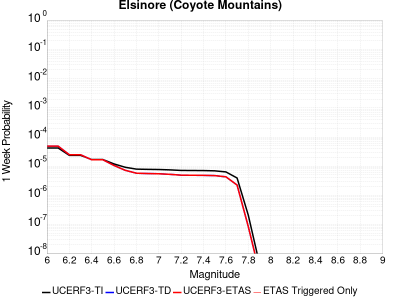 |  |  |  |

| Magnitude | 1 wk TI Prob | 1 wk TD Prob | 1 wk ETAS Prob | 1 wk ETAS/TD Gain | 1 wk ETAS Triggered Only | 1 mo TI Prob | 1 mo TD Prob | 1 mo ETAS Prob | 1 mo ETAS/TD Gain | 1 mo ETAS Triggered Only | 1 yr TI Prob | 1 yr TD Prob | 1 yr ETAS Prob | 1 yr ETAS/TD Gain | 1 yr ETAS Triggered Only | 10 yr TI Prob | 10 yr TD Prob | 10 yr ETAS Prob | 10 yr ETAS/TD Gain | 10 yr ETAS Triggered Only |
|-----|-----|-----|-----|-----|-----|-----|-----|-----|-----|-----|-----|-----|-----|-----|-----|-----|-----|-----|-----|-----|
| 6.0 | 4.20513E-5 | 4.8633563E-5 | 4.8633563E-5 | 1.0 | 0.0 | 1.8020741E-4 | 2.0841615E-4 | 2.0841615E-4 | 1.0 | 0.0 | 0.0021918174 | 0.0025350873 | 0.0025350873 | 1.0 | 0.0 | 0.021703249 | 0.025112117 | 0.025121866 | 1.0003883 | 1.0E-5 |
| 6.1 | 4.20513E-5 | 4.8633563E-5 | 4.8633563E-5 | 1.0 | 0.0 | 1.8020741E-4 | 2.0841615E-4 | 2.0841615E-4 | 1.0 | 0.0 | 0.0021918174 | 0.0025350873 | 0.0025350873 | 1.0 | 0.0 | 0.021703249 | 0.025112117 | 0.025121866 | 1.0003883 | 1.0E-5 |
| 6.2 | 2.3413893E-5 | 2.4696421E-5 | 2.4696421E-5 | 1.0 | 0.0 | 1.0034139E-4 | 1.0583805E-4 | 1.0583805E-4 | 1.0 | 0.0 | 0.0012209718 | 0.0012879103 | 0.0012879103 | 1.0 | 0.0 | 0.012142851 | 0.012813029 | 0.012813029 | 1.0 | 0.0 |
| 6.3 | 2.3413893E-5 | 2.4696421E-5 | 2.4696421E-5 | 1.0 | 0.0 | 1.0034139E-4 | 1.0583805E-4 | 1.0583805E-4 | 1.0 | 0.0 | 0.0012209718 | 0.0012879103 | 0.0012879103 | 1.0 | 0.0 | 0.012142851 | 0.012813029 | 0.012813029 | 1.0 | 0.0 |
| 6.4 | 1.6894814E-5 | 1.6568854E-5 | 1.6568854E-5 | 1.0 | 0.0 | 7.240433E-5 | 7.100766E-5 | 7.100766E-5 | 1.0 | 0.0 | 8.811662E-4 | 8.6421217E-4 | 8.6421217E-4 | 1.0 | 0.0 | 0.0087768035 | 0.008612194 | 0.008612194 | 1.0 | 0.0 |
| 6.5 | 1.6894814E-5 | 1.6568854E-5 | 1.6568854E-5 | 1.0 | 0.0 | 7.240433E-5 | 7.100766E-5 | 7.100766E-5 | 1.0 | 0.0 | 8.811662E-4 | 8.6421217E-4 | 8.6421217E-4 | 1.0 | 0.0 | 0.0087768035 | 0.008612194 | 0.008612194 | 1.0 | 0.0 |
| 6.6 | 1.1910969E-5 | 1.05310955E-5 | 1.05310955E-5 | 1.0 | 0.0 | 5.1046012E-5 | 4.513256E-5 | 4.513256E-5 | 1.0 | 0.0 | 6.21308E-4 | 5.4936187E-4 | 5.4936187E-4 | 1.0 | 0.0 | 0.0061957375 | 0.0054813414 | 0.0054813414 | 1.0 | 0.0 |
| 6.7 | 9.1486E-6 | 7.2030907E-6 | 7.2030907E-6 | 1.0 | 0.0 | 3.9207694E-5 | 3.0870044E-5 | 3.0870044E-5 | 1.0 | 0.0 | 4.7724912E-4 | 3.757818E-4 | 3.757818E-4 | 1.0 | 0.0 | 0.0047622547 | 0.0037518432 | 0.0037518432 | 1.0 | 0.0 |
| 6.8 | 7.90441E-6 | 5.7292227E-6 | 5.7292227E-6 | 1.0 | 0.0 | 3.3875604E-5 | 2.4553588E-5 | 2.4553588E-5 | 1.0 | 0.0 | 4.1235742E-4 | 2.989002E-4 | 2.989002E-4 | 1.0 | 0.0 | 0.0041159308 | 0.0029851105 | 0.0029851105 | 1.0 | 0.0 |
| 6.9 | 7.77015E-6 | 5.5831756E-6 | 5.5831756E-6 | 1.0 | 0.0 | 3.3300217E-5 | 2.3927683E-5 | 2.3927683E-5 | 1.0 | 0.0 | 4.0535472E-4 | 2.9128187E-4 | 2.9128187E-4 | 1.0 | 0.0 | 0.004046161 | 0.0029091279 | 0.0029091279 | 1.0 | 0.0 |
| 7.0 | 7.675798E-6 | 5.480033E-6 | 5.480033E-6 | 1.0 | 0.0 | 3.289586E-5 | 2.348565E-5 | 2.348565E-5 | 1.0 | 0.0 | 4.004335E-4 | 2.8590154E-4 | 2.8590154E-4 | 1.0 | 0.0 | 0.003997127 | 0.0028554637 | 0.0028554637 | 1.0 | 0.0 |
| 7.1 | 7.447814E-6 | 5.2389046E-6 | 5.2389046E-6 | 1.0 | 0.0 | 3.191881E-5 | 2.2452263E-5 | 2.2452263E-5 | 1.0 | 0.0 | 3.8854225E-4 | 2.7332324E-4 | 2.7332324E-4 | 1.0 | 0.0 | 0.003878636 | 0.0027299952 | 0.0027299952 | 1.0 | 0.0 |
| 7.2 | 7.128185E-6 | 4.9055616E-6 | 4.9055616E-6 | 1.0 | 0.0 | 3.0549007E-5 | 2.1023672E-5 | 2.1023672E-5 | 1.0 | 0.0 | 3.7187067E-4 | 2.5593434E-4 | 2.5593434E-4 | 1.0 | 0.0 | 0.00371249 | 0.0025565142 | 0.0025565142 | 1.0 | 0.0 |
| 7.3 | 7.0913875E-6 | 4.8742363E-6 | 4.8742363E-6 | 1.0 | 0.0 | 3.0391306E-5 | 2.0889423E-5 | 2.0889423E-5 | 1.0 | 0.0 | 3.6995133E-4 | 2.5430025E-4 | 2.5430025E-4 | 1.0 | 0.0 | 0.0036933604 | 0.0025402107 | 0.0025402107 | 1.0 | 0.0 |
| 7.4 | 7.051521E-6 | 4.8380875E-6 | 4.8380875E-6 | 1.0 | 0.0 | 3.0220453E-5 | 2.0734502E-5 | 2.0734502E-5 | 1.0 | 0.0 | 3.6787192E-4 | 2.524145E-4 | 2.524145E-4 | 1.0 | 0.0 | 0.0036726352 | 0.0025213964 | 0.0025213964 | 1.0 | 0.0 |
| 7.5 | 6.910666E-6 | 4.7336343E-6 | 4.7336343E-6 | 1.0 | 0.0 | 2.9616802E-5 | 2.0286852E-5 | 2.0286852E-5 | 1.0 | 0.0 | 3.605249E-4 | 2.4696562E-4 | 2.4696562E-4 | 1.0 | 0.0 | 0.0035994058 | 0.0024670297 | 0.0024670297 | 1.0 | 0.0 |
| 7.6 | 6.341753E-6 | 4.3067316E-6 | 4.3067316E-6 | 1.0 | 0.0 | 2.7178658E-5 | 1.8457298E-5 | 1.8457298E-5 | 1.0 | 0.0 | 3.3084993E-4 | 2.246956E-4 | 2.246956E-4 | 1.0 | 0.0 | 0.0033035777 | 0.0022447994 | 0.0022447994 | 1.0 | 0.0 |
| 7.7 | 3.9205916E-6 | 2.2440495E-6 | 2.2440495E-6 | 1.0 | 0.0 | 1.6802427E-5 | 9.6173235E-6 | 9.6173235E-6 | 1.0 | 0.0 | 2.0455034E-4 | 1.1708537E-4 | 1.1708537E-4 | 1.0 | 0.0 | 0.0020436216 | 0.0011703098 | 0.0011703098 | 1.0 | 0.0 |
| 7.8 | 2.0846227E-7 | 8.4868525E-8 | 8.4868525E-8 | 1.0 | 0.0 | 8.9340944E-7 | 3.6372222E-7 | 3.6372222E-7 | 1.0 | 0.0 | 1.0877206E-5 | 4.4283124E-6 | 4.4283124E-6 | 1.0 | 0.0 | 1.0876673E-4 | 4.4282566E-5 | 4.4282566E-5 | 1.0 | 0.0 |
| 7.9 | 4.4969806E-9 | 2.2692683E-9 | 2.2692683E-9 | 1.0 | 0.0 | 1.9272775E-8 | 9.725436E-9 | 9.725436E-9 | 1.0 | 0.0 | 2.3464601E-7 | 1.1840718E-7 | 1.1840718E-7 | 1.0 | 0.0 | 2.3464577E-6 | 1.1840713E-6 | 1.1840713E-6 | 1.0 | 0.0 |

## Green Valley 2011 CFM
*[(top)](#table-of-contents)*

| 1 Week | 1 Month | 1 Year | 10 Year |
|-----|-----|-----|-----|
|  |  |  |  |

| Magnitude | 1 wk TI Prob | 1 wk TD Prob | 1 wk ETAS Prob | 1 wk ETAS/TD Gain | 1 wk ETAS Triggered Only | 1 mo TI Prob | 1 mo TD Prob | 1 mo ETAS Prob | 1 mo ETAS/TD Gain | 1 mo ETAS Triggered Only | 1 yr TI Prob | 1 yr TD Prob | 1 yr ETAS Prob | 1 yr ETAS/TD Gain | 1 yr ETAS Triggered Only | 10 yr TI Prob | 10 yr TD Prob | 10 yr ETAS Prob | 10 yr ETAS/TD Gain | 10 yr ETAS Triggered Only |
|-----|-----|-----|-----|-----|-----|-----|-----|-----|-----|-----|-----|-----|-----|-----|-----|-----|-----|-----|-----|-----|
| 6.0 | 9.9629346E-5 | 1.7306181E-4 | 1.7306181E-4 | 1.0 | 0.0 | 4.2691303E-4 | 7.414477E-4 | 7.414477E-4 | 1.0 | 0.0 | 0.0051852856 | 0.00898687 | 0.00898687 | 1.0 | 0.0 | 0.050659515 | 0.085523866 | 0.08553301 | 1.0001069 | 1.0E-5 |
| 6.1 | 9.88615E-5 | 1.7153492E-4 | 1.7153492E-4 | 1.0 | 0.0 | 4.2362334E-4 | 7.349076E-4 | 7.349076E-4 | 1.0 | 0.0 | 0.0051454236 | 0.008907897 | 0.008907897 | 1.0 | 0.0 | 0.050279044 | 0.08481148 | 0.08482063 | 1.0001079 | 1.0E-5 |
| 6.2 | 9.696895E-5 | 1.679252E-4 | 1.679252E-4 | 1.0 | 0.0 | 4.15515E-4 | 7.1944593E-4 | 7.1944593E-4 | 1.0 | 0.0 | 0.0050471667 | 0.008721275 | 0.008721275 | 1.0 | 0.0 | 0.04934063 | 0.08312038 | 0.083129555 | 1.0001103 | 1.0E-5 |
| 6.3 | 9.275224E-5 | 1.5971852E-4 | 1.5971852E-4 | 1.0 | 0.0 | 3.9744904E-4 | 6.842931E-4 | 6.842931E-4 | 1.0 | 0.0 | 0.0048282105 | 0.008296597 | 0.008296597 | 1.0 | 0.0 | 0.047246475 | 0.07925882 | 0.07926803 | 1.0001161 | 1.0E-5 |
| 6.4 | 8.391499E-5 | 1.4368363E-4 | 1.4368363E-4 | 1.0 | 0.0 | 3.595861E-4 | 6.156491E-4 | 6.156491E-4 | 1.0 | 0.0 | 0.004369175 | 0.007467232 | 0.007467232 | 1.0 | 0.0 | 0.04284265 | 0.07163251 | 0.071641795 | 1.0001296 | 1.0E-5 |
| 6.5 | 5.9519385E-5 | 9.9345336E-5 | 9.9345336E-5 | 1.0 | 0.0 | 2.5505814E-4 | 4.257004E-4 | 4.257004E-4 | 1.0 | 0.0 | 0.0031009112 | 0.0051684165 | 0.0051684165 | 1.0 | 0.0 | 0.030579966 | 0.050147217 | 0.050156716 | 1.0001894 | 1.0E-5 |
| 6.6 | 4.5361558E-5 | 7.4029726E-5 | 7.4029726E-5 | 1.0 | 0.0 | 1.9439218E-4 | 3.1723455E-4 | 3.1723455E-4 | 1.0 | 0.0 | 0.0023641558 | 0.003854048 | 0.003854048 | 1.0 | 0.0 | 0.023391623 | 0.03766713 | 0.03767675 | 1.0002555 | 1.0E-5 |
| 6.7 | 3.8808106E-5 | 6.265495E-5 | 6.265495E-5 | 1.0 | 0.0 | 1.6630985E-4 | 2.684962E-4 | 2.684962E-4 | 1.0 | 0.0 | 0.0020229418 | 0.003262755 | 0.003262755 | 1.0 | 0.0 | 0.020046256 | 0.03200691 | 0.032016587 | 1.0003024 | 1.0E-5 |
| 6.8 | 2.2284667E-5 | 3.1285566E-5 | 3.1285566E-5 | 1.0 | 0.0 | 9.550222E-5 | 1.340742E-4 | 1.340742E-4 | 1.0 | 0.0 | 0.0011621192 | 0.001631124 | 0.001631124 | 1.0 | 0.0 | 0.011560607 | 0.016166156 | 0.016175995 | 1.0006086 | 1.0E-5 |
| 6.9 | 1.8050168E-5 | 2.4448267E-5 | 2.4448267E-5 | 1.0 | 0.0 | 7.735557E-5 | 1.0477412E-4 | 1.0477412E-4 | 1.0 | 0.0 | 9.4139716E-4 | 0.001274882 | 0.001274882 | 1.0 | 0.0 | 0.009374191 | 0.01266794 | 0.012677814 | 1.0007794 | 1.0E-5 |
| 7.0 | 1.4763166E-5 | 1.958302E-5 | 1.958302E-5 | 1.0 | 0.0 | 6.326917E-5 | 8.392455E-5 | 8.392455E-5 | 1.0 | 0.0 | 7.7002996E-4 | 0.0010213053 | 0.0010213053 | 1.0 | 0.0 | 0.007673672 | 0.010165428 | 0.010175327 | 1.0009737 | 1.0E-5 |
| 7.1 | 1.2399713E-5 | 1.630385E-5 | 1.630385E-5 | 1.0 | 0.0 | 5.3140546E-5 | 6.987178E-5 | 6.987178E-5 | 1.0 | 0.0 | 6.467941E-4 | 8.5035886E-4 | 8.5035886E-4 | 1.0 | 0.0 | 0.006449148 | 0.008471329 | 0.008481244 | 1.0011704 | 1.0E-5 |
| 7.2 | 1.0584195E-5 | 1.3921863E-5 | 1.3921863E-5 | 1.0 | 0.0 | 4.5360044E-5 | 5.9663773E-5 | 5.9663773E-5 | 1.0 | 0.0 | 5.521186E-4 | 7.2616595E-4 | 7.2616595E-4 | 1.0 | 0.0 | 0.0055074887 | 0.0072383475 | 0.0072383475 | 1.0 | 0.0 |
| 7.3 | 7.998173E-6 | 1.054412E-5 | 1.054412E-5 | 1.0 | 0.0 | 3.4277433E-5 | 4.5188313E-5 | 4.5188313E-5 | 1.0 | 0.0 | 4.1724785E-4 | 5.500299E-4 | 5.500299E-4 | 1.0 | 0.0 | 0.004164653 | 0.0054869517 | 0.0054869517 | 1.0 | 0.0 |
| 7.4 | 6.7571127E-6 | 8.932785E-6 | 8.932785E-6 | 1.0 | 0.0 | 2.8958733E-5 | 3.8282808E-5 | 3.8282808E-5 | 1.0 | 0.0 | 3.5251552E-4 | 4.6599447E-4 | 4.6599447E-4 | 1.0 | 0.0 | 0.0035195686 | 0.0046503763 | 0.0046503763 | 1.0 | 0.0 |
| 7.5 | 5.69878E-6 | 7.5163775E-6 | 7.5163775E-6 | 1.0 | 0.0 | 2.4423114E-5 | 3.2212654E-5 | 3.2212654E-5 | 1.0 | 0.0 | 2.9731085E-4 | 3.9211934E-4 | 3.9211934E-4 | 1.0 | 0.0 | 0.002969134 | 0.0039144265 | 0.0039144265 | 1.0 | 0.0 |
| 7.6 | 4.503664E-6 | 5.9357344E-6 | 5.9357344E-6 | 1.0 | 0.0 | 1.9301275E-5 | 2.5438618E-5 | 2.5438618E-5 | 1.0 | 0.0 | 2.3496768E-4 | 3.09672E-4 | 3.09672E-4 | 1.0 | 0.0 | 0.002347194 | 0.0030925297 | 0.0030925297 | 1.0 | 0.0 |
| 7.7 | 1.0873546E-6 | 1.4107108E-6 | 1.4107108E-6 | 1.0 | 0.0 | 4.6600826E-6 | 6.0458897E-6 | 6.0458897E-6 | 1.0 | 0.0 | 5.6735033E-5 | 7.360625E-5 | 7.360625E-5 | 1.0 | 0.0 | 5.672055E-4 | 7.3582074E-4 | 7.3582074E-4 | 1.0 | 0.0 |
| 7.8 | 4.9373917E-8 | 6.177787E-8 | 6.177787E-8 | 1.0 | 0.0 | 2.1160248E-7 | 2.6476226E-7 | 2.6476226E-7 | 1.0 | 0.0 | 2.5762572E-6 | 3.223477E-6 | 3.223477E-6 | 1.0 | 0.0 | 2.5762274E-5 | 3.223268E-5 | 3.223268E-5 | 1.0 | 0.0 |

## Calaveras (No) 2011 CFM
*[(top)](#table-of-contents)*

| 1 Week | 1 Month | 1 Year | 10 Year |
|-----|-----|-----|-----|
|  |  |  |  |

| Magnitude | 1 wk TI Prob | 1 wk TD Prob | 1 wk ETAS Prob | 1 wk ETAS/TD Gain | 1 wk ETAS Triggered Only | 1 mo TI Prob | 1 mo TD Prob | 1 mo ETAS Prob | 1 mo ETAS/TD Gain | 1 mo ETAS Triggered Only | 1 yr TI Prob | 1 yr TD Prob | 1 yr ETAS Prob | 1 yr ETAS/TD Gain | 1 yr ETAS Triggered Only | 10 yr TI Prob | 10 yr TD Prob | 10 yr ETAS Prob | 10 yr ETAS/TD Gain | 10 yr ETAS Triggered Only |
|-----|-----|-----|-----|-----|-----|-----|-----|-----|-----|-----|-----|-----|-----|-----|-----|-----|-----|-----|-----|-----|
| 6.0 | 4.8694856E-5 | 6.7480454E-5 | 6.7480454E-5 | 1.0 | 0.0 | 2.0867554E-4 | 2.8917097E-4 | 2.8917097E-4 | 1.0 | 0.0 | 0.0025376645 | 0.0035151043 | 0.0035250692 | 1.0028349 | 1.0E-5 | 0.02508881 | 0.03477574 | 0.034785394 | 1.0002775 | 1.0E-5 |
| 6.1 | 4.8694856E-5 | 6.7480454E-5 | 6.7480454E-5 | 1.0 | 0.0 | 2.0867554E-4 | 2.8917097E-4 | 2.8917097E-4 | 1.0 | 0.0 | 0.0025376645 | 0.0035151043 | 0.0035250692 | 1.0028349 | 1.0E-5 | 0.02508881 | 0.03477574 | 0.034785394 | 1.0002775 | 1.0E-5 |
| 6.2 | 4.7541962E-5 | 6.581133E-5 | 6.581133E-5 | 1.0 | 0.0 | 2.0373536E-4 | 2.8201914E-4 | 2.8201914E-4 | 1.0 | 0.0 | 0.0024776561 | 0.003428333 | 0.0034382986 | 1.0029069 | 1.0E-5 | 0.024502134 | 0.033937134 | 0.033946794 | 1.0002847 | 1.0E-5 |
| 6.3 | 4.6717287E-5 | 6.464464E-5 | 6.464464E-5 | 1.0 | 0.0 | 2.0020158E-4 | 2.770201E-4 | 2.770201E-4 | 1.0 | 0.0 | 0.0024347296 | 0.003367682 | 0.0033776483 | 1.0029594 | 1.0E-5 | 0.024082264 | 0.03334963 | 0.033359297 | 1.0002898 | 1.0E-5 |
| 6.4 | 4.6276386E-5 | 6.400647E-5 | 6.400647E-5 | 1.0 | 0.0 | 1.983123E-4 | 2.7428564E-4 | 2.7428564E-4 | 1.0 | 0.0 | 0.0024117786 | 0.0033344922 | 0.0033444588 | 1.0029889 | 1.0E-5 | 0.02385771 | 0.033028495 | 0.03303816 | 1.0002928 | 1.0E-5 |
| 6.5 | 4.5720994E-5 | 6.3207815E-5 | 6.3207815E-5 | 1.0 | 0.0 | 1.9593239E-4 | 2.7086356E-4 | 2.7086356E-4 | 1.0 | 0.0 | 0.002382867 | 0.0032929648 | 0.0033029318 | 1.0030267 | 1.0E-5 | 0.023574775 | 0.03262644 | 0.032636113 | 1.0002965 | 1.0E-5 |
| 6.6 | 4.549134E-5 | 6.286089E-5 | 6.286089E-5 | 1.0 | 0.0 | 1.949483E-4 | 2.6937705E-4 | 2.6937705E-4 | 1.0 | 0.0 | 0.0023709119 | 0.0032749209 | 0.003284888 | 1.0030435 | 1.0E-5 | 0.023457756 | 0.03245179 | 0.032461464 | 1.0002981 | 1.0E-5 |
| 6.7 | 3.701047E-5 | 5.0367704E-5 | 5.0367704E-5 | 1.0 | 0.0 | 1.5860666E-4 | 2.1584396E-4 | 2.1584396E-4 | 1.0 | 0.0 | 0.0019293258 | 0.0026247767 | 0.0026347504 | 1.0037998 | 1.0E-5 | 0.019126613 | 0.02612945 | 0.02613919 | 1.0003728 | 1.0E-5 |
| 6.8 | 3.5523568E-5 | 4.8349237E-5 | 4.8349237E-5 | 1.0 | 0.0 | 1.5223498E-4 | 2.071948E-4 | 2.071948E-4 | 1.0 | 0.0 | 0.0018518851 | 0.0025197214 | 0.002529696 | 1.0039587 | 1.0E-5 | 0.018365284 | 0.025101654 | 0.025111403 | 1.0003884 | 1.0E-5 |
| 6.9 | 3.2946147E-5 | 4.4670804E-5 | 4.4670804E-5 | 1.0 | 0.0 | 1.4119013E-4 | 1.914325E-4 | 1.914325E-4 | 1.0 | 0.0 | 0.0017176344 | 0.0023282415 | 0.0023382183 | 1.0042851 | 1.0E-5 | 0.017044188 | 0.023223657 | 0.023233425 | 1.0004206 | 1.0E-5 |
| 7.0 | 2.7682381E-5 | 3.703018E-5 | 3.703018E-5 | 1.0 | 0.0 | 1.1863338E-4 | 1.5869128E-4 | 1.5869128E-4 | 1.0 | 0.0 | 0.0014434044 | 0.0019303843 | 0.001940365 | 1.0051703 | 1.0E-5 | 0.01434065 | 0.019314911 | 0.019324718 | 1.0005077 | 1.0E-5 |
| 7.1 | 2.471967E-5 | 3.3294466E-5 | 3.3294466E-5 | 1.0 | 0.0 | 1.05937135E-4 | 1.4268293E-4 | 1.4268293E-4 | 1.0 | 0.0 | 0.0012890215 | 0.0017358093 | 0.0017358093 | 1.0 | 0.0 | 0.0128157 | 0.017389864 | 0.017389864 | 1.0 | 0.0 |
| 7.2 | 1.9748062E-5 | 2.6782258E-5 | 2.6782258E-5 | 1.0 | 0.0 | 8.463181E-5 | 1.1477619E-4 | 1.1477619E-4 | 1.0 | 0.0 | 0.0010299052 | 0.0013965277 | 0.0013965277 | 1.0 | 0.0 | 0.01025145 | 0.014034565 | 0.014034565 | 1.0 | 0.0 |
| 7.3 | 1.1603734E-5 | 1.5790934E-5 | 1.5790934E-5 | 1.0 | 0.0 | 4.9729337E-5 | 6.7673755E-5 | 6.7673755E-5 | 1.0 | 0.0 | 6.052865E-4 | 8.236307E-4 | 8.236307E-4 | 1.0 | 0.0 | 0.0060364045 | 0.008312269 | 0.008312269 | 1.0 | 0.0 |
| 7.4 | 4.885381E-6 | 6.036388E-6 | 6.036388E-6 | 1.0 | 0.0 | 2.0937177E-5 | 2.5869978E-5 | 2.5869978E-5 | 1.0 | 0.0 | 2.5488032E-4 | 3.1492164E-4 | 3.1492164E-4 | 1.0 | 0.0 | 0.0025458818 | 0.0032017664 | 0.0032017664 | 1.0 | 0.0 |
| 7.5 | 3.0571264E-6 | 4.1566404E-6 | 4.1566404E-6 | 1.0 | 0.0 | 1.3101904E-5 | 1.7814053E-5 | 1.7814053E-5 | 1.0 | 0.0 | 1.5950401E-4 | 2.168646E-4 | 2.168646E-4 | 1.0 | 0.0 | 0.0015938957 | 0.0022217967 | 0.0022217967 | 1.0 | 0.0 |
| 7.6 | 1.764948E-6 | 2.7968233E-6 | 2.7968233E-6 | 1.0 | 0.0 | 7.564041E-6 | 1.1986331E-5 | 1.1986331E-5 | 1.0 | 0.0 | 9.208831E-5 | 1.4592388E-4 | 1.4592388E-4 | 1.0 | 0.0 | 9.205016E-4 | 0.0015129918 | 0.0015129918 | 1.0 | 0.0 |
| 7.7 | 1.3173734E-6 | 2.0595896E-6 | 2.0595896E-6 | 1.0 | 0.0 | 5.645874E-6 | 8.8267825E-6 | 8.8267825E-6 | 1.0 | 0.0 | 6.873634E-5 | 1.074608E-4 | 1.074608E-4 | 1.0 | 0.0 | 6.8715087E-4 | 0.0011267065 | 0.0011267065 | 1.0 | 0.0 |
| 7.8 | 9.4429885E-7 | 1.54983E-6 | 1.54983E-6 | 1.0 | 0.0 | 4.0469886E-6 | 6.6421117E-6 | 6.6421117E-6 | 1.0 | 0.0 | 4.9270973E-5 | 8.0864724E-5 | 8.0864724E-5 | 1.0 | 0.0 | 4.926005E-4 | 8.5058226E-4 | 8.5058226E-4 | 1.0 | 0.0 |
| 7.9 | 6.388233E-7 | 1.1154912E-6 | 1.1154912E-6 | 1.0 | 0.0 | 2.7378112E-6 | 4.7806675E-6 | 4.7806675E-6 | 1.0 | 0.0 | 3.3332344E-5 | 5.8203084E-5 | 5.8203084E-5 | 1.0 | 0.0 | 3.3327343E-4 | 6.099401E-4 | 6.099401E-4 | 1.0 | 0.0 |
| 8.0 | 3.087986E-7 | 5.757499E-7 | 5.757499E-7 | 1.0 | 0.0 | 1.323422E-6 | 2.467497E-6 | 2.467497E-6 | 1.0 | 0.0 | 1.6112543E-5 | 3.0041367E-5 | 3.0041367E-5 | 1.0 | 0.0 | 1.6111376E-4 | 3.1118788E-4 | 3.1118788E-4 | 1.0 | 0.0 |
| 8.1 | 1.6725647E-7 | 2.7426543E-7 | 2.7426543E-7 | 1.0 | 0.0 | 7.168133E-7 | 1.1754228E-6 | 1.1754228E-6 | 1.0 | 0.0 | 8.7271665E-6 | 1.431068E-5 | 1.431068E-5 | 1.0 | 0.0 | 8.726824E-5 | 1.485708E-4 | 1.485708E-4 | 1.0 | 0.0 |

## Superstition Hills
*[(top)](#table-of-contents)*

| 1 Week | 1 Month | 1 Year | 10 Year |
|-----|-----|-----|-----|
|  |  |  |  |

| Magnitude | 1 wk TI Prob | 1 wk TD Prob | 1 wk ETAS Prob | 1 wk ETAS/TD Gain | 1 wk ETAS Triggered Only | 1 mo TI Prob | 1 mo TD Prob | 1 mo ETAS Prob | 1 mo ETAS/TD Gain | 1 mo ETAS Triggered Only | 1 yr TI Prob | 1 yr TD Prob | 1 yr ETAS Prob | 1 yr ETAS/TD Gain | 1 yr ETAS Triggered Only | 10 yr TI Prob | 10 yr TD Prob | 10 yr ETAS Prob | 10 yr ETAS/TD Gain | 10 yr ETAS Triggered Only |
|-----|-----|-----|-----|-----|-----|-----|-----|-----|-----|-----|-----|-----|-----|-----|-----|-----|-----|-----|-----|-----|
| 6.0 | 6.6865185E-5 | 1.4140716E-5 | 2.4140574E-5 | 1.7071677 | 1.0E-5 | 2.8653358E-4 | 6.0601753E-5 | 7.060115E-5 | 1.1650017 | 1.0E-5 | 0.0034829667 | 7.3759275E-4 | 7.475854E-4 | 1.0135477 | 1.0E-5 | 0.03428881 | 0.0075219767 | 0.0075319014 | 1.0013194 | 1.0E-5 |
| 6.1 | 6.544851E-5 | 1.4140715E-5 | 2.4140574E-5 | 1.7071677 | 1.0E-5 | 2.8046346E-4 | 6.0601753E-5 | 7.060115E-5 | 1.1650017 | 1.0E-5 | 0.0034092965 | 7.3759275E-4 | 7.475854E-4 | 1.0135477 | 1.0E-5 | 0.033574644 | 0.007521976 | 0.007531901 | 1.0013194 | 1.0E-5 |
| 6.2 | 6.544851E-5 | 1.4140715E-5 | 2.4140574E-5 | 1.7071677 | 1.0E-5 | 2.8046346E-4 | 6.0601753E-5 | 7.060115E-5 | 1.1650017 | 1.0E-5 | 0.0034092965 | 7.3759275E-4 | 7.475854E-4 | 1.0135477 | 1.0E-5 | 0.033574644 | 0.007521976 | 0.007531901 | 1.0013194 | 1.0E-5 |
| 6.3 | 5.2402065E-5 | 1.41407145E-5 | 2.4140572E-5 | 1.7071679 | 1.0E-5 | 2.2456095E-4 | 6.0601746E-5 | 7.060114E-5 | 1.1650017 | 1.0E-5 | 0.0027306017 | 7.375927E-4 | 7.475853E-4 | 1.0135477 | 1.0E-5 | 0.02697292 | 0.0075219707 | 0.0075318953 | 1.0013194 | 1.0E-5 |
| 6.4 | 4.542238E-5 | 1.4140714E-5 | 2.4140572E-5 | 1.7071679 | 1.0E-5 | 1.9465282E-4 | 6.0601742E-5 | 7.0601134E-5 | 1.1650017 | 1.0E-5 | 0.0023673223 | 7.3759264E-4 | 7.4758526E-4 | 1.0135477 | 1.0E-5 | 0.023422617 | 0.007521968 | 0.0075318925 | 1.0013194 | 1.0E-5 |
| 6.5 | 2.9672969E-5 | 1.4140713E-5 | 2.414057E-5 | 1.707168 | 1.0E-5 | 1.2716366E-4 | 6.060174E-5 | 7.0601134E-5 | 1.1650017 | 1.0E-5 | 0.0015471181 | 7.375926E-4 | 7.475852E-4 | 1.0135477 | 1.0E-5 | 0.015363912 | 0.0075219613 | 0.007531886 | 1.0013194 | 1.0E-5 |
| 6.6 | 2.6056105E-5 | 1.3806452E-5 | 2.3806315E-5 | 1.7242891 | 1.0E-5 | 1.1166424E-4 | 5.916926E-5 | 6.9168666E-5 | 1.1689967 | 1.0E-5 | 0.0013586642 | 7.201637E-4 | 7.301565E-4 | 1.0138757 | 1.0E-5 | 0.013503874 | 0.007346386 | 0.0073563126 | 1.0013512 | 1.0E-5 |
| 6.7 | 1.4611248E-5 | 1.3386336E-5 | 2.3386203E-5 | 1.7470204 | 1.0E-5 | 6.261813E-5 | 5.736884E-5 | 6.7368266E-5 | 1.1743007 | 1.0E-5 | 7.6210906E-4 | 6.9825776E-4 | 7.0825074E-4 | 1.0143113 | 1.0E-5 | 0.0075950073 | 0.007127569 | 0.007137498 | 1.001393 | 1.0E-5 |
| 6.8 | 1.30607E-5 | 1.0981634E-5 | 2.0981524E-5 | 1.9106014 | 1.0E-5 | 5.597323E-5 | 4.7063342E-5 | 5.7062873E-5 | 1.2124696 | 1.0E-5 | 6.8126095E-4 | 5.728543E-4 | 5.8284856E-4 | 1.0174464 | 1.0E-5 | 0.006791762 | 0.005875862 | 0.0058858036 | 1.0016919 | 1.0E-5 |
| 6.9 | 1.0443096E-5 | 8.197917E-6 | 1.8197836E-5 | 2.219812 | 1.0E-5 | 4.4755358E-5 | 3.513347E-5 | 4.513312E-5 | 1.2846189 | 1.0E-5 | 5.447602E-4 | 4.2766842E-4 | 4.3766413E-4 | 1.0233727 | 1.0E-5 | 0.005434267 | 0.004410797 | 0.0044207526 | 1.0022571 | 1.0E-5 |
| 7.0 | 8.045912E-6 | 6.742015E-6 | 1.6741948E-5 | 2.483226 | 1.0E-5 | 3.4482026E-5 | 2.8894035E-5 | 3.8893748E-5 | 1.3460822 | 1.0E-5 | 4.197378E-4 | 3.5172913E-4 | 3.617256E-4 | 1.0284209 | 1.0E-5 | 0.0041894587 | 0.003634624 | 0.0036445877 | 1.0027413 | 1.0E-5 |
| 7.1 | 8.045912E-6 | 6.742015E-6 | 1.6741948E-5 | 2.483226 | 1.0E-5 | 3.4482026E-5 | 2.8894035E-5 | 3.8893748E-5 | 1.3460822 | 1.0E-5 | 4.197378E-4 | 3.5172913E-4 | 3.617256E-4 | 1.0284209 | 1.0E-5 | 0.0041894587 | 0.003634624 | 0.0036445877 | 1.0027413 | 1.0E-5 |
| 7.2 | 7.375506E-6 | 6.2489075E-6 | 1.6248845E-5 | 2.6002698 | 1.0E-5 | 3.1608928E-5 | 2.6780763E-5 | 3.6780493E-5 | 1.3733923 | 1.0E-5 | 3.8477074E-4 | 3.2600787E-4 | 3.360046E-4 | 1.0306641 | 1.0E-5 | 0.003841052 | 0.0033750783 | 0.0033850446 | 1.0029529 | 1.0E-5 |
| 7.3 | 6.6063913E-6 | 5.8012956E-6 | 1.5801237E-5 | 2.723743 | 1.0E-5 | 2.8312797E-5 | 2.4862462E-5 | 3.4862212E-5 | 1.4022027 | 1.0E-5 | 3.446538E-4 | 3.0265914E-4 | 3.1265614E-4 | 1.0330305 | 1.0E-5 | 0.0034411973 | 0.0031393243 | 0.0031492927 | 1.0031754 | 1.0E-5 |
| 7.4 | 6.4313126E-6 | 5.6827116E-6 | 1.5682655E-5 | 2.7597134 | 1.0E-5 | 2.7562477E-5 | 2.4354254E-5 | 3.4354012E-5 | 1.4105959 | 1.0E-5 | 3.355215E-4 | 2.964734E-4 | 3.0647044E-4 | 1.0337199 | 1.0E-5 | 0.0033501536 | 0.003077082 | 0.0030870514 | 1.0032399 | 1.0E-5 |
| 7.5 | 6.0742927E-6 | 5.478511E-6 | 1.5478456E-5 | 2.8253036 | 1.0E-5 | 2.6032423E-5 | 2.3479126E-5 | 3.347889E-5 | 1.4259002 | 1.0E-5 | 3.1689866E-4 | 2.8582153E-4 | 2.9581867E-4 | 1.0349768 | 1.0E-5 | 0.0031644711 | 0.0029689074 | 0.0029788776 | 1.0033582 | 1.0E-5 |
| 7.6 | 5.6987187E-6 | 5.2966907E-6 | 1.5296639E-5 | 2.8879611 | 1.0E-5 | 2.4422852E-5 | 2.269991E-5 | 3.269968E-5 | 1.4405204 | 1.0E-5 | 2.9730765E-4 | 2.76337E-4 | 2.8633425E-4 | 1.0361778 | 1.0E-5 | 0.002969102 | 0.0028721471 | 0.0028821183 | 1.0034717 | 1.0E-5 |
| 7.7 | 5.1658035E-6 | 4.9276673E-6 | 1.49276175E-5 | 3.029348 | 1.0E-5 | 2.2138971E-5 | 2.1118407E-5 | 3.1118194E-5 | 1.4735106 | 1.0E-5 | 2.6950863E-4 | 2.5708685E-4 | 2.6708428E-4 | 1.0388874 | 1.0E-5 | 0.00269182 | 0.002677178 | 0.0026871513 | 1.0037253 | 1.0E-5 |
| 7.8 | 3.6864697E-6 | 4.198542E-6 | 1.4198499E-5 | 3.3817694 | 1.0E-5 | 1.579906E-5 | 1.7993629E-5 | 2.7993448E-5 | 1.5557423 | 1.0E-5 | 1.9233658E-4 | 2.1905087E-4 | 2.2904867E-4 | 1.0456415 | 1.0E-5 | 0.0019217018 | 0.0022903313 | 0.0023003083 | 1.0043561 | 1.0E-5 |
| 7.9 | 3.0265903E-6 | 3.565613E-6 | 1.3565577E-5 | 3.8045568 | 1.0E-5 | 1.2971037E-5 | 1.5281112E-5 | 2.5280959E-5 | 1.6543926 | 1.0E-5 | 1.5791094E-4 | 1.8603209E-4 | 1.9603023E-4 | 1.0537442 | 1.0E-5 | 0.0015779877 | 0.0019544594 | 0.0019644399 | 1.0051064 | 1.0E-5 |
| 8.0 | 2.5271493E-6 | 3.0884585E-6 | 1.3088427E-5 | 4.237851 | 1.0E-5 | 1.0830595E-5 | 1.3236186E-5 | 2.3236053E-5 | 1.7554947 | 1.0E-5 | 1.3185451E-4 | 1.6113906E-4 | 1.7113745E-4 | 1.0620482 | 1.0E-5 | 0.0013177631 | 0.0016982564 | 0.0017082393 | 1.0058784 | 1.0E-5 |
| 8.1 | 2.3749135E-6 | 2.919021E-6 | 1.2918992E-5 | 4.425796 | 1.0E-5 | 1.0178161E-5 | 1.2510032E-5 | 2.2509907E-5 | 1.7993485 | 1.0E-5 | 1.2391206E-4 | 1.5229941E-4 | 1.6229789E-4 | 1.0656501 | 1.0E-5 | 0.0012384299 | 0.0016058089 | 0.0016157929 | 1.0062174 | 1.0E-5 |
| 8.2 | 1.7186406E-9 | 1.1449343E-9 | 1.1449343E-9 | 1.0 | 0.0 | 7.3656024E-9 | 4.906861E-9 | 4.906861E-9 | 1.0 | 0.0 | 8.9676206E-8 | 5.974103E-8 | 5.974103E-8 | 1.0 | 0.0 | 8.9676166E-7 | 6.393774E-7 | 6.393774E-7 | 1.0 | 0.0 |

## Mono Lake 2011 CFM
*[(top)](#table-of-contents)*

| 1 Week | 1 Month | 1 Year | 10 Year |
|-----|-----|-----|-----|
|  |  |  |  |

| Magnitude | 1 wk TI Prob | 1 wk TD Prob | 1 wk ETAS Prob | 1 wk ETAS/TD Gain | 1 wk ETAS Triggered Only | 1 mo TI Prob | 1 mo TD Prob | 1 mo ETAS Prob | 1 mo ETAS/TD Gain | 1 mo ETAS Triggered Only | 1 yr TI Prob | 1 yr TD Prob | 1 yr ETAS Prob | 1 yr ETAS/TD Gain | 1 yr ETAS Triggered Only | 10 yr TI Prob | 10 yr TD Prob | 10 yr ETAS Prob | 10 yr ETAS/TD Gain | 10 yr ETAS Triggered Only |
|-----|-----|-----|-----|-----|-----|-----|-----|-----|-----|-----|-----|-----|-----|-----|-----|-----|-----|-----|-----|-----|
| 6.0 | 2.0341662E-5 | 2.3828708E-5 | 2.3828708E-5 | 1.0 | 0.0 | 8.717564E-5 | 1.0212203E-4 | 1.0212203E-4 | 1.0 | 0.0 | 0.0010608466 | 0.0012431581 | 0.0012531456 | 1.008034 | 1.0E-5 | 0.010557966 | 0.012414116 | 0.012423992 | 1.0007955 | 1.0E-5 |
| 6.1 | 2.0341662E-5 | 2.3828708E-5 | 2.3828708E-5 | 1.0 | 0.0 | 8.717564E-5 | 1.0212203E-4 | 1.0212203E-4 | 1.0 | 0.0 | 0.0010608466 | 0.0012431581 | 0.0012531456 | 1.008034 | 1.0E-5 | 0.010557966 | 0.012414116 | 0.012423992 | 1.0007955 | 1.0E-5 |
| 6.2 | 2.0341662E-5 | 2.3828708E-5 | 2.3828708E-5 | 1.0 | 0.0 | 8.717564E-5 | 1.0212203E-4 | 1.0212203E-4 | 1.0 | 0.0 | 0.0010608466 | 0.0012431581 | 0.0012531456 | 1.008034 | 1.0E-5 | 0.010557966 | 0.012414116 | 0.012423992 | 1.0007955 | 1.0E-5 |
| 6.3 | 2.0341662E-5 | 2.3828708E-5 | 2.3828708E-5 | 1.0 | 0.0 | 8.717564E-5 | 1.0212203E-4 | 1.0212203E-4 | 1.0 | 0.0 | 0.0010608466 | 0.0012431581 | 0.0012531456 | 1.008034 | 1.0E-5 | 0.010557966 | 0.012414116 | 0.012423992 | 1.0007955 | 1.0E-5 |
| 6.4 | 1.749821E-5 | 2.049145E-5 | 2.049145E-5 | 1.0 | 0.0 | 7.499018E-5 | 8.78205E-5 | 8.78205E-5 | 1.0 | 0.0 | 9.1262296E-4 | 0.0010692145 | 0.0010792039 | 1.0093427 | 1.0E-5 | 0.009088841 | 0.0106921075 | 0.010702 | 1.0009253 | 1.0E-5 |
| 6.5 | 1.749821E-5 | 2.049145E-5 | 2.049145E-5 | 1.0 | 0.0 | 7.499018E-5 | 8.78205E-5 | 8.78205E-5 | 1.0 | 0.0 | 9.1262296E-4 | 0.0010692145 | 0.0010792039 | 1.0093427 | 1.0E-5 | 0.009088841 | 0.0106921075 | 0.010702 | 1.0009253 | 1.0E-5 |

## Clayton
*[(top)](#table-of-contents)*

| 1 Week | 1 Month | 1 Year | 10 Year |
|-----|-----|-----|-----|
|  |  |  |  |

| Magnitude | 1 wk TI Prob | 1 wk TD Prob | 1 wk ETAS Prob | 1 wk ETAS/TD Gain | 1 wk ETAS Triggered Only | 1 mo TI Prob | 1 mo TD Prob | 1 mo ETAS Prob | 1 mo ETAS/TD Gain | 1 mo ETAS Triggered Only | 1 yr TI Prob | 1 yr TD Prob | 1 yr ETAS Prob | 1 yr ETAS/TD Gain | 1 yr ETAS Triggered Only | 10 yr TI Prob | 10 yr TD Prob | 10 yr ETAS Prob | 10 yr ETAS/TD Gain | 10 yr ETAS Triggered Only |
|-----|-----|-----|-----|-----|-----|-----|-----|-----|-----|-----|-----|-----|-----|-----|-----|-----|-----|-----|-----|-----|
| 6.0 | 1.1413061E-5 | 1.2667241E-5 | 1.2667241E-5 | 1.0 | 0.0 | 4.89122E-5 | 5.428717E-5 | 5.428717E-5 | 1.0 | 0.0 | 5.953433E-4 | 6.607681E-4 | 6.607681E-4 | 1.0 | 0.0 | 0.005937509 | 0.006590237 | 0.006600171 | 1.0015074 | 1.0E-5 |
| 6.1 | 1.1413061E-5 | 1.2667241E-5 | 1.2667241E-5 | 1.0 | 0.0 | 4.89122E-5 | 5.428717E-5 | 5.428717E-5 | 1.0 | 0.0 | 5.953433E-4 | 6.607681E-4 | 6.607681E-4 | 1.0 | 0.0 | 0.005937509 | 0.006590237 | 0.006600171 | 1.0015074 | 1.0E-5 |
| 6.2 | 1.1413061E-5 | 1.2667241E-5 | 1.2667241E-5 | 1.0 | 0.0 | 4.89122E-5 | 5.428717E-5 | 5.428717E-5 | 1.0 | 0.0 | 5.953433E-4 | 6.607681E-4 | 6.607681E-4 | 1.0 | 0.0 | 0.005937509 | 0.006590237 | 0.006600171 | 1.0015074 | 1.0E-5 |
| 6.3 | 8.538689E-6 | 9.532898E-6 | 9.532898E-6 | 1.0 | 0.0 | 3.659387E-5 | 4.0854695E-5 | 4.0854695E-5 | 1.0 | 0.0 | 4.4543925E-4 | 4.9730315E-4 | 4.9730315E-4 | 1.0 | 0.0 | 0.0044454746 | 0.0049629686 | 0.0049729194 | 1.002005 | 1.0E-5 |
| 6.4 | 8.538689E-6 | 9.532898E-6 | 9.532898E-6 | 1.0 | 0.0 | 3.659387E-5 | 4.0854695E-5 | 4.0854695E-5 | 1.0 | 0.0 | 4.4543925E-4 | 4.9730315E-4 | 4.9730315E-4 | 1.0 | 0.0 | 0.0044454746 | 0.0049629686 | 0.0049729194 | 1.002005 | 1.0E-5 |
| 6.5 | 7.197462E-6 | 8.0810805E-6 | 8.0810805E-6 | 1.0 | 0.0 | 3.08459E-5 | 3.4632787E-5 | 3.4632787E-5 | 1.0 | 0.0 | 3.7548412E-4 | 4.2158083E-4 | 4.2158083E-4 | 1.0 | 0.0 | 0.003748503 | 0.0042086225 | 0.0042185807 | 1.0023661 | 1.0E-5 |
| 6.6 | 7.1760483E-6 | 8.057096E-6 | 8.057096E-6 | 1.0 | 0.0 | 3.075413E-5 | 3.4530003E-5 | 3.4530003E-5 | 1.0 | 0.0 | 3.743672E-4 | 4.203299E-4 | 4.203299E-4 | 1.0 | 0.0 | 0.0037373714 | 0.0041961605 | 0.0042061186 | 1.0023731 | 1.0E-5 |
| 6.7 | 6.202582E-6 | 6.976806E-6 | 6.976806E-6 | 1.0 | 0.0 | 2.6582224E-5 | 2.9900297E-5 | 2.9900297E-5 | 1.0 | 0.0 | 3.235905E-4 | 3.6398298E-4 | 3.6398298E-4 | 1.0 | 0.0 | 0.0032311971 | 0.0036346242 | 0.0036445877 | 1.0027413 | 1.0E-5 |
| 6.8 | 3.6417277E-6 | 4.1213643E-6 | 4.1213643E-6 | 1.0 | 0.0 | 1.5607311E-5 | 1.7662875E-5 | 1.7662875E-5 | 1.0 | 0.0 | 1.9000245E-4 | 2.1502505E-4 | 2.1502505E-4 | 1.0 | 0.0 | 0.0018984007 | 0.0021482464 | 0.0021582248 | 1.004645 | 1.0E-5 |
| 6.9 | 2.6498485E-6 | 2.9995695E-6 | 2.9995695E-6 | 1.0 | 0.0 | 1.1356444E-5 | 1.28552365E-5 | 1.28552365E-5 | 1.0 | 0.0 | 1.3825593E-4 | 1.5650167E-4 | 1.5650167E-4 | 1.0 | 0.0 | 0.0013816995 | 0.001563954 | 0.0015739384 | 1.006384 | 1.0E-5 |
| 7.0 | 2.070442E-6 | 2.3407613E-6 | 2.3407613E-6 | 1.0 | 0.0 | 8.873292E-6 | 1.00317975E-5 | 1.00317975E-5 | 1.0 | 0.0 | 1.0802698E-4 | 1.2213059E-4 | 1.2213059E-4 | 1.0 | 0.0 | 0.0010797448 | 0.0012206645 | 0.0012306523 | 1.0081823 | 1.0E-5 |
| 7.1 | 1.2111691E-6 | 1.3588924E-6 | 1.3588924E-6 | 1.0 | 0.0 | 5.190714E-6 | 5.8238124E-6 | 5.8238124E-6 | 1.0 | 0.0 | 6.319511E-5 | 7.090277E-5 | 7.090277E-5 | 1.0 | 0.0 | 6.3177146E-4 | 7.088179E-4 | 7.188108E-4 | 1.014098 | 1.0E-5 |
| 7.2 | 3.9541607E-7 | 4.2227902E-7 | 4.2227902E-7 | 1.0 | 0.0 | 1.6946392E-6 | 1.809766E-6 | 1.809766E-6 | 1.0 | 0.0 | 2.0632036E-5 | 2.203368E-5 | 2.203368E-5 | 1.0 | 0.0 | 2.063012E-4 | 2.2031511E-4 | 2.2031511E-4 | 1.0 | 0.0 |
| 7.3 | 2.5685637E-7 | 2.7456912E-7 | 2.7456912E-7 | 1.0 | 0.0 | 1.1008126E-6 | 1.1767243E-6 | 1.1767243E-6 | 1.0 | 0.0 | 1.3402311E-5 | 1.4326525E-5 | 1.4326525E-5 | 1.0 | 0.0 | 1.3401502E-4 | 1.4325608E-4 | 1.4325608E-4 | 1.0 | 0.0 |
| 7.4 | 1.482299E-7 | 1.5808023E-7 | 1.5808023E-7 | 1.0 | 0.0 | 6.3527085E-7 | 6.7748647E-7 | 6.7748647E-7 | 1.0 | 0.0 | 7.734395E-6 | 8.2483675E-6 | 8.2483675E-6 | 1.0 | 0.0 | 7.734126E-5 | 8.2480634E-5 | 8.2480634E-5 | 1.0 | 0.0 |
| 7.5 | 9.7969505E-8 | 1.0438244E-7 | 1.0438244E-7 | 1.0 | 0.0 | 4.1986925E-7 | 4.4735322E-7 | 4.4735322E-7 | 1.0 | 0.0 | 5.111896E-6 | 5.446512E-6 | 5.446512E-6 | 1.0 | 0.0 | 5.1117782E-5 | 5.4463802E-5 | 5.4463802E-5 | 1.0 | 0.0 |
| 7.6 | 6.125415E-8 | 6.5231525E-8 | 6.5231525E-8 | 1.0 | 0.0 | 2.6251774E-7 | 2.7956366E-7 | 2.7956366E-7 | 1.0 | 0.0 | 3.196149E-6 | 3.4036823E-6 | 3.4036823E-6 | 1.0 | 0.0 | 3.196103E-5 | 3.403631E-5 | 3.403631E-5 | 1.0 | 0.0 |

## Santa Susana East (connector)
*[(top)](#table-of-contents)*

| 1 Week | 1 Month | 1 Year | 10 Year |
|-----|-----|-----|-----|
| 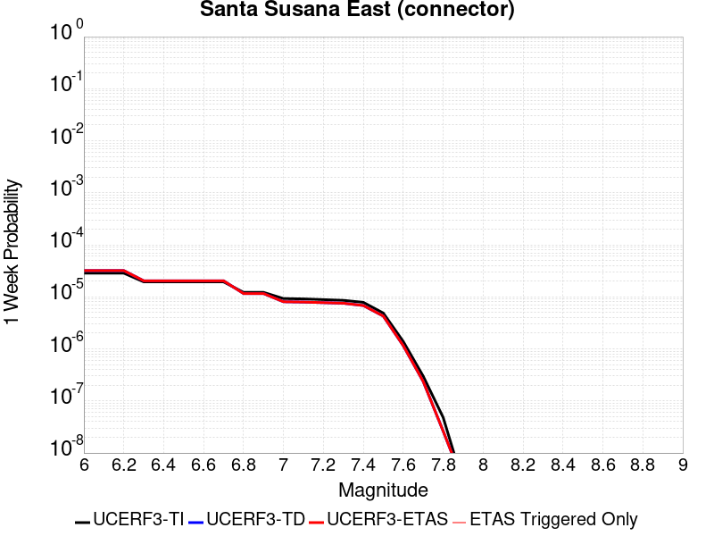 |  |  |  |

| Magnitude | 1 wk TI Prob | 1 wk TD Prob | 1 wk ETAS Prob | 1 wk ETAS/TD Gain | 1 wk ETAS Triggered Only | 1 mo TI Prob | 1 mo TD Prob | 1 mo ETAS Prob | 1 mo ETAS/TD Gain | 1 mo ETAS Triggered Only | 1 yr TI Prob | 1 yr TD Prob | 1 yr ETAS Prob | 1 yr ETAS/TD Gain | 1 yr ETAS Triggered Only | 10 yr TI Prob | 10 yr TD Prob | 10 yr ETAS Prob | 10 yr ETAS/TD Gain | 10 yr ETAS Triggered Only |
|-----|-----|-----|-----|-----|-----|-----|-----|-----|-----|-----|-----|-----|-----|-----|-----|-----|-----|-----|-----|-----|
| 6.0 | 2.858397E-5 | 3.202183E-5 | 3.202183E-5 | 1.0 | 0.0 | 1.2249697E-4 | 1.3723079E-4 | 1.3723079E-4 | 1.0 | 0.0 | 0.0014903803 | 0.0016697859 | 0.0016797693 | 1.0059788 | 1.0E-5 | 0.014804244 | 0.01659952 | 0.016609354 | 1.0005925 | 1.0E-5 |
| 6.1 | 2.858397E-5 | 3.202183E-5 | 3.202183E-5 | 1.0 | 0.0 | 1.2249697E-4 | 1.3723079E-4 | 1.3723079E-4 | 1.0 | 0.0 | 0.0014903803 | 0.0016697859 | 0.0016797693 | 1.0059788 | 1.0E-5 | 0.014804244 | 0.01659952 | 0.016609354 | 1.0005925 | 1.0E-5 |
| 6.2 | 2.858397E-5 | 3.202183E-5 | 3.202183E-5 | 1.0 | 0.0 | 1.2249697E-4 | 1.3723079E-4 | 1.3723079E-4 | 1.0 | 0.0 | 0.0014903803 | 0.0016697859 | 0.0016797693 | 1.0059788 | 1.0E-5 | 0.014804244 | 0.01659952 | 0.016609354 | 1.0005925 | 1.0E-5 |
| 6.3 | 1.943582E-5 | 2.0367674E-5 | 2.0367674E-5 | 1.0 | 0.0 | 8.329371E-5 | 8.728774E-5 | 8.728774E-5 | 1.0 | 0.0 | 0.001013629 | 0.0010623224 | 0.0010723118 | 1.0094033 | 1.0E-5 | 0.010090181 | 0.010583875 | 0.010593768 | 1.0009348 | 1.0E-5 |
| 6.4 | 1.943582E-5 | 2.0367674E-5 | 2.0367674E-5 | 1.0 | 0.0 | 8.329371E-5 | 8.728774E-5 | 8.728774E-5 | 1.0 | 0.0 | 0.001013629 | 0.0010623224 | 0.0010723118 | 1.0094033 | 1.0E-5 | 0.010090181 | 0.010583875 | 0.010593768 | 1.0009348 | 1.0E-5 |
| 6.5 | 1.943582E-5 | 2.0367674E-5 | 2.0367674E-5 | 1.0 | 0.0 | 8.329371E-5 | 8.728774E-5 | 8.728774E-5 | 1.0 | 0.0 | 0.001013629 | 0.0010623224 | 0.0010723118 | 1.0094033 | 1.0E-5 | 0.010090181 | 0.010583875 | 0.010593768 | 1.0009348 | 1.0E-5 |
| 6.6 | 1.943582E-5 | 2.0367674E-5 | 2.0367674E-5 | 1.0 | 0.0 | 8.329371E-5 | 8.728774E-5 | 8.728774E-5 | 1.0 | 0.0 | 0.001013629 | 0.0010623224 | 0.0010723118 | 1.0094033 | 1.0E-5 | 0.010090181 | 0.010583875 | 0.010593768 | 1.0009348 | 1.0E-5 |
| 6.7 | 1.9404439E-5 | 2.0355095E-5 | 2.0355095E-5 | 1.0 | 0.0 | 8.3159226E-5 | 8.7233835E-5 | 8.7233835E-5 | 1.0 | 0.0 | 0.0010119933 | 0.0010616668 | 0.0010716561 | 1.0094092 | 1.0E-5 | 0.010073971 | 0.01057738 | 0.010587274 | 1.0009354 | 1.0E-5 |
| 6.8 | 1.2217526E-5 | 1.1593199E-5 | 1.1593199E-5 | 1.0 | 0.0 | 5.2359774E-5 | 4.9684288E-5 | 4.9684288E-5 | 1.0 | 0.0 | 6.372938E-4 | 6.047551E-4 | 6.147491E-4 | 1.0165256 | 1.0E-5 | 0.0063546924 | 0.006033141 | 0.006043081 | 1.0016475 | 1.0E-5 |
| 6.9 | 1.2217526E-5 | 1.1593199E-5 | 1.1593199E-5 | 1.0 | 0.0 | 5.2359774E-5 | 4.9684288E-5 | 4.9684288E-5 | 1.0 | 0.0 | 6.372938E-4 | 6.047551E-4 | 6.147491E-4 | 1.0165256 | 1.0E-5 | 0.0063546924 | 0.006033141 | 0.006043081 | 1.0016475 | 1.0E-5 |
| 7.0 | 9.276017E-6 | 8.059215E-6 | 8.059215E-6 | 1.0 | 0.0 | 3.9753755E-5 | 3.4539054E-5 | 3.4539054E-5 | 1.0 | 0.0 | 4.8389446E-4 | 4.204353E-4 | 4.304311E-4 | 1.0237749 | 1.0E-5 | 0.0048284214 | 0.0041971253 | 0.0042070835 | 1.0023726 | 1.0E-5 |
| 7.1 | 9.130355E-6 | 7.942386E-6 | 7.942386E-6 | 1.0 | 0.0 | 3.9129503E-5 | 3.4038374E-5 | 3.4038374E-5 | 1.0 | 0.0 | 4.7629757E-4 | 4.1434186E-4 | 4.2433772E-4 | 1.0241246 | 1.0E-5 | 0.00475278 | 0.004136419 | 0.0041463776 | 1.0024076 | 1.0E-5 |
| 7.2 | 8.851015E-6 | 7.741543E-6 | 7.741543E-6 | 1.0 | 0.0 | 3.7932372E-5 | 3.317764E-5 | 3.317764E-5 | 1.0 | 0.0 | 4.6172875E-4 | 4.0386632E-4 | 4.138623E-4 | 1.0247507 | 1.0E-5 | 0.0046077054 | 0.0040320465 | 0.004042006 | 1.0024701 | 1.0E-5 |
| 7.3 | 8.573006E-6 | 7.5502617E-6 | 7.5502617E-6 | 1.0 | 0.0 | 3.6740938E-5 | 3.2357882E-5 | 3.2357882E-5 | 1.0 | 0.0 | 4.472291E-4 | 3.9388944E-4 | 4.038855E-4 | 1.0253779 | 1.0E-5 | 0.004463301 | 0.00393263 | 0.0039425907 | 1.0025328 | 1.0E-5 |
| 7.4 | 7.852282E-6 | 6.8177665E-6 | 6.8177665E-6 | 1.0 | 0.0 | 3.36522E-5 | 2.9218689E-5 | 2.9218689E-5 | 1.0 | 0.0 | 4.096385E-4 | 3.556825E-4 | 3.6567895E-4 | 1.028105 | 1.0E-5 | 0.0040888423 | 0.0035517968 | 0.0035617612 | 1.0028055 | 1.0E-5 |
| 7.5 | 4.8869324E-6 | 4.279099E-6 | 4.279099E-6 | 1.0 | 0.0 | 2.0943828E-5 | 1.8338877E-5 | 1.8338877E-5 | 1.0 | 0.0 | 2.5496128E-4 | 2.232546E-4 | 2.3325237E-4 | 1.0447819 | 1.0E-5 | 0.0025466895 | 0.0022304675 | 0.0022404452 | 1.0044733 | 1.0E-5 |
| 7.6 | 1.3894544E-6 | 1.1568255E-6 | 1.1568255E-6 | 1.0 | 0.0 | 5.954791E-6 | 4.9578157E-6 | 4.9578157E-6 | 1.0 | 0.0 | 7.249717E-5 | 6.035996E-5 | 6.035996E-5 | 1.0 | 0.0 | 7.247352E-4 | 6.0345745E-4 | 6.0345745E-4 | 1.0 | 0.0 |
| 7.7 | 2.9924632E-7 | 2.3719628E-7 | 2.3719628E-7 | 1.0 | 0.0 | 1.2824837E-6 | 1.0165551E-6 | 1.0165551E-6 | 1.0 | 0.0 | 1.5614127E-5 | 1.2376496E-5 | 1.2376496E-5 | 1.0 | 0.0 | 1.5613029E-4 | 1.2375879E-4 | 1.2375879E-4 | 1.0 | 0.0 |
| 7.8 | 4.8188564E-8 | 2.63245E-8 | 2.63245E-8 | 1.0 | 0.0 | 2.065224E-7 | 1.1281927E-7 | 1.1281927E-7 | 1.0 | 0.0 | 2.5144072E-6 | 1.3735739E-6 | 1.3735739E-6 | 1.0 | 0.0 | 2.5143789E-5 | 1.3735663E-5 | 1.3735663E-5 | 1.0 | 0.0 |
| 7.9 | 2.6127251E-9 | 2.768132E-9 | 2.768132E-9 | 1.0 | 0.0 | 1.1197393E-8 | 1.1863423E-8 | 1.1863423E-8 | 1.0 | 0.0 | 1.3632825E-7 | 1.4443718E-7 | 1.4443718E-7 | 1.0 | 0.0 | 1.3632817E-6 | 1.4443717E-6 | 1.4443717E-6 | 1.0 | 0.0 |

## Reliz 2011 CFM
*[(top)](#table-of-contents)*

| 1 Week | 1 Month | 1 Year | 10 Year |
|-----|-----|-----|-----|
|  |  |  |  |

| Magnitude | 1 wk TI Prob | 1 wk TD Prob | 1 wk ETAS Prob | 1 wk ETAS/TD Gain | 1 wk ETAS Triggered Only | 1 mo TI Prob | 1 mo TD Prob | 1 mo ETAS Prob | 1 mo ETAS/TD Gain | 1 mo ETAS Triggered Only | 1 yr TI Prob | 1 yr TD Prob | 1 yr ETAS Prob | 1 yr ETAS/TD Gain | 1 yr ETAS Triggered Only | 10 yr TI Prob | 10 yr TD Prob | 10 yr ETAS Prob | 10 yr ETAS/TD Gain | 10 yr ETAS Triggered Only |
|-----|-----|-----|-----|-----|-----|-----|-----|-----|-----|-----|-----|-----|-----|-----|-----|-----|-----|-----|-----|-----|
| 6.0 | 1.6002472E-5 | 1.6282896E-5 | 2.6282733E-5 | 1.6141313 | 1.0E-5 | 6.8580215E-5 | 6.978209E-5 | 7.9781385E-5 | 1.1432933 | 1.0E-5 | 8.3464425E-4 | 8.492855E-4 | 8.5927703E-4 | 1.0117646 | 1.0E-5 | 0.008315164 | 0.008462595 | 0.008472511 | 1.0011717 | 1.0E-5 |
| 6.1 | 1.6002472E-5 | 1.6282896E-5 | 2.6282733E-5 | 1.6141313 | 1.0E-5 | 6.8580215E-5 | 6.978209E-5 | 7.9781385E-5 | 1.1432933 | 1.0E-5 | 8.3464425E-4 | 8.492855E-4 | 8.5927703E-4 | 1.0117646 | 1.0E-5 | 0.008315164 | 0.008462595 | 0.008472511 | 1.0011717 | 1.0E-5 |
| 6.2 | 1.6002472E-5 | 1.6282896E-5 | 2.6282733E-5 | 1.6141313 | 1.0E-5 | 6.8580215E-5 | 6.978209E-5 | 7.9781385E-5 | 1.1432933 | 1.0E-5 | 8.3464425E-4 | 8.492855E-4 | 8.5927703E-4 | 1.0117646 | 1.0E-5 | 0.008315164 | 0.008462595 | 0.008472511 | 1.0011717 | 1.0E-5 |
| 6.3 | 7.792404E-6 | 7.8038565E-6 | 1.7803779E-5 | 2.2814076 | 1.0E-5 | 3.339559E-5 | 3.3444678E-5 | 4.3444343E-5 | 1.2989912 | 1.0E-5 | 4.0651546E-4 | 4.0711364E-4 | 4.1710955E-4 | 1.0245532 | 1.0E-5 | 0.0040577264 | 0.004063955 | 0.004073914 | 1.0024507 | 1.0E-5 |
| 6.4 | 7.792404E-6 | 7.8038565E-6 | 1.7803779E-5 | 2.2814076 | 1.0E-5 | 3.339559E-5 | 3.3444678E-5 | 4.3444343E-5 | 1.2989912 | 1.0E-5 | 4.0651546E-4 | 4.0711364E-4 | 4.1710955E-4 | 1.0245532 | 1.0E-5 | 0.0040577264 | 0.004063955 | 0.004073914 | 1.0024507 | 1.0E-5 |
| 6.5 | 5.9659374E-6 | 5.9287863E-6 | 5.9287863E-6 | 1.0 | 0.0 | 2.5568053E-5 | 2.5408837E-5 | 2.5408837E-5 | 1.0 | 0.0 | 3.1124658E-4 | 3.093089E-4 | 3.093089E-4 | 1.0 | 0.0 | 0.00310811 | 0.0030890019 | 0.0030890019 | 1.0 | 0.0 |
| 6.6 | 5.2350692E-6 | 5.1790316E-6 | 5.1790316E-6 | 1.0 | 0.0 | 2.2435817E-5 | 2.2195662E-5 | 2.2195662E-5 | 1.0 | 0.0 | 2.7312184E-4 | 2.701988E-4 | 2.701988E-4 | 1.0 | 0.0 | 0.002727864 | 0.002698913 | 0.002698913 | 1.0 | 0.0 |
| 6.7 | 4.580206E-6 | 4.5061634E-6 | 4.5061634E-6 | 1.0 | 0.0 | 1.9629308E-5 | 1.9311987E-5 | 1.9311987E-5 | 1.0 | 0.0 | 2.389606E-4 | 2.3509814E-4 | 2.3509814E-4 | 1.0 | 0.0 | 0.002387038 | 0.002348696 | 0.002348696 | 1.0 | 0.0 |
| 6.8 | 4.0765017E-6 | 3.9882793E-6 | 3.9882793E-6 | 1.0 | 0.0 | 1.7470604E-5 | 1.7092514E-5 | 1.7092514E-5 | 1.0 | 0.0 | 2.1268385E-4 | 2.0808152E-4 | 2.0808152E-4 | 1.0 | 0.0 | 0.002124804 | 0.002079065 | 0.002079065 | 1.0 | 0.0 |
| 6.9 | 3.5752896E-6 | 3.4725567E-6 | 3.4725567E-6 | 1.0 | 0.0 | 1.532258E-5 | 1.4882301E-5 | 1.4882301E-5 | 1.0 | 0.0 | 1.8653645E-4 | 1.8117698E-4 | 1.8117698E-4 | 1.0 | 0.0 | 0.0018637994 | 0.0018104891 | 0.0018104891 | 1.0 | 0.0 |
| 7.0 | 3.0259848E-6 | 2.9079788E-6 | 2.9079788E-6 | 1.0 | 0.0 | 1.2968442E-5 | 1.2462707E-5 | 1.2462707E-5 | 1.0 | 0.0 | 1.5787935E-4 | 1.517229E-4 | 1.517229E-4 | 1.0 | 0.0 | 0.0015776722 | 0.0015163884 | 0.0015163884 | 1.0 | 0.0 |
| 7.1 | 2.5861116E-6 | 2.4552023E-6 | 2.4552023E-6 | 1.0 | 0.0 | 1.1083288E-5 | 1.0522253E-5 | 1.0522253E-5 | 1.0 | 0.0 | 1.3493067E-4 | 1.2810092E-4 | 1.2810092E-4 | 1.0 | 0.0 | 0.0013484878 | 0.0012804654 | 0.0012804654 | 1.0 | 0.0 |
| 7.2 | 2.1482588E-6 | 2.00327E-6 | 2.00327E-6 | 1.0 | 0.0 | 9.20679E-6 | 8.585415E-6 | 8.585415E-6 | 1.0 | 0.0 | 1.12086906E-4 | 1.0452242E-4 | 1.0452242E-4 | 1.0 | 0.0 | 0.0011203039 | 0.0010449268 | 0.0010449268 | 1.0 | 0.0 |
| 7.3 | 1.7194744E-6 | 1.5611555E-6 | 1.5611555E-6 | 1.0 | 0.0 | 7.3691554E-6 | 6.6906496E-6 | 6.6906496E-6 | 1.0 | 0.0 | 8.971577E-5 | 8.145561E-5 | 8.145561E-5 | 1.0 | 0.0 | 8.967956E-4 | 8.144516E-4 | 8.144516E-4 | 1.0 | 0.0 |
| 7.4 | 1.2755178E-6 | 1.1056595E-6 | 1.1056595E-6 | 1.0 | 0.0 | 5.4664933E-6 | 4.738532E-6 | 4.738532E-6 | 1.0 | 0.0 | 6.655252E-5 | 5.7690104E-5 | 5.7690104E-5 | 1.0 | 0.0 | 6.6532596E-4 | 5.7694514E-4 | 5.7694514E-4 | 1.0 | 0.0 |
| 7.5 | 8.8463224E-7 | 7.0583064E-7 | 7.0583064E-7 | 1.0 | 0.0 | 3.7912755E-6 | 3.0249848E-6 | 3.0249848E-6 | 1.0 | 0.0 | 4.6157802E-5 | 3.682857E-5 | 3.682857E-5 | 1.0 | 0.0 | 4.6148215E-4 | 3.6841843E-4 | 3.6841843E-4 | 1.0 | 0.0 |
| 7.6 | 5.291355E-7 | 3.5010314E-7 | 3.5010314E-7 | 1.0 | 0.0 | 2.2677216E-6 | 1.5004412E-6 | 1.5004412E-6 | 1.0 | 0.0 | 2.760916E-5 | 1.8267718E-5 | 1.8267718E-5 | 1.0 | 0.0 | 2.760573E-4 | 1.82855E-4 | 1.82855E-4 | 1.0 | 0.0 |
| 7.7 | 2.9663357E-7 | 1.3513149E-7 | 1.3513149E-7 | 1.0 | 0.0 | 1.2712861E-6 | 5.791348E-7 | 5.791348E-7 | 1.0 | 0.0 | 1.5477797E-5 | 7.0509436E-6 | 7.0509436E-6 | 1.0 | 0.0 | 1.547672E-4 | 7.069193E-5 | 7.069193E-5 | 1.0 | 0.0 |
| 7.8 | 1.2509386E-7 | 2.7168449E-8 | 2.7168449E-8 | 1.0 | 0.0 | 5.3611643E-7 | 1.1643621E-7 | 1.1643621E-7 | 1.0 | 0.0 | 6.527198E-6 | 1.41761E-6 | 1.41761E-6 | 1.0 | 0.0 | 6.527006E-5 | 1.4332477E-5 | 1.4332477E-5 | 1.0 | 0.0 |
| 7.9 | 6.213493E-8 | 1.1488184E-8 | 1.1488184E-8 | 1.0 | 0.0 | 2.6629255E-7 | 4.9235076E-8 | 4.9235076E-8 | 1.0 | 0.0 | 3.242107E-6 | 5.994369E-7 | 5.994369E-7 | 1.0 | 0.0 | 3.2420594E-5 | 6.1256383E-6 | 6.1256383E-6 | 1.0 | 0.0 |
| 8.0 | 5.92383E-9 | 1.6785642E-9 | 1.6785642E-9 | 1.0 | 0.0 | 2.5387841E-8 | 7.1938473E-9 | 7.1938473E-9 | 1.0 | 0.0 | 3.0909692E-7 | 8.7585086E-8 | 8.7585086E-8 | 1.0 | 0.0 | 3.090965E-6 | 9.0066555E-7 | 9.0066555E-7 | 1.0 | 0.0 |

## Calaveras (Central) 2011 CFM
*[(top)](#table-of-contents)*

| 1 Week | 1 Month | 1 Year | 10 Year |
|-----|-----|-----|-----|
|  |  |  |  |

| Magnitude | 1 wk TI Prob | 1 wk TD Prob | 1 wk ETAS Prob | 1 wk ETAS/TD Gain | 1 wk ETAS Triggered Only | 1 mo TI Prob | 1 mo TD Prob | 1 mo ETAS Prob | 1 mo ETAS/TD Gain | 1 mo ETAS Triggered Only | 1 yr TI Prob | 1 yr TD Prob | 1 yr ETAS Prob | 1 yr ETAS/TD Gain | 1 yr ETAS Triggered Only | 10 yr TI Prob | 10 yr TD Prob | 10 yr ETAS Prob | 10 yr ETAS/TD Gain | 10 yr ETAS Triggered Only |
|-----|-----|-----|-----|-----|-----|-----|-----|-----|-----|-----|-----|-----|-----|-----|-----|-----|-----|-----|-----|-----|
| 6.0 | 1.5010907E-4 | 2.4796798E-4 | 2.4796798E-4 | 1.0 | 0.0 | 6.4316596E-4 | 0.0010619801 | 0.0010619801 | 1.0 | 0.0 | 0.0078024664 | 0.012851909 | 0.01286178 | 1.0007681 | 1.0E-5 | 0.07534136 | 0.12041913 | 0.12042792 | 1.0000731 | 1.0E-5 |
| 6.1 | 1.4521465E-4 | 2.3960778E-4 | 2.3960778E-4 | 1.0 | 0.0 | 6.222001E-4 | 0.0010261798 | 0.0010261798 | 1.0 | 0.0 | 0.0075490056 | 0.01242116 | 0.012431036 | 1.0007951 | 1.0E-5 | 0.07297657 | 0.116690814 | 0.11669965 | 1.0000757 | 1.0E-5 |
| 6.2 | 1.429998E-4 | 2.3892E-4 | 2.3892E-4 | 1.0 | 0.0 | 6.127123E-4 | 0.0010232345 | 0.0010232345 | 1.0 | 0.0 | 0.007434286 | 0.012385743 | 0.0123956185 | 1.0007974 | 1.0E-5 | 0.07190444 | 0.11634462 | 0.11635346 | 1.0000759 | 1.0E-5 |
| 6.3 | 1.3536277E-4 | 2.3223327E-4 | 2.3223327E-4 | 1.0 | 0.0 | 5.799972E-4 | 9.945992E-4 | 9.945992E-4 | 1.0 | 0.0 | 0.0070386264 | 0.012041883 | 0.012051762 | 1.0008204 | 1.0E-5 | 0.0681982 | 0.11325677 | 0.11326563 | 1.0000783 | 1.0E-5 |
| 6.4 | 1.2993296E-4 | 2.2646785E-4 | 2.2646785E-4 | 1.0 | 0.0 | 5.5673666E-4 | 9.699087E-4 | 9.699087E-4 | 1.0 | 0.0 | 0.006757223 | 0.011744644 | 0.011754527 | 1.0008415 | 1.0E-5 | 0.06555412 | 0.11053436 | 0.11054326 | 1.0000805 | 1.0E-5 |
| 6.5 | 1.0498927E-4 | 1.7985358E-4 | 1.7985358E-4 | 1.0 | 0.0 | 4.498764E-4 | 7.705748E-4 | 7.705748E-4 | 1.0 | 0.0 | 0.005463498 | 0.009341152 | 0.009351059 | 1.0010605 | 1.0E-5 | 0.053311124 | 0.08921549 | 0.0892246 | 1.000102 | 1.0E-5 |
| 6.6 | 1.0157505E-4 | 1.7472835E-4 | 1.7472835E-4 | 1.0 | 0.0 | 4.35249E-4 | 7.4862235E-4 | 7.4862235E-4 | 1.0 | 0.0 | 0.0052862884 | 0.009076195 | 0.009086104 | 1.0010918 | 1.0E-5 | 0.05162293 | 0.086792916 | 0.08680204 | 1.0001053 | 1.0E-5 |
| 6.7 | 9.660386E-5 | 1.6732118E-4 | 1.6732118E-4 | 1.0 | 0.0 | 4.1395082E-4 | 7.168951E-4 | 7.168951E-4 | 1.0 | 0.0 | 0.0050282106 | 0.00869309 | 0.008703004 | 1.0011404 | 1.0E-5 | 0.049159497 | 0.08328218 | 0.083291344 | 1.00011 | 1.0E-5 |
| 6.8 | 9.089927E-5 | 1.5646423E-4 | 1.5646423E-4 | 1.0 | 0.0 | 3.8951015E-4 | 6.7038985E-4 | 6.7038985E-4 | 1.0 | 0.0 | 0.0047319788 | 0.008131229 | 0.008141148 | 1.0012199 | 1.0E-5 | 0.046324775 | 0.07817453 | 0.07818375 | 1.0001179 | 1.0E-5 |
| 6.9 | 7.353187E-5 | 1.2297792E-4 | 1.2297792E-4 | 1.0 | 0.0 | 3.150985E-4 | 5.269423E-4 | 5.269423E-4 | 1.0 | 0.0 | 0.0038295772 | 0.0063967714 | 0.0064067077 | 1.0015533 | 1.0E-5 | 0.037642512 | 0.062199075 | 0.06220845 | 1.0001508 | 1.0E-5 |
| 7.0 | 5.746064E-5 | 9.390999E-5 | 9.390999E-5 | 1.0 | 0.0 | 2.4623662E-4 | 4.0240967E-4 | 4.0240967E-4 | 1.0 | 0.0 | 0.0029938098 | 0.0048884028 | 0.004898354 | 1.0020356 | 1.0E-5 | 0.02953797 | 0.04799742 | 0.048006937 | 1.0001984 | 1.0E-5 |
| 7.1 | 4.9557195E-5 | 8.053939E-5 | 8.053939E-5 | 1.0 | 0.0 | 2.123707E-4 | 3.4512347E-4 | 3.4512347E-4 | 1.0 | 0.0 | 0.0025825473 | 0.004193845 | 0.004193845 | 1.0 | 0.0 | 0.0255274 | 0.041380182 | 0.041380182 | 1.0 | 0.0 |
| 7.2 | 3.687595E-5 | 5.95384E-5 | 5.95384E-5 | 1.0 | 0.0 | 1.5803022E-4 | 2.5513978E-4 | 2.5513978E-4 | 1.0 | 0.0 | 0.0019223199 | 0.0031019312 | 0.0031019312 | 1.0 | 0.0 | 0.01905776 | 0.030890469 | 0.030890469 | 1.0 | 0.0 |
| 7.3 | 2.5846984E-5 | 4.248458E-5 | 4.248458E-5 | 1.0 | 0.0 | 1.1076809E-4 | 1.8206415E-4 | 1.8206415E-4 | 1.0 | 0.0 | 0.0013477671 | 0.002214395 | 0.002214395 | 1.0 | 0.0 | 0.013396223 | 0.022181667 | 0.022181667 | 1.0 | 0.0 |
| 7.4 | 1.7747854E-5 | 2.9942472E-5 | 2.9942472E-5 | 1.0 | 0.0 | 7.6060016E-5 | 1.2831858E-4 | 1.2831858E-4 | 1.0 | 0.0 | 9.2563726E-4 | 0.0015611621 | 0.0015611621 | 1.0 | 0.0 | 0.009217911 | 0.015712293 | 0.015712293 | 1.0 | 0.0 |
| 7.5 | 1.4883479E-5 | 2.6249274E-5 | 2.6249274E-5 | 1.0 | 0.0 | 6.378478E-5 | 1.1249205E-4 | 1.1249205E-4 | 1.0 | 0.0 | 7.76303E-4 | 0.0013687331 | 0.0013687331 | 1.0 | 0.0 | 0.0077359667 | 0.0138053065 | 0.0138053065 | 1.0 | 0.0 |
| 7.6 | 8.166975E-6 | 1.4968054E-5 | 1.4968054E-5 | 1.0 | 0.0 | 3.5000852E-5 | 6.414723E-5 | 6.414723E-5 | 1.0 | 0.0 | 4.2605202E-4 | 7.8071404E-4 | 7.8071404E-4 | 1.0 | 0.0 | 0.004252361 | 0.007942087 | 0.007942087 | 1.0 | 0.0 |
| 7.7 | 3.3858064E-6 | 6.2572385E-6 | 6.2572385E-6 | 1.0 | 0.0 | 1.4510518E-5 | 2.6816462E-5 | 2.6816462E-5 | 1.0 | 0.0 | 1.7665124E-4 | 3.2644157E-4 | 3.2644157E-4 | 1.0 | 0.0 | 0.0017651088 | 0.003389871 | 0.003389871 | 1.0 | 0.0 |
| 7.8 | 2.7721615E-6 | 5.369255E-6 | 5.369255E-6 | 1.0 | 0.0 | 1.1880637E-5 | 2.301089E-5 | 2.301089E-5 | 1.0 | 0.0 | 1.4463716E-4 | 2.8012163E-4 | 2.8012163E-4 | 1.0 | 0.0 | 0.0014454306 | 0.0029088766 | 0.0029088766 | 1.0 | 0.0 |
| 7.9 | 1.9736292E-6 | 4.1305657E-6 | 4.1305657E-6 | 1.0 | 0.0 | 8.4583835E-6 | 1.7702303E-5 | 1.7702303E-5 | 1.0 | 0.0 | 1.0297595E-4 | 2.1550427E-4 | 2.1550427E-4 | 1.0 | 0.0 | 0.0010292825 | 0.0022246612 | 0.0022246612 | 1.0 | 0.0 |
| 8.0 | 1.1767289E-6 | 2.555778E-6 | 2.555778E-6 | 1.0 | 0.0 | 5.0431145E-6 | 1.0953288E-5 | 1.0953288E-5 | 1.0 | 0.0 | 6.139818E-5 | 1.3334815E-4 | 1.3334815E-4 | 1.0 | 0.0 | 6.1381224E-4 | 0.0013667255 | 0.0013667255 | 1.0 | 0.0 |
| 8.1 | 7.5112825E-7 | 1.5418102E-6 | 1.5418102E-6 | 1.0 | 0.0 | 3.2191172E-6 | 6.6077414E-6 | 6.6077414E-6 | 1.0 | 0.0 | 3.9192048E-5 | 8.0446305E-5 | 8.0446305E-5 | 1.0 | 0.0 | 3.9185135E-4 | 8.239698E-4 | 8.239698E-4 | 1.0 | 0.0 |

## Emerson-Copper Mtn 2011
*[(top)](#table-of-contents)*

| 1 Week | 1 Month | 1 Year | 10 Year |
|-----|-----|-----|-----|
|  |  |  |  |

| Magnitude | 1 wk TI Prob | 1 wk TD Prob | 1 wk ETAS Prob | 1 wk ETAS/TD Gain | 1 wk ETAS Triggered Only | 1 mo TI Prob | 1 mo TD Prob | 1 mo ETAS Prob | 1 mo ETAS/TD Gain | 1 mo ETAS Triggered Only | 1 yr TI Prob | 1 yr TD Prob | 1 yr ETAS Prob | 1 yr ETAS/TD Gain | 1 yr ETAS Triggered Only | 10 yr TI Prob | 10 yr TD Prob | 10 yr ETAS Prob | 10 yr ETAS/TD Gain | 10 yr ETAS Triggered Only |
|-----|-----|-----|-----|-----|-----|-----|-----|-----|-----|-----|-----|-----|-----|-----|-----|-----|-----|-----|-----|-----|
| 6.0 | 2.1364202E-5 | 9.968277E-6 | 9.968277E-6 | 1.0 | 0.0 | 9.1557646E-5 | 4.2720538E-5 | 4.2720538E-5 | 1.0 | 0.0 | 0.0011141442 | 5.200071E-4 | 5.200071E-4 | 1.0 | 0.0 | 0.011085749 | 0.005188773 | 0.005198721 | 1.0019172 | 1.0E-5 |
| 6.1 | 2.1364202E-5 | 9.968277E-6 | 9.968277E-6 | 1.0 | 0.0 | 9.1557646E-5 | 4.2720538E-5 | 4.2720538E-5 | 1.0 | 0.0 | 0.0011141442 | 5.200071E-4 | 5.200071E-4 | 1.0 | 0.0 | 0.011085749 | 0.005188773 | 0.005198721 | 1.0019172 | 1.0E-5 |
| 6.2 | 2.1364202E-5 | 9.968277E-6 | 9.968277E-6 | 1.0 | 0.0 | 9.1557646E-5 | 4.2720538E-5 | 4.2720538E-5 | 1.0 | 0.0 | 0.0011141442 | 5.200071E-4 | 5.200071E-4 | 1.0 | 0.0 | 0.011085749 | 0.005188773 | 0.005198721 | 1.0019172 | 1.0E-5 |
| 6.3 | 1.7751237E-5 | 8.089365E-6 | 8.089365E-6 | 1.0 | 0.0 | 7.607452E-5 | 3.4668283E-5 | 3.4668283E-5 | 1.0 | 0.0 | 9.258136E-4 | 4.2201087E-4 | 4.2201087E-4 | 1.0 | 0.0 | 0.00921966 | 0.0042127175 | 0.004222675 | 1.0023638 | 1.0E-5 |
| 6.4 | 1.7751237E-5 | 8.089365E-6 | 8.089365E-6 | 1.0 | 0.0 | 7.607452E-5 | 3.4668283E-5 | 3.4668283E-5 | 1.0 | 0.0 | 9.258136E-4 | 4.2201087E-4 | 4.2201087E-4 | 1.0 | 0.0 | 0.00921966 | 0.0042127175 | 0.004222675 | 1.0023638 | 1.0E-5 |
| 6.5 | 1.5886664E-5 | 6.6039356E-6 | 6.6039356E-6 | 1.0 | 0.0 | 6.808392E-5 | 2.83023E-5 | 2.83023E-5 | 1.0 | 0.0 | 8.286065E-4 | 3.445307E-4 | 3.445307E-4 | 1.0 | 0.0 | 0.008255237 | 0.00344043 | 0.0034503955 | 1.0028967 | 1.0E-5 |
| 6.6 | 1.5886664E-5 | 6.6039356E-6 | 6.6039356E-6 | 1.0 | 0.0 | 6.808392E-5 | 2.83023E-5 | 2.83023E-5 | 1.0 | 0.0 | 8.286065E-4 | 3.445307E-4 | 3.445307E-4 | 1.0 | 0.0 | 0.008255237 | 0.00344043 | 0.0034503955 | 1.0028967 | 1.0E-5 |
| 6.7 | 1.428471E-5 | 5.470503E-6 | 5.470503E-6 | 1.0 | 0.0 | 6.121875E-5 | 2.3444823E-5 | 2.3444823E-5 | 1.0 | 0.0 | 7.450834E-4 | 2.8540727E-4 | 2.8540727E-4 | 1.0 | 0.0 | 0.007425902 | 0.0028507954 | 0.0028607668 | 1.0034978 | 1.0E-5 |
| 6.8 | 1.3490684E-5 | 5.073793E-6 | 5.073793E-6 | 1.0 | 0.0 | 5.7815934E-5 | 2.1744667E-5 | 2.1744667E-5 | 1.0 | 0.0 | 7.0368167E-4 | 2.6471302E-4 | 2.6471302E-4 | 1.0 | 0.0 | 0.007014576 | 0.002644358 | 0.002644358 | 1.0 | 0.0 |
| 6.9 | 1.2235421E-5 | 4.2897627E-6 | 4.2897627E-6 | 1.0 | 0.0 | 5.2436466E-5 | 1.8384588E-5 | 1.8384588E-5 | 1.0 | 0.0 | 6.38227E-4 | 2.2381297E-4 | 2.2381297E-4 | 1.0 | 0.0 | 0.0063639707 | 0.00223623 | 0.00223623 | 1.0 | 0.0 |
| 7.0 | 1.1009851E-5 | 3.7190669E-6 | 3.7190669E-6 | 1.0 | 0.0 | 4.7184225E-5 | 1.593878E-5 | 1.593878E-5 | 1.0 | 0.0 | 5.743165E-4 | 1.9404081E-4 | 1.9404081E-4 | 1.0 | 0.0 | 0.005728345 | 0.0019390517 | 0.0019390517 | 1.0 | 0.0 |
| 7.1 | 9.726373E-6 | 3.2118642E-6 | 3.2118642E-6 | 1.0 | 0.0 | 4.168379E-5 | 1.3765079E-5 | 1.3765079E-5 | 1.0 | 0.0 | 5.07382E-4 | 1.6758032E-4 | 1.6758032E-4 | 1.0 | 0.0 | 0.0050622504 | 0.0016748707 | 0.0016748707 | 1.0 | 0.0 |
| 7.2 | 3.9335127E-6 | 1.1525033E-6 | 1.1525033E-6 | 1.0 | 0.0 | 1.6857803E-5 | 4.9392906E-6 | 4.9392906E-6 | 1.0 | 0.0 | 2.0522442E-4 | 6.0134265E-5 | 6.0134265E-5 | 1.0 | 0.0 | 0.00205035 | 6.011859E-4 | 6.011859E-4 | 1.0 | 0.0 |
| 7.3 | 2.661632E-6 | 6.9116606E-7 | 6.9116606E-7 | 1.0 | 0.0 | 1.14069435E-5 | 2.962137E-6 | 2.962137E-6 | 1.0 | 0.0 | 1.3887069E-4 | 3.6063433E-5 | 3.6063433E-5 | 1.0 | 0.0 | 0.0013878393 | 3.6057684E-4 | 3.6057684E-4 | 1.0 | 0.0 |
| 7.4 | 2.0893426E-6 | 5.461961E-7 | 5.461961E-7 | 1.0 | 0.0 | 8.954295E-6 | 2.3408381E-6 | 2.3408381E-6 | 1.0 | 0.0 | 1.0901308E-4 | 2.8499337E-5 | 2.8499337E-5 | 1.0 | 0.0 | 0.0010895962 | 2.8495738E-4 | 2.8495738E-4 | 1.0 | 0.0 |
| 7.5 | 1.1681728E-6 | 3.6031287E-7 | 3.6031287E-7 | 1.0 | 0.0 | 5.0064455E-6 | 1.5441972E-6 | 1.5441972E-6 | 1.0 | 0.0 | 6.0951766E-5 | 1.8800443E-5 | 1.8800443E-5 | 1.0 | 0.0 | 6.093505E-4 | 1.8798899E-4 | 1.8798899E-4 | 1.0 | 0.0 |
| 7.6 | 1.3154387E-7 | 7.1198265E-8 | 7.1198265E-8 | 1.0 | 0.0 | 5.6375933E-7 | 3.051354E-7 | 3.051354E-7 | 1.0 | 0.0 | 6.863748E-6 | 3.7150185E-6 | 3.7150185E-6 | 1.0 | 0.0 | 6.863536E-5 | 3.7149723E-5 | 3.7149723E-5 | 1.0 | 0.0 |

## Los Osos 2011
*[(top)](#table-of-contents)*

| 1 Week | 1 Month | 1 Year | 10 Year |
|-----|-----|-----|-----|
|  |  |  |  |

| Magnitude | 1 wk TI Prob | 1 wk TD Prob | 1 wk ETAS Prob | 1 wk ETAS/TD Gain | 1 wk ETAS Triggered Only | 1 mo TI Prob | 1 mo TD Prob | 1 mo ETAS Prob | 1 mo ETAS/TD Gain | 1 mo ETAS Triggered Only | 1 yr TI Prob | 1 yr TD Prob | 1 yr ETAS Prob | 1 yr ETAS/TD Gain | 1 yr ETAS Triggered Only | 10 yr TI Prob | 10 yr TD Prob | 10 yr ETAS Prob | 10 yr ETAS/TD Gain | 10 yr ETAS Triggered Only |
|-----|-----|-----|-----|-----|-----|-----|-----|-----|-----|-----|-----|-----|-----|-----|-----|-----|-----|-----|-----|-----|
| 6.0 | 4.8871775E-6 | 4.9815035E-6 | 4.9815035E-6 | 1.0 | 0.0 | 2.0944879E-5 | 2.1349142E-5 | 2.1349142E-5 | 1.0 | 0.0 | 2.5497406E-4 | 2.5989758E-4 | 2.6989498E-4 | 1.0384667 | 1.0E-5 | 0.002546817 | 0.002596211 | 0.002606185 | 1.0038418 | 1.0E-5 |
| 6.1 | 4.8871775E-6 | 4.9815035E-6 | 4.9815035E-6 | 1.0 | 0.0 | 2.0944879E-5 | 2.1349142E-5 | 2.1349142E-5 | 1.0 | 0.0 | 2.5497406E-4 | 2.5989758E-4 | 2.6989498E-4 | 1.0384667 | 1.0E-5 | 0.002546817 | 0.002596211 | 0.002606185 | 1.0038418 | 1.0E-5 |
| 6.2 | 4.8871775E-6 | 4.9815035E-6 | 4.9815035E-6 | 1.0 | 0.0 | 2.0944879E-5 | 2.1349142E-5 | 2.1349142E-5 | 1.0 | 0.0 | 2.5497406E-4 | 2.5989758E-4 | 2.6989498E-4 | 1.0384667 | 1.0E-5 | 0.002546817 | 0.002596211 | 0.002606185 | 1.0038418 | 1.0E-5 |
| 6.3 | 4.8871775E-6 | 4.9815035E-6 | 4.9815035E-6 | 1.0 | 0.0 | 2.0944879E-5 | 2.1349142E-5 | 2.1349142E-5 | 1.0 | 0.0 | 2.5497406E-4 | 2.5989758E-4 | 2.6989498E-4 | 1.0384667 | 1.0E-5 | 0.002546817 | 0.002596211 | 0.002606185 | 1.0038418 | 1.0E-5 |
| 6.4 | 4.8871775E-6 | 4.9815035E-6 | 4.9815035E-6 | 1.0 | 0.0 | 2.0944879E-5 | 2.1349142E-5 | 2.1349142E-5 | 1.0 | 0.0 | 2.5497406E-4 | 2.5989758E-4 | 2.6989498E-4 | 1.0384667 | 1.0E-5 | 0.002546817 | 0.002596211 | 0.002606185 | 1.0038418 | 1.0E-5 |
| 6.5 | 3.1724062E-6 | 3.2234093E-6 | 3.2234093E-6 | 1.0 | 0.0 | 1.3595956E-5 | 1.3814539E-5 | 1.3814539E-5 | 1.0 | 0.0 | 1.6551818E-4 | 1.6817916E-4 | 1.6817916E-4 | 1.0 | 0.0 | 0.0016539496 | 0.0016805324 | 0.0016805324 | 1.0 | 0.0 |
| 6.6 | 3.1022591E-6 | 3.1511186E-6 | 3.1511186E-6 | 1.0 | 0.0 | 1.3295328E-5 | 1.3504725E-5 | 1.3504725E-5 | 1.0 | 0.0 | 1.618586E-4 | 1.6440774E-4 | 1.6440774E-4 | 1.0 | 0.0 | 0.0016174077 | 0.001642874 | 0.001642874 | 1.0 | 0.0 |
| 6.7 | 2.611518E-6 | 2.649196E-6 | 2.649196E-6 | 1.0 | 0.0 | 1.1192172E-5 | 1.1353647E-5 | 1.1353647E-5 | 1.0 | 0.0 | 1.3625617E-4 | 1.3822193E-4 | 1.3822193E-4 | 1.0 | 0.0 | 0.0013617266 | 0.0013813641 | 0.0013813641 | 1.0 | 0.0 |
| 6.8 | 2.4780884E-6 | 2.5121715E-6 | 2.5121715E-6 | 1.0 | 0.0 | 1.0620336E-5 | 1.0766405E-5 | 1.0766405E-5 | 1.0 | 0.0 | 1.2929492E-4 | 1.3107313E-4 | 1.3107313E-4 | 1.0 | 0.0 | 0.0012921972 | 0.0013099624 | 0.0013099624 | 1.0 | 0.0 |
| 6.9 | 2.1376322E-6 | 2.1635167E-6 | 2.1635167E-6 | 1.0 | 0.0 | 9.161248E-6 | 9.272181E-6 | 9.272181E-6 | 1.0 | 0.0 | 1.1153249E-4 | 1.12882975E-4 | 1.12882975E-4 | 1.0 | 0.0 | 0.0011147653 | 0.0011282583 | 0.0011282583 | 1.0 | 0.0 |
| 7.0 | 1.9282882E-6 | 1.949469E-6 | 1.949469E-6 | 1.0 | 0.0 | 8.264066E-6 | 8.35484E-6 | 8.35484E-6 | 1.0 | 0.0 | 1.0061036E-4 | 1.0171544E-4 | 1.0171544E-4 | 1.0 | 0.0 | 0.0010056482 | 0.0010166903 | 0.0010166903 | 1.0 | 0.0 |
| 7.1 | 1.6353226E-6 | 1.6501212E-6 | 1.6501212E-6 | 1.0 | 0.0 | 7.0085066E-6 | 7.0719293E-6 | 7.0719293E-6 | 1.0 | 0.0 | 8.532523E-5 | 8.6097345E-5 | 8.6097345E-5 | 1.0 | 0.0 | 8.529247E-4 | 8.6064066E-4 | 8.6064066E-4 | 1.0 | 0.0 |
| 7.2 | 1.4446276E-6 | 1.4553431E-6 | 1.4553431E-6 | 1.0 | 0.0 | 6.191247E-6 | 6.2371696E-6 | 6.2371696E-6 | 1.0 | 0.0 | 7.537582E-5 | 7.59349E-5 | 7.59349E-5 | 1.0 | 0.0 | 7.535026E-4 | 7.590901E-4 | 7.590901E-4 | 1.0 | 0.0 |
| 7.3 | 1.2014582E-6 | 1.2069155E-6 | 1.2069155E-6 | 1.0 | 0.0 | 5.149096E-6 | 5.1724846E-6 | 5.1724846E-6 | 1.0 | 0.0 | 6.268844E-5 | 6.297319E-5 | 6.297319E-5 | 1.0 | 0.0 | 6.267076E-4 | 6.295538E-4 | 6.295538E-4 | 1.0 | 0.0 |
| 7.4 | 9.707733E-7 | 9.709848E-7 | 9.709848E-7 | 1.0 | 0.0 | 4.16045E-6 | 4.161357E-6 | 4.161357E-6 | 1.0 | 0.0 | 5.0652303E-5 | 5.0663344E-5 | 5.0663344E-5 | 1.0 | 0.0 | 5.064076E-4 | 5.0651823E-4 | 5.0651823E-4 | 1.0 | 0.0 |
| 7.5 | 7.174908E-7 | 7.1149805E-7 | 7.1149805E-7 | 1.0 | 0.0 | 3.074957E-6 | 3.0492738E-6 | 3.0492738E-6 | 1.0 | 0.0 | 3.743696E-5 | 3.712428E-5 | 3.712428E-5 | 1.0 | 0.0 | 3.7430652E-4 | 3.7118094E-4 | 3.7118094E-4 | 1.0 | 0.0 |
| 7.6 | 4.5535776E-7 | 4.420849E-7 | 4.420849E-7 | 1.0 | 0.0 | 1.9515319E-6 | 1.8946482E-6 | 1.8946482E-6 | 1.0 | 0.0 | 2.3759641E-5 | 2.30671E-5 | 2.30671E-5 | 1.0 | 0.0 | 2.37571E-4 | 2.3064714E-4 | 2.3064714E-4 | 1.0 | 0.0 |
| 7.7 | 2.1173553E-7 | 1.9061258E-7 | 1.9061258E-7 | 1.0 | 0.0 | 9.0743765E-7 | 8.169108E-7 | 8.169108E-7 | 1.0 | 0.0 | 1.1047998E-5 | 9.945844E-6 | 9.945844E-6 | 1.0 | 0.0 | 1.1047449E-4 | 9.945402E-5 | 9.945402E-5 | 1.0 | 0.0 |
| 7.8 | 9.873608E-8 | 7.3679686E-8 | 7.3679686E-8 | 1.0 | 0.0 | 4.2315455E-7 | 3.1577002E-7 | 3.1577002E-7 | 1.0 | 0.0 | 5.1518946E-6 | 3.844493E-6 | 3.844493E-6 | 1.0 | 0.0 | 5.1517753E-5 | 3.8444276E-5 | 3.8444276E-5 | 1.0 | 0.0 |
| 7.9 | 5.4399106E-8 | 3.1883726E-8 | 3.1883726E-8 | 1.0 | 0.0 | 2.33139E-7 | 1.3664453E-7 | 1.3664453E-7 | 1.0 | 0.0 | 2.8384638E-6 | 1.6636459E-6 | 1.6636459E-6 | 1.0 | 0.0 | 2.8384275E-5 | 1.6636335E-5 | 1.6636335E-5 | 1.0 | 0.0 |
| 8.0 | 1.817203E-8 | 8.422238E-9 | 8.422238E-9 | 1.0 | 0.0 | 7.7880124E-8 | 3.6095305E-8 | 3.6095305E-8 | 1.0 | 0.0 | 9.481901E-7 | 4.3946025E-7 | 4.3946025E-7 | 1.0 | 0.0 | 9.481861E-6 | 4.3945943E-6 | 4.3945943E-6 | 1.0 | 0.0 |

## Maacama 2011 CFM
*[(top)](#table-of-contents)*

| 1 Week | 1 Month | 1 Year | 10 Year |
|-----|-----|-----|-----|
|  |  |  |  |

| Magnitude | 1 wk TI Prob | 1 wk TD Prob | 1 wk ETAS Prob | 1 wk ETAS/TD Gain | 1 wk ETAS Triggered Only | 1 mo TI Prob | 1 mo TD Prob | 1 mo ETAS Prob | 1 mo ETAS/TD Gain | 1 mo ETAS Triggered Only | 1 yr TI Prob | 1 yr TD Prob | 1 yr ETAS Prob | 1 yr ETAS/TD Gain | 1 yr ETAS Triggered Only | 10 yr TI Prob | 10 yr TD Prob | 10 yr ETAS Prob | 10 yr ETAS/TD Gain | 10 yr ETAS Triggered Only |
|-----|-----|-----|-----|-----|-----|-----|-----|-----|-----|-----|-----|-----|-----|-----|-----|-----|-----|-----|-----|-----|
| 6.0 | 1.368203E-4 | 2.5791294E-4 | 2.5791294E-4 | 1.0 | 0.0 | 5.862409E-4 | 0.0011048804 | 0.0011048804 | 1.0 | 0.0 | 0.0071141496 | 0.01335148 | 0.01335148 | 1.0 | 0.0 | 0.06890667 | 0.124198176 | 0.12420694 | 1.0000706 | 1.0E-5 |
| 6.1 | 1.368203E-4 | 2.5791294E-4 | 2.5791294E-4 | 1.0 | 0.0 | 5.862409E-4 | 0.0011048804 | 0.0011048804 | 1.0 | 0.0 | 0.0071141496 | 0.01335148 | 0.01335148 | 1.0 | 0.0 | 0.06890667 | 0.124198176 | 0.12420694 | 1.0000706 | 1.0E-5 |
| 6.2 | 1.360743E-4 | 2.566596E-4 | 2.566596E-4 | 1.0 | 0.0 | 5.8304524E-4 | 0.0010995136 | 0.0010995136 | 1.0 | 0.0 | 0.007075496 | 0.01328704 | 0.01328704 | 1.0 | 0.0 | 0.06854413 | 0.12363256 | 0.12364132 | 1.0000709 | 1.0E-5 |
| 6.3 | 1.1917239E-4 | 2.2356425E-4 | 2.2356425E-4 | 1.0 | 0.0 | 5.1063887E-4 | 9.577813E-4 | 9.577813E-4 | 1.0 | 0.0 | 0.0061993203 | 0.011588436 | 0.011588436 | 1.0 | 0.0 | 0.060292065 | 0.10885225 | 0.10886116 | 1.0000819 | 1.0E-5 |
| 6.4 | 1.1859289E-4 | 2.2259979E-4 | 2.2259979E-4 | 1.0 | 0.0 | 5.0815626E-4 | 9.536509E-4 | 9.536509E-4 | 1.0 | 0.0 | 0.006169266 | 0.011538753 | 0.011538753 | 1.0 | 0.0 | 0.06000784 | 0.1084091 | 0.10841802 | 1.0000823 | 1.0E-5 |
| 6.5 | 1.09512424E-4 | 2.0518377E-4 | 2.0518377E-4 | 1.0 | 0.0 | 4.6925453E-4 | 8.7906147E-4 | 8.7906147E-4 | 1.0 | 0.0 | 0.005698218 | 0.010640161 | 0.010640161 | 1.0 | 0.0 | 0.055543028 | 0.10050131 | 0.1005103 | 1.0000895 | 1.0E-5 |
| 6.6 | 1.0502928E-4 | 1.9676764E-4 | 1.9676764E-4 | 1.0 | 0.0 | 4.500478E-4 | 8.4301585E-4 | 8.4301585E-4 | 1.0 | 0.0 | 0.0054655746 | 0.0102062365 | 0.0102062365 | 1.0 | 0.0 | 0.053330887 | 0.09665376 | 0.09666279 | 1.0000935 | 1.0E-5 |
| 6.7 | 9.739358E-5 | 1.8258543E-4 | 1.8258543E-4 | 1.0 | 0.0 | 4.173343E-4 | 7.8227284E-4 | 7.8227284E-4 | 1.0 | 0.0 | 0.0050692135 | 0.00947635 | 0.00947635 | 1.0 | 0.0 | 0.049551267 | 0.09012621 | 0.09013531 | 1.000101 | 1.0E-5 |
| 6.8 | 8.969524E-5 | 1.6659766E-4 | 1.6659766E-4 | 1.0 | 0.0 | 3.8435153E-4 | 7.13792E-4 | 7.13792E-4 | 1.0 | 0.0 | 0.0046694432 | 0.008649875 | 0.008649875 | 1.0 | 0.0 | 0.045725387 | 0.08265808 | 0.08266726 | 1.000111 | 1.0E-5 |
| 6.9 | 7.838291E-5 | 1.4419405E-4 | 1.4419405E-4 | 1.0 | 0.0 | 3.358835E-4 | 6.178296E-4 | 6.178296E-4 | 1.0 | 0.0 | 0.0040817154 | 0.0074925134 | 0.0074925134 | 1.0 | 0.0 | 0.04007554 | 0.072058074 | 0.07206735 | 1.0001287 | 1.0E-5 |
| 7.0 | 6.961957E-5 | 1.2708425E-4 | 1.2708425E-4 | 1.0 | 0.0 | 2.9833548E-4 | 5.4453436E-4 | 5.4453436E-4 | 1.0 | 0.0 | 0.0036261857 | 0.0066073905 | 0.0066073905 | 1.0 | 0.0 | 0.035675827 | 0.063876376 | 0.06388574 | 1.0001465 | 1.0E-5 |
| 7.1 | 5.999398E-5 | 1.0905893E-4 | 1.0905893E-4 | 1.0 | 0.0 | 2.570917E-4 | 4.67314E-4 | 4.67314E-4 | 1.0 | 0.0 | 0.0031255994 | 0.0056734183 | 0.0056734183 | 1.0 | 0.0 | 0.030820016 | 0.05514343 | 0.05515288 | 1.0001713 | 1.0E-5 |
| 7.2 | 5.116532E-5 | 9.306579E-5 | 9.306579E-5 | 1.0 | 0.0 | 2.1926152E-4 | 3.9879497E-4 | 3.9879497E-4 | 1.0 | 0.0 | 0.002666241 | 0.004843596 | 0.004843596 | 1.0 | 0.0 | 0.026344774 | 0.04730744 | 0.047316965 | 1.0002013 | 1.0E-5 |
| 7.3 | 4.2087835E-5 | 7.618172E-5 | 7.618172E-5 | 1.0 | 0.0 | 1.8036396E-4 | 3.2645464E-4 | 3.2645464E-4 | 1.0 | 0.0 | 0.0021937196 | 0.0039665666 | 0.0039665666 | 1.0 | 0.0 | 0.0217219 | 0.038908154 | 0.038917765 | 1.000247 | 1.0E-5 |
| 7.4 | 2.8991652E-5 | 5.1172563E-5 | 5.1172563E-5 | 1.0 | 0.0 | 1.2424402E-4 | 2.1929471E-4 | 2.1929471E-4 | 1.0 | 0.0 | 0.0015116213 | 0.0026663167 | 0.0026663167 | 1.0 | 0.0 | 0.015013801 | 0.026334153 | 0.026334153 | 1.0 | 0.0 |
| 7.5 | 1.1292299E-6 | 1.4950942E-6 | 1.4950942E-6 | 1.0 | 0.0 | 4.8395473E-6 | 6.407538E-6 | 6.407538E-6 | 1.0 | 0.0 | 5.8919897E-5 | 7.801022E-5 | 7.801022E-5 | 1.0 | 0.0 | 5.890428E-4 | 7.8052137E-4 | 7.8052137E-4 | 1.0 | 0.0 |
| 7.6 | 2.6535366E-7 | 3.4723365E-7 | 3.4723365E-7 | 1.0 | 0.0 | 1.1372296E-6 | 1.4881434E-6 | 1.4881434E-6 | 1.0 | 0.0 | 1.3845682E-5 | 1.8117997E-5 | 1.8117997E-5 | 1.0 | 0.0 | 1.3844819E-4 | 1.816891E-4 | 1.816891E-4 | 1.0 | 0.0 |
| 7.7 | 9.727789E-8 | 1.2304224E-7 | 1.2304224E-7 | 1.0 | 0.0 | 4.1690518E-7 | 5.273238E-7 | 5.273238E-7 | 1.0 | 0.0 | 5.0758085E-6 | 6.420148E-6 | 6.420148E-6 | 1.0 | 0.0 | 5.0756928E-5 | 6.45819E-5 | 6.45819E-5 | 1.0 | 0.0 |
| 7.8 | 6.1939325E-9 | 7.712346E-9 | 7.712346E-9 | 1.0 | 0.0 | 2.6545425E-8 | 3.3052913E-8 | 3.3052913E-8 | 1.0 | 0.0 | 3.231905E-7 | 4.0241915E-7 | 4.0241915E-7 | 1.0 | 0.0 | 3.2319003E-6 | 4.0602818E-6 | 4.0602818E-6 | 1.0 | 0.0 |

