# Parent Section Magnitude-Probability Distributions

Only fault sections with at least one triggered aftershock are plotted. Sections are sorted by total supraseismogenic trigger rate (decreasing)

## Table Of Contents

* [Garlock (Central)](#garlock-central)
* [Tank Canyon](#tank-canyon)
* [Little Lake](#little-lake)
* [Airport Lake](#airport-lake)
* [Owl Lake](#owl-lake)
* [Panamint Valley](#panamint-valley)
* [Garlock (East)](#garlock-east)
* [Ash Hill](#ash-hill)
* [Hunter Mountain-Saline Valley](#hunter-mountain-saline-valley)
* [Blackwater](#blackwater)
* [Garlock (West)](#garlock-west)
* [McLean Lake](#mclean-lake)
* [Gravel Hills-Harper Lk](#gravel-hills-harper-lk)
* [Goldstone Lake](#goldstone-lake)
* [So Sierra Nevada](#so-sierra-nevada)
* [Coyote Canyon](#coyote-canyon)
* [San Andreas (Mojave S)](#san-andreas-mojave-s)
* [San Andreas (Mojave N)](#san-andreas-mojave-n)
* [Nelson Lake](#nelson-lake)
* [Death Valley (So)](#death-valley-so)
* [Lenwood-Lockhart-Old Woman Springs](#lenwood-lockhart-old-woman-springs)
* [Towne Pass](#towne-pass)
* [San Andreas (San Bernardino N)](#san-andreas-san-bernardino-n)
* [Paradise](#paradise)
* [Bicycle Lake](#bicycle-lake)
* [Garlic Springs](#garlic-springs)
* [Death Valley (Black Mtns Frontal)](#death-valley-black-mtns-frontal)
* [San Andreas (San Bernardino S)](#san-andreas-san-bernardino-s)
* [Helendale-So Lockhart](#helendale-so-lockhart)
* [Coyote Lake](#coyote-lake)
* [San Andreas (Big Bend)](#san-andreas-big-bend)
* [Death Valley (No)](#death-valley-no)
* [San Andreas (Parkfield)](#san-andreas-parkfield)
* [Sierra Nevada  (No Extension)](#sierra-nevada--no-extension)
* [San Andreas (San Gorgonio Pass-Garnet HIll)](#san-andreas-san-gorgonio-pass-garnet-hill)
* [San Andreas (Cholame) rev](#san-andreas-cholame-rev)
* [Manix-Afton Hills](#manix-afton-hills)
* [San Andreas (Carrizo) rev](#san-andreas-carrizo-rev)
* [Ludlow](#ludlow)
* [Death Valley (Fish Lake Valley)](#death-valley-fish-lake-valley)
* [San Jacinto (San Bernardino)](#san-jacinto-san-bernardino)
* [Scodie Lineament](#scodie-lineament)
* [Cady](#cady)
* [Red Pass](#red-pass)
* [San Jacinto (San Jacinto Valley) rev](#san-jacinto-san-jacinto-valley-rev)
* [Elsinore (Glen Ivy) rev](#elsinore-glen-ivy-rev)
* [San Jacinto (Stepovers Combined)](#san-jacinto-stepovers-combined)
* [Lake Isabella (Seismicity)](#lake-isabella-seismicity)
* [White Wolf (Extension)](#white-wolf-extension)
* [San Jacinto (Anza) rev](#san-jacinto-anza-rev)
* [Baker](#baker)
* [San Andreas (Coachella) rev](#san-andreas-coachella-rev)
* [Santa Ynez (West)](#santa-ynez-west)
* [San Andreas (North Branch Mill Creek)](#san-andreas-north-branch-mill-creek)
* [Owens Valley](#owens-valley)
* [San Andreas (Creeping Section) 2011 CFM](#san-andreas-creeping-section-2011-cfm)
* [Mission Ridge-Arroyo Parida-Santa Ana](#mission-ridge-arroyo-parida-santa-ana)
* [Red Mountain](#red-mountain)
* [Cleghorn Lake](#cleghorn-lake)
* [Calico-Hidalgo](#calico-hidalgo)
* [San Jacinto (Coyote Creek)](#san-jacinto-coyote-creek)
* [Pleito](#pleito)
* [Dry Mountain](#dry-mountain)
* [Cleghorn Pass](#cleghorn-pass)
* [Independence rev 2011](#independence-rev-2011)
* [Santa Ynez (East)](#santa-ynez-east)
* [Pinto Mtn](#pinto-mtn)
* [Ortigalita (North)](#ortigalita-north)
* [Kern Canyon (North Kern) 2011](#kern-canyon-north-kern-2011)
* [Palos Verdes](#palos-verdes)
* [Blue Cut](#blue-cut)
* [Bullion Mountains](#bullion-mountains)
* [Ventura-Pitas Point](#ventura-pitas-point)
* [Santa Rosa Island](#santa-rosa-island)
* [San Clemente](#san-clemente)
* [Mission Creek](#mission-creek)
* [Deep Springs](#deep-springs)
* [San Diego Trough north alt1](#san-diego-trough-north-alt1)
* [Chino alt 1](#chino-alt-1)
* [Lost Hills](#lost-hills)
* [San Jacinto (Lytle Creek connector)](#san-jacinto-lytle-creek-connector)
* [Coronado Bank alt1](#coronado-bank-alt1)
* [Santa Cruz Island](#santa-cruz-island)
* [Santa Cruz Catalina Ridge alt1](#santa-cruz-catalina-ridge-alt1)
* [Santa Ynez River](#santa-ynez-river)
* [Great Valley 09 (Laguna Seca)](#great-valley-09-laguna-seca)
* [San Jacinto (Borrego)](#san-jacinto-borrego)
* [Whittier alt 1](#whittier-alt-1)
* [Rose Canyon](#rose-canyon)
* [Elysian Park (Upper)](#elysian-park-upper)
* [San Gabriel](#san-gabriel)
* [Brawley (Seismic Zone) alt 1](#brawley-seismic-zone-alt-1)
* [Channel Islands Thrust](#channel-islands-thrust)
* [Sheephole](#sheephole)
* [Tin Mountain](#tin-mountain)
* [White Mountains](#white-mountains)
* [San Luis Range 2011 CFM](#san-luis-range-2011-cfm)
* [Imperial](#imperial)
* [Monterey Bay-Tularcitos](#monterey-bay-tularcitos)
* [Oceanic - West Huasna](#oceanic---west-huasna)
* [Cleghorn](#cleghorn)
* [Camp Rock 2011](#camp-rock-2011)
* [North Frontal  (East)](#north-frontal--east)
* [Pitas Point (Lower West)](#pitas-point-lower-west)
* [Kern Canyon (South Kern) 2011](#kern-canyon-south-kern-2011)
* [Hosgri (Extension)](#hosgri-extension)
* [Big Pine (Central)](#big-pine-central)
* [San Jacinto (Clark) rev](#san-jacinto-clark-rev)
* [Hosgri](#hosgri)
* [Ortigalita (South)](#ortigalita-south)
* [Kern Canyon (Lake Isabella) 2011](#kern-canyon-lake-isabella-2011)
* [Pitas Point (Lower)-Montalvo](#pitas-point-lower-montalvo)
* [Simi-Santa Rosa](#simi-santa-rosa)
* [Big Pine (East)](#big-pine-east)
* [North Frontal  (West)](#north-frontal--west)
* [San Cayetano](#san-cayetano)
* [Elsinore (Temecula) rev](#elsinore-temecula-rev)
* [Greenville (No) 2011 CFM](#greenville-no-2011-cfm)
* [Pisgah-Bullion Mtn-Mesquite Lk](#pisgah-bullion-mtn-mesquite-lk)
* [Raymond](#raymond)
* [Calaveras (So) - Paicines extension 2011 CFM](#calaveras-so---paicines-extension-2011-cfm)
* [Elmore Ranch](#elmore-ranch)
* [San Juan](#san-juan)
* [San Andreas (Santa Cruz Mts) 2011 CFM](#san-andreas-santa-cruz-mts-2011-cfm)
* [Great Valley 05 Pittsburg - Kirby Hills alt1](#great-valley-05-pittsburg---kirby-hills-alt1)
* [Eaton Roughs 2011 CFM](#eaton-roughs-2011-cfm)
* [Jess Valley](#jess-valley)
* [San Pedro Basin](#san-pedro-basin)
* [San Andreas (North Coast) 2011 CFM](#san-andreas-north-coast-2011-cfm)
* [Santa Susana alt 1](#santa-susana-alt-1)
* [Rodgers Creek - Healdsburg 2011 CFM](#rodgers-creek---healdsburg-2011-cfm)
* [Hartley Springs 2011 CFM](#hartley-springs-2011-cfm)
* [Hayward (No) 2011 CFM](#hayward-no-2011-cfm)
* [Calaveras (So) 2011 CFM](#calaveras-so-2011-cfm)
* [Elsinore (Stepovers Combined)](#elsinore-stepovers-combined)
* [San Andreas (Offshore) 2011 CFM](#san-andreas-offshore-2011-cfm)
* [San Diego Trough south](#san-diego-trough-south)
* [Rinconada 2011 CFM](#rinconada-2011-cfm)
* [Newport-Inglewood alt 1](#newport-inglewood-alt-1)
* [Oak Ridge (Onshore)](#oak-ridge-onshore)
* [Antelope Valley 2011](#antelope-valley-2011)
* [White Wolf](#white-wolf)
* [Green Valley 2011 CFM](#green-valley-2011-cfm)
* [Puente Hills](#puente-hills)
* [Robinson Creek](#robinson-creek)
* [Maacama 2011 CFM](#maacama-2011-cfm)
* [Reliz 2011 CFM](#reliz-2011-cfm)
* [Laguna Salada](#laguna-salada)
* [Calaveras (No) 2011 CFM](#calaveras-no-2011-cfm)
* [San Jacinto (Superstition Mtn)](#san-jacinto-superstition-mtn)
* [Quien Sabe 2011 CFM](#quien-sabe-2011-cfm)
* [Cucamonga](#cucamonga)
* [Great Valley 07 (Orestimba)](#great-valley-07-orestimba)
* [Clayton](#clayton)
* [Hector Mine](#hector-mine)
* [Gillem - Big Crack 2011 CFM](#gillem---big-crack-2011-cfm)
* [Trinidad (alt1)](#trinidad-alt1)
* [Mono Lake 2011 CFM](#mono-lake-2011-cfm)
* [Calaveras (Central) 2011 CFM](#calaveras-central-2011-cfm)
* [La Panza 2011](#la-panza-2011)
* [Emerson-Copper Mtn 2011](#emerson-copper-mtn-2011)
* [Homestead Valley 2011](#homestead-valley-2011)
* [East Huasna 2011 CFM](#east-huasna-2011-cfm)
* [Superstition Hills](#superstition-hills)
* [San Gregorio (North) 2011 CFM](#san-gregorio-north-2011-cfm)
* [Goose Lake 2011 CFM](#goose-lake-2011-cfm)
* [Hayward (So) 2011 CFM](#hayward-so-2011-cfm)
* [San Jose](#san-jose)
* [Los Medanos - Roe Island](#los-medanos---roe-island)
* [Los Osos 2011](#los-osos-2011)
* [Elsinore (Coyote Mountains)](#elsinore-coyote-mountains)
* [Great Valley 08 (Quinto)](#great-valley-08-quinto)
* [Santa Susana East (connector)](#santa-susana-east-connector)

## Garlock (Central)
*[(top)](#table-of-contents)*

| 1 Week | 1 Month | 1 Year | 10 Year |
|-----|-----|-----|-----|
|  |  |  | 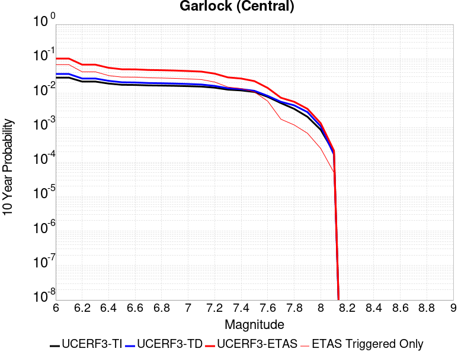 |

| Magnitude | 1 wk TI Prob | 1 wk TD Prob | 1 wk ETAS Prob | 1 wk ETAS/TD Gain | 1 wk ETAS Triggered Only | 1 mo TI Prob | 1 mo TD Prob | 1 mo ETAS Prob | 1 mo ETAS/TD Gain | 1 mo ETAS Triggered Only | 1 yr TI Prob | 1 yr TD Prob | 1 yr ETAS Prob | 1 yr ETAS/TD Gain | 1 yr ETAS Triggered Only | 10 yr TI Prob | 10 yr TD Prob | 10 yr ETAS Prob | 10 yr ETAS/TD Gain | 10 yr ETAS Triggered Only |
|-----|-----|-----|-----|-----|-----|-----|-----|-----|-----|-----|-----|-----|-----|-----|-----|-----|-----|-----|-----|-----|
| 6.0 | 5.5131142E-5 | 7.0252936E-5 | 0.0074197366 | 105.61462 | 0.00735 | 2.3625491E-4 | 3.0104961E-4 | 0.01783577 | 59.24528 | 0.01754 | 0.0028726095 | 0.0036591832 | 0.0453959 | 12.40602 | 0.04189 | 0.028357591 | 0.0361412 | 0.101240225 | 2.8012414 | 0.06754 |
| 6.1 | 5.5131142E-5 | 7.0252936E-5 | 0.0074197366 | 105.61462 | 0.00735 | 2.3625491E-4 | 3.0104961E-4 | 0.01783577 | 59.24528 | 0.01754 | 0.0028726095 | 0.0036591832 | 0.0453959 | 12.40602 | 0.04189 | 0.028357591 | 0.0361412 | 0.101240225 | 2.8012414 | 0.06754 |
| 6.2 | 4.216245E-5 | 5.166702E-5 | 0.0046714284 | 90.41412 | 0.00462 | 1.806837E-4 | 2.2141145E-4 | 0.010639104 | 48.05128 | 0.01042 | 0.0021976046 | 0.0026923835 | 0.02800405 | 10.401212 | 0.02538 | 0.021759989 | 0.026704067 | 0.067348905 | 2.5220466 | 0.04176 |
| 6.3 | 4.216245E-5 | 5.166702E-5 | 0.0046714284 | 90.41412 | 0.00462 | 1.806837E-4 | 2.2141145E-4 | 0.010639104 | 48.05128 | 0.01042 | 0.0021976046 | 0.0026923835 | 0.02800405 | 10.401212 | 0.02538 | 0.021759989 | 0.026704067 | 0.067348905 | 2.5220466 | 0.04176 |
| 6.4 | 3.6858168E-5 | 4.411544E-5 | 0.0037239532 | 84.413826 | 0.00368 | 1.5795401E-4 | 1.890526E-4 | 0.008337512 | 44.101543 | 0.00815 | 0.0019213937 | 0.0022993109 | 0.0220039 | 9.569779 | 0.01975 | 0.019048655 | 0.022868566 | 0.05463511 | 2.389092 | 0.03251 |
| 6.5 | 3.39199E-5 | 4.0023602E-5 | 0.0032098966 | 80.200096 | 0.00317 | 1.453629E-4 | 1.7151856E-4 | 0.007440272 | 43.37881 | 0.00727 | 0.0017683565 | 0.0020862604 | 0.019839145 | 9.509429 | 0.01779 | 0.017543508 | 0.020761253 | 0.04953129 | 2.385756 | 0.02938 |
| 6.6 | 3.3571985E-5 | 3.9477756E-5 | 0.0032093527 | 81.29522 | 0.00317 | 1.4387199E-4 | 1.6917953E-4 | 0.0074379495 | 43.964832 | 0.00727 | 0.0017502342 | 0.0020578366 | 0.01979127 | 9.617513 | 0.01777 | 0.017365133 | 0.020482505 | 0.049231343 | 2.4035802 | 0.02935 |
| 6.7 | 3.2580007E-5 | 3.8094186E-5 | 0.003057979 | 80.27417 | 0.00302 | 1.3962112E-4 | 1.632507E-4 | 0.007142111 | 43.749344 | 0.00698 | 0.0016985617 | 0.001985787 | 0.01900193 | 9.568967 | 0.01705 | 0.016856372 | 0.019771622 | 0.04727683 | 2.3911457 | 0.02806 |
| 6.8 | 3.2185937E-5 | 3.7521368E-5 | 0.0030374087 | 80.95144 | 0.003 | 1.3793244E-4 | 1.6079607E-4 | 0.007009695 | 43.593693 | 0.00685 | 0.0016780337 | 0.0019559558 | 0.018703135 | 9.562146 | 0.01678 | 0.016654192 | 0.01947876 | 0.046541147 | 2.3893278 | 0.0276 |
| 6.9 | 3.165394E-5 | 3.672589E-5 | 0.0029666184 | 80.7773 | 0.00293 | 1.3565269E-4 | 1.573873E-4 | 0.006856333 | 43.563442 | 0.0067 | 0.0016503202 | 0.0019145276 | 0.018283129 | 9.549682 | 0.0164 | 0.01638118 | 0.01907232 | 0.04550832 | 2.3860927 | 0.02695 |
| 7.0 | 3.0903822E-5 | 3.5631027E-5 | 0.0028855295 | 80.98362 | 0.00285 | 1.3243823E-4 | 1.5269557E-4 | 0.006611709 | 43.29994 | 0.00646 | 0.0016112428 | 0.0018575046 | 0.017688045 | 9.522477 | 0.01586 | 0.015996104 | 0.018513773 | 0.044032414 | 2.37836 | 0.026 |
| 7.1 | 3.0069863E-5 | 3.439724E-5 | 0.0027643032 | 80.364105 | 0.00273 | 1.2886449E-4 | 1.4740853E-4 | 0.006316499 | 42.850296 | 0.00617 | 0.0015677959 | 0.0017932425 | 0.016906092 | 9.427667 | 0.01514 | 0.01556781 | 0.017881477 | 0.042375512 | 2.3697994 | 0.02494 |
| 7.2 | 2.7957109E-5 | 3.1286352E-5 | 0.0024012122 | 76.749504 | 0.00237 | 1.1981068E-4 | 1.3407759E-4 | 0.0054933587 | 40.971493 | 0.00536 | 0.0014577188 | 0.0016311919 | 0.01469984 | 9.011717 | 0.01309 | 0.014481937 | 0.01628507 | 0.037041456 | 2.2745652 | 0.0211 |
| 7.3 | 2.4519275E-5 | 2.6719234E-5 | 0.0016766752 | 62.75162 | 0.00165 | 1.0507837E-4 | 1.1450605E-4 | 0.0038640767 | 33.74561 | 0.00375 | 0.0012785783 | 0.0013932344 | 0.010680277 | 7.6658154 | 0.0093 | 0.012712469 | 0.013929329 | 0.028789414 | 2.06682 | 0.01507 |
| 7.4 | 2.3225532E-5 | 2.52037E-5 | 0.0015451654 | 61.307083 | 0.00152 | 9.95342E-5 | 1.08011474E-4 | 0.003537641 | 32.752457 | 0.00343 | 0.0012111551 | 0.0013142608 | 0.009813077 | 7.466613 | 0.00851 | 0.012045753 | 0.013146927 | 0.026647076 | 2.0268674 | 0.01368 |
| 7.5 | 2.097765E-5 | 2.2487684E-5 | 0.0011724618 | 52.137955 | 0.00115 | 8.9901114E-5 | 9.637229E-5 | 0.0028161102 | 29.22116 | 0.00272 | 0.0010939965 | 0.0011727129 | 0.007864856 | 6.706548 | 0.0067 | 0.010886264 | 0.011741684 | 0.022454403 | 1.9123666 | 0.01084 |
| 7.6 | 1.511254E-5 | 1.599496E-5 | 6.059855E-4 | 37.886032 | 5.9E-4 | 6.476642E-5 | 6.854807E-5 | 0.0015784446 | 23.026829 | 0.00151 | 7.882459E-4 | 8.34261E-4 | 0.0043513244 | 5.215783 | 0.00352 | 0.007854558 | 0.008384922 | 0.014225534 | 1.6965615 | 0.00589 |
| 7.7 | 9.934069E-6 | 1.0682194E-5 | 2.2067995E-4 | 20.658672 | 2.1E-4 | 4.2573887E-5 | 4.578003E-5 | 4.957594E-4 | 10.829164 | 4.5E-4 | 5.182138E-4 | 5.5722974E-4 | 0.0015766614 | 2.8294637 | 0.00102 | 0.00517007 | 0.0056296214 | 0.0073797135 | 1.3108721 | 0.00176 |
| 7.8 | 6.7562896E-6 | 8.431359E-6 | 1.4843018E-4 | 17.604538 | 1.4E-4 | 2.8955206E-5 | 3.6133893E-5 | 3.3612305E-4 | 9.302154 | 3.0E-4 | 3.5247262E-4 | 4.3984153E-4 | 0.0011195424 | 2.5453315 | 6.8E-4 | 0.0035191406 | 0.004448285 | 0.0056429473 | 1.2685668 | 0.0012 |
| 7.9 | 3.975453E-6 | 5.3728804E-6 | 8.537245E-5 | 15.889513 | 8.0E-5 | 1.7037546E-5 | 2.3026427E-5 | 1.9302251E-4 | 8.382651 | 1.7E-4 | 2.0741238E-4 | 2.8031078E-4 | 6.6020427E-4 | 2.3552582 | 3.8E-4 | 0.002072189 | 0.00283465 | 0.003522694 | 1.2427263 | 6.9E-4 |
| 8.0 | 1.6729537E-6 | 2.0781215E-6 | 2.207808E-5 | 10.624057 | 2.0E-5 | 7.169782E-6 | 8.906205E-6 | 6.890567E-5 | 7.7368164 | 6.0E-5 | 8.7288594E-5 | 1.0842768E-4 | 2.2841468E-4 | 2.1066084 | 1.2E-4 | 8.7254314E-4 | 0.0010973068 | 0.0013470325 | 1.2275805 | 2.5E-4 |
| 8.1 | 3.6733252E-7 | 3.1497066E-7 | 1.0314968E-5 | 32.74898 | 1.0E-5 | 1.5742813E-6 | 1.3498736E-6 | 1.134986E-5 | 8.408091 | 1.0E-5 | 1.9166706E-5 | 1.6434604E-5 | 3.6434274E-5 | 2.2169244 | 2.0E-5 | 1.9165053E-4 | 1.6648426E-4 | 2.1647594E-4 | 1.3002787 | 5.0E-5 |

## Tank Canyon
*[(top)](#table-of-contents)*

| 1 Week | 1 Month | 1 Year | 10 Year |
|-----|-----|-----|-----|
| 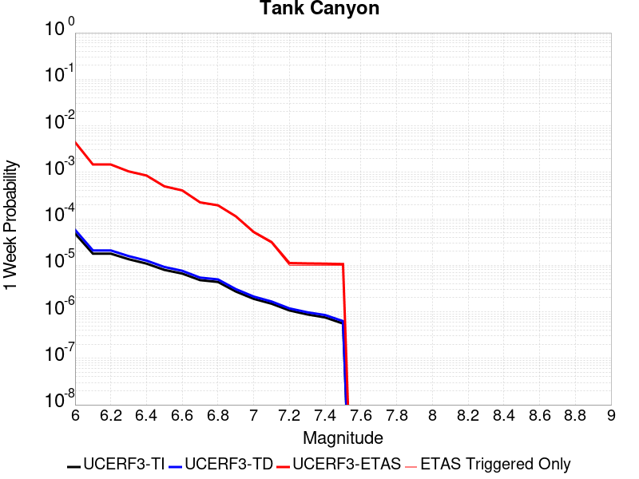 |  |  | 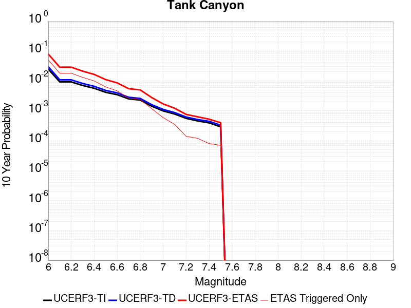 |

| Magnitude | 1 wk TI Prob | 1 wk TD Prob | 1 wk ETAS Prob | 1 wk ETAS/TD Gain | 1 wk ETAS Triggered Only | 1 mo TI Prob | 1 mo TD Prob | 1 mo ETAS Prob | 1 mo ETAS/TD Gain | 1 mo ETAS Triggered Only | 1 yr TI Prob | 1 yr TD Prob | 1 yr ETAS Prob | 1 yr ETAS/TD Gain | 1 yr ETAS Triggered Only | 10 yr TI Prob | 10 yr TD Prob | 10 yr ETAS Prob | 10 yr ETAS/TD Gain | 10 yr ETAS Triggered Only |
|-----|-----|-----|-----|-----|-----|-----|-----|-----|-----|-----|-----|-----|-----|-----|-----|-----|-----|-----|-----|-----|
| 6.0 | 4.8284557E-5 | 5.7965928E-5 | 0.004437712 | 76.55725 | 0.00438 | 2.0691741E-4 | 2.484056E-4 | 0.010655819 | 42.89686 | 0.01041 | 0.0025163088 | 0.00302081 | 0.03136493 | 10.382954 | 0.02843 | 0.02488006 | 0.029864373 | 0.07903085 | 2.6463253 | 0.05068 |
| 6.1 | 1.7796336E-5 | 2.0873778E-5 | 0.0014708436 | 70.46369 | 0.00145 | 7.626778E-5 | 8.94562E-5 | 0.003579144 | 40.010014 | 0.00349 | 9.281647E-4 | 0.0010886233 | 0.011097715 | 10.194266 | 0.01002 | 0.009242975 | 0.010836863 | 0.028720932 | 2.6502995 | 0.01808 |
| 6.2 | 1.7796336E-5 | 2.0873778E-5 | 0.0014708436 | 70.46369 | 0.00145 | 7.626778E-5 | 8.94562E-5 | 0.003579144 | 40.010014 | 0.00349 | 9.281647E-4 | 0.0010886233 | 0.011097715 | 10.194266 | 0.01002 | 0.009242975 | 0.010836863 | 0.028720932 | 2.6502995 | 0.01808 |
| 6.3 | 1.3515912E-5 | 1.575992E-5 | 0.0010457437 | 66.35463 | 0.00103 | 5.792405E-5 | 6.754091E-5 | 0.0025273748 | 37.41991 | 0.00246 | 7.049971E-4 | 8.2202395E-4 | 0.007906196 | 9.617963 | 0.00709 | 0.007027647 | 0.00819231 | 0.021165155 | 2.5835392 | 0.01308 |
| 6.4 | 1.0870146E-5 | 1.2618305E-5 | 8.526077E-4 | 67.569115 | 8.4E-4 | 4.658551E-5 | 5.407743E-5 | 0.0019139769 | 35.393265 | 0.00186 | 5.67031E-4 | 6.5821153E-4 | 0.006094631 | 9.25938 | 0.00544 | 0.005655863 | 0.006564494 | 0.016459111 | 2.5072932 | 0.00996 |
| 6.5 | 7.964826E-6 | 9.196297E-6 | 4.991918E-4 | 54.281826 | 4.9E-4 | 3.4134522E-5 | 3.9412163E-5 | 0.0011993664 | 30.431377 | 0.00116 | 4.1550855E-4 | 4.79748E-4 | 0.0038181457 | 7.958648 | 0.00334 | 0.0041473247 | 0.004788282 | 0.011028259 | 2.3031769 | 0.00627 |
| 6.6 | 6.6317E-6 | 7.6124547E-6 | 4.0760942E-4 | 53.54507 | 4.0E-4 | 2.8421264E-5 | 3.2624448E-5 | 8.625974E-4 | 26.440212 | 8.3E-4 | 3.4597394E-4 | 3.9713932E-4 | 0.0028061823 | 7.065989 | 0.00241 | 0.0034543579 | 0.0039653047 | 0.008576945 | 2.1629977 | 0.00463 |
| 6.7 | 4.793663E-6 | 5.4308844E-6 | 2.2542969E-4 | 41.508835 | 2.2E-4 | 2.0544108E-5 | 2.3275035E-5 | 5.3326314E-4 | 22.911379 | 5.1E-4 | 2.500958E-4 | 2.833411E-4 | 0.0016329585 | 5.7632256 | 0.00135 | 0.0024981452 | 0.0028303456 | 0.005482817 | 1.9371545 | 0.00266 |
| 6.8 | 4.382823E-6 | 4.969349E-6 | 1.9496841E-4 | 39.23419 | 1.9E-4 | 1.8783392E-5 | 2.129706E-5 | 5.012868E-4 | 23.537842 | 4.8E-4 | 2.286638E-4 | 2.5926513E-4 | 0.0014989437 | 5.781509 | 0.00124 | 0.0022842865 | 0.0025901678 | 0.004993926 | 1.9280316 | 0.00241 |
| 6.9 | 2.729601E-6 | 3.0735978E-6 | 1.13073256E-4 | 36.788567 | 1.1E-4 | 1.1698237E-5 | 1.3172503E-5 | 2.631692E-4 | 19.97868 | 2.5E-4 | 1.4241673E-4 | 1.6036464E-4 | 8.202588E-4 | 5.1149607 | 6.6E-4 | 0.001423255 | 0.0016027512 | 0.0027808598 | 1.735054 | 0.00118 |
| 7.0 | 1.8987357E-6 | 2.1269796E-6 | 5.2126874E-5 | 24.507463 | 5.0E-5 | 8.137413E-6 | 9.115598E-6 | 1.3911442E-4 | 15.261139 | 1.3E-4 | 9.90685E-5 | 1.1097746E-4 | 4.2094305E-4 | 3.79305 | 3.1E-4 | 9.902435E-4 | 0.001109289 | 0.0016986346 | 1.5312822 | 5.9E-4 |
| 7.1 | 1.4928986E-6 | 1.6641586E-6 | 3.166411E-5 | 19.027098 | 3.0E-5 | 6.398121E-6 | 7.1320924E-6 | 7.713159E-5 | 10.814721 | 7.0E-5 | 7.789434E-5 | 8.6830354E-5 | 2.568156E-4 | 2.9576707 | 1.7E-4 | 7.786704E-4 | 8.6802215E-4 | 0.0012177184 | 1.4028655 | 3.5E-4 |
| 7.2 | 1.069082E-6 | 1.1828818E-6 | 1.11828695E-5 | 9.45392 | 1.0E-5 | 4.581772E-6 | 5.069486E-6 | 2.5069385E-5 | 4.9451528 | 2.0E-5 | 5.5781646E-5 | 6.171978E-5 | 1.21716075E-4 | 1.9720757 | 6.0E-5 | 5.576765E-4 | 6.170787E-4 | 7.5699226E-4 | 1.2267355 | 1.4E-4 |
| 7.3 | 8.776551E-7 | 9.770191E-7 | 1.0977009E-5 | 11.235204 | 1.0E-5 | 3.7613736E-6 | 4.1872213E-6 | 2.4187137E-5 | 5.7764177 | 2.0E-5 | 4.579376E-5 | 5.0978742E-5 | 1.009762E-4 | 1.9807509 | 5.0E-5 | 4.5784327E-4 | 5.097215E-4 | 6.296603E-4 | 1.2353027 | 1.2E-4 |
| 7.4 | 7.55721E-7 | 8.510419E-7 | 1.0851033E-5 | 12.750293 | 1.0E-5 | 3.2388E-6 | 3.64732E-6 | 1.3647284E-5 | 3.741729 | 1.0E-5 | 3.9431678E-5 | 4.4405737E-5 | 7.44044E-5 | 1.6755584 | 3.0E-5 | 3.942468E-4 | 4.4401948E-4 | 5.2398397E-4 | 1.1800923 | 8.0E-5 |
| 7.5 | 5.587665E-7 | 6.3057325E-7 | 1.0630567E-5 | 16.858576 | 1.0E-5 | 2.3947114E-6 | 2.7024569E-6 | 1.270243E-5 | 4.7003264 | 1.0E-5 | 2.915522E-5 | 3.290241E-5 | 5.2901752E-5 | 1.6078382 | 2.0E-5 | 2.9151395E-4 | 3.2902413E-4 | 3.990011E-4 | 1.2126803 | 7.0E-5 |

## Little Lake
*[(top)](#table-of-contents)*

| 1 Week | 1 Month | 1 Year | 10 Year |
|-----|-----|-----|-----|
|  |  |  |  |

| Magnitude | 1 wk TI Prob | 1 wk TD Prob | 1 wk ETAS Prob | 1 wk ETAS/TD Gain | 1 wk ETAS Triggered Only | 1 mo TI Prob | 1 mo TD Prob | 1 mo ETAS Prob | 1 mo ETAS/TD Gain | 1 mo ETAS Triggered Only | 1 yr TI Prob | 1 yr TD Prob | 1 yr ETAS Prob | 1 yr ETAS/TD Gain | 1 yr ETAS Triggered Only | 10 yr TI Prob | 10 yr TD Prob | 10 yr ETAS Prob | 10 yr ETAS/TD Gain | 10 yr ETAS Triggered Only |
|-----|-----|-----|-----|-----|-----|-----|-----|-----|-----|-----|-----|-----|-----|-----|-----|-----|-----|-----|-----|-----|
| 6.0 | 2.8424427E-5 | 3.1206153E-5 | 0.0032011073 | 102.57936 | 0.00317 | 1.2181328E-4 | 1.3373456E-4 | 0.007992683 | 59.76528 | 0.00786 | 0.0014820677 | 0.0016271353 | 0.02164451 | 13.302219 | 0.02005 | 0.014722223 | 0.016165623 | 0.046969477 | 2.905516 | 0.03131 |
| 6.1 | 2.8424427E-5 | 3.1206153E-5 | 0.0032011073 | 102.57936 | 0.00317 | 1.2181328E-4 | 1.3373456E-4 | 0.007992683 | 59.76528 | 0.00786 | 0.0014820677 | 0.0016271353 | 0.02164451 | 13.302219 | 0.02005 | 0.014722223 | 0.016165623 | 0.046969477 | 2.905516 | 0.03131 |
| 6.2 | 2.8424427E-5 | 3.1206153E-5 | 0.0032011073 | 102.57936 | 0.00317 | 1.2181328E-4 | 1.3373456E-4 | 0.007992683 | 59.76528 | 0.00786 | 0.0014820677 | 0.0016271353 | 0.02164451 | 13.302219 | 0.02005 | 0.014722223 | 0.016165623 | 0.046969477 | 2.905516 | 0.03131 |
| 6.3 | 1.48860645E-5 | 1.6081587E-5 | 0.002166047 | 134.69112 | 0.00215 | 6.379586E-5 | 6.891943E-5 | 0.005358555 | 77.75101 | 0.00529 | 7.7643775E-4 | 8.387992E-4 | 0.014057701 | 16.759317 | 0.01323 | 0.007737305 | 0.00835915 | 0.028588625 | 3.4200394 | 0.0204 |
| 6.4 | 1.48860645E-5 | 1.6081587E-5 | 0.002166047 | 134.69112 | 0.00215 | 6.379586E-5 | 6.891943E-5 | 0.005358555 | 77.75101 | 0.00529 | 7.7643775E-4 | 8.387992E-4 | 0.014057701 | 16.759317 | 0.01323 | 0.007737305 | 0.00835915 | 0.028588625 | 3.4200394 | 0.0204 |
| 6.5 | 1.2797581E-5 | 1.376573E-5 | 0.001953739 | 141.92775 | 0.00194 | 5.4845623E-5 | 5.8994796E-5 | 0.004788716 | 81.17184 | 0.00473 | 6.675408E-4 | 7.1805064E-4 | 0.012529563 | 17.449415 | 0.01182 | 0.006655392 | 0.0071598557 | 0.025408257 | 3.5487108 | 0.01838 |
| 6.6 | 9.661896E-6 | 1.0289153E-5 | 0.0016402723 | 159.41765 | 0.00163 | 4.1407468E-5 | 4.4095712E-5 | 0.0041339155 | 93.74869 | 0.00409 | 5.040193E-4 | 5.367493E-4 | 0.0106213335 | 19.788258 | 0.01009 | 0.005028777 | 0.005356134 | 0.021001883 | 3.92109 | 0.01573 |
| 6.7 | 7.767871E-6 | 8.199772E-6 | 0.0014281882 | 174.17412 | 0.00142 | 3.329045E-5 | 3.5141486E-5 | 0.0035950164 | 102.3012 | 0.00356 | 4.0523586E-4 | 4.2777733E-4 | 0.009084073 | 21.235518 | 0.00866 | 0.004044977 | 0.0042708907 | 0.017842678 | 4.177742 | 0.01363 |
| 6.8 | 6.4235196E-6 | 6.7358133E-6 | 0.001156728 | 171.72806 | 0.00115 | 2.752908E-5 | 2.8867524E-5 | 0.002888785 | 100.07041 | 0.00286 | 3.35115E-4 | 3.5141825E-4 | 0.007238997 | 20.599377 | 0.00689 | 0.003346101 | 0.0035098856 | 0.014301874 | 4.0747404 | 0.01083 |
| 6.9 | 3.1283696E-6 | 3.112201E-6 | 8.4310956E-4 | 270.9046 | 8.4E-4 | 1.3407229E-5 | 1.3337944E-5 | 0.0018733131 | 140.4499 | 0.00186 | 1.6322079E-4 | 1.6237888E-4 | 0.0042717117 | 26.307062 | 0.00411 | 0.0016310095 | 0.0016227507 | 0.008122186 | 5.005197 | 0.00651 |
| 7.0 | 2.290603E-6 | 2.2286956E-6 | 5.922274E-4 | 265.72824 | 5.9E-4 | 9.816834E-6 | 9.551524E-6 | 0.0011895403 | 124.539314 | 0.00118 | 1.19513395E-4 | 1.1628464E-4 | 0.0026859858 | 23.098372 | 0.00257 | 0.0011944914 | 0.00116234 | 0.0052375975 | 4.50608 | 0.00408 |
| 7.1 | 1.293693E-6 | 1.1776893E-6 | 2.411774E-4 | 204.78865 | 2.4E-4 | 5.5443866E-6 | 5.047234E-6 | 5.7504437E-4 | 113.93257 | 5.7E-4 | 6.750081E-5 | 6.144904E-5 | 0.0012413765 | 20.201723 | 0.00118 | 6.7480316E-4 | 6.1438896E-4 | 0.0024532585 | 3.9930053 | 0.00184 |
| 7.2 | 4.715842E-7 | 3.0917863E-7 | 1.0309175E-5 | 33.34375 | 1.0E-5 | 2.0210737E-6 | 1.3250507E-6 | 3.132501E-5 | 23.640614 | 3.0E-5 | 2.4606294E-5 | 1.6132379E-5 | 6.613157E-5 | 4.099307 | 5.0E-5 | 2.460357E-4 | 1.6131261E-4 | 2.8129327E-4 | 1.7437772 | 1.2E-4 |
| 7.3 | 3.9430947E-7 | 2.3097442E-7 | 1.0230972E-5 | 44.294827 | 1.0E-5 | 1.6898966E-6 | 9.8989E-7 | 3.098986E-5 | 31.306368 | 3.0E-5 | 2.0574296E-5 | 1.2051845E-5 | 5.2051364E-5 | 4.318954 | 4.0E-5 | 2.0572392E-4 | 1.2051199E-4 | 2.1050114E-4 | 1.7467237 | 9.0E-5 |
| 7.4 | 3.547123E-7 | 1.9679048E-7 | 1.0196789E-5 | 51.815456 | 1.0E-5 | 1.5201948E-6 | 8.433875E-7 | 3.0843363E-5 | 36.57081 | 3.0E-5 | 1.8508214E-5 | 1.0268195E-5 | 5.0267783E-5 | 4.895484 | 4.0E-5 | 1.8506673E-4 | 1.0267727E-4 | 1.9266803E-4 | 1.8764429 | 9.0E-5 |
| 7.5 | 2.6354266E-7 | 1.4423068E-7 | 1.0144229E-5 | 70.33337 | 1.0E-5 | 1.129468E-6 | 6.1813137E-7 | 2.061812E-5 | 33.355564 | 2.0E-5 | 1.3751187E-5 | 7.525724E-6 | 3.7525497E-5 | 4.9862976 | 3.0E-5 | 1.3750336E-4 | 7.525474E-5 | 1.5524872E-4 | 2.062976 | 8.0E-5 |
| 7.6 | 1.269913E-7 | 7.572499E-8 | 7.572499E-8 | 1.0 | 0.0 | 5.4424834E-7 | 3.2453565E-7 | 3.2453565E-7 | 1.0 | 0.0 | 6.6262032E-6 | 3.9512147E-6 | 1.3951175E-5 | 3.5308573 | 1.0E-5 | 6.626006E-5 | 3.951148E-5 | 7.95099E-5 | 2.012324 | 4.0E-5 |

## Airport Lake
*[(top)](#table-of-contents)*

| 1 Week | 1 Month | 1 Year | 10 Year |
|-----|-----|-----|-----|
|  |  |  | 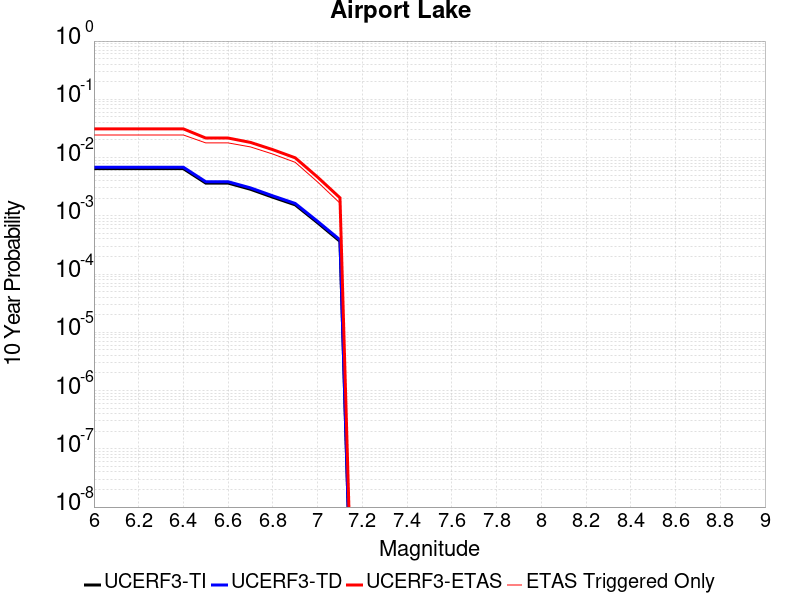 |

| Magnitude | 1 wk TI Prob | 1 wk TD Prob | 1 wk ETAS Prob | 1 wk ETAS/TD Gain | 1 wk ETAS Triggered Only | 1 mo TI Prob | 1 mo TD Prob | 1 mo ETAS Prob | 1 mo ETAS/TD Gain | 1 mo ETAS Triggered Only | 1 yr TI Prob | 1 yr TD Prob | 1 yr ETAS Prob | 1 yr ETAS/TD Gain | 1 yr ETAS Triggered Only | 10 yr TI Prob | 10 yr TD Prob | 10 yr ETAS Prob | 10 yr ETAS/TD Gain | 10 yr ETAS Triggered Only |
|-----|-----|-----|-----|-----|-----|-----|-----|-----|-----|-----|-----|-----|-----|-----|-----|-----|-----|-----|-----|-----|
| 6.0 | 1.2387061E-5 | 1.31032575E-5 | 0.0027630671 | 210.86873 | 0.00275 | 5.3086325E-5 | 5.6155768E-5 | 0.006675784 | 118.87975 | 0.00662 | 6.461343E-4 | 6.835104E-4 | 0.016522678 | 24.173264 | 0.01585 | 0.0064425888 | 0.0068168915 | 0.03105056 | 4.554944 | 0.0244 |
| 6.1 | 1.2387061E-5 | 1.31032575E-5 | 0.0027630671 | 210.86873 | 0.00275 | 5.3086325E-5 | 5.6155768E-5 | 0.006675784 | 118.87975 | 0.00662 | 6.461343E-4 | 6.835104E-4 | 0.016522678 | 24.173264 | 0.01585 | 0.0064425888 | 0.0068168915 | 0.03105056 | 4.554944 | 0.0244 |
| 6.2 | 1.2387061E-5 | 1.31032575E-5 | 0.0027630671 | 210.86873 | 0.00275 | 5.3086325E-5 | 5.6155768E-5 | 0.006675784 | 118.87975 | 0.00662 | 6.461343E-4 | 6.835104E-4 | 0.016522678 | 24.173264 | 0.01585 | 0.0064425888 | 0.0068168915 | 0.03105056 | 4.554944 | 0.0244 |
| 6.3 | 1.2387061E-5 | 1.31032575E-5 | 0.0027630671 | 210.86873 | 0.00275 | 5.3086325E-5 | 5.6155768E-5 | 0.006675784 | 118.87975 | 0.00662 | 6.461343E-4 | 6.835104E-4 | 0.016522678 | 24.173264 | 0.01585 | 0.0064425888 | 0.0068168915 | 0.03105056 | 4.554944 | 0.0244 |
| 6.4 | 1.2387061E-5 | 1.31032575E-5 | 0.0027630671 | 210.86873 | 0.00275 | 5.3086325E-5 | 5.6155768E-5 | 0.006675784 | 118.87975 | 0.00662 | 6.461343E-4 | 6.835104E-4 | 0.016522678 | 24.173264 | 0.01585 | 0.0064425888 | 0.0068168915 | 0.03105056 | 4.554944 | 0.0244 |
| 6.5 | 6.9922594E-6 | 7.38498E-6 | 0.0020873696 | 282.65067 | 0.00208 | 2.996648E-5 | 3.164956E-5 | 0.0050614905 | 159.92293 | 0.00503 | 3.6478083E-4 | 3.8527072E-4 | 0.012220709 | 31.719799 | 0.01184 | 0.003641826 | 0.0038465653 | 0.021627905 | 5.6226535 | 0.01785 |
| 6.6 | 6.9922594E-6 | 7.38498E-6 | 0.0020873696 | 282.65067 | 0.00208 | 2.996648E-5 | 3.164956E-5 | 0.0050614905 | 159.92293 | 0.00503 | 3.6478083E-4 | 3.8527072E-4 | 0.012220709 | 31.719799 | 0.01184 | 0.003641826 | 0.0038465653 | 0.021627905 | 5.6226535 | 0.01785 |
| 6.7 | 5.477277E-6 | 5.7861116E-6 | 0.0017057763 | 294.80527 | 0.0017 | 2.3473833E-5 | 2.4797408E-5 | 0.004314691 | 173.99767 | 0.00429 | 2.8575645E-4 | 3.0187052E-4 | 0.010298852 | 34.116787 | 0.01 | 0.0028538927 | 0.0030149885 | 0.01819907 | 6.036199 | 0.01523 |
| 6.8 | 3.9950432E-6 | 4.2191186E-6 | 0.0014242132 | 337.56177 | 0.00142 | 1.7121502E-5 | 1.8081826E-5 | 0.0033080224 | 182.94736 | 0.00329 | 2.0843433E-4 | 2.2012675E-4 | 0.0077484692 | 35.200035 | 0.00753 | 0.0020823893 | 0.002199358 | 0.013654109 | 6.208225 | 0.01148 |
| 6.9 | 2.95695E-6 | 3.1230477E-6 | 0.0010231199 | 327.60303 | 0.00102 | 1.2672582E-5 | 1.3384434E-5 | 0.0024633517 | 184.046 | 0.00245 | 1.5427776E-4 | 1.6294557E-4 | 0.005462082 | 33.5209 | 0.0053 | 0.001541707 | 0.0016284833 | 0.009895 | 6.0762057 | 0.00828 |
| 7.0 | 1.456072E-6 | 1.5408239E-6 | 5.3154E-4 | 344.97128 | 5.3E-4 | 6.2402937E-6 | 6.60352E-6 | 0.0010965964 | 166.0624 | 0.00109 | 7.597293E-5 | 8.03959E-5 | 0.0024702037 | 30.725494 | 0.00239 | 7.594696E-4 | 8.03767E-4 | 0.0046107047 | 5.7363696 | 0.00381 |
| 7.1 | 6.995192E-7 | 7.4090326E-7 | 2.1074075E-4 | 284.4376 | 2.1E-4 | 2.997936E-6 | 3.1752998E-6 | 5.131737E-4 | 161.61426 | 5.1E-4 | 3.649926E-5 | 3.8659273E-5 | 0.0011186175 | 28.935297 | 0.00108 | 3.6493264E-4 | 3.8659273E-4 | 0.002035955 | 5.2664075 | 0.00165 |

## Owl Lake
*[(top)](#table-of-contents)*

| 1 Week | 1 Month | 1 Year | 10 Year |
|-----|-----|-----|-----|
|  |  |  |  |

| Magnitude | 1 wk TI Prob | 1 wk TD Prob | 1 wk ETAS Prob | 1 wk ETAS/TD Gain | 1 wk ETAS Triggered Only | 1 mo TI Prob | 1 mo TD Prob | 1 mo ETAS Prob | 1 mo ETAS/TD Gain | 1 mo ETAS Triggered Only | 1 yr TI Prob | 1 yr TD Prob | 1 yr ETAS Prob | 1 yr ETAS/TD Gain | 1 yr ETAS Triggered Only | 10 yr TI Prob | 10 yr TD Prob | 10 yr ETAS Prob | 10 yr ETAS/TD Gain | 10 yr ETAS Triggered Only |
|-----|-----|-----|-----|-----|-----|-----|-----|-----|-----|-----|-----|-----|-----|-----|-----|-----|-----|-----|-----|-----|
| 6.0 | 5.0320643E-5 | 6.636041E-5 | 0.0017462489 | 26.31462 | 0.00168 | 2.1564208E-4 | 2.84377E-4 | 0.004433197 | 15.589154 | 0.00415 | 0.0026222812 | 0.0034577118 | 0.01460902 | 4.2250543 | 0.01119 | 0.02591553 | 0.034142397 | 0.053420912 | 1.5646504 | 0.01996 |
| 6.1 | 5.0320643E-5 | 6.636041E-5 | 0.0017462489 | 26.31462 | 0.00168 | 2.1564208E-4 | 2.84377E-4 | 0.004433197 | 15.589154 | 0.00415 | 0.0026222812 | 0.0034577118 | 0.01460902 | 4.2250543 | 0.01119 | 0.02591553 | 0.034142397 | 0.053420912 | 1.5646504 | 0.01996 |
| 6.2 | 2.4125871E-5 | 3.098217E-5 | 0.0013009429 | 41.99005 | 0.00127 | 1.0339249E-4 | 1.3277512E-4 | 0.0032923555 | 24.79648 | 0.00316 | 0.0012580766 | 0.0016155102 | 0.009912086 | 6.135576 | 0.00831 | 0.012509781 | 0.016071098 | 0.031007139 | 1.9293728 | 0.01518 |
| 6.3 | 1.7433485E-5 | 2.2356866E-5 | 0.0012023305 | 53.779026 | 0.00118 | 7.471279E-5 | 9.58125E-5 | 0.0029655376 | 30.951468 | 0.00287 | 9.0924866E-4 | 0.0011660301 | 0.008497471 | 7.2875233 | 0.00734 | 0.009055373 | 0.011629325 | 0.024478143 | 2.1048636 | 0.013 |
| 6.4 | 1.7433485E-5 | 2.2356866E-5 | 0.0012023305 | 53.779026 | 0.00118 | 7.471279E-5 | 9.58125E-5 | 0.0029655376 | 30.951468 | 0.00287 | 9.0924866E-4 | 0.0011660301 | 0.008497471 | 7.2875233 | 0.00734 | 0.009055373 | 0.011629325 | 0.024478143 | 2.1048636 | 0.013 |
| 6.5 | 1.5182742E-5 | 1.9430483E-5 | 0.0011594084 | 59.669556 | 0.00114 | 6.506727E-5 | 8.32717E-5 | 0.0028130445 | 33.78152 | 0.00273 | 7.919061E-4 | 0.0010134967 | 0.007986423 | 7.8800673 | 0.00698 | 0.0078909 | 0.010118797 | 0.02235373 | 2.2091289 | 0.01236 |
| 6.6 | 6.7271576E-6 | 8.548313E-6 | 9.385404E-4 | 109.79246 | 9.3E-4 | 2.8830356E-5 | 3.6635145E-5 | 0.002276553 | 62.14123 | 0.00224 | 3.5095305E-4 | 4.4594728E-4 | 0.0058435393 | 13.103655 | 0.0054 | 0.0035039932 | 0.004467926 | 0.013636776 | 3.052149 | 0.00921 |
| 6.7 | 6.682835E-6 | 8.480754E-6 | 9.3847286E-4 | 110.65913 | 9.3E-4 | 2.8640408E-5 | 3.6345617E-5 | 0.002256265 | 62.07805 | 0.00222 | 3.4864116E-4 | 4.4242368E-4 | 0.005810048 | 13.132317 | 0.00537 | 0.003480947 | 0.00443287 | 0.013562221 | 3.059467 | 0.00917 |
| 6.8 | 6.5774975E-6 | 8.32722E-6 | 9.383195E-4 | 112.68101 | 9.3E-4 | 2.8188972E-5 | 3.5687626E-5 | 0.0022556083 | 63.204212 | 0.00222 | 3.4314668E-4 | 4.3441588E-4 | 0.005802083 | 13.356057 | 0.00537 | 0.0034261728 | 0.0043530487 | 0.013483131 | 3.0973995 | 0.00917 |
| 6.9 | 6.363419E-6 | 8.000376E-6 | 9.3799294E-4 | 117.243614 | 9.3E-4 | 2.727151E-5 | 3.4286906E-5 | 0.002244211 | 65.45389 | 0.00221 | 3.3198006E-4 | 4.173687E-4 | 0.005765136 | 13.813053 | 0.00535 | 0.0033148455 | 0.004183012 | 0.013284779 | 3.1758883 | 0.00914 |
| 7.0 | 6.1342453E-6 | 7.632552E-6 | 9.376255E-4 | 122.845604 | 9.3E-4 | 2.6289357E-5 | 3.271056E-5 | 0.0022226388 | 67.94867 | 0.00219 | 3.2002592E-4 | 3.9818377E-4 | 0.0057060695 | 14.330241 | 0.00531 | 0.0031956544 | 0.003991678 | 0.013015513 | 3.2606623 | 0.00906 |
| 7.1 | 5.842926E-6 | 7.1430604E-6 | 9.1713655E-4 | 128.39546 | 9.1E-4 | 2.504087E-5 | 3.0612788E-5 | 0.0021205489 | 69.270035 | 0.00209 | 3.0482994E-4 | 3.7265237E-4 | 0.0054607554 | 14.653752 | 0.00509 | 0.0030441214 | 0.0037372818 | 0.012384842 | 3.3138638 | 0.00868 |
| 7.2 | 4.77173E-6 | 5.359158E-6 | 6.253558E-4 | 116.68919 | 6.2E-4 | 2.045011E-5 | 2.296764E-5 | 0.0015229331 | 66.30778 | 0.0015 | 2.4895166E-4 | 2.795992E-4 | 0.0038286066 | 13.693196 | 0.00355 | 0.0024867293 | 0.002808747 | 0.008522653 | 3.0343256 | 0.00573 |
| 7.3 | 3.0494948E-6 | 2.7108347E-6 | 1.4271046E-4 | 52.64447 | 1.4E-4 | 1.3069198E-5 | 1.1617813E-5 | 3.7161363E-4 | 31.986542 | 3.6E-4 | 1.5910587E-4 | 1.4143785E-4 | 0.0010913034 | 7.715781 | 9.5E-4 | 0.0015899199 | 0.0014233418 | 0.0029811214 | 2.0944521 | 0.00156 |
| 7.4 | 2.7263884E-6 | 2.3060104E-6 | 1.0230578E-4 | 44.36484 | 1.0E-4 | 1.1684469E-5 | 9.882864E-6 | 2.298807E-4 | 23.260532 | 2.2E-4 | 1.4224913E-4 | 1.2031734E-4 | 7.502415E-4 | 6.235523 | 6.3E-4 | 0.0014215811 | 0.0012113012 | 0.0022400536 | 1.8492953 | 0.00103 |
| 7.5 | 2.6090431E-6 | 2.1659357E-6 | 8.216576E-5 | 37.93546 | 8.0E-5 | 1.1181565E-5 | 9.282549E-6 | 2.092807E-4 | 22.545605 | 2.0E-4 | 1.3612706E-4 | 1.1300927E-4 | 6.4294937E-4 | 5.6893506 | 5.3E-4 | 0.001360437 | 0.0011380832 | 0.0020170817 | 1.77235 | 8.8E-4 |
| 7.6 | 2.3008756E-6 | 1.8730968E-6 | 8.1872946E-5 | 43.709938 | 8.0E-5 | 9.860858E-6 | 8.027534E-6 | 1.6802625E-4 | 20.931242 | 1.6E-4 | 1.20049335E-4 | 9.7730925E-5 | 5.1768986E-4 | 5.297094 | 4.2E-4 | 0.001199845 | 9.851726E-4 | 0.0017044632 | 1.7301165 | 7.2E-4 |
| 7.7 | 1.7184348E-6 | 1.3421906E-6 | 5.1342122E-5 | 38.252483 | 5.0E-5 | 7.3646997E-6 | 5.752233E-6 | 9.575172E-5 | 16.646008 | 9.0E-5 | 8.966153E-5 | 7.003123E-5 | 3.3001302E-4 | 4.7123694 | 2.6E-4 | 8.962536E-4 | 7.08018E-4 | 0.0011077349 | 1.5645573 | 4.0E-4 |
| 7.8 | 8.4612907E-7 | 8.408234E-7 | 1.0840815E-5 | 12.893093 | 1.0E-5 | 3.6262625E-6 | 3.6035242E-6 | 3.3603417E-5 | 9.325153 | 3.0E-5 | 4.4148852E-5 | 4.3872045E-5 | 1.5386722E-4 | 3.5071814 | 1.1E-4 | 4.414008E-4 | 4.440713E-4 | 6.139958E-4 | 1.3826514 | 1.7E-4 |
| 7.9 | 2.716738E-7 | 3.7693766E-7 | 1.03769335E-5 | 27.529575 | 1.0E-5 | 1.1643157E-6 | 1.6154462E-6 | 2.1615413E-5 | 13.38046 | 2.0E-5 | 1.4175452E-5 | 1.9667892E-5 | 8.9666515E-5 | 4.5590305 | 7.0E-5 | 1.4174548E-4 | 1.9836401E-4 | 2.7834813E-4 | 1.403219 | 8.0E-5 |
| 8.0 | 2.1995428E-8 | 3.38572E-8 | 3.38572E-8 | 1.0 | 0.0 | 9.426611E-8 | 1.4510229E-7 | 1.01451005E-5 | 69.916885 | 1.0E-5 | 1.1476893E-6 | 1.7666197E-6 | 2.1766584E-5 | 12.321035 | 2.0E-5 | 1.14768345E-5 | 1.7871007E-5 | 3.787065E-5 | 2.119111 | 2.0E-5 |

## Panamint Valley
*[(top)](#table-of-contents)*

| 1 Week | 1 Month | 1 Year | 10 Year |
|-----|-----|-----|-----|
|  |  |  |  |

| Magnitude | 1 wk TI Prob | 1 wk TD Prob | 1 wk ETAS Prob | 1 wk ETAS/TD Gain | 1 wk ETAS Triggered Only | 1 mo TI Prob | 1 mo TD Prob | 1 mo ETAS Prob | 1 mo ETAS/TD Gain | 1 mo ETAS Triggered Only | 1 yr TI Prob | 1 yr TD Prob | 1 yr ETAS Prob | 1 yr ETAS/TD Gain | 1 yr ETAS Triggered Only | 10 yr TI Prob | 10 yr TD Prob | 10 yr ETAS Prob | 10 yr ETAS/TD Gain | 10 yr ETAS Triggered Only |
|-----|-----|-----|-----|-----|-----|-----|-----|-----|-----|-----|-----|-----|-----|-----|-----|-----|-----|-----|-----|-----|
| 6.0 | 3.0211835E-5 | 3.3984965E-5 | 0.0014939354 | 43.958714 | 0.00146 | 1.2947287E-4 | 1.4564188E-4 | 0.0036851263 | 25.302654 | 0.00354 | 0.0015751923 | 0.0017717773 | 0.011354769 | 6.4086885 | 0.0096 | 0.015640736 | 0.017582124 | 0.03351694 | 1.9063079 | 0.01622 |
| 6.1 | 3.0211835E-5 | 3.3984965E-5 | 0.0014939354 | 43.958714 | 0.00146 | 1.2947287E-4 | 1.4564188E-4 | 0.0036851263 | 25.302654 | 0.00354 | 0.0015751923 | 0.0017717773 | 0.011354769 | 6.4086885 | 0.0096 | 0.015640736 | 0.017582124 | 0.03351694 | 1.9063079 | 0.01622 |
| 6.2 | 3.0211835E-5 | 3.3984965E-5 | 0.0014939354 | 43.958714 | 0.00146 | 1.2947287E-4 | 1.4564188E-4 | 0.0036851263 | 25.302654 | 0.00354 | 0.0015751923 | 0.0017717773 | 0.011354769 | 6.4086885 | 0.0096 | 0.015640736 | 0.017582124 | 0.03351694 | 1.9063079 | 0.01622 |
| 6.3 | 2.8573924E-5 | 3.2103115E-5 | 0.0014520575 | 45.23105 | 0.00142 | 1.2245393E-4 | 1.3757768E-4 | 0.0035771043 | 26.000618 | 0.00344 | 0.001489857 | 0.0016737491 | 0.010808434 | 6.457619 | 0.00915 | 0.01479908 | 0.01661714 | 0.03177107 | 1.9119457 | 0.01541 |
| 6.4 | 2.8573924E-5 | 3.2103115E-5 | 0.0014520575 | 45.23105 | 0.00142 | 1.2245393E-4 | 1.3757768E-4 | 0.0035771043 | 26.000618 | 0.00344 | 0.001489857 | 0.0016737491 | 0.010808434 | 6.457619 | 0.00915 | 0.01479908 | 0.01661714 | 0.03177107 | 1.9119457 | 0.01541 |
| 6.5 | 2.7468774E-5 | 3.0828793E-5 | 0.0014107863 | 45.76197 | 0.00138 | 1.1771801E-4 | 1.3211685E-4 | 0.0034516782 | 26.12595 | 0.00332 | 0.0014322745 | 0.0016073632 | 0.01042317 | 6.4846387 | 0.00883 | 0.014230782 | 0.015962977 | 0.030575925 | 1.9154277 | 0.01485 |
| 6.6 | 2.6135967E-5 | 2.925278E-5 | 0.0013692136 | 46.806274 | 0.00134 | 1.1200648E-4 | 1.2536318E-4 | 0.003324962 | 26.522636 | 0.0032 | 0.0013628257 | 0.0015252546 | 0.010002305 | 6.5577936 | 0.00849 | 0.013544982 | 0.015153424 | 0.02917764 | 1.9254817 | 0.01424 |
| 6.7 | 2.4498746E-5 | 2.7341659E-5 | 0.0013273061 | 48.545193 | 0.0013 | 1.04990395E-4 | 1.1717342E-4 | 0.003166816 | 27.026745 | 0.00305 | 0.0012775084 | 0.0014256779 | 0.009484173 | 6.6523952 | 0.00807 | 0.012701893 | 0.014170669 | 0.027420215 | 1.9349979 | 0.01344 |
| 6.8 | 2.2244329E-5 | 2.4935984E-5 | 0.0012149063 | 48.721012 | 0.00119 | 9.532935E-5 | 1.06864245E-4 | 0.0029665586 | 27.760067 | 0.00286 | 0.0011600169 | 0.0013003175 | 0.0088405 | 6.7987247 | 0.00755 | 0.011539802 | 0.012932051 | 0.025171693 | 1.946458 | 0.0124 |
| 6.9 | 1.9902658E-5 | 2.2290773E-5 | 0.001132266 | 50.795277 | 0.00111 | 8.529431E-5 | 9.552849E-5 | 0.0027252773 | 28.528423 | 0.00263 | 0.0010379635 | 0.0011624574 | 0.008004495 | 6.8858395 | 0.00685 | 0.010331288 | 0.011568334 | 0.022450967 | 1.940726 | 0.01101 |
| 7.0 | 1.8353881E-5 | 2.0566635E-5 | 0.001070545 | 52.052513 | 0.00105 | 7.865712E-5 | 8.8139845E-5 | 0.0025879196 | 29.361517 | 0.0025 | 9.5722964E-4 | 0.001072592 | 0.007515674 | 7.00702 | 0.00645 | 0.009531168 | 0.010678438 | 0.020908022 | 1.9579664 | 0.01034 |
| 7.1 | 1.7667631E-5 | 1.9773011E-5 | 0.0010097534 | 51.067257 | 9.9E-4 | 7.571623E-5 | 8.473882E-5 | 0.0024445388 | 28.84792 | 0.00236 | 9.2145515E-4 | 0.0010312245 | 0.0071748826 | 6.957634 | 0.00615 | 0.009176437 | 0.010268626 | 0.020047171 | 1.9522741 | 0.00988 |
| 7.2 | 1.6381597E-5 | 1.8158586E-5 | 9.381419E-4 | 51.66382 | 9.2E-4 | 7.020495E-5 | 7.782029E-5 | 0.0022376522 | 28.754099 | 0.00216 | 8.544101E-4 | 9.4706746E-4 | 0.006541764 | 6.9073896 | 0.0056 | 0.008511325 | 0.009434342 | 0.01822066 | 1.9313121 | 0.00887 |
| 7.3 | 1.4520491E-5 | 1.596705E-5 | 7.459554E-4 | 46.71842 | 7.3E-4 | 6.222919E-5 | 6.842852E-5 | 0.0018183087 | 26.572384 | 0.00175 | 7.57377E-4 | 8.3281496E-4 | 0.005418992 | 6.5068383 | 0.00459 | 0.0075480095 | 0.008299384 | 0.015558633 | 1.8746731 | 0.00732 |
| 7.4 | 1.2852287E-5 | 1.4145931E-5 | 7.241359E-4 | 51.1904 | 7.1E-4 | 5.5080065E-5 | 6.06241E-5 | 0.0017705205 | 29.204893 | 0.00171 | 6.7039346E-4 | 7.378643E-4 | 0.0051645953 | 6.999384 | 0.00443 | 0.0066837464 | 0.0073563983 | 0.014334682 | 1.9486006 | 0.00703 |
| 7.5 | 1.1637851E-5 | 1.28372185E-5 | 7.1282825E-4 | 55.528244 | 7.0E-4 | 4.987555E-5 | 5.501558E-5 | 0.0017549221 | 31.898638 | 0.0017 | 6.070656E-4 | 6.696245E-4 | 0.0050167115 | 7.491828 | 0.00435 | 0.006054099 | 0.0066782837 | 0.01352227 | 2.0248122 | 0.00689 |
| 7.6 | 3.0068115E-6 | 3.3332262E-6 | 2.8333228E-4 | 85.00242 | 2.8E-4 | 1.2886271E-5 | 1.4285218E-5 | 8.4427337E-4 | 59.10119 | 8.3E-4 | 1.5687906E-4 | 1.7391593E-4 | 0.0020735855 | 11.922918 | 0.0019 | 0.0015676835 | 0.0017386783 | 0.004773393 | 2.7454145 | 0.00304 |

## Garlock (East)
*[(top)](#table-of-contents)*

| 1 Week | 1 Month | 1 Year | 10 Year |
|-----|-----|-----|-----|
|  |  |  |  |

| Magnitude | 1 wk TI Prob | 1 wk TD Prob | 1 wk ETAS Prob | 1 wk ETAS/TD Gain | 1 wk ETAS Triggered Only | 1 mo TI Prob | 1 mo TD Prob | 1 mo ETAS Prob | 1 mo ETAS/TD Gain | 1 mo ETAS Triggered Only | 1 yr TI Prob | 1 yr TD Prob | 1 yr ETAS Prob | 1 yr ETAS/TD Gain | 1 yr ETAS Triggered Only | 10 yr TI Prob | 10 yr TD Prob | 10 yr ETAS Prob | 10 yr ETAS/TD Gain | 10 yr ETAS Triggered Only |
|-----|-----|-----|-----|-----|-----|-----|-----|-----|-----|-----|-----|-----|-----|-----|-----|-----|-----|-----|-----|-----|
| 6.0 | 4.5092507E-5 | 6.290799E-5 | 0.0011828375 | 18.80266 | 0.00112 | 1.9323928E-4 | 2.695803E-4 | 0.0031987904 | 11.865816 | 0.00293 | 0.0023501497 | 0.0032776468 | 0.011012212 | 3.3597922 | 0.00776 | 0.023254504 | 0.032344494 | 0.04572717 | 1.4137543 | 0.01383 |
| 6.1 | 4.5092507E-5 | 6.290799E-5 | 0.0011828375 | 18.80266 | 0.00112 | 1.9323928E-4 | 2.695803E-4 | 0.0031987904 | 11.865816 | 0.00293 | 0.0023501497 | 0.0032776468 | 0.011012212 | 3.3597922 | 0.00776 | 0.023254504 | 0.032344494 | 0.04572717 | 1.4137543 | 0.01383 |
| 6.2 | 2.6674514E-5 | 3.451465E-5 | 9.4448327E-4 | 27.364706 | 9.1E-4 | 1.1431433E-4 | 1.4791173E-4 | 0.0023875805 | 16.141928 | 0.00224 | 0.0013908884 | 0.0017993709 | 0.0074990964 | 4.167621 | 0.00571 | 0.01382215 | 0.017863318 | 0.02742933 | 1.5355115 | 0.00974 |
| 6.3 | 2.6674514E-5 | 3.451465E-5 | 9.4448327E-4 | 27.364706 | 9.1E-4 | 1.1431433E-4 | 1.4791173E-4 | 0.0023875805 | 16.141928 | 0.00224 | 0.0013908884 | 0.0017993709 | 0.0074990964 | 4.167621 | 0.00571 | 0.01382215 | 0.017863318 | 0.02742933 | 1.5355115 | 0.00974 |
| 6.4 | 2.5312667E-5 | 3.2343483E-5 | 9.0231537E-4 | 27.897903 | 8.7E-4 | 1.0847834E-4 | 1.3860772E-4 | 0.002328304 | 16.797794 | 0.00219 | 0.0013199237 | 0.0016862722 | 0.007326745 | 4.344936 | 0.00565 | 0.013121112 | 0.016764186 | 0.026213083 | 1.5636358 | 0.00961 |
| 6.5 | 2.5312667E-5 | 3.2343483E-5 | 9.0231537E-4 | 27.897903 | 8.7E-4 | 1.0847834E-4 | 1.3860772E-4 | 0.002328304 | 16.797794 | 0.00219 | 0.0013199237 | 0.0016862722 | 0.007326745 | 4.344936 | 0.00565 | 0.013121112 | 0.016764186 | 0.026213083 | 1.5636358 | 0.00961 |
| 6.6 | 2.246556E-5 | 2.8137678E-5 | 8.981132E-4 | 31.918528 | 8.7E-4 | 9.627742E-5 | 1.20584606E-4 | 0.0022503277 | 18.661816 | 0.00213 | 0.0011715472 | 0.0014671524 | 0.00685923 | 4.675199 | 0.0054 | 0.011653901 | 0.014604934 | 0.02355232 | 1.6126277 | 0.00908 |
| 6.7 | 2.2241198E-5 | 2.7807404E-5 | 8.977832E-4 | 32.285763 | 8.7E-4 | 9.531594E-5 | 1.1916928E-4 | 0.0022389167 | 18.7877 | 0.00212 | 0.0011598538 | 0.0014499439 | 0.006822143 | 4.7051086 | 0.00538 | 0.011538187 | 0.014434824 | 0.023344332 | 1.6172233 | 0.00904 |
| 6.8 | 1.9528685E-5 | 2.3901322E-5 | 8.6388126E-4 | 36.143658 | 8.4E-4 | 8.369167E-5 | 1.0243033E-4 | 0.0021122245 | 20.621084 | 0.00201 | 0.0010184698 | 0.0012463954 | 0.006360014 | 5.1027255 | 0.00512 | 0.010138147 | 0.012438075 | 0.020782974 | 1.6709156 | 0.00845 |
| 6.9 | 1.3318621E-5 | 1.5200952E-5 | 8.0518896E-4 | 52.96964 | 7.9E-4 | 5.7078556E-5 | 6.514534E-5 | 0.0018950261 | 29.089205 | 0.00183 | 6.9470983E-4 | 7.928616E-4 | 0.005299286 | 6.6837463 | 0.00451 | 0.0069254204 | 0.007940963 | 0.0152822 | 1.924477 | 0.0074 |
| 7.0 | 1.1760853E-5 | 1.3109707E-5 | 8.0309936E-4 | 61.259903 | 7.9E-4 | 5.0402683E-5 | 5.6183275E-5 | 0.0018360832 | 32.68025 | 0.00178 | 6.134799E-4 | 6.838217E-4 | 0.0050508333 | 7.3861847 | 0.00437 | 0.0061178906 | 0.006857492 | 0.013928667 | 2.0311604 | 0.00712 |
| 7.1 | 1.0064758E-5 | 1.0904764E-5 | 7.608966E-4 | 69.77653 | 7.5E-4 | 4.3133965E-5 | 4.6733887E-5 | 0.0017666535 | 37.80241 | 0.00172 | 5.2502943E-4 | 5.6884E-4 | 0.0047264737 | 8.308968 | 0.00416 | 0.005237907 | 0.005713798 | 0.01249483 | 2.186782 | 0.00682 |
| 7.2 | 9.768808E-6 | 1.0500609E-5 | 7.6049275E-4 | 72.423676 | 7.5E-4 | 4.186565E-5 | 4.5001856E-5 | 0.0017149267 | 38.10791 | 0.00167 | 5.095951E-4 | 5.477633E-4 | 0.004595545 | 8.389654 | 0.00405 | 0.0050842804 | 0.0055042095 | 0.012127551 | 2.203323 | 0.00666 |
| 7.3 | 9.344516E-6 | 9.946213E-6 | 7.29939E-4 | 73.38864 | 7.2E-4 | 4.004731E-5 | 4.262595E-5 | 0.0016425578 | 38.53422 | 0.0016 | 4.8746695E-4 | 5.188508E-4 | 0.0042968895 | 8.281551 | 0.00378 | 0.0048639905 | 0.005215881 | 0.011343751 | 2.1748486 | 0.00616 |
| 7.4 | 9.023491E-6 | 9.492341E-6 | 6.5948616E-4 | 69.47561 | 6.5E-4 | 3.867153E-5 | 4.0680847E-5 | 0.0014806222 | 36.396053 | 0.00144 | 4.7072413E-4 | 4.951801E-4 | 0.0039034914 | 7.8829737 | 0.00341 | 0.004697283 | 0.0049793427 | 0.0104420055 | 2.0970652 | 0.00549 |
| 7.5 | 7.081253E-6 | 7.089067E-6 | 3.0708694E-4 | 43.318386 | 3.0E-4 | 3.0347876E-5 | 3.0381365E-5 | 7.903583E-4 | 26.014574 | 7.6E-4 | 3.6942272E-4 | 3.6983108E-4 | 0.0020692023 | 5.594993 | 0.0017 | 0.003688092 | 0.0037253548 | 0.0065248865 | 1.7514806 | 0.00281 |
| 7.6 | 6.116396E-6 | 5.960529E-6 | 1.959594E-4 | 32.876175 | 1.9E-4 | 2.6212863E-5 | 2.5544876E-5 | 4.6553364E-4 | 18.22415 | 4.4E-4 | 3.1909486E-4 | 3.1096474E-4 | 0.0012106849 | 3.893319 | 9.0E-4 | 0.0031863707 | 0.003136776 | 0.00471182 | 1.5021219 | 0.00158 |
| 7.7 | 4.797145E-6 | 4.758607E-6 | 1.2475804E-4 | 26.217344 | 1.2E-4 | 2.055903E-5 | 2.039387E-5 | 2.9038836E-4 | 14.239001 | 2.7E-4 | 2.5027743E-4 | 2.4826723E-4 | 7.181505E-4 | 2.8926516 | 4.7E-4 | 0.0024999576 | 0.002510294 | 0.0033581601 | 1.3377558 | 8.5E-4 |
| 7.8 | 3.4028885E-6 | 3.9797173E-6 | 9.397936E-5 | 23.614582 | 9.0E-5 | 1.4583726E-5 | 1.7055821E-5 | 2.0705258E-4 | 12.139702 | 1.9E-4 | 1.775424E-4 | 2.076349E-4 | 5.375664E-4 | 2.588998 | 3.3E-4 | 0.0017740062 | 0.00210206 | 0.0027207567 | 1.2943288 | 6.2E-4 |
| 7.9 | 2.5928412E-6 | 3.3735669E-6 | 5.33734E-5 | 15.821058 | 5.0E-5 | 1.1112129E-5 | 1.4458064E-5 | 1.2445648E-4 | 8.608101 | 1.1E-4 | 1.3528178E-4 | 1.7601276E-4 | 3.9597406E-4 | 2.2496893 | 2.2E-4 | 0.0013519945 | 0.0017819697 | 0.0022012212 | 1.2352742 | 4.2E-4 |
| 8.0 | 1.3743648E-6 | 1.6739597E-6 | 2.1673926E-5 | 12.9477 | 2.0E-5 | 5.8901214E-6 | 7.1740933E-6 | 5.7173733E-5 | 7.969472 | 5.0E-5 | 7.1709874E-5 | 8.734111E-5 | 1.8733238E-4 | 2.1448362 | 1.0E-4 | 7.1686733E-4 | 8.841624E-4 | 0.0010739943 | 1.2147026 | 1.9E-4 |
| 8.1 | 3.6733252E-7 | 3.1497066E-7 | 1.0314968E-5 | 32.74898 | 1.0E-5 | 1.5742813E-6 | 1.3498736E-6 | 1.134986E-5 | 8.408091 | 1.0E-5 | 1.9166706E-5 | 1.6434604E-5 | 3.6434274E-5 | 2.2169244 | 2.0E-5 | 1.9165053E-4 | 1.6648426E-4 | 2.1647594E-4 | 1.3002787 | 5.0E-5 |

## Ash Hill
*[(top)](#table-of-contents)*

| 1 Week | 1 Month | 1 Year | 10 Year |
|-----|-----|-----|-----|
|  |  |  |  |

| Magnitude | 1 wk TI Prob | 1 wk TD Prob | 1 wk ETAS Prob | 1 wk ETAS/TD Gain | 1 wk ETAS Triggered Only | 1 mo TI Prob | 1 mo TD Prob | 1 mo ETAS Prob | 1 mo ETAS/TD Gain | 1 mo ETAS Triggered Only | 1 yr TI Prob | 1 yr TD Prob | 1 yr ETAS Prob | 1 yr ETAS/TD Gain | 1 yr ETAS Triggered Only | 10 yr TI Prob | 10 yr TD Prob | 10 yr ETAS Prob | 10 yr ETAS/TD Gain | 10 yr ETAS Triggered Only |
|-----|-----|-----|-----|-----|-----|-----|-----|-----|-----|-----|-----|-----|-----|-----|-----|-----|-----|-----|-----|-----|
| 6.0 | 2.1545662E-5 | 2.3194681E-5 | 6.9317914E-4 | 29.885262 | 6.7E-4 | 9.2335285E-5 | 9.9402445E-5 | 0.0017592375 | 17.69813 | 0.00166 | 0.0011236023 | 0.0012096328 | 0.00565425 | 4.674352 | 0.00445 | 0.011179381 | 0.01203847 | 0.019793969 | 1.6442262 | 0.00785 |
| 6.1 | 2.1545662E-5 | 2.3194681E-5 | 6.9317914E-4 | 29.885262 | 6.7E-4 | 9.2335285E-5 | 9.9402445E-5 | 0.0017592375 | 17.69813 | 0.00166 | 0.0011236023 | 0.0012096328 | 0.00565425 | 4.674352 | 0.00445 | 0.011179381 | 0.01203847 | 0.019793969 | 1.6442262 | 0.00785 |
| 6.2 | 2.1545662E-5 | 2.3194681E-5 | 6.9317914E-4 | 29.885262 | 6.7E-4 | 9.2335285E-5 | 9.9402445E-5 | 0.0017592375 | 17.69813 | 0.00166 | 0.0011236023 | 0.0012096328 | 0.00565425 | 4.674352 | 0.00445 | 0.011179381 | 0.01203847 | 0.019793969 | 1.6442262 | 0.00785 |
| 6.3 | 1.0025529E-5 | 1.0747037E-5 | 2.9074404E-4 | 27.053413 | 2.8E-4 | 4.2965847E-5 | 4.605799E-5 | 7.560253E-4 | 16.414639 | 7.1E-4 | 5.229836E-4 | 5.60625E-4 | 0.0024095878 | 4.2980385 | 0.00185 | 0.005217545 | 0.0055934195 | 0.008825241 | 1.5777899 | 0.00325 |
| 6.4 | 1.0025529E-5 | 1.0747037E-5 | 2.9074404E-4 | 27.053413 | 2.8E-4 | 4.2965847E-5 | 4.605799E-5 | 7.560253E-4 | 16.414639 | 7.1E-4 | 5.229836E-4 | 5.60625E-4 | 0.0024095878 | 4.2980385 | 0.00185 | 0.005217545 | 0.0055934195 | 0.008825241 | 1.5777899 | 0.00325 |
| 6.5 | 6.9617327E-6 | 7.456704E-6 | 1.6745551E-4 | 22.45704 | 1.6E-4 | 2.9835655E-5 | 3.1956963E-5 | 4.8194258E-4 | 15.080989 | 4.5E-4 | 3.6318856E-4 | 3.8901521E-4 | 0.001548564 | 3.9807284 | 0.00116 | 0.0036259557 | 0.0038841967 | 0.0060059237 | 1.5462459 | 0.00213 |
| 6.6 | 4.9919777E-6 | 5.346739E-6 | 1.253461E-4 | 23.443468 | 1.2E-4 | 2.1394015E-5 | 2.2914432E-5 | 3.2290755E-4 | 14.0918865 | 3.0E-4 | 2.60441E-4 | 2.789542E-4 | 0.0011687059 | 4.189598 | 8.9E-4 | 0.0026013597 | 0.0027866988 | 0.004372268 | 1.5689776 | 0.00159 |
| 6.7 | 3.6630722E-6 | 3.9246606E-6 | 1.1392423E-4 | 29.02779 | 1.1E-4 | 1.5698786E-5 | 1.6819899E-5 | 2.9681518E-4 | 17.64667 | 2.8E-4 | 1.9111596E-4 | 2.0476876E-4 | 9.146234E-4 | 4.4666157 | 7.1E-4 | 0.0019095168 | 0.002046364 | 0.0032339287 | 1.5803293 | 0.00119 |
| 6.8 | 2.5599613E-6 | 2.7449514E-6 | 8.274473E-5 | 30.144335 | 8.0E-5 | 1.0971216E-5 | 1.1764052E-5 | 2.0176181E-4 | 17.150707 | 1.9E-4 | 1.3356637E-4 | 1.4322287E-4 | 6.631484E-4 | 4.630185 | 5.2E-4 | 0.0013348613 | 0.0014317906 | 0.002270588 | 1.585838 | 8.4E-4 |
| 6.9 | 1.7684905E-6 | 1.896889E-6 | 6.1896775E-5 | 32.63068 | 6.0E-5 | 7.579223E-6 | 8.129524E-6 | 1.3812847E-4 | 16.990965 | 1.3E-4 | 9.2273134E-5 | 9.8976954E-5 | 4.7893936E-4 | 4.838897 | 3.8E-4 | 9.223483E-4 | 9.897696E-4 | 0.0016091559 | 1.6257885 | 6.2E-4 |

## Hunter Mountain-Saline Valley
*[(top)](#table-of-contents)*

| 1 Week | 1 Month | 1 Year | 10 Year |
|-----|-----|-----|-----|
|  |  |  |  |

| Magnitude | 1 wk TI Prob | 1 wk TD Prob | 1 wk ETAS Prob | 1 wk ETAS/TD Gain | 1 wk ETAS Triggered Only | 1 mo TI Prob | 1 mo TD Prob | 1 mo ETAS Prob | 1 mo ETAS/TD Gain | 1 mo ETAS Triggered Only | 1 yr TI Prob | 1 yr TD Prob | 1 yr ETAS Prob | 1 yr ETAS/TD Gain | 1 yr ETAS Triggered Only | 10 yr TI Prob | 10 yr TD Prob | 10 yr ETAS Prob | 10 yr ETAS/TD Gain | 10 yr ETAS Triggered Only |
|-----|-----|-----|-----|-----|-----|-----|-----|-----|-----|-----|-----|-----|-----|-----|-----|-----|-----|-----|-----|-----|
| 6.0 | 4.5103672E-5 | 5.4570846E-5 | 8.0452993E-4 | 14.742852 | 7.5E-4 | 1.9328714E-4 | 2.3385457E-4 | 0.0020434314 | 8.738043 | 0.00181 | 0.002350731 | 0.0028436389 | 0.0074903877 | 2.6340854 | 0.00466 | 0.023260195 | 0.02809229 | 0.035294127 | 1.2563634 | 0.00741 |
| 6.1 | 4.5103672E-5 | 5.4570846E-5 | 8.0452993E-4 | 14.742852 | 7.5E-4 | 1.9328714E-4 | 2.3385457E-4 | 0.0020434314 | 8.738043 | 0.00181 | 0.002350731 | 0.0028436389 | 0.0074903877 | 2.6340854 | 0.00466 | 0.023260195 | 0.02809229 | 0.035294127 | 1.2563634 | 0.00741 |
| 6.2 | 3.9363465E-5 | 4.7064215E-5 | 7.870294E-4 | 16.72246 | 7.4E-4 | 1.6868966E-4 | 2.0168893E-4 | 0.0020013258 | 9.922834 | 0.0018 | 0.002051862 | 0.0024529307 | 0.0070615984 | 2.8788412 | 0.00462 | 0.020330196 | 0.024273701 | 0.03144529 | 1.2954469 | 0.00735 |
| 6.3 | 3.9363465E-5 | 4.7064215E-5 | 7.870294E-4 | 16.72246 | 7.4E-4 | 1.6868966E-4 | 2.0168893E-4 | 0.0020013258 | 9.922834 | 0.0018 | 0.002051862 | 0.0024529307 | 0.0070615984 | 2.8788412 | 0.00462 | 0.020330196 | 0.024273701 | 0.03144529 | 1.2954469 | 0.00735 |
| 6.4 | 3.2311684E-5 | 3.7952268E-5 | 7.679246E-4 | 20.233957 | 7.3E-4 | 1.384713E-4 | 1.6264283E-4 | 0.0019523517 | 12.0039215 | 0.00179 | 0.0016845843 | 0.0019784467 | 0.0065394053 | 3.305323 | 0.00457 | 0.016718714 | 0.019616457 | 0.026753647 | 1.363837 | 0.00728 |
| 6.5 | 3.2311684E-5 | 3.7952268E-5 | 7.679246E-4 | 20.233957 | 7.3E-4 | 1.384713E-4 | 1.6264283E-4 | 0.0019523517 | 12.0039215 | 0.00179 | 0.0016845843 | 0.0019784467 | 0.0065394053 | 3.305323 | 0.00457 | 0.016718714 | 0.019616457 | 0.026753647 | 1.363837 | 0.00728 |
| 6.6 | 2.9305844E-5 | 3.4182984E-5 | 7.5415836E-4 | 22.062391 | 7.2E-4 | 1.2559042E-4 | 1.4649061E-4 | 0.0019262298 | 13.14917 | 0.00178 | 0.0015279909 | 0.0017821258 | 0.0063339993 | 3.554182 | 0.00456 | 0.015175272 | 0.017685596 | 0.024807375 | 1.4026881 | 0.00725 |
| 6.7 | 2.7826512E-5 | 3.2345313E-5 | 7.4232236E-4 | 22.949919 | 7.1E-4 | 1.19251024E-4 | 1.3861575E-4 | 0.0019083704 | 13.767342 | 0.00177 | 0.0014509142 | 0.0016864006 | 0.0062287273 | 3.693504 | 0.00455 | 0.014414776 | 0.01674306 | 0.02386184 | 1.4251779 | 0.00724 |
| 6.8 | 2.3389874E-5 | 2.6867581E-5 | 7.368485E-4 | 27.425188 | 7.1E-4 | 1.0023846E-4 | 1.15141964E-4 | 0.0018849382 | 16.370558 | 0.00177 | 0.00121972 | 0.0014009993 | 0.005924653 | 4.2288766 | 0.00453 | 0.01213047 | 0.0139272185 | 0.021017082 | 1.5090653 | 0.00719 |
| 6.9 | 2.069209E-5 | 2.3570803E-5 | 7.335541E-4 | 31.121302 | 7.1E-4 | 8.867737E-5 | 1.0101402E-4 | 0.0018608363 | 18.421564 | 0.00176 | 0.0010791123 | 0.0012291879 | 0.005733644 | 4.664579 | 0.00451 | 0.010738871 | 0.012228257 | 0.019280948 | 1.5767535 | 0.00714 |
| 7.0 | 1.7462342E-5 | 1.9634203E-5 | 7.296203E-4 | 37.16068 | 7.1E-4 | 7.483646E-5 | 8.4144E-5 | 0.0018339967 | 21.79593 | 0.00175 | 9.1075303E-4 | 0.0010239943 | 0.005489417 | 5.360789 | 0.00447 | 0.009070295 | 0.0101957265 | 0.017213438 | 1.6882994 | 0.00709 |
| 7.1 | 1.4807709E-5 | 1.644232E-5 | 7.264306E-4 | 44.180542 | 7.1E-4 | 6.3460066E-5 | 7.046528E-5 | 0.0017903441 | 25.407465 | 0.00172 | 7.723524E-4 | 8.5759355E-4 | 0.0052837944 | 6.161187 | 0.00443 | 0.007696735 | 0.00854516 | 0.015525003 | 1.8168181 | 0.00704 |
| 7.2 | 1.4180048E-5 | 1.5698888E-5 | 7.256877E-4 | 46.22542 | 7.1E-4 | 6.077022E-5 | 6.727931E-5 | 0.0017771643 | 26.414722 | 0.00171 | 7.396263E-4 | 8.1883394E-4 | 0.0052352147 | 6.3935 | 0.00442 | 0.0073716943 | 0.008160452 | 0.015133085 | 1.8544419 | 0.00703 |
| 7.3 | 1.3730402E-5 | 1.5172614E-5 | 7.2516187E-4 | 47.794125 | 7.1E-4 | 5.8843252E-5 | 6.502396E-5 | 0.0017749128 | 27.29629 | 0.00171 | 7.161811E-4 | 7.9139526E-4 | 0.005207897 | 6.5806527 | 0.00442 | 0.007138774 | 0.007888035 | 0.014862582 | 1.8841933 | 0.00703 |
| 7.4 | 1.2810095E-5 | 1.4109794E-5 | 7.2409975E-4 | 51.318943 | 7.1E-4 | 5.489925E-5 | 6.0469236E-5 | 0.0017603665 | 29.111769 | 0.0017 | 6.681934E-4 | 7.359801E-4 | 0.0051327418 | 6.9740224 | 0.0044 | 0.006661878 | 0.007337654 | 0.014266437 | 1.9442778 | 0.00698 |
| 7.5 | 1.1595659E-5 | 1.2801082E-5 | 7.127921E-4 | 55.68218 | 7.0E-4 | 4.9694736E-5 | 5.4860713E-5 | 0.001744768 | 31.803596 | 0.00169 | 6.0486543E-4 | 6.677402E-4 | 0.0049848557 | 7.4652624 | 0.00432 | 0.006032217 | 0.006659527 | 0.013453975 | 2.02026 | 0.00684 |
| 7.6 | 2.997694E-6 | 3.3253514E-6 | 2.8332442E-4 | 85.20135 | 2.8E-4 | 1.28471975E-5 | 1.4251469E-5 | 8.4423966E-4 | 59.238777 | 8.3E-4 | 1.564034E-4 | 1.735051E-4 | 0.0020631773 | 11.891161 | 0.00189 | 0.0015629337 | 0.0017345662 | 0.0047593103 | 2.7438045 | 0.00303 |

## Blackwater
*[(top)](#table-of-contents)*

| 1 Week | 1 Month | 1 Year | 10 Year |
|-----|-----|-----|-----|
|  |  |  |  |

| Magnitude | 1 wk TI Prob | 1 wk TD Prob | 1 wk ETAS Prob | 1 wk ETAS/TD Gain | 1 wk ETAS Triggered Only | 1 mo TI Prob | 1 mo TD Prob | 1 mo ETAS Prob | 1 mo ETAS/TD Gain | 1 mo ETAS Triggered Only | 1 yr TI Prob | 1 yr TD Prob | 1 yr ETAS Prob | 1 yr ETAS/TD Gain | 1 yr ETAS Triggered Only | 10 yr TI Prob | 10 yr TD Prob | 10 yr ETAS Prob | 10 yr ETAS/TD Gain | 10 yr ETAS Triggered Only |
|-----|-----|-----|-----|-----|-----|-----|-----|-----|-----|-----|-----|-----|-----|-----|-----|-----|-----|-----|-----|-----|
| 6.0 | 3.0708583E-5 | 3.309619E-5 | 4.4308262E-4 | 13.387723 | 4.1E-4 | 1.3160157E-4 | 1.4183388E-4 | 0.001261675 | 8.895442 | 0.00112 | 0.0016010714 | 0.0017255963 | 0.004969988 | 2.880157 | 0.00325 | 0.015895851 | 0.017135808 | 0.023082137 | 1.3470118 | 0.00605 |
| 6.1 | 3.0708583E-5 | 3.309619E-5 | 4.4308262E-4 | 13.387723 | 4.1E-4 | 1.3160157E-4 | 1.4183388E-4 | 0.001261675 | 8.895442 | 0.00112 | 0.0016010714 | 0.0017255963 | 0.004969988 | 2.880157 | 0.00325 | 0.015895851 | 0.017135808 | 0.023082137 | 1.3470118 | 0.00605 |
| 6.2 | 1.1707779E-5 | 1.2545242E-5 | 1.7254324E-4 | 13.75368 | 1.6E-4 | 5.017523E-5 | 5.3764266E-5 | 4.137449E-4 | 7.695537 | 3.6E-4 | 6.107122E-4 | 6.5439293E-4 | 0.0017037059 | 2.6034906 | 0.00105 | 0.006090366 | 0.006525631 | 0.008562254 | 1.3120959 | 0.00205 |
| 6.3 | 1.1707779E-5 | 1.2545242E-5 | 1.7254324E-4 | 13.75368 | 1.6E-4 | 5.017523E-5 | 5.3764266E-5 | 4.137449E-4 | 7.695537 | 3.6E-4 | 6.107122E-4 | 6.5439293E-4 | 0.0017037059 | 2.6034906 | 0.00105 | 0.006090366 | 0.006525631 | 0.008562254 | 1.3120959 | 0.00205 |
| 6.4 | 7.929244E-6 | 8.480176E-6 | 1.2847917E-4 | 15.15053 | 1.2E-4 | 3.3982033E-5 | 3.6343128E-5 | 2.6633477E-4 | 7.328339 | 2.3E-4 | 4.136527E-4 | 4.4239179E-4 | 0.0011520777 | 2.6042023 | 7.1E-4 | 0.0041288356 | 0.0044155167 | 0.0057197325 | 1.295371 | 0.00131 |
| 6.5 | 5.8832115E-6 | 6.286048E-6 | 9.628548E-5 | 15.317331 | 9.0E-5 | 2.521352E-5 | 2.6939942E-5 | 2.0693509E-4 | 7.681349 | 1.8E-4 | 3.0693135E-4 | 3.2794697E-4 | 8.677699E-4 | 2.6460676 | 5.4E-4 | 0.0030650778 | 0.0032748834 | 0.004281576 | 1.307398 | 0.00101 |
| 6.6 | 5.8832115E-6 | 6.286048E-6 | 9.628548E-5 | 15.317331 | 9.0E-5 | 2.521352E-5 | 2.6939942E-5 | 2.0693509E-4 | 7.681349 | 1.8E-4 | 3.0693135E-4 | 3.2794697E-4 | 8.677699E-4 | 2.6460676 | 5.4E-4 | 0.0030650778 | 0.0032748834 | 0.004281576 | 1.307398 | 0.00101 |
| 6.7 | 3.0715053E-6 | 3.281496E-6 | 6.32813E-5 | 19.284285 | 6.0E-5 | 1.3163528E-5 | 1.4063485E-5 | 8.40625E-5 | 5.9773593 | 7.0E-5 | 1.6025416E-4 | 1.7121063E-4 | 4.4116442E-4 | 2.5767348 | 2.7E-4 | 0.0016013865 | 0.0017109019 | 0.002249978 | 1.315083 | 5.4E-4 |
| 6.8 | 2.2722281E-6 | 2.4287758E-6 | 3.2428703E-5 | 13.3518715 | 3.0E-5 | 9.738084E-6 | 1.0409003E-5 | 5.0408587E-5 | 4.8427873 | 4.0E-5 | 1.1855473E-4 | 1.2672316E-4 | 2.7670414E-4 | 2.1835327 | 1.5E-4 | 0.001184915 | 0.0012665992 | 0.0016061685 | 1.2680954 | 3.4E-4 |
| 6.9 | 9.952399E-7 | 1.0653588E-6 | 1.0653588E-6 | 1.0 | 0.0 | 4.265307E-6 | 4.5658185E-6 | 1.4565773E-5 | 3.190178 | 1.0E-5 | 5.1928873E-5 | 5.5587938E-5 | 1.15584604E-4 | 2.079311 | 6.0E-5 | 5.191674E-4 | 5.5579096E-4 | 7.2569645E-4 | 1.3057004 | 1.7E-4 |
| 7.0 | 4.7385504E-7 | 5.0756074E-7 | 5.0756074E-7 | 1.0 | 0.0 | 2.0308057E-6 | 2.1752603E-6 | 1.2175238E-5 | 5.597141 | 1.0E-5 | 2.4724779E-5 | 2.6483794E-5 | 5.6483E-5 | 2.132738 | 3.0E-5 | 2.4722028E-4 | 2.6483793E-4 | 3.548141E-4 | 1.3397405 | 9.0E-5 |

## Garlock (West)
*[(top)](#table-of-contents)*

| 1 Week | 1 Month | 1 Year | 10 Year |
|-----|-----|-----|-----|
|  |  |  |  |

| Magnitude | 1 wk TI Prob | 1 wk TD Prob | 1 wk ETAS Prob | 1 wk ETAS/TD Gain | 1 wk ETAS Triggered Only | 1 mo TI Prob | 1 mo TD Prob | 1 mo ETAS Prob | 1 mo ETAS/TD Gain | 1 mo ETAS Triggered Only | 1 yr TI Prob | 1 yr TD Prob | 1 yr ETAS Prob | 1 yr ETAS/TD Gain | 1 yr ETAS Triggered Only | 10 yr TI Prob | 10 yr TD Prob | 10 yr ETAS Prob | 10 yr ETAS/TD Gain | 10 yr ETAS Triggered Only |
|-----|-----|-----|-----|-----|-----|-----|-----|-----|-----|-----|-----|-----|-----|-----|-----|-----|-----|-----|-----|-----|
| 6.0 | 2.5181727E-5 | 2.5201914E-5 | 5.5518857E-4 | 22.02962 | 5.3E-4 | 1.0791722E-4 | 1.08003755E-4 | 0.001327872 | 12.294683 | 0.00122 | 0.0013131002 | 0.0013141559 | 0.0043501607 | 3.310232 | 0.00304 | 0.013053683 | 0.01314424 | 0.018127862 | 1.3791487 | 0.00505 |
| 6.1 | 2.5077732E-5 | 2.5102956E-5 | 5.550897E-4 | 22.112522 | 5.3E-4 | 1.0747157E-4 | 1.07579675E-4 | 0.0013274484 | 12.339211 | 0.00122 | 0.001307681 | 0.001308999 | 0.00434502 | 3.3193452 | 0.00304 | 0.013000126 | 0.013093281 | 0.01807716 | 1.3806441 | 0.00505 |
| 6.2 | 2.494612E-5 | 2.4984645E-5 | 5.549714E-4 | 22.2125 | 5.3E-4 | 1.0690756E-4 | 1.0707267E-4 | 0.001326942 | 12.39291 | 0.00122 | 0.0013008224 | 0.0013028337 | 0.004338873 | 3.3303354 | 0.00304 | 0.012932341 | 0.013032351 | 0.018016538 | 1.3824472 | 0.00505 |
| 6.3 | 2.4733758E-5 | 2.4804003E-5 | 5.5479084E-4 | 22.366987 | 5.3E-4 | 1.0599751E-4 | 1.0629856E-4 | 0.0013261689 | 12.475887 | 0.00122 | 0.0012897556 | 0.0012934201 | 0.004329488 | 3.347318 | 0.00304 | 0.012822957 | 0.012939315 | 0.017923972 | 1.3852334 | 0.00505 |
| 6.4 | 2.3237335E-5 | 2.3183304E-5 | 5.5317103E-4 | 23.86075 | 5.3E-4 | 9.958477E-5 | 9.9353245E-5 | 0.001319232 | 13.278198 | 0.00122 | 0.0012117702 | 0.0012089573 | 0.004225306 | 3.4950004 | 0.00302 | 0.012051838 | 0.01210416 | 0.017073276 | 1.4105296 | 0.00503 |
| 6.5 | 2.2732203E-5 | 2.299767E-5 | 5.5298547E-4 | 24.045282 | 5.3E-4 | 9.742009E-5 | 9.8557735E-5 | 0.0013184375 | 13.377312 | 0.00122 | 0.0011854442 | 0.0011992827 | 0.004215661 | 3.515152 | 0.00302 | 0.011791403 | 0.012008464 | 0.016968181 | 1.4130185 | 0.00502 |
| 6.6 | 2.1319436E-5 | 2.1777872E-5 | 5.517663E-4 | 25.3361 | 5.3E-4 | 9.136581E-5 | 9.333041E-5 | 0.0013132165 | 14.070618 | 0.00122 | 0.001111811 | 0.0011357077 | 0.004152278 | 3.6561148 | 0.00302 | 0.011062649 | 0.01137937 | 0.016342245 | 1.4361292 | 0.00502 |
| 6.7 | 1.970802E-5 | 2.039774E-5 | 5.503869E-4 | 26.98274 | 5.3E-4 | 8.446021E-5 | 8.741597E-5 | 0.0013073094 | 14.95504 | 0.00122 | 0.001027818 | 0.0010637715 | 0.004080559 | 3.8359356 | 0.00302 | 0.010230771 | 0.010667094 | 0.015623652 | 1.4646586 | 0.00501 |
| 6.8 | 1.8744462E-5 | 1.9905396E-5 | 5.498949E-4 | 27.625416 | 5.3E-4 | 8.033094E-5 | 8.530606E-5 | 0.001305202 | 15.300225 | 0.00122 | 9.775903E-4 | 0.0010381081 | 0.004054973 | 3.9061182 | 0.00302 | 0.009733009 | 0.010412897 | 0.015370728 | 1.4761242 | 0.00501 |
| 6.9 | 1.7559682E-5 | 1.8957733E-5 | 5.4894766E-4 | 28.9564 | 5.3E-4 | 7.5253614E-5 | 8.124491E-5 | 0.0013011458 | 16.015106 | 0.00122 | 9.158276E-4 | 9.887093E-4 | 0.004005723 | 4.0514674 | 0.00302 | 0.0091206245 | 0.009923427 | 0.01487381 | 1.4988582 | 0.005 |
| 7.0 | 1.6794445E-5 | 1.8220519E-5 | 5.4821087E-4 | 30.087557 | 5.3E-4 | 7.197421E-5 | 7.8085606E-5 | 0.0012879911 | 16.494604 | 0.00121 | 8.759337E-4 | 9.5027895E-4 | 0.003947428 | 4.153968 | 0.003 | 0.008724891 | 0.009542331 | 0.0144649055 | 1.5158671 | 0.00497 |
| 7.1 | 1.6337795E-5 | 1.7721295E-5 | 5.3771207E-4 | 30.342707 | 5.2E-4 | 7.0017246E-5 | 7.5946205E-5 | 0.0012758551 | 16.799458 | 0.0012 | 8.521265E-4 | 9.242542E-4 | 0.003891509 | 4.210432 | 0.00297 | 0.008488664 | 0.0092840865 | 0.014178223 | 1.5271533 | 0.00494 |
| 7.2 | 1.5780008E-5 | 1.716991E-5 | 5.3716096E-4 | 31.28502 | 5.2E-4 | 6.762685E-5 | 7.358326E-5 | 0.0012534964 | 17.035076 | 0.00118 | 8.2304585E-4 | 8.9550926E-4 | 0.0038228855 | 4.2689514 | 0.00293 | 0.008200042 | 0.008998912 | 0.013844906 | 1.538509 | 0.00489 |
| 7.3 | 1.5058865E-5 | 1.6622957E-5 | 5.3661433E-4 | 32.28152 | 5.2E-4 | 6.45364E-5 | 7.12393E-5 | 0.0012511553 | 17.56271 | 0.00118 | 7.854473E-4 | 8.669946E-4 | 0.0037944543 | 4.3765607 | 0.00293 | 0.00782677 | 0.00871559 | 0.013533233 | 1.5527614 | 0.00486 |
| 7.4 | 1.4887923E-5 | 1.6458913E-5 | 5.3645036E-4 | 32.593304 | 5.2E-4 | 6.380382E-5 | 7.05363E-5 | 0.0012504531 | 17.727795 | 0.00118 | 7.7653467E-4 | 8.584423E-4 | 0.0037459615 | 4.363673 | 0.00289 | 0.0077382675 | 0.008630417 | 0.013388991 | 1.5513724 | 0.0048 |
| 7.5 | 1.4509299E-5 | 1.6050892E-5 | 4.960432E-4 | 30.904402 | 4.8E-4 | 6.218123E-5 | 6.8787725E-5 | 0.0011887107 | 17.280853 | 0.00112 | 7.567935E-4 | 8.3716994E-4 | 0.0035249179 | 4.2105165 | 0.00269 | 0.0075422134 | 0.008418757 | 0.012890788 | 1.5311986 | 0.00451 |
| 7.6 | 1.2756717E-5 | 1.40547745E-5 | 3.2405043E-4 | 23.056252 | 3.1E-4 | 5.4670498E-5 | 6.023336E-5 | 7.501918E-4 | 12.454756 | 6.9E-4 | 6.6541E-4 | 7.3309505E-4 | 0.0023818854 | 3.2490814 | 0.00165 | 0.006634211 | 0.00738374 | 0.010242475 | 1.3871663 | 0.00288 |
| 7.7 | 1.0328985E-5 | 1.1464304E-5 | 2.214619E-4 | 19.317518 | 2.1E-4 | 4.4266326E-5 | 4.913181E-5 | 4.991097E-4 | 10.158586 | 4.5E-4 | 5.388092E-4 | 5.98016E-4 | 0.001617406 | 2.7046201 | 0.00102 | 0.0053750467 | 0.0060406122 | 0.0077899806 | 1.2896012 | 0.00176 |
| 7.8 | 7.0306583E-6 | 8.902713E-6 | 1.4890147E-4 | 16.725403 | 1.4E-4 | 3.0131043E-5 | 3.815393E-5 | 3.3814248E-4 | 8.862587 | 3.0E-4 | 3.667837E-4 | 4.6442522E-4 | 0.0011441094 | 2.4634955 | 6.8E-4 | 0.003661789 | 0.004697 | 0.0058913636 | 1.2542822 | 0.0012 |
| 7.9 | 4.060633E-6 | 5.467275E-6 | 8.546684E-5 | 15.632439 | 8.0E-5 | 1.7402595E-5 | 2.3430968E-5 | 1.9342698E-4 | 8.255185 | 1.7E-4 | 2.11856E-4 | 2.852348E-4 | 6.651264E-4 | 2.3318558 | 3.8E-4 | 0.0021165414 | 0.0028852404 | 0.0035732496 | 1.2384582 | 6.9E-4 |
| 8.0 | 1.6729537E-6 | 2.0781215E-6 | 2.207808E-5 | 10.624057 | 2.0E-5 | 7.169782E-6 | 8.906205E-6 | 6.890567E-5 | 7.7368164 | 6.0E-5 | 8.7288594E-5 | 1.0842768E-4 | 2.2841468E-4 | 2.1066084 | 1.2E-4 | 8.7254314E-4 | 0.0010973068 | 0.0013470325 | 1.2275805 | 2.5E-4 |
| 8.1 | 3.6733252E-7 | 3.1497066E-7 | 1.0314968E-5 | 32.74898 | 1.0E-5 | 1.5742813E-6 | 1.3498736E-6 | 1.134986E-5 | 8.408091 | 1.0E-5 | 1.9166706E-5 | 1.6434604E-5 | 3.6434274E-5 | 2.2169244 | 2.0E-5 | 1.9165053E-4 | 1.6648426E-4 | 2.1647594E-4 | 1.3002787 | 5.0E-5 |

## McLean Lake
*[(top)](#table-of-contents)*

| 1 Week | 1 Month | 1 Year | 10 Year |
|-----|-----|-----|-----|
|  |  |  |  |

| Magnitude | 1 wk TI Prob | 1 wk TD Prob | 1 wk ETAS Prob | 1 wk ETAS/TD Gain | 1 wk ETAS Triggered Only | 1 mo TI Prob | 1 mo TD Prob | 1 mo ETAS Prob | 1 mo ETAS/TD Gain | 1 mo ETAS Triggered Only | 1 yr TI Prob | 1 yr TD Prob | 1 yr ETAS Prob | 1 yr ETAS/TD Gain | 1 yr ETAS Triggered Only | 10 yr TI Prob | 10 yr TD Prob | 10 yr ETAS Prob | 10 yr ETAS/TD Gain | 10 yr ETAS Triggered Only |
|-----|-----|-----|-----|-----|-----|-----|-----|-----|-----|-----|-----|-----|-----|-----|-----|-----|-----|-----|-----|-----|
| 6.0 | 1.7360222E-5 | 1.8501789E-5 | 1.3849957E-4 | 7.485739 | 1.2E-4 | 7.439883E-5 | 7.929125E-5 | 4.7925953E-4 | 6.044293 | 4.0E-4 | 9.0542925E-4 | 9.64992E-4 | 0.0029231007 | 3.029145 | 0.00196 | 0.009017491 | 0.009612858 | 0.013653638 | 1.4203515 | 0.00408 |
| 6.1 | 9.062689E-6 | 9.592268E-6 | 1.0959131E-4 | 11.424963 | 1.0E-4 | 3.8839516E-5 | 4.110912E-5 | 3.0109842E-4 | 7.3243704 | 2.6E-4 | 4.727685E-4 | 5.003975E-4 | 0.0015798571 | 3.1572042 | 0.00108 | 0.0047176396 | 0.0049935905 | 0.0071925544 | 1.4403573 | 0.00221 |
| 6.2 | 9.062689E-6 | 9.592268E-6 | 1.0959131E-4 | 11.424963 | 1.0E-4 | 3.8839516E-5 | 4.110912E-5 | 3.0109842E-4 | 7.3243704 | 2.6E-4 | 4.727685E-4 | 5.003975E-4 | 0.0015798571 | 3.1572042 | 0.00108 | 0.0047176396 | 0.0049935905 | 0.0071925544 | 1.4403573 | 0.00221 |
| 6.3 | 7.2575485E-6 | 7.667767E-6 | 7.766723E-5 | 10.129055 | 7.0E-5 | 3.110341E-5 | 3.2861484E-5 | 2.2285525E-4 | 6.781655 | 1.9E-4 | 3.786182E-4 | 4.0002225E-4 | 0.0012496823 | 3.1240318 | 8.5E-4 | 0.0037797375 | 0.003993727 | 0.0057367375 | 1.4364372 | 0.00175 |
| 6.4 | 7.2575485E-6 | 7.667767E-6 | 7.766723E-5 | 10.129055 | 7.0E-5 | 3.110341E-5 | 3.2861484E-5 | 2.2285525E-4 | 6.781655 | 1.9E-4 | 3.786182E-4 | 4.0002225E-4 | 0.0012496823 | 3.1240318 | 8.5E-4 | 0.0037797375 | 0.003993727 | 0.0057367375 | 1.4364372 | 0.00175 |
| 6.5 | 6.06582E-6 | 6.4039245E-6 | 6.640354E-5 | 10.369195 | 6.0E-5 | 2.5996113E-5 | 2.7445138E-5 | 1.8744075E-4 | 6.8296523 | 1.6E-4 | 3.164567E-4 | 3.340998E-4 | 0.0010238693 | 3.0645611 | 6.9E-4 | 0.0031600643 | 0.0033366138 | 0.004751876 | 1.4241612 | 0.00142 |
| 6.6 | 5.598744E-6 | 5.910306E-6 | 5.591001E-5 | 9.459749 | 5.0E-5 | 2.3994397E-5 | 2.5329673E-5 | 1.7532587E-4 | 6.921758 | 1.5E-4 | 2.9209262E-4 | 3.083515E-4 | 9.3815726E-4 | 3.0424929 | 6.3E-4 | 0.0029170897 | 0.0030798658 | 0.0043459544 | 1.4110856 | 0.00127 |
| 6.7 | 5.246996E-6 | 5.539203E-6 | 5.5538927E-5 | 10.02652 | 5.0E-5 | 2.2486933E-5 | 2.3739261E-5 | 1.5373618E-4 | 6.4760303 | 1.3E-4 | 2.73744E-4 | 2.8899353E-4 | 8.588288E-4 | 2.9717925 | 5.7E-4 | 0.0027340704 | 0.002886801 | 0.0040434524 | 1.4006689 | 0.00116 |
| 6.8 | 4.02324E-6 | 4.246936E-6 | 3.424681E-5 | 8.063887 | 3.0E-5 | 1.7242342E-5 | 1.820106E-5 | 1.0819942E-4 | 5.944677 | 9.0E-5 | 2.099053E-4 | 2.2158133E-4 | 6.314905E-4 | 2.8499265 | 4.1E-4 | 0.0020970714 | 0.0022141882 | 0.0030323726 | 1.3695189 | 8.2E-4 |
| 6.9 | 6.835972E-7 | 7.1399705E-7 | 7.1399705E-7 | 1.0 | 0.0 | 2.9296991E-6 | 3.0599856E-6 | 1.3059955E-5 | 4.267979 | 1.0E-5 | 3.56685E-5 | 3.7255006E-5 | 5.725426E-5 | 1.5368207 | 2.0E-5 | 3.5662777E-4 | 3.7251884E-4 | 4.4249278E-4 | 1.18784 | 7.0E-5 |

## Gravel Hills-Harper Lk
*[(top)](#table-of-contents)*

| 1 Week | 1 Month | 1 Year | 10 Year |
|-----|-----|-----|-----|
|  |  |  |  |

| Magnitude | 1 wk TI Prob | 1 wk TD Prob | 1 wk ETAS Prob | 1 wk ETAS/TD Gain | 1 wk ETAS Triggered Only | 1 mo TI Prob | 1 mo TD Prob | 1 mo ETAS Prob | 1 mo ETAS/TD Gain | 1 mo ETAS Triggered Only | 1 yr TI Prob | 1 yr TD Prob | 1 yr ETAS Prob | 1 yr ETAS/TD Gain | 1 yr ETAS Triggered Only | 10 yr TI Prob | 10 yr TD Prob | 10 yr ETAS Prob | 10 yr ETAS/TD Gain | 10 yr ETAS Triggered Only |
|-----|-----|-----|-----|-----|-----|-----|-----|-----|-----|-----|-----|-----|-----|-----|-----|-----|-----|-----|-----|-----|
| 6.0 | 3.0679566E-5 | 3.146516E-5 | 2.6145793E-4 | 8.3094425 | 2.3E-4 | 1.3147724E-4 | 1.3484493E-4 | 7.847573E-4 | 5.8197017 | 6.5E-4 | 0.0015995599 | 0.0016407177 | 0.003447748 | 2.1013658 | 0.00181 | 0.015880952 | 0.016307613 | 0.019642329 | 1.2044884 | 0.00339 |
| 6.1 | 3.0679566E-5 | 3.146516E-5 | 2.6145793E-4 | 8.3094425 | 2.3E-4 | 1.3147724E-4 | 1.3484493E-4 | 7.847573E-4 | 5.8197017 | 6.5E-4 | 0.0015995599 | 0.0016407177 | 0.003447748 | 2.1013658 | 0.00181 | 0.015880952 | 0.016307613 | 0.019642329 | 1.2044884 | 0.00339 |
| 6.2 | 1.514536E-5 | 1.363538E-5 | 7.363456E-5 | 5.4002576 | 6.0E-5 | 6.490707E-5 | 5.84361E-5 | 2.0842733E-4 | 3.5667565 | 1.5E-4 | 7.8995706E-4 | 7.112392E-4 | 0.0011908978 | 1.6743984 | 4.8E-4 | 0.007871548 | 0.0070908302 | 0.008063881 | 1.1372267 | 9.8E-4 |
| 6.3 | 1.514536E-5 | 1.363538E-5 | 7.363456E-5 | 5.4002576 | 6.0E-5 | 6.490707E-5 | 5.84361E-5 | 2.0842733E-4 | 3.5667565 | 1.5E-4 | 7.8995706E-4 | 7.112392E-4 | 0.0011908978 | 1.6743984 | 4.8E-4 | 0.007871548 | 0.0070908302 | 0.008063881 | 1.1372267 | 9.8E-4 |
| 6.4 | 1.2532521E-5 | 1.0689813E-5 | 4.0689494E-5 | 3.80638 | 3.0E-5 | 5.37097E-5 | 4.5812714E-5 | 1.5580768E-4 | 3.4009702 | 1.1E-4 | 6.537194E-4 | 5.576329E-4 | 8.474712E-4 | 1.5197654 | 2.9E-4 | 0.0065179965 | 0.0055629266 | 0.0061496445 | 1.1054692 | 5.9E-4 |
| 6.5 | 1.1094058E-5 | 9.083761E-6 | 2.908358E-5 | 3.2017112 | 2.0E-5 | 4.7545094E-5 | 3.8929848E-5 | 1.2892635E-4 | 3.311761 | 9.0E-5 | 5.787078E-4 | 4.7387183E-4 | 6.537865E-4 | 1.3796695 | 1.8E-4 | 0.0057720304 | 0.0047290213 | 0.005137082 | 1.0862887 | 4.1E-4 |
| 6.6 | 9.688328E-6 | 7.531771E-6 | 7.531771E-6 | 1.0 | 0.0 | 4.1520743E-5 | 3.2278636E-5 | 6.2277664E-5 | 1.9293773 | 3.0E-5 | 5.053978E-4 | 3.9292406E-4 | 4.7289263E-4 | 1.2035217 | 8.0E-5 | 0.0050424994 | 0.00392255 | 0.004111805 | 1.0482479 | 1.9E-4 |
| 6.7 | 8.974824E-6 | 6.7494793E-6 | 6.7494793E-6 | 1.0 | 0.0 | 3.8462964E-5 | 2.8926032E-5 | 4.8925453E-5 | 1.6913987 | 2.0E-5 | 4.6818596E-4 | 3.521197E-4 | 4.120986E-4 | 1.1703366 | 6.0E-5 | 0.004672008 | 0.0035158389 | 0.003645382 | 1.0368456 | 1.3E-4 |
| 6.8 | 7.4780046E-6 | 5.1162397E-6 | 5.1162397E-6 | 1.0 | 0.0 | 3.20482E-5 | 2.1926564E-5 | 4.1926127E-5 | 1.9121156 | 2.0E-5 | 3.9011694E-4 | 2.6692462E-4 | 3.0691395E-4 | 1.1498151 | 4.0E-5 | 0.0038943281 | 0.0026661782 | 0.002745965 | 1.0299255 | 8.0E-5 |
| 6.9 | 6.3409307E-6 | 3.9075294E-6 | 3.9075294E-6 | 1.0 | 0.0 | 2.7175134E-5 | 1.6746453E-5 | 1.6746453E-5 | 1.0 | 0.0 | 3.3080703E-4 | 2.0386997E-4 | 2.0386997E-4 | 1.0 | 0.0 | 0.0033031502 | 0.0020369277 | 0.002076846 | 1.0195974 | 4.0E-5 |
| 7.0 | 5.1239335E-6 | 2.605876E-6 | 2.605876E-6 | 1.0 | 0.0 | 2.195953E-5 | 1.1167994E-5 | 1.1167994E-5 | 1.0 | 0.0 | 2.6732447E-4 | 1.359621E-4 | 1.359621E-4 | 1.0 | 0.0 | 0.0026700313 | 0.0013588143 | 0.0013787871 | 1.0146987 | 2.0E-5 |
| 7.1 | 4.438899E-6 | 2.0984924E-6 | 2.0984924E-6 | 1.0 | 0.0 | 1.9023713E-5 | 8.993509E-6 | 8.993509E-6 | 1.0 | 0.0 | 2.315891E-4 | 1.0949069E-4 | 1.0949069E-4 | 1.0 | 0.0 | 0.002313479 | 0.0010943894 | 0.0011143675 | 1.018255 | 2.0E-5 |
| 7.2 | 3.50367E-6 | 1.2615886E-6 | 1.2615886E-6 | 1.0 | 0.0 | 1.5015643E-5 | 5.4067978E-6 | 5.4067978E-6 | 1.0 | 0.0 | 1.8280011E-4 | 6.582586E-5 | 6.582586E-5 | 1.0 | 0.0 | 0.0018264982 | 6.5807183E-4 | 6.5807183E-4 | 1.0 | 0.0 |
| 7.3 | 2.561638E-6 | 7.1188435E-7 | 7.1188435E-7 | 1.0 | 0.0 | 1.0978401E-5 | 3.0509295E-6 | 3.0509295E-6 | 1.0 | 0.0 | 1.3365384E-4 | 3.7144455E-5 | 3.7144455E-5 | 1.0 | 0.0 | 0.0013357349 | 3.7138443E-4 | 3.7138443E-4 | 1.0 | 0.0 |
| 7.4 | 2.0368864E-6 | 5.3046045E-7 | 5.3046045E-7 | 1.0 | 0.0 | 8.729483E-6 | 2.2734E-6 | 2.2734E-6 | 1.0 | 0.0 | 1.06276275E-4 | 2.7678298E-5 | 2.7678298E-5 | 1.0 | 0.0 | 0.0010622547 | 2.7674905E-4 | 2.7674905E-4 | 1.0 | 0.0 |
| 7.5 | 1.1681728E-6 | 3.6029326E-7 | 3.6029326E-7 | 1.0 | 0.0 | 5.0064455E-6 | 1.544113E-6 | 1.544113E-6 | 1.0 | 0.0 | 6.0951766E-5 | 1.879942E-5 | 1.879942E-5 | 1.0 | 0.0 | 6.093505E-4 | 1.8797876E-4 | 1.8797876E-4 | 1.0 | 0.0 |
| 7.6 | 1.3154387E-7 | 7.119745E-8 | 7.119745E-8 | 1.0 | 0.0 | 5.6375933E-7 | 3.051319E-7 | 3.051319E-7 | 1.0 | 0.0 | 6.863748E-6 | 3.7149762E-6 | 3.7149762E-6 | 1.0 | 0.0 | 6.863536E-5 | 3.7149297E-5 | 3.7149297E-5 | 1.0 | 0.0 |

## Goldstone Lake
*[(top)](#table-of-contents)*

| 1 Week | 1 Month | 1 Year | 10 Year |
|-----|-----|-----|-----|
|  |  |  |  |

| Magnitude | 1 wk TI Prob | 1 wk TD Prob | 1 wk ETAS Prob | 1 wk ETAS/TD Gain | 1 wk ETAS Triggered Only | 1 mo TI Prob | 1 mo TD Prob | 1 mo ETAS Prob | 1 mo ETAS/TD Gain | 1 mo ETAS Triggered Only | 1 yr TI Prob | 1 yr TD Prob | 1 yr ETAS Prob | 1 yr ETAS/TD Gain | 1 yr ETAS Triggered Only | 10 yr TI Prob | 10 yr TD Prob | 10 yr ETAS Prob | 10 yr ETAS/TD Gain | 10 yr ETAS Triggered Only |
|-----|-----|-----|-----|-----|-----|-----|-----|-----|-----|-----|-----|-----|-----|-----|-----|-----|-----|-----|-----|-----|
| 6.0 | 2.671352E-5 | 3.0376643E-5 | 1.603727E-4 | 5.279474 | 1.3E-4 | 1.1448149E-4 | 1.3018023E-4 | 5.2012946E-4 | 3.9954567 | 3.9E-4 | 0.001392921 | 0.0015839882 | 0.0030516598 | 1.9265672 | 0.00147 | 0.013842222 | 0.01574648 | 0.018866563 | 1.1981448 | 0.00317 |
| 6.1 | 2.671352E-5 | 3.0376643E-5 | 1.603727E-4 | 5.279474 | 1.3E-4 | 1.1448149E-4 | 1.3018023E-4 | 5.2012946E-4 | 3.9954567 | 3.9E-4 | 0.001392921 | 0.0015839882 | 0.0030516598 | 1.9265672 | 0.00147 | 0.013842222 | 0.01574648 | 0.018866563 | 1.1981448 | 0.00317 |
| 6.2 | 1.4197047E-5 | 1.6096526E-5 | 5.6095883E-5 | 3.4849682 | 4.0E-5 | 6.0843064E-5 | 6.898385E-5 | 2.3897212E-4 | 3.464175 | 1.7E-4 | 7.4051257E-4 | 8.396533E-4 | 0.0015990152 | 1.9043754 | 7.6E-4 | 0.007380498 | 0.008374506 | 0.009971023 | 1.1906402 | 0.00161 |
| 6.3 | 1.4197047E-5 | 1.6096526E-5 | 5.6095883E-5 | 3.4849682 | 4.0E-5 | 6.0843064E-5 | 6.898385E-5 | 2.3897212E-4 | 3.464175 | 1.7E-4 | 7.4051257E-4 | 8.396533E-4 | 0.0015990152 | 1.9043754 | 7.6E-4 | 0.007380498 | 0.008374506 | 0.009971023 | 1.1906402 | 0.00161 |
| 6.4 | 1.3238931E-5 | 1.5008722E-5 | 5.500812E-5 | 3.665077 | 4.0E-5 | 5.6737044E-5 | 6.432206E-5 | 2.1431241E-4 | 3.3318648 | 1.5E-4 | 6.9055456E-4 | 7.8293774E-4 | 0.0014723975 | 1.8806062 | 6.9E-4 | 0.006884126 | 0.0078114197 | 0.009269937 | 1.186716 | 0.00147 |
| 6.5 | 1.3238931E-5 | 1.5008722E-5 | 5.500812E-5 | 3.665077 | 4.0E-5 | 5.6737044E-5 | 6.432206E-5 | 2.1431241E-4 | 3.3318648 | 1.5E-4 | 6.9055456E-4 | 7.8293774E-4 | 0.0014723975 | 1.8806062 | 6.9E-4 | 0.006884126 | 0.0078114197 | 0.009269937 | 1.186716 | 0.00147 |
| 6.6 | 1.1328278E-5 | 1.2855392E-5 | 4.2855005E-5 | 3.3336213 | 3.0E-5 | 4.8548856E-5 | 5.509391E-5 | 1.9508619E-4 | 3.5409756 | 1.4E-4 | 5.90922E-4 | 6.706576E-4 | 0.0012502687 | 1.8642428 | 5.8E-4 | 0.0058935313 | 0.006695726 | 0.007887691 | 1.1780188 | 0.0012 |
| 6.7 | 8.651175E-6 | 9.824737E-6 | 3.9824445E-5 | 4.053487 | 3.0E-5 | 3.707594E-5 | 4.210585E-5 | 1.2210249E-4 | 2.8998935 | 8.0E-5 | 4.5130608E-4 | 5.126087E-4 | 9.1240363E-4 | 1.7799224 | 4.0E-4 | 0.0045039062 | 0.005123141 | 0.0059787356 | 1.1670058 | 8.6E-4 |
| 6.8 | 1.0215377E-6 | 1.1754901E-6 | 1.1754901E-6 | 1.0 | 0.0 | 4.378012E-6 | 5.0378057E-6 | 5.0378057E-6 | 1.0 | 0.0 | 5.3300988E-5 | 6.1333674E-5 | 6.1333674E-5 | 1.0 | 0.0 | 5.3288206E-4 | 6.131787E-4 | 6.2317256E-4 | 1.0162984 | 1.0E-5 |
| 6.9 | 7.9360774E-7 | 9.2835677E-7 | 9.2835677E-7 | 1.0 | 0.0 | 3.4011714E-6 | 3.978666E-6 | 3.978666E-6 | 1.0 | 0.0 | 4.1408475E-5 | 4.8439255E-5 | 4.8439255E-5 | 1.0 | 0.0 | 4.140076E-4 | 4.8429397E-4 | 4.8429397E-4 | 1.0 | 0.0 |
| 7.0 | 7.4382757E-7 | 8.747494E-7 | 8.747494E-7 | 1.0 | 0.0 | 3.1878285E-6 | 3.748921E-6 | 3.748921E-6 | 1.0 | 0.0 | 3.8811122E-5 | 4.5642224E-5 | 4.5642224E-5 | 1.0 | 0.0 | 3.8804344E-4 | 4.5633517E-4 | 4.5633517E-4 | 1.0 | 0.0 |
| 7.1 | 6.4709513E-7 | 7.711456E-7 | 7.711456E-7 | 1.0 | 0.0 | 2.773262E-6 | 3.3049057E-6 | 3.3049057E-6 | 1.0 | 0.0 | 3.376394E-5 | 4.0236544E-5 | 4.0236544E-5 | 1.0 | 0.0 | 3.375881E-4 | 4.0229855E-4 | 4.0229855E-4 | 1.0 | 0.0 |
| 7.2 | 6.356704E-7 | 7.588514E-7 | 7.588514E-7 | 1.0 | 0.0 | 2.7242988E-6 | 3.2522166E-6 | 3.2522166E-6 | 1.0 | 0.0 | 3.3167835E-5 | 3.9595077E-5 | 3.9595077E-5 | 1.0 | 0.0 | 3.3162883E-4 | 3.9588616E-4 | 3.9588616E-4 | 1.0 | 0.0 |
| 7.3 | 5.7695723E-7 | 6.896703E-7 | 6.896703E-7 | 1.0 | 0.0 | 2.4726714E-6 | 2.9557268E-6 | 2.9557268E-6 | 1.0 | 0.0 | 3.0104358E-5 | 3.598544E-5 | 3.598544E-5 | 1.0 | 0.0 | 3.0100282E-4 | 3.5980184E-4 | 3.5980184E-4 | 1.0 | 0.0 |
| 7.4 | 5.209647E-7 | 6.1936277E-7 | 6.1936277E-7 | 1.0 | 0.0 | 2.232704E-6 | 2.6544094E-6 | 2.6544094E-6 | 1.0 | 0.0 | 2.718283E-5 | 3.231701E-5 | 3.231701E-5 | 1.0 | 0.0 | 2.7179506E-4 | 3.2312868E-4 | 3.2312868E-4 | 1.0 | 0.0 |
| 7.5 | 4.512955E-7 | 5.3489794E-7 | 5.3489794E-7 | 1.0 | 0.0 | 1.934122E-6 | 2.292418E-6 | 2.292418E-6 | 1.0 | 0.0 | 2.3547682E-5 | 2.7909884E-5 | 2.7909884E-5 | 1.0 | 0.0 | 2.3545188E-4 | 2.790691E-4 | 2.790691E-4 | 1.0 | 0.0 |
| 7.6 | 2.21172E-7 | 2.6040198E-7 | 2.6040198E-7 | 1.0 | 0.0 | 9.478797E-7 | 1.1160082E-6 | 1.1160082E-6 | 1.0 | 0.0 | 1.1540374E-5 | 1.3587343E-5 | 1.3587343E-5 | 1.0 | 0.0 | 1.1539775E-4 | 1.3586794E-4 | 1.3586794E-4 | 1.0 | 0.0 |

## So Sierra Nevada
*[(top)](#table-of-contents)*

| 1 Week | 1 Month | 1 Year | 10 Year |
|-----|-----|-----|-----|
|  |  |  |  |

| Magnitude | 1 wk TI Prob | 1 wk TD Prob | 1 wk ETAS Prob | 1 wk ETAS/TD Gain | 1 wk ETAS Triggered Only | 1 mo TI Prob | 1 mo TD Prob | 1 mo ETAS Prob | 1 mo ETAS/TD Gain | 1 mo ETAS Triggered Only | 1 yr TI Prob | 1 yr TD Prob | 1 yr ETAS Prob | 1 yr ETAS/TD Gain | 1 yr ETAS Triggered Only | 10 yr TI Prob | 10 yr TD Prob | 10 yr ETAS Prob | 10 yr ETAS/TD Gain | 10 yr ETAS Triggered Only |
|-----|-----|-----|-----|-----|-----|-----|-----|-----|-----|-----|-----|-----|-----|-----|-----|-----|-----|-----|-----|-----|
| 6.0 | 1.15488665E-5 | 1.1079688E-5 | 2.710768E-4 | 24.466105 | 2.6E-4 | 4.9494203E-5 | 4.7483583E-5 | 6.07457E-4 | 12.79299 | 5.6E-4 | 6.024253E-4 | 5.7797204E-4 | 0.0021070878 | 3.6456568 | 0.00153 | 0.006007948 | 0.0057659578 | 0.008559755 | 1.4845332 | 0.00281 |
| 6.1 | 1.15488665E-5 | 1.1079688E-5 | 2.710768E-4 | 24.466105 | 2.6E-4 | 4.9494203E-5 | 4.7483583E-5 | 6.07457E-4 | 12.79299 | 5.6E-4 | 6.024253E-4 | 5.7797204E-4 | 0.0021070878 | 3.6456568 | 0.00153 | 0.006007948 | 0.0057659578 | 0.008559755 | 1.4845332 | 0.00281 |
| 6.2 | 1.15488665E-5 | 1.1079688E-5 | 2.710768E-4 | 24.466105 | 2.6E-4 | 4.9494203E-5 | 4.7483583E-5 | 6.07457E-4 | 12.79299 | 5.6E-4 | 6.024253E-4 | 5.7797204E-4 | 0.0021070878 | 3.6456568 | 0.00153 | 0.006007948 | 0.0057659578 | 0.008559755 | 1.4845332 | 0.00281 |
| 6.3 | 1.15488665E-5 | 1.1079688E-5 | 2.710768E-4 | 24.466105 | 2.6E-4 | 4.9494203E-5 | 4.7483583E-5 | 6.07457E-4 | 12.79299 | 5.6E-4 | 6.024253E-4 | 5.7797204E-4 | 0.0021070878 | 3.6456568 | 0.00153 | 0.006007948 | 0.0057659578 | 0.008559755 | 1.4845332 | 0.00281 |
| 6.4 | 1.15488665E-5 | 1.1079688E-5 | 2.710768E-4 | 24.466105 | 2.6E-4 | 4.9494203E-5 | 4.7483583E-5 | 6.07457E-4 | 12.79299 | 5.6E-4 | 6.024253E-4 | 5.7797204E-4 | 0.0021070878 | 3.6456568 | 0.00153 | 0.006007948 | 0.0057659578 | 0.008559755 | 1.4845332 | 0.00281 |
| 6.5 | 1.15488665E-5 | 1.1079688E-5 | 2.710768E-4 | 24.466105 | 2.6E-4 | 4.9494203E-5 | 4.7483583E-5 | 6.07457E-4 | 12.79299 | 5.6E-4 | 6.024253E-4 | 5.7797204E-4 | 0.0021070878 | 3.6456568 | 0.00153 | 0.006007948 | 0.0057659578 | 0.008559755 | 1.4845332 | 0.00281 |
| 6.6 | 7.587044E-6 | 6.935655E-6 | 1.4693469E-4 | 21.185408 | 1.4E-4 | 3.2515498E-5 | 2.9723915E-5 | 3.5971412E-4 | 12.101842 | 3.3E-4 | 3.9580427E-4 | 3.6183148E-4 | 0.0012115239 | 3.3483098 | 8.5E-4 | 0.003951 | 0.0036127153 | 0.005107296 | 1.4137002 | 0.0015 |
| 6.7 | 7.587044E-6 | 6.935655E-6 | 1.4693469E-4 | 21.185408 | 1.4E-4 | 3.2515498E-5 | 2.9723915E-5 | 3.5971412E-4 | 12.101842 | 3.3E-4 | 3.9580427E-4 | 3.6183148E-4 | 0.0012115239 | 3.3483098 | 8.5E-4 | 0.003951 | 0.0036127153 | 0.005107296 | 1.4137002 | 0.0015 |
| 6.8 | 5.9026956E-6 | 5.179403E-6 | 1.1517883E-4 | 22.23786 | 1.1E-4 | 2.5297022E-5 | 2.2197259E-5 | 2.6219193E-4 | 11.811906 | 2.4E-4 | 3.0794772E-4 | 2.702193E-4 | 8.500625E-4 | 3.145825 | 5.8E-4 | 0.0030752132 | 0.0026990233 | 0.0037362163 | 1.3842846 | 0.00104 |
| 6.9 | 5.0118915E-6 | 4.2524307E-6 | 1.1425196E-4 | 26.867449 | 1.1E-4 | 2.1479358E-5 | 1.8224579E-5 | 2.3822057E-4 | 13.071389 | 2.2E-4 | 2.614798E-4 | 2.2186238E-4 | 7.217515E-4 | 3.2531493 | 5.0E-4 | 0.0026117235 | 0.0022164814 | 0.0030845532 | 1.391644 | 8.7E-4 |
| 7.0 | 4.4924795E-6 | 3.7139203E-6 | 1.1371351E-4 | 30.618189 | 1.1E-4 | 1.925334E-5 | 1.5916707E-5 | 2.0591369E-4 | 12.936953 | 1.9E-4 | 2.3438422E-4 | 1.9376932E-4 | 6.3368405E-4 | 3.2703013 | 4.4E-4 | 0.0023413717 | 0.0019360665 | 0.0026446918 | 1.3660129 | 7.1E-4 |
| 7.1 | 3.9118436E-6 | 3.111977E-6 | 8.311173E-5 | 26.70705 | 8.0E-5 | 1.6764936E-5 | 1.33369795E-5 | 1.7333485E-4 | 12.996559 | 1.6E-4 | 2.0409399E-4 | 1.623662E-4 | 5.02311E-4 | 3.0936918 | 3.4E-4 | 0.0020390663 | 0.0016225318 | 0.0022015907 | 1.356886 | 5.8E-4 |
| 7.2 | 3.4200818E-6 | 2.6054513E-6 | 3.2605374E-5 | 12.51429 | 3.0E-5 | 1.4657411E-5 | 1.1166175E-5 | 1.11165056E-4 | 9.955519 | 1.0E-4 | 1.7843937E-4 | 1.359402E-4 | 3.7590758E-4 | 2.765242 | 2.4E-4 | 0.0017829615 | 0.0013586201 | 0.0018179952 | 1.3381188 | 4.6E-4 |
| 7.3 | 2.6593618E-6 | 1.8284135E-6 | 3.182836E-5 | 17.407637 | 3.0E-5 | 1.13972155E-5 | 7.836036E-6 | 8.783541E-5 | 11.209164 | 8.0E-5 | 1.3875226E-4 | 9.539985E-5 | 2.553846E-4 | 2.6769915 | 1.6E-4 | 0.0013866565 | 9.53618E-4 | 0.001233351 | 1.2933387 | 2.8E-4 |
| 7.4 | 2.2577992E-6 | 1.4364293E-6 | 2.14364E-5 | 14.923394 | 2.0E-5 | 9.676246E-6 | 6.1561127E-6 | 6.615574E-5 | 10.74635 | 6.0E-5 | 1.1780193E-4 | 7.4948344E-5 | 2.0493861E-4 | 2.734398 | 1.3E-4 | 0.001177395 | 7.4925576E-4 | 9.89076E-4 | 1.3200779 | 2.4E-4 |
| 7.5 | 1.489319E-6 | 7.35383E-7 | 2.0735368E-5 | 28.19669 | 2.0E-5 | 6.3827797E-6 | 3.1516379E-6 | 4.315151E-5 | 13.691773 | 4.0E-5 | 7.770758E-5 | 3.837052E-5 | 1.08367836E-4 | 2.8242471 | 7.0E-5 | 7.7680405E-4 | 3.836394E-4 | 5.335818E-4 | 1.3908422 | 1.5E-4 |
| 7.6 | 1.0680322E-6 | 4.6595343E-7 | 4.6595343E-7 | 1.0 | 0.0 | 4.577273E-6 | 1.9969418E-6 | 1.1996922E-5 | 6.007647 | 1.0E-5 | 5.5726876E-5 | 2.4312498E-5 | 4.431201E-5 | 1.8226022 | 2.0E-5 | 5.5712904E-4 | 2.4309864E-4 | 3.0308406E-4 | 1.2467533 | 6.0E-5 |
| 7.7 | 5.509146E-7 | 1.5579108E-7 | 1.5579108E-7 | 1.0 | 0.0 | 2.3610605E-6 | 6.676759E-7 | 1.0667669E-5 | 15.977316 | 1.0E-5 | 2.8745531E-5 | 8.128925E-6 | 1.8128843E-5 | 2.230165 | 1.0E-5 | 2.8741814E-4 | 8.1286395E-5 | 1.0128477E-4 | 1.2460237 | 2.0E-5 |

## Coyote Canyon
*[(top)](#table-of-contents)*

| 1 Week | 1 Month | 1 Year | 10 Year |
|-----|-----|-----|-----|
|  |  |  |  |

| Magnitude | 1 wk TI Prob | 1 wk TD Prob | 1 wk ETAS Prob | 1 wk ETAS/TD Gain | 1 wk ETAS Triggered Only | 1 mo TI Prob | 1 mo TD Prob | 1 mo ETAS Prob | 1 mo ETAS/TD Gain | 1 mo ETAS Triggered Only | 1 yr TI Prob | 1 yr TD Prob | 1 yr ETAS Prob | 1 yr ETAS/TD Gain | 1 yr ETAS Triggered Only | 10 yr TI Prob | 10 yr TD Prob | 10 yr ETAS Prob | 10 yr ETAS/TD Gain | 10 yr ETAS Triggered Only |
|-----|-----|-----|-----|-----|-----|-----|-----|-----|-----|-----|-----|-----|-----|-----|-----|-----|-----|-----|-----|-----|
| 6.0 | 3.5090034E-5 | 4.036512E-5 | 1.20361896E-4 | 2.9818292 | 8.0E-5 | 1.503772E-4 | 1.7298336E-4 | 4.5293494E-4 | 2.6183727 | 2.8E-4 | 0.0018293047 | 0.0021042954 | 0.0030522961 | 1.4505075 | 9.5E-4 | 0.018143194 | 0.020869616 | 0.023004122 | 1.1022781 | 0.00218 |
| 6.1 | 3.5090034E-5 | 4.036512E-5 | 1.20361896E-4 | 2.9818292 | 8.0E-5 | 1.503772E-4 | 1.7298336E-4 | 4.5293494E-4 | 2.6183727 | 2.8E-4 | 0.0018293047 | 0.0021042954 | 0.0030522961 | 1.4505075 | 9.5E-4 | 0.018143194 | 0.020869616 | 0.023004122 | 1.1022781 | 0.00218 |
| 6.2 | 1.841879E-5 | 2.1060194E-5 | 6.105935E-5 | 2.8992777 | 4.0E-5 | 7.8935285E-5 | 9.0255424E-5 | 2.4024189E-4 | 2.6618 | 1.5E-4 | 9.606133E-4 | 0.0010984079 | 0.0015778807 | 1.4365162 | 4.8E-4 | 0.0095647145 | 0.010939875 | 0.012136637 | 1.1093946 | 0.00121 |
| 6.3 | 1.841879E-5 | 2.1060194E-5 | 6.105935E-5 | 2.8992777 | 4.0E-5 | 7.8935285E-5 | 9.0255424E-5 | 2.4024189E-4 | 2.6618 | 1.5E-4 | 9.606133E-4 | 0.0010984079 | 0.0015778807 | 1.4365162 | 4.8E-4 | 0.0095647145 | 0.010939875 | 0.012136637 | 1.1093946 | 0.00121 |
| 6.4 | 1.712201E-5 | 1.9565581E-5 | 5.9564798E-5 | 3.0443664 | 4.0E-5 | 7.337798E-5 | 8.385037E-5 | 2.3383778E-4 | 2.788751 | 1.5E-4 | 8.930107E-4 | 0.0010205007 | 0.0015000108 | 1.4698774 | 4.8E-4 | 0.008894307 | 0.0101680625 | 0.011326166 | 1.1138961 | 0.00117 |
| 6.5 | 1.4744935E-5 | 1.6837288E-5 | 4.6836783E-5 | 2.7817295 | 3.0E-5 | 6.3191044E-5 | 7.215834E-5 | 2.0214896E-4 | 2.8014636 | 1.3E-4 | 7.6907943E-4 | 8.782672E-4 | 0.0013278719 | 1.5119226 | 4.5E-4 | 0.007664232 | 0.008757159 | 0.009827701 | 1.1222477 | 0.00108 |
| 6.6 | 1.2017839E-5 | 1.3724348E-5 | 3.3724074E-5 | 2.4572442 | 2.0E-5 | 5.150401E-5 | 5.8817805E-5 | 1.5881192E-4 | 2.7000654 | 1.0E-4 | 6.268809E-4 | 7.159601E-4 | 0.0010557167 | 1.4745468 | 3.4E-4 | 0.0062511545 | 0.0071452283 | 0.007989154 | 1.1181105 | 8.5E-4 |
| 6.7 | 1.00956095E-5 | 1.1533734E-5 | 3.1533506E-5 | 2.7340238 | 2.0E-5 | 4.326618E-5 | 4.9429844E-5 | 1.494249E-4 | 3.0229692 | 1.0E-4 | 5.266384E-4 | 6.0172915E-4 | 8.9155464E-4 | 1.4816544 | 2.9E-4 | 0.005253921 | 0.006009526 | 0.0067550186 | 1.1240518 | 7.5E-4 |

## San Andreas (Mojave S)
*[(top)](#table-of-contents)*

| 1 Week | 1 Month | 1 Year | 10 Year |
|-----|-----|-----|-----|
|  |  |  |  |

| Magnitude | 1 wk TI Prob | 1 wk TD Prob | 1 wk ETAS Prob | 1 wk ETAS/TD Gain | 1 wk ETAS Triggered Only | 1 mo TI Prob | 1 mo TD Prob | 1 mo ETAS Prob | 1 mo ETAS/TD Gain | 1 mo ETAS Triggered Only | 1 yr TI Prob | 1 yr TD Prob | 1 yr ETAS Prob | 1 yr ETAS/TD Gain | 1 yr ETAS Triggered Only | 10 yr TI Prob | 10 yr TD Prob | 10 yr ETAS Prob | 10 yr ETAS/TD Gain | 10 yr ETAS Triggered Only |
|-----|-----|-----|-----|-----|-----|-----|-----|-----|-----|-----|-----|-----|-----|-----|-----|-----|-----|-----|-----|-----|
| 6.0 | 3.1064058E-4 | 6.7471585E-4 | 8.6458767E-4 | 1.28141 | 1.9E-4 | 0.0013306376 | 0.0028885633 | 0.0033671767 | 1.1656926 | 4.8E-4 | 0.016080605 | 0.03457021 | 0.03569011 | 1.0323949 | 0.00116 | 0.1496549 | 0.2866514 | 0.2881209 | 1.0051265 | 0.00206 |
| 6.1 | 3.1064058E-4 | 6.7471585E-4 | 8.6458767E-4 | 1.28141 | 1.9E-4 | 0.0013306376 | 0.0028885633 | 0.0033671767 | 1.1656926 | 4.8E-4 | 0.016080605 | 0.03457021 | 0.03569011 | 1.0323949 | 0.00116 | 0.1496549 | 0.2866514 | 0.2881209 | 1.0051265 | 0.00206 |
| 6.2 | 3.1064058E-4 | 6.7471585E-4 | 8.6458767E-4 | 1.28141 | 1.9E-4 | 0.0013306376 | 0.0028885633 | 0.0033671767 | 1.1656926 | 4.8E-4 | 0.016080605 | 0.03457021 | 0.03569011 | 1.0323949 | 0.00116 | 0.1496549 | 0.2866514 | 0.2881209 | 1.0051265 | 0.00206 |
| 6.3 | 3.1064058E-4 | 6.7471585E-4 | 8.6458767E-4 | 1.28141 | 1.9E-4 | 0.0013306376 | 0.0028885633 | 0.0033671767 | 1.1656926 | 4.8E-4 | 0.016080605 | 0.03457021 | 0.03569011 | 1.0323949 | 0.00116 | 0.1496549 | 0.2866514 | 0.2881209 | 1.0051265 | 0.00206 |
| 6.4 | 1.9872203E-4 | 4.31896E-4 | 6.21814E-4 | 1.4397306 | 1.9E-4 | 8.5138786E-4 | 0.0018496981 | 0.0023088474 | 1.2482293 | 4.6E-4 | 0.010316478 | 0.02229367 | 0.023349592 | 1.0473642 | 0.00108 | 0.098504856 | 0.19705607 | 0.19857363 | 1.0077012 | 0.00189 |
| 6.5 | 1.291105E-4 | 2.8762486E-4 | 4.7757023E-4 | 1.6603926 | 1.9E-4 | 5.5321335E-4 | 0.0012320984 | 0.001681544 | 1.3647805 | 4.5E-4 | 0.006714592 | 0.014898448 | 0.015922954 | 1.0687659 | 0.00104 | 0.065152965 | 0.138118 | 0.13961768 | 1.0108579 | 0.00174 |
| 6.6 | 1.291105E-4 | 2.8762486E-4 | 4.7757023E-4 | 1.6603926 | 1.9E-4 | 5.5321335E-4 | 0.0012320984 | 0.001681544 | 1.3647805 | 4.5E-4 | 0.006714592 | 0.014898448 | 0.015922954 | 1.0687659 | 0.00104 | 0.065152965 | 0.138118 | 0.13961768 | 1.0108579 | 0.00174 |
| 6.7 | 1.08001186E-4 | 2.4343564E-4 | 4.333894E-4 | 1.7803037 | 1.9E-4 | 4.6278012E-4 | 0.0010428791 | 0.0014924097 | 1.4310478 | 4.5E-4 | 0.0056198016 | 0.012623432 | 0.013650304 | 1.0813465 | 0.00104 | 0.054797906 | 0.119228184 | 0.120734304 | 1.0126323 | 0.00171 |
| 6.8 | 1.0624356E-4 | 2.3861213E-4 | 4.285668E-4 | 1.7960813 | 1.9E-4 | 4.5525006E-4 | 0.0010222232 | 0.0014617734 | 1.4299943 | 4.4E-4 | 0.0055285925 | 0.012374822 | 0.013382199 | 1.0814054 | 0.00102 | 0.053930566 | 0.117172524 | 0.1186645 | 1.0127332 | 0.00169 |
| 6.9 | 1.0393785E-4 | 2.3231508E-4 | 4.2227094E-4 | 1.8176647 | 1.9E-4 | 4.4537184E-4 | 9.952566E-4 | 0.0014348187 | 1.4416571 | 4.4E-4 | 0.0054089287 | 0.012050176 | 0.013057885 | 1.083626 | 0.00102 | 0.05279156 | 0.11446828 | 0.11596482 | 1.0130739 | 0.00169 |
| 7.0 | 1.0155622E-4 | 2.2601044E-4 | 4.0596977E-4 | 1.7962434 | 1.8E-4 | 4.3516833E-4 | 9.68257E-4 | 0.0013978407 | 1.4436669 | 4.3E-4 | 0.005285311 | 0.011725035 | 0.012723193 | 1.0851305 | 0.00101 | 0.05161361 | 0.11172433 | 0.11321664 | 1.013357 | 0.00168 |
| 7.1 | 9.885595E-5 | 2.188942E-4 | 3.9885478E-4 | 1.8221351 | 1.8E-4 | 4.2359953E-4 | 9.3778106E-4 | 0.0013673778 | 1.4580992 | 4.3E-4 | 0.0051451353 | 0.011357912 | 0.012356441 | 1.0879148 | 0.00101 | 0.05027629 | 0.108605 | 0.11010254 | 1.0137889 | 0.00168 |
| 7.2 | 9.6411415E-5 | 2.1252372E-4 | 3.9248547E-4 | 1.8467844 | 1.8E-4 | 4.1312634E-4 | 9.104983E-4 | 0.0013401068 | 1.4718388 | 4.3E-4 | 0.005018219 | 0.011029154 | 0.012028015 | 1.0905654 | 0.00101 | 0.049064007 | 0.10579592 | 0.10729818 | 1.0141996 | 0.00168 |
| 7.3 | 9.1180635E-5 | 1.9480525E-4 | 3.747702E-4 | 1.9238197 | 1.8E-4 | 3.907156E-4 | 8.3461264E-4 | 0.0012642537 | 1.5147791 | 4.3E-4 | 0.004746591 | 0.010114178 | 0.011113962 | 1.0988498 | 0.00101 | 0.046464786 | 0.09798997 | 0.09949633 | 1.0153725 | 0.00167 |
| 7.4 | 8.887388E-5 | 1.8729005E-4 | 3.6725635E-4 | 1.9608961 | 1.8E-4 | 3.8083247E-4 | 8.024248E-4 | 0.0012320798 | 1.5354457 | 4.3E-4 | 0.0046267817 | 0.0097258575 | 0.010726034 | 1.1028368 | 0.00101 | 0.045316286 | 0.0946256 | 0.09611946 | 1.0157871 | 0.00165 |
| 7.5 | 8.6750515E-5 | 1.8060463E-4 | 3.6057213E-4 | 1.9964721 | 1.8E-4 | 3.7173493E-4 | 7.7379035E-4 | 0.0012034576 | 1.555276 | 4.3E-4 | 0.004516484 | 0.009380288 | 0.010380815 | 1.1066626 | 0.00101 | 0.04425787 | 0.09158909 | 0.09308797 | 1.0163653 | 0.00165 |
| 7.6 | 8.453092E-5 | 1.7447997E-4 | 3.5444857E-4 | 2.0314572 | 1.8E-4 | 3.6222505E-4 | 7.4755703E-4 | 0.0011772356 | 1.574777 | 4.3E-4 | 0.0044011753 | 0.0090636 | 0.010054536 | 1.1093315 | 0.001 | 0.04315024 | 0.08874676 | 0.09024121 | 1.0168395 | 0.00164 |
| 7.7 | 8.259102E-5 | 1.6970029E-4 | 3.4966975E-4 | 2.0605135 | 1.8E-4 | 3.539135E-4 | 7.270843E-4 | 0.0011567717 | 1.5909733 | 4.3E-4 | 0.004300386 | 0.008816389 | 0.009807573 | 1.1124251 | 0.001 | 0.042181134 | 0.08649703 | 0.08799518 | 1.0173202 | 0.00164 |
| 7.8 | 7.444844E-5 | 1.5291499E-4 | 3.0289206E-4 | 1.9807872 | 1.5E-4 | 3.1902574E-4 | 6.5518543E-4 | 0.0010049561 | 1.53385 | 3.5E-4 | 0.0038772223 | 0.007947756 | 0.008751319 | 1.1011056 | 8.1E-4 | 0.03810269 | 0.078325555 | 0.07957903 | 1.0160034 | 0.00136 |
| 7.9 | 5.2586525E-5 | 1.0011774E-4 | 1.9010872E-4 | 1.8988516 | 9.0E-5 | 2.2535135E-4 | 4.2900548E-4 | 6.489111E-4 | 1.512594 | 2.2E-4 | 0.0027402006 | 0.005210644 | 0.005688143 | 1.0916392 | 4.8E-4 | 0.027066574 | 0.052224807 | 0.052992508 | 1.0146998 | 8.1E-4 |
| 8.0 | 3.379877E-5 | 5.4103475E-5 | 8.4101855E-5 | 1.554463 | 3.0E-5 | 1.4484383E-4 | 2.3185145E-4 | 3.2183056E-4 | 1.3880897 | 9.0E-5 | 0.0017620471 | 0.002819139 | 0.002978688 | 1.056595 | 1.6E-4 | 0.017481409 | 0.028849052 | 0.029130686 | 1.0097623 | 2.9E-4 |
| 8.1 | 1.8668277E-5 | 1.9321345E-5 | 3.932096E-5 | 2.0351045 | 2.0E-5 | 8.000444E-5 | 8.280314E-5 | 1.0280149E-4 | 1.2415167 | 2.0E-5 | 9.736188E-4 | 0.0010076626 | 0.0010376325 | 1.0297419 | 3.0E-5 | 0.009693642 | 0.010805132 | 0.010864483 | 1.0054929 | 6.0E-5 |
| 8.2 | 8.541571E-6 | 5.4646152E-6 | 5.4646152E-6 | 1.0 | 0.0 | 3.660622E-5 | 2.341957E-5 | 2.341957E-5 | 1.0 | 0.0 | 4.455896E-4 | 2.8509603E-4 | 2.8509603E-4 | 1.0 | 0.0 | 0.0044469717 | 0.0032429425 | 0.0032429425 | 1.0 | 0.0 |
| 8.3 | 1.983087E-6 | 7.6647797E-7 | 7.6647797E-7 | 1.0 | 0.0 | 8.498917E-6 | 3.2849016E-6 | 3.2849016E-6 | 1.0 | 0.0 | 1.034694E-4 | 3.999296E-5 | 3.999296E-5 | 1.0 | 0.0 | 0.0010342124 | 4.7228087E-4 | 4.7228087E-4 | 1.0 | 0.0 |

## San Andreas (Mojave N)
*[(top)](#table-of-contents)*

| 1 Week | 1 Month | 1 Year | 10 Year |
|-----|-----|-----|-----|
|  |  |  |  |

| Magnitude | 1 wk TI Prob | 1 wk TD Prob | 1 wk ETAS Prob | 1 wk ETAS/TD Gain | 1 wk ETAS Triggered Only | 1 mo TI Prob | 1 mo TD Prob | 1 mo ETAS Prob | 1 mo ETAS/TD Gain | 1 mo ETAS Triggered Only | 1 yr TI Prob | 1 yr TD Prob | 1 yr ETAS Prob | 1 yr ETAS/TD Gain | 1 yr ETAS Triggered Only | 10 yr TI Prob | 10 yr TD Prob | 10 yr ETAS Prob | 10 yr ETAS/TD Gain | 10 yr ETAS Triggered Only |
|-----|-----|-----|-----|-----|-----|-----|-----|-----|-----|-----|-----|-----|-----|-----|-----|-----|-----|-----|-----|-----|
| 6.0 | 9.877682E-5 | 1.9410432E-4 | 4.3405773E-4 | 2.2362084 | 2.4E-4 | 4.2326056E-4 | 8.3161064E-4 | 0.0013711615 | 1.6488024 | 5.4E-4 | 0.0051410277 | 0.010077983 | 0.011315385 | 1.1227827 | 0.00125 | 0.05023708 | 0.098361015 | 0.100272484 | 1.0194333 | 0.00212 |
| 6.1 | 9.877682E-5 | 1.9410432E-4 | 4.3405773E-4 | 2.2362084 | 2.4E-4 | 4.2326056E-4 | 8.3161064E-4 | 0.0013711615 | 1.6488024 | 5.4E-4 | 0.0051410277 | 0.010077983 | 0.011315385 | 1.1227827 | 0.00125 | 0.05023708 | 0.098361015 | 0.100272484 | 1.0194333 | 0.00212 |
| 6.2 | 9.877682E-5 | 1.9410432E-4 | 4.3405773E-4 | 2.2362084 | 2.4E-4 | 4.2326056E-4 | 8.3161064E-4 | 0.0013711615 | 1.6488024 | 5.4E-4 | 0.0051410277 | 0.010077983 | 0.011315385 | 1.1227827 | 0.00125 | 0.05023708 | 0.098361015 | 0.100272484 | 1.0194333 | 0.00212 |
| 6.3 | 9.877682E-5 | 1.9410432E-4 | 4.3405773E-4 | 2.2362084 | 2.4E-4 | 4.2326056E-4 | 8.3161064E-4 | 0.0013711615 | 1.6488024 | 5.4E-4 | 0.0051410277 | 0.010077983 | 0.011315385 | 1.1227827 | 0.00125 | 0.05023708 | 0.098361015 | 0.100272484 | 1.0194333 | 0.00212 |
| 6.4 | 9.877682E-5 | 1.9410432E-4 | 4.3405773E-4 | 2.2362084 | 2.4E-4 | 4.2326056E-4 | 8.3161064E-4 | 0.0013711615 | 1.6488024 | 5.4E-4 | 0.0051410277 | 0.010077983 | 0.011315385 | 1.1227827 | 0.00125 | 0.05023708 | 0.098361015 | 0.100272484 | 1.0194333 | 0.00212 |
| 6.5 | 9.861474E-5 | 1.9384196E-4 | 4.3379545E-4 | 2.2378821 | 2.4E-4 | 4.2256617E-4 | 8.3048694E-4 | 0.0013700385 | 1.649681 | 5.4E-4 | 0.0051326132 | 0.010064429 | 0.011301848 | 1.1229498 | 0.00125 | 0.050156746 | 0.09823856 | 0.100150295 | 1.0194601 | 0.00212 |
| 6.6 | 9.861474E-5 | 1.9384196E-4 | 4.3379545E-4 | 2.2378821 | 2.4E-4 | 4.2256617E-4 | 8.3048694E-4 | 0.0013700385 | 1.649681 | 5.4E-4 | 0.0051326132 | 0.010064429 | 0.011301848 | 1.1229498 | 0.00125 | 0.050156746 | 0.09823856 | 0.100150295 | 1.0194601 | 0.00212 |
| 6.7 | 9.8552715E-5 | 1.9374148E-4 | 4.3369498E-4 | 2.2385242 | 2.4E-4 | 4.223004E-4 | 8.300566E-4 | 0.0013696083 | 1.6500181 | 5.4E-4 | 0.0051293927 | 0.0100592375 | 0.011296663 | 1.1230139 | 0.00125 | 0.050125998 | 0.098191775 | 0.10010361 | 1.0194705 | 0.00212 |
| 6.8 | 9.8464974E-5 | 1.9359306E-4 | 4.335466E-4 | 2.2394738 | 2.4E-4 | 4.219245E-4 | 8.294209E-4 | 0.001368973 | 1.6505166 | 5.4E-4 | 0.0051248376 | 0.01005157 | 0.011289005 | 1.1231087 | 0.00125 | 0.05008251 | 0.09812213 | 0.1000341 | 1.0194857 | 0.00212 |
| 6.9 | 9.825824E-5 | 1.9327311E-4 | 4.3322673E-4 | 2.2415261 | 2.4E-4 | 4.2103877E-4 | 8.2805054E-4 | 0.0013676034 | 1.6515942 | 5.4E-4 | 0.0051141046 | 0.010035039 | 0.011272496 | 1.1233135 | 0.00125 | 0.049980022 | 0.09797137 | 0.09988367 | 1.019519 | 0.00212 |
| 7.0 | 9.781462E-5 | 1.9258665E-4 | 4.3254043E-4 | 2.2459524 | 2.4E-4 | 4.1913814E-4 | 8.251105E-4 | 0.0013646649 | 1.6539178 | 5.4E-4 | 0.005091073 | 0.009999573 | 0.011237074 | 1.1237553 | 0.00125 | 0.04976007 | 0.09764758 | 0.099560566 | 1.0195907 | 0.00212 |
| 7.1 | 9.7121134E-5 | 1.9160361E-4 | 4.3155762E-4 | 2.252346 | 2.4E-4 | 4.1616702E-4 | 8.2090014E-4 | 0.0013604568 | 1.6572745 | 5.4E-4 | 0.005055068 | 0.009948781 | 0.0111863455 | 1.1243936 | 0.00125 | 0.04941613 | 0.09718397 | 0.099088915 | 1.0196013 | 0.00211 |
| 7.2 | 9.663819E-5 | 1.9091136E-4 | 4.3086553E-4 | 2.256888 | 2.4E-4 | 4.1409794E-4 | 8.179352E-4 | 0.0013574935 | 1.659659 | 5.4E-4 | 0.0050299936 | 0.009913012 | 0.011150621 | 1.1248469 | 0.00125 | 0.049176537 | 0.09685706 | 0.0987627 | 1.0196747 | 0.00211 |
| 7.3 | 9.6277574E-5 | 1.9043636E-4 | 4.3039065E-4 | 2.2600236 | 2.4E-4 | 4.125529E-4 | 8.1590074E-4 | 0.0013554601 | 1.6613052 | 5.4E-4 | 0.0050112694 | 0.009888468 | 0.011126108 | 1.1251599 | 0.00125 | 0.04899759 | 0.09663044 | 0.09853655 | 1.0197258 | 0.00211 |
| 7.4 | 9.593308E-5 | 1.8983395E-4 | 4.297884E-4 | 2.2640228 | 2.4E-4 | 4.1107697E-4 | 8.133206E-4 | 0.0013528814 | 1.6634048 | 5.4E-4 | 0.0049933824 | 0.00985734 | 0.011095018 | 1.1255591 | 0.00125 | 0.04882661 | 0.09634874 | 0.09825545 | 1.0197896 | 0.00211 |
| 7.5 | 9.561707E-5 | 1.892946E-4 | 4.2924916E-4 | 2.267625 | 2.4E-4 | 4.0972308E-4 | 8.1101054E-4 | 0.0013505726 | 1.665296 | 5.4E-4 | 0.0049769743 | 0.009829468 | 0.011067182 | 1.1259186 | 0.00125 | 0.048669744 | 0.09609495 | 0.098002195 | 1.0198474 | 0.00211 |
| 7.6 | 9.418194E-5 | 1.858169E-4 | 4.257723E-4 | 2.291354 | 2.4E-4 | 4.0357444E-4 | 7.961153E-4 | 0.0013356854 | 1.6777537 | 5.4E-4 | 0.004902454 | 0.009649739 | 0.010877773 | 1.1272609 | 0.00124 | 0.047957025 | 0.094475985 | 0.09637759 | 1.0201279 | 0.0021 |
| 7.7 | 8.202141E-5 | 1.6029968E-4 | 3.8026442E-4 | 2.3722093 | 2.2E-4 | 3.51473E-4 | 6.868178E-4 | 0.0011864743 | 1.7274951 | 5.0E-4 | 0.00427079 | 0.008330002 | 0.009470424 | 1.1369052 | 0.00115 | 0.04189639 | 0.08226986 | 0.08403191 | 1.0214179 | 0.00192 |
| 7.8 | 7.2859846E-5 | 1.452426E-4 | 2.9522082E-4 | 2.032605 | 1.5E-4 | 3.1221908E-4 | 6.223198E-4 | 9.72102E-4 | 1.5620618 | 3.5E-4 | 0.003794643 | 0.007550463 | 0.008354347 | 1.1064682 | 8.1E-4 | 0.037304975 | 0.074759446 | 0.076017775 | 1.0168316 | 0.00136 |
| 7.9 | 5.3874453E-5 | 1.0051061E-4 | 1.9050157E-4 | 1.8953378 | 9.0E-5 | 2.3087008E-4 | 4.3068864E-4 | 6.505939E-4 | 1.5105898 | 2.2E-4 | 0.0028072202 | 0.005231038 | 0.0057085273 | 1.09128 | 4.8E-4 | 0.02772022 | 0.052449387 | 0.0532169 | 1.0146334 | 8.1E-4 |
| 8.0 | 3.468538E-5 | 5.4289703E-5 | 8.4288076E-5 | 1.5525609 | 3.0E-5 | 1.4864317E-4 | 2.3264941E-4 | 3.2262848E-4 | 1.3867582 | 9.0E-5 | 0.0018082283 | 0.0028288292 | 0.0029883767 | 1.0564005 | 1.6E-4 | 0.017935853 | 0.028961731 | 0.029243333 | 1.0097232 | 2.9E-4 |
| 8.1 | 1.9152367E-5 | 1.9414629E-5 | 3.941424E-5 | 2.030131 | 2.0E-5 | 8.207899E-5 | 8.3202896E-5 | 1.0320124E-4 | 1.2403562 | 2.0E-5 | 9.988535E-4 | 0.0010125252 | 0.0010424948 | 1.029599 | 3.0E-5 | 0.009943757 | 0.010862543 | 0.010921892 | 1.0054636 | 6.0E-5 |
| 8.2 | 8.643924E-6 | 5.478665E-6 | 5.478665E-6 | 1.0 | 0.0 | 3.704486E-5 | 2.3479783E-5 | 2.3479783E-5 | 1.0 | 0.0 | 4.5092785E-4 | 2.8582895E-4 | 2.8582895E-4 | 1.0 | 0.0 | 0.0045001395 | 0.0032508469 | 0.0032508469 | 1.0 | 0.0 |
| 8.3 | 1.983087E-6 | 7.6647797E-7 | 7.6647797E-7 | 1.0 | 0.0 | 8.498917E-6 | 3.2849016E-6 | 3.2849016E-6 | 1.0 | 0.0 | 1.034694E-4 | 3.999296E-5 | 3.999296E-5 | 1.0 | 0.0 | 0.0010342124 | 4.7228087E-4 | 4.7228087E-4 | 1.0 | 0.0 |

## Nelson Lake
*[(top)](#table-of-contents)*

| 1 Week | 1 Month | 1 Year | 10 Year |
|-----|-----|-----|-----|
|  |  |  |  |

| Magnitude | 1 wk TI Prob | 1 wk TD Prob | 1 wk ETAS Prob | 1 wk ETAS/TD Gain | 1 wk ETAS Triggered Only | 1 mo TI Prob | 1 mo TD Prob | 1 mo ETAS Prob | 1 mo ETAS/TD Gain | 1 mo ETAS Triggered Only | 1 yr TI Prob | 1 yr TD Prob | 1 yr ETAS Prob | 1 yr ETAS/TD Gain | 1 yr ETAS Triggered Only | 10 yr TI Prob | 10 yr TD Prob | 10 yr ETAS Prob | 10 yr ETAS/TD Gain | 10 yr ETAS Triggered Only |
|-----|-----|-----|-----|-----|-----|-----|-----|-----|-----|-----|-----|-----|-----|-----|-----|-----|-----|-----|-----|-----|
| 6.0 | 9.913453E-6 | 1.0192293E-5 | 1.0019138E-4 | 9.8301115 | 9.0E-5 | 4.2485535E-5 | 4.3680586E-5 | 2.3367228E-4 | 5.349569 | 1.9E-4 | 5.1713863E-4 | 5.316917E-4 | 0.0013112769 | 2.4662356 | 7.8E-4 | 0.0051593683 | 0.0053052236 | 0.007195144 | 1.3562375 | 0.0019 |
| 6.1 | 9.913453E-6 | 1.0192293E-5 | 1.0019138E-4 | 9.8301115 | 9.0E-5 | 4.2485535E-5 | 4.3680586E-5 | 2.3367228E-4 | 5.349569 | 1.9E-4 | 5.1713863E-4 | 5.316917E-4 | 0.0013112769 | 2.4662356 | 7.8E-4 | 0.0051593683 | 0.0053052236 | 0.007195144 | 1.3562375 | 0.0019 |
| 6.2 | 4.5596407E-6 | 4.696332E-6 | 5.46961E-5 | 11.646557 | 5.0E-5 | 1.954117E-5 | 2.0126989E-5 | 1.3012477E-4 | 6.4651885 | 1.1E-4 | 2.3788778E-4 | 2.450198E-4 | 6.1492913E-4 | 2.509712 | 3.7E-4 | 0.0023763329 | 0.0024476226 | 0.0032257135 | 1.3178966 | 7.8E-4 |
| 6.3 | 4.5596407E-6 | 4.696332E-6 | 5.46961E-5 | 11.646557 | 5.0E-5 | 1.954117E-5 | 2.0126989E-5 | 1.3012477E-4 | 6.4651885 | 1.1E-4 | 2.3788778E-4 | 2.450198E-4 | 6.1492913E-4 | 2.509712 | 3.7E-4 | 0.0023763329 | 0.0024476226 | 0.0032257135 | 1.3178966 | 7.8E-4 |
| 6.4 | 3.4025713E-6 | 3.509912E-6 | 4.350977E-5 | 12.396257 | 4.0E-5 | 1.4582367E-5 | 1.50423975E-5 | 9.504119E-5 | 6.318221 | 8.0E-5 | 1.7752586E-4 | 1.8312664E-4 | 4.4307904E-4 | 2.4195225 | 2.6E-4 | 0.001773841 | 0.0018298404 | 0.0024187607 | 1.3218426 | 5.9E-4 |
| 6.5 | 2.8352947E-6 | 2.9278688E-6 | 3.2927783E-5 | 11.24633 | 3.0E-5 | 1.2151207E-5 | 1.2547953E-5 | 8.254708E-5 | 6.5785294 | 7.0E-5 | 1.479309E-4 | 1.5276136E-4 | 3.7272775E-4 | 2.4399347 | 2.2E-4 | 0.0014783246 | 0.0015266375 | 0.0020558282 | 1.3466382 | 5.3E-4 |
| 6.6 | 2.251518E-6 | 2.3290781E-6 | 3.2329008E-5 | 13.880602 | 3.0E-5 | 9.649328E-6 | 9.981729E-6 | 6.998113E-5 | 7.0109224 | 6.0E-5 | 1.1747423E-4 | 1.2152141E-4 | 2.7150317E-4 | 2.2342005 | 1.5E-4 | 0.0011741214 | 0.0012146112 | 0.0016141254 | 1.3289235 | 4.0E-4 |
| 6.7 | 1.8911853E-6 | 1.9591491E-6 | 2.195911E-5 | 11.208494 | 2.0E-5 | 8.105055E-6 | 8.39633E-6 | 4.8395992E-5 | 5.7639465 | 4.0E-5 | 9.867457E-5 | 1.022211E-4 | 2.2220884E-4 | 2.173806 | 1.2E-4 | 9.863076E-4 | 0.0010217984 | 0.0013614509 | 1.3324066 | 3.4E-4 |
| 6.8 | 1.4874814E-6 | 1.5438383E-6 | 1.1543822E-5 | 7.4773526 | 1.0E-5 | 6.374905E-6 | 6.6164357E-6 | 3.661624E-5 | 5.5341334 | 3.0E-5 | 7.76117E-5 | 8.055265E-5 | 1.705454E-4 | 2.1171918 | 9.0E-5 | 7.75846E-4 | 8.052856E-4 | 0.0010550843 | 1.3101989 | 2.5E-4 |
| 6.9 | 6.835972E-7 | 7.1399705E-7 | 7.1399705E-7 | 1.0 | 0.0 | 2.9296991E-6 | 3.0599856E-6 | 1.3059955E-5 | 4.267979 | 1.0E-5 | 3.56685E-5 | 3.7255006E-5 | 5.725426E-5 | 1.5368207 | 2.0E-5 | 3.5662777E-4 | 3.7251884E-4 | 4.4249278E-4 | 1.18784 | 7.0E-5 |

## Death Valley (So)
*[(top)](#table-of-contents)*

| 1 Week | 1 Month | 1 Year | 10 Year |
|-----|-----|-----|-----|
|  |  |  |  |

| Magnitude | 1 wk TI Prob | 1 wk TD Prob | 1 wk ETAS Prob | 1 wk ETAS/TD Gain | 1 wk ETAS Triggered Only | 1 mo TI Prob | 1 mo TD Prob | 1 mo ETAS Prob | 1 mo ETAS/TD Gain | 1 mo ETAS Triggered Only | 1 yr TI Prob | 1 yr TD Prob | 1 yr ETAS Prob | 1 yr ETAS/TD Gain | 1 yr ETAS Triggered Only | 10 yr TI Prob | 10 yr TD Prob | 10 yr ETAS Prob | 10 yr ETAS/TD Gain | 10 yr ETAS Triggered Only |
|-----|-----|-----|-----|-----|-----|-----|-----|-----|-----|-----|-----|-----|-----|-----|-----|-----|-----|-----|-----|-----|
| 6.0 | 2.0684236E-5 | 2.5618914E-5 | 9.561712E-5 | 3.7322862 | 7.0E-5 | 8.864371E-5 | 1.09790824E-4 | 3.797612E-4 | 3.458952 | 2.7E-4 | 0.0010787029 | 0.0013359005 | 0.0024544043 | 1.8372658 | 0.00112 | 0.010734817 | 0.01328137 | 0.015353479 | 1.1560162 | 0.0021 |
| 6.1 | 2.0684236E-5 | 2.5618914E-5 | 9.561712E-5 | 3.7322862 | 7.0E-5 | 8.864371E-5 | 1.09790824E-4 | 3.797612E-4 | 3.458952 | 2.7E-4 | 0.0010787029 | 0.0013359005 | 0.0024544043 | 1.8372658 | 0.00112 | 0.010734817 | 0.01328137 | 0.015353479 | 1.1560162 | 0.0021 |
| 6.2 | 2.0684236E-5 | 2.5618914E-5 | 9.561712E-5 | 3.7322862 | 7.0E-5 | 8.864371E-5 | 1.09790824E-4 | 3.797612E-4 | 3.458952 | 2.7E-4 | 0.0010787029 | 0.0013359005 | 0.0024544043 | 1.8372658 | 0.00112 | 0.010734817 | 0.01328137 | 0.015353479 | 1.1560162 | 0.0021 |
| 6.3 | 2.0240292E-5 | 2.511899E-5 | 9.511723E-5 | 3.7866662 | 7.0E-5 | 8.6741224E-5 | 1.0764847E-4 | 3.676205E-4 | 3.415009 | 2.6E-4 | 0.0010555626 | 0.0013098489 | 0.0023584736 | 1.8005692 | 0.00105 | 0.010505628 | 0.013023925 | 0.014968268 | 1.1492901 | 0.00197 |
| 6.4 | 2.0240292E-5 | 2.511899E-5 | 9.511723E-5 | 3.7866662 | 7.0E-5 | 8.6741224E-5 | 1.0764847E-4 | 3.676205E-4 | 3.415009 | 2.6E-4 | 0.0010555626 | 0.0013098489 | 0.0023584736 | 1.8005692 | 0.00105 | 0.010505628 | 0.013023925 | 0.014968268 | 1.1492901 | 0.00197 |
| 6.5 | 1.9962767E-5 | 2.4808238E-5 | 9.48065E-5 | 3.8215733 | 7.0E-5 | 8.55519E-5 | 1.0631679E-4 | 3.6628914E-4 | 3.4452617 | 2.6E-4 | 0.0010410968 | 0.0012936549 | 0.0023123354 | 1.7874438 | 0.00102 | 0.010362327 | 0.012863869 | 0.014749299 | 1.1465678 | 0.00191 |
| 6.6 | 1.8937297E-5 | 2.331202E-5 | 8.3310624E-5 | 3.5737195 | 6.0E-5 | 8.115732E-5 | 9.9904915E-5 | 3.4987993E-4 | 3.5021293 | 2.5E-4 | 9.876423E-4 | 0.0012156782 | 0.0021345597 | 1.7558593 | 9.2E-4 | 0.009832645 | 0.012092765 | 0.013811724 | 1.1421477 | 0.00174 |
| 6.7 | 1.8621096E-5 | 2.2912649E-5 | 8.2911276E-5 | 3.6185808 | 6.0E-5 | 7.980225E-5 | 9.819346E-5 | 3.4816892E-4 | 3.5457444 | 2.5E-4 | 9.711593E-4 | 0.0011948642 | 0.0020937887 | 1.7523237 | 9.0E-4 | 0.009669261 | 0.011886865 | 0.013537014 | 1.1388212 | 0.00167 |
| 6.8 | 1.7830353E-5 | 2.1806614E-5 | 8.180531E-5 | 3.7513986 | 6.0E-5 | 7.641356E-5 | 9.345365E-5 | 3.2343215E-4 | 3.460883 | 2.3E-4 | 9.29938E-4 | 0.0011372183 | 0.0019862517 | 1.7465878 | 8.5E-4 | 0.009260561 | 0.011316919 | 0.012869151 | 1.1371603 | 0.00157 |
| 6.9 | 1.3135183E-5 | 1.5304342E-5 | 5.5303728E-5 | 3.6135974 | 4.0E-5 | 5.6292425E-5 | 6.558842E-5 | 2.1557858E-4 | 3.286839 | 1.5E-4 | 6.8514474E-4 | 7.9825294E-4 | 0.001367798 | 1.7134894 | 5.7E-4 | 0.006830362 | 0.007954868 | 0.008966754 | 1.1272033 | 0.00102 |
| 7.0 | 1.1507512E-5 | 1.315447E-5 | 5.3153944E-5 | 4.0407515 | 4.0E-5 | 4.9316975E-5 | 5.6375116E-5 | 1.4637005E-4 | 2.596359 | 9.0E-5 | 6.002687E-4 | 6.861567E-4 | 0.0010958754 | 1.5971211 | 4.1E-4 | 0.0059864987 | 0.0068410533 | 0.0075759906 | 1.1074305 | 7.4E-4 |
| 7.1 | 9.715903E-6 | 1.086547E-5 | 1.086547E-5 | 1.0 | 0.0 | 4.1638916E-5 | 4.6565492E-5 | 7.6564094E-5 | 1.6442239 | 3.0E-5 | 5.068359E-4 | 5.667917E-4 | 7.56684E-4 | 1.3350302 | 1.9E-4 | 0.0050568148 | 0.0056537534 | 0.006031605 | 1.066832 | 3.8E-4 |
| 7.2 | 9.233269E-6 | 1.0286476E-5 | 1.0286476E-5 | 1.0 | 0.0 | 3.9570554E-5 | 4.4084176E-5 | 5.4083735E-5 | 1.2268288 | 1.0E-5 | 4.81665E-4 | 5.365969E-4 | 6.865164E-4 | 1.2793895 | 1.5E-4 | 0.0048062233 | 0.005353444 | 0.0056717307 | 1.0594546 | 3.2E-4 |
| 7.3 | 8.8041315E-6 | 9.808313E-6 | 9.808313E-6 | 1.0 | 0.0 | 3.7731446E-5 | 4.2034975E-5 | 5.2034553E-5 | 1.2378871 | 1.0E-5 | 4.592835E-4 | 5.1165983E-4 | 6.315984E-4 | 1.2344108 | 1.2E-4 | 0.0045833546 | 0.0051052445 | 0.005353968 | 1.0487193 | 2.5E-4 |
| 7.4 | 8.708749E-6 | 9.707323E-6 | 9.707323E-6 | 1.0 | 0.0 | 3.7322676E-5 | 4.1602176E-5 | 5.1601757E-5 | 1.240362 | 1.0E-5 | 4.5430884E-4 | 5.06393E-4 | 6.1633723E-4 | 1.2171127 | 1.1E-4 | 0.004533812 | 0.0050528166 | 0.0052816547 | 1.0452892 | 2.3E-4 |
| 7.5 | 8.612678E-6 | 9.604964E-6 | 9.604964E-6 | 1.0 | 0.0 | 3.6910955E-5 | 4.116351E-5 | 5.1163097E-5 | 1.2429236 | 1.0E-5 | 4.492982E-4 | 5.010547E-4 | 6.1099953E-4 | 1.2194269 | 1.1E-4 | 0.004483909 | 0.0049996753 | 0.0052185752 | 1.0437828 | 2.2E-4 |
| 7.6 | 8.319024E-6 | 9.28406E-6 | 9.28406E-6 | 1.0 | 0.0 | 3.5652476E-5 | 3.9788243E-5 | 3.9788243E-5 | 1.0 | 0.0 | 4.3398244E-4 | 4.8431839E-4 | 5.642797E-4 | 1.1651006 | 8.0E-5 | 0.0043313587 | 0.004833053 | 0.0050022313 | 1.0350045 | 1.7E-4 |
| 7.7 | 7.4718328E-6 | 8.3453E-6 | 8.3453E-6 | 1.0 | 0.0 | 3.2021748E-5 | 3.57651E-5 | 3.57651E-5 | 1.0 | 0.0 | 3.8979502E-4 | 4.3535716E-4 | 5.153223E-4 | 1.1836772 | 8.0E-5 | 0.00389112 | 0.004345448 | 0.004504753 | 1.0366602 | 1.6E-4 |
| 7.8 | 3.4586725E-7 | 3.648288E-7 | 3.648288E-7 | 1.0 | 0.0 | 1.4822873E-6 | 1.5635511E-6 | 1.5635511E-6 | 1.0 | 0.0 | 1.80467E-5 | 1.9036073E-5 | 1.9036073E-5 | 1.0 | 0.0 | 1.8045233E-4 | 1.9034486E-4 | 2.1034105E-4 | 1.1050525 | 2.0E-5 |
| 7.9 | 2.5591178E-9 | 2.6696871E-9 | 2.6696871E-9 | 1.0 | 0.0 | 1.0967647E-8 | 1.1441516E-8 | 1.1441516E-8 | 1.0 | 0.0 | 1.335311E-7 | 1.3930045E-7 | 1.3930045E-7 | 1.0 | 0.0 | 1.3353102E-6 | 1.3930046E-6 | 1.3930046E-6 | 1.0 | 0.0 |

## Lenwood-Lockhart-Old Woman Springs
*[(top)](#table-of-contents)*

| 1 Week | 1 Month | 1 Year | 10 Year |
|-----|-----|-----|-----|
|  |  |  |  |

| Magnitude | 1 wk TI Prob | 1 wk TD Prob | 1 wk ETAS Prob | 1 wk ETAS/TD Gain | 1 wk ETAS Triggered Only | 1 mo TI Prob | 1 mo TD Prob | 1 mo ETAS Prob | 1 mo ETAS/TD Gain | 1 mo ETAS Triggered Only | 1 yr TI Prob | 1 yr TD Prob | 1 yr ETAS Prob | 1 yr ETAS/TD Gain | 1 yr ETAS Triggered Only | 10 yr TI Prob | 10 yr TD Prob | 10 yr ETAS Prob | 10 yr ETAS/TD Gain | 10 yr ETAS Triggered Only |
|-----|-----|-----|-----|-----|-----|-----|-----|-----|-----|-----|-----|-----|-----|-----|-----|-----|-----|-----|-----|-----|
| 6.0 | 3.744542E-5 | 4.3963868E-5 | 1.9395727E-4 | 4.4117427 | 1.5E-4 | 1.604705E-4 | 1.8840394E-4 | 5.083436E-4 | 2.6981583 | 3.2E-4 | 0.0019519776 | 0.002291577 | 0.003129652 | 1.3657198 | 8.4E-4 | 0.019349206 | 0.022697475 | 0.02435889 | 1.0731982 | 0.0017 |
| 6.1 | 3.744542E-5 | 4.3963868E-5 | 1.9395727E-4 | 4.4117427 | 1.5E-4 | 1.604705E-4 | 1.8840394E-4 | 5.083436E-4 | 2.6981583 | 3.2E-4 | 0.0019519776 | 0.002291577 | 0.003129652 | 1.3657198 | 8.4E-4 | 0.019349206 | 0.022697475 | 0.02435889 | 1.0731982 | 0.0017 |
| 6.2 | 3.744542E-5 | 4.3963868E-5 | 1.9395727E-4 | 4.4117427 | 1.5E-4 | 1.604705E-4 | 1.8840394E-4 | 5.083436E-4 | 2.6981583 | 3.2E-4 | 0.0019519776 | 0.002291577 | 0.003129652 | 1.3657198 | 8.4E-4 | 0.019349206 | 0.022697475 | 0.02435889 | 1.0731982 | 0.0017 |
| 6.3 | 2.1079984E-5 | 2.5354482E-5 | 8.5352964E-5 | 3.3663855 | 6.0E-5 | 9.0339665E-5 | 1.0865765E-4 | 2.4864243E-4 | 2.2883103 | 1.4E-4 | 0.0010993304 | 0.0013221242 | 0.0016716614 | 1.2643756 | 3.5E-4 | 0.010939079 | 0.013144798 | 0.013855333 | 1.0540545 | 7.2E-4 |
| 6.4 | 2.1079984E-5 | 2.5354482E-5 | 8.5352964E-5 | 3.3663855 | 6.0E-5 | 9.0339665E-5 | 1.0865765E-4 | 2.4864243E-4 | 2.2883103 | 1.4E-4 | 0.0010993304 | 0.0013221242 | 0.0016716614 | 1.2643756 | 3.5E-4 | 0.010939079 | 0.013144798 | 0.013855333 | 1.0540545 | 7.2E-4 |
| 6.5 | 1.7397282E-5 | 2.0663358E-5 | 6.0662533E-5 | 2.9357538 | 4.0E-5 | 7.455765E-5 | 8.855431E-5 | 2.0854369E-4 | 2.3549807 | 1.2E-4 | 9.073613E-4 | 0.0010776272 | 0.0013573255 | 1.2595501 | 2.8E-4 | 0.009036654 | 0.010725311 | 0.011239734 | 1.0479635 | 5.2E-4 |
| 6.6 | 1.52050325E-5 | 1.7680148E-5 | 5.767944E-5 | 3.2623847 | 4.0E-5 | 6.51628E-5 | 7.57699E-5 | 1.8576157E-4 | 2.4516537 | 1.1E-4 | 7.9306826E-4 | 9.2211604E-4 | 0.001151904 | 1.2491963 | 2.3E-4 | 0.007902439 | 0.009183761 | 0.009599904 | 1.0453129 | 4.2E-4 |
| 6.7 | 1.332523E-5 | 1.5264432E-5 | 5.5263823E-5 | 3.620431 | 4.0E-5 | 5.7106878E-5 | 6.5417385E-5 | 1.6541085E-4 | 2.5285456 | 1.0E-4 | 6.950544E-4 | 7.961715E-4 | 9.860202E-4 | 1.2384521 | 1.9E-4 | 0.006928845 | 0.0079338215 | 0.008281045 | 1.043765 | 3.5E-4 |
| 6.8 | 1.1525329E-5 | 1.3031408E-5 | 4.3031017E-5 | 3.3021004 | 3.0E-5 | 4.9393333E-5 | 5.584772E-5 | 1.2584381E-4 | 2.2533383 | 7.0E-5 | 6.011979E-4 | 6.797381E-4 | 8.396293E-4 | 1.2352247 | 1.6E-4 | 0.00599574 | 0.0067770416 | 0.007065076 | 1.0425016 | 2.9E-4 |
| 6.9 | 1.0253909E-5 | 1.15148705E-5 | 3.151464E-5 | 2.7368643 | 2.0E-5 | 4.3944583E-5 | 4.9348535E-5 | 9.934606E-5 | 2.0131514 | 5.0E-5 | 5.3489394E-4 | 6.006564E-4 | 7.305783E-4 | 1.2162999 | 1.3E-4 | 0.0053360825 | 0.0059907082 | 0.0062292707 | 1.039822 | 2.4E-4 |
| 7.0 | 8.104563E-6 | 8.9914565E-6 | 2.8991277E-5 | 3.2243137 | 2.0E-5 | 3.4733377E-5 | 3.8534257E-5 | 8.853233E-5 | 2.2974968 | 5.0E-5 | 4.2279682E-4 | 4.69056E-4 | 5.790044E-4 | 1.2344036 | 1.1E-4 | 0.0042199334 | 0.004680908 | 0.0048799715 | 1.0425267 | 2.0E-4 |
| 7.1 | 6.7986157E-6 | 7.5159987E-6 | 1.7515924E-5 | 2.330485 | 1.0E-5 | 2.91366E-5 | 3.221104E-5 | 7.220975E-5 | 2.2417703 | 4.0E-5 | 3.5468035E-4 | 3.9210095E-4 | 4.8206566E-4 | 1.2294427 | 9.0E-5 | 0.003541148 | 0.003914308 | 0.00405376 | 1.0356262 | 1.4E-4 |
| 7.2 | 5.6893327E-6 | 6.2801455E-6 | 6.2801455E-6 | 1.0 | 0.0 | 2.4382627E-5 | 2.6914644E-5 | 4.6914105E-5 | 1.7430699 | 2.0E-5 | 2.9681803E-4 | 3.276385E-4 | 3.776221E-4 | 1.1525573 | 5.0E-5 | 0.002964219 | 0.0032717532 | 0.0033514914 | 1.0243717 | 8.0E-5 |
| 7.3 | 4.253348E-6 | 4.707082E-6 | 4.707082E-6 | 1.0 | 0.0 | 1.8228506E-5 | 2.0173064E-5 | 4.017266E-5 | 1.9914011 | 2.0E-5 | 2.2190946E-4 | 2.455812E-4 | 2.8557138E-4 | 1.1628389 | 4.0E-5 | 0.00221688 | 0.0024532792 | 0.0025031564 | 1.0203309 | 5.0E-5 |
| 7.4 | 2.5448119E-6 | 2.8520615E-6 | 2.8520615E-6 | 1.0 | 0.0 | 1.0906291E-5 | 1.2223072E-5 | 2.222295E-5 | 1.8181149 | 1.0E-5 | 1.3277601E-4 | 1.488074E-4 | 1.7880293E-4 | 1.2015729 | 3.0E-5 | 0.001326967 | 0.0014872397 | 0.0015171951 | 1.0201416 | 3.0E-5 |
| 7.5 | 4.3706837E-8 | 4.5629356E-8 | 4.5629356E-8 | 1.0 | 0.0 | 1.8731501E-7 | 1.9555438E-7 | 1.9555438E-7 | 1.0 | 0.0 | 2.2805577E-6 | 2.3808725E-6 | 2.3808725E-6 | 1.0 | 0.0 | 2.2805343E-5 | 2.3808525E-5 | 2.3808525E-5 | 1.0 | 0.0 |

## Towne Pass
*[(top)](#table-of-contents)*

| 1 Week | 1 Month | 1 Year | 10 Year |
|-----|-----|-----|-----|
|  |  |  |  |

| Magnitude | 1 wk TI Prob | 1 wk TD Prob | 1 wk ETAS Prob | 1 wk ETAS/TD Gain | 1 wk ETAS Triggered Only | 1 mo TI Prob | 1 mo TD Prob | 1 mo ETAS Prob | 1 mo ETAS/TD Gain | 1 mo ETAS Triggered Only | 1 yr TI Prob | 1 yr TD Prob | 1 yr ETAS Prob | 1 yr ETAS/TD Gain | 1 yr ETAS Triggered Only | 10 yr TI Prob | 10 yr TD Prob | 10 yr ETAS Prob | 10 yr ETAS/TD Gain | 10 yr ETAS Triggered Only |
|-----|-----|-----|-----|-----|-----|-----|-----|-----|-----|-----|-----|-----|-----|-----|-----|-----|-----|-----|-----|-----|
| 6.0 | 3.849728E-6 | 3.8945495E-6 | 1.0389416E-4 | 26.67681 | 1.0E-4 | 1.649873E-5 | 1.6690845E-5 | 3.2668567E-4 | 19.572746 | 3.1E-4 | 2.0085352E-4 | 2.0319647E-4 | 0.0011130115 | 5.4775143 | 9.1E-4 | 0.0020067208 | 0.0020305358 | 0.0036073276 | 1.7765397 | 0.00158 |
| 6.1 | 3.849728E-6 | 3.8945495E-6 | 1.0389416E-4 | 26.67681 | 1.0E-4 | 1.649873E-5 | 1.6690845E-5 | 3.2668567E-4 | 19.572746 | 3.1E-4 | 2.0085352E-4 | 2.0319647E-4 | 0.0011130115 | 5.4775143 | 9.1E-4 | 0.0020067208 | 0.0020305358 | 0.0036073276 | 1.7765397 | 0.00158 |
| 6.2 | 3.849728E-6 | 3.8945495E-6 | 1.0389416E-4 | 26.67681 | 1.0E-4 | 1.649873E-5 | 1.6690845E-5 | 3.2668567E-4 | 19.572746 | 3.1E-4 | 2.0085352E-4 | 2.0319647E-4 | 0.0011130115 | 5.4775143 | 9.1E-4 | 0.0020067208 | 0.0020305358 | 0.0036073276 | 1.7765397 | 0.00158 |
| 6.3 | 3.849728E-6 | 3.8945495E-6 | 1.0389416E-4 | 26.67681 | 1.0E-4 | 1.649873E-5 | 1.6690845E-5 | 3.2668567E-4 | 19.572746 | 3.1E-4 | 2.0085352E-4 | 2.0319647E-4 | 0.0011130115 | 5.4775143 | 9.1E-4 | 0.0020067208 | 0.0020305358 | 0.0036073276 | 1.7765397 | 0.00158 |
| 6.4 | 3.849728E-6 | 3.8945495E-6 | 1.0389416E-4 | 26.67681 | 1.0E-4 | 1.649873E-5 | 1.6690845E-5 | 3.2668567E-4 | 19.572746 | 3.1E-4 | 2.0085352E-4 | 2.0319647E-4 | 0.0011130115 | 5.4775143 | 9.1E-4 | 0.0020067208 | 0.0020305358 | 0.0036073276 | 1.7765397 | 0.00158 |
| 6.5 | 1.1953545E-6 | 1.2030554E-6 | 1.1203043E-5 | 9.31216 | 1.0E-5 | 5.1229376E-6 | 5.1559423E-6 | 3.5155786E-5 | 6.818499 | 3.0E-5 | 6.236998E-5 | 6.2771906E-5 | 1.2276814E-4 | 1.9557816 | 6.0E-5 | 6.235248E-4 | 6.275535E-4 | 8.074405E-4 | 1.2866482 | 1.8E-4 |
| 6.6 | 1.1953545E-6 | 1.2030554E-6 | 1.1203043E-5 | 9.31216 | 1.0E-5 | 5.1229376E-6 | 5.1559423E-6 | 3.5155786E-5 | 6.818499 | 3.0E-5 | 6.236998E-5 | 6.2771906E-5 | 1.2276814E-4 | 1.9557816 | 6.0E-5 | 6.235248E-4 | 6.275535E-4 | 8.074405E-4 | 1.2866482 | 1.8E-4 |
| 6.7 | 8.375951E-7 | 8.4106983E-7 | 8.4106983E-7 | 1.0 | 0.0 | 3.5896885E-6 | 3.6045803E-6 | 2.3604509E-5 | 6.548476 | 2.0E-5 | 4.370358E-5 | 4.388494E-5 | 9.388274E-5 | 2.139293 | 5.0E-5 | 4.3694986E-4 | 4.3876845E-4 | 5.1873334E-4 | 1.1822485 | 8.0E-5 |
| 6.8 | 6.38041E-7 | 6.392181E-7 | 6.392181E-7 | 1.0 | 0.0 | 2.7344586E-6 | 2.7395035E-6 | 2.7395035E-6 | 1.0 | 0.0 | 3.3291526E-5 | 3.3352986E-5 | 5.3352316E-5 | 1.5996265 | 2.0E-5 | 3.3286537E-4 | 3.334836E-4 | 3.634736E-4 | 1.0899295 | 3.0E-5 |
| 6.9 | 5.3460053E-7 | 5.345356E-7 | 5.345356E-7 | 1.0 | 0.0 | 2.2911431E-6 | 2.290865E-6 | 2.290865E-6 | 1.0 | 0.0 | 2.789431E-5 | 2.789096E-5 | 3.789068E-5 | 1.3585291 | 1.0E-5 | 2.789081E-4 | 2.788779E-4 | 2.9887233E-4 | 1.0716959 | 2.0E-5 |
| 7.0 | 3.557783E-7 | 3.5324425E-7 | 3.5324425E-7 | 1.0 | 0.0 | 1.5247632E-6 | 1.513903E-6 | 1.513903E-6 | 1.0 | 0.0 | 1.8563835E-5 | 1.8431623E-5 | 1.8431623E-5 | 1.0 | 0.0 | 1.8562283E-4 | 1.8430178E-4 | 1.8430178E-4 | 1.0 | 0.0 |
| 7.1 | 3.037942E-7 | 3.00024E-7 | 3.00024E-7 | 1.0 | 0.0 | 1.3019744E-6 | 1.2858166E-6 | 1.2858166E-6 | 1.0 | 0.0 | 1.5851423E-5 | 1.5654712E-5 | 1.5654712E-5 | 1.0 | 0.0 | 1.5850292E-4 | 1.5653683E-4 | 1.5653683E-4 | 1.0 | 0.0 |
| 7.2 | 2.0808248E-7 | 2.0217831E-7 | 2.0217831E-7 | 1.0 | 0.0 | 8.917818E-7 | 8.664782E-7 | 8.664782E-7 | 1.0 | 0.0 | 1.0857389E-5 | 1.0549326E-5 | 1.0549326E-5 | 1.0 | 0.0 | 1.0856859E-4 | 1.0548872E-4 | 1.0548872E-4 | 1.0 | 0.0 |
| 7.3 | 1.1162073E-7 | 1.0636953E-7 | 1.0636953E-7 | 1.0 | 0.0 | 4.7837443E-7 | 4.5586933E-7 | 4.5586933E-7 | 1.0 | 0.0 | 5.8241935E-6 | 5.550197E-6 | 5.550197E-6 | 1.0 | 0.0 | 5.8240406E-5 | 5.5500783E-5 | 5.5500783E-5 | 1.0 | 0.0 |

## San Andreas (San Bernardino N)
*[(top)](#table-of-contents)*

| 1 Week | 1 Month | 1 Year | 10 Year |
|-----|-----|-----|-----|
|  |  |  |  |

| Magnitude | 1 wk TI Prob | 1 wk TD Prob | 1 wk ETAS Prob | 1 wk ETAS/TD Gain | 1 wk ETAS Triggered Only | 1 mo TI Prob | 1 mo TD Prob | 1 mo ETAS Prob | 1 mo ETAS/TD Gain | 1 mo ETAS Triggered Only | 1 yr TI Prob | 1 yr TD Prob | 1 yr ETAS Prob | 1 yr ETAS/TD Gain | 1 yr ETAS Triggered Only | 10 yr TI Prob | 10 yr TD Prob | 10 yr ETAS Prob | 10 yr ETAS/TD Gain | 10 yr ETAS Triggered Only |
|-----|-----|-----|-----|-----|-----|-----|-----|-----|-----|-----|-----|-----|-----|-----|-----|-----|-----|-----|-----|-----|
| 6.0 | 1.4273766E-4 | 3.1614845E-4 | 4.2611366E-4 | 1.3478278 | 1.1E-4 | 6.115894E-4 | 0.0013542244 | 0.0016038858 | 1.1843575 | 2.5E-4 | 0.0074207084 | 0.016364535 | 0.016935045 | 1.0348625 | 5.8E-4 | 0.07177748 | 0.15036654 | 0.15121618 | 1.0056504 | 0.001 |
| 6.1 | 1.4273766E-4 | 3.1614845E-4 | 4.2611366E-4 | 1.3478278 | 1.1E-4 | 6.115894E-4 | 0.0013542244 | 0.0016038858 | 1.1843575 | 2.5E-4 | 0.0074207084 | 0.016364535 | 0.016935045 | 1.0348625 | 5.8E-4 | 0.07177748 | 0.15036654 | 0.15121618 | 1.0056504 | 0.001 |
| 6.2 | 1.4273766E-4 | 3.1614845E-4 | 4.2611366E-4 | 1.3478278 | 1.1E-4 | 6.115894E-4 | 0.0013542244 | 0.0016038858 | 1.1843575 | 2.5E-4 | 0.0074207084 | 0.016364535 | 0.016935045 | 1.0348625 | 5.8E-4 | 0.07177748 | 0.15036654 | 0.15121618 | 1.0056504 | 0.001 |
| 6.3 | 1.3730655E-4 | 3.051962E-4 | 4.1516265E-4 | 1.3603139 | 1.1E-4 | 5.883239E-4 | 0.0013073338 | 0.001557007 | 1.1909789 | 2.5E-4 | 0.0071393442 | 0.015802028 | 0.016372863 | 1.0361241 | 5.8E-4 | 0.06914291 | 0.14567827 | 0.14653258 | 1.0058645 | 0.001 |
| 6.4 | 1.3730655E-4 | 3.051962E-4 | 4.1516265E-4 | 1.3603139 | 1.1E-4 | 5.883239E-4 | 0.0013073338 | 0.001557007 | 1.1909789 | 2.5E-4 | 0.0071393442 | 0.015802028 | 0.016372863 | 1.0361241 | 5.8E-4 | 0.06914291 | 0.14567827 | 0.14653258 | 1.0058645 | 0.001 |
| 6.5 | 1.2942807E-4 | 2.893405E-4 | 3.8931158E-4 | 1.3455136 | 1.0E-4 | 5.545738E-4 | 0.0012394466 | 0.0014791491 | 1.1933948 | 2.4E-4 | 0.0067310524 | 0.014987098 | 0.015548555 | 1.0374627 | 5.7E-4 | 0.06530788 | 0.13881195 | 0.13966453 | 1.0061419 | 9.9E-4 |
| 6.6 | 1.1125901E-4 | 2.537283E-4 | 3.5370296E-4 | 1.3940223 | 1.0E-4 | 4.767372E-4 | 0.0010869562 | 0.0013266953 | 1.2205601 | 2.4E-4 | 0.005788839 | 0.013154025 | 0.013706659 | 1.0420126 | 5.6E-4 | 0.056403454 | 0.123056285 | 0.12391569 | 1.0069839 | 9.8E-4 |
| 6.7 | 1.02209575E-4 | 2.3507705E-4 | 3.3505354E-4 | 1.4252925 | 1.0E-4 | 4.3796748E-4 | 0.0010070855 | 0.0012468438 | 1.2380714 | 2.4E-4 | 0.0053192247 | 0.012192756 | 0.01273605 | 1.0445588 | 5.5E-4 | 0.051936906 | 0.11485627 | 0.11571486 | 1.0074754 | 9.7E-4 |
| 6.8 | 9.610582E-5 | 2.2033554E-4 | 3.203135E-4 | 1.4537532 | 1.0E-4 | 4.1181705E-4 | 9.4395416E-4 | 0.0011837276 | 1.2540096 | 2.4E-4 | 0.0050023515 | 0.011432346 | 0.011976059 | 1.0475591 | 5.5E-4 | 0.048912346 | 0.10822741 | 0.10909243 | 1.0079926 | 9.7E-4 |
| 6.9 | 9.3877505E-5 | 2.1489074E-4 | 3.1486925E-4 | 1.4652528 | 1.0E-4 | 4.0227012E-4 | 9.2063594E-4 | 0.001160415 | 1.2604494 | 2.4E-4 | 0.0048866454 | 0.011151383 | 0.011695249 | 1.0487713 | 5.5E-4 | 0.04780577 | 0.105814084 | 0.106681444 | 1.0081971 | 9.7E-4 |
| 7.0 | 9.1019785E-5 | 2.0815943E-4 | 3.081386E-4 | 1.480301 | 1.0E-4 | 3.900265E-4 | 8.9180743E-4 | 0.0011315934 | 1.2688764 | 2.4E-4 | 0.0047382377 | 0.010803926 | 0.011347984 | 1.0503575 | 5.5E-4 | 0.046384744 | 0.10278599 | 0.10365629 | 1.0084671 | 9.7E-4 |
| 7.1 | 8.771155E-5 | 1.9990467E-4 | 2.9988468E-4 | 1.5001384 | 1.0E-4 | 3.758525E-4 | 8.564535E-4 | 0.0010962479 | 1.2799853 | 2.4E-4 | 0.0045664064 | 0.010377665 | 0.010921957 | 1.0524484 | 5.5E-4 | 0.044737056 | 0.099094115 | 0.099967994 | 1.0088186 | 9.7E-4 |
| 7.2 | 8.0830236E-5 | 1.8396029E-4 | 2.839419E-4 | 1.5434955 | 1.0E-4 | 3.4636928E-4 | 7.8816316E-4 | 0.0010279741 | 1.3042655 | 2.4E-4 | 0.0042088944 | 0.009553772 | 0.010098518 | 1.0570189 | 5.5E-4 | 0.041300658 | 0.09182046 | 0.0927014 | 1.0095941 | 9.7E-4 |
| 7.3 | 7.7668235E-5 | 1.7339372E-4 | 2.7337638E-4 | 1.5766221 | 1.0E-4 | 3.328214E-4 | 7.4290443E-4 | 9.827261E-4 | 1.3228164 | 2.4E-4 | 0.0040445733 | 0.009007431 | 0.009552476 | 1.0605108 | 5.5E-4 | 0.03971748 | 0.0870959 | 0.08798142 | 1.0101671 | 9.7E-4 |
| 7.4 | 7.520177E-5 | 1.6559374E-4 | 2.6557717E-4 | 1.6037875 | 1.0E-4 | 3.2225347E-4 | 7.0949446E-4 | 9.493242E-4 | 1.338029 | 2.4E-4 | 0.0039163795 | 0.008603949 | 0.009149217 | 1.0633742 | 5.5E-4 | 0.038480744 | 0.083552666 | 0.084423296 | 1.0104201 | 9.5E-4 |
| 7.5 | 7.274697E-5 | 1.5846924E-4 | 2.584534E-4 | 1.6309373 | 1.0E-4 | 3.1173544E-4 | 6.789772E-4 | 9.188142E-4 | 1.3532329 | 2.4E-4 | 0.003788775 | 0.008235271 | 0.008780742 | 1.0662359 | 5.5E-4 | 0.03724827 | 0.08026917 | 0.08114292 | 1.0108851 | 9.5E-4 |
| 7.6 | 7.1185845E-5 | 1.541672E-4 | 2.541518E-4 | 1.6485465 | 1.0E-4 | 3.0504653E-4 | 6.605493E-4 | 9.003908E-4 | 1.363094 | 2.4E-4 | 0.0037076178 | 0.008012585 | 0.008558178 | 1.068092 | 5.5E-4 | 0.036463667 | 0.078258425 | 0.07913408 | 1.0111892 | 9.5E-4 |
| 7.7 | 6.709961E-5 | 1.4325391E-4 | 2.4323958E-4 | 1.6979612 | 1.0E-4 | 2.8753807E-4 | 6.1380095E-4 | 8.5365365E-4 | 1.3907663 | 2.4E-4 | 0.003495157 | 0.007447459 | 0.007993363 | 1.0733007 | 5.5E-4 | 0.034406938 | 0.07308612 | 0.07396669 | 1.0120484 | 9.5E-4 |
| 7.8 | 6.300812E-5 | 1.3209098E-4 | 2.3207777E-4 | 1.756954 | 1.0E-4 | 2.7000686E-4 | 5.6598143E-4 | 8.058456E-4 | 1.4238021 | 2.4E-4 | 0.0032823787 | 0.006869081 | 0.007415303 | 1.0795189 | 5.5E-4 | 0.032343175 | 0.0677427 | 0.06862834 | 1.0130737 | 9.5E-4 |
| 7.9 | 4.983037E-5 | 9.7286385E-5 | 1.8727763E-4 | 1.9250138 | 9.0E-5 | 2.1354125E-4 | 4.1687503E-4 | 6.367833E-4 | 1.5275161 | 2.2E-4 | 0.0025967648 | 0.005063652 | 0.0055312724 | 1.0923483 | 4.7E-4 | 0.025666296 | 0.050672647 | 0.051432107 | 1.0149876 | 8.0E-4 |
| 8.0 | 3.2211527E-5 | 5.3333257E-5 | 8.333166E-5 | 1.5624708 | 3.0E-5 | 1.380421E-4 | 2.2855109E-4 | 3.185305E-4 | 1.393695 | 9.0E-5 | 0.0016793669 | 0.0027790607 | 0.002938616 | 1.0574135 | 1.6E-4 | 0.016667323 | 0.028375156 | 0.028656928 | 1.0099303 | 2.9E-4 |
| 8.1 | 1.743376E-5 | 1.8835979E-5 | 3.8835602E-5 | 2.0617778 | 2.0E-5 | 7.471398E-5 | 8.0723126E-5 | 1.0072151E-4 | 1.2477405 | 2.0E-5 | 9.0926304E-4 | 9.823616E-4 | 0.0010123322 | 1.0305086 | 3.0E-5 | 0.009055517 | 0.010490086 | 0.010549456 | 1.0056597 | 6.0E-5 |
| 8.2 | 7.831616E-6 | 5.158648E-6 | 5.158648E-6 | 1.0 | 0.0 | 3.3563636E-5 | 2.2108305E-5 | 2.2108305E-5 | 1.0 | 0.0 | 4.0856065E-4 | 2.6913546E-4 | 2.6913546E-4 | 1.0 | 0.0 | 0.004078103 | 0.003043787 | 0.003043787 | 1.0 | 0.0 |
| 8.3 | 1.983087E-6 | 7.6647797E-7 | 7.6647797E-7 | 1.0 | 0.0 | 8.498917E-6 | 3.2849016E-6 | 3.2849016E-6 | 1.0 | 0.0 | 1.034694E-4 | 3.999296E-5 | 3.999296E-5 | 1.0 | 0.0 | 0.0010342124 | 4.7228087E-4 | 4.7228087E-4 | 1.0 | 0.0 |

## Paradise
*[(top)](#table-of-contents)*

| 1 Week | 1 Month | 1 Year | 10 Year |
|-----|-----|-----|-----|
|  |  |  |  |

| Magnitude | 1 wk TI Prob | 1 wk TD Prob | 1 wk ETAS Prob | 1 wk ETAS/TD Gain | 1 wk ETAS Triggered Only | 1 mo TI Prob | 1 mo TD Prob | 1 mo ETAS Prob | 1 mo ETAS/TD Gain | 1 mo ETAS Triggered Only | 1 yr TI Prob | 1 yr TD Prob | 1 yr ETAS Prob | 1 yr ETAS/TD Gain | 1 yr ETAS Triggered Only | 10 yr TI Prob | 10 yr TD Prob | 10 yr ETAS Prob | 10 yr ETAS/TD Gain | 10 yr ETAS Triggered Only |
|-----|-----|-----|-----|-----|-----|-----|-----|-----|-----|-----|-----|-----|-----|-----|-----|-----|-----|-----|-----|-----|
| 6.0 | 1.4851273E-5 | 1.6694923E-5 | 3.669459E-5 | 2.197949 | 2.0E-5 | 6.364676E-5 | 7.1547845E-5 | 1.4154284E-4 | 1.9782963 | 7.0E-5 | 7.7462377E-4 | 8.707705E-4 | 0.001300396 | 1.4933856 | 4.3E-4 | 0.0077192914 | 0.008675965 | 0.009766421 | 1.125687 | 0.0011 |
| 6.1 | 1.4851273E-5 | 1.6694923E-5 | 3.669459E-5 | 2.197949 | 2.0E-5 | 6.364676E-5 | 7.1547845E-5 | 1.4154284E-4 | 1.9782963 | 7.0E-5 | 7.7462377E-4 | 8.707705E-4 | 0.001300396 | 1.4933856 | 4.3E-4 | 0.0077192914 | 0.008675965 | 0.009766421 | 1.125687 | 0.0011 |
| 6.2 | 1.4851273E-5 | 1.6694923E-5 | 3.669459E-5 | 2.197949 | 2.0E-5 | 6.364676E-5 | 7.1547845E-5 | 1.4154284E-4 | 1.9782963 | 7.0E-5 | 7.7462377E-4 | 8.707705E-4 | 0.001300396 | 1.4933856 | 4.3E-4 | 0.0077192914 | 0.008675965 | 0.009766421 | 1.125687 | 0.0011 |
| 6.3 | 1.0426831E-5 | 1.1888797E-5 | 1.1888797E-5 | 1.0 | 0.0 | 4.4685654E-5 | 5.095103E-5 | 6.095052E-5 | 1.1962569 | 1.0E-5 | 5.43912E-4 | 6.2015816E-4 | 7.800589E-4 | 1.2578387 | 1.6E-4 | 0.0054258266 | 0.0061848834 | 0.006671853 | 1.0787355 | 4.9E-4 |
| 6.4 | 1.0426831E-5 | 1.1888797E-5 | 1.1888797E-5 | 1.0 | 0.0 | 4.4685654E-5 | 5.095103E-5 | 6.095052E-5 | 1.1962569 | 1.0E-5 | 5.43912E-4 | 6.2015816E-4 | 7.800589E-4 | 1.2578387 | 1.6E-4 | 0.0054258266 | 0.0061848834 | 0.006671853 | 1.0787355 | 4.9E-4 |
| 6.5 | 9.25027E-6 | 1.0620124E-5 | 1.0620124E-5 | 1.0 | 0.0 | 3.964341E-5 | 4.551405E-5 | 4.551405E-5 | 1.0 | 0.0 | 4.8255164E-4 | 5.539976E-4 | 6.6393666E-4 | 1.1984469 | 1.1E-4 | 0.0048150513 | 0.0055266647 | 0.0059045646 | 1.0683776 | 3.8E-4 |
| 6.6 | 7.904275E-6 | 9.159673E-6 | 9.159673E-6 | 1.0 | 0.0 | 3.3875025E-5 | 3.925517E-5 | 3.925517E-5 | 1.0 | 0.0 | 4.1235037E-4 | 4.7783085E-4 | 5.078165E-4 | 1.0627537 | 3.0E-5 | 0.0041158604 | 0.004768431 | 0.0049177157 | 1.0313069 | 1.5E-4 |
| 6.7 | 7.2061953E-6 | 8.407388E-6 | 8.407388E-6 | 1.0 | 0.0 | 3.088333E-5 | 3.6031186E-5 | 3.6031186E-5 | 1.0 | 0.0 | 3.7593965E-4 | 4.3859507E-4 | 4.6858191E-4 | 1.0683702 | 3.0E-5 | 0.003753043 | 0.0043776636 | 0.004487182 | 1.0250175 | 1.1E-4 |
| 6.8 | 6.6948724E-6 | 7.842299E-6 | 7.842299E-6 | 1.0 | 0.0 | 2.8691995E-5 | 3.360944E-5 | 3.360944E-5 | 1.0 | 0.0 | 3.4926904E-4 | 4.0912168E-4 | 4.191176E-4 | 1.0244327 | 1.0E-5 | 0.003487206 | 0.0040840427 | 0.0041537564 | 1.0170699 | 7.0E-5 |
| 6.9 | 6.0421025E-6 | 7.130747E-6 | 7.130747E-6 | 1.0 | 0.0 | 2.5894467E-5 | 3.0560004E-5 | 3.0560004E-5 | 1.0 | 0.0 | 3.1521954E-4 | 3.7200793E-4 | 3.8200422E-4 | 1.0268712 | 1.0E-5 | 0.0031477278 | 0.0037141903 | 0.0037640044 | 1.0134119 | 5.0E-5 |
| 7.0 | 4.134091E-6 | 5.080416E-6 | 5.080416E-6 | 1.0 | 0.0 | 1.7717413E-5 | 2.1773038E-5 | 2.1773038E-5 | 1.0 | 0.0 | 2.1568815E-4 | 2.6505603E-4 | 2.7505337E-4 | 1.0377178 | 1.0E-5 | 0.0021547892 | 0.0026475522 | 0.002687446 | 1.0150683 | 4.0E-5 |
| 7.1 | 3.7674888E-6 | 4.6319656E-6 | 4.6319656E-6 | 1.0 | 0.0 | 1.6146281E-5 | 1.9851139E-5 | 1.9851139E-5 | 1.0 | 0.0 | 1.9656324E-4 | 2.4166232E-4 | 2.5165992E-4 | 1.04137 | 1.0E-5 | 0.0019638946 | 0.002414146 | 0.0024540494 | 1.016529 | 4.0E-5 |
| 7.2 | 3.4065345E-6 | 4.156807E-6 | 4.156807E-6 | 1.0 | 0.0 | 1.4599351E-5 | 1.7814775E-5 | 1.7814775E-5 | 1.0 | 0.0 | 1.777326E-4 | 2.1687479E-4 | 2.2687262E-4 | 1.0460995 | 1.0E-5 | 0.0017759053 | 0.0021667795 | 0.002206693 | 1.0184206 | 4.0E-5 |
| 7.3 | 2.9934936E-6 | 3.6293877E-6 | 3.6293877E-6 | 1.0 | 0.0 | 1.2829195E-5 | 1.5554435E-5 | 1.5554435E-5 | 1.0 | 0.0 | 1.5618425E-4 | 1.8936026E-4 | 1.9935836E-4 | 1.0527993 | 1.0E-5 | 0.0015607453 | 0.0018921344 | 0.0019220776 | 1.0158252 | 3.0E-5 |
| 7.4 | 2.4049796E-6 | 2.8890327E-6 | 2.8890327E-6 | 1.0 | 0.0 | 1.0307015E-5 | 1.2381518E-5 | 1.2381518E-5 | 1.0 | 0.0 | 1.2548068E-4 | 1.5073598E-4 | 1.6073449E-4 | 1.0663311 | 1.0E-5 | 0.0012540985 | 0.001506479 | 0.0015364337 | 1.019884 | 3.0E-5 |
| 7.5 | 1.2710091E-6 | 1.513489E-6 | 1.513489E-6 | 1.0 | 0.0 | 5.44717E-6 | 6.486372E-6 | 6.486372E-6 | 1.0 | 0.0 | 6.631728E-5 | 7.896997E-5 | 8.896918E-5 | 1.1266204 | 1.0E-5 | 6.6297496E-4 | 7.895417E-4 | 8.19518E-4 | 1.0379667 | 3.0E-5 |
| 7.6 | 2.21172E-7 | 2.6040198E-7 | 2.6040198E-7 | 1.0 | 0.0 | 9.478797E-7 | 1.1160082E-6 | 1.1160082E-6 | 1.0 | 0.0 | 1.1540374E-5 | 1.3587343E-5 | 1.3587343E-5 | 1.0 | 0.0 | 1.1539775E-4 | 1.3586794E-4 | 1.3586794E-4 | 1.0 | 0.0 |

## Bicycle Lake
*[(top)](#table-of-contents)*

| 1 Week | 1 Month | 1 Year | 10 Year |
|-----|-----|-----|-----|
|  |  |  |  |

| Magnitude | 1 wk TI Prob | 1 wk TD Prob | 1 wk ETAS Prob | 1 wk ETAS/TD Gain | 1 wk ETAS Triggered Only | 1 mo TI Prob | 1 mo TD Prob | 1 mo ETAS Prob | 1 mo ETAS/TD Gain | 1 mo ETAS Triggered Only | 1 yr TI Prob | 1 yr TD Prob | 1 yr ETAS Prob | 1 yr ETAS/TD Gain | 1 yr ETAS Triggered Only | 10 yr TI Prob | 10 yr TD Prob | 10 yr ETAS Prob | 10 yr ETAS/TD Gain | 10 yr ETAS Triggered Only |
|-----|-----|-----|-----|-----|-----|-----|-----|-----|-----|-----|-----|-----|-----|-----|-----|-----|-----|-----|-----|-----|
| 6.0 | 1.9621975E-5 | 2.2097447E-5 | 3.209723E-5 | 1.452531 | 1.0E-5 | 8.4091465E-5 | 9.470067E-5 | 2.1468931E-4 | 2.2670305 | 1.2E-4 | 0.0010233327 | 0.0011525059 | 0.0015021025 | 1.3033361 | 3.5E-4 | 0.01018633 | 0.011478599 | 0.012457236 | 1.0852574 | 9.9E-4 |
| 6.1 | 1.9621975E-5 | 2.2097447E-5 | 3.209723E-5 | 1.452531 | 1.0E-5 | 8.4091465E-5 | 9.470067E-5 | 2.1468931E-4 | 2.2670305 | 1.2E-4 | 0.0010233327 | 0.0011525059 | 0.0015021025 | 1.3033361 | 3.5E-4 | 0.01018633 | 0.011478599 | 0.012457236 | 1.0852574 | 9.9E-4 |
| 6.2 | 9.9971285E-6 | 1.1255827E-5 | 2.1255715E-5 | 1.8884187 | 1.0E-5 | 4.2844134E-5 | 4.8238664E-5 | 1.3823432E-4 | 2.8656335 | 9.0E-5 | 5.2150246E-4 | 5.8719947E-4 | 8.070703E-4 | 1.3744397 | 2.2E-4 | 0.0052028033 | 0.0058615846 | 0.0065375986 | 1.1153296 | 6.8E-4 |
| 6.3 | 9.589428E-6 | 1.0798527E-5 | 2.079842E-5 | 1.9260422 | 1.0E-5 | 4.10969E-5 | 4.627887E-5 | 1.3627471E-4 | 2.9446418 | 9.0E-5 | 5.002399E-4 | 5.633515E-4 | 7.732332E-4 | 1.3725591 | 2.1E-4 | 0.0049911533 | 0.0056243236 | 0.0062905555 | 1.1184554 | 6.7E-4 |
| 6.4 | 9.589428E-6 | 1.0798527E-5 | 2.079842E-5 | 1.9260422 | 1.0E-5 | 4.10969E-5 | 4.627887E-5 | 1.3627471E-4 | 2.9446418 | 9.0E-5 | 5.002399E-4 | 5.633515E-4 | 7.732332E-4 | 1.3725591 | 2.1E-4 | 0.0049911533 | 0.0056243236 | 0.0062905555 | 1.1184554 | 6.7E-4 |
| 6.5 | 5.557707E-6 | 6.2857107E-6 | 6.2857107E-6 | 1.0 | 0.0 | 2.3818526E-5 | 2.6938633E-5 | 6.693756E-5 | 2.4848163 | 4.0E-5 | 2.8995197E-4 | 3.2795538E-4 | 4.879029E-4 | 1.4877112 | 1.6E-4 | 0.0028957394 | 0.0032773504 | 0.0037557771 | 1.1459798 | 4.8E-4 |
| 6.6 | 4.8742945E-6 | 5.5133855E-6 | 5.5133855E-6 | 1.0 | 0.0 | 2.0889667E-5 | 2.3628729E-5 | 6.3627784E-5 | 2.6928146 | 4.0E-5 | 2.54302E-4 | 2.87668E-4 | 4.176306E-4 | 1.4517798 | 1.3E-4 | 0.002540112 | 0.0028755253 | 0.0032644037 | 1.1352375 | 3.9E-4 |
| 6.7 | 3.991108E-6 | 4.515989E-6 | 4.515989E-6 | 1.0 | 0.0 | 1.7104636E-5 | 1.9354238E-5 | 5.9353464E-5 | 3.0666907 | 4.0E-5 | 2.0822904E-4 | 2.3563785E-4 | 3.4561194E-4 | 1.4667081 | 1.1E-4 | 0.0020803404 | 0.0023563786 | 0.002685601 | 1.1397154 | 3.3E-4 |

## Garlic Springs
*[(top)](#table-of-contents)*

| 1 Week | 1 Month | 1 Year | 10 Year |
|-----|-----|-----|-----|
|  |  |  |  |

| Magnitude | 1 wk TI Prob | 1 wk TD Prob | 1 wk ETAS Prob | 1 wk ETAS/TD Gain | 1 wk ETAS Triggered Only | 1 mo TI Prob | 1 mo TD Prob | 1 mo ETAS Prob | 1 mo ETAS/TD Gain | 1 mo ETAS Triggered Only | 1 yr TI Prob | 1 yr TD Prob | 1 yr ETAS Prob | 1 yr ETAS/TD Gain | 1 yr ETAS Triggered Only | 10 yr TI Prob | 10 yr TD Prob | 10 yr ETAS Prob | 10 yr ETAS/TD Gain | 10 yr ETAS Triggered Only |
|-----|-----|-----|-----|-----|-----|-----|-----|-----|-----|-----|-----|-----|-----|-----|-----|-----|-----|-----|-----|-----|
| 6.0 | 1.6760017E-5 | 1.8777133E-5 | 3.8776758E-5 | 2.0651054 | 2.0E-5 | 7.182667E-5 | 8.0471604E-5 | 2.3045954E-4 | 2.8638616 | 1.5E-4 | 8.7413884E-4 | 9.794187E-4 | 0.0013390662 | 1.3672049 | 3.6E-4 | 0.008707083 | 0.009762568 | 0.010614173 | 1.0872315 | 8.6E-4 |
| 6.1 | 9.852767E-6 | 1.0973753E-5 | 2.0973643E-5 | 1.9112554 | 1.0E-5 | 4.222546E-5 | 4.702992E-5 | 1.370257E-4 | 2.9135854 | 9.0E-5 | 5.139737E-4 | 5.7250983E-4 | 7.4241246E-4 | 1.2967682 | 1.7E-4 | 0.005127866 | 0.0057173073 | 0.006154792 | 1.0765193 | 4.4E-4 |
| 6.2 | 9.852767E-6 | 1.0973753E-5 | 2.0973643E-5 | 1.9112554 | 1.0E-5 | 4.222546E-5 | 4.702992E-5 | 1.370257E-4 | 2.9135854 | 9.0E-5 | 5.139737E-4 | 5.7250983E-4 | 7.4241246E-4 | 1.2967682 | 1.7E-4 | 0.005127866 | 0.0057173073 | 0.006154792 | 1.0765193 | 4.4E-4 |
| 6.3 | 4.3167724E-6 | 4.7780964E-6 | 1.4778048E-5 | 3.0928738 | 1.0E-5 | 1.8500323E-5 | 2.0477524E-5 | 7.0476504E-5 | 3.4416513 | 5.0E-5 | 2.2521814E-4 | 2.4930836E-4 | 3.3928594E-4 | 1.3609087 | 9.0E-5 | 0.0022499003 | 0.0024925452 | 0.0026920468 | 1.0800393 | 2.0E-4 |
| 6.4 | 4.3167724E-6 | 4.7780964E-6 | 1.4778048E-5 | 3.0928738 | 1.0E-5 | 1.8500323E-5 | 2.0477524E-5 | 7.0476504E-5 | 3.4416513 | 5.0E-5 | 2.2521814E-4 | 2.4930836E-4 | 3.3928594E-4 | 1.3609087 | 9.0E-5 | 0.0022499003 | 0.0024925452 | 0.0026920468 | 1.0800393 | 2.0E-4 |
| 6.5 | 4.3167724E-6 | 4.7780964E-6 | 1.4778048E-5 | 3.0928738 | 1.0E-5 | 1.8500323E-5 | 2.0477524E-5 | 7.0476504E-5 | 3.4416513 | 5.0E-5 | 2.2521814E-4 | 2.4930836E-4 | 3.3928594E-4 | 1.3609087 | 9.0E-5 | 0.0022499003 | 0.0024925452 | 0.0026920468 | 1.0800393 | 2.0E-4 |
| 6.6 | 4.301311E-6 | 4.7609647E-6 | 1.4760917E-5 | 3.1004047 | 1.0E-5 | 1.8434059E-5 | 2.0404104E-5 | 7.040308E-5 | 3.4504375 | 5.0E-5 | 2.2441156E-4 | 2.4841467E-4 | 3.3839233E-4 | 1.3622074 | 9.0E-5 | 0.0022418506 | 0.0024836282 | 0.0026831315 | 1.0803274 | 2.0E-4 |
| 6.7 | 3.8599724E-6 | 4.2711204E-6 | 1.4271078E-5 | 3.3412962 | 1.0E-5 | 1.6542634E-5 | 1.8304801E-5 | 6.830389E-5 | 3.731474 | 5.0E-5 | 2.0138794E-4 | 2.2286095E-4 | 3.128409E-4 | 1.4037492 | 9.0E-5 | 0.0020120554 | 0.0022286095 | 0.0024082083 | 1.0805879 | 1.8E-4 |

## Death Valley (Black Mtns Frontal)
*[(top)](#table-of-contents)*

| 1 Week | 1 Month | 1 Year | 10 Year |
|-----|-----|-----|-----|
|  |  |  |  |

| Magnitude | 1 wk TI Prob | 1 wk TD Prob | 1 wk ETAS Prob | 1 wk ETAS/TD Gain | 1 wk ETAS Triggered Only | 1 mo TI Prob | 1 mo TD Prob | 1 mo ETAS Prob | 1 mo ETAS/TD Gain | 1 mo ETAS Triggered Only | 1 yr TI Prob | 1 yr TD Prob | 1 yr ETAS Prob | 1 yr ETAS/TD Gain | 1 yr ETAS Triggered Only | 10 yr TI Prob | 10 yr TD Prob | 10 yr ETAS Prob | 10 yr ETAS/TD Gain | 10 yr ETAS Triggered Only |
|-----|-----|-----|-----|-----|-----|-----|-----|-----|-----|-----|-----|-----|-----|-----|-----|-----|-----|-----|-----|-----|
| 6.0 | 1.6707214E-5 | 1.867056E-5 | 2.8670374E-5 | 1.5355926 | 1.0E-5 | 7.160038E-5 | 8.001427E-5 | 1.3001027E-4 | 1.6248385 | 5.0E-5 | 8.71386E-4 | 9.7374606E-4 | 0.0012934344 | 1.3283077 | 3.2E-4 | 0.00867977 | 0.009695647 | 0.01028983 | 1.0612835 | 6.0E-4 |
| 6.1 | 1.6707214E-5 | 1.867056E-5 | 2.8670374E-5 | 1.5355926 | 1.0E-5 | 7.160038E-5 | 8.001427E-5 | 1.3001027E-4 | 1.6248385 | 5.0E-5 | 8.71386E-4 | 9.7374606E-4 | 0.0012934344 | 1.3283077 | 3.2E-4 | 0.00867977 | 0.009695647 | 0.01028983 | 1.0612835 | 6.0E-4 |
| 6.2 | 1.6707214E-5 | 1.867056E-5 | 2.8670374E-5 | 1.5355926 | 1.0E-5 | 7.160038E-5 | 8.001427E-5 | 1.3001027E-4 | 1.6248385 | 5.0E-5 | 8.71386E-4 | 9.7374606E-4 | 0.0012934344 | 1.3283077 | 3.2E-4 | 0.00867977 | 0.009695647 | 0.01028983 | 1.0612835 | 6.0E-4 |
| 6.3 | 1.6707214E-5 | 1.867056E-5 | 2.8670374E-5 | 1.5355926 | 1.0E-5 | 7.160038E-5 | 8.001427E-5 | 1.3001027E-4 | 1.6248385 | 5.0E-5 | 8.71386E-4 | 9.7374606E-4 | 0.0012934344 | 1.3283077 | 3.2E-4 | 0.00867977 | 0.009695647 | 0.01028983 | 1.0612835 | 6.0E-4 |
| 6.4 | 1.5515609E-5 | 1.7338483E-5 | 2.733831E-5 | 1.5767417 | 1.0E-5 | 6.649377E-5 | 7.430571E-5 | 1.1430273E-4 | 1.5382767 | 4.0E-5 | 8.0926094E-4 | 9.0430264E-4 | 0.0011340947 | 1.2541096 | 2.3E-4 | 0.008063202 | 0.009006913 | 0.0094925 | 1.0539126 | 4.9E-4 |
| 6.5 | 1.5515609E-5 | 1.7338483E-5 | 2.733831E-5 | 1.5767417 | 1.0E-5 | 6.649377E-5 | 7.430571E-5 | 1.1430273E-4 | 1.5382767 | 4.0E-5 | 8.0926094E-4 | 9.0430264E-4 | 0.0011340947 | 1.2541096 | 2.3E-4 | 0.008063202 | 0.009006913 | 0.0094925 | 1.0539126 | 4.9E-4 |
| 6.6 | 1.5041828E-5 | 1.6809407E-5 | 2.6809239E-5 | 1.594895 | 1.0E-5 | 6.4463384E-5 | 7.203836E-5 | 1.1203548E-4 | 1.5552198 | 4.0E-5 | 7.8455906E-4 | 8.7672E-4 | 0.0010865359 | 1.2393192 | 2.1E-4 | 0.00781795 | 0.008733268 | 0.009159513 | 1.048807 | 4.3E-4 |
| 6.7 | 1.4634985E-5 | 1.6356273E-5 | 2.6356109E-5 | 1.6113763 | 1.0E-5 | 6.271985E-5 | 7.009646E-5 | 1.0009435E-4 | 1.4279517 | 3.0E-5 | 7.6334673E-4 | 8.53096E-4 | 0.0010529254 | 1.2342402 | 2.0E-4 | 0.007607299 | 0.008498848 | 0.008915278 | 1.0489985 | 4.2E-4 |
| 6.8 | 1.4209158E-5 | 1.5882297E-5 | 2.5882138E-5 | 1.6296219 | 1.0E-5 | 6.089497E-5 | 6.806524E-5 | 9.8063196E-5 | 1.4407237 | 3.0E-5 | 7.4114406E-4 | 8.2838483E-4 | 0.0010182274 | 1.229172 | 1.9E-4 | 0.007386771 | 0.008253585 | 0.008650283 | 1.0480638 | 4.0E-4 |
| 6.9 | 1.3780098E-5 | 1.5404834E-5 | 2.540468E-5 | 1.6491369 | 1.0E-5 | 5.9056227E-5 | 6.601908E-5 | 9.60171E-5 | 1.4543841 | 3.0E-5 | 7.1877235E-4 | 8.0349133E-4 | 9.933386E-4 | 1.236278 | 1.9E-4 | 0.0071645193 | 0.008006458 | 0.008383416 | 1.0470817 | 3.8E-4 |
| 7.0 | 1.3585064E-5 | 1.5188394E-5 | 2.5188241E-5 | 1.6583874 | 1.0E-5 | 5.8220405E-5 | 6.5091524E-5 | 8.509022E-5 | 1.3072397 | 2.0E-5 | 7.086029E-4 | 7.922066E-4 | 9.7206404E-4 | 1.2270335 | 1.8E-4 | 0.007063476 | 0.007894417 | 0.008271418 | 1.0477552 | 3.8E-4 |
| 7.1 | 1.3398601E-5 | 1.4981575E-5 | 1.4981575E-5 | 1.0 | 0.0 | 5.742131E-5 | 6.4205204E-5 | 7.420456E-5 | 1.1557406 | 1.0E-5 | 6.9888023E-4 | 7.814234E-4 | 9.512906E-4 | 1.2173817 | 1.7E-4 | 0.0069668638 | 0.007787346 | 0.008124698 | 1.0433205 | 3.4E-4 |
| 7.2 | 1.3126312E-5 | 1.4679792E-5 | 1.4679792E-5 | 1.0 | 0.0 | 5.6254412E-5 | 6.291191E-5 | 7.291128E-5 | 1.1589425 | 1.0E-5 | 6.846822E-4 | 7.656887E-4 | 9.355586E-4 | 1.2218523 | 1.7E-4 | 0.006825765 | 0.00763109 | 0.007958571 | 1.0429142 | 3.3E-4 |
| 7.3 | 1.2922429E-5 | 1.4454016E-5 | 1.4454016E-5 | 1.0 | 0.0 | 5.5380664E-5 | 6.1944345E-5 | 7.194372E-5 | 1.1614252 | 1.0E-5 | 6.74051E-4 | 7.5391686E-4 | 9.0380374E-4 | 1.1988109 | 1.5E-4 | 0.006720101 | 0.0075141727 | 0.0078119184 | 1.0396246 | 3.0E-4 |
| 7.4 | 1.2768878E-5 | 1.4283997E-5 | 1.4283997E-5 | 1.0 | 0.0 | 5.4722615E-5 | 6.1215724E-5 | 7.121511E-5 | 1.1633468 | 1.0E-5 | 6.660441E-4 | 7.45052E-4 | 8.7495515E-4 | 1.1743544 | 1.3E-4 | 0.0066405144 | 0.0074261203 | 0.007704041 | 1.0374248 | 2.8E-4 |
| 7.5 | 1.2521929E-5 | 1.40122365E-5 | 1.40122365E-5 | 1.0 | 0.0 | 5.366431E-5 | 6.0051094E-5 | 7.005049E-5 | 1.1665149 | 1.0E-5 | 6.531671E-4 | 7.308822E-4 | 8.6078723E-4 | 1.1777372 | 1.3E-4 | 0.006512506 | 0.0072853607 | 0.0075533935 | 1.0367906 | 2.7E-4 |
| 7.6 | 1.1301089E-5 | 1.2648349E-5 | 1.2648349E-5 | 1.0 | 0.0 | 4.8432343E-5 | 5.4206117E-5 | 5.4206117E-5 | 1.0 | 0.0 | 5.895042E-4 | 6.597649E-4 | 7.4970553E-4 | 1.1363223 | 9.0E-5 | 0.0058794282 | 0.0065786145 | 0.0067772986 | 1.0302016 | 2.0E-4 |
| 7.7 | 9.189108E-6 | 1.0283521E-5 | 1.0283521E-5 | 1.0 | 0.0 | 3.93813E-5 | 4.407152E-5 | 4.407152E-5 | 1.0 | 0.0 | 4.7936183E-4 | 5.3644367E-4 | 6.1640074E-4 | 1.1490502 | 8.0E-5 | 0.004783291 | 0.0053519984 | 0.0055111423 | 1.0297353 | 1.6E-4 |
| 7.8 | 3.4586725E-7 | 3.648288E-7 | 3.648288E-7 | 1.0 | 0.0 | 1.4822873E-6 | 1.5635511E-6 | 1.5635511E-6 | 1.0 | 0.0 | 1.80467E-5 | 1.9036073E-5 | 1.9036073E-5 | 1.0 | 0.0 | 1.8045233E-4 | 1.9034486E-4 | 2.1034105E-4 | 1.1050525 | 2.0E-5 |
| 7.9 | 2.5591178E-9 | 2.6696871E-9 | 2.6696871E-9 | 1.0 | 0.0 | 1.0967647E-8 | 1.1441516E-8 | 1.1441516E-8 | 1.0 | 0.0 | 1.335311E-7 | 1.3930045E-7 | 1.3930045E-7 | 1.0 | 0.0 | 1.3353102E-6 | 1.3930046E-6 | 1.3930046E-6 | 1.0 | 0.0 |

## San Andreas (San Bernardino S)
*[(top)](#table-of-contents)*

| 1 Week | 1 Month | 1 Year | 10 Year |
|-----|-----|-----|-----|
|  |  |  |  |

| Magnitude | 1 wk TI Prob | 1 wk TD Prob | 1 wk ETAS Prob | 1 wk ETAS/TD Gain | 1 wk ETAS Triggered Only | 1 mo TI Prob | 1 mo TD Prob | 1 mo ETAS Prob | 1 mo ETAS/TD Gain | 1 mo ETAS Triggered Only | 1 yr TI Prob | 1 yr TD Prob | 1 yr ETAS Prob | 1 yr ETAS/TD Gain | 1 yr ETAS Triggered Only | 10 yr TI Prob | 10 yr TD Prob | 10 yr ETAS Prob | 10 yr ETAS/TD Gain | 10 yr ETAS Triggered Only |
|-----|-----|-----|-----|-----|-----|-----|-----|-----|-----|-----|-----|-----|-----|-----|-----|-----|-----|-----|-----|-----|
| 6.0 | 1.2336002E-4 | 3.000988E-4 | 3.200928E-4 | 1.0666248 | 2.0E-5 | 5.2857865E-4 | 0.0012855299 | 0.0014053757 | 1.0932267 | 1.2E-4 | 0.006416472 | 0.015543964 | 0.01585899 | 1.0202668 | 3.2E-4 | 0.06234337 | 0.14291926 | 0.14339066 | 1.0032983 | 5.5E-4 |
| 6.1 | 1.2336002E-4 | 3.000988E-4 | 3.200928E-4 | 1.0666248 | 2.0E-5 | 5.2857865E-4 | 0.0012855299 | 0.0014053757 | 1.0932267 | 1.2E-4 | 0.006416472 | 0.015543964 | 0.01585899 | 1.0202668 | 3.2E-4 | 0.06234337 | 0.14291926 | 0.14339066 | 1.0032983 | 5.5E-4 |
| 6.2 | 1.2336002E-4 | 3.000988E-4 | 3.200928E-4 | 1.0666248 | 2.0E-5 | 5.2857865E-4 | 0.0012855299 | 0.0014053757 | 1.0932267 | 1.2E-4 | 0.006416472 | 0.015543964 | 0.01585899 | 1.0202668 | 3.2E-4 | 0.06234337 | 0.14291926 | 0.14339066 | 1.0032983 | 5.5E-4 |
| 6.3 | 1.1712257E-4 | 2.879813E-4 | 3.0797554E-4 | 1.0694289 | 2.0E-5 | 5.018573E-4 | 0.0012336475 | 0.0013534995 | 1.0971525 | 1.2E-4 | 0.006093008 | 0.0149210645 | 0.01523629 | 1.0211262 | 3.2E-4 | 0.059286322 | 0.13763407 | 0.13810837 | 1.0034461 | 5.5E-4 |
| 6.4 | 1.1712257E-4 | 2.879813E-4 | 3.0797554E-4 | 1.0694289 | 2.0E-5 | 5.018573E-4 | 0.0012336475 | 0.0013534995 | 1.0971525 | 1.2E-4 | 0.006093008 | 0.0149210645 | 0.01523629 | 1.0211262 | 3.2E-4 | 0.059286322 | 0.13763407 | 0.13810837 | 1.0034461 | 5.5E-4 |
| 6.5 | 1.0689076E-4 | 2.6810818E-4 | 2.8810283E-4 | 1.0745767 | 2.0E-5 | 4.5802278E-4 | 0.0011485539 | 0.0012684161 | 1.1043593 | 1.2E-4 | 0.0055621783 | 0.013898602 | 0.014204293 | 1.0219944 | 3.1E-4 | 0.05425003 | 0.12891594 | 0.12938632 | 1.0036488 | 5.4E-4 |
| 6.6 | 9.7648895E-5 | 2.5055694E-4 | 2.7055194E-4 | 1.0798022 | 2.0E-5 | 4.1842813E-4 | 0.0010733972 | 0.0011932683 | 1.1116745 | 1.2E-4 | 0.005082469 | 0.012994667 | 0.013300639 | 1.023546 | 3.1E-4 | 0.049677886 | 0.12101118 | 0.121477045 | 1.0038497 | 5.3E-4 |
| 6.7 | 8.757013E-5 | 2.3126253E-4 | 2.512579E-4 | 1.0864618 | 2.0E-5 | 3.7524657E-4 | 9.90771E-4 | 0.001110652 | 1.1209978 | 1.2E-4 | 0.00455906 | 0.012000005 | 0.012306284 | 1.0255233 | 3.1E-4 | 0.04466656 | 0.11236583 | 0.1128274 | 1.0041077 | 5.2E-4 |
| 6.8 | 8.562978E-5 | 2.268613E-4 | 2.4685677E-4 | 1.0881395 | 2.0E-5 | 3.6693315E-4 | 9.719227E-4 | 0.0010918061 | 1.1233466 | 1.2E-4 | 0.004458263 | 0.011773022 | 0.012079373 | 1.0260214 | 3.1E-4 | 0.043698758 | 0.11037151 | 0.110834114 | 1.0041914 | 5.2E-4 |
| 6.9 | 6.124075E-5 | 1.7070957E-4 | 1.9070615E-4 | 1.117138 | 2.0E-5 | 2.6243398E-4 | 7.3140813E-4 | 8.513204E-4 | 1.1639471 | 1.2E-4 | 0.0031904527 | 0.008868743 | 0.0091759935 | 1.0346442 | 3.1E-4 | 0.031450346 | 0.08419216 | 0.08463175 | 1.0052212 | 4.8E-4 |
| 7.0 | 5.8598747E-5 | 1.6499894E-4 | 1.8499565E-4 | 1.1211929 | 2.0E-5 | 2.5111332E-4 | 7.069475E-4 | 8.268627E-4 | 1.1696239 | 1.2E-4 | 0.0030530186 | 0.008573314 | 0.008880656 | 1.0358487 | 3.1E-4 | 0.03011414 | 0.08151563 | 0.081956506 | 1.0054084 | 4.8E-4 |
| 7.1 | 5.613814E-5 | 1.5918406E-4 | 1.7918088E-4 | 1.1256207 | 2.0E-5 | 2.4056983E-4 | 6.8203977E-4 | 8.019579E-4 | 1.1758229 | 1.2E-4 | 0.0029250039 | 0.008272399 | 0.008579835 | 1.037164 | 3.1E-4 | 0.028868021 | 0.07881265 | 0.07925482 | 1.0056103 | 4.8E-4 |
| 7.2 | 4.991222E-5 | 1.452485E-4 | 1.652456E-4 | 1.137675 | 2.0E-5 | 2.1389198E-4 | 6.223455E-4 | 7.422708E-4 | 1.192699 | 1.2E-4 | 0.002601025 | 0.007550835 | 0.007858494 | 1.040745 | 3.1E-4 | 0.025707912 | 0.07226236 | 0.0726984 | 1.0060341 | 4.7E-4 |
| 7.3 | 4.7410045E-5 | 1.3718859E-4 | 1.5718584E-4 | 1.1457647 | 2.0E-5 | 2.0317009E-4 | 5.8781897E-4 | 7.077484E-4 | 1.2040244 | 1.2E-4 | 0.0024707897 | 0.007133297 | 0.0074410858 | 1.0431482 | 3.1E-4 | 0.024434982 | 0.068555124 | 0.0689929 | 1.0063858 | 4.7E-4 |
| 7.4 | 4.5556746E-5 | 1.312667E-4 | 1.5126407E-4 | 1.1523416 | 2.0E-5 | 1.952286E-4 | 5.624506E-4 | 6.823831E-4 | 1.213232 | 1.2E-4 | 0.002374317 | 0.006826414 | 0.0071342974 | 1.0451019 | 3.1E-4 | 0.023491086 | 0.0658083 | 0.06623803 | 1.00653 | 4.6E-4 |
| 7.5 | 4.3084514E-5 | 1.2361899E-4 | 1.436165E-4 | 1.1617675 | 2.0E-5 | 1.8463485E-4 | 5.296884E-4 | 6.496248E-4 | 1.2264283 | 1.2E-4 | 0.0022456115 | 0.006429958 | 0.006737965 | 1.0479019 | 3.1E-4 | 0.022230545 | 0.062208522 | 0.06263991 | 1.0069345 | 4.6E-4 |
| 7.6 | 3.408608E-5 | 9.8397344E-5 | 1.1839538E-4 | 1.2032375 | 2.0E-5 | 1.4607502E-4 | 4.2163485E-4 | 5.415843E-4 | 1.2844864 | 1.2E-4 | 0.0017770125 | 0.0051213475 | 0.0054297596 | 1.060221 | 3.1E-4 | 0.017628696 | 0.050038666 | 0.050475646 | 1.0087329 | 4.6E-4 |
| 7.7 | 2.8315713E-5 | 8.252603E-5 | 1.0252438E-4 | 1.2423278 | 2.0E-5 | 1.2134742E-4 | 3.5363509E-4 | 4.7359263E-4 | 1.3392129 | 1.2E-4 | 0.0014764034 | 0.004297016 | 0.004595727 | 1.069516 | 3.0E-4 | 0.01466633 | 0.042289194 | 0.042720165 | 1.010191 | 4.5E-4 |
| 7.8 | 2.6222975E-5 | 7.466726E-5 | 9.466577E-5 | 1.267835 | 2.0E-5 | 1.1237934E-4 | 3.1996332E-4 | 4.3992494E-4 | 1.374923 | 1.2E-4 | 0.0013673597 | 0.0038886012 | 0.004187435 | 1.0768485 | 3.0E-4 | 0.013589768 | 0.03845329 | 0.038885985 | 1.0112525 | 4.5E-4 |
| 7.9 | 2.1469694E-5 | 5.7908495E-5 | 7.790734E-5 | 1.3453525 | 2.0E-5 | 9.200973E-5 | 2.4815567E-4 | 3.6812588E-4 | 1.4834474 | 1.2E-4 | 0.0011196428 | 0.0030171126 | 0.003286298 | 1.0892196 | 2.7E-4 | 0.011140184 | 0.030165782 | 0.030563414 | 1.0131816 | 4.1E-4 |
| 8.0 | 1.2420249E-5 | 3.1335217E-5 | 3.1335217E-5 | 1.0 | 0.0 | 5.322855E-5 | 1.3428688E-4 | 1.9427882E-4 | 1.4467447 | 6.0E-5 | 6.478649E-4 | 0.0016337177 | 0.001713587 | 1.0488881 | 8.0E-5 | 0.0064597935 | 0.01652998 | 0.016638162 | 1.0065446 | 1.1E-4 |
| 8.1 | 4.9197724E-6 | 7.827452E-6 | 7.827452E-6 | 1.0 | 0.0 | 2.1084568E-5 | 3.354579E-5 | 3.354579E-5 | 1.0 | 0.0 | 2.566744E-4 | 4.0834362E-4 | 4.0834362E-4 | 1.0 | 0.0 | 0.002563781 | 0.004386937 | 0.004386937 | 1.0 | 0.0 |
| 8.2 | 2.5634774E-6 | 2.9088305E-6 | 2.9088305E-6 | 1.0 | 0.0 | 1.0986286E-5 | 1.24663575E-5 | 1.24663575E-5 | 1.0 | 0.0 | 1.3374983E-4 | 1.5176737E-4 | 1.5176737E-4 | 1.0 | 0.0 | 0.0013366934 | 0.0017061312 | 0.0017061312 | 1.0 | 0.0 |
| 8.3 | 5.2850464E-7 | 3.2110069E-7 | 3.2110069E-7 | 1.0 | 0.0 | 2.2650179E-6 | 1.3761452E-6 | 1.3761452E-6 | 1.0 | 0.0 | 2.7576245E-5 | 1.6754451E-5 | 1.6754451E-5 | 1.0 | 0.0 | 2.7572823E-4 | 1.9885681E-4 | 1.9885681E-4 | 1.0 | 0.0 |

## Helendale-So Lockhart
*[(top)](#table-of-contents)*

| 1 Week | 1 Month | 1 Year | 10 Year |
|-----|-----|-----|-----|
|  |  |  |  |

| Magnitude | 1 wk TI Prob | 1 wk TD Prob | 1 wk ETAS Prob | 1 wk ETAS/TD Gain | 1 wk ETAS Triggered Only | 1 mo TI Prob | 1 mo TD Prob | 1 mo ETAS Prob | 1 mo ETAS/TD Gain | 1 mo ETAS Triggered Only | 1 yr TI Prob | 1 yr TD Prob | 1 yr ETAS Prob | 1 yr ETAS/TD Gain | 1 yr ETAS Triggered Only | 10 yr TI Prob | 10 yr TD Prob | 10 yr ETAS Prob | 10 yr ETAS/TD Gain | 10 yr ETAS Triggered Only |
|-----|-----|-----|-----|-----|-----|-----|-----|-----|-----|-----|-----|-----|-----|-----|-----|-----|-----|-----|-----|-----|
| 6.0 | 1.7296055E-5 | 1.8103841E-5 | 5.8103116E-5 | 3.2094357 | 4.0E-5 | 7.412385E-5 | 7.7585704E-5 | 1.8757717E-4 | 2.417677 | 1.1E-4 | 9.0208417E-4 | 9.442173E-4 | 0.0011939813 | 1.2645196 | 2.5E-4 | 0.008984311 | 0.009404174 | 0.00992919 | 1.055828 | 5.3E-4 |
| 6.1 | 1.7296055E-5 | 1.8103841E-5 | 5.8103116E-5 | 3.2094357 | 4.0E-5 | 7.412385E-5 | 7.7585704E-5 | 1.8757717E-4 | 2.417677 | 1.1E-4 | 9.0208417E-4 | 9.442173E-4 | 0.0011939813 | 1.2645196 | 2.5E-4 | 0.008984311 | 0.009404174 | 0.00992919 | 1.055828 | 5.3E-4 |
| 6.2 | 1.7296055E-5 | 1.8103841E-5 | 5.8103116E-5 | 3.2094357 | 4.0E-5 | 7.412385E-5 | 7.7585704E-5 | 1.8757717E-4 | 2.417677 | 1.1E-4 | 9.0208417E-4 | 9.442173E-4 | 0.0011939813 | 1.2645196 | 2.5E-4 | 0.008984311 | 0.009404174 | 0.00992919 | 1.055828 | 5.3E-4 |
| 6.3 | 1.0669118E-5 | 1.1135489E-5 | 4.1135154E-5 | 3.6940591 | 3.0E-5 | 4.5723988E-5 | 4.7722668E-5 | 1.4771789E-4 | 3.0953403 | 1.0E-4 | 5.5654737E-4 | 5.8087136E-4 | 7.907494E-4 | 1.3613158 | 2.1E-4 | 0.0055515557 | 0.005793827 | 0.0061616832 | 1.0634911 | 3.7E-4 |
| 6.4 | 1.0669118E-5 | 1.1135489E-5 | 4.1135154E-5 | 3.6940591 | 3.0E-5 | 4.5723988E-5 | 4.7722668E-5 | 1.4771789E-4 | 3.0953403 | 1.0E-4 | 5.5654737E-4 | 5.8087136E-4 | 7.907494E-4 | 1.3613158 | 2.1E-4 | 0.0055515557 | 0.005793827 | 0.0061616832 | 1.0634911 | 3.7E-4 |
| 6.5 | 8.790038E-6 | 9.1702495E-6 | 2.9170065E-5 | 3.1809456 | 2.0E-5 | 3.767105E-5 | 3.9300485E-5 | 1.0929773E-4 | 2.7810786 | 7.0E-5 | 4.585485E-4 | 4.7837992E-4 | 6.582938E-4 | 1.3760899 | 1.8E-4 | 0.0045760344 | 0.0047736657 | 0.005092138 | 1.0667144 | 3.2E-4 |
| 6.6 | 7.396949E-6 | 7.715581E-6 | 2.7715427E-5 | 3.5921373 | 2.0E-5 | 3.1700827E-5 | 3.3066364E-5 | 1.0306405E-4 | 3.116885 | 7.0E-5 | 3.858892E-4 | 4.025096E-4 | 5.724412E-4 | 1.4221802 | 1.7E-4 | 0.003852198 | 0.004017913 | 0.004316707 | 1.0743656 | 3.0E-4 |
| 6.7 | 6.4600285E-6 | 6.7380697E-6 | 2.6737935E-5 | 3.9681892 | 2.0E-5 | 2.7685543E-5 | 2.8877126E-5 | 9.8875105E-5 | 3.423994 | 7.0E-5 | 3.3701936E-4 | 3.5152308E-4 | 5.114668E-4 | 1.4550022 | 1.6E-4 | 0.0033650869 | 0.003509752 | 0.0037887692 | 1.0794977 | 2.8E-4 |
| 6.8 | 5.600104E-6 | 5.836042E-6 | 2.5835925E-5 | 4.42696 | 2.0E-5 | 2.4000226E-5 | 2.5011372E-5 | 7.5010124E-5 | 2.9990406 | 5.0E-5 | 2.9216358E-4 | 3.044715E-4 | 4.4442888E-4 | 1.4596732 | 1.4E-4 | 0.0029177975 | 0.003040605 | 0.0032898448 | 1.0819705 | 2.5E-4 |
| 6.9 | 4.839122E-6 | 5.039537E-6 | 2.5039437E-5 | 4.9685984 | 2.0E-5 | 2.0738931E-5 | 2.159784E-5 | 7.159676E-5 | 3.3149965 | 5.0E-5 | 2.5246723E-4 | 2.6292243E-4 | 3.8289087E-4 | 1.4562883 | 1.2E-4 | 0.002521806 | 0.002626161 | 0.0028356097 | 1.0797546 | 2.1E-4 |
| 7.0 | 3.6937633E-6 | 3.845229E-6 | 2.3845152E-5 | 6.201231 | 2.0E-5 | 1.5830317E-5 | 1.6479451E-5 | 6.647863E-5 | 4.034032 | 5.0E-5 | 1.9271708E-4 | 2.0061915E-4 | 3.005991E-4 | 1.4983569 | 1.0E-4 | 0.0019255003 | 0.0020044118 | 0.002174071 | 1.0846429 | 1.7E-4 |
| 7.1 | 2.7858857E-6 | 2.8978693E-6 | 1.289784E-5 | 4.4508014 | 1.0E-5 | 1.1939455E-5 | 1.2419382E-5 | 4.2419008E-5 | 3.4155493 | 3.0E-5 | 1.4535317E-4 | 1.511957E-4 | 2.2118511E-4 | 1.4629061 | 7.0E-5 | 0.0014525814 | 0.0015109498 | 0.0016107988 | 1.0660836 | 1.0E-4 |
| 7.2 | 2.1672065E-6 | 2.2540248E-6 | 2.2540248E-6 | 1.0 | 0.0 | 9.2879945E-6 | 9.660072E-6 | 2.9659877E-5 | 3.070358 | 2.0E-5 | 1.1307546E-4 | 1.176052E-4 | 1.576005E-4 | 1.340081 | 4.0E-5 | 0.0011301794 | 0.0011754478 | 0.0012353774 | 1.0509844 | 6.0E-5 |
| 7.3 | 1.4823496E-6 | 1.5422185E-6 | 1.5422185E-6 | 1.0 | 0.0 | 6.3529114E-6 | 6.6094917E-6 | 2.660936E-5 | 4.0259314 | 2.0E-5 | 7.734395E-5 | 8.046775E-5 | 1.10465335E-4 | 1.3727902 | 3.0E-5 | 7.731704E-4 | 8.044012E-4 | 8.54361E-4 | 1.062108 | 5.0E-5 |
| 7.4 | 4.2321457E-7 | 4.4109012E-7 | 4.4109012E-7 | 1.0 | 0.0 | 1.8137755E-6 | 1.8903852E-6 | 1.1890366E-5 | 6.2899175 | 1.0E-5 | 2.2082493E-5 | 2.3015242E-5 | 3.301501E-5 | 1.4344847 | 1.0E-5 | 2.2080299E-4 | 2.3013311E-4 | 2.4013082E-4 | 1.0434431 | 1.0E-5 |
| 7.5 | 5.6942316E-8 | 5.941599E-8 | 5.941599E-8 | 1.0 | 0.0 | 2.440385E-7 | 2.5463993E-7 | 2.5463993E-7 | 1.0 | 0.0 | 2.9711643E-6 | 3.1002376E-6 | 3.1002376E-6 | 1.0 | 0.0 | 2.9711247E-5 | 3.1002022E-5 | 3.1002022E-5 | 1.0 | 0.0 |

## Coyote Lake
*[(top)](#table-of-contents)*

| 1 Week | 1 Month | 1 Year | 10 Year |
|-----|-----|-----|-----|
|  |  |  |  |

| Magnitude | 1 wk TI Prob | 1 wk TD Prob | 1 wk ETAS Prob | 1 wk ETAS/TD Gain | 1 wk ETAS Triggered Only | 1 mo TI Prob | 1 mo TD Prob | 1 mo ETAS Prob | 1 mo ETAS/TD Gain | 1 mo ETAS Triggered Only | 1 yr TI Prob | 1 yr TD Prob | 1 yr ETAS Prob | 1 yr ETAS/TD Gain | 1 yr ETAS Triggered Only | 10 yr TI Prob | 10 yr TD Prob | 10 yr ETAS Prob | 10 yr ETAS/TD Gain | 10 yr ETAS Triggered Only |
|-----|-----|-----|-----|-----|-----|-----|-----|-----|-----|-----|-----|-----|-----|-----|-----|-----|-----|-----|-----|-----|
| 6.0 | 1.980352E-5 | 2.1707021E-5 | 4.1706586E-5 | 1.9213408 | 2.0E-5 | 8.486947E-5 | 9.302718E-5 | 2.0301694E-4 | 2.1823401 | 1.1E-4 | 0.0010327959 | 0.0011320895 | 0.0013518404 | 1.1941109 | 2.2E-4 | 0.010280091 | 0.011270401 | 0.011665893 | 1.0350912 | 4.0E-4 |
| 6.1 | 1.980352E-5 | 2.1707021E-5 | 4.1706586E-5 | 1.9213408 | 2.0E-5 | 8.486947E-5 | 9.302718E-5 | 2.0301694E-4 | 2.1823401 | 1.1E-4 | 0.0010327959 | 0.0011320895 | 0.0013518404 | 1.1941109 | 2.2E-4 | 0.010280091 | 0.011270401 | 0.011665893 | 1.0350912 | 4.0E-4 |
| 6.2 | 1.980352E-5 | 2.1707021E-5 | 4.1706586E-5 | 1.9213408 | 2.0E-5 | 8.486947E-5 | 9.302718E-5 | 2.0301694E-4 | 2.1823401 | 1.1E-4 | 0.0010327959 | 0.0011320895 | 0.0013518404 | 1.1941109 | 2.2E-4 | 0.010280091 | 0.011270401 | 0.011665893 | 1.0350912 | 4.0E-4 |
| 6.3 | 1.5344787E-5 | 1.6820884E-5 | 3.6820547E-5 | 2.1889782 | 2.0E-5 | 6.576172E-5 | 7.208785E-5 | 1.7208065E-4 | 2.3870962 | 1.0E-4 | 8.003548E-4 | 8.7737746E-4 | 0.0010672107 | 1.2163645 | 1.9E-4 | 0.007974784 | 0.00874518 | 0.0091020325 | 1.0408056 | 3.6E-4 |
| 6.4 | 1.5344787E-5 | 1.6820884E-5 | 3.6820547E-5 | 2.1889782 | 2.0E-5 | 6.576172E-5 | 7.208785E-5 | 1.7208065E-4 | 2.3870962 | 1.0E-4 | 8.003548E-4 | 8.7737746E-4 | 0.0010672107 | 1.2163645 | 1.9E-4 | 0.007974784 | 0.00874518 | 0.0091020325 | 1.0408056 | 3.6E-4 |
| 6.5 | 1.4189697E-5 | 1.5558186E-5 | 3.5557874E-5 | 2.285477 | 2.0E-5 | 6.081157E-5 | 6.667658E-5 | 1.6666991E-4 | 2.4996772 | 1.0E-4 | 7.401293E-4 | 8.1154524E-4 | 9.913992E-4 | 1.2216191 | 1.8E-4 | 0.0073766913 | 0.008091759 | 0.008438927 | 1.0429039 | 3.5E-4 |
| 6.6 | 1.3469301E-5 | 1.47717665E-5 | 2.477162E-5 | 1.6769571 | 1.0E-5 | 5.7724297E-5 | 6.3306376E-5 | 1.5330067E-4 | 2.4215677 | 9.0E-5 | 7.025667E-4 | 7.7054254E-4 | 9.404115E-4 | 1.2204537 | 1.7E-4 | 0.0070034964 | 0.0076846126 | 0.008012077 | 1.0426129 | 3.3E-4 |
| 6.7 | 1.3027966E-5 | 1.4281927E-5 | 2.4281784E-5 | 1.7001756 | 1.0E-5 | 5.5832945E-5 | 6.120716E-5 | 1.5120165E-4 | 2.4703262 | 9.0E-5 | 6.7955407E-4 | 7.450021E-4 | 9.148755E-4 | 1.2280172 | 1.7E-4 | 0.006774798 | 0.007430923 | 0.0077386196 | 1.0414076 | 3.1E-4 |
| 6.8 | 5.695434E-6 | 6.2244944E-6 | 6.2244944E-6 | 1.0 | 0.0 | 2.4408775E-5 | 2.6676302E-5 | 5.66755E-5 | 2.1245637 | 3.0E-5 | 2.971363E-4 | 3.2476554E-4 | 3.747493E-4 | 1.1539072 | 5.0E-5 | 0.0029673933 | 0.0032458503 | 0.0033255906 | 1.0245669 | 8.0E-5 |
| 6.9 | 4.385688E-6 | 4.7931144E-6 | 4.7931144E-6 | 1.0 | 0.0 | 1.879567E-5 | 2.0541918E-5 | 5.0541305E-5 | 2.4603982 | 3.0E-5 | 2.2881327E-4 | 2.5009786E-4 | 3.0008535E-4 | 1.1998718 | 5.0E-5 | 0.002285778 | 0.0025009785 | 0.0025708035 | 1.027919 | 7.0E-5 |

## San Andreas (Big Bend)
*[(top)](#table-of-contents)*

| 1 Week | 1 Month | 1 Year | 10 Year |
|-----|-----|-----|-----|
|  |  |  |  |

| Magnitude | 1 wk TI Prob | 1 wk TD Prob | 1 wk ETAS Prob | 1 wk ETAS/TD Gain | 1 wk ETAS Triggered Only | 1 mo TI Prob | 1 mo TD Prob | 1 mo ETAS Prob | 1 mo ETAS/TD Gain | 1 mo ETAS Triggered Only | 1 yr TI Prob | 1 yr TD Prob | 1 yr ETAS Prob | 1 yr ETAS/TD Gain | 1 yr ETAS Triggered Only | 10 yr TI Prob | 10 yr TD Prob | 10 yr ETAS Prob | 10 yr ETAS/TD Gain | 10 yr ETAS Triggered Only |
|-----|-----|-----|-----|-----|-----|-----|-----|-----|-----|-----|-----|-----|-----|-----|-----|-----|-----|-----|-----|-----|
| 6.0 | 1.0179969E-4 | 2.0081972E-4 | 2.2081571E-4 | 1.0995718 | 2.0E-5 | 4.362114E-4 | 8.603731E-4 | 9.5029565E-4 | 1.1045158 | 9.0E-5 | 0.0052979486 | 0.010425015 | 0.010652618 | 1.0218323 | 2.3E-4 | 0.051734097 | 0.101484396 | 0.10181685 | 1.0032759 | 3.7E-4 |
| 6.1 | 1.0179969E-4 | 2.0081972E-4 | 2.2081571E-4 | 1.0995718 | 2.0E-5 | 4.362114E-4 | 8.603731E-4 | 9.5029565E-4 | 1.1045158 | 9.0E-5 | 0.0052979486 | 0.010425015 | 0.010652618 | 1.0218323 | 2.3E-4 | 0.051734097 | 0.101484396 | 0.10181685 | 1.0032759 | 3.7E-4 |
| 6.2 | 1.0179969E-4 | 2.0081972E-4 | 2.2081571E-4 | 1.0995718 | 2.0E-5 | 4.362114E-4 | 8.603731E-4 | 9.5029565E-4 | 1.1045158 | 9.0E-5 | 0.0052979486 | 0.010425015 | 0.010652618 | 1.0218323 | 2.3E-4 | 0.051734097 | 0.101484396 | 0.10181685 | 1.0032759 | 3.7E-4 |
| 6.3 | 1.0179969E-4 | 2.0081972E-4 | 2.2081571E-4 | 1.0995718 | 2.0E-5 | 4.362114E-4 | 8.603731E-4 | 9.5029565E-4 | 1.1045158 | 9.0E-5 | 0.0052979486 | 0.010425015 | 0.010652618 | 1.0218323 | 2.3E-4 | 0.051734097 | 0.101484396 | 0.10181685 | 1.0032759 | 3.7E-4 |
| 6.4 | 9.1639464E-5 | 1.8438944E-4 | 2.0438575E-4 | 1.1084461 | 2.0E-5 | 3.9268145E-4 | 7.9000136E-4 | 8.5994607E-4 | 1.0885375 | 7.0E-5 | 0.0047704205 | 0.009575968 | 0.00974434 | 1.0175828 | 1.7E-4 | 0.046693064 | 0.09381712 | 0.094025545 | 1.0022216 | 2.3E-4 |
| 6.5 | 9.1639464E-5 | 1.8438944E-4 | 2.0438575E-4 | 1.1084461 | 2.0E-5 | 3.9268145E-4 | 7.9000136E-4 | 8.5994607E-4 | 1.0885375 | 7.0E-5 | 0.0047704205 | 0.009575968 | 0.00974434 | 1.0175828 | 1.7E-4 | 0.046693064 | 0.09381712 | 0.094025545 | 1.0022216 | 2.3E-4 |
| 6.6 | 9.042622E-5 | 1.8245954E-4 | 2.0245589E-4 | 1.1095934 | 2.0E-5 | 3.8748336E-4 | 7.817353E-4 | 8.516806E-4 | 1.0894743 | 7.0E-5 | 0.0047074095 | 0.009476205 | 0.009634689 | 1.0167243 | 1.6E-4 | 0.046089325 | 0.09291417 | 0.09310465 | 1.0020502 | 2.1E-4 |
| 6.7 | 8.9836685E-5 | 1.8160277E-4 | 2.0159913E-4 | 1.1101105 | 2.0E-5 | 3.8495753E-4 | 7.7806565E-4 | 8.480112E-4 | 1.0898967 | 7.0E-5 | 0.00467679 | 0.0094319135 | 0.009590405 | 1.0168037 | 1.6E-4 | 0.045795817 | 0.0925084 | 0.09269897 | 1.00206 | 2.1E-4 |
| 6.8 | 8.9471854E-5 | 1.8107046E-4 | 2.0106684E-4 | 1.1104343 | 2.0E-5 | 3.8339442E-4 | 7.7578565E-4 | 8.4573135E-4 | 1.0901611 | 7.0E-5 | 0.004657841 | 0.009404396 | 0.009562891 | 1.0168533 | 1.6E-4 | 0.04561414 | 0.092256 | 0.092446625 | 1.0020663 | 2.1E-4 |
| 6.9 | 8.858234E-5 | 1.7989E-4 | 1.998864E-4 | 1.1111591 | 2.0E-5 | 3.7958333E-4 | 7.7072956E-4 | 8.406756E-4 | 1.0907531 | 7.0E-5 | 0.004611638 | 0.009343366 | 0.009501872 | 1.0169644 | 1.6E-4 | 0.04517103 | 0.0916962 | 0.091886945 | 1.0020802 | 2.1E-4 |
| 7.0 | 8.7433385E-5 | 1.7827768E-4 | 1.9827412E-4 | 1.1121645 | 2.0E-5 | 3.746607E-4 | 7.638237E-4 | 8.3377026E-4 | 1.0915742 | 7.0E-5 | 0.004551957 | 0.009260005 | 0.009418524 | 1.0171186 | 1.6E-4 | 0.044598386 | 0.09093105 | 0.09111287 | 1.0019995 | 2.0E-4 |
| 7.1 | 8.684964E-5 | 1.7739709E-4 | 1.9739354E-4 | 1.1127214 | 2.0E-5 | 3.7215967E-4 | 7.6005195E-4 | 8.299987E-4 | 1.092029 | 7.0E-5 | 0.0045216335 | 0.009214473 | 0.009372999 | 1.017204 | 1.6E-4 | 0.04430731 | 0.09051253 | 0.09068533 | 1.0019091 | 1.9E-4 |
| 7.2 | 8.606521E-5 | 1.7630306E-4 | 1.9629953E-4 | 1.1134211 | 2.0E-5 | 3.6879873E-4 | 7.553659E-4 | 8.2531304E-4 | 1.0926003 | 7.0E-5 | 0.0044808835 | 0.009157902 | 0.009316437 | 1.0173112 | 1.6E-4 | 0.043916024 | 0.08999327 | 0.09016617 | 1.0019213 | 1.9E-4 |
| 7.3 | 8.568266E-5 | 1.7572299E-4 | 1.9571948E-4 | 1.1137955 | 2.0E-5 | 3.6715972E-4 | 7.528814E-4 | 8.228287E-4 | 1.0929061 | 7.0E-5 | 0.0044610105 | 0.0091279065 | 0.0092864465 | 1.0173687 | 1.6E-4 | 0.043725148 | 0.08971421 | 0.089887165 | 1.0019279 | 1.9E-4 |
| 7.4 | 8.5432206E-5 | 1.7534874E-4 | 1.9534524E-4 | 1.1140385 | 2.0E-5 | 3.6608664E-4 | 7.5127836E-4 | 8.212258E-4 | 1.0931045 | 7.0E-5 | 0.004447999 | 0.009108554 | 0.009267096 | 1.0174059 | 1.6E-4 | 0.043600157 | 0.08953439 | 0.089707375 | 1.0019321 | 1.9E-4 |
| 7.5 | 8.4791965E-5 | 1.7404204E-4 | 1.9403856E-4 | 1.1148947 | 2.0E-5 | 3.633435E-4 | 7.456814E-4 | 8.156292E-4 | 1.0938039 | 7.0E-5 | 0.0044147377 | 0.009040978 | 0.009199532 | 1.0175372 | 1.6E-4 | 0.043280575 | 0.088910125 | 0.08908323 | 1.001947 | 1.9E-4 |
| 7.6 | 8.241105E-5 | 1.6849465E-4 | 1.8849128E-4 | 1.1186781 | 2.0E-5 | 3.531424E-4 | 7.219202E-4 | 7.918697E-4 | 1.0968937 | 7.0E-5 | 0.0042910352 | 0.008754046 | 0.008902733 | 1.0169849 | 1.5E-4 | 0.042091176 | 0.08628652 | 0.086450994 | 1.001906 | 1.8E-4 |
| 7.7 | 7.00432E-5 | 1.4212567E-4 | 1.5212425E-4 | 1.0703503 | 1.0E-5 | 3.001506E-4 | 6.089679E-4 | 6.5893744E-4 | 1.0820562 | 5.0E-5 | 0.0036482112 | 0.0073890192 | 0.0075180586 | 1.0174637 | 1.3E-4 | 0.035888977 | 0.073552616 | 0.073700845 | 1.0020154 | 1.6E-4 |
| 7.8 | 6.415362E-5 | 1.2976197E-4 | 1.3976067E-4 | 1.0770541 | 1.0E-5 | 2.749151E-4 | 5.5600423E-4 | 6.0597644E-4 | 1.0898774 | 5.0E-5 | 0.0033419547 | 0.0067483704 | 0.006877493 | 1.0191339 | 1.3E-4 | 0.03292141 | 0.06728497 | 0.06743421 | 1.0022179 | 1.6E-4 |
| 7.9 | 4.939911E-5 | 9.346299E-5 | 1.0346206E-4 | 1.1069843 | 1.0E-5 | 2.116933E-4 | 4.004942E-4 | 4.5047418E-4 | 1.1247958 | 5.0E-5 | 0.0025743195 | 0.0048651244 | 0.004964638 | 1.0204544 | 1.0E-4 | 0.025447013 | 0.048938233 | 0.04905236 | 1.0023321 | 1.2E-4 |
| 8.0 | 3.344983E-5 | 5.2255753E-5 | 6.225523E-5 | 1.1913565 | 1.0E-5 | 1.4334853E-4 | 2.2393401E-4 | 2.5392728E-4 | 1.1339381 | 3.0E-5 | 0.0017438711 | 0.0027229895 | 0.0027628806 | 1.0146497 | 4.0E-5 | 0.017302496 | 0.02793611 | 0.027974993 | 1.0013919 | 4.0E-5 |
| 8.1 | 1.9104898E-5 | 1.9185067E-5 | 2.9184876E-5 | 1.5212287 | 1.0E-5 | 8.1875565E-5 | 8.221913E-5 | 9.221831E-5 | 1.1216162 | 1.0E-5 | 9.963791E-4 | 0.0010005588 | 0.0010105488 | 1.0099844 | 1.0E-5 | 0.009919235 | 0.010756051 | 0.010765944 | 1.0009197 | 1.0E-5 |
| 8.2 | 8.643924E-6 | 5.478665E-6 | 5.478665E-6 | 1.0 | 0.0 | 3.704486E-5 | 2.3479783E-5 | 2.3479783E-5 | 1.0 | 0.0 | 4.5092785E-4 | 2.8582895E-4 | 2.8582895E-4 | 1.0 | 0.0 | 0.0045001395 | 0.0032508469 | 0.0032508469 | 1.0 | 0.0 |
| 8.3 | 1.983087E-6 | 7.6647797E-7 | 7.6647797E-7 | 1.0 | 0.0 | 8.498917E-6 | 3.2849016E-6 | 3.2849016E-6 | 1.0 | 0.0 | 1.034694E-4 | 3.999296E-5 | 3.999296E-5 | 1.0 | 0.0 | 0.0010342124 | 4.7228087E-4 | 4.7228087E-4 | 1.0 | 0.0 |

## Death Valley (No)
*[(top)](#table-of-contents)*

| 1 Week | 1 Month | 1 Year | 10 Year |
|-----|-----|-----|-----|
|  |  |  |  |

| Magnitude | 1 wk TI Prob | 1 wk TD Prob | 1 wk ETAS Prob | 1 wk ETAS/TD Gain | 1 wk ETAS Triggered Only | 1 mo TI Prob | 1 mo TD Prob | 1 mo ETAS Prob | 1 mo ETAS/TD Gain | 1 mo ETAS Triggered Only | 1 yr TI Prob | 1 yr TD Prob | 1 yr ETAS Prob | 1 yr ETAS/TD Gain | 1 yr ETAS Triggered Only | 10 yr TI Prob | 10 yr TD Prob | 10 yr ETAS Prob | 10 yr ETAS/TD Gain | 10 yr ETAS Triggered Only |
|-----|-----|-----|-----|-----|-----|-----|-----|-----|-----|-----|-----|-----|-----|-----|-----|-----|-----|-----|-----|-----|
| 6.0 | 2.0074807E-5 | 2.2500446E-5 | 2.2500446E-5 | 1.0 | 0.0 | 8.603206E-5 | 9.642696E-5 | 1.1642503E-4 | 1.2073909 | 2.0E-5 | 0.001046937 | 0.0011733733 | 0.0013331856 | 1.136199 | 1.6E-4 | 0.010420183 | 0.011672693 | 0.011988958 | 1.0270944 | 3.2E-4 |
| 6.1 | 2.0074807E-5 | 2.2500446E-5 | 2.2500446E-5 | 1.0 | 0.0 | 8.603206E-5 | 9.642696E-5 | 1.1642503E-4 | 1.2073909 | 2.0E-5 | 0.001046937 | 0.0011733733 | 0.0013331856 | 1.136199 | 1.6E-4 | 0.010420183 | 0.011672693 | 0.011988958 | 1.0270944 | 3.2E-4 |
| 6.2 | 2.0074807E-5 | 2.2500446E-5 | 2.2500446E-5 | 1.0 | 0.0 | 8.603206E-5 | 9.642696E-5 | 1.1642503E-4 | 1.2073909 | 2.0E-5 | 0.001046937 | 0.0011733733 | 0.0013331856 | 1.136199 | 1.6E-4 | 0.010420183 | 0.011672693 | 0.011988958 | 1.0270944 | 3.2E-4 |
| 6.3 | 1.9050609E-5 | 2.1337288E-5 | 2.1337288E-5 | 1.0 | 0.0 | 8.164292E-5 | 9.144236E-5 | 1.11440524E-4 | 1.2186971 | 2.0E-5 | 9.935491E-4 | 0.0011127489 | 0.0012725708 | 1.1436281 | 1.6E-4 | 0.009891188 | 0.011072595 | 0.011379163 | 1.0276871 | 3.1E-4 |
| 6.4 | 1.9050609E-5 | 2.1337288E-5 | 2.1337288E-5 | 1.0 | 0.0 | 8.164292E-5 | 9.144236E-5 | 1.11440524E-4 | 1.2186971 | 2.0E-5 | 9.935491E-4 | 0.0011127489 | 0.0012725708 | 1.1436281 | 1.6E-4 | 0.009891188 | 0.011072595 | 0.011379163 | 1.0276871 | 3.1E-4 |
| 6.5 | 1.8367004E-5 | 2.0561336E-5 | 2.0561336E-5 | 1.0 | 0.0 | 7.8713354E-5 | 8.811707E-5 | 1.0811531E-4 | 1.2269508 | 2.0E-5 | 9.5791375E-4 | 0.0010723039 | 0.0012321323 | 1.1490514 | 1.6E-4 | 0.009537951 | 0.010672085 | 0.010968883 | 1.0278107 | 3.0E-4 |
| 6.6 | 1.779439E-5 | 1.9911244E-5 | 1.9911244E-5 | 1.0 | 0.0 | 7.625944E-5 | 8.533114E-5 | 1.0532944E-4 | 1.234361 | 2.0E-5 | 9.280632E-4 | 0.0010384179 | 0.0011982518 | 1.1539205 | 1.6E-4 | 0.009241969 | 0.010336416 | 0.010633315 | 1.0287236 | 3.0E-4 |
| 6.7 | 1.7025437E-5 | 1.9043726E-5 | 1.9043726E-5 | 1.0 | 0.0 | 7.296412E-5 | 8.161345E-5 | 1.0161182E-4 | 1.2450377 | 2.0E-5 | 8.87976E-4 | 9.93197E-4 | 0.0011530381 | 1.1609359 | 1.6E-4 | 0.008844362 | 0.009888301 | 0.010185334 | 1.0300388 | 3.0E-4 |
| 6.8 | 1.6545107E-5 | 1.851284E-5 | 1.851284E-5 | 1.0 | 0.0 | 7.090568E-5 | 7.933836E-5 | 8.933757E-5 | 1.1260325 | 1.0E-5 | 8.629347E-4 | 9.655226E-4 | 0.0011153778 | 1.1552063 | 1.5E-4 | 0.008595915 | 0.009613981 | 0.009901192 | 1.0298744 | 2.9E-4 |
| 6.9 | 1.615478E-5 | 1.8087881E-5 | 1.8087881E-5 | 1.0 | 0.0 | 6.9232934E-5 | 7.751722E-5 | 8.751645E-5 | 1.1289936 | 1.0E-5 | 8.4258494E-4 | 9.433697E-4 | 0.0010932281 | 1.1588545 | 1.5E-4 | 0.008393973 | 0.009394345 | 0.009681621 | 1.0305797 | 2.9E-4 |
| 7.0 | 1.5894311E-5 | 1.7805834E-5 | 1.7805834E-5 | 1.0 | 0.0 | 6.81167E-5 | 7.6308526E-5 | 8.630776E-5 | 1.131037 | 1.0E-5 | 8.2900526E-4 | 9.286663E-4 | 0.0010785271 | 1.161372 | 1.5E-4 | 0.008259195 | 0.009248544 | 0.009535863 | 1.0310663 | 2.9E-4 |
| 7.1 | 1.5602263E-5 | 1.7483784E-5 | 1.7483784E-5 | 1.0 | 0.0 | 6.6865134E-5 | 7.4928386E-5 | 8.492763E-5 | 1.1334507 | 1.0E-5 | 8.137789E-4 | 9.118773E-4 | 0.0010517497 | 1.1533895 | 1.4E-4 | 0.008108052 | 0.009082039 | 0.009359496 | 1.0305501 | 2.8E-4 |
| 7.2 | 1.5323829E-5 | 1.7170905E-5 | 1.7170905E-5 | 1.0 | 0.0 | 6.56719E-5 | 7.358755E-5 | 8.358682E-5 | 1.1358825 | 1.0E-5 | 7.99262E-4 | 8.9556625E-4 | 0.0010354408 | 1.1561856 | 1.4E-4 | 0.007963934 | 0.008920249 | 0.009197751 | 1.0311092 | 2.8E-4 |
| 7.3 | 1.4556212E-5 | 1.6302716E-5 | 1.6302716E-5 | 1.0 | 0.0 | 6.238227E-5 | 6.986695E-5 | 7.9866244E-5 | 1.1431192 | 1.0E-5 | 7.592395E-4 | 8.503039E-4 | 9.901848E-4 | 1.164507 | 1.4E-4 | 0.0075665074 | 0.008471149 | 0.008738861 | 1.0316029 | 2.7E-4 |
| 7.4 | 1.411725E-5 | 1.5808211E-5 | 1.5808211E-5 | 1.0 | 0.0 | 6.0501097E-5 | 6.774775E-5 | 7.774708E-5 | 1.1475964 | 1.0E-5 | 7.363519E-4 | 8.245226E-4 | 9.5441536E-4 | 1.157537 | 1.3E-4 | 0.0073391674 | 0.008215268 | 0.008473133 | 1.0313884 | 2.6E-4 |
| 7.5 | 1.3503312E-5 | 1.5126531E-5 | 1.5126531E-5 | 1.0 | 0.0 | 5.7870053E-5 | 6.482641E-5 | 7.4825766E-5 | 1.1542481 | 1.0E-5 | 7.043401E-4 | 7.8898156E-4 | 9.18879E-4 | 1.1646394 | 1.3E-4 | 0.007021119 | 0.007862429 | 0.008120385 | 1.0328087 | 2.6E-4 |
| 7.6 | 1.1279839E-5 | 1.2626528E-5 | 1.2626528E-5 | 1.0 | 0.0 | 4.834127E-5 | 5.4112596E-5 | 5.4112596E-5 | 1.0 | 0.0 | 5.88396E-4 | 6.58627E-4 | 7.4856775E-4 | 1.1365579 | 9.0E-5 | 0.005868405 | 0.0065673026 | 0.006765989 | 1.0302539 | 2.0E-4 |
| 7.7 | 9.189108E-6 | 1.0283521E-5 | 1.0283521E-5 | 1.0 | 0.0 | 3.93813E-5 | 4.407152E-5 | 4.407152E-5 | 1.0 | 0.0 | 4.7936183E-4 | 5.3644367E-4 | 6.1640074E-4 | 1.1490502 | 8.0E-5 | 0.004783291 | 0.0053519984 | 0.0055111423 | 1.0297353 | 1.6E-4 |
| 7.8 | 3.4586725E-7 | 3.648288E-7 | 3.648288E-7 | 1.0 | 0.0 | 1.4822873E-6 | 1.5635511E-6 | 1.5635511E-6 | 1.0 | 0.0 | 1.80467E-5 | 1.9036073E-5 | 1.9036073E-5 | 1.0 | 0.0 | 1.8045233E-4 | 1.9034486E-4 | 2.1034105E-4 | 1.1050525 | 2.0E-5 |
| 7.9 | 2.5591178E-9 | 2.6696871E-9 | 2.6696871E-9 | 1.0 | 0.0 | 1.0967647E-8 | 1.1441516E-8 | 1.1441516E-8 | 1.0 | 0.0 | 1.335311E-7 | 1.3930045E-7 | 1.3930045E-7 | 1.0 | 0.0 | 1.3353102E-6 | 1.3930046E-6 | 1.3930046E-6 | 1.0 | 0.0 |

## San Andreas (Parkfield)
*[(top)](#table-of-contents)*

| 1 Week | 1 Month | 1 Year | 10 Year |
|-----|-----|-----|-----|
|  |  |  |  |

| Magnitude | 1 wk TI Prob | 1 wk TD Prob | 1 wk ETAS Prob | 1 wk ETAS/TD Gain | 1 wk ETAS Triggered Only | 1 mo TI Prob | 1 mo TD Prob | 1 mo ETAS Prob | 1 mo ETAS/TD Gain | 1 mo ETAS Triggered Only | 1 yr TI Prob | 1 yr TD Prob | 1 yr ETAS Prob | 1 yr ETAS/TD Gain | 1 yr ETAS Triggered Only | 10 yr TI Prob | 10 yr TD Prob | 10 yr ETAS Prob | 10 yr ETAS/TD Gain | 10 yr ETAS Triggered Only |
|-----|-----|-----|-----|-----|-----|-----|-----|-----|-----|-----|-----|-----|-----|-----|-----|-----|-----|-----|-----|-----|
| 6.0 | 5.556969E-4 | 7.787764E-4 | 8.1874523E-4 | 1.0513226 | 4.0E-5 | 0.0023793848 | 0.0033338934 | 0.00340366 | 1.0209265 | 7.0E-5 | 0.028586963 | 0.04027906 | 0.040480603 | 1.0050036 | 2.1E-4 | 0.25176284 | 0.3373374 | 0.33753622 | 1.0005894 | 3.0E-4 |
| 6.1 | 1.925858E-4 | 3.0300187E-4 | 3.229958E-4 | 1.0659862 | 2.0E-5 | 8.2510663E-4 | 0.0012980271 | 0.0013379753 | 1.030776 | 4.0E-5 | 0.0099994885 | 0.01578479 | 0.015893053 | 1.0068587 | 1.1E-4 | 0.095613256 | 0.14981315 | 0.14992367 | 1.0007378 | 1.3E-4 |
| 6.2 | 9.4306815E-5 | 1.8251229E-4 | 2.0250863E-4 | 1.1095617 | 2.0E-5 | 4.0410945E-4 | 7.8196224E-4 | 8.21931E-4 | 1.0511134 | 4.0E-5 | 0.0049089384 | 0.009479025 | 0.009587983 | 1.0114945 | 1.1E-4 | 0.048019063 | 0.09188695 | 0.09200501 | 1.0012848 | 1.3E-4 |
| 6.3 | 9.283051E-5 | 1.7947727E-4 | 1.9947368E-4 | 1.1114147 | 2.0E-5 | 3.9778434E-4 | 7.689627E-4 | 8.08932E-4 | 1.0519781 | 4.0E-5 | 0.0048322747 | 0.0093221245 | 0.009431099 | 1.0116899 | 1.1E-4 | 0.047285385 | 0.09053988 | 0.09065811 | 1.0013058 | 1.3E-4 |
| 6.4 | 9.138826E-5 | 1.7709887E-4 | 1.9709533E-4 | 1.1129112 | 2.0E-5 | 3.916052E-4 | 7.5877557E-4 | 7.9874526E-4 | 1.0526766 | 4.0E-5 | 0.0047573745 | 0.009199142 | 0.0093081305 | 1.0118476 | 1.1E-4 | 0.046568092 | 0.08944346 | 0.08955272 | 1.0012217 | 1.2E-4 |
| 6.5 | 9.000255E-5 | 1.7467843E-4 | 1.9467494E-4 | 1.1144761 | 2.0E-5 | 3.8566816E-4 | 7.484082E-4 | 7.883783E-4 | 1.0534067 | 4.0E-5 | 0.0046854047 | 0.009074002 | 0.009183004 | 1.0120126 | 1.1E-4 | 0.045878403 | 0.08833238 | 0.088441774 | 1.0012385 | 1.2E-4 |
| 6.6 | 8.8109264E-5 | 1.7148908E-4 | 1.9148565E-4 | 1.1166055 | 2.0E-5 | 3.7755648E-4 | 7.347474E-4 | 7.74718E-4 | 1.0544004 | 4.0E-5 | 0.0045870654 | 0.008909067 | 0.009018088 | 1.012237 | 1.1E-4 | 0.04493529 | 0.08686431 | 0.08697388 | 1.0012615 | 1.2E-4 |
| 6.7 | 8.738073E-5 | 1.7015962E-4 | 1.9015622E-4 | 1.1175168 | 2.0E-5 | 3.7443507E-4 | 7.290529E-4 | 7.6902367E-4 | 1.0548257 | 4.0E-5 | 0.0045492216 | 0.008840349 | 0.008949377 | 1.0123329 | 1.1E-4 | 0.04457213 | 0.08626531 | 0.08637496 | 1.001271 | 1.2E-4 |
| 6.8 | 8.710195E-5 | 1.6961442E-4 | 1.8961103E-4 | 1.1178945 | 2.0E-5 | 3.7324068E-4 | 7.267176E-4 | 7.6668855E-4 | 1.055002 | 4.0E-5 | 0.0045347405 | 0.008812156 | 0.008921186 | 1.0123727 | 1.1E-4 | 0.04443313 | 0.086012915 | 0.086122595 | 1.0012752 | 1.2E-4 |
| 6.9 | 8.6801556E-5 | 1.6902383E-4 | 1.8902044E-4 | 1.1183065 | 2.0E-5 | 3.7195362E-4 | 7.241879E-4 | 7.641589E-4 | 1.0551943 | 4.0E-5 | 0.0045191357 | 0.0087816045 | 0.008890639 | 1.0124162 | 1.1E-4 | 0.044283327 | 0.08573886 | 0.08584857 | 1.0012796 | 1.2E-4 |
| 7.0 | 8.5571606E-5 | 1.6655146E-4 | 1.8654813E-4 | 1.1200631 | 2.0E-5 | 3.6668387E-4 | 7.1359787E-4 | 7.535693E-4 | 1.056014 | 4.0E-5 | 0.004455241 | 0.008653701 | 0.00876275 | 1.0126014 | 1.1E-4 | 0.043669727 | 0.08458771 | 0.08469756 | 1.0012987 | 1.2E-4 |
| 7.1 | 7.82589E-5 | 1.513576E-4 | 1.7135458E-4 | 1.1321174 | 2.0E-5 | 3.3535215E-4 | 6.485149E-4 | 6.8848894E-4 | 1.0616394 | 4.0E-5 | 0.0040752706 | 0.007867255 | 0.007966468 | 1.0126109 | 1.0E-4 | 0.040013418 | 0.07750286 | 0.07760434 | 1.0013093 | 1.1E-4 |
| 7.2 | 7.690929E-5 | 1.4872964E-4 | 1.6872666E-4 | 1.1344522 | 2.0E-5 | 3.2956956E-4 | 6.3725776E-4 | 6.772323E-4 | 1.062729 | 4.0E-5 | 0.004005129 | 0.0077311797 | 0.007830407 | 1.0128347 | 1.0E-4 | 0.0393371 | 0.07627582 | 0.07637743 | 1.0013322 | 1.1E-4 |
| 7.3 | 7.5543794E-5 | 1.4569426E-4 | 1.6569135E-4 | 1.1372538 | 2.0E-5 | 3.2371894E-4 | 6.242553E-4 | 6.642303E-4 | 1.0640364 | 4.0E-5 | 0.003934157 | 0.0075739846 | 0.007673227 | 1.0131031 | 1.0E-4 | 0.038652334 | 0.07484126 | 0.07494303 | 1.0013598 | 1.1E-4 |
| 7.4 | 7.4214564E-5 | 1.4270298E-4 | 1.6270012E-4 | 1.1401312 | 2.0E-5 | 3.1802364E-4 | 6.1144156E-4 | 6.514171E-4 | 1.0653791 | 4.0E-5 | 0.003865065 | 0.00741905 | 0.0075183082 | 1.0133789 | 1.0E-4 | 0.03798529 | 0.07341491 | 0.07351683 | 1.0013883 | 1.1E-4 |
| 7.5 | 6.149578E-5 | 1.1197151E-4 | 1.3196927E-4 | 1.1785969 | 2.0E-5 | 2.6352672E-4 | 4.7978974E-4 | 5.1977055E-4 | 1.0833298 | 4.0E-5 | 0.0032037178 | 0.0058258264 | 0.005915302 | 1.0153584 | 9.0E-5 | 0.03157923 | 0.058584794 | 0.058678936 | 1.001607 | 1.0E-4 |
| 7.6 | 6.0643448E-5 | 1.10257475E-4 | 1.3025527E-4 | 1.1813736 | 2.0E-5 | 2.598746E-4 | 4.7244655E-4 | 5.1242765E-4 | 1.0846256 | 4.0E-5 | 0.0031593828 | 0.0057368972 | 0.005826381 | 1.0155979 | 9.0E-5 | 0.031148417 | 0.0577456 | 0.057839826 | 1.0016317 | 1.0E-4 |
| 7.7 | 5.1652263E-5 | 9.180402E-5 | 1.018031E-4 | 1.1089177 | 1.0E-5 | 2.2134806E-4 | 3.933865E-4 | 4.133786E-4 | 1.0508206 | 2.0E-5 | 0.002691582 | 0.0047789724 | 0.004848638 | 1.0145775 | 7.0E-5 | 0.026592141 | 0.048558682 | 0.048634797 | 1.0015675 | 8.0E-5 |
| 7.8 | 4.8090482E-5 | 8.564889E-5 | 9.5648036E-5 | 1.1167457 | 1.0E-5 | 2.060858E-4 | 3.6701505E-4 | 3.8700772E-4 | 1.0544736 | 2.0E-5 | 0.0025062072 | 0.0044592614 | 0.004528949 | 1.0156276 | 7.0E-5 | 0.024781305 | 0.04532328 | 0.045399655 | 1.0016851 | 8.0E-5 |
| 7.9 | 3.970278E-5 | 6.754373E-5 | 7.754305E-5 | 1.1480422 | 1.0E-5 | 1.7014367E-4 | 2.8944103E-4 | 3.0943524E-4 | 1.0690787 | 2.0E-5 | 0.002069531 | 0.003518254 | 0.0035680782 | 1.0141616 | 5.0E-5 | 0.020503636 | 0.03590036 | 0.03595821 | 1.0016114 | 6.0E-5 |
| 8.0 | 2.8982335E-5 | 4.072156E-5 | 5.072115E-5 | 1.2455602 | 1.0E-5 | 1.2420409E-4 | 1.745093E-4 | 1.945058E-4 | 1.1145871 | 2.0E-5 | 0.0015111357 | 0.0021225815 | 0.002142539 | 1.0094025 | 2.0E-5 | 0.015009012 | 0.022022424 | 0.022041984 | 1.0008881 | 2.0E-5 |
| 8.1 | 1.8836186E-5 | 1.8692857E-5 | 2.869267E-5 | 1.5349537 | 1.0E-5 | 8.0724014E-5 | 8.0109785E-5 | 9.010899E-5 | 1.1248187 | 1.0E-5 | 9.823717E-4 | 9.7490085E-4 | 9.848911E-4 | 1.0102475 | 1.0E-5 | 0.009780403 | 0.010494427 | 0.010504322 | 1.000943 | 1.0E-5 |
| 8.2 | 8.643924E-6 | 5.478665E-6 | 5.478665E-6 | 1.0 | 0.0 | 3.704486E-5 | 2.3479783E-5 | 2.3479783E-5 | 1.0 | 0.0 | 4.5092785E-4 | 2.8582895E-4 | 2.8582895E-4 | 1.0 | 0.0 | 0.0045001395 | 0.0032508469 | 0.0032508469 | 1.0 | 0.0 |
| 8.3 | 1.983087E-6 | 7.6647797E-7 | 7.6647797E-7 | 1.0 | 0.0 | 8.498917E-6 | 3.2849016E-6 | 3.2849016E-6 | 1.0 | 0.0 | 1.034694E-4 | 3.999296E-5 | 3.999296E-5 | 1.0 | 0.0 | 0.0010342124 | 4.7228087E-4 | 4.7228087E-4 | 1.0 | 0.0 |

## Sierra Nevada  (No Extension)
*[(top)](#table-of-contents)*

| 1 Week | 1 Month | 1 Year | 10 Year |
|-----|-----|-----|-----|
|  |  |  |  |

| Magnitude | 1 wk TI Prob | 1 wk TD Prob | 1 wk ETAS Prob | 1 wk ETAS/TD Gain | 1 wk ETAS Triggered Only | 1 mo TI Prob | 1 mo TD Prob | 1 mo ETAS Prob | 1 mo ETAS/TD Gain | 1 mo ETAS Triggered Only | 1 yr TI Prob | 1 yr TD Prob | 1 yr ETAS Prob | 1 yr ETAS/TD Gain | 1 yr ETAS Triggered Only | 10 yr TI Prob | 10 yr TD Prob | 10 yr ETAS Prob | 10 yr ETAS/TD Gain | 10 yr ETAS Triggered Only |
|-----|-----|-----|-----|-----|-----|-----|-----|-----|-----|-----|-----|-----|-----|-----|-----|-----|-----|-----|-----|-----|
| 6.0 | 7.7690465E-6 | 6.9763464E-6 | 2.6976208E-5 | 3.86681 | 2.0E-5 | 3.329549E-5 | 2.9898487E-5 | 8.989669E-5 | 3.0067306 | 6.0E-5 | 4.0529718E-4 | 3.6398912E-4 | 5.039382E-4 | 1.3844869 | 1.4E-4 | 0.004045588 | 0.0036374456 | 0.003916427 | 1.0766971 | 2.8E-4 |
| 6.1 | 7.7690465E-6 | 6.9763464E-6 | 2.6976208E-5 | 3.86681 | 2.0E-5 | 3.329549E-5 | 2.9898487E-5 | 8.989669E-5 | 3.0067306 | 6.0E-5 | 4.0529718E-4 | 3.6398912E-4 | 5.039382E-4 | 1.3844869 | 1.4E-4 | 0.004045588 | 0.0036374456 | 0.003916427 | 1.0766971 | 2.8E-4 |
| 6.2 | 7.7690465E-6 | 6.9763464E-6 | 2.6976208E-5 | 3.86681 | 2.0E-5 | 3.329549E-5 | 2.9898487E-5 | 8.989669E-5 | 3.0067306 | 6.0E-5 | 4.0529718E-4 | 3.6398912E-4 | 5.039382E-4 | 1.3844869 | 1.4E-4 | 0.004045588 | 0.0036374456 | 0.003916427 | 1.0766971 | 2.8E-4 |
| 6.3 | 7.7690465E-6 | 6.9763464E-6 | 2.6976208E-5 | 3.86681 | 2.0E-5 | 3.329549E-5 | 2.9898487E-5 | 8.989669E-5 | 3.0067306 | 6.0E-5 | 4.0529718E-4 | 3.6398912E-4 | 5.039382E-4 | 1.3844869 | 1.4E-4 | 0.004045588 | 0.0036374456 | 0.003916427 | 1.0766971 | 2.8E-4 |
| 6.4 | 7.7690465E-6 | 6.9763464E-6 | 2.6976208E-5 | 3.86681 | 2.0E-5 | 3.329549E-5 | 2.9898487E-5 | 8.989669E-5 | 3.0067306 | 6.0E-5 | 4.0529718E-4 | 3.6398912E-4 | 5.039382E-4 | 1.3844869 | 1.4E-4 | 0.004045588 | 0.0036374456 | 0.003916427 | 1.0766971 | 2.8E-4 |
| 6.5 | 7.7690465E-6 | 6.9763464E-6 | 2.6976208E-5 | 3.86681 | 2.0E-5 | 3.329549E-5 | 2.9898487E-5 | 8.989669E-5 | 3.0067306 | 6.0E-5 | 4.0529718E-4 | 3.6398912E-4 | 5.039382E-4 | 1.3844869 | 1.4E-4 | 0.004045588 | 0.0036374456 | 0.003916427 | 1.0766971 | 2.8E-4 |
| 6.6 | 2.653E-6 | 1.6148447E-6 | 2.1614813E-5 | 13.385073 | 2.0E-5 | 1.136995E-5 | 6.9207445E-6 | 5.69204E-5 | 8.2246065 | 5.0E-5 | 1.3842035E-4 | 8.425684E-5 | 1.7424926E-4 | 2.0680726 | 9.0E-5 | 0.0013833415 | 8.422524E-4 | 0.0010121092 | 1.2016697 | 1.7E-4 |
| 6.7 | 2.5902466E-6 | 1.5501779E-6 | 2.1550148E-5 | 13.901725 | 2.0E-5 | 1.11010095E-5 | 6.643603E-6 | 5.664327E-5 | 8.525987 | 5.0E-5 | 1.351464E-4 | 8.088289E-5 | 1.7087562E-4 | 2.11263 | 9.0E-5 | 0.0013506424 | 8.0853753E-4 | 9.784001E-4 | 1.2100861 | 1.7E-4 |
| 6.8 | 2.5853892E-6 | 1.5469781E-6 | 2.1546946E-5 | 13.9284115 | 2.0E-5 | 1.1080193E-5 | 6.6298894E-6 | 5.6629557E-5 | 8.5415535 | 5.0E-5 | 1.34893E-4 | 8.0715945E-5 | 1.7070868E-4 | 2.1149313 | 9.0E-5 | 0.0013481114 | 8.0686924E-4 | 9.767321E-4 | 1.2105209 | 1.7E-4 |
| 6.9 | 2.458257E-6 | 1.4220519E-6 | 2.1422024E-5 | 15.064164 | 2.0E-5 | 1.0535345E-5 | 6.094494E-6 | 5.6094188E-5 | 9.204077 | 5.0E-5 | 1.2826028E-4 | 7.419796E-5 | 1.6419128E-4 | 2.2128813 | 9.0E-5 | 0.0012818627 | 7.417338E-4 | 9.116077E-4 | 1.2290227 | 1.7E-4 |
| 7.0 | 2.4341468E-6 | 1.3990157E-6 | 2.1398988E-5 | 15.295746 | 2.0E-5 | 1.0432016E-5 | 5.995768E-6 | 5.5995468E-5 | 9.339166 | 5.0E-5 | 1.270024E-4 | 7.2996045E-5 | 1.6298948E-4 | 2.2328534 | 9.0E-5 | 0.0012692984 | 7.297226E-4 | 8.995985E-4 | 1.2327952 | 1.7E-4 |
| 7.1 | 2.3652476E-6 | 1.3339652E-6 | 2.1333939E-5 | 15.992875 | 2.0E-5 | 1.0136736E-5 | 5.716981E-6 | 5.5716697E-5 | 9.745825 | 5.0E-5 | 1.2340778E-4 | 6.9602036E-5 | 1.5959577E-4 | 2.2929757 | 9.0E-5 | 0.0012333926 | 6.958041E-4 | 8.656858E-4 | 1.2441516 | 1.7E-4 |
| 7.2 | 2.272158E-6 | 1.2502717E-6 | 2.1250247E-5 | 16.996504 | 2.0E-5 | 9.737784E-6 | 5.358296E-6 | 5.535803E-5 | 10.331274 | 5.0E-5 | 1.1855107E-4 | 6.523532E-5 | 1.5522944E-4 | 2.3795307 | 9.0E-5 | 0.0011848784 | 6.521632E-4 | 8.220523E-4 | 1.2605009 | 1.7E-4 |
| 7.3 | 2.1382127E-6 | 1.1419595E-6 | 2.1141937E-5 | 18.513735 | 2.0E-5 | 9.163737E-6 | 4.8941033E-6 | 5.489386E-5 | 11.216327 | 5.0E-5 | 1.1156279E-4 | 5.9584087E-5 | 1.4957873E-4 | 2.5103803 | 9.0E-5 | 0.001115068 | 5.956823E-4 | 7.6558103E-4 | 1.285217 | 1.7E-4 |
| 7.4 | 1.9048055E-6 | 9.57513E-7 | 2.0957494E-5 | 21.887426 | 2.0E-5 | 8.163426E-6 | 4.1036205E-6 | 5.4103417E-5 | 13.184313 | 5.0E-5 | 9.9385186E-5 | 4.996044E-5 | 1.3995594E-4 | 2.8013353 | 9.0E-5 | 9.934074E-4 | 4.9949274E-4 | 6.6940783E-4 | 1.3401753 | 1.7E-4 |
| 7.5 | 1.5373403E-6 | 7.559938E-7 | 2.0755979E-5 | 27.455223 | 2.0E-5 | 6.5885843E-6 | 3.2399694E-6 | 4.323984E-5 | 13.345756 | 4.0E-5 | 8.021306E-5 | 3.944592E-5 | 1.0944316E-4 | 2.7745116 | 7.0E-5 | 8.0184115E-4 | 3.9438964E-4 | 5.4433045E-4 | 1.3801845 | 1.5E-4 |
| 7.6 | 1.0680322E-6 | 4.6595343E-7 | 4.6595343E-7 | 1.0 | 0.0 | 4.577273E-6 | 1.9969418E-6 | 1.1996922E-5 | 6.007647 | 1.0E-5 | 5.5726876E-5 | 2.4312498E-5 | 4.431201E-5 | 1.8226022 | 2.0E-5 | 5.5712904E-4 | 2.4309864E-4 | 3.0308406E-4 | 1.2467533 | 6.0E-5 |
| 7.7 | 5.509146E-7 | 1.5579108E-7 | 1.5579108E-7 | 1.0 | 0.0 | 2.3610605E-6 | 6.676759E-7 | 1.0667669E-5 | 15.977316 | 1.0E-5 | 2.8745531E-5 | 8.128925E-6 | 1.8128843E-5 | 2.230165 | 1.0E-5 | 2.8741814E-4 | 8.1286395E-5 | 1.0128477E-4 | 1.2460237 | 2.0E-5 |

## San Andreas (San Gorgonio Pass-Garnet HIll)
*[(top)](#table-of-contents)*

| 1 Week | 1 Month | 1 Year | 10 Year |
|-----|-----|-----|-----|
|  |  |  |  |

| Magnitude | 1 wk TI Prob | 1 wk TD Prob | 1 wk ETAS Prob | 1 wk ETAS/TD Gain | 1 wk ETAS Triggered Only | 1 mo TI Prob | 1 mo TD Prob | 1 mo ETAS Prob | 1 mo ETAS/TD Gain | 1 mo ETAS Triggered Only | 1 yr TI Prob | 1 yr TD Prob | 1 yr ETAS Prob | 1 yr ETAS/TD Gain | 1 yr ETAS Triggered Only | 10 yr TI Prob | 10 yr TD Prob | 10 yr ETAS Prob | 10 yr ETAS/TD Gain | 10 yr ETAS Triggered Only |
|-----|-----|-----|-----|-----|-----|-----|-----|-----|-----|-----|-----|-----|-----|-----|-----|-----|-----|-----|-----|-----|
| 6.0 | 8.31567E-5 | 2.338839E-4 | 2.4388156E-4 | 1.0427463 | 1.0E-5 | 3.5633717E-4 | 0.0010019708 | 0.0010818907 | 1.0797627 | 8.0E-5 | 0.004329778 | 0.01213065 | 0.012278831 | 1.0122154 | 1.5E-4 | 0.042463828 | 0.11259771 | 0.11282843 | 1.0020491 | 2.6E-4 |
| 6.1 | 8.31567E-5 | 2.338839E-4 | 2.4388156E-4 | 1.0427463 | 1.0E-5 | 3.5633717E-4 | 0.0010019708 | 0.0010818907 | 1.0797627 | 8.0E-5 | 0.004329778 | 0.01213065 | 0.012278831 | 1.0122154 | 1.5E-4 | 0.042463828 | 0.11259771 | 0.11282843 | 1.0020491 | 2.6E-4 |
| 6.2 | 8.31567E-5 | 2.338839E-4 | 2.4388156E-4 | 1.0427463 | 1.0E-5 | 3.5633717E-4 | 0.0010019708 | 0.0010818907 | 1.0797627 | 8.0E-5 | 0.004329778 | 0.01213065 | 0.012278831 | 1.0122154 | 1.5E-4 | 0.042463828 | 0.11259771 | 0.11282843 | 1.0020491 | 2.6E-4 |
| 6.3 | 8.31567E-5 | 2.338839E-4 | 2.4388156E-4 | 1.0427463 | 1.0E-5 | 3.5633717E-4 | 0.0010019708 | 0.0010818907 | 1.0797627 | 8.0E-5 | 0.004329778 | 0.01213065 | 0.012278831 | 1.0122154 | 1.5E-4 | 0.042463828 | 0.11259771 | 0.11282843 | 1.0020491 | 2.6E-4 |
| 6.4 | 8.059055E-5 | 2.2945837E-4 | 2.3945607E-4 | 1.0435709 | 1.0E-5 | 3.4534236E-4 | 9.830239E-4 | 0.0010629452 | 1.0813016 | 8.0E-5 | 0.0041964394 | 0.011902837 | 0.0120510515 | 1.012452 | 1.5E-4 | 0.041180745 | 0.11057874 | 0.11080999 | 1.0020913 | 2.6E-4 |
| 6.5 | 8.059055E-5 | 2.2945837E-4 | 2.3945607E-4 | 1.0435709 | 1.0E-5 | 3.4534236E-4 | 9.830239E-4 | 0.0010629452 | 1.0813016 | 8.0E-5 | 0.0041964394 | 0.011902837 | 0.0120510515 | 1.012452 | 1.5E-4 | 0.041180745 | 0.11057874 | 0.11080999 | 1.0020913 | 2.6E-4 |
| 6.6 | 7.619237E-5 | 2.2190346E-4 | 2.3190124E-4 | 1.0450547 | 1.0E-5 | 3.2649786E-4 | 9.5067057E-4 | 0.0010305945 | 1.0840712 | 8.0E-5 | 0.0039678677 | 0.011513535 | 0.011661808 | 1.0128782 | 1.5E-4 | 0.03897764 | 0.107115194 | 0.10732949 | 1.0020006 | 2.4E-4 |
| 6.7 | 7.440636E-5 | 2.1866155E-4 | 2.2865935E-4 | 1.0457227 | 1.0E-5 | 3.188454E-4 | 9.367866E-4 | 0.0010167116 | 1.0853183 | 8.0E-5 | 0.0038750346 | 0.011346267 | 0.011494565 | 1.0130702 | 1.5E-4 | 0.038081564 | 0.105623715 | 0.105838366 | 1.0020322 | 2.4E-4 |
| 6.8 | 7.3735864E-5 | 2.1713313E-4 | 2.2713096E-4 | 1.0460447 | 1.0E-5 | 3.1597257E-4 | 9.3024096E-4 | 0.0010101666 | 1.0859193 | 8.0E-5 | 0.0038401815 | 0.011267403 | 0.011415713 | 1.0131627 | 1.5E-4 | 0.03774495 | 0.10492511 | 0.10513993 | 1.0020473 | 2.4E-4 |
| 6.9 | 7.27575E-5 | 2.1482276E-4 | 2.2482061E-4 | 1.04654 | 1.0E-5 | 3.117806E-4 | 9.203464E-4 | 0.0010002728 | 1.0868438 | 8.0E-5 | 0.003789323 | 0.011148175 | 0.011296503 | 1.0133051 | 1.5E-4 | 0.037253562 | 0.103873 | 0.104088075 | 1.0020705 | 2.4E-4 |
| 7.0 | 7.102591E-5 | 2.10663E-4 | 2.2066089E-4 | 1.0474591 | 1.0E-5 | 3.0436125E-4 | 9.0253126E-4 | 9.82459E-4 | 1.0885596 | 8.0E-5 | 0.003699303 | 0.010933471 | 0.011081831 | 1.0135694 | 1.5E-4 | 0.03638325 | 0.10197552 | 0.10219105 | 1.0021135 | 2.4E-4 |
| 7.1 | 7.028513E-5 | 2.0901936E-4 | 2.1901727E-4 | 1.0478325 | 1.0E-5 | 3.0118722E-4 | 8.95492E-4 | 9.754203E-4 | 1.0892564 | 8.0E-5 | 0.0036607897 | 0.010848625 | 0.010996997 | 1.0136766 | 1.5E-4 | 0.036010686 | 0.10121833 | 0.10143404 | 1.0021311 | 2.4E-4 |
| 7.2 | 6.8498244E-5 | 2.0509785E-4 | 2.150958E-4 | 1.0487472 | 1.0E-5 | 2.9353087E-4 | 8.786969E-4 | 9.586266E-4 | 1.090964 | 8.0E-5 | 0.003567883 | 0.010646159 | 0.010794561 | 1.0139396 | 1.5E-4 | 0.035111405 | 0.09941009 | 0.09962623 | 1.0021743 | 2.4E-4 |
| 7.3 | 6.622592E-5 | 1.9737013E-4 | 2.0736815E-4 | 1.0506562 | 1.0E-5 | 2.8379448E-4 | 8.455999E-4 | 9.255323E-4 | 1.0945274 | 8.0E-5 | 0.0034497243 | 0.010247062 | 0.010395525 | 1.0144883 | 1.5E-4 | 0.033966612 | 0.09590662 | 0.096123606 | 1.0022625 | 2.4E-4 |
| 7.4 | 5.1050705E-5 | 1.4693316E-4 | 1.569317E-4 | 1.0680481 | 1.0E-5 | 2.1877038E-4 | 6.295625E-4 | 7.0951215E-4 | 1.1269923 | 8.0E-5 | 0.002660276 | 0.0076381783 | 0.0077870325 | 1.0194882 | 1.5E-4 | 0.02628654 | 0.07287833 | 0.073091574 | 1.002926 | 2.3E-4 |
| 7.5 | 3.9302922E-5 | 1.1133535E-4 | 1.2133423E-4 | 1.0898087 | 1.0E-5 | 1.6843023E-4 | 4.7706455E-4 | 5.570264E-4 | 1.1676122 | 8.0E-5 | 0.0020487092 | 0.0057928623 | 0.005941993 | 1.025744 | 1.5E-4 | 0.020299247 | 0.056023482 | 0.0562406 | 1.0038754 | 2.3E-4 |
| 7.6 | 2.9851626E-5 | 8.498211E-5 | 9.498126E-5 | 1.1176618 | 1.0E-5 | 1.2792926E-4 | 3.6415833E-4 | 4.441292E-4 | 1.2196046 | 8.0E-5 | 0.0015564259 | 0.00442464 | 0.004573976 | 1.033751 | 1.5E-4 | 0.0154556995 | 0.043206394 | 0.043426458 | 1.0050933 | 2.3E-4 |
| 7.7 | 2.1135214E-5 | 6.355745E-5 | 7.355681E-5 | 1.157328 | 1.0E-5 | 9.0576345E-5 | 2.7236066E-4 | 3.5233886E-4 | 1.2936482 | 8.0E-5 | 0.0011022091 | 0.0033109542 | 0.0034504908 | 1.042144 | 1.4E-4 | 0.010967582 | 0.03259442 | 0.032807246 | 1.0065296 | 2.2E-4 |
| 7.8 | 1.883379E-5 | 5.5666103E-5 | 6.566555E-5 | 1.1796325 | 1.0E-5 | 8.0713755E-5 | 2.3854722E-4 | 3.1852812E-4 | 1.3352834 | 8.0E-5 | 9.822468E-4 | 0.0029004475 | 0.0030400413 | 1.0481284 | 1.4E-4 | 0.0097791655 | 0.02870594 | 0.028919624 | 1.0074439 | 2.2E-4 |
| 7.9 | 1.5156185E-5 | 4.167907E-5 | 5.1678657E-5 | 1.2399186 | 1.0E-5 | 6.495346E-5 | 1.7861238E-4 | 2.585981E-4 | 1.4478173 | 8.0E-5 | 7.9052144E-4 | 0.0021724382 | 0.002312134 | 1.0643038 | 1.4E-4 | 0.007877152 | 0.021768799 | 0.02198401 | 1.0098863 | 2.2E-4 |
| 8.0 | 1.1405907E-5 | 2.9989498E-5 | 2.9989498E-5 | 1.0 | 0.0 | 4.8881542E-5 | 1.2852009E-4 | 1.8851238E-4 | 1.4667931 | 6.0E-5 | 5.9497025E-4 | 0.00156361 | 0.0016434849 | 1.0510837 | 8.0E-5 | 0.005933798 | 0.015779829 | 0.015888093 | 1.006861 | 1.1E-4 |
| 8.1 | 4.3511436E-6 | 7.3739657E-6 | 7.3739657E-6 | 1.0 | 0.0 | 1.8647626E-5 | 3.160233E-5 | 3.160233E-5 | 1.0 | 0.0 | 2.2701119E-4 | 3.8469053E-4 | 3.8469053E-4 | 1.0 | 0.0 | 0.0022677942 | 0.0041186865 | 0.0041186865 | 1.0 | 0.0 |
| 8.2 | 2.3042528E-6 | 2.7349201E-6 | 2.7349201E-6 | 1.0 | 0.0 | 9.875332E-6 | 1.1721034E-5 | 1.1721034E-5 | 1.0 | 0.0 | 1.2022553E-4 | 1.4269429E-4 | 1.4269429E-4 | 1.0 | 0.0 | 0.0012016051 | 0.0015990431 | 0.0015990431 | 1.0 | 0.0 |
| 8.3 | 5.202968E-7 | 3.1619535E-7 | 3.1619535E-7 | 1.0 | 0.0 | 2.2298414E-6 | 1.3551223E-6 | 1.3551223E-6 | 1.0 | 0.0 | 2.714798E-5 | 1.6498503E-5 | 1.6498503E-5 | 1.0 | 0.0 | 2.7144665E-4 | 1.9577713E-4 | 1.9577713E-4 | 1.0 | 0.0 |

## San Andreas (Cholame) rev
*[(top)](#table-of-contents)*

| 1 Week | 1 Month | 1 Year | 10 Year |
|-----|-----|-----|-----|
|  |  |  |  |

| Magnitude | 1 wk TI Prob | 1 wk TD Prob | 1 wk ETAS Prob | 1 wk ETAS/TD Gain | 1 wk ETAS Triggered Only | 1 mo TI Prob | 1 mo TD Prob | 1 mo ETAS Prob | 1 mo ETAS/TD Gain | 1 mo ETAS Triggered Only | 1 yr TI Prob | 1 yr TD Prob | 1 yr ETAS Prob | 1 yr ETAS/TD Gain | 1 yr ETAS Triggered Only | 10 yr TI Prob | 10 yr TD Prob | 10 yr ETAS Prob | 10 yr ETAS/TD Gain | 10 yr ETAS Triggered Only |
|-----|-----|-----|-----|-----|-----|-----|-----|-----|-----|-----|-----|-----|-----|-----|-----|-----|-----|-----|-----|-----|
| 6.0 | 1.2302514E-4 | 2.5215113E-4 | 2.8214356E-4 | 1.1189463 | 3.0E-5 | 5.27144E-4 | 0.0010802018 | 0.0011601154 | 1.0739802 | 8.0E-5 | 0.0063991086 | 0.013072659 | 0.013250306 | 1.0135891 | 1.8E-4 | 0.06217949 | 0.12442699 | 0.12461962 | 1.001548 | 2.2E-4 |
| 6.1 | 1.2302514E-4 | 2.5215113E-4 | 2.8214356E-4 | 1.1189463 | 3.0E-5 | 5.27144E-4 | 0.0010802018 | 0.0011601154 | 1.0739802 | 8.0E-5 | 0.0063991086 | 0.013072659 | 0.013250306 | 1.0135891 | 1.8E-4 | 0.06217949 | 0.12442699 | 0.12461962 | 1.001548 | 2.2E-4 |
| 6.2 | 1.2203569E-4 | 2.5031884E-4 | 2.8031136E-4 | 1.1198171 | 3.0E-5 | 5.2290526E-4 | 0.0010723557 | 0.0011522699 | 1.0745221 | 8.0E-5 | 0.006347804 | 0.012978274 | 0.013155938 | 1.0136893 | 1.8E-4 | 0.061695136 | 0.12361445 | 0.12380725 | 1.0015597 | 2.2E-4 |
| 6.3 | 1.2142645E-4 | 2.4917856E-4 | 2.7917107E-4 | 1.1203656 | 3.0E-5 | 5.202953E-4 | 0.0010674726 | 0.0011473872 | 1.0748634 | 8.0E-5 | 0.006316212 | 0.01291953 | 0.013097204 | 1.0137523 | 1.8E-4 | 0.06139677 | 0.1231077 | 0.12330061 | 1.001567 | 2.2E-4 |
| 6.4 | 1.1865206E-4 | 2.4423326E-4 | 2.7422592E-4 | 1.1228034 | 3.0E-5 | 5.0840975E-4 | 0.0010462956 | 0.001126212 | 1.0763803 | 8.0E-5 | 0.006172335 | 0.012664723 | 0.012842444 | 1.0140327 | 1.8E-4 | 0.060036868 | 0.12090532 | 0.12108993 | 1.001527 | 2.1E-4 |
| 6.5 | 1.17443946E-4 | 2.4216558E-4 | 2.7215833E-4 | 1.1238521 | 3.0E-5 | 5.032341E-4 | 0.0010374413 | 0.0011173582 | 1.0770328 | 8.0E-5 | 0.006109677 | 0.012558166 | 0.012735905 | 1.0141534 | 1.8E-4 | 0.059444077 | 0.11998259 | 0.1201674 | 1.0015403 | 2.1E-4 |
| 6.6 | 1.13579066E-4 | 2.3525437E-4 | 2.652473E-4 | 1.1274916 | 3.0E-5 | 4.866766E-4 | 0.0010078449 | 0.0010877644 | 1.0792973 | 8.0E-5 | 0.0059092017 | 0.012201919 | 0.012379724 | 1.0145718 | 1.8E-4 | 0.057545185 | 0.11690384 | 0.117089294 | 1.0015863 | 2.1E-4 |
| 6.7 | 1.1271412E-4 | 2.3369725E-4 | 2.6369025E-4 | 1.1283412 | 3.0E-5 | 4.829711E-4 | 0.0010011768 | 0.0010810967 | 1.079826 | 8.0E-5 | 0.005864331 | 0.01212164 | 0.0122994585 | 1.0146694 | 1.8E-4 | 0.057119697 | 0.11620769 | 0.11639328 | 1.0015972 | 2.1E-4 |
| 6.8 | 1.1217975E-4 | 2.325812E-4 | 2.6257423E-4 | 1.1289572 | 3.0E-5 | 4.8068175E-4 | 9.963973E-4 | 0.0010763176 | 1.0802093 | 8.0E-5 | 0.005836608 | 0.0120640965 | 0.012241925 | 1.0147403 | 1.8E-4 | 0.056856725 | 0.11570667 | 0.11589237 | 1.0016049 | 2.1E-4 |
| 6.9 | 1.1146753E-4 | 2.3106842E-4 | 2.510638E-4 | 1.0865345 | 2.0E-5 | 4.7763053E-4 | 9.89919E-4 | 0.0010598496 | 1.0706428 | 7.0E-5 | 0.0057996577 | 0.011986093 | 0.012154056 | 1.014013 | 1.7E-4 | 0.056506127 | 0.11502693 | 0.115203924 | 1.0015388 | 2.0E-4 |
| 7.0 | 1.0965793E-4 | 2.2730078E-4 | 2.4729624E-4 | 1.0879692 | 2.0E-5 | 4.698779E-4 | 9.737841E-4 | 0.0010437159 | 1.0718145 | 7.0E-5 | 0.005705768 | 0.011791794 | 0.011959789 | 1.0142468 | 1.7E-4 | 0.055614736 | 0.1133308 | 0.11350813 | 1.0015647 | 2.0E-4 |
| 7.1 | 9.927982E-5 | 2.0548643E-4 | 2.2548232E-4 | 1.0973101 | 2.0E-5 | 4.2541555E-4 | 8.8035996E-4 | 9.5029833E-4 | 1.079443 | 7.0E-5 | 0.0051671406 | 0.010666 | 0.010824293 | 1.014841 | 1.6E-4 | 0.05048634 | 0.10343333 | 0.103603676 | 1.0016469 | 1.9E-4 |
| 7.2 | 9.696786E-5 | 2.005288E-4 | 2.2052479E-4 | 1.0997163 | 2.0E-5 | 4.1551032E-4 | 8.591271E-4 | 9.2906697E-4 | 1.081408 | 7.0E-5 | 0.00504711 | 0.010409988 | 0.010568323 | 1.0152099 | 1.6E-4 | 0.04934009 | 0.10116881 | 0.101339586 | 1.001688 | 1.9E-4 |
| 7.3 | 9.4727984E-5 | 1.9481927E-4 | 2.1481537E-4 | 1.1026392 | 2.0E-5 | 4.0591392E-4 | 8.346735E-4 | 9.046151E-4 | 1.0837951 | 7.0E-5 | 0.0049308087 | 0.010115068 | 0.01027345 | 1.015658 | 1.6E-4 | 0.048228268 | 0.09854372 | 0.09871499 | 1.0017381 | 1.9E-4 |
| 7.4 | 9.220358E-5 | 1.8852325E-4 | 2.0851947E-4 | 1.1060677 | 2.0E-5 | 3.9509835E-4 | 8.077075E-4 | 8.77651E-4 | 1.086595 | 7.0E-5 | 0.004799717 | 0.009789746 | 0.00994818 | 1.0161836 | 1.6E-4 | 0.046973653 | 0.095616065 | 0.0957879 | 1.0017971 | 1.9E-4 |
| 7.5 | 7.71631E-5 | 1.5186344E-4 | 1.718604E-4 | 1.1316773 | 2.0E-5 | 3.306571E-4 | 6.5068115E-4 | 7.1064214E-4 | 1.092151 | 6.0E-5 | 0.0040183207 | 0.007893339 | 0.008032233 | 1.0175965 | 1.4E-4 | 0.03946433 | 0.07832433 | 0.07848102 | 1.0020005 | 1.7E-4 |
| 7.6 | 7.5634416E-5 | 1.484566E-4 | 1.6845363E-4 | 1.1346995 | 2.0E-5 | 3.241072E-4 | 6.360876E-4 | 6.960494E-4 | 1.0942667 | 6.0E-5 | 0.0039388672 | 0.007716934 | 0.007855854 | 1.0180019 | 1.4E-4 | 0.038697794 | 0.07668804 | 0.076845005 | 1.0020468 | 1.7E-4 |
| 7.7 | 6.3783E-5 | 1.2365977E-4 | 1.3365854E-4 | 1.080857 | 1.0E-5 | 2.7332708E-4 | 5.298629E-4 | 5.6984165E-4 | 1.0754513 | 4.0E-5 | 0.0033226798 | 0.006432025 | 0.0065512536 | 1.0185367 | 1.2E-4 | 0.032734364 | 0.06457185 | 0.06471217 | 1.002173 | 1.5E-4 |
| 7.8 | 5.863422E-5 | 1.1422686E-4 | 1.2422571E-4 | 1.087535 | 1.0E-5 | 2.512653E-4 | 4.8945186E-4 | 5.294323E-4 | 1.0816841 | 4.0E-5 | 0.003054864 | 0.0059428154 | 0.006062102 | 1.0200725 | 1.2E-4 | 0.030132094 | 0.05968955 | 0.0598306 | 1.002363 | 1.5E-4 |
| 7.9 | 4.595283E-5 | 8.431093E-5 | 9.431009E-5 | 1.1185986 | 1.0E-5 | 1.9692584E-4 | 3.6128255E-4 | 4.012681E-4 | 1.1106766 | 4.0E-5 | 0.0023949358 | 0.0043897503 | 0.004479355 | 1.0204123 | 9.0E-5 | 0.023692891 | 0.044384085 | 0.0444892 | 1.0023683 | 1.1E-4 |
| 8.0 | 3.2950178E-5 | 5.08012E-5 | 6.0800696E-5 | 1.1968358 | 1.0E-5 | 1.412074E-4 | 2.1770128E-4 | 2.4769476E-4 | 1.1377735 | 3.0E-5 | 0.0017178444 | 0.002647293 | 0.0026871872 | 1.0150697 | 4.0E-5 | 0.017046256 | 0.02719375 | 0.027232662 | 1.0014309 | 4.0E-5 |
| 8.1 | 1.9177472E-5 | 1.9197154E-5 | 2.9196963E-5 | 1.5209005 | 1.0E-5 | 8.218658E-5 | 8.2270926E-5 | 9.227011E-5 | 1.1215396 | 1.0E-5 | 0.0010001622 | 0.0010011889 | 0.001011179 | 1.0099782 | 1.0E-5 | 0.009956728 | 0.010764398 | 0.01077429 | 1.000919 | 1.0E-5 |
| 8.2 | 8.643924E-6 | 5.478665E-6 | 5.478665E-6 | 1.0 | 0.0 | 3.704486E-5 | 2.3479783E-5 | 2.3479783E-5 | 1.0 | 0.0 | 4.5092785E-4 | 2.8582895E-4 | 2.8582895E-4 | 1.0 | 0.0 | 0.0045001395 | 0.0032508469 | 0.0032508469 | 1.0 | 0.0 |
| 8.3 | 1.983087E-6 | 7.6647797E-7 | 7.6647797E-7 | 1.0 | 0.0 | 8.498917E-6 | 3.2849016E-6 | 3.2849016E-6 | 1.0 | 0.0 | 1.034694E-4 | 3.999296E-5 | 3.999296E-5 | 1.0 | 0.0 | 0.0010342124 | 4.7228087E-4 | 4.7228087E-4 | 1.0 | 0.0 |

## Manix-Afton Hills
*[(top)](#table-of-contents)*

| 1 Week | 1 Month | 1 Year | 10 Year |
|-----|-----|-----|-----|
|  |  |  |  |

| Magnitude | 1 wk TI Prob | 1 wk TD Prob | 1 wk ETAS Prob | 1 wk ETAS/TD Gain | 1 wk ETAS Triggered Only | 1 mo TI Prob | 1 mo TD Prob | 1 mo ETAS Prob | 1 mo ETAS/TD Gain | 1 mo ETAS Triggered Only | 1 yr TI Prob | 1 yr TD Prob | 1 yr ETAS Prob | 1 yr ETAS/TD Gain | 1 yr ETAS Triggered Only | 10 yr TI Prob | 10 yr TD Prob | 10 yr ETAS Prob | 10 yr ETAS/TD Gain | 10 yr ETAS Triggered Only |
|-----|-----|-----|-----|-----|-----|-----|-----|-----|-----|-----|-----|-----|-----|-----|-----|-----|-----|-----|-----|-----|
| 6.0 | 1.3783202E-5 | 1.4711221E-5 | 3.4710927E-5 | 2.3594863 | 2.0E-5 | 5.906953E-5 | 6.304667E-5 | 9.304478E-5 | 1.475808 | 3.0E-5 | 7.189342E-4 | 7.673403E-4 | 9.0723287E-4 | 1.1823084 | 1.4E-4 | 0.0071661277 | 0.007648664 | 0.007857058 | 1.0272458 | 2.1E-4 |
| 6.1 | 1.3783202E-5 | 1.4711221E-5 | 3.4710927E-5 | 2.3594863 | 2.0E-5 | 5.906953E-5 | 6.304667E-5 | 9.304478E-5 | 1.475808 | 3.0E-5 | 7.189342E-4 | 7.673403E-4 | 9.0723287E-4 | 1.1823084 | 1.4E-4 | 0.0071661277 | 0.007648664 | 0.007857058 | 1.0272458 | 2.1E-4 |
| 6.2 | 1.3783202E-5 | 1.4711221E-5 | 3.4710927E-5 | 2.3594863 | 2.0E-5 | 5.906953E-5 | 6.304667E-5 | 9.304478E-5 | 1.475808 | 3.0E-5 | 7.189342E-4 | 7.673403E-4 | 9.0723287E-4 | 1.1823084 | 1.4E-4 | 0.0071661277 | 0.007648664 | 0.007857058 | 1.0272458 | 2.1E-4 |
| 6.3 | 1.10494875E-5 | 1.1793241E-5 | 3.1793006E-5 | 2.6958666 | 2.0E-5 | 4.7354086E-5 | 5.054154E-5 | 8.054003E-5 | 1.5935411 | 3.0E-5 | 5.763835E-4 | 6.151799E-4 | 7.450999E-4 | 1.2111903 | 1.3E-4 | 0.005748908 | 0.00613581 | 0.006324644 | 1.0307758 | 1.9E-4 |
| 6.4 | 1.10494875E-5 | 1.1793241E-5 | 3.1793006E-5 | 2.6958666 | 2.0E-5 | 4.7354086E-5 | 5.054154E-5 | 8.054003E-5 | 1.5935411 | 3.0E-5 | 5.763835E-4 | 6.151799E-4 | 7.450999E-4 | 1.2111903 | 1.3E-4 | 0.005748908 | 0.00613581 | 0.006324644 | 1.0307758 | 1.9E-4 |
| 6.5 | 9.788949E-6 | 1.0454414E-5 | 3.0454205E-5 | 2.9130476 | 2.0E-5 | 4.1951964E-5 | 4.4803914E-5 | 7.480257E-5 | 1.6695544 | 3.0E-5 | 5.1064545E-4 | 5.4536044E-4 | 6.7528954E-4 | 1.2382444 | 1.3E-4 | 0.0050947363 | 0.005441148 | 0.0056102225 | 1.0310735 | 1.7E-4 |
| 6.6 | 8.810006E-6 | 9.413714E-6 | 2.9413526E-5 | 3.12454 | 2.0E-5 | 3.775662E-5 | 4.0343915E-5 | 7.034271E-5 | 1.7435765 | 3.0E-5 | 4.5958988E-4 | 4.9108535E-4 | 6.210215E-4 | 1.2645898 | 1.3E-4 | 0.0045864056 | 0.004900884 | 0.0050700507 | 1.0345176 | 1.7E-4 |
| 6.7 | 8.80128E-6 | 9.404193E-6 | 2.9404006E-5 | 3.1266909 | 2.0E-5 | 3.7719226E-5 | 4.0303115E-5 | 7.03019E-5 | 1.7443293 | 3.0E-5 | 4.591348E-4 | 4.9058883E-4 | 6.2052504E-4 | 1.2648576 | 1.3E-4 | 0.004581874 | 0.0048959404 | 0.005065108 | 1.0345527 | 1.7E-4 |
| 6.8 | 6.8994877E-6 | 7.3801443E-6 | 7.3801443E-6 | 1.0 | 0.0 | 2.9568899E-5 | 3.1628853E-5 | 4.1628537E-5 | 1.316157 | 1.0E-5 | 3.5994186E-4 | 3.850214E-4 | 4.7498674E-4 | 1.2336632 | 9.0E-5 | 0.003593594 | 0.0038443485 | 0.003963887 | 1.0310947 | 1.2E-4 |
| 6.9 | 4.9328037E-6 | 5.2710093E-6 | 5.2710093E-6 | 1.0 | 0.0 | 2.1140417E-5 | 2.258988E-5 | 3.2589654E-5 | 1.442666 | 1.0E-5 | 2.5735417E-4 | 2.7500323E-4 | 3.3498675E-4 | 1.2181193 | 6.0E-5 | 0.0025705635 | 0.0027472344 | 0.0028070696 | 1.0217801 | 6.0E-5 |
| 7.0 | 3.347973E-6 | 3.5900646E-6 | 3.5900646E-6 | 1.0 | 0.0 | 1.4348378E-5 | 1.5385924E-5 | 2.5385769E-5 | 1.6499348 | 1.0E-5 | 1.746775E-4 | 1.8731161E-4 | 2.1730599E-4 | 1.1601309 | 3.0E-5 | 0.0017454025 | 0.00187194 | 0.0019018837 | 1.0159961 | 3.0E-5 |
| 7.1 | 1.2073567E-6 | 1.2934943E-6 | 1.2934943E-6 | 1.0 | 0.0 | 5.1743755E-6 | 5.5435444E-6 | 5.5435444E-6 | 1.0 | 0.0 | 6.29962E-5 | 6.74922E-5 | 7.7491524E-5 | 1.1481553 | 1.0E-5 | 6.297835E-4 | 6.7487714E-4 | 6.848704E-4 | 1.0148075 | 1.0E-5 |

## San Andreas (Carrizo) rev
*[(top)](#table-of-contents)*

| 1 Week | 1 Month | 1 Year | 10 Year |
|-----|-----|-----|-----|
|  |  |  |  |

| Magnitude | 1 wk TI Prob | 1 wk TD Prob | 1 wk ETAS Prob | 1 wk ETAS/TD Gain | 1 wk ETAS Triggered Only | 1 mo TI Prob | 1 mo TD Prob | 1 mo ETAS Prob | 1 mo ETAS/TD Gain | 1 mo ETAS Triggered Only | 1 yr TI Prob | 1 yr TD Prob | 1 yr ETAS Prob | 1 yr ETAS/TD Gain | 1 yr ETAS Triggered Only | 10 yr TI Prob | 10 yr TD Prob | 10 yr ETAS Prob | 10 yr ETAS/TD Gain | 10 yr ETAS Triggered Only |
|-----|-----|-----|-----|-----|-----|-----|-----|-----|-----|-----|-----|-----|-----|-----|-----|-----|-----|-----|-----|-----|
| 6.0 | 1.1674632E-4 | 2.4333803E-4 | 2.7333075E-4 | 1.1232553 | 3.0E-5 | 5.002454E-4 | 0.0010424621 | 0.0011323683 | 1.0862441 | 9.0E-5 | 0.006073493 | 0.012618599 | 0.012796328 | 1.0140847 | 1.8E-4 | 0.0591016 | 0.12066075 | 0.12084541 | 1.0015304 | 2.1E-4 |
| 6.1 | 1.1674632E-4 | 2.4333803E-4 | 2.7333075E-4 | 1.1232553 | 3.0E-5 | 5.002454E-4 | 0.0010424621 | 0.0011323683 | 1.0862441 | 9.0E-5 | 0.006073493 | 0.012618599 | 0.012796328 | 1.0140847 | 1.8E-4 | 0.0591016 | 0.12066075 | 0.12084541 | 1.0015304 | 2.1E-4 |
| 6.2 | 1.1674632E-4 | 2.4333803E-4 | 2.7333075E-4 | 1.1232553 | 3.0E-5 | 5.002454E-4 | 0.0010424621 | 0.0011323683 | 1.0862441 | 9.0E-5 | 0.006073493 | 0.012618599 | 0.012796328 | 1.0140847 | 1.8E-4 | 0.0591016 | 0.12066075 | 0.12084541 | 1.0015304 | 2.1E-4 |
| 6.3 | 1.1674632E-4 | 2.4333803E-4 | 2.7333075E-4 | 1.1232553 | 3.0E-5 | 5.002454E-4 | 0.0010424621 | 0.0011323683 | 1.0862441 | 9.0E-5 | 0.006073493 | 0.012618599 | 0.012796328 | 1.0140847 | 1.8E-4 | 0.0591016 | 0.12066075 | 0.12084541 | 1.0015304 | 2.1E-4 |
| 6.4 | 1.1674632E-4 | 2.4333803E-4 | 2.7333075E-4 | 1.1232553 | 3.0E-5 | 5.002454E-4 | 0.0010424621 | 0.0011323683 | 1.0862441 | 9.0E-5 | 0.006073493 | 0.012618599 | 0.012796328 | 1.0140847 | 1.8E-4 | 0.0591016 | 0.12066075 | 0.12084541 | 1.0015304 | 2.1E-4 |
| 6.5 | 1.13136164E-4 | 2.3653745E-4 | 2.6653038E-4 | 1.1267998 | 3.0E-5 | 4.847792E-4 | 0.0010133396 | 0.0011032484 | 1.0887252 | 9.0E-5 | 0.0058862255 | 0.012268067 | 0.01244586 | 1.0144923 | 1.8E-4 | 0.057327334 | 0.11763024 | 0.11781555 | 1.0015752 | 2.1E-4 |
| 6.6 | 1.13136164E-4 | 2.3653745E-4 | 2.6653038E-4 | 1.1267998 | 3.0E-5 | 4.847792E-4 | 0.0010133396 | 0.0011032484 | 1.0887252 | 9.0E-5 | 0.0058862255 | 0.012268067 | 0.01244586 | 1.0144923 | 1.8E-4 | 0.057327334 | 0.11763024 | 0.11781555 | 1.0015752 | 2.1E-4 |
| 6.7 | 1.1149675E-4 | 2.334492E-4 | 2.634422E-4 | 1.1284776 | 3.0E-5 | 4.777557E-4 | 0.0010001145 | 0.0010900245 | 1.0898997 | 9.0E-5 | 0.0058011734 | 0.012108848 | 0.01228667 | 1.0146852 | 1.8E-4 | 0.05652051 | 0.11625791 | 0.1164435 | 1.0015963 | 2.1E-4 |
| 6.8 | 1.1103589E-4 | 2.324707E-4 | 2.6246373E-4 | 1.1290185 | 3.0E-5 | 4.7578133E-4 | 9.959241E-4 | 0.0010858345 | 1.0902784 | 9.0E-5 | 0.005777263 | 0.012058397 | 0.012236226 | 1.0147474 | 1.8E-4 | 0.056293584 | 0.11581856 | 0.11600424 | 1.0016031 | 2.1E-4 |
| 6.9 | 1.1053259E-4 | 2.3139441E-4 | 2.5138978E-4 | 1.0864125 | 2.0E-5 | 4.7362508E-4 | 9.91315E-4 | 0.0010712356 | 1.0806209 | 8.0E-5 | 0.0057511497 | 0.0120029 | 0.01217086 | 1.0139933 | 1.7E-4 | 0.05604569 | 0.115334466 | 0.115511395 | 1.0015341 | 2.0E-4 |
| 7.0 | 1.1005377E-4 | 2.304026E-4 | 2.5039798E-4 | 1.0867846 | 2.0E-5 | 4.7157376E-4 | 9.870676E-4 | 0.0010669886 | 1.0809681 | 8.0E-5 | 0.0057263062 | 0.011951757 | 0.012119724 | 1.0140538 | 1.7E-4 | 0.055809796 | 0.1148876 | 0.11506463 | 1.0015408 | 2.0E-4 |
| 7.1 | 1.0308142E-4 | 2.154949E-4 | 2.3549059E-4 | 1.0927896 | 2.0E-5 | 4.417027E-4 | 9.2322374E-4 | 0.0010031499 | 1.0865729 | 8.0E-5 | 0.0053644776 | 0.011182634 | 0.011350733 | 1.0150322 | 1.7E-4 | 0.052368138 | 0.10815858 | 0.10833695 | 1.0016491 | 2.0E-4 |
| 7.2 | 1.0027479E-4 | 2.0957364E-4 | 2.2956944E-4 | 1.0954119 | 2.0E-5 | 4.296783E-4 | 8.978646E-4 | 9.777928E-4 | 1.0890203 | 8.0E-5 | 0.0052187922 | 0.010877009 | 0.011045159 | 1.0154593 | 1.7E-4 | 0.050979212 | 0.10545821 | 0.10563712 | 1.0016965 | 2.0E-4 |
| 7.3 | 9.816942E-5 | 2.0432367E-4 | 2.2431959E-4 | 1.0978639 | 2.0E-5 | 4.2065824E-4 | 8.7538E-4 | 9.5531E-4 | 1.0913088 | 8.0E-5 | 0.005109493 | 0.0106059555 | 0.010774152 | 1.0158588 | 1.7E-4 | 0.049935985 | 0.10304579 | 0.10322519 | 1.0017409 | 2.0E-4 |
| 7.4 | 9.5634205E-5 | 1.980169E-4 | 2.1801294E-4 | 1.1009815 | 2.0E-5 | 4.0979648E-4 | 8.4836874E-4 | 9.283009E-4 | 1.0942186 | 8.0E-5 | 0.0049778637 | 0.010280236 | 0.010448488 | 1.0163666 | 1.7E-4 | 0.048678253 | 0.100126535 | 0.10030651 | 1.0017974 | 2.0E-4 |
| 7.5 | 8.052417E-5 | 1.612143E-4 | 1.8121107E-4 | 1.1240385 | 2.0E-5 | 3.4505792E-4 | 6.9073564E-4 | 7.606873E-4 | 1.1012713 | 7.0E-5 | 0.0041929903 | 0.00837736 | 0.008526104 | 1.0177554 | 1.5E-4 | 0.04114753 | 0.08285146 | 0.08301655 | 1.0019926 | 1.8E-4 |
| 7.6 | 7.897024E-5 | 1.5774513E-4 | 1.7774198E-4 | 1.1267668 | 2.0E-5 | 3.384E-4 | 6.758756E-4 | 7.4582826E-4 | 1.1034994 | 7.0E-5 | 0.0041122385 | 0.008197814 | 0.008346585 | 1.0181476 | 1.5E-4 | 0.040369697 | 0.08119292 | 0.081358306 | 1.0020369 | 1.8E-4 |
| 7.7 | 6.707427E-5 | 1.3283793E-4 | 1.4283661E-4 | 1.0752697 | 1.0E-5 | 2.8742946E-4 | 5.691813E-4 | 6.191528E-4 | 1.0877955 | 5.0E-5 | 0.003493839 | 0.0069077956 | 0.007036898 | 1.0186893 | 1.3E-4 | 0.034394164 | 0.069081694 | 0.06923064 | 1.0021561 | 1.6E-4 |
| 7.8 | 6.147705E-5 | 1.2204444E-4 | 1.3204322E-4 | 1.0819274 | 1.0E-5 | 2.6344648E-4 | 5.229428E-4 | 5.7291664E-4 | 1.0955627 | 5.0E-5 | 0.0032027436 | 0.0063482667 | 0.0064774416 | 1.0203481 | 1.3E-4 | 0.031569764 | 0.06354592 | 0.06369575 | 1.0023578 | 1.6E-4 |
| 7.9 | 4.7636717E-5 | 8.8847315E-5 | 9.884642E-5 | 1.1125426 | 1.0E-5 | 2.0414138E-4 | 3.8071864E-4 | 4.306996E-4 | 1.1312805 | 5.0E-5 | 0.0024825884 | 0.0046254057 | 0.004724943 | 1.0215198 | 1.0E-4 | 0.024550365 | 0.046651114 | 0.046765514 | 1.0024523 | 1.2E-4 |
| 8.0 | 3.3554235E-5 | 5.216579E-5 | 6.2165265E-5 | 1.1916865 | 1.0E-5 | 1.4379594E-4 | 2.2354853E-4 | 2.535418E-4 | 1.1341691 | 3.0E-5 | 0.0017493097 | 0.002718308 | 0.0027581993 | 1.014675 | 4.0E-5 | 0.017356034 | 0.027894866 | 0.02793375 | 1.0013939 | 4.0E-5 |
| 8.1 | 1.9175432E-5 | 1.9196985E-5 | 2.9196792E-5 | 1.5209051 | 1.0E-5 | 8.217783E-5 | 8.22702E-5 | 9.226938E-5 | 1.1215407 | 1.0E-5 | 0.0010000558 | 0.00100118 | 0.00101117 | 1.0099782 | 1.0E-5 | 0.009955673 | 0.010764282 | 0.010774175 | 1.000919 | 1.0E-5 |
| 8.2 | 8.643924E-6 | 5.478665E-6 | 5.478665E-6 | 1.0 | 0.0 | 3.704486E-5 | 2.3479783E-5 | 2.3479783E-5 | 1.0 | 0.0 | 4.5092785E-4 | 2.8582895E-4 | 2.8582895E-4 | 1.0 | 0.0 | 0.0045001395 | 0.0032508469 | 0.0032508469 | 1.0 | 0.0 |
| 8.3 | 1.983087E-6 | 7.6647797E-7 | 7.6647797E-7 | 1.0 | 0.0 | 8.498917E-6 | 3.2849016E-6 | 3.2849016E-6 | 1.0 | 0.0 | 1.034694E-4 | 3.999296E-5 | 3.999296E-5 | 1.0 | 0.0 | 0.0010342124 | 4.7228087E-4 | 4.7228087E-4 | 1.0 | 0.0 |

## Ludlow
*[(top)](#table-of-contents)*

| 1 Week | 1 Month | 1 Year | 10 Year |
|-----|-----|-----|-----|
|  |  |  |  |

| Magnitude | 1 wk TI Prob | 1 wk TD Prob | 1 wk ETAS Prob | 1 wk ETAS/TD Gain | 1 wk ETAS Triggered Only | 1 mo TI Prob | 1 mo TD Prob | 1 mo ETAS Prob | 1 mo ETAS/TD Gain | 1 mo ETAS Triggered Only | 1 yr TI Prob | 1 yr TD Prob | 1 yr ETAS Prob | 1 yr ETAS/TD Gain | 1 yr ETAS Triggered Only | 10 yr TI Prob | 10 yr TD Prob | 10 yr ETAS Prob | 10 yr ETAS/TD Gain | 10 yr ETAS Triggered Only |
|-----|-----|-----|-----|-----|-----|-----|-----|-----|-----|-----|-----|-----|-----|-----|-----|-----|-----|-----|-----|-----|
| 6.0 | 2.2407607E-5 | 2.3657429E-5 | 3.3657194E-5 | 1.4226902 | 1.0E-5 | 9.602906E-5 | 1.0138529E-4 | 1.2138326E-4 | 1.1972473 | 2.0E-5 | 0.0011685267 | 0.001233711 | 0.0013335877 | 1.0809562 | 1.0E-4 | 0.011624013 | 0.012273132 | 0.0124706775 | 1.0160958 | 2.0E-4 |
| 6.1 | 2.2407607E-5 | 2.3657429E-5 | 3.3657194E-5 | 1.4226902 | 1.0E-5 | 9.602906E-5 | 1.0138529E-4 | 1.2138326E-4 | 1.1972473 | 2.0E-5 | 0.0011685267 | 0.001233711 | 0.0013335877 | 1.0809562 | 1.0E-4 | 0.011624013 | 0.012273132 | 0.0124706775 | 1.0160958 | 2.0E-4 |
| 6.2 | 1.0781252E-5 | 1.1365745E-5 | 1.1365745E-5 | 1.0 | 0.0 | 4.620455E-5 | 4.870945E-5 | 5.8708963E-5 | 1.205289 | 1.0E-5 | 5.623952E-4 | 5.9288024E-4 | 6.1286835E-4 | 1.0337136 | 2.0E-5 | 0.00560974 | 0.005913404 | 0.00598299 | 1.0117675 | 7.0E-5 |
| 6.3 | 1.0781252E-5 | 1.1365745E-5 | 1.1365745E-5 | 1.0 | 0.0 | 4.620455E-5 | 4.870945E-5 | 5.8708963E-5 | 1.205289 | 1.0E-5 | 5.623952E-4 | 5.9288024E-4 | 6.1286835E-4 | 1.0337136 | 2.0E-5 | 0.00560974 | 0.005913404 | 0.00598299 | 1.0117675 | 7.0E-5 |
| 6.4 | 7.814439E-6 | 8.237788E-6 | 8.237788E-6 | 1.0 | 0.0 | 3.3490025E-5 | 3.5304336E-5 | 4.5303983E-5 | 1.2832413 | 1.0E-5 | 4.0766477E-4 | 4.2974693E-4 | 4.4973832E-4 | 1.046519 | 2.0E-5 | 0.0040691774 | 0.0042893053 | 0.004339091 | 1.0116069 | 5.0E-5 |
| 6.5 | 6.4986366E-6 | 6.850969E-6 | 6.850969E-6 | 1.0 | 0.0 | 2.7851002E-5 | 2.936097E-5 | 3.9360675E-5 | 1.3405782 | 1.0E-5 | 3.390332E-4 | 3.574121E-4 | 3.7740494E-4 | 1.0559378 | 2.0E-5 | 0.003385164 | 0.0035684688 | 0.0036083262 | 1.0111693 | 4.0E-5 |
| 6.6 | 5.582177E-6 | 5.8860483E-6 | 5.8860483E-6 | 1.0 | 0.0 | 2.3923398E-5 | 2.522568E-5 | 3.522543E-5 | 1.3964114 | 1.0E-5 | 2.9122844E-4 | 3.070801E-4 | 3.2707394E-4 | 1.0651096 | 2.0E-5 | 0.0029084706 | 0.003066631 | 0.0031065084 | 1.0130036 | 4.0E-5 |
| 6.7 | 4.6858763E-6 | 4.940463E-6 | 4.940463E-6 | 1.0 | 0.0 | 2.0082172E-5 | 2.1173244E-5 | 3.1173033E-5 | 1.4722842 | 1.0E-5 | 2.4447302E-4 | 2.577543E-4 | 2.7774915E-4 | 1.0775733 | 2.0E-5 | 0.0024420423 | 0.0025746098 | 0.0026145068 | 1.0154964 | 4.0E-5 |
| 6.8 | 3.5584908E-6 | 3.7520454E-6 | 3.7520454E-6 | 1.0 | 0.0 | 1.5250586E-5 | 1.6080097E-5 | 2.6079937E-5 | 1.6218767 | 1.0E-5 | 1.8566006E-4 | 1.9575801E-4 | 2.157541E-4 | 1.102147 | 2.0E-5 | 0.0018550502 | 0.0019558968 | 0.0019858382 | 1.0153083 | 3.0E-5 |
| 6.9 | 2.532834E-6 | 2.6710227E-6 | 2.6710227E-6 | 1.0 | 0.0 | 1.0854958E-5 | 1.1447192E-5 | 2.1447077E-5 | 1.8735667 | 1.0E-5 | 1.3215111E-4 | 1.3936093E-4 | 1.5935814E-4 | 1.1434922 | 2.0E-5 | 0.0013207254 | 0.0013927629 | 0.0014127351 | 1.0143399 | 2.0E-5 |
| 7.0 | 1.7083285E-6 | 1.801957E-6 | 1.801957E-6 | 1.0 | 0.0 | 7.3213873E-6 | 7.7226505E-6 | 1.7722574E-5 | 2.2948823 | 1.0E-5 | 8.913424E-5 | 9.4019386E-5 | 1.0401844E-4 | 1.106351 | 1.0E-5 | 8.9098496E-4 | 9.3981257E-4 | 9.4980316E-4 | 1.0106304 | 1.0E-5 |
| 7.1 | 1.0905424E-6 | 1.1497702E-6 | 1.1497702E-6 | 1.0 | 0.0 | 4.6737446E-6 | 4.927578E-6 | 4.927578E-6 | 1.0 | 0.0 | 5.6901354E-5 | 5.999171E-5 | 5.999171E-5 | 1.0 | 0.0 | 5.6886784E-4 | 5.997649E-4 | 5.997649E-4 | 1.0 | 0.0 |
| 7.2 | 6.06668E-7 | 6.387322E-7 | 6.387322E-7 | 1.0 | 0.0 | 2.600003E-6 | 2.7374213E-6 | 2.7374213E-6 | 1.0 | 0.0 | 3.1654577E-5 | 3.3327666E-5 | 3.3327666E-5 | 1.0 | 0.0 | 3.1650066E-4 | 3.332335E-4 | 3.332335E-4 | 1.0 | 0.0 |

## Death Valley (Fish Lake Valley)
*[(top)](#table-of-contents)*

| 1 Week | 1 Month | 1 Year | 10 Year |
|-----|-----|-----|-----|
|  |  |  |  |

| Magnitude | 1 wk TI Prob | 1 wk TD Prob | 1 wk ETAS Prob | 1 wk ETAS/TD Gain | 1 wk ETAS Triggered Only | 1 mo TI Prob | 1 mo TD Prob | 1 mo ETAS Prob | 1 mo ETAS/TD Gain | 1 mo ETAS Triggered Only | 1 yr TI Prob | 1 yr TD Prob | 1 yr ETAS Prob | 1 yr ETAS/TD Gain | 1 yr ETAS Triggered Only | 10 yr TI Prob | 10 yr TD Prob | 10 yr ETAS Prob | 10 yr ETAS/TD Gain | 10 yr ETAS Triggered Only |
|-----|-----|-----|-----|-----|-----|-----|-----|-----|-----|-----|-----|-----|-----|-----|-----|-----|-----|-----|-----|-----|
| 6.0 | 3.872328E-5 | 4.7267124E-5 | 4.7267124E-5 | 1.0 | 0.0 | 1.6594635E-4 | 2.0255933E-4 | 2.0255933E-4 | 1.0 | 0.0 | 0.0020185246 | 0.002463633 | 0.002543436 | 1.0323924 | 8.0E-5 | 0.02000288 | 0.024389042 | 0.024584163 | 1.0080004 | 2.0E-4 |
| 6.1 | 3.872328E-5 | 4.7267124E-5 | 4.7267124E-5 | 1.0 | 0.0 | 1.6594635E-4 | 2.0255933E-4 | 2.0255933E-4 | 1.0 | 0.0 | 0.0020185246 | 0.002463633 | 0.002543436 | 1.0323924 | 8.0E-5 | 0.02000288 | 0.024389042 | 0.024584163 | 1.0080004 | 2.0E-4 |
| 6.2 | 3.872328E-5 | 4.7267124E-5 | 4.7267124E-5 | 1.0 | 0.0 | 1.6594635E-4 | 2.0255933E-4 | 2.0255933E-4 | 1.0 | 0.0 | 0.0020185246 | 0.002463633 | 0.002543436 | 1.0323924 | 8.0E-5 | 0.02000288 | 0.024389042 | 0.024584163 | 1.0080004 | 2.0E-4 |
| 6.3 | 2.8356371E-5 | 3.361063E-5 | 3.361063E-5 | 1.0 | 0.0 | 1.2152165E-4 | 1.4403803E-4 | 1.4403803E-4 | 1.0 | 0.0 | 0.0014785219 | 0.0017523223 | 0.0018321822 | 1.0455737 | 8.0E-5 | 0.014687235 | 0.017392244 | 0.017588764 | 1.0112994 | 2.0E-4 |
| 6.4 | 2.8356371E-5 | 3.361063E-5 | 3.361063E-5 | 1.0 | 0.0 | 1.2152165E-4 | 1.4403803E-4 | 1.4403803E-4 | 1.0 | 0.0 | 0.0014785219 | 0.0017523223 | 0.0018321822 | 1.0455737 | 8.0E-5 | 0.014687235 | 0.017392244 | 0.017588764 | 1.0112994 | 2.0E-4 |
| 6.5 | 2.4448687E-5 | 2.8608241E-5 | 2.8608241E-5 | 1.0 | 0.0 | 1.0477588E-4 | 1.2260124E-4 | 1.2260124E-4 | 1.0 | 0.0 | 0.0012748998 | 0.0014916958 | 0.0015715763 | 1.0535502 | 8.0E-5 | 0.012676105 | 0.014821727 | 0.015018763 | 1.0132937 | 2.0E-4 |
| 6.6 | 2.1298161E-5 | 2.4660607E-5 | 2.4660607E-5 | 1.0 | 0.0 | 9.127464E-5 | 1.05684194E-4 | 1.05684194E-4 | 1.0 | 0.0 | 0.0011107022 | 0.0012859785 | 0.0013658756 | 1.0621295 | 8.0E-5 | 0.011051672 | 0.0127888 | 0.012986242 | 1.0154387 | 2.0E-4 |
| 6.7 | 1.8959729E-5 | 2.178146E-5 | 2.178146E-5 | 1.0 | 0.0 | 8.125345E-5 | 9.334592E-5 | 9.334592E-5 | 1.0 | 0.0 | 9.888117E-4 | 0.0011359196 | 0.0012158287 | 1.0703475 | 8.0E-5 | 0.009844234 | 0.011303795 | 0.011501534 | 1.0174931 | 2.0E-4 |
| 6.8 | 1.6691629E-5 | 1.9018706E-5 | 1.9018706E-5 | 1.0 | 0.0 | 7.153359E-5 | 8.150629E-5 | 8.150629E-5 | 1.0 | 0.0 | 8.7057345E-4 | 9.919042E-4 | 0.0010718248 | 1.080573 | 8.0E-5 | 0.008671708 | 0.009876527 | 0.010074551 | 1.02005 | 2.0E-4 |
| 6.9 | 1.450505E-5 | 1.6389824E-5 | 1.6389824E-5 | 1.0 | 0.0 | 6.216302E-5 | 7.024026E-5 | 7.024026E-5 | 1.0 | 0.0 | 7.5657194E-4 | 8.548484E-4 | 9.3478005E-4 | 1.0935038 | 8.0E-5 | 0.007540013 | 0.008516532 | 0.00871483 | 1.0232837 | 2.0E-4 |
| 7.0 | 1.2940855E-5 | 1.453821E-5 | 1.453821E-5 | 1.0 | 0.0 | 5.545963E-5 | 6.230516E-5 | 6.230516E-5 | 1.0 | 0.0 | 6.750118E-4 | 7.583071E-4 | 8.3824643E-4 | 1.1054182 | 8.0E-5 | 0.006729651 | 0.0075578135 | 0.007756302 | 1.0262626 | 2.0E-4 |
| 7.1 | 1.2544658E-5 | 1.4078437E-5 | 1.4078437E-5 | 1.0 | 0.0 | 5.3761712E-5 | 6.033479E-5 | 6.033479E-5 | 1.0 | 0.0 | 6.5435225E-4 | 7.343341E-4 | 8.1427535E-4 | 1.1088623 | 8.0E-5 | 0.006524288 | 0.0073196692 | 0.0075182053 | 1.0271237 | 2.0E-4 |
| 7.2 | 1.2489416E-5 | 1.4015902E-5 | 1.4015902E-5 | 1.0 | 0.0 | 5.3524967E-5 | 6.00668E-5 | 6.00668E-5 | 1.0 | 0.0 | 6.514716E-4 | 7.310735E-4 | 8.11015E-4 | 1.1093482 | 8.0E-5 | 0.006495651 | 0.007287278 | 0.00748582 | 1.027245 | 2.0E-4 |
| 7.3 | 1.2368307E-5 | 1.3880038E-5 | 1.3880038E-5 | 1.0 | 0.0 | 5.3005948E-5 | 5.948455E-5 | 5.948455E-5 | 1.0 | 0.0 | 6.451563E-4 | 7.239894E-4 | 8.0393144E-4 | 1.1104189 | 8.0E-5 | 0.0064328653 | 0.0072168987 | 0.0074154553 | 1.0275128 | 2.0E-4 |
| 7.4 | 1.2161707E-5 | 1.3648089E-5 | 1.3648089E-5 | 1.0 | 0.0 | 5.212056E-5 | 5.8490532E-5 | 5.8490532E-5 | 1.0 | 0.0 | 6.3438306E-4 | 7.118952E-4 | 7.918382E-4 | 1.1122961 | 8.0E-5 | 0.006325751 | 0.0070967353 | 0.007295316 | 1.027982 | 2.0E-4 |
| 7.5 | 1.1707948E-5 | 1.314573E-5 | 1.314573E-5 | 1.0 | 0.0 | 5.0175953E-5 | 5.6337656E-5 | 5.6337656E-5 | 1.0 | 0.0 | 6.10721E-4 | 6.857007E-4 | 7.656458E-4 | 1.116589 | 8.0E-5 | 0.0060904534 | 0.0068364325 | 0.007035065 | 1.029055 | 2.0E-4 |
| 7.6 | 1.0319538E-5 | 1.157981E-5 | 1.157981E-5 | 1.0 | 0.0 | 4.4225842E-5 | 4.9626844E-5 | 4.9626844E-5 | 1.0 | 0.0 | 5.383166E-4 | 6.040445E-4 | 6.839961E-4 | 1.1323606 | 8.0E-5 | 0.0053701443 | 0.0060245576 | 0.006213413 | 1.0313476 | 1.9E-4 |
| 7.7 | 8.937764E-6 | 1.0022941E-5 | 1.0022941E-5 | 1.0 | 0.0 | 3.830414E-5 | 4.295478E-5 | 4.295478E-5 | 1.0 | 0.0 | 4.6625308E-4 | 5.2285404E-4 | 5.9281744E-4 | 1.1338106 | 7.0E-5 | 0.0046527605 | 0.005216748 | 0.0053659654 | 1.0286036 | 1.5E-4 |
| 7.8 | 3.108007E-7 | 3.2846788E-7 | 3.2846788E-7 | 1.0 | 0.0 | 1.3320023E-6 | 1.4077187E-6 | 1.4077187E-6 | 1.0 | 0.0 | 1.6217007E-5 | 1.7138846E-5 | 1.7138846E-5 | 1.0 | 0.0 | 1.6215823E-4 | 1.713756E-4 | 1.9137218E-4 | 1.1166828 | 2.0E-5 |
| 7.9 | 2.5591178E-9 | 2.6696871E-9 | 2.6696871E-9 | 1.0 | 0.0 | 1.0967647E-8 | 1.1441516E-8 | 1.1441516E-8 | 1.0 | 0.0 | 1.335311E-7 | 1.3930045E-7 | 1.3930045E-7 | 1.0 | 0.0 | 1.3353102E-6 | 1.3930046E-6 | 1.3930046E-6 | 1.0 | 0.0 |

## San Jacinto (San Bernardino)
*[(top)](#table-of-contents)*

| 1 Week | 1 Month | 1 Year | 10 Year |
|-----|-----|-----|-----|
|  |  |  |  |

| Magnitude | 1 wk TI Prob | 1 wk TD Prob | 1 wk ETAS Prob | 1 wk ETAS/TD Gain | 1 wk ETAS Triggered Only | 1 mo TI Prob | 1 mo TD Prob | 1 mo ETAS Prob | 1 mo ETAS/TD Gain | 1 mo ETAS Triggered Only | 1 yr TI Prob | 1 yr TD Prob | 1 yr ETAS Prob | 1 yr ETAS/TD Gain | 1 yr ETAS Triggered Only | 10 yr TI Prob | 10 yr TD Prob | 10 yr ETAS Prob | 10 yr ETAS/TD Gain | 10 yr ETAS Triggered Only |
|-----|-----|-----|-----|-----|-----|-----|-----|-----|-----|-----|-----|-----|-----|-----|-----|-----|-----|-----|-----|-----|
| 6.0 | 3.409352E-5 | 3.6001682E-5 | 8.599988E-5 | 2.3887742 | 5.0E-5 | 1.461069E-4 | 1.542838E-4 | 2.1427455E-4 | 1.3888338 | 6.0E-5 | 0.0017774 | 0.0018767886 | 0.0019965633 | 1.063819 | 1.2E-4 | 0.01763251 | 0.01935761 | 0.019553738 | 1.0101318 | 2.0E-4 |
| 6.1 | 3.409352E-5 | 3.6001682E-5 | 8.599988E-5 | 2.3887742 | 5.0E-5 | 1.461069E-4 | 1.542838E-4 | 2.1427455E-4 | 1.3888338 | 6.0E-5 | 0.0017774 | 0.0018767886 | 0.0019965633 | 1.063819 | 1.2E-4 | 0.01763251 | 0.01935761 | 0.019553738 | 1.0101318 | 2.0E-4 |
| 6.2 | 3.409352E-5 | 3.6001682E-5 | 8.599988E-5 | 2.3887742 | 5.0E-5 | 1.461069E-4 | 1.542838E-4 | 2.1427455E-4 | 1.3888338 | 6.0E-5 | 0.0017774 | 0.0018767886 | 0.0019965633 | 1.063819 | 1.2E-4 | 0.01763251 | 0.01935761 | 0.019553738 | 1.0101318 | 2.0E-4 |
| 6.3 | 3.409352E-5 | 3.6001682E-5 | 8.599988E-5 | 2.3887742 | 5.0E-5 | 1.461069E-4 | 1.542838E-4 | 2.1427455E-4 | 1.3888338 | 6.0E-5 | 0.0017774 | 0.0018767886 | 0.0019965633 | 1.063819 | 1.2E-4 | 0.01763251 | 0.01935761 | 0.019553738 | 1.0101318 | 2.0E-4 |
| 6.4 | 3.400795E-5 | 3.5894343E-5 | 8.589255E-5 | 2.3929272 | 5.0E-5 | 1.4574021E-4 | 1.5382383E-4 | 2.1381461E-4 | 1.3899965 | 6.0E-5 | 0.0017729428 | 0.0018711982 | 0.0019909737 | 1.06401 | 1.2E-4 | 0.017588645 | 0.01930269 | 0.019498829 | 1.0101613 | 2.0E-4 |
| 6.5 | 3.341482E-5 | 3.515495E-5 | 8.515319E-5 | 2.4222248 | 5.0E-5 | 1.4319851E-4 | 1.5065537E-4 | 2.1064634E-4 | 1.3981999 | 6.0E-5 | 0.0017420477 | 0.0018326874 | 0.0019524675 | 1.0653576 | 1.2E-4 | 0.017284546 | 0.018924221 | 0.019120438 | 1.0103685 | 2.0E-4 |
| 6.6 | 3.3364955E-5 | 3.5092165E-5 | 8.509041E-5 | 2.4247694 | 5.0E-5 | 1.4298483E-4 | 1.5038633E-4 | 2.103773E-4 | 1.3989124 | 6.0E-5 | 0.0017394501 | 0.0018294173 | 0.0019491977 | 1.0654746 | 1.2E-4 | 0.017258976 | 0.018892085 | 0.019088307 | 1.0103865 | 2.0E-4 |
| 6.7 | 3.335922E-5 | 3.508194E-5 | 8.508018E-5 | 2.4251847 | 5.0E-5 | 1.4296026E-4 | 1.503425E-4 | 2.1033348E-4 | 1.3990288 | 6.0E-5 | 0.0017391514 | 0.0018288847 | 0.0019486652 | 1.0654937 | 1.2E-4 | 0.017256035 | 0.018886877 | 0.0190831 | 1.0103893 | 2.0E-4 |
| 6.8 | 3.327683E-5 | 3.4976E-5 | 8.497425E-5 | 2.4295018 | 5.0E-5 | 1.4260718E-4 | 1.4988854E-4 | 2.0987954E-4 | 1.4002374 | 6.0E-5 | 0.0017348597 | 0.0018233669 | 0.0019431481 | 1.0656923 | 1.2E-4 | 0.017213784 | 0.018832648 | 0.019028882 | 1.0104198 | 2.0E-4 |
| 6.9 | 3.3235785E-5 | 3.491695E-5 | 8.4915206E-5 | 2.4319193 | 5.0E-5 | 1.4243131E-4 | 1.496355E-4 | 2.0962652E-4 | 1.4009143 | 6.0E-5 | 0.0017327217 | 0.0018202913 | 0.0019400729 | 1.0658035 | 1.2E-4 | 0.017192734 | 0.018802516 | 0.018998755 | 1.0104369 | 2.0E-4 |
| 7.0 | 3.3197095E-5 | 3.485688E-5 | 8.4855135E-5 | 2.4343872 | 5.0E-5 | 1.422655E-4 | 1.4937807E-4 | 2.0936911E-4 | 1.4016054 | 6.0E-5 | 0.0017307063 | 0.0018171624 | 0.0019369443 | 1.065917 | 1.2E-4 | 0.017172894 | 0.01877189 | 0.018968137 | 1.0104542 | 2.0E-4 |
| 7.1 | 3.3129716E-5 | 3.473708E-5 | 8.4735344E-5 | 2.4393342 | 5.0E-5 | 1.4197677E-4 | 1.4886471E-4 | 2.0885578E-4 | 1.4029905 | 6.0E-5 | 0.0017271966 | 0.0018109226 | 0.0019307054 | 1.0661446 | 1.2E-4 | 0.017138338 | 0.01871097 | 0.018907228 | 1.0104889 | 2.0E-4 |
| 7.2 | 3.3034008E-5 | 3.4604524E-5 | 8.460279E-5 | 2.4448478 | 5.0E-5 | 1.4156665E-4 | 1.4829668E-4 | 2.0828778E-4 | 1.4045343 | 6.0E-5 | 0.0017222111 | 0.0018040182 | 0.0019238017 | 1.0663981 | 1.2E-4 | 0.017089253 | 0.018643353 | 0.018839624 | 1.0105277 | 2.0E-4 |
| 7.3 | 3.2956614E-5 | 3.447227E-5 | 8.447054E-5 | 2.4503913 | 5.0E-5 | 1.4123498E-4 | 1.4772992E-4 | 2.0772107E-4 | 1.4060866 | 6.0E-5 | 0.0017181796 | 0.0017971295 | 0.0019169139 | 1.0666531 | 1.2E-4 | 0.017049557 | 0.018576099 | 0.018772382 | 1.0105665 | 2.0E-4 |
| 7.4 | 3.2915937E-5 | 3.4393954E-5 | 8.439223E-5 | 2.4536939 | 5.0E-5 | 1.4106068E-4 | 1.4739433E-4 | 2.0738548E-4 | 1.4070113 | 6.0E-5 | 0.0017160608 | 0.0017930503 | 0.0019128352 | 1.066805 | 1.2E-4 | 0.017028693 | 0.01853637 | 0.018732663 | 1.0105896 | 2.0E-4 |
| 7.5 | 3.281791E-5 | 3.4258854E-5 | 8.425714E-5 | 2.4594269 | 5.0E-5 | 1.406406E-4 | 1.468154E-4 | 2.068066E-4 | 1.4086164 | 6.0E-5 | 0.0017109542 | 0.0017860134 | 0.0019057991 | 1.0670687 | 1.2E-4 | 0.016978411 | 0.01846725 | 0.018663557 | 1.01063 | 2.0E-4 |
| 7.6 | 3.2521442E-5 | 3.3983775E-5 | 8.398208E-5 | 2.4712403 | 5.0E-5 | 1.3937015E-4 | 1.4563663E-4 | 2.0562789E-4 | 1.4119242 | 6.0E-5 | 0.0016955109 | 0.0017716853 | 0.0018914727 | 1.0676122 | 1.2E-4 | 0.016826328 | 0.018324887 | 0.018521221 | 1.0107142 | 2.0E-4 |
| 7.7 | 3.0287873E-5 | 3.2467702E-5 | 8.246608E-5 | 2.5399418 | 5.0E-5 | 1.297987E-4 | 1.3913988E-4 | 1.9913154E-4 | 1.4311607 | 6.0E-5 | 0.0015791537 | 0.001692713 | 0.0018125098 | 1.0707722 | 1.2E-4 | 0.01567979 | 0.017535618 | 0.017732112 | 1.0112053 | 2.0E-4 |
| 7.8 | 2.6316151E-5 | 2.9678076E-5 | 7.9676596E-5 | 2.6846952 | 5.0E-5 | 1.1277862E-4 | 1.2718556E-4 | 1.8717792E-4 | 1.4716916 | 6.0E-5 | 0.0013722149 | 0.0015473852 | 0.0016671995 | 1.0774301 | 1.2E-4 | 0.013637724 | 0.016076857 | 0.016273642 | 1.0122403 | 2.0E-4 |
| 7.9 | 2.0761147E-5 | 2.343051E-5 | 7.3429335E-5 | 3.1339197 | 5.0E-5 | 8.897331E-5 | 1.0041261E-4 | 1.6040659E-4 | 1.5974745 | 6.0E-5 | 0.0010827117 | 0.0012218388 | 0.0013317043 | 1.0899183 | 1.1E-4 | 0.010774517 | 0.012799647 | 0.012987215 | 1.0146542 | 1.9E-4 |
| 8.0 | 1.5738568E-5 | 1.604239E-5 | 4.6041907E-5 | 2.8700156 | 3.0E-5 | 6.744926E-5 | 6.875129E-5 | 9.8749224E-5 | 1.4363254 | 3.0E-5 | 8.2088535E-4 | 8.3672616E-4 | 9.1665925E-4 | 1.0955307 | 8.0E-5 | 0.008178596 | 0.008870586 | 0.009029167 | 1.0178771 | 1.6E-4 |
| 8.1 | 1.0105832E-5 | 8.335246E-6 | 2.8335078E-5 | 3.3994293 | 2.0E-5 | 4.3309992E-5 | 3.5721994E-5 | 5.572128E-5 | 1.5598592 | 2.0E-5 | 5.2717153E-4 | 4.34829E-4 | 4.6481597E-4 | 1.0689627 | 3.0E-5 | 0.005259227 | 0.0046798005 | 0.0047395197 | 1.0127611 | 6.0E-5 |
| 8.2 | 4.189207E-6 | 1.5793896E-6 | 1.5793896E-6 | 1.0 | 0.0 | 1.7953622E-5 | 6.768795E-6 | 6.768795E-6 | 1.0 | 0.0 | 2.1856341E-4 | 8.2406994E-5 | 8.2406994E-5 | 1.0 | 0.0 | 0.0021834858 | 9.571454E-4 | 9.571454E-4 | 1.0 | 0.0 |
| 8.3 | 1.2758221E-6 | 3.6171858E-7 | 3.6171858E-7 | 1.0 | 0.0 | 5.4677976E-6 | 1.5502216E-6 | 1.5502216E-6 | 1.0 | 0.0 | 6.65684E-5 | 1.8873789E-5 | 1.8873789E-5 | 1.0 | 0.0 | 6.6548464E-4 | 2.2764095E-4 | 2.2764095E-4 | 1.0 | 0.0 |

## Scodie Lineament
*[(top)](#table-of-contents)*

| 1 Week | 1 Month | 1 Year | 10 Year |
|-----|-----|-----|-----|
|  |  |  |  |

| Magnitude | 1 wk TI Prob | 1 wk TD Prob | 1 wk ETAS Prob | 1 wk ETAS/TD Gain | 1 wk ETAS Triggered Only | 1 mo TI Prob | 1 mo TD Prob | 1 mo ETAS Prob | 1 mo ETAS/TD Gain | 1 mo ETAS Triggered Only | 1 yr TI Prob | 1 yr TD Prob | 1 yr ETAS Prob | 1 yr ETAS/TD Gain | 1 yr ETAS Triggered Only | 10 yr TI Prob | 10 yr TD Prob | 10 yr ETAS Prob | 10 yr ETAS/TD Gain | 10 yr ETAS Triggered Only |
|-----|-----|-----|-----|-----|-----|-----|-----|-----|-----|-----|-----|-----|-----|-----|-----|-----|-----|-----|-----|-----|
| 6.0 | 3.2919327E-6 | 3.0133451E-6 | 2.3013285E-5 | 7.637122 | 2.0E-5 | 1.4108206E-5 | 1.2914291E-5 | 5.2913772E-5 | 4.097304 | 4.0E-5 | 1.7175387E-4 | 1.5722332E-4 | 2.8720289E-4 | 1.8267194 | 1.3E-4 | 0.0017162118 | 0.0015714325 | 0.0017711181 | 1.1270725 | 2.0E-4 |
| 6.1 | 1.8663811E-6 | 1.5490476E-6 | 1.5490476E-6 | 1.0 | 0.0 | 7.998751E-6 | 6.6387615E-6 | 1.6638694E-5 | 2.5062952 | 1.0E-5 | 9.738045E-5 | 8.082442E-5 | 1.2082118E-4 | 1.4948599 | 4.0E-5 | 9.7337784E-4 | 8.0799905E-4 | 8.6795056E-4 | 1.0741975 | 6.0E-5 |
| 6.2 | 1.8663811E-6 | 1.5490476E-6 | 1.5490476E-6 | 1.0 | 0.0 | 7.998751E-6 | 6.6387615E-6 | 1.6638694E-5 | 2.5062952 | 1.0E-5 | 9.738045E-5 | 8.082442E-5 | 1.2082118E-4 | 1.4948599 | 4.0E-5 | 9.7337784E-4 | 8.0799905E-4 | 8.6795056E-4 | 1.0741975 | 6.0E-5 |
| 6.3 | 1.8663811E-6 | 1.5490476E-6 | 1.5490476E-6 | 1.0 | 0.0 | 7.998751E-6 | 6.6387615E-6 | 1.6638694E-5 | 2.5062952 | 1.0E-5 | 9.738045E-5 | 8.082442E-5 | 1.2082118E-4 | 1.4948599 | 4.0E-5 | 9.7337784E-4 | 8.0799905E-4 | 8.6795056E-4 | 1.0741975 | 6.0E-5 |
| 6.4 | 1.8663811E-6 | 1.5490476E-6 | 1.5490476E-6 | 1.0 | 0.0 | 7.998751E-6 | 6.6387615E-6 | 1.6638694E-5 | 2.5062952 | 1.0E-5 | 9.738045E-5 | 8.082442E-5 | 1.2082118E-4 | 1.4948599 | 4.0E-5 | 9.7337784E-4 | 8.0799905E-4 | 8.6795056E-4 | 1.0741975 | 6.0E-5 |
| 6.5 | 1.8106311E-6 | 1.4909813E-6 | 1.4909813E-6 | 1.0 | 0.0 | 7.759824E-6 | 6.389907E-6 | 1.6389844E-5 | 2.564958 | 1.0E-5 | 9.447177E-5 | 7.779484E-5 | 1.1779172E-4 | 1.514133 | 4.0E-5 | 9.4431615E-4 | 7.777247E-4 | 8.3767803E-4 | 1.0770881 | 6.0E-5 |
| 6.6 | 1.2414679E-6 | 8.997501E-7 | 8.997501E-7 | 1.0 | 0.0 | 5.320566E-6 | 3.8560665E-6 | 3.8560665E-6 | 1.0 | 0.0 | 6.477596E-5 | 4.6946687E-5 | 6.694575E-5 | 1.4259951 | 2.0E-5 | 6.475708E-4 | 4.6937633E-4 | 5.0935755E-4 | 1.0851794 | 4.0E-5 |
| 6.7 | 1.1062215E-6 | 7.594247E-7 | 7.594247E-7 | 1.0 | 0.0 | 4.7409408E-6 | 3.2546736E-6 | 3.2546736E-6 | 1.0 | 0.0 | 5.7719422E-5 | 3.9625003E-5 | 5.962421E-5 | 1.5047119 | 2.0E-5 | 5.770443E-4 | 3.9618637E-4 | 4.2617446E-4 | 1.0756919 | 3.0E-5 |
| 6.8 | 1.0006736E-6 | 6.5003275E-7 | 6.5003275E-7 | 1.0 | 0.0 | 4.288594E-6 | 2.785852E-6 | 2.785852E-6 | 1.0 | 0.0 | 5.221238E-5 | 3.3917284E-5 | 5.3916603E-5 | 1.5896499 | 2.0E-5 | 5.220012E-4 | 3.3912715E-4 | 3.5912034E-4 | 1.058955 | 2.0E-5 |
| 6.9 | 9.167364E-7 | 5.6315514E-7 | 5.6315514E-7 | 1.0 | 0.0 | 3.9288643E-6 | 2.4135202E-6 | 2.4135202E-6 | 1.0 | 0.0 | 4.7832873E-5 | 2.938427E-5 | 4.938368E-5 | 1.6806163 | 2.0E-5 | 4.782258E-4 | 2.938095E-4 | 3.1380364E-4 | 1.0680513 | 2.0E-5 |
| 7.0 | 7.6987664E-7 | 4.113303E-7 | 4.113303E-7 | 1.0 | 0.0 | 3.2994672E-6 | 1.7628431E-6 | 1.7628431E-6 | 1.0 | 0.0 | 4.0170275E-5 | 2.1462443E-5 | 3.146223E-5 | 1.4659202 | 1.0E-5 | 4.0163012E-4 | 2.1460756E-4 | 2.2460542E-4 | 1.0465866 | 1.0E-5 |
| 7.1 | 7.1038727E-7 | 3.521066E-7 | 3.521066E-7 | 1.0 | 0.0 | 3.0445133E-6 | 1.5090276E-6 | 1.5090276E-6 | 1.0 | 0.0 | 3.706632E-5 | 1.8372291E-5 | 2.837211E-5 | 1.5442879 | 1.0E-5 | 3.7060137E-4 | 1.8371122E-4 | 1.9370939E-4 | 1.0544232 | 1.0E-5 |
| 7.2 | 2.0799602E-7 | 3.1178946E-8 | 3.1178946E-8 | 1.0 | 0.0 | 8.914113E-7 | 1.3362404E-7 | 1.3362404E-7 | 1.0 | 0.0 | 1.0852878E-5 | 1.6268716E-6 | 1.6268716E-6 | 1.0 | 0.0 | 1.08523476E-4 | 1.6268605E-5 | 1.6268605E-5 | 1.0 | 0.0 |
| 7.3 | 1.5048182E-7 | 1.5939344E-8 | 1.5939344E-8 | 1.0 | 0.0 | 6.449219E-7 | 6.831147E-8 | 6.831147E-8 | 1.0 | 0.0 | 7.851896E-6 | 8.316919E-7 | 8.316919E-7 | 1.0 | 0.0 | 7.851618E-5 | 8.316891E-6 | 8.316891E-6 | 1.0 | 0.0 |
| 7.4 | 5.9334678E-8 | 4.8638475E-9 | 4.8638475E-9 | 1.0 | 0.0 | 2.5429145E-7 | 2.084506E-8 | 2.084506E-8 | 1.0 | 0.0 | 3.095994E-6 | 2.5378858E-7 | 2.5378858E-7 | 1.0 | 0.0 | 3.095951E-5 | 2.5378843E-6 | 2.5378843E-6 | 1.0 | 0.0 |

## Cady
*[(top)](#table-of-contents)*

| 1 Week | 1 Month | 1 Year | 10 Year |
|-----|-----|-----|-----|
|  |  |  | 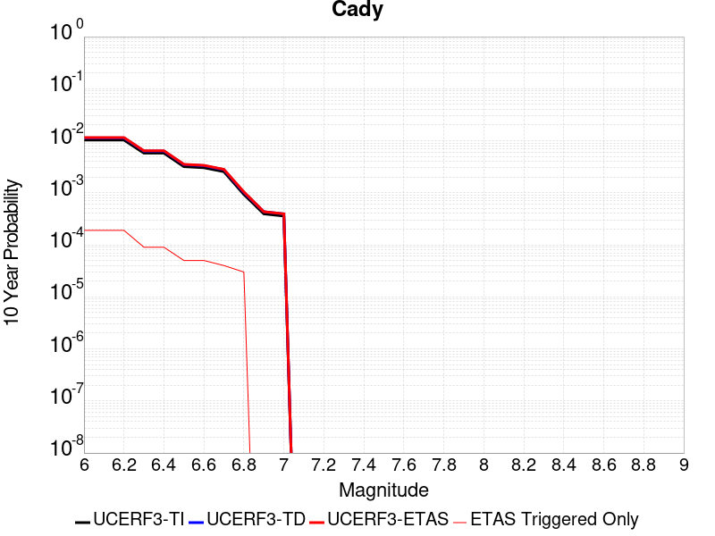 |

| Magnitude | 1 wk TI Prob | 1 wk TD Prob | 1 wk ETAS Prob | 1 wk ETAS/TD Gain | 1 wk ETAS Triggered Only | 1 mo TI Prob | 1 mo TD Prob | 1 mo ETAS Prob | 1 mo ETAS/TD Gain | 1 mo ETAS Triggered Only | 1 yr TI Prob | 1 yr TD Prob | 1 yr ETAS Prob | 1 yr ETAS/TD Gain | 1 yr ETAS Triggered Only | 10 yr TI Prob | 10 yr TD Prob | 10 yr ETAS Prob | 10 yr ETAS/TD Gain | 10 yr ETAS Triggered Only |
|-----|-----|-----|-----|-----|-----|-----|-----|-----|-----|-----|-----|-----|-----|-----|-----|-----|-----|-----|-----|-----|
| 6.0 | 1.9892565E-5 | 2.1859016E-5 | 4.1858577E-5 | 1.9149343 | 2.0E-5 | 8.525106E-5 | 9.3678645E-5 | 1.2367584E-4 | 1.3202138 | 3.0E-5 | 0.0010374374 | 0.0011400316 | 0.001279872 | 1.1226636 | 1.4E-4 | 0.010326075 | 0.011350849 | 0.011538692 | 1.0165489 | 1.9E-4 |
| 6.1 | 1.9892565E-5 | 2.1859016E-5 | 4.1858577E-5 | 1.9149343 | 2.0E-5 | 8.525106E-5 | 9.3678645E-5 | 1.2367584E-4 | 1.3202138 | 3.0E-5 | 0.0010374374 | 0.0011400316 | 0.001279872 | 1.1226636 | 1.4E-4 | 0.010326075 | 0.011350849 | 0.011538692 | 1.0165489 | 1.9E-4 |
| 6.2 | 1.9892565E-5 | 2.1859016E-5 | 4.1858577E-5 | 1.9149343 | 2.0E-5 | 8.525106E-5 | 9.3678645E-5 | 1.2367584E-4 | 1.3202138 | 3.0E-5 | 0.0010374374 | 0.0011400316 | 0.001279872 | 1.1226636 | 1.4E-4 | 0.010326075 | 0.011350849 | 0.011538692 | 1.0165489 | 1.9E-4 |
| 6.3 | 1.1117327E-5 | 1.2176738E-5 | 2.2176615E-5 | 1.821228 | 1.0E-5 | 4.764482E-5 | 5.218515E-5 | 7.2184106E-5 | 1.3832308 | 2.0E-5 | 5.7992124E-4 | 6.3520053E-4 | 7.0515607E-4 | 1.1101314 | 7.0E-5 | 0.0057841022 | 0.0063369554 | 0.006426385 | 1.0141124 | 9.0E-5 |
| 6.4 | 1.1117327E-5 | 1.2176738E-5 | 2.2176615E-5 | 1.821228 | 1.0E-5 | 4.764482E-5 | 5.218515E-5 | 7.2184106E-5 | 1.3832308 | 2.0E-5 | 5.7992124E-4 | 6.3520053E-4 | 7.0515607E-4 | 1.1101314 | 7.0E-5 | 0.0057841022 | 0.0063369554 | 0.006426385 | 1.0141124 | 9.0E-5 |
| 6.5 | 6.103093E-6 | 6.672103E-6 | 1.6672037E-5 | 2.4987679 | 1.0E-5 | 2.615585E-5 | 2.8594486E-5 | 3.85942E-5 | 1.3497077 | 1.0E-5 | 3.1840094E-4 | 3.4809482E-4 | 3.7808437E-4 | 1.0861534 | 3.0E-5 | 0.0031794512 | 0.0034767296 | 0.0035265558 | 1.0143313 | 5.0E-5 |
| 6.6 | 5.817237E-6 | 6.365738E-6 | 1.6365675E-5 | 2.5708997 | 1.0E-5 | 2.4930776E-5 | 2.728152E-5 | 3.7281246E-5 | 1.3665385 | 1.0E-5 | 3.034899E-4 | 3.3211432E-4 | 3.6210436E-4 | 1.0903003 | 3.0E-5 | 0.0030307577 | 0.003317402 | 0.0033672361 | 1.015022 | 5.0E-5 |
| 6.7 | 4.8846314E-6 | 5.3406343E-6 | 5.3406343E-6 | 1.0 | 0.0 | 2.0933967E-5 | 2.2888298E-5 | 2.2888298E-5 | 1.0 | 0.0 | 2.5484123E-4 | 2.7864118E-4 | 2.986356E-4 | 1.071757 | 2.0E-5 | 0.0025454918 | 0.0027840736 | 0.0028239621 | 1.0143274 | 4.0E-5 |
| 6.8 | 1.7788773E-6 | 1.9399313E-6 | 1.9399313E-6 | 1.0 | 0.0 | 7.6237375E-6 | 8.313974E-6 | 8.313974E-6 | 1.0 | 0.0 | 9.281505E-5 | 1.01219506E-4 | 1.21217476E-4 | 1.1975703 | 2.0E-5 | 9.2776294E-4 | 0.0010118886 | 0.0010418582 | 1.0296175 | 3.0E-5 |
| 6.9 | 7.5455404E-7 | 8.297202E-7 | 8.297202E-7 | 1.0 | 0.0 | 3.233799E-6 | 3.5559406E-6 | 3.5559406E-6 | 1.0 | 0.0 | 3.937079E-5 | 4.3293054E-5 | 4.3293054E-5 | 1.0 | 0.0 | 3.9363815E-4 | 4.3287914E-4 | 4.3287914E-4 | 1.0 | 0.0 |
| 7.0 | 6.8578805E-7 | 7.541916E-7 | 7.541916E-7 | 1.0 | 0.0 | 2.9390883E-6 | 3.2322475E-6 | 3.2322475E-6 | 1.0 | 0.0 | 3.578281E-5 | 3.9352235E-5 | 3.9352235E-5 | 1.0 | 0.0 | 3.577705E-4 | 3.9348513E-4 | 3.9348513E-4 | 1.0 | 0.0 |

## Red Pass
*[(top)](#table-of-contents)*

| 1 Week | 1 Month | 1 Year | 10 Year |
|-----|-----|-----|-----|
|  |  |  |  |

| Magnitude | 1 wk TI Prob | 1 wk TD Prob | 1 wk ETAS Prob | 1 wk ETAS/TD Gain | 1 wk ETAS Triggered Only | 1 mo TI Prob | 1 mo TD Prob | 1 mo ETAS Prob | 1 mo ETAS/TD Gain | 1 mo ETAS Triggered Only | 1 yr TI Prob | 1 yr TD Prob | 1 yr ETAS Prob | 1 yr ETAS/TD Gain | 1 yr ETAS Triggered Only | 10 yr TI Prob | 10 yr TD Prob | 10 yr ETAS Prob | 10 yr ETAS/TD Gain | 10 yr ETAS Triggered Only |
|-----|-----|-----|-----|-----|-----|-----|-----|-----|-----|-----|-----|-----|-----|-----|-----|-----|-----|-----|-----|-----|
| 6.0 | 8.258278E-6 | 8.551305E-6 | 8.551305E-6 | 1.0 | 0.0 | 3.539214E-5 | 3.6648038E-5 | 6.6646935E-5 | 1.8185678 | 3.0E-5 | 4.308141E-4 | 4.4611638E-4 | 5.360762E-4 | 1.2016511 | 9.0E-5 | 0.0042997985 | 0.004453966 | 0.004633164 | 1.0402334 | 1.8E-4 |
| 6.1 | 3.649988E-6 | 3.7753332E-6 | 3.7753332E-6 | 1.0 | 0.0 | 1.5642712E-5 | 1.6179927E-5 | 2.6179765E-5 | 1.6180398 | 1.0E-5 | 1.9043336E-4 | 1.9697756E-4 | 2.2697165E-4 | 1.1522716 | 3.0E-5 | 0.0019027026 | 0.001968497 | 0.0020583197 | 1.0456302 | 9.0E-5 |
| 6.2 | 3.649988E-6 | 3.7753332E-6 | 3.7753332E-6 | 1.0 | 0.0 | 1.5642712E-5 | 1.6179927E-5 | 2.6179765E-5 | 1.6180398 | 1.0E-5 | 1.9043336E-4 | 1.9697756E-4 | 2.2697165E-4 | 1.1522716 | 3.0E-5 | 0.0019027026 | 0.001968497 | 0.0020583197 | 1.0456302 | 9.0E-5 |
| 6.3 | 1.3924937E-6 | 1.4411233E-6 | 1.4411233E-6 | 1.0 | 0.0 | 5.9678164E-6 | 6.176236E-6 | 6.176236E-6 | 1.0 | 0.0 | 7.265574E-5 | 7.51945E-5 | 8.5193744E-5 | 1.1329784 | 1.0E-5 | 7.263199E-4 | 7.518293E-4 | 7.917992E-4 | 1.0531635 | 4.0E-5 |
| 6.4 | 1.3924937E-6 | 1.4411233E-6 | 1.4411233E-6 | 1.0 | 0.0 | 5.9678164E-6 | 6.176236E-6 | 6.176236E-6 | 1.0 | 0.0 | 7.265574E-5 | 7.51945E-5 | 8.5193744E-5 | 1.1329784 | 1.0E-5 | 7.263199E-4 | 7.518293E-4 | 7.917992E-4 | 1.0531635 | 4.0E-5 |
| 6.5 | 9.876812E-7 | 1.022196E-6 | 1.022196E-6 | 1.0 | 0.0 | 4.2329125E-6 | 4.38084E-6 | 4.38084E-6 | 1.0 | 0.0 | 5.153449E-5 | 5.3336724E-5 | 5.3336724E-5 | 1.0 | 0.0 | 5.1522546E-4 | 5.333672E-4 | 5.6335126E-4 | 1.0562165 | 3.0E-5 |

## San Jacinto (San Jacinto Valley) rev
*[(top)](#table-of-contents)*

| 1 Week | 1 Month | 1 Year | 10 Year |
|-----|-----|-----|-----|
|  |  |  |  |

| Magnitude | 1 wk TI Prob | 1 wk TD Prob | 1 wk ETAS Prob | 1 wk ETAS/TD Gain | 1 wk ETAS Triggered Only | 1 mo TI Prob | 1 mo TD Prob | 1 mo ETAS Prob | 1 mo ETAS/TD Gain | 1 mo ETAS Triggered Only | 1 yr TI Prob | 1 yr TD Prob | 1 yr ETAS Prob | 1 yr ETAS/TD Gain | 1 yr ETAS Triggered Only | 10 yr TI Prob | 10 yr TD Prob | 10 yr ETAS Prob | 10 yr ETAS/TD Gain | 10 yr ETAS Triggered Only |
|-----|-----|-----|-----|-----|-----|-----|-----|-----|-----|-----|-----|-----|-----|-----|-----|-----|-----|-----|-----|-----|
| 6.0 | 3.652694E-5 | 3.441575E-5 | 7.441437E-5 | 2.1622186 | 4.0E-5 | 1.5653463E-4 | 1.4748774E-4 | 1.9748036E-4 | 1.3389612 | 5.0E-5 | 0.0019041431 | 0.0017941861 | 0.0018940066 | 1.0556356 | 1.0E-4 | 0.018879099 | 0.01853357 | 0.018710235 | 1.0095321 | 1.8E-4 |
| 6.1 | 3.652694E-5 | 3.441575E-5 | 7.441437E-5 | 2.1622186 | 4.0E-5 | 1.5653463E-4 | 1.4748774E-4 | 1.9748036E-4 | 1.3389612 | 5.0E-5 | 0.0019041431 | 0.0017941861 | 0.0018940066 | 1.0556356 | 1.0E-4 | 0.018879099 | 0.01853357 | 0.018710235 | 1.0095321 | 1.8E-4 |
| 6.2 | 3.652694E-5 | 3.441575E-5 | 7.441437E-5 | 2.1622186 | 4.0E-5 | 1.5653463E-4 | 1.4748774E-4 | 1.9748036E-4 | 1.3389612 | 5.0E-5 | 0.0019041431 | 0.0017941861 | 0.0018940066 | 1.0556356 | 1.0E-4 | 0.018879099 | 0.01853357 | 0.018710235 | 1.0095321 | 1.8E-4 |
| 6.3 | 3.652694E-5 | 3.441575E-5 | 7.441437E-5 | 2.1622186 | 4.0E-5 | 1.5653463E-4 | 1.4748774E-4 | 1.9748036E-4 | 1.3389612 | 5.0E-5 | 0.0019041431 | 0.0017941861 | 0.0018940066 | 1.0556356 | 1.0E-4 | 0.018879099 | 0.01853357 | 0.018710235 | 1.0095321 | 1.8E-4 |
| 6.4 | 3.646941E-5 | 3.4337318E-5 | 7.433594E-5 | 2.1648734 | 4.0E-5 | 1.5628811E-4 | 1.4715164E-4 | 1.971443E-4 | 1.3397355 | 5.0E-5 | 0.0019011468 | 0.0017901013 | 0.0018899223 | 1.0557628 | 1.0E-4 | 0.018849645 | 0.01849345 | 0.018670121 | 1.0095532 | 1.8E-4 |
| 6.5 | 3.646941E-5 | 3.4337318E-5 | 7.433594E-5 | 2.1648734 | 4.0E-5 | 1.5628811E-4 | 1.4715164E-4 | 1.971443E-4 | 1.3397355 | 5.0E-5 | 0.0019011468 | 0.0017901013 | 0.0018899223 | 1.0557628 | 1.0E-4 | 0.018849645 | 0.01849345 | 0.018670121 | 1.0095532 | 1.8E-4 |
| 6.6 | 3.6442503E-5 | 3.4300705E-5 | 7.429933E-5 | 2.1661167 | 4.0E-5 | 1.561728E-4 | 1.4699475E-4 | 1.969874E-4 | 1.3400983 | 5.0E-5 | 0.0018997455 | 0.0017881944 | 0.0018880155 | 1.0558224 | 1.0E-4 | 0.018835869 | 0.018474717 | 0.018651392 | 1.0095631 | 1.8E-4 |
| 6.7 | 3.6432113E-5 | 3.428628E-5 | 7.428491E-5 | 2.1666074 | 4.0E-5 | 1.5612828E-4 | 1.4693293E-4 | 1.9692558E-4 | 1.3402413 | 5.0E-5 | 0.0018992044 | 0.0017874431 | 0.0018872643 | 1.0558459 | 1.0E-4 | 0.018830549 | 0.01846734 | 0.018644016 | 1.0095669 | 1.8E-4 |
| 6.8 | 3.6409598E-5 | 3.4255332E-5 | 7.425396E-5 | 2.1676614 | 4.0E-5 | 1.560318E-4 | 1.4680032E-4 | 1.9679299E-4 | 1.3405488 | 5.0E-5 | 0.0018980318 | 0.0017858313 | 0.0018856527 | 1.0558963 | 1.0E-4 | 0.018819023 | 0.018451495 | 0.018628173 | 1.0095754 | 1.8E-4 |
| 6.9 | 3.638078E-5 | 3.4215755E-5 | 7.421439E-5 | 2.169012 | 4.0E-5 | 1.5590832E-4 | 1.4663071E-4 | 1.9662338E-4 | 1.3409426 | 5.0E-5 | 0.0018965311 | 0.0017837697 | 0.0018835914 | 1.055961 | 1.0E-4 | 0.018804269 | 0.018431228 | 0.018607909 | 1.009586 | 1.8E-4 |
| 7.0 | 3.6294874E-5 | 3.4097768E-5 | 7.40964E-5 | 2.1730573 | 4.0E-5 | 1.5554018E-4 | 1.4612512E-4 | 1.961178E-4 | 1.3421226 | 5.0E-5 | 0.0018920569 | 0.0017776241 | 0.0018774464 | 1.0561548 | 1.0E-4 | 0.018760284 | 0.018370807 | 0.0185475 | 1.0096182 | 1.8E-4 |
| 7.1 | 3.6260717E-5 | 3.4054046E-5 | 7.405269E-5 | 2.1745634 | 4.0E-5 | 1.5539382E-4 | 1.4593777E-4 | 1.9593048E-4 | 1.3425618 | 5.0E-5 | 0.001890278 | 0.0017753469 | 0.0018751695 | 1.056227 | 1.0E-4 | 0.018742796 | 0.018348401 | 0.018525098 | 1.0096301 | 1.8E-4 |
| 7.2 | 3.6210204E-5 | 3.3988264E-5 | 7.398691E-5 | 2.1768367 | 4.0E-5 | 1.5517735E-4 | 1.4565587E-4 | 1.956486E-4 | 1.3432249 | 5.0E-5 | 0.001887647 | 0.0017719205 | 0.0018717432 | 1.0563359 | 1.0E-4 | 0.01871693 | 0.018314669 | 0.018491372 | 1.0096482 | 1.8E-4 |
| 7.3 | 3.6119454E-5 | 3.3876542E-5 | 7.3875184E-5 | 2.180718 | 4.0E-5 | 1.5478847E-4 | 1.4517711E-4 | 1.9516985E-4 | 1.3443569 | 5.0E-5 | 0.0018829206 | 0.0017661011 | 0.0018659245 | 1.0565219 | 1.0E-4 | 0.018670462 | 0.01825722 | 0.018433934 | 1.0096791 | 1.8E-4 |
| 7.4 | 3.607848E-5 | 3.382404E-5 | 7.382269E-5 | 2.182551 | 4.0E-5 | 1.5461289E-4 | 1.4495212E-4 | 1.9494488E-4 | 1.3448914 | 5.0E-5 | 0.0018807866 | 0.0017633662 | 0.0018631899 | 1.0566097 | 1.0E-4 | 0.018649481 | 0.018230215 | 0.018406933 | 1.0096937 | 1.8E-4 |
| 7.5 | 3.5856774E-5 | 3.363379E-5 | 7.3632444E-5 | 2.1892402 | 4.0E-5 | 1.5366284E-4 | 1.4413687E-4 | 1.9412967E-4 | 1.3468425 | 5.0E-5 | 0.0018692396 | 0.0017534565 | 0.0018532812 | 1.0569302 | 1.0E-4 | 0.018535944 | 0.018131303 | 0.01830804 | 1.0097476 | 1.8E-4 |
| 7.6 | 3.286655E-5 | 3.2156633E-5 | 7.2155344E-5 | 2.2438712 | 4.0E-5 | 1.4084904E-4 | 1.3780687E-4 | 1.8779999E-4 | 1.3627766 | 5.0E-5 | 0.001713488 | 0.0016765095 | 0.0017763419 | 1.0595478 | 1.0E-4 | 0.017003361 | 0.01735091 | 0.017527787 | 1.0101941 | 1.8E-4 |
| 7.7 | 2.8882527E-5 | 2.9249288E-5 | 6.924812E-5 | 2.3675146 | 4.0E-5 | 1.237764E-4 | 1.2534807E-4 | 1.753418E-4 | 1.3988392 | 5.0E-5 | 0.0015059357 | 0.0015250455 | 0.001624893 | 1.0654718 | 1.0E-4 | 0.014957713 | 0.015837153 | 0.016014302 | 1.0111856 | 1.8E-4 |
| 7.8 | 2.4950225E-5 | 2.6539781E-5 | 6.653872E-5 | 2.5071313 | 4.0E-5 | 1.0692515E-4 | 1.1373697E-4 | 1.6373128E-4 | 1.4395608 | 5.0E-5 | 0.0013010362 | 0.0013838689 | 0.0014837305 | 1.0721612 | 1.0E-4 | 0.012934455 | 0.014418158 | 0.014595563 | 1.0123043 | 1.8E-4 |
| 7.9 | 1.9881603E-5 | 2.1518656E-5 | 6.151779E-5 | 2.8588123 | 4.0E-5 | 8.520408E-5 | 9.2219554E-5 | 1.4221494E-4 | 1.5421344 | 5.0E-5 | 0.001036866 | 0.0011221955 | 0.0012220833 | 1.0890111 | 1.0E-4 | 0.010320415 | 0.011782875 | 0.011960754 | 1.0150964 | 1.8E-4 |
| 8.0 | 1.563292E-5 | 1.5946089E-5 | 4.594561E-5 | 2.881309 | 3.0E-5 | 6.6996516E-5 | 6.8338595E-5 | 9.8336546E-5 | 1.4389606 | 3.0E-5 | 8.153773E-4 | 8.3170546E-4 | 9.1163896E-4 | 1.0961078 | 8.0E-5 | 0.00812392 | 0.00881513 | 0.00897372 | 1.0179906 | 1.6E-4 |
| 8.1 | 1.0045313E-5 | 8.306527E-6 | 2.830636E-5 | 3.4077253 | 2.0E-5 | 4.305063E-5 | 3.5598918E-5 | 5.5598204E-5 | 1.5617949 | 2.0E-5 | 5.2401534E-4 | 4.3333112E-4 | 4.6331814E-4 | 1.0692011 | 3.0E-5 | 0.0052278144 | 0.0046616676 | 0.0047213878 | 1.012811 | 6.0E-5 |
| 8.2 | 4.1554413E-6 | 1.5665041E-6 | 1.5665041E-6 | 1.0 | 0.0 | 1.7808914E-5 | 6.713572E-6 | 6.713572E-6 | 1.0 | 0.0 | 2.1680194E-4 | 8.17347E-5 | 8.17347E-5 | 1.0 | 0.0 | 0.0021659054 | 9.488419E-4 | 9.488419E-4 | 1.0 | 0.0 |
| 8.3 | 1.2758221E-6 | 3.6171858E-7 | 3.6171858E-7 | 1.0 | 0.0 | 5.4677976E-6 | 1.5502216E-6 | 1.5502216E-6 | 1.0 | 0.0 | 6.65684E-5 | 1.8873789E-5 | 1.8873789E-5 | 1.0 | 0.0 | 6.6548464E-4 | 2.2764095E-4 | 2.2764095E-4 | 1.0 | 0.0 |

## Elsinore (Glen Ivy) rev
*[(top)](#table-of-contents)*

| 1 Week | 1 Month | 1 Year | 10 Year |
|-----|-----|-----|-----|
|  |  |  |  |

| Magnitude | 1 wk TI Prob | 1 wk TD Prob | 1 wk ETAS Prob | 1 wk ETAS/TD Gain | 1 wk ETAS Triggered Only | 1 mo TI Prob | 1 mo TD Prob | 1 mo ETAS Prob | 1 mo ETAS/TD Gain | 1 mo ETAS Triggered Only | 1 yr TI Prob | 1 yr TD Prob | 1 yr ETAS Prob | 1 yr ETAS/TD Gain | 1 yr ETAS Triggered Only | 10 yr TI Prob | 10 yr TD Prob | 10 yr ETAS Prob | 10 yr ETAS/TD Gain | 10 yr ETAS Triggered Only |
|-----|-----|-----|-----|-----|-----|-----|-----|-----|-----|-----|-----|-----|-----|-----|-----|-----|-----|-----|-----|-----|
| 6.0 | 1.6204086E-4 | 2.9373635E-4 | 3.037334E-4 | 1.0340341 | 1.0E-5 | 6.94276E-4 | 0.0012584174 | 0.0012684049 | 1.0079365 | 1.0E-5 | 0.008420097 | 0.01523484 | 0.015323469 | 1.0058175 | 9.0E-5 | 0.081081145 | 0.13962553 | 0.1397546 | 1.0009243 | 1.5E-4 |
| 6.1 | 1.6204086E-4 | 2.9373635E-4 | 3.037334E-4 | 1.0340341 | 1.0E-5 | 6.94276E-4 | 0.0012584174 | 0.0012684049 | 1.0079365 | 1.0E-5 | 0.008420097 | 0.01523484 | 0.015323469 | 1.0058175 | 9.0E-5 | 0.081081145 | 0.13962553 | 0.1397546 | 1.0009243 | 1.5E-4 |
| 6.2 | 1.6204086E-4 | 2.9373635E-4 | 3.037334E-4 | 1.0340341 | 1.0E-5 | 6.94276E-4 | 0.0012584174 | 0.0012684049 | 1.0079365 | 1.0E-5 | 0.008420097 | 0.01523484 | 0.015323469 | 1.0058175 | 9.0E-5 | 0.081081145 | 0.13962553 | 0.1397546 | 1.0009243 | 1.5E-4 |
| 6.3 | 1.0111737E-4 | 1.7703637E-4 | 1.870346E-4 | 1.0564755 | 1.0E-5 | 4.332882E-4 | 7.586233E-4 | 7.6861575E-4 | 1.0131718 | 1.0E-5 | 0.005262531 | 0.009217811 | 0.009277258 | 1.0064491 | 6.0E-5 | 0.0513964 | 0.08707389 | 0.08717431 | 1.0011533 | 1.1E-4 |
| 6.4 | 1.0111737E-4 | 1.7703637E-4 | 1.870346E-4 | 1.0564755 | 1.0E-5 | 4.332882E-4 | 7.586233E-4 | 7.6861575E-4 | 1.0131718 | 1.0E-5 | 0.005262531 | 0.009217811 | 0.009277258 | 1.0064491 | 6.0E-5 | 0.0513964 | 0.08707389 | 0.08717431 | 1.0011533 | 1.1E-4 |
| 6.5 | 3.6624708E-5 | 4.6393732E-5 | 4.6393732E-5 | 1.0 | 0.0 | 1.569536E-4 | 1.9881714E-4 | 1.9881714E-4 | 1.0 | 0.0 | 0.001909235 | 0.0024182722 | 0.002438224 | 1.0082504 | 2.0E-5 | 0.01892915 | 0.023697015 | 0.023736067 | 1.001648 | 4.0E-5 |
| 6.6 | 2.5051324E-5 | 2.6148944E-5 | 2.6148944E-5 | 1.0 | 0.0 | 1.073584E-4 | 1.1206234E-4 | 1.1206234E-4 | 1.0 | 0.0 | 0.0013063047 | 0.0013635496 | 0.001373536 | 1.0073237 | 1.0E-5 | 0.012986525 | 0.013565712 | 0.01358544 | 1.0014544 | 2.0E-5 |
| 6.7 | 2.2189772E-5 | 2.2073793E-5 | 2.2073793E-5 | 1.0 | 0.0 | 9.509556E-5 | 9.459874E-5 | 9.459874E-5 | 1.0 | 0.0 | 0.0011571734 | 0.0011511676 | 0.001161156 | 1.0086769 | 1.0E-5 | 0.011511663 | 0.011466403 | 0.011476289 | 1.0008621 | 1.0E-5 |
| 6.8 | 1.6654378E-5 | 1.4438363E-5 | 1.4438363E-5 | 1.0 | 0.0 | 7.137396E-5 | 6.187726E-5 | 6.187726E-5 | 1.0 | 0.0 | 8.686314E-4 | 7.5310044E-4 | 7.630929E-4 | 1.0132685 | 1.0E-5 | 0.008652439 | 0.0075102663 | 0.0075201914 | 1.0013216 | 1.0E-5 |
| 6.9 | 1.5042909E-5 | 1.2332568E-5 | 1.2332568E-5 | 1.0 | 0.0 | 6.446802E-5 | 5.285281E-5 | 5.285281E-5 | 1.0 | 0.0 | 7.8461546E-4 | 6.432961E-4 | 6.5328967E-4 | 1.015535 | 1.0E-5 | 0.007818509 | 0.0064180964 | 0.006428032 | 1.001548 | 1.0E-5 |
| 7.0 | 1.4361385E-5 | 1.1451833E-5 | 1.1451833E-5 | 1.0 | 0.0 | 6.154734E-5 | 4.907838E-5 | 4.907838E-5 | 1.0 | 0.0 | 7.490812E-4 | 5.973684E-4 | 6.073624E-4 | 1.0167301 | 1.0E-5 | 0.007465612 | 0.0059608603 | 0.0059708008 | 1.0016676 | 1.0E-5 |
| 7.1 | 1.3265571E-5 | 1.0245265E-5 | 1.0245265E-5 | 1.0 | 0.0 | 5.6851208E-5 | 4.3907552E-5 | 4.3907552E-5 | 1.0 | 0.0 | 6.919436E-4 | 5.3444586E-4 | 5.444405E-4 | 1.018701 | 1.0E-5 | 0.006897931 | 0.005334682 | 0.005344629 | 1.0018646 | 1.0E-5 |
| 7.2 | 1.1596403E-5 | 8.505279E-6 | 8.505279E-6 | 1.0 | 0.0 | 4.9697923E-5 | 3.6450696E-5 | 3.6450696E-5 | 1.0 | 0.0 | 6.049042E-4 | 4.4369852E-4 | 4.4369852E-4 | 1.0 | 0.0 | 0.006032603 | 0.004429451 | 0.004429451 | 1.0 | 0.0 |
| 7.3 | 1.0150827E-5 | 7.238911E-6 | 7.238911E-6 | 1.0 | 0.0 | 4.3502816E-5 | 3.1023545E-5 | 3.1023545E-5 | 1.0 | 0.0 | 5.2951806E-4 | 3.7764764E-4 | 3.7764764E-4 | 1.0 | 0.0 | 0.005282581 | 0.003770453 | 0.003770453 | 1.0 | 0.0 |
| 7.4 | 9.080705E-6 | 6.352632E-6 | 6.352632E-6 | 1.0 | 0.0 | 3.8916725E-5 | 2.7225291E-5 | 2.7225291E-5 | 1.0 | 0.0 | 4.7370812E-4 | 3.3141885E-4 | 3.3141885E-4 | 1.0 | 0.0 | 0.004726996 | 0.0033093947 | 0.0033093947 | 1.0 | 0.0 |
| 7.5 | 7.671649E-6 | 5.2257096E-6 | 5.2257096E-6 | 1.0 | 0.0 | 3.287808E-5 | 2.2395712E-5 | 2.2395712E-5 | 1.0 | 0.0 | 4.0021708E-4 | 2.7263493E-4 | 2.7263493E-4 | 1.0 | 0.0 | 0.0039949706 | 0.0027231297 | 0.0027231297 | 1.0 | 0.0 |
| 7.6 | 6.990086E-6 | 4.6875944E-6 | 4.6875944E-6 | 1.0 | 0.0 | 2.9957167E-5 | 2.0089543E-5 | 2.0089543E-5 | 1.0 | 0.0 | 3.6466747E-4 | 2.445639E-4 | 2.445639E-4 | 1.0 | 0.0 | 0.0036406964 | 0.0024430638 | 0.0024430638 | 1.0 | 0.0 |
| 7.7 | 4.163505E-6 | 2.3295045E-6 | 2.3295045E-6 | 1.0 | 0.0 | 1.7843471E-5 | 9.983556E-6 | 9.983556E-6 | 1.0 | 0.0 | 2.172226E-4 | 1.2154376E-4 | 1.2154376E-4 | 1.0 | 0.0 | 0.0021701038 | 0.0012148459 | 0.0012148459 | 1.0 | 0.0 |
| 7.8 | 2.2692414E-7 | 9.384624E-8 | 9.384624E-8 | 1.0 | 0.0 | 9.725317E-7 | 4.021981E-7 | 4.021981E-7 | 1.0 | 0.0 | 1.1840509E-5 | 4.8967545E-6 | 4.8967545E-6 | 1.0 | 0.0 | 1.1839878E-4 | 4.8966795E-5 | 4.8966795E-5 | 1.0 | 0.0 |
| 7.9 | 6.676829E-9 | 3.4397993E-9 | 3.4397993E-9 | 1.0 | 0.0 | 2.861498E-8 | 1.4741998E-8 | 1.4741998E-8 | 1.0 | 0.0 | 3.4838732E-7 | 1.794838E-7 | 1.794838E-7 | 1.0 | 0.0 | 3.4838679E-6 | 1.7948367E-6 | 1.7948367E-6 | 1.0 | 0.0 |

## San Jacinto (Stepovers Combined)
*[(top)](#table-of-contents)*

| 1 Week | 1 Month | 1 Year | 10 Year |
|-----|-----|-----|-----|
|  |  |  |  |

| Magnitude | 1 wk TI Prob | 1 wk TD Prob | 1 wk ETAS Prob | 1 wk ETAS/TD Gain | 1 wk ETAS Triggered Only | 1 mo TI Prob | 1 mo TD Prob | 1 mo ETAS Prob | 1 mo ETAS/TD Gain | 1 mo ETAS Triggered Only | 1 yr TI Prob | 1 yr TD Prob | 1 yr ETAS Prob | 1 yr ETAS/TD Gain | 1 yr ETAS Triggered Only | 10 yr TI Prob | 10 yr TD Prob | 10 yr ETAS Prob | 10 yr ETAS/TD Gain | 10 yr ETAS Triggered Only |
|-----|-----|-----|-----|-----|-----|-----|-----|-----|-----|-----|-----|-----|-----|-----|-----|-----|-----|-----|-----|-----|
| 6.0 | 4.0667746E-5 | 3.5285528E-5 | 6.528447E-5 | 1.8501769 | 3.0E-5 | 1.742787E-4 | 1.5121493E-4 | 1.9120889E-4 | 1.2644842 | 4.0E-5 | 0.0021197782 | 0.0018394884 | 0.0019293228 | 1.0488366 | 9.0E-5 | 0.020996714 | 0.018993655 | 0.019160425 | 1.0087804 | 1.7E-4 |
| 6.1 | 4.0667746E-5 | 3.5285528E-5 | 6.528447E-5 | 1.8501769 | 3.0E-5 | 1.742787E-4 | 1.5121493E-4 | 1.9120889E-4 | 1.2644842 | 4.0E-5 | 0.0021197782 | 0.0018394884 | 0.0019293228 | 1.0488366 | 9.0E-5 | 0.020996714 | 0.018993655 | 0.019160425 | 1.0087804 | 1.7E-4 |
| 6.2 | 4.0667746E-5 | 3.5285528E-5 | 6.528447E-5 | 1.8501769 | 3.0E-5 | 1.742787E-4 | 1.5121493E-4 | 1.9120889E-4 | 1.2644842 | 4.0E-5 | 0.0021197782 | 0.0018394884 | 0.0019293228 | 1.0488366 | 9.0E-5 | 0.020996714 | 0.018993655 | 0.019160425 | 1.0087804 | 1.7E-4 |
| 6.3 | 4.0667746E-5 | 3.5285528E-5 | 6.528447E-5 | 1.8501769 | 3.0E-5 | 1.742787E-4 | 1.5121493E-4 | 1.9120889E-4 | 1.2644842 | 4.0E-5 | 0.0021197782 | 0.0018394884 | 0.0019293228 | 1.0488366 | 9.0E-5 | 0.020996714 | 0.018993655 | 0.019160425 | 1.0087804 | 1.7E-4 |
| 6.4 | 4.0577226E-5 | 3.515743E-5 | 6.5156375E-5 | 1.8532747 | 3.0E-5 | 1.738908E-4 | 1.5066602E-4 | 1.9066E-4 | 1.2654479 | 4.0E-5 | 0.0021150648 | 0.0018328178 | 0.0019226528 | 1.0490147 | 9.0E-5 | 0.020950472 | 0.018928219 | 0.019095002 | 1.0088114 | 1.7E-4 |
| 6.5 | 4.0577226E-5 | 3.515743E-5 | 6.5156375E-5 | 1.8532747 | 3.0E-5 | 1.738908E-4 | 1.5066602E-4 | 1.9066E-4 | 1.2654479 | 4.0E-5 | 0.0021150648 | 0.0018328178 | 0.0019226528 | 1.0490147 | 9.0E-5 | 0.020950472 | 0.018928219 | 0.019095002 | 1.0088114 | 1.7E-4 |
| 6.6 | 4.053861E-5 | 3.510277E-5 | 6.510172E-5 | 1.8546034 | 3.0E-5 | 1.7372532E-4 | 1.5043179E-4 | 1.9042577E-4 | 1.2658613 | 4.0E-5 | 0.0021130538 | 0.0018299713 | 0.0019198067 | 1.0490911 | 9.0E-5 | 0.020930743 | 0.018900296 | 0.019067083 | 1.0088246 | 1.7E-4 |
| 6.7 | 4.0516545E-5 | 3.5071844E-5 | 6.507079E-5 | 1.855357 | 3.0E-5 | 1.7363077E-4 | 1.5029925E-4 | 1.9029324E-4 | 1.2660958 | 4.0E-5 | 0.002111905 | 0.0018283607 | 0.0019181962 | 1.0491344 | 9.0E-5 | 0.020919468 | 0.018884491 | 0.019051282 | 1.0088321 | 1.7E-4 |
| 6.8 | 4.049434E-5 | 3.5043406E-5 | 6.504235E-5 | 1.8560512 | 3.0E-5 | 1.7353562E-4 | 1.501774E-4 | 1.9017138E-4 | 1.2663116 | 4.0E-5 | 0.0021107488 | 0.0018268795 | 0.0019167151 | 1.0491743 | 9.0E-5 | 0.020908125 | 0.018869905 | 0.019036695 | 1.008839 | 1.7E-4 |
| 6.9 | 4.046386E-5 | 3.5005964E-5 | 6.500491E-5 | 1.8569669 | 3.0E-5 | 1.73405E-4 | 1.5001695E-4 | 1.9001093E-4 | 1.2665966 | 4.0E-5 | 0.0021091616 | 0.0018249294 | 0.0019147651 | 1.049227 | 9.0E-5 | 0.020892553 | 0.018850677 | 0.019017471 | 1.0088482 | 1.7E-4 |
| 7.0 | 4.036382E-5 | 3.4886525E-5 | 6.488548E-5 | 1.8599008 | 3.0E-5 | 1.7297632E-4 | 1.4950513E-4 | 1.8949916E-4 | 1.2675093 | 4.0E-5 | 0.0021039525 | 0.0018187086 | 0.0019085449 | 1.0493957 | 9.0E-5 | 0.02084144 | 0.018789288 | 0.018956093 | 1.0088778 | 1.7E-4 |
| 7.1 | 4.0343282E-5 | 3.486499E-5 | 6.486394E-5 | 1.860432 | 3.0E-5 | 1.7288832E-4 | 1.4941284E-4 | 1.8940686E-4 | 1.2676746 | 4.0E-5 | 0.002102883 | 0.0018175867 | 0.0019074231 | 1.0494262 | 9.0E-5 | 0.020830948 | 0.018778158 | 0.018944966 | 1.0088831 | 1.7E-4 |
| 7.2 | 4.0257353E-5 | 3.476948E-5 | 6.4768436E-5 | 1.8627956 | 3.0E-5 | 1.725201E-4 | 1.4900356E-4 | 1.8899761E-4 | 1.26841 | 4.0E-5 | 0.0020984085 | 0.0018126123 | 0.0019024492 | 1.0495621 | 9.0E-5 | 0.020787042 | 0.018728893 | 0.01889571 | 1.0089068 | 1.7E-4 |
| 7.3 | 3.9940667E-5 | 3.459712E-5 | 6.459608E-5 | 1.8670943 | 3.0E-5 | 1.7116306E-4 | 1.4826495E-4 | 1.8825903E-4 | 1.2697473 | 4.0E-5 | 0.0020819185 | 0.0018036346 | 0.0018934723 | 1.0498092 | 9.0E-5 | 0.020625217 | 0.018637514 | 0.018804345 | 1.0089514 | 1.7E-4 |
| 7.4 | 3.9721202E-5 | 3.44825E-5 | 6.4481465E-5 | 1.8699766 | 3.0E-5 | 1.7022261E-4 | 1.4777378E-4 | 1.8776787E-4 | 1.2706441 | 4.0E-5 | 0.0020704903 | 0.0017976643 | 0.0018875026 | 1.0499749 | 9.0E-5 | 0.020513052 | 0.018576635 | 0.018743478 | 1.0089812 | 1.7E-4 |
| 7.5 | 3.7036873E-5 | 3.354985E-5 | 6.354885E-5 | 1.8941617 | 3.0E-5 | 1.5871979E-4 | 1.4377717E-4 | 1.8377142E-4 | 1.2781683 | 4.0E-5 | 0.0019307006 | 0.0017490846 | 0.0018389272 | 1.0513655 | 9.0E-5 | 0.019140124 | 0.018078115 | 0.018245041 | 1.0092336 | 1.7E-4 |
| 7.6 | 3.2940967E-5 | 3.1330474E-5 | 6.1329534E-5 | 1.9575042 | 3.0E-5 | 1.4116794E-4 | 1.3426656E-4 | 1.742612E-4 | 1.2978748 | 4.0E-5 | 0.0017173645 | 0.001633472 | 0.001723325 | 1.0550073 | 9.0E-5 | 0.01704153 | 0.01691088 | 0.017078007 | 1.0098827 | 1.7E-4 |
| 7.7 | 2.8236149E-5 | 2.7896147E-5 | 5.789531E-5 | 2.0753872 | 3.0E-5 | 1.2100645E-4 | 1.1954944E-4 | 1.5954467E-4 | 1.3345495 | 4.0E-5 | 0.0014722579 | 0.0014545437 | 0.0015444128 | 1.0617851 | 9.0E-5 | 0.014625421 | 0.015121453 | 0.015288883 | 1.0110723 | 1.7E-4 |
| 7.8 | 2.4329287E-5 | 2.5219388E-5 | 5.5218632E-5 | 2.189531 | 3.0E-5 | 1.042642E-4 | 1.0807862E-4 | 1.480743E-4 | 1.3700609 | 4.0E-5 | 0.0012686774 | 0.0013150638 | 0.0014049454 | 1.0683477 | 9.0E-5 | 0.012614589 | 0.013718468 | 0.013886136 | 1.012222 | 1.7E-4 |
| 7.9 | 1.9370926E-5 | 2.0432055E-5 | 5.043144E-5 | 2.4682512 | 3.0E-5 | 8.301561E-5 | 8.7563014E-5 | 1.2755951E-4 | 1.4567739 | 4.0E-5 | 0.0010102465 | 0.001065559 | 0.0011554632 | 1.0843728 | 9.0E-5 | 0.0100566605 | 0.011205053 | 0.011373148 | 1.0150018 | 1.7E-4 |
| 8.0 | 1.5583017E-5 | 1.5895175E-5 | 4.5894696E-5 | 2.8873353 | 3.0E-5 | 6.6782646E-5 | 6.8120404E-5 | 9.8118355E-5 | 1.4403667 | 3.0E-5 | 8.127754E-4 | 8.29051E-4 | 9.089847E-4 | 1.0964159 | 8.0E-5 | 0.008098091 | 0.008786416 | 0.00894501 | 1.01805 | 1.6E-4 |
| 8.1 | 1.0024873E-5 | 8.297121E-6 | 2.8296954E-5 | 3.4104548 | 2.0E-5 | 4.2963035E-5 | 3.5558605E-5 | 5.5557895E-5 | 1.5624317 | 2.0E-5 | 5.229494E-4 | 4.3284055E-4 | 4.6282756E-4 | 1.0692796 | 3.0E-5 | 0.0052172043 | 0.00465596 | 0.0047156806 | 1.0128267 | 6.0E-5 |
| 8.2 | 4.142796E-6 | 1.5619446E-6 | 1.5619446E-6 | 1.0 | 0.0 | 1.775472E-5 | 6.6940315E-6 | 6.6940315E-6 | 1.0 | 0.0 | 2.1614227E-4 | 8.1496815E-5 | 8.1496815E-5 | 1.0 | 0.0 | 0.0021593217 | 9.4601413E-4 | 9.4601413E-4 | 1.0 | 0.0 |
| 8.3 | 1.2750878E-6 | 3.6143226E-7 | 3.6143226E-7 | 1.0 | 0.0 | 5.4646503E-6 | 1.5489944E-6 | 1.5489944E-6 | 1.0 | 0.0 | 6.653009E-5 | 1.8858847E-5 | 1.8858847E-5 | 1.0 | 0.0 | 6.6510175E-4 | 2.2747046E-4 | 2.2747046E-4 | 1.0 | 0.0 |

## Lake Isabella (Seismicity)
*[(top)](#table-of-contents)*

| 1 Week | 1 Month | 1 Year | 10 Year |
|-----|-----|-----|-----|
|  |  |  |  |

| Magnitude | 1 wk TI Prob | 1 wk TD Prob | 1 wk ETAS Prob | 1 wk ETAS/TD Gain | 1 wk ETAS Triggered Only | 1 mo TI Prob | 1 mo TD Prob | 1 mo ETAS Prob | 1 mo ETAS/TD Gain | 1 mo ETAS Triggered Only | 1 yr TI Prob | 1 yr TD Prob | 1 yr ETAS Prob | 1 yr ETAS/TD Gain | 1 yr ETAS Triggered Only | 10 yr TI Prob | 10 yr TD Prob | 10 yr ETAS Prob | 10 yr ETAS/TD Gain | 10 yr ETAS Triggered Only |
|-----|-----|-----|-----|-----|-----|-----|-----|-----|-----|-----|-----|-----|-----|-----|-----|-----|-----|-----|-----|-----|
| 6.0 | 9.431637E-6 | 9.741694E-6 | 3.97414E-5 | 4.0795164 | 3.0E-5 | 4.0420677E-5 | 4.1749525E-5 | 8.174785E-5 | 1.9580548 | 4.0E-5 | 4.920106E-4 | 5.0819496E-4 | 6.28134E-4 | 1.2360098 | 1.2E-4 | 0.004909227 | 0.005071621 | 0.005240759 | 1.0333499 | 1.7E-4 |
| 6.1 | 9.431637E-6 | 9.741694E-6 | 3.97414E-5 | 4.0795164 | 3.0E-5 | 4.0420677E-5 | 4.1749525E-5 | 8.174785E-5 | 1.9580548 | 4.0E-5 | 4.920106E-4 | 5.0819496E-4 | 6.28134E-4 | 1.2360098 | 1.2E-4 | 0.004909227 | 0.005071621 | 0.005240759 | 1.0333499 | 1.7E-4 |
| 6.2 | 9.431637E-6 | 9.741694E-6 | 3.97414E-5 | 4.0795164 | 3.0E-5 | 4.0420677E-5 | 4.1749525E-5 | 8.174785E-5 | 1.9580548 | 4.0E-5 | 4.920106E-4 | 5.0819496E-4 | 6.28134E-4 | 1.2360098 | 1.2E-4 | 0.004909227 | 0.005071621 | 0.005240759 | 1.0333499 | 1.7E-4 |
| 6.3 | 9.431637E-6 | 9.741694E-6 | 3.97414E-5 | 4.0795164 | 3.0E-5 | 4.0420677E-5 | 4.1749525E-5 | 8.174785E-5 | 1.9580548 | 4.0E-5 | 4.920106E-4 | 5.0819496E-4 | 6.28134E-4 | 1.2360098 | 1.2E-4 | 0.004909227 | 0.005071621 | 0.005240759 | 1.0333499 | 1.7E-4 |
| 6.4 | 5.144063E-6 | 5.3000977E-6 | 2.529999E-5 | 4.7734957 | 2.0E-5 | 2.2045799E-5 | 2.2714525E-5 | 4.271407E-5 | 1.8804739 | 2.0E-5 | 2.6837454E-4 | 2.765177E-4 | 3.365011E-4 | 1.2169243 | 6.0E-5 | 0.0026805066 | 0.002762077 | 0.0028518282 | 1.0324942 | 9.0E-5 |
| 6.5 | 5.144063E-6 | 5.3000977E-6 | 2.529999E-5 | 4.7734957 | 2.0E-5 | 2.2045799E-5 | 2.2714525E-5 | 4.271407E-5 | 1.8804739 | 2.0E-5 | 2.6837454E-4 | 2.765177E-4 | 3.365011E-4 | 1.2169243 | 6.0E-5 | 0.0026805066 | 0.002762077 | 0.0028518282 | 1.0324942 | 9.0E-5 |
| 6.6 | 3.4009804E-6 | 3.4987995E-6 | 1.3498765E-5 | 3.8581133 | 1.0E-5 | 1.4575549E-5 | 1.4994778E-5 | 2.4994628E-5 | 1.6668888 | 1.0E-5 | 1.7744285E-4 | 1.8254772E-4 | 2.2254043E-4 | 1.2190808 | 4.0E-5 | 0.0017730123 | 0.0018241355 | 0.0018640626 | 1.0218881 | 4.0E-5 |
| 6.7 | 3.3880428E-6 | 3.4856662E-6 | 1.3485631E-5 | 3.8688822 | 1.0E-5 | 1.4520103E-5 | 1.4938492E-5 | 2.4938343E-5 | 1.6694016 | 1.0E-5 | 1.767679E-4 | 1.8186258E-4 | 2.218553E-4 | 1.2199063 | 4.0E-5 | 0.0017662736 | 0.0018172951 | 0.0018572224 | 1.0219707 | 4.0E-5 |
| 6.8 | 2.6582E-6 | 2.7337105E-6 | 1.2733683E-5 | 4.658022 | 1.0E-5 | 1.1392236E-5 | 1.1715857E-5 | 2.171574E-5 | 1.853534 | 1.0E-5 | 1.3869164E-4 | 1.4263256E-4 | 1.8262686E-4 | 1.2804009 | 4.0E-5 | 0.0013860512 | 0.0014255423 | 0.0014654853 | 1.0280195 | 4.0E-5 |
| 6.9 | 2.406011E-6 | 2.474338E-6 | 1.2474314E-5 | 5.041475 | 1.0E-5 | 1.0311434E-5 | 1.0604271E-5 | 2.0604164E-5 | 1.9430063 | 1.0E-5 | 1.2553448E-4 | 1.2910066E-4 | 1.6909551E-4 | 1.3097957 | 4.0E-5 | 0.0012546359 | 0.0012903863 | 0.0013303347 | 1.0309584 | 4.0E-5 |
| 7.0 | 1.6953097E-6 | 1.7429437E-6 | 1.7429437E-6 | 1.0 | 0.0 | 7.265593E-6 | 7.469743E-6 | 7.469743E-6 | 1.0 | 0.0 | 8.8455E-5 | 9.094137E-5 | 1.1093955E-4 | 1.2199019 | 2.0E-5 | 8.84198E-4 | 9.0914435E-4 | 9.2912617E-4 | 1.0219787 | 2.0E-5 |
| 7.1 | 3.5013824E-7 | 3.571492E-7 | 3.571492E-7 | 1.0 | 0.0 | 1.5005916E-6 | 1.5306384E-6 | 1.5306384E-6 | 1.0 | 0.0 | 1.826955E-5 | 1.8635366E-5 | 1.8635366E-5 | 1.0 | 0.0 | 1.8268047E-4 | 1.863383E-4 | 1.863383E-4 | 1.0 | 0.0 |
| 7.2 | 2.2321095E-7 | 2.2750632E-7 | 2.2750632E-7 | 1.0 | 0.0 | 9.56618E-7 | 9.750268E-7 | 9.750268E-7 | 1.0 | 0.0 | 1.1646762E-5 | 1.1870887E-5 | 1.1870887E-5 | 1.0 | 0.0 | 1.1646151E-4 | 1.1870263E-4 | 1.1870263E-4 | 1.0 | 0.0 |
| 7.3 | 1.5760406E-7 | 1.6060963E-7 | 1.6060963E-7 | 1.0 | 0.0 | 6.7544585E-7 | 6.883268E-7 | 6.883268E-7 | 1.0 | 0.0 | 8.223522E-6 | 8.380347E-6 | 8.380347E-6 | 1.0 | 0.0 | 8.2232174E-5 | 8.3800376E-5 | 8.3800376E-5 | 1.0 | 0.0 |
| 7.4 | 1.1216497E-7 | 1.1431735E-7 | 1.1431735E-7 | 1.0 | 0.0 | 4.8070694E-7 | 4.8993144E-7 | 4.8993144E-7 | 1.0 | 0.0 | 5.852591E-6 | 5.964899E-6 | 5.964899E-6 | 1.0 | 0.0 | 5.8524372E-5 | 5.9647435E-5 | 5.9647435E-5 | 1.0 | 0.0 |
| 7.5 | 4.885185E-8 | 4.9787864E-8 | 4.9787864E-8 | 1.0 | 0.0 | 2.0936506E-7 | 2.1337654E-7 | 2.1337654E-7 | 1.0 | 0.0 | 2.5490165E-6 | 2.5978566E-6 | 2.5978566E-6 | 1.0 | 0.0 | 2.5489873E-5 | 2.597828E-5 | 2.597828E-5 | 1.0 | 0.0 |
| 7.6 | 1.504641E-9 | 1.5317939E-9 | 1.5317939E-9 | 1.0 | 0.0 | 6.4484613E-9 | 6.5648313E-9 | 6.5648313E-9 | 1.0 | 0.0 | 7.851001E-8 | 7.992682E-8 | 7.992682E-8 | 1.0 | 0.0 | 7.8509987E-7 | 7.992682E-7 | 7.992682E-7 | 1.0 | 0.0 |

## White Wolf (Extension)
*[(top)](#table-of-contents)*

| 1 Week | 1 Month | 1 Year | 10 Year |
|-----|-----|-----|-----|
|  |  |  |  |

| Magnitude | 1 wk TI Prob | 1 wk TD Prob | 1 wk ETAS Prob | 1 wk ETAS/TD Gain | 1 wk ETAS Triggered Only | 1 mo TI Prob | 1 mo TD Prob | 1 mo ETAS Prob | 1 mo ETAS/TD Gain | 1 mo ETAS Triggered Only | 1 yr TI Prob | 1 yr TD Prob | 1 yr ETAS Prob | 1 yr ETAS/TD Gain | 1 yr ETAS Triggered Only | 10 yr TI Prob | 10 yr TD Prob | 10 yr ETAS Prob | 10 yr ETAS/TD Gain | 10 yr ETAS Triggered Only |
|-----|-----|-----|-----|-----|-----|-----|-----|-----|-----|-----|-----|-----|-----|-----|-----|-----|-----|-----|-----|-----|
| 6.0 | 8.222555E-6 | 6.0666557E-6 | 6.0666557E-6 | 1.0 | 0.0 | 3.5239045E-5 | 2.5999732E-5 | 5.5998953E-5 | 2.1538281 | 3.0E-5 | 4.289509E-4 | 3.165074E-4 | 3.9648206E-4 | 1.2526788 | 8.0E-5 | 0.0042812387 | 0.0031612178 | 0.0033207121 | 1.0504534 | 1.6E-4 |
| 6.1 | 8.222555E-6 | 6.0666557E-6 | 6.0666557E-6 | 1.0 | 0.0 | 3.5239045E-5 | 2.5999732E-5 | 5.5998953E-5 | 2.1538281 | 3.0E-5 | 4.289509E-4 | 3.165074E-4 | 3.9648206E-4 | 1.2526788 | 8.0E-5 | 0.0042812387 | 0.0031612178 | 0.0033207121 | 1.0504534 | 1.6E-4 |
| 6.2 | 8.222555E-6 | 6.0666557E-6 | 6.0666557E-6 | 1.0 | 0.0 | 3.5239045E-5 | 2.5999732E-5 | 5.5998953E-5 | 2.1538281 | 3.0E-5 | 4.289509E-4 | 3.165074E-4 | 3.9648206E-4 | 1.2526788 | 8.0E-5 | 0.0042812387 | 0.0031612178 | 0.0033207121 | 1.0504534 | 1.6E-4 |
| 6.3 | 8.222555E-6 | 6.0666557E-6 | 6.0666557E-6 | 1.0 | 0.0 | 3.5239045E-5 | 2.5999732E-5 | 5.5998953E-5 | 2.1538281 | 3.0E-5 | 4.289509E-4 | 3.165074E-4 | 3.9648206E-4 | 1.2526788 | 8.0E-5 | 0.0042812387 | 0.0031612178 | 0.0033207121 | 1.0504534 | 1.6E-4 |
| 6.4 | 5.821773E-6 | 3.5571516E-6 | 3.5571516E-6 | 1.0 | 0.0 | 2.4950215E-5 | 1.5244852E-5 | 3.5244546E-5 | 2.3118982 | 2.0E-5 | 3.0372653E-4 | 1.8559136E-4 | 2.4558022E-4 | 1.3232309 | 6.0E-5 | 0.0030331176 | 0.0018544721 | 0.0019742495 | 1.0645884 | 1.2E-4 |
| 6.5 | 5.766023E-6 | 3.4990853E-6 | 3.4990853E-6 | 1.0 | 0.0 | 2.4711293E-5 | 1.4996E-5 | 3.49957E-5 | 2.333669 | 2.0E-5 | 3.0081844E-4 | 1.825621E-4 | 2.4255115E-4 | 1.3285953 | 6.0E-5 | 0.0030041158 | 0.0018242294 | 0.0019440105 | 1.0656612 | 1.2E-4 |
| 6.6 | 4.643576E-6 | 2.3325927E-6 | 2.3325927E-6 | 1.0 | 0.0 | 1.9900888E-5 | 9.99679E-6 | 1.999669E-5 | 2.0003111 | 1.0E-5 | 2.4226638E-4 | 1.2170455E-4 | 1.517009E-4 | 1.2464685 | 3.0E-5 | 0.0024200242 | 0.0012164214 | 0.0013063119 | 1.0738975 | 9.0E-5 |
| 6.7 | 3.9529173E-6 | 1.6483134E-6 | 1.6483134E-6 | 1.0 | 0.0 | 1.6940963E-5 | 7.0641822E-6 | 7.0641822E-6 | 1.0 | 0.0 | 2.0623671E-4 | 8.6003216E-5 | 1.0600149E-4 | 1.2325294 | 2.0E-5 | 0.002060454 | 8.5971784E-4 | 9.2965766E-4 | 1.0813521 | 7.0E-5 |
| 6.8 | 3.4377522E-6 | 1.2244896E-6 | 1.2244896E-6 | 1.0 | 0.0 | 1.473314E-5 | 5.247802E-6 | 5.247802E-6 | 1.0 | 0.0 | 1.7936122E-4 | 6.389021E-5 | 8.388893E-5 | 1.313017 | 2.0E-5 | 0.0017921652 | 6.3872756E-4 | 6.8869564E-4 | 1.0782306 | 5.0E-5 |
| 6.9 | 3.1367306E-6 | 1.0033432E-6 | 1.0033432E-6 | 1.0 | 0.0 | 1.3443062E-5 | 4.300036E-6 | 4.300036E-6 | 1.0 | 0.0 | 1.63657E-4 | 5.2351756E-5 | 7.235071E-5 | 1.3820112 | 2.0E-5 | 0.0016353652 | 5.234019E-4 | 5.5338617E-4 | 1.0572873 | 3.0E-5 |
| 7.0 | 2.8298145E-6 | 7.4283355E-7 | 7.4283355E-7 | 1.0 | 0.0 | 1.2127721E-5 | 3.1835689E-6 | 3.1835689E-6 | 1.0 | 0.0 | 1.47645E-4 | 3.875931E-5 | 4.8758924E-5 | 1.2579925 | 1.0E-5 | 0.0014754693 | 3.875305E-4 | 4.0752275E-4 | 1.0515889 | 2.0E-5 |
| 7.1 | 2.4091064E-6 | 5.422472E-7 | 5.422472E-7 | 1.0 | 0.0 | 1.03247E-5 | 2.323915E-6 | 2.323915E-6 | 1.0 | 0.0 | 1.2569598E-4 | 2.8293338E-5 | 3.8293056E-5 | 1.35343 | 1.0E-5 | 0.001256249 | 2.829014E-4 | 2.9289856E-4 | 1.035338 | 1.0E-5 |
| 7.2 | 1.3875518E-6 | 1.074062E-7 | 1.074062E-7 | 1.0 | 0.0 | 5.9466374E-6 | 4.603122E-7 | 4.603122E-7 | 1.0 | 0.0 | 7.23979E-5 | 5.604288E-6 | 5.604288E-6 | 1.0 | 0.0 | 7.2374323E-4 | 5.604158E-5 | 5.604158E-5 | 1.0 | 0.0 |
| 7.3 | 7.056077E-7 | 5.0005806E-8 | 5.0005806E-8 | 1.0 | 0.0 | 3.0240296E-6 | 2.1431059E-7 | 2.1431059E-7 | 1.0 | 0.0 | 3.681694E-5 | 2.6092287E-6 | 2.6092287E-6 | 1.0 | 0.0 | 3.681084E-4 | 2.6092028E-5 | 2.6092028E-5 | 1.0 | 0.0 |
| 7.4 | 5.9334678E-8 | 4.8638475E-9 | 4.8638475E-9 | 1.0 | 0.0 | 2.5429145E-7 | 2.084506E-8 | 2.084506E-8 | 1.0 | 0.0 | 3.095994E-6 | 2.5378858E-7 | 2.5378858E-7 | 1.0 | 0.0 | 3.095951E-5 | 2.5378843E-6 | 2.5378843E-6 | 1.0 | 0.0 |

## San Jacinto (Anza) rev
*[(top)](#table-of-contents)*

| 1 Week | 1 Month | 1 Year | 10 Year |
|-----|-----|-----|-----|
|  |  |  |  |

| Magnitude | 1 wk TI Prob | 1 wk TD Prob | 1 wk ETAS Prob | 1 wk ETAS/TD Gain | 1 wk ETAS Triggered Only | 1 mo TI Prob | 1 mo TD Prob | 1 mo ETAS Prob | 1 mo ETAS/TD Gain | 1 mo ETAS Triggered Only | 1 yr TI Prob | 1 yr TD Prob | 1 yr ETAS Prob | 1 yr ETAS/TD Gain | 1 yr ETAS Triggered Only | 10 yr TI Prob | 10 yr TD Prob | 10 yr ETAS Prob | 10 yr ETAS/TD Gain | 10 yr ETAS Triggered Only |
|-----|-----|-----|-----|-----|-----|-----|-----|-----|-----|-----|-----|-----|-----|-----|-----|-----|-----|-----|-----|-----|
| 6.0 | 6.3015636E-5 | 4.3312386E-5 | 7.331109E-5 | 1.6926125 | 3.0E-5 | 2.7003905E-4 | 1.8561137E-4 | 2.156058E-4 | 1.1615981 | 3.0E-5 | 0.0032827691 | 0.0022574882 | 0.0023373077 | 1.0353576 | 8.0E-5 | 0.032346968 | 0.023307782 | 0.023464052 | 1.0067047 | 1.6E-4 |
| 6.1 | 6.3015636E-5 | 4.3312386E-5 | 7.331109E-5 | 1.6926125 | 3.0E-5 | 2.7003905E-4 | 1.8561137E-4 | 2.156058E-4 | 1.1615981 | 3.0E-5 | 0.0032827691 | 0.0022574882 | 0.0023373077 | 1.0353576 | 8.0E-5 | 0.032346968 | 0.023307782 | 0.023464052 | 1.0067047 | 1.6E-4 |
| 6.2 | 6.3015636E-5 | 4.3312386E-5 | 7.331109E-5 | 1.6926125 | 3.0E-5 | 2.7003905E-4 | 1.8561137E-4 | 2.156058E-4 | 1.1615981 | 3.0E-5 | 0.0032827691 | 0.0022574882 | 0.0023373077 | 1.0353576 | 8.0E-5 | 0.032346968 | 0.023307782 | 0.023464052 | 1.0067047 | 1.6E-4 |
| 6.3 | 6.3015636E-5 | 4.3312386E-5 | 7.331109E-5 | 1.6926125 | 3.0E-5 | 2.7003905E-4 | 1.8561137E-4 | 2.156058E-4 | 1.1615981 | 3.0E-5 | 0.0032827691 | 0.0022574882 | 0.0023373077 | 1.0353576 | 8.0E-5 | 0.032346968 | 0.023307782 | 0.023464052 | 1.0067047 | 1.6E-4 |
| 6.4 | 6.3015636E-5 | 4.3312386E-5 | 7.331109E-5 | 1.6926125 | 3.0E-5 | 2.7003905E-4 | 1.8561137E-4 | 2.156058E-4 | 1.1615981 | 3.0E-5 | 0.0032827691 | 0.0022574882 | 0.0023373077 | 1.0353576 | 8.0E-5 | 0.032346968 | 0.023307782 | 0.023464052 | 1.0067047 | 1.6E-4 |
| 6.5 | 5.811017E-5 | 4.009432E-5 | 7.009312E-5 | 1.7482057 | 3.0E-5 | 2.4901982E-4 | 1.7182152E-4 | 2.0181637E-4 | 1.1745697 | 3.0E-5 | 0.0030276014 | 0.0020899256 | 0.0021697585 | 1.0381988 | 8.0E-5 | 0.02986684 | 0.021605028 | 0.021761572 | 1.0072457 | 1.6E-4 |
| 6.6 | 5.811017E-5 | 4.009432E-5 | 7.009312E-5 | 1.7482057 | 3.0E-5 | 2.4901982E-4 | 1.7182152E-4 | 2.0181637E-4 | 1.1745697 | 3.0E-5 | 0.0030276014 | 0.0020899256 | 0.0021697585 | 1.0381988 | 8.0E-5 | 0.02986684 | 0.021605028 | 0.021761572 | 1.0072457 | 1.6E-4 |
| 6.7 | 5.712442E-5 | 3.951705E-5 | 6.951587E-5 | 1.759136 | 3.0E-5 | 2.4479596E-4 | 1.6934783E-4 | 1.9934274E-4 | 1.1771202 | 3.0E-5 | 0.0029763177 | 0.0020598655 | 0.0021397008 | 1.0387574 | 8.0E-5 | 0.029367693 | 0.021297079 | 0.021453671 | 1.0073527 | 1.6E-4 |
| 6.8 | 5.6967532E-5 | 3.9373335E-5 | 6.937215E-5 | 1.761907 | 3.0E-5 | 2.4412372E-4 | 1.6873197E-4 | 1.9872692E-4 | 1.1777668 | 3.0E-5 | 0.0029681553 | 0.0020523819 | 0.0021322176 | 1.0388991 | 8.0E-5 | 0.029288229 | 0.02122268 | 0.021379285 | 1.007379 | 1.6E-4 |
| 6.9 | 5.6211324E-5 | 3.9078248E-5 | 6.9077076E-5 | 1.7676605 | 3.0E-5 | 2.4088343E-4 | 1.6746749E-4 | 1.9746246E-4 | 1.1791092 | 3.0E-5 | 0.0029288116 | 0.0020370155 | 0.0021168524 | 1.0391932 | 8.0E-5 | 0.028905109 | 0.021060992 | 0.021217622 | 1.007437 | 1.6E-4 |
| 7.0 | 5.4383527E-5 | 3.793897E-5 | 6.7937835E-5 | 1.7907137 | 3.0E-5 | 2.3305144E-4 | 1.6258548E-4 | 1.9258061E-4 | 1.1844883 | 3.0E-5 | 0.0028337094 | 0.001977686 | 0.002057528 | 1.0403713 | 8.0E-5 | 0.027978465 | 0.020454587 | 0.020611314 | 1.0076622 | 1.6E-4 |
| 7.1 | 5.1393665E-5 | 3.6401827E-5 | 6.640074E-5 | 1.8241044 | 3.0E-5 | 2.2023996E-4 | 1.5599852E-4 | 1.8599385E-4 | 1.1922795 | 3.0E-5 | 0.0026781242 | 0.0018976318 | 0.00197748 | 1.0420778 | 8.0E-5 | 0.026460782 | 0.019625481 | 0.019782342 | 1.0079926 | 1.6E-4 |
| 7.2 | 4.785222E-5 | 3.4752728E-5 | 6.4751686E-5 | 1.8632115 | 3.0E-5 | 2.0506482E-4 | 1.4893178E-4 | 1.7892731E-4 | 1.2014045 | 3.0E-5 | 0.0024938055 | 0.0018117399 | 0.001891595 | 1.0440764 | 8.0E-5 | 0.024660049 | 0.018735653 | 0.018892655 | 1.0083798 | 1.6E-4 |
| 7.3 | 4.2143256E-5 | 3.384821E-5 | 6.38472E-5 | 1.8862798 | 3.0E-5 | 1.8060145E-4 | 1.4505572E-4 | 1.7505136E-4 | 1.2067871 | 3.0E-5 | 0.002196605 | 0.0017646261 | 0.001844485 | 1.0452554 | 8.0E-5 | 0.02175019 | 0.018243507 | 0.018400587 | 1.0086102 | 1.6E-4 |
| 7.4 | 4.0264713E-5 | 3.348636E-5 | 6.348536E-5 | 1.8958571 | 3.0E-5 | 1.7255165E-4 | 1.4350511E-4 | 1.735008E-4 | 1.2090218 | 3.0E-5 | 0.002098792 | 0.0017457779 | 0.0018256382 | 1.0457449 | 8.0E-5 | 0.020790804 | 0.018048115 | 0.018205227 | 1.0087051 | 1.6E-4 |
| 7.5 | 3.694492E-5 | 3.2200267E-5 | 6.21993E-5 | 1.9316393 | 3.0E-5 | 1.5832575E-4 | 1.3799386E-4 | 1.6798973E-4 | 1.217371 | 3.0E-5 | 0.0019259118 | 0.0016787836 | 0.0017586494 | 1.0475736 | 8.0E-5 | 0.01909306 | 0.017364455 | 0.017521678 | 1.0090542 | 1.6E-4 |
| 7.6 | 3.200565E-5 | 2.9515684E-5 | 5.9514798E-5 | 2.0163789 | 3.0E-5 | 1.3715986E-4 | 1.2648967E-4 | 1.5648587E-4 | 1.2371435 | 3.0E-5 | 0.001668642 | 0.001538926 | 0.0016188029 | 1.0519043 | 8.0E-5 | 0.01656168 | 0.015952358 | 0.016109806 | 1.0098698 | 1.6E-4 |
| 7.7 | 2.731642E-5 | 2.6104135E-5 | 5.6103352E-5 | 2.149213 | 3.0E-5 | 1.1706512E-4 | 1.11870075E-4 | 1.4186672E-4 | 1.2681383 | 3.0E-5 | 0.001424336 | 0.0013611682 | 0.0014410593 | 1.058693 | 8.0E-5 | 0.014152412 | 0.014172893 | 0.0143306255 | 1.0111291 | 1.6E-4 |
| 7.8 | 2.3466424E-5 | 2.3515782E-5 | 5.3515076E-5 | 2.275709 | 3.0E-5 | 1.0056651E-4 | 1.0077804E-4 | 1.30775E-4 | 1.2976539 | 3.0E-5 | 0.0012237094 | 0.0012262828 | 0.0013061847 | 1.0651578 | 8.0E-5 | 0.012169928 | 0.012814545 | 0.012972495 | 1.0123258 | 1.6E-4 |
| 7.9 | 1.8611925E-5 | 1.8917919E-5 | 4.891735E-5 | 2.5857682 | 3.0E-5 | 7.9762955E-5 | 8.107428E-5 | 1.11071844E-4 | 1.3700011 | 3.0E-5 | 9.7068126E-4 | 9.86633E-4 | 0.0010665541 | 1.0810038 | 8.0E-5 | 0.0096645225 | 0.010399014 | 0.010557351 | 1.0152261 | 1.6E-4 |
| 8.0 | 1.5460775E-5 | 1.5749598E-5 | 4.5749126E-5 | 2.9047806 | 3.0E-5 | 6.6258784E-5 | 6.7496534E-5 | 9.749451E-5 | 1.4444373 | 3.0E-5 | 8.0640207E-4 | 8.2146114E-4 | 9.0139546E-4 | 1.0973074 | 8.0E-5 | 0.008034821 | 0.008707448 | 0.008866055 | 1.0182151 | 1.6E-4 |
| 8.1 | 9.983884E-6 | 8.274653E-6 | 2.8274488E-5 | 3.4169998 | 2.0E-5 | 4.2787375E-5 | 3.546232E-5 | 5.546161E-5 | 1.5639589 | 2.0E-5 | 5.2081177E-4 | 4.316687E-4 | 4.6165576E-4 | 1.0694678 | 3.0E-5 | 0.0051959283 | 0.0046425606 | 0.004702282 | 1.0128639 | 6.0E-5 |
| 8.2 | 4.1226E-6 | 1.5539142E-6 | 1.5539142E-6 | 1.0 | 0.0 | 1.7668166E-5 | 6.6596153E-6 | 6.6596153E-6 | 1.0 | 0.0 | 2.1508869E-4 | 8.107783E-5 | 8.107783E-5 | 1.0 | 0.0 | 0.0021488064 | 9.410467E-4 | 9.410467E-4 | 1.0 | 0.0 |
| 8.3 | 1.2750878E-6 | 3.6143226E-7 | 3.6143226E-7 | 1.0 | 0.0 | 5.4646503E-6 | 1.5489944E-6 | 1.5489944E-6 | 1.0 | 0.0 | 6.653009E-5 | 1.8858847E-5 | 1.8858847E-5 | 1.0 | 0.0 | 6.6510175E-4 | 2.2747046E-4 | 2.2747046E-4 | 1.0 | 0.0 |

## Baker
*[(top)](#table-of-contents)*

| 1 Week | 1 Month | 1 Year | 10 Year |
|-----|-----|-----|-----|
|  |  |  |  |

| Magnitude | 1 wk TI Prob | 1 wk TD Prob | 1 wk ETAS Prob | 1 wk ETAS/TD Gain | 1 wk ETAS Triggered Only | 1 mo TI Prob | 1 mo TD Prob | 1 mo ETAS Prob | 1 mo ETAS/TD Gain | 1 mo ETAS Triggered Only | 1 yr TI Prob | 1 yr TD Prob | 1 yr ETAS Prob | 1 yr ETAS/TD Gain | 1 yr ETAS Triggered Only | 10 yr TI Prob | 10 yr TD Prob | 10 yr ETAS Prob | 10 yr ETAS/TD Gain | 10 yr ETAS Triggered Only |
|-----|-----|-----|-----|-----|-----|-----|-----|-----|-----|-----|-----|-----|-----|-----|-----|-----|-----|-----|-----|-----|
| 6.0 | 5.695525E-6 | 5.834856E-6 | 1.5834798E-5 | 2.7138283 | 1.0E-5 | 2.4409164E-5 | 2.500631E-5 | 4.500581E-5 | 1.7997781 | 2.0E-5 | 2.9714106E-4 | 3.044133E-4 | 3.444011E-4 | 1.1313603 | 4.0E-5 | 0.0029674405 | 0.0030403587 | 0.0031899025 | 1.0491862 | 1.5E-4 |
| 6.1 | 5.695525E-6 | 5.834856E-6 | 1.5834798E-5 | 2.7138283 | 1.0E-5 | 2.4409164E-5 | 2.500631E-5 | 4.500581E-5 | 1.7997781 | 2.0E-5 | 2.9714106E-4 | 3.044133E-4 | 3.444011E-4 | 1.1313603 | 4.0E-5 | 0.0029674405 | 0.0030403587 | 0.0031899025 | 1.0491862 | 1.5E-4 |
| 6.2 | 5.695525E-6 | 5.834856E-6 | 1.5834798E-5 | 2.7138283 | 1.0E-5 | 2.4409164E-5 | 2.500631E-5 | 4.500581E-5 | 1.7997781 | 2.0E-5 | 2.9714106E-4 | 3.044133E-4 | 3.444011E-4 | 1.1313603 | 4.0E-5 | 0.0029674405 | 0.0030403587 | 0.0031899025 | 1.0491862 | 1.5E-4 |
| 6.3 | 3.2995713E-6 | 3.3836786E-6 | 3.3836786E-6 | 1.0 | 0.0 | 1.4140943E-5 | 1.4501402E-5 | 2.4501256E-5 | 1.6895785 | 1.0E-5 | 1.7215237E-4 | 1.7654074E-4 | 2.0653545E-4 | 1.1699024 | 3.0E-5 | 0.0017201907 | 0.0017640521 | 0.0018838403 | 1.0679052 | 1.2E-4 |
| 6.4 | 3.2995713E-6 | 3.3836786E-6 | 3.3836786E-6 | 1.0 | 0.0 | 1.4140943E-5 | 1.4501402E-5 | 2.4501256E-5 | 1.6895785 | 1.0E-5 | 1.7215237E-4 | 1.7654074E-4 | 2.0653545E-4 | 1.1699024 | 3.0E-5 | 0.0017201907 | 0.0017640521 | 0.0018838403 | 1.0679052 | 1.2E-4 |
| 6.5 | 2.782202E-6 | 2.8558507E-6 | 2.8558507E-6 | 1.0 | 0.0 | 1.1923668E-5 | 1.2239304E-5 | 2.223918E-5 | 1.81703 | 1.0E-5 | 1.4516099E-4 | 1.4900367E-4 | 1.789992E-4 | 1.2013073 | 3.0E-5 | 0.001450662 | 0.0014890704 | 0.0016088916 | 1.0804672 | 1.2E-4 |
| 6.6 | 2.3163404E-6 | 2.380929E-6 | 2.380929E-6 | 1.0 | 0.0 | 9.927136E-6 | 1.0203942E-5 | 2.020384E-5 | 1.9800034 | 1.0E-5 | 1.20856166E-4 | 1.2422612E-4 | 1.5422239E-4 | 1.2414651 | 3.0E-5 | 0.0012079047 | 0.001241587 | 0.0013514503 | 1.0884863 | 1.1E-4 |
| 6.7 | 2.037056E-6 | 2.0965088E-6 | 2.0965088E-6 | 1.0 | 0.0 | 8.7302105E-6 | 8.985007E-6 | 1.8984918E-5 | 2.112955 | 1.0E-5 | 1.0628513E-4 | 1.0938713E-4 | 1.3938385E-4 | 1.2742252 | 3.0E-5 | 0.0010623431 | 0.0010933491 | 0.0011932397 | 1.0913621 | 1.0E-4 |
| 6.8 | 1.8356744E-6 | 1.8915364E-6 | 1.8915364E-6 | 1.0 | 0.0 | 7.867153E-6 | 8.10656E-6 | 1.8106479E-5 | 2.233559 | 1.0E-5 | 9.577837E-5 | 9.869304E-5 | 1.1869107E-4 | 1.2026285 | 2.0E-5 | 9.57371E-4 | 9.865061E-4 | 0.0010664271 | 1.0810143 | 8.0E-5 |
| 6.9 | 1.6310546E-6 | 1.6832144E-6 | 1.6832144E-6 | 1.0 | 0.0 | 6.9902153E-6 | 7.213757E-6 | 7.213757E-6 | 1.0 | 0.0 | 8.510255E-5 | 8.782406E-5 | 9.7823184E-5 | 1.113854 | 1.0E-5 | 8.5069967E-4 | 8.779048E-4 | 9.4784336E-4 | 1.0796653 | 7.0E-5 |
| 7.0 | 1.2058036E-6 | 1.2508729E-6 | 1.2508729E-6 | 1.0 | 0.0 | 5.1677193E-6 | 5.3608724E-6 | 5.3608724E-6 | 1.0 | 0.0 | 6.291517E-5 | 6.526669E-5 | 7.526604E-5 | 1.1532075 | 1.0E-5 | 6.289736E-4 | 6.5247755E-4 | 7.124384E-4 | 1.0918971 | 6.0E-5 |
| 7.1 | 1.052382E-6 | 1.0951668E-6 | 1.0951668E-6 | 1.0 | 0.0 | 4.5102006E-6 | 4.693564E-6 | 4.693564E-6 | 1.0 | 0.0 | 5.491031E-5 | 5.7142646E-5 | 6.714208E-5 | 1.1749907 | 1.0E-5 | 5.4896745E-4 | 5.712804E-4 | 6.3124613E-4 | 1.1049672 | 6.0E-5 |
| 7.2 | 1.0067454E-6 | 1.0487769E-6 | 1.0487769E-6 | 1.0 | 0.0 | 4.3146156E-6 | 4.4947506E-6 | 4.4947506E-6 | 1.0 | 0.0 | 5.252918E-5 | 5.4722223E-5 | 6.472167E-5 | 1.1827312 | 1.0E-5 | 5.251676E-4 | 5.4708833E-4 | 6.070555E-4 | 1.1096115 | 6.0E-5 |
| 7.3 | 9.3596316E-7 | 9.76778E-7 | 9.76778E-7 | 1.0 | 0.0 | 4.0112645E-6 | 4.186185E-6 | 4.186185E-6 | 1.0 | 0.0 | 4.8836053E-5 | 5.0965617E-5 | 6.0965107E-5 | 1.1962007 | 1.0E-5 | 4.8825322E-4 | 5.095401E-4 | 5.695095E-4 | 1.1176933 | 6.0E-5 |
| 7.4 | 8.8117395E-7 | 9.2077187E-7 | 9.2077187E-7 | 1.0 | 0.0 | 3.7764542E-6 | 3.9461593E-6 | 3.9461593E-6 | 1.0 | 0.0 | 4.5977362E-5 | 4.8043436E-5 | 5.8042955E-5 | 1.208135 | 1.0E-5 | 4.596785E-4 | 4.8033125E-4 | 5.3030724E-4 | 1.1040448 | 5.0E-5 |
| 7.5 | 8.292386E-7 | 8.674649E-7 | 8.674649E-7 | 1.0 | 0.0 | 3.5538749E-6 | 3.7177015E-6 | 3.7177015E-6 | 1.0 | 0.0 | 4.326757E-5 | 4.5262084E-5 | 5.526163E-5 | 1.2209255 | 1.0E-5 | 4.3259145E-4 | 4.5252938E-4 | 4.9251126E-4 | 1.0883521 | 4.0E-5 |
| 7.6 | 7.553842E-7 | 7.9145207E-7 | 7.9145207E-7 | 1.0 | 0.0 | 3.2373566E-6 | 3.3919332E-6 | 3.3919332E-6 | 1.0 | 0.0 | 3.9414106E-5 | 4.129601E-5 | 5.12956E-5 | 1.2421441 | 1.0E-5 | 3.9407116E-4 | 4.1288408E-4 | 4.4287168E-4 | 1.0726296 | 3.0E-5 |
| 7.7 | 6.5285366E-7 | 6.852842E-7 | 6.852842E-7 | 1.0 | 0.0 | 2.797941E-6 | 2.9369291E-6 | 2.9369291E-6 | 1.0 | 0.0 | 3.40644E-5 | 3.5756533E-5 | 4.5756173E-5 | 1.2796592 | 1.0E-5 | 3.405918E-4 | 3.5750846E-4 | 3.874977E-4 | 1.0838841 | 3.0E-5 |
| 7.8 | 3.4586725E-7 | 3.648288E-7 | 3.648288E-7 | 1.0 | 0.0 | 1.4822873E-6 | 1.5635511E-6 | 1.5635511E-6 | 1.0 | 0.0 | 1.80467E-5 | 1.9036073E-5 | 1.9036073E-5 | 1.0 | 0.0 | 1.8045233E-4 | 1.9034486E-4 | 2.1034105E-4 | 1.1050525 | 2.0E-5 |
| 7.9 | 2.5591178E-9 | 2.6696871E-9 | 2.6696871E-9 | 1.0 | 0.0 | 1.0967647E-8 | 1.1441516E-8 | 1.1441516E-8 | 1.0 | 0.0 | 1.335311E-7 | 1.3930045E-7 | 1.3930045E-7 | 1.0 | 0.0 | 1.3353102E-6 | 1.3930046E-6 | 1.3930046E-6 | 1.0 | 0.0 |

## San Andreas (Coachella) rev
*[(top)](#table-of-contents)*

| 1 Week | 1 Month | 1 Year | 10 Year |
|-----|-----|-----|-----|
|  |  |  |  |

| Magnitude | 1 wk TI Prob | 1 wk TD Prob | 1 wk ETAS Prob | 1 wk ETAS/TD Gain | 1 wk ETAS Triggered Only | 1 mo TI Prob | 1 mo TD Prob | 1 mo ETAS Prob | 1 mo ETAS/TD Gain | 1 mo ETAS Triggered Only | 1 yr TI Prob | 1 yr TD Prob | 1 yr ETAS Prob | 1 yr ETAS/TD Gain | 1 yr ETAS Triggered Only | 10 yr TI Prob | 10 yr TD Prob | 10 yr ETAS Prob | 10 yr ETAS/TD Gain | 10 yr ETAS Triggered Only |
|-----|-----|-----|-----|-----|-----|-----|-----|-----|-----|-----|-----|-----|-----|-----|-----|-----|-----|-----|-----|-----|
| 6.0 | 1.1925945E-4 | 3.2735174E-4 | 3.2735174E-4 | 1.0 | 0.0 | 5.110118E-4 | 0.0014021865 | 0.0014421304 | 1.0284868 | 4.0E-5 | 0.0062038354 | 0.016939327 | 0.017027803 | 1.005223 | 9.0E-5 | 0.060334753 | 0.15269604 | 0.15282314 | 1.0008323 | 1.5E-4 |
| 6.1 | 1.1925945E-4 | 3.2735174E-4 | 3.2735174E-4 | 1.0 | 0.0 | 5.110118E-4 | 0.0014021865 | 0.0014421304 | 1.0284868 | 4.0E-5 | 0.0062038354 | 0.016939327 | 0.017027803 | 1.005223 | 9.0E-5 | 0.060334753 | 0.15269604 | 0.15282314 | 1.0008323 | 1.5E-4 |
| 6.2 | 1.07432395E-4 | 3.023596E-4 | 3.023596E-4 | 1.0 | 0.0 | 4.603433E-4 | 0.0012951873 | 0.0013351355 | 1.0308436 | 4.0E-5 | 0.005590286 | 0.01565599 | 0.015744582 | 1.0056586 | 9.0E-5 | 0.05451731 | 0.14184935 | 0.14196949 | 1.000847 | 1.4E-4 |
| 6.3 | 1.0718766E-4 | 3.0181266E-4 | 3.0181266E-4 | 1.0 | 0.0 | 4.592948E-4 | 0.0012928456 | 0.0013327939 | 1.0308995 | 4.0E-5 | 0.005577586 | 0.015627889 | 0.015716482 | 1.0056689 | 9.0E-5 | 0.054396555 | 0.14161763 | 0.1417378 | 1.0008485 | 1.4E-4 |
| 6.4 | 1.0355944E-4 | 2.9389336E-4 | 2.9389336E-4 | 1.0 | 0.0 | 4.4375064E-4 | 0.001258939 | 0.0012988886 | 1.0317328 | 4.0E-5 | 0.0053892885 | 0.015220915 | 0.015309545 | 1.0058229 | 9.0E-5 | 0.052604496 | 0.13817544 | 0.1382961 | 1.0008732 | 1.4E-4 |
| 6.5 | 1.0227914E-4 | 2.9108766E-4 | 2.9108766E-4 | 1.0 | 0.0 | 4.382655E-4 | 0.0012469261 | 0.0012868763 | 1.0320389 | 4.0E-5 | 0.0053228354 | 0.015076692 | 0.0151653355 | 1.0058795 | 9.0E-5 | 0.051971316 | 0.13695958 | 0.13708042 | 1.0008821 | 1.4E-4 |
| 6.6 | 1.0116757E-4 | 2.8874516E-4 | 2.8874516E-4 | 1.0 | 0.0 | 4.3350324E-4 | 0.0012368963 | 0.0012768469 | 1.032299 | 4.0E-5 | 0.0052651367 | 0.014956261 | 0.015044915 | 1.0059276 | 9.0E-5 | 0.051421247 | 0.1359371 | 0.13605806 | 1.0008899 | 1.4E-4 |
| 6.7 | 1.0050676E-4 | 2.8733077E-4 | 2.8733077E-4 | 1.0 | 0.0 | 4.3067214E-4 | 0.0012308403 | 0.0012707912 | 1.0324581 | 4.0E-5 | 0.005230834 | 0.01488354 | 0.014972201 | 1.005957 | 9.0E-5 | 0.051094085 | 0.13532192 | 0.13544297 | 1.0008945 | 1.4E-4 |
| 6.8 | 9.976819E-5 | 2.8536728E-4 | 2.8536728E-4 | 1.0 | 0.0 | 4.2750788E-4 | 0.0012224333 | 0.0012623844 | 1.0326816 | 4.0E-5 | 0.0051924936 | 0.014782578 | 0.014871247 | 1.0059983 | 9.0E-5 | 0.050728295 | 0.13447334 | 0.1345945 | 1.0009011 | 1.4E-4 |
| 6.9 | 9.77719E-5 | 2.8033604E-4 | 2.8033604E-4 | 1.0 | 0.0 | 4.1895514E-4 | 0.0012008909 | 0.0012408429 | 1.0332686 | 4.0E-5 | 0.0050888555 | 0.014523826 | 0.014612518 | 1.0061067 | 9.0E-5 | 0.049738888 | 0.13230172 | 0.1324232 | 1.0009181 | 1.4E-4 |
| 7.0 | 8.500761E-5 | 2.476793E-4 | 2.476793E-4 | 1.0 | 0.0 | 3.6426744E-4 | 0.0010610541 | 0.0011010116 | 1.0376583 | 4.0E-5 | 0.0044259406 | 0.01284259 | 0.012911691 | 1.0053806 | 7.0E-5 | 0.04338823 | 0.118151076 | 0.118256904 | 1.0008956 | 1.2E-4 |
| 7.1 | 8.319876E-5 | 2.4370618E-4 | 2.4370618E-4 | 1.0 | 0.0 | 3.5651738E-4 | 0.0010440402 | 0.0010839985 | 1.0382727 | 4.0E-5 | 0.004331963 | 0.0126378685 | 0.012706984 | 1.005469 | 7.0E-5 | 0.042484846 | 0.11637106 | 0.116477095 | 1.0009112 | 1.2E-4 |
| 7.2 | 7.563917E-5 | 2.2418915E-4 | 2.2418915E-4 | 1.0 | 0.0 | 3.2412758E-4 | 9.604599E-4 | 0.0010004215 | 1.0416067 | 4.0E-5 | 0.0039391145 | 0.011631592 | 0.011700777 | 1.0059481 | 7.0E-5 | 0.03870018 | 0.107777216 | 0.10788428 | 1.0009934 | 1.2E-4 |
| 7.3 | 7.082985E-5 | 2.0734889E-4 | 2.0734889E-4 | 1.0 | 0.0 | 3.0352117E-4 | 8.8833837E-4 | 9.283028E-4 | 1.0449879 | 4.0E-5 | 0.0036891096 | 0.01076251 | 0.0108317565 | 1.0064341 | 7.0E-5 | 0.03628465 | 0.10029867 | 0.10040664 | 1.0010765 | 1.2E-4 |
| 7.4 | 5.146215E-5 | 1.4277869E-4 | 1.4277869E-4 | 1.0 | 0.0 | 2.2053342E-4 | 6.1176607E-4 | 6.517416E-4 | 1.0653445 | 4.0E-5 | 0.0026816884 | 0.007423004 | 0.0074924845 | 1.0093602 | 7.0E-5 | 0.02649557 | 0.07086286 | 0.07096506 | 1.0014423 | 1.1E-4 |
| 7.5 | 4.0285166E-5 | 1.09450986E-4 | 1.09450986E-4 | 1.0 | 0.0 | 1.7263928E-4 | 4.6899164E-4 | 5.089729E-4 | 1.0852494 | 4.0E-5 | 0.002099857 | 0.0056950934 | 0.005764695 | 1.0122213 | 7.0E-5 | 0.020801254 | 0.055024315 | 0.05512826 | 1.0018891 | 1.1E-4 |
| 7.6 | 3.1168736E-5 | 8.441976E-5 | 8.441976E-5 | 1.0 | 0.0 | 1.3357346E-4 | 3.617489E-4 | 4.0173443E-4 | 1.110534 | 4.0E-5 | 0.0016250437 | 0.0043954253 | 0.0044651176 | 1.0158557 | 7.0E-5 | 0.016132116 | 0.042821974 | 0.042927265 | 1.0024588 | 1.1E-4 |
| 7.7 | 2.2100989E-5 | 6.241421E-5 | 6.241421E-5 | 1.0 | 0.0 | 9.4715084E-5 | 2.674621E-4 | 3.074514E-4 | 1.1495138 | 4.0E-5 | 0.001152546 | 0.003251495 | 0.0033113002 | 1.018393 | 6.0E-5 | 0.011465867 | 0.031911246 | 0.032008056 | 1.0030336 | 1.0E-4 |
| 7.8 | 1.7484861E-5 | 5.181932E-5 | 5.181932E-5 | 1.0 | 0.0 | 7.493296E-5 | 2.220639E-4 | 2.6205502E-4 | 1.1800883 | 4.0E-5 | 9.1192697E-4 | 0.002700279 | 0.002760117 | 1.0221599 | 6.0E-5 | 0.009081938 | 0.026649911 | 0.026747245 | 1.0036523 | 1.0E-4 |
| 7.9 | 1.3967285E-5 | 3.8241284E-5 | 3.8241284E-5 | 1.0 | 0.0 | 5.985842E-5 | 1.6388092E-4 | 2.0387437E-4 | 1.2440397 | 4.0E-5 | 7.2853256E-4 | 0.0019934257 | 0.002053306 | 1.030039 | 6.0E-5 | 0.0072614877 | 0.019917965 | 0.020015974 | 1.0049206 | 1.0E-4 |
| 8.0 | 1.1887396E-5 | 3.1081006E-5 | 3.1081006E-5 | 1.0 | 0.0 | 5.094499E-5 | 1.3319752E-4 | 1.6319353E-4 | 1.2251995 | 3.0E-5 | 6.200787E-4 | 0.0016204745 | 0.0016604096 | 1.0246441 | 4.0E-5 | 0.006183513 | 0.016286531 | 0.016365228 | 1.004832 | 8.0E-5 |
| 8.1 | 5.100864E-6 | 8.979058E-6 | 8.979058E-6 | 1.0 | 0.0 | 2.1860664E-5 | 3.8481114E-5 | 3.8481114E-5 | 1.0 | 0.0 | 2.6612106E-4 | 4.6840697E-4 | 4.6840697E-4 | 1.0 | 0.0 | 0.002658026 | 0.0049204906 | 0.0049204906 | 1.0 | 0.0 |
| 8.2 | 2.3004484E-6 | 2.7884673E-6 | 2.7884673E-6 | 1.0 | 0.0 | 9.859027E-6 | 1.195052E-5 | 1.195052E-5 | 1.0 | 0.0 | 1.2002704E-4 | 1.454879E-4 | 1.454879E-4 | 1.0 | 0.0 | 0.0011996223 | 0.0015984424 | 0.0015984424 | 1.0 | 0.0 |
| 8.3 | 1.0424446E-7 | 5.820319E-8 | 5.820319E-8 | 1.0 | 0.0 | 4.4676187E-7 | 2.4944222E-7 | 2.4944222E-7 | 1.0 | 0.0 | 5.439312E-6 | 3.0369551E-6 | 3.0369551E-6 | 1.0 | 0.0 | 5.4391792E-5 | 3.1931086E-5 | 3.1931086E-5 | 1.0 | 0.0 |

## Santa Ynez (West)
*[(top)](#table-of-contents)*

| 1 Week | 1 Month | 1 Year | 10 Year |
|-----|-----|-----|-----|
|  |  |  |  |

| Magnitude | 1 wk TI Prob | 1 wk TD Prob | 1 wk ETAS Prob | 1 wk ETAS/TD Gain | 1 wk ETAS Triggered Only | 1 mo TI Prob | 1 mo TD Prob | 1 mo ETAS Prob | 1 mo ETAS/TD Gain | 1 mo ETAS Triggered Only | 1 yr TI Prob | 1 yr TD Prob | 1 yr ETAS Prob | 1 yr ETAS/TD Gain | 1 yr ETAS Triggered Only | 10 yr TI Prob | 10 yr TD Prob | 10 yr ETAS Prob | 10 yr ETAS/TD Gain | 10 yr ETAS Triggered Only |
|-----|-----|-----|-----|-----|-----|-----|-----|-----|-----|-----|-----|-----|-----|-----|-----|-----|-----|-----|-----|-----|
| 6.0 | 4.7352758E-5 | 5.49722E-5 | 6.4971646E-5 | 1.1819001 | 1.0E-5 | 2.0292461E-4 | 2.3557546E-4 | 2.655684E-4 | 1.1273178 | 3.0E-5 | 0.0024678076 | 0.0028646276 | 0.0029244558 | 1.0208851 | 6.0E-5 | 0.024405818 | 0.028305134 | 0.028421737 | 1.0041195 | 1.2E-4 |
| 6.1 | 4.7352758E-5 | 5.49722E-5 | 6.4971646E-5 | 1.1819001 | 1.0E-5 | 2.0292461E-4 | 2.3557546E-4 | 2.655684E-4 | 1.1273178 | 3.0E-5 | 0.0024678076 | 0.0028646276 | 0.0029244558 | 1.0208851 | 6.0E-5 | 0.024405818 | 0.028305134 | 0.02841202 | 1.0037762 | 1.1E-4 |
| 6.2 | 3.0415853E-5 | 3.392567E-5 | 3.392567E-5 | 1.0 | 0.0 | 1.3034715E-4 | 1.4538778E-4 | 1.6538487E-4 | 1.1375432 | 2.0E-5 | 0.0015858212 | 0.0017686938 | 0.0017986407 | 1.0169317 | 3.0E-5 | 0.015745522 | 0.01755012 | 0.017628714 | 1.0044783 | 8.0E-5 |
| 6.3 | 3.0415853E-5 | 3.392567E-5 | 3.392567E-5 | 1.0 | 0.0 | 1.3034715E-4 | 1.4538778E-4 | 1.6538487E-4 | 1.1375432 | 2.0E-5 | 0.0015858212 | 0.0017686938 | 0.0017986407 | 1.0169317 | 3.0E-5 | 0.015745522 | 0.01755012 | 0.017628714 | 1.0044783 | 8.0E-5 |
| 6.4 | 2.5452082E-5 | 2.7912814E-5 | 2.7912814E-5 | 1.0 | 0.0 | 1.09075794E-4 | 1.1962098E-4 | 1.3961858E-4 | 1.1671748 | 2.0E-5 | 0.0013271887 | 0.0014554313 | 0.0014853877 | 1.0205824 | 3.0E-5 | 0.013192902 | 0.014461164 | 0.014530152 | 1.0047705 | 7.0E-5 |
| 6.5 | 2.3143784E-5 | 2.5128551E-5 | 2.5128551E-5 | 1.0 | 0.0 | 9.9183875E-5 | 1.0768943E-4 | 1.2768728E-4 | 1.1856992 | 2.0E-5 | 0.0012068948 | 0.0013103448 | 0.0013403054 | 1.0228647 | 3.0E-5 | 0.012003611 | 0.013027853 | 0.013096942 | 1.0053031 | 7.0E-5 |
| 6.6 | 1.9118515E-5 | 2.0354546E-5 | 2.0354546E-5 | 1.0 | 0.0 | 8.193392E-5 | 8.7230896E-5 | 1.0722915E-4 | 1.2292565 | 2.0E-5 | 9.97089E-4 | 0.0010615266 | 0.0010815054 | 1.0188208 | 2.0E-5 | 0.00992627 | 0.010565472 | 0.010624838 | 1.0056189 | 6.0E-5 |
| 6.7 | 1.722807E-5 | 1.8146504E-5 | 1.8146504E-5 | 1.0 | 0.0 | 7.3832496E-5 | 7.776845E-5 | 9.776689E-5 | 1.2571537 | 2.0E-5 | 8.985399E-4 | 9.464251E-4 | 9.664062E-4 | 1.0211122 | 2.0E-5 | 0.008949154 | 0.0094245905 | 0.00947412 | 1.0052552 | 5.0E-5 |
| 6.8 | 1.5317364E-5 | 1.5926595E-5 | 1.5926595E-5 | 1.0 | 0.0 | 6.56442E-5 | 6.825507E-5 | 8.8253706E-5 | 1.2929986 | 2.0E-5 | 7.98925E-4 | 8.3069294E-4 | 8.506763E-4 | 1.0240563 | 2.0E-5 | 0.007960589 | 0.008276366 | 0.008325952 | 1.0059913 | 5.0E-5 |
| 6.9 | 1.3071226E-5 | 1.3329679E-5 | 1.3329679E-5 | 1.0 | 0.0 | 5.6018336E-5 | 5.7125955E-5 | 7.7124816E-5 | 1.3500836 | 2.0E-5 | 6.8180985E-4 | 6.952888E-4 | 7.152749E-4 | 1.028745 | 2.0E-5 | 0.0067972173 | 0.0069313953 | 0.0069810487 | 1.0071635 | 5.0E-5 |
| 7.0 | 1.1836986E-5 | 1.19328115E-5 | 1.19328115E-5 | 1.0 | 0.0 | 5.0728955E-5 | 5.113963E-5 | 6.1139115E-5 | 1.195533 | 1.0E-5 | 6.1745E-4 | 6.224488E-4 | 6.3244253E-4 | 1.0160556 | 1.0E-5 | 0.006157372 | 0.006207247 | 0.0062469984 | 1.006404 | 4.0E-5 |
| 7.1 | 1.0597169E-5 | 1.0542209E-5 | 1.0542209E-5 | 1.0 | 0.0 | 4.541565E-5 | 4.5180117E-5 | 5.5179666E-5 | 1.2213264 | 1.0E-5 | 5.5279525E-4 | 5.499302E-4 | 5.5992475E-4 | 1.0181742 | 1.0E-5 | 0.0055142213 | 0.005485825 | 0.00551566 | 1.0054387 | 3.0E-5 |
| 7.2 | 9.59113E-6 | 9.4591405E-6 | 9.4591405E-6 | 1.0 | 0.0 | 4.11042E-5 | 4.0538547E-5 | 5.0538143E-5 | 1.2466688 | 1.0E-5 | 5.0032866E-4 | 4.9344613E-4 | 5.034412E-4 | 1.0202557 | 1.0E-5 | 0.004992037 | 0.0049236235 | 0.004943525 | 1.004042 | 2.0E-5 |
| 7.3 | 8.586084E-6 | 8.3795685E-6 | 8.3795685E-6 | 1.0 | 0.0 | 3.679698E-5 | 3.5911948E-5 | 4.591159E-5 | 1.2784488 | 1.0E-5 | 4.4791115E-4 | 4.371413E-4 | 4.4713693E-4 | 1.0228659 | 1.0E-5 | 0.004470094 | 0.0043629254 | 0.004382838 | 1.004564 | 2.0E-5 |
| 7.4 | 7.2622997E-6 | 6.9515127E-6 | 6.9515127E-6 | 1.0 | 0.0 | 3.112377E-5 | 2.9791861E-5 | 3.9791565E-5 | 1.3356521 | 1.0E-5 | 3.78866E-4 | 3.6265652E-4 | 3.726529E-4 | 1.0275643 | 1.0E-5 | 0.0037822074 | 0.0036207472 | 0.0036406748 | 1.0055038 | 2.0E-5 |
| 7.5 | 5.627296E-6 | 5.251543E-6 | 5.251543E-6 | 1.0 | 0.0 | 2.411676E-5 | 2.2506423E-5 | 3.25062E-5 | 1.4443076 | 1.0E-5 | 2.9358198E-4 | 2.7398195E-4 | 2.839792E-4 | 1.0364888 | 1.0E-5 | 0.0029319443 | 0.0027365137 | 0.002756459 | 1.0072886 | 2.0E-5 |
| 7.6 | 2.265244E-6 | 2.0608816E-6 | 2.0608816E-6 | 1.0 | 0.0 | 9.708152E-6 | 8.8323195E-6 | 8.8323195E-6 | 1.0 | 0.0 | 1.18190335E-4 | 1.0752828E-4 | 1.0752828E-4 | 1.0 | 0.0 | 0.001181275 | 0.001074771 | 0.0010847603 | 1.0092943 | 1.0E-5 |
| 7.7 | 1.3099874E-6 | 1.1016346E-6 | 1.1016346E-6 | 1.0 | 0.0 | 5.61422E-6 | 4.7212825E-6 | 4.7212825E-6 | 1.0 | 0.0 | 6.8350986E-5 | 5.748012E-5 | 5.748012E-5 | 1.0 | 0.0 | 6.832996E-4 | 5.7465496E-4 | 5.7465496E-4 | 1.0 | 0.0 |
| 7.8 | 7.903951E-7 | 6.0711466E-7 | 6.0711466E-7 | 1.0 | 0.0 | 3.3874032E-6 | 2.6019175E-6 | 2.6019175E-6 | 1.0 | 0.0 | 4.1240855E-5 | 3.1677897E-5 | 3.1677897E-5 | 1.0 | 0.0 | 4.12332E-4 | 3.1673515E-4 | 3.1673515E-4 | 1.0 | 0.0 |
| 7.9 | 7.0753297E-9 | 5.0900932E-9 | 5.0900932E-9 | 1.0 | 0.0 | 3.032284E-8 | 2.1814685E-8 | 2.1814685E-8 | 1.0 | 0.0 | 3.6918053E-7 | 2.6559377E-7 | 2.6559377E-7 | 1.0 | 0.0 | 3.691799E-6 | 2.6559355E-6 | 2.6559355E-6 | 1.0 | 0.0 |

## San Andreas (North Branch Mill Creek)
*[(top)](#table-of-contents)*

| 1 Week | 1 Month | 1 Year | 10 Year |
|-----|-----|-----|-----|
|  |  |  |  |

| Magnitude | 1 wk TI Prob | 1 wk TD Prob | 1 wk ETAS Prob | 1 wk ETAS/TD Gain | 1 wk ETAS Triggered Only | 1 mo TI Prob | 1 mo TD Prob | 1 mo ETAS Prob | 1 mo ETAS/TD Gain | 1 mo ETAS Triggered Only | 1 yr TI Prob | 1 yr TD Prob | 1 yr ETAS Prob | 1 yr ETAS/TD Gain | 1 yr ETAS Triggered Only | 10 yr TI Prob | 10 yr TD Prob | 10 yr ETAS Prob | 10 yr ETAS/TD Gain | 10 yr ETAS Triggered Only |
|-----|-----|-----|-----|-----|-----|-----|-----|-----|-----|-----|-----|-----|-----|-----|-----|-----|-----|-----|-----|-----|
| 6.0 | 1.3461156E-5 | 2.350783E-5 | 3.3507593E-5 | 1.4253802 | 1.0E-5 | 5.7689394E-5 | 1.0074397E-4 | 1.1074296E-4 | 1.0992515 | 1.0E-5 | 7.02142E-4 | 0.001225871 | 0.0013057729 | 1.0651797 | 8.0E-5 | 0.0069992766 | 0.012232522 | 0.012370809 | 1.0113049 | 1.4E-4 |
| 6.1 | 1.3461156E-5 | 2.350783E-5 | 3.3507593E-5 | 1.4253802 | 1.0E-5 | 5.7689394E-5 | 1.0074397E-4 | 1.1074296E-4 | 1.0992515 | 1.0E-5 | 7.02142E-4 | 0.001225871 | 0.0013057729 | 1.0651797 | 8.0E-5 | 0.0069992766 | 0.012232522 | 0.012370809 | 1.0113049 | 1.4E-4 |
| 6.2 | 1.3461156E-5 | 2.350783E-5 | 3.3507593E-5 | 1.4253802 | 1.0E-5 | 5.7689394E-5 | 1.0074397E-4 | 1.1074296E-4 | 1.0992515 | 1.0E-5 | 7.02142E-4 | 0.001225871 | 0.0013057729 | 1.0651797 | 8.0E-5 | 0.0069992766 | 0.012232522 | 0.012370809 | 1.0113049 | 1.4E-4 |
| 6.3 | 1.3461156E-5 | 2.350783E-5 | 3.3507593E-5 | 1.4253802 | 1.0E-5 | 5.7689394E-5 | 1.0074397E-4 | 1.1074296E-4 | 1.0992515 | 1.0E-5 | 7.02142E-4 | 0.001225871 | 0.0013057729 | 1.0651797 | 8.0E-5 | 0.0069992766 | 0.012232522 | 0.012370809 | 1.0113049 | 1.4E-4 |
| 6.4 | 1.3461156E-5 | 2.350783E-5 | 3.3507593E-5 | 1.4253802 | 1.0E-5 | 5.7689394E-5 | 1.0074397E-4 | 1.1074296E-4 | 1.0992515 | 1.0E-5 | 7.02142E-4 | 0.001225871 | 0.0013057729 | 1.0651797 | 8.0E-5 | 0.0069992766 | 0.012232522 | 0.012370809 | 1.0113049 | 1.4E-4 |
| 6.5 | 1.3450706E-5 | 2.349679E-5 | 3.3496555E-5 | 1.42558 | 1.0E-5 | 5.764461E-5 | 1.00696656E-4 | 1.1069565E-4 | 1.0992981 | 1.0E-5 | 7.0159714E-4 | 0.0012252956 | 0.0013051976 | 1.0652103 | 8.0E-5 | 0.006993862 | 0.012226831 | 0.0123651195 | 1.0113102 | 1.4E-4 |
| 6.6 | 1.3074523E-5 | 2.3111072E-5 | 3.311084E-5 | 1.4326831 | 1.0E-5 | 5.6032466E-5 | 9.9043704E-5 | 1.0904272E-4 | 1.1009555 | 1.0E-5 | 6.8198174E-4 | 0.0012051932 | 0.0012850969 | 1.0662994 | 8.0E-5 | 0.006798926 | 0.012027997 | 0.012166313 | 1.0114995 | 1.4E-4 |
| 6.7 | 1.3050216E-5 | 2.3086368E-5 | 3.3086137E-5 | 1.433146 | 1.0E-5 | 5.59283E-5 | 9.893784E-5 | 1.0893685E-4 | 1.1010636 | 1.0E-5 | 6.8071426E-4 | 0.0012039058 | 0.0012838095 | 1.0663704 | 8.0E-5 | 0.0067863287 | 0.012015262 | 0.012153579 | 1.0115118 | 1.4E-4 |
| 6.8 | 1.29049395E-5 | 2.2934775E-5 | 3.2934546E-5 | 1.436009 | 1.0E-5 | 5.530571E-5 | 9.8288205E-5 | 1.08287226E-4 | 1.1017317 | 1.0E-5 | 6.73139E-4 | 0.0011960051 | 0.0012759095 | 1.0668093 | 8.0E-5 | 0.0067110364 | 0.011937105 | 0.012075434 | 1.0115881 | 1.4E-4 |
| 6.9 | 1.2867369E-5 | 2.2894177E-5 | 3.289395E-5 | 1.4367822 | 1.0E-5 | 5.51447E-5 | 9.811423E-5 | 1.0811325E-4 | 1.101912 | 1.0E-5 | 6.711799E-4 | 0.0011938893 | 0.0012737939 | 1.0669279 | 8.0E-5 | 0.006691564 | 0.011916174 | 0.012054506 | 1.0116087 | 1.4E-4 |
| 7.0 | 1.2495996E-5 | 2.2294238E-5 | 3.2294014E-5 | 1.4485364 | 1.0E-5 | 5.3553173E-5 | 9.5543255E-5 | 1.055423E-4 | 1.1046547 | 1.0E-5 | 6.518148E-4 | 0.0011626212 | 0.0012425282 | 1.06873 | 8.0E-5 | 0.0064990623 | 0.011606771 | 0.011745146 | 1.0119219 | 1.4E-4 |
| 7.1 | 1.2452067E-5 | 2.2239308E-5 | 3.2239088E-5 | 1.4496442 | 1.0E-5 | 5.3364907E-5 | 9.5307856E-5 | 1.05306906E-4 | 1.1049131 | 1.0E-5 | 6.4952404E-4 | 0.0011597583 | 0.0012396656 | 1.0688999 | 8.0E-5 | 0.0064762887 | 0.01157844 | 0.011716819 | 1.0119514 | 1.4E-4 |
| 7.2 | 1.2002777E-5 | 2.1617801E-5 | 3.1617587E-5 | 1.4625717 | 1.0E-5 | 5.143946E-5 | 9.264445E-5 | 1.0264352E-4 | 1.1079296 | 1.0E-5 | 6.2609545E-4 | 0.0011273652 | 0.0011972862 | 1.0620217 | 7.0E-5 | 0.006243344 | 0.01125784 | 0.011386377 | 1.0114175 | 1.3E-4 |
| 7.3 | 1.1923425E-5 | 2.1487636E-5 | 3.148742E-5 | 1.4653739 | 1.0E-5 | 5.109939E-5 | 9.208664E-5 | 1.0208571E-4 | 1.1085835 | 1.0E-5 | 6.219575E-4 | 0.0011205808 | 0.0011905023 | 1.0623976 | 7.0E-5 | 0.0062021962 | 0.011190712 | 0.011319257 | 1.0114868 | 1.3E-4 |
| 7.4 | 1.16105175E-5 | 2.0861535E-5 | 3.0861327E-5 | 1.4793411 | 1.0E-5 | 4.975841E-5 | 8.9403526E-5 | 9.9402634E-5 | 1.1118424 | 1.0E-5 | 6.0564023E-4 | 0.0010879469 | 0.0011478817 | 1.0550897 | 6.0E-5 | 0.006039923 | 0.010868174 | 0.01098687 | 1.0109214 | 1.2E-4 |
| 7.5 | 1.1037265E-5 | 1.9561343E-5 | 2.9561148E-5 | 1.5112023 | 1.0E-5 | 4.7301706E-5 | 8.383165E-5 | 9.383081E-5 | 1.1192766 | 1.0E-5 | 5.757461E-4 | 0.0010201746 | 0.0010801133 | 1.0587535 | 6.0E-5 | 0.005742567 | 0.010198631 | 0.010317408 | 1.0116463 | 1.2E-4 |
| 7.6 | 1.0720915E-5 | 1.9003148E-5 | 2.9002957E-5 | 1.5262187 | 1.0E-5 | 4.5945973E-5 | 8.143953E-5 | 9.143871E-5 | 1.1227804 | 1.0E-5 | 5.592486E-4 | 9.910774E-4 | 0.0010510179 | 1.0604801 | 6.0E-5 | 0.005578433 | 0.009910301 | 0.010029112 | 1.0119886 | 1.2E-4 |
| 7.7 | 9.276279E-6 | 1.6448577E-5 | 2.6448412E-5 | 1.6079453 | 1.0E-5 | 3.9754876E-5 | 7.0492E-5 | 8.04913E-5 | 1.1418501 | 1.0E-5 | 4.839081E-4 | 8.579039E-4 | 9.178524E-4 | 1.0698779 | 6.0E-5 | 0.0048285574 | 0.008589426 | 0.008708396 | 1.0138507 | 1.2E-4 |
| 7.8 | 5.8346777E-6 | 1.1160578E-5 | 2.1160466E-5 | 1.896001 | 1.0E-5 | 2.5005522E-5 | 4.783017E-5 | 5.782969E-5 | 1.209063 | 1.0E-5 | 3.043997E-4 | 5.8217684E-4 | 6.421419E-4 | 1.1030015 | 6.0E-5 | 0.0030398308 | 0.0058496357 | 0.005968934 | 1.0203941 | 1.2E-4 |
| 7.9 | 4.690204E-6 | 8.513636E-6 | 1.851355E-5 | 2.1745763 | 1.0E-5 | 2.0100719E-5 | 3.64865E-5 | 4.6486137E-5 | 1.274064 | 1.0E-5 | 2.4469878E-4 | 4.4413272E-4 | 4.941105E-4 | 1.1125289 | 5.0E-5 | 0.002444295 | 0.004473071 | 0.004582579 | 1.0244817 | 1.1E-4 |
| 8.0 | 2.9570454E-6 | 4.8496286E-6 | 4.8496286E-6 | 1.0 | 0.0 | 1.267299E-5 | 2.0783957E-5 | 2.0783957E-5 | 1.0 | 0.0 | 1.5428272E-4 | 2.530153E-4 | 2.530153E-4 | 1.0 | 0.0 | 0.0015417566 | 0.0025509798 | 0.0025709288 | 1.0078201 | 2.0E-5 |
| 8.1 | 1.6376824E-6 | 2.1982057E-6 | 2.1982057E-6 | 1.0 | 0.0 | 7.01862E-6 | 9.420847E-6 | 9.420847E-6 | 1.0 | 0.0 | 8.544835E-5 | 1.146928E-4 | 1.146928E-4 | 1.0 | 0.0 | 8.54155E-4 | 0.0011613306 | 0.0011613306 | 1.0 | 0.0 |
| 8.2 | 6.9631557E-7 | 4.5391383E-7 | 4.5391383E-7 | 1.0 | 0.0 | 2.984206E-6 | 1.9453435E-6 | 1.9453435E-6 | 1.0 | 0.0 | 3.63321E-5 | 2.36843E-5 | 2.36843E-5 | 1.0 | 0.0 | 3.6326164E-4 | 2.4532314E-4 | 2.4532314E-4 | 1.0 | 0.0 |
| 8.3 | 1.7876137E-7 | 8.3658875E-8 | 8.3658875E-8 | 1.0 | 0.0 | 7.661199E-7 | 3.58538E-7 | 3.58538E-7 | 1.0 | 0.0 | 9.32747E-6 | 4.3651917E-6 | 4.3651917E-6 | 1.0 | 0.0 | 9.3270784E-5 | 4.5847937E-5 | 4.5847937E-5 | 1.0 | 0.0 |

## Owens Valley
*[(top)](#table-of-contents)*

| 1 Week | 1 Month | 1 Year | 10 Year |
|-----|-----|-----|-----|
|  |  |  |  |

| Magnitude | 1 wk TI Prob | 1 wk TD Prob | 1 wk ETAS Prob | 1 wk ETAS/TD Gain | 1 wk ETAS Triggered Only | 1 mo TI Prob | 1 mo TD Prob | 1 mo ETAS Prob | 1 mo ETAS/TD Gain | 1 mo ETAS Triggered Only | 1 yr TI Prob | 1 yr TD Prob | 1 yr ETAS Prob | 1 yr ETAS/TD Gain | 1 yr ETAS Triggered Only | 10 yr TI Prob | 10 yr TD Prob | 10 yr ETAS Prob | 10 yr ETAS/TD Gain | 10 yr ETAS Triggered Only |
|-----|-----|-----|-----|-----|-----|-----|-----|-----|-----|-----|-----|-----|-----|-----|-----|-----|-----|-----|-----|-----|
| 6.0 | 4.83821E-5 | 3.621193E-6 | 2.362112E-5 | 6.5230217 | 2.0E-5 | 2.0733538E-4 | 1.5519312E-5 | 6.5518536E-5 | 4.2217426 | 5.0E-5 | 0.002521386 | 1.8893222E-4 | 2.489209E-4 | 1.3175142 | 6.0E-5 | 0.024929691 | 0.001929822 | 0.0020396097 | 1.0568901 | 1.1E-4 |
| 6.1 | 4.83821E-5 | 3.621193E-6 | 2.362112E-5 | 6.5230217 | 2.0E-5 | 2.0733538E-4 | 1.5519312E-5 | 6.5518536E-5 | 4.2217426 | 5.0E-5 | 0.002521386 | 1.8893222E-4 | 2.489209E-4 | 1.3175142 | 6.0E-5 | 0.024929691 | 0.001929822 | 0.0020396097 | 1.0568901 | 1.1E-4 |
| 6.2 | 4.83821E-5 | 3.621193E-6 | 2.362112E-5 | 6.5230217 | 2.0E-5 | 2.0733538E-4 | 1.5519312E-5 | 6.5518536E-5 | 4.2217426 | 5.0E-5 | 0.002521386 | 1.8893222E-4 | 2.489209E-4 | 1.3175142 | 6.0E-5 | 0.024929691 | 0.001929822 | 0.0020396097 | 1.0568901 | 1.1E-4 |
| 6.3 | 3.953008E-5 | 3.153231E-6 | 2.3153169E-5 | 7.3426805 | 2.0E-5 | 1.6940363E-4 | 1.3513782E-5 | 6.351311E-5 | 4.699877 | 5.0E-5 | 0.002060538 | 1.645186E-4 | 2.2450872E-4 | 1.3646404 | 6.0E-5 | 0.020415364 | 0.0016622683 | 0.0017720854 | 1.0660646 | 1.1E-4 |
| 6.4 | 3.953008E-5 | 3.153231E-6 | 2.3153169E-5 | 7.3426805 | 2.0E-5 | 1.6940363E-4 | 1.3513782E-5 | 6.351311E-5 | 4.699877 | 5.0E-5 | 0.002060538 | 1.645186E-4 | 2.2450872E-4 | 1.3646404 | 6.0E-5 | 0.020415364 | 0.0016622683 | 0.0017720854 | 1.0660646 | 1.1E-4 |
| 6.5 | 3.457342E-5 | 2.970874E-6 | 2.2970815E-5 | 7.7320056 | 2.0E-5 | 1.4816338E-4 | 1.2732259E-5 | 6.273162E-5 | 4.926983 | 5.0E-5 | 0.0018023965 | 1.5500492E-4 | 2.1499563E-4 | 1.3870245 | 6.0E-5 | 0.017878477 | 0.0015564174 | 0.0016662462 | 1.0705651 | 1.1E-4 |
| 6.6 | 3.1127765E-5 | 2.8738657E-6 | 2.2873808E-5 | 7.959247 | 2.0E-5 | 1.3339789E-4 | 1.2316514E-5 | 6.23159E-5 | 5.0595403 | 5.0E-5 | 0.0016229092 | 1.4994392E-4 | 2.0993492E-4 | 1.4000896 | 6.0E-5 | 0.016111081 | 0.001501446 | 0.0016112808 | 1.0731527 | 1.1E-4 |
| 6.7 | 2.806885E-5 | 2.8102859E-6 | 2.2810229E-5 | 8.1166935 | 2.0E-5 | 1.2028952E-4 | 1.204403E-5 | 6.204343E-5 | 5.1513844 | 5.0E-5 | 0.001463541 | 1.4662689E-4 | 2.0661809E-4 | 1.4091419 | 6.0E-5 | 0.014539397 | 0.0014657174 | 0.0015755562 | 1.0749385 | 1.1E-4 |
| 6.8 | 2.524524E-5 | 2.2352563E-6 | 2.2235212E-5 | 9.9475 | 2.0E-5 | 1.0818939E-4 | 9.579636E-6 | 5.9579157E-5 | 6.219355 | 5.0E-5 | 0.0013164099 | 1.1662613E-4 | 1.7661913E-4 | 1.5144044 | 6.0E-5 | 0.01308639 | 0.0011659319 | 0.0012758037 | 1.0942352 | 1.1E-4 |
| 6.9 | 2.2704568E-5 | 1.6080646E-6 | 2.1608033E-5 | 13.437291 | 2.0E-5 | 9.730166E-5 | 6.8916875E-6 | 5.6891342E-5 | 8.255067 | 5.0E-5 | 0.0011840039 | 8.390308E-5 | 1.4389805E-4 | 1.7150508 | 6.0E-5 | 0.011777153 | 8.3894585E-4 | 9.4885356E-4 | 1.131007 | 1.1E-4 |
| 7.0 | 2.0871712E-5 | 1.5394511E-6 | 2.1539421E-5 | 13.991624 | 2.0E-5 | 8.944713E-5 | 6.597631E-6 | 5.6597302E-5 | 8.578427 | 5.0E-5 | 0.0010884746 | 8.032321E-5 | 1.403184E-4 | 1.746922 | 6.0E-5 | 0.010831586 | 8.0313E-4 | 9.1304164E-4 | 1.1368542 | 1.1E-4 |
| 7.1 | 1.944928E-5 | 1.3863316E-6 | 2.1386304E-5 | 15.426542 | 2.0E-5 | 8.335139E-5 | 5.941408E-6 | 5.594111E-5 | 9.415463 | 5.0E-5 | 0.0010143308 | 7.233425E-5 | 1.3232991E-4 | 1.8294226 | 6.0E-5 | 0.010097133 | 7.232817E-4 | 8.3320215E-4 | 1.1519746 | 1.1E-4 |
| 7.2 | 1.7876306E-5 | 1.2488347E-6 | 2.124881E-5 | 17.01491 | 2.0E-5 | 7.6610486E-5 | 5.352138E-6 | 5.535187E-5 | 10.342011 | 5.0E-5 | 9.3233347E-4 | 6.516034E-5 | 1.2515642E-4 | 1.9207455 | 6.0E-5 | 0.009284316 | 6.5157266E-4 | 7.6150097E-4 | 1.1687123 | 1.1E-4 |
| 7.3 | 1.2618672E-5 | 1.1114453E-6 | 2.1111424E-5 | 18.994568 | 2.0E-5 | 5.40789E-5 | 4.763328E-6 | 5.476309E-5 | 11.496813 | 5.0E-5 | 6.582117E-4 | 5.7991983E-5 | 1.1798851E-4 | 2.0345657 | 6.0E-5 | 0.0065626553 | 5.7992374E-4 | 6.8985997E-4 | 1.1895701 | 1.1E-4 |
| 7.4 | 7.4874442E-6 | 8.548014E-7 | 2.0854784E-5 | 24.397228 | 2.0E-5 | 3.208865E-5 | 3.6634294E-6 | 5.3663247E-5 | 14.648363 | 5.0E-5 | 3.906093E-4 | 4.4601344E-5 | 1.0459867E-4 | 2.345191 | 6.0E-5 | 0.003899234 | 4.4603736E-4 | 5.559883E-4 | 1.2465061 | 1.1E-4 |
| 7.5 | 2.4734156E-6 | 6.0683584E-7 | 2.0606823E-5 | 33.957825 | 2.0E-5 | 1.060031E-5 | 2.6007224E-6 | 4.260062E-5 | 16.380302 | 4.0E-5 | 1.2905113E-4 | 3.1663338E-5 | 8.1661754E-5 | 2.5790634 | 5.0E-5 | 0.0012897621 | 3.165886E-4 | 4.1655693E-4 | 1.3157674 | 1.0E-4 |
| 7.6 | 1.1328841E-6 | 3.1963748E-7 | 3.1963748E-7 | 1.0 | 0.0 | 4.8552088E-6 | 1.3698742E-6 | 1.1369861E-5 | 8.299931 | 1.0E-5 | 5.9110564E-5 | 1.6678092E-5 | 3.667776E-5 | 2.199158 | 2.0E-5 | 5.9094845E-4 | 1.667686E-4 | 1.9676359E-4 | 1.17986 | 3.0E-5 |
| 7.7 | 4.8613185E-7 | 8.9632934E-8 | 8.9632934E-8 | 1.0 | 0.0 | 2.0834207E-6 | 3.8414112E-7 | 1.0384138E-5 | 27.032091 | 1.0E-5 | 2.536535E-5 | 4.6769087E-6 | 1.4676862E-5 | 3.1381545 | 1.0E-5 | 2.5362454E-4 | 4.676817E-5 | 5.67677E-5 | 1.2138107 | 1.0E-5 |

## San Andreas (Creeping Section) 2011 CFM
*[(top)](#table-of-contents)*

| 1 Week | 1 Month | 1 Year | 10 Year |
|-----|-----|-----|-----|
|  |  |  |  |

| Magnitude | 1 wk TI Prob | 1 wk TD Prob | 1 wk ETAS Prob | 1 wk ETAS/TD Gain | 1 wk ETAS Triggered Only | 1 mo TI Prob | 1 mo TD Prob | 1 mo ETAS Prob | 1 mo ETAS/TD Gain | 1 mo ETAS Triggered Only | 1 yr TI Prob | 1 yr TD Prob | 1 yr ETAS Prob | 1 yr ETAS/TD Gain | 1 yr ETAS Triggered Only | 10 yr TI Prob | 10 yr TD Prob | 10 yr ETAS Prob | 10 yr ETAS/TD Gain | 10 yr ETAS Triggered Only |
|-----|-----|-----|-----|-----|-----|-----|-----|-----|-----|-----|-----|-----|-----|-----|-----|-----|-----|-----|-----|-----|
| 6.0 | 5.986481E-4 | 0.001227701 | 0.0012476763 | 1.0162706 | 2.0E-5 | 0.0025631124 | 0.005246098 | 0.0052858884 | 1.0075847 | 4.0E-5 | 0.030762846 | 0.061211813 | 0.061277527 | 1.0010736 | 7.0E-5 | 0.26835477 | 0.42596716 | 0.42603603 | 1.0001618 | 1.2E-4 |
| 6.1 | 5.015945E-4 | 0.0010218859 | 0.0010418654 | 1.0195516 | 2.0E-5 | 0.00214792 | 0.0043683136 | 0.004408139 | 1.0091169 | 4.0E-5 | 0.025839351 | 0.051254056 | 0.051320467 | 1.0012958 | 7.0E-5 | 0.23032776 | 0.3728875 | 0.3729502 | 1.0001682 | 1.0E-4 |
| 6.2 | 4.073338E-4 | 8.1082666E-4 | 8.3081046E-4 | 1.0246462 | 2.0E-5 | 0.0017445484 | 0.003467598 | 0.0035074593 | 1.0114954 | 4.0E-5 | 0.021034058 | 0.040938858 | 0.041005995 | 1.0016398 | 7.0E-5 | 0.19150782 | 0.31306726 | 0.31312907 | 1.0001975 | 9.0E-5 |
| 6.3 | 3.464099E-4 | 6.740175E-4 | 6.94004E-4 | 1.0296528 | 2.0E-5 | 0.0014837692 | 0.0028834257 | 0.0029233105 | 1.0138323 | 4.0E-5 | 0.017915873 | 0.034195323 | 0.03425327 | 1.0016947 | 6.0E-5 | 0.16538359 | 0.27135244 | 0.27141073 | 1.0002148 | 8.0E-5 |
| 6.4 | 2.935057E-4 | 5.545179E-4 | 5.745068E-4 | 1.0360473 | 2.0E-5 | 0.0012572751 | 0.002372998 | 0.0024129031 | 1.0168163 | 4.0E-5 | 0.015200248 | 0.028270293 | 0.028328596 | 1.0020623 | 6.0E-5 | 0.14201577 | 0.23302312 | 0.23308448 | 1.0002633 | 8.0E-5 |
| 6.5 | 2.3409708E-4 | 4.2102532E-4 | 4.4101692E-4 | 1.0474831 | 2.0E-5 | 0.0010028875 | 0.0018024362 | 0.0018423641 | 1.0221522 | 4.0E-5 | 0.012141965 | 0.021593295 | 0.021652 | 1.0027187 | 6.0E-5 | 0.11499573 | 0.18686365 | 0.1869287 | 1.0003481 | 8.0E-5 |
| 6.6 | 1.5842178E-4 | 2.5080625E-4 | 2.7080122E-4 | 1.0797229 | 2.0E-5 | 6.7877385E-4 | 0.0010744325 | 0.0011143895 | 1.037189 | 4.0E-5 | 0.0082328 | 0.013001433 | 0.013060653 | 1.0045549 | 6.0E-5 | 0.07934396 | 0.12318965 | 0.12324226 | 1.000427 | 6.0E-5 |
| 6.7 | 1.5616413E-4 | 2.4617155E-4 | 2.661666E-4 | 1.0812242 | 2.0E-5 | 6.691031E-4 | 0.0010545887 | 0.0010945465 | 1.0378895 | 4.0E-5 | 0.0081159435 | 0.012763296 | 0.01282253 | 1.0046409 | 6.0E-5 | 0.0782586 | 0.121216856 | 0.12126958 | 1.000435 | 6.0E-5 |
| 6.8 | 1.5538467E-4 | 2.4440986E-4 | 2.6440498E-4 | 1.0818098 | 2.0E-5 | 6.6576427E-4 | 0.0010470453 | 0.0010870035 | 1.0381627 | 4.0E-5 | 0.008075596 | 0.012672617 | 0.012731857 | 1.0046747 | 6.0E-5 | 0.07788358 | 0.12044768 | 0.12050045 | 1.0004381 | 6.0E-5 |
| 6.9 | 1.5153569E-4 | 2.3550174E-4 | 2.5549703E-4 | 1.084905 | 2.0E-5 | 6.49277E-4 | 0.0010089047 | 0.0010488643 | 1.0396069 | 4.0E-5 | 0.007876333 | 0.012214754 | 0.012274021 | 1.004852 | 6.0E-5 | 0.07602952 | 0.1165177 | 0.11657071 | 1.0004549 | 6.0E-5 |
| 7.0 | 1.4588932E-4 | 2.2407302E-4 | 2.4406855E-4 | 1.0892366 | 2.0E-5 | 6.250901E-4 | 9.599615E-4 | 9.999231E-4 | 1.0416284 | 4.0E-5 | 0.0075839474 | 0.011625397 | 0.011684699 | 1.0051011 | 6.0E-5 | 0.073302895 | 0.1113634 | 0.11141672 | 1.0004787 | 6.0E-5 |
| 7.1 | 1.1565079E-4 | 1.6291256E-4 | 1.8290931E-4 | 1.1227453 | 2.0E-5 | 4.955521E-4 | 6.980107E-4 | 7.379828E-4 | 1.0572658 | 4.0E-5 | 0.006016669 | 0.008465368 | 0.00852486 | 1.0070277 | 6.0E-5 | 0.058563538 | 0.083707 | 0.083761975 | 1.0006568 | 6.0E-5 |
| 7.2 | 1.0393792E-4 | 1.4624851E-4 | 1.6624559E-4 | 1.1367335 | 2.0E-5 | 4.4537216E-4 | 6.2662957E-4 | 6.666045E-4 | 1.0637935 | 4.0E-5 | 0.005408933 | 0.007602697 | 0.007662241 | 1.0078319 | 6.0E-5 | 0.052791595 | 0.0756556 | 0.075711064 | 1.000733 | 6.0E-5 |
| 7.3 | 9.332884E-5 | 1.2788622E-4 | 1.4788366E-4 | 1.156369 | 2.0E-5 | 3.999194E-4 | 5.479693E-4 | 5.879474E-4 | 1.0729568 | 4.0E-5 | 0.0048581534 | 0.006651253 | 0.006710854 | 1.0089608 | 6.0E-5 | 0.047533102 | 0.06651429 | 0.0665703 | 1.0008421 | 6.0E-5 |
| 7.4 | 8.670252E-5 | 1.1709979E-4 | 1.3709745E-4 | 1.1707745 | 2.0E-5 | 3.715293E-4 | 5.0176034E-4 | 5.417403E-4 | 1.0796794 | 4.0E-5 | 0.004513991 | 0.0060919416 | 0.006151576 | 1.0097891 | 6.0E-5 | 0.044233937 | 0.0611787 | 0.06123503 | 1.0009208 | 6.0E-5 |
| 7.5 | 7.3036405E-5 | 9.011361E-5 | 1.101118E-4 | 1.221922 | 2.0E-5 | 3.129756E-4 | 3.861441E-4 | 4.2612865E-4 | 1.1035483 | 4.0E-5 | 0.0038038217 | 0.0046911915 | 0.0047409567 | 1.0106083 | 5.0E-5 | 0.03739367 | 0.047902368 | 0.04794997 | 1.0009938 | 5.0E-5 |
| 7.6 | 6.3935775E-5 | 8.285012E-5 | 1.0284846E-4 | 1.2413797 | 2.0E-5 | 2.7398168E-4 | 3.5502372E-4 | 3.9500953E-4 | 1.1126286 | 4.0E-5 | 0.0033306254 | 0.0043138657 | 0.00436365 | 1.0115405 | 5.0E-5 | 0.032811474 | 0.044012927 | 0.044060726 | 1.001086 | 5.0E-5 |
| 7.7 | 5.5050095E-5 | 6.6658926E-5 | 7.665826E-5 | 1.1500074 | 1.0E-5 | 2.3590765E-4 | 2.8564985E-4 | 3.0564412E-4 | 1.0699958 | 2.0E-5 | 0.0028683927 | 0.0034722448 | 0.0035021408 | 1.0086099 | 3.0E-5 | 0.0283165 | 0.03581521 | 0.035844136 | 1.0008076 | 3.0E-5 |
| 7.8 | 5.027131E-5 | 6.166573E-5 | 7.1665105E-5 | 1.1621547 | 1.0E-5 | 2.1543067E-4 | 2.6425492E-4 | 2.8424963E-4 | 1.0756645 | 2.0E-5 | 0.0026197135 | 0.0032125604 | 0.003242464 | 1.0093083 | 3.0E-5 | 0.025890453 | 0.03314427 | 0.033173274 | 1.0008751 | 3.0E-5 |
| 7.9 | 3.7271806E-5 | 5.0254795E-5 | 6.0254293E-5 | 1.198976 | 1.0E-5 | 1.5972654E-4 | 2.1535992E-4 | 2.3535562E-4 | 1.0928478 | 2.0E-5 | 0.0019429359 | 0.0026188563 | 0.002638804 | 1.0076169 | 2.0E-5 | 0.019260362 | 0.027081393 | 0.02710085 | 1.0007185 | 2.0E-5 |
| 8.0 | 2.7310243E-5 | 3.1447296E-5 | 4.144698E-5 | 1.3179823 | 1.0E-5 | 1.17038646E-4 | 1.3476716E-4 | 1.5476446E-4 | 1.1483841 | 2.0E-5 | 0.0014240141 | 0.0016395561 | 0.0016595233 | 1.0121784 | 2.0E-5 | 0.014149235 | 0.017223299 | 0.017242953 | 1.0011412 | 2.0E-5 |
| 8.1 | 1.7940547E-5 | 1.7411876E-5 | 2.7411703E-5 | 1.5743107 | 1.0E-5 | 7.688579E-5 | 7.46202E-5 | 8.461945E-5 | 1.134002 | 1.0E-5 | 9.3568244E-4 | 9.0812275E-4 | 9.181137E-4 | 1.0110017 | 1.0E-5 | 0.009317525 | 0.009804959 | 0.009814861 | 1.00101 | 1.0E-5 |
| 8.2 | 8.643924E-6 | 5.478665E-6 | 5.478665E-6 | 1.0 | 0.0 | 3.704486E-5 | 2.3479783E-5 | 2.3479783E-5 | 1.0 | 0.0 | 4.5092785E-4 | 2.8582895E-4 | 2.8582895E-4 | 1.0 | 0.0 | 0.0045001395 | 0.0032508469 | 0.0032508469 | 1.0 | 0.0 |
| 8.3 | 1.983087E-6 | 7.6647797E-7 | 7.6647797E-7 | 1.0 | 0.0 | 8.498917E-6 | 3.2849016E-6 | 3.2849016E-6 | 1.0 | 0.0 | 1.034694E-4 | 3.999296E-5 | 3.999296E-5 | 1.0 | 0.0 | 0.0010342124 | 4.7228087E-4 | 4.7228087E-4 | 1.0 | 0.0 |

## Mission Ridge-Arroyo Parida-Santa Ana
*[(top)](#table-of-contents)*

| 1 Week | 1 Month | 1 Year | 10 Year |
|-----|-----|-----|-----|
|  |  |  |  |

| Magnitude | 1 wk TI Prob | 1 wk TD Prob | 1 wk ETAS Prob | 1 wk ETAS/TD Gain | 1 wk ETAS Triggered Only | 1 mo TI Prob | 1 mo TD Prob | 1 mo ETAS Prob | 1 mo ETAS/TD Gain | 1 mo ETAS Triggered Only | 1 yr TI Prob | 1 yr TD Prob | 1 yr ETAS Prob | 1 yr ETAS/TD Gain | 1 yr ETAS Triggered Only | 10 yr TI Prob | 10 yr TD Prob | 10 yr ETAS Prob | 10 yr ETAS/TD Gain | 10 yr ETAS Triggered Only |
|-----|-----|-----|-----|-----|-----|-----|-----|-----|-----|-----|-----|-----|-----|-----|-----|-----|-----|-----|-----|-----|
| 6.0 | 4.169034E-5 | 4.7138332E-5 | 4.7138332E-5 | 1.0 | 0.0 | 1.7866064E-4 | 2.0201063E-4 | 2.1200861E-4 | 1.0494924 | 1.0E-5 | 0.0021730233 | 0.0024575314 | 0.0024774824 | 1.0081183 | 2.0E-5 | 0.021518968 | 0.024385462 | 0.024463512 | 1.0032007 | 8.0E-5 |
| 6.1 | 1.73813E-5 | 1.685448E-5 | 1.685448E-5 | 1.0 | 0.0 | 7.4489166E-5 | 7.2231545E-5 | 7.2231545E-5 | 1.0 | 0.0 | 9.065282E-4 | 8.7907485E-4 | 8.7907485E-4 | 1.0 | 0.0 | 0.009028391 | 0.008757258 | 0.008796908 | 1.0045277 | 4.0E-5 |
| 6.2 | 1.4622182E-5 | 1.3673473E-5 | 1.3673473E-5 | 1.0 | 0.0 | 6.2664985E-5 | 5.8599304E-5 | 5.8599304E-5 | 1.0 | 0.0 | 7.6267915E-4 | 7.1321684E-4 | 7.1321684E-4 | 1.0 | 0.0 | 0.007600669 | 0.0071098623 | 0.0071396492 | 1.0041895 | 3.0E-5 |
| 6.3 | 1.3552434E-5 | 1.24823655E-5 | 1.24823655E-5 | 1.0 | 0.0 | 5.8080568E-5 | 5.3494776E-5 | 5.3494776E-5 | 1.0 | 0.0 | 7.069015E-4 | 6.511074E-4 | 6.511074E-4 | 1.0 | 0.0 | 0.00704657 | 0.006492501 | 0.0065223062 | 1.0045907 | 3.0E-5 |
| 6.4 | 1.30977305E-5 | 1.1979314E-5 | 1.1979314E-5 | 1.0 | 0.0 | 5.613192E-5 | 5.1338924E-5 | 5.1338924E-5 | 1.0 | 0.0 | 6.831918E-4 | 6.2487513E-4 | 6.2487513E-4 | 1.0 | 0.0 | 0.006810953 | 0.0062316665 | 0.0062614796 | 1.0047841 | 3.0E-5 |
| 6.5 | 1.225205E-5 | 1.1048948E-5 | 1.1048948E-5 | 1.0 | 0.0 | 5.2507727E-5 | 4.735179E-5 | 4.735179E-5 | 1.0 | 0.0 | 6.3909404E-4 | 5.763583E-4 | 5.763583E-4 | 1.0 | 0.0 | 0.006372592 | 0.005749085 | 0.0057789125 | 1.0051882 | 3.0E-5 |
| 6.6 | 1.1352241E-5 | 1.0063668E-5 | 1.0063668E-5 | 1.0 | 0.0 | 4.8651553E-5 | 4.3129305E-5 | 4.3129305E-5 | 1.0 | 0.0 | 5.921717E-4 | 5.249749E-4 | 5.249749E-4 | 1.0 | 0.0 | 0.0059059616 | 0.005237734 | 0.0052576293 | 1.0037985 | 2.0E-5 |
| 6.7 | 1.0864116E-5 | 9.517152E-6 | 9.517152E-6 | 1.0 | 0.0 | 4.6559664E-5 | 4.0787167E-5 | 4.0787167E-5 | 1.0 | 0.0 | 5.667165E-4 | 4.964726E-4 | 4.964726E-4 | 1.0 | 0.0 | 0.005652734 | 0.004954009 | 0.00497391 | 1.0040171 | 2.0E-5 |
| 6.8 | 1.0666365E-5 | 9.2999E-6 | 9.2999E-6 | 1.0 | 0.0 | 4.571219E-5 | 3.9856117E-5 | 3.9856117E-5 | 1.0 | 0.0 | 5.564038E-4 | 4.851422E-4 | 4.851422E-4 | 1.0 | 0.0 | 0.005550127 | 0.004841204 | 0.0048511554 | 1.0020556 | 1.0E-5 |
| 6.9 | 1.0038665E-5 | 8.592155E-6 | 8.592155E-6 | 1.0 | 0.0 | 4.302214E-5 | 3.682301E-5 | 3.682301E-5 | 1.0 | 0.0 | 5.236687E-4 | 4.4822975E-4 | 4.4822975E-4 | 1.0 | 0.0 | 0.005224364 | 0.0044736085 | 0.0044835634 | 1.0022253 | 1.0E-5 |
| 7.0 | 9.5379955E-6 | 8.025172E-6 | 8.025172E-6 | 1.0 | 0.0 | 4.0876483E-5 | 3.4393153E-5 | 3.4393153E-5 | 1.0 | 0.0 | 4.975576E-4 | 4.1865787E-4 | 4.1865787E-4 | 1.0 | 0.0 | 0.00496445 | 0.0041790316 | 0.0041889898 | 1.0023829 | 1.0E-5 |
| 7.1 | 9.207389E-6 | 7.652467E-6 | 7.652467E-6 | 1.0 | 0.0 | 3.945964E-5 | 3.2795884E-5 | 3.2795884E-5 | 1.0 | 0.0 | 4.803152E-4 | 3.992184E-4 | 3.992184E-4 | 1.0 | 0.0 | 0.004792784 | 0.0039853496 | 0.0039953096 | 1.0024992 | 1.0E-5 |
| 7.2 | 7.638091E-6 | 5.931174E-6 | 5.931174E-6 | 1.0 | 0.0 | 3.2734264E-5 | 2.541907E-5 | 2.541907E-5 | 1.0 | 0.0 | 3.984668E-4 | 3.0943356E-4 | 3.0943356E-4 | 1.0 | 0.0 | 0.0039775306 | 0.0030902245 | 0.0031001936 | 1.003226 | 1.0E-5 |
| 7.3 | 7.2500147E-6 | 5.596204E-6 | 5.596204E-6 | 1.0 | 0.0 | 3.1071122E-5 | 2.3983514E-5 | 2.3983514E-5 | 1.0 | 0.0 | 3.7822526E-4 | 2.9196046E-4 | 2.9196046E-4 | 1.0 | 0.0 | 0.0037758215 | 0.002915965 | 0.002925936 | 1.0034194 | 1.0E-5 |
| 7.4 | 6.3899715E-6 | 4.9185496E-6 | 4.9185496E-6 | 1.0 | 0.0 | 2.7385306E-5 | 2.107933E-5 | 2.107933E-5 | 1.0 | 0.0 | 3.3336508E-4 | 2.566108E-4 | 2.566108E-4 | 1.0 | 0.0 | 0.0033286542 | 0.0025633303 | 0.0025733046 | 1.0038912 | 1.0E-5 |
| 7.5 | 5.379025E-6 | 4.0839013E-6 | 4.0839013E-6 | 1.0 | 0.0 | 2.305276E-5 | 1.7502318E-5 | 1.7502318E-5 | 1.0 | 0.0 | 2.806312E-4 | 2.1306999E-4 | 2.1306999E-4 | 1.0 | 0.0 | 0.0028027708 | 0.0021286684 | 0.002138647 | 1.0046878 | 1.0E-5 |
| 7.6 | 4.1270696E-6 | 3.088378E-6 | 3.088378E-6 | 1.0 | 0.0 | 1.768732E-5 | 1.3235838E-5 | 1.3235838E-5 | 1.0 | 0.0 | 2.1532185E-4 | 1.6113449E-4 | 1.6113449E-4 | 1.0 | 0.0 | 0.0021511333 | 0.0016101847 | 0.0016201686 | 1.0062004 | 1.0E-5 |
| 7.7 | 2.5406805E-6 | 1.8282275E-6 | 1.8282275E-6 | 1.0 | 0.0 | 1.0888585E-5 | 7.835237E-6 | 7.835237E-6 | 1.0 | 0.0 | 1.3256045E-4 | 9.53899E-5 | 9.53899E-5 | 1.0 | 0.0 | 0.0013248142 | 9.5349574E-4 | 9.6348615E-4 | 1.0104778 | 1.0E-5 |
| 7.8 | 4.8608285E-7 | 3.5099023E-7 | 3.5099023E-7 | 1.0 | 0.0 | 2.0832106E-6 | 1.504243E-6 | 1.504243E-6 | 1.0 | 0.0 | 2.5362791E-5 | 1.8314006E-5 | 1.8314006E-5 | 1.0 | 0.0 | 2.5359896E-4 | 1.8312508E-4 | 1.8312508E-4 | 1.0 | 0.0 |
| 7.9 | 2.0472514E-8 | 1.2688983E-8 | 1.2688983E-8 | 1.0 | 0.0 | 8.7739345E-8 | 5.4381356E-8 | 5.4381356E-8 | 1.0 | 0.0 | 1.068226E-6 | 6.620928E-7 | 6.620928E-7 | 1.0 | 0.0 | 1.0682209E-5 | 6.6209095E-6 | 6.6209095E-6 | 1.0 | 0.0 |
| 8.0 | 4.443582E-9 | 2.032151E-9 | 2.032151E-9 | 1.0 | 0.0 | 1.9043922E-8 | 8.709217E-9 | 8.709217E-9 | 1.0 | 0.0 | 2.3185973E-7 | 1.0603472E-7 | 1.0603472E-7 | 1.0 | 0.0 | 2.3185949E-6 | 1.0603468E-6 | 1.0603468E-6 | 1.0 | 0.0 |

## Red Mountain
*[(top)](#table-of-contents)*

| 1 Week | 1 Month | 1 Year | 10 Year |
|-----|-----|-----|-----|
|  |  |  |  |

| Magnitude | 1 wk TI Prob | 1 wk TD Prob | 1 wk ETAS Prob | 1 wk ETAS/TD Gain | 1 wk ETAS Triggered Only | 1 mo TI Prob | 1 mo TD Prob | 1 mo ETAS Prob | 1 mo ETAS/TD Gain | 1 mo ETAS Triggered Only | 1 yr TI Prob | 1 yr TD Prob | 1 yr ETAS Prob | 1 yr ETAS/TD Gain | 1 yr ETAS Triggered Only | 10 yr TI Prob | 10 yr TD Prob | 10 yr ETAS Prob | 10 yr ETAS/TD Gain | 10 yr ETAS Triggered Only |
|-----|-----|-----|-----|-----|-----|-----|-----|-----|-----|-----|-----|-----|-----|-----|-----|-----|-----|-----|-----|-----|
| 6.0 | 4.1810763E-5 | 4.7591075E-5 | 4.7591075E-5 | 1.0 | 0.0 | 1.7917668E-4 | 2.0394672E-4 | 2.1394469E-4 | 1.0490224 | 1.0E-5 | 0.0021792934 | 0.0024803884 | 0.0025003387 | 1.0080433 | 2.0E-5 | 0.021580452 | 0.024544649 | 0.024622686 | 1.0031793 | 8.0E-5 |
| 6.1 | 4.1810763E-5 | 4.7591075E-5 | 4.7591075E-5 | 1.0 | 0.0 | 1.7917668E-4 | 2.0394672E-4 | 2.1394469E-4 | 1.0490224 | 1.0E-5 | 0.0021792934 | 0.0024803884 | 0.0025003387 | 1.0080433 | 2.0E-5 | 0.021580452 | 0.024544649 | 0.024622686 | 1.0031793 | 8.0E-5 |
| 6.2 | 4.1810763E-5 | 4.7591075E-5 | 4.7591075E-5 | 1.0 | 0.0 | 1.7917668E-4 | 2.0394672E-4 | 2.1394469E-4 | 1.0490224 | 1.0E-5 | 0.0021792934 | 0.0024803884 | 0.0025003387 | 1.0080433 | 2.0E-5 | 0.021580452 | 0.024544649 | 0.024622686 | 1.0031793 | 8.0E-5 |
| 6.3 | 4.1810763E-5 | 4.7591075E-5 | 4.7591075E-5 | 1.0 | 0.0 | 1.7917668E-4 | 2.0394672E-4 | 2.1394469E-4 | 1.0490224 | 1.0E-5 | 0.0021792934 | 0.0024803884 | 0.0025003387 | 1.0080433 | 2.0E-5 | 0.021580452 | 0.024544649 | 0.024622686 | 1.0031793 | 8.0E-5 |
| 6.4 | 4.1810763E-5 | 4.7591075E-5 | 4.7591075E-5 | 1.0 | 0.0 | 1.7917668E-4 | 2.0394672E-4 | 2.1394469E-4 | 1.0490224 | 1.0E-5 | 0.0021792934 | 0.0024803884 | 0.0025003387 | 1.0080433 | 2.0E-5 | 0.021580452 | 0.024544649 | 0.024622686 | 1.0031793 | 8.0E-5 |
| 6.5 | 3.154503E-5 | 3.5360503E-5 | 3.5360503E-5 | 1.0 | 0.0 | 1.3518598E-4 | 1.5153673E-4 | 1.6153522E-4 | 1.0659806 | 1.0E-5 | 0.0016446467 | 0.0018434906 | 0.0018534722 | 1.0054145 | 1.0E-5 | 0.01632528 | 0.018291628 | 0.01835053 | 1.0032202 | 6.0E-5 |
| 6.6 | 3.1535834E-5 | 3.5349887E-5 | 3.5349887E-5 | 1.0 | 0.0 | 1.3514658E-4 | 1.5149123E-4 | 1.6148972E-4 | 1.0660005 | 1.0E-5 | 0.0016441676 | 0.0018429377 | 0.0018529192 | 1.0054162 | 1.0E-5 | 0.01632056 | 0.018286189 | 0.018345091 | 1.0032212 | 6.0E-5 |
| 6.7 | 2.8267326E-5 | 3.1470005E-5 | 3.1470005E-5 | 1.0 | 0.0 | 1.2114006E-4 | 1.3486497E-4 | 1.4486362E-4 | 1.0741383 | 1.0E-5 | 0.0014738824 | 0.0016408293 | 0.0016508129 | 1.0060844 | 1.0E-5 | 0.014641452 | 0.016295906 | 0.016354928 | 1.0036219 | 6.0E-5 |
| 6.8 | 2.8212884E-5 | 3.140789E-5 | 3.140789E-5 | 1.0 | 0.0 | 1.20906756E-4 | 1.3459878E-4 | 1.4459743E-4 | 1.0742849 | 1.0E-5 | 0.0014710457 | 0.0016375934 | 0.001647577 | 1.0060965 | 1.0E-5 | 0.014613459 | 0.016264021 | 0.016323045 | 1.0036291 | 6.0E-5 |
| 6.9 | 2.4227871E-5 | 2.6707532E-5 | 2.6707532E-5 | 1.0 | 0.0 | 1.03829596E-4 | 1.14456256E-4 | 1.2445511E-4 | 1.0873597 | 1.0E-5 | 0.0012633923 | 0.00139269 | 0.0014026761 | 1.0071703 | 1.0E-5 | 0.012562336 | 0.013847311 | 0.01390648 | 1.0042729 | 6.0E-5 |
| 7.0 | 2.348524E-5 | 2.5836296E-5 | 2.5836296E-5 | 1.0 | 0.0 | 1.0064714E-4 | 1.1072271E-4 | 1.20721605E-4 | 1.0903057 | 1.0E-5 | 0.0012246901 | 0.001347291 | 0.0013572775 | 1.0074123 | 1.0E-5 | 0.012179627 | 0.013398864 | 0.013458061 | 1.004418 | 6.0E-5 |
| 7.1 | 2.2311642E-5 | 2.4463332E-5 | 2.4463332E-5 | 1.0 | 0.0 | 9.561782E-5 | 1.04839055E-4 | 1.1483801E-4 | 1.0953743 | 1.0E-5 | 0.0011635252 | 0.0012757429 | 0.0012857302 | 1.0078286 | 1.0E-5 | 0.01157452 | 0.01269171 | 0.012750949 | 1.0046675 | 6.0E-5 |
| 7.2 | 1.6533986E-5 | 1.767069E-5 | 1.767069E-5 | 1.0 | 0.0 | 7.085802E-5 | 7.572969E-5 | 8.5728934E-5 | 1.1320386 | 1.0E-5 | 8.623549E-4 | 9.2168245E-4 | 9.316732E-4 | 1.0108397 | 1.0E-5 | 0.008590161 | 0.009184876 | 0.009234417 | 1.0053937 | 5.0E-5 |
| 7.3 | 1.4703092E-5 | 1.555982E-5 | 1.555982E-5 | 1.0 | 0.0 | 6.301173E-5 | 6.668359E-5 | 7.6682925E-5 | 1.1499519 | 1.0E-5 | 7.668978E-4 | 8.116319E-4 | 8.2162383E-4 | 1.0123109 | 1.0E-5 | 0.0076425658 | 0.008092752 | 0.008142347 | 1.0061283 | 5.0E-5 |
| 7.4 | 6.1331984E-6 | 5.5289447E-6 | 5.5289447E-6 | 1.0 | 0.0 | 2.6284872E-5 | 2.3695266E-5 | 3.369503E-5 | 1.4220152 | 1.0E-5 | 3.199713E-4 | 2.884522E-4 | 2.984493E-4 | 1.0346578 | 1.0E-5 | 0.0031951098 | 0.0028808324 | 0.0029306882 | 1.0173061 | 5.0E-5 |
| 7.5 | 5.954766E-6 | 5.3385725E-6 | 5.3385725E-6 | 1.0 | 0.0 | 2.5520176E-5 | 2.2879398E-5 | 3.287917E-5 | 1.4370644 | 1.0E-5 | 3.1066386E-4 | 2.785216E-4 | 2.8851882E-4 | 1.0358939 | 1.0E-5 | 0.003102299 | 0.0027817793 | 0.0028316402 | 1.0179241 | 5.0E-5 |
| 7.6 | 4.9726646E-6 | 4.315354E-6 | 4.315354E-6 | 1.0 | 0.0 | 2.1311245E-5 | 1.8494246E-5 | 1.8494246E-5 | 1.0 | 0.0 | 2.5943352E-4 | 2.2514451E-4 | 2.2514451E-4 | 1.0 | 0.0 | 0.0025913084 | 0.0022491987 | 0.0022891087 | 1.0177441 | 4.0E-5 |
| 7.7 | 3.3613894E-6 | 2.8527159E-6 | 2.8527159E-6 | 1.0 | 0.0 | 1.4405875E-5 | 1.222587E-5 | 1.222587E-5 | 1.0 | 0.0 | 1.7537741E-4 | 1.4884006E-4 | 1.4884006E-4 | 1.0 | 0.0 | 0.0017523908 | 0.00148743 | 0.0015074003 | 1.0134261 | 2.0E-5 |
| 7.8 | 1.1828961E-6 | 1.0123005E-6 | 1.0123005E-6 | 1.0 | 0.0 | 5.069545E-6 | 4.3384234E-6 | 4.3384234E-6 | 1.0 | 0.0 | 6.171996E-5 | 5.2819054E-5 | 5.2819054E-5 | 1.0 | 0.0 | 6.170282E-4 | 5.2806793E-4 | 5.2806793E-4 | 1.0 | 0.0 |
| 7.9 | 2.2967266E-7 | 1.8619376E-7 | 1.8619376E-7 | 1.0 | 0.0 | 9.843111E-7 | 7.9797303E-7 | 7.9797303E-7 | 1.0 | 0.0 | 1.19839215E-5 | 9.7152815E-6 | 9.7152815E-6 | 1.0 | 0.0 | 1.1983275E-4 | 9.7148855E-5 | 9.7148855E-5 | 1.0 | 0.0 |

## Cleghorn Lake
*[(top)](#table-of-contents)*

| 1 Week | 1 Month | 1 Year | 10 Year |
|-----|-----|-----|-----|
|  |  |  |  |

| Magnitude | 1 wk TI Prob | 1 wk TD Prob | 1 wk ETAS Prob | 1 wk ETAS/TD Gain | 1 wk ETAS Triggered Only | 1 mo TI Prob | 1 mo TD Prob | 1 mo ETAS Prob | 1 mo ETAS/TD Gain | 1 mo ETAS Triggered Only | 1 yr TI Prob | 1 yr TD Prob | 1 yr ETAS Prob | 1 yr ETAS/TD Gain | 1 yr ETAS Triggered Only | 10 yr TI Prob | 10 yr TD Prob | 10 yr ETAS Prob | 10 yr ETAS/TD Gain | 10 yr ETAS Triggered Only |
|-----|-----|-----|-----|-----|-----|-----|-----|-----|-----|-----|-----|-----|-----|-----|-----|-----|-----|-----|-----|-----|
| 6.0 | 1.5467183E-5 | 1.6794396E-5 | 1.6794396E-5 | 1.0 | 0.0 | 6.6286244E-5 | 7.1974304E-5 | 8.197359E-5 | 1.1389285 | 1.0E-5 | 8.067362E-4 | 8.7598973E-4 | 9.3593716E-4 | 1.068434 | 6.0E-5 | 0.008038137 | 0.008730795 | 0.0088398345 | 1.0124891 | 1.1E-4 |
| 6.1 | 1.5467183E-5 | 1.6794396E-5 | 1.6794396E-5 | 1.0 | 0.0 | 6.6286244E-5 | 7.1974304E-5 | 8.197359E-5 | 1.1389285 | 1.0E-5 | 8.067362E-4 | 8.7598973E-4 | 9.3593716E-4 | 1.068434 | 6.0E-5 | 0.008038137 | 0.008730795 | 0.0088398345 | 1.0124891 | 1.1E-4 |
| 6.2 | 1.2624631E-5 | 1.3681697E-5 | 1.3681697E-5 | 1.0 | 0.0 | 5.410444E-5 | 5.86348E-5 | 6.863422E-5 | 1.1705372 | 1.0E-5 | 6.585225E-4 | 7.1369356E-4 | 7.7365077E-4 | 1.0840096 | 6.0E-5 | 0.0065657445 | 0.007118811 | 0.007228028 | 1.015342 | 1.1E-4 |
| 6.3 | 1.2624631E-5 | 1.3681697E-5 | 1.3681697E-5 | 1.0 | 0.0 | 5.410444E-5 | 5.86348E-5 | 6.863422E-5 | 1.1705372 | 1.0E-5 | 6.585225E-4 | 7.1369356E-4 | 7.7365077E-4 | 1.0840096 | 6.0E-5 | 0.0065657445 | 0.007118811 | 0.007228028 | 1.015342 | 1.1E-4 |
| 6.4 | 9.417684E-6 | 1.0170226E-5 | 1.0170226E-5 | 1.0 | 0.0 | 4.036088E-5 | 4.3586184E-5 | 5.358575E-5 | 1.2294205 | 1.0E-5 | 4.912829E-4 | 5.305737E-4 | 5.705525E-4 | 1.07535 | 4.0E-5 | 0.004901982 | 0.0052971053 | 0.0053866287 | 1.0169004 | 9.0E-5 |
| 6.5 | 9.368219E-6 | 1.0117652E-5 | 1.0117652E-5 | 1.0 | 0.0 | 4.014889E-5 | 4.3360877E-5 | 5.3360443E-5 | 1.2306126 | 1.0E-5 | 4.8870314E-4 | 5.278319E-4 | 5.678108E-4 | 1.0757416 | 4.0E-5 | 0.004876298 | 0.0052698175 | 0.0053593433 | 1.0169884 | 9.0E-5 |
| 6.6 | 7.803798E-6 | 8.441923E-6 | 8.441923E-6 | 1.0 | 0.0 | 3.3444423E-5 | 3.6179394E-5 | 4.617903E-5 | 1.2763904 | 1.0E-5 | 4.0710976E-4 | 4.40435E-4 | 4.704218E-4 | 1.0680845 | 3.0E-5 | 0.0040636472 | 0.004399538 | 0.004479186 | 1.0181037 | 8.0E-5 |
| 6.7 | 2.3108669E-6 | 2.4438523E-6 | 2.4438523E-6 | 1.0 | 0.0 | 9.903678E-6 | 1.0473612E-5 | 1.0473612E-5 | 1.0 | 0.0 | 1.205706E-4 | 1.2750895E-4 | 1.2750895E-4 | 1.0 | 0.0 | 0.001205052 | 0.0012743765 | 0.0012943511 | 1.015674 | 2.0E-5 |
| 6.8 | 2.0882828E-6 | 2.2062986E-6 | 2.2062986E-6 | 1.0 | 0.0 | 8.949753E-6 | 9.455533E-6 | 9.455533E-6 | 1.0 | 0.0 | 1.08957785E-4 | 1.15115196E-4 | 1.15115196E-4 | 1.0 | 0.0 | 0.0010890438 | 0.0011505726 | 0.0011505726 | 1.0 | 0.0 |
| 6.9 | 1.876935E-6 | 1.9810657E-6 | 1.9810657E-6 | 1.0 | 0.0 | 8.043982E-6 | 8.490254E-6 | 8.490254E-6 | 1.0 | 0.0 | 9.7931086E-5 | 1.033641E-4 | 1.033641E-4 | 1.0 | 0.0 | 9.788794E-4 | 0.0010331762 | 0.0010331762 | 1.0 | 0.0 |
| 7.0 | 1.5357559E-6 | 1.6202926E-6 | 1.6202926E-6 | 1.0 | 0.0 | 6.5817944E-6 | 6.944093E-6 | 6.944093E-6 | 1.0 | 0.0 | 8.01304E-5 | 8.454118E-5 | 8.454118E-5 | 1.0 | 0.0 | 8.010151E-4 | 8.4510265E-4 | 8.4510265E-4 | 1.0 | 0.0 |
| 7.1 | 1.0905424E-6 | 1.1497702E-6 | 1.1497702E-6 | 1.0 | 0.0 | 4.6737446E-6 | 4.927578E-6 | 4.927578E-6 | 1.0 | 0.0 | 5.6901354E-5 | 5.999171E-5 | 5.999171E-5 | 1.0 | 0.0 | 5.6886784E-4 | 5.997649E-4 | 5.997649E-4 | 1.0 | 0.0 |
| 7.2 | 6.06668E-7 | 6.387322E-7 | 6.387322E-7 | 1.0 | 0.0 | 2.600003E-6 | 2.7374213E-6 | 2.7374213E-6 | 1.0 | 0.0 | 3.1654577E-5 | 3.3327666E-5 | 3.3327666E-5 | 1.0 | 0.0 | 3.1650066E-4 | 3.332335E-4 | 3.332335E-4 | 1.0 | 0.0 |

## Calico-Hidalgo
*[(top)](#table-of-contents)*

| 1 Week | 1 Month | 1 Year | 10 Year |
|-----|-----|-----|-----|
|  |  |  |  |

| Magnitude | 1 wk TI Prob | 1 wk TD Prob | 1 wk ETAS Prob | 1 wk ETAS/TD Gain | 1 wk ETAS Triggered Only | 1 mo TI Prob | 1 mo TD Prob | 1 mo ETAS Prob | 1 mo ETAS/TD Gain | 1 mo ETAS Triggered Only | 1 yr TI Prob | 1 yr TD Prob | 1 yr ETAS Prob | 1 yr ETAS/TD Gain | 1 yr ETAS Triggered Only | 10 yr TI Prob | 10 yr TD Prob | 10 yr ETAS Prob | 10 yr ETAS/TD Gain | 10 yr ETAS Triggered Only |
|-----|-----|-----|-----|-----|-----|-----|-----|-----|-----|-----|-----|-----|-----|-----|-----|-----|-----|-----|-----|-----|
| 6.0 | 4.0906612E-5 | 5.0705254E-5 | 6.0704744E-5 | 1.1972083 | 1.0E-5 | 1.7530227E-4 | 2.172924E-4 | 2.3728806E-4 | 1.0920218 | 2.0E-5 | 0.0021322158 | 0.0026427244 | 0.0027025659 | 1.0226438 | 6.0E-5 | 0.02111873 | 0.026153268 | 0.026250653 | 1.0037236 | 1.0E-4 |
| 6.1 | 4.0906612E-5 | 5.0705254E-5 | 6.0704744E-5 | 1.1972083 | 1.0E-5 | 1.7530227E-4 | 2.172924E-4 | 2.3728806E-4 | 1.0920218 | 2.0E-5 | 0.0021322158 | 0.0026427244 | 0.0027025659 | 1.0226438 | 6.0E-5 | 0.02111873 | 0.026153268 | 0.026250653 | 1.0037236 | 1.0E-4 |
| 6.2 | 4.0906612E-5 | 5.0705254E-5 | 6.0704744E-5 | 1.1972083 | 1.0E-5 | 1.7530227E-4 | 2.172924E-4 | 2.3728806E-4 | 1.0920218 | 2.0E-5 | 0.0021322158 | 0.0026427244 | 0.0027025659 | 1.0226438 | 6.0E-5 | 0.02111873 | 0.026153268 | 0.026250653 | 1.0037236 | 1.0E-4 |
| 6.3 | 2.4242801E-5 | 3.0091267E-5 | 4.0090967E-5 | 1.3323123 | 1.0E-5 | 1.0389358E-4 | 1.2895638E-4 | 1.4895381E-4 | 1.1550711 | 2.0E-5 | 0.0012641704 | 0.0015689468 | 0.0016188683 | 1.0318185 | 5.0E-5 | 0.01257003 | 0.015582383 | 0.015661135 | 1.005054 | 8.0E-5 |
| 6.4 | 2.4242801E-5 | 3.0091267E-5 | 4.0090967E-5 | 1.3323123 | 1.0E-5 | 1.0389358E-4 | 1.2895638E-4 | 1.4895381E-4 | 1.1550711 | 2.0E-5 | 0.0012641704 | 0.0015689468 | 0.0016188683 | 1.0318185 | 5.0E-5 | 0.01257003 | 0.015582383 | 0.015661135 | 1.005054 | 8.0E-5 |
| 6.5 | 2.0286952E-5 | 2.531624E-5 | 2.531624E-5 | 1.0 | 0.0 | 8.694118E-5 | 1.08493754E-4 | 1.18492666E-4 | 1.0921612 | 1.0E-5 | 0.0010579949 | 0.0013201282 | 0.0013600753 | 1.0302601 | 4.0E-5 | 0.010529719 | 0.013124796 | 0.013193877 | 1.0052634 | 7.0E-5 |
| 6.6 | 2.0269223E-5 | 2.529719E-5 | 2.529719E-5 | 1.0 | 0.0 | 8.6865206E-5 | 1.0841212E-4 | 1.1841103E-4 | 1.0922306 | 1.0E-5 | 0.0010570707 | 0.0013191354 | 0.0013590826 | 1.0302829 | 4.0E-5 | 0.010520565 | 0.013114986 | 0.013184068 | 1.0052674 | 7.0E-5 |
| 6.7 | 1.799852E-5 | 2.2541075E-5 | 2.2541075E-5 | 1.0 | 0.0 | 7.713423E-5 | 9.6601114E-5 | 1.0660015E-4 | 1.1035085 | 1.0E-5 | 9.3870464E-4 | 0.0011754986 | 0.0012054633 | 1.0254911 | 3.0E-5 | 0.009347493 | 0.011694419 | 0.011753717 | 1.0050707 | 6.0E-5 |
| 6.8 | 1.7458793E-5 | 2.1842718E-5 | 2.1842718E-5 | 1.0 | 0.0 | 7.4821255E-5 | 9.360837E-5 | 1.0360743E-4 | 1.1068181 | 1.0E-5 | 9.10568E-4 | 0.0011391005 | 0.0011690663 | 1.0263066 | 3.0E-5 | 0.009068459 | 0.011334201 | 0.011393522 | 1.0052338 | 6.0E-5 |
| 6.9 | 1.542884E-5 | 1.9026409E-5 | 1.9026409E-5 | 1.0 | 0.0 | 6.612192E-5 | 8.153928E-5 | 9.153846E-5 | 1.1226302 | 1.0E-5 | 8.04737E-4 | 9.923017E-4 | 0.0010222719 | 1.0302027 | 3.0E-5 | 0.008018291 | 0.009880107 | 0.009939514 | 1.0060128 | 6.0E-5 |
| 7.0 | 1.468253E-5 | 1.8031209E-5 | 1.8031209E-5 | 1.0 | 0.0 | 6.292361E-5 | 7.7274395E-5 | 8.727362E-5 | 1.129399 | 1.0E-5 | 7.658257E-4 | 9.404227E-4 | 9.7039447E-4 | 1.0318706 | 3.0E-5 | 0.0076319184 | 0.009365797 | 0.009425235 | 1.0063463 | 6.0E-5 |
| 7.1 | 1.3139281E-5 | 1.620149E-5 | 1.620149E-5 | 1.0 | 0.0 | 5.6309986E-5 | 6.9433176E-5 | 7.943248E-5 | 1.1440134 | 1.0E-5 | 6.853584E-4 | 8.450336E-4 | 8.750083E-4 | 1.0354716 | 3.0E-5 | 0.0068324856 | 0.008419501 | 0.008478996 | 1.0070664 | 6.0E-5 |
| 7.2 | 1.1127404E-5 | 1.3867119E-5 | 1.3867119E-5 | 1.0 | 0.0 | 4.7688E-5 | 5.9429218E-5 | 6.942862E-5 | 1.1682574 | 1.0E-5 | 5.8044674E-4 | 7.233214E-4 | 7.4330694E-4 | 1.0276302 | 2.0E-5 | 0.0057893298 | 0.007210779 | 0.0072604185 | 1.0068841 | 5.0E-5 |
| 7.3 | 9.808154E-6 | 1.2176658E-5 | 1.2176658E-5 | 1.0 | 0.0 | 4.2034266E-5 | 5.2184692E-5 | 6.2184175E-5 | 1.191617 | 1.0E-5 | 5.11647E-4 | 6.3517416E-4 | 6.5516145E-4 | 1.0314674 | 2.0E-5 | 0.0051047057 | 0.006334663 | 0.0063744094 | 1.0062745 | 4.0E-5 |
| 7.4 | 7.942452E-6 | 9.792409E-6 | 9.792409E-6 | 1.0 | 0.0 | 3.4038632E-5 | 4.1966847E-5 | 5.1966428E-5 | 1.2382734 | 1.0E-5 | 4.1434157E-4 | 5.10836E-4 | 5.308258E-4 | 1.0391315 | 2.0E-5 | 0.0041356985 | 0.005097559 | 0.005137355 | 1.0078069 | 4.0E-5 |
| 7.5 | 4.7121216E-6 | 5.7729853E-6 | 5.7729853E-6 | 1.0 | 0.0 | 2.019465E-5 | 2.4741174E-5 | 3.4740926E-5 | 1.4041746 | 1.0E-5 | 2.4584212E-4 | 3.011898E-4 | 3.211838E-4 | 1.0663834 | 2.0E-5 | 0.0024557032 | 0.0030085684 | 0.0030484481 | 1.0132554 | 4.0E-5 |
| 7.6 | 2.21172E-7 | 2.6040198E-7 | 2.6040198E-7 | 1.0 | 0.0 | 9.478797E-7 | 1.1160082E-6 | 1.1160082E-6 | 1.0 | 0.0 | 1.1540374E-5 | 1.3587343E-5 | 1.3587343E-5 | 1.0 | 0.0 | 1.1539775E-4 | 1.3586794E-4 | 1.3586794E-4 | 1.0 | 0.0 |

## San Jacinto (Coyote Creek)
*[(top)](#table-of-contents)*

| 1 Week | 1 Month | 1 Year | 10 Year |
|-----|-----|-----|-----|
|  |  |  |  |

| Magnitude | 1 wk TI Prob | 1 wk TD Prob | 1 wk ETAS Prob | 1 wk ETAS/TD Gain | 1 wk ETAS Triggered Only | 1 mo TI Prob | 1 mo TD Prob | 1 mo ETAS Prob | 1 mo ETAS/TD Gain | 1 mo ETAS Triggered Only | 1 yr TI Prob | 1 yr TD Prob | 1 yr ETAS Prob | 1 yr ETAS/TD Gain | 1 yr ETAS Triggered Only | 10 yr TI Prob | 10 yr TD Prob | 10 yr ETAS Prob | 10 yr ETAS/TD Gain | 10 yr ETAS Triggered Only |
|-----|-----|-----|-----|-----|-----|-----|-----|-----|-----|-----|-----|-----|-----|-----|-----|-----|-----|-----|-----|-----|
| 6.0 | 2.7374346E-5 | 2.4152421E-5 | 4.4151937E-5 | 1.8280543 | 2.0E-5 | 1.1731335E-4 | 1.0350628E-4 | 1.2350421E-4 | 1.193205 | 2.0E-5 | 0.0014273542 | 0.001259463 | 0.0013094001 | 1.0396495 | 5.0E-5 | 0.01418221 | 0.012931943 | 0.013030649 | 1.0076327 | 1.0E-4 |
| 6.1 | 2.7374346E-5 | 2.4152421E-5 | 4.4151937E-5 | 1.8280543 | 2.0E-5 | 1.1731335E-4 | 1.0350628E-4 | 1.2350421E-4 | 1.193205 | 2.0E-5 | 0.0014273542 | 0.001259463 | 0.0013094001 | 1.0396495 | 5.0E-5 | 0.01418221 | 0.012931943 | 0.013030649 | 1.0076327 | 1.0E-4 |
| 6.2 | 2.7374346E-5 | 2.4152421E-5 | 4.4151937E-5 | 1.8280543 | 2.0E-5 | 1.1731335E-4 | 1.0350628E-4 | 1.2350421E-4 | 1.193205 | 2.0E-5 | 0.0014273542 | 0.001259463 | 0.0013094001 | 1.0396495 | 5.0E-5 | 0.01418221 | 0.012931943 | 0.013030649 | 1.0076327 | 1.0E-4 |
| 6.3 | 2.7374346E-5 | 2.4152421E-5 | 4.4151937E-5 | 1.8280543 | 2.0E-5 | 1.1731335E-4 | 1.0350628E-4 | 1.2350421E-4 | 1.193205 | 2.0E-5 | 0.0014273542 | 0.001259463 | 0.0013094001 | 1.0396495 | 5.0E-5 | 0.01418221 | 0.012931943 | 0.013030649 | 1.0076327 | 1.0E-4 |
| 6.4 | 2.7374346E-5 | 2.4152421E-5 | 4.4151937E-5 | 1.8280543 | 2.0E-5 | 1.1731335E-4 | 1.0350628E-4 | 1.2350421E-4 | 1.193205 | 2.0E-5 | 0.0014273542 | 0.001259463 | 0.0013094001 | 1.0396495 | 5.0E-5 | 0.01418221 | 0.012931943 | 0.013030649 | 1.0076327 | 1.0E-4 |
| 6.5 | 2.7282445E-5 | 2.4038494E-5 | 4.4038014E-5 | 1.8319788 | 2.0E-5 | 1.16919524E-4 | 1.03018065E-4 | 1.2301601E-4 | 1.1941206 | 2.0E-5 | 0.0014225657 | 0.001253526 | 0.0013034632 | 1.0398375 | 5.0E-5 | 0.014134934 | 0.012873269 | 0.012971981 | 1.007668 | 1.0E-4 |
| 6.6 | 2.7282445E-5 | 2.4038494E-5 | 4.4038014E-5 | 1.8319788 | 2.0E-5 | 1.16919524E-4 | 1.03018065E-4 | 1.2301601E-4 | 1.1941206 | 2.0E-5 | 0.0014225657 | 0.001253526 | 0.0013034632 | 1.0398375 | 5.0E-5 | 0.014134934 | 0.012873269 | 0.012971981 | 1.007668 | 1.0E-4 |
| 6.7 | 2.7216198E-5 | 2.3963614E-5 | 4.3963133E-5 | 1.8345786 | 2.0E-5 | 1.1663563E-4 | 1.0269717E-4 | 1.2269511E-4 | 1.1947273 | 2.0E-5 | 0.0014191137 | 0.0012496236 | 0.0012995611 | 1.039962 | 5.0E-5 | 0.014100855 | 0.012834677 | 0.012933393 | 1.0076914 | 1.0E-4 |
| 6.8 | 2.7078617E-5 | 2.3880828E-5 | 4.388035E-5 | 1.837472 | 2.0E-5 | 1.1604605E-4 | 1.02342405E-4 | 1.2234035E-4 | 1.1954024 | 2.0E-5 | 0.001411945 | 0.0012453091 | 0.0012952469 | 1.0401007 | 5.0E-5 | 0.014030075 | 0.012791819 | 0.01289054 | 1.0077175 | 1.0E-4 |
| 6.9 | 2.6982952E-5 | 2.3800336E-5 | 4.379986E-5 | 1.8403043 | 2.0E-5 | 1.15636096E-4 | 1.01997466E-4 | 1.2199543E-4 | 1.1960633 | 2.0E-5 | 0.0014069602 | 0.0012411143 | 0.0012910523 | 1.0402364 | 5.0E-5 | 0.013980856 | 0.012750106 | 0.012848831 | 1.0077431 | 1.0E-4 |
| 7.0 | 2.6449972E-5 | 2.3377343E-5 | 4.3376876E-5 | 1.8555092 | 2.0E-5 | 1.1335209E-4 | 1.00184785E-4 | 1.20182776E-4 | 1.1996111 | 2.0E-5 | 0.001379188 | 0.0012190698 | 0.0012690088 | 1.0409648 | 5.0E-5 | 0.0137065975 | 0.012531462 | 0.012630209 | 1.00788 | 1.0E-4 |
| 7.1 | 2.6257849E-5 | 2.3203378E-5 | 4.3202912E-5 | 1.8619235 | 2.0E-5 | 1.1252879E-4 | 9.943927E-5 | 1.1943728E-4 | 1.2011077 | 2.0E-5 | 0.0013691769 | 0.0012100033 | 0.0012599428 | 1.0412722 | 5.0E-5 | 0.013607717 | 0.012441383 | 0.012540138 | 1.0079377 | 1.0E-4 |
| 7.2 | 2.5270041E-5 | 2.2398073E-5 | 4.2397623E-5 | 1.8929139 | 2.0E-5 | 1.0829568E-4 | 9.598822E-5 | 1.159863E-4 | 1.2083389 | 2.0E-5 | 0.0013177024 | 0.0011680324 | 0.001217974 | 1.042757 | 5.0E-5 | 0.013099162 | 0.012022524 | 0.012121323 | 1.0082177 | 1.0E-4 |
| 7.3 | 2.339701E-5 | 2.1129852E-5 | 4.1129428E-5 | 1.9465082 | 2.0E-5 | 1.0026905E-4 | 9.0553374E-5 | 1.1055157E-4 | 1.2208441 | 2.0E-5 | 0.001220092 | 0.0011019319 | 0.0011518768 | 1.0453248 | 5.0E-5 | 0.012134149 | 0.011361412 | 0.011460275 | 1.0087017 | 1.0E-4 |
| 7.4 | 2.296333E-5 | 2.0860187E-5 | 4.085977E-5 | 1.9587442 | 2.0E-5 | 9.841056E-5 | 8.939775E-5 | 1.0939596E-4 | 1.2236993 | 2.0E-5 | 0.0011974899 | 0.0010878762 | 0.0011378218 | 1.0459111 | 5.0E-5 | 0.011910575 | 0.011220528 | 0.011319406 | 1.0088122 | 1.0E-4 |
| 7.5 | 2.2188895E-5 | 2.0383068E-5 | 4.038266E-5 | 1.9811865 | 2.0E-5 | 9.50918E-5 | 8.735309E-5 | 1.0735134E-4 | 1.2289358 | 2.0E-5 | 0.0011571277 | 0.001063007 | 0.0011129539 | 1.0469863 | 5.0E-5 | 0.011511209 | 0.010970126 | 0.011069029 | 1.0090157 | 1.0E-4 |
| 7.6 | 2.0013189E-5 | 1.8969224E-5 | 3.8968843E-5 | 2.0543194 | 2.0E-5 | 8.5767984E-5 | 8.129415E-5 | 1.0129252E-4 | 1.2460002 | 2.0E-5 | 0.001043725 | 9.893086E-4 | 0.0010392591 | 1.0504904 | 5.0E-5 | 0.010388365 | 0.010228057 | 0.010327035 | 1.009677 | 1.0E-4 |
| 7.7 | 1.7230794E-5 | 1.6750411E-5 | 3.6750076E-5 | 2.1939805 | 2.0E-5 | 7.384417E-5 | 7.178551E-5 | 9.178407E-5 | 1.2785878 | 2.0E-5 | 8.986819E-4 | 8.7363896E-4 | 9.235953E-4 | 1.0571818 | 5.0E-5 | 0.008950562 | 0.009066527 | 0.00916562 | 1.0109296 | 1.0E-4 |
| 7.8 | 1.4478809E-5 | 1.4997487E-5 | 3.4997185E-5 | 2.3335369 | 2.0E-5 | 6.205057E-5 | 6.4273365E-5 | 8.427208E-5 | 1.3111509 | 2.0E-5 | 7.552038E-4 | 7.8224787E-4 | 8.322088E-4 | 1.0638684 | 5.0E-5 | 0.0075264242 | 0.008144863 | 0.008244049 | 1.0121777 | 1.0E-4 |
| 7.9 | 1.1114467E-5 | 1.1650795E-5 | 3.165056E-5 | 2.7166011 | 2.0E-5 | 4.7632562E-5 | 4.9931026E-5 | 6.993003E-5 | 1.4005326 | 2.0E-5 | 5.797721E-4 | 6.0774124E-4 | 6.577109E-4 | 1.0822219 | 5.0E-5 | 0.0057826187 | 0.00638346 | 0.0064828214 | 1.0155655 | 1.0E-4 |
| 8.0 | 9.327402E-6 | 9.904316E-6 | 2.9904118E-5 | 3.0193017 | 2.0E-5 | 3.9973966E-5 | 4.2446383E-5 | 6.2445535E-5 | 1.4711627 | 2.0E-5 | 4.8657437E-4 | 5.1666267E-4 | 5.6663685E-4 | 1.096725 | 5.0E-5 | 0.0048551033 | 0.005452786 | 0.005552241 | 1.0182393 | 1.0E-4 |
| 8.1 | 7.0235833E-6 | 6.831197E-6 | 1.6831129E-5 | 2.4638622 | 1.0E-5 | 3.0100724E-5 | 2.9276232E-5 | 3.927594E-5 | 1.341564 | 1.0E-5 | 3.664147E-4 | 3.5638033E-4 | 3.6637677E-4 | 1.02805 | 1.0E-5 | 0.003658111 | 0.0037895683 | 0.0038294168 | 1.0105153 | 4.0E-5 |
| 8.2 | 2.0358202E-6 | 8.9996047E-7 | 8.9996047E-7 | 1.0 | 0.0 | 8.724915E-6 | 3.856968E-6 | 3.856968E-6 | 1.0 | 0.0 | 1.06220665E-4 | 4.6957593E-5 | 4.6957593E-5 | 1.0 | 0.0 | 0.001061699 | 5.3285924E-4 | 5.3285924E-4 | 1.0 | 0.0 |
| 8.3 | 2.0051264E-7 | 6.621079E-8 | 6.621079E-8 | 1.0 | 0.0 | 8.5933965E-7 | 2.837605E-7 | 2.837605E-7 | 1.0 | 0.0 | 1.046241E-5 | 3.454779E-6 | 3.454779E-6 | 1.0 | 0.0 | 1.0461917E-4 | 4.016238E-5 | 4.016238E-5 | 1.0 | 0.0 |

## Pleito
*[(top)](#table-of-contents)*

| 1 Week | 1 Month | 1 Year | 10 Year |
|-----|-----|-----|-----|
|  |  |  |  |

| Magnitude | 1 wk TI Prob | 1 wk TD Prob | 1 wk ETAS Prob | 1 wk ETAS/TD Gain | 1 wk ETAS Triggered Only | 1 mo TI Prob | 1 mo TD Prob | 1 mo ETAS Prob | 1 mo ETAS/TD Gain | 1 mo ETAS Triggered Only | 1 yr TI Prob | 1 yr TD Prob | 1 yr ETAS Prob | 1 yr ETAS/TD Gain | 1 yr ETAS Triggered Only | 10 yr TI Prob | 10 yr TD Prob | 10 yr ETAS Prob | 10 yr ETAS/TD Gain | 10 yr ETAS Triggered Only |
|-----|-----|-----|-----|-----|-----|-----|-----|-----|-----|-----|-----|-----|-----|-----|-----|-----|-----|-----|-----|-----|
| 6.0 | 1.6763008E-5 | 2.4771325E-5 | 2.4771325E-5 | 1.0 | 0.0 | 7.183948E-5 | 1.0615891E-4 | 1.1615785E-4 | 1.0941885 | 1.0E-5 | 8.742947E-4 | 0.0012917904 | 0.0013217517 | 1.0231936 | 3.0E-5 | 0.00870863 | 0.01295784 | 0.013026933 | 1.0053321 | 7.0E-5 |
| 6.1 | 1.6763008E-5 | 2.4771325E-5 | 2.4771325E-5 | 1.0 | 0.0 | 7.183948E-5 | 1.0615891E-4 | 1.1615785E-4 | 1.0941885 | 1.0E-5 | 8.742947E-4 | 0.0012917904 | 0.0013217517 | 1.0231936 | 3.0E-5 | 0.00870863 | 0.01295784 | 0.013026933 | 1.0053321 | 7.0E-5 |
| 6.2 | 1.6763008E-5 | 2.4771325E-5 | 2.4771325E-5 | 1.0 | 0.0 | 7.183948E-5 | 1.0615891E-4 | 1.1615785E-4 | 1.0941885 | 1.0E-5 | 8.742947E-4 | 0.0012917904 | 0.0013217517 | 1.0231936 | 3.0E-5 | 0.00870863 | 0.01295784 | 0.013026933 | 1.0053321 | 7.0E-5 |
| 6.3 | 1.6763008E-5 | 2.4771325E-5 | 2.4771325E-5 | 1.0 | 0.0 | 7.183948E-5 | 1.0615891E-4 | 1.1615785E-4 | 1.0941885 | 1.0E-5 | 8.742947E-4 | 0.0012917904 | 0.0013217517 | 1.0231936 | 3.0E-5 | 0.00870863 | 0.01295784 | 0.013026933 | 1.0053321 | 7.0E-5 |
| 6.4 | 1.6763008E-5 | 2.4771325E-5 | 2.4771325E-5 | 1.0 | 0.0 | 7.183948E-5 | 1.0615891E-4 | 1.1615785E-4 | 1.0941885 | 1.0E-5 | 8.742947E-4 | 0.0012917904 | 0.0013217517 | 1.0231936 | 3.0E-5 | 0.00870863 | 0.01295784 | 0.013026933 | 1.0053321 | 7.0E-5 |
| 6.5 | 1.6763008E-5 | 2.4771325E-5 | 2.4771325E-5 | 1.0 | 0.0 | 7.183948E-5 | 1.0615891E-4 | 1.1615785E-4 | 1.0941885 | 1.0E-5 | 8.742947E-4 | 0.0012917904 | 0.0013217517 | 1.0231936 | 3.0E-5 | 0.00870863 | 0.01295784 | 0.013026933 | 1.0053321 | 7.0E-5 |
| 6.6 | 9.910213E-6 | 1.7222008E-5 | 1.7222008E-5 | 1.0 | 0.0 | 4.247165E-5 | 7.380654E-5 | 8.3805804E-5 | 1.1354793 | 1.0E-5 | 5.169696E-4 | 8.982279E-4 | 9.2820096E-4 | 1.0333691 | 3.0E-5 | 0.0051576863 | 0.009054615 | 0.009114072 | 1.0065664 | 6.0E-5 |
| 6.7 | 9.910213E-6 | 1.7222008E-5 | 1.7222008E-5 | 1.0 | 0.0 | 4.247165E-5 | 7.380654E-5 | 8.3805804E-5 | 1.1354793 | 1.0E-5 | 5.169696E-4 | 8.982279E-4 | 9.2820096E-4 | 1.0333691 | 3.0E-5 | 0.0051576863 | 0.009054615 | 0.009114072 | 1.0065664 | 6.0E-5 |
| 6.8 | 8.300162E-6 | 1.5481599E-5 | 1.5481599E-5 | 1.0 | 0.0 | 3.557164E-5 | 6.634803E-5 | 7.6347365E-5 | 1.1507103 | 1.0E-5 | 4.3299864E-4 | 8.074893E-4 | 8.374651E-4 | 1.0371222 | 3.0E-5 | 0.004321559 | 0.008154046 | 0.008213556 | 1.0072984 | 6.0E-5 |
| 6.9 | 8.183114E-6 | 1.535281E-5 | 1.535281E-5 | 1.0 | 0.0 | 3.5070017E-5 | 6.5796106E-5 | 7.579545E-5 | 1.1519747 | 1.0E-5 | 4.2689382E-4 | 8.007746E-4 | 8.3075056E-4 | 1.0374337 | 3.0E-5 | 0.0042607468 | 0.008087389 | 0.0081469035 | 1.0073589 | 6.0E-5 |
| 7.0 | 7.1748823E-6 | 1.41397095E-5 | 1.41397095E-5 | 1.0 | 0.0 | 3.0749135E-5 | 6.059735E-5 | 7.059675E-5 | 1.1650137 | 1.0E-5 | 3.743064E-4 | 7.3752354E-4 | 7.675014E-4 | 1.0406467 | 3.0E-5 | 0.0037367654 | 0.0074588493 | 0.0075084763 | 1.0066534 | 5.0E-5 |
| 7.1 | 7.1671807E-6 | 1.4130079E-5 | 1.4130079E-5 | 1.0 | 0.0 | 3.0716128E-5 | 6.0556078E-5 | 7.055547E-5 | 1.1651262 | 1.0E-5 | 3.7390468E-4 | 7.370214E-4 | 7.6699926E-4 | 1.0406743 | 3.0E-5 | 0.0037327618 | 0.0074538616 | 0.007503489 | 1.006658 | 5.0E-5 |
| 7.2 | 7.0649667E-6 | 1.3977344E-5 | 1.3977344E-5 | 1.0 | 0.0 | 3.0278077E-5 | 5.990153E-5 | 6.990093E-5 | 1.1669307 | 1.0E-5 | 3.6857324E-4 | 7.290576E-4 | 7.590357E-4 | 1.041119 | 3.0E-5 | 0.0036796255 | 0.007374603 | 0.007424234 | 1.0067301 | 5.0E-5 |
| 7.3 | 7.02082E-6 | 1.3920784E-5 | 1.3920784E-5 | 1.0 | 0.0 | 3.008888E-5 | 5.965914E-5 | 6.965855E-5 | 1.1676089 | 1.0E-5 | 3.6627054E-4 | 7.261085E-4 | 7.560867E-4 | 1.0412861 | 3.0E-5 | 0.0036566744 | 0.007345096 | 0.007394729 | 1.0067573 | 5.0E-5 |
| 7.4 | 6.987146E-6 | 1.3880338E-5 | 1.3880338E-5 | 1.0 | 0.0 | 2.9944567E-5 | 5.948581E-5 | 6.948521E-5 | 1.1680974 | 1.0E-5 | 3.6451413E-4 | 7.239996E-4 | 7.5397786E-4 | 1.0414065 | 3.0E-5 | 0.0036391679 | 0.0073240283 | 0.0073736617 | 1.0067768 | 5.0E-5 |
| 7.5 | 6.9494554E-6 | 1.3837237E-5 | 1.3837237E-5 | 1.0 | 0.0 | 2.9783041E-5 | 5.93011E-5 | 6.9300506E-5 | 1.168621 | 1.0E-5 | 3.625482E-4 | 7.2175224E-4 | 7.517306E-4 | 1.0415355 | 3.0E-5 | 0.0036195726 | 0.0073016533 | 0.007351288 | 1.0067978 | 5.0E-5 |
| 7.6 | 6.92694E-6 | 1.3796339E-5 | 1.3796339E-5 | 1.0 | 0.0 | 2.9686547E-5 | 5.9125832E-5 | 6.912524E-5 | 1.1691208 | 1.0E-5 | 3.6137376E-4 | 7.1961974E-4 | 7.4959814E-4 | 1.0416586 | 3.0E-5 | 0.0036078666 | 0.0072804 | 0.007330036 | 1.0068177 | 5.0E-5 |
| 7.7 | 6.395867E-6 | 1.2675077E-5 | 1.2675077E-5 | 1.0 | 0.0 | 2.741057E-5 | 5.4320633E-5 | 6.432009E-5 | 1.1840822 | 1.0E-5 | 3.336726E-4 | 6.6115335E-4 | 6.911335E-4 | 1.0453453 | 3.0E-5 | 0.0033317201 | 0.0066988943 | 0.0067485594 | 1.0074139 | 5.0E-5 |
| 7.8 | 5.8664327E-6 | 1.15421135E-5 | 1.15421135E-5 | 1.0 | 0.0 | 2.5141611E-5 | 4.9465263E-5 | 5.9464768E-5 | 1.202152 | 1.0E-5 | 3.060561E-4 | 6.020734E-4 | 6.3205534E-4 | 1.0497978 | 3.0E-5 | 0.0030563495 | 0.0061040027 | 0.006153697 | 1.0081414 | 5.0E-5 |
| 7.9 | 3.7167474E-6 | 7.117878E-6 | 7.117878E-6 | 1.0 | 0.0 | 1.592882E-5 | 3.0504834E-5 | 4.050453E-5 | 1.327807 | 1.0E-5 | 1.9391612E-4 | 3.713332E-4 | 4.013221E-4 | 1.08076 | 3.0E-5 | 0.0019374699 | 0.0037694757 | 0.0038192873 | 1.0132145 | 5.0E-5 |
| 8.0 | 1.0903841E-6 | 1.2886559E-6 | 1.2886559E-6 | 1.0 | 0.0 | 4.6730665E-6 | 5.5227993E-6 | 1.5522744E-5 | 2.8106658 | 1.0E-5 | 5.68931E-5 | 6.723802E-5 | 7.723735E-5 | 1.1487154 | 1.0E-5 | 5.6878536E-4 | 6.9462E-4 | 7.046131E-4 | 1.0143864 | 1.0E-5 |
| 8.1 | 2.6894583E-7 | 1.106846E-7 | 1.106846E-7 | 1.0 | 0.0 | 1.1526245E-6 | 4.7436248E-7 | 4.7436248E-7 | 1.0 | 0.0 | 1.4033113E-5 | 5.775348E-6 | 5.775348E-6 | 1.0 | 0.0 | 1.4032227E-4 | 6.461821E-5 | 6.461821E-5 | 1.0 | 0.0 |
| 8.2 | 5.2967013E-9 | 2.4599007E-9 | 2.4599007E-9 | 1.0 | 0.0 | 2.2700148E-8 | 1.0542432E-8 | 1.0542432E-8 | 1.0 | 0.0 | 2.7637427E-7 | 1.283541E-7 | 1.283541E-7 | 1.0 | 0.0 | 2.7637393E-6 | 1.4601666E-6 | 1.4601666E-6 | 1.0 | 0.0 |

## Dry Mountain
*[(top)](#table-of-contents)*

| 1 Week | 1 Month | 1 Year | 10 Year |
|-----|-----|-----|-----|
|  |  |  |  |

| Magnitude | 1 wk TI Prob | 1 wk TD Prob | 1 wk ETAS Prob | 1 wk ETAS/TD Gain | 1 wk ETAS Triggered Only | 1 mo TI Prob | 1 mo TD Prob | 1 mo ETAS Prob | 1 mo ETAS/TD Gain | 1 mo ETAS Triggered Only | 1 yr TI Prob | 1 yr TD Prob | 1 yr ETAS Prob | 1 yr ETAS/TD Gain | 1 yr ETAS Triggered Only | 10 yr TI Prob | 10 yr TD Prob | 10 yr ETAS Prob | 10 yr ETAS/TD Gain | 10 yr ETAS Triggered Only |
|-----|-----|-----|-----|-----|-----|-----|-----|-----|-----|-----|-----|-----|-----|-----|-----|-----|-----|-----|-----|-----|
| 6.0 | 6.222801E-6 | 6.439411E-6 | 6.439411E-6 | 1.0 | 0.0 | 2.6668875E-5 | 2.7597274E-5 | 2.7597274E-5 | 1.0 | 0.0 | 3.2464517E-4 | 3.359609E-4 | 3.8594412E-4 | 1.1487769 | 5.0E-5 | 0.0032417132 | 0.0033560924 | 0.0034457904 | 1.026727 | 9.0E-5 |
| 6.1 | 6.222801E-6 | 6.439411E-6 | 6.439411E-6 | 1.0 | 0.0 | 2.6668875E-5 | 2.7597274E-5 | 2.7597274E-5 | 1.0 | 0.0 | 3.2464517E-4 | 3.359609E-4 | 3.8594412E-4 | 1.1487769 | 5.0E-5 | 0.0032417132 | 0.0033560924 | 0.0034457904 | 1.026727 | 9.0E-5 |
| 6.2 | 6.222801E-6 | 6.439411E-6 | 6.439411E-6 | 1.0 | 0.0 | 2.6668875E-5 | 2.7597274E-5 | 2.7597274E-5 | 1.0 | 0.0 | 3.2464517E-4 | 3.359609E-4 | 3.8594412E-4 | 1.1487769 | 5.0E-5 | 0.0032417132 | 0.0033560924 | 0.0034457904 | 1.026727 | 9.0E-5 |
| 6.3 | 6.222801E-6 | 6.439411E-6 | 6.439411E-6 | 1.0 | 0.0 | 2.6668875E-5 | 2.7597274E-5 | 2.7597274E-5 | 1.0 | 0.0 | 3.2464517E-4 | 3.359609E-4 | 3.8594412E-4 | 1.1487769 | 5.0E-5 | 0.0032417132 | 0.0033560924 | 0.0034457904 | 1.026727 | 9.0E-5 |
| 6.4 | 6.222801E-6 | 6.439411E-6 | 6.439411E-6 | 1.0 | 0.0 | 2.6668875E-5 | 2.7597274E-5 | 2.7597274E-5 | 1.0 | 0.0 | 3.2464517E-4 | 3.359609E-4 | 3.8594412E-4 | 1.1487769 | 5.0E-5 | 0.0032417132 | 0.0033560924 | 0.0034457904 | 1.026727 | 9.0E-5 |
| 6.5 | 2.8528623E-6 | 2.952182E-6 | 2.952182E-6 | 1.0 | 0.0 | 1.22264955E-5 | 1.2652196E-5 | 1.2652196E-5 | 1.0 | 0.0 | 1.4884741E-4 | 1.5403831E-4 | 1.6403677E-4 | 1.0649089 | 1.0E-5 | 0.0014874774 | 0.0015401688 | 0.0015801071 | 1.0259312 | 4.0E-5 |
| 6.6 | 2.8528623E-6 | 2.952182E-6 | 2.952182E-6 | 1.0 | 0.0 | 1.22264955E-5 | 1.2652196E-5 | 1.2652196E-5 | 1.0 | 0.0 | 1.4884741E-4 | 1.5403831E-4 | 1.6403677E-4 | 1.0649089 | 1.0E-5 | 0.0014874774 | 0.0015401688 | 0.0015801071 | 1.0259312 | 4.0E-5 |
| 6.7 | 2.541E-6 | 2.62937E-6 | 2.62937E-6 | 1.0 | 0.0 | 1.0889954E-5 | 1.12687285E-5 | 1.12687285E-5 | 1.0 | 0.0 | 1.3257713E-4 | 1.3719677E-4 | 1.471954E-4 | 1.072878 | 1.0E-5 | 0.0013249806 | 0.0013719677 | 0.0014019265 | 1.0218364 | 3.0E-5 |

## Cleghorn Pass
*[(top)](#table-of-contents)*

| 1 Week | 1 Month | 1 Year | 10 Year |
|-----|-----|-----|-----|
|  |  |  |  |

| Magnitude | 1 wk TI Prob | 1 wk TD Prob | 1 wk ETAS Prob | 1 wk ETAS/TD Gain | 1 wk ETAS Triggered Only | 1 mo TI Prob | 1 mo TD Prob | 1 mo ETAS Prob | 1 mo ETAS/TD Gain | 1 mo ETAS Triggered Only | 1 yr TI Prob | 1 yr TD Prob | 1 yr ETAS Prob | 1 yr ETAS/TD Gain | 1 yr ETAS Triggered Only | 10 yr TI Prob | 10 yr TD Prob | 10 yr ETAS Prob | 10 yr ETAS/TD Gain | 10 yr ETAS Triggered Only |
|-----|-----|-----|-----|-----|-----|-----|-----|-----|-----|-----|-----|-----|-----|-----|-----|-----|-----|-----|-----|-----|
| 6.0 | 1.0522846E-5 | 1.1040714E-5 | 1.1040714E-5 | 1.0 | 0.0 | 4.509713E-5 | 4.7316782E-5 | 5.731631E-5 | 1.2113315 | 1.0E-5 | 5.4891926E-4 | 5.759822E-4 | 6.059649E-4 | 1.052055 | 3.0E-5 | 0.0054756533 | 0.005750059 | 0.005829599 | 1.0138329 | 8.0E-5 |
| 6.1 | 1.0522846E-5 | 1.1040714E-5 | 1.1040714E-5 | 1.0 | 0.0 | 4.509713E-5 | 4.7316782E-5 | 5.731631E-5 | 1.2113315 | 1.0E-5 | 5.4891926E-4 | 5.759822E-4 | 6.059649E-4 | 1.052055 | 3.0E-5 | 0.0054756533 | 0.005750059 | 0.005829599 | 1.0138329 | 8.0E-5 |
| 6.2 | 2.1045846E-6 | 2.2082168E-6 | 2.2082168E-6 | 1.0 | 0.0 | 9.019617E-6 | 9.463776E-6 | 9.463776E-6 | 1.0 | 0.0 | 1.098083E-4 | 1.1521958E-4 | 1.1521958E-4 | 1.0 | 0.0 | 0.0010975406 | 0.0011520098 | 0.0011619983 | 1.0086704 | 1.0E-5 |
| 6.3 | 2.1045846E-6 | 2.2082168E-6 | 2.2082168E-6 | 1.0 | 0.0 | 9.019617E-6 | 9.463776E-6 | 9.463776E-6 | 1.0 | 0.0 | 1.098083E-4 | 1.1521958E-4 | 1.1521958E-4 | 1.0 | 0.0 | 0.0010975406 | 0.0011520098 | 0.0011619983 | 1.0086704 | 1.0E-5 |
| 6.4 | 1.7259927E-6 | 1.8108889E-6 | 1.8108889E-6 | 1.0 | 0.0 | 7.3970905E-6 | 7.760952E-6 | 7.760952E-6 | 1.0 | 0.0 | 9.005586E-5 | 9.4489595E-5 | 9.4489595E-5 | 1.0 | 0.0 | 9.001937E-4 | 9.4489596E-4 | 9.548865E-4 | 1.0105731 | 1.0E-5 |

## Independence rev 2011
*[(top)](#table-of-contents)*

| 1 Week | 1 Month | 1 Year | 10 Year |
|-----|-----|-----|-----|
|  |  |  |  |

| Magnitude | 1 wk TI Prob | 1 wk TD Prob | 1 wk ETAS Prob | 1 wk ETAS/TD Gain | 1 wk ETAS Triggered Only | 1 mo TI Prob | 1 mo TD Prob | 1 mo ETAS Prob | 1 mo ETAS/TD Gain | 1 mo ETAS Triggered Only | 1 yr TI Prob | 1 yr TD Prob | 1 yr ETAS Prob | 1 yr ETAS/TD Gain | 1 yr ETAS Triggered Only | 10 yr TI Prob | 10 yr TD Prob | 10 yr ETAS Prob | 10 yr ETAS/TD Gain | 10 yr ETAS Triggered Only |
|-----|-----|-----|-----|-----|-----|-----|-----|-----|-----|-----|-----|-----|-----|-----|-----|-----|-----|-----|-----|-----|
| 6.0 | 4.422171E-6 | 4.3262453E-6 | 4.3262453E-6 | 1.0 | 0.0 | 1.8952025E-5 | 1.8540937E-5 | 1.8540937E-5 | 1.0 | 0.0 | 2.3071647E-4 | 2.257155E-4 | 2.5570873E-4 | 1.1328807 | 3.0E-5 | 0.0023047708 | 0.0022551562 | 0.0023349756 | 1.0353943 | 8.0E-5 |
| 6.1 | 4.422171E-6 | 4.3262453E-6 | 4.3262453E-6 | 1.0 | 0.0 | 1.8952025E-5 | 1.8540937E-5 | 1.8540937E-5 | 1.0 | 0.0 | 2.3071647E-4 | 2.257155E-4 | 2.5570873E-4 | 1.1328807 | 3.0E-5 | 0.0023047708 | 0.0022551562 | 0.0023349756 | 1.0353943 | 8.0E-5 |
| 6.2 | 4.422171E-6 | 4.3262453E-6 | 4.3262453E-6 | 1.0 | 0.0 | 1.8952025E-5 | 1.8540937E-5 | 1.8540937E-5 | 1.0 | 0.0 | 2.3071647E-4 | 2.257155E-4 | 2.5570873E-4 | 1.1328807 | 3.0E-5 | 0.0023047708 | 0.0022551562 | 0.0023349756 | 1.0353943 | 8.0E-5 |
| 6.3 | 4.422171E-6 | 4.3262453E-6 | 4.3262453E-6 | 1.0 | 0.0 | 1.8952025E-5 | 1.8540937E-5 | 1.8540937E-5 | 1.0 | 0.0 | 2.3071647E-4 | 2.257155E-4 | 2.5570873E-4 | 1.1328807 | 3.0E-5 | 0.0023047708 | 0.0022551562 | 0.0023349756 | 1.0353943 | 8.0E-5 |
| 6.4 | 4.422171E-6 | 4.3262453E-6 | 4.3262453E-6 | 1.0 | 0.0 | 1.8952025E-5 | 1.8540937E-5 | 1.8540937E-5 | 1.0 | 0.0 | 2.3071647E-4 | 2.257155E-4 | 2.5570873E-4 | 1.1328807 | 3.0E-5 | 0.0023047708 | 0.0022551562 | 0.0023349756 | 1.0353943 | 8.0E-5 |
| 6.5 | 4.422171E-6 | 4.3262453E-6 | 4.3262453E-6 | 1.0 | 0.0 | 1.8952025E-5 | 1.8540937E-5 | 1.8540937E-5 | 1.0 | 0.0 | 2.3071647E-4 | 2.257155E-4 | 2.5570873E-4 | 1.1328807 | 3.0E-5 | 0.0023047708 | 0.0022551562 | 0.0023349756 | 1.0353943 | 8.0E-5 |
| 6.6 | 2.663744E-6 | 2.5319996E-6 | 2.5319996E-6 | 1.0 | 0.0 | 1.1415996E-5 | 1.0851385E-5 | 1.0851385E-5 | 1.0 | 0.0 | 1.3898089E-4 | 1.3210809E-4 | 1.6210413E-4 | 1.2270567 | 3.0E-5 | 0.0013889399 | 0.0013203438 | 0.0014002381 | 1.0605103 | 8.0E-5 |
| 6.7 | 2.663744E-6 | 2.5319996E-6 | 2.5319996E-6 | 1.0 | 0.0 | 1.1415996E-5 | 1.0851385E-5 | 1.0851385E-5 | 1.0 | 0.0 | 1.3898089E-4 | 1.3210809E-4 | 1.6210413E-4 | 1.2270567 | 3.0E-5 | 0.0013889399 | 0.0013203438 | 0.0014002381 | 1.0605103 | 8.0E-5 |
| 6.8 | 1.9716529E-6 | 1.8322698E-6 | 1.8322698E-6 | 1.0 | 0.0 | 8.449913E-6 | 7.852562E-6 | 7.852562E-6 | 1.0 | 0.0 | 1.0287284E-4 | 9.560088E-5 | 1.2559802E-4 | 1.3137747 | 3.0E-5 | 0.0010282523 | 9.556104E-4 | 0.001035534 | 1.0836362 | 8.0E-5 |
| 6.9 | 1.8788617E-6 | 1.7430103E-6 | 1.7430103E-6 | 1.0 | 0.0 | 8.0522395E-6 | 7.4700233E-6 | 7.4700233E-6 | 1.0 | 0.0 | 9.80316E-5 | 9.094386E-5 | 1.20941135E-4 | 1.3298439 | 3.0E-5 | 9.798837E-4 | 9.0907846E-4 | 9.890058E-4 | 1.0879213 | 8.0E-5 |
| 7.0 | 1.5045488E-6 | 1.3849603E-6 | 1.3849603E-6 | 1.0 | 0.0 | 6.44805E-6 | 5.935531E-6 | 5.935531E-6 | 1.0 | 0.0 | 7.8502184E-5 | 7.226275E-5 | 1.0226058E-4 | 1.4151217 | 3.0E-5 | 7.8474457E-4 | 7.2239764E-4 | 8.0233987E-4 | 1.1106623 | 8.0E-5 |
| 7.1 | 1.272341E-6 | 1.1625186E-6 | 1.1625186E-6 | 1.0 | 0.0 | 5.4528787E-6 | 4.9822133E-6 | 4.9822133E-6 | 1.0 | 0.0 | 6.6386776E-5 | 6.065679E-5 | 9.065497E-5 | 1.4945561 | 3.0E-5 | 6.636695E-4 | 6.0640555E-4 | 6.7636307E-4 | 1.1153643 | 7.0E-5 |
| 7.2 | 1.0416892E-6 | 9.4099533E-7 | 9.4099533E-7 | 1.0 | 0.0 | 4.464375E-6 | 4.032831E-6 | 4.032831E-6 | 1.0 | 0.0 | 5.4352407E-5 | 4.909863E-5 | 7.909716E-5 | 1.610985 | 3.0E-5 | 5.4339116E-4 | 4.908797E-4 | 5.608453E-4 | 1.1425312 | 7.0E-5 |
| 7.3 | 7.9450155E-7 | 7.2350707E-7 | 7.2350707E-7 | 1.0 | 0.0 | 3.4050022E-6 | 3.100741E-6 | 3.100741E-6 | 1.0 | 0.0 | 4.1455114E-5 | 3.7750877E-5 | 6.7749745E-5 | 1.7946535 | 3.0E-5 | 4.144738E-4 | 3.7744577E-4 | 4.3742312E-4 | 1.1589032 | 6.0E-5 |
| 7.4 | 5.3893444E-7 | 5.0195547E-7 | 5.0195547E-7 | 1.0 | 0.0 | 2.309717E-6 | 2.1512358E-6 | 2.1512358E-6 | 1.0 | 0.0 | 2.8120441E-5 | 2.6190986E-5 | 5.61902E-5 | 2.1454022 | 3.0E-5 | 2.8116882E-4 | 2.6187944E-4 | 3.2186374E-4 | 1.229053 | 6.0E-5 |
| 7.5 | 3.8852085E-7 | 3.6825836E-7 | 3.6825836E-7 | 1.0 | 0.0 | 1.6650882E-6 | 1.5782492E-6 | 1.5782492E-6 | 1.0 | 0.0 | 2.027226E-5 | 1.9215016E-5 | 3.9214632E-5 | 2.0408325 | 2.0E-5 | 2.0270412E-4 | 1.9213377E-4 | 2.4212415E-4 | 1.2601854 | 5.0E-5 |
| 7.6 | 2.414929E-7 | 2.3457733E-7 | 2.3457733E-7 | 1.0 | 0.0 | 1.0349692E-6 | 1.005331E-6 | 1.005331E-6 | 1.0 | 0.0 | 1.2600677E-5 | 1.2239838E-5 | 1.2239838E-5 | 1.0 | 0.0 | 1.2599962E-4 | 1.2239176E-4 | 1.523881E-4 | 1.2450845 | 3.0E-5 |
| 7.7 | 6.8298014E-8 | 6.858997E-8 | 6.858997E-8 | 1.0 | 0.0 | 2.9270575E-7 | 2.93957E-7 | 2.93957E-7 | 1.0 | 0.0 | 3.5636867E-6 | 3.578921E-6 | 3.578921E-6 | 1.0 | 0.0 | 3.5636294E-5 | 3.5788682E-5 | 4.578832E-5 | 1.279408 | 1.0E-5 |

## Santa Ynez (East)
*[(top)](#table-of-contents)*

| 1 Week | 1 Month | 1 Year | 10 Year |
|-----|-----|-----|-----|
|  |  |  |  |

| Magnitude | 1 wk TI Prob | 1 wk TD Prob | 1 wk ETAS Prob | 1 wk ETAS/TD Gain | 1 wk ETAS Triggered Only | 1 mo TI Prob | 1 mo TD Prob | 1 mo ETAS Prob | 1 mo ETAS/TD Gain | 1 mo ETAS Triggered Only | 1 yr TI Prob | 1 yr TD Prob | 1 yr ETAS Prob | 1 yr ETAS/TD Gain | 1 yr ETAS Triggered Only | 10 yr TI Prob | 10 yr TD Prob | 10 yr ETAS Prob | 10 yr ETAS/TD Gain | 10 yr ETAS Triggered Only |
|-----|-----|-----|-----|-----|-----|-----|-----|-----|-----|-----|-----|-----|-----|-----|-----|-----|-----|-----|-----|-----|
| 6.0 | 3.2269712E-5 | 3.6751615E-5 | 3.6751615E-5 | 1.0 | 0.0 | 1.3829143E-4 | 1.5750073E-4 | 1.8749601E-4 | 1.1904453 | 3.0E-5 | 0.0016823979 | 0.001916469 | 0.001966373 | 1.0260396 | 5.0E-5 | 0.016697178 | 0.01905687 | 0.019135345 | 1.004118 | 8.0E-5 |
| 6.1 | 3.2269712E-5 | 3.6751615E-5 | 3.6751615E-5 | 1.0 | 0.0 | 1.3829143E-4 | 1.5750073E-4 | 1.8749601E-4 | 1.1904453 | 3.0E-5 | 0.0016823979 | 0.001916469 | 0.001966373 | 1.0260396 | 5.0E-5 | 0.016697178 | 0.01905687 | 0.019135345 | 1.004118 | 8.0E-5 |
| 6.2 | 3.2269712E-5 | 3.6751615E-5 | 3.6751615E-5 | 1.0 | 0.0 | 1.3829143E-4 | 1.5750073E-4 | 1.8749601E-4 | 1.1904453 | 3.0E-5 | 0.0016823979 | 0.001916469 | 0.001966373 | 1.0260396 | 5.0E-5 | 0.016697178 | 0.01905687 | 0.019135345 | 1.004118 | 8.0E-5 |
| 6.3 | 3.2269712E-5 | 3.6751615E-5 | 3.6751615E-5 | 1.0 | 0.0 | 1.3829143E-4 | 1.5750073E-4 | 1.8749601E-4 | 1.1904453 | 3.0E-5 | 0.0016823979 | 0.001916469 | 0.001966373 | 1.0260396 | 5.0E-5 | 0.016697178 | 0.01905687 | 0.019135345 | 1.004118 | 8.0E-5 |
| 6.4 | 1.4404779E-5 | 1.4849478E-5 | 1.4849478E-5 | 1.0 | 0.0 | 6.1733306E-5 | 6.36391E-5 | 8.3637824E-5 | 1.3142523 | 2.0E-5 | 7.513438E-4 | 7.7453564E-4 | 8.045124E-4 | 1.0387028 | 3.0E-5 | 0.0074880854 | 0.0077189123 | 0.0077586034 | 1.0051421 | 4.0E-5 |
| 6.5 | 1.4404779E-5 | 1.4849478E-5 | 1.4849478E-5 | 1.0 | 0.0 | 6.1733306E-5 | 6.36391E-5 | 8.3637824E-5 | 1.3142523 | 2.0E-5 | 7.513438E-4 | 7.7453564E-4 | 8.045124E-4 | 1.0387028 | 3.0E-5 | 0.0074880854 | 0.0077189123 | 0.0077586034 | 1.0051421 | 4.0E-5 |
| 6.6 | 1.280208E-5 | 1.3012008E-5 | 1.3012008E-5 | 1.0 | 0.0 | 5.4864904E-5 | 5.576457E-5 | 7.5763455E-5 | 1.3586307 | 2.0E-5 | 6.6777546E-4 | 6.787239E-4 | 7.0870353E-4 | 1.0441706 | 3.0E-5 | 0.006657724 | 0.00676672 | 0.0068064495 | 1.0058713 | 4.0E-5 |
| 6.7 | 1.2457027E-5 | 1.2628523E-5 | 1.2628523E-5 | 1.0 | 0.0 | 5.3386164E-5 | 5.4121127E-5 | 7.412005E-5 | 1.3695215 | 2.0E-5 | 6.497827E-4 | 6.587272E-4 | 6.8870746E-4 | 1.0455123 | 3.0E-5 | 0.00647886 | 0.006567944 | 0.006607681 | 1.0060502 | 4.0E-5 |
| 6.8 | 1.2095134E-5 | 1.2230965E-5 | 1.2230965E-5 | 1.0 | 0.0 | 5.1835254E-5 | 5.2417377E-5 | 7.2416326E-5 | 1.3815329 | 2.0E-5 | 6.309115E-4 | 6.379963E-4 | 6.6797715E-4 | 1.0469922 | 3.0E-5 | 0.0062912325 | 0.006361835 | 0.0064015808 | 1.0062475 | 4.0E-5 |
| 6.9 | 1.1104036E-5 | 1.1157385E-5 | 1.1157385E-5 | 1.0 | 0.0 | 4.758786E-5 | 4.78165E-5 | 6.781554E-5 | 1.4182457 | 2.0E-5 | 5.7922816E-4 | 5.820116E-4 | 6.119941E-4 | 1.0515153 | 3.0E-5 | 0.005777207 | 0.005805019 | 0.0058447868 | 1.0068506 | 4.0E-5 |
| 7.0 | 1.0577444E-5 | 1.0581712E-5 | 1.0581712E-5 | 1.0 | 0.0 | 4.5331115E-5 | 4.534941E-5 | 5.5348955E-5 | 1.2205 | 1.0E-5 | 5.5176654E-4 | 5.519904E-4 | 5.719794E-4 | 1.0362126 | 2.0E-5 | 0.0055039856 | 0.0055063316 | 0.0055361665 | 1.0054183 | 3.0E-5 |
| 7.1 | 1.0021775E-5 | 9.981012E-6 | 9.981012E-6 | 1.0 | 0.0 | 4.294976E-5 | 4.277507E-5 | 5.277464E-5 | 1.2337711 | 1.0E-5 | 5.2278786E-4 | 5.206632E-4 | 5.4065284E-4 | 1.0383925 | 2.0E-5 | 0.0052155964 | 0.005194566 | 0.0052244104 | 1.0057453 | 3.0E-5 |
| 7.2 | 8.874109E-6 | 8.748804E-6 | 8.748804E-6 | 1.0 | 0.0 | 3.8031343E-5 | 3.749434E-5 | 4.7493966E-5 | 1.2666969 | 1.0E-5 | 4.629332E-4 | 4.5639908E-4 | 4.7638995E-4 | 1.0438013 | 2.0E-5 | 0.0046197 | 0.0045547355 | 0.004574645 | 1.004371 | 2.0E-5 |
| 7.3 | 7.5504267E-6 | 7.5050975E-6 | 7.5050975E-6 | 1.0 | 0.0 | 3.235857E-5 | 3.2164313E-5 | 4.2163992E-5 | 1.3108935 | 1.0E-5 | 3.9389438E-4 | 3.9153118E-4 | 4.0152724E-4 | 1.0255307 | 1.0E-5 | 0.0039319694 | 0.0039085206 | 0.0039184815 | 1.0025485 | 1.0E-5 |
| 7.4 | 6.309394E-6 | 6.1831197E-6 | 6.1831197E-6 | 1.0 | 0.0 | 2.703998E-5 | 2.6498821E-5 | 3.6498557E-5 | 1.3773652 | 1.0E-5 | 3.2916202E-4 | 3.2257635E-4 | 3.325731E-4 | 1.0309904 | 1.0E-5 | 0.003286749 | 0.0032211784 | 0.0032311461 | 1.0030944 | 1.0E-5 |
| 7.5 | 4.6103073E-6 | 4.4408375E-6 | 4.4408375E-6 | 1.0 | 0.0 | 1.975831E-5 | 1.9032026E-5 | 2.9031837E-5 | 1.5254201 | 1.0E-5 | 2.4053088E-4 | 2.3169098E-4 | 2.4168867E-4 | 1.0431509 | 1.0E-5 | 0.002402707 | 0.0023145638 | 0.0023245406 | 1.0043105 | 1.0E-5 |
| 7.6 | 1.2858658E-6 | 1.3008295E-6 | 1.3008295E-6 | 1.0 | 0.0 | 5.5108417E-6 | 5.574972E-6 | 5.574972E-6 | 1.0 | 0.0 | 6.7092435E-5 | 6.787324E-5 | 6.787324E-5 | 1.0 | 0.0 | 6.707218E-4 | 6.78532E-4 | 6.78532E-4 | 1.0 | 0.0 |
| 7.7 | 5.3302307E-7 | 5.612178E-7 | 5.612178E-7 | 1.0 | 0.0 | 2.2843826E-6 | 2.4052172E-6 | 2.4052172E-6 | 1.0 | 0.0 | 2.7812002E-5 | 2.9283161E-5 | 2.9283161E-5 | 1.0 | 0.0 | 2.7808524E-4 | 2.927966E-4 | 2.927966E-4 | 1.0 | 0.0 |
| 7.8 | 4.613933E-8 | 4.803036E-8 | 4.803036E-8 | 1.0 | 0.0 | 1.9773998E-7 | 2.0584437E-7 | 2.0584437E-7 | 1.0 | 0.0 | 2.4074816E-6 | 2.5061524E-6 | 2.5061524E-6 | 1.0 | 0.0 | 2.4074554E-5 | 2.5061252E-5 | 2.5061252E-5 | 1.0 | 0.0 |

## Pinto Mtn
*[(top)](#table-of-contents)*

| 1 Week | 1 Month | 1 Year | 10 Year |
|-----|-----|-----|-----|
|  |  |  |  |

| Magnitude | 1 wk TI Prob | 1 wk TD Prob | 1 wk ETAS Prob | 1 wk ETAS/TD Gain | 1 wk ETAS Triggered Only | 1 mo TI Prob | 1 mo TD Prob | 1 mo ETAS Prob | 1 mo ETAS/TD Gain | 1 mo ETAS Triggered Only | 1 yr TI Prob | 1 yr TD Prob | 1 yr ETAS Prob | 1 yr ETAS/TD Gain | 1 yr ETAS Triggered Only | 10 yr TI Prob | 10 yr TD Prob | 10 yr ETAS Prob | 10 yr ETAS/TD Gain | 10 yr ETAS Triggered Only |
|-----|-----|-----|-----|-----|-----|-----|-----|-----|-----|-----|-----|-----|-----|-----|-----|-----|-----|-----|-----|-----|
| 6.0 | 4.4194956E-5 | 4.7855512E-5 | 4.7855512E-5 | 1.0 | 0.0 | 1.893932E-4 | 2.0507984E-4 | 2.1507777E-4 | 1.0487515 | 1.0E-5 | 0.0023034236 | 0.0024941512 | 0.0025240765 | 1.0119982 | 3.0E-5 | 0.022796938 | 0.024679113 | 0.02475714 | 1.0031615 | 8.0E-5 |
| 6.1 | 4.4194956E-5 | 4.7855512E-5 | 4.7855512E-5 | 1.0 | 0.0 | 1.893932E-4 | 2.0507984E-4 | 2.1507777E-4 | 1.0487515 | 1.0E-5 | 0.0023034236 | 0.0024941512 | 0.0025240765 | 1.0119982 | 3.0E-5 | 0.022796938 | 0.024679113 | 0.02475714 | 1.0031615 | 8.0E-5 |
| 6.2 | 4.4194956E-5 | 4.7855512E-5 | 4.7855512E-5 | 1.0 | 0.0 | 1.893932E-4 | 2.0507984E-4 | 2.1507777E-4 | 1.0487515 | 1.0E-5 | 0.0023034236 | 0.0024941512 | 0.0025240765 | 1.0119982 | 3.0E-5 | 0.022796938 | 0.024679113 | 0.02475714 | 1.0031615 | 8.0E-5 |
| 6.3 | 4.4194956E-5 | 4.7855512E-5 | 4.7855512E-5 | 1.0 | 0.0 | 1.893932E-4 | 2.0507984E-4 | 2.1507777E-4 | 1.0487515 | 1.0E-5 | 0.0023034236 | 0.0024941512 | 0.0025240765 | 1.0119982 | 3.0E-5 | 0.022796938 | 0.024679113 | 0.02475714 | 1.0031615 | 8.0E-5 |
| 6.4 | 3.729929E-5 | 3.960486E-5 | 3.960486E-5 | 1.0 | 0.0 | 1.5984432E-4 | 1.697246E-4 | 1.797229E-4 | 1.0589089 | 1.0E-5 | 0.0019443673 | 0.002064532 | 0.00209447 | 1.0145011 | 3.0E-5 | 0.019274427 | 0.02046355 | 0.020532116 | 1.0033507 | 7.0E-5 |
| 6.5 | 3.729929E-5 | 3.960486E-5 | 3.960486E-5 | 1.0 | 0.0 | 1.5984432E-4 | 1.697246E-4 | 1.797229E-4 | 1.0589089 | 1.0E-5 | 0.0019443673 | 0.002064532 | 0.00209447 | 1.0145011 | 3.0E-5 | 0.019274427 | 0.02046355 | 0.020532116 | 1.0033507 | 7.0E-5 |
| 6.6 | 3.0204548E-5 | 3.1206768E-5 | 3.1206768E-5 | 1.0 | 0.0 | 1.2944164E-4 | 1.3373663E-4 | 1.4373529E-4 | 1.0747638 | 1.0E-5 | 0.0015748127 | 0.001627062 | 0.0016470294 | 1.0122721 | 2.0E-5 | 0.015636992 | 0.016155364 | 0.016194718 | 1.0024359 | 4.0E-5 |
| 6.7 | 2.9857754E-5 | 3.0816143E-5 | 3.0816143E-5 | 1.0 | 0.0 | 1.2795553E-4 | 1.320627E-4 | 1.4206138E-4 | 1.0757116 | 1.0E-5 | 0.0015567453 | 0.0016067121 | 0.00162668 | 1.0124278 | 2.0E-5 | 0.015458848 | 0.0159548 | 0.015994161 | 1.002467 | 4.0E-5 |
| 6.8 | 2.4819734E-5 | 2.5010708E-5 | 2.5010708E-5 | 1.0 | 0.0 | 1.0636595E-4 | 1.0718447E-4 | 1.17183394E-4 | 1.0932871 | 1.0E-5 | 0.0012942362 | 0.0013042113 | 0.0013241853 | 1.0153149 | 2.0E-5 | 0.012867244 | 0.0129679395 | 0.013007421 | 1.0030445 | 4.0E-5 |
| 6.9 | 2.331124E-5 | 2.3338964E-5 | 2.3338964E-5 | 1.0 | 0.0 | 9.990149E-5 | 1.0002041E-4 | 1.10019406E-4 | 1.0999696 | 1.0E-5 | 0.001215622 | 0.0012170885 | 0.0012370643 | 1.0164126 | 2.0E-5 | 0.012089936 | 0.012106422 | 0.012145937 | 1.0032641 | 4.0E-5 |
| 7.0 | 2.1818534E-5 | 2.176207E-5 | 2.176207E-5 | 1.0 | 0.0 | 9.3504656E-5 | 9.3262795E-5 | 1.0326186E-4 | 1.1072139 | 1.0E-5 | 0.0011378246 | 0.0011349028 | 0.0011548802 | 1.0176027 | 2.0E-5 | 0.011320163 | 0.011293174 | 0.0113228345 | 1.0026264 | 3.0E-5 |
| 7.1 | 2.066081E-5 | 2.0541695E-5 | 2.0541695E-5 | 1.0 | 0.0 | 8.854332E-5 | 8.8032975E-5 | 9.803209E-5 | 1.1135838 | 1.0E-5 | 0.0010774818 | 0.001071294 | 0.0010912726 | 1.018649 | 2.0E-5 | 0.010722724 | 0.010663347 | 0.010693028 | 1.0027834 | 3.0E-5 |
| 7.2 | 1.8990233E-5 | 1.905496E-5 | 1.905496E-5 | 1.0 | 0.0 | 8.138417E-5 | 8.166167E-5 | 9.1660855E-5 | 1.1224464 | 1.0E-5 | 9.904018E-4 | 9.937966E-4 | 0.0010137768 | 1.0201049 | 2.0E-5 | 0.009859995 | 0.009895524 | 0.009925228 | 1.0030017 | 3.0E-5 |
| 7.3 | 1.3335872E-5 | 1.4907597E-5 | 1.4907597E-5 | 1.0 | 0.0 | 5.7152483E-5 | 6.388821E-5 | 7.388757E-5 | 1.1565135 | 1.0E-5 | 6.956093E-4 | 7.7757414E-4 | 7.975586E-4 | 1.025701 | 2.0E-5 | 0.006934359 | 0.007749834 | 0.0077696787 | 1.0025607 | 2.0E-5 |
| 7.4 | 9.414066E-6 | 1.1861796E-5 | 1.1861796E-5 | 1.0 | 0.0 | 4.0345374E-5 | 5.0835333E-5 | 6.0834824E-5 | 1.1967036 | 1.0E-5 | 4.910942E-4 | 6.1875384E-4 | 6.287476E-4 | 1.0161515 | 1.0E-5 | 0.0049001034 | 0.006171259 | 0.0061811972 | 1.0016104 | 1.0E-5 |
| 7.5 | 7.2101157E-6 | 9.15899E-6 | 9.15899E-6 | 1.0 | 0.0 | 3.090013E-5 | 3.925227E-5 | 4.9251877E-5 | 1.2547524 | 1.0E-5 | 3.7614413E-4 | 4.777994E-4 | 4.877946E-4 | 1.0209193 | 1.0E-5 | 0.0037550807 | 0.004768497 | 0.004778449 | 1.0020871 | 1.0E-5 |
| 7.6 | 3.296375E-6 | 4.546278E-6 | 4.546278E-6 | 1.0 | 0.0 | 1.4127245E-5 | 1.948391E-5 | 1.948391E-5 | 1.0 | 0.0 | 1.7198564E-4 | 2.3719217E-4 | 2.3719217E-4 | 1.0 | 0.0 | 0.0017185259 | 0.0023695275 | 0.0023695275 | 1.0 | 0.0 |
| 7.7 | 2.5741092E-6 | 3.5851394E-6 | 3.5851394E-6 | 1.0 | 0.0 | 1.103185E-5 | 1.53648E-5 | 1.53648E-5 | 1.0 | 0.0 | 1.3430449E-4 | 1.870517E-4 | 1.870517E-4 | 1.0 | 0.0 | 0.0013422335 | 0.0018690726 | 0.0018690726 | 1.0 | 0.0 |

## Ortigalita (North)
*[(top)](#table-of-contents)*

| 1 Week | 1 Month | 1 Year | 10 Year |
|-----|-----|-----|-----|
|  |  |  |  |

| Magnitude | 1 wk TI Prob | 1 wk TD Prob | 1 wk ETAS Prob | 1 wk ETAS/TD Gain | 1 wk ETAS Triggered Only | 1 mo TI Prob | 1 mo TD Prob | 1 mo ETAS Prob | 1 mo ETAS/TD Gain | 1 mo ETAS Triggered Only | 1 yr TI Prob | 1 yr TD Prob | 1 yr ETAS Prob | 1 yr ETAS/TD Gain | 1 yr ETAS Triggered Only | 10 yr TI Prob | 10 yr TD Prob | 10 yr ETAS Prob | 10 yr ETAS/TD Gain | 10 yr ETAS Triggered Only |
|-----|-----|-----|-----|-----|-----|-----|-----|-----|-----|-----|-----|-----|-----|-----|-----|-----|-----|-----|-----|-----|
| 6.0 | 7.711876E-5 | 1.0505833E-4 | 1.0505833E-4 | 1.0 | 0.0 | 3.3046713E-4 | 4.50182E-4 | 4.50182E-4 | 1.0 | 0.0 | 0.004016016 | 0.005468294 | 0.0055180206 | 1.0090936 | 5.0E-5 | 0.039442103 | 0.053457875 | 0.053514667 | 1.0010624 | 6.0E-5 |
| 6.1 | 4.607858E-5 | 6.024242E-5 | 6.024242E-5 | 1.0 | 0.0 | 1.9746469E-4 | 2.5815787E-4 | 2.5815787E-4 | 1.0 | 0.0 | 0.0024014818 | 0.003138861 | 0.0031787355 | 1.0127034 | 4.0E-5 | 0.023756953 | 0.03097651 | 0.03102496 | 1.0015641 | 5.0E-5 |
| 6.2 | 4.607858E-5 | 6.024242E-5 | 6.024242E-5 | 1.0 | 0.0 | 1.9746469E-4 | 2.5815787E-4 | 2.5815787E-4 | 1.0 | 0.0 | 0.0024014818 | 0.003138861 | 0.0031787355 | 1.0127034 | 4.0E-5 | 0.023756953 | 0.03097651 | 0.03102496 | 1.0015641 | 5.0E-5 |
| 6.3 | 3.327423E-5 | 4.247773E-5 | 4.247773E-5 | 1.0 | 0.0 | 1.4259605E-4 | 1.8203634E-4 | 1.8203634E-4 | 1.0 | 0.0 | 0.0017347244 | 0.0022142874 | 0.0022541988 | 1.0180244 | 4.0E-5 | 0.017212452 | 0.021946533 | 0.021995435 | 1.0022283 | 5.0E-5 |
| 6.4 | 2.7732503E-5 | 3.5000263E-5 | 3.5000263E-5 | 1.0 | 0.0 | 1.1884817E-4 | 1.499939E-4 | 1.499939E-4 | 1.0 | 0.0 | 0.001446016 | 0.0018248801 | 0.0018548253 | 1.0164094 | 3.0E-5 | 0.014366428 | 0.018121928 | 0.018161204 | 1.0021672 | 4.0E-5 |
| 6.5 | 2.7689714E-5 | 3.4950077E-5 | 3.4950077E-5 | 1.0 | 0.0 | 1.186648E-4 | 1.4977883E-4 | 1.4977883E-4 | 1.0 | 0.0 | 0.0014437864 | 0.001822266 | 0.0018522114 | 1.016433 | 3.0E-5 | 0.014344421 | 0.018096214 | 0.018135492 | 1.0021704 | 4.0E-5 |
| 6.6 | 2.2976905E-5 | 2.8719278E-5 | 2.8719278E-5 | 1.0 | 0.0 | 9.846873E-5 | 1.2307824E-4 | 1.2307824E-4 | 1.0 | 0.0 | 0.0011981975 | 0.0014976859 | 0.0015176559 | 1.0133339 | 2.0E-5 | 0.011917574 | 0.014899237 | 0.01492879 | 1.0019835 | 3.0E-5 |
| 6.7 | 1.9871539E-5 | 2.4905505E-5 | 2.4905505E-5 | 1.0 | 0.0 | 8.516096E-5 | 1.0673491E-4 | 1.0673491E-4 | 1.0 | 0.0 | 0.0010363415 | 0.001298965 | 0.0013189389 | 1.0153769 | 2.0E-5 | 0.010315218 | 0.012937383 | 0.012966995 | 1.0022888 | 3.0E-5 |
| 6.8 | 6.5640475E-6 | 7.6056526E-6 | 7.6056526E-6 | 1.0 | 0.0 | 2.813133E-5 | 3.2595264E-5 | 3.2595264E-5 | 1.0 | 0.0 | 3.424451E-4 | 3.9677793E-4 | 4.1677E-4 | 1.0503861 | 2.0E-5 | 0.0034191788 | 0.0039609824 | 0.003980903 | 1.0050292 | 2.0E-5 |
| 6.9 | 5.6219683E-6 | 6.5019726E-6 | 6.5019726E-6 | 1.0 | 0.0 | 2.4093928E-5 | 2.7865315E-5 | 2.7865315E-5 | 1.0 | 0.0 | 2.933041E-4 | 3.3920998E-4 | 3.492066E-4 | 1.0294703 | 1.0E-5 | 0.0029291727 | 0.0033871792 | 0.0033971453 | 1.0029423 | 1.0E-5 |
| 7.0 | 3.875591E-6 | 4.4848484E-6 | 4.4848484E-6 | 1.0 | 0.0 | 1.6609569E-5 | 1.922065E-5 | 1.922065E-5 | 1.0 | 0.0 | 2.0220275E-4 | 2.339884E-4 | 2.4398605E-4 | 1.0427271 | 1.0E-5 | 0.0020201886 | 0.0023376285 | 0.0023476053 | 1.0042678 | 1.0E-5 |
| 7.1 | 1.6017933E-6 | 1.8570811E-6 | 1.8570811E-6 | 1.0 | 0.0 | 6.8648105E-6 | 7.958901E-6 | 7.958901E-6 | 1.0 | 0.0 | 8.357586E-5 | 9.689637E-5 | 9.689637E-5 | 1.0 | 0.0 | 8.3544437E-4 | 9.686459E-4 | 9.686459E-4 | 1.0 | 0.0 |

## Kern Canyon (North Kern) 2011
*[(top)](#table-of-contents)*

| 1 Week | 1 Month | 1 Year | 10 Year |
|-----|-----|-----|-----|
|  |  |  |  |

| Magnitude | 1 wk TI Prob | 1 wk TD Prob | 1 wk ETAS Prob | 1 wk ETAS/TD Gain | 1 wk ETAS Triggered Only | 1 mo TI Prob | 1 mo TD Prob | 1 mo ETAS Prob | 1 mo ETAS/TD Gain | 1 mo ETAS Triggered Only | 1 yr TI Prob | 1 yr TD Prob | 1 yr ETAS Prob | 1 yr ETAS/TD Gain | 1 yr ETAS Triggered Only | 10 yr TI Prob | 10 yr TD Prob | 10 yr ETAS Prob | 10 yr ETAS/TD Gain | 10 yr ETAS Triggered Only |
|-----|-----|-----|-----|-----|-----|-----|-----|-----|-----|-----|-----|-----|-----|-----|-----|-----|-----|-----|-----|-----|
| 6.0 | 6.6264497E-6 | 6.7573515E-6 | 6.7573515E-6 | 1.0 | 0.0 | 2.8398761E-5 | 2.8959801E-5 | 4.8959224E-5 | 1.6905924 | 2.0E-5 | 3.4570007E-4 | 3.5253656E-4 | 4.125154E-4 | 1.1701351 | 6.0E-5 | 0.0034516277 | 0.0035205614 | 0.0036002798 | 1.0226437 | 8.0E-5 |
| 6.1 | 6.6264497E-6 | 6.7573515E-6 | 6.7573515E-6 | 1.0 | 0.0 | 2.8398761E-5 | 2.8959801E-5 | 4.8959224E-5 | 1.6905924 | 2.0E-5 | 3.4570007E-4 | 3.5253656E-4 | 4.125154E-4 | 1.1701351 | 6.0E-5 | 0.0034516277 | 0.0035205614 | 0.0036002798 | 1.0226437 | 8.0E-5 |
| 6.2 | 6.6264497E-6 | 6.7573515E-6 | 6.7573515E-6 | 1.0 | 0.0 | 2.8398761E-5 | 2.8959801E-5 | 4.8959224E-5 | 1.6905924 | 2.0E-5 | 3.4570007E-4 | 3.5253656E-4 | 4.125154E-4 | 1.1701351 | 6.0E-5 | 0.0034516277 | 0.0035205614 | 0.0036002798 | 1.0226437 | 8.0E-5 |
| 6.3 | 6.6264497E-6 | 6.7573515E-6 | 6.7573515E-6 | 1.0 | 0.0 | 2.8398761E-5 | 2.8959801E-5 | 4.8959224E-5 | 1.6905924 | 2.0E-5 | 3.4570007E-4 | 3.5253656E-4 | 4.125154E-4 | 1.1701351 | 6.0E-5 | 0.0034516277 | 0.0035205614 | 0.0036002798 | 1.0226437 | 8.0E-5 |
| 6.4 | 6.6264497E-6 | 6.7573515E-6 | 6.7573515E-6 | 1.0 | 0.0 | 2.8398761E-5 | 2.8959801E-5 | 4.8959224E-5 | 1.6905924 | 2.0E-5 | 3.4570007E-4 | 3.5253656E-4 | 4.125154E-4 | 1.1701351 | 6.0E-5 | 0.0034516277 | 0.0035205614 | 0.0036002798 | 1.0226437 | 8.0E-5 |
| 6.5 | 3.2162225E-6 | 3.2571006E-6 | 3.2571006E-6 | 1.0 | 0.0 | 1.3783738E-5 | 1.3958933E-5 | 2.3958793E-5 | 1.7163771 | 1.0E-5 | 1.6780409E-4 | 1.6993756E-4 | 1.9993246E-4 | 1.1765054 | 3.0E-5 | 0.0016767744 | 0.0016981558 | 0.0017380879 | 1.023515 | 4.0E-5 |
| 6.6 | 3.2162225E-6 | 3.2571006E-6 | 3.2571006E-6 | 1.0 | 0.0 | 1.3783738E-5 | 1.3958933E-5 | 2.3958793E-5 | 1.7163771 | 1.0E-5 | 1.6780409E-4 | 1.6993756E-4 | 1.9993246E-4 | 1.1765054 | 3.0E-5 | 0.0016767744 | 0.0016981558 | 0.0017380879 | 1.023515 | 4.0E-5 |
| 6.7 | 2.1908265E-6 | 2.207128E-6 | 2.207128E-6 | 1.0 | 0.0 | 9.389223E-6 | 9.459087E-6 | 1.9458992E-5 | 2.0571744 | 1.0E-5 | 1.1430779E-4 | 1.15158495E-4 | 1.351562E-4 | 1.1736537 | 2.0E-5 | 0.0011424901 | 0.0011510076 | 0.0011709846 | 1.017356 | 2.0E-5 |
| 6.8 | 1.7303895E-6 | 1.7365575E-6 | 1.7365575E-6 | 1.0 | 0.0 | 7.415934E-6 | 7.4423683E-6 | 1.7442295E-5 | 2.3436482 | 1.0E-5 | 9.028525E-5 | 9.0607165E-5 | 1.0060626E-4 | 1.1103566 | 1.0E-5 | 9.024858E-4 | 9.0571196E-4 | 9.157029E-4 | 1.011031 | 1.0E-5 |
| 6.9 | 1.3700314E-6 | 1.3688658E-6 | 1.3688658E-6 | 1.0 | 0.0 | 5.87155E-6 | 5.8665546E-6 | 1.5866495E-5 | 2.704568 | 1.0E-5 | 7.148377E-5 | 7.142301E-5 | 8.1422295E-5 | 1.1400009 | 1.0E-5 | 7.146078E-4 | 7.140051E-4 | 7.23998E-4 | 1.0139955 | 1.0E-5 |
| 7.0 | 1.1467797E-6 | 1.1413834E-6 | 1.1413834E-6 | 1.0 | 0.0 | 4.9147607E-6 | 4.8916345E-6 | 1.4891585E-5 | 3.0442965 | 1.0E-5 | 5.983557E-5 | 5.955405E-5 | 6.9553455E-5 | 1.1679047 | 1.0E-5 | 5.981946E-4 | 5.9538404E-4 | 6.053781E-4 | 1.0167859 | 1.0E-5 |
| 7.1 | 9.3952065E-7 | 9.3027154E-7 | 9.3027154E-7 | 1.0 | 0.0 | 4.026511E-6 | 3.986872E-6 | 3.986872E-6 | 1.0 | 0.0 | 4.9021666E-5 | 4.8539103E-5 | 4.8539103E-5 | 1.0 | 0.0 | 4.901085E-4 | 4.852868E-4 | 4.852868E-4 | 1.0 | 0.0 |
| 7.2 | 6.858055E-7 | 6.719319E-7 | 6.719319E-7 | 1.0 | 0.0 | 2.939163E-6 | 2.879705E-6 | 2.879705E-6 | 1.0 | 0.0 | 3.5783723E-5 | 3.5059853E-5 | 3.5059853E-5 | 1.0 | 0.0 | 3.5777962E-4 | 3.505441E-4 | 3.505441E-4 | 1.0 | 0.0 |
| 7.3 | 5.1101983E-7 | 4.939314E-7 | 4.939314E-7 | 1.0 | 0.0 | 2.1900833E-6 | 2.116847E-6 | 2.116847E-6 | 1.0 | 0.0 | 2.6663936E-5 | 2.5772315E-5 | 2.5772315E-5 | 1.0 | 0.0 | 2.6660739E-4 | 2.5769373E-4 | 2.5769373E-4 | 1.0 | 0.0 |
| 7.4 | 3.4999414E-7 | 3.2996007E-7 | 3.2996007E-7 | 1.0 | 0.0 | 1.499974E-6 | 1.4141139E-6 | 1.4141139E-6 | 1.0 | 0.0 | 1.8262032E-5 | 1.7216704E-5 | 1.7216704E-5 | 1.0 | 0.0 | 1.826053E-4 | 1.7215393E-4 | 1.7215393E-4 | 1.0 | 0.0 |
| 7.5 | 1.7021522E-7 | 1.4750101E-7 | 1.4750101E-7 | 1.0 | 0.0 | 7.2949354E-7 | 6.321471E-7 | 6.321471E-7 | 1.0 | 0.0 | 8.881548E-6 | 7.696364E-6 | 7.696364E-6 | 1.0 | 0.0 | 8.8811925E-5 | 7.696106E-5 | 7.696106E-5 | 1.0 | 0.0 |
| 7.6 | 2.572245E-8 | 1.7352718E-8 | 1.7352718E-8 | 1.0 | 0.0 | 1.10239064E-7 | 7.436879E-8 | 7.436879E-8 | 1.0 | 0.0 | 1.3421597E-6 | 9.054397E-7 | 9.054397E-7 | 1.0 | 0.0 | 1.3421517E-5 | 9.054365E-6 | 9.054365E-6 | 1.0 | 0.0 |

## Palos Verdes
*[(top)](#table-of-contents)*

| 1 Week | 1 Month | 1 Year | 10 Year |
|-----|-----|-----|-----|
|  |  |  |  |

| Magnitude | 1 wk TI Prob | 1 wk TD Prob | 1 wk ETAS Prob | 1 wk ETAS/TD Gain | 1 wk ETAS Triggered Only | 1 mo TI Prob | 1 mo TD Prob | 1 mo ETAS Prob | 1 mo ETAS/TD Gain | 1 mo ETAS Triggered Only | 1 yr TI Prob | 1 yr TD Prob | 1 yr ETAS Prob | 1 yr ETAS/TD Gain | 1 yr ETAS Triggered Only | 10 yr TI Prob | 10 yr TD Prob | 10 yr ETAS Prob | 10 yr ETAS/TD Gain | 10 yr ETAS Triggered Only |
|-----|-----|-----|-----|-----|-----|-----|-----|-----|-----|-----|-----|-----|-----|-----|-----|-----|-----|-----|-----|-----|
| 6.0 | 6.126063E-5 | 7.622823E-5 | 7.622823E-5 | 1.0 | 0.0 | 2.6251914E-4 | 3.2665484E-4 | 3.2665484E-4 | 1.0 | 0.0 | 0.0031914865 | 0.0039703017 | 0.0040001823 | 1.0075262 | 3.0E-5 | 0.031460393 | 0.03905032 | 0.039117582 | 1.0017226 | 7.0E-5 |
| 6.1 | 6.126063E-5 | 7.622823E-5 | 7.622823E-5 | 1.0 | 0.0 | 2.6251914E-4 | 3.2665484E-4 | 3.2665484E-4 | 1.0 | 0.0 | 0.0031914865 | 0.0039703017 | 0.0040001823 | 1.0075262 | 3.0E-5 | 0.031460393 | 0.03905032 | 0.039117582 | 1.0017226 | 7.0E-5 |
| 6.2 | 6.126063E-5 | 7.622823E-5 | 7.622823E-5 | 1.0 | 0.0 | 2.6251914E-4 | 3.2665484E-4 | 3.2665484E-4 | 1.0 | 0.0 | 0.0031914865 | 0.0039703017 | 0.0040001823 | 1.0075262 | 3.0E-5 | 0.031460393 | 0.03905032 | 0.039117582 | 1.0017226 | 7.0E-5 |
| 6.3 | 4.0838047E-5 | 4.9750462E-5 | 4.9750462E-5 | 1.0 | 0.0 | 1.7500846E-4 | 2.1320012E-4 | 2.1320012E-4 | 1.0 | 0.0 | 0.0021286458 | 0.0025928293 | 0.0026127775 | 1.0076935 | 2.0E-5 | 0.021083709 | 0.02564748 | 0.025705941 | 1.0022794 | 6.0E-5 |
| 6.4 | 4.0838047E-5 | 4.9750462E-5 | 4.9750462E-5 | 1.0 | 0.0 | 1.7500846E-4 | 2.1320012E-4 | 2.1320012E-4 | 1.0 | 0.0 | 0.0021286458 | 0.0025928293 | 0.0026127775 | 1.0076935 | 2.0E-5 | 0.021083709 | 0.02564748 | 0.025705941 | 1.0022794 | 6.0E-5 |
| 6.5 | 3.0512005E-5 | 3.6562564E-5 | 3.6562564E-5 | 1.0 | 0.0 | 1.3075917E-4 | 1.5668797E-4 | 1.5668797E-4 | 1.0 | 0.0 | 0.0015908304 | 0.0019061224 | 0.0019260843 | 1.0104725 | 2.0E-5 | 0.015794903 | 0.018909669 | 0.018958723 | 1.0025941 | 5.0E-5 |
| 6.6 | 2.9255087E-5 | 3.515534E-5 | 3.515534E-5 | 1.0 | 0.0 | 1.2537291E-4 | 1.506577E-4 | 1.506577E-4 | 1.0 | 0.0 | 0.0015253464 | 0.0018328275 | 0.0018527908 | 1.0108922 | 2.0E-5 | 0.015149189 | 0.018188728 | 0.01823782 | 1.0026989 | 5.0E-5 |
| 6.7 | 2.287198E-5 | 2.7248976E-5 | 2.7248976E-5 | 1.0 | 0.0 | 9.801909E-5 | 1.1677662E-4 | 1.1677662E-4 | 1.0 | 0.0 | 0.001192729 | 0.0014209197 | 0.0014408913 | 1.0140554 | 2.0E-5 | 0.011863477 | 0.014127577 | 0.014167012 | 1.0027913 | 4.0E-5 |
| 6.8 | 2.1325764E-5 | 2.5432533E-5 | 2.5432533E-5 | 1.0 | 0.0 | 9.139293E-5 | 1.0899252E-4 | 1.0899252E-4 | 1.0 | 0.0 | 0.001112141 | 0.0013262664 | 0.0013362531 | 1.00753 | 1.0E-5 | 0.011065915 | 0.013192549 | 0.013222153 | 1.002244 | 3.0E-5 |
| 6.9 | 1.9009392E-5 | 2.2614122E-5 | 2.2614122E-5 | 1.0 | 0.0 | 8.1466285E-5 | 9.6914555E-5 | 9.6914555E-5 | 1.0 | 0.0 | 9.914007E-4 | 0.0011793834 | 0.0011793834 | 1.0 | 0.0 | 0.009869894 | 0.011739929 | 0.011759694 | 1.0016836 | 2.0E-5 |
| 7.0 | 1.7098473E-5 | 2.0319867E-5 | 2.0319867E-5 | 1.0 | 0.0 | 7.3277115E-5 | 8.708272E-5 | 8.708272E-5 | 1.0 | 0.0 | 8.917837E-4 | 0.0010598017 | 0.0010598017 | 1.0 | 0.0 | 0.008882134 | 0.010555912 | 0.010575701 | 1.0018747 | 2.0E-5 |
| 7.1 | 1.5982785E-5 | 1.8995239E-5 | 1.8995239E-5 | 1.0 | 0.0 | 6.849585E-5 | 8.1406106E-5 | 8.1406106E-5 | 1.0 | 0.0 | 8.336179E-4 | 9.907534E-4 | 9.907534E-4 | 1.0 | 0.0 | 0.008304977 | 0.009871728 | 0.0098915305 | 1.0020059 | 2.0E-5 |
| 7.2 | 1.4468002E-5 | 1.719767E-5 | 1.719767E-5 | 1.0 | 0.0 | 6.200425E-5 | 7.370269E-5 | 7.370269E-5 | 1.0 | 0.0 | 7.546402E-4 | 8.970449E-4 | 8.970449E-4 | 1.0 | 0.0 | 0.007520827 | 0.008942509 | 0.00896233 | 1.0022165 | 2.0E-5 |
| 7.3 | 5.288233E-6 | 6.2038207E-6 | 6.2038207E-6 | 1.0 | 0.0 | 2.2663658E-5 | 2.658773E-5 | 2.658773E-5 | 1.0 | 0.0 | 2.7589512E-4 | 3.2369242E-4 | 3.2369242E-4 | 1.0 | 0.0 | 0.0027555283 | 0.0032356323 | 0.0032456 | 1.0030806 | 1.0E-5 |
| 7.4 | 8.279556E-7 | 8.408364E-7 | 8.408364E-7 | 1.0 | 0.0 | 3.5483763E-6 | 3.60358E-6 | 3.60358E-6 | 1.0 | 0.0 | 4.3200624E-5 | 4.3872777E-5 | 4.3872777E-5 | 1.0 | 0.0 | 4.3192226E-4 | 4.3864836E-4 | 4.3864836E-4 | 1.0 | 0.0 |
| 7.5 | 6.559831E-7 | 6.667243E-7 | 6.667243E-7 | 1.0 | 0.0 | 2.8113532E-6 | 2.8573872E-6 | 2.8573872E-6 | 1.0 | 0.0 | 3.4227687E-5 | 3.47882E-5 | 3.47882E-5 | 1.0 | 0.0 | 3.4222414E-4 | 3.478342E-4 | 3.478342E-4 | 1.0 | 0.0 |
| 7.6 | 3.5018968E-7 | 3.562011E-7 | 3.562011E-7 | 1.0 | 0.0 | 1.500812E-6 | 1.5265755E-6 | 1.5265755E-6 | 1.0 | 0.0 | 1.8272232E-5 | 1.8585944E-5 | 1.8585944E-5 | 1.0 | 0.0 | 1.8270731E-4 | 1.858485E-4 | 1.858485E-4 | 1.0 | 0.0 |
| 7.7 | 1.1986104E-7 | 1.2198406E-7 | 1.2198406E-7 | 1.0 | 0.0 | 5.1369005E-7 | 5.227887E-7 | 5.227887E-7 | 1.0 | 0.0 | 6.2541585E-6 | 6.364934E-6 | 6.364934E-6 | 1.0 | 0.0 | 6.2539824E-5 | 6.364756E-5 | 6.364756E-5 | 1.0 | 0.0 |
| 7.8 | 3.0445005E-8 | 3.1027664E-8 | 3.1027664E-8 | 1.0 | 0.0 | 1.3047858E-7 | 1.3297569E-7 | 1.3297569E-7 | 1.0 | 0.0 | 1.5885756E-6 | 1.6189781E-6 | 1.6189781E-6 | 1.0 | 0.0 | 1.5885644E-5 | 1.6189684E-5 | 1.6189684E-5 | 1.0 | 0.0 |

## Blue Cut
*[(top)](#table-of-contents)*

| 1 Week | 1 Month | 1 Year | 10 Year |
|-----|-----|-----|-----|
|  |  |  |  |

| Magnitude | 1 wk TI Prob | 1 wk TD Prob | 1 wk ETAS Prob | 1 wk ETAS/TD Gain | 1 wk ETAS Triggered Only | 1 mo TI Prob | 1 mo TD Prob | 1 mo ETAS Prob | 1 mo ETAS/TD Gain | 1 mo ETAS Triggered Only | 1 yr TI Prob | 1 yr TD Prob | 1 yr ETAS Prob | 1 yr ETAS/TD Gain | 1 yr ETAS Triggered Only | 10 yr TI Prob | 10 yr TD Prob | 10 yr ETAS Prob | 10 yr ETAS/TD Gain | 10 yr ETAS Triggered Only |
|-----|-----|-----|-----|-----|-----|-----|-----|-----|-----|-----|-----|-----|-----|-----|-----|-----|-----|-----|-----|-----|
| 6.0 | 2.1227985E-5 | 2.2719787E-5 | 2.2719787E-5 | 1.0 | 0.0 | 9.097391E-5 | 9.736721E-5 | 1.07366235E-4 | 1.102694 | 1.0E-5 | 0.0011070445 | 0.0011848592 | 0.0012248118 | 1.0337193 | 4.0E-5 | 0.011015458 | 0.011791261 | 0.011860436 | 1.0058666 | 7.0E-5 |
| 6.1 | 2.1227985E-5 | 2.2719787E-5 | 2.2719787E-5 | 1.0 | 0.0 | 9.097391E-5 | 9.736721E-5 | 1.07366235E-4 | 1.102694 | 1.0E-5 | 0.0011070445 | 0.0011848592 | 0.0012248118 | 1.0337193 | 4.0E-5 | 0.011015458 | 0.011791261 | 0.011860436 | 1.0058666 | 7.0E-5 |
| 6.2 | 2.1227985E-5 | 2.2719787E-5 | 2.2719787E-5 | 1.0 | 0.0 | 9.097391E-5 | 9.736721E-5 | 1.07366235E-4 | 1.102694 | 1.0E-5 | 0.0011070445 | 0.0011848592 | 0.0012248118 | 1.0337193 | 4.0E-5 | 0.011015458 | 0.011791261 | 0.011860436 | 1.0058666 | 7.0E-5 |
| 6.3 | 1.1613981E-5 | 1.23536465E-5 | 1.23536465E-5 | 1.0 | 0.0 | 4.9773254E-5 | 5.2943193E-5 | 6.2942665E-5 | 1.1888717 | 1.0E-5 | 6.0582085E-4 | 6.444052E-4 | 6.643923E-4 | 1.0310163 | 2.0E-5 | 0.0060417196 | 0.0064266133 | 0.006476292 | 1.0077301 | 5.0E-5 |
| 6.4 | 1.1613981E-5 | 1.23536465E-5 | 1.23536465E-5 | 1.0 | 0.0 | 4.9773254E-5 | 5.2943193E-5 | 6.2942665E-5 | 1.1888717 | 1.0E-5 | 6.0582085E-4 | 6.444052E-4 | 6.643923E-4 | 1.0310163 | 2.0E-5 | 0.0060417196 | 0.0064266133 | 0.006476292 | 1.0077301 | 5.0E-5 |
| 6.5 | 8.931326E-6 | 9.481677E-6 | 9.481677E-6 | 1.0 | 0.0 | 3.8276554E-5 | 4.063518E-5 | 4.063518E-5 | 1.0 | 0.0 | 4.6591737E-4 | 4.9463013E-4 | 5.046252E-4 | 1.0202072 | 1.0E-5 | 0.0046494175 | 0.0049362015 | 0.004976004 | 1.0080634 | 4.0E-5 |
| 6.6 | 7.345353E-6 | 7.790341E-6 | 7.790341E-6 | 1.0 | 0.0 | 3.1479703E-5 | 3.3386797E-5 | 3.3386797E-5 | 1.0 | 0.0 | 3.83198E-4 | 4.0641645E-4 | 4.164124E-4 | 1.0245953 | 1.0E-5 | 0.0038253788 | 0.0040575233 | 0.0040874016 | 1.0073637 | 3.0E-5 |
| 6.7 | 6.2775666E-6 | 6.655202E-6 | 6.655202E-6 | 1.0 | 0.0 | 2.690358E-5 | 2.8522025E-5 | 2.8522025E-5 | 1.0 | 0.0 | 3.2750185E-4 | 3.4720785E-4 | 3.4720785E-4 | 1.0 | 0.0 | 0.0032701963 | 0.0034673947 | 0.0034873253 | 1.005748 | 2.0E-5 |
| 6.8 | 5.5234095E-6 | 5.8551577E-6 | 5.8551577E-6 | 1.0 | 0.0 | 2.367154E-5 | 2.5093334E-5 | 2.5093334E-5 | 1.0 | 0.0 | 2.8816288E-4 | 3.0547578E-4 | 3.0547578E-4 | 1.0 | 0.0 | 0.002877895 | 0.003051275 | 0.0030712138 | 1.0065347 | 2.0E-5 |
| 6.9 | 4.7780054E-6 | 5.0654608E-6 | 5.0654608E-6 | 1.0 | 0.0 | 2.0477004E-5 | 2.1708976E-5 | 2.1708976E-5 | 1.0 | 0.0 | 2.4927902E-4 | 2.6428179E-4 | 2.6428179E-4 | 1.0 | 0.0 | 0.0024899957 | 0.0026403673 | 0.0026603143 | 1.0075547 | 2.0E-5 |
| 7.0 | 3.883171E-6 | 4.1185203E-6 | 4.1185203E-6 | 1.0 | 0.0 | 1.6642054E-5 | 1.765072E-5 | 1.765072E-5 | 1.0 | 0.0 | 2.0259817E-4 | 2.1488321E-4 | 2.1488321E-4 | 1.0 | 0.0 | 0.0020241356 | 0.00214743 | 0.0021673872 | 1.0092934 | 2.0E-5 |
| 7.1 | 2.8358215E-6 | 3.0097403E-6 | 3.0097403E-6 | 1.0 | 0.0 | 1.2153464E-5 | 1.289886E-5 | 1.289886E-5 | 1.0 | 0.0 | 1.4795837E-4 | 1.5703888E-4 | 1.5703888E-4 | 1.0 | 0.0 | 0.001478599 | 0.0015699244 | 0.001589893 | 1.0127195 | 2.0E-5 |

## Bullion Mountains
*[(top)](#table-of-contents)*

| 1 Week | 1 Month | 1 Year | 10 Year |
|-----|-----|-----|-----|
|  |  |  |  |

| Magnitude | 1 wk TI Prob | 1 wk TD Prob | 1 wk ETAS Prob | 1 wk ETAS/TD Gain | 1 wk ETAS Triggered Only | 1 mo TI Prob | 1 mo TD Prob | 1 mo ETAS Prob | 1 mo ETAS/TD Gain | 1 mo ETAS Triggered Only | 1 yr TI Prob | 1 yr TD Prob | 1 yr ETAS Prob | 1 yr ETAS/TD Gain | 1 yr ETAS Triggered Only | 10 yr TI Prob | 10 yr TD Prob | 10 yr ETAS Prob | 10 yr ETAS/TD Gain | 10 yr ETAS Triggered Only |
|-----|-----|-----|-----|-----|-----|-----|-----|-----|-----|-----|-----|-----|-----|-----|-----|-----|-----|-----|-----|-----|
| 6.0 | 1.6420427E-5 | 1.4692201E-5 | 1.4692201E-5 | 1.0 | 0.0 | 7.037136E-5 | 6.296527E-5 | 8.296401E-5 | 1.3176154 | 2.0E-5 | 8.5643446E-4 | 7.6637097E-4 | 8.26325E-4 | 1.0782311 | 6.0E-5 | 0.008531413 | 0.0076410742 | 0.0077105393 | 1.009091 | 7.0E-5 |
| 6.1 | 1.6420427E-5 | 1.4692201E-5 | 1.4692201E-5 | 1.0 | 0.0 | 7.037136E-5 | 6.296527E-5 | 8.296401E-5 | 1.3176154 | 2.0E-5 | 8.5643446E-4 | 7.6637097E-4 | 8.26325E-4 | 1.0782311 | 6.0E-5 | 0.008531413 | 0.0076410742 | 0.0077105393 | 1.009091 | 7.0E-5 |
| 6.2 | 1.6420427E-5 | 1.4692201E-5 | 1.4692201E-5 | 1.0 | 0.0 | 7.037136E-5 | 6.296527E-5 | 8.296401E-5 | 1.3176154 | 2.0E-5 | 8.5643446E-4 | 7.6637097E-4 | 8.26325E-4 | 1.0782311 | 6.0E-5 | 0.008531413 | 0.0076410742 | 0.0077105393 | 1.009091 | 7.0E-5 |
| 6.3 | 1.2046778E-5 | 9.8623805E-6 | 9.8623805E-6 | 1.0 | 0.0 | 5.1628023E-5 | 4.226679E-5 | 5.226637E-5 | 1.2365824 | 1.0E-5 | 6.283899E-4 | 5.1449984E-4 | 5.444844E-4 | 1.058279 | 3.0E-5 | 0.0062661595 | 0.0051353686 | 0.005175163 | 1.0077491 | 4.0E-5 |
| 6.4 | 1.2046778E-5 | 9.8623805E-6 | 9.8623805E-6 | 1.0 | 0.0 | 5.1628023E-5 | 4.226679E-5 | 5.226637E-5 | 1.2365824 | 1.0E-5 | 6.283899E-4 | 5.1449984E-4 | 5.444844E-4 | 1.058279 | 3.0E-5 | 0.0062661595 | 0.0051353686 | 0.005175163 | 1.0077491 | 4.0E-5 |
| 6.5 | 1.0244343E-5 | 7.879477E-6 | 7.879477E-6 | 1.0 | 0.0 | 4.390359E-5 | 3.376887E-5 | 4.376853E-5 | 1.2961208 | 1.0E-5 | 5.343951E-4 | 4.110791E-4 | 4.3107086E-4 | 1.0486324 | 2.0E-5 | 0.005331118 | 0.0041052178 | 0.0041350946 | 1.0072777 | 3.0E-5 |
| 6.6 | 9.605408E-6 | 7.177506E-6 | 7.177506E-6 | 1.0 | 0.0 | 4.1165385E-5 | 3.0760493E-5 | 3.0760493E-5 | 1.0 | 0.0 | 5.010733E-4 | 3.74465E-4 | 3.8446125E-4 | 1.0266948 | 1.0E-5 | 0.00499945 | 0.0037403372 | 0.0037602624 | 1.0053271 | 2.0E-5 |
| 6.7 | 8.60418E-6 | 6.124001E-6 | 6.124001E-6 | 1.0 | 0.0 | 3.687454E-5 | 2.6245565E-5 | 2.6245565E-5 | 1.0 | 0.0 | 4.48855E-4 | 3.1951242E-4 | 3.295092E-4 | 1.0312877 | 1.0E-5 | 0.004479495 | 0.0031924422 | 0.0032123784 | 1.0062448 | 2.0E-5 |
| 6.8 | 5.187994E-6 | 2.5631452E-6 | 2.5631452E-6 | 1.0 | 0.0 | 2.223407E-5 | 1.0984884E-5 | 1.0984884E-5 | 1.0 | 0.0 | 2.7066618E-4 | 1.3373674E-4 | 1.4373541E-4 | 1.0747638 | 1.0E-5 | 0.0027033675 | 0.0013369543 | 0.0013469409 | 1.0074697 | 1.0E-5 |
| 6.9 | 4.5302368E-6 | 2.344301E-6 | 2.344301E-6 | 1.0 | 0.0 | 1.9415156E-5 | 1.0046988E-5 | 1.0046988E-5 | 1.0 | 0.0 | 2.3635388E-4 | 1.2231918E-4 | 1.2231918E-4 | 1.0 | 0.0 | 0.0023610266 | 0.0012229076 | 0.0012229076 | 1.0 | 0.0 |
| 7.0 | 3.431668E-6 | 1.688219E-6 | 1.688219E-6 | 1.0 | 0.0 | 1.4707065E-5 | 7.235224E-6 | 7.235224E-6 | 1.0 | 0.0 | 1.7904381E-4 | 8.8088855E-5 | 8.8088855E-5 | 1.0 | 0.0 | 0.0017889962 | 8.8088855E-4 | 8.8088855E-4 | 1.0 | 0.0 |

## Ventura-Pitas Point
*[(top)](#table-of-contents)*

| 1 Week | 1 Month | 1 Year | 10 Year |
|-----|-----|-----|-----|
|  |  |  |  |

| Magnitude | 1 wk TI Prob | 1 wk TD Prob | 1 wk ETAS Prob | 1 wk ETAS/TD Gain | 1 wk ETAS Triggered Only | 1 mo TI Prob | 1 mo TD Prob | 1 mo ETAS Prob | 1 mo ETAS/TD Gain | 1 mo ETAS Triggered Only | 1 yr TI Prob | 1 yr TD Prob | 1 yr ETAS Prob | 1 yr ETAS/TD Gain | 1 yr ETAS Triggered Only | 10 yr TI Prob | 10 yr TD Prob | 10 yr ETAS Prob | 10 yr ETAS/TD Gain | 10 yr ETAS Triggered Only |
|-----|-----|-----|-----|-----|-----|-----|-----|-----|-----|-----|-----|-----|-----|-----|-----|-----|-----|-----|-----|-----|
| 6.0 | 3.3179622E-5 | 3.37358E-5 | 4.373546E-5 | 1.296411 | 1.0E-5 | 1.4219063E-4 | 1.4457543E-4 | 1.5457398E-4 | 1.0691581 | 1.0E-5 | 0.0017297962 | 0.0017590416 | 0.0017989712 | 1.0226997 | 4.0E-5 | 0.017163932 | 0.01747688 | 0.017545657 | 1.0039353 | 7.0E-5 |
| 6.1 | 3.3179622E-5 | 3.37358E-5 | 4.373546E-5 | 1.296411 | 1.0E-5 | 1.4219063E-4 | 1.4457543E-4 | 1.5457398E-4 | 1.0691581 | 1.0E-5 | 0.0017297962 | 0.0017590416 | 0.0017989712 | 1.0226997 | 4.0E-5 | 0.017163932 | 0.01747688 | 0.017545657 | 1.0039353 | 7.0E-5 |
| 6.2 | 3.3179622E-5 | 3.37358E-5 | 4.373546E-5 | 1.296411 | 1.0E-5 | 1.4219063E-4 | 1.4457543E-4 | 1.5457398E-4 | 1.0691581 | 1.0E-5 | 0.0017297962 | 0.0017590416 | 0.0017989712 | 1.0226997 | 4.0E-5 | 0.017163932 | 0.01747688 | 0.017545657 | 1.0039353 | 7.0E-5 |
| 6.3 | 3.3179622E-5 | 3.37358E-5 | 4.373546E-5 | 1.296411 | 1.0E-5 | 1.4219063E-4 | 1.4457543E-4 | 1.5457398E-4 | 1.0691581 | 1.0E-5 | 0.0017297962 | 0.0017590416 | 0.0017989712 | 1.0226997 | 4.0E-5 | 0.017163932 | 0.01747688 | 0.017545657 | 1.0039353 | 7.0E-5 |
| 6.4 | 1.8754668E-5 | 1.7019853E-5 | 1.7019853E-5 | 1.0 | 0.0 | 8.037467E-5 | 7.294031E-5 | 7.294031E-5 | 1.0 | 0.0 | 9.781223E-4 | 8.877096E-4 | 8.977007E-4 | 1.0112549 | 1.0E-5 | 0.009738282 | 0.008844146 | 0.008854057 | 1.0011207 | 1.0E-5 |
| 6.5 | 1.8754668E-5 | 1.7019853E-5 | 1.7019853E-5 | 1.0 | 0.0 | 8.037467E-5 | 7.294031E-5 | 7.294031E-5 | 1.0 | 0.0 | 9.781223E-4 | 8.877096E-4 | 8.977007E-4 | 1.0112549 | 1.0E-5 | 0.009738282 | 0.008844146 | 0.008854057 | 1.0011207 | 1.0E-5 |
| 6.6 | 1.4361558E-5 | 1.2122441E-5 | 1.2122441E-5 | 1.0 | 0.0 | 6.154808E-5 | 5.19523E-5 | 5.19523E-5 | 1.0 | 0.0 | 7.490902E-4 | 6.32338E-4 | 6.4233167E-4 | 1.0158043 | 1.0E-5 | 0.0074657016 | 0.0063058166 | 0.006315754 | 1.0015758 | 1.0E-5 |
| 6.7 | 1.4361558E-5 | 1.2122441E-5 | 1.2122441E-5 | 1.0 | 0.0 | 6.154808E-5 | 5.19523E-5 | 5.19523E-5 | 1.0 | 0.0 | 7.490902E-4 | 6.32338E-4 | 6.4233167E-4 | 1.0158043 | 1.0E-5 | 0.0074657016 | 0.0063058166 | 0.006315754 | 1.0015758 | 1.0E-5 |
| 6.8 | 1.3663846E-5 | 1.1344573E-5 | 1.1344573E-5 | 1.0 | 0.0 | 5.8558027E-5 | 4.8618702E-5 | 4.8618702E-5 | 1.0 | 0.0 | 7.127108E-4 | 5.917739E-4 | 6.0176797E-4 | 1.0168884 | 1.0E-5 | 0.007104293 | 0.0059023695 | 0.0059123104 | 1.0016842 | 1.0E-5 |
| 6.9 | 1.3644157E-5 | 1.1322673E-5 | 1.1322673E-5 | 1.0 | 0.0 | 5.8473648E-5 | 4.852485E-5 | 4.852485E-5 | 1.0 | 0.0 | 7.116841E-4 | 5.9063185E-4 | 6.0062594E-4 | 1.016921 | 1.0E-5 | 0.007094092 | 0.0058910097 | 0.0059009506 | 1.0016875 | 1.0E-5 |
| 7.0 | 1.3568845E-5 | 1.12422385E-5 | 1.12422385E-5 | 1.0 | 0.0 | 5.8150898E-5 | 4.8180143E-5 | 4.8180143E-5 | 1.0 | 0.0 | 7.077572E-4 | 5.864373E-4 | 5.9643143E-4 | 1.0170422 | 1.0E-5 | 0.007055073 | 0.0058492855 | 0.005859227 | 1.0016996 | 1.0E-5 |
| 7.1 | 1.306572E-5 | 1.072068E-5 | 1.072068E-5 | 1.0 | 0.0 | 5.599474E-5 | 4.5944973E-5 | 4.5944973E-5 | 1.0 | 0.0 | 6.815227E-4 | 5.5923837E-4 | 5.6923274E-4 | 1.0178715 | 1.0E-5 | 0.0067943637 | 0.005578688 | 0.0055886325 | 1.0017825 | 1.0E-5 |
| 7.2 | 1.232604E-5 | 9.9952695E-6 | 9.9952695E-6 | 1.0 | 0.0 | 5.2824813E-5 | 4.2836175E-5 | 4.2836175E-5 | 1.0 | 0.0 | 6.429523E-4 | 5.214074E-4 | 5.314022E-4 | 1.0191689 | 1.0E-5 | 0.0064109527 | 0.0052022054 | 0.0052121533 | 1.0019122 | 1.0E-5 |
| 7.3 | 1.0917261E-5 | 8.843945E-6 | 8.843945E-6 | 1.0 | 0.0 | 4.678742E-5 | 3.790208E-5 | 3.790208E-5 | 1.0 | 0.0 | 5.69488E-4 | 4.6136163E-4 | 4.7135702E-4 | 1.021665 | 1.0E-5 | 0.0056803077 | 0.0046043773 | 0.0046143313 | 1.0021619 | 1.0E-5 |
| 7.4 | 1.039959E-5 | 8.423664E-6 | 8.423664E-6 | 1.0 | 0.0 | 4.456891E-5 | 3.6100926E-5 | 3.6100926E-5 | 1.0 | 0.0 | 5.424914E-4 | 4.3944168E-4 | 4.494373E-4 | 1.0227462 | 1.0E-5 | 0.0054116896 | 0.004386062 | 0.004396018 | 1.00227 | 1.0E-5 |
| 7.5 | 9.015877E-6 | 7.297624E-6 | 7.297624E-6 | 1.0 | 0.0 | 3.86389E-5 | 3.1275165E-5 | 3.1275165E-5 | 1.0 | 0.0 | 4.7032707E-4 | 3.8071E-4 | 3.907062E-4 | 1.0262567 | 1.0E-5 | 0.004693329 | 0.0038008976 | 0.0038108595 | 1.0026209 | 1.0E-5 |
| 7.6 | 4.900162E-6 | 3.874157E-6 | 3.874157E-6 | 1.0 | 0.0 | 2.1000526E-5 | 1.6603424E-5 | 1.6603424E-5 | 1.0 | 0.0 | 2.556514E-4 | 2.0212808E-4 | 2.0212808E-4 | 1.0 | 0.0 | 0.0025535747 | 0.002019456 | 0.002019456 | 1.0 | 0.0 |
| 7.7 | 3.8850626E-6 | 3.1267878E-6 | 3.1267878E-6 | 1.0 | 0.0 | 1.6650163E-5 | 1.3400451E-5 | 1.3400451E-5 | 1.0 | 0.0 | 2.0269687E-4 | 1.6313836E-4 | 1.6313836E-4 | 1.0 | 0.0 | 0.002025121 | 0.0016301954 | 0.0016301954 | 1.0 | 0.0 |
| 7.8 | 2.4654719E-6 | 2.0299206E-6 | 2.0299206E-6 | 1.0 | 0.0 | 1.0566265E-5 | 8.6996315E-6 | 8.6996315E-6 | 1.0 | 0.0 | 1.2863669E-4 | 1.05912906E-4 | 1.05912906E-4 | 1.0 | 0.0 | 0.0012856225 | 0.001058629 | 0.001058629 | 1.0 | 0.0 |
| 7.9 | 4.095894E-7 | 3.2765396E-7 | 3.2765396E-7 | 1.0 | 0.0 | 1.7553821E-6 | 1.4042306E-6 | 1.4042306E-6 | 1.0 | 0.0 | 2.1371567E-5 | 1.7096376E-5 | 1.7096376E-5 | 1.0 | 0.0 | 2.1369511E-4 | 1.7095092E-4 | 1.7095092E-4 | 1.0 | 0.0 |
| 8.0 | 7.791402E-9 | 5.6836416E-9 | 5.6836416E-9 | 1.0 | 0.0 | 3.3391725E-8 | 2.4358464E-8 | 2.4358464E-8 | 1.0 | 0.0 | 4.0654416E-7 | 2.9656428E-7 | 2.9656428E-7 | 1.0 | 0.0 | 4.065434E-6 | 2.9656408E-6 | 2.9656408E-6 | 1.0 | 0.0 |

## Santa Rosa Island
*[(top)](#table-of-contents)*

| 1 Week | 1 Month | 1 Year | 10 Year |
|-----|-----|-----|-----|
|  |  |  |  |

| Magnitude | 1 wk TI Prob | 1 wk TD Prob | 1 wk ETAS Prob | 1 wk ETAS/TD Gain | 1 wk ETAS Triggered Only | 1 mo TI Prob | 1 mo TD Prob | 1 mo ETAS Prob | 1 mo ETAS/TD Gain | 1 mo ETAS Triggered Only | 1 yr TI Prob | 1 yr TD Prob | 1 yr ETAS Prob | 1 yr ETAS/TD Gain | 1 yr ETAS Triggered Only | 10 yr TI Prob | 10 yr TD Prob | 10 yr ETAS Prob | 10 yr ETAS/TD Gain | 10 yr ETAS Triggered Only |
|-----|-----|-----|-----|-----|-----|-----|-----|-----|-----|-----|-----|-----|-----|-----|-----|-----|-----|-----|-----|-----|
| 6.0 | 4.1143165E-5 | 4.7092035E-5 | 4.7092035E-5 | 1.0 | 0.0 | 1.7631594E-4 | 2.018085E-4 | 2.018085E-4 | 1.0 | 0.0 | 0.002144533 | 0.0024544464 | 0.0024743972 | 1.0081285 | 2.0E-5 | 0.021239553 | 0.024294019 | 0.024352562 | 1.0024097 | 6.0E-5 |
| 6.1 | 2.1061249E-5 | 2.3865383E-5 | 2.3865383E-5 | 1.0 | 0.0 | 9.0259375E-5 | 1.0227637E-4 | 1.0227637E-4 | 1.0 | 0.0 | 0.0010983539 | 0.0012445324 | 0.0012545199 | 1.0080252 | 1.0E-5 | 0.01092941 | 0.012378668 | 0.012398421 | 1.0015957 | 2.0E-5 |
| 6.2 | 2.1061249E-5 | 2.3865383E-5 | 2.3865383E-5 | 1.0 | 0.0 | 9.0259375E-5 | 1.0227637E-4 | 1.0227637E-4 | 1.0 | 0.0 | 0.0010983539 | 0.0012445324 | 0.0012545199 | 1.0080252 | 1.0E-5 | 0.01092941 | 0.012378668 | 0.012398421 | 1.0015957 | 2.0E-5 |
| 6.3 | 1.5158236E-5 | 1.7074706E-5 | 1.7074706E-5 | 1.0 | 0.0 | 6.496225E-5 | 7.317533E-5 | 7.317533E-5 | 1.0 | 0.0 | 7.906284E-4 | 8.905575E-4 | 9.005486E-4 | 1.0112189 | 1.0E-5 | 0.007878214 | 0.008871139 | 0.008890961 | 1.0022345 | 2.0E-5 |
| 6.4 | 1.2341918E-5 | 1.3853143E-5 | 1.3853143E-5 | 1.0 | 0.0 | 5.2892858E-5 | 5.9369308E-5 | 5.9369308E-5 | 1.0 | 0.0 | 6.437803E-4 | 7.225897E-4 | 7.325825E-4 | 1.0138291 | 1.0E-5 | 0.006419184 | 0.007203239 | 0.007223095 | 1.0027565 | 2.0E-5 |
| 6.5 | 9.061158E-6 | 1.0117189E-5 | 1.0117189E-5 | 1.0 | 0.0 | 3.883296E-5 | 4.335869E-5 | 4.335869E-5 | 1.0 | 0.0 | 4.726887E-4 | 5.277695E-4 | 5.377642E-4 | 1.0189377 | 1.0E-5 | 0.004716845 | 0.0052656992 | 0.005285594 | 1.0037782 | 2.0E-5 |
| 6.6 | 7.5461685E-6 | 8.400862E-6 | 8.400862E-6 | 1.0 | 0.0 | 3.2340322E-5 | 3.6003217E-5 | 3.6003217E-5 | 1.0 | 0.0 | 3.936723E-4 | 4.3825532E-4 | 4.4825094E-4 | 1.0228077 | 1.0E-5 | 0.003929756 | 0.00437434 | 0.0043942523 | 1.0045521 | 2.0E-5 |
| 6.7 | 5.5023775E-6 | 6.0874677E-6 | 6.0874677E-6 | 1.0 | 0.0 | 2.3581404E-5 | 2.6088905E-5 | 2.6088905E-5 | 1.0 | 0.0 | 2.8706578E-4 | 3.1758938E-4 | 3.1758938E-4 | 1.0 | 0.0 | 0.0028669522 | 0.0031716768 | 0.0031716768 | 1.0 | 0.0 |
| 6.8 | 3.7351679E-6 | 4.083192E-6 | 4.083192E-6 | 1.0 | 0.0 | 1.6007763E-5 | 1.749929E-5 | 1.749929E-5 | 1.0 | 0.0 | 1.948771E-4 | 2.1303551E-4 | 2.1303551E-4 | 1.0 | 0.0 | 0.0019470629 | 0.0021285582 | 0.0021285582 | 1.0 | 0.0 |
| 6.9 | 2.456366E-6 | 2.6292955E-6 | 2.6292955E-6 | 1.0 | 0.0 | 1.0527241E-5 | 1.1268361E-5 | 1.1268361E-5 | 1.0 | 0.0 | 1.2816161E-4 | 1.3718368E-4 | 1.3718368E-4 | 1.0 | 0.0 | 0.0012808773 | 0.0013709929 | 0.0013709929 | 1.0 | 0.0 |
| 7.0 | 2.3245157E-6 | 2.4828012E-6 | 2.4828012E-6 | 1.0 | 0.0 | 9.962172E-6 | 1.0640533E-5 | 1.0640533E-5 | 1.0 | 0.0 | 1.2128269E-4 | 1.295408E-4 | 1.295408E-4 | 1.0 | 0.0 | 0.0012121652 | 0.0012946553 | 0.0012946553 | 1.0 | 0.0 |
| 7.1 | 2.2248344E-6 | 2.3732714E-6 | 2.3732714E-6 | 1.0 | 0.0 | 9.53497E-6 | 1.0171123E-5 | 1.0171123E-5 | 1.0 | 0.0 | 1.1608207E-4 | 1.2382641E-4 | 1.2382641E-4 | 1.0 | 0.0 | 0.0011602144 | 0.0012375761 | 0.0012375761 | 1.0 | 0.0 |
| 7.2 | 2.1350402E-6 | 2.2761742E-6 | 2.2761742E-6 | 1.0 | 0.0 | 9.150141E-6 | 9.754996E-6 | 9.754996E-6 | 1.0 | 0.0 | 1.1139726E-4 | 1.18760625E-4 | 1.18760625E-4 | 1.0 | 0.0 | 0.0011134144 | 0.0011869734 | 0.0011869734 | 1.0 | 0.0 |
| 7.3 | 1.9793572E-6 | 2.1087376E-6 | 2.1087376E-6 | 1.0 | 0.0 | 8.482932E-6 | 9.037416E-6 | 9.037416E-6 | 1.0 | 0.0 | 1.032748E-4 | 1.10025E-4 | 1.10025E-4 | 1.0 | 0.0 | 0.0010322682 | 0.0010997071 | 0.0010997071 | 1.0 | 0.0 |
| 7.4 | 1.6951194E-6 | 1.8045891E-6 | 1.8045891E-6 | 1.0 | 0.0 | 7.264777E-6 | 7.733931E-6 | 7.733931E-6 | 1.0 | 0.0 | 8.844508E-5 | 9.415655E-5 | 9.415655E-5 | 1.0 | 0.0 | 8.840988E-4 | 9.411683E-4 | 9.411683E-4 | 1.0 | 0.0 |
| 7.5 | 8.987207E-7 | 9.5122914E-7 | 9.5122914E-7 | 1.0 | 0.0 | 3.8516546E-6 | 4.07669E-6 | 4.07669E-6 | 1.0 | 0.0 | 4.6892885E-5 | 4.963258E-5 | 4.963258E-5 | 1.0 | 0.0 | 4.688299E-4 | 4.962162E-4 | 4.962162E-4 | 1.0 | 0.0 |
| 7.6 | 3.8783037E-7 | 4.0529594E-7 | 4.0529594E-7 | 1.0 | 0.0 | 1.6621291E-6 | 1.7369814E-6 | 1.7369814E-6 | 1.0 | 0.0 | 2.0236233E-5 | 2.114755E-5 | 2.114755E-5 | 1.0 | 0.0 | 2.023439E-4 | 2.1145603E-4 | 2.1145603E-4 | 1.0 | 0.0 |
| 7.7 | 6.181804E-8 | 6.339078E-8 | 6.339078E-8 | 1.0 | 0.0 | 2.6493444E-7 | 2.7167474E-7 | 2.7167474E-7 | 1.0 | 0.0 | 3.225572E-6 | 3.3076349E-6 | 3.3076349E-6 | 1.0 | 0.0 | 3.225525E-5 | 3.3075863E-5 | 3.3075863E-5 | 1.0 | 0.0 |
| 7.8 | 1.3704449E-9 | 1.3964188E-9 | 1.3964188E-9 | 1.0 | 0.0 | 5.873335E-9 | 5.984652E-9 | 5.984652E-9 | 1.0 | 0.0 | 7.1507856E-8 | 7.286314E-8 | 7.286314E-8 | 1.0 | 0.0 | 7.1507833E-7 | 7.286312E-7 | 7.286312E-7 | 1.0 | 0.0 |

## San Clemente
*[(top)](#table-of-contents)*

| 1 Week | 1 Month | 1 Year | 10 Year |
|-----|-----|-----|-----|
|  |  |  |  |

| Magnitude | 1 wk TI Prob | 1 wk TD Prob | 1 wk ETAS Prob | 1 wk ETAS/TD Gain | 1 wk ETAS Triggered Only | 1 mo TI Prob | 1 mo TD Prob | 1 mo ETAS Prob | 1 mo ETAS/TD Gain | 1 mo ETAS Triggered Only | 1 yr TI Prob | 1 yr TD Prob | 1 yr ETAS Prob | 1 yr ETAS/TD Gain | 1 yr ETAS Triggered Only | 10 yr TI Prob | 10 yr TD Prob | 10 yr ETAS Prob | 10 yr ETAS/TD Gain | 10 yr ETAS Triggered Only |
|-----|-----|-----|-----|-----|-----|-----|-----|-----|-----|-----|-----|-----|-----|-----|-----|-----|-----|-----|-----|-----|
| 6.0 | 6.681379E-5 | 8.164081E-5 | 8.164081E-5 | 1.0 | 0.0 | 2.8631336E-4 | 3.4984472E-4 | 3.5984121E-4 | 1.0285741 | 1.0E-5 | 0.003480294 | 0.004251534 | 0.004261492 | 1.0023421 | 1.0E-5 | 0.03426291 | 0.041757226 | 0.041814722 | 1.0013769 | 6.0E-5 |
| 6.1 | 6.681379E-5 | 8.164081E-5 | 8.164081E-5 | 1.0 | 0.0 | 2.8631336E-4 | 3.4984472E-4 | 3.5984121E-4 | 1.0285741 | 1.0E-5 | 0.003480294 | 0.004251534 | 0.004261492 | 1.0023421 | 1.0E-5 | 0.03426291 | 0.041757226 | 0.04180514 | 1.0011474 | 5.0E-5 |
| 6.2 | 3.9400576E-5 | 4.645349E-5 | 4.645349E-5 | 1.0 | 0.0 | 1.6884868E-4 | 1.9907155E-4 | 1.9907155E-4 | 1.0 | 0.0 | 0.0020537945 | 0.0024210564 | 0.0024210564 | 1.0 | 0.0 | 0.020349167 | 0.02395347 | 0.02398275 | 1.0012224 | 3.0E-5 |
| 6.3 | 3.2590255E-5 | 3.792995E-5 | 3.792995E-5 | 1.0 | 0.0 | 1.3966505E-4 | 1.6254697E-4 | 1.6254697E-4 | 1.0 | 0.0 | 0.0016990956 | 0.0019772432 | 0.0019772432 | 1.0 | 0.0 | 0.01686163 | 0.019600306 | 0.019629719 | 1.0015006 | 3.0E-5 |
| 6.4 | 2.9454652E-5 | 3.409848E-5 | 3.409848E-5 | 1.0 | 0.0 | 1.2622811E-4 | 1.4612831E-4 | 1.4612831E-4 | 1.0 | 0.0 | 0.0015357438 | 0.0017776866 | 0.0017776866 | 1.0 | 0.0 | 0.015251739 | 0.017637838 | 0.017657485 | 1.0011139 | 2.0E-5 |
| 6.5 | 2.790836E-5 | 3.2248132E-5 | 3.2248132E-5 | 1.0 | 0.0 | 1.1960178E-4 | 1.381991E-4 | 1.381991E-4 | 1.0 | 0.0 | 0.001455179 | 0.001681301 | 0.001681301 | 1.0 | 0.0 | 0.014456868 | 0.016688827 | 0.016708493 | 1.0011784 | 2.0E-5 |
| 6.6 | 2.2492153E-5 | 2.57632E-5 | 2.57632E-5 | 1.0 | 0.0 | 9.639138E-5 | 1.1040912E-4 | 1.1040912E-4 | 1.0 | 0.0 | 0.0011729331 | 0.0013434169 | 0.0013434169 | 1.0 | 0.0 | 0.011667615 | 0.013354673 | 0.0133645395 | 1.0007389 | 1.0E-5 |
| 6.7 | 1.9862755E-5 | 2.2666847E-5 | 2.2666847E-5 | 1.0 | 0.0 | 8.512331E-5 | 9.714008E-5 | 9.714008E-5 | 1.0 | 0.0 | 0.0010358836 | 0.0011820501 | 0.0011820501 | 1.0 | 0.0 | 0.010310682 | 0.01175892 | 0.01175892 | 1.0 | 0.0 |
| 6.8 | 1.6697575E-5 | 1.8978053E-5 | 1.8978053E-5 | 1.0 | 0.0 | 7.155907E-5 | 8.133203E-5 | 8.133203E-5 | 1.0 | 0.0 | 8.7088346E-4 | 9.89777E-4 | 9.89777E-4 | 1.0 | 0.0 | 0.008674784 | 0.009854714 | 0.009854714 | 1.0 | 0.0 |
| 6.9 | 1.5218415E-5 | 1.726971E-5 | 1.726971E-5 | 1.0 | 0.0 | 6.522015E-5 | 7.401099E-5 | 7.401099E-5 | 1.0 | 0.0 | 7.93766E-4 | 9.0072013E-4 | 9.0072013E-4 | 1.0 | 0.0 | 0.007909367 | 0.00897164 | 0.00897164 | 1.0 | 0.0 |
| 7.0 | 1.2392958E-5 | 1.4033262E-5 | 1.4033262E-5 | 1.0 | 0.0 | 5.3111595E-5 | 6.0141207E-5 | 6.0141207E-5 | 1.0 | 0.0 | 6.4644177E-4 | 7.319808E-4 | 7.319808E-4 | 1.0 | 0.0 | 0.0064456454 | 0.0072964844 | 0.0072964844 | 1.0 | 0.0 |
| 7.1 | 1.0934128E-5 | 1.2375354E-5 | 1.2375354E-5 | 1.0 | 0.0 | 4.6859706E-5 | 5.3036194E-5 | 5.3036194E-5 | 1.0 | 0.0 | 5.7036756E-4 | 6.455317E-4 | 6.455317E-4 | 1.0 | 0.0 | 0.0056890585 | 0.006437312 | 0.006437312 | 1.0 | 0.0 |
| 7.2 | 9.5798805E-6 | 1.0845125E-5 | 1.0845125E-5 | 1.0 | 0.0 | 4.1055984E-5 | 4.647832E-5 | 4.647832E-5 | 1.0 | 0.0 | 4.9974193E-4 | 5.657338E-4 | 5.657338E-4 | 1.0 | 0.0 | 0.0049861963 | 0.00564366 | 0.00564366 | 1.0 | 0.0 |
| 7.3 | 8.0167365E-6 | 9.084078E-6 | 9.084078E-6 | 1.0 | 0.0 | 3.4356988E-5 | 3.8931223E-5 | 3.8931223E-5 | 1.0 | 0.0 | 4.1821605E-4 | 4.738916E-4 | 4.738916E-4 | 1.0 | 0.0 | 0.0041742986 | 0.004729513 | 0.004729513 | 1.0 | 0.0 |
| 7.4 | 2.9581017E-6 | 3.36244E-6 | 3.36244E-6 | 1.0 | 0.0 | 1.2677518E-5 | 1.4410407E-5 | 1.4410407E-5 | 1.0 | 0.0 | 1.5433785E-4 | 1.7543763E-4 | 1.7543763E-4 | 1.0 | 0.0 | 0.001542307 | 0.0017534863 | 0.0017534863 | 1.0 | 0.0 |

## Mission Creek
*[(top)](#table-of-contents)*

| 1 Week | 1 Month | 1 Year | 10 Year |
|-----|-----|-----|-----|
|  |  |  |  |

| Magnitude | 1 wk TI Prob | 1 wk TD Prob | 1 wk ETAS Prob | 1 wk ETAS/TD Gain | 1 wk ETAS Triggered Only | 1 mo TI Prob | 1 mo TD Prob | 1 mo ETAS Prob | 1 mo ETAS/TD Gain | 1 mo ETAS Triggered Only | 1 yr TI Prob | 1 yr TD Prob | 1 yr ETAS Prob | 1 yr ETAS/TD Gain | 1 yr ETAS Triggered Only | 10 yr TI Prob | 10 yr TD Prob | 10 yr ETAS Prob | 10 yr ETAS/TD Gain | 10 yr ETAS Triggered Only |
|-----|-----|-----|-----|-----|-----|-----|-----|-----|-----|-----|-----|-----|-----|-----|-----|-----|-----|-----|-----|-----|
| 6.0 | 1.1549387E-5 | 1.6325142E-5 | 2.6324979E-5 | 1.612542 | 1.0E-5 | 4.9496433E-5 | 6.9963105E-5 | 8.99617E-5 | 1.2858449 | 2.0E-5 | 6.0245243E-4 | 8.514829E-4 | 8.8145735E-4 | 1.0352026 | 3.0E-5 | 0.006008218 | 0.008511699 | 0.008571188 | 1.0069891 | 6.0E-5 |
| 6.1 | 1.1549387E-5 | 1.6325142E-5 | 2.6324979E-5 | 1.612542 | 1.0E-5 | 4.9496433E-5 | 6.9963105E-5 | 8.99617E-5 | 1.2858449 | 2.0E-5 | 6.0245243E-4 | 8.514829E-4 | 8.8145735E-4 | 1.0352026 | 3.0E-5 | 0.006008218 | 0.008511699 | 0.008571188 | 1.0069891 | 6.0E-5 |
| 6.2 | 1.1549387E-5 | 1.6325142E-5 | 2.6324979E-5 | 1.612542 | 1.0E-5 | 4.9496433E-5 | 6.9963105E-5 | 8.99617E-5 | 1.2858449 | 2.0E-5 | 6.0245243E-4 | 8.514829E-4 | 8.8145735E-4 | 1.0352026 | 3.0E-5 | 0.006008218 | 0.008511699 | 0.008571188 | 1.0069891 | 6.0E-5 |
| 6.3 | 1.1549387E-5 | 1.6325142E-5 | 2.6324979E-5 | 1.612542 | 1.0E-5 | 4.9496433E-5 | 6.9963105E-5 | 8.99617E-5 | 1.2858449 | 2.0E-5 | 6.0245243E-4 | 8.514829E-4 | 8.8145735E-4 | 1.0352026 | 3.0E-5 | 0.006008218 | 0.008511699 | 0.008571188 | 1.0069891 | 6.0E-5 |
| 6.4 | 1.1549387E-5 | 1.6325142E-5 | 2.6324979E-5 | 1.612542 | 1.0E-5 | 4.9496433E-5 | 6.9963105E-5 | 8.99617E-5 | 1.2858449 | 2.0E-5 | 6.0245243E-4 | 8.514829E-4 | 8.8145735E-4 | 1.0352026 | 3.0E-5 | 0.006008218 | 0.008511699 | 0.008571188 | 1.0069891 | 6.0E-5 |
| 6.5 | 1.1549387E-5 | 1.6325142E-5 | 2.6324979E-5 | 1.612542 | 1.0E-5 | 4.9496433E-5 | 6.9963105E-5 | 8.99617E-5 | 1.2858449 | 2.0E-5 | 6.0245243E-4 | 8.514829E-4 | 8.8145735E-4 | 1.0352026 | 3.0E-5 | 0.006008218 | 0.008511699 | 0.008571188 | 1.0069891 | 6.0E-5 |
| 6.6 | 9.202681E-6 | 1.3848401E-5 | 2.3848263E-5 | 1.722095 | 1.0E-5 | 3.9439463E-5 | 5.934899E-5 | 7.93478E-5 | 1.3369697 | 2.0E-5 | 4.800697E-4 | 7.2234345E-4 | 7.5232174E-4 | 1.0415015 | 3.0E-5 | 0.004790339 | 0.0072288746 | 0.007288441 | 1.0082401 | 6.0E-5 |
| 6.7 | 9.019164E-6 | 1.3654068E-5 | 2.3653933E-5 | 1.7323724 | 1.0E-5 | 3.8652986E-5 | 5.8516176E-5 | 7.8515004E-5 | 1.3417659 | 2.0E-5 | 4.7049852E-4 | 7.1221055E-4 | 7.421892E-4 | 1.0420923 | 3.0E-5 | 0.004695036 | 0.0071281986 | 0.0071877707 | 1.0083573 | 6.0E-5 |
| 6.8 | 8.673558E-6 | 1.3276174E-5 | 2.3276041E-5 | 1.753219 | 1.0E-5 | 3.717186E-5 | 5.68967E-5 | 7.689556E-5 | 1.3514942 | 2.0E-5 | 4.524734E-4 | 6.92506E-4 | 7.224852E-4 | 1.043291 | 3.0E-5 | 0.0045155324 | 0.0069323843 | 0.0069919685 | 1.008595 | 6.0E-5 |
| 6.9 | 7.002255E-6 | 1.1480386E-5 | 2.1480271E-5 | 1.8710408 | 1.0E-5 | 3.000932E-5 | 4.9200764E-5 | 6.919978E-5 | 1.4064778 | 2.0E-5 | 3.653022E-4 | 5.988615E-4 | 6.2884355E-4 | 1.050065 | 3.0E-5 | 0.0036470229 | 0.0060011996 | 0.0060608396 | 1.009938 | 6.0E-5 |
| 7.0 | 5.84644E-6 | 9.677556E-6 | 1.9677458E-5 | 2.0333087 | 1.0E-5 | 2.5055931E-5 | 4.1474606E-5 | 6.147377E-5 | 1.4822028 | 2.0E-5 | 3.0501327E-4 | 5.0484086E-4 | 5.348257E-4 | 1.0593947 | 3.0E-5 | 0.0030459496 | 0.0050654565 | 0.0051251524 | 1.0117849 | 6.0E-5 |
| 7.1 | 5.54703E-6 | 9.332022E-6 | 1.9331928E-5 | 2.0715692 | 1.0E-5 | 2.377277E-5 | 3.9993793E-5 | 5.999299E-5 | 1.5000576 | 2.0E-5 | 2.8939504E-4 | 4.868201E-4 | 5.168055E-4 | 1.0615944 | 3.0E-5 | 0.0028901845 | 0.004886046 | 0.0049457527 | 1.0122199 | 6.0E-5 |
| 7.2 | 4.384709E-6 | 7.683992E-6 | 1.7683915E-5 | 2.3013968 | 1.0E-5 | 1.8791474E-5 | 3.2931002E-5 | 5.2930343E-5 | 1.6073104 | 2.0E-5 | 2.2876218E-4 | 4.0086484E-4 | 4.3085282E-4 | 1.0748082 | 3.0E-5 | 0.0022852682 | 0.0040298863 | 0.0040896446 | 1.0148288 | 6.0E-5 |
| 7.3 | 3.7888456E-6 | 6.917821E-6 | 1.6917751E-5 | 2.4455318 | 1.0E-5 | 1.623781E-5 | 2.9647486E-5 | 4.9646893E-5 | 1.6745734 | 2.0E-5 | 1.9767738E-4 | 3.609017E-4 | 3.9089087E-4 | 1.0830951 | 3.0E-5 | 0.0019750162 | 0.0036316153 | 0.0036913976 | 1.0164616 | 6.0E-5 |
| 7.4 | 2.1982462E-6 | 5.026073E-6 | 1.5026023E-5 | 2.989615 | 1.0E-5 | 9.421021E-6 | 2.1540136E-5 | 4.1539704E-5 | 1.9284792 | 2.0E-5 | 1.1469489E-4 | 2.6221978E-4 | 2.9221192E-4 | 1.1143779 | 3.0E-5 | 0.0011463572 | 0.0026473494 | 0.0027071906 | 1.0226042 | 6.0E-5 |
| 7.5 | 2.051923E-6 | 4.617237E-6 | 1.46171915E-5 | 3.1657872 | 1.0E-5 | 8.793926E-6 | 1.978801E-5 | 3.9787614E-5 | 2.010693 | 2.0E-5 | 1.0706078E-4 | 2.4089254E-4 | 2.708853E-4 | 1.1245068 | 3.0E-5 | 0.0010700922 | 0.0024350125 | 0.0024948663 | 1.0245805 | 6.0E-5 |
| 7.6 | 1.8733427E-6 | 4.125508E-6 | 1.4125467E-5 | 3.4239337 | 1.0E-5 | 8.028587E-6 | 1.768063E-5 | 3.7680275E-5 | 2.1311615 | 2.0E-5 | 9.774366E-5 | 2.1524049E-4 | 2.4523403E-4 | 1.139349 | 3.0E-5 | 9.770069E-4 | 0.002179529 | 0.0022393982 | 1.0274689 | 6.0E-5 |
| 7.7 | 1.8411953E-6 | 4.0451673E-6 | 1.4045127E-5 | 3.4720757 | 1.0E-5 | 7.890813E-6 | 1.7336315E-5 | 3.733597E-5 | 2.1536276 | 2.0E-5 | 9.606641E-5 | 2.1104928E-4 | 2.4104296E-4 | 1.1421169 | 3.0E-5 | 9.6024893E-4 | 0.0021378102 | 0.002197682 | 1.0280061 | 6.0E-5 |
| 7.8 | 1.7194251E-6 | 3.7123866E-6 | 1.371235E-5 | 3.6936748 | 1.0E-5 | 7.368944E-6 | 1.5910133E-5 | 3.5909812E-5 | 2.2570405 | 2.0E-5 | 8.97132E-5 | 1.9368871E-4 | 2.236829E-4 | 1.1548578 | 3.0E-5 | 8.967699E-4 | 0.0019636988 | 0.002023581 | 1.0304946 | 6.0E-5 |
| 7.9 | 1.4035052E-6 | 2.9516495E-6 | 1.295162E-5 | 4.387926 | 1.0E-5 | 6.0150082E-6 | 1.2649865E-5 | 3.2649612E-5 | 2.5810244 | 2.0E-5 | 7.3230265E-5 | 1.5400129E-4 | 1.8399667E-4 | 1.1947736 | 3.0E-5 | 7.3206134E-4 | 0.0015642311 | 0.0016241373 | 1.0382975 | 6.0E-5 |
| 8.0 | 3.9318823E-7 | 5.531722E-7 | 5.531722E-7 | 1.0 | 0.0 | 1.6850913E-6 | 2.370736E-6 | 2.370736E-6 | 1.0 | 0.0 | 2.0515794E-5 | 2.8863333E-5 | 2.8863333E-5 | 1.0 | 0.0 | 2.0513899E-4 | 2.9927568E-4 | 2.9927568E-4 | 1.0 | 0.0 |
| 8.1 | 1.596793E-7 | 1.13891964E-7 | 1.13891964E-7 | 1.0 | 0.0 | 6.8433974E-7 | 4.881083E-7 | 4.881083E-7 | 1.0 | 0.0 | 8.331805E-6 | 5.942703E-6 | 5.942703E-6 | 1.0 | 0.0 | 8.331492E-5 | 6.555237E-5 | 6.555237E-5 | 1.0 | 0.0 |
| 8.2 | 4.9003038E-8 | 2.5465459E-8 | 2.5465459E-8 | 1.0 | 0.0 | 2.10013E-7 | 1.0913767E-7 | 1.0913767E-7 | 1.0 | 0.0 | 2.5569052E-6 | 1.3287504E-6 | 1.3287504E-6 | 1.0 | 0.0 | 2.556876E-5 | 1.49686575E-5 | 1.49686575E-5 | 1.0 | 0.0 |

## Deep Springs
*[(top)](#table-of-contents)*

| 1 Week | 1 Month | 1 Year | 10 Year |
|-----|-----|-----|-----|
|  |  |  |  |

| Magnitude | 1 wk TI Prob | 1 wk TD Prob | 1 wk ETAS Prob | 1 wk ETAS/TD Gain | 1 wk ETAS Triggered Only | 1 mo TI Prob | 1 mo TD Prob | 1 mo ETAS Prob | 1 mo ETAS/TD Gain | 1 mo ETAS Triggered Only | 1 yr TI Prob | 1 yr TD Prob | 1 yr ETAS Prob | 1 yr ETAS/TD Gain | 1 yr ETAS Triggered Only | 10 yr TI Prob | 10 yr TD Prob | 10 yr ETAS Prob | 10 yr ETAS/TD Gain | 10 yr ETAS Triggered Only |
|-----|-----|-----|-----|-----|-----|-----|-----|-----|-----|-----|-----|-----|-----|-----|-----|-----|-----|-----|-----|-----|
| 6.0 | 1.9810619E-5 | 2.311303E-5 | 2.311303E-5 | 1.0 | 0.0 | 8.489989E-5 | 9.9054945E-5 | 9.9054945E-5 | 1.0 | 0.0 | 0.001033166 | 0.0012058344 | 0.0012457862 | 1.0331321 | 4.0E-5 | 0.010283757 | 0.012042696 | 0.012101973 | 1.0049223 | 6.0E-5 |
| 6.1 | 1.9810619E-5 | 2.311303E-5 | 2.311303E-5 | 1.0 | 0.0 | 8.489989E-5 | 9.9054945E-5 | 9.9054945E-5 | 1.0 | 0.0 | 0.001033166 | 0.0012058344 | 0.0012457862 | 1.0331321 | 4.0E-5 | 0.010283757 | 0.012042696 | 0.012101973 | 1.0049223 | 6.0E-5 |
| 6.2 | 1.9810619E-5 | 2.311303E-5 | 2.311303E-5 | 1.0 | 0.0 | 8.489989E-5 | 9.9054945E-5 | 9.9054945E-5 | 1.0 | 0.0 | 0.001033166 | 0.0012058344 | 0.0012457862 | 1.0331321 | 4.0E-5 | 0.010283757 | 0.012042696 | 0.012101973 | 1.0049223 | 6.0E-5 |
| 6.3 | 1.9810619E-5 | 2.311303E-5 | 2.311303E-5 | 1.0 | 0.0 | 8.489989E-5 | 9.9054945E-5 | 9.9054945E-5 | 1.0 | 0.0 | 0.001033166 | 0.0012058344 | 0.0012457862 | 1.0331321 | 4.0E-5 | 0.010283757 | 0.012042696 | 0.012101973 | 1.0049223 | 6.0E-5 |
| 6.4 | 1.9810619E-5 | 2.311303E-5 | 2.311303E-5 | 1.0 | 0.0 | 8.489989E-5 | 9.9054945E-5 | 9.9054945E-5 | 1.0 | 0.0 | 0.001033166 | 0.0012058344 | 0.0012457862 | 1.0331321 | 4.0E-5 | 0.010283757 | 0.012042696 | 0.012101973 | 1.0049223 | 6.0E-5 |
| 6.5 | 1.7190405E-5 | 2.0051E-5 | 2.0051E-5 | 1.0 | 0.0 | 7.367108E-5 | 8.593286E-5 | 8.593286E-5 | 1.0 | 0.0 | 8.9657627E-4 | 0.0010462323 | 0.001076201 | 1.0286443 | 3.0E-5 | 0.008929676 | 0.010462292 | 0.010501873 | 1.0037832 | 4.0E-5 |
| 6.6 | 1.7190405E-5 | 2.0051E-5 | 2.0051E-5 | 1.0 | 0.0 | 7.367108E-5 | 8.593286E-5 | 8.593286E-5 | 1.0 | 0.0 | 8.9657627E-4 | 0.0010462323 | 0.001076201 | 1.0286443 | 3.0E-5 | 0.008929676 | 0.010462292 | 0.010501873 | 1.0037832 | 4.0E-5 |

## San Diego Trough north alt1
*[(top)](#table-of-contents)*

| 1 Week | 1 Month | 1 Year | 10 Year |
|-----|-----|-----|-----|
|  |  |  |  |

| Magnitude | 1 wk TI Prob | 1 wk TD Prob | 1 wk ETAS Prob | 1 wk ETAS/TD Gain | 1 wk ETAS Triggered Only | 1 mo TI Prob | 1 mo TD Prob | 1 mo ETAS Prob | 1 mo ETAS/TD Gain | 1 mo ETAS Triggered Only | 1 yr TI Prob | 1 yr TD Prob | 1 yr ETAS Prob | 1 yr ETAS/TD Gain | 1 yr ETAS Triggered Only | 10 yr TI Prob | 10 yr TD Prob | 10 yr ETAS Prob | 10 yr ETAS/TD Gain | 10 yr ETAS Triggered Only |
|-----|-----|-----|-----|-----|-----|-----|-----|-----|-----|-----|-----|-----|-----|-----|-----|-----|-----|-----|-----|-----|
| 6.0 | 7.329252E-5 | 8.821515E-5 | 9.821427E-5 | 1.1133492 | 1.0E-5 | 3.14073E-4 | 3.780138E-4 | 3.9800623E-4 | 1.0528882 | 2.0E-5 | 0.0038171355 | 0.004593173 | 0.0046528974 | 1.0130029 | 6.0E-5 | 0.03752231 | 0.04504633 | 0.045103624 | 1.001272 | 6.0E-5 |
| 6.1 | 3.7940346E-5 | 4.4886026E-5 | 4.4886026E-5 | 1.0 | 0.0 | 1.6259136E-4 | 1.9235504E-4 | 1.9235504E-4 | 1.0 | 0.0 | 0.0019777524 | 0.0023394884 | 0.0023594417 | 1.0085288 | 2.0E-5 | 0.019602431 | 0.023157293 | 0.02317683 | 1.0008436 | 2.0E-5 |
| 6.2 | 2.8645263E-5 | 3.3297452E-5 | 3.3297452E-5 | 1.0 | 0.0 | 1.2275964E-4 | 1.4269572E-4 | 1.4269572E-4 | 1.0 | 0.0 | 0.0014935739 | 0.0017359584 | 0.001745941 | 1.0057505 | 1.0E-5 | 0.0148357535 | 0.017226638 | 0.017236467 | 1.0005705 | 1.0E-5 |
| 6.3 | 2.8645263E-5 | 3.3297452E-5 | 3.3297452E-5 | 1.0 | 0.0 | 1.2275964E-4 | 1.4269572E-4 | 1.4269572E-4 | 1.0 | 0.0 | 0.0014935739 | 0.0017359584 | 0.001745941 | 1.0057505 | 1.0E-5 | 0.0148357535 | 0.017226638 | 0.017236467 | 1.0005705 | 1.0E-5 |
| 6.4 | 2.2204576E-5 | 2.5448819E-5 | 2.5448819E-5 | 1.0 | 0.0 | 9.5159E-5 | 1.0906186E-4 | 1.0906186E-4 | 1.0 | 0.0 | 0.001157945 | 0.0013270287 | 0.0013370155 | 1.0075257 | 1.0E-5 | 0.011519298 | 0.013192215 | 0.013202083 | 1.000748 | 1.0E-5 |
| 6.5 | 2.1004838E-5 | 2.402516E-5 | 2.402516E-5 | 1.0 | 0.0 | 9.0017624E-5 | 1.02960956E-4 | 1.02960956E-4 | 1.0 | 0.0 | 0.0010954136 | 0.0012528376 | 0.0012628251 | 1.0079719 | 1.0E-5 | 0.010900296 | 0.01245883 | 0.012468706 | 1.0007926 | 1.0E-5 |
| 6.6 | 1.820557E-5 | 2.070517E-5 | 2.070517E-5 | 1.0 | 0.0 | 7.802154E-5 | 8.873346E-5 | 8.873346E-5 | 1.0 | 0.0 | 9.4949827E-4 | 0.0010797998 | 0.001089789 | 1.009251 | 1.0E-5 | 0.009454516 | 0.0107462015 | 0.010756094 | 1.0009205 | 1.0E-5 |
| 6.7 | 1.5884485E-5 | 1.7983964E-5 | 1.7983964E-5 | 1.0 | 0.0 | 6.807459E-5 | 7.707187E-5 | 7.707187E-5 | 1.0 | 0.0 | 8.284929E-4 | 9.379488E-4 | 9.4793946E-4 | 1.0106516 | 1.0E-5 | 0.008254109 | 0.009340268 | 0.009350174 | 1.0010606 | 1.0E-5 |
| 6.8 | 1.4331171E-5 | 1.6201348E-5 | 1.6201348E-5 | 1.0 | 0.0 | 6.141786E-5 | 6.9432506E-5 | 6.9432506E-5 | 1.0 | 0.0 | 7.4750587E-4 | 8.4501493E-4 | 8.4501493E-4 | 1.0 | 0.0 | 0.0074499645 | 0.008418285 | 0.008418285 | 1.0 | 0.0 |
| 6.9 | 1.2574203E-5 | 1.4206081E-5 | 1.4206081E-5 | 1.0 | 0.0 | 5.3888325E-5 | 6.088179E-5 | 6.088179E-5 | 1.0 | 0.0 | 6.558929E-4 | 7.4098515E-4 | 7.4098515E-4 | 1.0 | 0.0 | 0.0065396037 | 0.0073853307 | 0.0073853307 | 1.0 | 0.0 |
| 7.0 | 1.0883844E-5 | 1.22894735E-5 | 1.22894735E-5 | 1.0 | 0.0 | 4.664421E-5 | 5.2668114E-5 | 5.2668114E-5 | 1.0 | 0.0 | 5.677453E-4 | 6.410466E-4 | 6.410466E-4 | 1.0 | 0.0 | 0.00566297 | 0.0063921027 | 0.0063921027 | 1.0 | 0.0 |
| 7.1 | 9.393088E-6 | 1.0607203E-5 | 1.0607203E-5 | 1.0 | 0.0 | 4.025547E-5 | 4.5458655E-5 | 4.5458655E-5 | 1.0 | 0.0 | 4.900001E-4 | 5.5331935E-4 | 5.5331935E-4 | 1.0 | 0.0 | 0.0048892107 | 0.005519513 | 0.005519513 | 1.0 | 0.0 |
| 7.2 | 8.190791E-6 | 9.258787E-6 | 9.258787E-6 | 1.0 | 0.0 | 3.510292E-5 | 3.9679915E-5 | 3.9679915E-5 | 1.0 | 0.0 | 4.2729423E-4 | 4.8299658E-4 | 4.8299658E-4 | 1.0 | 0.0 | 0.0042647356 | 0.004819548 | 0.004819548 | 1.0 | 0.0 |
| 7.3 | 6.268162E-6 | 7.08984E-6 | 7.08984E-6 | 1.0 | 0.0 | 2.6863276E-5 | 3.0384675E-5 | 3.0384675E-5 | 1.0 | 0.0 | 3.2701128E-4 | 3.6987104E-4 | 3.6987104E-4 | 1.0 | 0.0 | 0.003265305 | 0.0036926004 | 0.0036926004 | 1.0 | 0.0 |
| 7.4 | 4.985186E-6 | 5.6427807E-6 | 5.6427807E-6 | 1.0 | 0.0 | 2.1364907E-5 | 2.4183124E-5 | 2.4183124E-5 | 1.0 | 0.0 | 2.600867E-4 | 2.9439016E-4 | 2.9439016E-4 | 1.0 | 0.0 | 0.002597825 | 0.002940043 | 0.002940043 | 1.0 | 0.0 |
| 7.5 | 1.7489613E-6 | 1.9697113E-6 | 1.9697113E-6 | 1.0 | 0.0 | 7.495527E-6 | 8.441594E-6 | 8.441594E-6 | 1.0 | 0.0 | 9.125422E-5 | 1.0277178E-4 | 1.0277178E-4 | 1.0 | 0.0 | 9.1216754E-4 | 0.0010272645 | 0.0010272645 | 1.0 | 0.0 |
| 7.6 | 1.6988751E-7 | 1.7533898E-7 | 1.7533898E-7 | 1.0 | 0.0 | 7.2808916E-7 | 7.5145255E-7 | 7.5145255E-7 | 1.0 | 0.0 | 8.864449E-6 | 9.148898E-6 | 9.148898E-6 | 1.0 | 0.0 | 8.8640954E-5 | 9.148542E-5 | 9.148542E-5 | 1.0 | 0.0 |

## Chino alt 1
*[(top)](#table-of-contents)*

| 1 Week | 1 Month | 1 Year | 10 Year |
|-----|-----|-----|-----|
|  |  |  |  |

| Magnitude | 1 wk TI Prob | 1 wk TD Prob | 1 wk ETAS Prob | 1 wk ETAS/TD Gain | 1 wk ETAS Triggered Only | 1 mo TI Prob | 1 mo TD Prob | 1 mo ETAS Prob | 1 mo ETAS/TD Gain | 1 mo ETAS Triggered Only | 1 yr TI Prob | 1 yr TD Prob | 1 yr ETAS Prob | 1 yr ETAS/TD Gain | 1 yr ETAS Triggered Only | 10 yr TI Prob | 10 yr TD Prob | 10 yr ETAS Prob | 10 yr ETAS/TD Gain | 10 yr ETAS Triggered Only |
|-----|-----|-----|-----|-----|-----|-----|-----|-----|-----|-----|-----|-----|-----|-----|-----|-----|-----|-----|-----|-----|
| 6.0 | 3.939946E-5 | 4.8949914E-5 | 5.8949423E-5 | 1.2042805 | 1.0E-5 | 1.6884391E-4 | 2.0977142E-4 | 2.1976932E-4 | 1.047661 | 1.0E-5 | 0.0020537362 | 0.0025514853 | 0.0025913832 | 1.0156372 | 4.0E-5 | 0.020348595 | 0.025280792 | 0.025339276 | 1.0023134 | 6.0E-5 |
| 6.1 | 2.1505624E-5 | 2.688007E-5 | 2.688007E-5 | 1.0 | 0.0 | 9.2163704E-5 | 1.1519585E-4 | 1.1519585E-4 | 1.0 | 0.0 | 0.0011215154 | 0.0014017166 | 0.0014117026 | 1.0071241 | 1.0E-5 | 0.011158722 | 0.013947706 | 0.0139674265 | 1.001414 | 2.0E-5 |
| 6.2 | 2.1505624E-5 | 2.688007E-5 | 2.688007E-5 | 1.0 | 0.0 | 9.2163704E-5 | 1.1519585E-4 | 1.1519585E-4 | 1.0 | 0.0 | 0.0011215154 | 0.0014017166 | 0.0014117026 | 1.0071241 | 1.0E-5 | 0.011158722 | 0.013947706 | 0.0139674265 | 1.001414 | 2.0E-5 |
| 6.3 | 1.4290785E-5 | 1.816584E-5 | 1.816584E-5 | 1.0 | 0.0 | 6.1244784E-5 | 7.785153E-5 | 7.785153E-5 | 1.0 | 0.0 | 7.454001E-4 | 9.4747543E-4 | 9.4747543E-4 | 1.0 | 0.0 | 0.007429048 | 0.009446898 | 0.009456803 | 1.0010486 | 1.0E-5 |
| 6.4 | 1.4290785E-5 | 1.816584E-5 | 1.816584E-5 | 1.0 | 0.0 | 6.1244784E-5 | 7.785153E-5 | 7.785153E-5 | 1.0 | 0.0 | 7.454001E-4 | 9.4747543E-4 | 9.4747543E-4 | 1.0 | 0.0 | 0.007429048 | 0.009446898 | 0.009456803 | 1.0010486 | 1.0E-5 |
| 6.5 | 1.3017944E-5 | 1.6652762E-5 | 1.6652762E-5 | 1.0 | 0.0 | 5.5789995E-5 | 7.136728E-5 | 7.136728E-5 | 1.0 | 0.0 | 6.790315E-4 | 8.685939E-4 | 8.685939E-4 | 1.0 | 0.0 | 0.0067696036 | 0.008664371 | 0.008674284 | 1.0011442 | 1.0E-5 |
| 6.6 | 9.470016E-6 | 1.2039946E-5 | 1.2039946E-5 | 1.0 | 0.0 | 4.058515E-5 | 5.159894E-5 | 5.159894E-5 | 1.0 | 0.0 | 4.940122E-4 | 6.2807E-4 | 6.2807E-4 | 1.0 | 0.0 | 0.004929154 | 0.006273371 | 0.0062833084 | 1.001584 | 1.0E-5 |
| 6.7 | 8.314155E-6 | 1.0408143E-5 | 1.0408143E-5 | 1.0 | 0.0 | 3.5631605E-5 | 4.4605746E-5 | 4.4605746E-5 | 1.0 | 0.0 | 4.3372845E-4 | 5.429719E-4 | 5.429719E-4 | 1.0 | 0.0 | 0.004328829 | 0.005427294 | 0.005427294 | 1.0 | 0.0 |
| 6.8 | 3.4856364E-6 | 3.8135686E-6 | 3.8135686E-6 | 1.0 | 0.0 | 1.4938357E-5 | 1.6343774E-5 | 1.6343774E-5 | 1.0 | 0.0 | 1.8185932E-4 | 1.9896936E-4 | 1.9896936E-4 | 1.0 | 0.0 | 0.0018171056 | 0.0019897262 | 0.0019897262 | 1.0 | 0.0 |
| 6.9 | 2.2645952E-6 | 2.153006E-6 | 2.153006E-6 | 1.0 | 0.0 | 9.705372E-6 | 9.2271375E-6 | 9.2271375E-6 | 1.0 | 0.0 | 1.18156495E-4 | 1.1233483E-4 | 1.1233483E-4 | 1.0 | 0.0 | 0.0011809369 | 0.0011235814 | 0.0011235814 | 1.0 | 0.0 |
| 7.0 | 1.7864003E-6 | 1.5431655E-6 | 1.5431655E-6 | 1.0 | 0.0 | 7.655979E-6 | 6.61355E-6 | 6.61355E-6 | 1.0 | 0.0 | 9.3207556E-5 | 8.051705E-5 | 8.051705E-5 | 1.0 | 0.0 | 9.316847E-4 | 8.0526597E-4 | 8.0526597E-4 | 1.0 | 0.0 |
| 7.1 | 1.7315456E-6 | 1.4734359E-6 | 1.4734359E-6 | 1.0 | 0.0 | 7.420889E-6 | 6.31471E-6 | 6.31471E-6 | 1.0 | 0.0 | 9.034557E-5 | 7.687894E-5 | 7.687894E-5 | 1.0 | 0.0 | 9.0308854E-4 | 7.689018E-4 | 7.689018E-4 | 1.0 | 0.0 |
| 7.2 | 1.6008337E-6 | 1.3574833E-6 | 1.3574833E-6 | 1.0 | 0.0 | 6.860698E-6 | 5.817773E-6 | 5.817773E-6 | 1.0 | 0.0 | 8.352579E-5 | 7.082913E-5 | 7.082913E-5 | 1.0 | 0.0 | 8.34944E-4 | 7.084325E-4 | 7.084325E-4 | 1.0 | 0.0 |
| 7.3 | 1.3320939E-6 | 1.1218311E-6 | 1.1218311E-6 | 1.0 | 0.0 | 5.7089615E-6 | 4.807839E-6 | 4.807839E-6 | 1.0 | 0.0 | 6.9504385E-5 | 5.8533915E-5 | 5.8533915E-5 | 1.0 | 0.0 | 6.9482654E-4 | 5.8530783E-4 | 5.8530783E-4 | 1.0 | 0.0 |
| 7.4 | 1.114294E-6 | 9.2374944E-7 | 9.2374944E-7 | 1.0 | 0.0 | 4.775537E-6 | 3.9589204E-6 | 3.9589204E-6 | 1.0 | 0.0 | 5.8140613E-5 | 4.8198825E-5 | 4.8198825E-5 | 1.0 | 0.0 | 5.81254E-4 | 4.8189829E-4 | 4.8189829E-4 | 1.0 | 0.0 |
| 7.5 | 9.354081E-7 | 7.623722E-7 | 7.623722E-7 | 1.0 | 0.0 | 4.0088858E-6 | 3.2673056E-6 | 3.2673056E-6 | 1.0 | 0.0 | 4.8807087E-5 | 3.9778755E-5 | 3.9778755E-5 | 1.0 | 0.0 | 4.879637E-4 | 3.9771973E-4 | 3.9771973E-4 | 1.0 | 0.0 |
| 7.6 | 8.521771E-7 | 6.880951E-7 | 6.880951E-7 | 1.0 | 0.0 | 3.6521824E-6 | 2.9489759E-6 | 2.9489759E-6 | 1.0 | 0.0 | 4.4464414E-5 | 3.590322E-5 | 3.590322E-5 | 1.0 | 0.0 | 4.4455516E-4 | 3.5897738E-4 | 3.5897738E-4 | 1.0 | 0.0 |
| 7.7 | 2.1803626E-7 | 1.418694E-7 | 1.418694E-7 | 1.0 | 0.0 | 9.344408E-7 | 6.0801165E-7 | 6.0801165E-7 | 1.0 | 0.0 | 1.1376757E-5 | 7.4025265E-6 | 7.4025265E-6 | 1.0 | 0.0 | 1.13761744E-4 | 7.402376E-5 | 7.402376E-5 | 1.0 | 0.0 |

## Lost Hills
*[(top)](#table-of-contents)*

| 1 Week | 1 Month | 1 Year | 10 Year |
|-----|-----|-----|-----|
|  |  |  |  |

| Magnitude | 1 wk TI Prob | 1 wk TD Prob | 1 wk ETAS Prob | 1 wk ETAS/TD Gain | 1 wk ETAS Triggered Only | 1 mo TI Prob | 1 mo TD Prob | 1 mo ETAS Prob | 1 mo ETAS/TD Gain | 1 mo ETAS Triggered Only | 1 yr TI Prob | 1 yr TD Prob | 1 yr ETAS Prob | 1 yr ETAS/TD Gain | 1 yr ETAS Triggered Only | 10 yr TI Prob | 10 yr TD Prob | 10 yr ETAS Prob | 10 yr ETAS/TD Gain | 10 yr ETAS Triggered Only |
|-----|-----|-----|-----|-----|-----|-----|-----|-----|-----|-----|-----|-----|-----|-----|-----|-----|-----|-----|-----|-----|
| 6.0 | 2.233523E-5 | 2.5106996E-5 | 3.5106743E-5 | 1.3982854 | 1.0E-5 | 9.571891E-5 | 1.0759792E-4 | 1.1759684E-4 | 1.0929286 | 1.0E-5 | 0.0011647546 | 0.0013093855 | 0.0013193724 | 1.0076271 | 1.0E-5 | 0.011586686 | 0.013033304 | 0.013082652 | 1.0037863 | 5.0E-5 |
| 6.1 | 2.233523E-5 | 2.5106996E-5 | 3.5106743E-5 | 1.3982854 | 1.0E-5 | 9.571891E-5 | 1.0759792E-4 | 1.1759684E-4 | 1.0929286 | 1.0E-5 | 0.0011647546 | 0.0013093855 | 0.0013193724 | 1.0076271 | 1.0E-5 | 0.011586686 | 0.013033304 | 0.013082652 | 1.0037863 | 5.0E-5 |
| 6.2 | 2.233523E-5 | 2.5106996E-5 | 3.5106743E-5 | 1.3982854 | 1.0E-5 | 9.571891E-5 | 1.0759792E-4 | 1.1759684E-4 | 1.0929286 | 1.0E-5 | 0.0011647546 | 0.0013093855 | 0.0013193724 | 1.0076271 | 1.0E-5 | 0.011586686 | 0.013033304 | 0.013082652 | 1.0037863 | 5.0E-5 |
| 6.3 | 2.233523E-5 | 2.5106996E-5 | 3.5106743E-5 | 1.3982854 | 1.0E-5 | 9.571891E-5 | 1.0759792E-4 | 1.1759684E-4 | 1.0929286 | 1.0E-5 | 0.0011647546 | 0.0013093855 | 0.0013193724 | 1.0076271 | 1.0E-5 | 0.011586686 | 0.013033304 | 0.013082652 | 1.0037863 | 5.0E-5 |
| 6.4 | 1.2288092E-5 | 1.37813295E-5 | 2.3781191E-5 | 1.7256094 | 1.0E-5 | 5.2662188E-5 | 5.9062033E-5 | 6.906144E-5 | 1.1693035 | 1.0E-5 | 6.409735E-4 | 7.189368E-4 | 7.289296E-4 | 1.0138994 | 1.0E-5 | 0.006391279 | 0.007175316 | 0.007215029 | 1.0055346 | 4.0E-5 |
| 6.5 | 1.2288092E-5 | 1.37813295E-5 | 2.3781191E-5 | 1.7256094 | 1.0E-5 | 5.2662188E-5 | 5.9062033E-5 | 6.906144E-5 | 1.1693035 | 1.0E-5 | 6.409735E-4 | 7.189368E-4 | 7.289296E-4 | 1.0138994 | 1.0E-5 | 0.006391279 | 0.007175316 | 0.007215029 | 1.0055346 | 4.0E-5 |
| 6.6 | 8.58281E-6 | 9.633926E-6 | 1.963383E-5 | 2.0379884 | 1.0E-5 | 3.6782953E-5 | 4.1288073E-5 | 5.1287658E-5 | 1.2421907 | 1.0E-5 | 4.4774043E-4 | 5.026495E-4 | 5.1264453E-4 | 1.0198846 | 1.0E-5 | 0.0044683935 | 0.0050232867 | 0.005063086 | 1.0079229 | 4.0E-5 |
| 6.7 | 7.205685E-6 | 8.088433E-6 | 1.8088353E-5 | 2.2363234 | 1.0E-5 | 3.088114E-5 | 3.4664714E-5 | 4.4664368E-5 | 1.2884678 | 1.0E-5 | 3.7591302E-4 | 4.2204288E-4 | 4.3203865E-4 | 1.0236843 | 1.0E-5 | 0.0037527776 | 0.004220429 | 0.00426026 | 1.0094377 | 4.0E-5 |

## San Jacinto (Lytle Creek connector)
*[(top)](#table-of-contents)*

| 1 Week | 1 Month | 1 Year | 10 Year |
|-----|-----|-----|-----|
|  |  |  |  |

| Magnitude | 1 wk TI Prob | 1 wk TD Prob | 1 wk ETAS Prob | 1 wk ETAS/TD Gain | 1 wk ETAS Triggered Only | 1 mo TI Prob | 1 mo TD Prob | 1 mo ETAS Prob | 1 mo ETAS/TD Gain | 1 mo ETAS Triggered Only | 1 yr TI Prob | 1 yr TD Prob | 1 yr ETAS Prob | 1 yr ETAS/TD Gain | 1 yr ETAS Triggered Only | 10 yr TI Prob | 10 yr TD Prob | 10 yr ETAS Prob | 10 yr ETAS/TD Gain | 10 yr ETAS Triggered Only |
|-----|-----|-----|-----|-----|-----|-----|-----|-----|-----|-----|-----|-----|-----|-----|-----|-----|-----|-----|-----|-----|
| 6.0 | 6.693995E-6 | 6.6628318E-6 | 1.6662765E-5 | 2.5008533 | 1.0E-5 | 2.8688235E-5 | 2.8554681E-5 | 3.8554397E-5 | 1.3501953 | 1.0E-5 | 3.492233E-4 | 3.4759787E-4 | 3.575944E-4 | 1.0287589 | 1.0E-5 | 0.00348675 | 0.0035508901 | 0.0036007126 | 1.0140309 | 5.0E-5 |
| 6.1 | 6.693995E-6 | 6.6628318E-6 | 1.6662765E-5 | 2.5008533 | 1.0E-5 | 2.8688235E-5 | 2.8554681E-5 | 3.8554397E-5 | 1.3501953 | 1.0E-5 | 3.492233E-4 | 3.4759787E-4 | 3.575944E-4 | 1.0287589 | 1.0E-5 | 0.00348675 | 0.0035508901 | 0.0036007126 | 1.0140309 | 5.0E-5 |
| 6.2 | 6.693995E-6 | 6.6628318E-6 | 1.6662765E-5 | 2.5008533 | 1.0E-5 | 2.8688235E-5 | 2.8554681E-5 | 3.8554397E-5 | 1.3501953 | 1.0E-5 | 3.492233E-4 | 3.4759787E-4 | 3.575944E-4 | 1.0287589 | 1.0E-5 | 0.00348675 | 0.0035508901 | 0.0036007126 | 1.0140309 | 5.0E-5 |
| 6.3 | 6.693995E-6 | 6.6628318E-6 | 1.6662765E-5 | 2.5008533 | 1.0E-5 | 2.8688235E-5 | 2.8554681E-5 | 3.8554397E-5 | 1.3501953 | 1.0E-5 | 3.492233E-4 | 3.4759787E-4 | 3.575944E-4 | 1.0287589 | 1.0E-5 | 0.00348675 | 0.0035508901 | 0.0036007126 | 1.0140309 | 5.0E-5 |
| 6.4 | 6.693995E-6 | 6.6628318E-6 | 1.6662765E-5 | 2.5008533 | 1.0E-5 | 2.8688235E-5 | 2.8554681E-5 | 3.8554397E-5 | 1.3501953 | 1.0E-5 | 3.492233E-4 | 3.4759787E-4 | 3.575944E-4 | 1.0287589 | 1.0E-5 | 0.00348675 | 0.0035508901 | 0.0036007126 | 1.0140309 | 5.0E-5 |
| 6.5 | 6.6561875E-6 | 6.6230496E-6 | 1.6622984E-5 | 2.5098684 | 1.0E-5 | 2.8526205E-5 | 2.838419E-5 | 3.8383907E-5 | 1.3522989 | 1.0E-5 | 3.472512E-4 | 3.455228E-4 | 3.5551933E-4 | 1.0289316 | 1.0E-5 | 0.0034670907 | 0.0035302055 | 0.0035800291 | 1.0141134 | 5.0E-5 |
| 6.6 | 6.6561875E-6 | 6.6230496E-6 | 1.6622984E-5 | 2.5098684 | 1.0E-5 | 2.8526205E-5 | 2.838419E-5 | 3.8383907E-5 | 1.3522989 | 1.0E-5 | 3.472512E-4 | 3.455228E-4 | 3.5551933E-4 | 1.0289316 | 1.0E-5 | 0.0034670907 | 0.0035302055 | 0.0035800291 | 1.0141134 | 5.0E-5 |
| 6.7 | 6.5802237E-6 | 6.5422255E-6 | 1.654216E-5 | 2.5285218 | 1.0E-5 | 2.8200653E-5 | 2.803781E-5 | 3.8037528E-5 | 1.3566513 | 1.0E-5 | 3.4328885E-4 | 3.4130694E-4 | 3.5130352E-4 | 1.0292891 | 1.0E-5 | 0.0034275902 | 0.0034881798 | 0.0035380053 | 1.0142841 | 5.0E-5 |
| 6.8 | 6.575632E-6 | 6.5367153E-6 | 1.653665E-5 | 2.5298104 | 1.0E-5 | 2.8180975E-5 | 2.8014192E-5 | 3.8013914E-5 | 1.356952 | 1.0E-5 | 3.4304935E-4 | 3.410195E-4 | 3.510161E-4 | 1.0293138 | 1.0E-5 | 0.0034252026 | 0.0034853143 | 0.00353514 | 1.0142959 | 5.0E-5 |
| 6.9 | 6.570433E-6 | 6.5281088E-6 | 1.6528043E-5 | 2.5318272 | 1.0E-5 | 2.8158694E-5 | 2.7977308E-5 | 3.7977028E-5 | 1.3574225 | 1.0E-5 | 3.4277816E-4 | 3.4057058E-4 | 3.5056716E-4 | 1.0293525 | 1.0E-5 | 0.0034224992 | 0.0034808393 | 0.0035306653 | 1.0143143 | 5.0E-5 |
| 7.0 | 6.5643826E-6 | 6.5182294E-6 | 1.6518165E-5 | 2.534149 | 1.0E-5 | 2.8132765E-5 | 2.793497E-5 | 3.793469E-5 | 1.3579643 | 1.0E-5 | 3.424626E-4 | 3.4005524E-4 | 3.5005185E-4 | 1.029397 | 1.0E-5 | 0.0034193532 | 0.0034757021 | 0.0035255284 | 1.0143356 | 5.0E-5 |
| 7.1 | 6.557402E-6 | 6.5069403E-6 | 1.6506876E-5 | 2.5368106 | 1.0E-5 | 2.8102848E-5 | 2.788659E-5 | 3.788631E-5 | 1.3585852 | 1.0E-5 | 3.4209844E-4 | 3.394664E-4 | 3.4946302E-4 | 1.029448 | 1.0E-5 | 0.0034157229 | 0.0034698334 | 0.0035196599 | 1.01436 | 5.0E-5 |
| 7.2 | 6.546394E-6 | 6.488906E-6 | 1.648884E-5 | 2.541082 | 1.0E-5 | 2.8055672E-5 | 2.7809301E-5 | 3.7809023E-5 | 1.359582 | 1.0E-5 | 3.4152428E-4 | 3.3852572E-4 | 3.4852233E-4 | 1.0295298 | 1.0E-5 | 0.0034099987 | 0.0034604599 | 0.0035102868 | 1.0143989 | 5.0E-5 |
| 7.3 | 6.5364216E-6 | 6.469689E-6 | 1.6469625E-5 | 2.5456593 | 1.0E-5 | 2.8012933E-5 | 2.7726945E-5 | 3.772667E-5 | 1.36065 | 1.0E-5 | 3.4100408E-4 | 3.3752335E-4 | 3.4751996E-4 | 1.0296175 | 1.0E-5 | 0.003404813 | 0.003450482 | 0.0035003095 | 1.0144408 | 5.0E-5 |
| 7.4 | 6.5269523E-6 | 6.450774E-6 | 1.645071E-5 | 2.5501916 | 1.0E-5 | 2.7972354E-5 | 2.7645881E-5 | 3.7645605E-5 | 1.3617076 | 1.0E-5 | 3.4051016E-4 | 3.365367E-4 | 3.465333E-4 | 1.0297045 | 1.0E-5 | 0.0033998888 | 0.0034406635 | 0.0034904915 | 1.0144821 | 5.0E-5 |
| 7.5 | 6.5111835E-6 | 6.4270453E-6 | 1.642698E-5 | 2.5559149 | 1.0E-5 | 2.7904773E-5 | 2.7544189E-5 | 3.7543916E-5 | 1.363043 | 1.0E-5 | 3.3968766E-4 | 3.3529897E-4 | 3.4529562E-4 | 1.0298141 | 1.0E-5 | 0.0033916887 | 0.0034283353 | 0.0034781639 | 1.0145344 | 5.0E-5 |
| 7.6 | 6.4768806E-6 | 6.3861507E-6 | 1.6386086E-5 | 2.5658786 | 1.0E-5 | 2.7757764E-5 | 2.736893E-5 | 3.7368656E-5 | 1.3653678 | 1.0E-5 | 3.3789838E-4 | 3.3316584E-4 | 3.431625E-4 | 1.0300051 | 1.0E-5 | 0.0033738504 | 0.0034070655 | 0.0034568952 | 1.0146254 | 5.0E-5 |
| 7.7 | 6.1655364E-6 | 6.1786222E-6 | 1.6178561E-5 | 2.6184738 | 1.0E-5 | 2.642346E-5 | 2.6479542E-5 | 3.6479276E-5 | 1.37764 | 1.0E-5 | 3.2165812E-4 | 3.2234078E-4 | 3.3233757E-4 | 1.031013 | 1.0E-5 | 0.0032119295 | 0.0032986694 | 0.0033485044 | 1.0151076 | 5.0E-5 |
| 7.8 | 5.5043524E-6 | 5.739622E-6 | 1.5739564E-5 | 2.742265 | 1.0E-5 | 2.3589868E-5 | 2.4598148E-5 | 3.4597902E-5 | 1.4065247 | 1.0E-5 | 2.871688E-4 | 2.9944137E-4 | 3.0943836E-4 | 1.0333855 | 1.0E-5 | 0.0028679797 | 0.003068756 | 0.0031186028 | 1.0162432 | 5.0E-5 |
| 7.9 | 3.889249E-6 | 4.0787854E-6 | 1.4078745E-5 | 3.4517002 | 1.0E-5 | 1.6668104E-5 | 1.7480392E-5 | 2.7480217E-5 | 1.5720595 | 1.0E-5 | 2.0291525E-4 | 2.1280303E-4 | 2.2280091E-4 | 1.0469818 | 1.0E-5 | 0.0020273007 | 0.0021955092 | 0.0022453994 | 1.0227238 | 5.0E-5 |
| 8.0 | 2.668535E-6 | 2.5328056E-6 | 2.5328056E-6 | 1.0 | 0.0 | 1.1436528E-5 | 1.0854836E-5 | 1.0854836E-5 | 1.0 | 0.0 | 1.3923083E-4 | 1.3214964E-4 | 1.3214964E-4 | 1.0 | 0.0 | 0.0013914363 | 0.0013765903 | 0.0014165353 | 1.0290173 | 4.0E-5 |
| 8.1 | 1.5911459E-6 | 1.2193005E-6 | 1.2193005E-6 | 1.0 | 0.0 | 6.8191785E-6 | 5.225563E-6 | 5.225563E-6 | 1.0 | 0.0 | 8.3020335E-5 | 6.3619394E-5 | 6.3619394E-5 | 1.0 | 0.0 | 8.298933E-4 | 6.697524E-4 | 6.89739E-4 | 1.0298418 | 2.0E-5 |
| 8.2 | 6.1294963E-7 | 2.1825215E-7 | 2.1825215E-7 | 1.0 | 0.0 | 2.6269242E-6 | 9.35366E-7 | 9.35366E-7 | 1.0 | 0.0 | 3.1982334E-5 | 1.1388021E-5 | 1.1388021E-5 | 1.0 | 0.0 | 3.1977732E-4 | 1.279216E-4 | 1.279216E-4 | 1.0 | 0.0 |
| 8.3 | 1.762871E-7 | 4.757476E-8 | 4.757476E-8 | 1.0 | 0.0 | 7.5551594E-7 | 2.038918E-7 | 2.038918E-7 | 1.0 | 0.0 | 9.1983675E-6 | 2.4823798E-6 | 2.4823798E-6 | 1.0 | 0.0 | 9.197987E-5 | 2.8703373E-5 | 2.8703373E-5 | 1.0 | 0.0 |

## Coronado Bank alt1
*[(top)](#table-of-contents)*

| 1 Week | 1 Month | 1 Year | 10 Year |
|-----|-----|-----|-----|
|  |  |  |  |

| Magnitude | 1 wk TI Prob | 1 wk TD Prob | 1 wk ETAS Prob | 1 wk ETAS/TD Gain | 1 wk ETAS Triggered Only | 1 mo TI Prob | 1 mo TD Prob | 1 mo ETAS Prob | 1 mo ETAS/TD Gain | 1 mo ETAS Triggered Only | 1 yr TI Prob | 1 yr TD Prob | 1 yr ETAS Prob | 1 yr ETAS/TD Gain | 1 yr ETAS Triggered Only | 10 yr TI Prob | 10 yr TD Prob | 10 yr ETAS Prob | 10 yr ETAS/TD Gain | 10 yr ETAS Triggered Only |
|-----|-----|-----|-----|-----|-----|-----|-----|-----|-----|-----|-----|-----|-----|-----|-----|-----|-----|-----|-----|-----|
| 6.0 | 7.533492E-5 | 9.395439E-5 | 1.0395345E-4 | 1.1064246 | 1.0E-5 | 3.22824E-4 | 4.026023E-4 | 4.2259425E-4 | 1.0496569 | 2.0E-5 | 0.0039233007 | 0.0048912787 | 0.004921132 | 1.0061034 | 3.0E-5 | 0.03854755 | 0.04790551 | 0.047953114 | 1.0009937 | 5.0E-5 |
| 6.1 | 4.1807285E-5 | 5.049452E-5 | 5.049452E-5 | 1.0 | 0.0 | 1.7916178E-4 | 2.1638718E-4 | 2.2638502E-4 | 1.0462035 | 1.0E-5 | 0.0021791123 | 0.0026314093 | 0.0026513566 | 1.0075805 | 2.0E-5 | 0.021578677 | 0.026011832 | 0.026031313 | 1.0007489 | 2.0E-5 |
| 6.2 | 4.1807285E-5 | 5.049452E-5 | 5.049452E-5 | 1.0 | 0.0 | 1.7916178E-4 | 2.1638718E-4 | 2.2638502E-4 | 1.0462035 | 1.0E-5 | 0.0021791123 | 0.0026314093 | 0.0026513566 | 1.0075805 | 2.0E-5 | 0.021578677 | 0.026011832 | 0.026031313 | 1.0007489 | 2.0E-5 |
| 6.3 | 3.1793104E-5 | 3.7712067E-5 | 3.7712067E-5 | 1.0 | 0.0 | 1.3624904E-4 | 1.616133E-4 | 1.7161167E-4 | 1.061866 | 1.0E-5 | 0.0016575698 | 0.0019658979 | 0.0019858587 | 1.0101534 | 2.0E-5 | 0.016452603 | 0.019488975 | 0.019508585 | 1.0010062 | 2.0E-5 |
| 6.4 | 2.9878007E-5 | 3.5336667E-5 | 3.5336667E-5 | 1.0 | 0.0 | 1.2804232E-4 | 1.5143424E-4 | 1.6143273E-4 | 1.0660253 | 1.0E-5 | 0.0015578003 | 0.0018421846 | 0.0018621477 | 1.0108367 | 2.0E-5 | 0.015469253 | 0.018272907 | 0.01829254 | 1.0010746 | 2.0E-5 |
| 6.5 | 2.4512565E-5 | 2.876477E-5 | 2.876477E-5 | 1.0 | 0.0 | 1.0504962E-4 | 1.2327192E-4 | 1.2327192E-4 | 1.0 | 0.0 | 0.0012782287 | 0.0014998292 | 0.0015098142 | 1.0066575 | 1.0E-5 | 0.012709012 | 0.014900037 | 0.014909888 | 1.0006611 | 1.0E-5 |
| 6.6 | 2.1317413E-5 | 2.4907235E-5 | 2.4907235E-5 | 1.0 | 0.0 | 9.135714E-5 | 1.0674105E-4 | 1.0674105E-4 | 1.0 | 0.0 | 0.0011117056 | 0.0012988197 | 0.0013088067 | 1.0076894 | 1.0E-5 | 0.011061605 | 0.012914698 | 0.012924569 | 1.0007644 | 1.0E-5 |
| 6.7 | 1.8585655E-5 | 2.1635358E-5 | 2.1635358E-5 | 1.0 | 0.0 | 7.9650374E-5 | 9.271978E-5 | 9.271978E-5 | 1.0 | 0.0 | 9.6931186E-4 | 0.0011282993 | 0.001138288 | 1.0088528 | 1.0E-5 | 0.0096509475 | 0.011227869 | 0.011237757 | 1.0008806 | 1.0E-5 |
| 6.8 | 1.5862879E-5 | 1.8419876E-5 | 1.8419876E-5 | 1.0 | 0.0 | 6.798199E-5 | 7.8940044E-5 | 7.8940044E-5 | 1.0 | 0.0 | 8.273665E-4 | 9.6069055E-4 | 9.7068097E-4 | 1.0103992 | 1.0E-5 | 0.008242928 | 0.009567358 | 0.009577262 | 1.0010352 | 1.0E-5 |
| 6.9 | 1.3021509E-5 | 1.509559E-5 | 1.509559E-5 | 1.0 | 0.0 | 5.5805274E-5 | 6.4693886E-5 | 6.4693886E-5 | 1.0 | 0.0 | 6.792174E-4 | 7.873815E-4 | 7.9737365E-4 | 1.0126903 | 1.0E-5 | 0.006771452 | 0.007847741 | 0.007857663 | 1.0012642 | 1.0E-5 |
| 7.0 | 1.0974371E-5 | 1.2720379E-5 | 1.2720379E-5 | 1.0 | 0.0 | 4.7032172E-5 | 5.451487E-5 | 5.451487E-5 | 1.0 | 0.0 | 5.7246623E-4 | 6.63534E-4 | 6.7352736E-4 | 1.0150608 | 1.0E-5 | 0.0057099373 | 0.0066172774 | 0.0066272113 | 1.0015012 | 1.0E-5 |
| 7.1 | 8.766221E-6 | 1.01640535E-5 | 1.01640535E-5 | 1.0 | 0.0 | 3.7568978E-5 | 4.3559598E-5 | 4.3559598E-5 | 1.0 | 0.0 | 4.573063E-4 | 5.302263E-4 | 5.40221E-4 | 1.0188498 | 1.0E-5 | 0.0045636636 | 0.0052913115 | 0.0053012585 | 1.0018799 | 1.0E-5 |
| 7.2 | 8.026024E-7 | 8.3318497E-7 | 8.3318497E-7 | 1.0 | 0.0 | 3.43972E-6 | 3.5707878E-6 | 3.5707878E-6 | 1.0 | 0.0 | 4.1877785E-5 | 4.3473487E-5 | 4.3473487E-5 | 1.0 | 0.0 | 4.1869894E-4 | 4.346509E-4 | 4.346509E-4 | 1.0 | 0.0 |
| 7.3 | 3.7293114E-7 | 3.700131E-7 | 3.700131E-7 | 1.0 | 0.0 | 1.5982754E-6 | 1.5857695E-6 | 1.5857695E-6 | 1.0 | 0.0 | 1.9458828E-5 | 1.9306573E-5 | 1.9306573E-5 | 1.0 | 0.0 | 1.9457124E-4 | 1.9304903E-4 | 1.9304903E-4 | 1.0 | 0.0 |
| 7.4 | 2.0557036E-7 | 1.9674545E-7 | 1.9674545E-7 | 1.0 | 0.0 | 8.810155E-7 | 8.4319447E-7 | 8.4319447E-7 | 1.0 | 0.0 | 1.0726311E-5 | 1.0265845E-5 | 1.0265845E-5 | 1.0 | 0.0 | 1.0725793E-4 | 1.02653736E-4 | 1.02653736E-4 | 1.0 | 0.0 |
| 7.5 | 6.845446E-8 | 6.279429E-8 | 6.279429E-8 | 1.0 | 0.0 | 2.9337625E-7 | 2.6911837E-7 | 2.6911837E-7 | 1.0 | 0.0 | 3.5718497E-6 | 3.2765113E-6 | 3.2765113E-6 | 1.0 | 0.0 | 3.5717923E-5 | 3.2764638E-5 | 3.2764638E-5 | 1.0 | 0.0 |
| 7.6 | 6.0975145E-9 | 5.5319123E-9 | 5.5319123E-9 | 1.0 | 0.0 | 2.6132206E-8 | 2.3708195E-8 | 2.3708195E-8 | 1.0 | 0.0 | 3.1815955E-7 | 2.8864724E-7 | 2.8864724E-7 | 1.0 | 0.0 | 3.181591E-6 | 2.8864697E-6 | 2.8864697E-6 | 1.0 | 0.0 |

## Santa Cruz Island
*[(top)](#table-of-contents)*

| 1 Week | 1 Month | 1 Year | 10 Year |
|-----|-----|-----|-----|
|  |  |  |  |

| Magnitude | 1 wk TI Prob | 1 wk TD Prob | 1 wk ETAS Prob | 1 wk ETAS/TD Gain | 1 wk ETAS Triggered Only | 1 mo TI Prob | 1 mo TD Prob | 1 mo ETAS Prob | 1 mo ETAS/TD Gain | 1 mo ETAS Triggered Only | 1 yr TI Prob | 1 yr TD Prob | 1 yr ETAS Prob | 1 yr ETAS/TD Gain | 1 yr ETAS Triggered Only | 10 yr TI Prob | 10 yr TD Prob | 10 yr ETAS Prob | 10 yr ETAS/TD Gain | 10 yr ETAS Triggered Only |
|-----|-----|-----|-----|-----|-----|-----|-----|-----|-----|-----|-----|-----|-----|-----|-----|-----|-----|-----|-----|-----|
| 6.0 | 2.9164563E-5 | 3.1600095E-5 | 3.1600095E-5 | 1.0 | 0.0 | 1.2498499E-4 | 1.3542273E-4 | 1.3542273E-4 | 1.0 | 0.0 | 0.0015206301 | 0.001647661 | 0.0016576444 | 1.0060592 | 1.0E-5 | 0.015102667 | 0.01636818 | 0.016417362 | 1.0030047 | 5.0E-5 |
| 6.1 | 2.9164563E-5 | 3.1600095E-5 | 3.1600095E-5 | 1.0 | 0.0 | 1.2498499E-4 | 1.3542273E-4 | 1.3542273E-4 | 1.0 | 0.0 | 0.0015206301 | 0.001647661 | 0.0016576444 | 1.0060592 | 1.0E-5 | 0.015102667 | 0.01636818 | 0.016417362 | 1.0030047 | 5.0E-5 |
| 6.2 | 2.9164563E-5 | 3.1600095E-5 | 3.1600095E-5 | 1.0 | 0.0 | 1.2498499E-4 | 1.3542273E-4 | 1.3542273E-4 | 1.0 | 0.0 | 0.0015206301 | 0.001647661 | 0.0016576444 | 1.0060592 | 1.0E-5 | 0.015102667 | 0.01636818 | 0.016417362 | 1.0030047 | 5.0E-5 |
| 6.3 | 1.6635553E-5 | 1.7804527E-5 | 1.7804527E-5 | 1.0 | 0.0 | 7.1293274E-5 | 7.630298E-5 | 7.630298E-5 | 1.0 | 0.0 | 8.6765E-4 | 9.2861115E-4 | 9.2861115E-4 | 1.0 | 0.0 | 0.008642701 | 0.009249181 | 0.009268995 | 1.0021423 | 2.0E-5 |
| 6.4 | 1.6635553E-5 | 1.7804527E-5 | 1.7804527E-5 | 1.0 | 0.0 | 7.1293274E-5 | 7.630298E-5 | 7.630298E-5 | 1.0 | 0.0 | 8.6765E-4 | 9.2861115E-4 | 9.2861115E-4 | 1.0 | 0.0 | 0.008642701 | 0.009249181 | 0.009268995 | 1.0021423 | 2.0E-5 |
| 6.5 | 1.2238748E-5 | 1.3043111E-5 | 1.3043111E-5 | 1.0 | 0.0 | 5.2450723E-5 | 5.5897868E-5 | 5.5897868E-5 | 1.0 | 0.0 | 6.3840044E-4 | 6.8034773E-4 | 6.8034773E-4 | 1.0 | 0.0 | 0.0063656955 | 0.0067830477 | 0.006802912 | 1.0029285 | 2.0E-5 |
| 6.6 | 1.0489767E-5 | 1.11567315E-5 | 1.11567315E-5 | 1.0 | 0.0 | 4.495537E-5 | 4.78137E-5 | 4.78137E-5 | 1.0 | 0.0 | 5.4719415E-4 | 5.8197853E-4 | 5.8197853E-4 | 1.0 | 0.0 | 0.005458487 | 0.0058047855 | 0.0058147274 | 1.0017127 | 1.0E-5 |
| 6.7 | 8.699222E-6 | 9.236859E-6 | 9.236859E-6 | 1.0 | 0.0 | 3.7281847E-5 | 3.9585942E-5 | 3.9585942E-5 | 1.0 | 0.0 | 4.5381195E-4 | 4.8185283E-4 | 4.8185283E-4 | 1.0 | 0.0 | 0.0045288634 | 0.004808148 | 0.0048181 | 1.0020698 | 1.0E-5 |
| 6.8 | 8.307732E-6 | 8.816977E-6 | 8.816977E-6 | 1.0 | 0.0 | 3.560408E-5 | 3.77865E-5 | 3.77865E-5 | 1.0 | 0.0 | 4.3339343E-4 | 4.5995397E-4 | 4.5995397E-4 | 1.0 | 0.0 | 0.004325492 | 0.004590073 | 0.0046000276 | 1.0021687 | 1.0E-5 |
| 6.9 | 8.073121E-6 | 8.56501E-6 | 8.56501E-6 | 1.0 | 0.0 | 3.459863E-5 | 3.670667E-5 | 3.670667E-5 | 1.0 | 0.0 | 4.2115687E-4 | 4.4681248E-4 | 4.4681248E-4 | 1.0 | 0.0 | 0.004203596 | 0.0044591925 | 0.0044691483 | 1.0022326 | 1.0E-5 |
| 7.0 | 7.617019E-6 | 8.07473E-6 | 8.07473E-6 | 1.0 | 0.0 | 3.264396E-5 | 3.4605528E-5 | 3.4605528E-5 | 1.0 | 0.0 | 3.9736772E-4 | 4.2124125E-4 | 4.2124125E-4 | 1.0 | 0.0 | 0.003966579 | 0.0042044753 | 0.0042144335 | 1.0023685 | 1.0E-5 |
| 7.1 | 7.1224836E-6 | 7.545849E-6 | 7.545849E-6 | 1.0 | 0.0 | 3.052457E-5 | 3.2338954E-5 | 3.2338954E-5 | 1.0 | 0.0 | 3.715733E-4 | 3.9365597E-4 | 3.9365597E-4 | 1.0 | 0.0 | 0.003709526 | 0.0039296295 | 0.0039395904 | 1.0025347 | 1.0E-5 |
| 7.2 | 6.441115E-6 | 6.827439E-6 | 6.827439E-6 | 1.0 | 0.0 | 2.7604487E-5 | 2.9260125E-5 | 2.9260125E-5 | 1.0 | 0.0 | 3.360328E-4 | 3.5618403E-4 | 3.5618403E-4 | 1.0 | 0.0 | 0.0033552512 | 0.00355616 | 0.0035661245 | 1.002802 | 1.0E-5 |
| 7.3 | 5.494274E-6 | 5.820041E-6 | 5.820041E-6 | 1.0 | 0.0 | 2.3546674E-5 | 2.4942798E-5 | 2.4942798E-5 | 1.0 | 0.0 | 2.8664304E-4 | 3.0363645E-4 | 3.0363645E-4 | 1.0 | 0.0 | 0.002862736 | 0.003032239 | 0.003032239 | 1.0 | 0.0 |
| 7.4 | 4.0802624E-6 | 4.31229E-6 | 4.31229E-6 | 1.0 | 0.0 | 1.7486722E-5 | 1.8481112E-5 | 1.8481112E-5 | 1.0 | 0.0 | 2.1288003E-4 | 2.2498438E-4 | 2.2498438E-4 | 1.0 | 0.0 | 0.0021267622 | 0.002247575 | 0.002247575 | 1.0 | 0.0 |
| 7.5 | 2.3584746E-6 | 2.475327E-6 | 2.475327E-6 | 1.0 | 0.0 | 1.0107709E-5 | 1.0608502E-5 | 1.0608502E-5 | 1.0 | 0.0 | 1.2305441E-4 | 1.291509E-4 | 1.291509E-4 | 1.0 | 0.0 | 0.0012298629 | 0.0012907635 | 0.0012907635 | 1.0 | 0.0 |
| 7.6 | 9.4981914E-7 | 9.86099E-7 | 9.86099E-7 | 1.0 | 0.0 | 4.0706473E-6 | 4.226132E-6 | 4.226132E-6 | 1.0 | 0.0 | 4.9559E-5 | 5.1451956E-5 | 5.1451956E-5 | 1.0 | 0.0 | 4.954795E-4 | 5.144017E-4 | 5.144017E-4 | 1.0 | 0.0 |
| 7.7 | 2.6013532E-7 | 2.6416743E-7 | 2.6416743E-7 | 1.0 | 0.0 | 1.1148652E-6 | 1.1321456E-6 | 1.1321456E-6 | 1.0 | 0.0 | 1.3573399E-5 | 1.3783787E-5 | 1.3783787E-5 | 1.0 | 0.0 | 1.357257E-4 | 1.3782938E-4 | 1.3782938E-4 | 1.0 | 0.0 |
| 7.8 | 4.1522263E-8 | 3.9657085E-8 | 3.9657085E-8 | 1.0 | 0.0 | 1.7795254E-7 | 1.6995892E-7 | 1.6995892E-7 | 1.0 | 0.0 | 2.16657E-6 | 2.069248E-6 | 2.069248E-6 | 1.0 | 0.0 | 2.1665488E-5 | 2.0692309E-5 | 2.0692309E-5 | 1.0 | 0.0 |
| 7.9 | 7.7242046E-10 | 5.9475247E-10 | 5.9475247E-10 | 1.0 | 0.0 | 3.3103735E-9 | 2.5489395E-9 | 2.5489395E-9 | 1.0 | 0.0 | 4.0303796E-8 | 3.1033338E-8 | 3.1033338E-8 | 1.0 | 0.0 | 4.030379E-7 | 3.1033335E-7 | 3.1033335E-7 | 1.0 | 0.0 |

## Santa Cruz Catalina Ridge alt1
*[(top)](#table-of-contents)*

| 1 Week | 1 Month | 1 Year | 10 Year |
|-----|-----|-----|-----|
|  |  |  |  |

| Magnitude | 1 wk TI Prob | 1 wk TD Prob | 1 wk ETAS Prob | 1 wk ETAS/TD Gain | 1 wk ETAS Triggered Only | 1 mo TI Prob | 1 mo TD Prob | 1 mo ETAS Prob | 1 mo ETAS/TD Gain | 1 mo ETAS Triggered Only | 1 yr TI Prob | 1 yr TD Prob | 1 yr ETAS Prob | 1 yr ETAS/TD Gain | 1 yr ETAS Triggered Only | 10 yr TI Prob | 10 yr TD Prob | 10 yr ETAS Prob | 10 yr ETAS/TD Gain | 10 yr ETAS Triggered Only |
|-----|-----|-----|-----|-----|-----|-----|-----|-----|-----|-----|-----|-----|-----|-----|-----|-----|-----|-----|-----|-----|
| 6.0 | 3.2833184E-5 | 3.655896E-5 | 3.655896E-5 | 1.0 | 0.0 | 1.4070606E-4 | 1.5667279E-4 | 1.5667279E-4 | 1.0 | 0.0 | 0.00171175 | 0.0019059886 | 0.0019059886 | 1.0 | 0.0 | 0.016986247 | 0.01891332 | 0.018962374 | 1.0025936 | 5.0E-5 |
| 6.1 | 1.9835548E-5 | 2.1659771E-5 | 2.1659771E-5 | 1.0 | 0.0 | 8.500672E-5 | 9.2824404E-5 | 9.2824404E-5 | 1.0 | 0.0 | 0.0010344655 | 0.0011295713 | 0.0011295713 | 1.0 | 0.0 | 0.010296632 | 0.011240433 | 0.011260209 | 1.0017593 | 2.0E-5 |
| 6.2 | 1.9835548E-5 | 2.1659771E-5 | 2.1659771E-5 | 1.0 | 0.0 | 8.500672E-5 | 9.2824404E-5 | 9.2824404E-5 | 1.0 | 0.0 | 0.0010344655 | 0.0011295713 | 0.0011295713 | 1.0 | 0.0 | 0.010296632 | 0.011240433 | 0.011260209 | 1.0017593 | 2.0E-5 |
| 6.3 | 1.5728183E-5 | 1.7034137E-5 | 1.7034137E-5 | 1.0 | 0.0 | 6.7404755E-5 | 7.3001436E-5 | 7.3001436E-5 | 1.0 | 0.0 | 8.2034385E-4 | 8.884362E-4 | 8.884362E-4 | 1.0 | 0.0 | 0.008173222 | 0.008849524 | 0.008869347 | 1.0022401 | 2.0E-5 |
| 6.4 | 1.5728183E-5 | 1.7034137E-5 | 1.7034137E-5 | 1.0 | 0.0 | 6.7404755E-5 | 7.3001436E-5 | 7.3001436E-5 | 1.0 | 0.0 | 8.2034385E-4 | 8.884362E-4 | 8.884362E-4 | 1.0 | 0.0 | 0.008173222 | 0.008849524 | 0.008869347 | 1.0022401 | 2.0E-5 |
| 6.5 | 1.3707734E-5 | 1.4794678E-5 | 1.4794678E-5 | 1.0 | 0.0 | 5.8746107E-5 | 6.3404244E-5 | 6.3404244E-5 | 1.0 | 0.0 | 7.1499916E-4 | 7.716768E-4 | 7.716768E-4 | 1.0 | 0.0 | 0.0071270303 | 0.0076903705 | 0.0077102166 | 1.0025806 | 2.0E-5 |
| 6.6 | 1.2539813E-5 | 1.3510358E-5 | 1.3510358E-5 | 1.0 | 0.0 | 5.3740947E-5 | 5.7900266E-5 | 5.7900266E-5 | 1.0 | 0.0 | 6.540996E-4 | 7.0471043E-4 | 7.0471043E-4 | 1.0 | 0.0 | 0.0065217763 | 0.0070250607 | 0.0070449198 | 1.0028269 | 2.0E-5 |
| 6.7 | 1.1504083E-5 | 1.23775E-5 | 1.23775E-5 | 1.0 | 0.0 | 4.930228E-5 | 5.304536E-5 | 5.304536E-5 | 1.0 | 0.0 | 6.0008996E-4 | 6.456379E-4 | 6.456379E-4 | 1.0 | 0.0 | 0.005984721 | 0.0064378507 | 0.0064477865 | 1.0015433 | 1.0E-5 |
| 6.8 | 1.012739E-5 | 1.0877178E-5 | 1.0877178E-5 | 1.0 | 0.0 | 4.340238E-5 | 4.6615653E-5 | 4.6615653E-5 | 1.0 | 0.0 | 5.282958E-4 | 5.673993E-4 | 5.673993E-4 | 1.0 | 0.0 | 0.0052704164 | 0.005659675 | 0.0056696185 | 1.0017569 | 1.0E-5 |
| 6.9 | 8.9607865E-6 | 9.60921E-6 | 9.60921E-6 | 1.0 | 0.0 | 3.8402806E-5 | 4.1181684E-5 | 4.1181684E-5 | 1.0 | 0.0 | 4.6745385E-4 | 5.0127273E-4 | 5.0127273E-4 | 1.0 | 0.0 | 0.0046647177 | 0.00500154 | 0.0050114896 | 1.0019894 | 1.0E-5 |
| 7.0 | 8.046829E-6 | 8.619827E-6 | 8.619827E-6 | 1.0 | 0.0 | 3.4485955E-5 | 3.6941598E-5 | 3.6941598E-5 | 1.0 | 0.0 | 4.1978562E-4 | 4.4967196E-4 | 4.4967196E-4 | 1.0 | 0.0 | 0.004189935 | 0.004487711 | 0.0044976664 | 1.0022184 | 1.0E-5 |
| 7.1 | 7.136131E-6 | 7.637727E-6 | 7.637727E-6 | 1.0 | 0.0 | 3.0583058E-5 | 3.273271E-5 | 3.273271E-5 | 1.0 | 0.0 | 3.7228514E-4 | 3.9844858E-4 | 3.9844858E-4 | 1.0 | 0.0 | 0.0037166206 | 0.0039774184 | 0.0039873784 | 1.0025042 | 1.0E-5 |
| 7.2 | 6.362014E-6 | 6.8050217E-6 | 6.8050217E-6 | 1.0 | 0.0 | 2.726549E-5 | 2.9164055E-5 | 2.9164055E-5 | 1.0 | 0.0 | 3.3190678E-4 | 3.5501516E-4 | 3.5501516E-4 | 1.0 | 0.0 | 0.0033141149 | 0.0035445488 | 0.0035545132 | 1.0028112 | 1.0E-5 |
| 7.3 | 5.004101E-6 | 5.3517642E-6 | 5.3517642E-6 | 1.0 | 0.0 | 2.1445969E-5 | 2.2935934E-5 | 2.2935934E-5 | 1.0 | 0.0 | 2.6107338E-4 | 2.7920975E-4 | 2.7920975E-4 | 1.0 | 0.0 | 0.002607669 | 0.0027886443 | 0.0027886443 | 1.0 | 0.0 |
| 7.4 | 3.4901443E-6 | 3.732087E-6 | 3.732087E-6 | 1.0 | 0.0 | 1.4957676E-5 | 1.5994563E-5 | 1.5994563E-5 | 1.0 | 0.0 | 1.8209449E-4 | 1.9471678E-4 | 1.9471678E-4 | 1.0 | 0.0 | 0.0018194534 | 0.0019455003 | 0.0019455003 | 1.0 | 0.0 |
| 7.5 | 1.1215045E-6 | 1.1893966E-6 | 1.1893966E-6 | 1.0 | 0.0 | 4.806439E-6 | 5.0974045E-6 | 5.0974045E-6 | 1.0 | 0.0 | 5.851682E-5 | 6.205916E-5 | 6.205916E-5 | 1.0 | 0.0 | 5.850142E-4 | 6.204214E-4 | 6.204214E-4 | 1.0 | 0.0 |
| 7.6 | 2.8599047E-7 | 2.9952182E-7 | 2.9952182E-7 | 1.0 | 0.0 | 1.2256729E-6 | 1.2836642E-6 | 1.2836642E-6 | 1.0 | 0.0 | 1.4922465E-5 | 1.5628502E-5 | 1.5628502E-5 | 1.0 | 0.0 | 1.4921463E-4 | 1.5627417E-4 | 1.5627417E-4 | 1.0 | 0.0 |
| 7.7 | 2.0781519E-7 | 2.1744457E-7 | 2.1744457E-7 | 1.0 | 0.0 | 8.906362E-7 | 9.3190494E-7 | 9.3190494E-7 | 1.0 | 0.0 | 1.08434415E-5 | 1.1345885E-5 | 1.1345885E-5 | 1.0 | 0.0 | 1.0842913E-4 | 1.1345315E-4 | 1.1345315E-4 | 1.0 | 0.0 |
| 7.8 | 3.614776E-8 | 3.7641225E-8 | 3.7641225E-8 | 1.0 | 0.0 | 1.5491896E-7 | 1.6131952E-7 | 1.6131952E-7 | 1.0 | 0.0 | 1.8861368E-6 | 1.9640636E-6 | 1.9640636E-6 | 1.0 | 0.0 | 1.8861208E-5 | 1.9640474E-5 | 1.9640474E-5 | 1.0 | 0.0 |

## Santa Ynez River
*[(top)](#table-of-contents)*

| 1 Week | 1 Month | 1 Year | 10 Year |
|-----|-----|-----|-----|
|  |  |  |  |

| Magnitude | 1 wk TI Prob | 1 wk TD Prob | 1 wk ETAS Prob | 1 wk ETAS/TD Gain | 1 wk ETAS Triggered Only | 1 mo TI Prob | 1 mo TD Prob | 1 mo ETAS Prob | 1 mo ETAS/TD Gain | 1 mo ETAS Triggered Only | 1 yr TI Prob | 1 yr TD Prob | 1 yr ETAS Prob | 1 yr ETAS/TD Gain | 1 yr ETAS Triggered Only | 10 yr TI Prob | 10 yr TD Prob | 10 yr ETAS Prob | 10 yr ETAS/TD Gain | 10 yr ETAS Triggered Only |
|-----|-----|-----|-----|-----|-----|-----|-----|-----|-----|-----|-----|-----|-----|-----|-----|-----|-----|-----|-----|-----|
| 6.0 | 1.6396456E-5 | 1.7209572E-5 | 1.7209572E-5 | 1.0 | 0.0 | 7.026863E-5 | 7.375342E-5 | 7.375342E-5 | 1.0 | 0.0 | 8.551848E-4 | 8.976135E-4 | 9.175956E-4 | 1.0222613 | 2.0E-5 | 0.0085190125 | 0.008943428 | 0.008992981 | 1.0055407 | 5.0E-5 |
| 6.1 | 1.6396456E-5 | 1.7209572E-5 | 1.7209572E-5 | 1.0 | 0.0 | 7.026863E-5 | 7.375342E-5 | 7.375342E-5 | 1.0 | 0.0 | 8.551848E-4 | 8.976135E-4 | 9.175956E-4 | 1.0222613 | 2.0E-5 | 0.0085190125 | 0.008943428 | 0.008992981 | 1.0055407 | 5.0E-5 |
| 6.2 | 1.6396456E-5 | 1.7209572E-5 | 1.7209572E-5 | 1.0 | 0.0 | 7.026863E-5 | 7.375342E-5 | 7.375342E-5 | 1.0 | 0.0 | 8.551848E-4 | 8.976135E-4 | 9.175956E-4 | 1.0222613 | 2.0E-5 | 0.0085190125 | 0.008943428 | 0.008992981 | 1.0055407 | 5.0E-5 |
| 6.3 | 9.736976E-6 | 1.0122406E-5 | 1.0122406E-5 | 1.0 | 0.0 | 4.172923E-5 | 4.3381046E-5 | 4.3381046E-5 | 1.0 | 0.0 | 5.0793495E-4 | 5.280412E-4 | 5.3803594E-4 | 1.0189279 | 1.0E-5 | 0.005067755 | 0.005268371 | 0.0053081606 | 1.0075525 | 4.0E-5 |
| 6.4 | 9.736976E-6 | 1.0122406E-5 | 1.0122406E-5 | 1.0 | 0.0 | 4.172923E-5 | 4.3381046E-5 | 4.3381046E-5 | 1.0 | 0.0 | 5.0793495E-4 | 5.280412E-4 | 5.3803594E-4 | 1.0189279 | 1.0E-5 | 0.005067755 | 0.005268371 | 0.0053081606 | 1.0075525 | 4.0E-5 |
| 6.5 | 7.081964E-6 | 7.3299525E-6 | 7.3299525E-6 | 1.0 | 0.0 | 3.035092E-5 | 3.1413714E-5 | 3.1413714E-5 | 1.0 | 0.0 | 3.694598E-4 | 3.8239642E-4 | 3.923926E-4 | 1.0261409 | 1.0E-5 | 0.0036884616 | 0.003817546 | 0.0038474314 | 1.0078285 | 3.0E-5 |
| 6.6 | 5.873247E-6 | 6.0597904E-6 | 6.0597904E-6 | 1.0 | 0.0 | 2.5170815E-5 | 2.5970277E-5 | 2.5970277E-5 | 1.0 | 0.0 | 3.064116E-4 | 3.161431E-4 | 3.161431E-4 | 1.0 | 0.0 | 0.0030598943 | 0.003157021 | 0.0031669894 | 1.0031575 | 1.0E-5 |
| 6.7 | 4.973277E-6 | 5.1159423E-6 | 5.1159423E-6 | 1.0 | 0.0 | 2.1313872E-5 | 2.1925287E-5 | 2.1925287E-5 | 1.0 | 0.0 | 2.5946548E-4 | 2.6690814E-4 | 2.6690814E-4 | 1.0 | 0.0 | 0.0025916274 | 0.0026659246 | 0.0026659246 | 1.0 | 0.0 |
| 6.8 | 4.396492E-6 | 4.511015E-6 | 4.511015E-6 | 1.0 | 0.0 | 1.884197E-5 | 1.9332781E-5 | 1.9332781E-5 | 1.0 | 0.0 | 2.2937685E-4 | 2.3535153E-4 | 2.3535153E-4 | 1.0 | 0.0 | 0.0022914023 | 0.0023510582 | 0.0023510582 | 1.0 | 0.0 |
| 6.9 | 3.5255632E-6 | 3.6013655E-6 | 3.6013655E-6 | 1.0 | 0.0 | 1.5109469E-5 | 1.5434332E-5 | 1.5434332E-5 | 1.0 | 0.0 | 1.8394225E-4 | 1.8789696E-4 | 1.8789696E-4 | 1.0 | 0.0 | 0.0018379007 | 0.0018773971 | 0.0018773971 | 1.0 | 0.0 |
| 7.0 | 3.211603E-6 | 3.2736843E-6 | 3.2736843E-6 | 1.0 | 0.0 | 1.376394E-5 | 1.4030001E-5 | 1.4030001E-5 | 1.0 | 0.0 | 1.6756308E-4 | 1.7080201E-4 | 1.7080201E-4 | 1.0 | 0.0 | 0.0016743679 | 0.0017067215 | 0.0017067215 | 1.0 | 0.0 |
| 7.1 | 2.5094619E-6 | 2.5409465E-6 | 2.5409465E-6 | 1.0 | 0.0 | 1.0754793E-5 | 1.0889726E-5 | 1.0889726E-5 | 1.0 | 0.0 | 1.3093173E-4 | 1.325744E-4 | 1.325744E-4 | 1.0 | 0.0 | 0.0013085462 | 0.0013249591 | 0.0013249591 | 1.0 | 0.0 |
| 7.2 | 2.0515774E-6 | 2.0619607E-6 | 2.0619607E-6 | 1.0 | 0.0 | 8.792445E-6 | 8.836944E-6 | 8.836944E-6 | 1.0 | 0.0 | 1.0704277E-4 | 1.0758453E-4 | 1.0758453E-4 | 1.0 | 0.0 | 0.0010699122 | 0.0010753288 | 0.0010753288 | 1.0 | 0.0 |
| 7.3 | 1.6845745E-6 | 1.6774113E-6 | 1.6774113E-6 | 1.0 | 0.0 | 7.219585E-6 | 7.188886E-6 | 7.188886E-6 | 1.0 | 0.0 | 8.78949E-5 | 8.75212E-5 | 8.75212E-5 | 1.0 | 0.0 | 8.7860145E-4 | 8.7487017E-4 | 8.7487017E-4 | 1.0 | 0.0 |
| 7.4 | 1.3600285E-6 | 1.3333537E-6 | 1.3333537E-6 | 1.0 | 0.0 | 5.82868E-6 | 5.71436E-6 | 5.71436E-6 | 1.0 | 0.0 | 7.096187E-5 | 6.957014E-5 | 6.957014E-5 | 1.0 | 0.0 | 7.0939213E-4 | 6.954858E-4 | 6.954858E-4 | 1.0 | 0.0 |
| 7.5 | 9.735342E-7 | 9.290247E-7 | 9.290247E-7 | 1.0 | 0.0 | 4.172283E-6 | 3.981528E-6 | 3.981528E-6 | 1.0 | 0.0 | 5.079636E-5 | 4.8474045E-5 | 4.8474045E-5 | 1.0 | 0.0 | 5.0784746E-4 | 4.8463643E-4 | 4.8463643E-4 | 1.0 | 0.0 |
| 7.6 | 5.067187E-7 | 4.77864E-7 | 4.77864E-7 | 1.0 | 0.0 | 2.1716498E-6 | 2.047987E-6 | 2.047987E-6 | 1.0 | 0.0 | 2.6439517E-5 | 2.4933963E-5 | 2.4933963E-5 | 1.0 | 0.0 | 2.643637E-4 | 2.493124E-4 | 2.493124E-4 | 1.0 | 0.0 |
| 7.7 | 2.769089E-7 | 2.575952E-7 | 2.575952E-7 | 1.0 | 0.0 | 1.1867519E-6 | 1.1039789E-6 | 1.1039789E-6 | 1.0 | 0.0 | 1.4448608E-5 | 1.344086E-5 | 1.344086E-5 | 1.0 | 0.0 | 1.444767E-4 | 1.344005E-4 | 1.344005E-4 | 1.0 | 0.0 |
| 7.8 | 1.7044663E-7 | 1.5449315E-7 | 1.5449315E-7 | 1.0 | 0.0 | 7.3048534E-7 | 6.621133E-7 | 6.621133E-7 | 1.0 | 0.0 | 8.893623E-6 | 8.0612E-6 | 8.0612E-6 | 1.0 | 0.0 | 8.893267E-5 | 8.06091E-5 | 8.06091E-5 | 1.0 | 0.0 |
| 7.9 | 4.8344287E-8 | 4.0911427E-8 | 4.0911427E-8 | 1.0 | 0.0 | 2.0718979E-7 | 1.7533468E-7 | 1.7533468E-7 | 1.0 | 0.0 | 2.5225327E-6 | 2.1346975E-6 | 2.1346975E-6 | 1.0 | 0.0 | 2.5225041E-5 | 2.1346776E-5 | 2.1346776E-5 | 1.0 | 0.0 |

## Great Valley 09 (Laguna Seca)
*[(top)](#table-of-contents)*

| 1 Week | 1 Month | 1 Year | 10 Year |
|-----|-----|-----|-----|
|  |  |  |  |

| Magnitude | 1 wk TI Prob | 1 wk TD Prob | 1 wk ETAS Prob | 1 wk ETAS/TD Gain | 1 wk ETAS Triggered Only | 1 mo TI Prob | 1 mo TD Prob | 1 mo ETAS Prob | 1 mo ETAS/TD Gain | 1 mo ETAS Triggered Only | 1 yr TI Prob | 1 yr TD Prob | 1 yr ETAS Prob | 1 yr ETAS/TD Gain | 1 yr ETAS Triggered Only | 10 yr TI Prob | 10 yr TD Prob | 10 yr ETAS Prob | 10 yr ETAS/TD Gain | 10 yr ETAS Triggered Only |
|-----|-----|-----|-----|-----|-----|-----|-----|-----|-----|-----|-----|-----|-----|-----|-----|-----|-----|-----|-----|-----|
| 6.0 | 5.4353277E-5 | 7.050336E-5 | 7.050336E-5 | 1.0 | 0.0 | 2.3292181E-4 | 3.0212323E-4 | 3.0212323E-4 | 1.0 | 0.0 | 0.0028321352 | 0.0036721565 | 0.0037020463 | 1.0081396 | 3.0E-5 | 0.02796312 | 0.036117274 | 0.03616547 | 1.0013344 | 5.0E-5 |
| 6.1 | 4.5578287E-5 | 5.8223057E-5 | 5.8223057E-5 | 1.0 | 0.0 | 1.953209E-4 | 2.4950382E-4 | 2.4950382E-4 | 1.0 | 0.0 | 0.0023754383 | 0.0030334755 | 0.0030633844 | 1.0098597 | 3.0E-5 | 0.023502063 | 0.029921044 | 0.029959846 | 1.0012969 | 4.0E-5 |
| 6.2 | 2.8536782E-5 | 3.4737728E-5 | 3.4737728E-5 | 1.0 | 0.0 | 1.2229476E-4 | 1.4886676E-4 | 1.4886676E-4 | 1.0 | 0.0 | 0.0014879217 | 0.0018109222 | 0.0018308859 | 1.0110241 | 2.0E-5 | 0.014779986 | 0.017958904 | 0.017978545 | 1.0010936 | 2.0E-5 |
| 6.3 | 2.3698774E-5 | 2.8214345E-5 | 2.8214345E-5 | 1.0 | 0.0 | 1.01562226E-4 | 1.2091216E-4 | 1.2091216E-4 | 1.0 | 0.0 | 0.0012358186 | 0.001471101 | 0.0014910715 | 1.0135753 | 2.0E-5 | 0.012289686 | 0.014611942 | 0.0146316495 | 1.0013487 | 2.0E-5 |
| 6.4 | 1.9191197E-5 | 2.2123615E-5 | 2.2123615E-5 | 1.0 | 0.0 | 8.2245395E-5 | 9.481171E-5 | 9.481171E-5 | 1.0 | 0.0 | 0.0010008777 | 0.0011537268 | 0.0011637153 | 1.0086576 | 1.0E-5 | 0.009963818 | 0.011477377 | 0.011487262 | 1.0008613 | 1.0E-5 |
| 6.5 | 1.5203241E-5 | 1.6801783E-5 | 1.6801783E-5 | 1.0 | 0.0 | 6.5155116E-5 | 7.200525E-5 | 7.200525E-5 | 1.0 | 0.0 | 7.9297484E-4 | 8.763255E-4 | 8.763255E-4 | 1.0 | 0.0 | 0.007901512 | 0.008729823 | 0.008729823 | 1.0 | 0.0 |
| 6.6 | 1.0984925E-5 | 1.1242807E-5 | 1.1242807E-5 | 1.0 | 0.0 | 4.70774E-5 | 4.8182592E-5 | 4.8182592E-5 | 1.0 | 0.0 | 5.730166E-4 | 5.864689E-4 | 5.864689E-4 | 1.0 | 0.0 | 0.005715413 | 0.0058496036 | 0.0058496036 | 1.0 | 0.0 |
| 6.7 | 9.134616E-6 | 9.020056E-6 | 9.020056E-6 | 1.0 | 0.0 | 3.9147766E-5 | 3.8656824E-5 | 3.8656824E-5 | 1.0 | 0.0 | 4.7651984E-4 | 4.7054756E-4 | 4.7054756E-4 | 1.0 | 0.0 | 0.004754993 | 0.0046957573 | 0.0046957573 | 1.0 | 0.0 |
| 6.8 | 7.785589E-6 | 7.4520726E-6 | 7.4520726E-6 | 1.0 | 0.0 | 3.3366385E-5 | 3.1937074E-5 | 3.1937074E-5 | 1.0 | 0.0 | 4.0616E-4 | 3.8876652E-4 | 3.8876652E-4 | 1.0 | 0.0 | 0.0040541845 | 0.0038810682 | 0.0038810682 | 1.0 | 0.0 |
| 6.9 | 5.579095E-6 | 4.898567E-6 | 4.898567E-6 | 1.0 | 0.0 | 2.3910188E-5 | 2.0993697E-5 | 2.0993697E-5 | 1.0 | 0.0 | 2.9106764E-4 | 2.5556967E-4 | 2.5556967E-4 | 1.0 | 0.0 | 0.002906867 | 0.002552895 | 0.002552895 | 1.0 | 0.0 |
| 7.0 | 2.6816688E-6 | 1.5216133E-6 | 1.5216133E-6 | 1.0 | 0.0 | 1.1492816E-5 | 6.521184E-6 | 6.521184E-6 | 1.0 | 0.0 | 1.3991605E-4 | 7.939261E-5 | 7.939261E-5 | 1.0 | 0.0 | 0.0013982799 | 7.9365115E-4 | 7.9365115E-4 | 1.0 | 0.0 |
| 7.1 | 1.9951021E-6 | 7.453698E-7 | 7.453698E-7 | 1.0 | 0.0 | 8.55041E-6 | 3.1944382E-6 | 3.1944382E-6 | 1.0 | 0.0 | 1.0409627E-4 | 3.8891634E-5 | 3.8891634E-5 | 1.0 | 0.0 | 0.0010404752 | 3.8885244E-4 | 3.8885244E-4 | 1.0 | 0.0 |
| 7.2 | 1.9951021E-6 | 7.453698E-7 | 7.453698E-7 | 1.0 | 0.0 | 8.55041E-6 | 3.1944382E-6 | 3.1944382E-6 | 1.0 | 0.0 | 1.0409627E-4 | 3.8891634E-5 | 3.8891634E-5 | 1.0 | 0.0 | 0.0010404752 | 3.8885244E-4 | 3.8885244E-4 | 1.0 | 0.0 |
| 7.3 | 1.7087556E-6 | 6.5787674E-7 | 6.5787674E-7 | 1.0 | 0.0 | 7.3232177E-6 | 2.8194688E-6 | 2.8194688E-6 | 1.0 | 0.0 | 8.915652E-5 | 3.4326535E-5 | 3.4326535E-5 | 1.0 | 0.0 | 8.9120766E-4 | 3.4321635E-4 | 3.4321635E-4 | 1.0 | 0.0 |
| 7.4 | 1.3804846E-6 | 6.0737995E-7 | 6.0737995E-7 | 1.0 | 0.0 | 5.916349E-6 | 2.6030546E-6 | 2.6030546E-6 | 1.0 | 0.0 | 7.2029165E-5 | 3.169177E-5 | 3.169177E-5 | 1.0 | 0.0 | 7.200583E-4 | 3.168765E-4 | 3.168765E-4 | 1.0 | 0.0 |
| 7.5 | 1.3804846E-6 | 6.0737995E-7 | 6.0737995E-7 | 1.0 | 0.0 | 5.916349E-6 | 2.6030546E-6 | 2.6030546E-6 | 1.0 | 0.0 | 7.2029165E-5 | 3.169177E-5 | 3.169177E-5 | 1.0 | 0.0 | 7.200583E-4 | 3.168765E-4 | 3.168765E-4 | 1.0 | 0.0 |

## San Jacinto (Borrego)
*[(top)](#table-of-contents)*

| 1 Week | 1 Month | 1 Year | 10 Year |
|-----|-----|-----|-----|
|  |  |  |  |

| Magnitude | 1 wk TI Prob | 1 wk TD Prob | 1 wk ETAS Prob | 1 wk ETAS/TD Gain | 1 wk ETAS Triggered Only | 1 mo TI Prob | 1 mo TD Prob | 1 mo ETAS Prob | 1 mo ETAS/TD Gain | 1 mo ETAS Triggered Only | 1 yr TI Prob | 1 yr TD Prob | 1 yr ETAS Prob | 1 yr ETAS/TD Gain | 1 yr ETAS Triggered Only | 10 yr TI Prob | 10 yr TD Prob | 10 yr ETAS Prob | 10 yr ETAS/TD Gain | 10 yr ETAS Triggered Only |
|-----|-----|-----|-----|-----|-----|-----|-----|-----|-----|-----|-----|-----|-----|-----|-----|-----|-----|-----|-----|-----|
| 6.0 | 3.543992E-5 | 2.7933444E-5 | 3.7933165E-5 | 1.3579838 | 1.0E-5 | 1.5187653E-4 | 1.1970933E-4 | 1.2970813E-4 | 1.0835257 | 1.0E-5 | 0.0018475284 | 0.001456499 | 0.0014764698 | 1.0137116 | 2.0E-5 | 0.018322436 | 0.014871439 | 0.014920696 | 1.0033121 | 5.0E-5 |
| 6.1 | 3.542281E-5 | 2.7933444E-5 | 3.7933165E-5 | 1.3579838 | 1.0E-5 | 1.5180321E-4 | 1.1970933E-4 | 1.2970813E-4 | 1.0835257 | 1.0E-5 | 0.0018466372 | 0.001456499 | 0.0014764698 | 1.0137116 | 2.0E-5 | 0.018313672 | 0.014871439 | 0.014920696 | 1.0033121 | 5.0E-5 |
| 6.2 | 3.4688688E-5 | 2.7933444E-5 | 3.7933165E-5 | 1.3579838 | 1.0E-5 | 1.4865733E-4 | 1.1970933E-4 | 1.2970813E-4 | 1.0835257 | 1.0E-5 | 0.0018084005 | 0.001456499 | 0.0014764698 | 1.0137116 | 2.0E-5 | 0.017937548 | 0.014871439 | 0.014920696 | 1.0033121 | 5.0E-5 |
| 6.3 | 3.2087122E-5 | 2.7778793E-5 | 3.7778515E-5 | 1.3599769 | 1.0E-5 | 1.3750899E-4 | 1.1904661E-4 | 1.2904541E-4 | 1.0839907 | 1.0E-5 | 0.0016728862 | 0.0014484411 | 0.001468412 | 1.013788 | 2.0E-5 | 0.016603488 | 0.014792597 | 0.014841857 | 1.0033301 | 5.0E-5 |
| 6.4 | 3.1828724E-5 | 2.774577E-5 | 3.7745493E-5 | 1.3604053 | 1.0E-5 | 1.364017E-4 | 1.1890509E-4 | 1.289039E-4 | 1.0840907 | 1.0E-5 | 0.0016594254 | 0.0014467203 | 0.0014666914 | 1.0138043 | 2.0E-5 | 0.016470885 | 0.01477579 | 0.014825052 | 1.0033339 | 5.0E-5 |
| 6.5 | 3.1563577E-5 | 2.7485452E-5 | 3.7485177E-5 | 1.3638189 | 1.0E-5 | 1.3526545E-4 | 1.1778954E-4 | 1.2778837E-4 | 1.0848871 | 1.0E-5 | 0.0016456128 | 0.0014331564 | 0.0014531278 | 1.0139352 | 2.0E-5 | 0.0163348 | 0.014643186 | 0.014692454 | 1.0033646 | 5.0E-5 |
| 6.6 | 3.1467625E-5 | 2.7329666E-5 | 3.7329395E-5 | 1.3658928 | 1.0E-5 | 1.3485427E-4 | 1.17121956E-4 | 1.2712079E-4 | 1.0853711 | 1.0E-5 | 0.0016406142 | 0.0014250393 | 0.0014450108 | 1.0140147 | 2.0E-5 | 0.016285548 | 0.014563348 | 0.01461262 | 1.0033833 | 5.0E-5 |
| 6.7 | 3.1223695E-5 | 2.6947682E-5 | 3.694741E-5 | 1.3710794 | 1.0E-5 | 1.3380898E-4 | 1.1548502E-4 | 1.2548387E-4 | 1.0865813 | 1.0E-5 | 0.0016279068 | 0.0014051354 | 0.0014251072 | 1.0142136 | 2.0E-5 | 0.01616033 | 0.01436762 | 0.014416902 | 1.00343 | 5.0E-5 |
| 6.8 | 3.1015585E-5 | 2.6768674E-5 | 3.6768404E-5 | 1.373561 | 1.0E-5 | 1.3291716E-4 | 1.1471791E-4 | 1.2471677E-4 | 1.0871603 | 1.0E-5 | 0.001617065 | 0.0013958078 | 0.0014157798 | 1.0143086 | 2.0E-5 | 0.016053487 | 0.014274874 | 0.014324159 | 1.0034527 | 5.0E-5 |
| 6.9 | 2.6641965E-5 | 2.2190488E-5 | 3.2190266E-5 | 1.4506335 | 1.0E-5 | 1.1417485E-4 | 9.509865E-5 | 1.050977E-4 | 1.105144 | 1.0E-5 | 0.0013891924 | 0.001157215 | 0.0011771919 | 1.0172628 | 2.0E-5 | 0.0138054015 | 0.011885386 | 0.011934792 | 1.0041568 | 5.0E-5 |
| 7.0 | 2.3854353E-5 | 2.0485062E-5 | 3.0484856E-5 | 1.4881506 | 1.0E-5 | 1.02228936E-4 | 8.7790184E-5 | 9.778931E-5 | 1.1138979 | 1.0E-5 | 0.0012439266 | 0.001068324 | 0.0010883026 | 1.018701 | 2.0E-5 | 0.012369866 | 0.010985749 | 0.011035199 | 1.0045013 | 5.0E-5 |
| 7.1 | 2.3672901E-5 | 2.0321548E-5 | 3.0321344E-5 | 1.4920785 | 1.0E-5 | 1.0145135E-4 | 8.708945E-5 | 9.708858E-5 | 1.1148145 | 1.0E-5 | 0.0012344702 | 0.0010598009 | 0.0010797797 | 1.0188515 | 2.0E-5 | 0.0122763505 | 0.01090098 | 0.010950435 | 1.0045367 | 5.0E-5 |
| 7.2 | 2.2717244E-5 | 1.9548863E-5 | 2.9548666E-5 | 1.5115287 | 1.0E-5 | 9.735599E-5 | 8.377816E-5 | 9.377732E-5 | 1.1193528 | 1.0E-5 | 0.0011846646 | 0.0010195242 | 0.0010395037 | 1.019597 | 2.0E-5 | 0.01178369 | 0.010498457 | 0.010547931 | 1.0047126 | 5.0E-5 |
| 7.3 | 2.1016205E-5 | 1.8390432E-5 | 2.8390248E-5 | 1.543751 | 1.0E-5 | 9.006634E-5 | 7.881377E-5 | 8.881299E-5 | 1.1268713 | 1.0E-5 | 0.001096006 | 9.5913734E-4 | 9.791182E-4 | 1.0208321 | 2.0E-5 | 0.010906163 | 0.009894083 | 0.009943589 | 1.0050036 | 5.0E-5 |
| 7.4 | 2.0683625E-5 | 1.819294E-5 | 2.8192759E-5 | 1.5496538 | 1.0E-5 | 8.86411E-5 | 7.796742E-5 | 8.796665E-5 | 1.1282487 | 1.0E-5 | 0.001078671 | 9.4884203E-4 | 9.688231E-4 | 1.0210583 | 2.0E-5 | 0.010734501 | 0.009790815 | 0.009840325 | 1.0050569 | 5.0E-5 |
| 7.5 | 1.9993966E-5 | 1.7787928E-5 | 2.778775E-5 | 1.562169 | 1.0E-5 | 8.568561E-5 | 7.6231765E-5 | 8.6231E-5 | 1.131169 | 1.0E-5 | 0.001042723 | 9.2772854E-4 | 9.4770995E-4 | 1.021538 | 2.0E-5 | 0.010378438 | 0.009577702 | 0.009627223 | 1.0051705 | 5.0E-5 |
| 7.6 | 1.788966E-5 | 1.6441034E-5 | 2.644087E-5 | 1.6082243 | 1.0E-5 | 7.666772E-5 | 7.045968E-5 | 8.045897E-5 | 1.1419151 | 1.0E-5 | 9.3302975E-4 | 8.575107E-4 | 8.774936E-4 | 1.0233033 | 2.0E-5 | 0.00929122 | 0.00886951 | 0.008919067 | 1.0055873 | 5.0E-5 |
| 7.7 | 1.5125781E-5 | 1.4242966E-5 | 2.4242825E-5 | 1.702091 | 1.0E-5 | 6.4823165E-5 | 6.1039864E-5 | 7.103925E-5 | 1.1638174 | 1.0E-5 | 7.889362E-4 | 7.4290775E-4 | 7.628929E-4 | 1.0269012 | 2.0E-5 | 0.007861412 | 0.007717176 | 0.00776679 | 1.0064291 | 5.0E-5 |
| 7.8 | 1.250089E-5 | 1.2635926E-5 | 2.26358E-5 | 1.7913843 | 1.0E-5 | 5.3574146E-5 | 5.415285E-5 | 6.415231E-5 | 1.1846524 | 1.0E-5 | 6.5207E-4 | 6.591121E-4 | 6.7909894E-4 | 1.0303239 | 2.0E-5 | 0.006501599 | 0.0068706553 | 0.006920312 | 1.0072273 | 5.0E-5 |
| 7.9 | 9.561E-6 | 9.759346E-6 | 1.9759247E-5 | 2.024649 | 1.0E-5 | 4.0975072E-5 | 4.1825097E-5 | 5.182468E-5 | 1.2390809 | 1.0E-5 | 4.987573E-4 | 5.0910213E-4 | 5.29092E-4 | 1.0392648 | 2.0E-5 | 0.0049763937 | 0.005354963 | 0.005404695 | 1.0092871 | 5.0E-5 |
| 8.0 | 8.01699E-6 | 8.297771E-6 | 1.8297687E-5 | 2.205133 | 1.0E-5 | 3.4358076E-5 | 3.5561392E-5 | 4.556104E-5 | 1.2811939 | 1.0E-5 | 4.1822926E-4 | 4.3287448E-4 | 4.5286582E-4 | 1.0461828 | 2.0E-5 | 0.0041744304 | 0.004575734 | 0.0046255053 | 1.0108773 | 5.0E-5 |
| 8.1 | 6.541947E-6 | 6.465709E-6 | 1.6465645E-5 | 2.5466108 | 1.0E-5 | 2.8036617E-5 | 2.7709888E-5 | 3.770961E-5 | 1.360872 | 1.0E-5 | 3.4129233E-4 | 3.3731616E-4 | 3.473128E-4 | 1.0296358 | 1.0E-5 | 0.0034076865 | 0.0035825386 | 0.0036124312 | 1.0083439 | 3.0E-5 |
| 8.2 | 1.7968189E-6 | 7.9757825E-7 | 7.9757825E-7 | 1.0 | 0.0 | 7.70063E-6 | 3.4181883E-6 | 3.4181883E-6 | 1.0 | 0.0 | 9.3751136E-5 | 4.161567E-5 | 4.161567E-5 | 1.0 | 0.0 | 9.371159E-4 | 4.7149012E-4 | 4.7149012E-4 | 1.0 | 0.0 |
| 8.3 | 1.5167889E-7 | 4.9005383E-8 | 4.9005383E-8 | 1.0 | 0.0 | 6.500522E-7 | 2.1002305E-7 | 2.1002305E-7 | 1.0 | 0.0 | 7.9143565E-6 | 2.557028E-6 | 2.557028E-6 | 1.0 | 0.0 | 7.914075E-5 | 2.9710194E-5 | 2.9710194E-5 | 1.0 | 0.0 |

## Whittier alt 1
*[(top)](#table-of-contents)*

| 1 Week | 1 Month | 1 Year | 10 Year |
|-----|-----|-----|-----|
| 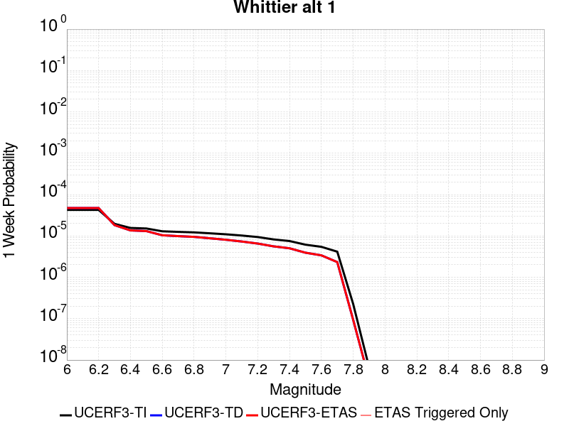 | 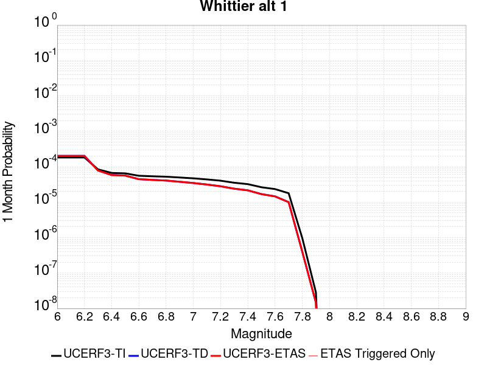 |  |  |

| Magnitude | 1 wk TI Prob | 1 wk TD Prob | 1 wk ETAS Prob | 1 wk ETAS/TD Gain | 1 wk ETAS Triggered Only | 1 mo TI Prob | 1 mo TD Prob | 1 mo ETAS Prob | 1 mo ETAS/TD Gain | 1 mo ETAS Triggered Only | 1 yr TI Prob | 1 yr TD Prob | 1 yr ETAS Prob | 1 yr ETAS/TD Gain | 1 yr ETAS Triggered Only | 10 yr TI Prob | 10 yr TD Prob | 10 yr ETAS Prob | 10 yr ETAS/TD Gain | 10 yr ETAS Triggered Only |
|-----|-----|-----|-----|-----|-----|-----|-----|-----|-----|-----|-----|-----|-----|-----|-----|-----|-----|-----|-----|-----|
| 6.0 | 4.2554693E-5 | 4.7253456E-5 | 4.7253456E-5 | 1.0 | 0.0 | 1.8236451E-4 | 2.0250089E-4 | 2.0250089E-4 | 1.0 | 0.0 | 0.002218027 | 0.0024629827 | 0.0024829335 | 1.0081003 | 2.0E-5 | 0.02196019 | 0.024390515 | 0.02442954 | 1.0016 | 4.0E-5 |
| 6.1 | 4.2554693E-5 | 4.7253456E-5 | 4.7253456E-5 | 1.0 | 0.0 | 1.8236451E-4 | 2.0250089E-4 | 2.0250089E-4 | 1.0 | 0.0 | 0.002218027 | 0.0024629827 | 0.0024829335 | 1.0081003 | 2.0E-5 | 0.02196019 | 0.024390515 | 0.02442954 | 1.0016 | 4.0E-5 |
| 6.2 | 4.2554693E-5 | 4.7253456E-5 | 4.7253456E-5 | 1.0 | 0.0 | 1.8236451E-4 | 2.0250089E-4 | 2.0250089E-4 | 1.0 | 0.0 | 0.002218027 | 0.0024629827 | 0.0024829335 | 1.0081003 | 2.0E-5 | 0.02196019 | 0.024390515 | 0.02442954 | 1.0016 | 4.0E-5 |
| 6.3 | 1.9617712E-5 | 1.8269147E-5 | 1.8269147E-5 | 1.0 | 0.0 | 8.40732E-5 | 7.8294106E-5 | 7.8294106E-5 | 1.0 | 0.0 | 0.0010231105 | 9.5283287E-4 | 9.6282334E-4 | 1.010485 | 1.0E-5 | 0.01018413 | 0.009490375 | 0.009500281 | 1.0010437 | 1.0E-5 |
| 6.4 | 1.5611336E-5 | 1.3604728E-5 | 1.3604728E-5 | 1.0 | 0.0 | 6.690401E-5 | 5.8304708E-5 | 5.8304708E-5 | 1.0 | 0.0 | 8.142519E-4 | 7.096346E-4 | 7.1962754E-4 | 1.0140817 | 1.0E-5 | 0.008112748 | 0.0070752627 | 0.007085192 | 1.0014033 | 1.0E-5 |
| 6.5 | 1.5150166E-5 | 1.3101376E-5 | 1.3101376E-5 | 1.0 | 0.0 | 6.492767E-5 | 5.614758E-5 | 5.614758E-5 | 1.0 | 0.0 | 7.9020765E-4 | 6.8338827E-4 | 6.933814E-4 | 1.0146229 | 1.0E-5 | 0.007874036 | 0.0068144295 | 0.006824361 | 1.0014575 | 1.0E-5 |
| 6.6 | 1.295588E-5 | 1.0381098E-5 | 1.0381098E-5 | 1.0 | 0.0 | 5.552402E-5 | 4.4489672E-5 | 4.4489672E-5 | 1.0 | 0.0 | 6.7579525E-4 | 5.415291E-4 | 5.415291E-4 | 1.0 | 0.0 | 0.006737438 | 0.005403255 | 0.005403255 | 1.0 | 0.0 |
| 6.7 | 1.2542085E-5 | 9.899731E-6 | 9.899731E-6 | 1.0 | 0.0 | 5.3750682E-5 | 4.242674E-5 | 4.242674E-5 | 1.0 | 0.0 | 6.542181E-4 | 5.16425E-4 | 5.16425E-4 | 1.0 | 0.0 | 0.006522954 | 0.0051533743 | 0.0051533743 | 1.0 | 0.0 |
| 6.8 | 1.2195878E-5 | 9.495758E-6 | 9.495758E-6 | 1.0 | 0.0 | 5.2267E-5 | 4.069548E-5 | 4.069548E-5 | 1.0 | 0.0 | 6.36165E-4 | 4.953567E-4 | 4.953567E-4 | 1.0 | 0.0 | 0.0063434686 | 0.00494359 | 0.00494359 | 1.0 | 0.0 |
| 6.9 | 1.1580298E-5 | 8.773248E-6 | 8.773248E-6 | 1.0 | 0.0 | 4.9628903E-5 | 3.75991E-5 | 3.75991E-5 | 1.0 | 0.0 | 6.040644E-4 | 4.5767453E-4 | 4.5767453E-4 | 1.0 | 0.0 | 0.00602425 | 0.00456835 | 0.00456835 | 1.0 | 0.0 |
| 7.0 | 1.0964795E-5 | 8.084284E-6 | 8.084284E-6 | 1.0 | 0.0 | 4.6991136E-5 | 3.4646477E-5 | 3.4646477E-5 | 1.0 | 0.0 | 5.7196687E-4 | 4.2174075E-4 | 4.2174075E-4 | 1.0 | 0.0 | 0.0057049696 | 0.0042103273 | 0.0042103273 | 1.0 | 0.0 |
| 7.1 | 1.0230601E-5 | 7.3268325E-6 | 7.3268325E-6 | 1.0 | 0.0 | 4.3844695E-5 | 3.140034E-5 | 3.140034E-5 | 1.0 | 0.0 | 5.336784E-4 | 3.8223338E-4 | 3.8223338E-4 | 1.0 | 0.0 | 0.005323986 | 0.0038168596 | 0.0038168596 | 1.0 | 0.0 |
| 7.2 | 9.40865E-6 | 6.5434065E-6 | 6.5434065E-6 | 1.0 | 0.0 | 4.032216E-5 | 2.8042878E-5 | 2.8042878E-5 | 1.0 | 0.0 | 4.908117E-4 | 3.4136974E-4 | 3.4136974E-4 | 1.0 | 0.0 | 0.0048972913 | 0.0034095005 | 0.0034095005 | 1.0 | 0.0 |
| 7.3 | 8.237384E-6 | 5.5978335E-6 | 5.5978335E-6 | 1.0 | 0.0 | 3.5302593E-5 | 2.39905E-5 | 2.39905E-5 | 1.0 | 0.0 | 4.2972428E-4 | 2.9204623E-4 | 2.9204623E-4 | 1.0 | 0.0 | 0.0042889426 | 0.0029169612 | 0.0029169612 | 1.0 | 0.0 |
| 7.4 | 7.5316966E-6 | 5.0278804E-6 | 5.0278804E-6 | 1.0 | 0.0 | 3.2278298E-5 | 2.1547887E-5 | 2.1547887E-5 | 1.0 | 0.0 | 3.9291743E-4 | 2.6231495E-4 | 2.6231495E-4 | 1.0 | 0.0 | 0.0039222343 | 0.0026201624 | 0.0026201624 | 1.0 | 0.0 |
| 7.5 | 6.149649E-6 | 3.9338697E-6 | 3.9338697E-6 | 1.0 | 0.0 | 2.6355372E-5 | 1.6859338E-5 | 1.6859338E-5 | 1.0 | 0.0 | 3.208294E-4 | 2.05244E-4 | 2.05244E-4 | 1.0 | 0.0 | 0.003203666 | 0.0020506335 | 0.0020506335 | 1.0 | 0.0 |
| 7.6 | 5.457711E-6 | 3.395382E-6 | 3.395382E-6 | 1.0 | 0.0 | 2.338998E-5 | 1.45515605E-5 | 1.45515605E-5 | 1.0 | 0.0 | 2.8473578E-4 | 1.7715165E-4 | 1.7715165E-4 | 1.0 | 0.0 | 0.0028437122 | 0.0017701852 | 0.0017701852 | 1.0 | 0.0 |
| 7.7 | 4.1676276E-6 | 2.3331656E-6 | 2.3331656E-6 | 1.0 | 0.0 | 1.7861139E-5 | 9.999248E-6 | 9.999248E-6 | 1.0 | 0.0 | 2.1743766E-4 | 1.2173478E-4 | 1.2173478E-4 | 1.0 | 0.0 | 0.0021722503 | 0.001216754 | 0.001216754 | 1.0 | 0.0 |
| 7.8 | 2.2692414E-7 | 9.384624E-8 | 9.384624E-8 | 1.0 | 0.0 | 9.725317E-7 | 4.021981E-7 | 4.021981E-7 | 1.0 | 0.0 | 1.1840509E-5 | 4.8967545E-6 | 4.8967545E-6 | 1.0 | 0.0 | 1.1839878E-4 | 4.8966795E-5 | 4.8966795E-5 | 1.0 | 0.0 |
| 7.9 | 6.676829E-9 | 3.4397993E-9 | 3.4397993E-9 | 1.0 | 0.0 | 2.861498E-8 | 1.4741998E-8 | 1.4741998E-8 | 1.0 | 0.0 | 3.4838732E-7 | 1.794838E-7 | 1.794838E-7 | 1.0 | 0.0 | 3.4838679E-6 | 1.7948367E-6 | 1.7948367E-6 | 1.0 | 0.0 |

## Rose Canyon
*[(top)](#table-of-contents)*

| 1 Week | 1 Month | 1 Year | 10 Year |
|-----|-----|-----|-----|
|  |  |  |  |

| Magnitude | 1 wk TI Prob | 1 wk TD Prob | 1 wk ETAS Prob | 1 wk ETAS/TD Gain | 1 wk ETAS Triggered Only | 1 mo TI Prob | 1 mo TD Prob | 1 mo ETAS Prob | 1 mo ETAS/TD Gain | 1 mo ETAS Triggered Only | 1 yr TI Prob | 1 yr TD Prob | 1 yr ETAS Prob | 1 yr ETAS/TD Gain | 1 yr ETAS Triggered Only | 10 yr TI Prob | 10 yr TD Prob | 10 yr ETAS Prob | 10 yr ETAS/TD Gain | 10 yr ETAS Triggered Only |
|-----|-----|-----|-----|-----|-----|-----|-----|-----|-----|-----|-----|-----|-----|-----|-----|-----|-----|-----|-----|-----|
| 6.0 | 4.5923203E-5 | 4.9717553E-5 | 4.9717553E-5 | 1.0 | 0.0 | 1.9679888E-4 | 2.1305913E-4 | 2.2305701E-4 | 1.0469253 | 1.0E-5 | 0.0023933933 | 0.0025910994 | 0.0026309956 | 1.0153974 | 4.0E-5 | 0.023677798 | 0.025618313 | 0.025667032 | 1.0019017 | 5.0E-5 |
| 6.1 | 4.5923203E-5 | 4.9717553E-5 | 4.9717553E-5 | 1.0 | 0.0 | 1.9679888E-4 | 2.1305913E-4 | 2.1305913E-4 | 1.0 | 0.0 | 0.0023933933 | 0.0025910994 | 0.0026210216 | 1.011548 | 3.0E-5 | 0.023677798 | 0.025618313 | 0.025647545 | 1.0011411 | 3.0E-5 |
| 6.2 | 2.8844734E-5 | 2.9670837E-5 | 2.9670837E-5 | 1.0 | 0.0 | 1.2361443E-4 | 1.2715468E-4 | 1.2715468E-4 | 1.0 | 0.0 | 0.0015039665 | 0.0015470362 | 0.0015670053 | 1.012908 | 2.0E-5 | 0.0149382865 | 0.015357477 | 0.0153771695 | 1.0012823 | 2.0E-5 |
| 6.3 | 2.3171577E-5 | 2.3163399E-5 | 2.3163399E-5 | 1.0 | 0.0 | 9.9302975E-5 | 9.9268E-5 | 9.9268E-5 | 1.0 | 0.0 | 0.0012083431 | 0.0012079312 | 0.0012079312 | 1.0 | 0.0 | 0.012017938 | 0.012004637 | 0.012004637 | 1.0 | 0.0 |
| 6.4 | 2.0066604E-5 | 1.966902E-5 | 1.966902E-5 | 1.0 | 0.0 | 8.599689E-5 | 8.429313E-5 | 8.429313E-5 | 1.0 | 0.0 | 0.0010465092 | 0.0010257957 | 0.0010257957 | 1.0 | 0.0 | 0.010415946 | 0.010203916 | 0.010203916 | 1.0 | 0.0 |
| 6.5 | 1.776989E-5 | 1.7115479E-5 | 1.7115479E-5 | 1.0 | 0.0 | 7.615444E-5 | 7.3350035E-5 | 7.3350035E-5 | 1.0 | 0.0 | 9.267859E-4 | 8.926777E-4 | 8.926777E-4 | 1.0 | 0.0 | 0.009229303 | 0.008879829 | 0.008879829 | 1.0 | 0.0 |
| 6.6 | 1.5227364E-5 | 1.4340938E-5 | 1.4340938E-5 | 1.0 | 0.0 | 6.52585E-5 | 6.1459745E-5 | 6.1459745E-5 | 1.0 | 0.0 | 7.942326E-4 | 7.480207E-4 | 7.480207E-4 | 1.0 | 0.0 | 0.007914 | 0.00744577 | 0.00744577 | 1.0 | 0.0 |
| 6.7 | 1.2703898E-5 | 1.167434E-5 | 1.167434E-5 | 1.0 | 0.0 | 5.4444143E-5 | 5.0031955E-5 | 5.0031955E-5 | 1.0 | 0.0 | 6.626558E-4 | 6.0897303E-4 | 6.0897303E-4 | 1.0 | 0.0 | 0.006606833 | 0.00606576 | 0.00606576 | 1.0 | 0.0 |
| 6.8 | 1.1554917E-5 | 1.0610447E-5 | 1.0610447E-5 | 1.0 | 0.0 | 4.9520135E-5 | 4.5472574E-5 | 4.5472574E-5 | 1.0 | 0.0 | 6.0274085E-4 | 5.53492E-4 | 5.53492E-4 | 1.0 | 0.0 | 0.0060110865 | 0.005507283 | 0.005507283 | 1.0 | 0.0 |
| 6.9 | 8.732078E-6 | 7.882343E-6 | 7.882343E-6 | 1.0 | 0.0 | 3.7422655E-5 | 3.378105E-5 | 3.378105E-5 | 1.0 | 0.0 | 4.5552556E-4 | 4.112096E-4 | 4.112096E-4 | 1.0 | 0.0 | 0.0045459294 | 0.004089545 | 0.004089545 | 1.0 | 0.0 |
| 7.0 | 5.9337494E-6 | 5.1074826E-6 | 5.1074826E-6 | 1.0 | 0.0 | 2.5430107E-5 | 2.1889029E-5 | 2.1889029E-5 | 1.0 | 0.0 | 3.0956755E-4 | 2.6646646E-4 | 2.6646646E-4 | 1.0 | 0.0 | 0.0030913667 | 0.0026614852 | 0.0026614852 | 1.0 | 0.0 |
| 7.1 | 5.013409E-6 | 4.177376E-6 | 4.177376E-6 | 1.0 | 0.0 | 2.1485863E-5 | 1.7902918E-5 | 1.7902918E-5 | 1.0 | 0.0 | 2.6155898E-4 | 2.1794632E-4 | 2.1794632E-4 | 1.0 | 0.0 | 0.0026125133 | 0.0021773374 | 0.0021773374 | 1.0 | 0.0 |
| 7.2 | 4.120763E-6 | 3.2821204E-6 | 3.2821204E-6 | 1.0 | 0.0 | 1.7660293E-5 | 1.4066155E-5 | 1.4066155E-5 | 1.0 | 0.0 | 2.1499286E-4 | 1.7124206E-4 | 1.7124206E-4 | 1.0 | 0.0 | 0.0021478499 | 0.0017111107 | 0.0017111107 | 1.0 | 0.0 |
| 7.3 | 3.2081239E-6 | 2.440515E-6 | 2.440515E-6 | 1.0 | 0.0 | 1.374903E-5 | 1.0459307E-5 | 1.0459307E-5 | 1.0 | 0.0 | 1.6738157E-4 | 1.273347E-4 | 1.273347E-4 | 1.0 | 0.0 | 0.0016725556 | 0.0012726244 | 0.0012726244 | 1.0 | 0.0 |
| 7.4 | 2.4194755E-6 | 1.7680458E-6 | 1.7680458E-6 | 1.0 | 0.0 | 1.0369139E-5 | 7.5773173E-6 | 7.5773173E-6 | 1.0 | 0.0 | 1.2623696E-4 | 9.224998E-5 | 9.224998E-5 | 1.0 | 0.0 | 0.0012616527 | 9.221223E-4 | 9.221223E-4 | 1.0 | 0.0 |
| 7.5 | 1.3842889E-6 | 9.378391E-7 | 9.378391E-7 | 1.0 | 0.0 | 5.9326535E-6 | 4.0193045E-6 | 4.0193045E-6 | 1.0 | 0.0 | 7.222766E-5 | 4.893397E-5 | 4.893397E-5 | 1.0 | 0.0 | 7.220419E-4 | 4.8923545E-4 | 4.8923545E-4 | 1.0 | 0.0 |
| 7.6 | 1.0021575E-6 | 6.4114187E-7 | 6.4114187E-7 | 1.0 | 0.0 | 4.2949537E-6 | 2.7477479E-6 | 2.7477479E-6 | 1.0 | 0.0 | 5.2289808E-5 | 3.345334E-5 | 3.345334E-5 | 1.0 | 0.0 | 5.2277505E-4 | 3.3448517E-4 | 3.3448517E-4 | 1.0 | 0.0 |
| 7.7 | 8.7620116E-8 | 6.449342E-8 | 6.449342E-8 | 1.0 | 0.0 | 3.7551473E-7 | 2.7640036E-7 | 2.7640036E-7 | 1.0 | 0.0 | 4.5718825E-6 | 3.3651693E-6 | 3.3651693E-6 | 1.0 | 0.0 | 4.5717883E-5 | 3.3651213E-5 | 3.3651213E-5 | 1.0 | 0.0 |

## Elysian Park (Upper)
*[(top)](#table-of-contents)*

| 1 Week | 1 Month | 1 Year | 10 Year |
|-----|-----|-----|-----|
|  |  |  |  |

| Magnitude | 1 wk TI Prob | 1 wk TD Prob | 1 wk ETAS Prob | 1 wk ETAS/TD Gain | 1 wk ETAS Triggered Only | 1 mo TI Prob | 1 mo TD Prob | 1 mo ETAS Prob | 1 mo ETAS/TD Gain | 1 mo ETAS Triggered Only | 1 yr TI Prob | 1 yr TD Prob | 1 yr ETAS Prob | 1 yr ETAS/TD Gain | 1 yr ETAS Triggered Only | 10 yr TI Prob | 10 yr TD Prob | 10 yr ETAS Prob | 10 yr ETAS/TD Gain | 10 yr ETAS Triggered Only |
|-----|-----|-----|-----|-----|-----|-----|-----|-----|-----|-----|-----|-----|-----|-----|-----|-----|-----|-----|-----|-----|
| 6.0 | 3.1876025E-5 | 3.703628E-5 | 3.703628E-5 | 1.0 | 0.0 | 1.3660437E-4 | 1.5871998E-4 | 1.5871998E-4 | 1.0 | 0.0 | 0.0016618895 | 0.0019311737 | 0.0019411545 | 1.0051682 | 1.0E-5 | 0.016495159 | 0.019190373 | 0.019219797 | 1.0015333 | 3.0E-5 |
| 6.1 | 3.1876025E-5 | 3.703628E-5 | 3.703628E-5 | 1.0 | 0.0 | 1.3660437E-4 | 1.5871998E-4 | 1.5871998E-4 | 1.0 | 0.0 | 0.0016618895 | 0.0019311737 | 0.0019411545 | 1.0051682 | 1.0E-5 | 0.016495159 | 0.019190373 | 0.019219797 | 1.0015333 | 3.0E-5 |
| 6.2 | 3.1876025E-5 | 3.703628E-5 | 3.703628E-5 | 1.0 | 0.0 | 1.3660437E-4 | 1.5871998E-4 | 1.5871998E-4 | 1.0 | 0.0 | 0.0016618895 | 0.0019311737 | 0.0019411545 | 1.0051682 | 1.0E-5 | 0.016495159 | 0.019190373 | 0.019219797 | 1.0015333 | 3.0E-5 |
| 6.3 | 3.1876025E-5 | 3.703628E-5 | 3.703628E-5 | 1.0 | 0.0 | 1.3660437E-4 | 1.5871998E-4 | 1.5871998E-4 | 1.0 | 0.0 | 0.0016618895 | 0.0019311737 | 0.0019411545 | 1.0051682 | 1.0E-5 | 0.016495159 | 0.019190373 | 0.019219797 | 1.0015333 | 3.0E-5 |
| 6.4 | 1.9273462E-5 | 2.1202904E-5 | 2.1202904E-5 | 1.0 | 0.0 | 8.259794E-5 | 9.0867405E-5 | 9.0867405E-5 | 1.0 | 0.0 | 0.001005166 | 0.0011059209 | 0.0011159098 | 1.0090322 | 1.0E-5 | 0.010006315 | 0.011020984 | 0.011050653 | 1.0026921 | 3.0E-5 |
| 6.5 | 1.9273462E-5 | 2.1202904E-5 | 2.1202904E-5 | 1.0 | 0.0 | 8.259794E-5 | 9.0867405E-5 | 9.0867405E-5 | 1.0 | 0.0 | 0.001005166 | 0.0011059209 | 0.0011159098 | 1.0090322 | 1.0E-5 | 0.010006315 | 0.011020984 | 0.011050653 | 1.0026921 | 3.0E-5 |
| 6.6 | 9.813258E-6 | 9.665716E-6 | 9.665716E-6 | 1.0 | 0.0 | 4.205614E-5 | 4.1423882E-5 | 4.1423882E-5 | 1.0 | 0.0 | 5.119132E-4 | 5.042263E-4 | 5.1422126E-4 | 1.0198224 | 1.0E-5 | 0.005107356 | 0.005031546 | 0.0050414954 | 1.0019774 | 1.0E-5 |
| 6.7 | 9.801478E-6 | 9.653286E-6 | 9.653286E-6 | 1.0 | 0.0 | 4.2005657E-5 | 4.1370608E-5 | 4.1370608E-5 | 1.0 | 0.0 | 5.112989E-4 | 5.03578E-4 | 5.1357294E-4 | 1.0198479 | 1.0E-5 | 0.0051012407 | 0.0050250925 | 0.0050350423 | 1.0019801 | 1.0E-5 |
| 6.8 | 8.102489E-6 | 7.773095E-6 | 7.773095E-6 | 1.0 | 0.0 | 3.4724493E-5 | 3.3312866E-5 | 3.3312866E-5 | 1.0 | 0.0 | 4.2268867E-4 | 4.0551362E-4 | 4.1550957E-4 | 1.0246501 | 1.0E-5 | 0.004218856 | 0.0040482306 | 0.00405819 | 1.0024602 | 1.0E-5 |
| 6.9 | 6.08275E-6 | 5.481501E-6 | 5.481501E-6 | 1.0 | 0.0 | 2.6068668E-5 | 2.349194E-5 | 2.349194E-5 | 1.0 | 0.0 | 3.173398E-4 | 2.859776E-4 | 2.859776E-4 | 1.0 | 0.0 | 0.0031688702 | 0.0028561736 | 0.0028561736 | 1.0 | 0.0 |
| 7.0 | 5.5995934E-6 | 4.982823E-6 | 4.982823E-6 | 1.0 | 0.0 | 2.3998036E-5 | 2.1354786E-5 | 2.1354786E-5 | 1.0 | 0.0 | 2.9213692E-4 | 2.5996417E-4 | 2.5996417E-4 | 1.0 | 0.0 | 0.0029175316 | 0.002596668 | 0.002596668 | 1.0 | 0.0 |
| 7.1 | 4.709881E-6 | 4.0874347E-6 | 4.0874347E-6 | 1.0 | 0.0 | 2.0185047E-5 | 1.7517461E-5 | 1.7517461E-5 | 1.0 | 0.0 | 2.4572524E-4 | 2.1325464E-4 | 2.1325464E-4 | 1.0 | 0.0 | 0.002454537 | 0.0021305413 | 0.0021305413 | 1.0 | 0.0 |
| 7.2 | 3.6063436E-6 | 2.9779728E-6 | 2.9779728E-6 | 1.0 | 0.0 | 1.5455667E-5 | 1.2762678E-5 | 1.2762678E-5 | 1.0 | 0.0 | 1.881565E-4 | 1.5537464E-4 | 1.5537464E-4 | 1.0 | 0.0 | 0.0018799726 | 0.0015526713 | 0.0015526713 | 1.0 | 0.0 |
| 7.3 | 2.471135E-6 | 2.0954792E-6 | 2.0954792E-6 | 1.0 | 0.0 | 1.0590536E-5 | 8.980594E-6 | 8.980594E-6 | 1.0 | 0.0 | 1.2893214E-4 | 1.0933332E-4 | 1.0933332E-4 | 1.0 | 0.0 | 0.0012885736 | 0.0010928025 | 0.0010928025 | 1.0 | 0.0 |
| 7.4 | 1.163943E-6 | 1.0275194E-6 | 1.0275194E-6 | 1.0 | 0.0 | 4.988318E-6 | 4.4036474E-6 | 4.4036474E-6 | 1.0 | 0.0 | 6.0731076E-5 | 5.3613116E-5 | 5.3613116E-5 | 1.0 | 0.0 | 6.071448E-4 | 5.360048E-4 | 5.360048E-4 | 1.0 | 0.0 |
| 7.5 | 4.99459E-7 | 4.917662E-7 | 4.917662E-7 | 1.0 | 0.0 | 2.140537E-6 | 2.1075678E-6 | 2.1075678E-6 | 1.0 | 0.0 | 2.6060725E-5 | 2.565935E-5 | 2.565935E-5 | 1.0 | 0.0 | 2.605767E-4 | 2.5656543E-4 | 2.5656543E-4 | 1.0 | 0.0 |
| 7.6 | 2.4667852E-7 | 2.4778686E-7 | 2.4778686E-7 | 1.0 | 0.0 | 1.0571932E-6 | 1.0619433E-6 | 1.0619433E-6 | 1.0 | 0.0 | 1.2871251E-5 | 1.2929087E-5 | 1.2929087E-5 | 1.0 | 0.0 | 1.2870505E-4 | 1.2928371E-4 | 1.2928371E-4 | 1.0 | 0.0 |
| 7.7 | 8.2312795E-8 | 7.386639E-8 | 7.386639E-8 | 1.0 | 0.0 | 3.527691E-7 | 3.165702E-7 | 3.165702E-7 | 1.0 | 0.0 | 4.294955E-6 | 3.8542366E-6 | 3.8542366E-6 | 1.0 | 0.0 | 4.2948723E-5 | 3.8541813E-5 | 3.8541813E-5 | 1.0 | 0.0 |
| 7.8 | 2.7819295E-8 | 1.7567253E-8 | 1.7567253E-8 | 1.0 | 0.0 | 1.1922555E-7 | 7.528822E-8 | 7.528822E-8 | 1.0 | 0.0 | 1.45157E-6 | 9.166339E-7 | 9.166339E-7 | 1.0 | 0.0 | 1.45156055E-5 | 9.166316E-6 | 9.166316E-6 | 1.0 | 0.0 |

## San Gabriel
*[(top)](#table-of-contents)*

| 1 Week | 1 Month | 1 Year | 10 Year |
|-----|-----|-----|-----|
|  |  |  |  |

| Magnitude | 1 wk TI Prob | 1 wk TD Prob | 1 wk ETAS Prob | 1 wk ETAS/TD Gain | 1 wk ETAS Triggered Only | 1 mo TI Prob | 1 mo TD Prob | 1 mo ETAS Prob | 1 mo ETAS/TD Gain | 1 mo ETAS Triggered Only | 1 yr TI Prob | 1 yr TD Prob | 1 yr ETAS Prob | 1 yr ETAS/TD Gain | 1 yr ETAS Triggered Only | 10 yr TI Prob | 10 yr TD Prob | 10 yr ETAS Prob | 10 yr ETAS/TD Gain | 10 yr ETAS Triggered Only |
|-----|-----|-----|-----|-----|-----|-----|-----|-----|-----|-----|-----|-----|-----|-----|-----|-----|-----|-----|-----|-----|
| 6.0 | 1.083775E-5 | 1.1987373E-5 | 3.1987132E-5 | 2.6684022 | 2.0E-5 | 4.6446676E-5 | 5.1373507E-5 | 7.137248E-5 | 1.3892857 | 2.0E-5 | 5.653415E-4 | 6.253043E-4 | 6.5528555E-4 | 1.0479467 | 3.0E-5 | 0.0056390543 | 0.006247348 | 0.0062870984 | 1.0063627 | 4.0E-5 |
| 6.1 | 1.083775E-5 | 1.1987373E-5 | 3.1987132E-5 | 2.6684022 | 2.0E-5 | 4.6446676E-5 | 5.1373507E-5 | 7.137248E-5 | 1.3892857 | 2.0E-5 | 5.653415E-4 | 6.253043E-4 | 6.5528555E-4 | 1.0479467 | 3.0E-5 | 0.0056390543 | 0.006247348 | 0.0062870984 | 1.0063627 | 4.0E-5 |
| 6.2 | 1.083775E-5 | 1.1987373E-5 | 3.1987132E-5 | 2.6684022 | 2.0E-5 | 4.6446676E-5 | 5.1373507E-5 | 7.137248E-5 | 1.3892857 | 2.0E-5 | 5.653415E-4 | 6.253043E-4 | 6.5528555E-4 | 1.0479467 | 3.0E-5 | 0.0056390543 | 0.006247348 | 0.0062870984 | 1.0063627 | 4.0E-5 |
| 6.3 | 1.083775E-5 | 1.1987373E-5 | 3.1987132E-5 | 2.6684022 | 2.0E-5 | 4.6446676E-5 | 5.1373507E-5 | 7.137248E-5 | 1.3892857 | 2.0E-5 | 5.653415E-4 | 6.253043E-4 | 6.5528555E-4 | 1.0479467 | 3.0E-5 | 0.0056390543 | 0.006247348 | 0.0062870984 | 1.0063627 | 4.0E-5 |
| 6.4 | 1.083775E-5 | 1.1987373E-5 | 3.1987132E-5 | 2.6684022 | 2.0E-5 | 4.6446676E-5 | 5.1373507E-5 | 7.137248E-5 | 1.3892857 | 2.0E-5 | 5.653415E-4 | 6.253043E-4 | 6.5528555E-4 | 1.0479467 | 3.0E-5 | 0.0056390543 | 0.006247348 | 0.0062870984 | 1.0063627 | 4.0E-5 |
| 6.5 | 6.7317824E-6 | 7.719108E-6 | 1.771903E-5 | 2.2954764 | 1.0E-5 | 2.8850178E-5 | 3.3081476E-5 | 4.3081145E-5 | 1.302274 | 1.0E-5 | 3.511943E-4 | 4.026936E-4 | 4.1268958E-4 | 1.0248228 | 1.0E-5 | 0.003506398 | 0.004030539 | 0.004040499 | 1.0024711 | 1.0E-5 |
| 6.6 | 6.7317824E-6 | 7.719108E-6 | 1.771903E-5 | 2.2954764 | 1.0E-5 | 2.8850178E-5 | 3.3081476E-5 | 4.3081145E-5 | 1.302274 | 1.0E-5 | 3.511943E-4 | 4.026936E-4 | 4.1268958E-4 | 1.0248228 | 1.0E-5 | 0.003506398 | 0.004030539 | 0.004040499 | 1.0024711 | 1.0E-5 |
| 6.7 | 6.274881E-6 | 7.248026E-6 | 1.7247954E-5 | 2.3796759 | 1.0E-5 | 2.6892068E-5 | 3.1062606E-5 | 4.1062292E-5 | 1.3219205 | 1.0E-5 | 3.2736175E-4 | 3.7812255E-4 | 3.8811876E-4 | 1.0264364 | 1.0E-5 | 0.0032687993 | 0.0037856852 | 0.0037956475 | 1.0026315 | 1.0E-5 |
| 6.8 | 5.996209E-6 | 6.960745E-6 | 1.6960676E-5 | 2.4366179 | 1.0E-5 | 2.5697784E-5 | 2.9831428E-5 | 3.983113E-5 | 1.335207 | 1.0E-5 | 3.128256E-4 | 3.6313804E-4 | 3.7313442E-4 | 1.0275277 | 1.0E-5 | 0.003123856 | 0.0036363378 | 0.0036463013 | 1.00274 | 1.0E-5 |
| 6.9 | 5.686331E-6 | 6.6257817E-6 | 1.6625716E-5 | 2.5092459 | 1.0E-5 | 2.4369761E-5 | 2.8395903E-5 | 3.8395618E-5 | 1.3521535 | 1.0E-5 | 2.9666146E-4 | 3.456662E-4 | 3.5566272E-4 | 1.0289197 | 1.0E-5 | 0.0029626573 | 0.0034621747 | 0.00347214 | 1.0028783 | 1.0E-5 |
| 7.0 | 5.2329838E-6 | 6.1496576E-6 | 1.6149595E-5 | 2.6260967 | 1.0E-5 | 2.242688E-5 | 2.6355414E-5 | 3.635515E-5 | 1.3794187 | 1.0E-5 | 2.7301308E-4 | 3.2083067E-4 | 3.3082746E-4 | 1.031159 | 1.0E-5 | 0.002726779 | 0.0032145523 | 0.0032245202 | 1.0031009 | 1.0E-5 |
| 7.1 | 5.135671E-6 | 6.039777E-6 | 1.6039716E-5 | 2.6556802 | 1.0E-5 | 2.2009834E-5 | 2.5884507E-5 | 3.5884248E-5 | 1.3863215 | 1.0E-5 | 2.6793676E-4 | 3.1509905E-4 | 3.250959E-4 | 1.031726 | 1.0E-5 | 0.0026761394 | 0.0031574003 | 0.0031673687 | 1.0031571 | 1.0E-5 |
| 7.2 | 4.989062E-6 | 5.8731457E-6 | 1.5873087E-5 | 2.702655 | 1.0E-5 | 2.1381518E-5 | 2.5170384E-5 | 3.5170135E-5 | 1.3972822 | 1.0E-5 | 2.6028889E-4 | 3.064071E-4 | 3.1640404E-4 | 1.0326263 | 1.0E-5 | 0.0025998424 | 0.0030707237 | 0.003080693 | 1.0032465 | 1.0E-5 |
| 7.3 | 4.8219395E-6 | 5.7046905E-6 | 1.5704632E-5 | 2.7529335 | 1.0E-5 | 2.0665291E-5 | 2.4448447E-5 | 3.4448203E-5 | 1.4090139 | 1.0E-5 | 2.5157086E-4 | 2.9761996E-4 | 3.0761698E-4 | 1.0335898 | 1.0E-5 | 0.0025128627 | 0.0029830914 | 0.0029930614 | 1.0033423 | 1.0E-5 |
| 7.4 | 4.7118383E-6 | 5.59324E-6 | 1.5593185E-5 | 2.7878625 | 1.0E-5 | 2.0193436E-5 | 2.3970813E-5 | 3.3970573E-5 | 1.417164 | 1.0E-5 | 2.4582737E-4 | 2.9180633E-4 | 3.018034E-4 | 1.0342593 | 1.0E-5 | 0.002455556 | 0.002925109 | 0.0029350796 | 1.0034087 | 1.0E-5 |
| 7.5 | 4.5506545E-6 | 5.438597E-6 | 1.5438542E-5 | 2.8386996 | 1.0E-5 | 1.9502659E-5 | 2.3308068E-5 | 3.3307835E-5 | 1.429026 | 1.0E-5 | 2.37419E-4 | 2.8373953E-4 | 2.937367E-4 | 1.0352336 | 1.0E-5 | 0.002371655 | 0.0028446494 | 0.0028546208 | 1.0035053 | 1.0E-5 |
| 7.6 | 4.343636E-6 | 5.231458E-6 | 1.5231406E-5 | 2.911503 | 1.0E-5 | 1.861545E-5 | 2.2420347E-5 | 3.242012E-5 | 1.4460135 | 1.0E-5 | 2.2661954E-4 | 2.7293427E-4 | 2.8293155E-4 | 1.0366288 | 1.0E-5 | 0.0022638857 | 0.0027368597 | 0.0027468323 | 1.0036439 | 1.0E-5 |
| 7.7 | 2.936235E-6 | 2.7452986E-6 | 2.7452986E-6 | 1.0 | 0.0 | 1.2583803E-5 | 1.1765513E-5 | 1.1765513E-5 | 1.0 | 0.0 | 1.5319703E-4 | 1.4323574E-4 | 1.4323574E-4 | 1.0 | 0.0 | 0.0015309147 | 0.0014387129 | 0.0014387129 | 1.0 | 0.0 |
| 7.8 | 1.4541639E-6 | 9.1280947E-7 | 9.1280947E-7 | 1.0 | 0.0 | 6.232116E-6 | 3.9120346E-6 | 3.9120346E-6 | 1.0 | 0.0 | 7.587337E-5 | 4.7627982E-5 | 4.7627982E-5 | 1.0 | 0.0 | 7.584747E-4 | 4.8106918E-4 | 4.8106918E-4 | 1.0 | 0.0 |
| 7.9 | 8.098958E-7 | 2.4187648E-7 | 2.4187648E-7 | 1.0 | 0.0 | 3.4709774E-6 | 1.036613E-6 | 1.036613E-6 | 1.0 | 0.0 | 4.225833E-5 | 1.262069E-5 | 1.262069E-5 | 1.0 | 0.0 | 4.2250296E-4 | 1.2928544E-4 | 1.2928544E-4 | 1.0 | 0.0 |
| 8.0 | 5.2473234E-7 | 7.6827554E-8 | 7.6827554E-8 | 1.0 | 0.0 | 2.248851E-6 | 3.292609E-7 | 3.292609E-7 | 1.0 | 0.0 | 2.7379416E-5 | 4.008744E-6 | 4.008744E-6 | 1.0 | 0.0 | 2.7376044E-4 | 4.2213585E-5 | 4.2213585E-5 | 1.0 | 0.0 |
| 8.1 | 3.3162388E-7 | 4.1511967E-8 | 4.1511967E-8 | 1.0 | 0.0 | 1.4212444E-6 | 1.7790842E-7 | 1.7790842E-7 | 1.0 | 0.0 | 1.7303513E-5 | 2.1660328E-6 | 2.1660328E-6 | 1.0 | 0.0 | 1.7302166E-4 | 2.2976306E-5 | 2.2976306E-5 | 1.0 | 0.0 |
| 8.2 | 1.0235345E-7 | 1.4050096E-8 | 1.4050096E-8 | 1.0 | 0.0 | 4.3865757E-7 | 6.0214695E-8 | 6.0214695E-8 | 1.0 | 0.0 | 5.340643E-6 | 7.3311367E-7 | 7.3311367E-7 | 1.0 | 0.0 | 5.3405143E-5 | 7.9302445E-6 | 7.9302445E-6 | 1.0 | 0.0 |

## Brawley (Seismic Zone) alt 1
*[(top)](#table-of-contents)*

| 1 Week | 1 Month | 1 Year | 10 Year |
|-----|-----|-----|-----|
|  |  |  |  |

| Magnitude | 1 wk TI Prob | 1 wk TD Prob | 1 wk ETAS Prob | 1 wk ETAS/TD Gain | 1 wk ETAS Triggered Only | 1 mo TI Prob | 1 mo TD Prob | 1 mo ETAS Prob | 1 mo ETAS/TD Gain | 1 mo ETAS Triggered Only | 1 yr TI Prob | 1 yr TD Prob | 1 yr ETAS Prob | 1 yr ETAS/TD Gain | 1 yr ETAS Triggered Only | 10 yr TI Prob | 10 yr TD Prob | 10 yr ETAS Prob | 10 yr ETAS/TD Gain | 10 yr ETAS Triggered Only |
|-----|-----|-----|-----|-----|-----|-----|-----|-----|-----|-----|-----|-----|-----|-----|-----|-----|-----|-----|-----|-----|
| 6.0 | 2.2521618E-4 | 4.7643206E-4 | 4.7643206E-4 | 1.0 | 0.0 | 9.6485513E-4 | 0.002040291 | 0.002040291 | 1.0 | 0.0 | 0.011683988 | 0.024554973 | 0.024584237 | 1.0011917 | 3.0E-5 | 0.11088423 | 0.21353106 | 0.21356253 | 1.0001473 | 4.0E-5 |
| 6.1 | 2.2521618E-4 | 4.7643206E-4 | 4.7643206E-4 | 1.0 | 0.0 | 9.6485513E-4 | 0.002040291 | 0.002040291 | 1.0 | 0.0 | 0.011683988 | 0.024554973 | 0.024584237 | 1.0011917 | 3.0E-5 | 0.11088423 | 0.21353106 | 0.21356253 | 1.0001473 | 4.0E-5 |
| 6.2 | 2.198148E-4 | 4.672759E-4 | 4.672759E-4 | 1.0 | 0.0 | 9.417233E-4 | 0.0020011107 | 0.0020011107 | 1.0 | 0.0 | 0.011405343 | 0.024089037 | 0.024118314 | 1.0012153 | 3.0E-5 | 0.10837428 | 0.20996717 | 0.20999877 | 1.0001506 | 4.0E-5 |
| 6.3 | 2.1704129E-4 | 4.6163241E-4 | 4.6163241E-4 | 1.0 | 0.0 | 9.298453E-4 | 0.001976961 | 0.001976961 | 1.0 | 0.0 | 0.011262234 | 0.023802388 | 0.023831675 | 1.0012304 | 3.0E-5 | 0.107082725 | 0.20785816 | 0.20788985 | 1.0001525 | 4.0E-5 |
| 6.4 | 1.876142E-4 | 4.0055066E-4 | 4.0055066E-4 | 1.0 | 0.0 | 8.038131E-4 | 0.0017155306 | 0.0017155306 | 1.0 | 0.0 | 0.00974259 | 0.020688837 | 0.020718217 | 1.00142 | 3.0E-5 | 0.093263686 | 0.18460822 | 0.18464084 | 1.0001767 | 4.0E-5 |
| 6.5 | 1.7390939E-4 | 3.7486907E-4 | 3.7486907E-4 | 1.0 | 0.0 | 7.45113E-4 | 0.0016056047 | 0.0016056047 | 1.0 | 0.0 | 0.009034078 | 0.019377038 | 0.019406457 | 1.0015182 | 3.0E-5 | 0.086755216 | 0.17442968 | 0.17446272 | 1.0001893 | 4.0E-5 |
| 6.6 | 1.591791E-4 | 3.490135E-4 | 3.490135E-4 | 1.0 | 0.0 | 6.8201777E-4 | 0.0014949249 | 0.0014949249 | 1.0 | 0.0 | 0.008271996 | 0.018051691 | 0.018081151 | 1.0016319 | 3.0E-5 | 0.07970774 | 0.16383655 | 0.16387 | 1.0002041 | 4.0E-5 |
| 6.7 | 1.4268003E-4 | 3.2067046E-4 | 3.2067046E-4 | 1.0 | 0.0 | 6.1134255E-4 | 0.0013735864 | 0.0013735864 | 1.0 | 0.0 | 0.007417723 | 0.016597226 | 0.016626729 | 1.0017775 | 3.0E-5 | 0.07174956 | 0.15196328 | 0.1519972 | 1.0002233 | 4.0E-5 |
| 6.8 | 1.239713E-4 | 2.906121E-4 | 2.906121E-4 | 1.0 | 0.0 | 5.3119735E-4 | 0.0012448921 | 0.0012448921 | 1.0 | 0.0 | 0.0064481674 | 0.015052661 | 0.015082209 | 1.001963 | 3.0E-5 | 0.06264243 | 0.13840474 | 0.13843921 | 1.000249 | 4.0E-5 |
| 6.9 | 1.0180238E-4 | 2.6260383E-4 | 2.6260383E-4 | 1.0 | 0.0 | 4.3622297E-4 | 0.0011249639 | 0.0011249639 | 1.0 | 0.0 | 0.005298089 | 0.013611422 | 0.013641014 | 1.002174 | 3.0E-5 | 0.05173543 | 0.12498361 | 0.12501861 | 1.00028 | 4.0E-5 |
| 7.0 | 7.6619996E-5 | 2.2404084E-4 | 2.2404084E-4 | 1.0 | 0.0 | 3.283301E-4 | 9.598249E-4 | 9.598249E-4 | 1.0 | 0.0 | 0.0039900932 | 0.011623963 | 0.011643731 | 1.0017006 | 2.0E-5 | 0.039192066 | 0.10728301 | 0.107309796 | 1.0002496 | 3.0E-5 |
| 7.1 | 7.5127435E-5 | 2.2087194E-4 | 2.2087194E-4 | 1.0 | 0.0 | 3.2193496E-4 | 9.462538E-4 | 9.462538E-4 | 1.0 | 0.0 | 0.0039125155 | 0.011460485 | 0.011480255 | 1.0017251 | 2.0E-5 | 0.038443442 | 0.105846815 | 0.10587364 | 1.0002534 | 3.0E-5 |
| 7.2 | 6.788582E-5 | 2.0214771E-4 | 2.0214771E-4 | 1.0 | 0.0 | 2.9090676E-4 | 8.660627E-4 | 8.660627E-4 | 1.0 | 0.0 | 0.0035360386 | 0.010493974 | 0.010513765 | 1.0018859 | 2.0E-5 | 0.034803 | 0.09751713 | 0.09754421 | 1.0002776 | 3.0E-5 |
| 7.3 | 6.399602E-5 | 1.884553E-4 | 1.884553E-4 | 1.0 | 0.0 | 2.7423984E-4 | 8.074185E-4 | 8.074185E-4 | 1.0 | 0.0 | 0.0033337586 | 0.009786601 | 0.009806406 | 1.0020236 | 2.0E-5 | 0.03284188 | 0.09141058 | 0.09143784 | 1.0002981 | 3.0E-5 |
| 7.4 | 4.506759E-5 | 1.2532667E-4 | 1.2532667E-4 | 1.0 | 0.0 | 1.9313251E-4 | 5.370046E-4 | 5.370046E-4 | 1.0 | 0.0 | 0.0023488526 | 0.006518606 | 0.006538476 | 1.0030482 | 2.0E-5 | 0.023241805 | 0.06237464 | 0.06239339 | 1.0003006 | 2.0E-5 |
| 7.5 | 3.43289E-5 | 9.338305E-5 | 9.338305E-5 | 1.0 | 0.0 | 1.4711556E-4 | 4.00152E-4 | 4.00152E-4 | 1.0 | 0.0 | 0.0017896603 | 0.00486103 | 0.0048809326 | 1.0040944 | 2.0E-5 | 0.01775316 | 0.04706593 | 0.047084987 | 1.000405 | 2.0E-5 |
| 7.6 | 2.5980507E-5 | 7.055588E-5 | 7.055588E-5 | 1.0 | 0.0 | 1.1134028E-4 | 3.023474E-4 | 3.023474E-4 | 1.0 | 0.0 | 0.001354725 | 0.0036748908 | 0.0036948172 | 1.0054224 | 2.0E-5 | 0.013464959 | 0.035850268 | 0.03586955 | 1.0005379 | 2.0E-5 |
| 7.7 | 1.7292105E-5 | 4.9428265E-5 | 4.9428265E-5 | 1.0 | 0.0 | 7.4106916E-5 | 2.1181825E-4 | 2.1181825E-4 | 1.0 | 0.0 | 9.018782E-4 | 0.002575843 | 0.0025858171 | 1.0038723 | 1.0E-5 | 0.008982267 | 0.025298944 | 0.025308691 | 1.0003853 | 1.0E-5 |
| 7.8 | 1.2927471E-5 | 3.971141E-5 | 3.971141E-5 | 1.0 | 0.0 | 5.5402274E-5 | 1.7018066E-4 | 1.7018066E-4 | 1.0 | 0.0 | 6.743139E-4 | 0.0020699832 | 0.0020799625 | 1.004821 | 1.0E-5 | 0.0067227143 | 0.020439085 | 0.02044888 | 1.0004792 | 1.0E-5 |
| 7.9 | 1.0200774E-5 | 2.8759863E-5 | 2.8759863E-5 | 1.0 | 0.0 | 4.371687E-5 | 1.2325073E-4 | 1.2325073E-4 | 1.0 | 0.0 | 5.321229E-4 | 0.0014995459 | 0.0015095309 | 1.0066587 | 1.0E-5 | 0.005308505 | 0.0149981035 | 0.015007953 | 1.0006567 | 1.0E-5 |
| 8.0 | 8.650396E-6 | 2.3289316E-5 | 2.3289316E-5 | 1.0 | 0.0 | 3.70726E-5 | 9.980754E-5 | 9.980754E-5 | 1.0 | 0.0 | 4.5126543E-4 | 0.0012144803 | 0.0012244681 | 1.008224 | 1.0E-5 | 0.0045035016 | 0.012216583 | 0.0122264605 | 1.0008086 | 1.0E-5 |
| 8.1 | 3.9368224E-6 | 7.3325436E-6 | 7.3325436E-6 | 1.0 | 0.0 | 1.6871985E-5 | 3.142481E-5 | 3.142481E-5 | 1.0 | 0.0 | 2.0539707E-4 | 3.8253E-4 | 3.8253E-4 | 1.0 | 0.0 | 0.0020520731 | 0.0040034265 | 0.0040034265 | 1.0 | 0.0 |
| 8.2 | 1.7101195E-6 | 2.21947E-6 | 2.21947E-6 | 1.0 | 0.0 | 7.329063E-6 | 9.511979E-6 | 9.511979E-6 | 1.0 | 0.0 | 8.922769E-5 | 1.1580222E-4 | 1.1580222E-4 | 1.0 | 0.0 | 8.9191867E-4 | 0.0012675131 | 0.0012675131 | 1.0 | 0.0 |
| 8.3 | 3.0346666E-8 | 1.7229212E-8 | 1.7229212E-8 | 1.0 | 0.0 | 1.3005713E-7 | 7.383948E-8 | 7.383948E-8 | 1.0 | 0.0 | 1.5834444E-6 | 8.9899555E-7 | 8.9899555E-7 | 1.0 | 0.0 | 1.5834332E-5 | 9.375523E-6 | 9.375523E-6 | 1.0 | 0.0 |

## Channel Islands Thrust
*[(top)](#table-of-contents)*

| 1 Week | 1 Month | 1 Year | 10 Year |
|-----|-----|-----|-----|
|  |  |  |  |

| Magnitude | 1 wk TI Prob | 1 wk TD Prob | 1 wk ETAS Prob | 1 wk ETAS/TD Gain | 1 wk ETAS Triggered Only | 1 mo TI Prob | 1 mo TD Prob | 1 mo ETAS Prob | 1 mo ETAS/TD Gain | 1 mo ETAS Triggered Only | 1 yr TI Prob | 1 yr TD Prob | 1 yr ETAS Prob | 1 yr ETAS/TD Gain | 1 yr ETAS Triggered Only | 10 yr TI Prob | 10 yr TD Prob | 10 yr ETAS Prob | 10 yr ETAS/TD Gain | 10 yr ETAS Triggered Only |
|-----|-----|-----|-----|-----|-----|-----|-----|-----|-----|-----|-----|-----|-----|-----|-----|-----|-----|-----|-----|-----|
| 6.0 | 2.2156251E-5 | 2.4092304E-5 | 2.4092304E-5 | 1.0 | 0.0 | 9.495191E-5 | 1.03249244E-4 | 1.03249244E-4 | 1.0 | 0.0 | 0.0011554264 | 0.0012564411 | 0.0012864035 | 1.023847 | 3.0E-5 | 0.011494373 | 0.012503966 | 0.012543466 | 1.0031589 | 4.0E-5 |
| 6.1 | 2.2156251E-5 | 2.4092304E-5 | 2.4092304E-5 | 1.0 | 0.0 | 9.495191E-5 | 1.03249244E-4 | 1.03249244E-4 | 1.0 | 0.0 | 0.0011554264 | 0.0012564411 | 0.0012864035 | 1.023847 | 3.0E-5 | 0.011494373 | 0.012503966 | 0.012543466 | 1.0031589 | 4.0E-5 |
| 6.2 | 2.2156251E-5 | 2.4092304E-5 | 2.4092304E-5 | 1.0 | 0.0 | 9.495191E-5 | 1.03249244E-4 | 1.03249244E-4 | 1.0 | 0.0 | 0.0011554264 | 0.0012564411 | 0.0012864035 | 1.023847 | 3.0E-5 | 0.011494373 | 0.012503966 | 0.012543466 | 1.0031589 | 4.0E-5 |
| 6.3 | 2.2156251E-5 | 2.4092304E-5 | 2.4092304E-5 | 1.0 | 0.0 | 9.495191E-5 | 1.03249244E-4 | 1.03249244E-4 | 1.0 | 0.0 | 0.0011554264 | 0.0012564411 | 0.0012864035 | 1.023847 | 3.0E-5 | 0.011494373 | 0.012503966 | 0.012543466 | 1.0031589 | 4.0E-5 |
| 6.4 | 2.2156251E-5 | 2.4092304E-5 | 2.4092304E-5 | 1.0 | 0.0 | 9.495191E-5 | 1.03249244E-4 | 1.03249244E-4 | 1.0 | 0.0 | 0.0011554264 | 0.0012564411 | 0.0012864035 | 1.023847 | 3.0E-5 | 0.011494373 | 0.012503966 | 0.012543466 | 1.0031589 | 4.0E-5 |
| 6.5 | 2.2156251E-5 | 2.4092304E-5 | 2.4092304E-5 | 1.0 | 0.0 | 9.495191E-5 | 1.03249244E-4 | 1.03249244E-4 | 1.0 | 0.0 | 0.0011554264 | 0.0012564411 | 0.0012864035 | 1.023847 | 3.0E-5 | 0.011494373 | 0.012503966 | 0.012543466 | 1.0031589 | 4.0E-5 |
| 6.6 | 2.2156251E-5 | 2.4092304E-5 | 2.4092304E-5 | 1.0 | 0.0 | 9.495191E-5 | 1.03249244E-4 | 1.03249244E-4 | 1.0 | 0.0 | 0.0011554264 | 0.0012564411 | 0.0012864035 | 1.023847 | 3.0E-5 | 0.011494373 | 0.012503966 | 0.012543466 | 1.0031589 | 4.0E-5 |
| 6.7 | 1.0601296E-5 | 1.1379656E-5 | 1.1379656E-5 | 1.0 | 0.0 | 4.5433335E-5 | 4.876907E-5 | 4.876907E-5 | 1.0 | 0.0 | 5.5301044E-4 | 5.9360656E-4 | 5.9360656E-4 | 1.0 | 0.0 | 0.005516363 | 0.0059207114 | 0.0059207114 | 1.0 | 0.0 |
| 6.8 | 1.0246747E-5 | 1.0996777E-5 | 1.0996777E-5 | 1.0 | 0.0 | 4.391389E-5 | 4.7128222E-5 | 4.7128222E-5 | 1.0 | 0.0 | 5.345204E-4 | 5.736398E-4 | 5.736398E-4 | 1.0 | 0.0 | 0.0053323656 | 0.005722081 | 0.005722081 | 1.0 | 0.0 |
| 6.9 | 9.049551E-6 | 9.699738E-6 | 9.699738E-6 | 1.0 | 0.0 | 3.878322E-5 | 4.1569667E-5 | 4.1569667E-5 | 1.0 | 0.0 | 4.7208337E-4 | 5.059973E-4 | 5.059973E-4 | 1.0 | 0.0 | 0.0047108172 | 0.005048869 | 0.005048869 | 1.0 | 0.0 |
| 7.0 | 8.6542195E-6 | 9.274693E-6 | 9.274693E-6 | 1.0 | 0.0 | 3.7088983E-5 | 3.97481E-5 | 3.97481E-5 | 1.0 | 0.0 | 4.5146482E-4 | 4.8382976E-4 | 4.8382976E-4 | 1.0 | 0.0 | 0.004505487 | 0.0048281755 | 0.0048281755 | 1.0 | 0.0 |
| 7.1 | 8.391028E-6 | 8.993012E-6 | 8.993012E-6 | 1.0 | 0.0 | 3.5961057E-5 | 3.8540933E-5 | 3.8540933E-5 | 1.0 | 0.0 | 4.3773788E-4 | 4.691389E-4 | 4.691389E-4 | 1.0 | 0.0 | 0.004368766 | 0.0046818955 | 0.0046818955 | 1.0 | 0.0 |
| 7.2 | 5.965188E-6 | 6.3717544E-6 | 6.3717544E-6 | 1.0 | 0.0 | 2.556484E-5 | 2.7307236E-5 | 2.7307236E-5 | 1.0 | 0.0 | 3.1120746E-4 | 3.3241542E-4 | 3.3241542E-4 | 1.0 | 0.0 | 0.00310772 | 0.00331924 | 0.00331924 | 1.0 | 0.0 |
| 7.3 | 4.877518E-6 | 5.2060545E-6 | 5.2060545E-6 | 1.0 | 0.0 | 2.0903482E-5 | 2.2311473E-5 | 2.2311473E-5 | 1.0 | 0.0 | 2.5447016E-4 | 2.716088E-4 | 2.716088E-4 | 1.0 | 0.0 | 0.0025417898 | 0.0027128146 | 0.0027128146 | 1.0 | 0.0 |
| 7.4 | 3.8829853E-6 | 4.1419007E-6 | 4.1419007E-6 | 1.0 | 0.0 | 1.664126E-5 | 1.7750885E-5 | 1.7750885E-5 | 1.0 | 0.0 | 2.0258849E-4 | 2.1609601E-4 | 2.1609601E-4 | 1.0 | 0.0 | 0.002024039 | 0.0021589005 | 0.0021589005 | 1.0 | 0.0 |
| 7.5 | 1.3489616E-6 | 1.4278028E-6 | 1.4278028E-6 | 1.0 | 0.0 | 5.7812517E-6 | 6.119141E-6 | 6.119141E-6 | 1.0 | 0.0 | 7.038446E-5 | 7.449803E-5 | 7.449803E-5 | 1.0 | 0.0 | 7.036218E-4 | 7.4473454E-4 | 7.4473454E-4 | 1.0 | 0.0 |
| 7.6 | 6.058192E-7 | 6.353833E-7 | 6.353833E-7 | 1.0 | 0.0 | 2.5963652E-6 | 2.7230685E-6 | 2.7230685E-6 | 1.0 | 0.0 | 3.161029E-5 | 3.315287E-5 | 3.315287E-5 | 1.0 | 0.0 | 3.1605794E-4 | 3.3148087E-4 | 3.3148087E-4 | 1.0 | 0.0 |
| 7.7 | 2.2170494E-7 | 2.2608089E-7 | 2.2608089E-7 | 1.0 | 0.0 | 9.5016367E-7 | 9.689178E-7 | 9.689178E-7 | 1.0 | 0.0 | 1.1568181E-5 | 1.1796522E-5 | 1.1796522E-5 | 1.0 | 0.0 | 1.1567579E-4 | 1.17960066E-4 | 1.17960066E-4 | 1.0 | 0.0 |
| 7.8 | 2.1613102E-8 | 1.5466844E-8 | 1.5466844E-8 | 1.0 | 0.0 | 9.262757E-8 | 6.6286475E-8 | 6.6286475E-8 | 1.0 | 0.0 | 1.1277401E-6 | 8.070376E-7 | 8.070376E-7 | 1.0 | 0.0 | 1.1277344E-5 | 8.070355E-6 | 8.070355E-6 | 1.0 | 0.0 |

## Sheephole
*[(top)](#table-of-contents)*

| 1 Week | 1 Month | 1 Year | 10 Year |
|-----|-----|-----|-----|
|  |  |  |  |

| Magnitude | 1 wk TI Prob | 1 wk TD Prob | 1 wk ETAS Prob | 1 wk ETAS/TD Gain | 1 wk ETAS Triggered Only | 1 mo TI Prob | 1 mo TD Prob | 1 mo ETAS Prob | 1 mo ETAS/TD Gain | 1 mo ETAS Triggered Only | 1 yr TI Prob | 1 yr TD Prob | 1 yr ETAS Prob | 1 yr ETAS/TD Gain | 1 yr ETAS Triggered Only | 10 yr TI Prob | 10 yr TD Prob | 10 yr ETAS Prob | 10 yr ETAS/TD Gain | 10 yr ETAS Triggered Only |
|-----|-----|-----|-----|-----|-----|-----|-----|-----|-----|-----|-----|-----|-----|-----|-----|-----|-----|-----|-----|-----|
| 6.0 | 4.5579695E-6 | 4.7412877E-6 | 4.7412877E-6 | 1.0 | 0.0 | 1.9534009E-5 | 2.0319678E-5 | 2.0319678E-5 | 1.0 | 0.0 | 2.3780059E-4 | 2.4736955E-4 | 2.5736706E-4 | 1.0404154 | 1.0E-5 | 0.0023754628 | 0.0024714863 | 0.0025113875 | 1.0161446 | 4.0E-5 |
| 6.1 | 4.5579695E-6 | 4.7412877E-6 | 4.7412877E-6 | 1.0 | 0.0 | 1.9534009E-5 | 2.0319678E-5 | 2.0319678E-5 | 1.0 | 0.0 | 2.3780059E-4 | 2.4736955E-4 | 2.5736706E-4 | 1.0404154 | 1.0E-5 | 0.0023754628 | 0.0024714863 | 0.0025113875 | 1.0161446 | 4.0E-5 |
| 6.2 | 2.6677674E-6 | 2.7874107E-6 | 2.7874107E-6 | 1.0 | 0.0 | 1.1433239E-5 | 1.1945997E-5 | 1.1945997E-5 | 1.0 | 0.0 | 1.3919079E-4 | 1.4543389E-4 | 1.5543244E-4 | 1.0687498 | 1.0E-5 | 0.0013910364 | 0.001453493 | 0.0014834495 | 1.02061 | 3.0E-5 |
| 6.3 | 2.6677674E-6 | 2.7874107E-6 | 2.7874107E-6 | 1.0 | 0.0 | 1.1433239E-5 | 1.1945997E-5 | 1.1945997E-5 | 1.0 | 0.0 | 1.3919079E-4 | 1.4543389E-4 | 1.5543244E-4 | 1.0687498 | 1.0E-5 | 0.0013910364 | 0.001453493 | 0.0014834495 | 1.02061 | 3.0E-5 |
| 6.4 | 2.2159759E-6 | 2.3228936E-6 | 2.3228936E-6 | 1.0 | 0.0 | 9.497005E-6 | 9.955224E-6 | 9.955224E-6 | 1.0 | 0.0 | 1.156199E-4 | 1.2119893E-4 | 1.3119771E-4 | 1.082499 | 1.0E-5 | 0.0011555976 | 0.0012114076 | 0.0012313834 | 1.0164897 | 2.0E-5 |
| 6.5 | 2.1986082E-6 | 2.3047737E-6 | 2.3047737E-6 | 1.0 | 0.0 | 9.4225725E-6 | 9.877569E-6 | 9.877569E-6 | 1.0 | 0.0 | 1.1471378E-4 | 1.2025358E-4 | 1.3025237E-4 | 1.0831476 | 1.0E-5 | 0.0011465458 | 0.0012019643 | 0.0012219403 | 1.0166194 | 2.0E-5 |
| 6.6 | 1.5232331E-6 | 1.6019028E-6 | 1.6019028E-6 | 1.0 | 0.0 | 6.5281256E-6 | 6.8652807E-6 | 6.8652807E-6 | 1.0 | 0.0 | 7.947703E-5 | 8.358178E-5 | 8.358178E-5 | 1.0 | 0.0 | 7.9448614E-4 | 8.3552214E-4 | 8.455138E-4 | 1.0119586 | 1.0E-5 |
| 6.7 | 1.3137362E-6 | 1.3828287E-6 | 1.3828287E-6 | 1.0 | 0.0 | 5.6302856E-6 | 5.926396E-6 | 5.926396E-6 | 1.0 | 0.0 | 6.854657E-5 | 7.2151626E-5 | 7.2151626E-5 | 1.0 | 0.0 | 6.8525434E-4 | 7.212959E-4 | 7.312887E-4 | 1.0138539 | 1.0E-5 |
| 6.8 | 1.2275751E-6 | 1.2922936E-6 | 1.2922936E-6 | 1.0 | 0.0 | 5.2610258E-6 | 5.5383903E-6 | 5.5383903E-6 | 1.0 | 0.0 | 6.4051106E-5 | 6.742795E-5 | 6.742795E-5 | 1.0 | 0.0 | 6.4032647E-4 | 6.740883E-4 | 6.740883E-4 | 1.0 | 0.0 |
| 6.9 | 1.1837088E-6 | 1.2461107E-6 | 1.2461107E-6 | 1.0 | 0.0 | 5.0730278E-6 | 5.340464E-6 | 5.340464E-6 | 1.0 | 0.0 | 6.176237E-5 | 6.501835E-5 | 6.501835E-5 | 1.0 | 0.0 | 6.17452E-4 | 6.500064E-4 | 6.500064E-4 | 1.0 | 0.0 |
| 7.0 | 9.849371E-7 | 1.036636E-6 | 1.036636E-6 | 1.0 | 0.0 | 4.2211523E-6 | 4.442719E-6 | 4.442719E-6 | 1.0 | 0.0 | 5.1391315E-5 | 5.408886E-5 | 5.408886E-5 | 1.0 | 0.0 | 5.137943E-4 | 5.4076704E-4 | 5.4076704E-4 | 1.0 | 0.0 |
| 7.1 | 8.1643645E-7 | 8.5917287E-7 | 8.5917287E-7 | 1.0 | 0.0 | 3.4990085E-6 | 3.6821648E-6 | 3.6821648E-6 | 1.0 | 0.0 | 4.2599597E-5 | 4.482952E-5 | 4.482952E-5 | 1.0 | 0.0 | 4.259143E-4 | 4.482134E-4 | 4.482134E-4 | 1.0 | 0.0 |
| 7.2 | 5.7295756E-7 | 6.029544E-7 | 6.029544E-7 | 1.0 | 0.0 | 2.45553E-6 | 2.584088E-6 | 2.584088E-6 | 1.0 | 0.0 | 2.9895667E-5 | 3.1460884E-5 | 3.1460884E-5 | 1.0 | 0.0 | 2.9891645E-4 | 3.14571E-4 | 3.14571E-4 | 1.0 | 0.0 |

## Tin Mountain
*[(top)](#table-of-contents)*

| 1 Week | 1 Month | 1 Year | 10 Year |
|-----|-----|-----|-----|
|  |  |  |  |

| Magnitude | 1 wk TI Prob | 1 wk TD Prob | 1 wk ETAS Prob | 1 wk ETAS/TD Gain | 1 wk ETAS Triggered Only | 1 mo TI Prob | 1 mo TD Prob | 1 mo ETAS Prob | 1 mo ETAS/TD Gain | 1 mo ETAS Triggered Only | 1 yr TI Prob | 1 yr TD Prob | 1 yr ETAS Prob | 1 yr ETAS/TD Gain | 1 yr ETAS Triggered Only | 10 yr TI Prob | 10 yr TD Prob | 10 yr ETAS Prob | 10 yr ETAS/TD Gain | 10 yr ETAS Triggered Only |
|-----|-----|-----|-----|-----|-----|-----|-----|-----|-----|-----|-----|-----|-----|-----|-----|-----|-----|-----|-----|-----|
| 6.0 | 4.083776E-6 | 4.18155E-6 | 4.18155E-6 | 1.0 | 0.0 | 1.750178E-5 | 1.7920827E-5 | 2.7920647E-5 | 1.558 | 1.0E-5 | 2.1306332E-4 | 2.1816794E-4 | 2.3816357E-4 | 1.0916525 | 2.0E-5 | 0.0021285915 | 0.0021799032 | 0.002209838 | 1.0137321 | 3.0E-5 |
| 6.1 | 4.083776E-6 | 4.18155E-6 | 4.18155E-6 | 1.0 | 0.0 | 1.750178E-5 | 1.7920827E-5 | 2.7920647E-5 | 1.558 | 1.0E-5 | 2.1306332E-4 | 2.1816794E-4 | 2.3816357E-4 | 1.0916525 | 2.0E-5 | 0.0021285915 | 0.0021799032 | 0.002209838 | 1.0137321 | 3.0E-5 |
| 6.2 | 4.083776E-6 | 4.18155E-6 | 4.18155E-6 | 1.0 | 0.0 | 1.750178E-5 | 1.7920827E-5 | 2.7920647E-5 | 1.558 | 1.0E-5 | 2.1306332E-4 | 2.1816794E-4 | 2.3816357E-4 | 1.0916525 | 2.0E-5 | 0.0021285915 | 0.0021799032 | 0.002209838 | 1.0137321 | 3.0E-5 |
| 6.3 | 4.083776E-6 | 4.18155E-6 | 4.18155E-6 | 1.0 | 0.0 | 1.750178E-5 | 1.7920827E-5 | 2.7920647E-5 | 1.558 | 1.0E-5 | 2.1306332E-4 | 2.1816794E-4 | 2.3816357E-4 | 1.0916525 | 2.0E-5 | 0.0021285915 | 0.0021799032 | 0.002209838 | 1.0137321 | 3.0E-5 |
| 6.4 | 4.083776E-6 | 4.18155E-6 | 4.18155E-6 | 1.0 | 0.0 | 1.750178E-5 | 1.7920827E-5 | 2.7920647E-5 | 1.558 | 1.0E-5 | 2.1306332E-4 | 2.1816794E-4 | 2.3816357E-4 | 1.0916525 | 2.0E-5 | 0.0021285915 | 0.0021799032 | 0.002209838 | 1.0137321 | 3.0E-5 |
| 6.5 | 2.3143427E-6 | 2.3731652E-6 | 2.3731652E-6 | 1.0 | 0.0 | 9.9185745E-6 | 1.0170673E-5 | 2.0170572E-5 | 1.9832091 | 1.0E-5 | 1.2075195E-4 | 1.2382168E-4 | 1.438192E-4 | 1.1615026 | 2.0E-5 | 0.0012068636 | 0.0012376028 | 0.001257578 | 1.0161402 | 2.0E-5 |
| 6.6 | 2.3143427E-6 | 2.3731652E-6 | 2.3731652E-6 | 1.0 | 0.0 | 9.9185745E-6 | 1.0170673E-5 | 2.0170572E-5 | 1.9832091 | 1.0E-5 | 1.2075195E-4 | 1.2382168E-4 | 1.438192E-4 | 1.1615026 | 2.0E-5 | 0.0012068636 | 0.0012376028 | 0.001257578 | 1.0161402 | 2.0E-5 |
| 6.7 | 1.7029532E-6 | 1.7497979E-6 | 1.7497979E-6 | 1.0 | 0.0 | 7.2983503E-6 | 7.4991153E-6 | 1.749904E-5 | 2.3334806 | 1.0E-5 | 8.885379E-5 | 9.129844E-5 | 1.1129661E-4 | 1.2190418 | 2.0E-5 | 8.881827E-4 | 9.1266196E-4 | 9.326437E-4 | 1.021894 | 2.0E-5 |
| 6.8 | 1.2914646E-6 | 1.3299432E-6 | 1.3299432E-6 | 1.0 | 0.0 | 5.534837E-6 | 5.6997465E-6 | 5.6997465E-6 | 1.0 | 0.0 | 6.738455E-5 | 6.939264E-5 | 7.939195E-5 | 1.1440974 | 1.0E-5 | 6.736412E-4 | 6.937531E-4 | 7.0374616E-4 | 1.0144043 | 1.0E-5 |
| 6.9 | 5.8708974E-7 | 6.117028E-7 | 6.117028E-7 | 1.0 | 0.0 | 2.5160964E-6 | 2.621581E-6 | 2.621581E-6 | 1.0 | 0.0 | 3.0633044E-5 | 3.1917323E-5 | 4.1917003E-5 | 1.3132995 | 1.0E-5 | 3.0628822E-4 | 3.191315E-4 | 3.291283E-4 | 1.0313251 | 1.0E-5 |
| 7.0 | 4.6248786E-7 | 4.832044E-7 | 4.832044E-7 | 1.0 | 0.0 | 1.9820893E-6 | 2.0708746E-6 | 2.0708746E-6 | 1.0 | 0.0 | 2.413167E-5 | 2.5212645E-5 | 3.5212393E-5 | 1.3966163 | 1.0E-5 | 2.412905E-4 | 2.5210154E-4 | 2.62099E-4 | 1.0396565 | 1.0E-5 |
| 7.1 | 3.804606E-7 | 3.9871725E-7 | 3.9871725E-7 | 1.0 | 0.0 | 1.6305444E-6 | 1.7087873E-6 | 1.7087873E-6 | 1.0 | 0.0 | 1.9851697E-5 | 2.080432E-5 | 2.080432E-5 | 1.0 | 0.0 | 1.9849923E-4 | 2.080271E-4 | 2.080271E-4 | 1.0 | 0.0 |
| 7.2 | 3.5864858E-7 | 3.7617107E-7 | 3.7617107E-7 | 1.0 | 0.0 | 1.5370645E-6 | 1.6121609E-6 | 1.6121609E-6 | 1.0 | 0.0 | 1.87136E-5 | 1.9627916E-5 | 1.9627916E-5 | 1.0 | 0.0 | 1.8712023E-4 | 1.9626514E-4 | 1.9626514E-4 | 1.0 | 0.0 |
| 7.3 | 3.342063E-7 | 3.50637E-7 | 3.50637E-7 | 1.0 | 0.0 | 1.4323119E-6 | 1.5027293E-6 | 1.5027293E-6 | 1.0 | 0.0 | 1.7438259E-5 | 1.829561E-5 | 1.829561E-5 | 1.0 | 0.0 | 1.743689E-4 | 1.8294434E-4 | 1.8294434E-4 | 1.0 | 0.0 |
| 7.4 | 2.971242E-7 | 3.116602E-7 | 3.116602E-7 | 1.0 | 0.0 | 1.2733886E-6 | 1.3356861E-6 | 1.3356861E-6 | 1.0 | 0.0 | 1.5503398E-5 | 1.626189E-5 | 1.626189E-5 | 1.0 | 0.0 | 1.5502315E-4 | 1.6261027E-4 | 1.6261027E-4 | 1.0 | 0.0 |
| 7.5 | 1.4326713E-7 | 1.501262E-7 | 1.501262E-7 | 1.0 | 0.0 | 6.140018E-7 | 6.43398E-7 | 6.43398E-7 | 1.0 | 0.0 | 7.4754466E-6 | 7.833371E-6 | 7.833371E-6 | 1.0 | 0.0 | 7.475195E-5 | 7.83337E-5 | 7.83337E-5 | 1.0 | 0.0 |

## White Mountains
*[(top)](#table-of-contents)*

| 1 Week | 1 Month | 1 Year | 10 Year |
|-----|-----|-----|-----|
|  |  |  |  |

| Magnitude | 1 wk TI Prob | 1 wk TD Prob | 1 wk ETAS Prob | 1 wk ETAS/TD Gain | 1 wk ETAS Triggered Only | 1 mo TI Prob | 1 mo TD Prob | 1 mo ETAS Prob | 1 mo ETAS/TD Gain | 1 mo ETAS Triggered Only | 1 yr TI Prob | 1 yr TD Prob | 1 yr ETAS Prob | 1 yr ETAS/TD Gain | 1 yr ETAS Triggered Only | 10 yr TI Prob | 10 yr TD Prob | 10 yr ETAS Prob | 10 yr ETAS/TD Gain | 10 yr ETAS Triggered Only |
|-----|-----|-----|-----|-----|-----|-----|-----|-----|-----|-----|-----|-----|-----|-----|-----|-----|-----|-----|-----|-----|
| 6.0 | 3.503579E-5 | 3.3784498E-5 | 3.3784498E-5 | 1.0 | 0.0 | 1.5014476E-4 | 1.4478335E-4 | 1.547819E-4 | 1.0690588 | 1.0E-5 | 0.0018264796 | 0.0017614327 | 0.0017813976 | 1.0113344 | 2.0E-5 | 0.018115403 | 0.017487047 | 0.017526347 | 1.0022475 | 4.0E-5 |
| 6.1 | 3.503579E-5 | 3.3784498E-5 | 3.3784498E-5 | 1.0 | 0.0 | 1.5014476E-4 | 1.4478335E-4 | 1.547819E-4 | 1.0690588 | 1.0E-5 | 0.0018264796 | 0.0017614327 | 0.0017813976 | 1.0113344 | 2.0E-5 | 0.018115403 | 0.017487047 | 0.017526347 | 1.0022475 | 4.0E-5 |
| 6.2 | 3.503579E-5 | 3.3784498E-5 | 3.3784498E-5 | 1.0 | 0.0 | 1.5014476E-4 | 1.4478335E-4 | 1.547819E-4 | 1.0690588 | 1.0E-5 | 0.0018264796 | 0.0017614327 | 0.0017813976 | 1.0113344 | 2.0E-5 | 0.018115403 | 0.017487047 | 0.017526347 | 1.0022475 | 4.0E-5 |
| 6.3 | 1.7818425E-5 | 1.591632E-5 | 1.591632E-5 | 1.0 | 0.0 | 7.636245E-5 | 6.821109E-5 | 6.821109E-5 | 1.0 | 0.0 | 9.293162E-4 | 8.301679E-4 | 8.401596E-4 | 1.0120357 | 1.0E-5 | 0.009254395 | 0.008272125 | 0.008291961 | 1.0023978 | 2.0E-5 |
| 6.4 | 1.7818425E-5 | 1.591632E-5 | 1.591632E-5 | 1.0 | 0.0 | 7.636245E-5 | 6.821109E-5 | 6.821109E-5 | 1.0 | 0.0 | 9.293162E-4 | 8.301679E-4 | 8.401596E-4 | 1.0120357 | 1.0E-5 | 0.009254395 | 0.008272125 | 0.008291961 | 1.0023978 | 2.0E-5 |
| 6.5 | 1.3397557E-5 | 1.1336486E-5 | 1.1336486E-5 | 1.0 | 0.0 | 5.741684E-5 | 4.8584072E-5 | 4.8584072E-5 | 1.0 | 0.0 | 6.988258E-4 | 5.9135753E-4 | 5.9135753E-4 | 1.0 | 0.0 | 0.006966323 | 0.0058985446 | 0.0059084855 | 1.0016854 | 1.0E-5 |
| 6.6 | 1.0818695E-5 | 8.625519E-6 | 8.625519E-6 | 1.0 | 0.0 | 4.6365014E-5 | 3.696601E-5 | 3.696601E-5 | 1.0 | 0.0 | 5.6434784E-4 | 4.4997258E-4 | 4.4997258E-4 | 1.0 | 0.0 | 0.005629168 | 0.004491051 | 0.004491051 | 1.0 | 0.0 |
| 6.7 | 9.067908E-6 | 6.802544E-6 | 6.802544E-6 | 1.0 | 0.0 | 3.8861883E-5 | 2.915345E-5 | 2.915345E-5 | 1.0 | 0.0 | 4.7304068E-4 | 3.5488865E-4 | 3.5488865E-4 | 1.0 | 0.0 | 0.00472035 | 0.0035435364 | 0.0035435364 | 1.0 | 0.0 |
| 6.8 | 7.295947E-6 | 4.9364785E-6 | 4.9364785E-6 | 1.0 | 0.0 | 3.126797E-5 | 2.1156171E-5 | 2.1156171E-5 | 1.0 | 0.0 | 3.8062103E-4 | 2.5754707E-4 | 2.5754707E-4 | 1.0 | 0.0 | 0.0037996976 | 0.0025725989 | 0.0025725989 | 1.0 | 0.0 |
| 6.9 | 6.2243444E-6 | 3.8322955E-6 | 3.8322955E-6 | 1.0 | 0.0 | 2.6675489E-5 | 1.6424025E-5 | 1.6424025E-5 | 1.0 | 0.0 | 3.2472567E-4 | 1.9994467E-4 | 1.9994467E-4 | 1.0 | 0.0 | 0.0032425157 | 0.0019977004 | 0.0019977004 | 1.0 | 0.0 |
| 7.0 | 4.9878413E-6 | 2.6796004E-6 | 2.6796004E-6 | 1.0 | 0.0 | 2.1376287E-5 | 1.1483952E-5 | 1.1483952E-5 | 1.0 | 0.0 | 2.602252E-4 | 1.3980841E-4 | 1.3980841E-4 | 1.0 | 0.0 | 0.002599207 | 0.0013972308 | 0.0013972308 | 1.0 | 0.0 |
| 7.1 | 4.0252844E-6 | 1.885737E-6 | 1.885737E-6 | 1.0 | 0.0 | 1.7251105E-5 | 8.081706E-6 | 8.081706E-6 | 1.0 | 0.0 | 2.1001195E-4 | 9.8390454E-5 | 9.8390454E-5 | 1.0 | 0.0 | 0.0020981359 | 9.834818E-4 | 9.834818E-4 | 1.0 | 0.0 |
| 7.2 | 3.3284066E-6 | 1.2819264E-6 | 1.2819264E-6 | 1.0 | 0.0 | 1.4264522E-5 | 5.493959E-6 | 5.493959E-6 | 1.0 | 0.0 | 1.736567E-4 | 6.6887005E-5 | 6.6887005E-5 | 1.0 | 0.0 | 0.0017352107 | 6.686788E-4 | 6.686788E-4 | 1.0 | 0.0 |
| 7.3 | 2.458226E-6 | 6.0570005E-7 | 6.0570005E-7 | 1.0 | 0.0 | 1.0535211E-5 | 2.595855E-6 | 2.595855E-6 | 1.0 | 0.0 | 1.2825865E-4 | 3.1604115E-5 | 3.1604115E-5 | 1.0 | 0.0 | 0.0012818464 | 3.1599996E-4 | 3.1599996E-4 | 1.0 | 0.0 |
| 7.4 | 1.965953E-6 | 3.1087455E-7 | 3.1087455E-7 | 1.0 | 0.0 | 8.425486E-6 | 1.3323188E-6 | 1.3323188E-6 | 1.0 | 0.0 | 1.0257547E-4 | 1.6220862E-5 | 1.6220862E-5 | 1.0 | 0.0 | 0.0010252813 | 1.6219691E-4 | 1.6219691E-4 | 1.0 | 0.0 |
| 7.5 | 1.2014192E-6 | 1.8242919E-7 | 1.8242919E-7 | 1.0 | 0.0 | 5.148929E-6 | 7.8183916E-7 | 7.8183916E-7 | 1.0 | 0.0 | 6.2686406E-5 | 9.518851E-6 | 9.518851E-6 | 1.0 | 0.0 | 6.266873E-4 | 9.5184514E-5 | 9.5184514E-5 | 1.0 | 0.0 |
| 7.6 | 2.5612175E-7 | 4.8943498E-8 | 4.8943498E-8 | 1.0 | 0.0 | 1.0976642E-6 | 2.0975783E-7 | 2.0975783E-7 | 1.0 | 0.0 | 1.3363979E-5 | 2.553799E-6 | 2.553799E-6 | 1.0 | 0.0 | 1.3363175E-4 | 2.5537733E-5 | 2.5537733E-5 | 1.0 | 0.0 |

## San Luis Range 2011 CFM
*[(top)](#table-of-contents)*

| 1 Week | 1 Month | 1 Year | 10 Year |
|-----|-----|-----|-----|
|  |  |  |  |

| Magnitude | 1 wk TI Prob | 1 wk TD Prob | 1 wk ETAS Prob | 1 wk ETAS/TD Gain | 1 wk ETAS Triggered Only | 1 mo TI Prob | 1 mo TD Prob | 1 mo ETAS Prob | 1 mo ETAS/TD Gain | 1 mo ETAS Triggered Only | 1 yr TI Prob | 1 yr TD Prob | 1 yr ETAS Prob | 1 yr ETAS/TD Gain | 1 yr ETAS Triggered Only | 10 yr TI Prob | 10 yr TD Prob | 10 yr ETAS Prob | 10 yr ETAS/TD Gain | 10 yr ETAS Triggered Only |
|-----|-----|-----|-----|-----|-----|-----|-----|-----|-----|-----|-----|-----|-----|-----|-----|-----|-----|-----|-----|-----|
| 6.0 | 8.8368415E-6 | 8.965478E-6 | 1.896539E-5 | 2.1153796 | 1.0E-5 | 3.787163E-5 | 3.8422957E-5 | 5.842219E-5 | 1.5205022 | 2.0E-5 | 4.609895E-4 | 4.6770697E-4 | 4.876976E-4 | 1.0427418 | 2.0E-5 | 0.0046003438 | 0.004668009 | 0.004707822 | 1.008529 | 4.0E-5 |
| 6.1 | 8.8368415E-6 | 8.965478E-6 | 1.896539E-5 | 2.1153796 | 1.0E-5 | 3.787163E-5 | 3.8422957E-5 | 5.842219E-5 | 1.5205022 | 2.0E-5 | 4.609895E-4 | 4.6770697E-4 | 4.876976E-4 | 1.0427418 | 2.0E-5 | 0.0046003438 | 0.004668009 | 0.004707822 | 1.008529 | 4.0E-5 |
| 6.2 | 8.8368415E-6 | 8.965478E-6 | 1.896539E-5 | 2.1153796 | 1.0E-5 | 3.787163E-5 | 3.8422957E-5 | 5.842219E-5 | 1.5205022 | 2.0E-5 | 4.609895E-4 | 4.6770697E-4 | 4.876976E-4 | 1.0427418 | 2.0E-5 | 0.0046003438 | 0.004668009 | 0.004707822 | 1.008529 | 4.0E-5 |
| 6.3 | 8.8368415E-6 | 8.965478E-6 | 1.896539E-5 | 2.1153796 | 1.0E-5 | 3.787163E-5 | 3.8422957E-5 | 5.842219E-5 | 1.5205022 | 2.0E-5 | 4.609895E-4 | 4.6770697E-4 | 4.876976E-4 | 1.0427418 | 2.0E-5 | 0.0046003438 | 0.004668009 | 0.004707822 | 1.008529 | 4.0E-5 |
| 6.4 | 3.9094193E-6 | 3.941214E-6 | 1.3941175E-5 | 3.5372794 | 1.0E-5 | 1.6754546E-5 | 1.689081E-5 | 2.689064E-5 | 1.5920279 | 1.0E-5 | 2.039675E-4 | 2.0562648E-4 | 2.1562443E-4 | 1.0486219 | 1.0E-5 | 0.0020378039 | 0.002054391 | 0.0020643706 | 1.0048577 | 1.0E-5 |
| 6.5 | 3.9094193E-6 | 3.941214E-6 | 1.3941175E-5 | 3.5372794 | 1.0E-5 | 1.6754546E-5 | 1.689081E-5 | 2.689064E-5 | 1.5920279 | 1.0E-5 | 2.039675E-4 | 2.0562648E-4 | 2.1562443E-4 | 1.0486219 | 1.0E-5 | 0.0020378039 | 0.002054391 | 0.0020643706 | 1.0048577 | 1.0E-5 |
| 6.6 | 3.0587726E-6 | 3.0753974E-6 | 3.0753974E-6 | 1.0 | 0.0 | 1.3108959E-5 | 1.3180209E-5 | 1.3180209E-5 | 1.0 | 0.0 | 1.595899E-4 | 1.6045735E-4 | 1.6045735E-4 | 1.0 | 0.0 | 0.0015947534 | 0.0016034269 | 0.0016034269 | 1.0 | 0.0 |
| 6.7 | 2.6160574E-6 | 2.6251355E-6 | 2.6251355E-6 | 1.0 | 0.0 | 1.1211626E-5 | 1.1250533E-5 | 1.1250533E-5 | 1.0 | 0.0 | 1.3649299E-4 | 1.3696669E-4 | 1.3696669E-4 | 1.0 | 0.0 | 0.0013640919 | 0.0013688289 | 0.0013688289 | 1.0 | 0.0 |
| 6.8 | 2.5110312E-6 | 2.5181482E-6 | 2.5181482E-6 | 1.0 | 0.0 | 1.0761518E-5 | 1.079202E-5 | 1.079202E-5 | 1.0 | 0.0 | 1.310136E-4 | 1.3138496E-4 | 1.3138496E-4 | 1.0 | 0.0 | 0.0013093639 | 0.0013130788 | 0.0013130788 | 1.0 | 0.0 |
| 6.9 | 1.8564405E-6 | 1.8524935E-6 | 1.8524935E-6 | 1.0 | 0.0 | 7.95615E-6 | 7.939234E-6 | 7.939234E-6 | 1.0 | 0.0 | 9.686181E-5 | 9.66559E-5 | 9.66559E-5 | 1.0 | 0.0 | 9.68196E-4 | 9.6614065E-4 | 9.6614065E-4 | 1.0 | 0.0 |
| 7.0 | 1.546127E-6 | 1.5369595E-6 | 1.5369595E-6 | 1.0 | 0.0 | 6.626242E-6 | 6.586953E-6 | 6.586953E-6 | 1.0 | 0.0 | 8.06715E-5 | 8.0193204E-5 | 8.0193204E-5 | 1.0 | 0.0 | 8.0642226E-4 | 8.016434E-4 | 8.016434E-4 | 1.0 | 0.0 |
| 7.1 | 1.3368208E-6 | 1.3235378E-6 | 1.3235378E-6 | 1.0 | 0.0 | 5.7292195E-6 | 5.672293E-6 | 5.672293E-6 | 1.0 | 0.0 | 6.975101E-5 | 6.905798E-5 | 6.905798E-5 | 1.0 | 0.0 | 6.972912E-4 | 6.903657E-4 | 6.903657E-4 | 1.0 | 0.0 |
| 7.2 | 1.0623363E-6 | 1.0454412E-6 | 1.0454412E-6 | 1.0 | 0.0 | 4.5528623E-6 | 4.4804547E-6 | 4.4804547E-6 | 1.0 | 0.0 | 5.5429686E-5 | 5.4548174E-5 | 5.4548174E-5 | 1.0 | 0.0 | 5.5415864E-4 | 5.453481E-4 | 5.453481E-4 | 1.0 | 0.0 |
| 7.3 | 7.831679E-7 | 7.7274274E-7 | 7.7274274E-7 | 1.0 | 0.0 | 3.3564295E-6 | 3.3117506E-6 | 3.3117506E-6 | 1.0 | 0.0 | 4.086376E-5 | 4.0319817E-5 | 4.0319817E-5 | 1.0 | 0.0 | 4.0856248E-4 | 4.0312516E-4 | 4.0312516E-4 | 1.0 | 0.0 |
| 7.4 | 5.9558846E-7 | 5.9106696E-7 | 5.9106696E-7 | 1.0 | 0.0 | 2.5525194E-6 | 2.5331417E-6 | 2.5331417E-6 | 1.0 | 0.0 | 3.107648E-5 | 3.0840565E-5 | 3.0840565E-5 | 1.0 | 0.0 | 3.1072134E-4 | 3.083629E-4 | 3.083629E-4 | 1.0 | 0.0 |
| 7.5 | 4.1616502E-7 | 4.1196597E-7 | 4.1196597E-7 | 1.0 | 0.0 | 1.7835631E-6 | 1.7655673E-6 | 1.7655673E-6 | 1.0 | 0.0 | 2.1714664E-5 | 2.1495569E-5 | 2.1495569E-5 | 1.0 | 0.0 | 2.1712543E-4 | 2.1493496E-4 | 2.1493496E-4 | 1.0 | 0.0 |
| 7.6 | 2.3816014E-7 | 2.3376762E-7 | 2.3376762E-7 | 1.0 | 0.0 | 1.0206859E-6 | 1.0018608E-6 | 1.0018608E-6 | 1.0 | 0.0 | 1.242678E-5 | 1.2197587E-5 | 1.2197587E-5 | 1.0 | 0.0 | 1.2426086E-4 | 1.219692E-4 | 1.219692E-4 | 1.0 | 0.0 |
| 7.7 | 9.918777E-8 | 9.386922E-8 | 9.386922E-8 | 1.0 | 0.0 | 4.2509038E-7 | 4.0229656E-7 | 4.0229656E-7 | 1.0 | 0.0 | 5.1754632E-6 | 4.8979496E-6 | 4.8979496E-6 | 1.0 | 0.0 | 5.1753424E-5 | 4.897842E-5 | 4.897842E-5 | 1.0 | 0.0 |
| 7.8 | 3.4982556E-8 | 2.9687648E-8 | 2.9687648E-8 | 1.0 | 0.0 | 1.4992524E-7 | 1.2723277E-7 | 1.2723277E-7 | 1.0 | 0.0 | 1.8253382E-6 | 1.5490579E-6 | 1.5490579E-6 | 1.0 | 0.0 | 1.8253233E-5 | 1.5490472E-5 | 1.5490472E-5 | 1.0 | 0.0 |
| 7.9 | 1.6624908E-8 | 1.147785E-8 | 1.147785E-8 | 1.0 | 0.0 | 7.12496E-8 | 4.9190785E-8 | 4.9190785E-8 | 1.0 | 0.0 | 8.6746354E-7 | 5.9889766E-7 | 5.9889766E-7 | 1.0 | 0.0 | 8.674601E-6 | 5.9889603E-6 | 5.9889603E-6 | 1.0 | 0.0 |
| 8.0 | 6.3352315E-9 | 3.0891683E-9 | 3.0891683E-9 | 1.0 | 0.0 | 2.715099E-8 | 1.3239292E-8 | 1.3239292E-8 | 1.0 | 0.0 | 3.3056327E-7 | 1.6118838E-7 | 1.6118838E-7 | 1.0 | 0.0 | 3.3056278E-6 | 1.6118827E-6 | 1.6118827E-6 | 1.0 | 0.0 |

## Imperial
*[(top)](#table-of-contents)*

| 1 Week | 1 Month | 1 Year | 10 Year |
|-----|-----|-----|-----|
|  |  |  |  |

| Magnitude | 1 wk TI Prob | 1 wk TD Prob | 1 wk ETAS Prob | 1 wk ETAS/TD Gain | 1 wk ETAS Triggered Only | 1 mo TI Prob | 1 mo TD Prob | 1 mo ETAS Prob | 1 mo ETAS/TD Gain | 1 mo ETAS Triggered Only | 1 yr TI Prob | 1 yr TD Prob | 1 yr ETAS Prob | 1 yr ETAS/TD Gain | 1 yr ETAS Triggered Only | 10 yr TI Prob | 10 yr TD Prob | 10 yr ETAS Prob | 10 yr ETAS/TD Gain | 10 yr ETAS Triggered Only |
|-----|-----|-----|-----|-----|-----|-----|-----|-----|-----|-----|-----|-----|-----|-----|-----|-----|-----|-----|-----|-----|
| 6.0 | 2.7496446E-4 | 5.0567614E-4 | 5.0567614E-4 | 1.0 | 0.0 | 0.0011778869 | 0.0021654228 | 0.0021654228 | 1.0 | 0.0 | 0.0142467655 | 0.02603894 | 0.026068158 | 1.0011221 | 3.0E-5 | 0.13367249 | 0.22807938 | 0.22811025 | 1.0001354 | 4.0E-5 |
| 6.1 | 2.5356023E-4 | 4.8670304E-4 | 4.8670304E-4 | 1.0 | 0.0 | 0.001086234 | 0.002084241 | 0.002084241 | 1.0 | 0.0 | 0.013144928 | 0.025080038 | 0.025109287 | 1.0011662 | 3.0E-5 | 0.123940155 | 0.21950823 | 0.21953945 | 1.0001422 | 4.0E-5 |
| 6.2 | 2.4820742E-4 | 4.776551E-4 | 4.776551E-4 | 1.0 | 0.0 | 0.0010633124 | 0.0020455252 | 0.0020455252 | 1.0 | 0.0 | 0.01286919 | 0.024619855 | 0.024649117 | 1.0011885 | 3.0E-5 | 0.12148927 | 0.21601348 | 0.21604484 | 1.0001452 | 4.0E-5 |
| 6.3 | 2.3205351E-4 | 4.590242E-4 | 4.590242E-4 | 1.0 | 0.0 | 9.94136E-4 | 0.0019658 | 0.0019658 | 1.0 | 0.0 | 0.012036599 | 0.023666015 | 0.023695305 | 1.0012376 | 3.0E-5 | 0.11405133 | 0.20796531 | 0.207997 | 1.0001523 | 4.0E-5 |
| 6.4 | 2.0304754E-4 | 3.988816E-4 | 3.988816E-4 | 1.0 | 0.0 | 8.6991355E-4 | 0.001708387 | 0.001708387 | 1.0 | 0.0 | 0.010539869 | 0.02060005 | 0.020629432 | 1.0014263 | 3.0E-5 | 0.100537635 | 0.185097 | 0.1851296 | 1.0001761 | 4.0E-5 |
| 6.5 | 1.854992E-4 | 3.6999586E-4 | 3.6999586E-4 | 1.0 | 0.0 | 7.9475436E-4 | 0.0015847452 | 0.0015847452 | 1.0 | 0.0 | 0.009633281 | 0.019126106 | 0.019155532 | 1.0015385 | 3.0E-5 | 0.0922623 | 0.17332682 | 0.17335989 | 1.0001907 | 4.0E-5 |
| 6.6 | 1.6586106E-4 | 3.4044893E-4 | 3.4044893E-4 | 1.0 | 0.0 | 7.106394E-4 | 0.001458261 | 0.001458261 | 1.0 | 0.0 | 0.008617763 | 0.017607149 | 0.01763662 | 1.0016738 | 3.0E-5 | 0.08291132 | 0.16080214 | 0.16083571 | 1.0002087 | 4.0E-5 |
| 6.7 | 1.4224656E-4 | 3.0775566E-4 | 3.0775566E-4 | 1.0 | 0.0 | 6.094856E-4 | 0.0013182943 | 0.0013182943 | 1.0 | 0.0 | 0.0073952693 | 0.015934104 | 0.015963625 | 1.0018528 | 3.0E-5 | 0.07153955 | 0.146514 | 0.14654814 | 1.000233 | 4.0E-5 |
| 6.8 | 1.2317259E-4 | 2.7798547E-4 | 2.7798547E-4 | 1.0 | 0.0 | 5.2777573E-4 | 0.0011908285 | 0.0011908285 | 1.0 | 0.0 | 0.0064067547 | 0.01440334 | 0.014432908 | 1.0020529 | 3.0E-5 | 0.06225166 | 0.13296336 | 0.13299805 | 1.0002608 | 4.0E-5 |
| 6.9 | 9.859898E-5 | 2.5019908E-4 | 2.5019908E-4 | 1.0 | 0.0 | 4.2249862E-4 | 0.0010718454 | 0.0010718454 | 1.0 | 0.0 | 0.0051317946 | 0.012972599 | 0.013002209 | 1.0022826 | 3.0E-5 | 0.05014893 | 0.119427115 | 0.11946233 | 1.0002949 | 4.0E-5 |
| 7.0 | 7.3191884E-5 | 2.1271173E-4 | 2.1271173E-4 | 1.0 | 0.0 | 3.136418E-4 | 9.113064E-4 | 9.113064E-4 | 1.0 | 0.0 | 0.003811904 | 0.011039398 | 0.011059176 | 1.0017917 | 2.0E-5 | 0.037471764 | 0.10207956 | 0.1021065 | 1.0002639 | 3.0E-5 |
| 7.1 | 7.1760296E-5 | 2.0972485E-4 | 2.0972485E-4 | 1.0 | 0.0 | 3.0750787E-4 | 8.9851435E-4 | 8.9851435E-4 | 1.0 | 0.0 | 0.003737482 | 0.01088522 | 0.010905002 | 1.0018173 | 2.0E-5 | 0.03675245 | 0.1007159 | 0.10074288 | 1.0002679 | 3.0E-5 |
| 7.2 | 6.46614E-5 | 1.9140878E-4 | 1.9140878E-4 | 1.0 | 0.0 | 2.7709085E-4 | 8.2006847E-4 | 8.2006847E-4 | 1.0 | 0.0 | 0.0033683628 | 0.009939248 | 0.0099590495 | 1.0019922 | 2.0E-5 | 0.033177625 | 0.092523254 | 0.09255048 | 1.0002942 | 3.0E-5 |
| 7.3 | 6.088115E-5 | 1.781241E-4 | 1.781241E-4 | 1.0 | 0.0 | 2.6089314E-4 | 7.631685E-4 | 7.631685E-4 | 1.0 | 0.0 | 0.0031717476 | 0.009252568 | 0.009272383 | 1.0021416 | 2.0E-5 | 0.031268585 | 0.08657277 | 0.08660016 | 1.0003165 | 3.0E-5 |
| 7.4 | 4.199346E-5 | 1.1513443E-4 | 1.1513443E-4 | 1.0 | 0.0 | 1.7995955E-4 | 4.9334083E-4 | 4.9334083E-4 | 1.0 | 0.0 | 0.0021888057 | 0.005990052 | 0.0060099326 | 1.0033189 | 2.0E-5 | 0.02167372 | 0.057449117 | 0.057467967 | 1.0003282 | 2.0E-5 |
| 7.5 | 3.130448E-5 | 8.3357954E-5 | 8.3357954E-5 | 1.0 | 0.0 | 1.3415517E-4 | 3.5719978E-4 | 3.5719978E-4 | 1.0 | 0.0 | 0.0016321153 | 0.0043402947 | 0.0043602083 | 1.004588 | 2.0E-5 | 0.016201803 | 0.042141106 | 0.04216026 | 1.0004545 | 2.0E-5 |
| 7.6 | 2.3074248E-5 | 6.086575E-5 | 6.086575E-5 | 1.0 | 0.0 | 9.888588E-5 | 2.6082728E-4 | 2.6082728E-4 | 1.0 | 0.0 | 0.0012032706 | 0.003170971 | 0.0031909076 | 1.0062872 | 2.0E-5 | 0.011967761 | 0.031034198 | 0.031053578 | 1.0006244 | 2.0E-5 |
| 7.7 | 1.45864815E-5 | 4.0141942E-5 | 4.0141942E-5 | 1.0 | 0.0 | 6.2511994E-5 | 1.7202558E-4 | 1.7202558E-4 | 1.0 | 0.0 | 7.608177E-4 | 0.002092405 | 0.002102384 | 1.0047692 | 1.0E-5 | 0.007582182 | 0.02063468 | 0.020644473 | 1.0004746 | 1.0E-5 |
| 7.8 | 1.0352979E-5 | 3.097546E-5 | 3.097546E-5 | 1.0 | 0.0 | 4.4369157E-5 | 1.3274523E-4 | 1.3274523E-4 | 1.0 | 0.0 | 5.400606E-4 | 0.0016149776 | 0.0016249614 | 1.0061821 | 1.0E-5 | 0.0053875 | 0.016022595 | 0.016032435 | 1.0006142 | 1.0E-5 |
| 7.9 | 8.137906E-6 | 2.216039E-5 | 2.216039E-5 | 1.0 | 0.0 | 3.4876273E-5 | 9.496964E-5 | 9.496964E-5 | 1.0 | 0.0 | 4.2453592E-4 | 0.001155643 | 0.0011656315 | 1.0086432 | 1.0E-5 | 0.004237258 | 0.011622993 | 0.011632877 | 1.0008503 | 1.0E-5 |
| 8.0 | 6.93792E-6 | 1.8018303E-5 | 1.8018303E-5 | 1.0 | 0.0 | 2.9733603E-5 | 7.721902E-5 | 7.721902E-5 | 1.0 | 0.0 | 3.6194647E-4 | 9.397368E-4 | 9.4972743E-4 | 1.0106313 | 1.0E-5 | 0.0036135751 | 0.009505922 | 0.009515827 | 1.001042 | 1.0E-5 |
| 8.1 | 3.4286315E-6 | 6.383862E-6 | 6.383862E-6 | 1.0 | 0.0 | 1.4694053E-5 | 2.7359121E-5 | 2.7359121E-5 | 1.0 | 0.0 | 1.7888541E-4 | 3.330465E-4 | 3.330465E-4 | 1.0 | 0.0 | 0.0017874148 | 0.0034880012 | 0.0034880012 | 1.0 | 0.0 |
| 8.2 | 1.4906886E-6 | 1.9380652E-6 | 1.9380652E-6 | 1.0 | 0.0 | 6.3886496E-6 | 8.305968E-6 | 8.305968E-6 | 1.0 | 0.0 | 7.7779034E-5 | 1.01120495E-4 | 1.01120495E-4 | 1.0 | 0.0 | 7.775182E-4 | 0.0011082697 | 0.0011082697 | 1.0 | 0.0 |
| 8.3 | 2.5758007E-8 | 1.4511432E-8 | 1.4511432E-8 | 1.0 | 0.0 | 1.10391454E-7 | 6.219185E-8 | 6.219185E-8 | 1.0 | 0.0 | 1.3440151E-6 | 7.5718583E-7 | 7.5718583E-7 | 1.0 | 0.0 | 1.344007E-5 | 7.894757E-6 | 7.894757E-6 | 1.0 | 0.0 |

## Monterey Bay-Tularcitos
*[(top)](#table-of-contents)*

| 1 Week | 1 Month | 1 Year | 10 Year |
|-----|-----|-----|-----|
|  |  |  |  |

| Magnitude | 1 wk TI Prob | 1 wk TD Prob | 1 wk ETAS Prob | 1 wk ETAS/TD Gain | 1 wk ETAS Triggered Only | 1 mo TI Prob | 1 mo TD Prob | 1 mo ETAS Prob | 1 mo ETAS/TD Gain | 1 mo ETAS Triggered Only | 1 yr TI Prob | 1 yr TD Prob | 1 yr ETAS Prob | 1 yr ETAS/TD Gain | 1 yr ETAS Triggered Only | 10 yr TI Prob | 10 yr TD Prob | 10 yr ETAS Prob | 10 yr ETAS/TD Gain | 10 yr ETAS Triggered Only |
|-----|-----|-----|-----|-----|-----|-----|-----|-----|-----|-----|-----|-----|-----|-----|-----|-----|-----|-----|-----|-----|
| 6.0 | 3.0131365E-5 | 3.2799162E-5 | 3.2799162E-5 | 1.0 | 0.0 | 1.2912804E-4 | 1.4056085E-4 | 1.4056085E-4 | 1.0 | 0.0 | 0.001571 | 0.0017100906 | 0.0017300564 | 1.0116752 | 2.0E-5 | 0.015599402 | 0.016980117 | 0.017019438 | 1.0023156 | 4.0E-5 |
| 6.1 | 3.0131365E-5 | 3.2799162E-5 | 3.2799162E-5 | 1.0 | 0.0 | 1.2912804E-4 | 1.4056085E-4 | 1.4056085E-4 | 1.0 | 0.0 | 0.001571 | 0.0017100906 | 0.0017300564 | 1.0116752 | 2.0E-5 | 0.015599402 | 0.016980117 | 0.017019438 | 1.0023156 | 4.0E-5 |
| 6.2 | 3.0131365E-5 | 3.2799162E-5 | 3.2799162E-5 | 1.0 | 0.0 | 1.2912804E-4 | 1.4056085E-4 | 1.4056085E-4 | 1.0 | 0.0 | 0.001571 | 0.0017100906 | 0.0017300564 | 1.0116752 | 2.0E-5 | 0.015599402 | 0.016980117 | 0.017019438 | 1.0023156 | 4.0E-5 |
| 6.3 | 1.6998249E-5 | 1.8330993E-5 | 1.8330993E-5 | 1.0 | 0.0 | 7.28476E-5 | 7.855914E-5 | 7.855914E-5 | 1.0 | 0.0 | 8.865586E-4 | 9.560565E-4 | 9.6604694E-4 | 1.0104496 | 1.0E-5 | 0.0088303005 | 0.009521359 | 0.009541169 | 1.0020806 | 2.0E-5 |
| 6.4 | 1.6998249E-5 | 1.8330993E-5 | 1.8330993E-5 | 1.0 | 0.0 | 7.28476E-5 | 7.855914E-5 | 7.855914E-5 | 1.0 | 0.0 | 8.865586E-4 | 9.560565E-4 | 9.6604694E-4 | 1.0104496 | 1.0E-5 | 0.0088303005 | 0.009521359 | 0.009541169 | 1.0020806 | 2.0E-5 |
| 6.5 | 1.27470785E-5 | 1.3693452E-5 | 1.3693452E-5 | 1.0 | 0.0 | 5.4629192E-5 | 5.868496E-5 | 5.868496E-5 | 1.0 | 0.0 | 6.649074E-4 | 7.142655E-4 | 7.2425837E-4 | 1.0139904 | 1.0E-5 | 0.0066292146 | 0.0071207504 | 0.007140608 | 1.0027887 | 2.0E-5 |
| 6.6 | 1.2739422E-5 | 1.3685539E-5 | 1.3685539E-5 | 1.0 | 0.0 | 5.4596385E-5 | 5.865105E-5 | 5.865105E-5 | 1.0 | 0.0 | 6.645082E-4 | 7.1385293E-4 | 7.238458E-4 | 1.0139985 | 1.0E-5 | 0.0066252467 | 0.007116651 | 0.007136509 | 1.0027903 | 2.0E-5 |
| 6.7 | 1.0160109E-5 | 1.0885862E-5 | 1.0885862E-5 | 1.0 | 0.0 | 4.35426E-5 | 4.6652898E-5 | 4.6652898E-5 | 1.0 | 0.0 | 5.300022E-4 | 5.678581E-4 | 5.778524E-4 | 1.0176 | 1.0E-5 | 0.005287399 | 0.005664782 | 0.0056846687 | 1.0035106 | 2.0E-5 |
| 6.8 | 8.349859E-6 | 8.932674E-6 | 8.932674E-6 | 1.0 | 0.0 | 3.578462E-5 | 3.8282356E-5 | 3.8282356E-5 | 1.0 | 0.0 | 4.3559066E-4 | 4.6599368E-4 | 4.75989E-4 | 1.0214496 | 1.0E-5 | 0.004347378 | 0.00465073 | 0.0046606837 | 1.0021402 | 1.0E-5 |
| 6.9 | 5.193639E-6 | 5.5364826E-6 | 5.5364826E-6 | 1.0 | 0.0 | 2.2258262E-5 | 2.3727585E-5 | 2.3727585E-5 | 1.0 | 0.0 | 2.7096065E-4 | 2.888483E-4 | 2.988454E-4 | 1.0346103 | 1.0E-5 | 0.0027063051 | 0.0028850497 | 0.0028950209 | 1.0034561 | 1.0E-5 |
| 7.0 | 4.359381E-6 | 4.64341E-6 | 4.64341E-6 | 1.0 | 0.0 | 1.8682927E-5 | 1.9900195E-5 | 1.9900195E-5 | 1.0 | 0.0 | 2.274409E-4 | 2.4226091E-4 | 2.522585E-4 | 1.0412678 | 1.0E-5 | 0.0022720827 | 0.002420261 | 0.002430237 | 1.0041218 | 1.0E-5 |
| 7.1 | 3.0398533E-6 | 3.2310738E-6 | 3.2310738E-6 | 1.0 | 0.0 | 1.3027877E-5 | 1.3847401E-5 | 1.3847401E-5 | 1.0 | 0.0 | 1.5860285E-4 | 1.6858168E-4 | 1.6858168E-4 | 1.0 | 0.0 | 0.001584897 | 0.0016847956 | 0.0016847956 | 1.0 | 0.0 |
| 7.2 | 1.642335E-6 | 1.7333323E-6 | 1.7333323E-6 | 1.0 | 0.0 | 7.0385595E-6 | 7.428557E-6 | 7.428557E-6 | 1.0 | 0.0 | 8.569109E-5 | 9.0441E-5 | 9.0441E-5 | 1.0 | 0.0 | 8.5658056E-4 | 9.042446E-4 | 9.042446E-4 | 1.0 | 0.0 |
| 7.3 | 3.356842E-7 | 3.295269E-7 | 3.295269E-7 | 1.0 | 0.0 | 1.4386458E-6 | 1.4122573E-6 | 1.4122573E-6 | 1.0 | 0.0 | 1.7515373E-5 | 1.71941E-5 | 1.71941E-5 | 1.0 | 0.0 | 1.7513991E-4 | 1.7192778E-4 | 1.7192778E-4 | 1.0 | 0.0 |
| 7.4 | 2.1973483E-7 | 2.1006667E-7 | 2.1006667E-7 | 1.0 | 0.0 | 9.417204E-7 | 9.0028544E-7 | 9.0028544E-7 | 1.0 | 0.0 | 1.1465385E-5 | 1.096092E-5 | 1.096092E-5 | 1.0 | 0.0 | 1.1464794E-4 | 1.0960383E-4 | 1.0960383E-4 | 1.0 | 0.0 |
| 7.5 | 1.1944135E-7 | 1.06962446E-7 | 1.06962446E-7 | 1.0 | 0.0 | 5.118914E-7 | 4.584104E-7 | 4.584104E-7 | 1.0 | 0.0 | 6.23226E-6 | 5.5811324E-6 | 5.5811324E-6 | 1.0 | 0.0 | 6.2320854E-5 | 5.5809935E-5 | 5.5809935E-5 | 1.0 | 0.0 |
| 7.6 | 4.636058E-8 | 3.3366177E-8 | 3.3366177E-8 | 1.0 | 0.0 | 1.9868818E-7 | 1.4299789E-7 | 1.4299789E-7 | 1.0 | 0.0 | 2.419026E-6 | 1.7409978E-6 | 1.7409978E-6 | 1.0 | 0.0 | 2.4189996E-5 | 1.7409844E-5 | 1.7409844E-5 | 1.0 | 0.0 |
| 7.7 | 1.8588572E-8 | 8.004356E-9 | 8.004356E-9 | 1.0 | 0.0 | 7.9665305E-8 | 3.4304385E-8 | 3.4304385E-8 | 1.0 | 0.0 | 9.699246E-7 | 4.176558E-7 | 4.176558E-7 | 1.0 | 0.0 | 9.699204E-6 | 4.1765506E-6 | 4.1765506E-6 | 1.0 | 0.0 |
| 7.8 | 2.7960154E-9 | 7.610521E-10 | 7.610521E-10 | 1.0 | 0.0 | 1.1982923E-8 | 3.2616516E-9 | 3.2616516E-9 | 1.0 | 0.0 | 1.4589209E-7 | 3.9710606E-8 | 3.9710606E-8 | 1.0 | 0.0 | 1.4589199E-6 | 3.9710605E-7 | 3.9710605E-7 | 1.0 | 0.0 |

## Oceanic - West Huasna
*[(top)](#table-of-contents)*

| 1 Week | 1 Month | 1 Year | 10 Year |
|-----|-----|-----|-----|
|  |  |  |  |

| Magnitude | 1 wk TI Prob | 1 wk TD Prob | 1 wk ETAS Prob | 1 wk ETAS/TD Gain | 1 wk ETAS Triggered Only | 1 mo TI Prob | 1 mo TD Prob | 1 mo ETAS Prob | 1 mo ETAS/TD Gain | 1 mo ETAS Triggered Only | 1 yr TI Prob | 1 yr TD Prob | 1 yr ETAS Prob | 1 yr ETAS/TD Gain | 1 yr ETAS Triggered Only | 10 yr TI Prob | 10 yr TD Prob | 10 yr ETAS Prob | 10 yr ETAS/TD Gain | 10 yr ETAS Triggered Only |
|-----|-----|-----|-----|-----|-----|-----|-----|-----|-----|-----|-----|-----|-----|-----|-----|-----|-----|-----|-----|-----|
| 6.0 | 3.195567E-5 | 2.7926611E-5 | 2.7926611E-5 | 1.0 | 0.0 | 1.3694567E-4 | 1.1968023E-4 | 1.1968023E-4 | 1.0 | 0.0 | 0.0016660384 | 0.001456176 | 0.0014761469 | 1.0137146 | 2.0E-5 | 0.016536033 | 0.014470896 | 0.014510317 | 1.0027242 | 4.0E-5 |
| 6.1 | 2.1156782E-5 | 1.7573251E-5 | 1.7573251E-5 | 1.0 | 0.0 | 9.066878E-5 | 7.531181E-5 | 7.531181E-5 | 1.0 | 0.0 | 0.0011033333 | 9.1654493E-4 | 9.3652663E-4 | 1.0218011 | 2.0E-5 | 0.010978713 | 0.009128656 | 0.009148473 | 1.0021709 | 2.0E-5 |
| 6.2 | 1.6195117E-5 | 1.332732E-5 | 1.332732E-5 | 1.0 | 0.0 | 6.9405796E-5 | 5.7115845E-5 | 5.7115845E-5 | 1.0 | 0.0 | 8.44688E-4 | 6.951662E-4 | 7.051592E-4 | 1.0143751 | 1.0E-5 | 0.008414844 | 0.0069302097 | 0.0069401404 | 1.001433 | 1.0E-5 |
| 6.3 | 1.3559345E-5 | 1.1179085E-5 | 1.1179085E-5 | 1.0 | 0.0 | 5.811018E-5 | 4.7909492E-5 | 4.7909492E-5 | 1.0 | 0.0 | 7.072618E-4 | 5.831429E-4 | 5.831429E-4 | 1.0 | 0.0 | 0.0070501505 | 0.0058162455 | 0.0058162455 | 1.0 | 0.0 |
| 6.4 | 1.2120619E-5 | 1.0000936E-5 | 1.0000936E-5 | 1.0 | 0.0 | 5.1944477E-5 | 4.286045E-5 | 4.286045E-5 | 1.0 | 0.0 | 6.322405E-4 | 5.217015E-4 | 5.217015E-4 | 1.0 | 0.0 | 0.006304447 | 0.0052048354 | 0.0052048354 | 1.0 | 0.0 |
| 6.5 | 1.13511915E-5 | 9.367435E-6 | 9.367435E-6 | 1.0 | 0.0 | 4.8647056E-5 | 4.0145536E-5 | 4.0145536E-5 | 1.0 | 0.0 | 5.9211696E-4 | 4.8866274E-4 | 4.8866274E-4 | 1.0 | 0.0 | 0.0059054173 | 0.0048759407 | 0.0048759407 | 1.0 | 0.0 |
| 6.6 | 9.850605E-6 | 8.135364E-6 | 8.135364E-6 | 1.0 | 0.0 | 4.2216197E-5 | 3.4865378E-5 | 3.4865378E-5 | 1.0 | 0.0 | 5.1386096E-4 | 4.2440352E-4 | 4.2440352E-4 | 1.0 | 0.0 | 0.0051267436 | 0.0042359624 | 0.0042359624 | 1.0 | 0.0 |
| 6.7 | 8.8558645E-6 | 7.318384E-6 | 7.318384E-6 | 1.0 | 0.0 | 3.7953152E-5 | 3.1364125E-5 | 3.1364125E-5 | 1.0 | 0.0 | 4.6198163E-4 | 3.817915E-4 | 3.817915E-4 | 1.0 | 0.0 | 0.004610224 | 0.0038113813 | 0.0038113813 | 1.0 | 0.0 |
| 6.8 | 7.67136E-6 | 6.3917278E-6 | 6.3917278E-6 | 1.0 | 0.0 | 3.2876844E-5 | 2.7392833E-5 | 2.7392833E-5 | 1.0 | 0.0 | 4.0020206E-4 | 3.3345685E-4 | 3.3345685E-4 | 1.0 | 0.0 | 0.003994821 | 0.003329586 | 0.003329586 | 1.0 | 0.0 |
| 6.9 | 6.534529E-6 | 5.4582943E-6 | 5.4582943E-6 | 1.0 | 0.0 | 2.8004823E-5 | 2.339248E-5 | 2.339248E-5 | 1.0 | 0.0 | 3.4090536E-4 | 2.8476634E-4 | 2.8476634E-4 | 1.0 | 0.0 | 0.0034038287 | 0.0028440312 | 0.0028440312 | 1.0 | 0.0 |
| 7.0 | 5.460525E-6 | 4.5699494E-6 | 4.5699494E-6 | 1.0 | 0.0 | 2.3402039E-5 | 1.9585352E-5 | 1.9585352E-5 | 1.0 | 0.0 | 2.8488258E-4 | 2.3842567E-4 | 2.3842567E-4 | 1.0 | 0.0 | 0.0028451765 | 0.0023817124 | 0.0023817124 | 1.0 | 0.0 |
| 7.1 | 4.4825083E-6 | 3.7524424E-6 | 3.7524424E-6 | 1.0 | 0.0 | 1.9210609E-5 | 1.6081798E-5 | 1.6081798E-5 | 1.0 | 0.0 | 2.3386406E-4 | 1.957784E-4 | 1.957784E-4 | 1.0 | 0.0 | 0.002336181 | 0.001956071 | 0.001956071 | 1.0 | 0.0 |
| 7.2 | 2.821708E-6 | 2.4249653E-6 | 2.4249653E-6 | 1.0 | 0.0 | 1.2092979E-5 | 1.0392667E-5 | 1.0392667E-5 | 1.0 | 0.0 | 1.4722206E-4 | 1.2652339E-4 | 1.2652339E-4 | 1.0 | 0.0 | 0.0014712457 | 0.0012645158 | 0.0012645158 | 1.0 | 0.0 |
| 7.3 | 2.0644757E-6 | 1.7687719E-6 | 1.7687719E-6 | 1.0 | 0.0 | 8.847723E-6 | 7.580429E-6 | 7.580429E-6 | 1.0 | 0.0 | 1.0771569E-4 | 9.228782E-5 | 9.228782E-5 | 1.0 | 0.0 | 0.001076635 | 9.2249655E-4 | 9.2249655E-4 | 1.0 | 0.0 |
| 7.4 | 1.6980367E-6 | 1.4380173E-6 | 1.4380173E-6 | 1.0 | 0.0 | 7.27728E-6 | 6.1629166E-6 | 6.1629166E-6 | 1.0 | 0.0 | 8.8597284E-5 | 7.503093E-5 | 7.503093E-5 | 1.0 | 0.0 | 8.8561967E-4 | 7.5005746E-4 | 7.5005746E-4 | 1.0 | 0.0 |
| 7.5 | 1.3637683E-6 | 1.1302892E-6 | 1.1302892E-6 | 1.0 | 0.0 | 5.844708E-6 | 4.8440875E-6 | 4.8440875E-6 | 1.0 | 0.0 | 7.1156996E-5 | 5.897517E-5 | 5.897517E-5 | 1.0 | 0.0 | 7.1134215E-4 | 5.895966E-4 | 5.895966E-4 | 1.0 | 0.0 |
| 7.6 | 9.802994E-7 | 7.677469E-7 | 7.677469E-7 | 1.0 | 0.0 | 4.2012766E-6 | 3.2903397E-6 | 3.2903397E-6 | 1.0 | 0.0 | 5.1149345E-5 | 4.005915E-5 | 4.005915E-5 | 1.0 | 0.0 | 5.113757E-4 | 4.0052057E-4 | 4.0052057E-4 | 1.0 | 0.0 |
| 7.7 | 5.986191E-7 | 4.0052444E-7 | 4.0052444E-7 | 1.0 | 0.0 | 2.5655079E-6 | 1.7165321E-6 | 1.7165321E-6 | 1.0 | 0.0 | 3.1234613E-5 | 2.0898578E-5 | 2.0898578E-5 | 1.0 | 0.0 | 3.123022E-4 | 2.0896735E-4 | 2.0896735E-4 | 1.0 | 0.0 |
| 7.8 | 2.9189815E-7 | 1.5286729E-7 | 1.5286729E-7 | 1.0 | 0.0 | 1.2509914E-6 | 6.5514536E-7 | 6.5514536E-7 | 1.0 | 0.0 | 1.5230714E-5 | 7.976366E-6 | 7.976366E-6 | 1.0 | 0.0 | 1.522967E-4 | 7.976198E-5 | 7.976198E-5 | 1.0 | 0.0 |
| 7.9 | 1.2057845E-7 | 4.621617E-8 | 4.621617E-8 | 1.0 | 0.0 | 5.1676466E-7 | 1.9806929E-7 | 1.9806929E-7 | 1.0 | 0.0 | 6.2915915E-6 | 2.4114909E-6 | 2.4114909E-6 | 1.0 | 0.0 | 6.2914136E-5 | 2.4115825E-5 | 2.4115825E-5 | 1.0 | 0.0 |
| 8.0 | 3.3806387E-9 | 9.0127306E-10 | 9.0127306E-10 | 1.0 | 0.0 | 1.4488451E-8 | 3.8625965E-9 | 3.8625965E-9 | 1.0 | 0.0 | 1.7639688E-7 | 4.7027115E-8 | 4.7027115E-8 | 1.0 | 0.0 | 1.7639674E-6 | 4.7134822E-7 | 4.7134822E-7 | 1.0 | 0.0 |

## Cleghorn
*[(top)](#table-of-contents)*

| 1 Week | 1 Month | 1 Year | 10 Year |
|-----|-----|-----|-----|
|  |  |  |  |

| Magnitude | 1 wk TI Prob | 1 wk TD Prob | 1 wk ETAS Prob | 1 wk ETAS/TD Gain | 1 wk ETAS Triggered Only | 1 mo TI Prob | 1 mo TD Prob | 1 mo ETAS Prob | 1 mo ETAS/TD Gain | 1 mo ETAS Triggered Only | 1 yr TI Prob | 1 yr TD Prob | 1 yr ETAS Prob | 1 yr ETAS/TD Gain | 1 yr ETAS Triggered Only | 10 yr TI Prob | 10 yr TD Prob | 10 yr ETAS Prob | 10 yr ETAS/TD Gain | 10 yr ETAS Triggered Only |
|-----|-----|-----|-----|-----|-----|-----|-----|-----|-----|-----|-----|-----|-----|-----|-----|-----|-----|-----|-----|-----|
| 6.0 | 7.9267165E-6 | 9.832763E-6 | 9.832763E-6 | 1.0 | 0.0 | 3.39712E-5 | 4.213979E-5 | 4.213979E-5 | 1.0 | 0.0 | 4.1352084E-4 | 5.129418E-4 | 5.229367E-4 | 1.0194854 | 1.0E-5 | 0.004127522 | 0.005132704 | 0.005172499 | 1.0077531 | 4.0E-5 |
| 6.1 | 7.9267165E-6 | 9.832763E-6 | 9.832763E-6 | 1.0 | 0.0 | 3.39712E-5 | 4.213979E-5 | 4.213979E-5 | 1.0 | 0.0 | 4.1352084E-4 | 5.129418E-4 | 5.229367E-4 | 1.0194854 | 1.0E-5 | 0.004127522 | 0.005132704 | 0.005172499 | 1.0077531 | 4.0E-5 |
| 6.2 | 7.9267165E-6 | 9.832763E-6 | 9.832763E-6 | 1.0 | 0.0 | 3.39712E-5 | 4.213979E-5 | 4.213979E-5 | 1.0 | 0.0 | 4.1352084E-4 | 5.129418E-4 | 5.229367E-4 | 1.0194854 | 1.0E-5 | 0.004127522 | 0.005132704 | 0.005172499 | 1.0077531 | 4.0E-5 |
| 6.3 | 7.9267165E-6 | 9.832763E-6 | 9.832763E-6 | 1.0 | 0.0 | 3.39712E-5 | 4.213979E-5 | 4.213979E-5 | 1.0 | 0.0 | 4.1352084E-4 | 5.129418E-4 | 5.229367E-4 | 1.0194854 | 1.0E-5 | 0.004127522 | 0.005132704 | 0.005172499 | 1.0077531 | 4.0E-5 |
| 6.4 | 4.3445207E-6 | 6.0926013E-6 | 6.0926013E-6 | 1.0 | 0.0 | 1.8619241E-5 | 2.6110894E-5 | 2.6110894E-5 | 1.0 | 0.0 | 2.2666567E-4 | 3.1785478E-4 | 3.278516E-4 | 1.0314509 | 1.0E-5 | 0.0022643462 | 0.003188204 | 0.0032081404 | 1.0062531 | 2.0E-5 |
| 6.5 | 4.3445207E-6 | 6.0926013E-6 | 6.0926013E-6 | 1.0 | 0.0 | 1.8619241E-5 | 2.6110894E-5 | 2.6110894E-5 | 1.0 | 0.0 | 2.2666567E-4 | 3.1785478E-4 | 3.278516E-4 | 1.0314509 | 1.0E-5 | 0.0022643462 | 0.003188204 | 0.0032081404 | 1.0062531 | 2.0E-5 |
| 6.6 | 4.040109E-6 | 5.7750076E-6 | 5.7750076E-6 | 1.0 | 0.0 | 1.7314638E-5 | 2.4749803E-5 | 2.4749803E-5 | 1.0 | 0.0 | 2.1078532E-4 | 3.0128812E-4 | 3.112851E-4 | 1.0331808 | 1.0E-5 | 0.002105855 | 0.003022993 | 0.0030429326 | 1.006596 | 2.0E-5 |
| 6.7 | 3.3632055E-6 | 5.0685003E-6 | 5.0685003E-6 | 1.0 | 0.0 | 1.4413658E-5 | 2.1721964E-5 | 2.1721964E-5 | 1.0 | 0.0 | 1.7547216E-4 | 2.6443315E-4 | 2.744305E-4 | 1.0378067 | 1.0E-5 | 0.0017533366 | 0.0026553252 | 0.0026752723 | 1.0075121 | 2.0E-5 |
| 6.8 | 3.2902772E-6 | 4.990407E-6 | 4.990407E-6 | 1.0 | 0.0 | 1.4101111E-5 | 2.1387285E-5 | 2.1387285E-5 | 1.0 | 0.0 | 1.716675E-4 | 2.603594E-4 | 2.703568E-4 | 1.0383985 | 1.0E-5 | 0.0017153495 | 0.0026146837 | 0.0026346315 | 1.0076292 | 2.0E-5 |
| 6.9 | 3.031547E-6 | 4.692163E-6 | 4.692163E-6 | 1.0 | 0.0 | 1.299228E-5 | 2.0109117E-5 | 2.0109117E-5 | 1.0 | 0.0 | 1.5816953E-4 | 2.4480128E-4 | 2.5479883E-4 | 1.0408394 | 1.0E-5 | 0.00158057 | 0.0024594541 | 0.002479405 | 1.0081118 | 2.0E-5 |
| 7.0 | 2.8259715E-6 | 4.371714E-6 | 4.371714E-6 | 1.0 | 0.0 | 1.211125E-5 | 1.8735784E-5 | 1.8735784E-5 | 1.0 | 0.0 | 1.4744449E-4 | 2.2808454E-4 | 2.3808226E-4 | 1.0438334 | 1.0E-5 | 0.001473467 | 0.0022926412 | 0.0023125953 | 1.0087036 | 2.0E-5 |
| 7.1 | 2.5962665E-6 | 4.066925E-6 | 4.066925E-6 | 1.0 | 0.0 | 1.1126809E-5 | 1.7429564E-5 | 1.7429564E-5 | 1.0 | 0.0 | 1.3546048E-4 | 2.1218449E-4 | 2.2218237E-4 | 1.0471188 | 1.0E-5 | 0.0013537793 | 0.0021339648 | 0.002153922 | 1.0093522 | 2.0E-5 |
| 7.2 | 2.3247253E-6 | 3.6774632E-6 | 3.6774632E-6 | 1.0 | 0.0 | 9.96307E-6 | 1.5760463E-5 | 1.5760463E-5 | 1.0 | 0.0 | 1.21293626E-4 | 1.9186691E-4 | 2.01865E-4 | 1.0521095 | 1.0E-5 | 0.0012122744 | 0.0019311808 | 0.0019511422 | 1.0103364 | 2.0E-5 |
| 7.3 | 2.056928E-6 | 3.236149E-6 | 3.236149E-6 | 1.0 | 0.0 | 8.815376E-6 | 1.3869138E-5 | 1.3869138E-5 | 1.0 | 0.0 | 1.0732192E-4 | 1.6884382E-4 | 1.7884214E-4 | 1.0592164 | 1.0E-5 | 0.001072701 | 0.0017013908 | 0.0017213569 | 1.0117351 | 2.0E-5 |
| 7.4 | 1.8055999E-6 | 2.8265147E-6 | 2.8265147E-6 | 1.0 | 0.0 | 7.738263E-6 | 1.2113579E-5 | 1.2113579E-5 | 1.0 | 0.0 | 9.4209274E-5 | 1.4747298E-4 | 1.5747151E-4 | 1.067799 | 1.0E-5 | 9.4169343E-4 | 0.001488129 | 0.0015080993 | 1.0134197 | 2.0E-5 |
| 7.5 | 1.4683443E-6 | 2.4257406E-6 | 2.4257406E-6 | 1.0 | 0.0 | 6.292889E-6 | 1.039599E-5 | 1.039599E-5 | 1.0 | 0.0 | 7.661323E-5 | 1.2656393E-4 | 1.3656265E-4 | 1.0790014 | 1.0E-5 | 7.658682E-4 | 0.0012793359 | 0.0012893231 | 1.0078065 | 1.0E-5 |
| 7.6 | 9.804088E-7 | 1.9012458E-6 | 1.9012458E-6 | 1.0 | 0.0 | 4.201745E-6 | 8.148171E-6 | 8.148171E-6 | 1.0 | 0.0 | 5.1155046E-5 | 9.919951E-5 | 9.919951E-5 | 1.0 | 0.0 | 5.114327E-4 | 0.0010060034 | 0.0010060034 | 1.0 | 0.0 |
| 7.7 | 7.3434086E-7 | 1.6293816E-6 | 1.6293816E-6 | 1.0 | 0.0 | 3.1471714E-6 | 6.9830453E-6 | 6.9830453E-6 | 1.0 | 0.0 | 3.831614E-5 | 8.501529E-5 | 8.501529E-5 | 1.0 | 0.0 | 3.8309532E-4 | 8.6431357E-4 | 8.6431357E-4 | 1.0 | 0.0 |
| 7.8 | 6.434184E-7 | 1.522934E-6 | 1.522934E-6 | 1.0 | 0.0 | 2.7575045E-6 | 6.5268437E-6 | 6.5268437E-6 | 1.0 | 0.0 | 3.35721E-5 | 7.946145E-5 | 7.946145E-5 | 1.0 | 0.0 | 3.3567028E-4 | 8.0846256E-4 | 8.0846256E-4 | 1.0 | 0.0 |
| 7.9 | 3.4943926E-7 | 7.5794E-7 | 7.5794E-7 | 1.0 | 0.0 | 1.497596E-6 | 3.2483103E-6 | 3.2483103E-6 | 1.0 | 0.0 | 1.8233079E-5 | 3.9547467E-5 | 3.9547467E-5 | 1.0 | 0.0 | 1.8231584E-4 | 4.0426495E-4 | 4.0426495E-4 | 1.0 | 0.0 |
| 8.0 | 6.717524E-8 | 5.8437763E-8 | 5.8437763E-8 | 1.0 | 0.0 | 2.8789387E-7 | 2.5044753E-7 | 2.5044753E-7 | 1.0 | 0.0 | 3.505102E-6 | 3.0491944E-6 | 3.0491944E-6 | 1.0 | 0.0 | 3.5050467E-5 | 3.2754215E-5 | 3.2754215E-5 | 1.0 | 0.0 |
| 8.1 | 3.1984914E-8 | 1.2967114E-8 | 1.2967114E-8 | 1.0 | 0.0 | 1.370782E-7 | 5.5573338E-8 | 5.5573338E-8 | 1.0 | 0.0 | 1.6689258E-6 | 6.766052E-7 | 6.766052E-7 | 1.0 | 0.0 | 1.6689133E-5 | 7.750275E-6 | 7.750275E-6 | 1.0 | 0.0 |
| 8.2 | 1.21887656E-8 | 3.6524417E-9 | 3.6524417E-9 | 1.0 | 0.0 | 5.2237567E-8 | 1.565332E-8 | 1.565332E-8 | 1.0 | 0.0 | 6.359922E-7 | 1.9057916E-7 | 1.9057916E-7 | 1.0 | 0.0 | 6.3599036E-6 | 2.2488762E-6 | 2.2488762E-6 | 1.0 | 0.0 |

## Camp Rock 2011
*[(top)](#table-of-contents)*

| 1 Week | 1 Month | 1 Year | 10 Year |
|-----|-----|-----|-----|
|  |  |  |  |

| Magnitude | 1 wk TI Prob | 1 wk TD Prob | 1 wk ETAS Prob | 1 wk ETAS/TD Gain | 1 wk ETAS Triggered Only | 1 mo TI Prob | 1 mo TD Prob | 1 mo ETAS Prob | 1 mo ETAS/TD Gain | 1 mo ETAS Triggered Only | 1 yr TI Prob | 1 yr TD Prob | 1 yr ETAS Prob | 1 yr ETAS/TD Gain | 1 yr ETAS Triggered Only | 10 yr TI Prob | 10 yr TD Prob | 10 yr ETAS Prob | 10 yr ETAS/TD Gain | 10 yr ETAS Triggered Only |
|-----|-----|-----|-----|-----|-----|-----|-----|-----|-----|-----|-----|-----|-----|-----|-----|-----|-----|-----|-----|-----|
| 6.0 | 1.6710783E-5 | 4.2500346E-6 | 4.2500346E-6 | 1.0 | 0.0 | 7.161568E-5 | 1.821431E-5 | 1.821431E-5 | 1.0 | 0.0 | 8.7157206E-4 | 2.2173718E-4 | 2.3173497E-4 | 1.0450884 | 1.0E-5 | 0.008681616 | 0.0022152122 | 0.0022551236 | 1.0180169 | 4.0E-5 |
| 6.1 | 1.6710783E-5 | 4.2500346E-6 | 4.2500346E-6 | 1.0 | 0.0 | 7.161568E-5 | 1.821431E-5 | 1.821431E-5 | 1.0 | 0.0 | 8.7157206E-4 | 2.2173718E-4 | 2.3173497E-4 | 1.0450884 | 1.0E-5 | 0.008681616 | 0.0022152122 | 0.0022551236 | 1.0180169 | 4.0E-5 |
| 6.2 | 1.6710783E-5 | 4.2500346E-6 | 4.2500346E-6 | 1.0 | 0.0 | 7.161568E-5 | 1.821431E-5 | 1.821431E-5 | 1.0 | 0.0 | 8.7157206E-4 | 2.2173718E-4 | 2.3173497E-4 | 1.0450884 | 1.0E-5 | 0.008681616 | 0.0022152122 | 0.0022551236 | 1.0180169 | 4.0E-5 |
| 6.3 | 1.6710783E-5 | 4.2500346E-6 | 4.2500346E-6 | 1.0 | 0.0 | 7.161568E-5 | 1.821431E-5 | 1.821431E-5 | 1.0 | 0.0 | 8.7157206E-4 | 2.2173718E-4 | 2.3173497E-4 | 1.0450884 | 1.0E-5 | 0.008681616 | 0.0022152122 | 0.0022551236 | 1.0180169 | 4.0E-5 |
| 6.4 | 7.982846E-6 | 3.682069E-6 | 3.682069E-6 | 1.0 | 0.0 | 3.421175E-5 | 1.5780202E-5 | 1.5780202E-5 | 1.0 | 0.0 | 4.1644843E-4 | 1.9210737E-4 | 1.9210737E-4 | 1.0 | 0.0 | 0.0041566887 | 0.0019194479 | 0.0019394095 | 1.0103997 | 2.0E-5 |
| 6.5 | 7.982846E-6 | 3.682069E-6 | 3.682069E-6 | 1.0 | 0.0 | 3.421175E-5 | 1.5780202E-5 | 1.5780202E-5 | 1.0 | 0.0 | 4.1644843E-4 | 1.9210737E-4 | 1.9210737E-4 | 1.0 | 0.0 | 0.0041566887 | 0.0019194479 | 0.0019394095 | 1.0103997 | 2.0E-5 |
| 6.6 | 7.048869E-6 | 3.4243315E-6 | 3.4243315E-6 | 1.0 | 0.0 | 3.0209088E-5 | 1.4675626E-5 | 1.4675626E-5 | 1.0 | 0.0 | 3.677336E-4 | 1.786614E-4 | 1.786614E-4 | 1.0 | 0.0 | 0.0036712566 | 0.0017852094 | 0.0018051737 | 1.0111831 | 2.0E-5 |
| 6.7 | 6.987307E-6 | 3.3623085E-6 | 3.3623085E-6 | 1.0 | 0.0 | 2.9945259E-5 | 1.4409816E-5 | 1.4409816E-5 | 1.0 | 0.0 | 3.6452254E-4 | 1.754257E-4 | 1.754257E-4 | 1.0 | 0.0 | 0.0036392517 | 0.0017529033 | 0.0017728682 | 1.0113896 | 2.0E-5 |
| 6.8 | 6.3737602E-6 | 3.1178974E-6 | 3.1178974E-6 | 1.0 | 0.0 | 2.731583E-5 | 1.3362351E-5 | 1.3362351E-5 | 1.0 | 0.0 | 3.3251947E-4 | 1.6267477E-4 | 1.6267477E-4 | 1.0 | 0.0 | 0.0033202237 | 0.0016255855 | 0.0016455529 | 1.0122832 | 2.0E-5 |
| 6.9 | 6.112211E-6 | 2.9331072E-6 | 2.9331072E-6 | 1.0 | 0.0 | 2.6194928E-5 | 1.2570401E-5 | 1.2570401E-5 | 1.0 | 0.0 | 3.1887658E-4 | 1.5303415E-4 | 1.5303415E-4 | 1.0 | 0.0 | 0.003184194 | 0.0015293155 | 0.0015492849 | 1.0130577 | 2.0E-5 |
| 7.0 | 5.5140117E-6 | 2.6419382E-6 | 2.6419382E-6 | 1.0 | 0.0 | 2.3631264E-5 | 1.1322544E-5 | 1.1322544E-5 | 1.0 | 0.0 | 2.8767265E-4 | 1.3784351E-4 | 1.3784351E-4 | 1.0 | 0.0 | 0.0028730053 | 0.0013776054 | 0.0013975778 | 1.014498 | 2.0E-5 |
| 7.1 | 4.8151105E-6 | 2.1342858E-6 | 2.1342858E-6 | 1.0 | 0.0 | 2.0636026E-5 | 9.146908E-6 | 9.146908E-6 | 1.0 | 0.0 | 2.5121463E-4 | 1.1135814E-4 | 1.1135814E-4 | 1.0 | 0.0 | 0.0025093083 | 0.0011130453 | 0.001133023 | 1.0179487 | 2.0E-5 |
| 7.2 | 3.818335E-6 | 1.2937558E-6 | 1.2937558E-6 | 1.0 | 0.0 | 1.6364189E-5 | 5.5446562E-6 | 5.5446562E-6 | 1.0 | 0.0 | 1.9921579E-4 | 6.750418E-5 | 6.750418E-5 | 1.0 | 0.0 | 0.0019903728 | 6.74845E-4 | 6.74845E-4 | 1.0 | 0.0 |
| 7.3 | 2.7166698E-6 | 7.3832456E-7 | 7.3832456E-7 | 1.0 | 0.0 | 1.1642818E-5 | 3.1642444E-6 | 3.1642444E-6 | 1.0 | 0.0 | 1.4174209E-4 | 3.8524013E-5 | 3.8524013E-5 | 1.0 | 0.0 | 0.0014165172 | 3.8517537E-4 | 3.8517537E-4 | 1.0 | 0.0 |
| 7.4 | 2.0893426E-6 | 5.4615964E-7 | 5.4615964E-7 | 1.0 | 0.0 | 8.954295E-6 | 2.340682E-6 | 2.340682E-6 | 1.0 | 0.0 | 1.0901308E-4 | 2.8497436E-5 | 2.8497436E-5 | 1.0 | 0.0 | 0.0010895962 | 2.8493837E-4 | 2.8493837E-4 | 1.0 | 0.0 |
| 7.5 | 1.1681728E-6 | 3.6029326E-7 | 3.6029326E-7 | 1.0 | 0.0 | 5.0064455E-6 | 1.544113E-6 | 1.544113E-6 | 1.0 | 0.0 | 6.0951766E-5 | 1.879942E-5 | 1.879942E-5 | 1.0 | 0.0 | 6.093505E-4 | 1.8797876E-4 | 1.8797876E-4 | 1.0 | 0.0 |
| 7.6 | 1.3154387E-7 | 7.119745E-8 | 7.119745E-8 | 1.0 | 0.0 | 5.6375933E-7 | 3.051319E-7 | 3.051319E-7 | 1.0 | 0.0 | 6.863748E-6 | 3.7149762E-6 | 3.7149762E-6 | 1.0 | 0.0 | 6.863536E-5 | 3.7149297E-5 | 3.7149297E-5 | 1.0 | 0.0 |

## North Frontal  (East)
*[(top)](#table-of-contents)*

| 1 Week | 1 Month | 1 Year | 10 Year |
|-----|-----|-----|-----|
|  |  |  |  |

| Magnitude | 1 wk TI Prob | 1 wk TD Prob | 1 wk ETAS Prob | 1 wk ETAS/TD Gain | 1 wk ETAS Triggered Only | 1 mo TI Prob | 1 mo TD Prob | 1 mo ETAS Prob | 1 mo ETAS/TD Gain | 1 mo ETAS Triggered Only | 1 yr TI Prob | 1 yr TD Prob | 1 yr ETAS Prob | 1 yr ETAS/TD Gain | 1 yr ETAS Triggered Only | 10 yr TI Prob | 10 yr TD Prob | 10 yr ETAS Prob | 10 yr ETAS/TD Gain | 10 yr ETAS Triggered Only |
|-----|-----|-----|-----|-----|-----|-----|-----|-----|-----|-----|-----|-----|-----|-----|-----|-----|-----|-----|-----|-----|
| 6.0 | 7.135738E-6 | 7.4772242E-6 | 7.4772242E-6 | 1.0 | 0.0 | 3.0581377E-5 | 3.2044965E-5 | 4.2044645E-5 | 1.3120515 | 1.0E-5 | 3.7226462E-4 | 3.9009753E-4 | 4.1008973E-4 | 1.0512493 | 2.0E-5 | 0.0037164164 | 0.0038960855 | 0.00393593 | 1.0102267 | 4.0E-5 |
| 6.1 | 7.135738E-6 | 7.4772242E-6 | 7.4772242E-6 | 1.0 | 0.0 | 3.0581377E-5 | 3.2044965E-5 | 4.2044645E-5 | 1.3120515 | 1.0E-5 | 3.7226462E-4 | 3.9009753E-4 | 4.1008973E-4 | 1.0512493 | 2.0E-5 | 0.0037164164 | 0.0038960855 | 0.00393593 | 1.0102267 | 4.0E-5 |
| 6.2 | 7.135738E-6 | 7.4772242E-6 | 7.4772242E-6 | 1.0 | 0.0 | 3.0581377E-5 | 3.2044965E-5 | 4.2044645E-5 | 1.3120515 | 1.0E-5 | 3.7226462E-4 | 3.9009753E-4 | 4.1008973E-4 | 1.0512493 | 2.0E-5 | 0.0037164164 | 0.0038960855 | 0.00393593 | 1.0102267 | 4.0E-5 |
| 6.3 | 7.135738E-6 | 7.4772242E-6 | 7.4772242E-6 | 1.0 | 0.0 | 3.0581377E-5 | 3.2044965E-5 | 4.2044645E-5 | 1.3120515 | 1.0E-5 | 3.7226462E-4 | 3.9009753E-4 | 4.1008973E-4 | 1.0512493 | 2.0E-5 | 0.0037164164 | 0.0038960855 | 0.00393593 | 1.0102267 | 4.0E-5 |
| 6.4 | 7.135738E-6 | 7.4772242E-6 | 7.4772242E-6 | 1.0 | 0.0 | 3.0581377E-5 | 3.2044965E-5 | 4.2044645E-5 | 1.3120515 | 1.0E-5 | 3.7226462E-4 | 3.9009753E-4 | 4.1008973E-4 | 1.0512493 | 2.0E-5 | 0.0037164164 | 0.0038960855 | 0.00393593 | 1.0102267 | 4.0E-5 |
| 6.5 | 7.135738E-6 | 7.4772242E-6 | 7.4772242E-6 | 1.0 | 0.0 | 3.0581377E-5 | 3.2044965E-5 | 4.2044645E-5 | 1.3120515 | 1.0E-5 | 3.7226462E-4 | 3.9009753E-4 | 4.1008973E-4 | 1.0512493 | 2.0E-5 | 0.0037164164 | 0.0038960855 | 0.00393593 | 1.0102267 | 4.0E-5 |
| 6.6 | 7.135738E-6 | 7.4772242E-6 | 7.4772242E-6 | 1.0 | 0.0 | 3.0581377E-5 | 3.2044965E-5 | 4.2044645E-5 | 1.3120515 | 1.0E-5 | 3.7226462E-4 | 3.9009753E-4 | 4.1008973E-4 | 1.0512493 | 2.0E-5 | 0.0037164164 | 0.0038960855 | 0.00393593 | 1.0102267 | 4.0E-5 |
| 6.7 | 7.135738E-6 | 7.4772242E-6 | 7.4772242E-6 | 1.0 | 0.0 | 3.0581377E-5 | 3.2044965E-5 | 4.2044645E-5 | 1.3120515 | 1.0E-5 | 3.7226462E-4 | 3.9009753E-4 | 4.1008973E-4 | 1.0512493 | 2.0E-5 | 0.0037164164 | 0.0038960855 | 0.00393593 | 1.0102267 | 4.0E-5 |
| 6.8 | 5.959142E-6 | 6.236721E-6 | 6.236721E-6 | 1.0 | 0.0 | 2.553893E-5 | 2.6728634E-5 | 3.672837E-5 | 1.3741206 | 1.0E-5 | 3.108921E-4 | 3.253906E-4 | 3.453841E-4 | 1.0614446 | 2.0E-5 | 0.0031045752 | 0.0032509149 | 0.0032808173 | 1.0091982 | 3.0E-5 |
| 6.9 | 2.2946929E-6 | 2.3824725E-6 | 2.3824725E-6 | 1.0 | 0.0 | 9.834361E-6 | 1.021056E-5 | 1.021056E-5 | 1.0 | 0.0 | 1.1972676E-4 | 1.2430694E-4 | 1.343057E-4 | 1.080436 | 1.0E-5 | 0.0011966228 | 0.0012424206 | 0.0012623958 | 1.0160776 | 2.0E-5 |
| 7.0 | 2.2468673E-6 | 2.3321654E-6 | 2.3321654E-6 | 1.0 | 0.0 | 9.629396E-6 | 9.994959E-6 | 9.994959E-6 | 1.0 | 0.0 | 1.1723159E-4 | 1.2168231E-4 | 1.316811E-4 | 1.0821712 | 1.0E-5 | 0.0011716976 | 0.0012162031 | 0.0012361788 | 1.0164247 | 2.0E-5 |
| 7.1 | 1.9921076E-6 | 2.0646132E-6 | 2.0646132E-6 | 1.0 | 0.0 | 8.537577E-6 | 8.848315E-6 | 8.848315E-6 | 1.0 | 0.0 | 1.0394004E-4 | 1.0772334E-4 | 1.17722266E-4 | 1.0928204 | 1.0E-5 | 0.0010389143 | 0.001076754 | 0.0010967324 | 1.0185543 | 2.0E-5 |
| 7.2 | 1.4524545E-6 | 1.504522E-6 | 1.504522E-6 | 1.0 | 0.0 | 6.2247905E-6 | 6.447937E-6 | 6.447937E-6 | 1.0 | 0.0 | 7.5784184E-5 | 7.850105E-5 | 8.850027E-5 | 1.1273768 | 1.0E-5 | 7.575835E-4 | 7.8475766E-4 | 8.04742E-4 | 1.0254656 | 2.0E-5 |
| 7.3 | 8.9802575E-7 | 9.308773E-7 | 9.308773E-7 | 1.0 | 0.0 | 3.848676E-6 | 3.989469E-6 | 3.989469E-6 | 1.0 | 0.0 | 4.685662E-5 | 4.8570815E-5 | 5.8570327E-5 | 1.2058749 | 1.0E-5 | 4.6846745E-4 | 4.856133E-4 | 5.0560356E-4 | 1.041165 | 2.0E-5 |
| 7.4 | 7.776139E-7 | 8.060514E-7 | 8.060514E-7 | 1.0 | 0.0 | 3.3326266E-6 | 3.454502E-6 | 3.454502E-6 | 1.0 | 0.0 | 4.0573974E-5 | 4.2057858E-5 | 5.205744E-5 | 1.2377577 | 1.0E-5 | 4.0566566E-4 | 4.2050975E-4 | 4.4050135E-4 | 1.0475414 | 2.0E-5 |
| 7.5 | 5.244417E-7 | 5.4412465E-7 | 5.4412465E-7 | 1.0 | 0.0 | 2.2476054E-6 | 2.331961E-6 | 2.331961E-6 | 1.0 | 0.0 | 2.7364253E-5 | 2.8391321E-5 | 3.8391037E-5 | 1.3522103 | 1.0E-5 | 2.7360884E-4 | 2.8388345E-4 | 2.938806E-4 | 1.0352157 | 1.0E-5 |
| 7.6 | 1.5489647E-7 | 1.6089587E-7 | 1.6089587E-7 | 1.0 | 0.0 | 6.6384183E-7 | 6.8955364E-7 | 6.8955364E-7 | 1.0 | 0.0 | 8.082245E-6 | 8.395304E-6 | 8.395304E-6 | 1.0 | 0.0 | 8.08195E-5 | 8.395186E-5 | 8.395186E-5 | 1.0 | 0.0 |

## Pitas Point (Lower West)
*[(top)](#table-of-contents)*

| 1 Week | 1 Month | 1 Year | 10 Year |
|-----|-----|-----|-----|
|  |  |  |  |

| Magnitude | 1 wk TI Prob | 1 wk TD Prob | 1 wk ETAS Prob | 1 wk ETAS/TD Gain | 1 wk ETAS Triggered Only | 1 mo TI Prob | 1 mo TD Prob | 1 mo ETAS Prob | 1 mo ETAS/TD Gain | 1 mo ETAS Triggered Only | 1 yr TI Prob | 1 yr TD Prob | 1 yr ETAS Prob | 1 yr ETAS/TD Gain | 1 yr ETAS Triggered Only | 10 yr TI Prob | 10 yr TD Prob | 10 yr ETAS Prob | 10 yr ETAS/TD Gain | 10 yr ETAS Triggered Only |
|-----|-----|-----|-----|-----|-----|-----|-----|-----|-----|-----|-----|-----|-----|-----|-----|-----|-----|-----|-----|-----|
| 6.0 | 8.151497E-6 | 7.855864E-6 | 7.855864E-6 | 1.0 | 0.0 | 3.493452E-5 | 3.366756E-5 | 4.3667224E-5 | 1.2970119 | 1.0E-5 | 4.252448E-4 | 4.0982617E-4 | 4.1982208E-4 | 1.0243906 | 1.0E-5 | 0.0042443196 | 0.0040907846 | 0.004130621 | 1.0097381 | 4.0E-5 |
| 6.1 | 8.151497E-6 | 7.855864E-6 | 7.855864E-6 | 1.0 | 0.0 | 3.493452E-5 | 3.366756E-5 | 4.3667224E-5 | 1.2970119 | 1.0E-5 | 4.252448E-4 | 4.0982617E-4 | 4.1982208E-4 | 1.0243906 | 1.0E-5 | 0.0042443196 | 0.0040907846 | 0.004130621 | 1.0097381 | 4.0E-5 |
| 6.2 | 8.151497E-6 | 7.855864E-6 | 7.855864E-6 | 1.0 | 0.0 | 3.493452E-5 | 3.366756E-5 | 4.3667224E-5 | 1.2970119 | 1.0E-5 | 4.252448E-4 | 4.0982617E-4 | 4.1982208E-4 | 1.0243906 | 1.0E-5 | 0.0042443196 | 0.0040907846 | 0.004130621 | 1.0097381 | 4.0E-5 |
| 6.3 | 8.151497E-6 | 7.855864E-6 | 7.855864E-6 | 1.0 | 0.0 | 3.493452E-5 | 3.366756E-5 | 4.3667224E-5 | 1.2970119 | 1.0E-5 | 4.252448E-4 | 4.0982617E-4 | 4.1982208E-4 | 1.0243906 | 1.0E-5 | 0.0042443196 | 0.0040907846 | 0.004130621 | 1.0097381 | 4.0E-5 |
| 6.4 | 8.151497E-6 | 7.855864E-6 | 7.855864E-6 | 1.0 | 0.0 | 3.493452E-5 | 3.366756E-5 | 4.3667224E-5 | 1.2970119 | 1.0E-5 | 4.252448E-4 | 4.0982617E-4 | 4.1982208E-4 | 1.0243906 | 1.0E-5 | 0.0042443196 | 0.0040907846 | 0.004130621 | 1.0097381 | 4.0E-5 |
| 6.5 | 8.151497E-6 | 7.855864E-6 | 7.855864E-6 | 1.0 | 0.0 | 3.493452E-5 | 3.366756E-5 | 4.3667224E-5 | 1.2970119 | 1.0E-5 | 4.252448E-4 | 4.0982617E-4 | 4.1982208E-4 | 1.0243906 | 1.0E-5 | 0.0042443196 | 0.0040907846 | 0.004130621 | 1.0097381 | 4.0E-5 |
| 6.6 | 8.151497E-6 | 7.855864E-6 | 7.855864E-6 | 1.0 | 0.0 | 3.493452E-5 | 3.366756E-5 | 4.3667224E-5 | 1.2970119 | 1.0E-5 | 4.252448E-4 | 4.0982617E-4 | 4.1982208E-4 | 1.0243906 | 1.0E-5 | 0.0042443196 | 0.0040907846 | 0.004130621 | 1.0097381 | 4.0E-5 |
| 6.7 | 8.151497E-6 | 7.855864E-6 | 7.855864E-6 | 1.0 | 0.0 | 3.493452E-5 | 3.366756E-5 | 4.3667224E-5 | 1.2970119 | 1.0E-5 | 4.252448E-4 | 4.0982617E-4 | 4.1982208E-4 | 1.0243906 | 1.0E-5 | 0.0042443196 | 0.0040907846 | 0.004130621 | 1.0097381 | 4.0E-5 |
| 6.8 | 8.151497E-6 | 7.855864E-6 | 7.855864E-6 | 1.0 | 0.0 | 3.493452E-5 | 3.366756E-5 | 4.3667224E-5 | 1.2970119 | 1.0E-5 | 4.252448E-4 | 4.0982617E-4 | 4.1982208E-4 | 1.0243906 | 1.0E-5 | 0.0042443196 | 0.0040907846 | 0.004130621 | 1.0097381 | 4.0E-5 |
| 6.9 | 8.151497E-6 | 7.855864E-6 | 7.855864E-6 | 1.0 | 0.0 | 3.493452E-5 | 3.366756E-5 | 4.3667224E-5 | 1.2970119 | 1.0E-5 | 4.252448E-4 | 4.0982617E-4 | 4.1982208E-4 | 1.0243906 | 1.0E-5 | 0.0042443196 | 0.0040907846 | 0.004130621 | 1.0097381 | 4.0E-5 |
| 7.0 | 8.103535E-6 | 7.8052935E-6 | 7.8052935E-6 | 1.0 | 0.0 | 3.4728975E-5 | 3.3450833E-5 | 4.34505E-5 | 1.2989362 | 1.0E-5 | 4.2274324E-4 | 4.0718852E-4 | 4.1718446E-4 | 1.0245486 | 1.0E-5 | 0.0042193993 | 0.0040645045 | 0.0041043423 | 1.0098013 | 4.0E-5 |
| 7.1 | 7.853298E-6 | 7.5409826E-6 | 7.5409826E-6 | 1.0 | 0.0 | 3.3656554E-5 | 3.23181E-5 | 4.2317777E-5 | 1.3094141 | 1.0E-5 | 4.096915E-4 | 3.9340253E-4 | 4.033986E-4 | 1.0254092 | 1.0E-5 | 0.00408937 | 0.0039271372 | 0.00396698 | 1.0101455 | 4.0E-5 |
| 7.2 | 7.771102E-6 | 7.4532636E-6 | 7.4532636E-6 | 1.0 | 0.0 | 3.33043E-5 | 3.194217E-5 | 4.1941854E-5 | 1.3130558 | 1.0E-5 | 4.0540437E-4 | 3.8882723E-4 | 3.9882335E-4 | 1.0257083 | 1.0E-5 | 0.0040466557 | 0.0038815448 | 0.0039213896 | 1.0102652 | 4.0E-5 |
| 7.3 | 7.3945344E-6 | 7.0493643E-6 | 7.0493643E-6 | 1.0 | 0.0 | 3.1690477E-5 | 3.0211215E-5 | 4.0210914E-5 | 1.3309929 | 1.0E-5 | 3.8576324E-4 | 3.677601E-4 | 3.7775643E-4 | 1.0271816 | 1.0E-5 | 0.0038509427 | 0.0036715828 | 0.0037114357 | 1.0108545 | 4.0E-5 |
| 7.4 | 6.964645E-6 | 6.5902095E-6 | 6.5902095E-6 | 1.0 | 0.0 | 2.9848137E-5 | 2.8243452E-5 | 3.8243168E-5 | 1.3540543 | 1.0E-5 | 3.6334046E-4 | 3.4381024E-4 | 3.5380683E-4 | 1.0290759 | 1.0E-5 | 0.0036274698 | 0.0034328368 | 0.0034726996 | 1.0116122 | 4.0E-5 |
| 7.5 | 6.6525035E-6 | 6.2592453E-6 | 6.2592453E-6 | 1.0 | 0.0 | 2.851042E-5 | 2.6825064E-5 | 3.6824797E-5 | 1.3727757 | 1.0E-5 | 3.4705905E-4 | 3.265467E-4 | 3.3654342E-4 | 1.0306135 | 1.0E-5 | 0.0034651754 | 0.00326072 | 0.0033005895 | 1.0122272 | 4.0E-5 |
| 7.6 | 5.613338E-6 | 5.1514635E-6 | 5.1514635E-6 | 1.0 | 0.0 | 2.405694E-5 | 2.2077516E-5 | 2.2077516E-5 | 1.0 | 0.0 | 2.928539E-4 | 2.687609E-4 | 2.687609E-4 | 1.0 | 0.0 | 0.0029246826 | 0.0026843904 | 0.0027143098 | 1.0111457 | 3.0E-5 |
| 7.7 | 4.494704E-6 | 3.99698E-6 | 3.99698E-6 | 1.0 | 0.0 | 1.9262876E-5 | 1.7129803E-5 | 1.7129803E-5 | 1.0 | 0.0 | 2.3450027E-4 | 2.0853562E-4 | 2.0853562E-4 | 1.0 | 0.0 | 0.0023425296 | 0.0020834235 | 0.0020934027 | 1.0047898 | 1.0E-5 |
| 7.8 | 2.6075882E-6 | 2.1836859E-6 | 2.1836859E-6 | 1.0 | 0.0 | 1.117533E-5 | 9.35862E-6 | 9.35862E-6 | 1.0 | 0.0 | 1.3605114E-4 | 1.1393529E-4 | 1.1393529E-4 | 1.0 | 0.0 | 0.0013596788 | 0.0011387735 | 0.0011387735 | 1.0 | 0.0 |
| 7.9 | 4.045984E-7 | 3.2424379E-7 | 3.2424379E-7 | 1.0 | 0.0 | 1.733992E-6 | 1.3896155E-6 | 1.3896155E-6 | 1.0 | 0.0 | 2.1111147E-5 | 1.691844E-5 | 1.691844E-5 | 1.0 | 0.0 | 2.1109142E-4 | 1.6917182E-4 | 1.6917182E-4 | 1.0 | 0.0 |
| 8.0 | 7.791402E-9 | 5.6836416E-9 | 5.6836416E-9 | 1.0 | 0.0 | 3.3391725E-8 | 2.4358464E-8 | 2.4358464E-8 | 1.0 | 0.0 | 4.0654416E-7 | 2.9656428E-7 | 2.9656428E-7 | 1.0 | 0.0 | 4.065434E-6 | 2.9656408E-6 | 2.9656408E-6 | 1.0 | 0.0 |

## Kern Canyon (South Kern) 2011
*[(top)](#table-of-contents)*

| 1 Week | 1 Month | 1 Year | 10 Year |
|-----|-----|-----|-----|
|  |  |  |  |

| Magnitude | 1 wk TI Prob | 1 wk TD Prob | 1 wk ETAS Prob | 1 wk ETAS/TD Gain | 1 wk ETAS Triggered Only | 1 mo TI Prob | 1 mo TD Prob | 1 mo ETAS Prob | 1 mo ETAS/TD Gain | 1 mo ETAS Triggered Only | 1 yr TI Prob | 1 yr TD Prob | 1 yr ETAS Prob | 1 yr ETAS/TD Gain | 1 yr ETAS Triggered Only | 10 yr TI Prob | 10 yr TD Prob | 10 yr ETAS Prob | 10 yr ETAS/TD Gain | 10 yr ETAS Triggered Only |
|-----|-----|-----|-----|-----|-----|-----|-----|-----|-----|-----|-----|-----|-----|-----|-----|-----|-----|-----|-----|-----|
| 6.0 | 4.105075E-6 | 4.1137364E-6 | 4.1137364E-6 | 1.0 | 0.0 | 1.7593058E-5 | 1.7630184E-5 | 3.762983E-5 | 2.1343982 | 2.0E-5 | 2.1417443E-4 | 2.1462698E-4 | 2.3462268E-4 | 1.0931649 | 2.0E-5 | 0.0021396813 | 0.0021442608 | 0.0021741965 | 1.0139608 | 3.0E-5 |
| 6.1 | 4.105075E-6 | 4.1137364E-6 | 4.1137364E-6 | 1.0 | 0.0 | 1.7593058E-5 | 1.7630184E-5 | 3.762983E-5 | 2.1343982 | 2.0E-5 | 2.1417443E-4 | 2.1462698E-4 | 2.3462268E-4 | 1.0931649 | 2.0E-5 | 0.0021396813 | 0.0021442608 | 0.0021741965 | 1.0139608 | 3.0E-5 |
| 6.2 | 4.105075E-6 | 4.1137364E-6 | 4.1137364E-6 | 1.0 | 0.0 | 1.7593058E-5 | 1.7630184E-5 | 3.762983E-5 | 2.1343982 | 2.0E-5 | 2.1417443E-4 | 2.1462698E-4 | 2.3462268E-4 | 1.0931649 | 2.0E-5 | 0.0021396813 | 0.0021442608 | 0.0021741965 | 1.0139608 | 3.0E-5 |
| 6.3 | 4.105075E-6 | 4.1137364E-6 | 4.1137364E-6 | 1.0 | 0.0 | 1.7593058E-5 | 1.7630184E-5 | 3.762983E-5 | 2.1343982 | 2.0E-5 | 2.1417443E-4 | 2.1462698E-4 | 2.3462268E-4 | 1.0931649 | 2.0E-5 | 0.0021396813 | 0.0021442608 | 0.0021741965 | 1.0139608 | 3.0E-5 |
| 6.4 | 4.105075E-6 | 4.1137364E-6 | 4.1137364E-6 | 1.0 | 0.0 | 1.7593058E-5 | 1.7630184E-5 | 3.762983E-5 | 2.1343982 | 2.0E-5 | 2.1417443E-4 | 2.1462698E-4 | 2.3462268E-4 | 1.0931649 | 2.0E-5 | 0.0021396813 | 0.0021442608 | 0.0021741965 | 1.0139608 | 3.0E-5 |
| 6.5 | 2.9849807E-6 | 2.9731618E-6 | 2.9731618E-6 | 1.0 | 0.0 | 1.2792712E-5 | 1.2742061E-5 | 3.2741806E-5 | 2.5695848 | 2.0E-5 | 1.5574014E-4 | 1.551237E-4 | 1.751206E-4 | 1.1289093 | 2.0E-5 | 0.0015563103 | 0.0015501693 | 0.0015801229 | 1.0193228 | 3.0E-5 |
| 6.6 | 2.9849807E-6 | 2.9731618E-6 | 2.9731618E-6 | 1.0 | 0.0 | 1.2792712E-5 | 1.2742061E-5 | 3.2741806E-5 | 2.5695848 | 2.0E-5 | 1.5574014E-4 | 1.551237E-4 | 1.751206E-4 | 1.1289093 | 2.0E-5 | 0.0015563103 | 0.0015501693 | 0.0015801229 | 1.0193228 | 3.0E-5 |
| 6.7 | 2.6756725E-6 | 2.6582272E-6 | 2.6582272E-6 | 1.0 | 0.0 | 1.1467117E-5 | 1.13923525E-5 | 3.1392126E-5 | 2.7555437 | 2.0E-5 | 1.396032E-4 | 1.3869318E-4 | 1.586904E-4 | 1.1441832 | 2.0E-5 | 0.0013951553 | 0.0013860771 | 0.0014060494 | 1.0144092 | 2.0E-5 |
| 6.8 | 2.3283721E-6 | 2.3047844E-6 | 2.3047844E-6 | 1.0 | 0.0 | 9.9787E-6 | 9.87761E-6 | 2.9877412E-5 | 3.0247612 | 2.0E-5 | 1.214839E-4 | 1.20253346E-4 | 1.4025094E-4 | 1.1662955 | 2.0E-5 | 0.001214175 | 0.0012018902 | 0.0012218661 | 1.0166204 | 2.0E-5 |
| 6.9 | 2.0972677E-6 | 2.0696461E-6 | 2.0696461E-6 | 1.0 | 0.0 | 8.988259E-6 | 8.869883E-6 | 2.8869705E-5 | 3.2548013 | 2.0E-5 | 1.0942656E-4 | 1.0798552E-4 | 1.2798337E-4 | 1.18519 | 2.0E-5 | 0.0010937268 | 0.0010793363 | 0.0010993148 | 1.0185099 | 2.0E-5 |
| 7.0 | 1.7132242E-6 | 1.6787077E-6 | 1.6787077E-6 | 1.0 | 0.0 | 7.3423685E-6 | 7.194442E-6 | 1.719437E-5 | 2.389952 | 1.0E-5 | 8.938967E-5 | 8.758884E-5 | 9.758797E-5 | 1.1141598 | 1.0E-5 | 8.935372E-4 | 8.7554706E-4 | 8.8553835E-4 | 1.0114114 | 1.0E-5 |
| 7.1 | 1.4215541E-6 | 1.3815785E-6 | 1.3815785E-6 | 1.0 | 0.0 | 6.0923603E-6 | 5.9210374E-6 | 5.9210374E-6 | 1.0 | 0.0 | 7.417196E-5 | 7.208627E-5 | 7.208627E-5 | 1.0 | 0.0 | 7.414721E-4 | 7.206316E-4 | 7.206316E-4 | 1.0 | 0.0 |
| 7.2 | 9.097853E-7 | 8.6037966E-7 | 8.6037966E-7 | 1.0 | 0.0 | 3.899074E-6 | 3.6873362E-6 | 3.6873362E-6 | 1.0 | 0.0 | 4.7470192E-5 | 4.4892404E-5 | 4.4892404E-5 | 1.0 | 0.0 | 4.7460053E-4 | 4.4883444E-4 | 4.4883444E-4 | 1.0 | 0.0 |
| 7.3 | 6.144169E-7 | 5.6282187E-7 | 5.6282187E-7 | 1.0 | 0.0 | 2.6332125E-6 | 2.4120914E-6 | 2.4120914E-6 | 1.0 | 0.0 | 3.205889E-5 | 2.9366824E-5 | 2.9366824E-5 | 1.0 | 0.0 | 3.2054266E-4 | 2.9362994E-4 | 2.9362994E-4 | 1.0 | 0.0 |
| 7.4 | 4.049844E-7 | 3.5728377E-7 | 3.5728377E-7 | 1.0 | 0.0 | 1.7356463E-6 | 1.5312153E-6 | 1.5312153E-6 | 1.0 | 0.0 | 2.1131287E-5 | 1.864239E-5 | 1.864239E-5 | 1.0 | 0.0 | 2.1129279E-4 | 1.864085E-4 | 1.864085E-4 | 1.0 | 0.0 |
| 7.5 | 1.9871162E-7 | 1.5830446E-7 | 1.5830446E-7 | 1.0 | 0.0 | 8.5162094E-7 | 6.784475E-7 | 6.784475E-7 | 1.0 | 0.0 | 1.0368436E-5 | 8.260068E-6 | 8.260068E-6 | 1.0 | 0.0 | 1.0367952E-4 | 8.25977E-5 | 8.25977E-5 | 1.0 | 0.0 |
| 7.6 | 2.572245E-8 | 1.7352718E-8 | 1.7352718E-8 | 1.0 | 0.0 | 1.10239064E-7 | 7.436879E-8 | 7.436879E-8 | 1.0 | 0.0 | 1.3421597E-6 | 9.054397E-7 | 9.054397E-7 | 1.0 | 0.0 | 1.3421517E-5 | 9.054365E-6 | 9.054365E-6 | 1.0 | 0.0 |

## Hosgri (Extension)
*[(top)](#table-of-contents)*

| 1 Week | 1 Month | 1 Year | 10 Year |
|-----|-----|-----|-----|
|  |  |  |  |

| Magnitude | 1 wk TI Prob | 1 wk TD Prob | 1 wk ETAS Prob | 1 wk ETAS/TD Gain | 1 wk ETAS Triggered Only | 1 mo TI Prob | 1 mo TD Prob | 1 mo ETAS Prob | 1 mo ETAS/TD Gain | 1 mo ETAS Triggered Only | 1 yr TI Prob | 1 yr TD Prob | 1 yr ETAS Prob | 1 yr ETAS/TD Gain | 1 yr ETAS Triggered Only | 10 yr TI Prob | 10 yr TD Prob | 10 yr ETAS Prob | 10 yr ETAS/TD Gain | 10 yr ETAS Triggered Only |
|-----|-----|-----|-----|-----|-----|-----|-----|-----|-----|-----|-----|-----|-----|-----|-----|-----|-----|-----|-----|-----|
| 6.0 | 1.1369135E-5 | 1.20832E-5 | 1.20832E-5 | 1.0 | 0.0 | 4.8723956E-5 | 5.1784245E-5 | 5.1784245E-5 | 1.0 | 0.0 | 5.9305265E-4 | 6.3031353E-4 | 6.3031353E-4 | 1.0 | 0.0 | 0.005914725 | 0.0062875063 | 0.006317318 | 1.0047413 | 3.0E-5 |
| 6.1 | 6.934979E-6 | 7.324637E-6 | 7.324637E-6 | 1.0 | 0.0 | 2.9721E-5 | 3.1390948E-5 | 3.1390948E-5 | 1.0 | 0.0 | 3.617931E-4 | 3.821219E-4 | 3.821219E-4 | 1.0 | 0.0 | 0.0036120464 | 0.0038150612 | 0.003834985 | 1.0052223 | 2.0E-5 |
| 6.2 | 6.934979E-6 | 7.324637E-6 | 7.324637E-6 | 1.0 | 0.0 | 2.9721E-5 | 3.1390948E-5 | 3.1390948E-5 | 1.0 | 0.0 | 3.617931E-4 | 3.821219E-4 | 3.821219E-4 | 1.0 | 0.0 | 0.0036120464 | 0.0038150612 | 0.003834985 | 1.0052223 | 2.0E-5 |
| 6.3 | 4.5484676E-6 | 4.7693884E-6 | 4.7693884E-6 | 1.0 | 0.0 | 1.9493287E-5 | 2.0440079E-5 | 2.0440079E-5 | 1.0 | 0.0 | 2.3730492E-4 | 2.4882995E-4 | 2.4882995E-4 | 1.0 | 0.0 | 0.0023705168 | 0.002485556 | 0.0024955312 | 1.0040133 | 1.0E-5 |
| 6.4 | 4.218095E-6 | 4.4169165E-6 | 4.4169165E-6 | 1.0 | 0.0 | 1.8077424E-5 | 1.8929508E-5 | 1.8929508E-5 | 1.0 | 0.0 | 2.2007042E-4 | 2.304427E-4 | 2.304427E-4 | 1.0 | 0.0 | 0.002198526 | 0.0023020708 | 0.0023120479 | 1.004334 | 1.0E-5 |
| 6.5 | 3.717374E-6 | 3.883928E-6 | 3.883928E-6 | 1.0 | 0.0 | 1.5931506E-5 | 1.6645301E-5 | 1.6645301E-5 | 1.0 | 0.0 | 1.9394881E-4 | 2.0263788E-4 | 2.0263788E-4 | 1.0 | 0.0 | 0.0019377962 | 0.0020245498 | 0.0020245498 | 1.0 | 0.0 |
| 6.6 | 3.4605036E-6 | 3.6083538E-6 | 3.6083538E-6 | 1.0 | 0.0 | 1.4830645E-5 | 1.5464282E-5 | 1.5464282E-5 | 1.0 | 0.0 | 1.8054814E-4 | 1.8826152E-4 | 1.8826152E-4 | 1.0 | 0.0 | 0.0018040152 | 0.001881035 | 0.001881035 | 1.0 | 0.0 |
| 6.7 | 3.123439E-6 | 3.246613E-6 | 3.246613E-6 | 1.0 | 0.0 | 1.33860985E-5 | 1.3913982E-5 | 1.3913982E-5 | 1.0 | 0.0 | 1.6296357E-4 | 1.6938966E-4 | 1.6938966E-4 | 1.0 | 0.0 | 0.001628441 | 0.0016926165 | 0.0016926165 | 1.0 | 0.0 |
| 6.8 | 2.8290783E-6 | 2.9305816E-6 | 2.9305816E-6 | 1.0 | 0.0 | 1.2124565E-5 | 1.2559575E-5 | 1.2559575E-5 | 1.0 | 0.0 | 1.4760658E-4 | 1.5290218E-4 | 1.5290218E-4 | 1.0 | 0.0 | 0.0014750857 | 0.0015279786 | 0.0015279786 | 1.0 | 0.0 |
| 6.9 | 2.454112E-6 | 2.5283568E-6 | 2.5283568E-6 | 1.0 | 0.0 | 1.0517581E-5 | 1.0835771E-5 | 1.0835771E-5 | 1.0 | 0.0 | 1.2804402E-4 | 1.3191758E-4 | 1.3191758E-4 | 1.0 | 0.0 | 0.0012797028 | 0.0013183989 | 0.0013183989 | 1.0 | 0.0 |
| 7.0 | 2.1008145E-6 | 2.149904E-6 | 2.149904E-6 | 1.0 | 0.0 | 9.003459E-6 | 9.2138425E-6 | 9.2138425E-6 | 1.0 | 0.0 | 1.096116E-4 | 1.1217279E-4 | 1.1217279E-4 | 1.0 | 0.0 | 0.0010955755 | 0.0011211655 | 0.0011211655 | 1.0 | 0.0 |
| 7.1 | 1.744384E-6 | 1.7686655E-6 | 1.7686655E-6 | 1.0 | 0.0 | 7.47591E-6 | 7.579973E-6 | 7.579973E-6 | 1.0 | 0.0 | 9.1015405E-5 | 9.228228E-5 | 9.228228E-5 | 1.0 | 0.0 | 9.097813E-4 | 9.224413E-4 | 9.224413E-4 | 1.0 | 0.0 |
| 7.2 | 1.5456587E-6 | 1.5563166E-6 | 1.5563166E-6 | 1.0 | 0.0 | 6.6242346E-6 | 6.6699113E-6 | 6.6699113E-6 | 1.0 | 0.0 | 8.064707E-5 | 8.120316E-5 | 8.120316E-5 | 1.0 | 0.0 | 8.0617814E-4 | 8.117361E-4 | 8.117361E-4 | 1.0 | 0.0 |
| 7.3 | 1.3775123E-6 | 1.3766349E-6 | 1.3766349E-6 | 1.0 | 0.0 | 5.9036106E-6 | 5.8998507E-6 | 5.8998507E-6 | 1.0 | 0.0 | 7.187409E-5 | 7.1828326E-5 | 7.1828326E-5 | 1.0 | 0.0 | 7.185085E-4 | 7.180521E-4 | 7.180521E-4 | 1.0 | 0.0 |
| 7.4 | 1.214491E-6 | 1.2023712E-6 | 1.2023712E-6 | 1.0 | 0.0 | 5.2049513E-6 | 5.153009E-6 | 5.153009E-6 | 1.0 | 0.0 | 6.336844E-5 | 6.2736086E-5 | 6.2736086E-5 | 1.0 | 0.0 | 6.335037E-4 | 6.271846E-4 | 6.271846E-4 | 1.0 | 0.0 |
| 7.5 | 1.0101123E-6 | 9.842478E-7 | 9.842478E-7 | 1.0 | 0.0 | 4.3290456E-6 | 4.218198E-6 | 4.218198E-6 | 1.0 | 0.0 | 5.2704854E-5 | 5.1355353E-5 | 5.1355353E-5 | 1.0 | 0.0 | 5.2692357E-4 | 5.1343546E-4 | 5.1343546E-4 | 1.0 | 0.0 |
| 7.6 | 8.1558215E-7 | 7.766179E-7 | 7.766179E-7 | 1.0 | 0.0 | 3.4953473E-6 | 3.3283584E-6 | 3.3283584E-6 | 1.0 | 0.0 | 4.255502E-5 | 4.0522013E-5 | 4.0522013E-5 | 1.0 | 0.0 | 4.2546875E-4 | 4.0514668E-4 | 4.0514668E-4 | 1.0 | 0.0 |
| 7.7 | 4.757816E-7 | 4.1310682E-7 | 4.1310682E-7 | 1.0 | 0.0 | 2.0390623E-6 | 1.7704566E-6 | 1.7704566E-6 | 1.0 | 0.0 | 2.4825302E-5 | 2.1555097E-5 | 2.1555097E-5 | 1.0 | 0.0 | 2.482253E-4 | 2.1553019E-4 | 2.1553019E-4 | 1.0 | 0.0 |
| 7.8 | 2.782787E-7 | 2.00493E-7 | 2.00493E-7 | 1.0 | 0.0 | 1.1926223E-6 | 8.5925547E-7 | 8.5925547E-7 | 1.0 | 0.0 | 1.452008E-5 | 1.04613855E-5 | 1.04613855E-5 | 1.0 | 0.0 | 1.4519131E-4 | 1.0460896E-4 | 1.0460896E-4 | 1.0 | 0.0 |
| 7.9 | 1.6948086E-7 | 9.2453185E-8 | 9.2453185E-8 | 1.0 | 0.0 | 7.2634634E-7 | 3.9622788E-7 | 3.9622788E-7 | 1.0 | 0.0 | 8.843231E-6 | 4.8240636E-6 | 4.8240636E-6 | 1.0 | 0.0 | 8.842879E-5 | 4.8239595E-5 | 4.8239595E-5 | 1.0 | 0.0 |
| 8.0 | 1.0225492E-7 | 4.4745146E-8 | 4.4745146E-8 | 1.0 | 0.0 | 4.382353E-7 | 1.917649E-7 | 1.917649E-7 | 1.0 | 0.0 | 5.335502E-6 | 2.3347352E-6 | 2.3347352E-6 | 1.0 | 0.0 | 5.335374E-5 | 2.334711E-5 | 2.334711E-5 | 1.0 | 0.0 |
| 8.1 | 1.43711345E-8 | 5.7886886E-9 | 5.7886886E-9 | 1.0 | 0.0 | 6.1590576E-8 | 2.4808667E-8 | 2.4808667E-8 | 1.0 | 0.0 | 7.4986497E-7 | 3.0204546E-7 | 3.0204546E-7 | 1.0 | 0.0 | 7.4986247E-6 | 3.0204512E-6 | 3.0204512E-6 | 1.0 | 0.0 |

## Big Pine (Central)
*[(top)](#table-of-contents)*

| 1 Week | 1 Month | 1 Year | 10 Year |
|-----|-----|-----|-----|
|  |  |  |  |

| Magnitude | 1 wk TI Prob | 1 wk TD Prob | 1 wk ETAS Prob | 1 wk ETAS/TD Gain | 1 wk ETAS Triggered Only | 1 mo TI Prob | 1 mo TD Prob | 1 mo ETAS Prob | 1 mo ETAS/TD Gain | 1 mo ETAS Triggered Only | 1 yr TI Prob | 1 yr TD Prob | 1 yr ETAS Prob | 1 yr ETAS/TD Gain | 1 yr ETAS Triggered Only | 10 yr TI Prob | 10 yr TD Prob | 10 yr ETAS Prob | 10 yr ETAS/TD Gain | 10 yr ETAS Triggered Only |
|-----|-----|-----|-----|-----|-----|-----|-----|-----|-----|-----|-----|-----|-----|-----|-----|-----|-----|-----|-----|-----|
| 6.0 | 1.2706755E-5 | 1.4251083E-5 | 1.4251083E-5 | 1.0 | 0.0 | 5.4456385E-5 | 6.107485E-5 | 6.107485E-5 | 1.0 | 0.0 | 6.628048E-4 | 7.433691E-4 | 7.433691E-4 | 1.0 | 0.0 | 0.006608314 | 0.0074138264 | 0.007433678 | 1.0026777 | 2.0E-5 |
| 6.1 | 8.342579E-6 | 9.511262E-6 | 9.511262E-6 | 1.0 | 0.0 | 3.5753423E-5 | 4.0762035E-5 | 4.0762035E-5 | 1.0 | 0.0 | 4.3521097E-4 | 4.961865E-4 | 4.961865E-4 | 1.0 | 0.0 | 0.0043435963 | 0.004954315 | 0.004954315 | 1.0 | 0.0 |
| 6.2 | 6.923899E-6 | 7.967629E-6 | 7.967629E-6 | 1.0 | 0.0 | 2.9673516E-5 | 3.4146644E-5 | 3.4146644E-5 | 1.0 | 0.0 | 3.6121515E-4 | 4.1567534E-4 | 4.1567534E-4 | 1.0 | 0.0 | 0.003606286 | 0.00415226 | 0.00415226 | 1.0 | 0.0 |
| 6.3 | 2.728396E-6 | 3.4247232E-6 | 3.4247232E-6 | 1.0 | 0.0 | 1.1693074E-5 | 1.4677307E-5 | 1.4677307E-5 | 1.0 | 0.0 | 1.4235388E-4 | 1.7868243E-4 | 1.7868243E-4 | 1.0 | 0.0 | 0.0014226272 | 0.001786868 | 0.001786868 | 1.0 | 0.0 |
| 6.4 | 2.7136944E-6 | 3.4090162E-6 | 3.4090162E-6 | 1.0 | 0.0 | 1.1630066E-5 | 1.4609993E-5 | 1.4609993E-5 | 1.0 | 0.0 | 1.4158686E-4 | 1.7786301E-4 | 1.7786301E-4 | 1.0 | 0.0 | 0.0014149669 | 0.001778687 | 0.001778687 | 1.0 | 0.0 |
| 6.5 | 2.6971882E-6 | 3.3913614E-6 | 3.3913614E-6 | 1.0 | 0.0 | 1.1559327E-5 | 1.4534329E-5 | 1.4534329E-5 | 1.0 | 0.0 | 1.4072572E-4 | 1.7694196E-4 | 1.7694196E-4 | 1.0 | 0.0 | 0.0014063664 | 0.0017694911 | 0.0017694911 | 1.0 | 0.0 |
| 6.6 | 2.669092E-6 | 3.3613815E-6 | 3.3613815E-6 | 1.0 | 0.0 | 1.1438916E-5 | 1.4405846E-5 | 1.4405846E-5 | 1.0 | 0.0 | 1.3925991E-4 | 1.7537792E-4 | 1.7537792E-4 | 1.0 | 0.0 | 0.0013917267 | 0.0017538755 | 0.0017538755 | 1.0 | 0.0 |
| 6.7 | 2.6408059E-6 | 3.3314068E-6 | 3.3314068E-6 | 1.0 | 0.0 | 1.1317691E-5 | 1.4277384E-5 | 1.4277384E-5 | 1.0 | 0.0 | 1.3778417E-4 | 1.7381416E-4 | 1.7381416E-4 | 1.0 | 0.0 | 0.0013769877 | 0.0017382624 | 0.0017382624 | 1.0 | 0.0 |
| 6.8 | 2.1786943E-6 | 2.8548623E-6 | 2.8548623E-6 | 1.0 | 0.0 | 9.337228E-6 | 1.223507E-5 | 1.223507E-5 | 1.0 | 0.0 | 1.1367482E-4 | 1.4895253E-4 | 1.4895253E-4 | 1.0 | 0.0 | 0.0011361669 | 0.0014899937 | 0.0014899937 | 1.0 | 0.0 |
| 6.9 | 1.4411696E-6 | 2.0689088E-6 | 2.0689088E-6 | 1.0 | 0.0 | 6.1764263E-6 | 8.866724E-6 | 8.866724E-6 | 1.0 | 0.0 | 7.51954E-5 | 1.07947286E-4 | 1.07947286E-4 | 1.0 | 0.0 | 7.5169955E-4 | 0.0010803706 | 0.0010803706 | 1.0 | 0.0 |
| 7.0 | 1.0073411E-6 | 1.5546336E-6 | 1.5546336E-6 | 1.0 | 0.0 | 4.317169E-6 | 6.662699E-6 | 6.662699E-6 | 1.0 | 0.0 | 5.2560266E-5 | 8.11155E-5 | 8.11155E-5 | 1.0 | 0.0 | 5.2547833E-4 | 8.1226975E-4 | 8.1226975E-4 | 1.0 | 0.0 |
| 7.1 | 8.947104E-7 | 1.4306167E-6 | 1.4306167E-6 | 1.0 | 0.0 | 3.834468E-6 | 6.1312007E-6 | 6.1312007E-6 | 1.0 | 0.0 | 4.6683643E-5 | 7.4644966E-5 | 7.4644966E-5 | 1.0 | 0.0 | 4.6673836E-4 | 7.4760953E-4 | 7.4760953E-4 | 1.0 | 0.0 |
| 7.2 | 5.215166E-7 | 1.0115094E-6 | 1.0115094E-6 | 1.0 | 0.0 | 2.2350691E-6 | 4.3350337E-6 | 4.3350337E-6 | 1.0 | 0.0 | 2.7211627E-5 | 5.27778E-5 | 5.27778E-5 | 1.0 | 0.0 | 2.7208295E-4 | 5.2905316E-4 | 5.2905316E-4 | 1.0 | 0.0 |
| 7.3 | 4.4024807E-7 | 9.2229175E-7 | 9.2229175E-7 | 1.0 | 0.0 | 1.8867761E-6 | 3.952673E-6 | 3.952673E-6 | 1.0 | 0.0 | 2.2971257E-5 | 4.8122773E-5 | 4.8122773E-5 | 1.0 | 0.0 | 2.2968883E-4 | 4.8252378E-4 | 4.8252378E-4 | 1.0 | 0.0 |
| 7.4 | 3.6130905E-7 | 8.3617664E-7 | 8.3617664E-7 | 1.0 | 0.0 | 1.5484665E-6 | 3.5836094E-6 | 3.5836094E-6 | 1.0 | 0.0 | 1.8852415E-5 | 4.362961E-5 | 4.362961E-5 | 1.0 | 0.0 | 1.8850817E-4 | 4.3760161E-4 | 4.3760161E-4 | 1.0 | 0.0 |
| 7.5 | 3.408184E-7 | 8.111325E-7 | 8.111325E-7 | 1.0 | 0.0 | 1.4606494E-6 | 3.4762777E-6 | 3.4762777E-6 | 1.0 | 0.0 | 1.7783263E-5 | 4.2322896E-5 | 4.2322896E-5 | 1.0 | 0.0 | 1.778184E-4 | 4.2451447E-4 | 4.2451447E-4 | 1.0 | 0.0 |
| 7.6 | 3.1428627E-7 | 7.734672E-7 | 7.734672E-7 | 1.0 | 0.0 | 1.3469405E-6 | 3.3148556E-6 | 3.3148556E-6 | 1.0 | 0.0 | 1.6398877E-5 | 4.0357656E-5 | 4.0357656E-5 | 1.0 | 0.0 | 1.6397667E-4 | 4.0484127E-4 | 4.0484127E-4 | 1.0 | 0.0 |
| 7.7 | 1.7972785E-7 | 5.0801975E-7 | 5.0801975E-7 | 1.0 | 0.0 | 7.70262E-7 | 2.1772257E-6 | 2.1772257E-6 | 1.0 | 0.0 | 9.377899E-6 | 2.650741E-5 | 2.650741E-5 | 1.0 | 0.0 | 9.377503E-5 | 2.6640965E-4 | 2.6640965E-4 | 1.0 | 0.0 |
| 7.8 | 4.9230927E-8 | 1.1986405E-7 | 1.1986405E-7 | 1.0 | 0.0 | 2.1098968E-7 | 5.13703E-7 | 5.13703E-7 | 1.0 | 0.0 | 2.5687964E-6 | 6.2543177E-6 | 6.2543177E-6 | 1.0 | 0.0 | 2.5687666E-5 | 6.29837E-5 | 6.29837E-5 | 1.0 | 0.0 |
| 7.9 | 3.6805972E-9 | 4.1069246E-9 | 4.1069246E-9 | 1.0 | 0.0 | 1.5773987E-8 | 1.7601105E-8 | 1.7601105E-8 | 1.0 | 0.0 | 1.9204828E-7 | 2.1429342E-7 | 2.1429342E-7 | 1.0 | 0.0 | 1.920481E-6 | 2.1908222E-6 | 2.1908222E-6 | 1.0 | 0.0 |

## San Jacinto (Clark) rev
*[(top)](#table-of-contents)*

| 1 Week | 1 Month | 1 Year | 10 Year |
|-----|-----|-----|-----|
|  |  |  |  |

| Magnitude | 1 wk TI Prob | 1 wk TD Prob | 1 wk ETAS Prob | 1 wk ETAS/TD Gain | 1 wk ETAS Triggered Only | 1 mo TI Prob | 1 mo TD Prob | 1 mo ETAS Prob | 1 mo ETAS/TD Gain | 1 mo ETAS Triggered Only | 1 yr TI Prob | 1 yr TD Prob | 1 yr ETAS Prob | 1 yr ETAS/TD Gain | 1 yr ETAS Triggered Only | 10 yr TI Prob | 10 yr TD Prob | 10 yr ETAS Prob | 10 yr ETAS/TD Gain | 10 yr ETAS Triggered Only |
|-----|-----|-----|-----|-----|-----|-----|-----|-----|-----|-----|-----|-----|-----|-----|-----|-----|-----|-----|-----|-----|
| 6.0 | 4.482615E-5 | 2.1158266E-5 | 3.1158055E-5 | 1.4726185 | 1.0E-5 | 1.9209793E-4 | 9.067519E-5 | 1.0067428E-4 | 1.1102737 | 1.0E-5 | 0.0023362834 | 0.0011034205 | 0.0011333874 | 1.0271581 | 3.0E-5 | 0.02311874 | 0.0114991795 | 0.011528835 | 1.0025789 | 3.0E-5 |
| 6.1 | 4.482615E-5 | 2.1158266E-5 | 3.1158055E-5 | 1.4726185 | 1.0E-5 | 1.9209793E-4 | 9.067519E-5 | 1.0067428E-4 | 1.1102737 | 1.0E-5 | 0.0023362834 | 0.0011034205 | 0.0011333874 | 1.0271581 | 3.0E-5 | 0.02311874 | 0.0114991795 | 0.011528835 | 1.0025789 | 3.0E-5 |
| 6.2 | 4.482615E-5 | 2.1158266E-5 | 3.1158055E-5 | 1.4726185 | 1.0E-5 | 1.9209793E-4 | 9.067519E-5 | 1.0067428E-4 | 1.1102737 | 1.0E-5 | 0.0023362834 | 0.0011034205 | 0.0011333874 | 1.0271581 | 3.0E-5 | 0.02311874 | 0.0114991795 | 0.011528835 | 1.0025789 | 3.0E-5 |
| 6.3 | 4.482615E-5 | 2.1158266E-5 | 3.1158055E-5 | 1.4726185 | 1.0E-5 | 1.9209793E-4 | 9.067519E-5 | 1.0067428E-4 | 1.1102737 | 1.0E-5 | 0.0023362834 | 0.0011034205 | 0.0011333874 | 1.0271581 | 3.0E-5 | 0.02311874 | 0.0114991795 | 0.011528835 | 1.0025789 | 3.0E-5 |
| 6.4 | 4.482615E-5 | 2.1158266E-5 | 3.1158055E-5 | 1.4726185 | 1.0E-5 | 1.9209793E-4 | 9.067519E-5 | 1.0067428E-4 | 1.1102737 | 1.0E-5 | 0.0023362834 | 0.0011034205 | 0.0011333874 | 1.0271581 | 3.0E-5 | 0.02311874 | 0.0114991795 | 0.011528835 | 1.0025789 | 3.0E-5 |
| 6.5 | 3.7294863E-5 | 1.7359873E-5 | 2.73597E-5 | 1.5760311 | 1.0E-5 | 1.5982533E-4 | 7.4397365E-5 | 8.439662E-5 | 1.1344033 | 1.0E-5 | 0.0019441366 | 9.05416E-4 | 9.353888E-4 | 1.033104 | 3.0E-5 | 0.01927216 | 0.009499401 | 0.009529116 | 1.003128 | 3.0E-5 |
| 6.6 | 3.7294863E-5 | 1.7359873E-5 | 2.73597E-5 | 1.5760311 | 1.0E-5 | 1.5982533E-4 | 7.4397365E-5 | 8.439662E-5 | 1.1344033 | 1.0E-5 | 0.0019441366 | 9.05416E-4 | 9.353888E-4 | 1.033104 | 3.0E-5 | 0.01927216 | 0.009499401 | 0.009529116 | 1.003128 | 3.0E-5 |
| 6.7 | 3.6039248E-5 | 1.6607892E-5 | 2.6607724E-5 | 1.6021134 | 1.0E-5 | 1.5444479E-4 | 7.1174756E-5 | 8.117405E-5 | 1.1404892 | 1.0E-5 | 0.0018787434 | 8.662123E-4 | 8.9618634E-4 | 1.0346036 | 3.0E-5 | 0.01862939 | 0.009098875 | 0.009128602 | 1.0032672 | 3.0E-5 |
| 6.8 | 3.5031844E-5 | 1.623633E-5 | 2.6236168E-5 | 1.6158928 | 1.0E-5 | 1.5012783E-4 | 6.958244E-5 | 7.958175E-5 | 1.1437044 | 1.0E-5 | 0.0018262739 | 8.46841E-4 | 8.7681564E-4 | 1.0353957 | 3.0E-5 | 0.01811338 | 0.008899476 | 0.008929209 | 1.003341 | 3.0E-5 |
| 6.9 | 3.435112E-5 | 1.6066866E-5 | 2.6066706E-5 | 1.622389 | 1.0E-5 | 1.4721078E-4 | 6.88562E-5 | 7.885551E-5 | 1.1452202 | 1.0E-5 | 0.0017908178 | 8.380059E-4 | 8.6798077E-4 | 1.0357692 | 3.0E-5 | 0.017764548 | 0.008805986 | 0.008835721 | 1.0033767 | 3.0E-5 |
| 7.0 | 2.8959772E-5 | 1.4340704E-5 | 2.4340561E-5 | 1.6973058 | 1.0E-5 | 1.241074E-4 | 6.145873E-5 | 7.145812E-5 | 1.1627008 | 1.0E-5 | 0.0015099603 | 7.480059E-4 | 7.779835E-4 | 1.0400766 | 3.0E-5 | 0.014997416 | 0.00787791 | 0.007907674 | 1.0037781 | 3.0E-5 |
| 7.1 | 2.6002877E-5 | 1.2832878E-5 | 2.283275E-5 | 1.7792385 | 1.0E-5 | 1.11436144E-4 | 5.49969E-5 | 6.4996355E-5 | 1.1818184 | 1.0E-5 | 0.0013558907 | 6.693837E-4 | 6.993636E-4 | 1.0447873 | 3.0E-5 | 0.013476475 | 0.0070536323 | 0.0070834206 | 1.0042231 | 3.0E-5 |
| 7.2 | 2.2544838E-5 | 1.1265443E-5 | 2.126533E-5 | 1.8876603 | 1.0E-5 | 9.661716E-5 | 4.8279588E-5 | 5.8279104E-5 | 1.2071168 | 1.0E-5 | 0.001175679 | 5.876469E-4 | 6.1762927E-4 | 1.0510211 | 3.0E-5 | 0.011694785 | 0.006195283 | 0.006225097 | 1.0048124 | 3.0E-5 |
| 7.3 | 1.75334E-5 | 1.081565E-5 | 2.0815542E-5 | 1.924576 | 1.0E-5 | 7.514098E-5 | 4.6351972E-5 | 5.635151E-5 | 1.2157305 | 1.0E-5 | 9.144575E-4 | 5.641905E-4 | 5.941736E-4 | 1.0531435 | 3.0E-5 | 0.009107036 | 0.005935912 | 0.005965734 | 1.005024 | 3.0E-5 |
| 7.4 | 1.5924552E-5 | 1.0615435E-5 | 2.0615329E-5 | 1.9420146 | 1.0E-5 | 6.82463E-5 | 4.5493933E-5 | 5.5493478E-5 | 1.2197995 | 1.0E-5 | 8.305819E-4 | 5.5374927E-4 | 5.837326E-4 | 1.0541462 | 3.0E-5 | 0.008274844 | 0.0058232066 | 0.0058530318 | 1.0051218 | 3.0E-5 |
| 7.5 | 1.3428931E-5 | 9.855765E-6 | 1.9855666E-5 | 2.0146246 | 1.0E-5 | 5.7551293E-5 | 4.2238313E-5 | 5.223789E-5 | 1.2367419 | 1.0E-5 | 7.004617E-4 | 5.141312E-4 | 5.441158E-4 | 1.0583209 | 3.0E-5 | 0.006982579 | 0.005408683 | 0.0054385206 | 1.0055166 | 3.0E-5 |
| 7.6 | 1.0688787E-5 | 8.618602E-6 | 1.8618515E-5 | 2.160271 | 1.0E-5 | 4.5808283E-5 | 3.6936344E-5 | 4.6935977E-5 | 1.2707261 | 1.0E-5 | 5.5757316E-4 | 4.4960767E-4 | 4.795942E-4 | 1.0666949 | 3.0E-5 | 0.005561762 | 0.004743673 | 0.0047735306 | 1.0062943 | 3.0E-5 |
| 7.7 | 8.81236E-6 | 7.471723E-6 | 1.7471648E-5 | 2.3383694 | 1.0E-5 | 3.776671E-5 | 3.202128E-5 | 4.2020958E-5 | 1.3122823 | 1.0E-5 | 4.597127E-4 | 3.8978952E-4 | 4.1977785E-4 | 1.0769346 | 3.0E-5 | 0.0045876284 | 0.004136559 | 0.004166435 | 1.0072224 | 3.0E-5 |
| 7.8 | 7.780431E-6 | 6.7000988E-6 | 1.6700033E-5 | 2.4925053 | 1.0E-5 | 3.3344273E-5 | 2.8714394E-5 | 3.8714108E-5 | 1.3482474 | 1.0E-5 | 4.0589093E-4 | 3.4954186E-4 | 3.7953135E-4 | 1.0857966 | 3.0E-5 | 0.0040515037 | 0.0037245536 | 0.0037544419 | 1.0080247 | 3.0E-5 |
| 7.9 | 6.5437994E-6 | 5.7836955E-6 | 1.5783637E-5 | 2.7289884 | 1.0E-5 | 2.8044553E-5 | 2.4787032E-5 | 3.4786783E-5 | 1.4034268 | 1.0E-5 | 3.4138895E-4 | 3.0174048E-4 | 3.3173143E-4 | 1.0993931 | 3.0E-5 | 0.0034086495 | 0.0032361387 | 0.0032660416 | 1.0092403 | 3.0E-5 |
| 8.0 | 5.4488164E-6 | 4.8162797E-6 | 1.4816232E-5 | 3.0762815 | 1.0E-5 | 2.3351862E-5 | 2.0641035E-5 | 3.064083E-5 | 1.4844618 | 1.0E-5 | 2.8427184E-4 | 2.5127578E-4 | 2.8126824E-4 | 1.1193607 | 3.0E-5 | 0.0028390845 | 0.0027122858 | 0.0027422043 | 1.0110308 | 3.0E-5 |
| 8.1 | 2.8397242E-6 | 1.3679883E-6 | 1.1367974E-5 | 8.309995 | 1.0E-5 | 1.217019E-5 | 5.8627934E-6 | 1.5862735E-5 | 2.7056615 | 1.0E-5 | 1.4816198E-4 | 7.137719E-5 | 9.1375754E-5 | 1.2801815 | 2.0E-5 | 0.0014806325 | 8.120884E-4 | 8.3207217E-4 | 1.0246079 | 2.0E-5 |
| 8.2 | 2.030244E-6 | 6.323106E-7 | 6.323106E-7 | 1.0 | 0.0 | 8.701017E-6 | 2.7099E-6 | 2.7099E-6 | 1.0 | 0.0 | 1.05929736E-4 | 3.2992535E-5 | 3.2992535E-5 | 1.0 | 0.0 | 0.0010587925 | 3.9508488E-4 | 3.9508488E-4 | 1.0 | 0.0 |
| 8.3 | 1.0659804E-6 | 2.926802E-7 | 2.926802E-7 | 1.0 | 0.0 | 4.568479E-6 | 1.2543431E-6 | 1.2543431E-6 | 1.0 | 0.0 | 5.5619817E-5 | 1.5271524E-5 | 1.5271524E-5 | 1.0 | 0.0 | 5.5605895E-4 | 1.8576543E-4 | 1.8576543E-4 | 1.0 | 0.0 |

## Hosgri
*[(top)](#table-of-contents)*

| 1 Week | 1 Month | 1 Year | 10 Year |
|-----|-----|-----|-----|
|  |  |  |  |

| Magnitude | 1 wk TI Prob | 1 wk TD Prob | 1 wk ETAS Prob | 1 wk ETAS/TD Gain | 1 wk ETAS Triggered Only | 1 mo TI Prob | 1 mo TD Prob | 1 mo ETAS Prob | 1 mo ETAS/TD Gain | 1 mo ETAS Triggered Only | 1 yr TI Prob | 1 yr TD Prob | 1 yr ETAS Prob | 1 yr ETAS/TD Gain | 1 yr ETAS Triggered Only | 10 yr TI Prob | 10 yr TD Prob | 10 yr ETAS Prob | 10 yr ETAS/TD Gain | 10 yr ETAS Triggered Only |
|-----|-----|-----|-----|-----|-----|-----|-----|-----|-----|-----|-----|-----|-----|-----|-----|-----|-----|-----|-----|-----|
| 6.0 | 2.883978E-5 | 2.9128816E-5 | 2.9128816E-5 | 1.0 | 0.0 | 1.235932E-4 | 1.2483196E-4 | 1.2483196E-4 | 1.0 | 0.0 | 0.0015037085 | 0.0015187968 | 0.0015187968 | 1.0 | 0.0 | 0.01493574 | 0.015087956 | 0.015117503 | 1.0019584 | 3.0E-5 |
| 6.1 | 2.883978E-5 | 2.9128816E-5 | 2.9128816E-5 | 1.0 | 0.0 | 1.235932E-4 | 1.2483196E-4 | 1.2483196E-4 | 1.0 | 0.0 | 0.0015037085 | 0.0015187968 | 0.0015187968 | 1.0 | 0.0 | 0.01493574 | 0.015087956 | 0.015117503 | 1.0019584 | 3.0E-5 |
| 6.2 | 2.883978E-5 | 2.9128816E-5 | 2.9128816E-5 | 1.0 | 0.0 | 1.235932E-4 | 1.2483196E-4 | 1.2483196E-4 | 1.0 | 0.0 | 0.0015037085 | 0.0015187968 | 0.0015187968 | 1.0 | 0.0 | 0.01493574 | 0.015087956 | 0.015117503 | 1.0019584 | 3.0E-5 |
| 6.3 | 2.2914428E-5 | 2.2642287E-5 | 2.2642287E-5 | 1.0 | 0.0 | 9.8200995E-5 | 9.703479E-5 | 9.703479E-5 | 1.0 | 0.0 | 0.0011949413 | 0.0011807632 | 0.0011807632 | 1.0 | 0.0 | 0.011885363 | 0.011746307 | 0.011766072 | 1.0016826 | 2.0E-5 |
| 6.4 | 2.0195741E-5 | 1.9696845E-5 | 1.9696845E-5 | 1.0 | 0.0 | 8.65503E-5 | 8.441233E-5 | 8.441233E-5 | 1.0 | 0.0 | 0.0010532405 | 0.0010272375 | 0.0010272375 | 1.0 | 0.0 | 0.010482626 | 0.010225951 | 0.010245746 | 1.0019358 | 2.0E-5 |
| 6.5 | 1.9924333E-5 | 1.9409264E-5 | 1.9409264E-5 | 1.0 | 0.0 | 8.53872E-5 | 8.317992E-5 | 8.317992E-5 | 1.0 | 0.0 | 0.0010390934 | 0.0010122469 | 0.0010122469 | 1.0 | 0.0 | 0.010342481 | 0.010077409 | 0.0100873085 | 1.0009823 | 1.0E-5 |
| 6.6 | 1.809694E-5 | 1.7458564E-5 | 1.7458564E-5 | 1.0 | 0.0 | 7.7556004E-5 | 7.482028E-5 | 7.482028E-5 | 1.0 | 0.0 | 9.438353E-4 | 9.105575E-4 | 9.105575E-4 | 1.0 | 0.0 | 0.009398366 | 0.00906922 | 0.00906922 | 1.0 | 0.0 |
| 6.7 | 1.675989E-5 | 1.6043017E-5 | 1.6043017E-5 | 1.0 | 0.0 | 7.182612E-5 | 6.875398E-5 | 6.875398E-5 | 1.0 | 0.0 | 8.7413215E-4 | 8.3675934E-4 | 8.3675934E-4 | 1.0 | 0.0 | 0.008707017 | 0.008337004 | 0.008337004 | 1.0 | 0.0 |
| 6.8 | 1.5401129E-5 | 1.4614321E-5 | 1.4614321E-5 | 1.0 | 0.0 | 6.6003166E-5 | 6.2631305E-5 | 6.2631305E-5 | 1.0 | 0.0 | 8.032922E-4 | 7.6227024E-4 | 7.6227024E-4 | 1.0 | 0.0 | 0.008003947 | 0.0075974306 | 0.0075974306 | 1.0 | 0.0 |
| 6.9 | 1.356559E-5 | 1.269019E-5 | 1.269019E-5 | 1.0 | 0.0 | 5.8136946E-5 | 5.4385397E-5 | 5.4385397E-5 | 1.0 | 0.0 | 7.0758746E-4 | 6.619415E-4 | 6.619415E-4 | 1.0 | 0.0 | 0.007053386 | 0.0066005136 | 0.0066005136 | 1.0 | 0.0 |
| 7.0 | 1.2030819E-5 | 1.1096171E-5 | 1.1096171E-5 | 1.0 | 0.0 | 5.155963E-5 | 4.755415E-5 | 4.755415E-5 | 1.0 | 0.0 | 6.275577E-4 | 5.788181E-4 | 5.788181E-4 | 1.0 | 0.0 | 0.006257884 | 0.005773876 | 0.005773876 | 1.0 | 0.0 |
| 7.1 | 1.0972698E-5 | 1.0022381E-5 | 1.0022381E-5 | 1.0 | 0.0 | 4.7025E-5 | 4.2952353E-5 | 4.2952353E-5 | 1.0 | 0.0 | 5.72379E-4 | 5.228195E-4 | 5.228195E-4 | 1.0 | 0.0 | 0.0057090693 | 0.005216657 | 0.005216657 | 1.0 | 0.0 |
| 7.2 | 9.961926E-6 | 9.0349395E-6 | 9.0349395E-6 | 1.0 | 0.0 | 4.2693267E-5 | 3.8720595E-5 | 3.8720595E-5 | 1.0 | 0.0 | 5.1966653E-4 | 4.713213E-4 | 4.713213E-4 | 1.0 | 0.0 | 0.00518453 | 0.004703974 | 0.004703974 | 1.0 | 0.0 |
| 7.3 | 8.700929E-6 | 7.828288E-6 | 7.828288E-6 | 1.0 | 0.0 | 3.7289166E-5 | 3.3549375E-5 | 3.3549375E-5 | 1.0 | 0.0 | 4.53901E-4 | 4.083871E-4 | 4.083871E-4 | 1.0 | 0.0 | 0.00452975 | 0.004077116 | 0.004077116 | 1.0 | 0.0 |
| 7.4 | 7.866285E-6 | 6.9989205E-6 | 6.9989205E-6 | 1.0 | 0.0 | 3.3712215E-5 | 2.999503E-5 | 2.999503E-5 | 1.0 | 0.0 | 4.103689E-4 | 3.651283E-4 | 3.651283E-4 | 1.0 | 0.0 | 0.004096119 | 0.0036460315 | 0.0036460315 | 1.0 | 0.0 |
| 7.5 | 6.8381305E-6 | 5.959869E-6 | 5.959869E-6 | 1.0 | 0.0 | 2.9305946E-5 | 2.5542047E-5 | 2.5542047E-5 | 1.0 | 0.0 | 3.5674145E-4 | 3.1093007E-4 | 3.1093007E-4 | 1.0 | 0.0 | 0.0035616932 | 0.0031056956 | 0.0031056956 | 1.0 | 0.0 |
| 7.6 | 5.503376E-6 | 4.595407E-6 | 4.595407E-6 | 1.0 | 0.0 | 2.3585684E-5 | 1.9694453E-5 | 1.9694453E-5 | 1.0 | 0.0 | 2.8711787E-4 | 2.3975359E-4 | 2.3975359E-4 | 1.0 | 0.0 | 0.002867472 | 0.0023956925 | 0.0023956925 | 1.0 | 0.0 |
| 7.7 | 3.6144982E-6 | 2.6523571E-6 | 2.6523571E-6 | 1.0 | 0.0 | 1.5490614E-5 | 1.1367195E-5 | 1.1367195E-5 | 1.0 | 0.0 | 1.8858191E-4 | 1.3838682E-4 | 1.3838682E-4 | 1.0 | 0.0 | 0.0018842196 | 0.0013837479 | 0.0013837479 | 1.0 | 0.0 |
| 7.8 | 1.9853494E-6 | 1.1362197E-6 | 1.1362197E-6 | 1.0 | 0.0 | 8.508612E-6 | 4.8695038E-6 | 4.8695038E-6 | 1.0 | 0.0 | 1.0358743E-4 | 5.9284594E-5 | 5.9284594E-5 | 1.0 | 0.0 | 0.0010353916 | 5.9342675E-4 | 5.9342675E-4 | 1.0 | 0.0 |
| 7.9 | 1.1818757E-6 | 5.2958796E-7 | 5.2958796E-7 | 1.0 | 0.0 | 5.0651715E-6 | 2.2696604E-6 | 2.2696604E-6 | 1.0 | 0.0 | 6.1666724E-5 | 2.7632766E-5 | 2.7632766E-5 | 1.0 | 0.0 | 6.1649614E-4 | 2.7697708E-4 | 2.7697708E-4 | 1.0 | 0.0 |
| 8.0 | 6.962958E-7 | 2.714428E-7 | 2.714428E-7 | 1.0 | 0.0 | 2.9841215E-6 | 1.1633257E-6 | 1.1633257E-6 | 1.0 | 0.0 | 3.6331072E-5 | 1.4163398E-5 | 1.4163398E-5 | 1.0 | 0.0 | 3.6325134E-4 | 1.4218807E-4 | 1.4218807E-4 | 1.0 | 0.0 |
| 8.1 | 1.5033264E-7 | 6.528495E-8 | 6.528495E-8 | 1.0 | 0.0 | 6.442826E-7 | 2.7979263E-7 | 2.7979263E-7 | 1.0 | 0.0 | 7.844113E-6 | 3.4064701E-6 | 3.4064701E-6 | 1.0 | 0.0 | 7.843835E-5 | 3.408197E-5 | 3.408197E-5 | 1.0 | 0.0 |

## Ortigalita (South)
*[(top)](#table-of-contents)*

| 1 Week | 1 Month | 1 Year | 10 Year |
|-----|-----|-----|-----|
|  |  |  |  |

| Magnitude | 1 wk TI Prob | 1 wk TD Prob | 1 wk ETAS Prob | 1 wk ETAS/TD Gain | 1 wk ETAS Triggered Only | 1 mo TI Prob | 1 mo TD Prob | 1 mo ETAS Prob | 1 mo ETAS/TD Gain | 1 mo ETAS Triggered Only | 1 yr TI Prob | 1 yr TD Prob | 1 yr ETAS Prob | 1 yr ETAS/TD Gain | 1 yr ETAS Triggered Only | 10 yr TI Prob | 10 yr TD Prob | 10 yr ETAS Prob | 10 yr ETAS/TD Gain | 10 yr ETAS Triggered Only |
|-----|-----|-----|-----|-----|-----|-----|-----|-----|-----|-----|-----|-----|-----|-----|-----|-----|-----|-----|-----|-----|
| 6.0 | 3.72394E-5 | 4.3256532E-5 | 4.3256532E-5 | 1.0 | 0.0 | 1.5958765E-4 | 1.8537285E-4 | 1.8537285E-4 | 1.0 | 0.0 | 0.0019412481 | 0.0022547347 | 0.0022746897 | 1.0088502 | 2.0E-5 | 0.019243775 | 0.022334976 | 0.022364307 | 1.0013132 | 3.0E-5 |
| 6.1 | 2.7299884E-5 | 3.149268E-5 | 3.149268E-5 | 1.0 | 0.0 | 1.16994255E-4 | 1.3496196E-4 | 1.3496196E-4 | 1.0 | 0.0 | 0.0014234743 | 0.0016419792 | 0.0016619464 | 1.0121604 | 2.0E-5 | 0.014143906 | 0.016304404 | 0.016333913 | 1.00181 | 3.0E-5 |
| 6.2 | 2.7299884E-5 | 3.149268E-5 | 3.149268E-5 | 1.0 | 0.0 | 1.16994255E-4 | 1.3496196E-4 | 1.3496196E-4 | 1.0 | 0.0 | 0.0014234743 | 0.0016419792 | 0.0016619464 | 1.0121604 | 2.0E-5 | 0.014143906 | 0.016304404 | 0.016333913 | 1.00181 | 3.0E-5 |
| 6.3 | 2.0546433E-5 | 2.3631925E-5 | 2.3631925E-5 | 1.0 | 0.0 | 8.805317E-5 | 1.0127585E-4 | 1.0127585E-4 | 1.0 | 0.0 | 0.00107152 | 0.001232355 | 0.0012523304 | 1.0162091 | 2.0E-5 | 0.010663681 | 0.012257274 | 0.012286907 | 1.0024176 | 3.0E-5 |
| 6.4 | 2.0546433E-5 | 2.3631925E-5 | 2.3631925E-5 | 1.0 | 0.0 | 8.805317E-5 | 1.0127585E-4 | 1.0127585E-4 | 1.0 | 0.0 | 0.00107152 | 0.001232355 | 0.0012523304 | 1.0162091 | 2.0E-5 | 0.010663681 | 0.012257274 | 0.012286907 | 1.0024176 | 3.0E-5 |
| 6.5 | 1.7779594E-5 | 2.0447384E-5 | 2.0447384E-5 | 1.0 | 0.0 | 7.619603E-5 | 8.7628774E-5 | 8.7628774E-5 | 1.0 | 0.0 | 9.272918E-4 | 0.0010663718 | 0.0010863504 | 1.0187352 | 2.0E-5 | 0.009234319 | 0.010614014 | 0.010643696 | 1.0027964 | 3.0E-5 |
| 6.6 | 1.6272212E-5 | 1.8715342E-5 | 1.8715342E-5 | 1.0 | 0.0 | 6.973618E-5 | 8.0206206E-5 | 8.0206206E-5 | 1.0 | 0.0 | 8.487073E-4 | 9.760854E-4 | 9.960658E-4 | 1.02047 | 2.0E-5 | 0.008454733 | 0.009719283 | 0.0097489925 | 1.0030566 | 3.0E-5 |
| 6.7 | 1.3051484E-5 | 1.5039062E-5 | 1.5039062E-5 | 1.0 | 0.0 | 5.593373E-5 | 6.445159E-5 | 6.445159E-5 | 1.0 | 0.0 | 6.807804E-4 | 7.8442506E-4 | 8.044094E-4 | 1.0254763 | 2.0E-5 | 0.006786986 | 0.007817546 | 0.007847311 | 1.0038075 | 3.0E-5 |
| 6.8 | 1.04277415E-5 | 1.1987473E-5 | 1.1987473E-5 | 1.0 | 0.0 | 4.4689557E-5 | 5.1373918E-5 | 5.1373918E-5 | 1.0 | 0.0 | 5.439595E-4 | 6.2530534E-4 | 6.4529286E-4 | 1.0319644 | 2.0E-5 | 0.0054262993 | 0.0062362133 | 0.0062660263 | 1.0047807 | 3.0E-5 |
| 6.9 | 7.639968E-6 | 8.79168E-6 | 8.79168E-6 | 1.0 | 0.0 | 3.274231E-5 | 3.7678114E-5 | 3.7678114E-5 | 1.0 | 0.0 | 3.9856473E-4 | 4.5864037E-4 | 4.686358E-4 | 1.0217936 | 1.0E-5 | 0.003978506 | 0.0045775245 | 0.004597433 | 1.0043492 | 2.0E-5 |
| 7.0 | 3.919831E-6 | 4.5334955E-6 | 4.5334955E-6 | 1.0 | 0.0 | 1.679917E-5 | 1.9429133E-5 | 1.9429133E-5 | 1.0 | 0.0 | 2.045107E-4 | 2.3652615E-4 | 2.4652376E-4 | 1.0422686 | 1.0E-5 | 0.0020432258 | 0.0023629526 | 0.002372929 | 1.004222 | 1.0E-5 |
| 7.1 | 1.6017933E-6 | 1.8570811E-6 | 1.8570811E-6 | 1.0 | 0.0 | 6.8648105E-6 | 7.958901E-6 | 7.958901E-6 | 1.0 | 0.0 | 8.357586E-5 | 9.689637E-5 | 9.689637E-5 | 1.0 | 0.0 | 8.3544437E-4 | 9.686459E-4 | 9.686459E-4 | 1.0 | 0.0 |

## Kern Canyon (Lake Isabella) 2011
*[(top)](#table-of-contents)*

| 1 Week | 1 Month | 1 Year | 10 Year |
|-----|-----|-----|-----|
|  |  |  |  |

| Magnitude | 1 wk TI Prob | 1 wk TD Prob | 1 wk ETAS Prob | 1 wk ETAS/TD Gain | 1 wk ETAS Triggered Only | 1 mo TI Prob | 1 mo TD Prob | 1 mo ETAS Prob | 1 mo ETAS/TD Gain | 1 mo ETAS Triggered Only | 1 yr TI Prob | 1 yr TD Prob | 1 yr ETAS Prob | 1 yr ETAS/TD Gain | 1 yr ETAS Triggered Only | 10 yr TI Prob | 10 yr TD Prob | 10 yr ETAS Prob | 10 yr ETAS/TD Gain | 10 yr ETAS Triggered Only |
|-----|-----|-----|-----|-----|-----|-----|-----|-----|-----|-----|-----|-----|-----|-----|-----|-----|-----|-----|-----|-----|
| 6.0 | 4.2387383E-6 | 4.001647E-6 | 1.4001607E-5 | 3.498961 | 1.0E-5 | 1.8165894E-5 | 1.7149814E-5 | 3.714947E-5 | 2.1661735 | 2.0E-5 | 2.2114732E-4 | 2.0878084E-4 | 2.3877458E-4 | 1.1436614 | 3.0E-5 | 0.0022092736 | 0.0020860308 | 0.0021159681 | 1.0143514 | 3.0E-5 |
| 6.1 | 4.2387383E-6 | 4.001647E-6 | 1.4001607E-5 | 3.498961 | 1.0E-5 | 1.8165894E-5 | 1.7149814E-5 | 3.714947E-5 | 2.1661735 | 2.0E-5 | 2.2114732E-4 | 2.0878084E-4 | 2.3877458E-4 | 1.1436614 | 3.0E-5 | 0.0022092736 | 0.0020860308 | 0.0021159681 | 1.0143514 | 3.0E-5 |
| 6.2 | 4.2387383E-6 | 4.001647E-6 | 1.4001607E-5 | 3.498961 | 1.0E-5 | 1.8165894E-5 | 1.7149814E-5 | 3.714947E-5 | 2.1661735 | 2.0E-5 | 2.2114732E-4 | 2.0878084E-4 | 2.3877458E-4 | 1.1436614 | 3.0E-5 | 0.0022092736 | 0.0020860308 | 0.0021159681 | 1.0143514 | 3.0E-5 |
| 6.3 | 4.2387383E-6 | 4.001647E-6 | 1.4001607E-5 | 3.498961 | 1.0E-5 | 1.8165894E-5 | 1.7149814E-5 | 3.714947E-5 | 2.1661735 | 2.0E-5 | 2.2114732E-4 | 2.0878084E-4 | 2.3877458E-4 | 1.1436614 | 3.0E-5 | 0.0022092736 | 0.0020860308 | 0.0021159681 | 1.0143514 | 3.0E-5 |
| 6.4 | 4.2387383E-6 | 4.001647E-6 | 1.4001607E-5 | 3.498961 | 1.0E-5 | 1.8165894E-5 | 1.7149814E-5 | 3.714947E-5 | 2.1661735 | 2.0E-5 | 2.2114732E-4 | 2.0878084E-4 | 2.3877458E-4 | 1.1436614 | 3.0E-5 | 0.0022092736 | 0.0020860308 | 0.0021159681 | 1.0143514 | 3.0E-5 |
| 6.5 | 2.7857532E-6 | 2.517871E-6 | 1.2517846E-5 | 4.971599 | 1.0E-5 | 1.1938888E-5 | 1.0790834E-5 | 3.0790616E-5 | 2.853405 | 2.0E-5 | 1.4534626E-4 | 1.313708E-4 | 1.5136818E-4 | 1.1522208 | 2.0E-5 | 0.0014525123 | 0.0013129641 | 0.001332938 | 1.0152127 | 2.0E-5 |
| 6.6 | 2.2233348E-6 | 1.944126E-6 | 1.944126E-6 | 1.0 | 0.0 | 9.528543E-6 | 8.331944E-6 | 1.833186E-5 | 2.2001903 | 1.0E-5 | 1.1600384E-4 | 1.0143677E-4 | 1.1143576E-4 | 1.0985736 | 1.0E-5 | 0.001159433 | 0.0010139133 | 0.0010239033 | 1.0098528 | 1.0E-5 |
| 6.7 | 2.1635126E-6 | 1.8835061E-6 | 1.8835061E-6 | 1.0 | 0.0 | 9.272164E-6 | 8.072145E-6 | 1.8072064E-5 | 2.2388182 | 1.0E-5 | 1.1288274E-4 | 9.827401E-5 | 1.0827302E-4 | 1.1017463 | 1.0E-5 | 0.0011282542 | 9.823136E-4 | 9.923038E-4 | 1.0101701 | 1.0E-5 |
| 6.8 | 1.8685711E-6 | 1.5831444E-6 | 1.5831444E-6 | 1.0 | 0.0 | 8.008137E-6 | 6.784887E-6 | 1.678482E-5 | 2.4738538 | 1.0E-5 | 9.74947E-5 | 8.260291E-5 | 9.260209E-5 | 1.1210511 | 1.0E-5 | 9.745194E-4 | 8.25727E-4 | 8.3571876E-4 | 1.0121006 | 1.0E-5 |
| 6.9 | 1.5815071E-6 | 1.3064939E-6 | 1.3064939E-6 | 1.0 | 0.0 | 6.77787E-6 | 5.5992477E-6 | 1.5599191E-5 | 2.7859442 | 1.0E-5 | 8.251744E-5 | 6.816874E-5 | 7.816805E-5 | 1.1466848 | 1.0E-5 | 8.248681E-4 | 6.814809E-4 | 6.914741E-4 | 1.0146639 | 1.0E-5 |
| 7.0 | 1.3772564E-6 | 1.1210726E-6 | 1.1210726E-6 | 1.0 | 0.0 | 5.9025137E-6 | 4.804588E-6 | 4.804588E-6 | 1.0 | 0.0 | 7.186073E-5 | 5.849431E-5 | 5.849431E-5 | 1.0 | 0.0 | 7.18375E-4 | 5.847912E-4 | 5.847912E-4 | 1.0 | 0.0 |
| 7.1 | 1.0916998E-6 | 8.7637835E-7 | 8.7637835E-7 | 1.0 | 0.0 | 4.678705E-6 | 3.7559018E-6 | 3.7559018E-6 | 1.0 | 0.0 | 5.6961744E-5 | 4.572716E-5 | 4.572716E-5 | 1.0 | 0.0 | 5.6947145E-4 | 4.5717886E-4 | 4.5717886E-4 | 1.0 | 0.0 |
| 7.2 | 7.6277024E-7 | 5.9014616E-7 | 5.9014616E-7 | 1.0 | 0.0 | 3.2690114E-6 | 2.5291954E-6 | 2.5291954E-6 | 1.0 | 0.0 | 3.9799485E-5 | 3.0792526E-5 | 3.0792526E-5 | 1.0 | 0.0 | 3.9792358E-4 | 3.078832E-4 | 3.078832E-4 | 1.0 | 0.0 |
| 7.3 | 5.3265916E-7 | 4.3824443E-7 | 4.3824443E-7 | 1.0 | 0.0 | 2.282823E-6 | 1.8781891E-6 | 1.8781891E-6 | 1.0 | 0.0 | 2.7793016E-5 | 2.2866716E-5 | 2.2866716E-5 | 1.0 | 0.0 | 2.778954E-4 | 2.2864401E-4 | 2.2864401E-4 | 1.0 | 0.0 |
| 7.4 | 3.4946007E-7 | 3.0065758E-7 | 3.0065758E-7 | 1.0 | 0.0 | 1.497685E-6 | 1.2885318E-6 | 1.2885318E-6 | 1.0 | 0.0 | 1.8234163E-5 | 1.5687765E-5 | 1.5687765E-5 | 1.0 | 0.0 | 1.8232666E-4 | 1.568668E-4 | 1.568668E-4 | 1.0 | 0.0 |
| 7.5 | 1.8317026E-7 | 1.4244814E-7 | 1.4244814E-7 | 1.0 | 0.0 | 7.850152E-7 | 6.104919E-7 | 6.104919E-7 | 1.0 | 0.0 | 9.557518E-6 | 7.4327145E-6 | 7.4327145E-6 | 1.0 | 0.0 | 9.5571064E-5 | 7.432474E-5 | 7.432474E-5 | 1.0 | 0.0 |
| 7.6 | 2.572245E-8 | 1.7352718E-8 | 1.7352718E-8 | 1.0 | 0.0 | 1.10239064E-7 | 7.436879E-8 | 7.436879E-8 | 1.0 | 0.0 | 1.3421597E-6 | 9.054397E-7 | 9.054397E-7 | 1.0 | 0.0 | 1.3421517E-5 | 9.054365E-6 | 9.054365E-6 | 1.0 | 0.0 |

## Pitas Point (Lower)-Montalvo
*[(top)](#table-of-contents)*

| 1 Week | 1 Month | 1 Year | 10 Year |
|-----|-----|-----|-----|
|  |  |  |  |

| Magnitude | 1 wk TI Prob | 1 wk TD Prob | 1 wk ETAS Prob | 1 wk ETAS/TD Gain | 1 wk ETAS Triggered Only | 1 mo TI Prob | 1 mo TD Prob | 1 mo ETAS Prob | 1 mo ETAS/TD Gain | 1 mo ETAS Triggered Only | 1 yr TI Prob | 1 yr TD Prob | 1 yr ETAS Prob | 1 yr ETAS/TD Gain | 1 yr ETAS Triggered Only | 10 yr TI Prob | 10 yr TD Prob | 10 yr ETAS Prob | 10 yr ETAS/TD Gain | 10 yr ETAS Triggered Only |
|-----|-----|-----|-----|-----|-----|-----|-----|-----|-----|-----|-----|-----|-----|-----|-----|-----|-----|-----|-----|-----|
| 6.0 | 5.2543637E-6 | 4.837943E-6 | 4.837943E-6 | 1.0 | 0.0 | 2.2518509E-5 | 2.0733878E-5 | 2.0733878E-5 | 1.0 | 0.0 | 2.7412834E-4 | 2.5240605E-4 | 2.5240605E-4 | 1.0 | 0.0 | 0.0027379042 | 0.0025212262 | 0.0025511505 | 1.011869 | 3.0E-5 |
| 6.1 | 5.2543637E-6 | 4.837943E-6 | 4.837943E-6 | 1.0 | 0.0 | 2.2518509E-5 | 2.0733878E-5 | 2.0733878E-5 | 1.0 | 0.0 | 2.7412834E-4 | 2.5240605E-4 | 2.5240605E-4 | 1.0 | 0.0 | 0.0027379042 | 0.0025212262 | 0.0025511505 | 1.011869 | 3.0E-5 |
| 6.2 | 5.2543637E-6 | 4.837943E-6 | 4.837943E-6 | 1.0 | 0.0 | 2.2518509E-5 | 2.0733878E-5 | 2.0733878E-5 | 1.0 | 0.0 | 2.7412834E-4 | 2.5240605E-4 | 2.5240605E-4 | 1.0 | 0.0 | 0.0027379042 | 0.0025212262 | 0.0025511505 | 1.011869 | 3.0E-5 |
| 6.3 | 5.2543637E-6 | 4.837943E-6 | 4.837943E-6 | 1.0 | 0.0 | 2.2518509E-5 | 2.0733878E-5 | 2.0733878E-5 | 1.0 | 0.0 | 2.7412834E-4 | 2.5240605E-4 | 2.5240605E-4 | 1.0 | 0.0 | 0.0027379042 | 0.0025212262 | 0.0025511505 | 1.011869 | 3.0E-5 |
| 6.4 | 5.2543637E-6 | 4.837943E-6 | 4.837943E-6 | 1.0 | 0.0 | 2.2518509E-5 | 2.0733878E-5 | 2.0733878E-5 | 1.0 | 0.0 | 2.7412834E-4 | 2.5240605E-4 | 2.5240605E-4 | 1.0 | 0.0 | 0.0027379042 | 0.0025212262 | 0.0025511505 | 1.011869 | 3.0E-5 |
| 6.5 | 5.2543637E-6 | 4.837943E-6 | 4.837943E-6 | 1.0 | 0.0 | 2.2518509E-5 | 2.0733878E-5 | 2.0733878E-5 | 1.0 | 0.0 | 2.7412834E-4 | 2.5240605E-4 | 2.5240605E-4 | 1.0 | 0.0 | 0.0027379042 | 0.0025212262 | 0.0025511505 | 1.011869 | 3.0E-5 |
| 6.6 | 5.2543637E-6 | 4.837943E-6 | 4.837943E-6 | 1.0 | 0.0 | 2.2518509E-5 | 2.0733878E-5 | 2.0733878E-5 | 1.0 | 0.0 | 2.7412834E-4 | 2.5240605E-4 | 2.5240605E-4 | 1.0 | 0.0 | 0.0027379042 | 0.0025212262 | 0.0025511505 | 1.011869 | 3.0E-5 |
| 6.7 | 5.2543637E-6 | 4.837943E-6 | 4.837943E-6 | 1.0 | 0.0 | 2.2518509E-5 | 2.0733878E-5 | 2.0733878E-5 | 1.0 | 0.0 | 2.7412834E-4 | 2.5240605E-4 | 2.5240605E-4 | 1.0 | 0.0 | 0.0027379042 | 0.0025212262 | 0.0025511505 | 1.011869 | 3.0E-5 |
| 6.8 | 5.2543637E-6 | 4.837943E-6 | 4.837943E-6 | 1.0 | 0.0 | 2.2518509E-5 | 2.0733878E-5 | 2.0733878E-5 | 1.0 | 0.0 | 2.7412834E-4 | 2.5240605E-4 | 2.5240605E-4 | 1.0 | 0.0 | 0.0027379042 | 0.0025212262 | 0.0025511505 | 1.011869 | 3.0E-5 |
| 6.9 | 5.2543637E-6 | 4.837943E-6 | 4.837943E-6 | 1.0 | 0.0 | 2.2518509E-5 | 2.0733878E-5 | 2.0733878E-5 | 1.0 | 0.0 | 2.7412834E-4 | 2.5240605E-4 | 2.5240605E-4 | 1.0 | 0.0 | 0.0027379042 | 0.0025212262 | 0.0025511505 | 1.011869 | 3.0E-5 |
| 7.0 | 5.2543637E-6 | 4.837943E-6 | 4.837943E-6 | 1.0 | 0.0 | 2.2518509E-5 | 2.0733878E-5 | 2.0733878E-5 | 1.0 | 0.0 | 2.7412834E-4 | 2.5240605E-4 | 2.5240605E-4 | 1.0 | 0.0 | 0.0027379042 | 0.0025212262 | 0.0025511505 | 1.011869 | 3.0E-5 |
| 7.1 | 5.2543637E-6 | 4.837943E-6 | 4.837943E-6 | 1.0 | 0.0 | 2.2518509E-5 | 2.0733878E-5 | 2.0733878E-5 | 1.0 | 0.0 | 2.7412834E-4 | 2.5240605E-4 | 2.5240605E-4 | 1.0 | 0.0 | 0.0027379042 | 0.0025212262 | 0.0025511505 | 1.011869 | 3.0E-5 |
| 7.2 | 5.2458695E-6 | 4.8290967E-6 | 4.8290967E-6 | 1.0 | 0.0 | 2.2482105E-5 | 2.0695967E-5 | 2.0695967E-5 | 1.0 | 0.0 | 2.7368523E-4 | 2.5194458E-4 | 2.5194458E-4 | 1.0 | 0.0 | 0.0027334841 | 0.002516622 | 0.0025465465 | 1.0118908 | 3.0E-5 |
| 7.3 | 5.22665E-6 | 4.809014E-6 | 4.809014E-6 | 1.0 | 0.0 | 2.2399736E-5 | 2.06099E-5 | 2.06099E-5 | 1.0 | 0.0 | 2.7268266E-4 | 2.5089693E-4 | 2.5089693E-4 | 1.0 | 0.0 | 0.002723483 | 0.0025061693 | 0.002536094 | 1.0119405 | 3.0E-5 |
| 7.4 | 5.210642E-6 | 4.7922263E-6 | 4.7922263E-6 | 1.0 | 0.0 | 2.233113E-5 | 2.0537953E-5 | 2.0537953E-5 | 1.0 | 0.0 | 2.718476E-4 | 2.500212E-4 | 2.500212E-4 | 1.0 | 0.0 | 0.002715153 | 0.0024974316 | 0.0025273566 | 1.0119823 | 3.0E-5 |
| 7.5 | 5.1226016E-6 | 4.700112E-6 | 4.700112E-6 | 1.0 | 0.0 | 2.1953823E-5 | 2.0143185E-5 | 2.0143185E-5 | 1.0 | 0.0 | 2.67255E-4 | 2.4521598E-4 | 2.4521598E-4 | 1.0 | 0.0 | 0.0026693381 | 0.0024494857 | 0.0024794121 | 1.0122175 | 3.0E-5 |
| 7.6 | 4.8796987E-6 | 4.4450103E-6 | 4.4450103E-6 | 1.0 | 0.0 | 2.0912828E-5 | 1.9049907E-5 | 1.9049907E-5 | 1.0 | 0.0 | 2.5458392E-4 | 2.3190824E-4 | 2.3190824E-4 | 1.0 | 0.0 | 0.0025429246 | 0.0023166928 | 0.0023466235 | 1.0129195 | 3.0E-5 |
| 7.7 | 4.0834398E-6 | 3.609176E-6 | 3.609176E-6 | 1.0 | 0.0 | 1.7500339E-5 | 1.5467807E-5 | 1.5467807E-5 | 1.0 | 0.0 | 2.1304579E-4 | 1.883045E-4 | 1.883045E-4 | 1.0 | 0.0 | 0.0021284167 | 0.0018814732 | 0.0018914544 | 1.0053049 | 1.0E-5 |
| 7.8 | 2.5445438E-6 | 2.1212754E-6 | 2.1212754E-6 | 1.0 | 0.0 | 1.0905142E-5 | 9.091149E-6 | 9.091149E-6 | 1.0 | 0.0 | 1.3276201E-4 | 1.1067916E-4 | 1.1067916E-4 | 1.0 | 0.0 | 0.0013268272 | 0.0011062451 | 0.0011062451 | 1.0 | 0.0 |
| 7.9 | 4.1677114E-7 | 3.329434E-7 | 3.329434E-7 | 1.0 | 0.0 | 1.7861609E-6 | 1.4268995E-6 | 1.4268995E-6 | 1.0 | 0.0 | 2.1746291E-5 | 1.7372366E-5 | 1.7372366E-5 | 1.0 | 0.0 | 2.1744163E-4 | 1.7371039E-4 | 1.7371039E-4 | 1.0 | 0.0 |
| 8.0 | 7.791402E-9 | 5.6836416E-9 | 5.6836416E-9 | 1.0 | 0.0 | 3.3391725E-8 | 2.4358464E-8 | 2.4358464E-8 | 1.0 | 0.0 | 4.0654416E-7 | 2.9656428E-7 | 2.9656428E-7 | 1.0 | 0.0 | 4.065434E-6 | 2.9656408E-6 | 2.9656408E-6 | 1.0 | 0.0 |

## Simi-Santa Rosa
*[(top)](#table-of-contents)*

| 1 Week | 1 Month | 1 Year | 10 Year |
|-----|-----|-----|-----|
|  |  |  |  |

| Magnitude | 1 wk TI Prob | 1 wk TD Prob | 1 wk ETAS Prob | 1 wk ETAS/TD Gain | 1 wk ETAS Triggered Only | 1 mo TI Prob | 1 mo TD Prob | 1 mo ETAS Prob | 1 mo ETAS/TD Gain | 1 mo ETAS Triggered Only | 1 yr TI Prob | 1 yr TD Prob | 1 yr ETAS Prob | 1 yr ETAS/TD Gain | 1 yr ETAS Triggered Only | 10 yr TI Prob | 10 yr TD Prob | 10 yr ETAS Prob | 10 yr ETAS/TD Gain | 10 yr ETAS Triggered Only |
|-----|-----|-----|-----|-----|-----|-----|-----|-----|-----|-----|-----|-----|-----|-----|-----|-----|-----|-----|-----|-----|
| 6.0 | 2.198912E-5 | 2.227584E-5 | 2.227584E-5 | 1.0 | 0.0 | 9.4235686E-5 | 9.5464646E-5 | 9.5464646E-5 | 1.0 | 0.0 | 0.0011467156 | 0.0011617062 | 0.0011816829 | 1.017196 | 2.0E-5 | 0.011408163 | 0.011560781 | 0.011590434 | 1.002565 | 3.0E-5 |
| 6.1 | 2.198912E-5 | 2.227584E-5 | 2.227584E-5 | 1.0 | 0.0 | 9.4235686E-5 | 9.5464646E-5 | 9.5464646E-5 | 1.0 | 0.0 | 0.0011467156 | 0.0011617062 | 0.0011816829 | 1.017196 | 2.0E-5 | 0.011408163 | 0.011560781 | 0.011590434 | 1.002565 | 3.0E-5 |
| 6.2 | 1.69983E-5 | 1.6668866E-5 | 1.6668866E-5 | 1.0 | 0.0 | 7.284782E-5 | 7.14362E-5 | 7.14362E-5 | 1.0 | 0.0 | 8.865613E-4 | 8.694179E-4 | 8.8940054E-4 | 1.0229839 | 2.0E-5 | 0.008830327 | 0.008663086 | 0.008682913 | 1.0022887 | 2.0E-5 |
| 6.3 | 1.69983E-5 | 1.6668866E-5 | 1.6668866E-5 | 1.0 | 0.0 | 7.284782E-5 | 7.14362E-5 | 7.14362E-5 | 1.0 | 0.0 | 8.865613E-4 | 8.694179E-4 | 8.8940054E-4 | 1.0229839 | 2.0E-5 | 0.008830327 | 0.008663086 | 0.008682913 | 1.0022887 | 2.0E-5 |
| 6.4 | 1.4666188E-5 | 1.4052807E-5 | 1.4052807E-5 | 1.0 | 0.0 | 6.285358E-5 | 6.0225066E-5 | 6.0225066E-5 | 1.0 | 0.0 | 7.6497364E-4 | 7.330184E-4 | 7.5300375E-4 | 1.0272645 | 2.0E-5 | 0.0076234564 | 0.0073084813 | 0.0073283347 | 1.0027165 | 2.0E-5 |
| 6.5 | 1.4666188E-5 | 1.4052807E-5 | 1.4052807E-5 | 1.0 | 0.0 | 6.285358E-5 | 6.0225066E-5 | 6.0225066E-5 | 1.0 | 0.0 | 7.6497364E-4 | 7.330184E-4 | 7.5300375E-4 | 1.0272645 | 2.0E-5 | 0.0076234564 | 0.0073084813 | 0.0073283347 | 1.0027165 | 2.0E-5 |
| 6.6 | 1.4377586E-5 | 1.3729842E-5 | 1.3729842E-5 | 1.0 | 0.0 | 6.1616774E-5 | 5.8840993E-5 | 5.8840993E-5 | 1.0 | 0.0 | 7.4992597E-4 | 7.1617845E-4 | 7.261713E-4 | 1.013953 | 1.0E-5 | 0.007474003 | 0.007141173 | 0.0071511013 | 1.0013903 | 1.0E-5 |
| 6.7 | 1.3881404E-5 | 1.3207801E-5 | 1.3207801E-5 | 1.0 | 0.0 | 5.9490372E-5 | 5.6603774E-5 | 5.6603774E-5 | 1.0 | 0.0 | 7.240546E-4 | 6.8895775E-4 | 6.989509E-4 | 1.0145047 | 1.0E-5 | 0.007217 | 0.0068706684 | 0.0068805995 | 1.0014454 | 1.0E-5 |
| 6.8 | 1.0176516E-5 | 9.154335E-6 | 9.154335E-6 | 1.0 | 0.0 | 4.3612912E-5 | 3.923237E-5 | 3.923237E-5 | 1.0 | 0.0 | 5.308578E-4 | 4.7756598E-4 | 4.7756598E-4 | 1.0 | 0.0 | 0.0052959146 | 0.0047670305 | 0.0047670305 | 1.0 | 0.0 |
| 6.9 | 9.699797E-6 | 8.7748995E-6 | 8.7748995E-6 | 1.0 | 0.0 | 4.15699E-5 | 3.7606264E-5 | 3.7606264E-5 | 1.0 | 0.0 | 5.05996E-4 | 4.577765E-4 | 4.577765E-4 | 1.0 | 0.0 | 0.005048454 | 0.0045699533 | 0.0045699533 | 1.0 | 0.0 |
| 7.0 | 7.4049476E-6 | 6.5594745E-6 | 6.5594745E-6 | 1.0 | 0.0 | 3.1735104E-5 | 2.8111803E-5 | 2.8111803E-5 | 1.0 | 0.0 | 3.8630638E-4 | 3.422201E-4 | 3.422201E-4 | 1.0 | 0.0 | 0.0038563553 | 0.0034181732 | 0.0034181732 | 1.0 | 0.0 |
| 7.1 | 3.873439E-6 | 2.7595852E-6 | 2.7595852E-6 | 1.0 | 0.0 | 1.6600346E-5 | 1.1826742E-5 | 1.1826742E-5 | 1.0 | 0.0 | 2.0209046E-4 | 1.439813E-4 | 1.439813E-4 | 1.0 | 0.0 | 0.0020190678 | 0.0014389037 | 0.0014389037 | 1.0 | 0.0 |
| 7.2 | 3.417706E-6 | 2.3677217E-6 | 2.3677217E-6 | 1.0 | 0.0 | 1.4647229E-5 | 1.0147341E-5 | 1.0147341E-5 | 1.0 | 0.0 | 1.7831543E-4 | 1.2353709E-4 | 1.2353709E-4 | 1.0 | 0.0 | 0.0017817242 | 0.0012347065 | 0.0012347065 | 1.0 | 0.0 |
| 7.3 | 1.90225E-6 | 1.4074603E-6 | 1.4074603E-6 | 1.0 | 0.0 | 8.152474E-6 | 6.031959E-6 | 6.031959E-6 | 1.0 | 0.0 | 9.9251854E-5 | 7.343665E-5 | 7.343665E-5 | 1.0 | 0.0 | 9.920754E-4 | 7.34126E-4 | 7.34126E-4 | 1.0 | 0.0 |
| 7.4 | 1.5170556E-6 | 1.1025613E-6 | 1.1025613E-6 | 1.0 | 0.0 | 6.5016507E-6 | 4.7252547E-6 | 4.7252547E-6 | 1.0 | 0.0 | 7.915472E-5 | 5.7528465E-5 | 5.7528465E-5 | 1.0 | 0.0 | 7.9126534E-4 | 5.7513686E-4 | 5.7513686E-4 | 1.0 | 0.0 |
| 7.5 | 1.178732E-6 | 8.535918E-7 | 8.535918E-7 | 1.0 | 0.0 | 5.0516987E-6 | 3.6582455E-6 | 3.6582455E-6 | 1.0 | 0.0 | 6.1502695E-5 | 4.453824E-5 | 4.453824E-5 | 1.0 | 0.0 | 6.148568E-4 | 4.4529408E-4 | 4.4529408E-4 | 1.0 | 0.0 |
| 7.6 | 6.8722386E-7 | 4.79399E-7 | 4.79399E-7 | 1.0 | 0.0 | 2.9452417E-6 | 2.0545656E-6 | 2.0545656E-6 | 1.0 | 0.0 | 3.5857727E-5 | 2.501405E-5 | 2.501405E-5 | 1.0 | 0.0 | 3.5851944E-4 | 2.5011247E-4 | 2.5011247E-4 | 1.0 | 0.0 |
| 7.7 | 5.5126515E-7 | 3.673879E-7 | 3.673879E-7 | 1.0 | 0.0 | 2.3625628E-6 | 1.5745187E-6 | 1.5745187E-6 | 1.0 | 0.0 | 2.8763823E-5 | 1.9169596E-5 | 1.9169596E-5 | 1.0 | 0.0 | 2.87601E-4 | 1.9167954E-4 | 1.9167954E-4 | 1.0 | 0.0 |
| 7.8 | 3.3860243E-7 | 2.0081076E-7 | 2.0081076E-7 | 1.0 | 0.0 | 1.4511525E-6 | 8.6061726E-7 | 8.6061726E-7 | 1.0 | 0.0 | 1.7667637E-5 | 1.0477966E-5 | 1.0477966E-5 | 1.0 | 0.0 | 1.7666233E-4 | 1.04774765E-4 | 1.04774765E-4 | 1.0 | 0.0 |
| 7.9 | 2.7955386E-7 | 1.465409E-7 | 1.465409E-7 | 1.0 | 0.0 | 1.1980875E-6 | 6.280323E-7 | 6.280323E-7 | 1.0 | 0.0 | 1.4586617E-5 | 7.646267E-6 | 7.646267E-6 | 1.0 | 0.0 | 1.458566E-4 | 7.646008E-5 | 7.646008E-5 | 1.0 | 0.0 |
| 8.0 | 5.6259015E-8 | 3.335468E-8 | 3.335468E-8 | 1.0 | 0.0 | 2.4111003E-7 | 1.4294862E-7 | 1.4294862E-7 | 1.0 | 0.0 | 2.9355108E-6 | 1.7403981E-6 | 1.7403981E-6 | 1.0 | 0.0 | 2.935472E-5 | 1.740386E-5 | 1.740386E-5 | 1.0 | 0.0 |

## Big Pine (East)
*[(top)](#table-of-contents)*

| 1 Week | 1 Month | 1 Year | 10 Year |
|-----|-----|-----|-----|
|  |  |  |  |

| Magnitude | 1 wk TI Prob | 1 wk TD Prob | 1 wk ETAS Prob | 1 wk ETAS/TD Gain | 1 wk ETAS Triggered Only | 1 mo TI Prob | 1 mo TD Prob | 1 mo ETAS Prob | 1 mo ETAS/TD Gain | 1 mo ETAS Triggered Only | 1 yr TI Prob | 1 yr TD Prob | 1 yr ETAS Prob | 1 yr ETAS/TD Gain | 1 yr ETAS Triggered Only | 10 yr TI Prob | 10 yr TD Prob | 10 yr ETAS Prob | 10 yr ETAS/TD Gain | 10 yr ETAS Triggered Only |
|-----|-----|-----|-----|-----|-----|-----|-----|-----|-----|-----|-----|-----|-----|-----|-----|-----|-----|-----|-----|-----|
| 6.0 | 9.916913E-6 | 1.281854E-5 | 1.281854E-5 | 1.0 | 0.0 | 4.250036E-5 | 5.4935572E-5 | 5.4935572E-5 | 1.0 | 0.0 | 5.173191E-4 | 6.686574E-4 | 6.686574E-4 | 1.0 | 0.0 | 0.0051611643 | 0.00667124 | 0.00670104 | 1.0044669 | 3.0E-5 |
| 6.1 | 9.916913E-6 | 1.281854E-5 | 1.281854E-5 | 1.0 | 0.0 | 4.250036E-5 | 5.4935572E-5 | 5.4935572E-5 | 1.0 | 0.0 | 5.173191E-4 | 6.686574E-4 | 6.686574E-4 | 1.0 | 0.0 | 0.0051611643 | 0.00667124 | 0.00670104 | 1.0044669 | 3.0E-5 |
| 6.2 | 9.916913E-6 | 1.281854E-5 | 1.281854E-5 | 1.0 | 0.0 | 4.250036E-5 | 5.4935572E-5 | 5.4935572E-5 | 1.0 | 0.0 | 5.173191E-4 | 6.686574E-4 | 6.686574E-4 | 1.0 | 0.0 | 0.0051611643 | 0.00667124 | 0.00670104 | 1.0044669 | 3.0E-5 |
| 6.3 | 5.479711E-6 | 8.11447E-6 | 8.11447E-6 | 1.0 | 0.0 | 2.3484265E-5 | 3.4775854E-5 | 3.4775854E-5 | 1.0 | 0.0 | 2.858834E-4 | 4.2331696E-4 | 4.2331696E-4 | 1.0 | 0.0 | 0.0028551589 | 0.0042280247 | 0.0042479406 | 1.0047103 | 2.0E-5 |
| 6.4 | 5.465009E-6 | 8.098763E-6 | 8.098763E-6 | 1.0 | 0.0 | 2.3421257E-5 | 3.470854E-5 | 3.470854E-5 | 1.0 | 0.0 | 2.851165E-4 | 4.2249775E-4 | 4.2249775E-4 | 1.0 | 0.0 | 0.0028475097 | 0.004219864 | 0.0042397794 | 1.0047195 | 2.0E-5 |
| 6.5 | 4.826767E-6 | 7.4238146E-6 | 7.4238146E-6 | 1.0 | 0.0 | 2.068598E-5 | 3.1815976E-5 | 3.1815976E-5 | 1.0 | 0.0 | 2.518227E-4 | 3.8729343E-4 | 3.8729343E-4 | 1.0 | 0.0 | 0.0025153751 | 0.0038690618 | 0.0038889844 | 1.0051492 | 2.0E-5 |
| 6.6 | 4.3146847E-6 | 6.8837467E-6 | 6.8837467E-6 | 1.0 | 0.0 | 1.8491375E-5 | 2.950145E-5 | 2.950145E-5 | 1.0 | 0.0 | 2.2510924E-4 | 3.5912343E-4 | 3.5912343E-4 | 1.0 | 0.0 | 0.0022488134 | 0.0035882755 | 0.0035982397 | 1.0027769 | 1.0E-5 |
| 6.7 | 3.6968106E-6 | 5.9968484E-6 | 5.9968484E-6 | 1.0 | 0.0 | 1.5843378E-5 | 2.5700534E-5 | 2.5700534E-5 | 1.0 | 0.0 | 1.9287605E-4 | 3.1286062E-4 | 3.1286062E-4 | 1.0 | 0.0 | 0.0019270873 | 0.003126956 | 0.0031369247 | 1.003188 | 1.0E-5 |
| 6.8 | 3.4671132E-6 | 5.703515E-6 | 5.703515E-6 | 1.0 | 0.0 | 1.4858972E-5 | 2.4443414E-5 | 2.4443414E-5 | 1.0 | 0.0 | 1.8089297E-4 | 2.9755937E-4 | 2.9755937E-4 | 1.0 | 0.0 | 0.0018074579 | 0.0029743554 | 0.0029843256 | 1.003352 | 1.0E-5 |
| 6.9 | 2.7686972E-6 | 4.8264656E-6 | 4.8264656E-6 | 1.0 | 0.0 | 1.1865792E-5 | 2.0684693E-5 | 2.0684693E-5 | 1.0 | 0.0 | 1.4445644E-4 | 2.518078E-4 | 2.518078E-4 | 1.0 | 0.0 | 0.0014436257 | 0.0025179028 | 0.0025278775 | 1.0039616 | 1.0E-5 |
| 7.0 | 2.1472624E-6 | 3.986174E-6 | 3.986174E-6 | 1.0 | 0.0 | 9.20252E-6 | 1.7083494E-5 | 1.7083494E-5 | 1.0 | 0.0 | 1.12034926E-4 | 2.0797222E-4 | 2.0797222E-4 | 1.0 | 0.0 | 0.0011197845 | 0.0020804254 | 0.0020904047 | 1.0047967 | 1.0E-5 |
| 7.1 | 1.7018335E-6 | 3.3459255E-6 | 3.3459255E-6 | 1.0 | 0.0 | 7.293552E-6 | 1.4339605E-5 | 1.4339605E-5 | 1.0 | 0.0 | 8.879537E-5 | 1.7457105E-4 | 1.7457105E-4 | 1.0 | 0.0 | 8.87599E-4 | 0.0017469557 | 0.0017469557 | 1.0 | 0.0 |
| 7.2 | 1.25603E-6 | 2.795471E-6 | 2.795471E-6 | 1.0 | 0.0 | 5.3829745E-6 | 1.1980536E-5 | 1.1980536E-5 | 1.0 | 0.0 | 6.553574E-5 | 1.458535E-4 | 1.458535E-4 | 1.0 | 0.0 | 6.551642E-4 | 0.0014601707 | 0.0014601707 | 1.0 | 0.0 |
| 7.3 | 1.112297E-6 | 2.6112702E-6 | 2.6112702E-6 | 1.0 | 0.0 | 4.7669787E-6 | 1.1191111E-5 | 1.1191111E-5 | 1.0 | 0.0 | 5.803642E-5 | 1.3624349E-4 | 1.3624349E-4 | 1.0 | 0.0 | 5.802127E-4 | 0.00136402 | 0.00136402 | 1.0 | 0.0 |
| 7.4 | 1.0137181E-6 | 2.4843957E-6 | 2.4843957E-6 | 1.0 | 0.0 | 4.3444993E-6 | 1.0647368E-5 | 1.0647368E-5 | 1.0 | 0.0 | 5.2892992E-5 | 1.2962421E-4 | 1.2962421E-4 | 1.0 | 0.0 | 5.288041E-4 | 0.0012976775 | 0.0012976775 | 1.0 | 0.0 |
| 7.5 | 9.598608E-7 | 2.4080273E-6 | 2.4080273E-6 | 1.0 | 0.0 | 4.1136827E-6 | 1.0320077E-5 | 1.0320077E-5 | 1.0 | 0.0 | 5.0082934E-5 | 1.2563991E-4 | 1.2563991E-4 | 1.0 | 0.0 | 5.007165E-4 | 0.0012576841 | 0.0012576841 | 1.0 | 0.0 |
| 7.6 | 7.929459E-7 | 2.0456312E-6 | 2.0456312E-6 | 1.0 | 0.0 | 3.3983351E-6 | 8.766962E-6 | 8.766962E-6 | 1.0 | 0.0 | 4.1373947E-5 | 1.0673271E-4 | 1.0673271E-4 | 1.0 | 0.0 | 4.1366243E-4 | 0.0010689225 | 0.0010689225 | 1.0 | 0.0 |
| 7.7 | 4.155788E-7 | 1.1611139E-6 | 1.1611139E-6 | 1.0 | 0.0 | 1.7810507E-6 | 4.9761934E-6 | 4.9761934E-6 | 1.0 | 0.0 | 2.1684076E-5 | 6.0583512E-5 | 6.0583512E-5 | 1.0 | 0.0 | 2.1681961E-4 | 6.0889556E-4 | 6.0889556E-4 | 1.0 | 0.0 |
| 7.8 | 1.14666925E-7 | 2.5932084E-7 | 2.5932084E-7 | 1.0 | 0.0 | 4.914296E-7 | 1.1113746E-6 | 1.1113746E-6 | 1.0 | 0.0 | 5.9831386E-6 | 1.3530906E-5 | 1.3530906E-5 | 1.0 | 0.0 | 5.9829777E-5 | 1.364052E-4 | 1.364052E-4 | 1.0 | 0.0 |
| 7.9 | 2.9231824E-8 | 4.1479638E-8 | 4.1479638E-8 | 1.0 | 0.0 | 1.2527924E-7 | 1.7776986E-7 | 1.7776986E-7 | 1.0 | 0.0 | 1.5252737E-6 | 2.1643461E-6 | 2.1643461E-6 | 1.0 | 0.0 | 1.5252632E-5 | 2.1986685E-5 | 2.1986685E-5 | 1.0 | 0.0 |

## North Frontal  (West)
*[(top)](#table-of-contents)*

| 1 Week | 1 Month | 1 Year | 10 Year |
|-----|-----|-----|-----|
|  |  |  |  |

| Magnitude | 1 wk TI Prob | 1 wk TD Prob | 1 wk ETAS Prob | 1 wk ETAS/TD Gain | 1 wk ETAS Triggered Only | 1 mo TI Prob | 1 mo TD Prob | 1 mo ETAS Prob | 1 mo ETAS/TD Gain | 1 mo ETAS Triggered Only | 1 yr TI Prob | 1 yr TD Prob | 1 yr ETAS Prob | 1 yr ETAS/TD Gain | 1 yr ETAS Triggered Only | 10 yr TI Prob | 10 yr TD Prob | 10 yr ETAS Prob | 10 yr ETAS/TD Gain | 10 yr ETAS Triggered Only |
|-----|-----|-----|-----|-----|-----|-----|-----|-----|-----|-----|-----|-----|-----|-----|-----|-----|-----|-----|-----|-----|
| 6.0 | 4.7316266E-6 | 4.8526927E-6 | 4.8526927E-6 | 1.0 | 0.0 | 2.0278241E-5 | 2.0797097E-5 | 2.0797097E-5 | 1.0 | 0.0 | 2.4685962E-4 | 2.531767E-4 | 2.6317418E-4 | 1.0394881 | 1.0E-5 | 0.0024658558 | 0.0025290288 | 0.0025489782 | 1.0078882 | 2.0E-5 |
| 6.1 | 4.7316266E-6 | 4.8526927E-6 | 4.8526927E-6 | 1.0 | 0.0 | 2.0278241E-5 | 2.0797097E-5 | 2.0797097E-5 | 1.0 | 0.0 | 2.4685962E-4 | 2.531767E-4 | 2.6317418E-4 | 1.0394881 | 1.0E-5 | 0.0024658558 | 0.0025290288 | 0.0025489782 | 1.0078882 | 2.0E-5 |
| 6.2 | 4.7316266E-6 | 4.8526927E-6 | 4.8526927E-6 | 1.0 | 0.0 | 2.0278241E-5 | 2.0797097E-5 | 2.0797097E-5 | 1.0 | 0.0 | 2.4685962E-4 | 2.531767E-4 | 2.6317418E-4 | 1.0394881 | 1.0E-5 | 0.0024658558 | 0.0025290288 | 0.0025489782 | 1.0078882 | 2.0E-5 |
| 6.3 | 4.7316266E-6 | 4.8526927E-6 | 4.8526927E-6 | 1.0 | 0.0 | 2.0278241E-5 | 2.0797097E-5 | 2.0797097E-5 | 1.0 | 0.0 | 2.4685962E-4 | 2.531767E-4 | 2.6317418E-4 | 1.0394881 | 1.0E-5 | 0.0024658558 | 0.0025290288 | 0.0025489782 | 1.0078882 | 2.0E-5 |
| 6.4 | 4.7316266E-6 | 4.8526927E-6 | 4.8526927E-6 | 1.0 | 0.0 | 2.0278241E-5 | 2.0797097E-5 | 2.0797097E-5 | 1.0 | 0.0 | 2.4685962E-4 | 2.531767E-4 | 2.6317418E-4 | 1.0394881 | 1.0E-5 | 0.0024658558 | 0.0025290288 | 0.0025489782 | 1.0078882 | 2.0E-5 |
| 6.5 | 4.7316266E-6 | 4.8526927E-6 | 4.8526927E-6 | 1.0 | 0.0 | 2.0278241E-5 | 2.0797097E-5 | 2.0797097E-5 | 1.0 | 0.0 | 2.4685962E-4 | 2.531767E-4 | 2.6317418E-4 | 1.0394881 | 1.0E-5 | 0.0024658558 | 0.0025290288 | 0.0025489782 | 1.0078882 | 2.0E-5 |
| 6.6 | 4.7316266E-6 | 4.8526927E-6 | 4.8526927E-6 | 1.0 | 0.0 | 2.0278241E-5 | 2.0797097E-5 | 2.0797097E-5 | 1.0 | 0.0 | 2.4685962E-4 | 2.531767E-4 | 2.6317418E-4 | 1.0394881 | 1.0E-5 | 0.0024658558 | 0.0025290288 | 0.0025489782 | 1.0078882 | 2.0E-5 |
| 6.7 | 3.5382777E-6 | 3.630902E-6 | 3.630902E-6 | 1.0 | 0.0 | 1.516396E-5 | 1.5560921E-5 | 1.5560921E-5 | 1.0 | 0.0 | 1.8460557E-4 | 1.8943852E-4 | 1.9943662E-4 | 1.0527775 | 1.0E-5 | 0.0018445229 | 0.0018928472 | 0.0019128094 | 1.0105461 | 2.0E-5 |
| 6.8 | 3.5382777E-6 | 3.630902E-6 | 3.630902E-6 | 1.0 | 0.0 | 1.516396E-5 | 1.5560921E-5 | 1.5560921E-5 | 1.0 | 0.0 | 1.8460557E-4 | 1.8943852E-4 | 1.9943662E-4 | 1.0527775 | 1.0E-5 | 0.0018445229 | 0.0018928472 | 0.0019128094 | 1.0105461 | 2.0E-5 |
| 6.9 | 3.0428037E-6 | 3.122775E-6 | 3.122775E-6 | 1.0 | 0.0 | 1.30405215E-5 | 1.3383256E-5 | 1.3383256E-5 | 1.0 | 0.0 | 1.5875678E-4 | 1.6292965E-4 | 1.7292802E-4 | 1.0613662 | 1.0E-5 | 0.0015864341 | 0.0016281691 | 0.0016481365 | 1.0122638 | 2.0E-5 |
| 7.0 | 2.538778E-6 | 2.6061032E-6 | 2.6061032E-6 | 1.0 | 0.0 | 1.0880432E-5 | 1.1168968E-5 | 1.1168968E-5 | 1.0 | 0.0 | 1.324612E-4 | 1.3597417E-4 | 1.4597281E-4 | 1.0735334 | 1.0E-5 | 0.0013238228 | 0.0013589566 | 0.0013789294 | 1.0146972 | 2.0E-5 |
| 7.1 | 2.2418935E-6 | 2.301219E-6 | 2.301219E-6 | 1.0 | 0.0 | 9.60808E-6 | 9.862332E-6 | 9.862332E-6 | 1.0 | 0.0 | 1.1697209E-4 | 1.2006772E-4 | 1.3006652E-4 | 1.0832763 | 1.0E-5 | 0.0011691054 | 0.0012000725 | 0.0012200484 | 1.0166457 | 2.0E-5 |
| 7.2 | 1.6526745E-6 | 1.692494E-6 | 1.692494E-6 | 1.0 | 0.0 | 7.082872E-6 | 7.253527E-6 | 7.253527E-6 | 1.0 | 0.0 | 8.623055E-5 | 8.830837E-5 | 9.8307486E-5 | 1.1132295 | 1.0E-5 | 8.61971E-4 | 8.827578E-4 | 9.0274017E-4 | 1.0226363 | 2.0E-5 |
| 7.3 | 1.0246019E-6 | 1.0442322E-6 | 1.0442322E-6 | 1.0 | 0.0 | 4.391144E-6 | 4.475274E-6 | 4.475274E-6 | 1.0 | 0.0 | 5.3460866E-5 | 5.4485216E-5 | 6.448467E-5 | 1.183526 | 1.0E-5 | 5.344801E-4 | 5.4473005E-4 | 5.6471914E-4 | 1.0366955 | 2.0E-5 |
| 7.4 | 8.9045164E-7 | 9.0566147E-7 | 9.0566147E-7 | 1.0 | 0.0 | 3.8162157E-6 | 3.881401E-6 | 3.881401E-6 | 1.0 | 0.0 | 4.646144E-5 | 4.7255144E-5 | 5.725467E-5 | 1.2116072 | 1.0E-5 | 4.6451724E-4 | 4.7246183E-4 | 4.924524E-4 | 1.0423114 | 2.0E-5 |
| 7.5 | 6.3357E-7 | 6.402745E-7 | 6.402745E-7 | 1.0 | 0.0 | 2.7152971E-6 | 2.744031E-6 | 2.744031E-6 | 1.0 | 0.0 | 3.305824E-5 | 3.340813E-5 | 4.3407796E-5 | 1.2993183 | 1.0E-5 | 3.3053322E-4 | 3.3403767E-4 | 3.440343E-4 | 1.0299268 | 1.0E-5 |
| 7.6 | 2.5087024E-7 | 2.436135E-7 | 2.436135E-7 | 1.0 | 0.0 | 1.0751578E-6 | 1.0440575E-6 | 1.0440575E-6 | 1.0 | 0.0 | 1.3089967E-5 | 1.2711347E-5 | 1.2711347E-5 | 1.0 | 0.0 | 1.3089196E-4 | 1.2710826E-4 | 1.2710826E-4 | 1.0 | 0.0 |
| 7.7 | 3.282987E-8 | 2.2875435E-8 | 2.2875435E-8 | 1.0 | 0.0 | 1.4069944E-7 | 9.8037575E-8 | 9.8037575E-8 | 1.0 | 0.0 | 1.7130144E-6 | 1.193607E-6 | 1.193607E-6 | 1.0 | 0.0 | 1.7130013E-5 | 1.1936014E-5 | 1.1936014E-5 | 1.0 | 0.0 |
| 7.8 | 8.77499E-9 | 5.6817466E-9 | 5.6817466E-9 | 1.0 | 0.0 | 3.7607098E-8 | 2.4350342E-8 | 2.4350342E-8 | 1.0 | 0.0 | 4.578663E-7 | 2.964654E-7 | 2.964654E-7 | 1.0 | 0.0 | 4.5786537E-6 | 2.9646515E-6 | 2.9646515E-6 | 1.0 | 0.0 |

## San Cayetano
*[(top)](#table-of-contents)*

| 1 Week | 1 Month | 1 Year | 10 Year |
|-----|-----|-----|-----|
|  |  |  |  |

| Magnitude | 1 wk TI Prob | 1 wk TD Prob | 1 wk ETAS Prob | 1 wk ETAS/TD Gain | 1 wk ETAS Triggered Only | 1 mo TI Prob | 1 mo TD Prob | 1 mo ETAS Prob | 1 mo ETAS/TD Gain | 1 mo ETAS Triggered Only | 1 yr TI Prob | 1 yr TD Prob | 1 yr ETAS Prob | 1 yr ETAS/TD Gain | 1 yr ETAS Triggered Only | 10 yr TI Prob | 10 yr TD Prob | 10 yr ETAS Prob | 10 yr ETAS/TD Gain | 10 yr ETAS Triggered Only |
|-----|-----|-----|-----|-----|-----|-----|-----|-----|-----|-----|-----|-----|-----|-----|-----|-----|-----|-----|-----|-----|
| 6.0 | 2.3476267E-5 | 1.8169507E-5 | 1.8169507E-5 | 1.0 | 0.0 | 1.0060869E-4 | 7.786701E-5 | 7.786701E-5 | 1.0 | 0.0 | 0.0012242225 | 9.476222E-4 | 9.576127E-4 | 1.0105428 | 1.0E-5 | 0.012175002 | 0.009437101 | 0.009456912 | 1.0020993 | 2.0E-5 |
| 6.1 | 2.3476267E-5 | 1.8169507E-5 | 1.8169507E-5 | 1.0 | 0.0 | 1.0060869E-4 | 7.786701E-5 | 7.786701E-5 | 1.0 | 0.0 | 0.0012242225 | 9.476222E-4 | 9.576127E-4 | 1.0105428 | 1.0E-5 | 0.012175002 | 0.009437101 | 0.009456912 | 1.0020993 | 2.0E-5 |
| 6.2 | 2.3476267E-5 | 1.8169507E-5 | 1.8169507E-5 | 1.0 | 0.0 | 1.0060869E-4 | 7.786701E-5 | 7.786701E-5 | 1.0 | 0.0 | 0.0012242225 | 9.476222E-4 | 9.576127E-4 | 1.0105428 | 1.0E-5 | 0.012175002 | 0.009437101 | 0.009456912 | 1.0020993 | 2.0E-5 |
| 6.3 | 2.3476267E-5 | 1.8169507E-5 | 1.8169507E-5 | 1.0 | 0.0 | 1.0060869E-4 | 7.786701E-5 | 7.786701E-5 | 1.0 | 0.0 | 0.0012242225 | 9.476222E-4 | 9.576127E-4 | 1.0105428 | 1.0E-5 | 0.012175002 | 0.009437101 | 0.009456912 | 1.0020993 | 2.0E-5 |
| 6.4 | 2.3476267E-5 | 1.8169507E-5 | 1.8169507E-5 | 1.0 | 0.0 | 1.0060869E-4 | 7.786701E-5 | 7.786701E-5 | 1.0 | 0.0 | 0.0012242225 | 9.476222E-4 | 9.576127E-4 | 1.0105428 | 1.0E-5 | 0.012175002 | 0.009437101 | 0.009456912 | 1.0020993 | 2.0E-5 |
| 6.5 | 2.3476267E-5 | 1.8169507E-5 | 1.8169507E-5 | 1.0 | 0.0 | 1.0060869E-4 | 7.786701E-5 | 7.786701E-5 | 1.0 | 0.0 | 0.0012242225 | 9.476222E-4 | 9.576127E-4 | 1.0105428 | 1.0E-5 | 0.012175002 | 0.009437101 | 0.009456912 | 1.0020993 | 2.0E-5 |
| 6.6 | 2.3476267E-5 | 1.8169507E-5 | 1.8169507E-5 | 1.0 | 0.0 | 1.0060869E-4 | 7.786701E-5 | 7.786701E-5 | 1.0 | 0.0 | 0.0012242225 | 9.476222E-4 | 9.576127E-4 | 1.0105428 | 1.0E-5 | 0.012175002 | 0.009437101 | 0.009456912 | 1.0020993 | 2.0E-5 |
| 6.7 | 2.3476267E-5 | 1.8169507E-5 | 1.8169507E-5 | 1.0 | 0.0 | 1.0060869E-4 | 7.786701E-5 | 7.786701E-5 | 1.0 | 0.0 | 0.0012242225 | 9.476222E-4 | 9.576127E-4 | 1.0105428 | 1.0E-5 | 0.012175002 | 0.009437101 | 0.009456912 | 1.0020993 | 2.0E-5 |
| 6.8 | 2.3241924E-5 | 1.7937233E-5 | 1.7937233E-5 | 1.0 | 0.0 | 9.960445E-5 | 7.6871605E-5 | 7.6871605E-5 | 1.0 | 0.0 | 0.0012120095 | 9.355136E-4 | 9.4550423E-4 | 1.0106794 | 1.0E-5 | 0.012054204 | 0.009316779 | 0.009336592 | 1.0021267 | 2.0E-5 |
| 6.9 | 2.2761007E-5 | 1.743266E-5 | 1.743266E-5 | 1.0 | 0.0 | 9.7543525E-5 | 7.470928E-5 | 7.470928E-5 | 1.0 | 0.0 | 0.0011869454 | 9.092093E-4 | 9.1920025E-4 | 1.0109886 | 1.0E-5 | 0.011806256 | 0.009055895 | 0.009075714 | 1.0021886 | 2.0E-5 |
| 7.0 | 2.240283E-5 | 1.7066408E-5 | 1.7066408E-5 | 1.0 | 0.0 | 9.600859E-5 | 7.3139716E-5 | 7.3139716E-5 | 1.0 | 0.0 | 0.0011682777 | 8.901157E-4 | 9.001068E-4 | 1.0112245 | 1.0E-5 | 0.011621549 | 0.008866488 | 0.00888631 | 1.0022357 | 2.0E-5 |
| 7.1 | 2.1871154E-5 | 1.6586284E-5 | 1.6586284E-5 | 1.0 | 0.0 | 9.373015E-5 | 7.1082155E-5 | 7.1082155E-5 | 1.0 | 0.0 | 0.0011405671 | 8.6508493E-4 | 8.7507634E-4 | 1.0115496 | 1.0E-5 | 0.011347309 | 0.008618144 | 0.008637972 | 1.0023007 | 2.0E-5 |
| 7.2 | 2.0714133E-5 | 1.5564807E-5 | 1.5564807E-5 | 1.0 | 0.0 | 8.8771834E-5 | 6.670463E-5 | 6.670463E-5 | 1.0 | 0.0 | 0.0010802611 | 8.118295E-4 | 8.218214E-4 | 1.0123079 | 1.0E-5 | 0.010750249 | 0.008089582 | 0.008109421 | 1.0024524 | 2.0E-5 |
| 7.3 | 1.8408395E-5 | 1.3997041E-5 | 1.3997041E-5 | 1.0 | 0.0 | 7.8890735E-5 | 5.9985956E-5 | 5.9985956E-5 | 1.0 | 0.0 | 9.600714E-4 | 7.300873E-4 | 7.300873E-4 | 1.0 | 0.0 | 0.009559342 | 0.007277768 | 0.007287695 | 1.001364 | 1.0E-5 |
| 7.4 | 1.6856795E-5 | 1.2850253E-5 | 1.2850253E-5 | 1.0 | 0.0 | 7.2241404E-5 | 5.5071367E-5 | 5.5071367E-5 | 1.0 | 0.0 | 8.7918417E-4 | 6.702905E-4 | 6.702905E-4 | 1.0 | 0.0 | 0.00875714 | 0.006683518 | 0.0066934517 | 1.0014862 | 1.0E-5 |
| 7.5 | 1.2822778E-5 | 9.577563E-6 | 9.577563E-6 | 1.0 | 0.0 | 5.495361E-5 | 4.1046063E-5 | 4.1046063E-5 | 1.0 | 0.0 | 6.688548E-4 | 4.9962284E-4 | 4.9962284E-4 | 1.0 | 0.0 | 0.006668452 | 0.004985341 | 0.004995291 | 1.0019959 | 1.0E-5 |
| 7.6 | 5.6272684E-6 | 3.8549674E-6 | 3.8549674E-6 | 1.0 | 0.0 | 2.4116642E-5 | 1.6521184E-5 | 1.6521184E-5 | 1.0 | 0.0 | 2.9358055E-4 | 2.0112695E-4 | 2.0112695E-4 | 1.0 | 0.0 | 0.0029319301 | 0.0020094602 | 0.00201944 | 1.0049665 | 1.0E-5 |
| 7.7 | 3.5261346E-6 | 2.3407508E-6 | 2.3407508E-6 | 1.0 | 0.0 | 1.5111918E-5 | 1.0031751E-5 | 1.0031751E-5 | 1.0 | 0.0 | 1.8397206E-4 | 1.221298E-4 | 1.221298E-4 | 1.0 | 0.0 | 0.0018381984 | 0.0012206341 | 0.001230622 | 1.0081824 | 1.0E-5 |
| 7.8 | 1.4826929E-6 | 1.0564586E-6 | 1.0564586E-6 | 1.0 | 0.0 | 6.354383E-6 | 4.527672E-6 | 4.527672E-6 | 1.0 | 0.0 | 7.736187E-5 | 5.512303E-5 | 5.512303E-5 | 1.0 | 0.0 | 7.733494E-4 | 5.510956E-4 | 5.510956E-4 | 1.0 | 0.0 |
| 7.9 | 2.7568166E-7 | 1.6978433E-7 | 1.6978433E-7 | 1.0 | 0.0 | 1.1814923E-6 | 7.276469E-7 | 7.276469E-7 | 1.0 | 0.0 | 1.4384574E-5 | 8.859066E-6 | 8.859066E-6 | 1.0 | 0.0 | 1.4383643E-4 | 8.858716E-5 | 8.858716E-5 | 1.0 | 0.0 |
| 8.0 | 5.407832E-8 | 2.68885E-8 | 2.68885E-8 | 1.0 | 0.0 | 2.3176422E-7 | 1.15236425E-7 | 1.15236425E-7 | 1.0 | 0.0 | 2.8217257E-6 | 1.4030026E-6 | 1.4030026E-6 | 1.0 | 0.0 | 2.8216898E-5 | 1.4029942E-5 | 1.4029942E-5 | 1.0 | 0.0 |

## Elsinore (Temecula) rev
*[(top)](#table-of-contents)*

| 1 Week | 1 Month | 1 Year | 10 Year |
|-----|-----|-----|-----|
|  |  |  |  |

| Magnitude | 1 wk TI Prob | 1 wk TD Prob | 1 wk ETAS Prob | 1 wk ETAS/TD Gain | 1 wk ETAS Triggered Only | 1 mo TI Prob | 1 mo TD Prob | 1 mo ETAS Prob | 1 mo ETAS/TD Gain | 1 mo ETAS Triggered Only | 1 yr TI Prob | 1 yr TD Prob | 1 yr ETAS Prob | 1 yr ETAS/TD Gain | 1 yr ETAS Triggered Only | 10 yr TI Prob | 10 yr TD Prob | 10 yr ETAS Prob | 10 yr ETAS/TD Gain | 10 yr ETAS Triggered Only |
|-----|-----|-----|-----|-----|-----|-----|-----|-----|-----|-----|-----|-----|-----|-----|-----|-----|-----|-----|-----|-----|
| 6.0 | 2.9514995E-5 | 2.2519711E-5 | 2.2519711E-5 | 1.0 | 0.0 | 1.264867E-4 | 9.65096E-5 | 9.65096E-5 | 1.0 | 0.0 | 0.0015388876 | 0.001174393 | 0.0011843813 | 1.008505 | 1.0E-5 | 0.015282745 | 0.0117053585 | 0.011725125 | 1.0016886 | 2.0E-5 |
| 6.1 | 2.9514995E-5 | 2.2519711E-5 | 2.2519711E-5 | 1.0 | 0.0 | 1.264867E-4 | 9.65096E-5 | 9.65096E-5 | 1.0 | 0.0 | 0.0015388876 | 0.001174393 | 0.0011843813 | 1.008505 | 1.0E-5 | 0.015282745 | 0.0117053585 | 0.011725125 | 1.0016886 | 2.0E-5 |
| 6.2 | 2.9514995E-5 | 2.2519711E-5 | 2.2519711E-5 | 1.0 | 0.0 | 1.264867E-4 | 9.65096E-5 | 9.65096E-5 | 1.0 | 0.0 | 0.0015388876 | 0.001174393 | 0.0011843813 | 1.008505 | 1.0E-5 | 0.015282745 | 0.0117053585 | 0.011725125 | 1.0016886 | 2.0E-5 |
| 6.3 | 2.3223649E-5 | 1.8409017E-5 | 1.8409017E-5 | 1.0 | 0.0 | 9.952613E-5 | 7.889349E-5 | 7.889349E-5 | 1.0 | 0.0 | 0.001211057 | 9.601222E-4 | 9.701126E-4 | 1.0104053 | 1.0E-5 | 0.012044783 | 0.009568522 | 0.009578426 | 1.0010351 | 1.0E-5 |
| 6.4 | 2.3223649E-5 | 1.8409017E-5 | 1.8409017E-5 | 1.0 | 0.0 | 9.952613E-5 | 7.889349E-5 | 7.889349E-5 | 1.0 | 0.0 | 0.001211057 | 9.601222E-4 | 9.701126E-4 | 1.0104053 | 1.0E-5 | 0.012044783 | 0.009568522 | 0.009578426 | 1.0010351 | 1.0E-5 |
| 6.5 | 1.8338875E-5 | 1.4750807E-5 | 1.4750807E-5 | 1.0 | 0.0 | 7.8592806E-5 | 6.321626E-5 | 6.321626E-5 | 1.0 | 0.0 | 9.5644733E-4 | 7.69395E-4 | 7.7938725E-4 | 1.0129873 | 1.0E-5 | 0.009523412 | 0.0076706978 | 0.007680621 | 1.0012937 | 1.0E-5 |
| 6.6 | 1.8223333E-5 | 1.461336E-5 | 1.461336E-5 | 1.0 | 0.0 | 7.809766E-5 | 6.262723E-5 | 6.262723E-5 | 1.0 | 0.0 | 9.504242E-4 | 7.622285E-4 | 7.722209E-4 | 1.0131094 | 1.0E-5 | 0.009463696 | 0.0075995247 | 0.007609449 | 1.0013058 | 1.0E-5 |
| 6.7 | 1.7512752E-5 | 1.40276925E-5 | 1.40276925E-5 | 1.0 | 0.0 | 7.505249E-5 | 6.0117345E-5 | 6.0117345E-5 | 1.0 | 0.0 | 9.13381E-4 | 7.316914E-4 | 7.416841E-4 | 1.013657 | 1.0E-5 | 0.00909636 | 0.0072990605 | 0.0073089874 | 1.00136 | 1.0E-5 |
| 6.8 | 1.7417142E-5 | 1.3951659E-5 | 1.3951659E-5 | 1.0 | 0.0 | 7.4642754E-5 | 5.9791502E-5 | 5.9791502E-5 | 1.0 | 0.0 | 9.083966E-4 | 7.2772696E-4 | 7.377197E-4 | 1.0137314 | 1.0E-5 | 0.009046922 | 0.0072600874 | 0.007270015 | 1.0013674 | 1.0E-5 |
| 6.9 | 1.6402591E-5 | 1.2989093E-5 | 1.2989093E-5 | 1.0 | 0.0 | 7.0294926E-5 | 5.5666394E-5 | 5.5666394E-5 | 1.0 | 0.0 | 8.5550465E-4 | 6.775353E-4 | 6.875285E-4 | 1.0147494 | 1.0E-5 | 0.008522186 | 0.006759923 | 0.0067698555 | 1.0014693 | 1.0E-5 |
| 7.0 | 1.3912486E-5 | 1.0878599E-5 | 1.0878599E-5 | 1.0 | 0.0 | 5.9623577E-5 | 4.662175E-5 | 4.662175E-5 | 1.0 | 0.0 | 7.2567526E-4 | 5.674747E-4 | 5.77469E-4 | 1.017612 | 1.0E-5 | 0.0072331014 | 0.0056636394 | 0.005673583 | 1.0017556 | 1.0E-5 |
| 7.1 | 1.3405147E-5 | 1.0327708E-5 | 1.0327708E-5 | 1.0 | 0.0 | 5.7449364E-5 | 4.426087E-5 | 4.426087E-5 | 1.0 | 0.0 | 6.9922156E-4 | 5.3874543E-4 | 5.4874003E-4 | 1.0185516 | 1.0E-5 | 0.0069702556 | 0.0053774444 | 0.0053873905 | 1.0018497 | 1.0E-5 |
| 7.2 | 1.21402E-5 | 8.9969135E-6 | 8.9969135E-6 | 1.0 | 0.0 | 5.202839E-5 | 3.855764E-5 | 3.855764E-5 | 1.0 | 0.0 | 6.332616E-4 | 4.6933992E-4 | 4.6933992E-4 | 1.0 | 0.0 | 0.0063146 | 0.004684822 | 0.004684822 | 1.0 | 0.0 |
| 7.3 | 1.05047775E-5 | 7.5718904E-6 | 7.5718904E-6 | 1.0 | 0.0 | 4.5019697E-5 | 3.2450564E-5 | 3.2450564E-5 | 1.0 | 0.0 | 5.4797693E-4 | 3.9501544E-4 | 3.9501544E-4 | 1.0 | 0.0 | 0.005466277 | 0.00394353 | 0.00394353 | 1.0 | 0.0 |
| 7.4 | 9.624483E-6 | 6.7869523E-6 | 6.7869523E-6 | 1.0 | 0.0 | 4.124713E-5 | 2.9086623E-5 | 2.9086623E-5 | 1.0 | 0.0 | 5.0206814E-4 | 3.5407348E-4 | 3.5407348E-4 | 1.0 | 0.0 | 0.005009353 | 0.003535245 | 0.003535245 | 1.0 | 0.0 |
| 7.5 | 8.215151E-6 | 5.6356125E-6 | 5.6356125E-6 | 1.0 | 0.0 | 3.5207315E-5 | 2.4152409E-5 | 2.4152409E-5 | 1.0 | 0.0 | 4.2856473E-4 | 2.9401717E-4 | 2.9401717E-4 | 1.0 | 0.0 | 0.004277392 | 0.0029364098 | 0.0029364098 | 1.0 | 0.0 |
| 7.6 | 6.975058E-6 | 4.6760947E-6 | 4.6760947E-6 | 1.0 | 0.0 | 2.9892764E-5 | 2.0040257E-5 | 2.0040257E-5 | 1.0 | 0.0 | 3.6388362E-4 | 2.43964E-4 | 2.43964E-4 | 1.0 | 0.0 | 0.0036328835 | 0.002437078 | 0.002437078 | 1.0 | 0.0 |
| 7.7 | 4.159604E-6 | 2.3269624E-6 | 2.3269624E-6 | 1.0 | 0.0 | 1.7826753E-5 | 9.972662E-6 | 9.972662E-6 | 1.0 | 0.0 | 2.1701909E-4 | 1.2141114E-4 | 1.2141114E-4 | 1.0 | 0.0 | 0.0021680726 | 0.0012135211 | 0.0012135211 | 1.0 | 0.0 |
| 7.8 | 2.2692414E-7 | 9.384624E-8 | 9.384624E-8 | 1.0 | 0.0 | 9.725317E-7 | 4.021981E-7 | 4.021981E-7 | 1.0 | 0.0 | 1.1840509E-5 | 4.8967545E-6 | 4.8967545E-6 | 1.0 | 0.0 | 1.1839878E-4 | 4.8966795E-5 | 4.8966795E-5 | 1.0 | 0.0 |
| 7.9 | 6.676829E-9 | 3.4397993E-9 | 3.4397993E-9 | 1.0 | 0.0 | 2.861498E-8 | 1.4741998E-8 | 1.4741998E-8 | 1.0 | 0.0 | 3.4838732E-7 | 1.794838E-7 | 1.794838E-7 | 1.0 | 0.0 | 3.4838679E-6 | 1.7948367E-6 | 1.7948367E-6 | 1.0 | 0.0 |

## Greenville (No) 2011 CFM
*[(top)](#table-of-contents)*

| 1 Week | 1 Month | 1 Year | 10 Year |
|-----|-----|-----|-----|
|  |  |  |  |

| Magnitude | 1 wk TI Prob | 1 wk TD Prob | 1 wk ETAS Prob | 1 wk ETAS/TD Gain | 1 wk ETAS Triggered Only | 1 mo TI Prob | 1 mo TD Prob | 1 mo ETAS Prob | 1 mo ETAS/TD Gain | 1 mo ETAS Triggered Only | 1 yr TI Prob | 1 yr TD Prob | 1 yr ETAS Prob | 1 yr ETAS/TD Gain | 1 yr ETAS Triggered Only | 10 yr TI Prob | 10 yr TD Prob | 10 yr ETAS Prob | 10 yr ETAS/TD Gain | 10 yr ETAS Triggered Only |
|-----|-----|-----|-----|-----|-----|-----|-----|-----|-----|-----|-----|-----|-----|-----|-----|-----|-----|-----|-----|-----|
| 6.0 | 3.286654E-5 | 4.0367628E-5 | 4.0367628E-5 | 1.0 | 0.0 | 1.4084899E-4 | 1.7299286E-4 | 1.7299286E-4 | 1.0 | 0.0 | 0.0017134876 | 0.0021041913 | 0.0021041913 | 1.0 | 0.0 | 0.017003356 | 0.020847926 | 0.02086751 | 1.0009394 | 2.0E-5 |
| 6.1 | 3.286654E-5 | 4.0367628E-5 | 4.0367628E-5 | 1.0 | 0.0 | 1.4084899E-4 | 1.7299286E-4 | 1.7299286E-4 | 1.0 | 0.0 | 0.0017134876 | 0.0021041913 | 0.0021041913 | 1.0 | 0.0 | 0.017003356 | 0.020847926 | 0.020857718 | 1.0004697 | 1.0E-5 |
| 6.2 | 3.1697953E-5 | 3.8930488E-5 | 3.8930488E-5 | 1.0 | 0.0 | 1.358413E-4 | 1.6683448E-4 | 1.6683448E-4 | 1.0 | 0.0 | 0.0016526132 | 0.0020293547 | 0.0020293547 | 1.0 | 0.0 | 0.01640377 | 0.020113297 | 0.020123096 | 1.0004872 | 1.0E-5 |
| 6.3 | 3.1363317E-5 | 3.8519345E-5 | 3.8519345E-5 | 1.0 | 0.0 | 1.344073E-4 | 1.6507268E-4 | 1.6507268E-4 | 1.0 | 0.0 | 0.0016351803 | 0.0020079445 | 0.0020079445 | 1.0 | 0.0 | 0.016232004 | 0.019903058 | 0.01991286 | 1.0004925 | 1.0E-5 |
| 6.4 | 3.0228604E-5 | 3.712643E-5 | 3.712643E-5 | 1.0 | 0.0 | 1.2954473E-4 | 1.5910377E-4 | 1.5910377E-4 | 1.0 | 0.0 | 0.0015760659 | 0.0019354038 | 0.0019354038 | 1.0 | 0.0 | 0.015649348 | 0.019190377 | 0.019200185 | 1.000511 | 1.0E-5 |
| 6.5 | 2.9537814E-5 | 3.6281854E-5 | 3.6281854E-5 | 1.0 | 0.0 | 1.2658449E-4 | 1.554846E-4 | 1.554846E-4 | 1.0 | 0.0 | 0.0015400766 | 0.0018914177 | 0.0018914177 | 1.0 | 0.0 | 0.01529447 | 0.018758025 | 0.018767837 | 1.0005231 | 1.0E-5 |
| 6.6 | 2.7345395E-5 | 3.3591095E-5 | 3.3591095E-5 | 1.0 | 0.0 | 1.1718928E-4 | 1.4395406E-4 | 1.4395406E-4 | 1.0 | 0.0 | 0.0014258457 | 0.0017512628 | 0.0017512628 | 1.0 | 0.0 | 0.014167317 | 0.017378807 | 0.017388634 | 1.0005654 | 1.0E-5 |
| 6.7 | 2.5615784E-5 | 3.156795E-5 | 3.156795E-5 | 1.0 | 0.0 | 1.09777306E-4 | 1.3528437E-4 | 1.3528437E-4 | 1.0 | 0.0 | 0.0013357193 | 0.0016458734 | 0.0016458734 | 1.0 | 0.0 | 0.013277191 | 0.016340878 | 0.016350714 | 1.000602 | 1.0E-5 |
| 6.8 | 2.0059057E-5 | 2.4712723E-5 | 2.4712723E-5 | 1.0 | 0.0 | 8.596455E-5 | 1.0590746E-4 | 1.0590746E-4 | 1.0 | 0.0 | 0.0010461159 | 0.0012886769 | 0.0012886769 | 1.0 | 0.0 | 0.0104120495 | 0.01281443 | 0.012824302 | 1.0007703 | 1.0E-5 |
| 6.9 | 1.6321746E-5 | 2.018519E-5 | 2.018519E-5 | 1.0 | 0.0 | 6.9948466E-5 | 8.6505155E-5 | 8.6505155E-5 | 1.0 | 0.0 | 8.5128983E-4 | 0.0010527038 | 0.0010527038 | 1.0 | 0.0 | 0.008480361 | 0.010479072 | 0.010488967 | 1.0009443 | 1.0E-5 |
| 7.0 | 1.22527645E-5 | 1.5136019E-5 | 1.5136019E-5 | 1.0 | 0.0 | 5.2510793E-5 | 6.486706E-5 | 6.486706E-5 | 1.0 | 0.0 | 6.3913135E-4 | 7.894746E-4 | 7.894746E-4 | 1.0 | 0.0 | 0.0063729626 | 0.007867752 | 0.007877673 | 1.001261 | 1.0E-5 |
| 7.1 | 8.996482E-6 | 1.1165242E-5 | 1.1165242E-5 | 1.0 | 0.0 | 3.8555783E-5 | 4.7850164E-5 | 4.7850164E-5 | 1.0 | 0.0 | 4.6931554E-4 | 5.8242126E-4 | 5.8242126E-4 | 1.0 | 0.0 | 0.004683256 | 0.005809783 | 0.005819725 | 1.0017112 | 1.0E-5 |
| 7.2 | 6.0273087E-6 | 7.5697E-6 | 7.5697E-6 | 1.0 | 0.0 | 2.5831067E-5 | 3.244117E-5 | 3.244117E-5 | 1.0 | 0.0 | 3.1444785E-4 | 3.9490036E-4 | 3.9490036E-4 | 1.0 | 0.0 | 0.0031400328 | 0.003942572 | 0.003942572 | 1.0 | 0.0 |
| 7.3 | 3.1209995E-6 | 3.966495E-6 | 3.966495E-6 | 1.0 | 0.0 | 1.3375643E-5 | 1.6999156E-5 | 1.6999156E-5 | 1.0 | 0.0 | 1.6283628E-4 | 2.0694522E-4 | 2.0694522E-4 | 1.0 | 0.0 | 0.0016271701 | 0.002067831 | 0.002067831 | 1.0 | 0.0 |
| 7.4 | 2.0254208E-6 | 2.6096925E-6 | 2.6096925E-6 | 1.0 | 0.0 | 8.680347E-6 | 1.1184348E-5 | 1.1184348E-5 | 1.0 | 0.0 | 1.0567809E-4 | 1.3616099E-4 | 1.3616099E-4 | 1.0 | 0.0 | 0.0010562785 | 0.0013611029 | 0.0013611029 | 1.0 | 0.0 |
| 7.5 | 1.6763418E-6 | 2.1734163E-6 | 2.1734163E-6 | 1.0 | 0.0 | 7.184302E-6 | 9.314608E-6 | 9.314608E-6 | 1.0 | 0.0 | 8.746537E-5 | 1.1339951E-4 | 1.1339951E-4 | 1.0 | 0.0 | 8.743095E-4 | 0.001133725 | 0.001133725 | 1.0 | 0.0 |
| 7.6 | 1.1935462E-6 | 1.5458975E-6 | 1.5458975E-6 | 1.0 | 0.0 | 5.115188E-6 | 6.6252583E-6 | 6.6252583E-6 | 1.0 | 0.0 | 6.2275634E-5 | 8.065958E-5 | 8.065958E-5 | 1.0 | 0.0 | 6.2258187E-4 | 8.0653606E-4 | 8.0653606E-4 | 1.0 | 0.0 |
| 7.7 | 3.0464201E-7 | 3.9848902E-7 | 3.9848902E-7 | 1.0 | 0.0 | 1.3056081E-6 | 1.707809E-6 | 1.707809E-6 | 1.0 | 0.0 | 1.589566E-5 | 2.079238E-5 | 2.079238E-5 | 1.0 | 0.0 | 1.5894524E-4 | 2.0793274E-4 | 2.0793274E-4 | 1.0 | 0.0 |

## Pisgah-Bullion Mtn-Mesquite Lk
*[(top)](#table-of-contents)*

| 1 Week | 1 Month | 1 Year | 10 Year |
|-----|-----|-----|-----|
|  |  |  |  |

| Magnitude | 1 wk TI Prob | 1 wk TD Prob | 1 wk ETAS Prob | 1 wk ETAS/TD Gain | 1 wk ETAS Triggered Only | 1 mo TI Prob | 1 mo TD Prob | 1 mo ETAS Prob | 1 mo ETAS/TD Gain | 1 mo ETAS Triggered Only | 1 yr TI Prob | 1 yr TD Prob | 1 yr ETAS Prob | 1 yr ETAS/TD Gain | 1 yr ETAS Triggered Only | 10 yr TI Prob | 10 yr TD Prob | 10 yr ETAS Prob | 10 yr ETAS/TD Gain | 10 yr ETAS Triggered Only |
|-----|-----|-----|-----|-----|-----|-----|-----|-----|-----|-----|-----|-----|-----|-----|-----|-----|-----|-----|-----|-----|
| 6.0 | 3.0240792E-5 | 2.4091287E-5 | 2.4091287E-5 | 1.0 | 0.0 | 1.2959696E-4 | 1.03244856E-4 | 1.03244856E-4 | 1.0 | 0.0 | 0.0015767008 | 0.001256382 | 0.001256382 | 1.0 | 0.0 | 0.015655609 | 0.012502813 | 0.012522562 | 1.0015796 | 2.0E-5 |
| 6.1 | 3.0240792E-5 | 2.4091287E-5 | 2.4091287E-5 | 1.0 | 0.0 | 1.2959696E-4 | 1.03244856E-4 | 1.03244856E-4 | 1.0 | 0.0 | 0.0015767008 | 0.001256382 | 0.001256382 | 1.0 | 0.0 | 0.015655609 | 0.012502813 | 0.012522562 | 1.0015796 | 2.0E-5 |
| 6.2 | 3.0240792E-5 | 2.4091287E-5 | 2.4091287E-5 | 1.0 | 0.0 | 1.2959696E-4 | 1.03244856E-4 | 1.03244856E-4 | 1.0 | 0.0 | 0.0015767008 | 0.001256382 | 0.001256382 | 1.0 | 0.0 | 0.015655609 | 0.012502813 | 0.012522562 | 1.0015796 | 2.0E-5 |
| 6.3 | 2.0498217E-5 | 1.36382505E-5 | 1.36382505E-5 | 1.0 | 0.0 | 8.784654E-5 | 5.8448426E-5 | 5.8448426E-5 | 1.0 | 0.0 | 0.0010690069 | 7.113935E-4 | 7.113935E-4 | 1.0 | 0.0 | 0.01063879 | 0.0070927883 | 0.0071027176 | 1.0013999 | 1.0E-5 |
| 6.4 | 2.0498217E-5 | 1.36382505E-5 | 1.36382505E-5 | 1.0 | 0.0 | 8.784654E-5 | 5.8448426E-5 | 5.8448426E-5 | 1.0 | 0.0 | 0.0010690069 | 7.113935E-4 | 7.113935E-4 | 1.0 | 0.0 | 0.01063879 | 0.0070927883 | 0.0071027176 | 1.0013999 | 1.0E-5 |
| 6.5 | 1.7316182E-5 | 1.04771225E-5 | 1.04771225E-5 | 1.0 | 0.0 | 7.42101E-5 | 4.4901237E-5 | 4.4901237E-5 | 1.0 | 0.0 | 9.0313336E-4 | 5.4654543E-4 | 5.4654543E-4 | 1.0 | 0.0 | 0.008994718 | 0.005453008 | 0.005453008 | 1.0 | 0.0 |
| 6.6 | 1.5251077E-5 | 8.414257E-6 | 8.414257E-6 | 1.0 | 0.0 | 6.536012E-5 | 3.606064E-5 | 3.606064E-5 | 1.0 | 0.0 | 7.9546886E-4 | 4.389571E-4 | 4.389571E-4 | 1.0 | 0.0 | 0.007926274 | 0.0043816175 | 0.0043816175 | 1.0 | 0.0 |
| 6.7 | 1.2997425E-5 | 6.4113133E-6 | 6.4113133E-6 | 1.0 | 0.0 | 5.570206E-5 | 2.7476794E-5 | 2.7476794E-5 | 1.0 | 0.0 | 6.7796157E-4 | 3.3448328E-4 | 3.3448328E-4 | 1.0 | 0.0 | 0.0067589693 | 0.0033402585 | 0.0033402585 | 1.0 | 0.0 |
| 6.8 | 1.035386E-5 | 4.3332407E-6 | 4.3332407E-6 | 1.0 | 0.0 | 4.437293E-5 | 1.8570905E-5 | 1.8570905E-5 | 1.0 | 0.0 | 5.401065E-4 | 2.2607818E-4 | 2.2607818E-4 | 1.0 | 0.0 | 0.0053879567 | 0.0022585685 | 0.0022585685 | 1.0 | 0.0 |
| 6.9 | 8.816252E-6 | 3.5806777E-6 | 3.5806777E-6 | 1.0 | 0.0 | 3.778339E-5 | 1.5345675E-5 | 1.5345675E-5 | 1.0 | 0.0 | 4.5991567E-4 | 1.8681816E-4 | 1.8681816E-4 | 1.0 | 0.0 | 0.00458965 | 0.0018666695 | 0.0018666695 | 1.0 | 0.0 |
| 7.0 | 6.8232207E-6 | 2.5675185E-6 | 2.5675185E-6 | 1.0 | 0.0 | 2.9242048E-5 | 1.1003606E-5 | 1.1003606E-5 | 1.0 | 0.0 | 3.5596377E-4 | 1.3396099E-4 | 1.3396099E-4 | 1.0 | 0.0 | 0.0035539411 | 0.0013388334 | 0.0013388334 | 1.0 | 0.0 |
| 7.1 | 5.837013E-6 | 2.227375E-6 | 2.227375E-6 | 1.0 | 0.0 | 2.501553E-5 | 9.545859E-6 | 9.545859E-6 | 1.0 | 0.0 | 3.045215E-4 | 1.16214935E-4 | 1.16214935E-4 | 1.0 | 0.0 | 0.0030410455 | 0.0011615707 | 0.0011615707 | 1.0 | 0.0 |
| 7.2 | 4.278052E-6 | 1.6275252E-6 | 1.6275252E-6 | 1.0 | 0.0 | 1.833438E-5 | 6.975091E-6 | 6.975091E-6 | 1.0 | 0.0 | 2.231982E-4 | 8.4918654E-5 | 8.4918654E-5 | 1.0 | 0.0 | 0.0022297418 | 8.488853E-4 | 8.488853E-4 | 1.0 | 0.0 |
| 7.3 | 1.8803692E-6 | 8.3448816E-7 | 8.3448816E-7 | 1.0 | 0.0 | 8.0587E-6 | 3.5763737E-6 | 3.5763737E-6 | 1.0 | 0.0 | 9.811026E-5 | 4.354163E-5 | 4.354163E-5 | 1.0 | 0.0 | 9.806695E-4 | 4.3534543E-4 | 4.3534543E-4 | 1.0 | 0.0 |

## Raymond
*[(top)](#table-of-contents)*

| 1 Week | 1 Month | 1 Year | 10 Year |
|-----|-----|-----|-----|
|  |  |  |  |

| Magnitude | 1 wk TI Prob | 1 wk TD Prob | 1 wk ETAS Prob | 1 wk ETAS/TD Gain | 1 wk ETAS Triggered Only | 1 mo TI Prob | 1 mo TD Prob | 1 mo ETAS Prob | 1 mo ETAS/TD Gain | 1 mo ETAS Triggered Only | 1 yr TI Prob | 1 yr TD Prob | 1 yr ETAS Prob | 1 yr ETAS/TD Gain | 1 yr ETAS Triggered Only | 10 yr TI Prob | 10 yr TD Prob | 10 yr ETAS Prob | 10 yr ETAS/TD Gain | 10 yr ETAS Triggered Only |
|-----|-----|-----|-----|-----|-----|-----|-----|-----|-----|-----|-----|-----|-----|-----|-----|-----|-----|-----|-----|-----|
| 6.0 | 1.5157413E-5 | 1.5810365E-5 | 1.5810365E-5 | 1.0 | 0.0 | 6.4958724E-5 | 6.775709E-5 | 6.775709E-5 | 1.0 | 0.0 | 7.905855E-4 | 8.246554E-4 | 8.3464716E-4 | 1.0121163 | 1.0E-5 | 0.007877788 | 0.008218473 | 0.008238308 | 1.0024135 | 2.0E-5 |
| 6.1 | 1.5157413E-5 | 1.5810365E-5 | 1.5810365E-5 | 1.0 | 0.0 | 6.4958724E-5 | 6.775709E-5 | 6.775709E-5 | 1.0 | 0.0 | 7.905855E-4 | 8.246554E-4 | 8.3464716E-4 | 1.0121163 | 1.0E-5 | 0.007877788 | 0.008218473 | 0.008238308 | 1.0024135 | 2.0E-5 |
| 6.2 | 1.5157413E-5 | 1.5810365E-5 | 1.5810365E-5 | 1.0 | 0.0 | 6.4958724E-5 | 6.775709E-5 | 6.775709E-5 | 1.0 | 0.0 | 7.905855E-4 | 8.246554E-4 | 8.3464716E-4 | 1.0121163 | 1.0E-5 | 0.007877788 | 0.008218473 | 0.008238308 | 1.0024135 | 2.0E-5 |
| 6.3 | 1.5157413E-5 | 1.5810365E-5 | 1.5810365E-5 | 1.0 | 0.0 | 6.4958724E-5 | 6.775709E-5 | 6.775709E-5 | 1.0 | 0.0 | 7.905855E-4 | 8.246554E-4 | 8.3464716E-4 | 1.0121163 | 1.0E-5 | 0.007877788 | 0.008218473 | 0.008238308 | 1.0024135 | 2.0E-5 |
| 6.4 | 1.3941944E-5 | 1.4454908E-5 | 1.4454908E-5 | 1.0 | 0.0 | 5.9749822E-5 | 6.194826E-5 | 6.194826E-5 | 1.0 | 0.0 | 7.2721124E-4 | 7.5398246E-4 | 7.639749E-4 | 1.0132529 | 1.0E-5 | 0.007248361 | 0.0075165783 | 0.007536428 | 1.0026408 | 2.0E-5 |
| 6.5 | 1.3941944E-5 | 1.4454908E-5 | 1.4454908E-5 | 1.0 | 0.0 | 5.9749822E-5 | 6.194826E-5 | 6.194826E-5 | 1.0 | 0.0 | 7.2721124E-4 | 7.5398246E-4 | 7.639749E-4 | 1.0132529 | 1.0E-5 | 0.007248361 | 0.0075165783 | 0.007536428 | 1.0026408 | 2.0E-5 |
| 6.6 | 1.0542609E-5 | 1.0671272E-5 | 1.0671272E-5 | 1.0 | 0.0 | 4.5181827E-5 | 4.5733254E-5 | 4.5733254E-5 | 1.0 | 0.0 | 5.499499E-4 | 5.566656E-4 | 5.6666E-4 | 1.0179541 | 1.0E-5 | 0.005485909 | 0.0055532744 | 0.005563219 | 1.0017908 | 1.0E-5 |
| 6.7 | 1.0542609E-5 | 1.0671272E-5 | 1.0671272E-5 | 1.0 | 0.0 | 4.5181827E-5 | 4.5733254E-5 | 4.5733254E-5 | 1.0 | 0.0 | 5.499499E-4 | 5.566656E-4 | 5.6666E-4 | 1.0179541 | 1.0E-5 | 0.005485909 | 0.0055532744 | 0.005563219 | 1.0017908 | 1.0E-5 |
| 6.8 | 1.0079132E-5 | 1.0176802E-5 | 1.0176802E-5 | 1.0 | 0.0 | 4.3195567E-5 | 4.3614164E-5 | 4.3614164E-5 | 1.0 | 0.0 | 5.257791E-4 | 5.3087843E-4 | 5.4087315E-4 | 1.0188267 | 1.0E-5 | 0.0052453685 | 0.005296653 | 0.0053066 | 1.001878 | 1.0E-5 |
| 6.9 | 7.721598E-6 | 7.5490198E-6 | 7.5490198E-6 | 1.0 | 0.0 | 3.3092143E-5 | 3.2352546E-5 | 3.2352546E-5 | 1.0 | 0.0 | 4.0282236E-4 | 3.938223E-4 | 3.938223E-4 | 1.0 | 0.0 | 0.0040209293 | 0.0039313785 | 0.0039313785 | 1.0 | 0.0 |
| 7.0 | 7.137566E-6 | 6.911413E-6 | 6.911413E-6 | 1.0 | 0.0 | 3.058921E-5 | 2.962001E-5 | 2.962001E-5 | 1.0 | 0.0 | 3.7236E-4 | 3.6056503E-4 | 3.6056503E-4 | 1.0 | 0.0 | 0.0037173668 | 0.0035999198 | 0.0035999198 | 1.0 | 0.0 |
| 7.1 | 5.654976E-6 | 5.299629E-6 | 5.299629E-6 | 1.0 | 0.0 | 2.4235387E-5 | 2.2712498E-5 | 2.2712498E-5 | 1.0 | 0.0 | 2.9502588E-4 | 2.764898E-4 | 2.764898E-4 | 1.0 | 0.0 | 0.0029463451 | 0.0027614902 | 0.0027614902 | 1.0 | 0.0 |
| 7.2 | 4.9358455E-6 | 4.5267375E-6 | 4.5267375E-6 | 1.0 | 0.0 | 2.1153453E-5 | 1.940016E-5 | 1.940016E-5 | 1.0 | 0.0 | 2.5751285E-4 | 2.3617149E-4 | 2.3617149E-4 | 1.0 | 0.0 | 0.0025721465 | 0.0023592284 | 0.0023592284 | 1.0 | 0.0 |
| 7.3 | 4.2368597E-6 | 3.805688E-6 | 3.805688E-6 | 1.0 | 0.0 | 1.8157843E-5 | 1.630999E-5 | 1.630999E-5 | 1.0 | 0.0 | 2.2104931E-4 | 1.9855614E-4 | 1.9855614E-4 | 1.0 | 0.0 | 0.0022082955 | 0.0019838074 | 0.0019838074 | 1.0 | 0.0 |
| 7.4 | 3.4999923E-6 | 3.0438064E-6 | 3.0438064E-6 | 1.0 | 0.0 | 1.49998805E-5 | 1.3044819E-5 | 1.3044819E-5 | 1.0 | 0.0 | 1.8260824E-4 | 1.5880918E-4 | 1.5880918E-4 | 1.0 | 0.0 | 0.0018245826 | 0.0015869739 | 0.0015869739 | 1.0 | 0.0 |
| 7.5 | 2.738017E-6 | 2.3020955E-6 | 2.3020955E-6 | 1.0 | 0.0 | 1.1734306E-5 | 9.866087E-6 | 9.866087E-6 | 1.0 | 0.0 | 1.428558E-4 | 1.2011305E-4 | 1.2011305E-4 | 1.0 | 0.0 | 0.0014276401 | 0.0012004969 | 0.0012004969 | 1.0 | 0.0 |
| 7.6 | 1.8186392E-6 | 1.4423393E-6 | 1.4423393E-6 | 1.0 | 0.0 | 7.794145E-6 | 6.18144E-6 | 6.18144E-6 | 1.0 | 0.0 | 9.488958E-5 | 7.525647E-5 | 7.525647E-5 | 1.0 | 0.0 | 9.4849075E-4 | 7.5232267E-4 | 7.5232267E-4 | 1.0 | 0.0 |
| 7.7 | 1.0660348E-6 | 7.644004E-7 | 7.644004E-7 | 1.0 | 0.0 | 4.5687125E-6 | 3.2759976E-6 | 3.2759976E-6 | 1.0 | 0.0 | 5.5622655E-5 | 3.988456E-5 | 3.988456E-5 | 1.0 | 0.0 | 5.5608735E-4 | 3.987844E-4 | 3.987844E-4 | 1.0 | 0.0 |
| 7.8 | 6.913602E-7 | 4.3205526E-7 | 4.3205526E-7 | 1.0 | 0.0 | 2.962969E-6 | 1.8516641E-6 | 1.8516641E-6 | 1.0 | 0.0 | 3.607355E-5 | 2.2543783E-5 | 2.2543783E-5 | 1.0 | 0.0 | 3.6067693E-4 | 2.2542427E-4 | 2.2542427E-4 | 1.0 | 0.0 |
| 7.9 | 7.425201E-8 | 5.3225733E-8 | 5.3225733E-8 | 1.0 | 0.0 | 3.1822285E-7 | 2.2811027E-7 | 2.2811027E-7 | 1.0 | 0.0 | 3.874356E-6 | 2.7772403E-6 | 2.7772403E-6 | 1.0 | 0.0 | 3.8742884E-5 | 2.7772185E-5 | 2.7772185E-5 | 1.0 | 0.0 |

## Calaveras (So) - Paicines extension 2011 CFM
*[(top)](#table-of-contents)*

| 1 Week | 1 Month | 1 Year | 10 Year |
|-----|-----|-----|-----|
|  |  |  |  |

| Magnitude | 1 wk TI Prob | 1 wk TD Prob | 1 wk ETAS Prob | 1 wk ETAS/TD Gain | 1 wk ETAS Triggered Only | 1 mo TI Prob | 1 mo TD Prob | 1 mo ETAS Prob | 1 mo ETAS/TD Gain | 1 mo ETAS Triggered Only | 1 yr TI Prob | 1 yr TD Prob | 1 yr ETAS Prob | 1 yr ETAS/TD Gain | 1 yr ETAS Triggered Only | 10 yr TI Prob | 10 yr TD Prob | 10 yr ETAS Prob | 10 yr ETAS/TD Gain | 10 yr ETAS Triggered Only |
|-----|-----|-----|-----|-----|-----|-----|-----|-----|-----|-----|-----|-----|-----|-----|-----|-----|-----|-----|-----|-----|
| 6.0 | 1.5183659E-4 | 3.0524618E-4 | 3.0524618E-4 | 1.0 | 0.0 | 6.5056595E-4 | 0.001306982 | 0.001306982 | 1.0 | 0.0 | 0.007891912 | 0.015698127 | 0.015698127 | 1.0 | 0.0 | 0.076174594 | 0.13851054 | 0.13852777 | 1.0001243 | 2.0E-5 |
| 6.1 | 1.5024997E-4 | 3.0218763E-4 | 3.0218763E-4 | 1.0 | 0.0 | 6.437695E-4 | 0.001293891 | 0.001293891 | 1.0 | 0.0 | 0.0078097614 | 0.0155415125 | 0.0155415125 | 1.0 | 0.0 | 0.075409345 | 0.1371801 | 0.13719736 | 1.0001258 | 2.0E-5 |
| 6.2 | 1.2743923E-4 | 2.5316005E-4 | 2.5316005E-4 | 1.0 | 0.0 | 5.460538E-4 | 0.0010841485 | 0.0010841485 | 1.0 | 0.0 | 0.0066279583 | 0.013048763 | 0.013048763 | 1.0 | 0.0 | 0.064337276 | 0.11727778 | 0.11729544 | 1.0001506 | 2.0E-5 |
| 6.3 | 1.1525114E-4 | 2.2602278E-4 | 2.2602278E-4 | 1.0 | 0.0 | 4.9383997E-4 | 9.680288E-4 | 9.680288E-4 | 1.0 | 0.0 | 0.0059959386 | 0.011669963 | 0.011669963 | 1.0 | 0.0 | 0.058367174 | 0.10639406 | 0.106411934 | 1.000168 | 2.0E-5 |
| 6.4 | 1.07200925E-4 | 2.0843073E-4 | 2.0843073E-4 | 1.0 | 0.0 | 4.5935164E-4 | 8.9276396E-4 | 8.9276396E-4 | 1.0 | 0.0 | 0.0055782744 | 0.010774835 | 0.010774835 | 1.0 | 0.0 | 0.0544031 | 0.09921681 | 0.09923483 | 1.0001816 | 2.0E-5 |
| 6.5 | 9.69631E-5 | 1.8736755E-4 | 1.8736755E-4 | 1.0 | 0.0 | 4.1548995E-4 | 8.026078E-4 | 8.026078E-4 | 1.0 | 0.0 | 0.0050468626 | 0.009696688 | 0.009696688 | 1.0 | 0.0 | 0.04933773 | 0.09010862 | 0.09012681 | 1.000202 | 2.0E-5 |
| 6.6 | 8.0552316E-5 | 1.5074162E-4 | 1.5074162E-4 | 1.0 | 0.0 | 3.4517853E-4 | 6.458456E-4 | 6.458456E-4 | 1.0 | 0.0 | 0.0041944524 | 0.007828356 | 0.007828356 | 1.0 | 0.0 | 0.04116161 | 0.07487867 | 0.07487867 | 1.0 | 0.0 |
| 6.7 | 7.815757E-5 | 1.4614697E-4 | 1.4614697E-4 | 1.0 | 0.0 | 3.34918E-4 | 6.2616763E-4 | 6.2616763E-4 | 1.0 | 0.0 | 0.004070005 | 0.007591149 | 0.007591149 | 1.0 | 0.0 | 0.039962657 | 0.07272815 | 0.07272815 | 1.0 | 0.0 |
| 6.8 | 6.965264E-5 | 1.2726107E-4 | 1.2726107E-4 | 1.0 | 0.0 | 2.9847719E-4 | 5.452736E-4 | 5.452736E-4 | 1.0 | 0.0 | 0.0036279052 | 0.00661528 | 0.00661528 | 1.0 | 0.0 | 0.03569247 | 0.06382228 | 0.06382228 | 1.0 | 0.0 |
| 6.9 | 5.8000453E-5 | 1.0146304E-4 | 1.0146304E-4 | 1.0 | 0.0 | 2.4854968E-4 | 4.3476955E-4 | 4.3476955E-4 | 1.0 | 0.0 | 0.0030218933 | 0.0052805697 | 0.0052805697 | 1.0 | 0.0 | 0.029811295 | 0.05151412 | 0.05151412 | 1.0 | 0.0 |
| 7.0 | 4.9865852E-5 | 8.570392E-5 | 8.570392E-5 | 1.0 | 0.0 | 2.1369329E-4 | 3.6725128E-4 | 3.6725128E-4 | 1.0 | 0.0 | 0.0025986114 | 0.0044622063 | 0.0044622063 | 1.0 | 0.0 | 0.025684336 | 0.043793347 | 0.043793347 | 1.0 | 0.0 |
| 7.1 | 4.283875E-5 | 7.114092E-5 | 7.114092E-5 | 1.0 | 0.0 | 1.8358172E-4 | 3.0485436E-4 | 3.0485436E-4 | 1.0 | 0.0 | 0.0022328163 | 0.0037053414 | 0.0037053414 | 1.0 | 0.0 | 0.022105146 | 0.036744222 | 0.036744222 | 1.0 | 0.0 |
| 7.2 | 3.450115E-5 | 5.5794262E-5 | 5.5794262E-5 | 1.0 | 0.0 | 1.478537E-4 | 2.3909652E-4 | 2.3909652E-4 | 1.0 | 0.0 | 0.0017986323 | 0.0029071432 | 0.0029071432 | 1.0 | 0.0 | 0.017841442 | 0.029087404 | 0.029087404 | 1.0 | 0.0 |
| 7.3 | 2.5709045E-5 | 4.060424E-5 | 4.060424E-5 | 1.0 | 0.0 | 1.1017697E-4 | 1.7400667E-4 | 1.7400667E-4 | 1.0 | 0.0 | 0.0013405791 | 0.0021164897 | 0.0021164897 | 1.0 | 0.0 | 0.013325208 | 0.021304648 | 0.021304648 | 1.0 | 0.0 |
| 7.4 | 1.8003093E-5 | 2.8519447E-5 | 2.8519447E-5 | 1.0 | 0.0 | 7.715383E-5 | 1.2222049E-4 | 1.2222049E-4 | 1.0 | 0.0 | 9.3894306E-4 | 0.0014870211 | 0.0014870211 | 1.0 | 0.0 | 0.009349857 | 0.015055191 | 0.015055191 | 1.0 | 0.0 |
| 7.5 | 1.5595824E-5 | 2.5831554E-5 | 2.5831554E-5 | 1.0 | 0.0 | 6.683753E-5 | 1.1070197E-4 | 1.1070197E-4 | 1.0 | 0.0 | 8.134431E-4 | 0.0013469654 | 0.0013469654 | 1.0 | 0.0 | 0.008104719 | 0.013655182 | 0.013655182 | 1.0 | 0.0 |
| 7.6 | 1.1110309E-5 | 1.9230012E-5 | 1.9230012E-5 | 1.0 | 0.0 | 4.761474E-5 | 8.241174E-5 | 8.241174E-5 | 1.0 | 0.0 | 5.795553E-4 | 0.0010029024 | 0.0010029024 | 1.0 | 0.0 | 0.0057804612 | 0.010206583 | 0.010206583 | 1.0 | 0.0 |
| 7.7 | 6.2140443E-6 | 1.04432265E-5 | 1.04432265E-5 | 1.0 | 0.0 | 2.6631347E-5 | 4.4755914E-5 | 4.4755914E-5 | 1.0 | 0.0 | 3.241884E-4 | 5.447671E-4 | 5.447671E-4 | 1.0 | 0.0 | 0.0032371588 | 0.0056228107 | 0.0056228107 | 1.0 | 0.0 |
| 7.8 | 5.305533E-6 | 9.438617E-6 | 9.438617E-6 | 1.0 | 0.0 | 2.27378E-5 | 4.0450588E-5 | 4.0450588E-5 | 1.0 | 0.0 | 2.7679754E-4 | 4.923747E-4 | 4.923747E-4 | 1.0 | 0.0 | 0.0027645302 | 0.005077038 | 0.005077038 | 1.0 | 0.0 |
| 7.9 | 3.363505E-6 | 7.389195E-6 | 7.389195E-6 | 1.0 | 0.0 | 1.4414942E-5 | 3.1667594E-5 | 3.1667594E-5 | 1.0 | 0.0 | 1.7548777E-4 | 3.8548483E-4 | 3.8548483E-4 | 1.0 | 0.0 | 0.0017534926 | 0.0039506406 | 0.0039506406 | 1.0 | 0.0 |
| 8.0 | 2.0271132E-6 | 4.4155477E-6 | 4.4155477E-6 | 1.0 | 0.0 | 8.687599E-6 | 1.8923638E-5 | 1.8923638E-5 | 1.0 | 0.0 | 1.05766376E-4 | 2.3037099E-4 | 2.3037099E-4 | 1.0 | 0.0 | 0.0010571606 | 0.0023523099 | 0.0023523099 | 1.0 | 0.0 |
| 8.1 | 1.2206116E-6 | 2.3764833E-6 | 2.3764833E-6 | 1.0 | 0.0 | 5.2311816E-6 | 1.0184889E-5 | 1.0184889E-5 | 1.0 | 0.0 | 6.3687774E-5 | 1.23994E-4 | 1.23994E-4 | 1.0 | 0.0 | 6.366953E-4 | 0.0012712508 | 0.0012712508 | 1.0 | 0.0 |

## Elmore Ranch
*[(top)](#table-of-contents)*

| 1 Week | 1 Month | 1 Year | 10 Year |
|-----|-----|-----|-----|
|  |  | 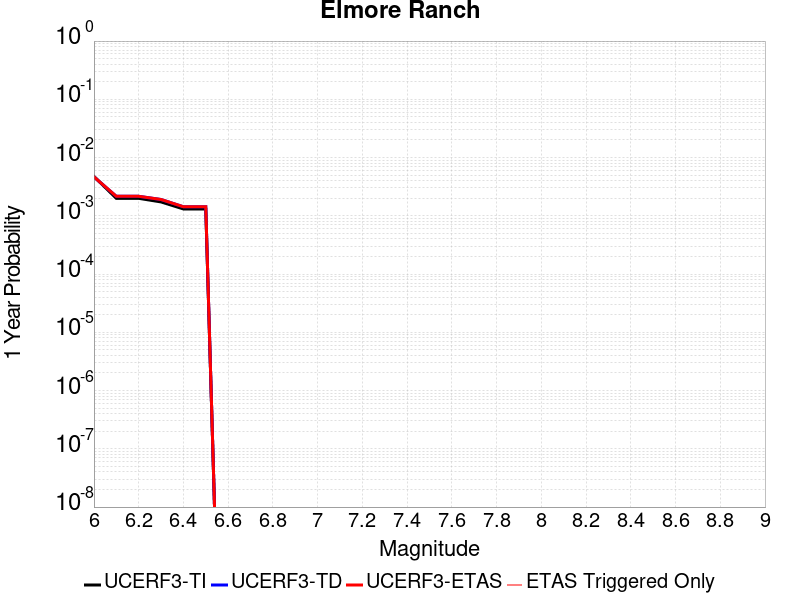 |  |

| Magnitude | 1 wk TI Prob | 1 wk TD Prob | 1 wk ETAS Prob | 1 wk ETAS/TD Gain | 1 wk ETAS Triggered Only | 1 mo TI Prob | 1 mo TD Prob | 1 mo ETAS Prob | 1 mo ETAS/TD Gain | 1 mo ETAS Triggered Only | 1 yr TI Prob | 1 yr TD Prob | 1 yr ETAS Prob | 1 yr ETAS/TD Gain | 1 yr ETAS Triggered Only | 10 yr TI Prob | 10 yr TD Prob | 10 yr ETAS Prob | 10 yr ETAS/TD Gain | 10 yr ETAS Triggered Only |
|-----|-----|-----|-----|-----|-----|-----|-----|-----|-----|-----|-----|-----|-----|-----|-----|-----|-----|-----|-----|-----|
| 6.0 | 9.102099E-5 | 8.954244E-5 | 8.954244E-5 | 1.0 | 0.0 | 3.9003167E-4 | 3.8370665E-4 | 3.8370665E-4 | 1.0 | 0.0 | 0.0047383 | 0.0046622963 | 0.0046622963 | 1.0 | 0.0 | 0.046385348 | 0.045839358 | 0.045858443 | 1.0004163 | 2.0E-5 |
| 6.1 | 3.8306698E-5 | 4.1492345E-5 | 4.1492345E-5 | 1.0 | 0.0 | 1.6416123E-4 | 1.7781628E-4 | 1.7781628E-4 | 1.0 | 0.0 | 0.0019968306 | 0.002163246 | 0.002163246 | 1.0 | 0.0 | 0.019789828 | 0.02159527 | 0.021605052 | 1.0004531 | 1.0E-5 |
| 6.2 | 3.8306698E-5 | 4.1492345E-5 | 4.1492345E-5 | 1.0 | 0.0 | 1.6416123E-4 | 1.7781628E-4 | 1.7781628E-4 | 1.0 | 0.0 | 0.0019968306 | 0.002163246 | 0.002163246 | 1.0 | 0.0 | 0.019789828 | 0.02159527 | 0.021605052 | 1.0004531 | 1.0E-5 |
| 6.3 | 3.3197924E-5 | 3.655081E-5 | 3.655081E-5 | 1.0 | 0.0 | 1.4226905E-4 | 1.566409E-4 | 1.566409E-4 | 1.0 | 0.0 | 0.0017307495 | 0.0019059941 | 0.0019059941 | 1.0 | 0.0 | 0.017173318 | 0.019057546 | 0.019067355 | 1.0005147 | 1.0E-5 |
| 6.4 | 2.5148964E-5 | 2.7420736E-5 | 2.7420736E-5 | 1.0 | 0.0 | 1.0777682E-4 | 1.17515796E-4 | 1.17515796E-4 | 1.0 | 0.0 | 0.0013113929 | 0.0014304637 | 0.0014304637 | 1.0 | 0.0 | 0.01303681 | 0.014365338 | 0.014375194 | 1.0006862 | 1.0E-5 |
| 6.5 | 2.5148964E-5 | 2.7420736E-5 | 2.7420736E-5 | 1.0 | 0.0 | 1.0777682E-4 | 1.17515796E-4 | 1.17515796E-4 | 1.0 | 0.0 | 0.0013113929 | 0.0014304637 | 0.0014304637 | 1.0 | 0.0 | 0.01303681 | 0.014365338 | 0.014375194 | 1.0006862 | 1.0E-5 |

## San Juan
*[(top)](#table-of-contents)*

| 1 Week | 1 Month | 1 Year | 10 Year |
|-----|-----|-----|-----|
|  |  |  |  |

| Magnitude | 1 wk TI Prob | 1 wk TD Prob | 1 wk ETAS Prob | 1 wk ETAS/TD Gain | 1 wk ETAS Triggered Only | 1 mo TI Prob | 1 mo TD Prob | 1 mo ETAS Prob | 1 mo ETAS/TD Gain | 1 mo ETAS Triggered Only | 1 yr TI Prob | 1 yr TD Prob | 1 yr ETAS Prob | 1 yr ETAS/TD Gain | 1 yr ETAS Triggered Only | 10 yr TI Prob | 10 yr TD Prob | 10 yr ETAS Prob | 10 yr ETAS/TD Gain | 10 yr ETAS Triggered Only |
|-----|-----|-----|-----|-----|-----|-----|-----|-----|-----|-----|-----|-----|-----|-----|-----|-----|-----|-----|-----|-----|
| 6.0 | 8.682808E-6 | 8.749572E-6 | 8.749572E-6 | 1.0 | 0.0 | 3.72115E-5 | 3.7497655E-5 | 3.7497655E-5 | 1.0 | 0.0 | 4.5295584E-4 | 4.5644314E-4 | 4.6643856E-4 | 1.0218985 | 1.0E-5 | 0.004520337 | 0.004555597 | 0.004575506 | 1.0043702 | 2.0E-5 |
| 6.1 | 8.682808E-6 | 8.749572E-6 | 8.749572E-6 | 1.0 | 0.0 | 3.72115E-5 | 3.7497655E-5 | 3.7497655E-5 | 1.0 | 0.0 | 4.5295584E-4 | 4.5644314E-4 | 4.6643856E-4 | 1.0218985 | 1.0E-5 | 0.004520337 | 0.004555597 | 0.004575506 | 1.0043702 | 2.0E-5 |
| 6.2 | 8.682808E-6 | 8.749572E-6 | 8.749572E-6 | 1.0 | 0.0 | 3.72115E-5 | 3.7497655E-5 | 3.7497655E-5 | 1.0 | 0.0 | 4.5295584E-4 | 4.5644314E-4 | 4.6643856E-4 | 1.0218985 | 1.0E-5 | 0.004520337 | 0.004555597 | 0.004575506 | 1.0043702 | 2.0E-5 |
| 6.3 | 6.3054235E-6 | 6.2829813E-6 | 6.2829813E-6 | 1.0 | 0.0 | 2.7022963E-5 | 2.6926793E-5 | 2.6926793E-5 | 1.0 | 0.0 | 3.2895492E-4 | 3.277858E-4 | 3.3778252E-4 | 1.0304977 | 1.0E-5 | 0.003284684 | 0.0032732226 | 0.003293157 | 1.0060902 | 2.0E-5 |
| 6.4 | 6.1490473E-6 | 6.114809E-6 | 6.114809E-6 | 1.0 | 0.0 | 2.6352795E-5 | 2.6206068E-5 | 2.6206068E-5 | 1.0 | 0.0 | 3.2079802E-4 | 3.1901355E-4 | 3.2901036E-4 | 1.0313367 | 1.0E-5 | 0.0032033534 | 0.0031857518 | 0.003205688 | 1.006258 | 2.0E-5 |
| 6.5 | 5.204848E-6 | 5.1375655E-6 | 5.1375655E-6 | 1.0 | 0.0 | 2.23063E-5 | 2.2017957E-5 | 2.2017957E-5 | 1.0 | 0.0 | 2.7154534E-4 | 2.6803662E-4 | 2.7803393E-4 | 1.0372983 | 1.0E-5 | 0.0027121378 | 0.0026772867 | 0.002697233 | 1.0074502 | 2.0E-5 |
| 6.6 | 4.5179986E-6 | 4.4152753E-6 | 4.4152753E-6 | 1.0 | 0.0 | 1.9362706E-5 | 1.8922474E-5 | 1.8922474E-5 | 1.0 | 0.0 | 2.3571544E-4 | 2.3035756E-4 | 2.3035756E-4 | 1.0 | 0.0 | 0.0023546559 | 0.0023013244 | 0.0023013244 | 1.0 | 0.0 |
| 6.7 | 3.9442616E-6 | 3.8200474E-6 | 3.8200474E-6 | 1.0 | 0.0 | 1.6903869E-5 | 1.6371532E-5 | 1.6371532E-5 | 1.0 | 0.0 | 2.0578515E-4 | 1.9930584E-4 | 1.9930584E-4 | 1.0 | 0.0 | 0.002055947 | 0.0019913954 | 0.0019913954 | 1.0 | 0.0 |
| 6.8 | 3.4536245E-6 | 3.3165454E-6 | 3.3165454E-6 | 1.0 | 0.0 | 1.4801163E-5 | 1.4213692E-5 | 1.4213692E-5 | 1.0 | 0.0 | 1.8018926E-4 | 1.7303857E-4 | 1.7303857E-4 | 1.0 | 0.0 | 0.0018004322 | 0.0017291567 | 0.0017291567 | 1.0 | 0.0 |
| 6.9 | 3.059865E-6 | 2.9122323E-6 | 2.9122323E-6 | 1.0 | 0.0 | 1.3113641E-5 | 1.2480939E-5 | 1.2480939E-5 | 1.0 | 0.0 | 1.596469E-4 | 1.5194541E-4 | 1.5194541E-4 | 1.0 | 0.0 | 0.0015953224 | 0.0015185294 | 0.0015185294 | 1.0 | 0.0 |
| 7.0 | 2.6504351E-6 | 2.4921894E-6 | 2.4921894E-6 | 1.0 | 0.0 | 1.1358958E-5 | 1.0680771E-5 | 1.0680771E-5 | 1.0 | 0.0 | 1.3828653E-4 | 1.3003117E-4 | 1.3003117E-4 | 1.0 | 0.0 | 0.0013820052 | 0.0012996623 | 0.0012996623 | 1.0 | 0.0 |
| 7.1 | 2.2039317E-6 | 2.0339817E-6 | 2.0339817E-6 | 1.0 | 0.0 | 9.445387E-6 | 8.717038E-6 | 8.717038E-6 | 1.0 | 0.0 | 1.1499152E-4 | 1.061253E-4 | 1.061253E-4 | 1.0 | 0.0 | 0.0011493203 | 0.0010608557 | 0.0010608557 | 1.0 | 0.0 |
| 7.2 | 1.0786707E-6 | 8.7714795E-7 | 8.7714795E-7 | 1.0 | 0.0 | 4.622866E-6 | 3.7592E-6 | 3.7592E-6 | 1.0 | 0.0 | 5.628194E-5 | 4.576731E-5 | 4.576731E-5 | 1.0 | 0.0 | 5.6267687E-4 | 4.5763733E-4 | 4.5763733E-4 | 1.0 | 0.0 |
| 7.3 | 6.846433E-7 | 4.869599E-7 | 4.869599E-7 | 1.0 | 0.0 | 2.9341822E-6 | 2.086969E-6 | 2.086969E-6 | 1.0 | 0.0 | 3.5723086E-5 | 2.5408553E-5 | 2.5408553E-5 | 1.0 | 0.0 | 3.571734E-4 | 2.5409024E-4 | 2.5409024E-4 | 1.0 | 0.0 |
| 7.4 | 5.23043E-7 | 3.26338E-7 | 3.26338E-7 | 1.0 | 0.0 | 2.2416111E-6 | 1.3985907E-6 | 1.3985907E-6 | 1.0 | 0.0 | 2.7291273E-5 | 1.7027709E-5 | 1.7027709E-5 | 1.0 | 0.0 | 2.7287923E-4 | 1.7029612E-4 | 1.7029612E-4 | 1.0 | 0.0 |
| 7.5 | 4.648444E-7 | 2.7239713E-7 | 2.7239713E-7 | 1.0 | 0.0 | 1.9921886E-6 | 1.1674158E-6 | 1.1674158E-6 | 1.0 | 0.0 | 2.4254627E-5 | 1.4213195E-5 | 1.4213195E-5 | 1.0 | 0.0 | 2.425198E-4 | 1.4215261E-4 | 1.4215261E-4 | 1.0 | 0.0 |
| 7.6 | 3.9906567E-7 | 2.2087056E-7 | 2.2087056E-7 | 1.0 | 0.0 | 1.7102802E-6 | 9.4658776E-7 | 9.4658776E-7 | 1.0 | 0.0 | 2.0822463E-5 | 1.1524646E-5 | 1.1524646E-5 | 1.0 | 0.0 | 2.0820512E-4 | 1.1526561E-4 | 1.1526561E-4 | 1.0 | 0.0 |
| 7.7 | 1.8784601E-7 | 5.3678413E-8 | 5.3678413E-8 | 1.0 | 0.0 | 8.0505407E-7 | 2.300503E-7 | 2.300503E-7 | 1.0 | 0.0 | 9.80149E-6 | 2.800859E-6 | 2.800859E-6 | 1.0 | 0.0 | 9.801057E-5 | 2.8017048E-5 | 2.8017048E-5 | 1.0 | 0.0 |
| 7.8 | 1.00154914E-7 | 1.2418047E-8 | 1.2418047E-8 | 1.0 | 0.0 | 4.2923529E-7 | 5.3220194E-8 | 5.3220194E-8 | 1.0 | 0.0 | 5.225927E-6 | 6.479557E-7 | 6.479557E-7 | 1.0 | 0.0 | 5.225804E-5 | 6.48537E-6 | 6.48537E-6 | 1.0 | 0.0 |
| 7.9 | 6.171429E-8 | 4.2973958E-9 | 4.2973958E-9 | 1.0 | 0.0 | 2.6448978E-7 | 1.8417403E-8 | 1.8417403E-8 | 1.0 | 0.0 | 3.2201583E-6 | 2.2423187E-7 | 2.2423187E-7 | 1.0 | 0.0 | 3.2201115E-5 | 2.2475485E-6 | 2.2475485E-6 | 1.0 | 0.0 |
| 8.0 | 1.3974572E-8 | 3.3787872E-10 | 3.3787872E-10 | 1.0 | 0.0 | 5.989102E-8 | 1.4480476E-9 | 1.4480476E-9 | 1.0 | 0.0 | 7.2917294E-7 | 1.7629972E-8 | 1.7629972E-8 | 1.0 | 0.0 | 7.2917055E-6 | 1.8054902E-7 | 1.8054902E-7 | 1.0 | 0.0 |
| 8.1 | 1.8403477E-9 | 1.1305712E-10 | 1.1305712E-10 | 1.0 | 0.0 | 7.887204E-9 | 4.845303E-10 | 4.845303E-10 | 1.0 | 0.0 | 9.602671E-8 | 5.8991594E-9 | 5.8991594E-9 | 1.0 | 0.0 | 9.602667E-7 | 6.018756E-8 | 6.018756E-8 | 1.0 | 0.0 |

## San Andreas (Santa Cruz Mts) 2011 CFM
*[(top)](#table-of-contents)*

| 1 Week | 1 Month | 1 Year | 10 Year |
|-----|-----|-----|-----|
|  |  |  |  |

| Magnitude | 1 wk TI Prob | 1 wk TD Prob | 1 wk ETAS Prob | 1 wk ETAS/TD Gain | 1 wk ETAS Triggered Only | 1 mo TI Prob | 1 mo TD Prob | 1 mo ETAS Prob | 1 mo ETAS/TD Gain | 1 mo ETAS Triggered Only | 1 yr TI Prob | 1 yr TD Prob | 1 yr ETAS Prob | 1 yr ETAS/TD Gain | 1 yr ETAS Triggered Only | 10 yr TI Prob | 10 yr TD Prob | 10 yr ETAS Prob | 10 yr ETAS/TD Gain | 10 yr ETAS Triggered Only |
|-----|-----|-----|-----|-----|-----|-----|-----|-----|-----|-----|-----|-----|-----|-----|-----|-----|-----|-----|-----|-----|
| 6.0 | 1.7221631E-4 | 1.3799455E-4 | 1.4799317E-4 | 1.0724566 | 1.0E-5 | 7.378611E-4 | 5.912732E-4 | 6.112614E-4 | 1.0338054 | 2.0E-5 | 0.008946515 | 0.007175434 | 0.00719529 | 1.0027673 | 2.0E-5 | 0.08594794 | 0.0705909 | 0.07060949 | 1.0002633 | 2.0E-5 |
| 6.1 | 1.7221631E-4 | 1.3799455E-4 | 1.4799317E-4 | 1.0724566 | 1.0E-5 | 7.378611E-4 | 5.912732E-4 | 6.112614E-4 | 1.0338054 | 2.0E-5 | 0.008946515 | 0.007175434 | 0.00719529 | 1.0027673 | 2.0E-5 | 0.08594794 | 0.0705909 | 0.07060949 | 1.0002633 | 2.0E-5 |
| 6.2 | 1.7221631E-4 | 1.3799455E-4 | 1.4799317E-4 | 1.0724566 | 1.0E-5 | 7.378611E-4 | 5.912732E-4 | 6.112614E-4 | 1.0338054 | 2.0E-5 | 0.008946515 | 0.007175434 | 0.00719529 | 1.0027673 | 2.0E-5 | 0.08594794 | 0.0705909 | 0.07060949 | 1.0002633 | 2.0E-5 |
| 6.3 | 1.716926E-4 | 1.3718852E-4 | 1.4718715E-4 | 1.0728824 | 1.0E-5 | 7.3561794E-4 | 5.8782037E-4 | 6.078086E-4 | 1.034004 | 2.0E-5 | 0.008919428 | 0.0071336706 | 0.0071535283 | 1.0027837 | 2.0E-5 | 0.08569809 | 0.07020574 | 0.07022434 | 1.0002649 | 2.0E-5 |
| 6.4 | 1.6392978E-4 | 1.3594677E-4 | 1.4594542E-4 | 1.0735482 | 1.0E-5 | 7.02367E-4 | 5.82501E-4 | 6.0248934E-4 | 1.0343148 | 2.0E-5 | 0.008517839 | 0.007069328 | 0.0070891865 | 1.0028092 | 2.0E-5 | 0.08198654 | 0.06943973 | 0.06945834 | 1.000268 | 2.0E-5 |
| 6.5 | 1.5742714E-4 | 1.2654555E-4 | 1.3654427E-4 | 1.079013 | 1.0E-5 | 6.745133E-4 | 5.4222706E-4 | 5.622162E-4 | 1.0368649 | 2.0E-5 | 0.00818132 | 0.0065820105 | 0.006601879 | 1.0030186 | 2.0E-5 | 0.078865945 | 0.06490567 | 0.064924374 | 1.0002881 | 2.0E-5 |
| 6.6 | 1.3038084E-4 | 1.1594578E-4 | 1.2594463E-4 | 1.0862372 | 1.0E-5 | 5.5865536E-4 | 4.9681717E-4 | 5.168072E-4 | 1.0402362 | 2.0E-5 | 0.006780438 | 0.006032269 | 0.0060521485 | 1.0032955 | 2.0E-5 | 0.0657725 | 0.05936088 | 0.059379693 | 1.000317 | 2.0E-5 |
| 6.7 | 1.2867592E-4 | 1.1321072E-4 | 1.2320958E-4 | 1.0883209 | 1.0E-5 | 5.5135164E-4 | 4.8509985E-4 | 5.0509017E-4 | 1.0412086 | 2.0E-5 | 0.0066920654 | 0.0058903894 | 0.005910272 | 1.0033754 | 2.0E-5 | 0.06494093 | 0.0580718 | 0.05809064 | 1.0003244 | 2.0E-5 |
| 6.8 | 1.2801298E-4 | 1.12586225E-4 | 1.225851E-4 | 1.0888108 | 1.0E-5 | 5.485117E-4 | 4.8242445E-4 | 5.024148E-4 | 1.0414373 | 2.0E-5 | 0.0066577005 | 0.005857939 | 0.0058778217 | 1.0033941 | 2.0E-5 | 0.06461738 | 0.05778563 | 0.057804476 | 1.0003262 | 2.0E-5 |
| 6.9 | 1.269149E-4 | 1.1100813E-4 | 1.2100702E-4 | 1.0900735 | 1.0E-5 | 5.4380763E-4 | 4.7566366E-4 | 4.956541E-4 | 1.0420265 | 2.0E-5 | 0.006600777 | 0.0057760654 | 0.0057959496 | 1.0034425 | 2.0E-5 | 0.06408122 | 0.05705746 | 0.057076316 | 1.0003306 | 2.0E-5 |
| 7.0 | 1.2030331E-4 | 1.0830798E-4 | 1.1830689E-4 | 1.0923193 | 1.0E-5 | 5.154837E-4 | 4.6409573E-4 | 4.8408643E-4 | 1.0430746 | 2.0E-5 | 0.006257969 | 0.0056359624 | 0.00565585 | 1.0035286 | 2.0E-5 | 0.06084648 | 0.055730198 | 0.05574908 | 1.0003389 | 2.0E-5 |
| 7.1 | 8.049617E-5 | 5.3974167E-5 | 6.3973624E-5 | 1.1852639 | 1.0E-5 | 3.4493793E-4 | 2.3129754E-4 | 2.5129292E-4 | 1.0864487 | 2.0E-5 | 0.0041915346 | 0.0028124459 | 0.0028323897 | 1.0070913 | 2.0E-5 | 0.041133516 | 0.02964185 | 0.029661257 | 1.0006547 | 2.0E-5 |
| 7.2 | 7.093979E-5 | 4.2981093E-5 | 5.2980664E-5 | 1.2326504 | 1.0E-5 | 3.0399222E-4 | 1.8419181E-4 | 2.0418812E-4 | 1.1085625 | 2.0E-5 | 0.0036948253 | 0.0022402517 | 0.002260207 | 1.0089076 | 2.0E-5 | 0.03633994 | 0.023962723 | 0.023982244 | 1.0008147 | 2.0E-5 |
| 7.3 | 6.193693E-5 | 2.892363E-5 | 3.8923343E-5 | 1.345728 | 1.0E-5 | 2.6541698E-4 | 1.2395254E-4 | 1.4395006E-4 | 1.1613321 | 2.0E-5 | 0.0032266637 | 0.0015080792 | 0.001528049 | 1.0132419 | 2.0E-5 | 0.031802133 | 0.016514132 | 0.016533801 | 1.0011911 | 2.0E-5 |
| 7.4 | 5.906492E-5 | 2.704955E-5 | 3.7049278E-5 | 1.369682 | 1.0E-5 | 2.5311083E-4 | 1.15921495E-4 | 1.3591918E-4 | 1.1725105 | 2.0E-5 | 0.0030772698 | 0.0014104319 | 0.0014304037 | 1.01416 | 2.0E-5 | 0.030350044 | 0.015484477 | 0.015504167 | 1.0012716 | 2.0E-5 |
| 7.5 | 5.424296E-5 | 2.4700184E-5 | 3.4699937E-5 | 1.4048452 | 1.0E-5 | 2.324491E-4 | 1.0585365E-4 | 1.2585153E-4 | 1.1889201 | 2.0E-5 | 0.002826395 | 0.0012880075 | 0.0013079817 | 1.0155078 | 2.0E-5 | 0.027907165 | 0.01417464 | 0.014194357 | 1.0013909 | 2.0E-5 |
| 7.6 | 4.43084E-5 | 1.9918234E-5 | 2.9918034E-5 | 1.5020425 | 1.0E-5 | 1.8987931E-4 | 8.536106E-5 | 1.0535936E-4 | 1.2342789 | 2.0E-5 | 0.0023093296 | 0.0010387758 | 0.001058755 | 1.0192335 | 2.0E-5 | 0.022854783 | 0.011420152 | 0.011439924 | 1.0017313 | 2.0E-5 |
| 7.7 | 4.118098E-5 | 1.8949535E-5 | 2.8949346E-5 | 1.5277075 | 1.0E-5 | 1.7647797E-4 | 8.1209764E-5 | 1.01208134E-4 | 1.2462558 | 2.0E-5 | 0.002146502 | 9.882806E-4 | 0.0010082609 | 1.0202172 | 2.0E-5 | 0.021258866 | 0.0108775245 | 0.010897307 | 1.0018187 | 2.0E-5 |
| 7.8 | 3.5408906E-5 | 1.85772E-5 | 2.8577015E-5 | 1.5382842 | 1.0E-5 | 1.5174363E-4 | 7.961415E-5 | 9.961255E-5 | 1.2511916 | 2.0E-5 | 0.0018459131 | 9.688714E-4 | 9.88852E-4 | 1.0206226 | 2.0E-5 | 0.018306552 | 0.010658879 | 0.010678666 | 1.0018563 | 2.0E-5 |
| 7.9 | 2.5860836E-5 | 1.7327653E-5 | 2.732748E-5 | 1.5771022 | 1.0E-5 | 1.10827445E-4 | 7.425925E-5 | 9.425777E-5 | 1.2693067 | 2.0E-5 | 0.001348489 | 9.037317E-4 | 9.237136E-4 | 1.0221105 | 2.0E-5 | 0.013403354 | 0.00991376 | 0.009933562 | 1.0019974 | 2.0E-5 |
| 8.0 | 1.9777332E-5 | 1.4849638E-5 | 2.484949E-5 | 1.6734071 | 1.0E-5 | 8.4757245E-5 | 6.363975E-5 | 8.3638486E-5 | 1.3142489 | 2.0E-5 | 0.0010314309 | 7.745388E-4 | 7.945233E-4 | 1.0258018 | 2.0E-5 | 0.010266567 | 0.008514252 | 0.008534081 | 1.002329 | 2.0E-5 |
| 8.1 | 1.468494E-5 | 1.21155035E-5 | 2.2115382E-5 | 1.8253788 | 1.0E-5 | 6.293394E-5 | 5.1922554E-5 | 6.192204E-5 | 1.1925845 | 1.0E-5 | 7.6595135E-4 | 6.319739E-4 | 6.419676E-4 | 1.0158135 | 1.0E-5 | 0.0076331664 | 0.00697351 | 0.0069834404 | 1.001424 | 1.0E-5 |
| 8.2 | 8.63836E-6 | 5.472861E-6 | 5.472861E-6 | 1.0 | 0.0 | 3.7021015E-5 | 2.3454908E-5 | 2.3454908E-5 | 1.0 | 0.0 | 4.5063766E-4 | 2.8552618E-4 | 2.8552618E-4 | 1.0 | 0.0 | 0.004497249 | 0.0032478282 | 0.0032478282 | 1.0 | 0.0 |
| 8.3 | 1.983087E-6 | 7.6647797E-7 | 7.6647797E-7 | 1.0 | 0.0 | 8.498917E-6 | 3.2849016E-6 | 3.2849016E-6 | 1.0 | 0.0 | 1.034694E-4 | 3.999296E-5 | 3.999296E-5 | 1.0 | 0.0 | 0.0010342124 | 4.7228087E-4 | 4.7228087E-4 | 1.0 | 0.0 |

## Great Valley 05 Pittsburg - Kirby Hills alt1
*[(top)](#table-of-contents)*

| 1 Week | 1 Month | 1 Year | 10 Year |
|-----|-----|-----|-----|
|  |  |  |  |

| Magnitude | 1 wk TI Prob | 1 wk TD Prob | 1 wk ETAS Prob | 1 wk ETAS/TD Gain | 1 wk ETAS Triggered Only | 1 mo TI Prob | 1 mo TD Prob | 1 mo ETAS Prob | 1 mo ETAS/TD Gain | 1 mo ETAS Triggered Only | 1 yr TI Prob | 1 yr TD Prob | 1 yr ETAS Prob | 1 yr ETAS/TD Gain | 1 yr ETAS Triggered Only | 10 yr TI Prob | 10 yr TD Prob | 10 yr ETAS Prob | 10 yr ETAS/TD Gain | 10 yr ETAS Triggered Only |
|-----|-----|-----|-----|-----|-----|-----|-----|-----|-----|-----|-----|-----|-----|-----|-----|-----|-----|-----|-----|-----|
| 6.0 | 4.187212E-5 | 5.3444855E-5 | 5.3444855E-5 | 1.0 | 0.0 | 1.794396E-4 | 2.2903502E-4 | 2.2903502E-4 | 1.0 | 0.0 | 0.002182488 | 0.0027858997 | 0.0027958718 | 1.0035795 | 1.0E-5 | 0.021611776 | 0.027604194 | 0.027623642 | 1.0007045 | 2.0E-5 |
| 6.1 | 4.187212E-5 | 5.3444855E-5 | 5.3444855E-5 | 1.0 | 0.0 | 1.794396E-4 | 2.2903502E-4 | 2.2903502E-4 | 1.0 | 0.0 | 0.002182488 | 0.0027858997 | 0.0027958718 | 1.0035795 | 1.0E-5 | 0.021611776 | 0.027604194 | 0.027623642 | 1.0007045 | 2.0E-5 |
| 6.2 | 1.7353306E-5 | 2.2155487E-5 | 2.2155487E-5 | 1.0 | 0.0 | 7.436919E-5 | 9.495095E-5 | 9.495095E-5 | 1.0 | 0.0 | 9.050688E-4 | 0.0011557989 | 0.0011557989 | 1.0 | 0.0 | 0.009013915 | 0.011535612 | 0.011545497 | 1.0008569 | 1.0E-5 |
| 6.3 | 1.7353306E-5 | 2.2155487E-5 | 2.2155487E-5 | 1.0 | 0.0 | 7.436919E-5 | 9.495095E-5 | 9.495095E-5 | 1.0 | 0.0 | 9.050688E-4 | 0.0011557989 | 0.0011557989 | 1.0 | 0.0 | 0.009013915 | 0.011535612 | 0.011545497 | 1.0008569 | 1.0E-5 |
| 6.4 | 1.4028824E-5 | 1.7901719E-5 | 1.7901719E-5 | 1.0 | 0.0 | 6.0122147E-5 | 7.672165E-5 | 7.672165E-5 | 1.0 | 0.0 | 7.3174125E-4 | 9.340638E-4 | 9.340638E-4 | 1.0 | 0.0 | 0.0072933645 | 0.009338545 | 0.009348451 | 1.0010608 | 1.0E-5 |

## Eaton Roughs 2011 CFM
*[(top)](#table-of-contents)*

| 1 Week | 1 Month | 1 Year | 10 Year |
|-----|-----|-----|-----|
|  |  |  |  |

| Magnitude | 1 wk TI Prob | 1 wk TD Prob | 1 wk ETAS Prob | 1 wk ETAS/TD Gain | 1 wk ETAS Triggered Only | 1 mo TI Prob | 1 mo TD Prob | 1 mo ETAS Prob | 1 mo ETAS/TD Gain | 1 mo ETAS Triggered Only | 1 yr TI Prob | 1 yr TD Prob | 1 yr ETAS Prob | 1 yr ETAS/TD Gain | 1 yr ETAS Triggered Only | 10 yr TI Prob | 10 yr TD Prob | 10 yr ETAS Prob | 10 yr ETAS/TD Gain | 10 yr ETAS Triggered Only |
|-----|-----|-----|-----|-----|-----|-----|-----|-----|-----|-----|-----|-----|-----|-----|-----|-----|-----|-----|-----|-----|
| 6.0 | 6.8044945E-5 | 8.8438355E-5 | 9.8437464E-5 | 1.1130631 | 1.0E-5 | 2.9158857E-4 | 3.78971E-4 | 3.989634E-4 | 1.0527545 | 2.0E-5 | 0.0035443127 | 0.0046048546 | 0.0046247626 | 1.0043232 | 2.0E-5 | 0.03488314 | 0.045165323 | 0.04518442 | 1.0004228 | 2.0E-5 |
| 6.1 | 6.8044945E-5 | 8.8438355E-5 | 9.8437464E-5 | 1.1130631 | 1.0E-5 | 2.9158857E-4 | 3.78971E-4 | 3.989634E-4 | 1.0527545 | 2.0E-5 | 0.0035443127 | 0.0046048546 | 0.0046247626 | 1.0043232 | 2.0E-5 | 0.03488314 | 0.045165323 | 0.04518442 | 1.0004228 | 2.0E-5 |
| 6.2 | 6.8044945E-5 | 8.8438355E-5 | 9.8437464E-5 | 1.1130631 | 1.0E-5 | 2.9158857E-4 | 3.78971E-4 | 3.989634E-4 | 1.0527545 | 2.0E-5 | 0.0035443127 | 0.0046048546 | 0.0046247626 | 1.0043232 | 2.0E-5 | 0.03488314 | 0.045165323 | 0.04518442 | 1.0004228 | 2.0E-5 |
| 6.3 | 6.8044945E-5 | 8.8438355E-5 | 9.8437464E-5 | 1.1130631 | 1.0E-5 | 2.9158857E-4 | 3.78971E-4 | 3.989634E-4 | 1.0527545 | 2.0E-5 | 0.0035443127 | 0.0046048546 | 0.0046247626 | 1.0043232 | 2.0E-5 | 0.03488314 | 0.045165323 | 0.04518442 | 1.0004228 | 2.0E-5 |
| 6.4 | 4.5830013E-5 | 5.7157253E-5 | 5.7157253E-5 | 1.0 | 0.0 | 1.9639956E-4 | 2.449397E-4 | 2.449397E-4 | 1.0 | 0.0 | 0.0023885423 | 0.0029784369 | 0.0029784369 | 1.0 | 0.0 | 0.023630321 | 0.029422875 | 0.029422875 | 1.0 | 0.0 |
| 6.5 | 4.5830013E-5 | 5.7157253E-5 | 5.7157253E-5 | 1.0 | 0.0 | 1.9639956E-4 | 2.449397E-4 | 2.449397E-4 | 1.0 | 0.0 | 0.0023885423 | 0.0029784369 | 0.0029784369 | 1.0 | 0.0 | 0.023630321 | 0.029422875 | 0.029422875 | 1.0 | 0.0 |
| 6.6 | 3.222194E-5 | 3.8263923E-5 | 3.8263923E-5 | 1.0 | 0.0 | 1.3808672E-4 | 1.6397858E-4 | 1.6397858E-4 | 1.0 | 0.0 | 0.0016799092 | 0.0019946976 | 0.0019946976 | 1.0 | 0.0 | 0.016672665 | 0.019777248 | 0.019777248 | 1.0 | 0.0 |
| 6.7 | 2.4155654E-5 | 2.7786813E-5 | 2.7786813E-5 | 1.0 | 0.0 | 1.0352012E-4 | 1.19080956E-4 | 1.19080956E-4 | 1.0 | 0.0 | 0.0012596287 | 0.0014488546 | 0.0014488546 | 1.0 | 0.0 | 0.012525126 | 0.01439528 | 0.01439528 | 1.0 | 0.0 |
| 6.8 | 2.1814667E-5 | 2.4941362E-5 | 2.4941362E-5 | 1.0 | 0.0 | 9.348808E-5 | 1.0688719E-4 | 1.0688719E-4 | 1.0 | 0.0 | 0.001137623 | 0.0013005785 | 0.0013005785 | 1.0 | 0.0 | 0.011318169 | 0.012930335 | 0.012930335 | 1.0 | 0.0 |
| 6.9 | 2.0700467E-5 | 2.3629396E-5 | 2.3629396E-5 | 1.0 | 0.0 | 8.871327E-5 | 1.0126493E-4 | 1.0126493E-4 | 1.0 | 0.0 | 0.0010795488 | 0.0012322064 | 0.0012322064 | 1.0 | 0.0 | 0.010743194 | 0.0122543145 | 0.0122543145 | 1.0 | 0.0 |
| 7.0 | 2.0104066E-5 | 2.2936947E-5 | 2.2936947E-5 | 1.0 | 0.0 | 8.615744E-5 | 9.829752E-5 | 9.829752E-5 | 1.0 | 0.0 | 0.0010484619 | 0.0011961183 | 0.0011961183 | 1.0 | 0.0 | 0.010435291 | 0.011897345 | 0.011897345 | 1.0 | 0.0 |
| 7.1 | 1.8225232E-5 | 2.077345E-5 | 2.077345E-5 | 1.0 | 0.0 | 7.81058E-5 | 8.902604E-5 | 8.902604E-5 | 1.0 | 0.0 | 9.5052324E-4 | 0.0010833547 | 0.0010833547 | 1.0 | 0.0 | 0.009464677 | 0.010781075 | 0.010781075 | 1.0 | 0.0 |
| 7.2 | 1.7526572E-5 | 1.999388E-5 | 1.999388E-5 | 1.0 | 0.0 | 7.511172E-5 | 8.568525E-5 | 8.568525E-5 | 1.0 | 0.0 | 9.141015E-4 | 0.0010427202 | 0.0010427202 | 1.0 | 0.0 | 0.009103506 | 0.0103785945 | 0.0103785945 | 1.0 | 0.0 |
| 7.3 | 1.5727232E-5 | 1.8021872E-5 | 1.8021872E-5 | 1.0 | 0.0 | 6.740067E-5 | 7.723432E-5 | 7.723432E-5 | 1.0 | 0.0 | 8.2029426E-4 | 9.399234E-4 | 9.399234E-4 | 1.0 | 0.0 | 0.008172729 | 0.009359742 | 0.009359742 | 1.0 | 0.0 |
| 7.4 | 1.4457361E-5 | 1.6598702E-5 | 1.6598702E-5 | 1.0 | 0.0 | 6.195865E-5 | 7.113536E-5 | 7.113536E-5 | 1.0 | 0.0 | 7.540854E-4 | 8.6572976E-4 | 8.6572976E-4 | 1.0 | 0.0 | 0.007515317 | 0.008623774 | 0.008623774 | 1.0 | 0.0 |
| 7.5 | 1.33280955E-5 | 1.5345759E-5 | 1.5345759E-5 | 1.0 | 0.0 | 5.711916E-5 | 6.576588E-5 | 6.576588E-5 | 1.0 | 0.0 | 6.9520384E-4 | 8.004063E-4 | 8.004063E-4 | 1.0 | 0.0 | 0.00693033 | 0.007975417 | 0.007975417 | 1.0 | 0.0 |
| 7.6 | 1.0699478E-5 | 1.2388088E-5 | 1.2388088E-5 | 1.0 | 0.0 | 4.5854096E-5 | 5.309073E-5 | 5.309073E-5 | 1.0 | 0.0 | 5.581306E-4 | 6.461885E-4 | 6.461885E-4 | 1.0 | 0.0 | 0.005567309 | 0.006443218 | 0.006443218 | 1.0 | 0.0 |
| 7.7 | 5.9390236E-6 | 6.8531053E-6 | 6.8531053E-6 | 1.0 | 0.0 | 2.545271E-5 | 2.9370123E-5 | 2.9370123E-5 | 1.0 | 0.0 | 3.0984267E-4 | 3.5752283E-4 | 3.5752283E-4 | 1.0 | 0.0 | 0.0030941102 | 0.0035695168 | 0.0035695168 | 1.0 | 0.0 |
| 7.8 | 2.1622036E-6 | 2.3297252E-6 | 2.3297252E-6 | 1.0 | 0.0 | 9.266554E-6 | 9.984499E-6 | 9.984499E-6 | 1.0 | 0.0 | 1.1281446E-4 | 1.2155456E-4 | 1.2155456E-4 | 1.0 | 0.0 | 0.001127572 | 0.0012148811 | 0.0012148811 | 1.0 | 0.0 |
| 7.9 | 4.9586197E-7 | 5.2189574E-7 | 5.2189574E-7 | 1.0 | 0.0 | 2.125121E-6 | 2.2366944E-6 | 2.2366944E-6 | 1.0 | 0.0 | 2.5873042E-5 | 2.7231436E-5 | 2.7231436E-5 | 1.0 | 0.0 | 2.5870028E-4 | 2.7228307E-4 | 2.7228307E-4 | 1.0 | 0.0 |

## Jess Valley
*[(top)](#table-of-contents)*

| 1 Week | 1 Month | 1 Year | 10 Year |
|-----|-----|-----|-----|
|  |  |  |  |

| Magnitude | 1 wk TI Prob | 1 wk TD Prob | 1 wk ETAS Prob | 1 wk ETAS/TD Gain | 1 wk ETAS Triggered Only | 1 mo TI Prob | 1 mo TD Prob | 1 mo ETAS Prob | 1 mo ETAS/TD Gain | 1 mo ETAS Triggered Only | 1 yr TI Prob | 1 yr TD Prob | 1 yr ETAS Prob | 1 yr ETAS/TD Gain | 1 yr ETAS Triggered Only | 10 yr TI Prob | 10 yr TD Prob | 10 yr ETAS Prob | 10 yr ETAS/TD Gain | 10 yr ETAS Triggered Only |
|-----|-----|-----|-----|-----|-----|-----|-----|-----|-----|-----|-----|-----|-----|-----|-----|-----|-----|-----|-----|-----|
| 6.0 | 3.3861274E-6 | 3.4340655E-6 | 3.4340655E-6 | 1.0 | 0.0 | 1.4511894E-5 | 1.4717357E-5 | 1.4717357E-5 | 1.0 | 0.0 | 1.7666799E-4 | 1.7917191E-4 | 1.8917011E-4 | 1.0558023 | 1.0E-5 | 0.001765276 | 0.001790551 | 0.0018105152 | 1.0111498 | 2.0E-5 |
| 6.1 | 3.3861274E-6 | 3.4340655E-6 | 3.4340655E-6 | 1.0 | 0.0 | 1.4511894E-5 | 1.4717357E-5 | 1.4717357E-5 | 1.0 | 0.0 | 1.7666799E-4 | 1.7917191E-4 | 1.8917011E-4 | 1.0558023 | 1.0E-5 | 0.001765276 | 0.001790551 | 0.0018105152 | 1.0111498 | 2.0E-5 |
| 6.2 | 3.3861274E-6 | 3.4340655E-6 | 3.4340655E-6 | 1.0 | 0.0 | 1.4511894E-5 | 1.4717357E-5 | 1.4717357E-5 | 1.0 | 0.0 | 1.7666799E-4 | 1.7917191E-4 | 1.8917011E-4 | 1.0558023 | 1.0E-5 | 0.001765276 | 0.001790551 | 0.0018105152 | 1.0111498 | 2.0E-5 |
| 6.3 | 3.3861274E-6 | 3.4340655E-6 | 3.4340655E-6 | 1.0 | 0.0 | 1.4511894E-5 | 1.4717357E-5 | 1.4717357E-5 | 1.0 | 0.0 | 1.7666799E-4 | 1.7917191E-4 | 1.8917011E-4 | 1.0558023 | 1.0E-5 | 0.001765276 | 0.001790551 | 0.0018105152 | 1.0111498 | 2.0E-5 |
| 6.4 | 1.5291708E-6 | 1.5502812E-6 | 1.5502812E-6 | 1.0 | 0.0 | 6.553573E-6 | 6.6440502E-6 | 6.6440502E-6 | 1.0 | 0.0 | 7.978683E-5 | 8.0889105E-5 | 8.0889105E-5 | 1.0 | 0.0 | 7.975819E-4 | 8.0867484E-4 | 8.0867484E-4 | 1.0 | 0.0 |
| 6.5 | 1.5291708E-6 | 1.5502812E-6 | 1.5502812E-6 | 1.0 | 0.0 | 6.553573E-6 | 6.6440502E-6 | 6.6440502E-6 | 1.0 | 0.0 | 7.978683E-5 | 8.0889105E-5 | 8.0889105E-5 | 1.0 | 0.0 | 7.975819E-4 | 8.0867484E-4 | 8.0867484E-4 | 1.0 | 0.0 |
| 6.6 | 5.396423E-7 | 5.4720056E-7 | 5.4720056E-7 | 1.0 | 0.0 | 2.312751E-6 | 2.3451441E-6 | 2.3451441E-6 | 1.0 | 0.0 | 2.8157378E-5 | 2.8551944E-5 | 2.8551944E-5 | 1.0 | 0.0 | 2.8153812E-4 | 2.8550118E-4 | 2.8550118E-4 | 1.0 | 0.0 |
| 6.7 | 5.396423E-7 | 5.4720056E-7 | 5.4720056E-7 | 1.0 | 0.0 | 2.312751E-6 | 2.3451441E-6 | 2.3451441E-6 | 1.0 | 0.0 | 2.8157378E-5 | 2.8551944E-5 | 2.8551944E-5 | 1.0 | 0.0 | 2.8153812E-4 | 2.8550118E-4 | 2.8550118E-4 | 1.0 | 0.0 |
| 6.8 | 3.6058395E-7 | 3.6563134E-7 | 3.6563134E-7 | 1.0 | 0.0 | 1.5453588E-6 | 1.5669915E-6 | 1.5669915E-6 | 1.0 | 0.0 | 1.8814582E-5 | 1.9078121E-5 | 1.9078121E-5 | 1.0 | 0.0 | 1.8812988E-4 | 1.9078121E-4 | 1.9078121E-4 | 1.0 | 0.0 |

## San Pedro Basin
*[(top)](#table-of-contents)*

| 1 Week | 1 Month | 1 Year | 10 Year |
|-----|-----|-----|-----|
|  |  |  |  |

| Magnitude | 1 wk TI Prob | 1 wk TD Prob | 1 wk ETAS Prob | 1 wk ETAS/TD Gain | 1 wk ETAS Triggered Only | 1 mo TI Prob | 1 mo TD Prob | 1 mo ETAS Prob | 1 mo ETAS/TD Gain | 1 mo ETAS Triggered Only | 1 yr TI Prob | 1 yr TD Prob | 1 yr ETAS Prob | 1 yr ETAS/TD Gain | 1 yr ETAS Triggered Only | 10 yr TI Prob | 10 yr TD Prob | 10 yr ETAS Prob | 10 yr ETAS/TD Gain | 10 yr ETAS Triggered Only |
|-----|-----|-----|-----|-----|-----|-----|-----|-----|-----|-----|-----|-----|-----|-----|-----|-----|-----|-----|-----|-----|
| 6.0 | 5.3449043E-5 | 6.3371765E-5 | 7.3371135E-5 | 1.157789 | 1.0E-5 | 2.2904722E-4 | 2.7156848E-4 | 2.8156576E-4 | 1.0368131 | 1.0E-5 | 0.0027850836 | 0.0033019334 | 0.0033119004 | 1.0030185 | 1.0E-5 | 0.027504366 | 0.03259028 | 0.03260963 | 1.0005937 | 2.0E-5 |
| 6.1 | 5.3449043E-5 | 6.3371765E-5 | 7.3371135E-5 | 1.157789 | 1.0E-5 | 2.2904722E-4 | 2.7156848E-4 | 2.8156576E-4 | 1.0368131 | 1.0E-5 | 0.0027850836 | 0.0033019334 | 0.0033119004 | 1.0030185 | 1.0E-5 | 0.027504366 | 0.03259028 | 0.03260963 | 1.0005937 | 2.0E-5 |
| 6.2 | 2.3189454E-5 | 2.6643364E-5 | 2.6643364E-5 | 1.0 | 0.0 | 9.9379584E-5 | 1.1418111E-4 | 1.1418111E-4 | 1.0 | 0.0 | 0.0012092749 | 0.0013893156 | 0.0013893156 | 1.0 | 0.0 | 0.012027155 | 0.013811166 | 0.013811166 | 1.0 | 0.0 |
| 6.3 | 2.3189454E-5 | 2.6643364E-5 | 2.6643364E-5 | 1.0 | 0.0 | 9.9379584E-5 | 1.1418111E-4 | 1.1418111E-4 | 1.0 | 0.0 | 0.0012092749 | 0.0013893156 | 0.0013893156 | 1.0 | 0.0 | 0.012027155 | 0.013811166 | 0.013811166 | 1.0 | 0.0 |
| 6.4 | 1.966056E-5 | 2.2463855E-5 | 2.2463855E-5 | 1.0 | 0.0 | 8.425682E-5 | 9.627034E-5 | 9.627034E-5 | 1.0 | 0.0 | 0.001025344 | 0.0011715014 | 0.0011715014 | 1.0 | 0.0 | 0.010206259 | 0.011657343 | 0.011657343 | 1.0 | 0.0 |
| 6.5 | 1.7342953E-5 | 1.9745525E-5 | 1.9745525E-5 | 1.0 | 0.0 | 7.4324824E-5 | 8.462114E-5 | 8.462114E-5 | 1.0 | 0.0 | 9.04529E-4 | 0.0010298124 | 0.0010298124 | 1.0 | 0.0 | 0.009008561 | 0.010254125 | 0.010254125 | 1.0 | 0.0 |
| 6.6 | 1.439804E-5 | 1.6323016E-5 | 1.6323016E-5 | 1.0 | 0.0 | 6.170443E-5 | 6.995408E-5 | 6.995408E-5 | 1.0 | 0.0 | 7.509924E-4 | 8.513903E-4 | 8.513903E-4 | 1.0 | 0.0 | 0.0074845953 | 0.008484487 | 0.008484487 | 1.0 | 0.0 |
| 6.7 | 1.2634884E-5 | 1.4285555E-5 | 1.4285555E-5 | 1.0 | 0.0 | 5.414838E-5 | 6.122254E-5 | 6.122254E-5 | 1.0 | 0.0 | 6.590571E-4 | 7.4516E-4 | 7.4516E-4 | 1.0 | 0.0 | 0.006571059 | 0.0074296347 | 0.0074296347 | 1.0 | 0.0 |
| 6.8 | 1.146091E-5 | 1.2933422E-5 | 1.2933422E-5 | 1.0 | 0.0 | 4.911726E-5 | 5.5427943E-5 | 5.5427943E-5 | 1.0 | 0.0 | 5.9783855E-4 | 6.74656E-4 | 6.74656E-4 | 1.0 | 0.0 | 0.0059623276 | 0.006729019 | 0.006729019 | 1.0 | 0.0 |
| 6.9 | 9.109035E-6 | 1.023519E-5 | 1.023519E-5 | 1.0 | 0.0 | 3.9038136E-5 | 4.386452E-5 | 4.386452E-5 | 1.0 | 0.0 | 4.7518566E-4 | 5.339476E-4 | 5.339476E-4 | 1.0 | 0.0 | 0.0047417083 | 0.005329401 | 0.005329401 | 1.0 | 0.0 |
| 7.0 | 5.9351028E-6 | 6.584069E-6 | 6.584069E-6 | 1.0 | 0.0 | 2.5435906E-5 | 2.8217266E-5 | 2.8217266E-5 | 1.0 | 0.0 | 3.0963816E-4 | 3.4351466E-4 | 3.4351466E-4 | 1.0 | 0.0 | 0.0030920706 | 0.0034321537 | 0.0034321537 | 1.0 | 0.0 |
| 7.1 | 2.1557585E-6 | 2.2096617E-6 | 2.2096617E-6 | 1.0 | 0.0 | 9.238933E-6 | 9.469944E-6 | 9.469944E-6 | 1.0 | 0.0 | 1.1247819E-4 | 1.1529063E-4 | 1.1529063E-4 | 1.0 | 0.0 | 0.0011242128 | 0.0011523236 | 0.0011523236 | 1.0 | 0.0 |
| 7.2 | 2.1251979E-6 | 2.1780077E-6 | 2.1780077E-6 | 1.0 | 0.0 | 9.107958E-6 | 9.334286E-6 | 9.334286E-6 | 1.0 | 0.0 | 1.1088375E-4 | 1.13639166E-4 | 1.13639166E-4 | 1.0 | 0.0 | 0.0011082845 | 0.0011358259 | 0.0011358259 | 1.0 | 0.0 |
| 7.3 | 1.7145798E-6 | 1.7442975E-6 | 1.7442975E-6 | 1.0 | 0.0 | 7.3481783E-6 | 7.47554E-6 | 7.47554E-6 | 1.0 | 0.0 | 8.94604E-5 | 9.101099E-5 | 9.101099E-5 | 1.0 | 0.0 | 8.9424395E-4 | 9.097463E-4 | 9.097463E-4 | 1.0 | 0.0 |
| 7.4 | 1.4467993E-6 | 1.4641951E-6 | 1.4641951E-6 | 1.0 | 0.0 | 6.200554E-6 | 6.2751074E-6 | 6.2751074E-6 | 1.0 | 0.0 | 7.548913E-5 | 7.639683E-5 | 7.639683E-5 | 1.0 | 0.0 | 7.546349E-4 | 7.637129E-4 | 7.637129E-4 | 1.0 | 0.0 |
| 7.5 | 1.2803735E-6 | 1.293157E-6 | 1.293157E-6 | 1.0 | 0.0 | 5.487303E-6 | 5.54209E-6 | 5.54209E-6 | 1.0 | 0.0 | 6.680587E-5 | 6.747293E-5 | 6.747293E-5 | 1.0 | 0.0 | 6.678579E-4 | 6.745315E-4 | 6.745315E-4 | 1.0 | 0.0 |
| 7.6 | 6.755009E-7 | 6.769505E-7 | 6.769505E-7 | 1.0 | 0.0 | 2.8950008E-6 | 2.9012133E-6 | 2.9012133E-6 | 1.0 | 0.0 | 3.5246063E-5 | 3.532176E-5 | 3.532176E-5 | 1.0 | 0.0 | 3.5240475E-4 | 3.5316718E-4 | 3.5316718E-4 | 1.0 | 0.0 |
| 7.7 | 6.211885E-8 | 4.5700038E-8 | 4.5700038E-8 | 1.0 | 0.0 | 2.6622362E-7 | 1.9585728E-7 | 1.9585728E-7 | 1.0 | 0.0 | 3.2412677E-6 | 2.38456E-6 | 2.38456E-6 | 1.0 | 0.0 | 3.2412205E-5 | 2.3845365E-5 | 2.3845365E-5 | 1.0 | 0.0 |
| 7.8 | 2.6580573E-9 | 1.5138489E-9 | 1.5138489E-9 | 1.0 | 0.0 | 1.1391674E-8 | 6.487924E-9 | 6.487924E-9 | 1.0 | 0.0 | 1.3869362E-7 | 7.8990475E-8 | 7.8990475E-8 | 1.0 | 0.0 | 1.3869354E-6 | 7.8990473E-7 | 7.8990473E-7 | 1.0 | 0.0 |

## San Andreas (North Coast) 2011 CFM
*[(top)](#table-of-contents)*

| 1 Week | 1 Month | 1 Year | 10 Year |
|-----|-----|-----|-----|
|  |  |  |  |

| Magnitude | 1 wk TI Prob | 1 wk TD Prob | 1 wk ETAS Prob | 1 wk ETAS/TD Gain | 1 wk ETAS Triggered Only | 1 mo TI Prob | 1 mo TD Prob | 1 mo ETAS Prob | 1 mo ETAS/TD Gain | 1 mo ETAS Triggered Only | 1 yr TI Prob | 1 yr TD Prob | 1 yr ETAS Prob | 1 yr ETAS/TD Gain | 1 yr ETAS Triggered Only | 10 yr TI Prob | 10 yr TD Prob | 10 yr ETAS Prob | 10 yr ETAS/TD Gain | 10 yr ETAS Triggered Only |
|-----|-----|-----|-----|-----|-----|-----|-----|-----|-----|-----|-----|-----|-----|-----|-----|-----|-----|-----|-----|-----|
| 6.0 | 1.5333705E-4 | 7.113417E-5 | 7.113417E-5 | 1.0 | 0.0 | 6.5699324E-4 | 3.0482528E-4 | 3.1482222E-4 | 1.0327957 | 1.0E-5 | 0.007969595 | 0.003704966 | 0.003714929 | 1.0026891 | 1.0E-5 | 0.0768977 | 0.03937756 | 0.03939677 | 1.0004879 | 2.0E-5 |
| 6.1 | 1.5333705E-4 | 7.113417E-5 | 7.113417E-5 | 1.0 | 0.0 | 6.5699324E-4 | 3.0482528E-4 | 3.1482222E-4 | 1.0327957 | 1.0E-5 | 0.007969595 | 0.003704966 | 0.003714929 | 1.0026891 | 1.0E-5 | 0.0768977 | 0.03937756 | 0.03939677 | 1.0004879 | 2.0E-5 |
| 6.2 | 1.3912938E-4 | 6.0527043E-5 | 6.0527043E-5 | 1.0 | 0.0 | 5.961325E-4 | 2.5937596E-4 | 2.6937338E-4 | 1.038544 | 1.0E-5 | 0.007233787 | 0.0031533565 | 0.0031633251 | 1.0031612 | 1.0E-5 | 0.07002798 | 0.03370408 | 0.033723406 | 1.0005734 | 2.0E-5 |
| 6.3 | 1.3912938E-4 | 6.0527043E-5 | 6.0527043E-5 | 1.0 | 0.0 | 5.961325E-4 | 2.5937596E-4 | 2.6937338E-4 | 1.038544 | 1.0E-5 | 0.007233787 | 0.0031533565 | 0.0031633251 | 1.0031612 | 1.0E-5 | 0.07002798 | 0.03370408 | 0.033723406 | 1.0005734 | 2.0E-5 |
| 6.4 | 1.2623647E-4 | 5.046254E-5 | 5.046254E-5 | 1.0 | 0.0 | 5.4090127E-4 | 2.162502E-4 | 2.162502E-4 | 1.0 | 0.0 | 0.0065656058 | 0.0026296873 | 0.0026296873 | 1.0 | 0.0 | 0.06374981 | 0.028314944 | 0.028314944 | 1.0 | 0.0 |
| 6.5 | 1.1736096E-4 | 4.3539436E-5 | 4.3539436E-5 | 1.0 | 0.0 | 5.028786E-4 | 1.8658434E-4 | 1.8658434E-4 | 1.0 | 0.0 | 0.006105373 | 0.0022693137 | 0.0022693137 | 1.0 | 0.0 | 0.05940335 | 0.02459431 | 0.02459431 | 1.0 | 0.0 |
| 6.6 | 1.1586959E-4 | 4.2438805E-5 | 4.2438805E-5 | 1.0 | 0.0 | 4.964894E-4 | 1.8186802E-4 | 1.8186802E-4 | 1.0 | 0.0 | 0.006028018 | 0.0022120106 | 0.0022120106 | 1.0 | 0.0 | 0.058671024 | 0.02399959 | 0.02399959 | 1.0 | 0.0 |
| 6.7 | 1.13693764E-4 | 4.0750157E-5 | 4.0750157E-5 | 1.0 | 0.0 | 4.87168E-4 | 1.7463193E-4 | 1.7463193E-4 | 1.0 | 0.0 | 0.005915152 | 0.0021240865 | 0.0021240865 | 1.0 | 0.0 | 0.057601593 | 0.023090761 | 0.023090761 | 1.0 | 0.0 |
| 6.8 | 1.1204889E-4 | 3.9967555E-5 | 3.9967555E-5 | 1.0 | 0.0 | 4.8012115E-4 | 1.7127836E-4 | 1.7127836E-4 | 1.0 | 0.0 | 0.005829819 | 0.0020833355 | 0.0020833355 | 1.0 | 0.0 | 0.05679232 | 0.022650568 | 0.022650568 | 1.0 | 0.0 |
| 6.9 | 1.1005794E-4 | 3.902303E-5 | 3.902303E-5 | 1.0 | 0.0 | 4.7159163E-4 | 1.6723093E-4 | 1.6723093E-4 | 1.0 | 0.0 | 0.0057265228 | 0.002034151 | 0.002034151 | 1.0 | 0.0 | 0.055811852 | 0.022116682 | 0.022116682 | 1.0 | 0.0 |
| 7.0 | 1.0647948E-4 | 3.7180227E-5 | 3.7180227E-5 | 1.0 | 0.0 | 4.562608E-4 | 1.5933417E-4 | 1.5933417E-4 | 1.0 | 0.0 | 0.0055408357 | 0.0019381832 | 0.0019381832 | 1.0 | 0.0 | 0.054047033 | 0.021074895 | 0.021074895 | 1.0 | 0.0 |
| 7.1 | 1.04795035E-4 | 3.6229067E-5 | 3.6229067E-5 | 1.0 | 0.0 | 4.4904428E-4 | 1.5525827E-4 | 1.5525827E-4 | 1.0 | 0.0 | 0.0054534175 | 0.001888646 | 0.001888646 | 1.0 | 0.0 | 0.053215165 | 0.020543678 | 0.020543678 | 1.0 | 0.0 |
| 7.2 | 1.02724036E-4 | 3.513728E-5 | 3.513728E-5 | 1.0 | 0.0 | 4.401716E-4 | 1.5057974E-4 | 1.5057974E-4 | 1.0 | 0.0 | 0.0053459285 | 0.0018317822 | 0.0018317822 | 1.0 | 0.0 | 0.052191395 | 0.019931791 | 0.019931791 | 1.0 | 0.0 |
| 7.3 | 1.00650694E-4 | 3.4604338E-5 | 3.4604338E-5 | 1.0 | 0.0 | 4.312888E-4 | 1.4829596E-4 | 1.4829596E-4 | 1.0 | 0.0 | 0.005238306 | 0.0018040235 | 0.0018040235 | 1.0 | 0.0 | 0.051165357 | 0.019608546 | 0.019608546 | 1.0 | 0.0 |
| 7.4 | 9.672919E-5 | 3.3393557E-5 | 3.3393557E-5 | 1.0 | 0.0 | 4.144878E-4 | 1.4310748E-4 | 1.4310748E-4 | 1.0 | 0.0 | 0.005034718 | 0.0017409563 | 0.0017409563 | 1.0 | 0.0 | 0.049221683 | 0.018881155 | 0.018881155 | 1.0 | 0.0 |
| 7.5 | 8.7600405E-5 | 2.271003E-5 | 2.271003E-5 | 1.0 | 0.0 | 3.753763E-4 | 9.732508E-5 | 9.732508E-5 | 1.0 | 0.0 | 0.0045606326 | 0.0011842905 | 0.0011842905 | 1.0 | 0.0 | 0.04468165 | 0.013136679 | 0.013136679 | 1.0 | 0.0 |
| 7.6 | 7.9562284E-5 | 1.923447E-5 | 1.923447E-5 | 1.0 | 0.0 | 3.4093665E-4 | 8.243085E-5 | 8.243085E-5 | 1.0 | 0.0 | 0.0041430052 | 0.001003135 | 0.001003135 | 1.0 | 0.0 | 0.040666126 | 0.011227344 | 0.011227344 | 1.0 | 0.0 |
| 7.7 | 6.3866544E-5 | 1.19474835E-5 | 1.19474835E-5 | 1.0 | 0.0 | 2.7368503E-4 | 5.1202496E-5 | 5.1202496E-5 | 1.0 | 0.0 | 0.0033270244 | 6.2321237E-4 | 6.2321237E-4 | 1.0 | 0.0 | 0.032776527 | 0.0072138775 | 0.0072138775 | 1.0 | 0.0 |
| 7.8 | 4.2543215E-5 | 9.081718E-6 | 9.081718E-6 | 1.0 | 0.0 | 1.8231533E-4 | 3.892107E-5 | 3.892107E-5 | 1.0 | 0.0 | 0.0022174292 | 4.737611E-4 | 4.737611E-4 | 1.0 | 0.0 | 0.021954332 | 0.005493622 | 0.005493622 | 1.0 | 0.0 |
| 7.9 | 2.2636612E-5 | 7.819314E-6 | 7.819314E-6 | 1.0 | 0.0 | 9.7010445E-5 | 3.3510918E-5 | 3.3510918E-5 | 1.0 | 0.0 | 0.0011804621 | 4.0791914E-4 | 4.0791914E-4 | 1.0 | 0.0 | 0.011742111 | 0.004686101 | 0.004686101 | 1.0 | 0.0 |
| 8.0 | 1.5167874E-5 | 7.0542583E-6 | 7.0542583E-6 | 1.0 | 0.0 | 6.500356E-5 | 3.0232186E-5 | 3.0232186E-5 | 1.0 | 0.0 | 7.9113094E-4 | 3.680148E-4 | 3.680148E-4 | 1.0 | 0.0 | 0.007883203 | 0.0042183227 | 0.0042183227 | 1.0 | 0.0 |
| 8.1 | 1.0681047E-5 | 6.39152E-6 | 6.39152E-6 | 1.0 | 0.0 | 4.5775112E-5 | 2.7391941E-5 | 2.7391941E-5 | 1.0 | 0.0 | 5.5716943E-4 | 3.3344593E-4 | 3.3344593E-4 | 1.0 | 0.0 | 0.0055577457 | 0.0038199783 | 0.0038199783 | 1.0 | 0.0 |
| 8.2 | 8.226114E-6 | 5.1186294E-6 | 5.1186294E-6 | 1.0 | 0.0 | 3.52543E-5 | 2.1936798E-5 | 2.1936798E-5 | 1.0 | 0.0 | 4.2913653E-4 | 2.6704787E-4 | 2.6704787E-4 | 1.0 | 0.0 | 0.004283088 | 0.0030471033 | 0.0030471033 | 1.0 | 0.0 |
| 8.3 | 1.983087E-6 | 7.6647797E-7 | 7.6647797E-7 | 1.0 | 0.0 | 8.498917E-6 | 3.2849016E-6 | 3.2849016E-6 | 1.0 | 0.0 | 1.034694E-4 | 3.999296E-5 | 3.999296E-5 | 1.0 | 0.0 | 0.0010342124 | 4.7228087E-4 | 4.7228087E-4 | 1.0 | 0.0 |

## Santa Susana alt 1
*[(top)](#table-of-contents)*

| 1 Week | 1 Month | 1 Year | 10 Year |
|-----|-----|-----|-----|
|  |  |  |  |

| Magnitude | 1 wk TI Prob | 1 wk TD Prob | 1 wk ETAS Prob | 1 wk ETAS/TD Gain | 1 wk ETAS Triggered Only | 1 mo TI Prob | 1 mo TD Prob | 1 mo ETAS Prob | 1 mo ETAS/TD Gain | 1 mo ETAS Triggered Only | 1 yr TI Prob | 1 yr TD Prob | 1 yr ETAS Prob | 1 yr ETAS/TD Gain | 1 yr ETAS Triggered Only | 10 yr TI Prob | 10 yr TD Prob | 10 yr ETAS Prob | 10 yr ETAS/TD Gain | 10 yr ETAS Triggered Only |
|-----|-----|-----|-----|-----|-----|-----|-----|-----|-----|-----|-----|-----|-----|-----|-----|-----|-----|-----|-----|-----|
| 6.0 | 2.674877E-5 | 2.7198794E-5 | 2.7198794E-5 | 1.0 | 0.0 | 1.1463255E-4 | 1.1656169E-4 | 1.1656169E-4 | 1.0 | 0.0 | 0.0013947578 | 0.0014183284 | 0.0014283141 | 1.0070405 | 1.0E-5 | 0.013860362 | 0.014104702 | 0.01412442 | 1.001398 | 2.0E-5 |
| 6.1 | 2.674877E-5 | 2.7198794E-5 | 2.7198794E-5 | 1.0 | 0.0 | 1.1463255E-4 | 1.1656169E-4 | 1.1656169E-4 | 1.0 | 0.0 | 0.0013947578 | 0.0014183284 | 0.0014283141 | 1.0070405 | 1.0E-5 | 0.013860362 | 0.014104702 | 0.01412442 | 1.001398 | 2.0E-5 |
| 6.2 | 2.674877E-5 | 2.7198794E-5 | 2.7198794E-5 | 1.0 | 0.0 | 1.1463255E-4 | 1.1656169E-4 | 1.1656169E-4 | 1.0 | 0.0 | 0.0013947578 | 0.0014183284 | 0.0014283141 | 1.0070405 | 1.0E-5 | 0.013860362 | 0.014104702 | 0.01412442 | 1.001398 | 2.0E-5 |
| 6.3 | 2.674877E-5 | 2.7198794E-5 | 2.7198794E-5 | 1.0 | 0.0 | 1.1463255E-4 | 1.1656169E-4 | 1.1656169E-4 | 1.0 | 0.0 | 0.0013947578 | 0.0014183284 | 0.0014283141 | 1.0070405 | 1.0E-5 | 0.013860362 | 0.014104702 | 0.01412442 | 1.001398 | 2.0E-5 |
| 6.4 | 2.674877E-5 | 2.7198794E-5 | 2.7198794E-5 | 1.0 | 0.0 | 1.1463255E-4 | 1.1656169E-4 | 1.1656169E-4 | 1.0 | 0.0 | 0.0013947578 | 0.0014183284 | 0.0014283141 | 1.0070405 | 1.0E-5 | 0.013860362 | 0.014104702 | 0.01412442 | 1.001398 | 2.0E-5 |
| 6.5 | 2.674877E-5 | 2.7198794E-5 | 2.7198794E-5 | 1.0 | 0.0 | 1.1463255E-4 | 1.1656169E-4 | 1.1656169E-4 | 1.0 | 0.0 | 0.0013947578 | 0.0014183284 | 0.0014283141 | 1.0070405 | 1.0E-5 | 0.013860362 | 0.014104702 | 0.01412442 | 1.001398 | 2.0E-5 |
| 6.6 | 2.6647976E-5 | 2.707513E-5 | 2.707513E-5 | 1.0 | 0.0 | 1.14200615E-4 | 1.1603175E-4 | 1.1603175E-4 | 1.0 | 0.0 | 0.0013895056 | 0.0014118847 | 0.0014218705 | 1.0070727 | 1.0E-5 | 0.013808494 | 0.014041085 | 0.014060804 | 1.0014044 | 2.0E-5 |
| 6.7 | 2.6647976E-5 | 2.707513E-5 | 2.707513E-5 | 1.0 | 0.0 | 1.14200615E-4 | 1.1603175E-4 | 1.1603175E-4 | 1.0 | 0.0 | 0.0013895056 | 0.0014118847 | 0.0014218705 | 1.0070727 | 1.0E-5 | 0.013808494 | 0.014041085 | 0.014060804 | 1.0014044 | 2.0E-5 |
| 6.8 | 1.9073179E-5 | 1.7637734E-5 | 1.7637734E-5 | 1.0 | 0.0 | 8.1739636E-5 | 7.558821E-5 | 7.558821E-5 | 1.0 | 0.0 | 9.947256E-4 | 9.1991597E-4 | 9.299068E-4 | 1.0108606 | 1.0E-5 | 0.009902848 | 0.009163515 | 0.009183331 | 1.0021626 | 2.0E-5 |
| 6.9 | 1.9041876E-5 | 1.7619866E-5 | 1.7619866E-5 | 1.0 | 0.0 | 8.160549E-5 | 7.551163E-5 | 7.551163E-5 | 1.0 | 0.0 | 9.930939E-4 | 9.189845E-4 | 9.2897523E-4 | 1.0108715 | 1.0E-5 | 0.0098866755 | 0.009154276 | 0.009174093 | 1.0021647 | 2.0E-5 |
| 7.0 | 1.5917482E-5 | 1.386421E-5 | 1.386421E-5 | 1.0 | 0.0 | 6.8215995E-5 | 5.9416718E-5 | 5.9416718E-5 | 1.0 | 0.0 | 8.302132E-4 | 7.231631E-4 | 7.331559E-4 | 1.0138181 | 1.0E-5 | 0.008271185 | 0.0072091618 | 0.0072290176 | 1.0027542 | 2.0E-5 |
| 7.1 | 1.577788E-5 | 1.3744216E-5 | 1.3744216E-5 | 1.0 | 0.0 | 6.761774E-5 | 5.890248E-5 | 5.890248E-5 | 1.0 | 0.0 | 8.2293496E-4 | 7.1690633E-4 | 7.268992E-4 | 1.0139388 | 1.0E-5 | 0.008198941 | 0.0071469983 | 0.0071668555 | 1.0027784 | 2.0E-5 |
| 7.2 | 1.5416446E-5 | 1.3470286E-5 | 1.3470286E-5 | 1.0 | 0.0 | 6.606882E-5 | 5.7728546E-5 | 5.7728546E-5 | 1.0 | 0.0 | 8.0409093E-4 | 7.0262305E-4 | 7.12616E-4 | 1.0142224 | 1.0E-5 | 0.008011877 | 0.0070050703 | 0.0070249303 | 1.002835 | 2.0E-5 |
| 7.3 | 1.4534083E-5 | 1.2718177E-5 | 1.2718177E-5 | 1.0 | 0.0 | 6.228744E-5 | 5.4505355E-5 | 5.4505355E-5 | 1.0 | 0.0 | 7.580857E-4 | 6.634051E-4 | 6.733985E-4 | 1.0150638 | 1.0E-5 | 0.007555048 | 0.00661526 | 0.006635128 | 1.0030034 | 2.0E-5 |
| 7.4 | 1.2858995E-5 | 1.1229932E-5 | 1.1229932E-5 | 1.0 | 0.0 | 5.5108816E-5 | 4.8127415E-5 | 4.8127415E-5 | 1.0 | 0.0 | 6.7074323E-4 | 5.857977E-4 | 5.9579185E-4 | 1.0170608 | 1.0E-5 | 0.0066872234 | 0.005843461 | 0.0058633443 | 1.0034026 | 2.0E-5 |
| 7.5 | 8.827668E-6 | 7.805573E-6 | 7.805573E-6 | 1.0 | 0.0 | 3.7832317E-5 | 3.3452037E-5 | 3.3452037E-5 | 1.0 | 0.0 | 4.605111E-4 | 4.072049E-4 | 4.1720082E-4 | 1.0245477 | 1.0E-5 | 0.0045955796 | 0.0040650107 | 0.0040849294 | 1.0049 | 2.0E-5 |
| 7.6 | 3.2533426E-6 | 2.8720272E-6 | 2.8720272E-6 | 1.0 | 0.0 | 1.3942822E-5 | 1.2308632E-5 | 1.2308632E-5 | 1.0 | 0.0 | 1.6974064E-4 | 1.4984766E-4 | 1.4984766E-4 | 1.0 | 0.0 | 0.0016961104 | 0.001497503 | 0.0015074881 | 1.0066677 | 1.0E-5 |
| 7.7 | 1.2751709E-6 | 1.1491396E-6 | 1.1491396E-6 | 1.0 | 0.0 | 5.4650063E-6 | 4.924875E-6 | 4.924875E-6 | 1.0 | 0.0 | 6.653442E-5 | 5.9958795E-5 | 5.9958795E-5 | 1.0 | 0.0 | 6.6514505E-4 | 5.994351E-4 | 6.094291E-4 | 1.0166724 | 1.0E-5 |
| 7.8 | 3.067544E-7 | 3.2400797E-7 | 3.2400797E-7 | 1.0 | 0.0 | 1.3146611E-6 | 1.3886049E-6 | 1.3886049E-6 | 1.0 | 0.0 | 1.600588E-5 | 1.6906144E-5 | 1.6906144E-5 | 1.0 | 0.0 | 1.6004729E-4 | 1.6904961E-4 | 1.6904961E-4 | 1.0 | 0.0 |
| 7.9 | 7.622999E-8 | 8.08804E-8 | 8.08804E-8 | 1.0 | 0.0 | 3.2669993E-7 | 3.4663023E-7 | 3.4663023E-7 | 1.0 | 0.0 | 3.977564E-6 | 4.2202173E-6 | 4.2202173E-6 | 1.0 | 0.0 | 3.977493E-5 | 4.220158E-5 | 4.220158E-5 | 1.0 | 0.0 |

## Rodgers Creek - Healdsburg 2011 CFM
*[(top)](#table-of-contents)*

| 1 Week | 1 Month | 1 Year | 10 Year |
|-----|-----|-----|-----|
|  |  |  | 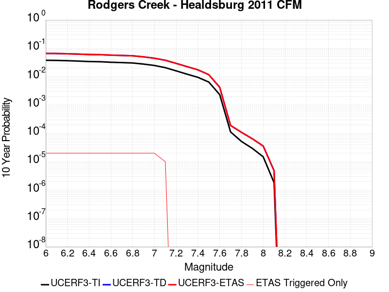 |

| Magnitude | 1 wk TI Prob | 1 wk TD Prob | 1 wk ETAS Prob | 1 wk ETAS/TD Gain | 1 wk ETAS Triggered Only | 1 mo TI Prob | 1 mo TD Prob | 1 mo ETAS Prob | 1 mo ETAS/TD Gain | 1 mo ETAS Triggered Only | 1 yr TI Prob | 1 yr TD Prob | 1 yr ETAS Prob | 1 yr ETAS/TD Gain | 1 yr ETAS Triggered Only | 10 yr TI Prob | 10 yr TD Prob | 10 yr ETAS Prob | 10 yr ETAS/TD Gain | 10 yr ETAS Triggered Only |
|-----|-----|-----|-----|-----|-----|-----|-----|-----|-----|-----|-----|-----|-----|-----|-----|-----|-----|-----|-----|-----|
| 6.0 | 7.390182E-5 | 1.3139093E-4 | 1.3139093E-4 | 1.0 | 0.0 | 3.1668364E-4 | 5.629827E-4 | 5.7297706E-4 | 1.0177525 | 1.0E-5 | 0.0038488081 | 0.006832735 | 0.0068426672 | 1.0014535 | 1.0E-5 | 0.037828278 | 0.066191986 | 0.06621066 | 1.0002822 | 2.0E-5 |
| 6.1 | 7.318768E-5 | 1.3037103E-4 | 1.3037103E-4 | 1.0 | 0.0 | 3.1362378E-4 | 5.586137E-4 | 5.686081E-4 | 1.0178914 | 1.0E-5 | 0.0038116854 | 0.0067798914 | 0.0067898235 | 1.001465 | 1.0E-5 | 0.037469655 | 0.06569656 | 0.065715246 | 1.0002844 | 2.0E-5 |
| 6.2 | 7.1379836E-5 | 1.2729941E-4 | 1.2729941E-4 | 1.0 | 0.0 | 3.058777E-4 | 5.454552E-4 | 5.5544975E-4 | 1.0183233 | 1.0E-5 | 0.003717703 | 0.0066206693 | 0.006630603 | 1.0015004 | 1.0E-5 | 0.0365612 | 0.064218655 | 0.06423737 | 1.0002915 | 2.0E-5 |
| 6.3 | 6.9255926E-5 | 1.2384256E-4 | 1.2384256E-4 | 1.0 | 0.0 | 2.9677735E-4 | 5.306463E-4 | 5.4064096E-4 | 1.018835 | 1.0E-5 | 0.0036072785 | 0.006441529 | 0.0064514643 | 1.0015424 | 1.0E-5 | 0.035492823 | 0.062549815 | 0.06256857 | 1.0002997 | 2.0E-5 |
| 6.4 | 6.6757144E-5 | 1.19609525E-4 | 1.19609525E-4 | 1.0 | 0.0 | 2.8607066E-4 | 5.1251194E-4 | 5.225068E-4 | 1.0195017 | 1.0E-5 | 0.0034773487 | 0.006222053 | 0.0062319906 | 1.0015972 | 1.0E-5 | 0.034234364 | 0.060499642 | 0.060518432 | 1.0003105 | 2.0E-5 |
| 6.5 | 6.5735134E-5 | 1.1809998E-4 | 1.1809998E-4 | 1.0 | 0.0 | 2.8169158E-4 | 5.0604495E-4 | 5.160399E-4 | 1.0197511 | 1.0E-5 | 0.003424202 | 0.0061437762 | 0.006153715 | 1.0016177 | 1.0E-5 | 0.03371918 | 0.059762556 | 0.05978136 | 1.0003147 | 2.0E-5 |
| 6.6 | 6.289601E-5 | 1.13453316E-4 | 1.13453316E-4 | 1.0 | 0.0 | 2.6952647E-4 | 4.8613825E-4 | 4.961334E-4 | 1.0205603 | 1.0E-5 | 0.0032765474 | 0.005902751 | 0.005912692 | 1.0016841 | 1.0E-5 | 0.032286562 | 0.057500087 | 0.057518937 | 1.0003278 | 2.0E-5 |
| 6.7 | 6.115274E-5 | 1.1062275E-4 | 1.1062275E-4 | 1.0 | 0.0 | 2.6205686E-4 | 4.7401173E-4 | 4.84007E-4 | 1.0210866 | 1.0E-5 | 0.0031858748 | 0.005755901 | 0.005765843 | 1.0017273 | 1.0E-5 | 0.031405866 | 0.056117915 | 0.056136794 | 1.0003364 | 2.0E-5 |
| 6.8 | 5.9232367E-5 | 1.07296E-4 | 1.07296E-4 | 1.0 | 0.0 | 2.538283E-4 | 4.5975935E-4 | 4.6975474E-4 | 1.0217406 | 1.0E-5 | 0.0030859804 | 0.00558328 | 0.0055932244 | 1.0017811 | 1.0E-5 | 0.030434765 | 0.05448483 | 0.054503743 | 1.000347 | 2.0E-5 |
| 6.9 | 5.4030377E-5 | 9.823741E-5 | 9.823741E-5 | 1.0 | 0.0 | 2.315382E-4 | 4.209499E-4 | 4.3094566E-4 | 1.0237458 | 1.0E-5 | 0.0028153337 | 0.005113087 | 0.005123036 | 1.0019457 | 1.0E-5 | 0.027799325 | 0.05002048 | 0.050039478 | 1.0003798 | 2.0E-5 |
| 7.0 | 4.8260714E-5 | 8.741771E-5 | 8.741771E-5 | 1.0 | 0.0 | 2.0681522E-4 | 3.7459383E-4 | 3.845901E-4 | 1.0266856 | 1.0E-5 | 0.0025150678 | 0.004551197 | 0.0045611514 | 1.0021873 | 1.0E-5 | 0.024867928 | 0.044671923 | 0.04469103 | 1.0004277 | 2.0E-5 |
| 7.1 | 4.0294493E-5 | 7.3902025E-5 | 7.3902025E-5 | 1.0 | 0.0 | 1.7267925E-4 | 3.1668475E-4 | 3.1668475E-4 | 1.0 | 0.0 | 0.0021003427 | 0.0038488582 | 0.0038488582 | 1.0 | 0.0 | 0.02080602 | 0.037927724 | 0.037937343 | 1.0002537 | 1.0E-5 |
| 7.2 | 3.096388E-5 | 5.698826E-5 | 5.698826E-5 | 1.0 | 0.0 | 1.326956E-4 | 2.4421266E-4 | 2.4421266E-4 | 1.0 | 0.0 | 0.0016143717 | 0.0029692573 | 0.0029692573 | 1.0 | 0.0 | 0.01602694 | 0.029440729 | 0.029440729 | 1.0 | 0.0 |
| 7.3 | 2.3615226E-5 | 4.3637207E-5 | 4.3637207E-5 | 1.0 | 0.0 | 1.0120418E-4 | 1.8700327E-4 | 1.8700327E-4 | 1.0 | 0.0 | 0.0012314644 | 0.0022744013 | 0.0022744013 | 1.0 | 0.0 | 0.0122466255 | 0.02264088 | 0.02264088 | 1.0 | 0.0 |
| 7.4 | 1.8251132E-5 | 3.3548964E-5 | 3.3548964E-5 | 1.0 | 0.0 | 7.821679E-5 | 1.437734E-4 | 1.437734E-4 | 1.0 | 0.0 | 9.518733E-4 | 0.0017490456 | 0.0017490456 | 1.0 | 0.0 | 0.009478063 | 0.017468803 | 0.017468803 | 1.0 | 0.0 |
| 7.5 | 1.2411432E-5 | 2.2463999E-5 | 2.2463999E-5 | 1.0 | 0.0 | 5.3190768E-5 | 9.627076E-5 | 9.627076E-5 | 1.0 | 0.0 | 6.4740516E-4 | 0.0011714721 | 0.0011714721 | 1.0 | 0.0 | 0.006455223 | 0.011744237 | 0.011744237 | 1.0 | 0.0 |
| 7.6 | 4.4771446E-6 | 8.085529E-6 | 8.085529E-6 | 1.0 | 0.0 | 1.918762E-5 | 3.465181E-5 | 3.465181E-5 | 1.0 | 0.0 | 2.3358424E-4 | 4.2180537E-4 | 4.2180537E-4 | 1.0 | 0.0 | 0.0023333887 | 0.0042457026 | 0.0042457026 | 1.0 | 0.0 |
| 7.7 | 2.157941E-7 | 3.5363618E-7 | 3.5363618E-7 | 1.0 | 0.0 | 9.248315E-7 | 1.5155827E-6 | 1.5155827E-6 | 1.0 | 0.0 | 1.1259765E-5 | 1.8452063E-5 | 1.8452063E-5 | 1.0 | 0.0 | 1.1259195E-4 | 1.9075118E-4 | 1.9075118E-4 | 1.0 | 0.0 |
| 7.8 | 9.9623286E-8 | 1.9910124E-7 | 1.9910124E-7 | 1.0 | 0.0 | 4.269569E-7 | 8.532907E-7 | 8.532907E-7 | 1.0 | 0.0 | 5.1981874E-6 | 1.0388765E-5 | 1.0388765E-5 | 1.0 | 0.0 | 5.198066E-5 | 1.0907195E-4 | 1.0907195E-4 | 1.0 | 0.0 |
| 7.9 | 5.6745257E-8 | 1.1780399E-7 | 1.1780399E-7 | 1.0 | 0.0 | 2.4319394E-7 | 5.0487415E-7 | 5.0487415E-7 | 1.0 | 0.0 | 2.960882E-6 | 6.1468254E-6 | 6.1468254E-6 | 1.0 | 0.0 | 2.9608427E-5 | 6.474216E-5 | 6.474216E-5 | 1.0 | 0.0 |
| 8.0 | 2.8614323E-8 | 6.582037E-8 | 6.582037E-8 | 1.0 | 0.0 | 1.2263281E-7 | 2.8208729E-7 | 2.8208729E-7 | 1.0 | 0.0 | 1.4930534E-6 | 3.4344073E-6 | 3.4344073E-6 | 1.0 | 0.0 | 1.4930434E-5 | 3.5844452E-5 | 3.5844452E-5 | 1.0 | 0.0 |
| 8.1 | 3.5045191E-9 | 8.970427E-9 | 8.970427E-9 | 1.0 | 0.0 | 1.5019367E-8 | 3.8444686E-8 | 3.8444686E-8 | 1.0 | 0.0 | 1.8286079E-7 | 4.6806397E-7 | 4.6806397E-7 | 1.0 | 0.0 | 1.8286064E-6 | 4.8356214E-6 | 4.8356214E-6 | 1.0 | 0.0 |

## Hartley Springs 2011 CFM
*[(top)](#table-of-contents)*

| 1 Week | 1 Month | 1 Year | 10 Year |
|-----|-----|-----|-----|
|  |  |  |  |

| Magnitude | 1 wk TI Prob | 1 wk TD Prob | 1 wk ETAS Prob | 1 wk ETAS/TD Gain | 1 wk ETAS Triggered Only | 1 mo TI Prob | 1 mo TD Prob | 1 mo ETAS Prob | 1 mo ETAS/TD Gain | 1 mo ETAS Triggered Only | 1 yr TI Prob | 1 yr TD Prob | 1 yr ETAS Prob | 1 yr ETAS/TD Gain | 1 yr ETAS Triggered Only | 10 yr TI Prob | 10 yr TD Prob | 10 yr ETAS Prob | 10 yr ETAS/TD Gain | 10 yr ETAS Triggered Only |
|-----|-----|-----|-----|-----|-----|-----|-----|-----|-----|-----|-----|-----|-----|-----|-----|-----|-----|-----|-----|-----|
| 6.0 | 1.4352418E-5 | 1.4434351E-5 | 1.4434351E-5 | 1.0 | 0.0 | 6.1508916E-5 | 6.186096E-5 | 7.186035E-5 | 1.1616428 | 1.0E-5 | 7.486137E-4 | 7.530614E-4 | 7.6305383E-4 | 1.0132692 | 1.0E-5 | 0.007460968 | 0.0075212163 | 0.007541066 | 1.0026392 | 2.0E-5 |
| 6.1 | 1.4352418E-5 | 1.4434351E-5 | 1.4434351E-5 | 1.0 | 0.0 | 6.1508916E-5 | 6.186096E-5 | 7.186035E-5 | 1.1616428 | 1.0E-5 | 7.486137E-4 | 7.530614E-4 | 7.6305383E-4 | 1.0132692 | 1.0E-5 | 0.007460968 | 0.0075212163 | 0.007541066 | 1.0026392 | 2.0E-5 |
| 6.2 | 1.4352418E-5 | 1.4434351E-5 | 1.4434351E-5 | 1.0 | 0.0 | 6.1508916E-5 | 6.186096E-5 | 7.186035E-5 | 1.1616428 | 1.0E-5 | 7.486137E-4 | 7.530614E-4 | 7.6305383E-4 | 1.0132692 | 1.0E-5 | 0.007460968 | 0.0075212163 | 0.007541066 | 1.0026392 | 2.0E-5 |
| 6.3 | 1.4352418E-5 | 1.4434351E-5 | 1.4434351E-5 | 1.0 | 0.0 | 6.1508916E-5 | 6.186096E-5 | 7.186035E-5 | 1.1616428 | 1.0E-5 | 7.486137E-4 | 7.530614E-4 | 7.6305383E-4 | 1.0132692 | 1.0E-5 | 0.007460968 | 0.0075212163 | 0.007541066 | 1.0026392 | 2.0E-5 |
| 6.4 | 1.4352418E-5 | 1.4434351E-5 | 1.4434351E-5 | 1.0 | 0.0 | 6.1508916E-5 | 6.186096E-5 | 7.186035E-5 | 1.1616428 | 1.0E-5 | 7.486137E-4 | 7.530614E-4 | 7.6305383E-4 | 1.0132692 | 1.0E-5 | 0.007460968 | 0.0075212163 | 0.007541066 | 1.0026392 | 2.0E-5 |
| 6.5 | 1.2279858E-5 | 1.2133241E-5 | 1.2133241E-5 | 1.0 | 0.0 | 5.26269E-5 | 5.199946E-5 | 6.1998944E-5 | 1.1922997 | 1.0E-5 | 6.4054417E-4 | 6.3306774E-4 | 6.430614E-4 | 1.015786 | 1.0E-5 | 0.0063870098 | 0.0063281553 | 0.006348029 | 1.0031404 | 2.0E-5 |
| 6.6 | 1.2279858E-5 | 1.2133241E-5 | 1.2133241E-5 | 1.0 | 0.0 | 5.26269E-5 | 5.199946E-5 | 6.1998944E-5 | 1.1922997 | 1.0E-5 | 6.4054417E-4 | 6.3306774E-4 | 6.430614E-4 | 1.015786 | 1.0E-5 | 0.0063870098 | 0.0063281553 | 0.006348029 | 1.0031404 | 2.0E-5 |
| 6.7 | 2.1282601E-6 | 8.8945814E-7 | 8.8945814E-7 | 1.0 | 0.0 | 9.121083E-6 | 3.8119592E-6 | 3.8119592E-6 | 1.0 | 0.0 | 1.11043526E-4 | 4.6409874E-5 | 4.6409874E-5 | 1.0 | 0.0 | 0.0011098806 | 4.6402714E-4 | 4.6402714E-4 | 1.0 | 0.0 |
| 6.8 | 2.00516E-6 | 8.5173434E-7 | 8.5173434E-7 | 1.0 | 0.0 | 8.593515E-6 | 3.6502865E-6 | 3.6502865E-6 | 1.0 | 0.0 | 1.04621024E-4 | 4.444159E-5 | 4.444159E-5 | 1.0 | 0.0 | 0.0010457177 | 4.4435216E-4 | 4.4435216E-4 | 1.0 | 0.0 |
| 6.9 | 2.00516E-6 | 8.5173434E-7 | 8.5173434E-7 | 1.0 | 0.0 | 8.593515E-6 | 3.6502865E-6 | 3.6502865E-6 | 1.0 | 0.0 | 1.04621024E-4 | 4.444159E-5 | 4.444159E-5 | 1.0 | 0.0 | 0.0010457177 | 4.4435216E-4 | 4.4435216E-4 | 1.0 | 0.0 |
| 7.0 | 1.8366732E-6 | 8.237064E-7 | 8.237064E-7 | 1.0 | 0.0 | 7.871433E-6 | 3.5301669E-6 | 3.5301669E-6 | 1.0 | 0.0 | 9.583048E-5 | 4.297919E-5 | 4.297919E-5 | 1.0 | 0.0 | 9.5789164E-4 | 4.2973383E-4 | 4.2973383E-4 | 1.0 | 0.0 |
| 7.1 | 1.5097997E-6 | 7.189996E-7 | 7.189996E-7 | 1.0 | 0.0 | 6.470554E-6 | 3.0814247E-6 | 3.0814247E-6 | 1.0 | 0.0 | 7.877615E-5 | 3.751594E-5 | 3.751594E-5 | 1.0 | 0.0 | 7.874823E-4 | 3.751198E-4 | 3.751198E-4 | 1.0 | 0.0 |
| 7.2 | 1.3490993E-6 | 6.405045E-7 | 6.405045E-7 | 1.0 | 0.0 | 5.7818415E-6 | 2.7450176E-6 | 2.7450176E-6 | 1.0 | 0.0 | 7.0391645E-5 | 3.342031E-5 | 3.342031E-5 | 1.0 | 0.0 | 7.0369354E-4 | 3.341758E-4 | 3.341758E-4 | 1.0 | 0.0 |
| 7.3 | 7.900015E-7 | 4.0890467E-7 | 4.0890467E-7 | 1.0 | 0.0 | 3.3857161E-6 | 1.7524486E-6 | 1.7524486E-6 | 1.0 | 0.0 | 4.1220315E-5 | 2.1336062E-5 | 2.1336062E-5 | 1.0 | 0.0 | 4.121267E-4 | 2.1336062E-4 | 2.1336062E-4 | 1.0 | 0.0 |

## Hayward (No) 2011 CFM
*[(top)](#table-of-contents)*

| 1 Week | 1 Month | 1 Year | 10 Year |
|-----|-----|-----|-----|
|  |  |  | 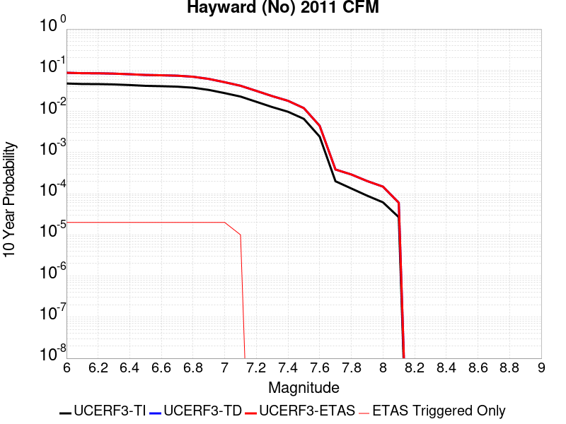 |

| Magnitude | 1 wk TI Prob | 1 wk TD Prob | 1 wk ETAS Prob | 1 wk ETAS/TD Gain | 1 wk ETAS Triggered Only | 1 mo TI Prob | 1 mo TD Prob | 1 mo ETAS Prob | 1 mo ETAS/TD Gain | 1 mo ETAS Triggered Only | 1 yr TI Prob | 1 yr TD Prob | 1 yr ETAS Prob | 1 yr ETAS/TD Gain | 1 yr ETAS Triggered Only | 10 yr TI Prob | 10 yr TD Prob | 10 yr ETAS Prob | 10 yr ETAS/TD Gain | 10 yr ETAS Triggered Only |
|-----|-----|-----|-----|-----|-----|-----|-----|-----|-----|-----|-----|-----|-----|-----|-----|-----|-----|-----|-----|-----|
| 6.0 | 9.3068506E-5 | 1.7397928E-4 | 1.7397928E-4 | 1.0 | 0.0 | 3.9880406E-4 | 7.454108E-4 | 7.554033E-4 | 1.0134054 | 1.0E-5 | 0.0048446343 | 0.009037494 | 0.009047403 | 1.0010965 | 1.0E-5 | 0.047403704 | 0.086402565 | 0.086420834 | 1.0002115 | 2.0E-5 |
| 6.1 | 9.055486E-5 | 1.6949074E-4 | 1.6949074E-4 | 1.0 | 0.0 | 3.880345E-4 | 7.2618667E-4 | 7.361794E-4 | 1.0137606 | 1.0E-5 | 0.0047140904 | 0.008805556 | 0.008815468 | 1.0011257 | 1.0E-5 | 0.046153355 | 0.08430039 | 0.084318705 | 1.0002172 | 2.0E-5 |
| 6.2 | 9.006742E-5 | 1.686967E-4 | 1.686967E-4 | 1.0 | 0.0 | 3.859461E-4 | 7.2278595E-4 | 7.327787E-4 | 1.0138253 | 1.0E-5 | 0.0046887742 | 0.008764519 | 0.008774432 | 1.0011309 | 1.0E-5 | 0.0459107 | 0.083924614 | 0.083942935 | 1.0002183 | 2.0E-5 |
| 6.3 | 8.8336754E-5 | 1.654921E-4 | 1.654921E-4 | 1.0 | 0.0 | 3.7853114E-4 | 7.090599E-4 | 7.190528E-4 | 1.0140932 | 1.0E-5 | 0.004598882 | 0.00859879 | 0.0086087035 | 1.001153 | 1.0E-5 | 0.04504866 | 0.08241665 | 0.082435004 | 1.0002227 | 2.0E-5 |
| 6.4 | 8.526157E-5 | 1.597622E-4 | 1.597622E-4 | 1.0 | 0.0 | 3.6535555E-4 | 6.8451616E-4 | 6.945093E-4 | 1.0145988 | 1.0E-5 | 0.0044391346 | 0.008302296 | 0.008312213 | 1.0011945 | 1.0E-5 | 0.043514993 | 0.07969951 | 0.07971791 | 1.0002309 | 2.0E-5 |
| 6.5 | 8.152396E-5 | 1.5308615E-4 | 1.5308615E-4 | 1.0 | 0.0 | 3.493416E-4 | 6.559192E-4 | 6.6591264E-4 | 1.0152358 | 1.0E-5 | 0.0042449418 | 0.007956725 | 0.007966645 | 1.0012468 | 1.0E-5 | 0.04164765 | 0.076519914 | 0.076538384 | 1.0002414 | 2.0E-5 |
| 6.6 | 7.987405E-5 | 1.5012817E-4 | 1.5012817E-4 | 1.0 | 0.0 | 3.4227243E-4 | 6.4324844E-4 | 6.5324205E-4 | 1.0155361 | 1.0E-5 | 0.0041592065 | 0.0078035854 | 0.007813508 | 1.0012715 | 1.0E-5 | 0.04082218 | 0.07511259 | 0.07513109 | 1.0002463 | 2.0E-5 |
| 6.7 | 7.777665E-5 | 1.4652064E-4 | 1.4652064E-4 | 1.0 | 0.0 | 3.332859E-4 | 6.277952E-4 | 6.377889E-4 | 1.0159187 | 1.0E-5 | 0.004050208 | 0.007616774 | 0.0076266984 | 1.0013028 | 1.0E-5 | 0.039771806 | 0.07338915 | 0.07340769 | 1.0002525 | 2.0E-5 |
| 6.8 | 7.3284005E-5 | 1.3802624E-4 | 1.3802624E-4 | 1.0 | 0.0 | 3.140365E-4 | 5.9140753E-4 | 6.014016E-4 | 1.0168989 | 1.0E-5 | 0.0038166929 | 0.007176752 | 0.0071866806 | 1.0013834 | 1.0E-5 | 0.037518036 | 0.069302484 | 0.069321096 | 1.0002686 | 2.0E-5 |
| 6.9 | 6.458263E-5 | 1.2133129E-4 | 1.2133129E-4 | 1.0 | 0.0 | 2.7675333E-4 | 5.198881E-4 | 5.298829E-4 | 1.0192249 | 1.0E-5 | 0.0033642664 | 0.0063113687 | 0.006321306 | 1.0015744 | 1.0E-5 | 0.033137884 | 0.06123086 | 0.061249636 | 1.0003066 | 2.0E-5 |
| 7.0 | 5.3853604E-5 | 1.0026534E-4 | 1.0026534E-4 | 1.0 | 0.0 | 2.3078074E-4 | 4.2963814E-4 | 4.3963385E-4 | 1.0232654 | 1.0E-5 | 0.0028061352 | 0.005218363 | 0.005228311 | 1.0019063 | 1.0E-5 | 0.027709642 | 0.050963037 | 0.050982017 | 1.0003724 | 2.0E-5 |
| 7.1 | 4.4308683E-5 | 8.171937E-5 | 8.171937E-5 | 1.0 | 0.0 | 1.8988053E-4 | 3.5017906E-4 | 3.5017906E-4 | 1.0 | 0.0 | 0.0023093442 | 0.004255137 | 0.004255137 | 1.0 | 0.0 | 0.022854926 | 0.041829627 | 0.04183921 | 1.0002291 | 1.0E-5 |
| 7.2 | 3.295973E-5 | 6.0782906E-5 | 6.0782906E-5 | 1.0 | 0.0 | 1.4124835E-4 | 2.604723E-4 | 2.604723E-4 | 1.0 | 0.0 | 0.0017183421 | 0.0031666614 | 0.0031666614 | 1.0 | 0.0 | 0.017051157 | 0.031374134 | 0.031374134 | 1.0 | 0.0 |
| 7.3 | 2.452256E-5 | 4.51901E-5 | 4.51901E-5 | 1.0 | 0.0 | 1.05092455E-4 | 1.9365756E-4 | 1.9365756E-4 | 1.0 | 0.0 | 0.0012787496 | 0.002355245 | 0.002355245 | 1.0 | 0.0 | 0.0127141625 | 0.023445245 | 0.023445245 | 1.0 | 0.0 |
| 7.4 | 1.8829967E-5 | 3.4610835E-5 | 3.4610835E-5 | 1.0 | 0.0 | 8.069736E-5 | 1.4832379E-4 | 1.4832379E-4 | 1.0 | 0.0 | 9.820475E-4 | 0.0018043561 | 0.0018043561 | 1.0 | 0.0 | 0.009777189 | 0.018022932 | 0.018022932 | 1.0 | 0.0 |
| 7.5 | 1.26374125E-5 | 2.2925326E-5 | 2.2925326E-5 | 1.0 | 0.0 | 5.4159216E-5 | 9.824773E-5 | 9.824773E-5 | 1.0 | 0.0 | 6.5918895E-4 | 0.0011955155 | 0.0011955155 | 1.0 | 0.0 | 0.00657237 | 0.011989905 | 0.011989905 | 1.0 | 0.0 |
| 7.6 | 4.666429E-6 | 8.480926E-6 | 8.480926E-6 | 1.0 | 0.0 | 1.9998828E-5 | 3.6346326E-5 | 3.6346326E-5 | 1.0 | 0.0 | 2.4345852E-4 | 4.424279E-4 | 4.424279E-4 | 1.0 | 0.0 | 0.0024319198 | 0.0044588465 | 0.0044588465 | 1.0 | 0.0 |
| 7.7 | 3.8399318E-7 | 7.13742E-7 | 7.13742E-7 | 1.0 | 0.0 | 1.6456839E-6 | 3.0588906E-6 | 3.0588906E-6 | 1.0 | 0.0 | 2.003602E-5 | 3.7241356E-5 | 3.7241356E-5 | 1.0 | 0.0 | 2.0034213E-4 | 3.863124E-4 | 3.863124E-4 | 1.0 | 0.0 |
| 7.8 | 2.5637698E-7 | 5.3692474E-7 | 5.3692474E-7 | 1.0 | 0.0 | 1.098758E-6 | 2.301104E-6 | 2.301104E-6 | 1.0 | 0.0 | 1.3377297E-5 | 2.8015582E-5 | 2.8015582E-5 | 1.0 | 0.0 | 1.3376492E-4 | 2.9259408E-4 | 2.9259408E-4 | 1.0 | 0.0 |
| 7.9 | 1.7141245E-7 | 3.7311867E-7 | 3.7311867E-7 | 1.0 | 0.0 | 7.3462456E-7 | 1.5990789E-6 | 1.5990789E-6 | 1.0 | 0.0 | 8.944017E-6 | 1.9468613E-5 | 1.9468613E-5 | 1.0 | 0.0 | 8.943657E-5 | 2.0255927E-4 | 2.0255927E-4 | 1.0 | 0.0 |
| 8.0 | 1.1808895E-7 | 2.7525246E-7 | 2.7525246E-7 | 1.0 | 0.0 | 5.060954E-7 | 1.1796528E-6 | 1.1796528E-6 | 1.0 | 0.0 | 6.161694E-6 | 1.4362179E-5 | 1.4362179E-5 | 1.0 | 0.0 | 6.161523E-5 | 1.482392E-4 | 1.482392E-4 | 1.0 | 0.0 |
| 8.1 | 5.138535E-8 | 1.1236262E-7 | 1.1236262E-7 | 1.0 | 0.0 | 2.2022292E-7 | 4.8155397E-7 | 4.8155397E-7 | 1.0 | 0.0 | 2.6812106E-6 | 5.8629043E-6 | 5.8629043E-6 | 1.0 | 0.0 | 2.6811784E-5 | 6.018857E-5 | 6.018857E-5 | 1.0 | 0.0 |

## Calaveras (So) 2011 CFM
*[(top)](#table-of-contents)*

| 1 Week | 1 Month | 1 Year | 10 Year |
|-----|-----|-----|-----|
|  |  |  |  |

| Magnitude | 1 wk TI Prob | 1 wk TD Prob | 1 wk ETAS Prob | 1 wk ETAS/TD Gain | 1 wk ETAS Triggered Only | 1 mo TI Prob | 1 mo TD Prob | 1 mo ETAS Prob | 1 mo ETAS/TD Gain | 1 mo ETAS Triggered Only | 1 yr TI Prob | 1 yr TD Prob | 1 yr ETAS Prob | 1 yr ETAS/TD Gain | 1 yr ETAS Triggered Only | 10 yr TI Prob | 10 yr TD Prob | 10 yr ETAS Prob | 10 yr ETAS/TD Gain | 10 yr ETAS Triggered Only |
|-----|-----|-----|-----|-----|-----|-----|-----|-----|-----|-----|-----|-----|-----|-----|-----|-----|-----|-----|-----|-----|
| 6.0 | 1.5950744E-4 | 3.07182E-4 | 3.07182E-4 | 1.0 | 0.0 | 6.834242E-4 | 0.0013155838 | 0.0013155838 | 1.0 | 0.0 | 0.00828899 | 0.01586041 | 0.01587025 | 1.0006205 | 1.0E-5 | 0.079865426 | 0.14442472 | 0.14443329 | 1.0000592 | 1.0E-5 |
| 6.1 | 1.3584697E-4 | 2.6039843E-4 | 2.6039843E-4 | 1.0 | 0.0 | 5.8207137E-4 | 0.0011153528 | 0.0011153528 | 1.0 | 0.0 | 0.007063716 | 0.013463387 | 0.013473253 | 1.0007328 | 1.0E-5 | 0.06843361 | 0.1240527 | 0.124061465 | 1.0000706 | 1.0E-5 |
| 6.2 | 1.14676266E-4 | 2.171953E-4 | 2.171953E-4 | 1.0 | 0.0 | 4.9137714E-4 | 9.3039346E-4 | 9.3039346E-4 | 1.0 | 0.0 | 0.0059661185 | 0.011246999 | 0.011256887 | 1.0008792 | 1.0E-5 | 0.058084648 | 0.10504322 | 0.105052166 | 1.0000852 | 1.0E-5 |
| 6.3 | 8.691518E-5 | 1.5991413E-4 | 1.5991413E-4 | 1.0 | 0.0 | 3.7244044E-4 | 6.85134E-4 | 6.85134E-4 | 1.0 | 0.0 | 0.004525038 | 0.008302956 | 0.008312873 | 1.0011944 | 1.0E-5 | 0.044339992 | 0.07935925 | 0.07936846 | 1.000116 | 1.0E-5 |
| 6.4 | 8.50982E-5 | 1.5697793E-4 | 1.5697793E-4 | 1.0 | 0.0 | 3.646556E-4 | 6.725568E-4 | 6.725568E-4 | 1.0 | 0.0 | 0.0044306475 | 0.008150981 | 0.008160899 | 1.0012169 | 1.0E-5 | 0.04343345 | 0.07796543 | 0.07797465 | 1.0001183 | 1.0E-5 |
| 6.5 | 8.4062965E-5 | 1.5522187E-4 | 1.5522187E-4 | 1.0 | 0.0 | 3.602201E-4 | 6.6503574E-4 | 6.6503574E-4 | 1.0 | 0.0 | 0.004376863 | 0.008060186 | 0.008070106 | 1.0012307 | 1.0E-5 | 0.042916555 | 0.0771368 | 0.07714602 | 1.0001197 | 1.0E-5 |
| 6.6 | 8.194716E-5 | 1.5157944E-4 | 1.5157944E-4 | 1.0 | 0.0 | 3.5115483E-4 | 6.494359E-4 | 6.494359E-4 | 1.0 | 0.0 | 0.0042669317 | 0.007872019 | 0.00788194 | 1.0012603 | 1.0E-5 | 0.04185927 | 0.07542207 | 0.07543132 | 1.0001225 | 1.0E-5 |
| 6.7 | 8.012326E-5 | 1.4825833E-4 | 1.4825833E-4 | 1.0 | 0.0 | 3.433402E-4 | 6.3521194E-4 | 6.3521194E-4 | 1.0 | 0.0 | 0.004172157 | 0.007700504 | 0.007710427 | 1.0012887 | 1.0E-5 | 0.040946912 | 0.07386414 | 0.0738734 | 1.0001254 | 1.0E-5 |
| 6.8 | 7.119773E-5 | 1.2885146E-4 | 1.2885146E-4 | 1.0 | 0.0 | 3.0509746E-4 | 5.5208657E-4 | 5.5208657E-4 | 1.0 | 0.0 | 0.0037082357 | 0.0066977087 | 0.0067076418 | 1.0014831 | 1.0E-5 | 0.036469642 | 0.06470736 | 0.06471671 | 1.0001446 | 1.0E-5 |
| 6.9 | 5.7343088E-5 | 9.9215715E-5 | 9.9215715E-5 | 1.0 | 0.0 | 2.4573295E-4 | 4.2514122E-4 | 4.2514122E-4 | 1.0 | 0.0 | 0.0029876942 | 0.0051638843 | 0.0051738326 | 1.0019265 | 1.0E-5 | 0.02947844 | 0.050521772 | 0.050531264 | 1.000188 | 1.0E-5 |
| 7.0 | 4.8746577E-5 | 8.2872946E-5 | 8.2872946E-5 | 1.0 | 0.0 | 2.0889717E-4 | 3.5512177E-4 | 3.5512177E-4 | 1.0 | 0.0 | 0.0025403565 | 0.0043151025 | 0.0043250592 | 1.0023074 | 1.0E-5 | 0.025115121 | 0.042496696 | 0.04250627 | 1.0002253 | 1.0E-5 |
| 7.1 | 4.2998014E-5 | 7.266674E-5 | 7.266674E-5 | 1.0 | 0.0 | 1.8426418E-4 | 3.1139204E-4 | 3.1139204E-4 | 1.0 | 0.0 | 0.002241108 | 0.0037846677 | 0.0037846677 | 1.0 | 0.0 | 0.022186412 | 0.03743137 | 0.03743137 | 1.0 | 0.0 |
| 7.2 | 3.221292E-5 | 5.3921813E-5 | 5.3921813E-5 | 1.0 | 0.0 | 1.3804805E-4 | 2.3107318E-4 | 2.3107318E-4 | 1.0 | 0.0 | 0.0016794393 | 0.0028097143 | 0.0028097143 | 1.0 | 0.0 | 0.016668037 | 0.028043631 | 0.028043631 | 1.0 | 0.0 |
| 7.3 | 2.3756531E-5 | 3.9486065E-5 | 3.9486065E-5 | 1.0 | 0.0 | 1.0180973E-4 | 1.6921511E-4 | 1.6921511E-4 | 1.0 | 0.0 | 0.0012388286 | 0.0020582643 | 0.0020582643 | 1.0 | 0.0 | 0.012319452 | 0.020650236 | 0.020650236 | 1.0 | 0.0 |
| 7.4 | 1.5997684E-5 | 2.734871E-5 | 2.734871E-5 | 1.0 | 0.0 | 6.8559704E-5 | 1.172035E-4 | 1.172035E-4 | 1.0 | 0.0 | 8.343947E-4 | 0.001426021 | 0.001426021 | 1.0 | 0.0 | 0.008312687 | 0.014378974 | 0.014378974 | 1.0 | 0.0 |
| 7.5 | 1.3814293E-5 | 2.4790226E-5 | 2.4790226E-5 | 1.0 | 0.0 | 5.9202768E-5 | 1.0623951E-4 | 1.0623951E-4 | 1.0 | 0.0 | 7.205553E-4 | 0.001292701 | 0.001292701 | 1.0 | 0.0 | 0.007182234 | 0.013058075 | 0.013058075 | 1.0 | 0.0 |
| 7.6 | 8.817309E-6 | 1.6436143E-5 | 1.6436143E-5 | 1.0 | 0.0 | 3.7787922E-5 | 7.043872E-5 | 7.043872E-5 | 1.0 | 0.0 | 4.5997082E-4 | 8.5725536E-4 | 8.5725536E-4 | 1.0 | 0.0 | 0.004590199 | 0.008721771 | 0.008721771 | 1.0 | 0.0 |
| 7.7 | 4.0352206E-6 | 7.711456E-6 | 7.711456E-6 | 1.0 | 0.0 | 1.7293689E-5 | 3.304868E-5 | 3.304868E-5 | 1.0 | 0.0 | 2.1053031E-4 | 4.0229346E-4 | 4.0229346E-4 | 1.0 | 0.0 | 0.0021033096 | 0.004167241 | 0.004167241 | 1.0 | 0.0 |
| 7.8 | 3.413169E-6 | 6.79093E-6 | 6.79093E-6 | 1.0 | 0.0 | 1.4627784E-5 | 2.9103661E-5 | 2.9103661E-5 | 1.0 | 0.0 | 1.7807873E-4 | 3.5427953E-4 | 3.5427953E-4 | 1.0 | 0.0 | 0.0017793609 | 0.0036683267 | 0.0036683267 | 1.0 | 0.0 |
| 7.9 | 2.4740732E-6 | 5.28193E-6 | 5.28193E-6 | 1.0 | 0.0 | 1.06031275E-5 | 2.2636646E-5 | 2.2636646E-5 | 1.0 | 0.0 | 1.2908543E-4 | 2.7556636E-4 | 2.7556636E-4 | 1.0 | 0.0 | 0.0012901047 | 0.002836207 | 0.002836207 | 1.0 | 0.0 |
| 8.0 | 1.5231818E-6 | 3.2905639E-6 | 3.2905639E-6 | 1.0 | 0.0 | 6.527906E-6 | 1.4102341E-5 | 1.4102341E-5 | 1.0 | 0.0 | 7.9474354E-5 | 1.716825E-4 | 1.716825E-4 | 1.0 | 0.0 | 7.944594E-4 | 0.0017573038 | 0.0017573038 | 1.0 | 0.0 |
| 8.1 | 1.0104524E-6 | 2.046827E-6 | 2.046827E-6 | 1.0 | 0.0 | 4.330503E-6 | 8.7720855E-6 | 8.7720855E-6 | 1.0 | 0.0 | 5.2722597E-5 | 1.0679494E-4 | 1.0679494E-4 | 1.0 | 0.0 | 5.271009E-4 | 0.0010935272 | 0.0010935272 | 1.0 | 0.0 |

## Elsinore (Stepovers Combined)
*[(top)](#table-of-contents)*

| 1 Week | 1 Month | 1 Year | 10 Year |
|-----|-----|-----|-----|
|  |  |  |  |

| Magnitude | 1 wk TI Prob | 1 wk TD Prob | 1 wk ETAS Prob | 1 wk ETAS/TD Gain | 1 wk ETAS Triggered Only | 1 mo TI Prob | 1 mo TD Prob | 1 mo ETAS Prob | 1 mo ETAS/TD Gain | 1 mo ETAS Triggered Only | 1 yr TI Prob | 1 yr TD Prob | 1 yr ETAS Prob | 1 yr ETAS/TD Gain | 1 yr ETAS Triggered Only | 10 yr TI Prob | 10 yr TD Prob | 10 yr ETAS Prob | 10 yr ETAS/TD Gain | 10 yr ETAS Triggered Only |
|-----|-----|-----|-----|-----|-----|-----|-----|-----|-----|-----|-----|-----|-----|-----|-----|-----|-----|-----|-----|-----|
| 6.0 | 2.144392E-5 | 1.9761088E-5 | 1.9761088E-5 | 1.0 | 0.0 | 9.189928E-5 | 8.4687716E-5 | 8.4687716E-5 | 1.0 | 0.0 | 0.0011182994 | 0.0010306045 | 0.0010505838 | 1.019386 | 2.0E-5 | 0.011126885 | 0.010265615 | 0.01028541 | 1.0019282 | 2.0E-5 |
| 6.1 | 2.144392E-5 | 1.9761088E-5 | 1.9761088E-5 | 1.0 | 0.0 | 9.189928E-5 | 8.4687716E-5 | 8.4687716E-5 | 1.0 | 0.0 | 0.0011182994 | 0.0010306045 | 0.0010505838 | 1.019386 | 2.0E-5 | 0.011126885 | 0.010265615 | 0.01028541 | 1.0019282 | 2.0E-5 |
| 6.2 | 2.144392E-5 | 1.9761088E-5 | 1.9761088E-5 | 1.0 | 0.0 | 9.189928E-5 | 8.4687716E-5 | 8.4687716E-5 | 1.0 | 0.0 | 0.0011182994 | 0.0010306045 | 0.0010505838 | 1.019386 | 2.0E-5 | 0.011126885 | 0.010265615 | 0.01028541 | 1.0019282 | 2.0E-5 |
| 6.3 | 1.9751555E-5 | 1.7742292E-5 | 1.7742292E-5 | 1.0 | 0.0 | 8.4646774E-5 | 7.603623E-5 | 7.603623E-5 | 1.0 | 0.0 | 0.0010300872 | 9.253622E-4 | 9.35353E-4 | 1.0107965 | 1.0E-5 | 0.010253254 | 0.009221947 | 0.009231855 | 1.0010743 | 1.0E-5 |
| 6.4 | 1.9751555E-5 | 1.7742292E-5 | 1.7742292E-5 | 1.0 | 0.0 | 8.4646774E-5 | 7.603623E-5 | 7.603623E-5 | 1.0 | 0.0 | 0.0010300872 | 9.253622E-4 | 9.35353E-4 | 1.0107965 | 1.0E-5 | 0.010253254 | 0.009221947 | 0.009231855 | 1.0010743 | 1.0E-5 |
| 6.5 | 1.9751555E-5 | 1.7742292E-5 | 1.7742292E-5 | 1.0 | 0.0 | 8.4646774E-5 | 7.603623E-5 | 7.603623E-5 | 1.0 | 0.0 | 0.0010300872 | 9.253622E-4 | 9.35353E-4 | 1.0107965 | 1.0E-5 | 0.010253254 | 0.009221947 | 0.009231855 | 1.0010743 | 1.0E-5 |
| 6.6 | 1.9188685E-5 | 1.7004182E-5 | 1.7004182E-5 | 1.0 | 0.0 | 8.2234634E-5 | 7.2873125E-5 | 7.2873125E-5 | 1.0 | 0.0 | 0.0010007467 | 8.868853E-4 | 8.9687645E-4 | 1.0112654 | 1.0E-5 | 0.00996252 | 0.008840504 | 0.008850415 | 1.0011212 | 1.0E-5 |
| 6.7 | 1.7608272E-5 | 1.4733256E-5 | 1.4733256E-5 | 1.0 | 0.0 | 7.546184E-5 | 6.314105E-5 | 6.314105E-5 | 1.0 | 0.0 | 9.183606E-4 | 7.6848094E-4 | 7.784732E-4 | 1.0130026 | 1.0E-5 | 0.009145746 | 0.00766544 | 0.007675363 | 1.0012946 | 1.0E-5 |
| 6.8 | 1.697165E-5 | 1.3783935E-5 | 1.3783935E-5 | 1.0 | 0.0 | 7.273361E-5 | 5.9072718E-5 | 5.9072718E-5 | 1.0 | 0.0 | 8.8517193E-4 | 7.189817E-4 | 7.289745E-4 | 1.0138986 | 1.0E-5 | 0.008816543 | 0.007173273 | 0.007183201 | 1.001384 | 1.0E-5 |
| 6.9 | 1.600365E-5 | 1.2847236E-5 | 1.2847236E-5 | 1.0 | 0.0 | 6.858527E-5 | 5.5058463E-5 | 5.5058463E-5 | 1.0 | 0.0 | 8.347058E-4 | 6.701384E-4 | 6.8013166E-4 | 1.0149122 | 1.0E-5 | 0.008315775 | 0.0066868146 | 0.0066967476 | 1.0014855 | 1.0E-5 |
| 7.0 | 1.3314581E-5 | 1.0447994E-5 | 1.0447994E-5 | 1.0 | 0.0 | 5.7061243E-5 | 4.4776363E-5 | 4.4776363E-5 | 1.0 | 0.0 | 6.944992E-4 | 5.450186E-4 | 5.5501313E-4 | 1.018338 | 1.0E-5 | 0.006923327 | 0.0054402184 | 0.005450164 | 1.0018282 | 1.0E-5 |
| 7.1 | 1.2865345E-5 | 9.937844E-6 | 9.937844E-6 | 1.0 | 0.0 | 5.5136024E-5 | 4.259008E-5 | 4.259008E-5 | 1.0 | 0.0 | 6.710743E-4 | 5.1841344E-4 | 5.284082E-4 | 1.0192796 | 1.0E-5 | 0.0066905143 | 0.0051750923 | 0.0051850406 | 1.0019224 | 1.0E-5 |
| 7.2 | 1.1650051E-5 | 8.634011E-6 | 8.634011E-6 | 1.0 | 0.0 | 4.9927836E-5 | 3.7002388E-5 | 3.7002388E-5 | 1.0 | 0.0 | 6.0770183E-4 | 4.504127E-4 | 4.504127E-4 | 1.0 | 0.0 | 0.0060604266 | 0.0044963313 | 0.0044963313 | 1.0 | 0.0 |
| 7.3 | 1.0008533E-5 | 7.201187E-6 | 7.201187E-6 | 1.0 | 0.0 | 4.2893007E-5 | 3.0861873E-5 | 3.0861873E-5 | 1.0 | 0.0 | 5.220972E-4 | 3.7567996E-4 | 3.7567996E-4 | 1.0 | 0.0 | 0.005208723 | 0.0037508437 | 0.0037508437 | 1.0 | 0.0 |
| 7.4 | 9.116759E-6 | 6.4101755E-6 | 6.4101755E-6 | 1.0 | 0.0 | 3.907124E-5 | 2.74719E-5 | 2.74719E-5 | 1.0 | 0.0 | 4.7558855E-4 | 3.3442042E-4 | 3.3442042E-4 | 1.0 | 0.0 | 0.00474572 | 0.0033393216 | 0.0033393216 | 1.0 | 0.0 |
| 7.5 | 7.870524E-6 | 5.382608E-6 | 5.382608E-6 | 1.0 | 0.0 | 3.3730383E-5 | 2.3068123E-5 | 2.3068123E-5 | 1.0 | 0.0 | 4.1059E-4 | 2.8081945E-4 | 2.8081945E-4 | 1.0 | 0.0 | 0.0040983222 | 0.0028047727 | 0.0028047727 | 1.0 | 0.0 |
| 7.6 | 6.9774537E-6 | 4.6776568E-6 | 4.6776568E-6 | 1.0 | 0.0 | 2.990303E-5 | 2.0046953E-5 | 2.0046953E-5 | 1.0 | 0.0 | 3.640086E-4 | 2.4404548E-4 | 2.4404548E-4 | 1.0 | 0.0 | 0.003634129 | 0.002437891 | 0.002437891 | 1.0 | 0.0 |
| 7.7 | 4.1616954E-6 | 2.3283103E-6 | 2.3283103E-6 | 1.0 | 0.0 | 1.7835715E-5 | 9.978439E-6 | 9.978439E-6 | 1.0 | 0.0 | 2.171282E-4 | 1.2148147E-4 | 1.2148147E-4 | 1.0 | 0.0 | 0.0021691616 | 0.0012142237 | 0.0012142237 | 1.0 | 0.0 |
| 7.8 | 2.2692414E-7 | 9.384624E-8 | 9.384624E-8 | 1.0 | 0.0 | 9.725317E-7 | 4.021981E-7 | 4.021981E-7 | 1.0 | 0.0 | 1.1840509E-5 | 4.8967545E-6 | 4.8967545E-6 | 1.0 | 0.0 | 1.1839878E-4 | 4.8966795E-5 | 4.8966795E-5 | 1.0 | 0.0 |
| 7.9 | 6.676829E-9 | 3.4397993E-9 | 3.4397993E-9 | 1.0 | 0.0 | 2.861498E-8 | 1.4741998E-8 | 1.4741998E-8 | 1.0 | 0.0 | 3.4838732E-7 | 1.794838E-7 | 1.794838E-7 | 1.0 | 0.0 | 3.4838679E-6 | 1.7948367E-6 | 1.7948367E-6 | 1.0 | 0.0 |

## San Andreas (Offshore) 2011 CFM
*[(top)](#table-of-contents)*

| 1 Week | 1 Month | 1 Year | 10 Year |
|-----|-----|-----|-----|
|  |  |  |  |

| Magnitude | 1 wk TI Prob | 1 wk TD Prob | 1 wk ETAS Prob | 1 wk ETAS/TD Gain | 1 wk ETAS Triggered Only | 1 mo TI Prob | 1 mo TD Prob | 1 mo ETAS Prob | 1 mo ETAS/TD Gain | 1 mo ETAS Triggered Only | 1 yr TI Prob | 1 yr TD Prob | 1 yr ETAS Prob | 1 yr ETAS/TD Gain | 1 yr ETAS Triggered Only | 10 yr TI Prob | 10 yr TD Prob | 10 yr ETAS Prob | 10 yr ETAS/TD Gain | 10 yr ETAS Triggered Only |
|-----|-----|-----|-----|-----|-----|-----|-----|-----|-----|-----|-----|-----|-----|-----|-----|-----|-----|-----|-----|-----|
| 6.0 | 1.7072787E-4 | 1.9230861E-4 | 1.9230861E-4 | 1.0 | 0.0 | 7.3148566E-4 | 8.239218E-4 | 8.239218E-4 | 1.0 | 0.0 | 0.008869528 | 0.009985624 | 0.009985624 | 1.0 | 0.0 | 0.085237645 | 0.09681897 | 0.096828 | 1.0000933 | 1.0E-5 |
| 6.1 | 1.7072787E-4 | 1.9230861E-4 | 1.9230861E-4 | 1.0 | 0.0 | 7.3148566E-4 | 8.239218E-4 | 8.239218E-4 | 1.0 | 0.0 | 0.008869528 | 0.009985624 | 0.009985624 | 1.0 | 0.0 | 0.085237645 | 0.09681897 | 0.096828 | 1.0000933 | 1.0E-5 |
| 6.2 | 1.6312556E-4 | 1.841247E-4 | 1.841247E-4 | 1.0 | 0.0 | 6.989222E-4 | 7.888696E-4 | 7.888696E-4 | 1.0 | 0.0 | 0.008476226 | 0.009562689 | 0.009562689 | 1.0 | 0.0 | 0.08160117 | 0.092837386 | 0.09284645 | 1.0000978 | 1.0E-5 |
| 6.3 | 1.5103363E-4 | 1.6884992E-4 | 1.6884992E-4 | 1.0 | 0.0 | 6.471264E-4 | 7.2344404E-4 | 7.2344404E-4 | 1.0 | 0.0 | 0.007850339 | 0.0087728035 | 0.0087728035 | 1.0 | 0.0 | 0.075787395 | 0.0854748 | 0.085483946 | 1.000107 | 1.0E-5 |
| 6.4 | 1.5047993E-4 | 1.6770918E-4 | 1.6770918E-4 | 1.0 | 0.0 | 6.4475456E-4 | 7.1855786E-4 | 7.1855786E-4 | 1.0 | 0.0 | 0.007821669 | 0.00871379 | 0.00871379 | 1.0 | 0.0 | 0.0755203 | 0.08495498 | 0.08496413 | 1.0001078 | 1.0E-5 |
| 6.5 | 1.2760791E-4 | 1.3738245E-4 | 1.3738245E-4 | 1.0 | 0.0 | 5.467764E-4 | 5.8865047E-4 | 5.8865047E-4 | 1.0 | 0.0 | 0.0066367025 | 0.007143542 | 0.007143542 | 1.0 | 0.0 | 0.064419635 | 0.0702599 | 0.0702599 | 1.0 | 0.0 |
| 6.6 | 1.1063525E-4 | 1.1559195E-4 | 1.1559195E-4 | 1.0 | 0.0 | 4.740649E-4 | 4.953011E-4 | 4.953011E-4 | 1.0 | 0.0 | 0.0057564764 | 0.006013819 | 0.006013819 | 1.0 | 0.0 | 0.05609626 | 0.059508454 | 0.059508454 | 1.0 | 0.0 |
| 6.7 | 1.0391049E-4 | 1.06482934E-4 | 1.06482934E-4 | 1.0 | 0.0 | 4.4525467E-4 | 4.562766E-4 | 4.562766E-4 | 1.0 | 0.0 | 0.0054075094 | 0.005541206 | 0.005541206 | 1.0 | 0.0 | 0.052778035 | 0.05500336 | 0.05500336 | 1.0 | 0.0 |
| 6.8 | 1.0096706E-4 | 1.01605525E-4 | 1.01605525E-4 | 1.0 | 0.0 | 4.3264418E-4 | 4.3538053E-4 | 4.3538053E-4 | 1.0 | 0.0 | 0.0052547283 | 0.0052880514 | 0.0052880514 | 1.0 | 0.0 | 0.051321987 | 0.052703105 | 0.052703105 | 1.0 | 0.0 |
| 6.9 | 9.800265E-5 | 9.590958E-5 | 9.590958E-5 | 1.0 | 0.0 | 4.1994374E-4 | 4.1097723E-4 | 4.1097723E-4 | 1.0 | 0.0 | 0.0051008356 | 0.0049923365 | 0.0049923365 | 1.0 | 0.0 | 0.049853306 | 0.050030544 | 0.050030544 | 1.0 | 0.0 |
| 7.0 | 9.4642375E-5 | 9.004343E-5 | 9.004343E-5 | 1.0 | 0.0 | 4.0554712E-4 | 3.858442E-4 | 3.858442E-4 | 1.0 | 0.0 | 0.004926363 | 0.004687697 | 0.004687697 | 1.0 | 0.0 | 0.048185747 | 0.04721001 | 0.04721001 | 1.0 | 0.0 |
| 7.1 | 9.0996844E-5 | 8.356279E-5 | 8.356279E-5 | 1.0 | 0.0 | 3.8992817E-4 | 3.5807793E-4 | 3.5807793E-4 | 1.0 | 0.0 | 0.004737046 | 0.0043510403 | 0.0043510403 | 1.0 | 0.0 | 0.04637333 | 0.04406191 | 0.04406191 | 1.0 | 0.0 |
| 7.2 | 8.848287E-5 | 7.983863E-5 | 7.983863E-5 | 1.0 | 0.0 | 3.791572E-4 | 3.4212155E-4 | 3.4212155E-4 | 1.0 | 0.0 | 0.004606472 | 0.0041575283 | 0.0041575283 | 1.0 | 0.0 | 0.045121472 | 0.04220582 | 0.04220582 | 1.0 | 0.0 |
| 7.3 | 7.9280784E-5 | 6.1292594E-5 | 6.1292594E-5 | 1.0 | 0.0 | 3.3973053E-4 | 2.626567E-4 | 2.626567E-4 | 1.0 | 0.0 | 0.004128377 | 0.0031932583 | 0.0031932583 | 1.0 | 0.0 | 0.040525194 | 0.032915413 | 0.032915413 | 1.0 | 0.0 |
| 7.4 | 6.468038E-5 | 3.7944243E-5 | 3.7944243E-5 | 1.0 | 0.0 | 2.771722E-4 | 1.6260838E-4 | 1.6260838E-4 | 1.0 | 0.0 | 0.0033693502 | 0.0019780172 | 0.0019780172 | 1.0 | 0.0 | 0.0331872 | 0.020829497 | 0.020829497 | 1.0 | 0.0 |
| 7.5 | 4.930574E-5 | 1.2707521E-5 | 1.2707521E-5 | 1.0 | 0.0 | 2.1129321E-4 | 5.4459677E-5 | 5.4459677E-5 | 1.0 | 0.0 | 0.0025694598 | 6.628465E-4 | 6.628465E-4 | 1.0 | 0.0 | 0.02539953 | 0.0074847145 | 0.0074847145 | 1.0 | 0.0 |
| 7.6 | 4.612566E-5 | 1.0339619E-5 | 1.0339619E-5 | 1.0 | 0.0 | 1.9766642E-4 | 4.4311906E-5 | 4.4311906E-5 | 1.0 | 0.0 | 0.0024039324 | 5.393653E-4 | 5.393653E-4 | 1.0 | 0.0 | 0.023780935 | 0.0061747665 | 0.0061747665 | 1.0 | 0.0 |
| 7.7 | 3.9435414E-5 | 5.5769233E-6 | 5.5769233E-6 | 1.0 | 0.0 | 1.6899795E-4 | 2.3900882E-5 | 2.3900882E-5 | 1.0 | 0.0 | 0.0020556084 | 2.9095457E-4 | 2.9095457E-4 | 1.0 | 0.0 | 0.020366974 | 0.0035434263 | 0.0035434263 | 1.0 | 0.0 |
| 7.8 | 2.7787428E-5 | 3.756979E-6 | 3.756979E-6 | 1.0 | 0.0 | 1.1908354E-4 | 1.6101238E-5 | 1.6101238E-5 | 1.0 | 0.0 | 0.0014488777 | 1.9601498E-4 | 1.9601498E-4 | 1.0 | 0.0 | 0.014394675 | 0.0023888182 | 0.0023888182 | 1.0 | 0.0 |
| 7.9 | 1.590671E-5 | 3.0425315E-6 | 3.0425315E-6 | 1.0 | 0.0 | 6.816983E-5 | 1.30393555E-5 | 1.30393555E-5 | 1.0 | 0.0 | 8.2965166E-4 | 1.5874262E-4 | 1.5874262E-4 | 1.0 | 0.0 | 0.008265611 | 0.0019053174 | 0.0019053174 | 1.0 | 0.0 |
| 8.0 | 9.193638E-6 | 2.5936763E-6 | 2.5936763E-6 | 1.0 | 0.0 | 3.940071E-5 | 1.1115709E-5 | 1.1115709E-5 | 1.0 | 0.0 | 4.7959806E-4 | 1.3532538E-4 | 1.3532538E-4 | 1.0 | 0.0 | 0.0047856434 | 0.0016125332 | 0.0016125332 | 1.0 | 0.0 |
| 8.1 | 5.601576E-6 | 2.2359047E-6 | 2.2359047E-6 | 1.0 | 0.0 | 2.4006533E-5 | 9.582413E-6 | 9.582413E-6 | 1.0 | 0.0 | 2.9224035E-4 | 1.1665966E-4 | 1.1665966E-4 | 1.0 | 0.0 | 0.0029185633 | 0.0014030746 | 0.0014030746 | 1.0 | 0.0 |
| 8.2 | 4.3508785E-6 | 1.8588705E-6 | 1.8588705E-6 | 1.0 | 0.0 | 1.864649E-5 | 7.966563E-6 | 7.966563E-6 | 1.0 | 0.0 | 2.2699735E-4 | 9.698862E-5 | 9.698862E-5 | 1.0 | 0.0 | 0.0022676561 | 0.0011602329 | 0.0011602329 | 1.0 | 0.0 |
| 8.3 | 1.9573292E-6 | 7.519665E-7 | 7.519665E-7 | 1.0 | 0.0 | 8.388526E-6 | 3.22271E-6 | 3.22271E-6 | 1.0 | 0.0 | 1.0212552E-4 | 3.92358E-5 | 3.92358E-5 | 1.0 | 0.0 | 0.001020786 | 4.643898E-4 | 4.643898E-4 | 1.0 | 0.0 |

## San Diego Trough south
*[(top)](#table-of-contents)*

| 1 Week | 1 Month | 1 Year | 10 Year |
|-----|-----|-----|-----|
|  |  |  |  |

| Magnitude | 1 wk TI Prob | 1 wk TD Prob | 1 wk ETAS Prob | 1 wk ETAS/TD Gain | 1 wk ETAS Triggered Only | 1 mo TI Prob | 1 mo TD Prob | 1 mo ETAS Prob | 1 mo ETAS/TD Gain | 1 mo ETAS Triggered Only | 1 yr TI Prob | 1 yr TD Prob | 1 yr ETAS Prob | 1 yr ETAS/TD Gain | 1 yr ETAS Triggered Only | 10 yr TI Prob | 10 yr TD Prob | 10 yr ETAS Prob | 10 yr ETAS/TD Gain | 10 yr ETAS Triggered Only |
|-----|-----|-----|-----|-----|-----|-----|-----|-----|-----|-----|-----|-----|-----|-----|-----|-----|-----|-----|-----|-----|
| 6.0 | 8.279495E-5 | 1.0425905E-4 | 1.0425905E-4 | 1.0 | 0.0 | 3.5478722E-4 | 4.4675023E-4 | 4.5674577E-4 | 1.0223739 | 1.0E-5 | 0.004310982 | 0.0054260944 | 0.0054360405 | 1.001833 | 1.0E-5 | 0.042283054 | 0.052994724 | 0.053013664 | 1.0003574 | 2.0E-5 |
| 6.1 | 4.6961468E-5 | 5.773192E-5 | 5.773192E-5 | 1.0 | 0.0 | 2.0124791E-4 | 2.4739734E-4 | 2.5739486E-4 | 1.0404108 | 1.0E-5 | 0.00244744 | 0.0030079763 | 0.0030179464 | 1.0033145 | 1.0E-5 | 0.024206603 | 0.02968051 | 0.029690212 | 1.0003269 | 1.0E-5 |
| 6.2 | 3.5079658E-5 | 4.2143583E-5 | 4.2143583E-5 | 1.0 | 0.0 | 1.5033272E-4 | 1.8060306E-4 | 1.8060306E-4 | 1.0 | 0.0 | 0.0018287642 | 0.0021966458 | 0.0021966458 | 1.0 | 0.0 | 0.018137876 | 0.021751761 | 0.021751761 | 1.0 | 0.0 |
| 6.3 | 3.5079658E-5 | 4.2143583E-5 | 4.2143583E-5 | 1.0 | 0.0 | 1.5033272E-4 | 1.8060306E-4 | 1.8060306E-4 | 1.0 | 0.0 | 0.0018287642 | 0.0021966458 | 0.0021966458 | 1.0 | 0.0 | 0.018137876 | 0.021751761 | 0.021751761 | 1.0 | 0.0 |
| 6.4 | 2.7196904E-5 | 3.2087904E-5 | 3.2087904E-5 | 1.0 | 0.0 | 1.16552954E-4 | 1.3751238E-4 | 1.3751238E-4 | 1.0 | 0.0 | 0.0014181085 | 0.0016729396 | 0.0016729396 | 1.0 | 0.0 | 0.014090929 | 0.01660506 | 0.01660506 | 1.0 | 0.0 |
| 6.5 | 2.5584688E-5 | 3.0102321E-5 | 3.0102321E-5 | 1.0 | 0.0 | 1.0964406E-4 | 1.290036E-4 | 1.290036E-4 | 1.0 | 0.0 | 0.0013340989 | 0.0015694996 | 0.0015694996 | 1.0 | 0.0 | 0.013261181 | 0.015585696 | 0.015585696 | 1.0 | 0.0 |
| 6.6 | 2.2034688E-5 | 2.574329E-5 | 2.574329E-5 | 1.0 | 0.0 | 9.443096E-5 | 1.10323745E-4 | 1.10323745E-4 | 1.0 | 0.0 | 0.0011490905 | 0.0013423713 | 0.0013423713 | 1.0 | 0.0 | 0.011431668 | 0.013343622 | 0.013343622 | 1.0 | 0.0 |
| 6.7 | 1.9394853E-5 | 2.254225E-5 | 2.254225E-5 | 1.0 | 0.0 | 8.311815E-5 | 9.660609E-5 | 9.660609E-5 | 1.0 | 0.0 | 0.0010114936 | 0.0011755498 | 0.0011755498 | 1.0 | 0.0 | 0.01006902 | 0.011694018 | 0.011694018 | 1.0 | 0.0 |
| 6.8 | 1.7615313E-5 | 2.0403613E-5 | 2.0403613E-5 | 1.0 | 0.0 | 7.549201E-5 | 8.744115E-5 | 8.744115E-5 | 1.0 | 0.0 | 9.1872766E-4 | 0.0010640804 | 0.0010640804 | 1.0 | 0.0 | 0.009149387 | 0.01059042 | 0.01059042 | 1.0 | 0.0 |
| 6.9 | 1.5621423E-5 | 1.8026485E-5 | 1.8026485E-5 | 1.0 | 0.0 | 6.6947236E-5 | 7.7254095E-5 | 7.7254095E-5 | 1.0 | 0.0 | 8.147778E-4 | 9.401663E-4 | 9.401663E-4 | 1.0 | 0.0 | 0.008117969 | 0.0093623325 | 0.0093623325 | 1.0 | 0.0 |
| 7.0 | 1.3444376E-5 | 1.5448395E-5 | 1.5448395E-5 | 1.0 | 0.0 | 5.7617483E-5 | 6.620574E-5 | 6.620574E-5 | 1.0 | 0.0 | 7.0126704E-4 | 8.057596E-4 | 8.057596E-4 | 1.0 | 0.0 | 0.006990582 | 0.008028714 | 0.008028714 | 1.0 | 0.0 |
| 7.1 | 1.2268361E-5 | 1.40733055E-5 | 1.40733055E-5 | 1.0 | 0.0 | 5.2577634E-5 | 6.031279E-5 | 6.031279E-5 | 1.0 | 0.0 | 6.399447E-4 | 7.3406345E-4 | 7.3406345E-4 | 1.0 | 0.0 | 0.0063810493 | 0.007316692 | 0.007316692 | 1.0 | 0.0 |
| 7.2 | 1.0922655E-5 | 1.2513806E-5 | 1.2513806E-5 | 1.0 | 0.0 | 4.681054E-5 | 5.362951E-5 | 5.362951E-5 | 1.0 | 0.0 | 5.697693E-4 | 6.527462E-4 | 6.527462E-4 | 1.0 | 0.0 | 0.0056831064 | 0.0065085697 | 0.0065085697 | 1.0 | 0.0 |
| 7.3 | 6.1106753E-6 | 6.9290486E-6 | 6.9290486E-6 | 1.0 | 0.0 | 2.6188345E-5 | 2.9695586E-5 | 2.9695586E-5 | 1.0 | 0.0 | 3.1879646E-4 | 3.6148418E-4 | 3.6148418E-4 | 1.0 | 0.0 | 0.0031833951 | 0.0036090072 | 0.0036090072 | 1.0 | 0.0 |
| 7.4 | 4.933187E-6 | 5.5896517E-6 | 5.5896517E-6 | 1.0 | 0.0 | 2.114206E-5 | 2.3955432E-5 | 2.3955432E-5 | 1.0 | 0.0 | 2.5737417E-4 | 2.9161875E-4 | 2.9161875E-4 | 1.0 | 0.0 | 0.002570763 | 0.002912402 | 0.002912402 | 1.0 | 0.0 |
| 7.5 | 1.7489613E-6 | 1.9697113E-6 | 1.9697113E-6 | 1.0 | 0.0 | 7.495527E-6 | 8.441594E-6 | 8.441594E-6 | 1.0 | 0.0 | 9.125422E-5 | 1.0277178E-4 | 1.0277178E-4 | 1.0 | 0.0 | 9.1216754E-4 | 0.0010272645 | 0.0010272645 | 1.0 | 0.0 |
| 7.6 | 1.6988751E-7 | 1.7533898E-7 | 1.7533898E-7 | 1.0 | 0.0 | 7.2808916E-7 | 7.5145255E-7 | 7.5145255E-7 | 1.0 | 0.0 | 8.864449E-6 | 9.148898E-6 | 9.148898E-6 | 1.0 | 0.0 | 8.8640954E-5 | 9.148542E-5 | 9.148542E-5 | 1.0 | 0.0 |

## Rinconada 2011 CFM
*[(top)](#table-of-contents)*

| 1 Week | 1 Month | 1 Year | 10 Year |
|-----|-----|-----|-----|
|  |  |  |  |

| Magnitude | 1 wk TI Prob | 1 wk TD Prob | 1 wk ETAS Prob | 1 wk ETAS/TD Gain | 1 wk ETAS Triggered Only | 1 mo TI Prob | 1 mo TD Prob | 1 mo ETAS Prob | 1 mo ETAS/TD Gain | 1 mo ETAS Triggered Only | 1 yr TI Prob | 1 yr TD Prob | 1 yr ETAS Prob | 1 yr ETAS/TD Gain | 1 yr ETAS Triggered Only | 10 yr TI Prob | 10 yr TD Prob | 10 yr ETAS Prob | 10 yr ETAS/TD Gain | 10 yr ETAS Triggered Only |
|-----|-----|-----|-----|-----|-----|-----|-----|-----|-----|-----|-----|-----|-----|-----|-----|-----|-----|-----|-----|-----|
| 6.0 | 1.5752368E-5 | 1.6274787E-5 | 1.6274787E-5 | 1.0 | 0.0 | 6.75084E-5 | 6.974724E-5 | 6.974724E-5 | 1.0 | 0.0 | 8.2160486E-4 | 8.48845E-4 | 8.588365E-4 | 1.0117707 | 1.0E-5 | 0.008185739 | 0.008456407 | 0.008476238 | 1.0023451 | 2.0E-5 |
| 6.1 | 1.0966133E-5 | 1.1323078E-5 | 1.1323078E-5 | 1.0 | 0.0 | 4.6996865E-5 | 4.852658E-5 | 4.852658E-5 | 1.0 | 0.0 | 5.720366E-4 | 5.906517E-4 | 6.006458E-4 | 1.0169204 | 1.0E-5 | 0.0057056635 | 0.0058909147 | 0.0059107966 | 1.003375 | 2.0E-5 |
| 6.2 | 1.0966133E-5 | 1.1323078E-5 | 1.1323078E-5 | 1.0 | 0.0 | 4.6996865E-5 | 4.852658E-5 | 4.852658E-5 | 1.0 | 0.0 | 5.720366E-4 | 5.906517E-4 | 6.006458E-4 | 1.0169204 | 1.0E-5 | 0.0057056635 | 0.0058909147 | 0.0059107966 | 1.003375 | 2.0E-5 |
| 6.3 | 8.926149E-6 | 9.212811E-6 | 9.212811E-6 | 1.0 | 0.0 | 3.8254362E-5 | 3.9482882E-5 | 3.9482882E-5 | 1.0 | 0.0 | 4.6564735E-4 | 4.805984E-4 | 4.805984E-4 | 1.0 | 0.0 | 0.0046467283 | 0.004795635 | 0.004805587 | 1.0020752 | 1.0E-5 |
| 6.4 | 7.676955E-6 | 7.920225E-6 | 7.920225E-6 | 1.0 | 0.0 | 3.290082E-5 | 3.394338E-5 | 3.394338E-5 | 1.0 | 0.0 | 4.0049385E-4 | 4.1318245E-4 | 4.1318245E-4 | 1.0 | 0.0 | 0.0039977287 | 0.004124169 | 0.004124169 | 1.0 | 0.0 |
| 6.5 | 6.1671026E-6 | 6.358982E-6 | 6.358982E-6 | 1.0 | 0.0 | 2.6430173E-5 | 2.7252494E-5 | 2.7252494E-5 | 1.0 | 0.0 | 3.2173982E-4 | 3.3174868E-4 | 3.3174868E-4 | 1.0 | 0.0 | 0.003212744 | 0.0033125465 | 0.0033125465 | 1.0 | 0.0 |
| 6.6 | 5.553456E-6 | 5.7248367E-6 | 5.7248367E-6 | 1.0 | 0.0 | 2.3800309E-5 | 2.4534784E-5 | 2.4534784E-5 | 1.0 | 0.0 | 2.897302E-4 | 2.9867011E-4 | 2.9867011E-4 | 1.0 | 0.0 | 0.0028935277 | 0.0029826956 | 0.0029826956 | 1.0 | 0.0 |
| 6.7 | 4.787857E-6 | 4.93333E-6 | 4.93333E-6 | 1.0 | 0.0 | 2.0519226E-5 | 2.1142672E-5 | 2.1142672E-5 | 1.0 | 0.0 | 2.4979294E-4 | 2.5738167E-4 | 2.5738167E-4 | 1.0 | 0.0 | 0.0024951235 | 0.0025708415 | 0.0025708415 | 1.0 | 0.0 |
| 6.8 | 3.9955166E-6 | 4.1134927E-6 | 4.1134927E-6 | 1.0 | 0.0 | 1.7123532E-5 | 1.7629136E-5 | 1.7629136E-5 | 1.0 | 0.0 | 2.0845905E-4 | 2.1461361E-4 | 2.1461361E-4 | 1.0 | 0.0 | 0.002082636 | 0.0021440673 | 0.0021440673 | 1.0 | 0.0 |
| 6.9 | 3.4250072E-6 | 3.5224602E-6 | 3.5224602E-6 | 1.0 | 0.0 | 1.46785205E-5 | 1.50961705E-5 | 1.50961705E-5 | 1.0 | 0.0 | 1.7869633E-4 | 1.837804E-4 | 1.837804E-4 | 1.0 | 0.0 | 0.001785527 | 0.0018362866 | 0.0018362866 | 1.0 | 0.0 |
| 7.0 | 2.7712713E-6 | 2.846711E-6 | 2.846711E-6 | 1.0 | 0.0 | 1.1876823E-5 | 1.2200132E-5 | 1.2200132E-5 | 1.0 | 0.0 | 1.4459073E-4 | 1.485265E-4 | 1.485265E-4 | 1.0 | 0.0 | 0.0014449668 | 0.0014842738 | 0.0014842738 | 1.0 | 0.0 |
| 7.1 | 2.227358E-6 | 2.285707E-6 | 2.285707E-6 | 1.0 | 0.0 | 9.545785E-6 | 9.79585E-6 | 9.79585E-6 | 1.0 | 0.0 | 1.16213734E-4 | 1.1925796E-4 | 1.1925796E-4 | 1.0 | 0.0 | 0.0011615298 | 0.0011919406 | 0.0011919406 | 1.0 | 0.0 |
| 7.2 | 1.581796E-6 | 1.620907E-6 | 1.620907E-6 | 1.0 | 0.0 | 6.779108E-6 | 6.946726E-6 | 6.946726E-6 | 1.0 | 0.0 | 8.253252E-5 | 8.457311E-5 | 8.457311E-5 | 1.0 | 0.0 | 8.250187E-4 | 8.454098E-4 | 8.454098E-4 | 1.0 | 0.0 |
| 7.3 | 1.0306567E-6 | 1.0546515E-6 | 1.0546515E-6 | 1.0 | 0.0 | 4.4170924E-6 | 4.519927E-6 | 4.519927E-6 | 1.0 | 0.0 | 5.3776774E-5 | 5.5028726E-5 | 5.5028726E-5 | 1.0 | 0.0 | 5.376376E-4 | 5.501513E-4 | 5.501513E-4 | 1.0 | 0.0 |
| 7.4 | 6.535541E-7 | 6.6827675E-7 | 6.6827675E-7 | 1.0 | 0.0 | 2.800943E-6 | 2.8640402E-6 | 2.8640402E-6 | 1.0 | 0.0 | 3.4100947E-5 | 3.4869132E-5 | 3.4869132E-5 | 1.0 | 0.0 | 3.4095717E-4 | 3.4863673E-4 | 3.4863673E-4 | 1.0 | 0.0 |
| 7.5 | 3.2656962E-7 | 3.3316834E-7 | 3.3316834E-7 | 1.0 | 0.0 | 1.3995833E-6 | 1.4278635E-6 | 1.4278635E-6 | 1.0 | 0.0 | 1.7039794E-5 | 1.73841E-5 | 1.73841E-5 | 1.0 | 0.0 | 1.7038487E-4 | 1.7382744E-4 | 1.7382744E-4 | 1.0 | 0.0 |
| 7.6 | 9.754343E-8 | 9.821057E-8 | 9.821057E-8 | 1.0 | 0.0 | 4.180432E-7 | 4.2090235E-7 | 4.2090235E-7 | 1.0 | 0.0 | 5.089664E-6 | 5.1244742E-6 | 5.1244742E-6 | 1.0 | 0.0 | 5.0895473E-5 | 5.124357E-5 | 5.124357E-5 | 1.0 | 0.0 |
| 7.7 | 6.0001453E-9 | 5.84914E-9 | 5.84914E-9 | 1.0 | 0.0 | 2.5714908E-8 | 2.5067743E-8 | 2.5067743E-8 | 1.0 | 0.0 | 3.1307894E-7 | 3.0519973E-7 | 3.0519973E-7 | 1.0 | 0.0 | 3.1307852E-6 | 3.0519934E-6 | 3.0519934E-6 | 1.0 | 0.0 |
| 7.8 | 7.400003E-11 | 7.4654505E-11 | 7.4654505E-11 | 1.0 | 0.0 | 3.171432E-10 | 3.1994807E-10 | 3.1994807E-10 | 1.0 | 0.0 | 3.861218E-9 | 3.8953676E-9 | 3.8953676E-9 | 1.0 | 0.0 | 3.861218E-8 | 3.8953676E-8 | 3.8953676E-8 | 1.0 | 0.0 |

## Newport-Inglewood alt 1
*[(top)](#table-of-contents)*

| 1 Week | 1 Month | 1 Year | 10 Year |
|-----|-----|-----|-----|
|  |  |  |  |

| Magnitude | 1 wk TI Prob | 1 wk TD Prob | 1 wk ETAS Prob | 1 wk ETAS/TD Gain | 1 wk ETAS Triggered Only | 1 mo TI Prob | 1 mo TD Prob | 1 mo ETAS Prob | 1 mo ETAS/TD Gain | 1 mo ETAS Triggered Only | 1 yr TI Prob | 1 yr TD Prob | 1 yr ETAS Prob | 1 yr ETAS/TD Gain | 1 yr ETAS Triggered Only | 10 yr TI Prob | 10 yr TD Prob | 10 yr ETAS Prob | 10 yr ETAS/TD Gain | 10 yr ETAS Triggered Only |
|-----|-----|-----|-----|-----|-----|-----|-----|-----|-----|-----|-----|-----|-----|-----|-----|-----|-----|-----|-----|-----|
| 6.0 | 2.9668912E-5 | 3.040552E-5 | 3.040552E-5 | 1.0 | 0.0 | 1.2714628E-4 | 1.303056E-4 | 1.303056E-4 | 1.0 | 0.0 | 0.0015469068 | 0.0015858014 | 0.0015957855 | 1.0062959 | 1.0E-5 | 0.015361829 | 0.015792465 | 0.01581215 | 1.0012465 | 2.0E-5 |
| 6.1 | 2.9668912E-5 | 3.040552E-5 | 3.040552E-5 | 1.0 | 0.0 | 1.2714628E-4 | 1.303056E-4 | 1.303056E-4 | 1.0 | 0.0 | 0.0015469068 | 0.0015858014 | 0.0015957855 | 1.0062959 | 1.0E-5 | 0.015361829 | 0.015792465 | 0.01581215 | 1.0012465 | 2.0E-5 |
| 6.2 | 2.9668912E-5 | 3.040552E-5 | 3.040552E-5 | 1.0 | 0.0 | 1.2714628E-4 | 1.303056E-4 | 1.303056E-4 | 1.0 | 0.0 | 0.0015469068 | 0.0015858014 | 0.0015957855 | 1.0062959 | 1.0E-5 | 0.015361829 | 0.015792465 | 0.01581215 | 1.0012465 | 2.0E-5 |
| 6.3 | 2.9668912E-5 | 3.040552E-5 | 3.040552E-5 | 1.0 | 0.0 | 1.2714628E-4 | 1.303056E-4 | 1.303056E-4 | 1.0 | 0.0 | 0.0015469068 | 0.0015858014 | 0.0015957855 | 1.0062959 | 1.0E-5 | 0.015361829 | 0.015792465 | 0.01581215 | 1.0012465 | 2.0E-5 |
| 6.4 | 1.275942E-5 | 1.0272689E-5 | 1.0272689E-5 | 1.0 | 0.0 | 5.4682085E-5 | 4.402509E-5 | 4.402509E-5 | 1.0 | 0.0 | 6.65551E-4 | 5.358778E-4 | 5.358778E-4 | 1.0 | 0.0 | 0.0066356123 | 0.005346281 | 0.005346281 | 1.0 | 0.0 |
| 6.5 | 1.275942E-5 | 1.0272689E-5 | 1.0272689E-5 | 1.0 | 0.0 | 5.4682085E-5 | 4.402509E-5 | 4.402509E-5 | 1.0 | 0.0 | 6.65551E-4 | 5.358778E-4 | 5.358778E-4 | 1.0 | 0.0 | 0.0066356123 | 0.005346281 | 0.005346281 | 1.0 | 0.0 |
| 6.6 | 1.1255358E-5 | 8.66204E-6 | 8.66204E-6 | 1.0 | 0.0 | 4.8236358E-5 | 3.712251E-5 | 3.712251E-5 | 1.0 | 0.0 | 5.871194E-4 | 4.518745E-4 | 4.518745E-4 | 1.0 | 0.0 | 0.005855706 | 0.004509734 | 0.004509734 | 1.0 | 0.0 |
| 6.7 | 1.0504745E-5 | 7.899962E-6 | 7.899962E-6 | 1.0 | 0.0 | 4.5019555E-5 | 3.3856548E-5 | 3.3856548E-5 | 1.0 | 0.0 | 5.4797524E-4 | 4.1212674E-4 | 4.1212674E-4 | 1.0 | 0.0 | 0.0054662596 | 0.0041137543 | 0.0041137543 | 1.0 | 0.0 |
| 6.8 | 1.0476007E-5 | 7.881343E-6 | 7.881343E-6 | 1.0 | 0.0 | 4.4896402E-5 | 3.3776756E-5 | 3.3776756E-5 | 1.0 | 0.0 | 5.464766E-4 | 4.1115563E-4 | 4.1115563E-4 | 1.0 | 0.0 | 0.005451347 | 0.004104079 | 0.004104079 | 1.0 | 0.0 |
| 6.9 | 9.076797E-6 | 6.4897567E-6 | 6.4897567E-6 | 1.0 | 0.0 | 3.889998E-5 | 2.7812948E-5 | 2.7812948E-5 | 1.0 | 0.0 | 4.7350433E-4 | 3.3857036E-4 | 3.3857036E-4 | 1.0 | 0.0 | 0.004724967 | 0.003380583 | 0.003380583 | 1.0 | 0.0 |
| 7.0 | 8.73795E-6 | 6.21215E-6 | 6.21215E-6 | 1.0 | 0.0 | 3.7447822E-5 | 2.662323E-5 | 2.662323E-5 | 1.0 | 0.0 | 4.5583185E-4 | 3.240899E-4 | 3.240899E-4 | 1.0 | 0.0 | 0.0045489795 | 0.0032362042 | 0.0032362042 | 1.0 | 0.0 |
| 7.1 | 8.391299E-6 | 5.955852E-6 | 5.955852E-6 | 1.0 | 0.0 | 3.5962214E-5 | 2.5524832E-5 | 2.5524832E-5 | 1.0 | 0.0 | 4.37752E-4 | 3.107208E-4 | 3.107208E-4 | 1.0 | 0.0 | 0.004368907 | 0.003102893 | 0.003102893 | 1.0 | 0.0 |
| 7.2 | 7.796882E-6 | 5.4965785E-6 | 5.4965785E-6 | 1.0 | 0.0 | 3.341478E-5 | 2.3556555E-5 | 2.3556555E-5 | 1.0 | 0.0 | 4.06749E-4 | 2.8676353E-4 | 2.8676353E-4 | 1.0 | 0.0 | 0.0040600533 | 0.0028639587 | 0.0028639587 | 1.0 | 0.0 |
| 7.3 | 6.4738833E-6 | 4.647811E-6 | 4.647811E-6 | 1.0 | 0.0 | 2.774492E-5 | 1.9919036E-5 | 1.9919036E-5 | 1.0 | 0.0 | 3.3774204E-4 | 2.4248744E-4 | 2.4248744E-4 | 1.0 | 0.0 | 0.0033722918 | 0.0024222452 | 0.0024222452 | 1.0 | 0.0 |
| 7.4 | 5.382145E-6 | 3.885752E-6 | 3.885752E-6 | 1.0 | 0.0 | 2.3066134E-5 | 1.6653117E-5 | 1.6653117E-5 | 1.0 | 0.0 | 2.8079396E-4 | 2.0273299E-4 | 2.0273299E-4 | 1.0 | 0.0 | 0.0028043943 | 0.0020254948 | 0.0020254948 | 1.0 | 0.0 |
| 7.5 | 3.648244E-6 | 2.573781E-6 | 2.573781E-6 | 1.0 | 0.0 | 1.5635238E-5 | 1.10304445E-5 | 1.10304445E-5 | 1.0 | 0.0 | 1.9034238E-4 | 1.3428749E-4 | 1.3428749E-4 | 1.0 | 0.0 | 0.0019017943 | 0.0013420738 | 0.0013420738 | 1.0 | 0.0 |
| 7.6 | 2.2906888E-6 | 1.5479967E-6 | 1.5479967E-6 | 1.0 | 0.0 | 9.817201E-6 | 6.634255E-6 | 6.634255E-6 | 1.0 | 0.0 | 1.1951787E-4 | 8.076913E-5 | 8.076913E-5 | 1.0 | 0.0 | 0.0011945361 | 8.0740446E-4 | 8.0740446E-4 | 1.0 | 0.0 |
| 7.7 | 6.0479874E-7 | 3.397505E-7 | 3.397505E-7 | 1.0 | 0.0 | 2.5919921E-6 | 1.4560729E-6 | 1.4560729E-6 | 1.0 | 0.0 | 3.1557047E-5 | 1.7727558E-5 | 1.7727558E-5 | 1.0 | 0.0 | 3.1552566E-4 | 1.772628E-4 | 1.772628E-4 | 1.0 | 0.0 |
| 7.8 | 1.16056995E-8 | 9.782997E-9 | 9.782997E-9 | 1.0 | 0.0 | 4.9738713E-8 | 4.1927127E-8 | 4.1927127E-8 | 1.0 | 0.0 | 6.0556863E-7 | 5.1046277E-7 | 5.1046277E-7 | 1.0 | 0.0 | 6.05567E-6 | 5.1046277E-6 | 5.1046277E-6 | 1.0 | 0.0 |

## Oak Ridge (Onshore)
*[(top)](#table-of-contents)*

| 1 Week | 1 Month | 1 Year | 10 Year |
|-----|-----|-----|-----|
|  |  |  |  |

| Magnitude | 1 wk TI Prob | 1 wk TD Prob | 1 wk ETAS Prob | 1 wk ETAS/TD Gain | 1 wk ETAS Triggered Only | 1 mo TI Prob | 1 mo TD Prob | 1 mo ETAS Prob | 1 mo ETAS/TD Gain | 1 mo ETAS Triggered Only | 1 yr TI Prob | 1 yr TD Prob | 1 yr ETAS Prob | 1 yr ETAS/TD Gain | 1 yr ETAS Triggered Only | 10 yr TI Prob | 10 yr TD Prob | 10 yr ETAS Prob | 10 yr ETAS/TD Gain | 10 yr ETAS Triggered Only |
|-----|-----|-----|-----|-----|-----|-----|-----|-----|-----|-----|-----|-----|-----|-----|-----|-----|-----|-----|-----|-----|
| 6.0 | 3.155064E-5 | 2.9526547E-5 | 2.9526547E-5 | 1.0 | 0.0 | 1.3521002E-4 | 1.2653643E-4 | 1.2653643E-4 | 1.0 | 0.0 | 0.001644939 | 0.0015395303 | 0.001549515 | 1.0064855 | 1.0E-5 | 0.01632816 | 0.015293304 | 0.015312998 | 1.0012878 | 2.0E-5 |
| 6.1 | 3.155064E-5 | 2.9526547E-5 | 2.9526547E-5 | 1.0 | 0.0 | 1.3521002E-4 | 1.2653643E-4 | 1.2653643E-4 | 1.0 | 0.0 | 0.001644939 | 0.0015395303 | 0.001549515 | 1.0064855 | 1.0E-5 | 0.01632816 | 0.015293304 | 0.015312998 | 1.0012878 | 2.0E-5 |
| 6.2 | 3.155064E-5 | 2.9526547E-5 | 2.9526547E-5 | 1.0 | 0.0 | 1.3521002E-4 | 1.2653643E-4 | 1.2653643E-4 | 1.0 | 0.0 | 0.001644939 | 0.0015395303 | 0.001549515 | 1.0064855 | 1.0E-5 | 0.01632816 | 0.015293304 | 0.015312998 | 1.0012878 | 2.0E-5 |
| 6.3 | 3.155064E-5 | 2.9526547E-5 | 2.9526547E-5 | 1.0 | 0.0 | 1.3521002E-4 | 1.2653643E-4 | 1.2653643E-4 | 1.0 | 0.0 | 0.001644939 | 0.0015395303 | 0.001549515 | 1.0064855 | 1.0E-5 | 0.01632816 | 0.015293304 | 0.015312998 | 1.0012878 | 2.0E-5 |
| 6.4 | 3.155064E-5 | 2.9526547E-5 | 2.9526547E-5 | 1.0 | 0.0 | 1.3521002E-4 | 1.2653643E-4 | 1.2653643E-4 | 1.0 | 0.0 | 0.001644939 | 0.0015395303 | 0.001549515 | 1.0064855 | 1.0E-5 | 0.01632816 | 0.015293304 | 0.015312998 | 1.0012878 | 2.0E-5 |
| 6.5 | 3.155064E-5 | 2.9526547E-5 | 2.9526547E-5 | 1.0 | 0.0 | 1.3521002E-4 | 1.2653643E-4 | 1.2653643E-4 | 1.0 | 0.0 | 0.001644939 | 0.0015395303 | 0.001549515 | 1.0064855 | 1.0E-5 | 0.01632816 | 0.015293304 | 0.015312998 | 1.0012878 | 2.0E-5 |
| 6.6 | 3.155064E-5 | 2.9526547E-5 | 2.9526547E-5 | 1.0 | 0.0 | 1.3521002E-4 | 1.2653643E-4 | 1.2653643E-4 | 1.0 | 0.0 | 0.001644939 | 0.0015395303 | 0.001549515 | 1.0064855 | 1.0E-5 | 0.01632816 | 0.015293304 | 0.015312998 | 1.0012878 | 2.0E-5 |
| 6.7 | 3.098897E-5 | 2.8864733E-5 | 2.8864733E-5 | 1.0 | 0.0 | 1.328031E-4 | 1.2370035E-4 | 1.2370035E-4 | 1.0 | 0.0 | 0.0016156785 | 0.001505049 | 0.0015150339 | 1.0066344 | 1.0E-5 | 0.016039822 | 0.01495315 | 0.014972852 | 1.0013175 | 2.0E-5 |
| 6.8 | 3.0449872E-5 | 2.8239918E-5 | 2.8239918E-5 | 1.0 | 0.0 | 1.3049292E-4 | 1.21022815E-4 | 1.21022815E-4 | 1.0 | 0.0 | 0.0015875935 | 0.0014724941 | 0.0014824794 | 1.0067812 | 1.0E-5 | 0.015762992 | 0.014631892 | 0.014651599 | 1.0013468 | 2.0E-5 |
| 6.9 | 2.697928E-5 | 2.4220235E-5 | 2.4220235E-5 | 1.0 | 0.0 | 1.15620365E-4 | 1.03797E-4 | 1.03797E-4 | 1.0 | 0.0 | 0.0014067689 | 0.0012630174 | 0.0012730047 | 1.0079075 | 1.0E-5 | 0.0139789665 | 0.012561257 | 0.012581006 | 1.0015723 | 2.0E-5 |
| 7.0 | 2.4893961E-5 | 2.1862457E-5 | 2.1862457E-5 | 1.0 | 0.0 | 1.0668404E-4 | 9.369298E-5 | 9.369298E-5 | 1.0 | 0.0 | 0.0012981043 | 0.0011401328 | 0.0011501214 | 1.0087609 | 1.0E-5 | 0.012905477 | 0.011345269 | 0.011365043 | 1.0017428 | 2.0E-5 |
| 7.1 | 2.0945363E-5 | 1.7354816E-5 | 1.7354816E-5 | 1.0 | 0.0 | 8.976275E-5 | 7.437569E-5 | 7.437569E-5 | 1.0 | 0.0 | 0.0010923136 | 9.051526E-4 | 9.151436E-4 | 1.0110378 | 1.0E-5 | 0.0108696 | 0.009015744 | 0.009035563 | 1.0021983 | 2.0E-5 |
| 7.2 | 2.0439404E-5 | 1.6809745E-5 | 1.6809745E-5 | 1.0 | 0.0 | 8.7594504E-5 | 7.2039795E-5 | 7.2039795E-5 | 1.0 | 0.0 | 0.0010659413 | 8.767363E-4 | 8.8672753E-4 | 1.0113959 | 1.0E-5 | 0.010608427 | 0.008733843 | 0.0087536685 | 1.00227 | 2.0E-5 |
| 7.3 | 1.8463334E-5 | 1.5382124E-5 | 1.5382124E-5 | 1.0 | 0.0 | 7.912617E-5 | 6.592175E-5 | 6.592175E-5 | 1.0 | 0.0 | 9.6293533E-4 | 8.0230605E-4 | 8.1229804E-4 | 1.012454 | 1.0E-5 | 0.009587734 | 0.00799511 | 0.00801495 | 1.0024816 | 2.0E-5 |
| 7.4 | 1.763139E-5 | 1.4517136E-5 | 1.4517136E-5 | 1.0 | 0.0 | 7.556091E-5 | 6.2214836E-5 | 6.2214836E-5 | 1.0 | 0.0 | 9.1956573E-4 | 7.5720635E-4 | 7.671988E-4 | 1.0131965 | 1.0E-5 | 0.009157699 | 0.007547218 | 0.0075670667 | 1.00263 | 2.0E-5 |
| 7.5 | 1.3594944E-5 | 1.1163481E-5 | 1.1163481E-5 | 1.0 | 0.0 | 5.8262744E-5 | 4.7842626E-5 | 4.7842626E-5 | 1.0 | 0.0 | 7.0911803E-4 | 5.8233086E-4 | 5.92325E-4 | 1.0171623 | 1.0E-5 | 0.007068595 | 0.0058084945 | 0.0058283783 | 1.0034232 | 2.0E-5 |
| 7.6 | 6.9889534E-6 | 5.6367644E-6 | 5.6367644E-6 | 1.0 | 0.0 | 2.9952313E-5 | 2.4157342E-5 | 2.4157342E-5 | 1.0 | 0.0 | 3.646084E-4 | 2.9407637E-4 | 2.9407637E-4 | 1.0 | 0.0 | 0.0036401073 | 0.002936916 | 0.0029468867 | 1.003395 | 1.0E-5 |
| 7.7 | 4.0824193E-6 | 3.2832984E-6 | 3.2832984E-6 | 1.0 | 0.0 | 1.7495966E-5 | 1.4071204E-5 | 1.4071204E-5 | 1.0 | 0.0 | 2.1299256E-4 | 1.7130356E-4 | 1.7130356E-4 | 1.0 | 0.0 | 0.0021278851 | 0.0017117286 | 0.0017217115 | 1.0058321 | 1.0E-5 |
| 7.8 | 1.7023609E-6 | 1.4370712E-6 | 1.4370712E-6 | 1.0 | 0.0 | 7.295812E-6 | 6.158862E-6 | 6.158862E-6 | 1.0 | 0.0 | 8.882289E-5 | 7.4981595E-5 | 7.4981595E-5 | 1.0 | 0.0 | 8.8787393E-4 | 7.495657E-4 | 7.495657E-4 | 1.0 | 0.0 |
| 7.9 | 2.721225E-7 | 2.2617078E-7 | 2.2617078E-7 | 1.0 | 0.0 | 1.1662388E-6 | 9.69303E-7 | 9.69303E-7 | 1.0 | 0.0 | 1.4198865E-5 | 1.1801203E-5 | 1.1801203E-5 | 1.0 | 0.0 | 1.4197957E-4 | 1.1800604E-4 | 1.1800604E-4 | 1.0 | 0.0 |
| 8.0 | 9.364255E-9 | 5.1208513E-9 | 5.1208513E-9 | 1.0 | 0.0 | 4.0132523E-8 | 2.1946507E-8 | 2.1946507E-8 | 1.0 | 0.0 | 4.8861335E-7 | 2.671987E-7 | 2.671987E-7 | 1.0 | 0.0 | 4.8861225E-6 | 2.671984E-6 | 2.671984E-6 | 1.0 | 0.0 |

## Antelope Valley 2011
*[(top)](#table-of-contents)*

| 1 Week | 1 Month | 1 Year | 10 Year |
|-----|-----|-----|-----|
|  |  |  |  |

| Magnitude | 1 wk TI Prob | 1 wk TD Prob | 1 wk ETAS Prob | 1 wk ETAS/TD Gain | 1 wk ETAS Triggered Only | 1 mo TI Prob | 1 mo TD Prob | 1 mo ETAS Prob | 1 mo ETAS/TD Gain | 1 mo ETAS Triggered Only | 1 yr TI Prob | 1 yr TD Prob | 1 yr ETAS Prob | 1 yr ETAS/TD Gain | 1 yr ETAS Triggered Only | 10 yr TI Prob | 10 yr TD Prob | 10 yr ETAS Prob | 10 yr ETAS/TD Gain | 10 yr ETAS Triggered Only |
|-----|-----|-----|-----|-----|-----|-----|-----|-----|-----|-----|-----|-----|-----|-----|-----|-----|-----|-----|-----|-----|
| 6.0 | 3.1646934E-5 | 3.6905207E-5 | 3.6905207E-5 | 1.0 | 0.0 | 1.3562266E-4 | 1.5815707E-4 | 1.6815549E-4 | 1.0632182 | 1.0E-5 | 0.0016499552 | 0.0019241263 | 0.001934107 | 1.0051872 | 1.0E-5 | 0.016377583 | 0.019101074 | 0.019120691 | 1.0010271 | 2.0E-5 |
| 6.1 | 3.1646934E-5 | 3.6905207E-5 | 3.6905207E-5 | 1.0 | 0.0 | 1.3562266E-4 | 1.5815707E-4 | 1.6815549E-4 | 1.0632182 | 1.0E-5 | 0.0016499552 | 0.0019241263 | 0.001934107 | 1.0051872 | 1.0E-5 | 0.016377583 | 0.019101074 | 0.019120691 | 1.0010271 | 2.0E-5 |
| 6.2 | 3.1646934E-5 | 3.6905207E-5 | 3.6905207E-5 | 1.0 | 0.0 | 1.3562266E-4 | 1.5815707E-4 | 1.6815549E-4 | 1.0632182 | 1.0E-5 | 0.0016499552 | 0.0019241263 | 0.001934107 | 1.0051872 | 1.0E-5 | 0.016377583 | 0.019101074 | 0.019120691 | 1.0010271 | 2.0E-5 |
| 6.3 | 3.1646934E-5 | 3.6905207E-5 | 3.6905207E-5 | 1.0 | 0.0 | 1.3562266E-4 | 1.5815707E-4 | 1.6815549E-4 | 1.0632182 | 1.0E-5 | 0.0016499552 | 0.0019241263 | 0.001934107 | 1.0051872 | 1.0E-5 | 0.016377583 | 0.019101074 | 0.019120691 | 1.0010271 | 2.0E-5 |
| 6.4 | 3.1646934E-5 | 3.6905207E-5 | 3.6905207E-5 | 1.0 | 0.0 | 1.3562266E-4 | 1.5815707E-4 | 1.6815549E-4 | 1.0632182 | 1.0E-5 | 0.0016499552 | 0.0019241263 | 0.001934107 | 1.0051872 | 1.0E-5 | 0.016377583 | 0.019101074 | 0.019120691 | 1.0010271 | 2.0E-5 |
| 6.5 | 1.8034107E-5 | 2.0941403E-5 | 2.0941403E-5 | 1.0 | 0.0 | 7.7286735E-5 | 8.974647E-5 | 8.974647E-5 | 1.0 | 0.0 | 9.405598E-4 | 0.0010922381 | 0.0010922381 | 1.0 | 0.0 | 0.009365888 | 0.010880774 | 0.010880774 | 1.0 | 0.0 |
| 6.6 | 1.8034107E-5 | 2.0941403E-5 | 2.0941403E-5 | 1.0 | 0.0 | 7.7286735E-5 | 8.974647E-5 | 8.974647E-5 | 1.0 | 0.0 | 9.405598E-4 | 0.0010922381 | 0.0010922381 | 1.0 | 0.0 | 0.009365888 | 0.010880774 | 0.010880774 | 1.0 | 0.0 |
| 6.7 | 1.3567667E-5 | 1.5749845E-5 | 1.5749845E-5 | 1.0 | 0.0 | 5.814585E-5 | 6.7498186E-5 | 6.7498186E-5 | 1.0 | 0.0 | 7.076958E-4 | 8.215869E-4 | 8.215869E-4 | 1.0 | 0.0 | 0.007054463 | 0.008195928 | 0.008195928 | 1.0 | 0.0 |
| 6.8 | 9.867387E-6 | 1.1468182E-5 | 1.1468182E-5 | 1.0 | 0.0 | 4.2288117E-5 | 4.914896E-5 | 4.914896E-5 | 1.0 | 0.0 | 5.1473617E-4 | 5.983192E-4 | 5.983192E-4 | 1.0 | 0.0 | 0.005135455 | 0.0059763966 | 0.0059763966 | 1.0 | 0.0 |
| 6.9 | 7.273233E-6 | 8.455046E-6 | 8.455046E-6 | 1.0 | 0.0 | 3.1170628E-5 | 3.623591E-5 | 3.623591E-5 | 1.0 | 0.0 | 3.794363E-4 | 4.4117222E-4 | 4.4117222E-4 | 1.0 | 0.0 | 0.0037878908 | 0.004411722 | 0.004411722 | 1.0 | 0.0 |

## White Wolf
*[(top)](#table-of-contents)*

| 1 Week | 1 Month | 1 Year | 10 Year |
|-----|-----|-----|-----|
|  |  |  |  |

| Magnitude | 1 wk TI Prob | 1 wk TD Prob | 1 wk ETAS Prob | 1 wk ETAS/TD Gain | 1 wk ETAS Triggered Only | 1 mo TI Prob | 1 mo TD Prob | 1 mo ETAS Prob | 1 mo ETAS/TD Gain | 1 mo ETAS Triggered Only | 1 yr TI Prob | 1 yr TD Prob | 1 yr ETAS Prob | 1 yr ETAS/TD Gain | 1 yr ETAS Triggered Only | 10 yr TI Prob | 10 yr TD Prob | 10 yr ETAS Prob | 10 yr ETAS/TD Gain | 10 yr ETAS Triggered Only |
|-----|-----|-----|-----|-----|-----|-----|-----|-----|-----|-----|-----|-----|-----|-----|-----|-----|-----|-----|-----|-----|
| 6.0 | 2.0037822E-5 | 1.0468736E-6 | 1.0468736E-6 | 1.0 | 0.0 | 8.587355E-5 | 4.4865938E-6 | 4.4865938E-6 | 1.0 | 0.0 | 0.001045009 | 5.462296E-5 | 6.4622414E-5 | 1.1830631 | 1.0E-5 | 0.010401085 | 5.4610043E-4 | 5.660895E-4 | 1.0366033 | 2.0E-5 |
| 6.1 | 2.0037822E-5 | 1.0468736E-6 | 1.0468736E-6 | 1.0 | 0.0 | 8.587355E-5 | 4.4865938E-6 | 4.4865938E-6 | 1.0 | 0.0 | 0.001045009 | 5.462296E-5 | 6.4622414E-5 | 1.1830631 | 1.0E-5 | 0.010401085 | 5.4610043E-4 | 5.660895E-4 | 1.0366033 | 2.0E-5 |
| 6.2 | 2.0037822E-5 | 1.0468736E-6 | 1.0468736E-6 | 1.0 | 0.0 | 8.587355E-5 | 4.4865938E-6 | 4.4865938E-6 | 1.0 | 0.0 | 0.001045009 | 5.462296E-5 | 6.4622414E-5 | 1.1830631 | 1.0E-5 | 0.010401085 | 5.4610043E-4 | 5.660895E-4 | 1.0366033 | 2.0E-5 |
| 6.3 | 2.0037822E-5 | 1.0468736E-6 | 1.0468736E-6 | 1.0 | 0.0 | 8.587355E-5 | 4.4865938E-6 | 4.4865938E-6 | 1.0 | 0.0 | 0.001045009 | 5.462296E-5 | 6.4622414E-5 | 1.1830631 | 1.0E-5 | 0.010401085 | 5.4610043E-4 | 5.660895E-4 | 1.0366033 | 2.0E-5 |
| 6.4 | 1.132487E-5 | 1.0468736E-6 | 1.0468736E-6 | 1.0 | 0.0 | 4.8534253E-5 | 4.4865938E-6 | 4.4865938E-6 | 1.0 | 0.0 | 5.907443E-4 | 5.462296E-5 | 6.4622414E-5 | 1.1830631 | 1.0E-5 | 0.005891764 | 5.4610043E-4 | 5.660895E-4 | 1.0366033 | 2.0E-5 |
| 6.5 | 1.132487E-5 | 1.0468736E-6 | 1.0468736E-6 | 1.0 | 0.0 | 4.8534253E-5 | 4.4865938E-6 | 4.4865938E-6 | 1.0 | 0.0 | 5.907443E-4 | 5.462296E-5 | 6.4622414E-5 | 1.1830631 | 1.0E-5 | 0.005891764 | 5.4610043E-4 | 5.660895E-4 | 1.0366033 | 2.0E-5 |
| 6.6 | 9.347473E-6 | 1.0468736E-6 | 1.0468736E-6 | 1.0 | 0.0 | 4.0059982E-5 | 4.4865938E-6 | 4.4865938E-6 | 1.0 | 0.0 | 4.8762115E-4 | 5.462296E-5 | 6.4622414E-5 | 1.1830631 | 1.0E-5 | 0.0048655253 | 5.4610043E-4 | 5.660895E-4 | 1.0366033 | 2.0E-5 |
| 6.7 | 7.842647E-6 | 1.0047925E-6 | 1.0047925E-6 | 1.0 | 0.0 | 3.361091E-5 | 4.3062464E-6 | 4.3062464E-6 | 1.0 | 0.0 | 4.0913603E-4 | 5.242734E-5 | 6.2426814E-5 | 1.1907302 | 1.0E-5 | 0.004083836 | 5.241547E-4 | 5.441442E-4 | 1.0381367 | 2.0E-5 |
| 6.8 | 6.26597E-6 | 9.73443E-7 | 9.73443E-7 | 1.0 | 0.0 | 2.685388E-5 | 4.171892E-6 | 4.171892E-6 | 1.0 | 0.0 | 3.2689696E-4 | 5.0791652E-5 | 6.0791142E-5 | 1.1968727 | 1.0E-5 | 0.003264165 | 5.078053E-4 | 5.277952E-4 | 1.0393652 | 2.0E-5 |
| 6.9 | 5.258436E-6 | 9.1828633E-7 | 9.1828633E-7 | 1.0 | 0.0 | 2.2535958E-5 | 3.9355073E-6 | 3.9355073E-6 | 1.0 | 0.0 | 2.7434074E-4 | 4.7913796E-5 | 5.7913316E-5 | 1.2086982 | 1.0E-5 | 0.0027400232 | 4.7903945E-4 | 4.990299E-4 | 1.0417302 | 2.0E-5 |
| 7.0 | 4.675028E-6 | 8.6608276E-7 | 8.6608276E-7 | 1.0 | 0.0 | 2.003568E-5 | 3.7117782E-6 | 3.7117782E-6 | 1.0 | 0.0 | 2.4390711E-4 | 4.519001E-5 | 5.5189557E-5 | 1.2212778 | 1.0E-5 | 0.0024363957 | 4.5181293E-4 | 4.7180388E-4 | 1.0442461 | 2.0E-5 |
| 7.1 | 2.8270078E-6 | 6.873876E-7 | 6.873876E-7 | 1.0 | 0.0 | 1.2115692E-5 | 2.9459438E-6 | 2.9459438E-6 | 1.0 | 0.0 | 1.4749856E-4 | 3.5866316E-5 | 4.586596E-5 | 1.2788031 | 1.0E-5 | 0.001474007 | 3.586094E-4 | 3.686058E-4 | 1.0278755 | 1.0E-5 |
| 7.2 | 1.6881406E-6 | 2.2703898E-7 | 2.2703898E-7 | 1.0 | 0.0 | 7.2348685E-6 | 9.730238E-7 | 9.730238E-7 | 1.0 | 0.0 | 8.808096E-5 | 1.1846502E-5 | 1.1846502E-5 | 1.0 | 0.0 | 8.8046055E-4 | 1.1845886E-4 | 1.1845886E-4 | 1.0 | 0.0 |
| 7.3 | 9.086107E-7 | 1.5264881E-7 | 1.5264881E-7 | 1.0 | 0.0 | 3.8940398E-6 | 6.5420903E-7 | 6.5420903E-7 | 1.0 | 0.0 | 4.7408903E-5 | 7.964967E-6 | 7.964967E-6 | 1.0 | 0.0 | 4.739879E-4 | 7.9646896E-5 | 7.9646896E-5 | 1.0 | 0.0 |
| 7.4 | 1.9717383E-7 | 9.003459E-8 | 9.003459E-8 | 1.0 | 0.0 | 8.450304E-7 | 3.8586248E-7 | 3.8586248E-7 | 1.0 | 0.0 | 1.0288197E-5 | 4.6978657E-6 | 4.6978657E-6 | 1.0 | 0.0 | 1.028772E-4 | 4.6977697E-5 | 4.6977697E-5 | 1.0 | 0.0 |
| 7.5 | 1.086975E-7 | 6.659703E-8 | 6.659703E-8 | 1.0 | 0.0 | 4.6584634E-7 | 2.8541584E-7 | 2.8541584E-7 | 1.0 | 0.0 | 5.6716644E-6 | 3.4749323E-6 | 3.4749323E-6 | 1.0 | 0.0 | 5.6715195E-5 | 3.4748802E-5 | 3.4748802E-5 | 1.0 | 0.0 |
| 7.6 | 2.4217808E-8 | 1.5820925E-8 | 1.5820925E-8 | 1.0 | 0.0 | 1.03790605E-7 | 6.780396E-8 | 6.780396E-8 | 1.0 | 0.0 | 1.2636499E-6 | 8.255129E-7 | 8.255129E-7 | 1.0 | 0.0 | 1.2636427E-5 | 8.255104E-6 | 8.255104E-6 | 1.0 | 0.0 |

## Green Valley 2011 CFM
*[(top)](#table-of-contents)*

| 1 Week | 1 Month | 1 Year | 10 Year |
|-----|-----|-----|-----|
|  |  |  |  |

| Magnitude | 1 wk TI Prob | 1 wk TD Prob | 1 wk ETAS Prob | 1 wk ETAS/TD Gain | 1 wk ETAS Triggered Only | 1 mo TI Prob | 1 mo TD Prob | 1 mo ETAS Prob | 1 mo ETAS/TD Gain | 1 mo ETAS Triggered Only | 1 yr TI Prob | 1 yr TD Prob | 1 yr ETAS Prob | 1 yr ETAS/TD Gain | 1 yr ETAS Triggered Only | 10 yr TI Prob | 10 yr TD Prob | 10 yr ETAS Prob | 10 yr ETAS/TD Gain | 10 yr ETAS Triggered Only |
|-----|-----|-----|-----|-----|-----|-----|-----|-----|-----|-----|-----|-----|-----|-----|-----|-----|-----|-----|-----|-----|
| 6.0 | 9.9629346E-5 | 1.7303096E-4 | 1.7303096E-4 | 1.0 | 0.0 | 4.2691303E-4 | 7.413446E-4 | 7.413446E-4 | 1.0 | 0.0 | 0.0051852856 | 0.008987141 | 0.008987141 | 1.0 | 0.0 | 0.050659515 | 0.08554168 | 0.08555083 | 1.0001069 | 1.0E-5 |
| 6.1 | 9.88615E-5 | 1.7150394E-4 | 1.7150394E-4 | 1.0 | 0.0 | 4.2362334E-4 | 7.348039E-4 | 7.348039E-4 | 1.0 | 0.0 | 0.0051454236 | 0.0089081675 | 0.0089081675 | 1.0 | 0.0 | 0.050279044 | 0.08482929 | 0.08483845 | 1.0001079 | 1.0E-5 |
| 6.2 | 9.696895E-5 | 1.6789426E-4 | 1.6789426E-4 | 1.0 | 0.0 | 4.15515E-4 | 7.193438E-4 | 7.193438E-4 | 1.0 | 0.0 | 0.0050471667 | 0.008721547 | 0.008721547 | 1.0 | 0.0 | 0.04934063 | 0.08313806 | 0.083147235 | 1.0001103 | 1.0E-5 |
| 6.3 | 9.275224E-5 | 1.5968755E-4 | 1.5968755E-4 | 1.0 | 0.0 | 3.9744904E-4 | 6.8419095E-4 | 6.8419095E-4 | 1.0 | 0.0 | 0.0048282105 | 0.008296867 | 0.008296867 | 1.0 | 0.0 | 0.047246475 | 0.07927713 | 0.07928634 | 1.0001161 | 1.0E-5 |
| 6.4 | 8.391499E-5 | 1.4366042E-4 | 1.4366042E-4 | 1.0 | 0.0 | 3.595861E-4 | 6.155415E-4 | 6.155415E-4 | 1.0 | 0.0 | 0.004369175 | 0.007467382 | 0.007467382 | 1.0 | 0.0 | 0.04284265 | 0.07164556 | 0.07165484 | 1.0001296 | 1.0E-5 |
| 6.5 | 5.9519385E-5 | 9.932708E-5 | 9.932708E-5 | 1.0 | 0.0 | 2.5505814E-4 | 4.2561657E-4 | 4.2561657E-4 | 1.0 | 0.0 | 0.0031009112 | 0.005168488 | 0.005168488 | 1.0 | 0.0 | 0.030579966 | 0.05014941 | 0.05015891 | 1.0001894 | 1.0E-5 |
| 6.6 | 4.5361558E-5 | 7.40199E-5 | 7.40199E-5 | 1.0 | 0.0 | 1.9439218E-4 | 3.1718693E-4 | 3.1718693E-4 | 1.0 | 0.0 | 0.0023641558 | 0.003853991 | 0.003853991 | 1.0 | 0.0 | 0.023391623 | 0.037669275 | 0.037678897 | 1.0002555 | 1.0E-5 |
| 6.7 | 3.8808106E-5 | 6.264344E-5 | 6.264344E-5 | 1.0 | 0.0 | 1.6630985E-4 | 2.6844675E-4 | 2.6844675E-4 | 1.0 | 0.0 | 0.0020229418 | 0.0032628388 | 0.0032628388 | 1.0 | 0.0 | 0.020046256 | 0.032008745 | 0.032018427 | 1.0003024 | 1.0E-5 |
| 6.8 | 2.2284667E-5 | 3.128603E-5 | 3.128603E-5 | 1.0 | 0.0 | 9.550222E-5 | 1.3407608E-4 | 1.3407608E-4 | 1.0 | 0.0 | 0.0011621192 | 0.0016311527 | 0.0016311527 | 1.0 | 0.0 | 0.011560607 | 0.016166579 | 0.016176417 | 1.0006086 | 1.0E-5 |
| 6.9 | 1.8050168E-5 | 2.4448742E-5 | 2.4448742E-5 | 1.0 | 0.0 | 7.735557E-5 | 1.04776154E-4 | 1.04776154E-4 | 1.0 | 0.0 | 9.4139716E-4 | 0.0012749061 | 0.0012749061 | 1.0 | 0.0 | 0.009374191 | 0.012668985 | 0.012678859 | 1.0007793 | 1.0E-5 |
| 7.0 | 1.4763166E-5 | 1.9583402E-5 | 1.9583402E-5 | 1.0 | 0.0 | 6.326917E-5 | 8.392618E-5 | 8.392618E-5 | 1.0 | 0.0 | 7.7002996E-4 | 0.0010213237 | 0.0010213237 | 1.0 | 0.0 | 0.007673672 | 0.010166345 | 0.010176243 | 1.0009736 | 1.0E-5 |
| 7.1 | 1.2399713E-5 | 1.6304173E-5 | 1.6304173E-5 | 1.0 | 0.0 | 5.3140546E-5 | 6.987317E-5 | 6.987317E-5 | 1.0 | 0.0 | 6.467941E-4 | 8.5037574E-4 | 8.5037574E-4 | 1.0 | 0.0 | 0.006449148 | 0.008471897 | 0.008481812 | 1.0011704 | 1.0E-5 |
| 7.2 | 1.0584195E-5 | 1.392217E-5 | 1.392217E-5 | 1.0 | 0.0 | 4.5360044E-5 | 5.9665086E-5 | 5.9665086E-5 | 1.0 | 0.0 | 5.521186E-4 | 7.2618196E-4 | 7.2618196E-4 | 1.0 | 0.0 | 0.0055074887 | 0.007238742 | 0.007238742 | 1.0 | 0.0 |
| 7.3 | 7.998173E-6 | 1.0544361E-5 | 1.0544361E-5 | 1.0 | 0.0 | 3.4277433E-5 | 4.5189343E-5 | 4.5189343E-5 | 1.0 | 0.0 | 4.1724785E-4 | 5.5004243E-4 | 5.5004243E-4 | 1.0 | 0.0 | 0.004164653 | 0.005487132 | 0.005487132 | 1.0 | 0.0 |
| 7.4 | 6.7571127E-6 | 8.932998E-6 | 8.932998E-6 | 1.0 | 0.0 | 2.8958733E-5 | 3.828372E-5 | 3.828372E-5 | 1.0 | 0.0 | 3.5251552E-4 | 4.6600556E-4 | 4.6600556E-4 | 1.0 | 0.0 | 0.0035195686 | 0.00465062 | 0.00465062 | 1.0 | 0.0 |
| 7.5 | 5.69878E-6 | 7.516554E-6 | 7.516554E-6 | 1.0 | 0.0 | 2.4423114E-5 | 3.221341E-5 | 3.221341E-5 | 1.0 | 0.0 | 2.9731085E-4 | 3.9212857E-4 | 3.9212857E-4 | 1.0 | 0.0 | 0.002969134 | 0.0039146794 | 0.0039146794 | 1.0 | 0.0 |
| 7.6 | 4.503664E-6 | 5.9358817E-6 | 5.9358817E-6 | 1.0 | 0.0 | 1.9301275E-5 | 2.5439249E-5 | 2.5439249E-5 | 1.0 | 0.0 | 2.3496768E-4 | 3.0967966E-4 | 3.0967966E-4 | 1.0 | 0.0 | 0.002347194 | 0.0030927253 | 0.0030927253 | 1.0 | 0.0 |
| 7.7 | 1.0873546E-6 | 1.4107662E-6 | 1.4107662E-6 | 1.0 | 0.0 | 4.6600826E-6 | 6.046127E-6 | 6.046127E-6 | 1.0 | 0.0 | 5.6735033E-5 | 7.360914E-5 | 7.360914E-5 | 1.0 | 0.0 | 5.672055E-4 | 7.358931E-4 | 7.358931E-4 | 1.0 | 0.0 |
| 7.8 | 4.9373917E-8 | 6.178036E-8 | 6.178036E-8 | 1.0 | 0.0 | 2.1160248E-7 | 2.6477298E-7 | 2.6477298E-7 | 1.0 | 0.0 | 2.5762572E-6 | 3.2236076E-6 | 3.2236076E-6 | 1.0 | 0.0 | 2.5762274E-5 | 3.222859E-5 | 3.222859E-5 | 1.0 | 0.0 |

## Puente Hills
*[(top)](#table-of-contents)*

| 1 Week | 1 Month | 1 Year | 10 Year |
|-----|-----|-----|-----|
|  |  |  |  |

| Magnitude | 1 wk TI Prob | 1 wk TD Prob | 1 wk ETAS Prob | 1 wk ETAS/TD Gain | 1 wk ETAS Triggered Only | 1 mo TI Prob | 1 mo TD Prob | 1 mo ETAS Prob | 1 mo ETAS/TD Gain | 1 mo ETAS Triggered Only | 1 yr TI Prob | 1 yr TD Prob | 1 yr ETAS Prob | 1 yr ETAS/TD Gain | 1 yr ETAS Triggered Only | 10 yr TI Prob | 10 yr TD Prob | 10 yr ETAS Prob | 10 yr ETAS/TD Gain | 10 yr ETAS Triggered Only |
|-----|-----|-----|-----|-----|-----|-----|-----|-----|-----|-----|-----|-----|-----|-----|-----|-----|-----|-----|-----|-----|
| 6.0 | 1.2101656E-5 | 8.098579E-6 | 8.098579E-6 | 1.0 | 0.0 | 5.1863204E-5 | 3.4707766E-5 | 3.4707766E-5 | 1.0 | 0.0 | 6.312516E-4 | 4.2249076E-4 | 4.2249076E-4 | 1.0 | 0.0 | 0.0062946146 | 0.0042174356 | 0.004227394 | 1.002361 | 1.0E-5 |
| 6.1 | 1.2101656E-5 | 8.098579E-6 | 8.098579E-6 | 1.0 | 0.0 | 5.1863204E-5 | 3.4707766E-5 | 3.4707766E-5 | 1.0 | 0.0 | 6.312516E-4 | 4.2249076E-4 | 4.2249076E-4 | 1.0 | 0.0 | 0.0062946146 | 0.0042174356 | 0.004227394 | 1.002361 | 1.0E-5 |
| 6.2 | 1.2101656E-5 | 8.098579E-6 | 8.098579E-6 | 1.0 | 0.0 | 5.1863204E-5 | 3.4707766E-5 | 3.4707766E-5 | 1.0 | 0.0 | 6.312516E-4 | 4.2249076E-4 | 4.2249076E-4 | 1.0 | 0.0 | 0.0062946146 | 0.0042174356 | 0.004227394 | 1.002361 | 1.0E-5 |
| 6.3 | 1.2101656E-5 | 8.098579E-6 | 8.098579E-6 | 1.0 | 0.0 | 5.1863204E-5 | 3.4707766E-5 | 3.4707766E-5 | 1.0 | 0.0 | 6.312516E-4 | 4.2249076E-4 | 4.2249076E-4 | 1.0 | 0.0 | 0.0062946146 | 0.0042174356 | 0.004227394 | 1.002361 | 1.0E-5 |
| 6.4 | 1.2101656E-5 | 8.098579E-6 | 8.098579E-6 | 1.0 | 0.0 | 5.1863204E-5 | 3.4707766E-5 | 3.4707766E-5 | 1.0 | 0.0 | 6.312516E-4 | 4.2249076E-4 | 4.2249076E-4 | 1.0 | 0.0 | 0.0062946146 | 0.0042174356 | 0.004227394 | 1.002361 | 1.0E-5 |
| 6.5 | 1.2101656E-5 | 8.098579E-6 | 8.098579E-6 | 1.0 | 0.0 | 5.1863204E-5 | 3.4707766E-5 | 3.4707766E-5 | 1.0 | 0.0 | 6.312516E-4 | 4.2249076E-4 | 4.2249076E-4 | 1.0 | 0.0 | 0.0062946146 | 0.0042174356 | 0.004227394 | 1.002361 | 1.0E-5 |
| 6.6 | 1.0222488E-5 | 6.3991965E-6 | 6.3991965E-6 | 1.0 | 0.0 | 4.3809923E-5 | 2.7424852E-5 | 2.7424852E-5 | 1.0 | 0.0 | 5.332553E-4 | 3.3384888E-4 | 3.3384888E-4 | 1.0 | 0.0 | 0.0053197746 | 0.0033337187 | 0.0033337187 | 1.0 | 0.0 |
| 6.7 | 1.0222488E-5 | 6.3991965E-6 | 6.3991965E-6 | 1.0 | 0.0 | 4.3809923E-5 | 2.7424852E-5 | 2.7424852E-5 | 1.0 | 0.0 | 5.332553E-4 | 3.3384888E-4 | 3.3384888E-4 | 1.0 | 0.0 | 0.0053197746 | 0.0033337187 | 0.0033337187 | 1.0 | 0.0 |
| 6.8 | 8.6367845E-6 | 5.0282315E-6 | 5.0282315E-6 | 1.0 | 0.0 | 3.7014266E-5 | 2.1549387E-5 | 2.1549387E-5 | 1.0 | 0.0 | 4.505555E-4 | 2.6233276E-4 | 2.6233276E-4 | 1.0 | 0.0 | 0.004496431 | 0.0026202872 | 0.0026202872 | 1.0 | 0.0 |
| 6.9 | 8.066481E-6 | 4.8361135E-6 | 4.8361135E-6 | 1.0 | 0.0 | 3.4570177E-5 | 2.0726038E-5 | 2.0726038E-5 | 1.0 | 0.0 | 4.2081063E-4 | 2.5231083E-4 | 2.5231083E-4 | 1.0 | 0.0 | 0.0042001465 | 0.0025202974 | 0.0025202974 | 1.0 | 0.0 |
| 7.0 | 7.393828E-6 | 4.4173253E-6 | 4.4173253E-6 | 1.0 | 0.0 | 3.168745E-5 | 1.893126E-5 | 1.893126E-5 | 1.0 | 0.0 | 3.857264E-4 | 2.3046417E-4 | 2.3046417E-4 | 1.0 | 0.0 | 0.0038505755 | 0.0023022972 | 0.0023022972 | 1.0 | 0.0 |
| 7.1 | 6.4660953E-6 | 3.804474E-6 | 3.804474E-6 | 1.0 | 0.0 | 2.7711543E-5 | 1.630479E-5 | 1.630479E-5 | 1.0 | 0.0 | 3.373358E-4 | 1.9849309E-4 | 1.9849309E-4 | 1.0 | 0.0 | 0.0033682417 | 0.001983194 | 0.001983194 | 1.0 | 0.0 |
| 7.2 | 5.143232E-6 | 2.7865572E-6 | 2.7865572E-6 | 1.0 | 0.0 | 2.2042237E-5 | 1.1942333E-5 | 1.1942333E-5 | 1.0 | 0.0 | 2.6833118E-4 | 1.453883E-4 | 1.453883E-4 | 1.0 | 0.0 | 0.002680074 | 0.0014529417 | 0.0014529417 | 1.0 | 0.0 |
| 7.3 | 3.928255E-6 | 2.091396E-6 | 2.091396E-6 | 1.0 | 0.0 | 1.683527E-5 | 8.963095E-6 | 8.963095E-6 | 1.0 | 0.0 | 2.0495013E-4 | 1.0912029E-4 | 1.0912029E-4 | 1.0 | 0.0 | 0.002047612 | 0.0010906737 | 0.0010906737 | 1.0 | 0.0 |
| 7.4 | 2.7894434E-6 | 1.3546914E-6 | 1.3546914E-6 | 1.0 | 0.0 | 1.1954703E-5 | 5.805808E-6 | 5.805808E-6 | 1.0 | 0.0 | 1.4553878E-4 | 7.068346E-5 | 7.068346E-5 | 1.0 | 0.0 | 0.001454435 | 7.066142E-4 | 7.066142E-4 | 1.0 | 0.0 |
| 7.5 | 2.041735E-6 | 8.7873633E-7 | 8.7873633E-7 | 1.0 | 0.0 | 8.750263E-6 | 3.7660077E-6 | 3.7660077E-6 | 1.0 | 0.0 | 1.06529245E-4 | 4.585021E-5 | 4.585021E-5 | 1.0 | 0.0 | 0.0010647819 | 4.5841088E-4 | 4.5841088E-4 | 1.0 | 0.0 |
| 7.6 | 1.6959062E-6 | 6.698613E-7 | 6.698613E-7 | 1.0 | 0.0 | 7.268149E-6 | 2.8708312E-6 | 2.8708312E-6 | 1.0 | 0.0 | 8.848612E-5 | 3.4951838E-5 | 3.4951838E-5 | 1.0 | 0.0 | 8.84509E-4 | 3.494663E-4 | 3.494663E-4 | 1.0 | 0.0 |
| 7.7 | 1.4767965E-6 | 5.4073985E-7 | 5.4073985E-7 | 1.0 | 0.0 | 6.3291122E-6 | 2.3174546E-6 | 2.3174546E-6 | 1.0 | 0.0 | 7.705422E-5 | 2.821467E-5 | 2.821467E-5 | 1.0 | 0.0 | 7.702751E-4 | 2.8211344E-4 | 2.8211344E-4 | 1.0 | 0.0 |
| 7.8 | 1.8432911E-7 | 7.2812405E-8 | 7.2812405E-8 | 1.0 | 0.0 | 7.8998164E-7 | 3.1205315E-7 | 3.1205315E-7 | 1.0 | 0.0 | 9.617985E-6 | 3.7992436E-6 | 3.7992436E-6 | 1.0 | 0.0 | 9.617568E-5 | 3.799211E-5 | 3.799211E-5 | 1.0 | 0.0 |

## Robinson Creek
*[(top)](#table-of-contents)*

| 1 Week | 1 Month | 1 Year | 10 Year |
|-----|-----|-----|-----|
|  |  |  |  |

| Magnitude | 1 wk TI Prob | 1 wk TD Prob | 1 wk ETAS Prob | 1 wk ETAS/TD Gain | 1 wk ETAS Triggered Only | 1 mo TI Prob | 1 mo TD Prob | 1 mo ETAS Prob | 1 mo ETAS/TD Gain | 1 mo ETAS Triggered Only | 1 yr TI Prob | 1 yr TD Prob | 1 yr ETAS Prob | 1 yr ETAS/TD Gain | 1 yr ETAS Triggered Only | 10 yr TI Prob | 10 yr TD Prob | 10 yr ETAS Prob | 10 yr ETAS/TD Gain | 10 yr ETAS Triggered Only |
|-----|-----|-----|-----|-----|-----|-----|-----|-----|-----|-----|-----|-----|-----|-----|-----|-----|-----|-----|-----|-----|
| 6.0 | 1.3705327E-5 | 1.5285246E-5 | 1.5285246E-5 | 1.0 | 0.0 | 5.8735794E-5 | 6.5508204E-5 | 6.5508204E-5 | 1.0 | 0.0 | 7.1487366E-4 | 7.9756236E-4 | 8.0755434E-4 | 1.0125282 | 1.0E-5 | 0.0071257832 | 0.007975623 | 0.007985543 | 1.0012438 | 1.0E-5 |
| 6.1 | 1.3705327E-5 | 1.5285246E-5 | 1.5285246E-5 | 1.0 | 0.0 | 5.8735794E-5 | 6.5508204E-5 | 6.5508204E-5 | 1.0 | 0.0 | 7.1487366E-4 | 7.9756236E-4 | 8.0755434E-4 | 1.0125282 | 1.0E-5 | 0.0071257832 | 0.007975623 | 0.007985543 | 1.0012438 | 1.0E-5 |
| 6.2 | 1.3705327E-5 | 1.5285246E-5 | 1.5285246E-5 | 1.0 | 0.0 | 5.8735794E-5 | 6.5508204E-5 | 6.5508204E-5 | 1.0 | 0.0 | 7.1487366E-4 | 7.9756236E-4 | 8.0755434E-4 | 1.0125282 | 1.0E-5 | 0.0071257832 | 0.007975623 | 0.007985543 | 1.0012438 | 1.0E-5 |
| 6.3 | 1.3705327E-5 | 1.5285246E-5 | 1.5285246E-5 | 1.0 | 0.0 | 5.8735794E-5 | 6.5508204E-5 | 6.5508204E-5 | 1.0 | 0.0 | 7.1487366E-4 | 7.9756236E-4 | 8.0755434E-4 | 1.0125282 | 1.0E-5 | 0.0071257832 | 0.007975623 | 0.007985543 | 1.0012438 | 1.0E-5 |
| 6.4 | 1.3705327E-5 | 1.5285246E-5 | 1.5285246E-5 | 1.0 | 0.0 | 5.8735794E-5 | 6.5508204E-5 | 6.5508204E-5 | 1.0 | 0.0 | 7.1487366E-4 | 7.9756236E-4 | 8.0755434E-4 | 1.0125282 | 1.0E-5 | 0.0071257832 | 0.007975623 | 0.007985543 | 1.0012438 | 1.0E-5 |

## Maacama 2011 CFM
*[(top)](#table-of-contents)*

| 1 Week | 1 Month | 1 Year | 10 Year |
|-----|-----|-----|-----|
|  |  |  |  |

| Magnitude | 1 wk TI Prob | 1 wk TD Prob | 1 wk ETAS Prob | 1 wk ETAS/TD Gain | 1 wk ETAS Triggered Only | 1 mo TI Prob | 1 mo TD Prob | 1 mo ETAS Prob | 1 mo ETAS/TD Gain | 1 mo ETAS Triggered Only | 1 yr TI Prob | 1 yr TD Prob | 1 yr ETAS Prob | 1 yr ETAS/TD Gain | 1 yr ETAS Triggered Only | 10 yr TI Prob | 10 yr TD Prob | 10 yr ETAS Prob | 10 yr ETAS/TD Gain | 10 yr ETAS Triggered Only |
|-----|-----|-----|-----|-----|-----|-----|-----|-----|-----|-----|-----|-----|-----|-----|-----|-----|-----|-----|-----|-----|
| 6.0 | 1.368203E-4 | 2.5793182E-4 | 2.5793182E-4 | 1.0 | 0.0 | 5.862409E-4 | 0.0011048464 | 0.0011048464 | 1.0 | 0.0 | 0.0071141496 | 0.013351369 | 0.013351369 | 1.0 | 0.0 | 0.06890667 | 0.124200076 | 0.12420883 | 1.0000706 | 1.0E-5 |
| 6.1 | 1.368203E-4 | 2.5793182E-4 | 2.5793182E-4 | 1.0 | 0.0 | 5.862409E-4 | 0.0011048464 | 0.0011048464 | 1.0 | 0.0 | 0.0071141496 | 0.013351369 | 0.013351369 | 1.0 | 0.0 | 0.06890667 | 0.124200076 | 0.12420883 | 1.0000706 | 1.0E-5 |
| 6.2 | 1.360743E-4 | 2.5667873E-4 | 2.5667873E-4 | 1.0 | 0.0 | 5.8304524E-4 | 0.0010994809 | 0.0010994809 | 1.0 | 0.0 | 0.007075496 | 0.0132869175 | 0.0132869175 | 1.0 | 0.0 | 0.06854413 | 0.12363445 | 0.12364321 | 1.0000709 | 1.0E-5 |
| 6.3 | 1.1917239E-4 | 2.2361906E-4 | 2.2361906E-4 | 1.0 | 0.0 | 5.1063887E-4 | 9.579574E-4 | 9.579574E-4 | 1.0 | 0.0 | 0.0061993203 | 0.011588279 | 0.011588279 | 1.0 | 0.0 | 0.060292065 | 0.108853936 | 0.10886285 | 1.0000819 | 1.0E-5 |
| 6.4 | 1.1859289E-4 | 2.2265485E-4 | 2.2265485E-4 | 1.0 | 0.0 | 5.0815626E-4 | 9.538287E-4 | 9.538287E-4 | 1.0 | 0.0 | 0.006169266 | 0.011538599 | 0.011538599 | 1.0 | 0.0 | 0.06000784 | 0.10841077 | 0.10841969 | 1.0000823 | 1.0E-5 |
| 6.5 | 1.09512424E-4 | 2.0519547E-4 | 2.0519547E-4 | 1.0 | 0.0 | 4.6925453E-4 | 8.790543E-4 | 8.790543E-4 | 1.0 | 0.0 | 0.005698218 | 0.010640079 | 0.010640079 | 1.0 | 0.0 | 0.055543028 | 0.100502715 | 0.10051171 | 1.0000895 | 1.0E-5 |
| 6.6 | 1.0502928E-4 | 1.9677171E-4 | 1.9677171E-4 | 1.0 | 0.0 | 4.500478E-4 | 8.4297656E-4 | 8.4297656E-4 | 1.0 | 0.0 | 0.0054655746 | 0.010206186 | 0.010206186 | 1.0 | 0.0 | 0.053330887 | 0.09665509 | 0.09666413 | 1.0000935 | 1.0E-5 |
| 6.7 | 9.739358E-5 | 1.8260846E-4 | 1.8260846E-4 | 1.0 | 0.0 | 4.173343E-4 | 7.8232895E-4 | 7.8232895E-4 | 1.0 | 0.0 | 0.0050692135 | 0.009476202 | 0.009476202 | 1.0 | 0.0 | 0.049551267 | 0.09012759 | 0.090136684 | 1.000101 | 1.0E-5 |
| 6.8 | 8.969524E-5 | 1.6659935E-4 | 1.6659935E-4 | 1.0 | 0.0 | 3.8435153E-4 | 7.137573E-4 | 7.137573E-4 | 1.0 | 0.0 | 0.0046694432 | 0.00864988 | 0.00864988 | 1.0 | 0.0 | 0.045725387 | 0.08265945 | 0.082668625 | 1.000111 | 1.0E-5 |
| 6.9 | 7.838291E-5 | 1.4420257E-4 | 1.4420257E-4 | 1.0 | 0.0 | 3.358835E-4 | 6.1783975E-4 | 6.1783975E-4 | 1.0 | 0.0 | 0.0040817154 | 0.0074924263 | 0.0074924263 | 1.0 | 0.0 | 0.04007554 | 0.07205926 | 0.07206854 | 1.0001287 | 1.0E-5 |
| 7.0 | 6.961957E-5 | 1.2709318E-4 | 1.2709318E-4 | 1.0 | 0.0 | 2.9833548E-4 | 5.4456E-4 | 5.4456E-4 | 1.0 | 0.0 | 0.0036261857 | 0.0066073234 | 0.0066073234 | 1.0 | 0.0 | 0.035675827 | 0.063877545 | 0.06388691 | 1.0001465 | 1.0E-5 |
| 7.1 | 5.999398E-5 | 1.09064305E-4 | 1.09064305E-4 | 1.0 | 0.0 | 2.570917E-4 | 4.6732955E-4 | 4.6732955E-4 | 1.0 | 0.0 | 0.0031255994 | 0.0056733987 | 0.0056733987 | 1.0 | 0.0 | 0.030820016 | 0.05514441 | 0.055153858 | 1.0001713 | 1.0E-5 |
| 7.2 | 5.116532E-5 | 9.306404E-5 | 9.306404E-5 | 1.0 | 0.0 | 2.1926152E-4 | 3.9878118E-4 | 3.9878118E-4 | 1.0 | 0.0 | 0.002666241 | 0.0048436425 | 0.0048436425 | 1.0 | 0.0 | 0.026344774 | 0.047308248 | 0.047317773 | 1.0002013 | 1.0E-5 |
| 7.3 | 4.2087835E-5 | 7.61781E-5 | 7.61781E-5 | 1.0 | 0.0 | 1.8036396E-4 | 3.2643395E-4 | 3.2643395E-4 | 1.0 | 0.0 | 0.0021937196 | 0.00396664 | 0.00396664 | 1.0 | 0.0 | 0.0217219 | 0.03890879 | 0.038918402 | 1.000247 | 1.0E-5 |
| 7.4 | 2.8991652E-5 | 5.1168747E-5 | 5.1168747E-5 | 1.0 | 0.0 | 1.2424402E-4 | 2.1927584E-4 | 2.1927584E-4 | 1.0 | 0.0 | 0.0015116213 | 0.0026663688 | 0.0026663688 | 1.0 | 0.0 | 0.015013801 | 0.026334526 | 0.026334526 | 1.0 | 0.0 |
| 7.5 | 1.1292299E-6 | 1.4951004E-6 | 1.4951004E-6 | 1.0 | 0.0 | 4.8395473E-6 | 6.4075643E-6 | 6.4075643E-6 | 1.0 | 0.0 | 5.8919897E-5 | 7.8010555E-5 | 7.8010555E-5 | 1.0 | 0.0 | 5.890428E-4 | 7.8054017E-4 | 7.8054017E-4 | 1.0 | 0.0 |
| 7.6 | 2.6535366E-7 | 3.4723857E-7 | 3.4723857E-7 | 1.0 | 0.0 | 1.1372296E-6 | 1.4881645E-6 | 1.4881645E-6 | 1.0 | 0.0 | 1.3845682E-5 | 1.8118253E-5 | 1.8118253E-5 | 1.0 | 0.0 | 1.3844819E-4 | 1.8171132E-4 | 1.8171132E-4 | 1.0 | 0.0 |
| 7.7 | 9.727789E-8 | 1.2304507E-7 | 1.2304507E-7 | 1.0 | 0.0 | 4.1690518E-7 | 5.273359E-7 | 5.273359E-7 | 1.0 | 0.0 | 5.0758085E-6 | 6.420296E-6 | 6.420296E-6 | 1.0 | 0.0 | 5.0756928E-5 | 6.4570995E-5 | 6.4570995E-5 | 1.0 | 0.0 |
| 7.8 | 6.1939325E-9 | 7.712495E-9 | 7.712495E-9 | 1.0 | 0.0 | 2.6545425E-8 | 3.305355E-8 | 3.305355E-8 | 1.0 | 0.0 | 3.231905E-7 | 4.024269E-7 | 4.024269E-7 | 1.0 | 0.0 | 3.2319003E-6 | 4.0608497E-6 | 4.0608497E-6 | 1.0 | 0.0 |

## Reliz 2011 CFM
*[(top)](#table-of-contents)*

| 1 Week | 1 Month | 1 Year | 10 Year |
|-----|-----|-----|-----|
|  |  |  |  |

| Magnitude | 1 wk TI Prob | 1 wk TD Prob | 1 wk ETAS Prob | 1 wk ETAS/TD Gain | 1 wk ETAS Triggered Only | 1 mo TI Prob | 1 mo TD Prob | 1 mo ETAS Prob | 1 mo ETAS/TD Gain | 1 mo ETAS Triggered Only | 1 yr TI Prob | 1 yr TD Prob | 1 yr ETAS Prob | 1 yr ETAS/TD Gain | 1 yr ETAS Triggered Only | 10 yr TI Prob | 10 yr TD Prob | 10 yr ETAS Prob | 10 yr ETAS/TD Gain | 10 yr ETAS Triggered Only |
|-----|-----|-----|-----|-----|-----|-----|-----|-----|-----|-----|-----|-----|-----|-----|-----|-----|-----|-----|-----|-----|
| 6.0 | 1.6002472E-5 | 1.6282886E-5 | 2.6282723E-5 | 1.6141317 | 1.0E-5 | 6.8580215E-5 | 6.978204E-5 | 7.978134E-5 | 1.1432934 | 1.0E-5 | 8.3464425E-4 | 8.49285E-4 | 8.592765E-4 | 1.0117646 | 1.0E-5 | 0.008315164 | 0.008462588 | 0.008472503 | 1.0011717 | 1.0E-5 |
| 6.1 | 1.6002472E-5 | 1.6282886E-5 | 2.6282723E-5 | 1.6141317 | 1.0E-5 | 6.8580215E-5 | 6.978204E-5 | 7.978134E-5 | 1.1432934 | 1.0E-5 | 8.3464425E-4 | 8.49285E-4 | 8.592765E-4 | 1.0117646 | 1.0E-5 | 0.008315164 | 0.008462588 | 0.008472503 | 1.0011717 | 1.0E-5 |
| 6.2 | 1.6002472E-5 | 1.6282886E-5 | 2.6282723E-5 | 1.6141317 | 1.0E-5 | 6.8580215E-5 | 6.978204E-5 | 7.978134E-5 | 1.1432934 | 1.0E-5 | 8.3464425E-4 | 8.49285E-4 | 8.592765E-4 | 1.0117646 | 1.0E-5 | 0.008315164 | 0.008462588 | 0.008472503 | 1.0011717 | 1.0E-5 |
| 6.3 | 7.792404E-6 | 7.8038465E-6 | 1.7803768E-5 | 2.2814093 | 1.0E-5 | 3.339559E-5 | 3.3444634E-5 | 4.34443E-5 | 1.2989917 | 1.0E-5 | 4.0651546E-4 | 4.071131E-4 | 4.1710903E-4 | 1.0245532 | 1.0E-5 | 0.0040577264 | 0.004063948 | 0.004073907 | 1.0024507 | 1.0E-5 |
| 6.4 | 7.792404E-6 | 7.8038465E-6 | 1.7803768E-5 | 2.2814093 | 1.0E-5 | 3.339559E-5 | 3.3444634E-5 | 4.34443E-5 | 1.2989917 | 1.0E-5 | 4.0651546E-4 | 4.071131E-4 | 4.1710903E-4 | 1.0245532 | 1.0E-5 | 0.0040577264 | 0.004063948 | 0.004073907 | 1.0024507 | 1.0E-5 |
| 6.5 | 5.9659374E-6 | 5.9287763E-6 | 5.9287763E-6 | 1.0 | 0.0 | 2.5568053E-5 | 2.5408795E-5 | 2.5408795E-5 | 1.0 | 0.0 | 3.1124658E-4 | 3.0930838E-4 | 3.0930838E-4 | 1.0 | 0.0 | 0.00310811 | 0.0030889949 | 0.0030889949 | 1.0 | 0.0 |
| 6.6 | 5.2350692E-6 | 5.1790216E-6 | 5.1790216E-6 | 1.0 | 0.0 | 2.2435817E-5 | 2.2195618E-5 | 2.2195618E-5 | 1.0 | 0.0 | 2.7312184E-4 | 2.701983E-4 | 2.701983E-4 | 1.0 | 0.0 | 0.002727864 | 0.002698906 | 0.002698906 | 1.0 | 0.0 |
| 6.7 | 4.580206E-6 | 4.5061533E-6 | 4.5061533E-6 | 1.0 | 0.0 | 1.9629308E-5 | 1.9311943E-5 | 1.9311943E-5 | 1.0 | 0.0 | 2.389606E-4 | 2.3509761E-4 | 2.3509761E-4 | 1.0 | 0.0 | 0.002387038 | 0.0023486894 | 0.0023486894 | 1.0 | 0.0 |
| 6.8 | 4.0765017E-6 | 3.9882693E-6 | 3.9882693E-6 | 1.0 | 0.0 | 1.7470604E-5 | 1.709247E-5 | 1.709247E-5 | 1.0 | 0.0 | 2.1268385E-4 | 2.08081E-4 | 2.08081E-4 | 1.0 | 0.0 | 0.002124804 | 0.002079058 | 0.002079058 | 1.0 | 0.0 |
| 6.9 | 3.5752896E-6 | 3.4725467E-6 | 3.4725467E-6 | 1.0 | 0.0 | 1.532258E-5 | 1.4882258E-5 | 1.4882258E-5 | 1.0 | 0.0 | 1.8653645E-4 | 1.8117645E-4 | 1.8117645E-4 | 1.0 | 0.0 | 0.0018637994 | 0.0018104821 | 0.0018104821 | 1.0 | 0.0 |
| 7.0 | 3.0259848E-6 | 2.9079688E-6 | 2.9079688E-6 | 1.0 | 0.0 | 1.2968442E-5 | 1.2462664E-5 | 1.2462664E-5 | 1.0 | 0.0 | 1.5787935E-4 | 1.5172239E-4 | 1.5172239E-4 | 1.0 | 0.0 | 0.0015776722 | 0.0015163814 | 0.0015163814 | 1.0 | 0.0 |
| 7.1 | 2.5861116E-6 | 2.4551923E-6 | 2.4551923E-6 | 1.0 | 0.0 | 1.1083288E-5 | 1.0522211E-5 | 1.0522211E-5 | 1.0 | 0.0 | 1.3493067E-4 | 1.281004E-4 | 1.281004E-4 | 1.0 | 0.0 | 0.0013484878 | 0.0012804584 | 0.0012804584 | 1.0 | 0.0 |
| 7.2 | 2.1482588E-6 | 2.00326E-6 | 2.00326E-6 | 1.0 | 0.0 | 9.20679E-6 | 8.585373E-6 | 8.585373E-6 | 1.0 | 0.0 | 1.12086906E-4 | 1.04521896E-4 | 1.04521896E-4 | 1.0 | 0.0 | 0.0011203039 | 0.00104492 | 0.00104492 | 1.0 | 0.0 |
| 7.3 | 1.7194744E-6 | 1.5611456E-6 | 1.5611456E-6 | 1.0 | 0.0 | 7.3691554E-6 | 6.690607E-6 | 6.690607E-6 | 1.0 | 0.0 | 8.971577E-5 | 8.1455095E-5 | 8.1455095E-5 | 1.0 | 0.0 | 8.967956E-4 | 8.144446E-4 | 8.144446E-4 | 1.0 | 0.0 |
| 7.4 | 1.2755178E-6 | 1.1056493E-6 | 1.1056493E-6 | 1.0 | 0.0 | 5.4664933E-6 | 4.7384883E-6 | 4.7384883E-6 | 1.0 | 0.0 | 6.655252E-5 | 5.768957E-5 | 5.768957E-5 | 1.0 | 0.0 | 6.6532596E-4 | 5.7693804E-4 | 5.7693804E-4 | 1.0 | 0.0 |
| 7.5 | 8.8463224E-7 | 7.058199E-7 | 7.058199E-7 | 1.0 | 0.0 | 3.7912755E-6 | 3.024939E-6 | 3.024939E-6 | 1.0 | 0.0 | 4.6157802E-5 | 3.682801E-5 | 3.682801E-5 | 1.0 | 0.0 | 4.6148215E-4 | 3.684111E-4 | 3.684111E-4 | 1.0 | 0.0 |
| 7.6 | 5.291355E-7 | 3.5009091E-7 | 3.5009091E-7 | 1.0 | 0.0 | 2.2677216E-6 | 1.5003886E-6 | 1.5003886E-6 | 1.0 | 0.0 | 2.760916E-5 | 1.826708E-5 | 1.826708E-5 | 1.0 | 0.0 | 2.760573E-4 | 1.8284774E-4 | 1.8284774E-4 | 1.0 | 0.0 |
| 7.7 | 2.9663357E-7 | 1.3511887E-7 | 1.3511887E-7 | 1.0 | 0.0 | 1.2712861E-6 | 5.7908073E-7 | 5.7908073E-7 | 1.0 | 0.0 | 1.5477797E-5 | 7.050285E-6 | 7.050285E-6 | 1.0 | 0.0 | 1.547672E-4 | 7.068567E-5 | 7.068567E-5 | 1.0 | 0.0 |
| 7.8 | 1.2509386E-7 | 2.7160407E-8 | 2.7160407E-8 | 1.0 | 0.0 | 5.3611643E-7 | 1.16401736E-7 | 1.16401736E-7 | 1.0 | 0.0 | 6.527198E-6 | 1.4171902E-6 | 1.4171902E-6 | 1.0 | 0.0 | 6.527006E-5 | 1.4328973E-5 | 1.4328973E-5 | 1.0 | 0.0 |
| 7.9 | 6.213493E-8 | 1.14839676E-8 | 1.14839676E-8 | 1.0 | 0.0 | 2.6629255E-7 | 4.9217E-8 | 4.9217E-8 | 1.0 | 0.0 | 3.242107E-6 | 5.9921683E-7 | 5.9921683E-7 | 1.0 | 0.0 | 3.2420594E-5 | 6.1243118E-6 | 6.1243118E-6 | 1.0 | 0.0 |
| 8.0 | 5.92383E-9 | 1.6782599E-9 | 1.6782599E-9 | 1.0 | 0.0 | 2.5387841E-8 | 7.1925417E-9 | 7.1925417E-9 | 1.0 | 0.0 | 3.0909692E-7 | 8.756919E-8 | 8.756919E-8 | 1.0 | 0.0 | 3.090965E-6 | 9.00749E-7 | 9.00749E-7 | 1.0 | 0.0 |

## Laguna Salada
*[(top)](#table-of-contents)*

| 1 Week | 1 Month | 1 Year | 10 Year |
|-----|-----|-----|-----|
|  |  |  |  |

| Magnitude | 1 wk TI Prob | 1 wk TD Prob | 1 wk ETAS Prob | 1 wk ETAS/TD Gain | 1 wk ETAS Triggered Only | 1 mo TI Prob | 1 mo TD Prob | 1 mo ETAS Prob | 1 mo ETAS/TD Gain | 1 mo ETAS Triggered Only | 1 yr TI Prob | 1 yr TD Prob | 1 yr ETAS Prob | 1 yr ETAS/TD Gain | 1 yr ETAS Triggered Only | 10 yr TI Prob | 10 yr TD Prob | 10 yr ETAS Prob | 10 yr ETAS/TD Gain | 10 yr ETAS Triggered Only |
|-----|-----|-----|-----|-----|-----|-----|-----|-----|-----|-----|-----|-----|-----|-----|-----|-----|-----|-----|-----|-----|
| 6.0 | 4.6465593E-5 | 4.6346177E-5 | 4.6346177E-5 | 1.0 | 0.0 | 1.9912305E-4 | 1.9861193E-4 | 1.9861193E-4 | 1.0 | 0.0 | 0.0024216278 | 0.0024154966 | 0.0024254725 | 1.0041299 | 1.0E-5 | 0.02395408 | 0.023972131 | 0.023981892 | 1.0004071 | 1.0E-5 |
| 6.1 | 3.982297E-5 | 3.7245507E-5 | 3.7245507E-5 | 1.0 | 0.0 | 1.706587E-4 | 1.5961453E-4 | 1.5961453E-4 | 1.0 | 0.0 | 0.0020757897 | 0.0019416709 | 0.0019416709 | 1.0 | 0.0 | 0.020565065 | 0.019328462 | 0.019328462 | 1.0 | 0.0 |
| 6.2 | 3.6067784E-5 | 3.2600674E-5 | 3.2600674E-5 | 1.0 | 0.0 | 1.5456705E-4 | 1.397103E-4 | 1.397103E-4 | 1.0 | 0.0 | 0.0018802295 | 0.00169974 | 0.00169974 | 1.0 | 0.0 | 0.018644003 | 0.016969569 | 0.016969569 | 1.0 | 0.0 |
| 6.3 | 3.2859112E-5 | 2.884763E-5 | 2.884763E-5 | 1.0 | 0.0 | 1.4081717E-4 | 1.2362741E-4 | 1.2362741E-4 | 1.0 | 0.0 | 0.0017131006 | 0.0015042175 | 0.0015042175 | 1.0 | 0.0 | 0.016999546 | 0.015038027 | 0.015038027 | 1.0 | 0.0 |
| 6.4 | 2.9132116E-5 | 2.485218E-5 | 2.485218E-5 | 1.0 | 0.0 | 1.2484594E-4 | 1.06505504E-4 | 1.06505504E-4 | 1.0 | 0.0 | 0.0015189396 | 0.0012960217 | 0.0012960217 | 1.0 | 0.0 | 0.015085992 | 0.012971279 | 0.012971279 | 1.0 | 0.0 |
| 6.5 | 2.7075037E-5 | 2.2824706E-5 | 2.2824706E-5 | 1.0 | 0.0 | 1.1603071E-4 | 9.7817E-5 | 9.7817E-5 | 1.0 | 0.0 | 0.0014117584 | 0.0011903596 | 0.0011903596 | 1.0 | 0.0 | 0.014028233 | 0.011924026 | 0.011924026 | 1.0 | 0.0 |
| 6.6 | 2.2367465E-5 | 1.8572877E-5 | 1.8572877E-5 | 1.0 | 0.0 | 9.5857045E-5 | 7.959607E-5 | 7.959607E-5 | 1.0 | 0.0 | 0.0011664346 | 9.687337E-4 | 9.687337E-4 | 1.0 | 0.0 | 0.011603311 | 0.009715453 | 0.009715453 | 1.0 | 0.0 |
| 6.7 | 1.9458053E-5 | 1.5913636E-5 | 1.5913636E-5 | 1.0 | 0.0 | 8.338899E-5 | 6.8199966E-5 | 6.8199966E-5 | 1.0 | 0.0 | 0.001014788 | 8.3009864E-4 | 8.3009864E-4 | 1.0 | 0.0 | 0.010101665 | 0.008322568 | 0.008322568 | 1.0 | 0.0 |
| 6.8 | 1.0767866E-5 | 9.183375E-6 | 9.183375E-6 | 1.0 | 0.0 | 4.614718E-5 | 3.9357117E-5 | 3.9357117E-5 | 1.0 | 0.0 | 5.6169706E-4 | 4.791362E-4 | 4.791362E-4 | 1.0 | 0.0 | 0.0056027942 | 0.0048085474 | 0.0048085474 | 1.0 | 0.0 |
| 6.9 | 2.1384765E-6 | 1.7914255E-6 | 1.7914255E-6 | 1.0 | 0.0 | 9.164866E-6 | 7.677518E-6 | 7.677518E-6 | 1.0 | 0.0 | 1.1157654E-4 | 9.347015E-5 | 9.347015E-5 | 1.0 | 0.0 | 0.0011152053 | 9.343467E-4 | 9.343467E-4 | 1.0 | 0.0 |
| 7.0 | 2.0952946E-6 | 1.7493624E-6 | 1.7493624E-6 | 1.0 | 0.0 | 8.979802E-6 | 7.497248E-6 | 7.497248E-6 | 1.0 | 0.0 | 1.0932361E-4 | 9.1275564E-5 | 9.1275564E-5 | 1.0 | 0.0 | 0.0010926984 | 9.124189E-4 | 9.124189E-4 | 1.0 | 0.0 |
| 7.1 | 1.7887576E-6 | 1.4500813E-6 | 1.4500813E-6 | 1.0 | 0.0 | 7.666081E-6 | 6.2146214E-6 | 6.2146214E-6 | 1.0 | 0.0 | 9.333054E-5 | 7.56607E-5 | 7.56607E-5 | 1.0 | 0.0 | 9.329135E-4 | 7.5637974E-4 | 7.5637974E-4 | 1.0 | 0.0 |
| 7.2 | 9.723109E-7 | 7.1360165E-7 | 7.1360165E-7 | 1.0 | 0.0 | 4.16704E-6 | 3.0582903E-6 | 3.0582903E-6 | 1.0 | 0.0 | 5.073253E-5 | 3.723421E-5 | 3.723421E-5 | 1.0 | 0.0 | 5.072095E-4 | 3.72296E-4 | 3.72296E-4 | 1.0 | 0.0 |

## Calaveras (No) 2011 CFM
*[(top)](#table-of-contents)*

| 1 Week | 1 Month | 1 Year | 10 Year |
|-----|-----|-----|-----|
|  |  |  |  |

| Magnitude | 1 wk TI Prob | 1 wk TD Prob | 1 wk ETAS Prob | 1 wk ETAS/TD Gain | 1 wk ETAS Triggered Only | 1 mo TI Prob | 1 mo TD Prob | 1 mo ETAS Prob | 1 mo ETAS/TD Gain | 1 mo ETAS Triggered Only | 1 yr TI Prob | 1 yr TD Prob | 1 yr ETAS Prob | 1 yr ETAS/TD Gain | 1 yr ETAS Triggered Only | 10 yr TI Prob | 10 yr TD Prob | 10 yr ETAS Prob | 10 yr ETAS/TD Gain | 10 yr ETAS Triggered Only |
|-----|-----|-----|-----|-----|-----|-----|-----|-----|-----|-----|-----|-----|-----|-----|-----|-----|-----|-----|-----|-----|
| 6.0 | 4.8694856E-5 | 6.748359E-5 | 6.748359E-5 | 1.0 | 0.0 | 2.0867554E-4 | 2.8918422E-4 | 2.8918422E-4 | 1.0 | 0.0 | 0.0025376645 | 0.0035151443 | 0.003525109 | 1.0028348 | 1.0E-5 | 0.02508881 | 0.034776997 | 0.03478665 | 1.0002775 | 1.0E-5 |
| 6.1 | 4.8694856E-5 | 6.748359E-5 | 6.748359E-5 | 1.0 | 0.0 | 2.0867554E-4 | 2.8918422E-4 | 2.8918422E-4 | 1.0 | 0.0 | 0.0025376645 | 0.0035151443 | 0.003525109 | 1.0028348 | 1.0E-5 | 0.02508881 | 0.034776997 | 0.03478665 | 1.0002775 | 1.0E-5 |
| 6.2 | 4.7541962E-5 | 6.5814726E-5 | 6.5814726E-5 | 1.0 | 0.0 | 2.0373536E-4 | 2.820335E-4 | 2.820335E-4 | 1.0 | 0.0 | 0.0024776561 | 0.0034283816 | 0.0034383473 | 1.0029068 | 1.0E-5 | 0.024502134 | 0.033938386 | 0.033948045 | 1.0002847 | 1.0E-5 |
| 6.3 | 4.6717287E-5 | 6.464825E-5 | 6.464825E-5 | 1.0 | 0.0 | 2.0020158E-4 | 2.7703537E-4 | 2.7703537E-4 | 1.0 | 0.0 | 0.0024347296 | 0.0033677295 | 0.0033776958 | 1.0029594 | 1.0E-5 | 0.024082264 | 0.033350844 | 0.03336051 | 1.0002898 | 1.0E-5 |
| 6.4 | 4.6276386E-5 | 6.400986E-5 | 6.400986E-5 | 1.0 | 0.0 | 1.983123E-4 | 2.7430017E-4 | 2.7430017E-4 | 1.0 | 0.0 | 0.0024117786 | 0.0033345383 | 0.003344505 | 1.0029889 | 1.0E-5 | 0.02385771 | 0.0330297 | 0.033039372 | 1.0002928 | 1.0E-5 |
| 6.5 | 4.5720994E-5 | 6.321128E-5 | 6.321128E-5 | 1.0 | 0.0 | 1.9593239E-4 | 2.708784E-4 | 2.708784E-4 | 1.0 | 0.0 | 0.002382867 | 0.003293015 | 0.003302982 | 1.0030267 | 1.0E-5 | 0.023574775 | 0.032627642 | 0.032637317 | 1.0002965 | 1.0E-5 |
| 6.6 | 4.549134E-5 | 6.286434E-5 | 6.286434E-5 | 1.0 | 0.0 | 1.949483E-4 | 2.6939184E-4 | 2.6939184E-4 | 1.0 | 0.0 | 0.0023709119 | 0.0032749705 | 0.0032849377 | 1.0030434 | 1.0E-5 | 0.023457756 | 0.03245311 | 0.032462783 | 1.0002981 | 1.0E-5 |
| 6.7 | 3.701047E-5 | 5.0368857E-5 | 5.0368857E-5 | 1.0 | 0.0 | 1.5860666E-4 | 2.1584891E-4 | 2.1584891E-4 | 1.0 | 0.0 | 0.0019293258 | 0.0026248368 | 0.0026348105 | 1.0037998 | 1.0E-5 | 0.019126613 | 0.026130732 | 0.02614047 | 1.0003726 | 1.0E-5 |
| 6.8 | 3.5523568E-5 | 4.8350328E-5 | 4.8350328E-5 | 1.0 | 0.0 | 1.5223498E-4 | 2.0719947E-4 | 2.0719947E-4 | 1.0 | 0.0 | 0.0018518851 | 0.0025197782 | 0.002529753 | 1.0039586 | 1.0E-5 | 0.018365284 | 0.025102912 | 0.02511266 | 1.0003884 | 1.0E-5 |
| 6.9 | 3.2946147E-5 | 4.4671797E-5 | 4.4671797E-5 | 1.0 | 0.0 | 1.4119013E-4 | 1.9143675E-4 | 1.9143675E-4 | 1.0 | 0.0 | 0.0017176344 | 0.0023282932 | 0.0023382697 | 1.004285 | 1.0E-5 | 0.017044188 | 0.023225054 | 0.023234822 | 1.0004206 | 1.0E-5 |
| 7.0 | 2.7682381E-5 | 3.7031044E-5 | 3.7031044E-5 | 1.0 | 0.0 | 1.1863338E-4 | 1.58695E-4 | 1.58695E-4 | 1.0 | 0.0 | 0.0014434044 | 0.0019304295 | 0.0019404102 | 1.0051702 | 1.0E-5 | 0.01434065 | 0.019316213 | 0.01932602 | 1.0005077 | 1.0E-5 |
| 7.1 | 2.471967E-5 | 3.3295233E-5 | 3.3295233E-5 | 1.0 | 0.0 | 1.05937135E-4 | 1.4268621E-4 | 1.4268621E-4 | 1.0 | 0.0 | 0.0012890215 | 0.0017358493 | 0.0017358493 | 1.0 | 0.0 | 0.0128157 | 0.01739126 | 0.01739126 | 1.0 | 0.0 |
| 7.2 | 1.9748062E-5 | 2.6782902E-5 | 2.6782902E-5 | 1.0 | 0.0 | 8.463181E-5 | 1.1477895E-4 | 1.1477895E-4 | 1.0 | 0.0 | 0.0010299052 | 0.0013965614 | 0.0013965614 | 1.0 | 0.0 | 0.01025145 | 0.014035836 | 0.014035836 | 1.0 | 0.0 |
| 7.3 | 1.1603734E-5 | 1.5791325E-5 | 1.5791325E-5 | 1.0 | 0.0 | 4.9729337E-5 | 6.7675435E-5 | 6.7675435E-5 | 1.0 | 0.0 | 6.052865E-4 | 8.2365115E-4 | 8.2365115E-4 | 1.0 | 0.0 | 0.0060364045 | 0.008313275 | 0.008313275 | 1.0 | 0.0 |
| 7.4 | 4.885381E-6 | 6.0365387E-6 | 6.0365387E-6 | 1.0 | 0.0 | 2.0937177E-5 | 2.5870624E-5 | 2.5870624E-5 | 1.0 | 0.0 | 2.5488032E-4 | 3.149295E-4 | 3.149295E-4 | 1.0 | 0.0 | 0.0025458818 | 0.003201541 | 0.003201541 | 1.0 | 0.0 |
| 7.5 | 3.0571264E-6 | 4.1567723E-6 | 4.1567723E-6 | 1.0 | 0.0 | 1.3101904E-5 | 1.7814618E-5 | 1.7814618E-5 | 1.0 | 0.0 | 1.5950401E-4 | 2.1687149E-4 | 2.1687149E-4 | 1.0 | 0.0 | 0.0015938957 | 0.0022215473 | 0.0022215473 | 1.0 | 0.0 |
| 7.6 | 1.764948E-6 | 2.7969365E-6 | 2.7969365E-6 | 1.0 | 0.0 | 7.564041E-6 | 1.1986816E-5 | 1.1986816E-5 | 1.0 | 0.0 | 9.208831E-5 | 1.459298E-4 | 1.459298E-4 | 1.0 | 0.0 | 9.205016E-4 | 0.0015129976 | 0.0015129976 | 1.0 | 0.0 |
| 7.7 | 1.3173734E-6 | 2.0596685E-6 | 2.0596685E-6 | 1.0 | 0.0 | 5.645874E-6 | 8.827121E-6 | 8.827121E-6 | 1.0 | 0.0 | 6.873634E-5 | 1.0746492E-4 | 1.0746492E-4 | 1.0 | 0.0 | 6.8715087E-4 | 0.0011266777 | 0.0011266777 | 1.0 | 0.0 |
| 7.8 | 9.4429885E-7 | 1.5498983E-6 | 1.5498983E-6 | 1.0 | 0.0 | 4.0469886E-6 | 6.6424045E-6 | 6.6424045E-6 | 1.0 | 0.0 | 4.9270973E-5 | 8.086829E-5 | 8.086829E-5 | 1.0 | 0.0 | 4.926005E-4 | 8.505722E-4 | 8.505722E-4 | 1.0 | 0.0 |
| 7.9 | 6.388233E-7 | 1.1155465E-6 | 1.1155465E-6 | 1.0 | 0.0 | 2.7378112E-6 | 4.7809053E-6 | 4.7809053E-6 | 1.0 | 0.0 | 3.3332344E-5 | 5.8205977E-5 | 5.8205977E-5 | 1.0 | 0.0 | 3.3327343E-4 | 6.0994574E-4 | 6.0994574E-4 | 1.0 | 0.0 |
| 8.0 | 3.087986E-7 | 5.7578336E-7 | 5.7578336E-7 | 1.0 | 0.0 | 1.323422E-6 | 2.4676406E-6 | 2.4676406E-6 | 1.0 | 0.0 | 1.6112543E-5 | 3.0043113E-5 | 3.0043113E-5 | 1.0 | 0.0 | 1.6111376E-4 | 3.1119218E-4 | 3.1119218E-4 | 1.0 | 0.0 |
| 8.1 | 1.6725647E-7 | 2.7427478E-7 | 2.7427478E-7 | 1.0 | 0.0 | 7.168133E-7 | 1.1754629E-6 | 1.1754629E-6 | 1.0 | 0.0 | 8.7271665E-6 | 1.4311168E-5 | 1.4311168E-5 | 1.0 | 0.0 | 8.726824E-5 | 1.4857268E-4 | 1.4857268E-4 | 1.0 | 0.0 |

## San Jacinto (Superstition Mtn)
*[(top)](#table-of-contents)*

| 1 Week | 1 Month | 1 Year | 10 Year |
|-----|-----|-----|-----|
|  |  |  |  |

| Magnitude | 1 wk TI Prob | 1 wk TD Prob | 1 wk ETAS Prob | 1 wk ETAS/TD Gain | 1 wk ETAS Triggered Only | 1 mo TI Prob | 1 mo TD Prob | 1 mo ETAS Prob | 1 mo ETAS/TD Gain | 1 mo ETAS Triggered Only | 1 yr TI Prob | 1 yr TD Prob | 1 yr ETAS Prob | 1 yr ETAS/TD Gain | 1 yr ETAS Triggered Only | 10 yr TI Prob | 10 yr TD Prob | 10 yr ETAS Prob | 10 yr ETAS/TD Gain | 10 yr ETAS Triggered Only |
|-----|-----|-----|-----|-----|-----|-----|-----|-----|-----|-----|-----|-----|-----|-----|-----|-----|-----|-----|-----|-----|
| 6.0 | 6.4193904E-5 | 9.6002805E-5 | 1.0600185E-4 | 1.1041536 | 1.0E-5 | 2.7508775E-4 | 4.1138552E-4 | 4.213814E-4 | 1.0242981 | 1.0E-5 | 0.0033440501 | 0.004998534 | 0.0050084842 | 1.0019906 | 1.0E-5 | 0.03294174 | 0.048822355 | 0.048831865 | 1.0001948 | 1.0E-5 |
| 6.1 | 6.4193904E-5 | 9.6002805E-5 | 1.0600185E-4 | 1.1041536 | 1.0E-5 | 2.7508775E-4 | 4.1138552E-4 | 4.213814E-4 | 1.0242981 | 1.0E-5 | 0.0033440501 | 0.004998534 | 0.0050084842 | 1.0019906 | 1.0E-5 | 0.03294174 | 0.048822355 | 0.048831865 | 1.0001948 | 1.0E-5 |
| 6.2 | 5.7023593E-5 | 8.315118E-5 | 9.3150345E-5 | 1.1202528 | 1.0E-5 | 2.4436394E-4 | 3.5632294E-4 | 3.6631938E-4 | 1.0280545 | 1.0E-5 | 0.002971072 | 0.004331248 | 0.0043412047 | 1.0022988 | 1.0E-5 | 0.029316625 | 0.04250458 | 0.042514153 | 1.0002253 | 1.0E-5 |
| 6.3 | 5.6940098E-5 | 8.2996536E-5 | 9.299571E-5 | 1.120477 | 1.0E-5 | 2.4400617E-4 | 3.5566036E-4 | 3.656568E-4 | 1.0281067 | 1.0E-5 | 0.002966728 | 0.0043232134 | 0.00433317 | 1.0023031 | 1.0E-5 | 0.029274331 | 0.04242795 | 0.042437527 | 1.0002257 | 1.0E-5 |
| 6.4 | 5.4171585E-5 | 7.749044E-5 | 8.7489665E-5 | 1.1290382 | 1.0E-5 | 2.3214328E-4 | 3.320689E-4 | 3.420656E-4 | 1.0301043 | 1.0E-5 | 0.0028226813 | 0.004037093 | 0.0040470525 | 1.002467 | 1.0E-5 | 0.02787096 | 0.03971742 | 0.039727025 | 1.0002418 | 1.0E-5 |
| 6.5 | 4.375144E-5 | 5.6427816E-5 | 6.642725E-5 | 1.1772076 | 1.0E-5 | 1.874927E-4 | 2.4181772E-4 | 2.518153E-4 | 1.0413435 | 1.0E-5 | 0.0022803338 | 0.0029413316 | 0.002951302 | 1.0033898 | 1.0E-5 | 0.022570757 | 0.029237961 | 0.02924767 | 1.000332 | 1.0E-5 |
| 6.6 | 2.772192E-5 | 2.5494071E-5 | 3.5493817E-5 | 1.392238 | 1.0E-5 | 1.1880282E-4 | 1.09255845E-4 | 1.1925475E-4 | 1.0915183 | 1.0E-5 | 0.0014454646 | 0.0013293975 | 0.0013393842 | 1.0075122 | 1.0E-5 | 0.014360986 | 0.013542279 | 0.013552143 | 1.0007284 | 1.0E-5 |
| 6.7 | 2.7124124E-5 | 2.4705068E-5 | 3.4704823E-5 | 1.4047652 | 1.0E-5 | 1.1624106E-4 | 1.0587468E-4 | 1.1587362E-4 | 1.0944413 | 1.0E-5 | 0.0014143161 | 0.0012882812 | 0.0012982683 | 1.0077523 | 1.0E-5 | 0.014053487 | 0.0131356325 | 0.013145502 | 1.0007513 | 1.0E-5 |
| 6.8 | 2.5475807E-5 | 2.2169877E-5 | 3.2169657E-5 | 1.4510524 | 1.0E-5 | 1.0917746E-4 | 9.501037E-5 | 1.0500942E-4 | 1.1052417 | 1.0E-5 | 0.001328425 | 0.0011561494 | 0.0011661379 | 1.0086395 | 1.0E-5 | 0.0132051185 | 0.011823943 | 0.011833825 | 1.0008358 | 1.0E-5 |
| 6.9 | 2.1162023E-5 | 1.7631051E-5 | 2.7630875E-5 | 1.5671711 | 1.0E-5 | 9.069123E-5 | 7.555948E-5 | 8.555873E-5 | 1.132336 | 1.0E-5 | 0.0011036064 | 9.195522E-4 | 9.2954305E-4 | 1.0108649 | 1.0E-5 | 0.010981417 | 0.0094489865 | 0.009458892 | 1.0010483 | 1.0E-5 |
| 7.0 | 1.8754288E-5 | 1.616617E-5 | 2.6166008E-5 | 1.6185657 | 1.0E-5 | 8.037304E-5 | 6.928176E-5 | 7.928107E-5 | 1.1443281 | 1.0E-5 | 9.781026E-4 | 8.4318145E-4 | 8.53173E-4 | 1.0118499 | 1.0E-5 | 0.009738087 | 0.008672153 | 0.008682066 | 1.0011431 | 1.0E-5 |
| 7.1 | 1.8678527E-5 | 1.6091313E-5 | 2.6091153E-5 | 1.6214433 | 1.0E-5 | 8.0048376E-5 | 6.8960966E-5 | 7.896027E-5 | 1.1449996 | 1.0E-5 | 9.7415317E-4 | 8.392788E-4 | 8.492704E-4 | 1.011905 | 1.0E-5 | 0.009698939 | 0.008633161 | 0.008643075 | 1.0011483 | 1.0E-5 |
| 7.2 | 1.7804578E-5 | 1.5385827E-5 | 2.5385672E-5 | 1.6499388 | 1.0E-5 | 7.6303106E-5 | 6.59376E-5 | 7.593694E-5 | 1.1516485 | 1.0E-5 | 9.285943E-4 | 8.024969E-4 | 8.124889E-4 | 1.012451 | 1.0E-5 | 0.009247236 | 0.0082646 | 0.008274518 | 1.0012 | 1.0E-5 |
| 7.3 | 1.6583685E-5 | 1.4534898E-5 | 2.4534753E-5 | 1.6879894 | 1.0E-5 | 7.1070994E-5 | 6.229094E-5 | 7.229032E-5 | 1.160527 | 1.0E-5 | 8.649459E-4 | 7.581304E-4 | 7.681228E-4 | 1.0131804 | 1.0E-5 | 0.00861587 | 0.007819886 | 0.007829809 | 1.0012687 | 1.0E-5 |
| 7.4 | 1.6387552E-5 | 1.4399775E-5 | 2.4399631E-5 | 1.6944453 | 1.0E-5 | 7.023047E-5 | 6.171187E-5 | 7.1711256E-5 | 1.1620333 | 1.0E-5 | 8.5472054E-4 | 7.5108506E-4 | 7.6107756E-4 | 1.0133041 | 1.0E-5 | 0.008514405 | 0.0077492767 | 0.0077591995 | 1.0012804 | 1.0E-5 |
| 7.5 | 1.5790754E-5 | 1.4040427E-5 | 2.4040288E-5 | 1.712219 | 1.0E-5 | 6.767291E-5 | 6.0171882E-5 | 7.0171285E-5 | 1.1661806 | 1.0E-5 | 8.236062E-4 | 7.323484E-4 | 7.423411E-4 | 1.0136447 | 1.0E-5 | 0.008205604 | 0.0075598094 | 0.007569734 | 1.0013127 | 1.0E-5 |
| 7.6 | 1.4248672E-5 | 1.3059319E-5 | 2.3059189E-5 | 1.7657267 | 1.0E-5 | 6.106431E-5 | 5.5967317E-5 | 6.596676E-5 | 1.1786658 | 1.0E-5 | 7.432043E-4 | 6.811908E-4 | 6.9118396E-4 | 1.0146701 | 1.0E-5 | 0.007407237 | 0.007042322 | 0.0070522516 | 1.00141 | 1.0E-5 |
| 7.7 | 1.15449975E-5 | 1.0907912E-5 | 2.0907803E-5 | 1.9167557 | 1.0E-5 | 4.947762E-5 | 4.6747362E-5 | 5.6746896E-5 | 1.2139058 | 1.0E-5 | 6.022235E-4 | 5.6900125E-4 | 5.7899556E-4 | 1.0175647 | 1.0E-5 | 0.006005941 | 0.005912308 | 0.0059222486 | 1.0016813 | 1.0E-5 |
| 7.8 | 9.1391985E-6 | 9.518418E-6 | 1.9518322E-5 | 2.0505848 | 1.0E-5 | 3.9167408E-5 | 4.0792587E-5 | 5.0792176E-5 | 1.2451326 | 1.0E-5 | 4.767588E-4 | 4.9653713E-4 | 5.065322E-4 | 1.0201294 | 1.0E-5 | 0.0047573727 | 0.0051787267 | 0.0051886747 | 1.0019209 | 1.0E-5 |
| 7.9 | 6.973017E-6 | 7.385764E-6 | 1.738569E-5 | 2.353946 | 1.0E-5 | 2.9884017E-5 | 3.1652893E-5 | 4.1652576E-5 | 1.3159169 | 1.0E-5 | 3.6377716E-4 | 3.8530637E-4 | 3.9530252E-4 | 1.0259434 | 1.0E-5 | 0.0036318225 | 0.0040537147 | 0.0040636742 | 1.0024569 | 1.0E-5 |
| 8.0 | 5.7638235E-6 | 6.263249E-6 | 1.6263186E-5 | 2.5966053 | 1.0E-5 | 2.4701867E-5 | 2.6842223E-5 | 3.6841953E-5 | 1.3725374 | 1.0E-5 | 3.0070372E-4 | 3.2675554E-4 | 3.367523E-4 | 1.0305939 | 1.0E-5 | 0.0030029714 | 0.0034551586 | 0.003465124 | 1.0028843 | 1.0E-5 |
| 8.1 | 5.1124434E-6 | 5.498651E-6 | 1.5498596E-5 | 2.8186178 | 1.0E-5 | 2.1910288E-5 | 2.3565437E-5 | 3.35652E-5 | 1.4243402 | 1.0E-5 | 2.6672508E-4 | 2.8687192E-4 | 2.9686902E-4 | 1.0348488 | 1.0E-5 | 0.0026640517 | 0.0030418336 | 0.0030518032 | 1.0032775 | 1.0E-5 |
| 8.2 | 1.1075938E-6 | 5.339512E-7 | 5.339512E-7 | 1.0 | 0.0 | 4.7468216E-6 | 2.2883605E-6 | 2.2883605E-6 | 1.0 | 0.0 | 5.779102E-5 | 2.7860455E-5 | 2.7860455E-5 | 1.0 | 0.0 | 5.777599E-4 | 3.136582E-4 | 3.136582E-4 | 1.0 | 0.0 |
| 8.3 | 1.3584393E-8 | 4.4764112E-9 | 4.4764112E-9 | 1.0 | 0.0 | 5.8218827E-8 | 1.918462E-8 | 1.918462E-8 | 1.0 | 0.0 | 7.0881396E-7 | 2.3357273E-7 | 2.3357273E-7 | 1.0 | 0.0 | 7.0881174E-6 | 2.6165987E-6 | 2.6165987E-6 | 1.0 | 0.0 |

## Quien Sabe 2011 CFM
*[(top)](#table-of-contents)*

| 1 Week | 1 Month | 1 Year | 10 Year |
|-----|-----|-----|-----|
|  |  |  |  |

| Magnitude | 1 wk TI Prob | 1 wk TD Prob | 1 wk ETAS Prob | 1 wk ETAS/TD Gain | 1 wk ETAS Triggered Only | 1 mo TI Prob | 1 mo TD Prob | 1 mo ETAS Prob | 1 mo ETAS/TD Gain | 1 mo ETAS Triggered Only | 1 yr TI Prob | 1 yr TD Prob | 1 yr ETAS Prob | 1 yr ETAS/TD Gain | 1 yr ETAS Triggered Only | 10 yr TI Prob | 10 yr TD Prob | 10 yr ETAS Prob | 10 yr ETAS/TD Gain | 10 yr ETAS Triggered Only |
|-----|-----|-----|-----|-----|-----|-----|-----|-----|-----|-----|-----|-----|-----|-----|-----|-----|-----|-----|-----|-----|
| 6.0 | 3.729899E-5 | 7.0951464E-5 | 7.0951464E-5 | 1.0 | 0.0 | 1.5984301E-4 | 3.039485E-4 | 3.039485E-4 | 1.0 | 0.0 | 0.0019443515 | 0.0036852127 | 0.003695176 | 1.0027035 | 1.0E-5 | 0.019274272 | 0.035350982 | 0.035360627 | 1.0002729 | 1.0E-5 |
| 6.1 | 1.7825725E-5 | 3.320696E-5 | 3.320696E-5 | 1.0 | 0.0 | 7.639373E-5 | 1.422859E-4 | 1.422859E-4 | 1.0 | 0.0 | 9.296967E-4 | 0.0017266806 | 0.0017366633 | 1.0057814 | 1.0E-5 | 0.009258169 | 0.01669945 | 0.016709283 | 1.0005888 | 1.0E-5 |
| 6.2 | 4.8865336E-6 | 7.808093E-6 | 7.808093E-6 | 1.0 | 0.0 | 2.0942118E-5 | 3.345819E-5 | 3.345819E-5 | 1.0 | 0.0 | 2.5494045E-4 | 4.0693954E-4 | 4.1693548E-4 | 1.0245637 | 1.0E-5 | 0.0025464818 | 0.0040136543 | 0.004023614 | 1.0024815 | 1.0E-5 |
| 6.3 | 3.858491E-6 | 5.7900197E-6 | 5.7900197E-6 | 1.0 | 0.0 | 1.6536285E-5 | 2.481416E-5 | 2.481416E-5 | 1.0 | 0.0 | 2.0131067E-4 | 3.020752E-4 | 3.120722E-4 | 1.0330943 | 1.0E-5 | 0.002011284 | 0.0030021025 | 0.0030120723 | 1.003321 | 1.0E-5 |
| 6.4 | 3.0771805E-6 | 4.385208E-6 | 4.385208E-6 | 1.0 | 0.0 | 1.318785E-5 | 1.8793626E-5 | 1.8793626E-5 | 1.0 | 0.0 | 1.6055023E-4 | 2.287908E-4 | 2.387885E-4 | 1.0436981 | 1.0E-5 | 0.001604343 | 0.0022865618 | 0.0022965388 | 1.0043634 | 1.0E-5 |
| 6.5 | 2.5081235E-6 | 3.4638424E-6 | 3.4638424E-6 | 1.0 | 0.0 | 1.0749056E-5 | 1.4844963E-5 | 1.4844963E-5 | 1.0 | 0.0 | 1.308619E-4 | 1.807239E-4 | 1.907221E-4 | 1.055323 | 1.0E-5 | 0.0013078486 | 0.0018125145 | 0.0018224963 | 1.0055072 | 1.0E-5 |
| 6.6 | 1.7505364E-6 | 2.402519E-6 | 2.402519E-6 | 1.0 | 0.0 | 7.502277E-6 | 1.0296473E-5 | 1.0296473E-5 | 1.0 | 0.0 | 9.13364E-5 | 1.2535306E-4 | 1.3535182E-4 | 1.0797647 | 1.0E-5 | 9.129886E-4 | 0.0012584954 | 0.0012684829 | 1.007936 | 1.0E-5 |
| 6.7 | 1.505737E-6 | 2.0639054E-6 | 2.0639054E-6 | 1.0 | 0.0 | 6.4531428E-6 | 8.8452825E-6 | 8.8452825E-6 | 1.0 | 0.0 | 7.8564175E-5 | 1.0768659E-4 | 1.17685515E-4 | 1.0928521 | 1.0E-5 | 7.853641E-4 | 0.0010819929 | 0.001091982 | 1.0092322 | 1.0E-5 |
| 6.8 | 1.2924105E-6 | 1.7485374E-6 | 1.7485374E-6 | 1.0 | 0.0 | 5.5388905E-6 | 7.4937134E-6 | 7.4937134E-6 | 1.0 | 0.0 | 6.74339E-5 | 9.123269E-5 | 1.0123177E-4 | 1.1095998 | 1.0E-5 | 6.741344E-4 | 9.162552E-4 | 9.2624605E-4 | 1.010904 | 1.0E-5 |
| 6.9 | 8.9075286E-7 | 1.1250713E-6 | 1.1250713E-6 | 1.0 | 0.0 | 3.8175067E-6 | 4.8217266E-6 | 4.8217266E-6 | 1.0 | 0.0 | 4.6477155E-5 | 5.8703165E-5 | 6.8702575E-5 | 1.1703386 | 1.0E-5 | 4.6467435E-4 | 5.9053E-4 | 6.005241E-4 | 1.0169239 | 1.0E-5 |
| 7.0 | 6.6891175E-7 | 8.5172684E-7 | 8.5172684E-7 | 1.0 | 0.0 | 2.8667614E-6 | 3.650254E-6 | 3.650254E-6 | 1.0 | 0.0 | 3.4902263E-5 | 4.444113E-5 | 5.4440687E-5 | 1.2250068 | 1.0E-5 | 3.4896782E-4 | 4.4690873E-4 | 4.5690426E-4 | 1.0223659 | 1.0E-5 |
| 7.1 | 4.4205015E-7 | 5.3921644E-7 | 5.3921644E-7 | 1.0 | 0.0 | 1.8944993E-6 | 2.3109264E-6 | 2.3109264E-6 | 1.0 | 0.0 | 2.3065284E-5 | 2.8135337E-5 | 2.8135337E-5 | 1.0 | 0.0 | 2.3062891E-4 | 2.827399E-4 | 2.827399E-4 | 1.0 | 0.0 |
| 7.2 | 1.6620965E-7 | 1.5988468E-7 | 1.5988468E-7 | 1.0 | 0.0 | 7.123269E-7 | 6.8521985E-7 | 6.8521985E-7 | 1.0 | 0.0 | 8.672545E-6 | 8.342524E-6 | 8.342524E-6 | 1.0 | 0.0 | 8.6722066E-5 | 8.360284E-5 | 8.360284E-5 | 1.0 | 0.0 |
| 7.3 | 1.2142488E-7 | 1.1727331E-7 | 1.1727331E-7 | 1.0 | 0.0 | 5.2039223E-7 | 5.025998E-7 | 5.025998E-7 | 1.0 | 0.0 | 6.335757E-6 | 6.119139E-6 | 6.119139E-6 | 1.0 | 0.0 | 6.3355765E-5 | 6.122059E-5 | 6.122059E-5 | 1.0 | 0.0 |
| 7.4 | 2.4192937E-8 | 2.4546503E-8 | 2.4546503E-8 | 1.0 | 0.0 | 1.0368401E-7 | 1.0519929E-7 | 1.0519929E-7 | 1.0 | 0.0 | 1.2623522E-6 | 1.2808008E-6 | 1.2808008E-6 | 1.0 | 0.0 | 1.2623449E-5 | 1.2769109E-5 | 1.2769109E-5 | 1.0 | 0.0 |
| 7.5 | 1.4432802E-8 | 1.4508831E-8 | 1.4508831E-8 | 1.0 | 0.0 | 6.185486E-8 | 6.21807E-8 | 6.21807E-8 | 1.0 | 0.0 | 7.530827E-7 | 7.5704986E-7 | 7.5704986E-7 | 1.0 | 0.0 | 7.530801E-6 | 7.5294097E-6 | 7.5294097E-6 | 1.0 | 0.0 |

## Cucamonga
*[(top)](#table-of-contents)*

| 1 Week | 1 Month | 1 Year | 10 Year |
|-----|-----|-----|-----|
|  |  |  |  |

| Magnitude | 1 wk TI Prob | 1 wk TD Prob | 1 wk ETAS Prob | 1 wk ETAS/TD Gain | 1 wk ETAS Triggered Only | 1 mo TI Prob | 1 mo TD Prob | 1 mo ETAS Prob | 1 mo ETAS/TD Gain | 1 mo ETAS Triggered Only | 1 yr TI Prob | 1 yr TD Prob | 1 yr ETAS Prob | 1 yr ETAS/TD Gain | 1 yr ETAS Triggered Only | 10 yr TI Prob | 10 yr TD Prob | 10 yr ETAS Prob | 10 yr ETAS/TD Gain | 10 yr ETAS Triggered Only |
|-----|-----|-----|-----|-----|-----|-----|-----|-----|-----|-----|-----|-----|-----|-----|-----|-----|-----|-----|-----|-----|
| 6.0 | 1.1848348E-5 | 1.1737856E-5 | 1.1737856E-5 | 1.0 | 0.0 | 5.0777642E-5 | 5.030414E-5 | 5.030414E-5 | 1.0 | 0.0 | 6.180424E-4 | 6.1228353E-4 | 6.222774E-4 | 1.0163223 | 1.0E-5 | 0.0061632637 | 0.006107083 | 0.006117022 | 1.0016274 | 1.0E-5 |
| 6.1 | 1.1848348E-5 | 1.1737856E-5 | 1.1737856E-5 | 1.0 | 0.0 | 5.0777642E-5 | 5.030414E-5 | 5.030414E-5 | 1.0 | 0.0 | 6.180424E-4 | 6.1228353E-4 | 6.222774E-4 | 1.0163223 | 1.0E-5 | 0.0061632637 | 0.006107083 | 0.006117022 | 1.0016274 | 1.0E-5 |
| 6.2 | 1.1848348E-5 | 1.1737856E-5 | 1.1737856E-5 | 1.0 | 0.0 | 5.0777642E-5 | 5.030414E-5 | 5.030414E-5 | 1.0 | 0.0 | 6.180424E-4 | 6.1228353E-4 | 6.222774E-4 | 1.0163223 | 1.0E-5 | 0.0061632637 | 0.006107083 | 0.006117022 | 1.0016274 | 1.0E-5 |
| 6.3 | 1.1848348E-5 | 1.1737856E-5 | 1.1737856E-5 | 1.0 | 0.0 | 5.0777642E-5 | 5.030414E-5 | 5.030414E-5 | 1.0 | 0.0 | 6.180424E-4 | 6.1228353E-4 | 6.222774E-4 | 1.0163223 | 1.0E-5 | 0.0061632637 | 0.006107083 | 0.006117022 | 1.0016274 | 1.0E-5 |
| 6.4 | 1.1848348E-5 | 1.1737856E-5 | 1.1737856E-5 | 1.0 | 0.0 | 5.0777642E-5 | 5.030414E-5 | 5.030414E-5 | 1.0 | 0.0 | 6.180424E-4 | 6.1228353E-4 | 6.222774E-4 | 1.0163223 | 1.0E-5 | 0.0061632637 | 0.006107083 | 0.006117022 | 1.0016274 | 1.0E-5 |
| 6.5 | 1.16988695E-5 | 1.1576885E-5 | 1.1576885E-5 | 1.0 | 0.0 | 5.013705E-5 | 4.9614293E-5 | 4.9614293E-5 | 1.0 | 0.0 | 6.102476E-4 | 6.038893E-4 | 6.1388325E-4 | 1.0165493 | 1.0E-5 | 0.006085745 | 0.0060235965 | 0.0060335365 | 1.0016501 | 1.0E-5 |
| 6.6 | 1.16988695E-5 | 1.1576885E-5 | 1.1576885E-5 | 1.0 | 0.0 | 5.013705E-5 | 4.9614293E-5 | 4.9614293E-5 | 1.0 | 0.0 | 6.102476E-4 | 6.038893E-4 | 6.1388325E-4 | 1.0165493 | 1.0E-5 | 0.006085745 | 0.0060235965 | 0.0060335365 | 1.0016501 | 1.0E-5 |
| 6.7 | 1.1397107E-5 | 1.1115768E-5 | 1.1115768E-5 | 1.0 | 0.0 | 4.884383E-5 | 4.763815E-5 | 4.763815E-5 | 1.0 | 0.0 | 5.9451134E-4 | 5.798426E-4 | 5.898368E-4 | 1.0172361 | 1.0E-5 | 0.005929234 | 0.00578439 | 0.005794332 | 1.0017188 | 1.0E-5 |
| 6.8 | 1.058387E-5 | 9.785688E-6 | 9.785688E-6 | 1.0 | 0.0 | 4.5358654E-5 | 4.1937994E-5 | 4.1937994E-5 | 1.0 | 0.0 | 5.521017E-4 | 5.104766E-4 | 5.204715E-4 | 1.0195795 | 1.0E-5 | 0.00550732 | 0.005093991 | 0.0051039397 | 1.0019531 | 1.0E-5 |
| 6.9 | 9.690046E-6 | 8.580108E-6 | 8.580108E-6 | 1.0 | 0.0 | 4.1528107E-5 | 3.677138E-5 | 3.677138E-5 | 1.0 | 0.0 | 5.054874E-4 | 4.4759997E-4 | 4.575955E-4 | 1.0223314 | 1.0E-5 | 0.005043391 | 0.004467863 | 0.0044778185 | 1.0022283 | 1.0E-5 |
| 7.0 | 9.381461E-6 | 8.187711E-6 | 8.187711E-6 | 1.0 | 0.0 | 4.020564E-5 | 3.508972E-5 | 3.508972E-5 | 1.0 | 0.0 | 4.893937E-4 | 4.2713396E-4 | 4.371297E-4 | 1.0234019 | 1.0E-5 | 0.0048831734 | 0.0042640073 | 0.004273965 | 1.0023352 | 1.0E-5 |
| 7.1 | 8.946492E-6 | 7.782485E-6 | 7.782485E-6 | 1.0 | 0.0 | 3.8341543E-5 | 3.3353084E-5 | 3.3353084E-5 | 1.0 | 0.0 | 4.667083E-4 | 4.0599846E-4 | 4.159944E-4 | 1.0246207 | 1.0E-5 | 0.0046572937 | 0.004053448 | 0.0040634074 | 1.002457 | 1.0E-5 |
| 7.2 | 8.251016E-6 | 6.975837E-6 | 6.975837E-6 | 1.0 | 0.0 | 3.5361016E-5 | 2.9896102E-5 | 2.9896102E-5 | 1.0 | 0.0 | 4.3043532E-4 | 3.639245E-4 | 3.7392086E-4 | 1.0274682 | 1.0E-5 | 0.0042960253 | 0.0036341618 | 0.0036441255 | 1.0027417 | 1.0E-5 |
| 7.3 | 7.717881E-6 | 6.4868927E-6 | 6.4868927E-6 | 1.0 | 0.0 | 3.3076216E-5 | 2.7800674E-5 | 2.7800674E-5 | 1.0 | 0.0 | 4.026285E-4 | 3.3842085E-4 | 3.4841747E-4 | 1.029539 | 1.0E-5 | 0.004018998 | 0.0033799394 | 0.0033899054 | 1.0029486 | 1.0E-5 |
| 7.4 | 7.275623E-6 | 6.0325183E-6 | 6.0325183E-6 | 1.0 | 0.0 | 3.118087E-5 | 2.5853395E-5 | 2.5853395E-5 | 1.0 | 0.0 | 3.7956095E-4 | 3.1471983E-4 | 3.2471668E-4 | 1.0317643 | 1.0E-5 | 0.0037891332 | 0.0031436244 | 0.0031535928 | 1.0031711 | 1.0E-5 |
| 7.5 | 6.5109502E-6 | 5.101057E-6 | 5.101057E-6 | 1.0 | 0.0 | 2.7903774E-5 | 2.186149E-5 | 2.186149E-5 | 1.0 | 0.0 | 3.3967546E-4 | 2.6613128E-4 | 2.7612862E-4 | 1.0375655 | 1.0E-5 | 0.0033915674 | 0.0026589984 | 0.0026689717 | 1.0037508 | 1.0E-5 |
| 7.6 | 5.4495326E-6 | 3.908965E-6 | 3.908965E-6 | 1.0 | 0.0 | 2.335493E-5 | 1.67526E-5 | 1.67526E-5 | 1.0 | 0.0 | 2.8430918E-4 | 2.0394388E-4 | 2.0394388E-4 | 1.0 | 0.0 | 0.0028394572 | 0.0020384341 | 0.0020384341 | 1.0 | 0.0 |
| 7.7 | 4.7997164E-6 | 3.2006137E-6 | 3.2006137E-6 | 1.0 | 0.0 | 2.057005E-5 | 1.3716844E-5 | 1.3716844E-5 | 1.0 | 0.0 | 2.504116E-4 | 1.669898E-4 | 1.669898E-4 | 1.0 | 0.0 | 0.002501296 | 0.0016695231 | 0.0016695231 | 1.0 | 0.0 |
| 7.8 | 3.3941733E-6 | 2.0644063E-6 | 2.0644063E-6 | 1.0 | 0.0 | 1.4546376E-5 | 8.847426E-6 | 8.847426E-6 | 1.0 | 0.0 | 1.7708774E-4 | 1.07712105E-4 | 1.07712105E-4 | 1.0 | 0.0 | 0.0017694668 | 0.0010766896 | 0.0010766896 | 1.0 | 0.0 |
| 7.9 | 9.750552E-7 | 5.15656E-7 | 5.15656E-7 | 1.0 | 0.0 | 4.178801E-6 | 2.2099523E-6 | 2.2099523E-6 | 1.0 | 0.0 | 5.0875715E-5 | 2.6905842E-5 | 2.6905842E-5 | 1.0 | 0.0 | 5.086407E-4 | 2.6902626E-4 | 2.6902626E-4 | 1.0 | 0.0 |
| 8.0 | 1.133857E-7 | 6.053729E-8 | 6.053729E-8 | 1.0 | 0.0 | 4.8593864E-7 | 2.594455E-7 | 2.594455E-7 | 1.0 | 0.0 | 5.9162867E-6 | 3.1587447E-6 | 3.1587447E-6 | 1.0 | 0.0 | 5.916129E-5 | 3.1587013E-5 | 3.1587013E-5 | 1.0 | 0.0 |

## Great Valley 07 (Orestimba)
*[(top)](#table-of-contents)*

| 1 Week | 1 Month | 1 Year | 10 Year |
|-----|-----|-----|-----|
|  |  |  |  |

| Magnitude | 1 wk TI Prob | 1 wk TD Prob | 1 wk ETAS Prob | 1 wk ETAS/TD Gain | 1 wk ETAS Triggered Only | 1 mo TI Prob | 1 mo TD Prob | 1 mo ETAS Prob | 1 mo ETAS/TD Gain | 1 mo ETAS Triggered Only | 1 yr TI Prob | 1 yr TD Prob | 1 yr ETAS Prob | 1 yr ETAS/TD Gain | 1 yr ETAS Triggered Only | 10 yr TI Prob | 10 yr TD Prob | 10 yr ETAS Prob | 10 yr ETAS/TD Gain | 10 yr ETAS Triggered Only |
|-----|-----|-----|-----|-----|-----|-----|-----|-----|-----|-----|-----|-----|-----|-----|-----|-----|-----|-----|-----|-----|
| 6.0 | 2.9687902E-5 | 3.2757947E-5 | 3.2757947E-5 | 1.0 | 0.0 | 1.2722766E-4 | 1.4038406E-4 | 1.4038406E-4 | 1.0 | 0.0 | 0.0015478961 | 0.0017079079 | 0.0017079079 | 1.0 | 0.0 | 0.015371585 | 0.016955366 | 0.016965197 | 1.0005798 | 1.0E-5 |
| 6.1 | 2.9687902E-5 | 3.2757947E-5 | 3.2757947E-5 | 1.0 | 0.0 | 1.2722766E-4 | 1.4038406E-4 | 1.4038406E-4 | 1.0 | 0.0 | 0.0015478961 | 0.0017079079 | 0.0017079079 | 1.0 | 0.0 | 0.015371585 | 0.016955366 | 0.016965197 | 1.0005798 | 1.0E-5 |
| 6.2 | 1.9231524E-5 | 2.1159447E-5 | 2.1159447E-5 | 1.0 | 0.0 | 8.2418206E-5 | 9.0680325E-5 | 9.0680325E-5 | 1.0 | 0.0 | 0.0010029797 | 0.0011034969 | 0.0011034969 | 1.0 | 0.0 | 0.00998465 | 0.010982586 | 0.010982586 | 1.0 | 0.0 |
| 6.3 | 1.324766E-5 | 1.4548723E-5 | 1.4548723E-5 | 1.0 | 0.0 | 5.6774446E-5 | 6.235023E-5 | 6.235023E-5 | 1.0 | 0.0 | 6.910097E-4 | 7.5885886E-4 | 7.5885886E-4 | 1.0 | 0.0 | 0.006888649 | 0.0075636217 | 0.0075636217 | 1.0 | 0.0 |
| 6.4 | 7.818645E-6 | 8.57295E-6 | 8.57295E-6 | 1.0 | 0.0 | 3.3508048E-5 | 3.6740716E-5 | 3.6740716E-5 | 1.0 | 0.0 | 4.078841E-4 | 4.4722977E-4 | 4.4722977E-4 | 1.0 | 0.0 | 0.004071363 | 0.0044636377 | 0.0044636377 | 1.0 | 0.0 |
| 6.5 | 5.3076565E-6 | 5.817875E-6 | 5.817875E-6 | 1.0 | 0.0 | 2.27469E-5 | 2.4933523E-5 | 2.4933523E-5 | 1.0 | 0.0 | 2.7690834E-4 | 3.0352548E-4 | 3.0352548E-4 | 1.0 | 0.0 | 0.0027656353 | 0.0030313185 | 0.0030313185 | 1.0 | 0.0 |
| 6.6 | 3.6003578E-6 | 3.9485462E-6 | 3.9485462E-6 | 1.0 | 0.0 | 1.5430012E-5 | 1.6922239E-5 | 1.6922239E-5 | 1.0 | 0.0 | 1.8784421E-4 | 2.0601034E-4 | 2.0601034E-4 | 1.0 | 0.0 | 0.0018768552 | 0.0020583477 | 0.0020583477 | 1.0 | 0.0 |
| 6.7 | 2.5361826E-6 | 2.783504E-6 | 2.783504E-6 | 1.0 | 0.0 | 1.0869308E-5 | 1.1929255E-5 | 1.1929255E-5 | 1.0 | 0.0 | 1.3232579E-4 | 1.4523033E-4 | 1.4523033E-4 | 1.0 | 0.0 | 0.0013224703 | 0.001451484 | 0.001451484 | 1.0 | 0.0 |
| 6.8 | 1.2115831E-6 | 1.3313972E-6 | 1.3313972E-6 | 1.0 | 0.0 | 5.1924885E-6 | 5.705981E-6 | 5.705981E-6 | 1.0 | 0.0 | 6.3216714E-5 | 6.9469075E-5 | 6.9469075E-5 | 1.0 | 0.0 | 6.3198735E-4 | 6.9456873E-4 | 6.9456873E-4 | 1.0 | 0.0 |

## Clayton
*[(top)](#table-of-contents)*

| 1 Week | 1 Month | 1 Year | 10 Year |
|-----|-----|-----|-----|
|  |  |  |  |

| Magnitude | 1 wk TI Prob | 1 wk TD Prob | 1 wk ETAS Prob | 1 wk ETAS/TD Gain | 1 wk ETAS Triggered Only | 1 mo TI Prob | 1 mo TD Prob | 1 mo ETAS Prob | 1 mo ETAS/TD Gain | 1 mo ETAS Triggered Only | 1 yr TI Prob | 1 yr TD Prob | 1 yr ETAS Prob | 1 yr ETAS/TD Gain | 1 yr ETAS Triggered Only | 10 yr TI Prob | 10 yr TD Prob | 10 yr ETAS Prob | 10 yr ETAS/TD Gain | 10 yr ETAS Triggered Only |
|-----|-----|-----|-----|-----|-----|-----|-----|-----|-----|-----|-----|-----|-----|-----|-----|-----|-----|-----|-----|-----|
| 6.0 | 1.1413061E-5 | 1.2667253E-5 | 1.2667253E-5 | 1.0 | 0.0 | 4.89122E-5 | 5.4287222E-5 | 5.4287222E-5 | 1.0 | 0.0 | 5.953433E-4 | 6.607687E-4 | 6.607687E-4 | 1.0 | 0.0 | 0.005937509 | 0.006590243 | 0.006600177 | 1.0015074 | 1.0E-5 |
| 6.1 | 1.1413061E-5 | 1.2667253E-5 | 1.2667253E-5 | 1.0 | 0.0 | 4.89122E-5 | 5.4287222E-5 | 5.4287222E-5 | 1.0 | 0.0 | 5.953433E-4 | 6.607687E-4 | 6.607687E-4 | 1.0 | 0.0 | 0.005937509 | 0.006590243 | 0.006600177 | 1.0015074 | 1.0E-5 |
| 6.2 | 1.1413061E-5 | 1.2667253E-5 | 1.2667253E-5 | 1.0 | 0.0 | 4.89122E-5 | 5.4287222E-5 | 5.4287222E-5 | 1.0 | 0.0 | 5.953433E-4 | 6.607687E-4 | 6.607687E-4 | 1.0 | 0.0 | 0.005937509 | 0.006590243 | 0.006600177 | 1.0015074 | 1.0E-5 |
| 6.3 | 8.538689E-6 | 9.53291E-6 | 9.53291E-6 | 1.0 | 0.0 | 3.659387E-5 | 4.0854746E-5 | 4.0854746E-5 | 1.0 | 0.0 | 4.4543925E-4 | 4.973038E-4 | 4.973038E-4 | 1.0 | 0.0 | 0.0044454746 | 0.004962975 | 0.0049729254 | 1.0020049 | 1.0E-5 |
| 6.4 | 8.538689E-6 | 9.53291E-6 | 9.53291E-6 | 1.0 | 0.0 | 3.659387E-5 | 4.0854746E-5 | 4.0854746E-5 | 1.0 | 0.0 | 4.4543925E-4 | 4.973038E-4 | 4.973038E-4 | 1.0 | 0.0 | 0.0044454746 | 0.004962975 | 0.0049729254 | 1.0020049 | 1.0E-5 |
| 6.5 | 7.197462E-6 | 8.081092E-6 | 8.081092E-6 | 1.0 | 0.0 | 3.08459E-5 | 3.463284E-5 | 3.463284E-5 | 1.0 | 0.0 | 3.7548412E-4 | 4.2158147E-4 | 4.2158147E-4 | 1.0 | 0.0 | 0.003748503 | 0.004208629 | 0.0042185867 | 1.0023661 | 1.0E-5 |
| 6.6 | 7.1760483E-6 | 8.057108E-6 | 8.057108E-6 | 1.0 | 0.0 | 3.075413E-5 | 3.4530054E-5 | 3.4530054E-5 | 1.0 | 0.0 | 3.743672E-4 | 4.203305E-4 | 4.203305E-4 | 1.0 | 0.0 | 0.0037373714 | 0.0041961665 | 0.0042061247 | 1.0023731 | 1.0E-5 |
| 6.7 | 6.202582E-6 | 6.976818E-6 | 6.976818E-6 | 1.0 | 0.0 | 2.6582224E-5 | 2.990035E-5 | 2.990035E-5 | 1.0 | 0.0 | 3.235905E-4 | 3.639836E-4 | 3.639836E-4 | 1.0 | 0.0 | 0.0032311971 | 0.0036346302 | 0.003644594 | 1.0027413 | 1.0E-5 |
| 6.8 | 3.6417277E-6 | 4.1213766E-6 | 4.1213766E-6 | 1.0 | 0.0 | 1.5607311E-5 | 1.7662927E-5 | 1.7662927E-5 | 1.0 | 0.0 | 1.9000245E-4 | 2.1502568E-4 | 2.1502568E-4 | 1.0 | 0.0 | 0.0018984007 | 0.0021482527 | 0.002158231 | 1.004645 | 1.0E-5 |
| 6.9 | 2.6498485E-6 | 2.9995813E-6 | 2.9995813E-6 | 1.0 | 0.0 | 1.1356444E-5 | 1.2855287E-5 | 1.2855287E-5 | 1.0 | 0.0 | 1.3825593E-4 | 1.5650228E-4 | 1.5650228E-4 | 1.0 | 0.0 | 0.0013816995 | 0.0015639602 | 0.0015739446 | 1.006384 | 1.0E-5 |
| 7.0 | 2.070442E-6 | 2.3407722E-6 | 2.3407722E-6 | 1.0 | 0.0 | 8.873292E-6 | 1.0031844E-5 | 1.0031844E-5 | 1.0 | 0.0 | 1.0802698E-4 | 1.2213115E-4 | 1.2213115E-4 | 1.0 | 0.0 | 0.0010797448 | 0.0012206702 | 0.0012306579 | 1.0081822 | 1.0E-5 |
| 7.1 | 1.2111691E-6 | 1.358901E-6 | 1.358901E-6 | 1.0 | 0.0 | 5.190714E-6 | 5.8238493E-6 | 5.8238493E-6 | 1.0 | 0.0 | 6.319511E-5 | 7.0903225E-5 | 7.0903225E-5 | 1.0 | 0.0 | 6.3177146E-4 | 7.088224E-4 | 7.188153E-4 | 1.0140979 | 1.0E-5 |
| 7.2 | 3.9541607E-7 | 4.2228655E-7 | 4.2228655E-7 | 1.0 | 0.0 | 1.6946392E-6 | 1.8097983E-6 | 1.8097983E-6 | 1.0 | 0.0 | 2.0632036E-5 | 2.2034073E-5 | 2.2034073E-5 | 1.0 | 0.0 | 2.063012E-4 | 2.2031902E-4 | 2.2031902E-4 | 1.0 | 0.0 |
| 7.3 | 2.5685637E-7 | 2.7457332E-7 | 2.7457332E-7 | 1.0 | 0.0 | 1.1008126E-6 | 1.1767423E-6 | 1.1767423E-6 | 1.0 | 0.0 | 1.3402311E-5 | 1.4326744E-5 | 1.4326744E-5 | 1.0 | 0.0 | 1.3401502E-4 | 1.4325828E-4 | 1.4325828E-4 | 1.0 | 0.0 |
| 7.4 | 1.482299E-7 | 1.580828E-7 | 1.580828E-7 | 1.0 | 0.0 | 6.3527085E-7 | 6.774975E-7 | 6.774975E-7 | 1.0 | 0.0 | 7.734395E-6 | 8.248501E-6 | 8.248501E-6 | 1.0 | 0.0 | 7.734126E-5 | 8.248198E-5 | 8.248198E-5 | 1.0 | 0.0 |
| 7.5 | 9.7969505E-8 | 1.0438406E-7 | 1.0438406E-7 | 1.0 | 0.0 | 4.1986925E-7 | 4.4736018E-7 | 4.4736018E-7 | 1.0 | 0.0 | 5.111896E-6 | 5.446597E-6 | 5.446597E-6 | 1.0 | 0.0 | 5.1117782E-5 | 5.446465E-5 | 5.446465E-5 | 1.0 | 0.0 |
| 7.6 | 6.125415E-8 | 6.523247E-8 | 6.523247E-8 | 1.0 | 0.0 | 2.6251774E-7 | 2.795677E-7 | 2.795677E-7 | 1.0 | 0.0 | 3.196149E-6 | 3.4037316E-6 | 3.4037316E-6 | 1.0 | 0.0 | 3.196103E-5 | 3.4036806E-5 | 3.4036806E-5 | 1.0 | 0.0 |

## Hector Mine
*[(top)](#table-of-contents)*

| 1 Week | 1 Month | 1 Year | 10 Year |
|-----|-----|-----|-----|
|  |  |  |  |

| Magnitude | 1 wk TI Prob | 1 wk TD Prob | 1 wk ETAS Prob | 1 wk ETAS/TD Gain | 1 wk ETAS Triggered Only | 1 mo TI Prob | 1 mo TD Prob | 1 mo ETAS Prob | 1 mo ETAS/TD Gain | 1 mo ETAS Triggered Only | 1 yr TI Prob | 1 yr TD Prob | 1 yr ETAS Prob | 1 yr ETAS/TD Gain | 1 yr ETAS Triggered Only | 10 yr TI Prob | 10 yr TD Prob | 10 yr ETAS Prob | 10 yr ETAS/TD Gain | 10 yr ETAS Triggered Only |
|-----|-----|-----|-----|-----|-----|-----|-----|-----|-----|-----|-----|-----|-----|-----|-----|-----|-----|-----|-----|-----|
| 6.0 | 1.8760093E-5 | 2.7963101E-6 | 2.7963101E-6 | 1.0 | 0.0 | 8.039792E-5 | 1.1984153E-5 | 1.1984153E-5 | 1.0 | 0.0 | 9.78405E-4 | 1.459013E-4 | 1.5589983E-4 | 1.0685295 | 1.0E-5 | 0.009741086 | 0.0014584473 | 0.0014684327 | 1.0068467 | 1.0E-5 |
| 6.1 | 1.8760093E-5 | 2.7963101E-6 | 2.7963101E-6 | 1.0 | 0.0 | 8.039792E-5 | 1.1984153E-5 | 1.1984153E-5 | 1.0 | 0.0 | 9.78405E-4 | 1.459013E-4 | 1.5589983E-4 | 1.0685295 | 1.0E-5 | 0.009741086 | 0.0014584473 | 0.0014684327 | 1.0068467 | 1.0E-5 |
| 6.2 | 1.8760093E-5 | 2.7963101E-6 | 2.7963101E-6 | 1.0 | 0.0 | 8.039792E-5 | 1.1984153E-5 | 1.1984153E-5 | 1.0 | 0.0 | 9.78405E-4 | 1.459013E-4 | 1.5589983E-4 | 1.0685295 | 1.0E-5 | 0.009741086 | 0.0014584473 | 0.0014684327 | 1.0068467 | 1.0E-5 |
| 6.3 | 1.8760093E-5 | 2.7963101E-6 | 2.7963101E-6 | 1.0 | 0.0 | 8.039792E-5 | 1.1984153E-5 | 1.1984153E-5 | 1.0 | 0.0 | 9.78405E-4 | 1.459013E-4 | 1.5589983E-4 | 1.0685295 | 1.0E-5 | 0.009741086 | 0.0014584473 | 0.0014684327 | 1.0068467 | 1.0E-5 |
| 6.4 | 1.0888055E-5 | 2.7963101E-6 | 2.7963101E-6 | 1.0 | 0.0 | 4.666226E-5 | 1.1984153E-5 | 1.1984153E-5 | 1.0 | 0.0 | 5.679649E-4 | 1.459013E-4 | 1.5589983E-4 | 1.0685295 | 1.0E-5 | 0.0056651547 | 0.0014584473 | 0.0014684327 | 1.0068467 | 1.0E-5 |
| 6.5 | 1.0888055E-5 | 2.7963101E-6 | 2.7963101E-6 | 1.0 | 0.0 | 4.666226E-5 | 1.1984153E-5 | 1.1984153E-5 | 1.0 | 0.0 | 5.679649E-4 | 1.459013E-4 | 1.5589983E-4 | 1.0685295 | 1.0E-5 | 0.0056651547 | 0.0014584473 | 0.0014684327 | 1.0068467 | 1.0E-5 |
| 6.6 | 1.0730738E-5 | 2.7963101E-6 | 2.7963101E-6 | 1.0 | 0.0 | 4.5988065E-5 | 1.1984153E-5 | 1.1984153E-5 | 1.0 | 0.0 | 5.5976084E-4 | 1.459013E-4 | 1.5589983E-4 | 1.0685295 | 1.0E-5 | 0.0055835294 | 0.0014584473 | 0.0014684327 | 1.0068467 | 1.0E-5 |
| 6.7 | 7.881326E-6 | 2.7709912E-6 | 2.7709912E-6 | 1.0 | 0.0 | 3.3776672E-5 | 1.1875645E-5 | 1.1875645E-5 | 1.0 | 0.0 | 4.111534E-4 | 1.4458038E-4 | 1.5457894E-4 | 1.0691557 | 1.0E-5 | 0.0041039353 | 0.0014452554 | 0.0014552409 | 1.0069093 | 1.0E-5 |
| 6.8 | 7.5683483E-6 | 2.7327694E-6 | 2.7327694E-6 | 1.0 | 0.0 | 3.2435375E-5 | 1.1711839E-5 | 1.1711839E-5 | 1.0 | 0.0 | 3.9482914E-4 | 1.425863E-4 | 1.5258488E-4 | 1.070123 | 1.0E-5 | 0.0039412836 | 0.0014253402 | 0.001435326 | 1.0070058 | 1.0E-5 |
| 6.9 | 6.473048E-6 | 2.5138563E-6 | 2.5138563E-6 | 1.0 | 0.0 | 2.7741338E-5 | 1.0773648E-5 | 1.0773648E-5 | 1.0 | 0.0 | 3.3769844E-4 | 1.3116523E-4 | 1.3116523E-4 | 1.0 | 0.0 | 0.0033718573 | 0.0013112677 | 0.0013112677 | 1.0 | 0.0 |
| 7.0 | 4.9959954E-6 | 1.8564691E-6 | 1.8564691E-6 | 1.0 | 0.0 | 2.1411232E-5 | 7.9562915E-6 | 7.9562915E-6 | 1.0 | 0.0 | 2.6065056E-4 | 9.686711E-5 | 9.686711E-5 | 1.0 | 0.0 | 0.0026034506 | 9.6859847E-4 | 9.6859847E-4 | 1.0 | 0.0 |
| 7.1 | 1.2997541E-6 | 1.5600176E-7 | 1.5600176E-7 | 1.0 | 0.0 | 5.5703626E-6 | 6.685788E-7 | 6.685788E-7 | 1.0 | 0.0 | 6.7817055E-5 | 8.13992E-6 | 8.13992E-6 | 1.0 | 0.0 | 6.779636E-4 | 8.139662E-5 | 8.139662E-5 | 1.0 | 0.0 |
| 7.2 | 8.392699E-7 | 9.726067E-8 | 9.726067E-8 | 1.0 | 0.0 | 3.596866E-6 | 4.1683137E-7 | 4.1683137E-7 | 1.0 | 0.0 | 4.3790962E-5 | 5.074912E-6 | 5.074912E-6 | 1.0 | 0.0 | 4.3782333E-4 | 5.0748153E-5 | 5.0748153E-5 | 1.0 | 0.0 |
| 7.3 | 3.13015E-7 | 4.8286488E-8 | 4.8286488E-8 | 1.0 | 0.0 | 1.3414921E-6 | 2.0694208E-7 | 2.0694208E-7 | 1.0 | 0.0 | 1.6332544E-5 | 2.5195177E-6 | 2.5195177E-6 | 1.0 | 0.0 | 1.6331344E-4 | 2.5194977E-5 | 2.5194977E-5 | 1.0 | 0.0 |

## Gillem - Big Crack 2011 CFM
*[(top)](#table-of-contents)*

| 1 Week | 1 Month | 1 Year | 10 Year |
|-----|-----|-----|-----|
|  |  |  |  |

| Magnitude | 1 wk TI Prob | 1 wk TD Prob | 1 wk ETAS Prob | 1 wk ETAS/TD Gain | 1 wk ETAS Triggered Only | 1 mo TI Prob | 1 mo TD Prob | 1 mo ETAS Prob | 1 mo ETAS/TD Gain | 1 mo ETAS Triggered Only | 1 yr TI Prob | 1 yr TD Prob | 1 yr ETAS Prob | 1 yr ETAS/TD Gain | 1 yr ETAS Triggered Only | 10 yr TI Prob | 10 yr TD Prob | 10 yr ETAS Prob | 10 yr ETAS/TD Gain | 10 yr ETAS Triggered Only |
|-----|-----|-----|-----|-----|-----|-----|-----|-----|-----|-----|-----|-----|-----|-----|-----|-----|-----|-----|-----|-----|
| 6.0 | 2.196852E-5 | 2.360472E-5 | 2.360472E-5 | 1.0 | 0.0 | 9.4147406E-5 | 1.0115966E-4 | 1.0115966E-4 | 1.0 | 0.0 | 0.0011456419 | 0.0012310119 | 0.0012310119 | 1.0 | 0.0 | 0.011397537 | 0.01225079 | 0.012260667 | 1.0008063 | 1.0E-5 |
| 6.1 | 9.992795E-6 | 1.0711992E-5 | 1.0711992E-5 | 1.0 | 0.0 | 4.2825563E-5 | 4.5907833E-5 | 4.5907833E-5 | 1.0 | 0.0 | 5.2127644E-4 | 5.5880286E-4 | 5.5880286E-4 | 1.0 | 0.0 | 0.0052005537 | 0.0055757877 | 0.0055757877 | 1.0 | 0.0 |
| 6.2 | 9.992795E-6 | 1.0711992E-5 | 1.0711992E-5 | 1.0 | 0.0 | 4.2825563E-5 | 4.5907833E-5 | 4.5907833E-5 | 1.0 | 0.0 | 5.2127644E-4 | 5.5880286E-4 | 5.5880286E-4 | 1.0 | 0.0 | 0.0052005537 | 0.0055757877 | 0.0055757877 | 1.0 | 0.0 |
| 6.3 | 4.6127884E-6 | 4.942704E-6 | 4.942704E-6 | 1.0 | 0.0 | 1.9768944E-5 | 2.118287E-5 | 2.118287E-5 | 1.0 | 0.0 | 2.406603E-4 | 2.5787536E-4 | 2.5787536E-4 | 1.0 | 0.0 | 0.0024039985 | 0.0025761996 | 0.0025761996 | 1.0 | 0.0 |
| 6.4 | 4.6127884E-6 | 4.942704E-6 | 4.942704E-6 | 1.0 | 0.0 | 1.9768944E-5 | 2.118287E-5 | 2.118287E-5 | 1.0 | 0.0 | 2.406603E-4 | 2.5787536E-4 | 2.5787536E-4 | 1.0 | 0.0 | 0.0024039985 | 0.0025761996 | 0.0025761996 | 1.0 | 0.0 |
| 6.5 | 2.716712E-6 | 2.911139E-6 | 2.911139E-6 | 1.0 | 0.0 | 1.1643E-5 | 1.2476264E-5 | 1.2476264E-5 | 1.0 | 0.0 | 1.417443E-4 | 1.5189036E-4 | 1.5189036E-4 | 1.0 | 0.0 | 0.0014165393 | 0.0015181034 | 0.0015181034 | 1.0 | 0.0 |
| 6.6 | 1.3818255E-6 | 1.4820831E-6 | 1.4820831E-6 | 1.0 | 0.0 | 5.922096E-6 | 6.3517764E-6 | 6.3517764E-6 | 1.0 | 0.0 | 7.209913E-5 | 7.7331366E-5 | 7.7331366E-5 | 1.0 | 0.0 | 7.2075747E-4 | 7.731655E-4 | 7.731655E-4 | 1.0 | 0.0 |

## Trinidad (alt1)
*[(top)](#table-of-contents)*

| 1 Week | 1 Month | 1 Year | 10 Year |
|-----|-----|-----|-----|
|  |  |  |  |

| Magnitude | 1 wk TI Prob | 1 wk TD Prob | 1 wk ETAS Prob | 1 wk ETAS/TD Gain | 1 wk ETAS Triggered Only | 1 mo TI Prob | 1 mo TD Prob | 1 mo ETAS Prob | 1 mo ETAS/TD Gain | 1 mo ETAS Triggered Only | 1 yr TI Prob | 1 yr TD Prob | 1 yr ETAS Prob | 1 yr ETAS/TD Gain | 1 yr ETAS Triggered Only | 10 yr TI Prob | 10 yr TD Prob | 10 yr ETAS Prob | 10 yr ETAS/TD Gain | 10 yr ETAS Triggered Only |
|-----|-----|-----|-----|-----|-----|-----|-----|-----|-----|-----|-----|-----|-----|-----|-----|-----|-----|-----|-----|-----|
| 6.0 | 3.0167168E-5 | 3.4033765E-5 | 3.4033765E-5 | 1.0 | 0.0 | 1.2928146E-4 | 1.4585178E-4 | 1.4585178E-4 | 1.0 | 0.0 | 0.0015728653 | 0.0017744675 | 0.0017844498 | 1.0056255 | 1.0E-5 | 0.0156177925 | 0.017619943 | 0.017629767 | 1.0005575 | 1.0E-5 |
| 6.1 | 3.0167168E-5 | 3.4033765E-5 | 3.4033765E-5 | 1.0 | 0.0 | 1.2928146E-4 | 1.4585178E-4 | 1.4585178E-4 | 1.0 | 0.0 | 0.0015728653 | 0.0017744675 | 0.0017844498 | 1.0056255 | 1.0E-5 | 0.0156177925 | 0.017619943 | 0.017629767 | 1.0005575 | 1.0E-5 |
| 6.2 | 3.0167168E-5 | 3.4033765E-5 | 3.4033765E-5 | 1.0 | 0.0 | 1.2928146E-4 | 1.4585178E-4 | 1.4585178E-4 | 1.0 | 0.0 | 0.0015728653 | 0.0017744675 | 0.0017844498 | 1.0056255 | 1.0E-5 | 0.0156177925 | 0.017619943 | 0.017629767 | 1.0005575 | 1.0E-5 |
| 6.3 | 3.0167168E-5 | 3.4033765E-5 | 3.4033765E-5 | 1.0 | 0.0 | 1.2928146E-4 | 1.4585178E-4 | 1.4585178E-4 | 1.0 | 0.0 | 0.0015728653 | 0.0017744675 | 0.0017844498 | 1.0056255 | 1.0E-5 | 0.0156177925 | 0.017619943 | 0.017629767 | 1.0005575 | 1.0E-5 |
| 6.4 | 3.0167168E-5 | 3.4033765E-5 | 3.4033765E-5 | 1.0 | 0.0 | 1.2928146E-4 | 1.4585178E-4 | 1.4585178E-4 | 1.0 | 0.0 | 0.0015728653 | 0.0017744675 | 0.0017844498 | 1.0056255 | 1.0E-5 | 0.0156177925 | 0.017619943 | 0.017629767 | 1.0005575 | 1.0E-5 |
| 6.5 | 3.0167168E-5 | 3.4033765E-5 | 3.4033765E-5 | 1.0 | 0.0 | 1.2928146E-4 | 1.4585178E-4 | 1.4585178E-4 | 1.0 | 0.0 | 0.0015728653 | 0.0017744675 | 0.0017844498 | 1.0056255 | 1.0E-5 | 0.0156177925 | 0.017619943 | 0.017629767 | 1.0005575 | 1.0E-5 |
| 6.6 | 3.0167168E-5 | 3.4033765E-5 | 3.4033765E-5 | 1.0 | 0.0 | 1.2928146E-4 | 1.4585178E-4 | 1.4585178E-4 | 1.0 | 0.0 | 0.0015728653 | 0.0017744675 | 0.0017844498 | 1.0056255 | 1.0E-5 | 0.0156177925 | 0.017619943 | 0.017629767 | 1.0005575 | 1.0E-5 |
| 6.7 | 3.0167168E-5 | 3.4033765E-5 | 3.4033765E-5 | 1.0 | 0.0 | 1.2928146E-4 | 1.4585178E-4 | 1.4585178E-4 | 1.0 | 0.0 | 0.0015728653 | 0.0017744675 | 0.0017844498 | 1.0056255 | 1.0E-5 | 0.0156177925 | 0.017619943 | 0.017629767 | 1.0005575 | 1.0E-5 |
| 6.8 | 1.717077E-5 | 1.9195984E-5 | 1.9195984E-5 | 1.0 | 0.0 | 7.358694E-5 | 8.226616E-5 | 8.226616E-5 | 1.0 | 0.0 | 8.9555274E-4 | 0.0010011748 | 0.0010011748 | 1.0 | 0.0 | 0.008919522 | 0.009971094 | 0.009971094 | 1.0 | 0.0 |
| 6.9 | 1.717077E-5 | 1.9195984E-5 | 1.9195984E-5 | 1.0 | 0.0 | 7.358694E-5 | 8.226616E-5 | 8.226616E-5 | 1.0 | 0.0 | 8.9555274E-4 | 0.0010011748 | 0.0010011748 | 1.0 | 0.0 | 0.008919522 | 0.009971094 | 0.009971094 | 1.0 | 0.0 |
| 7.0 | 1.2858572E-5 | 1.4337589E-5 | 1.4337589E-5 | 1.0 | 0.0 | 5.5107E-5 | 6.144554E-5 | 6.144554E-5 | 1.0 | 0.0 | 6.707212E-4 | 7.4787484E-4 | 7.4787484E-4 | 1.0 | 0.0 | 0.006687004 | 0.007456759 | 0.007456759 | 1.0 | 0.0 |
| 7.1 | 1.0588431E-5 | 1.1801449E-5 | 1.1801449E-5 | 1.0 | 0.0 | 4.53782E-5 | 5.057682E-5 | 5.057682E-5 | 1.0 | 0.0 | 5.5233954E-4 | 6.156277E-4 | 6.156277E-4 | 1.0 | 0.0 | 0.005509687 | 0.006142072 | 0.006142072 | 1.0 | 0.0 |
| 7.2 | 8.138061E-6 | 9.067351E-6 | 9.067351E-6 | 1.0 | 0.0 | 3.487694E-5 | 3.8859635E-5 | 3.8859635E-5 | 1.0 | 0.0 | 4.2454398E-4 | 4.730382E-4 | 4.730382E-4 | 1.0 | 0.0 | 0.0042373384 | 0.004722754 | 0.004722754 | 1.0 | 0.0 |
| 7.3 | 5.787542E-6 | 6.4604196E-6 | 6.4604196E-6 | 1.0 | 0.0 | 2.4803514E-5 | 2.7687342E-5 | 2.7687342E-5 | 1.0 | 0.0 | 3.0194095E-4 | 3.3706275E-4 | 3.3706275E-4 | 1.0 | 0.0 | 0.00301531 | 0.003367626 | 0.003367626 | 1.0 | 0.0 |
| 7.4 | 4.303563E-6 | 4.8009247E-6 | 4.8009247E-6 | 1.0 | 0.0 | 1.844371E-5 | 2.057534E-5 | 2.057534E-5 | 1.0 | 0.0 | 2.2452902E-4 | 2.5049574E-4 | 2.5049574E-4 | 1.0 | 0.0 | 0.0022430231 | 0.0025040722 | 0.0025040722 | 1.0 | 0.0 |
| 7.5 | 5.6063425E-7 | 6.1430603E-7 | 6.1430603E-7 | 1.0 | 0.0 | 2.402716E-6 | 2.6327375E-6 | 2.6327375E-6 | 1.0 | 0.0 | 2.9252675E-5 | 3.205312E-5 | 3.205312E-5 | 1.0 | 0.0 | 2.9248823E-4 | 3.2048655E-4 | 3.2048655E-4 | 1.0 | 0.0 |
| 7.6 | 4.6699128E-7 | 5.125866E-7 | 5.125866E-7 | 1.0 | 0.0 | 2.0013897E-6 | 2.1967978E-6 | 2.1967978E-6 | 1.0 | 0.0 | 2.4366647E-5 | 2.67457E-5 | 2.67457E-5 | 1.0 | 0.0 | 2.4363975E-4 | 2.6742622E-4 | 2.6742622E-4 | 1.0 | 0.0 |
| 7.7 | 2.2080937E-7 | 2.4347227E-7 | 2.4347227E-7 | 1.0 | 0.0 | 9.4632554E-7 | 1.0434522E-6 | 1.0434522E-6 | 1.0 | 0.0 | 1.15214525E-5 | 1.2703963E-5 | 1.2703963E-5 | 1.0 | 0.0 | 1.1520855E-4 | 1.2703297E-4 | 1.2703297E-4 | 1.0 | 0.0 |
| 7.8 | 1.1438307E-8 | 1.2683146E-8 | 1.2683146E-8 | 1.0 | 0.0 | 4.9021317E-8 | 5.435634E-8 | 5.435634E-8 | 1.0 | 0.0 | 5.9683435E-7 | 6.617884E-7 | 6.617884E-7 | 1.0 | 0.0 | 5.9683275E-6 | 6.6178845E-6 | 6.6178845E-6 | 1.0 | 0.0 |

## Mono Lake 2011 CFM
*[(top)](#table-of-contents)*

| 1 Week | 1 Month | 1 Year | 10 Year |
|-----|-----|-----|-----|
|  |  |  |  |

| Magnitude | 1 wk TI Prob | 1 wk TD Prob | 1 wk ETAS Prob | 1 wk ETAS/TD Gain | 1 wk ETAS Triggered Only | 1 mo TI Prob | 1 mo TD Prob | 1 mo ETAS Prob | 1 mo ETAS/TD Gain | 1 mo ETAS Triggered Only | 1 yr TI Prob | 1 yr TD Prob | 1 yr ETAS Prob | 1 yr ETAS/TD Gain | 1 yr ETAS Triggered Only | 10 yr TI Prob | 10 yr TD Prob | 10 yr ETAS Prob | 10 yr ETAS/TD Gain | 10 yr ETAS Triggered Only |
|-----|-----|-----|-----|-----|-----|-----|-----|-----|-----|-----|-----|-----|-----|-----|-----|-----|-----|-----|-----|-----|
| 6.0 | 2.0341662E-5 | 2.3828732E-5 | 2.3828732E-5 | 1.0 | 0.0 | 8.717564E-5 | 1.0212214E-4 | 1.0212214E-4 | 1.0 | 0.0 | 0.0010608466 | 0.0012431591 | 0.0012531466 | 1.008034 | 1.0E-5 | 0.010557966 | 0.012414123 | 0.012423999 | 1.0007955 | 1.0E-5 |
| 6.1 | 2.0341662E-5 | 2.3828732E-5 | 2.3828732E-5 | 1.0 | 0.0 | 8.717564E-5 | 1.0212214E-4 | 1.0212214E-4 | 1.0 | 0.0 | 0.0010608466 | 0.0012431591 | 0.0012531466 | 1.008034 | 1.0E-5 | 0.010557966 | 0.012414123 | 0.012423999 | 1.0007955 | 1.0E-5 |
| 6.2 | 2.0341662E-5 | 2.3828732E-5 | 2.3828732E-5 | 1.0 | 0.0 | 8.717564E-5 | 1.0212214E-4 | 1.0212214E-4 | 1.0 | 0.0 | 0.0010608466 | 0.0012431591 | 0.0012531466 | 1.008034 | 1.0E-5 | 0.010557966 | 0.012414123 | 0.012423999 | 1.0007955 | 1.0E-5 |
| 6.3 | 2.0341662E-5 | 2.3828732E-5 | 2.3828732E-5 | 1.0 | 0.0 | 8.717564E-5 | 1.0212214E-4 | 1.0212214E-4 | 1.0 | 0.0 | 0.0010608466 | 0.0012431591 | 0.0012531466 | 1.008034 | 1.0E-5 | 0.010557966 | 0.012414123 | 0.012423999 | 1.0007955 | 1.0E-5 |
| 6.4 | 1.749821E-5 | 2.0491474E-5 | 2.0491474E-5 | 1.0 | 0.0 | 7.499018E-5 | 8.7820605E-5 | 8.7820605E-5 | 1.0 | 0.0 | 9.1262296E-4 | 0.0010692156 | 0.001079205 | 1.0093427 | 1.0E-5 | 0.009088841 | 0.010692113 | 0.010702006 | 1.0009253 | 1.0E-5 |
| 6.5 | 1.749821E-5 | 2.0491474E-5 | 2.0491474E-5 | 1.0 | 0.0 | 7.499018E-5 | 8.7820605E-5 | 8.7820605E-5 | 1.0 | 0.0 | 9.1262296E-4 | 0.0010692156 | 0.001079205 | 1.0093427 | 1.0E-5 | 0.009088841 | 0.010692113 | 0.010702006 | 1.0009253 | 1.0E-5 |

## Calaveras (Central) 2011 CFM
*[(top)](#table-of-contents)*

| 1 Week | 1 Month | 1 Year | 10 Year |
|-----|-----|-----|-----|
|  |  |  |  |

| Magnitude | 1 wk TI Prob | 1 wk TD Prob | 1 wk ETAS Prob | 1 wk ETAS/TD Gain | 1 wk ETAS Triggered Only | 1 mo TI Prob | 1 mo TD Prob | 1 mo ETAS Prob | 1 mo ETAS/TD Gain | 1 mo ETAS Triggered Only | 1 yr TI Prob | 1 yr TD Prob | 1 yr ETAS Prob | 1 yr ETAS/TD Gain | 1 yr ETAS Triggered Only | 10 yr TI Prob | 10 yr TD Prob | 10 yr ETAS Prob | 10 yr ETAS/TD Gain | 10 yr ETAS Triggered Only |
|-----|-----|-----|-----|-----|-----|-----|-----|-----|-----|-----|-----|-----|-----|-----|-----|-----|-----|-----|-----|-----|
| 6.0 | 1.5010907E-4 | 2.4806848E-4 | 2.4806848E-4 | 1.0 | 0.0 | 6.4316596E-4 | 0.0010626754 | 0.0010626754 | 1.0 | 0.0 | 0.0078024664 | 0.012852632 | 0.0128625035 | 1.0007681 | 1.0E-5 | 0.07534136 | 0.12042537 | 0.120434165 | 1.0000731 | 1.0E-5 |
| 6.1 | 1.4521465E-4 | 2.396813E-4 | 2.396813E-4 | 1.0 | 0.0 | 6.222001E-4 | 0.0010267711 | 0.0010267711 | 1.0 | 0.0 | 0.0075490056 | 0.012421933 | 0.012431809 | 1.000795 | 1.0E-5 | 0.07297657 | 0.11669681 | 0.11670565 | 1.0000757 | 1.0E-5 |
| 6.2 | 1.429998E-4 | 2.3899323E-4 | 2.3899323E-4 | 1.0 | 0.0 | 6.127123E-4 | 0.0010238247 | 0.0010238247 | 1.0 | 0.0 | 0.007434286 | 0.012386515 | 0.012396391 | 1.0007973 | 1.0E-5 | 0.07190444 | 0.1163506 | 0.116359435 | 1.0000759 | 1.0E-5 |
| 6.3 | 1.3536277E-4 | 2.3230312E-4 | 2.3230312E-4 | 1.0 | 0.0 | 5.799972E-4 | 9.951836E-4 | 9.951836E-4 | 1.0 | 0.0 | 0.0070386264 | 0.012042627 | 0.012052506 | 1.0008204 | 1.0E-5 | 0.0681982 | 0.11326305 | 0.113271914 | 1.0000783 | 1.0E-5 |
| 6.4 | 1.2993296E-4 | 2.2653792E-4 | 2.2653792E-4 | 1.0 | 0.0 | 5.5673666E-4 | 9.704946E-4 | 9.704946E-4 | 1.0 | 0.0 | 0.006757223 | 0.011745383 | 0.011755266 | 1.0008414 | 1.0E-5 | 0.06555412 | 0.11054058 | 0.11054947 | 1.0000805 | 1.0E-5 |
| 6.5 | 1.0498927E-4 | 1.7985744E-4 | 1.7985744E-4 | 1.0 | 0.0 | 4.498764E-4 | 7.705892E-4 | 7.705892E-4 | 1.0 | 0.0 | 0.005463498 | 0.00934148 | 0.009351387 | 1.0010605 | 1.0E-5 | 0.053311124 | 0.089220084 | 0.08922919 | 1.000102 | 1.0E-5 |
| 6.6 | 1.0157505E-4 | 1.7473244E-4 | 1.7473244E-4 | 1.0 | 0.0 | 4.35249E-4 | 7.486378E-4 | 7.486378E-4 | 1.0 | 0.0 | 0.0052862884 | 0.0090765115 | 0.009086421 | 1.0010917 | 1.0E-5 | 0.05162293 | 0.08679744 | 0.086806566 | 1.0001053 | 1.0E-5 |
| 6.7 | 9.660386E-5 | 1.6732494E-4 | 1.6732494E-4 | 1.0 | 0.0 | 4.1395082E-4 | 7.169091E-4 | 7.169091E-4 | 1.0 | 0.0 | 0.0050282106 | 0.0086934 | 0.008703313 | 1.0011404 | 1.0E-5 | 0.049159497 | 0.08328652 | 0.08329568 | 1.00011 | 1.0E-5 |
| 6.8 | 9.089927E-5 | 1.5646633E-4 | 1.5646633E-4 | 1.0 | 0.0 | 3.8951015E-4 | 6.703968E-4 | 6.703968E-4 | 1.0 | 0.0 | 0.0047319788 | 0.008131504 | 0.008141424 | 1.0012197 | 1.0E-5 | 0.046324775 | 0.07818175 | 0.07819097 | 1.0001179 | 1.0E-5 |
| 6.9 | 7.353187E-5 | 1.2298203E-4 | 1.2298203E-4 | 1.0 | 0.0 | 3.150985E-4 | 5.2695995E-4 | 5.2695995E-4 | 1.0 | 0.0 | 0.0038295772 | 0.006396985 | 0.006406921 | 1.0015532 | 1.0E-5 | 0.037642512 | 0.06220122 | 0.0622106 | 1.0001508 | 1.0E-5 |
| 7.0 | 5.746064E-5 | 9.3913375E-5 | 9.3913375E-5 | 1.0 | 0.0 | 2.4623662E-4 | 4.0242416E-4 | 4.0242416E-4 | 1.0 | 0.0 | 0.0029938098 | 0.0048885783 | 0.0048985295 | 1.0020356 | 1.0E-5 | 0.02953797 | 0.04799868 | 0.048008204 | 1.0001984 | 1.0E-5 |
| 7.1 | 4.9557195E-5 | 8.0542326E-5 | 8.0542326E-5 | 1.0 | 0.0 | 2.123707E-4 | 3.4513607E-4 | 3.4513607E-4 | 1.0 | 0.0 | 0.0025825473 | 0.0041939984 | 0.0041939984 | 1.0 | 0.0 | 0.0255274 | 0.04138143 | 0.04138143 | 1.0 | 0.0 |
| 7.2 | 3.687595E-5 | 5.9540733E-5 | 5.9540733E-5 | 1.0 | 0.0 | 1.5803022E-4 | 2.5514976E-4 | 2.5514976E-4 | 1.0 | 0.0 | 0.0019223199 | 0.0031020523 | 0.0031020523 | 1.0 | 0.0 | 0.01905776 | 0.030891592 | 0.030891592 | 1.0 | 0.0 |
| 7.3 | 2.5846984E-5 | 4.2486332E-5 | 4.2486332E-5 | 1.0 | 0.0 | 1.1076809E-4 | 1.8207167E-4 | 1.8207167E-4 | 1.0 | 0.0 | 0.0013477671 | 0.0022144865 | 0.0022144865 | 1.0 | 0.0 | 0.013396223 | 0.022182453 | 0.022182453 | 1.0 | 0.0 |
| 7.4 | 1.7747854E-5 | 2.9943852E-5 | 2.9943852E-5 | 1.0 | 0.0 | 7.6060016E-5 | 1.283245E-4 | 1.283245E-4 | 1.0 | 0.0 | 9.2563726E-4 | 0.001561234 | 0.001561234 | 1.0 | 0.0 | 0.009217911 | 0.015711771 | 0.015711771 | 1.0 | 0.0 |
| 7.5 | 1.4883479E-5 | 2.6250565E-5 | 2.6250565E-5 | 1.0 | 0.0 | 6.378478E-5 | 1.1249758E-4 | 1.1249758E-4 | 1.0 | 0.0 | 7.76303E-4 | 0.0013688003 | 0.0013688003 | 1.0 | 0.0 | 0.0077359667 | 0.013804732 | 0.013804732 | 1.0 | 0.0 |
| 7.6 | 8.166975E-6 | 1.4968881E-5 | 1.4968881E-5 | 1.0 | 0.0 | 3.5000852E-5 | 6.415078E-5 | 6.415078E-5 | 1.0 | 0.0 | 4.2605202E-4 | 7.8075717E-4 | 7.8075717E-4 | 1.0 | 0.0 | 0.004252361 | 0.00794128 | 0.00794128 | 1.0 | 0.0 |
| 7.7 | 3.3858064E-6 | 6.2575887E-6 | 6.2575887E-6 | 1.0 | 0.0 | 1.4510518E-5 | 2.6817961E-5 | 2.6817961E-5 | 1.0 | 0.0 | 1.7665124E-4 | 3.2645982E-4 | 3.2645982E-4 | 1.0 | 0.0 | 0.0017651088 | 0.003390022 | 0.003390022 | 1.0 | 0.0 |
| 7.8 | 2.7721615E-6 | 5.3695812E-6 | 5.3695812E-6 | 1.0 | 0.0 | 1.1880637E-5 | 2.3012288E-5 | 2.3012288E-5 | 1.0 | 0.0 | 1.4463716E-4 | 2.8013863E-4 | 2.8013863E-4 | 1.0 | 0.0 | 0.0014454306 | 0.002909038 | 0.002909038 | 1.0 | 0.0 |
| 7.9 | 1.9736292E-6 | 4.130851E-6 | 4.130851E-6 | 1.0 | 0.0 | 8.4583835E-6 | 1.7703525E-5 | 1.7703525E-5 | 1.0 | 0.0 | 1.0297595E-4 | 2.1551915E-4 | 2.1551915E-4 | 1.0 | 0.0 | 0.0010292825 | 0.0022248225 | 0.0022248225 | 1.0 | 0.0 |
| 8.0 | 1.1767289E-6 | 2.5559566E-6 | 2.5559566E-6 | 1.0 | 0.0 | 5.0431145E-6 | 1.0954053E-5 | 1.0954053E-5 | 1.0 | 0.0 | 6.139818E-5 | 1.3335746E-4 | 1.3335746E-4 | 1.0 | 0.0 | 6.1381224E-4 | 0.0013668317 | 0.0013668317 | 1.0 | 0.0 |
| 8.1 | 7.5112825E-7 | 1.5418968E-6 | 1.5418968E-6 | 1.0 | 0.0 | 3.2191172E-6 | 6.608113E-6 | 6.608113E-6 | 1.0 | 0.0 | 3.9192048E-5 | 8.045083E-5 | 8.045083E-5 | 1.0 | 0.0 | 3.9185135E-4 | 8.240444E-4 | 8.240444E-4 | 1.0 | 0.0 |

## La Panza 2011
*[(top)](#table-of-contents)*

| 1 Week | 1 Month | 1 Year | 10 Year |
|-----|-----|-----|-----|
|  |  |  |  |

| Magnitude | 1 wk TI Prob | 1 wk TD Prob | 1 wk ETAS Prob | 1 wk ETAS/TD Gain | 1 wk ETAS Triggered Only | 1 mo TI Prob | 1 mo TD Prob | 1 mo ETAS Prob | 1 mo ETAS/TD Gain | 1 mo ETAS Triggered Only | 1 yr TI Prob | 1 yr TD Prob | 1 yr ETAS Prob | 1 yr ETAS/TD Gain | 1 yr ETAS Triggered Only | 10 yr TI Prob | 10 yr TD Prob | 10 yr ETAS Prob | 10 yr ETAS/TD Gain | 10 yr ETAS Triggered Only |
|-----|-----|-----|-----|-----|-----|-----|-----|-----|-----|-----|-----|-----|-----|-----|-----|-----|-----|-----|-----|-----|
| 6.0 | 4.6754544E-6 | 4.717608E-6 | 4.717608E-6 | 1.0 | 0.0 | 2.0037509E-5 | 2.0218175E-5 | 2.0218175E-5 | 1.0 | 0.0 | 2.4392935E-4 | 2.4613045E-4 | 2.5612797E-4 | 1.0406189 | 1.0E-5 | 0.0024366176 | 0.0024587729 | 0.0024687483 | 1.004057 | 1.0E-5 |
| 6.1 | 4.6754544E-6 | 4.717608E-6 | 4.717608E-6 | 1.0 | 0.0 | 2.0037509E-5 | 2.0218175E-5 | 2.0218175E-5 | 1.0 | 0.0 | 2.4392935E-4 | 2.4613045E-4 | 2.5612797E-4 | 1.0406189 | 1.0E-5 | 0.0024366176 | 0.0024587729 | 0.0024687483 | 1.004057 | 1.0E-5 |
| 6.2 | 4.6754544E-6 | 4.717608E-6 | 4.717608E-6 | 1.0 | 0.0 | 2.0037509E-5 | 2.0218175E-5 | 2.0218175E-5 | 1.0 | 0.0 | 2.4392935E-4 | 2.4613045E-4 | 2.5612797E-4 | 1.0406189 | 1.0E-5 | 0.0024366176 | 0.0024587729 | 0.0024687483 | 1.004057 | 1.0E-5 |
| 6.3 | 4.6754544E-6 | 4.717608E-6 | 4.717608E-6 | 1.0 | 0.0 | 2.0037509E-5 | 2.0218175E-5 | 2.0218175E-5 | 1.0 | 0.0 | 2.4392935E-4 | 2.4613045E-4 | 2.5612797E-4 | 1.0406189 | 1.0E-5 | 0.0024366176 | 0.0024587729 | 0.0024687483 | 1.004057 | 1.0E-5 |
| 6.4 | 4.6754544E-6 | 4.717608E-6 | 4.717608E-6 | 1.0 | 0.0 | 2.0037509E-5 | 2.0218175E-5 | 2.0218175E-5 | 1.0 | 0.0 | 2.4392935E-4 | 2.4613045E-4 | 2.5612797E-4 | 1.0406189 | 1.0E-5 | 0.0024366176 | 0.0024587729 | 0.0024687483 | 1.004057 | 1.0E-5 |
| 6.5 | 2.485343E-6 | 2.5006163E-6 | 2.5006163E-6 | 1.0 | 0.0 | 1.0651426E-5 | 1.0716885E-5 | 1.0716885E-5 | 1.0 | 0.0 | 1.296734E-4 | 1.3047065E-4 | 1.3047065E-4 | 1.0 | 0.0 | 0.0012959775 | 0.001303979 | 0.001303979 | 1.0 | 0.0 |
| 6.6 | 2.485343E-6 | 2.5006163E-6 | 2.5006163E-6 | 1.0 | 0.0 | 1.0651426E-5 | 1.0716885E-5 | 1.0716885E-5 | 1.0 | 0.0 | 1.296734E-4 | 1.3047065E-4 | 1.3047065E-4 | 1.0 | 0.0 | 0.0012959775 | 0.001303979 | 0.001303979 | 1.0 | 0.0 |
| 6.7 | 1.5108508E-6 | 1.5146534E-6 | 1.5146534E-6 | 1.0 | 0.0 | 6.4750584E-6 | 6.491356E-6 | 6.491356E-6 | 1.0 | 0.0 | 7.8830984E-5 | 7.90295E-5 | 7.90295E-5 | 1.0 | 0.0 | 7.880303E-4 | 7.900248E-4 | 7.900248E-4 | 1.0 | 0.0 |
| 6.8 | 1.3865837E-6 | 1.3885259E-6 | 1.3885259E-6 | 1.0 | 0.0 | 5.942488E-6 | 5.950812E-6 | 5.950812E-6 | 1.0 | 0.0 | 7.234739E-5 | 7.244883E-5 | 7.244883E-5 | 1.0 | 0.0 | 7.232384E-4 | 7.242619E-4 | 7.242619E-4 | 1.0 | 0.0 |
| 6.9 | 9.826583E-7 | 9.796437E-7 | 9.796437E-7 | 1.0 | 0.0 | 4.2113857E-6 | 4.1984663E-6 | 4.1984663E-6 | 1.0 | 0.0 | 5.1272415E-5 | 5.1115185E-5 | 5.1115185E-5 | 1.0 | 0.0 | 5.126059E-4 | 5.1103963E-4 | 5.1103963E-4 | 1.0 | 0.0 |
| 7.0 | 6.7797646E-7 | 6.71036E-7 | 6.71036E-7 | 1.0 | 0.0 | 2.9056102E-6 | 2.8758654E-6 | 2.8758654E-6 | 1.0 | 0.0 | 3.537523E-5 | 3.501313E-5 | 3.501313E-5 | 1.0 | 0.0 | 3.5369597E-4 | 3.5007924E-4 | 3.5007924E-4 | 1.0 | 0.0 |
| 7.1 | 3.4979826E-7 | 3.3875276E-7 | 3.3875276E-7 | 1.0 | 0.0 | 1.4991346E-6 | 1.4517968E-6 | 1.4517968E-6 | 1.0 | 0.0 | 1.825181E-5 | 1.7675495E-5 | 1.7675495E-5 | 1.0 | 0.0 | 1.825031E-4 | 1.7674205E-4 | 1.7674205E-4 | 1.0 | 0.0 |
| 7.2 | 2.5088332E-7 | 2.3833275E-7 | 2.3833275E-7 | 1.0 | 0.0 | 1.0752137E-6 | 1.0214256E-6 | 1.0214256E-6 | 1.0 | 0.0 | 1.3090649E-5 | 1.2435796E-5 | 1.2435796E-5 | 1.0 | 0.0 | 1.3089878E-4 | 1.2435185E-4 | 1.2435185E-4 | 1.0 | 0.0 |
| 7.3 | 1.0159086E-7 | 8.64596E-8 | 8.64596E-8 | 1.0 | 0.0 | 4.3538932E-7 | 3.705411E-7 | 3.705411E-7 | 1.0 | 0.0 | 5.300852E-6 | 4.511329E-6 | 4.511329E-6 | 1.0 | 0.0 | 5.3007258E-5 | 4.5112414E-5 | 4.5112414E-5 | 1.0 | 0.0 |
| 7.4 | 3.5006252E-8 | 1.9407974E-8 | 1.9407974E-8 | 1.0 | 0.0 | 1.5002678E-7 | 8.317703E-8 | 8.317703E-8 | 1.0 | 0.0 | 1.8265745E-6 | 1.0126798E-6 | 1.0126798E-6 | 1.0 | 0.0 | 1.8265595E-5 | 1.0126755E-5 | 1.0126755E-5 | 1.0 | 0.0 |
| 7.5 | 2.592274E-8 | 1.0241491E-8 | 1.0241491E-8 | 1.0 | 0.0 | 1.1109746E-7 | 4.3892104E-8 | 4.3892104E-8 | 1.0 | 0.0 | 1.3526106E-6 | 5.3438623E-7 | 5.3438623E-7 | 1.0 | 0.0 | 1.3526024E-5 | 5.3438503E-6 | 5.3438503E-6 | 1.0 | 0.0 |
| 7.6 | 1.9016717E-8 | 5.246079E-9 | 5.246079E-9 | 1.0 | 0.0 | 8.150022E-8 | 2.2483196E-8 | 2.2483196E-8 | 1.0 | 0.0 | 9.922647E-7 | 2.7373287E-7 | 2.7373287E-7 | 1.0 | 0.0 | 9.922603E-6 | 2.7373255E-6 | 2.7373255E-6 | 1.0 | 0.0 |
| 7.7 | 1.17738495E-8 | 1.24002E-9 | 1.24002E-9 | 1.0 | 0.0 | 5.0459356E-8 | 5.3143716E-9 | 5.3143716E-9 | 1.0 | 0.0 | 6.1434247E-7 | 6.470247E-8 | 6.470247E-8 | 1.0 | 0.0 | 6.143408E-6 | 6.4702454E-7 | 6.4702454E-7 | 1.0 | 0.0 |
| 7.8 | 5.489079E-9 | 2.0114244E-10 | 2.0114244E-10 | 1.0 | 0.0 | 2.3524624E-8 | 8.6204055E-10 | 8.6204055E-10 | 1.0 | 0.0 | 2.8641225E-7 | 1.0495341E-8 | 1.0495341E-8 | 1.0 | 0.0 | 2.8641189E-6 | 1.049534E-7 | 1.049534E-7 | 1.0 | 0.0 |
| 7.9 | 2.5081048E-9 | 6.6833206E-11 | 6.6833206E-11 | 1.0 | 0.0 | 1.0749021E-8 | 2.864291E-10 | 2.864291E-10 | 1.0 | 0.0 | 1.3086932E-7 | 3.4872727E-9 | 3.4872727E-9 | 1.0 | 0.0 | 1.3086925E-6 | 3.487273E-8 | 3.487273E-8 | 1.0 | 0.0 |

## Emerson-Copper Mtn 2011
*[(top)](#table-of-contents)*

| 1 Week | 1 Month | 1 Year | 10 Year |
|-----|-----|-----|-----|
|  |  |  |  |

| Magnitude | 1 wk TI Prob | 1 wk TD Prob | 1 wk ETAS Prob | 1 wk ETAS/TD Gain | 1 wk ETAS Triggered Only | 1 mo TI Prob | 1 mo TD Prob | 1 mo ETAS Prob | 1 mo ETAS/TD Gain | 1 mo ETAS Triggered Only | 1 yr TI Prob | 1 yr TD Prob | 1 yr ETAS Prob | 1 yr ETAS/TD Gain | 1 yr ETAS Triggered Only | 10 yr TI Prob | 10 yr TD Prob | 10 yr ETAS Prob | 10 yr ETAS/TD Gain | 10 yr ETAS Triggered Only |
|-----|-----|-----|-----|-----|-----|-----|-----|-----|-----|-----|-----|-----|-----|-----|-----|-----|-----|-----|-----|-----|
| 6.0 | 2.1364202E-5 | 9.9681E-6 | 9.9681E-6 | 1.0 | 0.0 | 9.1557646E-5 | 4.271978E-5 | 4.271978E-5 | 1.0 | 0.0 | 0.0011141442 | 5.199979E-4 | 5.199979E-4 | 1.0 | 0.0 | 0.011085749 | 0.005188681 | 0.0051986296 | 1.0019172 | 1.0E-5 |
| 6.1 | 2.1364202E-5 | 9.9681E-6 | 9.9681E-6 | 1.0 | 0.0 | 9.1557646E-5 | 4.271978E-5 | 4.271978E-5 | 1.0 | 0.0 | 0.0011141442 | 5.199979E-4 | 5.199979E-4 | 1.0 | 0.0 | 0.011085749 | 0.005188681 | 0.0051986296 | 1.0019172 | 1.0E-5 |
| 6.2 | 2.1364202E-5 | 9.9681E-6 | 9.9681E-6 | 1.0 | 0.0 | 9.1557646E-5 | 4.271978E-5 | 4.271978E-5 | 1.0 | 0.0 | 0.0011141442 | 5.199979E-4 | 5.199979E-4 | 1.0 | 0.0 | 0.011085749 | 0.005188681 | 0.0051986296 | 1.0019172 | 1.0E-5 |
| 6.3 | 1.7751237E-5 | 8.089185E-6 | 8.089185E-6 | 1.0 | 0.0 | 7.607452E-5 | 3.466751E-5 | 3.466751E-5 | 1.0 | 0.0 | 9.258136E-4 | 4.220015E-4 | 4.220015E-4 | 1.0 | 0.0 | 0.00921966 | 0.004212624 | 0.0042225816 | 1.0023638 | 1.0E-5 |
| 6.4 | 1.7751237E-5 | 8.089185E-6 | 8.089185E-6 | 1.0 | 0.0 | 7.607452E-5 | 3.466751E-5 | 3.466751E-5 | 1.0 | 0.0 | 9.258136E-4 | 4.220015E-4 | 4.220015E-4 | 1.0 | 0.0 | 0.00921966 | 0.004212624 | 0.0042225816 | 1.0023638 | 1.0E-5 |
| 6.5 | 1.5886664E-5 | 6.6038024E-6 | 6.6038024E-6 | 1.0 | 0.0 | 6.808392E-5 | 2.830173E-5 | 2.830173E-5 | 1.0 | 0.0 | 8.286065E-4 | 3.4452378E-4 | 3.4452378E-4 | 1.0 | 0.0 | 0.008255237 | 0.0034403608 | 0.0034503264 | 1.0028967 | 1.0E-5 |
| 6.6 | 1.5886664E-5 | 6.6038024E-6 | 6.6038024E-6 | 1.0 | 0.0 | 6.808392E-5 | 2.830173E-5 | 2.830173E-5 | 1.0 | 0.0 | 8.286065E-4 | 3.4452378E-4 | 3.4452378E-4 | 1.0 | 0.0 | 0.008255237 | 0.0034403608 | 0.0034503264 | 1.0028967 | 1.0E-5 |
| 6.7 | 1.428471E-5 | 5.47035E-6 | 5.47035E-6 | 1.0 | 0.0 | 6.121875E-5 | 2.3444169E-5 | 2.3444169E-5 | 1.0 | 0.0 | 7.450834E-4 | 2.853993E-4 | 2.853993E-4 | 1.0 | 0.0 | 0.007425902 | 0.0028507158 | 0.0028606872 | 1.0034978 | 1.0E-5 |
| 6.8 | 1.3490684E-5 | 5.073629E-6 | 5.073629E-6 | 1.0 | 0.0 | 5.7815934E-5 | 2.1743963E-5 | 2.1743963E-5 | 1.0 | 0.0 | 7.0368167E-4 | 2.6470446E-4 | 2.6470446E-4 | 1.0 | 0.0 | 0.007014576 | 0.0026442725 | 0.0026442725 | 1.0 | 0.0 |
| 6.9 | 1.2235421E-5 | 4.289579E-6 | 4.289579E-6 | 1.0 | 0.0 | 5.2436466E-5 | 1.83838E-5 | 1.83838E-5 | 1.0 | 0.0 | 6.38227E-4 | 2.2380339E-4 | 2.2380339E-4 | 1.0 | 0.0 | 0.0063639707 | 0.0022361344 | 0.0022361344 | 1.0 | 0.0 |
| 7.0 | 1.1009851E-5 | 3.718866E-6 | 3.718866E-6 | 1.0 | 0.0 | 4.7184225E-5 | 1.593792E-5 | 1.593792E-5 | 1.0 | 0.0 | 5.743165E-4 | 1.9403033E-4 | 1.9403033E-4 | 1.0 | 0.0 | 0.005728345 | 0.0019389469 | 0.0019389469 | 1.0 | 0.0 |
| 7.1 | 9.726373E-6 | 3.2115988E-6 | 3.2115988E-6 | 1.0 | 0.0 | 4.168379E-5 | 1.3763941E-5 | 1.3763941E-5 | 1.0 | 0.0 | 5.07382E-4 | 1.6756647E-4 | 1.6756647E-4 | 1.0 | 0.0 | 0.0050622504 | 0.0016747324 | 0.0016747324 | 1.0 | 0.0 |
| 7.2 | 3.9335127E-6 | 1.152438E-6 | 1.152438E-6 | 1.0 | 0.0 | 1.6857803E-5 | 4.939011E-6 | 4.939011E-6 | 1.0 | 0.0 | 2.0522442E-4 | 6.0130857E-5 | 6.0130857E-5 | 1.0 | 0.0 | 0.00205035 | 6.0115184E-4 | 6.0115184E-4 | 1.0 | 0.0 |
| 7.3 | 2.661632E-6 | 6.9111877E-7 | 6.9111877E-7 | 1.0 | 0.0 | 1.14069435E-5 | 2.9619343E-6 | 2.9619343E-6 | 1.0 | 0.0 | 1.3887069E-4 | 3.6060963E-5 | 3.6060963E-5 | 1.0 | 0.0 | 0.0013878393 | 3.6055216E-4 | 3.6055216E-4 | 1.0 | 0.0 |
| 7.4 | 2.0893426E-6 | 5.4615964E-7 | 5.4615964E-7 | 1.0 | 0.0 | 8.954295E-6 | 2.340682E-6 | 2.340682E-6 | 1.0 | 0.0 | 1.0901308E-4 | 2.8497436E-5 | 2.8497436E-5 | 1.0 | 0.0 | 0.0010895962 | 2.8493837E-4 | 2.8493837E-4 | 1.0 | 0.0 |
| 7.5 | 1.1681728E-6 | 3.6029326E-7 | 3.6029326E-7 | 1.0 | 0.0 | 5.0064455E-6 | 1.544113E-6 | 1.544113E-6 | 1.0 | 0.0 | 6.0951766E-5 | 1.879942E-5 | 1.879942E-5 | 1.0 | 0.0 | 6.093505E-4 | 1.8797876E-4 | 1.8797876E-4 | 1.0 | 0.0 |
| 7.6 | 1.3154387E-7 | 7.119745E-8 | 7.119745E-8 | 1.0 | 0.0 | 5.6375933E-7 | 3.051319E-7 | 3.051319E-7 | 1.0 | 0.0 | 6.863748E-6 | 3.7149762E-6 | 3.7149762E-6 | 1.0 | 0.0 | 6.863536E-5 | 3.7149297E-5 | 3.7149297E-5 | 1.0 | 0.0 |

## Homestead Valley 2011
*[(top)](#table-of-contents)*

| 1 Week | 1 Month | 1 Year | 10 Year |
|-----|-----|-----|-----|
|  |  |  |  |

| Magnitude | 1 wk TI Prob | 1 wk TD Prob | 1 wk ETAS Prob | 1 wk ETAS/TD Gain | 1 wk ETAS Triggered Only | 1 mo TI Prob | 1 mo TD Prob | 1 mo ETAS Prob | 1 mo ETAS/TD Gain | 1 mo ETAS Triggered Only | 1 yr TI Prob | 1 yr TD Prob | 1 yr ETAS Prob | 1 yr ETAS/TD Gain | 1 yr ETAS Triggered Only | 10 yr TI Prob | 10 yr TD Prob | 10 yr ETAS Prob | 10 yr ETAS/TD Gain | 10 yr ETAS Triggered Only |
|-----|-----|-----|-----|-----|-----|-----|-----|-----|-----|-----|-----|-----|-----|-----|-----|-----|-----|-----|-----|-----|
| 6.0 | 1.539795E-5 | 6.2865097E-6 | 6.2865097E-6 | 1.0 | 0.0 | 6.5989545E-5 | 2.6942023E-5 | 2.6942023E-5 | 1.0 | 0.0 | 8.0312655E-4 | 3.2799036E-4 | 3.379871E-4 | 1.0304787 | 1.0E-5 | 0.008002302 | 0.0032770839 | 0.003287051 | 1.0030415 | 1.0E-5 |
| 6.1 | 1.539795E-5 | 6.2865097E-6 | 6.2865097E-6 | 1.0 | 0.0 | 6.5989545E-5 | 2.6942023E-5 | 2.6942023E-5 | 1.0 | 0.0 | 8.0312655E-4 | 3.2799036E-4 | 3.379871E-4 | 1.0304787 | 1.0E-5 | 0.008002302 | 0.0032770839 | 0.003287051 | 1.0030415 | 1.0E-5 |
| 6.2 | 1.539795E-5 | 6.2865097E-6 | 6.2865097E-6 | 1.0 | 0.0 | 6.5989545E-5 | 2.6942023E-5 | 2.6942023E-5 | 1.0 | 0.0 | 8.0312655E-4 | 3.2799036E-4 | 3.379871E-4 | 1.0304787 | 1.0E-5 | 0.008002302 | 0.0032770839 | 0.003287051 | 1.0030415 | 1.0E-5 |
| 6.3 | 1.539795E-5 | 6.2865097E-6 | 6.2865097E-6 | 1.0 | 0.0 | 6.5989545E-5 | 2.6942023E-5 | 2.6942023E-5 | 1.0 | 0.0 | 8.0312655E-4 | 3.2799036E-4 | 3.379871E-4 | 1.0304787 | 1.0E-5 | 0.008002302 | 0.0032770839 | 0.003287051 | 1.0030415 | 1.0E-5 |
| 6.4 | 1.539795E-5 | 6.2865097E-6 | 6.2865097E-6 | 1.0 | 0.0 | 6.5989545E-5 | 2.6942023E-5 | 2.6942023E-5 | 1.0 | 0.0 | 8.0312655E-4 | 3.2799036E-4 | 3.379871E-4 | 1.0304787 | 1.0E-5 | 0.008002302 | 0.0032770839 | 0.003287051 | 1.0030415 | 1.0E-5 |
| 6.5 | 1.0265258E-5 | 2.8786953E-6 | 2.8786953E-6 | 1.0 | 0.0 | 4.3993223E-5 | 1.23372465E-5 | 1.23372465E-5 | 1.0 | 0.0 | 5.3548586E-4 | 1.5020258E-4 | 1.5020258E-4 | 1.0 | 0.0 | 0.005341973 | 0.0015016927 | 0.0015016927 | 1.0 | 0.0 |
| 6.6 | 6.664671E-6 | 5.3439356E-7 | 5.3439356E-7 | 1.0 | 0.0 | 2.8562565E-5 | 2.2902568E-6 | 2.2902568E-6 | 1.0 | 0.0 | 3.476937E-4 | 2.788364E-5 | 2.788364E-5 | 1.0 | 0.0 | 0.003471502 | 2.7881304E-4 | 2.7881304E-4 | 1.0 | 0.0 |
| 6.7 | 6.5954046E-6 | 5.3439356E-7 | 5.3439356E-7 | 1.0 | 0.0 | 2.8265715E-5 | 2.2902568E-6 | 2.2902568E-6 | 1.0 | 0.0 | 3.4408073E-4 | 2.788364E-5 | 2.788364E-5 | 1.0 | 0.0 | 0.0034354846 | 2.7881304E-4 | 2.7881304E-4 | 1.0 | 0.0 |
| 6.8 | 4.648189E-6 | 2.3258009E-7 | 2.3258009E-7 | 1.0 | 0.0 | 1.9920659E-5 | 9.967714E-7 | 9.967714E-7 | 1.0 | 0.0 | 2.4250703E-4 | 1.213563E-5 | 1.213563E-5 | 1.0 | 0.0 | 0.0024224254 | 1.21350145E-4 | 1.21350145E-4 | 1.0 | 0.0 |
| 6.9 | 4.1428534E-6 | 1.9343548E-7 | 1.9343548E-7 | 1.0 | 0.0 | 1.7754966E-5 | 8.2900897E-7 | 8.2900897E-7 | 1.0 | 0.0 | 2.1614527E-4 | 1.009314E-5 | 1.009314E-5 | 1.0 | 0.0 | 0.0021593515 | 1.00927115E-4 | 1.00927115E-4 | 1.0 | 0.0 |
| 7.0 | 3.0673707E-6 | 1.5365111E-7 | 1.5365111E-7 | 1.0 | 0.0 | 1.3145808E-5 | 6.5850463E-7 | 6.5850463E-7 | 1.0 | 0.0 | 1.6003846E-4 | 8.017266E-6 | 8.017266E-6 | 1.0 | 0.0 | 0.0015992324 | 8.016987E-5 | 8.016987E-5 | 1.0 | 0.0 |
| 7.1 | 2.340854E-6 | 1.4685426E-7 | 1.4685426E-7 | 1.0 | 0.0 | 1.0032193E-5 | 6.293753E-7 | 6.293753E-7 | 1.0 | 0.0 | 1.221351E-4 | 7.6626175E-6 | 7.6626175E-6 | 1.0 | 0.0 | 0.00122068 | 7.662363E-5 | 7.662363E-5 | 1.0 | 0.0 |
| 7.2 | 1.3754182E-6 | 1.3920776E-7 | 1.3920776E-7 | 1.0 | 0.0 | 5.8946357E-6 | 5.9660454E-7 | 5.9660454E-7 | 1.0 | 0.0 | 7.176483E-5 | 7.2636367E-6 | 7.2636367E-6 | 1.0 | 0.0 | 7.174166E-4 | 7.263409E-5 | 7.263409E-5 | 1.0 | 0.0 |
| 7.3 | 1.2573237E-6 | 1.3825318E-7 | 1.3825318E-7 | 1.0 | 0.0 | 5.388519E-6 | 5.925135E-7 | 5.925135E-7 | 1.0 | 0.0 | 6.560324E-5 | 7.213829E-6 | 7.213829E-6 | 1.0 | 0.0 | 6.558388E-4 | 7.213604E-5 | 7.213604E-5 | 1.0 | 0.0 |
| 7.4 | 1.0994207E-6 | 1.3104471E-7 | 1.3104471E-7 | 1.0 | 0.0 | 4.7117946E-6 | 5.616201E-7 | 5.616201E-7 | 1.0 | 0.0 | 5.736459E-5 | 6.8377044E-6 | 6.8377044E-6 | 1.0 | 0.0 | 5.734978E-4 | 6.837503E-5 | 6.837503E-5 | 1.0 | 0.0 |
| 7.5 | 5.5569126E-7 | 6.7720926E-8 | 6.7720926E-8 | 1.0 | 0.0 | 2.3815317E-6 | 2.9023252E-7 | 2.9023252E-7 | 1.0 | 0.0 | 2.8994764E-5 | 3.5335759E-6 | 3.5335759E-6 | 1.0 | 0.0 | 2.899098E-4 | 3.533526E-5 | 3.533526E-5 | 1.0 | 0.0 |

## East Huasna 2011 CFM
*[(top)](#table-of-contents)*

| 1 Week | 1 Month | 1 Year | 10 Year |
|-----|-----|-----|-----|
|  |  |  |  |

| Magnitude | 1 wk TI Prob | 1 wk TD Prob | 1 wk ETAS Prob | 1 wk ETAS/TD Gain | 1 wk ETAS Triggered Only | 1 mo TI Prob | 1 mo TD Prob | 1 mo ETAS Prob | 1 mo ETAS/TD Gain | 1 mo ETAS Triggered Only | 1 yr TI Prob | 1 yr TD Prob | 1 yr ETAS Prob | 1 yr ETAS/TD Gain | 1 yr ETAS Triggered Only | 10 yr TI Prob | 10 yr TD Prob | 10 yr ETAS Prob | 10 yr ETAS/TD Gain | 10 yr ETAS Triggered Only |
|-----|-----|-----|-----|-----|-----|-----|-----|-----|-----|-----|-----|-----|-----|-----|-----|-----|-----|-----|-----|-----|
| 6.0 | 1.4658423E-6 | 1.4715672E-6 | 1.4715672E-6 | 1.0 | 0.0 | 6.282166E-6 | 6.3067014E-6 | 6.3067014E-6 | 1.0 | 0.0 | 7.6482684E-5 | 7.6781456E-5 | 7.6781456E-5 | 1.0 | 0.0 | 7.645637E-4 | 7.675563E-4 | 7.775486E-4 | 1.0130184 | 1.0E-5 |
| 6.1 | 1.4658423E-6 | 1.4715672E-6 | 1.4715672E-6 | 1.0 | 0.0 | 6.282166E-6 | 6.3067014E-6 | 6.3067014E-6 | 1.0 | 0.0 | 7.6482684E-5 | 7.6781456E-5 | 7.6781456E-5 | 1.0 | 0.0 | 7.645637E-4 | 7.675563E-4 | 7.775486E-4 | 1.0130184 | 1.0E-5 |
| 6.2 | 1.4658423E-6 | 1.4715672E-6 | 1.4715672E-6 | 1.0 | 0.0 | 6.282166E-6 | 6.3067014E-6 | 6.3067014E-6 | 1.0 | 0.0 | 7.6482684E-5 | 7.6781456E-5 | 7.6781456E-5 | 1.0 | 0.0 | 7.645637E-4 | 7.675563E-4 | 7.775486E-4 | 1.0130184 | 1.0E-5 |
| 6.3 | 1.4658423E-6 | 1.4715672E-6 | 1.4715672E-6 | 1.0 | 0.0 | 6.282166E-6 | 6.3067014E-6 | 6.3067014E-6 | 1.0 | 0.0 | 7.6482684E-5 | 7.6781456E-5 | 7.6781456E-5 | 1.0 | 0.0 | 7.645637E-4 | 7.675563E-4 | 7.775486E-4 | 1.0130184 | 1.0E-5 |
| 6.4 | 1.0488257E-6 | 1.0527524E-6 | 1.0527524E-6 | 1.0 | 0.0 | 4.4949593E-6 | 4.511788E-6 | 4.511788E-6 | 1.0 | 0.0 | 5.472476E-5 | 5.4929656E-5 | 5.4929656E-5 | 1.0 | 0.0 | 5.4711284E-4 | 5.4916274E-4 | 5.4916274E-4 | 1.0 | 0.0 |
| 6.5 | 1.0488257E-6 | 1.0527524E-6 | 1.0527524E-6 | 1.0 | 0.0 | 4.4949593E-6 | 4.511788E-6 | 4.511788E-6 | 1.0 | 0.0 | 5.472476E-5 | 5.4929656E-5 | 5.4929656E-5 | 1.0 | 0.0 | 5.4711284E-4 | 5.4916274E-4 | 5.4916274E-4 | 1.0 | 0.0 |
| 6.6 | 8.463064E-7 | 8.493641E-7 | 8.493641E-7 | 1.0 | 0.0 | 3.6270226E-6 | 3.6401266E-6 | 3.6401266E-6 | 1.0 | 0.0 | 4.4158103E-5 | 4.431765E-5 | 4.431765E-5 | 1.0 | 0.0 | 4.414933E-4 | 4.43089E-4 | 4.43089E-4 | 1.0 | 0.0 |
| 6.7 | 7.876149E-7 | 7.902541E-7 | 7.902541E-7 | 1.0 | 0.0 | 3.375488E-6 | 3.3867989E-6 | 3.3867989E-6 | 1.0 | 0.0 | 4.109579E-5 | 4.1233503E-5 | 4.1233503E-5 | 1.0 | 0.0 | 4.108819E-4 | 4.1225913E-4 | 4.1225913E-4 | 1.0 | 0.0 |
| 6.8 | 6.9940785E-7 | 7.0165845E-7 | 7.0165845E-7 | 1.0 | 0.0 | 2.9974588E-6 | 3.0071044E-6 | 3.0071044E-6 | 1.0 | 0.0 | 3.649345E-5 | 3.6610883E-5 | 3.6610883E-5 | 1.0 | 0.0 | 3.6487455E-4 | 3.66049E-4 | 3.66049E-4 | 1.0 | 0.0 |
| 6.9 | 5.899658E-7 | 5.915606E-7 | 5.915606E-7 | 1.0 | 0.0 | 2.5284223E-6 | 2.5352572E-6 | 2.5352572E-6 | 1.0 | 0.0 | 3.0783107E-5 | 3.0866322E-5 | 3.0866322E-5 | 1.0 | 0.0 | 3.0778843E-4 | 3.0862063E-4 | 3.0862063E-4 | 1.0 | 0.0 |
| 7.0 | 4.793814E-7 | 4.8032786E-7 | 4.8032786E-7 | 1.0 | 0.0 | 2.05449E-6 | 2.0585462E-6 | 2.0585462E-6 | 1.0 | 0.0 | 2.501313E-5 | 2.5062514E-5 | 2.5062514E-5 | 1.0 | 0.0 | 2.5010316E-4 | 2.5059705E-4 | 2.5059705E-4 | 1.0 | 0.0 |
| 7.1 | 4.1256908E-7 | 4.1299458E-7 | 4.1299458E-7 | 1.0 | 0.0 | 1.768152E-6 | 1.7699756E-6 | 1.7699756E-6 | 1.0 | 0.0 | 2.1527037E-5 | 2.154924E-5 | 2.154924E-5 | 1.0 | 0.0 | 2.1524953E-4 | 2.1547166E-4 | 2.1547166E-4 | 1.0 | 0.0 |
| 7.2 | 2.822599E-7 | 2.8161452E-7 | 2.8161452E-7 | 1.0 | 0.0 | 1.2096847E-6 | 1.2069188E-6 | 1.2069188E-6 | 1.0 | 0.0 | 1.47278115E-5 | 1.4694138E-5 | 1.4694138E-5 | 1.0 | 0.0 | 1.4726835E-4 | 1.4693174E-4 | 1.4693174E-4 | 1.0 | 0.0 |
| 7.3 | 1.5261652E-7 | 1.5075038E-7 | 1.5075038E-7 | 1.0 | 0.0 | 6.540707E-7 | 6.4607286E-7 | 6.4607286E-7 | 1.0 | 0.0 | 7.963281E-6 | 7.865909E-6 | 7.865909E-6 | 1.0 | 0.0 | 7.962996E-5 | 7.8656325E-5 | 7.8656325E-5 | 1.0 | 0.0 |
| 7.4 | 7.976414E-8 | 8.057876E-8 | 8.057876E-8 | 1.0 | 0.0 | 3.418463E-7 | 3.453375E-7 | 3.453375E-7 | 1.0 | 0.0 | 4.1619705E-6 | 4.2044758E-6 | 4.2044758E-6 | 1.0 | 0.0 | 4.161893E-5 | 4.2043972E-5 | 4.2043972E-5 | 1.0 | 0.0 |
| 7.5 | 4.2715055E-8 | 4.320258E-8 | 4.320258E-8 | 1.0 | 0.0 | 1.830645E-7 | 1.851539E-7 | 1.851539E-7 | 1.0 | 0.0 | 2.228808E-6 | 2.2542463E-6 | 2.2542463E-6 | 1.0 | 0.0 | 2.2287857E-5 | 2.2542237E-5 | 2.2542237E-5 | 1.0 | 0.0 |
| 7.6 | 2.1807532E-8 | 2.205751E-8 | 2.205751E-8 | 1.0 | 0.0 | 9.346085E-8 | 9.4532176E-8 | 9.4532176E-8 | 1.0 | 0.0 | 1.1378852E-6 | 1.1509286E-6 | 1.1509286E-6 | 1.0 | 0.0 | 1.1378794E-5 | 1.1509228E-5 | 1.1509228E-5 | 1.0 | 0.0 |
| 7.7 | 4.7196043E-9 | 4.7672892E-9 | 4.7672892E-9 | 1.0 | 0.0 | 2.0226874E-8 | 2.043124E-8 | 2.043124E-8 | 1.0 | 0.0 | 2.4626218E-7 | 2.4875033E-7 | 2.4875033E-7 | 1.0 | 0.0 | 2.462619E-6 | 2.4875005E-6 | 2.4875005E-6 | 1.0 | 0.0 |
| 7.8 | 7.400003E-11 | 7.4654505E-11 | 7.4654505E-11 | 1.0 | 0.0 | 3.171432E-10 | 3.1994807E-10 | 3.1994807E-10 | 1.0 | 0.0 | 3.861218E-9 | 3.8953676E-9 | 3.8953676E-9 | 1.0 | 0.0 | 3.861218E-8 | 3.8953676E-8 | 3.8953676E-8 | 1.0 | 0.0 |

## Superstition Hills
*[(top)](#table-of-contents)*

| 1 Week | 1 Month | 1 Year | 10 Year |
|-----|-----|-----|-----|
|  |  |  |  |

| Magnitude | 1 wk TI Prob | 1 wk TD Prob | 1 wk ETAS Prob | 1 wk ETAS/TD Gain | 1 wk ETAS Triggered Only | 1 mo TI Prob | 1 mo TD Prob | 1 mo ETAS Prob | 1 mo ETAS/TD Gain | 1 mo ETAS Triggered Only | 1 yr TI Prob | 1 yr TD Prob | 1 yr ETAS Prob | 1 yr ETAS/TD Gain | 1 yr ETAS Triggered Only | 10 yr TI Prob | 10 yr TD Prob | 10 yr ETAS Prob | 10 yr ETAS/TD Gain | 10 yr ETAS Triggered Only |
|-----|-----|-----|-----|-----|-----|-----|-----|-----|-----|-----|-----|-----|-----|-----|-----|-----|-----|-----|-----|-----|
| 6.0 | 6.6865185E-5 | 1.4140681E-5 | 2.414054E-5 | 1.7071695 | 1.0E-5 | 2.8653358E-4 | 6.0601604E-5 | 7.0600996E-5 | 1.1650021 | 1.0E-5 | 0.0034829667 | 7.3759095E-4 | 7.475836E-4 | 1.0135477 | 1.0E-5 | 0.03428881 | 0.007520847 | 0.0075307717 | 1.0013196 | 1.0E-5 |
| 6.1 | 6.544851E-5 | 1.4140681E-5 | 2.414054E-5 | 1.7071695 | 1.0E-5 | 2.8046346E-4 | 6.06016E-5 | 7.0600996E-5 | 1.1650021 | 1.0E-5 | 0.0034092965 | 7.3759095E-4 | 7.475836E-4 | 1.0135477 | 1.0E-5 | 0.033574644 | 0.007520846 | 0.007530771 | 1.0013196 | 1.0E-5 |
| 6.2 | 6.544851E-5 | 1.4140681E-5 | 2.414054E-5 | 1.7071695 | 1.0E-5 | 2.8046346E-4 | 6.06016E-5 | 7.0600996E-5 | 1.1650021 | 1.0E-5 | 0.0034092965 | 7.3759095E-4 | 7.475836E-4 | 1.0135477 | 1.0E-5 | 0.033574644 | 0.007520846 | 0.007530771 | 1.0013196 | 1.0E-5 |
| 6.3 | 5.2402065E-5 | 1.414068E-5 | 2.4140538E-5 | 1.7071695 | 1.0E-5 | 2.2456095E-4 | 6.0601596E-5 | 7.060099E-5 | 1.1650021 | 1.0E-5 | 0.0027306017 | 7.375909E-4 | 7.475835E-4 | 1.0135477 | 1.0E-5 | 0.02697292 | 0.0075208414 | 0.007530766 | 1.0013196 | 1.0E-5 |
| 6.4 | 4.542238E-5 | 1.414068E-5 | 2.4140538E-5 | 1.7071697 | 1.0E-5 | 1.9465282E-4 | 6.0601596E-5 | 7.060099E-5 | 1.1650021 | 1.0E-5 | 0.0023673223 | 7.3759083E-4 | 7.4758346E-4 | 1.0135477 | 1.0E-5 | 0.023422617 | 0.007520839 | 0.0075307637 | 1.0013196 | 1.0E-5 |
| 6.5 | 2.9672969E-5 | 1.4140678E-5 | 2.4140538E-5 | 1.7071697 | 1.0E-5 | 1.2716366E-4 | 6.0601593E-5 | 7.060099E-5 | 1.1650022 | 1.0E-5 | 0.0015471181 | 7.3759083E-4 | 7.4758346E-4 | 1.0135477 | 1.0E-5 | 0.015363912 | 0.0075208335 | 0.0075307586 | 1.0013196 | 1.0E-5 |
| 6.6 | 2.6056105E-5 | 1.380642E-5 | 2.3806282E-5 | 1.7242907 | 1.0E-5 | 1.1166424E-4 | 5.916912E-5 | 6.916853E-5 | 1.168997 | 1.0E-5 | 0.0013586642 | 7.20162E-4 | 7.301548E-4 | 1.0138757 | 1.0E-5 | 0.013503874 | 0.0073452997 | 0.007355226 | 1.0013514 | 1.0E-5 |
| 6.7 | 1.4611248E-5 | 1.3386292E-5 | 2.338616E-5 | 1.7470229 | 1.0E-5 | 6.261813E-5 | 5.7368656E-5 | 6.736808E-5 | 1.1743013 | 1.0E-5 | 7.6210906E-4 | 6.982555E-4 | 7.0824847E-4 | 1.0143114 | 1.0E-5 | 0.0075950073 | 0.0071264883 | 0.007136417 | 1.0013932 | 1.0E-5 |
| 6.8 | 1.30607E-5 | 1.0981476E-5 | 2.0981366E-5 | 1.9106144 | 1.0E-5 | 5.597323E-5 | 4.706267E-5 | 5.70622E-5 | 1.2124727 | 1.0E-5 | 6.8126095E-4 | 5.728461E-4 | 5.8284035E-4 | 1.0174466 | 1.0E-5 | 0.006791762 | 0.0058749495 | 0.005884891 | 1.0016922 | 1.0E-5 |
| 6.9 | 1.0443096E-5 | 8.19765E-6 | 1.8197567E-5 | 2.219852 | 1.0E-5 | 4.4755358E-5 | 3.513232E-5 | 4.5131972E-5 | 1.2846282 | 1.0E-5 | 5.447602E-4 | 4.2765442E-4 | 4.3765016E-4 | 1.0233734 | 1.0E-5 | 0.005434267 | 0.0044104243 | 0.00442038 | 1.0022573 | 1.0E-5 |
| 7.0 | 8.045912E-6 | 6.741796E-6 | 1.674173E-5 | 2.4832742 | 1.0E-5 | 3.4482026E-5 | 2.8893097E-5 | 3.889281E-5 | 1.3460934 | 1.0E-5 | 4.197378E-4 | 3.517177E-4 | 3.617142E-4 | 1.0284219 | 1.0E-5 | 0.0041894587 | 0.003634384 | 0.0036443474 | 1.0027415 | 1.0E-5 |
| 7.1 | 8.045912E-6 | 6.741796E-6 | 1.674173E-5 | 2.4832742 | 1.0E-5 | 3.4482026E-5 | 2.8893097E-5 | 3.889281E-5 | 1.3460934 | 1.0E-5 | 4.197378E-4 | 3.517177E-4 | 3.617142E-4 | 1.0284219 | 1.0E-5 | 0.0041894587 | 0.003634384 | 0.0036443474 | 1.0027415 | 1.0E-5 |
| 7.2 | 7.375506E-6 | 6.24868E-6 | 1.6248618E-5 | 2.600328 | 1.0E-5 | 3.1608928E-5 | 2.6779788E-5 | 3.677952E-5 | 1.3734059 | 1.0E-5 | 3.8477074E-4 | 3.25996E-4 | 3.3599272E-4 | 1.0306653 | 1.0E-5 | 0.003841052 | 0.0033749773 | 0.0033849434 | 1.0029529 | 1.0E-5 |
| 7.3 | 6.6063913E-6 | 5.8010883E-6 | 1.580103E-5 | 2.7238045 | 1.0E-5 | 2.8312797E-5 | 2.4861574E-5 | 3.4861325E-5 | 1.4022171 | 1.0E-5 | 3.446538E-4 | 3.0264835E-4 | 3.126453E-4 | 1.0330317 | 1.0E-5 | 0.0034411973 | 0.0031392311 | 0.0031491998 | 1.0031755 | 1.0E-5 |
| 7.4 | 6.4313126E-6 | 5.6825056E-6 | 1.5682448E-5 | 2.759777 | 1.0E-5 | 2.7562477E-5 | 2.4353372E-5 | 3.435313E-5 | 1.4106108 | 1.0E-5 | 3.355215E-4 | 2.9646268E-4 | 3.064597E-4 | 1.0337211 | 1.0E-5 | 0.0033501536 | 0.0030770004 | 0.0030869695 | 1.0032399 | 1.0E-5 |
| 7.5 | 6.0742927E-6 | 5.4783154E-6 | 1.5478261E-5 | 2.8253686 | 1.0E-5 | 2.6032423E-5 | 2.3478287E-5 | 3.3478053E-5 | 1.4259155 | 1.0E-5 | 3.1689866E-4 | 2.8581134E-4 | 2.9580848E-4 | 1.0349782 | 1.0E-5 | 0.0031644711 | 0.0029688284 | 0.0029787987 | 1.0033584 | 1.0E-5 |
| 7.6 | 5.6987187E-6 | 5.29651E-6 | 1.5296457E-5 | 2.8880258 | 1.0E-5 | 2.4422852E-5 | 2.2699136E-5 | 3.2698907E-5 | 1.4405354 | 1.0E-5 | 2.9730765E-4 | 2.7632757E-4 | 2.8632482E-4 | 1.036179 | 1.0E-5 | 0.002969102 | 0.0028720777 | 0.0028820492 | 1.0034719 | 1.0E-5 |
| 7.7 | 5.1658035E-6 | 4.9275045E-6 | 1.4927455E-5 | 3.029415 | 1.0E-5 | 2.2138971E-5 | 2.1117708E-5 | 3.1117495E-5 | 1.4735262 | 1.0E-5 | 2.6950863E-4 | 2.5707835E-4 | 2.6707578E-4 | 1.0388887 | 1.0E-5 | 0.00269182 | 0.002677121 | 0.002687094 | 1.0037254 | 1.0E-5 |
| 7.8 | 3.6864697E-6 | 4.1984263E-6 | 1.4198384E-5 | 3.381835 | 1.0E-5 | 1.579906E-5 | 1.7993134E-5 | 2.7992954E-5 | 1.5557575 | 1.0E-5 | 1.9233658E-4 | 2.1904484E-4 | 2.2904265E-4 | 1.0456427 | 1.0E-5 | 0.0019217018 | 0.0022902628 | 0.00230024 | 1.0043563 | 1.0E-5 |
| 7.9 | 3.0265903E-6 | 3.5655014E-6 | 1.3565465E-5 | 3.8046446 | 1.0E-5 | 1.2971037E-5 | 1.5280633E-5 | 2.528048E-5 | 1.6544131 | 1.0E-5 | 1.5791094E-4 | 1.8602627E-4 | 1.9602441E-4 | 1.0537459 | 1.0E-5 | 0.0015779877 | 0.0019543984 | 0.0019643789 | 1.0051067 | 1.0E-5 |
| 8.0 | 2.5271493E-6 | 3.0883666E-6 | 1.3088335E-5 | 4.2379475 | 1.0E-5 | 1.0830595E-5 | 1.3235793E-5 | 2.323566E-5 | 1.7555171 | 1.0E-5 | 1.3185451E-4 | 1.6113427E-4 | 1.7113266E-4 | 1.06205 | 1.0E-5 | 0.0013177631 | 0.0016981832 | 0.0017081662 | 1.0058787 | 1.0E-5 |
| 8.1 | 2.3749135E-6 | 2.9189414E-6 | 1.2918912E-5 | 4.4258895 | 1.0E-5 | 1.0178161E-5 | 1.250969E-5 | 2.2509566E-5 | 1.7993703 | 1.0E-5 | 1.2391206E-4 | 1.5229525E-4 | 1.6229373E-4 | 1.0656519 | 1.0E-5 | 0.0012384299 | 0.0016057007 | 0.0016156846 | 1.0062178 | 1.0E-5 |
| 8.2 | 1.7186406E-9 | 1.1447435E-9 | 1.1447435E-9 | 1.0 | 0.0 | 7.3656024E-9 | 4.9060436E-9 | 4.9060436E-9 | 1.0 | 0.0 | 8.9676206E-8 | 5.973108E-8 | 5.973108E-8 | 1.0 | 0.0 | 8.9676166E-7 | 6.391136E-7 | 6.391136E-7 | 1.0 | 0.0 |

## San Gregorio (North) 2011 CFM
*[(top)](#table-of-contents)*

| 1 Week | 1 Month | 1 Year | 10 Year |
|-----|-----|-----|-----|
|  |  |  |  |

| Magnitude | 1 wk TI Prob | 1 wk TD Prob | 1 wk ETAS Prob | 1 wk ETAS/TD Gain | 1 wk ETAS Triggered Only | 1 mo TI Prob | 1 mo TD Prob | 1 mo ETAS Prob | 1 mo ETAS/TD Gain | 1 mo ETAS Triggered Only | 1 yr TI Prob | 1 yr TD Prob | 1 yr ETAS Prob | 1 yr ETAS/TD Gain | 1 yr ETAS Triggered Only | 10 yr TI Prob | 10 yr TD Prob | 10 yr ETAS Prob | 10 yr ETAS/TD Gain | 10 yr ETAS Triggered Only |
|-----|-----|-----|-----|-----|-----|-----|-----|-----|-----|-----|-----|-----|-----|-----|-----|-----|-----|-----|-----|-----|
| 6.0 | 5.0283932E-5 | 4.306001E-5 | 4.306001E-5 | 1.0 | 0.0 | 2.1548476E-4 | 1.845299E-4 | 1.845299E-4 | 1.0 | 0.0 | 0.0026203706 | 0.0022443503 | 0.0022443503 | 1.0 | 0.0 | 0.02589687 | 0.022297954 | 0.022307731 | 1.0004385 | 1.0E-5 |
| 6.1 | 5.0283932E-5 | 4.306001E-5 | 4.306001E-5 | 1.0 | 0.0 | 2.1548476E-4 | 1.845299E-4 | 1.845299E-4 | 1.0 | 0.0 | 0.0026203706 | 0.0022443503 | 0.0022443503 | 1.0 | 0.0 | 0.02589687 | 0.022297954 | 0.022307731 | 1.0004385 | 1.0E-5 |
| 6.2 | 4.2998647E-5 | 3.4443507E-5 | 3.4443507E-5 | 1.0 | 0.0 | 1.842669E-4 | 1.4760674E-4 | 1.4760674E-4 | 1.0 | 0.0 | 0.0022411412 | 0.0017956431 | 0.0017956431 | 1.0 | 0.0 | 0.022186736 | 0.01788679 | 0.017896611 | 1.0005491 | 1.0E-5 |
| 6.3 | 4.2998647E-5 | 3.4443507E-5 | 3.4443507E-5 | 1.0 | 0.0 | 1.842669E-4 | 1.4760674E-4 | 1.4760674E-4 | 1.0 | 0.0 | 0.0022411412 | 0.0017956431 | 0.0017956431 | 1.0 | 0.0 | 0.022186736 | 0.01788679 | 0.017896611 | 1.0005491 | 1.0E-5 |
| 6.4 | 4.1101295E-5 | 3.2328644E-5 | 3.2328644E-5 | 1.0 | 0.0 | 1.7613651E-4 | 1.3854404E-4 | 1.3854404E-4 | 1.0 | 0.0 | 0.0021423528 | 0.001685482 | 0.001685482 | 1.0 | 0.0 | 0.02121817 | 0.016802493 | 0.016812326 | 1.0005852 | 1.0E-5 |
| 6.5 | 4.1032585E-5 | 3.2246677E-5 | 3.2246677E-5 | 1.0 | 0.0 | 1.7584208E-4 | 1.381928E-4 | 1.381928E-4 | 1.0 | 0.0 | 0.0021387753 | 0.0016812122 | 0.0016812122 | 1.0 | 0.0 | 0.021183075 | 0.016760446 | 0.016770279 | 1.0005866 | 1.0E-5 |
| 6.6 | 4.011629E-5 | 3.126826E-5 | 3.126826E-5 | 1.0 | 0.0 | 1.7191563E-4 | 1.3400002E-4 | 1.3400002E-4 | 1.0 | 0.0 | 0.0020910634 | 0.0016302431 | 0.0016302431 | 1.0 | 0.0 | 0.020714961 | 0.016258562 | 0.0162684 | 1.0006051 | 1.0E-5 |
| 6.7 | 3.8583938E-5 | 2.9455243E-5 | 2.9455243E-5 | 1.0 | 0.0 | 1.6534925E-4 | 1.2623073E-4 | 1.2623073E-4 | 1.0 | 0.0 | 0.0020112682 | 0.00153579 | 0.00153579 | 1.0 | 0.0 | 0.019931622 | 0.0153272385 | 0.0153272385 | 1.0 | 0.0 |
| 6.8 | 3.44341E-5 | 2.4452358E-5 | 2.4452358E-5 | 1.0 | 0.0 | 1.4756636E-4 | 1.0479167E-4 | 1.0479167E-4 | 1.0 | 0.0 | 0.0017951399 | 0.0012751024 | 0.0012751024 | 1.0 | 0.0 | 0.017807078 | 0.0127526 | 0.0127526 | 1.0 | 0.0 |
| 6.9 | 3.221199E-5 | 2.1779444E-5 | 2.1779444E-5 | 1.0 | 0.0 | 1.3804408E-4 | 9.333718E-5 | 9.333718E-5 | 1.0 | 0.0 | 0.0016793909 | 0.001135796 | 0.001135796 | 1.0 | 0.0 | 0.01666756 | 0.011373482 | 0.011373482 | 1.0 | 0.0 |
| 7.0 | 2.9186718E-5 | 1.8148163E-5 | 1.8148163E-5 | 1.0 | 0.0 | 1.2507994E-4 | 7.777555E-5 | 7.777555E-5 | 1.0 | 0.0 | 0.0015217843 | 9.4651035E-4 | 9.4651035E-4 | 1.0 | 0.0 | 0.015114053 | 0.0094977645 | 0.0094977645 | 1.0 | 0.0 |
| 7.1 | 2.6840138E-5 | 1.5285703E-5 | 1.5285703E-5 | 1.0 | 0.0 | 1.1502409E-4 | 6.5508524E-5 | 6.5508524E-5 | 1.0 | 0.0 | 0.0013995186 | 7.972764E-4 | 7.972764E-4 | 1.0 | 0.0 | 0.013907375 | 0.008016584 | 0.008016584 | 1.0 | 0.0 |
| 7.2 | 2.453002E-5 | 1.2607806E-5 | 1.2607806E-5 | 1.0 | 0.0 | 1.05124425E-4 | 5.4032334E-5 | 5.4032334E-5 | 1.0 | 0.0 | 0.0012791384 | 6.576457E-4 | 6.576457E-4 | 1.0 | 0.0 | 0.012718005 | 0.006628373 | 0.006628373 | 1.0 | 0.0 |
| 7.3 | 2.3330727E-5 | 1.1489774E-5 | 1.1489774E-5 | 1.0 | 0.0 | 9.9985E-5 | 4.924096E-5 | 4.924096E-5 | 1.0 | 0.0 | 0.0012166376 | 5.9934426E-4 | 5.9934426E-4 | 1.0 | 0.0 | 0.012099981 | 0.006047372 | 0.006047372 | 1.0 | 0.0 |
| 7.4 | 2.2136466E-5 | 1.0370048E-5 | 1.0370048E-5 | 1.0 | 0.0 | 9.486712E-5 | 4.4442306E-5 | 4.4442306E-5 | 1.0 | 0.0 | 0.0011543952 | 5.40951E-4 | 5.40951E-4 | 1.0 | 0.0 | 0.011484168 | 0.0054649427 | 0.0054649427 | 1.0 | 0.0 |
| 7.5 | 2.0994974E-5 | 9.428222E-6 | 9.428222E-6 | 1.0 | 0.0 | 8.997535E-5 | 4.040604E-5 | 4.040604E-5 | 1.0 | 0.0 | 0.0010948994 | 4.9183273E-4 | 4.9183273E-4 | 1.0 | 0.0 | 0.010895205 | 0.004974083 | 0.004974083 | 1.0 | 0.0 |
| 7.6 | 1.7091823E-5 | 6.8944946E-6 | 6.8944946E-6 | 1.0 | 0.0 | 7.3248615E-5 | 2.95475E-5 | 2.95475E-5 | 1.0 | 0.0 | 8.9143694E-4 | 3.5968152E-4 | 3.5968152E-4 | 1.0 | 0.0 | 0.008878695 | 0.0036488718 | 0.0036488718 | 1.0 | 0.0 |
| 7.7 | 1.2772179E-5 | 4.0212976E-6 | 4.0212976E-6 | 1.0 | 0.0 | 5.473676E-5 | 1.7234017E-5 | 1.7234017E-5 | 1.0 | 0.0 | 6.6621625E-4 | 2.0980398E-4 | 2.0980398E-4 | 1.0 | 0.0 | 0.006642225 | 0.002137152 | 0.002137152 | 1.0 | 0.0 |
| 7.8 | 7.041923E-6 | 1.9409326E-6 | 1.9409326E-6 | 1.0 | 0.0 | 3.017932E-5 | 8.318257E-6 | 8.318257E-6 | 1.0 | 0.0 | 3.6737128E-4 | 1.0127007E-4 | 1.0127007E-4 | 1.0 | 0.0 | 0.0036676454 | 0.0010380556 | 0.0010380556 | 1.0 | 0.0 |
| 7.9 | 2.946768E-6 | 1.0036017E-6 | 1.0036017E-6 | 1.0 | 0.0 | 1.2628945E-5 | 4.301143E-6 | 4.301143E-6 | 1.0 | 0.0 | 1.5374656E-4 | 5.2365154E-5 | 5.2365154E-5 | 1.0 | 0.0 | 0.0015364023 | 5.341041E-4 | 5.341041E-4 | 1.0 | 0.0 |
| 8.0 | 1.1433375E-6 | 5.1832274E-7 | 5.1832274E-7 | 1.0 | 0.0 | 4.9000087E-6 | 2.221381E-6 | 2.221381E-6 | 1.0 | 0.0 | 5.965597E-5 | 2.704498E-5 | 2.704498E-5 | 1.0 | 0.0 | 5.963996E-4 | 2.7406466E-4 | 2.7406466E-4 | 1.0 | 0.0 |
| 8.1 | 2.6675295E-7 | 1.6297024E-7 | 1.6297024E-7 | 1.0 | 0.0 | 1.1432264E-6 | 6.9844367E-7 | 6.9844367E-7 | 1.0 | 0.0 | 1.3918692E-5 | 8.503518E-6 | 8.503518E-6 | 1.0 | 0.0 | 1.391782E-4 | 8.64163E-5 | 8.64163E-5 | 1.0 | 0.0 |
| 8.2 | 1.2704569E-8 | 9.43797E-9 | 9.43797E-9 | 1.0 | 0.0 | 5.444815E-8 | 4.0448445E-8 | 4.0448445E-8 | 1.0 | 0.0 | 6.629061E-7 | 4.924597E-7 | 4.924597E-7 | 1.0 | 0.0 | 6.629041E-6 | 5.1149595E-6 | 5.1149595E-6 | 1.0 | 0.0 |

## Goose Lake 2011 CFM
*[(top)](#table-of-contents)*

| 1 Week | 1 Month | 1 Year | 10 Year |
|-----|-----|-----|-----|
|  |  |  |  |

| Magnitude | 1 wk TI Prob | 1 wk TD Prob | 1 wk ETAS Prob | 1 wk ETAS/TD Gain | 1 wk ETAS Triggered Only | 1 mo TI Prob | 1 mo TD Prob | 1 mo ETAS Prob | 1 mo ETAS/TD Gain | 1 mo ETAS Triggered Only | 1 yr TI Prob | 1 yr TD Prob | 1 yr ETAS Prob | 1 yr ETAS/TD Gain | 1 yr ETAS Triggered Only | 10 yr TI Prob | 10 yr TD Prob | 10 yr ETAS Prob | 10 yr ETAS/TD Gain | 10 yr ETAS Triggered Only |
|-----|-----|-----|-----|-----|-----|-----|-----|-----|-----|-----|-----|-----|-----|-----|-----|-----|-----|-----|-----|-----|
| 6.0 | 3.780968E-6 | 3.823028E-6 | 3.823028E-6 | 1.0 | 0.0 | 1.6204049E-5 | 1.6384309E-5 | 1.6384309E-5 | 1.0 | 0.0 | 1.9726643E-4 | 1.9946179E-4 | 1.9946179E-4 | 1.0 | 0.0 | 0.001970914 | 0.001992936 | 0.002002916 | 1.0050077 | 1.0E-5 |
| 6.1 | 2.2035124E-6 | 2.2298047E-6 | 2.2298047E-6 | 1.0 | 0.0 | 9.443591E-6 | 9.556272E-6 | 9.556272E-6 | 1.0 | 0.0 | 1.1496965E-4 | 1.1634159E-4 | 1.1634159E-4 | 1.0 | 0.0 | 0.0011491019 | 0.001162825 | 0.0011728135 | 1.0085897 | 1.0E-5 |
| 6.2 | 1.5624689E-6 | 1.5826951E-6 | 1.5826951E-6 | 1.0 | 0.0 | 6.6962784E-6 | 6.7829615E-6 | 6.7829615E-6 | 1.0 | 0.0 | 8.152414E-5 | 8.257947E-5 | 8.257947E-5 | 1.0 | 0.0 | 8.1494235E-4 | 8.2549226E-4 | 8.35484E-4 | 1.012104 | 1.0E-5 |
| 6.3 | 1.5624689E-6 | 1.5826951E-6 | 1.5826951E-6 | 1.0 | 0.0 | 6.6962784E-6 | 6.7829615E-6 | 6.7829615E-6 | 1.0 | 0.0 | 8.152414E-5 | 8.257947E-5 | 8.257947E-5 | 1.0 | 0.0 | 8.1494235E-4 | 8.2549226E-4 | 8.35484E-4 | 1.012104 | 1.0E-5 |
| 6.4 | 1.256464E-6 | 1.2738719E-6 | 1.2738719E-6 | 1.0 | 0.0 | 5.3848344E-6 | 5.4594398E-6 | 5.4594398E-6 | 1.0 | 0.0 | 6.5558386E-5 | 6.6466666E-5 | 6.6466666E-5 | 1.0 | 0.0 | 6.553905E-4 | 6.644699E-4 | 6.744633E-4 | 1.0150396 | 1.0E-5 |
| 6.5 | 1.0910911E-6 | 1.1069426E-6 | 1.1069426E-6 | 1.0 | 0.0 | 4.6760965E-6 | 4.744031E-6 | 4.744031E-6 | 1.0 | 0.0 | 5.692999E-5 | 5.7757057E-5 | 5.7757057E-5 | 1.0 | 0.0 | 5.6915404E-4 | 5.7742174E-4 | 5.7742174E-4 | 1.0 | 0.0 |
| 6.6 | 9.546601E-7 | 9.691265E-7 | 9.691265E-7 | 1.0 | 0.0 | 4.091394E-6 | 4.1533926E-6 | 4.1533926E-6 | 1.0 | 0.0 | 4.9811584E-5 | 5.0566392E-5 | 5.0566392E-5 | 1.0 | 0.0 | 4.980042E-4 | 5.055498E-4 | 5.055498E-4 | 1.0 | 0.0 |
| 6.7 | 7.790316E-7 | 7.9159804E-7 | 7.9159804E-7 | 1.0 | 0.0 | 3.3387028E-6 | 3.3925587E-6 | 3.3925587E-6 | 1.0 | 0.0 | 4.0647945E-5 | 4.1303625E-5 | 4.1303625E-5 | 1.0 | 0.0 | 4.0640513E-4 | 4.1296007E-4 | 4.1296007E-4 | 1.0 | 0.0 |
| 6.8 | 6.3714384E-7 | 6.478754E-7 | 6.478754E-7 | 1.0 | 0.0 | 2.7306137E-6 | 2.776606E-6 | 2.776606E-6 | 1.0 | 0.0 | 3.3244716E-5 | 3.380466E-5 | 3.380466E-5 | 1.0 | 0.0 | 3.323974E-4 | 3.3799565E-4 | 3.3799565E-4 | 1.0 | 0.0 |
| 6.9 | 4.92586E-7 | 5.0139266E-7 | 5.0139266E-7 | 1.0 | 0.0 | 2.1110811E-6 | 2.148824E-6 | 2.148824E-6 | 1.0 | 0.0 | 2.5702111E-5 | 2.6161622E-5 | 2.6161622E-5 | 1.0 | 0.0 | 2.569914E-4 | 2.6158578E-4 | 2.6158578E-4 | 1.0 | 0.0 |
| 7.0 | 3.130245E-7 | 3.1903622E-7 | 3.1903622E-7 | 1.0 | 0.0 | 1.3415328E-6 | 1.3672974E-6 | 1.3672974E-6 | 1.0 | 0.0 | 1.6333039E-5 | 1.664672E-5 | 1.664672E-5 | 1.0 | 0.0 | 1.6331839E-4 | 1.6645493E-4 | 1.6645493E-4 | 1.0 | 0.0 |
| 7.1 | 1.7680084E-7 | 1.8023968E-7 | 1.8023968E-7 | 1.0 | 0.0 | 7.5771766E-7 | 7.7245556E-7 | 7.7245556E-7 | 1.0 | 0.0 | 9.225173E-6 | 9.404607E-6 | 9.404607E-6 | 1.0 | 0.0 | 9.22479E-5 | 9.4042196E-5 | 9.4042196E-5 | 1.0 | 0.0 |
| 7.2 | 4.8641045E-8 | 4.9402168E-8 | 4.9402168E-8 | 1.0 | 0.0 | 2.084616E-7 | 2.1172356E-7 | 2.1172356E-7 | 1.0 | 0.0 | 2.538017E-6 | 2.5777315E-6 | 2.5777315E-6 | 1.0 | 0.0 | 2.537988E-5 | 2.5777028E-5 | 2.5777028E-5 | 1.0 | 0.0 |
| 7.3 | 5.3911844E-9 | 5.4758256E-9 | 5.4758256E-9 | 1.0 | 0.0 | 2.3105075E-8 | 2.3467823E-8 | 2.3467823E-8 | 1.0 | 0.0 | 2.8130427E-7 | 2.8572074E-7 | 2.8572074E-7 | 1.0 | 0.0 | 2.8130391E-6 | 2.8572053E-6 | 2.8572053E-6 | 1.0 | 0.0 |

## Hayward (So) 2011 CFM
*[(top)](#table-of-contents)*

| 1 Week | 1 Month | 1 Year | 10 Year |
|-----|-----|-----|-----|
|  |  |  |  |

| Magnitude | 1 wk TI Prob | 1 wk TD Prob | 1 wk ETAS Prob | 1 wk ETAS/TD Gain | 1 wk ETAS Triggered Only | 1 mo TI Prob | 1 mo TD Prob | 1 mo ETAS Prob | 1 mo ETAS/TD Gain | 1 mo ETAS Triggered Only | 1 yr TI Prob | 1 yr TD Prob | 1 yr ETAS Prob | 1 yr ETAS/TD Gain | 1 yr ETAS Triggered Only | 10 yr TI Prob | 10 yr TD Prob | 10 yr ETAS Prob | 10 yr ETAS/TD Gain | 10 yr ETAS Triggered Only |
|-----|-----|-----|-----|-----|-----|-----|-----|-----|-----|-----|-----|-----|-----|-----|-----|-----|-----|-----|-----|-----|
| 6.0 | 1.8091932E-4 | 3.5710505E-4 | 3.5710505E-4 | 1.0 | 0.0 | 7.751381E-4 | 0.0015295624 | 0.0015395471 | 1.0065278 | 1.0E-5 | 0.00939654 | 0.018465819 | 0.018475635 | 1.0005316 | 1.0E-5 | 0.090090066 | 0.16673753 | 0.16674586 | 1.00005 | 1.0E-5 |
| 6.1 | 1.8091932E-4 | 3.5710505E-4 | 3.5710505E-4 | 1.0 | 0.0 | 7.751381E-4 | 0.0015295624 | 0.0015395471 | 1.0065278 | 1.0E-5 | 0.00939654 | 0.018465819 | 0.018475635 | 1.0005316 | 1.0E-5 | 0.090090066 | 0.16673753 | 0.16674586 | 1.00005 | 1.0E-5 |
| 6.2 | 1.8091932E-4 | 3.5710505E-4 | 3.5710505E-4 | 1.0 | 0.0 | 7.751381E-4 | 0.0015295624 | 0.0015395471 | 1.0065278 | 1.0E-5 | 0.00939654 | 0.018465819 | 0.018475635 | 1.0005316 | 1.0E-5 | 0.090090066 | 0.16673753 | 0.16674586 | 1.00005 | 1.0E-5 |
| 6.3 | 1.7322872E-4 | 3.426729E-4 | 3.426729E-4 | 1.0 | 0.0 | 7.4219756E-4 | 0.0014677811 | 0.0014777664 | 1.006803 | 1.0E-5 | 0.0089988755 | 0.017726082 | 0.017735904 | 1.0005541 | 1.0E-5 | 0.08643075 | 0.16068551 | 0.16069391 | 1.0000522 | 1.0E-5 |
| 6.4 | 1.6334097E-4 | 3.2348928E-4 | 3.2348928E-4 | 1.0 | 0.0 | 6.998449E-4 | 0.0013856548 | 0.0013956409 | 1.0072068 | 1.0E-5 | 0.008487372 | 0.016741859 | 0.016751692 | 1.0005873 | 1.0E-5 | 0.081704415 | 0.1525672 | 0.15257567 | 1.0000556 | 1.0E-5 |
| 6.5 | 1.5600289E-4 | 3.102356E-4 | 3.102356E-4 | 1.0 | 0.0 | 6.684125E-4 | 0.001328912 | 0.0013388988 | 1.007515 | 1.0E-5 | 0.008107598 | 0.016061366 | 0.016071206 | 1.0006126 | 1.0E-5 | 0.078181036 | 0.14684398 | 0.14685251 | 1.000058 | 1.0E-5 |
| 6.6 | 1.4046066E-4 | 2.8037324E-4 | 2.8037324E-4 | 1.0 | 0.0 | 6.018354E-4 | 0.001201053 | 0.001211041 | 1.008316 | 1.0E-5 | 0.0073027555 | 0.014526278 | 0.014536133 | 1.0006784 | 1.0E-5 | 0.07067384 | 0.1339279 | 0.13393655 | 1.0000646 | 1.0E-5 |
| 6.7 | 1.14696966E-4 | 2.3275505E-4 | 2.3275505E-4 | 1.0 | 0.0 | 4.914658E-4 | 9.971453E-4 | 0.0010071354 | 1.0100186 | 1.0E-5 | 0.0059671924 | 0.01207373 | 0.01208361 | 1.0008183 | 1.0E-5 | 0.058094822 | 0.11274096 | 0.11274984 | 1.0000787 | 1.0E-5 |
| 6.8 | 9.3874296E-5 | 1.886479E-4 | 1.886479E-4 | 1.0 | 0.0 | 4.0225635E-4 | 8.0824416E-4 | 8.0824416E-4 | 1.0 | 0.0 | 0.0048864787 | 0.009796709 | 0.009796709 | 1.0 | 0.0 | 0.047804173 | 0.0925935 | 0.0925935 | 1.0 | 0.0 |
| 6.9 | 5.551852E-5 | 1.0731538E-4 | 1.0731538E-4 | 1.0 | 0.0 | 2.3791482E-4 | 4.5984262E-4 | 4.5984262E-4 | 1.0 | 0.0 | 0.0028927654 | 0.0055843308 | 0.0055843308 | 1.0 | 0.0 | 0.028553981 | 0.05424729 | 0.05424729 | 1.0 | 0.0 |
| 7.0 | 4.2662363E-5 | 8.2480685E-5 | 8.2480685E-5 | 1.0 | 0.0 | 1.8282588E-4 | 3.5344114E-4 | 3.5344114E-4 | 1.0 | 0.0 | 0.0022236328 | 0.004294729 | 0.004294729 | 1.0 | 0.0 | 0.022015138 | 0.042071674 | 0.042071674 | 1.0 | 0.0 |
| 7.1 | 3.305886E-5 | 6.303226E-5 | 6.303226E-5 | 1.0 | 0.0 | 1.4167312E-4 | 2.701104E-4 | 2.701104E-4 | 1.0 | 0.0 | 0.0017235056 | 0.0032836539 | 0.0032836539 | 1.0 | 0.0 | 0.017101998 | 0.03245839 | 0.03245839 | 1.0 | 0.0 |
| 7.2 | 2.9856887E-5 | 5.7026133E-5 | 5.7026133E-5 | 1.0 | 0.0 | 1.2795182E-4 | 2.443749E-4 | 2.443749E-4 | 1.0 | 0.0 | 0.0015567001 | 0.002971222 | 0.002971222 | 1.0 | 0.0 | 0.015458403 | 0.029458838 | 0.029458838 | 1.0 | 0.0 |
| 7.3 | 2.4559737E-5 | 4.6001245E-5 | 4.6001245E-5 | 1.0 | 0.0 | 1.0525176E-4 | 1.9713337E-4 | 1.9713337E-4 | 1.0 | 0.0 | 0.0012806869 | 0.00239747 | 0.00239747 | 1.0 | 0.0 | 0.012733313 | 0.02386188 | 0.02386188 | 1.0 | 0.0 |
| 7.4 | 1.9002231E-5 | 3.505791E-5 | 3.505791E-5 | 1.0 | 0.0 | 8.143559E-5 | 1.5023959E-4 | 1.5023959E-4 | 1.0 | 0.0 | 9.910273E-4 | 0.0018276422 | 0.0018276422 | 1.0 | 0.0 | 0.009866194 | 0.018261842 | 0.018261842 | 1.0 | 0.0 |
| 7.5 | 1.2783333E-5 | 2.3334587E-5 | 2.3334587E-5 | 1.0 | 0.0 | 5.4784563E-5 | 1.00001576E-4 | 1.00001576E-4 | 1.0 | 0.0 | 6.667979E-4 | 0.0012168449 | 0.0012168449 | 1.0 | 0.0 | 0.006648007 | 0.012210775 | 0.012210775 | 1.0 | 0.0 |
| 7.6 | 4.8149627E-6 | 8.889608E-6 | 8.889608E-6 | 1.0 | 0.0 | 2.063539E-5 | 3.809777E-5 | 3.809777E-5 | 1.0 | 0.0 | 2.5120692E-4 | 4.6374285E-4 | 4.6374285E-4 | 1.0 | 0.0 | 0.0025092314 | 0.004681107 | 0.004681107 | 1.0 | 0.0 |
| 7.7 | 6.0838227E-7 | 1.2063123E-6 | 1.2063123E-6 | 1.0 | 0.0 | 2.6073499E-6 | 5.1699E-6 | 5.1699E-6 | 1.0 | 0.0 | 3.174402E-5 | 6.294171E-5 | 6.294171E-5 | 1.0 | 0.0 | 3.1739488E-4 | 6.5322954E-4 | 6.5322954E-4 | 1.0 | 0.0 |
| 7.8 | 4.5542808E-7 | 9.797777E-7 | 9.797777E-7 | 1.0 | 0.0 | 1.9518332E-6 | 4.1990406E-6 | 4.1990406E-6 | 1.0 | 0.0 | 2.376331E-5 | 5.1122122E-5 | 5.1122122E-5 | 1.0 | 0.0 | 2.3760769E-4 | 5.3240365E-4 | 5.3240365E-4 | 1.0 | 0.0 |
| 7.9 | 3.3016747E-7 | 7.3905267E-7 | 7.3905267E-7 | 1.0 | 0.0 | 1.4150027E-6 | 3.1673646E-6 | 3.1673646E-6 | 1.0 | 0.0 | 1.7227521E-5 | 3.8561986E-5 | 3.8561986E-5 | 1.0 | 0.0 | 1.7226185E-4 | 3.9950482E-4 | 3.9950482E-4 | 1.0 | 0.0 |
| 8.0 | 2.347038E-7 | 5.4744874E-7 | 5.4744874E-7 | 1.0 | 0.0 | 1.0058731E-6 | 2.3462067E-6 | 2.3462067E-6 | 1.0 | 0.0 | 1.2246436E-5 | 2.8564695E-5 | 2.8564695E-5 | 1.0 | 0.0 | 1.2245761E-4 | 2.936959E-4 | 2.936959E-4 | 1.0 | 0.0 |
| 8.1 | 1.18822804E-7 | 2.60728E-7 | 2.60728E-7 | 1.0 | 0.0 | 5.092405E-7 | 1.1174052E-6 | 1.1174052E-6 | 1.0 | 0.0 | 6.1999854E-6 | 1.3604324E-5 | 1.3604324E-5 | 1.0 | 0.0 | 6.199812E-5 | 1.3924051E-4 | 1.3924051E-4 | 1.0 | 0.0 |

## San Jose
*[(top)](#table-of-contents)*

| 1 Week | 1 Month | 1 Year | 10 Year |
|-----|-----|-----|-----|
|  |  |  | 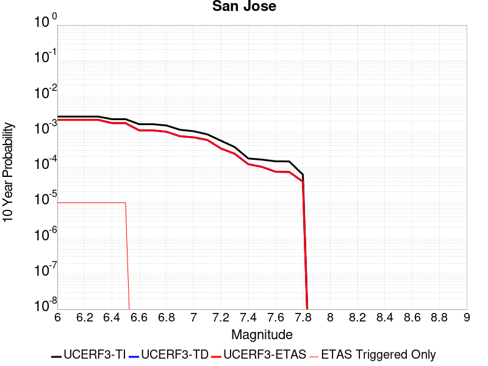 |

| Magnitude | 1 wk TI Prob | 1 wk TD Prob | 1 wk ETAS Prob | 1 wk ETAS/TD Gain | 1 wk ETAS Triggered Only | 1 mo TI Prob | 1 mo TD Prob | 1 mo ETAS Prob | 1 mo ETAS/TD Gain | 1 mo ETAS Triggered Only | 1 yr TI Prob | 1 yr TD Prob | 1 yr ETAS Prob | 1 yr ETAS/TD Gain | 1 yr ETAS Triggered Only | 10 yr TI Prob | 10 yr TD Prob | 10 yr ETAS Prob | 10 yr ETAS/TD Gain | 10 yr ETAS Triggered Only |
|-----|-----|-----|-----|-----|-----|-----|-----|-----|-----|-----|-----|-----|-----|-----|-----|-----|-----|-----|-----|-----|
| 6.0 | 5.0851277E-6 | 4.125725E-6 | 4.125725E-6 | 1.0 | 0.0 | 2.1793223E-5 | 1.7681574E-5 | 1.7681574E-5 | 1.0 | 0.0 | 2.653002E-4 | 2.1525452E-4 | 2.2525237E-4 | 1.0464467 | 1.0E-5 | 0.0026498367 | 0.0021507433 | 0.002160722 | 1.0046395 | 1.0E-5 |
| 6.1 | 5.0851277E-6 | 4.125725E-6 | 4.125725E-6 | 1.0 | 0.0 | 2.1793223E-5 | 1.7681574E-5 | 1.7681574E-5 | 1.0 | 0.0 | 2.653002E-4 | 2.1525452E-4 | 2.2525237E-4 | 1.0464467 | 1.0E-5 | 0.0026498367 | 0.0021507433 | 0.002160722 | 1.0046395 | 1.0E-5 |
| 6.2 | 5.0851277E-6 | 4.125725E-6 | 4.125725E-6 | 1.0 | 0.0 | 2.1793223E-5 | 1.7681574E-5 | 1.7681574E-5 | 1.0 | 0.0 | 2.653002E-4 | 2.1525452E-4 | 2.2525237E-4 | 1.0464467 | 1.0E-5 | 0.0026498367 | 0.0021507433 | 0.002160722 | 1.0046395 | 1.0E-5 |
| 6.3 | 5.0851277E-6 | 4.125725E-6 | 4.125725E-6 | 1.0 | 0.0 | 2.1793223E-5 | 1.7681574E-5 | 1.7681574E-5 | 1.0 | 0.0 | 2.653002E-4 | 2.1525452E-4 | 2.2525237E-4 | 1.0464467 | 1.0E-5 | 0.0026498367 | 0.0021507433 | 0.002160722 | 1.0046395 | 1.0E-5 |
| 6.4 | 4.3115124E-6 | 3.3238314E-6 | 3.3238314E-6 | 1.0 | 0.0 | 1.8477778E-5 | 1.4244926E-5 | 1.4244926E-5 | 1.0 | 0.0 | 2.2494372E-4 | 1.7342038E-4 | 1.8341866E-4 | 1.0576533 | 1.0E-5 | 0.0022471617 | 0.0017330924 | 0.001743075 | 1.0057601 | 1.0E-5 |
| 6.5 | 4.3115124E-6 | 3.3238314E-6 | 3.3238314E-6 | 1.0 | 0.0 | 1.8477778E-5 | 1.4244926E-5 | 1.4244926E-5 | 1.0 | 0.0 | 2.2494372E-4 | 1.7342038E-4 | 1.8341866E-4 | 1.0576533 | 1.0E-5 | 0.0022471617 | 0.0017330924 | 0.001743075 | 1.0057601 | 1.0E-5 |
| 6.6 | 3.110396E-6 | 2.0800292E-6 | 2.0800292E-6 | 1.0 | 0.0 | 1.33302E-5 | 8.914381E-6 | 8.914381E-6 | 1.0 | 0.0 | 1.622831E-4 | 1.0852747E-4 | 1.0852747E-4 | 1.0 | 0.0 | 0.0016216465 | 0.0010847967 | 0.0010847967 | 1.0 | 0.0 |
| 6.7 | 3.110396E-6 | 2.0800292E-6 | 2.0800292E-6 | 1.0 | 0.0 | 1.33302E-5 | 8.914381E-6 | 8.914381E-6 | 1.0 | 0.0 | 1.622831E-4 | 1.0852747E-4 | 1.0852747E-4 | 1.0 | 0.0 | 0.0016216465 | 0.0010847967 | 0.0010847967 | 1.0 | 0.0 |
| 6.8 | 2.856651E-6 | 1.9024797E-6 | 1.9024797E-6 | 1.0 | 0.0 | 1.2242733E-5 | 8.15346E-6 | 8.15346E-6 | 1.0 | 0.0 | 1.4904508E-4 | 9.926411E-5 | 9.926411E-5 | 1.0 | 0.0 | 0.0014894515 | 9.922467E-4 | 9.922467E-4 | 1.0 | 0.0 |
| 6.9 | 2.1618725E-6 | 1.4187103E-6 | 1.4187103E-6 | 1.0 | 0.0 | 9.265135E-6 | 6.080173E-6 | 6.080173E-6 | 1.0 | 0.0 | 1.12797185E-4 | 7.402369E-5 | 7.402369E-5 | 1.0 | 0.0 | 0.0011273995 | 7.400235E-4 | 7.400235E-4 | 1.0 | 0.0 |
| 7.0 | 1.9684312E-6 | 1.3256772E-6 | 1.3256772E-6 | 1.0 | 0.0 | 8.436106E-6 | 5.681462E-6 | 5.681462E-6 | 1.0 | 0.0 | 1.02704755E-4 | 6.9169684E-5 | 6.9169684E-5 | 1.0 | 0.0 | 0.001026573 | 6.9151423E-4 | 6.9151423E-4 | 1.0 | 0.0 |
| 7.1 | 1.6070337E-6 | 1.1155536E-6 | 1.1155536E-6 | 1.0 | 0.0 | 6.887269E-6 | 4.7809353E-6 | 4.7809353E-6 | 1.0 | 0.0 | 8.384928E-5 | 5.82064E-5 | 5.82064E-5 | 1.0 | 0.0 | 8.3817646E-4 | 5.819422E-4 | 5.819422E-4 | 1.0 | 0.0 |
| 7.2 | 1.0631658E-6 | 6.4040677E-7 | 6.4040677E-7 | 1.0 | 0.0 | 4.556417E-6 | 2.7445976E-6 | 2.7445976E-6 | 1.0 | 0.0 | 5.5472963E-5 | 3.3414977E-5 | 3.3414977E-5 | 1.0 | 0.0 | 5.545912E-4 | 3.3412542E-4 | 3.3412542E-4 | 1.0 | 0.0 |
| 7.3 | 7.060711E-7 | 4.5827397E-7 | 4.5827397E-7 | 1.0 | 0.0 | 3.0260155E-6 | 1.96403E-6 | 1.96403E-6 | 1.0 | 0.0 | 3.6841117E-5 | 2.391181E-5 | 2.391181E-5 | 1.0 | 0.0 | 3.6835007E-4 | 2.3911778E-4 | 2.3911778E-4 | 1.0 | 0.0 |
| 7.4 | 3.3677085E-7 | 2.3235165E-7 | 2.3235165E-7 | 1.0 | 0.0 | 1.4433028E-6 | 9.957924E-7 | 9.957924E-7 | 1.0 | 0.0 | 1.757207E-5 | 1.2123709E-5 | 1.2123709E-5 | 1.0 | 0.0 | 1.7570681E-4 | 1.2125527E-4 | 1.2125527E-4 | 1.0 | 0.0 |
| 7.5 | 3.129161E-7 | 1.9532374E-7 | 1.9532374E-7 | 1.0 | 0.0 | 1.3410682E-6 | 8.371014E-7 | 8.371014E-7 | 1.0 | 0.0 | 1.6327383E-5 | 1.0191665E-5 | 1.0191665E-5 | 1.0 | 0.0 | 1.6326184E-4 | 1.0193672E-4 | 1.0193672E-4 | 1.0 | 0.0 |
| 7.6 | 2.8008668E-7 | 1.4242943E-7 | 1.4242943E-7 | 1.0 | 0.0 | 1.2003709E-6 | 6.104117E-7 | 6.104117E-7 | 1.0 | 0.0 | 1.46144175E-5 | 7.4317386E-6 | 7.4317386E-6 | 1.0 | 0.0 | 1.4613457E-4 | 7.433959E-5 | 7.433959E-5 | 1.0 | 0.0 |
| 7.7 | 2.7852005E-7 | 1.4017505E-7 | 1.4017505E-7 | 1.0 | 0.0 | 1.1936568E-6 | 6.0075007E-7 | 6.0075007E-7 | 1.0 | 0.0 | 1.4532674E-5 | 7.3141096E-6 | 7.3141096E-6 | 1.0 | 0.0 | 1.4531724E-4 | 7.316337E-5 | 7.316337E-5 | 1.0 | 0.0 |
| 7.8 | 1.1810797E-7 | 7.519506E-8 | 7.519506E-8 | 1.0 | 0.0 | 5.0617695E-7 | 3.222645E-7 | 3.222645E-7 | 1.0 | 0.0 | 6.1626865E-6 | 3.923564E-6 | 3.923564E-6 | 1.0 | 0.0 | 6.162516E-5 | 3.92379E-5 | 3.92379E-5 | 1.0 | 0.0 |

## Los Medanos - Roe Island
*[(top)](#table-of-contents)*

| 1 Week | 1 Month | 1 Year | 10 Year |
|-----|-----|-----|-----|
|  |  |  |  |

| Magnitude | 1 wk TI Prob | 1 wk TD Prob | 1 wk ETAS Prob | 1 wk ETAS/TD Gain | 1 wk ETAS Triggered Only | 1 mo TI Prob | 1 mo TD Prob | 1 mo ETAS Prob | 1 mo ETAS/TD Gain | 1 mo ETAS Triggered Only | 1 yr TI Prob | 1 yr TD Prob | 1 yr ETAS Prob | 1 yr ETAS/TD Gain | 1 yr ETAS Triggered Only | 10 yr TI Prob | 10 yr TD Prob | 10 yr ETAS Prob | 10 yr ETAS/TD Gain | 10 yr ETAS Triggered Only |
|-----|-----|-----|-----|-----|-----|-----|-----|-----|-----|-----|-----|-----|-----|-----|-----|-----|-----|-----|-----|-----|
| 6.0 | 9.06745E-7 | 9.796505E-7 | 9.796505E-7 | 1.0 | 0.0 | 3.8860444E-6 | 4.198496E-6 | 4.198496E-6 | 1.0 | 0.0 | 4.731156E-5 | 5.1115494E-5 | 5.1115494E-5 | 1.0 | 0.0 | 4.730149E-4 | 5.110383E-4 | 5.2103313E-4 | 1.019558 | 1.0E-5 |
| 6.1 | 9.06745E-7 | 9.796505E-7 | 9.796505E-7 | 1.0 | 0.0 | 3.8860444E-6 | 4.198496E-6 | 4.198496E-6 | 1.0 | 0.0 | 4.731156E-5 | 5.1115494E-5 | 5.1115494E-5 | 1.0 | 0.0 | 4.730149E-4 | 5.110383E-4 | 5.2103313E-4 | 1.019558 | 1.0E-5 |
| 6.2 | 9.06745E-7 | 9.796505E-7 | 9.796505E-7 | 1.0 | 0.0 | 3.8860444E-6 | 4.198496E-6 | 4.198496E-6 | 1.0 | 0.0 | 4.731156E-5 | 5.1115494E-5 | 5.1115494E-5 | 1.0 | 0.0 | 4.730149E-4 | 5.110383E-4 | 5.2103313E-4 | 1.019558 | 1.0E-5 |
| 6.3 | 9.06745E-7 | 9.796505E-7 | 9.796505E-7 | 1.0 | 0.0 | 3.8860444E-6 | 4.198496E-6 | 4.198496E-6 | 1.0 | 0.0 | 4.731156E-5 | 5.1115494E-5 | 5.1115494E-5 | 1.0 | 0.0 | 4.730149E-4 | 5.110383E-4 | 5.2103313E-4 | 1.019558 | 1.0E-5 |
| 6.4 | 9.06745E-7 | 9.796505E-7 | 9.796505E-7 | 1.0 | 0.0 | 3.8860444E-6 | 4.198496E-6 | 4.198496E-6 | 1.0 | 0.0 | 4.731156E-5 | 5.1115494E-5 | 5.1115494E-5 | 1.0 | 0.0 | 4.730149E-4 | 5.110383E-4 | 5.2103313E-4 | 1.019558 | 1.0E-5 |
| 6.5 | 9.06745E-7 | 9.796505E-7 | 9.796505E-7 | 1.0 | 0.0 | 3.8860444E-6 | 4.198496E-6 | 4.198496E-6 | 1.0 | 0.0 | 4.731156E-5 | 5.1115494E-5 | 5.1115494E-5 | 1.0 | 0.0 | 4.730149E-4 | 5.110383E-4 | 5.2103313E-4 | 1.019558 | 1.0E-5 |
| 6.6 | 9.06745E-7 | 9.796505E-7 | 9.796505E-7 | 1.0 | 0.0 | 3.8860444E-6 | 4.198496E-6 | 4.198496E-6 | 1.0 | 0.0 | 4.731156E-5 | 5.1115494E-5 | 5.1115494E-5 | 1.0 | 0.0 | 4.730149E-4 | 5.110383E-4 | 5.2103313E-4 | 1.019558 | 1.0E-5 |
| 6.7 | 8.984686E-7 | 9.713171E-7 | 9.713171E-7 | 1.0 | 0.0 | 3.850574E-6 | 4.1627814E-6 | 4.1627814E-6 | 1.0 | 0.0 | 4.687973E-5 | 5.0680694E-5 | 5.0680694E-5 | 1.0 | 0.0 | 4.6869842E-4 | 5.066922E-4 | 5.1668717E-4 | 1.0197258 | 1.0E-5 |
| 6.8 | 8.5634423E-7 | 9.2276656E-7 | 9.2276656E-7 | 1.0 | 0.0 | 3.6700415E-6 | 3.9547076E-6 | 3.9547076E-6 | 1.0 | 0.0 | 4.4681838E-5 | 4.814751E-5 | 4.814751E-5 | 1.0 | 0.0 | 4.4672855E-4 | 4.8137153E-4 | 4.913667E-4 | 1.020764 | 1.0E-5 |
| 6.9 | 7.9857483E-7 | 8.5946414E-7 | 8.5946414E-7 | 1.0 | 0.0 | 3.422459E-6 | 3.6834126E-6 | 3.6834126E-6 | 1.0 | 0.0 | 4.166764E-5 | 4.484463E-5 | 4.484463E-5 | 1.0 | 0.0 | 4.165983E-4 | 4.4835644E-4 | 4.5835198E-4 | 1.0222937 | 1.0E-5 |
| 7.0 | 6.898334E-7 | 7.3973416E-7 | 7.3973416E-7 | 1.0 | 0.0 | 2.9564258E-6 | 3.1702853E-6 | 3.1702853E-6 | 1.0 | 0.0 | 3.599389E-5 | 3.8597544E-5 | 3.8597544E-5 | 1.0 | 0.0 | 3.598806E-4 | 3.8590882E-4 | 3.9590496E-4 | 1.0259029 | 1.0E-5 |
| 7.1 | 5.5734876E-7 | 5.9684714E-7 | 5.9684714E-7 | 1.0 | 0.0 | 2.3886353E-6 | 2.5579138E-6 | 2.5579138E-6 | 1.0 | 0.0 | 2.9081246E-5 | 3.114216E-5 | 3.114216E-5 | 1.0 | 0.0 | 2.9077442E-4 | 3.1137821E-4 | 3.213751E-4 | 1.0321053 | 1.0E-5 |
| 7.2 | 4.0792582E-7 | 4.357057E-7 | 4.357057E-7 | 1.0 | 0.0 | 1.7482523E-6 | 1.8673088E-6 | 1.8673088E-6 | 1.0 | 0.0 | 2.1284764E-5 | 2.2734248E-5 | 2.2734248E-5 | 1.0 | 0.0 | 2.1282726E-4 | 2.2731938E-4 | 2.2731938E-4 | 1.0 | 0.0 |
| 7.3 | 2.6733358E-7 | 2.8579834E-7 | 2.8579834E-7 | 1.0 | 0.0 | 1.1457148E-6 | 1.2248495E-6 | 1.2248495E-6 | 1.0 | 0.0 | 1.3948988E-5 | 1.4912441E-5 | 1.4912441E-5 | 1.0 | 0.0 | 1.3948113E-4 | 1.4911448E-4 | 1.4911448E-4 | 1.0 | 0.0 |
| 7.4 | 1.5851728E-7 | 1.6910336E-7 | 1.6910336E-7 | 1.0 | 0.0 | 6.7935963E-7 | 7.2472847E-7 | 7.2472847E-7 | 1.0 | 0.0 | 8.271172E-6 | 8.823534E-6 | 8.823534E-6 | 1.0 | 0.0 | 8.270864E-5 | 8.823186E-5 | 8.823186E-5 | 1.0 | 0.0 |
| 7.5 | 1.06756E-7 | 1.13796595E-7 | 1.13796595E-7 | 1.0 | 0.0 | 4.575256E-7 | 4.876996E-7 | 4.876996E-7 | 1.0 | 0.0 | 5.57036E-6 | 5.9377267E-6 | 5.9377267E-6 | 1.0 | 0.0 | 5.5702203E-5 | 5.9375696E-5 | 5.9375696E-5 | 1.0 | 0.0 |
| 7.6 | 6.48122E-8 | 6.904824E-8 | 6.904824E-8 | 1.0 | 0.0 | 2.7776653E-7 | 2.9592098E-7 | 2.9592098E-7 | 1.0 | 0.0 | 3.3818023E-6 | 3.6028323E-6 | 3.6028323E-6 | 1.0 | 0.0 | 3.381751E-5 | 3.602775E-5 | 3.602775E-5 | 1.0 | 0.0 |
| 7.7 | 1.198296E-9 | 1.2904567E-9 | 1.2904567E-9 | 1.0 | 0.0 | 5.135554E-9 | 5.530529E-9 | 5.530529E-9 | 1.0 | 0.0 | 6.252537E-8 | 6.7334184E-8 | 6.7334184E-8 | 1.0 | 0.0 | 6.2525356E-7 | 6.7334173E-7 | 6.7334173E-7 | 1.0 | 0.0 |

## Los Osos 2011
*[(top)](#table-of-contents)*

| 1 Week | 1 Month | 1 Year | 10 Year |
|-----|-----|-----|-----|
|  |  |  |  |

| Magnitude | 1 wk TI Prob | 1 wk TD Prob | 1 wk ETAS Prob | 1 wk ETAS/TD Gain | 1 wk ETAS Triggered Only | 1 mo TI Prob | 1 mo TD Prob | 1 mo ETAS Prob | 1 mo ETAS/TD Gain | 1 mo ETAS Triggered Only | 1 yr TI Prob | 1 yr TD Prob | 1 yr ETAS Prob | 1 yr ETAS/TD Gain | 1 yr ETAS Triggered Only | 10 yr TI Prob | 10 yr TD Prob | 10 yr ETAS Prob | 10 yr ETAS/TD Gain | 10 yr ETAS Triggered Only |
|-----|-----|-----|-----|-----|-----|-----|-----|-----|-----|-----|-----|-----|-----|-----|-----|-----|-----|-----|-----|-----|
| 6.0 | 4.8871775E-6 | 4.9815035E-6 | 4.9815035E-6 | 1.0 | 0.0 | 2.0944879E-5 | 2.134914E-5 | 2.134914E-5 | 1.0 | 0.0 | 2.5497406E-4 | 2.5989758E-4 | 2.6989498E-4 | 1.0384667 | 1.0E-5 | 0.002546817 | 0.0025962107 | 0.0026061847 | 1.0038418 | 1.0E-5 |
| 6.1 | 4.8871775E-6 | 4.9815035E-6 | 4.9815035E-6 | 1.0 | 0.0 | 2.0944879E-5 | 2.134914E-5 | 2.134914E-5 | 1.0 | 0.0 | 2.5497406E-4 | 2.5989758E-4 | 2.6989498E-4 | 1.0384667 | 1.0E-5 | 0.002546817 | 0.0025962107 | 0.0026061847 | 1.0038418 | 1.0E-5 |
| 6.2 | 4.8871775E-6 | 4.9815035E-6 | 4.9815035E-6 | 1.0 | 0.0 | 2.0944879E-5 | 2.134914E-5 | 2.134914E-5 | 1.0 | 0.0 | 2.5497406E-4 | 2.5989758E-4 | 2.6989498E-4 | 1.0384667 | 1.0E-5 | 0.002546817 | 0.0025962107 | 0.0026061847 | 1.0038418 | 1.0E-5 |
| 6.3 | 4.8871775E-6 | 4.9815035E-6 | 4.9815035E-6 | 1.0 | 0.0 | 2.0944879E-5 | 2.134914E-5 | 2.134914E-5 | 1.0 | 0.0 | 2.5497406E-4 | 2.5989758E-4 | 2.6989498E-4 | 1.0384667 | 1.0E-5 | 0.002546817 | 0.0025962107 | 0.0026061847 | 1.0038418 | 1.0E-5 |
| 6.4 | 4.8871775E-6 | 4.9815035E-6 | 4.9815035E-6 | 1.0 | 0.0 | 2.0944879E-5 | 2.134914E-5 | 2.134914E-5 | 1.0 | 0.0 | 2.5497406E-4 | 2.5989758E-4 | 2.6989498E-4 | 1.0384667 | 1.0E-5 | 0.002546817 | 0.0025962107 | 0.0026061847 | 1.0038418 | 1.0E-5 |
| 6.5 | 3.1724062E-6 | 3.223409E-6 | 3.223409E-6 | 1.0 | 0.0 | 1.3595956E-5 | 1.3814538E-5 | 1.3814538E-5 | 1.0 | 0.0 | 1.6551818E-4 | 1.6817915E-4 | 1.6817915E-4 | 1.0 | 0.0 | 0.0016539496 | 0.0016805322 | 0.0016805322 | 1.0 | 0.0 |
| 6.6 | 3.1022591E-6 | 3.151118E-6 | 3.151118E-6 | 1.0 | 0.0 | 1.3295328E-5 | 1.3504723E-5 | 1.3504723E-5 | 1.0 | 0.0 | 1.618586E-4 | 1.6440773E-4 | 1.6440773E-4 | 1.0 | 0.0 | 0.0016174077 | 0.0016428737 | 0.0016428737 | 1.0 | 0.0 |
| 6.7 | 2.611518E-6 | 2.6491955E-6 | 2.6491955E-6 | 1.0 | 0.0 | 1.1192172E-5 | 1.1353646E-5 | 1.1353646E-5 | 1.0 | 0.0 | 1.3625617E-4 | 1.382219E-4 | 1.382219E-4 | 1.0 | 0.0 | 0.0013617266 | 0.001381364 | 0.001381364 | 1.0 | 0.0 |
| 6.8 | 2.4780884E-6 | 2.512171E-6 | 2.512171E-6 | 1.0 | 0.0 | 1.0620336E-5 | 1.0766403E-5 | 1.0766403E-5 | 1.0 | 0.0 | 1.2929492E-4 | 1.3107312E-4 | 1.3107312E-4 | 1.0 | 0.0 | 0.0012921972 | 0.0013099621 | 0.0013099621 | 1.0 | 0.0 |
| 6.9 | 2.1376322E-6 | 2.1635162E-6 | 2.1635162E-6 | 1.0 | 0.0 | 9.161248E-6 | 9.272179E-6 | 9.272179E-6 | 1.0 | 0.0 | 1.1153249E-4 | 1.1288296E-4 | 1.1288296E-4 | 1.0 | 0.0 | 0.0011147653 | 0.0011282581 | 0.0011282581 | 1.0 | 0.0 |
| 7.0 | 1.9282882E-6 | 1.9494685E-6 | 1.9494685E-6 | 1.0 | 0.0 | 8.264066E-6 | 8.354838E-6 | 8.354838E-6 | 1.0 | 0.0 | 1.0061036E-4 | 1.0171542E-4 | 1.0171542E-4 | 1.0 | 0.0 | 0.0010056482 | 0.00101669 | 0.00101669 | 1.0 | 0.0 |
| 7.1 | 1.6353226E-6 | 1.6501209E-6 | 1.6501209E-6 | 1.0 | 0.0 | 7.0085066E-6 | 7.071928E-6 | 7.071928E-6 | 1.0 | 0.0 | 8.532523E-5 | 8.609732E-5 | 8.609732E-5 | 1.0 | 0.0 | 8.529247E-4 | 8.606405E-4 | 8.606405E-4 | 1.0 | 0.0 |
| 7.2 | 1.4446276E-6 | 1.4553427E-6 | 1.4553427E-6 | 1.0 | 0.0 | 6.191247E-6 | 6.2371682E-6 | 6.2371682E-6 | 1.0 | 0.0 | 7.537582E-5 | 7.5934884E-5 | 7.5934884E-5 | 1.0 | 0.0 | 7.535026E-4 | 7.5908995E-4 | 7.5908995E-4 | 1.0 | 0.0 |
| 7.3 | 1.2014582E-6 | 1.2069152E-6 | 1.2069152E-6 | 1.0 | 0.0 | 5.149096E-6 | 5.1724833E-6 | 5.1724833E-6 | 1.0 | 0.0 | 6.268844E-5 | 6.2973166E-5 | 6.2973166E-5 | 1.0 | 0.0 | 6.267076E-4 | 6.2955363E-4 | 6.2955363E-4 | 1.0 | 0.0 |
| 7.4 | 9.707733E-7 | 9.709845E-7 | 9.709845E-7 | 1.0 | 0.0 | 4.16045E-6 | 4.1613553E-6 | 4.1613553E-6 | 1.0 | 0.0 | 5.0652303E-5 | 5.0663326E-5 | 5.0663326E-5 | 1.0 | 0.0 | 5.064076E-4 | 5.0651806E-4 | 5.0651806E-4 | 1.0 | 0.0 |
| 7.5 | 7.174908E-7 | 7.114977E-7 | 7.114977E-7 | 1.0 | 0.0 | 3.074957E-6 | 3.0492722E-6 | 3.0492722E-6 | 1.0 | 0.0 | 3.743696E-5 | 3.712426E-5 | 3.712426E-5 | 1.0 | 0.0 | 3.7430652E-4 | 3.7118077E-4 | 3.7118077E-4 | 1.0 | 0.0 |
| 7.6 | 4.5535776E-7 | 4.4208457E-7 | 4.4208457E-7 | 1.0 | 0.0 | 1.9515319E-6 | 1.8946467E-6 | 1.8946467E-6 | 1.0 | 0.0 | 2.3759641E-5 | 2.3067081E-5 | 2.3067081E-5 | 1.0 | 0.0 | 2.37571E-4 | 2.3064695E-4 | 2.3064695E-4 | 1.0 | 0.0 |
| 7.7 | 2.1173553E-7 | 1.9061224E-7 | 1.9061224E-7 | 1.0 | 0.0 | 9.0743765E-7 | 8.1690933E-7 | 8.1690933E-7 | 1.0 | 0.0 | 1.1047998E-5 | 9.945827E-6 | 9.945827E-6 | 1.0 | 0.0 | 1.1047449E-4 | 9.945384E-5 | 9.945384E-5 | 1.0 | 0.0 |
| 7.8 | 9.873608E-8 | 7.3678876E-8 | 7.3678876E-8 | 1.0 | 0.0 | 4.2315455E-7 | 3.1576658E-7 | 3.1576658E-7 | 1.0 | 0.0 | 5.1518946E-6 | 3.8444514E-6 | 3.8444514E-6 | 1.0 | 0.0 | 5.1517753E-5 | 3.8443854E-5 | 3.8443854E-5 | 1.0 | 0.0 |
| 7.9 | 5.4399106E-8 | 3.1883175E-8 | 3.1883175E-8 | 1.0 | 0.0 | 2.33139E-7 | 1.3664217E-7 | 1.3664217E-7 | 1.0 | 0.0 | 2.8384638E-6 | 1.6636172E-6 | 1.6636172E-6 | 1.0 | 0.0 | 2.8384275E-5 | 1.663605E-5 | 1.663605E-5 | 1.0 | 0.0 |
| 8.0 | 1.817203E-8 | 8.421595E-9 | 8.421595E-9 | 1.0 | 0.0 | 7.7880124E-8 | 3.6092548E-8 | 3.6092548E-8 | 1.0 | 0.0 | 9.481901E-7 | 4.3942669E-7 | 4.3942669E-7 | 1.0 | 0.0 | 9.481861E-6 | 4.3942587E-6 | 4.3942587E-6 | 1.0 | 0.0 |

## Elsinore (Coyote Mountains)
*[(top)](#table-of-contents)*

| 1 Week | 1 Month | 1 Year | 10 Year |
|-----|-----|-----|-----|
|  |  |  |  |

| Magnitude | 1 wk TI Prob | 1 wk TD Prob | 1 wk ETAS Prob | 1 wk ETAS/TD Gain | 1 wk ETAS Triggered Only | 1 mo TI Prob | 1 mo TD Prob | 1 mo ETAS Prob | 1 mo ETAS/TD Gain | 1 mo ETAS Triggered Only | 1 yr TI Prob | 1 yr TD Prob | 1 yr ETAS Prob | 1 yr ETAS/TD Gain | 1 yr ETAS Triggered Only | 10 yr TI Prob | 10 yr TD Prob | 10 yr ETAS Prob | 10 yr ETAS/TD Gain | 10 yr ETAS Triggered Only |
|-----|-----|-----|-----|-----|-----|-----|-----|-----|-----|-----|-----|-----|-----|-----|-----|-----|-----|-----|-----|-----|
| 6.0 | 4.20513E-5 | 4.863269E-5 | 4.863269E-5 | 1.0 | 0.0 | 1.8020741E-4 | 2.084124E-4 | 2.084124E-4 | 1.0 | 0.0 | 0.0021918174 | 0.0025349946 | 0.0025349946 | 1.0 | 0.0 | 0.021703249 | 0.025112068 | 0.025121817 | 1.0003883 | 1.0E-5 |
| 6.1 | 4.20513E-5 | 4.863269E-5 | 4.863269E-5 | 1.0 | 0.0 | 1.8020741E-4 | 2.084124E-4 | 2.084124E-4 | 1.0 | 0.0 | 0.0021918174 | 0.0025349946 | 0.0025349946 | 1.0 | 0.0 | 0.021703249 | 0.025112068 | 0.025121817 | 1.0003883 | 1.0E-5 |
| 6.2 | 2.3413893E-5 | 2.469625E-5 | 2.469625E-5 | 1.0 | 0.0 | 1.0034139E-4 | 1.0583731E-4 | 1.0583731E-4 | 1.0 | 0.0 | 0.0012209718 | 0.001287895 | 0.001287895 | 1.0 | 0.0 | 0.012142851 | 0.012812992 | 0.012812992 | 1.0 | 0.0 |
| 6.3 | 2.3413893E-5 | 2.469625E-5 | 2.469625E-5 | 1.0 | 0.0 | 1.0034139E-4 | 1.0583731E-4 | 1.0583731E-4 | 1.0 | 0.0 | 0.0012209718 | 0.001287895 | 0.001287895 | 1.0 | 0.0 | 0.012142851 | 0.012812992 | 0.012812992 | 1.0 | 0.0 |
| 6.4 | 1.6894814E-5 | 1.6568772E-5 | 1.6568772E-5 | 1.0 | 0.0 | 7.240433E-5 | 7.10073E-5 | 7.10073E-5 | 1.0 | 0.0 | 8.811662E-4 | 8.642079E-4 | 8.642079E-4 | 1.0 | 0.0 | 0.0087768035 | 0.008612131 | 0.008612131 | 1.0 | 0.0 |
| 6.5 | 1.6894814E-5 | 1.6568772E-5 | 1.6568772E-5 | 1.0 | 0.0 | 7.240433E-5 | 7.10073E-5 | 7.10073E-5 | 1.0 | 0.0 | 8.811662E-4 | 8.642079E-4 | 8.642079E-4 | 1.0 | 0.0 | 0.0087768035 | 0.008612131 | 0.008612131 | 1.0 | 0.0 |
| 6.6 | 1.1910969E-5 | 1.0530927E-5 | 1.0530927E-5 | 1.0 | 0.0 | 5.1046012E-5 | 4.513184E-5 | 4.513184E-5 | 1.0 | 0.0 | 6.21308E-4 | 5.4935494E-4 | 5.4935494E-4 | 1.0 | 0.0 | 0.0061957375 | 0.00548127 | 0.00548127 | 1.0 | 0.0 |
| 6.7 | 9.1486E-6 | 7.2029457E-6 | 7.2029457E-6 | 1.0 | 0.0 | 3.9207694E-5 | 3.0869425E-5 | 3.0869425E-5 | 1.0 | 0.0 | 4.7724912E-4 | 3.7577422E-4 | 3.7577422E-4 | 1.0 | 0.0 | 0.0047622547 | 0.0037517678 | 0.0037517678 | 1.0 | 0.0 |
| 6.8 | 7.90441E-6 | 5.729078E-6 | 5.729078E-6 | 1.0 | 0.0 | 3.3875604E-5 | 2.4552968E-5 | 2.4552968E-5 | 1.0 | 0.0 | 4.1235742E-4 | 2.9889264E-4 | 2.9889264E-4 | 1.0 | 0.0 | 0.0041159308 | 0.002985035 | 0.002985035 | 1.0 | 0.0 |
| 6.9 | 7.77015E-6 | 5.5830305E-6 | 5.5830305E-6 | 1.0 | 0.0 | 3.3300217E-5 | 2.3927061E-5 | 2.3927061E-5 | 1.0 | 0.0 | 4.0535472E-4 | 2.912743E-4 | 2.912743E-4 | 1.0 | 0.0 | 0.004046161 | 0.0029090524 | 0.0029090524 | 1.0 | 0.0 |
| 7.0 | 7.675798E-6 | 5.479888E-6 | 5.479888E-6 | 1.0 | 0.0 | 3.289586E-5 | 2.3485029E-5 | 2.3485029E-5 | 1.0 | 0.0 | 4.004335E-4 | 2.8589397E-4 | 2.8589397E-4 | 1.0 | 0.0 | 0.003997127 | 0.0028553882 | 0.0028553882 | 1.0 | 0.0 |
| 7.1 | 7.447814E-6 | 5.2387572E-6 | 5.2387572E-6 | 1.0 | 0.0 | 3.191881E-5 | 2.2451632E-5 | 2.2451632E-5 | 1.0 | 0.0 | 3.8854225E-4 | 2.7331559E-4 | 2.7331559E-4 | 1.0 | 0.0 | 0.003878636 | 0.0027299186 | 0.0027299186 | 1.0 | 0.0 |
| 7.2 | 7.128185E-6 | 4.9054033E-6 | 4.9054033E-6 | 1.0 | 0.0 | 3.0549007E-5 | 2.1022995E-5 | 2.1022995E-5 | 1.0 | 0.0 | 3.7187067E-4 | 2.5592608E-4 | 2.5592608E-4 | 1.0 | 0.0 | 0.00371249 | 0.002556432 | 0.002556432 | 1.0 | 0.0 |
| 7.3 | 7.0913875E-6 | 4.874078E-6 | 4.874078E-6 | 1.0 | 0.0 | 3.0391306E-5 | 2.0888747E-5 | 2.0888747E-5 | 1.0 | 0.0 | 3.6995133E-4 | 2.5429198E-4 | 2.5429198E-4 | 1.0 | 0.0 | 0.0036933604 | 0.0025401285 | 0.0025401285 | 1.0 | 0.0 |
| 7.4 | 7.051521E-6 | 4.8379297E-6 | 4.8379297E-6 | 1.0 | 0.0 | 3.0220453E-5 | 2.0733825E-5 | 2.0733825E-5 | 1.0 | 0.0 | 3.6787192E-4 | 2.524063E-4 | 2.524063E-4 | 1.0 | 0.0 | 0.0036726352 | 0.0025213142 | 0.0025213142 | 1.0 | 0.0 |
| 7.5 | 6.910666E-6 | 4.733479E-6 | 4.733479E-6 | 1.0 | 0.0 | 2.9616802E-5 | 2.0286187E-5 | 2.0286187E-5 | 1.0 | 0.0 | 3.605249E-4 | 2.4695753E-4 | 2.4695753E-4 | 1.0 | 0.0 | 0.0035994058 | 0.0024669487 | 0.0024669487 | 1.0 | 0.0 |
| 7.6 | 6.341753E-6 | 4.306589E-6 | 4.306589E-6 | 1.0 | 0.0 | 2.7178658E-5 | 1.8456685E-5 | 1.8456685E-5 | 1.0 | 0.0 | 3.3084993E-4 | 2.2468815E-4 | 2.2468815E-4 | 1.0 | 0.0 | 0.0033035777 | 0.002244725 | 0.002244725 | 1.0 | 0.0 |
| 7.7 | 3.9205916E-6 | 2.2439156E-6 | 2.2439156E-6 | 1.0 | 0.0 | 1.6802427E-5 | 9.61675E-6 | 9.61675E-6 | 1.0 | 0.0 | 2.0455034E-4 | 1.1707837E-4 | 1.1707837E-4 | 1.0 | 0.0 | 0.0020436216 | 0.0011702399 | 0.0011702399 | 1.0 | 0.0 |
| 7.8 | 2.0846227E-7 | 8.485576E-8 | 8.485576E-8 | 1.0 | 0.0 | 8.9340944E-7 | 3.6366754E-7 | 3.6366754E-7 | 1.0 | 0.0 | 1.0877206E-5 | 4.4276467E-6 | 4.4276467E-6 | 1.0 | 0.0 | 1.0876673E-4 | 4.4275912E-5 | 4.4275912E-5 | 1.0 | 0.0 |
| 7.9 | 4.4969806E-9 | 2.26915E-9 | 2.26915E-9 | 1.0 | 0.0 | 1.9272775E-8 | 9.724928E-9 | 9.724928E-9 | 1.0 | 0.0 | 2.3464601E-7 | 1.18401E-7 | 1.18401E-7 | 1.0 | 0.0 | 2.3464577E-6 | 1.1840094E-6 | 1.1840094E-6 | 1.0 | 0.0 |

## Great Valley 08 (Quinto)
*[(top)](#table-of-contents)*

| 1 Week | 1 Month | 1 Year | 10 Year |
|-----|-----|-----|-----|
|  | 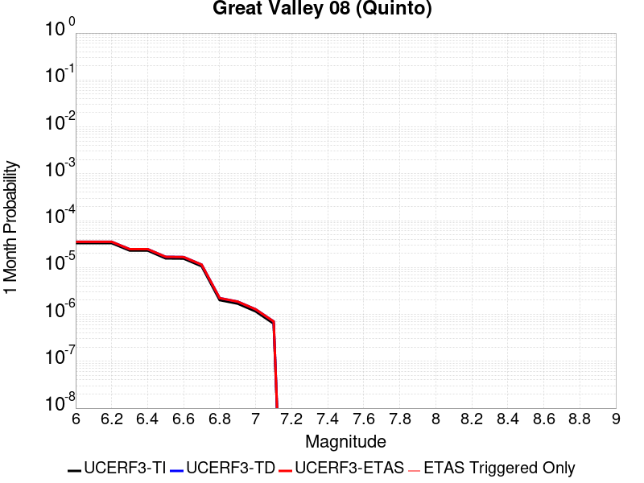 |  |  |

| Magnitude | 1 wk TI Prob | 1 wk TD Prob | 1 wk ETAS Prob | 1 wk ETAS/TD Gain | 1 wk ETAS Triggered Only | 1 mo TI Prob | 1 mo TD Prob | 1 mo ETAS Prob | 1 mo ETAS/TD Gain | 1 mo ETAS Triggered Only | 1 yr TI Prob | 1 yr TD Prob | 1 yr ETAS Prob | 1 yr ETAS/TD Gain | 1 yr ETAS Triggered Only | 10 yr TI Prob | 10 yr TD Prob | 10 yr ETAS Prob | 10 yr ETAS/TD Gain | 10 yr ETAS Triggered Only |
|-----|-----|-----|-----|-----|-----|-----|-----|-----|-----|-----|-----|-----|-----|-----|-----|-----|-----|-----|-----|-----|
| 6.0 | 7.737697E-6 | 8.253111E-6 | 8.253111E-6 | 1.0 | 0.0 | 3.3161137E-5 | 3.5370103E-5 | 3.5370103E-5 | 1.0 | 0.0 | 4.0366207E-4 | 4.3056477E-4 | 4.4056046E-4 | 1.0232153 | 1.0E-5 | 0.004029296 | 0.0042991587 | 0.0043091155 | 1.002316 | 1.0E-5 |
| 6.1 | 7.737697E-6 | 8.253111E-6 | 8.253111E-6 | 1.0 | 0.0 | 3.3161137E-5 | 3.5370103E-5 | 3.5370103E-5 | 1.0 | 0.0 | 4.0366207E-4 | 4.3056477E-4 | 4.4056046E-4 | 1.0232153 | 1.0E-5 | 0.004029296 | 0.0042991587 | 0.0043091155 | 1.002316 | 1.0E-5 |
| 6.2 | 7.737697E-6 | 8.253111E-6 | 8.253111E-6 | 1.0 | 0.0 | 3.3161137E-5 | 3.5370103E-5 | 3.5370103E-5 | 1.0 | 0.0 | 4.0366207E-4 | 4.3056477E-4 | 4.4056046E-4 | 1.0232153 | 1.0E-5 | 0.004029296 | 0.0042991587 | 0.0043091155 | 1.002316 | 1.0E-5 |
| 6.3 | 5.374012E-6 | 5.750627E-6 | 5.750627E-6 | 1.0 | 0.0 | 2.3031276E-5 | 2.4645375E-5 | 2.4645375E-5 | 1.0 | 0.0 | 2.803697E-4 | 3.0002726E-4 | 3.1002428E-4 | 1.0333203 | 1.0E-5 | 0.0028001624 | 0.0029973155 | 0.0030072853 | 1.0033263 | 1.0E-5 |
| 6.4 | 5.374012E-6 | 5.750627E-6 | 5.750627E-6 | 1.0 | 0.0 | 2.3031276E-5 | 2.4645375E-5 | 2.4645375E-5 | 1.0 | 0.0 | 2.803697E-4 | 3.0002726E-4 | 3.1002428E-4 | 1.0333203 | 1.0E-5 | 0.0028001624 | 0.0029973155 | 0.0030072853 | 1.0033263 | 1.0E-5 |
| 6.5 | 3.65427E-6 | 3.941365E-6 | 3.941365E-6 | 1.0 | 0.0 | 1.5661062E-5 | 1.6891494E-5 | 1.6891494E-5 | 1.0 | 0.0 | 1.9065675E-4 | 2.056416E-4 | 2.1563953E-4 | 1.0486183 | 1.0E-5 | 0.0019049325 | 0.0020552047 | 0.002065184 | 1.0048558 | 1.0E-5 |
| 6.6 | 3.6143538E-6 | 3.8985513E-6 | 3.8985513E-6 | 1.0 | 0.0 | 1.5489995E-5 | 1.6708009E-5 | 1.6708009E-5 | 1.0 | 0.0 | 1.8857437E-4 | 2.0340808E-4 | 2.1340605E-4 | 1.0491523 | 1.0E-5 | 0.0018841444 | 0.0020329105 | 0.0020428903 | 1.004909 | 1.0E-5 |
| 6.7 | 2.4821015E-6 | 2.685736E-6 | 2.685736E-6 | 1.0 | 0.0 | 1.0637535E-5 | 1.15102785E-5 | 1.15102785E-5 | 1.0 | 0.0 | 1.2950429E-4 | 1.4013429E-4 | 1.5013288E-4 | 1.0713501 | 1.0E-5 | 0.0012942884 | 0.0014010142 | 0.0014110002 | 1.0071276 | 1.0E-5 |
| 6.8 | 4.7110538E-7 | 5.1930914E-7 | 5.1930914E-7 | 1.0 | 0.0 | 2.0190216E-6 | 2.2256088E-6 | 2.2256088E-6 | 1.0 | 0.0 | 2.458131E-5 | 2.7096468E-5 | 3.7096197E-5 | 1.3690418 | 1.0E-5 | 2.457859E-4 | 2.7093347E-4 | 2.8093075E-4 | 1.0368994 | 1.0E-5 |
| 6.9 | 3.958685E-7 | 4.3704054E-7 | 4.3704054E-7 | 1.0 | 0.0 | 1.6965782E-6 | 1.8730296E-6 | 1.8730296E-6 | 1.0 | 0.0 | 2.0655643E-5 | 2.2803915E-5 | 2.2803915E-5 | 1.0 | 0.0 | 2.0653724E-4 | 2.2801736E-4 | 2.2801736E-4 | 1.0 | 0.0 |
| 7.0 | 2.70294E-7 | 2.9920432E-7 | 2.9920432E-7 | 1.0 | 0.0 | 1.1584025E-6 | 1.2823037E-6 | 1.2823037E-6 | 1.0 | 0.0 | 1.4103458E-5 | 1.561195E-5 | 1.561195E-5 | 1.0 | 0.0 | 1.4102564E-4 | 1.561098E-4 | 1.561098E-4 | 1.0 | 0.0 |
| 7.1 | 1.4828602E-7 | 1.6469349E-7 | 1.6469349E-7 | 1.0 | 0.0 | 6.3551136E-7 | 7.058291E-7 | 7.058291E-7 | 1.0 | 0.0 | 7.737323E-6 | 8.593443E-6 | 8.593443E-6 | 1.0 | 0.0 | 7.737054E-5 | 8.593191E-5 | 8.593191E-5 | 1.0 | 0.0 |

## Santa Susana East (connector)
*[(top)](#table-of-contents)*

| 1 Week | 1 Month | 1 Year | 10 Year |
|-----|-----|-----|-----|
|  |  |  |  |

| Magnitude | 1 wk TI Prob | 1 wk TD Prob | 1 wk ETAS Prob | 1 wk ETAS/TD Gain | 1 wk ETAS Triggered Only | 1 mo TI Prob | 1 mo TD Prob | 1 mo ETAS Prob | 1 mo ETAS/TD Gain | 1 mo ETAS Triggered Only | 1 yr TI Prob | 1 yr TD Prob | 1 yr ETAS Prob | 1 yr ETAS/TD Gain | 1 yr ETAS Triggered Only | 10 yr TI Prob | 10 yr TD Prob | 10 yr ETAS Prob | 10 yr ETAS/TD Gain | 10 yr ETAS Triggered Only |
|-----|-----|-----|-----|-----|-----|-----|-----|-----|-----|-----|-----|-----|-----|-----|-----|-----|-----|-----|-----|-----|
| 6.0 | 2.858397E-5 | 3.202259E-5 | 3.202259E-5 | 1.0 | 0.0 | 1.2249697E-4 | 1.3723405E-4 | 1.3723405E-4 | 1.0 | 0.0 | 0.0014903803 | 0.0016698164 | 0.0016797998 | 1.0059787 | 1.0E-5 | 0.014804244 | 0.01659979 | 0.016609624 | 1.0005925 | 1.0E-5 |
| 6.1 | 2.858397E-5 | 3.202259E-5 | 3.202259E-5 | 1.0 | 0.0 | 1.2249697E-4 | 1.3723405E-4 | 1.3723405E-4 | 1.0 | 0.0 | 0.0014903803 | 0.0016698164 | 0.0016797998 | 1.0059787 | 1.0E-5 | 0.014804244 | 0.01659979 | 0.016609624 | 1.0005925 | 1.0E-5 |
| 6.2 | 2.858397E-5 | 3.202259E-5 | 3.202259E-5 | 1.0 | 0.0 | 1.2249697E-4 | 1.3723405E-4 | 1.3723405E-4 | 1.0 | 0.0 | 0.0014903803 | 0.0016698164 | 0.0016797998 | 1.0059787 | 1.0E-5 | 0.014804244 | 0.01659979 | 0.016609624 | 1.0005925 | 1.0E-5 |
| 6.3 | 1.943582E-5 | 2.036782E-5 | 2.036782E-5 | 1.0 | 0.0 | 8.329371E-5 | 8.728837E-5 | 8.728837E-5 | 1.0 | 0.0 | 0.001013629 | 0.0010623297 | 0.0010723191 | 1.0094032 | 1.0E-5 | 0.010090181 | 0.010584113 | 0.010594008 | 1.0009348 | 1.0E-5 |
| 6.4 | 1.943582E-5 | 2.036782E-5 | 2.036782E-5 | 1.0 | 0.0 | 8.329371E-5 | 8.728837E-5 | 8.728837E-5 | 1.0 | 0.0 | 0.001013629 | 0.0010623297 | 0.0010723191 | 1.0094032 | 1.0E-5 | 0.010090181 | 0.010584113 | 0.010594008 | 1.0009348 | 1.0E-5 |
| 6.5 | 1.943582E-5 | 2.036782E-5 | 2.036782E-5 | 1.0 | 0.0 | 8.329371E-5 | 8.728837E-5 | 8.728837E-5 | 1.0 | 0.0 | 0.001013629 | 0.0010623297 | 0.0010723191 | 1.0094032 | 1.0E-5 | 0.010090181 | 0.010584113 | 0.010594008 | 1.0009348 | 1.0E-5 |
| 6.6 | 1.943582E-5 | 2.036782E-5 | 2.036782E-5 | 1.0 | 0.0 | 8.329371E-5 | 8.728837E-5 | 8.728837E-5 | 1.0 | 0.0 | 0.001013629 | 0.0010623297 | 0.0010723191 | 1.0094032 | 1.0E-5 | 0.010090181 | 0.010584113 | 0.010594008 | 1.0009348 | 1.0E-5 |
| 6.7 | 1.9404439E-5 | 2.035524E-5 | 2.035524E-5 | 1.0 | 0.0 | 8.3159226E-5 | 8.723446E-5 | 8.723446E-5 | 1.0 | 0.0 | 0.0010119933 | 0.0010616741 | 0.0010716635 | 1.0094091 | 1.0E-5 | 0.010073971 | 0.010577619 | 0.010587513 | 1.0009354 | 1.0E-5 |
| 6.8 | 1.2217526E-5 | 1.159334E-5 | 1.159334E-5 | 1.0 | 0.0 | 5.2359774E-5 | 4.968489E-5 | 4.968489E-5 | 1.0 | 0.0 | 6.372938E-4 | 6.0476246E-4 | 6.147564E-4 | 1.0165254 | 1.0E-5 | 0.0063546924 | 0.0060333833 | 0.006043323 | 1.0016475 | 1.0E-5 |
| 6.9 | 1.2217526E-5 | 1.159334E-5 | 1.159334E-5 | 1.0 | 0.0 | 5.2359774E-5 | 4.968489E-5 | 4.968489E-5 | 1.0 | 0.0 | 6.372938E-4 | 6.0476246E-4 | 6.147564E-4 | 1.0165254 | 1.0E-5 | 0.0063546924 | 0.0060333833 | 0.006043323 | 1.0016475 | 1.0E-5 |
| 7.0 | 9.276017E-6 | 8.059356E-6 | 8.059356E-6 | 1.0 | 0.0 | 3.9753755E-5 | 3.4539662E-5 | 3.4539662E-5 | 1.0 | 0.0 | 4.8389446E-4 | 4.204427E-4 | 4.304385E-4 | 1.0237745 | 1.0E-5 | 0.0048284214 | 0.004197368 | 0.0042073256 | 1.0023725 | 1.0E-5 |
| 7.1 | 9.130355E-6 | 7.942529E-6 | 7.942529E-6 | 1.0 | 0.0 | 3.9129503E-5 | 3.4038985E-5 | 3.4038985E-5 | 1.0 | 0.0 | 4.7629757E-4 | 4.1434926E-4 | 4.243451E-4 | 1.0241243 | 1.0E-5 | 0.00475278 | 0.0041366615 | 0.00414662 | 1.0024074 | 1.0E-5 |
| 7.2 | 8.851015E-6 | 7.74169E-6 | 7.74169E-6 | 1.0 | 0.0 | 3.7932372E-5 | 3.317827E-5 | 3.317827E-5 | 1.0 | 0.0 | 4.6172875E-4 | 4.0387394E-4 | 4.1386992E-4 | 1.0247502 | 1.0E-5 | 0.0046077054 | 0.0040322915 | 0.004042251 | 1.00247 | 1.0E-5 |
| 7.3 | 8.573006E-6 | 7.5504113E-6 | 7.5504113E-6 | 1.0 | 0.0 | 3.6740938E-5 | 3.2358523E-5 | 3.2358523E-5 | 1.0 | 0.0 | 4.472291E-4 | 3.938972E-4 | 4.0389327E-4 | 1.0253774 | 1.0E-5 | 0.004463301 | 0.003932873 | 0.0039428333 | 1.0025327 | 1.0E-5 |
| 7.4 | 7.852282E-6 | 6.8179206E-6 | 6.8179206E-6 | 1.0 | 0.0 | 3.36522E-5 | 2.9219349E-5 | 2.9219349E-5 | 1.0 | 0.0 | 4.096385E-4 | 3.5569054E-4 | 3.6568698E-4 | 1.0281043 | 1.0E-5 | 0.0040888423 | 0.0035520305 | 0.003561995 | 1.0028052 | 1.0E-5 |
| 7.5 | 4.8869324E-6 | 4.27914E-6 | 4.27914E-6 | 1.0 | 0.0 | 2.0943828E-5 | 1.8339051E-5 | 1.8339051E-5 | 1.0 | 0.0 | 2.5496128E-4 | 2.2325672E-4 | 2.3325448E-4 | 1.0447814 | 1.0E-5 | 0.0025466895 | 0.0022306633 | 0.002240641 | 1.004473 | 1.0E-5 |
| 7.6 | 1.3894544E-6 | 1.1568442E-6 | 1.1568442E-6 | 1.0 | 0.0 | 5.954791E-6 | 4.9578953E-6 | 4.9578953E-6 | 1.0 | 0.0 | 7.249717E-5 | 6.0360926E-5 | 6.0360926E-5 | 1.0 | 0.0 | 7.247352E-4 | 6.0346717E-4 | 6.0346717E-4 | 1.0 | 0.0 |
| 7.7 | 2.9924632E-7 | 2.3719647E-7 | 2.3719647E-7 | 1.0 | 0.0 | 1.2824837E-6 | 1.016556E-6 | 1.016556E-6 | 1.0 | 0.0 | 1.5614127E-5 | 1.2376506E-5 | 1.2376506E-5 | 1.0 | 0.0 | 1.5613029E-4 | 1.2375889E-4 | 1.2375889E-4 | 1.0 | 0.0 |
| 7.8 | 4.8188564E-8 | 2.6323553E-8 | 2.6323553E-8 | 1.0 | 0.0 | 2.065224E-7 | 1.1281523E-7 | 1.1281523E-7 | 1.0 | 0.0 | 2.5144072E-6 | 1.3735246E-6 | 1.3735246E-6 | 1.0 | 0.0 | 2.5143789E-5 | 1.3735169E-5 | 1.3735169E-5 | 1.0 | 0.0 |
| 7.9 | 2.6127251E-9 | 2.768132E-9 | 2.768132E-9 | 1.0 | 0.0 | 1.1197393E-8 | 1.1863423E-8 | 1.1863423E-8 | 1.0 | 0.0 | 1.3632825E-7 | 1.4443718E-7 | 1.4443718E-7 | 1.0 | 0.0 | 1.3632817E-6 | 1.4443717E-6 | 1.4443717E-6 | 1.0 | 0.0 |

