# ComCat M7.1 (ci38457511), ShakeMap Surfaces Results

|   | ComCat M7.1 (ci38457511), ShakeMap Surfaces |
|-----|-----|
| Num Simulations | 1000 (incomplete) |
| Start Time | 2019/07/06 03:19:54 UTC |
| Start Time Epoch Milliseconds | 1562383194040 |
| Duration | 10 Years |
| Includes Spontaneous? | false |
| Trigger Ruptures | 221 Trigger Ruptures |
|   | First: M3.98 at 2019/07/04 17:02:55 UTC |
|   | Last: M7.1 at 2019/07/06 03:19:53 UTC |
|   | Largest: M7.1 at 2019/07/06 03:19:53 UTC |
| Historical Ruptures | *(none)* |

## Table Of Contents

* [Magnitude Number Distribution](#magnitude-number-distribution)
  * [10 Year Magnitude Number Distribution](#10-year-magnitude-number-distribution)
  * [1 Year Magnitude Number Distribution](#1-year-magnitude-number-distribution)
  * [1 Month Magnitude Number Distribution](#1-month-magnitude-number-distribution)
  * [1 Week Magnitude Number Distribution](#1-week-magnitude-number-distribution)
  * [1 Day Magnitude Number Distribution](#1-day-magnitude-number-distribution)
  * [1 Hour Magnitude Number Distribution](#1-hour-magnitude-number-distribution)
* [Hazard Change Over Time](#hazard-change-over-time)
  * [M&ge;5.0 Hazard Change Over Time](#m50-hazard-change-over-time)
  * [M&ge;6.0 Hazard Change Over Time](#m60-hazard-change-over-time)
  * [M&ge;7.0 Hazard Change Over Time](#m70-hazard-change-over-time)
* [Trigger Rupture Fault Map](#trigger-rupture-fault-map)
* [Trigger Rupture Depth Map](#trigger-rupture-depth-map)
* [Fault Distances To Triggers](#fault-distances-to-triggers)
* [Individual Simulated Catalog Maps](#individual-simulated-catalog-maps)
* [Section Participation](#section-participation)
  * [Section Participation Plots](#section-participation-plots)
  * [Supra-Seismogenic Parent Sections Table](#supra-seismogenic-parent-sections-table)
  * [M≥6.5 Parent Sections Table](#m65-parent-sections-table)
  * [M≥7 Parent Sections Table](#m7-parent-sections-table)
  * [M≥7.5 Parent Sections Table](#m75-parent-sections-table)
  * [Fault Magnitude-Probability Distributions](#fault-magnitude-probability-distributions)
* [Gridded Nucleation](#gridded-nucleation)
* [JSON Input File](#json-input-file)

## Magnitude Number Distribution
*[(top)](#table-of-contents)*

### 10 Year Magnitude Number Distribution
*[(top)](#table-of-contents)*

**Legend**
* **Mean** (thick black line): mean expected number across all 1000 catalogs
* **2.5%,97.5%** (thin black lines): expected number percentiles across all 1000 catalogs
* **Median** (thin blue line): median expected number across all 1000 catalogs
* **Mode** (thin cyan line): modal expected number across all 1000 catalogs
* **10 yr Probability** (thin red line): 10 year probability calculated as the fraction of catalogs with at least 1 occurrence
* **10 yr Supraseismogenic Probability** (thin dashed red line): same as above, but only for supraseismogenic ruptures on explicitly modeled UCERF3 faults
* **95% Conf** (light red shaded region): binomial 95% confidence bounds on probability
* **Primary** (thin green line): mean expected number from primary triggered aftershocks only (no secondary, tertiary, etc...) across all 1000 catalogs


| Mag | Mean | 2.5 %ile | 97.5 %ile | Median | Mode | 10 yr Probability | 10 yr Supra-Seis Prob | Primary Aftershocks Mean |
|-----|-----|-----|-----|-----|-----|-----|-----|-----|
| **M&ge;2.5** | 5372.558 | 3584.000 | 14812.000 | 4534.000 | 4275.000 | 1.000 (100.00%) | 0.318 (31.80%) | 2382.577 |
| **M&ge;2.6** | 4266.369 | 2854.000 | 11762.000 | 3605.000 | 3449.000 | 1.000 (100.00%) | 0.318 (31.80%) | 1892.051 |
| **M&ge;2.7** | 3389.767 | 2264.000 | 9319.000 | 2877.000 | 2717.000 | 1.000 (100.00%) | 0.318 (31.80%) | 1503.796 |
| **M&ge;2.8** | 2692.631 | 1791.000 | 7420.000 | 2286.000 | 2003.000 | 1.000 (100.00%) | 0.318 (31.80%) | 1195.289 |
| **M&ge;2.9** | 2139.699 | 1418.000 | 5868.000 | 1819.000 | 1722.000 | 1.000 (100.00%) | 0.318 (31.80%) | 949.668 |
| **M&ge;3** | 1698.861 | 1119.000 | 4687.000 | 1449.000 | 1309.000 | 1.000 (100.00%) | 0.318 (31.80%) | 754.120 |
| **M&ge;3.1** | 1349.304 | 892.000 | 3686.000 | 1151.000 | 1117.000 | 1.000 (100.00%) | 0.318 (31.80%) | 598.991 |
| **M&ge;3.2** | 1072.165 | 708.000 | 2935.000 | 913.000 | 868.000 | 1.000 (100.00%) | 0.318 (31.80%) | 475.911 |
| **M&ge;3.3** | 851.624 | 557.000 | 2336.000 | 725.000 | 656.000 | 1.000 (100.00%) | 0.318 (31.80%) | 377.765 |
| **M&ge;3.4** | 676.011 | 439.000 | 1848.000 | 574.000 | 530.000 | 1.000 (100.00%) | 0.318 (31.80%) | 299.855 |
| **M&ge;3.5** | 537.755 | 347.000 | 1459.000 | 458.000 | 394.000 | 1.000 (100.00%) | 0.318 (31.80%) | 238.949 |
| **M&ge;3.6** | 426.975 | 270.000 | 1161.000 | 365.000 | 349.000 | 1.000 (100.00%) | 0.318 (31.80%) | 189.831 |
| **M&ge;3.7** | 339.095 | 214.000 | 924.000 | 291.000 | 266.000 | 1.000 (100.00%) | 0.318 (31.80%) | 150.773 |
| **M&ge;3.8** | 269.430 | 167.000 | 719.000 | 231.000 | 215.000 | 1.000 (100.00%) | 0.318 (31.80%) | 119.699 |
| **M&ge;3.9** | 213.824 | 130.000 | 561.000 | 185.000 | 173.000 | 1.000 (100.00%) | 0.318 (31.80%) | 94.880 |
| **M&ge;4** | 170.155 | 100.000 | 452.000 | 147.000 | 149.000 | 1.000 (100.00%) | 0.318 (31.80%) | 75.535 |
| **M&ge;4.1** | 135.016 | 78.000 | 370.000 | 117.000 | 108.000 | 1.000 (100.00%) | 0.318 (31.80%) | 59.881 |
| **M&ge;4.2** | 107.383 | 61.000 | 293.000 | 93.000 | 74.000 | 1.000 (100.00%) | 0.318 (31.80%) | 47.525 |
| **M&ge;4.3** | 85.124 | 46.000 | 228.000 | 74.000 | 61.000 | 1.000 (100.00%) | 0.318 (31.80%) | 37.812 |
| **M&ge;4.4** | 67.470 | 35.000 | 178.000 | 59.000 | 53.000 | 1.000 (100.00%) | 0.318 (31.80%) | 29.836 |
| **M&ge;4.5** | 53.471 | 26.000 | 138.000 | 47.000 | 44.000 | 1.000 (100.00%) | 0.318 (31.80%) | 23.698 |
| **M&ge;4.6** | 42.383 | 20.000 | 113.000 | 37.000 | 32.000 | 1.000 (100.00%) | 0.318 (31.80%) | 18.849 |
| **M&ge;4.7** | 33.600 | 15.000 | 91.000 | 29.000 | 26.000 | 1.000 (100.00%) | 0.318 (31.80%) | 14.930 |
| **M&ge;4.8** | 26.552 | 11.000 | 69.000 | 23.000 | 22.000 | 1.000 (100.00%) | 0.318 (31.80%) | 11.837 |
| **M&ge;4.9** | 20.929 | 7.000 | 59.000 | 18.000 | 16.000 | 1.000 (100.00%) | 0.318 (31.80%) | 9.259 |
| **M&ge;5** | 16.471 | 6.000 | 48.000 | 14.000 | 11.000 | 1.000 (100.00%) | 0.318 (31.80%) | 7.275 |
| **M&ge;5.1** | 12.941 | 3.000 | 35.000 | 11.000 | 10.000 | 0.999 (99.90%) | 0.318 (31.80%) | 5.720 |
| **M&ge;5.2** | 10.175 | 2.000 | 27.000 | 9.000 | 8.000 | 0.996 (99.60%) | 0.318 (31.80%) | 4.504 |
| **M&ge;5.3** | 8.004 | 1.000 | 23.000 | 7.000 | 5.000 | 0.992 (99.20%) | 0.318 (31.80%) | 3.556 |
| **M&ge;5.4** | 6.269 | 1.000 | 18.000 | 5.000 | 5.000 | 0.981 (98.10%) | 0.318 (31.80%) | 2.767 |
| **M&ge;5.5** | 4.896 | 0.000 | 14.000 | 4.000 | 4.000 | 0.960 (96.00%) | 0.318 (31.80%) | 2.169 |
| **M&ge;5.6** | 3.747 | 0.000 | 11.000 | 3.000 | 2.000 | 0.921 (92.10%) | 0.318 (31.80%) | 1.644 |
| **M&ge;5.7** | 2.875 | 0.000 | 9.000 | 2.000 | 1.000 | 0.878 (87.80%) | 0.318 (31.80%) | 1.273 |
| **M&ge;5.8** | 2.173 | 0.000 | 8.000 | 2.000 | 1.000 | 0.797 (79.70%) | 0.318 (31.80%) | 0.975 |
| **M&ge;5.9** | 1.646 | 0.000 | 6.000 | 1.000 | 1.000 | 0.715 (71.50%) | 0.318 (31.80%) | 0.725 |
| **M&ge;6** | 1.232 | 0.000 | 5.000 | 1.000 | 0.000 | 0.611 (61.10%) | 0.318 (31.80%) | 0.521 |
| **M&ge;6.1** | 0.879 | 0.000 | 4.000 | 1.000 | 0.000 | 0.516 (51.60%) | 0.269 (26.90%) | 0.386 |
| **M&ge;6.2** | 0.591 | 0.000 | 3.000 | 0.000 | 0.000 | 0.396 (39.60%) | 0.225 (22.50%) | 0.259 |
| **M&ge;6.3** | 0.438 | 0.000 | 2.000 | 0.000 | 0.000 | 0.319 (31.90%) | 0.189 (18.90%) | 0.189 |
| **M&ge;6.4** | 0.339 | 0.000 | 2.000 | 0.000 | 0.000 | 0.257 (25.70%) | 0.162 (16.20%) | 0.138 |
| **M&ge;6.5** | 0.256 | 0.000 | 2.000 | 0.000 | 0.000 | 0.210 (21.00%) | 0.141 (14.10%) | 0.101 |
| **M&ge;6.6** | 0.211 | 0.000 | 2.000 | 0.000 | 0.000 | 0.181 (18.10%) | 0.132 (13.20%) | 0.083 |
| **M&ge;6.7** | 0.166 | 0.000 | 1.000 | 0.000 | 0.000 | 0.145 (14.50%) | 0.113 (11.30%) | 0.062 |
| **M&ge;6.8** | 0.129 | 0.000 | 1.000 | 0.000 | 0.000 | 0.118 (11.80%) | 0.099 (9.90%) | 0.051 |
| **M&ge;6.9** | 0.094 | 0.000 | 1.000 | 0.000 | 0.000 | 0.086 (8.60%) | 0.078 (7.80%) | 0.040 |
| **M&ge;7** | 0.077 | 0.000 | 1.000 | 0.000 | 0.000 | 0.071 (7.10%) | 0.065 (6.50%) | 0.035 |
| **M&ge;7.1** | 0.066 | 0.000 | 1.000 | 0.000 | 0.000 | 0.061 (6.10%) | 0.059 (5.90%) | 0.030 |
| **M&ge;7.2** | 0.050 | 0.000 | 1.000 | 0.000 | 0.000 | 0.049 (4.90%) | 0.049 (4.90%) | 0.021 |
| **M&ge;7.3** | 0.032 | 0.000 | 1.000 | 0.000 | 0.000 | 0.032 (3.20%) | 0.032 (3.20%) | 0.013 |
| **M&ge;7.4** | 0.030 | 0.000 | 1.000 | 0.000 | 0.000 | 0.030 (3.00%) | 0.030 (3.00%) | 0.012 |
| **M&ge;7.5** | 0.023 | 0.000 | 0.000 | 0.000 | 0.000 | 0.023 (2.30%) | 0.023 (2.30%) | 0.010 |
| **M&ge;7.6** | 0.013 | 0.000 | 0.000 | 0.000 | 0.000 | 0.013 (1.30%) | 0.013 (1.30%) | 7.00E-3 |
| **M&ge;7.7** | 4.00E-3 | 0.000 | 0.000 | 0.000 | 0.000 | 4.00E-3 (0.40%) | 4.00E-3 (0.40%) | 1.00E-3 |
| **M&ge;7.8** | 3.00E-3 | 0.000 | 0.000 | 0.000 | 0.000 | 3.00E-3 (0.30%) | 3.00E-3 (0.30%) | 1.00E-3 |
| **M&ge;7.9** | 1.00E-3 | 0.000 | 0.000 | 0.000 | 0.000 | 1.00E-3 (0.10%) | 1.00E-3 (0.10%) | 0.000 |
| **M&ge;8** | 0.000 | 0.000 | 0.000 | 0.000 | 0.000 | 0.000 (0.00%) | 0.000 (0.00%) | 0.000 |
| **M&ge;8.1** | 0.000 | 0.000 | 0.000 | 0.000 | 0.000 | 0.000 (0.00%) | 0.000 (0.00%) | 0.000 |
| **M&ge;8.2** | 0.000 | 0.000 | 0.000 | 0.000 | 0.000 | 0.000 (0.00%) | 0.000 (0.00%) | 0.000 |
| **M&ge;8.3** | 0.000 | 0.000 | 0.000 | 0.000 | 0.000 | 0.000 (0.00%) | 0.000 (0.00%) | 0.000 |
| **M&ge;8.4** | 0.000 | 0.000 | 0.000 | 0.000 | 0.000 | 0.000 (0.00%) | 0.000 (0.00%) | 0.000 |
| **M&ge;8.5** | 0.000 | 0.000 | 0.000 | 0.000 | 0.000 | 0.000 (0.00%) | 0.000 (0.00%) | 0.000 |
| **M&ge;8.6** | 0.000 | 0.000 | 0.000 | 0.000 | 0.000 | 0.000 (0.00%) | 0.000 (0.00%) | 0.000 |
| **M&ge;8.7** | 0.000 | 0.000 | 0.000 | 0.000 | 0.000 | 0.000 (0.00%) | 0.000 (0.00%) | 0.000 |
| **M&ge;8.8** | 0.000 | 0.000 | 0.000 | 0.000 | 0.000 | 0.000 (0.00%) | 0.000 (0.00%) | 0.000 |
| **M&ge;8.9** | 0.000 | 0.000 | 0.000 | 0.000 | 0.000 | 0.000 (0.00%) | 0.000 (0.00%) | 0.000 |
| **M&ge;9** | 0.000 | 0.000 | 0.000 | 0.000 | 0.000 | 0.000 (0.00%) | 0.000 (0.00%) | 0.000 |

### 1 Year Magnitude Number Distribution
*[(top)](#table-of-contents)*

**Legend**
* **Mean** (thick black line): mean expected number across all 1000 catalogs
* **2.5%,97.5%** (thin black lines): expected number percentiles across all 1000 catalogs
* **Median** (thin blue line): median expected number across all 1000 catalogs
* **Mode** (thin cyan line): modal expected number across all 1000 catalogs
* **1 yr Probability** (thin red line): 1 year probability calculated as the fraction of catalogs with at least 1 occurrence
* **1 yr Supraseismogenic Probability** (thin dashed red line): same as above, but only for supraseismogenic ruptures on explicitly modeled UCERF3 faults
* **95% Conf** (light red shaded region): binomial 95% confidence bounds on probability
* **Primary** (thin green line): mean expected number from primary triggered aftershocks only (no secondary, tertiary, etc...) across all 1000 catalogs


| Mag | Mean | 2.5 %ile | 97.5 %ile | Median | Mode | 1 yr Probability | 1 yr Supra-Seis Prob | Primary Aftershocks Mean |
|-----|-----|-----|-----|-----|-----|-----|-----|-----|
| **M&ge;2.5** | 4067.015 | 2912.000 | 9532.000 | 3538.000 | 3321.000 | 1.000 (100.00%) | 0.259 (25.90%) | 2076.522 |
| **M&ge;2.6** | 3229.953 | 2316.000 | 7572.000 | 2815.000 | 2740.000 | 1.000 (100.00%) | 0.259 (25.90%) | 1649.351 |
| **M&ge;2.7** | 2566.454 | 1837.000 | 5999.000 | 2236.000 | 2217.000 | 1.000 (100.00%) | 0.259 (25.90%) | 1311.035 |
| **M&ge;2.8** | 2038.687 | 1444.000 | 4756.000 | 1775.000 | 1620.000 | 1.000 (100.00%) | 0.259 (25.90%) | 1041.936 |
| **M&ge;2.9** | 1619.532 | 1145.000 | 3778.000 | 1413.000 | 1394.000 | 1.000 (100.00%) | 0.259 (25.90%) | 827.680 |
| **M&ge;3** | 1285.940 | 905.000 | 3000.000 | 1124.000 | 1114.000 | 1.000 (100.00%) | 0.259 (25.90%) | 657.310 |
| **M&ge;3.1** | 1021.304 | 721.000 | 2379.000 | 894.000 | 896.000 | 1.000 (100.00%) | 0.259 (25.90%) | 522.109 |
| **M&ge;3.2** | 811.480 | 568.000 | 1895.000 | 711.000 | 686.000 | 1.000 (100.00%) | 0.259 (25.90%) | 414.769 |
| **M&ge;3.3** | 644.731 | 448.000 | 1502.000 | 564.000 | 530.000 | 1.000 (100.00%) | 0.259 (25.90%) | 329.241 |
| **M&ge;3.4** | 511.727 | 351.000 | 1185.000 | 449.000 | 414.000 | 1.000 (100.00%) | 0.259 (25.90%) | 261.317 |
| **M&ge;3.5** | 407.089 | 279.000 | 971.000 | 358.000 | 320.000 | 1.000 (100.00%) | 0.259 (25.90%) | 208.244 |
| **M&ge;3.6** | 323.057 | 218.000 | 766.000 | 284.000 | 286.000 | 1.000 (100.00%) | 0.259 (25.90%) | 165.461 |
| **M&ge;3.7** | 256.490 | 169.000 | 608.000 | 227.000 | 211.000 | 1.000 (100.00%) | 0.259 (25.90%) | 131.408 |
| **M&ge;3.8** | 203.553 | 133.000 | 489.000 | 180.000 | 157.000 | 1.000 (100.00%) | 0.259 (25.90%) | 104.287 |
| **M&ge;3.9** | 161.676 | 103.000 | 388.000 | 143.000 | 137.000 | 1.000 (100.00%) | 0.259 (25.90%) | 82.666 |
| **M&ge;4** | 128.548 | 80.000 | 303.000 | 114.000 | 108.000 | 1.000 (100.00%) | 0.259 (25.90%) | 65.793 |
| **M&ge;4.1** | 101.876 | 62.000 | 239.000 | 91.000 | 87.000 | 1.000 (100.00%) | 0.259 (25.90%) | 52.105 |
| **M&ge;4.2** | 81.014 | 47.000 | 194.000 | 72.000 | 70.000 | 1.000 (100.00%) | 0.259 (25.90%) | 41.340 |
| **M&ge;4.3** | 64.199 | 35.000 | 160.000 | 57.000 | 56.000 | 1.000 (100.00%) | 0.259 (25.90%) | 32.874 |
| **M&ge;4.4** | 50.864 | 27.000 | 123.000 | 45.000 | 41.000 | 1.000 (100.00%) | 0.259 (25.90%) | 25.941 |
| **M&ge;4.5** | 40.232 | 20.000 | 97.000 | 36.000 | 38.000 | 1.000 (100.00%) | 0.259 (25.90%) | 20.585 |
| **M&ge;4.6** | 31.922 | 15.000 | 79.000 | 29.000 | 28.000 | 1.000 (100.00%) | 0.259 (25.90%) | 16.412 |
| **M&ge;4.7** | 25.303 | 11.000 | 62.000 | 23.000 | 20.000 | 1.000 (100.00%) | 0.259 (25.90%) | 12.991 |
| **M&ge;4.8** | 20.041 | 8.000 | 48.000 | 18.000 | 19.000 | 1.000 (100.00%) | 0.259 (25.90%) | 10.314 |
| **M&ge;4.9** | 15.844 | 5.000 | 38.000 | 14.000 | 13.000 | 1.000 (100.00%) | 0.259 (25.90%) | 8.080 |
| **M&ge;5** | 12.470 | 4.000 | 33.000 | 11.000 | 9.000 | 1.000 (100.00%) | 0.259 (25.90%) | 6.326 |
| **M&ge;5.1** | 9.804 | 2.000 | 26.000 | 9.000 | 8.000 | 0.999 (99.90%) | 0.259 (25.90%) | 4.978 |
| **M&ge;5.2** | 7.698 | 1.000 | 20.000 | 7.000 | 5.000 | 0.989 (98.90%) | 0.259 (25.90%) | 3.918 |
| **M&ge;5.3** | 6.062 | 1.000 | 16.000 | 5.000 | 4.000 | 0.981 (98.10%) | 0.259 (25.90%) | 3.098 |
| **M&ge;5.4** | 4.741 | 0.000 | 13.000 | 4.000 | 3.000 | 0.960 (96.00%) | 0.259 (25.90%) | 2.413 |
| **M&ge;5.5** | 3.705 | 0.000 | 11.000 | 3.000 | 3.000 | 0.923 (92.30%) | 0.259 (25.90%) | 1.887 |
| **M&ge;5.6** | 2.832 | 0.000 | 9.000 | 2.000 | 1.000 | 0.867 (86.70%) | 0.259 (25.90%) | 1.435 |
| **M&ge;5.7** | 2.161 | 0.000 | 7.000 | 2.000 | 1.000 | 0.807 (80.70%) | 0.259 (25.90%) | 1.115 |
| **M&ge;5.8** | 1.647 | 0.000 | 6.000 | 1.000 | 1.000 | 0.722 (72.20%) | 0.259 (25.90%) | 0.860 |
| **M&ge;5.9** | 1.240 | 0.000 | 5.000 | 1.000 | 0.000 | 0.629 (62.90%) | 0.259 (25.90%) | 0.644 |
| **M&ge;6** | 0.924 | 0.000 | 4.000 | 1.000 | 0.000 | 0.525 (52.50%) | 0.259 (25.90%) | 0.459 |
| **M&ge;6.1** | 0.663 | 0.000 | 3.000 | 0.000 | 0.000 | 0.426 (42.60%) | 0.216 (21.60%) | 0.341 |
| **M&ge;6.2** | 0.441 | 0.000 | 3.000 | 0.000 | 0.000 | 0.322 (32.20%) | 0.179 (17.90%) | 0.227 |
| **M&ge;6.3** | 0.327 | 0.000 | 2.000 | 0.000 | 0.000 | 0.258 (25.80%) | 0.148 (14.80%) | 0.168 |
| **M&ge;6.4** | 0.249 | 0.000 | 2.000 | 0.000 | 0.000 | 0.200 (20.00%) | 0.125 (12.50%) | 0.120 |
| **M&ge;6.5** | 0.185 | 0.000 | 1.000 | 0.000 | 0.000 | 0.154 (15.40%) | 0.108 (10.80%) | 0.087 |
| **M&ge;6.6** | 0.153 | 0.000 | 1.000 | 0.000 | 0.000 | 0.134 (13.40%) | 0.101 (10.10%) | 0.070 |
| **M&ge;6.7** | 0.119 | 0.000 | 1.000 | 0.000 | 0.000 | 0.105 (10.50%) | 0.086 (8.60%) | 0.051 |
| **M&ge;6.8** | 0.093 | 0.000 | 1.000 | 0.000 | 0.000 | 0.086 (8.60%) | 0.075 (7.50%) | 0.042 |
| **M&ge;6.9** | 0.070 | 0.000 | 1.000 | 0.000 | 0.000 | 0.066 (6.60%) | 0.061 (6.10%) | 0.036 |
| **M&ge;7** | 0.060 | 0.000 | 1.000 | 0.000 | 0.000 | 0.057 (5.70%) | 0.052 (5.20%) | 0.032 |
| **M&ge;7.1** | 0.051 | 0.000 | 1.000 | 0.000 | 0.000 | 0.048 (4.80%) | 0.046 (4.60%) | 0.027 |
| **M&ge;7.2** | 0.036 | 0.000 | 1.000 | 0.000 | 0.000 | 0.036 (3.60%) | 0.036 (3.60%) | 0.018 |
| **M&ge;7.3** | 0.025 | 0.000 | 0.000 | 0.000 | 0.000 | 0.025 (2.50%) | 0.025 (2.50%) | 0.013 |
| **M&ge;7.4** | 0.023 | 0.000 | 0.000 | 0.000 | 0.000 | 0.023 (2.30%) | 0.023 (2.30%) | 0.012 |
| **M&ge;7.5** | 0.019 | 0.000 | 0.000 | 0.000 | 0.000 | 0.019 (1.90%) | 0.019 (1.90%) | 0.010 |
| **M&ge;7.6** | 0.010 | 0.000 | 0.000 | 0.000 | 0.000 | 0.010 (1.00%) | 0.010 (1.00%) | 7.00E-3 |
| **M&ge;7.7** | 2.00E-3 | 0.000 | 0.000 | 0.000 | 0.000 | 2.00E-3 (0.20%) | 2.00E-3 (0.20%) | 1.00E-3 |
| **M&ge;7.8** | 2.00E-3 | 0.000 | 0.000 | 0.000 | 0.000 | 2.00E-3 (0.20%) | 2.00E-3 (0.20%) | 1.00E-3 |
| **M&ge;7.9** | 1.00E-3 | 0.000 | 0.000 | 0.000 | 0.000 | 1.00E-3 (0.10%) | 1.00E-3 (0.10%) | 0.000 |
| **M&ge;8** | 0.000 | 0.000 | 0.000 | 0.000 | 0.000 | 0.000 (0.00%) | 0.000 (0.00%) | 0.000 |
| **M&ge;8.1** | 0.000 | 0.000 | 0.000 | 0.000 | 0.000 | 0.000 (0.00%) | 0.000 (0.00%) | 0.000 |
| **M&ge;8.2** | 0.000 | 0.000 | 0.000 | 0.000 | 0.000 | 0.000 (0.00%) | 0.000 (0.00%) | 0.000 |
| **M&ge;8.3** | 0.000 | 0.000 | 0.000 | 0.000 | 0.000 | 0.000 (0.00%) | 0.000 (0.00%) | 0.000 |
| **M&ge;8.4** | 0.000 | 0.000 | 0.000 | 0.000 | 0.000 | 0.000 (0.00%) | 0.000 (0.00%) | 0.000 |
| **M&ge;8.5** | 0.000 | 0.000 | 0.000 | 0.000 | 0.000 | 0.000 (0.00%) | 0.000 (0.00%) | 0.000 |
| **M&ge;8.6** | 0.000 | 0.000 | 0.000 | 0.000 | 0.000 | 0.000 (0.00%) | 0.000 (0.00%) | 0.000 |
| **M&ge;8.7** | 0.000 | 0.000 | 0.000 | 0.000 | 0.000 | 0.000 (0.00%) | 0.000 (0.00%) | 0.000 |
| **M&ge;8.8** | 0.000 | 0.000 | 0.000 | 0.000 | 0.000 | 0.000 (0.00%) | 0.000 (0.00%) | 0.000 |
| **M&ge;8.9** | 0.000 | 0.000 | 0.000 | 0.000 | 0.000 | 0.000 (0.00%) | 0.000 (0.00%) | 0.000 |
| **M&ge;9** | 0.000 | 0.000 | 0.000 | 0.000 | 0.000 | 0.000 (0.00%) | 0.000 (0.00%) | 0.000 |

### 1 Month Magnitude Number Distribution
*[(top)](#table-of-contents)*

**Legend**
* **Mean** (thick black line): mean expected number across all 1000 catalogs
* **2.5%,97.5%** (thin black lines): expected number percentiles across all 1000 catalogs
* **Median** (thin blue line): median expected number across all 1000 catalogs
* **Mode** (thin cyan line): modal expected number across all 1000 catalogs
* **1 mo Probability** (thin red line): 1 month probability calculated as the fraction of catalogs with at least 1 occurrence
* **1 mo Supraseismogenic Probability** (thin dashed red line): same as above, but only for supraseismogenic ruptures on explicitly modeled UCERF3 faults
* **95% Conf** (light red shaded region): binomial 95% confidence bounds on probability
* **Primary** (thin green line): mean expected number from primary triggered aftershocks only (no secondary, tertiary, etc...) across all 1000 catalogs


| Mag | Mean | 2.5 %ile | 97.5 %ile | Median | Mode | 1 mo Probability | 1 mo Supra-Seis Prob | Primary Aftershocks Mean |
|-----|-----|-----|-----|-----|-----|-----|-----|-----|
| **M&ge;2.5** | 2814.565 | 2185.000 | 5605.000 | 2541.000 | 2454.000 | 1.000 (100.00%) | 0.181 (18.10%) | 1685.250 |
| **M&ge;2.6** | 2236.080 | 1733.000 | 4425.000 | 2022.000 | 2003.000 | 1.000 (100.00%) | 0.181 (18.10%) | 1339.124 |
| **M&ge;2.7** | 1777.214 | 1372.000 | 3536.000 | 1605.000 | 1589.000 | 1.000 (100.00%) | 0.181 (18.10%) | 1064.694 |
| **M&ge;2.8** | 1411.792 | 1091.000 | 2816.000 | 1274.000 | 1209.000 | 1.000 (100.00%) | 0.181 (18.10%) | 846.193 |
| **M&ge;2.9** | 1121.480 | 860.000 | 2248.000 | 1012.000 | 972.000 | 1.000 (100.00%) | 0.181 (18.10%) | 672.274 |
| **M&ge;3** | 890.246 | 680.000 | 1774.000 | 806.000 | 759.000 | 1.000 (100.00%) | 0.181 (18.10%) | 533.533 |
| **M&ge;3.1** | 706.954 | 535.000 | 1411.000 | 638.000 | 589.000 | 1.000 (100.00%) | 0.181 (18.10%) | 423.877 |
| **M&ge;3.2** | 561.576 | 421.000 | 1117.000 | 508.000 | 483.000 | 1.000 (100.00%) | 0.181 (18.10%) | 336.722 |
| **M&ge;3.3** | 446.114 | 332.000 | 894.000 | 404.000 | 387.000 | 1.000 (100.00%) | 0.181 (18.10%) | 267.192 |
| **M&ge;3.4** | 354.115 | 259.000 | 716.000 | 321.000 | 318.000 | 1.000 (100.00%) | 0.181 (18.10%) | 212.113 |
| **M&ge;3.5** | 281.895 | 205.000 | 574.000 | 256.000 | 229.000 | 1.000 (100.00%) | 0.181 (18.10%) | 169.026 |
| **M&ge;3.6** | 223.847 | 161.000 | 451.000 | 204.000 | 207.000 | 1.000 (100.00%) | 0.181 (18.10%) | 134.337 |
| **M&ge;3.7** | 177.572 | 126.000 | 357.000 | 161.000 | 151.000 | 1.000 (100.00%) | 0.181 (18.10%) | 106.641 |
| **M&ge;3.8** | 140.823 | 97.000 | 284.000 | 128.000 | 124.000 | 1.000 (100.00%) | 0.181 (18.10%) | 84.580 |
| **M&ge;3.9** | 111.840 | 75.000 | 230.000 | 102.000 | 104.000 | 1.000 (100.00%) | 0.181 (18.10%) | 67.041 |
| **M&ge;4** | 88.917 | 58.000 | 188.000 | 81.000 | 80.000 | 1.000 (100.00%) | 0.181 (18.10%) | 53.404 |
| **M&ge;4.1** | 70.479 | 44.000 | 147.000 | 64.000 | 61.000 | 1.000 (100.00%) | 0.181 (18.10%) | 42.269 |
| **M&ge;4.2** | 55.974 | 34.000 | 118.000 | 51.000 | 48.000 | 1.000 (100.00%) | 0.181 (18.10%) | 33.480 |
| **M&ge;4.3** | 44.345 | 25.000 | 93.000 | 41.000 | 38.000 | 1.000 (100.00%) | 0.181 (18.10%) | 26.617 |
| **M&ge;4.4** | 35.132 | 19.000 | 75.000 | 32.000 | 33.000 | 1.000 (100.00%) | 0.181 (18.10%) | 20.987 |
| **M&ge;4.5** | 27.767 | 14.000 | 59.000 | 25.000 | 26.000 | 1.000 (100.00%) | 0.181 (18.10%) | 16.647 |
| **M&ge;4.6** | 22.036 | 10.000 | 46.000 | 20.000 | 19.000 | 1.000 (100.00%) | 0.181 (18.10%) | 13.265 |
| **M&ge;4.7** | 17.443 | 7.000 | 37.000 | 16.000 | 15.000 | 1.000 (100.00%) | 0.181 (18.10%) | 10.507 |
| **M&ge;4.8** | 13.794 | 5.000 | 29.000 | 13.000 | 12.000 | 1.000 (100.00%) | 0.181 (18.10%) | 8.322 |
| **M&ge;4.9** | 10.876 | 3.000 | 25.000 | 10.000 | 9.000 | 1.000 (100.00%) | 0.181 (18.10%) | 6.526 |
| **M&ge;5** | 8.591 | 2.000 | 21.000 | 8.000 | 7.000 | 0.998 (99.80%) | 0.181 (18.10%) | 5.122 |
| **M&ge;5.1** | 6.764 | 1.000 | 17.000 | 6.000 | 5.000 | 0.995 (99.50%) | 0.181 (18.10%) | 4.050 |
| **M&ge;5.2** | 5.332 | 1.000 | 14.000 | 5.000 | 4.000 | 0.985 (98.50%) | 0.181 (18.10%) | 3.204 |
| **M&ge;5.3** | 4.206 | 0.000 | 11.000 | 4.000 | 3.000 | 0.964 (96.40%) | 0.181 (18.10%) | 2.551 |
| **M&ge;5.4** | 3.282 | 0.000 | 9.000 | 3.000 | 2.000 | 0.927 (92.70%) | 0.181 (18.10%) | 1.983 |
| **M&ge;5.5** | 2.537 | 0.000 | 7.000 | 2.000 | 2.000 | 0.876 (87.60%) | 0.181 (18.10%) | 1.555 |
| **M&ge;5.6** | 1.935 | 0.000 | 6.000 | 2.000 | 1.000 | 0.794 (79.40%) | 0.181 (18.10%) | 1.176 |
| **M&ge;5.7** | 1.485 | 0.000 | 5.000 | 1.000 | 1.000 | 0.719 (71.90%) | 0.181 (18.10%) | 0.911 |
| **M&ge;5.8** | 1.131 | 0.000 | 4.000 | 1.000 | 0.000 | 0.621 (62.10%) | 0.181 (18.10%) | 0.695 |
| **M&ge;5.9** | 0.852 | 0.000 | 4.000 | 1.000 | 0.000 | 0.519 (51.90%) | 0.181 (18.10%) | 0.525 |
| **M&ge;6** | 0.626 | 0.000 | 3.000 | 0.000 | 0.000 | 0.425 (42.50%) | 0.181 (18.10%) | 0.377 |
| **M&ge;6.1** | 0.448 | 0.000 | 2.000 | 0.000 | 0.000 | 0.337 (33.70%) | 0.149 (14.90%) | 0.277 |
| **M&ge;6.2** | 0.292 | 0.000 | 2.000 | 0.000 | 0.000 | 0.245 (24.50%) | 0.122 (12.20%) | 0.186 |
| **M&ge;6.3** | 0.211 | 0.000 | 1.000 | 0.000 | 0.000 | 0.188 (18.80%) | 0.100 (10.00%) | 0.133 |
| **M&ge;6.4** | 0.157 | 0.000 | 1.000 | 0.000 | 0.000 | 0.142 (14.20%) | 0.086 (8.60%) | 0.093 |
| **M&ge;6.5** | 0.116 | 0.000 | 1.000 | 0.000 | 0.000 | 0.110 (11.00%) | 0.073 (7.30%) | 0.068 |
| **M&ge;6.6** | 0.096 | 0.000 | 1.000 | 0.000 | 0.000 | 0.094 (9.40%) | 0.068 (6.80%) | 0.054 |
| **M&ge;6.7** | 0.076 | 0.000 | 1.000 | 0.000 | 0.000 | 0.076 (7.60%) | 0.059 (5.90%) | 0.039 |
| **M&ge;6.8** | 0.062 | 0.000 | 1.000 | 0.000 | 0.000 | 0.062 (6.20%) | 0.053 (5.30%) | 0.031 |
| **M&ge;6.9** | 0.049 | 0.000 | 1.000 | 0.000 | 0.000 | 0.049 (4.90%) | 0.043 (4.30%) | 0.027 |
| **M&ge;7** | 0.043 | 0.000 | 1.000 | 0.000 | 0.000 | 0.043 (4.30%) | 0.037 (3.70%) | 0.025 |
| **M&ge;7.1** | 0.036 | 0.000 | 1.000 | 0.000 | 0.000 | 0.036 (3.60%) | 0.033 (3.30%) | 0.022 |
| **M&ge;7.2** | 0.027 | 0.000 | 1.000 | 0.000 | 0.000 | 0.027 (2.70%) | 0.027 (2.70%) | 0.016 |
| **M&ge;7.3** | 0.019 | 0.000 | 0.000 | 0.000 | 0.000 | 0.019 (1.90%) | 0.019 (1.90%) | 0.012 |
| **M&ge;7.4** | 0.018 | 0.000 | 0.000 | 0.000 | 0.000 | 0.018 (1.80%) | 0.018 (1.80%) | 0.011 |
| **M&ge;7.5** | 0.015 | 0.000 | 0.000 | 0.000 | 0.000 | 0.015 (1.50%) | 0.015 (1.50%) | 9.00E-3 |
| **M&ge;7.6** | 8.00E-3 | 0.000 | 0.000 | 0.000 | 0.000 | 8.00E-3 (0.80%) | 8.00E-3 (0.80%) | 6.00E-3 |
| **M&ge;7.7** | 1.00E-3 | 0.000 | 0.000 | 0.000 | 0.000 | 1.00E-3 (0.10%) | 1.00E-3 (0.10%) | 1.00E-3 |
| **M&ge;7.8** | 1.00E-3 | 0.000 | 0.000 | 0.000 | 0.000 | 1.00E-3 (0.10%) | 1.00E-3 (0.10%) | 1.00E-3 |
| **M&ge;7.9** | 0.000 | 0.000 | 0.000 | 0.000 | 0.000 | 0.000 (0.00%) | 0.000 (0.00%) | 0.000 |
| **M&ge;8** | 0.000 | 0.000 | 0.000 | 0.000 | 0.000 | 0.000 (0.00%) | 0.000 (0.00%) | 0.000 |
| **M&ge;8.1** | 0.000 | 0.000 | 0.000 | 0.000 | 0.000 | 0.000 (0.00%) | 0.000 (0.00%) | 0.000 |
| **M&ge;8.2** | 0.000 | 0.000 | 0.000 | 0.000 | 0.000 | 0.000 (0.00%) | 0.000 (0.00%) | 0.000 |
| **M&ge;8.3** | 0.000 | 0.000 | 0.000 | 0.000 | 0.000 | 0.000 (0.00%) | 0.000 (0.00%) | 0.000 |
| **M&ge;8.4** | 0.000 | 0.000 | 0.000 | 0.000 | 0.000 | 0.000 (0.00%) | 0.000 (0.00%) | 0.000 |
| **M&ge;8.5** | 0.000 | 0.000 | 0.000 | 0.000 | 0.000 | 0.000 (0.00%) | 0.000 (0.00%) | 0.000 |
| **M&ge;8.6** | 0.000 | 0.000 | 0.000 | 0.000 | 0.000 | 0.000 (0.00%) | 0.000 (0.00%) | 0.000 |
| **M&ge;8.7** | 0.000 | 0.000 | 0.000 | 0.000 | 0.000 | 0.000 (0.00%) | 0.000 (0.00%) | 0.000 |
| **M&ge;8.8** | 0.000 | 0.000 | 0.000 | 0.000 | 0.000 | 0.000 (0.00%) | 0.000 (0.00%) | 0.000 |
| **M&ge;8.9** | 0.000 | 0.000 | 0.000 | 0.000 | 0.000 | 0.000 (0.00%) | 0.000 (0.00%) | 0.000 |
| **M&ge;9** | 0.000 | 0.000 | 0.000 | 0.000 | 0.000 | 0.000 (0.00%) | 0.000 (0.00%) | 0.000 |

### 1 Week Magnitude Number Distribution
*[(top)](#table-of-contents)*

**Legend**
* **Mean** (thick black line): mean expected number across all 1000 catalogs
* **2.5%,97.5%** (thin black lines): expected number percentiles across all 1000 catalogs
* **Median** (thin blue line): median expected number across all 1000 catalogs
* **Mode** (thin cyan line): modal expected number across all 1000 catalogs
* **1 wk Probability** (thin red line): 1 week probability calculated as the fraction of catalogs with at least 1 occurrence
* **1 wk Supraseismogenic Probability** (thin dashed red line): same as above, but only for supraseismogenic ruptures on explicitly modeled UCERF3 faults
* **95% Conf** (light red shaded region): binomial 95% confidence bounds on probability
* **Primary** (thin green line): mean expected number from primary triggered aftershocks only (no secondary, tertiary, etc...) across all 1000 catalogs


| Mag | Mean | 2.5 %ile | 97.5 %ile | Median | Mode | 1 wk Probability | 1 wk Supra-Seis Prob | Primary Aftershocks Mean |
|-----|-----|-----|-----|-----|-----|-----|-----|-----|
| **M&ge;2.5** | 2179.440 | 1748.000 | 4228.000 | 1998.000 | 1989.000 | 1.000 (100.00%) | 0.143 (14.30%) | 1427.634 |
| **M&ge;2.6** | 1731.418 | 1390.000 | 3375.000 | 1586.000 | 1569.000 | 1.000 (100.00%) | 0.143 (14.30%) | 1134.358 |
| **M&ge;2.7** | 1376.096 | 1099.000 | 2678.000 | 1263.000 | 1221.000 | 1.000 (100.00%) | 0.143 (14.30%) | 901.899 |
| **M&ge;2.8** | 1093.338 | 866.000 | 2130.000 | 1005.000 | 1008.000 | 1.000 (100.00%) | 0.143 (14.30%) | 716.813 |
| **M&ge;2.9** | 868.325 | 686.000 | 1686.000 | 800.000 | 821.000 | 1.000 (100.00%) | 0.143 (14.30%) | 569.245 |
| **M&ge;3** | 689.300 | 539.000 | 1329.000 | 637.000 | 598.000 | 1.000 (100.00%) | 0.143 (14.30%) | 451.727 |
| **M&ge;3.1** | 547.391 | 424.000 | 1050.000 | 506.000 | 507.000 | 1.000 (100.00%) | 0.143 (14.30%) | 358.977 |
| **M&ge;3.2** | 434.630 | 334.000 | 837.000 | 401.000 | 384.000 | 1.000 (100.00%) | 0.143 (14.30%) | 285.192 |
| **M&ge;3.3** | 344.875 | 263.000 | 653.000 | 319.000 | 300.000 | 1.000 (100.00%) | 0.143 (14.30%) | 226.094 |
| **M&ge;3.4** | 273.682 | 206.000 | 521.000 | 252.000 | 252.000 | 1.000 (100.00%) | 0.143 (14.30%) | 179.538 |
| **M&ge;3.5** | 217.831 | 160.000 | 424.000 | 202.000 | 205.000 | 1.000 (100.00%) | 0.143 (14.30%) | 142.963 |
| **M&ge;3.6** | 173.007 | 124.000 | 342.000 | 160.000 | 160.000 | 1.000 (100.00%) | 0.143 (14.30%) | 113.634 |
| **M&ge;3.7** | 137.309 | 95.000 | 271.000 | 128.000 | 125.000 | 1.000 (100.00%) | 0.143 (14.30%) | 90.202 |
| **M&ge;3.8** | 108.928 | 74.000 | 210.000 | 102.000 | 105.000 | 1.000 (100.00%) | 0.143 (14.30%) | 71.569 |
| **M&ge;3.9** | 86.496 | 57.000 | 166.000 | 81.000 | 80.000 | 1.000 (100.00%) | 0.143 (14.30%) | 56.740 |
| **M&ge;4** | 68.897 | 44.000 | 131.000 | 64.000 | 63.000 | 1.000 (100.00%) | 0.143 (14.30%) | 45.247 |
| **M&ge;4.1** | 54.498 | 34.000 | 108.000 | 51.000 | 51.000 | 1.000 (100.00%) | 0.143 (14.30%) | 35.794 |
| **M&ge;4.2** | 43.324 | 25.000 | 87.000 | 40.000 | 40.000 | 1.000 (100.00%) | 0.143 (14.30%) | 28.368 |
| **M&ge;4.3** | 34.264 | 19.000 | 68.000 | 32.000 | 33.000 | 1.000 (100.00%) | 0.143 (14.30%) | 22.518 |
| **M&ge;4.4** | 27.140 | 14.000 | 55.000 | 25.000 | 24.000 | 1.000 (100.00%) | 0.143 (14.30%) | 17.778 |
| **M&ge;4.5** | 21.437 | 10.000 | 44.000 | 20.000 | 19.000 | 1.000 (100.00%) | 0.143 (14.30%) | 14.066 |
| **M&ge;4.6** | 17.008 | 8.000 | 35.000 | 16.000 | 17.000 | 1.000 (100.00%) | 0.143 (14.30%) | 11.238 |
| **M&ge;4.7** | 13.479 | 5.000 | 27.000 | 13.000 | 13.000 | 1.000 (100.00%) | 0.143 (14.30%) | 8.928 |
| **M&ge;4.8** | 10.672 | 3.000 | 23.000 | 10.000 | 8.000 | 1.000 (100.00%) | 0.143 (14.30%) | 7.079 |
| **M&ge;4.9** | 8.397 | 2.000 | 19.000 | 8.000 | 6.000 | 0.999 (99.90%) | 0.143 (14.30%) | 5.535 |
| **M&ge;5** | 6.644 | 1.000 | 16.000 | 6.000 | 5.000 | 0.997 (99.70%) | 0.143 (14.30%) | 4.354 |
| **M&ge;5.1** | 5.220 | 1.000 | 13.000 | 5.000 | 4.000 | 0.989 (98.90%) | 0.143 (14.30%) | 3.435 |
| **M&ge;5.2** | 4.105 | 0.000 | 11.000 | 4.000 | 3.000 | 0.969 (96.90%) | 0.143 (14.30%) | 2.710 |
| **M&ge;5.3** | 3.251 | 0.000 | 9.000 | 3.000 | 3.000 | 0.938 (93.80%) | 0.143 (14.30%) | 2.161 |
| **M&ge;5.4** | 2.554 | 0.000 | 8.000 | 2.000 | 2.000 | 0.889 (88.90%) | 0.143 (14.30%) | 1.694 |
| **M&ge;5.5** | 1.983 | 0.000 | 6.000 | 2.000 | 1.000 | 0.813 (81.30%) | 0.143 (14.30%) | 1.332 |
| **M&ge;5.6** | 1.508 | 0.000 | 5.000 | 1.000 | 1.000 | 0.722 (72.20%) | 0.143 (14.30%) | 1.003 |
| **M&ge;5.7** | 1.163 | 0.000 | 4.000 | 1.000 | 0.000 | 0.634 (63.40%) | 0.143 (14.30%) | 0.777 |
| **M&ge;5.8** | 0.880 | 0.000 | 4.000 | 1.000 | 0.000 | 0.539 (53.90%) | 0.143 (14.30%) | 0.594 |
| **M&ge;5.9** | 0.659 | 0.000 | 3.000 | 0.000 | 0.000 | 0.445 (44.50%) | 0.143 (14.30%) | 0.446 |
| **M&ge;6** | 0.478 | 0.000 | 2.000 | 0.000 | 0.000 | 0.351 (35.10%) | 0.143 (14.30%) | 0.321 |
| **M&ge;6.1** | 0.344 | 0.000 | 2.000 | 0.000 | 0.000 | 0.275 (27.50%) | 0.120 (12.00%) | 0.236 |
| **M&ge;6.2** | 0.228 | 0.000 | 1.000 | 0.000 | 0.000 | 0.196 (19.60%) | 0.096 (9.60%) | 0.161 |
| **M&ge;6.3** | 0.168 | 0.000 | 1.000 | 0.000 | 0.000 | 0.153 (15.30%) | 0.078 (7.80%) | 0.117 |
| **M&ge;6.4** | 0.126 | 0.000 | 1.000 | 0.000 | 0.000 | 0.116 (11.60%) | 0.067 (6.70%) | 0.083 |
| **M&ge;6.5** | 0.090 | 0.000 | 1.000 | 0.000 | 0.000 | 0.084 (8.40%) | 0.054 (5.40%) | 0.061 |
| **M&ge;6.6** | 0.074 | 0.000 | 1.000 | 0.000 | 0.000 | 0.072 (7.20%) | 0.050 (5.00%) | 0.049 |
| **M&ge;6.7** | 0.056 | 0.000 | 1.000 | 0.000 | 0.000 | 0.056 (5.60%) | 0.042 (4.20%) | 0.034 |
| **M&ge;6.8** | 0.042 | 0.000 | 1.000 | 0.000 | 0.000 | 0.042 (4.20%) | 0.036 (3.60%) | 0.026 |
| **M&ge;6.9** | 0.034 | 0.000 | 1.000 | 0.000 | 0.000 | 0.034 (3.40%) | 0.029 (2.90%) | 0.022 |
| **M&ge;7** | 0.032 | 0.000 | 1.000 | 0.000 | 0.000 | 0.032 (3.20%) | 0.027 (2.70%) | 0.022 |
| **M&ge;7.1** | 0.027 | 0.000 | 1.000 | 0.000 | 0.000 | 0.027 (2.70%) | 0.025 (2.50%) | 0.019 |
| **M&ge;7.2** | 0.023 | 0.000 | 0.000 | 0.000 | 0.000 | 0.023 (2.30%) | 0.023 (2.30%) | 0.015 |
| **M&ge;7.3** | 0.015 | 0.000 | 0.000 | 0.000 | 0.000 | 0.015 (1.50%) | 0.015 (1.50%) | 0.011 |
| **M&ge;7.4** | 0.014 | 0.000 | 0.000 | 0.000 | 0.000 | 0.014 (1.40%) | 0.014 (1.40%) | 0.010 |
| **M&ge;7.5** | 0.012 | 0.000 | 0.000 | 0.000 | 0.000 | 0.012 (1.20%) | 0.012 (1.20%) | 8.00E-3 |
| **M&ge;7.6** | 8.00E-3 | 0.000 | 0.000 | 0.000 | 0.000 | 8.00E-3 (0.80%) | 8.00E-3 (0.80%) | 6.00E-3 |
| **M&ge;7.7** | 1.00E-3 | 0.000 | 0.000 | 0.000 | 0.000 | 1.00E-3 (0.10%) | 1.00E-3 (0.10%) | 1.00E-3 |
| **M&ge;7.8** | 1.00E-3 | 0.000 | 0.000 | 0.000 | 0.000 | 1.00E-3 (0.10%) | 1.00E-3 (0.10%) | 1.00E-3 |
| **M&ge;7.9** | 0.000 | 0.000 | 0.000 | 0.000 | 0.000 | 0.000 (0.00%) | 0.000 (0.00%) | 0.000 |
| **M&ge;8** | 0.000 | 0.000 | 0.000 | 0.000 | 0.000 | 0.000 (0.00%) | 0.000 (0.00%) | 0.000 |
| **M&ge;8.1** | 0.000 | 0.000 | 0.000 | 0.000 | 0.000 | 0.000 (0.00%) | 0.000 (0.00%) | 0.000 |
| **M&ge;8.2** | 0.000 | 0.000 | 0.000 | 0.000 | 0.000 | 0.000 (0.00%) | 0.000 (0.00%) | 0.000 |
| **M&ge;8.3** | 0.000 | 0.000 | 0.000 | 0.000 | 0.000 | 0.000 (0.00%) | 0.000 (0.00%) | 0.000 |
| **M&ge;8.4** | 0.000 | 0.000 | 0.000 | 0.000 | 0.000 | 0.000 (0.00%) | 0.000 (0.00%) | 0.000 |
| **M&ge;8.5** | 0.000 | 0.000 | 0.000 | 0.000 | 0.000 | 0.000 (0.00%) | 0.000 (0.00%) | 0.000 |
| **M&ge;8.6** | 0.000 | 0.000 | 0.000 | 0.000 | 0.000 | 0.000 (0.00%) | 0.000 (0.00%) | 0.000 |
| **M&ge;8.7** | 0.000 | 0.000 | 0.000 | 0.000 | 0.000 | 0.000 (0.00%) | 0.000 (0.00%) | 0.000 |
| **M&ge;8.8** | 0.000 | 0.000 | 0.000 | 0.000 | 0.000 | 0.000 (0.00%) | 0.000 (0.00%) | 0.000 |
| **M&ge;8.9** | 0.000 | 0.000 | 0.000 | 0.000 | 0.000 | 0.000 (0.00%) | 0.000 (0.00%) | 0.000 |
| **M&ge;9** | 0.000 | 0.000 | 0.000 | 0.000 | 0.000 | 0.000 (0.00%) | 0.000 (0.00%) | 0.000 |

### 1 Day Magnitude Number Distribution
*[(top)](#table-of-contents)*

**Legend**
* **Mean** (thick black line): mean expected number across all 1000 catalogs
* **2.5%,97.5%** (thin black lines): expected number percentiles across all 1000 catalogs
* **Median** (thin blue line): median expected number across all 1000 catalogs
* **Mode** (thin cyan line): modal expected number across all 1000 catalogs
* **1 d Probability** (thin red line): 1 day probability calculated as the fraction of catalogs with at least 1 occurrence
* **1 d Supraseismogenic Probability** (thin dashed red line): same as above, but only for supraseismogenic ruptures on explicitly modeled UCERF3 faults
* **95% Conf** (light red shaded region): binomial 95% confidence bounds on probability
* **Primary** (thin green line): mean expected number from primary triggered aftershocks only (no secondary, tertiary, etc...) across all 1000 catalogs


| Mag | Mean | 2.5 %ile | 97.5 %ile | Median | Mode | 1 d Probability | 1 d Supra-Seis Prob | Primary Aftershocks Mean |
|-----|-----|-----|-----|-----|-----|-----|-----|-----|
| **M&ge;2.5** | 1432.042 | 1204.000 | 2183.000 | 1348.000 | 1293.000 | 1.000 (100.00%) | 0.099 (9.90%) | 1063.576 |
| **M&ge;2.6** | 1137.911 | 948.000 | 1737.000 | 1069.000 | 1041.000 | 1.000 (100.00%) | 0.099 (9.90%) | 845.456 |
| **M&ge;2.7** | 904.756 | 750.000 | 1381.000 | 850.000 | 787.000 | 1.000 (100.00%) | 0.099 (9.90%) | 672.324 |
| **M&ge;2.8** | 718.721 | 592.000 | 1097.000 | 677.000 | 684.000 | 1.000 (100.00%) | 0.099 (9.90%) | 534.171 |
| **M&ge;2.9** | 570.947 | 463.000 | 882.000 | 538.000 | 556.000 | 1.000 (100.00%) | 0.099 (9.90%) | 424.251 |
| **M&ge;3** | 453.233 | 363.000 | 696.000 | 427.000 | 420.000 | 1.000 (100.00%) | 0.099 (9.90%) | 336.804 |
| **M&ge;3.1** | 359.776 | 284.000 | 559.000 | 340.000 | 328.000 | 1.000 (100.00%) | 0.099 (9.90%) | 267.543 |
| **M&ge;3.2** | 285.758 | 222.000 | 428.000 | 271.000 | 273.000 | 1.000 (100.00%) | 0.099 (9.90%) | 212.542 |
| **M&ge;3.3** | 226.902 | 174.000 | 353.000 | 215.000 | 216.000 | 1.000 (100.00%) | 0.099 (9.90%) | 168.559 |
| **M&ge;3.4** | 180.130 | 137.000 | 290.000 | 171.000 | 161.000 | 1.000 (100.00%) | 0.099 (9.90%) | 134.033 |
| **M&ge;3.5** | 143.250 | 107.000 | 230.000 | 136.000 | 129.000 | 1.000 (100.00%) | 0.099 (9.90%) | 106.601 |
| **M&ge;3.6** | 113.791 | 82.000 | 185.000 | 109.000 | 100.000 | 1.000 (100.00%) | 0.099 (9.90%) | 84.754 |
| **M&ge;3.7** | 90.313 | 64.000 | 146.000 | 85.000 | 85.000 | 1.000 (100.00%) | 0.099 (9.90%) | 67.204 |
| **M&ge;3.8** | 71.617 | 49.000 | 113.000 | 68.000 | 67.000 | 1.000 (100.00%) | 0.099 (9.90%) | 53.321 |
| **M&ge;3.9** | 56.759 | 37.000 | 87.000 | 54.000 | 50.000 | 1.000 (100.00%) | 0.099 (9.90%) | 42.220 |
| **M&ge;4** | 45.180 | 29.000 | 70.000 | 43.000 | 39.000 | 1.000 (100.00%) | 0.099 (9.90%) | 33.664 |
| **M&ge;4.1** | 35.640 | 22.000 | 57.000 | 34.000 | 31.000 | 1.000 (100.00%) | 0.099 (9.90%) | 26.573 |
| **M&ge;4.2** | 28.315 | 16.000 | 46.000 | 27.000 | 27.000 | 1.000 (100.00%) | 0.099 (9.90%) | 21.064 |
| **M&ge;4.3** | 22.449 | 12.000 | 39.000 | 22.000 | 23.000 | 1.000 (100.00%) | 0.099 (9.90%) | 16.752 |
| **M&ge;4.4** | 17.732 | 9.000 | 31.000 | 17.000 | 16.000 | 1.000 (100.00%) | 0.099 (9.90%) | 13.214 |
| **M&ge;4.5** | 14.070 | 6.000 | 26.000 | 14.000 | 14.000 | 1.000 (100.00%) | 0.099 (9.90%) | 10.475 |
| **M&ge;4.6** | 11.190 | 4.000 | 21.000 | 11.000 | 9.000 | 1.000 (100.00%) | 0.099 (9.90%) | 8.396 |
| **M&ge;4.7** | 8.858 | 3.000 | 17.000 | 8.000 | 8.000 | 1.000 (100.00%) | 0.099 (9.90%) | 6.651 |
| **M&ge;4.8** | 6.995 | 2.000 | 14.000 | 7.000 | 5.000 | 0.999 (99.90%) | 0.099 (9.90%) | 5.279 |
| **M&ge;4.9** | 5.468 | 1.000 | 12.000 | 5.000 | 4.000 | 0.992 (99.20%) | 0.099 (9.90%) | 4.112 |
| **M&ge;5** | 4.293 | 1.000 | 10.000 | 4.000 | 3.000 | 0.980 (98.00%) | 0.099 (9.90%) | 3.224 |
| **M&ge;5.1** | 3.392 | 0.000 | 8.000 | 3.000 | 4.000 | 0.958 (95.80%) | 0.099 (9.90%) | 2.548 |
| **M&ge;5.2** | 2.657 | 0.000 | 7.000 | 2.000 | 2.000 | 0.905 (90.50%) | 0.099 (9.90%) | 2.012 |
| **M&ge;5.3** | 2.100 | 0.000 | 6.000 | 2.000 | 1.000 | 0.852 (85.20%) | 0.099 (9.90%) | 1.594 |
| **M&ge;5.4** | 1.646 | 0.000 | 5.000 | 1.000 | 1.000 | 0.779 (77.90%) | 0.099 (9.90%) | 1.245 |
| **M&ge;5.5** | 1.276 | 0.000 | 4.000 | 1.000 | 1.000 | 0.698 (69.80%) | 0.099 (9.90%) | 0.968 |
| **M&ge;5.6** | 0.960 | 0.000 | 4.000 | 1.000 | 0.000 | 0.581 (58.10%) | 0.099 (9.90%) | 0.723 |
| **M&ge;5.7** | 0.734 | 0.000 | 3.000 | 0.000 | 0.000 | 0.491 (49.10%) | 0.099 (9.90%) | 0.555 |
| **M&ge;5.8** | 0.548 | 0.000 | 3.000 | 0.000 | 0.000 | 0.406 (40.60%) | 0.099 (9.90%) | 0.423 |
| **M&ge;5.9** | 0.414 | 0.000 | 2.000 | 0.000 | 0.000 | 0.331 (33.10%) | 0.099 (9.90%) | 0.319 |
| **M&ge;6** | 0.301 | 0.000 | 2.000 | 0.000 | 0.000 | 0.249 (24.90%) | 0.099 (9.90%) | 0.230 |
| **M&ge;6.1** | 0.216 | 0.000 | 1.000 | 0.000 | 0.000 | 0.191 (19.10%) | 0.085 (8.50%) | 0.169 |
| **M&ge;6.2** | 0.144 | 0.000 | 1.000 | 0.000 | 0.000 | 0.133 (13.30%) | 0.066 (6.60%) | 0.116 |
| **M&ge;6.3** | 0.116 | 0.000 | 1.000 | 0.000 | 0.000 | 0.110 (11.00%) | 0.055 (5.50%) | 0.094 |
| **M&ge;6.4** | 0.089 | 0.000 | 1.000 | 0.000 | 0.000 | 0.084 (8.40%) | 0.049 (4.90%) | 0.069 |
| **M&ge;6.5** | 0.064 | 0.000 | 1.000 | 0.000 | 0.000 | 0.062 (6.20%) | 0.040 (4.00%) | 0.050 |
| **M&ge;6.6** | 0.053 | 0.000 | 1.000 | 0.000 | 0.000 | 0.052 (5.20%) | 0.037 (3.70%) | 0.041 |
| **M&ge;6.7** | 0.038 | 0.000 | 1.000 | 0.000 | 0.000 | 0.038 (3.80%) | 0.030 (3.00%) | 0.028 |
| **M&ge;6.8** | 0.032 | 0.000 | 1.000 | 0.000 | 0.000 | 0.032 (3.20%) | 0.027 (2.70%) | 0.022 |
| **M&ge;6.9** | 0.026 | 0.000 | 1.000 | 0.000 | 0.000 | 0.026 (2.60%) | 0.022 (2.20%) | 0.018 |
| **M&ge;7** | 0.024 | 0.000 | 0.000 | 0.000 | 0.000 | 0.024 (2.40%) | 0.020 (2.00%) | 0.018 |
| **M&ge;7.1** | 0.020 | 0.000 | 0.000 | 0.000 | 0.000 | 0.020 (2.00%) | 0.018 (1.80%) | 0.015 |
| **M&ge;7.2** | 0.016 | 0.000 | 0.000 | 0.000 | 0.000 | 0.016 (1.60%) | 0.016 (1.60%) | 0.011 |
| **M&ge;7.3** | 0.010 | 0.000 | 0.000 | 0.000 | 0.000 | 0.010 (1.00%) | 0.010 (1.00%) | 8.00E-3 |
| **M&ge;7.4** | 0.010 | 0.000 | 0.000 | 0.000 | 0.000 | 0.010 (1.00%) | 0.010 (1.00%) | 8.00E-3 |
| **M&ge;7.5** | 8.00E-3 | 0.000 | 0.000 | 0.000 | 0.000 | 8.00E-3 (0.80%) | 8.00E-3 (0.80%) | 6.00E-3 |
| **M&ge;7.6** | 4.00E-3 | 0.000 | 0.000 | 0.000 | 0.000 | 4.00E-3 (0.40%) | 4.00E-3 (0.40%) | 4.00E-3 |
| **M&ge;7.7** | 0.000 | 0.000 | 0.000 | 0.000 | 0.000 | 0.000 (0.00%) | 0.000 (0.00%) | 0.000 |
| **M&ge;7.8** | 0.000 | 0.000 | 0.000 | 0.000 | 0.000 | 0.000 (0.00%) | 0.000 (0.00%) | 0.000 |
| **M&ge;7.9** | 0.000 | 0.000 | 0.000 | 0.000 | 0.000 | 0.000 (0.00%) | 0.000 (0.00%) | 0.000 |
| **M&ge;8** | 0.000 | 0.000 | 0.000 | 0.000 | 0.000 | 0.000 (0.00%) | 0.000 (0.00%) | 0.000 |
| **M&ge;8.1** | 0.000 | 0.000 | 0.000 | 0.000 | 0.000 | 0.000 (0.00%) | 0.000 (0.00%) | 0.000 |
| **M&ge;8.2** | 0.000 | 0.000 | 0.000 | 0.000 | 0.000 | 0.000 (0.00%) | 0.000 (0.00%) | 0.000 |
| **M&ge;8.3** | 0.000 | 0.000 | 0.000 | 0.000 | 0.000 | 0.000 (0.00%) | 0.000 (0.00%) | 0.000 |
| **M&ge;8.4** | 0.000 | 0.000 | 0.000 | 0.000 | 0.000 | 0.000 (0.00%) | 0.000 (0.00%) | 0.000 |
| **M&ge;8.5** | 0.000 | 0.000 | 0.000 | 0.000 | 0.000 | 0.000 (0.00%) | 0.000 (0.00%) | 0.000 |
| **M&ge;8.6** | 0.000 | 0.000 | 0.000 | 0.000 | 0.000 | 0.000 (0.00%) | 0.000 (0.00%) | 0.000 |
| **M&ge;8.7** | 0.000 | 0.000 | 0.000 | 0.000 | 0.000 | 0.000 (0.00%) | 0.000 (0.00%) | 0.000 |
| **M&ge;8.8** | 0.000 | 0.000 | 0.000 | 0.000 | 0.000 | 0.000 (0.00%) | 0.000 (0.00%) | 0.000 |
| **M&ge;8.9** | 0.000 | 0.000 | 0.000 | 0.000 | 0.000 | 0.000 (0.00%) | 0.000 (0.00%) | 0.000 |
| **M&ge;9** | 0.000 | 0.000 | 0.000 | 0.000 | 0.000 | 0.000 (0.00%) | 0.000 (0.00%) | 0.000 |

### 1 Hour Magnitude Number Distribution
*[(top)](#table-of-contents)*

**Legend**
* **Mean** (thick black line): mean expected number across all 1000 catalogs
* **2.5%,97.5%** (thin black lines): expected number percentiles across all 1000 catalogs
* **Median** (thin blue line): median expected number across all 1000 catalogs
* **Mode** (thin cyan line): modal expected number across all 1000 catalogs
* **1 hr Probability** (thin red line): 1 hour probability calculated as the fraction of catalogs with at least 1 occurrence
* **1 hr Supraseismogenic Probability** (thin dashed red line): same as above, but only for supraseismogenic ruptures on explicitly modeled UCERF3 faults
* **95% Conf** (light red shaded region): binomial 95% confidence bounds on probability
* **Primary** (thin green line): mean expected number from primary triggered aftershocks only (no secondary, tertiary, etc...) across all 1000 catalogs


| Mag | Mean | 2.5 %ile | 97.5 %ile | Median | Mode | 1 hr Probability | 1 hr Supra-Seis Prob | Primary Aftershocks Mean |
|-----|-----|-----|-----|-----|-----|-----|-----|-----|
| **M&ge;2.5** | 507.409 | 443.000 | 589.000 | 496.000 | 489.000 | 1.000 (100.00%) | 0.038 (3.80%) | 457.793 |
| **M&ge;2.6** | 403.377 | 349.000 | 471.000 | 394.000 | 393.000 | 1.000 (100.00%) | 0.038 (3.80%) | 363.996 |
| **M&ge;2.7** | 320.562 | 272.000 | 377.000 | 314.000 | 305.000 | 1.000 (100.00%) | 0.038 (3.80%) | 289.282 |
| **M&ge;2.8** | 254.734 | 213.000 | 303.000 | 250.000 | 252.000 | 1.000 (100.00%) | 0.038 (3.80%) | 229.874 |
| **M&ge;2.9** | 202.258 | 166.000 | 249.000 | 198.000 | 193.000 | 1.000 (100.00%) | 0.038 (3.80%) | 182.498 |
| **M&ge;3** | 160.821 | 130.000 | 201.000 | 158.000 | 151.000 | 1.000 (100.00%) | 0.038 (3.80%) | 145.154 |
| **M&ge;3.1** | 127.951 | 101.000 | 160.000 | 125.000 | 124.000 | 1.000 (100.00%) | 0.038 (3.80%) | 115.558 |
| **M&ge;3.2** | 101.756 | 80.000 | 130.000 | 100.000 | 98.000 | 1.000 (100.00%) | 0.038 (3.80%) | 91.893 |
| **M&ge;3.3** | 80.954 | 61.000 | 105.000 | 79.000 | 79.000 | 1.000 (100.00%) | 0.038 (3.80%) | 73.070 |
| **M&ge;3.4** | 64.227 | 47.000 | 84.000 | 63.000 | 60.000 | 1.000 (100.00%) | 0.038 (3.80%) | 58.025 |
| **M&ge;3.5** | 51.097 | 36.000 | 69.000 | 50.000 | 49.000 | 1.000 (100.00%) | 0.038 (3.80%) | 46.155 |
| **M&ge;3.6** | 40.569 | 28.000 | 56.000 | 40.000 | 37.000 | 1.000 (100.00%) | 0.038 (3.80%) | 36.633 |
| **M&ge;3.7** | 32.224 | 21.000 | 46.000 | 31.000 | 31.000 | 1.000 (100.00%) | 0.038 (3.80%) | 29.090 |
| **M&ge;3.8** | 25.516 | 16.000 | 38.000 | 25.000 | 23.000 | 1.000 (100.00%) | 0.038 (3.80%) | 23.030 |
| **M&ge;3.9** | 20.176 | 12.000 | 31.000 | 19.000 | 17.000 | 1.000 (100.00%) | 0.038 (3.80%) | 18.190 |
| **M&ge;4** | 16.048 | 9.000 | 26.000 | 15.000 | 13.000 | 1.000 (100.00%) | 0.038 (3.80%) | 14.468 |
| **M&ge;4.1** | 12.705 | 6.000 | 21.000 | 12.000 | 12.000 | 1.000 (100.00%) | 0.038 (3.80%) | 11.475 |
| **M&ge;4.2** | 10.056 | 4.000 | 18.000 | 10.000 | 8.000 | 1.000 (100.00%) | 0.038 (3.80%) | 9.082 |
| **M&ge;4.3** | 8.012 | 3.000 | 15.000 | 8.000 | 8.000 | 1.000 (100.00%) | 0.038 (3.80%) | 7.248 |
| **M&ge;4.4** | 6.370 | 2.000 | 12.000 | 6.000 | 6.000 | 0.998 (99.80%) | 0.038 (3.80%) | 5.754 |
| **M&ge;4.5** | 5.075 | 1.000 | 11.000 | 5.000 | 4.000 | 0.994 (99.40%) | 0.038 (3.80%) | 4.587 |
| **M&ge;4.6** | 4.041 | 1.000 | 9.000 | 4.000 | 4.000 | 0.981 (98.10%) | 0.038 (3.80%) | 3.663 |
| **M&ge;4.7** | 3.213 | 0.000 | 8.000 | 3.000 | 2.000 | 0.954 (95.40%) | 0.038 (3.80%) | 2.913 |
| **M&ge;4.8** | 2.574 | 0.000 | 6.000 | 2.000 | 2.000 | 0.922 (92.20%) | 0.038 (3.80%) | 2.341 |
| **M&ge;4.9** | 2.037 | 0.000 | 5.000 | 2.000 | 2.000 | 0.871 (87.10%) | 0.038 (3.80%) | 1.856 |
| **M&ge;5** | 1.586 | 0.000 | 5.000 | 1.000 | 1.000 | 0.793 (79.30%) | 0.038 (3.80%) | 1.447 |
| **M&ge;5.1** | 1.247 | 0.000 | 4.000 | 1.000 | 1.000 | 0.703 (70.30%) | 0.038 (3.80%) | 1.138 |
| **M&ge;5.2** | 0.973 | 0.000 | 3.000 | 1.000 | 0.000 | 0.624 (62.40%) | 0.038 (3.80%) | 0.890 |
| **M&ge;5.3** | 0.778 | 0.000 | 3.000 | 1.000 | 0.000 | 0.535 (53.50%) | 0.038 (3.80%) | 0.710 |
| **M&ge;5.4** | 0.608 | 0.000 | 3.000 | 0.000 | 0.000 | 0.447 (44.70%) | 0.038 (3.80%) | 0.553 |
| **M&ge;5.5** | 0.459 | 0.000 | 2.000 | 0.000 | 0.000 | 0.363 (36.30%) | 0.038 (3.80%) | 0.422 |
| **M&ge;5.6** | 0.333 | 0.000 | 2.000 | 0.000 | 0.000 | 0.276 (27.60%) | 0.038 (3.80%) | 0.306 |
| **M&ge;5.7** | 0.252 | 0.000 | 2.000 | 0.000 | 0.000 | 0.221 (22.10%) | 0.038 (3.80%) | 0.232 |
| **M&ge;5.8** | 0.187 | 0.000 | 1.000 | 0.000 | 0.000 | 0.176 (17.60%) | 0.038 (3.80%) | 0.175 |
| **M&ge;5.9** | 0.152 | 0.000 | 1.000 | 0.000 | 0.000 | 0.144 (14.40%) | 0.038 (3.80%) | 0.142 |
| **M&ge;6** | 0.113 | 0.000 | 1.000 | 0.000 | 0.000 | 0.109 (10.90%) | 0.038 (3.80%) | 0.106 |
| **M&ge;6.1** | 0.080 | 0.000 | 1.000 | 0.000 | 0.000 | 0.078 (7.80%) | 0.032 (3.20%) | 0.077 |
| **M&ge;6.2** | 0.056 | 0.000 | 1.000 | 0.000 | 0.000 | 0.055 (5.50%) | 0.026 (2.60%) | 0.055 |
| **M&ge;6.3** | 0.047 | 0.000 | 1.000 | 0.000 | 0.000 | 0.046 (4.60%) | 0.024 (2.40%) | 0.046 |
| **M&ge;6.4** | 0.034 | 0.000 | 1.000 | 0.000 | 0.000 | 0.033 (3.30%) | 0.021 (2.10%) | 0.033 |
| **M&ge;6.5** | 0.027 | 0.000 | 1.000 | 0.000 | 0.000 | 0.027 (2.70%) | 0.019 (1.90%) | 0.026 |
| **M&ge;6.6** | 0.023 | 0.000 | 0.000 | 0.000 | 0.000 | 0.023 (2.30%) | 0.018 (1.80%) | 0.022 |
| **M&ge;6.7** | 0.018 | 0.000 | 0.000 | 0.000 | 0.000 | 0.018 (1.80%) | 0.016 (1.60%) | 0.017 |
| **M&ge;6.8** | 0.014 | 0.000 | 0.000 | 0.000 | 0.000 | 0.014 (1.40%) | 0.013 (1.30%) | 0.013 |
| **M&ge;6.9** | 0.012 | 0.000 | 0.000 | 0.000 | 0.000 | 0.012 (1.20%) | 0.011 (1.10%) | 0.011 |
| **M&ge;7** | 0.012 | 0.000 | 0.000 | 0.000 | 0.000 | 0.012 (1.20%) | 0.011 (1.10%) | 0.011 |
| **M&ge;7.1** | 0.010 | 0.000 | 0.000 | 0.000 | 0.000 | 0.010 (1.00%) | 0.010 (1.00%) | 9.00E-3 |
| **M&ge;7.2** | 9.00E-3 | 0.000 | 0.000 | 0.000 | 0.000 | 9.00E-3 (0.90%) | 9.00E-3 (0.90%) | 8.00E-3 |
| **M&ge;7.3** | 5.00E-3 | 0.000 | 0.000 | 0.000 | 0.000 | 5.00E-3 (0.50%) | 5.00E-3 (0.50%) | 5.00E-3 |
| **M&ge;7.4** | 5.00E-3 | 0.000 | 0.000 | 0.000 | 0.000 | 5.00E-3 (0.50%) | 5.00E-3 (0.50%) | 5.00E-3 |
| **M&ge;7.5** | 3.00E-3 | 0.000 | 0.000 | 0.000 | 0.000 | 3.00E-3 (0.30%) | 3.00E-3 (0.30%) | 3.00E-3 |
| **M&ge;7.6** | 2.00E-3 | 0.000 | 0.000 | 0.000 | 0.000 | 2.00E-3 (0.20%) | 2.00E-3 (0.20%) | 2.00E-3 |
| **M&ge;7.7** | 0.000 | 0.000 | 0.000 | 0.000 | 0.000 | 0.000 (0.00%) | 0.000 (0.00%) | 0.000 |
| **M&ge;7.8** | 0.000 | 0.000 | 0.000 | 0.000 | 0.000 | 0.000 (0.00%) | 0.000 (0.00%) | 0.000 |
| **M&ge;7.9** | 0.000 | 0.000 | 0.000 | 0.000 | 0.000 | 0.000 (0.00%) | 0.000 (0.00%) | 0.000 |
| **M&ge;8** | 0.000 | 0.000 | 0.000 | 0.000 | 0.000 | 0.000 (0.00%) | 0.000 (0.00%) | 0.000 |
| **M&ge;8.1** | 0.000 | 0.000 | 0.000 | 0.000 | 0.000 | 0.000 (0.00%) | 0.000 (0.00%) | 0.000 |
| **M&ge;8.2** | 0.000 | 0.000 | 0.000 | 0.000 | 0.000 | 0.000 (0.00%) | 0.000 (0.00%) | 0.000 |
| **M&ge;8.3** | 0.000 | 0.000 | 0.000 | 0.000 | 0.000 | 0.000 (0.00%) | 0.000 (0.00%) | 0.000 |
| **M&ge;8.4** | 0.000 | 0.000 | 0.000 | 0.000 | 0.000 | 0.000 (0.00%) | 0.000 (0.00%) | 0.000 |
| **M&ge;8.5** | 0.000 | 0.000 | 0.000 | 0.000 | 0.000 | 0.000 (0.00%) | 0.000 (0.00%) | 0.000 |
| **M&ge;8.6** | 0.000 | 0.000 | 0.000 | 0.000 | 0.000 | 0.000 (0.00%) | 0.000 (0.00%) | 0.000 |
| **M&ge;8.7** | 0.000 | 0.000 | 0.000 | 0.000 | 0.000 | 0.000 (0.00%) | 0.000 (0.00%) | 0.000 |
| **M&ge;8.8** | 0.000 | 0.000 | 0.000 | 0.000 | 0.000 | 0.000 (0.00%) | 0.000 (0.00%) | 0.000 |
| **M&ge;8.9** | 0.000 | 0.000 | 0.000 | 0.000 | 0.000 | 0.000 (0.00%) | 0.000 (0.00%) | 0.000 |
| **M&ge;9** | 0.000 | 0.000 | 0.000 | 0.000 | 0.000 | 0.000 (0.00%) | 0.000 (0.00%) | 0.000 |

## Hazard Change Over Time
*[(top)](#table-of-contents)*

These plots show how the probability of ruptures of various magnitudes within 100km of any scenario rupture changes over time

### M&ge;5.0 Hazard Change Over Time
*[(top)](#table-of-contents)*


| Forecast Duration | UCERF3-ETAS [95% Conf] | UCERF3-ETAS Triggered Only | UCERF3-TD | UCERF3-ETAS/TD Gain | UCERF3-TI |
|-----|-----|-----|-----|-----|-----|
| 1 Hour | 0.790 [0.763 - 0.815] | 0.790 | 7.13E-5 | 11073.22 | 7.08E-5 |
| 1 Day | 0.980 [0.969 - 0.987] | 0.980 | 1.71E-3 | 572.83 | 1.70E-3 |
| 1 Week | 0.997 [0.991 - 0.999] | 0.997 | 0.012 | 83.68 | 0.012 |
| 1 Month | 0.998 [0.992 - 1.000] | 0.998 | 0.050 | 19.93 | 0.050 |
| 1 Year | 1.000 [0.997 - 1.000] | 1.000 | 0.465 | 2.15 | 0.463 |
| 10 Years | 1.000 [1.000 - 1.000] | 1.000 | 0.998 | 1 | 0.998 |
| 30 Years | 1.000 [1.000 - 1.000] \* | \* | 1.000 | 1 \* | 1.000 |
| 100 Years | 1.000 [1.000 - 1.000] \* | \* | 1.000 | 1 \* | 1.000 |

\* *forecast duration is longer than simulation length, only ETAS ruptures from the first 10 years are included*
### M&ge;6.0 Hazard Change Over Time
*[(top)](#table-of-contents)*

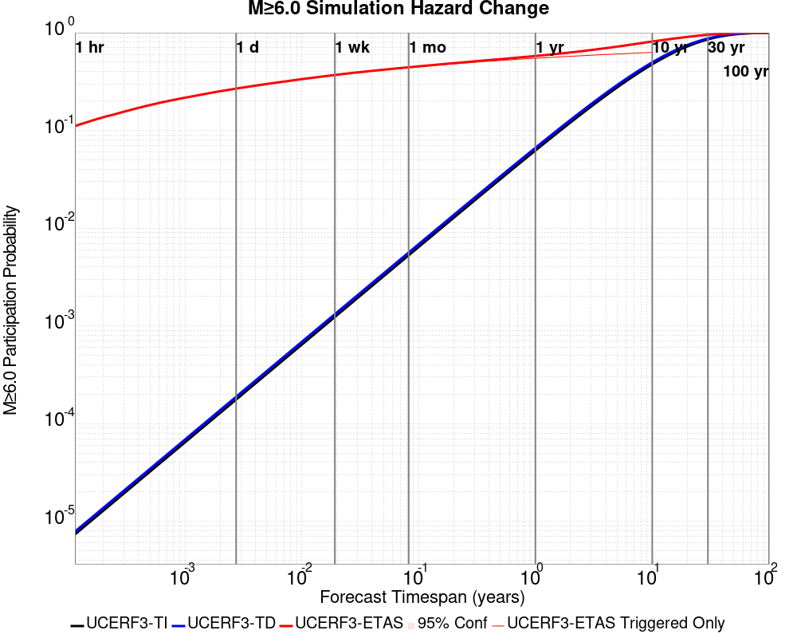

| Forecast Duration | UCERF3-ETAS [95% Conf] | UCERF3-ETAS Triggered Only | UCERF3-TD | UCERF3-ETAS/TD Gain | UCERF3-TI |
|-----|-----|-----|-----|-----|-----|
| 1 Hour | 0.109 [0.091 - 0.130] | 0.109 | 7.85E-6 | 13882.88 | 7.35E-6 |
| 1 Day | 0.249 [0.223 - 0.277] | 0.249 | 1.88E-4 | 1322.21 | 1.76E-4 |
| 1 Week | 0.352 [0.322 - 0.382] | 0.351 | 1.32E-3 | 266.91 | 1.23E-3 |
| 1 Month | 0.428 [0.398 - 0.459] | 0.425 | 5.64E-3 | 75.96 | 5.28E-3 |
| 1 Year | 0.556 [0.526 - 0.585] | 0.524 | 0.067 | 8.35 | 0.062 |
| 10 Years | 0.804 [0.788 - 0.819] | 0.609 | 0.498 | 1.61 | 0.475 |
| 30 Years | 0.951 [0.947 - 0.955] \* | \* | 0.874 | 1.09 \* | 0.855 |
| 100 Years | 1.000 [1.000 - 1.000] \* | \* | 0.999 | 1 \* | 0.998 |

\* *forecast duration is longer than simulation length, only ETAS ruptures from the first 10 years are included*
### M&ge;7.0 Hazard Change Over Time
*[(top)](#table-of-contents)*


| Forecast Duration | UCERF3-ETAS [95% Conf] | UCERF3-ETAS Triggered Only | UCERF3-TD | UCERF3-ETAS/TD Gain | UCERF3-TI |
|-----|-----|-----|-----|-----|-----|
| 1 Hour | 0.012 [6.51E-3 - 0.021] | 0.012 | 7.16E-7 | 16765.78 | 6.48E-7 |
| 1 Day | 0.024 [0.016 - 0.036] | 0.024 | 1.72E-5 | 1398.05 | 1.55E-5 |
| 1 Week | 0.032 [0.022 - 0.046] | 0.032 | 1.20E-4 | 267.09 | 1.09E-4 |
| 1 Month | 0.043 [0.032 - 0.058] | 0.043 | 5.15E-4 | 84.41 | 4.66E-4 |
| 1 Year | 0.063 [0.050 - 0.079] | 0.057 | 6.26E-3 | 10.06 | 5.66E-3 |
| 10 Years | 0.128 [0.114 - 0.145] | 0.071 | 0.061 | 2.09 | 0.055 |
| 30 Years | 0.233 [0.220 - 0.248] \* | \* | 0.174 | 1.34 \* | 0.157 |
| 100 Years | 0.521 [0.514 - 0.531] \* | \* | 0.485 | 1.08 \* | 0.433 |

\* *forecast duration is longer than simulation length, only ETAS ruptures from the first 10 years are included*
## Trigger Rupture Fault Map
*[(top)](#table-of-contents)*


## Trigger Rupture Depth Map
*[(top)](#table-of-contents)*


## Fault Distances To Triggers
*[(top)](#table-of-contents)*

| Section Name | Strike, Dip, Rake | # Hypos In Poly | Max Mag w/ Hypo In Poly | # Surfs In Poly | Max Mag w/ Surf In Poly | Min Dist To Any (km) | Min Poly Dist To Any (km) | Min Dist To Largest (km) | Min Poly Dist To Largest (km) | Min Hypo Dist To Largest (km) | Min Hypo Poly Dist To Largest (km) |
|-----|-----|-----|-----|-----|-----|-----|-----|-----|-----|-----|-----|
| Airport Lake | 359, 50, -90 | 86 | 7.1 | 86 | 7.1 | 0.036 | 0.000 | 0.036 | 0.000 | 5.612 | 0.000 |
| Little Lake | 327, 90, 180 | 16 | 3.85 | 17 | 7.1 | 2.321 | 0.000 | 11.284 | 0.000 | 13.471 | 1.469 |
| Garlock (Central) | 71, 90, 0 | 2 | 3.21 | 3 | 7.1 | 5.600 | 0.000 | 5.600 | 0.000 | 22.802 | 10.829 |
| So Sierra Nevada | 3, 50, -90 | 1 | 2.75 | 1 | 2.75 | 1.410 | 0.000 | 4.248 | 4.233 | 16.191 | 15.188 |
| Tank Canyon | 189, 50, -90 | 0 |  | 0 |  | 9.015 | 9.011 | 9.015 | 9.011 | 17.243 | 17.072 |
| Blackwater | 319, 90, 180 | 0 |  | 0 |  | 14.394 | 8.726 | 14.394 | 8.726 | 29.661 | 27.718 |
| Scodie Lineament | 221, 68, 0 | 0 |  | 0 |  | 16.722 | 15.781 | 28.750 | 27.702 | 36.559 | 32.668 |
## Individual Simulated Catalog Maps
*[(top)](#table-of-contents)*

These are map plots of individual catalogs from the simulations, selected as the closest catalog to each of the given percentiles in terms of total number of events.

| Duration | p0.0 %-ile | p25.0 %-ile | p50.0 %-ile | p75.0 %-ile | p90.0 %-ile | p95.0 %-ile | p97.5 %-ile | p98.0 %-ile | p99.0 %-ile | p100.0 %-ile |
|-----|-----|-----|-----|-----|-----|-----|-----|-----|-----|-----|
| **1 Week** |  |  |  |  |  |  |  |  | 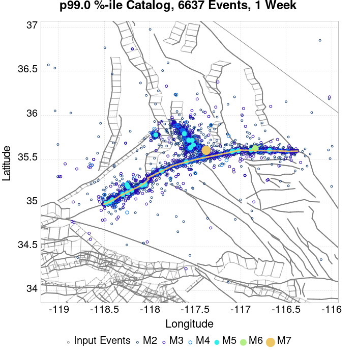 |  |
| **1 Month** |  |  | 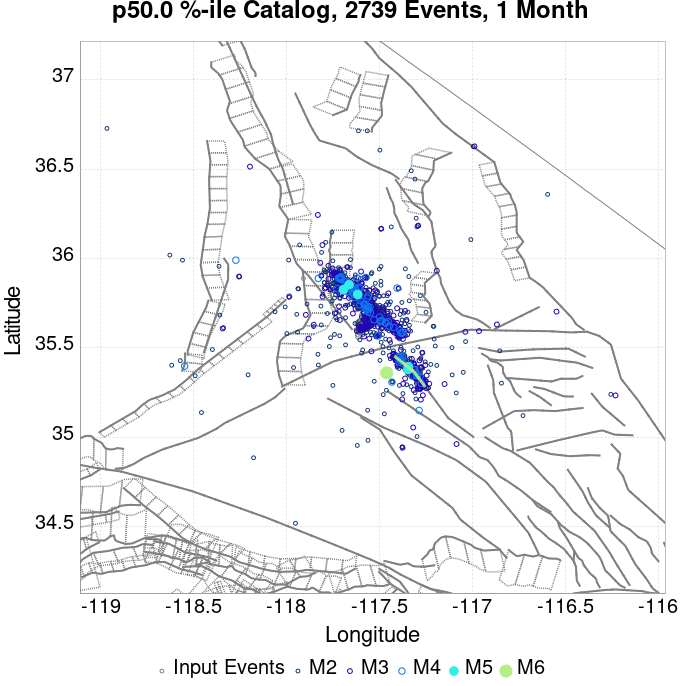 |  | 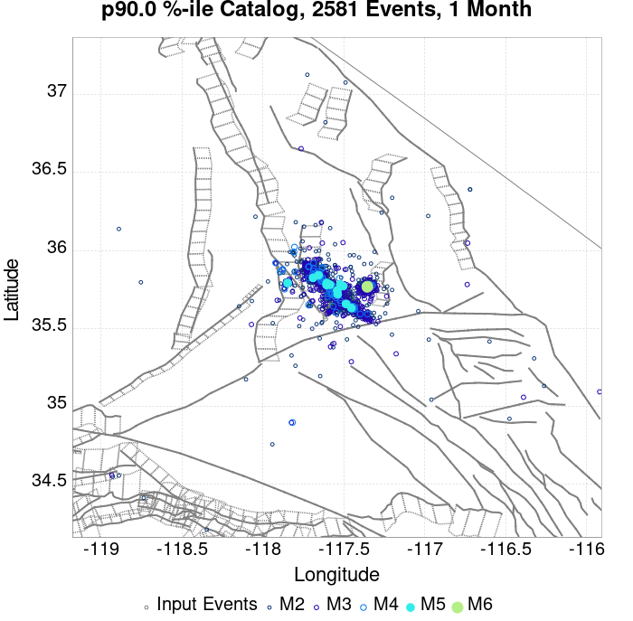 | 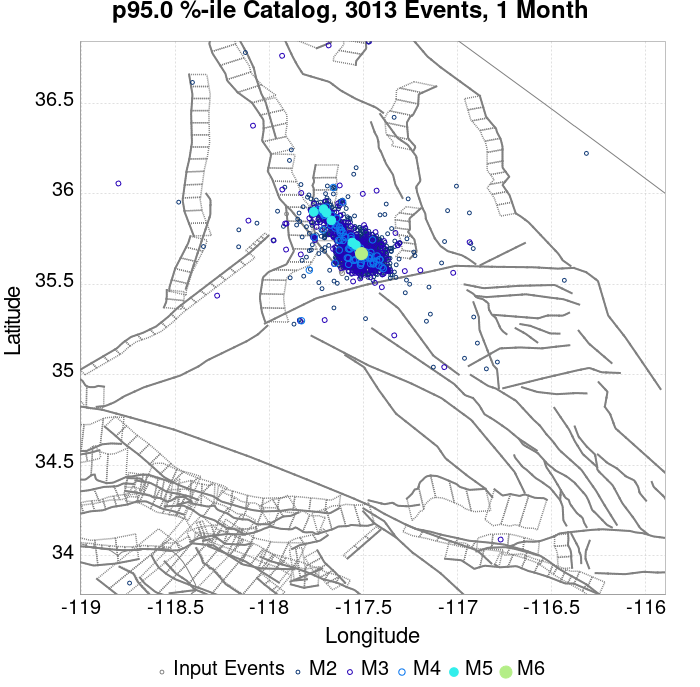 |  | 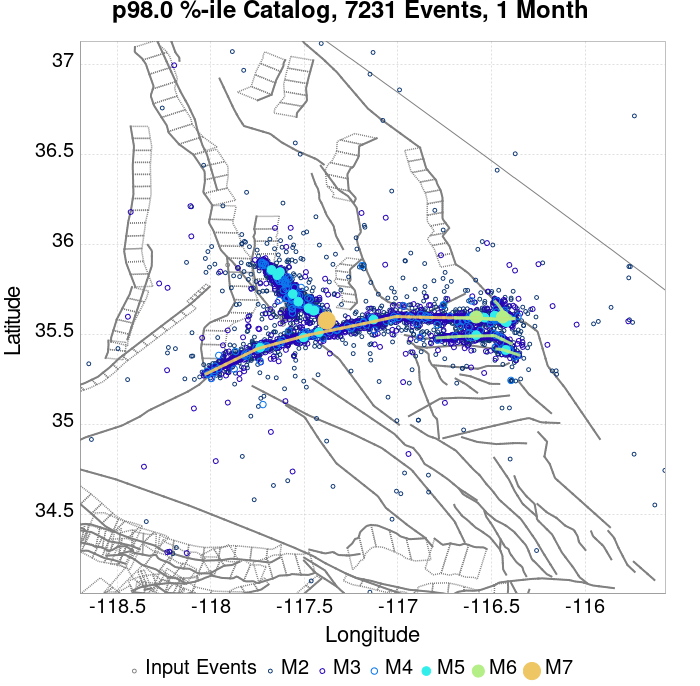 |  |  |
| **1 Year** |  |  |  |  | 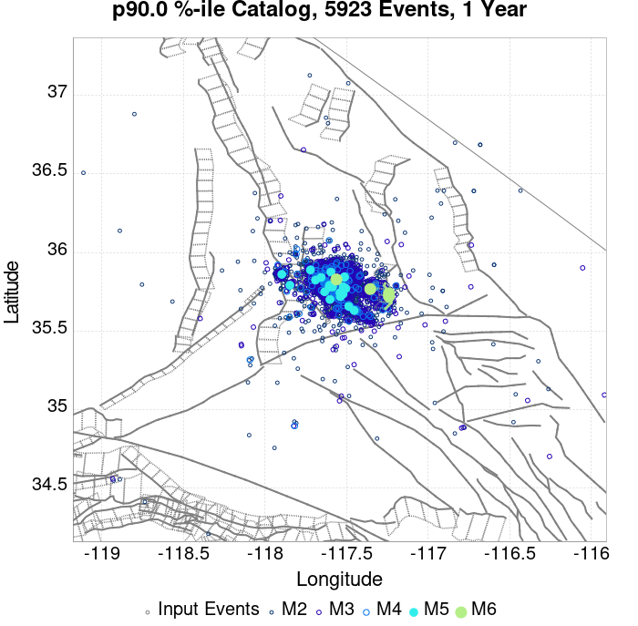 |  |  |  | 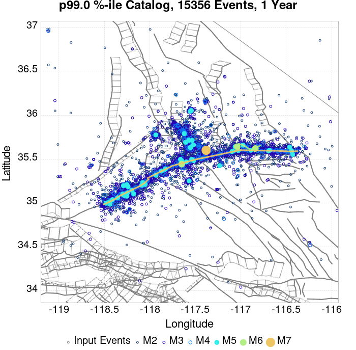 |  |
| **10 Year** |  |  |  |  |  | 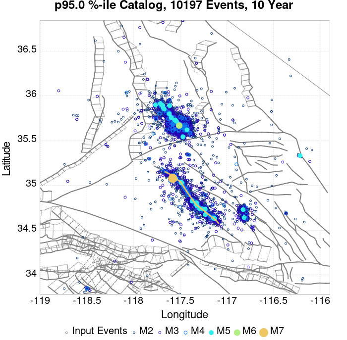 |  |  |  |  |
## Section Participation
*[(top)](#table-of-contents)*

### Section Participation Plots
*[(top)](#table-of-contents)*

| Min Mag | 1 yr Triggered Ruptures (no spontaneous) | 10 yr Triggered Ruptures (no spontaneous) | 10 yr Triggered Ruptures (primary aftershocks only) |
|-----|-----|-----|-----|
| **All Supra. Seis.** |  |  | 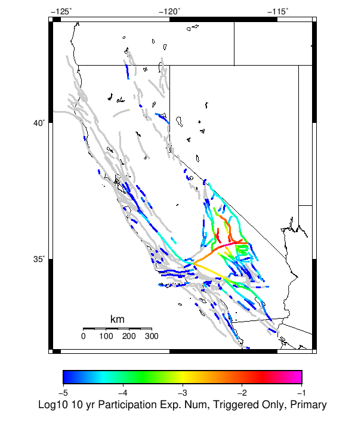 |
| **M&ge;6.5** |  |  |  |
| **M&ge;7** |  |  |  |
| **M&ge;7.5** |  |  |  |

### Supra-Seismogenic Parent Sections Table
*[(top)](#table-of-contents)*

*First 10 of 39 with matching ruptures shown*

| Parent Name | Triggered 10 Year Mean Count | Triggered 1 Day Prob | Triggered 1 Week Prob | Triggered 1 Month Prob | Triggered 1 Year Prob | Triggered 10 Year Prob | Triggered 10 Year Primary Mean Count |
|-----|-----|-----|-----|-----|-----|-----|-----|
| Tank Canyon | 0.14 | 0.023 | 0.039 | 0.055 | 0.092 | 0.114 | 0.035 |
| Garlock (Central) | 0.122 | 0.042 | 0.056 | 0.071 | 0.098 | 0.12 | 0.065 |
| Little Lake | 0.073 | 0.023 | 0.029 | 0.04 | 0.058 | 0.07 | 0.044 |
| Airport Lake | 0.052 | 0.018 | 0.022 | 0.028 | 0.041 | 0.052 | 0.033 |
| Owl Lake | 0.05 | 0.009 | 0.018 | 0.024 | 0.034 | 0.044 | 0.014 |
| Panamint Valley | 0.038 | 0.009 | 0.014 | 0.019 | 0.03 | 0.037 | 0.01 |
| Garlock (East) | 0.027 | 0.006 | 0.007 | 0.011 | 0.019 | 0.024 | 0.003 |
| Ash Hill | 0.017 | 0.003 | 0.005 | 0.005 | 0.006 | 0.016 | 0.003 |
| Hunter Mountain-Saline Valley | 0.016 | 0.008 | 0.011 | 0.012 | 0.014 | 0.016 | 0.009 |
| Blackwater | 0.014 | 0.004 | 0.006 | 0.006 | 0.009 | 0.013 | 0.005 |

### M≥6.5 Parent Sections Table
*[(top)](#table-of-contents)*

*First 10 of 32 with matching ruptures shown*

| Parent Name | Triggered 10 Year Mean Count | Triggered 1 Day Prob | Triggered 1 Week Prob | Triggered 1 Month Prob | Triggered 1 Year Prob | Triggered 10 Year Prob | Triggered 10 Year Primary Mean Count |
|-----|-----|-----|-----|-----|-----|-----|-----|
| Garlock (Central) | 0.059 | 0.019 | 0.025 | 0.031 | 0.045 | 0.059 | 0.025 |
| Little Lake | 0.04 | 0.011 | 0.012 | 0.019 | 0.03 | 0.04 | 0.022 |
| Airport Lake | 0.038 | 0.011 | 0.014 | 0.02 | 0.03 | 0.038 | 0.023 |
| Panamint Valley | 0.034 | 0.008 | 0.013 | 0.018 | 0.028 | 0.034 | 0.009 |
| Owl Lake | 0.024 | 0.007 | 0.009 | 0.011 | 0.019 | 0.024 | 0.011 |
| Hunter Mountain-Saline Valley | 0.016 | 0.008 | 0.011 | 0.012 | 0.014 | 0.016 | 0.009 |
| Tank Canyon | 0.015 | 0.003 | 0.004 | 0.009 | 0.012 | 0.015 | 0.003 |
| Garlock (East) | 0.013 | 0.003 | 0.003 | 0.005 | 0.01 | 0.012 | 0.003 |
| Ash Hill | 0.007 | 0.001 | 0.003 | 0.003 | 0.003 | 0.007 | 0.002 |
| Garlock (West) | 0.007 | 0.001 | 0.001 | 0.003 | 0.005 | 0.007 | 0.001 |

### M≥7 Parent Sections Table
*[(top)](#table-of-contents)*

*First 10 of 23 with matching ruptures shown*

| Parent Name | Triggered 10 Year Mean Count | Triggered 1 Day Prob | Triggered 1 Week Prob | Triggered 1 Month Prob | Triggered 1 Year Prob | Triggered 10 Year Prob | Triggered 10 Year Primary Mean Count |
|-----|-----|-----|-----|-----|-----|-----|-----|
| Garlock (Central) | 0.052 | 0.017 | 0.023 | 0.029 | 0.041 | 0.052 | 0.023 |
| Panamint Valley | 0.022 | 0.007 | 0.011 | 0.013 | 0.018 | 0.022 | 0.009 |
| Owl Lake | 0.02 | 0.007 | 0.009 | 0.011 | 0.016 | 0.02 | 0.011 |
| Hunter Mountain-Saline Valley | 0.015 | 0.007 | 0.01 | 0.011 | 0.013 | 0.015 | 0.008 |
| Little Lake | 0.011 | 0.002 | 0.002 | 0.005 | 0.008 | 0.011 | 0.006 |
| Airport Lake | 0.009 | 0.002 | 0.002 | 0.005 | 0.008 | 0.009 | 0.005 |
| Garlock (East) | 0.009 | 0.003 | 0.003 | 0.005 | 0.007 | 0.009 | 0.003 |
| Garlock (West) | 0.007 | 0.001 | 0.001 | 0.003 | 0.005 | 0.007 | 0.001 |
| Death Valley (So) | 0.003 | 0.001 | 0.002 | 0.002 | 0.002 | 0.003 | 0.001 |
| So Sierra Nevada | 0.003 | 0.0 | 0.0 | 0.0 | 0.0 | 0.003 | 0.001 |

### M≥7.5 Parent Sections Table
*[(top)](#table-of-contents)*

*First 10 of 13 with matching ruptures shown*

| Parent Name | Triggered 10 Year Mean Count | Triggered 1 Day Prob | Triggered 1 Week Prob | Triggered 1 Month Prob | Triggered 1 Year Prob | Triggered 10 Year Prob | Triggered 10 Year Primary Mean Count |
|-----|-----|-----|-----|-----|-----|-----|-----|
| Garlock (Central) | 0.021 | 0.008 | 0.011 | 0.014 | 0.018 | 0.021 | 0.009 |
| Panamint Valley | 0.016 | 0.007 | 0.01 | 0.011 | 0.014 | 0.016 | 0.008 |
| Hunter Mountain-Saline Valley | 0.015 | 0.007 | 0.01 | 0.011 | 0.013 | 0.015 | 0.008 |
| Garlock (West) | 0.006 | 0.001 | 0.001 | 0.003 | 0.005 | 0.006 | 0.001 |
| Garlock (East) | 0.003 | 0.001 | 0.001 | 0.002 | 0.003 | 0.003 | 0.001 |
| Death Valley (Black Mtns Frontal) | 0.002 | 0.0 | 0.001 | 0.001 | 0.001 | 0.002 | 0.001 |
| Death Valley (Fish Lake Valley) | 0.002 | 0.0 | 0.001 | 0.001 | 0.001 | 0.002 | 0.001 |
| Death Valley (No) | 0.002 | 0.0 | 0.001 | 0.001 | 0.001 | 0.002 | 0.001 |
| Death Valley (So) | 0.002 | 0.0 | 0.001 | 0.001 | 0.001 | 0.002 | 0.001 |
| San Andreas (Mojave N) | 0.002 | 0.0 | 0.0 | 0.0 | 0.001 | 0.002 | 0.0 |

### Fault Magnitude-Probability Distributions
*[(top)](#table-of-contents)*

The first 5 sections (sorted by trigger rate) are plotted below. All fault MPDs are available [here](plots/parent_sect_mpds/README.md)

| 1 Week | 1 Month | 1 Year | 10 Year |
|-----|-----|-----|-----|
|  |  |  |  |
|  |  |  |  |
|  |  |  |  |
|  |  |  |  |
|  |  |  |  |
## Gridded Nucleation
*[(top)](#table-of-contents)*

| Min Mag | Triggered Ruptures (no spontaneous) | Triggered Ruptures (primary aftershocks only) |
|-----|-----|-----|
| **M&ge;2.5** | 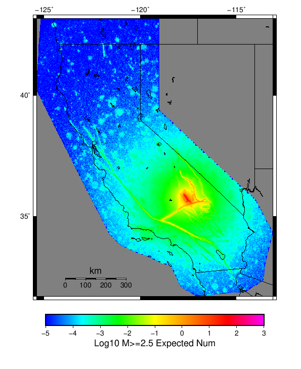 | 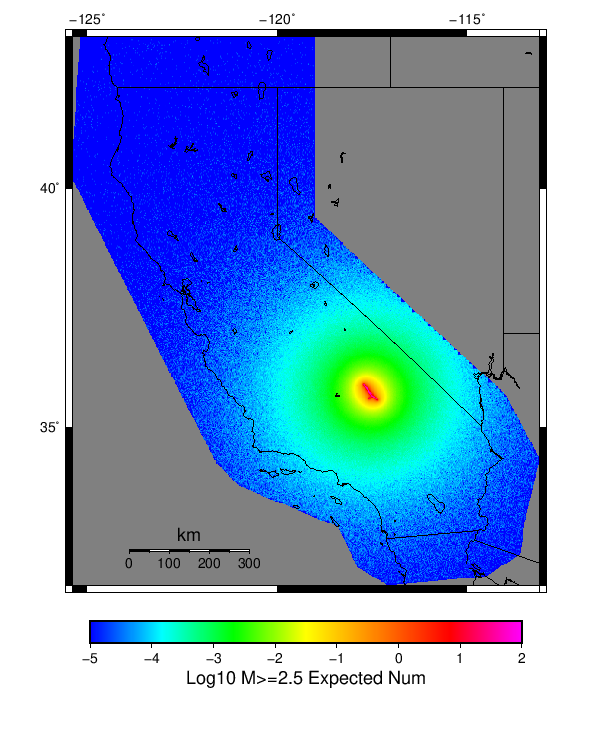 |
| **M&ge;5** |  |  |
| **M&ge;6** |  |  |
| **M&ge;7** |  |  |

## JSON Input File
*[(top)](#table-of-contents)*

```
{
  "numSimulations": 100000,
  "duration": 10.0,
  "startTimeMillis": 1562383194040,
  "includeSpontaneous": false,
  "randomSeed": 1563326818492,
  "binaryOutput": true,
  "binaryOutputFilters": [
    {
      "prefix": "results_complete",
      "descendantsOnly": false
    },
    {
      "prefix": "results_m5_preserve_chain",
      "minMag": 5.0,
      "preserveChainBelowMag": true,
      "descendantsOnly": false
    }
  ],
  "forceRecalc": false,
  "simulationName": "ComCat M7.1 (ci38457511), ShakeMap Surfaces",
  "numRetries": 3,
  "outputDir": "${ETAS_SIM_DIR}/2019_07_16-ComCatM7p1_ci38457511_ShakeMapSurfaces-noSpont-full_td-scale1.14",
  "triggerRuptures": [
    {
      "occurrenceTimeMillis": 1562259775360,
      "mag": 3.98,
      "latitude": 35.707,
      "longitude": -117.50583329999999,
      "depth": 10.28
    },
    {
      "occurrenceTimeMillis": 1562261629040,
      "mag": 6.4,
      "latitude": 35.7051667,
      "longitude": -117.506,
      "depth": 10.71,
      "ruptureSurfaces": [
        {
          "outline": [
            {
              "latitude": 35.6051534466,
              "longitude": -117.5905380735,
              "depth": 0.0
            },
            {
              "latitude": 35.6173144101,
              "longitude": -117.57249634649999,
              "depth": 0.0
            },
            {
              "latitude": 35.6173135736,
              "longitude": -117.5726723708,
              "depth": 0.0
            },
            {
              "latitude": 35.61731357360001,
              "longitude": -117.5726723708,
              "depth": 15.0
            },
            {
              "latitude": 35.6173144101,
              "longitude": -117.57249634649999,
              "depth": 15.0
            },
            {
              "latitude": 35.6051534466,
              "longitude": -117.5905380735,
              "depth": 15.0
            },
            {
              "latitude": 35.6051534466,
              "longitude": -117.5905380735,
              "depth": 0.0
            }
          ]
        },
        {
          "outline": [
            {
              "latitude": 35.6338128629,
              "longitude": -117.54831678310002,
              "depth": 0.0
            },
            {
              "latitude": 35.6413274733,
              "longitude": -117.5393878708,
              "depth": 0.0
            },
            {
              "latitude": 35.664283512,
              "longitude": -117.51611643970001,
              "depth": 0.0
            },
            {
              "latitude": 35.664283512000004,
              "longitude": -117.51611643970001,
              "depth": 15.0
            },
            {
              "latitude": 35.641327473299995,
              "longitude": -117.5393878708,
              "depth": 15.0
            },
            {
              "latitude": 35.63381286290001,
              "longitude": -117.54831678310002,
              "depth": 15.0
            },
            {
              "latitude": 35.6338128629,
              "longitude": -117.54831678310002,
              "depth": 0.0
            }
          ]
        },
        {
          "outline": [
            {
              "latitude": 35.6322100797,
              "longitude": -117.55305954249998,
              "depth": 0.0
            },
            {
              "latitude": 35.6196274701,
              "longitude": -117.56969626549999,
              "depth": 0.0
            },
            {
              "latitude": 35.6196274701,
              "longitude": -117.56969626549999,
              "depth": 15.0
            },
            {
              "latitude": 35.6322100797,
              "longitude": -117.55305954249998,
              "depth": 15.0
            },
            {
              "latitude": 35.6322100797,
              "longitude": -117.55305954249998,
              "depth": 0.0
            }
          ]
        }
      ]
    },
    {
      "occurrenceTimeMillis": 1562261701660,
      "mag": 4.49,
      "latitude": 35.644,
      "longitude": -117.56716670000002,
      "depth": 4.64
    },
    {
      "occurrenceTimeMillis": 1562261845670,
      "mag": 3.0,
      "latitude": 35.6785,
      "longitude": -117.45250000000001,
      "depth": 15.76
    },
    {
      "occurrenceTimeMillis": 1562261875590,
      "mag": 3.91,
      "latitude": 35.7421667,
      "longitude": -117.5531667,
      "depth": 4.15
    },
    {
      "occurrenceTimeMillis": 1562261927500,
      "mag": 3.5,
      "latitude": 35.6215,
      "longitude": -117.5782,
      "depth": 9.7
    },
    {
      "occurrenceTimeMillis": 1562261975380,
      "mag": 3.7,
      "latitude": 35.6842,
      "longitude": -117.4995,
      "depth": 10.2
    },
    {
      "occurrenceTimeMillis": 1562262002270,
      "mag": 4.0,
      "latitude": 35.7258333,
      "longitude": -117.57183330000001,
      "depth": 6.82
    },
    {
      "occurrenceTimeMillis": 1562262018530,
      "mag": 4.13,
      "latitude": 35.7063333,
      "longitude": -117.52200000000002,
      "depth": 2.65
    },
    {
      "occurrenceTimeMillis": 1562262173890,
      "mag": 3.31,
      "latitude": 35.7285004,
      "longitude": -117.55982969999998,
      "depth": 1.83
    },
    {
      "occurrenceTimeMillis": 1562262209450,
      "mag": 3.56,
      "latitude": 35.6578331,
      "longitude": -117.5543365,
      "depth": 1.27
    },
    {
      "occurrenceTimeMillis": 1562262272880,
      "mag": 3.85,
      "latitude": 35.6828346,
      "longitude": -117.51183320000001,
      "depth": 1.0
    },
    {
      "occurrenceTimeMillis": 1562262363730,
      "mag": 3.39,
      "latitude": 35.6414986,
      "longitude": -117.6100006,
      "depth": 10.16
    },
    {
      "occurrenceTimeMillis": 1562262410080,
      "mag": 3.38,
      "latitude": 35.63916780000001,
      "longitude": -117.6186676,
      "depth": 7.61
    },
    {
      "occurrenceTimeMillis": 1562262437570,
      "mag": 3.59,
      "latitude": 35.7443352,
      "longitude": -117.54966740000002,
      "depth": 1.49
    },
    {
      "occurrenceTimeMillis": 1562262706450,
      "mag": 3.39,
      "latitude": 35.690834,
      "longitude": -117.53916930000001,
      "depth": 0.16
    },
    {
      "occurrenceTimeMillis": 1562262761530,
      "mag": 2.94,
      "latitude": 35.7188333,
      "longitude": -117.5401667,
      "depth": 1.44
    },
    {
      "occurrenceTimeMillis": 1562263051430,
      "mag": 2.91,
      "latitude": 35.661,
      "longitude": -117.52500000000002,
      "depth": 1.44
    },
    {
      "occurrenceTimeMillis": 1562263082620,
      "mag": 3.29,
      "latitude": 35.7008324,
      "longitude": -117.5169983,
      "depth": 2.77
    },
    {
      "occurrenceTimeMillis": 1562263240220,
      "mag": 2.67,
      "latitude": 35.63,
      "longitude": -117.5688333,
      "depth": 1.0
    },
    {
      "occurrenceTimeMillis": 1562263374030,
      "mag": 2.67,
      "latitude": 35.611,
      "longitude": -117.5921667,
      "depth": 1.33
    },
    {
      "occurrenceTimeMillis": 1562263398440,
      "mag": 3.02,
      "latitude": 35.7481651,
      "longitude": -117.54183200000001,
      "depth": 2.26
    },
    {
      "occurrenceTimeMillis": 1562263541530,
      "mag": 2.75,
      "latitude": 35.7135,
      "longitude": -117.5318333,
      "depth": 0.33
    },
    {
      "occurrenceTimeMillis": 1562263576110,
      "mag": 3.78,
      "latitude": 35.6599998,
      "longitude": -117.52783199999999,
      "depth": 1.18
    },
    {
      "occurrenceTimeMillis": 1562263629180,
      "mag": 3.5,
      "latitude": 35.5998344,
      "longitude": -117.6226654,
      "depth": 0.0
    },
    {
      "occurrenceTimeMillis": 1562263832740,
      "mag": 3.46,
      "latitude": 35.6593323,
      "longitude": -117.53816990000001,
      "depth": 8.47
    },
    {
      "occurrenceTimeMillis": 1562263882750,
      "mag": 2.79,
      "latitude": 35.603666700000005,
      "longitude": -117.60866670000001,
      "depth": 2.04
    },
    {
      "occurrenceTimeMillis": 1562263972040,
      "mag": 3.44,
      "latitude": 35.6723333,
      "longitude": -117.561,
      "depth": 6.91
    },
    {
      "occurrenceTimeMillis": 1562264031370,
      "mag": 3.5,
      "latitude": 35.7048333,
      "longitude": -117.4808333,
      "depth": 8.5
    },
    {
      "occurrenceTimeMillis": 1562264104860,
      "mag": 3.2,
      "latitude": 35.61,
      "longitude": -117.602,
      "depth": 1.8
    },
    {
      "occurrenceTimeMillis": 1562264193510,
      "mag": 3.04,
      "latitude": 35.7233315,
      "longitude": -117.5403366,
      "depth": 1.22
    },
    {
      "occurrenceTimeMillis": 1562264235140,
      "mag": 2.85,
      "latitude": 35.7171667,
      "longitude": -117.54566669999998,
      "depth": 1.43
    },
    {
      "occurrenceTimeMillis": 1562264325740,
      "mag": 3.28,
      "latitude": 35.6375008,
      "longitude": -117.6143341,
      "depth": 5.97
    },
    {
      "occurrenceTimeMillis": 1562264485340,
      "mag": 2.61,
      "latitude": 35.6793333,
      "longitude": -117.5173333,
      "depth": 1.99
    },
    {
      "occurrenceTimeMillis": 1562264763680,
      "mag": 3.12,
      "latitude": 35.6646652,
      "longitude": -117.5261688,
      "depth": 1.2
    },
    {
      "occurrenceTimeMillis": 1562264846710,
      "mag": 3.29,
      "latitude": 35.6738319,
      "longitude": -117.51750180000002,
      "depth": 1.57
    },
    {
      "occurrenceTimeMillis": 1562264879190,
      "mag": 4.14,
      "latitude": 35.7426667,
      "longitude": -117.5565,
      "depth": 1.45
    },
    {
      "occurrenceTimeMillis": 1562264923610,
      "mag": 3.85,
      "latitude": 35.6661667,
      "longitude": -117.5723333,
      "depth": 4.05
    },
    {
      "occurrenceTimeMillis": 1562265344040,
      "mag": 2.5,
      "latitude": 35.7215,
      "longitude": -117.56550000000001,
      "depth": 0.16
    },
    {
      "occurrenceTimeMillis": 1562265451500,
      "mag": 2.64,
      "latitude": 35.72,
      "longitude": -117.5723333,
      "depth": 1.34
    },
    {
      "occurrenceTimeMillis": 1562265525650,
      "mag": 2.69,
      "latitude": 35.7046661,
      "longitude": -117.49666600000002,
      "depth": 3.96
    },
    {
      "occurrenceTimeMillis": 1562265584440,
      "mag": 4.59,
      "latitude": 35.6013333,
      "longitude": -117.59700000000001,
      "depth": 2.81
    },
    {
      "occurrenceTimeMillis": 1562265674300,
      "mag": 3.24,
      "latitude": 35.6751671,
      "longitude": -117.5148315,
      "depth": 1.73
    },
    {
      "occurrenceTimeMillis": 1562265864830,
      "mag": 3.01,
      "latitude": 35.7186661,
      "longitude": -117.56266780000001,
      "depth": 0.0
    },
    {
      "occurrenceTimeMillis": 1562266026590,
      "mag": 4.34,
      "latitude": 35.6758333,
      "longitude": -117.48533330000001,
      "depth": 8.53
    },
    {
      "occurrenceTimeMillis": 1562266207160,
      "mag": 2.73,
      "latitude": 35.641,
      "longitude": -117.56266670000001,
      "depth": 8.95
    },
    {
      "occurrenceTimeMillis": 1562266216010,
      "mag": 3.55,
      "latitude": 35.6764984,
      "longitude": -117.5,
      "depth": 0.91
    },
    {
      "occurrenceTimeMillis": 1562266333530,
      "mag": 2.78,
      "latitude": 35.6543333,
      "longitude": -117.53983330000001,
      "depth": 0.88
    },
    {
      "occurrenceTimeMillis": 1562266376130,
      "mag": 2.93,
      "latitude": 35.741,
      "longitude": -117.561,
      "depth": 0.23
    },
    {
      "occurrenceTimeMillis": 1562266407460,
      "mag": 3.34,
      "latitude": 35.7276649,
      "longitude": -117.56416320000001,
      "depth": 1.62
    },
    {
      "occurrenceTimeMillis": 1562266454010,
      "mag": 4.07,
      "latitude": 35.5971667,
      "longitude": -117.60016669999999,
      "depth": 5.55
    },
    {
      "occurrenceTimeMillis": 1562266527790,
      "mag": 3.07,
      "latitude": 35.6738333,
      "longitude": -117.4893333,
      "depth": 9.23
    },
    {
      "occurrenceTimeMillis": 1562266566420,
      "mag": 4.58,
      "latitude": 35.716,
      "longitude": -117.56000000000002,
      "depth": 1.92
    },
    {
      "occurrenceTimeMillis": 1562266687790,
      "mag": 2.85,
      "latitude": 35.7266667,
      "longitude": -117.56516670000002,
      "depth": 0.09
    },
    {
      "occurrenceTimeMillis": 1562266809510,
      "mag": 3.21,
      "latitude": 35.7099991,
      "longitude": -117.55616759999998,
      "depth": 0.1
    },
    {
      "occurrenceTimeMillis": 1562266944640,
      "mag": 2.56,
      "latitude": 35.645,
      "longitude": -117.5373333,
      "depth": 0.01
    },
    {
      "occurrenceTimeMillis": 1562267419790,
      "mag": 3.26,
      "latitude": 35.6938324,
      "longitude": -117.49449920000002,
      "depth": 0.97
    },
    {
      "occurrenceTimeMillis": 1562267699490,
      "mag": 3.0,
      "latitude": 35.652668,
      "longitude": -117.5393295,
      "depth": 1.65
    },
    {
      "occurrenceTimeMillis": 1562267766200,
      "mag": 2.5,
      "latitude": 35.721,
      "longitude": -117.56650000000002,
      "depth": 0.12
    },
    {
      "occurrenceTimeMillis": 1562267871400,
      "mag": 3.23,
      "latitude": 35.6911659,
      "longitude": -117.51216889999999,
      "depth": 1.03
    },
    {
      "occurrenceTimeMillis": 1562268051750,
      "mag": 2.8,
      "latitude": 35.6389999,
      "longitude": -117.5526657,
      "depth": 1.11
    },
    {
      "occurrenceTimeMillis": 1562268092090,
      "mag": 4.5,
      "latitude": 35.6715,
      "longitude": -117.4788333,
      "depth": 5.16
    },
    {
      "occurrenceTimeMillis": 1562268380340,
      "mag": 2.69,
      "latitude": 35.7086667,
      "longitude": -117.48333330000001,
      "depth": 1.39
    },
    {
      "occurrenceTimeMillis": 1562268438340,
      "mag": 2.81,
      "latitude": 35.6696667,
      "longitude": -117.47999999999999,
      "depth": 6.24
    },
    {
      "occurrenceTimeMillis": 1562269189760,
      "mag": 2.63,
      "latitude": 35.683,
      "longitude": -117.5195,
      "depth": 5.84
    },
    {
      "occurrenceTimeMillis": 1562269229180,
      "mag": 2.65,
      "latitude": 35.6556667,
      "longitude": -117.5158333,
      "depth": 1.76
    },
    {
      "occurrenceTimeMillis": 1562269744960,
      "mag": 3.18,
      "latitude": 35.6828346,
      "longitude": -117.49183650000002,
      "depth": 0.0
    },
    {
      "occurrenceTimeMillis": 1562269876850,
      "mag": 3.34,
      "latitude": 35.7094994,
      "longitude": -117.55666349999998,
      "depth": 0.34
    },
    {
      "occurrenceTimeMillis": 1562269933070,
      "mag": 3.02,
      "latitude": 35.6086655,
      "longitude": -117.590332,
      "depth": 4.83
    },
    {
      "occurrenceTimeMillis": 1562270160500,
      "mag": 4.16,
      "latitude": 35.6623333,
      "longitude": -117.524,
      "depth": 1.49
    },
    {
      "occurrenceTimeMillis": 1562270280220,
      "mag": 2.65,
      "latitude": 35.7131667,
      "longitude": -117.5561667,
      "depth": 0.16
    },
    {
      "occurrenceTimeMillis": 1562270492930,
      "mag": 2.5,
      "latitude": 35.678,
      "longitude": -117.589,
      "depth": 7.89
    },
    {
      "occurrenceTimeMillis": 1562270655500,
      "mag": 2.56,
      "latitude": 35.7048333,
      "longitude": -117.48683330000001,
      "depth": 1.23
    },
    {
      "occurrenceTimeMillis": 1562270768270,
      "mag": 3.38,
      "latitude": 35.6980019,
      "longitude": -117.4881668,
      "depth": 8.77
    },
    {
      "occurrenceTimeMillis": 1562271091460,
      "mag": 2.61,
      "latitude": 35.683,
      "longitude": -117.50483330000002,
      "depth": 1.69
    },
    {
      "occurrenceTimeMillis": 1562271290340,
      "mag": 3.99,
      "latitude": 35.6991667,
      "longitude": -117.5125,
      "depth": 5.75
    },
    {
      "occurrenceTimeMillis": 1562271456830,
      "mag": 3.06,
      "latitude": 35.699501,
      "longitude": -117.4838333,
      "depth": 1.03
    },
    {
      "occurrenceTimeMillis": 1562271789990,
      "mag": 3.4,
      "latitude": 35.6403351,
      "longitude": -117.5996704,
      "depth": 9.92
    },
    {
      "occurrenceTimeMillis": 1562271838650,
      "mag": 2.53,
      "latitude": 35.6583333,
      "longitude": -117.56233329999999,
      "depth": 4.39
    },
    {
      "occurrenceTimeMillis": 1562272472100,
      "mag": 2.61,
      "latitude": 35.640667,
      "longitude": -117.5833359,
      "depth": 8.68
    },
    {
      "occurrenceTimeMillis": 1562273126620,
      "mag": 3.09,
      "latitude": 35.7008324,
      "longitude": -117.47766879999999,
      "depth": 0.04
    },
    {
      "occurrenceTimeMillis": 1562273724820,
      "mag": 3.37,
      "latitude": 35.7088318,
      "longitude": -117.4771652,
      "depth": 0.2
    },
    {
      "occurrenceTimeMillis": 1562273832360,
      "mag": 2.54,
      "latitude": 35.6585,
      "longitude": -117.53199999999998,
      "depth": 8.73
    },
    {
      "occurrenceTimeMillis": 1562274175860,
      "mag": 3.56,
      "latitude": 35.689666700000004,
      "longitude": -117.4853363,
      "depth": 7.08
    },
    {
      "occurrenceTimeMillis": 1562274428600,
      "mag": 2.52,
      "latitude": 35.5995,
      "longitude": -117.59783330000002,
      "depth": 4.74
    },
    {
      "occurrenceTimeMillis": 1562275395050,
      "mag": 2.8,
      "latitude": 35.6951667,
      "longitude": -117.4893333,
      "depth": 1.65
    },
    {
      "occurrenceTimeMillis": 1562275595090,
      "mag": 3.0,
      "latitude": 35.67666630000001,
      "longitude": -117.52749630000001,
      "depth": 7.39
    },
    {
      "occurrenceTimeMillis": 1562275966060,
      "mag": 2.62,
      "latitude": 35.725,
      "longitude": -117.56916670000001,
      "depth": 2.03
    },
    {
      "occurrenceTimeMillis": 1562276014350,
      "mag": 3.08,
      "latitude": 35.6155014,
      "longitude": -117.5893326,
      "depth": 5.43
    },
    {
      "occurrenceTimeMillis": 1562276433450,
      "mag": 3.42,
      "latitude": 35.6691666,
      "longitude": -117.518837,
      "depth": 2.04
    },
    {
      "occurrenceTimeMillis": 1562276519830,
      "mag": 2.74,
      "latitude": 35.7193333,
      "longitude": -117.53216670000002,
      "depth": 2.19
    },
    {
      "occurrenceTimeMillis": 1562276794030,
      "mag": 2.5,
      "latitude": 35.7011667,
      "longitude": -117.47866669999999,
      "depth": 0.93
    },
    {
      "occurrenceTimeMillis": 1562276824410,
      "mag": 3.25,
      "latitude": 35.6321678,
      "longitude": -117.60717010000002,
      "depth": 9.0
    },
    {
      "occurrenceTimeMillis": 1562277755090,
      "mag": 3.35,
      "latitude": 35.6775017,
      "longitude": -117.5148315,
      "depth": 2.85
    },
    {
      "occurrenceTimeMillis": 1562277922570,
      "mag": 3.3,
      "latitude": 35.6534,
      "longitude": -117.442,
      "depth": 8.97
    },
    {
      "occurrenceTimeMillis": 1562278328280,
      "mag": 4.47,
      "latitude": 35.7443333,
      "longitude": -117.56633329999998,
      "depth": 1.97
    },
    {
      "occurrenceTimeMillis": 1562279346560,
      "mag": 2.51,
      "latitude": 35.7038333,
      "longitude": -117.49499999999999,
      "depth": 9.8
    },
    {
      "occurrenceTimeMillis": 1562279407880,
      "mag": 2.62,
      "latitude": 35.7008333,
      "longitude": -117.4893333,
      "depth": 1.85
    },
    {
      "occurrenceTimeMillis": 1562280141650,
      "mag": 3.2,
      "latitude": 35.7211685,
      "longitude": -117.52400210000002,
      "depth": 2.21
    },
    {
      "occurrenceTimeMillis": 1562281630780,
      "mag": 2.59,
      "latitude": 35.7041667,
      "longitude": -117.4886667,
      "depth": 1.92
    },
    {
      "occurrenceTimeMillis": 1562281960410,
      "mag": 3.49,
      "latitude": 35.6711655,
      "longitude": -117.47166440000001,
      "depth": 7.11
    },
    {
      "occurrenceTimeMillis": 1562281984910,
      "mag": 3.06,
      "latitude": 35.7470016,
      "longitude": -117.5784988,
      "depth": 2.13
    },
    {
      "occurrenceTimeMillis": 1562283240630,
      "mag": 3.82,
      "latitude": 35.6623333,
      "longitude": -117.5245,
      "depth": 2.61
    },
    {
      "occurrenceTimeMillis": 1562283242380,
      "mag": 4.04,
      "latitude": 35.6011667,
      "longitude": -117.61066670000001,
      "depth": 4.75
    },
    {
      "occurrenceTimeMillis": 1562283753710,
      "mag": 3.72,
      "latitude": 35.7470016,
      "longitude": -117.5681686,
      "depth": 2.42
    },
    {
      "occurrenceTimeMillis": 1562284476440,
      "mag": 3.33,
      "latitude": 35.6571655,
      "longitude": -117.52183530000002,
      "depth": 1.67
    },
    {
      "occurrenceTimeMillis": 1562285645640,
      "mag": 2.76,
      "latitude": 35.6458333,
      "longitude": -117.54716670000002,
      "depth": 0.29
    },
    {
      "occurrenceTimeMillis": 1562285881410,
      "mag": 4.04,
      "latitude": 35.7718333,
      "longitude": -117.61783330000002,
      "depth": 2.59
    },
    {
      "occurrenceTimeMillis": 1562286529030,
      "mag": 2.8,
      "latitude": 35.7215,
      "longitude": -117.5465,
      "depth": 7.03
    },
    {
      "occurrenceTimeMillis": 1562286726670,
      "mag": 4.02,
      "latitude": 35.7033333,
      "longitude": -117.4828333,
      "depth": 1.0
    },
    {
      "occurrenceTimeMillis": 1562286799610,
      "mag": 2.66,
      "latitude": 35.7436676,
      "longitude": -117.55566409999999,
      "depth": 5.42
    },
    {
      "occurrenceTimeMillis": 1562287539420,
      "mag": 3.95,
      "latitude": 35.6910019,
      "longitude": -117.50966640000001,
      "depth": 3.68
    },
    {
      "occurrenceTimeMillis": 1562287780920,
      "mag": 2.52,
      "latitude": 35.7096667,
      "longitude": -117.47866669999999,
      "depth": 1.91
    },
    {
      "occurrenceTimeMillis": 1562288933460,
      "mag": 2.99,
      "latitude": 35.7254982,
      "longitude": -117.55117030000001,
      "depth": 1.29
    },
    {
      "occurrenceTimeMillis": 1562289493410,
      "mag": 3.12,
      "latitude": 35.6580009,
      "longitude": -117.52216339999998,
      "depth": 1.38
    },
    {
      "occurrenceTimeMillis": 1562291154030,
      "mag": 2.55,
      "latitude": 35.5946655,
      "longitude": -117.5978317,
      "depth": 4.1
    },
    {
      "occurrenceTimeMillis": 1562291887280,
      "mag": 2.68,
      "latitude": 35.7118333,
      "longitude": -117.46816670000001,
      "depth": 0.68
    },
    {
      "occurrenceTimeMillis": 1562292100910,
      "mag": 3.21,
      "latitude": 35.7734985,
      "longitude": -117.6149979,
      "depth": 0.22
    },
    {
      "occurrenceTimeMillis": 1562292119010,
      "mag": 3.98,
      "latitude": 35.6401667,
      "longitude": -117.5461667,
      "depth": 11.3
    },
    {
      "occurrenceTimeMillis": 1562292319160,
      "mag": 3.34,
      "latitude": 35.6558342,
      "longitude": -117.5234985,
      "depth": 1.57
    },
    {
      "occurrenceTimeMillis": 1562292831940,
      "mag": 2.65,
      "latitude": 35.6405,
      "longitude": -117.55783329999998,
      "depth": 10.3
    },
    {
      "occurrenceTimeMillis": 1562293181860,
      "mag": 3.25,
      "latitude": 35.7746658,
      "longitude": -117.6169968,
      "depth": 2.35
    },
    {
      "occurrenceTimeMillis": 1562293435650,
      "mag": 2.8,
      "latitude": 35.7128333,
      "longitude": -117.4743333,
      "depth": 0.81
    },
    {
      "occurrenceTimeMillis": 1562295589610,
      "mag": 2.81,
      "latitude": 35.661,
      "longitude": -117.519,
      "depth": 0.21
    },
    {
      "occurrenceTimeMillis": 1562295673270,
      "mag": 2.72,
      "latitude": 35.744,
      "longitude": -117.5648333,
      "depth": 5.49
    },
    {
      "occurrenceTimeMillis": 1562296518720,
      "mag": 3.27,
      "latitude": 35.6286659,
      "longitude": -117.5633316,
      "depth": 3.95
    },
    {
      "occurrenceTimeMillis": 1562296793710,
      "mag": 3.32,
      "latitude": 35.6426659,
      "longitude": -117.529335,
      "depth": 0.61
    },
    {
      "occurrenceTimeMillis": 1562296893030,
      "mag": 2.53,
      "latitude": 35.7783333,
      "longitude": -117.6173333,
      "depth": 1.76
    },
    {
      "occurrenceTimeMillis": 1562297120610,
      "mag": 2.54,
      "latitude": 35.6911667,
      "longitude": -117.5123333,
      "depth": 4.17
    },
    {
      "occurrenceTimeMillis": 1562298372730,
      "mag": 2.56,
      "latitude": 35.698,
      "longitude": -117.48033330000001,
      "depth": 1.34
    },
    {
      "occurrenceTimeMillis": 1562298414390,
      "mag": 3.07,
      "latitude": 35.6823349,
      "longitude": -117.5,
      "depth": 0.59
    },
    {
      "occurrenceTimeMillis": 1562298613940,
      "mag": 2.52,
      "latitude": 35.7093333,
      "longitude": -117.4758333,
      "depth": 0.41
    },
    {
      "occurrenceTimeMillis": 1562299898470,
      "mag": 3.53,
      "latitude": 35.7226677,
      "longitude": -117.55300139999999,
      "depth": 1.02
    },
    {
      "occurrenceTimeMillis": 1562299981170,
      "mag": 2.62,
      "latitude": 35.6773333,
      "longitude": -117.551,
      "depth": 7.07
    },
    {
      "occurrenceTimeMillis": 1562300085340,
      "mag": 3.48,
      "latitude": 35.6983337,
      "longitude": -117.481163,
      "depth": 1.26
    },
    {
      "occurrenceTimeMillis": 1562301184910,
      "mag": 2.54,
      "latitude": 35.6588333,
      "longitude": -117.51783330000002,
      "depth": 2.08
    },
    {
      "occurrenceTimeMillis": 1562302565260,
      "mag": 2.52,
      "latitude": 35.6596667,
      "longitude": -117.54183330000001,
      "depth": 7.89
    },
    {
      "occurrenceTimeMillis": 1562302899770,
      "mag": 2.61,
      "latitude": 35.5718333,
      "longitude": -117.6181667,
      "depth": 4.86
    },
    {
      "occurrenceTimeMillis": 1562303437620,
      "mag": 3.19,
      "latitude": 35.7073326,
      "longitude": -117.47533420000002,
      "depth": 6.11
    },
    {
      "occurrenceTimeMillis": 1562303905370,
      "mag": 3.45,
      "latitude": 35.7700005,
      "longitude": -117.61250310000001,
      "depth": 2.34
    },
    {
      "occurrenceTimeMillis": 1562304556070,
      "mag": 2.64,
      "latitude": 35.636,
      "longitude": -117.58783330000001,
      "depth": 6.71
    },
    {
      "occurrenceTimeMillis": 1562305212140,
      "mag": 2.82,
      "latitude": 35.6776667,
      "longitude": -117.51066670000002,
      "depth": 2.02
    },
    {
      "occurrenceTimeMillis": 1562305958100,
      "mag": 2.5,
      "latitude": 35.70283330000001,
      "longitude": -117.4845,
      "depth": 0.25
    },
    {
      "occurrenceTimeMillis": 1562306963130,
      "mag": 3.65,
      "latitude": 35.6223335,
      "longitude": -117.57333369999999,
      "depth": 6.19
    },
    {
      "occurrenceTimeMillis": 1562308842510,
      "mag": 3.2,
      "latitude": 35.7036667,
      "longitude": -117.50849909999998,
      "depth": 2.33
    },
    {
      "occurrenceTimeMillis": 1562309940440,
      "mag": 2.64,
      "latitude": 35.7166667,
      "longitude": -117.54133330000002,
      "depth": 0.35
    },
    {
      "occurrenceTimeMillis": 1562309973610,
      "mag": 2.58,
      "latitude": 35.6706667,
      "longitude": -117.4831667,
      "depth": 6.7
    },
    {
      "occurrenceTimeMillis": 1562310142290,
      "mag": 3.17,
      "latitude": 35.7268333,
      "longitude": -117.56416320000001,
      "depth": 1.54
    },
    {
      "occurrenceTimeMillis": 1562311657020,
      "mag": 3.72,
      "latitude": 35.75,
      "longitude": -117.56416320000001,
      "depth": 3.38
    },
    {
      "occurrenceTimeMillis": 1562312353540,
      "mag": 3.46,
      "latitude": 35.68600080000001,
      "longitude": -117.4801636,
      "depth": 9.49
    },
    {
      "occurrenceTimeMillis": 1562313643330,
      "mag": 2.9,
      "latitude": 35.7501667,
      "longitude": -117.56216670000002,
      "depth": 7.07
    },
    {
      "occurrenceTimeMillis": 1562314864840,
      "mag": 3.46,
      "latitude": 35.6011658,
      "longitude": -117.6039963,
      "depth": 4.2
    },
    {
      "occurrenceTimeMillis": 1562316409740,
      "mag": 3.09,
      "latitude": 35.6926651,
      "longitude": -117.49099730000002,
      "depth": 7.04
    },
    {
      "occurrenceTimeMillis": 1562316842500,
      "mag": 3.55,
      "latitude": 35.7039986,
      "longitude": -117.50250240000001,
      "depth": 7.27
    },
    {
      "occurrenceTimeMillis": 1562317880610,
      "mag": 2.9,
      "latitude": 35.6663333,
      "longitude": -117.52766670000001,
      "depth": 6.61
    },
    {
      "occurrenceTimeMillis": 1562319989260,
      "mag": 3.51,
      "latitude": 35.6479988,
      "longitude": -117.54533390000002,
      "depth": 3.76
    },
    {
      "occurrenceTimeMillis": 1562321794490,
      "mag": 3.1,
      "latitude": 35.663166,
      "longitude": -117.50299840000001,
      "depth": 6.09
    },
    {
      "occurrenceTimeMillis": 1562322437720,
      "mag": 2.53,
      "latitude": 35.7246667,
      "longitude": -117.5358333,
      "depth": 6.6
    },
    {
      "occurrenceTimeMillis": 1562322796080,
      "mag": 2.75,
      "latitude": 35.68050000000001,
      "longitude": -117.4775,
      "depth": 0.83
    },
    {
      "occurrenceTimeMillis": 1562324246570,
      "mag": 2.89,
      "latitude": 35.7433333,
      "longitude": -117.54933329999999,
      "depth": 10.81
    },
    {
      "occurrenceTimeMillis": 1562324378860,
      "mag": 3.54,
      "latitude": 35.6041679,
      "longitude": -117.5926666,
      "depth": 1.97
    },
    {
      "occurrenceTimeMillis": 1562324873040,
      "mag": 5.36,
      "latitude": 35.7603333,
      "longitude": -117.57500000000002,
      "depth": 6.95
    },
    {
      "occurrenceTimeMillis": 1562325009580,
      "mag": 3.44,
      "latitude": 35.746666,
      "longitude": -117.59333039999999,
      "depth": 6.49
    },
    {
      "occurrenceTimeMillis": 1562325091820,
      "mag": 2.96,
      "latitude": 35.7498333,
      "longitude": -117.56949999999999,
      "depth": 4.28
    },
    {
      "occurrenceTimeMillis": 1562325139080,
      "mag": 2.93,
      "latitude": 35.7505,
      "longitude": -117.5688333,
      "depth": 3.62
    },
    {
      "occurrenceTimeMillis": 1562325439580,
      "mag": 2.55,
      "latitude": 35.777,
      "longitude": -117.56699999999998,
      "depth": 4.93
    },
    {
      "occurrenceTimeMillis": 1562325624920,
      "mag": 2.56,
      "latitude": 35.7588333,
      "longitude": -117.57466670000001,
      "depth": 7.08
    },
    {
      "occurrenceTimeMillis": 1562325908730,
      "mag": 2.6,
      "latitude": 35.6436667,
      "longitude": -117.5891667,
      "depth": 8.26
    },
    {
      "occurrenceTimeMillis": 1562326154790,
      "mag": 3.05,
      "latitude": 35.7718315,
      "longitude": -117.5686646,
      "depth": 3.75
    },
    {
      "occurrenceTimeMillis": 1562326291390,
      "mag": 2.52,
      "latitude": 35.758,
      "longitude": -117.58216670000002,
      "depth": 7.12
    },
    {
      "occurrenceTimeMillis": 1562326563920,
      "mag": 3.19,
      "latitude": 35.7631667,
      "longitude": -117.5838333,
      "depth": 7.91
    },
    {
      "occurrenceTimeMillis": 1562327510810,
      "mag": 2.72,
      "latitude": 35.6008333,
      "longitude": -117.60383329999999,
      "depth": 4.64
    },
    {
      "occurrenceTimeMillis": 1562327929210,
      "mag": 2.88,
      "latitude": 35.648,
      "longitude": -117.585,
      "depth": 6.77
    },
    {
      "occurrenceTimeMillis": 1562329437990,
      "mag": 3.26,
      "latitude": 35.7228317,
      "longitude": -117.52850340000002,
      "depth": 3.14
    },
    {
      "occurrenceTimeMillis": 1562330310020,
      "mag": 4.09,
      "latitude": 35.7716667,
      "longitude": -117.57066670000002,
      "depth": 6.82
    },
    {
      "occurrenceTimeMillis": 1562331000450,
      "mag": 2.65,
      "latitude": 35.758,
      "longitude": -117.57366670000002,
      "depth": 6.92
    },
    {
      "occurrenceTimeMillis": 1562331304830,
      "mag": 3.65,
      "latitude": 35.7508316,
      "longitude": -117.5633316,
      "depth": 6.9
    },
    {
      "occurrenceTimeMillis": 1562332343380,
      "mag": 2.75,
      "latitude": 35.7586667,
      "longitude": -117.5676667,
      "depth": 5.07
    },
    {
      "occurrenceTimeMillis": 1562334063040,
      "mag": 2.75,
      "latitude": 35.7051667,
      "longitude": -117.5111667,
      "depth": 6.82
    },
    {
      "occurrenceTimeMillis": 1562334453490,
      "mag": 2.61,
      "latitude": 35.7465,
      "longitude": -117.5656667,
      "depth": 3.19
    },
    {
      "occurrenceTimeMillis": 1562334941070,
      "mag": 2.63,
      "latitude": 35.7153333,
      "longitude": -117.5081667,
      "depth": 9.68
    },
    {
      "occurrenceTimeMillis": 1562335307420,
      "mag": 2.53,
      "latitude": 35.7918333,
      "longitude": -117.61550000000001,
      "depth": 1.03
    },
    {
      "occurrenceTimeMillis": 1562337573410,
      "mag": 3.94,
      "latitude": 35.7428322,
      "longitude": -117.56749730000001,
      "depth": 2.33
    },
    {
      "occurrenceTimeMillis": 1562337629890,
      "mag": 3.21,
      "latitude": 35.5613327,
      "longitude": -117.6133347,
      "depth": 3.28
    },
    {
      "occurrenceTimeMillis": 1562338809210,
      "mag": 2.78,
      "latitude": 35.6818333,
      "longitude": -117.59733329999999,
      "depth": 0.27
    },
    {
      "occurrenceTimeMillis": 1562339017620,
      "mag": 2.76,
      "latitude": 35.663000000000004,
      "longitude": -117.5275,
      "depth": 2.81
    },
    {
      "occurrenceTimeMillis": 1562339537840,
      "mag": 2.57,
      "latitude": 35.7438316,
      "longitude": -117.5596695,
      "depth": 1.17
    },
    {
      "occurrenceTimeMillis": 1562339943630,
      "mag": 2.55,
      "latitude": 35.7223333,
      "longitude": -117.551,
      "depth": 0.33
    },
    {
      "occurrenceTimeMillis": 1562341563870,
      "mag": 2.98,
      "latitude": 35.6993332,
      "longitude": -117.48300170000002,
      "depth": 1.21
    },
    {
      "occurrenceTimeMillis": 1562346156530,
      "mag": 3.84,
      "latitude": 35.6175003,
      "longitude": -117.5821686,
      "depth": 9.91
    },
    {
      "occurrenceTimeMillis": 1562349432530,
      "mag": 2.51,
      "latitude": 35.7163333,
      "longitude": -117.47483329999999,
      "depth": 1.51
    },
    {
      "occurrenceTimeMillis": 1562349596220,
      "mag": 3.42,
      "latitude": 35.7924995,
      "longitude": -117.6153336,
      "depth": 3.33
    },
    {
      "occurrenceTimeMillis": 1562350192590,
      "mag": 2.71,
      "latitude": 35.6693333,
      "longitude": -117.5243333,
      "depth": 2.25
    },
    {
      "occurrenceTimeMillis": 1562352030950,
      "mag": 2.6,
      "latitude": 35.7251667,
      "longitude": -117.56066670000001,
      "depth": 2.79
    },
    {
      "occurrenceTimeMillis": 1562356776960,
      "mag": 2.74,
      "latitude": 35.7391667,
      "longitude": -117.5648333,
      "depth": 2.68
    },
    {
      "occurrenceTimeMillis": 1562359878730,
      "mag": 2.74,
      "latitude": 35.6678333,
      "longitude": -117.51833329999998,
      "depth": 4.44
    },
    {
      "occurrenceTimeMillis": 1562359898360,
      "mag": 2.64,
      "latitude": 35.6696667,
      "longitude": -117.51499999999999,
      "depth": 2.7
    },
    {
      "occurrenceTimeMillis": 1562361217630,
      "mag": 2.82,
      "latitude": 35.7436667,
      "longitude": -117.551,
      "depth": 6.78
    },
    {
      "occurrenceTimeMillis": 1562361451180,
      "mag": 2.83,
      "latitude": 35.717,
      "longitude": -117.52466670000001,
      "depth": 4.96
    },
    {
      "occurrenceTimeMillis": 1562362226100,
      "mag": 2.77,
      "latitude": 35.6113333,
      "longitude": -117.59233330000002,
      "depth": 7.55
    },
    {
      "occurrenceTimeMillis": 1562364310410,
      "mag": 2.83,
      "latitude": 35.6968333,
      "longitude": -117.51066670000002,
      "depth": 2.59
    },
    {
      "occurrenceTimeMillis": 1562364448340,
      "mag": 2.8,
      "latitude": 35.6841667,
      "longitude": -117.49983330000002,
      "depth": 6.8
    },
    {
      "occurrenceTimeMillis": 1562364622690,
      "mag": 2.57,
      "latitude": 35.7351667,
      "longitude": -117.5451667,
      "depth": 4.51
    },
    {
      "occurrenceTimeMillis": 1562366303380,
      "mag": 3.03,
      "latitude": 35.7750015,
      "longitude": -117.6006699,
      "depth": 2.38
    },
    {
      "occurrenceTimeMillis": 1562367667890,
      "mag": 2.51,
      "latitude": 35.683,
      "longitude": -117.50616670000001,
      "depth": 0.73
    },
    {
      "occurrenceTimeMillis": 1562368051440,
      "mag": 2.63,
      "latitude": 35.7975,
      "longitude": -117.611,
      "depth": 4.21
    },
    {
      "occurrenceTimeMillis": 1562371859260,
      "mag": 2.58,
      "latitude": 35.7625,
      "longitude": -117.5686667,
      "depth": 4.19
    },
    {
      "occurrenceTimeMillis": 1562371982560,
      "mag": 3.46,
      "latitude": 35.7248344,
      "longitude": -117.55516819999998,
      "depth": 2.11
    },
    {
      "occurrenceTimeMillis": 1562372032500,
      "mag": 2.78,
      "latitude": 35.7443333,
      "longitude": -117.5468333,
      "depth": 10.57
    },
    {
      "occurrenceTimeMillis": 1562372081700,
      "mag": 2.8,
      "latitude": 35.771,
      "longitude": -117.60016669999999,
      "depth": 2.52
    },
    {
      "occurrenceTimeMillis": 1562372139190,
      "mag": 2.97,
      "latitude": 35.7733345,
      "longitude": -117.60250090000001,
      "depth": 2.91
    },
    {
      "occurrenceTimeMillis": 1562372337740,
      "mag": 2.68,
      "latitude": 35.7708333,
      "longitude": -117.6183333,
      "depth": 2.46
    },
    {
      "occurrenceTimeMillis": 1562372410300,
      "mag": 2.75,
      "latitude": 35.88850000000001,
      "longitude": -117.9086667,
      "depth": 1.93
    },
    {
      "occurrenceTimeMillis": 1562374285720,
      "mag": 3.63,
      "latitude": 35.7471657,
      "longitude": -117.58049770000001,
      "depth": 4.9
    },
    {
      "occurrenceTimeMillis": 1562374313780,
      "mag": 3.01,
      "latitude": 35.68650050000001,
      "longitude": -117.4781647,
      "depth": 6.98
    },
    {
      "occurrenceTimeMillis": 1562378010760,
      "mag": 2.8,
      "latitude": 35.716,
      "longitude": -117.53350000000002,
      "depth": 4.66
    },
    {
      "occurrenceTimeMillis": 1562379072280,
      "mag": 2.53,
      "latitude": 35.6246667,
      "longitude": -117.59700000000001,
      "depth": 7.04
    },
    {
      "occurrenceTimeMillis": 1562380934090,
      "mag": 2.63,
      "latitude": 35.5985,
      "longitude": -117.5873333,
      "depth": 4.32
    },
    {
      "occurrenceTimeMillis": 1562381713060,
      "mag": 2.81,
      "latitude": 35.7715,
      "longitude": -117.6006667,
      "depth": 2.2
    },
    {
      "occurrenceTimeMillis": 1562382992480,
      "mag": 4.97,
      "latitude": 35.7253333,
      "longitude": -117.55350000000001,
      "depth": 0.88
    },
    {
      "occurrenceTimeMillis": 1562383193040,
      "mag": 7.1,
      "latitude": 35.7695,
      "longitude": -117.59933329999998,
      "depth": 8.0,
      "ruptureSurfaces": [
        {
          "outline": [
            {
              "latitude": 35.5741994328,
              "longitude": -117.3707820945,
              "depth": 0.0
            },
            {
              "latitude": 35.5927834531,
              "longitude": -117.3980967662,
              "depth": 0.0
            },
            {
              "latitude": 35.6086552686,
              "longitude": -117.4139780258,
              "depth": 0.0
            },
            {
              "latitude": 35.6267094027,
              "longitude": -117.43324028070002,
              "depth": 0.0
            },
            {
              "latitude": 35.6351681094,
              "longitude": -117.4477484172,
              "depth": 0.0
            },
            {
              "latitude": 35.635168109400006,
              "longitude": -117.4477484172,
              "depth": 15.0
            },
            {
              "latitude": 35.626709402699994,
              "longitude": -117.43324028070002,
              "depth": 15.0
            },
            {
              "latitude": 35.6086552686,
              "longitude": -117.4139780258,
              "depth": 15.0
            },
            {
              "latitude": 35.5927834531,
              "longitude": -117.3980967662,
              "depth": 15.0
            },
            {
              "latitude": 35.5741994328,
              "longitude": -117.3707820945,
              "depth": 15.0
            },
            {
              "latitude": 35.5741994328,
              "longitude": -117.3707820945,
              "depth": 0.0
            }
          ]
        },
        {
          "outline": [
            {
              "latitude": 35.647137561,
              "longitude": -117.4768565955,
              "depth": 0.0
            },
            {
              "latitude": 35.673709514,
              "longitude": -117.5140293653,
              "depth": 0.0
            },
            {
              "latitude": 35.6880708728,
              "longitude": -117.5367830318,
              "depth": 0.0
            },
            {
              "latitude": 35.6993482891,
              "longitude": -117.5525668245,
              "depth": 0.0
            },
            {
              "latitude": 35.704447509,
              "longitude": -117.55821244250001,
              "depth": 0.0
            },
            {
              "latitude": 35.7161200315,
              "longitude": -117.5672718341,
              "depth": 0.0
            },
            {
              "latitude": 35.7330783349,
              "longitude": -117.58086191600002,
              "depth": 0.0
            },
            {
              "latitude": 35.7354491409,
              "longitude": -117.58267516459999,
              "depth": 0.0
            },
            {
              "latitude": 35.7354491409,
              "longitude": -117.58267516459999,
              "depth": 15.0
            },
            {
              "latitude": 35.7330783349,
              "longitude": -117.58086191600002,
              "depth": 15.0
            },
            {
              "latitude": 35.71612003150001,
              "longitude": -117.5672718341,
              "depth": 15.0
            },
            {
              "latitude": 35.704447509,
              "longitude": -117.55821244250001,
              "depth": 15.0
            },
            {
              "latitude": 35.6993482891,
              "longitude": -117.5525668245,
              "depth": 15.0
            },
            {
              "latitude": 35.688070872800004,
              "longitude": -117.5367830318,
              "depth": 15.0
            },
            {
              "latitude": 35.67370951400001,
              "longitude": -117.5140293653,
              "depth": 15.0
            },
            {
              "latitude": 35.647137561,
              "longitude": -117.4768565955,
              "depth": 15.0
            },
            {
              "latitude": 35.647137561,
              "longitude": -117.4768565955,
              "depth": 0.0
            }
          ]
        },
        {
          "outline": [
            {
              "latitude": 35.7418554538,
              "longitude": -117.5827218422,
              "depth": 0.0
            },
            {
              "latitude": 35.7509546198,
              "longitude": -117.5935664401,
              "depth": 0.0
            },
            {
              "latitude": 35.7646489192,
              "longitude": -117.60040573370001,
              "depth": 0.0
            },
            {
              "latitude": 35.7697604433,
              "longitude": -117.6031393515,
              "depth": 0.0
            },
            {
              "latitude": 35.7752470078,
              "longitude": -117.60407924519998,
              "depth": 0.0
            },
            {
              "latitude": 35.7834586784,
              "longitude": -117.60908341670002,
              "depth": 0.0
            },
            {
              "latitude": 35.7933139887,
              "longitude": -117.6147752736,
              "depth": 0.0
            },
            {
              "latitude": 35.8055577086,
              "longitude": -117.6186895241,
              "depth": 0.0
            },
            {
              "latitude": 35.8154125005,
              "longitude": -117.6243841784,
              "depth": 0.0
            },
            {
              "latitude": 35.8216122107,
              "longitude": -117.6289276417,
              "depth": 0.0
            },
            {
              "latitude": 35.8321616032,
              "longitude": -117.641598301,
              "depth": 0.0
            },
            {
              "latitude": 35.83216160320001,
              "longitude": -117.641598301,
              "depth": 15.0
            },
            {
              "latitude": 35.8216122107,
              "longitude": -117.6289276417,
              "depth": 15.0
            },
            {
              "latitude": 35.8154125005,
              "longitude": -117.6243841784,
              "depth": 15.0
            },
            {
              "latitude": 35.805557708600006,
              "longitude": -117.6186895241,
              "depth": 15.0
            },
            {
              "latitude": 35.79331398870001,
              "longitude": -117.6147752736,
              "depth": 15.0
            },
            {
              "latitude": 35.7834586784,
              "longitude": -117.60908341670002,
              "depth": 15.0
            },
            {
              "latitude": 35.775247007800004,
              "longitude": -117.60407924519998,
              "depth": 15.0
            },
            {
              "latitude": 35.7697604433,
              "longitude": -117.6031393515,
              "depth": 15.0
            },
            {
              "latitude": 35.7646489192,
              "longitude": -117.60040573370001,
              "depth": 15.0
            },
            {
              "latitude": 35.7509546198,
              "longitude": -117.5935664401,
              "depth": 15.0
            },
            {
              "latitude": 35.7418554538,
              "longitude": -117.5827218422,
              "depth": 15.0
            },
            {
              "latitude": 35.7418554538,
              "longitude": -117.5827218422,
              "depth": 0.0
            }
          ]
        },
        {
          "outline": [
            {
              "latitude": 35.7384369101,
              "longitude": -117.57034875190001,
              "depth": 0.0
            },
            {
              "latitude": 35.7177223566,
              "longitude": -117.53720628230002,
              "depth": 0.0
            },
            {
              "latitude": 35.71772235660001,
              "longitude": -117.53720628230002,
              "depth": 15.0
            },
            {
              "latitude": 35.738436910100006,
              "longitude": -117.57034875190001,
              "depth": 15.0
            },
            {
              "latitude": 35.7384369101,
              "longitude": -117.57034875190001,
              "depth": 0.0
            }
          ]
        },
        {
          "outline": [
            {
              "latitude": 35.7177223566,
              "longitude": -117.53720628230002,
              "depth": 0.0
            },
            {
              "latitude": 35.713000104,
              "longitude": -117.5288702531,
              "depth": 0.0
            },
            {
              "latitude": 35.71300010400001,
              "longitude": -117.5288702531,
              "depth": 15.0
            },
            {
              "latitude": 35.71772235660001,
              "longitude": -117.53720628230002,
              "depth": 15.0
            },
            {
              "latitude": 35.7177223566,
              "longitude": -117.53720628230002,
              "depth": 0.0
            }
          ]
        },
        {
          "outline": [
            {
              "latitude": 35.8359812017,
              "longitude": -117.64612477370001,
              "depth": 0.0
            },
            {
              "latitude": 35.8556005117,
              "longitude": -117.67326487160001,
              "depth": 0.0
            },
            {
              "latitude": 35.866886145,
              "longitude": -117.6843790855,
              "depth": 0.0
            },
            {
              "latitude": 35.877966777,
              "longitude": -117.6990931394,
              "depth": 0.0
            },
            {
              "latitude": 35.8848651931,
              "longitude": -117.70882546279998,
              "depth": 0.0
            },
            {
              "latitude": 35.884865193100005,
              "longitude": -117.70882546279998,
              "depth": 15.0
            },
            {
              "latitude": 35.877966777,
              "longitude": -117.6990931394,
              "depth": 15.0
            },
            {
              "latitude": 35.86688614500001,
              "longitude": -117.6843790855,
              "depth": 15.0
            },
            {
              "latitude": 35.8556005117,
              "longitude": -117.67326487160001,
              "depth": 15.0
            },
            {
              "latitude": 35.8359812017,
              "longitude": -117.64612477370001,
              "depth": 15.0
            },
            {
              "latitude": 35.8359812017,
              "longitude": -117.64612477370001,
              "depth": 0.0
            }
          ]
        },
        {
          "outline": [
            {
              "latitude": 35.6351681094,
              "longitude": -117.4477484172,
              "depth": 0.0
            },
            {
              "latitude": 35.6389256615,
              "longitude": -117.4569297655,
              "depth": 0.0
            },
            {
              "latitude": 35.638925661500004,
              "longitude": -117.4569297655,
              "depth": 15.0
            },
            {
              "latitude": 35.635168109400006,
              "longitude": -117.4477484172,
              "depth": 15.0
            },
            {
              "latitude": 35.6351681094,
              "longitude": -117.4477484172,
              "depth": 0.0
            }
          ]
        },
        {
          "outline": [
            {
              "latitude": 35.647137561,
              "longitude": -117.4768565955,
              "depth": 0.0
            },
            {
              "latitude": 35.6380730813,
              "longitude": -117.4587892553,
              "depth": 0.0
            },
            {
              "latitude": 35.63807308130001,
              "longitude": -117.4587892553,
              "depth": 15.0
            },
            {
              "latitude": 35.647137561,
              "longitude": -117.4768565955,
              "depth": 15.0
            },
            {
              "latitude": 35.647137561,
              "longitude": -117.4768565955,
              "depth": 0.0
            }
          ]
        },
        {
          "outline": [
            {
              "latitude": 35.8848651931,
              "longitude": -117.70882546279998,
              "depth": 0.0
            },
            {
              "latitude": 35.8987339619,
              "longitude": -117.7196478662,
              "depth": 0.0
            },
            {
              "latitude": 35.9077349249,
              "longitude": -117.7360785775,
              "depth": 0.0
            },
            {
              "latitude": 35.9077349249,
              "longitude": -117.7360785775,
              "depth": 15.0
            },
            {
              "latitude": 35.898733961900014,
              "longitude": -117.7196478662,
              "depth": 15.0
            },
            {
              "latitude": 35.884865193100005,
              "longitude": -117.70882546279998,
              "depth": 15.0
            },
            {
              "latitude": 35.8848651931,
              "longitude": -117.70882546279998,
              "depth": 0.0
            }
          ]
        },
        {
          "outline": [
            {
              "latitude": 35.8546704445,
              "longitude": -117.67197777680002,
              "depth": 0.0
            },
            {
              "latitude": 35.8319985864,
              "longitude": -117.6536593135,
              "depth": 0.0
            },
            {
              "latitude": 35.8109309566,
              "longitude": -117.6423698921,
              "depth": 0.0
            },
            {
              "latitude": 35.8109309566,
              "longitude": -117.6423698921,
              "depth": 15.0
            },
            {
              "latitude": 35.8319985864,
              "longitude": -117.6536593135,
              "depth": 15.0
            },
            {
              "latitude": 35.8546704445,
              "longitude": -117.67197777680002,
              "depth": 15.0
            },
            {
              "latitude": 35.8546704445,
              "longitude": -117.67197777680002,
              "depth": 0.0
            }
          ]
        },
        {
          "outline": [
            {
              "latitude": 35.808357073,
              "longitude": -117.6398788604,
              "depth": 0.0
            },
            {
              "latitude": 35.7969461225,
              "longitude": -117.62320338910001,
              "depth": 0.0
            },
            {
              "latitude": 35.79694612250001,
              "longitude": -117.62320338910001,
              "depth": 15.0
            },
            {
              "latitude": 35.808357073,
              "longitude": -117.6398788604,
              "depth": 15.0
            },
            {
              "latitude": 35.808357073,
              "longitude": -117.6398788604,
              "depth": 0.0
            }
          ]
        }
      ]
    }
  ],
  "cacheDir": "${ETAS_LAUNCHER}/inputs/cache_fm3p1_ba",
  "fssFile": "${ETAS_LAUNCHER}/inputs/2013_05_10-ucerf3p3-production-10runs_COMPOUND_SOL_FM3_1_SpatSeisU3_MEAN_BRANCH_AVG_SOL.zip",
  "probModel": "FULL_TD",
  "applySubSeisForSupraNucl": true,
  "totRateScaleFactor": 1.14,
  "gridSeisCorr": true,
  "timeIndependentERF": false,
  "griddedOnly": false,
  "imposeGR": false,
  "includeIndirectTriggering": true,
  "gridSeisDiscr": 0.1,
  "catalogCompletenessModel": "RELAXED",
  "comcatRegion": {
    "border": [
      {
        "latitude": 35.15123745324938,
        "longitude": -117.46198765392752
      },
      {
        "latitude": 35.170513097218205,
        "longitude": -117.55046477274733
      },
      {
        "latitude": 35.201997575622634,
        "longitude": -117.63356287896195
      },
      {
        "latitude": 35.24474776584818,
        "longitude": -117.70878534540662
      },
      {
        "latitude": 35.29030244291857,
        "longitude": -117.7650027179687
      },
      {
        "latitude": 35.28979894832488,
        "longitude": -117.7657059692625
      },
      {
        "latitude": 35.599352334844,
        "longitude": -118.10406638799292
      },
      {
        "latitude": 35.59991798729306,
        "longitude": -118.1032787187642
      },
      {
        "latitude": 35.59991798729306,
        "longitude": -118.10327871876426
      },
      {
        "latitude": 35.6081394160588,
        "longitude": -118.11346457171017
      },
      {
        "latitude": 35.66926981044508,
        "longitude": -118.1666275188854
      },
      {
        "latitude": 35.73695892585081,
        "longitude": -118.20599267135113
      },
      {
        "latitude": 35.80916411728616,
        "longitude": -118.23033589945786
      },
      {
        "latitude": 35.8837008101987,
        "longitude": -118.23887921717626
      },
      {
        "latitude": 35.95830771861983,
        "longitude": -118.2313189434723
      },
      {
        "latitude": 36.030715089420035,
        "longitude": -118.20784020820832
      },
      {
        "latitude": 36.09871396695588,
        "longitude": -118.16911673663371
      },
      {
        "latitude": 36.16022434972565,
        "longitude": -118.11629525880562
      },
      {
        "latitude": 36.21336005220017,
        "longitude": -118.05096440373305
      },
      {
        "latitude": 36.25648810437343,
        "longitude": -117.97510853634732
      },
      {
        "latitude": 36.28828062939993,
        "longitude": -117.8910476483114
      },
      {
        "latitude": 36.307757341513756,
        "longitude": -117.8013650783672
      },
      {
        "latitude": 36.31431710102649,
        "longitude": -117.70882546279998
      },
      {
        "latitude": 36.307757341513756,
        "longitude": -117.61628584723277
      },
      {
        "latitude": 36.28828062939993,
        "longitude": -117.52660327728856
      },
      {
        "latitude": 36.25648810437343,
        "longitude": -117.44254238925264
      },
      {
        "latitude": 36.21336005220017,
        "longitude": -117.36668652186691
      },
      {
        "latitude": 36.16849978031224,
        "longitude": -117.31153038795429
      },
      {
        "latitude": 36.1690738860583,
        "longitude": -117.3107309475365
      },
      {
        "latitude": 35.857302712860964,
        "longitude": -116.9730504737608
      },
      {
        "latitude": 35.85679179423907,
        "longitude": -116.9737640944955
      },
      {
        "latitude": 35.849566414597014,
        "longitude": -116.96491461360324
      },
      {
        "latitude": 35.78805819220281,
        "longitude": -116.9122967694479
      },
      {
        "latitude": 35.72006106557635,
        "longitude": -116.87372034968973
      },
      {
        "latitude": 35.64765482528862,
        "longitude": -116.85032807444419
      },
      {
        "latitude": 35.57304829206068,
        "longitude": -116.8427916482061
      },
      {
        "latitude": 35.49851117585832,
        "longitude": -116.8512961557198
      },
      {
        "latitude": 35.42630481575459,
        "longitude": -116.87553976530553
      },
      {
        "latitude": 35.35861392859174,
        "longitude": -116.91474809853695
      },
      {
        "latitude": 35.29748137319737,
        "longitude": -116.96770221389164
      },
      {
        "latitude": 35.24474776584818,
        "longitude": -117.03277884359336
      },
      {
        "latitude": 35.201997575622634,
        "longitude": -117.10800131003803
      },
      {
        "latitude": 35.170513097218205,
        "longitude": -117.19109941625265
      },
      {
        "latitude": 35.15123745324938,
        "longitude": -117.27957653507247
      },
      {
        "latitude": 35.14474752487352,
        "longitude": -117.3707820945
      }
    ]
  }
}
```

