# Parent Section Magnitude-Probability Distributions

Only fault sections with at least one triggered aftershock are plotted. Sections are sorted by total supraseismogenic trigger rate (decreasing)

## Table Of Contents

* [Garlock (Central)](#garlock-central)
* [Tank Canyon](#tank-canyon)
* [Little Lake](#little-lake)
* [Airport Lake](#airport-lake)
* [Owl Lake](#owl-lake)
* [Panamint Valley](#panamint-valley)
* [Garlock (East)](#garlock-east)
* [Hunter Mountain-Saline Valley](#hunter-mountain-saline-valley)
* [Blackwater](#blackwater)
* [Ash Hill](#ash-hill)
* [Garlock (West)](#garlock-west)
* [McLean Lake](#mclean-lake)
* [Gravel Hills-Harper Lk](#gravel-hills-harper-lk)
* [Goldstone Lake](#goldstone-lake)
* [So Sierra Nevada](#so-sierra-nevada)
* [San Andreas (Mojave S)](#san-andreas-mojave-s)
* [Death Valley (So)](#death-valley-so)
* [Coyote Canyon](#coyote-canyon)
* [San Andreas (Mojave N)](#san-andreas-mojave-n)
* [Nelson Lake](#nelson-lake)
* [Lenwood-Lockhart-Old Woman Springs](#lenwood-lockhart-old-woman-springs)
* [Towne Pass](#towne-pass)
* [San Andreas (San Bernardino N)](#san-andreas-san-bernardino-n)
* [Bicycle Lake](#bicycle-lake)
* [Paradise](#paradise)
* [Garlic Springs](#garlic-springs)
* [San Andreas (San Bernardino S)](#san-andreas-san-bernardino-s)
* [Death Valley (Black Mtns Frontal)](#death-valley-black-mtns-frontal)
* [Helendale-So Lockhart](#helendale-so-lockhart)
* [San Andreas (Big Bend)](#san-andreas-big-bend)
* [Coyote Lake](#coyote-lake)
* [Death Valley (No)](#death-valley-no)
* [San Andreas (San Gorgonio Pass-Garnet HIll)](#san-andreas-san-gorgonio-pass-garnet-hill)
* [Elsinore (Glen Ivy) rev](#elsinore-glen-ivy-rev)
* [San Andreas (Parkfield)](#san-andreas-parkfield)
* [Cady](#cady)
* [San Andreas (Carrizo) rev](#san-andreas-carrizo-rev)
* [Sierra Nevada  (No Extension)](#sierra-nevada--no-extension)
* [Death Valley (Fish Lake Valley)](#death-valley-fish-lake-valley)
* [Red Pass](#red-pass)
* [San Andreas (Cholame) rev](#san-andreas-cholame-rev)
* [Ludlow](#ludlow)
* [White Wolf (Extension)](#white-wolf-extension)
* [Manix-Afton Hills](#manix-afton-hills)
* [San Andreas (Coachella) rev](#san-andreas-coachella-rev)
* [Calico-Hidalgo](#calico-hidalgo)
* [San Jacinto (San Bernardino)](#san-jacinto-san-bernardino)
* [San Andreas (Creeping Section) 2011 CFM](#san-andreas-creeping-section-2011-cfm)
* [San Andreas (North Branch Mill Creek)](#san-andreas-north-branch-mill-creek)
* [Baker](#baker)
* [Scodie Lineament](#scodie-lineament)
* [Lake Isabella (Seismicity)](#lake-isabella-seismicity)
* [Cleghorn Pass](#cleghorn-pass)
* [Santa Ynez (East)](#santa-ynez-east)
* [Santa Rosa Island](#santa-rosa-island)
* [Mission Ridge-Arroyo Parida-Santa Ana](#mission-ridge-arroyo-parida-santa-ana)
* [Owens Valley](#owens-valley)
* [Lost Hills](#lost-hills)
* [Red Mountain](#red-mountain)
* [San Jacinto (San Jacinto Valley) rev](#san-jacinto-san-jacinto-valley-rev)
* [Santa Ynez (West)](#santa-ynez-west)
* [Santa Cruz Island](#santa-cruz-island)
* [Cleghorn Lake](#cleghorn-lake)
* [Independence rev 2011](#independence-rev-2011)
* [Kern Canyon (North Kern) 2011](#kern-canyon-north-kern-2011)
* [Brawley (Seismic Zone) alt 1](#brawley-seismic-zone-alt-1)
* [Bullion Mountains](#bullion-mountains)
* [Mission Creek](#mission-creek)
* [Pleito](#pleito)
* [Imperial](#imperial)
* [San Jacinto (Stepovers Combined)](#san-jacinto-stepovers-combined)
* [Coronado Bank alt1](#coronado-bank-alt1)
* [White Mountains](#white-mountains)
* [San Jacinto (Lytle Creek connector)](#san-jacinto-lytle-creek-connector)
* [Big Pine (East)](#big-pine-east)
* [Blue Cut](#blue-cut)
* [Rose Canyon](#rose-canyon)
* [Pisgah-Bullion Mtn-Mesquite Lk](#pisgah-bullion-mtn-mesquite-lk)
* [Ventura-Pitas Point](#ventura-pitas-point)
* [Calaveras (So) 2011 CFM](#calaveras-so-2011-cfm)
* [Channel Islands Thrust](#channel-islands-thrust)
* [Palos Verdes](#palos-verdes)
* [Oceanic - West Huasna](#oceanic---west-huasna)
* [Deep Springs](#deep-springs)
* [Kern Canyon (Lake Isabella) 2011](#kern-canyon-lake-isabella-2011)
* [Camp Rock 2011](#camp-rock-2011)
* [Tin Mountain](#tin-mountain)
* [Hayward (So) 2011 CFM](#hayward-so-2011-cfm)
* [Dry Mountain](#dry-mountain)
* [Pinto Mtn](#pinto-mtn)
* [San Jacinto (Anza) rev](#san-jacinto-anza-rev)
* [Kern Canyon (South Kern) 2011](#kern-canyon-south-kern-2011)
* [Calaveras (Central) 2011 CFM](#calaveras-central-2011-cfm)
* [Chino alt 1](#chino-alt-1)
* [Calaveras (So) - Paicines extension 2011 CFM](#calaveras-so---paicines-extension-2011-cfm)
* [Great Valley 09 (Laguna Seca)](#great-valley-09-laguna-seca)
* [Elysian Park (Upper)](#elysian-park-upper)
* [Big Pine (Central)](#big-pine-central)
* [Whittier alt 1](#whittier-alt-1)
* [Mono Lake 2011 CFM](#mono-lake-2011-cfm)
* [Elsinore (Temecula) rev](#elsinore-temecula-rev)
* [Great Valley 07 (Orestimba)](#great-valley-07-orestimba)
* [San Pedro Basin](#san-pedro-basin)
* [Newport-Inglewood alt 1](#newport-inglewood-alt-1)
* [San Clemente](#san-clemente)
* [San Cayetano](#san-cayetano)
* [San Diego Trough south](#san-diego-trough-south)
* [Hosgri](#hosgri)
* [San Diego Trough north alt1](#san-diego-trough-north-alt1)
* [San Jacinto (Superstition Mtn)](#san-jacinto-superstition-mtn)
* [San Jacinto (Clark) rev](#san-jacinto-clark-rev)
* [Channel Islands Western Deep Ramp](#channel-islands-western-deep-ramp)
* [Simi-Santa Rosa](#simi-santa-rosa)
* [Ortigalita (North)](#ortigalita-north)
* [Hollywood](#hollywood)
* [Santa Susana alt 1](#santa-susana-alt-1)
* [Honey Lake 2011 CFM](#honey-lake-2011-cfm)
* [Cleghorn](#cleghorn)
* [Hunting Creek - Berryessa 2011 CFM](#hunting-creek---berryessa-2011-cfm)
* [San Gabriel](#san-gabriel)
* [San Juan](#san-juan)
* [Hayward (No) 2011 CFM](#hayward-no-2011-cfm)
* [Calaveras (No) 2011 CFM](#calaveras-no-2011-cfm)
* [San Luis Range 2011 CFM](#san-luis-range-2011-cfm)
* [Malibu Coast (Extension) alt 1](#malibu-coast-extension-alt-1)
* [San Jacinto (Coyote Creek)](#san-jacinto-coyote-creek)
* [Santa Monica alt 1](#santa-monica-alt-1)
* [Surprise Valley 2011 CFM](#surprise-valley-2011-cfm)
* [Owens Valley Keough Hot Springs](#owens-valley-keough-hot-springs)
* [Santa Cruz Catalina Ridge alt1](#santa-cruz-catalina-ridge-alt1)
* [San Gabriel (Extension)](#san-gabriel-extension)
* [Rodgers Creek - Healdsburg 2011 CFM](#rodgers-creek---healdsburg-2011-cfm)
* [Monterey Bay-Tularcitos](#monterey-bay-tularcitos)
* [Green Valley 2011 CFM](#green-valley-2011-cfm)
* [San Gorgonio Pass](#san-gorgonio-pass)
* [Malibu Coast alt 1](#malibu-coast-alt-1)
* [Raymond](#raymond)
* [Santa Ynez River](#santa-ynez-river)
* [Great Valley 11](#great-valley-11)
* [San Jacinto (Borrego)](#san-jacinto-borrego)
* [Hayward (So) extension 2011 CFM](#hayward-so-extension-2011-cfm)
* [Sheephole](#sheephole)
* [Pine Mtn](#pine-mtn)
* [Earthquake Valley](#earthquake-valley)
* [La Panza 2011](#la-panza-2011)
* [Oak Ridge (Onshore)](#oak-ridge-onshore)
* [White Wolf](#white-wolf)
* [Emerson-Copper Mtn 2011](#emerson-copper-mtn-2011)
* [Earthquake Valley (No  Extension)](#earthquake-valley-no--extension)
* [San Andreas (Santa Cruz Mts) 2011 CFM](#san-andreas-santa-cruz-mts-2011-cfm)
* [Shoreline](#shoreline)
* [Cedar Mtn-Mahogany Mtn](#cedar-mtn-mahogany-mtn)
* [Elmore Ranch](#elmore-ranch)
* [Robinson Creek](#robinson-creek)
* [Oceanside alt1](#oceanside-alt1)
* [San Luis Range - Oceano 2011 CFM](#san-luis-range---oceano-2011-cfm)
* [Redondo Canyon alt 1](#redondo-canyon-alt-1)
* [North Frontal  (West)](#north-frontal--west)
* [San Andreas (North Coast) 2011 CFM](#san-andreas-north-coast-2011-cfm)
* [Pitas Point (Lower West)](#pitas-point-lower-west)
* [Quien Sabe 2011 CFM](#quien-sabe-2011-cfm)
* [Hartley Springs 2011 CFM](#hartley-springs-2011-cfm)
* [Elsinore (Stepovers Combined)](#elsinore-stepovers-combined)
* [Earthquake Valley (So Extension)](#earthquake-valley-so-extension)
* [Pitas Point (Lower)-Montalvo](#pitas-point-lower-montalvo)
* [Compton](#compton)
* [Hat Creek-McArthur-Mayfield](#hat-creek-mcarthur-mayfield)
* [Hunting Creek - Bartlett Springs connector 2011](#hunting-creek---bartlett-springs-connector-2011)
* [Puente Hills](#puente-hills)
* [Concord 2011 CFM](#concord-2011-cfm)
* [Santa Susana East (connector)](#santa-susana-east-connector)
* [Joshua Tree (Seismicity)](#joshua-tree-seismicity)
* [Mission (connected) 2011 CFM](#mission-connected-2011-cfm)
* [Peralta Hills](#peralta-hills)
* [Casmalia 2011 CFM](#casmalia-2011-cfm)
* [Great Valley 12](#great-valley-12)
* [Great Valley 08 (Quinto)](#great-valley-08-quinto)
* [Newport-Inglewood (Offshore)](#newport-inglewood-offshore)
* [North Salt Lake](#north-salt-lake)
* [Franklin 2011 CFM](#franklin-2011-cfm)
* [Gillem - Big Crack 2011 CFM](#gillem---big-crack-2011-cfm)
* [San Gregorio (North) 2011 CFM](#san-gregorio-north-2011-cfm)
* [Johnson Valley (No) 2011 rev](#johnson-valley-no-2011-rev)
* [Great Valley 06 (Midland) 2011 CFM alt1](#great-valley-06-midland-2011-cfm-alt1)
* [Morales (West)](#morales-west)
* [Hosgri (Extension)](#hosgri-extension)
* [Northridge](#northridge)
* [Northridge Hills](#northridge-hills)
* [Los Alamos extension](#los-alamos-extension)
* [Mount Diablo Thrust North CFM](#mount-diablo-thrust-north-cfm)
* [Laguna Salada](#laguna-salada)
* [Pittville 2011 CFM](#pittville-2011-cfm)
* [Superstition Hills](#superstition-hills)
* [Burnt Mtn](#burnt-mtn)
* [Cucamonga](#cucamonga)
* [Butano 2011 CFM](#butano-2011-cfm)
* [Great Valley 05 Pittsburg - Kirby Hills alt1](#great-valley-05-pittsburg---kirby-hills-alt1)
* [Thirty Mile Bank](#thirty-mile-bank)
* [Bennett Valley 2011 CFM](#bennett-valley-2011-cfm)
* [Point Reyes 2011 CFM](#point-reyes-2011-cfm)
* [Sierra Madre](#sierra-madre)
* [San Andreas (Offshore) 2011 CFM](#san-andreas-offshore-2011-cfm)
* [Fitzhugh Creek](#fitzhugh-creek)
* [South Cuyama](#south-cuyama)
* [San Gregorio (South) 2011 CFM](#san-gregorio-south-2011-cfm)
* [Rinconada 2011 CFM](#rinconada-2011-cfm)
* [Del Valle](#del-valle)
* [Eaton Roughs 2011 CFM](#eaton-roughs-2011-cfm)
* [Cerro Prieto](#cerro-prieto)
* [Likely 2011 CFM](#likely-2011-cfm)
* [East Huasna 2011 CFM](#east-huasna-2011-cfm)
* [San Andreas (Peninsula) 2011 CFM](#san-andreas-peninsula-2011-cfm)
* [West Tahoe](#west-tahoe)
* [San Jose](#san-jose)
* [Great Valley 10 (Panoche)](#great-valley-10-panoche)
* [Sisar](#sisar)
* [Holser alt 1](#holser-alt-1)
* [Santa Monica Bay](#santa-monica-bay)
* [Mission Hills 2011](#mission-hills-2011)
* [Sargent 2011 CFM](#sargent-2011-cfm)

## Garlock (Central)
*[(top)](#table-of-contents)*

| 1 Week | 1 Month | 1 Year | 10 Year |
|-----|-----|-----|-----|
|  |  |  |  |

| Magnitude | 1 wk TI Prob | 1 wk TD Prob | 1 wk ETAS Prob | 1 wk ETAS/TD Gain | 1 wk ETAS Triggered Only | 1 mo TI Prob | 1 mo TD Prob | 1 mo ETAS Prob | 1 mo ETAS/TD Gain | 1 mo ETAS Triggered Only | 1 yr TI Prob | 1 yr TD Prob | 1 yr ETAS Prob | 1 yr ETAS/TD Gain | 1 yr ETAS Triggered Only | 10 yr TI Prob | 10 yr TD Prob | 10 yr ETAS Prob | 10 yr ETAS/TD Gain | 10 yr ETAS Triggered Only |
|-----|-----|-----|-----|-----|-----|-----|-----|-----|-----|-----|-----|-----|-----|-----|-----|-----|-----|-----|-----|-----|
| 6.0 | 5.5131142E-5 | 7.024681E-5 | 0.06634559 | 944.4641 | 0.06628 | 2.3625491E-4 | 3.010234E-4 | 0.0820564 | 272.59146 | 0.08178 | 0.0028726095 | 0.0036588663 | 0.113933906 | 31.139128 | 0.11068 | 0.028357591 | 0.036079824 | 0.16837788 | 4.666815 | 0.13725 |
| 6.1 | 5.5131142E-5 | 7.024681E-5 | 0.06634559 | 944.4641 | 0.06628 | 2.3625491E-4 | 3.010234E-4 | 0.0820564 | 272.59146 | 0.08178 | 0.0028726095 | 0.0036588663 | 0.113933906 | 31.139128 | 0.11068 | 0.028357591 | 0.036079824 | 0.16837788 | 4.666815 | 0.13725 |
| 6.2 | 4.216245E-5 | 5.1661493E-5 | 0.040299583 | 780.07 | 0.04025 | 1.806837E-4 | 2.2138779E-4 | 0.049640443 | 224.22395 | 0.04943 | 0.0021976046 | 0.0026920962 | 0.07018989 | 26.07258 | 0.06768 | 0.021759989 | 0.026689773 | 0.10943088 | 4.100105 | 0.08501 |
| 6.3 | 4.216245E-5 | 5.1661493E-5 | 0.040299583 | 780.07 | 0.04025 | 1.806837E-4 | 2.2138779E-4 | 0.049640443 | 224.22395 | 0.04943 | 0.0021976046 | 0.0026920962 | 0.07018989 | 26.07258 | 0.06768 | 0.021759989 | 0.026689773 | 0.10943088 | 4.100105 | 0.08501 |
| 6.4 | 3.6858168E-5 | 4.411054E-5 | 0.03131273 | 709.86957 | 0.03127 | 1.5795401E-4 | 1.8903162E-4 | 0.038791735 | 205.21294 | 0.03861 | 0.0019213937 | 0.002299056 | 0.05515725 | 23.99126 | 0.05298 | 0.019048655 | 0.02284894 | 0.0883376 | 3.8661578 | 0.06702 |
| 6.5 | 3.39199E-5 | 4.0018083E-5 | 0.028258888 | 706.15295 | 0.02822 | 1.453629E-4 | 1.7149492E-4 | 0.034965526 | 203.88666 | 0.0348 | 0.0017683565 | 0.002085973 | 0.04985612 | 23.900654 | 0.04787 | 0.017543508 | 0.020759864 | 0.08007244 | 3.8570793 | 0.06057 |
| 6.6 | 3.3571985E-5 | 3.9472274E-5 | 0.02823836 | 715.39734 | 0.0282 | 1.4387199E-4 | 1.6915603E-4 | 0.034933273 | 206.51509 | 0.03477 | 0.0017502342 | 0.0020575512 | 0.049779158 | 24.193401 | 0.04782 | 0.017365133 | 0.020481179 | 0.07973227 | 3.8929534 | 0.06049 |
| 6.7 | 3.2580007E-5 | 3.8088703E-5 | 0.027077058 | 710.8948 | 0.02704 | 1.3962112E-4 | 1.632272E-4 | 0.033557776 | 205.58936 | 0.0334 | 0.0016985617 | 0.0019855013 | 0.047774408 | 24.061634 | 0.04588 | 0.016856372 | 0.019773813 | 0.07663673 | 3.8756678 | 0.05801 |
| 6.8 | 3.2185937E-5 | 3.7515918E-5 | 0.026506523 | 706.54065 | 0.02647 | 1.3793244E-4 | 1.6077272E-4 | 0.03288551 | 204.54659 | 0.03273 | 0.0016780337 | 0.001955672 | 0.046847705 | 23.954786 | 0.04498 | 0.016654192 | 0.019480614 | 0.075291775 | 3.864959 | 0.05692 |
| 6.9 | 3.165394E-5 | 3.6720503E-5 | 0.025885772 | 704.9405 | 0.02585 | 1.3565269E-4 | 1.5736422E-4 | 0.032052346 | 203.68254 | 0.0319 | 0.0016503202 | 0.001914247 | 0.045670327 | 23.858114 | 0.04384 | 0.01638118 | 0.019073246 | 0.07349506 | 3.8533063 | 0.05548 |
| 7.0 | 3.0903822E-5 | 3.5625766E-5 | 0.025234727 | 708.328 | 0.0252 | 1.3243823E-4 | 1.5267303E-4 | 0.031227928 | 204.54121 | 0.03108 | 0.0016112428 | 0.0018572307 | 0.04444798 | 23.932398 | 0.04267 | 0.015996104 | 0.018512413 | 0.0714833 | 3.861371 | 0.05397 |
| 7.1 | 3.0069863E-5 | 3.4392073E-5 | 0.024103565 | 700.84656 | 0.02407 | 1.2886449E-4 | 1.4738638E-4 | 0.029743023 | 201.80307 | 0.0296 | 0.0015677959 | 0.0017929734 | 0.042489875 | 23.697996 | 0.04077 | 0.01556781 | 0.017880075 | 0.06849854 | 3.8309982 | 0.05154 |
| 7.2 | 2.7957109E-5 | 3.128145E-5 | 0.019850662 | 634.58246 | 0.01982 | 1.1981068E-4 | 1.340566E-4 | 0.024600776 | 183.51038 | 0.02447 | 0.0014577188 | 0.0016309366 | 0.03553555 | 21.788431 | 0.03396 | 0.014481937 | 0.016283695 | 0.058652356 | 3.6019073 | 0.04307 |
| 7.3 | 2.4519275E-5 | 2.6714795E-5 | 0.01405634 | 526.16315 | 0.01403 | 1.0507837E-4 | 1.1448703E-4 | 0.017322516 | 151.30548 | 0.01721 | 0.0012785783 | 0.001393003 | 0.025449445 | 18.269482 | 0.02409 | 0.012712469 | 0.013928054 | 0.04404269 | 3.1621568 | 0.03054 |
| 7.4 | 2.3225532E-5 | 2.51994E-5 | 0.01269488 | 503.77707 | 0.01267 | 9.95342E-5 | 1.0799304E-4 | 0.015666313 | 145.0678 | 0.01556 | 0.0012111551 | 0.0013140367 | 0.023075404 | 17.5607 | 0.02179 | 0.012045753 | 0.013145725 | 0.040373035 | 3.071191 | 0.02759 |
| 7.5 | 2.097765E-5 | 2.2483688E-5 | 0.00997226 | 443.5331 | 0.00995 | 8.9901114E-5 | 9.635517E-5 | 0.012235185 | 126.980064 | 0.01214 | 0.0010939965 | 0.0011725046 | 0.018202513 | 15.52447 | 0.01705 | 0.010886264 | 0.011740365 | 0.033116423 | 2.8207319 | 0.02163 |
| 7.6 | 1.511254E-5 | 1.5991332E-5 | 0.0053559057 | 334.92554 | 0.00534 | 6.476642E-5 | 6.853253E-5 | 0.0065680873 | 95.838974 | 0.0065 | 7.882459E-4 | 8.3407195E-4 | 0.01009634 | 12.104879 | 0.00927 | 0.007854558 | 0.008383559 | 0.01998547 | 2.3838887 | 0.0117 |
| 7.7 | 9.934069E-6 | 1.0678794E-5 | 0.0014606633 | 136.78168 | 0.00145 | 4.2573887E-5 | 4.5765457E-5 | 0.0018456831 | 40.329174 | 0.0018 | 5.182138E-4 | 5.570524E-4 | 0.0032655427 | 5.8621826 | 0.00271 | 0.00517007 | 0.005627684 | 0.009028438 | 1.60429 | 0.00342 |
| 7.8 | 6.7562896E-6 | 8.428449E-6 | 0.00101842 | 120.83124 | 0.00101 | 2.8955206E-5 | 3.6121426E-5 | 0.0012760767 | 35.327415 | 0.00124 | 3.5247262E-4 | 4.3968976E-4 | 0.0023088676 | 5.2511287 | 0.00187 | 0.0035191406 | 0.004446654 | 0.0067463825 | 1.5171818 | 0.00231 |
| 7.9 | 3.975453E-6 | 5.37103E-6 | 5.553681E-4 | 103.40066 | 5.5E-4 | 1.7037546E-5 | 2.3018498E-5 | 7.4300193E-4 | 32.27847 | 7.2E-4 | 2.0741238E-4 | 2.8021427E-4 | 0.0013399173 | 4.7817593 | 0.00106 | 0.002072189 | 0.0028336283 | 0.0041598594 | 1.468033 | 0.00133 |
| 8.0 | 1.6729537E-6 | 2.0775144E-6 | 1.6207718E-4 | 78.01495 | 1.6E-4 | 7.169782E-6 | 8.903603E-6 | 1.88902E-4 | 21.216354 | 1.8E-4 | 8.7288594E-5 | 1.0839601E-4 | 3.2837215E-4 | 3.029375 | 2.2E-4 | 8.7254314E-4 | 0.0010969337 | 0.0014065937 | 1.282296 | 3.1E-4 |
| 8.1 | 3.6733252E-7 | 3.1489964E-7 | 2.0314894E-5 | 64.512276 | 2.0E-5 | 1.5742813E-6 | 1.3495693E-6 | 2.1349542E-5 | 15.819523 | 2.0E-5 | 1.9166706E-5 | 1.6430899E-5 | 3.643057E-5 | 2.2171988 | 2.0E-5 | 1.9165053E-4 | 1.6638759E-4 | 1.9638259E-4 | 1.1802719 | 3.0E-5 |

## Tank Canyon
*[(top)](#table-of-contents)*

| 1 Week | 1 Month | 1 Year | 10 Year |
|-----|-----|-----|-----|
|  |  | 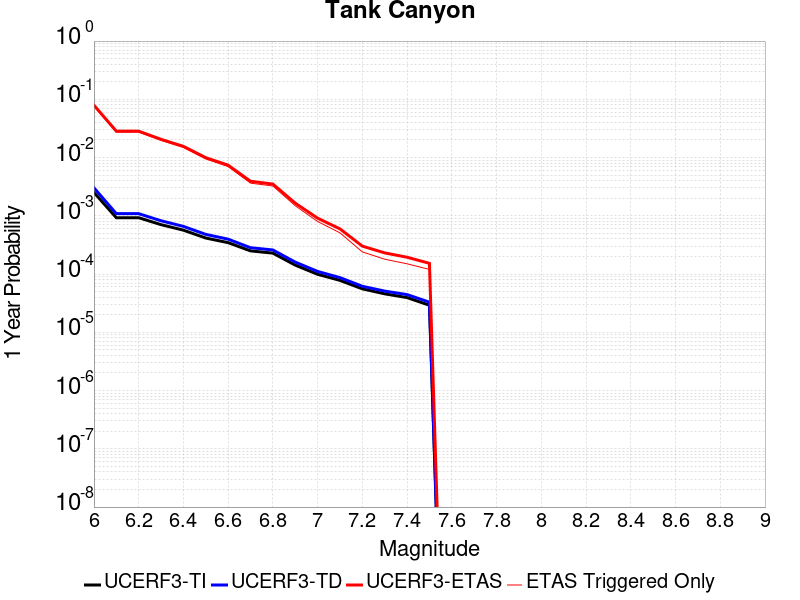 | 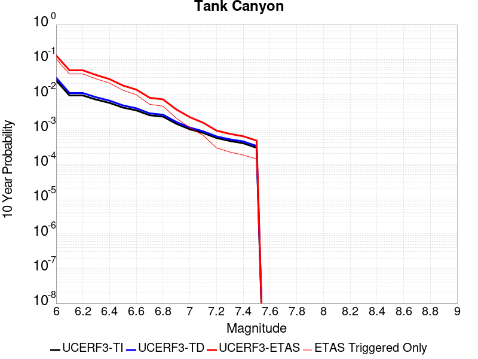 |

| Magnitude | 1 wk TI Prob | 1 wk TD Prob | 1 wk ETAS Prob | 1 wk ETAS/TD Gain | 1 wk ETAS Triggered Only | 1 mo TI Prob | 1 mo TD Prob | 1 mo ETAS Prob | 1 mo ETAS/TD Gain | 1 mo ETAS Triggered Only | 1 yr TI Prob | 1 yr TD Prob | 1 yr ETAS Prob | 1 yr ETAS/TD Gain | 1 yr ETAS Triggered Only | 10 yr TI Prob | 10 yr TD Prob | 10 yr ETAS Prob | 10 yr ETAS/TD Gain | 10 yr ETAS Triggered Only |
|-----|-----|-----|-----|-----|-----|-----|-----|-----|-----|-----|-----|-----|-----|-----|-----|-----|-----|-----|-----|-----|
| 6.0 | 4.8284557E-5 | 5.7964822E-5 | 0.037965767 | 654.97943 | 0.03791 | 2.0691741E-4 | 2.4840087E-4 | 0.05072586 | 204.20967 | 0.05049 | 0.0025163088 | 0.0030207601 | 0.07912019 | 26.192144 | 0.07633 | 0.02488006 | 0.029863637 | 0.12968096 | 4.3424373 | 0.10289 |
| 6.1 | 1.7796336E-5 | 2.0873314E-5 | 0.013080601 | 626.6662 | 0.01306 | 7.626778E-5 | 8.945422E-5 | 0.017777871 | 198.7371 | 0.01769 | 9.281647E-4 | 0.0010885983 | 0.028408825 | 26.096703 | 0.02735 | 0.009242975 | 0.010836744 | 0.048652455 | 4.4895825 | 0.03823 |
| 6.2 | 1.7796336E-5 | 2.0873314E-5 | 0.013080601 | 626.6662 | 0.01306 | 7.626778E-5 | 8.945422E-5 | 0.017777871 | 198.7371 | 0.01769 | 9.281647E-4 | 0.0010885983 | 0.028408825 | 26.096703 | 0.02735 | 0.009242975 | 0.010836744 | 0.048652455 | 4.4895825 | 0.03823 |
| 6.3 | 1.3515912E-5 | 1.5759564E-5 | 0.00952561 | 604.43353 | 0.00951 | 5.792405E-5 | 6.753938E-5 | 0.013036664 | 193.02315 | 0.01297 | 7.049971E-4 | 8.2200574E-4 | 0.020555772 | 25.006845 | 0.01975 | 0.007027647 | 0.0081922645 | 0.03565542 | 4.352328 | 0.02769 |
| 6.4 | 1.0870146E-5 | 1.2618021E-5 | 0.00699253 | 554.1701 | 0.00698 | 4.658551E-5 | 5.4076212E-5 | 0.009833547 | 181.84608 | 0.00978 | 5.67031E-4 | 6.581969E-4 | 0.01557837 | 23.668251 | 0.01493 | 0.005655863 | 0.0065644905 | 0.02722795 | 4.147763 | 0.0208 |
| 6.5 | 7.964826E-6 | 9.196094E-6 | 0.004339156 | 471.84775 | 0.00433 | 3.4134522E-5 | 3.9411298E-5 | 0.0062291673 | 158.05537 | 0.00619 | 4.1550855E-4 | 4.7973756E-4 | 0.009955189 | 20.751324 | 0.00948 | 0.0041473247 | 0.004788321 | 0.017765881 | 3.7102528 | 0.01304 |
| 6.6 | 6.6317E-6 | 7.6122988E-6 | 0.0032875873 | 431.8784 | 0.00328 | 2.8421264E-5 | 3.2623782E-5 | 0.0046624728 | 142.91638 | 0.00463 | 3.4597394E-4 | 3.9713128E-4 | 0.0074043474 | 18.644585 | 0.00701 | 0.0034543579 | 0.003965368 | 0.013606983 | 3.4314554 | 0.00968 |
| 6.7 | 4.793663E-6 | 5.4307857E-6 | 0.0017254214 | 317.7112 | 0.00172 | 2.0544108E-5 | 2.3274613E-5 | 0.0024432184 | 104.97353 | 0.00242 | 2.500958E-4 | 2.8333595E-4 | 0.0039223046 | 13.843301 | 0.00364 | 0.0024981452 | 0.0028304397 | 0.007955891 | 2.8108323 | 0.00514 |
| 6.8 | 4.382823E-6 | 4.9692567E-6 | 0.0015649615 | 314.92868 | 0.00156 | 1.8783392E-5 | 2.1296666E-5 | 0.0022112501 | 103.83081 | 0.00219 | 2.286638E-4 | 2.5926033E-4 | 0.0035084176 | 13.532413 | 0.00325 | 0.0022842865 | 0.002590253 | 0.0071184933 | 2.7481847 | 0.00454 |
| 6.9 | 2.729601E-6 | 3.0735416E-6 | 6.730715E-4 | 218.98889 | 6.7E-4 | 1.1698237E-5 | 1.3172262E-5 | 0.001013159 | 76.91611 | 0.001 | 1.4241673E-4 | 1.6036171E-4 | 0.0016501228 | 10.290005 | 0.00149 | 0.001423255 | 0.0016026258 | 0.0036493405 | 2.2771008 | 0.00205 |
| 7.0 | 1.8987357E-6 | 2.126939E-6 | 3.621262E-4 | 170.25696 | 3.6E-4 | 8.137413E-6 | 9.115425E-6 | 5.2911066E-4 | 58.04564 | 5.2E-4 | 9.90685E-5 | 1.1097535E-4 | 9.1088656E-4 | 8.208008 | 8.0E-4 | 9.902435E-4 | 0.0011092679 | 0.0022080478 | 1.9905449 | 0.0011 |
| 7.1 | 1.4928986E-6 | 1.6641272E-6 | 2.2166377E-4 | 133.20122 | 2.2E-4 | 6.398121E-6 | 7.1319573E-6 | 3.1712974E-4 | 44.46602 | 3.1E-4 | 7.789434E-5 | 8.682871E-5 | 5.967844E-4 | 6.873123 | 5.1E-4 | 7.786704E-4 | 8.6800574E-4 | 0.0015274328 | 1.7597036 | 6.6E-4 |
| 7.2 | 1.069082E-6 | 1.1828573E-6 | 1.2118272E-4 | 102.44914 | 1.2E-4 | 4.581772E-6 | 5.0693816E-6 | 1.7506852E-4 | 34.534492 | 1.7E-4 | 5.5781646E-5 | 6.171851E-5 | 3.017037E-4 | 4.888383 | 2.4E-4 | 5.576765E-4 | 6.170659E-4 | 9.0688694E-4 | 1.469676 | 2.9E-4 |
| 7.3 | 8.776551E-7 | 9.770005E-7 | 1.1097689E-4 | 113.58939 | 1.1E-4 | 3.7613736E-6 | 4.1871413E-6 | 1.541865E-4 | 36.823814 | 1.5E-4 | 4.579376E-5 | 5.097777E-5 | 2.309686E-4 | 4.530771 | 1.8E-4 | 4.5784327E-4 | 5.097118E-4 | 7.295997E-4 | 1.4313965 | 2.2E-4 |
| 7.4 | 7.55721E-7 | 8.510244E-7 | 1.0085094E-4 | 118.50534 | 1.0E-4 | 3.2388E-6 | 3.6472454E-6 | 1.3364677E-4 | 36.643208 | 1.3E-4 | 3.9431678E-5 | 4.4404827E-5 | 1.9439816E-4 | 4.377861 | 1.5E-4 | 3.942468E-4 | 4.440104E-4 | 6.239305E-4 | 1.4052159 | 1.8E-4 |
| 7.5 | 5.587665E-7 | 6.305619E-7 | 9.063051E-5 | 143.72975 | 9.0E-5 | 2.3947114E-6 | 2.702408E-6 | 1.1270211E-4 | 41.704327 | 1.1E-4 | 2.915522E-5 | 3.290182E-5 | 1.5289788E-4 | 4.6470947 | 1.2E-4 | 2.9151395E-4 | 3.290182E-4 | 4.689721E-4 | 1.4253684 | 1.4E-4 |

## Little Lake
*[(top)](#table-of-contents)*

| 1 Week | 1 Month | 1 Year | 10 Year |
|-----|-----|-----|-----|
|  |  |  |  |

| Magnitude | 1 wk TI Prob | 1 wk TD Prob | 1 wk ETAS Prob | 1 wk ETAS/TD Gain | 1 wk ETAS Triggered Only | 1 mo TI Prob | 1 mo TD Prob | 1 mo ETAS Prob | 1 mo ETAS/TD Gain | 1 mo ETAS Triggered Only | 1 yr TI Prob | 1 yr TD Prob | 1 yr ETAS Prob | 1 yr ETAS/TD Gain | 1 yr ETAS Triggered Only | 10 yr TI Prob | 10 yr TD Prob | 10 yr ETAS Prob | 10 yr ETAS/TD Gain | 10 yr ETAS Triggered Only |
|-----|-----|-----|-----|-----|-----|-----|-----|-----|-----|-----|-----|-----|-----|-----|-----|-----|-----|-----|-----|-----|
| 6.0 | 2.8424427E-5 | 3.120572E-5 | 0.031760216 | 1017.769 | 0.03173 | 1.2181328E-4 | 1.337327E-4 | 0.039198507 | 293.11087 | 0.03907 | 0.0014820677 | 0.0016271127 | 0.054331217 | 33.391182 | 0.05279 | 0.014722223 | 0.016165402 | 0.080193356 | 4.960802 | 0.06508 |
| 6.1 | 2.8424427E-5 | 3.120572E-5 | 0.031760216 | 1017.769 | 0.03173 | 1.2181328E-4 | 1.337327E-4 | 0.039198507 | 293.11087 | 0.03907 | 0.0014820677 | 0.0016271127 | 0.054331217 | 33.391182 | 0.05279 | 0.014722223 | 0.016165402 | 0.080193356 | 4.960802 | 0.06508 |
| 6.2 | 2.8424427E-5 | 3.120572E-5 | 0.031760216 | 1017.769 | 0.03173 | 1.2181328E-4 | 1.337327E-4 | 0.039198507 | 293.11087 | 0.03907 | 0.0014820677 | 0.0016271127 | 0.054331217 | 33.391182 | 0.05279 | 0.014722223 | 0.016165402 | 0.080193356 | 4.960802 | 0.06508 |
| 6.3 | 1.48860645E-5 | 1.6081389E-5 | 0.02185573 | 1359.0698 | 0.02184 | 6.379586E-5 | 6.8918576E-5 | 0.02674708 | 388.0968 | 0.02668 | 7.7643775E-4 | 8.3878887E-4 | 0.036448896 | 43.454193 | 0.03564 | 0.007737305 | 0.008359048 | 0.05130702 | 6.1379023 | 0.04331 |
| 6.4 | 1.48860645E-5 | 1.6081389E-5 | 0.02185573 | 1359.0698 | 0.02184 | 6.379586E-5 | 6.8918576E-5 | 0.02674708 | 388.0968 | 0.02668 | 7.7643775E-4 | 8.3878887E-4 | 0.036448896 | 43.454193 | 0.03564 | 0.007737305 | 0.008359048 | 0.05130702 | 6.1379023 | 0.04331 |
| 6.5 | 1.2797581E-5 | 1.3765565E-5 | 0.020243486 | 1470.5889 | 0.02023 | 5.4845623E-5 | 5.899409E-5 | 0.024787536 | 420.1698 | 0.02473 | 6.675408E-4 | 7.18042E-4 | 0.033724327 | 46.967064 | 0.03303 | 0.006655392 | 0.00715977 | 0.04699252 | 6.5634117 | 0.04012 |
| 6.6 | 9.661896E-6 | 1.0289038E-5 | 0.017850105 | 1734.8663 | 0.01784 | 4.1407468E-5 | 4.409522E-5 | 0.021893132 | 496.4967 | 0.02185 | 5.040193E-4 | 5.367433E-4 | 0.02944122 | 54.85158 | 0.02892 | 0.005028777 | 0.0053560743 | 0.040287968 | 7.521921 | 0.03512 |
| 6.7 | 7.767871E-6 | 8.199687E-6 | 0.01573807 | 1919.3502 | 0.01573 | 3.329045E-5 | 3.5141118E-5 | 0.019284464 | 548.7721 | 0.01925 | 4.0523586E-4 | 4.2777284E-4 | 0.02569696 | 60.071507 | 0.02528 | 0.004044977 | 0.004270846 | 0.03477999 | 8.143582 | 0.03064 |
| 6.8 | 6.4235196E-6 | 6.7357446E-6 | 0.012286653 | 1824.0973 | 0.01228 | 2.752908E-5 | 2.8867229E-5 | 0.015248428 | 528.22626 | 0.01522 | 3.35115E-4 | 3.5141467E-4 | 0.020334389 | 57.864376 | 0.01999 | 0.003346101 | 0.00350985 | 0.027455509 | 7.8224163 | 0.02403 |
| 6.9 | 3.1283696E-6 | 3.1121804E-6 | 0.007923087 | 2545.8318 | 0.00792 | 1.3407229E-5 | 1.3337856E-5 | 0.009813207 | 735.74097 | 0.0098 | 1.6322079E-4 | 1.6237781E-4 | 0.012910307 | 79.50783 | 0.01275 | 0.0016310095 | 0.00162274 | 0.016738173 | 10.314759 | 0.01514 |
| 7.0 | 2.290603E-6 | 2.2286815E-6 | 0.0050722174 | 2275.8826 | 0.00507 | 9.816834E-6 | 9.551463E-6 | 0.006249492 | 654.2968 | 0.00624 | 1.19513395E-4 | 1.162839E-4 | 0.008195344 | 70.477036 | 0.00808 | 0.0011944914 | 0.0011623327 | 0.010591361 | 9.112159 | 0.00944 |
| 7.1 | 1.293693E-6 | 1.1776827E-6 | 0.0022111752 | 1877.5642 | 0.00221 | 5.5443866E-6 | 5.0472063E-6 | 0.0027750332 | 549.81573 | 0.00277 | 6.750081E-5 | 6.14487E-5 | 0.0036612274 | 59.581856 | 0.0036 | 6.7480316E-4 | 6.143856E-4 | 0.0048717684 | 7.929497 | 0.00426 |
| 7.2 | 4.715842E-7 | 3.0917857E-7 | 8.030915E-5 | 259.75006 | 8.0E-5 | 2.0210737E-6 | 1.3250503E-6 | 1.0132492E-4 | 76.46873 | 1.0E-4 | 2.4606294E-5 | 1.6132375E-5 | 1.6612996E-4 | 10.297923 | 1.5E-4 | 2.460357E-4 | 1.6131258E-4 | 3.712787E-4 | 2.3016105 | 2.1E-4 |
| 7.3 | 3.9430947E-7 | 2.3097488E-7 | 7.0230955E-5 | 304.0632 | 7.0E-5 | 1.6898966E-6 | 9.89892E-7 | 8.098981E-5 | 81.81682 | 8.0E-5 | 2.0574296E-5 | 1.2051869E-5 | 1.420503E-4 | 11.786579 | 1.3E-4 | 2.0572392E-4 | 1.20512224E-4 | 2.8049294E-4 | 2.327506 | 1.6E-4 |
| 7.4 | 3.547123E-7 | 1.9679135E-7 | 6.019678E-5 | 305.8914 | 6.0E-5 | 1.5201948E-6 | 8.4339126E-7 | 7.084333E-5 | 83.998184 | 7.0E-5 | 1.8508214E-5 | 1.0268241E-5 | 1.2026711E-4 | 11.712533 | 1.1E-4 | 1.8506673E-4 | 1.02677724E-4 | 2.4266336E-4 | 2.3633494 | 1.4E-4 |
| 7.5 | 2.6354266E-7 | 1.4423138E-7 | 4.0144227E-5 | 278.33212 | 4.0E-5 | 1.129468E-6 | 6.181344E-7 | 4.061811E-5 | 65.71081 | 4.0E-5 | 1.3751187E-5 | 7.5257603E-6 | 8.752516E-5 | 11.630075 | 8.0E-5 | 1.3750336E-4 | 7.5255106E-5 | 1.7524758E-4 | 2.3287134 | 1.0E-4 |
| 7.6 | 1.269913E-7 | 7.572556E-8 | 1.0075725E-5 | 133.0558 | 1.0E-5 | 5.4424834E-7 | 3.245381E-7 | 1.0324535E-5 | 31.813015 | 1.0E-5 | 6.6262032E-6 | 3.9512443E-6 | 5.3951047E-5 | 13.654191 | 5.0E-5 | 6.626006E-5 | 3.9511775E-5 | 1.0950901E-4 | 2.7715538 | 7.0E-5 |

## Airport Lake
*[(top)](#table-of-contents)*

| 1 Week | 1 Month | 1 Year | 10 Year |
|-----|-----|-----|-----|
|  |  |  |  |

| Magnitude | 1 wk TI Prob | 1 wk TD Prob | 1 wk ETAS Prob | 1 wk ETAS/TD Gain | 1 wk ETAS Triggered Only | 1 mo TI Prob | 1 mo TD Prob | 1 mo ETAS Prob | 1 mo ETAS/TD Gain | 1 mo ETAS Triggered Only | 1 yr TI Prob | 1 yr TD Prob | 1 yr ETAS Prob | 1 yr ETAS/TD Gain | 1 yr ETAS Triggered Only | 10 yr TI Prob | 10 yr TD Prob | 10 yr ETAS Prob | 10 yr ETAS/TD Gain | 10 yr ETAS Triggered Only |
|-----|-----|-----|-----|-----|-----|-----|-----|-----|-----|-----|-----|-----|-----|-----|-----|-----|-----|-----|-----|-----|
| 6.0 | 1.2387061E-5 | 1.3103157E-5 | 0.02933272 | 2238.5994 | 0.02932 | 5.3086325E-5 | 5.615534E-5 | 0.035644155 | 634.7421 | 0.03559 | 6.461343E-4 | 6.8350515E-4 | 0.04682195 | 68.5027 | 0.04617 | 0.0064425888 | 0.0068168393 | 0.06185905 | 9.074448 | 0.05542 |
| 6.1 | 1.2387061E-5 | 1.3103157E-5 | 0.02933272 | 2238.5994 | 0.02932 | 5.3086325E-5 | 5.615534E-5 | 0.035644155 | 634.7421 | 0.03559 | 6.461343E-4 | 6.8350515E-4 | 0.04682195 | 68.5027 | 0.04617 | 0.0064425888 | 0.0068168393 | 0.06185905 | 9.074448 | 0.05542 |
| 6.2 | 1.2387061E-5 | 1.3103157E-5 | 0.02933272 | 2238.5994 | 0.02932 | 5.3086325E-5 | 5.615534E-5 | 0.035644155 | 634.7421 | 0.03559 | 6.461343E-4 | 6.8350515E-4 | 0.04682195 | 68.5027 | 0.04617 | 0.0064425888 | 0.0068168393 | 0.06185905 | 9.074448 | 0.05542 |
| 6.3 | 1.2387061E-5 | 1.3103157E-5 | 0.02933272 | 2238.5994 | 0.02932 | 5.3086325E-5 | 5.615534E-5 | 0.035644155 | 634.7421 | 0.03559 | 6.461343E-4 | 6.8350515E-4 | 0.04682195 | 68.5027 | 0.04617 | 0.0064425888 | 0.0068168393 | 0.06185905 | 9.074448 | 0.05542 |
| 6.4 | 1.2387061E-5 | 1.3103157E-5 | 0.02933272 | 2238.5994 | 0.02932 | 5.3086325E-5 | 5.615534E-5 | 0.035644155 | 634.7421 | 0.03559 | 6.461343E-4 | 6.8350515E-4 | 0.04682195 | 68.5027 | 0.04617 | 0.0064425888 | 0.0068168393 | 0.06185905 | 9.074448 | 0.05542 |
| 6.5 | 6.9922594E-6 | 7.384925E-6 | 0.02236722 | 3028.7673 | 0.02236 | 2.996648E-5 | 3.1649324E-5 | 0.02720079 | 859.44293 | 0.02717 | 3.6478083E-4 | 3.8526783E-4 | 0.03587159 | 93.10819 | 0.0355 | 0.003641826 | 0.0038465366 | 0.04599379 | 11.957195 | 0.04231 |
| 6.6 | 6.9922594E-6 | 7.384925E-6 | 0.02236722 | 3028.7673 | 0.02236 | 2.996648E-5 | 3.1649324E-5 | 0.02720079 | 859.44293 | 0.02717 | 3.6478083E-4 | 3.8526783E-4 | 0.03587159 | 93.10819 | 0.0355 | 0.003641826 | 0.0038465366 | 0.04599379 | 11.957195 | 0.04231 |
| 6.7 | 5.477277E-6 | 5.7860684E-6 | 0.018945677 | 3274.3608 | 0.01894 | 2.3473833E-5 | 2.4797222E-5 | 0.023134224 | 932.9361 | 0.02311 | 2.8575645E-4 | 3.0186825E-4 | 0.030642707 | 101.5102 | 0.03035 | 0.0028538927 | 0.003014966 | 0.039085884 | 12.963956 | 0.03618 |
| 6.8 | 3.9950432E-6 | 4.2190873E-6 | 0.014304159 | 3390.3445 | 0.0143 | 1.7121502E-5 | 1.8081691E-5 | 0.017547764 | 970.4714 | 0.01753 | 2.0843433E-4 | 2.2012512E-4 | 0.023325037 | 105.96264 | 0.02311 | 0.0020823893 | 0.0021993418 | 0.02958897 | 13.453557 | 0.02745 |
| 6.9 | 2.95695E-6 | 3.1230243E-6 | 0.01056309 | 3382.3271 | 0.01056 | 1.2672582E-5 | 1.3384334E-5 | 0.013003211 | 971.52466 | 0.01299 | 1.5427776E-4 | 1.6294434E-4 | 0.017040193 | 104.576775 | 0.01688 | 0.001541707 | 0.0016284712 | 0.021625852 | 13.27985 | 0.02003 |
| 7.0 | 1.456072E-6 | 1.540812E-6 | 0.0048315334 | 3135.706 | 0.00483 | 6.2402937E-6 | 6.603469E-6 | 0.005946564 | 900.52124 | 0.00594 | 7.597293E-5 | 8.039528E-5 | 0.0077297804 | 96.147194 | 0.00765 | 7.594696E-4 | 8.0376083E-4 | 0.009676623 | 12.039183 | 0.00888 |
| 7.1 | 6.995192E-7 | 7.4089746E-7 | 0.0020907393 | 2821.9011 | 0.00209 | 2.997936E-6 | 3.1752747E-6 | 0.002623167 | 826.1228 | 0.00262 | 3.649926E-5 | 3.865897E-5 | 0.003398529 | 87.91049 | 0.00336 | 3.6493264E-4 | 3.865897E-4 | 0.0043050745 | 11.136029 | 0.00392 |

## Owl Lake
*[(top)](#table-of-contents)*

| 1 Week | 1 Month | 1 Year | 10 Year |
|-----|-----|-----|-----|
| 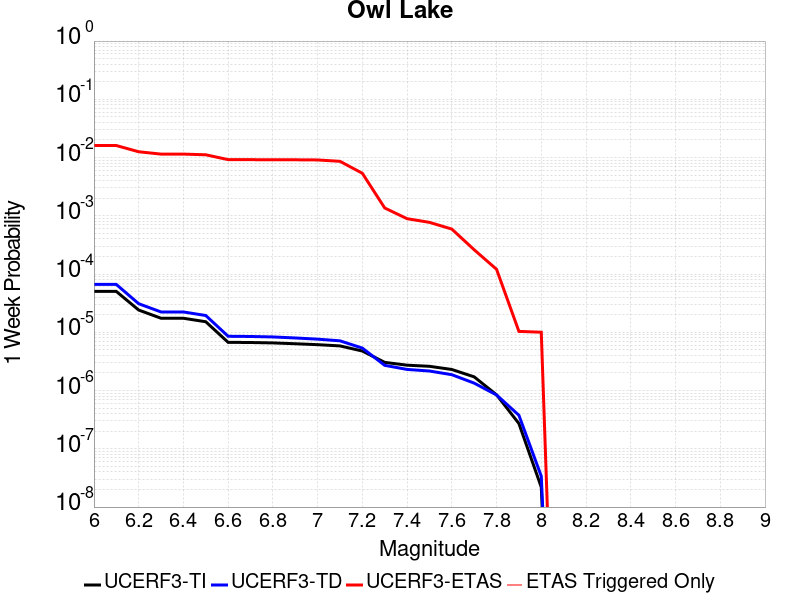 |  |  |  |

| Magnitude | 1 wk TI Prob | 1 wk TD Prob | 1 wk ETAS Prob | 1 wk ETAS/TD Gain | 1 wk ETAS Triggered Only | 1 mo TI Prob | 1 mo TD Prob | 1 mo ETAS Prob | 1 mo ETAS/TD Gain | 1 mo ETAS Triggered Only | 1 yr TI Prob | 1 yr TD Prob | 1 yr ETAS Prob | 1 yr ETAS/TD Gain | 1 yr ETAS Triggered Only | 10 yr TI Prob | 10 yr TD Prob | 10 yr ETAS Prob | 10 yr ETAS/TD Gain | 10 yr ETAS Triggered Only |
|-----|-----|-----|-----|-----|-----|-----|-----|-----|-----|-----|-----|-----|-----|-----|-----|-----|-----|-----|-----|-----|
| 6.0 | 5.0320643E-5 | 6.635816E-5 | 0.016085295 | 242.40117 | 0.01602 | 2.1564208E-4 | 2.843674E-4 | 0.021118442 | 74.26464 | 0.02084 | 0.0026222812 | 0.0034577388 | 0.034091447 | 9.859463 | 0.03074 | 0.02591553 | 0.034140717 | 0.07448466 | 2.1816957 | 0.04177 |
| 6.1 | 5.0320643E-5 | 6.635816E-5 | 0.016085295 | 242.40117 | 0.01602 | 2.1564208E-4 | 2.843674E-4 | 0.021118442 | 74.26464 | 0.02084 | 0.0026222812 | 0.0034577388 | 0.034091447 | 9.859463 | 0.03074 | 0.02591553 | 0.034140717 | 0.07448466 | 2.1816957 | 0.04177 |
| 6.2 | 2.4125871E-5 | 3.0981035E-5 | 0.012580592 | 406.07397 | 0.01255 | 1.0339249E-4 | 1.3277028E-4 | 0.016210636 | 122.09536 | 0.01608 | 0.0012580766 | 0.001615439 | 0.024678122 | 15.276419 | 0.0231 | 0.012509781 | 0.016070465 | 0.046798583 | 2.9120867 | 0.03123 |
| 6.3 | 1.7433485E-5 | 2.2355514E-5 | 0.0114621 | 512.7191 | 0.01144 | 7.471279E-5 | 9.580672E-5 | 0.014624415 | 152.64497 | 0.01453 | 9.0924866E-4 | 0.0011659743 | 0.021692013 | 18.604195 | 0.02055 | 0.009055373 | 0.011628896 | 0.03846317 | 3.3075514 | 0.02715 |
| 6.4 | 1.7433485E-5 | 2.2355514E-5 | 0.0114621 | 512.7191 | 0.01144 | 7.471279E-5 | 9.580672E-5 | 0.014624415 | 152.64497 | 0.01453 | 9.0924866E-4 | 0.0011659743 | 0.021692013 | 18.604195 | 0.02055 | 0.009055373 | 0.011628896 | 0.03846317 | 3.3075514 | 0.02715 |
| 6.5 | 1.5182742E-5 | 1.9429144E-5 | 0.011159212 | 574.3543 | 0.01114 | 6.506727E-5 | 8.326596E-5 | 0.014152095 | 169.96254 | 0.01407 | 7.919061E-4 | 0.0010134429 | 0.020763407 | 20.48799 | 0.01977 | 0.0078909 | 0.010118429 | 0.03578606 | 3.536721 | 0.02593 |
| 6.6 | 6.7271576E-6 | 8.547361E-6 | 0.009218468 | 1078.5164 | 0.00921 | 2.8830356E-5 | 3.6631063E-5 | 0.011386216 | 310.83496 | 0.01135 | 3.5095305E-4 | 4.458976E-4 | 0.015889008 | 35.63376 | 0.01545 | 0.0035039932 | 0.004467813 | 0.023840869 | 5.3361387 | 0.01946 |
| 6.7 | 6.682835E-6 | 8.479807E-6 | 0.009198402 | 1084.7418 | 0.00919 | 2.8640408E-5 | 3.6341557E-5 | 0.01136593 | 312.753 | 0.01133 | 3.4864116E-4 | 4.4237426E-4 | 0.015865548 | 35.864536 | 0.01543 | 0.003480947 | 0.0044327388 | 0.023776611 | 5.3638644 | 0.01943 |
| 6.8 | 6.5774975E-6 | 8.32628E-6 | 0.00917825 | 1102.3229 | 0.00917 | 2.8188972E-5 | 3.5683603E-5 | 0.01134528 | 317.94098 | 0.01131 | 3.4314668E-4 | 4.343669E-4 | 0.015807686 | 36.392475 | 0.01538 | 0.0034261728 | 0.004352885 | 0.0236087 | 5.4236903 | 0.01934 |
| 6.9 | 6.363419E-6 | 7.999454E-6 | 0.009157926 | 1144.8188 | 0.00915 | 2.727151E-5 | 3.428296E-5 | 0.011323896 | 330.30685 | 0.01129 | 3.3198006E-4 | 4.1732067E-4 | 0.015690943 | 37.59925 | 0.01528 | 0.0033148455 | 0.0041828766 | 0.023322482 | 5.575704 | 0.01922 |
| 7.0 | 6.1342453E-6 | 7.6316555E-6 | 0.009097562 | 1192.0824 | 0.00909 | 2.6289357E-5 | 3.2706717E-5 | 0.01125234 | 344.0376 | 0.01122 | 3.2002592E-4 | 3.9813702E-4 | 0.015572093 | 39.112396 | 0.01518 | 0.0031956544 | 0.003991571 | 0.022995412 | 5.760993 | 0.01908 |
| 7.1 | 5.842926E-6 | 7.142211E-6 | 0.008617081 | 1206.5004 | 0.00861 | 2.504087E-5 | 3.0609146E-5 | 0.010630284 | 347.2911 | 0.0106 | 3.0482994E-4 | 3.7260808E-4 | 0.0147772385 | 39.658936 | 0.01441 | 0.0030441214 | 0.0037370329 | 0.021769393 | 5.8253145 | 0.0181 |
| 7.2 | 4.77173E-6 | 5.358483E-6 | 0.00537533 | 1003.14386 | 0.00537 | 2.045011E-5 | 2.2964748E-5 | 0.0067728097 | 294.922 | 0.00675 | 2.4895166E-4 | 2.79564E-4 | 0.009636947 | 34.471344 | 0.00936 | 0.0024867293 | 0.002808645 | 0.014605419 | 5.2001653 | 0.01183 |
| 7.3 | 3.0494948E-6 | 2.710463E-6 | 0.0013627068 | 502.75793 | 0.00136 | 1.3069198E-5 | 1.1616219E-5 | 0.0017115965 | 147.3454 | 0.0017 | 1.5910587E-4 | 1.4141845E-4 | 0.0025210818 | 17.827106 | 0.00238 | 0.0015899199 | 0.0014232415 | 0.004319114 | 3.0347023 | 0.0029 |
| 7.4 | 2.7263884E-6 | 2.3056762E-6 | 8.9230365E-4 | 387.003 | 8.9E-4 | 1.1684469E-5 | 9.881433E-6 | 0.0011098706 | 112.31879 | 0.0011 | 1.4224913E-4 | 1.20299905E-4 | 0.001690111 | 14.049147 | 0.00157 | 0.0014215811 | 0.0012112238 | 0.003058983 | 2.5255308 | 0.00185 |
| 7.5 | 2.6090431E-6 | 2.1656133E-6 | 7.7216397E-4 | 356.5567 | 7.7E-4 | 1.1181565E-5 | 9.281167E-6 | 9.692723E-4 | 104.4343 | 9.6E-4 | 1.3612706E-4 | 1.1299244E-4 | 0.0014728388 | 13.0348425 | 0.00136 | 0.001360437 | 0.0011379806 | 0.0027261712 | 2.3956218 | 0.00159 |
| 7.6 | 2.3008756E-6 | 1.8727933E-6 | 5.918717E-4 | 316.03683 | 5.9E-4 | 9.860858E-6 | 8.0262325E-6 | 7.0802064E-4 | 88.21332 | 7.0E-4 | 1.20049335E-4 | 9.7715085E-5 | 0.0011276144 | 11.53982 | 0.00103 | 0.001199845 | 9.849932E-4 | 0.0021838113 | 2.2170825 | 0.0012 |
| 7.7 | 1.7184348E-6 | 1.3419171E-6 | 2.6134157E-4 | 194.7524 | 2.6E-4 | 7.3646997E-6 | 5.7510606E-6 | 3.3574915E-4 | 58.38039 | 3.3E-4 | 8.966153E-5 | 7.0016955E-5 | 5.7998125E-4 | 8.28344 | 5.1E-4 | 8.962536E-4 | 7.078345E-4 | 0.0013074098 | 1.8470558 | 6.0E-4 |
| 7.8 | 8.4612907E-7 | 8.4058576E-7 | 1.2084049E-4 | 143.75748 | 1.2E-4 | 3.6262625E-6 | 3.6025056E-6 | 1.6360193E-4 | 45.413372 | 1.6E-4 | 4.4148852E-5 | 4.3859643E-5 | 2.938487E-4 | 6.699751 | 2.5E-4 | 4.414008E-4 | 4.4398365E-4 | 7.238593E-4 | 1.6303738 | 2.8E-4 |
| 7.9 | 2.716738E-7 | 3.768106E-7 | 1.0376807E-5 | 27.538523 | 1.0E-5 | 1.1643157E-6 | 1.6149015E-6 | 2.161487E-5 | 13.384636 | 2.0E-5 | 1.4175452E-5 | 1.966126E-5 | 5.9660473E-5 | 3.0344176 | 4.0E-5 | 1.4174548E-4 | 1.9836679E-4 | 2.4835687E-4 | 1.2520083 | 5.0E-5 |
| 8.0 | 2.1995428E-8 | 3.384878E-8 | 1.0033848E-5 | 296.4316 | 1.0E-5 | 9.426611E-8 | 1.4506621E-7 | 1.0145065E-5 | 69.93404 | 1.0E-5 | 1.1476893E-6 | 1.7661803E-6 | 1.1766163E-5 | 6.6619263 | 1.0E-5 | 1.14768345E-5 | 1.7963059E-5 | 2.7962878E-5 | 1.5566881 | 1.0E-5 |

## Panamint Valley
*[(top)](#table-of-contents)*

| 1 Week | 1 Month | 1 Year | 10 Year |
|-----|-----|-----|-----|
|  |  |  |  |

| Magnitude | 1 wk TI Prob | 1 wk TD Prob | 1 wk ETAS Prob | 1 wk ETAS/TD Gain | 1 wk ETAS Triggered Only | 1 mo TI Prob | 1 mo TD Prob | 1 mo ETAS Prob | 1 mo ETAS/TD Gain | 1 mo ETAS Triggered Only | 1 yr TI Prob | 1 yr TD Prob | 1 yr ETAS Prob | 1 yr ETAS/TD Gain | 1 yr ETAS Triggered Only | 10 yr TI Prob | 10 yr TD Prob | 10 yr ETAS Prob | 10 yr ETAS/TD Gain | 10 yr ETAS Triggered Only |
|-----|-----|-----|-----|-----|-----|-----|-----|-----|-----|-----|-----|-----|-----|-----|-----|-----|-----|-----|-----|-----|
| 6.0 | 3.0211835E-5 | 3.3984514E-5 | 0.012983545 | 382.04297 | 0.01295 | 1.2947287E-4 | 1.4563995E-4 | 0.016663235 | 114.413895 | 0.01652 | 0.0015751923 | 0.0017717537 | 0.02641801 | 14.910656 | 0.02469 | 0.015640736 | 0.017583137 | 0.050356563 | 2.8639123 | 0.03336 |
| 6.1 | 3.0211835E-5 | 3.3984514E-5 | 0.012983545 | 382.04297 | 0.01295 | 1.2947287E-4 | 1.4563995E-4 | 0.016663235 | 114.413895 | 0.01652 | 0.0015751923 | 0.0017717537 | 0.02641801 | 14.910656 | 0.02469 | 0.015640736 | 0.017583137 | 0.050356563 | 2.8639123 | 0.03336 |
| 6.2 | 3.0211835E-5 | 3.3984514E-5 | 0.012983545 | 382.04297 | 0.01295 | 1.2947287E-4 | 1.4563995E-4 | 0.016663235 | 114.413895 | 0.01652 | 0.0015751923 | 0.0017717537 | 0.02641801 | 14.910656 | 0.02469 | 0.015640736 | 0.017583137 | 0.050356563 | 2.8639123 | 0.03336 |
| 6.3 | 2.8573924E-5 | 3.210268E-5 | 0.012451704 | 387.8712 | 0.01242 | 1.2245393E-4 | 1.3757581E-4 | 0.015965398 | 116.048 | 0.01583 | 0.001489857 | 0.0016737265 | 0.025144378 | 15.022991 | 0.02351 | 0.01479908 | 0.016617801 | 0.04774185 | 2.872934 | 0.03165 |
| 6.4 | 2.8573924E-5 | 3.210268E-5 | 0.012451704 | 387.8712 | 0.01242 | 1.2245393E-4 | 1.3757581E-4 | 0.015965398 | 116.048 | 0.01583 | 0.001489857 | 0.0016737265 | 0.025144378 | 15.022991 | 0.02351 | 0.01479908 | 0.016617801 | 0.04774185 | 2.872934 | 0.03165 |
| 6.5 | 2.7468774E-5 | 3.0828433E-5 | 0.012080457 | 391.86087 | 0.01205 | 1.1771801E-4 | 1.3211532E-4 | 0.015480087 | 117.17102 | 0.01535 | 0.0014322745 | 0.0016073446 | 0.024310794 | 15.124817 | 0.02274 | 0.014230782 | 0.015963677 | 0.045996465 | 2.8813202 | 0.03052 |
| 6.6 | 2.6135967E-5 | 2.925248E-5 | 0.01171891 | 400.61255 | 0.01169 | 1.1200648E-4 | 1.253619E-4 | 0.014943504 | 119.20292 | 0.01482 | 0.0013628257 | 0.0015252391 | 0.023351897 | 15.31032 | 0.02186 | 0.013544982 | 0.015154043 | 0.04387215 | 2.895079 | 0.02916 |
| 6.7 | 2.4498746E-5 | 2.7341335E-5 | 0.011267034 | 412.08792 | 0.01124 | 1.04990395E-4 | 1.1717203E-4 | 0.014345504 | 122.43114 | 0.01423 | 0.0012775084 | 0.0014256609 | 0.022126107 | 15.519894 | 0.02073 | 0.012701893 | 0.014171274 | 0.04138015 | 2.9200017 | 0.0276 |
| 6.8 | 2.2244329E-5 | 2.4935423E-5 | 0.01065467 | 427.29053 | 0.01063 | 9.532935E-5 | 1.0686185E-4 | 0.013465434 | 126.00787 | 0.01336 | 0.0011600169 | 0.0013002884 | 0.020525258 | 15.785159 | 0.01925 | 0.011539802 | 0.0129325185 | 0.037895456 | 2.9302454 | 0.02529 |
| 6.9 | 1.9902658E-5 | 2.2290267E-5 | 0.009682075 | 434.36334 | 0.00966 | 8.529431E-5 | 9.552632E-5 | 0.012164373 | 127.34054 | 0.01207 | 0.0010379635 | 0.0011624309 | 0.018352425 | 15.787971 | 0.01721 | 0.010331288 | 0.011568608 | 0.033749007 | 2.917292 | 0.02244 |
| 7.0 | 1.8353881E-5 | 2.0566185E-5 | 0.009260376 | 450.2719 | 0.00924 | 7.865712E-5 | 8.813792E-5 | 0.011527129 | 130.78513 | 0.01144 | 9.5722964E-4 | 0.0010725686 | 0.01729515 | 16.124983 | 0.01624 | 0.009531168 | 0.010678849 | 0.031454593 | 2.945504 | 0.021 |
| 7.1 | 1.7667631E-5 | 1.9772613E-5 | 0.008919597 | 451.10867 | 0.0089 | 7.571623E-5 | 8.473711E-5 | 0.011083805 | 130.80225 | 0.011 | 9.2145515E-4 | 0.0010312037 | 0.016675055 | 16.170477 | 0.01566 | 0.009176437 | 0.010269073 | 0.03025174 | 2.9459078 | 0.02019 |
| 7.2 | 1.6381597E-5 | 1.8158249E-5 | 0.007928015 | 436.60675 | 0.00791 | 7.020495E-5 | 7.781885E-5 | 0.009817061 | 126.15274 | 0.00974 | 8.544101E-4 | 9.4704994E-4 | 0.014803914 | 15.631609 | 0.01387 | 0.008511325 | 0.009434792 | 0.027146097 | 2.8772333 | 0.01788 |
| 7.3 | 1.4520491E-5 | 1.5966476E-5 | 0.006635861 | 415.61212 | 0.00662 | 6.222919E-5 | 6.842605E-5 | 0.008137874 | 118.929474 | 0.00807 | 7.57377E-4 | 8.327849E-4 | 0.012413133 | 14.905568 | 0.01159 | 0.0075480095 | 0.00829975 | 0.023115752 | 2.785114 | 0.01494 |
| 7.4 | 1.2852287E-5 | 1.4145411E-5 | 0.0064640543 | 456.97183 | 0.00645 | 5.5080065E-5 | 6.062187E-5 | 0.007910146 | 130.48337 | 0.00785 | 6.7039346E-4 | 7.378371E-4 | 0.0119295735 | 16.168303 | 0.0112 | 0.0066837464 | 0.0073567946 | 0.021591298 | 2.9348786 | 0.01434 |
| 7.5 | 1.1637851E-5 | 1.2836797E-5 | 0.0064227544 | 500.3393 | 0.00641 | 4.987555E-5 | 5.5013777E-5 | 0.007814587 | 142.04782 | 0.00776 | 6.070656E-4 | 6.6960254E-4 | 0.01173219 | 17.521126 | 0.01107 | 0.006054099 | 0.0066787465 | 0.020734241 | 3.104511 | 0.01415 |
| 7.6 | 3.0068115E-6 | 3.3330316E-6 | 0.0027633237 | 829.0722 | 0.00276 | 1.2886271E-5 | 1.4284384E-5 | 0.0033642366 | 235.5185 | 0.00335 | 1.5687906E-4 | 1.7390578E-4 | 0.004943076 | 28.423876 | 0.00477 | 0.0015676835 | 0.0017391363 | 0.0077486667 | 4.455468 | 0.00602 |

## Garlock (East)
*[(top)](#table-of-contents)*

| 1 Week | 1 Month | 1 Year | 10 Year |
|-----|-----|-----|-----|
|  |  | 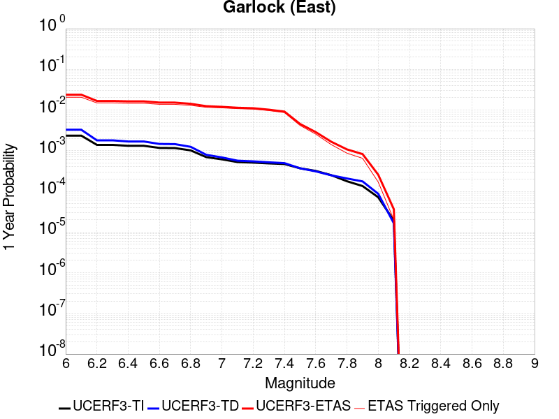 |  |

| Magnitude | 1 wk TI Prob | 1 wk TD Prob | 1 wk ETAS Prob | 1 wk ETAS/TD Gain | 1 wk ETAS Triggered Only | 1 mo TI Prob | 1 mo TD Prob | 1 mo ETAS Prob | 1 mo ETAS/TD Gain | 1 mo ETAS Triggered Only | 1 yr TI Prob | 1 yr TD Prob | 1 yr ETAS Prob | 1 yr ETAS/TD Gain | 1 yr ETAS Triggered Only | 10 yr TI Prob | 10 yr TD Prob | 10 yr ETAS Prob | 10 yr ETAS/TD Gain | 10 yr ETAS Triggered Only |
|-----|-----|-----|-----|-----|-----|-----|-----|-----|-----|-----|-----|-----|-----|-----|-----|-----|-----|-----|-----|-----|
| 6.0 | 4.5092507E-5 | 6.290325E-5 | 0.01029226 | 163.62048 | 0.01023 | 1.9323928E-4 | 2.6956003E-4 | 0.013965867 | 51.80986 | 0.0137 | 0.0023501497 | 0.0032774 | 0.023839787 | 7.273994 | 0.02063 | 0.023254504 | 0.032351844 | 0.05959114 | 1.8419703 | 0.02815 |
| 6.1 | 4.5092507E-5 | 6.290325E-5 | 0.01029226 | 163.62048 | 0.01023 | 1.9323928E-4 | 2.6956003E-4 | 0.013965867 | 51.80986 | 0.0137 | 0.0023501497 | 0.0032774 | 0.023839787 | 7.273994 | 0.02063 | 0.023254504 | 0.032351844 | 0.05959114 | 1.8419703 | 0.02815 |
| 6.2 | 2.6674514E-5 | 3.4509674E-5 | 0.008094232 | 234.54962 | 0.00806 | 1.1431433E-4 | 1.4789042E-4 | 0.010546353 | 71.31194 | 0.0104 | 0.0013908884 | 0.0017991117 | 0.016712233 | 9.289158 | 0.01494 | 0.01382215 | 0.017890299 | 0.037286967 | 2.0842001 | 0.01975 |
| 6.3 | 2.6674514E-5 | 3.4509674E-5 | 0.008094232 | 234.54962 | 0.00806 | 1.1431433E-4 | 1.4789042E-4 | 0.010546353 | 71.31194 | 0.0104 | 0.0013908884 | 0.0017991117 | 0.016712233 | 9.289158 | 0.01494 | 0.01382215 | 0.017890299 | 0.037286967 | 2.0842001 | 0.01975 |
| 6.4 | 2.5312667E-5 | 3.233893E-5 | 0.007992081 | 247.135 | 0.00796 | 1.0847834E-4 | 1.3858822E-4 | 0.010357172 | 74.73342 | 0.01022 | 0.0013199237 | 0.0016860351 | 0.016341284 | 9.692138 | 0.01468 | 0.013121112 | 0.016778335 | 0.0358725 | 2.138025 | 0.01942 |
| 6.5 | 2.5312667E-5 | 3.233893E-5 | 0.007992081 | 247.135 | 0.00796 | 1.0847834E-4 | 1.3858822E-4 | 0.010357172 | 74.73342 | 0.01022 | 0.0013199237 | 0.0016860351 | 0.016341284 | 9.692138 | 0.01468 | 0.013121112 | 0.016778335 | 0.0358725 | 2.138025 | 0.01942 |
| 6.6 | 2.246556E-5 | 2.8133776E-5 | 0.0076879184 | 273.26294 | 0.00766 | 9.627742E-5 | 1.20567885E-4 | 0.0098094 | 81.35997 | 0.00969 | 0.0011715472 | 0.0014669491 | 0.0152666755 | 10.407093 | 0.01382 | 0.011653901 | 0.01461866 | 0.032532893 | 2.225436 | 0.01818 |
| 6.7 | 2.2241198E-5 | 2.7803519E-5 | 0.0076675913 | 275.7777 | 0.00764 | 9.531594E-5 | 1.1915263E-4 | 0.009788 | 82.14674 | 0.00967 | 0.0011598538 | 0.0014497414 | 0.01521975 | 10.498251 | 0.01379 | 0.011538187 | 0.014448853 | 0.03232675 | 2.237323 | 0.01814 |
| 6.8 | 1.9528685E-5 | 2.389819E-5 | 0.0073437234 | 307.29202 | 0.00732 | 8.369167E-5 | 1.0241691E-4 | 0.009311474 | 90.91735 | 0.00921 | 0.0010184698 | 0.0012462323 | 0.014240019 | 11.426456 | 0.01301 | 0.010138147 | 0.012436427 | 0.02924476 | 2.3515403 | 0.01702 |
| 6.9 | 1.3318621E-5 | 1.5198884E-5 | 0.0068250955 | 449.0524 | 0.00681 | 5.7078556E-5 | 6.513648E-5 | 0.008514586 | 130.71916 | 0.00845 | 6.9470983E-4 | 7.927538E-4 | 0.012453502 | 15.709167 | 0.01167 | 0.0069254204 | 0.007939888 | 0.02284063 | 2.8766944 | 0.01502 |
| 7.0 | 1.1760853E-5 | 1.31077895E-5 | 0.0066830204 | 509.85107 | 0.00667 | 5.0402683E-5 | 5.6175057E-5 | 0.008315711 | 148.03209 | 0.00826 | 6.134799E-4 | 6.8372174E-4 | 0.011985989 | 17.530508 | 0.01131 | 0.0061178906 | 0.00685652 | 0.021286895 | 3.1046207 | 0.01453 |
| 7.1 | 1.0064758E-5 | 1.0902931E-5 | 0.006450833 | 591.66046 | 0.00644 | 4.3133965E-5 | 4.672603E-5 | 0.007976355 | 170.70476 | 0.00793 | 5.2502943E-4 | 5.687444E-4 | 0.011382591 | 20.013544 | 0.01082 | 0.005237907 | 0.0057129986 | 0.019424217 | 3.4000037 | 0.01379 |
| 7.2 | 9.768808E-6 | 1.0498807E-5 | 0.0063004326 | 600.10944 | 0.00629 | 4.186565E-5 | 4.499413E-5 | 0.0077746464 | 172.79245 | 0.00773 | 5.095951E-4 | 5.4766936E-4 | 0.011081897 | 20.23465 | 0.01054 | 0.0050842804 | 0.0055032647 | 0.01888919 | 3.432361 | 0.01346 |
| 7.3 | 9.344516E-6 | 9.944468E-6 | 0.005789887 | 582.2219 | 0.00578 | 4.004731E-5 | 4.261847E-5 | 0.0071323165 | 167.3527 | 0.00709 | 4.8746695E-4 | 5.1875977E-4 | 0.010213728 | 19.688742 | 0.0097 | 0.0048639905 | 0.0052149445 | 0.017540332 | 3.3634741 | 0.01239 |
| 7.4 | 9.023491E-6 | 9.490661E-6 | 0.005129442 | 540.4726 | 0.00512 | 3.867153E-5 | 4.0673647E-5 | 0.006380416 | 156.86855 | 0.00634 | 4.7072413E-4 | 4.950925E-4 | 0.009150805 | 18.48302 | 0.00866 | 0.004697283 | 0.0049783974 | 0.016023137 | 3.2185333 | 0.0111 |
| 7.5 | 7.081253E-6 | 7.087672E-6 | 0.0025770694 | 363.59885 | 0.00257 | 3.0347876E-5 | 3.0375388E-5 | 0.003140281 | 103.382416 | 0.00311 | 3.6942272E-4 | 3.6975832E-4 | 0.0045482125 | 12.300501 | 0.00418 | 0.003688092 | 0.0037243143 | 0.009154017 | 2.4579067 | 0.00545 |
| 7.6 | 6.116396E-6 | 5.959245E-6 | 0.0015059503 | 252.70825 | 0.0015 | 2.6212863E-5 | 2.5539372E-5 | 0.0018554926 | 72.652245 | 0.00183 | 3.1909486E-4 | 3.1089774E-4 | 0.002870102 | 9.231659 | 0.00256 | 0.0031863707 | 0.0031357552 | 0.006455313 | 2.0586152 | 0.00333 |
| 7.7 | 4.797145E-6 | 4.757281E-6 | 8.0475345E-4 | 169.16249 | 8.0E-4 | 2.055903E-5 | 2.0388188E-5 | 9.803686E-4 | 48.085125 | 9.6E-4 | 2.5027743E-4 | 2.4819805E-4 | 0.0016578481 | 6.6795373 | 0.00141 | 0.0024999576 | 0.0025093474 | 0.0043347552 | 1.7274433 | 0.00183 |
| 7.8 | 3.4028885E-6 | 3.978462E-6 | 5.239764E-4 | 131.70326 | 5.2E-4 | 1.4583726E-5 | 1.7050439E-5 | 6.170402E-4 | 36.18911 | 6.0E-4 | 1.775424E-4 | 2.0756939E-4 | 0.0010773888 | 5.1904993 | 8.7E-4 | 0.0017740062 | 0.0021012232 | 0.003198912 | 1.5224047 | 0.0011 |
| 7.9 | 2.5928412E-6 | 3.3724489E-6 | 3.9337113E-4 | 116.64258 | 3.9E-4 | 1.1112129E-5 | 1.4453272E-5 | 4.8444647E-4 | 33.518116 | 4.7E-4 | 1.3528178E-4 | 1.7595445E-4 | 8.258401E-4 | 4.693488 | 6.5E-4 | 0.0013519945 | 0.0017812408 | 0.0025698335 | 1.442721 | 7.9E-4 |
| 8.0 | 1.3743648E-6 | 1.6734747E-6 | 1.3167325E-4 | 78.68255 | 1.3E-4 | 5.8901214E-6 | 7.1720146E-6 | 1.4717101E-4 | 20.520176 | 1.4E-4 | 7.1709874E-5 | 8.731581E-5 | 2.5730097E-4 | 2.9467854 | 1.7E-4 | 7.1686733E-4 | 8.837234E-4 | 0.0011235112 | 1.2713382 | 2.4E-4 |
| 8.1 | 3.6733252E-7 | 3.1489964E-7 | 2.0314894E-5 | 64.512276 | 2.0E-5 | 1.5742813E-6 | 1.3495693E-6 | 2.1349542E-5 | 15.819523 | 2.0E-5 | 1.9166706E-5 | 1.6430899E-5 | 3.643057E-5 | 2.2171988 | 2.0E-5 | 1.9165053E-4 | 1.6638759E-4 | 1.9638259E-4 | 1.1802719 | 3.0E-5 |

## Hunter Mountain-Saline Valley
*[(top)](#table-of-contents)*

| 1 Week | 1 Month | 1 Year | 10 Year |
|-----|-----|-----|-----|
|  |  |  |  |

| Magnitude | 1 wk TI Prob | 1 wk TD Prob | 1 wk ETAS Prob | 1 wk ETAS/TD Gain | 1 wk ETAS Triggered Only | 1 mo TI Prob | 1 mo TD Prob | 1 mo ETAS Prob | 1 mo ETAS/TD Gain | 1 mo ETAS Triggered Only | 1 yr TI Prob | 1 yr TD Prob | 1 yr ETAS Prob | 1 yr ETAS/TD Gain | 1 yr ETAS Triggered Only | 10 yr TI Prob | 10 yr TD Prob | 10 yr ETAS Prob | 10 yr ETAS/TD Gain | 10 yr ETAS Triggered Only |
|-----|-----|-----|-----|-----|-----|-----|-----|-----|-----|-----|-----|-----|-----|-----|-----|-----|-----|-----|-----|-----|
| 6.0 | 4.5103672E-5 | 5.4570177E-5 | 0.006794202 | 124.503944 | 0.00674 | 1.9328714E-4 | 2.3385242E-4 | 0.008491921 | 36.31316 | 0.00826 | 0.002350731 | 0.0028435152 | 0.014639877 | 5.1485133 | 0.01183 | 0.023260195 | 0.028091887 | 0.042816296 | 1.5241516 | 0.01515 |
| 6.1 | 4.5103672E-5 | 5.4570177E-5 | 0.006794202 | 124.503944 | 0.00674 | 1.9328714E-4 | 2.3385242E-4 | 0.008491921 | 36.31316 | 0.00826 | 0.002350731 | 0.0028435152 | 0.014639877 | 5.1485133 | 0.01183 | 0.023260195 | 0.028091887 | 0.042816296 | 1.5241516 | 0.01515 |
| 6.2 | 3.9363465E-5 | 4.706337E-5 | 0.0067567476 | 143.56702 | 0.00671 | 1.6868966E-4 | 2.0168544E-4 | 0.008430026 | 41.79789 | 0.00823 | 0.002051862 | 0.0024528175 | 0.014183972 | 5.7827263 | 0.01176 | 0.020330196 | 0.024273481 | 0.038938653 | 1.6041642 | 0.01503 |
| 6.3 | 3.9363465E-5 | 4.706337E-5 | 0.0067567476 | 143.56702 | 0.00671 | 1.6868966E-4 | 2.0168544E-4 | 0.008430026 | 41.79789 | 0.00823 | 0.002051862 | 0.0024528175 | 0.014183972 | 5.7827263 | 0.01176 | 0.020330196 | 0.024273481 | 0.038938653 | 1.6041642 | 0.01503 |
| 6.4 | 3.2311684E-5 | 3.795099E-5 | 0.006697698 | 176.48283 | 0.00666 | 1.384713E-4 | 1.6263737E-4 | 0.00832131 | 51.16481 | 0.00816 | 0.0016845843 | 0.0019783843 | 0.013615317 | 6.882038 | 0.01166 | 0.016718714 | 0.019616475 | 0.03422419 | 1.7446656 | 0.0149 |
| 6.5 | 3.2311684E-5 | 3.795099E-5 | 0.006697698 | 176.48283 | 0.00666 | 1.384713E-4 | 1.6263737E-4 | 0.00832131 | 51.16481 | 0.00816 | 0.0016845843 | 0.0019783843 | 0.013615317 | 6.882038 | 0.01166 | 0.016718714 | 0.019616475 | 0.03422419 | 1.7446656 | 0.0149 |
| 6.6 | 2.9305844E-5 | 3.418183E-5 | 0.0066639553 | 194.95605 | 0.00663 | 1.2559042E-4 | 1.4648569E-4 | 0.008265296 | 56.423916 | 0.00812 | 0.0015279909 | 0.001782067 | 0.013341431 | 7.486492 | 0.01158 | 0.015175272 | 0.01768569 | 0.032233767 | 1.8225901 | 0.01481 |
| 6.7 | 2.7826512E-5 | 3.2344276E-5 | 0.0066521303 | 205.66638 | 0.00662 | 1.19251024E-4 | 1.386113E-4 | 0.008247487 | 59.500828 | 0.00811 | 0.0014509142 | 0.0016863465 | 0.013226852 | 7.8434963 | 0.01156 | 0.014414776 | 0.016743187 | 0.031275723 | 1.8679671 | 0.01478 |
| 6.8 | 2.3389874E-5 | 2.6866714E-5 | 0.0065866904 | 245.16174 | 0.00656 | 1.0023846E-4 | 1.15138246E-4 | 0.008144214 | 70.734215 | 0.00803 | 0.00121972 | 0.001400954 | 0.012844899 | 9.16868 | 0.01146 | 0.01213047 | 0.013927434 | 0.028393118 | 2.0386467 | 0.01467 |
| 6.9 | 2.069209E-5 | 2.3570032E-5 | 0.0065334165 | 277.19168 | 0.00651 | 8.867737E-5 | 1.01010715E-4 | 0.008050208 | 79.69657 | 0.00795 | 0.0010791123 | 0.0012291478 | 0.0125651965 | 10.222691 | 0.01135 | 0.010738871 | 0.012228523 | 0.0266006 | 2.175291 | 0.01455 |
| 7.0 | 1.7462342E-5 | 1.9633546E-5 | 0.0065195058 | 332.05954 | 0.0065 | 7.483646E-5 | 8.414118E-5 | 0.008003475 | 95.11959 | 0.00792 | 9.1075303E-4 | 0.0010239601 | 0.012322379 | 12.034042 | 0.01131 | 0.009070295 | 0.0101960525 | 0.024538312 | 2.4066482 | 0.01449 |
| 7.1 | 1.4807709E-5 | 1.6441749E-5 | 0.0064963354 | 395.11215 | 0.00648 | 6.3460066E-5 | 7.046283E-5 | 0.007969907 | 113.10795 | 0.0079 | 7.723524E-4 | 8.575638E-4 | 0.0121378815 | 14.153912 | 0.01129 | 0.007696735 | 0.008545532 | 0.022881964 | 2.6776524 | 0.01446 |
| 7.2 | 1.4180048E-5 | 1.5698337E-5 | 0.0064855968 | 413.13913 | 0.00647 | 6.077022E-5 | 6.727694E-5 | 0.007946746 | 118.11992 | 0.00788 | 7.396263E-4 | 8.188051E-4 | 0.012069586 | 14.740485 | 0.01126 | 0.0073716943 | 0.008160833 | 0.022473073 | 2.7537718 | 0.01443 |
| 7.3 | 1.3730402E-5 | 1.5172075E-5 | 0.006465074 | 426.11667 | 0.00645 | 5.8843252E-5 | 6.502165E-5 | 0.00792451 | 121.874954 | 0.00786 | 7.161811E-4 | 7.9136714E-4 | 0.01201248 | 15.179402 | 0.01123 | 0.007138774 | 0.007888422 | 0.02217483 | 2.81106 | 0.0144 |
| 7.4 | 1.2810095E-5 | 1.4109277E-5 | 0.0064440183 | 456.7221 | 0.00643 | 5.489925E-5 | 6.0467017E-5 | 0.0078899935 | 130.48425 | 0.00783 | 6.681934E-4 | 7.359531E-4 | 0.0118977325 | 16.166428 | 0.01117 | 0.006661878 | 0.007338053 | 0.021523193 | 2.933093 | 0.01429 |
| 7.5 | 1.1595659E-5 | 1.2800664E-5 | 0.006402719 | 500.18646 | 0.00639 | 4.9694736E-5 | 5.4858923E-5 | 0.007794434 | 142.08144 | 0.00774 | 6.0486543E-4 | 6.6771836E-4 | 0.011700347 | 17.522877 | 0.01104 | 0.006032217 | 0.0066599925 | 0.020666087 | 3.1030195 | 0.0141 |
| 7.6 | 2.997694E-6 | 3.3251579E-6 | 0.002753316 | 828.02563 | 0.00275 | 1.28471975E-5 | 1.425064E-5 | 0.003354203 | 235.3721 | 0.00334 | 1.564034E-4 | 1.73495E-4 | 0.004932669 | 28.431189 | 0.00476 | 0.0015629337 | 0.001735031 | 0.007724621 | 4.4521513 | 0.006 |

## Blackwater
*[(top)](#table-of-contents)*

| 1 Week | 1 Month | 1 Year | 10 Year |
|-----|-----|-----|-----|
|  |  |  |  |

| Magnitude | 1 wk TI Prob | 1 wk TD Prob | 1 wk ETAS Prob | 1 wk ETAS/TD Gain | 1 wk ETAS Triggered Only | 1 mo TI Prob | 1 mo TD Prob | 1 mo ETAS Prob | 1 mo ETAS/TD Gain | 1 mo ETAS Triggered Only | 1 yr TI Prob | 1 yr TD Prob | 1 yr ETAS Prob | 1 yr ETAS/TD Gain | 1 yr ETAS Triggered Only | 10 yr TI Prob | 10 yr TD Prob | 10 yr ETAS Prob | 10 yr ETAS/TD Gain | 10 yr ETAS Triggered Only |
|-----|-----|-----|-----|-----|-----|-----|-----|-----|-----|-----|-----|-----|-----|-----|-----|-----|-----|-----|-----|-----|
| 6.0 | 3.0708583E-5 | 3.3095846E-5 | 0.004102961 | 123.972084 | 0.00407 | 1.3160157E-4 | 1.4183241E-4 | 0.0058010295 | 40.900593 | 0.00566 | 0.0016010714 | 0.0017255784 | 0.010610221 | 6.148791 | 0.0089 | 0.015895851 | 0.017135633 | 0.029745784 | 1.7359022 | 0.01283 |
| 6.1 | 3.0708583E-5 | 3.3095846E-5 | 0.004102961 | 123.972084 | 0.00407 | 1.3160157E-4 | 1.4183241E-4 | 0.0058010295 | 40.900593 | 0.00566 | 0.0016010714 | 0.0017255784 | 0.010610221 | 6.148791 | 0.0089 | 0.015895851 | 0.017135633 | 0.029745784 | 1.7359022 | 0.01283 |
| 6.2 | 1.1707779E-5 | 1.2545122E-5 | 0.0015625256 | 124.552444 | 0.00155 | 5.017523E-5 | 5.3763757E-5 | 0.0021336519 | 39.68569 | 0.00208 | 6.107122E-4 | 6.5438676E-4 | 0.0040521617 | 6.192304 | 0.0034 | 0.006090366 | 0.0065255696 | 0.011562485 | 1.7718737 | 0.00507 |
| 6.3 | 1.1707779E-5 | 1.2545122E-5 | 0.0015625256 | 124.552444 | 0.00155 | 5.017523E-5 | 5.3763757E-5 | 0.0021336519 | 39.68569 | 0.00208 | 6.107122E-4 | 6.5438676E-4 | 0.0040521617 | 6.192304 | 0.0034 | 0.006090366 | 0.0065255696 | 0.011562485 | 1.7718737 | 0.00507 |
| 6.4 | 7.929244E-6 | 8.480098E-6 | 9.68472E-4 | 114.20528 | 9.6E-4 | 3.3982033E-5 | 3.6342793E-5 | 0.0013462952 | 37.04435 | 0.00131 | 4.136527E-4 | 4.423877E-4 | 0.0025614498 | 5.790056 | 0.00212 | 0.0041288356 | 0.0044154758 | 0.0076013464 | 1.7215236 | 0.0032 |
| 6.5 | 5.8832115E-6 | 6.285991E-6 | 6.862817E-4 | 109.17638 | 6.8E-4 | 2.521352E-5 | 2.6939697E-5 | 0.0010069133 | 37.376564 | 9.8E-4 | 3.0693135E-4 | 3.27944E-4 | 0.0018774357 | 5.724867 | 0.00155 | 0.0030650778 | 0.0032748538 | 0.005587256 | 1.7061086 | 0.00232 |
| 6.6 | 5.8832115E-6 | 6.285991E-6 | 6.862817E-4 | 109.17638 | 6.8E-4 | 2.521352E-5 | 2.6939697E-5 | 0.0010069133 | 37.376564 | 9.8E-4 | 3.0693135E-4 | 3.27944E-4 | 0.0018774357 | 5.724867 | 0.00155 | 0.0030650778 | 0.0032748538 | 0.005587256 | 1.7061086 | 0.00232 |
| 6.7 | 3.0715053E-6 | 3.2814662E-6 | 3.9328018E-4 | 119.84892 | 3.9E-4 | 1.3163528E-5 | 1.4063357E-5 | 5.540558E-4 | 39.397118 | 5.4E-4 | 1.6025416E-4 | 1.7120909E-4 | 9.110824E-4 | 5.3214607 | 7.4E-4 | 0.0016013865 | 0.0017108864 | 0.0028689017 | 1.6768512 | 0.00116 |
| 6.8 | 2.2722281E-6 | 2.4287538E-6 | 3.12428E-4 | 128.63718 | 3.1E-4 | 9.738084E-6 | 1.0408908E-5 | 4.3040453E-4 | 41.349636 | 4.2E-4 | 1.1855473E-4 | 1.26722E-4 | 6.3665735E-4 | 5.024048 | 5.1E-4 | 0.001184915 | 0.0012665876 | 0.0020655743 | 1.6308184 | 8.0E-4 |
| 6.9 | 9.952399E-7 | 1.0653489E-6 | 1.6106518E-4 | 151.18538 | 1.6E-4 | 4.265307E-6 | 4.5657757E-6 | 1.9456491E-4 | 42.61377 | 1.9E-4 | 5.1928873E-5 | 5.5587418E-5 | 2.7557518E-4 | 4.95751 | 2.2E-4 | 5.191674E-4 | 5.557858E-4 | 8.756079E-4 | 1.5754415 | 3.2E-4 |
| 7.0 | 4.7385504E-7 | 5.0755597E-7 | 7.050752E-5 | 138.91576 | 7.0E-5 | 2.0308057E-6 | 2.1752398E-6 | 9.217505E-5 | 42.37466 | 9.0E-5 | 2.4724779E-5 | 2.6483543E-5 | 1.264809E-4 | 4.77583 | 1.0E-4 | 2.4722028E-4 | 2.6483546E-4 | 4.2479308E-4 | 1.6039888 | 1.6E-4 |

## Ash Hill
*[(top)](#table-of-contents)*

| 1 Week | 1 Month | 1 Year | 10 Year |
|-----|-----|-----|-----|
|  |  |  |  |

| Magnitude | 1 wk TI Prob | 1 wk TD Prob | 1 wk ETAS Prob | 1 wk ETAS/TD Gain | 1 wk ETAS Triggered Only | 1 mo TI Prob | 1 mo TD Prob | 1 mo ETAS Prob | 1 mo ETAS/TD Gain | 1 mo ETAS Triggered Only | 1 yr TI Prob | 1 yr TD Prob | 1 yr ETAS Prob | 1 yr ETAS/TD Gain | 1 yr ETAS Triggered Only | 10 yr TI Prob | 10 yr TD Prob | 10 yr ETAS Prob | 10 yr ETAS/TD Gain | 10 yr ETAS Triggered Only |
|-----|-----|-----|-----|-----|-----|-----|-----|-----|-----|-----|-----|-----|-----|-----|-----|-----|-----|-----|-----|-----|
| 6.0 | 2.1545662E-5 | 2.3194447E-5 | 0.0036331108 | 156.6371 | 0.00361 | 9.2335285E-5 | 9.940143E-5 | 0.0050989045 | 51.296085 | 0.005 | 0.0011236023 | 0.0012096206 | 0.009479605 | 7.8368416 | 0.00828 | 0.011179381 | 0.012038348 | 0.024022324 | 1.9954833 | 0.01213 |
| 6.1 | 2.1545662E-5 | 2.3194447E-5 | 0.0036331108 | 156.6371 | 0.00361 | 9.2335285E-5 | 9.940143E-5 | 0.0050989045 | 51.296085 | 0.005 | 0.0011236023 | 0.0012096206 | 0.009479605 | 7.8368416 | 0.00828 | 0.011179381 | 0.012038348 | 0.024022324 | 1.9954833 | 0.01213 |
| 6.2 | 2.1545662E-5 | 2.3194447E-5 | 0.0036331108 | 156.6371 | 0.00361 | 9.2335285E-5 | 9.940143E-5 | 0.0050989045 | 51.296085 | 0.005 | 0.0011236023 | 0.0012096206 | 0.009479605 | 7.8368416 | 0.00828 | 0.011179381 | 0.012038348 | 0.024022324 | 1.9954833 | 0.01213 |
| 6.3 | 1.0025529E-5 | 1.0746934E-5 | 0.0016007299 | 148.94759 | 0.00159 | 4.2965847E-5 | 4.605755E-5 | 0.0022859543 | 49.632565 | 0.00224 | 5.229836E-4 | 5.6061964E-4 | 0.004048663 | 7.2217646 | 0.00349 | 0.005217545 | 0.0055933665 | 0.010694672 | 1.9120278 | 0.00513 |
| 6.4 | 1.0025529E-5 | 1.0746934E-5 | 0.0016007299 | 148.94759 | 0.00159 | 4.2965847E-5 | 4.605755E-5 | 0.0022859543 | 49.632565 | 0.00224 | 5.229836E-4 | 5.6061964E-4 | 0.004048663 | 7.2217646 | 0.00349 | 0.005217545 | 0.0055933665 | 0.010694672 | 1.9120278 | 0.00513 |
| 6.5 | 6.9617327E-6 | 7.456634E-6 | 9.974493E-4 | 133.7667 | 9.9E-4 | 2.9835655E-5 | 3.195666E-5 | 0.0014119126 | 44.182106 | 0.00138 | 3.6318856E-4 | 3.8901155E-4 | 0.0025781596 | 6.627463 | 0.00219 | 0.0036259557 | 0.0038841602 | 0.0071414593 | 1.8386108 | 0.00327 |
| 6.6 | 4.9919777E-6 | 5.3466883E-6 | 6.6534313E-4 | 124.44024 | 6.6E-4 | 2.1394015E-5 | 2.2914215E-5 | 9.4289315E-4 | 41.14883 | 9.2E-4 | 2.60441E-4 | 2.7895154E-4 | 0.0018285192 | 6.5549703 | 0.00155 | 0.0026013597 | 0.0027866727 | 0.005140096 | 1.8445282 | 0.00236 |
| 6.7 | 3.6630722E-6 | 3.924624E-6 | 5.439225E-4 | 138.59227 | 5.4E-4 | 1.5698786E-5 | 1.681974E-5 | 7.3680765E-4 | 43.806126 | 7.2E-4 | 1.9111596E-4 | 2.0476682E-4 | 0.0013945232 | 6.8102984 | 0.00119 | 0.0019095168 | 0.0020463446 | 0.0038526407 | 1.882694 | 0.00181 |
| 6.8 | 2.5599613E-6 | 2.744925E-6 | 3.42744E-4 | 124.86461 | 3.4E-4 | 1.0971216E-5 | 1.1763939E-5 | 5.017582E-4 | 42.65222 | 4.9E-4 | 1.3356637E-4 | 1.4322149E-4 | 9.531055E-4 | 6.6547656 | 8.1E-4 | 0.0013348613 | 0.0014317769 | 0.0027099443 | 1.892714 | 0.00128 |
| 6.9 | 1.7684905E-6 | 1.8968707E-6 | 2.3189644E-4 | 122.252106 | 2.3E-4 | 7.579223E-6 | 8.129446E-6 | 3.581266E-4 | 44.053013 | 3.5E-4 | 9.2273134E-5 | 9.8976E-5 | 6.689196E-4 | 6.7584014 | 5.7E-4 | 9.223483E-4 | 9.8976E-4 | 0.0018788791 | 1.8983178 | 8.9E-4 |

## Garlock (West)
*[(top)](#table-of-contents)*

| 1 Week | 1 Month | 1 Year | 10 Year |
|-----|-----|-----|-----|
|  |  |  |  |

| Magnitude | 1 wk TI Prob | 1 wk TD Prob | 1 wk ETAS Prob | 1 wk ETAS/TD Gain | 1 wk ETAS Triggered Only | 1 mo TI Prob | 1 mo TD Prob | 1 mo ETAS Prob | 1 mo ETAS/TD Gain | 1 mo ETAS Triggered Only | 1 yr TI Prob | 1 yr TD Prob | 1 yr ETAS Prob | 1 yr ETAS/TD Gain | 1 yr ETAS Triggered Only | 10 yr TI Prob | 10 yr TD Prob | 10 yr ETAS Prob | 10 yr ETAS/TD Gain | 10 yr ETAS Triggered Only |
|-----|-----|-----|-----|-----|-----|-----|-----|-----|-----|-----|-----|-----|-----|-----|-----|-----|-----|-----|-----|-----|
| 6.0 | 2.5181727E-5 | 2.51973E-5 | 0.0045050844 | 178.79234 | 0.00448 | 1.0791722E-4 | 1.0798398E-4 | 0.005667384 | 52.48356 | 0.00556 | 0.0013131002 | 0.0013139155 | 0.008973838 | 6.829844 | 0.00767 | 0.013053683 | 0.013141977 | 0.022941476 | 1.7456641 | 0.00993 |
| 6.1 | 2.5077732E-5 | 2.5098372E-5 | 0.004504986 | 179.49315 | 0.00448 | 1.0747157E-4 | 1.0756004E-4 | 0.005666962 | 52.6865 | 0.00556 | 0.001307681 | 0.0013087603 | 0.008968722 | 6.8528385 | 0.00767 | 0.013000126 | 0.013091032 | 0.022891039 | 1.7486045 | 0.00993 |
| 6.2 | 2.494612E-5 | 2.498005E-5 | 0.0045048683 | 180.33864 | 0.00448 | 1.0690756E-4 | 1.0705298E-4 | 0.005656459 | 52.837936 | 0.00555 | 0.0013008224 | 0.0013025942 | 0.008952617 | 6.872913 | 0.00766 | 0.012932341 | 0.013030097 | 0.022820838 | 1.7513944 | 0.00992 |
| 6.3 | 2.4733758E-5 | 2.479942E-5 | 0.0045046885 | 181.64491 | 0.00448 | 1.0599751E-4 | 1.06278916E-4 | 0.005655689 | 53.215534 | 0.00555 | 0.0012897556 | 0.0012931811 | 0.008943276 | 6.9157176 | 0.00766 | 0.012822957 | 0.012937066 | 0.02272873 | 1.756869 | 0.00992 |
| 6.4 | 2.3237335E-5 | 2.317873E-5 | 0.0044730757 | 192.9819 | 0.00445 | 9.958477E-5 | 9.933365E-5 | 0.0056087864 | 56.46411 | 0.00551 | 0.0012117702 | 0.001208719 | 0.008809521 | 7.2883115 | 0.00761 | 0.012051838 | 0.012101916 | 0.021803075 | 1.8016218 | 0.00982 |
| 6.5 | 2.2732203E-5 | 2.2993298E-5 | 0.004472891 | 194.53021 | 0.00445 | 9.742009E-5 | 9.8539E-5 | 0.005607996 | 56.911438 | 0.00551 | 0.0011854442 | 0.0011990548 | 0.00879993 | 7.3390555 | 0.00761 | 0.011791403 | 0.012006322 | 0.02170842 | 1.8080825 | 0.00982 |
| 6.6 | 2.1319436E-5 | 2.17735E-5 | 0.004451677 | 204.45392 | 0.00443 | 9.136581E-5 | 9.331167E-5 | 0.005582799 | 59.829594 | 0.00549 | 0.001111811 | 0.0011354799 | 0.008716862 | 7.676809 | 0.00759 | 0.011062649 | 0.011377227 | 0.02103607 | 1.848963 | 0.00977 |
| 6.7 | 1.970802E-5 | 2.0393396E-5 | 0.004450303 | 218.22276 | 0.00443 | 8.446021E-5 | 8.739735E-5 | 0.0055769174 | 63.81106 | 0.00549 | 0.001027818 | 0.001063545 | 0.008645473 | 8.128921 | 0.00759 | 0.010230771 | 0.010664964 | 0.020330768 | 1.9063137 | 0.00977 |
| 6.8 | 1.8744462E-5 | 1.9901045E-5 | 0.0044498127 | 223.59695 | 0.00443 | 8.033094E-5 | 8.5287415E-5 | 0.005574819 | 65.36509 | 0.00549 | 9.775903E-4 | 0.0010378812 | 0.008620004 | 8.305386 | 0.00759 | 0.009733009 | 0.01041075 | 0.020079037 | 1.928683 | 0.00977 |
| 6.9 | 1.7559682E-5 | 1.8953415E-5 | 0.0044388697 | 234.19894 | 0.00442 | 7.5253614E-5 | 8.12264E-5 | 0.005550782 | 68.337166 | 0.00547 | 9.158276E-4 | 9.884841E-4 | 0.008551002 | 8.65062 | 0.00757 | 0.0091206245 | 0.009921231 | 0.019564599 | 1.971993 | 0.00974 |
| 7.0 | 1.6794445E-5 | 1.8216237E-5 | 0.0044081365 | 241.9894 | 0.00439 | 7.197421E-5 | 7.8067256E-5 | 0.005497644 | 70.42189 | 0.00542 | 8.759337E-4 | 9.5005584E-4 | 0.00844293 | 8.886773 | 0.0075 | 0.008724891 | 0.009540141 | 0.019088173 | 2.0008273 | 0.00964 |
| 7.1 | 1.6337795E-5 | 1.7717046E-5 | 0.0043976395 | 248.21518 | 0.00438 | 7.0017246E-5 | 7.5927994E-5 | 0.0054855174 | 72.24631 | 0.00541 | 8.521265E-4 | 9.240326E-4 | 0.008407111 | 9.098285 | 0.00749 | 0.008488664 | 0.009281996 | 0.018792888 | 2.0246603 | 0.0096 |
| 7.2 | 1.5780008E-5 | 1.7165687E-5 | 0.0043970905 | 256.15582 | 0.00438 | 6.762685E-5 | 7.356516E-5 | 0.005473168 | 74.39891 | 0.0054 | 8.2304585E-4 | 8.9528906E-4 | 0.00834861 | 9.325044 | 0.00746 | 0.008200042 | 0.008996838 | 0.018451009 | 2.0508325 | 0.00954 |
| 7.3 | 1.5058865E-5 | 1.6618762E-5 | 0.004356547 | 262.14627 | 0.00434 | 6.45364E-5 | 7.122133E-5 | 0.0054308395 | 76.253 | 0.00536 | 7.854473E-4 | 8.667759E-4 | 0.008240379 | 9.506931 | 0.00738 | 0.00782677 | 0.008713539 | 0.018071283 | 2.0739317 | 0.00944 |
| 7.4 | 1.4887923E-5 | 1.6454731E-5 | 0.004256385 | 258.6724 | 0.00424 | 6.380382E-5 | 7.051838E-5 | 0.00530015 | 75.159836 | 0.00523 | 7.7653467E-4 | 8.582243E-4 | 0.008062037 | 9.393857 | 0.00721 | 0.0077382675 | 0.008628399 | 0.017758932 | 2.0581954 | 0.00921 |
| 7.5 | 1.4509299E-5 | 1.6046748E-5 | 0.0039559836 | 246.52867 | 0.00394 | 6.218123E-5 | 6.876997E-5 | 0.0049584336 | 72.10172 | 0.00489 | 7.567935E-4 | 8.36954E-4 | 0.0075813043 | 9.058209 | 0.00675 | 0.0075422134 | 0.008416704 | 0.016934404 | 2.0119996 | 0.00859 |
| 7.6 | 1.2756717E-5 | 1.4050848E-5 | 0.0026040145 | 185.32791 | 0.00259 | 5.4670498E-5 | 6.0216535E-5 | 0.0032200261 | 53.47412 | 0.00316 | 6.6541E-4 | 7.328904E-4 | 0.0052495776 | 7.162842 | 0.00452 | 0.006634211 | 0.0073816874 | 0.013049538 | 1.7678258 | 0.00571 |
| 7.7 | 1.0328985E-5 | 1.1460557E-5 | 0.001461444 | 127.51945 | 0.00145 | 4.4266326E-5 | 4.911575E-5 | 0.0018490274 | 37.64632 | 0.0018 | 5.388092E-4 | 5.978206E-4 | 0.0033062005 | 5.5304227 | 0.00271 | 0.0053750467 | 0.006038511 | 0.00943786 | 1.5629448 | 0.00342 |
| 7.8 | 7.0306583E-6 | 8.899601E-6 | 0.0010188906 | 114.48722 | 0.00101 | 3.0131043E-5 | 3.814059E-5 | 0.0012780933 | 33.510056 | 0.00124 | 3.667837E-4 | 4.642629E-4 | 0.0023333947 | 5.02602 | 0.00187 | 0.003661789 | 0.0046952725 | 0.0069944263 | 1.4896742 | 0.00231 |
| 7.9 | 4.060633E-6 | 5.4653938E-6 | 5.554624E-4 | 101.63264 | 5.5E-4 | 1.7402595E-5 | 2.3422906E-5 | 7.4340607E-4 | 31.738419 | 7.2E-4 | 2.11856E-4 | 2.851367E-4 | 0.0013448345 | 4.7164555 | 0.00106 | 0.0021165414 | 0.002884201 | 0.004210365 | 1.4598029 | 0.00133 |
| 8.0 | 1.6729537E-6 | 2.0775144E-6 | 1.6207718E-4 | 78.01495 | 1.6E-4 | 7.169782E-6 | 8.903603E-6 | 1.88902E-4 | 21.216354 | 1.8E-4 | 8.7288594E-5 | 1.0839601E-4 | 3.2837215E-4 | 3.029375 | 2.2E-4 | 8.7254314E-4 | 0.0010969337 | 0.0014065937 | 1.282296 | 3.1E-4 |
| 8.1 | 3.6733252E-7 | 3.1489964E-7 | 2.0314894E-5 | 64.512276 | 2.0E-5 | 1.5742813E-6 | 1.3495693E-6 | 2.1349542E-5 | 15.819523 | 2.0E-5 | 1.9166706E-5 | 1.6430899E-5 | 3.643057E-5 | 2.2171988 | 2.0E-5 | 1.9165053E-4 | 1.6638759E-4 | 1.9638259E-4 | 1.1802719 | 3.0E-5 |

## McLean Lake
*[(top)](#table-of-contents)*

| 1 Week | 1 Month | 1 Year | 10 Year |
|-----|-----|-----|-----|
|  |  | 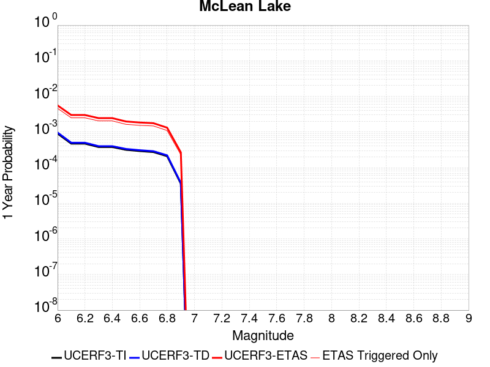 | 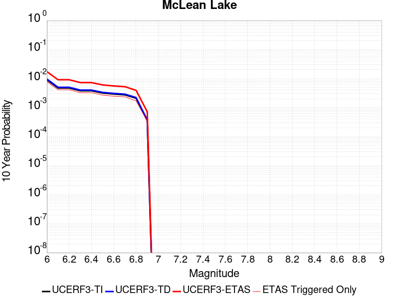 |

| Magnitude | 1 wk TI Prob | 1 wk TD Prob | 1 wk ETAS Prob | 1 wk ETAS/TD Gain | 1 wk ETAS Triggered Only | 1 mo TI Prob | 1 mo TD Prob | 1 mo ETAS Prob | 1 mo ETAS/TD Gain | 1 mo ETAS Triggered Only | 1 yr TI Prob | 1 yr TD Prob | 1 yr ETAS Prob | 1 yr ETAS/TD Gain | 1 yr ETAS Triggered Only | 10 yr TI Prob | 10 yr TD Prob | 10 yr ETAS Prob | 10 yr ETAS/TD Gain | 10 yr ETAS Triggered Only |
|-----|-----|-----|-----|-----|-----|-----|-----|-----|-----|-----|-----|-----|-----|-----|-----|-----|-----|-----|-----|-----|
| 6.0 | 1.7360222E-5 | 1.8501627E-5 | 0.0017484697 | 94.503555 | 0.00173 | 7.439883E-5 | 7.9290556E-5 | 0.002709082 | 34.166515 | 0.00263 | 9.0542925E-4 | 9.6498354E-4 | 0.0055805254 | 5.783026 | 0.00462 | 0.009017491 | 0.0096127745 | 0.017327892 | 1.80259 | 0.00779 |
| 6.1 | 9.062689E-6 | 9.592193E-6 | 9.395833E-4 | 97.95291 | 9.3E-4 | 3.8839516E-5 | 4.1108804E-5 | 0.0015110484 | 36.757294 | 0.00147 | 4.727685E-4 | 5.003936E-4 | 0.0029991427 | 5.993567 | 0.0025 | 0.0047176396 | 0.004993552 | 0.009073078 | 1.8169589 | 0.0041 |
| 6.2 | 9.062689E-6 | 9.592193E-6 | 9.395833E-4 | 97.95291 | 9.3E-4 | 3.8839516E-5 | 4.1108804E-5 | 0.0015110484 | 36.757294 | 0.00147 | 4.727685E-4 | 5.003936E-4 | 0.0029991427 | 5.993567 | 0.0025 | 0.0047176396 | 0.004993552 | 0.009073078 | 1.8169589 | 0.0041 |
| 6.3 | 7.2575485E-6 | 7.66771E-6 | 7.4766204E-4 | 97.50787 | 7.4E-4 | 3.110341E-5 | 3.2861237E-5 | 0.0012128225 | 36.907387 | 0.00118 | 3.786182E-4 | 4.0001926E-4 | 0.0024491993 | 6.1227036 | 0.00205 | 0.0037797375 | 0.0039936965 | 0.0072406773 | 1.8130263 | 0.00326 |
| 6.4 | 7.2575485E-6 | 7.66771E-6 | 7.4766204E-4 | 97.50787 | 7.4E-4 | 3.110341E-5 | 3.2861237E-5 | 0.0012128225 | 36.907387 | 0.00118 | 3.786182E-4 | 4.0001926E-4 | 0.0024491993 | 6.1227036 | 0.00205 | 0.0037797375 | 0.0039936965 | 0.0072406773 | 1.8130263 | 0.00326 |
| 6.5 | 6.06582E-6 | 6.4038773E-6 | 6.064E-4 | 94.69264 | 6.0E-4 | 2.5996113E-5 | 2.7444936E-5 | 9.574194E-4 | 34.885105 | 9.3E-4 | 3.164567E-4 | 3.3409733E-4 | 0.0019735494 | 5.9071093 | 0.00164 | 0.0031600643 | 0.0033365893 | 0.0060176137 | 1.8035225 | 0.00269 |
| 6.6 | 5.598744E-6 | 5.910262E-6 | 5.8590685E-4 | 99.13381 | 5.8E-4 | 2.3994397E-5 | 2.5329486E-5 | 9.1530697E-4 | 36.136024 | 8.9E-4 | 2.9209262E-4 | 3.0834923E-4 | 0.0018478744 | 5.992797 | 0.00154 | 0.0029170897 | 0.003079843 | 0.0055322666 | 1.7962819 | 0.00246 |
| 6.7 | 5.246996E-6 | 5.539162E-6 | 5.655361E-4 | 102.09776 | 5.6E-4 | 2.2486933E-5 | 2.3739085E-5 | 8.8371866E-4 | 37.226315 | 8.6E-4 | 2.73744E-4 | 2.8899137E-4 | 0.0017685636 | 6.11978 | 0.00148 | 0.0027340704 | 0.0028867796 | 0.0052200244 | 1.8082519 | 0.00234 |
| 6.8 | 4.02324E-6 | 4.2469046E-6 | 4.54245E-4 | 106.95908 | 4.5E-4 | 1.7242342E-5 | 1.8200926E-5 | 6.781889E-4 | 37.26123 | 6.6E-4 | 2.099053E-4 | 2.2157968E-4 | 0.0013213359 | 5.963254 | 0.0011 | 0.0020970714 | 0.002214172 | 0.003910408 | 1.7660813 | 0.0017 |
| 6.9 | 6.835972E-7 | 7.1399285E-7 | 1.0071392E-4 | 141.05733 | 1.0E-4 | 2.9296991E-6 | 3.0599674E-6 | 1.3305957E-4 | 43.483982 | 1.3E-4 | 3.56685E-5 | 3.7254784E-5 | 2.672462E-4 | 7.1734734 | 2.3E-4 | 3.5662777E-4 | 3.7251666E-4 | 7.1239E-4 | 1.9123709 | 3.4E-4 |

## Gravel Hills-Harper Lk
*[(top)](#table-of-contents)*

| 1 Week | 1 Month | 1 Year | 10 Year |
|-----|-----|-----|-----|
|  |  |  | 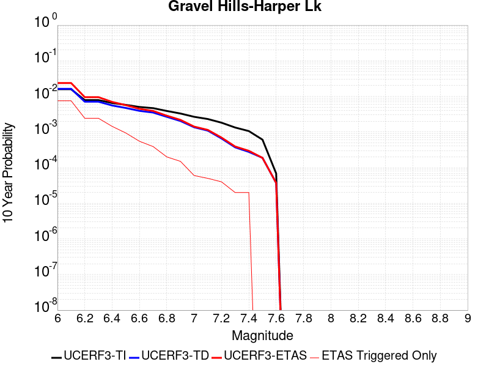 |

| Magnitude | 1 wk TI Prob | 1 wk TD Prob | 1 wk ETAS Prob | 1 wk ETAS/TD Gain | 1 wk ETAS Triggered Only | 1 mo TI Prob | 1 mo TD Prob | 1 mo ETAS Prob | 1 mo ETAS/TD Gain | 1 mo ETAS Triggered Only | 1 yr TI Prob | 1 yr TD Prob | 1 yr ETAS Prob | 1 yr ETAS/TD Gain | 1 yr ETAS Triggered Only | 10 yr TI Prob | 10 yr TD Prob | 10 yr ETAS Prob | 10 yr ETAS/TD Gain | 10 yr ETAS Triggered Only |
|-----|-----|-----|-----|-----|-----|-----|-----|-----|-----|-----|-----|-----|-----|-----|-----|-----|-----|-----|-----|-----|
| 6.0 | 3.0679566E-5 | 3.1464646E-5 | 0.0023213925 | 73.77781 | 0.00229 | 1.3147724E-4 | 1.3484273E-4 | 0.0033944033 | 25.173052 | 0.00326 | 0.0015995599 | 0.0016406906 | 0.006951962 | 4.237217 | 0.00532 | 0.015880952 | 0.01630734 | 0.02372438 | 1.4548285 | 0.00754 |
| 6.1 | 3.0679566E-5 | 3.1464646E-5 | 0.0023213925 | 73.77781 | 0.00229 | 1.3147724E-4 | 1.3484273E-4 | 0.0033944033 | 25.173052 | 0.00326 | 0.0015995599 | 0.0016406906 | 0.006951962 | 4.237217 | 0.00532 | 0.015880952 | 0.01630734 | 0.02372438 | 1.4548285 | 0.00754 |
| 6.2 | 1.514536E-5 | 1.3635206E-5 | 7.436253E-4 | 54.537144 | 7.3E-4 | 6.490707E-5 | 5.843536E-5 | 0.0010783757 | 18.454165 | 0.00102 | 7.8995706E-4 | 7.1123015E-4 | 0.0024599854 | 3.4587758 | 0.00175 | 0.007871548 | 0.0070907404 | 0.00950351 | 1.3402704 | 0.00243 |
| 6.3 | 1.514536E-5 | 1.3635206E-5 | 7.436253E-4 | 54.537144 | 7.3E-4 | 6.490707E-5 | 5.843536E-5 | 0.0010783757 | 18.454165 | 0.00102 | 7.8995706E-4 | 7.1123015E-4 | 0.0024599854 | 3.4587758 | 0.00175 | 0.007871548 | 0.0070907404 | 0.00950351 | 1.3402704 | 0.00243 |
| 6.4 | 1.2532521E-5 | 1.06896905E-5 | 4.206853E-4 | 39.3543 | 4.1E-4 | 5.37097E-5 | 4.581219E-5 | 6.557843E-4 | 14.314624 | 6.1E-4 | 6.537194E-4 | 5.576265E-4 | 0.001607041 | 2.8819308 | 0.00105 | 0.0065179965 | 0.005562863 | 0.0069948523 | 1.2574195 | 0.00144 |
| 6.5 | 1.1094058E-5 | 9.083664E-6 | 2.590814E-4 | 28.521687 | 2.5E-4 | 4.7545094E-5 | 3.892943E-5 | 4.0891502E-4 | 10.504008 | 3.7E-4 | 5.787078E-4 | 4.7386673E-4 | 0.0011035682 | 2.3288577 | 6.3E-4 | 0.0057720304 | 0.0047289706 | 0.005664525 | 1.1978347 | 9.4E-4 |
| 6.6 | 9.688328E-6 | 7.5316952E-6 | 1.2753079E-4 | 16.932549 | 1.2E-4 | 4.1520743E-5 | 3.227831E-5 | 2.122725E-4 | 6.5763206 | 1.8E-4 | 5.053978E-4 | 3.9292008E-4 | 7.227904E-4 | 1.8395355 | 3.3E-4 | 0.0050424994 | 0.0039225104 | 0.004470353 | 1.1396663 | 5.5E-4 |
| 6.7 | 8.974824E-6 | 6.749413E-6 | 8.674887E-5 | 12.852802 | 8.0E-5 | 3.8462964E-5 | 2.8925748E-5 | 1.3892257E-4 | 4.8027306 | 1.1E-4 | 4.6818596E-4 | 3.5211627E-4 | 5.820353E-4 | 1.6529633 | 2.3E-4 | 0.004672008 | 0.0035158044 | 0.0039044335 | 1.1105376 | 3.9E-4 |
| 6.8 | 7.4780046E-6 | 5.1161933E-6 | 3.511604E-5 | 6.8637047 | 3.0E-5 | 3.20482E-5 | 2.1926366E-5 | 6.1925486E-5 | 2.8242476 | 4.0E-5 | 3.9011694E-4 | 2.669222E-4 | 3.668955E-4 | 1.374541 | 1.0E-4 | 0.0038943281 | 0.0026661542 | 0.002865621 | 1.0748144 | 2.0E-4 |
| 6.9 | 6.3409307E-6 | 3.9074966E-6 | 2.3907418E-5 | 6.118346 | 2.0E-5 | 2.7175134E-5 | 1.6746313E-5 | 4.6745812E-5 | 2.791409 | 3.0E-5 | 3.3080703E-4 | 2.0386827E-4 | 2.73854E-4 | 1.343289 | 7.0E-5 | 0.0033031502 | 0.0020369107 | 0.0021866052 | 1.073491 | 1.5E-4 |
| 7.0 | 5.1239335E-6 | 2.6058565E-6 | 1.260583E-5 | 4.8375 | 1.0E-5 | 2.195953E-5 | 1.116791E-5 | 2.1167798E-5 | 1.8954127 | 1.0E-5 | 2.6732447E-4 | 1.3596108E-4 | 1.4595971E-4 | 1.0735404 | 1.0E-5 | 0.0026700313 | 0.0013588042 | 0.0014187227 | 1.0440965 | 6.0E-5 |
| 7.1 | 4.438899E-6 | 2.0984728E-6 | 1.2098451E-5 | 5.7653604 | 1.0E-5 | 1.9023713E-5 | 8.993425E-6 | 1.8993334E-5 | 2.1119134 | 1.0E-5 | 2.315891E-4 | 1.0948967E-4 | 1.1948858E-4 | 1.0913228 | 1.0E-5 | 0.002313479 | 0.0010943791 | 0.0011443244 | 1.045638 | 5.0E-5 |
| 7.2 | 3.50367E-6 | 1.2615716E-6 | 1.1261559E-5 | 8.926611 | 1.0E-5 | 1.5015643E-5 | 5.4067245E-6 | 1.5406671E-5 | 2.8495386 | 1.0E-5 | 1.8280011E-4 | 6.582497E-5 | 7.582431E-5 | 1.151908 | 1.0E-5 | 0.0018264982 | 6.580629E-4 | 6.9803663E-4 | 1.0607444 | 4.0E-5 |
| 7.3 | 2.561638E-6 | 7.1191585E-7 | 1.07119085E-5 | 15.046594 | 1.0E-5 | 1.0978401E-5 | 3.0510646E-6 | 1.3051034E-5 | 4.2775345 | 1.0E-5 | 1.3365384E-4 | 3.71461E-5 | 4.7145724E-5 | 1.2691972 | 1.0E-5 | 0.0013357349 | 3.7140088E-4 | 3.9139346E-4 | 1.0538301 | 2.0E-5 |
| 7.4 | 2.0368864E-6 | 5.304837E-7 | 1.0530478E-5 | 19.85071 | 1.0E-5 | 8.729483E-6 | 2.2734996E-6 | 1.2273477E-5 | 5.398495 | 1.0E-5 | 1.06276275E-4 | 2.7679513E-5 | 3.7679238E-5 | 1.361268 | 1.0E-5 | 0.0010622547 | 2.767612E-4 | 2.9675566E-4 | 1.0722445 | 2.0E-5 |
| 7.5 | 1.1681728E-6 | 3.6030585E-7 | 3.6030585E-7 | 1.0 | 0.0 | 5.0064455E-6 | 1.544167E-6 | 1.544167E-6 | 1.0 | 0.0 | 6.0951766E-5 | 1.8800076E-5 | 1.8800076E-5 | 1.0 | 0.0 | 6.093505E-4 | 1.8798532E-4 | 1.8798532E-4 | 1.0 | 0.0 |
| 7.6 | 1.3154387E-7 | 7.1197384E-8 | 7.1197384E-8 | 1.0 | 0.0 | 5.6375933E-7 | 3.051316E-7 | 3.051316E-7 | 1.0 | 0.0 | 6.863748E-6 | 3.7149728E-6 | 3.7149728E-6 | 1.0 | 0.0 | 6.863536E-5 | 3.7149264E-5 | 3.7149264E-5 | 1.0 | 0.0 |

## Goldstone Lake
*[(top)](#table-of-contents)*

| 1 Week | 1 Month | 1 Year | 10 Year |
|-----|-----|-----|-----|
| 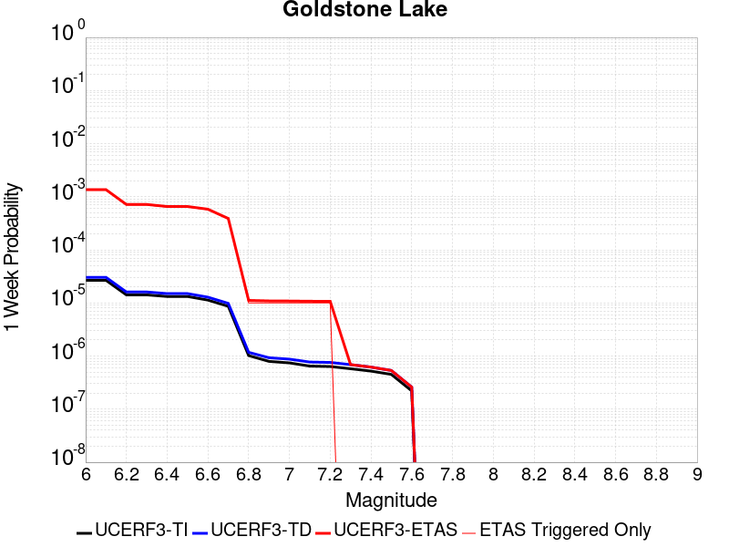 |  |  |  |

| Magnitude | 1 wk TI Prob | 1 wk TD Prob | 1 wk ETAS Prob | 1 wk ETAS/TD Gain | 1 wk ETAS Triggered Only | 1 mo TI Prob | 1 mo TD Prob | 1 mo ETAS Prob | 1 mo ETAS/TD Gain | 1 mo ETAS Triggered Only | 1 yr TI Prob | 1 yr TD Prob | 1 yr ETAS Prob | 1 yr ETAS/TD Gain | 1 yr ETAS Triggered Only | 10 yr TI Prob | 10 yr TD Prob | 10 yr ETAS Prob | 10 yr ETAS/TD Gain | 10 yr ETAS Triggered Only |
|-----|-----|-----|-----|-----|-----|-----|-----|-----|-----|-----|-----|-----|-----|-----|-----|-----|-----|-----|-----|-----|
| 6.0 | 2.671352E-5 | 3.037609E-5 | 0.0013603357 | 44.783108 | 0.00133 | 1.1448149E-4 | 1.3017785E-4 | 0.0021299175 | 16.361597 | 0.002 | 0.001392921 | 0.0015839594 | 0.0053280196 | 3.363735 | 0.00375 | 0.013842222 | 0.015746197 | 0.021700932 | 1.3781698 | 0.00605 |
| 6.1 | 2.671352E-5 | 3.037609E-5 | 0.0013603357 | 44.783108 | 0.00133 | 1.1448149E-4 | 1.3017785E-4 | 0.0021299175 | 16.361597 | 0.002 | 0.001392921 | 0.0015839594 | 0.0053280196 | 3.363735 | 0.00375 | 0.013842222 | 0.015746197 | 0.021700932 | 1.3781698 | 0.00605 |
| 6.2 | 1.4197047E-5 | 1.6096245E-5 | 7.1608496E-4 | 44.487705 | 7.0E-4 | 6.0843064E-5 | 6.8982634E-5 | 0.0010989116 | 15.9302635 | 0.00103 | 7.4051257E-4 | 8.3963864E-4 | 0.0026880852 | 3.201479 | 0.00185 | 0.007380498 | 0.0083743585 | 0.0114781475 | 1.3706299 | 0.00313 |
| 6.3 | 1.4197047E-5 | 1.6096245E-5 | 7.1608496E-4 | 44.487705 | 7.0E-4 | 6.0843064E-5 | 6.8982634E-5 | 0.0010989116 | 15.9302635 | 0.00103 | 7.4051257E-4 | 8.3963864E-4 | 0.0026880852 | 3.201479 | 0.00185 | 0.007380498 | 0.0083743585 | 0.0114781475 | 1.3706299 | 0.00313 |
| 6.4 | 1.3238931E-5 | 1.500846E-5 | 6.549989E-4 | 43.64198 | 6.4E-4 | 5.6737044E-5 | 6.4320935E-5 | 9.942611E-4 | 15.457815 | 9.3E-4 | 6.9055456E-4 | 7.82924E-4 | 0.002481593 | 3.1696472 | 0.0017 | 0.006884126 | 0.0078112837 | 0.010688631 | 1.3683578 | 0.0029 |
| 6.5 | 1.3238931E-5 | 1.500846E-5 | 6.549989E-4 | 43.64198 | 6.4E-4 | 5.6737044E-5 | 6.4320935E-5 | 9.942611E-4 | 15.457815 | 9.3E-4 | 6.9055456E-4 | 7.82924E-4 | 0.002481593 | 3.1696472 | 0.0017 | 0.006884126 | 0.0078112837 | 0.010688631 | 1.3683578 | 0.0029 |
| 6.6 | 1.1328278E-5 | 1.2855166E-5 | 5.8284786E-4 | 45.339584 | 5.7E-4 | 4.8548856E-5 | 5.5092944E-5 | 8.450494E-4 | 15.338614 | 7.9E-4 | 5.90922E-4 | 6.7064585E-4 | 0.0021196734 | 3.160645 | 0.00145 | 0.0058935313 | 0.0066956086 | 0.009168936 | 1.3693955 | 0.00249 |
| 6.7 | 8.651175E-6 | 9.824565E-6 | 3.8982084E-4 | 39.67818 | 3.8E-4 | 3.707594E-5 | 4.2105108E-5 | 6.120811E-4 | 14.536981 | 5.7E-4 | 4.5130608E-4 | 5.1259965E-4 | 0.0016220306 | 3.1643226 | 0.00111 | 0.0045039062 | 0.005123051 | 0.00707301 | 1.3806245 | 0.00196 |
| 6.8 | 1.0215377E-6 | 1.1754702E-6 | 1.1175459E-5 | 9.507224 | 1.0E-5 | 4.378012E-6 | 5.0377203E-6 | 2.503762E-5 | 4.9700294 | 2.0E-5 | 5.3300988E-5 | 6.1332634E-5 | 1.11329566E-4 | 1.8151767 | 5.0E-5 | 5.3288206E-4 | 6.1316835E-4 | 6.631377E-4 | 1.0814936 | 5.0E-5 |
| 6.9 | 7.9360774E-7 | 9.2833966E-7 | 1.092833E-5 | 11.77191 | 1.0E-5 | 3.4011714E-6 | 3.9785928E-6 | 1.3978553E-5 | 3.5134416 | 1.0E-5 | 4.1408475E-5 | 4.843836E-5 | 6.8437395E-5 | 1.4128759 | 2.0E-5 | 4.140076E-4 | 4.8428503E-4 | 5.042753E-4 | 1.041278 | 2.0E-5 |
| 7.0 | 7.4382757E-7 | 8.7473285E-7 | 1.08747245E-5 | 12.432052 | 1.0E-5 | 3.1878285E-6 | 3.74885E-6 | 1.3748812E-5 | 3.6674747 | 1.0E-5 | 3.8811122E-5 | 4.564136E-5 | 6.5640445E-5 | 1.438179 | 2.0E-5 | 3.8804344E-4 | 4.5632652E-4 | 4.763174E-4 | 1.0438082 | 2.0E-5 |
| 7.1 | 6.4709513E-7 | 7.7113E-7 | 1.0771122E-5 | 13.967973 | 1.0E-5 | 2.773262E-6 | 3.3048389E-6 | 1.3304806E-5 | 4.025856 | 1.0E-5 | 3.376394E-5 | 4.0235733E-5 | 6.023493E-5 | 1.4970506 | 2.0E-5 | 3.375881E-4 | 4.0229043E-4 | 4.2228238E-4 | 1.0496954 | 2.0E-5 |
| 7.2 | 6.356704E-7 | 7.5883594E-7 | 1.07588285E-5 | 14.178069 | 1.0E-5 | 2.7242988E-6 | 3.2521505E-6 | 1.3252118E-5 | 4.0748787 | 1.0E-5 | 3.3167835E-5 | 3.959427E-5 | 5.959348E-5 | 1.5051036 | 2.0E-5 | 3.3162883E-4 | 3.958781E-4 | 4.158702E-4 | 1.0505006 | 2.0E-5 |
| 7.3 | 5.7695723E-7 | 6.8965653E-7 | 6.8965653E-7 | 1.0 | 0.0 | 2.4726714E-6 | 2.9556677E-6 | 2.9556677E-6 | 1.0 | 0.0 | 3.0104358E-5 | 3.5984718E-5 | 4.598436E-5 | 1.2778857 | 1.0E-5 | 3.0100282E-4 | 3.5979465E-4 | 3.6979106E-4 | 1.0277836 | 1.0E-5 |
| 7.4 | 5.209647E-7 | 6.193514E-7 | 6.193514E-7 | 1.0 | 0.0 | 2.232704E-6 | 2.6543607E-6 | 2.6543607E-6 | 1.0 | 0.0 | 2.718283E-5 | 3.2316417E-5 | 3.2316417E-5 | 1.0 | 0.0 | 2.7179506E-4 | 3.2312275E-4 | 3.2312275E-4 | 1.0 | 0.0 |
| 7.5 | 4.512955E-7 | 5.348885E-7 | 5.348885E-7 | 1.0 | 0.0 | 1.934122E-6 | 2.2923775E-6 | 2.2923775E-6 | 1.0 | 0.0 | 2.3547682E-5 | 2.7909393E-5 | 2.7909393E-5 | 1.0 | 0.0 | 2.3545188E-4 | 2.7906417E-4 | 2.7906417E-4 | 1.0 | 0.0 |
| 7.6 | 2.21172E-7 | 2.603961E-7 | 2.603961E-7 | 1.0 | 0.0 | 9.478797E-7 | 1.1159829E-6 | 1.1159829E-6 | 1.0 | 0.0 | 1.1540374E-5 | 1.3587036E-5 | 1.3587036E-5 | 1.0 | 0.0 | 1.1539775E-4 | 1.3586486E-4 | 1.3586486E-4 | 1.0 | 0.0 |

## So Sierra Nevada
*[(top)](#table-of-contents)*

| 1 Week | 1 Month | 1 Year | 10 Year |
|-----|-----|-----|-----|
|  |  | 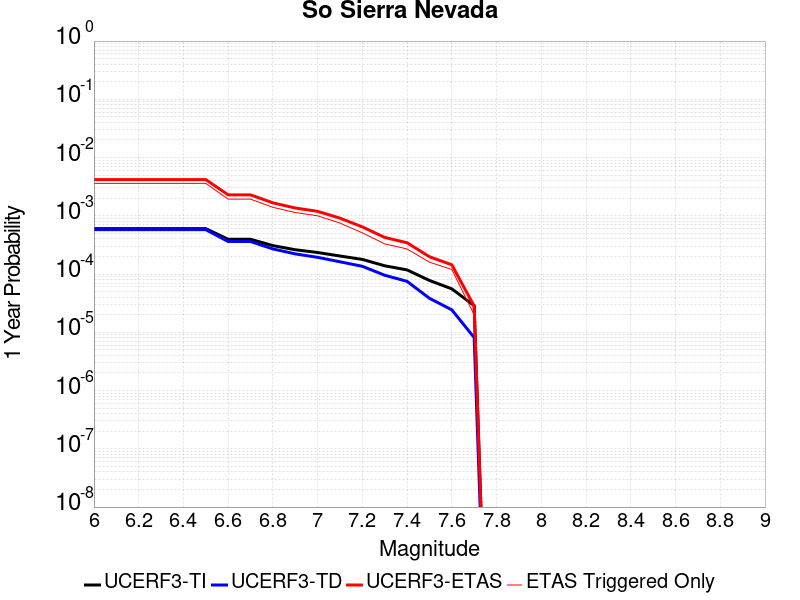 |  |

| Magnitude | 1 wk TI Prob | 1 wk TD Prob | 1 wk ETAS Prob | 1 wk ETAS/TD Gain | 1 wk ETAS Triggered Only | 1 mo TI Prob | 1 mo TD Prob | 1 mo ETAS Prob | 1 mo ETAS/TD Gain | 1 mo ETAS Triggered Only | 1 yr TI Prob | 1 yr TD Prob | 1 yr ETAS Prob | 1 yr ETAS/TD Gain | 1 yr ETAS Triggered Only | 10 yr TI Prob | 10 yr TD Prob | 10 yr ETAS Prob | 10 yr ETAS/TD Gain | 10 yr ETAS Triggered Only |
|-----|-----|-----|-----|-----|-----|-----|-----|-----|-----|-----|-----|-----|-----|-----|-----|-----|-----|-----|-----|-----|
| 6.0 | 1.15488665E-5 | 1.1079643E-5 | 0.0017010609 | 153.5303 | 0.00169 | 4.9494203E-5 | 4.748339E-5 | 0.002267378 | 47.750973 | 0.00222 | 6.024253E-4 | 5.7796965E-4 | 0.0041858833 | 7.2423925 | 0.00361 | 0.006007948 | 0.005765934 | 0.010995605 | 1.9069946 | 0.00526 |
| 6.1 | 1.15488665E-5 | 1.1079643E-5 | 0.0017010609 | 153.5303 | 0.00169 | 4.9494203E-5 | 4.748339E-5 | 0.002267378 | 47.750973 | 0.00222 | 6.024253E-4 | 5.7796965E-4 | 0.0041858833 | 7.2423925 | 0.00361 | 0.006007948 | 0.005765934 | 0.010995605 | 1.9069946 | 0.00526 |
| 6.2 | 1.15488665E-5 | 1.1079643E-5 | 0.0017010609 | 153.5303 | 0.00169 | 4.9494203E-5 | 4.748339E-5 | 0.002267378 | 47.750973 | 0.00222 | 6.024253E-4 | 5.7796965E-4 | 0.0041858833 | 7.2423925 | 0.00361 | 0.006007948 | 0.005765934 | 0.010995605 | 1.9069946 | 0.00526 |
| 6.3 | 1.15488665E-5 | 1.1079643E-5 | 0.0017010609 | 153.5303 | 0.00169 | 4.9494203E-5 | 4.748339E-5 | 0.002267378 | 47.750973 | 0.00222 | 6.024253E-4 | 5.7796965E-4 | 0.0041858833 | 7.2423925 | 0.00361 | 0.006007948 | 0.005765934 | 0.010995605 | 1.9069946 | 0.00526 |
| 6.4 | 1.15488665E-5 | 1.1079643E-5 | 0.0017010609 | 153.5303 | 0.00169 | 4.9494203E-5 | 4.748339E-5 | 0.002267378 | 47.750973 | 0.00222 | 6.024253E-4 | 5.7796965E-4 | 0.0041858833 | 7.2423925 | 0.00361 | 0.006007948 | 0.005765934 | 0.010995605 | 1.9069946 | 0.00526 |
| 6.5 | 1.15488665E-5 | 1.1079643E-5 | 0.0017010609 | 153.5303 | 0.00169 | 4.9494203E-5 | 4.748339E-5 | 0.002267378 | 47.750973 | 0.00222 | 6.024253E-4 | 5.7796965E-4 | 0.0041858833 | 7.2423925 | 0.00361 | 0.006007948 | 0.005765934 | 0.010995605 | 1.9069946 | 0.00526 |
| 6.6 | 7.587044E-6 | 6.935635E-6 | 9.769289E-4 | 140.85645 | 9.7E-4 | 3.2515498E-5 | 2.9723828E-5 | 0.001269687 | 42.716133 | 0.00124 | 3.9580427E-4 | 3.6183043E-4 | 0.002291132 | 6.3320603 | 0.00193 | 0.003951 | 0.0036127048 | 0.006332842 | 1.7529365 | 0.00273 |
| 6.7 | 7.587044E-6 | 6.935635E-6 | 9.769289E-4 | 140.85645 | 9.7E-4 | 3.2515498E-5 | 2.9723828E-5 | 0.001269687 | 42.716133 | 0.00124 | 3.9580427E-4 | 3.6183043E-4 | 0.002291132 | 6.3320603 | 0.00193 | 0.003951 | 0.0036127048 | 0.006332842 | 1.7529365 | 0.00273 |
| 6.8 | 5.9026956E-6 | 5.1793927E-6 | 7.151757E-4 | 138.081 | 7.1E-4 | 2.5297022E-5 | 2.2197215E-5 | 9.421768E-4 | 42.44572 | 9.2E-4 | 3.0794772E-4 | 2.7021873E-4 | 0.0016698404 | 6.179588 | 0.0014 | 0.0030752132 | 0.002699018 | 0.004613836 | 1.7094499 | 0.00192 |
| 6.9 | 5.0118915E-6 | 4.2524252E-6 | 5.8424997E-4 | 137.39217 | 5.8E-4 | 2.1479358E-5 | 1.8224557E-5 | 7.682109E-4 | 42.152515 | 7.5E-4 | 2.614798E-4 | 2.2186211E-4 | 0.0013616092 | 6.1371865 | 0.00114 | 0.0026117235 | 0.0022164788 | 0.0037630433 | 1.6977574 | 0.00155 |
| 7.0 | 4.4924795E-6 | 3.7139177E-6 | 5.13712E-4 | 138.32079 | 5.1E-4 | 1.925334E-5 | 1.5916696E-5 | 6.759062E-4 | 42.465233 | 6.6E-4 | 2.3438422E-4 | 1.9376918E-4 | 0.0011935754 | 6.1597795 | 0.001 | 0.0023413717 | 0.0019360651 | 0.0033133933 | 1.7114059 | 0.00138 |
| 7.1 | 3.9118436E-6 | 3.1119775E-6 | 3.831108E-4 | 123.10847 | 3.8E-4 | 1.6764936E-5 | 1.3336982E-5 | 5.0333043E-4 | 37.739456 | 4.9E-4 | 2.0409399E-4 | 1.6236622E-4 | 9.1224443E-4 | 5.6184373 | 7.5E-4 | 0.0020390663 | 0.001622532 | 0.0026608447 | 1.6399335 | 0.00104 |
| 7.2 | 3.4200818E-6 | 2.6054543E-6 | 2.926047E-4 | 112.30467 | 2.9E-4 | 1.4657411E-5 | 1.11661875E-5 | 3.411625E-4 | 30.553177 | 3.3E-4 | 1.7843937E-4 | 1.3594035E-4 | 6.4587104E-4 | 4.7511353 | 5.1E-4 | 0.0017829615 | 0.0013586218 | 0.0020876299 | 1.5365793 | 7.3E-4 |
| 7.3 | 2.6593618E-6 | 1.8284203E-6 | 1.9182808E-4 | 104.91465 | 1.9E-4 | 1.13972155E-5 | 7.836065E-6 | 2.1783441E-4 | 27.798956 | 2.1E-4 | 1.3875226E-4 | 9.540021E-5 | 4.2536872E-4 | 4.4587817 | 3.3E-4 | 0.0013866565 | 9.5362146E-4 | 0.0013832115 | 1.4504827 | 4.3E-4 |
| 7.4 | 2.2577992E-6 | 1.436438E-6 | 1.5143622E-4 | 105.42482 | 1.5E-4 | 9.676246E-6 | 6.15615E-6 | 1.7615511E-4 | 28.614492 | 1.7E-4 | 1.1780193E-4 | 7.49488E-5 | 3.4492856E-4 | 4.602189 | 2.7E-4 | 0.001177395 | 7.492603E-4 | 0.0011089905 | 1.4801139 | 3.6E-4 |
| 7.5 | 1.489319E-6 | 7.353936E-7 | 8.0735335E-5 | 109.7852 | 8.0E-5 | 6.3827797E-6 | 3.1516831E-6 | 8.315143E-5 | 26.383183 | 8.0E-5 | 7.770758E-5 | 3.8371072E-5 | 1.9836493E-4 | 5.169648 | 1.6E-4 | 7.7680405E-4 | 3.836449E-4 | 5.935643E-4 | 1.5471712 | 2.1E-4 |
| 7.6 | 1.0680322E-6 | 4.6596554E-7 | 4.0465948E-5 | 86.843216 | 4.0E-5 | 4.577273E-6 | 1.9969937E-6 | 4.1996915E-5 | 21.03007 | 4.0E-5 | 5.5726876E-5 | 2.4313129E-5 | 1.4431021E-4 | 5.935485 | 1.2E-4 | 5.5712904E-4 | 2.4310495E-4 | 4.0306605E-4 | 1.657992 | 1.6E-4 |
| 7.7 | 5.509146E-7 | 1.5580486E-7 | 1.01558035E-5 | 65.18284 | 1.0E-5 | 2.3610605E-6 | 6.677349E-7 | 1.0667728E-5 | 15.975992 | 1.0E-5 | 2.8745531E-5 | 8.129644E-6 | 2.8129482E-5 | 3.4601123 | 2.0E-5 | 2.8741814E-4 | 8.1293576E-5 | 1.0129195E-4 | 1.2460018 | 2.0E-5 |

## San Andreas (Mojave S)
*[(top)](#table-of-contents)*

| 1 Week | 1 Month | 1 Year | 10 Year |
|-----|-----|-----|-----|
|  |  |  |  |

| Magnitude | 1 wk TI Prob | 1 wk TD Prob | 1 wk ETAS Prob | 1 wk ETAS/TD Gain | 1 wk ETAS Triggered Only | 1 mo TI Prob | 1 mo TD Prob | 1 mo ETAS Prob | 1 mo ETAS/TD Gain | 1 mo ETAS Triggered Only | 1 yr TI Prob | 1 yr TD Prob | 1 yr ETAS Prob | 1 yr ETAS/TD Gain | 1 yr ETAS Triggered Only | 10 yr TI Prob | 10 yr TD Prob | 10 yr ETAS Prob | 10 yr ETAS/TD Gain | 10 yr ETAS Triggered Only |
|-----|-----|-----|-----|-----|-----|-----|-----|-----|-----|-----|-----|-----|-----|-----|-----|-----|-----|-----|-----|-----|
| 6.0 | 3.1064058E-4 | 6.7460834E-4 | 0.002353475 | 3.488654 | 0.00168 | 0.0013306376 | 0.0028881032 | 0.005051836 | 1.7491882 | 0.00217 | 0.016080605 | 0.03462235 | 0.03792394 | 1.0953602 | 0.00342 | 0.1496549 | 0.28660452 | 0.28982908 | 1.0112509 | 0.00452 |
| 6.1 | 3.1064058E-4 | 6.7460834E-4 | 0.002353475 | 3.488654 | 0.00168 | 0.0013306376 | 0.0028881032 | 0.005051836 | 1.7491882 | 0.00217 | 0.016080605 | 0.03462235 | 0.03792394 | 1.0953602 | 0.00342 | 0.1496549 | 0.28660452 | 0.28982908 | 1.0112509 | 0.00452 |
| 6.2 | 3.1064058E-4 | 6.7460834E-4 | 0.002353475 | 3.488654 | 0.00168 | 0.0013306376 | 0.0028881032 | 0.005051836 | 1.7491882 | 0.00217 | 0.016080605 | 0.03462235 | 0.03792394 | 1.0953602 | 0.00342 | 0.1496549 | 0.28660452 | 0.28982908 | 1.0112509 | 0.00452 |
| 6.3 | 3.1064058E-4 | 6.7460834E-4 | 0.002353475 | 3.488654 | 0.00168 | 0.0013306376 | 0.0028881032 | 0.005051836 | 1.7491882 | 0.00217 | 0.016080605 | 0.03462235 | 0.03792394 | 1.0953602 | 0.00342 | 0.1496549 | 0.28660452 | 0.28982908 | 1.0112509 | 0.00452 |
| 6.4 | 1.9872203E-4 | 4.3179357E-4 | 0.0018911632 | 4.3797855 | 0.00146 | 8.5138786E-4 | 0.0018492596 | 0.0037357644 | 2.0201406 | 0.00189 | 0.010316478 | 0.02228844 | 0.02520202 | 1.1307216 | 0.00298 | 0.098504856 | 0.19699748 | 0.20012918 | 1.0158972 | 0.0039 |
| 6.5 | 1.291105E-4 | 2.875267E-4 | 0.0016371385 | 5.6938663 | 0.00135 | 5.5321335E-4 | 0.0012316781 | 0.0029195966 | 2.3704216 | 0.00169 | 0.006714592 | 0.0148934 | 0.017513784 | 1.1759427 | 0.00266 | 0.065152965 | 0.13803436 | 0.14096504 | 1.0212315 | 0.0034 |
| 6.6 | 1.291105E-4 | 2.875267E-4 | 0.0016371385 | 5.6938663 | 0.00135 | 5.5321335E-4 | 0.0012316781 | 0.0029195966 | 2.3704216 | 0.00169 | 0.006714592 | 0.0148934 | 0.017513784 | 1.1759427 | 0.00266 | 0.065152965 | 0.13803436 | 0.14096504 | 1.0212315 | 0.0034 |
| 6.7 | 1.08001186E-4 | 2.4333889E-4 | 0.001533025 | 6.2999587 | 0.00129 | 4.6278012E-4 | 0.0010424647 | 0.0026707654 | 2.5619721 | 0.00163 | 0.0056198016 | 0.012618446 | 0.015156017 | 1.2011001 | 0.00257 | 0.054797906 | 0.119176775 | 0.12204826 | 1.0240943 | 0.00326 |
| 6.8 | 1.0624356E-4 | 2.3851555E-4 | 0.0015282079 | 6.407162 | 0.00129 | 4.5525006E-4 | 0.0010218095 | 0.002650144 | 2.5935793 | 0.00163 | 0.0055285925 | 0.012369843 | 0.014898176 | 1.2043949 | 0.00256 | 0.053930566 | 0.11712591 | 0.11999526 | 1.0244979 | 0.00325 |
| 6.9 | 1.0393785E-4 | 2.3221898E-4 | 0.0015219194 | 6.5538116 | 0.00129 | 4.4537184E-4 | 9.948451E-4 | 0.0026232235 | 2.636816 | 0.00163 | 0.0054089287 | 0.012045221 | 0.014554626 | 1.2083321 | 0.00254 | 0.05279156 | 0.11442335 | 0.11728377 | 1.0249985 | 0.00323 |
| 7.0 | 1.0155622E-4 | 2.2591476E-4 | 0.0015056256 | 6.6645737 | 0.00128 | 4.3516833E-4 | 9.6784724E-4 | 0.0025862793 | 2.6721978 | 0.00162 | 0.005285311 | 0.0117200995 | 0.014220448 | 1.2133385 | 0.00253 | 0.05161361 | 0.111683756 | 0.11454413 | 1.0256114 | 0.00322 |
| 7.1 | 9.885595E-5 | 2.1879886E-4 | 0.001488521 | 6.803148 | 0.00127 | 4.2359953E-4 | 9.3737274E-4 | 0.0025358729 | 2.7052984 | 0.0016 | 0.0051451353 | 0.011352993 | 0.01382461 | 1.2177062 | 0.0025 | 0.05027629 | 0.1085682 | 0.11140296 | 1.0261103 | 0.00318 |
| 7.2 | 9.6411415E-5 | 2.124288E-4 | 0.001482159 | 6.977204 | 0.00127 | 4.1312634E-4 | 9.1009185E-4 | 0.0025086356 | 2.7564642 | 0.0016 | 0.005018219 | 0.011024255 | 0.013486805 | 1.2233756 | 0.00249 | 0.049064007 | 0.105758004 | 0.10859275 | 1.0268041 | 0.00317 |
| 7.3 | 9.1180635E-5 | 1.9471257E-4 | 0.0014644653 | 7.5211644 | 0.00127 | 3.907156E-4 | 8.342157E-4 | 0.002432881 | 2.9163692 | 0.0016 | 0.004746591 | 0.01010939 | 0.012574217 | 1.2438157 | 0.00249 | 0.046464786 | 0.09795115 | 0.10079261 | 1.0290089 | 0.00315 |
| 7.4 | 8.887388E-5 | 1.8719878E-4 | 0.001456961 | 7.7829623 | 0.00127 | 3.8083247E-4 | 8.020339E-4 | 0.0023907586 | 2.9808698 | 0.00159 | 0.0046267817 | 0.00972114 | 0.0121770315 | 1.252634 | 0.00248 | 0.045316286 | 0.09458615 | 0.09742009 | 1.0299616 | 0.00313 |
| 7.5 | 8.6750515E-5 | 1.8051457E-4 | 0.0014402871 | 7.978786 | 0.00126 | 3.7173493E-4 | 7.7340455E-4 | 0.0023521825 | 3.0413353 | 0.00158 | 0.004516484 | 0.009375632 | 0.011802661 | 1.2588657 | 0.00245 | 0.04425787 | 0.091549896 | 0.094357006 | 1.0306621 | 0.00309 |
| 7.6 | 8.453092E-5 | 1.7439072E-4 | 0.001434171 | 8.223895 | 0.00126 | 3.6222505E-4 | 7.471748E-4 | 0.0023259942 | 3.1130524 | 0.00158 | 0.0044011753 | 0.009058985 | 0.01148679 | 1.2679998 | 0.00245 | 0.04315024 | 0.08870898 | 0.09152487 | 1.031743 | 0.00309 |
| 7.7 | 8.259102E-5 | 1.6961215E-4 | 0.0014094019 | 8.309557 | 0.00124 | 3.539135E-4 | 7.2670676E-4 | 0.0022855732 | 3.1451106 | 0.00156 | 0.004300386 | 0.008811831 | 0.011220418 | 1.2733357 | 0.00243 | 0.042181134 | 0.08645982 | 0.08926439 | 1.0324378 | 0.00307 |
| 7.8 | 7.444844E-5 | 1.5283503E-4 | 0.001212673 | 7.934523 | 0.00106 | 3.1902574E-4 | 6.548429E-4 | 0.001963985 | 2.9991698 | 0.00131 | 0.0038772223 | 0.007943616 | 0.009987252 | 1.2572677 | 0.00206 | 0.03810269 | 0.078290746 | 0.080668755 | 1.030374 | 0.00258 |
| 7.9 | 5.2586525E-5 | 1.00064186E-4 | 6.8000617E-4 | 6.7956996 | 5.8E-4 | 2.2535135E-4 | 4.2877605E-4 | 0.0011884501 | 2.771727 | 7.6E-4 | 0.0027402006 | 0.005207864 | 0.0063817184 | 1.2254004 | 0.00118 | 0.027066574 | 0.052200034 | 0.053621735 | 1.0272356 | 0.0015 |
| 8.0 | 3.379877E-5 | 5.4074168E-5 | 2.3406443E-4 | 4.3285813 | 1.8E-4 | 1.4484383E-4 | 2.3172585E-4 | 4.316795E-4 | 1.8628888 | 2.0E-4 | 0.0017620471 | 0.002817614 | 0.0030868533 | 1.0955558 | 2.7E-4 | 0.017481409 | 0.028834904 | 0.029213658 | 1.0131353 | 3.9E-4 |
| 8.1 | 1.8668277E-5 | 1.9309397E-5 | 4.930882E-5 | 2.5536177 | 3.0E-5 | 8.000444E-5 | 8.275194E-5 | 1.12749454E-4 | 1.3624992 | 3.0E-5 | 9.736188E-4 | 0.0010070398 | 0.0010469995 | 1.0396804 | 4.0E-5 | 0.009693642 | 0.010798888 | 0.010848348 | 1.0045801 | 5.0E-5 |
| 8.2 | 8.541571E-6 | 5.460819E-6 | 5.460819E-6 | 1.0 | 0.0 | 3.660622E-5 | 2.3403301E-5 | 2.3403301E-5 | 1.0 | 0.0 | 4.455896E-4 | 2.84898E-4 | 2.84898E-4 | 1.0 | 0.0 | 0.0044469717 | 0.0032408056 | 0.0032408056 | 1.0 | 0.0 |
| 8.3 | 1.983087E-6 | 7.6599065E-7 | 7.6599065E-7 | 1.0 | 0.0 | 8.498917E-6 | 3.282813E-6 | 3.282813E-6 | 1.0 | 0.0 | 1.034694E-4 | 3.9967534E-5 | 3.9967534E-5 | 1.0 | 0.0 | 0.0010342124 | 4.719687E-4 | 4.719687E-4 | 1.0 | 0.0 |

## Death Valley (So)
*[(top)](#table-of-contents)*

| 1 Week | 1 Month | 1 Year | 10 Year |
|-----|-----|-----|-----|
| 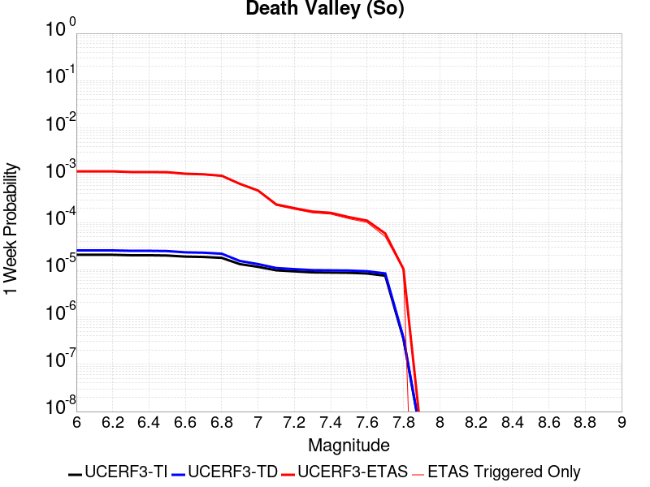 |  |  |  |

| Magnitude | 1 wk TI Prob | 1 wk TD Prob | 1 wk ETAS Prob | 1 wk ETAS/TD Gain | 1 wk ETAS Triggered Only | 1 mo TI Prob | 1 mo TD Prob | 1 mo ETAS Prob | 1 mo ETAS/TD Gain | 1 mo ETAS Triggered Only | 1 yr TI Prob | 1 yr TD Prob | 1 yr ETAS Prob | 1 yr ETAS/TD Gain | 1 yr ETAS Triggered Only | 10 yr TI Prob | 10 yr TD Prob | 10 yr ETAS Prob | 10 yr ETAS/TD Gain | 10 yr ETAS Triggered Only |
|-----|-----|-----|-----|-----|-----|-----|-----|-----|-----|-----|-----|-----|-----|-----|-----|-----|-----|-----|-----|-----|
| 6.0 | 2.0684236E-5 | 2.5617775E-5 | 0.0012055875 | 47.060585 | 0.00118 | 8.864371E-5 | 1.0978594E-4 | 0.0017496059 | 15.93652 | 0.00164 | 0.0010787029 | 0.0013358411 | 0.0041920207 | 3.138113 | 0.00286 | 0.010734817 | 0.013281397 | 0.017672295 | 1.3306051 | 0.00445 |
| 6.1 | 2.0684236E-5 | 2.5617775E-5 | 0.0012055875 | 47.060585 | 0.00118 | 8.864371E-5 | 1.0978594E-4 | 0.0017496059 | 15.93652 | 0.00164 | 0.0010787029 | 0.0013358411 | 0.0041920207 | 3.138113 | 0.00286 | 0.010734817 | 0.013281397 | 0.017672295 | 1.3306051 | 0.00445 |
| 6.2 | 2.0684236E-5 | 2.5617775E-5 | 0.0012055875 | 47.060585 | 0.00118 | 8.864371E-5 | 1.0978594E-4 | 0.0017496059 | 15.93652 | 0.00164 | 0.0010787029 | 0.0013358411 | 0.0041920207 | 3.138113 | 0.00286 | 0.010734817 | 0.013281397 | 0.017672295 | 1.3306051 | 0.00445 |
| 6.3 | 2.0240292E-5 | 2.511786E-5 | 0.0011650892 | 46.38489 | 0.00114 | 8.6741224E-5 | 1.07643624E-4 | 0.0016774746 | 15.583594 | 0.00157 | 0.0010555626 | 0.00130979 | 0.004026227 | 3.0739489 | 0.00272 | 0.010505628 | 0.013023956 | 0.017100167 | 1.3129779 | 0.00413 |
| 6.4 | 2.0240292E-5 | 2.511786E-5 | 0.0011650892 | 46.38489 | 0.00114 | 8.6741224E-5 | 1.07643624E-4 | 0.0016774746 | 15.583594 | 0.00157 | 0.0010555626 | 0.00130979 | 0.004026227 | 3.0739489 | 0.00272 | 0.010505628 | 0.013023956 | 0.017100167 | 1.3129779 | 0.00413 |
| 6.5 | 1.9962767E-5 | 2.4807114E-5 | 0.0011547791 | 46.55032 | 0.00113 | 8.55519E-5 | 1.0631196E-4 | 0.0016561472 | 15.578182 | 0.00155 | 0.0010410968 | 0.0012935963 | 0.0039601424 | 3.0613432 | 0.00267 | 0.010362327 | 0.012863902 | 0.016812447 | 1.3069476 | 0.004 |
| 6.6 | 1.8937297E-5 | 2.3310964E-5 | 0.0010732865 | 46.04213 | 0.00105 | 8.115732E-5 | 9.990039E-5 | 0.0015497556 | 15.513008 | 0.00145 | 9.876423E-4 | 0.0012156231 | 0.0036426692 | 2.9965448 | 0.00243 | 0.009832645 | 0.012092789 | 0.015659133 | 1.2949151 | 0.00361 |
| 6.7 | 1.8621096E-5 | 2.2911607E-5 | 0.0010428883 | 45.517902 | 0.00102 | 7.980225E-5 | 9.818898E-5 | 0.0015080505 | 15.358653 | 0.00141 | 9.711593E-4 | 0.0011948098 | 0.003561978 | 2.9812093 | 0.00237 | 0.009669261 | 0.011886904 | 0.015374943 | 1.2934355 | 0.00353 |
| 6.8 | 1.7830353E-5 | 2.1805688E-5 | 9.71785E-4 | 44.565666 | 9.5E-4 | 7.641356E-5 | 9.344968E-5 | 0.0013933282 | 14.90993 | 0.0013 | 9.29938E-4 | 0.00113717 | 0.0033646342 | 2.9587784 | 0.00223 | 0.009260561 | 0.011316354 | 0.014638332 | 1.2935554 | 0.00336 |
| 6.9 | 1.3135183E-5 | 1.5303925E-5 | 6.552941E-4 | 42.8187 | 6.4E-4 | 5.6292425E-5 | 6.558664E-5 | 9.555283E-4 | 14.568948 | 8.9E-4 | 6.8514474E-4 | 7.982312E-4 | 0.00232701 | 2.9152079 | 0.00153 | 0.006830362 | 0.007954649 | 0.010156989 | 1.2768621 | 0.00222 |
| 7.0 | 1.1507512E-5 | 1.3154199E-5 | 4.7314816E-4 | 35.96936 | 4.6E-4 | 4.9316975E-5 | 5.6373956E-5 | 7.0633733E-4 | 12.529497 | 6.5E-4 | 6.002687E-4 | 6.8614254E-4 | 0.0017753947 | 2.5875013 | 0.00109 | 0.0059864987 | 0.0068409415 | 0.008420064 | 1.2308341 | 0.00159 |
| 7.1 | 9.715903E-6 | 1.0865278E-5 | 2.4086278E-4 | 22.16812 | 2.3E-4 | 4.1638916E-5 | 4.656467E-5 | 3.465507E-4 | 7.442353 | 3.0E-4 | 5.068359E-4 | 5.667817E-4 | 0.001146453 | 2.0227418 | 5.8E-4 | 0.0050568148 | 0.0056538144 | 0.0064791217 | 1.1459736 | 8.3E-4 |
| 7.2 | 9.233269E-6 | 1.02863105E-5 | 2.0028435E-4 | 19.470963 | 1.9E-4 | 3.9570554E-5 | 4.4083466E-5 | 2.9407244E-4 | 6.67081 | 2.5E-4 | 4.81665E-4 | 5.3658825E-4 | 0.00103632 | 1.9313132 | 5.0E-4 | 0.0048062233 | 0.0053533576 | 0.00604961 | 1.130059 | 7.0E-4 |
| 7.3 | 8.8041315E-6 | 9.808164E-6 | 1.6980659E-4 | 17.31278 | 1.6E-4 | 3.7731446E-5 | 4.2034335E-5 | 2.4202593E-4 | 5.7578154 | 2.0E-4 | 4.592835E-4 | 5.1165203E-4 | 8.914576E-4 | 1.7423122 | 3.8E-4 | 0.0045833546 | 0.005105167 | 0.005652359 | 1.1071839 | 5.5E-4 |
| 7.4 | 8.708749E-6 | 9.707175E-6 | 1.5970571E-4 | 16.452337 | 1.5E-4 | 3.7322676E-5 | 4.160154E-5 | 2.3159363E-4 | 5.566949 | 1.9E-4 | 4.5430884E-4 | 5.0638523E-4 | 8.761979E-4 | 1.730299 | 3.7E-4 | 0.004533812 | 0.0050527398 | 0.0055900114 | 1.1063327 | 5.4E-4 |
| 7.5 | 8.612678E-6 | 9.604817E-6 | 1.2960366E-4 | 13.49361 | 1.2E-4 | 3.6910955E-5 | 4.1162875E-5 | 2.0115629E-4 | 4.8868375 | 1.6E-4 | 4.492982E-4 | 5.01047E-4 | 8.408766E-4 | 1.6782391 | 3.4E-4 | 0.004483909 | 0.0049995985 | 0.0055070487 | 1.1014982 | 5.1E-4 |
| 7.6 | 8.319024E-6 | 9.283916E-6 | 1.0928299E-4 | 11.771216 | 1.0E-4 | 3.5652476E-5 | 3.978763E-5 | 1.7978206E-4 | 4.5185413 | 1.4E-4 | 4.3398244E-4 | 4.8431093E-4 | 8.0415595E-4 | 1.6604125 | 3.2E-4 | 0.0043313587 | 0.0048329784 | 0.00532061 | 1.1008967 | 4.9E-4 |
| 7.7 | 7.4718328E-6 | 8.34517E-6 | 5.834475E-5 | 6.99144 | 5.0E-5 | 3.2021748E-5 | 3.5764548E-5 | 1.15761686E-4 | 3.236772 | 8.0E-5 | 3.8979502E-4 | 4.353504E-4 | 6.1527203E-4 | 1.41328 | 1.8E-4 | 0.00389112 | 0.0043453807 | 0.0046739466 | 1.0756127 | 3.3E-4 |
| 7.8 | 3.4586725E-7 | 3.6482615E-7 | 1.0364823E-5 | 28.410307 | 1.0E-5 | 1.4822873E-6 | 1.5635396E-6 | 1.1563524E-5 | 7.3957343 | 1.0E-5 | 1.80467E-5 | 1.9035933E-5 | 2.9035744E-5 | 1.5253123 | 1.0E-5 | 1.8045233E-4 | 1.9034347E-4 | 2.0034157E-4 | 1.0525266 | 1.0E-5 |
| 7.9 | 2.5591178E-9 | 2.6696718E-9 | 2.6696718E-9 | 1.0 | 0.0 | 1.0967647E-8 | 1.14414505E-8 | 1.14414505E-8 | 1.0 | 0.0 | 1.335311E-7 | 1.3929966E-7 | 1.3929966E-7 | 1.0 | 0.0 | 1.3353102E-6 | 1.3929966E-6 | 1.3929966E-6 | 1.0 | 0.0 |

## Coyote Canyon
*[(top)](#table-of-contents)*

| 1 Week | 1 Month | 1 Year | 10 Year |
|-----|-----|-----|-----|
| 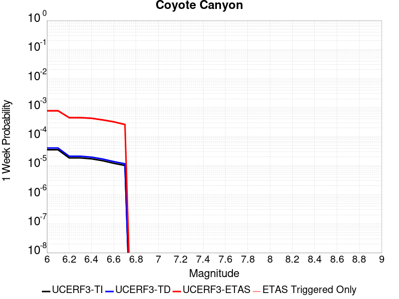 |  |  | 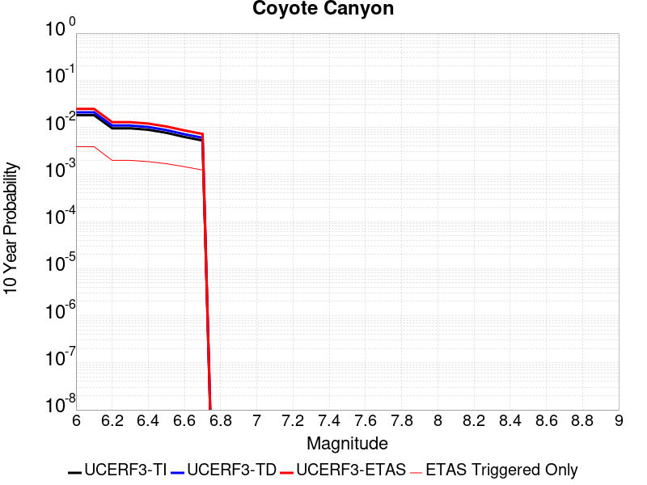 |

| Magnitude | 1 wk TI Prob | 1 wk TD Prob | 1 wk ETAS Prob | 1 wk ETAS/TD Gain | 1 wk ETAS Triggered Only | 1 mo TI Prob | 1 mo TD Prob | 1 mo ETAS Prob | 1 mo ETAS/TD Gain | 1 mo ETAS Triggered Only | 1 yr TI Prob | 1 yr TD Prob | 1 yr ETAS Prob | 1 yr ETAS/TD Gain | 1 yr ETAS Triggered Only | 10 yr TI Prob | 10 yr TD Prob | 10 yr ETAS Prob | 10 yr ETAS/TD Gain | 10 yr ETAS Triggered Only |
|-----|-----|-----|-----|-----|-----|-----|-----|-----|-----|-----|-----|-----|-----|-----|-----|-----|-----|-----|-----|-----|
| 6.0 | 3.5090034E-5 | 4.0364324E-5 | 7.8033446E-4 | 19.332281 | 7.4E-4 | 1.503772E-4 | 1.7297994E-4 | 0.001362774 | 7.8782206 | 0.00119 | 0.0018293047 | 0.0021042528 | 0.0044293497 | 2.1049514 | 0.00233 | 0.018143194 | 0.020869201 | 0.02466823 | 1.1820399 | 0.00388 |
| 6.1 | 3.5090034E-5 | 4.0364324E-5 | 7.8033446E-4 | 19.332281 | 7.4E-4 | 1.503772E-4 | 1.7297994E-4 | 0.001362774 | 7.8782206 | 0.00119 | 0.0018293047 | 0.0021042528 | 0.0044293497 | 2.1049514 | 0.00233 | 0.018143194 | 0.020869201 | 0.02466823 | 1.1820399 | 0.00388 |
| 6.2 | 1.841879E-5 | 2.1059794E-5 | 4.5105073E-4 | 21.417624 | 4.3E-4 | 7.8935285E-5 | 9.0253714E-5 | 7.2019687E-4 | 7.9796925 | 6.3E-4 | 9.606133E-4 | 0.001098387 | 0.0022870798 | 2.082217 | 0.00119 | 0.0095647145 | 0.010939667 | 0.012907897 | 1.1799169 | 0.00199 |
| 6.3 | 1.841879E-5 | 2.1059794E-5 | 4.5105073E-4 | 21.417624 | 4.3E-4 | 7.8935285E-5 | 9.0253714E-5 | 7.2019687E-4 | 7.9796925 | 6.3E-4 | 9.606133E-4 | 0.001098387 | 0.0022870798 | 2.082217 | 0.00119 | 0.0095647145 | 0.010939667 | 0.012907897 | 1.1799169 | 0.00199 |
| 6.4 | 1.712201E-5 | 1.9565212E-5 | 4.295572E-4 | 21.955153 | 4.1E-4 | 7.337798E-5 | 8.3848776E-5 | 6.9379766E-4 | 8.274391 | 6.1E-4 | 8.930107E-4 | 0.0010204813 | 0.0021493281 | 2.1061907 | 0.00113 | 0.008894307 | 0.010167871 | 0.012018857 | 1.1820426 | 0.00187 |
| 6.5 | 1.4744935E-5 | 1.6836972E-5 | 3.768309E-4 | 22.381157 | 3.6E-4 | 6.3191044E-5 | 7.215698E-5 | 6.221173E-4 | 8.62172 | 5.5E-4 | 7.6907943E-4 | 8.7825063E-4 | 0.0018873636 | 2.1490033 | 0.00101 | 0.007664232 | 0.008756994 | 0.010432195 | 1.1912986 | 0.00169 |
| 6.6 | 1.2017839E-5 | 1.37240895E-5 | 3.2371984E-4 | 23.58771 | 3.1E-4 | 5.150401E-5 | 5.88167E-5 | 5.3878844E-4 | 9.160468 | 4.8E-4 | 6.268809E-4 | 7.159466E-4 | 0.0015953166 | 2.228262 | 8.8E-4 | 0.0062511545 | 0.0071450938 | 0.008594662 | 1.202876 | 0.00146 |
| 6.7 | 1.00956095E-5 | 1.1533517E-5 | 2.6153063E-4 | 22.675707 | 2.5E-4 | 4.326618E-5 | 4.942891E-5 | 4.3940963E-4 | 8.8897295 | 3.9E-4 | 5.266384E-4 | 6.017178E-4 | 0.0013212846 | 2.1958542 | 7.2E-4 | 0.005253921 | 0.0060094125 | 0.0072419606 | 1.2051029 | 0.00124 |

## San Andreas (Mojave N)
*[(top)](#table-of-contents)*

| 1 Week | 1 Month | 1 Year | 10 Year |
|-----|-----|-----|-----|
|  | 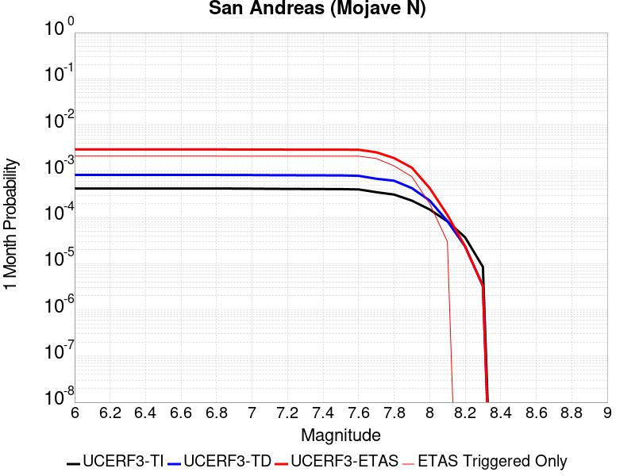 |  |  |

| Magnitude | 1 wk TI Prob | 1 wk TD Prob | 1 wk ETAS Prob | 1 wk ETAS/TD Gain | 1 wk ETAS Triggered Only | 1 mo TI Prob | 1 mo TD Prob | 1 mo ETAS Prob | 1 mo ETAS/TD Gain | 1 mo ETAS Triggered Only | 1 yr TI Prob | 1 yr TD Prob | 1 yr ETAS Prob | 1 yr ETAS/TD Gain | 1 yr ETAS Triggered Only | 10 yr TI Prob | 10 yr TD Prob | 10 yr ETAS Prob | 10 yr ETAS/TD Gain | 10 yr ETAS Triggered Only |
|-----|-----|-----|-----|-----|-----|-----|-----|-----|-----|-----|-----|-----|-----|-----|-----|-----|-----|-----|-----|-----|
| 6.0 | 9.877682E-5 | 1.9400702E-4 | 0.0019036753 | 9.812404 | 0.00171 | 4.2326056E-4 | 8.311939E-4 | 0.0029594235 | 3.560449 | 0.00213 | 0.0051410277 | 0.010072956 | 0.013260521 | 1.3164479 | 0.00322 | 0.05023708 | 0.09831428 | 0.102038234 | 1.0378782 | 0.00413 |
| 6.1 | 9.877682E-5 | 1.9400702E-4 | 0.0019036753 | 9.812404 | 0.00171 | 4.2326056E-4 | 8.311939E-4 | 0.0029594235 | 3.560449 | 0.00213 | 0.0051410277 | 0.010072956 | 0.013260521 | 1.3164479 | 0.00322 | 0.05023708 | 0.09831428 | 0.102038234 | 1.0378782 | 0.00413 |
| 6.2 | 9.877682E-5 | 1.9400702E-4 | 0.0019036753 | 9.812404 | 0.00171 | 4.2326056E-4 | 8.311939E-4 | 0.0029594235 | 3.560449 | 0.00213 | 0.0051410277 | 0.010072956 | 0.013260521 | 1.3164479 | 0.00322 | 0.05023708 | 0.09831428 | 0.102038234 | 1.0378782 | 0.00413 |
| 6.3 | 9.877682E-5 | 1.9400702E-4 | 0.0019036753 | 9.812404 | 0.00171 | 4.2326056E-4 | 8.311939E-4 | 0.0029594235 | 3.560449 | 0.00213 | 0.0051410277 | 0.010072956 | 0.013260521 | 1.3164479 | 0.00322 | 0.05023708 | 0.09831428 | 0.102038234 | 1.0378782 | 0.00413 |
| 6.4 | 9.877682E-5 | 1.9400702E-4 | 0.0019036753 | 9.812404 | 0.00171 | 4.2326056E-4 | 8.311939E-4 | 0.0029594235 | 3.560449 | 0.00213 | 0.0051410277 | 0.010072956 | 0.013260521 | 1.3164479 | 0.00322 | 0.05023708 | 0.09831428 | 0.102038234 | 1.0378782 | 0.00413 |
| 6.5 | 9.861474E-5 | 1.9374468E-4 | 0.0019034133 | 9.824339 | 0.00171 | 4.2256617E-4 | 8.300703E-4 | 0.0029583022 | 3.5639176 | 0.00213 | 0.0051326132 | 0.010059402 | 0.013247011 | 1.3168786 | 0.00322 | 0.050156746 | 0.098192066 | 0.101907514 | 1.0378386 | 0.00412 |
| 6.6 | 9.861474E-5 | 1.9374468E-4 | 0.0019034133 | 9.824339 | 0.00171 | 4.2256617E-4 | 8.300703E-4 | 0.0029583022 | 3.5639176 | 0.00213 | 0.0051326132 | 0.010059402 | 0.013247011 | 1.3168786 | 0.00322 | 0.050156746 | 0.098192066 | 0.101907514 | 1.0378386 | 0.00412 |
| 6.7 | 9.8552715E-5 | 1.9364421E-4 | 0.0019033131 | 9.8289175 | 0.00171 | 4.223004E-4 | 8.2964E-4 | 0.0029578728 | 3.5652487 | 0.00213 | 0.0051293927 | 0.010054212 | 0.013241838 | 1.3170438 | 0.00322 | 0.050125998 | 0.098145254 | 0.101860896 | 1.0378586 | 0.00412 |
| 6.8 | 9.8464974E-5 | 1.9349584E-4 | 0.001903165 | 9.83569 | 0.00171 | 4.219245E-4 | 8.290045E-4 | 0.0029572388 | 3.5672166 | 0.00213 | 0.0051248376 | 0.010046546 | 0.013234197 | 1.3172882 | 0.00322 | 0.05008251 | 0.09807528 | 0.10179121 | 1.0378885 | 0.00412 |
| 6.9 | 9.825824E-5 | 1.9317595E-4 | 0.0018928476 | 9.798568 | 0.0017 | 4.2103877E-4 | 8.276344E-4 | 0.0029458797 | 3.5593975 | 0.00212 | 0.0051141046 | 0.010030019 | 0.013207823 | 1.3168293 | 0.00321 | 0.049980022 | 0.09792438 | 0.10163191 | 1.0378611 | 0.00411 |
| 7.0 | 9.781462E-5 | 1.924896E-4 | 0.0018921624 | 9.829946 | 0.0017 | 4.1913814E-4 | 8.246948E-4 | 0.0029429465 | 3.568528 | 0.00212 | 0.005091073 | 0.009994558 | 0.013172476 | 1.3179648 | 0.00321 | 0.04976007 | 0.09760077 | 0.101309635 | 1.0380003 | 0.00411 |
| 7.1 | 9.7121134E-5 | 1.9150671E-4 | 0.0018911811 | 9.875273 | 0.0017 | 4.1616702E-4 | 8.204851E-4 | 0.0029387458 | 3.5817173 | 0.00212 | 0.005055068 | 0.009943774 | 0.013111955 | 1.3186094 | 0.0032 | 0.04941613 | 0.09713728 | 0.10083902 | 1.0381083 | 0.0041 |
| 7.2 | 9.663819E-5 | 1.9081456E-4 | 0.0018904902 | 9.907473 | 0.0017 | 4.1409794E-4 | 8.175206E-4 | 0.0029357874 | 3.5910869 | 0.00212 | 0.0050299936 | 0.00990801 | 0.013076304 | 1.319771 | 0.0032 | 0.049176537 | 0.09681055 | 0.10051362 | 1.0382508 | 0.0041 |
| 7.3 | 9.6277574E-5 | 1.9033969E-4 | 0.0018900161 | 9.9297 | 0.0017 | 4.125529E-4 | 8.154867E-4 | 0.0029337578 | 3.5975544 | 0.00212 | 0.0050112694 | 0.009883473 | 0.013051846 | 1.3205729 | 0.0032 | 0.04899759 | 0.09658401 | 0.10028801 | 1.0383501 | 0.0041 |
| 7.4 | 9.593308E-5 | 1.897375E-4 | 0.001889415 | 9.958047 | 0.0017 | 4.1107697E-4 | 8.129075E-4 | 0.0029311841 | 3.6058028 | 0.00212 | 0.0049933824 | 0.009852355 | 0.013020827 | 1.3215954 | 0.0032 | 0.04882661 | 0.09630218 | 0.10000735 | 1.0384743 | 0.0041 |
| 7.5 | 9.561707E-5 | 1.8919831E-4 | 0.0018888767 | 9.983581 | 0.0017 | 4.0972308E-4 | 8.1059814E-4 | 0.0029288796 | 3.6132326 | 0.00212 | 0.0049769743 | 0.009824493 | 0.012993054 | 1.3225166 | 0.0032 | 0.048669744 | 0.09604836 | 0.099754564 | 1.0385869 | 0.0041 |
| 7.6 | 9.418194E-5 | 1.8572104E-4 | 0.0018854053 | 10.151813 | 0.0017 | 4.0357444E-4 | 7.957047E-4 | 0.0029140178 | 3.662185 | 0.00212 | 0.004902454 | 0.009644784 | 0.012813921 | 1.3285855 | 0.0032 | 0.047957025 | 0.094430685 | 0.09814352 | 1.0393181 | 0.0041 |
| 7.7 | 8.202141E-5 | 1.6021315E-4 | 0.0016599728 | 10.361027 | 0.0015 | 3.51473E-4 | 6.8644714E-4 | 0.0025651567 | 3.7368596 | 0.00188 | 0.00427079 | 0.008325525 | 0.0112112975 | 1.3466176 | 0.00291 | 0.04189639 | 0.08223219 | 0.085627936 | 1.0412946 | 0.0037 |
| 7.8 | 7.2859846E-5 | 1.4516473E-4 | 0.0011950122 | 8.232113 | 0.00105 | 3.1221908E-4 | 6.219862E-4 | 0.0019211776 | 3.0887785 | 0.0013 | 0.003794643 | 0.0075464295 | 0.009590884 | 1.2709168 | 0.00206 | 0.037304975 | 0.07472468 | 0.07710264 | 1.0318229 | 0.00257 |
| 7.9 | 5.3874453E-5 | 1.0045676E-4 | 6.803985E-4 | 6.7730484 | 5.8E-4 | 2.3087008E-4 | 4.3045796E-4 | 0.0011901308 | 2.7648015 | 7.6E-4 | 0.0028072202 | 0.0052282433 | 0.006402074 | 1.2245172 | 0.00118 | 0.02772022 | 0.05242443 | 0.053845793 | 1.0271126 | 0.0015 |
| 8.0 | 3.468538E-5 | 5.4260272E-5 | 2.342505E-4 | 4.3171644 | 1.8E-4 | 1.4864317E-4 | 2.325233E-4 | 4.324768E-4 | 1.8599288 | 2.0E-4 | 0.0018082283 | 0.002827298 | 0.0030965344 | 1.0952276 | 2.7E-4 | 0.017935853 | 0.028947512 | 0.029326221 | 1.0130826 | 3.9E-4 |
| 8.1 | 1.9152367E-5 | 1.940263E-5 | 4.940205E-5 | 2.546152 | 3.0E-5 | 8.207899E-5 | 8.3151484E-5 | 1.1314899E-4 | 1.3607574 | 3.0E-5 | 9.988535E-4 | 0.0010118998 | 0.0010518593 | 1.0394896 | 4.0E-5 | 0.009943757 | 0.01085625 | 0.010905707 | 1.0045556 | 5.0E-5 |
| 8.2 | 8.643924E-6 | 5.4748625E-6 | 5.4748625E-6 | 1.0 | 0.0 | 3.704486E-5 | 2.3463486E-5 | 2.3463486E-5 | 1.0 | 0.0 | 4.5092785E-4 | 2.8563058E-4 | 2.8563058E-4 | 1.0 | 0.0 | 0.0045001395 | 0.0032487072 | 0.0032487072 | 1.0 | 0.0 |
| 8.3 | 1.983087E-6 | 7.6599065E-7 | 7.6599065E-7 | 1.0 | 0.0 | 8.498917E-6 | 3.282813E-6 | 3.282813E-6 | 1.0 | 0.0 | 1.034694E-4 | 3.9967534E-5 | 3.9967534E-5 | 1.0 | 0.0 | 0.0010342124 | 4.719687E-4 | 4.719687E-4 | 1.0 | 0.0 |

## Nelson Lake
*[(top)](#table-of-contents)*

| 1 Week | 1 Month | 1 Year | 10 Year |
|-----|-----|-----|-----|
|  |  | 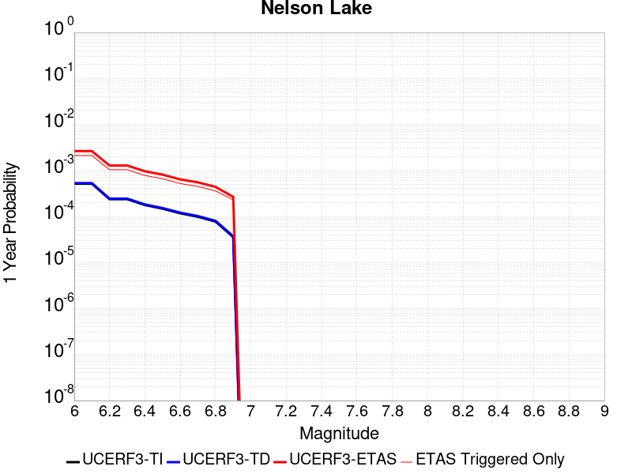 |  |

| Magnitude | 1 wk TI Prob | 1 wk TD Prob | 1 wk ETAS Prob | 1 wk ETAS/TD Gain | 1 wk ETAS Triggered Only | 1 mo TI Prob | 1 mo TD Prob | 1 mo ETAS Prob | 1 mo ETAS/TD Gain | 1 mo ETAS Triggered Only | 1 yr TI Prob | 1 yr TD Prob | 1 yr ETAS Prob | 1 yr ETAS/TD Gain | 1 yr ETAS Triggered Only | 10 yr TI Prob | 10 yr TD Prob | 10 yr ETAS Prob | 10 yr ETAS/TD Gain | 10 yr ETAS Triggered Only |
|-----|-----|-----|-----|-----|-----|-----|-----|-----|-----|-----|-----|-----|-----|-----|-----|-----|-----|-----|-----|-----|
| 6.0 | 9.913453E-6 | 1.0192255E-5 | 6.5018574E-4 | 63.792133 | 6.4E-4 | 4.2485535E-5 | 4.3680422E-5 | 0.001173631 | 26.868584 | 0.00113 | 5.1713863E-4 | 5.316897E-4 | 0.0026405677 | 4.96637 | 0.00211 | 0.0051593683 | 0.005305204 | 0.008925893 | 1.6824788 | 0.00364 |
| 6.1 | 9.913453E-6 | 1.0192255E-5 | 6.5018574E-4 | 63.792133 | 6.4E-4 | 4.2485535E-5 | 4.3680422E-5 | 0.001173631 | 26.868584 | 0.00113 | 5.1713863E-4 | 5.316897E-4 | 0.0026405677 | 4.96637 | 0.00211 | 0.0051593683 | 0.005305204 | 0.008925893 | 1.6824788 | 0.00364 |
| 6.2 | 4.5596407E-6 | 4.696313E-6 | 3.2469482E-4 | 69.13824 | 3.2E-4 | 1.954117E-5 | 2.0126909E-5 | 5.8011565E-4 | 28.82289 | 5.6E-4 | 2.3788778E-4 | 2.4501883E-4 | 0.001284764 | 5.2435317 | 0.00104 | 0.0023763329 | 0.0024476128 | 0.0041334764 | 1.6887786 | 0.00169 |
| 6.3 | 4.5596407E-6 | 4.696313E-6 | 3.2469482E-4 | 69.13824 | 3.2E-4 | 1.954117E-5 | 2.0126909E-5 | 5.8011565E-4 | 28.82289 | 5.6E-4 | 2.3788778E-4 | 2.4501883E-4 | 0.001284764 | 5.2435317 | 0.00104 | 0.0023763329 | 0.0024476128 | 0.0041334764 | 1.6887786 | 0.00169 |
| 6.4 | 3.4025713E-6 | 3.5098972E-6 | 2.835089E-4 | 80.77413 | 2.8E-4 | 1.4582367E-5 | 1.5042335E-5 | 4.550357E-4 | 30.250338 | 4.4E-4 | 1.7752586E-4 | 1.8312587E-4 | 9.6298306E-4 | 5.2585855 | 7.8E-4 | 0.001773841 | 0.0018298327 | 0.0030675638 | 1.6764176 | 0.00124 |
| 6.5 | 2.8352947E-6 | 2.927856E-6 | 2.5292713E-4 | 86.38646 | 2.5E-4 | 1.2151207E-5 | 1.2547898E-5 | 4.1254287E-4 | 32.87745 | 4.0E-4 | 1.479309E-4 | 1.5276071E-4 | 8.1265986E-4 | 5.319823 | 6.6E-4 | 0.0014783246 | 0.0015266308 | 0.002565043 | 1.6801987 | 0.00104 |
| 6.6 | 2.251518E-6 | 2.3290677E-6 | 2.023286E-4 | 86.87107 | 2.0E-4 | 9.649328E-6 | 9.981683E-6 | 3.099787E-4 | 31.05475 | 3.0E-4 | 1.1747423E-4 | 1.2152085E-4 | 6.414577E-4 | 5.278581 | 5.2E-4 | 0.0011741214 | 0.0012146058 | 0.0020435976 | 1.6825193 | 8.3E-4 |
| 6.7 | 1.8911853E-6 | 1.9591396E-6 | 1.8195879E-4 | 92.876884 | 1.8E-4 | 8.105055E-6 | 8.39629E-6 | 2.683941E-4 | 31.965801 | 2.6E-4 | 9.867457E-5 | 1.0222061E-4 | 5.5217464E-4 | 5.4017935 | 4.5E-4 | 9.863076E-4 | 0.0010217935 | 0.0017110883 | 1.6745932 | 6.9E-4 |
| 6.8 | 1.4874814E-6 | 1.5438305E-6 | 1.515436E-4 | 98.160774 | 1.5E-4 | 6.374905E-6 | 6.6164025E-6 | 2.1661501E-4 | 32.739094 | 2.1E-4 | 7.76117E-5 | 8.055224E-5 | 4.4052323E-4 | 5.468789 | 3.6E-4 | 7.75846E-4 | 8.0528157E-4 | 0.0013648306 | 1.6948489 | 5.6E-4 |
| 6.9 | 6.835972E-7 | 7.1399285E-7 | 1.0071392E-4 | 141.05733 | 1.0E-4 | 2.9296991E-6 | 3.0599674E-6 | 1.3305957E-4 | 43.483982 | 1.3E-4 | 3.56685E-5 | 3.7254784E-5 | 2.672462E-4 | 7.1734734 | 2.3E-4 | 3.5662777E-4 | 3.7251666E-4 | 7.1239E-4 | 1.9123709 | 3.4E-4 |

## Lenwood-Lockhart-Old Woman Springs
*[(top)](#table-of-contents)*

| 1 Week | 1 Month | 1 Year | 10 Year |
|-----|-----|-----|-----|
|  |  | 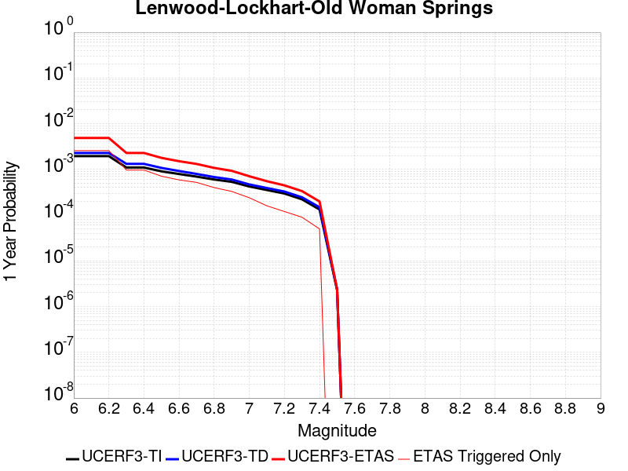 |  |

| Magnitude | 1 wk TI Prob | 1 wk TD Prob | 1 wk ETAS Prob | 1 wk ETAS/TD Gain | 1 wk ETAS Triggered Only | 1 mo TI Prob | 1 mo TD Prob | 1 mo ETAS Prob | 1 mo ETAS/TD Gain | 1 mo ETAS Triggered Only | 1 yr TI Prob | 1 yr TD Prob | 1 yr ETAS Prob | 1 yr ETAS/TD Gain | 1 yr ETAS Triggered Only | 10 yr TI Prob | 10 yr TD Prob | 10 yr ETAS Prob | 10 yr ETAS/TD Gain | 10 yr ETAS Triggered Only |
|-----|-----|-----|-----|-----|-----|-----|-----|-----|-----|-----|-----|-----|-----|-----|-----|-----|-----|-----|-----|-----|
| 6.0 | 3.744542E-5 | 4.396252E-5 | 0.0011839124 | 26.93004 | 0.00114 | 1.604705E-4 | 1.8839816E-4 | 0.0017980948 | 9.544121 | 0.00161 | 0.0019519776 | 0.0022915069 | 0.0048655947 | 2.1233168 | 0.00258 | 0.019349206 | 0.022696787 | 0.026068484 | 1.1485538 | 0.00345 |
| 6.1 | 3.744542E-5 | 4.396252E-5 | 0.0011839124 | 26.93004 | 0.00114 | 1.604705E-4 | 1.8839816E-4 | 0.0017980948 | 9.544121 | 0.00161 | 0.0019519776 | 0.0022915069 | 0.0048655947 | 2.1233168 | 0.00258 | 0.019349206 | 0.022696787 | 0.026068484 | 1.1485538 | 0.00345 |
| 6.2 | 3.744542E-5 | 4.396252E-5 | 0.0011839124 | 26.93004 | 0.00114 | 1.604705E-4 | 1.8839816E-4 | 0.0017980948 | 9.544121 | 0.00161 | 0.0019519776 | 0.0022915069 | 0.0048655947 | 2.1233168 | 0.00258 | 0.019349206 | 0.022696787 | 0.026068484 | 1.1485538 | 0.00345 |
| 6.3 | 2.1079984E-5 | 2.5353434E-5 | 4.3534304E-4 | 17.170969 | 4.1E-4 | 9.0339665E-5 | 1.0865316E-4 | 6.8859017E-4 | 6.337507 | 5.8E-4 | 0.0010993304 | 0.0013220694 | 0.002290787 | 1.7327282 | 9.7E-4 | 0.010939079 | 0.0131442575 | 0.014456776 | 1.0998548 | 0.00133 |
| 6.4 | 2.1079984E-5 | 2.5353434E-5 | 4.3534304E-4 | 17.170969 | 4.1E-4 | 9.0339665E-5 | 1.0865316E-4 | 6.8859017E-4 | 6.337507 | 5.8E-4 | 0.0010993304 | 0.0013220694 | 0.002290787 | 1.7327282 | 9.7E-4 | 0.010939079 | 0.0131442575 | 0.014456776 | 1.0998548 | 0.00133 |
| 6.5 | 1.7397282E-5 | 2.066241E-5 | 3.30656E-4 | 16.00278 | 3.1E-4 | 7.455765E-5 | 8.8550245E-5 | 5.1851216E-4 | 5.85557 | 4.3E-4 | 9.073613E-4 | 0.0010775778 | 0.0017868127 | 1.6581751 | 7.1E-4 | 0.009036654 | 0.010724821 | 0.011684418 | 1.0894744 | 9.7E-4 |
| 6.6 | 1.52050325E-5 | 1.7679693E-5 | 2.6767526E-4 | 15.140266 | 2.5E-4 | 6.51628E-5 | 7.576796E-5 | 4.4573992E-4 | 5.882961 | 3.7E-4 | 7.9306826E-4 | 9.220924E-4 | 0.0015115484 | 1.6392591 | 5.9E-4 | 0.007902439 | 0.009183526 | 0.009986088 | 1.0873914 | 8.1E-4 |
| 6.7 | 1.332523E-5 | 1.5264002E-5 | 2.4526048E-4 | 16.067902 | 2.3E-4 | 5.7106878E-5 | 6.5415545E-5 | 3.7539526E-4 | 5.7386246 | 3.1E-4 | 6.950544E-4 | 7.961491E-4 | 0.001315735 | 1.652624 | 5.2E-4 | 0.006928845 | 0.007933599 | 0.008637966 | 1.0887828 | 7.1E-4 |
| 6.8 | 1.1525329E-5 | 1.3030979E-5 | 1.730289E-4 | 13.278273 | 1.6E-4 | 4.9393333E-5 | 5.584588E-5 | 2.958325E-4 | 5.297302 | 2.4E-4 | 6.011979E-4 | 6.797157E-4 | 0.0010794438 | 1.5880812 | 4.0E-4 | 0.00599574 | 0.006776819 | 0.007333024 | 1.0820746 | 5.6E-4 |
| 6.9 | 1.0253909E-5 | 1.15144385E-5 | 1.3151305E-4 | 11.421577 | 1.2E-4 | 4.3944583E-5 | 4.9346683E-5 | 2.393373E-4 | 4.8501196 | 1.9E-4 | 5.3489394E-4 | 6.0063385E-4 | 9.3043566E-4 | 1.5490896 | 3.3E-4 | 0.0053360825 | 0.0059904843 | 0.0064477287 | 1.0763284 | 4.6E-4 |
| 7.0 | 8.104563E-6 | 8.991279E-6 | 9.899047E-5 | 11.009609 | 9.0E-5 | 3.4733377E-5 | 3.8533497E-5 | 1.8852772E-4 | 4.892567 | 1.5E-4 | 4.2279682E-4 | 4.6904673E-4 | 7.0893415E-4 | 1.5114361 | 2.4E-4 | 0.0042199334 | 0.0046808156 | 0.0049893647 | 1.0659177 | 3.1E-4 |
| 7.1 | 6.7986157E-6 | 7.515816E-6 | 3.751559E-5 | 4.991553 | 3.0E-5 | 2.91366E-5 | 3.2210253E-5 | 1.1220768E-4 | 3.483601 | 8.0E-5 | 3.5468035E-4 | 3.920914E-4 | 5.5202865E-4 | 1.4079081 | 1.6E-4 | 0.003541148 | 0.003914213 | 0.0041233907 | 1.0534407 | 2.1E-4 |
| 7.2 | 5.6893327E-6 | 6.2800136E-6 | 2.6279888E-5 | 4.184686 | 2.0E-5 | 2.4382627E-5 | 2.6914078E-5 | 8.691246E-5 | 3.2292566 | 6.0E-5 | 2.9681803E-4 | 3.2763163E-4 | 4.475923E-4 | 1.366145 | 1.2E-4 | 0.002964219 | 0.0032716845 | 0.0034311612 | 1.0487444 | 1.6E-4 |
| 7.3 | 4.253348E-6 | 4.7069107E-6 | 2.4706816E-5 | 5.2490516 | 2.0E-5 | 1.8228506E-5 | 2.0172329E-5 | 6.0171522E-5 | 2.9828744 | 4.0E-5 | 2.2190946E-4 | 2.4557224E-4 | 3.3555014E-4 | 1.366401 | 9.0E-5 | 0.00221688 | 0.0024531898 | 0.0025728955 | 1.0487959 | 1.2E-4 |
| 7.4 | 2.5448119E-6 | 2.852045E-6 | 1.2852017E-5 | 4.506246 | 1.0E-5 | 1.0906291E-5 | 1.2223002E-5 | 4.2222637E-5 | 3.4543588 | 3.0E-5 | 1.3277601E-4 | 1.4880655E-4 | 1.987991E-4 | 1.3359567 | 5.0E-5 | 0.001326967 | 0.0014872311 | 0.0015471419 | 1.0402834 | 6.0E-5 |
| 7.5 | 4.3706837E-8 | 4.562909E-8 | 4.562909E-8 | 1.0 | 0.0 | 1.8731501E-7 | 1.9555324E-7 | 1.9555324E-7 | 1.0 | 0.0 | 2.2805577E-6 | 2.3808586E-6 | 2.3808586E-6 | 1.0 | 0.0 | 2.2805343E-5 | 2.3808387E-5 | 2.3808387E-5 | 1.0 | 0.0 |

## Towne Pass
*[(top)](#table-of-contents)*

| 1 Week | 1 Month | 1 Year | 10 Year |
|-----|-----|-----|-----|
|  | 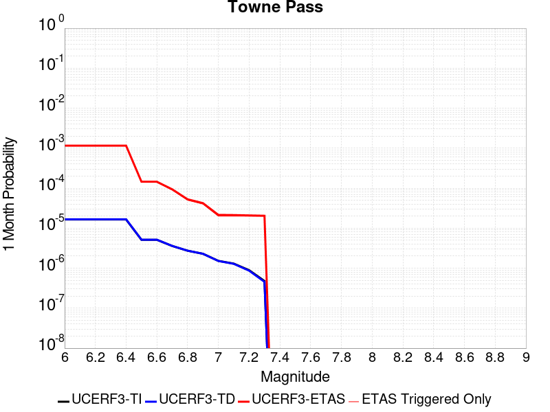 | 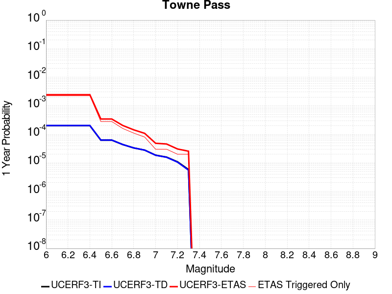 |  |

| Magnitude | 1 wk TI Prob | 1 wk TD Prob | 1 wk ETAS Prob | 1 wk ETAS/TD Gain | 1 wk ETAS Triggered Only | 1 mo TI Prob | 1 mo TD Prob | 1 mo ETAS Prob | 1 mo ETAS/TD Gain | 1 mo ETAS Triggered Only | 1 yr TI Prob | 1 yr TD Prob | 1 yr ETAS Prob | 1 yr ETAS/TD Gain | 1 yr ETAS Triggered Only | 10 yr TI Prob | 10 yr TD Prob | 10 yr ETAS Prob | 10 yr ETAS/TD Gain | 10 yr ETAS Triggered Only |
|-----|-----|-----|-----|-----|-----|-----|-----|-----|-----|-----|-----|-----|-----|-----|-----|-----|-----|-----|-----|-----|
| 6.0 | 3.849728E-6 | 3.8945414E-6 | 7.6389156E-4 | 196.14417 | 7.6E-4 | 1.649873E-5 | 1.669081E-5 | 0.0011566718 | 69.29992 | 0.00114 | 2.0085352E-4 | 2.0319603E-4 | 0.0024427408 | 12.021598 | 0.00224 | 0.0020067208 | 0.0020305314 | 0.0052639525 | 2.5924013 | 0.00324 |
| 6.1 | 3.849728E-6 | 3.8945414E-6 | 7.6389156E-4 | 196.14417 | 7.6E-4 | 1.649873E-5 | 1.669081E-5 | 0.0011566718 | 69.29992 | 0.00114 | 2.0085352E-4 | 2.0319603E-4 | 0.0024427408 | 12.021598 | 0.00224 | 0.0020067208 | 0.0020305314 | 0.0052639525 | 2.5924013 | 0.00324 |
| 6.2 | 3.849728E-6 | 3.8945414E-6 | 7.6389156E-4 | 196.14417 | 7.6E-4 | 1.649873E-5 | 1.669081E-5 | 0.0011566718 | 69.29992 | 0.00114 | 2.0085352E-4 | 2.0319603E-4 | 0.0024427408 | 12.021598 | 0.00224 | 0.0020067208 | 0.0020305314 | 0.0052639525 | 2.5924013 | 0.00324 |
| 6.3 | 3.849728E-6 | 3.8945414E-6 | 7.6389156E-4 | 196.14417 | 7.6E-4 | 1.649873E-5 | 1.669081E-5 | 0.0011566718 | 69.29992 | 0.00114 | 2.0085352E-4 | 2.0319603E-4 | 0.0024427408 | 12.021598 | 0.00224 | 0.0020067208 | 0.0020305314 | 0.0052639525 | 2.5924013 | 0.00324 |
| 6.4 | 3.849728E-6 | 3.8945414E-6 | 7.6389156E-4 | 196.14417 | 7.6E-4 | 1.649873E-5 | 1.669081E-5 | 0.0011566718 | 69.29992 | 0.00114 | 2.0085352E-4 | 2.0319603E-4 | 0.0024427408 | 12.021598 | 0.00224 | 0.0020067208 | 0.0020305314 | 0.0052639525 | 2.5924013 | 0.00324 |
| 6.5 | 1.1953545E-6 | 1.203052E-6 | 1.1120292E-4 | 92.434006 | 1.1E-4 | 5.1229376E-6 | 5.1559277E-6 | 1.4515521E-4 | 28.153072 | 1.4E-4 | 6.236998E-5 | 6.277173E-5 | 3.4275415E-4 | 5.4603267 | 2.8E-4 | 6.235248E-4 | 6.275517E-4 | 9.973196E-4 | 1.5892228 | 3.7E-4 |
| 6.6 | 1.1953545E-6 | 1.203052E-6 | 1.1120292E-4 | 92.434006 | 1.1E-4 | 5.1229376E-6 | 5.1559277E-6 | 1.4515521E-4 | 28.153072 | 1.4E-4 | 6.236998E-5 | 6.277173E-5 | 3.4275415E-4 | 5.4603267 | 2.8E-4 | 6.235248E-4 | 6.275517E-4 | 9.973196E-4 | 1.5892228 | 3.7E-4 |
| 6.7 | 8.375951E-7 | 8.4106705E-7 | 7.084101E-5 | 84.22754 | 7.0E-5 | 3.5896885E-6 | 3.6045683E-6 | 9.360424E-5 | 25.968225 | 9.0E-5 | 4.370358E-5 | 4.3884793E-5 | 2.0387777E-4 | 4.6457496 | 1.6E-4 | 4.3694986E-4 | 4.38767E-4 | 6.3867925E-4 | 1.4556228 | 2.0E-4 |
| 6.8 | 6.38041E-7 | 6.392156E-7 | 4.0639192E-5 | 63.576653 | 4.0E-5 | 2.7344586E-6 | 2.7394929E-6 | 5.2739357E-5 | 19.251503 | 5.0E-5 | 3.3291526E-5 | 3.3352855E-5 | 1.4334919E-4 | 4.2979584 | 1.1E-4 | 3.3286537E-4 | 3.334823E-4 | 4.7343562E-4 | 1.4196724 | 1.4E-4 |
| 6.9 | 5.3460053E-7 | 5.345333E-7 | 3.0534517E-5 | 57.123695 | 3.0E-5 | 2.2911431E-6 | 2.2908553E-6 | 4.2290765E-5 | 18.460688 | 4.0E-5 | 2.789431E-5 | 2.789084E-5 | 1.07888605E-4 | 3.8682454 | 8.0E-5 | 2.789081E-4 | 2.7887672E-4 | 3.8884603E-4 | 1.3943295 | 1.1E-4 |
| 7.0 | 3.557783E-7 | 3.5324226E-7 | 2.0353235E-5 | 57.618347 | 2.0E-5 | 1.5247632E-6 | 1.5138945E-6 | 2.1513864E-5 | 14.210939 | 2.0E-5 | 1.8563835E-5 | 1.843152E-5 | 4.8430968E-5 | 2.6276166 | 3.0E-5 | 1.8562283E-4 | 1.8430075E-4 | 2.1429521E-4 | 1.1627474 | 3.0E-5 |
| 7.1 | 3.037942E-7 | 3.0002218E-7 | 2.0300016E-5 | 67.66172 | 2.0E-5 | 1.3019744E-6 | 1.2858087E-6 | 2.1285783E-5 | 16.554392 | 2.0E-5 | 1.5851423E-5 | 1.5654618E-5 | 4.5654146E-5 | 2.9163375 | 3.0E-5 | 1.5850292E-4 | 1.5653588E-4 | 1.865312E-4 | 1.1916194 | 3.0E-5 |
| 7.2 | 2.0808248E-7 | 2.0217689E-7 | 2.0202173E-5 | 99.923256 | 2.0E-5 | 8.917818E-7 | 8.6647213E-7 | 2.0866455E-5 | 24.082085 | 2.0E-5 | 1.0857389E-5 | 1.0549252E-5 | 3.054904E-5 | 2.895849 | 2.0E-5 | 1.0856859E-4 | 1.0548797E-4 | 1.2548587E-4 | 1.1895751 | 2.0E-5 |
| 7.3 | 1.1162073E-7 | 1.0636894E-7 | 2.0106367E-5 | 189.0248 | 2.0E-5 | 4.7837443E-7 | 4.558668E-7 | 2.0455858E-5 | 44.872444 | 2.0E-5 | 5.8241935E-6 | 5.550166E-6 | 2.5550054E-5 | 4.6034756 | 2.0E-5 | 5.8240406E-5 | 5.5500474E-5 | 7.549937E-5 | 1.3603373 | 2.0E-5 |

## San Andreas (San Bernardino N)
*[(top)](#table-of-contents)*

| 1 Week | 1 Month | 1 Year | 10 Year |
|-----|-----|-----|-----|
|  |  |  | 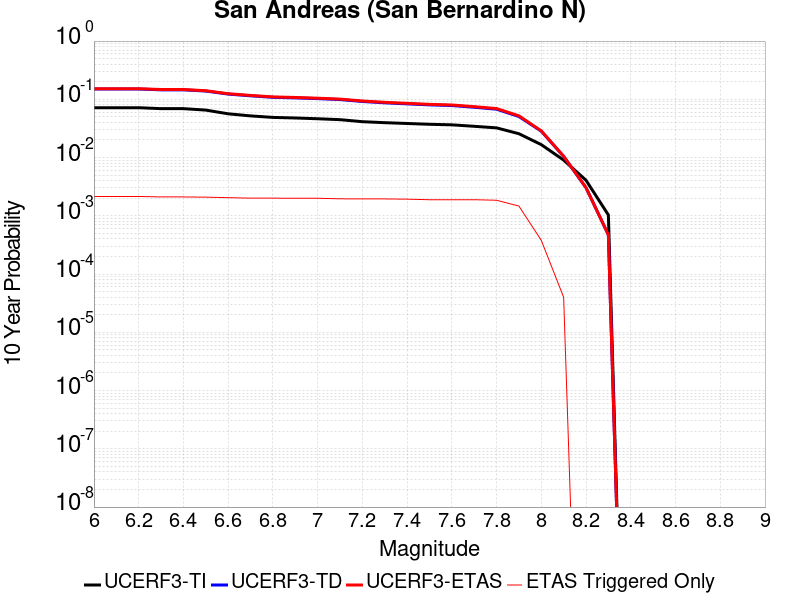 |

| Magnitude | 1 wk TI Prob | 1 wk TD Prob | 1 wk ETAS Prob | 1 wk ETAS/TD Gain | 1 wk ETAS Triggered Only | 1 mo TI Prob | 1 mo TD Prob | 1 mo ETAS Prob | 1 mo ETAS/TD Gain | 1 mo ETAS Triggered Only | 1 yr TI Prob | 1 yr TD Prob | 1 yr ETAS Prob | 1 yr ETAS/TD Gain | 1 yr ETAS Triggered Only | 10 yr TI Prob | 10 yr TD Prob | 10 yr ETAS Prob | 10 yr ETAS/TD Gain | 10 yr ETAS Triggered Only |
|-----|-----|-----|-----|-----|-----|-----|-----|-----|-----|-----|-----|-----|-----|-----|-----|-----|-----|-----|-----|-----|
| 6.0 | 1.4273766E-4 | 3.1606483E-4 | 0.0010958184 | 3.467068 | 7.8E-4 | 6.115894E-4 | 0.0013538664 | 0.0024124312 | 1.7818829 | 0.00106 | 0.0074207084 | 0.016360244 | 0.01803243 | 1.1022104 | 0.0017 | 0.07177748 | 0.15026689 | 0.15209381 | 1.0121579 | 0.00215 |
| 6.1 | 1.4273766E-4 | 3.1606483E-4 | 0.0010958184 | 3.467068 | 7.8E-4 | 6.115894E-4 | 0.0013538664 | 0.0024124312 | 1.7818829 | 0.00106 | 0.0074207084 | 0.016360244 | 0.01803243 | 1.1022104 | 0.0017 | 0.07177748 | 0.15026689 | 0.15209381 | 1.0121579 | 0.00215 |
| 6.2 | 1.4273766E-4 | 3.1606483E-4 | 0.0010958184 | 3.467068 | 7.8E-4 | 6.115894E-4 | 0.0013538664 | 0.0024124312 | 1.7818829 | 0.00106 | 0.0074207084 | 0.016360244 | 0.01803243 | 1.1022104 | 0.0017 | 0.07177748 | 0.15026689 | 0.15209381 | 1.0121579 | 0.00215 |
| 6.3 | 1.3730655E-4 | 3.0511338E-4 | 0.0010748785 | 3.522882 | 7.7E-4 | 5.883239E-4 | 0.0013069791 | 0.0023556068 | 1.8023293 | 0.00105 | 0.0071393442 | 0.015797773 | 0.017431548 | 1.1034181 | 0.00166 | 0.06914291 | 0.14556676 | 0.14736962 | 1.012385 | 0.00211 |
| 6.4 | 1.3730655E-4 | 3.0511338E-4 | 0.0010748785 | 3.522882 | 7.7E-4 | 5.883239E-4 | 0.0013069791 | 0.0023556068 | 1.8023293 | 0.00105 | 0.0071393442 | 0.015797773 | 0.017431548 | 1.1034181 | 0.00166 | 0.06914291 | 0.14556676 | 0.14736962 | 1.012385 | 0.00211 |
| 6.5 | 1.2942807E-4 | 2.8925808E-4 | 0.0010590353 | 3.6612127 | 7.7E-4 | 5.545738E-4 | 0.0012390936 | 0.002277805 | 1.8382832 | 0.00104 | 0.0067310524 | 0.01498286 | 0.016598288 | 1.1078184 | 0.00164 | 0.06530788 | 0.13870941 | 0.14050952 | 1.0129775 | 0.00209 |
| 6.6 | 1.1125901E-4 | 2.536472E-4 | 0.0010134544 | 3.9955277 | 7.6E-4 | 4.767372E-4 | 0.0010866089 | 0.0021055005 | 1.9376802 | 0.00102 | 0.005788839 | 0.013149847 | 0.014738676 | 1.1208249 | 0.00161 | 0.056403454 | 0.122999296 | 0.12479714 | 1.0146167 | 0.00205 |
| 6.7 | 1.02209575E-4 | 2.3499702E-4 | 9.848208E-4 | 4.19078 | 7.5E-4 | 4.3796748E-4 | 0.0010067427 | 0.001995746 | 1.9823794 | 9.9E-4 | 0.0053192247 | 0.012188629 | 0.013739494 | 1.1272386 | 0.00157 | 0.051936906 | 0.114790924 | 0.11657019 | 1.0155001 | 0.00201 |
| 6.8 | 9.610582E-5 | 2.2025521E-4 | 9.7009004E-4 | 4.404391 | 7.5E-4 | 4.1181705E-4 | 9.436101E-4 | 0.001932676 | 2.0481722 | 9.9E-4 | 0.0050023515 | 0.011428202 | 0.012980259 | 1.1358094 | 0.00157 | 0.048912346 | 0.1081929 | 0.10998543 | 1.016568 | 0.00201 |
| 6.9 | 9.3877505E-5 | 2.1481077E-4 | 9.6464966E-4 | 4.490695 | 7.5E-4 | 4.0227012E-4 | 9.2029345E-4 | 0.0019093824 | 2.0747538 | 9.9E-4 | 0.0048866454 | 0.011147255 | 0.012689866 | 1.1383848 | 0.00156 | 0.04780577 | 0.10578323 | 0.10757166 | 1.0169066 | 0.002 |
| 7.0 | 9.1019785E-5 | 2.0808022E-4 | 9.579242E-4 | 4.603629 | 7.5E-4 | 3.900265E-4 | 8.914682E-4 | 0.0018805857 | 2.1095376 | 9.9E-4 | 0.0047382377 | 0.010799837 | 0.012342989 | 1.1428866 | 0.00156 | 0.046384744 | 0.102753714 | 0.10454821 | 1.017464 | 0.002 |
| 7.1 | 8.771155E-5 | 1.9982594E-4 | 9.3967805E-4 | 4.7024827 | 7.4E-4 | 3.758525E-4 | 8.5611636E-4 | 0.001825286 | 2.1320536 | 9.7E-4 | 0.0045664064 | 0.0103736 | 0.011887728 | 1.1459597 | 0.00153 | 0.044737056 | 0.09906527 | 0.1008311 | 1.0178249 | 0.00196 |
| 7.2 | 8.0830236E-5 | 1.8388197E-4 | 9.237459E-4 | 5.0235806 | 7.4E-4 | 3.4636928E-4 | 7.8782777E-4 | 0.0017570636 | 2.2302635 | 9.7E-4 | 0.0042088944 | 0.009549725 | 0.011055209 | 1.1576469 | 0.00152 | 0.041300658 | 0.09179615 | 0.09356715 | 1.0192927 | 0.00195 |
| 7.3 | 7.7668235E-5 | 1.7331762E-4 | 9.131894E-4 | 5.268878 | 7.4E-4 | 3.328214E-4 | 7.425784E-4 | 0.0017118581 | 2.3052893 | 9.7E-4 | 0.0040445733 | 0.009003494 | 0.010509809 | 1.1673033 | 0.00152 | 0.03971748 | 0.08706327 | 0.088843495 | 1.0204475 | 0.00195 |
| 7.4 | 7.520177E-5 | 1.6551897E-4 | 9.053965E-4 | 5.4700465 | 7.4E-4 | 3.2225347E-4 | 7.0917426E-4 | 0.0016684935 | 2.352727 | 9.6E-4 | 0.0039163795 | 0.008600081 | 0.010097096 | 1.1740698 | 0.00151 | 0.038480744 | 0.08351955 | 0.08528835 | 1.0211784 | 0.00193 |
| 7.5 | 7.274697E-5 | 1.5839566E-4 | 8.8828005E-4 | 5.607982 | 7.3E-4 | 3.1173544E-4 | 6.78662E-4 | 0.0016280173 | 2.3988633 | 9.5E-4 | 0.003788775 | 0.008231463 | 0.00969928 | 1.1783179 | 0.00148 | 0.03724827 | 0.08023631 | 0.08197466 | 1.0216655 | 0.00189 |
| 7.6 | 7.1185845E-5 | 1.540943E-4 | 8.839818E-4 | 5.7366285 | 7.3E-4 | 3.0504653E-4 | 6.6023704E-4 | 0.0016096098 | 2.437927 | 9.5E-4 | 0.0037076178 | 0.008008812 | 0.009476958 | 1.1833165 | 0.00148 | 0.036463667 | 0.07822598 | 0.07996813 | 1.0222708 | 0.00189 |
| 7.7 | 6.709961E-5 | 1.4318313E-4 | 8.730786E-4 | 6.0976357 | 7.3E-4 | 2.8753807E-4 | 6.1349774E-4 | 0.0015629149 | 2.547548 | 9.5E-4 | 0.003495157 | 0.0074437927 | 0.008912776 | 1.1973433 | 0.00148 | 0.034406938 | 0.07305469 | 0.07480662 | 1.023981 | 0.00189 |
| 7.8 | 6.300812E-5 | 1.3202413E-4 | 8.419304E-4 | 6.3770947 | 7.1E-4 | 2.7000686E-4 | 5.65695E-4 | 0.0014851745 | 2.625398 | 9.2E-4 | 0.0032823787 | 0.006865616 | 0.00830566 | 1.2097473 | 0.00145 | 0.032343175 | 0.06771354 | 0.069438264 | 1.025471 | 0.00185 |
| 7.9 | 4.983037E-5 | 9.723488E-5 | 6.471814E-4 | 6.6558566 | 5.5E-4 | 2.1354125E-4 | 4.1665437E-4 | 0.0011463502 | 2.7513218 | 7.3E-4 | 0.0025967648 | 0.0050609782 | 0.006205158 | 1.2260787 | 0.00115 | 0.025666296 | 0.05064886 | 0.052044407 | 1.0275533 | 0.00147 |
| 8.0 | 3.2211527E-5 | 5.3304586E-5 | 2.2329553E-4 | 4.189049 | 1.7E-4 | 1.380421E-4 | 2.2842824E-4 | 4.1838482E-4 | 1.8315811 | 1.9E-4 | 0.0016793669 | 0.0027775685 | 0.0030368464 | 1.0933471 | 2.6E-4 | 0.016667323 | 0.028361378 | 0.028730601 | 1.0130185 | 3.8E-4 |
| 8.1 | 1.743376E-5 | 1.8824427E-5 | 3.8824048E-5 | 2.0624294 | 2.0E-5 | 7.471398E-5 | 8.067362E-5 | 1.00672005E-4 | 1.2478925 | 2.0E-5 | 9.0926304E-4 | 9.817594E-4 | 0.0010117299 | 1.0305274 | 3.0E-5 | 0.009055517 | 0.010484105 | 0.010523685 | 1.0037754 | 4.0E-5 |
| 8.2 | 7.831616E-6 | 5.1551065E-6 | 5.1551065E-6 | 1.0 | 0.0 | 3.3563636E-5 | 2.2093127E-5 | 2.2093127E-5 | 1.0 | 0.0 | 4.0856065E-4 | 2.6895068E-4 | 2.6895068E-4 | 1.0 | 0.0 | 0.004078103 | 0.0030418145 | 0.0030418145 | 1.0 | 0.0 |
| 8.3 | 1.983087E-6 | 7.6599065E-7 | 7.6599065E-7 | 1.0 | 0.0 | 8.498917E-6 | 3.282813E-6 | 3.282813E-6 | 1.0 | 0.0 | 1.034694E-4 | 3.9967534E-5 | 3.9967534E-5 | 1.0 | 0.0 | 0.0010342124 | 4.719687E-4 | 4.719687E-4 | 1.0 | 0.0 |

## Bicycle Lake
*[(top)](#table-of-contents)*

| 1 Week | 1 Month | 1 Year | 10 Year |
|-----|-----|-----|-----|
|  |  |  |  |

| Magnitude | 1 wk TI Prob | 1 wk TD Prob | 1 wk ETAS Prob | 1 wk ETAS/TD Gain | 1 wk ETAS Triggered Only | 1 mo TI Prob | 1 mo TD Prob | 1 mo ETAS Prob | 1 mo ETAS/TD Gain | 1 mo ETAS Triggered Only | 1 yr TI Prob | 1 yr TD Prob | 1 yr ETAS Prob | 1 yr ETAS/TD Gain | 1 yr ETAS Triggered Only | 10 yr TI Prob | 10 yr TD Prob | 10 yr ETAS Prob | 10 yr ETAS/TD Gain | 10 yr ETAS Triggered Only |
|-----|-----|-----|-----|-----|-----|-----|-----|-----|-----|-----|-----|-----|-----|-----|-----|-----|-----|-----|-----|-----|
| 6.0 | 1.9621975E-5 | 2.2097078E-5 | 3.920889E-4 | 17.743925 | 3.7E-4 | 8.4091465E-5 | 9.4699084E-5 | 6.546461E-4 | 6.9129076 | 5.6E-4 | 0.0010233327 | 0.0011524865 | 0.0022711956 | 1.9706918 | 0.00112 | 0.01018633 | 0.011478408 | 0.013267632 | 1.1558774 | 0.00181 |
| 6.1 | 1.9621975E-5 | 2.2097078E-5 | 3.920889E-4 | 17.743925 | 3.7E-4 | 8.4091465E-5 | 9.4699084E-5 | 6.546461E-4 | 6.9129076 | 5.6E-4 | 0.0010233327 | 0.0011524865 | 0.0022711956 | 1.9706918 | 0.00112 | 0.01018633 | 0.011478408 | 0.013267632 | 1.1558774 | 0.00181 |
| 6.2 | 9.9971285E-6 | 1.1255639E-5 | 2.2125327E-4 | 19.657104 | 2.1E-4 | 4.2844134E-5 | 4.8237856E-5 | 4.0822048E-4 | 8.462658 | 3.6E-4 | 5.2150246E-4 | 5.871896E-4 | 0.0012068256 | 2.0552568 | 6.2E-4 | 0.0052028033 | 0.005861487 | 0.0069749216 | 1.1899579 | 0.00112 |
| 6.3 | 9.589428E-6 | 1.0798346E-5 | 2.1079619E-4 | 19.521154 | 2.0E-4 | 4.10969E-5 | 4.62781E-5 | 3.8626237E-4 | 8.346548 | 3.4E-4 | 5.002399E-4 | 5.6334207E-4 | 0.0011630041 | 2.0644722 | 6.0E-4 | 0.0049911533 | 0.0056242296 | 0.006708099 | 1.1927143 | 0.00109 |
| 6.4 | 9.589428E-6 | 1.0798346E-5 | 2.1079619E-4 | 19.521154 | 2.0E-4 | 4.10969E-5 | 4.62781E-5 | 3.8626237E-4 | 8.346548 | 3.4E-4 | 5.002399E-4 | 5.6334207E-4 | 0.0011630041 | 2.0644722 | 6.0E-4 | 0.0049911533 | 0.0056242296 | 0.006708099 | 1.1927143 | 0.00109 |
| 6.5 | 5.557707E-6 | 6.2856016E-6 | 1.3628478E-4 | 21.68206 | 1.3E-4 | 2.3818526E-5 | 2.6938165E-5 | 2.669317E-4 | 9.909053 | 2.4E-4 | 2.8995197E-4 | 3.2794967E-4 | 7.278185E-4 | 2.2192993 | 4.0E-4 | 0.0028957394 | 0.0032772934 | 0.003955065 | 1.2068083 | 6.8E-4 |
| 6.6 | 4.8742945E-6 | 5.5132896E-6 | 1.2551263E-4 | 22.765469 | 1.2E-4 | 2.0889667E-5 | 2.3628318E-5 | 2.4362312E-4 | 10.310641 | 2.2E-4 | 2.54302E-4 | 2.87663E-4 | 6.575566E-4 | 2.2858572 | 3.7E-4 | 0.002540112 | 0.0028754752 | 0.003483721 | 1.2115289 | 6.1E-4 |
| 6.7 | 3.991108E-6 | 4.5159104E-6 | 1.0451546E-4 | 23.14383 | 1.0E-4 | 1.7104636E-5 | 1.9353902E-5 | 1.9935041E-4 | 10.30027 | 1.8E-4 | 2.0822904E-4 | 2.3563375E-4 | 5.255654E-4 | 2.2304335 | 2.9E-4 | 0.0020803404 | 0.0023563374 | 0.0028850886 | 1.2243954 | 5.3E-4 |

## Paradise
*[(top)](#table-of-contents)*

| 1 Week | 1 Month | 1 Year | 10 Year |
|-----|-----|-----|-----|
|  |  | 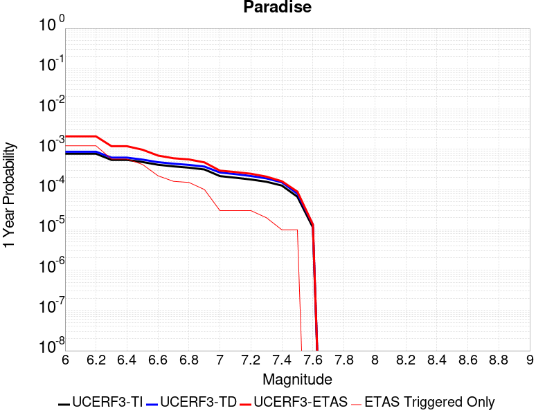 | 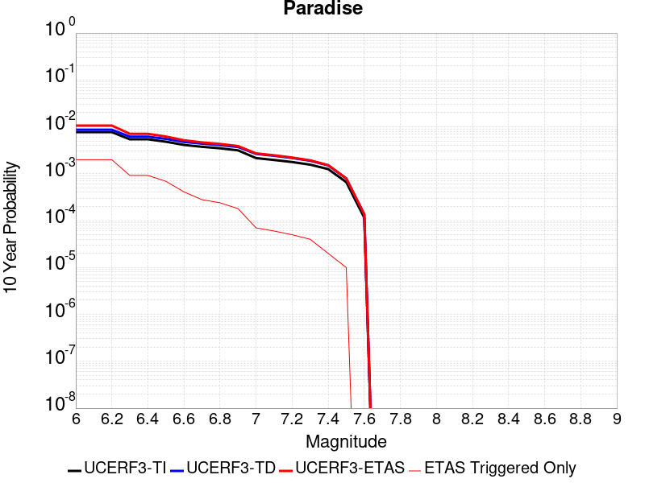 |

| Magnitude | 1 wk TI Prob | 1 wk TD Prob | 1 wk ETAS Prob | 1 wk ETAS/TD Gain | 1 wk ETAS Triggered Only | 1 mo TI Prob | 1 mo TD Prob | 1 mo ETAS Prob | 1 mo ETAS/TD Gain | 1 mo ETAS Triggered Only | 1 yr TI Prob | 1 yr TD Prob | 1 yr ETAS Prob | 1 yr ETAS/TD Gain | 1 yr ETAS Triggered Only | 10 yr TI Prob | 10 yr TD Prob | 10 yr ETAS Prob | 10 yr ETAS/TD Gain | 10 yr ETAS Triggered Only |
|-----|-----|-----|-----|-----|-----|-----|-----|-----|-----|-----|-----|-----|-----|-----|-----|-----|-----|-----|-----|-----|
| 6.0 | 1.4851273E-5 | 1.6694692E-5 | 4.0668817E-4 | 24.360329 | 3.9E-4 | 6.364676E-5 | 7.154685E-5 | 7.3149963E-4 | 10.224065 | 6.6E-4 | 7.7462377E-4 | 8.707584E-4 | 0.002089696 | 2.3998575 | 0.00122 | 0.0077192914 | 0.008675844 | 0.010648579 | 1.2273825 | 0.00199 |
| 6.1 | 1.4851273E-5 | 1.6694692E-5 | 4.0668817E-4 | 24.360329 | 3.9E-4 | 6.364676E-5 | 7.154685E-5 | 7.3149963E-4 | 10.224065 | 6.6E-4 | 7.7462377E-4 | 8.707584E-4 | 0.002089696 | 2.3998575 | 0.00122 | 0.0077192914 | 0.008675844 | 0.010648579 | 1.2273825 | 0.00199 |
| 6.2 | 1.4851273E-5 | 1.6694692E-5 | 4.0668817E-4 | 24.360329 | 3.9E-4 | 6.364676E-5 | 7.154685E-5 | 7.3149963E-4 | 10.224065 | 6.6E-4 | 7.7462377E-4 | 8.707584E-4 | 0.002089696 | 2.3998575 | 0.00122 | 0.0077192914 | 0.008675844 | 0.010648579 | 1.2273825 | 0.00199 |
| 6.3 | 1.0426831E-5 | 1.188862E-5 | 1.4188708E-4 | 11.934696 | 1.3E-4 | 4.4685654E-5 | 5.0950268E-5 | 3.1093703E-4 | 6.1027555 | 2.6E-4 | 5.43912E-4 | 6.201489E-4 | 0.0011897954 | 1.9185641 | 5.7E-4 | 0.0054258266 | 0.0061847917 | 0.007099102 | 1.147832 | 9.2E-4 |
| 6.4 | 1.0426831E-5 | 1.188862E-5 | 1.4188708E-4 | 11.934696 | 1.3E-4 | 4.4685654E-5 | 5.0950268E-5 | 3.1093703E-4 | 6.1027555 | 2.6E-4 | 5.43912E-4 | 6.201489E-4 | 0.0011897954 | 1.9185641 | 5.7E-4 | 0.0054258266 | 0.0061847917 | 0.007099102 | 1.147832 | 9.2E-4 |
| 6.5 | 9.25027E-6 | 1.06199595E-5 | 1.2061879E-4 | 11.357744 | 1.1E-4 | 3.964341E-5 | 4.551335E-5 | 2.6550333E-4 | 5.833527 | 2.2E-4 | 4.8255164E-4 | 5.53989E-4 | 9.7375637E-4 | 1.7577177 | 4.2E-4 | 0.0048150513 | 0.0055265795 | 0.006212766 | 1.1241612 | 6.9E-4 |
| 6.6 | 7.904275E-6 | 9.159525E-6 | 6.9158974E-5 | 7.550498 | 6.0E-5 | 3.3875025E-5 | 3.9254537E-5 | 1.5924983E-4 | 4.0568514 | 1.2E-4 | 4.1235037E-4 | 4.7782314E-4 | 6.97718E-4 | 1.4602014 | 2.2E-4 | 0.0041158604 | 0.0047683544 | 0.0051763994 | 1.0855736 | 4.1E-4 |
| 6.7 | 7.2061953E-6 | 8.407248E-6 | 5.840683E-5 | 6.947199 | 5.0E-5 | 3.088333E-5 | 3.6030586E-5 | 1.3602698E-4 | 3.7753196 | 1.0E-4 | 3.7593965E-4 | 4.3858777E-4 | 5.985176E-4 | 1.3646473 | 1.6E-4 | 0.003753043 | 0.004377591 | 0.004656365 | 1.0636821 | 2.8E-4 |
| 6.8 | 6.6948724E-6 | 7.842166E-6 | 5.7841775E-5 | 7.3757396 | 5.0E-5 | 2.8691995E-5 | 3.360887E-5 | 1.3360551E-4 | 3.975305 | 1.0E-4 | 3.4926904E-4 | 4.0911473E-4 | 5.590534E-4 | 1.3664954 | 1.5E-4 | 0.003487206 | 0.0040839734 | 0.004322993 | 1.0585263 | 2.4E-4 |
| 6.9 | 6.0421025E-6 | 7.130621E-6 | 3.713041E-5 | 5.207177 | 3.0E-5 | 2.5894467E-5 | 3.0559466E-5 | 1.0055733E-4 | 3.290546 | 7.0E-5 | 3.1521954E-4 | 3.7200135E-4 | 4.7196416E-4 | 1.2687162 | 1.0E-4 | 0.0031477278 | 0.0037141247 | 0.0038934562 | 1.0482837 | 1.8E-4 |
| 7.0 | 4.134091E-6 | 5.0803087E-6 | 1.5080258E-5 | 2.9683743 | 1.0E-5 | 1.7717413E-5 | 2.177258E-5 | 3.177236E-5 | 1.4592834 | 1.0E-5 | 2.1568815E-4 | 2.6505045E-4 | 2.950425E-4 | 1.113156 | 3.0E-5 | 0.0021547892 | 0.0026474963 | 0.002717311 | 1.02637 | 7.0E-5 |
| 7.1 | 3.7674888E-6 | 4.6318696E-6 | 1.4631823E-5 | 3.1589456 | 1.0E-5 | 1.6146281E-5 | 1.9850726E-5 | 2.9850527E-5 | 1.5037498 | 1.0E-5 | 1.9656324E-4 | 2.4165731E-4 | 2.7165006E-4 | 1.1241127 | 3.0E-5 | 0.0019638946 | 0.002414096 | 0.002473951 | 1.024794 | 6.0E-5 |
| 7.2 | 3.4065345E-6 | 4.156723E-6 | 1.4156682E-5 | 3.4057312 | 1.0E-5 | 1.4599351E-5 | 1.7814415E-5 | 2.7814236E-5 | 1.5613332 | 1.0E-5 | 1.777326E-4 | 2.1687041E-4 | 2.468639E-4 | 1.1383015 | 3.0E-5 | 0.0017759053 | 0.002166736 | 0.0022166276 | 1.0230262 | 5.0E-5 |
| 7.3 | 2.9934936E-6 | 3.6293168E-6 | 3.6293168E-6 | 1.0 | 0.0 | 1.2829195E-5 | 1.555413E-5 | 1.555413E-5 | 1.0 | 0.0 | 1.5618425E-4 | 1.8935655E-4 | 2.0935277E-4 | 1.1056008 | 2.0E-5 | 0.0015607453 | 0.0018920974 | 0.0019320217 | 1.0211005 | 4.0E-5 |
| 7.4 | 2.4049796E-6 | 2.8889842E-6 | 2.8889842E-6 | 1.0 | 0.0 | 1.0307015E-5 | 1.238131E-5 | 1.238131E-5 | 1.0 | 0.0 | 1.2548068E-4 | 1.5073347E-4 | 1.6073196E-4 | 1.0663322 | 1.0E-5 | 0.0012540985 | 0.0015064536 | 0.0015264235 | 1.0132562 | 2.0E-5 |
| 7.5 | 1.2710091E-6 | 1.5134682E-6 | 1.5134682E-6 | 1.0 | 0.0 | 5.44717E-6 | 6.4862834E-6 | 6.4862834E-6 | 1.0 | 0.0 | 6.631728E-5 | 7.8968886E-5 | 8.8968096E-5 | 1.1266222 | 1.0E-5 | 6.6297496E-4 | 7.8953087E-4 | 7.9952297E-4 | 1.0126557 | 1.0E-5 |
| 7.6 | 2.21172E-7 | 2.603961E-7 | 2.603961E-7 | 1.0 | 0.0 | 9.478797E-7 | 1.1159829E-6 | 1.1159829E-6 | 1.0 | 0.0 | 1.1540374E-5 | 1.3587036E-5 | 1.3587036E-5 | 1.0 | 0.0 | 1.1539775E-4 | 1.3586486E-4 | 1.3586486E-4 | 1.0 | 0.0 |

## Garlic Springs
*[(top)](#table-of-contents)*

| 1 Week | 1 Month | 1 Year | 10 Year |
|-----|-----|-----|-----|
|  |  | 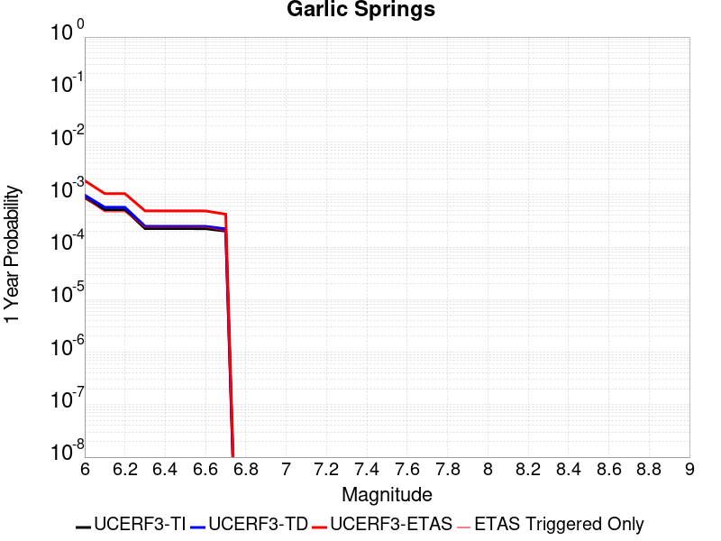 | 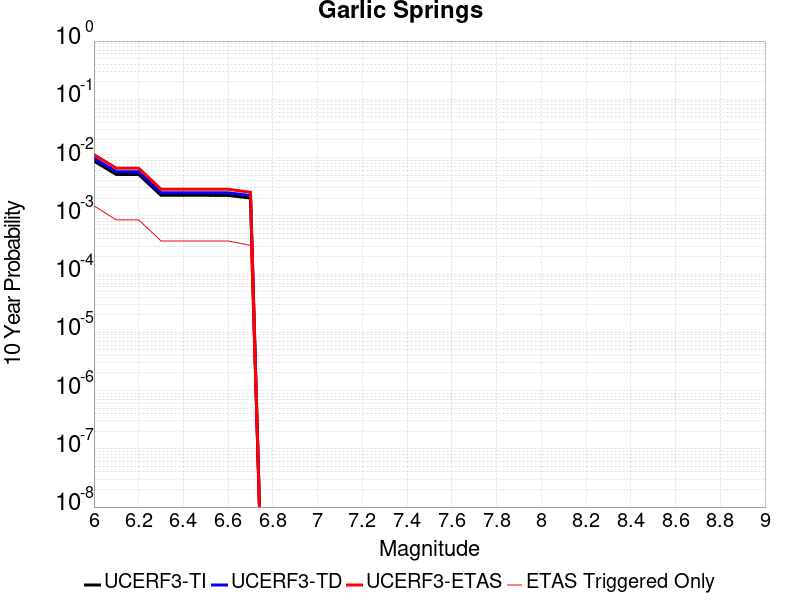 |

| Magnitude | 1 wk TI Prob | 1 wk TD Prob | 1 wk ETAS Prob | 1 wk ETAS/TD Gain | 1 wk ETAS Triggered Only | 1 mo TI Prob | 1 mo TD Prob | 1 mo ETAS Prob | 1 mo ETAS/TD Gain | 1 mo ETAS Triggered Only | 1 yr TI Prob | 1 yr TD Prob | 1 yr ETAS Prob | 1 yr ETAS/TD Gain | 1 yr ETAS Triggered Only | 10 yr TI Prob | 10 yr TD Prob | 10 yr ETAS Prob | 10 yr ETAS/TD Gain | 10 yr ETAS Triggered Only |
|-----|-----|-----|-----|-----|-----|-----|-----|-----|-----|-----|-----|-----|-----|-----|-----|-----|-----|-----|-----|-----|
| 6.0 | 1.6760017E-5 | 1.8776833E-5 | 2.9877157E-4 | 15.911714 | 2.8E-4 | 7.182667E-5 | 8.0470316E-5 | 5.104357E-4 | 6.3431554 | 4.3E-4 | 8.7413884E-4 | 9.794032E-4 | 0.0018485511 | 1.8874261 | 8.7E-4 | 0.008707083 | 0.009762413 | 0.011237867 | 1.1511362 | 0.00149 |
| 6.1 | 9.852767E-6 | 1.09735865E-5 | 1.8097172E-4 | 16.491573 | 1.7E-4 | 4.222546E-5 | 4.702921E-5 | 2.8701793E-4 | 6.1029716 | 2.4E-4 | 5.139737E-4 | 5.7250116E-4 | 0.0010422322 | 1.820489 | 4.7E-4 | 0.005127866 | 0.005717221 | 0.006562362 | 1.1478236 | 8.5E-4 |
| 6.2 | 9.852767E-6 | 1.09735865E-5 | 1.8097172E-4 | 16.491573 | 1.7E-4 | 4.222546E-5 | 4.702921E-5 | 2.8701793E-4 | 6.1029716 | 2.4E-4 | 5.139737E-4 | 5.7250116E-4 | 0.0010422322 | 1.820489 | 4.7E-4 | 0.005127866 | 0.005717221 | 0.006562362 | 1.1478236 | 8.5E-4 |
| 6.3 | 4.3167724E-6 | 4.7780286E-6 | 1.2477745E-4 | 26.114841 | 1.2E-4 | 1.8500323E-5 | 2.0477235E-5 | 1.7047416E-4 | 8.325058 | 1.5E-4 | 2.2521814E-4 | 2.4930484E-4 | 4.89245E-4 | 1.9624369 | 2.4E-4 | 0.0022499003 | 0.00249251 | 0.0028615878 | 1.1480747 | 3.7E-4 |
| 6.4 | 4.3167724E-6 | 4.7780286E-6 | 1.2477745E-4 | 26.114841 | 1.2E-4 | 1.8500323E-5 | 2.0477235E-5 | 1.7047416E-4 | 8.325058 | 1.5E-4 | 2.2521814E-4 | 2.4930484E-4 | 4.89245E-4 | 1.9624369 | 2.4E-4 | 0.0022499003 | 0.00249251 | 0.0028615878 | 1.1480747 | 3.7E-4 |
| 6.5 | 4.3167724E-6 | 4.7780286E-6 | 1.2477745E-4 | 26.114841 | 1.2E-4 | 1.8500323E-5 | 2.0477235E-5 | 1.7047416E-4 | 8.325058 | 1.5E-4 | 2.2521814E-4 | 2.4930484E-4 | 4.89245E-4 | 1.9624369 | 2.4E-4 | 0.0022499003 | 0.00249251 | 0.0028615878 | 1.1480747 | 3.7E-4 |
| 6.6 | 4.301311E-6 | 4.760897E-6 | 1.2476032E-4 | 26.205214 | 1.2E-4 | 1.8434059E-5 | 2.0403815E-5 | 1.7040076E-4 | 8.351417 | 1.5E-4 | 2.2441156E-4 | 2.4841115E-4 | 4.8835156E-4 | 1.9659002 | 2.4E-4 | 0.0022418506 | 0.002483593 | 0.002852674 | 1.1486077 | 3.7E-4 |
| 6.7 | 3.8599724E-6 | 4.27106E-6 | 9.4270676E-5 | 22.071962 | 9.0E-5 | 1.6542634E-5 | 1.8304541E-5 | 1.3830235E-4 | 7.5556297 | 1.2E-4 | 2.0138794E-4 | 2.228578E-4 | 4.2281323E-4 | 1.8972332 | 2.0E-4 | 0.0020120554 | 0.002228578 | 0.002537887 | 1.1387922 | 3.1E-4 |

## San Andreas (San Bernardino S)
*[(top)](#table-of-contents)*

| 1 Week | 1 Month | 1 Year | 10 Year |
|-----|-----|-----|-----|
|  |  |  |  |

| Magnitude | 1 wk TI Prob | 1 wk TD Prob | 1 wk ETAS Prob | 1 wk ETAS/TD Gain | 1 wk ETAS Triggered Only | 1 mo TI Prob | 1 mo TD Prob | 1 mo ETAS Prob | 1 mo ETAS/TD Gain | 1 mo ETAS Triggered Only | 1 yr TI Prob | 1 yr TD Prob | 1 yr ETAS Prob | 1 yr ETAS/TD Gain | 1 yr ETAS Triggered Only | 10 yr TI Prob | 10 yr TD Prob | 10 yr ETAS Prob | 10 yr ETAS/TD Gain | 10 yr ETAS Triggered Only |
|-----|-----|-----|-----|-----|-----|-----|-----|-----|-----|-----|-----|-----|-----|-----|-----|-----|-----|-----|-----|-----|
| 6.0 | 1.2336002E-4 | 3.0004102E-4 | 6.89924E-4 | 2.2994323 | 3.9E-4 | 5.2857865E-4 | 0.0012852824 | 0.0018146012 | 1.4118307 | 5.3E-4 | 0.006416472 | 0.015540994 | 0.016377784 | 1.0538441 | 8.5E-4 | 0.06234337 | 0.14283717 | 0.14383148 | 1.0069611 | 0.00116 |
| 6.1 | 1.2336002E-4 | 3.0004102E-4 | 6.89924E-4 | 2.2994323 | 3.9E-4 | 5.2857865E-4 | 0.0012852824 | 0.0018146012 | 1.4118307 | 5.3E-4 | 0.006416472 | 0.015540994 | 0.016377784 | 1.0538441 | 8.5E-4 | 0.06234337 | 0.14283717 | 0.14383148 | 1.0069611 | 0.00116 |
| 6.2 | 1.2336002E-4 | 3.0004102E-4 | 6.89924E-4 | 2.2994323 | 3.9E-4 | 5.2857865E-4 | 0.0012852824 | 0.0018146012 | 1.4118307 | 5.3E-4 | 0.006416472 | 0.015540994 | 0.016377784 | 1.0538441 | 8.5E-4 | 0.06234337 | 0.14283717 | 0.14383148 | 1.0069611 | 0.00116 |
| 6.3 | 1.1712257E-4 | 2.8792414E-4 | 6.6781475E-4 | 2.319412 | 3.8E-4 | 5.018573E-4 | 0.0012334028 | 0.0017427737 | 1.4129802 | 5.1E-4 | 0.006093008 | 0.014918125 | 0.015725892 | 1.0541466 | 8.2E-4 | 0.059286322 | 0.13754563 | 0.13851158 | 1.0070227 | 0.00112 |
| 6.4 | 1.1712257E-4 | 2.8792414E-4 | 6.6781475E-4 | 2.319412 | 3.8E-4 | 5.018573E-4 | 0.0012334028 | 0.0017427737 | 1.4129802 | 5.1E-4 | 0.006093008 | 0.014918125 | 0.015725892 | 1.0541466 | 8.2E-4 | 0.059286322 | 0.13754563 | 0.13851158 | 1.0070227 | 0.00112 |
| 6.5 | 1.0689076E-4 | 2.680528E-4 | 6.3795364E-4 | 2.379955 | 3.7E-4 | 4.5802278E-4 | 0.0011483167 | 0.001637754 | 1.4262216 | 4.9E-4 | 0.0055621783 | 0.01389575 | 0.0146747725 | 1.0560619 | 7.9E-4 | 0.05425003 | 0.12879294 | 0.12974256 | 1.0073732 | 0.00109 |
| 6.6 | 9.7648895E-5 | 2.50501E-4 | 6.0041336E-4 | 2.3968499 | 3.5E-4 | 4.1842813E-4 | 0.0010731576 | 0.0015426533 | 1.4374899 | 4.7E-4 | 0.005082469 | 0.012991785 | 0.013722171 | 1.0562191 | 7.4E-4 | 0.049677886 | 0.12095292 | 0.12186713 | 1.0075583 | 0.00104 |
| 6.7 | 8.757013E-5 | 2.3120902E-4 | 5.811281E-4 | 2.5134318 | 3.5E-4 | 3.7524657E-4 | 9.905418E-4 | 0.0014600763 | 1.4740177 | 4.7E-4 | 0.00455906 | 0.011997245 | 0.0127184875 | 1.0601172 | 7.3E-4 | 0.04466656 | 0.11226123 | 0.1131756 | 1.008145 | 0.00103 |
| 6.8 | 8.562978E-5 | 2.2680782E-4 | 5.7672843E-4 | 2.5428066 | 3.5E-4 | 3.6693315E-4 | 9.7169366E-4 | 0.0014412369 | 1.4832215 | 4.7E-4 | 0.004458263 | 0.011770263 | 0.012491671 | 1.0612907 | 7.3E-4 | 0.043698758 | 0.11027153 | 0.11118795 | 1.0083106 | 0.00103 |
| 6.9 | 6.124075E-5 | 1.7065753E-4 | 5.006012E-4 | 2.9333673 | 3.3E-4 | 2.6243398E-4 | 7.311852E-4 | 0.0011708635 | 1.6013228 | 4.4E-4 | 0.0031904527 | 0.008866051 | 0.0095499335 | 1.077135 | 6.9E-4 | 0.031450346 | 0.08418263 | 0.08508013 | 1.0106614 | 9.8E-4 |
| 7.0 | 5.8598747E-5 | 1.649477E-4 | 4.948933E-4 | 3.000304 | 3.3E-4 | 2.5111332E-4 | 7.06728E-4 | 0.0011464171 | 1.6221474 | 4.4E-4 | 0.0030530186 | 0.008570663 | 0.009254749 | 1.0798172 | 6.9E-4 | 0.03011414 | 0.081500374 | 0.0824005 | 1.0110445 | 9.8E-4 |
| 7.1 | 5.613814E-5 | 1.5913323E-4 | 4.8908073E-4 | 3.073404 | 3.3E-4 | 2.4056983E-4 | 6.818221E-4 | 0.001121522 | 1.6448897 | 4.4E-4 | 0.0029250039 | 0.008269769 | 0.008954062 | 1.0827464 | 6.9E-4 | 0.028868021 | 0.07879931 | 0.07969288 | 1.0113398 | 9.7E-4 |
| 7.2 | 4.991222E-5 | 1.4519796E-4 | 4.7515004E-4 | 3.2724292 | 3.3E-4 | 2.1389198E-4 | 6.2212895E-4 | 0.0010618552 | 1.7068089 | 4.4E-4 | 0.002601025 | 0.007548217 | 0.008233009 | 1.0907223 | 6.9E-4 | 0.025707912 | 0.07225321 | 0.07314385 | 1.0123266 | 9.6E-4 |
| 7.3 | 4.7410045E-5 | 1.3714004E-4 | 4.6709477E-4 | 3.4059694 | 3.3E-4 | 2.0317009E-4 | 5.8761094E-4 | 0.0010273524 | 1.7483548 | 4.4E-4 | 0.0024707897 | 0.0071307817 | 0.0078059323 | 1.0946813 | 6.8E-4 | 0.024434982 | 0.06853558 | 0.06942047 | 1.0129114 | 9.5E-4 |
| 7.4 | 4.5556746E-5 | 1.3121912E-4 | 4.611758E-4 | 3.5145473 | 3.3E-4 | 1.952286E-4 | 5.622468E-4 | 9.92005E-4 | 1.7643588 | 4.3E-4 | 0.002374317 | 0.0068239477 | 0.007489376 | 1.0975137 | 6.7E-4 | 0.023491086 | 0.065788016 | 0.06666617 | 1.0133483 | 9.4E-4 |
| 7.5 | 4.3084514E-5 | 1.2357246E-4 | 4.4353292E-4 | 3.5892537 | 3.2E-4 | 1.8463485E-4 | 5.2948913E-4 | 9.492667E-4 | 1.7927974 | 4.2E-4 | 0.0022456115 | 0.0064275465 | 0.007063433 | 1.0989314 | 6.4E-4 | 0.022230545 | 0.062188786 | 0.06304219 | 1.0137229 | 9.1E-4 |
| 7.6 | 3.408608E-5 | 9.83552E-5 | 4.1832373E-4 | 4.253194 | 3.2E-4 | 1.4607502E-4 | 4.214543E-4 | 8.4127724E-4 | 1.9961294 | 4.2E-4 | 0.0017770125 | 0.0051191594 | 0.0057558827 | 1.1243806 | 6.4E-4 | 0.017628696 | 0.050020292 | 0.050884772 | 1.0172826 | 9.1E-4 |
| 7.7 | 2.8315713E-5 | 8.248679E-5 | 4.024604E-4 | 4.879089 | 3.2E-4 | 1.2134742E-4 | 3.5346695E-4 | 7.733185E-4 | 2.18781 | 4.2E-4 | 0.0014764034 | 0.0042949775 | 0.0049322285 | 1.1483712 | 6.4E-4 | 0.01466633 | 0.0422714 | 0.043142937 | 1.0206176 | 9.1E-4 |
| 7.8 | 2.6222975E-5 | 7.463088E-5 | 3.8460773E-4 | 5.1534667 | 3.1E-4 | 1.1237934E-4 | 3.1980744E-4 | 7.196795E-4 | 2.2503526 | 4.0E-4 | 0.0013673597 | 0.0038867102 | 0.0045043 | 1.158898 | 6.2E-4 | 0.013589768 | 0.03843674 | 0.039292533 | 1.022265 | 8.9E-4 |
| 7.9 | 2.1469694E-5 | 5.787864E-5 | 3.3786244E-4 | 5.8374286 | 2.8E-4 | 9.200973E-5 | 2.4802773E-4 | 5.9794093E-4 | 2.4107823 | 3.5E-4 | 0.0011196428 | 0.0030155594 | 0.003553931 | 1.1785313 | 5.4E-4 | 0.011140184 | 0.030152109 | 0.03090859 | 1.0250888 | 7.8E-4 |
| 8.0 | 1.2420249E-5 | 3.131896E-5 | 1.3131583E-4 | 4.192854 | 1.0E-4 | 5.322855E-5 | 1.342172E-4 | 2.542011E-4 | 1.8939531 | 1.2E-4 | 6.478649E-4 | 0.0016328706 | 0.0017926095 | 1.097827 | 1.6E-4 | 0.0064597935 | 0.016522504 | 0.016758539 | 1.0142857 | 2.4E-4 |
| 8.1 | 4.9197724E-6 | 7.822348E-6 | 7.822348E-6 | 1.0 | 0.0 | 2.1084568E-5 | 3.352392E-5 | 3.352392E-5 | 1.0 | 0.0 | 2.566744E-4 | 4.0807744E-4 | 4.0807744E-4 | 1.0 | 0.0 | 0.002563781 | 0.0043843705 | 0.0043843705 | 1.0 | 0.0 |
| 8.2 | 2.5634774E-6 | 2.9067196E-6 | 2.9067196E-6 | 1.0 | 0.0 | 1.0986286E-5 | 1.2457311E-5 | 1.2457311E-5 | 1.0 | 0.0 | 1.3374983E-4 | 1.5165724E-4 | 1.5165724E-4 | 1.0 | 0.0 | 0.0013366934 | 0.0017049741 | 0.0017049741 | 1.0 | 0.0 |
| 8.3 | 5.2850464E-7 | 3.2088764E-7 | 3.2088764E-7 | 1.0 | 0.0 | 2.2650179E-6 | 1.375232E-6 | 1.375232E-6 | 1.0 | 0.0 | 2.7576245E-5 | 1.6743334E-5 | 1.6743334E-5 | 1.0 | 0.0 | 2.7572823E-4 | 1.9870348E-4 | 1.9870348E-4 | 1.0 | 0.0 |

## Death Valley (Black Mtns Frontal)
*[(top)](#table-of-contents)*

| 1 Week | 1 Month | 1 Year | 10 Year |
|-----|-----|-----|-----|
|  |  |  |  |

| Magnitude | 1 wk TI Prob | 1 wk TD Prob | 1 wk ETAS Prob | 1 wk ETAS/TD Gain | 1 wk ETAS Triggered Only | 1 mo TI Prob | 1 mo TD Prob | 1 mo ETAS Prob | 1 mo ETAS/TD Gain | 1 mo ETAS Triggered Only | 1 yr TI Prob | 1 yr TD Prob | 1 yr ETAS Prob | 1 yr ETAS/TD Gain | 1 yr ETAS Triggered Only | 10 yr TI Prob | 10 yr TD Prob | 10 yr ETAS Prob | 10 yr ETAS/TD Gain | 10 yr ETAS Triggered Only |
|-----|-----|-----|-----|-----|-----|-----|-----|-----|-----|-----|-----|-----|-----|-----|-----|-----|-----|-----|-----|-----|
| 6.0 | 1.6707214E-5 | 1.867027E-5 | 2.9866505E-4 | 15.996826 | 2.8E-4 | 7.160038E-5 | 8.001302E-5 | 4.899802E-4 | 6.1237555 | 4.1E-4 | 8.71386E-4 | 9.737309E-4 | 0.0017529713 | 1.8002627 | 7.8E-4 | 0.00867977 | 0.009695496 | 0.010834347 | 1.1174618 | 0.00115 |
| 6.1 | 1.6707214E-5 | 1.867027E-5 | 2.9866505E-4 | 15.996826 | 2.8E-4 | 7.160038E-5 | 8.001302E-5 | 4.899802E-4 | 6.1237555 | 4.1E-4 | 8.71386E-4 | 9.737309E-4 | 0.0017529713 | 1.8002627 | 7.8E-4 | 0.00867977 | 0.009695496 | 0.010834347 | 1.1174618 | 0.00115 |
| 6.2 | 1.6707214E-5 | 1.867027E-5 | 2.9866505E-4 | 15.996826 | 2.8E-4 | 7.160038E-5 | 8.001302E-5 | 4.899802E-4 | 6.1237555 | 4.1E-4 | 8.71386E-4 | 9.737309E-4 | 0.0017529713 | 1.8002627 | 7.8E-4 | 0.00867977 | 0.009695496 | 0.010834347 | 1.1174618 | 0.00115 |
| 6.3 | 1.6707214E-5 | 1.867027E-5 | 2.9866505E-4 | 15.996826 | 2.8E-4 | 7.160038E-5 | 8.001302E-5 | 4.899802E-4 | 6.1237555 | 4.1E-4 | 8.71386E-4 | 9.737309E-4 | 0.0017529713 | 1.8002627 | 7.8E-4 | 0.00867977 | 0.009695496 | 0.010834347 | 1.1174618 | 0.00115 |
| 6.4 | 1.5515609E-5 | 1.7338214E-5 | 2.6733387E-4 | 15.418768 | 2.5E-4 | 6.649377E-5 | 7.4304546E-5 | 4.3427778E-4 | 5.8445654 | 3.6E-4 | 8.0926094E-4 | 9.042885E-4 | 0.0015636917 | 1.7291956 | 6.6E-4 | 0.008063202 | 0.009006773 | 0.009977946 | 1.107827 | 9.8E-4 |
| 6.5 | 1.5515609E-5 | 1.7338214E-5 | 2.6733387E-4 | 15.418768 | 2.5E-4 | 6.649377E-5 | 7.4304546E-5 | 4.3427778E-4 | 5.8445654 | 3.6E-4 | 8.0926094E-4 | 9.042885E-4 | 0.0015636917 | 1.7291956 | 6.6E-4 | 0.008063202 | 0.009006773 | 0.009977946 | 1.107827 | 9.8E-4 |
| 6.6 | 1.5041828E-5 | 1.6809145E-5 | 2.568051E-4 | 15.277702 | 2.4E-4 | 6.4463384E-5 | 7.203723E-5 | 4.2201203E-4 | 5.858248 | 3.5E-4 | 7.8455906E-4 | 8.767063E-4 | 0.0015161452 | 1.729365 | 6.4E-4 | 0.00781795 | 0.008733132 | 0.009664923 | 1.106696 | 9.4E-4 |
| 6.7 | 1.4634985E-5 | 1.6356016E-5 | 2.4635225E-4 | 15.061873 | 2.3E-4 | 6.271985E-5 | 7.009536E-5 | 4.0007223E-4 | 5.707542 | 3.3E-4 | 7.6334673E-4 | 8.5308263E-4 | 0.0014625622 | 1.7144438 | 6.1E-4 | 0.007607299 | 0.008498715 | 0.0094009815 | 1.106165 | 9.1E-4 |
| 6.8 | 1.4209158E-5 | 1.5882048E-5 | 2.3587856E-4 | 14.851898 | 2.2E-4 | 6.089497E-5 | 6.8064175E-5 | 3.5804443E-4 | 5.260395 | 2.9E-4 | 7.4114406E-4 | 8.2837185E-4 | 0.001387908 | 1.6754649 | 5.6E-4 | 0.007386771 | 0.008253456 | 0.009086523 | 1.1009356 | 8.4E-4 |
| 6.9 | 1.3780098E-5 | 1.5404594E-5 | 2.2540135E-4 | 14.632088 | 2.1E-4 | 5.9056227E-5 | 6.6018045E-5 | 3.4599955E-4 | 5.240985 | 2.8E-4 | 7.1877235E-4 | 8.0347876E-4 | 0.0013530368 | 1.6839734 | 5.5E-4 | 0.0071645193 | 0.008006332 | 0.008819767 | 1.101599 | 8.2E-4 |
| 7.0 | 1.3585064E-5 | 1.5188155E-5 | 1.9518542E-4 | 12.85116 | 1.8E-4 | 5.8220405E-5 | 6.50905E-5 | 3.1507423E-4 | 4.840556 | 2.5E-4 | 7.086029E-4 | 7.9219416E-4 | 0.0013117823 | 1.6558847 | 5.2E-4 | 0.007063476 | 0.007894293 | 0.008658215 | 1.0967689 | 7.7E-4 |
| 7.1 | 1.3398601E-5 | 1.49813395E-5 | 1.9497864E-4 | 13.014767 | 1.8E-4 | 5.742131E-5 | 6.420419E-5 | 3.0418878E-4 | 4.737834 | 2.4E-4 | 6.9888023E-4 | 7.8141113E-4 | 0.0012810205 | 1.639368 | 5.0E-4 | 0.0069668638 | 0.007787224 | 0.008521462 | 1.0942874 | 7.4E-4 |
| 7.2 | 1.3126312E-5 | 1.4679561E-5 | 1.7467722E-4 | 11.899348 | 1.6E-4 | 5.6254412E-5 | 6.291092E-5 | 2.728977E-4 | 4.3378434 | 2.1E-4 | 6.846822E-4 | 7.6567667E-4 | 0.0012253245 | 1.6003158 | 4.6E-4 | 0.006825765 | 0.00763097 | 0.008305781 | 1.0884305 | 6.8E-4 |
| 7.3 | 1.2922429E-5 | 1.4453788E-5 | 1.7445147E-4 | 12.069602 | 1.6E-4 | 5.5380664E-5 | 6.194336E-5 | 2.6193098E-4 | 4.2285557 | 2.0E-4 | 6.74051E-4 | 7.53905E-4 | 0.0011735883 | 1.5566794 | 4.2E-4 | 0.006720101 | 0.007514055 | 0.0081293965 | 1.081892 | 6.2E-4 |
| 7.4 | 1.2768878E-5 | 1.4283772E-5 | 1.6428164E-4 | 11.501278 | 1.5E-4 | 5.4722615E-5 | 6.1214756E-5 | 2.5120314E-4 | 4.1036367 | 1.9E-4 | 6.660441E-4 | 7.4504025E-4 | 0.0011547348 | 1.5498959 | 4.1E-4 | 0.0066405144 | 0.0074260035 | 0.0080314735 | 1.0815338 | 6.1E-4 |
| 7.5 | 1.2521929E-5 | 1.40120155E-5 | 1.3401033E-4 | 9.563959 | 1.2E-4 | 5.366431E-5 | 6.005014E-5 | 2.2004053E-4 | 3.66428 | 1.6E-4 | 6.531671E-4 | 7.3087064E-4 | 0.001110593 | 1.5195478 | 3.8E-4 | 0.006512506 | 0.0072852457 | 0.00786102 | 1.079033 | 5.8E-4 |
| 7.6 | 1.1301089E-5 | 1.2648149E-5 | 1.12646885E-4 | 8.906196 | 1.0E-4 | 4.8432343E-5 | 5.4205255E-5 | 1.9419767E-4 | 3.5826354 | 1.4E-4 | 5.895042E-4 | 6.5975444E-4 | 9.995302E-4 | 1.5150032 | 3.4E-4 | 0.0058794282 | 0.00657851 | 0.007114958 | 1.0815455 | 5.4E-4 |
| 7.7 | 9.189108E-6 | 1.0283358E-5 | 6.0282844E-5 | 5.862175 | 5.0E-5 | 3.93813E-5 | 4.407082E-5 | 1.240673E-4 | 2.81518 | 8.0E-5 | 4.7936183E-4 | 5.3643517E-4 | 7.2633324E-4 | 1.3540001 | 1.9E-4 | 0.004783291 | 0.005351914 | 0.005709987 | 1.0669056 | 3.6E-4 |
| 7.8 | 3.4586725E-7 | 3.6482615E-7 | 1.0364823E-5 | 28.410307 | 1.0E-5 | 1.4822873E-6 | 1.5635396E-6 | 1.1563524E-5 | 7.3957343 | 1.0E-5 | 1.80467E-5 | 1.9035933E-5 | 2.9035744E-5 | 1.5253123 | 1.0E-5 | 1.8045233E-4 | 1.9034347E-4 | 2.0034157E-4 | 1.0525266 | 1.0E-5 |
| 7.9 | 2.5591178E-9 | 2.6696718E-9 | 2.6696718E-9 | 1.0 | 0.0 | 1.0967647E-8 | 1.14414505E-8 | 1.14414505E-8 | 1.0 | 0.0 | 1.335311E-7 | 1.3929966E-7 | 1.3929966E-7 | 1.0 | 0.0 | 1.3353102E-6 | 1.3929966E-6 | 1.3929966E-6 | 1.0 | 0.0 |

## Helendale-So Lockhart
*[(top)](#table-of-contents)*

| 1 Week | 1 Month | 1 Year | 10 Year |
|-----|-----|-----|-----|
|  | 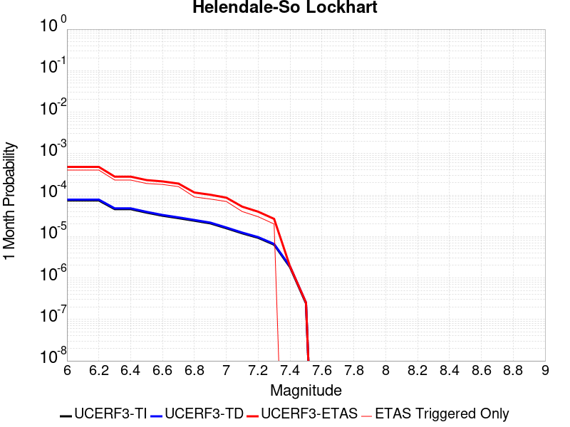 |  |  |

| Magnitude | 1 wk TI Prob | 1 wk TD Prob | 1 wk ETAS Prob | 1 wk ETAS/TD Gain | 1 wk ETAS Triggered Only | 1 mo TI Prob | 1 mo TD Prob | 1 mo ETAS Prob | 1 mo ETAS/TD Gain | 1 mo ETAS Triggered Only | 1 yr TI Prob | 1 yr TD Prob | 1 yr ETAS Prob | 1 yr ETAS/TD Gain | 1 yr ETAS Triggered Only | 10 yr TI Prob | 10 yr TD Prob | 10 yr ETAS Prob | 10 yr ETAS/TD Gain | 10 yr ETAS Triggered Only |
|-----|-----|-----|-----|-----|-----|-----|-----|-----|-----|-----|-----|-----|-----|-----|-----|-----|-----|-----|-----|-----|
| 6.0 | 1.7296055E-5 | 1.8103729E-5 | 2.9809866E-4 | 16.466146 | 2.8E-4 | 7.412385E-5 | 7.7585224E-5 | 4.775542E-4 | 6.155221 | 4.0E-4 | 9.0208417E-4 | 9.4421144E-4 | 0.0016635316 | 1.761821 | 7.2E-4 | 0.008984311 | 0.009404116 | 0.010394712 | 1.1053364 | 0.001 |
| 6.1 | 1.7296055E-5 | 1.8103729E-5 | 2.9809866E-4 | 16.466146 | 2.8E-4 | 7.412385E-5 | 7.7585224E-5 | 4.775542E-4 | 6.155221 | 4.0E-4 | 9.0208417E-4 | 9.4421144E-4 | 0.0016635316 | 1.761821 | 7.2E-4 | 0.008984311 | 0.009404116 | 0.010394712 | 1.1053364 | 0.001 |
| 6.2 | 1.7296055E-5 | 1.8103729E-5 | 2.9809866E-4 | 16.466146 | 2.8E-4 | 7.412385E-5 | 7.7585224E-5 | 4.775542E-4 | 6.155221 | 4.0E-4 | 9.0208417E-4 | 9.4421144E-4 | 0.0016635316 | 1.761821 | 7.2E-4 | 0.008984311 | 0.009404116 | 0.010394712 | 1.1053364 | 0.001 |
| 6.3 | 1.0669118E-5 | 1.1135425E-5 | 1.8113352E-4 | 16.266424 | 1.7E-4 | 4.5723988E-5 | 4.772239E-5 | 2.7771143E-4 | 5.8193107 | 2.3E-4 | 5.5654737E-4 | 5.80868E-4 | 9.806356E-4 | 1.6882246 | 4.0E-4 | 0.0055515557 | 0.0057937936 | 0.0063903173 | 1.102959 | 6.0E-4 |
| 6.4 | 1.0669118E-5 | 1.1135425E-5 | 1.8113352E-4 | 16.266424 | 1.7E-4 | 4.5723988E-5 | 4.772239E-5 | 2.7771143E-4 | 5.8193107 | 2.3E-4 | 5.5654737E-4 | 5.80868E-4 | 9.806356E-4 | 1.6882246 | 4.0E-4 | 0.0055515557 | 0.0057937936 | 0.0063903173 | 1.102959 | 6.0E-4 |
| 6.5 | 8.790038E-6 | 9.170197E-6 | 1.39169E-4 | 15.176229 | 1.3E-4 | 3.767105E-5 | 3.930026E-5 | 2.292928E-4 | 5.8343835 | 1.9E-4 | 4.585485E-4 | 4.7837716E-4 | 8.2820974E-4 | 1.7312902 | 3.5E-4 | 0.0045760344 | 0.004773638 | 0.005241395 | 1.0979874 | 4.7E-4 |
| 6.6 | 7.396949E-6 | 7.715537E-6 | 1.3771454E-4 | 17.84899 | 1.3E-4 | 3.1700827E-5 | 3.3066175E-5 | 2.1306022E-4 | 6.4434495 | 1.8E-4 | 3.858892E-4 | 4.025073E-4 | 7.1238255E-4 | 1.7698623 | 3.1E-4 | 0.003852198 | 0.00401789 | 0.0044362023 | 1.1041125 | 4.2E-4 |
| 6.7 | 6.4600285E-6 | 6.738031E-6 | 1.2673723E-4 | 18.809237 | 1.2E-4 | 2.7685543E-5 | 2.887696E-5 | 1.8887233E-4 | 6.5405893 | 1.6E-4 | 3.3701936E-4 | 3.5152107E-4 | 6.2142615E-4 | 1.7678206 | 2.7E-4 | 0.0033650869 | 0.003509732 | 0.0038784333 | 1.1050512 | 3.7E-4 |
| 6.8 | 5.600104E-6 | 5.836009E-6 | 6.583566E-5 | 11.280938 | 6.0E-5 | 2.4000226E-5 | 2.5011232E-5 | 1.1500898E-4 | 4.5982933 | 9.0E-5 | 2.9216358E-4 | 3.044698E-4 | 4.94412E-4 | 1.6238456 | 1.9E-4 | 0.0029177975 | 0.003040588 | 0.0033297064 | 1.0950863 | 2.9E-4 |
| 6.9 | 4.839122E-6 | 5.0395092E-6 | 6.503921E-5 | 12.905861 | 6.0E-5 | 2.0738931E-5 | 2.159772E-5 | 1.0159599E-4 | 4.704015 | 8.0E-5 | 2.5246723E-4 | 2.6292098E-4 | 4.328763E-4 | 1.6464121 | 1.7E-4 | 0.002521806 | 0.002626147 | 0.0028854639 | 1.0987444 | 2.6E-4 |
| 7.0 | 3.6937633E-6 | 3.845208E-6 | 5.3845015E-5 | 14.003148 | 5.0E-5 | 1.5830317E-5 | 1.647936E-5 | 8.6478205E-5 | 5.247668 | 7.0E-5 | 1.9271708E-4 | 2.0061806E-4 | 3.3059198E-4 | 1.6478676 | 1.3E-4 | 0.0019255003 | 0.002004401 | 0.0021940202 | 1.0946014 | 1.9E-4 |
| 7.1 | 2.7858857E-6 | 2.8978538E-6 | 2.2897795E-5 | 7.9016395 | 2.0E-5 | 1.1939455E-5 | 1.2419316E-5 | 5.2418818E-5 | 4.2207494 | 4.0E-5 | 1.4535317E-4 | 1.511949E-4 | 2.4118129E-4 | 1.5951682 | 9.0E-5 | 0.0014525814 | 0.0015109418 | 0.0016407453 | 1.085909 | 1.3E-4 |
| 7.2 | 2.1672065E-6 | 2.2540128E-6 | 1.22539905E-5 | 5.436522 | 1.0E-5 | 9.2879945E-6 | 9.66002E-6 | 3.965973E-5 | 4.1055536 | 3.0E-5 | 1.1307546E-4 | 1.1760458E-4 | 1.8759635E-4 | 1.5951449 | 7.0E-5 | 0.0011301794 | 0.0011754417 | 0.0012553476 | 1.0679796 | 8.0E-5 |
| 7.3 | 1.4823496E-6 | 1.5422102E-6 | 1.1542194E-5 | 7.4841905 | 1.0E-5 | 6.3529114E-6 | 6.6094562E-6 | 2.6609325E-5 | 4.0259476 | 2.0E-5 | 7.734395E-5 | 8.046731E-5 | 1.3046329E-4 | 1.6213204 | 5.0E-5 | 7.731704E-4 | 8.0439687E-4 | 8.543567E-4 | 1.0621084 | 5.0E-5 |
| 7.4 | 4.2321457E-7 | 4.4108765E-7 | 4.4108765E-7 | 1.0 | 0.0 | 1.8137755E-6 | 1.8903745E-6 | 1.8903745E-6 | 1.0 | 0.0 | 2.2082493E-5 | 2.3015113E-5 | 2.3015113E-5 | 1.0 | 0.0 | 2.2080299E-4 | 2.3013182E-4 | 2.3013182E-4 | 1.0 | 0.0 |
| 7.5 | 5.6942316E-8 | 5.9415648E-8 | 5.9415648E-8 | 1.0 | 0.0 | 2.440385E-7 | 2.5463845E-7 | 2.5463845E-7 | 1.0 | 0.0 | 2.9711643E-6 | 3.1002196E-6 | 3.1002196E-6 | 1.0 | 0.0 | 2.9711247E-5 | 3.1001844E-5 | 3.1001844E-5 | 1.0 | 0.0 |

## San Andreas (Big Bend)
*[(top)](#table-of-contents)*

| 1 Week | 1 Month | 1 Year | 10 Year |
|-----|-----|-----|-----|
|  |  |  |  |

| Magnitude | 1 wk TI Prob | 1 wk TD Prob | 1 wk ETAS Prob | 1 wk ETAS/TD Gain | 1 wk ETAS Triggered Only | 1 mo TI Prob | 1 mo TD Prob | 1 mo ETAS Prob | 1 mo ETAS/TD Gain | 1 mo ETAS Triggered Only | 1 yr TI Prob | 1 yr TD Prob | 1 yr ETAS Prob | 1 yr ETAS/TD Gain | 1 yr ETAS Triggered Only | 10 yr TI Prob | 10 yr TD Prob | 10 yr ETAS Prob | 10 yr ETAS/TD Gain | 10 yr ETAS Triggered Only |
|-----|-----|-----|-----|-----|-----|-----|-----|-----|-----|-----|-----|-----|-----|-----|-----|-----|-----|-----|-----|-----|
| 6.0 | 1.0179969E-4 | 2.0072258E-4 | 3.8068646E-4 | 1.8965801 | 1.8E-4 | 4.362114E-4 | 8.599571E-4 | 0.0011397164 | 1.3253176 | 2.8E-4 | 0.0052979486 | 0.010419999 | 0.010944476 | 1.0503337 | 5.3E-4 | 0.051734097 | 0.10144902 | 0.102176845 | 1.0071743 | 8.1E-4 |
| 6.1 | 1.0179969E-4 | 2.0072258E-4 | 3.8068646E-4 | 1.8965801 | 1.8E-4 | 4.362114E-4 | 8.599571E-4 | 0.0011397164 | 1.3253176 | 2.8E-4 | 0.0052979486 | 0.010419999 | 0.010944476 | 1.0503337 | 5.3E-4 | 0.051734097 | 0.10144902 | 0.102176845 | 1.0071743 | 8.1E-4 |
| 6.2 | 1.0179969E-4 | 2.0072258E-4 | 3.8068646E-4 | 1.8965801 | 1.8E-4 | 4.362114E-4 | 8.599571E-4 | 0.0011397164 | 1.3253176 | 2.8E-4 | 0.0052979486 | 0.010419999 | 0.010944476 | 1.0503337 | 5.3E-4 | 0.051734097 | 0.10144902 | 0.102176845 | 1.0071743 | 8.1E-4 |
| 6.3 | 1.0179969E-4 | 2.0072258E-4 | 3.8068646E-4 | 1.8965801 | 1.8E-4 | 4.362114E-4 | 8.599571E-4 | 0.0011397164 | 1.3253176 | 2.8E-4 | 0.0052979486 | 0.010419999 | 0.010944476 | 1.0503337 | 5.3E-4 | 0.051734097 | 0.10144902 | 0.102176845 | 1.0071743 | 8.1E-4 |
| 6.4 | 9.1639464E-5 | 1.8429532E-4 | 2.842769E-4 | 1.5425074 | 1.0E-4 | 3.9268145E-4 | 7.895982E-4 | 9.394798E-4 | 1.18982 | 1.5E-4 | 0.0047704205 | 0.009571102 | 0.009897944 | 1.0341488 | 3.3E-4 | 0.046693064 | 0.09377527 | 0.0942012 | 1.004542 | 4.7E-4 |
| 6.5 | 9.1639464E-5 | 1.8429532E-4 | 2.842769E-4 | 1.5425074 | 1.0E-4 | 3.9268145E-4 | 7.895982E-4 | 9.394798E-4 | 1.18982 | 1.5E-4 | 0.0047704205 | 0.009571102 | 0.009897944 | 1.0341488 | 3.3E-4 | 0.046693064 | 0.09377527 | 0.0942012 | 1.004542 | 4.7E-4 |
| 6.6 | 9.042622E-5 | 1.823659E-4 | 2.8234767E-4 | 1.5482482 | 1.0E-4 | 3.8748336E-4 | 7.8133424E-4 | 9.3121704E-4 | 1.1918293 | 1.5E-4 | 0.0047074095 | 0.009471365 | 0.00979824 | 1.0345118 | 3.3E-4 | 0.046089325 | 0.092869274 | 0.09329563 | 1.0045909 | 4.7E-4 |
| 6.7 | 8.9836685E-5 | 1.8150927E-4 | 2.814911E-4 | 1.5508361 | 1.0E-4 | 3.8495753E-4 | 7.776651E-4 | 9.275485E-4 | 1.1927351 | 1.5E-4 | 0.00467679 | 0.00942708 | 0.0097539695 | 1.0346755 | 3.3E-4 | 0.045795817 | 0.09246355 | 0.09289009 | 1.004613 | 4.7E-4 |
| 6.8 | 8.9471854E-5 | 1.8097709E-4 | 2.8095898E-4 | 1.5524561 | 1.0E-4 | 3.8339442E-4 | 7.7538576E-4 | 9.2526944E-4 | 1.1933022 | 1.5E-4 | 0.004657841 | 0.009399569 | 0.009716561 | 1.0337241 | 3.2E-4 | 0.04561414 | 0.092210755 | 0.09262834 | 1.0045285 | 4.6E-4 |
| 6.9 | 8.858234E-5 | 1.7979681E-4 | 2.5978242E-4 | 1.4448667 | 8.0E-5 | 3.7958333E-4 | 7.703304E-4 | 9.002303E-4 | 1.1686287 | 1.3E-4 | 0.004611638 | 0.009338548 | 0.009635747 | 1.031825 | 3.0E-4 | 0.04517103 | 0.09165087 | 0.09204146 | 1.0042617 | 4.3E-4 |
| 7.0 | 8.7433385E-5 | 1.7818481E-4 | 2.5817056E-4 | 1.448892 | 8.0E-5 | 3.746607E-4 | 7.634259E-4 | 8.9332665E-4 | 1.170155 | 1.3E-4 | 0.004551957 | 0.009255203 | 0.009552427 | 1.0321141 | 3.0E-4 | 0.044598386 | 0.09088532 | 0.091276236 | 1.0043012 | 4.3E-4 |
| 7.1 | 8.684964E-5 | 1.7730435E-4 | 2.5729017E-4 | 1.4511216 | 8.0E-5 | 3.7215967E-4 | 7.596547E-4 | 8.8955596E-4 | 1.1710004 | 1.3E-4 | 0.0045216335 | 0.009209678 | 0.009487099 | 1.0301228 | 2.8E-4 | 0.04430731 | 0.09046686 | 0.090839766 | 1.004122 | 4.1E-4 |
| 7.2 | 8.606521E-5 | 1.762105E-4 | 2.561964E-4 | 1.4539225 | 8.0E-5 | 3.6879873E-4 | 7.549695E-4 | 8.8487135E-4 | 1.1720624 | 1.3E-4 | 0.0044808835 | 0.0091531165 | 0.009430553 | 1.0303106 | 2.8E-4 | 0.043916024 | 0.089947365 | 0.09031139 | 1.004047 | 4.0E-4 |
| 7.3 | 8.568266E-5 | 1.7563057E-4 | 2.5561653E-4 | 1.4554216 | 8.0E-5 | 3.6715972E-4 | 7.524855E-4 | 8.823877E-4 | 1.1726308 | 1.3E-4 | 0.0044610105 | 0.009123127 | 0.009400573 | 1.0304112 | 2.8E-4 | 0.043725148 | 0.08966853 | 0.09003266 | 1.0040609 | 4.0E-4 |
| 7.4 | 8.5432206E-5 | 1.7525644E-4 | 2.5524243E-4 | 1.456394 | 8.0E-5 | 3.6608664E-4 | 7.50883E-4 | 8.807854E-4 | 1.1729995 | 1.3E-4 | 0.004447999 | 0.009103781 | 0.009381231 | 1.0304765 | 2.8E-4 | 0.043600157 | 0.08948871 | 0.089852914 | 1.0040698 | 4.0E-4 |
| 7.5 | 8.4791965E-5 | 1.7394972E-4 | 2.539358E-4 | 1.459823 | 8.0E-5 | 3.633435E-4 | 7.4528606E-4 | 8.7518914E-4 | 1.1742997 | 1.3E-4 | 0.0044147377 | 0.009036204 | 0.009313674 | 1.0307064 | 2.8E-4 | 0.043280575 | 0.088866346 | 0.089221686 | 1.0039986 | 3.9E-4 |
| 7.6 | 8.241105E-5 | 1.6840403E-4 | 2.4839057E-4 | 1.474968 | 8.0E-5 | 3.531424E-4 | 7.215321E-4 | 8.514383E-4 | 1.1800421 | 1.3E-4 | 0.0042910352 | 0.008749358 | 0.009026908 | 1.0317223 | 2.8E-4 | 0.042091176 | 0.086243294 | 0.086599655 | 1.004132 | 3.9E-4 |
| 7.7 | 7.00432E-5 | 1.42045E-4 | 1.920379E-4 | 1.3519511 | 5.0E-5 | 3.001506E-4 | 6.0862233E-4 | 6.8857364E-4 | 1.1313645 | 8.0E-5 | 0.0036482112 | 0.0073848404 | 0.0075932895 | 1.0282266 | 2.1E-4 | 0.035888977 | 0.07351733 | 0.07378601 | 1.0036546 | 2.9E-4 |
| 7.8 | 6.415362E-5 | 1.2968935E-4 | 1.6968415E-4 | 1.3083893 | 4.0E-5 | 2.749151E-4 | 5.556931E-4 | 6.1565975E-4 | 1.1079133 | 6.0E-5 | 0.0033419547 | 0.0067446055 | 0.0069233915 | 1.026508 | 1.8E-4 | 0.03292141 | 0.06725231 | 0.06748549 | 1.0034673 | 2.5E-4 |
| 7.9 | 4.939911E-5 | 9.3411545E-5 | 1.2340874E-4 | 1.3211294 | 3.0E-5 | 2.116933E-4 | 4.0027377E-4 | 4.4025775E-4 | 1.0998917 | 4.0E-5 | 0.0025743195 | 0.004862453 | 0.0049818694 | 1.0245589 | 1.2E-4 | 0.025447013 | 0.048914436 | 0.04907612 | 1.0033054 | 1.7E-4 |
| 8.0 | 3.344983E-5 | 5.222685E-5 | 7.2225805E-5 | 1.3829248 | 2.0E-5 | 1.4334853E-4 | 2.2381016E-4 | 2.4380568E-4 | 1.0893414 | 2.0E-5 | 0.0017438711 | 0.0027214854 | 0.0027713494 | 1.0183223 | 5.0E-5 | 0.017302496 | 0.027922187 | 0.027999954 | 1.0027851 | 8.0E-5 |
| 8.1 | 1.9104898E-5 | 1.9173063E-5 | 2.9172872E-5 | 1.5215551 | 1.0E-5 | 8.1875565E-5 | 8.216769E-5 | 9.216687E-5 | 1.1216923 | 1.0E-5 | 9.963791E-4 | 9.999331E-4 | 0.0010199131 | 1.0199814 | 2.0E-5 | 0.009919235 | 0.010749801 | 0.010769586 | 1.0018405 | 2.0E-5 |
| 8.2 | 8.643924E-6 | 5.4748625E-6 | 5.4748625E-6 | 1.0 | 0.0 | 3.704486E-5 | 2.3463486E-5 | 2.3463486E-5 | 1.0 | 0.0 | 4.5092785E-4 | 2.8563058E-4 | 2.8563058E-4 | 1.0 | 0.0 | 0.0045001395 | 0.0032487072 | 0.0032487072 | 1.0 | 0.0 |
| 8.3 | 1.983087E-6 | 7.6599065E-7 | 7.6599065E-7 | 1.0 | 0.0 | 8.498917E-6 | 3.282813E-6 | 3.282813E-6 | 1.0 | 0.0 | 1.034694E-4 | 3.9967534E-5 | 3.9967534E-5 | 1.0 | 0.0 | 0.0010342124 | 4.719687E-4 | 4.719687E-4 | 1.0 | 0.0 |

## Coyote Lake
*[(top)](#table-of-contents)*

| 1 Week | 1 Month | 1 Year | 10 Year |
|-----|-----|-----|-----|
|  | 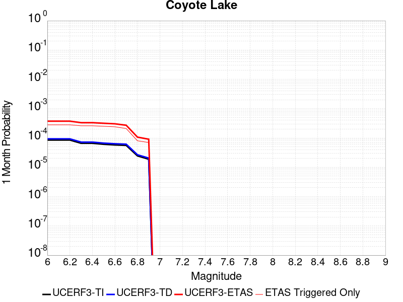 | 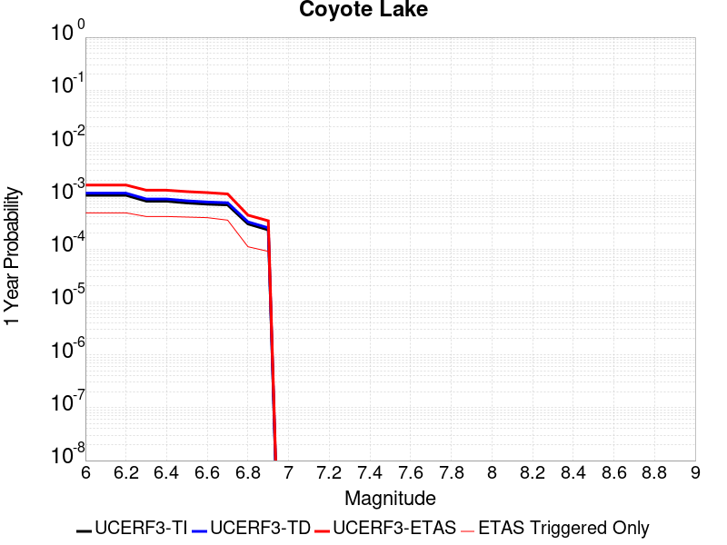 | 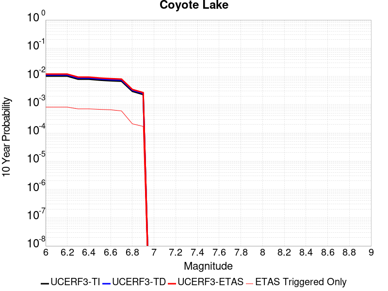 |

| Magnitude | 1 wk TI Prob | 1 wk TD Prob | 1 wk ETAS Prob | 1 wk ETAS/TD Gain | 1 wk ETAS Triggered Only | 1 mo TI Prob | 1 mo TD Prob | 1 mo ETAS Prob | 1 mo ETAS/TD Gain | 1 mo ETAS Triggered Only | 1 yr TI Prob | 1 yr TD Prob | 1 yr ETAS Prob | 1 yr ETAS/TD Gain | 1 yr ETAS Triggered Only | 10 yr TI Prob | 10 yr TD Prob | 10 yr ETAS Prob | 10 yr ETAS/TD Gain | 10 yr ETAS Triggered Only |
|-----|-----|-----|-----|-----|-----|-----|-----|-----|-----|-----|-----|-----|-----|-----|-----|-----|-----|-----|-----|-----|
| 6.0 | 1.980352E-5 | 2.1706745E-5 | 2.4170197E-4 | 11.134879 | 2.2E-4 | 8.486947E-5 | 9.302599E-5 | 3.7299996E-4 | 4.009631 | 2.8E-4 | 0.0010327959 | 0.0011320751 | 0.0016115317 | 1.4235202 | 4.8E-4 | 0.010280091 | 0.011270258 | 0.012081017 | 1.0719379 | 8.2E-4 |
| 6.1 | 1.980352E-5 | 2.1706745E-5 | 2.4170197E-4 | 11.134879 | 2.2E-4 | 8.486947E-5 | 9.302599E-5 | 3.7299996E-4 | 4.009631 | 2.8E-4 | 0.0010327959 | 0.0011320751 | 0.0016115317 | 1.4235202 | 4.8E-4 | 0.010280091 | 0.011270258 | 0.012081017 | 1.0719379 | 8.2E-4 |
| 6.2 | 1.980352E-5 | 2.1706745E-5 | 2.4170197E-4 | 11.134879 | 2.2E-4 | 8.486947E-5 | 9.302599E-5 | 3.7299996E-4 | 4.009631 | 2.8E-4 | 0.0010327959 | 0.0011320751 | 0.0016115317 | 1.4235202 | 4.8E-4 | 0.010280091 | 0.011270258 | 0.012081017 | 1.0719379 | 8.2E-4 |
| 6.3 | 1.5344787E-5 | 1.682067E-5 | 2.2681714E-4 | 13.48443 | 2.1E-4 | 6.576172E-5 | 7.2086936E-5 | 3.320682E-4 | 4.6064963 | 2.6E-4 | 8.003548E-4 | 8.773662E-4 | 0.0012870065 | 1.4668977 | 4.1E-4 | 0.007974784 | 0.00874507 | 0.00944886 | 1.0804785 | 7.1E-4 |
| 6.4 | 1.5344787E-5 | 1.682067E-5 | 2.2681714E-4 | 13.48443 | 2.1E-4 | 6.576172E-5 | 7.2086936E-5 | 3.320682E-4 | 4.6064963 | 2.6E-4 | 8.003548E-4 | 8.773662E-4 | 0.0012870065 | 1.4668977 | 4.1E-4 | 0.007974784 | 0.00874507 | 0.00944886 | 1.0804785 | 7.1E-4 |
| 6.5 | 1.4189697E-5 | 1.5557987E-5 | 2.1555487E-4 | 13.854934 | 2.0E-4 | 6.081157E-5 | 6.6675726E-5 | 3.1665905E-4 | 4.749241 | 2.5E-4 | 7.401293E-4 | 8.115349E-4 | 0.0012112103 | 1.4924932 | 4.0E-4 | 0.0073766913 | 0.008091656 | 0.008766154 | 1.0833572 | 6.8E-4 |
| 6.6 | 1.3469301E-5 | 1.4771577E-5 | 2.1476862E-4 | 14.539315 | 2.0E-4 | 5.7724297E-5 | 6.330556E-5 | 3.0329038E-4 | 4.790896 | 2.4E-4 | 7.025667E-4 | 7.7053264E-4 | 0.0011602321 | 1.5057534 | 3.9E-4 | 0.0070034964 | 0.0076845144 | 0.008339442 | 1.085227 | 6.6E-4 |
| 6.7 | 1.3027966E-5 | 1.4281745E-5 | 1.8427931E-4 | 12.903137 | 1.7E-4 | 5.5832945E-5 | 6.120638E-5 | 2.7119354E-4 | 4.4308047 | 2.1E-4 | 6.7955407E-4 | 7.4499263E-4 | 0.0010947319 | 1.4694533 | 3.5E-4 | 0.006774798 | 0.0074308286 | 0.00802637 | 1.0801446 | 6.0E-4 |
| 6.8 | 5.695434E-6 | 6.2244176E-6 | 7.622398E-5 | 12.245962 | 7.0E-5 | 2.4408775E-5 | 2.6675973E-5 | 1.0667384E-4 | 3.9988735 | 8.0E-5 | 2.971363E-4 | 3.2476155E-4 | 4.3472584E-4 | 1.3386 | 1.1E-4 | 0.0029673933 | 0.0032458105 | 0.0034551288 | 1.0644888 | 2.1E-4 |
| 6.9 | 4.385688E-6 | 4.7930553E-6 | 6.4792766E-5 | 13.518051 | 6.0E-5 | 1.879567E-5 | 2.0541665E-5 | 9.054023E-5 | 4.407638 | 7.0E-5 | 2.2881327E-4 | 2.5009477E-4 | 3.4007226E-4 | 1.3597735 | 9.0E-5 | 0.002285778 | 0.0025009478 | 0.0026705228 | 1.0678042 | 1.7E-4 |

## Death Valley (No)
*[(top)](#table-of-contents)*

| 1 Week | 1 Month | 1 Year | 10 Year |
|-----|-----|-----|-----|
| 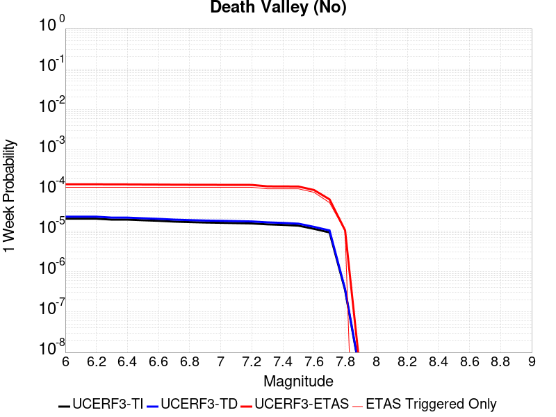 |  |  |  |

| Magnitude | 1 wk TI Prob | 1 wk TD Prob | 1 wk ETAS Prob | 1 wk ETAS/TD Gain | 1 wk ETAS Triggered Only | 1 mo TI Prob | 1 mo TD Prob | 1 mo ETAS Prob | 1 mo ETAS/TD Gain | 1 mo ETAS Triggered Only | 1 yr TI Prob | 1 yr TD Prob | 1 yr ETAS Prob | 1 yr ETAS/TD Gain | 1 yr ETAS Triggered Only | 10 yr TI Prob | 10 yr TD Prob | 10 yr ETAS Prob | 10 yr ETAS/TD Gain | 10 yr ETAS Triggered Only |
|-----|-----|-----|-----|-----|-----|-----|-----|-----|-----|-----|-----|-----|-----|-----|-----|-----|-----|-----|-----|-----|
| 6.0 | 2.0074807E-5 | 2.2500084E-5 | 1.4249739E-4 | 6.333194 | 1.2E-4 | 8.603206E-5 | 9.642541E-5 | 2.66409E-4 | 2.7628508 | 1.7E-4 | 0.001046937 | 0.0011733545 | 0.0015728851 | 1.340503 | 4.0E-4 | 0.010420183 | 0.011672506 | 0.01228527 | 1.0524963 | 6.2E-4 |
| 6.1 | 2.0074807E-5 | 2.2500084E-5 | 1.4249739E-4 | 6.333194 | 1.2E-4 | 8.603206E-5 | 9.642541E-5 | 2.66409E-4 | 2.7628508 | 1.7E-4 | 0.001046937 | 0.0011733545 | 0.0015728851 | 1.340503 | 4.0E-4 | 0.010420183 | 0.011672506 | 0.01228527 | 1.0524963 | 6.2E-4 |
| 6.2 | 2.0074807E-5 | 2.2500084E-5 | 1.4249739E-4 | 6.333194 | 1.2E-4 | 8.603206E-5 | 9.642541E-5 | 2.66409E-4 | 2.7628508 | 1.7E-4 | 0.001046937 | 0.0011733545 | 0.0015728851 | 1.340503 | 4.0E-4 | 0.010420183 | 0.011672506 | 0.01228527 | 1.0524963 | 6.2E-4 |
| 6.3 | 1.9050609E-5 | 2.1336948E-5 | 1.4133439E-4 | 6.623927 | 1.2E-4 | 8.164292E-5 | 9.1440896E-5 | 2.6142536E-4 | 2.8589544 | 1.7E-4 | 9.935491E-4 | 0.001112731 | 0.0015122859 | 1.3590759 | 4.0E-4 | 0.009891188 | 0.011072419 | 0.011685554 | 1.055375 | 6.2E-4 |
| 6.4 | 1.9050609E-5 | 2.1336948E-5 | 1.4133439E-4 | 6.623927 | 1.2E-4 | 8.164292E-5 | 9.1440896E-5 | 2.6142536E-4 | 2.8589544 | 1.7E-4 | 9.935491E-4 | 0.001112731 | 0.0015122859 | 1.3590759 | 4.0E-4 | 0.009891188 | 0.011072419 | 0.011685554 | 1.055375 | 6.2E-4 |
| 6.5 | 1.8367004E-5 | 2.0561009E-5 | 1.4055854E-4 | 6.8361697 | 1.2E-4 | 7.8713354E-5 | 8.811567E-5 | 2.5810068E-4 | 2.9291124 | 1.7E-4 | 9.5791375E-4 | 0.0010722869 | 0.0014618686 | 1.3633187 | 3.9E-4 | 0.009537951 | 0.0106719155 | 0.011265513 | 1.0556223 | 6.0E-4 |
| 6.6 | 1.779439E-5 | 1.9910927E-5 | 1.3990854E-4 | 7.026721 | 1.2E-4 | 7.625944E-5 | 8.53298E-5 | 2.5531527E-4 | 2.9921002 | 1.7E-4 | 9.280632E-4 | 0.0010384015 | 0.0014279966 | 1.3751873 | 3.9E-4 | 0.009241969 | 0.010336253 | 0.010930051 | 1.0574481 | 6.0E-4 |
| 6.7 | 1.7025437E-5 | 1.9043426E-5 | 1.3904113E-4 | 7.301267 | 1.2E-4 | 7.296412E-5 | 8.161216E-5 | 2.5159828E-4 | 3.0828528 | 1.7E-4 | 8.87976E-4 | 9.931813E-4 | 0.001382794 | 1.3922875 | 3.9E-4 | 0.008844362 | 0.009888145 | 0.0104822125 | 1.0600787 | 6.0E-4 |
| 6.8 | 1.6545107E-5 | 1.8512545E-5 | 1.3851032E-4 | 7.481971 | 1.2E-4 | 7.090568E-5 | 7.93371E-5 | 2.393244E-4 | 3.016551 | 1.6E-4 | 8.629347E-4 | 9.655073E-4 | 0.0013451404 | 1.3931955 | 3.8E-4 | 0.008595915 | 0.009613829 | 0.010198156 | 1.0607799 | 5.9E-4 |
| 6.9 | 1.615478E-5 | 1.8087594E-5 | 1.3808542E-4 | 7.6342616 | 1.2E-4 | 6.9232934E-5 | 7.751599E-5 | 2.3750358E-4 | 3.0639303 | 1.6E-4 | 8.4258494E-4 | 9.433546E-4 | 0.0013229962 | 1.4024378 | 3.8E-4 | 0.008393973 | 0.009394196 | 0.009978653 | 1.0622147 | 5.9E-4 |
| 7.0 | 1.5894311E-5 | 1.780555E-5 | 1.378034E-4 | 7.7393517 | 1.2E-4 | 6.81167E-5 | 7.6307304E-5 | 2.3629509E-4 | 3.0966249 | 1.6E-4 | 8.2900526E-4 | 9.286515E-4 | 0.0013082986 | 1.4088155 | 3.8E-4 | 0.008259195 | 0.009248397 | 0.009832941 | 1.0632049 | 5.9E-4 |
| 7.1 | 1.5602263E-5 | 1.7483504E-5 | 1.374814E-4 | 7.863493 | 1.2E-4 | 6.6865134E-5 | 7.492718E-5 | 2.3491519E-4 | 3.1352465 | 1.6E-4 | 8.137789E-4 | 9.118627E-4 | 0.0012915162 | 1.4163494 | 3.8E-4 | 0.008108052 | 0.009081894 | 0.009666536 | 1.0643744 | 5.9E-4 |
| 7.2 | 1.5323829E-5 | 1.717063E-5 | 1.3716856E-4 | 7.988558 | 1.2E-4 | 6.56719E-5 | 7.358637E-5 | 2.335746E-4 | 3.1741557 | 1.6E-4 | 7.99262E-4 | 8.9555193E-4 | 0.0012752116 | 1.4239393 | 3.8E-4 | 0.007963934 | 0.008920107 | 0.0095048435 | 1.0655527 | 5.9E-4 |
| 7.3 | 1.4556212E-5 | 1.6302456E-5 | 1.2630066E-4 | 7.7473397 | 1.1E-4 | 6.238227E-5 | 6.9865826E-5 | 2.1985534E-4 | 3.1468225 | 1.5E-4 | 7.592395E-4 | 8.5029035E-4 | 0.0012199758 | 1.4347755 | 3.7E-4 | 0.0075665074 | 0.008471014 | 0.009036186 | 1.0667183 | 5.7E-4 |
| 7.4 | 1.411725E-5 | 1.580796E-5 | 1.2580623E-4 | 7.95841 | 1.1E-4 | 6.0501097E-5 | 6.7746674E-5 | 2.1773651E-4 | 3.213981 | 1.5E-4 | 7.363519E-4 | 8.245094E-4 | 0.0011942043 | 1.4483817 | 3.7E-4 | 0.0073391674 | 0.008215138 | 0.008780455 | 1.0688142 | 5.7E-4 |
| 7.5 | 1.3503312E-5 | 1.5126289E-5 | 1.2512463E-4 | 8.271997 | 1.1E-4 | 5.7870053E-5 | 6.482538E-5 | 2.1481565E-4 | 3.3137586 | 1.5E-4 | 7.043401E-4 | 7.8896893E-4 | 0.001158677 | 1.4685965 | 3.7E-4 | 0.007021119 | 0.007862304 | 0.008427823 | 1.0719278 | 5.7E-4 |
| 7.6 | 1.1279839E-5 | 1.2626327E-5 | 1.0262519E-4 | 8.127873 | 9.0E-5 | 4.834127E-5 | 5.4111737E-5 | 1.841047E-4 | 3.4023063 | 1.3E-4 | 5.88396E-4 | 6.5861654E-4 | 9.883993E-4 | 1.5007203 | 3.3E-4 | 0.005868405 | 0.006567199 | 0.007093718 | 1.0801741 | 5.3E-4 |
| 7.7 | 9.189108E-6 | 1.0283358E-5 | 6.0282844E-5 | 5.862175 | 5.0E-5 | 3.93813E-5 | 4.407082E-5 | 1.240673E-4 | 2.81518 | 8.0E-5 | 4.7936183E-4 | 5.3643517E-4 | 7.2633324E-4 | 1.3540001 | 1.9E-4 | 0.004783291 | 0.005351914 | 0.005709987 | 1.0669056 | 3.6E-4 |
| 7.8 | 3.4586725E-7 | 3.6482615E-7 | 1.0364823E-5 | 28.410307 | 1.0E-5 | 1.4822873E-6 | 1.5635396E-6 | 1.1563524E-5 | 7.3957343 | 1.0E-5 | 1.80467E-5 | 1.9035933E-5 | 2.9035744E-5 | 1.5253123 | 1.0E-5 | 1.8045233E-4 | 1.9034347E-4 | 2.0034157E-4 | 1.0525266 | 1.0E-5 |
| 7.9 | 2.5591178E-9 | 2.6696718E-9 | 2.6696718E-9 | 1.0 | 0.0 | 1.0967647E-8 | 1.14414505E-8 | 1.14414505E-8 | 1.0 | 0.0 | 1.335311E-7 | 1.3929966E-7 | 1.3929966E-7 | 1.0 | 0.0 | 1.3353102E-6 | 1.3929966E-6 | 1.3929966E-6 | 1.0 | 0.0 |

## San Andreas (San Gorgonio Pass-Garnet HIll)
*[(top)](#table-of-contents)*

| 1 Week | 1 Month | 1 Year | 10 Year |
|-----|-----|-----|-----|
|  |  |  |  |

| Magnitude | 1 wk TI Prob | 1 wk TD Prob | 1 wk ETAS Prob | 1 wk ETAS/TD Gain | 1 wk ETAS Triggered Only | 1 mo TI Prob | 1 mo TD Prob | 1 mo ETAS Prob | 1 mo ETAS/TD Gain | 1 mo ETAS Triggered Only | 1 yr TI Prob | 1 yr TD Prob | 1 yr ETAS Prob | 1 yr ETAS/TD Gain | 1 yr ETAS Triggered Only | 10 yr TI Prob | 10 yr TD Prob | 10 yr ETAS Prob | 10 yr ETAS/TD Gain | 10 yr ETAS Triggered Only |
|-----|-----|-----|-----|-----|-----|-----|-----|-----|-----|-----|-----|-----|-----|-----|-----|-----|-----|-----|-----|-----|
| 6.0 | 8.31567E-5 | 2.3382473E-4 | 4.2378032E-4 | 1.8123845 | 1.9E-4 | 3.5633717E-4 | 0.0010017233 | 0.0012414829 | 1.2393471 | 2.4E-4 | 0.004329778 | 0.012127888 | 0.012483522 | 1.0293237 | 3.6E-4 | 0.042463828 | 0.11257892 | 0.11304038 | 1.004099 | 5.2E-4 |
| 6.1 | 8.31567E-5 | 2.3382473E-4 | 4.2378032E-4 | 1.8123845 | 1.9E-4 | 3.5633717E-4 | 0.0010017233 | 0.0012414829 | 1.2393471 | 2.4E-4 | 0.004329778 | 0.012127888 | 0.012483522 | 1.0293237 | 3.6E-4 | 0.042463828 | 0.11257892 | 0.11304038 | 1.004099 | 5.2E-4 |
| 6.2 | 8.31567E-5 | 2.3382473E-4 | 4.2378032E-4 | 1.8123845 | 1.9E-4 | 3.5633717E-4 | 0.0010017233 | 0.0012414829 | 1.2393471 | 2.4E-4 | 0.004329778 | 0.012127888 | 0.012483522 | 1.0293237 | 3.6E-4 | 0.042463828 | 0.11257892 | 0.11304038 | 1.004099 | 5.2E-4 |
| 6.3 | 8.31567E-5 | 2.3382473E-4 | 4.2378032E-4 | 1.8123845 | 1.9E-4 | 3.5633717E-4 | 0.0010017233 | 0.0012414829 | 1.2393471 | 2.4E-4 | 0.004329778 | 0.012127888 | 0.012483522 | 1.0293237 | 3.6E-4 | 0.042463828 | 0.11257892 | 0.11304038 | 1.004099 | 5.2E-4 |
| 6.4 | 8.059055E-5 | 2.2940808E-4 | 4.1936449E-4 | 1.8280284 | 1.9E-4 | 3.4534236E-4 | 9.828096E-4 | 0.0012225737 | 1.2439579 | 2.4E-4 | 0.0041964394 | 0.011900152 | 0.012255868 | 1.0298917 | 3.6E-4 | 0.041180745 | 0.11056015 | 0.11102265 | 1.0041833 | 5.2E-4 |
| 6.5 | 8.059055E-5 | 2.2940808E-4 | 4.1936449E-4 | 1.8280284 | 1.9E-4 | 3.4534236E-4 | 9.828096E-4 | 0.0012225737 | 1.2439579 | 2.4E-4 | 0.0041964394 | 0.011900152 | 0.012255868 | 1.0298917 | 3.6E-4 | 0.041180745 | 0.11056015 | 0.11102265 | 1.0041833 | 5.2E-4 |
| 6.6 | 7.619237E-5 | 2.218517E-4 | 4.0181176E-4 | 1.8111728 | 1.8E-4 | 3.2649786E-4 | 9.5044886E-4 | 0.0011802303 | 1.241761 | 2.3E-4 | 0.0039678677 | 0.01151087 | 0.011856842 | 1.030056 | 3.5E-4 | 0.03897764 | 0.10709683 | 0.10755221 | 1.0042521 | 5.1E-4 |
| 6.7 | 7.440636E-5 | 2.1860997E-4 | 3.985706E-4 | 1.8232043 | 1.8E-4 | 3.188454E-4 | 9.3656575E-4 | 0.0011663503 | 1.2453481 | 2.3E-4 | 0.0038750346 | 0.011343609 | 0.011689638 | 1.0305043 | 3.5E-4 | 0.038081564 | 0.105605274 | 0.106061414 | 1.0043193 | 5.1E-4 |
| 6.8 | 7.3735864E-5 | 2.1708169E-4 | 3.970426E-4 | 1.829001 | 1.8E-4 | 3.1597257E-4 | 9.3002064E-4 | 0.001149816 | 1.2363338 | 2.2E-4 | 0.0038401815 | 0.011264749 | 0.011600919 | 1.0298426 | 3.4E-4 | 0.03774495 | 0.10490683 | 0.105354376 | 1.0042661 | 5.0E-4 |
| 6.9 | 7.27575E-5 | 2.1477141E-4 | 3.9473275E-4 | 1.8379203 | 1.8E-4 | 3.117806E-4 | 9.201265E-4 | 0.001139924 | 1.2388775 | 2.2E-4 | 0.003789323 | 0.011145527 | 0.011481737 | 1.0301656 | 3.4E-4 | 0.037253562 | 0.103854746 | 0.104302816 | 1.0043144 | 5.0E-4 |
| 7.0 | 7.102591E-5 | 2.1061185E-4 | 3.9057393E-4 | 1.8544728 | 1.8E-4 | 3.0436125E-4 | 9.023122E-4 | 0.0011221137 | 1.2435981 | 2.2E-4 | 0.003699303 | 0.010930831 | 0.011267114 | 1.0307647 | 3.4E-4 | 0.03638325 | 0.10195695 | 0.102405965 | 1.0044041 | 5.0E-4 |
| 7.1 | 7.028513E-5 | 2.0896831E-4 | 3.889307E-4 | 1.8611946 | 1.8E-4 | 3.0118722E-4 | 8.9527335E-4 | 0.0011150764 | 1.245515 | 2.2E-4 | 0.0036607897 | 0.010845989 | 0.011182302 | 1.031008 | 3.4E-4 | 0.036010686 | 0.101199985 | 0.10164939 | 1.0044407 | 5.0E-4 |
| 7.2 | 6.8498244E-5 | 2.0504706E-4 | 3.8501015E-4 | 1.8776672 | 1.8E-4 | 2.9353087E-4 | 8.784794E-4 | 0.0010982861 | 1.2502128 | 2.2E-4 | 0.003567883 | 0.010643536 | 0.010979917 | 1.0316043 | 3.4E-4 | 0.035111405 | 0.09939202 | 0.09983332 | 1.00444 | 4.9E-4 |
| 7.3 | 6.622592E-5 | 1.9732013E-4 | 3.772846E-4 | 1.9120432 | 1.8E-4 | 2.8379448E-4 | 8.453858E-4 | 0.0010651998 | 1.2600162 | 2.2E-4 | 0.0034497243 | 0.0102444785 | 0.010571098 | 1.0318825 | 3.3E-4 | 0.033966612 | 0.095888525 | 0.0963225 | 1.0045258 | 4.8E-4 |
| 7.4 | 5.1050705E-5 | 1.4689034E-4 | 3.0686683E-4 | 2.089088 | 1.6E-4 | 2.1877038E-4 | 6.29379E-4 | 8.292531E-4 | 1.3175735 | 2.0E-4 | 0.002660276 | 0.0076359594 | 0.007943592 | 1.0402874 | 3.1E-4 | 0.02628654 | 0.07286301 | 0.0732895 | 1.0058532 | 4.6E-4 |
| 7.5 | 3.9302922E-5 | 1.1129847E-4 | 2.7128067E-4 | 2.4374158 | 1.6E-4 | 1.6843023E-4 | 4.7690657E-4 | 6.7681115E-4 | 1.4191693 | 2.0E-4 | 0.0020487092 | 0.005790949 | 0.0060792696 | 1.0497881 | 2.9E-4 | 0.020299247 | 0.05600951 | 0.056405988 | 1.0070788 | 4.2E-4 |
| 7.6 | 2.9851626E-5 | 8.4949745E-5 | 2.4493615E-4 | 2.8833065 | 1.6E-4 | 1.2792926E-4 | 3.6401965E-4 | 5.6394684E-4 | 1.5492209 | 2.0E-4 | 0.0015564259 | 0.0044229585 | 0.004711676 | 1.065277 | 2.9E-4 | 0.0154556995 | 0.04319374 | 0.043595597 | 1.0093037 | 4.2E-4 |
| 7.7 | 2.1135214E-5 | 6.3529005E-5 | 2.2351884E-4 | 3.5183747 | 1.6E-4 | 9.0576345E-5 | 2.7223877E-4 | 4.7218433E-4 | 1.7344493 | 2.0E-4 | 0.0011022091 | 0.0033094748 | 0.003598515 | 1.0873373 | 2.9E-4 | 0.010967582 | 0.032582592 | 0.03298891 | 1.0124704 | 4.2E-4 |
| 7.8 | 1.883379E-5 | 5.564028E-5 | 2.0563194E-4 | 3.6957388 | 1.5E-4 | 8.0713755E-5 | 2.3843657E-4 | 4.1839364E-4 | 1.7547377 | 1.8E-4 | 9.822468E-4 | 0.0028991038 | 0.0031683212 | 1.0928622 | 2.7E-4 | 0.0097791655 | 0.028695205 | 0.029083729 | 1.0135396 | 4.0E-4 |
| 7.9 | 1.5156185E-5 | 4.1658426E-5 | 1.8165259E-4 | 4.3605247 | 1.4E-4 | 6.495346E-5 | 1.785239E-4 | 3.4849354E-4 | 1.9520835 | 1.7E-4 | 7.9052144E-4 | 0.0021713632 | 0.0024307987 | 1.1194805 | 2.6E-4 | 0.007877152 | 0.021759422 | 0.022121372 | 1.0166341 | 3.7E-4 |
| 8.0 | 1.1405907E-5 | 2.9974231E-5 | 1.09971836E-4 | 3.6688793 | 8.0E-5 | 4.8881542E-5 | 1.2845467E-4 | 2.184431E-4 | 1.7005463 | 9.0E-5 | 5.9497025E-4 | 0.0015628147 | 0.0016926115 | 1.0830532 | 1.3E-4 | 0.005933798 | 0.015772851 | 0.015979538 | 1.013104 | 2.1E-4 |
| 8.1 | 4.3511436E-6 | 7.369219E-6 | 7.369219E-6 | 1.0 | 0.0 | 1.8647626E-5 | 3.1581985E-5 | 3.1581985E-5 | 1.0 | 0.0 | 2.2701119E-4 | 3.8444297E-4 | 3.8444297E-4 | 1.0 | 0.0 | 0.0022677942 | 0.0041163345 | 0.0041163345 | 1.0 | 0.0 |
| 8.2 | 2.3042528E-6 | 2.7329415E-6 | 2.7329415E-6 | 1.0 | 0.0 | 9.875332E-6 | 1.1712554E-5 | 1.1712554E-5 | 1.0 | 0.0 | 1.2022553E-4 | 1.4259106E-4 | 1.4259106E-4 | 1.0 | 0.0 | 0.0012016051 | 0.0015979785 | 0.0015979785 | 1.0 | 0.0 |
| 8.3 | 5.202968E-7 | 3.1598344E-7 | 3.1598344E-7 | 1.0 | 0.0 | 2.2298414E-6 | 1.3542141E-6 | 1.3542141E-6 | 1.0 | 0.0 | 2.714798E-5 | 1.6487444E-5 | 1.6487444E-5 | 1.0 | 0.0 | 2.7144665E-4 | 1.9563142E-4 | 1.9563142E-4 | 1.0 | 0.0 |

## Elsinore (Glen Ivy) rev
*[(top)](#table-of-contents)*

| 1 Week | 1 Month | 1 Year | 10 Year |
|-----|-----|-----|-----|
|  |  |  |  |

| Magnitude | 1 wk TI Prob | 1 wk TD Prob | 1 wk ETAS Prob | 1 wk ETAS/TD Gain | 1 wk ETAS Triggered Only | 1 mo TI Prob | 1 mo TD Prob | 1 mo ETAS Prob | 1 mo ETAS/TD Gain | 1 mo ETAS Triggered Only | 1 yr TI Prob | 1 yr TD Prob | 1 yr ETAS Prob | 1 yr ETAS/TD Gain | 1 yr ETAS Triggered Only | 10 yr TI Prob | 10 yr TD Prob | 10 yr ETAS Prob | 10 yr ETAS/TD Gain | 10 yr ETAS Triggered Only |
|-----|-----|-----|-----|-----|-----|-----|-----|-----|-----|-----|-----|-----|-----|-----|-----|-----|-----|-----|-----|-----|
| 6.0 | 1.6204086E-4 | 2.9360707E-4 | 4.1357183E-4 | 1.4085895 | 1.2E-4 | 6.94276E-4 | 0.0012578638 | 0.0014376375 | 1.1429198 | 1.8E-4 | 0.008420097 | 0.015234485 | 0.015480677 | 1.0161601 | 2.5E-4 | 0.081081145 | 0.13969168 | 0.1400616 | 1.0026482 | 4.3E-4 |
| 6.1 | 1.6204086E-4 | 2.9360707E-4 | 4.1357183E-4 | 1.4085895 | 1.2E-4 | 6.94276E-4 | 0.0012578638 | 0.0014376375 | 1.1429198 | 1.8E-4 | 0.008420097 | 0.015234485 | 0.015480677 | 1.0161601 | 2.5E-4 | 0.081081145 | 0.13969168 | 0.1400616 | 1.0026482 | 4.3E-4 |
| 6.2 | 1.6204086E-4 | 2.9360707E-4 | 4.1357183E-4 | 1.4085895 | 1.2E-4 | 6.94276E-4 | 0.0012578638 | 0.0014376375 | 1.1429198 | 1.8E-4 | 0.008420097 | 0.015234485 | 0.015480677 | 1.0161601 | 2.5E-4 | 0.081081145 | 0.13969168 | 0.1400616 | 1.0026482 | 4.3E-4 |
| 6.3 | 1.0111737E-4 | 1.7703383E-4 | 2.5701965E-4 | 1.4518111 | 8.0E-5 | 4.332882E-4 | 7.5861247E-4 | 8.785214E-4 | 1.1580635 | 1.2E-4 | 0.005262531 | 0.009217682 | 0.009396023 | 1.0193477 | 1.8E-4 | 0.0513964 | 0.0870191 | 0.087302126 | 1.0032524 | 3.1E-4 |
| 6.4 | 1.0111737E-4 | 1.7703383E-4 | 2.5701965E-4 | 1.4518111 | 8.0E-5 | 4.332882E-4 | 7.5861247E-4 | 8.785214E-4 | 1.1580635 | 1.2E-4 | 0.005262531 | 0.009217682 | 0.009396023 | 1.0193477 | 1.8E-4 | 0.0513964 | 0.0870191 | 0.087302126 | 1.0032524 | 3.1E-4 |
| 6.5 | 3.6624708E-5 | 4.6391084E-5 | 8.638923E-5 | 1.8621947 | 4.0E-5 | 1.569536E-4 | 1.9880582E-4 | 2.487959E-4 | 1.2514517 | 5.0E-5 | 0.001909235 | 0.0024181372 | 0.0024879677 | 1.0288779 | 7.0E-5 | 0.01892915 | 0.023739954 | 0.023818055 | 1.0032898 | 8.0E-5 |
| 6.6 | 2.5051324E-5 | 2.614772E-5 | 4.6147197E-5 | 1.764865 | 2.0E-5 | 1.073584E-4 | 1.12057096E-4 | 1.3205485E-4 | 1.1784605 | 2.0E-5 | 0.0013063047 | 0.0013634858 | 0.0013834585 | 1.0146483 | 2.0E-5 | 0.012986525 | 0.013564618 | 0.0135843465 | 1.0014545 | 2.0E-5 |
| 6.7 | 2.2189772E-5 | 2.2072849E-5 | 4.2072406E-5 | 1.9060706 | 2.0E-5 | 9.509556E-5 | 9.4594696E-5 | 1.145928E-4 | 1.2114084 | 2.0E-5 | 0.0011571734 | 0.0011511183 | 0.0011710953 | 1.0173544 | 2.0E-5 | 0.011511663 | 0.011465415 | 0.011485186 | 1.0017244 | 2.0E-5 |
| 6.8 | 1.6654378E-5 | 1.4437705E-5 | 3.4437417E-5 | 2.3852417 | 2.0E-5 | 7.137396E-5 | 6.187444E-5 | 8.18732E-5 | 1.3232152 | 2.0E-5 | 8.686314E-4 | 7.530661E-4 | 7.7305106E-4 | 1.0265381 | 2.0E-5 | 0.008652439 | 0.00751048 | 0.00753033 | 1.002643 | 2.0E-5 |
| 6.9 | 1.5042909E-5 | 1.2332022E-5 | 3.2331776E-5 | 2.621774 | 2.0E-5 | 6.446802E-5 | 5.285047E-5 | 7.284941E-5 | 1.3784062 | 2.0E-5 | 7.8461546E-4 | 6.4326765E-4 | 6.632548E-4 | 1.0310713 | 2.0E-5 | 0.007818509 | 0.00641828 | 0.0064381515 | 1.0030961 | 2.0E-5 |
| 7.0 | 1.4361385E-5 | 1.1451324E-5 | 3.1451094E-5 | 2.7465029 | 2.0E-5 | 6.154734E-5 | 4.9076196E-5 | 6.907521E-5 | 1.4075096 | 2.0E-5 | 7.490812E-4 | 5.973418E-4 | 6.1732985E-4 | 1.0334617 | 2.0E-5 | 0.007465612 | 0.0059613534 | 0.005981234 | 1.003335 | 2.0E-5 |
| 7.1 | 1.3265571E-5 | 1.0244926E-5 | 3.024472E-5 | 2.9521658 | 2.0E-5 | 5.6851208E-5 | 4.39061E-5 | 6.390522E-5 | 1.4554976 | 2.0E-5 | 6.919436E-4 | 5.344282E-4 | 5.544175E-4 | 1.0374032 | 2.0E-5 | 0.006897931 | 0.0053347866 | 0.00535468 | 1.003729 | 2.0E-5 |
| 7.2 | 1.1596403E-5 | 8.505067E-6 | 8.505067E-6 | 1.0 | 0.0 | 4.9697923E-5 | 3.6449786E-5 | 3.6449786E-5 | 1.0 | 0.0 | 6.049042E-4 | 4.436875E-4 | 4.436875E-4 | 1.0 | 0.0 | 0.006032603 | 0.0044294316 | 0.0044294316 | 1.0 | 0.0 |
| 7.3 | 1.0150827E-5 | 7.2387597E-6 | 7.2387597E-6 | 1.0 | 0.0 | 4.3502816E-5 | 3.1022897E-5 | 3.1022897E-5 | 1.0 | 0.0 | 5.2951806E-4 | 3.7763975E-4 | 3.7763975E-4 | 1.0 | 0.0 | 0.005282581 | 0.0037703665 | 0.0037703665 | 1.0 | 0.0 |
| 7.4 | 9.080705E-6 | 6.352519E-6 | 6.352519E-6 | 1.0 | 0.0 | 3.8916725E-5 | 2.7224805E-5 | 2.7224805E-5 | 1.0 | 0.0 | 4.7370812E-4 | 3.3141294E-4 | 3.3141294E-4 | 1.0 | 0.0 | 0.004726996 | 0.0033093381 | 0.0033093381 | 1.0 | 0.0 |
| 7.5 | 7.671649E-6 | 5.2256332E-6 | 5.2256332E-6 | 1.0 | 0.0 | 3.287808E-5 | 2.2395385E-5 | 2.2395385E-5 | 1.0 | 0.0 | 4.0021708E-4 | 2.7263095E-4 | 2.7263095E-4 | 1.0 | 0.0 | 0.0039949706 | 0.00272309 | 0.00272309 | 1.0 | 0.0 |
| 7.6 | 6.990086E-6 | 4.687545E-6 | 4.687545E-6 | 1.0 | 0.0 | 2.9957167E-5 | 2.008933E-5 | 2.008933E-5 | 1.0 | 0.0 | 3.6466747E-4 | 2.445613E-4 | 2.445613E-4 | 1.0 | 0.0 | 0.0036406964 | 0.002443038 | 0.002443038 | 1.0 | 0.0 |
| 7.7 | 4.163505E-6 | 2.3295343E-6 | 2.3295343E-6 | 1.0 | 0.0 | 1.7843471E-5 | 9.983683E-6 | 9.983683E-6 | 1.0 | 0.0 | 2.172226E-4 | 1.21545316E-4 | 1.21545316E-4 | 1.0 | 0.0 | 0.0021701038 | 0.0012148614 | 0.0012148614 | 1.0 | 0.0 |
| 7.8 | 2.2692414E-7 | 9.3854695E-8 | 9.3854695E-8 | 1.0 | 0.0 | 9.725317E-7 | 4.0223435E-7 | 4.0223435E-7 | 1.0 | 0.0 | 1.1840509E-5 | 4.8971956E-6 | 4.8971956E-6 | 1.0 | 0.0 | 1.1839878E-4 | 4.8971204E-5 | 4.8971204E-5 | 1.0 | 0.0 |
| 7.9 | 6.676829E-9 | 3.439853E-9 | 3.439853E-9 | 1.0 | 0.0 | 2.861498E-8 | 1.4742227E-8 | 1.4742227E-8 | 1.0 | 0.0 | 3.4838732E-7 | 1.7948659E-7 | 1.7948659E-7 | 1.0 | 0.0 | 3.4838679E-6 | 1.7948646E-6 | 1.7948646E-6 | 1.0 | 0.0 |

## San Andreas (Parkfield)
*[(top)](#table-of-contents)*

| 1 Week | 1 Month | 1 Year | 10 Year |
|-----|-----|-----|-----|
| 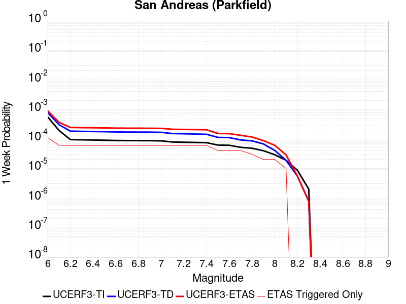 |  |  |  |

| Magnitude | 1 wk TI Prob | 1 wk TD Prob | 1 wk ETAS Prob | 1 wk ETAS/TD Gain | 1 wk ETAS Triggered Only | 1 mo TI Prob | 1 mo TD Prob | 1 mo ETAS Prob | 1 mo ETAS/TD Gain | 1 mo ETAS Triggered Only | 1 yr TI Prob | 1 yr TD Prob | 1 yr ETAS Prob | 1 yr ETAS/TD Gain | 1 yr ETAS Triggered Only | 10 yr TI Prob | 10 yr TD Prob | 10 yr ETAS Prob | 10 yr ETAS/TD Gain | 10 yr ETAS Triggered Only |
|-----|-----|-----|-----|-----|-----|-----|-----|-----|-----|-----|-----|-----|-----|-----|-----|-----|-----|-----|-----|-----|
| 6.0 | 5.556969E-4 | 7.7782426E-4 | 8.8773866E-4 | 1.1413101 | 1.1E-4 | 0.0023793848 | 0.0033298214 | 0.003509222 | 1.053877 | 1.8E-4 | 0.028586963 | 0.040191233 | 0.040469576 | 1.0069255 | 2.9E-4 | 0.25176284 | 0.33716413 | 0.33746904 | 1.0009043 | 4.6E-4 |
| 6.1 | 1.925858E-4 | 3.0276453E-4 | 3.6274636E-4 | 1.1981138 | 6.0E-5 | 8.2510663E-4 | 0.0012970108 | 0.001386894 | 1.0693003 | 9.0E-5 | 0.0099994885 | 0.015778083 | 0.015935559 | 1.0099807 | 1.6E-4 | 0.095613256 | 0.1497237 | 0.14992775 | 1.0013629 | 2.4E-4 |
| 6.2 | 9.4306815E-5 | 1.8242796E-4 | 2.4241701E-4 | 1.3288369 | 6.0E-5 | 4.0410945E-4 | 7.816011E-4 | 8.7153073E-4 | 1.1150583 | 9.0E-5 | 0.0049089384 | 0.009474681 | 0.009633165 | 1.0167271 | 1.6E-4 | 0.048019063 | 0.09185409 | 0.092062965 | 1.0022739 | 2.3E-4 |
| 6.3 | 9.283051E-5 | 1.7939322E-4 | 2.3938245E-4 | 1.3344008 | 6.0E-5 | 3.9778434E-4 | 7.686027E-4 | 8.5853355E-4 | 1.1170056 | 9.0E-5 | 0.0048322747 | 0.009317789 | 0.0094762985 | 1.0170114 | 1.6E-4 | 0.047285385 | 0.09050704 | 0.09071622 | 1.0023112 | 2.3E-4 |
| 6.4 | 9.138826E-5 | 1.770153E-4 | 2.3700469E-4 | 1.3388938 | 6.0E-5 | 3.916052E-4 | 7.5841765E-4 | 8.483494E-4 | 1.1185781 | 9.0E-5 | 0.0047573745 | 0.00919484 | 0.009353369 | 1.0172411 | 1.6E-4 | 0.046568092 | 0.08940927 | 0.089618705 | 1.0023425 | 2.3E-4 |
| 6.5 | 9.000255E-5 | 1.7459576E-4 | 2.3458528E-4 | 1.343591 | 6.0E-5 | 3.8566816E-4 | 7.480541E-4 | 8.379868E-4 | 1.1202221 | 9.0E-5 | 0.0046854047 | 0.009069731 | 0.009228281 | 1.0174811 | 1.6E-4 | 0.045878403 | 0.088295065 | 0.088504754 | 1.0023749 | 2.3E-4 |
| 6.6 | 8.8109264E-5 | 1.7140752E-4 | 2.3139724E-4 | 1.349983 | 6.0E-5 | 3.7755648E-4 | 7.3439797E-4 | 8.243319E-4 | 1.1224594 | 9.0E-5 | 0.0045870654 | 0.008904854 | 0.009063429 | 1.0178077 | 1.6E-4 | 0.04493529 | 0.0868267 | 0.08703672 | 1.002419 | 2.3E-4 |
| 6.7 | 8.738073E-5 | 1.7007832E-4 | 2.3006812E-4 | 1.3527186 | 6.0E-5 | 3.7443507E-4 | 7.287046E-4 | 8.1863906E-4 | 1.1234168 | 9.0E-5 | 0.0045492216 | 0.008836143 | 0.008994729 | 1.0179474 | 1.6E-4 | 0.04457213 | 0.08622707 | 0.08643723 | 1.0024374 | 2.3E-4 |
| 6.8 | 8.710195E-5 | 1.6953335E-4 | 2.2952317E-4 | 1.3538526 | 6.0E-5 | 3.7324068E-4 | 7.263703E-4 | 8.1630494E-4 | 1.1238137 | 9.0E-5 | 0.0045347405 | 0.008807961 | 0.008966551 | 1.0180054 | 1.6E-4 | 0.04443313 | 0.08597467 | 0.0861849 | 1.0024452 | 2.3E-4 |
| 6.9 | 8.6801556E-5 | 1.689429E-4 | 2.2893277E-4 | 1.3550895 | 6.0E-5 | 3.7195362E-4 | 7.2384125E-4 | 8.137761E-4 | 1.1242466 | 9.0E-5 | 0.0045191357 | 0.008777418 | 0.008936014 | 1.0180686 | 1.6E-4 | 0.044283327 | 0.085700735 | 0.08591102 | 1.0024538 | 2.3E-4 |
| 7.0 | 8.5571606E-5 | 1.6647128E-4 | 2.2646128E-4 | 1.3603625 | 6.0E-5 | 3.6668387E-4 | 7.132544E-4 | 8.031902E-4 | 1.1260922 | 9.0E-5 | 0.004455241 | 0.008649553 | 0.0088081695 | 1.0183381 | 1.6E-4 | 0.043669727 | 0.08454914 | 0.08475969 | 1.0024903 | 2.3E-4 |
| 7.1 | 7.82589E-5 | 1.5128135E-4 | 2.1127227E-4 | 1.396552 | 6.0E-5 | 3.3535215E-4 | 6.481883E-4 | 7.3812995E-4 | 1.1387585 | 9.0E-5 | 0.0040752706 | 0.007863307 | 0.0080220485 | 1.0201876 | 1.6E-4 | 0.040013418 | 0.07746111 | 0.07767329 | 1.0027392 | 2.3E-4 |
| 7.2 | 7.690929E-5 | 1.4865391E-4 | 2.08645E-4 | 1.4035621 | 6.0E-5 | 3.2956956E-4 | 6.369334E-4 | 7.26876E-4 | 1.1412121 | 9.0E-5 | 0.004005129 | 0.007727258 | 0.007886021 | 1.020546 | 1.6E-4 | 0.0393371 | 0.07623427 | 0.07644674 | 1.002787 | 2.3E-4 |
| 7.3 | 7.5543794E-5 | 1.4561978E-4 | 2.0561104E-4 | 1.4119719 | 6.0E-5 | 3.2371894E-4 | 6.2393624E-4 | 7.1388006E-4 | 1.1441555 | 9.0E-5 | 0.003934157 | 0.007570127 | 0.007728916 | 1.0209757 | 1.6E-4 | 0.038652334 | 0.074797355 | 0.07501015 | 1.0028449 | 2.3E-4 |
| 7.4 | 7.4214564E-5 | 1.4262961E-4 | 2.0262106E-4 | 1.42061 | 6.0E-5 | 3.1802364E-4 | 6.111273E-4 | 7.010723E-4 | 1.1471788 | 9.0E-5 | 0.003865065 | 0.00741525 | 0.0075740633 | 1.0214171 | 1.6E-4 | 0.03798529 | 0.07337123 | 0.073584355 | 1.0029048 | 2.3E-4 |
| 7.5 | 6.149578E-5 | 1.11907226E-4 | 1.5190276E-4 | 1.357399 | 4.0E-5 | 2.6352672E-4 | 4.7951436E-4 | 5.494808E-4 | 1.145911 | 7.0E-5 | 0.0032037178 | 0.0058224914 | 0.005961676 | 1.0239047 | 1.4E-4 | 0.03157923 | 0.058557566 | 0.058745854 | 1.0032154 | 2.0E-4 |
| 7.6 | 6.0643448E-5 | 1.10193796E-4 | 1.5018939E-4 | 1.3629569 | 4.0E-5 | 2.598746E-4 | 4.7217376E-4 | 5.4214074E-4 | 1.1481805 | 7.0E-5 | 0.0031593828 | 0.0057335934 | 0.0058727907 | 1.0242774 | 1.4E-4 | 0.031148417 | 0.057718582 | 0.057907037 | 1.0032651 | 2.0E-4 |
| 7.7 | 5.1652263E-5 | 9.174698E-5 | 1.317433E-4 | 1.4359417 | 4.0E-5 | 2.2134806E-4 | 3.931421E-4 | 4.4312247E-4 | 1.1271305 | 5.0E-5 | 0.002691582 | 0.0047760103 | 0.004895437 | 1.0250056 | 1.2E-4 | 0.026592141 | 0.04853623 | 0.048688464 | 1.0031365 | 1.6E-4 |
| 7.8 | 4.8090482E-5 | 8.559635E-5 | 1.15593786E-4 | 1.3504522 | 3.0E-5 | 2.060858E-4 | 3.6678996E-4 | 4.067753E-4 | 1.1090143 | 4.0E-5 | 0.0025062072 | 0.0044565317 | 0.0045660418 | 1.0245728 | 1.1E-4 | 0.024781305 | 0.04530245 | 0.045445655 | 1.0031611 | 1.5E-4 |
| 7.9 | 3.970278E-5 | 6.750426E-5 | 8.750291E-5 | 1.2962576 | 2.0E-5 | 1.7014367E-4 | 2.892719E-4 | 3.0926612E-4 | 1.0691191 | 2.0E-5 | 0.002069531 | 0.0035162016 | 0.0035859554 | 1.0198379 | 7.0E-5 | 0.020503636 | 0.035881363 | 0.035977773 | 1.002687 | 1.0E-4 |
| 8.0 | 2.8982335E-5 | 4.069796E-5 | 6.0697144E-5 | 1.4914051 | 2.0E-5 | 1.2420409E-4 | 1.7440817E-4 | 1.9440468E-4 | 1.1146535 | 2.0E-5 | 0.0015111357 | 0.0021213528 | 0.0021712466 | 1.0235199 | 5.0E-5 | 0.015009012 | 0.022010697 | 0.022069376 | 1.002666 | 6.0E-5 |
| 8.1 | 1.8836186E-5 | 1.8681134E-5 | 2.8680948E-5 | 1.5352894 | 1.0E-5 | 8.0724014E-5 | 8.005955E-5 | 9.0058755E-5 | 1.124897 | 1.0E-5 | 9.823717E-4 | 9.742898E-4 | 9.942703E-4 | 1.0205078 | 2.0E-5 | 0.009780403 | 0.010488115 | 0.010507906 | 1.001887 | 2.0E-5 |
| 8.2 | 8.643924E-6 | 5.4748625E-6 | 5.4748625E-6 | 1.0 | 0.0 | 3.704486E-5 | 2.3463486E-5 | 2.3463486E-5 | 1.0 | 0.0 | 4.5092785E-4 | 2.8563058E-4 | 2.8563058E-4 | 1.0 | 0.0 | 0.0045001395 | 0.0032487072 | 0.0032487072 | 1.0 | 0.0 |
| 8.3 | 1.983087E-6 | 7.6599065E-7 | 7.6599065E-7 | 1.0 | 0.0 | 8.498917E-6 | 3.282813E-6 | 3.282813E-6 | 1.0 | 0.0 | 1.034694E-4 | 3.9967534E-5 | 3.9967534E-5 | 1.0 | 0.0 | 0.0010342124 | 4.719687E-4 | 4.719687E-4 | 1.0 | 0.0 |

## Cady
*[(top)](#table-of-contents)*

| 1 Week | 1 Month | 1 Year | 10 Year |
|-----|-----|-----|-----|
|  | 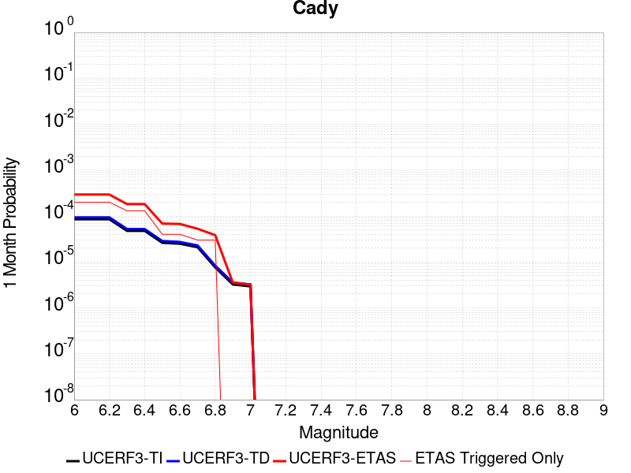 |  | 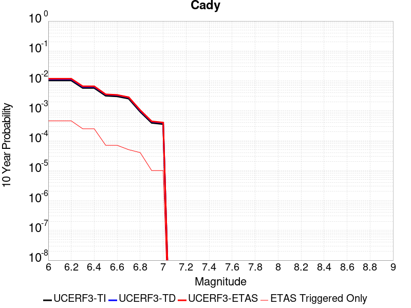 |

| Magnitude | 1 wk TI Prob | 1 wk TD Prob | 1 wk ETAS Prob | 1 wk ETAS/TD Gain | 1 wk ETAS Triggered Only | 1 mo TI Prob | 1 mo TD Prob | 1 mo ETAS Prob | 1 mo ETAS/TD Gain | 1 mo ETAS Triggered Only | 1 yr TI Prob | 1 yr TD Prob | 1 yr ETAS Prob | 1 yr ETAS/TD Gain | 1 yr ETAS Triggered Only | 10 yr TI Prob | 10 yr TD Prob | 10 yr ETAS Prob | 10 yr ETAS/TD Gain | 10 yr ETAS Triggered Only |
|-----|-----|-----|-----|-----|-----|-----|-----|-----|-----|-----|-----|-----|-----|-----|-----|-----|-----|-----|-----|-----|
| 6.0 | 1.9892565E-5 | 2.1858728E-5 | 1.9185501E-4 | 8.777043 | 1.7E-4 | 8.525106E-5 | 9.3677416E-5 | 2.9365867E-4 | 3.1347864 | 2.0E-4 | 0.0010374374 | 0.0011400167 | 0.0014296861 | 1.2540922 | 2.9E-4 | 0.010326075 | 0.011350701 | 0.011805479 | 1.0400661 | 4.6E-4 |
| 6.1 | 1.9892565E-5 | 2.1858728E-5 | 1.9185501E-4 | 8.777043 | 1.7E-4 | 8.525106E-5 | 9.3677416E-5 | 2.9365867E-4 | 3.1347864 | 2.0E-4 | 0.0010374374 | 0.0011400167 | 0.0014296861 | 1.2540922 | 2.9E-4 | 0.010326075 | 0.011350701 | 0.011805479 | 1.0400661 | 4.6E-4 |
| 6.2 | 1.9892565E-5 | 2.1858728E-5 | 1.9185501E-4 | 8.777043 | 1.7E-4 | 8.525106E-5 | 9.3677416E-5 | 2.9365867E-4 | 3.1347864 | 2.0E-4 | 0.0010374374 | 0.0011400167 | 0.0014296861 | 1.2540922 | 2.9E-4 | 0.010326075 | 0.011350701 | 0.011805479 | 1.0400661 | 4.6E-4 |
| 6.3 | 1.1117327E-5 | 1.2176583E-5 | 1.3217512E-4 | 10.854861 | 1.2E-4 | 4.764482E-5 | 5.2184492E-5 | 1.8217771E-4 | 3.4910316 | 1.3E-4 | 5.7992124E-4 | 6.351925E-4 | 8.0508454E-4 | 1.2674654 | 1.7E-4 | 0.0057841022 | 0.0063368753 | 0.006585291 | 1.0392016 | 2.5E-4 |
| 6.4 | 1.1117327E-5 | 1.2176583E-5 | 1.3217512E-4 | 10.854861 | 1.2E-4 | 4.764482E-5 | 5.2184492E-5 | 1.8217771E-4 | 3.4910316 | 1.3E-4 | 5.7992124E-4 | 6.351925E-4 | 8.0508454E-4 | 1.2674654 | 1.7E-4 | 0.0057841022 | 0.0063368753 | 0.006585291 | 1.0392016 | 2.5E-4 |
| 6.5 | 6.103093E-6 | 6.672021E-6 | 4.6671754E-5 | 6.9951453 | 4.0E-5 | 2.615585E-5 | 2.8594131E-5 | 6.8592984E-5 | 2.3988485 | 4.0E-5 | 3.1840094E-4 | 3.480905E-4 | 3.880766E-4 | 1.1148727 | 4.0E-5 | 0.0031794512 | 0.0034766865 | 0.0035464433 | 1.0200641 | 7.0E-5 |
| 6.6 | 5.817237E-6 | 6.3656585E-6 | 4.6365403E-5 | 7.2836776 | 4.0E-5 | 2.4930776E-5 | 2.728118E-5 | 6.728009E-5 | 2.4661722 | 4.0E-5 | 3.034899E-4 | 3.3211018E-4 | 3.720969E-4 | 1.120402 | 4.0E-5 | 0.0030307577 | 0.0033173605 | 0.0033871282 | 1.0210311 | 7.0E-5 |
| 6.7 | 4.8846314E-6 | 5.3405684E-6 | 3.5340407E-5 | 6.6173496 | 3.0E-5 | 2.0933967E-5 | 2.2888014E-5 | 5.2887328E-5 | 2.3106997 | 3.0E-5 | 2.5484123E-4 | 2.7863772E-4 | 3.0862936E-4 | 1.1076367 | 3.0E-5 | 0.0025454918 | 0.0027840391 | 0.0028338998 | 1.0179095 | 5.0E-5 |
| 6.8 | 1.7788773E-6 | 1.9399079E-6 | 3.193985E-5 | 16.46462 | 3.0E-5 | 7.6237375E-6 | 8.313874E-6 | 3.8313625E-5 | 4.608396 | 3.0E-5 | 9.281505E-5 | 1.01218284E-4 | 1.3121525E-4 | 1.2963592 | 3.0E-5 | 9.2776294E-4 | 0.0010118765 | 0.001051836 | 1.0394905 | 4.0E-5 |
| 6.9 | 7.5455404E-7 | 8.297092E-7 | 8.297092E-7 | 1.0 | 0.0 | 3.233799E-6 | 3.5558937E-6 | 3.5558937E-6 | 1.0 | 0.0 | 3.937079E-5 | 4.3292483E-5 | 4.3292483E-5 | 1.0 | 0.0 | 3.9363815E-4 | 4.3287344E-4 | 4.428691E-4 | 1.0230914 | 1.0E-5 |
| 7.0 | 6.8578805E-7 | 7.541816E-7 | 7.541816E-7 | 1.0 | 0.0 | 2.9390883E-6 | 3.2322048E-6 | 3.2322048E-6 | 1.0 | 0.0 | 3.578281E-5 | 3.9351715E-5 | 3.9351715E-5 | 1.0 | 0.0 | 3.577705E-4 | 3.9347992E-4 | 4.0347598E-4 | 1.0254042 | 1.0E-5 |

## San Andreas (Carrizo) rev
*[(top)](#table-of-contents)*

| 1 Week | 1 Month | 1 Year | 10 Year |
|-----|-----|-----|-----|
| 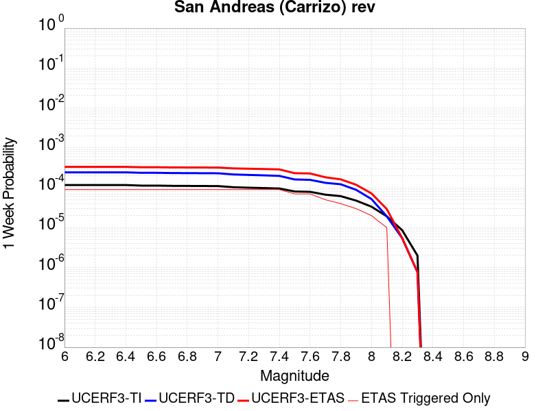 |  |  |  |

| Magnitude | 1 wk TI Prob | 1 wk TD Prob | 1 wk ETAS Prob | 1 wk ETAS/TD Gain | 1 wk ETAS Triggered Only | 1 mo TI Prob | 1 mo TD Prob | 1 mo ETAS Prob | 1 mo ETAS/TD Gain | 1 mo ETAS Triggered Only | 1 yr TI Prob | 1 yr TD Prob | 1 yr ETAS Prob | 1 yr ETAS/TD Gain | 1 yr ETAS Triggered Only | 10 yr TI Prob | 10 yr TD Prob | 10 yr ETAS Prob | 10 yr ETAS/TD Gain | 10 yr ETAS Triggered Only |
|-----|-----|-----|-----|-----|-----|-----|-----|-----|-----|-----|-----|-----|-----|-----|-----|-----|-----|-----|-----|-----|
| 6.0 | 1.1674632E-4 | 2.432302E-4 | 3.332083E-4 | 1.3699298 | 9.0E-5 | 5.002454E-4 | 0.0010420004 | 0.0011718649 | 1.1246301 | 1.3E-4 | 0.006073493 | 0.012613042 | 0.012919133 | 1.0242678 | 3.1E-4 | 0.0591016 | 0.12061418 | 0.1210099 | 1.0032809 | 4.5E-4 |
| 6.1 | 1.1674632E-4 | 2.432302E-4 | 3.332083E-4 | 1.3699298 | 9.0E-5 | 5.002454E-4 | 0.0010420004 | 0.0011718649 | 1.1246301 | 1.3E-4 | 0.006073493 | 0.012613042 | 0.012919133 | 1.0242678 | 3.1E-4 | 0.0591016 | 0.12061418 | 0.1210099 | 1.0032809 | 4.5E-4 |
| 6.2 | 1.1674632E-4 | 2.432302E-4 | 3.332083E-4 | 1.3699298 | 9.0E-5 | 5.002454E-4 | 0.0010420004 | 0.0011718649 | 1.1246301 | 1.3E-4 | 0.006073493 | 0.012613042 | 0.012919133 | 1.0242678 | 3.1E-4 | 0.0591016 | 0.12061418 | 0.1210099 | 1.0032809 | 4.5E-4 |
| 6.3 | 1.1674632E-4 | 2.432302E-4 | 3.332083E-4 | 1.3699298 | 9.0E-5 | 5.002454E-4 | 0.0010420004 | 0.0011718649 | 1.1246301 | 1.3E-4 | 0.006073493 | 0.012613042 | 0.012919133 | 1.0242678 | 3.1E-4 | 0.0591016 | 0.12061418 | 0.1210099 | 1.0032809 | 4.5E-4 |
| 6.4 | 1.1674632E-4 | 2.432302E-4 | 3.332083E-4 | 1.3699298 | 9.0E-5 | 5.002454E-4 | 0.0010420004 | 0.0011718649 | 1.1246301 | 1.3E-4 | 0.006073493 | 0.012613042 | 0.012919133 | 1.0242678 | 3.1E-4 | 0.0591016 | 0.12061418 | 0.1210099 | 1.0032809 | 4.5E-4 |
| 6.5 | 1.13136164E-4 | 2.3643032E-4 | 3.2640903E-4 | 1.3805718 | 9.0E-5 | 4.847792E-4 | 0.0010128808 | 0.0011427492 | 1.1282167 | 1.3E-4 | 0.0058862255 | 0.012262545 | 0.012568743 | 1.0249703 | 3.1E-4 | 0.057327334 | 0.117585555 | 0.11798264 | 1.003377 | 4.5E-4 |
| 6.6 | 1.13136164E-4 | 2.3643032E-4 | 3.2640903E-4 | 1.3805718 | 9.0E-5 | 4.847792E-4 | 0.0010128808 | 0.0011427492 | 1.1282167 | 1.3E-4 | 0.0058862255 | 0.012262545 | 0.012568743 | 1.0249703 | 3.1E-4 | 0.057327334 | 0.117585555 | 0.11798264 | 1.003377 | 4.5E-4 |
| 6.7 | 1.1149675E-4 | 2.3334254E-4 | 3.2332152E-4 | 1.385609 | 9.0E-5 | 4.777557E-4 | 9.996577E-4 | 0.0011195377 | 1.1199211 | 1.2E-4 | 0.0058011734 | 0.012103349 | 0.012399718 | 1.0244865 | 3.0E-4 | 0.05652051 | 0.1162071 | 0.11659597 | 1.0033463 | 4.4E-4 |
| 6.8 | 1.1103589E-4 | 2.3236412E-4 | 3.223432E-4 | 1.3872331 | 9.0E-5 | 4.7578133E-4 | 9.954676E-4 | 0.0011153482 | 1.1204263 | 1.2E-4 | 0.005777263 | 0.012052901 | 0.012349285 | 1.0245903 | 3.0E-4 | 0.056293584 | 0.1157674 | 0.11615646 | 1.0033607 | 4.4E-4 |
| 6.9 | 1.1053259E-4 | 2.3128795E-4 | 3.2126714E-4 | 1.3890353 | 9.0E-5 | 4.7362508E-4 | 9.90859E-4 | 0.0011107401 | 1.120987 | 1.2E-4 | 0.0057511497 | 0.01199741 | 0.012293811 | 1.0247054 | 3.0E-4 | 0.05604569 | 0.11528359 | 0.11567287 | 1.0033767 | 4.4E-4 |
| 7.0 | 1.1005377E-4 | 2.3029637E-4 | 3.2027563E-4 | 1.3907107 | 9.0E-5 | 4.7157376E-4 | 9.866126E-4 | 0.0011064942 | 1.1215082 | 1.2E-4 | 0.0057263062 | 0.011946279 | 0.012242694 | 1.0248125 | 3.0E-4 | 0.055809796 | 0.11483591 | 0.11522538 | 1.0033915 | 4.4E-4 |
| 7.1 | 1.0308142E-4 | 2.1539345E-4 | 3.0537407E-4 | 1.41775 | 9.0E-5 | 4.417027E-4 | 9.227892E-4 | 0.0010426785 | 1.1299205 | 1.2E-4 | 0.0053644776 | 0.011177397 | 0.01144438 | 1.0238858 | 2.7E-4 | 0.052368138 | 0.108092256 | 0.10844902 | 1.0033005 | 4.0E-4 |
| 7.2 | 1.0027479E-4 | 2.094724E-4 | 2.9945356E-4 | 1.4295609 | 9.0E-5 | 4.296783E-4 | 8.9743105E-4 | 0.0010173233 | 1.133595 | 1.2E-4 | 0.0052187922 | 0.010871782 | 0.011138847 | 1.024565 | 2.7E-4 | 0.050979212 | 0.10539625 | 0.10575409 | 1.0033952 | 4.0E-4 |
| 7.3 | 9.816942E-5 | 2.0422463E-4 | 2.9420626E-4 | 1.4406012 | 9.0E-5 | 4.2065824E-4 | 8.7495585E-4 | 9.948509E-4 | 1.1370298 | 1.2E-4 | 0.005109493 | 0.010600842 | 0.010867979 | 1.0251997 | 2.7E-4 | 0.049935985 | 0.102979995 | 0.10333881 | 1.0034842 | 4.0E-4 |
| 7.4 | 9.5634205E-5 | 1.9791997E-4 | 2.8790216E-4 | 1.4546393 | 9.0E-5 | 4.0979648E-4 | 8.479536E-4 | 9.6785184E-4 | 1.1413971 | 1.2E-4 | 0.0049778637 | 0.010275229 | 0.010532557 | 1.0250436 | 2.6E-4 | 0.048678253 | 0.10006632 | 0.10041729 | 1.0035074 | 3.9E-4 |
| 7.5 | 8.052417E-5 | 1.611261E-4 | 2.3111481E-4 | 1.4343723 | 7.0E-5 | 3.4505792E-4 | 6.903579E-4 | 7.902888E-4 | 1.1447524 | 1.0E-4 | 0.0041929903 | 0.008372796 | 0.008610786 | 1.0284243 | 2.4E-4 | 0.04114753 | 0.08281049 | 0.08313151 | 1.0038766 | 3.5E-4 |
| 7.6 | 7.897024E-5 | 1.5765853E-4 | 2.276475E-4 | 1.4439275 | 7.0E-5 | 3.384E-4 | 6.755046E-4 | 7.754371E-4 | 1.1479374 | 1.0E-4 | 0.0041122385 | 0.008193332 | 0.008431366 | 1.0290521 | 2.4E-4 | 0.040369697 | 0.08115171 | 0.081473306 | 1.0039629 | 3.5E-4 |
| 7.7 | 6.707427E-5 | 1.3276102E-4 | 1.8275439E-4 | 1.3765665 | 5.0E-5 | 2.8742946E-4 | 5.688518E-4 | 6.2881765E-4 | 1.1054156 | 6.0E-5 | 0.003493839 | 0.00690381 | 0.0070825676 | 1.0258926 | 1.8E-4 | 0.034394164 | 0.069048055 | 0.0692901 | 1.0035055 | 2.6E-4 |
| 7.8 | 6.147705E-5 | 1.2197486E-4 | 1.6196999E-4 | 1.3278965 | 4.0E-5 | 2.6344648E-4 | 5.226447E-4 | 5.7261856E-4 | 1.0956173 | 5.0E-5 | 0.0032027436 | 0.006344659 | 0.006503644 | 1.025058 | 1.6E-4 | 0.031569764 | 0.06351457 | 0.06372996 | 1.0033913 | 2.3E-4 |
| 7.9 | 4.7636717E-5 | 8.87977E-5 | 1.1879503E-4 | 1.3378166 | 3.0E-5 | 2.0414138E-4 | 3.8050607E-4 | 4.1049466E-4 | 1.0788124 | 3.0E-5 | 0.0024825884 | 0.0046228287 | 0.0047223666 | 1.0215318 | 1.0E-4 | 0.024550365 | 0.046628095 | 0.046771098 | 1.0030669 | 1.5E-4 |
| 8.0 | 3.3554235E-5 | 5.2136907E-5 | 7.213587E-5 | 1.3835855 | 2.0E-5 | 1.4379594E-4 | 2.2342477E-4 | 2.434203E-4 | 1.0894955 | 2.0E-5 | 0.0017493097 | 0.002716805 | 0.0027666693 | 1.0183539 | 5.0E-5 | 0.017356034 | 0.027880952 | 0.027958723 | 1.0027894 | 8.0E-5 |
| 8.1 | 1.9175432E-5 | 1.9184976E-5 | 2.9184785E-5 | 1.5212312 | 1.0E-5 | 8.217783E-5 | 8.2218736E-5 | 9.221792E-5 | 1.1216167 | 1.0E-5 | 0.0010000558 | 0.0010005541 | 0.0010205341 | 1.0199689 | 2.0E-5 | 0.009955673 | 0.0107580265 | 0.0107778115 | 1.001839 | 2.0E-5 |
| 8.2 | 8.643924E-6 | 5.4748625E-6 | 5.4748625E-6 | 1.0 | 0.0 | 3.704486E-5 | 2.3463486E-5 | 2.3463486E-5 | 1.0 | 0.0 | 4.5092785E-4 | 2.8563058E-4 | 2.8563058E-4 | 1.0 | 0.0 | 0.0045001395 | 0.0032487072 | 0.0032487072 | 1.0 | 0.0 |
| 8.3 | 1.983087E-6 | 7.6599065E-7 | 7.6599065E-7 | 1.0 | 0.0 | 8.498917E-6 | 3.282813E-6 | 3.282813E-6 | 1.0 | 0.0 | 1.034694E-4 | 3.9967534E-5 | 3.9967534E-5 | 1.0 | 0.0 | 0.0010342124 | 4.719687E-4 | 4.719687E-4 | 1.0 | 0.0 |

## Sierra Nevada  (No Extension)
*[(top)](#table-of-contents)*

| 1 Week | 1 Month | 1 Year | 10 Year |
|-----|-----|-----|-----|
|  | 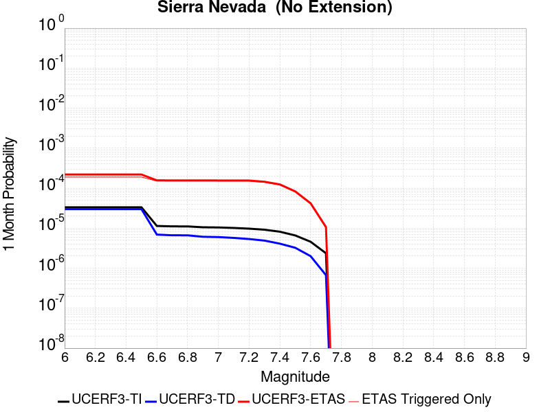 |  |  |

| Magnitude | 1 wk TI Prob | 1 wk TD Prob | 1 wk ETAS Prob | 1 wk ETAS/TD Gain | 1 wk ETAS Triggered Only | 1 mo TI Prob | 1 mo TD Prob | 1 mo ETAS Prob | 1 mo ETAS/TD Gain | 1 mo ETAS Triggered Only | 1 yr TI Prob | 1 yr TD Prob | 1 yr ETAS Prob | 1 yr ETAS/TD Gain | 1 yr ETAS Triggered Only | 10 yr TI Prob | 10 yr TD Prob | 10 yr ETAS Prob | 10 yr ETAS/TD Gain | 10 yr ETAS Triggered Only |
|-----|-----|-----|-----|-----|-----|-----|-----|-----|-----|-----|-----|-----|-----|-----|-----|-----|-----|-----|-----|-----|
| 6.0 | 7.7690465E-6 | 6.976322E-6 | 1.7697514E-4 | 25.367971 | 1.7E-4 | 3.329549E-5 | 2.9898381E-5 | 2.198927E-4 | 7.354669 | 1.9E-4 | 4.0529718E-4 | 3.6398784E-4 | 6.73875E-4 | 1.8513668 | 3.1E-4 | 0.004045588 | 0.0036374326 | 0.004055905 | 1.115046 | 4.2E-4 |
| 6.1 | 7.7690465E-6 | 6.976322E-6 | 1.7697514E-4 | 25.367971 | 1.7E-4 | 3.329549E-5 | 2.9898381E-5 | 2.198927E-4 | 7.354669 | 1.9E-4 | 4.0529718E-4 | 3.6398784E-4 | 6.73875E-4 | 1.8513668 | 3.1E-4 | 0.004045588 | 0.0036374326 | 0.004055905 | 1.115046 | 4.2E-4 |
| 6.2 | 7.7690465E-6 | 6.976322E-6 | 1.7697514E-4 | 25.367971 | 1.7E-4 | 3.329549E-5 | 2.9898381E-5 | 2.198927E-4 | 7.354669 | 1.9E-4 | 4.0529718E-4 | 3.6398784E-4 | 6.73875E-4 | 1.8513668 | 3.1E-4 | 0.004045588 | 0.0036374326 | 0.004055905 | 1.115046 | 4.2E-4 |
| 6.3 | 7.7690465E-6 | 6.976322E-6 | 1.7697514E-4 | 25.367971 | 1.7E-4 | 3.329549E-5 | 2.9898381E-5 | 2.198927E-4 | 7.354669 | 1.9E-4 | 4.0529718E-4 | 3.6398784E-4 | 6.73875E-4 | 1.8513668 | 3.1E-4 | 0.004045588 | 0.0036374326 | 0.004055905 | 1.115046 | 4.2E-4 |
| 6.4 | 7.7690465E-6 | 6.976322E-6 | 1.7697514E-4 | 25.367971 | 1.7E-4 | 3.329549E-5 | 2.9898381E-5 | 2.198927E-4 | 7.354669 | 1.9E-4 | 4.0529718E-4 | 3.6398784E-4 | 6.73875E-4 | 1.8513668 | 3.1E-4 | 0.004045588 | 0.0036374326 | 0.004055905 | 1.115046 | 4.2E-4 |
| 6.5 | 7.7690465E-6 | 6.976322E-6 | 1.7697514E-4 | 25.367971 | 1.7E-4 | 3.329549E-5 | 2.9898381E-5 | 2.198927E-4 | 7.354669 | 1.9E-4 | 4.0529718E-4 | 3.6398784E-4 | 6.73875E-4 | 1.8513668 | 3.1E-4 | 0.004045588 | 0.0036374326 | 0.004055905 | 1.115046 | 4.2E-4 |
| 6.6 | 2.653E-6 | 1.614854E-6 | 1.4161463E-4 | 87.69501 | 1.4E-4 | 1.136995E-5 | 6.9207845E-6 | 1.5691975E-4 | 22.673693 | 1.5E-4 | 1.3842035E-4 | 8.425733E-5 | 3.242371E-4 | 3.848177 | 2.4E-4 | 0.0013833415 | 8.422573E-4 | 0.0011619878 | 1.3796114 | 3.2E-4 |
| 6.7 | 2.5902466E-6 | 1.5501876E-6 | 1.4154997E-4 | 91.311516 | 1.4E-4 | 1.11010095E-5 | 6.643644E-6 | 1.5664265E-4 | 23.57782 | 1.5E-4 | 1.351464E-4 | 8.0883394E-5 | 3.2086397E-4 | 3.9669945 | 2.4E-4 | 0.0013506424 | 8.0854254E-4 | 0.0011282838 | 1.3954538 | 3.2E-4 |
| 6.8 | 2.5853892E-6 | 1.5469877E-6 | 1.4154677E-4 | 91.498314 | 1.4E-4 | 1.1080193E-5 | 6.629931E-6 | 1.5662894E-4 | 23.624521 | 1.5E-4 | 1.34893E-4 | 8.071645E-5 | 3.206971E-4 | 3.9731317 | 2.4E-4 | 0.0013481114 | 8.068743E-4 | 0.001126616 | 1.3962722 | 3.2E-4 |
| 6.9 | 2.458257E-6 | 1.4220619E-6 | 1.4142186E-4 | 99.448456 | 1.4E-4 | 1.0535345E-5 | 6.094537E-6 | 1.5609362E-4 | 25.612055 | 1.5E-4 | 1.2826028E-4 | 7.4198484E-5 | 3.1418068E-4 | 4.2343273 | 2.4E-4 | 0.0012818627 | 7.4173906E-4 | 0.0010615017 | 1.4310986 | 3.2E-4 |
| 7.0 | 2.4341468E-6 | 1.3990258E-6 | 1.4139884E-4 | 101.06949 | 1.4E-4 | 1.0432016E-5 | 5.9958115E-6 | 1.5599492E-4 | 26.017315 | 1.5E-4 | 1.270024E-4 | 7.2996576E-5 | 3.1297907E-4 | 4.2875853 | 2.4E-4 | 0.0012692984 | 7.297279E-4 | 0.0010494944 | 1.4381996 | 3.2E-4 |
| 7.1 | 2.3652476E-6 | 1.3339754E-6 | 1.4133379E-4 | 105.94932 | 1.4E-4 | 1.0136736E-5 | 5.717025E-6 | 1.5571617E-4 | 27.237272 | 1.5E-4 | 1.2340778E-4 | 6.9602575E-5 | 3.0958588E-4 | 4.4479084 | 2.4E-4 | 0.0012333926 | 6.9580943E-4 | 0.0010155868 | 1.459576 | 3.2E-4 |
| 7.2 | 2.272158E-6 | 1.2502821E-6 | 1.412501E-4 | 112.97459 | 1.4E-4 | 9.737784E-6 | 5.3583412E-6 | 1.5535754E-4 | 28.99359 | 1.5E-4 | 1.1855107E-4 | 6.5235865E-5 | 3.052202E-4 | 4.678718 | 2.4E-4 | 0.0011848784 | 6.5216864E-4 | 9.7195996E-4 | 1.4903506 | 3.2E-4 |
| 7.3 | 2.1382127E-6 | 1.1419703E-6 | 1.3114182E-4 | 114.83821 | 1.3E-4 | 9.163737E-6 | 4.8941492E-6 | 1.4489346E-4 | 29.605444 | 1.4E-4 | 1.1156279E-4 | 5.958465E-5 | 2.8957095E-4 | 4.8598247 | 2.3E-4 | 0.001115068 | 5.956879E-4 | 8.855152E-4 | 1.4865421 | 2.9E-4 |
| 7.4 | 1.9048055E-6 | 9.575242E-7 | 1.1095742E-4 | 115.879486 | 1.1E-4 | 8.163426E-6 | 4.1036687E-6 | 1.2410317E-4 | 30.242004 | 1.2E-4 | 9.9385186E-5 | 4.996103E-5 | 2.4995103E-4 | 5.00292 | 2.0E-4 | 9.934074E-4 | 4.994987E-4 | 7.593688E-4 | 1.5202619 | 2.6E-4 |
| 7.5 | 1.5373403E-6 | 7.560042E-7 | 8.075594E-5 | 106.819435 | 8.0E-5 | 6.5885843E-6 | 3.2400142E-6 | 8.3239756E-5 | 25.69117 | 8.0E-5 | 8.021306E-5 | 3.9446462E-5 | 1.9944015E-4 | 5.0559707 | 1.6E-4 | 8.0184115E-4 | 3.943951E-4 | 6.043123E-4 | 1.532251 | 2.1E-4 |
| 7.6 | 1.0680322E-6 | 4.6596554E-7 | 4.0465948E-5 | 86.843216 | 4.0E-5 | 4.577273E-6 | 1.9969937E-6 | 4.1996915E-5 | 21.03007 | 4.0E-5 | 5.5726876E-5 | 2.4313129E-5 | 1.4431021E-4 | 5.935485 | 1.2E-4 | 5.5712904E-4 | 2.4310495E-4 | 4.0306605E-4 | 1.657992 | 1.6E-4 |
| 7.7 | 5.509146E-7 | 1.5580486E-7 | 1.01558035E-5 | 65.18284 | 1.0E-5 | 2.3610605E-6 | 6.677349E-7 | 1.0667728E-5 | 15.975992 | 1.0E-5 | 2.8745531E-5 | 8.129644E-6 | 2.8129482E-5 | 3.4601123 | 2.0E-5 | 2.8741814E-4 | 8.1293576E-5 | 1.0129195E-4 | 1.2460018 | 2.0E-5 |

## Death Valley (Fish Lake Valley)
*[(top)](#table-of-contents)*

| 1 Week | 1 Month | 1 Year | 10 Year |
|-----|-----|-----|-----|
|  |  |  | 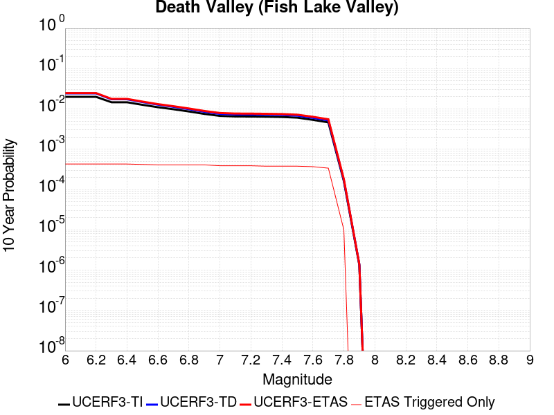 |

| Magnitude | 1 wk TI Prob | 1 wk TD Prob | 1 wk ETAS Prob | 1 wk ETAS/TD Gain | 1 wk ETAS Triggered Only | 1 mo TI Prob | 1 mo TD Prob | 1 mo ETAS Prob | 1 mo ETAS/TD Gain | 1 mo ETAS Triggered Only | 1 yr TI Prob | 1 yr TD Prob | 1 yr ETAS Prob | 1 yr ETAS/TD Gain | 1 yr ETAS Triggered Only | 10 yr TI Prob | 10 yr TD Prob | 10 yr ETAS Prob | 10 yr ETAS/TD Gain | 10 yr ETAS Triggered Only |
|-----|-----|-----|-----|-----|-----|-----|-----|-----|-----|-----|-----|-----|-----|-----|-----|-----|-----|-----|-----|-----|
| 6.0 | 3.872328E-5 | 4.7267473E-5 | 1.2726369E-4 | 2.6924157 | 8.0E-5 | 1.6594635E-4 | 2.0256084E-4 | 3.3253452E-4 | 1.6416525 | 1.3E-4 | 0.0020185246 | 0.002463534 | 0.0027228934 | 1.1052794 | 2.6E-4 | 0.02000288 | 0.024388181 | 0.024807693 | 1.0172015 | 4.3E-4 |
| 6.1 | 3.872328E-5 | 4.7267473E-5 | 1.2726369E-4 | 2.6924157 | 8.0E-5 | 1.6594635E-4 | 2.0256084E-4 | 3.3253452E-4 | 1.6416525 | 1.3E-4 | 0.0020185246 | 0.002463534 | 0.0027228934 | 1.1052794 | 2.6E-4 | 0.02000288 | 0.024388181 | 0.024807693 | 1.0172015 | 4.3E-4 |
| 6.2 | 3.872328E-5 | 4.7267473E-5 | 1.2726369E-4 | 2.6924157 | 8.0E-5 | 1.6594635E-4 | 2.0256084E-4 | 3.3253452E-4 | 1.6416525 | 1.3E-4 | 0.0020185246 | 0.002463534 | 0.0027228934 | 1.1052794 | 2.6E-4 | 0.02000288 | 0.024388181 | 0.024807693 | 1.0172015 | 4.3E-4 |
| 6.3 | 2.8356371E-5 | 3.3609853E-5 | 1.13607166E-4 | 3.3801744 | 8.0E-5 | 1.2152165E-4 | 1.4403471E-4 | 2.74016E-4 | 1.9024302 | 1.3E-4 | 0.0014785219 | 0.0017522911 | 0.0020118356 | 1.1481172 | 2.6E-4 | 0.014687235 | 0.017391782 | 0.017814305 | 1.0242944 | 4.3E-4 |
| 6.4 | 2.8356371E-5 | 3.3609853E-5 | 1.13607166E-4 | 3.3801744 | 8.0E-5 | 1.2152165E-4 | 1.4403471E-4 | 2.74016E-4 | 1.9024302 | 1.3E-4 | 0.0014785219 | 0.0017522911 | 0.0020118356 | 1.1481172 | 2.6E-4 | 0.014687235 | 0.017391782 | 0.017814305 | 1.0242944 | 4.3E-4 |
| 6.5 | 2.4448687E-5 | 2.8607552E-5 | 9.860555E-5 | 3.4468362 | 7.0E-5 | 1.0477588E-4 | 1.2259831E-4 | 2.4258361E-4 | 1.9786862 | 1.2E-4 | 0.0012748998 | 0.0014916632 | 0.0017412902 | 1.1673481 | 2.5E-4 | 0.012676105 | 0.014821377 | 0.015235151 | 1.0279175 | 4.2E-4 |
| 6.6 | 2.1298161E-5 | 2.4660083E-5 | 9.465836E-5 | 3.8385253 | 7.0E-5 | 9.127464E-5 | 1.0568198E-4 | 2.256693E-4 | 2.1353621 | 1.2E-4 | 0.0011107022 | 0.0012859525 | 0.0015256439 | 1.1863921 | 2.4E-4 | 0.011051672 | 0.012788526 | 0.013193282 | 1.03165 | 4.1E-4 |
| 6.7 | 1.8959729E-5 | 2.1781025E-5 | 9.1779504E-5 | 4.2137365 | 7.0E-5 | 8.125345E-5 | 9.334405E-5 | 2.1333285E-4 | 2.2854466 | 1.2E-4 | 9.888117E-4 | 0.001135897 | 0.0013756243 | 1.2110468 | 2.4E-4 | 0.009844234 | 0.01130357 | 0.011708936 | 1.0358617 | 4.1E-4 |
| 6.8 | 1.6691629E-5 | 1.9018353E-5 | 8.901702E-5 | 4.6805854 | 7.0E-5 | 7.153359E-5 | 8.150477E-5 | 2.0149499E-4 | 2.4721863 | 1.2E-4 | 8.7057345E-4 | 9.918857E-4 | 0.0012316477 | 1.2417234 | 2.4E-4 | 0.008671708 | 0.009876343 | 0.010282294 | 1.0411034 | 4.1E-4 |
| 6.9 | 1.450505E-5 | 1.638954E-5 | 8.638839E-5 | 5.270947 | 7.0E-5 | 6.216302E-5 | 7.0239046E-5 | 1.9023061E-4 | 2.7083316 | 1.2E-4 | 7.5657194E-4 | 8.5483363E-4 | 0.0010946285 | 1.2805164 | 2.4E-4 | 0.007540013 | 0.008516385 | 0.008922894 | 1.0477325 | 4.1E-4 |
| 7.0 | 1.2940855E-5 | 1.4537972E-5 | 7.45371E-5 | 5.1270633 | 6.0E-5 | 5.545963E-5 | 6.230414E-5 | 1.622979E-4 | 2.60493 | 1.0E-4 | 6.750118E-4 | 7.5829466E-4 | 9.781278E-4 | 1.2899047 | 2.2E-4 | 0.006729651 | 0.0075576897 | 0.007944742 | 1.051213 | 3.9E-4 |
| 7.1 | 1.2544658E-5 | 1.4078208E-5 | 7.407736E-5 | 5.261846 | 6.0E-5 | 5.3761712E-5 | 6.0333812E-5 | 1.6032778E-4 | 2.6573455 | 1.0E-4 | 6.5435225E-4 | 7.343222E-4 | 9.5416064E-4 | 1.299376 | 2.2E-4 | 0.006524288 | 0.007319551 | 0.007706696 | 1.052892 | 3.9E-4 |
| 7.2 | 1.2489416E-5 | 1.4015674E-5 | 7.401483E-5 | 5.2808614 | 6.0E-5 | 5.3524967E-5 | 6.0065824E-5 | 1.6005982E-4 | 2.6647403 | 1.0E-4 | 6.514716E-4 | 7.310616E-4 | 9.509008E-4 | 1.3007122 | 2.2E-4 | 0.006495651 | 0.0072871596 | 0.007674318 | 1.0531288 | 3.9E-4 |
| 7.3 | 1.2368307E-5 | 1.3879812E-5 | 7.387898E-5 | 5.322765 | 6.0E-5 | 5.3005948E-5 | 5.9483587E-5 | 1.5947764E-4 | 2.681036 | 1.0E-4 | 6.451563E-4 | 7.2397763E-4 | 9.4381836E-4 | 1.3036568 | 2.2E-4 | 0.0064328653 | 0.007216782 | 0.0075940397 | 1.0522751 | 3.8E-4 |
| 7.4 | 1.2161707E-5 | 1.36478675E-5 | 7.364705E-5 | 5.396231 | 6.0E-5 | 5.212056E-5 | 5.8489582E-5 | 1.5848373E-4 | 2.7096062 | 1.0E-4 | 6.3438306E-4 | 7.118836E-4 | 9.31727E-4 | 1.3088193 | 2.2E-4 | 0.006325751 | 0.0070966207 | 0.0074739237 | 1.0531666 | 3.8E-4 |
| 7.5 | 1.1707948E-5 | 1.3145515E-5 | 7.314473E-5 | 5.5642343 | 6.0E-5 | 5.0175953E-5 | 5.6336736E-5 | 1.5633111E-4 | 2.7749407 | 1.0E-4 | 6.10721E-4 | 6.856895E-4 | 9.055386E-4 | 1.320625 | 2.2E-4 | 0.0060904534 | 0.006836321 | 0.0072137234 | 1.0552055 | 3.8E-4 |
| 7.6 | 1.0319538E-5 | 1.1579622E-5 | 6.157904E-5 | 5.31788 | 5.0E-5 | 4.4225842E-5 | 4.9626036E-5 | 1.3962157E-4 | 2.8134742 | 9.0E-5 | 5.383166E-4 | 6.040347E-4 | 8.139078E-4 | 1.3474522 | 2.1E-4 | 0.0053701443 | 0.0060244603 | 0.006392231 | 1.0610462 | 3.7E-4 |
| 7.7 | 8.937764E-6 | 1.0022779E-5 | 6.0022277E-5 | 5.9885864 | 5.0E-5 | 3.830414E-5 | 4.295409E-5 | 1.2295066E-4 | 2.8623736 | 8.0E-5 | 4.6625308E-4 | 5.228456E-4 | 7.1274623E-4 | 1.363206 | 1.9E-4 | 0.0046527605 | 0.005216664 | 0.0055548907 | 1.0648358 | 3.4E-4 |
| 7.8 | 3.108007E-7 | 3.284654E-7 | 1.0328462E-5 | 31.444597 | 1.0E-5 | 1.3320023E-6 | 1.407708E-6 | 1.1407694E-5 | 8.103736 | 1.0E-5 | 1.6217007E-5 | 1.7138715E-5 | 2.7138543E-5 | 1.5834643 | 1.0E-5 | 1.6215823E-4 | 1.7137431E-4 | 1.813726E-4 | 1.0583419 | 1.0E-5 |
| 7.9 | 2.5591178E-9 | 2.6696718E-9 | 2.6696718E-9 | 1.0 | 0.0 | 1.0967647E-8 | 1.14414505E-8 | 1.14414505E-8 | 1.0 | 0.0 | 1.335311E-7 | 1.3929966E-7 | 1.3929966E-7 | 1.0 | 0.0 | 1.3353102E-6 | 1.3929966E-6 | 1.3929966E-6 | 1.0 | 0.0 |

## Red Pass
*[(top)](#table-of-contents)*

| 1 Week | 1 Month | 1 Year | 10 Year |
|-----|-----|-----|-----|
|  |  |  |  |

| Magnitude | 1 wk TI Prob | 1 wk TD Prob | 1 wk ETAS Prob | 1 wk ETAS/TD Gain | 1 wk ETAS Triggered Only | 1 mo TI Prob | 1 mo TD Prob | 1 mo ETAS Prob | 1 mo ETAS/TD Gain | 1 mo ETAS Triggered Only | 1 yr TI Prob | 1 yr TD Prob | 1 yr ETAS Prob | 1 yr ETAS/TD Gain | 1 yr ETAS Triggered Only | 10 yr TI Prob | 10 yr TD Prob | 10 yr ETAS Prob | 10 yr ETAS/TD Gain | 10 yr ETAS Triggered Only |
|-----|-----|-----|-----|-----|-----|-----|-----|-----|-----|-----|-----|-----|-----|-----|-----|-----|-----|-----|-----|-----|
| 6.0 | 8.258278E-6 | 8.551265E-6 | 1.2855024E-4 | 15.032891 | 1.2E-4 | 3.539214E-5 | 3.6647863E-5 | 2.266409E-4 | 6.1842866 | 1.9E-4 | 4.308141E-4 | 4.4611428E-4 | 7.2598935E-4 | 1.6273619 | 2.8E-4 | 0.0042997985 | 0.004453945 | 0.0048820297 | 1.0961137 | 4.3E-4 |
| 6.1 | 3.649988E-6 | 3.7753161E-6 | 5.3775126E-5 | 14.243875 | 5.0E-5 | 1.5642712E-5 | 1.6179853E-5 | 8.617872E-5 | 5.326298 | 7.0E-5 | 1.9043336E-4 | 1.9697666E-4 | 2.769609E-4 | 1.4060595 | 8.0E-5 | 0.0019027026 | 0.001968488 | 0.0021281731 | 1.0811206 | 1.6E-4 |
| 6.2 | 3.649988E-6 | 3.7753161E-6 | 5.3775126E-5 | 14.243875 | 5.0E-5 | 1.5642712E-5 | 1.6179853E-5 | 8.617872E-5 | 5.326298 | 7.0E-5 | 1.9043336E-4 | 1.9697666E-4 | 2.769609E-4 | 1.4060595 | 8.0E-5 | 0.0019027026 | 0.001968488 | 0.0021281731 | 1.0811206 | 1.6E-4 |
| 6.3 | 1.3924937E-6 | 1.4411166E-6 | 4.144106E-5 | 28.756214 | 4.0E-5 | 5.9678164E-6 | 6.1762075E-6 | 6.617584E-5 | 10.71464 | 6.0E-5 | 7.265574E-5 | 7.519415E-5 | 1.4518888E-4 | 1.9308535 | 7.0E-5 | 7.263199E-4 | 7.518258E-4 | 8.517506E-4 | 1.1329095 | 1.0E-4 |
| 6.4 | 1.3924937E-6 | 1.4411166E-6 | 4.144106E-5 | 28.756214 | 4.0E-5 | 5.9678164E-6 | 6.1762075E-6 | 6.617584E-5 | 10.71464 | 6.0E-5 | 7.265574E-5 | 7.519415E-5 | 1.4518888E-4 | 1.9308535 | 7.0E-5 | 7.263199E-4 | 7.518258E-4 | 8.517506E-4 | 1.1329095 | 1.0E-4 |
| 6.5 | 9.876812E-7 | 1.0221912E-6 | 3.1022162E-5 | 30.348686 | 3.0E-5 | 4.2329125E-6 | 4.3808195E-6 | 4.4380646E-5 | 10.1306715 | 4.0E-5 | 5.153449E-5 | 5.3336476E-5 | 1.0333381E-4 | 1.9373947 | 5.0E-5 | 5.1522546E-4 | 5.333648E-4 | 5.9333275E-4 | 1.1124333 | 6.0E-5 |

## San Andreas (Cholame) rev
*[(top)](#table-of-contents)*

| 1 Week | 1 Month | 1 Year | 10 Year |
|-----|-----|-----|-----|
| 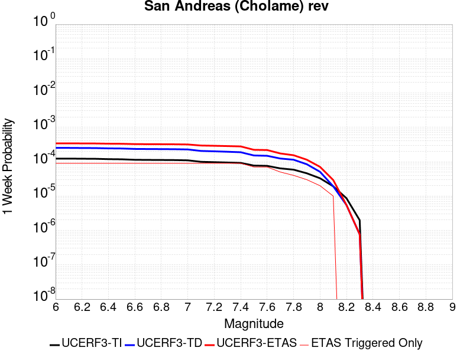 |  |  | 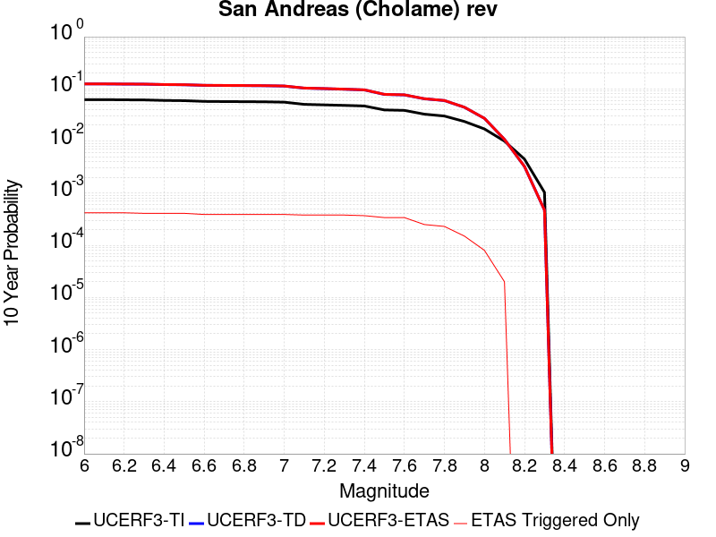 |

| Magnitude | 1 wk TI Prob | 1 wk TD Prob | 1 wk ETAS Prob | 1 wk ETAS/TD Gain | 1 wk ETAS Triggered Only | 1 mo TI Prob | 1 mo TD Prob | 1 mo ETAS Prob | 1 mo ETAS/TD Gain | 1 mo ETAS Triggered Only | 1 yr TI Prob | 1 yr TD Prob | 1 yr ETAS Prob | 1 yr ETAS/TD Gain | 1 yr ETAS Triggered Only | 10 yr TI Prob | 10 yr TD Prob | 10 yr ETAS Prob | 10 yr ETAS/TD Gain | 10 yr ETAS Triggered Only |
|-----|-----|-----|-----|-----|-----|-----|-----|-----|-----|-----|-----|-----|-----|-----|-----|-----|-----|-----|-----|-----|
| 6.0 | 1.2302514E-4 | 2.5204287E-4 | 3.4202018E-4 | 1.3569921 | 9.0E-5 | 5.27144E-4 | 0.0010797381 | 0.0011996087 | 1.1110181 | 1.2E-4 | 0.0063991086 | 0.0130670825 | 0.013353293 | 1.0219032 | 2.9E-4 | 0.06217949 | 0.12439073 | 0.12475848 | 1.0029565 | 4.2E-4 |
| 6.1 | 1.2302514E-4 | 2.5204287E-4 | 3.4202018E-4 | 1.3569921 | 9.0E-5 | 5.27144E-4 | 0.0010797381 | 0.0011996087 | 1.1110181 | 1.2E-4 | 0.0063991086 | 0.0130670825 | 0.013353293 | 1.0219032 | 2.9E-4 | 0.06217949 | 0.12439073 | 0.12475848 | 1.0029565 | 4.2E-4 |
| 6.2 | 1.2203569E-4 | 2.5021084E-4 | 3.4018833E-4 | 1.3596066 | 9.0E-5 | 5.2290526E-4 | 0.0010718931 | 0.0011917645 | 1.1118314 | 1.2E-4 | 0.006347804 | 0.01297271 | 0.013258948 | 1.0220646 | 2.9E-4 | 0.061695136 | 0.12357691 | 0.123945005 | 1.0029787 | 4.2E-4 |
| 6.3 | 1.2142645E-4 | 2.4907055E-4 | 3.3904816E-4 | 1.3612534 | 9.0E-5 | 5.202953E-4 | 0.0010670102 | 0.0011868821 | 1.1123438 | 1.2E-4 | 0.006316212 | 0.012913967 | 0.0131903505 | 1.021402 | 2.8E-4 | 0.06139677 | 0.12307103 | 0.12343057 | 1.0029215 | 4.1E-4 |
| 6.4 | 1.1865206E-4 | 2.44126E-4 | 3.3410403E-4 | 1.3685721 | 9.0E-5 | 5.0840975E-4 | 0.0010458364 | 0.0011657109 | 1.1146207 | 1.2E-4 | 0.006172335 | 0.012659196 | 0.0129356515 | 1.0218383 | 2.8E-4 | 0.060036868 | 0.1208638 | 0.12122425 | 1.0029823 | 4.1E-4 |
| 6.5 | 1.17443946E-4 | 2.4205919E-4 | 3.320374E-4 | 1.3717198 | 9.0E-5 | 5.032341E-4 | 0.0010369857 | 0.0011568612 | 1.1156 | 1.2E-4 | 0.006109677 | 0.012552682 | 0.012829168 | 1.022026 | 2.8E-4 | 0.059444077 | 0.11993805 | 0.12029888 | 1.0030085 | 4.1E-4 |
| 6.6 | 1.13579066E-4 | 2.3514954E-4 | 3.2512838E-4 | 1.3826451 | 9.0E-5 | 4.866766E-4 | 0.001007396 | 0.0011272752 | 1.118999 | 1.2E-4 | 0.0059092017 | 0.012196515 | 0.012463221 | 1.0218675 | 2.7E-4 | 0.057545185 | 0.11685214 | 0.117196575 | 1.0029476 | 3.9E-4 |
| 6.7 | 1.1271412E-4 | 2.3359268E-4 | 3.2357167E-4 | 1.3851961 | 9.0E-5 | 4.829711E-4 | 0.0010007289 | 0.0011206089 | 1.1197926 | 1.2E-4 | 0.005864331 | 0.012116249 | 0.012382978 | 1.0220141 | 2.7E-4 | 0.057119697 | 0.116155714 | 0.116500415 | 1.0029676 | 3.9E-4 |
| 6.8 | 1.1217975E-4 | 2.3247694E-4 | 3.2245604E-4 | 1.3870451 | 9.0E-5 | 4.8068175E-4 | 9.959509E-4 | 0.0011158313 | 1.1203679 | 1.2E-4 | 0.005836608 | 0.012058721 | 0.012325466 | 1.0221205 | 2.7E-4 | 0.056856725 | 0.11565396 | 0.115998864 | 1.0029821 | 3.9E-4 |
| 6.9 | 1.1146753E-4 | 2.3096445E-4 | 3.2094365E-4 | 1.3895804 | 9.0E-5 | 4.7763053E-4 | 9.894737E-4 | 0.0011093549 | 1.1211566 | 1.2E-4 | 0.0057996577 | 0.011980731 | 0.012247496 | 1.0222661 | 2.7E-4 | 0.056506127 | 0.11497439 | 0.11531955 | 1.003002 | 3.9E-4 |
| 7.0 | 1.0965793E-4 | 2.2719789E-4 | 3.1717744E-4 | 1.3960404 | 9.0E-5 | 4.698779E-4 | 9.733434E-4 | 0.0010932266 | 1.1231664 | 1.2E-4 | 0.005705768 | 0.011786487 | 0.012053304 | 1.0226376 | 2.7E-4 | 0.055614736 | 0.11327597 | 0.113621786 | 1.003053 | 3.9E-4 |
| 7.1 | 9.927982E-5 | 2.0538924E-4 | 2.9537076E-4 | 1.4381024 | 9.0E-5 | 4.2541555E-4 | 8.7994366E-4 | 9.99838E-4 | 1.1362524 | 1.2E-4 | 0.0051671406 | 0.010660981 | 0.010928103 | 1.025056 | 2.7E-4 | 0.05048634 | 0.1033706 | 0.103711314 | 1.0032961 | 3.8E-4 |
| 7.2 | 9.696786E-5 | 2.0043184E-4 | 2.904138E-4 | 1.4489404 | 9.0E-5 | 4.1551032E-4 | 8.5871184E-4 | 9.786087E-4 | 1.1396242 | 1.2E-4 | 0.00504711 | 0.010404981 | 0.010672172 | 1.0256791 | 2.7E-4 | 0.04934009 | 0.1011086 | 0.10145018 | 1.0033784 | 3.8E-4 |
| 7.3 | 9.4727984E-5 | 1.9472468E-4 | 2.8470717E-4 | 1.462101 | 9.0E-5 | 4.0591392E-4 | 8.3426846E-4 | 9.541683E-4 | 1.1437186 | 1.2E-4 | 0.0049308087 | 0.010110183 | 0.010377453 | 1.0264357 | 2.7E-4 | 0.048228268 | 0.09847952 | 0.098822095 | 1.0034786 | 3.8E-4 |
| 7.4 | 9.220358E-5 | 1.8843076E-4 | 2.784138E-4 | 1.4775391 | 9.0E-5 | 3.9509835E-4 | 8.073114E-4 | 9.272145E-4 | 1.1485215 | 1.2E-4 | 0.004799717 | 0.009784967 | 0.010042422 | 1.0263114 | 2.6E-4 | 0.046973653 | 0.095557496 | 0.09589214 | 1.003502 | 3.7E-4 |
| 7.5 | 7.71631E-5 | 1.5177966E-4 | 2.2176903E-4 | 1.4611249 | 7.0E-5 | 3.306571E-4 | 6.503223E-4 | 7.502572E-4 | 1.15367 | 1.0E-4 | 0.0040183207 | 0.007889002 | 0.008127108 | 1.0301821 | 2.4E-4 | 0.03946433 | 0.07828531 | 0.078598686 | 1.004003 | 3.4E-4 |
| 7.6 | 7.5634416E-5 | 1.483744E-4 | 2.18364E-4 | 1.4717095 | 7.0E-5 | 3.241072E-4 | 6.3573546E-4 | 7.356719E-4 | 1.1571981 | 1.0E-4 | 0.0039388672 | 0.0077126776 | 0.007950827 | 1.0308776 | 2.4E-4 | 0.038697794 | 0.07664872 | 0.07696266 | 1.0040958 | 3.4E-4 |
| 7.7 | 6.3783E-5 | 1.235872E-4 | 1.7358102E-4 | 1.4045227 | 5.0E-5 | 2.7332708E-4 | 5.29552E-4 | 5.895202E-4 | 1.1132433 | 6.0E-5 | 0.0033226798 | 0.0064282627 | 0.0066071055 | 1.0278213 | 1.8E-4 | 0.032734364 | 0.06454029 | 0.064774156 | 1.0036236 | 2.5E-4 |
| 7.8 | 5.863422E-5 | 1.1416107E-4 | 1.5415651E-4 | 1.3503422 | 4.0E-5 | 2.512653E-4 | 4.8917E-4 | 5.391456E-4 | 1.1021639 | 5.0E-5 | 0.003054864 | 0.0059394026 | 0.0060984525 | 1.0267787 | 1.6E-4 | 0.030132094 | 0.059659187 | 0.059875466 | 1.0036253 | 2.3E-4 |
| 7.9 | 4.595283E-5 | 8.426331E-5 | 1.1426079E-4 | 1.3559968 | 3.0E-5 | 1.9692584E-4 | 3.610785E-4 | 3.9106768E-4 | 1.0830544 | 3.0E-5 | 0.0023949358 | 0.0043872762 | 0.0044868374 | 1.0226932 | 1.0E-4 | 0.023692891 | 0.044362005 | 0.04450535 | 1.0032313 | 1.5E-4 |
| 8.0 | 3.2950178E-5 | 5.0772942E-5 | 7.077193E-5 | 1.3938906 | 2.0E-5 | 1.412074E-4 | 2.1758018E-4 | 2.3757583E-4 | 1.0919001 | 2.0E-5 | 0.0017178444 | 0.0026458222 | 0.0026956901 | 1.0188477 | 5.0E-5 | 0.017046256 | 0.027180137 | 0.027257962 | 1.0028633 | 8.0E-5 |
| 8.1 | 1.9177472E-5 | 1.9185145E-5 | 2.9184954E-5 | 1.5212266 | 1.0E-5 | 8.218658E-5 | 8.221946E-5 | 9.2218645E-5 | 1.1216156 | 1.0E-5 | 0.0010001622 | 0.0010005629 | 0.0010205429 | 1.0199687 | 2.0E-5 | 0.009956728 | 0.010758142 | 0.010777927 | 1.001839 | 2.0E-5 |
| 8.2 | 8.643924E-6 | 5.4748625E-6 | 5.4748625E-6 | 1.0 | 0.0 | 3.704486E-5 | 2.3463486E-5 | 2.3463486E-5 | 1.0 | 0.0 | 4.5092785E-4 | 2.8563058E-4 | 2.8563058E-4 | 1.0 | 0.0 | 0.0045001395 | 0.0032487072 | 0.0032487072 | 1.0 | 0.0 |
| 8.3 | 1.983087E-6 | 7.6599065E-7 | 7.6599065E-7 | 1.0 | 0.0 | 8.498917E-6 | 3.282813E-6 | 3.282813E-6 | 1.0 | 0.0 | 1.034694E-4 | 3.9967534E-5 | 3.9967534E-5 | 1.0 | 0.0 | 0.0010342124 | 4.719687E-4 | 4.719687E-4 | 1.0 | 0.0 |

## Ludlow
*[(top)](#table-of-contents)*

| 1 Week | 1 Month | 1 Year | 10 Year |
|-----|-----|-----|-----|
|  |  |  |  |

| Magnitude | 1 wk TI Prob | 1 wk TD Prob | 1 wk ETAS Prob | 1 wk ETAS/TD Gain | 1 wk ETAS Triggered Only | 1 mo TI Prob | 1 mo TD Prob | 1 mo ETAS Prob | 1 mo ETAS/TD Gain | 1 mo ETAS Triggered Only | 1 yr TI Prob | 1 yr TD Prob | 1 yr ETAS Prob | 1 yr ETAS/TD Gain | 1 yr ETAS Triggered Only | 10 yr TI Prob | 10 yr TD Prob | 10 yr ETAS Prob | 10 yr ETAS/TD Gain | 10 yr ETAS Triggered Only |
|-----|-----|-----|-----|-----|-----|-----|-----|-----|-----|-----|-----|-----|-----|-----|-----|-----|-----|-----|-----|-----|
| 6.0 | 2.2407607E-5 | 2.3657254E-5 | 1.2365489E-4 | 5.2269335 | 1.0E-4 | 9.602906E-5 | 1.0138454E-4 | 2.4137035E-4 | 2.3807411 | 1.4E-4 | 0.0011685267 | 0.001233702 | 0.0014434429 | 1.1700094 | 2.1E-4 | 0.011624013 | 0.012273042 | 0.012658255 | 1.031387 | 3.9E-4 |
| 6.1 | 2.2407607E-5 | 2.3657254E-5 | 1.2365489E-4 | 5.2269335 | 1.0E-4 | 9.602906E-5 | 1.0138454E-4 | 2.4137035E-4 | 2.3807411 | 1.4E-4 | 0.0011685267 | 0.001233702 | 0.0014434429 | 1.1700094 | 2.1E-4 | 0.011624013 | 0.012273042 | 0.012658255 | 1.031387 | 3.9E-4 |
| 6.2 | 1.0781252E-5 | 1.1365663E-5 | 4.136532E-5 | 3.6394992 | 3.0E-5 | 4.620455E-5 | 4.8709102E-5 | 8.870715E-5 | 1.8211617 | 4.0E-5 | 5.623952E-4 | 5.9287593E-4 | 6.6283444E-4 | 1.1179986 | 7.0E-5 | 0.00560974 | 0.0059133614 | 0.006022711 | 1.018492 | 1.1E-4 |
| 6.3 | 1.0781252E-5 | 1.1365663E-5 | 4.136532E-5 | 3.6394992 | 3.0E-5 | 4.620455E-5 | 4.8709102E-5 | 8.870715E-5 | 1.8211617 | 4.0E-5 | 5.623952E-4 | 5.9287593E-4 | 6.6283444E-4 | 1.1179986 | 7.0E-5 | 0.00560974 | 0.0059133614 | 0.006022711 | 1.018492 | 1.1E-4 |
| 6.4 | 7.814439E-6 | 8.237729E-6 | 3.8237482E-5 | 4.6417503 | 3.0E-5 | 3.3490025E-5 | 3.530408E-5 | 6.530302E-5 | 1.8497301 | 3.0E-5 | 4.0766477E-4 | 4.2974384E-4 | 4.6972663E-4 | 1.0930387 | 4.0E-5 | 0.0040691774 | 0.0042892746 | 0.004349017 | 1.0139284 | 6.0E-5 |
| 6.5 | 6.4986366E-6 | 6.85092E-6 | 2.6850783E-5 | 3.919296 | 2.0E-5 | 2.7851002E-5 | 2.9360759E-5 | 4.9360173E-5 | 1.6811613 | 2.0E-5 | 3.390332E-4 | 3.5740953E-4 | 3.8739882E-4 | 1.0839074 | 3.0E-5 | 0.003385164 | 0.0035684432 | 0.0036083006 | 1.0111693 | 4.0E-5 |
| 6.6 | 5.582177E-6 | 5.8860055E-6 | 2.5885887E-5 | 4.39787 | 2.0E-5 | 2.3923398E-5 | 2.5225498E-5 | 4.5224995E-5 | 1.7928286 | 2.0E-5 | 2.9122844E-4 | 3.0707786E-4 | 3.3706866E-4 | 1.0976651 | 3.0E-5 | 0.0029084706 | 0.003066609 | 0.0031064863 | 1.0130037 | 4.0E-5 |
| 6.7 | 4.6858763E-6 | 4.940427E-6 | 2.494033E-5 | 5.048213 | 2.0E-5 | 2.0082172E-5 | 2.1173091E-5 | 4.117267E-5 | 1.9445752 | 2.0E-5 | 2.4447302E-4 | 2.5775246E-4 | 2.877447E-4 | 1.1163608 | 3.0E-5 | 0.0024420423 | 0.0025745912 | 0.0026045141 | 1.0116223 | 3.0E-5 |
| 6.8 | 3.5584908E-6 | 3.7520183E-6 | 2.3751943E-5 | 6.3304443 | 2.0E-5 | 1.5250586E-5 | 1.6079981E-5 | 3.607966E-5 | 2.2437625 | 2.0E-5 | 1.8566006E-4 | 1.957566E-4 | 2.2575073E-4 | 1.1532215 | 3.0E-5 | 0.0018550502 | 0.0019558826 | 0.001985824 | 1.0153084 | 3.0E-5 |
| 6.9 | 2.532834E-6 | 2.6710034E-6 | 2.267095E-5 | 8.4878025 | 2.0E-5 | 1.0854958E-5 | 1.1447109E-5 | 3.144688E-5 | 2.7471461 | 2.0E-5 | 1.3215111E-4 | 1.3935992E-4 | 1.5935714E-4 | 1.1434933 | 2.0E-5 | 0.0013207254 | 0.0013927529 | 0.001412725 | 1.01434 | 2.0E-5 |
| 7.0 | 1.7083285E-6 | 1.8019439E-6 | 1.1801926E-5 | 6.5495524 | 1.0E-5 | 7.3213873E-6 | 7.722595E-6 | 1.7722517E-5 | 2.2948916 | 1.0E-5 | 8.913424E-5 | 9.40187E-5 | 1.0401776E-4 | 1.1063519 | 1.0E-5 | 8.9098496E-4 | 9.3980576E-4 | 9.4979635E-4 | 1.0106305 | 1.0E-5 |
| 7.1 | 1.0905424E-6 | 1.1497619E-6 | 1.114975E-5 | 9.697442 | 1.0E-5 | 4.6737446E-6 | 4.9275427E-6 | 1.4927493E-5 | 3.0293992 | 1.0E-5 | 5.6901354E-5 | 5.999128E-5 | 6.999068E-5 | 1.1666809 | 1.0E-5 | 5.6886784E-4 | 5.997606E-4 | 6.0975464E-4 | 1.0166633 | 1.0E-5 |
| 7.2 | 6.06668E-7 | 6.387277E-7 | 6.387277E-7 | 1.0 | 0.0 | 2.600003E-6 | 2.7374022E-6 | 2.7374022E-6 | 1.0 | 0.0 | 3.1654577E-5 | 3.3327433E-5 | 3.3327433E-5 | 1.0 | 0.0 | 3.1650066E-4 | 3.3323118E-4 | 3.3323118E-4 | 1.0 | 0.0 |

## White Wolf (Extension)
*[(top)](#table-of-contents)*

| 1 Week | 1 Month | 1 Year | 10 Year |
|-----|-----|-----|-----|
| 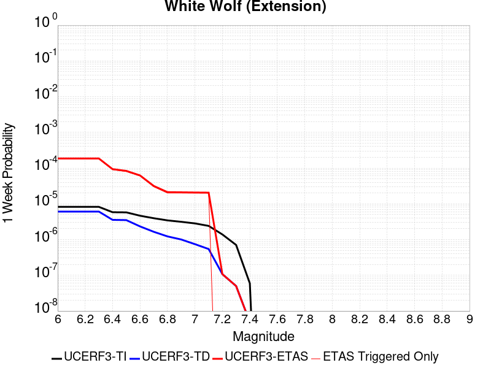 |  |  |  |

| Magnitude | 1 wk TI Prob | 1 wk TD Prob | 1 wk ETAS Prob | 1 wk ETAS/TD Gain | 1 wk ETAS Triggered Only | 1 mo TI Prob | 1 mo TD Prob | 1 mo ETAS Prob | 1 mo ETAS/TD Gain | 1 mo ETAS Triggered Only | 1 yr TI Prob | 1 yr TD Prob | 1 yr ETAS Prob | 1 yr ETAS/TD Gain | 1 yr ETAS Triggered Only | 10 yr TI Prob | 10 yr TD Prob | 10 yr ETAS Prob | 10 yr ETAS/TD Gain | 10 yr ETAS Triggered Only |
|-----|-----|-----|-----|-----|-----|-----|-----|-----|-----|-----|-----|-----|-----|-----|-----|-----|-----|-----|-----|-----|
| 6.0 | 8.222555E-6 | 6.0666657E-6 | 1.8606558E-4 | 30.670155 | 1.8E-4 | 3.5239045E-5 | 2.5999774E-5 | 2.559938E-4 | 9.846001 | 2.3E-4 | 4.289509E-4 | 3.1650788E-4 | 6.4640347E-4 | 2.042298 | 3.3E-4 | 0.0042812387 | 0.003161223 | 0.0035599584 | 1.1261333 | 4.0E-4 |
| 6.1 | 8.222555E-6 | 6.0666657E-6 | 1.8606558E-4 | 30.670155 | 1.8E-4 | 3.5239045E-5 | 2.5999774E-5 | 2.559938E-4 | 9.846001 | 2.3E-4 | 4.289509E-4 | 3.1650788E-4 | 6.4640347E-4 | 2.042298 | 3.3E-4 | 0.0042812387 | 0.003161223 | 0.0035599584 | 1.1261333 | 4.0E-4 |
| 6.2 | 8.222555E-6 | 6.0666657E-6 | 1.8606558E-4 | 30.670155 | 1.8E-4 | 3.5239045E-5 | 2.5999774E-5 | 2.559938E-4 | 9.846001 | 2.3E-4 | 4.289509E-4 | 3.1650788E-4 | 6.4640347E-4 | 2.042298 | 3.3E-4 | 0.0042812387 | 0.003161223 | 0.0035599584 | 1.1261333 | 4.0E-4 |
| 6.3 | 8.222555E-6 | 6.0666657E-6 | 1.8606558E-4 | 30.670155 | 1.8E-4 | 3.5239045E-5 | 2.5999774E-5 | 2.559938E-4 | 9.846001 | 2.3E-4 | 4.289509E-4 | 3.1650788E-4 | 6.4640347E-4 | 2.042298 | 3.3E-4 | 0.0042812387 | 0.003161223 | 0.0035599584 | 1.1261333 | 4.0E-4 |
| 6.4 | 5.821773E-6 | 3.5571766E-6 | 9.355685E-5 | 26.300875 | 9.0E-5 | 2.4950215E-5 | 1.5244959E-5 | 1.3524313E-4 | 8.871334 | 1.2E-4 | 3.0372653E-4 | 1.8559267E-4 | 3.755574E-4 | 2.0235574 | 1.9E-4 | 0.0030331176 | 0.001854485 | 0.0020840585 | 1.1237936 | 2.3E-4 |
| 6.5 | 5.766023E-6 | 3.4991106E-6 | 8.349883E-5 | 23.862873 | 8.0E-5 | 2.4711293E-5 | 1.4996108E-5 | 1.2499446E-4 | 8.335127 | 1.1E-4 | 3.0081844E-4 | 1.8256342E-4 | 3.6253055E-4 | 1.9857787 | 1.8E-4 | 0.0030041158 | 0.0018242426 | 0.0020438412 | 1.120378 | 2.2E-4 |
| 6.6 | 4.643576E-6 | 2.332624E-6 | 6.233248E-5 | 26.722044 | 6.0E-5 | 1.9900888E-5 | 9.996925E-6 | 9.9996025E-5 | 10.002679 | 9.0E-5 | 2.4226638E-4 | 1.2170619E-4 | 2.316928E-4 | 1.903706 | 1.1E-4 | 0.0024200242 | 0.0012164378 | 0.0013462796 | 1.1067394 | 1.3E-4 |
| 6.7 | 3.9529173E-6 | 1.6483477E-6 | 3.16483E-5 | 19.200012 | 3.0E-5 | 1.6940963E-5 | 7.0643296E-6 | 4.7064048E-5 | 6.66221 | 4.0E-5 | 2.0623671E-4 | 8.6005006E-5 | 1.360007E-4 | 1.5813115 | 5.0E-5 | 0.002060454 | 8.597357E-4 | 9.2967553E-4 | 1.0813503 | 7.0E-5 |
| 6.8 | 3.4377522E-6 | 1.2245237E-6 | 2.12245E-5 | 17.33286 | 2.0E-5 | 1.473314E-5 | 5.2479486E-6 | 2.5247844E-5 | 4.8109927 | 2.0E-5 | 1.7936122E-4 | 6.3891996E-5 | 8.3890714E-5 | 1.3130083 | 2.0E-5 | 0.0017921652 | 6.387454E-4 | 6.6872616E-4 | 1.0469371 | 3.0E-5 |
| 6.9 | 3.1367306E-6 | 1.0033783E-6 | 2.1003358E-5 | 20.93264 | 2.0E-5 | 1.3443062E-5 | 4.3001864E-6 | 2.43001E-5 | 5.6509414 | 2.0E-5 | 1.63657E-4 | 5.235359E-5 | 7.235254E-5 | 1.3819977 | 2.0E-5 | 0.0016353652 | 5.2342017E-4 | 5.534045E-4 | 1.0572853 | 3.0E-5 |
| 7.0 | 2.8298145E-6 | 7.4286646E-7 | 2.0742851E-5 | 27.922718 | 2.0E-5 | 1.2127721E-5 | 3.1837099E-6 | 2.3183646E-5 | 7.2819595 | 2.0E-5 | 1.47645E-4 | 3.8761027E-5 | 5.876025E-5 | 1.5159621 | 2.0E-5 | 0.0014754693 | 3.8754768E-4 | 4.1753604E-4 | 1.0773798 | 3.0E-5 |
| 7.1 | 2.4091064E-6 | 5.4227525E-7 | 2.0542264E-5 | 37.881622 | 2.0E-5 | 1.03247E-5 | 2.3240348E-6 | 2.2323988E-5 | 9.605703 | 2.0E-5 | 1.2569598E-4 | 2.8294799E-5 | 4.829423E-5 | 1.7068237 | 2.0E-5 | 0.001256249 | 2.8291598E-4 | 3.0291034E-4 | 1.0706724 | 2.0E-5 |
| 7.2 | 1.3875518E-6 | 1.0743063E-7 | 1.0743063E-7 | 1.0 | 0.0 | 5.9466374E-6 | 4.6041689E-7 | 4.6041689E-7 | 1.0 | 0.0 | 7.23979E-5 | 5.6055624E-6 | 5.6055624E-6 | 1.0 | 0.0 | 7.2374323E-4 | 5.6054323E-5 | 5.6054323E-5 | 1.0 | 0.0 |
| 7.3 | 7.056077E-7 | 5.002034E-8 | 5.002034E-8 | 1.0 | 0.0 | 3.0240296E-6 | 2.1437286E-7 | 2.1437286E-7 | 1.0 | 0.0 | 3.681694E-5 | 2.609987E-6 | 2.609987E-6 | 1.0 | 0.0 | 3.681084E-4 | 2.609961E-5 | 2.609961E-5 | 1.0 | 0.0 |
| 7.4 | 5.9334678E-8 | 4.8683537E-9 | 4.8683537E-9 | 1.0 | 0.0 | 2.5429145E-7 | 2.0864372E-8 | 2.0864372E-8 | 1.0 | 0.0 | 3.095994E-6 | 2.5402372E-7 | 2.5402372E-7 | 1.0 | 0.0 | 3.095951E-5 | 2.5402353E-6 | 2.5402353E-6 | 1.0 | 0.0 |

## Manix-Afton Hills
*[(top)](#table-of-contents)*

| 1 Week | 1 Month | 1 Year | 10 Year |
|-----|-----|-----|-----|
|  |  | 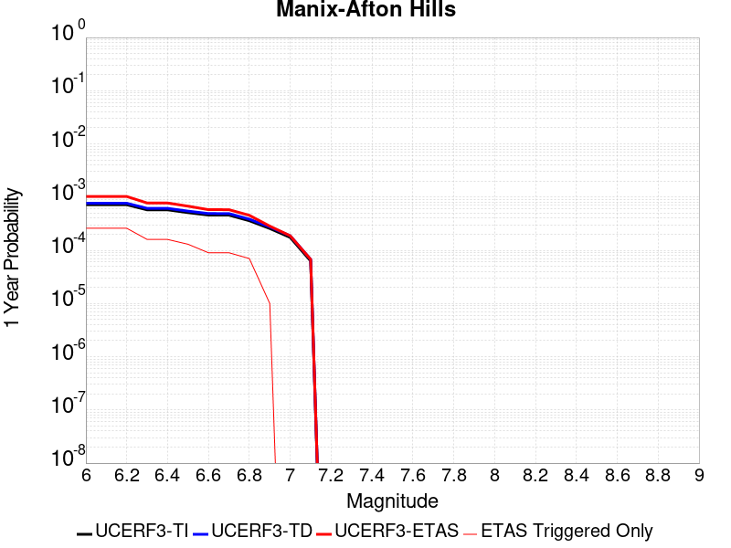 |  |

| Magnitude | 1 wk TI Prob | 1 wk TD Prob | 1 wk ETAS Prob | 1 wk ETAS/TD Gain | 1 wk ETAS Triggered Only | 1 mo TI Prob | 1 mo TD Prob | 1 mo ETAS Prob | 1 mo ETAS/TD Gain | 1 mo ETAS Triggered Only | 1 yr TI Prob | 1 yr TD Prob | 1 yr ETAS Prob | 1 yr ETAS/TD Gain | 1 yr ETAS Triggered Only | 10 yr TI Prob | 10 yr TD Prob | 10 yr ETAS Prob | 10 yr ETAS/TD Gain | 10 yr ETAS Triggered Only |
|-----|-----|-----|-----|-----|-----|-----|-----|-----|-----|-----|-----|-----|-----|-----|-----|-----|-----|-----|-----|-----|
| 6.0 | 1.3783202E-5 | 1.47110895E-5 | 1.2470948E-4 | 8.477242 | 1.1E-4 | 5.906953E-5 | 6.30461E-5 | 2.2303601E-4 | 3.5376654 | 1.6E-4 | 7.189342E-4 | 7.6733343E-4 | 0.0010271339 | 1.3385757 | 2.6E-4 | 0.0071661277 | 0.007648596 | 0.008005843 | 1.0467075 | 3.6E-4 |
| 6.1 | 1.3783202E-5 | 1.47110895E-5 | 1.2470948E-4 | 8.477242 | 1.1E-4 | 5.906953E-5 | 6.30461E-5 | 2.2303601E-4 | 3.5376654 | 1.6E-4 | 7.189342E-4 | 7.6733343E-4 | 0.0010271339 | 1.3385757 | 2.6E-4 | 0.0071661277 | 0.007648596 | 0.008005843 | 1.0467075 | 3.6E-4 |
| 6.2 | 1.3783202E-5 | 1.47110895E-5 | 1.2470948E-4 | 8.477242 | 1.1E-4 | 5.906953E-5 | 6.30461E-5 | 2.2303601E-4 | 3.5376654 | 1.6E-4 | 7.189342E-4 | 7.6733343E-4 | 0.0010271339 | 1.3385757 | 2.6E-4 | 0.0071661277 | 0.007648596 | 0.008005843 | 1.0467075 | 3.6E-4 |
| 6.3 | 1.10494875E-5 | 1.1793136E-5 | 9.179219E-5 | 7.7835274 | 8.0E-5 | 4.7354086E-5 | 5.054109E-5 | 1.6053554E-4 | 3.176337 | 1.1E-4 | 5.763835E-4 | 6.151744E-4 | 7.75076E-4 | 1.2599288 | 1.6E-4 | 0.005748908 | 0.0061357557 | 0.006364344 | 1.0372552 | 2.3E-4 |
| 6.4 | 1.10494875E-5 | 1.1793136E-5 | 9.179219E-5 | 7.7835274 | 8.0E-5 | 4.7354086E-5 | 5.054109E-5 | 1.6053554E-4 | 3.176337 | 1.1E-4 | 5.763835E-4 | 6.151744E-4 | 7.75076E-4 | 1.2599288 | 1.6E-4 | 0.005748908 | 0.0061357557 | 0.006364344 | 1.0372552 | 2.3E-4 |
| 6.5 | 9.788949E-6 | 1.045432E-5 | 8.045359E-5 | 7.695727 | 7.0E-5 | 4.1951964E-5 | 4.480351E-5 | 1.2479993E-4 | 2.7854943 | 8.0E-5 | 5.1064545E-4 | 5.453555E-4 | 6.752846E-4 | 1.2382467 | 1.3E-4 | 0.0050947363 | 0.0054410985 | 0.0056400103 | 1.0365573 | 2.0E-4 |
| 6.6 | 8.810006E-6 | 9.4136285E-6 | 5.9413156E-5 | 6.3113985 | 5.0E-5 | 3.775662E-5 | 4.0343548E-5 | 9.034153E-5 | 2.2393055 | 5.0E-5 | 4.5958988E-4 | 4.9108086E-4 | 5.810367E-4 | 1.1831793 | 9.0E-5 | 0.0045864056 | 0.004900839 | 0.005060055 | 1.0324875 | 1.6E-4 |
| 6.7 | 8.80128E-6 | 9.404108E-6 | 5.940364E-5 | 6.3167753 | 5.0E-5 | 3.7719226E-5 | 4.0302748E-5 | 9.030073E-5 | 2.2405603 | 5.0E-5 | 4.591348E-4 | 4.9058435E-4 | 5.805402E-4 | 1.1833646 | 9.0E-5 | 0.004581874 | 0.0048958957 | 0.0050551128 | 1.0325204 | 1.6E-4 |
| 6.8 | 6.8994877E-6 | 7.380076E-6 | 5.7379708E-5 | 7.774948 | 5.0E-5 | 2.9568899E-5 | 3.162856E-5 | 8.1626975E-5 | 2.5807998 | 5.0E-5 | 3.5994186E-4 | 3.8501783E-4 | 4.549909E-4 | 1.1817398 | 7.0E-5 | 0.003593594 | 0.0038443129 | 0.0039439285 | 1.0259124 | 1.0E-4 |
| 6.9 | 4.9328037E-6 | 5.2709615E-6 | 5.2709615E-6 | 1.0 | 0.0 | 2.1140417E-5 | 2.2589675E-5 | 2.2589675E-5 | 1.0 | 0.0 | 2.5735417E-4 | 2.7500073E-4 | 2.8499798E-4 | 1.0363536 | 1.0E-5 | 0.0025705635 | 0.0027472095 | 0.0027870997 | 1.0145203 | 4.0E-5 |
| 7.0 | 3.347973E-6 | 3.59003E-6 | 3.59003E-6 | 1.0 | 0.0 | 1.4348378E-5 | 1.5385775E-5 | 1.5385775E-5 | 1.0 | 0.0 | 1.746775E-4 | 1.8730981E-4 | 1.8730981E-4 | 1.0 | 0.0 | 0.0017454025 | 0.0018719219 | 0.0019018658 | 1.0159963 | 3.0E-5 |
| 7.1 | 1.2073567E-6 | 1.293482E-6 | 1.293482E-6 | 1.0 | 0.0 | 5.1743755E-6 | 5.543492E-6 | 5.543492E-6 | 1.0 | 0.0 | 6.29962E-5 | 6.749156E-5 | 6.749156E-5 | 1.0 | 0.0 | 6.297835E-4 | 6.7487074E-4 | 6.9485727E-4 | 1.0296153 | 2.0E-5 |

## San Andreas (Coachella) rev
*[(top)](#table-of-contents)*

| 1 Week | 1 Month | 1 Year | 10 Year |
|-----|-----|-----|-----|
|  |  |  | 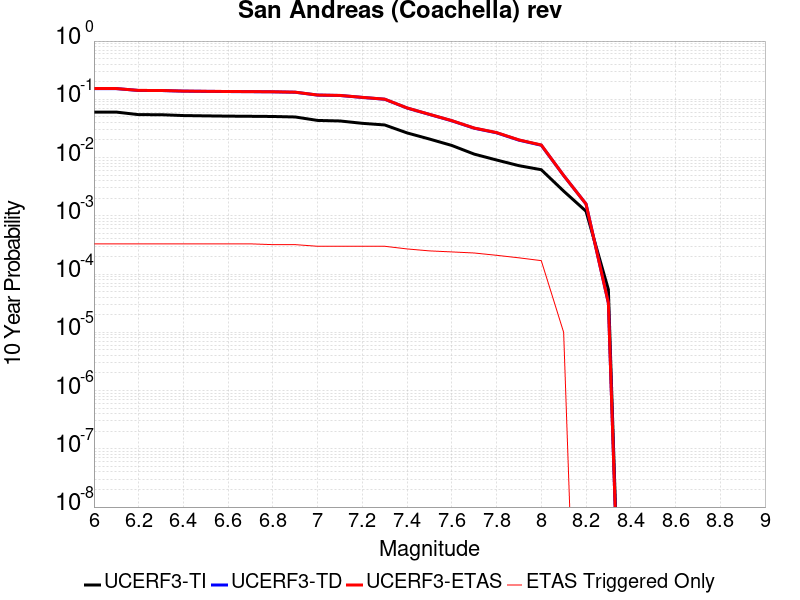 |

| Magnitude | 1 wk TI Prob | 1 wk TD Prob | 1 wk ETAS Prob | 1 wk ETAS/TD Gain | 1 wk ETAS Triggered Only | 1 mo TI Prob | 1 mo TD Prob | 1 mo ETAS Prob | 1 mo ETAS/TD Gain | 1 mo ETAS Triggered Only | 1 yr TI Prob | 1 yr TD Prob | 1 yr ETAS Prob | 1 yr ETAS/TD Gain | 1 yr ETAS Triggered Only | 10 yr TI Prob | 10 yr TD Prob | 10 yr ETAS Prob | 10 yr ETAS/TD Gain | 10 yr ETAS Triggered Only |
|-----|-----|-----|-----|-----|-----|-----|-----|-----|-----|-----|-----|-----|-----|-----|-----|-----|-----|-----|-----|-----|
| 6.0 | 1.1925945E-4 | 3.2729402E-4 | 4.672482E-4 | 1.4276099 | 1.4E-4 | 5.110118E-4 | 0.0014019393 | 0.001561715 | 1.1139677 | 1.6E-4 | 0.0062038354 | 0.016936364 | 0.017142808 | 1.0121894 | 2.1E-4 | 0.060334753 | 0.15265316 | 0.15293278 | 1.0018318 | 3.3E-4 |
| 6.1 | 1.1925945E-4 | 3.2729402E-4 | 4.672482E-4 | 1.4276099 | 1.4E-4 | 5.110118E-4 | 0.0014019393 | 0.001561715 | 1.1139677 | 1.6E-4 | 0.0062038354 | 0.016936364 | 0.017142808 | 1.0121894 | 2.1E-4 | 0.060334753 | 0.15265316 | 0.15293278 | 1.0018318 | 3.3E-4 |
| 6.2 | 1.07432395E-4 | 3.0230157E-4 | 4.4225925E-4 | 1.4629737 | 1.4E-4 | 4.603433E-4 | 0.0012949388 | 0.0014547317 | 1.123398 | 1.6E-4 | 0.005590286 | 0.015653009 | 0.015859721 | 1.013206 | 2.1E-4 | 0.05451731 | 0.14182423 | 0.14210743 | 1.0019969 | 3.3E-4 |
| 6.3 | 1.0718766E-4 | 3.0175463E-4 | 4.417124E-4 | 1.4638132 | 1.4E-4 | 4.592948E-4 | 0.0012925972 | 0.0014523903 | 1.1236218 | 1.6E-4 | 0.005577586 | 0.015624908 | 0.015831627 | 1.0132301 | 2.1E-4 | 0.054396555 | 0.14159249 | 0.14187577 | 1.0020007 | 3.3E-4 |
| 6.4 | 1.0355944E-4 | 2.9383553E-4 | 4.337944E-4 | 1.476317 | 1.4E-4 | 4.4375064E-4 | 0.0012586913 | 0.00141849 | 1.1269561 | 1.6E-4 | 0.0053892885 | 0.015217941 | 0.015424746 | 1.0135895 | 2.1E-4 | 0.052604496 | 0.13815255 | 0.13843696 | 1.0020586 | 3.3E-4 |
| 6.5 | 1.0227914E-4 | 2.9102986E-4 | 4.3098914E-4 | 1.4809103 | 1.4E-4 | 4.382655E-4 | 0.0012466786 | 0.0014064792 | 1.128181 | 1.6E-4 | 0.0053228354 | 0.01507372 | 0.015280555 | 1.0137216 | 2.1E-4 | 0.051971316 | 0.13693172 | 0.13721654 | 1.00208 | 3.3E-4 |
| 6.6 | 1.0116757E-4 | 2.8868738E-4 | 4.2864698E-4 | 1.4848137 | 1.4E-4 | 4.3350324E-4 | 0.0012366489 | 0.001396451 | 1.1292219 | 1.6E-4 | 0.0052651367 | 0.01495329 | 0.01516015 | 1.0138338 | 2.1E-4 | 0.051421247 | 0.1359099 | 0.13619505 | 1.0020981 | 3.3E-4 |
| 6.7 | 1.0050676E-4 | 2.8727303E-4 | 4.272328E-4 | 1.4872013 | 1.4E-4 | 4.3067214E-4 | 0.0012305931 | 0.0013903962 | 1.1298586 | 1.6E-4 | 0.005230834 | 0.014880571 | 0.015087445 | 1.0139023 | 2.1E-4 | 0.051094085 | 0.13529462 | 0.13557997 | 1.0021092 | 3.3E-4 |
| 6.8 | 9.976819E-5 | 2.853096E-4 | 4.2526965E-4 | 1.490555 | 1.4E-4 | 4.2750788E-4 | 0.0012221863 | 0.001372003 | 1.1225809 | 1.5E-4 | 0.0051924936 | 0.0147796115 | 0.014976655 | 1.0133321 | 2.0E-4 | 0.050728295 | 0.13444631 | 0.13472329 | 1.0020602 | 3.2E-4 |
| 6.9 | 9.77719E-5 | 2.8027873E-4 | 4.202395E-4 | 1.4993627 | 1.4E-4 | 4.1895514E-4 | 0.0012006456 | 0.0013504655 | 1.1247828 | 1.5E-4 | 0.0050888555 | 0.014520878 | 0.014717974 | 1.0135733 | 2.0E-4 | 0.049738888 | 0.1322748 | 0.13255249 | 1.0020992 | 3.2E-4 |
| 7.0 | 8.500761E-5 | 2.4762485E-4 | 3.8759017E-4 | 1.5652313 | 1.4E-4 | 3.6426744E-4 | 0.001060821 | 0.0012106618 | 1.1412499 | 1.5E-4 | 0.0044259406 | 0.012839786 | 0.013027346 | 1.0146078 | 1.9E-4 | 0.04338823 | 0.11813272 | 0.11839728 | 1.0022395 | 3.0E-4 |
| 7.1 | 8.319876E-5 | 2.4365232E-4 | 3.836182E-4 | 1.5744492 | 1.4E-4 | 3.5651738E-4 | 0.0010438096 | 0.001193653 | 1.1435543 | 1.5E-4 | 0.004331963 | 0.012635092 | 0.012822692 | 1.0148475 | 1.9E-4 | 0.042484846 | 0.116353 | 0.1166181 | 1.0022783 | 3.0E-4 |
| 7.2 | 7.563917E-5 | 2.2413683E-4 | 3.6410545E-4 | 1.6244785 | 1.4E-4 | 3.2412758E-4 | 9.602359E-4 | 0.0011100918 | 1.1560616 | 1.5E-4 | 0.0039391145 | 0.011628893 | 0.011816684 | 1.0161486 | 1.9E-4 | 0.03870018 | 0.10775925 | 0.10802692 | 1.002484 | 3.0E-4 |
| 7.3 | 7.082985E-5 | 2.0729867E-4 | 3.4726964E-4 | 1.675214 | 1.4E-4 | 3.0352117E-4 | 8.881233E-4 | 0.0010379901 | 1.1687455 | 1.5E-4 | 0.0036891096 | 0.010759917 | 0.010947873 | 1.0174681 | 1.9E-4 | 0.03628465 | 0.100282 | 0.10055192 | 1.0026915 | 3.0E-4 |
| 7.4 | 5.146215E-5 | 1.4273795E-4 | 2.627208E-4 | 1.8405815 | 1.2E-4 | 2.2053342E-4 | 6.115915E-4 | 7.41512E-4 | 1.2124302 | 1.3E-4 | 0.0026816884 | 0.0074208933 | 0.0075896317 | 1.0227383 | 1.7E-4 | 0.02649557 | 0.070849575 | 0.07110044 | 1.0035409 | 2.7E-4 |
| 7.5 | 4.0285166E-5 | 1.09416E-4 | 2.2940287E-4 | 2.0966117 | 1.2E-4 | 1.7263928E-4 | 4.6884175E-4 | 5.987808E-4 | 1.2771491 | 1.3E-4 | 0.002099857 | 0.0056932783 | 0.00586231 | 1.0296898 | 1.7E-4 | 0.020801254 | 0.055011146 | 0.055247396 | 1.0042945 | 2.5E-4 |
| 7.6 | 3.1168736E-5 | 8.4389096E-5 | 1.9437981E-4 | 2.303376 | 1.1E-4 | 1.3357346E-4 | 3.6161754E-4 | 4.8157416E-4 | 1.3317223 | 1.2E-4 | 0.0016250437 | 0.0043938323 | 0.0045531294 | 1.0362546 | 1.6E-4 | 0.016132116 | 0.04281005 | 0.043039776 | 1.0053662 | 2.4E-4 |
| 7.7 | 2.2100989E-5 | 6.238755E-5 | 1.7238069E-4 | 2.7630622 | 1.1E-4 | 9.4715084E-5 | 2.6734784E-4 | 3.8731578E-4 | 1.4487334 | 1.2E-4 | 0.001152546 | 0.0032501083 | 0.0033996208 | 1.0460023 | 1.5E-4 | 0.011465867 | 0.0319002 | 0.03212286 | 1.00698 | 2.3E-4 |
| 7.8 | 1.7484861E-5 | 5.179572E-5 | 1.4179105E-4 | 2.7375054 | 9.0E-5 | 7.493296E-5 | 2.2196278E-4 | 3.2194058E-4 | 1.450426 | 1.0E-4 | 9.1192697E-4 | 0.0026990508 | 0.0028286998 | 1.048035 | 1.3E-4 | 0.009081938 | 0.026640115 | 0.026844522 | 1.0076729 | 2.1E-4 |
| 7.9 | 1.3967285E-5 | 3.822255E-5 | 1.182195E-4 | 3.0929253 | 8.0E-5 | 5.985842E-5 | 1.6380067E-4 | 2.5378593E-4 | 1.5493584 | 9.0E-5 | 7.2853256E-4 | 0.00199245 | 0.002112211 | 1.0601074 | 1.2E-4 | 0.0072614877 | 0.019909438 | 0.020095654 | 1.0093532 | 1.9E-4 |
| 8.0 | 1.1887396E-5 | 3.106521E-5 | 1.0106304E-4 | 3.2532544 | 7.0E-5 | 5.094499E-5 | 1.3312983E-4 | 2.1311917E-4 | 1.6008372 | 8.0E-5 | 6.200787E-4 | 0.0016196516 | 0.0017194896 | 1.0616417 | 1.0E-4 | 0.006183513 | 0.016279267 | 0.0164465 | 1.0102727 | 1.7E-4 |
| 8.1 | 5.100864E-6 | 8.973418E-6 | 1.8973327E-5 | 2.1143928 | 1.0E-5 | 2.1860664E-5 | 3.8456936E-5 | 4.8456553E-5 | 1.2600211 | 1.0E-5 | 2.6612106E-4 | 4.6811273E-4 | 4.7810806E-4 | 1.0213524 | 1.0E-5 | 0.002658026 | 0.004917731 | 0.0049276818 | 1.0020235 | 1.0E-5 |
| 8.2 | 2.3004484E-6 | 2.7864487E-6 | 2.7864487E-6 | 1.0 | 0.0 | 9.859027E-6 | 1.1941868E-5 | 1.1941868E-5 | 1.0 | 0.0 | 1.2002704E-4 | 1.4538258E-4 | 1.4538258E-4 | 1.0 | 0.0 | 0.0011996223 | 0.0015973912 | 0.0015973912 | 1.0 | 0.0 |
| 8.3 | 1.0424446E-7 | 5.8161504E-8 | 5.8161504E-8 | 1.0 | 0.0 | 4.4676187E-7 | 2.4926356E-7 | 2.4926356E-7 | 1.0 | 0.0 | 5.439312E-6 | 3.03478E-6 | 3.03478E-6 | 1.0 | 0.0 | 5.4391792E-5 | 3.190716E-5 | 3.190716E-5 | 1.0 | 0.0 |

## Calico-Hidalgo
*[(top)](#table-of-contents)*

| 1 Week | 1 Month | 1 Year | 10 Year |
|-----|-----|-----|-----|
| 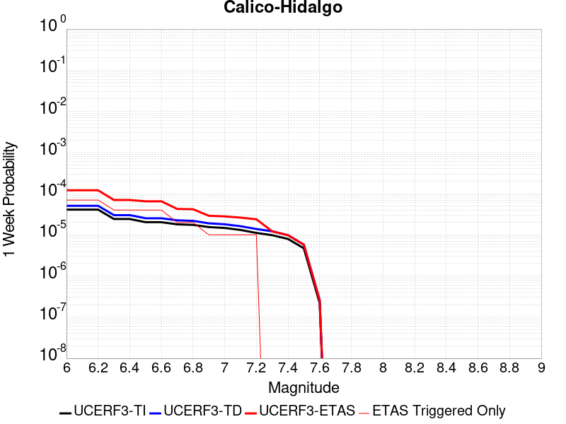 |  |  |  |

| Magnitude | 1 wk TI Prob | 1 wk TD Prob | 1 wk ETAS Prob | 1 wk ETAS/TD Gain | 1 wk ETAS Triggered Only | 1 mo TI Prob | 1 mo TD Prob | 1 mo ETAS Prob | 1 mo ETAS/TD Gain | 1 mo ETAS Triggered Only | 1 yr TI Prob | 1 yr TD Prob | 1 yr ETAS Prob | 1 yr ETAS/TD Gain | 1 yr ETAS Triggered Only | 10 yr TI Prob | 10 yr TD Prob | 10 yr ETAS Prob | 10 yr ETAS/TD Gain | 10 yr ETAS Triggered Only |
|-----|-----|-----|-----|-----|-----|-----|-----|-----|-----|-----|-----|-----|-----|-----|-----|-----|-----|-----|-----|-----|
| 6.0 | 4.0906612E-5 | 5.0703686E-5 | 1.2070014E-4 | 2.3805003 | 7.0E-5 | 1.7530227E-4 | 2.172857E-4 | 2.9726833E-4 | 1.3680989 | 8.0E-5 | 0.0021322158 | 0.002642648 | 0.0028121988 | 1.0641594 | 1.7E-4 | 0.02111873 | 0.026152607 | 0.026415545 | 1.010054 | 2.7E-4 |
| 6.1 | 4.0906612E-5 | 5.0703686E-5 | 1.2070014E-4 | 2.3805003 | 7.0E-5 | 1.7530227E-4 | 2.172857E-4 | 2.9726833E-4 | 1.3680989 | 8.0E-5 | 0.0021322158 | 0.002642648 | 0.0028121988 | 1.0641594 | 1.7E-4 | 0.02111873 | 0.026152607 | 0.026415545 | 1.010054 | 2.7E-4 |
| 6.2 | 4.0906612E-5 | 5.0703686E-5 | 1.2070014E-4 | 2.3805003 | 7.0E-5 | 1.7530227E-4 | 2.172857E-4 | 2.9726833E-4 | 1.3680989 | 8.0E-5 | 0.0021322158 | 0.002642648 | 0.0028121988 | 1.0641594 | 1.7E-4 | 0.02111873 | 0.026152607 | 0.026415545 | 1.010054 | 2.7E-4 |
| 6.3 | 2.4242801E-5 | 3.0090669E-5 | 7.008947E-5 | 2.3292758 | 4.0E-5 | 1.0389358E-4 | 1.2895382E-4 | 1.7894738E-4 | 1.3876857 | 5.0E-5 | 0.0012641704 | 0.0015689151 | 0.0016787425 | 1.0700022 | 1.1E-4 | 0.01257003 | 0.01558206 | 0.0157691 | 1.0120035 | 1.9E-4 |
| 6.4 | 2.4242801E-5 | 3.0090669E-5 | 7.008947E-5 | 2.3292758 | 4.0E-5 | 1.0389358E-4 | 1.2895382E-4 | 1.7894738E-4 | 1.3876857 | 5.0E-5 | 0.0012641704 | 0.0015689151 | 0.0016787425 | 1.0700022 | 1.1E-4 | 0.01257003 | 0.01558206 | 0.0157691 | 1.0120035 | 1.9E-4 |
| 6.5 | 2.0286952E-5 | 2.5315738E-5 | 6.531473E-5 | 2.5800047 | 4.0E-5 | 8.694118E-5 | 1.0849161E-4 | 1.4848726E-4 | 1.3686521 | 4.0E-5 | 0.0010579949 | 0.001320102 | 0.0014199701 | 1.0756518 | 1.0E-4 | 0.010529719 | 0.013124538 | 0.013302175 | 1.0135348 | 1.8E-4 |
| 6.6 | 2.0269223E-5 | 2.5296687E-5 | 6.529567E-5 | 2.5811946 | 4.0E-5 | 8.6865206E-5 | 1.08409964E-4 | 1.4840563E-4 | 1.3689297 | 4.0E-5 | 0.0010570707 | 0.0013191093 | 0.0014189774 | 1.0757087 | 1.0E-4 | 0.010520565 | 0.013114728 | 0.013292367 | 1.013545 | 1.8E-4 |
| 6.7 | 1.799852E-5 | 2.25406E-5 | 4.254015E-5 | 1.8872678 | 2.0E-5 | 7.713423E-5 | 9.659908E-5 | 1.1659715E-4 | 1.2070214 | 2.0E-5 | 9.3870464E-4 | 0.0011754738 | 0.0012453916 | 1.0594804 | 7.0E-5 | 0.009347493 | 0.011694173 | 0.011842419 | 1.012677 | 1.5E-4 |
| 6.8 | 1.7458793E-5 | 2.184212E-5 | 4.1841682E-5 | 1.915642 | 2.0E-5 | 7.4821255E-5 | 9.3605806E-5 | 1.13603935E-4 | 1.213642 | 2.0E-5 | 9.10568E-4 | 0.0011390693 | 0.0012089896 | 1.0613837 | 7.0E-5 | 0.009068459 | 0.011333893 | 0.011472306 | 1.0122123 | 1.4E-4 |
| 6.9 | 1.542884E-5 | 1.9025927E-5 | 2.9025736E-5 | 1.5255886 | 1.0E-5 | 6.612192E-5 | 8.153721E-5 | 9.15364E-5 | 1.1226333 | 1.0E-5 | 8.04737E-4 | 9.922766E-4 | 0.0010522171 | 1.060407 | 6.0E-5 | 0.008018291 | 0.009879857 | 0.0100085735 | 1.013028 | 1.3E-4 |
| 7.0 | 1.468253E-5 | 1.8030598E-5 | 2.803042E-5 | 1.5546027 | 1.0E-5 | 6.292361E-5 | 7.7271776E-5 | 8.727101E-5 | 1.1294034 | 1.0E-5 | 7.658257E-4 | 9.4039086E-4 | 0.0010003344 | 1.0637432 | 6.0E-5 | 0.0076319184 | 0.009365481 | 0.009494264 | 1.0137508 | 1.3E-4 |
| 7.1 | 1.3139281E-5 | 1.6200942E-5 | 2.620078E-5 | 1.617238 | 1.0E-5 | 5.6309986E-5 | 6.943083E-5 | 7.943014E-5 | 1.1440182 | 1.0E-5 | 6.853584E-4 | 8.4500515E-4 | 9.0495445E-4 | 1.0709455 | 6.0E-5 | 0.0068324856 | 0.0084192185 | 0.008528292 | 1.0129553 | 1.1E-4 |
| 7.2 | 1.1127404E-5 | 1.3866597E-5 | 2.3866458E-5 | 1.7211474 | 1.0E-5 | 4.7688E-5 | 5.942698E-5 | 6.942639E-5 | 1.1682637 | 1.0E-5 | 5.8044674E-4 | 7.232942E-4 | 7.8325084E-4 | 1.0828938 | 6.0E-5 | 0.0057893298 | 0.0072105085 | 0.0072998595 | 1.0123918 | 9.0E-5 |
| 7.3 | 9.808154E-6 | 1.2176215E-5 | 1.2176215E-5 | 1.0 | 0.0 | 4.2034266E-5 | 5.2182797E-5 | 5.2182797E-5 | 1.0 | 0.0 | 5.11647E-4 | 6.3515105E-4 | 6.851193E-4 | 1.0786715 | 5.0E-5 | 0.0051047057 | 0.006334433 | 0.0064139264 | 1.0125494 | 8.0E-5 |
| 7.4 | 7.942452E-6 | 9.792144E-6 | 9.792144E-6 | 1.0 | 0.0 | 3.4038632E-5 | 4.1965708E-5 | 4.1965708E-5 | 1.0 | 0.0 | 4.1434157E-4 | 5.1082217E-4 | 5.4080685E-4 | 1.0586989 | 3.0E-5 | 0.0041356985 | 0.005097421 | 0.005137217 | 1.0078071 | 4.0E-5 |
| 7.5 | 4.7121216E-6 | 5.772836E-6 | 5.772836E-6 | 1.0 | 0.0 | 2.019465E-5 | 2.4740535E-5 | 2.4740535E-5 | 1.0 | 0.0 | 2.4584212E-4 | 3.0118204E-4 | 3.1117903E-4 | 1.0331925 | 1.0E-5 | 0.0024557032 | 0.0030084911 | 0.003018461 | 1.0033139 | 1.0E-5 |
| 7.6 | 2.21172E-7 | 2.603961E-7 | 2.603961E-7 | 1.0 | 0.0 | 9.478797E-7 | 1.1159829E-6 | 1.1159829E-6 | 1.0 | 0.0 | 1.1540374E-5 | 1.3587036E-5 | 1.3587036E-5 | 1.0 | 0.0 | 1.1539775E-4 | 1.3586486E-4 | 1.3586486E-4 | 1.0 | 0.0 |

## San Jacinto (San Bernardino)
*[(top)](#table-of-contents)*

| 1 Week | 1 Month | 1 Year | 10 Year |
|-----|-----|-----|-----|
| 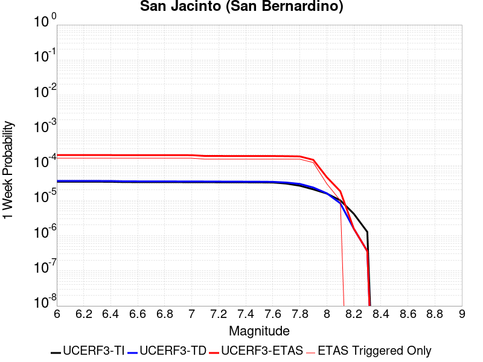 |  |  |  |

| Magnitude | 1 wk TI Prob | 1 wk TD Prob | 1 wk ETAS Prob | 1 wk ETAS/TD Gain | 1 wk ETAS Triggered Only | 1 mo TI Prob | 1 mo TD Prob | 1 mo ETAS Prob | 1 mo ETAS/TD Gain | 1 mo ETAS Triggered Only | 1 yr TI Prob | 1 yr TD Prob | 1 yr ETAS Prob | 1 yr ETAS/TD Gain | 1 yr ETAS Triggered Only | 10 yr TI Prob | 10 yr TD Prob | 10 yr ETAS Prob | 10 yr ETAS/TD Gain | 10 yr ETAS Triggered Only |
|-----|-----|-----|-----|-----|-----|-----|-----|-----|-----|-----|-----|-----|-----|-----|-----|-----|-----|-----|-----|-----|
| 6.0 | 3.409352E-5 | 3.5986508E-5 | 1.9598076E-4 | 5.4459505 | 1.6E-4 | 1.461069E-4 | 1.542188E-4 | 3.5418794E-4 | 2.2966588 | 2.0E-4 | 0.0017774 | 0.0018759987 | 0.0021454922 | 1.1436534 | 2.7E-4 | 0.01763251 | 0.019349935 | 0.01964413 | 1.015204 | 3.0E-4 |
| 6.1 | 3.409352E-5 | 3.5986508E-5 | 1.9598076E-4 | 5.4459505 | 1.6E-4 | 1.461069E-4 | 1.542188E-4 | 3.5418794E-4 | 2.2966588 | 2.0E-4 | 0.0017774 | 0.0018759987 | 0.0021454922 | 1.1436534 | 2.7E-4 | 0.01763251 | 0.019349935 | 0.01964413 | 1.015204 | 3.0E-4 |
| 6.2 | 3.409352E-5 | 3.5986508E-5 | 1.9598076E-4 | 5.4459505 | 1.6E-4 | 1.461069E-4 | 1.542188E-4 | 3.5418794E-4 | 2.2966588 | 2.0E-4 | 0.0017774 | 0.0018759987 | 0.0021454922 | 1.1436534 | 2.7E-4 | 0.01763251 | 0.019349935 | 0.01964413 | 1.015204 | 3.0E-4 |
| 6.3 | 3.409352E-5 | 3.5986508E-5 | 1.9598076E-4 | 5.4459505 | 1.6E-4 | 1.461069E-4 | 1.542188E-4 | 3.5418794E-4 | 2.2966588 | 2.0E-4 | 0.0017774 | 0.0018759987 | 0.0021454922 | 1.1436534 | 2.7E-4 | 0.01763251 | 0.019349935 | 0.01964413 | 1.015204 | 3.0E-4 |
| 6.4 | 3.400795E-5 | 3.5879173E-5 | 1.9587344E-4 | 5.459252 | 1.6E-4 | 1.4574021E-4 | 1.5375883E-4 | 3.5372807E-4 | 2.3005383 | 2.0E-4 | 0.0017729428 | 0.0018704084 | 0.0021399034 | 1.1440835 | 2.7E-4 | 0.017588645 | 0.019295016 | 0.019589229 | 1.0152481 | 3.0E-4 |
| 6.5 | 3.341482E-5 | 3.5139812E-5 | 1.9513418E-4 | 5.55308 | 1.6E-4 | 1.4319851E-4 | 1.5059051E-4 | 3.5056038E-4 | 2.327905 | 2.0E-4 | 0.0017420477 | 0.0018318989 | 0.0021014044 | 1.1471181 | 2.7E-4 | 0.017284546 | 0.018916558 | 0.019210884 | 1.0155591 | 3.0E-4 |
| 6.6 | 3.3364955E-5 | 3.5077028E-5 | 1.9507142E-4 | 5.5612297 | 1.6E-4 | 1.4298483E-4 | 1.5032147E-4 | 3.502914E-4 | 2.330282 | 2.0E-4 | 0.0017394501 | 0.001828629 | 0.0020981354 | 1.1473815 | 2.7E-4 | 0.017258976 | 0.018884424 | 0.019178757 | 1.0155861 | 3.0E-4 |
| 6.7 | 3.335922E-5 | 3.5066805E-5 | 1.9506119E-4 | 5.5625596 | 1.6E-4 | 1.4296026E-4 | 1.5027766E-4 | 3.502476E-4 | 2.3306699 | 2.0E-4 | 0.0017391514 | 0.0018280965 | 0.002097603 | 1.1474246 | 2.7E-4 | 0.017256035 | 0.018879214 | 0.019173551 | 1.0155905 | 3.0E-4 |
| 6.8 | 3.327683E-5 | 3.496087E-5 | 1.9495528E-4 | 5.576385 | 1.6E-4 | 1.4260718E-4 | 1.498237E-4 | 3.4979373E-4 | 2.3347023 | 2.0E-4 | 0.0017348597 | 0.0018225788 | 0.0020920867 | 1.1478717 | 2.7E-4 | 0.017213784 | 0.018824987 | 0.019119339 | 1.0156363 | 3.0E-4 |
| 6.9 | 3.3235785E-5 | 3.4901823E-5 | 1.9489625E-4 | 5.5841274 | 1.6E-4 | 1.4243131E-4 | 1.4957068E-4 | 3.4954076E-4 | 2.3369606 | 2.0E-4 | 0.0017327217 | 0.0018195034 | 0.0020890122 | 1.1481222 | 2.7E-4 | 0.017192734 | 0.018794855 | 0.019089216 | 1.0156618 | 3.0E-4 |
| 7.0 | 3.3197095E-5 | 3.4841752E-5 | 1.9483618E-4 | 5.5920315 | 1.6E-4 | 1.422655E-4 | 1.4931326E-4 | 3.492834E-4 | 2.3392658 | 2.0E-4 | 0.0017307063 | 0.0018163746 | 0.002085884 | 1.1483778 | 2.7E-4 | 0.017172894 | 0.018764233 | 0.019058604 | 1.0156878 | 3.0E-4 |
| 7.1 | 3.3129716E-5 | 3.4721965E-5 | 1.8471676E-4 | 5.319882 | 1.5E-4 | 1.4197677E-4 | 1.4879994E-4 | 3.3877167E-4 | 2.2766922 | 1.9E-4 | 0.0017271966 | 0.0018101353 | 0.0020696647 | 1.1433756 | 2.6E-4 | 0.017138338 | 0.018703312 | 0.018987888 | 1.0152153 | 2.9E-4 |
| 7.2 | 3.3034008E-5 | 3.458941E-5 | 1.8458422E-4 | 5.336437 | 1.5E-4 | 1.4156665E-4 | 1.4823192E-4 | 3.3820377E-4 | 2.2815852 | 1.9E-4 | 0.0017222111 | 0.0018032312 | 0.0020627624 | 1.1439257 | 2.6E-4 | 0.017089253 | 0.018635705 | 0.0189203 | 1.0152715 | 2.9E-4 |
| 7.3 | 3.2956614E-5 | 3.445717E-5 | 1.84452E-4 | 5.3530803 | 1.5E-4 | 1.4123498E-4 | 1.4766524E-4 | 3.3763718E-4 | 2.2865043 | 1.9E-4 | 0.0017181796 | 0.0017963431 | 0.0020558762 | 1.1444784 | 2.6E-4 | 0.017049557 | 0.018568452 | 0.018853068 | 1.0153279 | 2.9E-4 |
| 7.4 | 3.2915937E-5 | 3.4378863E-5 | 1.8437371E-4 | 5.3629956 | 1.5E-4 | 1.4106068E-4 | 1.4732967E-4 | 3.373017E-4 | 2.2894347 | 1.9E-4 | 0.0017160608 | 0.0017922645 | 0.0020517986 | 1.1448078 | 2.6E-4 | 0.017028693 | 0.018528719 | 0.018813346 | 1.0153614 | 2.9E-4 |
| 7.5 | 3.281791E-5 | 3.4243778E-5 | 1.8423864E-4 | 5.3802075 | 1.5E-4 | 1.406406E-4 | 1.4675081E-4 | 3.3672294E-4 | 2.2945218 | 1.9E-4 | 0.0017109542 | 0.0017852283 | 0.002044764 | 1.1453797 | 2.6E-4 | 0.016978411 | 0.018459605 | 0.018744253 | 1.01542 | 2.9E-4 |
| 7.6 | 3.2521442E-5 | 3.396873E-5 | 1.8396364E-4 | 5.415676 | 1.5E-4 | 1.3937015E-4 | 1.4557215E-4 | 3.355445E-4 | 2.3050046 | 1.9E-4 | 0.0016955109 | 0.0017709016 | 0.0020304413 | 1.1465578 | 2.6E-4 | 0.016826328 | 0.018317232 | 0.01860192 | 1.015542 | 2.9E-4 |
| 7.7 | 3.0287873E-5 | 3.245276E-5 | 1.824479E-4 | 5.6219525 | 1.5E-4 | 1.297987E-4 | 1.3907586E-4 | 3.2904942E-4 | 2.3659708 | 1.9E-4 | 0.0015791537 | 0.0016919347 | 0.0019514947 | 1.1534102 | 2.6E-4 | 0.01567979 | 0.01752809 | 0.017813006 | 1.0162549 | 2.9E-4 |
| 7.8 | 2.6316151E-5 | 2.9663592E-5 | 1.7965914E-4 | 6.056554 | 1.5E-4 | 1.1277862E-4 | 1.2712348E-4 | 3.1709933E-4 | 2.4944198 | 1.9E-4 | 0.0013722149 | 0.0015466306 | 0.0018062284 | 1.1678474 | 2.6E-4 | 0.013637724 | 0.016069634 | 0.016354974 | 1.0177565 | 2.9E-4 |
| 7.9 | 2.0761147E-5 | 2.34181E-5 | 1.434153E-4 | 6.124121 | 1.2E-4 | 8.897331E-5 | 1.0035944E-4 | 2.5034437E-4 | 2.4944777 | 1.5E-4 | 0.0010827117 | 0.0012211921 | 0.0014409234 | 1.1799319 | 2.2E-4 | 0.010774517 | 0.012793174 | 0.013039975 | 1.0192916 | 2.5E-4 |
| 8.0 | 1.5738568E-5 | 1.6033575E-5 | 4.6033096E-5 | 2.8710437 | 3.0E-5 | 6.744926E-5 | 6.871352E-5 | 9.8711454E-5 | 1.4365653 | 3.0E-5 | 8.2088535E-4 | 8.3626667E-4 | 8.8622485E-4 | 1.0597396 | 5.0E-5 | 0.008178596 | 0.008865921 | 0.008945211 | 1.0089433 | 8.0E-5 |
| 8.1 | 1.0105832E-5 | 8.3304985E-6 | 1.8330415E-5 | 2.2003984 | 1.0E-5 | 4.3309992E-5 | 3.570165E-5 | 4.5701294E-5 | 1.2800891 | 1.0E-5 | 5.2717153E-4 | 4.345814E-4 | 4.545727E-4 | 1.0460013 | 2.0E-5 | 0.005259227 | 0.004677232 | 0.0047070915 | 1.006384 | 3.0E-5 |
| 8.2 | 4.189207E-6 | 1.5784357E-6 | 1.5784357E-6 | 1.0 | 0.0 | 1.7953622E-5 | 6.7647065E-6 | 6.7647065E-6 | 1.0 | 0.0 | 2.1856341E-4 | 8.235722E-5 | 8.235722E-5 | 1.0 | 0.0 | 0.0021834858 | 9.565867E-4 | 9.565867E-4 | 1.0 | 0.0 |
| 8.3 | 1.2758221E-6 | 3.6149942E-7 | 3.6149942E-7 | 1.0 | 0.0 | 5.4677976E-6 | 1.5492824E-6 | 1.5492824E-6 | 1.0 | 0.0 | 6.65684E-5 | 1.8862354E-5 | 1.8862354E-5 | 1.0 | 0.0 | 6.6548464E-4 | 2.2751294E-4 | 2.2751294E-4 | 1.0 | 0.0 |

## San Andreas (Creeping Section) 2011 CFM
*[(top)](#table-of-contents)*

| 1 Week | 1 Month | 1 Year | 10 Year |
|-----|-----|-----|-----|
|  |  | 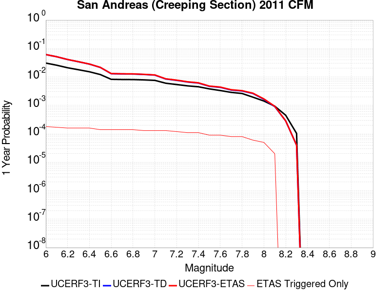 |  |

| Magnitude | 1 wk TI Prob | 1 wk TD Prob | 1 wk ETAS Prob | 1 wk ETAS/TD Gain | 1 wk ETAS Triggered Only | 1 mo TI Prob | 1 mo TD Prob | 1 mo ETAS Prob | 1 mo ETAS/TD Gain | 1 mo ETAS Triggered Only | 1 yr TI Prob | 1 yr TD Prob | 1 yr ETAS Prob | 1 yr ETAS/TD Gain | 1 yr ETAS Triggered Only | 10 yr TI Prob | 10 yr TD Prob | 10 yr ETAS Prob | 10 yr ETAS/TD Gain | 10 yr ETAS Triggered Only |
|-----|-----|-----|-----|-----|-----|-----|-----|-----|-----|-----|-----|-----|-----|-----|-----|-----|-----|-----|-----|-----|
| 6.0 | 5.986481E-4 | 0.001228691 | 0.0013185804 | 1.0731587 | 9.0E-5 | 0.0025631124 | 0.005246795 | 0.0053562177 | 1.0208552 | 1.1E-4 | 0.030762846 | 0.061203245 | 0.06137223 | 1.002761 | 1.8E-4 | 0.26835477 | 0.425928 | 0.42606577 | 1.0003235 | 2.4E-4 |
| 6.1 | 5.015945E-4 | 0.0010230356 | 0.0011029538 | 1.0781187 | 8.0E-5 | 0.00214792 | 0.004369436 | 0.004468999 | 1.0227863 | 1.0E-4 | 0.025839351 | 0.051246606 | 0.051407896 | 1.0031472 | 1.7E-4 | 0.23032776 | 0.37284943 | 0.37298742 | 1.00037 | 2.2E-4 |
| 6.2 | 4.073338E-4 | 8.1157376E-4 | 8.815169E-4 | 1.0861821 | 7.0E-5 | 0.0017445484 | 0.0034683137 | 0.0035580015 | 1.0258592 | 9.0E-5 | 0.021034058 | 0.04093177 | 0.04108522 | 1.0037489 | 1.6E-4 | 0.19150782 | 0.31302592 | 0.3131633 | 1.0004389 | 2.0E-4 |
| 6.3 | 3.464099E-4 | 6.7455834E-4 | 7.4451114E-4 | 1.1037016 | 7.0E-5 | 0.0014837692 | 0.0028832308 | 0.0029729714 | 1.031125 | 9.0E-5 | 0.017915873 | 0.034187846 | 0.034342375 | 1.00452 | 1.6E-4 | 0.16538359 | 0.27130842 | 0.27145416 | 1.0005372 | 2.0E-4 |
| 6.4 | 2.935057E-4 | 5.5516965E-4 | 6.251308E-4 | 1.1260176 | 7.0E-5 | 0.0012572751 | 0.0023727308 | 0.0024625172 | 1.037841 | 9.0E-5 | 0.015200248 | 0.02826279 | 0.028418269 | 1.0055012 | 1.6E-4 | 0.14201577 | 0.23297668 | 0.23313008 | 1.0006585 | 2.0E-4 |
| 6.5 | 2.3409708E-4 | 4.2132285E-4 | 4.8129758E-4 | 1.1423486 | 6.0E-5 | 0.0010028875 | 0.0018017791 | 0.001881635 | 1.0443206 | 8.0E-5 | 0.012141965 | 0.021586355 | 0.021723332 | 1.0063456 | 1.4E-4 | 0.11499573 | 0.1868149 | 0.18695316 | 1.0007399 | 1.7E-4 |
| 6.6 | 1.5842178E-4 | 2.5068692E-4 | 3.1067187E-4 | 1.2392824 | 6.0E-5 | 6.7877385E-4 | 0.0010739256 | 0.0011538398 | 1.0744131 | 8.0E-5 | 0.0082328 | 0.012995283 | 0.013133463 | 1.0106331 | 1.4E-4 | 0.07934396 | 0.12313759 | 0.123286664 | 1.0012106 | 1.7E-4 |
| 6.7 | 1.5616413E-4 | 2.4605254E-4 | 3.0603778E-4 | 1.2437904 | 6.0E-5 | 6.691031E-4 | 0.0010540807 | 0.0011339963 | 1.0758156 | 8.0E-5 | 0.0081159435 | 0.012757154 | 0.012895368 | 1.0108342 | 1.4E-4 | 0.0782586 | 0.12116472 | 0.121314116 | 1.0012331 | 1.7E-4 |
| 6.8 | 1.5538467E-4 | 2.442914E-4 | 3.0427676E-4 | 1.2455482 | 6.0E-5 | 6.6576427E-4 | 0.001046539 | 0.0011264554 | 1.0763625 | 8.0E-5 | 0.008075596 | 0.012666538 | 0.012804764 | 1.0109128 | 1.4E-4 | 0.07788358 | 0.12039561 | 0.12054514 | 1.001242 | 1.7E-4 |
| 6.9 | 1.5153569E-4 | 2.3538464E-4 | 2.8537287E-4 | 1.2123682 | 5.0E-5 | 6.49277E-4 | 0.0010084033 | 0.0010783328 | 1.0693467 | 7.0E-5 | 0.007876333 | 0.012208726 | 0.012337139 | 1.0105181 | 1.3E-4 | 0.07602952 | 0.11646574 | 0.11660711 | 1.0012138 | 1.6E-4 |
| 7.0 | 1.4588932E-4 | 2.2395732E-4 | 2.7394612E-4 | 1.2232069 | 5.0E-5 | 6.250901E-4 | 9.59466E-4 | 0.0010293989 | 1.0728873 | 7.0E-5 | 0.0075839474 | 0.011619428 | 0.011747917 | 1.0110582 | 1.3E-4 | 0.073302895 | 0.11131206 | 0.111454256 | 1.0012774 | 1.6E-4 |
| 7.1 | 1.1565079E-4 | 1.6281323E-4 | 2.1280508E-4 | 1.3070503 | 5.0E-5 | 4.955521E-4 | 6.9758523E-4 | 7.675364E-4 | 1.1002761 | 7.0E-5 | 0.006016669 | 0.008460228 | 0.008589128 | 1.015236 | 1.3E-4 | 0.058563538 | 0.08366478 | 0.0838114 | 1.0017524 | 1.6E-4 |
| 7.2 | 1.0393792E-4 | 1.4615392E-4 | 1.961466E-4 | 1.3420551 | 5.0E-5 | 4.4537216E-4 | 6.262243E-4 | 6.861868E-4 | 1.0957524 | 6.0E-5 | 0.005408933 | 0.0075977976 | 0.007716886 | 1.015674 | 1.2E-4 | 0.052791595 | 0.07561503 | 0.075753696 | 1.0018337 | 1.5E-4 |
| 7.3 | 9.332884E-5 | 1.2780601E-4 | 1.7779961E-4 | 1.3911679 | 5.0E-5 | 3.999194E-4 | 5.4762565E-4 | 6.075928E-4 | 1.1095039 | 6.0E-5 | 0.0048581534 | 0.0066470946 | 0.0067563634 | 1.0164386 | 1.1E-4 | 0.047533102 | 0.06647954 | 0.06661023 | 1.0019659 | 1.4E-4 |
| 7.4 | 8.670252E-5 | 1.1702972E-4 | 1.6702387E-4 | 1.427192 | 5.0E-5 | 3.715293E-4 | 5.014601E-4 | 5.6143E-4 | 1.1195906 | 6.0E-5 | 0.004513991 | 0.0060883067 | 0.006197637 | 1.0179574 | 1.1E-4 | 0.044233937 | 0.061148684 | 0.061280124 | 1.0021495 | 1.4E-4 |
| 7.5 | 7.3036405E-5 | 9.005699E-5 | 1.2005428E-4 | 1.3330925 | 3.0E-5 | 3.129756E-4 | 3.859015E-4 | 4.2588607E-4 | 1.1036134 | 4.0E-5 | 0.0038038217 | 0.0046882504 | 0.0047778287 | 1.019107 | 9.0E-5 | 0.03739367 | 0.047875606 | 0.047989864 | 1.0023865 | 1.2E-4 |
| 7.6 | 6.3935775E-5 | 8.280209E-5 | 1.1279961E-4 | 1.3622797 | 3.0E-5 | 2.7398168E-4 | 3.5481792E-4 | 3.9480373E-4 | 1.1126939 | 4.0E-5 | 0.0033306254 | 0.00431137 | 0.004400982 | 1.0207851 | 9.0E-5 | 0.032811474 | 0.043990135 | 0.044104856 | 1.002608 | 1.2E-4 |
| 7.7 | 5.5050095E-5 | 6.661729E-5 | 9.6615295E-5 | 1.4503036 | 3.0E-5 | 2.3590765E-4 | 2.8547147E-4 | 3.154629E-4 | 1.1050593 | 3.0E-5 | 0.0028683927 | 0.0034700802 | 0.0035498026 | 1.0229743 | 8.0E-5 | 0.0283165 | 0.03579509 | 0.035891507 | 1.0026937 | 1.0E-4 |
| 7.8 | 5.027131E-5 | 6.1627725E-5 | 9.162587E-5 | 1.486764 | 3.0E-5 | 2.1543067E-4 | 2.640921E-4 | 2.9408417E-4 | 1.1135668 | 3.0E-5 | 0.0026197135 | 0.003210584 | 0.003290327 | 1.0248376 | 8.0E-5 | 0.025890453 | 0.03312572 | 0.033222407 | 1.0029188 | 1.0E-4 |
| 7.9 | 3.7271806E-5 | 5.0224386E-5 | 7.022338E-5 | 1.3981929 | 2.0E-5 | 1.5972654E-4 | 2.1522962E-4 | 2.3522532E-4 | 1.092904 | 2.0E-5 | 0.0019429359 | 0.0026172737 | 0.0026771165 | 1.0228646 | 6.0E-5 | 0.019260362 | 0.027066687 | 0.027134793 | 1.0025162 | 7.0E-5 |
| 8.0 | 2.7310243E-5 | 3.1428404E-5 | 5.1427774E-5 | 1.636347 | 2.0E-5 | 1.17038646E-4 | 1.3468621E-4 | 1.5468353E-4 | 1.1484733 | 2.0E-5 | 0.0014240141 | 0.0016385721 | 0.0016884902 | 1.0304644 | 5.0E-5 | 0.014149235 | 0.01721387 | 0.017272836 | 1.0034256 | 6.0E-5 |
| 8.1 | 1.7940547E-5 | 1.7400796E-5 | 2.7400622E-5 | 1.5746764 | 1.0E-5 | 7.688579E-5 | 7.457271E-5 | 8.457197E-5 | 1.1340873 | 1.0E-5 | 9.3568244E-4 | 9.075451E-4 | 9.2752697E-4 | 1.0220175 | 2.0E-5 | 0.009317525 | 0.009799073 | 0.009818878 | 1.002021 | 2.0E-5 |
| 8.2 | 8.643924E-6 | 5.4748625E-6 | 5.4748625E-6 | 1.0 | 0.0 | 3.704486E-5 | 2.3463486E-5 | 2.3463486E-5 | 1.0 | 0.0 | 4.5092785E-4 | 2.8563058E-4 | 2.8563058E-4 | 1.0 | 0.0 | 0.0045001395 | 0.0032487072 | 0.0032487072 | 1.0 | 0.0 |
| 8.3 | 1.983087E-6 | 7.6599065E-7 | 7.6599065E-7 | 1.0 | 0.0 | 8.498917E-6 | 3.282813E-6 | 3.282813E-6 | 1.0 | 0.0 | 1.034694E-4 | 3.9967534E-5 | 3.9967534E-5 | 1.0 | 0.0 | 0.0010342124 | 4.719687E-4 | 4.719687E-4 | 1.0 | 0.0 |

## San Andreas (North Branch Mill Creek)
*[(top)](#table-of-contents)*

| 1 Week | 1 Month | 1 Year | 10 Year |
|-----|-----|-----|-----|
|  | 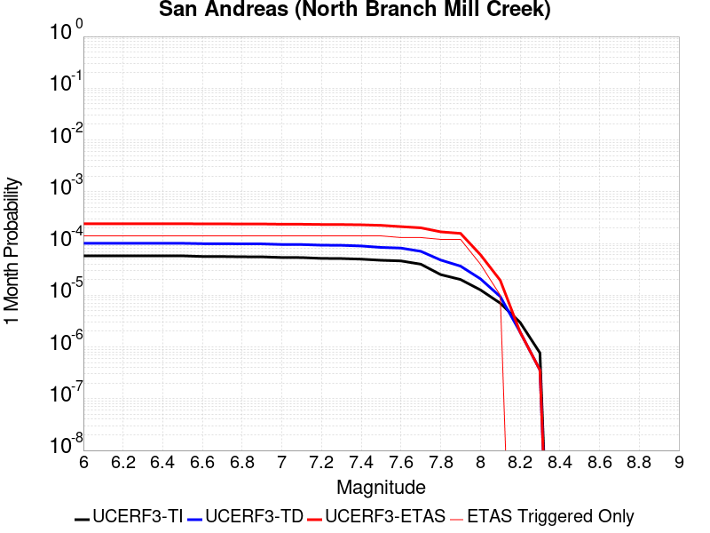 |  | 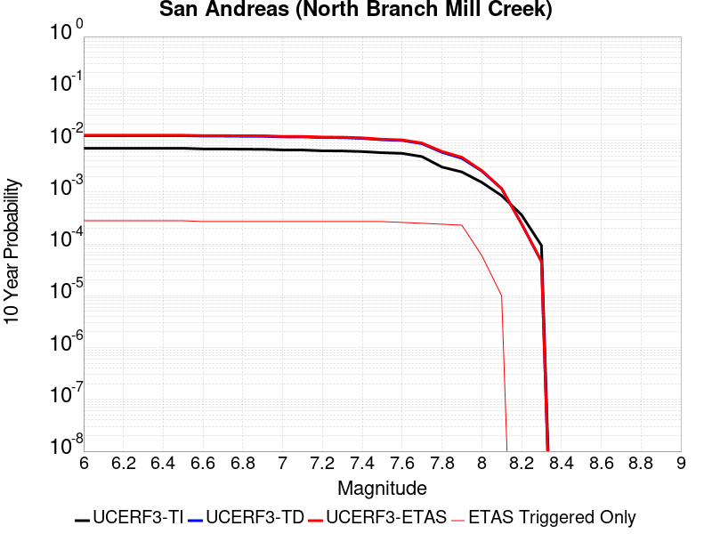 |

| Magnitude | 1 wk TI Prob | 1 wk TD Prob | 1 wk ETAS Prob | 1 wk ETAS/TD Gain | 1 wk ETAS Triggered Only | 1 mo TI Prob | 1 mo TD Prob | 1 mo ETAS Prob | 1 mo ETAS/TD Gain | 1 mo ETAS Triggered Only | 1 yr TI Prob | 1 yr TD Prob | 1 yr ETAS Prob | 1 yr ETAS/TD Gain | 1 yr ETAS Triggered Only | 10 yr TI Prob | 10 yr TD Prob | 10 yr ETAS Prob | 10 yr ETAS/TD Gain | 10 yr ETAS Triggered Only |
|-----|-----|-----|-----|-----|-----|-----|-----|-----|-----|-----|-----|-----|-----|-----|-----|-----|-----|-----|-----|-----|
| 6.0 | 1.3461156E-5 | 2.3499893E-5 | 1.2349755E-4 | 5.2552385 | 1.0E-4 | 5.7689394E-5 | 1.00709956E-4 | 2.4069585E-4 | 2.3899906 | 1.4E-4 | 7.02142E-4 | 0.0012254574 | 0.0014651633 | 1.1956053 | 2.4E-4 | 0.0069992766 | 0.01222957 | 0.012506146 | 1.0226153 | 2.8E-4 |
| 6.1 | 1.3461156E-5 | 2.3499893E-5 | 1.2349755E-4 | 5.2552385 | 1.0E-4 | 5.7689394E-5 | 1.00709956E-4 | 2.4069585E-4 | 2.3899906 | 1.4E-4 | 7.02142E-4 | 0.0012254574 | 0.0014651633 | 1.1956053 | 2.4E-4 | 0.0069992766 | 0.01222957 | 0.012506146 | 1.0226153 | 2.8E-4 |
| 6.2 | 1.3461156E-5 | 2.3499893E-5 | 1.2349755E-4 | 5.2552385 | 1.0E-4 | 5.7689394E-5 | 1.00709956E-4 | 2.4069585E-4 | 2.3899906 | 1.4E-4 | 7.02142E-4 | 0.0012254574 | 0.0014651633 | 1.1956053 | 2.4E-4 | 0.0069992766 | 0.01222957 | 0.012506146 | 1.0226153 | 2.8E-4 |
| 6.3 | 1.3461156E-5 | 2.3499893E-5 | 1.2349755E-4 | 5.2552385 | 1.0E-4 | 5.7689394E-5 | 1.00709956E-4 | 2.4069585E-4 | 2.3899906 | 1.4E-4 | 7.02142E-4 | 0.0012254574 | 0.0014651633 | 1.1956053 | 2.4E-4 | 0.0069992766 | 0.01222957 | 0.012506146 | 1.0226153 | 2.8E-4 |
| 6.4 | 1.3461156E-5 | 2.3499893E-5 | 1.2349755E-4 | 5.2552385 | 1.0E-4 | 5.7689394E-5 | 1.00709956E-4 | 2.4069585E-4 | 2.3899906 | 1.4E-4 | 7.02142E-4 | 0.0012254574 | 0.0014651633 | 1.1956053 | 2.4E-4 | 0.0069992766 | 0.01222957 | 0.012506146 | 1.0226153 | 2.8E-4 |
| 6.5 | 1.3450706E-5 | 2.3488852E-5 | 1.234865E-4 | 5.2572384 | 1.0E-4 | 5.764461E-5 | 1.0066265E-4 | 2.4064856E-4 | 2.390644 | 1.4E-4 | 7.0159714E-4 | 0.001224882 | 0.001464588 | 1.1956972 | 2.4E-4 | 0.006993862 | 0.01222388 | 0.0125004565 | 1.022626 | 2.8E-4 |
| 6.6 | 1.3074523E-5 | 2.3103135E-5 | 1.2310082E-4 | 5.3283167 | 1.0E-4 | 5.6032466E-5 | 9.9009696E-5 | 2.3899584E-4 | 2.413863 | 1.4E-4 | 6.8198174E-4 | 0.0012047797 | 0.0014444906 | 1.1989665 | 2.4E-4 | 0.006798926 | 0.012025044 | 0.012291797 | 1.0221832 | 2.7E-4 |
| 6.7 | 1.3050216E-5 | 2.3078432E-5 | 1.2307613E-4 | 5.33295 | 1.0E-4 | 5.59283E-5 | 9.890384E-5 | 2.3888999E-4 | 2.4153764 | 1.4E-4 | 6.8071426E-4 | 0.0012034923 | 0.0014432034 | 1.1991796 | 2.4E-4 | 0.0067863287 | 0.012012309 | 0.012279066 | 1.0222069 | 2.7E-4 |
| 6.8 | 1.29049395E-5 | 2.292684E-5 | 1.2292455E-4 | 5.3616 | 1.0E-4 | 5.530571E-5 | 9.825421E-5 | 2.3824045E-4 | 2.4247353 | 1.4E-4 | 6.73139E-4 | 0.0011955918 | 0.0014353048 | 1.2004974 | 2.4E-4 | 0.0067110364 | 0.011934154 | 0.012200932 | 1.0223541 | 2.7E-4 |
| 6.9 | 1.2867369E-5 | 2.2886245E-5 | 1.2288395E-4 | 5.3693366 | 1.0E-4 | 5.51447E-5 | 9.8080236E-5 | 2.3806651E-4 | 2.4272628 | 1.4E-4 | 6.711799E-4 | 0.0011934759 | 0.0014331895 | 1.2008532 | 2.4E-4 | 0.006691564 | 0.011913223 | 0.012180007 | 1.022394 | 2.7E-4 |
| 7.0 | 1.2495996E-5 | 2.2286325E-5 | 1.222841E-4 | 5.4869566 | 1.0E-4 | 5.3553173E-5 | 9.550934E-5 | 2.3549597E-4 | 2.4656851 | 1.4E-4 | 6.518148E-4 | 0.0011622087 | 0.0014019299 | 1.2062633 | 2.4E-4 | 0.0064990623 | 0.0116038285 | 0.011870695 | 1.0229982 | 2.7E-4 |
| 7.1 | 1.2452067E-5 | 2.2231397E-5 | 1.2222918E-4 | 5.4980426 | 1.0E-4 | 5.3364907E-5 | 9.527396E-5 | 2.3526062E-4 | 2.4693067 | 1.4E-4 | 6.4952404E-4 | 0.0011593461 | 0.0013990678 | 1.2067733 | 2.4E-4 | 0.0064762887 | 0.0115755 | 0.011842375 | 1.0230551 | 2.7E-4 |
| 7.2 | 1.2002777E-5 | 2.1609963E-5 | 1.216078E-4 | 5.627395 | 1.0E-4 | 5.143946E-5 | 9.2610855E-5 | 2.3259789E-4 | 2.5115619 | 1.4E-4 | 6.2609545E-4 | 0.0011269567 | 0.0013666862 | 1.2127229 | 2.4E-4 | 0.006243344 | 0.011254923 | 0.011521884 | 1.0237195 | 2.7E-4 |
| 7.3 | 1.1923425E-5 | 2.1479793E-5 | 1.2147764E-4 | 5.6554384 | 1.0E-4 | 5.109939E-5 | 9.205302E-5 | 2.3204014E-4 | 2.5207226 | 1.4E-4 | 6.219575E-4 | 0.001120172 | 0.0013599031 | 1.2140129 | 2.4E-4 | 0.0062021962 | 0.011187789 | 0.0114547685 | 1.0238634 | 2.7E-4 |
| 7.4 | 1.16105175E-5 | 2.0853771E-5 | 1.20851684E-4 | 5.7951956 | 1.0E-4 | 4.975841E-5 | 8.937026E-5 | 2.2935776E-4 | 2.5663767 | 1.4E-4 | 6.0564023E-4 | 0.0010875424 | 0.0013272814 | 1.2204411 | 2.4E-4 | 0.006039923 | 0.010865397 | 0.011132463 | 1.0245795 | 2.7E-4 |
| 7.5 | 1.1037265E-5 | 1.9553907E-5 | 1.1955195E-4 | 6.1139674 | 1.0E-4 | 4.7301706E-5 | 8.379978E-5 | 2.2378805E-4 | 2.6705089 | 1.4E-4 | 5.757461E-4 | 0.0010197869 | 0.0012595422 | 1.2351032 | 2.4E-4 | 0.005742567 | 0.010194898 | 0.010462145 | 1.0262139 | 2.7E-4 |
| 7.6 | 1.0720915E-5 | 1.899582E-5 | 1.0899411E-4 | 5.737795 | 9.0E-5 | 4.5945973E-5 | 8.140812E-5 | 2.1139754E-4 | 2.5967622 | 1.3E-4 | 5.592486E-4 | 9.906954E-4 | 0.0012204675 | 1.2319301 | 2.3E-4 | 0.005578433 | 0.009906623 | 0.010164047 | 1.0259851 | 2.6E-4 |
| 7.7 | 9.276279E-6 | 1.6441649E-5 | 1.06440166E-4 | 6.4738135 | 9.0E-5 | 3.9754876E-5 | 7.0462316E-5 | 2.0045316E-4 | 2.844828 | 1.3E-4 | 4.839081E-4 | 8.575427E-4 | 0.0010773541 | 1.256327 | 2.2E-4 | 0.0048285574 | 0.008586041 | 0.0088338945 | 1.028867 | 2.5E-4 |
| 7.8 | 5.8346777E-6 | 1.1155013E-5 | 9.115412E-5 | 8.171583 | 8.0E-5 | 2.5005522E-5 | 4.7806327E-5 | 1.678006E-4 | 3.510008 | 1.2E-4 | 3.043997E-4 | 5.818867E-4 | 7.9176447E-4 | 1.360685 | 2.1E-4 | 0.0030398308 | 0.0058469265 | 0.0060855234 | 1.0408072 | 2.4E-4 |
| 7.9 | 4.690204E-6 | 8.509093E-6 | 8.8508416E-5 | 10.401627 | 8.0E-5 | 2.0100719E-5 | 3.6467034E-5 | 1.5646266E-4 | 4.290523 | 1.2E-4 | 2.4469878E-4 | 4.4389578E-4 | 6.43807E-4 | 1.4503562 | 2.0E-4 | 0.002444295 | 0.0044707474 | 0.004699719 | 1.0512155 | 2.3E-4 |
| 8.0 | 2.9570454E-6 | 4.846947E-6 | 4.4846754E-5 | 9.252578 | 4.0E-5 | 1.267299E-5 | 2.0772464E-5 | 6.0771632E-5 | 2.9255862 | 4.0E-5 | 1.5428272E-4 | 2.5287544E-4 | 3.0286278E-4 | 1.1976758 | 5.0E-5 | 0.0015417566 | 0.002549644 | 0.002609491 | 1.0234727 | 6.0E-5 |
| 8.1 | 1.6376824E-6 | 2.1968929E-6 | 1.2196871E-5 | 5.5518737 | 1.0E-5 | 7.01862E-6 | 9.41522E-6 | 1.9415127E-5 | 2.0621 | 1.0E-5 | 8.544835E-5 | 1.14624294E-4 | 1.2462315E-4 | 1.0872315 | 1.0E-5 | 8.54155E-4 | 0.0011606582 | 0.0011706466 | 1.0086058 | 1.0E-5 |
| 8.2 | 6.9631557E-7 | 4.5360213E-7 | 4.5360213E-7 | 1.0 | 0.0 | 2.984206E-6 | 1.9440076E-6 | 1.9440076E-6 | 1.0 | 0.0 | 3.63321E-5 | 2.3668037E-5 | 2.3668037E-5 | 1.0 | 0.0 | 3.6326164E-4 | 2.451564E-4 | 2.451564E-4 | 1.0 | 0.0 |
| 8.3 | 1.7876137E-7 | 8.360375E-8 | 8.360375E-8 | 1.0 | 0.0 | 7.661199E-7 | 3.5830175E-7 | 3.5830175E-7 | 1.0 | 0.0 | 9.32747E-6 | 4.3623154E-6 | 4.3623154E-6 | 1.0 | 0.0 | 9.3270784E-5 | 4.5817014E-5 | 4.5817014E-5 | 1.0 | 0.0 |

## Baker
*[(top)](#table-of-contents)*

| 1 Week | 1 Month | 1 Year | 10 Year |
|-----|-----|-----|-----|
|  |  |  | 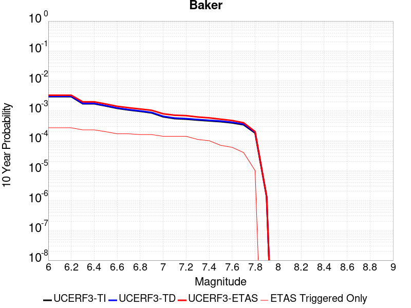 |

| Magnitude | 1 wk TI Prob | 1 wk TD Prob | 1 wk ETAS Prob | 1 wk ETAS/TD Gain | 1 wk ETAS Triggered Only | 1 mo TI Prob | 1 mo TD Prob | 1 mo ETAS Prob | 1 mo ETAS/TD Gain | 1 mo ETAS Triggered Only | 1 yr TI Prob | 1 yr TD Prob | 1 yr ETAS Prob | 1 yr ETAS/TD Gain | 1 yr ETAS Triggered Only | 10 yr TI Prob | 10 yr TD Prob | 10 yr ETAS Prob | 10 yr ETAS/TD Gain | 10 yr ETAS Triggered Only |
|-----|-----|-----|-----|-----|-----|-----|-----|-----|-----|-----|-----|-----|-----|-----|-----|-----|-----|-----|-----|-----|
| 6.0 | 5.695525E-6 | 5.8348373E-6 | 1.2583414E-4 | 21.566008 | 1.2E-4 | 2.4409164E-5 | 2.5006228E-5 | 1.6500273E-4 | 6.5984654 | 1.4E-4 | 2.9714106E-4 | 3.044123E-4 | 4.7436054E-4 | 1.5582831 | 1.7E-4 | 0.0029674405 | 0.0030403486 | 0.0033095279 | 1.0885355 | 2.7E-4 |
| 6.1 | 5.695525E-6 | 5.8348373E-6 | 1.2583414E-4 | 21.566008 | 1.2E-4 | 2.4409164E-5 | 2.5006228E-5 | 1.6500273E-4 | 6.5984654 | 1.4E-4 | 2.9714106E-4 | 3.044123E-4 | 4.7436054E-4 | 1.5582831 | 1.7E-4 | 0.0029674405 | 0.0030403486 | 0.0033095279 | 1.0885355 | 2.7E-4 |
| 6.2 | 5.695525E-6 | 5.8348373E-6 | 1.2583414E-4 | 21.566008 | 1.2E-4 | 2.4409164E-5 | 2.5006228E-5 | 1.6500273E-4 | 6.5984654 | 1.4E-4 | 2.9714106E-4 | 3.044123E-4 | 4.7436054E-4 | 1.5582831 | 1.7E-4 | 0.0029674405 | 0.0030403486 | 0.0033095279 | 1.0885355 | 2.7E-4 |
| 6.3 | 3.2995713E-6 | 3.383667E-6 | 1.2338326E-4 | 36.464363 | 1.2E-4 | 1.4140943E-5 | 1.4501353E-5 | 1.3449961E-4 | 9.27497 | 1.2E-4 | 1.7215237E-4 | 1.7654014E-4 | 3.2651366E-4 | 1.8495152 | 1.5E-4 | 0.0017201907 | 0.001764046 | 0.0019936403 | 1.1301521 | 2.3E-4 |
| 6.4 | 3.2995713E-6 | 3.383667E-6 | 1.2338326E-4 | 36.464363 | 1.2E-4 | 1.4140943E-5 | 1.4501353E-5 | 1.3449961E-4 | 9.27497 | 1.2E-4 | 1.7215237E-4 | 1.7654014E-4 | 3.2651366E-4 | 1.8495152 | 1.5E-4 | 0.0017201907 | 0.001764046 | 0.0019936403 | 1.1301521 | 2.3E-4 |
| 6.5 | 2.782202E-6 | 2.8558404E-6 | 1.02855556E-4 | 36.01586 | 1.0E-4 | 1.1923668E-5 | 1.223926E-5 | 1.12238034E-4 | 9.170328 | 1.0E-4 | 1.4516099E-4 | 1.4900314E-4 | 2.7898376E-4 | 1.8723348 | 1.3E-4 | 0.001450662 | 0.0014890651 | 0.0016887672 | 1.1341125 | 2.0E-4 |
| 6.6 | 2.3163404E-6 | 2.38092E-6 | 9.238071E-5 | 38.800426 | 9.0E-5 | 9.927136E-6 | 1.0203904E-5 | 1.0020298E-4 | 9.820064 | 9.0E-5 | 1.20856166E-4 | 1.2422565E-4 | 2.4421074E-4 | 1.9658641 | 1.2E-4 | 0.0012079047 | 0.0012415823 | 0.0014113713 | 1.136752 | 1.7E-4 |
| 6.7 | 2.037056E-6 | 2.0965003E-6 | 9.2096314E-5 | 43.928593 | 9.0E-5 | 8.7302105E-6 | 8.984972E-6 | 9.8984165E-5 | 11.016636 | 9.0E-5 | 1.0628513E-4 | 1.093867E-4 | 2.2937357E-4 | 2.0969055 | 1.2E-4 | 0.0010623431 | 0.0010933448 | 0.0012631589 | 1.1553162 | 1.7E-4 |
| 6.8 | 1.8356744E-6 | 1.8915287E-6 | 8.1891376E-5 | 43.293755 | 8.0E-5 | 7.867153E-6 | 8.106527E-6 | 8.810588E-5 | 10.868511 | 8.0E-5 | 9.577837E-5 | 9.869264E-5 | 2.0868178E-4 | 2.1144614 | 1.1E-4 | 9.57371E-4 | 9.86502E-4 | 0.0011463442 | 1.1620293 | 1.6E-4 |
| 6.9 | 1.6310546E-6 | 1.6832072E-6 | 8.168307E-5 | 48.528233 | 8.0E-5 | 6.9902153E-6 | 7.213726E-6 | 8.721315E-5 | 12.08989 | 8.0E-5 | 8.510255E-5 | 8.782368E-5 | 1.9781402E-4 | 2.2523994 | 1.1E-4 | 8.5069967E-4 | 8.7790104E-4 | 0.0010377606 | 1.1820929 | 1.6E-4 |
| 7.0 | 1.2058036E-6 | 1.2508665E-6 | 8.1250764E-5 | 64.95558 | 8.0E-5 | 5.1677193E-6 | 5.3608455E-6 | 8.5360414E-5 | 15.922938 | 8.0E-5 | 6.291517E-5 | 6.5266366E-5 | 1.7525919E-4 | 2.685291 | 1.1E-4 | 6.289736E-4 | 6.524743E-4 | 7.923829E-4 | 1.2144278 | 1.4E-4 |
| 7.1 | 1.052382E-6 | 1.0951609E-6 | 8.109507E-5 | 74.04855 | 8.0E-5 | 4.5102006E-6 | 4.693538E-6 | 8.4693165E-5 | 18.04463 | 8.0E-5 | 5.491031E-5 | 5.7142337E-5 | 1.6713605E-4 | 2.9249074 | 1.1E-4 | 5.4896745E-4 | 5.7127734E-4 | 7.111973E-4 | 1.2449249 | 1.4E-4 |
| 7.2 | 1.0067454E-6 | 1.0487711E-6 | 8.104869E-5 | 77.27968 | 8.0E-5 | 4.3146156E-6 | 4.4947255E-6 | 8.4494364E-5 | 18.79856 | 8.0E-5 | 5.252918E-5 | 5.4721917E-5 | 1.647159E-4 | 3.0100536 | 1.1E-4 | 5.251676E-4 | 5.470853E-4 | 6.8700867E-4 | 1.2557616 | 1.4E-4 |
| 7.3 | 9.3596316E-7 | 9.767723E-7 | 7.0976705E-5 | 72.66453 | 7.0E-5 | 4.0112645E-6 | 4.1861604E-6 | 7.418587E-5 | 17.721697 | 7.0E-5 | 4.8836053E-5 | 5.096532E-5 | 1.3096124E-4 | 2.569615 | 8.0E-5 | 4.8825322E-4 | 5.095371E-4 | 6.19481E-4 | 1.2157723 | 1.1E-4 |
| 7.4 | 8.8117395E-7 | 9.2076635E-7 | 6.0920713E-5 | 66.163055 | 6.0E-5 | 3.7764542E-6 | 3.9461356E-6 | 6.3945896E-5 | 16.204689 | 6.0E-5 | 4.5977362E-5 | 4.8043148E-5 | 1.1803979E-4 | 2.4569535 | 7.0E-5 | 4.596785E-4 | 4.8032837E-4 | 5.802803E-4 | 1.2080909 | 1.0E-4 |
| 7.5 | 8.292386E-7 | 8.6745956E-7 | 3.0867435E-5 | 35.583714 | 3.0E-5 | 3.5538749E-6 | 3.7176785E-6 | 3.3717566E-5 | 9.069522 | 3.0E-5 | 4.326757E-5 | 4.5261804E-5 | 8.525999E-5 | 1.8837074 | 4.0E-5 | 4.3259145E-4 | 4.5252658E-4 | 5.224949E-4 | 1.1546171 | 7.0E-5 |
| 7.6 | 7.553842E-7 | 7.9144706E-7 | 2.079143E-5 | 26.270147 | 2.0E-5 | 3.2373566E-6 | 3.3919116E-6 | 2.3391844E-5 | 6.89636 | 2.0E-5 | 3.9414106E-5 | 4.129575E-5 | 7.129451E-5 | 1.7264371 | 3.0E-5 | 3.9407116E-4 | 4.1288146E-4 | 4.728567E-4 | 1.1452602 | 6.0E-5 |
| 7.7 | 6.5285366E-7 | 6.852797E-7 | 1.0685273E-5 | 15.592572 | 1.0E-5 | 2.797941E-6 | 2.9369096E-6 | 1.293688E-5 | 4.4049296 | 1.0E-5 | 3.40644E-5 | 3.5756293E-5 | 4.5755936E-5 | 1.279661 | 1.0E-5 | 3.405918E-4 | 3.5750607E-4 | 3.9749176E-4 | 1.1118462 | 4.0E-5 |
| 7.8 | 3.4586725E-7 | 3.6482615E-7 | 1.0364823E-5 | 28.410307 | 1.0E-5 | 1.4822873E-6 | 1.5635396E-6 | 1.1563524E-5 | 7.3957343 | 1.0E-5 | 1.80467E-5 | 1.9035933E-5 | 2.9035744E-5 | 1.5253123 | 1.0E-5 | 1.8045233E-4 | 1.9034347E-4 | 2.0034157E-4 | 1.0525266 | 1.0E-5 |
| 7.9 | 2.5591178E-9 | 2.6696718E-9 | 2.6696718E-9 | 1.0 | 0.0 | 1.0967647E-8 | 1.14414505E-8 | 1.14414505E-8 | 1.0 | 0.0 | 1.335311E-7 | 1.3929966E-7 | 1.3929966E-7 | 1.0 | 0.0 | 1.3353102E-6 | 1.3929966E-6 | 1.3929966E-6 | 1.0 | 0.0 |

## Scodie Lineament
*[(top)](#table-of-contents)*

| 1 Week | 1 Month | 1 Year | 10 Year |
|-----|-----|-----|-----|
| 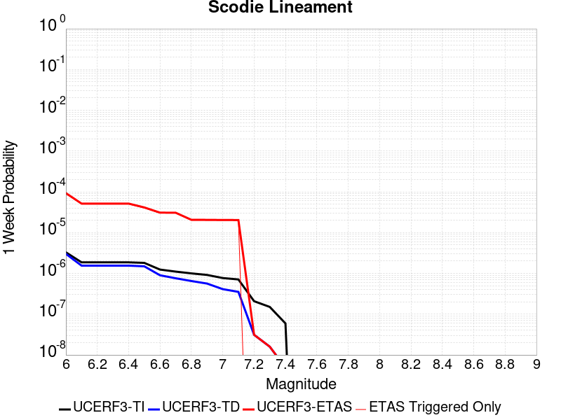 |  |  | 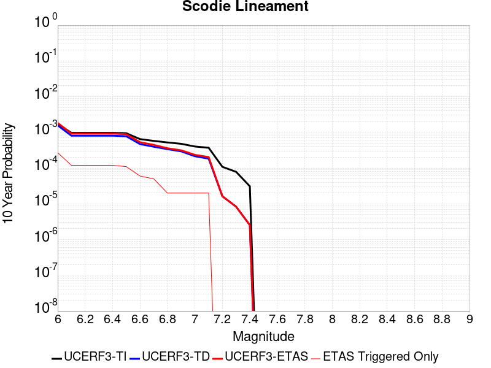 |

| Magnitude | 1 wk TI Prob | 1 wk TD Prob | 1 wk ETAS Prob | 1 wk ETAS/TD Gain | 1 wk ETAS Triggered Only | 1 mo TI Prob | 1 mo TD Prob | 1 mo ETAS Prob | 1 mo ETAS/TD Gain | 1 mo ETAS Triggered Only | 1 yr TI Prob | 1 yr TD Prob | 1 yr ETAS Prob | 1 yr ETAS/TD Gain | 1 yr ETAS Triggered Only | 10 yr TI Prob | 10 yr TD Prob | 10 yr ETAS Prob | 10 yr ETAS/TD Gain | 10 yr ETAS Triggered Only |
|-----|-----|-----|-----|-----|-----|-----|-----|-----|-----|-----|-----|-----|-----|-----|-----|-----|-----|-----|-----|-----|
| 6.0 | 3.2919327E-6 | 3.0133422E-6 | 9.301307E-5 | 30.867079 | 9.0E-5 | 1.4108206E-5 | 1.2914278E-5 | 1.2291285E-4 | 9.517594 | 1.1E-4 | 1.7175387E-4 | 1.5722317E-4 | 3.471933E-4 | 2.2082834 | 1.9E-4 | 0.0017162118 | 0.0015714309 | 0.0018410066 | 1.1715479 | 2.7E-4 |
| 6.1 | 1.8663811E-6 | 1.5490499E-6 | 5.1548974E-5 | 33.277798 | 5.0E-5 | 7.998751E-6 | 6.6387715E-6 | 6.663837E-5 | 10.037757 | 6.0E-5 | 9.738045E-5 | 8.082454E-5 | 1.7081726E-4 | 2.1134331 | 9.0E-5 | 9.7337784E-4 | 8.080003E-4 | 9.279033E-4 | 1.1483948 | 1.2E-4 |
| 6.2 | 1.8663811E-6 | 1.5490499E-6 | 5.1548974E-5 | 33.277798 | 5.0E-5 | 7.998751E-6 | 6.6387715E-6 | 6.663837E-5 | 10.037757 | 6.0E-5 | 9.738045E-5 | 8.082454E-5 | 1.7081726E-4 | 2.1134331 | 9.0E-5 | 9.7337784E-4 | 8.080003E-4 | 9.279033E-4 | 1.1483948 | 1.2E-4 |
| 6.3 | 1.8663811E-6 | 1.5490499E-6 | 5.1548974E-5 | 33.277798 | 5.0E-5 | 7.998751E-6 | 6.6387715E-6 | 6.663837E-5 | 10.037757 | 6.0E-5 | 9.738045E-5 | 8.082454E-5 | 1.7081726E-4 | 2.1134331 | 9.0E-5 | 9.7337784E-4 | 8.080003E-4 | 9.279033E-4 | 1.1483948 | 1.2E-4 |
| 6.4 | 1.8663811E-6 | 1.5490499E-6 | 5.1548974E-5 | 33.277798 | 5.0E-5 | 7.998751E-6 | 6.6387715E-6 | 6.663837E-5 | 10.037757 | 6.0E-5 | 9.738045E-5 | 8.082454E-5 | 1.7081726E-4 | 2.1134331 | 9.0E-5 | 9.7337784E-4 | 8.080003E-4 | 9.279033E-4 | 1.1483948 | 1.2E-4 |
| 6.5 | 1.8106311E-6 | 1.4909839E-6 | 4.1490923E-5 | 27.82788 | 4.0E-5 | 7.759824E-6 | 6.3899183E-6 | 5.63896E-5 | 8.824776 | 5.0E-5 | 9.447177E-5 | 7.7794975E-5 | 1.5778875E-4 | 2.028264 | 8.0E-5 | 9.4431615E-4 | 7.7772606E-4 | 8.876405E-4 | 1.141328 | 1.1E-4 |
| 6.6 | 1.2414679E-6 | 8.997558E-7 | 3.089973E-5 | 34.34235 | 3.0E-5 | 5.320566E-6 | 3.856091E-6 | 4.3855936E-5 | 11.373159 | 4.0E-5 | 6.477596E-5 | 4.6946985E-5 | 9.6944634E-5 | 2.0649812 | 5.0E-5 | 6.475708E-4 | 4.693793E-4 | 5.293512E-4 | 1.1277684 | 6.0E-5 |
| 6.7 | 1.1062215E-6 | 7.594311E-7 | 3.075941E-5 | 40.503223 | 3.0E-5 | 4.7409408E-6 | 3.2547011E-6 | 4.325457E-5 | 13.289875 | 4.0E-5 | 5.7719422E-5 | 3.9625334E-5 | 7.962375E-5 | 2.0094151 | 4.0E-5 | 5.770443E-4 | 3.961897E-4 | 4.4616987E-4 | 1.1261522 | 5.0E-5 |
| 6.8 | 1.0006736E-6 | 6.500397E-7 | 2.0650026E-5 | 31.767332 | 2.0E-5 | 4.288594E-6 | 2.7858816E-6 | 2.2785825E-5 | 8.179036 | 2.0E-5 | 5.221238E-5 | 3.3917644E-5 | 5.3916967E-5 | 1.5896436 | 2.0E-5 | 5.220012E-4 | 3.3913075E-4 | 3.5912395E-4 | 1.0589544 | 2.0E-5 |
| 6.9 | 9.167364E-7 | 5.631625E-7 | 2.0563151E-5 | 36.51371 | 2.0E-5 | 3.9288643E-6 | 2.4135516E-6 | 2.2413504E-5 | 9.286524 | 2.0E-5 | 4.7832873E-5 | 2.9384651E-5 | 4.9384063E-5 | 1.6806074 | 2.0E-5 | 4.782258E-4 | 2.9381333E-4 | 3.1380745E-4 | 1.0680504 | 2.0E-5 |
| 7.0 | 7.6987664E-7 | 4.113383E-7 | 2.041133E-5 | 49.62176 | 2.0E-5 | 3.2994672E-6 | 1.7628774E-6 | 2.1762842E-5 | 12.345068 | 2.0E-5 | 4.0170275E-5 | 2.1462862E-5 | 4.146243E-5 | 1.9318222 | 2.0E-5 | 4.0163012E-4 | 2.1461173E-4 | 2.3460745E-4 | 1.0931716 | 2.0E-5 |
| 7.1 | 7.1038727E-7 | 3.5211494E-7 | 2.0352109E-5 | 57.799618 | 2.0E-5 | 3.0445133E-6 | 1.5090633E-6 | 2.1509033E-5 | 14.253235 | 2.0E-5 | 3.706632E-5 | 1.8372726E-5 | 3.837236E-5 | 2.08855 | 2.0E-5 | 3.7060137E-4 | 1.8371557E-4 | 2.037119E-4 | 1.1088439 | 2.0E-5 |
| 7.2 | 2.0799602E-7 | 3.1186854E-8 | 3.1186854E-8 | 1.0 | 0.0 | 8.914113E-7 | 1.3365793E-7 | 1.3365793E-7 | 1.0 | 0.0 | 1.0852878E-5 | 1.6272843E-6 | 1.6272843E-6 | 1.0 | 0.0 | 1.08523476E-4 | 1.627273E-5 | 1.627273E-5 | 1.0 | 0.0 |
| 7.3 | 1.5048182E-7 | 1.5945696E-8 | 1.5945696E-8 | 1.0 | 0.0 | 6.449219E-7 | 6.83387E-8 | 6.83387E-8 | 1.0 | 0.0 | 7.851896E-6 | 8.320234E-7 | 8.320234E-7 | 1.0 | 0.0 | 7.851618E-5 | 8.320206E-6 | 8.320206E-6 | 1.0 | 0.0 |
| 7.4 | 5.9334678E-8 | 4.8683537E-9 | 4.8683537E-9 | 1.0 | 0.0 | 2.5429145E-7 | 2.0864372E-8 | 2.0864372E-8 | 1.0 | 0.0 | 3.095994E-6 | 2.5402372E-7 | 2.5402372E-7 | 1.0 | 0.0 | 3.095951E-5 | 2.5402353E-6 | 2.5402353E-6 | 1.0 | 0.0 |

## Lake Isabella (Seismicity)
*[(top)](#table-of-contents)*

| 1 Week | 1 Month | 1 Year | 10 Year |
|-----|-----|-----|-----|
|  |  |  | 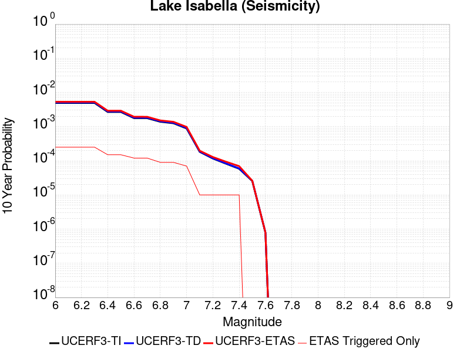 |

| Magnitude | 1 wk TI Prob | 1 wk TD Prob | 1 wk ETAS Prob | 1 wk ETAS/TD Gain | 1 wk ETAS Triggered Only | 1 mo TI Prob | 1 mo TD Prob | 1 mo ETAS Prob | 1 mo ETAS/TD Gain | 1 mo ETAS Triggered Only | 1 yr TI Prob | 1 yr TD Prob | 1 yr ETAS Prob | 1 yr ETAS/TD Gain | 1 yr ETAS Triggered Only | 10 yr TI Prob | 10 yr TD Prob | 10 yr ETAS Prob | 10 yr ETAS/TD Gain | 10 yr ETAS Triggered Only |
|-----|-----|-----|-----|-----|-----|-----|-----|-----|-----|-----|-----|-----|-----|-----|-----|-----|-----|-----|-----|-----|
| 6.0 | 9.431637E-6 | 9.741651E-6 | 1.3974038E-4 | 14.344629 | 1.3E-4 | 4.0420677E-5 | 4.1749343E-5 | 2.0174266E-4 | 4.832236 | 1.6E-4 | 4.920106E-4 | 5.0819275E-4 | 6.980962E-4 | 1.3736839 | 1.9E-4 | 0.004909227 | 0.005071599 | 0.005320331 | 1.0490441 | 2.5E-4 |
| 6.1 | 9.431637E-6 | 9.741651E-6 | 1.3974038E-4 | 14.344629 | 1.3E-4 | 4.0420677E-5 | 4.1749343E-5 | 2.0174266E-4 | 4.832236 | 1.6E-4 | 4.920106E-4 | 5.0819275E-4 | 6.980962E-4 | 1.3736839 | 1.9E-4 | 0.004909227 | 0.005071599 | 0.005320331 | 1.0490441 | 2.5E-4 |
| 6.2 | 9.431637E-6 | 9.741651E-6 | 1.3974038E-4 | 14.344629 | 1.3E-4 | 4.0420677E-5 | 4.1749343E-5 | 2.0174266E-4 | 4.832236 | 1.6E-4 | 4.920106E-4 | 5.0819275E-4 | 6.980962E-4 | 1.3736839 | 1.9E-4 | 0.004909227 | 0.005071599 | 0.005320331 | 1.0490441 | 2.5E-4 |
| 6.3 | 9.431637E-6 | 9.741651E-6 | 1.3974038E-4 | 14.344629 | 1.3E-4 | 4.0420677E-5 | 4.1749343E-5 | 2.0174266E-4 | 4.832236 | 1.6E-4 | 4.920106E-4 | 5.0819275E-4 | 6.980962E-4 | 1.3736839 | 1.9E-4 | 0.004909227 | 0.005071599 | 0.005320331 | 1.0490441 | 2.5E-4 |
| 6.4 | 5.144063E-6 | 5.3000763E-6 | 8.529965E-5 | 16.094044 | 8.0E-5 | 2.2045799E-5 | 2.2714434E-5 | 1.2271217E-4 | 5.402387 | 1.0E-4 | 2.6837454E-4 | 2.765166E-4 | 3.964834E-4 | 1.4338503 | 1.2E-4 | 0.0026805066 | 0.0027620657 | 0.0029116513 | 1.0541571 | 1.5E-4 |
| 6.5 | 5.144063E-6 | 5.3000763E-6 | 8.529965E-5 | 16.094044 | 8.0E-5 | 2.2045799E-5 | 2.2714434E-5 | 1.2271217E-4 | 5.402387 | 1.0E-4 | 2.6837454E-4 | 2.765166E-4 | 3.964834E-4 | 1.4338503 | 1.2E-4 | 0.0026805066 | 0.0027620657 | 0.0029116513 | 1.0541571 | 1.5E-4 |
| 6.6 | 3.4009804E-6 | 3.498786E-6 | 7.3498544E-5 | 21.006868 | 7.0E-5 | 1.4575549E-5 | 1.4994721E-5 | 1.0499337E-4 | 7.0020223 | 9.0E-5 | 1.7744285E-4 | 1.8254704E-4 | 2.9252697E-4 | 1.6024745 | 1.1E-4 | 0.0017730123 | 0.0018241286 | 0.0019439097 | 1.0656649 | 1.2E-4 |
| 6.7 | 3.3880428E-6 | 3.4856528E-6 | 7.348541E-5 | 21.082253 | 7.0E-5 | 1.4520103E-5 | 1.4938435E-5 | 1.0493709E-4 | 7.024637 | 9.0E-5 | 1.767679E-4 | 1.8186188E-4 | 2.9184186E-4 | 1.6047447 | 1.1E-4 | 0.0017662736 | 0.0018172882 | 0.0019370702 | 1.0659125 | 1.2E-4 |
| 6.8 | 2.6582E-6 | 2.7337003E-6 | 6.273354E-5 | 22.948214 | 6.0E-5 | 1.1392236E-5 | 1.1715813E-5 | 9.171488E-5 | 7.828298 | 8.0E-5 | 1.3869164E-4 | 1.4263204E-4 | 2.3261919E-4 | 1.6309043 | 9.0E-5 | 0.0013860512 | 0.0014255369 | 0.0015154086 | 1.0630441 | 9.0E-5 |
| 6.9 | 2.406011E-6 | 2.4743288E-6 | 6.247418E-5 | 25.24894 | 6.0E-5 | 1.0311434E-5 | 1.0604231E-5 | 9.060338E-5 | 8.544079 | 8.0E-5 | 1.2553448E-4 | 1.2910018E-4 | 2.1908856E-4 | 1.6970431 | 9.0E-5 | 0.0012546359 | 0.0012903814 | 0.0013802653 | 1.0696568 | 9.0E-5 |
| 7.0 | 1.6953097E-6 | 1.7429371E-6 | 4.1742867E-5 | 23.949726 | 4.0E-5 | 7.265593E-6 | 7.469715E-6 | 6.7469264E-5 | 9.032374 | 6.0E-5 | 8.8455E-5 | 9.094104E-5 | 1.6093467E-4 | 1.7696595 | 7.0E-5 | 8.84198E-4 | 9.09141E-4 | 9.790773E-4 | 1.0769258 | 7.0E-5 |
| 7.1 | 3.5013824E-7 | 3.5714822E-7 | 3.5714822E-7 | 1.0 | 0.0 | 1.5005916E-6 | 1.5306344E-6 | 1.1530619E-5 | 7.533229 | 1.0E-5 | 1.826955E-5 | 1.8635317E-5 | 2.8635131E-5 | 1.5366055 | 1.0E-5 | 1.8268047E-4 | 1.863378E-4 | 1.9633592E-4 | 1.053656 | 1.0E-5 |
| 7.2 | 2.2321095E-7 | 2.2750574E-7 | 2.2750574E-7 | 1.0 | 0.0 | 9.56618E-7 | 9.750242E-7 | 1.0975014E-5 | 11.2561455 | 1.0E-5 | 1.1646762E-5 | 1.1870856E-5 | 2.1870737E-5 | 1.8423892 | 1.0E-5 | 1.1646151E-4 | 1.1870232E-4 | 1.2870114E-4 | 1.0842344 | 1.0E-5 |
| 7.3 | 1.5760406E-7 | 1.6060922E-7 | 1.6060922E-7 | 1.0 | 0.0 | 6.7544585E-7 | 6.8832503E-7 | 1.0688318E-5 | 15.528009 | 1.0E-5 | 8.223522E-6 | 8.380326E-6 | 1.8380242E-5 | 2.193261 | 1.0E-5 | 8.2232174E-5 | 8.3800165E-5 | 9.3799325E-5 | 1.1193215 | 1.0E-5 |
| 7.4 | 1.1216497E-7 | 1.1431706E-7 | 1.1431706E-7 | 1.0 | 0.0 | 4.8070694E-7 | 4.899302E-7 | 1.0489925E-5 | 21.411062 | 1.0E-5 | 5.852591E-6 | 5.964884E-6 | 1.5964824E-5 | 2.6764686 | 1.0E-5 | 5.8524372E-5 | 5.9647282E-5 | 6.964669E-5 | 1.1676422 | 1.0E-5 |
| 7.5 | 4.885185E-8 | 4.9787737E-8 | 4.9787737E-8 | 1.0 | 0.0 | 2.0936506E-7 | 2.13376E-7 | 2.13376E-7 | 1.0 | 0.0 | 2.5490165E-6 | 2.59785E-6 | 2.59785E-6 | 1.0 | 0.0 | 2.5489873E-5 | 2.5978214E-5 | 2.5978214E-5 | 1.0 | 0.0 |
| 7.6 | 1.504641E-9 | 1.5317903E-9 | 1.5317903E-9 | 1.0 | 0.0 | 6.4484613E-9 | 6.5648154E-9 | 6.5648154E-9 | 1.0 | 0.0 | 7.851001E-8 | 7.992663E-8 | 7.992663E-8 | 1.0 | 0.0 | 7.8509987E-7 | 7.992663E-7 | 7.992663E-7 | 1.0 | 0.0 |

## Cleghorn Pass
*[(top)](#table-of-contents)*

| 1 Week | 1 Month | 1 Year | 10 Year |
|-----|-----|-----|-----|
|  |  |  |  |

| Magnitude | 1 wk TI Prob | 1 wk TD Prob | 1 wk ETAS Prob | 1 wk ETAS/TD Gain | 1 wk ETAS Triggered Only | 1 mo TI Prob | 1 mo TD Prob | 1 mo ETAS Prob | 1 mo ETAS/TD Gain | 1 mo ETAS Triggered Only | 1 yr TI Prob | 1 yr TD Prob | 1 yr ETAS Prob | 1 yr ETAS/TD Gain | 1 yr ETAS Triggered Only | 10 yr TI Prob | 10 yr TD Prob | 10 yr ETAS Prob | 10 yr ETAS/TD Gain | 10 yr ETAS Triggered Only |
|-----|-----|-----|-----|-----|-----|-----|-----|-----|-----|-----|-----|-----|-----|-----|-----|-----|-----|-----|-----|-----|
| 6.0 | 1.0522846E-5 | 1.1040642E-5 | 6.104009E-5 | 5.528672 | 5.0E-5 | 4.509713E-5 | 4.7316473E-5 | 1.0731364E-4 | 2.2679973 | 6.0E-5 | 5.4891926E-4 | 5.759784E-4 | 6.959093E-4 | 1.2082211 | 1.2E-4 | 0.0054756533 | 0.005750022 | 0.0059289867 | 1.0311242 | 1.8E-4 |
| 6.1 | 1.0522846E-5 | 1.1040642E-5 | 6.104009E-5 | 5.528672 | 5.0E-5 | 4.509713E-5 | 4.7316473E-5 | 1.0731364E-4 | 2.2679973 | 6.0E-5 | 5.4891926E-4 | 5.759784E-4 | 6.959093E-4 | 1.2082211 | 1.2E-4 | 0.0054756533 | 0.005750022 | 0.0059289867 | 1.0311242 | 1.8E-4 |
| 6.2 | 2.1045846E-6 | 2.2082024E-6 | 2.2082024E-6 | 1.0 | 0.0 | 9.019617E-6 | 9.463714E-6 | 9.463714E-6 | 1.0 | 0.0 | 1.098083E-4 | 1.1521882E-4 | 1.2521767E-4 | 1.0867814 | 1.0E-5 | 0.0010975406 | 0.0011520023 | 0.0011619907 | 1.0086706 | 1.0E-5 |
| 6.3 | 2.1045846E-6 | 2.2082024E-6 | 2.2082024E-6 | 1.0 | 0.0 | 9.019617E-6 | 9.463714E-6 | 9.463714E-6 | 1.0 | 0.0 | 1.098083E-4 | 1.1521882E-4 | 1.2521767E-4 | 1.0867814 | 1.0E-5 | 0.0010975406 | 0.0011520023 | 0.0011619907 | 1.0086706 | 1.0E-5 |
| 6.4 | 1.7259927E-6 | 1.810877E-6 | 1.810877E-6 | 1.0 | 0.0 | 7.3970905E-6 | 7.760902E-6 | 7.760902E-6 | 1.0 | 0.0 | 9.005586E-5 | 9.4488976E-5 | 1.04488034E-4 | 1.1058224 | 1.0E-5 | 9.001937E-4 | 9.448898E-4 | 9.548803E-4 | 1.0105733 | 1.0E-5 |

## Santa Ynez (East)
*[(top)](#table-of-contents)*

| 1 Week | 1 Month | 1 Year | 10 Year |
|-----|-----|-----|-----|
|  |  |  |  |

| Magnitude | 1 wk TI Prob | 1 wk TD Prob | 1 wk ETAS Prob | 1 wk ETAS/TD Gain | 1 wk ETAS Triggered Only | 1 mo TI Prob | 1 mo TD Prob | 1 mo ETAS Prob | 1 mo ETAS/TD Gain | 1 mo ETAS Triggered Only | 1 yr TI Prob | 1 yr TD Prob | 1 yr ETAS Prob | 1 yr ETAS/TD Gain | 1 yr ETAS Triggered Only | 10 yr TI Prob | 10 yr TD Prob | 10 yr ETAS Prob | 10 yr ETAS/TD Gain | 10 yr ETAS Triggered Only |
|-----|-----|-----|-----|-----|-----|-----|-----|-----|-----|-----|-----|-----|-----|-----|-----|-----|-----|-----|-----|-----|
| 6.0 | 3.2269712E-5 | 3.67505E-5 | 1.16747564E-4 | 3.176761 | 8.0E-5 | 1.3829143E-4 | 1.5749598E-4 | 2.474818E-4 | 1.5713532 | 9.0E-5 | 0.0016823979 | 0.0019164166 | 0.0020860909 | 1.0885372 | 1.7E-4 | 0.016697178 | 0.019056441 | 0.01925263 | 1.0102952 | 2.0E-4 |
| 6.1 | 3.2269712E-5 | 3.67505E-5 | 1.16747564E-4 | 3.176761 | 8.0E-5 | 1.3829143E-4 | 1.5749598E-4 | 2.474818E-4 | 1.5713532 | 9.0E-5 | 0.0016823979 | 0.0019164166 | 0.0020860909 | 1.0885372 | 1.7E-4 | 0.016697178 | 0.019056441 | 0.01925263 | 1.0102952 | 2.0E-4 |
| 6.2 | 3.2269712E-5 | 3.67505E-5 | 1.16747564E-4 | 3.176761 | 8.0E-5 | 1.3829143E-4 | 1.5749598E-4 | 2.474818E-4 | 1.5713532 | 9.0E-5 | 0.0016823979 | 0.0019164166 | 0.0020860909 | 1.0885372 | 1.7E-4 | 0.016697178 | 0.019056441 | 0.01925263 | 1.0102952 | 2.0E-4 |
| 6.3 | 3.2269712E-5 | 3.67505E-5 | 1.16747564E-4 | 3.176761 | 8.0E-5 | 1.3829143E-4 | 1.5749598E-4 | 2.474818E-4 | 1.5713532 | 9.0E-5 | 0.0016823979 | 0.0019164166 | 0.0020860909 | 1.0885372 | 1.7E-4 | 0.016697178 | 0.019056441 | 0.01925263 | 1.0102952 | 2.0E-4 |
| 6.4 | 1.4404779E-5 | 1.4849382E-5 | 4.4848937E-5 | 3.020256 | 3.0E-5 | 6.1733306E-5 | 6.363868E-5 | 9.363678E-5 | 1.4713814 | 3.0E-5 | 7.513438E-4 | 7.745306E-4 | 8.2449184E-4 | 1.0645052 | 5.0E-5 | 0.0074880854 | 0.007718862 | 0.007768476 | 1.0064276 | 5.0E-5 |
| 6.5 | 1.4404779E-5 | 1.4849382E-5 | 4.4848937E-5 | 3.020256 | 3.0E-5 | 6.1733306E-5 | 6.363868E-5 | 9.363678E-5 | 1.4713814 | 3.0E-5 | 7.513438E-4 | 7.745306E-4 | 8.2449184E-4 | 1.0645052 | 5.0E-5 | 0.0074880854 | 0.007718862 | 0.007768476 | 1.0064276 | 5.0E-5 |
| 6.6 | 1.280208E-5 | 1.3011947E-5 | 4.3011558E-5 | 3.3055434 | 3.0E-5 | 5.4864904E-5 | 5.5764307E-5 | 8.576263E-5 | 1.5379485 | 3.0E-5 | 6.6777546E-4 | 6.787207E-4 | 7.2868675E-4 | 1.073618 | 5.0E-5 | 0.006657724 | 0.0067666885 | 0.0068163504 | 1.0073391 | 5.0E-5 |
| 6.7 | 1.2457027E-5 | 1.2628468E-5 | 4.262809E-5 | 3.375555 | 3.0E-5 | 5.3386164E-5 | 5.412089E-5 | 8.411927E-5 | 1.5542846 | 3.0E-5 | 6.497827E-4 | 6.587243E-4 | 7.0869137E-4 | 1.0758543 | 5.0E-5 | 0.00647886 | 0.006567915 | 0.0066175866 | 1.0075628 | 5.0E-5 |
| 6.8 | 1.2095134E-5 | 1.2230915E-5 | 4.223055E-5 | 3.4527712 | 3.0E-5 | 5.1835254E-5 | 5.241716E-5 | 8.241559E-5 | 1.5723016 | 3.0E-5 | 6.309115E-4 | 6.379937E-4 | 6.8796176E-4 | 1.0783207 | 5.0E-5 | 0.0062912325 | 0.006361809 | 0.006411491 | 1.0078094 | 5.0E-5 |
| 6.9 | 1.1104036E-5 | 1.1157347E-5 | 4.115701E-5 | 3.6887813 | 3.0E-5 | 4.758786E-5 | 4.781633E-5 | 7.78149E-5 | 1.6273707 | 3.0E-5 | 5.7922816E-4 | 5.820096E-4 | 6.2198634E-4 | 1.0686874 | 4.0E-5 | 0.005777207 | 0.0058049993 | 0.0058447667 | 1.0068506 | 4.0E-5 |
| 7.0 | 1.0577444E-5 | 1.058168E-5 | 4.0581363E-5 | 3.8350585 | 3.0E-5 | 4.5331115E-5 | 4.5349276E-5 | 7.534792E-5 | 1.661502 | 3.0E-5 | 5.5176654E-4 | 5.519888E-4 | 5.919667E-4 | 1.0724252 | 4.0E-5 | 0.0055039856 | 0.0055063153 | 0.0055460953 | 1.0072244 | 4.0E-5 |
| 7.1 | 1.0021775E-5 | 9.980988E-6 | 3.998069E-5 | 4.005685 | 3.0E-5 | 4.294976E-5 | 4.2774966E-5 | 7.2773684E-5 | 1.7013148 | 3.0E-5 | 5.2278786E-4 | 5.2066194E-4 | 5.606411E-4 | 1.0767853 | 4.0E-5 | 0.0052155964 | 0.0051945536 | 0.005234346 | 1.0076604 | 4.0E-5 |
| 7.2 | 8.874109E-6 | 8.748793E-6 | 3.874853E-5 | 4.429014 | 3.0E-5 | 3.8031343E-5 | 3.7494297E-5 | 6.749317E-5 | 1.8000917 | 3.0E-5 | 4.629332E-4 | 4.5639853E-4 | 4.9638026E-4 | 1.0876027 | 4.0E-5 | 0.0046197 | 0.0045547304 | 0.004594548 | 1.0087421 | 4.0E-5 |
| 7.3 | 7.5504267E-6 | 7.5051175E-6 | 3.750489E-5 | 4.9972425 | 3.0E-5 | 3.235857E-5 | 3.21644E-5 | 6.216343E-5 | 1.9326782 | 3.0E-5 | 3.9389438E-4 | 3.915322E-4 | 4.3151656E-4 | 1.1021228 | 4.0E-5 | 0.0039319694 | 0.003908531 | 0.0039483747 | 1.0101941 | 4.0E-5 |
| 7.4 | 6.309394E-6 | 6.1831556E-6 | 3.618297E-5 | 5.8518615 | 3.0E-5 | 2.703998E-5 | 2.6498974E-5 | 5.649818E-5 | 2.1320894 | 3.0E-5 | 3.2916202E-4 | 3.225782E-4 | 3.625653E-4 | 1.123961 | 4.0E-5 | 0.003286749 | 0.003221197 | 0.0032610681 | 1.0123777 | 4.0E-5 |
| 7.5 | 4.6103073E-6 | 4.4408903E-6 | 2.4440802E-5 | 5.5035815 | 2.0E-5 | 1.975831E-5 | 1.9032252E-5 | 3.903187E-5 | 2.0508277 | 2.0E-5 | 2.4053088E-4 | 2.3169373E-4 | 2.6168677E-4 | 1.1294513 | 3.0E-5 | 0.002402707 | 0.002314591 | 0.0023445217 | 1.0129312 | 3.0E-5 |
| 7.6 | 1.2858658E-6 | 1.3008173E-6 | 1.3008173E-6 | 1.0 | 0.0 | 5.5108417E-6 | 5.5749197E-6 | 5.5749197E-6 | 1.0 | 0.0 | 6.7092435E-5 | 6.78726E-5 | 7.7871926E-5 | 1.1473248 | 1.0E-5 | 6.707218E-4 | 6.785256E-4 | 6.885188E-4 | 1.0147278 | 1.0E-5 |
| 7.7 | 5.3302307E-7 | 5.612138E-7 | 5.612138E-7 | 1.0 | 0.0 | 2.2843826E-6 | 2.4052001E-6 | 2.4052001E-6 | 1.0 | 0.0 | 2.7812002E-5 | 2.9282954E-5 | 3.9282662E-5 | 1.3414856 | 1.0E-5 | 2.7808524E-4 | 2.9279452E-4 | 3.027916E-4 | 1.0341437 | 1.0E-5 |
| 7.8 | 4.613933E-8 | 4.80301E-8 | 4.80301E-8 | 1.0 | 0.0 | 1.9773998E-7 | 2.0584326E-7 | 2.0584326E-7 | 1.0 | 0.0 | 2.4074816E-6 | 2.5061388E-6 | 2.5061388E-6 | 1.0 | 0.0 | 2.4074554E-5 | 2.5061116E-5 | 2.5061116E-5 | 1.0 | 0.0 |

## Santa Rosa Island
*[(top)](#table-of-contents)*

| 1 Week | 1 Month | 1 Year | 10 Year |
|-----|-----|-----|-----|
| 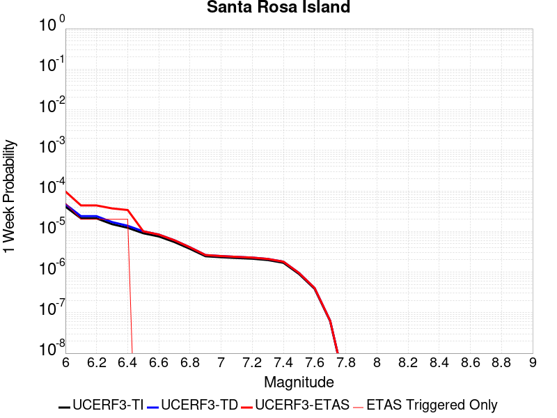 |  |  |  |

| Magnitude | 1 wk TI Prob | 1 wk TD Prob | 1 wk ETAS Prob | 1 wk ETAS/TD Gain | 1 wk ETAS Triggered Only | 1 mo TI Prob | 1 mo TD Prob | 1 mo ETAS Prob | 1 mo ETAS/TD Gain | 1 mo ETAS Triggered Only | 1 yr TI Prob | 1 yr TD Prob | 1 yr ETAS Prob | 1 yr ETAS/TD Gain | 1 yr ETAS Triggered Only | 10 yr TI Prob | 10 yr TD Prob | 10 yr ETAS Prob | 10 yr ETAS/TD Gain | 10 yr ETAS Triggered Only |
|-----|-----|-----|-----|-----|-----|-----|-----|-----|-----|-----|-----|-----|-----|-----|-----|-----|-----|-----|-----|-----|
| 6.0 | 4.1143165E-5 | 4.7091133E-5 | 9.708878E-5 | 2.061721 | 5.0E-5 | 1.7631594E-4 | 2.0180465E-4 | 2.6179253E-4 | 1.2972572 | 6.0E-5 | 0.002144533 | 0.0024544 | 0.0025342037 | 1.0325146 | 8.0E-5 | 0.021239553 | 0.024293551 | 0.024459422 | 1.0068277 | 1.7E-4 |
| 6.1 | 2.1061249E-5 | 2.3864959E-5 | 4.3864482E-5 | 1.8380288 | 2.0E-5 | 9.0259375E-5 | 1.0227455E-4 | 1.2227251E-4 | 1.1955321 | 2.0E-5 | 0.0010983539 | 0.0012445104 | 0.001274473 | 1.0240759 | 3.0E-5 | 0.01092941 | 0.012378449 | 0.012467334 | 1.0071807 | 9.0E-5 |
| 6.2 | 2.1061249E-5 | 2.3864959E-5 | 4.3864482E-5 | 1.8380288 | 2.0E-5 | 9.0259375E-5 | 1.0227455E-4 | 1.2227251E-4 | 1.1955321 | 2.0E-5 | 0.0010983539 | 0.0012445104 | 0.001274473 | 1.0240759 | 3.0E-5 | 0.01092941 | 0.012378449 | 0.012467334 | 1.0071807 | 9.0E-5 |
| 6.3 | 1.5158236E-5 | 1.7074419E-5 | 3.7074078E-5 | 2.1713228 | 2.0E-5 | 6.496225E-5 | 7.3174095E-5 | 9.317263E-5 | 1.2733008 | 2.0E-5 | 7.906284E-4 | 8.905424E-4 | 9.2051574E-4 | 1.0336573 | 3.0E-5 | 0.007878214 | 0.008870989 | 0.008930457 | 1.0067036 | 6.0E-5 |
| 6.4 | 1.2341918E-5 | 1.3852917E-5 | 3.385264E-5 | 2.4437194 | 2.0E-5 | 5.2892858E-5 | 5.9368336E-5 | 7.936715E-5 | 1.33686 | 2.0E-5 | 6.437803E-4 | 7.225779E-4 | 7.5255625E-4 | 1.041488 | 3.0E-5 | 0.006419184 | 0.007203121 | 0.0072329054 | 1.0041349 | 3.0E-5 |
| 6.5 | 9.061158E-6 | 1.0117031E-5 | 1.0117031E-5 | 1.0 | 0.0 | 3.883296E-5 | 4.3358013E-5 | 4.3358013E-5 | 1.0 | 0.0 | 4.726887E-4 | 5.277613E-4 | 5.37756E-4 | 1.018938 | 1.0E-5 | 0.004716845 | 0.0052656173 | 0.0052755647 | 1.0018891 | 1.0E-5 |
| 6.6 | 7.5461685E-6 | 8.400733E-6 | 8.400733E-6 | 1.0 | 0.0 | 3.2340322E-5 | 3.600267E-5 | 3.600267E-5 | 1.0 | 0.0 | 3.936723E-4 | 4.3824865E-4 | 4.4824427E-4 | 1.0228081 | 1.0E-5 | 0.003929756 | 0.0043742736 | 0.00438423 | 1.0022761 | 1.0E-5 |
| 6.7 | 5.5023775E-6 | 6.087381E-6 | 6.087381E-6 | 1.0 | 0.0 | 2.3581404E-5 | 2.6088532E-5 | 2.6088532E-5 | 1.0 | 0.0 | 2.8706578E-4 | 3.1758484E-4 | 3.2758166E-4 | 1.0314777 | 1.0E-5 | 0.0028669522 | 0.0031716314 | 0.0031815998 | 1.003143 | 1.0E-5 |
| 6.8 | 3.7351679E-6 | 4.0831405E-6 | 4.0831405E-6 | 1.0 | 0.0 | 1.6007763E-5 | 1.749907E-5 | 1.749907E-5 | 1.0 | 0.0 | 1.948771E-4 | 2.1303284E-4 | 2.1303284E-4 | 1.0 | 0.0 | 0.0019470629 | 0.0021285315 | 0.0021285315 | 1.0 | 0.0 |
| 6.9 | 2.456366E-6 | 2.6292705E-6 | 2.6292705E-6 | 1.0 | 0.0 | 1.0527241E-5 | 1.1268254E-5 | 1.1268254E-5 | 1.0 | 0.0 | 1.2816161E-4 | 1.3718237E-4 | 1.3718237E-4 | 1.0 | 0.0 | 0.0012808773 | 0.0013709799 | 0.0013709799 | 1.0 | 0.0 |
| 7.0 | 2.3245157E-6 | 2.4827782E-6 | 2.4827782E-6 | 1.0 | 0.0 | 9.962172E-6 | 1.0640435E-5 | 1.0640435E-5 | 1.0 | 0.0 | 1.2128269E-4 | 1.2953962E-4 | 1.2953962E-4 | 1.0 | 0.0 | 0.0012121652 | 0.0012946434 | 0.0012946434 | 1.0 | 0.0 |
| 7.1 | 2.2248344E-6 | 2.37325E-6 | 2.37325E-6 | 1.0 | 0.0 | 9.53497E-6 | 1.0171032E-5 | 1.0171032E-5 | 1.0 | 0.0 | 1.1608207E-4 | 1.2382529E-4 | 1.2382529E-4 | 1.0 | 0.0 | 0.0011602144 | 0.001237565 | 0.001237565 | 1.0 | 0.0 |
| 7.2 | 2.1350402E-6 | 2.276154E-6 | 2.276154E-6 | 1.0 | 0.0 | 9.150141E-6 | 9.754909E-6 | 9.754909E-6 | 1.0 | 0.0 | 1.1139726E-4 | 1.1875956E-4 | 1.1875956E-4 | 1.0 | 0.0 | 0.0011134144 | 0.0011869629 | 0.0011869629 | 1.0 | 0.0 |
| 7.3 | 1.9793572E-6 | 2.108719E-6 | 2.108719E-6 | 1.0 | 0.0 | 8.482932E-6 | 9.037336E-6 | 9.037336E-6 | 1.0 | 0.0 | 1.032748E-4 | 1.10024026E-4 | 1.10024026E-4 | 1.0 | 0.0 | 0.0010322682 | 0.0010996973 | 0.0010996973 | 1.0 | 0.0 |
| 7.4 | 1.6951194E-6 | 1.8045733E-6 | 1.8045733E-6 | 1.0 | 0.0 | 7.264777E-6 | 7.733863E-6 | 7.733863E-6 | 1.0 | 0.0 | 8.844508E-5 | 9.415573E-5 | 9.415573E-5 | 1.0 | 0.0 | 8.840988E-4 | 9.4116E-4 | 9.4116E-4 | 1.0 | 0.0 |
| 7.5 | 8.987207E-7 | 9.5122147E-7 | 9.5122147E-7 | 1.0 | 0.0 | 3.8516546E-6 | 4.076657E-6 | 4.076657E-6 | 1.0 | 0.0 | 4.6892885E-5 | 4.963218E-5 | 4.963218E-5 | 1.0 | 0.0 | 4.688299E-4 | 4.9621216E-4 | 4.9621216E-4 | 1.0 | 0.0 |
| 7.6 | 3.8783037E-7 | 4.052932E-7 | 4.052932E-7 | 1.0 | 0.0 | 1.6621291E-6 | 1.7369698E-6 | 1.7369698E-6 | 1.0 | 0.0 | 2.0236233E-5 | 2.1147409E-5 | 2.1147409E-5 | 1.0 | 0.0 | 2.023439E-4 | 2.1145462E-4 | 2.1145462E-4 | 1.0 | 0.0 |
| 7.7 | 6.181804E-8 | 6.339035E-8 | 6.339035E-8 | 1.0 | 0.0 | 2.6493444E-7 | 2.7167292E-7 | 2.7167292E-7 | 1.0 | 0.0 | 3.225572E-6 | 3.3076128E-6 | 3.3076128E-6 | 1.0 | 0.0 | 3.225525E-5 | 3.307564E-5 | 3.307564E-5 | 1.0 | 0.0 |
| 7.8 | 1.3704449E-9 | 1.3964153E-9 | 1.3964153E-9 | 1.0 | 0.0 | 5.873335E-9 | 5.984637E-9 | 5.984637E-9 | 1.0 | 0.0 | 7.1507856E-8 | 7.286295E-8 | 7.286295E-8 | 1.0 | 0.0 | 7.1507833E-7 | 7.286294E-7 | 7.286294E-7 | 1.0 | 0.0 |

## Mission Ridge-Arroyo Parida-Santa Ana
*[(top)](#table-of-contents)*

| 1 Week | 1 Month | 1 Year | 10 Year |
|-----|-----|-----|-----|
| 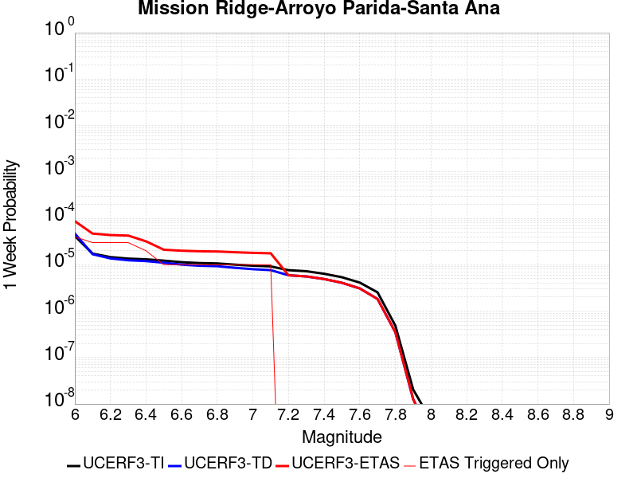 | 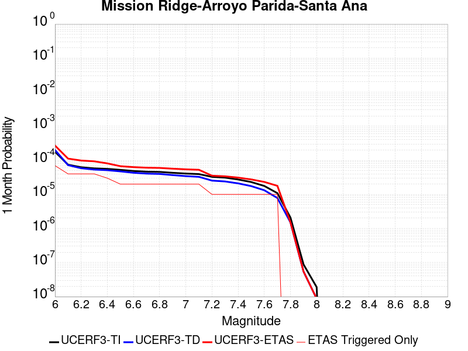 |  | 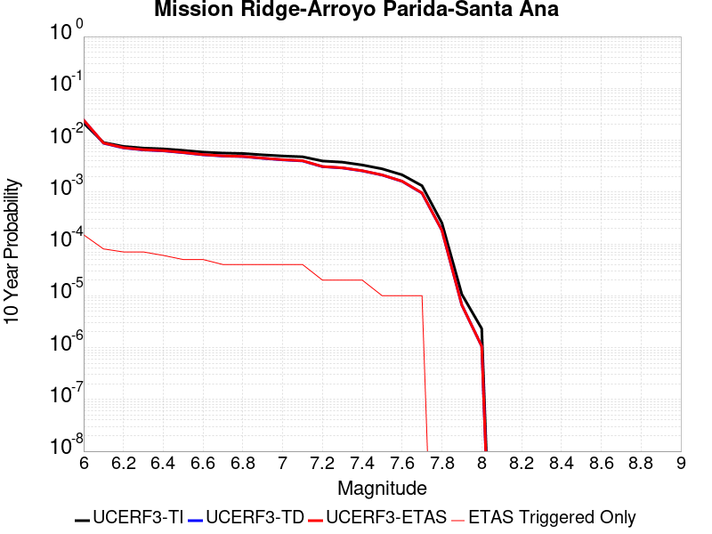 |

| Magnitude | 1 wk TI Prob | 1 wk TD Prob | 1 wk ETAS Prob | 1 wk ETAS/TD Gain | 1 wk ETAS Triggered Only | 1 mo TI Prob | 1 mo TD Prob | 1 mo ETAS Prob | 1 mo ETAS/TD Gain | 1 mo ETAS Triggered Only | 1 yr TI Prob | 1 yr TD Prob | 1 yr ETAS Prob | 1 yr ETAS/TD Gain | 1 yr ETAS Triggered Only | 10 yr TI Prob | 10 yr TD Prob | 10 yr ETAS Prob | 10 yr ETAS/TD Gain | 10 yr ETAS Triggered Only |
|-----|-----|-----|-----|-----|-----|-----|-----|-----|-----|-----|-----|-----|-----|-----|-----|-----|-----|-----|-----|-----|
| 6.0 | 4.169034E-5 | 4.7138263E-5 | 8.713638E-5 | 1.8485276 | 4.0E-5 | 1.7866064E-4 | 2.0201034E-4 | 2.719962E-4 | 1.3464469 | 7.0E-5 | 0.0021730233 | 0.00245745 | 0.0025771551 | 1.0487111 | 1.2E-4 | 0.021518968 | 0.024384614 | 0.024530957 | 1.0060015 | 1.5E-4 |
| 6.1 | 1.73813E-5 | 1.6854226E-5 | 4.6853722E-5 | 2.779939 | 3.0E-5 | 7.4489166E-5 | 7.223046E-5 | 1.1222757E-4 | 1.553743 | 4.0E-5 | 9.065282E-4 | 8.790618E-4 | 9.490003E-4 | 1.0795604 | 7.0E-5 | 0.009028391 | 0.008756988 | 0.008836287 | 1.0090556 | 8.0E-5 |
| 6.2 | 1.4622182E-5 | 1.367329E-5 | 4.367288E-5 | 3.1940286 | 3.0E-5 | 6.2664985E-5 | 5.8598518E-5 | 9.8596174E-5 | 1.6825712 | 4.0E-5 | 7.6267915E-4 | 7.132073E-4 | 7.731645E-4 | 1.084067 | 6.0E-5 | 0.007600669 | 0.007109627 | 0.0071791294 | 1.0097758 | 7.0E-5 |
| 6.3 | 1.3552434E-5 | 1.2482201E-5 | 4.2481824E-5 | 3.4033923 | 3.0E-5 | 5.8080568E-5 | 5.3494066E-5 | 9.349193E-5 | 1.7477065 | 4.0E-5 | 7.069015E-4 | 6.510988E-4 | 7.110597E-4 | 1.0920919 | 6.0E-5 | 0.00704657 | 0.006492275 | 0.0065618204 | 1.010712 | 7.0E-5 |
| 6.4 | 1.30977305E-5 | 1.1979156E-5 | 3.1978918E-5 | 2.6695466 | 2.0E-5 | 5.613192E-5 | 5.1338247E-5 | 8.133671E-5 | 1.5843296 | 3.0E-5 | 6.831918E-4 | 6.248669E-4 | 6.7483564E-4 | 1.079967 | 5.0E-5 | 0.006810953 | 0.0062314444 | 0.0062910705 | 1.0095686 | 6.0E-5 |
| 6.5 | 1.225205E-5 | 1.1048803E-5 | 2.1048692E-5 | 1.9050654 | 1.0E-5 | 5.2507727E-5 | 4.7351168E-5 | 6.735022E-5 | 1.422356 | 2.0E-5 | 6.3909404E-4 | 5.7635066E-4 | 6.163276E-4 | 1.0693622 | 4.0E-5 | 0.006372592 | 0.005748869 | 0.0057985815 | 1.0086473 | 5.0E-5 |
| 6.6 | 1.1352241E-5 | 1.0063535E-5 | 2.0063435E-5 | 1.9936767 | 1.0E-5 | 4.8651553E-5 | 4.3128734E-5 | 6.3127874E-5 | 1.4637079 | 2.0E-5 | 5.921717E-4 | 5.2496797E-4 | 5.6494697E-4 | 1.0761552 | 4.0E-5 | 0.0059059616 | 0.0052375244 | 0.0052872626 | 1.0094965 | 5.0E-5 |
| 6.7 | 1.0864116E-5 | 9.517027E-6 | 1.9516932E-5 | 2.0507383 | 1.0E-5 | 4.6559664E-5 | 4.0786632E-5 | 6.0785816E-5 | 1.4903368 | 2.0E-5 | 5.667165E-4 | 4.964661E-4 | 5.264512E-4 | 1.060397 | 3.0E-5 | 0.005652734 | 0.004953804 | 0.0049936054 | 1.0080346 | 4.0E-5 |
| 6.8 | 1.0666365E-5 | 9.299779E-6 | 1.9299685E-5 | 2.0752845 | 1.0E-5 | 4.571219E-5 | 3.9855597E-5 | 5.98548E-5 | 1.5017916 | 2.0E-5 | 5.564038E-4 | 4.8513585E-4 | 5.1512127E-4 | 1.0618083 | 3.0E-5 | 0.005550127 | 0.0048410003 | 0.0048808064 | 1.0082227 | 4.0E-5 |
| 6.9 | 1.0038665E-5 | 8.592046E-6 | 1.859196E-5 | 2.1638572 | 1.0E-5 | 4.302214E-5 | 3.682254E-5 | 5.6821806E-5 | 1.5431255 | 2.0E-5 | 5.236687E-4 | 4.4822405E-4 | 4.782106E-4 | 1.0669008 | 3.0E-5 | 0.005224364 | 0.004473411 | 0.004513232 | 1.0089017 | 4.0E-5 |
| 7.0 | 9.5379955E-6 | 8.025073E-6 | 1.8024994E-5 | 2.2460845 | 1.0E-5 | 4.0876483E-5 | 3.4392728E-5 | 5.439204E-5 | 1.5814983 | 2.0E-5 | 4.975576E-4 | 4.1865272E-4 | 4.4864014E-4 | 1.0716285 | 3.0E-5 | 0.00496445 | 0.0041788397 | 0.0042186724 | 1.0095321 | 4.0E-5 |
| 7.1 | 9.207389E-6 | 7.652375E-6 | 1.7652299E-5 | 2.306774 | 1.0E-5 | 3.945964E-5 | 3.279549E-5 | 5.2794836E-5 | 1.6098199 | 2.0E-5 | 4.803152E-4 | 3.9921363E-4 | 4.2920167E-4 | 1.0751177 | 3.0E-5 | 0.004792784 | 0.003985161 | 0.0040250015 | 1.0099972 | 4.0E-5 |
| 7.2 | 7.638091E-6 | 5.9311183E-6 | 5.9311183E-6 | 1.0 | 0.0 | 3.2734264E-5 | 2.541883E-5 | 3.5418576E-5 | 1.3933991 | 1.0E-5 | 3.984668E-4 | 3.0943064E-4 | 3.1942755E-4 | 1.0323074 | 1.0E-5 | 0.0039775306 | 0.0030900547 | 0.003109993 | 1.0064523 | 2.0E-5 |
| 7.3 | 7.2500147E-6 | 5.5961527E-6 | 5.5961527E-6 | 1.0 | 0.0 | 3.1071122E-5 | 2.3983293E-5 | 3.3983055E-5 | 1.4169469 | 1.0E-5 | 3.7822526E-4 | 2.9195778E-4 | 3.0195486E-4 | 1.0342416 | 1.0E-5 | 0.0037758215 | 0.0029157975 | 0.0029357392 | 1.0068392 | 2.0E-5 |
| 7.4 | 6.3899715E-6 | 4.9184964E-6 | 4.9184964E-6 | 1.0 | 0.0 | 2.7385306E-5 | 2.10791E-5 | 3.107889E-5 | 1.4743936 | 1.0E-5 | 3.3336508E-4 | 2.5660804E-4 | 2.6660546E-4 | 1.03896 | 1.0E-5 | 0.0033286542 | 0.0025631618 | 0.0025831105 | 1.0077828 | 2.0E-5 |
| 7.5 | 5.379025E-6 | 4.0838527E-6 | 4.0838527E-6 | 1.0 | 0.0 | 2.305276E-5 | 1.7502109E-5 | 2.7501934E-5 | 1.5713497 | 1.0E-5 | 2.806312E-4 | 2.1306744E-4 | 2.2306532E-4 | 1.0469235 | 1.0E-5 | 0.0028027708 | 0.002128643 | 0.0021386216 | 1.0046878 | 1.0E-5 |
| 7.6 | 4.1270696E-6 | 3.0883439E-6 | 3.0883439E-6 | 1.0 | 0.0 | 1.768732E-5 | 1.3235693E-5 | 2.3235561E-5 | 1.7555227 | 1.0E-5 | 2.1532185E-4 | 1.6113273E-4 | 1.7113112E-4 | 1.0620506 | 1.0E-5 | 0.0021511333 | 0.001610167 | 0.0016201509 | 1.0062006 | 1.0E-5 |
| 7.7 | 2.5406805E-6 | 1.8282013E-6 | 1.8282013E-6 | 1.0 | 0.0 | 1.0888585E-5 | 7.835125E-6 | 1.7835047E-5 | 2.2762938 | 1.0E-5 | 1.3256045E-4 | 9.538854E-5 | 1.0538758E-4 | 1.1048244 | 1.0E-5 | 0.0013248142 | 9.534821E-4 | 9.634726E-4 | 1.0104779 | 1.0E-5 |
| 7.8 | 4.8608285E-7 | 3.5098864E-7 | 3.5098864E-7 | 1.0 | 0.0 | 2.0832106E-6 | 1.5042363E-6 | 1.5042363E-6 | 1.0 | 0.0 | 2.5362791E-5 | 1.8313924E-5 | 1.8313924E-5 | 1.0 | 0.0 | 2.5359896E-4 | 1.8312426E-4 | 1.8312426E-4 | 1.0 | 0.0 |
| 7.9 | 2.0472514E-8 | 1.2688783E-8 | 1.2688783E-8 | 1.0 | 0.0 | 8.7739345E-8 | 5.43805E-8 | 5.43805E-8 | 1.0 | 0.0 | 1.068226E-6 | 6.6208236E-7 | 6.6208236E-7 | 1.0 | 0.0 | 1.0682209E-5 | 6.620805E-6 | 6.620805E-6 | 1.0 | 0.0 |
| 8.0 | 4.443582E-9 | 2.0321211E-9 | 2.0321211E-9 | 1.0 | 0.0 | 1.9043922E-8 | 8.70909E-9 | 8.70909E-9 | 1.0 | 0.0 | 2.3185973E-7 | 1.0603316E-7 | 1.0603316E-7 | 1.0 | 0.0 | 2.3185949E-6 | 1.0603312E-6 | 1.0603312E-6 | 1.0 | 0.0 |

## Owens Valley
*[(top)](#table-of-contents)*

| 1 Week | 1 Month | 1 Year | 10 Year |
|-----|-----|-----|-----|
|  | 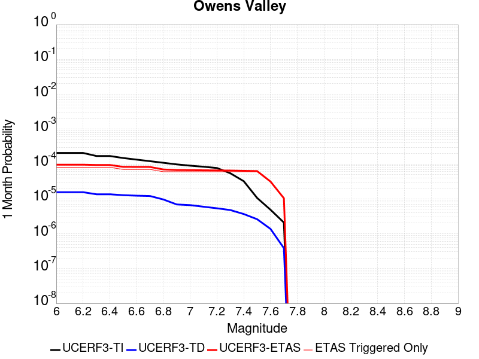 |  | 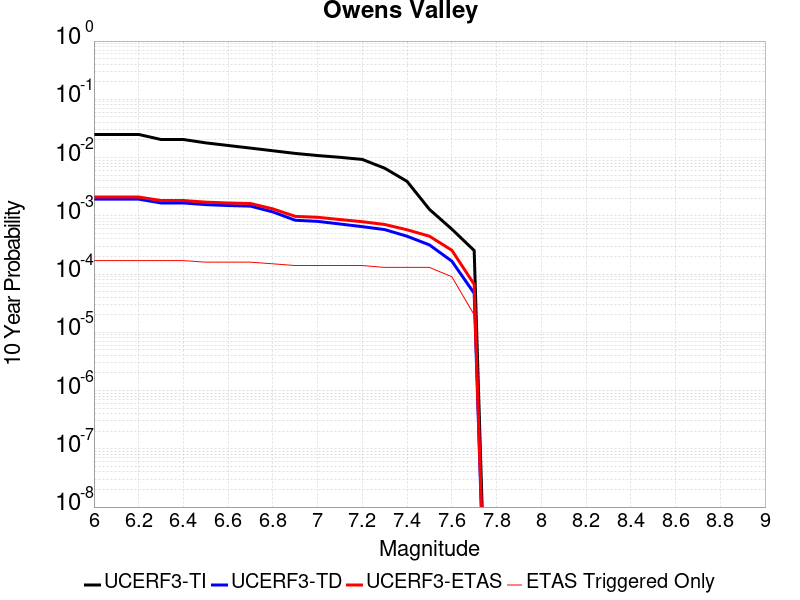 |

| Magnitude | 1 wk TI Prob | 1 wk TD Prob | 1 wk ETAS Prob | 1 wk ETAS/TD Gain | 1 wk ETAS Triggered Only | 1 mo TI Prob | 1 mo TD Prob | 1 mo ETAS Prob | 1 mo ETAS/TD Gain | 1 mo ETAS Triggered Only | 1 yr TI Prob | 1 yr TD Prob | 1 yr ETAS Prob | 1 yr ETAS/TD Gain | 1 yr ETAS Triggered Only | 10 yr TI Prob | 10 yr TD Prob | 10 yr ETAS Prob | 10 yr ETAS/TD Gain | 10 yr ETAS Triggered Only |
|-----|-----|-----|-----|-----|-----|-----|-----|-----|-----|-----|-----|-----|-----|-----|-----|-----|-----|-----|-----|-----|
| 6.0 | 4.83821E-5 | 3.626567E-6 | 7.362631E-5 | 20.301931 | 7.0E-5 | 2.0733538E-4 | 1.5542342E-5 | 9.55411E-5 | 6.147149 | 8.0E-5 | 0.002521386 | 1.8921259E-4 | 3.0918987E-4 | 1.6340873 | 1.2E-4 | 0.024929691 | 0.001925011 | 0.0020946837 | 1.0881412 | 1.7E-4 |
| 6.1 | 4.83821E-5 | 3.626567E-6 | 7.362631E-5 | 20.301931 | 7.0E-5 | 2.0733538E-4 | 1.5542342E-5 | 9.55411E-5 | 6.147149 | 8.0E-5 | 0.002521386 | 1.8921259E-4 | 3.0918987E-4 | 1.6340873 | 1.2E-4 | 0.024929691 | 0.001925011 | 0.0020946837 | 1.0881412 | 1.7E-4 |
| 6.2 | 4.83821E-5 | 3.626567E-6 | 7.362631E-5 | 20.301931 | 7.0E-5 | 2.0733538E-4 | 1.5542342E-5 | 9.55411E-5 | 6.147149 | 8.0E-5 | 0.002521386 | 1.8921259E-4 | 3.0918987E-4 | 1.6340873 | 1.2E-4 | 0.024929691 | 0.001925011 | 0.0020946837 | 1.0881412 | 1.7E-4 |
| 6.3 | 3.953008E-5 | 3.1553948E-6 | 7.315518E-5 | 23.184158 | 7.0E-5 | 1.6940363E-4 | 1.3523055E-5 | 9.352197E-5 | 6.9157434 | 8.0E-5 | 0.002060538 | 1.6463149E-4 | 2.8461174E-4 | 1.7287806 | 1.2E-4 | 0.020415364 | 0.0016592 | 0.0018289179 | 1.1022891 | 1.7E-4 |
| 6.4 | 3.953008E-5 | 3.1553948E-6 | 7.315518E-5 | 23.184158 | 7.0E-5 | 1.6940363E-4 | 1.3523055E-5 | 9.352197E-5 | 6.9157434 | 8.0E-5 | 0.002060538 | 1.6463149E-4 | 2.8461174E-4 | 1.7287806 | 1.2E-4 | 0.020415364 | 0.0016592 | 0.0018289179 | 1.1022891 | 1.7E-4 |
| 6.5 | 3.457342E-5 | 2.9715961E-6 | 6.297142E-5 | 21.191109 | 6.0E-5 | 1.4816338E-4 | 1.2735354E-5 | 8.273446E-5 | 6.49644 | 7.0E-5 | 0.0018023965 | 1.550426E-4 | 2.6502553E-4 | 1.7093724 | 1.1E-4 | 0.017878477 | 0.001555719 | 0.00171547 | 1.1026863 | 1.6E-4 |
| 6.6 | 3.1127765E-5 | 2.8744932E-6 | 6.287432E-5 | 21.873184 | 6.0E-5 | 1.3339789E-4 | 1.2319203E-5 | 8.231834E-5 | 6.682116 | 7.0E-5 | 0.0016229092 | 1.4997667E-4 | 2.5996016E-4 | 1.7333375 | 1.1E-4 | 0.016111081 | 0.0015012559 | 0.0016610157 | 1.1064174 | 1.6E-4 |
| 6.7 | 2.806885E-5 | 2.8104134E-6 | 6.281024E-5 | 22.349112 | 6.0E-5 | 1.2028952E-4 | 1.20445775E-5 | 8.2043734E-5 | 6.811674 | 7.0E-5 | 0.001463541 | 1.4663354E-4 | 2.566174E-4 | 1.7500594 | 1.1E-4 | 0.014539397 | 0.0014657511 | 0.0016255166 | 1.108999 | 1.6E-4 |
| 6.8 | 2.524524E-5 | 2.2353688E-6 | 6.223524E-5 | 27.841148 | 6.0E-5 | 1.0818939E-4 | 9.580118E-6 | 6.9579546E-5 | 7.262911 | 6.0E-5 | 0.0013164099 | 1.16632E-4 | 2.1662033E-4 | 1.8572977 | 1.0E-4 | 0.01308639 | 0.0011659812 | 0.0013158063 | 1.128497 | 1.5E-4 |
| 6.9 | 2.2704568E-5 | 1.6081682E-6 | 6.160807E-5 | 38.30947 | 6.0E-5 | 9.730166E-5 | 6.8921313E-6 | 6.689172E-5 | 9.70552 | 6.0E-5 | 0.0011840039 | 8.390849E-5 | 1.8390009E-4 | 2.1916745 | 1.0E-4 | 0.011777153 | 8.3897985E-4 | 9.788624E-4 | 1.1667293 | 1.4E-4 |
| 7.0 | 2.0871712E-5 | 1.5395453E-6 | 6.153945E-5 | 39.972485 | 6.0E-5 | 8.944713E-5 | 6.598035E-6 | 6.659764E-5 | 10.093557 | 6.0E-5 | 0.0010884746 | 8.032813E-5 | 1.803201E-4 | 2.244794 | 1.0E-4 | 0.010831586 | 8.0316263E-4 | 9.430502E-4 | 1.1741709 | 1.4E-4 |
| 7.1 | 1.944928E-5 | 1.3864178E-6 | 6.138634E-5 | 44.27694 | 6.0E-5 | 8.335139E-5 | 5.941777E-6 | 6.594142E-5 | 11.097929 | 6.0E-5 | 0.0010143308 | 7.233874E-5 | 1.723315E-4 | 2.382285 | 1.0E-4 | 0.010097133 | 7.2330976E-4 | 8.632085E-4 | 1.1934147 | 1.4E-4 |
| 7.2 | 1.7876306E-5 | 1.2489141E-6 | 6.124884E-5 | 49.041676 | 6.0E-5 | 7.6610486E-5 | 5.352478E-6 | 6.535216E-5 | 12.209701 | 6.0E-5 | 9.3233347E-4 | 6.516448E-5 | 1.6515797E-4 | 2.5344784 | 1.0E-4 | 0.009284316 | 6.5159105E-4 | 7.914998E-4 | 1.2147187 | 1.4E-4 |
| 7.3 | 1.2618672E-5 | 1.1115209E-6 | 6.111145E-5 | 54.980034 | 6.0E-5 | 5.40789E-5 | 4.763652E-6 | 6.4763364E-5 | 13.595318 | 6.0E-5 | 6.582117E-4 | 5.799593E-5 | 1.5799013E-4 | 2.724159 | 1.0E-4 | 0.0065626553 | 5.7994033E-4 | 7.0986495E-4 | 1.224031 | 1.3E-4 |
| 7.4 | 7.4874442E-6 | 8.5486437E-7 | 6.0854814E-5 | 71.18651 | 6.0E-5 | 3.208865E-5 | 3.6636993E-6 | 6.366348E-5 | 17.37683 | 6.0E-5 | 3.906093E-4 | 4.4604632E-5 | 1.4460017E-4 | 3.2418196 | 1.0E-4 | 0.003899234 | 4.4604883E-4 | 5.759908E-4 | 1.2913179 | 1.3E-4 |
| 7.5 | 2.4734156E-6 | 6.068616E-7 | 6.0606824E-5 | 99.86928 | 6.0E-5 | 1.060031E-5 | 2.6008327E-6 | 6.260067E-5 | 24.069475 | 6.0E-5 | 1.2905113E-4 | 3.166468E-5 | 1.3166151E-4 | 4.157993 | 1.0E-4 | 0.0012897621 | 3.1660203E-4 | 4.4656088E-4 | 1.4104801 | 1.3E-4 |
| 7.6 | 1.1328841E-6 | 3.196531E-7 | 3.0319643E-5 | 94.85171 | 3.0E-5 | 4.8552088E-6 | 1.3699412E-6 | 3.13699E-5 | 22.898722 | 3.0E-5 | 5.9110564E-5 | 1.6678909E-5 | 8.667774E-5 | 5.1968474 | 7.0E-5 | 5.9094845E-4 | 1.6677675E-4 | 2.5676173E-4 | 1.5395535 | 9.0E-5 |
| 7.7 | 4.8613185E-7 | 8.964689E-8 | 1.0089646E-5 | 112.54876 | 1.0E-5 | 2.0834207E-6 | 3.8420092E-7 | 1.0384197E-5 | 27.02804 | 1.0E-5 | 2.536535E-5 | 4.6776368E-6 | 2.4677543E-5 | 5.2756433 | 2.0E-5 | 2.5362454E-4 | 4.677545E-5 | 6.677451E-5 | 1.4275547 | 2.0E-5 |

## Lost Hills
*[(top)](#table-of-contents)*

| 1 Week | 1 Month | 1 Year | 10 Year |
|-----|-----|-----|-----|
|  |  |  |  |

| Magnitude | 1 wk TI Prob | 1 wk TD Prob | 1 wk ETAS Prob | 1 wk ETAS/TD Gain | 1 wk ETAS Triggered Only | 1 mo TI Prob | 1 mo TD Prob | 1 mo ETAS Prob | 1 mo ETAS/TD Gain | 1 mo ETAS Triggered Only | 1 yr TI Prob | 1 yr TD Prob | 1 yr ETAS Prob | 1 yr ETAS/TD Gain | 1 yr ETAS Triggered Only | 10 yr TI Prob | 10 yr TD Prob | 10 yr ETAS Prob | 10 yr ETAS/TD Gain | 10 yr ETAS Triggered Only |
|-----|-----|-----|-----|-----|-----|-----|-----|-----|-----|-----|-----|-----|-----|-----|-----|-----|-----|-----|-----|-----|
| 6.0 | 2.233523E-5 | 2.5106583E-5 | 8.510508E-5 | 3.3897514 | 6.0E-5 | 9.571891E-5 | 1.0759615E-4 | 1.7758862E-4 | 1.6505109 | 7.0E-5 | 0.0011647546 | 0.001309364 | 0.0014292069 | 1.0915276 | 1.2E-4 | 0.011586686 | 0.013033091 | 0.013191005 | 1.0121164 | 1.6E-4 |
| 6.1 | 2.233523E-5 | 2.5106583E-5 | 8.510508E-5 | 3.3897514 | 6.0E-5 | 9.571891E-5 | 1.0759615E-4 | 1.7758862E-4 | 1.6505109 | 7.0E-5 | 0.0011647546 | 0.001309364 | 0.0014292069 | 1.0915276 | 1.2E-4 | 0.011586686 | 0.013033091 | 0.013191005 | 1.0121164 | 1.6E-4 |
| 6.2 | 2.233523E-5 | 2.5106583E-5 | 8.510508E-5 | 3.3897514 | 6.0E-5 | 9.571891E-5 | 1.0759615E-4 | 1.7758862E-4 | 1.6505109 | 7.0E-5 | 0.0011647546 | 0.001309364 | 0.0014292069 | 1.0915276 | 1.2E-4 | 0.011586686 | 0.013033091 | 0.013191005 | 1.0121164 | 1.6E-4 |
| 6.3 | 2.233523E-5 | 2.5106583E-5 | 8.510508E-5 | 3.3897514 | 6.0E-5 | 9.571891E-5 | 1.0759615E-4 | 1.7758862E-4 | 1.6505109 | 7.0E-5 | 0.0011647546 | 0.001309364 | 0.0014292069 | 1.0915276 | 1.2E-4 | 0.011586686 | 0.013033091 | 0.013191005 | 1.0121164 | 1.6E-4 |
| 6.4 | 1.2288092E-5 | 1.3781108E-5 | 6.378042E-5 | 4.6281056 | 5.0E-5 | 5.2662188E-5 | 5.906108E-5 | 1.0905813E-4 | 1.8465312 | 5.0E-5 | 6.409735E-4 | 7.189252E-4 | 8.088605E-4 | 1.1250969 | 9.0E-5 | 0.006391279 | 0.0071752006 | 0.0072943396 | 1.0166043 | 1.2E-4 |
| 6.5 | 1.2288092E-5 | 1.3781108E-5 | 6.378042E-5 | 4.6281056 | 5.0E-5 | 5.2662188E-5 | 5.906108E-5 | 1.0905813E-4 | 1.8465312 | 5.0E-5 | 6.409735E-4 | 7.189252E-4 | 8.088605E-4 | 1.1250969 | 9.0E-5 | 0.006391279 | 0.0071752006 | 0.0072943396 | 1.0166043 | 1.2E-4 |
| 6.6 | 8.58281E-6 | 9.63377E-6 | 3.963348E-5 | 4.1140156 | 3.0E-5 | 3.6782953E-5 | 4.12874E-5 | 7.1286166E-5 | 1.726584 | 3.0E-5 | 4.4774043E-4 | 5.026414E-4 | 5.5261626E-4 | 1.0994245 | 5.0E-5 | 0.0044683935 | 0.005023205 | 0.005082904 | 1.0118846 | 6.0E-5 |
| 6.7 | 7.205685E-6 | 8.088302E-6 | 3.808806E-5 | 4.7090306 | 3.0E-5 | 3.088114E-5 | 3.466415E-5 | 6.466311E-5 | 1.8654175 | 3.0E-5 | 3.7591302E-4 | 4.2203604E-4 | 4.7201492E-4 | 1.1184233 | 5.0E-5 | 0.0037527776 | 0.0042203604 | 0.004280107 | 1.0141568 | 6.0E-5 |

## Red Mountain
*[(top)](#table-of-contents)*

| 1 Week | 1 Month | 1 Year | 10 Year |
|-----|-----|-----|-----|
|  | 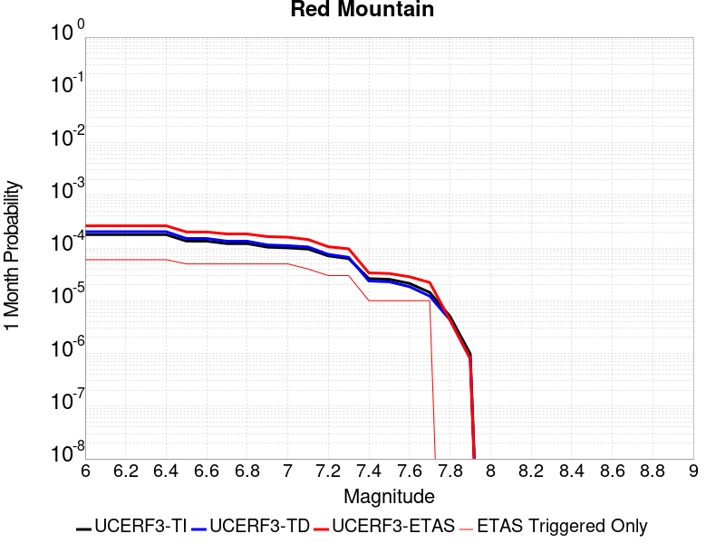 |  |  |

| Magnitude | 1 wk TI Prob | 1 wk TD Prob | 1 wk ETAS Prob | 1 wk ETAS/TD Gain | 1 wk ETAS Triggered Only | 1 mo TI Prob | 1 mo TD Prob | 1 mo ETAS Prob | 1 mo ETAS/TD Gain | 1 mo ETAS Triggered Only | 1 yr TI Prob | 1 yr TD Prob | 1 yr ETAS Prob | 1 yr ETAS/TD Gain | 1 yr ETAS Triggered Only | 10 yr TI Prob | 10 yr TD Prob | 10 yr ETAS Prob | 10 yr ETAS/TD Gain | 10 yr ETAS Triggered Only |
|-----|-----|-----|-----|-----|-----|-----|-----|-----|-----|-----|-----|-----|-----|-----|-----|-----|-----|-----|-----|-----|
| 6.0 | 4.1810763E-5 | 4.7589947E-5 | 7.758852E-5 | 1.6303552 | 3.0E-5 | 1.7917668E-4 | 2.039419E-4 | 2.6392966E-4 | 1.2941414 | 6.0E-5 | 0.0021792934 | 0.0024803306 | 0.0025701073 | 1.0361955 | 9.0E-5 | 0.021580452 | 0.024544092 | 0.024680655 | 1.005564 | 1.4E-4 |
| 6.1 | 4.1810763E-5 | 4.7589947E-5 | 7.758852E-5 | 1.6303552 | 3.0E-5 | 1.7917668E-4 | 2.039419E-4 | 2.6392966E-4 | 1.2941414 | 6.0E-5 | 0.0021792934 | 0.0024803306 | 0.0025701073 | 1.0361955 | 9.0E-5 | 0.021580452 | 0.024544092 | 0.024680655 | 1.005564 | 1.4E-4 |
| 6.2 | 4.1810763E-5 | 4.7589947E-5 | 7.758852E-5 | 1.6303552 | 3.0E-5 | 1.7917668E-4 | 2.039419E-4 | 2.6392966E-4 | 1.2941414 | 6.0E-5 | 0.0021792934 | 0.0024803306 | 0.0025701073 | 1.0361955 | 9.0E-5 | 0.021580452 | 0.024544092 | 0.024680655 | 1.005564 | 1.4E-4 |
| 6.3 | 4.1810763E-5 | 4.7589947E-5 | 7.758852E-5 | 1.6303552 | 3.0E-5 | 1.7917668E-4 | 2.039419E-4 | 2.6392966E-4 | 1.2941414 | 6.0E-5 | 0.0021792934 | 0.0024803306 | 0.0025701073 | 1.0361955 | 9.0E-5 | 0.021580452 | 0.024544092 | 0.024680655 | 1.005564 | 1.4E-4 |
| 6.4 | 4.1810763E-5 | 4.7589947E-5 | 7.758852E-5 | 1.6303552 | 3.0E-5 | 1.7917668E-4 | 2.039419E-4 | 2.6392966E-4 | 1.2941414 | 6.0E-5 | 0.0021792934 | 0.0024803306 | 0.0025701073 | 1.0361955 | 9.0E-5 | 0.021580452 | 0.024544092 | 0.024680655 | 1.005564 | 1.4E-4 |
| 6.5 | 3.154503E-5 | 3.5359728E-5 | 5.535902E-5 | 1.5655953 | 2.0E-5 | 1.3518598E-4 | 1.5153342E-4 | 2.0152584E-4 | 1.3299103 | 5.0E-5 | 0.0016446467 | 0.0018434501 | 0.0019233027 | 1.0433168 | 8.0E-5 | 0.01632528 | 0.018291233 | 0.018389406 | 1.005367 | 1.0E-4 |
| 6.6 | 3.1535834E-5 | 3.534911E-5 | 5.5348402E-5 | 1.5657651 | 2.0E-5 | 1.3514658E-4 | 1.5148791E-4 | 2.0148033E-4 | 1.3300093 | 5.0E-5 | 0.0016441676 | 0.001842897 | 0.0019227497 | 1.04333 | 8.0E-5 | 0.01632056 | 0.018285794 | 0.018383967 | 1.0053687 | 1.0E-4 |
| 6.7 | 2.8267326E-5 | 3.146934E-5 | 5.146871E-5 | 1.6355193 | 2.0E-5 | 1.2114006E-4 | 1.348621E-4 | 1.8485537E-4 | 1.370699 | 5.0E-5 | 0.0014738824 | 0.0016407946 | 0.0017106797 | 1.0425923 | 7.0E-5 | 0.014641452 | 0.016295563 | 0.016384097 | 1.005433 | 9.0E-5 |
| 6.8 | 2.8212884E-5 | 3.1407224E-5 | 5.1406598E-5 | 1.6367762 | 2.0E-5 | 1.20906756E-4 | 1.3459593E-4 | 1.845892E-4 | 1.3714323 | 5.0E-5 | 0.0014710457 | 0.0016375587 | 0.0017074441 | 1.0426766 | 7.0E-5 | 0.014613459 | 0.01626368 | 0.016352216 | 1.0054438 | 9.0E-5 |
| 6.9 | 2.4227871E-5 | 2.6706979E-5 | 4.6706446E-5 | 1.748848 | 2.0E-5 | 1.03829596E-4 | 1.14453884E-4 | 1.6444817E-4 | 1.4368072 | 5.0E-5 | 0.0012633923 | 0.0013926612 | 0.0014625638 | 1.0501934 | 7.0E-5 | 0.012562336 | 0.013847026 | 0.013935779 | 1.0064096 | 9.0E-5 |
| 7.0 | 2.348524E-5 | 2.5835763E-5 | 4.5835248E-5 | 1.7741008 | 2.0E-5 | 1.0064714E-4 | 1.1072042E-4 | 1.6071489E-4 | 1.4515378 | 5.0E-5 | 0.0012246901 | 0.0013472632 | 0.0014171689 | 1.0518872 | 7.0E-5 | 0.012179627 | 0.01339859 | 0.013487384 | 1.0066271 | 9.0E-5 |
| 7.1 | 2.2311642E-5 | 2.4462828E-5 | 3.4462584E-5 | 1.4087734 | 1.0E-5 | 9.561782E-5 | 1.048369E-4 | 1.4483271E-4 | 1.381505 | 4.0E-5 | 0.0011635252 | 0.0012757168 | 0.0013356402 | 1.0469724 | 6.0E-5 | 0.01157452 | 0.012691451 | 0.012770436 | 1.0062234 | 8.0E-5 |
| 7.2 | 1.6533986E-5 | 1.7670347E-5 | 2.767017E-5 | 1.5659099 | 1.0E-5 | 7.085802E-5 | 7.572822E-5 | 1.0572594E-4 | 1.3961235 | 3.0E-5 | 8.623549E-4 | 9.216645E-4 | 9.516369E-4 | 1.0325198 | 3.0E-5 | 0.008590161 | 0.009184699 | 0.009234239 | 1.0053939 | 5.0E-5 |
| 7.3 | 1.4703092E-5 | 1.555952E-5 | 2.5559366E-5 | 1.6426833 | 1.0E-5 | 6.301173E-5 | 6.66823E-5 | 9.6680305E-5 | 1.4498645 | 3.0E-5 | 7.668978E-4 | 8.1161625E-4 | 8.415919E-4 | 1.0369333 | 3.0E-5 | 0.0076425658 | 0.008092596 | 0.008142191 | 1.0061284 | 5.0E-5 |
| 7.4 | 6.1331984E-6 | 5.528872E-6 | 5.528872E-6 | 1.0 | 0.0 | 2.6284872E-5 | 2.3694953E-5 | 3.3694716E-5 | 1.4220208 | 1.0E-5 | 3.199713E-4 | 2.8844838E-4 | 2.984455E-4 | 1.0346582 | 1.0E-5 | 0.0031951098 | 0.0028807942 | 0.0028907654 | 1.0034612 | 1.0E-5 |
| 7.5 | 5.954766E-6 | 5.3385015E-6 | 5.3385015E-6 | 1.0 | 0.0 | 2.5520176E-5 | 2.2879094E-5 | 3.2878866E-5 | 1.4370703 | 1.0E-5 | 3.1066386E-4 | 2.785179E-4 | 2.8851512E-4 | 1.0358944 | 1.0E-5 | 0.003102299 | 0.0027817423 | 0.0027917144 | 1.0035849 | 1.0E-5 |
| 7.6 | 4.9726646E-6 | 4.315295E-6 | 4.315295E-6 | 1.0 | 0.0 | 2.1311245E-5 | 1.8493993E-5 | 2.8493807E-5 | 1.5407062 | 1.0E-5 | 2.5943352E-4 | 2.2514143E-4 | 2.3513917E-4 | 1.0444065 | 1.0E-5 | 0.0025913084 | 0.002249168 | 0.0022591455 | 1.0044361 | 1.0E-5 |
| 7.7 | 3.3613894E-6 | 2.8526642E-6 | 2.8526642E-6 | 1.0 | 0.0 | 1.4405875E-5 | 1.2225649E-5 | 2.2225526E-5 | 1.8179425 | 1.0E-5 | 1.7537741E-4 | 1.4883737E-4 | 1.5883589E-4 | 1.0671774 | 1.0E-5 | 0.0017523908 | 0.0014874031 | 0.0014973882 | 1.0067132 | 1.0E-5 |
| 7.8 | 1.1828961E-6 | 1.0122756E-6 | 1.0122756E-6 | 1.0 | 0.0 | 5.069545E-6 | 4.338317E-6 | 4.338317E-6 | 1.0 | 0.0 | 6.171996E-5 | 5.281776E-5 | 5.281776E-5 | 1.0 | 0.0 | 6.170282E-4 | 5.2805495E-4 | 5.2805495E-4 | 1.0 | 0.0 |
| 7.9 | 2.2967266E-7 | 1.8618952E-7 | 1.8618952E-7 | 1.0 | 0.0 | 9.843111E-7 | 7.9795484E-7 | 7.9795484E-7 | 1.0 | 0.0 | 1.19839215E-5 | 9.7150605E-6 | 9.7150605E-6 | 1.0 | 0.0 | 1.1983275E-4 | 9.714664E-5 | 9.714664E-5 | 1.0 | 0.0 |

## San Jacinto (San Jacinto Valley) rev
*[(top)](#table-of-contents)*

| 1 Week | 1 Month | 1 Year | 10 Year |
|-----|-----|-----|-----|
|  |  | 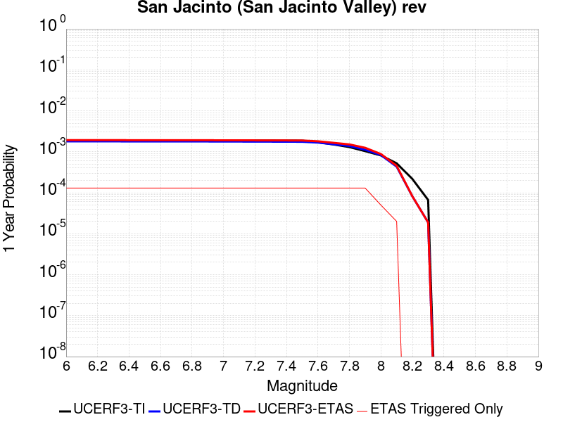 | 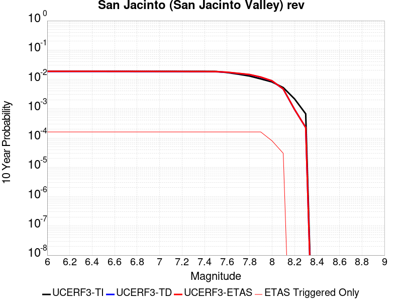 |

| Magnitude | 1 wk TI Prob | 1 wk TD Prob | 1 wk ETAS Prob | 1 wk ETAS/TD Gain | 1 wk ETAS Triggered Only | 1 mo TI Prob | 1 mo TD Prob | 1 mo ETAS Prob | 1 mo ETAS/TD Gain | 1 mo ETAS Triggered Only | 1 yr TI Prob | 1 yr TD Prob | 1 yr ETAS Prob | 1 yr ETAS/TD Gain | 1 yr ETAS Triggered Only | 10 yr TI Prob | 10 yr TD Prob | 10 yr ETAS Prob | 10 yr ETAS/TD Gain | 10 yr ETAS Triggered Only |
|-----|-----|-----|-----|-----|-----|-----|-----|-----|-----|-----|-----|-----|-----|-----|-----|-----|-----|-----|-----|-----|
| 6.0 | 3.652694E-5 | 3.4402394E-5 | 9.4400326E-5 | 2.7440047 | 6.0E-5 | 1.5653463E-4 | 1.474305E-4 | 2.1742018E-4 | 1.47473 | 7.0E-5 | 0.0019041431 | 0.00179349 | 0.0019232568 | 1.0723543 | 1.3E-4 | 0.018879099 | 0.018526595 | 0.018683631 | 1.0084763 | 1.6E-4 |
| 6.1 | 3.652694E-5 | 3.4402394E-5 | 9.4400326E-5 | 2.7440047 | 6.0E-5 | 1.5653463E-4 | 1.474305E-4 | 2.1742018E-4 | 1.47473 | 7.0E-5 | 0.0019041431 | 0.00179349 | 0.0019232568 | 1.0723543 | 1.3E-4 | 0.018879099 | 0.018526595 | 0.018683631 | 1.0084763 | 1.6E-4 |
| 6.2 | 3.652694E-5 | 3.4402394E-5 | 9.4400326E-5 | 2.7440047 | 6.0E-5 | 1.5653463E-4 | 1.474305E-4 | 2.1742018E-4 | 1.47473 | 7.0E-5 | 0.0019041431 | 0.00179349 | 0.0019232568 | 1.0723543 | 1.3E-4 | 0.018879099 | 0.018526595 | 0.018683631 | 1.0084763 | 1.6E-4 |
| 6.3 | 3.652694E-5 | 3.4402394E-5 | 9.4400326E-5 | 2.7440047 | 6.0E-5 | 1.5653463E-4 | 1.474305E-4 | 2.1742018E-4 | 1.47473 | 7.0E-5 | 0.0019041431 | 0.00179349 | 0.0019232568 | 1.0723543 | 1.3E-4 | 0.018879099 | 0.018526595 | 0.018683631 | 1.0084763 | 1.6E-4 |
| 6.4 | 3.646941E-5 | 3.432397E-5 | 9.432191E-5 | 2.7479897 | 6.0E-5 | 1.5628811E-4 | 1.4709444E-4 | 2.1708415E-4 | 1.4758147 | 7.0E-5 | 0.0019011468 | 0.0017894056 | 0.001919173 | 1.0725198 | 1.3E-4 | 0.018849645 | 0.018486476 | 0.018643519 | 1.008495 | 1.6E-4 |
| 6.5 | 3.646941E-5 | 3.432397E-5 | 9.432191E-5 | 2.7479897 | 6.0E-5 | 1.5628811E-4 | 1.4709444E-4 | 2.1708415E-4 | 1.4758147 | 7.0E-5 | 0.0019011468 | 0.0017894056 | 0.001919173 | 1.0725198 | 1.3E-4 | 0.018849645 | 0.018486476 | 0.018643519 | 1.008495 | 1.6E-4 |
| 6.6 | 3.6442503E-5 | 3.4287354E-5 | 9.42853E-5 | 2.7498562 | 6.0E-5 | 1.561728E-4 | 1.4693754E-4 | 2.1692725E-4 | 1.4763229 | 7.0E-5 | 0.0018997455 | 0.0017874985 | 0.001917266 | 1.0725974 | 1.3E-4 | 0.018835869 | 0.018467745 | 0.01862479 | 1.0085038 | 1.6E-4 |
| 6.7 | 3.6432113E-5 | 3.4272925E-5 | 9.427087E-5 | 2.750593 | 6.0E-5 | 1.5612828E-4 | 1.4687571E-4 | 2.1686543E-4 | 1.4765234 | 7.0E-5 | 0.0018992044 | 0.0017867472 | 0.001916515 | 1.0726279 | 1.3E-4 | 0.018830549 | 0.018460369 | 0.018617416 | 1.0085073 | 1.6E-4 |
| 6.8 | 3.6409598E-5 | 3.424198E-5 | 9.423993E-5 | 2.752175 | 6.0E-5 | 1.560318E-4 | 1.4674311E-4 | 2.1673283E-4 | 1.4769541 | 7.0E-5 | 0.0018980318 | 0.0017851355 | 0.0019149034 | 1.0726936 | 1.3E-4 | 0.018819023 | 0.018444523 | 0.018601572 | 1.0085146 | 1.6E-4 |
| 6.9 | 3.638078E-5 | 3.4202407E-5 | 9.420035E-5 | 2.7542026 | 6.0E-5 | 1.5590832E-4 | 1.4657351E-4 | 2.1656326E-4 | 1.477506 | 7.0E-5 | 0.0018965311 | 0.001783074 | 0.0019128423 | 1.0727777 | 1.3E-4 | 0.018804269 | 0.018424258 | 0.018581308 | 1.0085242 | 1.6E-4 |
| 7.0 | 3.6294874E-5 | 3.408442E-5 | 9.4082374E-5 | 2.7602751 | 6.0E-5 | 1.5554018E-4 | 1.4606792E-4 | 2.160577E-4 | 1.4791591 | 7.0E-5 | 0.0018920569 | 0.001776929 | 0.001906698 | 1.0730299 | 1.3E-4 | 0.018760284 | 0.018363839 | 0.018520901 | 1.0085528 | 1.6E-4 |
| 7.1 | 3.6260717E-5 | 3.4040702E-5 | 9.403866E-5 | 2.7625358 | 6.0E-5 | 1.5539382E-4 | 1.4588058E-4 | 2.1587037E-4 | 1.4797746 | 7.0E-5 | 0.001890278 | 0.0017746518 | 0.0019044211 | 1.0731238 | 1.3E-4 | 0.018742796 | 0.018341439 | 0.018498505 | 1.0085634 | 1.6E-4 |
| 7.2 | 3.6210204E-5 | 3.397492E-5 | 9.3972885E-5 | 2.7659485 | 6.0E-5 | 1.5517735E-4 | 1.455987E-4 | 2.155885E-4 | 1.4807036 | 7.0E-5 | 0.001887647 | 0.0017712255 | 0.0019009952 | 1.0732656 | 1.3E-4 | 0.01871693 | 0.01830772 | 0.01846479 | 1.0085795 | 1.6E-4 |
| 7.3 | 3.6119454E-5 | 3.386321E-5 | 9.386118E-5 | 2.7717745 | 6.0E-5 | 1.5478847E-4 | 1.4511998E-4 | 2.1510982E-4 | 1.4822896 | 7.0E-5 | 0.0018829206 | 0.0017654065 | 0.001895177 | 1.0735074 | 1.3E-4 | 0.018670462 | 0.018250274 | 0.018407352 | 1.008607 | 1.6E-4 |
| 7.4 | 3.607848E-5 | 3.381071E-5 | 9.380868E-5 | 2.7745256 | 6.0E-5 | 1.5461289E-4 | 1.44895E-4 | 2.1488486E-4 | 1.4830384 | 7.0E-5 | 0.0018807866 | 0.0017626719 | 0.0018924427 | 1.0736216 | 1.3E-4 | 0.018649481 | 0.018223269 | 0.018380353 | 1.00862 | 1.6E-4 |
| 7.5 | 3.5856774E-5 | 3.3620483E-5 | 9.3618466E-5 | 2.7845664 | 6.0E-5 | 1.5366284E-4 | 1.4407984E-4 | 2.1406975E-4 | 1.4857718 | 7.0E-5 | 0.0018692396 | 0.0017527633 | 0.0018825354 | 1.0740386 | 1.3E-4 | 0.018535944 | 0.018124366 | 0.018281467 | 1.008668 | 1.6E-4 |
| 7.6 | 3.286655E-5 | 3.2143445E-5 | 9.214152E-5 | 2.8665724 | 6.0E-5 | 1.4084904E-4 | 1.3775036E-4 | 2.0774073E-4 | 1.5080956 | 7.0E-5 | 0.001713488 | 0.0016758227 | 0.0018056048 | 1.0774438 | 1.3E-4 | 0.017003361 | 0.017344031 | 0.017501255 | 1.009065 | 1.6E-4 |
| 7.7 | 2.8882527E-5 | 2.9236293E-5 | 8.923454E-5 | 3.0521836 | 6.0E-5 | 1.237764E-4 | 1.2529238E-4 | 1.9528362E-4 | 1.5586232 | 7.0E-5 | 0.0015059357 | 0.0015243685 | 0.0016541703 | 1.0851512 | 1.3E-4 | 0.014957713 | 0.015830461 | 0.015987927 | 1.0099471 | 1.6E-4 |
| 7.8 | 2.4950225E-5 | 2.6527203E-5 | 8.6525615E-5 | 3.261769 | 6.0E-5 | 1.0692515E-4 | 1.1368306E-4 | 1.836751E-4 | 1.615677 | 7.0E-5 | 0.0013010362 | 0.0013832134 | 0.0015130336 | 1.0938541 | 1.3E-4 | 0.012934455 | 0.014411755 | 0.014569449 | 1.0109421 | 1.6E-4 |
| 7.9 | 1.9881603E-5 | 2.1507445E-5 | 8.150616E-5 | 3.7896717 | 6.0E-5 | 8.520408E-5 | 9.217151E-5 | 1.6216506E-4 | 1.7593837 | 7.0E-5 | 0.001036866 | 0.0011216112 | 0.0012514654 | 1.1157746 | 1.3E-4 | 0.010320415 | 0.011777027 | 0.011935142 | 1.0134258 | 1.6E-4 |
| 8.0 | 1.563292E-5 | 1.5937347E-5 | 4.5936868E-5 | 2.8823411 | 3.0E-5 | 6.6996516E-5 | 6.8301124E-5 | 9.8299075E-5 | 1.4392014 | 3.0E-5 | 8.153773E-4 | 8.3124964E-4 | 8.812081E-4 | 1.0601004 | 5.0E-5 | 0.00812392 | 0.008810506 | 0.008889801 | 1.0090001 | 8.0E-5 |
| 8.1 | 1.0045313E-5 | 8.301802E-6 | 1.830172E-5 | 2.2045476 | 1.0E-5 | 4.305063E-5 | 3.5578672E-5 | 4.5578316E-5 | 1.2810572 | 1.0E-5 | 5.2401534E-4 | 4.3308473E-4 | 4.530761E-4 | 1.0461603 | 2.0E-5 | 0.0052278144 | 0.0046591135 | 0.004688974 | 1.006409 | 3.0E-5 |
| 8.2 | 4.1554413E-6 | 1.5655598E-6 | 1.5655598E-6 | 1.0 | 0.0 | 1.7808914E-5 | 6.709525E-6 | 6.709525E-6 | 1.0 | 0.0 | 2.1680194E-4 | 8.168544E-5 | 8.168544E-5 | 1.0 | 0.0 | 0.0021659054 | 9.482903E-4 | 9.482903E-4 | 1.0 | 0.0 |
| 8.3 | 1.2758221E-6 | 3.6149942E-7 | 3.6149942E-7 | 1.0 | 0.0 | 5.4677976E-6 | 1.5492824E-6 | 1.5492824E-6 | 1.0 | 0.0 | 6.65684E-5 | 1.8862354E-5 | 1.8862354E-5 | 1.0 | 0.0 | 6.6548464E-4 | 2.2751294E-4 | 2.2751294E-4 | 1.0 | 0.0 |

## Santa Ynez (West)
*[(top)](#table-of-contents)*

| 1 Week | 1 Month | 1 Year | 10 Year |
|-----|-----|-----|-----|
| 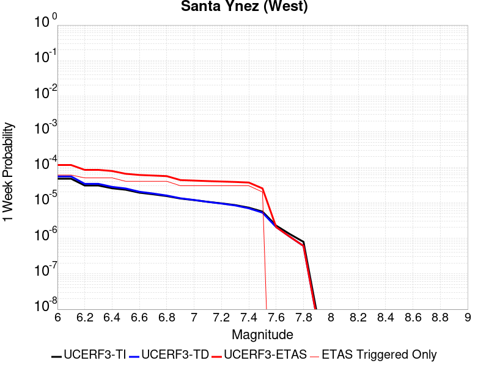 |  | 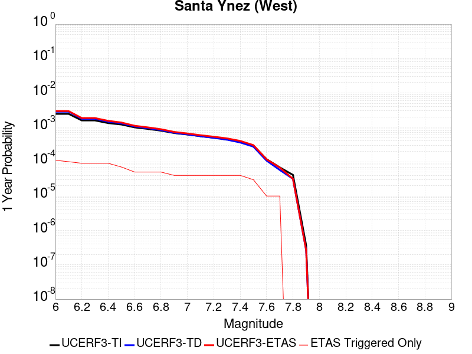 |  |

| Magnitude | 1 wk TI Prob | 1 wk TD Prob | 1 wk ETAS Prob | 1 wk ETAS/TD Gain | 1 wk ETAS Triggered Only | 1 mo TI Prob | 1 mo TD Prob | 1 mo ETAS Prob | 1 mo ETAS/TD Gain | 1 mo ETAS Triggered Only | 1 yr TI Prob | 1 yr TD Prob | 1 yr ETAS Prob | 1 yr ETAS/TD Gain | 1 yr ETAS Triggered Only | 10 yr TI Prob | 10 yr TD Prob | 10 yr ETAS Prob | 10 yr ETAS/TD Gain | 10 yr ETAS Triggered Only |
|-----|-----|-----|-----|-----|-----|-----|-----|-----|-----|-----|-----|-----|-----|-----|-----|-----|-----|-----|-----|-----|
| 6.0 | 4.7352758E-5 | 5.4972126E-5 | 1.14968825E-4 | 2.0914023 | 6.0E-5 | 2.0292461E-4 | 2.3557522E-4 | 3.0555873E-4 | 1.297075 | 7.0E-5 | 0.0024678076 | 0.0028645284 | 0.0029742133 | 1.0382907 | 1.1E-4 | 0.024405818 | 0.028304417 | 0.028430738 | 1.004463 | 1.3E-4 |
| 6.1 | 4.7352758E-5 | 5.4972126E-5 | 1.14968825E-4 | 2.0914023 | 6.0E-5 | 2.0292461E-4 | 2.3557522E-4 | 3.0555873E-4 | 1.297075 | 7.0E-5 | 0.0024678076 | 0.0028645284 | 0.002964242 | 1.0348097 | 1.0E-4 | 0.024405818 | 0.028304417 | 0.02842102 | 1.0041196 | 1.2E-4 |
| 6.2 | 3.0415853E-5 | 3.392511E-5 | 8.392341E-5 | 2.4737844 | 5.0E-5 | 1.3034715E-4 | 1.4538545E-4 | 2.0537672E-4 | 1.412636 | 6.0E-5 | 0.0015858212 | 0.0017686661 | 0.0018585069 | 1.0507958 | 9.0E-5 | 0.015745522 | 0.017549807 | 0.017648052 | 1.0055981 | 1.0E-4 |
| 6.3 | 3.0415853E-5 | 3.392511E-5 | 8.392341E-5 | 2.4737844 | 5.0E-5 | 1.3034715E-4 | 1.4538545E-4 | 2.0537672E-4 | 1.412636 | 6.0E-5 | 0.0015858212 | 0.0017686661 | 0.0018585069 | 1.0507958 | 9.0E-5 | 0.015745522 | 0.017549807 | 0.017648052 | 1.0055981 | 1.0E-4 |
| 6.4 | 2.5452082E-5 | 2.7912422E-5 | 7.791103E-5 | 2.7912672 | 5.0E-5 | 1.09075794E-4 | 1.196193E-4 | 1.7961212E-4 | 1.5015314 | 6.0E-5 | 0.0013271887 | 0.0014554089 | 0.0015452778 | 1.0617483 | 9.0E-5 | 0.013192902 | 0.014460951 | 0.0145595055 | 1.0068152 | 1.0E-4 |
| 6.5 | 2.3143784E-5 | 2.5128256E-5 | 6.512725E-5 | 2.5917935 | 4.0E-5 | 9.9183875E-5 | 1.0768817E-4 | 1.5768278E-4 | 1.4642535 | 5.0E-5 | 0.0012068948 | 0.0013103267 | 0.0013802351 | 1.0533518 | 7.0E-5 | 0.012003611 | 0.01302768 | 0.013106638 | 1.0060607 | 8.0E-5 |
| 6.6 | 1.9118515E-5 | 2.035434E-5 | 6.0353526E-5 | 2.965143 | 4.0E-5 | 8.193392E-5 | 8.7230015E-5 | 1.2722652E-4 | 1.4585178 | 4.0E-5 | 9.97089E-4 | 0.001061516 | 0.001111463 | 1.0470525 | 5.0E-5 | 0.00992627 | 0.010565365 | 0.010614837 | 1.0046824 | 5.0E-5 |
| 6.7 | 1.722807E-5 | 1.8146347E-5 | 5.8145622E-5 | 3.2042603 | 4.0E-5 | 7.3832496E-5 | 7.776777E-5 | 1.1776466E-4 | 1.5143119 | 4.0E-5 | 8.985399E-4 | 9.464169E-4 | 9.963696E-4 | 1.0527809 | 5.0E-5 | 0.008949154 | 0.0094245095 | 0.009474039 | 1.0052553 | 5.0E-5 |
| 6.8 | 1.5317364E-5 | 1.5926486E-5 | 5.5925848E-5 | 3.5114996 | 4.0E-5 | 6.56442E-5 | 6.82546E-5 | 1.0825187E-4 | 1.586001 | 4.0E-5 | 7.98925E-4 | 8.306873E-4 | 8.806457E-4 | 1.0601411 | 5.0E-5 | 0.007960589 | 0.00827631 | 0.008325896 | 1.0059913 | 5.0E-5 |
| 6.9 | 1.3071226E-5 | 1.3329624E-5 | 4.3329223E-5 | 3.250596 | 3.0E-5 | 5.6018336E-5 | 5.7125722E-5 | 8.7124004E-5 | 1.5251275 | 3.0E-5 | 6.8180985E-4 | 6.9528597E-4 | 7.3525816E-4 | 1.0574902 | 4.0E-5 | 0.0067972173 | 0.006931367 | 0.0069710896 | 1.0057309 | 4.0E-5 |
| 7.0 | 1.1836986E-5 | 1.19327815E-5 | 4.1932424E-5 | 3.5140526 | 3.0E-5 | 5.0728955E-5 | 5.11395E-5 | 8.1137965E-5 | 1.5866007 | 3.0E-5 | 6.1745E-4 | 6.2244723E-4 | 6.6242233E-4 | 1.0642225 | 4.0E-5 | 0.006157372 | 0.006207231 | 0.0062469826 | 1.006404 | 4.0E-5 |
| 7.1 | 1.0597169E-5 | 1.0542201E-5 | 4.0541883E-5 | 3.8456755 | 3.0E-5 | 4.541565E-5 | 4.5180084E-5 | 7.517873E-5 | 1.6639794 | 3.0E-5 | 5.5279525E-4 | 5.4992986E-4 | 5.8990787E-4 | 1.0726966 | 4.0E-5 | 0.0055142213 | 0.005485821 | 0.0055256016 | 1.0072515 | 4.0E-5 |
| 7.2 | 9.59113E-6 | 9.459144E-6 | 3.945886E-5 | 4.1715045 | 3.0E-5 | 4.11042E-5 | 4.0538565E-5 | 7.0537346E-5 | 1.7400061 | 3.0E-5 | 5.0032866E-4 | 4.934463E-4 | 5.334266E-4 | 1.0810225 | 4.0E-5 | 0.004992037 | 0.0049236254 | 0.0049634282 | 1.008084 | 4.0E-5 |
| 7.3 | 8.586084E-6 | 8.379583E-6 | 3.837933E-5 | 4.5801 | 3.0E-5 | 3.679698E-5 | 3.5912013E-5 | 6.5910936E-5 | 1.8353451 | 3.0E-5 | 4.4791115E-4 | 4.3714207E-4 | 4.7712456E-4 | 1.0914634 | 4.0E-5 | 0.004470094 | 0.004362933 | 0.0044027586 | 1.0091281 | 4.0E-5 |
| 7.4 | 7.2622997E-6 | 6.9515427E-6 | 3.6951333E-5 | 5.315559 | 3.0E-5 | 3.112377E-5 | 2.979199E-5 | 5.97911E-5 | 2.006952 | 3.0E-5 | 3.78866E-4 | 3.626581E-4 | 4.0264358E-4 | 1.1102567 | 4.0E-5 | 0.0037822074 | 0.0036207628 | 0.003660618 | 1.0110074 | 4.0E-5 |
| 7.5 | 5.627296E-6 | 5.251588E-6 | 2.5251482E-5 | 4.808352 | 2.0E-5 | 2.411676E-5 | 2.2506614E-5 | 4.2506166E-5 | 1.8886076 | 2.0E-5 | 2.9358198E-4 | 2.739843E-4 | 3.0397606E-4 | 1.1094654 | 3.0E-5 | 0.0029319443 | 0.002736537 | 0.0027664548 | 1.0109328 | 3.0E-5 |
| 7.6 | 2.265244E-6 | 2.0608625E-6 | 2.0608625E-6 | 1.0 | 0.0 | 9.708152E-6 | 8.832238E-6 | 8.832238E-6 | 1.0 | 0.0 | 1.18190335E-4 | 1.0752728E-4 | 1.175262E-4 | 1.0929897 | 1.0E-5 | 0.001181275 | 0.0010747612 | 0.0010847504 | 1.0092944 | 1.0E-5 |
| 7.7 | 1.3099874E-6 | 1.1016252E-6 | 1.1016252E-6 | 1.0 | 0.0 | 5.61422E-6 | 4.7212425E-6 | 4.7212425E-6 | 1.0 | 0.0 | 6.8350986E-5 | 5.7479636E-5 | 6.747906E-5 | 1.1739646 | 1.0E-5 | 6.832996E-4 | 5.7465007E-4 | 5.846443E-4 | 1.0173919 | 1.0E-5 |
| 7.8 | 7.903951E-7 | 6.0711415E-7 | 6.0711415E-7 | 1.0 | 0.0 | 3.3874032E-6 | 2.6019152E-6 | 2.6019152E-6 | 1.0 | 0.0 | 4.1240855E-5 | 3.167787E-5 | 3.167787E-5 | 1.0 | 0.0 | 4.12332E-4 | 3.167349E-4 | 3.167349E-4 | 1.0 | 0.0 |
| 7.9 | 7.0753297E-9 | 5.0899476E-9 | 5.0899476E-9 | 1.0 | 0.0 | 3.032284E-8 | 2.181406E-8 | 2.181406E-8 | 1.0 | 0.0 | 3.6918053E-7 | 2.6558615E-7 | 2.6558615E-7 | 1.0 | 0.0 | 3.691799E-6 | 2.6558594E-6 | 2.6558594E-6 | 1.0 | 0.0 |

## Santa Cruz Island
*[(top)](#table-of-contents)*

| 1 Week | 1 Month | 1 Year | 10 Year |
|-----|-----|-----|-----|
|  |  | 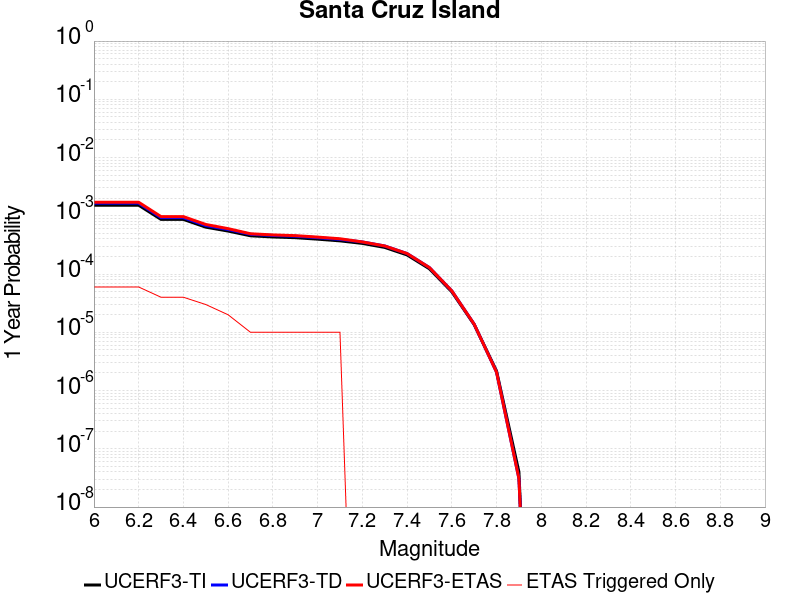 | 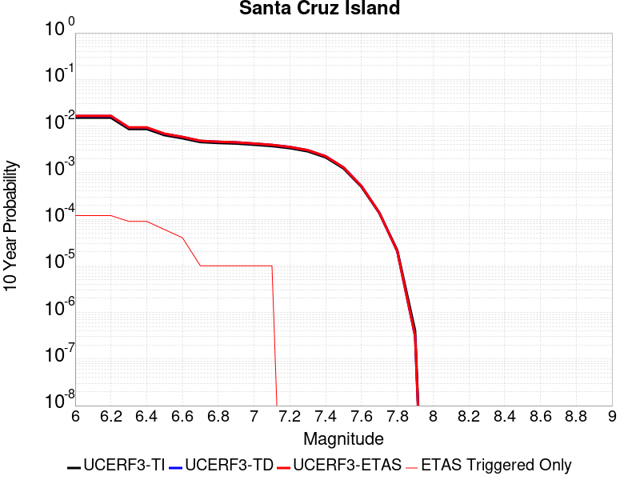 |

| Magnitude | 1 wk TI Prob | 1 wk TD Prob | 1 wk ETAS Prob | 1 wk ETAS/TD Gain | 1 wk ETAS Triggered Only | 1 mo TI Prob | 1 mo TD Prob | 1 mo ETAS Prob | 1 mo ETAS/TD Gain | 1 mo ETAS Triggered Only | 1 yr TI Prob | 1 yr TD Prob | 1 yr ETAS Prob | 1 yr ETAS/TD Gain | 1 yr ETAS Triggered Only | 10 yr TI Prob | 10 yr TD Prob | 10 yr ETAS Prob | 10 yr ETAS/TD Gain | 10 yr ETAS Triggered Only |
|-----|-----|-----|-----|-----|-----|-----|-----|-----|-----|-----|-----|-----|-----|-----|-----|-----|-----|-----|-----|-----|
| 6.0 | 2.9164563E-5 | 3.1599742E-5 | 6.1598796E-5 | 1.9493448 | 3.0E-5 | 1.2498499E-4 | 1.3542121E-4 | 1.754158E-4 | 1.2953347 | 4.0E-5 | 0.0015206301 | 0.0016476426 | 0.0017075436 | 1.0363556 | 6.0E-5 | 0.015102667 | 0.016368 | 0.016486036 | 1.0072113 | 1.2E-4 |
| 6.1 | 2.9164563E-5 | 3.1599742E-5 | 6.1598796E-5 | 1.9493448 | 3.0E-5 | 1.2498499E-4 | 1.3542121E-4 | 1.754158E-4 | 1.2953347 | 4.0E-5 | 0.0015206301 | 0.0016476426 | 0.0017075436 | 1.0363556 | 6.0E-5 | 0.015102667 | 0.016368 | 0.016486036 | 1.0072113 | 1.2E-4 |
| 6.2 | 2.9164563E-5 | 3.1599742E-5 | 6.1598796E-5 | 1.9493448 | 3.0E-5 | 1.2498499E-4 | 1.3542121E-4 | 1.754158E-4 | 1.2953347 | 4.0E-5 | 0.0015206301 | 0.0016476426 | 0.0017075436 | 1.0363556 | 6.0E-5 | 0.015102667 | 0.016368 | 0.016486036 | 1.0072113 | 1.2E-4 |
| 6.3 | 1.6635553E-5 | 1.780436E-5 | 3.7804002E-5 | 2.1233006 | 2.0E-5 | 7.1293274E-5 | 7.630226E-5 | 1.0629997E-4 | 1.3931432 | 3.0E-5 | 8.6765E-4 | 9.2860236E-4 | 9.6856523E-4 | 1.0430355 | 4.0E-5 | 0.008642701 | 0.009249094 | 0.009338262 | 1.0096407 | 9.0E-5 |
| 6.4 | 1.6635553E-5 | 1.780436E-5 | 3.7804002E-5 | 2.1233006 | 2.0E-5 | 7.1293274E-5 | 7.630226E-5 | 1.0629997E-4 | 1.3931432 | 3.0E-5 | 8.6765E-4 | 9.2860236E-4 | 9.6856523E-4 | 1.0430355 | 4.0E-5 | 0.008642701 | 0.009249094 | 0.009338262 | 1.0096407 | 9.0E-5 |
| 6.5 | 1.2238748E-5 | 1.3042995E-5 | 3.3042736E-5 | 2.53337 | 2.0E-5 | 5.2450723E-5 | 5.5897377E-5 | 7.5896256E-5 | 1.3577785 | 2.0E-5 | 6.3840044E-4 | 6.8034173E-4 | 7.1032136E-4 | 1.0440655 | 3.0E-5 | 0.0063656955 | 0.0067829876 | 0.0068425806 | 1.0087856 | 6.0E-5 |
| 6.6 | 1.0489767E-5 | 1.1156636E-5 | 2.1156524E-5 | 1.8963176 | 1.0E-5 | 4.495537E-5 | 4.781329E-5 | 5.7812813E-5 | 1.2091368 | 1.0E-5 | 5.4719415E-4 | 5.819735E-4 | 6.019619E-4 | 1.0343459 | 2.0E-5 | 0.005458487 | 0.0058047357 | 0.0058445036 | 1.006851 | 4.0E-5 |
| 6.7 | 8.699222E-6 | 9.236782E-6 | 9.236782E-6 | 1.0 | 0.0 | 3.7281847E-5 | 3.958561E-5 | 3.958561E-5 | 1.0 | 0.0 | 4.5381195E-4 | 4.8184878E-4 | 4.9184397E-4 | 1.0207434 | 1.0E-5 | 0.0045288634 | 0.004808108 | 0.00481806 | 1.0020698 | 1.0E-5 |
| 6.8 | 8.307732E-6 | 8.8169045E-6 | 8.8169045E-6 | 1.0 | 0.0 | 3.560408E-5 | 3.7786187E-5 | 3.7786187E-5 | 1.0 | 0.0 | 4.3339343E-4 | 4.5995016E-4 | 4.6994555E-4 | 1.0217315 | 1.0E-5 | 0.004325492 | 0.0045900354 | 0.0045999894 | 1.0021687 | 1.0E-5 |
| 6.9 | 8.073121E-6 | 8.564939E-6 | 8.564939E-6 | 1.0 | 0.0 | 3.459863E-5 | 3.6706366E-5 | 3.6706366E-5 | 1.0 | 0.0 | 4.2115687E-4 | 4.468088E-4 | 4.5680432E-4 | 1.0223709 | 1.0E-5 | 0.004203596 | 0.004459156 | 0.0044691116 | 1.0022326 | 1.0E-5 |
| 7.0 | 7.617019E-6 | 8.074664E-6 | 8.074664E-6 | 1.0 | 0.0 | 3.264396E-5 | 3.4605247E-5 | 3.4605247E-5 | 1.0 | 0.0 | 3.9736772E-4 | 4.212378E-4 | 4.312336E-4 | 1.0237296 | 1.0E-5 | 0.003966579 | 0.0042044413 | 0.004214399 | 1.0023685 | 1.0E-5 |
| 7.1 | 7.1224836E-6 | 7.545788E-6 | 7.545788E-6 | 1.0 | 0.0 | 3.052457E-5 | 3.2338692E-5 | 3.2338692E-5 | 1.0 | 0.0 | 3.715733E-4 | 3.936528E-4 | 4.0364885E-4 | 1.0253931 | 1.0E-5 | 0.003709526 | 0.003929598 | 0.0039395588 | 1.0025347 | 1.0E-5 |
| 7.2 | 6.441115E-6 | 6.8273835E-6 | 6.8273835E-6 | 1.0 | 0.0 | 2.7604487E-5 | 2.9259887E-5 | 2.9259887E-5 | 1.0 | 0.0 | 3.360328E-4 | 3.5618112E-4 | 3.5618112E-4 | 1.0 | 0.0 | 0.0033552512 | 0.003556131 | 0.003556131 | 1.0 | 0.0 |
| 7.3 | 5.494274E-6 | 5.8199944E-6 | 5.8199944E-6 | 1.0 | 0.0 | 2.3546674E-5 | 2.4942596E-5 | 2.4942596E-5 | 1.0 | 0.0 | 2.8664304E-4 | 3.0363398E-4 | 3.0363398E-4 | 1.0 | 0.0 | 0.002862736 | 0.0030322142 | 0.0030322142 | 1.0 | 0.0 |
| 7.4 | 4.0802624E-6 | 4.312256E-6 | 4.312256E-6 | 1.0 | 0.0 | 1.7486722E-5 | 1.8480967E-5 | 1.8480967E-5 | 1.0 | 0.0 | 2.1288003E-4 | 2.2498262E-4 | 2.2498262E-4 | 1.0 | 0.0 | 0.0021267622 | 0.0022475575 | 0.0022475575 | 1.0 | 0.0 |
| 7.5 | 2.3584746E-6 | 2.4753094E-6 | 2.4753094E-6 | 1.0 | 0.0 | 1.0107709E-5 | 1.0608426E-5 | 1.0608426E-5 | 1.0 | 0.0 | 1.2305441E-4 | 1.2915E-4 | 1.2915E-4 | 1.0 | 0.0 | 0.0012298629 | 0.0012907543 | 0.0012907543 | 1.0 | 0.0 |
| 7.6 | 9.4981914E-7 | 9.86093E-7 | 9.86093E-7 | 1.0 | 0.0 | 4.0706473E-6 | 4.2261063E-6 | 4.2261063E-6 | 1.0 | 0.0 | 4.9559E-5 | 5.145164E-5 | 5.145164E-5 | 1.0 | 0.0 | 4.954795E-4 | 5.1439856E-4 | 5.1439856E-4 | 1.0 | 0.0 |
| 7.7 | 2.6013532E-7 | 2.6416603E-7 | 2.6416603E-7 | 1.0 | 0.0 | 1.1148652E-6 | 1.1321397E-6 | 1.1321397E-6 | 1.0 | 0.0 | 1.3573399E-5 | 1.3783714E-5 | 1.3783714E-5 | 1.0 | 0.0 | 1.357257E-4 | 1.3782867E-4 | 1.3782867E-4 | 1.0 | 0.0 |
| 7.8 | 4.1522263E-8 | 3.965679E-8 | 3.965679E-8 | 1.0 | 0.0 | 1.7795254E-7 | 1.6995766E-7 | 1.6995766E-7 | 1.0 | 0.0 | 2.16657E-6 | 2.0692328E-6 | 2.0692328E-6 | 1.0 | 0.0 | 2.1665488E-5 | 2.0692156E-5 | 2.0692156E-5 | 1.0 | 0.0 |
| 7.9 | 7.7242046E-10 | 5.9468175E-10 | 5.9468175E-10 | 1.0 | 0.0 | 3.3103735E-9 | 2.5486364E-9 | 2.5486364E-9 | 1.0 | 0.0 | 4.0303796E-8 | 3.1029646E-8 | 3.1029646E-8 | 1.0 | 0.0 | 4.030379E-7 | 3.1029643E-7 | 3.1029643E-7 | 1.0 | 0.0 |

## Cleghorn Lake
*[(top)](#table-of-contents)*

| 1 Week | 1 Month | 1 Year | 10 Year |
|-----|-----|-----|-----|
|  | 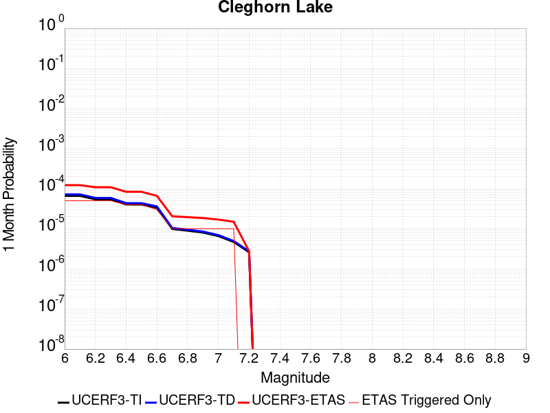 | 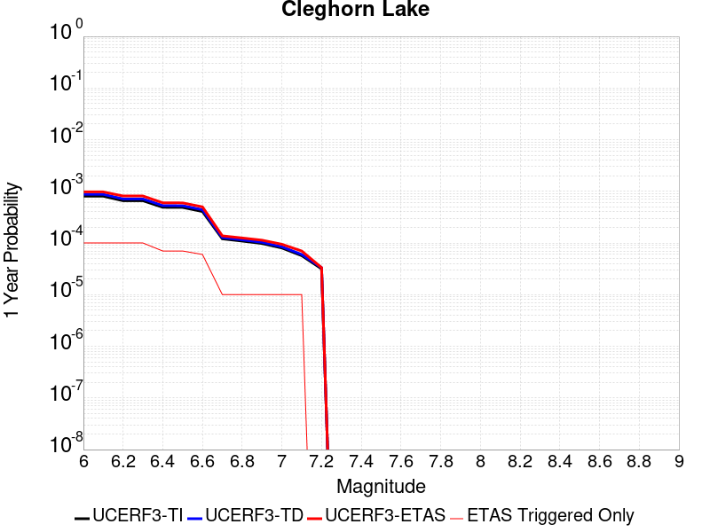 |  |

| Magnitude | 1 wk TI Prob | 1 wk TD Prob | 1 wk ETAS Prob | 1 wk ETAS/TD Gain | 1 wk ETAS Triggered Only | 1 mo TI Prob | 1 mo TD Prob | 1 mo ETAS Prob | 1 mo ETAS/TD Gain | 1 mo ETAS Triggered Only | 1 yr TI Prob | 1 yr TD Prob | 1 yr ETAS Prob | 1 yr ETAS/TD Gain | 1 yr ETAS Triggered Only | 10 yr TI Prob | 10 yr TD Prob | 10 yr ETAS Prob | 10 yr ETAS/TD Gain | 10 yr ETAS Triggered Only |
|-----|-----|-----|-----|-----|-----|-----|-----|-----|-----|-----|-----|-----|-----|-----|-----|-----|-----|-----|-----|-----|
| 6.0 | 1.5467183E-5 | 1.6794203E-5 | 5.679353E-5 | 3.3817341 | 4.0E-5 | 6.6286244E-5 | 7.197348E-5 | 1.2196988E-4 | 1.6946503 | 5.0E-5 | 8.067362E-4 | 8.759797E-4 | 9.758921E-4 | 1.1140579 | 1.0E-4 | 0.008038137 | 0.008730696 | 0.008879386 | 1.0170307 | 1.5E-4 |
| 6.1 | 1.5467183E-5 | 1.6794203E-5 | 5.679353E-5 | 3.3817341 | 4.0E-5 | 6.6286244E-5 | 7.197348E-5 | 1.2196988E-4 | 1.6946503 | 5.0E-5 | 8.067362E-4 | 8.759797E-4 | 9.758921E-4 | 1.1140579 | 1.0E-4 | 0.008038137 | 0.008730696 | 0.008879386 | 1.0170307 | 1.5E-4 |
| 6.2 | 1.2624631E-5 | 1.3681544E-5 | 5.3680997E-5 | 3.9236064 | 4.0E-5 | 5.410444E-5 | 5.863415E-5 | 1.0863122E-4 | 1.8526955 | 5.0E-5 | 6.585225E-4 | 7.1368564E-4 | 8.136142E-4 | 1.1400177 | 1.0E-4 | 0.0065657445 | 0.0071187317 | 0.0072676637 | 1.0209211 | 1.5E-4 |
| 6.3 | 1.2624631E-5 | 1.3681544E-5 | 5.3680997E-5 | 3.9236064 | 4.0E-5 | 5.410444E-5 | 5.863415E-5 | 1.0863122E-4 | 1.8526955 | 5.0E-5 | 6.585225E-4 | 7.1368564E-4 | 8.136142E-4 | 1.1400177 | 1.0E-4 | 0.0065657445 | 0.0071187317 | 0.0072676637 | 1.0209211 | 1.5E-4 |
| 6.4 | 9.417684E-6 | 1.0170118E-5 | 4.0169813E-5 | 3.9497883 | 3.0E-5 | 4.036088E-5 | 4.3585722E-5 | 8.3583975E-5 | 1.9176917 | 4.0E-5 | 4.912829E-4 | 5.3056807E-4 | 6.005309E-4 | 1.1318641 | 7.0E-5 | 0.004901982 | 0.005297049 | 0.0053766253 | 1.0150228 | 8.0E-5 |
| 6.5 | 9.368219E-6 | 1.0117545E-5 | 4.011724E-5 | 3.9651165 | 3.0E-5 | 4.014889E-5 | 4.3360415E-5 | 8.335868E-5 | 1.9224604 | 4.0E-5 | 4.8870314E-4 | 5.2782625E-4 | 5.977893E-4 | 1.1325494 | 7.0E-5 | 0.004876298 | 0.0052697617 | 0.00534934 | 1.015101 | 8.0E-5 |
| 6.6 | 7.803798E-6 | 8.441831E-6 | 3.8441576E-5 | 4.5537014 | 3.0E-5 | 3.3444423E-5 | 3.6179E-5 | 6.617791E-5 | 1.8291804 | 3.0E-5 | 4.0710976E-4 | 4.4043022E-4 | 5.004038E-4 | 1.1361704 | 6.0E-5 | 0.0040636472 | 0.0043994905 | 0.0044691823 | 1.0158409 | 7.0E-5 |
| 6.7 | 2.3108669E-6 | 2.4438336E-6 | 1.2443809E-5 | 5.0919213 | 1.0E-5 | 9.903678E-6 | 1.0473532E-5 | 2.0473428E-5 | 1.9547777 | 1.0E-5 | 1.205706E-4 | 1.2750797E-4 | 1.375067E-4 | 1.0784165 | 1.0E-5 | 0.001205052 | 0.0012743667 | 0.001284354 | 1.007837 | 1.0E-5 |
| 6.8 | 2.0882828E-6 | 2.2062823E-6 | 1.220626E-5 | 5.5325017 | 1.0E-5 | 8.949753E-6 | 9.455462E-6 | 1.9455367E-5 | 2.0575798 | 1.0E-5 | 1.08957785E-4 | 1.1511434E-4 | 1.2511319E-4 | 1.0868602 | 1.0E-5 | 0.0010890438 | 0.0011505639 | 0.0011605524 | 1.0086814 | 1.0E-5 |
| 6.9 | 1.876935E-6 | 1.981051E-6 | 1.1981031E-5 | 6.047816 | 1.0E-5 | 8.043982E-6 | 8.490192E-6 | 1.8490107E-5 | 2.1778197 | 1.0E-5 | 9.7931086E-5 | 1.03363345E-4 | 1.1336231E-4 | 1.0967361 | 1.0E-5 | 9.788794E-4 | 0.0010331686 | 0.0010431584 | 1.009669 | 1.0E-5 |
| 7.0 | 1.5357559E-6 | 1.6202807E-6 | 1.1620265E-5 | 7.17176 | 1.0E-5 | 6.5817944E-6 | 6.9440425E-6 | 1.6943974E-5 | 2.4400733 | 1.0E-5 | 8.01304E-5 | 8.454057E-5 | 9.453972E-5 | 1.1182764 | 1.0E-5 | 8.010151E-4 | 8.450965E-4 | 8.55088E-4 | 1.0118229 | 1.0E-5 |
| 7.1 | 1.0905424E-6 | 1.1497619E-6 | 1.114975E-5 | 9.697442 | 1.0E-5 | 4.6737446E-6 | 4.9275427E-6 | 1.4927493E-5 | 3.0293992 | 1.0E-5 | 5.6901354E-5 | 5.999128E-5 | 6.999068E-5 | 1.1666809 | 1.0E-5 | 5.6886784E-4 | 5.997606E-4 | 6.0975464E-4 | 1.0166633 | 1.0E-5 |
| 7.2 | 6.06668E-7 | 6.387277E-7 | 6.387277E-7 | 1.0 | 0.0 | 2.600003E-6 | 2.7374022E-6 | 2.7374022E-6 | 1.0 | 0.0 | 3.1654577E-5 | 3.3327433E-5 | 3.3327433E-5 | 1.0 | 0.0 | 3.1650066E-4 | 3.3323118E-4 | 3.3323118E-4 | 1.0 | 0.0 |

## Independence rev 2011
*[(top)](#table-of-contents)*

| 1 Week | 1 Month | 1 Year | 10 Year |
|-----|-----|-----|-----|
| 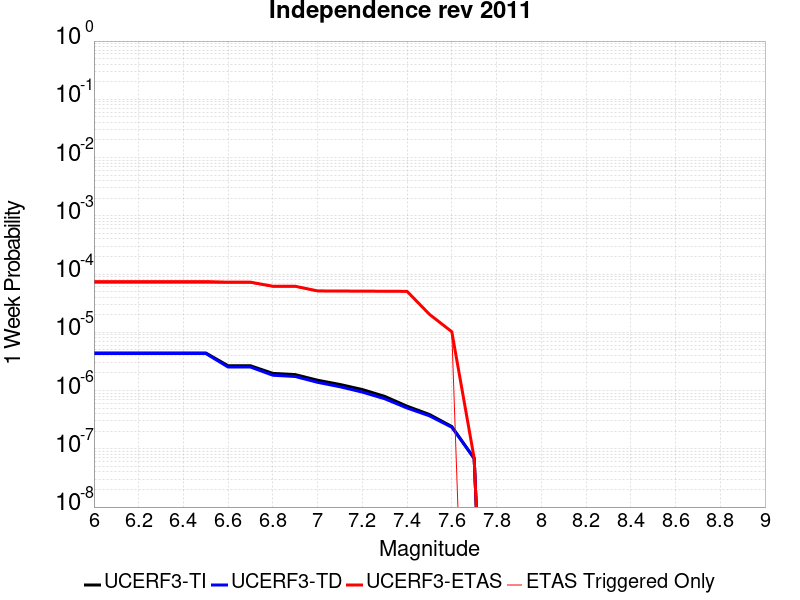 |  | 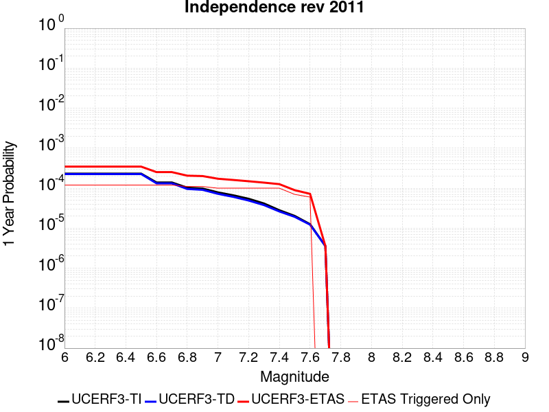 |  |

| Magnitude | 1 wk TI Prob | 1 wk TD Prob | 1 wk ETAS Prob | 1 wk ETAS/TD Gain | 1 wk ETAS Triggered Only | 1 mo TI Prob | 1 mo TD Prob | 1 mo ETAS Prob | 1 mo ETAS/TD Gain | 1 mo ETAS Triggered Only | 1 yr TI Prob | 1 yr TD Prob | 1 yr ETAS Prob | 1 yr ETAS/TD Gain | 1 yr ETAS Triggered Only | 10 yr TI Prob | 10 yr TD Prob | 10 yr ETAS Prob | 10 yr ETAS/TD Gain | 10 yr ETAS Triggered Only |
|-----|-----|-----|-----|-----|-----|-----|-----|-----|-----|-----|-----|-----|-----|-----|-----|-----|-----|-----|-----|-----|
| 6.0 | 4.422171E-6 | 4.326227E-6 | 7.432592E-5 | 17.180311 | 7.0E-5 | 1.8952025E-5 | 1.8540857E-5 | 8.853956E-5 | 4.7753754 | 7.0E-5 | 2.3071647E-4 | 2.2571455E-4 | 3.4568747E-4 | 1.5315249 | 1.2E-4 | 0.0023047708 | 0.0022551466 | 0.0024048083 | 1.0663645 | 1.5E-4 |
| 6.1 | 4.422171E-6 | 4.326227E-6 | 7.432592E-5 | 17.180311 | 7.0E-5 | 1.8952025E-5 | 1.8540857E-5 | 8.853956E-5 | 4.7753754 | 7.0E-5 | 2.3071647E-4 | 2.2571455E-4 | 3.4568747E-4 | 1.5315249 | 1.2E-4 | 0.0023047708 | 0.0022551466 | 0.0024048083 | 1.0663645 | 1.5E-4 |
| 6.2 | 4.422171E-6 | 4.326227E-6 | 7.432592E-5 | 17.180311 | 7.0E-5 | 1.8952025E-5 | 1.8540857E-5 | 8.853956E-5 | 4.7753754 | 7.0E-5 | 2.3071647E-4 | 2.2571455E-4 | 3.4568747E-4 | 1.5315249 | 1.2E-4 | 0.0023047708 | 0.0022551466 | 0.0024048083 | 1.0663645 | 1.5E-4 |
| 6.3 | 4.422171E-6 | 4.326227E-6 | 7.432592E-5 | 17.180311 | 7.0E-5 | 1.8952025E-5 | 1.8540857E-5 | 8.853956E-5 | 4.7753754 | 7.0E-5 | 2.3071647E-4 | 2.2571455E-4 | 3.4568747E-4 | 1.5315249 | 1.2E-4 | 0.0023047708 | 0.0022551466 | 0.0024048083 | 1.0663645 | 1.5E-4 |
| 6.4 | 4.422171E-6 | 4.326227E-6 | 7.432592E-5 | 17.180311 | 7.0E-5 | 1.8952025E-5 | 1.8540857E-5 | 8.853956E-5 | 4.7753754 | 7.0E-5 | 2.3071647E-4 | 2.2571455E-4 | 3.4568747E-4 | 1.5315249 | 1.2E-4 | 0.0023047708 | 0.0022551466 | 0.0024048083 | 1.0663645 | 1.5E-4 |
| 6.5 | 4.422171E-6 | 4.326227E-6 | 7.432592E-5 | 17.180311 | 7.0E-5 | 1.8952025E-5 | 1.8540857E-5 | 8.853956E-5 | 4.7753754 | 7.0E-5 | 2.3071647E-4 | 2.2571455E-4 | 3.4568747E-4 | 1.5315249 | 1.2E-4 | 0.0023047708 | 0.0022551466 | 0.0024048083 | 1.0663645 | 1.5E-4 |
| 6.6 | 2.663744E-6 | 2.5319862E-6 | 7.253181E-5 | 28.64621 | 7.0E-5 | 1.1415996E-5 | 1.0851327E-5 | 8.0850565E-5 | 7.450754 | 7.0E-5 | 1.3898089E-4 | 1.3210738E-4 | 2.5209153E-4 | 1.908232 | 1.2E-4 | 0.0013889399 | 0.0013203367 | 0.0014701387 | 1.1134573 | 1.5E-4 |
| 6.7 | 2.663744E-6 | 2.5319862E-6 | 7.253181E-5 | 28.64621 | 7.0E-5 | 1.1415996E-5 | 1.0851327E-5 | 8.0850565E-5 | 7.450754 | 7.0E-5 | 1.3898089E-4 | 1.3210738E-4 | 2.5209153E-4 | 1.908232 | 1.2E-4 | 0.0013889399 | 0.0013203367 | 0.0014701387 | 1.1134573 | 1.5E-4 |
| 6.8 | 1.9716529E-6 | 1.8322585E-6 | 6.183215E-5 | 33.746414 | 6.0E-5 | 8.449913E-6 | 7.852514E-6 | 6.7852045E-5 | 8.640806 | 6.0E-5 | 1.0287284E-4 | 9.5600284E-5 | 2.0558976E-4 | 2.1505141 | 1.1E-4 | 0.0010282523 | 9.556045E-4 | 0.0010954707 | 1.1463641 | 1.4E-4 |
| 6.9 | 1.8788617E-6 | 1.7429993E-6 | 6.1742896E-5 | 35.423363 | 6.0E-5 | 8.0522395E-6 | 7.4699765E-6 | 6.7469526E-5 | 9.032094 | 6.0E-5 | 9.80316E-5 | 9.0943286E-5 | 2.0093328E-4 | 2.209435 | 1.1E-4 | 9.798837E-4 | 9.0907275E-4 | 0.0010489455 | 1.1538631 | 1.4E-4 |
| 7.0 | 1.5045488E-6 | 1.3849503E-6 | 5.1384883E-5 | 37.102325 | 5.0E-5 | 6.44805E-6 | 5.9354884E-6 | 5.593519E-5 | 9.423857 | 5.0E-5 | 7.8502184E-5 | 7.226223E-5 | 1.7225501E-4 | 2.3837488 | 1.0E-4 | 7.8474457E-4 | 7.2239246E-4 | 8.522985E-4 | 1.1798276 | 1.3E-4 |
| 7.1 | 1.272341E-6 | 1.1625096E-6 | 5.1162453E-5 | 44.010345 | 5.0E-5 | 5.4528787E-6 | 4.982175E-6 | 5.4981927E-5 | 11.0357275 | 5.0E-5 | 6.6386776E-5 | 6.0656326E-5 | 1.6065026E-4 | 2.6485326 | 1.0E-4 | 6.636695E-4 | 6.064009E-4 | 7.363221E-4 | 1.2142496 | 1.3E-4 |
| 7.2 | 1.0416892E-6 | 9.4098806E-7 | 5.094094E-5 | 54.13559 | 5.0E-5 | 4.464375E-6 | 4.0328E-6 | 5.4032596E-5 | 13.398284 | 5.0E-5 | 5.4352407E-5 | 4.909825E-5 | 1.4909334E-4 | 3.0366325 | 1.0E-4 | 5.4339116E-4 | 4.9087586E-4 | 6.2081206E-4 | 1.2647027 | 1.3E-4 |
| 7.3 | 7.9450155E-7 | 7.235002E-7 | 5.0723465E-5 | 70.10844 | 5.0E-5 | 3.4050022E-6 | 3.1007114E-6 | 5.3100557E-5 | 17.125282 | 5.0E-5 | 4.1455114E-5 | 3.775052E-5 | 1.3774674E-4 | 3.6488702 | 1.0E-4 | 4.144738E-4 | 3.7744216E-4 | 5.073931E-4 | 1.3442936 | 1.3E-4 |
| 7.4 | 5.3893444E-7 | 5.019512E-7 | 5.0501927E-5 | 100.61122 | 5.0E-5 | 2.309717E-6 | 2.1512178E-6 | 5.215111E-5 | 24.2426 | 5.0E-5 | 2.8120441E-5 | 2.6190766E-5 | 1.2618814E-4 | 4.8180394 | 1.0E-4 | 2.8116882E-4 | 2.6187726E-4 | 3.918432E-4 | 1.4962858 | 1.3E-4 |
| 7.5 | 3.8852085E-7 | 3.682554E-7 | 2.0368248E-5 | 55.310116 | 2.0E-5 | 1.6650882E-6 | 1.5782365E-6 | 2.1578206E-5 | 13.672353 | 2.0E-5 | 2.027226E-5 | 1.9214862E-5 | 8.9213514E-5 | 4.6429434 | 7.0E-5 | 2.0270412E-4 | 1.9213221E-4 | 2.92113E-4 | 1.5203749 | 1.0E-4 |
| 7.6 | 2.414929E-7 | 2.345755E-7 | 1.0234573E-5 | 43.630188 | 1.0E-5 | 1.0349692E-6 | 1.0053232E-6 | 1.1005313E-5 | 10.94704 | 1.0E-5 | 1.2600677E-5 | 1.2239742E-5 | 7.223901E-5 | 5.902004 | 6.0E-5 | 1.2599962E-4 | 1.223908E-4 | 2.1237979E-4 | 1.7352593 | 9.0E-5 |
| 7.7 | 6.8298014E-8 | 6.85897E-8 | 6.85897E-8 | 1.0 | 0.0 | 2.9270575E-7 | 2.9395582E-7 | 2.9395582E-7 | 1.0 | 0.0 | 3.5636867E-6 | 3.5789067E-6 | 3.5789067E-6 | 1.0 | 0.0 | 3.5636294E-5 | 3.5788536E-5 | 3.5788536E-5 | 1.0 | 0.0 |

## Kern Canyon (North Kern) 2011
*[(top)](#table-of-contents)*

| 1 Week | 1 Month | 1 Year | 10 Year |
|-----|-----|-----|-----|
|  | 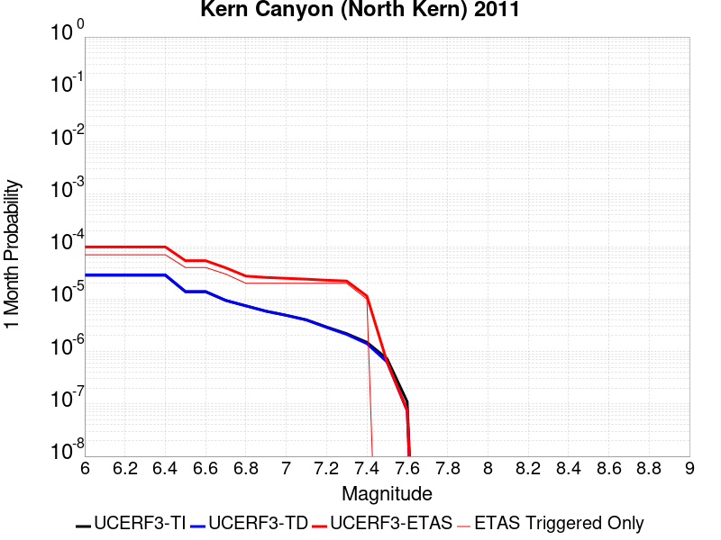 |  | 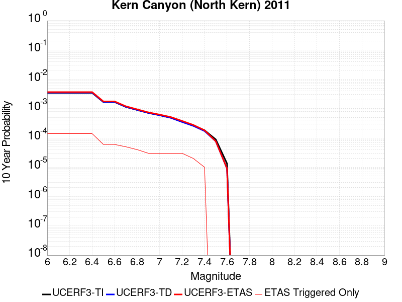 |

| Magnitude | 1 wk TI Prob | 1 wk TD Prob | 1 wk ETAS Prob | 1 wk ETAS/TD Gain | 1 wk ETAS Triggered Only | 1 mo TI Prob | 1 mo TD Prob | 1 mo ETAS Prob | 1 mo ETAS/TD Gain | 1 mo ETAS Triggered Only | 1 yr TI Prob | 1 yr TD Prob | 1 yr ETAS Prob | 1 yr ETAS/TD Gain | 1 yr ETAS Triggered Only | 10 yr TI Prob | 10 yr TD Prob | 10 yr ETAS Prob | 10 yr ETAS/TD Gain | 10 yr ETAS Triggered Only |
|-----|-----|-----|-----|-----|-----|-----|-----|-----|-----|-----|-----|-----|-----|-----|-----|-----|-----|-----|-----|-----|
| 6.0 | 6.6264497E-6 | 6.75733E-6 | 4.675706E-5 | 6.919458 | 4.0E-5 | 2.8398761E-5 | 2.895971E-5 | 9.895768E-5 | 3.4170814 | 7.0E-5 | 3.4570007E-4 | 3.5253543E-4 | 4.425037E-4 | 1.2552035 | 9.0E-5 | 0.0034516277 | 0.0035205502 | 0.0036600574 | 1.0396265 | 1.4E-4 |
| 6.1 | 6.6264497E-6 | 6.75733E-6 | 4.675706E-5 | 6.919458 | 4.0E-5 | 2.8398761E-5 | 2.895971E-5 | 9.895768E-5 | 3.4170814 | 7.0E-5 | 3.4570007E-4 | 3.5253543E-4 | 4.425037E-4 | 1.2552035 | 9.0E-5 | 0.0034516277 | 0.0035205502 | 0.0036600574 | 1.0396265 | 1.4E-4 |
| 6.2 | 6.6264497E-6 | 6.75733E-6 | 4.675706E-5 | 6.919458 | 4.0E-5 | 2.8398761E-5 | 2.895971E-5 | 9.895768E-5 | 3.4170814 | 7.0E-5 | 3.4570007E-4 | 3.5253543E-4 | 4.425037E-4 | 1.2552035 | 9.0E-5 | 0.0034516277 | 0.0035205502 | 0.0036600574 | 1.0396265 | 1.4E-4 |
| 6.3 | 6.6264497E-6 | 6.75733E-6 | 4.675706E-5 | 6.919458 | 4.0E-5 | 2.8398761E-5 | 2.895971E-5 | 9.895768E-5 | 3.4170814 | 7.0E-5 | 3.4570007E-4 | 3.5253543E-4 | 4.425037E-4 | 1.2552035 | 9.0E-5 | 0.0034516277 | 0.0035205502 | 0.0036600574 | 1.0396265 | 1.4E-4 |
| 6.4 | 6.6264497E-6 | 6.75733E-6 | 4.675706E-5 | 6.919458 | 4.0E-5 | 2.8398761E-5 | 2.895971E-5 | 9.895768E-5 | 3.4170814 | 7.0E-5 | 3.4570007E-4 | 3.5253543E-4 | 4.425037E-4 | 1.2552035 | 9.0E-5 | 0.0034516277 | 0.0035205502 | 0.0036600574 | 1.0396265 | 1.4E-4 |
| 6.5 | 3.2162225E-6 | 3.2570915E-6 | 2.3257026E-5 | 7.140428 | 2.0E-5 | 1.3783738E-5 | 1.3958893E-5 | 5.3958334E-5 | 3.8655167 | 4.0E-5 | 1.6780409E-4 | 1.6993708E-4 | 2.0993028E-4 | 1.2353412 | 4.0E-5 | 0.0016767744 | 0.001698151 | 0.0017580491 | 1.0352726 | 6.0E-5 |
| 6.6 | 3.2162225E-6 | 3.2570915E-6 | 2.3257026E-5 | 7.140428 | 2.0E-5 | 1.3783738E-5 | 1.3958893E-5 | 5.3958334E-5 | 3.8655167 | 4.0E-5 | 1.6780409E-4 | 1.6993708E-4 | 2.0993028E-4 | 1.2353412 | 4.0E-5 | 0.0016767744 | 0.001698151 | 0.0017580491 | 1.0352726 | 6.0E-5 |
| 6.7 | 2.1908265E-6 | 2.2071222E-6 | 2.2207078E-5 | 10.061554 | 2.0E-5 | 9.389223E-6 | 9.459061E-6 | 3.9458777E-5 | 4.171532 | 3.0E-5 | 1.1430779E-4 | 1.1515819E-4 | 1.4515473E-4 | 1.2604812 | 3.0E-5 | 0.0011424901 | 0.0011510046 | 0.001200947 | 1.0433903 | 5.0E-5 |
| 6.8 | 1.7303895E-6 | 1.7365529E-6 | 1.1736535E-5 | 6.758525 | 1.0E-5 | 7.415934E-6 | 7.4423488E-6 | 2.74422E-5 | 3.6873035 | 2.0E-5 | 9.028525E-5 | 9.0606925E-5 | 1.1060511E-4 | 1.2207136 | 2.0E-5 | 9.024858E-4 | 9.057096E-4 | 9.456734E-4 | 1.0441242 | 4.0E-5 |
| 6.9 | 1.3700314E-6 | 1.3688622E-6 | 1.1368848E-5 | 8.305327 | 1.0E-5 | 5.87155E-6 | 5.8665396E-6 | 2.5866422E-5 | 4.409145 | 2.0E-5 | 7.148377E-5 | 7.142282E-5 | 9.1421396E-5 | 1.2800026 | 2.0E-5 | 7.146078E-4 | 7.140032E-4 | 7.439818E-4 | 1.0419866 | 3.0E-5 |
| 7.0 | 1.1467797E-6 | 1.1413804E-6 | 1.1141369E-5 | 9.761311 | 1.0E-5 | 4.9147607E-6 | 4.8916213E-6 | 2.4891524E-5 | 5.088604 | 2.0E-5 | 5.983557E-5 | 5.9553895E-5 | 7.95527E-5 | 1.3358103 | 2.0E-5 | 5.981946E-4 | 5.953825E-4 | 6.2536466E-4 | 1.0503578 | 3.0E-5 |
| 7.1 | 9.3952065E-7 | 9.3026904E-7 | 1.093026E-5 | 11.749569 | 1.0E-5 | 4.026511E-6 | 3.9868614E-6 | 2.3986782E-5 | 6.0164576 | 2.0E-5 | 4.9021666E-5 | 4.8538972E-5 | 6.8538E-5 | 1.4120201 | 2.0E-5 | 4.901085E-4 | 4.8528548E-4 | 5.152709E-4 | 1.0617893 | 3.0E-5 |
| 7.2 | 6.858055E-7 | 6.7193E-7 | 1.06719235E-5 | 15.882492 | 1.0E-5 | 2.939163E-6 | 2.879697E-6 | 2.287964E-5 | 7.945155 | 2.0E-5 | 3.5783723E-5 | 3.5059755E-5 | 5.5059056E-5 | 1.5704346 | 2.0E-5 | 3.5777962E-4 | 3.5054312E-4 | 3.805326E-4 | 1.0855515 | 3.0E-5 |
| 7.3 | 5.1101983E-7 | 4.9393E-7 | 1.0493925E-5 | 21.245775 | 1.0E-5 | 2.1900833E-6 | 2.116841E-6 | 2.21168E-5 | 10.448021 | 2.0E-5 | 2.6663936E-5 | 2.5772239E-5 | 4.5771725E-5 | 1.7760088 | 2.0E-5 | 2.6660739E-4 | 2.57693E-4 | 2.7768782E-4 | 1.0775918 | 2.0E-5 |
| 7.4 | 3.4999414E-7 | 3.2995905E-7 | 3.2995905E-7 | 1.0 | 0.0 | 1.499974E-6 | 1.4141094E-6 | 1.1414096E-5 | 8.071578 | 1.0E-5 | 1.8262032E-5 | 1.721665E-5 | 2.7216476E-5 | 1.5808231 | 1.0E-5 | 1.826053E-4 | 1.7215339E-4 | 1.8215168E-4 | 1.0580777 | 1.0E-5 |
| 7.5 | 1.7021522E-7 | 1.4750044E-7 | 1.4750044E-7 | 1.0 | 0.0 | 7.2949354E-7 | 6.321446E-7 | 6.321446E-7 | 1.0 | 0.0 | 8.881548E-6 | 7.696334E-6 | 7.696334E-6 | 1.0 | 0.0 | 8.8811925E-5 | 7.696076E-5 | 7.696076E-5 | 1.0 | 0.0 |
| 7.6 | 2.572245E-8 | 1.7352555E-8 | 1.7352555E-8 | 1.0 | 0.0 | 1.10239064E-7 | 7.436809E-8 | 7.436809E-8 | 1.0 | 0.0 | 1.3421597E-6 | 9.054312E-7 | 9.054312E-7 | 1.0 | 0.0 | 1.3421517E-5 | 9.05428E-6 | 9.05428E-6 | 1.0 | 0.0 |

## Brawley (Seismic Zone) alt 1
*[(top)](#table-of-contents)*

| 1 Week | 1 Month | 1 Year | 10 Year |
|-----|-----|-----|-----|
| 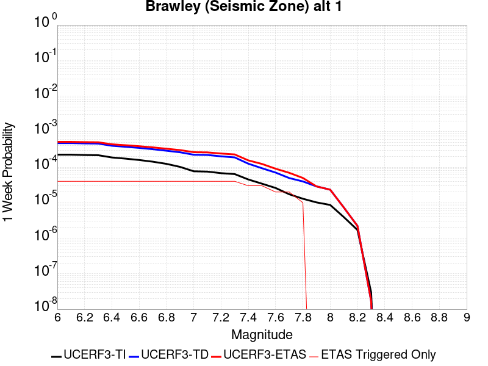 |  | 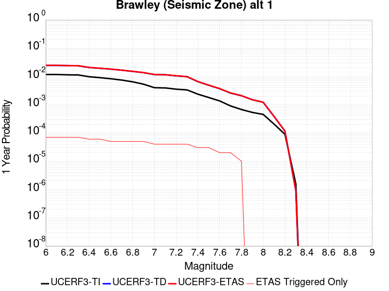 |  |

| Magnitude | 1 wk TI Prob | 1 wk TD Prob | 1 wk ETAS Prob | 1 wk ETAS/TD Gain | 1 wk ETAS Triggered Only | 1 mo TI Prob | 1 mo TD Prob | 1 mo ETAS Prob | 1 mo ETAS/TD Gain | 1 mo ETAS Triggered Only | 1 yr TI Prob | 1 yr TD Prob | 1 yr ETAS Prob | 1 yr ETAS/TD Gain | 1 yr ETAS Triggered Only | 10 yr TI Prob | 10 yr TD Prob | 10 yr ETAS Prob | 10 yr ETAS/TD Gain | 10 yr ETAS Triggered Only |
|-----|-----|-----|-----|-----|-----|-----|-----|-----|-----|-----|-----|-----|-----|-----|-----|-----|-----|-----|-----|-----|
| 6.0 | 2.2521618E-4 | 4.7632487E-4 | 5.163058E-4 | 1.0839363 | 4.0E-5 | 9.6485513E-4 | 0.0020398323 | 0.0020797506 | 1.0195694 | 4.0E-5 | 0.011683988 | 0.024546238 | 0.024614519 | 1.0027817 | 7.0E-5 | 0.11088423 | 0.21350002 | 0.21361013 | 1.0005157 | 1.4E-4 |
| 6.1 | 2.2521618E-4 | 4.7632487E-4 | 5.163058E-4 | 1.0839363 | 4.0E-5 | 9.6485513E-4 | 0.0020398323 | 0.0020797506 | 1.0195694 | 4.0E-5 | 0.011683988 | 0.024546238 | 0.024614519 | 1.0027817 | 7.0E-5 | 0.11088423 | 0.21350002 | 0.21361013 | 1.0005157 | 1.4E-4 |
| 6.2 | 2.198148E-4 | 4.6717093E-4 | 5.0715223E-4 | 1.0855818 | 4.0E-5 | 9.417233E-4 | 0.0020006616 | 0.0020405815 | 1.0199534 | 4.0E-5 | 0.011405343 | 0.024080504 | 0.024148818 | 1.002837 | 7.0E-5 | 0.10837428 | 0.20993657 | 0.21004719 | 1.0005269 | 1.4E-4 |
| 6.3 | 2.1704129E-4 | 4.615278E-4 | 5.015093E-4 | 1.0866287 | 4.0E-5 | 9.298453E-4 | 0.0019765133 | 0.0020164342 | 1.0201976 | 4.0E-5 | 0.011262234 | 0.02379366 | 0.023861995 | 1.002872 | 7.0E-5 | 0.107082725 | 0.20782755 | 0.20793845 | 1.0005336 | 1.4E-4 |
| 6.4 | 1.876142E-4 | 4.00449E-4 | 4.4043298E-4 | 1.0998479 | 4.0E-5 | 8.038131E-4 | 0.0017150956 | 0.001755027 | 1.0232823 | 4.0E-5 | 0.00974259 | 0.020680401 | 0.02073916 | 1.0028414 | 6.0E-5 | 0.093263686 | 0.18457815 | 0.18468416 | 1.0005744 | 1.3E-4 |
| 6.5 | 1.7390939E-4 | 3.7477075E-4 | 4.1475578E-4 | 1.106692 | 4.0E-5 | 7.45113E-4 | 0.0016051838 | 0.0016451196 | 1.0248792 | 4.0E-5 | 0.009034078 | 0.019368723 | 0.01942756 | 1.0030378 | 6.0E-5 | 0.086755216 | 0.17440031 | 0.17450765 | 1.0006154 | 1.3E-4 |
| 6.6 | 1.591791E-4 | 3.4891962E-4 | 3.8890567E-4 | 1.1145996 | 4.0E-5 | 6.8201777E-4 | 0.0014945229 | 0.0015344631 | 1.0267243 | 4.0E-5 | 0.008271996 | 0.018045569 | 0.018094668 | 1.0027207 | 5.0E-5 | 0.07970774 | 0.16380852 | 0.16390887 | 1.0006126 | 1.2E-4 |
| 6.7 | 1.4268003E-4 | 3.20582E-4 | 3.605692E-4 | 1.1247331 | 4.0E-5 | 6.1134255E-4 | 0.0013732077 | 0.0014131528 | 1.0290889 | 4.0E-5 | 0.007417723 | 0.016592601 | 0.016641773 | 1.0029634 | 5.0E-5 | 0.07174956 | 0.15193306 | 0.15203483 | 1.0006698 | 1.2E-4 |
| 6.8 | 1.239713E-4 | 2.9053655E-4 | 3.3052493E-4 | 1.1376363 | 4.0E-5 | 5.3119735E-4 | 0.0012445687 | 0.0012845189 | 1.0320996 | 4.0E-5 | 0.0064481674 | 0.015048777 | 0.015098025 | 1.0032725 | 5.0E-5 | 0.06264243 | 0.13837762 | 0.13848102 | 1.0007472 | 1.2E-4 |
| 6.9 | 1.0180238E-4 | 2.625439E-4 | 3.0253342E-4 | 1.1523155 | 4.0E-5 | 4.3622297E-4 | 0.0011247073 | 0.0011646623 | 1.0355248 | 4.0E-5 | 0.005298089 | 0.013608336 | 0.013657656 | 1.0036242 | 5.0E-5 | 0.05173543 | 0.124961674 | 0.12506668 | 1.0008403 | 1.2E-4 |
| 7.0 | 7.6619996E-5 | 2.23993E-4 | 2.6398405E-4 | 1.178537 | 4.0E-5 | 3.283301E-4 | 9.5962E-4 | 9.995817E-4 | 1.0416431 | 4.0E-5 | 0.0039900932 | 0.011621496 | 0.01166103 | 1.0034019 | 4.0E-5 | 0.039192066 | 0.107266866 | 0.10735614 | 1.0008322 | 1.0E-4 |
| 7.1 | 7.5127435E-5 | 2.2082464E-4 | 2.608158E-4 | 1.1810992 | 4.0E-5 | 3.2193496E-4 | 9.4605127E-4 | 9.860134E-4 | 1.042241 | 4.0E-5 | 0.0039125155 | 0.011458045 | 0.011497586 | 1.003451 | 4.0E-5 | 0.038443442 | 0.10583085 | 0.10592026 | 1.000845 | 1.0E-4 |
| 7.2 | 6.788582E-5 | 2.0210193E-4 | 2.4209385E-4 | 1.1978799 | 4.0E-5 | 2.9090676E-4 | 8.6586666E-4 | 9.0583204E-4 | 1.0461565 | 4.0E-5 | 0.0035360386 | 0.0104916105 | 0.010531191 | 1.0037726 | 4.0E-5 | 0.034803 | 0.09750131 | 0.097591564 | 1.0009257 | 1.0E-4 |
| 7.3 | 6.399602E-5 | 1.8841137E-4 | 2.2840383E-4 | 1.2122614 | 4.0E-5 | 2.7423984E-4 | 8.072303E-4 | 8.47198E-4 | 1.0495121 | 4.0E-5 | 0.0033337586 | 0.009784332 | 0.00982394 | 1.0040482 | 4.0E-5 | 0.03284188 | 0.09139617 | 0.09148703 | 1.0009941 | 1.0E-4 |
| 7.4 | 4.506759E-5 | 1.2529209E-4 | 1.5528833E-4 | 1.2394105 | 3.0E-5 | 1.9313251E-4 | 5.368565E-4 | 5.6684035E-4 | 1.0558509 | 3.0E-5 | 0.0023488526 | 0.0065168133 | 0.006546618 | 1.0045735 | 3.0E-5 | 0.023241805 | 0.062363707 | 0.062438715 | 1.0012028 | 8.0E-5 |
| 7.5 | 3.43289E-5 | 9.33541E-5 | 1.233513E-4 | 1.3213271 | 3.0E-5 | 1.4711556E-4 | 4.00028E-4 | 4.3001596E-4 | 1.0749648 | 3.0E-5 | 0.0017896603 | 0.0048595266 | 0.0048893807 | 1.0061435 | 3.0E-5 | 0.01775316 | 0.04705519 | 0.047112364 | 1.0012151 | 6.0E-5 |
| 7.6 | 2.5980507E-5 | 7.053101E-5 | 9.05296E-5 | 1.2835432 | 2.0E-5 | 1.1134028E-4 | 3.0224086E-4 | 3.2223482E-4 | 1.0661523 | 2.0E-5 | 0.001354725 | 0.003673598 | 0.0036935245 | 1.0054243 | 2.0E-5 | 0.013464959 | 0.035840835 | 0.03588904 | 1.001345 | 5.0E-5 |
| 7.7 | 1.7292105E-5 | 4.9407296E-5 | 6.9406306E-5 | 1.4047785 | 2.0E-5 | 7.4106916E-5 | 2.117284E-4 | 2.3172417E-4 | 1.0944406 | 2.0E-5 | 9.018782E-4 | 0.0025747516 | 0.0025947 | 1.0077478 | 2.0E-5 | 0.008982267 | 0.025290398 | 0.025339134 | 1.001927 | 5.0E-5 |
| 7.8 | 1.2927471E-5 | 3.9693266E-5 | 4.969287E-5 | 1.2519219 | 1.0E-5 | 5.5402274E-5 | 1.7010293E-4 | 1.8010123E-4 | 1.0587779 | 1.0E-5 | 6.743139E-4 | 0.0020690386 | 0.002079018 | 1.0048232 | 1.0E-5 | 0.0067227143 | 0.020431727 | 0.02047091 | 1.0019177 | 4.0E-5 |
| 7.9 | 1.0200774E-5 | 2.874569E-5 | 2.874569E-5 | 1.0 | 0.0 | 4.371687E-5 | 1.2319001E-4 | 1.2319001E-4 | 1.0 | 0.0 | 5.321229E-4 | 0.0014988075 | 0.0014988075 | 1.0 | 0.0 | 0.005308505 | 0.014991644 | 0.015011344 | 1.001314 | 2.0E-5 |
| 8.0 | 8.650396E-6 | 2.3277367E-5 | 2.3277367E-5 | 1.0 | 0.0 | 3.70726E-5 | 9.975634E-5 | 9.975634E-5 | 1.0 | 0.0 | 4.5126543E-4 | 0.0012138576 | 0.0012138576 | 1.0 | 0.0 | 0.0045035016 | 0.012211097 | 0.012230853 | 1.0016179 | 2.0E-5 |
| 8.1 | 3.9368224E-6 | 7.3279825E-6 | 7.3279825E-6 | 1.0 | 0.0 | 1.6871985E-5 | 3.140526E-5 | 3.140526E-5 | 1.0 | 0.0 | 2.0539707E-4 | 3.8229208E-4 | 3.8229208E-4 | 1.0 | 0.0 | 0.0020520731 | 0.004001185 | 0.004001185 | 1.0 | 0.0 |
| 8.2 | 1.7101195E-6 | 2.217876E-6 | 2.217876E-6 | 1.0 | 0.0 | 7.329063E-6 | 9.505149E-6 | 9.505149E-6 | 1.0 | 0.0 | 8.922769E-5 | 1.1571907E-4 | 1.1571907E-4 | 1.0 | 0.0 | 8.9191867E-4 | 0.0012666774 | 0.0012666774 | 1.0 | 0.0 |
| 8.3 | 3.0346666E-8 | 1.721586E-8 | 1.721586E-8 | 1.0 | 0.0 | 1.3005713E-7 | 7.378226E-8 | 7.378226E-8 | 1.0 | 0.0 | 1.5834444E-6 | 8.9829894E-7 | 8.9829894E-7 | 1.0 | 0.0 | 1.5834332E-5 | 9.367729E-6 | 9.367729E-6 | 1.0 | 0.0 |

## Bullion Mountains
*[(top)](#table-of-contents)*

| 1 Week | 1 Month | 1 Year | 10 Year |
|-----|-----|-----|-----|
|  |  |  |  |

| Magnitude | 1 wk TI Prob | 1 wk TD Prob | 1 wk ETAS Prob | 1 wk ETAS/TD Gain | 1 wk ETAS Triggered Only | 1 mo TI Prob | 1 mo TD Prob | 1 mo ETAS Prob | 1 mo ETAS/TD Gain | 1 mo ETAS Triggered Only | 1 yr TI Prob | 1 yr TD Prob | 1 yr ETAS Prob | 1 yr ETAS/TD Gain | 1 yr ETAS Triggered Only | 10 yr TI Prob | 10 yr TD Prob | 10 yr ETAS Prob | 10 yr ETAS/TD Gain | 10 yr ETAS Triggered Only |
|-----|-----|-----|-----|-----|-----|-----|-----|-----|-----|-----|-----|-----|-----|-----|-----|-----|-----|-----|-----|-----|
| 6.0 | 1.6420427E-5 | 1.4692089E-5 | 4.469165E-5 | 3.0418851 | 3.0E-5 | 7.037136E-5 | 6.296479E-5 | 1.0296227E-4 | 1.6352357 | 4.0E-5 | 8.5643446E-4 | 7.663651E-4 | 8.3631143E-4 | 1.0912703 | 7.0E-5 | 0.008531413 | 0.007641016 | 0.007770023 | 1.0168835 | 1.3E-4 |
| 6.1 | 1.6420427E-5 | 1.4692089E-5 | 4.469165E-5 | 3.0418851 | 3.0E-5 | 7.037136E-5 | 6.296479E-5 | 1.0296227E-4 | 1.6352357 | 4.0E-5 | 8.5643446E-4 | 7.663651E-4 | 8.3631143E-4 | 1.0912703 | 7.0E-5 | 0.008531413 | 0.007641016 | 0.007770023 | 1.0168835 | 1.3E-4 |
| 6.2 | 1.6420427E-5 | 1.4692089E-5 | 4.469165E-5 | 3.0418851 | 3.0E-5 | 7.037136E-5 | 6.296479E-5 | 1.0296227E-4 | 1.6352357 | 4.0E-5 | 8.5643446E-4 | 7.663651E-4 | 8.3631143E-4 | 1.0912703 | 7.0E-5 | 0.008531413 | 0.007641016 | 0.007770023 | 1.0168835 | 1.3E-4 |
| 6.3 | 1.2046778E-5 | 9.862335E-6 | 1.9862237E-5 | 2.0139487 | 1.0E-5 | 5.1628023E-5 | 4.2266598E-5 | 6.226575E-5 | 1.473167 | 2.0E-5 | 6.283899E-4 | 5.144975E-4 | 5.44482E-4 | 1.0582793 | 3.0E-5 | 0.0062661595 | 0.005135345 | 0.0051751393 | 1.0077492 | 4.0E-5 |
| 6.4 | 1.2046778E-5 | 9.862335E-6 | 1.9862237E-5 | 2.0139487 | 1.0E-5 | 5.1628023E-5 | 4.2266598E-5 | 6.226575E-5 | 1.473167 | 2.0E-5 | 6.283899E-4 | 5.144975E-4 | 5.44482E-4 | 1.0582793 | 3.0E-5 | 0.0062661595 | 0.005135345 | 0.0051751393 | 1.0077492 | 4.0E-5 |
| 6.5 | 1.0244343E-5 | 7.879458E-6 | 1.787938E-5 | 2.2691128 | 1.0E-5 | 4.390359E-5 | 3.3768785E-5 | 5.376811E-5 | 1.592243 | 2.0E-5 | 5.343951E-4 | 4.110781E-4 | 4.4106576E-4 | 1.0729488 | 3.0E-5 | 0.005331118 | 0.004105208 | 0.004145044 | 1.0097038 | 4.0E-5 |
| 6.6 | 9.605408E-6 | 7.1774966E-6 | 1.7177425E-5 | 2.3932335 | 1.0E-5 | 4.1165385E-5 | 3.076045E-5 | 5.0759834E-5 | 1.6501656 | 2.0E-5 | 5.010733E-4 | 3.744645E-4 | 4.0445325E-4 | 1.0800844 | 3.0E-5 | 0.00499945 | 0.003740332 | 0.0037801825 | 1.0106542 | 4.0E-5 |
| 6.7 | 8.60418E-6 | 6.1240044E-6 | 1.6123944E-5 | 2.6329083 | 1.0E-5 | 3.687454E-5 | 2.624558E-5 | 3.6245317E-5 | 1.3810066 | 1.0E-5 | 4.48855E-4 | 3.1951256E-4 | 3.3950616E-4 | 1.0625753 | 2.0E-5 | 0.004479495 | 0.0031924439 | 0.00321238 | 1.0062448 | 2.0E-5 |
| 6.8 | 5.187994E-6 | 2.5631666E-6 | 2.5631666E-6 | 1.0 | 0.0 | 2.223407E-5 | 1.0984976E-5 | 1.0984976E-5 | 1.0 | 0.0 | 2.7066618E-4 | 1.3373788E-4 | 1.3373788E-4 | 1.0 | 0.0 | 0.0027033675 | 0.0013369655 | 0.0013369655 | 1.0 | 0.0 |
| 6.9 | 4.5302368E-6 | 2.3443165E-6 | 2.3443165E-6 | 1.0 | 0.0 | 1.9415156E-5 | 1.0047055E-5 | 1.0047055E-5 | 1.0 | 0.0 | 2.3635388E-4 | 1.2232E-4 | 1.2232E-4 | 1.0 | 0.0 | 0.0023610266 | 0.0012229157 | 0.0012229157 | 1.0 | 0.0 |
| 7.0 | 3.431668E-6 | 1.6882402E-6 | 1.6882402E-6 | 1.0 | 0.0 | 1.4707065E-5 | 7.235315E-6 | 7.235315E-6 | 1.0 | 0.0 | 1.7904381E-4 | 8.808996E-5 | 8.808996E-5 | 1.0 | 0.0 | 0.0017889962 | 8.808996E-4 | 8.808996E-4 | 1.0 | 0.0 |

## Mission Creek
*[(top)](#table-of-contents)*

| 1 Week | 1 Month | 1 Year | 10 Year |
|-----|-----|-----|-----|
|  |  |  |  |

| Magnitude | 1 wk TI Prob | 1 wk TD Prob | 1 wk ETAS Prob | 1 wk ETAS/TD Gain | 1 wk ETAS Triggered Only | 1 mo TI Prob | 1 mo TD Prob | 1 mo ETAS Prob | 1 mo ETAS/TD Gain | 1 mo ETAS Triggered Only | 1 yr TI Prob | 1 yr TD Prob | 1 yr ETAS Prob | 1 yr ETAS/TD Gain | 1 yr ETAS Triggered Only | 10 yr TI Prob | 10 yr TD Prob | 10 yr ETAS Prob | 10 yr ETAS/TD Gain | 10 yr ETAS Triggered Only |
|-----|-----|-----|-----|-----|-----|-----|-----|-----|-----|-----|-----|-----|-----|-----|-----|-----|-----|-----|-----|-----|
| 6.0 | 1.1549387E-5 | 1.632237E-5 | 5.6321718E-5 | 3.4505844 | 4.0E-5 | 4.9496433E-5 | 6.9951224E-5 | 1.2994703E-4 | 1.8576806 | 6.0E-5 | 6.0245243E-4 | 8.513384E-4 | 9.512532E-4 | 1.1173621 | 1.0E-4 | 0.006008218 | 0.008509998 | 0.008648806 | 1.0163113 | 1.4E-4 |
| 6.1 | 1.1549387E-5 | 1.632237E-5 | 5.6321718E-5 | 3.4505844 | 4.0E-5 | 4.9496433E-5 | 6.9951224E-5 | 1.2994703E-4 | 1.8576806 | 6.0E-5 | 6.0245243E-4 | 8.513384E-4 | 9.512532E-4 | 1.1173621 | 1.0E-4 | 0.006008218 | 0.008509998 | 0.008648806 | 1.0163113 | 1.4E-4 |
| 6.2 | 1.1549387E-5 | 1.632237E-5 | 5.6321718E-5 | 3.4505844 | 4.0E-5 | 4.9496433E-5 | 6.9951224E-5 | 1.2994703E-4 | 1.8576806 | 6.0E-5 | 6.0245243E-4 | 8.513384E-4 | 9.512532E-4 | 1.1173621 | 1.0E-4 | 0.006008218 | 0.008509998 | 0.008648806 | 1.0163113 | 1.4E-4 |
| 6.3 | 1.1549387E-5 | 1.632237E-5 | 5.6321718E-5 | 3.4505844 | 4.0E-5 | 4.9496433E-5 | 6.9951224E-5 | 1.2994703E-4 | 1.8576806 | 6.0E-5 | 6.0245243E-4 | 8.513384E-4 | 9.512532E-4 | 1.1173621 | 1.0E-4 | 0.006008218 | 0.008509998 | 0.008648806 | 1.0163113 | 1.4E-4 |
| 6.4 | 1.1549387E-5 | 1.632237E-5 | 5.6321718E-5 | 3.4505844 | 4.0E-5 | 4.9496433E-5 | 6.9951224E-5 | 1.2994703E-4 | 1.8576806 | 6.0E-5 | 6.0245243E-4 | 8.513384E-4 | 9.512532E-4 | 1.1173621 | 1.0E-4 | 0.006008218 | 0.008509998 | 0.008648806 | 1.0163113 | 1.4E-4 |
| 6.5 | 1.1549387E-5 | 1.632237E-5 | 5.6321718E-5 | 3.4505844 | 4.0E-5 | 4.9496433E-5 | 6.9951224E-5 | 1.2994703E-4 | 1.8576806 | 6.0E-5 | 6.0245243E-4 | 8.513384E-4 | 9.512532E-4 | 1.1173621 | 1.0E-4 | 0.006008218 | 0.008509998 | 0.008648806 | 1.0163113 | 1.4E-4 |
| 6.6 | 9.202681E-6 | 1.3845646E-5 | 5.384509E-5 | 3.8889546 | 4.0E-5 | 3.9439463E-5 | 5.9337188E-5 | 1.1933363E-4 | 2.0111103 | 6.0E-5 | 4.800697E-4 | 7.221998E-4 | 8.121348E-4 | 1.1245292 | 9.0E-5 | 0.004790339 | 0.0072271815 | 0.007356242 | 1.0178577 | 1.3E-4 |
| 6.7 | 9.019164E-6 | 1.3651316E-5 | 5.365077E-5 | 3.9300804 | 4.0E-5 | 3.8652986E-5 | 5.8504378E-5 | 1.18500866E-4 | 2.0255044 | 6.0E-5 | 4.7049852E-4 | 7.12067E-4 | 8.0200296E-4 | 1.1263026 | 9.0E-5 | 0.004695036 | 0.007126506 | 0.0072555793 | 1.0181117 | 1.3E-4 |
| 6.8 | 8.673558E-6 | 1.3273427E-5 | 5.3272895E-5 | 4.0134997 | 4.0E-5 | 3.717186E-5 | 5.6884925E-5 | 1.16881514E-4 | 2.054701 | 6.0E-5 | 4.524734E-4 | 6.923627E-4 | 7.823004E-4 | 1.1298996 | 9.0E-5 | 0.0045155324 | 0.006930694 | 0.007059793 | 1.0186272 | 1.3E-4 |
| 6.9 | 7.002255E-6 | 1.1477657E-5 | 5.1477196E-5 | 4.484992 | 4.0E-5 | 3.000932E-5 | 4.9189068E-5 | 1.0918612E-4 | 2.2197232 | 6.0E-5 | 3.653022E-4 | 5.9871917E-4 | 6.886653E-4 | 1.1502309 | 9.0E-5 | 0.0036470229 | 0.005999517 | 0.006118797 | 1.0198816 | 1.2E-4 |
| 7.0 | 5.84644E-6 | 9.67498E-6 | 4.9674592E-5 | 5.1343355 | 4.0E-5 | 2.5055931E-5 | 4.1463565E-5 | 1.01461075E-4 | 2.4469936 | 6.0E-5 | 3.0501327E-4 | 5.047066E-4 | 5.946611E-4 | 1.1782315 | 9.0E-5 | 0.0030459496 | 0.0050638523 | 0.0051832446 | 1.0235773 | 1.2E-4 |
| 7.1 | 5.54703E-6 | 9.329456E-6 | 4.9329083E-5 | 5.2874556 | 4.0E-5 | 2.377277E-5 | 3.9982795E-5 | 9.9980396E-5 | 2.5005856 | 6.0E-5 | 2.8939504E-4 | 4.8668624E-4 | 5.7664246E-4 | 1.184834 | 9.0E-5 | 0.0028901845 | 0.004884446 | 0.00500386 | 1.0244478 | 1.2E-4 |
| 7.2 | 4.384709E-6 | 7.68157E-6 | 4.7681264E-5 | 6.207228 | 4.0E-5 | 1.8791474E-5 | 3.2920623E-5 | 9.291865E-5 | 2.8225057 | 6.0E-5 | 2.2876218E-4 | 4.0073853E-4 | 4.8070645E-4 | 1.1995515 | 8.0E-5 | 0.0022852682 | 0.004028366 | 0.0041379225 | 1.0271964 | 1.1E-4 |
| 7.3 | 3.7888456E-6 | 6.915452E-6 | 4.6915175E-5 | 6.784108 | 4.0E-5 | 1.623781E-5 | 2.9637333E-5 | 8.9635556E-5 | 3.0244136 | 6.0E-5 | 1.9767738E-4 | 3.6077813E-4 | 4.4074928E-4 | 1.2216629 | 8.0E-5 | 0.0019750162 | 0.0036301152 | 0.0037397158 | 1.030192 | 1.1E-4 |
| 7.4 | 2.1982462E-6 | 5.0237763E-6 | 3.5023626E-5 | 6.9715734 | 3.0E-5 | 9.421021E-6 | 2.1530293E-5 | 7.152922E-5 | 3.3222592 | 5.0E-5 | 1.1469489E-4 | 2.621E-4 | 3.3208163E-4 | 1.2670037 | 7.0E-5 | 0.0011463572 | 0.0026458844 | 0.00274562 | 1.0376946 | 1.0E-4 |
| 7.5 | 2.051923E-6 | 4.615016E-6 | 3.4614877E-5 | 7.500489 | 3.0E-5 | 8.793926E-6 | 1.9778492E-5 | 6.97775E-5 | 3.5279486 | 5.0E-5 | 1.0706078E-4 | 2.4077666E-4 | 3.1075982E-4 | 1.2906559 | 7.0E-5 | 0.0010700922 | 0.0024335422 | 0.0025332987 | 1.0409924 | 1.0E-4 |
| 7.6 | 1.8733427E-6 | 4.1233748E-6 | 3.412325E-5 | 8.275563 | 3.0E-5 | 8.028587E-6 | 1.7671488E-5 | 6.7670604E-5 | 3.8293664 | 5.0E-5 | 9.774366E-5 | 2.151292E-4 | 2.8511413E-4 | 1.3253158 | 7.0E-5 | 9.770069E-4 | 0.0021780801 | 0.0022778625 | 1.045812 | 1.0E-4 |
| 7.7 | 1.8411953E-6 | 4.0430496E-6 | 3.404293E-5 | 8.420112 | 3.0E-5 | 7.890813E-6 | 1.732724E-5 | 6.732637E-5 | 3.8855796 | 5.0E-5 | 9.606641E-5 | 2.1093882E-4 | 2.8092405E-4 | 1.3317797 | 7.0E-5 | 9.6024893E-4 | 0.0021363653 | 0.0022361516 | 1.0467085 | 1.0E-4 |
| 7.8 | 1.7194251E-6 | 3.7104276E-6 | 3.3710316E-5 | 9.085292 | 3.0E-5 | 7.368944E-6 | 1.5901736E-5 | 6.590094E-5 | 4.144261 | 5.0E-5 | 8.97132E-5 | 1.9358651E-4 | 2.6357296E-4 | 1.3615254 | 7.0E-5 | 8.967699E-4 | 0.0019623525 | 0.0020621563 | 1.0508592 | 1.0E-4 |
| 7.9 | 1.4035052E-6 | 2.9500632E-6 | 3.2949974E-5 | 11.169244 | 3.0E-5 | 6.0150082E-6 | 1.2643067E-5 | 6.264244E-5 | 4.9546866 | 5.0E-5 | 7.3230265E-5 | 1.5391852E-4 | 2.2390774E-4 | 1.4547161 | 7.0E-5 | 7.3206134E-4 | 0.0015631086 | 0.0016629524 | 1.0638751 | 1.0E-4 |
| 8.0 | 3.9318823E-7 | 5.528522E-7 | 2.0552841E-5 | 37.176014 | 2.0E-5 | 1.6850913E-6 | 2.3693647E-6 | 3.2369295E-5 | 13.6615925 | 3.0E-5 | 2.0515794E-5 | 2.8846638E-5 | 5.8845773E-5 | 2.0399525 | 3.0E-5 | 2.0513899E-4 | 2.9899E-4 | 3.2898103E-4 | 1.1003078 | 3.0E-5 |
| 8.1 | 1.596793E-7 | 1.1380002E-7 | 1.1380002E-7 | 1.0 | 0.0 | 6.8433974E-7 | 4.877143E-7 | 4.877143E-7 | 1.0 | 0.0 | 8.331805E-6 | 5.937906E-6 | 5.937906E-6 | 1.0 | 0.0 | 8.331492E-5 | 6.549966E-5 | 6.549966E-5 | 1.0 | 0.0 |
| 8.2 | 4.9003038E-8 | 2.5444924E-8 | 2.5444924E-8 | 1.0 | 0.0 | 2.10013E-7 | 1.0904967E-7 | 1.0904967E-7 | 1.0 | 0.0 | 2.5569052E-6 | 1.327679E-6 | 1.327679E-6 | 1.0 | 0.0 | 2.556876E-5 | 1.495635E-5 | 1.495635E-5 | 1.0 | 0.0 |

## Pleito
*[(top)](#table-of-contents)*

| 1 Week | 1 Month | 1 Year | 10 Year |
|-----|-----|-----|-----|
| 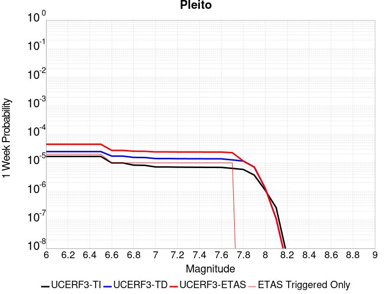 |  |  |  |

| Magnitude | 1 wk TI Prob | 1 wk TD Prob | 1 wk ETAS Prob | 1 wk ETAS/TD Gain | 1 wk ETAS Triggered Only | 1 mo TI Prob | 1 mo TD Prob | 1 mo ETAS Prob | 1 mo ETAS/TD Gain | 1 mo ETAS Triggered Only | 1 yr TI Prob | 1 yr TD Prob | 1 yr ETAS Prob | 1 yr ETAS/TD Gain | 1 yr ETAS Triggered Only | 10 yr TI Prob | 10 yr TD Prob | 10 yr ETAS Prob | 10 yr ETAS/TD Gain | 10 yr ETAS Triggered Only |
|-----|-----|-----|-----|-----|-----|-----|-----|-----|-----|-----|-----|-----|-----|-----|-----|-----|-----|-----|-----|-----|
| 6.0 | 1.6763008E-5 | 2.4763838E-5 | 4.4763343E-5 | 1.8076092 | 2.0E-5 | 7.183948E-5 | 1.0612683E-4 | 1.2612471E-4 | 1.1884338 | 2.0E-5 | 8.742947E-4 | 0.0012914003 | 0.0013912711 | 1.0773354 | 1.0E-4 | 0.00870863 | 0.0129538905 | 0.013082206 | 1.0099056 | 1.3E-4 |
| 6.1 | 1.6763008E-5 | 2.4763838E-5 | 4.4763343E-5 | 1.8076092 | 2.0E-5 | 7.183948E-5 | 1.0612683E-4 | 1.2612471E-4 | 1.1884338 | 2.0E-5 | 8.742947E-4 | 0.0012914003 | 0.0013912711 | 1.0773354 | 1.0E-4 | 0.00870863 | 0.0129538905 | 0.013082206 | 1.0099056 | 1.3E-4 |
| 6.2 | 1.6763008E-5 | 2.4763838E-5 | 4.4763343E-5 | 1.8076092 | 2.0E-5 | 7.183948E-5 | 1.0612683E-4 | 1.2612471E-4 | 1.1884338 | 2.0E-5 | 8.742947E-4 | 0.0012914003 | 0.0013912711 | 1.0773354 | 1.0E-4 | 0.00870863 | 0.0129538905 | 0.013082206 | 1.0099056 | 1.3E-4 |
| 6.3 | 1.6763008E-5 | 2.4763838E-5 | 4.4763343E-5 | 1.8076092 | 2.0E-5 | 7.183948E-5 | 1.0612683E-4 | 1.2612471E-4 | 1.1884338 | 2.0E-5 | 8.742947E-4 | 0.0012914003 | 0.0013912711 | 1.0773354 | 1.0E-4 | 0.00870863 | 0.0129538905 | 0.013082206 | 1.0099056 | 1.3E-4 |
| 6.4 | 1.6763008E-5 | 2.4763838E-5 | 4.4763343E-5 | 1.8076092 | 2.0E-5 | 7.183948E-5 | 1.0612683E-4 | 1.2612471E-4 | 1.1884338 | 2.0E-5 | 8.742947E-4 | 0.0012914003 | 0.0013912711 | 1.0773354 | 1.0E-4 | 0.00870863 | 0.0129538905 | 0.013082206 | 1.0099056 | 1.3E-4 |
| 6.5 | 1.6763008E-5 | 2.4763838E-5 | 4.4763343E-5 | 1.8076092 | 2.0E-5 | 7.183948E-5 | 1.0612683E-4 | 1.2612471E-4 | 1.1884338 | 2.0E-5 | 8.742947E-4 | 0.0012914003 | 0.0013912711 | 1.0773354 | 1.0E-4 | 0.00870863 | 0.0129538905 | 0.013082206 | 1.0099056 | 1.3E-4 |
| 6.6 | 9.910213E-6 | 1.7214623E-5 | 2.7214452E-5 | 1.5808915 | 1.0E-5 | 4.247165E-5 | 7.377489E-5 | 8.377415E-5 | 1.1355375 | 1.0E-5 | 5.169696E-4 | 8.978429E-4 | 9.3780697E-4 | 1.0445112 | 4.0E-5 | 0.0051576863 | 0.009050702 | 0.009100249 | 1.0054744 | 5.0E-5 |
| 6.7 | 9.910213E-6 | 1.7214623E-5 | 2.7214452E-5 | 1.5808915 | 1.0E-5 | 4.247165E-5 | 7.377489E-5 | 8.377415E-5 | 1.1355375 | 1.0E-5 | 5.169696E-4 | 8.978429E-4 | 9.3780697E-4 | 1.0445112 | 4.0E-5 | 0.0051576863 | 0.009050702 | 0.009100249 | 1.0054744 | 5.0E-5 |
| 6.8 | 8.300162E-6 | 1.5474232E-5 | 2.5474077E-5 | 1.6462256 | 1.0E-5 | 3.557164E-5 | 6.631646E-5 | 7.6315795E-5 | 1.1507821 | 1.0E-5 | 4.3299864E-4 | 8.071053E-4 | 8.47073E-4 | 1.0495198 | 4.0E-5 | 0.004321559 | 0.008150139 | 0.008189813 | 1.0048679 | 4.0E-5 |
| 6.9 | 8.183114E-6 | 1.5345448E-5 | 2.5345294E-5 | 1.6516491 | 1.0E-5 | 3.5070017E-5 | 6.576455E-5 | 7.57639E-5 | 1.1520476 | 1.0E-5 | 4.2689382E-4 | 8.003907E-4 | 8.403587E-4 | 1.0499356 | 4.0E-5 | 0.0042607468 | 0.008083483 | 0.00812316 | 1.0049083 | 4.0E-5 |
| 7.0 | 7.1748823E-6 | 1.413244E-5 | 2.4132298E-5 | 1.7075819 | 1.0E-5 | 3.0749135E-5 | 6.0566195E-5 | 7.056559E-5 | 1.1650985 | 1.0E-5 | 3.743064E-4 | 7.371445E-4 | 7.77115E-4 | 1.0542234 | 4.0E-5 | 0.0037367654 | 0.007454939 | 0.007494641 | 1.0053256 | 4.0E-5 |
| 7.1 | 7.1671807E-6 | 1.412281E-5 | 2.412267E-5 | 1.7080643 | 1.0E-5 | 3.0716128E-5 | 6.052493E-5 | 7.052432E-5 | 1.1652112 | 1.0E-5 | 3.7390468E-4 | 7.366424E-4 | 7.7661296E-4 | 1.0542604 | 4.0E-5 | 0.0037327618 | 0.0074499524 | 0.0074896542 | 1.0053291 | 4.0E-5 |
| 7.2 | 7.0649667E-6 | 1.39701015E-5 | 2.3969962E-5 | 1.7158045 | 1.0E-5 | 3.0278077E-5 | 5.9870494E-5 | 6.986989E-5 | 1.1670172 | 1.0E-5 | 3.6857324E-4 | 7.2868E-4 | 7.6865085E-4 | 1.0548538 | 4.0E-5 | 0.0036796255 | 0.0073707094 | 0.0074104145 | 1.0053868 | 4.0E-5 |
| 7.3 | 7.02082E-6 | 1.3913556E-5 | 2.3913417E-5 | 1.7187135 | 1.0E-5 | 3.008888E-5 | 5.9628168E-5 | 6.9627575E-5 | 1.167696 | 1.0E-5 | 3.6627054E-4 | 7.2573166E-4 | 7.657026E-4 | 1.0550768 | 4.0E-5 | 0.0036566744 | 0.007341209 | 0.0073809153 | 1.0054086 | 4.0E-5 |
| 7.4 | 6.987146E-6 | 1.3873118E-5 | 2.3872979E-5 | 1.7208085 | 1.0E-5 | 2.9944567E-5 | 5.945487E-5 | 6.9454276E-5 | 1.1681848 | 1.0E-5 | 3.6451413E-4 | 7.2362315E-4 | 7.635942E-4 | 1.0552374 | 4.0E-5 | 0.0036391679 | 0.007320144 | 0.0073598516 | 1.0054244 | 4.0E-5 |
| 7.5 | 6.9494554E-6 | 1.3830024E-5 | 2.3829885E-5 | 1.7230545 | 1.0E-5 | 2.9783041E-5 | 5.9270187E-5 | 6.92696E-5 | 1.1687089 | 1.0E-5 | 3.625482E-4 | 7.2137616E-4 | 7.613473E-4 | 1.0554096 | 4.0E-5 | 0.0036195726 | 0.0072977724 | 0.007337481 | 1.0054411 | 4.0E-5 |
| 7.6 | 6.92694E-6 | 1.3789138E-5 | 2.3789E-5 | 1.7251985 | 1.0E-5 | 2.9686547E-5 | 5.909497E-5 | 6.909438E-5 | 1.1692091 | 1.0E-5 | 3.6137376E-4 | 7.1924424E-4 | 7.592155E-4 | 1.0555739 | 4.0E-5 | 0.0036078666 | 0.0072765257 | 0.0073162345 | 1.0054572 | 4.0E-5 |
| 7.7 | 6.395867E-6 | 1.2668219E-5 | 2.2668091E-5 | 1.789367 | 1.0E-5 | 2.741057E-5 | 5.429124E-5 | 6.4290696E-5 | 1.1841818 | 1.0E-5 | 3.336726E-4 | 6.6079566E-4 | 7.0076925E-4 | 1.0604931 | 4.0E-5 | 0.0033317201 | 0.0066951844 | 0.0067349165 | 1.0059345 | 4.0E-5 |
| 7.8 | 5.8664327E-6 | 1.153586E-5 | 1.153586E-5 | 1.0 | 0.0 | 2.5141611E-5 | 4.9438466E-5 | 4.9438466E-5 | 1.0 | 0.0 | 3.060561E-4 | 6.017473E-4 | 6.3172926E-4 | 1.0498248 | 3.0E-5 | 0.0030563495 | 0.0061006667 | 0.0061304835 | 1.0048875 | 3.0E-5 |
| 7.9 | 3.7167474E-6 | 7.1140853E-6 | 7.1140853E-6 | 1.0 | 0.0 | 1.592882E-5 | 3.0488582E-5 | 3.0488582E-5 | 1.0 | 0.0 | 1.9391612E-4 | 3.7113542E-4 | 3.9112798E-4 | 1.0538687 | 2.0E-5 | 0.0019374699 | 0.0037674906 | 0.0037874153 | 1.0052886 | 2.0E-5 |
| 8.0 | 1.0903841E-6 | 1.2879392E-6 | 1.2879392E-6 | 1.0 | 0.0 | 4.6730665E-6 | 5.5197274E-6 | 5.5197274E-6 | 1.0 | 0.0 | 5.68931E-5 | 6.720063E-5 | 6.720063E-5 | 1.0 | 0.0 | 5.6878536E-4 | 6.941948E-4 | 6.941948E-4 | 1.0 | 0.0 |
| 8.1 | 2.6894583E-7 | 1.1060341E-7 | 1.1060341E-7 | 1.0 | 0.0 | 1.1526245E-6 | 4.740145E-7 | 4.740145E-7 | 1.0 | 0.0 | 1.4033113E-5 | 5.7711113E-6 | 5.7711113E-6 | 1.0 | 0.0 | 1.4032227E-4 | 6.456908E-5 | 6.456908E-5 | 1.0 | 0.0 |
| 8.2 | 5.2967013E-9 | 2.4578228E-9 | 2.4578228E-9 | 1.0 | 0.0 | 2.2700148E-8 | 1.0533527E-8 | 1.0533527E-8 | 1.0 | 0.0 | 2.7637427E-7 | 1.2824569E-7 | 1.2824569E-7 | 1.0 | 0.0 | 2.7637393E-6 | 1.4592787E-6 | 1.4592787E-6 | 1.0 | 0.0 |

## Imperial
*[(top)](#table-of-contents)*

| 1 Week | 1 Month | 1 Year | 10 Year |
|-----|-----|-----|-----|
| 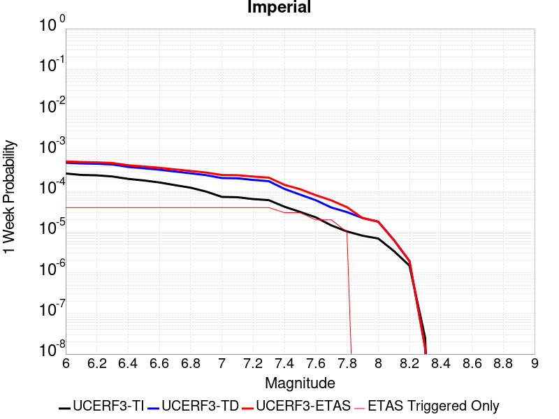 |  | 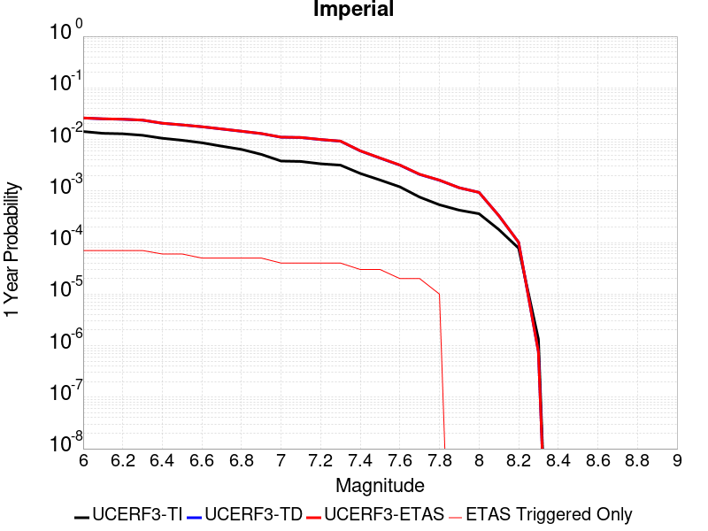 |  |

| Magnitude | 1 wk TI Prob | 1 wk TD Prob | 1 wk ETAS Prob | 1 wk ETAS/TD Gain | 1 wk ETAS Triggered Only | 1 mo TI Prob | 1 mo TD Prob | 1 mo ETAS Prob | 1 mo ETAS/TD Gain | 1 mo ETAS Triggered Only | 1 yr TI Prob | 1 yr TD Prob | 1 yr ETAS Prob | 1 yr ETAS/TD Gain | 1 yr ETAS Triggered Only | 10 yr TI Prob | 10 yr TD Prob | 10 yr ETAS Prob | 10 yr ETAS/TD Gain | 10 yr ETAS Triggered Only |
|-----|-----|-----|-----|-----|-----|-----|-----|-----|-----|-----|-----|-----|-----|-----|-----|-----|-----|-----|-----|-----|
| 6.0 | 2.7496446E-4 | 5.0552754E-4 | 5.455073E-4 | 1.0790852 | 4.0E-5 | 0.0011778869 | 0.002164787 | 0.0022047004 | 1.0184376 | 4.0E-5 | 0.0142467655 | 0.026038699 | 0.026106875 | 1.0026183 | 7.0E-5 | 0.13367249 | 0.2280438 | 0.22814414 | 1.0004401 | 1.3E-4 |
| 6.1 | 2.5356023E-4 | 4.8656776E-4 | 5.265483E-4 | 1.0821685 | 4.0E-5 | 0.001086234 | 0.0020836622 | 0.002123579 | 1.0191569 | 4.0E-5 | 0.013144928 | 0.025071215 | 0.02513946 | 1.002722 | 7.0E-5 | 0.123940155 | 0.21947981 | 0.21958128 | 1.0004623 | 1.3E-4 |
| 6.2 | 2.4820742E-4 | 4.7752203E-4 | 5.175029E-4 | 1.0837258 | 4.0E-5 | 0.0010633124 | 0.0020449557 | 0.0020848738 | 1.0195203 | 4.0E-5 | 0.01286919 | 0.024611235 | 0.024679512 | 1.0027742 | 7.0E-5 | 0.12148927 | 0.21598552 | 0.21608745 | 1.000472 | 1.3E-4 |
| 6.3 | 2.3205351E-4 | 4.5890483E-4 | 4.9888645E-4 | 1.087124 | 4.0E-5 | 9.94136E-4 | 0.0019652895 | 0.0020052108 | 1.0203133 | 4.0E-5 | 0.012036599 | 0.02366133 | 0.023729675 | 1.0028884 | 7.0E-5 | 0.11405133 | 0.20793462 | 0.20803759 | 1.0004952 | 1.3E-4 |
| 6.4 | 2.0304754E-4 | 3.987652E-4 | 4.3874924E-4 | 1.1002697 | 4.0E-5 | 8.6991355E-4 | 0.0017078889 | 0.0017478206 | 1.0233808 | 4.0E-5 | 0.010539869 | 0.020595672 | 0.020654436 | 1.0028533 | 6.0E-5 | 0.100537635 | 0.1850669 | 0.18516469 | 1.0005285 | 1.2E-4 |
| 6.5 | 1.854992E-4 | 3.6988858E-4 | 4.0987378E-4 | 1.1081007 | 4.0E-5 | 7.9475436E-4 | 0.0015842861 | 0.0016242227 | 1.025208 | 4.0E-5 | 0.009633281 | 0.01911948 | 0.019178335 | 1.0030781 | 6.0E-5 | 0.0922623 | 0.173298 | 0.17339721 | 1.0005724 | 1.2E-4 |
| 6.6 | 1.6586106E-4 | 3.403506E-4 | 3.80337E-4 | 1.1174859 | 4.0E-5 | 7.106394E-4 | 0.0014578402 | 0.001497782 | 1.0273979 | 4.0E-5 | 0.008617763 | 0.01760642 | 0.01765554 | 1.0027899 | 5.0E-5 | 0.08291132 | 0.16077545 | 0.16086777 | 1.0005742 | 1.1E-4 |
| 6.7 | 1.4224656E-4 | 3.076692E-4 | 3.4765687E-4 | 1.1299697 | 4.0E-5 | 6.094856E-4 | 0.001317924 | 0.0013578713 | 1.0303108 | 4.0E-5 | 0.0073952693 | 0.015929576 | 0.01597878 | 1.0030888 | 5.0E-5 | 0.07153955 | 0.14648417 | 0.14657804 | 1.000641 | 1.1E-4 |
| 6.8 | 1.2317259E-4 | 2.779122E-4 | 3.1790108E-4 | 1.1438904 | 4.0E-5 | 5.2777573E-4 | 0.0011905148 | 0.0012304671 | 1.033559 | 4.0E-5 | 0.0064067547 | 0.0143995695 | 0.0144488495 | 1.0034224 | 5.0E-5 | 0.06225166 | 0.13293684 | 0.1330322 | 1.0007174 | 1.1E-4 |
| 6.9 | 9.859898E-5 | 2.5014306E-4 | 2.9013306E-4 | 1.1598685 | 4.0E-5 | 4.2249862E-4 | 0.0010716055 | 0.0011115626 | 1.0372871 | 4.0E-5 | 0.0051317946 | 0.012969712 | 0.0130190635 | 1.0038052 | 5.0E-5 | 0.05014893 | 0.11940631 | 0.11950318 | 1.0008112 | 1.1E-4 |
| 7.0 | 7.3191884E-5 | 2.1266776E-4 | 2.5265926E-4 | 1.1880468 | 4.0E-5 | 3.136418E-4 | 9.1111806E-4 | 9.5108163E-4 | 1.0438621 | 4.0E-5 | 0.003811904 | 0.011037128 | 0.011076686 | 1.0035841 | 4.0E-5 | 0.037471764 | 0.10206493 | 0.10214574 | 1.0007918 | 9.0E-5 |
| 7.1 | 7.1760296E-5 | 2.0968143E-4 | 2.4967303E-4 | 1.1907256 | 4.0E-5 | 3.0750787E-4 | 8.983284E-4 | 9.382924E-4 | 1.0444871 | 4.0E-5 | 0.003737482 | 0.010882978 | 0.010922543 | 1.0036354 | 4.0E-5 | 0.03675245 | 0.10070146 | 0.100782394 | 1.0008037 | 9.0E-5 |
| 7.2 | 6.46614E-5 | 1.9136685E-4 | 2.3135921E-4 | 1.2089826 | 4.0E-5 | 2.7709085E-4 | 8.1988896E-4 | 8.5985614E-4 | 1.0487471 | 4.0E-5 | 0.0033683628 | 0.0099370815 | 0.009976684 | 1.0039853 | 4.0E-5 | 0.033177625 | 0.09250898 | 0.09259065 | 1.0008829 | 9.0E-5 |
| 7.3 | 6.088115E-5 | 1.78084E-4 | 2.1807686E-4 | 1.2245731 | 4.0E-5 | 2.6089314E-4 | 7.6299673E-4 | 8.029662E-4 | 1.0523849 | 4.0E-5 | 0.0031717476 | 0.009250494 | 0.009290123 | 1.0042841 | 4.0E-5 | 0.031268585 | 0.08655989 | 0.0866421 | 1.0009497 | 9.0E-5 |
| 7.4 | 4.199346E-5 | 1.1510366E-4 | 1.4510022E-4 | 1.2606046 | 3.0E-5 | 1.7995955E-4 | 4.9320905E-4 | 5.2319426E-4 | 1.0607961 | 3.0E-5 | 0.0021888057 | 0.0059884563 | 0.006018277 | 1.0049796 | 3.0E-5 | 0.02167372 | 0.057439793 | 0.057505775 | 1.0011487 | 7.0E-5 |
| 7.5 | 3.130448E-5 | 8.33328E-5 | 1.133303E-4 | 1.3599724 | 3.0E-5 | 1.3415517E-4 | 3.57092E-4 | 3.870813E-4 | 1.083982 | 3.0E-5 | 0.0016321153 | 0.004338988 | 0.004368858 | 1.0068841 | 3.0E-5 | 0.016201803 | 0.04213201 | 0.0421799 | 1.0011368 | 5.0E-5 |
| 7.6 | 2.3074248E-5 | 6.0844646E-5 | 8.0843434E-5 | 1.328686 | 2.0E-5 | 9.888588E-5 | 2.6073685E-4 | 2.8073162E-4 | 1.0766857 | 2.0E-5 | 0.0012032706 | 0.0031698733 | 0.0031898099 | 1.0062894 | 2.0E-5 | 0.011967761 | 0.031026395 | 0.031065153 | 1.0012492 | 4.0E-5 |
| 7.7 | 1.45864815E-5 | 4.0124698E-5 | 6.0123897E-5 | 1.4984261 | 2.0E-5 | 6.2511994E-5 | 1.7195169E-4 | 1.9194825E-4 | 1.1162918 | 2.0E-5 | 7.608177E-4 | 0.0020915072 | 0.0021114652 | 1.0095425 | 2.0E-5 | 0.007582182 | 0.020627763 | 0.020666938 | 1.0018991 | 4.0E-5 |
| 7.8 | 1.0352979E-5 | 3.0960902E-5 | 4.0960593E-5 | 1.322978 | 1.0E-5 | 4.4369157E-5 | 1.3268284E-4 | 1.4268151E-4 | 1.0753577 | 1.0E-5 | 5.400606E-4 | 0.0016142189 | 0.0016242028 | 1.0061849 | 1.0E-5 | 0.0053875 | 0.016016833 | 0.016046353 | 1.001843 | 3.0E-5 |
| 7.9 | 8.137906E-6 | 2.2149103E-5 | 2.2149103E-5 | 1.0 | 0.0 | 3.4876273E-5 | 9.492128E-5 | 9.492128E-5 | 1.0 | 0.0 | 4.2453592E-4 | 0.0011550548 | 0.0011550548 | 1.0 | 0.0 | 0.004237258 | 0.011617903 | 0.011627787 | 1.0008508 | 1.0E-5 |
| 8.0 | 6.93792E-6 | 1.8008766E-5 | 1.8008766E-5 | 1.0 | 0.0 | 2.9733603E-5 | 7.717814E-5 | 7.717814E-5 | 1.0 | 0.0 | 3.6194647E-4 | 9.3923963E-4 | 9.3923963E-4 | 1.0 | 0.0 | 0.0036135751 | 0.00950155 | 0.009511456 | 1.0010425 | 1.0E-5 |
| 8.1 | 3.4286315E-6 | 6.379872E-6 | 6.379872E-6 | 1.0 | 0.0 | 1.4694053E-5 | 2.7342023E-5 | 2.7342023E-5 | 1.0 | 0.0 | 1.7888541E-4 | 3.328384E-4 | 3.328384E-4 | 1.0 | 0.0 | 0.0017874148 | 0.003486031 | 0.003486031 | 1.0 | 0.0 |
| 8.2 | 1.4906886E-6 | 1.9366646E-6 | 1.9366646E-6 | 1.0 | 0.0 | 6.3886496E-6 | 8.299965E-6 | 8.299965E-6 | 1.0 | 0.0 | 7.7779034E-5 | 1.0104742E-4 | 1.0104742E-4 | 1.0 | 0.0 | 7.775182E-4 | 0.0011075331 | 0.0011075331 | 1.0 | 0.0 |
| 8.3 | 2.5758007E-8 | 1.4500102E-8 | 1.4500102E-8 | 1.0 | 0.0 | 1.10391454E-7 | 6.214329E-8 | 6.214329E-8 | 1.0 | 0.0 | 1.3440151E-6 | 7.565946E-7 | 7.565946E-7 | 1.0 | 0.0 | 1.344007E-5 | 7.887763E-6 | 7.887763E-6 | 1.0 | 0.0 |

## San Jacinto (Stepovers Combined)
*[(top)](#table-of-contents)*

| 1 Week | 1 Month | 1 Year | 10 Year |
|-----|-----|-----|-----|
|  | 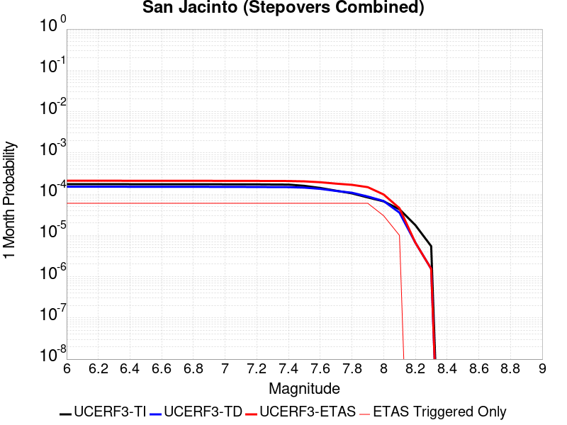 | 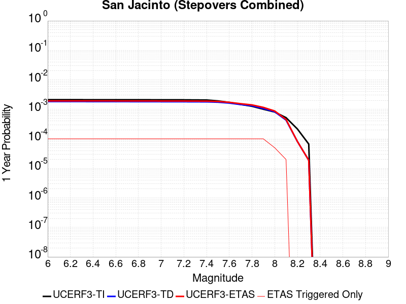 |  |

| Magnitude | 1 wk TI Prob | 1 wk TD Prob | 1 wk ETAS Prob | 1 wk ETAS/TD Gain | 1 wk ETAS Triggered Only | 1 mo TI Prob | 1 mo TD Prob | 1 mo ETAS Prob | 1 mo ETAS/TD Gain | 1 mo ETAS Triggered Only | 1 yr TI Prob | 1 yr TD Prob | 1 yr ETAS Prob | 1 yr ETAS/TD Gain | 1 yr ETAS Triggered Only | 10 yr TI Prob | 10 yr TD Prob | 10 yr ETAS Prob | 10 yr ETAS/TD Gain | 10 yr ETAS Triggered Only |
|-----|-----|-----|-----|-----|-----|-----|-----|-----|-----|-----|-----|-----|-----|-----|-----|-----|-----|-----|-----|-----|
| 6.0 | 4.0667746E-5 | 3.5272755E-5 | 8.527099E-5 | 2.4174747 | 5.0E-5 | 1.742787E-4 | 1.5116022E-4 | 2.1115114E-4 | 1.3968699 | 6.0E-5 | 0.0021197782 | 0.0018388226 | 0.0019386387 | 1.0542827 | 1.0E-4 | 0.020996714 | 0.018986892 | 0.019114424 | 1.0067168 | 1.3E-4 |
| 6.1 | 4.0667746E-5 | 3.5272755E-5 | 8.527099E-5 | 2.4174747 | 5.0E-5 | 1.742787E-4 | 1.5116022E-4 | 2.1115114E-4 | 1.3968699 | 6.0E-5 | 0.0021197782 | 0.0018388226 | 0.0019386387 | 1.0542827 | 1.0E-4 | 0.020996714 | 0.018986892 | 0.019114424 | 1.0067168 | 1.3E-4 |
| 6.2 | 4.0667746E-5 | 3.5272755E-5 | 8.527099E-5 | 2.4174747 | 5.0E-5 | 1.742787E-4 | 1.5116022E-4 | 2.1115114E-4 | 1.3968699 | 6.0E-5 | 0.0021197782 | 0.0018388226 | 0.0019386387 | 1.0542827 | 1.0E-4 | 0.020996714 | 0.018986892 | 0.019114424 | 1.0067168 | 1.3E-4 |
| 6.3 | 4.0667746E-5 | 3.5272755E-5 | 8.527099E-5 | 2.4174747 | 5.0E-5 | 1.742787E-4 | 1.5116022E-4 | 2.1115114E-4 | 1.3968699 | 6.0E-5 | 0.0021197782 | 0.0018388226 | 0.0019386387 | 1.0542827 | 1.0E-4 | 0.020996714 | 0.018986892 | 0.019114424 | 1.0067168 | 1.3E-4 |
| 6.4 | 4.0577226E-5 | 3.5144654E-5 | 8.51429E-5 | 2.4226415 | 5.0E-5 | 1.738908E-4 | 1.5061127E-4 | 2.1060223E-4 | 1.3983165 | 6.0E-5 | 0.0021150648 | 0.0018321523 | 0.0019319691 | 1.0544807 | 1.0E-4 | 0.020950472 | 0.018921461 | 0.019049 | 1.0067405 | 1.3E-4 |
| 6.5 | 4.0577226E-5 | 3.5144654E-5 | 8.51429E-5 | 2.4226415 | 5.0E-5 | 1.738908E-4 | 1.5061127E-4 | 2.1060223E-4 | 1.3983165 | 6.0E-5 | 0.0021150648 | 0.0018321523 | 0.0019319691 | 1.0544807 | 1.0E-4 | 0.020950472 | 0.018921461 | 0.019049 | 1.0067405 | 1.3E-4 |
| 6.6 | 4.053861E-5 | 3.509E-5 | 8.508825E-5 | 2.4248574 | 5.0E-5 | 1.7372532E-4 | 1.5037706E-4 | 2.1036805E-4 | 1.398937 | 6.0E-5 | 0.0021130538 | 0.0018293057 | 0.0019291227 | 1.0545655 | 1.0E-4 | 0.020930743 | 0.018893538 | 0.019021083 | 1.0067507 | 1.3E-4 |
| 6.7 | 4.0516545E-5 | 3.5059067E-5 | 8.505731E-5 | 2.4261146 | 5.0E-5 | 1.7363077E-4 | 1.5024451E-4 | 2.102355E-4 | 1.399289 | 6.0E-5 | 0.002111905 | 0.001827695 | 0.0019275122 | 1.0546137 | 1.0E-4 | 0.020919468 | 0.018877735 | 0.019005282 | 1.0067564 | 1.3E-4 |
| 6.8 | 4.049434E-5 | 3.5030633E-5 | 8.502888E-5 | 2.4272723 | 5.0E-5 | 1.7353562E-4 | 1.5012265E-4 | 2.1011365E-4 | 1.3996131 | 6.0E-5 | 0.0021107488 | 0.0018262138 | 0.0019260312 | 1.054658 | 1.0E-4 | 0.020908125 | 0.018863149 | 0.018990695 | 1.0067618 | 1.3E-4 |
| 6.9 | 4.046386E-5 | 3.499319E-5 | 8.499144E-5 | 2.4287994 | 5.0E-5 | 1.73405E-4 | 1.4996222E-4 | 2.0995321E-4 | 1.4000407 | 6.0E-5 | 0.0021091616 | 0.0018242638 | 0.0019240814 | 1.0547166 | 1.0E-4 | 0.020892553 | 0.01884392 | 0.018971471 | 1.0067688 | 1.3E-4 |
| 7.0 | 4.036382E-5 | 3.487376E-5 | 8.4872016E-5 | 2.433693 | 5.0E-5 | 1.7297632E-4 | 1.4945042E-4 | 2.0944145E-4 | 1.4014109 | 6.0E-5 | 0.0021039525 | 0.0018180435 | 0.0019178618 | 1.0549042 | 1.0E-4 | 0.02084144 | 0.018782536 | 0.018910093 | 1.0067914 | 1.3E-4 |
| 7.1 | 4.0343282E-5 | 3.4852223E-5 | 8.485048E-5 | 2.434579 | 5.0E-5 | 1.7288832E-4 | 1.4935812E-4 | 2.0934916E-4 | 1.401659 | 6.0E-5 | 0.002102883 | 0.0018169218 | 0.0019167401 | 1.0549382 | 1.0E-4 | 0.020830948 | 0.018771412 | 0.018898973 | 1.0067954 | 1.3E-4 |
| 7.2 | 4.0257353E-5 | 3.4756722E-5 | 8.475498E-5 | 2.4385207 | 5.0E-5 | 1.725201E-4 | 1.489489E-4 | 2.0893995E-4 | 1.4027628 | 6.0E-5 | 0.0020984085 | 0.0018119477 | 0.0019117665 | 1.0550892 | 1.0E-4 | 0.020787042 | 0.018722152 | 0.018849717 | 1.0068136 | 1.3E-4 |
| 7.3 | 3.9940667E-5 | 3.4584376E-5 | 8.458265E-5 | 2.4456894 | 5.0E-5 | 1.7116306E-4 | 1.4821035E-4 | 2.0820147E-4 | 1.40477 | 6.0E-5 | 0.0020819185 | 0.0018029709 | 0.0019027906 | 1.055364 | 1.0E-4 | 0.020625217 | 0.018630784 | 0.018758362 | 1.0068477 | 1.3E-4 |
| 7.4 | 3.9721202E-5 | 3.4469766E-5 | 8.446804E-5 | 2.4504964 | 5.0E-5 | 1.7022261E-4 | 1.4771923E-4 | 2.0771036E-4 | 1.406116 | 6.0E-5 | 0.0020704903 | 0.0017970012 | 0.0018968215 | 1.0555483 | 1.0E-4 | 0.020513052 | 0.018569905 | 0.018697493 | 1.0068706 | 1.3E-4 |
| 7.5 | 3.7036873E-5 | 3.3537188E-5 | 8.353551E-5 | 2.4908323 | 5.0E-5 | 1.5871979E-4 | 1.437229E-4 | 2.0371427E-4 | 1.41741 | 6.0E-5 | 0.0019307006 | 0.0017484248 | 0.0018482499 | 1.0570943 | 1.0E-4 | 0.019140124 | 0.018071463 | 0.018199114 | 1.0070636 | 1.3E-4 |
| 7.6 | 3.2940967E-5 | 3.1317984E-5 | 8.131642E-5 | 2.5964768 | 5.0E-5 | 1.4116794E-4 | 1.3421304E-4 | 1.94205E-4 | 1.4469904 | 6.0E-5 | 0.0017173645 | 0.0016328214 | 0.001732658 | 1.0611436 | 1.0E-4 | 0.01704153 | 0.016904354 | 0.017032156 | 1.0075604 | 1.3E-4 |
| 7.7 | 2.8236149E-5 | 2.7883889E-5 | 7.78825E-5 | 2.7931 | 5.0E-5 | 1.2100645E-4 | 1.19496915E-4 | 1.7948974E-4 | 1.502045 | 6.0E-5 | 0.0014722579 | 0.001453905 | 0.0015537597 | 1.0686803 | 1.0E-4 | 0.014625421 | 0.015115095 | 0.015243131 | 1.0084707 | 1.3E-4 |
| 7.8 | 2.4329287E-5 | 2.5207537E-5 | 7.520628E-5 | 2.9834838 | 5.0E-5 | 1.042642E-4 | 1.0802783E-4 | 1.6802135E-4 | 1.5553524 | 6.0E-5 | 0.0012686774 | 0.0013144462 | 0.0014143147 | 1.0759777 | 1.0E-4 | 0.012614589 | 0.013712396 | 0.013840613 | 1.0093504 | 1.3E-4 |
| 7.9 | 1.9370926E-5 | 2.0421452E-5 | 7.042043E-5 | 3.4483557 | 5.0E-5 | 8.301561E-5 | 8.7517576E-5 | 1.4751233E-4 | 1.6855166 | 6.0E-5 | 0.0010102465 | 0.0010650064 | 0.0011648999 | 1.0937961 | 1.0E-4 | 0.0100566605 | 0.011199483 | 0.011328027 | 1.0114777 | 1.3E-4 |
| 8.0 | 1.5583017E-5 | 1.588647E-5 | 4.588599E-5 | 2.8883696 | 3.0E-5 | 6.6782646E-5 | 6.808309E-5 | 9.808105E-5 | 1.440608 | 3.0E-5 | 8.127754E-4 | 8.285971E-4 | 8.7855564E-4 | 1.060293 | 5.0E-5 | 0.008098091 | 0.008781809 | 0.008861107 | 1.0090297 | 8.0E-5 |
| 8.1 | 1.0024873E-5 | 8.292404E-6 | 1.8292321E-5 | 2.2059128 | 1.0E-5 | 4.2963035E-5 | 3.5538393E-5 | 4.553804E-5 | 1.2813758 | 1.0E-5 | 5.229494E-4 | 4.3259456E-4 | 4.525859E-4 | 1.0462127 | 2.0E-5 | 0.0052172043 | 0.0046534105 | 0.004683271 | 1.0064169 | 3.0E-5 |
| 8.2 | 4.142796E-6 | 1.5610041E-6 | 1.5610041E-6 | 1.0 | 0.0 | 1.775472E-5 | 6.69E-6 | 6.69E-6 | 1.0 | 0.0 | 2.1614227E-4 | 8.144774E-5 | 8.144774E-5 | 1.0 | 0.0 | 0.0021593217 | 9.454649E-4 | 9.454649E-4 | 1.0 | 0.0 |
| 8.3 | 1.2750878E-6 | 3.612133E-7 | 3.612133E-7 | 1.0 | 0.0 | 5.4646503E-6 | 1.548056E-6 | 1.548056E-6 | 1.0 | 0.0 | 6.653009E-5 | 1.8847424E-5 | 1.8847424E-5 | 1.0 | 0.0 | 6.6510175E-4 | 2.2734253E-4 | 2.2734253E-4 | 1.0 | 0.0 |

## Coronado Bank alt1
*[(top)](#table-of-contents)*

| 1 Week | 1 Month | 1 Year | 10 Year |
|-----|-----|-----|-----|
| 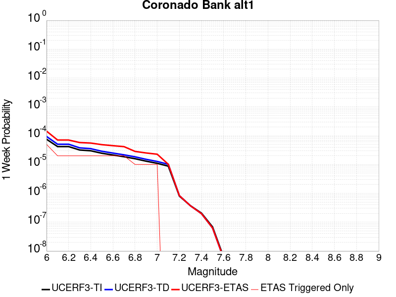 |  | 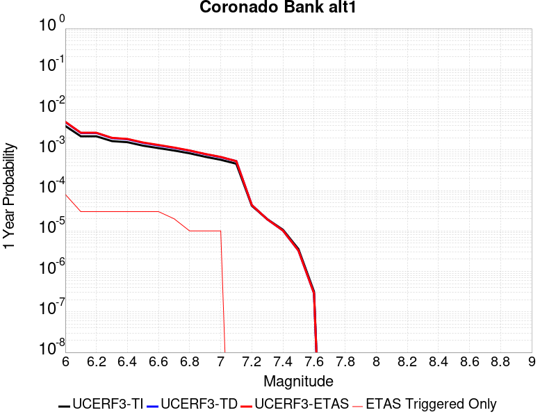 |  |

| Magnitude | 1 wk TI Prob | 1 wk TD Prob | 1 wk ETAS Prob | 1 wk ETAS/TD Gain | 1 wk ETAS Triggered Only | 1 mo TI Prob | 1 mo TD Prob | 1 mo ETAS Prob | 1 mo ETAS/TD Gain | 1 mo ETAS Triggered Only | 1 yr TI Prob | 1 yr TD Prob | 1 yr ETAS Prob | 1 yr ETAS/TD Gain | 1 yr ETAS Triggered Only | 10 yr TI Prob | 10 yr TD Prob | 10 yr ETAS Prob | 10 yr ETAS/TD Gain | 10 yr ETAS Triggered Only |
|-----|-----|-----|-----|-----|-----|-----|-----|-----|-----|-----|-----|-----|-----|-----|-----|-----|-----|-----|-----|-----|
| 6.0 | 7.533492E-5 | 9.394913E-5 | 1.4394443E-4 | 1.5321529 | 5.0E-5 | 3.22824E-4 | 4.0258127E-4 | 4.7255307E-4 | 1.173808 | 7.0E-5 | 0.0039233007 | 0.0048909658 | 0.0049705743 | 1.0162767 | 8.0E-5 | 0.03854755 | 0.04790356 | 0.048008293 | 1.0021863 | 1.1E-4 |
| 6.1 | 4.1807285E-5 | 5.049283E-5 | 7.049182E-5 | 1.3960758 | 2.0E-5 | 1.7916178E-4 | 2.1638049E-4 | 2.3637616E-4 | 1.0924097 | 2.0E-5 | 0.0021791123 | 0.0026313474 | 0.0026612685 | 1.011371 | 3.0E-5 | 0.021578677 | 0.026011046 | 0.026040267 | 1.0011233 | 3.0E-5 |
| 6.2 | 4.1807285E-5 | 5.049283E-5 | 7.049182E-5 | 1.3960758 | 2.0E-5 | 1.7916178E-4 | 2.1638049E-4 | 2.3637616E-4 | 1.0924097 | 2.0E-5 | 0.0021791123 | 0.0026313474 | 0.0026612685 | 1.011371 | 3.0E-5 | 0.021578677 | 0.026011046 | 0.026040267 | 1.0011233 | 3.0E-5 |
| 6.3 | 3.1793104E-5 | 3.7711117E-5 | 5.771036E-5 | 1.5303276 | 2.0E-5 | 1.3624904E-4 | 1.6160926E-4 | 1.8160604E-4 | 1.1237353 | 2.0E-5 | 0.0016575698 | 0.001965848 | 0.0019957891 | 1.0152305 | 3.0E-5 | 0.016452603 | 0.019488465 | 0.01951788 | 1.0015094 | 3.0E-5 |
| 6.4 | 2.9878007E-5 | 3.5335794E-5 | 5.5335087E-5 | 1.5659783 | 2.0E-5 | 1.2804232E-4 | 1.5143053E-4 | 1.714275E-4 | 1.1320537 | 2.0E-5 | 0.0015578003 | 0.0018421387 | 0.0018720834 | 1.0162554 | 3.0E-5 | 0.015469253 | 0.01827244 | 0.018301893 | 1.0016118 | 3.0E-5 |
| 6.5 | 2.4512565E-5 | 2.8764043E-5 | 4.8763468E-5 | 1.6952926 | 2.0E-5 | 1.0504962E-4 | 1.2326881E-4 | 1.4326634E-4 | 1.162227 | 2.0E-5 | 0.0012782287 | 0.0014997921 | 0.0015297472 | 1.0199728 | 3.0E-5 | 0.012709012 | 0.014899683 | 0.014929236 | 1.0019835 | 3.0E-5 |
| 6.6 | 2.1317413E-5 | 2.490667E-5 | 4.490617E-5 | 1.8029778 | 2.0E-5 | 9.135714E-5 | 1.0673863E-4 | 1.267365E-4 | 1.1873536 | 2.0E-5 | 0.0011117056 | 0.0012987906 | 0.0013287516 | 1.0230684 | 3.0E-5 | 0.011061605 | 0.012914404 | 0.012944018 | 1.002293 | 3.0E-5 |
| 6.7 | 1.8585655E-5 | 2.163488E-5 | 4.163445E-5 | 1.9244131 | 2.0E-5 | 7.9650374E-5 | 9.271773E-5 | 1.1271588E-4 | 1.2156885 | 2.0E-5 | 9.6931186E-4 | 0.0011282742 | 0.0011482517 | 1.0177062 | 2.0E-5 | 0.0096509475 | 0.011227623 | 0.011247397 | 1.0017613 | 2.0E-5 |
| 6.8 | 1.5862879E-5 | 1.8419474E-5 | 2.841929E-5 | 1.5428936 | 1.0E-5 | 6.798199E-5 | 7.893833E-5 | 8.893754E-5 | 1.1266712 | 1.0E-5 | 8.273665E-4 | 9.6066965E-4 | 9.7066E-4 | 1.0103995 | 1.0E-5 | 0.008242928 | 0.00956715 | 0.0095770545 | 1.0010352 | 1.0E-5 |
| 6.9 | 1.3021509E-5 | 1.5095265E-5 | 2.5095114E-5 | 1.6624494 | 1.0E-5 | 5.5805274E-5 | 6.469249E-5 | 7.4691845E-5 | 1.1545675 | 1.0E-5 | 6.792174E-4 | 7.8736455E-4 | 7.9735665E-4 | 1.0126905 | 1.0E-5 | 0.006771452 | 0.007847573 | 0.007857494 | 1.0012643 | 1.0E-5 |
| 7.0 | 1.0974371E-5 | 1.2720104E-5 | 2.2719976E-5 | 1.7861471 | 1.0E-5 | 4.7032172E-5 | 5.451369E-5 | 6.4513144E-5 | 1.1834302 | 1.0E-5 | 5.7246623E-4 | 6.6351966E-4 | 6.73513E-4 | 1.0150611 | 1.0E-5 | 0.0057099373 | 0.006617135 | 0.0066270684 | 1.0015012 | 1.0E-5 |
| 7.1 | 8.766221E-6 | 1.01638325E-5 | 1.01638325E-5 | 1.0 | 0.0 | 3.7568978E-5 | 4.355865E-5 | 4.355865E-5 | 1.0 | 0.0 | 4.573063E-4 | 5.3021475E-4 | 5.3021475E-4 | 1.0 | 0.0 | 0.0045636636 | 0.0052911965 | 0.0052911965 | 1.0 | 0.0 |
| 7.2 | 8.026024E-7 | 8.331765E-7 | 8.331765E-7 | 1.0 | 0.0 | 3.43972E-6 | 3.5707515E-6 | 3.5707515E-6 | 1.0 | 0.0 | 4.1877785E-5 | 4.3473043E-5 | 4.3473043E-5 | 1.0 | 0.0 | 4.1869894E-4 | 4.3464647E-4 | 4.3464647E-4 | 1.0 | 0.0 |
| 7.3 | 3.7293114E-7 | 3.7000953E-7 | 3.7000953E-7 | 1.0 | 0.0 | 1.5982754E-6 | 1.5857541E-6 | 1.5857541E-6 | 1.0 | 0.0 | 1.9458828E-5 | 1.9306386E-5 | 1.9306386E-5 | 1.0 | 0.0 | 1.9457124E-4 | 1.9304715E-4 | 1.9304715E-4 | 1.0 | 0.0 |
| 7.4 | 2.0557036E-7 | 1.9674363E-7 | 1.9674363E-7 | 1.0 | 0.0 | 8.810155E-7 | 8.431867E-7 | 8.431867E-7 | 1.0 | 0.0 | 1.0726311E-5 | 1.026575E-5 | 1.026575E-5 | 1.0 | 0.0 | 1.0725793E-4 | 1.0265279E-4 | 1.0265279E-4 | 1.0 | 0.0 |
| 7.5 | 6.845446E-8 | 6.279369E-8 | 6.279369E-8 | 1.0 | 0.0 | 2.9337625E-7 | 2.691158E-7 | 2.691158E-7 | 1.0 | 0.0 | 3.5718497E-6 | 3.2764797E-6 | 3.2764797E-6 | 1.0 | 0.0 | 3.5717923E-5 | 3.2764325E-5 | 3.2764325E-5 | 1.0 | 0.0 |
| 7.6 | 6.0975145E-9 | 5.53185E-9 | 5.53185E-9 | 1.0 | 0.0 | 2.6132206E-8 | 2.370793E-8 | 2.370793E-8 | 1.0 | 0.0 | 3.1815955E-7 | 2.88644E-7 | 2.88644E-7 | 1.0 | 0.0 | 3.181591E-6 | 2.8864374E-6 | 2.8864374E-6 | 1.0 | 0.0 |

## White Mountains
*[(top)](#table-of-contents)*

| 1 Week | 1 Month | 1 Year | 10 Year |
|-----|-----|-----|-----|
|  |  | 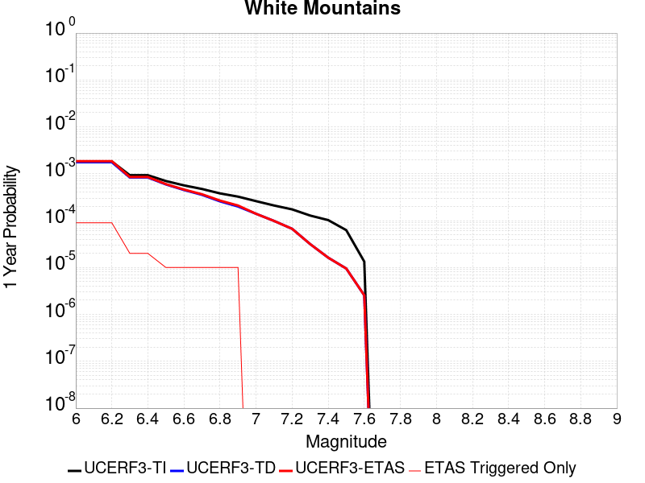 |  |

| Magnitude | 1 wk TI Prob | 1 wk TD Prob | 1 wk ETAS Prob | 1 wk ETAS/TD Gain | 1 wk ETAS Triggered Only | 1 mo TI Prob | 1 mo TD Prob | 1 mo ETAS Prob | 1 mo ETAS/TD Gain | 1 mo ETAS Triggered Only | 1 yr TI Prob | 1 yr TD Prob | 1 yr ETAS Prob | 1 yr ETAS/TD Gain | 1 yr ETAS Triggered Only | 10 yr TI Prob | 10 yr TD Prob | 10 yr ETAS Prob | 10 yr ETAS/TD Gain | 10 yr ETAS Triggered Only |
|-----|-----|-----|-----|-----|-----|-----|-----|-----|-----|-----|-----|-----|-----|-----|-----|-----|-----|-----|-----|-----|
| 6.0 | 3.503579E-5 | 3.378405E-5 | 8.378236E-5 | 2.4799383 | 5.0E-5 | 1.5014476E-4 | 1.4478143E-4 | 2.147713E-4 | 1.4834174 | 7.0E-5 | 0.0018264796 | 0.0017614096 | 0.001851251 | 1.0510055 | 9.0E-5 | 0.018115403 | 0.017486818 | 0.01760472 | 1.0067424 | 1.2E-4 |
| 6.1 | 3.503579E-5 | 3.378405E-5 | 8.378236E-5 | 2.4799383 | 5.0E-5 | 1.5014476E-4 | 1.4478143E-4 | 2.147713E-4 | 1.4834174 | 7.0E-5 | 0.0018264796 | 0.0017614096 | 0.001851251 | 1.0510055 | 9.0E-5 | 0.018115403 | 0.017486818 | 0.01760472 | 1.0067424 | 1.2E-4 |
| 6.2 | 3.503579E-5 | 3.378405E-5 | 8.378236E-5 | 2.4799383 | 5.0E-5 | 1.5014476E-4 | 1.4478143E-4 | 2.147713E-4 | 1.4834174 | 7.0E-5 | 0.0018264796 | 0.0017614096 | 0.001851251 | 1.0510055 | 9.0E-5 | 0.018115403 | 0.017486818 | 0.01760472 | 1.0067424 | 1.2E-4 |
| 6.3 | 1.7818425E-5 | 1.5916074E-5 | 1.5916074E-5 | 1.0 | 0.0 | 7.636245E-5 | 6.821004E-5 | 7.820936E-5 | 1.146596 | 1.0E-5 | 9.293162E-4 | 8.301551E-4 | 8.5013855E-4 | 1.0240719 | 2.0E-5 | 0.009254395 | 0.008271999 | 0.008291833 | 1.0023978 | 2.0E-5 |
| 6.4 | 1.7818425E-5 | 1.5916074E-5 | 1.5916074E-5 | 1.0 | 0.0 | 7.636245E-5 | 6.821004E-5 | 7.820936E-5 | 1.146596 | 1.0E-5 | 9.293162E-4 | 8.301551E-4 | 8.5013855E-4 | 1.0240719 | 2.0E-5 | 0.009254395 | 0.008271999 | 0.008291833 | 1.0023978 | 2.0E-5 |
| 6.5 | 1.3397557E-5 | 1.13362685E-5 | 1.13362685E-5 | 1.0 | 0.0 | 5.741684E-5 | 4.858314E-5 | 5.8582656E-5 | 1.2058227 | 1.0E-5 | 6.988258E-4 | 5.913462E-4 | 6.0134026E-4 | 1.0169005 | 1.0E-5 | 0.006966323 | 0.005898432 | 0.005908373 | 1.0016854 | 1.0E-5 |
| 6.6 | 1.0818695E-5 | 8.625366E-6 | 8.625366E-6 | 1.0 | 0.0 | 4.6365014E-5 | 3.6965357E-5 | 4.6964986E-5 | 1.2705135 | 1.0E-5 | 5.6434784E-4 | 4.4996463E-4 | 4.599601E-4 | 1.0222139 | 1.0E-5 | 0.005629168 | 0.004490972 | 0.004500927 | 1.0022167 | 1.0E-5 |
| 6.7 | 9.067908E-6 | 6.802442E-6 | 6.802442E-6 | 1.0 | 0.0 | 3.8861883E-5 | 2.9153016E-5 | 3.9152725E-5 | 1.3430077 | 1.0E-5 | 4.7304068E-4 | 3.5488335E-4 | 3.648798E-4 | 1.0281683 | 1.0E-5 | 0.00472035 | 0.0035434833 | 0.003553448 | 1.002812 | 1.0E-5 |
| 6.8 | 7.295947E-6 | 4.936391E-6 | 4.936391E-6 | 1.0 | 0.0 | 3.126797E-5 | 2.1155796E-5 | 3.1155585E-5 | 1.4726737 | 1.0E-5 | 3.8062103E-4 | 2.575425E-4 | 2.6753993E-4 | 1.0388186 | 1.0E-5 | 0.0037996976 | 0.0025725532 | 0.0025825277 | 1.0038772 | 1.0E-5 |
| 6.9 | 6.2243444E-6 | 3.832213E-6 | 3.832213E-6 | 1.0 | 0.0 | 2.6675489E-5 | 1.642367E-5 | 2.6423506E-5 | 1.6088673 | 1.0E-5 | 3.2472567E-4 | 1.9994036E-4 | 2.0993837E-4 | 1.050005 | 1.0E-5 | 0.0032425157 | 0.0019976576 | 0.0020076376 | 1.0049958 | 1.0E-5 |
| 7.0 | 4.9878413E-6 | 2.6795342E-6 | 2.6795342E-6 | 1.0 | 0.0 | 2.1376287E-5 | 1.14836685E-5 | 1.14836685E-5 | 1.0 | 0.0 | 2.602252E-4 | 1.3980496E-4 | 1.3980496E-4 | 1.0 | 0.0 | 0.002599207 | 0.0013971963 | 0.0013971963 | 1.0 | 0.0 |
| 7.1 | 4.0252844E-6 | 1.8857575E-6 | 1.8857575E-6 | 1.0 | 0.0 | 1.7251105E-5 | 8.081794E-6 | 8.081794E-6 | 1.0 | 0.0 | 2.1001195E-4 | 9.8391516E-5 | 9.8391516E-5 | 1.0 | 0.0 | 0.0020981359 | 9.834924E-4 | 9.834924E-4 | 1.0 | 0.0 |
| 7.2 | 3.3284066E-6 | 1.281964E-6 | 1.281964E-6 | 1.0 | 0.0 | 1.4264522E-5 | 5.494121E-6 | 5.494121E-6 | 1.0 | 0.0 | 1.736567E-4 | 6.688897E-5 | 6.688897E-5 | 1.0 | 0.0 | 0.0017352107 | 6.6869846E-4 | 6.6869846E-4 | 1.0 | 0.0 |
| 7.3 | 2.458226E-6 | 6.05722E-7 | 6.05722E-7 | 1.0 | 0.0 | 1.0535211E-5 | 2.5959491E-6 | 2.5959491E-6 | 1.0 | 0.0 | 1.2825865E-4 | 3.1605257E-5 | 3.1605257E-5 | 1.0 | 0.0 | 0.0012818464 | 3.160114E-4 | 3.160114E-4 | 1.0 | 0.0 |
| 7.4 | 1.965953E-6 | 3.1089303E-7 | 3.1089303E-7 | 1.0 | 0.0 | 8.425486E-6 | 1.332398E-6 | 1.332398E-6 | 1.0 | 0.0 | 1.0257547E-4 | 1.6221828E-5 | 1.6221828E-5 | 1.0 | 0.0 | 0.0010252813 | 1.6220656E-4 | 1.6220656E-4 | 1.0 | 0.0 |
| 7.5 | 1.2014192E-6 | 1.8244253E-7 | 1.8244253E-7 | 1.0 | 0.0 | 5.148929E-6 | 7.8189635E-7 | 7.8189635E-7 | 1.0 | 0.0 | 6.2686406E-5 | 9.519547E-6 | 9.519547E-6 | 1.0 | 0.0 | 6.266873E-4 | 9.519148E-5 | 9.519148E-5 | 1.0 | 0.0 |
| 7.6 | 2.5612175E-7 | 4.8946475E-8 | 4.8946475E-8 | 1.0 | 0.0 | 1.0976642E-6 | 2.0977059E-7 | 2.0977059E-7 | 1.0 | 0.0 | 1.3363979E-5 | 2.5539543E-6 | 2.5539543E-6 | 1.0 | 0.0 | 1.3363175E-4 | 2.5539286E-5 | 2.5539286E-5 | 1.0 | 0.0 |

## San Jacinto (Lytle Creek connector)
*[(top)](#table-of-contents)*

| 1 Week | 1 Month | 1 Year | 10 Year |
|-----|-----|-----|-----|
| 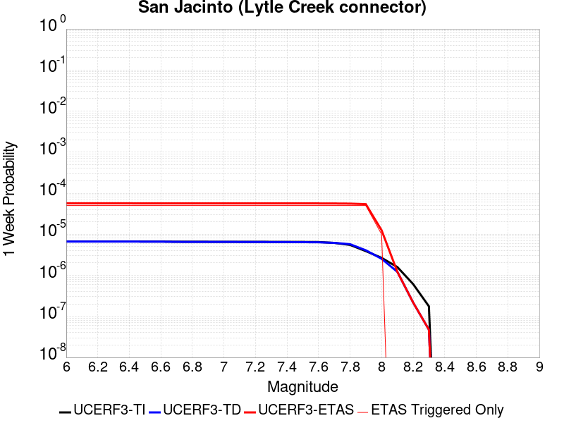 | 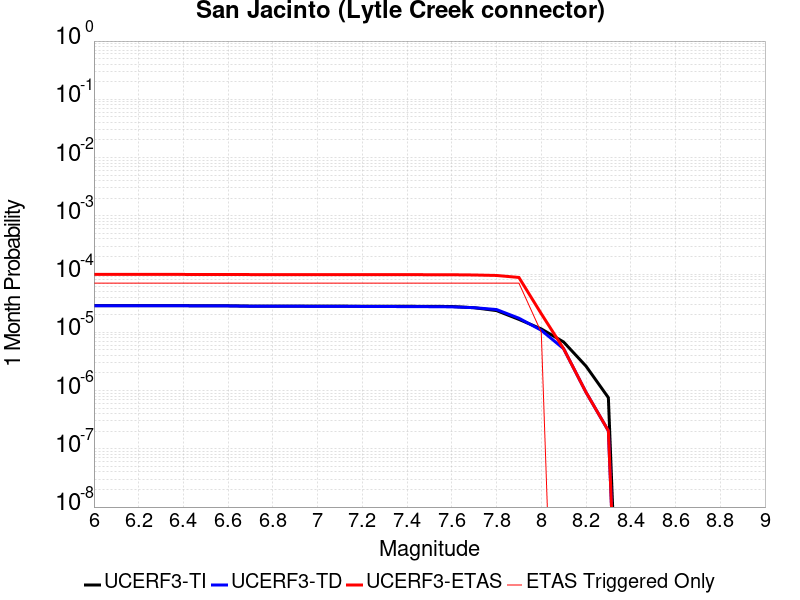 |  | 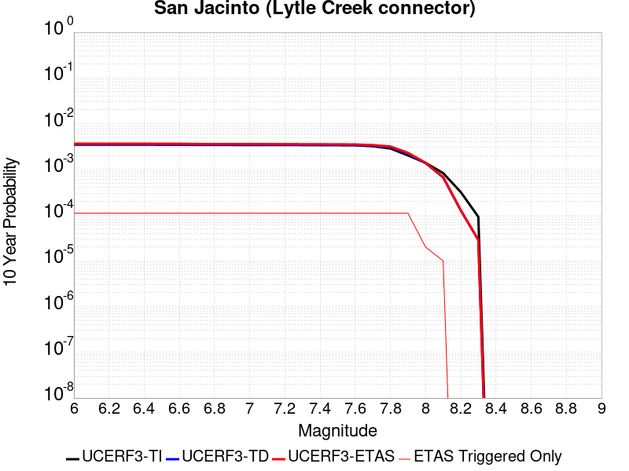 |

| Magnitude | 1 wk TI Prob | 1 wk TD Prob | 1 wk ETAS Prob | 1 wk ETAS/TD Gain | 1 wk ETAS Triggered Only | 1 mo TI Prob | 1 mo TD Prob | 1 mo ETAS Prob | 1 mo ETAS/TD Gain | 1 mo ETAS Triggered Only | 1 yr TI Prob | 1 yr TD Prob | 1 yr ETAS Prob | 1 yr ETAS/TD Gain | 1 yr ETAS Triggered Only | 10 yr TI Prob | 10 yr TD Prob | 10 yr ETAS Prob | 10 yr ETAS/TD Gain | 10 yr ETAS Triggered Only |
|-----|-----|-----|-----|-----|-----|-----|-----|-----|-----|-----|-----|-----|-----|-----|-----|-----|-----|-----|-----|-----|
| 6.0 | 6.693995E-6 | 6.660216E-6 | 5.6659883E-5 | 8.507214 | 5.0E-5 | 2.8688235E-5 | 2.854347E-5 | 9.854147E-5 | 3.4523296 | 7.0E-5 | 3.492233E-4 | 3.4746144E-4 | 4.474267E-4 | 1.2877017 | 1.0E-4 | 0.00348675 | 0.0035493854 | 0.0036589948 | 1.0308813 | 1.1E-4 |
| 6.1 | 6.693995E-6 | 6.660216E-6 | 5.6659883E-5 | 8.507214 | 5.0E-5 | 2.8688235E-5 | 2.854347E-5 | 9.854147E-5 | 3.4523296 | 7.0E-5 | 3.492233E-4 | 3.4746144E-4 | 4.474267E-4 | 1.2877017 | 1.0E-4 | 0.00348675 | 0.0035493854 | 0.0036589948 | 1.0308813 | 1.1E-4 |
| 6.2 | 6.693995E-6 | 6.660216E-6 | 5.6659883E-5 | 8.507214 | 5.0E-5 | 2.8688235E-5 | 2.854347E-5 | 9.854147E-5 | 3.4523296 | 7.0E-5 | 3.492233E-4 | 3.4746144E-4 | 4.474267E-4 | 1.2877017 | 1.0E-4 | 0.00348675 | 0.0035493854 | 0.0036589948 | 1.0308813 | 1.1E-4 |
| 6.3 | 6.693995E-6 | 6.660216E-6 | 5.6659883E-5 | 8.507214 | 5.0E-5 | 2.8688235E-5 | 2.854347E-5 | 9.854147E-5 | 3.4523296 | 7.0E-5 | 3.492233E-4 | 3.4746144E-4 | 4.474267E-4 | 1.2877017 | 1.0E-4 | 0.00348675 | 0.0035493854 | 0.0036589948 | 1.0308813 | 1.1E-4 |
| 6.4 | 6.693995E-6 | 6.660216E-6 | 5.6659883E-5 | 8.507214 | 5.0E-5 | 2.8688235E-5 | 2.854347E-5 | 9.854147E-5 | 3.4523296 | 7.0E-5 | 3.492233E-4 | 3.4746144E-4 | 4.474267E-4 | 1.2877017 | 1.0E-4 | 0.00348675 | 0.0035493854 | 0.0036589948 | 1.0308813 | 1.1E-4 |
| 6.5 | 6.6561875E-6 | 6.6204343E-6 | 5.66201E-5 | 8.552324 | 5.0E-5 | 2.8526205E-5 | 2.837298E-5 | 9.8371E-5 | 3.4670658 | 7.0E-5 | 3.472512E-4 | 3.4538636E-4 | 4.4535182E-4 | 1.2894309 | 1.0E-4 | 0.0034670907 | 0.003528701 | 0.0036383127 | 1.031063 | 1.1E-4 |
| 6.6 | 6.6561875E-6 | 6.6204343E-6 | 5.66201E-5 | 8.552324 | 5.0E-5 | 2.8526205E-5 | 2.837298E-5 | 9.8371E-5 | 3.4670658 | 7.0E-5 | 3.472512E-4 | 3.4538636E-4 | 4.4535182E-4 | 1.2894309 | 1.0E-4 | 0.0034670907 | 0.003528701 | 0.0036383127 | 1.031063 | 1.1E-4 |
| 6.7 | 6.5802237E-6 | 6.539611E-6 | 5.6539284E-5 | 8.645664 | 5.0E-5 | 2.8200653E-5 | 2.8026603E-5 | 9.802464E-5 | 3.497557 | 7.0E-5 | 3.4328885E-4 | 3.4117055E-4 | 4.4113642E-4 | 1.2930086 | 1.0E-4 | 0.0034275902 | 0.0034866752 | 0.0035962916 | 1.0314387 | 1.1E-4 |
| 6.8 | 6.575632E-6 | 6.5341005E-6 | 5.6533772E-5 | 8.652112 | 5.0E-5 | 2.8180975E-5 | 2.8002989E-5 | 9.800103E-5 | 3.499663 | 7.0E-5 | 3.4304935E-4 | 3.4088313E-4 | 4.4084902E-4 | 1.2932557 | 1.0E-4 | 0.0034252026 | 0.00348381 | 0.003593427 | 1.0314646 | 1.1E-4 |
| 6.9 | 6.570433E-6 | 6.525495E-6 | 5.652517E-5 | 8.662204 | 5.0E-5 | 2.8158694E-5 | 2.7966107E-5 | 9.796415E-5 | 3.5029597 | 7.0E-5 | 3.4277816E-4 | 3.4043423E-4 | 4.4040018E-4 | 1.2936425 | 1.0E-4 | 0.0034224992 | 0.0034793352 | 0.0035889526 | 1.0315052 | 1.1E-4 |
| 7.0 | 6.5643826E-6 | 6.515616E-6 | 5.651529E-5 | 8.673821 | 5.0E-5 | 2.8132765E-5 | 2.792377E-5 | 9.792182E-5 | 3.5067549 | 7.0E-5 | 3.424626E-4 | 3.3991894E-4 | 4.3988493E-4 | 1.2940878 | 1.0E-4 | 0.0034193532 | 0.0034741985 | 0.0035838163 | 1.031552 | 1.1E-4 |
| 7.1 | 6.557402E-6 | 6.5043278E-6 | 5.6504003E-5 | 8.6871395 | 5.0E-5 | 2.8102848E-5 | 2.7875392E-5 | 9.787344E-5 | 3.5111053 | 7.0E-5 | 3.4209844E-4 | 3.3933012E-4 | 4.392962E-4 | 1.2945982 | 1.0E-4 | 0.0034157229 | 0.0034683298 | 0.0035779483 | 1.0316056 | 1.1E-4 |
| 7.2 | 6.546394E-6 | 6.4862943E-6 | 5.648597E-5 | 8.708511 | 5.0E-5 | 2.8055672E-5 | 2.7798109E-5 | 9.779616E-5 | 3.518087 | 7.0E-5 | 3.4152428E-4 | 3.3838948E-4 | 4.3835564E-4 | 1.2954174 | 1.0E-4 | 0.0034099987 | 0.0034589572 | 0.0035685766 | 1.0316916 | 1.1E-4 |
| 7.3 | 6.5364216E-6 | 6.4670803E-6 | 5.6466757E-5 | 8.731414 | 5.0E-5 | 2.8012933E-5 | 2.7715765E-5 | 9.7713826E-5 | 3.5255685 | 7.0E-5 | 3.4100408E-4 | 3.3738726E-4 | 4.3735353E-4 | 1.2962953 | 1.0E-4 | 0.003404813 | 0.0034489788 | 0.0035585994 | 1.0317835 | 1.1E-4 |
| 7.4 | 6.5269523E-6 | 6.4481674E-6 | 5.6447847E-5 | 8.754091 | 5.0E-5 | 2.7972354E-5 | 2.7634711E-5 | 9.763278E-5 | 3.5329762 | 7.0E-5 | 3.4051016E-4 | 3.3640073E-4 | 4.363671E-4 | 1.2971646 | 1.0E-4 | 0.0033998888 | 0.003439161 | 0.0035487826 | 1.0318745 | 1.1E-4 |
| 7.5 | 6.5111835E-6 | 6.424442E-6 | 5.642412E-5 | 8.782727 | 5.0E-5 | 2.7904773E-5 | 2.7533031E-5 | 9.7531105E-5 | 3.5423307 | 7.0E-5 | 3.3968766E-4 | 3.3516317E-4 | 4.3512965E-4 | 1.2982621 | 1.0E-4 | 0.0033916887 | 0.003426834 | 0.0035364572 | 1.0319896 | 1.1E-4 |
| 7.6 | 6.4768806E-6 | 6.383551E-6 | 5.6383233E-5 | 8.832581 | 5.0E-5 | 2.7757764E-5 | 2.735779E-5 | 9.735587E-5 | 3.5586162 | 7.0E-5 | 3.3789838E-4 | 3.3303024E-4 | 4.3299695E-4 | 1.300173 | 1.0E-4 | 0.0033738504 | 0.0034055663 | 0.0035151916 | 1.0321901 | 1.1E-4 |
| 7.7 | 6.1655364E-6 | 6.1760365E-6 | 5.6175726E-5 | 9.0957575 | 5.0E-5 | 2.642346E-5 | 2.646846E-5 | 9.64666E-5 | 3.644587 | 7.0E-5 | 3.2165812E-4 | 3.2220592E-4 | 4.2217367E-4 | 1.3102605 | 1.0E-4 | 0.0032119295 | 0.0032971818 | 0.003406819 | 1.0332519 | 1.1E-4 |
| 7.8 | 5.5043524E-6 | 5.737097E-6 | 5.573681E-5 | 9.715159 | 5.0E-5 | 2.3589868E-5 | 2.4587327E-5 | 9.458561E-5 | 3.8469253 | 7.0E-5 | 2.871688E-4 | 2.9930964E-4 | 3.992797E-4 | 1.3340021 | 1.0E-4 | 0.0028679797 | 0.0030672832 | 0.003176946 | 1.0357523 | 1.1E-4 |
| 7.9 | 3.889249E-6 | 4.076761E-6 | 5.4076558E-5 | 13.264588 | 5.0E-5 | 1.6668104E-5 | 1.7471715E-5 | 8.747049E-5 | 5.0064054 | 7.0E-5 | 2.0291525E-4 | 2.1269741E-4 | 3.1267616E-4 | 1.4700514 | 1.0E-4 | 0.0020273007 | 0.0021943315 | 0.0023040902 | 1.0500191 | 1.1E-4 |
| 8.0 | 2.668535E-6 | 2.5315155E-6 | 1.253149E-5 | 4.950193 | 1.0E-5 | 1.1436528E-5 | 1.0849307E-5 | 2.0849198E-5 | 1.9217079 | 1.0E-5 | 1.3923083E-4 | 1.3208234E-4 | 1.4208101E-4 | 1.0757004 | 1.0E-5 | 0.0013914363 | 0.0013757964 | 0.0013957688 | 1.0145171 | 2.0E-5 |
| 8.1 | 1.5911459E-6 | 1.218661E-6 | 1.218661E-6 | 1.0 | 0.0 | 6.8191785E-6 | 5.2228224E-6 | 5.2228224E-6 | 1.0 | 0.0 | 8.3020335E-5 | 6.3586034E-5 | 6.3586034E-5 | 1.0 | 0.0 | 8.298933E-4 | 6.6932244E-4 | 6.7931577E-4 | 1.0149305 | 1.0E-5 |
| 8.2 | 6.1294963E-7 | 2.1812275E-7 | 2.1812275E-7 | 1.0 | 0.0 | 2.6269242E-6 | 9.3481145E-7 | 9.3481145E-7 | 1.0 | 0.0 | 3.1982334E-5 | 1.138127E-5 | 1.138127E-5 | 1.0 | 0.0 | 3.1977732E-4 | 1.2784546E-4 | 1.2784546E-4 | 1.0 | 0.0 |
| 8.3 | 1.762871E-7 | 4.7546838E-8 | 4.7546838E-8 | 1.0 | 0.0 | 7.5551594E-7 | 2.0377215E-7 | 2.0377215E-7 | 1.0 | 0.0 | 9.1983675E-6 | 2.480923E-6 | 2.480923E-6 | 1.0 | 0.0 | 9.197987E-5 | 2.868753E-5 | 2.868753E-5 | 1.0 | 0.0 |

## Big Pine (East)
*[(top)](#table-of-contents)*

| 1 Week | 1 Month | 1 Year | 10 Year |
|-----|-----|-----|-----|
|  |  | 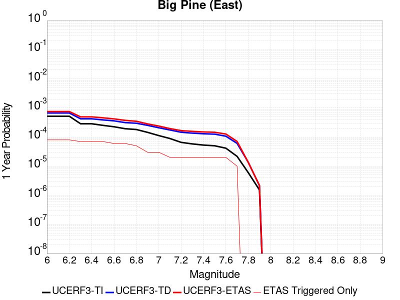 | 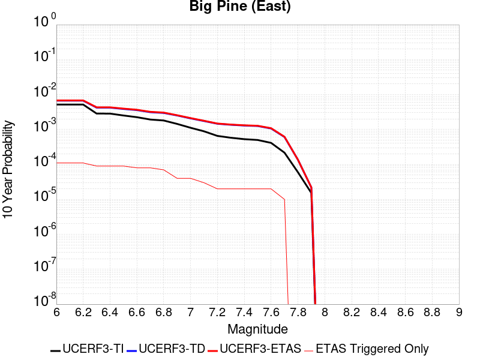 |

| Magnitude | 1 wk TI Prob | 1 wk TD Prob | 1 wk ETAS Prob | 1 wk ETAS/TD Gain | 1 wk ETAS Triggered Only | 1 mo TI Prob | 1 mo TD Prob | 1 mo ETAS Prob | 1 mo ETAS/TD Gain | 1 mo ETAS Triggered Only | 1 yr TI Prob | 1 yr TD Prob | 1 yr ETAS Prob | 1 yr ETAS/TD Gain | 1 yr ETAS Triggered Only | 10 yr TI Prob | 10 yr TD Prob | 10 yr ETAS Prob | 10 yr ETAS/TD Gain | 10 yr ETAS Triggered Only |
|-----|-----|-----|-----|-----|-----|-----|-----|-----|-----|-----|-----|-----|-----|-----|-----|-----|-----|-----|-----|-----|
| 6.0 | 9.916913E-6 | 1.2816984E-5 | 5.281647E-5 | 4.120819 | 4.0E-5 | 4.250036E-5 | 5.49289E-5 | 1.04926155E-4 | 1.9102176 | 5.0E-5 | 5.173191E-4 | 6.685763E-4 | 7.485228E-4 | 1.1195773 | 8.0E-5 | 0.0051611643 | 0.006670441 | 0.0067797075 | 1.0163807 | 1.1E-4 |
| 6.1 | 9.916913E-6 | 1.2816984E-5 | 5.281647E-5 | 4.120819 | 4.0E-5 | 4.250036E-5 | 5.49289E-5 | 1.04926155E-4 | 1.9102176 | 5.0E-5 | 5.173191E-4 | 6.685763E-4 | 7.485228E-4 | 1.1195773 | 8.0E-5 | 0.0051611643 | 0.006670441 | 0.0067797075 | 1.0163807 | 1.1E-4 |
| 6.2 | 9.916913E-6 | 1.2816984E-5 | 5.281647E-5 | 4.120819 | 4.0E-5 | 4.250036E-5 | 5.49289E-5 | 1.04926155E-4 | 1.9102176 | 5.0E-5 | 5.173191E-4 | 6.685763E-4 | 7.485228E-4 | 1.1195773 | 8.0E-5 | 0.0051611643 | 0.006670441 | 0.0067797075 | 1.0163807 | 1.1E-4 |
| 6.3 | 5.479711E-6 | 8.112951E-6 | 3.8112707E-5 | 4.697761 | 3.0E-5 | 2.3484265E-5 | 3.4769346E-5 | 7.476796E-5 | 2.1503987 | 4.0E-5 | 2.858834E-4 | 4.2323777E-4 | 4.932081E-4 | 1.1653217 | 7.0E-5 | 0.0028551589 | 0.004227244 | 0.004316863 | 1.0212004 | 9.0E-5 |
| 6.4 | 5.465009E-6 | 8.097245E-6 | 3.8097E-5 | 4.7049336 | 3.0E-5 | 2.3421257E-5 | 3.4702036E-5 | 7.470065E-5 | 2.15263 | 4.0E-5 | 2.851165E-4 | 4.2241855E-4 | 4.9238896E-4 | 1.1656424 | 7.0E-5 | 0.0028475097 | 0.0042190826 | 0.004308703 | 1.0212417 | 9.0E-5 |
| 6.5 | 4.826767E-6 | 7.422301E-6 | 3.742208E-5 | 5.041843 | 3.0E-5 | 2.068598E-5 | 3.180949E-5 | 7.1808216E-5 | 2.2574463 | 4.0E-5 | 2.518227E-4 | 3.872145E-4 | 4.571874E-4 | 1.1807084 | 7.0E-5 | 0.0025153751 | 0.003868283 | 0.0039579347 | 1.0231762 | 9.0E-5 |
| 6.6 | 4.3146847E-6 | 6.8822374E-6 | 3.688203E-5 | 5.359018 | 3.0E-5 | 1.8491375E-5 | 2.9494982E-5 | 6.9493806E-5 | 2.356123 | 4.0E-5 | 2.2510924E-4 | 3.590447E-4 | 4.1902316E-4 | 1.1670501 | 6.0E-5 | 0.0022488134 | 0.0035874986 | 0.0036672114 | 1.0222197 | 8.0E-5 |
| 6.7 | 3.6968106E-6 | 5.9954727E-6 | 3.5995294E-5 | 6.0037456 | 3.0E-5 | 1.5843378E-5 | 2.5694639E-5 | 6.569361E-5 | 2.556705 | 4.0E-5 | 1.9287605E-4 | 3.1278885E-4 | 3.727701E-4 | 1.1917627 | 6.0E-5 | 0.0019270873 | 0.0031262483 | 0.003205998 | 1.0255098 | 8.0E-5 |
| 6.8 | 3.4671132E-6 | 5.702177E-6 | 3.5702007E-5 | 6.2611184 | 3.0E-5 | 1.4858972E-5 | 2.4437682E-5 | 6.44367E-5 | 2.6367764 | 4.0E-5 | 1.8089297E-4 | 2.974896E-4 | 3.4747474E-4 | 1.1680231 | 5.0E-5 | 0.0018074579 | 0.002973667 | 0.003043459 | 1.0234699 | 7.0E-5 |
| 6.9 | 2.7686972E-6 | 4.825223E-6 | 1.4825175E-5 | 3.072433 | 1.0E-5 | 1.1865792E-5 | 2.0679368E-5 | 4.0678955E-5 | 1.9671276 | 2.0E-5 | 1.4445644E-4 | 2.5174298E-4 | 2.817354E-4 | 1.1191392 | 3.0E-5 | 0.0014436257 | 0.0025172636 | 0.0025571631 | 1.0158503 | 4.0E-5 |
| 7.0 | 2.1472624E-6 | 3.9850406E-6 | 1.3985001E-5 | 3.5093746 | 1.0E-5 | 9.20252E-6 | 1.7078637E-5 | 3.7078295E-5 | 2.1710336 | 2.0E-5 | 1.12034926E-4 | 2.079131E-4 | 2.3790686E-4 | 1.144261 | 3.0E-5 | 0.0011197845 | 0.0020798394 | 0.002119756 | 1.0191922 | 4.0E-5 |
| 7.1 | 1.7018335E-6 | 3.344876E-6 | 1.3344843E-5 | 3.9896374 | 1.0E-5 | 7.293552E-6 | 1.4335106E-5 | 3.433482E-5 | 2.3951564 | 2.0E-5 | 8.879537E-5 | 1.7451629E-4 | 1.945128E-4 | 1.1145825 | 2.0E-5 | 8.87599E-4 | 0.0017464145 | 0.0017763621 | 1.017148 | 3.0E-5 |
| 7.2 | 1.25603E-6 | 2.794484E-6 | 1.2794456E-5 | 4.578468 | 1.0E-5 | 5.3829745E-6 | 1.1976307E-5 | 3.1976066E-5 | 2.6699438 | 2.0E-5 | 6.553574E-5 | 1.4580201E-4 | 1.657991E-4 | 1.1371523 | 2.0E-5 | 6.551642E-4 | 0.001459661 | 0.0014796319 | 1.0136818 | 2.0E-5 |
| 7.3 | 1.112297E-6 | 2.610332E-6 | 1.2610306E-5 | 4.83092 | 1.0E-5 | 4.7669787E-6 | 1.118709E-5 | 3.1186868E-5 | 2.787755 | 2.0E-5 | 5.803642E-5 | 1.3619453E-4 | 1.561918E-4 | 1.1468288 | 2.0E-5 | 5.802127E-4 | 0.0013635408 | 0.0013835136 | 1.0146477 | 2.0E-5 |
| 7.4 | 1.0137181E-6 | 2.4834917E-6 | 1.2483467E-5 | 5.026579 | 1.0E-5 | 4.3444993E-6 | 1.0643494E-5 | 3.064328E-5 | 2.8790622 | 2.0E-5 | 5.2892992E-5 | 1.2957705E-4 | 1.4957445E-4 | 1.1543283 | 2.0E-5 | 5.288041E-4 | 0.0012972289 | 0.0013172029 | 1.0153974 | 2.0E-5 |
| 7.5 | 9.598608E-7 | 2.4071483E-6 | 1.2407124E-5 | 5.1542835 | 1.0E-5 | 4.1136827E-6 | 1.031631E-5 | 3.0316103E-5 | 2.9386578 | 2.0E-5 | 5.0082934E-5 | 1.2559404E-4 | 1.4559153E-4 | 1.1592232 | 2.0E-5 | 5.007165E-4 | 0.0012572526 | 0.0012772274 | 1.0158877 | 2.0E-5 |
| 7.6 | 7.929459E-7 | 2.0448588E-6 | 1.20448385E-5 | 5.890303 | 1.0E-5 | 3.3983351E-6 | 8.763653E-6 | 2.8763478E-5 | 3.2821336 | 2.0E-5 | 4.1373947E-5 | 1.06692416E-4 | 1.2669028E-4 | 1.1874348 | 2.0E-5 | 4.1366243E-4 | 0.0010685222 | 0.0010885008 | 1.0186974 | 2.0E-5 |
| 7.7 | 4.155788E-7 | 1.1605589E-6 | 1.1605589E-6 | 1.0 | 0.0 | 1.7810507E-6 | 4.9738146E-6 | 1.4973765E-5 | 3.0105193 | 1.0E-5 | 2.1684076E-5 | 6.0554554E-5 | 7.055395E-5 | 1.1651304 | 1.0E-5 | 2.1681961E-4 | 6.0857297E-4 | 6.185669E-4 | 1.0164219 | 1.0E-5 |
| 7.8 | 1.14666925E-7 | 2.592015E-7 | 2.592015E-7 | 1.0 | 0.0 | 4.914296E-7 | 1.1108631E-6 | 1.1108631E-6 | 1.0 | 0.0 | 5.9831386E-6 | 1.3524678E-5 | 1.3524678E-5 | 1.0 | 0.0 | 5.9829777E-5 | 1.3634123E-4 | 1.3634123E-4 | 1.0 | 0.0 |
| 7.9 | 2.9231824E-8 | 4.1463963E-8 | 4.1463963E-8 | 1.0 | 0.0 | 1.2527924E-7 | 1.7770269E-7 | 1.7770269E-7 | 1.0 | 0.0 | 1.5252737E-6 | 2.1635283E-6 | 2.1635283E-6 | 1.0 | 0.0 | 1.5252632E-5 | 2.1967755E-5 | 2.1967755E-5 | 1.0 | 0.0 |

## Blue Cut
*[(top)](#table-of-contents)*

| 1 Week | 1 Month | 1 Year | 10 Year |
|-----|-----|-----|-----|
|  |  | 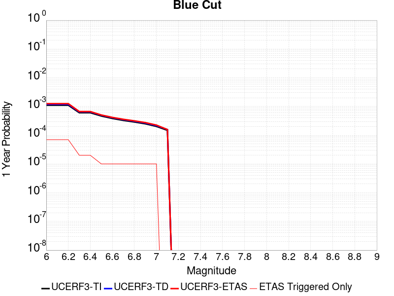 |  |

| Magnitude | 1 wk TI Prob | 1 wk TD Prob | 1 wk ETAS Prob | 1 wk ETAS/TD Gain | 1 wk ETAS Triggered Only | 1 mo TI Prob | 1 mo TD Prob | 1 mo ETAS Prob | 1 mo ETAS/TD Gain | 1 mo ETAS Triggered Only | 1 yr TI Prob | 1 yr TD Prob | 1 yr ETAS Prob | 1 yr ETAS/TD Gain | 1 yr ETAS Triggered Only | 10 yr TI Prob | 10 yr TD Prob | 10 yr ETAS Prob | 10 yr ETAS/TD Gain | 10 yr ETAS Triggered Only |
|-----|-----|-----|-----|-----|-----|-----|-----|-----|-----|-----|-----|-----|-----|-----|-----|-----|-----|-----|-----|-----|
| 6.0 | 2.1227985E-5 | 2.2719574E-5 | 7.271844E-5 | 3.2006955 | 5.0E-5 | 9.097391E-5 | 9.73663E-5 | 1.5736045E-4 | 1.6161697 | 6.0E-5 | 0.0011070445 | 0.0011848481 | 0.0012547652 | 1.0590093 | 7.0E-5 | 0.011015458 | 0.011791152 | 0.011899855 | 1.009219 | 1.1E-4 |
| 6.1 | 2.1227985E-5 | 2.2719574E-5 | 7.271844E-5 | 3.2006955 | 5.0E-5 | 9.097391E-5 | 9.73663E-5 | 1.5736045E-4 | 1.6161697 | 6.0E-5 | 0.0011070445 | 0.0011848481 | 0.0012547652 | 1.0590093 | 7.0E-5 | 0.011015458 | 0.011791152 | 0.011899855 | 1.009219 | 1.1E-4 |
| 6.2 | 2.1227985E-5 | 2.2719574E-5 | 7.271844E-5 | 3.2006955 | 5.0E-5 | 9.097391E-5 | 9.73663E-5 | 1.5736045E-4 | 1.6161697 | 6.0E-5 | 0.0011070445 | 0.0011848481 | 0.0012547652 | 1.0590093 | 7.0E-5 | 0.011015458 | 0.011791152 | 0.011899855 | 1.009219 | 1.1E-4 |
| 6.3 | 1.1613981E-5 | 1.2353542E-5 | 2.2353419E-5 | 1.8094745 | 1.0E-5 | 4.9773254E-5 | 5.2942745E-5 | 7.2941686E-5 | 1.3777466 | 2.0E-5 | 6.0582085E-4 | 6.443998E-4 | 6.643869E-4 | 1.0310166 | 2.0E-5 | 0.0060417196 | 0.0064265593 | 0.0064563663 | 1.0046381 | 3.0E-5 |
| 6.4 | 1.1613981E-5 | 1.2353542E-5 | 2.2353419E-5 | 1.8094745 | 1.0E-5 | 4.9773254E-5 | 5.2942745E-5 | 7.2941686E-5 | 1.3777466 | 2.0E-5 | 6.0582085E-4 | 6.443998E-4 | 6.643869E-4 | 1.0310166 | 2.0E-5 | 0.0060417196 | 0.0064265593 | 0.0064563663 | 1.0046381 | 3.0E-5 |
| 6.5 | 8.931326E-6 | 9.4816E-6 | 1.9481506E-5 | 2.0546644 | 1.0E-5 | 3.8276554E-5 | 4.0634844E-5 | 5.063444E-5 | 1.2460842 | 1.0E-5 | 4.6591737E-4 | 4.946261E-4 | 5.0462113E-4 | 1.0202073 | 1.0E-5 | 0.0046494175 | 0.004936161 | 0.0049560624 | 1.0040318 | 2.0E-5 |
| 6.6 | 7.345353E-6 | 7.79028E-6 | 1.7790202E-5 | 2.283641 | 1.0E-5 | 3.1479703E-5 | 3.338653E-5 | 4.3386193E-5 | 1.299512 | 1.0E-5 | 3.83198E-4 | 4.064132E-4 | 4.164091E-4 | 1.0245955 | 1.0E-5 | 0.0038253788 | 0.0040574907 | 0.00407741 | 1.0049092 | 2.0E-5 |
| 6.7 | 6.2775666E-6 | 6.655149E-6 | 1.6655082E-5 | 2.502586 | 1.0E-5 | 2.690358E-5 | 2.8521798E-5 | 3.8521513E-5 | 1.350599 | 1.0E-5 | 3.2750185E-4 | 3.472051E-4 | 3.572016E-4 | 1.0287914 | 1.0E-5 | 0.0032701963 | 0.003467367 | 0.0034872978 | 1.005748 | 2.0E-5 |
| 6.8 | 5.5234095E-6 | 5.8551113E-6 | 1.5855052E-5 | 2.7078996 | 1.0E-5 | 2.367154E-5 | 2.5093133E-5 | 3.5092882E-5 | 1.3985054 | 1.0E-5 | 2.8816288E-4 | 3.0547334E-4 | 3.154703E-4 | 1.032726 | 1.0E-5 | 0.002877895 | 0.0030512505 | 0.0030711896 | 1.0065347 | 2.0E-5 |
| 6.9 | 4.7780054E-6 | 5.0654203E-6 | 1.506537E-5 | 2.9741597 | 1.0E-5 | 2.0477004E-5 | 2.1708804E-5 | 3.1708587E-5 | 1.4606326 | 1.0E-5 | 2.4927902E-4 | 2.642797E-4 | 2.7427703E-4 | 1.0378287 | 1.0E-5 | 0.0024899957 | 0.002640346 | 0.0026503198 | 1.0037774 | 1.0E-5 |
| 7.0 | 3.883171E-6 | 4.118487E-6 | 1.41184455E-5 | 3.428066 | 1.0E-5 | 1.6642054E-5 | 1.7650578E-5 | 2.7650402E-5 | 1.5665437 | 1.0E-5 | 2.0259817E-4 | 2.1488148E-4 | 2.2487935E-4 | 1.0465273 | 1.0E-5 | 0.0020241356 | 0.0021474129 | 0.0021573913 | 1.0046468 | 1.0E-5 |
| 7.1 | 2.8358215E-6 | 3.0097158E-6 | 3.0097158E-6 | 1.0 | 0.0 | 1.2153464E-5 | 1.2898756E-5 | 1.2898756E-5 | 1.0 | 0.0 | 1.4795837E-4 | 1.5703762E-4 | 1.5703762E-4 | 1.0 | 0.0 | 0.001478599 | 0.0015699116 | 0.0015699116 | 1.0 | 0.0 |

## Rose Canyon
*[(top)](#table-of-contents)*

| 1 Week | 1 Month | 1 Year | 10 Year |
|-----|-----|-----|-----|
|  |  | 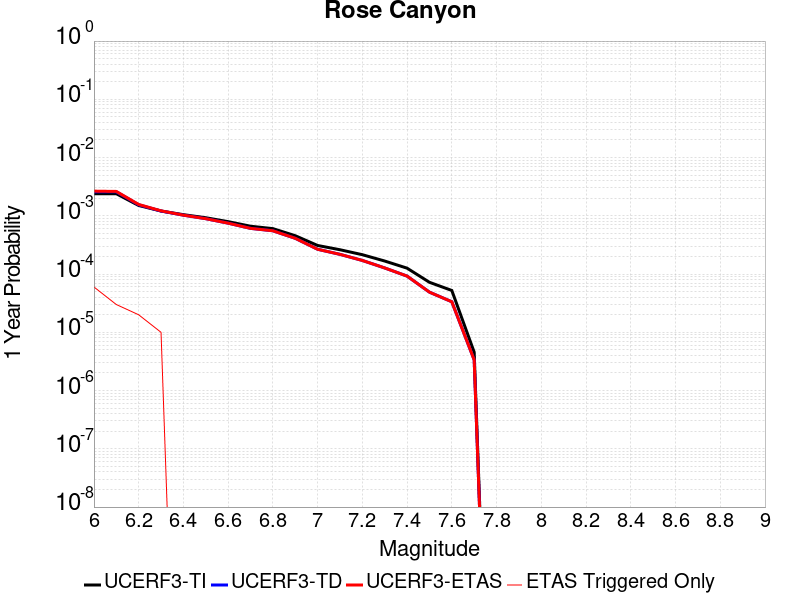 |  |

| Magnitude | 1 wk TI Prob | 1 wk TD Prob | 1 wk ETAS Prob | 1 wk ETAS/TD Gain | 1 wk ETAS Triggered Only | 1 mo TI Prob | 1 mo TD Prob | 1 mo ETAS Prob | 1 mo ETAS/TD Gain | 1 mo ETAS Triggered Only | 1 yr TI Prob | 1 yr TD Prob | 1 yr ETAS Prob | 1 yr ETAS/TD Gain | 1 yr ETAS Triggered Only | 10 yr TI Prob | 10 yr TD Prob | 10 yr ETAS Prob | 10 yr ETAS/TD Gain | 10 yr ETAS Triggered Only |
|-----|-----|-----|-----|-----|-----|-----|-----|-----|-----|-----|-----|-----|-----|-----|-----|-----|-----|-----|-----|-----|
| 6.0 | 4.5923203E-5 | 4.9714225E-5 | 9.971174E-5 | 2.0056984 | 5.0E-5 | 1.9679888E-4 | 2.1304491E-4 | 2.6303428E-4 | 1.2346423 | 5.0E-5 | 0.0023933933 | 0.0025909345 | 0.002650779 | 1.0230976 | 6.0E-5 | 0.023677798 | 0.02563999 | 0.025737427 | 1.0038002 | 1.0E-4 |
| 6.1 | 4.5923203E-5 | 4.9714225E-5 | 6.9713235E-5 | 1.4022794 | 2.0E-5 | 1.9679888E-4 | 2.1304491E-4 | 2.3304066E-4 | 1.0938569 | 2.0E-5 | 0.0023933933 | 0.0025909345 | 0.0026208567 | 1.0115489 | 3.0E-5 | 0.023677798 | 0.02563999 | 0.025698453 | 1.0022801 | 6.0E-5 |
| 6.2 | 2.8844734E-5 | 2.9668723E-5 | 3.9668426E-5 | 1.3370453 | 1.0E-5 | 1.2361443E-4 | 1.2714567E-4 | 1.371444E-4 | 1.07864 | 1.0E-5 | 0.0015039665 | 0.0015468939 | 0.0015668629 | 1.0129092 | 2.0E-5 | 0.0149382865 | 0.015374276 | 0.0154136615 | 1.0025618 | 4.0E-5 |
| 6.3 | 2.3171577E-5 | 2.3161238E-5 | 2.3161238E-5 | 1.0 | 0.0 | 9.9302975E-5 | 9.9258745E-5 | 9.9258745E-5 | 1.0 | 0.0 | 0.0012083431 | 0.0012078186 | 0.0012178066 | 1.0082694 | 1.0E-5 | 0.012017938 | 0.012022437 | 0.012052076 | 1.0024654 | 3.0E-5 |
| 6.4 | 2.0066604E-5 | 1.9667024E-5 | 1.9667024E-5 | 1.0 | 0.0 | 8.599689E-5 | 8.4284584E-5 | 8.4284584E-5 | 1.0 | 0.0 | 0.0010465092 | 0.0010256917 | 0.0010256917 | 1.0 | 0.0 | 0.010415946 | 0.010217559 | 0.010227457 | 1.0009687 | 1.0E-5 |
| 6.5 | 1.776989E-5 | 1.7113807E-5 | 1.7113807E-5 | 1.0 | 0.0 | 7.615444E-5 | 7.334287E-5 | 7.334287E-5 | 1.0 | 0.0 | 9.267859E-4 | 8.925905E-4 | 8.925905E-4 | 1.0 | 0.0 | 0.009229303 | 0.008896211 | 0.008906122 | 1.0011141 | 1.0E-5 |
| 6.6 | 1.5227364E-5 | 1.433926E-5 | 1.433926E-5 | 1.0 | 0.0 | 6.52585E-5 | 6.1452556E-5 | 6.1452556E-5 | 1.0 | 0.0 | 7.942326E-4 | 7.479332E-4 | 7.479332E-4 | 1.0 | 0.0 | 0.007914 | 0.007458359 | 0.0074682846 | 1.0013307 | 1.0E-5 |
| 6.7 | 1.2703898E-5 | 1.1673274E-5 | 1.1673274E-5 | 1.0 | 0.0 | 5.4444143E-5 | 5.0027378E-5 | 5.0027378E-5 | 1.0 | 0.0 | 6.626558E-4 | 6.089174E-4 | 6.089174E-4 | 1.0 | 0.0 | 0.006606833 | 0.0060750856 | 0.006085025 | 1.001636 | 1.0E-5 |
| 6.8 | 1.1554917E-5 | 1.0609337E-5 | 1.0609337E-5 | 1.0 | 0.0 | 4.9520135E-5 | 4.546782E-5 | 4.546782E-5 | 1.0 | 0.0 | 6.0274085E-4 | 5.5343413E-4 | 5.5343413E-4 | 1.0 | 0.0 | 0.0060110865 | 0.0055225673 | 0.005532512 | 1.0018008 | 1.0E-5 |
| 6.9 | 8.732078E-6 | 7.881357E-6 | 7.881357E-6 | 1.0 | 0.0 | 3.7422655E-5 | 3.3776825E-5 | 3.3776825E-5 | 1.0 | 0.0 | 4.5552556E-4 | 4.111582E-4 | 4.111582E-4 | 1.0 | 0.0 | 0.0045459294 | 0.0041048084 | 0.0041147675 | 1.0024261 | 1.0E-5 |
| 7.0 | 5.9337494E-6 | 5.1074853E-6 | 5.1074853E-6 | 1.0 | 0.0 | 2.5430107E-5 | 2.188904E-5 | 2.188904E-5 | 1.0 | 0.0 | 3.0956755E-4 | 2.664666E-4 | 2.664666E-4 | 1.0 | 0.0 | 0.0030913667 | 0.0026614866 | 0.00267146 | 1.0037473 | 1.0E-5 |
| 7.1 | 5.013409E-6 | 4.1773833E-6 | 4.1773833E-6 | 1.0 | 0.0 | 2.1485863E-5 | 1.7902948E-5 | 1.7902948E-5 | 1.0 | 0.0 | 2.6155898E-4 | 2.179467E-4 | 2.179467E-4 | 1.0 | 0.0 | 0.0026125133 | 0.0021773411 | 0.0021873193 | 1.0045828 | 1.0E-5 |
| 7.2 | 4.120763E-6 | 3.2821383E-6 | 3.2821383E-6 | 1.0 | 0.0 | 1.7660293E-5 | 1.4066231E-5 | 1.4066231E-5 | 1.0 | 0.0 | 2.1499286E-4 | 1.7124301E-4 | 1.7124301E-4 | 1.0 | 0.0 | 0.0021478499 | 0.00171112 | 0.0017211029 | 1.0058341 | 1.0E-5 |
| 7.3 | 3.2081239E-6 | 2.4405372E-6 | 2.4405372E-6 | 1.0 | 0.0 | 1.374903E-5 | 1.0459404E-5 | 1.0459404E-5 | 1.0 | 0.0 | 1.6738157E-4 | 1.2733586E-4 | 1.2733586E-4 | 1.0 | 0.0 | 0.0016725556 | 0.001272636 | 0.0012826233 | 1.0078477 | 1.0E-5 |
| 7.4 | 2.4194755E-6 | 1.7680634E-6 | 1.7680634E-6 | 1.0 | 0.0 | 1.0369139E-5 | 7.577393E-6 | 7.577393E-6 | 1.0 | 0.0 | 1.2623696E-4 | 9.2250906E-5 | 9.2250906E-5 | 1.0 | 0.0 | 0.0012616527 | 9.2213147E-4 | 9.3212223E-4 | 1.0108345 | 1.0E-5 |
| 7.5 | 1.3842889E-6 | 9.3786275E-7 | 9.3786275E-7 | 1.0 | 0.0 | 5.9326535E-6 | 4.019406E-6 | 4.019406E-6 | 1.0 | 0.0 | 7.222766E-5 | 4.8935202E-5 | 4.8935202E-5 | 1.0 | 0.0 | 7.220419E-4 | 4.892478E-4 | 4.992429E-4 | 1.0204295 | 1.0E-5 |
| 7.6 | 1.0021575E-6 | 6.411463E-7 | 6.411463E-7 | 1.0 | 0.0 | 4.2949537E-6 | 2.7477672E-6 | 2.7477672E-6 | 1.0 | 0.0 | 5.2289808E-5 | 3.3453573E-5 | 3.3453573E-5 | 1.0 | 0.0 | 5.2277505E-4 | 3.344875E-4 | 3.4448417E-4 | 1.0298865 | 1.0E-5 |
| 7.7 | 8.7620116E-8 | 6.4492404E-8 | 6.4492404E-8 | 1.0 | 0.0 | 3.7551473E-7 | 2.76396E-7 | 2.76396E-7 | 1.0 | 0.0 | 4.5718825E-6 | 3.3651165E-6 | 3.3651165E-6 | 1.0 | 0.0 | 4.5717883E-5 | 3.3650686E-5 | 3.3650686E-5 | 1.0 | 0.0 |

## Pisgah-Bullion Mtn-Mesquite Lk
*[(top)](#table-of-contents)*

| 1 Week | 1 Month | 1 Year | 10 Year |
|-----|-----|-----|-----|
|  | 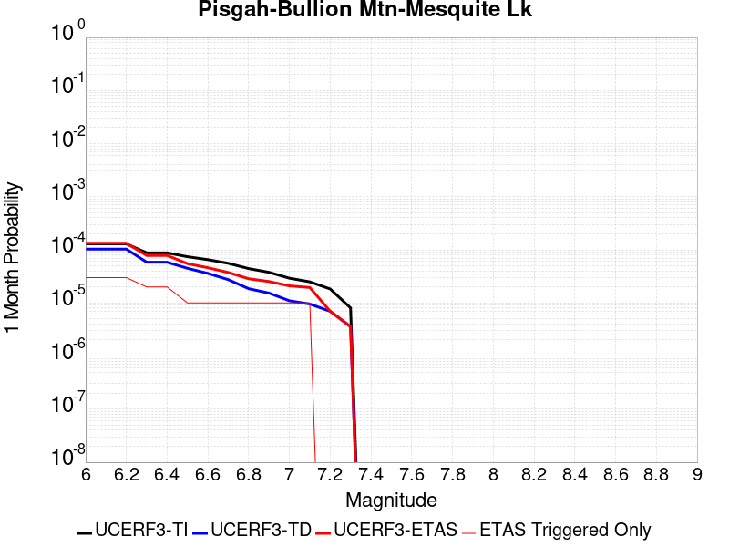 |  |  |

| Magnitude | 1 wk TI Prob | 1 wk TD Prob | 1 wk ETAS Prob | 1 wk ETAS/TD Gain | 1 wk ETAS Triggered Only | 1 mo TI Prob | 1 mo TD Prob | 1 mo ETAS Prob | 1 mo ETAS/TD Gain | 1 mo ETAS Triggered Only | 1 yr TI Prob | 1 yr TD Prob | 1 yr ETAS Prob | 1 yr ETAS/TD Gain | 1 yr ETAS Triggered Only | 10 yr TI Prob | 10 yr TD Prob | 10 yr ETAS Prob | 10 yr ETAS/TD Gain | 10 yr ETAS Triggered Only |
|-----|-----|-----|-----|-----|-----|-----|-----|-----|-----|-----|-----|-----|-----|-----|-----|-----|-----|-----|-----|-----|
| 6.0 | 3.0240792E-5 | 2.4091114E-5 | 4.4090633E-5 | 1.8301616 | 2.0E-5 | 1.2959696E-4 | 1.03244114E-4 | 1.3324102E-4 | 1.2905434 | 3.0E-5 | 0.0015767008 | 0.0012563728 | 0.00130631 | 1.0397471 | 5.0E-5 | 0.015655609 | 0.012502721 | 0.012611345 | 1.0086881 | 1.1E-4 |
| 6.1 | 3.0240792E-5 | 2.4091114E-5 | 4.4090633E-5 | 1.8301616 | 2.0E-5 | 1.2959696E-4 | 1.03244114E-4 | 1.3324102E-4 | 1.2905434 | 3.0E-5 | 0.0015767008 | 0.0012563728 | 0.00130631 | 1.0397471 | 5.0E-5 | 0.015655609 | 0.012502721 | 0.012611345 | 1.0086881 | 1.1E-4 |
| 6.2 | 3.0240792E-5 | 2.4091114E-5 | 4.4090633E-5 | 1.8301616 | 2.0E-5 | 1.2959696E-4 | 1.03244114E-4 | 1.3324102E-4 | 1.2905434 | 3.0E-5 | 0.0015767008 | 0.0012563728 | 0.00130631 | 1.0397471 | 5.0E-5 | 0.015655609 | 0.012502721 | 0.012611345 | 1.0086881 | 1.1E-4 |
| 6.3 | 2.0498217E-5 | 1.36380695E-5 | 2.3637933E-5 | 1.7332317 | 1.0E-5 | 8.784654E-5 | 5.844765E-5 | 7.844648E-5 | 1.3421665 | 2.0E-5 | 0.0010690069 | 7.1138405E-4 | 7.513556E-4 | 1.0561885 | 4.0E-5 | 0.01063879 | 0.0070926943 | 0.00714234 | 1.0069995 | 5.0E-5 |
| 6.4 | 2.0498217E-5 | 1.36380695E-5 | 2.3637933E-5 | 1.7332317 | 1.0E-5 | 8.784654E-5 | 5.844765E-5 | 7.844648E-5 | 1.3421665 | 2.0E-5 | 0.0010690069 | 7.1138405E-4 | 7.513556E-4 | 1.0561885 | 4.0E-5 | 0.01063879 | 0.0070926943 | 0.00714234 | 1.0069995 | 5.0E-5 |
| 6.5 | 1.7316182E-5 | 1.0477042E-5 | 1.0477042E-5 | 1.0 | 0.0 | 7.42101E-5 | 4.4900895E-5 | 5.4900447E-5 | 1.2227027 | 1.0E-5 | 9.0313336E-4 | 5.465413E-4 | 5.765249E-4 | 1.0548606 | 3.0E-5 | 0.008994718 | 0.0054529672 | 0.005492749 | 1.0072955 | 4.0E-5 |
| 6.6 | 1.5251077E-5 | 8.414273E-6 | 8.414273E-6 | 1.0 | 0.0 | 6.536012E-5 | 3.6060712E-5 | 4.606035E-5 | 1.2773001 | 1.0E-5 | 7.9546886E-4 | 4.3895794E-4 | 4.6894478E-4 | 1.0683137 | 3.0E-5 | 0.007926274 | 0.0043816264 | 0.004421451 | 1.009089 | 4.0E-5 |
| 6.7 | 1.2997425E-5 | 6.4114965E-6 | 6.4114965E-6 | 1.0 | 0.0 | 5.570206E-5 | 2.7477578E-5 | 3.7477304E-5 | 1.3639231 | 1.0E-5 | 6.7796157E-4 | 3.3449283E-4 | 3.5448614E-4 | 1.059772 | 2.0E-5 | 0.0067589693 | 0.0033403537 | 0.0033702536 | 1.0089511 | 3.0E-5 |
| 6.8 | 1.035386E-5 | 4.3332193E-6 | 4.3332193E-6 | 1.0 | 0.0 | 4.437293E-5 | 1.8570812E-5 | 2.8570626E-5 | 1.5384694 | 1.0E-5 | 5.401065E-4 | 2.2607706E-4 | 2.360748E-4 | 1.0442227 | 1.0E-5 | 0.0053879567 | 0.0022585576 | 0.0022785123 | 1.0088352 | 2.0E-5 |
| 6.9 | 8.816252E-6 | 3.580638E-6 | 3.580638E-6 | 1.0 | 0.0 | 3.778339E-5 | 1.5345504E-5 | 2.534535E-5 | 1.6516467 | 1.0E-5 | 4.5991567E-4 | 1.8681608E-4 | 1.968142E-4 | 1.0535185 | 1.0E-5 | 0.00458965 | 0.0018666488 | 0.0018866115 | 1.0106944 | 2.0E-5 |
| 7.0 | 6.8232207E-6 | 2.5675843E-6 | 2.5675843E-6 | 1.0 | 0.0 | 2.9242048E-5 | 1.1003888E-5 | 2.1003778E-5 | 1.9087597 | 1.0E-5 | 3.5596377E-4 | 1.3396442E-4 | 1.4396307E-4 | 1.0746367 | 1.0E-5 | 0.0035539411 | 0.0013388677 | 0.0013588408 | 1.014918 | 2.0E-5 |
| 7.1 | 5.837013E-6 | 2.22738E-6 | 2.22738E-6 | 1.0 | 0.0 | 2.501553E-5 | 9.545881E-6 | 1.9545785E-5 | 2.0475621 | 1.0E-5 | 3.045215E-4 | 1.16215204E-4 | 1.2621404E-4 | 1.0860373 | 1.0E-5 | 0.0030410455 | 0.0011615733 | 0.0011815501 | 1.0171981 | 2.0E-5 |
| 7.2 | 4.278052E-6 | 1.6275711E-6 | 1.6275711E-6 | 1.0 | 0.0 | 1.833438E-5 | 6.9752873E-6 | 6.9752873E-6 | 1.0 | 0.0 | 2.231982E-4 | 8.492105E-5 | 8.492105E-5 | 1.0 | 0.0 | 0.0022297418 | 8.489092E-4 | 8.589007E-4 | 1.0117698 | 1.0E-5 |
| 7.3 | 1.8803692E-6 | 8.344926E-7 | 8.344926E-7 | 1.0 | 0.0 | 8.0587E-6 | 3.5763926E-6 | 3.5763926E-6 | 1.0 | 0.0 | 9.811026E-5 | 4.354186E-5 | 4.354186E-5 | 1.0 | 0.0 | 9.806695E-4 | 4.3534773E-4 | 4.3534773E-4 | 1.0 | 0.0 |

## Ventura-Pitas Point
*[(top)](#table-of-contents)*

| 1 Week | 1 Month | 1 Year | 10 Year |
|-----|-----|-----|-----|
|  |  | 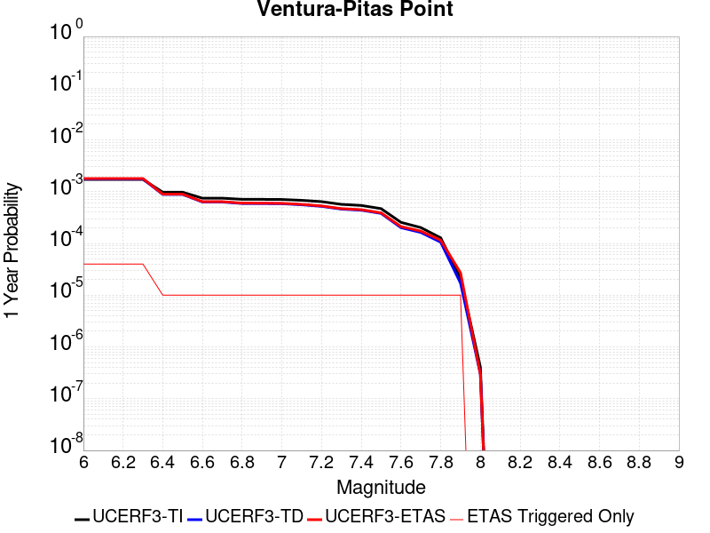 |  |

| Magnitude | 1 wk TI Prob | 1 wk TD Prob | 1 wk ETAS Prob | 1 wk ETAS/TD Gain | 1 wk ETAS Triggered Only | 1 mo TI Prob | 1 mo TD Prob | 1 mo ETAS Prob | 1 mo ETAS/TD Gain | 1 mo ETAS Triggered Only | 1 yr TI Prob | 1 yr TD Prob | 1 yr ETAS Prob | 1 yr ETAS/TD Gain | 1 yr ETAS Triggered Only | 10 yr TI Prob | 10 yr TD Prob | 10 yr ETAS Prob | 10 yr ETAS/TD Gain | 10 yr ETAS Triggered Only |
|-----|-----|-----|-----|-----|-----|-----|-----|-----|-----|-----|-----|-----|-----|-----|-----|-----|-----|-----|-----|-----|
| 6.0 | 3.3179622E-5 | 3.3735185E-5 | 5.3734508E-5 | 1.5928328 | 2.0E-5 | 1.4219063E-4 | 1.445728E-4 | 1.6456991E-4 | 1.1383187 | 2.0E-5 | 0.0017297962 | 0.0017590096 | 0.0017989392 | 1.0227001 | 4.0E-5 | 0.017163932 | 0.0174764 | 0.017574653 | 1.005622 | 1.0E-4 |
| 6.1 | 3.3179622E-5 | 3.3735185E-5 | 5.3734508E-5 | 1.5928328 | 2.0E-5 | 1.4219063E-4 | 1.445728E-4 | 1.6456991E-4 | 1.1383187 | 2.0E-5 | 0.0017297962 | 0.0017590096 | 0.0017989392 | 1.0227001 | 4.0E-5 | 0.017163932 | 0.0174764 | 0.017574653 | 1.005622 | 1.0E-4 |
| 6.2 | 3.3179622E-5 | 3.3735185E-5 | 5.3734508E-5 | 1.5928328 | 2.0E-5 | 1.4219063E-4 | 1.445728E-4 | 1.6456991E-4 | 1.1383187 | 2.0E-5 | 0.0017297962 | 0.0017590096 | 0.0017989392 | 1.0227001 | 4.0E-5 | 0.017163932 | 0.0174764 | 0.017574653 | 1.005622 | 1.0E-4 |
| 6.3 | 3.3179622E-5 | 3.3735185E-5 | 5.3734508E-5 | 1.5928328 | 2.0E-5 | 1.4219063E-4 | 1.445728E-4 | 1.6456991E-4 | 1.1383187 | 2.0E-5 | 0.0017297962 | 0.0017590096 | 0.0017989392 | 1.0227001 | 4.0E-5 | 0.017163932 | 0.0174764 | 0.017574653 | 1.005622 | 1.0E-4 |
| 6.4 | 1.8754668E-5 | 1.701961E-5 | 2.701944E-5 | 1.5875475 | 1.0E-5 | 8.037467E-5 | 7.293928E-5 | 8.293855E-5 | 1.1370903 | 1.0E-5 | 9.781223E-4 | 8.8769704E-4 | 8.9768815E-4 | 1.0112551 | 1.0E-5 | 0.009738282 | 0.008843848 | 0.008873583 | 1.0033622 | 3.0E-5 |
| 6.5 | 1.8754668E-5 | 1.701961E-5 | 2.701944E-5 | 1.5875475 | 1.0E-5 | 8.037467E-5 | 7.293928E-5 | 8.293855E-5 | 1.1370903 | 1.0E-5 | 9.781223E-4 | 8.8769704E-4 | 8.9768815E-4 | 1.0112551 | 1.0E-5 | 0.009738282 | 0.008843848 | 0.008873583 | 1.0033622 | 3.0E-5 |
| 6.6 | 1.4361558E-5 | 1.2122275E-5 | 2.2122154E-5 | 1.8249177 | 1.0E-5 | 6.154808E-5 | 5.1951585E-5 | 6.195107E-5 | 1.1924769 | 1.0E-5 | 7.490902E-4 | 6.3232926E-4 | 6.4232294E-4 | 1.0158045 | 1.0E-5 | 0.0074657016 | 0.0063055577 | 0.0063254316 | 1.0031518 | 2.0E-5 |
| 6.7 | 1.4361558E-5 | 1.2122275E-5 | 2.2122154E-5 | 1.8249177 | 1.0E-5 | 6.154808E-5 | 5.1951585E-5 | 6.195107E-5 | 1.1924769 | 1.0E-5 | 7.490902E-4 | 6.3232926E-4 | 6.4232294E-4 | 1.0158045 | 1.0E-5 | 0.0074657016 | 0.0063055577 | 0.0063254316 | 1.0031518 | 2.0E-5 |
| 6.8 | 1.3663846E-5 | 1.13444175E-5 | 2.1344304E-5 | 1.8814808 | 1.0E-5 | 5.8558027E-5 | 4.861804E-5 | 5.8617552E-5 | 1.205675 | 1.0E-5 | 7.127108E-4 | 5.917658E-4 | 6.017599E-4 | 1.0168886 | 1.0E-5 | 0.007104293 | 0.005902116 | 0.005912057 | 1.0016843 | 1.0E-5 |
| 6.9 | 1.3644157E-5 | 1.1322519E-5 | 2.1322405E-5 | 1.8831857 | 1.0E-5 | 5.8473648E-5 | 4.8524187E-5 | 5.8523703E-5 | 1.2060728 | 1.0E-5 | 7.116841E-4 | 5.9062376E-4 | 6.0061784E-4 | 1.0169213 | 1.0E-5 | 0.007094092 | 0.0058907564 | 0.005900698 | 1.0016875 | 1.0E-5 |
| 7.0 | 1.3568845E-5 | 1.1242086E-5 | 2.1241973E-5 | 1.8895047 | 1.0E-5 | 5.8150898E-5 | 4.817949E-5 | 5.8179005E-5 | 1.2075472 | 1.0E-5 | 7.077572E-4 | 5.864293E-4 | 5.9642346E-4 | 1.0170424 | 1.0E-5 | 0.007055073 | 0.0058490336 | 0.005858975 | 1.0016997 | 1.0E-5 |
| 7.1 | 1.306572E-5 | 1.072054E-5 | 2.0720432E-5 | 1.9327788 | 1.0E-5 | 5.599474E-5 | 4.5944373E-5 | 5.594391E-5 | 1.2176446 | 1.0E-5 | 6.815227E-4 | 5.5923103E-4 | 5.692254E-4 | 1.0178717 | 1.0E-5 | 0.0067943637 | 0.0055784425 | 0.0055883867 | 1.0017827 | 1.0E-5 |
| 7.2 | 1.232604E-5 | 9.995143E-6 | 1.9995043E-5 | 2.000476 | 1.0E-5 | 5.2824813E-5 | 4.2835632E-5 | 5.2835207E-5 | 1.2334405 | 1.0E-5 | 6.429523E-4 | 5.214008E-4 | 5.313956E-4 | 1.0191691 | 1.0E-5 | 0.0064109527 | 0.005201967 | 0.005211915 | 1.0019124 | 1.0E-5 |
| 7.3 | 1.0917261E-5 | 8.84384E-6 | 1.8843752E-5 | 2.1307204 | 1.0E-5 | 4.678742E-5 | 3.790163E-5 | 4.7901252E-5 | 1.2638309 | 1.0E-5 | 5.69488E-4 | 4.6135622E-4 | 4.713516E-4 | 1.0216652 | 1.0E-5 | 0.0056803077 | 0.00460415 | 0.004614104 | 1.002162 | 1.0E-5 |
| 7.4 | 1.039959E-5 | 8.423562E-6 | 1.8423478E-5 | 2.1871362 | 1.0E-5 | 4.456891E-5 | 3.610049E-5 | 4.610013E-5 | 1.2769946 | 1.0E-5 | 5.424914E-4 | 4.3943635E-4 | 4.4943194E-4 | 1.0227464 | 1.0E-5 | 0.0054116896 | 0.004385836 | 0.004395792 | 1.0022701 | 1.0E-5 |
| 7.5 | 9.015877E-6 | 7.2975445E-6 | 1.7297472E-5 | 2.370314 | 1.0E-5 | 3.86389E-5 | 3.1274823E-5 | 4.127451E-5 | 1.319736 | 1.0E-5 | 4.7032707E-4 | 3.8070587E-4 | 3.9070204E-4 | 1.026257 | 1.0E-5 | 0.004693329 | 0.0038006818 | 0.0038106437 | 1.002621 | 1.0E-5 |
| 7.6 | 4.900162E-6 | 3.8741155E-6 | 1.3874077E-5 | 3.5812242 | 1.0E-5 | 2.1000526E-5 | 1.6603248E-5 | 2.6603082E-5 | 1.6022818 | 1.0E-5 | 2.556514E-4 | 2.0212591E-4 | 2.121239E-4 | 1.0494641 | 1.0E-5 | 0.0025535747 | 0.0020194345 | 0.0020294143 | 1.0049419 | 1.0E-5 |
| 7.7 | 3.8850626E-6 | 3.1267302E-6 | 1.3126699E-5 | 4.1982193 | 1.0E-5 | 1.6650163E-5 | 1.3400205E-5 | 2.340007E-5 | 1.7462473 | 1.0E-5 | 2.0269687E-4 | 1.6313537E-4 | 1.7313373E-4 | 1.0612888 | 1.0E-5 | 0.002025121 | 0.0016301654 | 0.001640149 | 1.0061244 | 1.0E-5 |
| 7.8 | 2.4654719E-6 | 2.029875E-6 | 1.2029855E-5 | 5.9264016 | 1.0E-5 | 1.0566265E-5 | 8.699436E-6 | 1.869935E-5 | 2.1494899 | 1.0E-5 | 1.2863669E-4 | 1.0591053E-4 | 1.1590947E-4 | 1.0944093 | 1.0E-5 | 0.0012856225 | 0.0010586053 | 0.0010685946 | 1.0094364 | 1.0E-5 |
| 7.9 | 4.095894E-7 | 3.2764765E-7 | 1.0327644E-5 | 31.520582 | 1.0E-5 | 1.7553821E-6 | 1.4042034E-6 | 1.14041895E-5 | 8.121466 | 1.0E-5 | 2.1371567E-5 | 1.7096047E-5 | 2.7095875E-5 | 1.5849205 | 1.0E-5 | 2.1369511E-4 | 1.7094762E-4 | 1.809459E-4 | 1.0584874 | 1.0E-5 |
| 8.0 | 7.791402E-9 | 5.683497E-9 | 5.683497E-9 | 1.0 | 0.0 | 3.3391725E-8 | 2.4357844E-8 | 2.4357844E-8 | 1.0 | 0.0 | 4.0654416E-7 | 2.9655675E-7 | 2.9655675E-7 | 1.0 | 0.0 | 4.065434E-6 | 2.9655655E-6 | 2.9655655E-6 | 1.0 | 0.0 |

## Calaveras (So) 2011 CFM
*[(top)](#table-of-contents)*

| 1 Week | 1 Month | 1 Year | 10 Year |
|-----|-----|-----|-----|
| 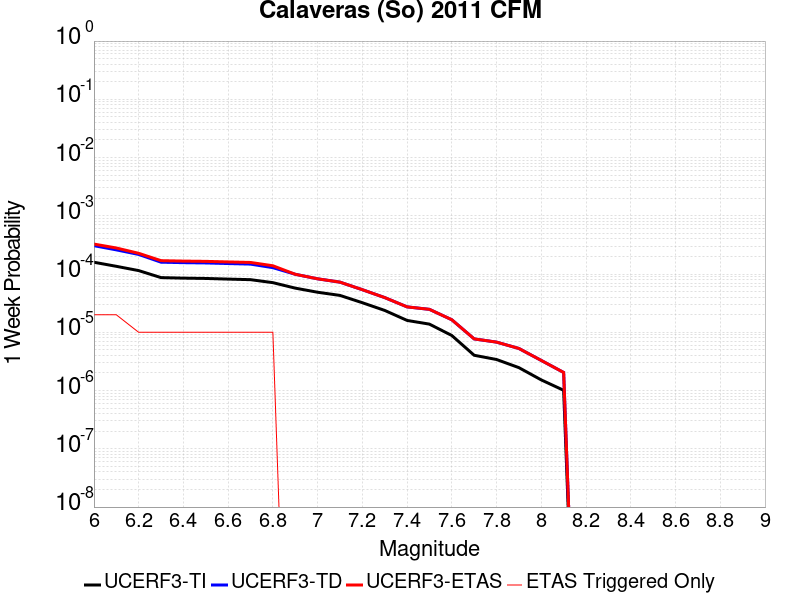 | 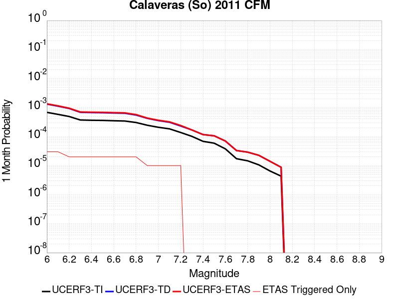 |  |  |

| Magnitude | 1 wk TI Prob | 1 wk TD Prob | 1 wk ETAS Prob | 1 wk ETAS/TD Gain | 1 wk ETAS Triggered Only | 1 mo TI Prob | 1 mo TD Prob | 1 mo ETAS Prob | 1 mo ETAS/TD Gain | 1 mo ETAS Triggered Only | 1 yr TI Prob | 1 yr TD Prob | 1 yr ETAS Prob | 1 yr ETAS/TD Gain | 1 yr ETAS Triggered Only | 10 yr TI Prob | 10 yr TD Prob | 10 yr ETAS Prob | 10 yr ETAS/TD Gain | 10 yr ETAS Triggered Only |
|-----|-----|-----|-----|-----|-----|-----|-----|-----|-----|-----|-----|-----|-----|-----|-----|-----|-----|-----|-----|-----|
| 6.0 | 1.5950744E-4 | 3.071188E-4 | 3.2711268E-4 | 1.0651014 | 2.0E-5 | 6.834242E-4 | 0.0013155643 | 0.0013455248 | 1.0227739 | 3.0E-5 | 0.00828899 | 0.01585904 | 0.01591809 | 1.0037234 | 6.0E-5 | 0.079865426 | 0.14440064 | 0.1444691 | 1.000474 | 8.0E-5 |
| 6.1 | 1.3584697E-4 | 2.6036944E-4 | 2.803642E-4 | 1.0767939 | 2.0E-5 | 5.8207137E-4 | 0.0011153965 | 0.001145363 | 1.0268663 | 3.0E-5 | 0.007063716 | 0.013462106 | 0.013521298 | 1.0043969 | 6.0E-5 | 0.06843361 | 0.12402854 | 0.12409862 | 1.000565 | 8.0E-5 |
| 6.2 | 1.14676266E-4 | 2.1726108E-4 | 2.2725892E-4 | 1.0460175 | 1.0E-5 | 4.9137714E-4 | 9.307893E-4 | 9.507707E-4 | 1.0214671 | 2.0E-5 | 0.0059661185 | 0.011245592 | 0.011295029 | 1.0043962 | 5.0E-5 | 0.058084648 | 0.105019294 | 0.10508194 | 1.0005965 | 7.0E-5 |
| 6.3 | 8.691518E-5 | 1.5987165E-4 | 1.6987004E-4 | 1.0625402 | 1.0E-5 | 3.7244044E-4 | 6.8496726E-4 | 7.0495356E-4 | 1.0291785 | 2.0E-5 | 0.004525038 | 0.008300893 | 0.0083504785 | 1.0059735 | 5.0E-5 | 0.044339992 | 0.0793347 | 0.079399146 | 1.0008123 | 7.0E-5 |
| 6.4 | 8.50982E-5 | 1.5693568E-4 | 1.6693411E-4 | 1.0637103 | 1.0E-5 | 3.646556E-4 | 6.7239115E-4 | 6.923777E-4 | 1.0297246 | 2.0E-5 | 0.0044306475 | 0.008148931 | 0.008198523 | 1.0060858 | 5.0E-5 | 0.04343345 | 0.077940844 | 0.07800539 | 1.0008281 | 7.0E-5 |
| 6.5 | 8.4062965E-5 | 1.5518135E-4 | 1.6517981E-4 | 1.0644307 | 1.0E-5 | 3.602201E-4 | 6.648764E-4 | 6.8486313E-4 | 1.0300608 | 2.0E-5 | 0.004376863 | 0.008058134 | 0.00810773 | 1.0061549 | 5.0E-5 | 0.042916555 | 0.077112116 | 0.07717672 | 1.0008378 | 7.0E-5 |
| 6.6 | 8.194716E-5 | 1.5154095E-4 | 1.6153943E-4 | 1.0659788 | 1.0E-5 | 3.5115483E-4 | 6.492825E-4 | 6.6926953E-4 | 1.0307832 | 2.0E-5 | 0.0042669317 | 0.007869979 | 0.007919586 | 1.0063033 | 5.0E-5 | 0.04185927 | 0.07539739 | 0.07546211 | 1.0008584 | 7.0E-5 |
| 6.7 | 8.012326E-5 | 1.4821833E-4 | 1.5821685E-4 | 1.067458 | 1.0E-5 | 3.433402E-4 | 6.350497E-4 | 6.55037E-4 | 1.0314736 | 2.0E-5 | 0.004172157 | 0.007698474 | 0.0077480893 | 1.0064448 | 5.0E-5 | 0.040946912 | 0.073839515 | 0.07390435 | 1.000878 | 7.0E-5 |
| 6.8 | 7.119773E-5 | 1.2880519E-4 | 1.388039E-4 | 1.0776266 | 1.0E-5 | 3.0509746E-4 | 5.519001E-4 | 5.718891E-4 | 1.0362184 | 2.0E-5 | 0.0037082357 | 0.0066958875 | 0.0067455526 | 1.0074173 | 5.0E-5 | 0.036469642 | 0.06468402 | 0.06474949 | 1.0010122 | 7.0E-5 |
| 6.9 | 5.7343088E-5 | 9.9189E-5 | 9.9189E-5 | 1.0 | 0.0 | 2.4573295E-4 | 4.2502693E-4 | 4.3502267E-4 | 1.023518 | 1.0E-5 | 0.0029876942 | 0.0051625078 | 0.0052023013 | 1.0077082 | 4.0E-5 | 0.02947844 | 0.050509132 | 0.050566103 | 1.001128 | 6.0E-5 |
| 7.0 | 4.8746577E-5 | 8.284751E-5 | 8.284751E-5 | 1.0 | 0.0 | 2.0889717E-4 | 3.550128E-4 | 3.6500924E-4 | 1.028158 | 1.0E-5 | 0.0025403565 | 0.004313781 | 0.0043436512 | 1.0069245 | 3.0E-5 | 0.025115121 | 0.04248505 | 0.04252335 | 1.0009015 | 4.0E-5 |
| 7.1 | 4.2998014E-5 | 7.264914E-5 | 7.264914E-5 | 1.0 | 0.0 | 1.8426418E-4 | 3.1131663E-4 | 3.213135E-4 | 1.0321116 | 1.0E-5 | 0.002241108 | 0.0037837527 | 0.0038136393 | 1.0078987 | 3.0E-5 | 0.022186412 | 0.037423246 | 0.037461746 | 1.0010289 | 4.0E-5 |
| 7.2 | 3.221292E-5 | 5.390566E-5 | 5.390566E-5 | 1.0 | 0.0 | 1.3804805E-4 | 2.3100396E-4 | 2.4100165E-4 | 1.0432793 | 1.0E-5 | 0.0016794393 | 0.0028088738 | 0.0028387895 | 1.0106504 | 3.0E-5 | 0.016668037 | 0.028035998 | 0.028074875 | 1.0013868 | 4.0E-5 |
| 7.3 | 2.3756531E-5 | 3.9471706E-5 | 3.9471706E-5 | 1.0 | 0.0 | 1.0180973E-4 | 1.6915359E-4 | 1.6915359E-4 | 1.0 | 0.0 | 0.0012388286 | 0.0020575167 | 0.0020774754 | 1.0097004 | 2.0E-5 | 0.012319452 | 0.02064345 | 0.020672832 | 1.0014232 | 3.0E-5 |
| 7.4 | 1.5997684E-5 | 2.734085E-5 | 2.734085E-5 | 1.0 | 0.0 | 6.8559704E-5 | 1.1716982E-4 | 1.1716982E-4 | 1.0 | 0.0 | 8.343947E-4 | 0.0014256114 | 0.001445583 | 1.0140091 | 2.0E-5 | 0.008312687 | 0.014376549 | 0.014396261 | 1.0013711 | 2.0E-5 |
| 7.5 | 1.3814293E-5 | 2.4782603E-5 | 2.4782603E-5 | 1.0 | 0.0 | 5.9202768E-5 | 1.0620684E-4 | 1.0620684E-4 | 1.0 | 0.0 | 7.205553E-4 | 0.0012923037 | 0.0013122779 | 1.0154562 | 2.0E-5 | 0.007182234 | 0.013055766 | 0.013075504 | 1.0015119 | 2.0E-5 |
| 7.6 | 8.817309E-6 | 1.6429829E-5 | 1.6429829E-5 | 1.0 | 0.0 | 3.7787922E-5 | 7.041166E-5 | 7.041166E-5 | 1.0 | 0.0 | 4.5997082E-4 | 8.5692614E-4 | 8.76909E-4 | 1.0233192 | 2.0E-5 | 0.004590199 | 0.008719863 | 0.008739689 | 1.0022736 | 2.0E-5 |
| 7.7 | 4.0352206E-6 | 7.706877E-6 | 7.706877E-6 | 1.0 | 0.0 | 1.7293689E-5 | 3.3029053E-5 | 3.3029053E-5 | 1.0 | 0.0 | 2.1053031E-4 | 4.020546E-4 | 4.2204658E-4 | 1.0497245 | 2.0E-5 | 0.0021033096 | 0.0041649863 | 0.004184903 | 1.004782 | 2.0E-5 |
| 7.8 | 3.413169E-6 | 6.7868646E-6 | 6.7868646E-6 | 1.0 | 0.0 | 1.4627784E-5 | 2.9086239E-5 | 2.9086239E-5 | 1.0 | 0.0 | 1.7807873E-4 | 3.5406748E-4 | 3.740604E-4 | 1.0564665 | 2.0E-5 | 0.0017793609 | 0.0036663096 | 0.0036862362 | 1.0054351 | 2.0E-5 |
| 7.9 | 2.4740732E-6 | 5.278809E-6 | 5.278809E-6 | 1.0 | 0.0 | 1.06031275E-5 | 2.2623271E-5 | 2.2623271E-5 | 1.0 | 0.0 | 1.2908543E-4 | 2.7540355E-4 | 2.854008E-4 | 1.0363003 | 1.0E-5 | 0.0012901047 | 0.002834638 | 0.0028446098 | 1.0035177 | 1.0E-5 |
| 8.0 | 1.5231818E-6 | 3.2887135E-6 | 3.2887135E-6 | 1.0 | 0.0 | 6.527906E-6 | 1.409441E-5 | 1.409441E-5 | 1.0 | 0.0 | 7.9474354E-5 | 1.7158597E-4 | 1.8158426E-4 | 1.0582699 | 1.0E-5 | 7.944594E-4 | 0.001756374 | 0.0017663564 | 1.0056835 | 1.0E-5 |
| 8.1 | 1.0104524E-6 | 2.0456548E-6 | 2.0456548E-6 | 1.0 | 0.0 | 4.330503E-6 | 8.767062E-6 | 8.767062E-6 | 1.0 | 0.0 | 5.2722597E-5 | 1.06733794E-4 | 1.06733794E-4 | 1.0 | 0.0 | 5.271009E-4 | 0.0010929212 | 0.0010929212 | 1.0 | 0.0 |

## Channel Islands Thrust
*[(top)](#table-of-contents)*

| 1 Week | 1 Month | 1 Year | 10 Year |
|-----|-----|-----|-----|
|  |  |  |  |

| Magnitude | 1 wk TI Prob | 1 wk TD Prob | 1 wk ETAS Prob | 1 wk ETAS/TD Gain | 1 wk ETAS Triggered Only | 1 mo TI Prob | 1 mo TD Prob | 1 mo ETAS Prob | 1 mo ETAS/TD Gain | 1 mo ETAS Triggered Only | 1 yr TI Prob | 1 yr TD Prob | 1 yr ETAS Prob | 1 yr ETAS/TD Gain | 1 yr ETAS Triggered Only | 10 yr TI Prob | 10 yr TD Prob | 10 yr ETAS Prob | 10 yr ETAS/TD Gain | 10 yr ETAS Triggered Only |
|-----|-----|-----|-----|-----|-----|-----|-----|-----|-----|-----|-----|-----|-----|-----|-----|-----|-----|-----|-----|-----|
| 6.0 | 2.2156251E-5 | 2.4092022E-5 | 5.40913E-5 | 2.2451954 | 3.0E-5 | 9.495191E-5 | 1.03248036E-4 | 1.432439E-4 | 1.3873765 | 4.0E-5 | 0.0011554264 | 0.0012564264 | 0.0013263385 | 1.0556436 | 7.0E-5 | 0.011494373 | 0.0125038205 | 0.0126025705 | 1.0078975 | 1.0E-4 |
| 6.1 | 2.2156251E-5 | 2.4092022E-5 | 5.40913E-5 | 2.2451954 | 3.0E-5 | 9.495191E-5 | 1.03248036E-4 | 1.432439E-4 | 1.3873765 | 4.0E-5 | 0.0011554264 | 0.0012564264 | 0.0013263385 | 1.0556436 | 7.0E-5 | 0.011494373 | 0.0125038205 | 0.0126025705 | 1.0078975 | 1.0E-4 |
| 6.2 | 2.2156251E-5 | 2.4092022E-5 | 5.40913E-5 | 2.2451954 | 3.0E-5 | 9.495191E-5 | 1.03248036E-4 | 1.432439E-4 | 1.3873765 | 4.0E-5 | 0.0011554264 | 0.0012564264 | 0.0013263385 | 1.0556436 | 7.0E-5 | 0.011494373 | 0.0125038205 | 0.0126025705 | 1.0078975 | 1.0E-4 |
| 6.3 | 2.2156251E-5 | 2.4092022E-5 | 5.40913E-5 | 2.2451954 | 3.0E-5 | 9.495191E-5 | 1.03248036E-4 | 1.432439E-4 | 1.3873765 | 4.0E-5 | 0.0011554264 | 0.0012564264 | 0.0013263385 | 1.0556436 | 7.0E-5 | 0.011494373 | 0.0125038205 | 0.0126025705 | 1.0078975 | 1.0E-4 |
| 6.4 | 2.2156251E-5 | 2.4092022E-5 | 5.40913E-5 | 2.2451954 | 3.0E-5 | 9.495191E-5 | 1.03248036E-4 | 1.432439E-4 | 1.3873765 | 4.0E-5 | 0.0011554264 | 0.0012564264 | 0.0013263385 | 1.0556436 | 7.0E-5 | 0.011494373 | 0.0125038205 | 0.0126025705 | 1.0078975 | 1.0E-4 |
| 6.5 | 2.2156251E-5 | 2.4092022E-5 | 5.40913E-5 | 2.2451954 | 3.0E-5 | 9.495191E-5 | 1.03248036E-4 | 1.432439E-4 | 1.3873765 | 4.0E-5 | 0.0011554264 | 0.0012564264 | 0.0013263385 | 1.0556436 | 7.0E-5 | 0.011494373 | 0.0125038205 | 0.0126025705 | 1.0078975 | 1.0E-4 |
| 6.6 | 2.2156251E-5 | 2.4092022E-5 | 5.40913E-5 | 2.2451954 | 3.0E-5 | 9.495191E-5 | 1.03248036E-4 | 1.432439E-4 | 1.3873765 | 4.0E-5 | 0.0011554264 | 0.0012564264 | 0.0013263385 | 1.0556436 | 7.0E-5 | 0.011494373 | 0.0125038205 | 0.0126025705 | 1.0078975 | 1.0E-4 |
| 6.7 | 1.0601296E-5 | 1.1379544E-5 | 1.1379544E-5 | 1.0 | 0.0 | 4.5433335E-5 | 4.876859E-5 | 5.8768102E-5 | 1.20504 | 1.0E-5 | 5.5301044E-4 | 5.936007E-4 | 6.2358286E-4 | 1.050509 | 3.0E-5 | 0.005516363 | 0.005920653 | 0.005980298 | 1.010074 | 6.0E-5 |
| 6.8 | 1.0246747E-5 | 1.0996669E-5 | 1.0996669E-5 | 1.0 | 0.0 | 4.391389E-5 | 4.7127756E-5 | 5.7127283E-5 | 1.2121792 | 1.0E-5 | 5.345204E-4 | 5.7363417E-4 | 6.0361694E-4 | 1.0522681 | 3.0E-5 | 0.0053323656 | 0.005722025 | 0.0057816813 | 1.0104258 | 6.0E-5 |
| 6.9 | 9.049551E-6 | 9.699645E-6 | 9.699645E-6 | 1.0 | 0.0 | 3.878322E-5 | 4.1569267E-5 | 5.1568848E-5 | 1.2405523 | 1.0E-5 | 4.7208337E-4 | 5.059924E-4 | 5.359772E-4 | 1.0592594 | 3.0E-5 | 0.0047108172 | 0.0050488203 | 0.005098568 | 1.0098534 | 5.0E-5 |
| 7.0 | 8.6542195E-6 | 9.274603E-6 | 9.274603E-6 | 1.0 | 0.0 | 3.7088983E-5 | 3.9747716E-5 | 4.974732E-5 | 1.2515768 | 1.0E-5 | 4.5146482E-4 | 4.8382508E-4 | 5.1381055E-4 | 1.0619758 | 3.0E-5 | 0.004505487 | 0.004828129 | 0.0048778877 | 1.010306 | 5.0E-5 |
| 7.1 | 8.391028E-6 | 8.992924E-6 | 8.992924E-6 | 1.0 | 0.0 | 3.5961057E-5 | 3.854056E-5 | 4.8540176E-5 | 1.2594569 | 1.0E-5 | 4.3773788E-4 | 4.6913436E-4 | 4.991203E-4 | 1.0639175 | 3.0E-5 | 0.004368766 | 0.0046818503 | 0.004731616 | 1.0106295 | 5.0E-5 |
| 7.2 | 5.965188E-6 | 6.3716952E-6 | 6.3716952E-6 | 1.0 | 0.0 | 2.556484E-5 | 2.7306982E-5 | 2.7306982E-5 | 1.0 | 0.0 | 3.1120746E-4 | 3.3241234E-4 | 3.5240568E-4 | 1.0601462 | 2.0E-5 | 0.00310772 | 0.0033192092 | 0.0033491098 | 1.0090083 | 3.0E-5 |
| 7.3 | 4.877518E-6 | 5.2060063E-6 | 5.2060063E-6 | 1.0 | 0.0 | 2.0903482E-5 | 2.2311267E-5 | 2.2311267E-5 | 1.0 | 0.0 | 2.5447016E-4 | 2.716063E-4 | 2.9160085E-4 | 1.073616 | 2.0E-5 | 0.0025417898 | 0.0027127895 | 0.0027427082 | 1.0110288 | 3.0E-5 |
| 7.4 | 3.8829853E-6 | 4.141863E-6 | 4.141863E-6 | 1.0 | 0.0 | 1.664126E-5 | 1.7750723E-5 | 1.7750723E-5 | 1.0 | 0.0 | 2.0258849E-4 | 2.1609402E-4 | 2.2609186E-4 | 1.0462662 | 1.0E-5 | 0.002024039 | 0.0021588807 | 0.0021788375 | 1.0092441 | 2.0E-5 |
| 7.5 | 1.3489616E-6 | 1.4277903E-6 | 1.4277903E-6 | 1.0 | 0.0 | 5.7812517E-6 | 6.119087E-6 | 6.119087E-6 | 1.0 | 0.0 | 7.038446E-5 | 7.449738E-5 | 7.449738E-5 | 1.0 | 0.0 | 7.036218E-4 | 7.44728E-4 | 7.547206E-4 | 1.0134177 | 1.0E-5 |
| 7.6 | 6.058192E-7 | 6.353778E-7 | 6.353778E-7 | 1.0 | 0.0 | 2.5963652E-6 | 2.7230449E-6 | 2.7230449E-6 | 1.0 | 0.0 | 3.161029E-5 | 3.3152584E-5 | 3.3152584E-5 | 1.0 | 0.0 | 3.1605794E-4 | 3.31478E-4 | 3.414747E-4 | 1.0301579 | 1.0E-5 |
| 7.7 | 2.2170494E-7 | 2.2607902E-7 | 2.2607902E-7 | 1.0 | 0.0 | 9.5016367E-7 | 9.689098E-7 | 9.689098E-7 | 1.0 | 0.0 | 1.1568181E-5 | 1.1796425E-5 | 1.1796425E-5 | 1.0 | 0.0 | 1.1567579E-4 | 1.1795909E-4 | 1.1795909E-4 | 1.0 | 0.0 |
| 7.8 | 2.1613102E-8 | 1.5466682E-8 | 1.5466682E-8 | 1.0 | 0.0 | 9.262757E-8 | 6.628578E-8 | 6.628578E-8 | 1.0 | 0.0 | 1.1277401E-6 | 8.070291E-7 | 8.070291E-7 | 1.0 | 0.0 | 1.1277344E-5 | 8.070269E-6 | 8.070269E-6 | 1.0 | 0.0 |

## Palos Verdes
*[(top)](#table-of-contents)*

| 1 Week | 1 Month | 1 Year | 10 Year |
|-----|-----|-----|-----|
| 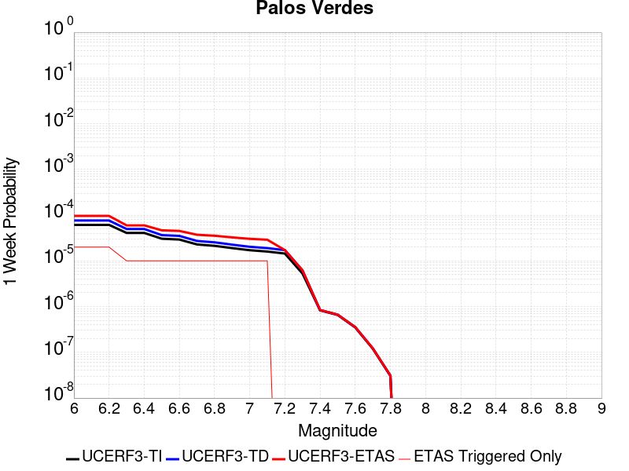 |  | 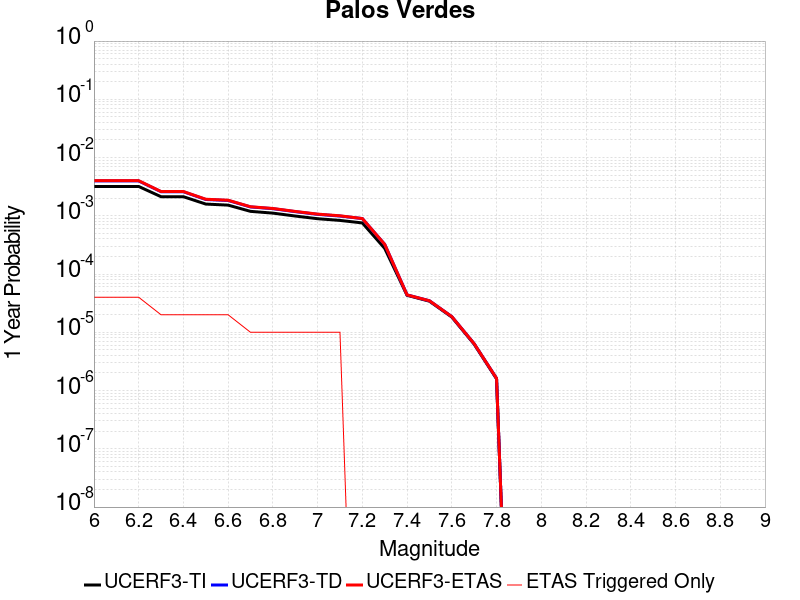 |  |

| Magnitude | 1 wk TI Prob | 1 wk TD Prob | 1 wk ETAS Prob | 1 wk ETAS/TD Gain | 1 wk ETAS Triggered Only | 1 mo TI Prob | 1 mo TD Prob | 1 mo ETAS Prob | 1 mo ETAS/TD Gain | 1 mo ETAS Triggered Only | 1 yr TI Prob | 1 yr TD Prob | 1 yr ETAS Prob | 1 yr ETAS/TD Gain | 1 yr ETAS Triggered Only | 10 yr TI Prob | 10 yr TD Prob | 10 yr ETAS Prob | 10 yr ETAS/TD Gain | 10 yr ETAS Triggered Only |
|-----|-----|-----|-----|-----|-----|-----|-----|-----|-----|-----|-----|-----|-----|-----|-----|-----|-----|-----|-----|-----|
| 6.0 | 6.126063E-5 | 7.622612E-5 | 9.62246E-5 | 1.2623572 | 2.0E-5 | 2.6251914E-4 | 3.2664582E-4 | 3.56636E-4 | 1.0918126 | 3.0E-5 | 0.0031914865 | 0.003970174 | 0.004010015 | 1.0100352 | 4.0E-5 | 0.031460393 | 0.039048895 | 0.039144993 | 1.0024608 | 1.0E-4 |
| 6.1 | 6.126063E-5 | 7.622612E-5 | 9.62246E-5 | 1.2623572 | 2.0E-5 | 2.6251914E-4 | 3.2664582E-4 | 3.56636E-4 | 1.0918126 | 3.0E-5 | 0.0031914865 | 0.003970174 | 0.004010015 | 1.0100352 | 4.0E-5 | 0.031460393 | 0.039048895 | 0.039144993 | 1.0024608 | 1.0E-4 |
| 6.2 | 6.126063E-5 | 7.622612E-5 | 9.62246E-5 | 1.2623572 | 2.0E-5 | 2.6251914E-4 | 3.2664582E-4 | 3.56636E-4 | 1.0918126 | 3.0E-5 | 0.0031914865 | 0.003970174 | 0.004010015 | 1.0100352 | 4.0E-5 | 0.031460393 | 0.039048895 | 0.039144993 | 1.0024608 | 1.0E-4 |
| 6.3 | 4.0838047E-5 | 4.9749437E-5 | 5.9748938E-5 | 1.2009974 | 1.0E-5 | 1.7500846E-4 | 2.1319572E-4 | 2.2319358E-4 | 1.0468953 | 1.0E-5 | 0.0021286458 | 0.0025927818 | 0.00261273 | 1.0076938 | 2.0E-5 | 0.021083709 | 0.025646681 | 0.025714885 | 1.0026594 | 7.0E-5 |
| 6.4 | 4.0838047E-5 | 4.9749437E-5 | 5.9748938E-5 | 1.2009974 | 1.0E-5 | 1.7500846E-4 | 2.1319572E-4 | 2.2319358E-4 | 1.0468953 | 1.0E-5 | 0.0021286458 | 0.0025927818 | 0.00261273 | 1.0076938 | 2.0E-5 | 0.021083709 | 0.025646681 | 0.025714885 | 1.0026594 | 7.0E-5 |
| 6.5 | 3.0512005E-5 | 3.656162E-5 | 4.6561257E-5 | 1.2735008 | 1.0E-5 | 1.3075917E-4 | 1.5668393E-4 | 1.6668237E-4 | 1.0638127 | 1.0E-5 | 0.0015908304 | 0.0019060767 | 0.0019260385 | 1.0104728 | 2.0E-5 | 0.015794903 | 0.018909154 | 0.01896802 | 1.003113 | 6.0E-5 |
| 6.6 | 2.9255087E-5 | 3.515442E-5 | 4.515407E-5 | 1.2844492 | 1.0E-5 | 1.2537291E-4 | 1.5065377E-4 | 1.6065226E-4 | 1.0663674 | 1.0E-5 | 0.0015253464 | 0.0018327828 | 0.0018527461 | 1.0108924 | 2.0E-5 | 0.015149189 | 0.018188225 | 0.018237315 | 1.002699 | 5.0E-5 |
| 6.7 | 2.287198E-5 | 2.7248278E-5 | 3.7248006E-5 | 1.3669857 | 1.0E-5 | 9.801909E-5 | 1.16773626E-4 | 1.2677246E-4 | 1.0856258 | 1.0E-5 | 0.001192729 | 0.0014208833 | 0.0014308691 | 1.0070279 | 1.0E-5 | 0.011863477 | 0.014127217 | 0.014166652 | 1.0027914 | 4.0E-5 |
| 6.8 | 2.1325764E-5 | 2.5431877E-5 | 3.543162E-5 | 1.3931973 | 1.0E-5 | 9.139293E-5 | 1.0898971E-4 | 1.18988624E-4 | 1.0917418 | 1.0E-5 | 0.001112141 | 0.0013262323 | 0.001336219 | 1.0075302 | 1.0E-5 | 0.011065915 | 0.013192211 | 0.0132316835 | 1.002992 | 4.0E-5 |
| 6.9 | 1.9009392E-5 | 2.2613547E-5 | 3.2613323E-5 | 1.4422028 | 1.0E-5 | 8.1466285E-5 | 9.6912096E-5 | 1.0691113E-4 | 1.1031762 | 1.0E-5 | 9.914007E-4 | 0.0011793535 | 0.0011893417 | 1.0084692 | 1.0E-5 | 0.009869894 | 0.011739632 | 0.011769281 | 1.0025254 | 3.0E-5 |
| 7.0 | 1.7098473E-5 | 2.0319356E-5 | 3.0319152E-5 | 1.4921316 | 1.0E-5 | 7.3277115E-5 | 8.708052E-5 | 9.7079654E-5 | 1.1148262 | 1.0E-5 | 8.917837E-4 | 0.001059775 | 0.0010697644 | 1.009426 | 1.0E-5 | 0.008882134 | 0.010555646 | 0.0105853295 | 1.002812 | 3.0E-5 |
| 7.1 | 1.5982785E-5 | 1.899476E-5 | 2.8994571E-5 | 1.526451 | 1.0E-5 | 6.849585E-5 | 8.1404054E-5 | 9.1403235E-5 | 1.122834 | 1.0E-5 | 8.336179E-4 | 9.907284E-4 | 0.0010007184 | 1.0100836 | 1.0E-5 | 0.008304977 | 0.009871479 | 0.009901184 | 1.0030091 | 3.0E-5 |
| 7.2 | 1.4468002E-5 | 1.7197237E-5 | 1.7197237E-5 | 1.0 | 0.0 | 6.200425E-5 | 7.370083E-5 | 7.370083E-5 | 1.0 | 0.0 | 7.546402E-4 | 8.970222E-4 | 8.970222E-4 | 1.0 | 0.0 | 0.007520827 | 0.008942284 | 0.008962105 | 1.0022166 | 2.0E-5 |
| 7.3 | 5.288233E-6 | 6.2036747E-6 | 6.2036747E-6 | 1.0 | 0.0 | 2.2663658E-5 | 2.6587102E-5 | 2.6587102E-5 | 1.0 | 0.0 | 2.7589512E-4 | 3.236848E-4 | 3.236848E-4 | 1.0 | 0.0 | 0.0027555283 | 0.0032355562 | 0.003245524 | 1.0030806 | 1.0E-5 |
| 7.4 | 8.279556E-7 | 8.408347E-7 | 8.408347E-7 | 1.0 | 0.0 | 3.5483763E-6 | 3.6035726E-6 | 3.6035726E-6 | 1.0 | 0.0 | 4.3200624E-5 | 4.3872686E-5 | 4.3872686E-5 | 1.0 | 0.0 | 4.3192226E-4 | 4.3864746E-4 | 4.3864746E-4 | 1.0 | 0.0 |
| 7.5 | 6.559831E-7 | 6.667229E-7 | 6.667229E-7 | 1.0 | 0.0 | 2.8113532E-6 | 2.857381E-6 | 2.857381E-6 | 1.0 | 0.0 | 3.4227687E-5 | 3.4788125E-5 | 3.4788125E-5 | 1.0 | 0.0 | 3.4222414E-4 | 3.4783344E-4 | 3.4783344E-4 | 1.0 | 0.0 |
| 7.6 | 3.5018968E-7 | 3.5620027E-7 | 3.5620027E-7 | 1.0 | 0.0 | 1.500812E-6 | 1.526572E-6 | 1.526572E-6 | 1.0 | 0.0 | 1.8272232E-5 | 1.8585903E-5 | 1.8585903E-5 | 1.0 | 0.0 | 1.8270731E-4 | 1.8584808E-4 | 1.8584808E-4 | 1.0 | 0.0 |
| 7.7 | 1.1986104E-7 | 1.2198376E-7 | 1.2198376E-7 | 1.0 | 0.0 | 5.1369005E-7 | 5.2278745E-7 | 5.2278745E-7 | 1.0 | 0.0 | 6.2541585E-6 | 6.364919E-6 | 6.364919E-6 | 1.0 | 0.0 | 6.2539824E-5 | 6.364741E-5 | 6.364741E-5 | 1.0 | 0.0 |
| 7.8 | 3.0445005E-8 | 3.1027582E-8 | 3.1027582E-8 | 1.0 | 0.0 | 1.3047858E-7 | 1.3297536E-7 | 1.3297536E-7 | 1.0 | 0.0 | 1.5885756E-6 | 1.6189739E-6 | 1.6189739E-6 | 1.0 | 0.0 | 1.5885644E-5 | 1.6189642E-5 | 1.6189642E-5 | 1.0 | 0.0 |

## Oceanic - West Huasna
*[(top)](#table-of-contents)*

| 1 Week | 1 Month | 1 Year | 10 Year |
|-----|-----|-----|-----|
|  |  |  |  |

| Magnitude | 1 wk TI Prob | 1 wk TD Prob | 1 wk ETAS Prob | 1 wk ETAS/TD Gain | 1 wk ETAS Triggered Only | 1 mo TI Prob | 1 mo TD Prob | 1 mo ETAS Prob | 1 mo ETAS/TD Gain | 1 mo ETAS Triggered Only | 1 yr TI Prob | 1 yr TD Prob | 1 yr ETAS Prob | 1 yr ETAS/TD Gain | 1 yr ETAS Triggered Only | 10 yr TI Prob | 10 yr TD Prob | 10 yr ETAS Prob | 10 yr ETAS/TD Gain | 10 yr ETAS Triggered Only |
|-----|-----|-----|-----|-----|-----|-----|-----|-----|-----|-----|-----|-----|-----|-----|-----|-----|-----|-----|-----|-----|
| 6.0 | 3.195567E-5 | 2.7926868E-5 | 5.792603E-5 | 2.0742042 | 3.0E-5 | 1.3694567E-4 | 1.1968133E-4 | 1.5967654E-4 | 1.3341808 | 4.0E-5 | 0.0016660384 | 0.0014561893 | 0.0014961311 | 1.027429 | 4.0E-5 | 0.016536033 | 0.014471028 | 0.014569581 | 1.0068103 | 1.0E-4 |
| 6.1 | 2.1156782E-5 | 1.7573486E-5 | 2.7573311E-5 | 1.5690291 | 1.0E-5 | 9.066878E-5 | 7.531282E-5 | 9.531131E-5 | 1.265539 | 2.0E-5 | 0.0011033333 | 9.165572E-4 | 9.365389E-4 | 1.0218008 | 2.0E-5 | 0.010978713 | 0.009128777 | 0.009178321 | 1.0054272 | 5.0E-5 |
| 6.2 | 1.6195117E-5 | 1.3327152E-5 | 2.332702E-5 | 1.7503378 | 1.0E-5 | 6.9405796E-5 | 5.7115132E-5 | 6.711456E-5 | 1.1750749 | 1.0E-5 | 8.44688E-4 | 6.9515745E-4 | 7.0515054E-4 | 1.0143752 | 1.0E-5 | 0.008414844 | 0.006930123 | 0.006959915 | 1.0042989 | 3.0E-5 |
| 6.3 | 1.3559345E-5 | 1.1179142E-5 | 2.117903E-5 | 1.894513 | 1.0E-5 | 5.811018E-5 | 4.7909736E-5 | 5.790926E-5 | 1.2087158 | 1.0E-5 | 7.072618E-4 | 5.831459E-4 | 5.931401E-4 | 1.0171384 | 1.0E-5 | 0.0070501505 | 0.0058162753 | 0.005846101 | 1.0051279 | 3.0E-5 |
| 6.4 | 1.2120619E-5 | 1.0000977E-5 | 2.0000878E-5 | 1.9998922 | 1.0E-5 | 5.1944477E-5 | 4.2860633E-5 | 5.2860203E-5 | 1.2333044 | 1.0E-5 | 6.322405E-4 | 5.2170374E-4 | 5.316985E-4 | 1.019158 | 1.0E-5 | 0.006304447 | 0.0052048573 | 0.005234701 | 1.0057338 | 3.0E-5 |
| 6.5 | 1.13511915E-5 | 9.3674735E-6 | 1.936738E-5 | 2.0675137 | 1.0E-5 | 4.8647056E-5 | 4.01457E-5 | 5.01453E-5 | 1.2490827 | 1.0E-5 | 5.9211696E-4 | 4.886647E-4 | 4.9865985E-4 | 1.0204539 | 1.0E-5 | 0.0059054173 | 0.0048759608 | 0.004895863 | 1.0040817 | 2.0E-5 |
| 6.6 | 9.850605E-6 | 8.135418E-6 | 1.8135337E-5 | 2.2291832 | 1.0E-5 | 4.2216197E-5 | 3.4865614E-5 | 4.4865264E-5 | 1.2868055 | 1.0E-5 | 5.1386096E-4 | 4.2440637E-4 | 4.3440214E-4 | 1.0235523 | 1.0E-5 | 0.0051267436 | 0.004235991 | 0.004255906 | 1.0047015 | 2.0E-5 |
| 6.7 | 8.8558645E-6 | 7.318433E-6 | 1.731836E-5 | 2.3664029 | 1.0E-5 | 3.7953152E-5 | 3.1364336E-5 | 4.1364023E-5 | 1.3188235 | 1.0E-5 | 4.6198163E-4 | 3.8179406E-4 | 3.9179024E-4 | 1.0261822 | 1.0E-5 | 0.004610224 | 0.0038114067 | 0.0038313305 | 1.0052274 | 2.0E-5 |
| 6.8 | 7.67136E-6 | 6.391756E-6 | 1.6391692E-5 | 2.5645053 | 1.0E-5 | 3.2876844E-5 | 2.7392953E-5 | 3.7392678E-5 | 1.3650473 | 1.0E-5 | 4.0020206E-4 | 3.3345833E-4 | 3.43455E-4 | 1.0299788 | 1.0E-5 | 0.003994821 | 0.0033296007 | 0.003349534 | 1.0059867 | 2.0E-5 |
| 6.9 | 6.534529E-6 | 5.4583297E-6 | 1.5458276E-5 | 2.8320522 | 1.0E-5 | 2.8004823E-5 | 2.3392633E-5 | 3.33924E-5 | 1.427475 | 1.0E-5 | 3.4090536E-4 | 2.847682E-4 | 2.9476537E-4 | 1.0351063 | 1.0E-5 | 0.0034038287 | 0.0028440498 | 0.0028540213 | 1.0035061 | 1.0E-5 |
| 7.0 | 5.460525E-6 | 4.5699517E-6 | 1.4569906E-5 | 3.188197 | 1.0E-5 | 2.3402039E-5 | 1.958536E-5 | 2.9585166E-5 | 1.5105754 | 1.0E-5 | 2.8488258E-4 | 2.3842578E-4 | 2.484234E-4 | 1.0419317 | 1.0E-5 | 0.0028451765 | 0.0023817138 | 0.00239169 | 1.0041887 | 1.0E-5 |
| 7.1 | 4.4825083E-6 | 3.7524428E-6 | 1.3752406E-5 | 3.6649206 | 1.0E-5 | 1.9210609E-5 | 1.60818E-5 | 2.6081638E-5 | 1.6218109 | 1.0E-5 | 2.3386406E-4 | 1.9577841E-4 | 2.0577647E-4 | 1.0510682 | 1.0E-5 | 0.002336181 | 0.0019560715 | 0.0019660518 | 1.0051023 | 1.0E-5 |
| 7.2 | 2.821708E-6 | 2.4249334E-6 | 2.4249334E-6 | 1.0 | 0.0 | 1.2092979E-5 | 1.039253E-5 | 1.039253E-5 | 1.0 | 0.0 | 1.4722206E-4 | 1.2652173E-4 | 1.2652173E-4 | 1.0 | 0.0 | 0.0014712457 | 0.0012644994 | 0.0012644994 | 1.0 | 0.0 |
| 7.3 | 2.0644757E-6 | 1.7687412E-6 | 1.7687412E-6 | 1.0 | 0.0 | 8.847723E-6 | 7.5802973E-6 | 7.5802973E-6 | 1.0 | 0.0 | 1.0771569E-4 | 9.228622E-5 | 9.228622E-5 | 1.0 | 0.0 | 0.001076635 | 9.2248066E-4 | 9.2248066E-4 | 1.0 | 0.0 |
| 7.4 | 1.6980367E-6 | 1.4379892E-6 | 1.4379892E-6 | 1.0 | 0.0 | 7.27728E-6 | 6.162796E-6 | 6.162796E-6 | 1.0 | 0.0 | 8.8597284E-5 | 7.5029464E-5 | 7.5029464E-5 | 1.0 | 0.0 | 8.8561967E-4 | 7.500429E-4 | 7.500429E-4 | 1.0 | 0.0 |
| 7.5 | 1.3637683E-6 | 1.1302635E-6 | 1.1302635E-6 | 1.0 | 0.0 | 5.844708E-6 | 4.8439774E-6 | 4.8439774E-6 | 1.0 | 0.0 | 7.1156996E-5 | 5.897383E-5 | 5.897383E-5 | 1.0 | 0.0 | 7.1134215E-4 | 5.895833E-4 | 5.895833E-4 | 1.0 | 0.0 |
| 7.6 | 9.802994E-7 | 7.677247E-7 | 7.677247E-7 | 1.0 | 0.0 | 4.2012766E-6 | 3.2902446E-6 | 3.2902446E-6 | 1.0 | 0.0 | 5.1149345E-5 | 4.0057992E-5 | 4.0057992E-5 | 1.0 | 0.0 | 5.113757E-4 | 4.0050913E-4 | 4.0050913E-4 | 1.0 | 0.0 |
| 7.7 | 5.986191E-7 | 4.0050548E-7 | 4.0050548E-7 | 1.0 | 0.0 | 2.5655079E-6 | 1.7164509E-6 | 1.7164509E-6 | 1.0 | 0.0 | 3.1234613E-5 | 2.089759E-5 | 2.089759E-5 | 1.0 | 0.0 | 3.123022E-4 | 2.089576E-4 | 2.089576E-4 | 1.0 | 0.0 |
| 7.8 | 2.9189815E-7 | 1.5285792E-7 | 1.5285792E-7 | 1.0 | 0.0 | 1.2509914E-6 | 6.5510517E-7 | 6.5510517E-7 | 1.0 | 0.0 | 1.5230714E-5 | 7.9758765E-6 | 7.9758765E-6 | 1.0 | 0.0 | 1.522967E-4 | 7.9757214E-5 | 7.9757214E-5 | 1.0 | 0.0 |
| 7.9 | 1.2057845E-7 | 4.621248E-8 | 4.621248E-8 | 1.0 | 0.0 | 5.1676466E-7 | 1.9805347E-7 | 1.9805347E-7 | 1.0 | 0.0 | 6.2915915E-6 | 2.4112983E-6 | 2.4112983E-6 | 1.0 | 0.0 | 6.2914136E-5 | 2.4114026E-5 | 2.4114026E-5 | 1.0 | 0.0 |
| 8.0 | 3.3806387E-9 | 9.011393E-10 | 9.011393E-10 | 1.0 | 0.0 | 1.4488451E-8 | 3.8620254E-9 | 3.8620254E-9 | 1.0 | 0.0 | 1.7639688E-7 | 4.702016E-8 | 4.702016E-8 | 1.0 | 0.0 | 1.7639674E-6 | 4.7129527E-7 | 4.7129527E-7 | 1.0 | 0.0 |

## Deep Springs
*[(top)](#table-of-contents)*

| 1 Week | 1 Month | 1 Year | 10 Year |
|-----|-----|-----|-----|
|  |  |  |  |

| Magnitude | 1 wk TI Prob | 1 wk TD Prob | 1 wk ETAS Prob | 1 wk ETAS/TD Gain | 1 wk ETAS Triggered Only | 1 mo TI Prob | 1 mo TD Prob | 1 mo ETAS Prob | 1 mo ETAS/TD Gain | 1 mo ETAS Triggered Only | 1 yr TI Prob | 1 yr TD Prob | 1 yr ETAS Prob | 1 yr ETAS/TD Gain | 1 yr ETAS Triggered Only | 10 yr TI Prob | 10 yr TD Prob | 10 yr ETAS Prob | 10 yr ETAS/TD Gain | 10 yr ETAS Triggered Only |
|-----|-----|-----|-----|-----|-----|-----|-----|-----|-----|-----|-----|-----|-----|-----|-----|-----|-----|-----|-----|-----|
| 6.0 | 1.9810619E-5 | 2.311252E-5 | 5.3111828E-5 | 2.297968 | 3.0E-5 | 8.489989E-5 | 9.905276E-5 | 1.2904979E-4 | 1.3028389 | 3.0E-5 | 0.001033166 | 0.0012058079 | 0.0012657356 | 1.0496992 | 6.0E-5 | 0.010283757 | 0.012042425 | 0.01214122 | 1.008204 | 1.0E-4 |
| 6.1 | 1.9810619E-5 | 2.311252E-5 | 5.3111828E-5 | 2.297968 | 3.0E-5 | 8.489989E-5 | 9.905276E-5 | 1.2904979E-4 | 1.3028389 | 3.0E-5 | 0.001033166 | 0.0012058079 | 0.0012657356 | 1.0496992 | 6.0E-5 | 0.010283757 | 0.012042425 | 0.01214122 | 1.008204 | 1.0E-4 |
| 6.2 | 1.9810619E-5 | 2.311252E-5 | 5.3111828E-5 | 2.297968 | 3.0E-5 | 8.489989E-5 | 9.905276E-5 | 1.2904979E-4 | 1.3028389 | 3.0E-5 | 0.001033166 | 0.0012058079 | 0.0012657356 | 1.0496992 | 6.0E-5 | 0.010283757 | 0.012042425 | 0.01214122 | 1.008204 | 1.0E-4 |
| 6.3 | 1.9810619E-5 | 2.311252E-5 | 5.3111828E-5 | 2.297968 | 3.0E-5 | 8.489989E-5 | 9.905276E-5 | 1.2904979E-4 | 1.3028389 | 3.0E-5 | 0.001033166 | 0.0012058079 | 0.0012657356 | 1.0496992 | 6.0E-5 | 0.010283757 | 0.012042425 | 0.01214122 | 1.008204 | 1.0E-4 |
| 6.4 | 1.9810619E-5 | 2.311252E-5 | 5.3111828E-5 | 2.297968 | 3.0E-5 | 8.489989E-5 | 9.905276E-5 | 1.2904979E-4 | 1.3028389 | 3.0E-5 | 0.001033166 | 0.0012058079 | 0.0012657356 | 1.0496992 | 6.0E-5 | 0.010283757 | 0.012042425 | 0.01214122 | 1.008204 | 1.0E-4 |
| 6.5 | 1.7190405E-5 | 2.0050555E-5 | 3.0050354E-5 | 1.4987293 | 1.0E-5 | 7.367108E-5 | 8.593095E-5 | 9.5930096E-5 | 1.1163625 | 1.0E-5 | 8.9657627E-4 | 0.0010462094 | 0.0010861675 | 1.0381932 | 4.0E-5 | 0.008929676 | 0.010462056 | 0.010531324 | 1.0066209 | 7.0E-5 |
| 6.6 | 1.7190405E-5 | 2.0050555E-5 | 3.0050354E-5 | 1.4987293 | 1.0E-5 | 7.367108E-5 | 8.593095E-5 | 9.5930096E-5 | 1.1163625 | 1.0E-5 | 8.9657627E-4 | 0.0010462094 | 0.0010861675 | 1.0381932 | 4.0E-5 | 0.008929676 | 0.010462056 | 0.010531324 | 1.0066209 | 7.0E-5 |

## Kern Canyon (Lake Isabella) 2011
*[(top)](#table-of-contents)*

| 1 Week | 1 Month | 1 Year | 10 Year |
|-----|-----|-----|-----|
|  |  |  |  |

| Magnitude | 1 wk TI Prob | 1 wk TD Prob | 1 wk ETAS Prob | 1 wk ETAS/TD Gain | 1 wk ETAS Triggered Only | 1 mo TI Prob | 1 mo TD Prob | 1 mo ETAS Prob | 1 mo ETAS/TD Gain | 1 mo ETAS Triggered Only | 1 yr TI Prob | 1 yr TD Prob | 1 yr ETAS Prob | 1 yr ETAS/TD Gain | 1 yr ETAS Triggered Only | 10 yr TI Prob | 10 yr TD Prob | 10 yr ETAS Prob | 10 yr ETAS/TD Gain | 10 yr ETAS Triggered Only |
|-----|-----|-----|-----|-----|-----|-----|-----|-----|-----|-----|-----|-----|-----|-----|-----|-----|-----|-----|-----|-----|
| 6.0 | 4.2387383E-6 | 4.001639E-6 | 6.40014E-5 | 15.993797 | 6.0E-5 | 1.8165894E-5 | 1.7149778E-5 | 8.7148575E-5 | 5.0816154 | 7.0E-5 | 2.2114732E-4 | 2.087804E-4 | 2.787658E-4 | 1.3352106 | 7.0E-5 | 0.0022092736 | 0.0020860266 | 0.0021758387 | 1.0430542 | 9.0E-5 |
| 6.1 | 4.2387383E-6 | 4.001639E-6 | 6.40014E-5 | 15.993797 | 6.0E-5 | 1.8165894E-5 | 1.7149778E-5 | 8.7148575E-5 | 5.0816154 | 7.0E-5 | 2.2114732E-4 | 2.087804E-4 | 2.787658E-4 | 1.3352106 | 7.0E-5 | 0.0022092736 | 0.0020860266 | 0.0021758387 | 1.0430542 | 9.0E-5 |
| 6.2 | 4.2387383E-6 | 4.001639E-6 | 6.40014E-5 | 15.993797 | 6.0E-5 | 1.8165894E-5 | 1.7149778E-5 | 8.7148575E-5 | 5.0816154 | 7.0E-5 | 2.2114732E-4 | 2.087804E-4 | 2.787658E-4 | 1.3352106 | 7.0E-5 | 0.0022092736 | 0.0020860266 | 0.0021758387 | 1.0430542 | 9.0E-5 |
| 6.3 | 4.2387383E-6 | 4.001639E-6 | 6.40014E-5 | 15.993797 | 6.0E-5 | 1.8165894E-5 | 1.7149778E-5 | 8.7148575E-5 | 5.0816154 | 7.0E-5 | 2.2114732E-4 | 2.087804E-4 | 2.787658E-4 | 1.3352106 | 7.0E-5 | 0.0022092736 | 0.0020860266 | 0.0021758387 | 1.0430542 | 9.0E-5 |
| 6.4 | 4.2387383E-6 | 4.001639E-6 | 6.40014E-5 | 15.993797 | 6.0E-5 | 1.8165894E-5 | 1.7149778E-5 | 8.7148575E-5 | 5.0816154 | 7.0E-5 | 2.2114732E-4 | 2.087804E-4 | 2.787658E-4 | 1.3352106 | 7.0E-5 | 0.0022092736 | 0.0020860266 | 0.0021758387 | 1.0430542 | 9.0E-5 |
| 6.5 | 2.7857532E-6 | 2.517867E-6 | 4.2517768E-5 | 16.886423 | 4.0E-5 | 1.1938888E-5 | 1.0790815E-5 | 6.0790277E-5 | 5.63352 | 5.0E-5 | 1.4534626E-4 | 1.3137059E-4 | 1.8136403E-4 | 1.3805526 | 5.0E-5 | 0.0014525123 | 0.001312962 | 0.0013628964 | 1.0380318 | 5.0E-5 |
| 6.6 | 2.2233348E-6 | 1.9441236E-6 | 2.1944084E-5 | 11.287392 | 2.0E-5 | 9.528543E-6 | 8.331932E-6 | 3.8331684E-5 | 4.6005754 | 3.0E-5 | 1.1600384E-4 | 1.01436635E-4 | 1.314336E-4 | 1.2957212 | 3.0E-5 | 0.001159433 | 0.001013912 | 0.0010438815 | 1.0295584 | 3.0E-5 |
| 6.7 | 2.1635126E-6 | 1.8835036E-6 | 2.1883467E-5 | 11.618489 | 2.0E-5 | 9.272164E-6 | 8.072134E-6 | 3.8071892E-5 | 4.7164593 | 3.0E-5 | 1.1288274E-4 | 9.827388E-5 | 1.2827093E-4 | 1.3052393 | 3.0E-5 | 0.0011282542 | 9.823124E-4 | 0.0010122829 | 1.0305102 | 3.0E-5 |
| 6.8 | 1.8685711E-6 | 1.5831425E-6 | 2.1583111E-5 | 13.633081 | 2.0E-5 | 8.008137E-6 | 6.784879E-6 | 3.6784677E-5 | 5.421567 | 3.0E-5 | 9.74947E-5 | 8.260282E-5 | 1.1260034E-4 | 1.3631537 | 3.0E-5 | 9.745194E-4 | 8.2572614E-4 | 8.5570134E-4 | 1.0363016 | 3.0E-5 |
| 6.9 | 1.5815071E-6 | 1.3064928E-6 | 2.1306467E-5 | 16.30814 | 2.0E-5 | 6.77787E-6 | 5.599243E-6 | 3.5599074E-5 | 6.357837 | 3.0E-5 | 8.251744E-5 | 6.816868E-5 | 9.816663E-5 | 1.4400548 | 3.0E-5 | 8.248681E-4 | 6.8148033E-4 | 7.114599E-4 | 1.0439918 | 3.0E-5 |
| 7.0 | 1.3772564E-6 | 1.1210718E-6 | 2.112105E-5 | 18.84005 | 2.0E-5 | 5.9025137E-6 | 4.8045845E-6 | 3.480444E-5 | 7.244006 | 3.0E-5 | 7.186073E-5 | 5.8494268E-5 | 8.849251E-5 | 1.5128407 | 3.0E-5 | 7.18375E-4 | 5.847908E-4 | 6.1477325E-4 | 1.0512704 | 3.0E-5 |
| 7.1 | 1.0916998E-6 | 8.763777E-7 | 2.087636E-5 | 23.82119 | 2.0E-5 | 4.678705E-6 | 3.7558991E-6 | 3.3755787E-5 | 8.987405 | 3.0E-5 | 5.6961744E-5 | 4.5727127E-5 | 7.572575E-5 | 1.6560357 | 3.0E-5 | 5.6947145E-4 | 4.571785E-4 | 4.871648E-4 | 1.0655899 | 3.0E-5 |
| 7.2 | 7.6277024E-7 | 5.901454E-7 | 1.059014E-5 | 17.944965 | 1.0E-5 | 3.2690114E-6 | 2.5291922E-6 | 2.2529142E-5 | 8.907642 | 2.0E-5 | 3.9799485E-5 | 3.0792486E-5 | 5.079187E-5 | 1.649489 | 2.0E-5 | 3.9792358E-4 | 3.0788282E-4 | 3.2787665E-4 | 1.0649397 | 2.0E-5 |
| 7.3 | 5.3265916E-7 | 4.3824414E-7 | 1.043824E-5 | 23.818321 | 1.0E-5 | 2.282823E-6 | 1.878188E-6 | 2.187815E-5 | 11.648541 | 2.0E-5 | 2.7793016E-5 | 2.2866701E-5 | 4.2866246E-5 | 1.8746142 | 2.0E-5 | 2.778954E-4 | 2.2864387E-4 | 2.486393E-4 | 1.0874523 | 2.0E-5 |
| 7.4 | 3.4946007E-7 | 3.006571E-7 | 3.006571E-7 | 1.0 | 0.0 | 1.497685E-6 | 1.2885298E-6 | 1.1288517E-5 | 8.760773 | 1.0E-5 | 1.8234163E-5 | 1.568774E-5 | 2.5687583E-5 | 1.6374304 | 1.0E-5 | 1.8232666E-4 | 1.5686655E-4 | 1.6686496E-4 | 1.0637385 | 1.0E-5 |
| 7.5 | 1.8317026E-7 | 1.4244812E-7 | 1.4244812E-7 | 1.0 | 0.0 | 7.850152E-7 | 6.104918E-7 | 6.104918E-7 | 1.0 | 0.0 | 9.557518E-6 | 7.432713E-6 | 7.432713E-6 | 1.0 | 0.0 | 9.5571064E-5 | 7.432472E-5 | 7.432472E-5 | 1.0 | 0.0 |
| 7.6 | 2.572245E-8 | 1.7352555E-8 | 1.7352555E-8 | 1.0 | 0.0 | 1.10239064E-7 | 7.436809E-8 | 7.436809E-8 | 1.0 | 0.0 | 1.3421597E-6 | 9.054312E-7 | 9.054312E-7 | 1.0 | 0.0 | 1.3421517E-5 | 9.05428E-6 | 9.05428E-6 | 1.0 | 0.0 |

## Camp Rock 2011
*[(top)](#table-of-contents)*

| 1 Week | 1 Month | 1 Year | 10 Year |
|-----|-----|-----|-----|
|  |  | 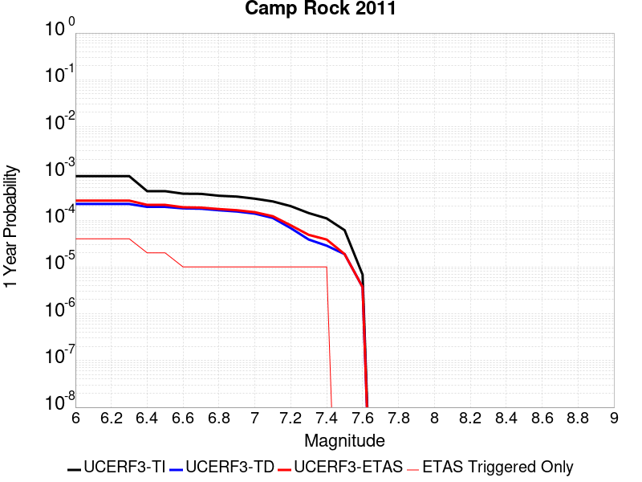 |  |

| Magnitude | 1 wk TI Prob | 1 wk TD Prob | 1 wk ETAS Prob | 1 wk ETAS/TD Gain | 1 wk ETAS Triggered Only | 1 mo TI Prob | 1 mo TD Prob | 1 mo ETAS Prob | 1 mo ETAS/TD Gain | 1 mo ETAS Triggered Only | 1 yr TI Prob | 1 yr TD Prob | 1 yr ETAS Prob | 1 yr ETAS/TD Gain | 1 yr ETAS Triggered Only | 10 yr TI Prob | 10 yr TD Prob | 10 yr ETAS Prob | 10 yr ETAS/TD Gain | 10 yr ETAS Triggered Only |
|-----|-----|-----|-----|-----|-----|-----|-----|-----|-----|-----|-----|-----|-----|-----|-----|-----|-----|-----|-----|-----|
| 6.0 | 1.6710783E-5 | 4.25026E-6 | 1.4250218E-5 | 3.352787 | 1.0E-5 | 7.161568E-5 | 1.8215276E-5 | 3.8214912E-5 | 2.0979595 | 2.0E-5 | 8.7157206E-4 | 2.2174895E-4 | 2.617401E-4 | 1.1803442 | 4.0E-5 | 0.008681616 | 0.0022153298 | 0.0023051302 | 1.040536 | 9.0E-5 |
| 6.1 | 1.6710783E-5 | 4.25026E-6 | 1.4250218E-5 | 3.352787 | 1.0E-5 | 7.161568E-5 | 1.8215276E-5 | 3.8214912E-5 | 2.0979595 | 2.0E-5 | 8.7157206E-4 | 2.2174895E-4 | 2.617401E-4 | 1.1803442 | 4.0E-5 | 0.008681616 | 0.0022153298 | 0.0023051302 | 1.040536 | 9.0E-5 |
| 6.2 | 1.6710783E-5 | 4.25026E-6 | 1.4250218E-5 | 3.352787 | 1.0E-5 | 7.161568E-5 | 1.8215276E-5 | 3.8214912E-5 | 2.0979595 | 2.0E-5 | 8.7157206E-4 | 2.2174895E-4 | 2.617401E-4 | 1.1803442 | 4.0E-5 | 0.008681616 | 0.0022153298 | 0.0023051302 | 1.040536 | 9.0E-5 |
| 6.3 | 1.6710783E-5 | 4.25026E-6 | 1.4250218E-5 | 3.352787 | 1.0E-5 | 7.161568E-5 | 1.8215276E-5 | 3.8214912E-5 | 2.0979595 | 2.0E-5 | 8.7157206E-4 | 2.2174895E-4 | 2.617401E-4 | 1.1803442 | 4.0E-5 | 0.008681616 | 0.0022153298 | 0.0023051302 | 1.040536 | 9.0E-5 |
| 6.4 | 7.982846E-6 | 3.6820884E-6 | 1.3682052E-5 | 3.71584 | 1.0E-5 | 3.421175E-5 | 1.5780286E-5 | 3.577997E-5 | 2.267384 | 2.0E-5 | 4.1644843E-4 | 1.9210839E-4 | 2.1210454E-4 | 1.104088 | 2.0E-5 | 0.0041566887 | 0.001919458 | 0.0019893236 | 1.0363986 | 7.0E-5 |
| 6.5 | 7.982846E-6 | 3.6820884E-6 | 1.3682052E-5 | 3.71584 | 1.0E-5 | 3.421175E-5 | 1.5780286E-5 | 3.577997E-5 | 2.267384 | 2.0E-5 | 4.1644843E-4 | 1.9210839E-4 | 2.1210454E-4 | 1.104088 | 2.0E-5 | 0.0041566887 | 0.001919458 | 0.0019893236 | 1.0363986 | 7.0E-5 |
| 6.6 | 7.048869E-6 | 3.4243571E-6 | 1.3424323E-5 | 3.9202461 | 1.0E-5 | 3.0209088E-5 | 1.4675736E-5 | 2.467559E-5 | 1.6813868 | 1.0E-5 | 3.677336E-4 | 1.7866275E-4 | 1.8866097E-4 | 1.0559614 | 1.0E-5 | 0.0036712566 | 0.0017852228 | 0.0018451157 | 1.0335493 | 6.0E-5 |
| 6.7 | 6.987307E-6 | 3.3623348E-6 | 1.3362301E-5 | 3.974114 | 1.0E-5 | 2.9945259E-5 | 1.4409929E-5 | 2.4409785E-5 | 1.693956 | 1.0E-5 | 3.6452254E-4 | 1.7542706E-4 | 1.854253E-4 | 1.0569937 | 1.0E-5 | 0.0036392517 | 0.001752917 | 0.0018128118 | 1.0341687 | 6.0E-5 |
| 6.8 | 6.3737602E-6 | 3.1179077E-6 | 1.3117877E-5 | 4.207269 | 1.0E-5 | 2.731583E-5 | 1.3362394E-5 | 2.3362261E-5 | 1.7483588 | 1.0E-5 | 3.3251947E-4 | 1.626753E-4 | 1.7267367E-4 | 1.0614622 | 1.0E-5 | 0.0033202237 | 0.0016255907 | 0.0016854932 | 1.0368496 | 6.0E-5 |
| 6.9 | 6.112211E-6 | 2.9331156E-6 | 1.29330865E-5 | 4.409334 | 1.0E-5 | 2.6194928E-5 | 1.2570436E-5 | 2.257031E-5 | 1.7955073 | 1.0E-5 | 3.1887658E-4 | 1.5303459E-4 | 1.6303307E-4 | 1.0653347 | 1.0E-5 | 0.003184194 | 0.0015293199 | 0.001589228 | 1.0391731 | 6.0E-5 |
| 7.0 | 5.5140117E-6 | 2.641923E-6 | 1.2641896E-5 | 4.785112 | 1.0E-5 | 2.3631264E-5 | 1.132248E-5 | 2.1322367E-5 | 1.8831888 | 1.0E-5 | 2.8767265E-4 | 1.3784273E-4 | 1.4784135E-4 | 1.0725365 | 1.0E-5 | 0.0028730053 | 0.0013775975 | 0.0014375148 | 1.0434941 | 6.0E-5 |
| 7.1 | 4.8151105E-6 | 2.1342705E-6 | 1.2134249E-5 | 5.685432 | 1.0E-5 | 2.0636026E-5 | 9.146843E-6 | 1.9146752E-5 | 2.0932634 | 1.0E-5 | 2.5121463E-4 | 1.1135734E-4 | 1.2135622E-4 | 1.0897909 | 1.0E-5 | 0.0025093083 | 0.0011130372 | 0.0011629816 | 1.0448722 | 5.0E-5 |
| 7.2 | 3.818335E-6 | 1.2937425E-6 | 1.129373E-5 | 8.729504 | 1.0E-5 | 1.6364189E-5 | 5.5445994E-6 | 1.5544543E-5 | 2.803547 | 1.0E-5 | 1.9921579E-4 | 6.750349E-5 | 7.750281E-5 | 1.1481305 | 1.0E-5 | 0.0019903728 | 6.748381E-4 | 7.148111E-4 | 1.0592334 | 4.0E-5 |
| 7.3 | 2.7166698E-6 | 7.3835776E-7 | 1.073835E-5 | 14.54356 | 1.0E-5 | 1.1642818E-5 | 3.1643867E-6 | 1.3164355E-5 | 4.16016 | 1.0E-5 | 1.4174209E-4 | 3.8525748E-5 | 4.8525362E-5 | 1.2595567 | 1.0E-5 | 0.0014165172 | 3.851927E-4 | 4.0518498E-4 | 1.051902 | 2.0E-5 |
| 7.4 | 2.0893426E-6 | 5.4618386E-7 | 1.0546179E-5 | 19.308844 | 1.0E-5 | 8.954295E-6 | 2.3407858E-6 | 1.2340763E-5 | 5.2720594 | 1.0E-5 | 1.0901308E-4 | 2.84987E-5 | 3.8498416E-5 | 1.3508832 | 1.0E-5 | 0.0010895962 | 2.84951E-4 | 3.049453E-4 | 1.0701675 | 2.0E-5 |
| 7.5 | 1.1681728E-6 | 3.6030585E-7 | 3.6030585E-7 | 1.0 | 0.0 | 5.0064455E-6 | 1.544167E-6 | 1.544167E-6 | 1.0 | 0.0 | 6.0951766E-5 | 1.8800076E-5 | 1.8800076E-5 | 1.0 | 0.0 | 6.093505E-4 | 1.8798532E-4 | 1.8798532E-4 | 1.0 | 0.0 |
| 7.6 | 1.3154387E-7 | 7.1197384E-8 | 7.1197384E-8 | 1.0 | 0.0 | 5.6375933E-7 | 3.051316E-7 | 3.051316E-7 | 1.0 | 0.0 | 6.863748E-6 | 3.7149728E-6 | 3.7149728E-6 | 1.0 | 0.0 | 6.863536E-5 | 3.7149264E-5 | 3.7149264E-5 | 1.0 | 0.0 |

## Tin Mountain
*[(top)](#table-of-contents)*

| 1 Week | 1 Month | 1 Year | 10 Year |
|-----|-----|-----|-----|
|  |  |  | 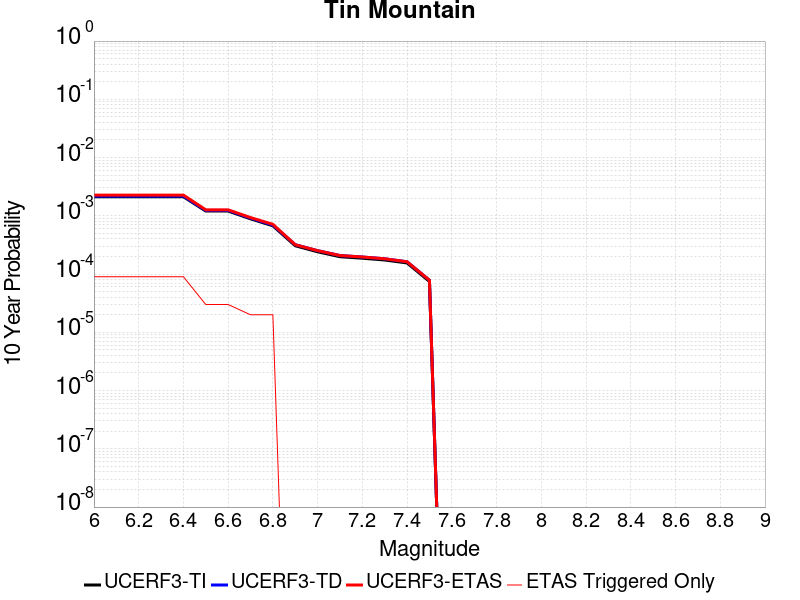 |

| Magnitude | 1 wk TI Prob | 1 wk TD Prob | 1 wk ETAS Prob | 1 wk ETAS/TD Gain | 1 wk ETAS Triggered Only | 1 mo TI Prob | 1 mo TD Prob | 1 mo ETAS Prob | 1 mo ETAS/TD Gain | 1 mo ETAS Triggered Only | 1 yr TI Prob | 1 yr TD Prob | 1 yr ETAS Prob | 1 yr ETAS/TD Gain | 1 yr ETAS Triggered Only | 10 yr TI Prob | 10 yr TD Prob | 10 yr ETAS Prob | 10 yr ETAS/TD Gain | 10 yr ETAS Triggered Only |
|-----|-----|-----|-----|-----|-----|-----|-----|-----|-----|-----|-----|-----|-----|-----|-----|-----|-----|-----|-----|-----|
| 6.0 | 4.083776E-6 | 4.1815365E-6 | 2.4181452E-5 | 5.782911 | 2.0E-5 | 1.750178E-5 | 1.792077E-5 | 4.792023E-5 | 2.6740053 | 3.0E-5 | 2.1306332E-4 | 2.1816725E-4 | 2.7815416E-4 | 1.2749584 | 6.0E-5 | 0.0021285915 | 0.0021798965 | 0.0022697002 | 1.0411963 | 9.0E-5 |
| 6.1 | 4.083776E-6 | 4.1815365E-6 | 2.4181452E-5 | 5.782911 | 2.0E-5 | 1.750178E-5 | 1.792077E-5 | 4.792023E-5 | 2.6740053 | 3.0E-5 | 2.1306332E-4 | 2.1816725E-4 | 2.7815416E-4 | 1.2749584 | 6.0E-5 | 0.0021285915 | 0.0021798965 | 0.0022697002 | 1.0411963 | 9.0E-5 |
| 6.2 | 4.083776E-6 | 4.1815365E-6 | 2.4181452E-5 | 5.782911 | 2.0E-5 | 1.750178E-5 | 1.792077E-5 | 4.792023E-5 | 2.6740053 | 3.0E-5 | 2.1306332E-4 | 2.1816725E-4 | 2.7815416E-4 | 1.2749584 | 6.0E-5 | 0.0021285915 | 0.0021798965 | 0.0022697002 | 1.0411963 | 9.0E-5 |
| 6.3 | 4.083776E-6 | 4.1815365E-6 | 2.4181452E-5 | 5.782911 | 2.0E-5 | 1.750178E-5 | 1.792077E-5 | 4.792023E-5 | 2.6740053 | 3.0E-5 | 2.1306332E-4 | 2.1816725E-4 | 2.7815416E-4 | 1.2749584 | 6.0E-5 | 0.0021285915 | 0.0021798965 | 0.0022697002 | 1.0411963 | 9.0E-5 |
| 6.4 | 4.083776E-6 | 4.1815365E-6 | 2.4181452E-5 | 5.782911 | 2.0E-5 | 1.750178E-5 | 1.792077E-5 | 4.792023E-5 | 2.6740053 | 3.0E-5 | 2.1306332E-4 | 2.1816725E-4 | 2.7815416E-4 | 1.2749584 | 6.0E-5 | 0.0021285915 | 0.0021798965 | 0.0022697002 | 1.0411963 | 9.0E-5 |
| 6.5 | 2.3143427E-6 | 2.3731573E-6 | 1.2373133E-5 | 5.213786 | 1.0E-5 | 9.9185745E-6 | 1.0170638E-5 | 3.0170435E-5 | 2.966425 | 2.0E-5 | 1.2075195E-4 | 1.2382126E-4 | 1.4381878E-4 | 1.1615032 | 2.0E-5 | 0.0012068636 | 0.0012375986 | 0.0012675615 | 1.0242105 | 3.0E-5 |
| 6.6 | 2.3143427E-6 | 2.3731573E-6 | 1.2373133E-5 | 5.213786 | 1.0E-5 | 9.9185745E-6 | 1.0170638E-5 | 3.0170435E-5 | 2.966425 | 2.0E-5 | 1.2075195E-4 | 1.2382126E-4 | 1.4381878E-4 | 1.1615032 | 2.0E-5 | 0.0012068636 | 0.0012375986 | 0.0012675615 | 1.0242105 | 3.0E-5 |
| 6.7 | 1.7029532E-6 | 1.7497915E-6 | 1.1749774E-5 | 6.7149568 | 1.0E-5 | 7.2983503E-6 | 7.499088E-6 | 1.7499013E-5 | 2.3334856 | 1.0E-5 | 8.885379E-5 | 9.1298105E-5 | 1.0129719E-4 | 1.1095213 | 1.0E-5 | 8.881827E-4 | 9.1265864E-4 | 9.3264034E-4 | 1.021894 | 2.0E-5 |
| 6.8 | 1.2914646E-6 | 1.3299378E-6 | 1.1329925E-5 | 8.519138 | 1.0E-5 | 5.534837E-6 | 5.6997237E-6 | 1.5699667E-5 | 2.754461 | 1.0E-5 | 6.738455E-5 | 6.939237E-5 | 7.939168E-5 | 1.144098 | 1.0E-5 | 6.736412E-4 | 6.9375033E-4 | 7.1373646E-4 | 1.0288088 | 2.0E-5 |
| 6.9 | 5.8708974E-7 | 6.1169936E-7 | 6.1169936E-7 | 1.0 | 0.0 | 2.5160964E-6 | 2.6215664E-6 | 2.6215664E-6 | 1.0 | 0.0 | 3.0633044E-5 | 3.1917145E-5 | 3.1917145E-5 | 1.0 | 0.0 | 3.0628822E-4 | 3.191297E-4 | 3.191297E-4 | 1.0 | 0.0 |
| 7.0 | 4.6248786E-7 | 4.832015E-7 | 4.832015E-7 | 1.0 | 0.0 | 1.9820893E-6 | 2.0708624E-6 | 2.0708624E-6 | 1.0 | 0.0 | 2.413167E-5 | 2.5212494E-5 | 2.5212494E-5 | 1.0 | 0.0 | 2.412905E-4 | 2.5210003E-4 | 2.5210003E-4 | 1.0 | 0.0 |
| 7.1 | 3.804606E-7 | 3.987147E-7 | 3.987147E-7 | 1.0 | 0.0 | 1.6305444E-6 | 1.7087764E-6 | 1.7087764E-6 | 1.0 | 0.0 | 1.9851697E-5 | 2.0804187E-5 | 2.0804187E-5 | 1.0 | 0.0 | 1.9849923E-4 | 2.0802575E-4 | 2.0802575E-4 | 1.0 | 0.0 |
| 7.2 | 3.5864858E-7 | 3.7616863E-7 | 3.7616863E-7 | 1.0 | 0.0 | 1.5370645E-6 | 1.6121504E-6 | 1.6121504E-6 | 1.0 | 0.0 | 1.87136E-5 | 1.9627789E-5 | 1.9627789E-5 | 1.0 | 0.0 | 1.8712023E-4 | 1.9626386E-4 | 1.9626386E-4 | 1.0 | 0.0 |
| 7.3 | 3.342063E-7 | 3.506347E-7 | 3.506347E-7 | 1.0 | 0.0 | 1.4323119E-6 | 1.5027196E-6 | 1.5027196E-6 | 1.0 | 0.0 | 1.7438259E-5 | 1.829549E-5 | 1.829549E-5 | 1.0 | 0.0 | 1.743689E-4 | 1.8294314E-4 | 1.8294314E-4 | 1.0 | 0.0 |
| 7.4 | 2.971242E-7 | 3.1165817E-7 | 3.1165817E-7 | 1.0 | 0.0 | 1.2733886E-6 | 1.3356774E-6 | 1.3356774E-6 | 1.0 | 0.0 | 1.5503398E-5 | 1.6261785E-5 | 1.6261785E-5 | 1.0 | 0.0 | 1.5502315E-4 | 1.6260923E-4 | 1.6260923E-4 | 1.0 | 0.0 |
| 7.5 | 1.4326713E-7 | 1.5012525E-7 | 1.5012525E-7 | 1.0 | 0.0 | 6.140018E-7 | 6.433939E-7 | 6.433939E-7 | 1.0 | 0.0 | 7.4754466E-6 | 7.8333205E-6 | 7.8333205E-6 | 1.0 | 0.0 | 7.475195E-5 | 7.833321E-5 | 7.833321E-5 | 1.0 | 0.0 |

## Hayward (So) 2011 CFM
*[(top)](#table-of-contents)*

| 1 Week | 1 Month | 1 Year | 10 Year |
|-----|-----|-----|-----|
|  | 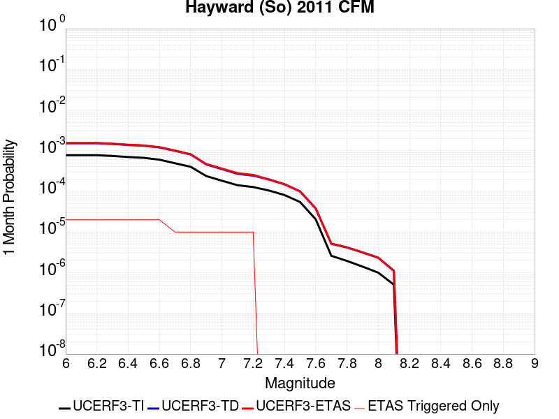 |  |  |

| Magnitude | 1 wk TI Prob | 1 wk TD Prob | 1 wk ETAS Prob | 1 wk ETAS/TD Gain | 1 wk ETAS Triggered Only | 1 mo TI Prob | 1 mo TD Prob | 1 mo ETAS Prob | 1 mo ETAS/TD Gain | 1 mo ETAS Triggered Only | 1 yr TI Prob | 1 yr TD Prob | 1 yr ETAS Prob | 1 yr ETAS/TD Gain | 1 yr ETAS Triggered Only | 10 yr TI Prob | 10 yr TD Prob | 10 yr ETAS Prob | 10 yr ETAS/TD Gain | 10 yr ETAS Triggered Only |
|-----|-----|-----|-----|-----|-----|-----|-----|-----|-----|-----|-----|-----|-----|-----|-----|-----|-----|-----|-----|-----|
| 6.0 | 1.8091932E-4 | 3.570541E-4 | 3.6705052E-4 | 1.027997 | 1.0E-5 | 7.751381E-4 | 0.0015293444 | 0.0015493138 | 1.0130575 | 2.0E-5 | 0.00939654 | 0.018463207 | 0.018512284 | 1.0026581 | 5.0E-5 | 0.090090066 | 0.16673161 | 0.16679828 | 1.0003998 | 8.0E-5 |
| 6.1 | 1.8091932E-4 | 3.570541E-4 | 3.6705052E-4 | 1.027997 | 1.0E-5 | 7.751381E-4 | 0.0015293444 | 0.0015493138 | 1.0130575 | 2.0E-5 | 0.00939654 | 0.018463207 | 0.018512284 | 1.0026581 | 5.0E-5 | 0.090090066 | 0.16673161 | 0.16679828 | 1.0003998 | 8.0E-5 |
| 6.2 | 1.8091932E-4 | 3.570541E-4 | 3.6705052E-4 | 1.027997 | 1.0E-5 | 7.751381E-4 | 0.0015293444 | 0.0015493138 | 1.0130575 | 2.0E-5 | 0.00939654 | 0.018463207 | 0.018512284 | 1.0026581 | 5.0E-5 | 0.090090066 | 0.16673161 | 0.16679828 | 1.0003998 | 8.0E-5 |
| 6.3 | 1.7322872E-4 | 3.426234E-4 | 3.5261997E-4 | 1.0291766 | 1.0E-5 | 7.4219756E-4 | 0.0014675693 | 0.00148754 | 1.013608 | 2.0E-5 | 0.0089988755 | 0.017723544 | 0.017772658 | 1.0027711 | 5.0E-5 | 0.08643075 | 0.16066726 | 0.1607344 | 1.000418 | 8.0E-5 |
| 6.4 | 1.6334097E-4 | 3.234411E-4 | 3.3343787E-4 | 1.0309075 | 1.0E-5 | 6.998449E-4 | 0.0013854484 | 0.0014054207 | 1.0144157 | 2.0E-5 | 0.008487372 | 0.016739385 | 0.016778715 | 1.0023496 | 4.0E-5 | 0.081704415 | 0.15255594 | 0.15261526 | 1.0003889 | 7.0E-5 |
| 6.5 | 1.5600289E-4 | 3.1018828E-4 | 3.2018515E-4 | 1.0322285 | 1.0E-5 | 6.684125E-4 | 0.0013287093 | 0.0013486828 | 1.0150322 | 2.0E-5 | 0.008107598 | 0.016058935 | 0.016098293 | 1.0024508 | 4.0E-5 | 0.078181036 | 0.14683272 | 0.14689243 | 1.0004067 | 7.0E-5 |
| 6.6 | 1.4046066E-4 | 2.8032906E-4 | 2.9032625E-4 | 1.0356624 | 1.0E-5 | 6.018354E-4 | 0.0012008639 | 0.0012208399 | 1.0166347 | 2.0E-5 | 0.0073027555 | 0.014524006 | 0.014563425 | 1.002714 | 4.0E-5 | 0.07067384 | 0.13391982 | 0.13398045 | 1.0004528 | 7.0E-5 |
| 6.7 | 1.14696966E-4 | 2.3271477E-4 | 2.3271477E-4 | 1.0 | 0.0 | 4.914658E-4 | 9.969729E-4 | 0.0010069628 | 1.0100204 | 1.0E-5 | 0.0059671924 | 0.012071652 | 0.012101291 | 1.0024551 | 3.0E-5 | 0.058094822 | 0.11274672 | 0.11279996 | 1.0004722 | 6.0E-5 |
| 6.8 | 9.3874296E-5 | 1.8861453E-4 | 1.8861453E-4 | 1.0 | 0.0 | 4.0225635E-4 | 8.0810126E-4 | 8.180932E-4 | 1.0123647 | 1.0E-5 | 0.0048864787 | 0.009794984 | 0.009814788 | 1.0020219 | 2.0E-5 | 0.047804173 | 0.09259856 | 0.09264393 | 1.00049 | 5.0E-5 |
| 6.9 | 5.551852E-5 | 1.072948E-4 | 1.072948E-4 | 1.0 | 0.0 | 2.3791482E-4 | 4.5975443E-4 | 4.6974982E-4 | 1.0217408 | 1.0E-5 | 0.0028927654 | 0.0055832625 | 0.005603151 | 1.0035621 | 2.0E-5 | 0.028553981 | 0.054245494 | 0.05429278 | 1.0008718 | 5.0E-5 |
| 7.0 | 4.2662363E-5 | 8.2464416E-5 | 8.2464416E-5 | 1.0 | 0.0 | 1.8282588E-4 | 3.5337146E-4 | 3.6336793E-4 | 1.0282888 | 1.0E-5 | 0.0022236328 | 0.0042938837 | 0.0043137977 | 1.0046378 | 2.0E-5 | 0.022015138 | 0.042064495 | 0.04210281 | 1.0009109 | 4.0E-5 |
| 7.1 | 3.305886E-5 | 6.3019055E-5 | 6.3019055E-5 | 1.0 | 0.0 | 1.4167312E-4 | 2.700538E-4 | 2.8005108E-4 | 1.0370196 | 1.0E-5 | 0.0017235056 | 0.0032829668 | 0.003302901 | 1.006072 | 2.0E-5 | 0.017101998 | 0.032452874 | 0.032491576 | 1.0011926 | 4.0E-5 |
| 7.2 | 2.9856887E-5 | 5.7013647E-5 | 5.7013647E-5 | 1.0 | 0.0 | 1.2795182E-4 | 2.4432142E-4 | 2.5431896E-4 | 1.0409197 | 1.0E-5 | 0.0015567001 | 0.0029705726 | 0.002990513 | 1.0067127 | 2.0E-5 | 0.015458403 | 0.029453589 | 0.02949241 | 1.0013181 | 4.0E-5 |
| 7.3 | 2.4559737E-5 | 4.599088E-5 | 4.599088E-5 | 1.0 | 0.0 | 1.0525176E-4 | 1.9708896E-4 | 1.9708896E-4 | 1.0 | 0.0 | 0.0012806869 | 0.0023969305 | 0.0024069063 | 1.004162 | 1.0E-5 | 0.012733313 | 0.023857482 | 0.023886766 | 1.0012275 | 3.0E-5 |
| 7.4 | 1.9002231E-5 | 3.5049303E-5 | 3.5049303E-5 | 1.0 | 0.0 | 8.143559E-5 | 1.502027E-4 | 1.502027E-4 | 1.0 | 0.0 | 9.910273E-4 | 0.0018271938 | 0.0018371756 | 1.0054629 | 1.0E-5 | 0.009866194 | 0.018258283 | 0.018287735 | 1.0016131 | 3.0E-5 |
| 7.5 | 1.2783333E-5 | 2.3330069E-5 | 2.3330069E-5 | 1.0 | 0.0 | 5.4784563E-5 | 9.998221E-5 | 9.998221E-5 | 1.0 | 0.0 | 6.667979E-4 | 0.0012166094 | 0.0012265972 | 1.0082096 | 1.0E-5 | 0.006648007 | 0.012209582 | 0.012229338 | 1.001618 | 2.0E-5 |
| 7.6 | 4.8149627E-6 | 8.887544E-6 | 8.887544E-6 | 1.0 | 0.0 | 2.063539E-5 | 3.8088925E-5 | 3.8088925E-5 | 1.0 | 0.0 | 2.5120692E-4 | 4.636352E-4 | 4.7363056E-4 | 1.0215586 | 1.0E-5 | 0.0025092314 | 0.0046812436 | 0.0046911966 | 1.0021262 | 1.0E-5 |
| 7.7 | 6.0838227E-7 | 1.2056693E-6 | 1.2056693E-6 | 1.0 | 0.0 | 2.6073499E-6 | 5.1671436E-6 | 5.1671436E-6 | 1.0 | 0.0 | 3.174402E-5 | 6.290816E-5 | 6.290816E-5 | 1.0 | 0.0 | 3.1739488E-4 | 6.5293367E-4 | 6.5293367E-4 | 1.0 | 0.0 |
| 7.8 | 4.5542808E-7 | 9.792182E-7 | 9.792182E-7 | 1.0 | 0.0 | 1.9518332E-6 | 4.1966427E-6 | 4.1966427E-6 | 1.0 | 0.0 | 2.376331E-5 | 5.1092928E-5 | 5.1092928E-5 | 1.0 | 0.0 | 2.3760769E-4 | 5.321372E-4 | 5.321372E-4 | 1.0 | 0.0 |
| 7.9 | 3.3016747E-7 | 7.386335E-7 | 7.386335E-7 | 1.0 | 0.0 | 1.4150027E-6 | 3.1655684E-6 | 3.1655684E-6 | 1.0 | 0.0 | 1.7227521E-5 | 3.8540114E-5 | 3.8540114E-5 | 1.0 | 0.0 | 1.7226185E-4 | 3.9930744E-4 | 3.9930744E-4 | 1.0 | 0.0 |
| 8.0 | 2.347038E-7 | 5.4714894E-7 | 5.4714894E-7 | 1.0 | 0.0 | 1.0058731E-6 | 2.344922E-6 | 2.344922E-6 | 1.0 | 0.0 | 1.2246436E-5 | 2.8549053E-5 | 2.8549053E-5 | 1.0 | 0.0 | 1.2245761E-4 | 2.9355253E-4 | 2.9355253E-4 | 1.0 | 0.0 |
| 8.1 | 1.18822804E-7 | 2.6058973E-7 | 2.6058973E-7 | 1.0 | 0.0 | 5.092405E-7 | 1.1168127E-6 | 1.1168127E-6 | 1.0 | 0.0 | 6.1999854E-6 | 1.359711E-5 | 1.359711E-5 | 1.0 | 0.0 | 6.199812E-5 | 1.3917852E-4 | 1.3917852E-4 | 1.0 | 0.0 |

## Dry Mountain
*[(top)](#table-of-contents)*

| 1 Week | 1 Month | 1 Year | 10 Year |
|-----|-----|-----|-----|
|  | 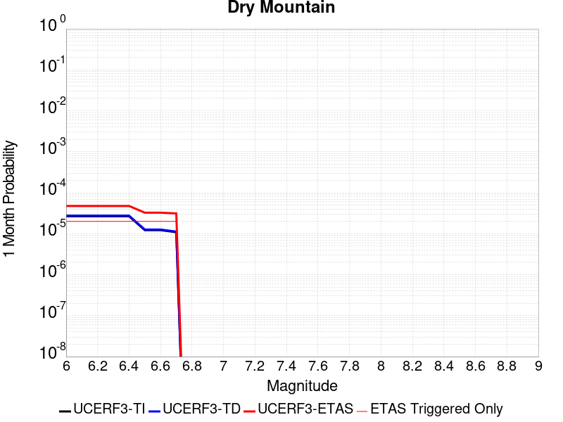 |  |  |

| Magnitude | 1 wk TI Prob | 1 wk TD Prob | 1 wk ETAS Prob | 1 wk ETAS/TD Gain | 1 wk ETAS Triggered Only | 1 mo TI Prob | 1 mo TD Prob | 1 mo ETAS Prob | 1 mo ETAS/TD Gain | 1 mo ETAS Triggered Only | 1 yr TI Prob | 1 yr TD Prob | 1 yr ETAS Prob | 1 yr ETAS/TD Gain | 1 yr ETAS Triggered Only | 10 yr TI Prob | 10 yr TD Prob | 10 yr ETAS Prob | 10 yr ETAS/TD Gain | 10 yr ETAS Triggered Only |
|-----|-----|-----|-----|-----|-----|-----|-----|-----|-----|-----|-----|-----|-----|-----|-----|-----|-----|-----|-----|-----|
| 6.0 | 6.222801E-6 | 6.439381E-6 | 2.6439253E-5 | 4.1058683 | 2.0E-5 | 2.6668875E-5 | 2.7597147E-5 | 4.7596594E-5 | 1.7246926 | 2.0E-5 | 3.2464517E-4 | 3.3595937E-4 | 4.0593586E-4 | 1.2082886 | 7.0E-5 | 0.0032417132 | 0.0033560768 | 0.0034358085 | 1.0237573 | 8.0E-5 |
| 6.1 | 6.222801E-6 | 6.439381E-6 | 2.6439253E-5 | 4.1058683 | 2.0E-5 | 2.6668875E-5 | 2.7597147E-5 | 4.7596594E-5 | 1.7246926 | 2.0E-5 | 3.2464517E-4 | 3.3595937E-4 | 4.0593586E-4 | 1.2082886 | 7.0E-5 | 0.0032417132 | 0.0033560768 | 0.0034358085 | 1.0237573 | 8.0E-5 |
| 6.2 | 6.222801E-6 | 6.439381E-6 | 2.6439253E-5 | 4.1058683 | 2.0E-5 | 2.6668875E-5 | 2.7597147E-5 | 4.7596594E-5 | 1.7246926 | 2.0E-5 | 3.2464517E-4 | 3.3595937E-4 | 4.0593586E-4 | 1.2082886 | 7.0E-5 | 0.0032417132 | 0.0033560768 | 0.0034358085 | 1.0237573 | 8.0E-5 |
| 6.3 | 6.222801E-6 | 6.439381E-6 | 2.6439253E-5 | 4.1058683 | 2.0E-5 | 2.6668875E-5 | 2.7597147E-5 | 4.7596594E-5 | 1.7246926 | 2.0E-5 | 3.2464517E-4 | 3.3595937E-4 | 4.0593586E-4 | 1.2082886 | 7.0E-5 | 0.0032417132 | 0.0033560768 | 0.0034358085 | 1.0237573 | 8.0E-5 |
| 6.4 | 6.222801E-6 | 6.439381E-6 | 2.6439253E-5 | 4.1058683 | 2.0E-5 | 2.6668875E-5 | 2.7597147E-5 | 4.7596594E-5 | 1.7246926 | 2.0E-5 | 3.2464517E-4 | 3.3595937E-4 | 4.0593586E-4 | 1.2082886 | 7.0E-5 | 0.0032417132 | 0.0033560768 | 0.0034358085 | 1.0237573 | 8.0E-5 |
| 6.5 | 2.8528623E-6 | 2.9521684E-6 | 2.295211E-5 | 7.7746615 | 2.0E-5 | 1.22264955E-5 | 1.2652138E-5 | 3.2651886E-5 | 2.5807405 | 2.0E-5 | 1.4884741E-4 | 1.540376E-4 | 1.7403452E-4 | 1.1298184 | 2.0E-5 | 0.0014874774 | 0.0015401616 | 0.0015601309 | 1.0129657 | 2.0E-5 |
| 6.6 | 2.8528623E-6 | 2.9521684E-6 | 2.295211E-5 | 7.7746615 | 2.0E-5 | 1.22264955E-5 | 1.2652138E-5 | 3.2651886E-5 | 2.5807405 | 2.0E-5 | 1.4884741E-4 | 1.540376E-4 | 1.7403452E-4 | 1.1298184 | 2.0E-5 | 0.0014874774 | 0.0015401616 | 0.0015601309 | 1.0129657 | 2.0E-5 |
| 6.7 | 2.541E-6 | 2.6293578E-6 | 2.2629305E-5 | 8.6064 | 2.0E-5 | 1.0889954E-5 | 1.1268677E-5 | 3.126845E-5 | 2.7748113 | 2.0E-5 | 1.3257713E-4 | 1.3719614E-4 | 1.571934E-4 | 1.1457567 | 2.0E-5 | 0.0013249806 | 0.0013719613 | 0.0013919339 | 1.0145577 | 2.0E-5 |

## Pinto Mtn
*[(top)](#table-of-contents)*

| 1 Week | 1 Month | 1 Year | 10 Year |
|-----|-----|-----|-----|
|  |  | 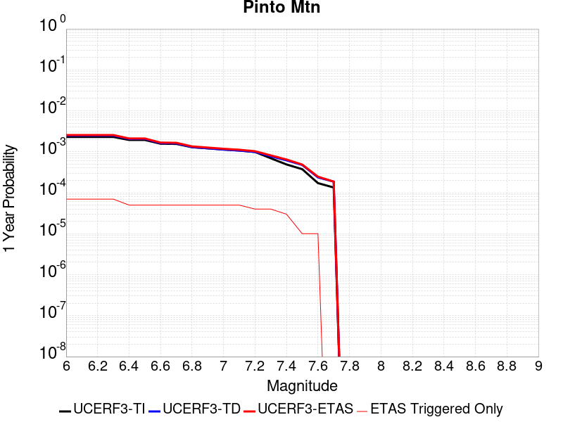 |  |

| Magnitude | 1 wk TI Prob | 1 wk TD Prob | 1 wk ETAS Prob | 1 wk ETAS/TD Gain | 1 wk ETAS Triggered Only | 1 mo TI Prob | 1 mo TD Prob | 1 mo ETAS Prob | 1 mo ETAS/TD Gain | 1 mo ETAS Triggered Only | 1 yr TI Prob | 1 yr TD Prob | 1 yr ETAS Prob | 1 yr ETAS/TD Gain | 1 yr ETAS Triggered Only | 10 yr TI Prob | 10 yr TD Prob | 10 yr ETAS Prob | 10 yr ETAS/TD Gain | 10 yr ETAS Triggered Only |
|-----|-----|-----|-----|-----|-----|-----|-----|-----|-----|-----|-----|-----|-----|-----|-----|-----|-----|-----|-----|-----|
| 6.0 | 4.4194956E-5 | 4.785362E-5 | 5.785314E-5 | 1.2089607 | 1.0E-5 | 1.893932E-4 | 2.0507174E-4 | 2.150697E-4 | 1.0487534 | 1.0E-5 | 0.0023034236 | 0.0024940541 | 0.0025638796 | 1.0279968 | 7.0E-5 | 0.022796938 | 0.024678145 | 0.02475617 | 1.0031618 | 8.0E-5 |
| 6.1 | 4.4194956E-5 | 4.785362E-5 | 5.785314E-5 | 1.2089607 | 1.0E-5 | 1.893932E-4 | 2.0507174E-4 | 2.150697E-4 | 1.0487534 | 1.0E-5 | 0.0023034236 | 0.0024940541 | 0.0025638796 | 1.0279968 | 7.0E-5 | 0.022796938 | 0.024678145 | 0.02475617 | 1.0031618 | 8.0E-5 |
| 6.2 | 4.4194956E-5 | 4.785362E-5 | 5.785314E-5 | 1.2089607 | 1.0E-5 | 1.893932E-4 | 2.0507174E-4 | 2.150697E-4 | 1.0487534 | 1.0E-5 | 0.0023034236 | 0.0024940541 | 0.0025638796 | 1.0279968 | 7.0E-5 | 0.022796938 | 0.024678145 | 0.02475617 | 1.0031618 | 8.0E-5 |
| 6.3 | 4.4194956E-5 | 4.785362E-5 | 5.785314E-5 | 1.2089607 | 1.0E-5 | 1.893932E-4 | 2.0507174E-4 | 2.150697E-4 | 1.0487534 | 1.0E-5 | 0.0023034236 | 0.0024940541 | 0.0025638796 | 1.0279968 | 7.0E-5 | 0.022796938 | 0.024678145 | 0.02475617 | 1.0031618 | 8.0E-5 |
| 6.4 | 3.729929E-5 | 3.9603186E-5 | 4.960279E-5 | 1.2524949 | 1.0E-5 | 1.5984432E-4 | 1.6971743E-4 | 1.7971573E-4 | 1.0589114 | 1.0E-5 | 0.0019443673 | 0.002064445 | 0.0021143418 | 1.0241696 | 5.0E-5 | 0.019274427 | 0.02046269 | 0.020511666 | 1.0023935 | 5.0E-5 |
| 6.5 | 3.729929E-5 | 3.9603186E-5 | 4.960279E-5 | 1.2524949 | 1.0E-5 | 1.5984432E-4 | 1.6971743E-4 | 1.7971573E-4 | 1.0589114 | 1.0E-5 | 0.0019443673 | 0.002064445 | 0.0021143418 | 1.0241696 | 5.0E-5 | 0.019274427 | 0.02046269 | 0.020511666 | 1.0023935 | 5.0E-5 |
| 6.6 | 3.0204548E-5 | 3.1205298E-5 | 4.1204985E-5 | 1.3204484 | 1.0E-5 | 1.2944164E-4 | 1.3373033E-4 | 1.4372899E-4 | 1.0747674 | 1.0E-5 | 0.0015748127 | 0.0016269855 | 0.0016769042 | 1.0306817 | 5.0E-5 | 0.015636992 | 0.01615461 | 0.016203802 | 1.0030451 | 5.0E-5 |
| 6.7 | 2.9857754E-5 | 3.081468E-5 | 4.0814375E-5 | 1.3245106 | 1.0E-5 | 1.2795553E-4 | 1.3205643E-4 | 1.4205511E-4 | 1.0757152 | 1.0E-5 | 0.0015567453 | 0.001606636 | 0.0016565556 | 1.031071 | 5.0E-5 | 0.015458848 | 0.01595405 | 0.016003251 | 1.003084 | 5.0E-5 |
| 6.8 | 2.4819734E-5 | 2.5009364E-5 | 3.5009114E-5 | 1.3998402 | 1.0E-5 | 1.0636595E-4 | 1.07178705E-4 | 1.1717763E-4 | 1.0932921 | 1.0E-5 | 0.0012942362 | 0.0013041412 | 0.0013540761 | 1.0382894 | 5.0E-5 | 0.012867244 | 0.0129672475 | 0.013016599 | 1.0038059 | 5.0E-5 |
| 6.9 | 2.331124E-5 | 2.3337643E-5 | 3.333741E-5 | 1.4284823 | 1.0E-5 | 9.990149E-5 | 1.00014746E-4 | 1.10013745E-4 | 1.0999752 | 1.0E-5 | 0.001215622 | 0.0012170197 | 0.0012669589 | 1.041034 | 5.0E-5 | 0.012089936 | 0.012105742 | 0.012155136 | 1.0040803 | 5.0E-5 |
| 7.0 | 2.1818534E-5 | 2.1760772E-5 | 3.1760555E-5 | 1.4595325 | 1.0E-5 | 9.3504656E-5 | 9.325723E-5 | 1.032563E-4 | 1.1072203 | 1.0E-5 | 0.0011378246 | 0.0011348352 | 0.0011847785 | 1.0440092 | 5.0E-5 | 0.011320163 | 0.011292503 | 0.011341939 | 1.0043777 | 5.0E-5 |
| 7.1 | 2.066081E-5 | 2.0540418E-5 | 3.0540214E-5 | 1.486835 | 1.0E-5 | 8.854332E-5 | 8.8027504E-5 | 9.802662E-5 | 1.1135908 | 1.0E-5 | 0.0010774818 | 0.0010712275 | 0.0011211738 | 1.0466254 | 5.0E-5 | 0.010722724 | 0.010662688 | 0.010712155 | 1.0046393 | 5.0E-5 |
| 7.2 | 1.8990233E-5 | 1.9053701E-5 | 2.9053512E-5 | 1.5248224 | 1.0E-5 | 8.138417E-5 | 8.1656275E-5 | 9.1655456E-5 | 1.1224545 | 1.0E-5 | 9.904018E-4 | 9.937311E-4 | 0.0010336913 | 1.0402124 | 4.0E-5 | 0.009859995 | 0.009894874 | 0.0099344775 | 1.0040025 | 4.0E-5 |
| 7.3 | 1.3335872E-5 | 1.4906372E-5 | 2.4906223E-5 | 1.6708441 | 1.0E-5 | 5.7152483E-5 | 6.388296E-5 | 7.388232E-5 | 1.1565263 | 1.0E-5 | 6.956093E-4 | 7.775102E-4 | 8.174791E-4 | 1.0514063 | 4.0E-5 | 0.006934359 | 0.0077491994 | 0.007788889 | 1.0051218 | 4.0E-5 |
| 7.4 | 9.414066E-6 | 1.186061E-5 | 1.186061E-5 | 1.0 | 0.0 | 4.0345374E-5 | 5.0830247E-5 | 5.0830247E-5 | 1.0 | 0.0 | 4.910942E-4 | 6.1869196E-4 | 6.4867345E-4 | 1.0484594 | 3.0E-5 | 0.0049001034 | 0.006170644 | 0.006200459 | 1.0048317 | 3.0E-5 |
| 7.5 | 7.2101157E-6 | 9.157893E-6 | 9.157893E-6 | 1.0 | 0.0 | 3.090013E-5 | 3.924757E-5 | 3.924757E-5 | 1.0 | 0.0 | 3.7614413E-4 | 4.7774217E-4 | 4.8773742E-4 | 1.0209218 | 1.0E-5 | 0.0037550807 | 0.004767927 | 0.004777879 | 1.0020874 | 1.0E-5 |
| 7.6 | 3.296375E-6 | 4.5453176E-6 | 4.5453176E-6 | 1.0 | 0.0 | 1.4127245E-5 | 1.9479796E-5 | 1.9479796E-5 | 1.0 | 0.0 | 1.7198564E-4 | 2.3714209E-4 | 2.4713972E-4 | 1.0421588 | 1.0E-5 | 0.0017185259 | 0.0023690276 | 0.002379004 | 1.0042112 | 1.0E-5 |
| 7.7 | 2.5741092E-6 | 3.584251E-6 | 3.584251E-6 | 1.0 | 0.0 | 1.103185E-5 | 1.5360993E-5 | 1.5360993E-5 | 1.0 | 0.0 | 1.3430449E-4 | 1.8700535E-4 | 1.8700535E-4 | 1.0 | 0.0 | 0.0013422335 | 0.0018686098 | 0.0018686098 | 1.0 | 0.0 |

## San Jacinto (Anza) rev
*[(top)](#table-of-contents)*

| 1 Week | 1 Month | 1 Year | 10 Year |
|-----|-----|-----|-----|
| 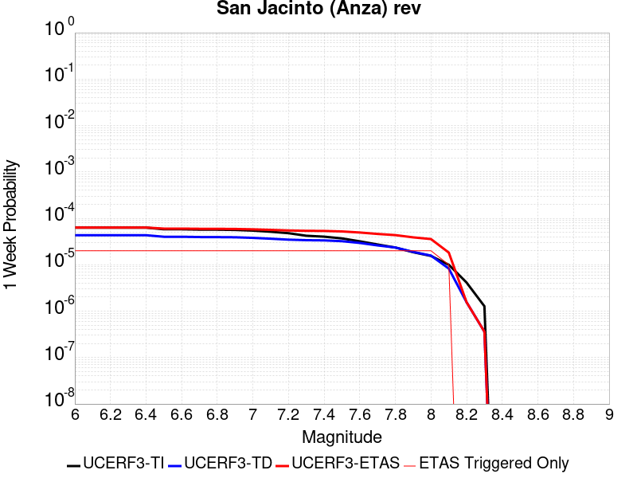 |  |  |  |

| Magnitude | 1 wk TI Prob | 1 wk TD Prob | 1 wk ETAS Prob | 1 wk ETAS/TD Gain | 1 wk ETAS Triggered Only | 1 mo TI Prob | 1 mo TD Prob | 1 mo ETAS Prob | 1 mo ETAS/TD Gain | 1 mo ETAS Triggered Only | 1 yr TI Prob | 1 yr TD Prob | 1 yr ETAS Prob | 1 yr ETAS/TD Gain | 1 yr ETAS Triggered Only | 10 yr TI Prob | 10 yr TD Prob | 10 yr ETAS Prob | 10 yr ETAS/TD Gain | 10 yr ETAS Triggered Only |
|-----|-----|-----|-----|-----|-----|-----|-----|-----|-----|-----|-----|-----|-----|-----|-----|-----|-----|-----|-----|-----|
| 6.0 | 6.3015636E-5 | 4.3302647E-5 | 6.3301784E-5 | 1.4618455 | 2.0E-5 | 2.7003905E-4 | 1.8556965E-4 | 2.1556407E-4 | 1.1616343 | 3.0E-5 | 0.0032827691 | 0.0022569813 | 0.0023068683 | 1.0221034 | 5.0E-5 | 0.032346968 | 0.023296192 | 0.023374328 | 1.0033541 | 8.0E-5 |
| 6.1 | 6.3015636E-5 | 4.3302647E-5 | 6.3301784E-5 | 1.4618455 | 2.0E-5 | 2.7003905E-4 | 1.8556965E-4 | 2.1556407E-4 | 1.1616343 | 3.0E-5 | 0.0032827691 | 0.0022569813 | 0.0023068683 | 1.0221034 | 5.0E-5 | 0.032346968 | 0.023296192 | 0.023374328 | 1.0033541 | 8.0E-5 |
| 6.2 | 6.3015636E-5 | 4.3302647E-5 | 6.3301784E-5 | 1.4618455 | 2.0E-5 | 2.7003905E-4 | 1.8556965E-4 | 2.1556407E-4 | 1.1616343 | 3.0E-5 | 0.0032827691 | 0.0022569813 | 0.0023068683 | 1.0221034 | 5.0E-5 | 0.032346968 | 0.023296192 | 0.023374328 | 1.0033541 | 8.0E-5 |
| 6.3 | 6.3015636E-5 | 4.3302647E-5 | 6.3301784E-5 | 1.4618455 | 2.0E-5 | 2.7003905E-4 | 1.8556965E-4 | 2.1556407E-4 | 1.1616343 | 3.0E-5 | 0.0032827691 | 0.0022569813 | 0.0023068683 | 1.0221034 | 5.0E-5 | 0.032346968 | 0.023296192 | 0.023374328 | 1.0033541 | 8.0E-5 |
| 6.4 | 6.3015636E-5 | 4.3302647E-5 | 6.3301784E-5 | 1.4618455 | 2.0E-5 | 2.7003905E-4 | 1.8556965E-4 | 2.1556407E-4 | 1.1616343 | 3.0E-5 | 0.0032827691 | 0.0022569813 | 0.0023068683 | 1.0221034 | 5.0E-5 | 0.032346968 | 0.023296192 | 0.023374328 | 1.0033541 | 8.0E-5 |
| 6.5 | 5.811017E-5 | 4.0082516E-5 | 6.008171E-5 | 1.4989507 | 2.0E-5 | 2.4901982E-4 | 1.7177092E-4 | 2.0176577E-4 | 1.1746212 | 3.0E-5 | 0.0030276014 | 0.002089311 | 0.0021392063 | 1.0238813 | 5.0E-5 | 0.02986684 | 0.021593736 | 0.02167201 | 1.0036248 | 8.0E-5 |
| 6.6 | 5.811017E-5 | 4.0082516E-5 | 6.008171E-5 | 1.4989507 | 2.0E-5 | 2.4901982E-4 | 1.7177092E-4 | 2.0176577E-4 | 1.1746212 | 3.0E-5 | 0.0030276014 | 0.002089311 | 0.0021392063 | 1.0238813 | 5.0E-5 | 0.02986684 | 0.021593736 | 0.02167201 | 1.0036248 | 8.0E-5 |
| 6.7 | 5.712442E-5 | 3.9505223E-5 | 5.9504433E-5 | 1.5062422 | 2.0E-5 | 2.4479596E-4 | 1.6929714E-4 | 1.9929206E-4 | 1.1771733 | 3.0E-5 | 0.0029763177 | 0.0020592497 | 0.0021091467 | 1.0242307 | 5.0E-5 | 0.029367693 | 0.021285562 | 0.02136386 | 1.0036784 | 8.0E-5 |
| 6.8 | 5.6967532E-5 | 3.9361643E-5 | 5.9360857E-5 | 1.5080888 | 2.0E-5 | 2.4412372E-4 | 1.6868189E-4 | 1.9867682E-4 | 1.1778196 | 3.0E-5 | 0.0029681553 | 0.002051773 | 0.0021016705 | 1.0243192 | 5.0E-5 | 0.029288229 | 0.021210281 | 0.021288585 | 1.0036918 | 8.0E-5 |
| 6.9 | 5.6211324E-5 | 3.9066435E-5 | 5.9065656E-5 | 1.5119284 | 2.0E-5 | 2.4088343E-4 | 1.6741687E-4 | 1.9741185E-4 | 1.1791635 | 3.0E-5 | 0.0029288116 | 0.0020364004 | 0.0020862985 | 1.0245031 | 5.0E-5 | 0.028905109 | 0.021049714 | 0.02112803 | 1.0037205 | 8.0E-5 |
| 7.0 | 5.4383527E-5 | 3.792697E-5 | 5.7926212E-5 | 1.5273093 | 2.0E-5 | 2.3305144E-4 | 1.6253405E-4 | 1.9252917E-4 | 1.1845467 | 3.0E-5 | 0.0028337094 | 0.001977061 | 0.002026962 | 1.0252401 | 5.0E-5 | 0.027978465 | 0.020440677 | 0.02051904 | 1.0038338 | 8.0E-5 |
| 7.1 | 5.1393665E-5 | 3.6389913E-5 | 5.6389184E-5 | 1.5495828 | 2.0E-5 | 2.2023996E-4 | 1.5594746E-4 | 1.8594279E-4 | 1.1923425 | 3.0E-5 | 0.0026781242 | 0.0018970112 | 0.0019469163 | 1.0263072 | 5.0E-5 | 0.026460782 | 0.019614287 | 0.019692717 | 1.0039986 | 8.0E-5 |
| 7.2 | 4.785222E-5 | 3.4741795E-5 | 5.47411E-5 | 1.5756555 | 2.0E-5 | 2.0506482E-4 | 1.4888494E-4 | 1.7888047E-4 | 1.2014679 | 3.0E-5 | 0.0024938055 | 0.0018111705 | 0.00186108 | 1.0275564 | 5.0E-5 | 0.024660049 | 0.018728992 | 0.018807493 | 1.0041914 | 8.0E-5 |
| 7.3 | 4.2143256E-5 | 3.383628E-5 | 5.3835603E-5 | 1.5910616 | 2.0E-5 | 1.8060145E-4 | 1.4500458E-4 | 1.7500023E-4 | 1.2068601 | 3.0E-5 | 0.002196605 | 0.0017640047 | 0.0018139165 | 1.0282946 | 5.0E-5 | 0.02175019 | 0.01823724 | 0.018315783 | 1.0043067 | 8.0E-5 |
| 7.4 | 4.0264713E-5 | 3.347446E-5 | 5.3473792E-5 | 1.5974504 | 2.0E-5 | 1.7255165E-4 | 1.4345412E-4 | 1.7344981E-4 | 1.2090961 | 3.0E-5 | 0.002098792 | 0.0017451581 | 0.0017950708 | 1.0286007 | 5.0E-5 | 0.020790804 | 0.018041821 | 0.018120376 | 1.0043541 | 8.0E-5 |
| 7.5 | 3.694492E-5 | 3.218847E-5 | 5.2187825E-5 | 1.6213206 | 2.0E-5 | 1.5832575E-4 | 1.379433E-4 | 1.6793916E-4 | 1.2174506 | 3.0E-5 | 0.0019259118 | 0.001678169 | 0.0017280851 | 1.0297444 | 5.0E-5 | 0.01909306 | 0.01735827 | 0.017436882 | 1.0045288 | 8.0E-5 |
| 7.6 | 3.200565E-5 | 2.9504106E-5 | 4.9503516E-5 | 1.6778517 | 2.0E-5 | 1.3715986E-4 | 1.2644005E-4 | 1.5643626E-4 | 1.2372366 | 3.0E-5 | 0.001668642 | 0.0015383229 | 0.001588246 | 1.032453 | 5.0E-5 | 0.01656168 | 0.0159463 | 0.016025025 | 1.0049368 | 8.0E-5 |
| 7.7 | 2.731642E-5 | 2.6092788E-5 | 4.6092267E-5 | 1.7664753 | 2.0E-5 | 1.1706512E-4 | 1.1182144E-4 | 1.4181809E-4 | 1.2682549 | 3.0E-5 | 0.001424336 | 0.0013605768 | 0.0014105089 | 1.0366992 | 5.0E-5 | 0.014152412 | 0.014167004 | 0.014245871 | 1.005567 | 8.0E-5 |
| 7.8 | 2.3466424E-5 | 2.3504817E-5 | 4.3504348E-5 | 1.8508694 | 2.0E-5 | 1.0056651E-4 | 1.0073105E-4 | 1.3072803E-4 | 1.2977928 | 3.0E-5 | 0.0012237094 | 0.0012257113 | 0.0012756501 | 1.0407426 | 5.0E-5 | 0.012169928 | 0.012808893 | 0.012887868 | 1.0061656 | 8.0E-5 |
| 7.9 | 1.8611925E-5 | 1.8908117E-5 | 3.890774E-5 | 2.0577269 | 2.0E-5 | 7.9762955E-5 | 8.1032274E-5 | 1.1102984E-4 | 1.3701929 | 3.0E-5 | 9.7068126E-4 | 9.861222E-4 | 0.0010360728 | 1.0506537 | 5.0E-5 | 0.0096645225 | 0.010393824 | 0.010472993 | 1.0076169 | 8.0E-5 |
| 8.0 | 1.5460775E-5 | 1.5740965E-5 | 3.574065E-5 | 2.2705503 | 2.0E-5 | 6.6258784E-5 | 6.7459536E-5 | 8.745819E-5 | 1.2964541 | 2.0E-5 | 8.0640207E-4 | 8.21011E-4 | 8.609782E-4 | 1.0486804 | 4.0E-5 | 0.008034821 | 0.0087028835 | 0.0087722745 | 1.0079733 | 7.0E-5 |
| 8.1 | 9.983884E-6 | 8.269952E-6 | 1.826987E-5 | 2.2091868 | 1.0E-5 | 4.2787375E-5 | 3.544217E-5 | 4.544182E-5 | 1.2821398 | 1.0E-5 | 5.2081177E-4 | 4.314235E-4 | 4.5141487E-4 | 1.0463382 | 2.0E-5 | 0.0051959283 | 0.004640022 | 0.004669883 | 1.0064355 | 3.0E-5 |
| 8.2 | 4.1226E-6 | 1.5529788E-6 | 1.5529788E-6 | 1.0 | 0.0 | 1.7668166E-5 | 6.6556063E-6 | 6.6556063E-6 | 1.0 | 0.0 | 2.1508869E-4 | 8.102902E-5 | 8.102902E-5 | 1.0 | 0.0 | 0.0021488064 | 9.4050163E-4 | 9.4050163E-4 | 1.0 | 0.0 |
| 8.3 | 1.2750878E-6 | 3.612133E-7 | 3.612133E-7 | 1.0 | 0.0 | 5.4646503E-6 | 1.548056E-6 | 1.548056E-6 | 1.0 | 0.0 | 6.653009E-5 | 1.8847424E-5 | 1.8847424E-5 | 1.0 | 0.0 | 6.6510175E-4 | 2.2734253E-4 | 2.2734253E-4 | 1.0 | 0.0 |

## Kern Canyon (South Kern) 2011
*[(top)](#table-of-contents)*

| 1 Week | 1 Month | 1 Year | 10 Year |
|-----|-----|-----|-----|
| 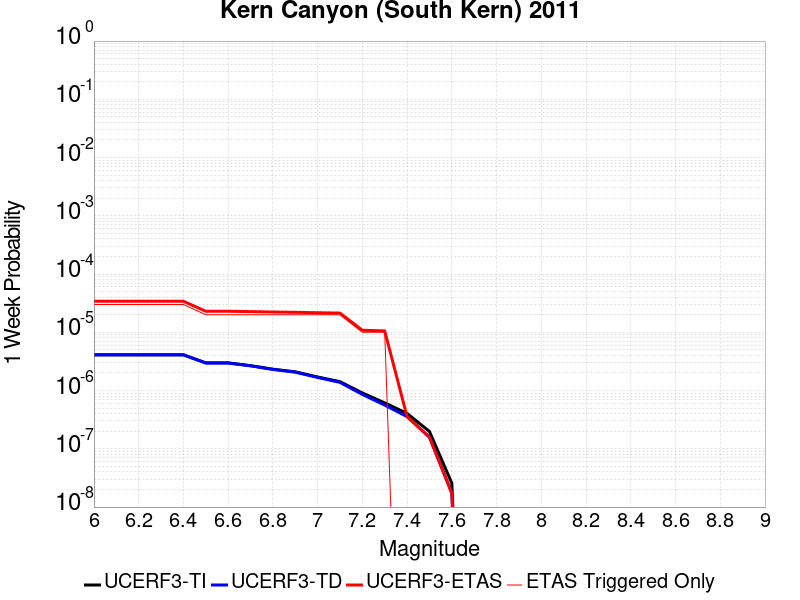 |  |  | 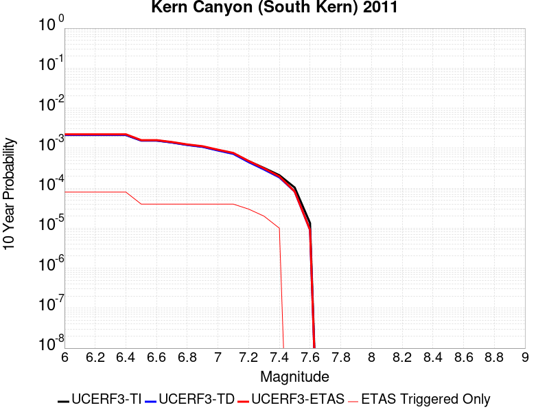 |

| Magnitude | 1 wk TI Prob | 1 wk TD Prob | 1 wk ETAS Prob | 1 wk ETAS/TD Gain | 1 wk ETAS Triggered Only | 1 mo TI Prob | 1 mo TD Prob | 1 mo ETAS Prob | 1 mo ETAS/TD Gain | 1 mo ETAS Triggered Only | 1 yr TI Prob | 1 yr TD Prob | 1 yr ETAS Prob | 1 yr ETAS/TD Gain | 1 yr ETAS Triggered Only | 10 yr TI Prob | 10 yr TD Prob | 10 yr ETAS Prob | 10 yr ETAS/TD Gain | 10 yr ETAS Triggered Only |
|-----|-----|-----|-----|-----|-----|-----|-----|-----|-----|-----|-----|-----|-----|-----|-----|-----|-----|-----|-----|-----|
| 6.0 | 4.105075E-6 | 4.1137264E-6 | 3.4113604E-5 | 8.292628 | 3.0E-5 | 1.7593058E-5 | 1.763014E-5 | 6.762926E-5 | 3.8360023 | 5.0E-5 | 2.1417443E-4 | 2.1462646E-4 | 2.6461572E-4 | 1.2329129 | 5.0E-5 | 0.0021396813 | 0.0021442557 | 0.0022240842 | 1.037229 | 8.0E-5 |
| 6.1 | 4.105075E-6 | 4.1137264E-6 | 3.4113604E-5 | 8.292628 | 3.0E-5 | 1.7593058E-5 | 1.763014E-5 | 6.762926E-5 | 3.8360023 | 5.0E-5 | 2.1417443E-4 | 2.1462646E-4 | 2.6461572E-4 | 1.2329129 | 5.0E-5 | 0.0021396813 | 0.0021442557 | 0.0022240842 | 1.037229 | 8.0E-5 |
| 6.2 | 4.105075E-6 | 4.1137264E-6 | 3.4113604E-5 | 8.292628 | 3.0E-5 | 1.7593058E-5 | 1.763014E-5 | 6.762926E-5 | 3.8360023 | 5.0E-5 | 2.1417443E-4 | 2.1462646E-4 | 2.6461572E-4 | 1.2329129 | 5.0E-5 | 0.0021396813 | 0.0021442557 | 0.0022240842 | 1.037229 | 8.0E-5 |
| 6.3 | 4.105075E-6 | 4.1137264E-6 | 3.4113604E-5 | 8.292628 | 3.0E-5 | 1.7593058E-5 | 1.763014E-5 | 6.762926E-5 | 3.8360023 | 5.0E-5 | 2.1417443E-4 | 2.1462646E-4 | 2.6461572E-4 | 1.2329129 | 5.0E-5 | 0.0021396813 | 0.0021442557 | 0.0022240842 | 1.037229 | 8.0E-5 |
| 6.4 | 4.105075E-6 | 4.1137264E-6 | 3.4113604E-5 | 8.292628 | 3.0E-5 | 1.7593058E-5 | 1.763014E-5 | 6.762926E-5 | 3.8360023 | 5.0E-5 | 2.1417443E-4 | 2.1462646E-4 | 2.6461572E-4 | 1.2329129 | 5.0E-5 | 0.0021396813 | 0.0021442557 | 0.0022240842 | 1.037229 | 8.0E-5 |
| 6.5 | 2.9849807E-6 | 2.9731548E-6 | 2.2973096E-5 | 7.7268414 | 2.0E-5 | 1.2792712E-5 | 1.274203E-5 | 4.274165E-5 | 3.3543828 | 3.0E-5 | 1.5574014E-4 | 1.5512333E-4 | 1.8511867E-4 | 1.1933645 | 3.0E-5 | 0.0015563103 | 0.0015501656 | 0.0015901036 | 1.0257638 | 4.0E-5 |
| 6.6 | 2.9849807E-6 | 2.9731548E-6 | 2.2973096E-5 | 7.7268414 | 2.0E-5 | 1.2792712E-5 | 1.274203E-5 | 4.274165E-5 | 3.3543828 | 3.0E-5 | 1.5574014E-4 | 1.5512333E-4 | 1.8511867E-4 | 1.1933645 | 3.0E-5 | 0.0015563103 | 0.0015501656 | 0.0015901036 | 1.0257638 | 4.0E-5 |
| 6.7 | 2.6756725E-6 | 2.6582206E-6 | 2.2658167E-5 | 8.523809 | 2.0E-5 | 1.1467117E-5 | 1.1392325E-5 | 4.1391984E-5 | 3.6333218 | 3.0E-5 | 1.396032E-4 | 1.3869285E-4 | 1.6868868E-4 | 1.2162753 | 3.0E-5 | 0.0013951553 | 0.0013860738 | 0.0014260183 | 1.0288185 | 4.0E-5 |
| 6.8 | 2.3283721E-6 | 2.3047787E-6 | 2.2304732E-5 | 9.677602 | 2.0E-5 | 9.9787E-6 | 9.877586E-6 | 3.987729E-5 | 4.037149 | 3.0E-5 | 1.214839E-4 | 1.20253055E-4 | 1.5024944E-4 | 1.2494439 | 3.0E-5 | 0.001214175 | 0.0012018873 | 0.0012418393 | 1.033241 | 4.0E-5 |
| 6.9 | 2.0972677E-6 | 2.0696411E-6 | 2.20696E-5 | 10.663491 | 2.0E-5 | 8.988259E-6 | 8.869861E-6 | 3.8869595E-5 | 4.3822103 | 3.0E-5 | 1.0942656E-4 | 1.0798526E-4 | 1.3798202E-4 | 1.2777857 | 3.0E-5 | 0.0010937268 | 0.0010793337 | 0.0011192906 | 1.0370198 | 4.0E-5 |
| 7.0 | 1.7132242E-6 | 1.6787036E-6 | 2.167867E-5 | 12.913936 | 2.0E-5 | 7.3423685E-6 | 7.194424E-6 | 3.7194208E-5 | 5.169866 | 3.0E-5 | 8.938967E-5 | 8.758863E-5 | 1.17586E-4 | 1.3424802 | 3.0E-5 | 8.935372E-4 | 8.7554497E-4 | 9.1550994E-4 | 1.0456458 | 4.0E-5 |
| 7.1 | 1.4215541E-6 | 1.3815752E-6 | 2.1381547E-5 | 15.47621 | 2.0E-5 | 6.0923603E-6 | 5.9210233E-6 | 3.5920846E-5 | 6.066662 | 3.0E-5 | 7.417196E-5 | 7.20861E-5 | 1.0208394E-4 | 1.416139 | 3.0E-5 | 7.414721E-4 | 7.206299E-4 | 7.606011E-4 | 1.055467 | 4.0E-5 |
| 7.2 | 9.097853E-7 | 8.6037755E-7 | 1.0860369E-5 | 12.622794 | 1.0E-5 | 3.899074E-6 | 3.6873273E-6 | 2.3687253E-5 | 6.423963 | 2.0E-5 | 4.7470192E-5 | 4.4892295E-5 | 6.48914E-5 | 1.4454907 | 2.0E-5 | 4.7460053E-4 | 4.4883334E-4 | 4.788199E-4 | 1.06681 | 3.0E-5 |
| 7.3 | 6.144169E-7 | 5.628206E-7 | 1.0562815E-5 | 18.767641 | 1.0E-5 | 2.6332125E-6 | 2.4120861E-6 | 2.2412038E-5 | 9.291557 | 2.0E-5 | 3.205889E-5 | 2.9366758E-5 | 4.9366172E-5 | 1.6810222 | 2.0E-5 | 3.2054266E-4 | 2.936293E-4 | 3.1362343E-4 | 1.0680931 | 2.0E-5 |
| 7.4 | 4.049844E-7 | 3.5728314E-7 | 3.5728314E-7 | 1.0 | 0.0 | 1.7356463E-6 | 1.5312125E-6 | 1.1531197E-5 | 7.530762 | 1.0E-5 | 2.1131287E-5 | 1.8642357E-5 | 2.864217E-5 | 1.536403 | 1.0E-5 | 2.1129279E-4 | 1.8640817E-4 | 1.964063E-4 | 1.0536357 | 1.0E-5 |
| 7.5 | 1.9871162E-7 | 1.583044E-7 | 1.583044E-7 | 1.0 | 0.0 | 8.5162094E-7 | 6.7844724E-7 | 6.7844724E-7 | 1.0 | 0.0 | 1.0368436E-5 | 8.260065E-6 | 8.260065E-6 | 1.0 | 0.0 | 1.0367952E-4 | 8.259767E-5 | 8.259767E-5 | 1.0 | 0.0 |
| 7.6 | 2.572245E-8 | 1.7352555E-8 | 1.7352555E-8 | 1.0 | 0.0 | 1.10239064E-7 | 7.436809E-8 | 7.436809E-8 | 1.0 | 0.0 | 1.3421597E-6 | 9.054312E-7 | 9.054312E-7 | 1.0 | 0.0 | 1.3421517E-5 | 9.05428E-6 | 9.05428E-6 | 1.0 | 0.0 |

## Calaveras (Central) 2011 CFM
*[(top)](#table-of-contents)*

| 1 Week | 1 Month | 1 Year | 10 Year |
|-----|-----|-----|-----|
|  |  |  |  |

| Magnitude | 1 wk TI Prob | 1 wk TD Prob | 1 wk ETAS Prob | 1 wk ETAS/TD Gain | 1 wk ETAS Triggered Only | 1 mo TI Prob | 1 mo TD Prob | 1 mo ETAS Prob | 1 mo ETAS/TD Gain | 1 mo ETAS Triggered Only | 1 yr TI Prob | 1 yr TD Prob | 1 yr ETAS Prob | 1 yr ETAS/TD Gain | 1 yr ETAS Triggered Only | 10 yr TI Prob | 10 yr TD Prob | 10 yr ETAS Prob | 10 yr ETAS/TD Gain | 10 yr ETAS Triggered Only |
|-----|-----|-----|-----|-----|-----|-----|-----|-----|-----|-----|-----|-----|-----|-----|-----|-----|-----|-----|-----|-----|
| 6.0 | 1.5010907E-4 | 2.481574E-4 | 2.481574E-4 | 1.0 | 0.0 | 6.4316596E-4 | 0.0010621005 | 0.0010720899 | 1.0094053 | 1.0E-5 | 0.0078024664 | 0.012850073 | 0.012889559 | 1.0030729 | 4.0E-5 | 0.07534136 | 0.120401435 | 0.12045421 | 1.0004383 | 6.0E-5 |
| 6.1 | 1.4521465E-4 | 2.397987E-4 | 2.397987E-4 | 1.0 | 0.0 | 6.222001E-4 | 0.0010263061 | 0.0010362958 | 1.0097337 | 1.0E-5 | 0.0075490056 | 0.012419341 | 0.012458845 | 1.0031807 | 4.0E-5 | 0.07297657 | 0.11667323 | 0.11672623 | 1.0004543 | 6.0E-5 |
| 6.2 | 1.429998E-4 | 2.3911126E-4 | 2.3911126E-4 | 1.0 | 0.0 | 6.127123E-4 | 0.0010233623 | 0.001033352 | 1.0097617 | 1.0E-5 | 0.007434286 | 0.01238394 | 0.012423445 | 1.00319 | 4.0E-5 | 0.07190444 | 0.1163272 | 0.116380215 | 1.0004557 | 6.0E-5 |
| 6.3 | 1.3536277E-4 | 2.3242626E-4 | 2.3242626E-4 | 1.0 | 0.0 | 5.799972E-4 | 9.947343E-4 | 0.0010047244 | 1.0100429 | 1.0E-5 | 0.0070386264 | 0.012040132 | 0.012079651 | 1.0032822 | 4.0E-5 | 0.0681982 | 0.11323977 | 0.11329298 | 1.0004698 | 6.0E-5 |
| 6.4 | 1.2993296E-4 | 2.2666177E-4 | 2.2666177E-4 | 1.0 | 0.0 | 5.5673666E-4 | 9.700479E-4 | 9.800382E-4 | 1.0102987 | 1.0E-5 | 0.006757223 | 0.011742937 | 0.011782467 | 1.0033664 | 4.0E-5 | 0.06555412 | 0.11051771 | 0.11057108 | 1.0004829 | 6.0E-5 |
| 6.5 | 1.0498927E-4 | 1.7981697E-4 | 1.7981697E-4 | 1.0 | 0.0 | 4.498764E-4 | 7.704157E-4 | 7.80408E-4 | 1.01297 | 1.0E-5 | 0.005463498 | 0.00933924 | 0.009378867 | 1.004243 | 4.0E-5 | 0.053311124 | 0.089199215 | 0.08925386 | 1.0006126 | 6.0E-5 |
| 6.6 | 1.0157505E-4 | 1.7469203E-4 | 1.7469203E-4 | 1.0 | 0.0 | 4.35249E-4 | 7.484645E-4 | 7.58457E-4 | 1.0133507 | 1.0E-5 | 0.0052862884 | 0.009074297 | 0.009113934 | 1.0043681 | 4.0E-5 | 0.05162293 | 0.08677671 | 0.0868315 | 1.0006315 | 6.0E-5 |
| 6.7 | 9.660386E-5 | 1.6728524E-4 | 1.6728524E-4 | 1.0 | 0.0 | 4.1395082E-4 | 7.1673887E-4 | 7.2673167E-4 | 1.0139421 | 1.0E-5 | 0.0050282106 | 0.008691208 | 0.00873086 | 1.0045624 | 4.0E-5 | 0.049159497 | 0.083266065 | 0.083321065 | 1.0006605 | 6.0E-5 |
| 6.8 | 9.089927E-5 | 1.5643016E-4 | 1.5643016E-4 | 1.0 | 0.0 | 3.8951015E-4 | 6.702439E-4 | 6.802372E-4 | 1.01491 | 1.0E-5 | 0.0047319788 | 0.008129478 | 0.008169154 | 1.0048803 | 4.0E-5 | 0.046324775 | 0.078159414 | 0.07821473 | 1.0007076 | 6.0E-5 |
| 6.9 | 7.353187E-5 | 1.2295354E-4 | 1.2295354E-4 | 1.0 | 0.0 | 3.150985E-4 | 5.2683795E-4 | 5.3683267E-4 | 1.0189712 | 1.0E-5 | 0.0038295772 | 0.006395508 | 0.0064352523 | 1.0062144 | 4.0E-5 | 0.037642512 | 0.062187865 | 0.062244132 | 1.0009048 | 6.0E-5 |
| 7.0 | 5.746064E-5 | 9.3887444E-5 | 9.3887444E-5 | 1.0 | 0.0 | 2.4623662E-4 | 4.0231308E-4 | 4.1230905E-4 | 1.0248463 | 1.0E-5 | 0.0029938098 | 0.004887232 | 0.0049170856 | 1.0061084 | 3.0E-5 | 0.02953797 | 0.04798685 | 0.04802493 | 1.0007936 | 4.0E-5 |
| 7.1 | 4.9557195E-5 | 8.052461E-5 | 8.052461E-5 | 1.0 | 0.0 | 2.123707E-4 | 3.4506017E-4 | 3.5505672E-4 | 1.0289705 | 1.0E-5 | 0.0025825473 | 0.0041930773 | 0.004222952 | 1.0071247 | 3.0E-5 | 0.0255274 | 0.041373078 | 0.041411426 | 1.0009269 | 4.0E-5 |
| 7.2 | 3.687595E-5 | 5.9524526E-5 | 5.9524526E-5 | 1.0 | 0.0 | 1.5803022E-4 | 2.5508032E-4 | 2.6507778E-4 | 1.0391934 | 1.0E-5 | 0.0019223199 | 0.0031012094 | 0.0031311163 | 1.0096437 | 3.0E-5 | 0.01905776 | 0.030883716 | 0.03092248 | 1.0012552 | 4.0E-5 |
| 7.3 | 2.5846984E-5 | 4.247213E-5 | 4.247213E-5 | 1.0 | 0.0 | 1.1076809E-4 | 1.8201082E-4 | 1.8201082E-4 | 1.0 | 0.0 | 0.0013477671 | 0.002213747 | 0.0022337027 | 1.0090145 | 2.0E-5 | 0.013396223 | 0.02217554 | 0.022204874 | 1.0013229 | 3.0E-5 |
| 7.4 | 1.7747854E-5 | 2.9936204E-5 | 2.9936204E-5 | 1.0 | 0.0 | 7.6060016E-5 | 1.2829172E-4 | 1.2829172E-4 | 1.0 | 0.0 | 9.2563726E-4 | 0.0015608355 | 0.0015808044 | 1.0127937 | 2.0E-5 | 0.009217911 | 0.015709236 | 0.015738765 | 1.0018797 | 3.0E-5 |
| 7.5 | 1.4883479E-5 | 2.6243379E-5 | 2.6243379E-5 | 1.0 | 0.0 | 6.378478E-5 | 1.1246678E-4 | 1.1246678E-4 | 1.0 | 0.0 | 7.76303E-4 | 0.0013684258 | 0.0013883985 | 1.0145954 | 2.0E-5 | 0.0077359667 | 0.013802425 | 0.013822149 | 1.001429 | 2.0E-5 |
| 7.6 | 8.166975E-6 | 1.4963478E-5 | 1.4963478E-5 | 1.0 | 0.0 | 3.5000852E-5 | 6.412763E-5 | 6.412763E-5 | 1.0 | 0.0 | 4.2605202E-4 | 7.804755E-4 | 8.004599E-4 | 1.0256054 | 2.0E-5 | 0.004252361 | 0.00793984 | 0.007959681 | 1.002499 | 2.0E-5 |
| 7.7 | 3.3858064E-6 | 6.253914E-6 | 6.253914E-6 | 1.0 | 0.0 | 1.4510518E-5 | 2.6802214E-5 | 2.6802214E-5 | 1.0 | 0.0 | 1.7665124E-4 | 3.2626814E-4 | 3.4626163E-4 | 1.0612793 | 2.0E-5 | 0.0017651088 | 0.0033882293 | 0.0034081615 | 1.0058827 | 2.0E-5 |
| 7.8 | 2.7721615E-6 | 5.3663807E-6 | 5.3663807E-6 | 1.0 | 0.0 | 1.1880637E-5 | 2.2998573E-5 | 2.2998573E-5 | 1.0 | 0.0 | 1.4463716E-4 | 2.799717E-4 | 2.999661E-4 | 1.0714158 | 2.0E-5 | 0.0014454306 | 0.0029074624 | 0.0029274044 | 1.0068588 | 2.0E-5 |
| 7.9 | 1.9736292E-6 | 4.1284193E-6 | 4.1284193E-6 | 1.0 | 0.0 | 8.4583835E-6 | 1.7693106E-5 | 1.7693106E-5 | 1.0 | 0.0 | 1.0297595E-4 | 2.1539231E-4 | 2.2539016E-4 | 1.0464169 | 1.0E-5 | 0.0010292825 | 0.0022236116 | 0.0022335893 | 1.0044872 | 1.0E-5 |
| 8.0 | 1.1767289E-6 | 2.5544743E-6 | 2.5544743E-6 | 1.0 | 0.0 | 5.0431145E-6 | 1.0947701E-5 | 1.0947701E-5 | 1.0 | 0.0 | 6.139818E-5 | 1.3328013E-4 | 1.4327881E-4 | 1.07502 | 1.0E-5 | 6.1381224E-4 | 0.0013660848 | 0.0013760711 | 1.0073102 | 1.0E-5 |
| 8.1 | 7.5112825E-7 | 1.5409794E-6 | 1.5409794E-6 | 1.0 | 0.0 | 3.2191172E-6 | 6.6041807E-6 | 6.6041807E-6 | 1.0 | 0.0 | 3.9192048E-5 | 8.0402955E-5 | 8.0402955E-5 | 1.0 | 0.0 | 3.9185135E-4 | 8.235564E-4 | 8.235564E-4 | 1.0 | 0.0 |

## Chino alt 1
*[(top)](#table-of-contents)*

| 1 Week | 1 Month | 1 Year | 10 Year |
|-----|-----|-----|-----|
|  |  | 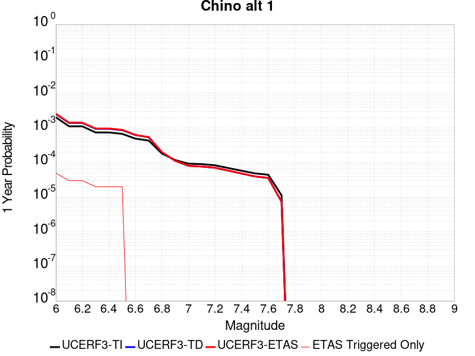 |  |

| Magnitude | 1 wk TI Prob | 1 wk TD Prob | 1 wk ETAS Prob | 1 wk ETAS/TD Gain | 1 wk ETAS Triggered Only | 1 mo TI Prob | 1 mo TD Prob | 1 mo ETAS Prob | 1 mo ETAS/TD Gain | 1 mo ETAS Triggered Only | 1 yr TI Prob | 1 yr TD Prob | 1 yr ETAS Prob | 1 yr ETAS/TD Gain | 1 yr ETAS Triggered Only | 10 yr TI Prob | 10 yr TD Prob | 10 yr ETAS Prob | 10 yr ETAS/TD Gain | 10 yr ETAS Triggered Only |
|-----|-----|-----|-----|-----|-----|-----|-----|-----|-----|-----|-----|-----|-----|-----|-----|-----|-----|-----|-----|-----|
| 6.0 | 3.939946E-5 | 4.8948554E-5 | 6.894758E-5 | 1.4085722 | 2.0E-5 | 1.6884391E-4 | 2.097656E-4 | 2.397593E-4 | 1.1429868 | 3.0E-5 | 0.0020537362 | 0.0025513945 | 0.002601267 | 1.0195471 | 5.0E-5 | 0.020348595 | 0.025277847 | 0.025346078 | 1.0026993 | 7.0E-5 |
| 6.1 | 2.1505624E-5 | 2.6879026E-5 | 2.6879026E-5 | 1.0 | 0.0 | 9.2163704E-5 | 1.1519137E-4 | 1.2519021E-4 | 1.086802 | 1.0E-5 | 0.0011215154 | 0.001401664 | 0.001431622 | 1.0213732 | 3.0E-5 | 0.011158722 | 0.013945141 | 0.013994444 | 1.0035355 | 5.0E-5 |
| 6.2 | 2.1505624E-5 | 2.6879026E-5 | 2.6879026E-5 | 1.0 | 0.0 | 9.2163704E-5 | 1.1519137E-4 | 1.2519021E-4 | 1.086802 | 1.0E-5 | 0.0011215154 | 0.001401664 | 0.001431622 | 1.0213732 | 3.0E-5 | 0.011158722 | 0.013945141 | 0.013994444 | 1.0035355 | 5.0E-5 |
| 6.3 | 1.4290785E-5 | 1.8165128E-5 | 1.8165128E-5 | 1.0 | 0.0 | 6.1244784E-5 | 7.784848E-5 | 8.78477E-5 | 1.1284447 | 1.0E-5 | 7.454001E-4 | 9.4743853E-4 | 9.6741953E-4 | 1.0210896 | 2.0E-5 | 0.007429048 | 0.0094444575 | 0.009474174 | 1.0031464 | 3.0E-5 |
| 6.4 | 1.4290785E-5 | 1.8165128E-5 | 1.8165128E-5 | 1.0 | 0.0 | 6.1244784E-5 | 7.784848E-5 | 8.78477E-5 | 1.1284447 | 1.0E-5 | 7.454001E-4 | 9.4743853E-4 | 9.6741953E-4 | 1.0210896 | 2.0E-5 | 0.007429048 | 0.0094444575 | 0.009474174 | 1.0031464 | 3.0E-5 |
| 6.5 | 1.3017944E-5 | 1.6652088E-5 | 1.6652088E-5 | 1.0 | 0.0 | 5.5789995E-5 | 7.136439E-5 | 8.136367E-5 | 1.1401159 | 1.0E-5 | 6.790315E-4 | 8.685589E-4 | 8.885415E-4 | 1.0230067 | 2.0E-5 | 0.0067696036 | 0.008661949 | 0.008691689 | 1.0034335 | 3.0E-5 |
| 6.6 | 9.470016E-6 | 1.2039424E-5 | 1.2039424E-5 | 1.0 | 0.0 | 4.058515E-5 | 5.1596704E-5 | 5.1596704E-5 | 1.0 | 0.0 | 4.940122E-4 | 6.280428E-4 | 6.280428E-4 | 1.0 | 0.0 | 0.004929154 | 0.0062718987 | 0.0062718987 | 1.0 | 0.0 |
| 6.7 | 8.314155E-6 | 1.0407736E-5 | 1.0407736E-5 | 1.0 | 0.0 | 3.5631605E-5 | 4.4604003E-5 | 4.4604003E-5 | 1.0 | 0.0 | 4.3372845E-4 | 5.429507E-4 | 5.429507E-4 | 1.0 | 0.0 | 0.004328829 | 0.005425775 | 0.005425775 | 1.0 | 0.0 |
| 6.8 | 3.4856364E-6 | 3.8133708E-6 | 3.8133708E-6 | 1.0 | 0.0 | 1.4938357E-5 | 1.6342927E-5 | 1.6342927E-5 | 1.0 | 0.0 | 1.8185932E-4 | 1.9895904E-4 | 1.9895904E-4 | 1.0 | 0.0 | 0.0018171056 | 0.0019894864 | 0.0019894864 | 1.0 | 0.0 |
| 6.9 | 2.2645952E-6 | 2.1529022E-6 | 2.1529022E-6 | 1.0 | 0.0 | 9.705372E-6 | 9.226692E-6 | 9.226692E-6 | 1.0 | 0.0 | 1.18156495E-4 | 1.123294E-4 | 1.123294E-4 | 1.0 | 0.0 | 0.0011809369 | 0.0011233423 | 0.0011233423 | 1.0 | 0.0 |
| 7.0 | 1.7864003E-6 | 1.5430785E-6 | 1.5430785E-6 | 1.0 | 0.0 | 7.655979E-6 | 6.613177E-6 | 6.613177E-6 | 1.0 | 0.0 | 9.3207556E-5 | 8.051251E-5 | 8.051251E-5 | 1.0 | 0.0 | 9.316847E-4 | 8.0528046E-4 | 8.0528046E-4 | 1.0 | 0.0 |
| 7.1 | 1.7315456E-6 | 1.4733511E-6 | 1.4733511E-6 | 1.0 | 0.0 | 7.420889E-6 | 6.3143466E-6 | 6.3143466E-6 | 1.0 | 0.0 | 9.034557E-5 | 7.6874516E-5 | 7.6874516E-5 | 1.0 | 0.0 | 9.0308854E-4 | 7.6891703E-4 | 7.6891703E-4 | 1.0 | 0.0 |
| 7.2 | 1.6008337E-6 | 1.3574215E-6 | 1.3574215E-6 | 1.0 | 0.0 | 6.860698E-6 | 5.817508E-6 | 5.817508E-6 | 1.0 | 0.0 | 8.352579E-5 | 7.082591E-5 | 7.082591E-5 | 1.0 | 0.0 | 8.34944E-4 | 7.0845755E-4 | 7.0845755E-4 | 1.0 | 0.0 |
| 7.3 | 1.3320939E-6 | 1.121782E-6 | 1.121782E-6 | 1.0 | 0.0 | 5.7089615E-6 | 4.807629E-6 | 4.807629E-6 | 1.0 | 0.0 | 6.9504385E-5 | 5.8531357E-5 | 5.8531357E-5 | 1.0 | 0.0 | 6.9482654E-4 | 5.8530393E-4 | 5.8530393E-4 | 1.0 | 0.0 |
| 7.4 | 1.114294E-6 | 9.237111E-7 | 9.237111E-7 | 1.0 | 0.0 | 4.775537E-6 | 3.958756E-6 | 3.958756E-6 | 1.0 | 0.0 | 5.8140613E-5 | 4.8196827E-5 | 4.8196827E-5 | 1.0 | 0.0 | 5.81254E-4 | 4.8188053E-4 | 4.8188053E-4 | 1.0 | 0.0 |
| 7.5 | 9.354081E-7 | 7.6234323E-7 | 7.6234323E-7 | 1.0 | 0.0 | 4.0088858E-6 | 3.2671815E-6 | 3.2671815E-6 | 1.0 | 0.0 | 4.8807087E-5 | 3.9777242E-5 | 3.9777242E-5 | 1.0 | 0.0 | 4.879637E-4 | 3.977046E-4 | 3.977046E-4 | 1.0 | 0.0 |
| 7.6 | 8.521771E-7 | 6.88071E-7 | 6.88071E-7 | 1.0 | 0.0 | 3.6521824E-6 | 2.9488726E-6 | 2.9488726E-6 | 1.0 | 0.0 | 4.4464414E-5 | 3.5901965E-5 | 3.5901965E-5 | 1.0 | 0.0 | 4.4455516E-4 | 3.589648E-4 | 3.589648E-4 | 1.0 | 0.0 |
| 7.7 | 2.1803626E-7 | 1.418649E-7 | 1.418649E-7 | 1.0 | 0.0 | 9.344408E-7 | 6.079923E-7 | 6.079923E-7 | 1.0 | 0.0 | 1.1376757E-5 | 7.4022914E-6 | 7.4022914E-6 | 1.0 | 0.0 | 1.13761744E-4 | 7.402141E-5 | 7.402141E-5 | 1.0 | 0.0 |

## Calaveras (So) - Paicines extension 2011 CFM
*[(top)](#table-of-contents)*

| 1 Week | 1 Month | 1 Year | 10 Year |
|-----|-----|-----|-----|
|  | 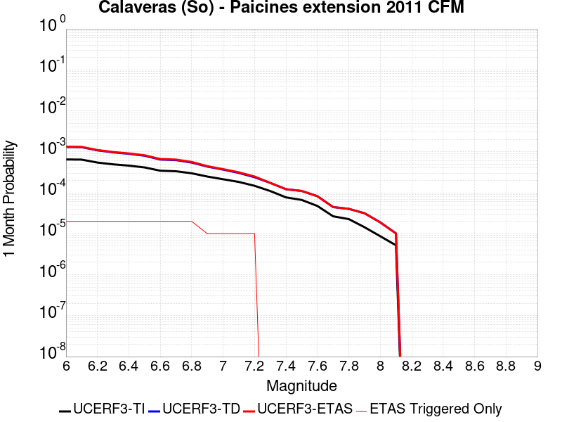 | 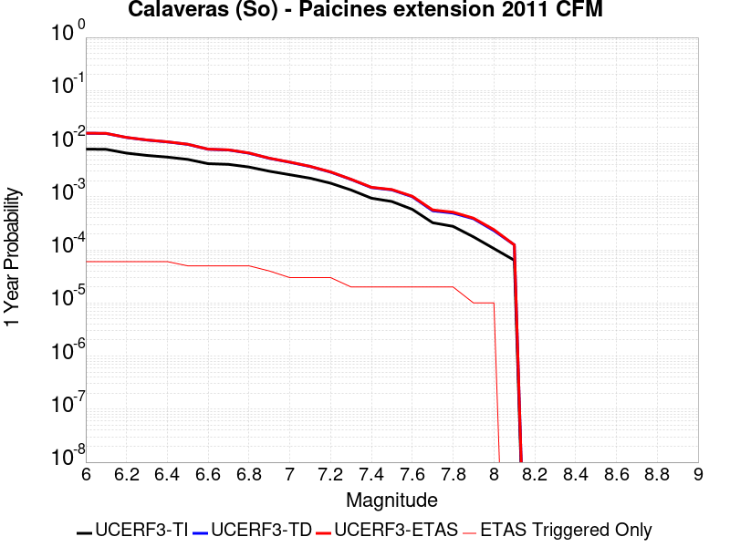 | 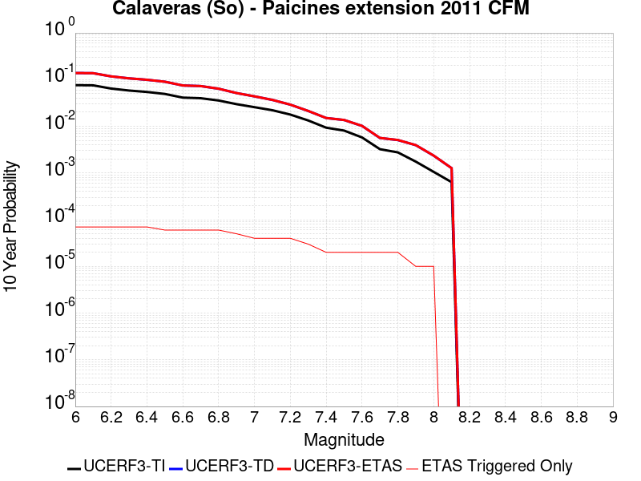 |

| Magnitude | 1 wk TI Prob | 1 wk TD Prob | 1 wk ETAS Prob | 1 wk ETAS/TD Gain | 1 wk ETAS Triggered Only | 1 mo TI Prob | 1 mo TD Prob | 1 mo ETAS Prob | 1 mo ETAS/TD Gain | 1 mo ETAS Triggered Only | 1 yr TI Prob | 1 yr TD Prob | 1 yr ETAS Prob | 1 yr ETAS/TD Gain | 1 yr ETAS Triggered Only | 10 yr TI Prob | 10 yr TD Prob | 10 yr ETAS Prob | 10 yr ETAS/TD Gain | 10 yr ETAS Triggered Only |
|-----|-----|-----|-----|-----|-----|-----|-----|-----|-----|-----|-----|-----|-----|-----|-----|-----|-----|-----|-----|-----|
| 6.0 | 1.5183659E-4 | 3.0533716E-4 | 3.153341E-4 | 1.0327407 | 1.0E-5 | 6.5056595E-4 | 0.0013069661 | 0.00132694 | 1.0152826 | 2.0E-5 | 0.007891912 | 0.01569571 | 0.015754769 | 1.0037627 | 6.0E-5 | 0.076174594 | 0.13848671 | 0.13854702 | 1.0004355 | 7.0E-5 |
| 6.1 | 1.5024997E-4 | 3.0227835E-4 | 3.1227534E-4 | 1.0330721 | 1.0E-5 | 6.437695E-4 | 0.00129387 | 0.0013138441 | 1.0154375 | 2.0E-5 | 0.0078097614 | 0.015539104 | 0.015598172 | 1.0038012 | 6.0E-5 | 0.075409345 | 0.13715632 | 0.13721673 | 1.0004404 | 7.0E-5 |
| 6.2 | 1.2743923E-4 | 2.5306802E-4 | 2.6306548E-4 | 1.0395051 | 1.0E-5 | 5.460538E-4 | 0.0010841049 | 0.0011040833 | 1.0184284 | 2.0E-5 | 0.0066279583 | 0.013046704 | 0.013105921 | 1.0045389 | 6.0E-5 | 0.064337276 | 0.11725405 | 0.117315836 | 1.000527 | 7.0E-5 |
| 6.3 | 1.1525114E-4 | 2.2595265E-4 | 2.3595039E-4 | 1.044247 | 1.0E-5 | 4.9383997E-4 | 9.6799526E-4 | 9.87976E-4 | 1.0206412 | 2.0E-5 | 0.0059959386 | 0.011667927 | 0.011727227 | 1.0050822 | 6.0E-5 | 0.058367174 | 0.10637007 | 0.106432624 | 1.000588 | 7.0E-5 |
| 6.4 | 1.07200925E-4 | 2.0836305E-4 | 2.1836096E-4 | 1.0479832 | 1.0E-5 | 4.5935164E-4 | 8.926636E-4 | 9.126457E-4 | 1.0223849 | 2.0E-5 | 0.0055782744 | 0.010772766 | 0.010832119 | 1.0055096 | 6.0E-5 | 0.0544031 | 0.09919256 | 0.09925562 | 1.0006357 | 7.0E-5 |
| 6.5 | 9.69631E-5 | 1.8729115E-4 | 1.9728928E-4 | 1.0533828 | 1.0E-5 | 4.1548995E-4 | 8.024135E-4 | 8.223975E-4 | 1.0249048 | 2.0E-5 | 0.0050468626 | 0.009694662 | 0.009744178 | 1.0051075 | 5.0E-5 | 0.04933773 | 0.090084255 | 0.09013885 | 1.0006061 | 6.0E-5 |
| 6.6 | 8.0552316E-5 | 1.5070537E-4 | 1.6070386E-4 | 1.0663446 | 1.0E-5 | 3.4517853E-4 | 6.456994E-4 | 6.6568644E-4 | 1.0309541 | 2.0E-5 | 0.0041944524 | 0.007826256 | 0.007875864 | 1.0063387 | 5.0E-5 | 0.04116161 | 0.074854024 | 0.07490953 | 1.0007416 | 6.0E-5 |
| 6.7 | 7.815757E-5 | 1.4610609E-4 | 1.5610462E-4 | 1.0684334 | 1.0E-5 | 3.34918E-4 | 6.260017E-4 | 6.4598914E-4 | 1.0319288 | 2.0E-5 | 0.004070005 | 0.0075890915 | 0.007638712 | 1.0065384 | 5.0E-5 | 0.039962657 | 0.072703585 | 0.072759226 | 1.0007653 | 6.0E-5 |
| 6.8 | 6.965264E-5 | 1.2721405E-4 | 1.3721277E-4 | 1.0785977 | 1.0E-5 | 2.9847719E-4 | 5.450839E-4 | 5.65073E-4 | 1.0366716 | 2.0E-5 | 0.0036279052 | 0.00661342 | 0.006663089 | 1.0075104 | 5.0E-5 | 0.03569247 | 0.06379891 | 0.06385508 | 1.0008805 | 6.0E-5 |
| 6.9 | 5.8000453E-5 | 1.01435086E-4 | 1.01435086E-4 | 1.0 | 0.0 | 2.4854968E-4 | 4.3464993E-4 | 4.446456E-4 | 1.022997 | 1.0E-5 | 0.0030218933 | 0.0052791284 | 0.0053189173 | 1.007537 | 4.0E-5 | 0.029811295 | 0.051501602 | 0.05154903 | 1.0009209 | 5.0E-5 |
| 7.0 | 4.9865852E-5 | 8.567692E-5 | 8.567692E-5 | 1.0 | 0.0 | 2.1369329E-4 | 3.671356E-4 | 3.7713192E-4 | 1.0272279 | 1.0E-5 | 0.0025986114 | 0.0044608037 | 0.00449067 | 1.0066953 | 3.0E-5 | 0.025684336 | 0.043781694 | 0.04381994 | 1.0008736 | 4.0E-5 |
| 7.1 | 4.283875E-5 | 7.112159E-5 | 7.112159E-5 | 1.0 | 0.0 | 1.8358172E-4 | 3.047715E-4 | 3.1476846E-4 | 1.0328015 | 1.0E-5 | 0.0022328163 | 0.003704336 | 0.003734225 | 1.0080686 | 3.0E-5 | 0.022105146 | 0.03673583 | 0.03677436 | 1.0010488 | 4.0E-5 |
| 7.2 | 3.450115E-5 | 5.5776054E-5 | 5.5776054E-5 | 1.0 | 0.0 | 1.478537E-4 | 2.390185E-4 | 2.490161E-4 | 1.0418278 | 1.0E-5 | 0.0017986323 | 0.0029061958 | 0.0029361087 | 1.0102928 | 3.0E-5 | 0.017841442 | 0.029079199 | 0.029118035 | 1.0013355 | 4.0E-5 |
| 7.3 | 2.5709045E-5 | 4.0588155E-5 | 4.0588155E-5 | 1.0 | 0.0 | 1.1017697E-4 | 1.7393773E-4 | 1.7393773E-4 | 1.0 | 0.0 | 0.0013405791 | 0.002115652 | 0.0021356097 | 1.0094334 | 2.0E-5 | 0.013325208 | 0.021297242 | 0.021326603 | 1.0013787 | 3.0E-5 |
| 7.4 | 1.8003093E-5 | 2.8509934E-5 | 2.8509934E-5 | 1.0 | 0.0 | 7.715383E-5 | 1.2217973E-4 | 1.2217973E-4 | 1.0 | 0.0 | 9.3894306E-4 | 0.0014865254 | 0.0015064958 | 1.0134342 | 2.0E-5 | 0.009349857 | 0.015052196 | 0.015071895 | 1.0013087 | 2.0E-5 |
| 7.5 | 1.5595824E-5 | 2.5822499E-5 | 2.5822499E-5 | 1.0 | 0.0 | 6.683753E-5 | 1.1066317E-4 | 1.1066317E-4 | 1.0 | 0.0 | 8.134431E-4 | 0.0013464936 | 0.0013664666 | 1.0148335 | 2.0E-5 | 0.008104719 | 0.01365213 | 0.013671857 | 1.0014449 | 2.0E-5 |
| 7.6 | 1.1110309E-5 | 1.9222098E-5 | 1.9222098E-5 | 1.0 | 0.0 | 4.761474E-5 | 8.2377825E-5 | 8.2377825E-5 | 1.0 | 0.0 | 5.795553E-4 | 0.0010024898 | 0.0010224698 | 1.0199304 | 2.0E-5 | 0.0057804612 | 0.010203943 | 0.010223739 | 1.00194 | 2.0E-5 |
| 7.7 | 6.2140443E-6 | 1.0437076E-5 | 1.0437076E-5 | 1.0 | 0.0 | 2.6631347E-5 | 4.4729557E-5 | 4.4729557E-5 | 1.0 | 0.0 | 3.241884E-4 | 5.444464E-4 | 5.644355E-4 | 1.0367146 | 2.0E-5 | 0.0032371588 | 0.005619835 | 0.0056397226 | 1.0035388 | 2.0E-5 |
| 7.8 | 5.305533E-6 | 9.433038E-6 | 9.433038E-6 | 1.0 | 0.0 | 2.27378E-5 | 4.042668E-5 | 4.042668E-5 | 1.0 | 0.0 | 2.7679754E-4 | 4.920837E-4 | 5.120739E-4 | 1.0406235 | 2.0E-5 | 0.0027645302 | 0.005074324 | 0.0050942227 | 1.0039214 | 2.0E-5 |
| 7.9 | 3.363505E-6 | 7.3848937E-6 | 7.3848937E-6 | 1.0 | 0.0 | 1.4414942E-5 | 3.164916E-5 | 3.164916E-5 | 1.0 | 0.0 | 1.7548777E-4 | 3.8526047E-4 | 3.9525662E-4 | 1.0259465 | 1.0E-5 | 0.0017534926 | 0.003948527 | 0.0039584874 | 1.0025226 | 1.0E-5 |
| 8.0 | 2.0271132E-6 | 4.413104E-6 | 4.413104E-6 | 1.0 | 0.0 | 8.687599E-6 | 1.8913164E-5 | 1.8913164E-5 | 1.0 | 0.0 | 1.05766376E-4 | 2.302435E-4 | 2.4024119E-4 | 1.0434222 | 1.0E-5 | 0.0010571606 | 0.002351099 | 0.0023610755 | 1.0042434 | 1.0E-5 |
| 8.1 | 1.2206116E-6 | 2.3751331E-6 | 2.3751331E-6 | 1.0 | 0.0 | 5.2311816E-6 | 1.0179103E-5 | 1.0179103E-5 | 1.0 | 0.0 | 6.3687774E-5 | 1.2392356E-4 | 1.2392356E-4 | 1.0 | 0.0 | 6.366953E-4 | 0.0012705477 | 0.0012705477 | 1.0 | 0.0 |

## Great Valley 09 (Laguna Seca)
*[(top)](#table-of-contents)*

| 1 Week | 1 Month | 1 Year | 10 Year |
|-----|-----|-----|-----|
|  | 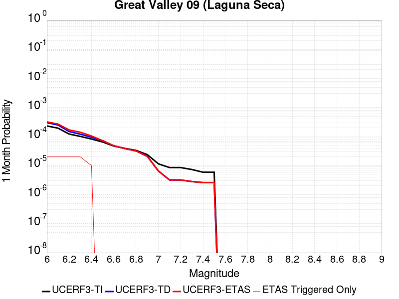 | 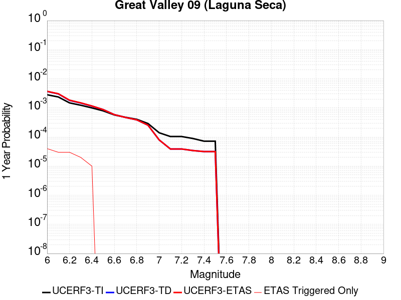 | 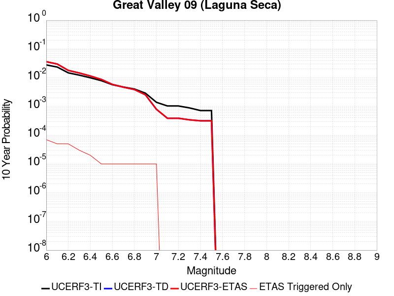 |

| Magnitude | 1 wk TI Prob | 1 wk TD Prob | 1 wk ETAS Prob | 1 wk ETAS/TD Gain | 1 wk ETAS Triggered Only | 1 mo TI Prob | 1 mo TD Prob | 1 mo ETAS Prob | 1 mo ETAS/TD Gain | 1 mo ETAS Triggered Only | 1 yr TI Prob | 1 yr TD Prob | 1 yr ETAS Prob | 1 yr ETAS/TD Gain | 1 yr ETAS Triggered Only | 10 yr TI Prob | 10 yr TD Prob | 10 yr ETAS Prob | 10 yr ETAS/TD Gain | 10 yr ETAS Triggered Only |
|-----|-----|-----|-----|-----|-----|-----|-----|-----|-----|-----|-----|-----|-----|-----|-----|-----|-----|-----|-----|-----|
| 6.0 | 5.4353277E-5 | 7.05022E-5 | 8.050149E-5 | 1.1418295 | 1.0E-5 | 2.3292181E-4 | 3.0211566E-4 | 3.221096E-4 | 1.0661798 | 2.0E-5 | 0.0028321352 | 0.0036721937 | 0.003712047 | 1.0108527 | 4.0E-5 | 0.02796312 | 0.03611547 | 0.036182944 | 1.0018682 | 7.0E-5 |
| 6.1 | 4.5578287E-5 | 5.822118E-5 | 6.82206E-5 | 1.1717488 | 1.0E-5 | 1.953209E-4 | 2.4949326E-4 | 2.6948826E-4 | 1.0801425 | 2.0E-5 | 0.0023754383 | 0.003033432 | 0.003063341 | 1.0098598 | 3.0E-5 | 0.023502063 | 0.029919548 | 0.029968051 | 1.0016211 | 5.0E-5 |
| 6.2 | 2.8536782E-5 | 3.4737273E-5 | 4.4736928E-5 | 1.2878652 | 1.0E-5 | 1.2229476E-4 | 1.4886224E-4 | 1.6885926E-4 | 1.1343324 | 2.0E-5 | 0.0014879217 | 0.001810813 | 0.0018407586 | 1.0165372 | 3.0E-5 | 0.014779986 | 0.017958116 | 0.018007219 | 1.0027343 | 5.0E-5 |
| 6.3 | 2.3698774E-5 | 2.8213295E-5 | 3.8213013E-5 | 1.3544328 | 1.0E-5 | 1.01562226E-4 | 1.20905075E-4 | 1.4090266E-4 | 1.1653991 | 2.0E-5 | 0.0012358186 | 0.0014710218 | 0.0014909924 | 1.013576 | 2.0E-5 | 0.012289686 | 0.014611342 | 0.014640903 | 1.0020232 | 3.0E-5 |
| 6.4 | 1.9191197E-5 | 2.2123184E-5 | 3.2122964E-5 | 1.4520046 | 1.0E-5 | 8.2245395E-5 | 9.4806666E-5 | 1.0480572E-4 | 1.1054678 | 1.0E-5 | 0.0010008777 | 0.0011536429 | 0.0011636313 | 1.0086582 | 1.0E-5 | 0.009963818 | 0.011476948 | 0.011496718 | 1.0017226 | 2.0E-5 |
| 6.5 | 1.5203241E-5 | 1.6802203E-5 | 1.6802203E-5 | 1.0 | 0.0 | 6.5155116E-5 | 7.200386E-5 | 7.200386E-5 | 1.0 | 0.0 | 7.9297484E-4 | 8.7626575E-4 | 8.7626575E-4 | 1.0 | 0.0 | 0.007901512 | 0.0087295165 | 0.0087394295 | 1.0011356 | 1.0E-5 |
| 6.6 | 1.0984925E-5 | 1.1242595E-5 | 1.1242595E-5 | 1.0 | 0.0 | 4.70774E-5 | 4.8181686E-5 | 4.8181686E-5 | 1.0 | 0.0 | 5.730166E-4 | 5.8645656E-4 | 5.8645656E-4 | 1.0 | 0.0 | 0.005715413 | 0.0058494853 | 0.0058594267 | 1.0016996 | 1.0E-5 |
| 6.7 | 9.134616E-6 | 9.019894E-6 | 9.019894E-6 | 1.0 | 0.0 | 3.9147766E-5 | 3.865613E-5 | 3.865613E-5 | 1.0 | 0.0 | 4.7651984E-4 | 4.7053912E-4 | 4.7053912E-4 | 1.0 | 0.0 | 0.004754993 | 0.0046956735 | 0.0047056265 | 1.0021197 | 1.0E-5 |
| 6.8 | 7.785589E-6 | 7.4519444E-6 | 7.4519444E-6 | 1.0 | 0.0 | 3.3366385E-5 | 3.1936524E-5 | 3.1936524E-5 | 1.0 | 0.0 | 4.0616E-4 | 3.8875983E-4 | 3.8875983E-4 | 1.0 | 0.0 | 0.0040541845 | 0.0038810016 | 0.0038909628 | 1.0025667 | 1.0E-5 |
| 6.9 | 5.579095E-6 | 4.898492E-6 | 4.898492E-6 | 1.0 | 0.0 | 2.3910188E-5 | 2.0993377E-5 | 2.0993377E-5 | 1.0 | 0.0 | 2.9106764E-4 | 2.5556577E-4 | 2.5556577E-4 | 1.0 | 0.0 | 0.002906867 | 0.002552856 | 0.0025628305 | 1.0039072 | 1.0E-5 |
| 7.0 | 2.6816688E-6 | 1.5216126E-6 | 1.5216126E-6 | 1.0 | 0.0 | 1.1492816E-5 | 6.521181E-6 | 6.521181E-6 | 1.0 | 0.0 | 1.3991605E-4 | 7.939258E-5 | 7.939258E-5 | 1.0 | 0.0 | 0.0013982799 | 7.9365086E-4 | 8.036429E-4 | 1.01259 | 1.0E-5 |
| 7.1 | 1.9951021E-6 | 7.453827E-7 | 7.453827E-7 | 1.0 | 0.0 | 8.55041E-6 | 3.1944935E-6 | 3.1944935E-6 | 1.0 | 0.0 | 1.0409627E-4 | 3.8892307E-5 | 3.8892307E-5 | 1.0 | 0.0 | 0.0010404752 | 3.8885913E-4 | 3.8885913E-4 | 1.0 | 0.0 |
| 7.2 | 1.9951021E-6 | 7.453827E-7 | 7.453827E-7 | 1.0 | 0.0 | 8.55041E-6 | 3.1944935E-6 | 3.1944935E-6 | 1.0 | 0.0 | 1.0409627E-4 | 3.8892307E-5 | 3.8892307E-5 | 1.0 | 0.0 | 0.0010404752 | 3.8885913E-4 | 3.8885913E-4 | 1.0 | 0.0 |
| 7.3 | 1.7087556E-6 | 6.578881E-7 | 6.578881E-7 | 1.0 | 0.0 | 7.3232177E-6 | 2.8195177E-6 | 2.8195177E-6 | 1.0 | 0.0 | 8.915652E-5 | 3.4327128E-5 | 3.4327128E-5 | 1.0 | 0.0 | 8.9120766E-4 | 3.432223E-4 | 3.432223E-4 | 1.0 | 0.0 |
| 7.4 | 1.3804846E-6 | 6.073852E-7 | 6.073852E-7 | 1.0 | 0.0 | 5.916349E-6 | 2.6030768E-6 | 2.6030768E-6 | 1.0 | 0.0 | 7.2029165E-5 | 3.169204E-5 | 3.169204E-5 | 1.0 | 0.0 | 7.200583E-4 | 3.1687922E-4 | 3.1687922E-4 | 1.0 | 0.0 |
| 7.5 | 1.3804846E-6 | 6.073852E-7 | 6.073852E-7 | 1.0 | 0.0 | 5.916349E-6 | 2.6030768E-6 | 2.6030768E-6 | 1.0 | 0.0 | 7.2029165E-5 | 3.169204E-5 | 3.169204E-5 | 1.0 | 0.0 | 7.200583E-4 | 3.1687922E-4 | 3.1687922E-4 | 1.0 | 0.0 |

## Elysian Park (Upper)
*[(top)](#table-of-contents)*

| 1 Week | 1 Month | 1 Year | 10 Year |
|-----|-----|-----|-----|
|  |  |  |  |

| Magnitude | 1 wk TI Prob | 1 wk TD Prob | 1 wk ETAS Prob | 1 wk ETAS/TD Gain | 1 wk ETAS Triggered Only | 1 mo TI Prob | 1 mo TD Prob | 1 mo ETAS Prob | 1 mo ETAS/TD Gain | 1 mo ETAS Triggered Only | 1 yr TI Prob | 1 yr TD Prob | 1 yr ETAS Prob | 1 yr ETAS/TD Gain | 1 yr ETAS Triggered Only | 10 yr TI Prob | 10 yr TD Prob | 10 yr ETAS Prob | 10 yr ETAS/TD Gain | 10 yr ETAS Triggered Only |
|-----|-----|-----|-----|-----|-----|-----|-----|-----|-----|-----|-----|-----|-----|-----|-----|-----|-----|-----|-----|-----|
| 6.0 | 3.1876025E-5 | 3.7035516E-5 | 4.7035144E-5 | 1.270001 | 1.0E-5 | 1.3660437E-4 | 1.587167E-4 | 1.7871354E-4 | 1.1259906 | 2.0E-5 | 0.0016618895 | 0.0019311075 | 0.0019610496 | 1.0155051 | 3.0E-5 | 0.016495159 | 0.019189782 | 0.01925844 | 1.0035778 | 7.0E-5 |
| 6.1 | 3.1876025E-5 | 3.7035516E-5 | 4.7035144E-5 | 1.270001 | 1.0E-5 | 1.3660437E-4 | 1.587167E-4 | 1.7871354E-4 | 1.1259906 | 2.0E-5 | 0.0016618895 | 0.0019311075 | 0.0019610496 | 1.0155051 | 3.0E-5 | 0.016495159 | 0.019189782 | 0.01925844 | 1.0035778 | 7.0E-5 |
| 6.2 | 3.1876025E-5 | 3.7035516E-5 | 4.7035144E-5 | 1.270001 | 1.0E-5 | 1.3660437E-4 | 1.587167E-4 | 1.7871354E-4 | 1.1259906 | 2.0E-5 | 0.0016618895 | 0.0019311075 | 0.0019610496 | 1.0155051 | 3.0E-5 | 0.016495159 | 0.019189782 | 0.01925844 | 1.0035778 | 7.0E-5 |
| 6.3 | 3.1876025E-5 | 3.7035516E-5 | 4.7035144E-5 | 1.270001 | 1.0E-5 | 1.3660437E-4 | 1.587167E-4 | 1.7871354E-4 | 1.1259906 | 2.0E-5 | 0.0016618895 | 0.0019311075 | 0.0019610496 | 1.0155051 | 3.0E-5 | 0.016495159 | 0.019189782 | 0.01925844 | 1.0035778 | 7.0E-5 |
| 6.4 | 1.9273462E-5 | 2.1202266E-5 | 2.1202266E-5 | 1.0 | 0.0 | 8.259794E-5 | 9.086466E-5 | 9.086466E-5 | 1.0 | 0.0 | 0.001005166 | 0.0011058892 | 0.0011258671 | 1.018065 | 2.0E-5 | 0.010006315 | 0.011020724 | 0.011060283 | 1.0035895 | 4.0E-5 |
| 6.5 | 1.9273462E-5 | 2.1202266E-5 | 2.1202266E-5 | 1.0 | 0.0 | 8.259794E-5 | 9.086466E-5 | 9.086466E-5 | 1.0 | 0.0 | 0.001005166 | 0.0011058892 | 0.0011258671 | 1.018065 | 2.0E-5 | 0.010006315 | 0.011020724 | 0.011060283 | 1.0035895 | 4.0E-5 |
| 6.6 | 9.813258E-6 | 9.665599E-6 | 9.665599E-6 | 1.0 | 0.0 | 4.205614E-5 | 4.1423376E-5 | 4.1423376E-5 | 1.0 | 0.0 | 5.119132E-4 | 5.0422014E-4 | 5.142151E-4 | 1.0198226 | 1.0E-5 | 0.005107356 | 0.0050314846 | 0.0050414344 | 1.0019774 | 1.0E-5 |
| 6.7 | 9.801478E-6 | 9.653168E-6 | 9.653168E-6 | 1.0 | 0.0 | 4.2005657E-5 | 4.1370105E-5 | 4.1370105E-5 | 1.0 | 0.0 | 5.112989E-4 | 5.035719E-4 | 5.1356683E-4 | 1.0198481 | 1.0E-5 | 0.0051012407 | 0.0050250315 | 0.005034981 | 1.0019801 | 1.0E-5 |
| 6.8 | 8.102489E-6 | 7.773004E-6 | 7.773004E-6 | 1.0 | 0.0 | 3.4724493E-5 | 3.3312477E-5 | 3.3312477E-5 | 1.0 | 0.0 | 4.2268867E-4 | 4.055089E-4 | 4.055089E-4 | 1.0 | 0.0 | 0.004218856 | 0.0040481836 | 0.0040481836 | 1.0 | 0.0 |
| 6.9 | 6.08275E-6 | 5.4814514E-6 | 5.4814514E-6 | 1.0 | 0.0 | 2.6068668E-5 | 2.3491726E-5 | 2.3491726E-5 | 1.0 | 0.0 | 3.173398E-4 | 2.85975E-4 | 2.85975E-4 | 1.0 | 0.0 | 0.0031688702 | 0.0028561477 | 0.0028561477 | 1.0 | 0.0 |
| 7.0 | 5.5995934E-6 | 4.98278E-6 | 4.98278E-6 | 1.0 | 0.0 | 2.3998036E-5 | 2.13546E-5 | 2.13546E-5 | 1.0 | 0.0 | 2.9213692E-4 | 2.599619E-4 | 2.599619E-4 | 1.0 | 0.0 | 0.0029175316 | 0.0025966454 | 0.0025966454 | 1.0 | 0.0 |
| 7.1 | 4.709881E-6 | 4.0874015E-6 | 4.0874015E-6 | 1.0 | 0.0 | 2.0185047E-5 | 1.7517319E-5 | 1.7517319E-5 | 1.0 | 0.0 | 2.4572524E-4 | 2.132529E-4 | 2.132529E-4 | 1.0 | 0.0 | 0.002454537 | 0.002130524 | 0.002130524 | 1.0 | 0.0 |
| 7.2 | 3.6063436E-6 | 2.9779544E-6 | 2.9779544E-6 | 1.0 | 0.0 | 1.5455667E-5 | 1.27626E-5 | 1.27626E-5 | 1.0 | 0.0 | 1.881565E-4 | 1.5537368E-4 | 1.5537368E-4 | 1.0 | 0.0 | 0.0018799726 | 0.0015526618 | 0.0015526618 | 1.0 | 0.0 |
| 7.3 | 2.471135E-6 | 2.0954615E-6 | 2.0954615E-6 | 1.0 | 0.0 | 1.0590536E-5 | 8.980519E-6 | 8.980519E-6 | 1.0 | 0.0 | 1.2893214E-4 | 1.093324E-4 | 1.093324E-4 | 1.0 | 0.0 | 0.0012885736 | 0.0010927934 | 0.0010927934 | 1.0 | 0.0 |
| 7.4 | 1.163943E-6 | 1.0275091E-6 | 1.0275091E-6 | 1.0 | 0.0 | 4.988318E-6 | 4.4036033E-6 | 4.4036033E-6 | 1.0 | 0.0 | 6.0731076E-5 | 5.3612584E-5 | 5.3612584E-5 | 1.0 | 0.0 | 6.071448E-4 | 5.359995E-4 | 5.359995E-4 | 1.0 | 0.0 |
| 7.5 | 4.99459E-7 | 4.917604E-7 | 4.917604E-7 | 1.0 | 0.0 | 2.140537E-6 | 2.1075427E-6 | 2.1075427E-6 | 1.0 | 0.0 | 2.6060725E-5 | 2.5659048E-5 | 2.5659048E-5 | 1.0 | 0.0 | 2.605767E-4 | 2.5656243E-4 | 2.5656243E-4 | 1.0 | 0.0 |
| 7.6 | 2.4667852E-7 | 2.4778336E-7 | 2.4778336E-7 | 1.0 | 0.0 | 1.0571932E-6 | 1.0619283E-6 | 1.0619283E-6 | 1.0 | 0.0 | 1.2871251E-5 | 1.2928905E-5 | 1.2928905E-5 | 1.0 | 0.0 | 1.2870505E-4 | 1.2928189E-4 | 1.2928189E-4 | 1.0 | 0.0 |
| 7.7 | 8.2312795E-8 | 7.3864456E-8 | 7.3864456E-8 | 1.0 | 0.0 | 3.527691E-7 | 3.165619E-7 | 3.165619E-7 | 1.0 | 0.0 | 4.294955E-6 | 3.8541357E-6 | 3.8541357E-6 | 1.0 | 0.0 | 4.2948723E-5 | 3.8540802E-5 | 3.8540802E-5 | 1.0 | 0.0 |
| 7.8 | 2.7819295E-8 | 1.7566023E-8 | 1.7566023E-8 | 1.0 | 0.0 | 1.1922555E-7 | 7.5282955E-8 | 7.5282955E-8 | 1.0 | 0.0 | 1.45157E-6 | 9.165697E-7 | 9.165697E-7 | 1.0 | 0.0 | 1.45156055E-5 | 9.165675E-6 | 9.165675E-6 | 1.0 | 0.0 |

## Big Pine (Central)
*[(top)](#table-of-contents)*

| 1 Week | 1 Month | 1 Year | 10 Year |
|-----|-----|-----|-----|
|  |  |  |  |

| Magnitude | 1 wk TI Prob | 1 wk TD Prob | 1 wk ETAS Prob | 1 wk ETAS/TD Gain | 1 wk ETAS Triggered Only | 1 mo TI Prob | 1 mo TD Prob | 1 mo ETAS Prob | 1 mo ETAS/TD Gain | 1 mo ETAS Triggered Only | 1 yr TI Prob | 1 yr TD Prob | 1 yr ETAS Prob | 1 yr ETAS/TD Gain | 1 yr ETAS Triggered Only | 10 yr TI Prob | 10 yr TD Prob | 10 yr ETAS Prob | 10 yr ETAS/TD Gain | 10 yr ETAS Triggered Only |
|-----|-----|-----|-----|-----|-----|-----|-----|-----|-----|-----|-----|-----|-----|-----|-----|-----|-----|-----|-----|-----|
| 6.0 | 1.2706755E-5 | 1.4250529E-5 | 5.424996E-5 | 3.8068736 | 4.0E-5 | 5.4456385E-5 | 6.107247E-5 | 1.11069414E-4 | 1.8186495 | 5.0E-5 | 6.628048E-4 | 7.433402E-4 | 7.93303E-4 | 1.0672139 | 5.0E-5 | 0.006608314 | 0.0074135666 | 0.007473122 | 1.0080333 | 6.0E-5 |
| 6.1 | 8.342579E-6 | 9.510762E-6 | 2.9510571E-5 | 3.102861 | 2.0E-5 | 3.5753423E-5 | 4.0759893E-5 | 7.075867E-5 | 1.7359877 | 3.0E-5 | 4.3521097E-4 | 4.961604E-4 | 5.261455E-4 | 1.0604343 | 3.0E-5 | 0.0043435963 | 0.0049540824 | 0.0049938844 | 1.0080341 | 4.0E-5 |
| 6.2 | 6.923899E-6 | 7.967147E-6 | 1.7967068E-5 | 2.2551444 | 1.0E-5 | 2.9673516E-5 | 3.4144578E-5 | 5.4143897E-5 | 1.5857245 | 2.0E-5 | 3.6121515E-4 | 4.156502E-4 | 4.3564188E-4 | 1.0480974 | 2.0E-5 | 0.003606286 | 0.0041520367 | 0.004181912 | 1.0071954 | 3.0E-5 |
| 6.3 | 2.728396E-6 | 3.4242908E-6 | 1.3424256E-5 | 3.9203029 | 1.0E-5 | 1.1693074E-5 | 1.4675454E-5 | 3.4675162E-5 | 2.3628 | 2.0E-5 | 1.4235388E-4 | 1.7865987E-4 | 1.986563E-4 | 1.1119245 | 2.0E-5 | 0.0014226272 | 0.0017866704 | 0.0018166169 | 1.0167611 | 3.0E-5 |
| 6.4 | 2.7136944E-6 | 3.408584E-6 | 1.340855E-5 | 3.9337595 | 1.0E-5 | 1.1630066E-5 | 1.4608141E-5 | 3.460785E-5 | 2.3690796 | 2.0E-5 | 1.4158686E-4 | 1.7784047E-4 | 1.9783691E-4 | 1.1124403 | 2.0E-5 | 0.0014149669 | 0.0017784894 | 0.0018084361 | 1.0168382 | 3.0E-5 |
| 6.5 | 2.6971882E-6 | 3.3909291E-6 | 1.3390895E-5 | 3.9490342 | 1.0E-5 | 1.1559327E-5 | 1.45324775E-5 | 3.4532186E-5 | 2.3762078 | 2.0E-5 | 1.4072572E-4 | 1.7691942E-4 | 1.9691588E-4 | 1.1130258 | 2.0E-5 | 0.0014063664 | 0.0017692937 | 0.0017992406 | 1.0169259 | 3.0E-5 |
| 6.6 | 2.669092E-6 | 3.3609497E-6 | 1.33609165E-5 | 3.9753394 | 1.0E-5 | 1.1438916E-5 | 1.4403995E-5 | 3.4403707E-5 | 2.3884835 | 2.0E-5 | 1.3925991E-4 | 1.753554E-4 | 1.953519E-4 | 1.114034 | 2.0E-5 | 0.0013917267 | 0.0017536782 | 0.0017836256 | 1.0170768 | 3.0E-5 |
| 6.7 | 2.6408059E-6 | 3.3309752E-6 | 1.3330942E-5 | 4.002114 | 1.0E-5 | 1.1317691E-5 | 1.4275535E-5 | 3.427525E-5 | 2.4009783 | 2.0E-5 | 1.3778417E-4 | 1.7379165E-4 | 1.9378818E-4 | 1.1150603 | 2.0E-5 | 0.0013769877 | 0.0017380653 | 0.0017680131 | 1.0172306 | 3.0E-5 |
| 6.8 | 2.1786943E-6 | 2.8544325E-6 | 1.2854404E-5 | 4.503313 | 1.0E-5 | 9.337228E-6 | 1.2233229E-5 | 3.2232983E-5 | 2.6348712 | 2.0E-5 | 1.1367482E-4 | 1.4893012E-4 | 1.6892714E-4 | 1.1342711 | 2.0E-5 | 0.0011361669 | 0.0014897975 | 0.0015197528 | 1.0201069 | 3.0E-5 |
| 6.9 | 1.4411696E-6 | 2.068499E-6 | 1.2068478E-5 | 5.834413 | 1.0E-5 | 6.1764263E-6 | 8.864968E-6 | 2.886479E-5 | 3.2560515 | 2.0E-5 | 7.51954E-5 | 1.079259E-4 | 1.2792375E-4 | 1.1852924 | 2.0E-5 | 7.5169955E-4 | 0.0010801847 | 0.0011101522 | 1.027743 | 3.0E-5 |
| 7.0 | 1.0073411E-6 | 1.554261E-6 | 1.1554245E-5 | 7.433916 | 1.0E-5 | 4.317169E-6 | 6.6611024E-6 | 2.666097E-5 | 4.002486 | 2.0E-5 | 5.2560266E-5 | 8.1096056E-5 | 1.0109443E-4 | 1.2466011 | 2.0E-5 | 5.2547833E-4 | 8.1210316E-4 | 8.4207876E-4 | 1.0369111 | 3.0E-5 |
| 7.1 | 8.947104E-7 | 1.4302494E-6 | 1.1430235E-5 | 7.991778 | 1.0E-5 | 3.834468E-6 | 6.129627E-6 | 2.6129504E-5 | 4.2628217 | 2.0E-5 | 4.6683643E-5 | 7.46258E-5 | 9.462431E-5 | 1.2679838 | 2.0E-5 | 4.6673836E-4 | 7.474457E-4 | 7.7742327E-4 | 1.0401067 | 3.0E-5 |
| 7.2 | 5.215166E-7 | 1.0111678E-6 | 1.1011158E-5 | 10.889545 | 1.0E-5 | 2.2350691E-6 | 4.3335694E-6 | 2.4333483E-5 | 5.6151133 | 2.0E-5 | 2.7211627E-5 | 5.2759973E-5 | 7.275892E-5 | 1.3790553 | 2.0E-5 | 2.7208295E-4 | 5.2890263E-4 | 5.488921E-4 | 1.0377941 | 2.0E-5 |
| 7.3 | 4.4024807E-7 | 9.219589E-7 | 1.092195E-5 | 11.84646 | 1.0E-5 | 1.8867761E-6 | 3.9512465E-6 | 2.3951168E-5 | 6.0616736 | 2.0E-5 | 2.2971257E-5 | 4.810541E-5 | 6.810445E-5 | 1.4157337 | 2.0E-5 | 2.2968883E-4 | 4.8237795E-4 | 5.023683E-4 | 1.0414413 | 2.0E-5 |
| 7.4 | 3.6130905E-7 | 8.358523E-7 | 1.0835844E-5 | 12.963826 | 1.0E-5 | 1.5484665E-6 | 3.5822195E-6 | 2.3582148E-5 | 6.583111 | 2.0E-5 | 1.8852415E-5 | 4.3612687E-5 | 6.361181E-5 | 1.4585621 | 2.0E-5 | 1.8850817E-4 | 4.374597E-4 | 4.5745095E-4 | 1.0456985 | 2.0E-5 |
| 7.5 | 3.408184E-7 | 8.108147E-7 | 1.0810807E-5 | 13.333263 | 1.0E-5 | 1.4606494E-6 | 3.4749157E-6 | 2.3474846E-5 | 6.755515 | 2.0E-5 | 1.7783263E-5 | 4.2306317E-5 | 6.230547E-5 | 1.4727226 | 2.0E-5 | 1.778184E-4 | 4.2437963E-4 | 4.4437114E-4 | 1.0471076 | 2.0E-5 |
| 7.6 | 3.1428627E-7 | 7.7316E-7 | 1.0773152E-5 | 13.933923 | 1.0E-5 | 1.3469405E-6 | 3.3135389E-6 | 2.3313472E-5 | 7.035823 | 2.0E-5 | 1.6398877E-5 | 4.0341627E-5 | 6.0340823E-5 | 1.4957458 | 2.0E-5 | 1.6397667E-4 | 4.0471106E-4 | 4.2470294E-4 | 1.049398 | 2.0E-5 |
| 7.7 | 1.7972785E-7 | 5.077752E-7 | 5.077752E-7 | 1.0 | 0.0 | 7.70262E-7 | 2.1761778E-6 | 1.2176156E-5 | 5.595203 | 1.0E-5 | 9.377899E-6 | 2.6494654E-5 | 3.6494388E-5 | 1.3774246 | 1.0E-5 | 9.377503E-5 | 2.662899E-4 | 2.7628723E-4 | 1.037543 | 1.0E-5 |
| 7.8 | 4.9230927E-8 | 1.198079E-7 | 1.198079E-7 | 1.0 | 0.0 | 2.1098968E-7 | 5.134623E-7 | 5.134623E-7 | 1.0 | 0.0 | 2.5687964E-6 | 6.2513873E-6 | 6.2513873E-6 | 1.0 | 0.0 | 2.5687666E-5 | 6.295415E-5 | 6.295415E-5 | 1.0 | 0.0 |
| 7.9 | 3.6805972E-9 | 4.105293E-9 | 4.105293E-9 | 1.0 | 0.0 | 1.5773987E-8 | 1.7594115E-8 | 1.7594115E-8 | 1.0 | 0.0 | 1.9204828E-7 | 2.1420831E-7 | 2.1420831E-7 | 1.0 | 0.0 | 1.920481E-6 | 2.1900614E-6 | 2.1900614E-6 | 1.0 | 0.0 |

## Whittier alt 1
*[(top)](#table-of-contents)*

| 1 Week | 1 Month | 1 Year | 10 Year |
|-----|-----|-----|-----|
|  | 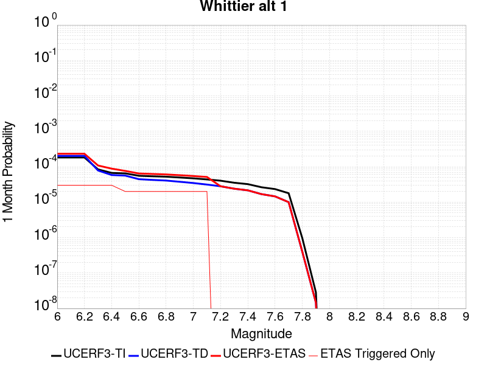 | 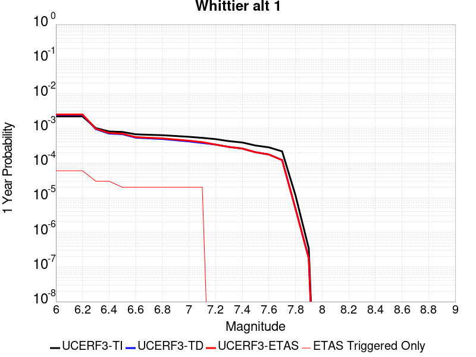 |  |

| Magnitude | 1 wk TI Prob | 1 wk TD Prob | 1 wk ETAS Prob | 1 wk ETAS/TD Gain | 1 wk ETAS Triggered Only | 1 mo TI Prob | 1 mo TD Prob | 1 mo ETAS Prob | 1 mo ETAS/TD Gain | 1 mo ETAS Triggered Only | 1 yr TI Prob | 1 yr TD Prob | 1 yr ETAS Prob | 1 yr ETAS/TD Gain | 1 yr ETAS Triggered Only | 10 yr TI Prob | 10 yr TD Prob | 10 yr ETAS Prob | 10 yr ETAS/TD Gain | 10 yr ETAS Triggered Only |
|-----|-----|-----|-----|-----|-----|-----|-----|-----|-----|-----|-----|-----|-----|-----|-----|-----|-----|-----|-----|-----|
| 6.0 | 4.2554693E-5 | 4.725218E-5 | 6.725123E-5 | 1.4232409 | 2.0E-5 | 1.8236451E-4 | 2.0249544E-4 | 2.3248936E-4 | 1.1481215 | 3.0E-5 | 0.002218027 | 0.0024629154 | 0.0025227675 | 1.0243014 | 6.0E-5 | 0.02196019 | 0.024390234 | 0.024448771 | 1.0024 | 6.0E-5 |
| 6.1 | 4.2554693E-5 | 4.725218E-5 | 6.725123E-5 | 1.4232409 | 2.0E-5 | 1.8236451E-4 | 2.0249544E-4 | 2.3248936E-4 | 1.1481215 | 3.0E-5 | 0.002218027 | 0.0024629154 | 0.0025227675 | 1.0243014 | 6.0E-5 | 0.02196019 | 0.024390234 | 0.024448771 | 1.0024 | 6.0E-5 |
| 6.2 | 4.2554693E-5 | 4.725218E-5 | 6.725123E-5 | 1.4232409 | 2.0E-5 | 1.8236451E-4 | 2.0249544E-4 | 2.3248936E-4 | 1.1481215 | 3.0E-5 | 0.002218027 | 0.0024629154 | 0.0025227675 | 1.0243014 | 6.0E-5 | 0.02196019 | 0.024390234 | 0.024448771 | 1.0024 | 6.0E-5 |
| 6.3 | 1.9617712E-5 | 1.8268593E-5 | 3.8268226E-5 | 2.0947552 | 2.0E-5 | 8.40732E-5 | 7.829172E-5 | 1.0828937E-4 | 1.3831522 | 3.0E-5 | 0.0010231105 | 9.52804E-4 | 9.827754E-4 | 1.031456 | 3.0E-5 | 0.01018413 | 0.009490474 | 0.00952019 | 1.003131 | 3.0E-5 |
| 6.4 | 1.5611336E-5 | 1.3604271E-5 | 3.3604E-5 | 2.4701066 | 2.0E-5 | 6.690401E-5 | 5.8302747E-5 | 8.8301E-5 | 1.5145255 | 3.0E-5 | 8.142519E-4 | 7.0961076E-4 | 7.3958945E-4 | 1.0422467 | 3.0E-5 | 0.008112748 | 0.0070754145 | 0.0071052024 | 1.00421 | 3.0E-5 |
| 6.5 | 1.5150166E-5 | 1.3100925E-5 | 3.3100663E-5 | 2.5265899 | 2.0E-5 | 6.492767E-5 | 5.6145647E-5 | 7.6144526E-5 | 1.3561964 | 2.0E-5 | 7.9020765E-4 | 6.8336475E-4 | 7.0335105E-4 | 1.0292469 | 2.0E-5 | 0.007874036 | 0.0068145846 | 0.0068344483 | 1.0029149 | 2.0E-5 |
| 6.6 | 1.295588E-5 | 1.0380725E-5 | 3.0380517E-5 | 2.9266276 | 2.0E-5 | 5.552402E-5 | 4.4488075E-5 | 6.448718E-5 | 1.4495387 | 2.0E-5 | 6.7579525E-4 | 5.4150965E-4 | 5.614988E-4 | 1.0369138 | 2.0E-5 | 0.006737438 | 0.0054033357 | 0.0054232273 | 1.0036814 | 2.0E-5 |
| 6.7 | 1.2542085E-5 | 9.899369E-6 | 2.989917E-5 | 3.0203109 | 2.0E-5 | 5.3750682E-5 | 4.242519E-5 | 6.242434E-5 | 1.4713981 | 2.0E-5 | 6.542181E-4 | 5.164061E-4 | 5.3639576E-4 | 1.0387092 | 2.0E-5 | 0.006522954 | 0.0051534795 | 0.0051733763 | 1.0038608 | 2.0E-5 |
| 6.8 | 1.2195878E-5 | 9.495415E-6 | 2.9495224E-5 | 3.1062598 | 2.0E-5 | 5.2267E-5 | 4.069401E-5 | 6.0693194E-5 | 1.4914528 | 2.0E-5 | 6.36165E-4 | 4.9533875E-4 | 5.153289E-4 | 1.0403564 | 2.0E-5 | 0.0063434686 | 0.004943688 | 0.0049635894 | 1.0040256 | 2.0E-5 |
| 6.9 | 1.1580298E-5 | 8.772933E-6 | 2.8772758E-5 | 3.279719 | 2.0E-5 | 4.9628903E-5 | 3.7597754E-5 | 5.7597E-5 | 1.5319266 | 2.0E-5 | 6.040644E-4 | 4.5765814E-4 | 4.77649E-4 | 1.0436808 | 2.0E-5 | 0.00602425 | 0.0045684157 | 0.0045883246 | 1.0043579 | 2.0E-5 |
| 7.0 | 1.0964795E-5 | 8.083994E-6 | 2.8083832E-5 | 3.4740047 | 2.0E-5 | 4.6991136E-5 | 3.4645236E-5 | 5.4644544E-5 | 1.5772599 | 2.0E-5 | 5.7196687E-4 | 4.2172565E-4 | 4.4171722E-4 | 1.0474042 | 2.0E-5 | 0.0057049696 | 0.004210462 | 0.0042303777 | 1.0047301 | 2.0E-5 |
| 7.1 | 1.0230601E-5 | 7.3266697E-6 | 2.7326523E-5 | 3.7297332 | 2.0E-5 | 4.3844695E-5 | 3.1399642E-5 | 5.1399013E-5 | 1.63693 | 2.0E-5 | 5.336784E-4 | 3.8222488E-4 | 4.0221724E-4 | 1.0523052 | 2.0E-5 | 0.005323986 | 0.0038168381 | 0.0038367617 | 1.0052199 | 2.0E-5 |
| 7.2 | 9.40865E-6 | 6.543289E-6 | 6.543289E-6 | 1.0 | 0.0 | 4.032216E-5 | 2.8042374E-5 | 2.8042374E-5 | 1.0 | 0.0 | 4.908117E-4 | 3.4136363E-4 | 3.4136363E-4 | 1.0 | 0.0 | 0.0048972913 | 0.003409485 | 0.003409485 | 1.0 | 0.0 |
| 7.3 | 8.237384E-6 | 5.5977525E-6 | 5.5977525E-6 | 1.0 | 0.0 | 3.5302593E-5 | 2.3990153E-5 | 2.3990153E-5 | 1.0 | 0.0 | 4.2972428E-4 | 2.92042E-4 | 2.92042E-4 | 1.0 | 0.0 | 0.0042889426 | 0.002916903 | 0.002916903 | 1.0 | 0.0 |
| 7.4 | 7.5316966E-6 | 5.027819E-6 | 5.027819E-6 | 1.0 | 0.0 | 3.2278298E-5 | 2.1547625E-5 | 2.1547625E-5 | 1.0 | 0.0 | 3.9291743E-4 | 2.6231175E-4 | 2.6231175E-4 | 1.0 | 0.0 | 0.0039222343 | 0.0026201333 | 0.0026201333 | 1.0 | 0.0 |
| 7.5 | 6.149649E-6 | 3.933841E-6 | 3.933841E-6 | 1.0 | 0.0 | 2.6355372E-5 | 1.6859214E-5 | 1.6859214E-5 | 1.0 | 0.0 | 3.208294E-4 | 2.052425E-4 | 2.052425E-4 | 1.0 | 0.0 | 0.003203666 | 0.0020506186 | 0.0020506186 | 1.0 | 0.0 |
| 7.6 | 5.457711E-6 | 3.3953788E-6 | 3.3953788E-6 | 1.0 | 0.0 | 2.338998E-5 | 1.4551547E-5 | 1.4551547E-5 | 1.0 | 0.0 | 2.8473578E-4 | 1.771515E-4 | 1.771515E-4 | 1.0 | 0.0 | 0.0028437122 | 0.0017701836 | 0.0017701836 | 1.0 | 0.0 |
| 7.7 | 4.1676276E-6 | 2.3331952E-6 | 2.3331952E-6 | 1.0 | 0.0 | 1.7861139E-5 | 9.999374E-6 | 9.999374E-6 | 1.0 | 0.0 | 2.1743766E-4 | 1.2173632E-4 | 1.2173632E-4 | 1.0 | 0.0 | 0.0021722503 | 0.0012167693 | 0.0012167693 | 1.0 | 0.0 |
| 7.8 | 2.2692414E-7 | 9.3854695E-8 | 9.3854695E-8 | 1.0 | 0.0 | 9.725317E-7 | 4.0223435E-7 | 4.0223435E-7 | 1.0 | 0.0 | 1.1840509E-5 | 4.8971956E-6 | 4.8971956E-6 | 1.0 | 0.0 | 1.1839878E-4 | 4.8971204E-5 | 4.8971204E-5 | 1.0 | 0.0 |
| 7.9 | 6.676829E-9 | 3.439853E-9 | 3.439853E-9 | 1.0 | 0.0 | 2.861498E-8 | 1.4742227E-8 | 1.4742227E-8 | 1.0 | 0.0 | 3.4838732E-7 | 1.7948659E-7 | 1.7948659E-7 | 1.0 | 0.0 | 3.4838679E-6 | 1.7948646E-6 | 1.7948646E-6 | 1.0 | 0.0 |

## Mono Lake 2011 CFM
*[(top)](#table-of-contents)*

| 1 Week | 1 Month | 1 Year | 10 Year |
|-----|-----|-----|-----|
|  |  |  |  |

| Magnitude | 1 wk TI Prob | 1 wk TD Prob | 1 wk ETAS Prob | 1 wk ETAS/TD Gain | 1 wk ETAS Triggered Only | 1 mo TI Prob | 1 mo TD Prob | 1 mo ETAS Prob | 1 mo ETAS/TD Gain | 1 mo ETAS Triggered Only | 1 yr TI Prob | 1 yr TD Prob | 1 yr ETAS Prob | 1 yr ETAS/TD Gain | 1 yr ETAS Triggered Only | 10 yr TI Prob | 10 yr TD Prob | 10 yr ETAS Prob | 10 yr ETAS/TD Gain | 10 yr ETAS Triggered Only |
|-----|-----|-----|-----|-----|-----|-----|-----|-----|-----|-----|-----|-----|-----|-----|-----|-----|-----|-----|-----|-----|
| 6.0 | 2.0341662E-5 | 2.3828166E-5 | 5.382745E-5 | 2.258984 | 3.0E-5 | 8.717564E-5 | 1.0211971E-4 | 1.4211563E-4 | 1.3916571 | 4.0E-5 | 0.0010608466 | 0.0012431298 | 0.0013030552 | 1.0482053 | 6.0E-5 | 0.010557966 | 0.012413835 | 0.012473091 | 1.0047733 | 6.0E-5 |
| 6.1 | 2.0341662E-5 | 2.3828166E-5 | 5.382745E-5 | 2.258984 | 3.0E-5 | 8.717564E-5 | 1.0211971E-4 | 1.4211563E-4 | 1.3916571 | 4.0E-5 | 0.0010608466 | 0.0012431298 | 0.0013030552 | 1.0482053 | 6.0E-5 | 0.010557966 | 0.012413835 | 0.012473091 | 1.0047733 | 6.0E-5 |
| 6.2 | 2.0341662E-5 | 2.3828166E-5 | 5.382745E-5 | 2.258984 | 3.0E-5 | 8.717564E-5 | 1.0211971E-4 | 1.4211563E-4 | 1.3916571 | 4.0E-5 | 0.0010608466 | 0.0012431298 | 0.0013030552 | 1.0482053 | 6.0E-5 | 0.010557966 | 0.012413835 | 0.012473091 | 1.0047733 | 6.0E-5 |
| 6.3 | 2.0341662E-5 | 2.3828166E-5 | 5.382745E-5 | 2.258984 | 3.0E-5 | 8.717564E-5 | 1.0211971E-4 | 1.4211563E-4 | 1.3916571 | 4.0E-5 | 0.0010608466 | 0.0012431298 | 0.0013030552 | 1.0482053 | 6.0E-5 | 0.010557966 | 0.012413835 | 0.012473091 | 1.0047733 | 6.0E-5 |
| 6.4 | 1.749821E-5 | 2.0490985E-5 | 5.049037E-5 | 2.4640284 | 3.0E-5 | 7.499018E-5 | 8.781851E-5 | 1.27815E-4 | 1.4554448 | 4.0E-5 | 9.1262296E-4 | 0.0010691903 | 0.0011291262 | 1.0560572 | 6.0E-5 | 0.009088841 | 0.010691865 | 0.010751223 | 1.0055517 | 6.0E-5 |
| 6.5 | 1.749821E-5 | 2.0490985E-5 | 5.049037E-5 | 2.4640284 | 3.0E-5 | 7.499018E-5 | 8.781851E-5 | 1.27815E-4 | 1.4554448 | 4.0E-5 | 9.1262296E-4 | 0.0010691903 | 0.0011291262 | 1.0560572 | 6.0E-5 | 0.009088841 | 0.010691865 | 0.010751223 | 1.0055517 | 6.0E-5 |

## Elsinore (Temecula) rev
*[(top)](#table-of-contents)*

| 1 Week | 1 Month | 1 Year | 10 Year |
|-----|-----|-----|-----|
|  |  |  | 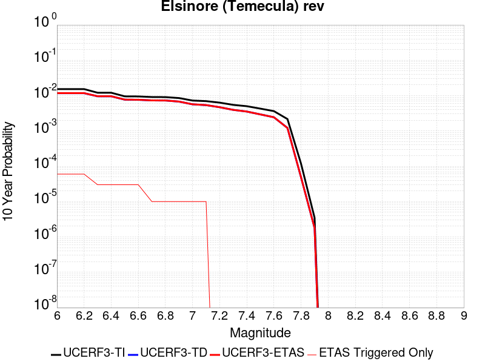 |

| Magnitude | 1 wk TI Prob | 1 wk TD Prob | 1 wk ETAS Prob | 1 wk ETAS/TD Gain | 1 wk ETAS Triggered Only | 1 mo TI Prob | 1 mo TD Prob | 1 mo ETAS Prob | 1 mo ETAS/TD Gain | 1 mo ETAS Triggered Only | 1 yr TI Prob | 1 yr TD Prob | 1 yr ETAS Prob | 1 yr ETAS/TD Gain | 1 yr ETAS Triggered Only | 10 yr TI Prob | 10 yr TD Prob | 10 yr ETAS Prob | 10 yr ETAS/TD Gain | 10 yr ETAS Triggered Only |
|-----|-----|-----|-----|-----|-----|-----|-----|-----|-----|-----|-----|-----|-----|-----|-----|-----|-----|-----|-----|-----|
| 6.0 | 2.9514995E-5 | 2.2517117E-5 | 3.251689E-5 | 1.4440966 | 1.0E-5 | 1.264867E-4 | 9.649849E-5 | 1.1649655E-4 | 1.2072371 | 2.0E-5 | 0.0015388876 | 0.0011742581 | 0.0011942346 | 1.017012 | 2.0E-5 | 0.015282745 | 0.011696897 | 0.011756196 | 1.0050696 | 6.0E-5 |
| 6.1 | 2.9514995E-5 | 2.2517117E-5 | 3.251689E-5 | 1.4440966 | 1.0E-5 | 1.264867E-4 | 9.649849E-5 | 1.1649655E-4 | 1.2072371 | 2.0E-5 | 0.0015388876 | 0.0011742581 | 0.0011942346 | 1.017012 | 2.0E-5 | 0.015282745 | 0.011696897 | 0.011756196 | 1.0050696 | 6.0E-5 |
| 6.2 | 2.9514995E-5 | 2.2517117E-5 | 3.251689E-5 | 1.4440966 | 1.0E-5 | 1.264867E-4 | 9.649849E-5 | 1.1649655E-4 | 1.2072371 | 2.0E-5 | 0.0015388876 | 0.0011742581 | 0.0011942346 | 1.017012 | 2.0E-5 | 0.015282745 | 0.011696897 | 0.011756196 | 1.0050696 | 6.0E-5 |
| 6.3 | 2.3223649E-5 | 1.8406454E-5 | 2.840627E-5 | 1.5432777 | 1.0E-5 | 9.952613E-5 | 7.888251E-5 | 8.888173E-5 | 1.1267608 | 1.0E-5 | 0.001211057 | 9.599888E-4 | 9.6997916E-4 | 1.0104067 | 1.0E-5 | 0.012044783 | 0.009569948 | 0.0095996605 | 1.0031048 | 3.0E-5 |
| 6.4 | 2.3223649E-5 | 1.8406454E-5 | 2.840627E-5 | 1.5432777 | 1.0E-5 | 9.952613E-5 | 7.888251E-5 | 8.888173E-5 | 1.1267608 | 1.0E-5 | 0.001211057 | 9.599888E-4 | 9.6997916E-4 | 1.0104067 | 1.0E-5 | 0.012044783 | 0.009569948 | 0.0095996605 | 1.0031048 | 3.0E-5 |
| 6.5 | 1.8338875E-5 | 1.4750118E-5 | 2.474997E-5 | 1.6779507 | 1.0E-5 | 7.8592806E-5 | 6.321331E-5 | 7.321267E-5 | 1.1581845 | 1.0E-5 | 9.5644733E-4 | 7.69359E-4 | 7.7935134E-4 | 1.0129879 | 1.0E-5 | 0.009523412 | 0.0076739118 | 0.0077036815 | 1.0038793 | 3.0E-5 |
| 6.6 | 1.8223333E-5 | 1.4612673E-5 | 2.4612527E-5 | 1.6843275 | 1.0E-5 | 7.809766E-5 | 6.262429E-5 | 7.262366E-5 | 1.1596725 | 1.0E-5 | 9.504242E-4 | 7.6219277E-4 | 7.7218516E-4 | 1.01311 | 1.0E-5 | 0.009463696 | 0.0076027405 | 0.0076325126 | 1.0039159 | 3.0E-5 |
| 6.7 | 1.7512752E-5 | 1.402721E-5 | 2.402707E-5 | 1.7128901 | 1.0E-5 | 7.505249E-5 | 6.011528E-5 | 7.011468E-5 | 1.166337 | 1.0E-5 | 9.13381E-4 | 7.3166634E-4 | 7.41659E-4 | 1.0136575 | 1.0E-5 | 0.00909636 | 0.00729892 | 0.007308847 | 1.00136 | 1.0E-5 |
| 6.8 | 1.7417142E-5 | 1.3951195E-5 | 2.3951055E-5 | 1.7167745 | 1.0E-5 | 7.4642754E-5 | 5.9789512E-5 | 6.978891E-5 | 1.1672434 | 1.0E-5 | 9.083966E-4 | 7.277028E-4 | 7.376955E-4 | 1.0137318 | 1.0E-5 | 0.009046922 | 0.0072594886 | 0.007269416 | 1.0013674 | 1.0E-5 |
| 6.9 | 1.6402591E-5 | 1.2988613E-5 | 2.2988483E-5 | 1.7698951 | 1.0E-5 | 7.0294926E-5 | 5.5664343E-5 | 6.5663786E-5 | 1.1796383 | 1.0E-5 | 8.5550465E-4 | 6.775103E-4 | 6.8750355E-4 | 1.0147499 | 1.0E-5 | 0.008522186 | 0.006760169 | 0.0067701014 | 1.0014693 | 1.0E-5 |
| 7.0 | 1.3912486E-5 | 1.0878233E-5 | 2.0878124E-5 | 1.9192569 | 1.0E-5 | 5.9623577E-5 | 4.6620182E-5 | 5.6619716E-5 | 1.2144893 | 1.0E-5 | 7.2567526E-4 | 5.674556E-4 | 5.7745E-4 | 1.0176126 | 1.0E-5 | 0.0072331014 | 0.005663986 | 0.005673929 | 1.0017556 | 1.0E-5 |
| 7.1 | 1.3405147E-5 | 1.03274215E-5 | 2.0327318E-5 | 1.9682859 | 1.0E-5 | 5.7449364E-5 | 4.425964E-5 | 5.4259195E-5 | 1.2259295 | 1.0E-5 | 6.9922156E-4 | 5.3873047E-4 | 5.487251E-4 | 1.0185522 | 1.0E-5 | 0.0069702556 | 0.005377577 | 0.005387523 | 1.0018495 | 1.0E-5 |
| 7.2 | 1.21402E-5 | 8.996737E-6 | 8.996737E-6 | 1.0 | 0.0 | 5.202839E-5 | 3.8556886E-5 | 3.8556886E-5 | 1.0 | 0.0 | 6.332616E-4 | 4.6933076E-4 | 4.6933076E-4 | 1.0 | 0.0 | 0.0063146 | 0.004684821 | 0.004684821 | 1.0 | 0.0 |
| 7.3 | 1.05047775E-5 | 7.571771E-6 | 7.571771E-6 | 1.0 | 0.0 | 4.5019697E-5 | 3.245005E-5 | 3.245005E-5 | 1.0 | 0.0 | 5.4797693E-4 | 3.950092E-4 | 3.950092E-4 | 1.0 | 0.0 | 0.005466277 | 0.00394346 | 0.00394346 | 1.0 | 0.0 |
| 7.4 | 9.624483E-6 | 6.7868696E-6 | 6.7868696E-6 | 1.0 | 0.0 | 4.124713E-5 | 2.9086266E-5 | 2.9086266E-5 | 1.0 | 0.0 | 5.0206814E-4 | 3.5406914E-4 | 3.5406914E-4 | 1.0 | 0.0 | 0.005009353 | 0.003535204 | 0.003535204 | 1.0 | 0.0 |
| 7.5 | 8.215151E-6 | 5.635538E-6 | 5.635538E-6 | 1.0 | 0.0 | 3.5207315E-5 | 2.4152088E-5 | 2.4152088E-5 | 1.0 | 0.0 | 4.2856473E-4 | 2.9401327E-4 | 2.9401327E-4 | 1.0 | 0.0 | 0.004277392 | 0.002936371 | 0.002936371 | 1.0 | 0.0 |
| 7.6 | 6.975058E-6 | 4.676045E-6 | 4.676045E-6 | 1.0 | 0.0 | 2.9892764E-5 | 2.0040046E-5 | 2.0040046E-5 | 1.0 | 0.0 | 3.6388362E-4 | 2.439614E-4 | 2.439614E-4 | 1.0 | 0.0 | 0.0036328835 | 0.002437052 | 0.002437052 | 1.0 | 0.0 |
| 7.7 | 4.159604E-6 | 2.3269924E-6 | 2.3269924E-6 | 1.0 | 0.0 | 1.7826753E-5 | 9.97279E-6 | 9.97279E-6 | 1.0 | 0.0 | 2.1701909E-4 | 1.21412704E-4 | 1.21412704E-4 | 1.0 | 0.0 | 0.0021680726 | 0.0012135367 | 0.0012135367 | 1.0 | 0.0 |
| 7.8 | 2.2692414E-7 | 9.3854695E-8 | 9.3854695E-8 | 1.0 | 0.0 | 9.725317E-7 | 4.0223435E-7 | 4.0223435E-7 | 1.0 | 0.0 | 1.1840509E-5 | 4.8971956E-6 | 4.8971956E-6 | 1.0 | 0.0 | 1.1839878E-4 | 4.8971204E-5 | 4.8971204E-5 | 1.0 | 0.0 |
| 7.9 | 6.676829E-9 | 3.439853E-9 | 3.439853E-9 | 1.0 | 0.0 | 2.861498E-8 | 1.4742227E-8 | 1.4742227E-8 | 1.0 | 0.0 | 3.4838732E-7 | 1.7948659E-7 | 1.7948659E-7 | 1.0 | 0.0 | 3.4838679E-6 | 1.7948646E-6 | 1.7948646E-6 | 1.0 | 0.0 |

## Great Valley 07 (Orestimba)
*[(top)](#table-of-contents)*

| 1 Week | 1 Month | 1 Year | 10 Year |
|-----|-----|-----|-----|
| 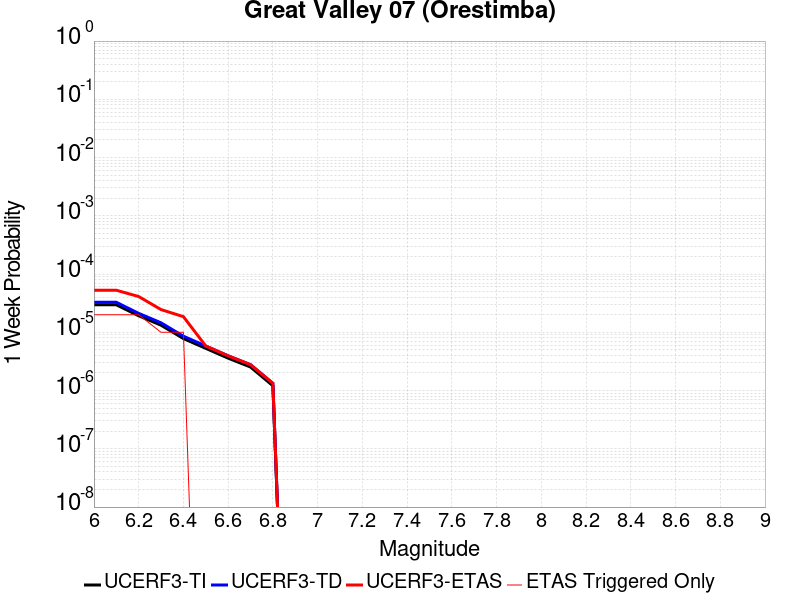 |  |  |  |

| Magnitude | 1 wk TI Prob | 1 wk TD Prob | 1 wk ETAS Prob | 1 wk ETAS/TD Gain | 1 wk ETAS Triggered Only | 1 mo TI Prob | 1 mo TD Prob | 1 mo ETAS Prob | 1 mo ETAS/TD Gain | 1 mo ETAS Triggered Only | 1 yr TI Prob | 1 yr TD Prob | 1 yr ETAS Prob | 1 yr ETAS/TD Gain | 1 yr ETAS Triggered Only | 10 yr TI Prob | 10 yr TD Prob | 10 yr ETAS Prob | 10 yr ETAS/TD Gain | 10 yr ETAS Triggered Only |
|-----|-----|-----|-----|-----|-----|-----|-----|-----|-----|-----|-----|-----|-----|-----|-----|-----|-----|-----|-----|-----|
| 6.0 | 2.9687902E-5 | 3.27575E-5 | 5.2756845E-5 | 1.6105273 | 2.0E-5 | 1.2722766E-4 | 1.4038214E-4 | 1.8037652E-4 | 1.2848965 | 4.0E-5 | 0.0015478961 | 0.0017078844 | 0.0017577991 | 1.029226 | 5.0E-5 | 0.015371585 | 0.016955135 | 0.017014118 | 1.0034788 | 6.0E-5 |
| 6.1 | 2.9687902E-5 | 3.27575E-5 | 5.2756845E-5 | 1.6105273 | 2.0E-5 | 1.2722766E-4 | 1.4038214E-4 | 1.8037652E-4 | 1.2848965 | 4.0E-5 | 0.0015478961 | 0.0017078844 | 0.0017577991 | 1.029226 | 5.0E-5 | 0.015371585 | 0.016955135 | 0.017014118 | 1.0034788 | 6.0E-5 |
| 6.2 | 1.9231524E-5 | 2.1159167E-5 | 4.1158743E-5 | 1.9451969 | 2.0E-5 | 8.2418206E-5 | 9.067912E-5 | 1.206764E-4 | 1.330807 | 3.0E-5 | 0.0010029797 | 0.0011034822 | 0.0011434382 | 1.0362089 | 4.0E-5 | 0.00998465 | 0.01098244 | 0.011022001 | 1.0036021 | 4.0E-5 |
| 6.3 | 1.324766E-5 | 1.4548534E-5 | 2.4548388E-5 | 1.6873446 | 1.0E-5 | 5.6774446E-5 | 6.234942E-5 | 8.2348175E-5 | 1.3207529 | 2.0E-5 | 6.910097E-4 | 7.5884897E-4 | 7.888262E-4 | 1.0395036 | 3.0E-5 | 0.006888649 | 0.0075635235 | 0.0075932965 | 1.0039364 | 3.0E-5 |
| 6.4 | 7.818645E-6 | 8.57284E-6 | 1.8572755E-5 | 2.1664646 | 1.0E-5 | 3.3508048E-5 | 3.6740246E-5 | 5.673951E-5 | 1.5443422 | 2.0E-5 | 4.078841E-4 | 4.4722404E-4 | 4.7721062E-4 | 1.0670505 | 3.0E-5 | 0.004071363 | 0.0044635804 | 0.0044934466 | 1.0066911 | 3.0E-5 |
| 6.5 | 5.3076565E-6 | 5.8178007E-6 | 5.8178007E-6 | 1.0 | 0.0 | 2.27469E-5 | 2.4933206E-5 | 3.4932957E-5 | 1.4010615 | 1.0E-5 | 2.7690834E-4 | 3.035216E-4 | 3.2351553E-4 | 1.0658731 | 2.0E-5 | 0.0027656353 | 0.00303128 | 0.0030512193 | 1.0065778 | 2.0E-5 |
| 6.6 | 3.6003578E-6 | 3.9484953E-6 | 3.9484953E-6 | 1.0 | 0.0 | 1.5430012E-5 | 1.6922022E-5 | 1.6922022E-5 | 1.0 | 0.0 | 1.8784421E-4 | 2.0600771E-4 | 2.1600565E-4 | 1.0485319 | 1.0E-5 | 0.0018768552 | 0.0020583214 | 0.0020683007 | 1.0048484 | 1.0E-5 |
| 6.7 | 2.5361826E-6 | 2.7834678E-6 | 2.7834678E-6 | 1.0 | 0.0 | 1.0869308E-5 | 1.1929101E-5 | 1.1929101E-5 | 1.0 | 0.0 | 1.3232579E-4 | 1.4522845E-4 | 1.55227E-4 | 1.0688471 | 1.0E-5 | 0.0013224703 | 0.0014514653 | 0.0014614508 | 1.0068796 | 1.0E-5 |
| 6.8 | 1.2115831E-6 | 1.3313797E-6 | 1.3313797E-6 | 1.0 | 0.0 | 5.1924885E-6 | 5.7059065E-6 | 5.7059065E-6 | 1.0 | 0.0 | 6.3216714E-5 | 6.9468166E-5 | 7.946747E-5 | 1.1439408 | 1.0E-5 | 6.3198735E-4 | 6.945596E-4 | 7.045527E-4 | 1.0143876 | 1.0E-5 |

## San Pedro Basin
*[(top)](#table-of-contents)*

| 1 Week | 1 Month | 1 Year | 10 Year |
|-----|-----|-----|-----|
|  |  |  | 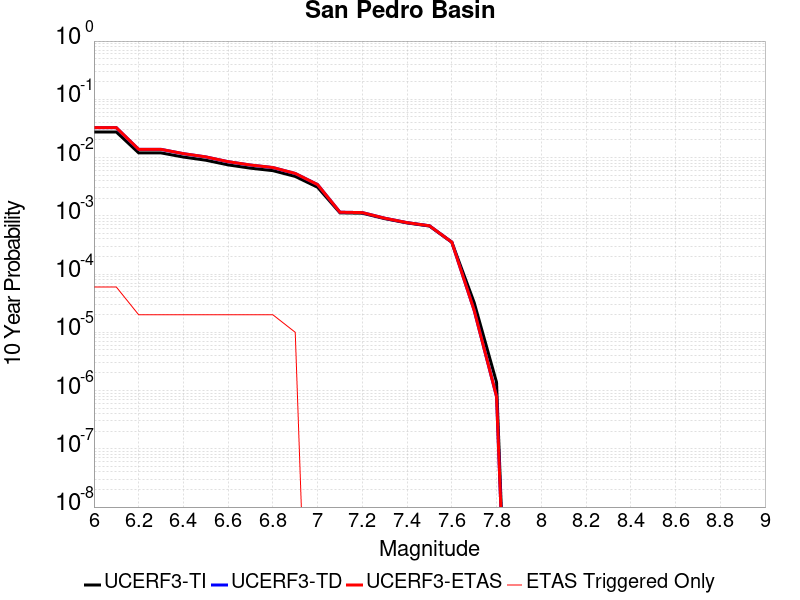 |

| Magnitude | 1 wk TI Prob | 1 wk TD Prob | 1 wk ETAS Prob | 1 wk ETAS/TD Gain | 1 wk ETAS Triggered Only | 1 mo TI Prob | 1 mo TD Prob | 1 mo ETAS Prob | 1 mo ETAS/TD Gain | 1 mo ETAS Triggered Only | 1 yr TI Prob | 1 yr TD Prob | 1 yr ETAS Prob | 1 yr ETAS/TD Gain | 1 yr ETAS Triggered Only | 10 yr TI Prob | 10 yr TD Prob | 10 yr ETAS Prob | 10 yr ETAS/TD Gain | 10 yr ETAS Triggered Only |
|-----|-----|-----|-----|-----|-----|-----|-----|-----|-----|-----|-----|-----|-----|-----|-----|-----|-----|-----|-----|-----|
| 6.0 | 5.3449043E-5 | 6.336954E-5 | 7.33689E-5 | 1.1577945 | 1.0E-5 | 2.2904722E-4 | 2.715589E-4 | 2.8155622E-4 | 1.0368145 | 1.0E-5 | 0.0027850836 | 0.0033018254 | 0.0033117924 | 1.0030186 | 1.0E-5 | 0.027504366 | 0.03258945 | 0.032647494 | 1.0017811 | 6.0E-5 |
| 6.1 | 5.3449043E-5 | 6.336954E-5 | 7.33689E-5 | 1.1577945 | 1.0E-5 | 2.2904722E-4 | 2.715589E-4 | 2.8155622E-4 | 1.0368145 | 1.0E-5 | 0.0027850836 | 0.0033018254 | 0.0033117924 | 1.0030186 | 1.0E-5 | 0.027504366 | 0.03258945 | 0.032647494 | 1.0017811 | 6.0E-5 |
| 6.2 | 2.3189454E-5 | 2.6642796E-5 | 2.6642796E-5 | 1.0 | 0.0 | 9.9379584E-5 | 1.14178685E-4 | 1.14178685E-4 | 1.0 | 0.0 | 0.0012092749 | 0.0013892864 | 0.0013892864 | 1.0 | 0.0 | 0.012027155 | 0.013810883 | 0.013830608 | 1.0014281 | 2.0E-5 |
| 6.3 | 2.3189454E-5 | 2.6642796E-5 | 2.6642796E-5 | 1.0 | 0.0 | 9.9379584E-5 | 1.14178685E-4 | 1.14178685E-4 | 1.0 | 0.0 | 0.0012092749 | 0.0013892864 | 0.0013892864 | 1.0 | 0.0 | 0.012027155 | 0.013810883 | 0.013830608 | 1.0014281 | 2.0E-5 |
| 6.4 | 1.966056E-5 | 2.2463413E-5 | 2.2463413E-5 | 1.0 | 0.0 | 8.425682E-5 | 9.626844E-5 | 9.626844E-5 | 1.0 | 0.0 | 0.001025344 | 0.0011714783 | 0.0011714783 | 1.0 | 0.0 | 0.010206259 | 0.011657117 | 0.011676883 | 1.0016956 | 2.0E-5 |
| 6.5 | 1.7342953E-5 | 1.9745148E-5 | 1.9745148E-5 | 1.0 | 0.0 | 7.4324824E-5 | 8.4619525E-5 | 8.4619525E-5 | 1.0 | 0.0 | 9.04529E-4 | 0.0010297928 | 0.0010297928 | 1.0 | 0.0 | 0.009008561 | 0.010253931 | 0.010273726 | 1.0019305 | 2.0E-5 |
| 6.6 | 1.439804E-5 | 1.6322716E-5 | 1.6322716E-5 | 1.0 | 0.0 | 6.170443E-5 | 6.99528E-5 | 6.99528E-5 | 1.0 | 0.0 | 7.509924E-4 | 8.513747E-4 | 8.513747E-4 | 1.0 | 0.0 | 0.0074845953 | 0.008484332 | 0.008504163 | 1.0023373 | 2.0E-5 |
| 6.7 | 1.2634884E-5 | 1.4285297E-5 | 1.4285297E-5 | 1.0 | 0.0 | 5.414838E-5 | 6.1221435E-5 | 6.1221435E-5 | 1.0 | 0.0 | 6.590571E-4 | 7.4514654E-4 | 7.4514654E-4 | 1.0 | 0.0 | 0.006571059 | 0.007429501 | 0.0074493526 | 1.002672 | 2.0E-5 |
| 6.8 | 1.146091E-5 | 1.2933192E-5 | 1.2933192E-5 | 1.0 | 0.0 | 4.911726E-5 | 5.5426954E-5 | 5.5426954E-5 | 1.0 | 0.0 | 5.9783855E-4 | 6.7464396E-4 | 6.7464396E-4 | 1.0 | 0.0 | 0.0059623276 | 0.006728899 | 0.0067487643 | 1.0029522 | 2.0E-5 |
| 6.9 | 9.109035E-6 | 1.0235011E-5 | 1.0235011E-5 | 1.0 | 0.0 | 3.9038136E-5 | 4.3863754E-5 | 4.3863754E-5 | 1.0 | 0.0 | 4.7518566E-4 | 5.3393835E-4 | 5.3393835E-4 | 1.0 | 0.0 | 0.0047417083 | 0.005329309 | 0.0053392556 | 1.0018665 | 1.0E-5 |
| 7.0 | 5.9351028E-6 | 6.583964E-6 | 6.583964E-6 | 1.0 | 0.0 | 2.5435906E-5 | 2.8216817E-5 | 2.8216817E-5 | 1.0 | 0.0 | 3.0963816E-4 | 3.435092E-4 | 3.435092E-4 | 1.0 | 0.0 | 0.0030920706 | 0.0034320992 | 0.0034320992 | 1.0 | 0.0 |
| 7.1 | 2.1557585E-6 | 2.209648E-6 | 2.209648E-6 | 1.0 | 0.0 | 9.238933E-6 | 9.469887E-6 | 9.469887E-6 | 1.0 | 0.0 | 1.1247819E-4 | 1.1528993E-4 | 1.1528993E-4 | 1.0 | 0.0 | 0.0011242128 | 0.0011523166 | 0.0011523166 | 1.0 | 0.0 |
| 7.2 | 2.1251979E-6 | 2.1779945E-6 | 2.1779945E-6 | 1.0 | 0.0 | 9.107958E-6 | 9.334229E-6 | 9.334229E-6 | 1.0 | 0.0 | 1.1088375E-4 | 1.1363847E-4 | 1.1363847E-4 | 1.0 | 0.0 | 0.0011082845 | 0.0011358189 | 0.0011358189 | 1.0 | 0.0 |
| 7.3 | 1.7145798E-6 | 1.7442874E-6 | 1.7442874E-6 | 1.0 | 0.0 | 7.3481783E-6 | 7.4754967E-6 | 7.4754967E-6 | 1.0 | 0.0 | 8.94604E-5 | 9.1010465E-5 | 9.1010465E-5 | 1.0 | 0.0 | 8.9424395E-4 | 9.0974104E-4 | 9.0974104E-4 | 1.0 | 0.0 |
| 7.4 | 1.4467993E-6 | 1.4641868E-6 | 1.4641868E-6 | 1.0 | 0.0 | 6.200554E-6 | 6.2750714E-6 | 6.2750714E-6 | 1.0 | 0.0 | 7.548913E-5 | 7.639639E-5 | 7.639639E-5 | 1.0 | 0.0 | 7.546349E-4 | 7.6370855E-4 | 7.6370855E-4 | 1.0 | 0.0 |
| 7.5 | 1.2803735E-6 | 1.2931497E-6 | 1.2931497E-6 | 1.0 | 0.0 | 5.487303E-6 | 5.5420587E-6 | 5.5420587E-6 | 1.0 | 0.0 | 6.680587E-5 | 6.7472545E-5 | 6.7472545E-5 | 1.0 | 0.0 | 6.678579E-4 | 6.7452766E-4 | 6.7452766E-4 | 1.0 | 0.0 |
| 7.6 | 6.755009E-7 | 6.769465E-7 | 6.769465E-7 | 1.0 | 0.0 | 2.8950008E-6 | 2.9011965E-6 | 2.9011965E-6 | 1.0 | 0.0 | 3.5246063E-5 | 3.5321555E-5 | 3.5321555E-5 | 1.0 | 0.0 | 3.5240475E-4 | 3.5316512E-4 | 3.5316512E-4 | 1.0 | 0.0 |
| 7.7 | 6.211885E-8 | 4.569953E-8 | 4.569953E-8 | 1.0 | 0.0 | 2.6622362E-7 | 1.9585512E-7 | 1.9585512E-7 | 1.0 | 0.0 | 3.2412677E-6 | 2.3845337E-6 | 2.3845337E-6 | 1.0 | 0.0 | 3.2412205E-5 | 2.3845101E-5 | 2.3845101E-5 | 1.0 | 0.0 |
| 7.8 | 2.6580573E-9 | 1.5138163E-9 | 1.5138163E-9 | 1.0 | 0.0 | 1.1391674E-8 | 6.487784E-9 | 6.487784E-9 | 1.0 | 0.0 | 1.3869362E-7 | 7.898877E-8 | 7.898877E-8 | 1.0 | 0.0 | 1.3869354E-6 | 7.898877E-7 | 7.898877E-7 | 1.0 | 0.0 |

## Newport-Inglewood alt 1
*[(top)](#table-of-contents)*

| 1 Week | 1 Month | 1 Year | 10 Year |
|-----|-----|-----|-----|
|  |  |  |  |

| Magnitude | 1 wk TI Prob | 1 wk TD Prob | 1 wk ETAS Prob | 1 wk ETAS/TD Gain | 1 wk ETAS Triggered Only | 1 mo TI Prob | 1 mo TD Prob | 1 mo ETAS Prob | 1 mo ETAS/TD Gain | 1 mo ETAS Triggered Only | 1 yr TI Prob | 1 yr TD Prob | 1 yr ETAS Prob | 1 yr ETAS/TD Gain | 1 yr ETAS Triggered Only | 10 yr TI Prob | 10 yr TD Prob | 10 yr ETAS Prob | 10 yr ETAS/TD Gain | 10 yr ETAS Triggered Only |
|-----|-----|-----|-----|-----|-----|-----|-----|-----|-----|-----|-----|-----|-----|-----|-----|-----|-----|-----|-----|-----|
| 6.0 | 2.9668912E-5 | 3.0404817E-5 | 5.0404207E-5 | 1.6577705 | 2.0E-5 | 1.2714628E-4 | 1.303026E-4 | 1.503E-4 | 1.1534688 | 2.0E-5 | 0.0015469068 | 0.0015857625 | 0.0016256991 | 1.0251845 | 4.0E-5 | 0.015361829 | 0.015792042 | 0.015841253 | 1.0031161 | 5.0E-5 |
| 6.1 | 2.9668912E-5 | 3.0404817E-5 | 5.0404207E-5 | 1.6577705 | 2.0E-5 | 1.2714628E-4 | 1.303026E-4 | 1.503E-4 | 1.1534688 | 2.0E-5 | 0.0015469068 | 0.0015857625 | 0.0016256991 | 1.0251845 | 4.0E-5 | 0.015361829 | 0.015792042 | 0.015841253 | 1.0031161 | 5.0E-5 |
| 6.2 | 2.9668912E-5 | 3.0404817E-5 | 5.0404207E-5 | 1.6577705 | 2.0E-5 | 1.2714628E-4 | 1.303026E-4 | 1.503E-4 | 1.1534688 | 2.0E-5 | 0.0015469068 | 0.0015857625 | 0.0016256991 | 1.0251845 | 4.0E-5 | 0.015361829 | 0.015792042 | 0.015841253 | 1.0031161 | 5.0E-5 |
| 6.3 | 2.9668912E-5 | 3.0404817E-5 | 5.0404207E-5 | 1.6577705 | 2.0E-5 | 1.2714628E-4 | 1.303026E-4 | 1.503E-4 | 1.1534688 | 2.0E-5 | 0.0015469068 | 0.0015857625 | 0.0016256991 | 1.0251845 | 4.0E-5 | 0.015361829 | 0.015792042 | 0.015841253 | 1.0031161 | 5.0E-5 |
| 6.4 | 1.275942E-5 | 1.0272503E-5 | 1.0272503E-5 | 1.0 | 0.0 | 5.4682085E-5 | 4.402429E-5 | 4.402429E-5 | 1.0 | 0.0 | 6.65551E-4 | 5.358681E-4 | 5.358681E-4 | 1.0 | 0.0 | 0.0066356123 | 0.005346184 | 0.0053561307 | 1.0018605 | 1.0E-5 |
| 6.5 | 1.275942E-5 | 1.0272503E-5 | 1.0272503E-5 | 1.0 | 0.0 | 5.4682085E-5 | 4.402429E-5 | 4.402429E-5 | 1.0 | 0.0 | 6.65551E-4 | 5.358681E-4 | 5.358681E-4 | 1.0 | 0.0 | 0.0066356123 | 0.005346184 | 0.0053561307 | 1.0018605 | 1.0E-5 |
| 6.6 | 1.1255358E-5 | 8.661884E-6 | 8.661884E-6 | 1.0 | 0.0 | 4.8236358E-5 | 3.712184E-5 | 3.712184E-5 | 1.0 | 0.0 | 5.871194E-4 | 4.518664E-4 | 4.518664E-4 | 1.0 | 0.0 | 0.005855706 | 0.004509653 | 0.004519608 | 1.0022075 | 1.0E-5 |
| 6.7 | 1.0504745E-5 | 7.8997955E-6 | 7.8997955E-6 | 1.0 | 0.0 | 4.5019555E-5 | 3.3855835E-5 | 3.3855835E-5 | 1.0 | 0.0 | 5.4797524E-4 | 4.1211807E-4 | 4.1211807E-4 | 1.0 | 0.0 | 0.0054662596 | 0.004113668 | 0.0041236267 | 1.0024209 | 1.0E-5 |
| 6.8 | 1.0476007E-5 | 7.881176E-6 | 7.881176E-6 | 1.0 | 0.0 | 4.4896402E-5 | 3.3776043E-5 | 3.3776043E-5 | 1.0 | 0.0 | 5.464766E-4 | 4.1114696E-4 | 4.1114696E-4 | 1.0 | 0.0 | 0.005451347 | 0.0041039926 | 0.0041139517 | 1.0024266 | 1.0E-5 |
| 6.9 | 9.076797E-6 | 6.4896312E-6 | 6.4896312E-6 | 1.0 | 0.0 | 3.889998E-5 | 2.781241E-5 | 2.781241E-5 | 1.0 | 0.0 | 4.7350433E-4 | 3.385638E-4 | 3.385638E-4 | 1.0 | 0.0 | 0.004724967 | 0.0033805177 | 0.0033904838 | 1.0029482 | 1.0E-5 |
| 7.0 | 8.73795E-6 | 6.2120125E-6 | 6.2120125E-6 | 1.0 | 0.0 | 3.7447822E-5 | 2.6622642E-5 | 2.6622642E-5 | 1.0 | 0.0 | 4.5583185E-4 | 3.2408274E-4 | 3.2408274E-4 | 1.0 | 0.0 | 0.0045489795 | 0.0032361327 | 0.0032461004 | 1.0030801 | 1.0E-5 |
| 7.1 | 8.391299E-6 | 5.95579E-6 | 5.95579E-6 | 1.0 | 0.0 | 3.5962214E-5 | 2.5524565E-5 | 2.5524565E-5 | 1.0 | 0.0 | 4.37752E-4 | 3.1071753E-4 | 3.1071753E-4 | 1.0 | 0.0 | 0.004368907 | 0.0031028606 | 0.0031128295 | 1.0032128 | 1.0E-5 |
| 7.2 | 7.796882E-6 | 5.4965344E-6 | 5.4965344E-6 | 1.0 | 0.0 | 3.341478E-5 | 2.3556364E-5 | 2.3556364E-5 | 1.0 | 0.0 | 4.06749E-4 | 2.867612E-4 | 2.867612E-4 | 1.0 | 0.0 | 0.0040600533 | 0.0028639357 | 0.002873907 | 1.0034817 | 1.0E-5 |
| 7.3 | 6.4738833E-6 | 4.6478162E-6 | 4.6478162E-6 | 1.0 | 0.0 | 2.774492E-5 | 1.9919062E-5 | 1.9919062E-5 | 1.0 | 0.0 | 3.3774204E-4 | 2.4248775E-4 | 2.4248775E-4 | 1.0 | 0.0 | 0.0033722918 | 0.0024222482 | 0.0024322239 | 1.0041184 | 1.0E-5 |
| 7.4 | 5.382145E-6 | 3.8857597E-6 | 3.8857597E-6 | 1.0 | 0.0 | 2.3066134E-5 | 1.665315E-5 | 1.665315E-5 | 1.0 | 0.0 | 2.8079396E-4 | 2.0273338E-4 | 2.0273338E-4 | 1.0 | 0.0 | 0.0028043943 | 0.0020254988 | 0.0020354786 | 1.004927 | 1.0E-5 |
| 7.5 | 3.648244E-6 | 2.5737843E-6 | 2.5737843E-6 | 1.0 | 0.0 | 1.5635238E-5 | 1.1030458E-5 | 1.1030458E-5 | 1.0 | 0.0 | 1.9034238E-4 | 1.3428765E-4 | 1.3428765E-4 | 1.0 | 0.0 | 0.0019017943 | 0.0013420755 | 0.0013520621 | 1.0074412 | 1.0E-5 |
| 7.6 | 2.2906888E-6 | 1.5479842E-6 | 1.5479842E-6 | 1.0 | 0.0 | 9.817201E-6 | 6.634202E-6 | 6.634202E-6 | 1.0 | 0.0 | 1.1951787E-4 | 8.076848E-5 | 8.076848E-5 | 1.0 | 0.0 | 0.0011945361 | 8.07398E-4 | 8.173899E-4 | 1.0123755 | 1.0E-5 |
| 7.7 | 6.0479874E-7 | 3.397512E-7 | 3.397512E-7 | 1.0 | 0.0 | 2.5919921E-6 | 1.4560758E-6 | 1.4560758E-6 | 1.0 | 0.0 | 3.1557047E-5 | 1.7727592E-5 | 1.7727592E-5 | 1.0 | 0.0 | 3.1552566E-4 | 1.7726317E-4 | 1.7726317E-4 | 1.0 | 0.0 |
| 7.8 | 1.16056995E-8 | 9.782373E-9 | 9.782373E-9 | 1.0 | 0.0 | 4.9738713E-8 | 4.1924455E-8 | 4.1924455E-8 | 1.0 | 0.0 | 6.0556863E-7 | 5.1043025E-7 | 5.1043025E-7 | 1.0 | 0.0 | 6.05567E-6 | 5.1043025E-6 | 5.1043025E-6 | 1.0 | 0.0 |

## San Clemente
*[(top)](#table-of-contents)*

| 1 Week | 1 Month | 1 Year | 10 Year |
|-----|-----|-----|-----|
|  |  |  |  |

| Magnitude | 1 wk TI Prob | 1 wk TD Prob | 1 wk ETAS Prob | 1 wk ETAS/TD Gain | 1 wk ETAS Triggered Only | 1 mo TI Prob | 1 mo TD Prob | 1 mo ETAS Prob | 1 mo ETAS/TD Gain | 1 mo ETAS Triggered Only | 1 yr TI Prob | 1 yr TD Prob | 1 yr ETAS Prob | 1 yr ETAS/TD Gain | 1 yr ETAS Triggered Only | 10 yr TI Prob | 10 yr TD Prob | 10 yr ETAS Prob | 10 yr ETAS/TD Gain | 10 yr ETAS Triggered Only |
|-----|-----|-----|-----|-----|-----|-----|-----|-----|-----|-----|-----|-----|-----|-----|-----|-----|-----|-----|-----|-----|
| 6.0 | 6.681379E-5 | 8.163422E-5 | 1.0163259E-4 | 1.2449753 | 2.0E-5 | 2.8631336E-4 | 3.498173E-4 | 3.6981032E-4 | 1.0571527 | 2.0E-5 | 0.003480294 | 0.0042512873 | 0.00428116 | 1.0070267 | 3.0E-5 | 0.03426291 | 0.041755714 | 0.041803624 | 1.0011474 | 5.0E-5 |
| 6.1 | 6.681379E-5 | 8.163422E-5 | 1.0163259E-4 | 1.2449753 | 2.0E-5 | 2.8631336E-4 | 3.498173E-4 | 3.6981032E-4 | 1.0571527 | 2.0E-5 | 0.003480294 | 0.0042512873 | 0.00428116 | 1.0070267 | 3.0E-5 | 0.03426291 | 0.041755714 | 0.041794043 | 1.0009179 | 4.0E-5 |
| 6.2 | 3.9400576E-5 | 4.6451984E-5 | 4.6451984E-5 | 1.0 | 0.0 | 1.6884868E-4 | 1.9906509E-4 | 1.9906509E-4 | 1.0 | 0.0 | 0.0020537945 | 0.002420985 | 0.0024309605 | 1.0041206 | 1.0E-5 | 0.020349167 | 0.02395286 | 0.02396262 | 1.0004075 | 1.0E-5 |
| 6.3 | 3.2590255E-5 | 3.7929087E-5 | 3.7929087E-5 | 1.0 | 0.0 | 1.3966505E-4 | 1.6254328E-4 | 1.6254328E-4 | 1.0 | 0.0 | 0.0016990956 | 0.0019771985 | 0.0019871786 | 1.0050477 | 1.0E-5 | 0.01686163 | 0.019599866 | 0.01960967 | 1.0005002 | 1.0E-5 |
| 6.4 | 2.9454652E-5 | 3.4097775E-5 | 3.4097775E-5 | 1.0 | 0.0 | 1.2622811E-4 | 1.4612528E-4 | 1.4612528E-4 | 1.0 | 0.0 | 0.0015357438 | 0.0017776482 | 0.0017776482 | 1.0 | 0.0 | 0.015251739 | 0.017637458 | 0.017637458 | 1.0 | 0.0 |
| 6.5 | 2.790836E-5 | 3.2247463E-5 | 3.2247463E-5 | 1.0 | 0.0 | 1.1960178E-4 | 1.3819622E-4 | 1.3819622E-4 | 1.0 | 0.0 | 0.001455179 | 0.0016812651 | 0.0016812651 | 1.0 | 0.0 | 0.014456868 | 0.016688475 | 0.016688475 | 1.0 | 0.0 |
| 6.6 | 2.2492153E-5 | 2.5762707E-5 | 2.5762707E-5 | 1.0 | 0.0 | 9.639138E-5 | 1.1040701E-4 | 1.1040701E-4 | 1.0 | 0.0 | 0.0011729331 | 0.0013433908 | 0.0013433908 | 1.0 | 0.0 | 0.011667615 | 0.013354415 | 0.013354415 | 1.0 | 0.0 |
| 6.7 | 1.9862755E-5 | 2.2666423E-5 | 2.2666423E-5 | 1.0 | 0.0 | 8.512331E-5 | 9.713826E-5 | 9.713826E-5 | 1.0 | 0.0 | 0.0010358836 | 0.0011820279 | 0.0011820279 | 1.0 | 0.0 | 0.010310682 | 0.011758701 | 0.011758701 | 1.0 | 0.0 |
| 6.8 | 1.6697575E-5 | 1.897771E-5 | 1.897771E-5 | 1.0 | 0.0 | 7.155907E-5 | 8.133056E-5 | 8.133056E-5 | 1.0 | 0.0 | 8.7088346E-4 | 9.897591E-4 | 9.897591E-4 | 1.0 | 0.0 | 0.008674784 | 0.0098545365 | 0.0098545365 | 1.0 | 0.0 |
| 6.9 | 1.5218415E-5 | 1.72694E-5 | 1.72694E-5 | 1.0 | 0.0 | 6.522015E-5 | 7.4009666E-5 | 7.4009666E-5 | 1.0 | 0.0 | 7.93766E-4 | 9.00704E-4 | 9.00704E-4 | 1.0 | 0.0 | 0.007909367 | 0.008971481 | 0.008971481 | 1.0 | 0.0 |
| 7.0 | 1.2392958E-5 | 1.4033016E-5 | 1.4033016E-5 | 1.0 | 0.0 | 5.3111595E-5 | 6.014015E-5 | 6.014015E-5 | 1.0 | 0.0 | 6.4644177E-4 | 7.319679E-4 | 7.319679E-4 | 1.0 | 0.0 | 0.0064456454 | 0.0072963564 | 0.0072963564 | 1.0 | 0.0 |
| 7.1 | 1.0934128E-5 | 1.2375138E-5 | 1.2375138E-5 | 1.0 | 0.0 | 4.6859706E-5 | 5.303527E-5 | 5.303527E-5 | 1.0 | 0.0 | 5.7036756E-4 | 6.455204E-4 | 6.455204E-4 | 1.0 | 0.0 | 0.0056890585 | 0.0064371997 | 0.0064371997 | 1.0 | 0.0 |
| 7.2 | 9.5798805E-6 | 1.0844935E-5 | 1.0844935E-5 | 1.0 | 0.0 | 4.1055984E-5 | 4.6477508E-5 | 4.6477508E-5 | 1.0 | 0.0 | 4.9974193E-4 | 5.657239E-4 | 5.657239E-4 | 1.0 | 0.0 | 0.0049861963 | 0.0056435615 | 0.0056435615 | 1.0 | 0.0 |
| 7.3 | 8.0167365E-6 | 9.083918E-6 | 9.083918E-6 | 1.0 | 0.0 | 3.4356988E-5 | 3.8930535E-5 | 3.8930535E-5 | 1.0 | 0.0 | 4.1821605E-4 | 4.7388324E-4 | 4.7388324E-4 | 1.0 | 0.0 | 0.0041742986 | 0.0047294297 | 0.0047294297 | 1.0 | 0.0 |
| 7.4 | 2.9581017E-6 | 3.3623792E-6 | 3.3623792E-6 | 1.0 | 0.0 | 1.2677518E-5 | 1.4410146E-5 | 1.4410146E-5 | 1.0 | 0.0 | 1.5433785E-4 | 1.7543444E-4 | 1.7543444E-4 | 1.0 | 0.0 | 0.001542307 | 0.0017534546 | 0.0017534546 | 1.0 | 0.0 |

## San Cayetano
*[(top)](#table-of-contents)*

| 1 Week | 1 Month | 1 Year | 10 Year |
|-----|-----|-----|-----|
|  |  |  | 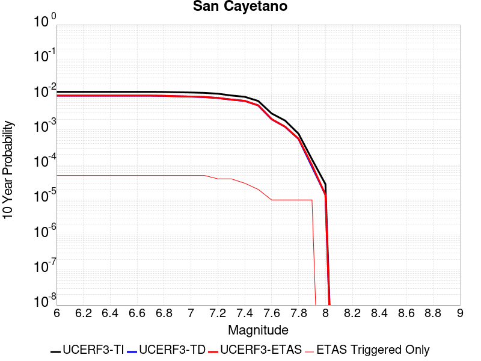 |

| Magnitude | 1 wk TI Prob | 1 wk TD Prob | 1 wk ETAS Prob | 1 wk ETAS/TD Gain | 1 wk ETAS Triggered Only | 1 mo TI Prob | 1 mo TD Prob | 1 mo ETAS Prob | 1 mo ETAS/TD Gain | 1 mo ETAS Triggered Only | 1 yr TI Prob | 1 yr TD Prob | 1 yr ETAS Prob | 1 yr ETAS/TD Gain | 1 yr ETAS Triggered Only | 10 yr TI Prob | 10 yr TD Prob | 10 yr ETAS Prob | 10 yr ETAS/TD Gain | 10 yr ETAS Triggered Only |
|-----|-----|-----|-----|-----|-----|-----|-----|-----|-----|-----|-----|-----|-----|-----|-----|-----|-----|-----|-----|-----|
| 6.0 | 2.3476267E-5 | 1.816928E-5 | 5.8168553E-5 | 3.2014782 | 4.0E-5 | 1.0060869E-4 | 7.786603E-5 | 1.1786292E-4 | 1.5136628 | 4.0E-5 | 0.0012242225 | 9.476103E-4 | 9.875724E-4 | 1.0421715 | 4.0E-5 | 0.012175002 | 0.009436584 | 0.009486113 | 1.0052485 | 5.0E-5 |
| 6.1 | 2.3476267E-5 | 1.816928E-5 | 5.8168553E-5 | 3.2014782 | 4.0E-5 | 1.0060869E-4 | 7.786603E-5 | 1.1786292E-4 | 1.5136628 | 4.0E-5 | 0.0012242225 | 9.476103E-4 | 9.875724E-4 | 1.0421715 | 4.0E-5 | 0.012175002 | 0.009436584 | 0.009486113 | 1.0052485 | 5.0E-5 |
| 6.2 | 2.3476267E-5 | 1.816928E-5 | 5.8168553E-5 | 3.2014782 | 4.0E-5 | 1.0060869E-4 | 7.786603E-5 | 1.1786292E-4 | 1.5136628 | 4.0E-5 | 0.0012242225 | 9.476103E-4 | 9.875724E-4 | 1.0421715 | 4.0E-5 | 0.012175002 | 0.009436584 | 0.009486113 | 1.0052485 | 5.0E-5 |
| 6.3 | 2.3476267E-5 | 1.816928E-5 | 5.8168553E-5 | 3.2014782 | 4.0E-5 | 1.0060869E-4 | 7.786603E-5 | 1.1786292E-4 | 1.5136628 | 4.0E-5 | 0.0012242225 | 9.476103E-4 | 9.875724E-4 | 1.0421715 | 4.0E-5 | 0.012175002 | 0.009436584 | 0.009486113 | 1.0052485 | 5.0E-5 |
| 6.4 | 2.3476267E-5 | 1.816928E-5 | 5.8168553E-5 | 3.2014782 | 4.0E-5 | 1.0060869E-4 | 7.786603E-5 | 1.1786292E-4 | 1.5136628 | 4.0E-5 | 0.0012242225 | 9.476103E-4 | 9.875724E-4 | 1.0421715 | 4.0E-5 | 0.012175002 | 0.009436584 | 0.009486113 | 1.0052485 | 5.0E-5 |
| 6.5 | 2.3476267E-5 | 1.816928E-5 | 5.8168553E-5 | 3.2014782 | 4.0E-5 | 1.0060869E-4 | 7.786603E-5 | 1.1786292E-4 | 1.5136628 | 4.0E-5 | 0.0012242225 | 9.476103E-4 | 9.875724E-4 | 1.0421715 | 4.0E-5 | 0.012175002 | 0.009436584 | 0.009486113 | 1.0052485 | 5.0E-5 |
| 6.6 | 2.3476267E-5 | 1.816928E-5 | 5.8168553E-5 | 3.2014782 | 4.0E-5 | 1.0060869E-4 | 7.786603E-5 | 1.1786292E-4 | 1.5136628 | 4.0E-5 | 0.0012242225 | 9.476103E-4 | 9.875724E-4 | 1.0421715 | 4.0E-5 | 0.012175002 | 0.009436584 | 0.009486113 | 1.0052485 | 5.0E-5 |
| 6.7 | 2.3476267E-5 | 1.816928E-5 | 5.8168553E-5 | 3.2014782 | 4.0E-5 | 1.0060869E-4 | 7.786603E-5 | 1.1786292E-4 | 1.5136628 | 4.0E-5 | 0.0012242225 | 9.476103E-4 | 9.875724E-4 | 1.0421715 | 4.0E-5 | 0.012175002 | 0.009436584 | 0.009486113 | 1.0052485 | 5.0E-5 |
| 6.8 | 2.3241924E-5 | 1.7936987E-5 | 5.793627E-5 | 3.2299888 | 4.0E-5 | 9.960445E-5 | 7.687056E-5 | 1.16867486E-4 | 1.5203153 | 4.0E-5 | 0.0012120095 | 9.3550084E-4 | 9.7546336E-4 | 1.0427178 | 4.0E-5 | 0.012054204 | 0.009316482 | 0.009366016 | 1.0053169 | 5.0E-5 |
| 6.9 | 2.2761007E-5 | 1.7432423E-5 | 5.7431727E-5 | 3.294535 | 4.0E-5 | 9.7543525E-5 | 7.470827E-5 | 1.14705275E-4 | 1.535376 | 4.0E-5 | 0.0011869454 | 9.09197E-4 | 9.4916066E-4 | 1.0439548 | 4.0E-5 | 0.011806256 | 0.009055603 | 0.009105151 | 1.0054715 | 5.0E-5 |
| 7.0 | 2.240283E-5 | 1.7066168E-5 | 5.7065485E-5 | 3.3437784 | 4.0E-5 | 9.600859E-5 | 7.313869E-5 | 1.13135764E-4 | 1.5468662 | 4.0E-5 | 0.0011682777 | 8.9010317E-4 | 9.300676E-4 | 1.0448986 | 4.0E-5 | 0.011621549 | 0.008866196 | 0.008915752 | 1.0055894 | 5.0E-5 |
| 7.1 | 2.1871154E-5 | 1.6586018E-5 | 5.6585355E-5 | 3.41163 | 4.0E-5 | 9.373015E-5 | 7.108101E-5 | 1.11078174E-4 | 1.5626981 | 4.0E-5 | 0.0011405671 | 8.6507114E-4 | 9.050365E-4 | 1.046199 | 4.0E-5 | 0.011347309 | 0.008617838 | 0.008667408 | 1.005752 | 5.0E-5 |
| 7.2 | 2.0714133E-5 | 1.5564561E-5 | 4.5564095E-5 | 2.9274256 | 3.0E-5 | 8.8771834E-5 | 6.670357E-5 | 9.670157E-5 | 1.449721 | 3.0E-5 | 0.0010802611 | 8.1181666E-4 | 8.417923E-4 | 1.0369241 | 3.0E-5 | 0.010750249 | 0.008089285 | 0.008128962 | 1.0049049 | 4.0E-5 |
| 7.3 | 1.8408395E-5 | 1.3996864E-5 | 4.3996446E-5 | 3.1433072 | 3.0E-5 | 7.8890735E-5 | 5.99852E-5 | 8.99834E-5 | 1.5000933 | 3.0E-5 | 9.600714E-4 | 7.300781E-4 | 7.600562E-4 | 1.0410615 | 3.0E-5 | 0.009559342 | 0.0072775153 | 0.0073172245 | 1.0054563 | 4.0E-5 |
| 7.4 | 1.6856795E-5 | 1.28500815E-5 | 3.2849824E-5 | 2.5563905 | 2.0E-5 | 7.2241404E-5 | 5.5070628E-5 | 7.5069525E-5 | 1.36315 | 2.0E-5 | 8.7918417E-4 | 6.7028153E-4 | 6.902681E-4 | 1.0298182 | 2.0E-5 | 0.00875714 | 0.0066832784 | 0.006713078 | 1.0044588 | 3.0E-5 |
| 7.5 | 1.2822778E-5 | 9.577542E-6 | 2.957735E-5 | 3.0881984 | 2.0E-5 | 5.495361E-5 | 4.1045972E-5 | 6.104515E-5 | 1.4872385 | 2.0E-5 | 6.688548E-4 | 4.996217E-4 | 5.196117E-4 | 1.0400103 | 2.0E-5 | 0.006668452 | 0.0049851555 | 0.0050050556 | 1.003992 | 2.0E-5 |
| 7.6 | 5.6272684E-6 | 3.854903E-6 | 1.3854865E-5 | 3.594089 | 1.0E-5 | 2.4116642E-5 | 1.652091E-5 | 2.6520744E-5 | 1.6052836 | 1.0E-5 | 2.9358055E-4 | 2.0112359E-4 | 2.1112159E-4 | 1.0497106 | 1.0E-5 | 0.0029319301 | 0.0020094267 | 0.0020194065 | 1.0049665 | 1.0E-5 |
| 7.7 | 3.5261346E-6 | 2.3407013E-6 | 1.2340678E-5 | 5.272214 | 1.0E-5 | 1.5111918E-5 | 1.0031539E-5 | 2.0031439E-5 | 1.9968461 | 1.0E-5 | 1.8397206E-4 | 1.2212721E-4 | 1.3212599E-4 | 1.0818719 | 1.0E-5 | 0.0018381984 | 0.0012206084 | 0.0012305961 | 1.0081826 | 1.0E-5 |
| 7.8 | 1.4826929E-6 | 1.056428E-6 | 1.1056417E-5 | 10.465851 | 1.0E-5 | 6.354383E-6 | 4.5275406E-6 | 1.4527495E-5 | 3.2086947 | 1.0E-5 | 7.736187E-5 | 5.5121433E-5 | 6.512088E-5 | 1.1814077 | 1.0E-5 | 7.733494E-4 | 5.5107963E-4 | 5.610741E-4 | 1.0181361 | 1.0E-5 |
| 7.9 | 2.7568166E-7 | 1.6978244E-7 | 1.0169781E-5 | 59.898895 | 1.0E-5 | 1.1814923E-6 | 7.2763885E-7 | 1.0727632E-5 | 14.743072 | 1.0E-5 | 1.4384574E-5 | 8.858967E-6 | 1.8858878E-5 | 2.1287897 | 1.0E-5 | 1.4383643E-4 | 8.8586174E-5 | 9.858529E-5 | 1.1128744 | 1.0E-5 |
| 8.0 | 5.407832E-8 | 2.6887697E-8 | 2.6887697E-8 | 1.0 | 0.0 | 2.3176422E-7 | 1.15232986E-7 | 1.15232986E-7 | 1.0 | 0.0 | 2.8217257E-6 | 1.4029607E-6 | 1.4029607E-6 | 1.0 | 0.0 | 2.8216898E-5 | 1.4029522E-5 | 1.4029522E-5 | 1.0 | 0.0 |

## San Diego Trough south
*[(top)](#table-of-contents)*

| 1 Week | 1 Month | 1 Year | 10 Year |
|-----|-----|-----|-----|
|  |  | 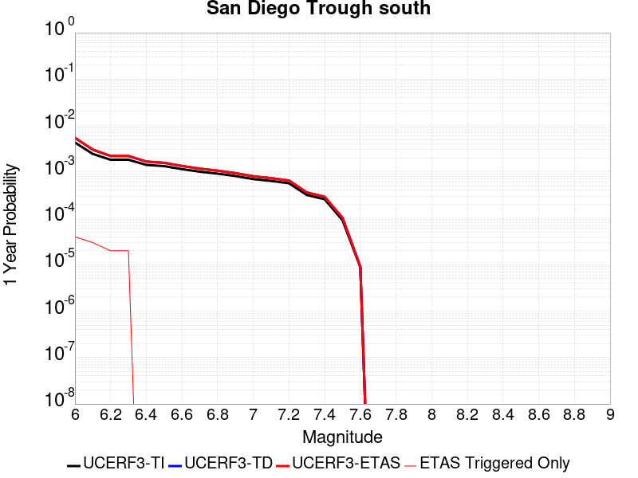 |  |

| Magnitude | 1 wk TI Prob | 1 wk TD Prob | 1 wk ETAS Prob | 1 wk ETAS/TD Gain | 1 wk ETAS Triggered Only | 1 mo TI Prob | 1 mo TD Prob | 1 mo ETAS Prob | 1 mo ETAS/TD Gain | 1 mo ETAS Triggered Only | 1 yr TI Prob | 1 yr TD Prob | 1 yr ETAS Prob | 1 yr ETAS/TD Gain | 1 yr ETAS Triggered Only | 10 yr TI Prob | 10 yr TD Prob | 10 yr ETAS Prob | 10 yr ETAS/TD Gain | 10 yr ETAS Triggered Only |
|-----|-----|-----|-----|-----|-----|-----|-----|-----|-----|-----|-----|-----|-----|-----|-----|-----|-----|-----|-----|-----|
| 6.0 | 8.279495E-5 | 1.04241306E-4 | 1.2423922E-4 | 1.1918426 | 2.0E-5 | 3.5478722E-4 | 4.4667677E-4 | 4.6666784E-4 | 1.0447551 | 2.0E-5 | 0.004310982 | 0.0054256152 | 0.0054653985 | 1.0073324 | 4.0E-5 | 0.042283054 | 0.05299221 | 0.05303956 | 1.0008936 | 5.0E-5 |
| 6.1 | 4.6961468E-5 | 5.772944E-5 | 6.772886E-5 | 1.1732118 | 1.0E-5 | 2.0124791E-4 | 2.473894E-4 | 2.5738694E-4 | 1.0404121 | 1.0E-5 | 0.00244744 | 0.0030079768 | 0.0030378865 | 1.0099435 | 3.0E-5 | 0.024206603 | 0.029679462 | 0.029708572 | 1.0009809 | 3.0E-5 |
| 6.2 | 3.5079658E-5 | 4.214154E-5 | 5.2141117E-5 | 1.2372856 | 1.0E-5 | 1.5033272E-4 | 1.8059435E-4 | 1.9059255E-4 | 1.0553627 | 1.0E-5 | 0.0018287642 | 0.0021965632 | 0.002216519 | 1.0090852 | 2.0E-5 | 0.018137876 | 0.021751117 | 0.021770682 | 1.0008994 | 2.0E-5 |
| 6.3 | 3.5079658E-5 | 4.214154E-5 | 5.2141117E-5 | 1.2372856 | 1.0E-5 | 1.5033272E-4 | 1.8059435E-4 | 1.9059255E-4 | 1.0553627 | 1.0E-5 | 0.0018287642 | 0.0021965632 | 0.002216519 | 1.0090852 | 2.0E-5 | 0.018137876 | 0.021751117 | 0.021770682 | 1.0008994 | 2.0E-5 |
| 6.4 | 2.7196904E-5 | 3.2087162E-5 | 3.2087162E-5 | 1.0 | 0.0 | 1.16552954E-4 | 1.3750927E-4 | 1.3750927E-4 | 1.0 | 0.0 | 0.0014181085 | 0.0016729041 | 0.0016729041 | 1.0 | 0.0 | 0.014090929 | 0.016604643 | 0.016604643 | 1.0 | 0.0 |
| 6.5 | 2.5584688E-5 | 3.010164E-5 | 3.010164E-5 | 1.0 | 0.0 | 1.0964406E-4 | 1.2900073E-4 | 1.2900073E-4 | 1.0 | 0.0 | 0.0013340989 | 0.0015694655 | 0.0015694655 | 1.0 | 0.0 | 0.013261181 | 0.015585314 | 0.015585314 | 1.0 | 0.0 |
| 6.6 | 2.2034688E-5 | 2.5742738E-5 | 2.5742738E-5 | 1.0 | 0.0 | 9.443096E-5 | 1.1032141E-4 | 1.1032141E-4 | 1.0 | 0.0 | 0.0011490905 | 0.0013423424 | 0.0013423424 | 1.0 | 0.0 | 0.011431668 | 0.013343317 | 0.013343317 | 1.0 | 0.0 |
| 6.7 | 1.9394853E-5 | 2.254176E-5 | 2.254176E-5 | 1.0 | 0.0 | 8.311815E-5 | 9.6603995E-5 | 9.6603995E-5 | 1.0 | 0.0 | 0.0010114936 | 0.0011755243 | 0.0011755243 | 1.0 | 0.0 | 0.01006902 | 0.011693766 | 0.011693766 | 1.0 | 0.0 |
| 6.8 | 1.7615313E-5 | 2.0403182E-5 | 2.0403182E-5 | 1.0 | 0.0 | 7.549201E-5 | 8.74393E-5 | 8.74393E-5 | 1.0 | 0.0 | 9.1872766E-4 | 0.0010640579 | 0.0010640579 | 1.0 | 0.0 | 0.009149387 | 0.010590198 | 0.010590198 | 1.0 | 0.0 |
| 6.9 | 1.5621423E-5 | 1.8026114E-5 | 1.8026114E-5 | 1.0 | 0.0 | 6.6947236E-5 | 7.725251E-5 | 7.725251E-5 | 1.0 | 0.0 | 8.147778E-4 | 9.40147E-4 | 9.40147E-4 | 1.0 | 0.0 | 0.008117969 | 0.009362142 | 0.009362142 | 1.0 | 0.0 |
| 7.0 | 1.3444376E-5 | 1.544809E-5 | 1.544809E-5 | 1.0 | 0.0 | 5.7617483E-5 | 6.620443E-5 | 6.620443E-5 | 1.0 | 0.0 | 7.0126704E-4 | 8.057436E-4 | 8.057436E-4 | 1.0 | 0.0 | 0.006990582 | 0.008028555 | 0.008028555 | 1.0 | 0.0 |
| 7.1 | 1.2268361E-5 | 1.407303E-5 | 1.407303E-5 | 1.0 | 0.0 | 5.2577634E-5 | 6.0311606E-5 | 6.0311606E-5 | 1.0 | 0.0 | 6.399447E-4 | 7.3404907E-4 | 7.3404907E-4 | 1.0 | 0.0 | 0.0063810493 | 0.0073165493 | 0.0073165493 | 1.0 | 0.0 |
| 7.2 | 1.0922655E-5 | 1.2513563E-5 | 1.2513563E-5 | 1.0 | 0.0 | 4.681054E-5 | 5.3628468E-5 | 5.3628468E-5 | 1.0 | 0.0 | 5.697693E-4 | 6.5273355E-4 | 6.5273355E-4 | 1.0 | 0.0 | 0.0056831064 | 0.0065084435 | 0.0065084435 | 1.0 | 0.0 |
| 7.3 | 6.1106753E-6 | 6.928925E-6 | 6.928925E-6 | 1.0 | 0.0 | 2.6188345E-5 | 2.9695057E-5 | 2.9695057E-5 | 1.0 | 0.0 | 3.1879646E-4 | 3.6147775E-4 | 3.6147775E-4 | 1.0 | 0.0 | 0.0031833951 | 0.003608943 | 0.003608943 | 1.0 | 0.0 |
| 7.4 | 4.933187E-6 | 5.5895525E-6 | 5.5895525E-6 | 1.0 | 0.0 | 2.114206E-5 | 2.3955008E-5 | 2.3955008E-5 | 1.0 | 0.0 | 2.5737417E-4 | 2.9161357E-4 | 2.9161357E-4 | 1.0 | 0.0 | 0.002570763 | 0.0029123505 | 0.0029123505 | 1.0 | 0.0 |
| 7.5 | 1.7489613E-6 | 1.969678E-6 | 1.969678E-6 | 1.0 | 0.0 | 7.495527E-6 | 8.4414505E-6 | 8.4414505E-6 | 1.0 | 0.0 | 9.125422E-5 | 1.02770035E-4 | 1.02770035E-4 | 1.0 | 0.0 | 9.1216754E-4 | 0.0010272472 | 0.0010272472 | 1.0 | 0.0 |
| 7.6 | 1.6988751E-7 | 1.7533823E-7 | 1.7533823E-7 | 1.0 | 0.0 | 7.2808916E-7 | 7.5144936E-7 | 7.5144936E-7 | 1.0 | 0.0 | 8.864449E-6 | 9.14886E-6 | 9.14886E-6 | 1.0 | 0.0 | 8.8640954E-5 | 9.1485024E-5 | 9.1485024E-5 | 1.0 | 0.0 |

## Hosgri
*[(top)](#table-of-contents)*

| 1 Week | 1 Month | 1 Year | 10 Year |
|-----|-----|-----|-----|
|  |  |  | 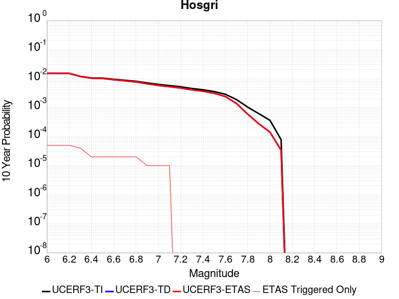 |

| Magnitude | 1 wk TI Prob | 1 wk TD Prob | 1 wk ETAS Prob | 1 wk ETAS/TD Gain | 1 wk ETAS Triggered Only | 1 mo TI Prob | 1 mo TD Prob | 1 mo ETAS Prob | 1 mo ETAS/TD Gain | 1 mo ETAS Triggered Only | 1 yr TI Prob | 1 yr TD Prob | 1 yr ETAS Prob | 1 yr ETAS/TD Gain | 1 yr ETAS Triggered Only | 10 yr TI Prob | 10 yr TD Prob | 10 yr ETAS Prob | 10 yr ETAS/TD Gain | 10 yr ETAS Triggered Only |
|-----|-----|-----|-----|-----|-----|-----|-----|-----|-----|-----|-----|-----|-----|-----|-----|-----|-----|-----|-----|-----|
| 6.0 | 2.883978E-5 | 2.9128416E-5 | 4.9127833E-5 | 1.6865947 | 2.0E-5 | 1.235932E-4 | 1.2483024E-4 | 1.4482775E-4 | 1.1601976 | 2.0E-5 | 0.0015037085 | 0.001518776 | 0.0015387456 | 1.0131485 | 2.0E-5 | 0.01493574 | 0.01508774 | 0.015136985 | 1.003264 | 5.0E-5 |
| 6.1 | 2.883978E-5 | 2.9128416E-5 | 4.9127833E-5 | 1.6865947 | 2.0E-5 | 1.235932E-4 | 1.2483024E-4 | 1.4482775E-4 | 1.1601976 | 2.0E-5 | 0.0015037085 | 0.001518776 | 0.0015387456 | 1.0131485 | 2.0E-5 | 0.01493574 | 0.01508774 | 0.015136985 | 1.003264 | 5.0E-5 |
| 6.2 | 2.883978E-5 | 2.9128416E-5 | 4.9127833E-5 | 1.6865947 | 2.0E-5 | 1.235932E-4 | 1.2483024E-4 | 1.4482775E-4 | 1.1601976 | 2.0E-5 | 0.0015037085 | 0.001518776 | 0.0015387456 | 1.0131485 | 2.0E-5 | 0.01493574 | 0.01508774 | 0.015136985 | 1.003264 | 5.0E-5 |
| 6.3 | 2.2914428E-5 | 2.2641969E-5 | 4.2641517E-5 | 1.8832954 | 2.0E-5 | 9.8200995E-5 | 9.703343E-5 | 1.17031486E-4 | 1.2060945 | 2.0E-5 | 0.0011949413 | 0.0011807467 | 0.0012007231 | 1.0169184 | 2.0E-5 | 0.011885363 | 0.011746133 | 0.011785663 | 1.0033654 | 4.0E-5 |
| 6.4 | 2.0195741E-5 | 1.969656E-5 | 2.9696363E-5 | 1.5076928 | 1.0E-5 | 8.65503E-5 | 8.4411105E-5 | 9.4410265E-5 | 1.1184578 | 1.0E-5 | 0.0010532405 | 0.0010272227 | 0.0010372124 | 1.009725 | 1.0E-5 | 0.010482626 | 0.010225792 | 0.010245589 | 1.0019358 | 2.0E-5 |
| 6.5 | 1.9924333E-5 | 1.940898E-5 | 2.9408788E-5 | 1.5152154 | 1.0E-5 | 8.53872E-5 | 8.3178704E-5 | 9.317788E-5 | 1.120213 | 1.0E-5 | 0.0010390934 | 0.0010122322 | 0.0010222221 | 1.0098691 | 1.0E-5 | 0.010342481 | 0.010077253 | 0.010097052 | 1.0019647 | 2.0E-5 |
| 6.6 | 1.809694E-5 | 1.74583E-5 | 2.7458125E-5 | 1.5727835 | 1.0E-5 | 7.7556004E-5 | 7.4819145E-5 | 8.48184E-5 | 1.1336457 | 1.0E-5 | 9.438353E-4 | 9.105437E-4 | 9.2053466E-4 | 1.0109725 | 1.0E-5 | 0.009398366 | 0.009069073 | 0.009088892 | 1.0021853 | 2.0E-5 |
| 6.7 | 1.675989E-5 | 1.6042764E-5 | 2.6042604E-5 | 1.6233239 | 1.0E-5 | 7.182612E-5 | 6.87529E-5 | 7.8752215E-5 | 1.1454384 | 1.0E-5 | 8.7413215E-4 | 8.3674624E-4 | 8.467379E-4 | 1.0119411 | 1.0E-5 | 0.008707017 | 0.0083368635 | 0.008356696 | 1.002379 | 2.0E-5 |
| 6.8 | 1.5401129E-5 | 1.4614083E-5 | 2.4613937E-5 | 1.6842614 | 1.0E-5 | 6.6003166E-5 | 6.2630286E-5 | 7.262966E-5 | 1.1596571 | 1.0E-5 | 8.032922E-4 | 7.622578E-4 | 7.722502E-4 | 1.013109 | 1.0E-5 | 0.008003947 | 0.007597296 | 0.0076171444 | 1.0026125 | 2.0E-5 |
| 6.9 | 1.356559E-5 | 1.2689968E-5 | 1.2689968E-5 | 1.0 | 0.0 | 5.8136946E-5 | 5.4384444E-5 | 5.4384444E-5 | 1.0 | 0.0 | 7.0758746E-4 | 6.619299E-4 | 6.619299E-4 | 1.0 | 0.0 | 0.007053386 | 0.006600388 | 0.006610322 | 1.001505 | 1.0E-5 |
| 7.0 | 1.2030819E-5 | 1.1095962E-5 | 1.1095962E-5 | 1.0 | 0.0 | 5.155963E-5 | 4.7553254E-5 | 4.7553254E-5 | 1.0 | 0.0 | 6.275577E-4 | 5.7880714E-4 | 5.7880714E-4 | 1.0 | 0.0 | 0.006257884 | 0.005773757 | 0.0057836995 | 1.001722 | 1.0E-5 |
| 7.1 | 1.0972698E-5 | 1.0022179E-5 | 1.0022179E-5 | 1.0 | 0.0 | 4.7025E-5 | 4.2951488E-5 | 4.2951488E-5 | 1.0 | 0.0 | 5.72379E-4 | 5.22809E-4 | 5.22809E-4 | 1.0 | 0.0 | 0.0057090693 | 0.005216542 | 0.00522649 | 1.001907 | 1.0E-5 |
| 7.2 | 9.961926E-6 | 9.034746E-6 | 9.034746E-6 | 1.0 | 0.0 | 4.2693267E-5 | 3.8719765E-5 | 3.8719765E-5 | 1.0 | 0.0 | 5.1966653E-4 | 4.713112E-4 | 4.713112E-4 | 1.0 | 0.0 | 0.00518453 | 0.0047038626 | 0.0047038626 | 1.0 | 0.0 |
| 7.3 | 8.700929E-6 | 7.8281E-6 | 7.8281E-6 | 1.0 | 0.0 | 3.7289166E-5 | 3.354857E-5 | 3.354857E-5 | 1.0 | 0.0 | 4.53901E-4 | 4.0837732E-4 | 4.0837732E-4 | 1.0 | 0.0 | 0.00452975 | 0.004077008 | 0.004077008 | 1.0 | 0.0 |
| 7.4 | 7.866285E-6 | 6.998739E-6 | 6.998739E-6 | 1.0 | 0.0 | 3.3712215E-5 | 2.9994251E-5 | 2.9994251E-5 | 1.0 | 0.0 | 4.103689E-4 | 3.6511885E-4 | 3.6511885E-4 | 1.0 | 0.0 | 0.004096119 | 0.0036459267 | 0.0036459267 | 1.0 | 0.0 |
| 7.5 | 6.8381305E-6 | 5.9596955E-6 | 5.9596955E-6 | 1.0 | 0.0 | 2.9305946E-5 | 2.5541302E-5 | 2.5541302E-5 | 1.0 | 0.0 | 3.5674145E-4 | 3.10921E-4 | 3.10921E-4 | 1.0 | 0.0 | 0.0035616932 | 0.0031055948 | 0.0031055948 | 1.0 | 0.0 |
| 7.6 | 5.503376E-6 | 4.5952443E-6 | 4.5952443E-6 | 1.0 | 0.0 | 2.3585684E-5 | 1.9693754E-5 | 1.9693754E-5 | 1.0 | 0.0 | 2.8711787E-4 | 2.397451E-4 | 2.397451E-4 | 1.0 | 0.0 | 0.002867472 | 0.0023955975 | 0.0023955975 | 1.0 | 0.0 |
| 7.7 | 3.6144982E-6 | 2.6522112E-6 | 2.6522112E-6 | 1.0 | 0.0 | 1.5490614E-5 | 1.1366569E-5 | 1.1366569E-5 | 1.0 | 0.0 | 1.8858191E-4 | 1.383792E-4 | 1.383792E-4 | 1.0 | 0.0 | 0.0018842196 | 0.0013836613 | 0.0013836613 | 1.0 | 0.0 |
| 7.8 | 1.9853494E-6 | 1.1361129E-6 | 1.1361129E-6 | 1.0 | 0.0 | 8.508612E-6 | 4.8690463E-6 | 4.8690463E-6 | 1.0 | 0.0 | 1.0358743E-4 | 5.9279027E-5 | 5.9279027E-5 | 1.0 | 0.0 | 0.0010353916 | 5.9336185E-4 | 5.9336185E-4 | 1.0 | 0.0 |
| 7.9 | 1.1818757E-6 | 5.2951856E-7 | 5.2951856E-7 | 1.0 | 0.0 | 5.0651715E-6 | 2.2693632E-6 | 2.2693632E-6 | 1.0 | 0.0 | 6.1666724E-5 | 2.7629147E-5 | 2.7629147E-5 | 1.0 | 0.0 | 6.1649614E-4 | 2.7694515E-4 | 2.7694515E-4 | 1.0 | 0.0 |
| 8.0 | 6.962958E-7 | 2.7139782E-7 | 2.7139782E-7 | 1.0 | 0.0 | 2.9841215E-6 | 1.163133E-6 | 1.163133E-6 | 1.0 | 0.0 | 3.6331072E-5 | 1.4161053E-5 | 1.4161053E-5 | 1.0 | 0.0 | 3.6325134E-4 | 1.4217179E-4 | 1.4217179E-4 | 1.0 | 0.0 |
| 8.1 | 1.5033264E-7 | 6.527624E-8 | 6.527624E-8 | 1.0 | 0.0 | 6.442826E-7 | 2.7975528E-7 | 2.7975528E-7 | 1.0 | 0.0 | 7.844113E-6 | 3.4060151E-6 | 3.4060151E-6 | 1.0 | 0.0 | 7.843835E-5 | 3.407693E-5 | 3.407693E-5 | 1.0 | 0.0 |

## San Diego Trough north alt1
*[(top)](#table-of-contents)*

| 1 Week | 1 Month | 1 Year | 10 Year |
|-----|-----|-----|-----|
| 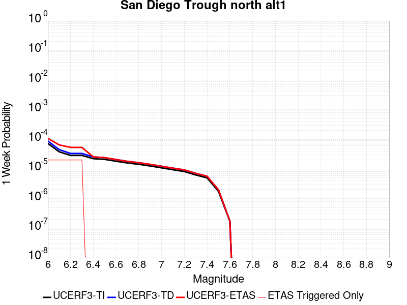 | 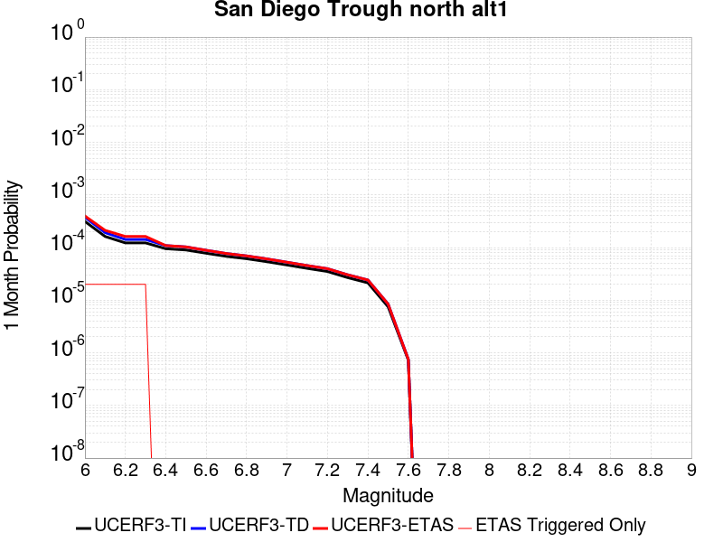 |  |  |

| Magnitude | 1 wk TI Prob | 1 wk TD Prob | 1 wk ETAS Prob | 1 wk ETAS/TD Gain | 1 wk ETAS Triggered Only | 1 mo TI Prob | 1 mo TD Prob | 1 mo ETAS Prob | 1 mo ETAS/TD Gain | 1 mo ETAS Triggered Only | 1 yr TI Prob | 1 yr TD Prob | 1 yr ETAS Prob | 1 yr ETAS/TD Gain | 1 yr ETAS Triggered Only | 10 yr TI Prob | 10 yr TD Prob | 10 yr ETAS Prob | 10 yr ETAS/TD Gain | 10 yr ETAS Triggered Only |
|-----|-----|-----|-----|-----|-----|-----|-----|-----|-----|-----|-----|-----|-----|-----|-----|-----|-----|-----|-----|-----|
| 6.0 | 7.329252E-5 | 8.821093E-5 | 1.0820917E-4 | 1.2267092 | 2.0E-5 | 3.14073E-4 | 3.7799572E-4 | 3.9798816E-4 | 1.0528907 | 2.0E-5 | 0.0038171355 | 0.004593027 | 0.004642797 | 1.0108361 | 5.0E-5 | 0.03752231 | 0.045044992 | 0.04509274 | 1.00106 | 5.0E-5 |
| 6.1 | 3.7940346E-5 | 4.4885E-5 | 6.48841E-5 | 1.4455632 | 2.0E-5 | 1.6259136E-4 | 1.9235066E-4 | 2.1234681E-4 | 1.1039568 | 2.0E-5 | 0.0019777524 | 0.0023394432 | 0.002369373 | 1.0127935 | 3.0E-5 | 0.019602431 | 0.023156688 | 0.023185993 | 1.0012655 | 3.0E-5 |
| 6.2 | 2.8645263E-5 | 3.329678E-5 | 5.3296113E-5 | 1.6006386 | 2.0E-5 | 1.2275964E-4 | 1.4269284E-4 | 1.6268999E-4 | 1.1401412 | 2.0E-5 | 0.0014935739 | 0.0017359189 | 0.0017558842 | 1.0115013 | 2.0E-5 | 0.0148357535 | 0.017226247 | 0.017245904 | 1.0011411 | 2.0E-5 |
| 6.3 | 2.8645263E-5 | 3.329678E-5 | 5.3296113E-5 | 1.6006386 | 2.0E-5 | 1.2275964E-4 | 1.4269284E-4 | 1.6268999E-4 | 1.1401412 | 2.0E-5 | 0.0014935739 | 0.0017359189 | 0.0017558842 | 1.0115013 | 2.0E-5 | 0.0148357535 | 0.017226247 | 0.017245904 | 1.0011411 | 2.0E-5 |
| 6.4 | 2.2204576E-5 | 2.5448318E-5 | 2.5448318E-5 | 1.0 | 0.0 | 9.5159E-5 | 1.0905972E-4 | 1.0905972E-4 | 1.0 | 0.0 | 0.001157945 | 0.0013270034 | 0.0013270034 | 1.0 | 0.0 | 0.011519298 | 0.013191955 | 0.013191955 | 1.0 | 0.0 |
| 6.5 | 2.1004838E-5 | 2.4024694E-5 | 2.4024694E-5 | 1.0 | 0.0 | 9.0017624E-5 | 1.0295896E-4 | 1.0295896E-4 | 1.0 | 0.0 | 0.0010954136 | 0.0012528138 | 0.0012528138 | 1.0 | 0.0 | 0.010900296 | 0.012458589 | 0.012458589 | 1.0 | 0.0 |
| 6.6 | 1.820557E-5 | 2.0704787E-5 | 2.0704787E-5 | 1.0 | 0.0 | 7.802154E-5 | 8.873181E-5 | 8.873181E-5 | 1.0 | 0.0 | 9.4949827E-4 | 0.0010797799 | 0.0010797799 | 1.0 | 0.0 | 0.009454516 | 0.010746004 | 0.010746004 | 1.0 | 0.0 |
| 6.7 | 1.5884485E-5 | 1.7983646E-5 | 1.7983646E-5 | 1.0 | 0.0 | 6.807459E-5 | 7.707051E-5 | 7.707051E-5 | 1.0 | 0.0 | 8.284929E-4 | 9.3793223E-4 | 9.3793223E-4 | 1.0 | 0.0 | 0.008254109 | 0.009340104 | 0.009340104 | 1.0 | 0.0 |
| 6.8 | 1.4331171E-5 | 1.6201066E-5 | 1.6201066E-5 | 1.0 | 0.0 | 6.141786E-5 | 6.94313E-5 | 6.94313E-5 | 1.0 | 0.0 | 7.4750587E-4 | 8.450002E-4 | 8.450002E-4 | 1.0 | 0.0 | 0.0074499645 | 0.008418139 | 0.008418139 | 1.0 | 0.0 |
| 6.9 | 1.2574203E-5 | 1.4205835E-5 | 1.4205835E-5 | 1.0 | 0.0 | 5.3888325E-5 | 6.0880735E-5 | 6.0880735E-5 | 1.0 | 0.0 | 6.558929E-4 | 7.409723E-4 | 7.409723E-4 | 1.0 | 0.0 | 0.0065396037 | 0.007385203 | 0.007385203 | 1.0 | 0.0 |
| 7.0 | 1.0883844E-5 | 1.2289262E-5 | 1.2289262E-5 | 1.0 | 0.0 | 4.664421E-5 | 5.2667205E-5 | 5.2667205E-5 | 1.0 | 0.0 | 5.677453E-4 | 6.4103556E-4 | 6.4103556E-4 | 1.0 | 0.0 | 0.00566297 | 0.006391993 | 0.006391993 | 1.0 | 0.0 |
| 7.1 | 9.393088E-6 | 1.060702E-5 | 1.060702E-5 | 1.0 | 0.0 | 4.025547E-5 | 4.545787E-5 | 4.545787E-5 | 1.0 | 0.0 | 4.900001E-4 | 5.533098E-4 | 5.533098E-4 | 1.0 | 0.0 | 0.0048892107 | 0.005519418 | 0.005519418 | 1.0 | 0.0 |
| 7.2 | 8.190791E-6 | 9.258625E-6 | 9.258625E-6 | 1.0 | 0.0 | 3.510292E-5 | 3.9679224E-5 | 3.9679224E-5 | 1.0 | 0.0 | 4.2729423E-4 | 4.8298817E-4 | 4.8298817E-4 | 1.0 | 0.0 | 0.0042647356 | 0.004819465 | 0.004819465 | 1.0 | 0.0 |
| 7.3 | 6.268162E-6 | 7.089716E-6 | 7.089716E-6 | 1.0 | 0.0 | 2.6863276E-5 | 3.0384144E-5 | 3.0384144E-5 | 1.0 | 0.0 | 3.2701128E-4 | 3.6986457E-4 | 3.6986457E-4 | 1.0 | 0.0 | 0.003265305 | 0.003692536 | 0.003692536 | 1.0 | 0.0 |
| 7.4 | 4.985186E-6 | 5.6426816E-6 | 5.6426816E-6 | 1.0 | 0.0 | 2.1364907E-5 | 2.4182698E-5 | 2.4182698E-5 | 1.0 | 0.0 | 2.600867E-4 | 2.9438498E-4 | 2.9438498E-4 | 1.0 | 0.0 | 0.002597825 | 0.0029399914 | 0.0029399914 | 1.0 | 0.0 |
| 7.5 | 1.7489613E-6 | 1.969678E-6 | 1.969678E-6 | 1.0 | 0.0 | 7.495527E-6 | 8.4414505E-6 | 8.4414505E-6 | 1.0 | 0.0 | 9.125422E-5 | 1.02770035E-4 | 1.02770035E-4 | 1.0 | 0.0 | 9.1216754E-4 | 0.0010272472 | 0.0010272472 | 1.0 | 0.0 |
| 7.6 | 1.6988751E-7 | 1.7533823E-7 | 1.7533823E-7 | 1.0 | 0.0 | 7.2808916E-7 | 7.5144936E-7 | 7.5144936E-7 | 1.0 | 0.0 | 8.864449E-6 | 9.14886E-6 | 9.14886E-6 | 1.0 | 0.0 | 8.8640954E-5 | 9.1485024E-5 | 9.1485024E-5 | 1.0 | 0.0 |

## San Jacinto (Superstition Mtn)
*[(top)](#table-of-contents)*

| 1 Week | 1 Month | 1 Year | 10 Year |
|-----|-----|-----|-----|
|  |  |  | 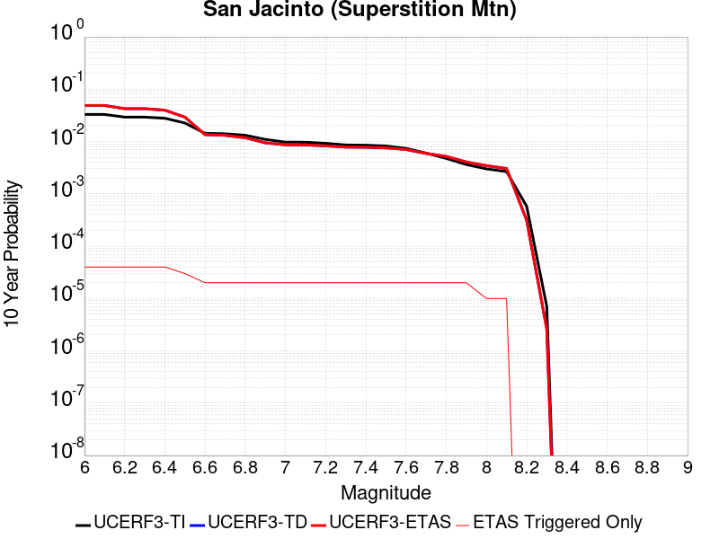 |

| Magnitude | 1 wk TI Prob | 1 wk TD Prob | 1 wk ETAS Prob | 1 wk ETAS/TD Gain | 1 wk ETAS Triggered Only | 1 mo TI Prob | 1 mo TD Prob | 1 mo ETAS Prob | 1 mo ETAS/TD Gain | 1 mo ETAS Triggered Only | 1 yr TI Prob | 1 yr TD Prob | 1 yr ETAS Prob | 1 yr ETAS/TD Gain | 1 yr ETAS Triggered Only | 10 yr TI Prob | 10 yr TD Prob | 10 yr ETAS Prob | 10 yr ETAS/TD Gain | 10 yr ETAS Triggered Only |
|-----|-----|-----|-----|-----|-----|-----|-----|-----|-----|-----|-----|-----|-----|-----|-----|-----|-----|-----|-----|-----|
| 6.0 | 6.4193904E-5 | 9.599367E-5 | 9.599367E-5 | 1.0 | 0.0 | 2.7508775E-4 | 4.1134638E-4 | 4.2134227E-4 | 1.0243005 | 1.0E-5 | 0.0033440501 | 0.0049980893 | 0.0050279396 | 1.0059723 | 3.0E-5 | 0.03294174 | 0.048823986 | 0.048862033 | 1.0007793 | 4.0E-5 |
| 6.1 | 6.4193904E-5 | 9.599367E-5 | 9.599367E-5 | 1.0 | 0.0 | 2.7508775E-4 | 4.1134638E-4 | 4.2134227E-4 | 1.0243005 | 1.0E-5 | 0.0033440501 | 0.0049980893 | 0.0050279396 | 1.0059723 | 3.0E-5 | 0.03294174 | 0.048823986 | 0.048862033 | 1.0007793 | 4.0E-5 |
| 6.2 | 5.7023593E-5 | 8.3144434E-5 | 8.3144434E-5 | 1.0 | 0.0 | 2.4436394E-4 | 3.5629404E-4 | 3.6629045E-4 | 1.0280567 | 1.0E-5 | 0.002971072 | 0.0043308944 | 0.0043607643 | 1.006897 | 3.0E-5 | 0.029316625 | 0.04250403 | 0.04254233 | 1.0009011 | 4.0E-5 |
| 6.3 | 5.6940098E-5 | 8.298979E-5 | 8.298979E-5 | 1.0 | 0.0 | 2.4400617E-4 | 3.5563146E-4 | 3.6562793E-4 | 1.028109 | 1.0E-5 | 0.002966728 | 0.00432286 | 0.0043527302 | 1.0069098 | 3.0E-5 | 0.029274331 | 0.042427283 | 0.042465586 | 1.0009028 | 4.0E-5 |
| 6.4 | 5.4171585E-5 | 7.7483564E-5 | 7.7483564E-5 | 1.0 | 0.0 | 2.3214328E-4 | 3.3203943E-4 | 3.4203613E-4 | 1.0301069 | 1.0E-5 | 0.0028226813 | 0.0040367353 | 0.004066614 | 1.0074017 | 3.0E-5 | 0.02787096 | 0.03971653 | 0.039754942 | 1.0009671 | 4.0E-5 |
| 6.5 | 4.375144E-5 | 5.642133E-5 | 5.642133E-5 | 1.0 | 0.0 | 1.874927E-4 | 2.4178992E-4 | 2.517875E-4 | 1.0413482 | 1.0E-5 | 0.0022803338 | 0.002940994 | 0.0029709057 | 1.0101706 | 3.0E-5 | 0.022570757 | 0.029236801 | 0.029265925 | 1.0009961 | 3.0E-5 |
| 6.6 | 2.772192E-5 | 2.5488358E-5 | 2.5488358E-5 | 1.0 | 0.0 | 1.1880282E-4 | 1.09231354E-4 | 1.1923026E-4 | 1.0915388 | 1.0E-5 | 0.0014454646 | 0.0013290998 | 0.0013490731 | 1.0150278 | 2.0E-5 | 0.014360986 | 0.01354049 | 0.01356022 | 1.0014571 | 2.0E-5 |
| 6.7 | 2.7124124E-5 | 2.4699386E-5 | 2.4699386E-5 | 1.0 | 0.0 | 1.1624106E-4 | 1.05850326E-4 | 1.1584927E-4 | 1.094463 | 1.0E-5 | 0.0014143161 | 0.001287985 | 0.0013079593 | 1.0155082 | 2.0E-5 | 0.014053487 | 0.013133943 | 0.013153681 | 1.0015028 | 2.0E-5 |
| 6.8 | 2.5475807E-5 | 2.216446E-5 | 2.216446E-5 | 1.0 | 0.0 | 1.0917746E-4 | 9.4987154E-5 | 1.04986204E-4 | 1.1052674 | 1.0E-5 | 0.001328425 | 0.001155867 | 0.0011758439 | 1.0172831 | 2.0E-5 | 0.0132051185 | 0.011822182 | 0.011841945 | 1.0016718 | 2.0E-5 |
| 6.9 | 2.1162023E-5 | 1.7626244E-5 | 1.7626244E-5 | 1.0 | 0.0 | 9.069123E-5 | 7.5538876E-5 | 8.553812E-5 | 1.1323721 | 1.0E-5 | 0.0011036064 | 9.193016E-4 | 9.3928317E-4 | 1.0217357 | 2.0E-5 | 0.010981417 | 0.00944688 | 0.009466691 | 1.0020971 | 2.0E-5 |
| 7.0 | 1.8754288E-5 | 1.6161559E-5 | 1.6161559E-5 | 1.0 | 0.0 | 8.037304E-5 | 6.9261994E-5 | 7.926131E-5 | 1.1443694 | 1.0E-5 | 9.781026E-4 | 8.4294105E-4 | 8.629242E-4 | 1.0237064 | 2.0E-5 | 0.009738087 | 0.008670042 | 0.008689868 | 1.0022868 | 2.0E-5 |
| 7.1 | 1.8678527E-5 | 1.6086702E-5 | 1.6086702E-5 | 1.0 | 0.0 | 8.0048376E-5 | 6.89412E-5 | 7.894051E-5 | 1.1450411 | 1.0E-5 | 9.7415317E-4 | 8.3903834E-4 | 8.5902156E-4 | 1.0238168 | 2.0E-5 | 0.009698939 | 0.008630998 | 0.008650825 | 1.0022973 | 2.0E-5 |
| 7.2 | 1.7804578E-5 | 1.5381282E-5 | 1.5381282E-5 | 1.0 | 0.0 | 7.6303106E-5 | 6.5918124E-5 | 7.5917465E-5 | 1.1516933 | 1.0E-5 | 9.285943E-4 | 8.022599E-4 | 8.2224386E-4 | 1.0249096 | 2.0E-5 | 0.009247236 | 0.008262311 | 0.008282146 | 1.0024006 | 2.0E-5 |
| 7.3 | 1.6583685E-5 | 1.4530388E-5 | 1.4530388E-5 | 1.0 | 0.0 | 7.1070994E-5 | 6.227162E-5 | 7.2270996E-5 | 1.1605768 | 1.0E-5 | 8.649459E-4 | 7.5789524E-4 | 7.778801E-4 | 1.0263689 | 2.0E-5 | 0.00861587 | 0.007817623 | 0.007837467 | 1.0025383 | 2.0E-5 |
| 7.4 | 1.6387552E-5 | 1.4395274E-5 | 1.4395274E-5 | 1.0 | 0.0 | 7.023047E-5 | 6.169258E-5 | 7.169197E-5 | 1.162084 | 1.0E-5 | 8.5472054E-4 | 7.5085036E-4 | 7.708353E-4 | 1.0266165 | 2.0E-5 | 0.008514405 | 0.0077470057 | 0.0077668508 | 1.0025617 | 2.0E-5 |
| 7.5 | 1.5790754E-5 | 1.4035962E-5 | 1.4035962E-5 | 1.0 | 0.0 | 6.767291E-5 | 6.0152746E-5 | 7.015214E-5 | 1.1662334 | 1.0E-5 | 8.236062E-4 | 7.321156E-4 | 7.5210095E-4 | 1.0272981 | 2.0E-5 | 0.008205604 | 0.007557569 | 0.007577418 | 1.0026263 | 2.0E-5 |
| 7.6 | 1.4248672E-5 | 1.3054932E-5 | 1.3054932E-5 | 1.0 | 0.0 | 6.106431E-5 | 5.594852E-5 | 6.594796E-5 | 1.1787257 | 1.0E-5 | 7.432043E-4 | 6.8096205E-4 | 7.0094847E-4 | 1.0293502 | 2.0E-5 | 0.007407237 | 0.0070401574 | 0.0070600165 | 1.0028208 | 2.0E-5 |
| 7.7 | 1.15449975E-5 | 1.090368E-5 | 1.090368E-5 | 1.0 | 0.0 | 4.947762E-5 | 4.6729223E-5 | 5.6728757E-5 | 1.2139889 | 1.0E-5 | 6.022235E-4 | 5.687805E-4 | 5.8876915E-4 | 1.0351429 | 2.0E-5 | 0.006005941 | 0.0059101824 | 0.0059300642 | 1.003364 | 2.0E-5 |
| 7.8 | 9.1391985E-6 | 9.514299E-6 | 9.514299E-6 | 1.0 | 0.0 | 3.9167408E-5 | 4.0774932E-5 | 5.0774524E-5 | 1.2452388 | 1.0E-5 | 4.767588E-4 | 4.963223E-4 | 5.163124E-4 | 1.0402764 | 2.0E-5 | 0.0047573727 | 0.0051766867 | 0.005196583 | 1.0038434 | 2.0E-5 |
| 7.9 | 6.973017E-6 | 7.3821784E-6 | 7.3821784E-6 | 1.0 | 0.0 | 2.9884017E-5 | 3.1637526E-5 | 4.163721E-5 | 1.3160703 | 1.0E-5 | 3.6377716E-4 | 3.8511935E-4 | 4.0511164E-4 | 1.051912 | 2.0E-5 | 0.0036318225 | 0.0040517948 | 0.0040717134 | 1.0049161 | 2.0E-5 |
| 8.0 | 5.7638235E-6 | 6.259972E-6 | 6.259972E-6 | 1.0 | 0.0 | 2.4701867E-5 | 2.6828178E-5 | 2.6828178E-5 | 1.0 | 0.0 | 3.0070372E-4 | 3.2658462E-4 | 3.3658135E-4 | 1.03061 | 1.0E-5 | 0.0030029714 | 0.0034534496 | 0.003463415 | 1.0028857 | 1.0E-5 |
| 8.1 | 5.1124434E-6 | 5.4956718E-6 | 5.4956718E-6 | 1.0 | 0.0 | 2.1910288E-5 | 2.355267E-5 | 2.355267E-5 | 1.0 | 0.0 | 2.6672508E-4 | 2.867165E-4 | 2.9671364E-4 | 1.0348676 | 1.0E-5 | 0.0026640517 | 0.003040336 | 0.0030503056 | 1.0032791 | 1.0E-5 |
| 8.2 | 1.1075938E-6 | 5.336568E-7 | 5.336568E-7 | 1.0 | 0.0 | 4.7468216E-6 | 2.2870988E-6 | 2.2870988E-6 | 1.0 | 0.0 | 5.779102E-5 | 2.7845093E-5 | 2.7845093E-5 | 1.0 | 0.0 | 5.777599E-4 | 3.1346595E-4 | 3.1346595E-4 | 1.0 | 0.0 |
| 8.3 | 1.3584393E-8 | 4.473836E-9 | 4.473836E-9 | 1.0 | 0.0 | 5.8218827E-8 | 1.9173582E-8 | 1.9173582E-8 | 1.0 | 0.0 | 7.0881396E-7 | 2.3343837E-7 | 2.3343837E-7 | 1.0 | 0.0 | 7.0881174E-6 | 2.6163038E-6 | 2.6163038E-6 | 1.0 | 0.0 |

## San Jacinto (Clark) rev
*[(top)](#table-of-contents)*

| 1 Week | 1 Month | 1 Year | 10 Year |
|-----|-----|-----|-----|
|  | 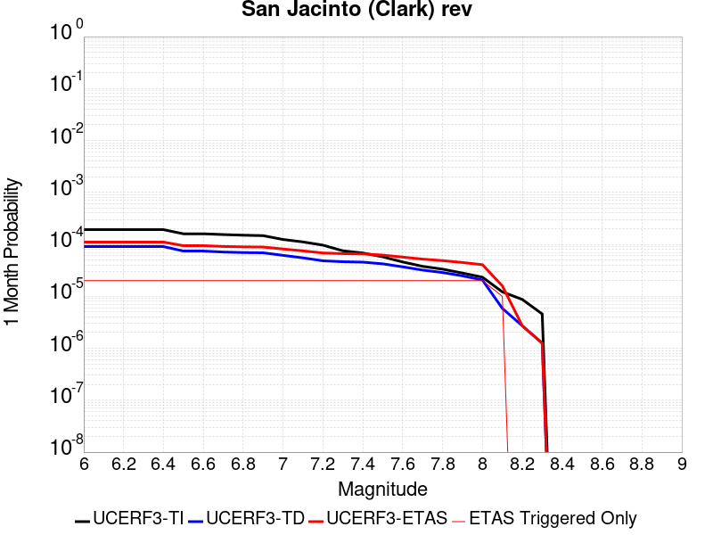 |  |  |

| Magnitude | 1 wk TI Prob | 1 wk TD Prob | 1 wk ETAS Prob | 1 wk ETAS/TD Gain | 1 wk ETAS Triggered Only | 1 mo TI Prob | 1 mo TD Prob | 1 mo ETAS Prob | 1 mo ETAS/TD Gain | 1 mo ETAS Triggered Only | 1 yr TI Prob | 1 yr TD Prob | 1 yr ETAS Prob | 1 yr ETAS/TD Gain | 1 yr ETAS Triggered Only | 10 yr TI Prob | 10 yr TD Prob | 10 yr ETAS Prob | 10 yr ETAS/TD Gain | 10 yr ETAS Triggered Only |
|-----|-----|-----|-----|-----|-----|-----|-----|-----|-----|-----|-----|-----|-----|-----|-----|-----|-----|-----|-----|-----|
| 6.0 | 4.482615E-5 | 2.1154196E-5 | 4.1153773E-5 | 1.945419 | 2.0E-5 | 1.9209793E-4 | 9.065773E-5 | 1.1065592E-4 | 1.22059 | 2.0E-5 | 0.0023362834 | 0.0011032083 | 0.0011231862 | 1.018109 | 2.0E-5 | 0.02311874 | 0.011503847 | 0.011543387 | 1.003437 | 4.0E-5 |
| 6.1 | 4.482615E-5 | 2.1154196E-5 | 4.1153773E-5 | 1.945419 | 2.0E-5 | 1.9209793E-4 | 9.065773E-5 | 1.1065592E-4 | 1.22059 | 2.0E-5 | 0.0023362834 | 0.0011032083 | 0.0011231862 | 1.018109 | 2.0E-5 | 0.02311874 | 0.011503847 | 0.011543387 | 1.003437 | 4.0E-5 |
| 6.2 | 4.482615E-5 | 2.1154196E-5 | 4.1153773E-5 | 1.945419 | 2.0E-5 | 1.9209793E-4 | 9.065773E-5 | 1.1065592E-4 | 1.22059 | 2.0E-5 | 0.0023362834 | 0.0011032083 | 0.0011231862 | 1.018109 | 2.0E-5 | 0.02311874 | 0.011503847 | 0.011543387 | 1.003437 | 4.0E-5 |
| 6.3 | 4.482615E-5 | 2.1154196E-5 | 4.1153773E-5 | 1.945419 | 2.0E-5 | 1.9209793E-4 | 9.065773E-5 | 1.1065592E-4 | 1.22059 | 2.0E-5 | 0.0023362834 | 0.0011032083 | 0.0011231862 | 1.018109 | 2.0E-5 | 0.02311874 | 0.011503847 | 0.011543387 | 1.003437 | 4.0E-5 |
| 6.4 | 4.482615E-5 | 2.1154196E-5 | 4.1153773E-5 | 1.945419 | 2.0E-5 | 1.9209793E-4 | 9.065773E-5 | 1.1065592E-4 | 1.22059 | 2.0E-5 | 0.0023362834 | 0.0011032083 | 0.0011231862 | 1.018109 | 2.0E-5 | 0.02311874 | 0.011503847 | 0.011543387 | 1.003437 | 4.0E-5 |
| 6.5 | 3.7294863E-5 | 1.7356087E-5 | 3.735574E-5 | 2.1523135 | 2.0E-5 | 1.5982533E-4 | 7.438113E-5 | 9.437965E-5 | 1.2688653 | 2.0E-5 | 0.0019441366 | 9.052186E-4 | 9.2520047E-4 | 1.0220741 | 2.0E-5 | 0.01927216 | 0.0094941035 | 0.009533724 | 1.0041732 | 4.0E-5 |
| 6.6 | 3.7294863E-5 | 1.7356087E-5 | 3.735574E-5 | 2.1523135 | 2.0E-5 | 1.5982533E-4 | 7.438113E-5 | 9.437965E-5 | 1.2688653 | 2.0E-5 | 0.0019441366 | 9.052186E-4 | 9.2520047E-4 | 1.0220741 | 2.0E-5 | 0.01927216 | 0.0094941035 | 0.009533724 | 1.0041732 | 4.0E-5 |
| 6.7 | 3.6039248E-5 | 1.6604314E-5 | 3.6603982E-5 | 2.2044864 | 2.0E-5 | 1.5444479E-4 | 7.1159426E-5 | 9.1158E-5 | 1.281039 | 2.0E-5 | 0.0018787434 | 8.6602574E-4 | 8.8600843E-4 | 1.023074 | 2.0E-5 | 0.01862939 | 0.009096047 | 0.009135683 | 1.0043575 | 4.0E-5 |
| 6.8 | 3.5031844E-5 | 1.6232942E-5 | 3.6232617E-5 | 2.2320426 | 2.0E-5 | 1.5012783E-4 | 6.956792E-5 | 8.956653E-5 | 1.2874688 | 2.0E-5 | 0.0018262739 | 8.4666436E-4 | 8.666474E-4 | 1.0236021 | 2.0E-5 | 0.01811338 | 0.008895969 | 0.008935614 | 1.0044564 | 4.0E-5 |
| 6.9 | 3.435112E-5 | 1.6063195E-5 | 3.6062873E-5 | 2.2450624 | 2.0E-5 | 1.4721078E-4 | 6.884047E-5 | 8.883909E-5 | 1.2905068 | 2.0E-5 | 0.0017908178 | 8.3781447E-4 | 8.5779774E-4 | 1.0238516 | 2.0E-5 | 0.017764548 | 0.008804181 | 0.008843828 | 1.0045033 | 4.0E-5 |
| 7.0 | 2.8959772E-5 | 1.4336745E-5 | 3.433646E-5 | 2.394997 | 2.0E-5 | 1.241074E-4 | 6.144176E-5 | 8.1440536E-5 | 1.3254915 | 2.0E-5 | 0.0015099603 | 7.477995E-4 | 7.6778454E-4 | 1.0267252 | 2.0E-5 | 0.014997416 | 0.007868037 | 0.007907721 | 1.0050439 | 4.0E-5 |
| 7.1 | 2.6002877E-5 | 1.2829002E-5 | 3.2828746E-5 | 2.5589478 | 2.0E-5 | 1.11436144E-4 | 5.498029E-5 | 7.497919E-5 | 1.3637468 | 2.0E-5 | 0.0013558907 | 6.691816E-4 | 6.8916817E-4 | 1.0298673 | 2.0E-5 | 0.013476475 | 0.0070465137 | 0.007086232 | 1.0056366 | 4.0E-5 |
| 7.2 | 2.2544838E-5 | 1.1262543E-5 | 3.126232E-5 | 2.7757778 | 2.0E-5 | 9.661716E-5 | 4.8267157E-5 | 6.826619E-5 | 1.4143404 | 2.0E-5 | 0.001175679 | 5.874956E-4 | 6.074839E-4 | 1.0340228 | 2.0E-5 | 0.011694785 | 0.0061927503 | 0.0062325024 | 1.0064192 | 4.0E-5 |
| 7.3 | 1.75334E-5 | 1.0811715E-5 | 3.0811498E-5 | 2.8498254 | 2.0E-5 | 7.514098E-5 | 4.6335106E-5 | 6.633418E-5 | 1.4316182 | 2.0E-5 | 9.144575E-4 | 5.6398526E-4 | 5.83974E-4 | 1.0354419 | 2.0E-5 | 0.009107036 | 0.0059337732 | 0.005973536 | 1.0067011 | 4.0E-5 |
| 7.4 | 1.5924552E-5 | 1.0611516E-5 | 3.0611303E-5 | 2.8847249 | 2.0E-5 | 6.82463E-5 | 4.547714E-5 | 6.547623E-5 | 1.4397614 | 2.0E-5 | 8.305819E-4 | 5.535449E-4 | 5.735338E-4 | 1.0361108 | 2.0E-5 | 0.008274844 | 0.0058210334 | 0.0058608004 | 1.0068316 | 4.0E-5 |
| 7.5 | 1.3428931E-5 | 9.8519E-6 | 2.9851702E-5 | 3.0300453 | 2.0E-5 | 5.7551293E-5 | 4.2221753E-5 | 6.2220905E-5 | 1.4736695 | 2.0E-5 | 7.004617E-4 | 5.1392964E-4 | 5.339194E-4 | 1.0388958 | 2.0E-5 | 0.006982579 | 0.0054066023 | 0.005446386 | 1.0073583 | 4.0E-5 |
| 7.6 | 1.0688787E-5 | 8.614839E-6 | 2.8614668E-5 | 3.3215554 | 2.0E-5 | 4.5808283E-5 | 3.692022E-5 | 5.691948E-5 | 1.5416886 | 2.0E-5 | 5.5757316E-4 | 4.4941145E-4 | 4.6940247E-4 | 1.0444826 | 2.0E-5 | 0.005561762 | 0.0047416524 | 0.0047814627 | 1.0083959 | 4.0E-5 |
| 7.7 | 8.81236E-6 | 7.4680274E-6 | 2.7467879E-5 | 3.6780634 | 2.0E-5 | 3.776671E-5 | 3.2005442E-5 | 5.20048E-5 | 1.6248738 | 2.0E-5 | 4.597127E-4 | 3.8959677E-4 | 4.0958897E-4 | 1.0513151 | 2.0E-5 | 0.0045876284 | 0.0041346536 | 0.004174488 | 1.0096344 | 4.0E-5 |
| 7.8 | 7.780431E-6 | 6.696579E-6 | 2.6696445E-5 | 3.9865797 | 2.0E-5 | 3.3344273E-5 | 2.8699309E-5 | 4.8698737E-5 | 1.6968609 | 2.0E-5 | 4.0589093E-4 | 3.4935825E-4 | 3.6935127E-4 | 1.0572278 | 2.0E-5 | 0.0040515037 | 0.0037227906 | 0.0037626417 | 1.0107046 | 4.0E-5 |
| 7.9 | 6.5437994E-6 | 5.780382E-6 | 2.5780266E-5 | 4.459959 | 2.0E-5 | 2.8044553E-5 | 2.477283E-5 | 4.4772336E-5 | 1.8073161 | 2.0E-5 | 3.4138895E-4 | 3.0156763E-4 | 3.2156162E-4 | 1.0663002 | 2.0E-5 | 0.0034086495 | 0.0032344845 | 0.003274355 | 1.0123267 | 4.0E-5 |
| 8.0 | 5.4488164E-6 | 4.8133406E-6 | 2.4813244E-5 | 5.1550984 | 2.0E-5 | 2.3351862E-5 | 2.062844E-5 | 4.0628027E-5 | 1.9695152 | 2.0E-5 | 2.8427184E-4 | 2.5112246E-4 | 2.7111746E-4 | 1.0796224 | 2.0E-5 | 0.0028390845 | 0.002710839 | 0.0027507306 | 1.0147156 | 4.0E-5 |
| 8.1 | 2.8397242E-6 | 1.3670389E-6 | 1.1367025E-5 | 8.315071 | 1.0E-5 | 1.217019E-5 | 5.858725E-6 | 1.5858666E-5 | 2.706846 | 1.0E-5 | 1.4816198E-4 | 7.132765E-5 | 8.132694E-5 | 1.1401881 | 1.0E-5 | 0.0014806325 | 8.115382E-4 | 8.2153006E-4 | 1.0123123 | 1.0E-5 |
| 8.2 | 2.030244E-6 | 6.318974E-7 | 6.318974E-7 | 1.0 | 0.0 | 8.701017E-6 | 2.708129E-6 | 2.708129E-6 | 1.0 | 0.0 | 1.05929736E-4 | 3.2970976E-5 | 3.2970976E-5 | 1.0 | 0.0 | 0.0010587925 | 3.9486602E-4 | 3.9486602E-4 | 1.0 | 0.0 |
| 8.3 | 1.0659804E-6 | 2.9250086E-7 | 2.9250086E-7 | 1.0 | 0.0 | 4.568479E-6 | 1.2535745E-6 | 1.2535745E-6 | 1.0 | 0.0 | 5.5619817E-5 | 1.5262167E-5 | 1.5262167E-5 | 1.0 | 0.0 | 5.5605895E-4 | 1.8566217E-4 | 1.8566217E-4 | 1.0 | 0.0 |

## Channel Islands Western Deep Ramp
*[(top)](#table-of-contents)*

| 1 Week | 1 Month | 1 Year | 10 Year |
|-----|-----|-----|-----|
|  |  |  |  |

| Magnitude | 1 wk TI Prob | 1 wk TD Prob | 1 wk ETAS Prob | 1 wk ETAS/TD Gain | 1 wk ETAS Triggered Only | 1 mo TI Prob | 1 mo TD Prob | 1 mo ETAS Prob | 1 mo ETAS/TD Gain | 1 mo ETAS Triggered Only | 1 yr TI Prob | 1 yr TD Prob | 1 yr ETAS Prob | 1 yr ETAS/TD Gain | 1 yr ETAS Triggered Only | 10 yr TI Prob | 10 yr TD Prob | 10 yr ETAS Prob | 10 yr ETAS/TD Gain | 10 yr ETAS Triggered Only |
|-----|-----|-----|-----|-----|-----|-----|-----|-----|-----|-----|-----|-----|-----|-----|-----|-----|-----|-----|-----|-----|
| 6.0 | 6.0213506E-6 | 6.2548684E-6 | 1.6254806E-5 | 2.5987446 | 1.0E-5 | 2.5805533E-5 | 2.6806329E-5 | 3.680606E-5 | 1.3730363 | 1.0E-5 | 3.1413708E-4 | 3.2632265E-4 | 3.5631284E-4 | 1.0919036 | 3.0E-5 | 0.0031369338 | 0.0032588763 | 0.003298746 | 1.0122342 | 4.0E-5 |
| 6.1 | 6.0213506E-6 | 6.2548684E-6 | 1.6254806E-5 | 2.5987446 | 1.0E-5 | 2.5805533E-5 | 2.6806329E-5 | 3.680606E-5 | 1.3730363 | 1.0E-5 | 3.1413708E-4 | 3.2632265E-4 | 3.5631284E-4 | 1.0919036 | 3.0E-5 | 0.0031369338 | 0.0032588763 | 0.003298746 | 1.0122342 | 4.0E-5 |
| 6.2 | 6.0213506E-6 | 6.2548684E-6 | 1.6254806E-5 | 2.5987446 | 1.0E-5 | 2.5805533E-5 | 2.6806329E-5 | 3.680606E-5 | 1.3730363 | 1.0E-5 | 3.1413708E-4 | 3.2632265E-4 | 3.5631284E-4 | 1.0919036 | 3.0E-5 | 0.0031369338 | 0.0032588763 | 0.003298746 | 1.0122342 | 4.0E-5 |
| 6.3 | 6.0213506E-6 | 6.2548684E-6 | 1.6254806E-5 | 2.5987446 | 1.0E-5 | 2.5805533E-5 | 2.6806329E-5 | 3.680606E-5 | 1.3730363 | 1.0E-5 | 3.1413708E-4 | 3.2632265E-4 | 3.5631284E-4 | 1.0919036 | 3.0E-5 | 0.0031369338 | 0.0032588763 | 0.003298746 | 1.0122342 | 4.0E-5 |
| 6.4 | 6.0213506E-6 | 6.2548684E-6 | 1.6254806E-5 | 2.5987446 | 1.0E-5 | 2.5805533E-5 | 2.6806329E-5 | 3.680606E-5 | 1.3730363 | 1.0E-5 | 3.1413708E-4 | 3.2632265E-4 | 3.5631284E-4 | 1.0919036 | 3.0E-5 | 0.0031369338 | 0.0032588763 | 0.003298746 | 1.0122342 | 4.0E-5 |
| 6.5 | 6.0213506E-6 | 6.2548684E-6 | 1.6254806E-5 | 2.5987446 | 1.0E-5 | 2.5805533E-5 | 2.6806329E-5 | 3.680606E-5 | 1.3730363 | 1.0E-5 | 3.1413708E-4 | 3.2632265E-4 | 3.5631284E-4 | 1.0919036 | 3.0E-5 | 0.0031369338 | 0.0032588763 | 0.003298746 | 1.0122342 | 4.0E-5 |
| 6.6 | 6.0213506E-6 | 6.2548684E-6 | 1.6254806E-5 | 2.5987446 | 1.0E-5 | 2.5805533E-5 | 2.6806329E-5 | 3.680606E-5 | 1.3730363 | 1.0E-5 | 3.1413708E-4 | 3.2632265E-4 | 3.5631284E-4 | 1.0919036 | 3.0E-5 | 0.0031369338 | 0.0032588763 | 0.003298746 | 1.0122342 | 4.0E-5 |
| 6.7 | 5.313309E-6 | 5.5252403E-6 | 1.5525186E-5 | 2.809866 | 1.0E-5 | 2.2771126E-5 | 2.367941E-5 | 3.3679175E-5 | 1.4222978 | 1.0E-5 | 2.772032E-4 | 2.8826276E-4 | 3.182541E-4 | 1.1040417 | 3.0E-5 | 0.0027685766 | 0.0028792918 | 0.0029191766 | 1.0138524 | 4.0E-5 |
| 6.8 | 5.313309E-6 | 5.5252403E-6 | 1.5525186E-5 | 2.809866 | 1.0E-5 | 2.2771126E-5 | 2.367941E-5 | 3.3679175E-5 | 1.4222978 | 1.0E-5 | 2.772032E-4 | 2.8826276E-4 | 3.182541E-4 | 1.1040417 | 3.0E-5 | 0.0027685766 | 0.0028792918 | 0.0029191766 | 1.0138524 | 4.0E-5 |
| 6.9 | 4.744377E-6 | 4.9394303E-6 | 1.4939381E-5 | 3.024515 | 1.0E-5 | 2.0332885E-5 | 2.1168837E-5 | 3.1168624E-5 | 1.4723825 | 1.0E-5 | 2.4752476E-4 | 2.5770385E-4 | 2.876961E-4 | 1.1163827 | 3.0E-5 | 0.0024724922 | 0.0025744175 | 0.0026143144 | 1.0154974 | 4.0E-5 |
| 7.0 | 4.722209E-6 | 4.9164732E-6 | 1.4916424E-5 | 3.0339684 | 1.0E-5 | 2.0237881E-5 | 2.107045E-5 | 3.1070238E-5 | 1.4745883 | 1.0E-5 | 2.4636835E-4 | 2.5650626E-4 | 2.8649857E-4 | 1.1169262 | 3.0E-5 | 0.002460954 | 0.0025624693 | 0.0026023667 | 1.0155699 | 4.0E-5 |
| 7.1 | 4.611174E-6 | 4.801409E-6 | 1.48013605E-5 | 3.082712 | 1.0E-5 | 1.9762025E-5 | 2.0577325E-5 | 3.057712E-5 | 1.4859618 | 1.0E-5 | 2.4057609E-4 | 2.5050386E-4 | 2.8049634E-4 | 1.1197287 | 3.0E-5 | 0.002403158 | 0.002502582 | 0.0025424818 | 1.0159435 | 4.0E-5 |
| 7.2 | 4.043994E-6 | 4.2120264E-6 | 1.4211984E-5 | 3.374144 | 1.0E-5 | 1.7331287E-5 | 1.8051438E-5 | 2.8051258E-5 | 1.5539625 | 1.0E-5 | 2.10988E-4 | 2.1975765E-4 | 2.3975327E-4 | 1.0909894 | 2.0E-5 | 0.002107878 | 0.0021957543 | 0.0022256884 | 1.0136328 | 3.0E-5 |
| 7.3 | 2.1233036E-6 | 2.2297875E-6 | 2.2297875E-6 | 1.0 | 0.0 | 9.099841E-6 | 9.556197E-6 | 9.556197E-6 | 1.0 | 0.0 | 1.1078493E-4 | 1.1634055E-4 | 1.2633938E-4 | 1.0859445 | 1.0E-5 | 0.0011072971 | 0.001162802 | 0.0011727903 | 1.0085899 | 1.0E-5 |
| 7.4 | 1.9051884E-6 | 2.0014973E-6 | 2.0014973E-6 | 1.0 | 0.0 | 8.165067E-6 | 8.577817E-6 | 8.577817E-6 | 1.0 | 0.0 | 9.940516E-5 | 1.0442998E-4 | 1.14428934E-4 | 1.095748 | 1.0E-5 | 9.93607E-4 | 0.0010438144 | 0.0010538038 | 1.0095702 | 1.0E-5 |
| 7.5 | 1.2408497E-6 | 1.3038839E-6 | 1.3038839E-6 | 1.0 | 0.0 | 5.317916E-6 | 5.588062E-6 | 5.588062E-6 | 1.0 | 0.0 | 6.4743705E-5 | 6.8032554E-5 | 6.8032554E-5 | 1.0 | 0.0 | 6.4724847E-4 | 6.8011944E-4 | 6.8011944E-4 | 1.0 | 0.0 |
| 7.6 | 6.5440025E-7 | 6.886718E-7 | 6.886718E-7 | 1.0 | 0.0 | 2.8045695E-6 | 2.9514472E-6 | 2.9514472E-6 | 1.0 | 0.0 | 3.4145098E-5 | 3.593329E-5 | 3.593329E-5 | 1.0 | 0.0 | 3.4139853E-4 | 3.5927625E-4 | 3.5927625E-4 | 1.0 | 0.0 |
| 7.7 | 3.985963E-7 | 4.1930787E-7 | 4.1930787E-7 | 1.0 | 0.0 | 1.7082689E-6 | 1.7970326E-6 | 1.7970326E-6 | 1.0 | 0.0 | 2.0797976E-5 | 2.1878664E-5 | 2.1878664E-5 | 1.0 | 0.0 | 2.0796029E-4 | 2.1876628E-4 | 2.1876628E-4 | 1.0 | 0.0 |
| 7.8 | 3.706329E-8 | 3.8591796E-8 | 3.8591796E-8 | 1.0 | 0.0 | 1.5884267E-7 | 1.653934E-7 | 1.653934E-7 | 1.0 | 0.0 | 1.9339077E-6 | 2.0136629E-6 | 2.0136629E-6 | 1.0 | 0.0 | 1.933891E-5 | 2.0136458E-5 | 2.0136458E-5 | 1.0 | 0.0 |

## Simi-Santa Rosa
*[(top)](#table-of-contents)*

| 1 Week | 1 Month | 1 Year | 10 Year |
|-----|-----|-----|-----|
|  |  | 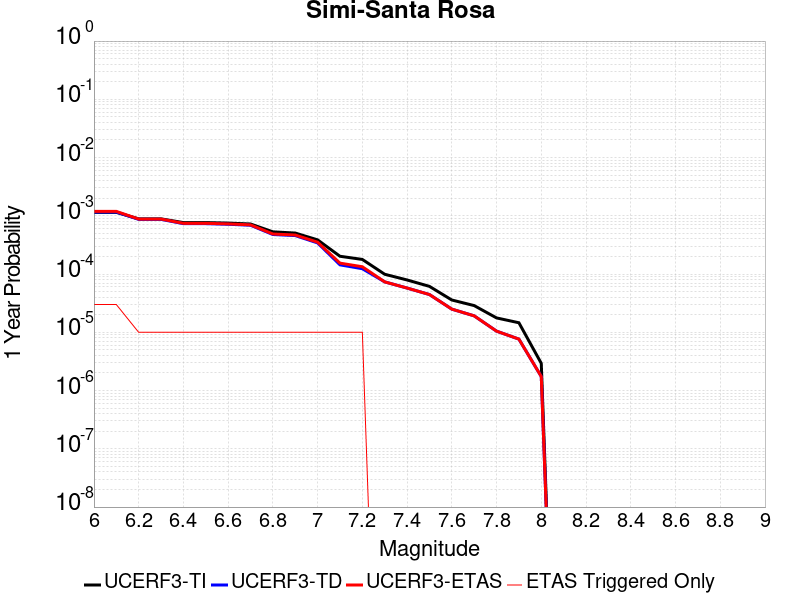 |  |

| Magnitude | 1 wk TI Prob | 1 wk TD Prob | 1 wk ETAS Prob | 1 wk ETAS/TD Gain | 1 wk ETAS Triggered Only | 1 mo TI Prob | 1 mo TD Prob | 1 mo ETAS Prob | 1 mo ETAS/TD Gain | 1 mo ETAS Triggered Only | 1 yr TI Prob | 1 yr TD Prob | 1 yr ETAS Prob | 1 yr ETAS/TD Gain | 1 yr ETAS Triggered Only | 10 yr TI Prob | 10 yr TD Prob | 10 yr ETAS Prob | 10 yr ETAS/TD Gain | 10 yr ETAS Triggered Only |
|-----|-----|-----|-----|-----|-----|-----|-----|-----|-----|-----|-----|-----|-----|-----|-----|-----|-----|-----|-----|-----|
| 6.0 | 2.198912E-5 | 2.2275442E-5 | 2.2275442E-5 | 1.0 | 0.0 | 9.4235686E-5 | 9.5462936E-5 | 1.0546198E-4 | 1.1047426 | 1.0E-5 | 0.0011467156 | 0.0011616853 | 0.0011916505 | 1.0257945 | 3.0E-5 | 0.011408163 | 0.011560575 | 0.011600113 | 1.00342 | 4.0E-5 |
| 6.1 | 2.198912E-5 | 2.2275442E-5 | 2.2275442E-5 | 1.0 | 0.0 | 9.4235686E-5 | 9.5462936E-5 | 1.0546198E-4 | 1.1047426 | 1.0E-5 | 0.0011467156 | 0.0011616853 | 0.0011916505 | 1.0257945 | 3.0E-5 | 0.011408163 | 0.011560575 | 0.011600113 | 1.00342 | 4.0E-5 |
| 6.2 | 1.69983E-5 | 1.6668559E-5 | 1.6668559E-5 | 1.0 | 0.0 | 7.284782E-5 | 7.143489E-5 | 8.143418E-5 | 1.1399776 | 1.0E-5 | 8.865613E-4 | 8.6940196E-4 | 8.7939325E-4 | 1.0114921 | 1.0E-5 | 0.008830327 | 0.008662928 | 0.008682754 | 1.0022887 | 2.0E-5 |
| 6.3 | 1.69983E-5 | 1.6668559E-5 | 1.6668559E-5 | 1.0 | 0.0 | 7.284782E-5 | 7.143489E-5 | 8.143418E-5 | 1.1399776 | 1.0E-5 | 8.865613E-4 | 8.6940196E-4 | 8.7939325E-4 | 1.0114921 | 1.0E-5 | 0.008830327 | 0.008662928 | 0.008682754 | 1.0022887 | 2.0E-5 |
| 6.4 | 1.4666188E-5 | 1.4052543E-5 | 1.4052543E-5 | 1.0 | 0.0 | 6.285358E-5 | 6.0223934E-5 | 7.022333E-5 | 1.166037 | 1.0E-5 | 7.6497364E-4 | 7.3300465E-4 | 7.429973E-4 | 1.0136325 | 1.0E-5 | 0.0076234564 | 0.007308344 | 0.007328198 | 1.0027165 | 2.0E-5 |
| 6.5 | 1.4666188E-5 | 1.4052543E-5 | 1.4052543E-5 | 1.0 | 0.0 | 6.285358E-5 | 6.0223934E-5 | 7.022333E-5 | 1.166037 | 1.0E-5 | 7.6497364E-4 | 7.3300465E-4 | 7.429973E-4 | 1.0136325 | 1.0E-5 | 0.0076234564 | 0.007308344 | 0.007328198 | 1.0027165 | 2.0E-5 |
| 6.6 | 1.4377586E-5 | 1.3729583E-5 | 1.3729583E-5 | 1.0 | 0.0 | 6.1616774E-5 | 5.883988E-5 | 6.883929E-5 | 1.1699427 | 1.0E-5 | 7.4992597E-4 | 7.1616494E-4 | 7.261578E-4 | 1.0139532 | 1.0E-5 | 0.007474003 | 0.0071410383 | 0.0071608955 | 1.0027807 | 2.0E-5 |
| 6.7 | 1.3881404E-5 | 1.320755E-5 | 1.320755E-5 | 1.0 | 0.0 | 5.9490372E-5 | 5.66027E-5 | 6.660214E-5 | 1.1766601 | 1.0E-5 | 7.240546E-4 | 6.8894465E-4 | 6.989378E-4 | 1.0145049 | 1.0E-5 | 0.007217 | 0.006870538 | 0.006890401 | 1.002891 | 2.0E-5 |
| 6.8 | 1.0176516E-5 | 9.154151E-6 | 9.154151E-6 | 1.0 | 0.0 | 4.3612912E-5 | 3.9231574E-5 | 4.9231185E-5 | 1.2548867 | 1.0E-5 | 5.308578E-4 | 4.7755634E-4 | 4.8755156E-4 | 1.0209299 | 1.0E-5 | 0.0052959146 | 0.004766934 | 0.004786839 | 1.0041755 | 2.0E-5 |
| 6.9 | 9.699797E-6 | 8.774719E-6 | 8.774719E-6 | 1.0 | 0.0 | 4.15699E-5 | 3.7605492E-5 | 4.7605117E-5 | 1.2659086 | 1.0E-5 | 5.05996E-4 | 4.577671E-4 | 4.6776255E-4 | 1.0218352 | 1.0E-5 | 0.005048454 | 0.0045698597 | 0.004589768 | 1.0043565 | 2.0E-5 |
| 7.0 | 7.4049476E-6 | 6.559333E-6 | 6.559333E-6 | 1.0 | 0.0 | 3.1735104E-5 | 2.8111197E-5 | 3.8110917E-5 | 1.3557202 | 1.0E-5 | 3.8630638E-4 | 3.422127E-4 | 3.522093E-4 | 1.0292116 | 1.0E-5 | 0.0038563553 | 0.0034180996 | 0.0034280655 | 1.0029156 | 1.0E-5 |
| 7.1 | 3.873439E-6 | 2.7595095E-6 | 2.7595095E-6 | 1.0 | 0.0 | 1.6600346E-5 | 1.1826417E-5 | 2.18263E-5 | 1.8455546 | 1.0E-5 | 2.0209046E-4 | 1.4397735E-4 | 1.5397591E-4 | 1.0694454 | 1.0E-5 | 0.0020190678 | 0.0014388643 | 0.0014488499 | 1.0069399 | 1.0E-5 |
| 7.2 | 3.417706E-6 | 2.3676484E-6 | 2.3676484E-6 | 1.0 | 0.0 | 1.4647229E-5 | 1.0147027E-5 | 2.0146925E-5 | 1.9855003 | 1.0E-5 | 1.7831543E-4 | 1.2353327E-4 | 1.3353204E-4 | 1.0809399 | 1.0E-5 | 0.0017817242 | 0.0012346683 | 0.0012446559 | 1.0080893 | 1.0E-5 |
| 7.3 | 1.90225E-6 | 1.4073753E-6 | 1.4073753E-6 | 1.0 | 0.0 | 8.152474E-6 | 6.0315947E-6 | 6.0315947E-6 | 1.0 | 0.0 | 9.9251854E-5 | 7.343221E-5 | 7.343221E-5 | 1.0 | 0.0 | 9.920754E-4 | 7.340817E-4 | 7.340817E-4 | 1.0 | 0.0 |
| 7.4 | 1.5170556E-6 | 1.1024773E-6 | 1.1024773E-6 | 1.0 | 0.0 | 6.5016507E-6 | 4.724894E-6 | 4.724894E-6 | 1.0 | 0.0 | 7.915472E-5 | 5.7524077E-5 | 5.7524077E-5 | 1.0 | 0.0 | 7.9126534E-4 | 5.7509297E-4 | 5.7509297E-4 | 1.0 | 0.0 |
| 7.5 | 1.178732E-6 | 8.535102E-7 | 8.535102E-7 | 1.0 | 0.0 | 5.0516987E-6 | 3.6578958E-6 | 3.6578958E-6 | 1.0 | 0.0 | 6.1502695E-5 | 4.453398E-5 | 4.453398E-5 | 1.0 | 0.0 | 6.148568E-4 | 4.452515E-4 | 4.452515E-4 | 1.0 | 0.0 |
| 7.6 | 6.8722386E-7 | 4.793198E-7 | 4.793198E-7 | 1.0 | 0.0 | 2.9452417E-6 | 2.054226E-6 | 2.054226E-6 | 1.0 | 0.0 | 3.5857727E-5 | 2.5009915E-5 | 2.5009915E-5 | 1.0 | 0.0 | 3.5851944E-4 | 2.5007114E-4 | 2.5007114E-4 | 1.0 | 0.0 |
| 7.7 | 5.5126515E-7 | 3.6731157E-7 | 3.6731157E-7 | 1.0 | 0.0 | 2.3625628E-6 | 1.5741915E-6 | 1.5741915E-6 | 1.0 | 0.0 | 2.8763823E-5 | 1.9165615E-5 | 1.9165615E-5 | 1.0 | 0.0 | 2.87601E-4 | 1.9163972E-4 | 1.9163972E-4 | 1.0 | 0.0 |
| 7.8 | 3.3860243E-7 | 2.0075942E-7 | 2.0075942E-7 | 1.0 | 0.0 | 1.4511525E-6 | 8.6039717E-7 | 8.6039717E-7 | 1.0 | 0.0 | 1.7667637E-5 | 1.0475286E-5 | 1.0475286E-5 | 1.0 | 0.0 | 1.7666233E-4 | 1.04747975E-4 | 1.04747975E-4 | 1.0 | 0.0 |
| 7.9 | 2.7955386E-7 | 1.4649108E-7 | 1.4649108E-7 | 1.0 | 0.0 | 1.1980875E-6 | 6.278188E-7 | 6.278188E-7 | 1.0 | 0.0 | 1.4586617E-5 | 7.643667E-6 | 7.643667E-6 | 1.0 | 0.0 | 1.458566E-4 | 7.643409E-5 | 7.643409E-5 | 1.0 | 0.0 |
| 8.0 | 5.6259015E-8 | 3.3355324E-8 | 3.3355324E-8 | 1.0 | 0.0 | 2.4111003E-7 | 1.4295138E-7 | 1.4295138E-7 | 1.0 | 0.0 | 2.9355108E-6 | 1.7404317E-6 | 1.7404317E-6 | 1.0 | 0.0 | 2.935472E-5 | 1.7404194E-5 | 1.7404194E-5 | 1.0 | 0.0 |

## Ortigalita (North)
*[(top)](#table-of-contents)*

| 1 Week | 1 Month | 1 Year | 10 Year |
|-----|-----|-----|-----|
| 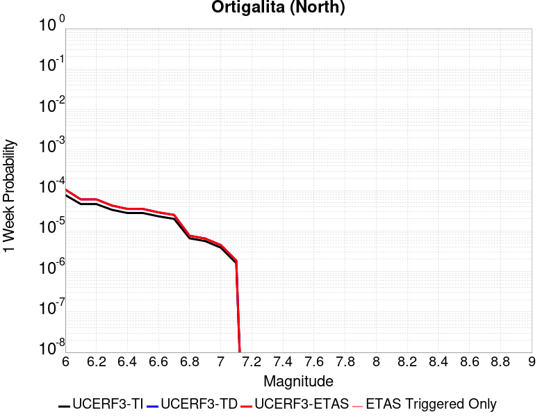 |  | 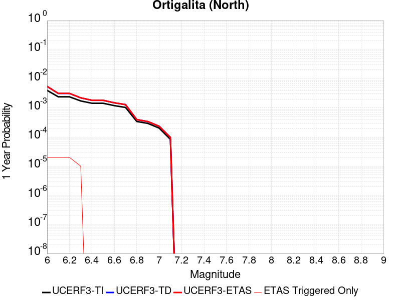 |  |

| Magnitude | 1 wk TI Prob | 1 wk TD Prob | 1 wk ETAS Prob | 1 wk ETAS/TD Gain | 1 wk ETAS Triggered Only | 1 mo TI Prob | 1 mo TD Prob | 1 mo ETAS Prob | 1 mo ETAS/TD Gain | 1 mo ETAS Triggered Only | 1 yr TI Prob | 1 yr TD Prob | 1 yr ETAS Prob | 1 yr ETAS/TD Gain | 1 yr ETAS Triggered Only | 10 yr TI Prob | 10 yr TD Prob | 10 yr ETAS Prob | 10 yr ETAS/TD Gain | 10 yr ETAS Triggered Only |
|-----|-----|-----|-----|-----|-----|-----|-----|-----|-----|-----|-----|-----|-----|-----|-----|-----|-----|-----|-----|-----|
| 6.0 | 7.711876E-5 | 1.05064966E-4 | 1.05064966E-4 | 1.0 | 0.0 | 3.3046713E-4 | 4.502116E-4 | 4.6020708E-4 | 1.0222018 | 1.0E-5 | 0.004016016 | 0.0054681194 | 0.00548801 | 1.0036376 | 2.0E-5 | 0.039442103 | 0.053454787 | 0.05349265 | 1.0007083 | 4.0E-5 |
| 6.1 | 4.607858E-5 | 6.0239203E-5 | 6.0239203E-5 | 1.0 | 0.0 | 1.9746469E-4 | 2.5814527E-4 | 2.6814267E-4 | 1.0387279 | 1.0E-5 | 0.0024014818 | 0.0031387596 | 0.003158697 | 1.006352 | 2.0E-5 | 0.023756953 | 0.030975068 | 0.03100414 | 1.0009385 | 3.0E-5 |
| 6.2 | 4.607858E-5 | 6.0239203E-5 | 6.0239203E-5 | 1.0 | 0.0 | 1.9746469E-4 | 2.5814527E-4 | 2.6814267E-4 | 1.0387279 | 1.0E-5 | 0.0024014818 | 0.0031387596 | 0.003158697 | 1.006352 | 2.0E-5 | 0.023756953 | 0.030975068 | 0.03100414 | 1.0009385 | 3.0E-5 |
| 6.3 | 3.327423E-5 | 4.2475127E-5 | 4.2475127E-5 | 1.0 | 0.0 | 1.4259605E-4 | 1.8202531E-4 | 1.8202531E-4 | 1.0 | 0.0 | 0.0017347244 | 0.002214197 | 0.002224175 | 1.0045063 | 1.0E-5 | 0.017212452 | 0.021945644 | 0.021955425 | 1.0004457 | 1.0E-5 |
| 6.4 | 2.7732503E-5 | 3.4998593E-5 | 3.4998593E-5 | 1.0 | 0.0 | 1.1884817E-4 | 1.4998685E-4 | 1.4998685E-4 | 1.0 | 0.0 | 0.001446016 | 0.0018248095 | 0.0018248095 | 1.0 | 0.0 | 0.014366428 | 0.018121224 | 0.018121224 | 1.0 | 0.0 |
| 6.5 | 2.7689714E-5 | 3.4948407E-5 | 3.4948407E-5 | 1.0 | 0.0 | 1.186648E-4 | 1.497718E-4 | 1.497718E-4 | 1.0 | 0.0 | 0.0014437864 | 0.0018221956 | 0.0018221956 | 1.0 | 0.0 | 0.014344421 | 0.01809551 | 0.01809551 | 1.0 | 0.0 |
| 6.6 | 2.2976905E-5 | 2.8718265E-5 | 2.8718265E-5 | 1.0 | 0.0 | 9.846873E-5 | 1.230739E-4 | 1.230739E-4 | 1.0 | 0.0 | 0.0011981975 | 0.0014976363 | 0.0014976363 | 1.0 | 0.0 | 0.011917574 | 0.014898697 | 0.014898697 | 1.0 | 0.0 |
| 6.7 | 1.9871539E-5 | 2.4904411E-5 | 2.4904411E-5 | 1.0 | 0.0 | 8.516096E-5 | 1.0673023E-4 | 1.0673023E-4 | 1.0 | 0.0 | 0.0010363415 | 0.0012989145 | 0.0012989145 | 1.0 | 0.0 | 0.010315218 | 0.012936919 | 0.012936919 | 1.0 | 0.0 |
| 6.8 | 6.5640475E-6 | 7.6054926E-6 | 7.6054926E-6 | 1.0 | 0.0 | 2.813133E-5 | 3.2594577E-5 | 3.2594577E-5 | 1.0 | 0.0 | 3.424451E-4 | 3.9676955E-4 | 3.9676955E-4 | 1.0 | 0.0 | 0.0034191788 | 0.003960899 | 0.003960899 | 1.0 | 0.0 |
| 6.9 | 5.6219683E-6 | 6.5018376E-6 | 6.5018376E-6 | 1.0 | 0.0 | 2.4093928E-5 | 2.7864735E-5 | 2.7864735E-5 | 1.0 | 0.0 | 2.933041E-4 | 3.3920293E-4 | 3.3920293E-4 | 1.0 | 0.0 | 0.0029291727 | 0.003387109 | 0.003387109 | 1.0 | 0.0 |
| 7.0 | 3.875591E-6 | 4.4847548E-6 | 4.4847548E-6 | 1.0 | 0.0 | 1.6609569E-5 | 1.9220248E-5 | 1.9220248E-5 | 1.0 | 0.0 | 2.0220275E-4 | 2.339835E-4 | 2.339835E-4 | 1.0 | 0.0 | 0.0020201886 | 0.0023375798 | 0.0023375798 | 1.0 | 0.0 |
| 7.1 | 1.6017933E-6 | 1.8570418E-6 | 1.8570418E-6 | 1.0 | 0.0 | 6.8648105E-6 | 7.958732E-6 | 7.958732E-6 | 1.0 | 0.0 | 8.357586E-5 | 9.689432E-5 | 9.689432E-5 | 1.0 | 0.0 | 8.3544437E-4 | 9.686254E-4 | 9.686254E-4 | 1.0 | 0.0 |

## Hollywood
*[(top)](#table-of-contents)*

| 1 Week | 1 Month | 1 Year | 10 Year |
|-----|-----|-----|-----|
|  |  | 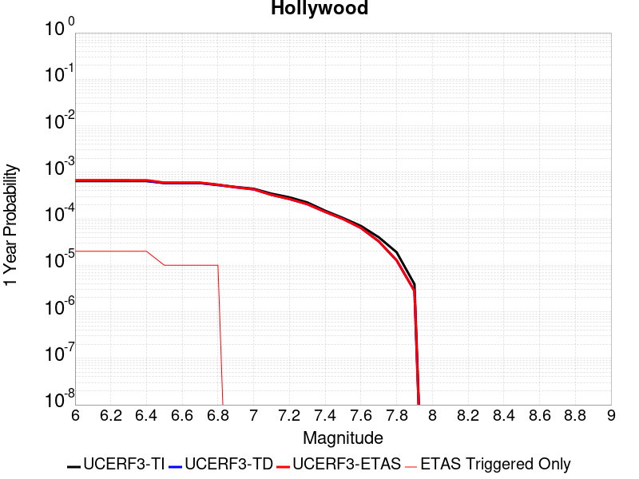 | 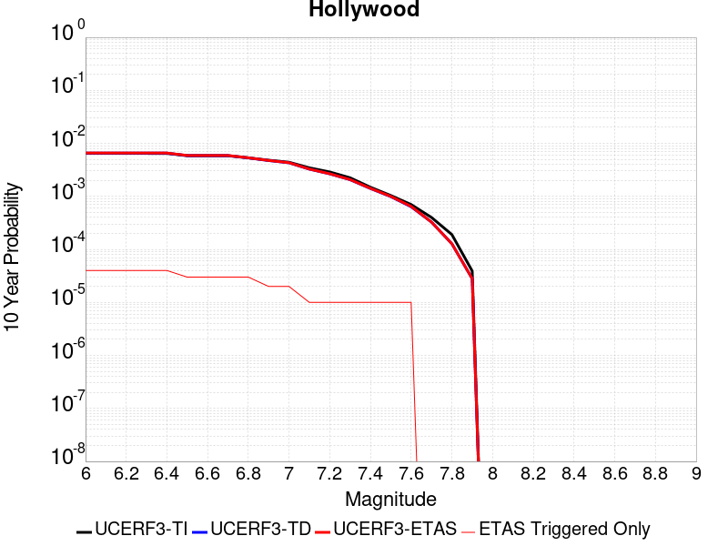 |

| Magnitude | 1 wk TI Prob | 1 wk TD Prob | 1 wk ETAS Prob | 1 wk ETAS/TD Gain | 1 wk ETAS Triggered Only | 1 mo TI Prob | 1 mo TD Prob | 1 mo ETAS Prob | 1 mo ETAS/TD Gain | 1 mo ETAS Triggered Only | 1 yr TI Prob | 1 yr TD Prob | 1 yr ETAS Prob | 1 yr ETAS/TD Gain | 1 yr ETAS Triggered Only | 10 yr TI Prob | 10 yr TD Prob | 10 yr ETAS Prob | 10 yr ETAS/TD Gain | 10 yr ETAS Triggered Only |
|-----|-----|-----|-----|-----|-----|-----|-----|-----|-----|-----|-----|-----|-----|-----|-----|-----|-----|-----|-----|-----|
| 6.0 | 1.24487615E-5 | 1.2593226E-5 | 2.25931E-5 | 1.7940677 | 1.0E-5 | 5.3350745E-5 | 5.3969878E-5 | 6.396934E-5 | 1.1852785 | 1.0E-5 | 6.4935174E-4 | 6.568898E-4 | 6.768767E-4 | 1.0304265 | 2.0E-5 | 0.0064745755 | 0.006549969 | 0.006589707 | 1.0060669 | 4.0E-5 |
| 6.1 | 1.24487615E-5 | 1.2593226E-5 | 2.25931E-5 | 1.7940677 | 1.0E-5 | 5.3350745E-5 | 5.3969878E-5 | 6.396934E-5 | 1.1852785 | 1.0E-5 | 6.4935174E-4 | 6.568898E-4 | 6.768767E-4 | 1.0304265 | 2.0E-5 | 0.0064745755 | 0.006549969 | 0.006589707 | 1.0060669 | 4.0E-5 |
| 6.2 | 1.24487615E-5 | 1.2593226E-5 | 2.25931E-5 | 1.7940677 | 1.0E-5 | 5.3350745E-5 | 5.3969878E-5 | 6.396934E-5 | 1.1852785 | 1.0E-5 | 6.4935174E-4 | 6.568898E-4 | 6.768767E-4 | 1.0304265 | 2.0E-5 | 0.0064745755 | 0.006549969 | 0.006589707 | 1.0060669 | 4.0E-5 |
| 6.3 | 1.24487615E-5 | 1.2593226E-5 | 2.25931E-5 | 1.7940677 | 1.0E-5 | 5.3350745E-5 | 5.3969878E-5 | 6.396934E-5 | 1.1852785 | 1.0E-5 | 6.4935174E-4 | 6.568898E-4 | 6.768767E-4 | 1.0304265 | 2.0E-5 | 0.0064745755 | 0.006549969 | 0.006589707 | 1.0060669 | 4.0E-5 |
| 6.4 | 1.2431024E-5 | 1.2573839E-5 | 2.2573713E-5 | 1.795292 | 1.0E-5 | 5.327473E-5 | 5.3886797E-5 | 6.3886255E-5 | 1.1855642 | 1.0E-5 | 6.4842677E-4 | 6.558789E-4 | 6.758658E-4 | 1.0304735 | 2.0E-5 | 0.0064653796 | 0.0065399194 | 0.0065796576 | 1.0060763 | 4.0E-5 |
| 6.5 | 1.1242222E-5 | 1.13178E-5 | 2.1317686E-5 | 1.8835539 | 1.0E-5 | 4.8180063E-5 | 4.850397E-5 | 5.8503487E-5 | 1.2061586 | 1.0E-5 | 5.864344E-4 | 5.9037853E-4 | 6.003726E-4 | 1.0169283 | 1.0E-5 | 0.0058488925 | 0.005888388 | 0.0059182113 | 1.0050647 | 3.0E-5 |
| 6.6 | 1.1234066E-5 | 1.13089145E-5 | 2.13088E-5 | 1.8842481 | 1.0E-5 | 4.8145106E-5 | 4.846589E-5 | 5.8465404E-5 | 1.2063206 | 1.0E-5 | 5.86009E-4 | 5.8991514E-4 | 5.999092E-4 | 1.0169415 | 1.0E-5 | 0.005844661 | 0.0058837784 | 0.005913602 | 1.0050688 | 3.0E-5 |
| 6.7 | 1.12294E-5 | 1.1303658E-5 | 2.1303544E-5 | 1.8846594 | 1.0E-5 | 4.812511E-5 | 4.8443362E-5 | 5.8442878E-5 | 1.2064166 | 1.0E-5 | 5.857657E-4 | 5.89641E-4 | 5.996351E-4 | 1.0169494 | 1.0E-5 | 0.0058422405 | 0.005881052 | 0.0059108753 | 1.0050712 | 3.0E-5 |
| 6.8 | 1.0252819E-5 | 1.0218445E-5 | 2.0218342E-5 | 1.9786125 | 1.0E-5 | 4.3939912E-5 | 4.379261E-5 | 5.3792173E-5 | 1.2283391 | 1.0E-5 | 5.3483713E-4 | 5.330467E-4 | 5.430414E-4 | 1.0187501 | 1.0E-5 | 0.005335517 | 0.005317908 | 0.005347748 | 1.0056113 | 3.0E-5 |
| 6.9 | 9.252289E-6 | 9.110306E-6 | 9.110306E-6 | 1.0 | 0.0 | 3.9652066E-5 | 3.9043593E-5 | 3.9043593E-5 | 1.0 | 0.0 | 4.8265693E-4 | 4.752537E-4 | 4.752537E-4 | 1.0 | 0.0 | 0.0048161 | 0.004742547 | 0.004762452 | 1.0041971 | 2.0E-5 |
| 7.0 | 8.474604E-6 | 8.258257E-6 | 8.258257E-6 | 1.0 | 0.0 | 3.6319227E-5 | 3.539206E-5 | 3.539206E-5 | 1.0 | 0.0 | 4.4209688E-4 | 4.3081454E-4 | 4.3081454E-4 | 1.0 | 0.0 | 0.004412184 | 0.004299944 | 0.004319858 | 1.0046313 | 2.0E-5 |
| 7.1 | 6.643643E-6 | 6.2683675E-6 | 6.2683675E-6 | 1.0 | 0.0 | 2.8472443E-5 | 2.6864158E-5 | 2.6864158E-5 | 1.0 | 0.0 | 3.4659685E-4 | 3.2702246E-4 | 3.2702246E-4 | 1.0 | 0.0 | 0.0034605677 | 0.0032654584 | 0.0032754256 | 1.0030524 | 1.0E-5 |
| 7.2 | 5.549002E-6 | 5.108709E-6 | 5.108709E-6 | 1.0 | 0.0 | 2.378122E-5 | 2.1894284E-5 | 2.1894284E-5 | 1.0 | 0.0 | 2.8949787E-4 | 2.6653046E-4 | 2.6653046E-4 | 1.0 | 0.0 | 0.0028912104 | 0.0026621243 | 0.0026720979 | 1.0037464 | 1.0E-5 |
| 7.3 | 4.3059727E-6 | 3.9598885E-6 | 3.9598885E-6 | 1.0 | 0.0 | 1.8454039E-5 | 1.6970842E-5 | 1.6970842E-5 | 1.0 | 0.0 | 2.2465475E-4 | 2.066005E-4 | 2.066005E-4 | 1.0 | 0.0 | 0.0022442779 | 0.0020640944 | 0.0020740738 | 1.0048348 | 1.0E-5 |
| 7.4 | 2.8550733E-6 | 2.7012966E-6 | 2.7012966E-6 | 1.0 | 0.0 | 1.2235971E-5 | 1.1576934E-5 | 1.1576934E-5 | 1.0 | 0.0 | 1.4896276E-4 | 1.409401E-4 | 1.409401E-4 | 1.0 | 0.0 | 0.0014886294 | 0.0014085122 | 0.0014184982 | 1.0070897 | 1.0E-5 |
| 7.5 | 1.9927045E-6 | 1.8976367E-6 | 1.8976367E-6 | 1.0 | 0.0 | 8.540134E-6 | 8.132703E-6 | 8.132703E-6 | 1.0 | 0.0 | 1.0397117E-4 | 9.90112E-5 | 9.90112E-5 | 1.0 | 0.0 | 0.0010392254 | 9.896745E-4 | 9.996645E-4 | 1.0100943 | 1.0E-5 |
| 7.6 | 1.345084E-6 | 1.2216007E-6 | 1.2216007E-6 | 1.0 | 0.0 | 5.764633E-6 | 5.235421E-6 | 5.235421E-6 | 1.0 | 0.0 | 7.018215E-5 | 6.3739404E-5 | 6.3739404E-5 | 1.0 | 0.0 | 7.0159987E-4 | 6.3721323E-4 | 6.4720685E-4 | 1.0156833 | 1.0E-5 |
| 7.7 | 7.6835164E-7 | 6.277697E-7 | 6.277697E-7 | 1.0 | 0.0 | 3.2929315E-6 | 2.6904388E-6 | 2.6904388E-6 | 1.0 | 0.0 | 4.00907E-5 | 3.2755615E-5 | 3.2755615E-5 | 1.0 | 0.0 | 4.0083472E-4 | 3.2750933E-4 | 3.2750933E-4 | 1.0 | 0.0 |
| 7.8 | 3.6562128E-7 | 2.453479E-7 | 2.453479E-7 | 1.0 | 0.0 | 1.5669474E-6 | 1.0514907E-6 | 1.0514907E-6 | 1.0 | 0.0 | 1.9077417E-5 | 1.2801827E-5 | 1.2801827E-5 | 1.0 | 0.0 | 1.907578E-4 | 1.2801126E-4 | 1.2801126E-4 | 1.0 | 0.0 |
| 7.9 | 7.5024424E-8 | 5.3816795E-8 | 5.3816795E-8 | 1.0 | 0.0 | 3.215332E-7 | 2.306434E-7 | 2.306434E-7 | 1.0 | 0.0 | 3.91466E-6 | 2.808081E-6 | 2.808081E-6 | 1.0 | 0.0 | 3.9145907E-5 | 2.8080585E-5 | 2.8080585E-5 | 1.0 | 0.0 |

## Santa Susana alt 1
*[(top)](#table-of-contents)*

| 1 Week | 1 Month | 1 Year | 10 Year |
|-----|-----|-----|-----|
|  |  |  |  |

| Magnitude | 1 wk TI Prob | 1 wk TD Prob | 1 wk ETAS Prob | 1 wk ETAS/TD Gain | 1 wk ETAS Triggered Only | 1 mo TI Prob | 1 mo TD Prob | 1 mo ETAS Prob | 1 mo ETAS/TD Gain | 1 mo ETAS Triggered Only | 1 yr TI Prob | 1 yr TD Prob | 1 yr ETAS Prob | 1 yr ETAS/TD Gain | 1 yr ETAS Triggered Only | 10 yr TI Prob | 10 yr TD Prob | 10 yr ETAS Prob | 10 yr ETAS/TD Gain | 10 yr ETAS Triggered Only |
|-----|-----|-----|-----|-----|-----|-----|-----|-----|-----|-----|-----|-----|-----|-----|-----|-----|-----|-----|-----|-----|
| 6.0 | 2.674877E-5 | 2.7198023E-5 | 4.7197478E-5 | 1.7353276 | 2.0E-5 | 1.1463255E-4 | 1.1655839E-4 | 1.4655488E-4 | 1.2573518 | 3.0E-5 | 0.0013947578 | 0.0014182882 | 0.0014482456 | 1.0211222 | 3.0E-5 | 0.013860362 | 0.014104128 | 0.014143564 | 1.002796 | 4.0E-5 |
| 6.1 | 2.674877E-5 | 2.7198023E-5 | 4.7197478E-5 | 1.7353276 | 2.0E-5 | 1.1463255E-4 | 1.1655839E-4 | 1.4655488E-4 | 1.2573518 | 3.0E-5 | 0.0013947578 | 0.0014182882 | 0.0014482456 | 1.0211222 | 3.0E-5 | 0.013860362 | 0.014104128 | 0.014143564 | 1.002796 | 4.0E-5 |
| 6.2 | 2.674877E-5 | 2.7198023E-5 | 4.7197478E-5 | 1.7353276 | 2.0E-5 | 1.1463255E-4 | 1.1655839E-4 | 1.4655488E-4 | 1.2573518 | 3.0E-5 | 0.0013947578 | 0.0014182882 | 0.0014482456 | 1.0211222 | 3.0E-5 | 0.013860362 | 0.014104128 | 0.014143564 | 1.002796 | 4.0E-5 |
| 6.3 | 2.674877E-5 | 2.7198023E-5 | 4.7197478E-5 | 1.7353276 | 2.0E-5 | 1.1463255E-4 | 1.1655839E-4 | 1.4655488E-4 | 1.2573518 | 3.0E-5 | 0.0013947578 | 0.0014182882 | 0.0014482456 | 1.0211222 | 3.0E-5 | 0.013860362 | 0.014104128 | 0.014143564 | 1.002796 | 4.0E-5 |
| 6.4 | 2.674877E-5 | 2.7198023E-5 | 4.7197478E-5 | 1.7353276 | 2.0E-5 | 1.1463255E-4 | 1.1655839E-4 | 1.4655488E-4 | 1.2573518 | 3.0E-5 | 0.0013947578 | 0.0014182882 | 0.0014482456 | 1.0211222 | 3.0E-5 | 0.013860362 | 0.014104128 | 0.014143564 | 1.002796 | 4.0E-5 |
| 6.5 | 2.674877E-5 | 2.7198023E-5 | 4.7197478E-5 | 1.7353276 | 2.0E-5 | 1.1463255E-4 | 1.1655839E-4 | 1.4655488E-4 | 1.2573518 | 3.0E-5 | 0.0013947578 | 0.0014182882 | 0.0014482456 | 1.0211222 | 3.0E-5 | 0.013860362 | 0.014104128 | 0.014143564 | 1.002796 | 4.0E-5 |
| 6.6 | 2.6647976E-5 | 2.7074359E-5 | 4.707382E-5 | 1.7386863 | 2.0E-5 | 1.14200615E-4 | 1.1602845E-4 | 1.4602496E-4 | 1.2585273 | 3.0E-5 | 0.0013895056 | 0.0014118447 | 0.0014418025 | 1.0212188 | 3.0E-5 | 0.013808494 | 0.014040513 | 0.014079952 | 1.0028089 | 4.0E-5 |
| 6.7 | 2.6647976E-5 | 2.7074359E-5 | 4.707382E-5 | 1.7386863 | 2.0E-5 | 1.14200615E-4 | 1.1602845E-4 | 1.4602496E-4 | 1.2585273 | 3.0E-5 | 0.0013895056 | 0.0014118447 | 0.0014418025 | 1.0212188 | 3.0E-5 | 0.013808494 | 0.014040513 | 0.014079952 | 1.0028089 | 4.0E-5 |
| 6.8 | 1.9073179E-5 | 1.7637283E-5 | 3.763693E-5 | 2.1339414 | 2.0E-5 | 8.1739636E-5 | 7.558627E-5 | 1.05584004E-4 | 1.3968675 | 3.0E-5 | 9.947256E-4 | 9.198925E-4 | 9.498649E-4 | 1.0325825 | 3.0E-5 | 0.009902848 | 0.009163101 | 0.009202735 | 1.0043254 | 4.0E-5 |
| 6.9 | 1.9041876E-5 | 1.7619415E-5 | 3.7619062E-5 | 2.1350915 | 2.0E-5 | 8.160549E-5 | 7.55097E-5 | 1.0550743E-4 | 1.39727 | 3.0E-5 | 9.930939E-4 | 9.1896096E-4 | 9.4893336E-4 | 1.0326155 | 3.0E-5 | 0.0098866755 | 0.0091538625 | 0.009193497 | 1.0043297 | 4.0E-5 |
| 7.0 | 1.5917482E-5 | 1.3863864E-5 | 2.3863726E-5 | 1.7212896 | 1.0E-5 | 6.8215995E-5 | 5.9415237E-5 | 7.941405E-5 | 1.336594 | 2.0E-5 | 8.302132E-4 | 7.231451E-4 | 7.4313063E-4 | 1.027637 | 2.0E-5 | 0.008271185 | 0.0072088144 | 0.007238598 | 1.0041316 | 3.0E-5 |
| 7.1 | 1.577788E-5 | 1.3743872E-5 | 2.3743734E-5 | 1.727587 | 1.0E-5 | 6.761774E-5 | 5.8901005E-5 | 7.889983E-5 | 1.3395327 | 2.0E-5 | 8.2293496E-4 | 7.1688846E-4 | 7.368741E-4 | 1.0278783 | 2.0E-5 | 0.008198941 | 0.007146652 | 0.0071764374 | 1.0041678 | 3.0E-5 |
| 7.2 | 1.5416446E-5 | 1.3469944E-5 | 2.346981E-5 | 1.7423836 | 1.0E-5 | 6.606882E-5 | 5.772708E-5 | 7.772593E-5 | 1.3464378 | 2.0E-5 | 8.0409093E-4 | 7.026052E-4 | 7.225911E-4 | 1.0284455 | 2.0E-5 | 0.008011877 | 0.0070047234 | 0.007034513 | 1.0042528 | 3.0E-5 |
| 7.3 | 1.4534083E-5 | 1.2717879E-5 | 2.2717752E-5 | 1.7862847 | 1.0E-5 | 6.228744E-5 | 5.4504082E-5 | 7.450299E-5 | 1.366925 | 2.0E-5 | 7.580857E-4 | 6.633896E-4 | 6.8337633E-4 | 1.0301282 | 2.0E-5 | 0.007555048 | 0.0066149444 | 0.006644746 | 1.0045052 | 3.0E-5 |
| 7.4 | 1.2858995E-5 | 1.1229652E-5 | 1.1229652E-5 | 1.0 | 0.0 | 5.5108816E-5 | 4.8126214E-5 | 5.8125734E-5 | 1.2077769 | 1.0E-5 | 6.7074323E-4 | 5.857831E-4 | 5.9577724E-4 | 1.0170611 | 1.0E-5 | 0.0066872234 | 0.005843165 | 0.005863048 | 1.0034028 | 2.0E-5 |
| 7.5 | 8.827668E-6 | 7.805457E-6 | 7.805457E-6 | 1.0 | 0.0 | 3.7832317E-5 | 3.3451546E-5 | 4.345121E-5 | 1.2989298 | 1.0E-5 | 4.605111E-4 | 4.071989E-4 | 4.1719482E-4 | 1.024548 | 1.0E-5 | 0.0045955796 | 0.0040647765 | 0.004074736 | 1.0024501 | 1.0E-5 |
| 7.6 | 3.2533426E-6 | 2.871988E-6 | 2.871988E-6 | 1.0 | 0.0 | 1.3942822E-5 | 1.2308465E-5 | 2.230834E-5 | 1.8124391 | 1.0E-5 | 1.6974064E-4 | 1.4984563E-4 | 1.5984412E-4 | 1.0667254 | 1.0E-5 | 0.0016961104 | 0.0014974826 | 0.0015074677 | 1.0066679 | 1.0E-5 |
| 7.7 | 1.2751709E-6 | 1.1491089E-6 | 1.1491089E-6 | 1.0 | 0.0 | 5.4650063E-6 | 4.9247437E-6 | 1.4924694E-5 | 3.0305524 | 1.0E-5 | 6.653442E-5 | 5.9957198E-5 | 6.99566E-5 | 1.1667757 | 1.0E-5 | 6.6514505E-4 | 5.994191E-4 | 6.0941314E-4 | 1.0166728 | 1.0E-5 |
| 7.8 | 3.067544E-7 | 3.2400436E-7 | 3.2400436E-7 | 1.0 | 0.0 | 1.3146611E-6 | 1.3885895E-6 | 1.3885895E-6 | 1.0 | 0.0 | 1.600588E-5 | 1.6905957E-5 | 1.6905957E-5 | 1.0 | 0.0 | 1.6004729E-4 | 1.6904772E-4 | 1.6904772E-4 | 1.0 | 0.0 |
| 7.9 | 7.622999E-8 | 8.087964E-8 | 8.087964E-8 | 1.0 | 0.0 | 3.2669993E-7 | 3.4662696E-7 | 3.4662696E-7 | 1.0 | 0.0 | 3.977564E-6 | 4.2201773E-6 | 4.2201773E-6 | 1.0 | 0.0 | 3.977493E-5 | 4.220118E-5 | 4.220118E-5 | 1.0 | 0.0 |

## Honey Lake 2011 CFM
*[(top)](#table-of-contents)*

| 1 Week | 1 Month | 1 Year | 10 Year |
|-----|-----|-----|-----|
| 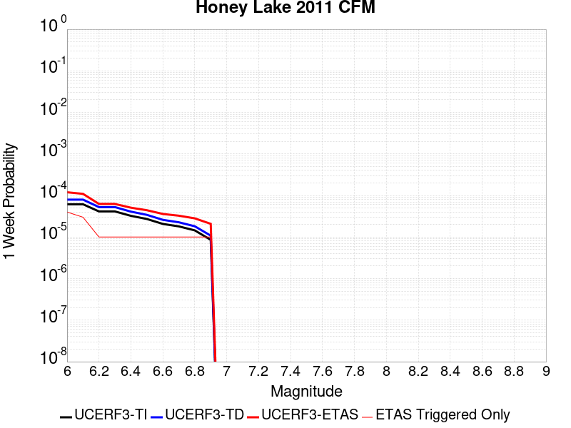 |  |  | 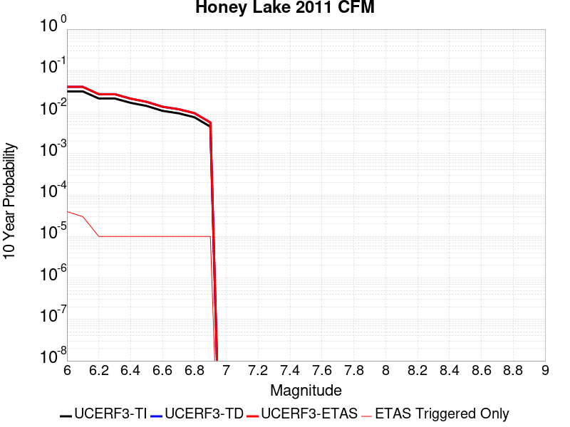 |

| Magnitude | 1 wk TI Prob | 1 wk TD Prob | 1 wk ETAS Prob | 1 wk ETAS/TD Gain | 1 wk ETAS Triggered Only | 1 mo TI Prob | 1 mo TD Prob | 1 mo ETAS Prob | 1 mo ETAS/TD Gain | 1 mo ETAS Triggered Only | 1 yr TI Prob | 1 yr TD Prob | 1 yr ETAS Prob | 1 yr ETAS/TD Gain | 1 yr ETAS Triggered Only | 10 yr TI Prob | 10 yr TD Prob | 10 yr ETAS Prob | 10 yr ETAS/TD Gain | 10 yr ETAS Triggered Only |
|-----|-----|-----|-----|-----|-----|-----|-----|-----|-----|-----|-----|-----|-----|-----|-----|-----|-----|-----|-----|-----|
| 6.0 | 6.155506E-5 | 7.954667E-5 | 1.1954348E-4 | 1.5028095 | 4.0E-5 | 2.6378073E-4 | 3.40873E-4 | 3.8085936E-4 | 1.1173058 | 4.0E-5 | 0.0032068014 | 0.0041427943 | 0.004182629 | 1.0096153 | 4.0E-5 | 0.03160919 | 0.040702924 | 0.040741295 | 1.0009427 | 4.0E-5 |
| 6.1 | 6.155506E-5 | 7.954667E-5 | 1.0954428E-4 | 1.3771071 | 3.0E-5 | 2.6378073E-4 | 3.40873E-4 | 3.7086278E-4 | 1.0879793 | 3.0E-5 | 0.0032068014 | 0.0041427943 | 0.00417267 | 1.0072114 | 3.0E-5 | 0.03160919 | 0.040702924 | 0.040731702 | 1.000707 | 3.0E-5 |
| 6.2 | 4.1335024E-5 | 5.257629E-5 | 6.257577E-5 | 1.1901898 | 1.0E-5 | 1.7713808E-4 | 2.253086E-4 | 2.3530635E-4 | 1.0443735 | 1.0E-5 | 0.0021545228 | 0.0027398595 | 0.002749832 | 1.0036398 | 1.0E-5 | 0.021337535 | 0.027076708 | 0.027086439 | 1.0003593 | 1.0E-5 |
| 6.3 | 4.1335024E-5 | 5.257629E-5 | 6.257577E-5 | 1.1901898 | 1.0E-5 | 1.7713808E-4 | 2.253086E-4 | 2.3530635E-4 | 1.0443735 | 1.0E-5 | 0.0021545228 | 0.0027398595 | 0.002749832 | 1.0036398 | 1.0E-5 | 0.021337535 | 0.027076708 | 0.027086439 | 1.0003593 | 1.0E-5 |
| 6.4 | 3.2393702E-5 | 4.0887444E-5 | 5.0887036E-5 | 1.2445638 | 1.0E-5 | 1.3882275E-4 | 1.7522085E-4 | 1.8521909E-4 | 1.0570608 | 1.0E-5 | 0.0016888566 | 0.002131335 | 0.0021413136 | 1.004682 | 1.0E-5 | 0.016760793 | 0.02111982 | 0.02112961 | 1.0004635 | 1.0E-5 |
| 6.5 | 2.7205504E-5 | 3.4211684E-5 | 4.421134E-5 | 1.2922878 | 1.0E-5 | 1.1658981E-4 | 1.4661385E-4 | 1.5661238E-4 | 1.0681964 | 1.0E-5 | 0.0014185566 | 0.0017836588 | 0.0017936409 | 1.0055964 | 1.0E-5 | 0.014095354 | 0.017702932 | 0.017712755 | 1.0005549 | 1.0E-5 |
| 6.6 | 2.069265E-5 | 2.5955307E-5 | 3.5955047E-5 | 1.3852676 | 1.0E-5 | 8.867977E-5 | 1.1123277E-4 | 1.21231664E-4 | 1.0898916 | 1.0E-5 | 0.0010791414 | 0.0013535038 | 0.0013634902 | 1.0073782 | 1.0E-5 | 0.010739161 | 0.013461002 | 0.013470868 | 1.0007329 | 1.0E-5 |
| 6.7 | 1.8060919E-5 | 2.2656828E-5 | 3.26566E-5 | 1.4413581 | 1.0E-5 | 7.7401644E-5 | 9.709754E-5 | 1.07096566E-4 | 1.1029792 | 1.0E-5 | 9.419576E-4 | 0.0011816026 | 0.0011915908 | 1.0084531 | 1.0E-5 | 0.009379748 | 0.011761238 | 0.01177112 | 1.0008403 | 1.0E-5 |
| 6.8 | 1.4474663E-5 | 1.818127E-5 | 2.818109E-5 | 1.5500065 | 1.0E-5 | 6.203279E-5 | 7.791784E-5 | 8.791706E-5 | 1.1283303 | 1.0E-5 | 7.5498753E-4 | 9.483136E-4 | 9.583041E-4 | 1.010535 | 1.0E-5 | 0.007524277 | 0.009450192 | 0.009460097 | 1.0010482 | 1.0E-5 |
| 6.9 | 8.564552E-6 | 1.0802308E-5 | 2.08022E-5 | 1.9257182 | 1.0E-5 | 3.6704707E-5 | 4.6295158E-5 | 5.6294695E-5 | 1.2159953 | 1.0E-5 | 4.4678818E-4 | 5.635644E-4 | 5.735588E-4 | 1.0177342 | 1.0E-5 | 0.0044589094 | 0.0056278477 | 0.0056377915 | 1.0017669 | 1.0E-5 |

## Cleghorn
*[(top)](#table-of-contents)*

| 1 Week | 1 Month | 1 Year | 10 Year |
|-----|-----|-----|-----|
|  |  |  | 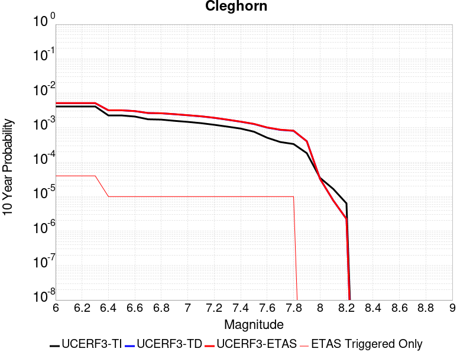 |

| Magnitude | 1 wk TI Prob | 1 wk TD Prob | 1 wk ETAS Prob | 1 wk ETAS/TD Gain | 1 wk ETAS Triggered Only | 1 mo TI Prob | 1 mo TD Prob | 1 mo ETAS Prob | 1 mo ETAS/TD Gain | 1 mo ETAS Triggered Only | 1 yr TI Prob | 1 yr TD Prob | 1 yr ETAS Prob | 1 yr ETAS/TD Gain | 1 yr ETAS Triggered Only | 10 yr TI Prob | 10 yr TD Prob | 10 yr ETAS Prob | 10 yr ETAS/TD Gain | 10 yr ETAS Triggered Only |
|-----|-----|-----|-----|-----|-----|-----|-----|-----|-----|-----|-----|-----|-----|-----|-----|-----|-----|-----|-----|-----|
| 6.0 | 7.9267165E-6 | 9.831582E-6 | 9.831582E-6 | 1.0 | 0.0 | 3.39712E-5 | 4.2134732E-5 | 4.2134732E-5 | 1.0 | 0.0 | 4.1352084E-4 | 5.128803E-4 | 5.228751E-4 | 1.0194877 | 1.0E-5 | 0.004127522 | 0.0051320773 | 0.0051718717 | 1.0077541 | 4.0E-5 |
| 6.1 | 7.9267165E-6 | 9.831582E-6 | 9.831582E-6 | 1.0 | 0.0 | 3.39712E-5 | 4.2134732E-5 | 4.2134732E-5 | 1.0 | 0.0 | 4.1352084E-4 | 5.128803E-4 | 5.228751E-4 | 1.0194877 | 1.0E-5 | 0.004127522 | 0.0051320773 | 0.0051718717 | 1.0077541 | 4.0E-5 |
| 6.2 | 7.9267165E-6 | 9.831582E-6 | 9.831582E-6 | 1.0 | 0.0 | 3.39712E-5 | 4.2134732E-5 | 4.2134732E-5 | 1.0 | 0.0 | 4.1352084E-4 | 5.128803E-4 | 5.228751E-4 | 1.0194877 | 1.0E-5 | 0.004127522 | 0.0051320773 | 0.0051718717 | 1.0077541 | 4.0E-5 |
| 6.3 | 7.9267165E-6 | 9.831582E-6 | 9.831582E-6 | 1.0 | 0.0 | 3.39712E-5 | 4.2134732E-5 | 4.2134732E-5 | 1.0 | 0.0 | 4.1352084E-4 | 5.128803E-4 | 5.228751E-4 | 1.0194877 | 1.0E-5 | 0.004127522 | 0.0051320773 | 0.0051718717 | 1.0077541 | 4.0E-5 |
| 6.4 | 4.3445207E-6 | 6.0914435E-6 | 6.0914435E-6 | 1.0 | 0.0 | 1.8619241E-5 | 2.610593E-5 | 2.610593E-5 | 1.0 | 0.0 | 2.2666567E-4 | 3.1779436E-4 | 3.1779436E-4 | 1.0 | 0.0 | 0.0022643462 | 0.0031875873 | 0.0031975554 | 1.0031272 | 1.0E-5 |
| 6.5 | 4.3445207E-6 | 6.0914435E-6 | 6.0914435E-6 | 1.0 | 0.0 | 1.8619241E-5 | 2.610593E-5 | 2.610593E-5 | 1.0 | 0.0 | 2.2666567E-4 | 3.1779436E-4 | 3.1779436E-4 | 1.0 | 0.0 | 0.0022643462 | 0.0031875873 | 0.0031975554 | 1.0031272 | 1.0E-5 |
| 6.6 | 4.040109E-6 | 5.773851E-6 | 5.773851E-6 | 1.0 | 0.0 | 1.7314638E-5 | 2.4744846E-5 | 2.4744846E-5 | 1.0 | 0.0 | 2.1078532E-4 | 3.012278E-4 | 3.012278E-4 | 1.0 | 0.0 | 0.002105855 | 0.003022377 | 0.0030323467 | 1.0032986 | 1.0E-5 |
| 6.7 | 3.3632055E-6 | 5.067348E-6 | 5.067348E-6 | 1.0 | 0.0 | 1.4413658E-5 | 2.1717027E-5 | 2.1717027E-5 | 1.0 | 0.0 | 1.7547216E-4 | 2.6437303E-4 | 2.6437303E-4 | 1.0 | 0.0 | 0.0017533366 | 0.0026547113 | 0.0026646846 | 1.0037569 | 1.0E-5 |
| 6.8 | 3.2902772E-6 | 4.9892556E-6 | 4.9892556E-6 | 1.0 | 0.0 | 1.4101111E-5 | 2.1382351E-5 | 2.1382351E-5 | 1.0 | 0.0 | 1.716675E-4 | 2.6029933E-4 | 2.6029933E-4 | 1.0 | 0.0 | 0.0017153495 | 0.0026140702 | 0.002624044 | 1.0038154 | 1.0E-5 |
| 6.9 | 3.031547E-6 | 4.6910186E-6 | 4.6910186E-6 | 1.0 | 0.0 | 1.299228E-5 | 2.0104211E-5 | 2.0104211E-5 | 1.0 | 0.0 | 1.5816953E-4 | 2.4474156E-4 | 2.4474156E-4 | 1.0 | 0.0 | 0.00158057 | 0.0024588439 | 0.0024688193 | 1.0040569 | 1.0E-5 |
| 7.0 | 2.8259715E-6 | 4.3705895E-6 | 4.3705895E-6 | 1.0 | 0.0 | 1.211125E-5 | 1.8730963E-5 | 1.8730963E-5 | 1.0 | 0.0 | 1.4744449E-4 | 2.2802586E-4 | 2.2802586E-4 | 1.0 | 0.0 | 0.001473467 | 0.0022920412 | 0.0023020182 | 1.0043529 | 1.0E-5 |
| 7.1 | 2.5962665E-6 | 4.0658106E-6 | 4.0658106E-6 | 1.0 | 0.0 | 1.1126809E-5 | 1.7424789E-5 | 1.7424789E-5 | 1.0 | 0.0 | 1.3546048E-4 | 2.1212637E-4 | 2.1212637E-4 | 1.0 | 0.0 | 0.0013537793 | 0.002133366 | 0.0021433446 | 1.0046774 | 1.0E-5 |
| 7.2 | 2.3247253E-6 | 3.6763672E-6 | 3.6763672E-6 | 1.0 | 0.0 | 9.96307E-6 | 1.5755764E-5 | 1.5755764E-5 | 1.0 | 0.0 | 1.21293626E-4 | 1.9180974E-4 | 1.9180974E-4 | 1.0 | 0.0 | 0.0012122744 | 0.0019305905 | 0.0019405711 | 1.0051697 | 1.0E-5 |
| 7.3 | 2.056928E-6 | 3.2350938E-6 | 3.2350938E-6 | 1.0 | 0.0 | 8.815376E-6 | 1.3864615E-5 | 1.3864615E-5 | 1.0 | 0.0 | 1.0732192E-4 | 1.6878877E-4 | 1.6878877E-4 | 1.0 | 0.0 | 0.001072701 | 0.0017008206 | 0.0017108036 | 1.0058695 | 1.0E-5 |
| 7.4 | 1.8055999E-6 | 2.8255042E-6 | 2.8255042E-6 | 1.0 | 0.0 | 7.738263E-6 | 1.2109249E-5 | 1.2109249E-5 | 1.0 | 0.0 | 9.4209274E-5 | 1.4742027E-4 | 1.4742027E-4 | 1.0 | 0.0 | 9.4169343E-4 | 0.0014875771 | 0.0014975623 | 1.0067123 | 1.0E-5 |
| 7.5 | 1.4683443E-6 | 2.4247483E-6 | 2.4247483E-6 | 1.0 | 0.0 | 6.292889E-6 | 1.0391738E-5 | 1.0391738E-5 | 1.0 | 0.0 | 7.661323E-5 | 1.2651215E-4 | 1.2651215E-4 | 1.0 | 0.0 | 7.658682E-4 | 0.0012787961 | 0.0012887834 | 1.0078099 | 1.0E-5 |
| 7.6 | 9.804088E-7 | 1.900266E-6 | 1.900266E-6 | 1.0 | 0.0 | 4.201745E-6 | 8.143972E-6 | 8.143972E-6 | 1.0 | 0.0 | 5.1155046E-5 | 9.91484E-5 | 9.91484E-5 | 1.0 | 0.0 | 5.114327E-4 | 0.001005471 | 0.0010154609 | 1.0099356 | 1.0E-5 |
| 7.7 | 7.3434086E-7 | 1.6284146E-6 | 1.6284146E-6 | 1.0 | 0.0 | 3.1471714E-6 | 6.978901E-6 | 6.978901E-6 | 1.0 | 0.0 | 3.831614E-5 | 8.4964835E-5 | 8.4964835E-5 | 1.0 | 0.0 | 3.8309532E-4 | 8.6378685E-4 | 8.737782E-4 | 1.0115669 | 1.0E-5 |
| 7.8 | 6.434184E-7 | 1.5220047E-6 | 1.5220047E-6 | 1.0 | 0.0 | 2.7575045E-6 | 6.5228614E-6 | 6.5228614E-6 | 1.0 | 0.0 | 3.35721E-5 | 7.941297E-5 | 7.941297E-5 | 1.0 | 0.0 | 3.3567028E-4 | 8.079678E-4 | 8.179597E-4 | 1.0123668 | 1.0E-5 |
| 7.9 | 3.4943926E-7 | 7.574459E-7 | 7.574459E-7 | 1.0 | 0.0 | 1.497596E-6 | 3.2461926E-6 | 3.2461926E-6 | 1.0 | 0.0 | 1.8233079E-5 | 3.952169E-5 | 3.952169E-5 | 1.0 | 0.0 | 1.8231584E-4 | 4.040099E-4 | 4.040099E-4 | 1.0 | 0.0 |
| 8.0 | 6.717524E-8 | 5.838828E-8 | 5.838828E-8 | 1.0 | 0.0 | 2.8789387E-7 | 2.5023547E-7 | 2.5023547E-7 | 1.0 | 0.0 | 3.505102E-6 | 3.0466126E-6 | 3.0466126E-6 | 1.0 | 0.0 | 3.5050467E-5 | 3.273506E-5 | 3.273506E-5 | 1.0 | 0.0 |
| 8.1 | 3.1984914E-8 | 1.2956093E-8 | 1.2956093E-8 | 1.0 | 0.0 | 1.370782E-7 | 5.552611E-8 | 5.552611E-8 | 1.0 | 0.0 | 1.6689258E-6 | 6.760302E-7 | 6.760302E-7 | 1.0 | 0.0 | 1.6689133E-5 | 7.74454E-6 | 7.74454E-6 | 1.0 | 0.0 |
| 8.2 | 1.21887656E-8 | 3.6495305E-9 | 3.6495305E-9 | 1.0 | 0.0 | 5.2237567E-8 | 1.5640845E-8 | 1.5640845E-8 | 1.0 | 0.0 | 6.359922E-7 | 1.9042727E-7 | 1.9042727E-7 | 1.0 | 0.0 | 6.3599036E-6 | 2.2470974E-6 | 2.2470974E-6 | 1.0 | 0.0 |

## Hunting Creek - Berryessa 2011 CFM
*[(top)](#table-of-contents)*

| 1 Week | 1 Month | 1 Year | 10 Year |
|-----|-----|-----|-----|
| 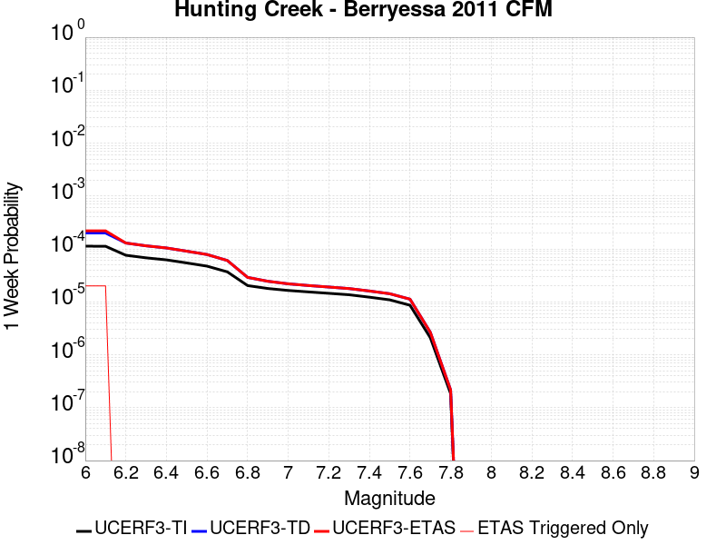 |  |  | 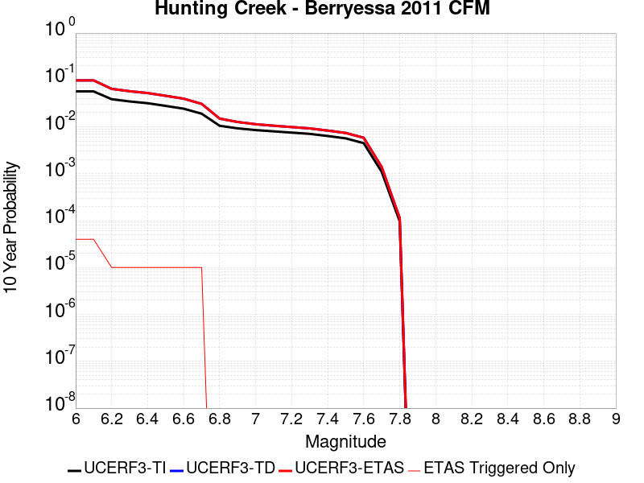 |

| Magnitude | 1 wk TI Prob | 1 wk TD Prob | 1 wk ETAS Prob | 1 wk ETAS/TD Gain | 1 wk ETAS Triggered Only | 1 mo TI Prob | 1 mo TD Prob | 1 mo ETAS Prob | 1 mo ETAS/TD Gain | 1 mo ETAS Triggered Only | 1 yr TI Prob | 1 yr TD Prob | 1 yr ETAS Prob | 1 yr ETAS/TD Gain | 1 yr ETAS Triggered Only | 10 yr TI Prob | 10 yr TD Prob | 10 yr ETAS Prob | 10 yr ETAS/TD Gain | 10 yr ETAS Triggered Only |
|-----|-----|-----|-----|-----|-----|-----|-----|-----|-----|-----|-----|-----|-----|-----|-----|-----|-----|-----|-----|-----|
| 6.0 | 1.1270982E-4 | 2.0012174E-4 | 2.2011774E-4 | 1.0999192 | 2.0E-5 | 4.8295266E-4 | 8.5739547E-4 | 8.7737833E-4 | 1.0233065 | 2.0E-5 | 0.0058641075 | 0.010386313 | 0.010406105 | 1.0019056 | 2.0E-5 | 0.057117578 | 0.09803703 | 0.0980731 | 1.000368 | 4.0E-5 |
| 6.1 | 1.1239393E-4 | 1.9960315E-4 | 2.1959915E-4 | 1.1001788 | 2.0E-5 | 4.8159933E-4 | 8.551744E-4 | 8.751573E-4 | 1.023367 | 2.0E-5 | 0.0058477195 | 0.010359551 | 0.010379344 | 1.0019106 | 2.0E-5 | 0.056962132 | 0.09779551 | 0.09783159 | 1.0003691 | 4.0E-5 |
| 6.2 | 7.596265E-5 | 1.2940196E-4 | 1.2940196E-4 | 1.0 | 0.0 | 3.2551357E-4 | 5.5444165E-4 | 5.5444165E-4 | 1.0 | 0.0 | 0.0039559277 | 0.0067210156 | 0.0067210156 | 1.0 | 0.0 | 0.038862433 | 0.0645915 | 0.064600855 | 1.0001448 | 1.0E-5 |
| 6.3 | 6.78794E-5 | 1.145119E-4 | 1.145119E-4 | 1.0 | 0.0 | 2.9087928E-4 | 4.906513E-4 | 4.906513E-4 | 1.0 | 0.0 | 0.003535705 | 0.005952679 | 0.005952679 | 1.0 | 0.0 | 0.034799766 | 0.057465393 | 0.057474818 | 1.000164 | 1.0E-5 |
| 6.4 | 6.2165134E-5 | 1.0436625E-4 | 1.0436625E-4 | 1.0 | 0.0 | 2.6639478E-4 | 4.4721062E-4 | 4.4721062E-4 | 1.0 | 0.0 | 0.0032385332 | 0.005427573 | 0.005427573 | 1.0 | 0.0 | 0.03191742 | 0.052550517 | 0.05255999 | 1.0001802 | 1.0E-5 |
| 6.5 | 5.4368087E-5 | 9.071415E-5 | 9.071415E-5 | 1.0 | 0.0 | 2.3298527E-4 | 3.8872007E-4 | 3.8872007E-4 | 1.0 | 0.0 | 0.0028329059 | 0.0047198683 | 0.0047198683 | 1.0 | 0.0 | 0.027970633 | 0.045880128 | 0.04588967 | 1.0002079 | 1.0E-5 |
| 6.6 | 4.729947E-5 | 7.847572E-5 | 7.847572E-5 | 1.0 | 0.0 | 2.0269625E-4 | 3.362842E-4 | 3.362842E-4 | 1.0 | 0.0 | 0.002465034 | 0.0040849647 | 0.0040849647 | 1.0 | 0.0 | 0.02437869 | 0.03985155 | 0.03986115 | 1.0002409 | 1.0E-5 |
| 6.7 | 3.6875328E-5 | 6.0451803E-5 | 6.0451803E-5 | 1.0 | 0.0 | 1.5802756E-4 | 2.59056E-4 | 2.59056E-4 | 1.0 | 0.0 | 0.0019222875 | 0.0031482063 | 0.0031482063 | 1.0 | 0.0 | 0.019057442 | 0.03089237 | 0.030902062 | 1.0003138 | 1.0E-5 |
| 6.8 | 2.0292036E-5 | 2.8976308E-5 | 2.8976308E-5 | 1.0 | 0.0 | 8.6962966E-5 | 1.2417832E-4 | 1.2417832E-4 | 1.0 | 0.0 | 0.0010582599 | 0.0015108072 | 0.0015108072 | 1.0 | 0.0 | 0.010532344 | 0.014978523 | 0.014978523 | 1.0 | 0.0 |
| 6.9 | 1.7871042E-5 | 2.4472254E-5 | 2.4472254E-5 | 1.0 | 0.0 | 7.658793E-5 | 1.048769E-4 | 1.048769E-4 | 1.0 | 0.0 | 9.320591E-4 | 0.0012761299 | 0.0012761299 | 1.0 | 0.0 | 0.009281595 | 0.012679775 | 0.012679775 | 1.0 | 0.0 |
| 7.0 | 1.6415532E-5 | 2.1906277E-5 | 2.1906277E-5 | 1.0 | 0.0 | 7.035038E-5 | 9.3880684E-5 | 9.3880684E-5 | 1.0 | 0.0 | 8.561793E-4 | 0.0011424015 | 0.0011424015 | 1.0 | 0.0 | 0.008528882 | 0.01136452 | 0.01136452 | 1.0 | 0.0 |
| 7.1 | 1.5409885E-5 | 2.0346342E-5 | 2.0346342E-5 | 1.0 | 0.0 | 6.6040695E-5 | 8.7195716E-5 | 8.7195716E-5 | 1.0 | 0.0 | 8.0374884E-4 | 0.0010610938 | 0.0010610938 | 1.0 | 0.0 | 0.00800848 | 0.010560595 | 0.010560595 | 1.0 | 0.0 |
| 7.2 | 1.4497423E-5 | 1.9054964E-5 | 1.9054964E-5 | 1.0 | 0.0 | 6.213033E-5 | 8.166159E-5 | 8.166159E-5 | 1.0 | 0.0 | 7.5617427E-4 | 9.937795E-4 | 9.937795E-4 | 1.0 | 0.0 | 0.0075360634 | 0.009893929 | 0.009893929 | 1.0 | 0.0 |
| 7.3 | 1.3615175E-5 | 1.7826127E-5 | 1.7826127E-5 | 1.0 | 0.0 | 5.8349444E-5 | 7.639547E-5 | 7.639547E-5 | 1.0 | 0.0 | 7.101729E-4 | 9.297209E-4 | 9.297209E-4 | 1.0 | 0.0 | 0.0070790765 | 0.009258823 | 0.009258823 | 1.0 | 0.0 |
| 7.4 | 1.2252825E-5 | 1.602625E-5 | 1.602625E-5 | 1.0 | 0.0 | 5.251105E-5 | 6.868213E-5 | 6.868213E-5 | 1.0 | 0.0 | 6.391345E-4 | 8.35887E-4 | 8.35887E-4 | 1.0 | 0.0 | 0.0063729943 | 0.008327872 | 0.008327872 | 1.0 | 0.0 |
| 7.5 | 1.0913301E-5 | 1.4241117E-5 | 1.4241117E-5 | 1.0 | 0.0 | 4.6770452E-5 | 6.1031948E-5 | 6.1031948E-5 | 1.0 | 0.0 | 5.6928146E-4 | 7.4281334E-4 | 7.4281334E-4 | 1.0 | 0.0 | 0.0056782532 | 0.0074036797 | 0.0074036797 | 1.0 | 0.0 |
| 7.6 | 8.623192E-6 | 1.12346415E-5 | 1.12346415E-5 | 1.0 | 0.0 | 3.6956015E-5 | 4.814759E-5 | 4.814759E-5 | 1.0 | 0.0 | 4.4984656E-4 | 5.8604183E-4 | 5.8604183E-4 | 1.0 | 0.0 | 0.00448937 | 0.0058452785 | 0.0058452785 | 1.0 | 0.0 |
| 7.7 | 2.0993634E-6 | 2.662584E-6 | 2.662584E-6 | 1.0 | 0.0 | 8.997241E-6 | 1.1411025E-5 | 1.1411025E-5 | 1.0 | 0.0 | 1.09535904E-4 | 1.3892044E-4 | 1.3892044E-4 | 1.0 | 0.0 | 0.0010948193 | 0.0013883426 | 0.0013883426 | 1.0 | 0.0 |
| 7.8 | 1.8428308E-7 | 2.167437E-7 | 2.167437E-7 | 1.0 | 0.0 | 7.897844E-7 | 9.289013E-7 | 9.289013E-7 | 1.0 | 0.0 | 9.615583E-6 | 1.1309318E-5 | 1.1309318E-5 | 1.0 | 0.0 | 9.615166E-5 | 1.13086026E-4 | 1.13086026E-4 | 1.0 | 0.0 |

## San Gabriel
*[(top)](#table-of-contents)*

| 1 Week | 1 Month | 1 Year | 10 Year |
|-----|-----|-----|-----|
|  |  |  | 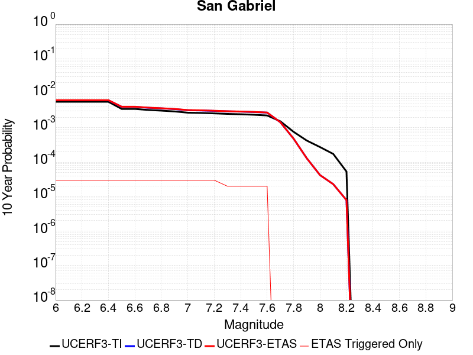 |

| Magnitude | 1 wk TI Prob | 1 wk TD Prob | 1 wk ETAS Prob | 1 wk ETAS/TD Gain | 1 wk ETAS Triggered Only | 1 mo TI Prob | 1 mo TD Prob | 1 mo ETAS Prob | 1 mo ETAS/TD Gain | 1 mo ETAS Triggered Only | 1 yr TI Prob | 1 yr TD Prob | 1 yr ETAS Prob | 1 yr ETAS/TD Gain | 1 yr ETAS Triggered Only | 10 yr TI Prob | 10 yr TD Prob | 10 yr ETAS Prob | 10 yr ETAS/TD Gain | 10 yr ETAS Triggered Only |
|-----|-----|-----|-----|-----|-----|-----|-----|-----|-----|-----|-----|-----|-----|-----|-----|-----|-----|-----|-----|-----|
| 6.0 | 1.083775E-5 | 1.19851875E-5 | 2.1985068E-5 | 1.8343532 | 1.0E-5 | 4.6446676E-5 | 5.1364143E-5 | 8.13626E-5 | 1.584035 | 3.0E-5 | 5.653415E-4 | 6.251903E-4 | 6.551716E-4 | 1.0479554 | 3.0E-5 | 0.0056390543 | 0.006246409 | 0.0062762215 | 1.0047728 | 3.0E-5 |
| 6.1 | 1.083775E-5 | 1.19851875E-5 | 2.1985068E-5 | 1.8343532 | 1.0E-5 | 4.6446676E-5 | 5.1364143E-5 | 8.13626E-5 | 1.584035 | 3.0E-5 | 5.653415E-4 | 6.251903E-4 | 6.551716E-4 | 1.0479554 | 3.0E-5 | 0.0056390543 | 0.006246409 | 0.0062762215 | 1.0047728 | 3.0E-5 |
| 6.2 | 1.083775E-5 | 1.19851875E-5 | 2.1985068E-5 | 1.8343532 | 1.0E-5 | 4.6446676E-5 | 5.1364143E-5 | 8.13626E-5 | 1.584035 | 3.0E-5 | 5.653415E-4 | 6.251903E-4 | 6.551716E-4 | 1.0479554 | 3.0E-5 | 0.0056390543 | 0.006246409 | 0.0062762215 | 1.0047728 | 3.0E-5 |
| 6.3 | 1.083775E-5 | 1.19851875E-5 | 2.1985068E-5 | 1.8343532 | 1.0E-5 | 4.6446676E-5 | 5.1364143E-5 | 8.13626E-5 | 1.584035 | 3.0E-5 | 5.653415E-4 | 6.251903E-4 | 6.551716E-4 | 1.0479554 | 3.0E-5 | 0.0056390543 | 0.006246409 | 0.0062762215 | 1.0047728 | 3.0E-5 |
| 6.4 | 1.083775E-5 | 1.19851875E-5 | 2.1985068E-5 | 1.8343532 | 1.0E-5 | 4.6446676E-5 | 5.1364143E-5 | 8.13626E-5 | 1.584035 | 3.0E-5 | 5.653415E-4 | 6.251903E-4 | 6.551716E-4 | 1.0479554 | 3.0E-5 | 0.0056390543 | 0.006246409 | 0.0062762215 | 1.0047728 | 3.0E-5 |
| 6.5 | 6.7317824E-6 | 7.716944E-6 | 1.7716868E-5 | 2.2958395 | 1.0E-5 | 2.8850178E-5 | 3.3072207E-5 | 6.307122E-5 | 1.9070761 | 3.0E-5 | 3.511943E-4 | 4.0258077E-4 | 4.325687E-4 | 1.0744892 | 3.0E-5 | 0.003506398 | 0.0040296097 | 0.004059489 | 1.0074149 | 3.0E-5 |
| 6.6 | 6.7317824E-6 | 7.716944E-6 | 1.7716868E-5 | 2.2958395 | 1.0E-5 | 2.8850178E-5 | 3.3072207E-5 | 6.307122E-5 | 1.9070761 | 3.0E-5 | 3.511943E-4 | 4.0258077E-4 | 4.325687E-4 | 1.0744892 | 3.0E-5 | 0.003506398 | 0.0040296097 | 0.004059489 | 1.0074149 | 3.0E-5 |
| 6.7 | 6.274881E-6 | 7.2458647E-6 | 1.7245793E-5 | 2.3800876 | 1.0E-5 | 2.6892068E-5 | 3.1053343E-5 | 6.105241E-5 | 1.9660496 | 3.0E-5 | 3.2736175E-4 | 3.780098E-4 | 4.0799848E-4 | 1.0793331 | 3.0E-5 | 0.0032687993 | 0.0037847564 | 0.0038146428 | 1.0078965 | 3.0E-5 |
| 6.8 | 5.996209E-6 | 6.958585E-6 | 1.6958515E-5 | 2.4370637 | 1.0E-5 | 2.5697784E-5 | 2.9822171E-5 | 5.9821275E-5 | 2.005933 | 3.0E-5 | 3.128256E-4 | 3.6302538E-4 | 3.930145E-4 | 1.0826088 | 3.0E-5 | 0.003123856 | 0.0036354093 | 0.0036653003 | 1.0082222 | 3.0E-5 |
| 6.9 | 5.686331E-6 | 6.6236316E-6 | 1.6623566E-5 | 2.5097358 | 1.0E-5 | 2.4369761E-5 | 2.8386688E-5 | 5.838584E-5 | 2.0568035 | 3.0E-5 | 2.9666146E-4 | 3.4555403E-4 | 3.7554366E-4 | 1.0867871 | 3.0E-5 | 0.0029626573 | 0.0034612515 | 0.0034911477 | 1.0086374 | 3.0E-5 |
| 7.0 | 5.2329838E-6 | 6.147514E-6 | 1.6147453E-5 | 2.6266637 | 1.0E-5 | 2.242688E-5 | 2.6346226E-5 | 5.6345438E-5 | 2.138653 | 3.0E-5 | 2.7301308E-4 | 3.2071886E-4 | 3.5070925E-4 | 1.0935099 | 3.0E-5 | 0.002726779 | 0.0032136322 | 0.0032435358 | 1.0093052 | 3.0E-5 |
| 7.1 | 5.135671E-6 | 6.03764E-6 | 1.603758E-5 | 2.6562662 | 1.0E-5 | 2.2009834E-5 | 2.5875348E-5 | 5.587457E-5 | 2.1593747 | 3.0E-5 | 2.6793676E-4 | 3.1498758E-4 | 3.4497812E-4 | 1.0952119 | 3.0E-5 | 0.0026761394 | 0.0031564834 | 0.0031863886 | 1.0094743 | 3.0E-5 |
| 7.2 | 4.989062E-6 | 5.87102E-6 | 1.587096E-5 | 2.7032714 | 1.0E-5 | 2.1381518E-5 | 2.5161276E-5 | 5.5160523E-5 | 2.1922784 | 3.0E-5 | 2.6028889E-4 | 3.0629625E-4 | 3.3628705E-4 | 1.0979143 | 3.0E-5 | 0.0025998424 | 0.003069813 | 0.0030997207 | 1.0097426 | 3.0E-5 |
| 7.3 | 4.8219395E-6 | 5.702574E-6 | 1.5702517E-5 | 2.753584 | 1.0E-5 | 2.0665291E-5 | 2.443938E-5 | 4.443889E-5 | 1.8183314 | 2.0E-5 | 2.5157086E-4 | 2.9750957E-4 | 3.175036E-4 | 1.0672047 | 2.0E-5 | 0.0025128627 | 0.0029821852 | 0.0030021255 | 1.0066864 | 2.0E-5 |
| 7.4 | 4.7118383E-6 | 5.5911332E-6 | 1.5591077E-5 | 2.7885363 | 1.0E-5 | 2.0193436E-5 | 2.3961782E-5 | 4.3961303E-5 | 1.8346424 | 2.0E-5 | 2.4582737E-4 | 2.916964E-4 | 3.1169056E-4 | 1.0685444 | 2.0E-5 | 0.002455556 | 0.0029242067 | 0.0029441481 | 1.0068195 | 2.0E-5 |
| 7.5 | 4.5506545E-6 | 5.4365014E-6 | 1.5436446E-5 | 2.8394084 | 1.0E-5 | 1.9502659E-5 | 2.3299088E-5 | 4.329862E-5 | 1.8583827 | 2.0E-5 | 2.37419E-4 | 2.8363022E-4 | 3.0362455E-4 | 1.0704943 | 2.0E-5 | 0.002371655 | 0.002843753 | 0.002863696 | 1.007013 | 2.0E-5 |
| 7.6 | 4.343636E-6 | 5.2293817E-6 | 1.522933E-5 | 2.912262 | 1.0E-5 | 1.861545E-5 | 2.2411448E-5 | 4.2411E-5 | 1.8923811 | 2.0E-5 | 2.2661954E-4 | 2.7282597E-4 | 2.928205E-4 | 1.0732868 | 2.0E-5 | 0.0022638857 | 0.0027359722 | 0.0027559176 | 1.00729 | 2.0E-5 |
| 7.7 | 2.936235E-6 | 2.7440458E-6 | 2.7440458E-6 | 1.0 | 0.0 | 1.2583803E-5 | 1.1760143E-5 | 1.1760143E-5 | 1.0 | 0.0 | 1.5319703E-4 | 1.4317037E-4 | 1.4317037E-4 | 1.0 | 0.0 | 0.0015309147 | 0.0014380751 | 0.0014380751 | 1.0 | 0.0 |
| 7.8 | 1.4541639E-6 | 9.1237047E-7 | 9.1237047E-7 | 1.0 | 0.0 | 6.232116E-6 | 3.9101533E-6 | 3.9101533E-6 | 1.0 | 0.0 | 7.587337E-5 | 4.7605077E-5 | 4.7605077E-5 | 1.0 | 0.0 | 7.584747E-4 | 4.8085177E-4 | 4.8085177E-4 | 1.0 | 0.0 |
| 7.9 | 8.098958E-7 | 2.41753E-7 | 2.41753E-7 | 1.0 | 0.0 | 3.4709774E-6 | 1.0360839E-6 | 1.0360839E-6 | 1.0 | 0.0 | 4.225833E-5 | 1.2614248E-5 | 1.2614248E-5 | 1.0 | 0.0 | 4.2250296E-4 | 1.2921814E-4 | 1.2921814E-4 | 1.0 | 0.0 |
| 8.0 | 5.2473234E-7 | 7.6792055E-8 | 7.6792055E-8 | 1.0 | 0.0 | 2.248851E-6 | 3.2910876E-7 | 3.2910876E-7 | 1.0 | 0.0 | 2.7379416E-5 | 4.0068917E-6 | 4.0068917E-6 | 1.0 | 0.0 | 2.7376044E-4 | 4.21918E-5 | 4.21918E-5 | 1.0 | 0.0 |
| 8.1 | 3.3162388E-7 | 4.1496126E-8 | 4.1496126E-8 | 1.0 | 0.0 | 1.4212444E-6 | 1.7784053E-7 | 1.7784053E-7 | 1.0 | 0.0 | 1.7303513E-5 | 2.1652063E-6 | 2.1652063E-6 | 1.0 | 0.0 | 1.7302166E-4 | 2.2965523E-5 | 2.2965523E-5 | 1.0 | 0.0 |
| 8.2 | 1.0235345E-7 | 1.4043474E-8 | 1.4043474E-8 | 1.0 | 0.0 | 4.3865757E-7 | 6.0186316E-8 | 6.0186316E-8 | 1.0 | 0.0 | 5.340643E-6 | 7.327681E-7 | 7.327681E-7 | 1.0 | 0.0 | 5.3405143E-5 | 7.9273705E-6 | 7.9273705E-6 | 1.0 | 0.0 |

## San Juan
*[(top)](#table-of-contents)*

| 1 Week | 1 Month | 1 Year | 10 Year |
|-----|-----|-----|-----|
|  |  |  |  |

| Magnitude | 1 wk TI Prob | 1 wk TD Prob | 1 wk ETAS Prob | 1 wk ETAS/TD Gain | 1 wk ETAS Triggered Only | 1 mo TI Prob | 1 mo TD Prob | 1 mo ETAS Prob | 1 mo ETAS/TD Gain | 1 mo ETAS Triggered Only | 1 yr TI Prob | 1 yr TD Prob | 1 yr ETAS Prob | 1 yr ETAS/TD Gain | 1 yr ETAS Triggered Only | 10 yr TI Prob | 10 yr TD Prob | 10 yr ETAS Prob | 10 yr ETAS/TD Gain | 10 yr ETAS Triggered Only |
|-----|-----|-----|-----|-----|-----|-----|-----|-----|-----|-----|-----|-----|-----|-----|-----|-----|-----|-----|-----|-----|
| 6.0 | 8.682808E-6 | 8.7491635E-6 | 1.8749077E-5 | 2.1429565 | 1.0E-5 | 3.72115E-5 | 3.74959E-5 | 4.7495527E-5 | 1.2666858 | 1.0E-5 | 4.5295584E-4 | 4.564218E-4 | 4.9640355E-4 | 1.0875982 | 4.0E-5 | 0.004520337 | 0.004555385 | 0.004595203 | 1.0087408 | 4.0E-5 |
| 6.1 | 8.682808E-6 | 8.7491635E-6 | 1.8749077E-5 | 2.1429565 | 1.0E-5 | 3.72115E-5 | 3.74959E-5 | 4.7495527E-5 | 1.2666858 | 1.0E-5 | 4.5295584E-4 | 4.564218E-4 | 4.9640355E-4 | 1.0875982 | 4.0E-5 | 0.004520337 | 0.004555385 | 0.004595203 | 1.0087408 | 4.0E-5 |
| 6.2 | 8.682808E-6 | 8.7491635E-6 | 1.8749077E-5 | 2.1429565 | 1.0E-5 | 3.72115E-5 | 3.74959E-5 | 4.7495527E-5 | 1.2666858 | 1.0E-5 | 4.5295584E-4 | 4.564218E-4 | 4.9640355E-4 | 1.0875982 | 4.0E-5 | 0.004520337 | 0.004555385 | 0.004595203 | 1.0087408 | 4.0E-5 |
| 6.3 | 6.3054235E-6 | 6.2825848E-6 | 1.6282522E-5 | 2.5916915 | 1.0E-5 | 2.7022963E-5 | 2.6925094E-5 | 3.6924826E-5 | 1.3713907 | 1.0E-5 | 3.2895492E-4 | 3.2776513E-4 | 3.5775529E-4 | 1.091499 | 3.0E-5 | 0.003284684 | 0.003273017 | 0.0033029187 | 1.0091358 | 3.0E-5 |
| 6.4 | 6.1490473E-6 | 6.1144656E-6 | 1.6114405E-5 | 2.6354558 | 1.0E-5 | 2.6352795E-5 | 2.6204598E-5 | 3.6204336E-5 | 1.3816024 | 1.0E-5 | 3.2079802E-4 | 3.1899565E-4 | 3.4898607E-4 | 1.0940151 | 3.0E-5 | 0.0032033534 | 0.0031855737 | 0.0032154783 | 1.0093875 | 3.0E-5 |
| 6.5 | 5.204848E-6 | 5.137233E-6 | 1.5137182E-5 | 2.946563 | 1.0E-5 | 2.23063E-5 | 2.2016533E-5 | 3.2016313E-5 | 1.4541941 | 1.0E-5 | 2.7154534E-4 | 2.6801927E-4 | 2.9801123E-4 | 1.1119022 | 3.0E-5 | 0.0027121378 | 0.0026771144 | 0.0027070341 | 1.0111761 | 3.0E-5 |
| 6.6 | 4.5179986E-6 | 4.4150297E-6 | 1.4414985E-5 | 3.2649803 | 1.0E-5 | 1.9362706E-5 | 1.8921424E-5 | 2.8921235E-5 | 1.5284915 | 1.0E-5 | 2.3571544E-4 | 2.3034477E-4 | 2.6033787E-4 | 1.1302096 | 3.0E-5 | 0.0023546559 | 0.0023011973 | 0.002331128 | 1.0130067 | 3.0E-5 |
| 6.7 | 3.9442616E-6 | 3.819828E-6 | 1.381979E-5 | 3.617909 | 1.0E-5 | 1.6903869E-5 | 1.6370592E-5 | 2.637043E-5 | 1.6108414 | 1.0E-5 | 2.0578515E-4 | 1.992944E-4 | 2.2928843E-4 | 1.150501 | 3.0E-5 | 0.002055947 | 0.0019912818 | 0.002021222 | 1.0150356 | 3.0E-5 |
| 6.8 | 3.4536245E-6 | 3.3163353E-6 | 1.3316302E-5 | 4.0153666 | 1.0E-5 | 1.4801163E-5 | 1.4212792E-5 | 2.421265E-5 | 1.7035816 | 1.0E-5 | 1.8018926E-4 | 1.7302761E-4 | 2.0302243E-4 | 1.1733527 | 3.0E-5 | 0.0018004322 | 0.0017290477 | 0.0017589959 | 1.0173206 | 3.0E-5 |
| 6.9 | 3.059865E-6 | 2.9120315E-6 | 1.2912003E-5 | 4.4340186 | 1.0E-5 | 1.3113641E-5 | 1.2480078E-5 | 2.2479953E-5 | 1.801267 | 1.0E-5 | 1.596469E-4 | 1.5193493E-4 | 1.8193037E-4 | 1.197423 | 3.0E-5 | 0.0015953224 | 0.0015184252 | 0.0015483797 | 1.0197273 | 3.0E-5 |
| 7.0 | 2.6504351E-6 | 2.4920002E-6 | 1.2491975E-5 | 5.0128307 | 1.0E-5 | 1.1358958E-5 | 1.0679961E-5 | 2.0679854E-5 | 1.936323 | 1.0E-5 | 1.3828653E-4 | 1.300213E-4 | 1.4002E-4 | 1.0769005 | 1.0E-5 | 0.0013820052 | 0.0012995641 | 0.0013095512 | 1.007685 | 1.0E-5 |
| 7.1 | 2.2039317E-6 | 2.0338296E-6 | 1.2033809E-5 | 5.916823 | 1.0E-5 | 9.445387E-6 | 8.716386E-6 | 1.8716299E-5 | 2.1472545 | 1.0E-5 | 1.1499152E-4 | 1.0611736E-4 | 1.161163E-4 | 1.0942253 | 1.0E-5 | 0.0011493203 | 0.0010607769 | 0.0010707662 | 1.009417 | 1.0E-5 |
| 7.2 | 1.0786707E-6 | 8.7701903E-7 | 8.7701903E-7 | 1.0 | 0.0 | 4.622866E-6 | 3.7586476E-6 | 3.7586476E-6 | 1.0 | 0.0 | 5.628194E-5 | 4.5760586E-5 | 4.5760586E-5 | 1.0 | 0.0 | 5.6267687E-4 | 4.5757066E-4 | 4.5757066E-4 | 1.0 | 0.0 |
| 7.3 | 6.846433E-7 | 4.868805E-7 | 4.868805E-7 | 1.0 | 0.0 | 2.9341822E-6 | 2.086629E-6 | 2.086629E-6 | 1.0 | 0.0 | 3.5723086E-5 | 2.5404412E-5 | 2.5404412E-5 | 1.0 | 0.0 | 3.571734E-4 | 2.540486E-4 | 2.540486E-4 | 1.0 | 0.0 |
| 7.4 | 5.23043E-7 | 3.2628162E-7 | 3.2628162E-7 | 1.0 | 0.0 | 2.2416111E-6 | 1.398349E-6 | 1.398349E-6 | 1.0 | 0.0 | 2.7291273E-5 | 1.7024766E-5 | 1.7024766E-5 | 1.0 | 0.0 | 2.7287923E-4 | 1.7026656E-4 | 1.7026656E-4 | 1.0 | 0.0 |
| 7.5 | 4.648444E-7 | 2.7234944E-7 | 2.7234944E-7 | 1.0 | 0.0 | 1.9921886E-6 | 1.1672114E-6 | 1.1672114E-6 | 1.0 | 0.0 | 2.4254627E-5 | 1.42107065E-5 | 1.42107065E-5 | 1.0 | 0.0 | 2.425198E-4 | 1.421276E-4 | 1.421276E-4 | 1.0 | 0.0 |
| 7.6 | 3.9906567E-7 | 2.2083314E-7 | 2.2083314E-7 | 1.0 | 0.0 | 1.7102802E-6 | 9.464274E-7 | 9.464274E-7 | 1.0 | 0.0 | 2.0822463E-5 | 1.1522693E-5 | 1.1522693E-5 | 1.0 | 0.0 | 2.0820512E-4 | 1.15245566E-4 | 1.15245566E-4 | 1.0 | 0.0 |
| 7.7 | 1.8784601E-7 | 5.3666906E-8 | 5.3666906E-8 | 1.0 | 0.0 | 8.0505407E-7 | 2.30001E-7 | 2.30001E-7 | 1.0 | 0.0 | 9.80149E-6 | 2.8002585E-6 | 2.8002585E-6 | 1.0 | 0.0 | 9.801057E-5 | 2.8011282E-5 | 2.8011282E-5 | 1.0 | 0.0 |
| 7.8 | 1.00154914E-7 | 1.2415832E-8 | 1.2415832E-8 | 1.0 | 0.0 | 4.2923529E-7 | 5.3210716E-8 | 5.3210716E-8 | 1.0 | 0.0 | 5.225927E-6 | 6.4784024E-7 | 6.4784024E-7 | 1.0 | 0.0 | 5.225804E-5 | 6.484273E-6 | 6.484273E-6 | 1.0 | 0.0 |
| 7.9 | 6.171429E-8 | 4.2966155E-9 | 4.2966155E-9 | 1.0 | 0.0 | 2.6448978E-7 | 1.8414067E-8 | 1.8414067E-8 | 1.0 | 0.0 | 3.2201583E-6 | 2.2419121E-7 | 2.2419121E-7 | 1.0 | 0.0 | 3.2201115E-5 | 2.2472002E-6 | 2.2472002E-6 | 1.0 | 0.0 |
| 8.0 | 1.3974572E-8 | 3.3788217E-10 | 3.3788217E-10 | 1.0 | 0.0 | 5.989102E-8 | 1.448067E-9 | 1.448067E-9 | 1.0 | 0.0 | 7.2917294E-7 | 1.763022E-8 | 1.763022E-8 | 1.0 | 0.0 | 7.2917055E-6 | 1.8060365E-7 | 1.8060365E-7 | 1.0 | 0.0 |
| 8.1 | 1.8403477E-9 | 1.1302803E-10 | 1.1302803E-10 | 1.0 | 0.0 | 7.887204E-9 | 4.844063E-10 | 4.844063E-10 | 1.0 | 0.0 | 9.602671E-8 | 5.8976446E-9 | 5.8976446E-9 | 1.0 | 0.0 | 9.602667E-7 | 6.021993E-8 | 6.021993E-8 | 1.0 | 0.0 |

## Hayward (No) 2011 CFM
*[(top)](#table-of-contents)*

| 1 Week | 1 Month | 1 Year | 10 Year |
|-----|-----|-----|-----|
|  | 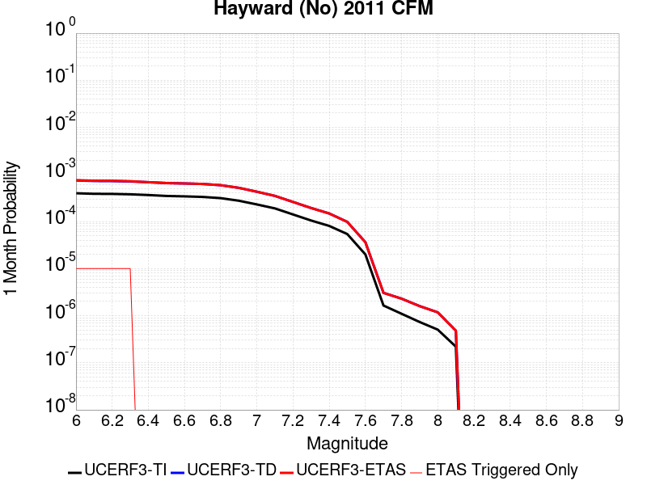 | 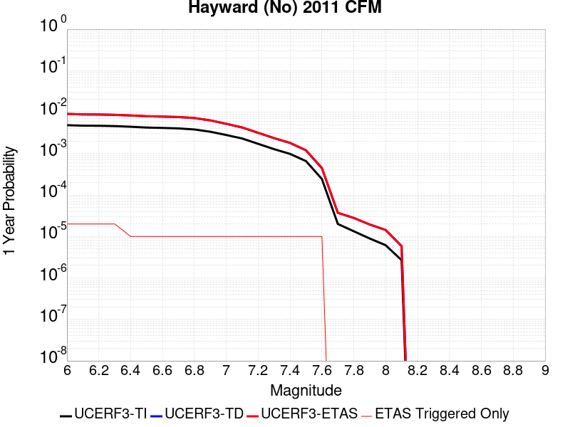 | 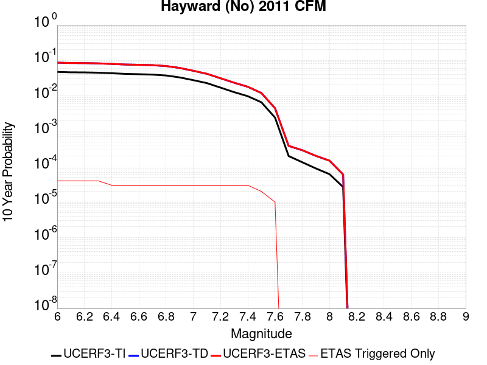 |

| Magnitude | 1 wk TI Prob | 1 wk TD Prob | 1 wk ETAS Prob | 1 wk ETAS/TD Gain | 1 wk ETAS Triggered Only | 1 mo TI Prob | 1 mo TD Prob | 1 mo ETAS Prob | 1 mo ETAS/TD Gain | 1 mo ETAS Triggered Only | 1 yr TI Prob | 1 yr TD Prob | 1 yr ETAS Prob | 1 yr ETAS/TD Gain | 1 yr ETAS Triggered Only | 10 yr TI Prob | 10 yr TD Prob | 10 yr ETAS Prob | 10 yr ETAS/TD Gain | 10 yr ETAS Triggered Only |
|-----|-----|-----|-----|-----|-----|-----|-----|-----|-----|-----|-----|-----|-----|-----|-----|-----|-----|-----|-----|-----|
| 6.0 | 9.3068506E-5 | 1.739599E-4 | 1.8395815E-4 | 1.0574745 | 1.0E-5 | 3.9880406E-4 | 7.453244E-4 | 7.553169E-4 | 1.013407 | 1.0E-5 | 0.0048446343 | 0.009036438 | 0.009056257 | 1.0021932 | 2.0E-5 | 0.047403704 | 0.08637534 | 0.086411886 | 1.0004231 | 4.0E-5 |
| 6.1 | 9.055486E-5 | 1.6947114E-4 | 1.7946944E-4 | 1.0589972 | 1.0E-5 | 3.880345E-4 | 7.261021E-4 | 7.3609484E-4 | 1.0137621 | 1.0E-5 | 0.0047140904 | 0.008804537 | 0.0088243615 | 1.0022515 | 2.0E-5 | 0.046153355 | 0.08426854 | 0.08430517 | 1.0004346 | 4.0E-5 |
| 6.2 | 9.006742E-5 | 1.6867711E-4 | 1.7867543E-4 | 1.0592749 | 1.0E-5 | 3.859461E-4 | 7.22701E-4 | 7.326938E-4 | 1.013827 | 1.0E-5 | 0.0046887742 | 0.008763513 | 0.008783338 | 1.0022622 | 2.0E-5 | 0.0459107 | 0.083892785 | 0.08392943 | 1.0004368 | 4.0E-5 |
| 6.3 | 8.8336754E-5 | 1.6547246E-4 | 1.7547082E-4 | 1.060423 | 1.0E-5 | 3.7853114E-4 | 7.089758E-4 | 7.189687E-4 | 1.0140948 | 1.0E-5 | 0.004598882 | 0.008597788 | 0.008617616 | 1.0023062 | 2.0E-5 | 0.04504866 | 0.08238599 | 0.082422696 | 1.0004455 | 4.0E-5 |
| 6.4 | 8.526157E-5 | 1.5974249E-4 | 1.5974249E-4 | 1.0 | 0.0 | 3.6535555E-4 | 6.8443175E-4 | 6.8443175E-4 | 1.0 | 0.0 | 0.0044391346 | 0.008301278 | 0.008311195 | 1.0011946 | 1.0E-5 | 0.043514993 | 0.079682834 | 0.07971045 | 1.0003465 | 3.0E-5 |
| 6.5 | 8.152396E-5 | 1.530663E-4 | 1.530663E-4 | 1.0 | 0.0 | 3.493416E-4 | 6.558342E-4 | 6.558342E-4 | 1.0 | 0.0 | 0.0042449418 | 0.007955698 | 0.007965619 | 1.0012469 | 1.0E-5 | 0.04164765 | 0.07651369 | 0.076541394 | 1.000362 | 3.0E-5 |
| 6.6 | 7.987405E-5 | 1.5010842E-4 | 1.5010842E-4 | 1.0 | 0.0 | 3.4227243E-4 | 6.4316386E-4 | 6.4316386E-4 | 1.0 | 0.0 | 0.0041592065 | 0.0078025614 | 0.0078124837 | 1.0012716 | 1.0E-5 | 0.04082218 | 0.07510622 | 0.075133964 | 1.0003694 | 3.0E-5 |
| 6.7 | 7.777665E-5 | 1.4650106E-4 | 1.4650106E-4 | 1.0 | 0.0 | 3.332859E-4 | 6.277113E-4 | 6.277113E-4 | 1.0 | 0.0 | 0.004050208 | 0.00761576 | 0.0076256837 | 1.0013031 | 1.0E-5 | 0.039771806 | 0.073382616 | 0.073410414 | 1.0003788 | 3.0E-5 |
| 6.8 | 7.3284005E-5 | 1.3800753E-4 | 1.3800753E-4 | 1.0 | 0.0 | 3.140365E-4 | 5.913274E-4 | 5.913274E-4 | 1.0 | 0.0 | 0.0038166929 | 0.0071757827 | 0.007185711 | 1.0013835 | 1.0E-5 | 0.037518036 | 0.06929621 | 0.069324136 | 1.0004029 | 3.0E-5 |
| 6.9 | 6.458263E-5 | 1.2131439E-4 | 1.2131439E-4 | 1.0 | 0.0 | 2.7675333E-4 | 5.198157E-4 | 5.198157E-4 | 1.0 | 0.0 | 0.0033642664 | 0.0063104923 | 0.0063204295 | 1.0015746 | 1.0E-5 | 0.033137884 | 0.061225023 | 0.061253186 | 1.00046 | 3.0E-5 |
| 7.0 | 5.3853604E-5 | 1.00250414E-4 | 1.00250414E-4 | 1.0 | 0.0 | 2.3078074E-4 | 4.295742E-4 | 4.295742E-4 | 1.0 | 0.0 | 0.0028061352 | 0.0052175885 | 0.005227536 | 1.0019066 | 1.0E-5 | 0.027709642 | 0.0509578 | 0.05098627 | 1.0005587 | 3.0E-5 |
| 7.1 | 4.4308683E-5 | 8.170626E-5 | 8.170626E-5 | 1.0 | 0.0 | 1.8988053E-4 | 3.501229E-4 | 3.501229E-4 | 1.0 | 0.0 | 0.0023093442 | 0.0042544557 | 0.0042644134 | 1.0023404 | 1.0E-5 | 0.022854926 | 0.04182473 | 0.041853476 | 1.0006872 | 3.0E-5 |
| 7.2 | 3.295973E-5 | 6.0771144E-5 | 6.0771144E-5 | 1.0 | 0.0 | 1.4124835E-4 | 2.604219E-4 | 2.604219E-4 | 1.0 | 0.0 | 0.0017183421 | 0.0031660495 | 0.003176018 | 1.0031486 | 1.0E-5 | 0.017051157 | 0.031369876 | 0.031398933 | 1.0009264 | 3.0E-5 |
| 7.3 | 2.452256E-5 | 4.5180346E-5 | 4.5180346E-5 | 1.0 | 0.0 | 1.05092455E-4 | 1.9361576E-4 | 1.9361576E-4 | 1.0 | 0.0 | 0.0012787496 | 0.0023547374 | 0.0023647137 | 1.0042368 | 1.0E-5 | 0.0127141625 | 0.02344111 | 0.023470407 | 1.0012498 | 3.0E-5 |
| 7.4 | 1.8829967E-5 | 3.4602548E-5 | 3.4602548E-5 | 1.0 | 0.0 | 8.069736E-5 | 1.4828827E-4 | 1.4828827E-4 | 1.0 | 0.0 | 9.820475E-4 | 0.0018039243 | 0.0018139064 | 1.0055335 | 1.0E-5 | 0.009777189 | 0.0180195 | 0.018048959 | 1.0016348 | 3.0E-5 |
| 7.5 | 1.26374125E-5 | 2.2921116E-5 | 2.2921116E-5 | 1.0 | 0.0 | 5.4159216E-5 | 9.822969E-5 | 9.822969E-5 | 1.0 | 0.0 | 6.5918895E-4 | 0.0011952962 | 0.0012052841 | 1.0083561 | 1.0E-5 | 0.00657237 | 0.011988836 | 0.012008597 | 1.0016482 | 2.0E-5 |
| 7.6 | 4.666429E-6 | 8.4791645E-6 | 8.4791645E-6 | 1.0 | 0.0 | 1.9998828E-5 | 3.6338777E-5 | 3.6338777E-5 | 1.0 | 0.0 | 2.4345852E-4 | 4.4233602E-4 | 4.523316E-4 | 1.0225972 | 1.0E-5 | 0.0024319198 | 0.0044591012 | 0.0044690566 | 1.0022326 | 1.0E-5 |
| 7.7 | 3.8399318E-7 | 7.133867E-7 | 7.133867E-7 | 1.0 | 0.0 | 1.6456839E-6 | 3.057368E-6 | 3.057368E-6 | 1.0 | 0.0 | 2.003602E-5 | 3.722282E-5 | 3.722282E-5 | 1.0 | 0.0 | 2.0034213E-4 | 3.8614936E-4 | 3.8614936E-4 | 1.0 | 0.0 |
| 7.8 | 2.5637698E-7 | 5.3662194E-7 | 5.3662194E-7 | 1.0 | 0.0 | 1.098758E-6 | 2.299806E-6 | 2.299806E-6 | 1.0 | 0.0 | 1.3377297E-5 | 2.7999782E-5 | 2.7999782E-5 | 1.0 | 0.0 | 1.3376492E-4 | 2.9244382E-4 | 2.9244382E-4 | 1.0 | 0.0 |
| 7.9 | 1.7141245E-7 | 3.7290573E-7 | 3.7290573E-7 | 1.0 | 0.0 | 7.3462456E-7 | 1.5981665E-6 | 1.5981665E-6 | 1.0 | 0.0 | 8.944017E-6 | 1.9457504E-5 | 1.9457504E-5 | 1.0 | 0.0 | 8.943657E-5 | 2.0245428E-4 | 2.0245428E-4 | 1.0 | 0.0 |
| 8.0 | 1.1808895E-7 | 2.7509762E-7 | 2.7509762E-7 | 1.0 | 0.0 | 5.060954E-7 | 1.1789892E-6 | 1.1789892E-6 | 1.0 | 0.0 | 6.161694E-6 | 1.43541E-5 | 1.43541E-5 | 1.0 | 0.0 | 6.161523E-5 | 1.4816441E-4 | 1.4816441E-4 | 1.0 | 0.0 |
| 8.1 | 5.138535E-8 | 1.1229867E-7 | 1.1229867E-7 | 1.0 | 0.0 | 2.2022292E-7 | 4.812799E-7 | 4.812799E-7 | 1.0 | 0.0 | 2.6812106E-6 | 5.8595674E-6 | 5.8595674E-6 | 1.0 | 0.0 | 2.6811784E-5 | 6.0158476E-5 | 6.0158476E-5 | 1.0 | 0.0 |

## Calaveras (No) 2011 CFM
*[(top)](#table-of-contents)*

| 1 Week | 1 Month | 1 Year | 10 Year |
|-----|-----|-----|-----|
|  |  |  |  |

| Magnitude | 1 wk TI Prob | 1 wk TD Prob | 1 wk ETAS Prob | 1 wk ETAS/TD Gain | 1 wk ETAS Triggered Only | 1 mo TI Prob | 1 mo TD Prob | 1 mo ETAS Prob | 1 mo ETAS/TD Gain | 1 mo ETAS Triggered Only | 1 yr TI Prob | 1 yr TD Prob | 1 yr ETAS Prob | 1 yr ETAS/TD Gain | 1 yr ETAS Triggered Only | 10 yr TI Prob | 10 yr TD Prob | 10 yr ETAS Prob | 10 yr ETAS/TD Gain | 10 yr ETAS Triggered Only |
|-----|-----|-----|-----|-----|-----|-----|-----|-----|-----|-----|-----|-----|-----|-----|-----|-----|-----|-----|-----|-----|
| 6.0 | 4.8694856E-5 | 6.747121E-5 | 6.747121E-5 | 1.0 | 0.0 | 2.0867554E-4 | 2.8913133E-4 | 2.8913133E-4 | 1.0 | 0.0 | 0.0025376645 | 0.003514627 | 0.0035345566 | 1.0056705 | 2.0E-5 | 0.02508881 | 0.034771245 | 0.034809854 | 1.0011104 | 4.0E-5 |
| 6.1 | 4.8694856E-5 | 6.747121E-5 | 6.747121E-5 | 1.0 | 0.0 | 2.0867554E-4 | 2.8913133E-4 | 2.8913133E-4 | 1.0 | 0.0 | 0.0025376645 | 0.003514627 | 0.0035345566 | 1.0056705 | 2.0E-5 | 0.02508881 | 0.034771245 | 0.034809854 | 1.0011104 | 4.0E-5 |
| 6.2 | 4.7541962E-5 | 6.580218E-5 | 6.580218E-5 | 1.0 | 0.0 | 2.0373536E-4 | 2.8197994E-4 | 2.8197994E-4 | 1.0 | 0.0 | 0.0024776561 | 0.003427859 | 0.0034477904 | 1.0058146 | 2.0E-5 | 0.024502134 | 0.033932675 | 0.033971317 | 1.0011388 | 4.0E-5 |
| 6.3 | 4.6717287E-5 | 6.4635555E-5 | 6.4635555E-5 | 1.0 | 0.0 | 2.0020158E-4 | 2.7698115E-4 | 2.7698115E-4 | 1.0 | 0.0 | 0.0024347296 | 0.0033672103 | 0.003387143 | 1.0059196 | 2.0E-5 | 0.024082264 | 0.033345193 | 0.033383857 | 1.0011595 | 4.0E-5 |
| 6.4 | 4.6276386E-5 | 6.399742E-5 | 6.399742E-5 | 1.0 | 0.0 | 1.983123E-4 | 2.7424688E-4 | 2.7424688E-4 | 1.0 | 0.0 | 0.0024117786 | 0.0033340224 | 0.0033539557 | 1.0059787 | 2.0E-5 | 0.02385771 | 0.033024073 | 0.033062752 | 1.0011712 | 4.0E-5 |
| 6.5 | 4.5720994E-5 | 6.319881E-5 | 6.319881E-5 | 1.0 | 0.0 | 1.9593239E-4 | 2.70825E-4 | 2.70825E-4 | 1.0 | 0.0 | 0.002382867 | 0.0032924965 | 0.0033124306 | 1.0060544 | 2.0E-5 | 0.023574775 | 0.032622032 | 0.032660726 | 1.0011861 | 4.0E-5 |
| 6.6 | 4.549134E-5 | 6.28519E-5 | 6.28519E-5 | 1.0 | 0.0 | 1.949483E-4 | 2.6933852E-4 | 2.6933852E-4 | 1.0 | 0.0 | 0.0023709119 | 0.0032744533 | 0.0032943878 | 1.0060879 | 2.0E-5 | 0.023457756 | 0.032447387 | 0.03248609 | 1.0011928 | 4.0E-5 |
| 6.7 | 3.701047E-5 | 5.0359427E-5 | 5.0359427E-5 | 1.0 | 0.0 | 1.5860666E-4 | 2.1580851E-4 | 2.1580851E-4 | 1.0 | 0.0 | 0.0019293258 | 0.002624346 | 0.0026343197 | 1.0038005 | 1.0E-5 | 0.019126613 | 0.026125323 | 0.02615454 | 1.0011183 | 3.0E-5 |
| 6.8 | 3.5523568E-5 | 4.8341022E-5 | 4.8341022E-5 | 1.0 | 0.0 | 1.5223498E-4 | 2.071596E-4 | 2.071596E-4 | 1.0 | 0.0 | 0.0018518851 | 0.0025192937 | 0.0025292686 | 1.0039594 | 1.0E-5 | 0.018365284 | 0.025097553 | 0.0251268 | 1.0011654 | 3.0E-5 |
| 6.9 | 3.2946147E-5 | 4.466269E-5 | 4.466269E-5 | 1.0 | 0.0 | 1.4119013E-4 | 1.9139773E-4 | 1.9139773E-4 | 1.0 | 0.0 | 0.0017176344 | 0.0023278191 | 0.002337796 | 1.0042858 | 1.0E-5 | 0.017044188 | 0.023219598 | 0.023239136 | 1.0008414 | 2.0E-5 |
| 7.0 | 2.7682381E-5 | 3.702223E-5 | 3.702223E-5 | 1.0 | 0.0 | 1.1863338E-4 | 1.5865723E-4 | 1.5865723E-4 | 1.0 | 0.0 | 0.0014434044 | 0.0019299705 | 0.0019399511 | 1.0051714 | 1.0E-5 | 0.01434065 | 0.01931092 | 0.019330533 | 1.0010157 | 2.0E-5 |
| 7.1 | 2.471967E-5 | 3.328669E-5 | 3.328669E-5 | 1.0 | 0.0 | 1.05937135E-4 | 1.4264962E-4 | 1.4264962E-4 | 1.0 | 0.0 | 0.0012890215 | 0.0017354045 | 0.0017453871 | 1.0057523 | 1.0E-5 | 0.0128157 | 0.017385952 | 0.017405605 | 1.0011303 | 2.0E-5 |
| 7.2 | 1.9748062E-5 | 2.6774684E-5 | 2.6774684E-5 | 1.0 | 0.0 | 8.463181E-5 | 1.1474373E-4 | 1.1474373E-4 | 1.0 | 0.0 | 0.0010299052 | 0.0013961331 | 0.0014061191 | 1.0071527 | 1.0E-5 | 0.01025145 | 0.014030739 | 0.014050459 | 1.0014055 | 2.0E-5 |
| 7.3 | 1.1603734E-5 | 1.5783844E-5 | 1.5783844E-5 | 1.0 | 0.0 | 4.9729337E-5 | 6.764337E-5 | 6.764337E-5 | 1.0 | 0.0 | 6.052865E-4 | 8.232611E-4 | 8.3325285E-4 | 1.0121368 | 1.0E-5 | 0.0060364045 | 0.008308666 | 0.0083285 | 1.0023872 | 2.0E-5 |
| 7.4 | 4.885381E-6 | 6.0349853E-6 | 6.0349853E-6 | 1.0 | 0.0 | 2.0937177E-5 | 2.5863968E-5 | 2.5863968E-5 | 1.0 | 0.0 | 2.5488032E-4 | 3.148485E-4 | 3.2484534E-4 | 1.0317513 | 1.0E-5 | 0.0025458818 | 0.0032010598 | 0.0032110277 | 1.003114 | 1.0E-5 |
| 7.5 | 3.0571264E-6 | 4.155299E-6 | 4.155299E-6 | 1.0 | 0.0 | 1.3101904E-5 | 1.7808303E-5 | 1.7808303E-5 | 1.0 | 0.0 | 1.5950401E-4 | 2.1679462E-4 | 2.2679246E-4 | 1.0461166 | 1.0E-5 | 0.0015938957 | 0.002221121 | 0.0022310987 | 1.0044923 | 1.0E-5 |
| 7.6 | 1.764948E-6 | 2.7955498E-6 | 2.7955498E-6 | 1.0 | 0.0 | 7.564041E-6 | 1.1980874E-5 | 1.1980874E-5 | 1.0 | 0.0 | 9.208831E-5 | 1.4585744E-4 | 1.5585599E-4 | 1.0685501 | 1.0E-5 | 9.205016E-4 | 0.0015123509 | 0.0015223358 | 1.0066022 | 1.0E-5 |
| 7.7 | 1.3173734E-6 | 2.058471E-6 | 2.058471E-6 | 1.0 | 0.0 | 5.645874E-6 | 8.8219895E-6 | 8.8219895E-6 | 1.0 | 0.0 | 6.873634E-5 | 1.0740245E-4 | 1.17401374E-4 | 1.0930978 | 1.0E-5 | 6.8715087E-4 | 0.0011261401 | 0.0011361288 | 1.0088699 | 1.0E-5 |
| 7.8 | 9.4429885E-7 | 1.5489635E-6 | 1.5489635E-6 | 1.0 | 0.0 | 4.0469886E-6 | 6.638398E-6 | 6.638398E-6 | 1.0 | 0.0 | 4.9270973E-5 | 8.081952E-5 | 9.081871E-5 | 1.1237224 | 1.0E-5 | 4.926005E-4 | 8.5014524E-4 | 8.6013676E-4 | 1.0117527 | 1.0E-5 |
| 7.9 | 6.388233E-7 | 1.1148749E-6 | 1.1148749E-6 | 1.0 | 0.0 | 2.7378112E-6 | 4.7780263E-6 | 4.7780263E-6 | 1.0 | 0.0 | 3.3332344E-5 | 5.817093E-5 | 5.817093E-5 | 1.0 | 0.0 | 3.3327343E-4 | 6.0963054E-4 | 6.0963054E-4 | 1.0 | 0.0 |
| 8.0 | 3.087986E-7 | 5.7543696E-7 | 5.7543696E-7 | 1.0 | 0.0 | 1.323422E-6 | 2.466156E-6 | 2.466156E-6 | 1.0 | 0.0 | 1.6112543E-5 | 3.002504E-5 | 3.002504E-5 | 1.0 | 0.0 | 1.6111376E-4 | 3.110302E-4 | 3.110302E-4 | 1.0 | 0.0 |
| 8.1 | 1.6725647E-7 | 2.7410047E-7 | 2.7410047E-7 | 1.0 | 0.0 | 7.168133E-7 | 1.1747159E-6 | 1.1747159E-6 | 1.0 | 0.0 | 8.7271665E-6 | 1.4302073E-5 | 1.4302073E-5 | 1.0 | 0.0 | 8.726824E-5 | 1.48486E-4 | 1.48486E-4 | 1.0 | 0.0 |

## San Luis Range 2011 CFM
*[(top)](#table-of-contents)*

| 1 Week | 1 Month | 1 Year | 10 Year |
|-----|-----|-----|-----|
|  |  |  |  |

| Magnitude | 1 wk TI Prob | 1 wk TD Prob | 1 wk ETAS Prob | 1 wk ETAS/TD Gain | 1 wk ETAS Triggered Only | 1 mo TI Prob | 1 mo TD Prob | 1 mo ETAS Prob | 1 mo ETAS/TD Gain | 1 mo ETAS Triggered Only | 1 yr TI Prob | 1 yr TD Prob | 1 yr ETAS Prob | 1 yr ETAS/TD Gain | 1 yr ETAS Triggered Only | 10 yr TI Prob | 10 yr TD Prob | 10 yr ETAS Prob | 10 yr ETAS/TD Gain | 10 yr ETAS Triggered Only |
|-----|-----|-----|-----|-----|-----|-----|-----|-----|-----|-----|-----|-----|-----|-----|-----|-----|-----|-----|-----|-----|
| 6.0 | 8.8368415E-6 | 8.965454E-6 | 2.8965274E-5 | 3.230765 | 2.0E-5 | 3.787163E-5 | 3.842285E-5 | 5.8422083E-5 | 1.5205035 | 2.0E-5 | 4.609895E-4 | 4.677057E-4 | 4.976917E-4 | 1.0641129 | 3.0E-5 | 0.0046003438 | 0.0046679964 | 0.0047078095 | 1.008529 | 4.0E-5 |
| 6.1 | 8.8368415E-6 | 8.965454E-6 | 2.8965274E-5 | 3.230765 | 2.0E-5 | 3.787163E-5 | 3.842285E-5 | 5.8422083E-5 | 1.5205035 | 2.0E-5 | 4.609895E-4 | 4.677057E-4 | 4.976917E-4 | 1.0641129 | 3.0E-5 | 0.0046003438 | 0.0046679964 | 0.0047078095 | 1.008529 | 4.0E-5 |
| 6.2 | 8.8368415E-6 | 8.965454E-6 | 2.8965274E-5 | 3.230765 | 2.0E-5 | 3.787163E-5 | 3.842285E-5 | 5.8422083E-5 | 1.5205035 | 2.0E-5 | 4.609895E-4 | 4.677057E-4 | 4.976917E-4 | 1.0641129 | 3.0E-5 | 0.0046003438 | 0.0046679964 | 0.0047078095 | 1.008529 | 4.0E-5 |
| 6.3 | 8.8368415E-6 | 8.965454E-6 | 2.8965274E-5 | 3.230765 | 2.0E-5 | 3.787163E-5 | 3.842285E-5 | 5.8422083E-5 | 1.5205035 | 2.0E-5 | 4.609895E-4 | 4.677057E-4 | 4.976917E-4 | 1.0641129 | 3.0E-5 | 0.0046003438 | 0.0046679964 | 0.0047078095 | 1.008529 | 4.0E-5 |
| 6.4 | 3.9094193E-6 | 3.9412025E-6 | 3.9412025E-6 | 1.0 | 0.0 | 1.6754546E-5 | 1.689076E-5 | 1.689076E-5 | 1.0 | 0.0 | 2.039675E-4 | 2.056259E-4 | 2.056259E-4 | 1.0 | 0.0 | 0.0020378039 | 0.0020543851 | 0.0020543851 | 1.0 | 0.0 |
| 6.5 | 3.9094193E-6 | 3.9412025E-6 | 3.9412025E-6 | 1.0 | 0.0 | 1.6754546E-5 | 1.689076E-5 | 1.689076E-5 | 1.0 | 0.0 | 2.039675E-4 | 2.056259E-4 | 2.056259E-4 | 1.0 | 0.0 | 0.0020378039 | 0.0020543851 | 0.0020543851 | 1.0 | 0.0 |
| 6.6 | 3.0587726E-6 | 3.0753883E-6 | 3.0753883E-6 | 1.0 | 0.0 | 1.3108959E-5 | 1.318017E-5 | 1.318017E-5 | 1.0 | 0.0 | 1.595899E-4 | 1.6045687E-4 | 1.6045687E-4 | 1.0 | 0.0 | 0.0015947534 | 0.0016034221 | 0.0016034221 | 1.0 | 0.0 |
| 6.7 | 2.6160574E-6 | 2.6251273E-6 | 2.6251273E-6 | 1.0 | 0.0 | 1.1211626E-5 | 1.1250498E-5 | 1.1250498E-5 | 1.0 | 0.0 | 1.3649299E-4 | 1.3696625E-4 | 1.3696625E-4 | 1.0 | 0.0 | 0.0013640919 | 0.0013688246 | 0.0013688246 | 1.0 | 0.0 |
| 6.8 | 2.5110312E-6 | 2.51814E-6 | 2.51814E-6 | 1.0 | 0.0 | 1.0761518E-5 | 1.0791985E-5 | 1.0791985E-5 | 1.0 | 0.0 | 1.310136E-4 | 1.3138456E-4 | 1.3138456E-4 | 1.0 | 0.0 | 0.0013093639 | 0.0013130746 | 0.0013130746 | 1.0 | 0.0 |
| 6.9 | 1.8564405E-6 | 1.852487E-6 | 1.852487E-6 | 1.0 | 0.0 | 7.95615E-6 | 7.939206E-6 | 7.939206E-6 | 1.0 | 0.0 | 9.686181E-5 | 9.665557E-5 | 9.665557E-5 | 1.0 | 0.0 | 9.68196E-4 | 9.661373E-4 | 9.661373E-4 | 1.0 | 0.0 |
| 7.0 | 1.546127E-6 | 1.5369537E-6 | 1.5369537E-6 | 1.0 | 0.0 | 6.626242E-6 | 6.586928E-6 | 6.586928E-6 | 1.0 | 0.0 | 8.06715E-5 | 8.0192905E-5 | 8.0192905E-5 | 1.0 | 0.0 | 8.0642226E-4 | 8.016404E-4 | 8.016404E-4 | 1.0 | 0.0 |
| 7.1 | 1.3368208E-6 | 1.3235326E-6 | 1.3235326E-6 | 1.0 | 0.0 | 5.7292195E-6 | 5.67227E-6 | 5.67227E-6 | 1.0 | 0.0 | 6.975101E-5 | 6.905771E-5 | 6.905771E-5 | 1.0 | 0.0 | 6.972912E-4 | 6.9036294E-4 | 6.9036294E-4 | 1.0 | 0.0 |
| 7.2 | 1.0623363E-6 | 1.0454368E-6 | 1.0454368E-6 | 1.0 | 0.0 | 4.5528623E-6 | 4.4804356E-6 | 4.4804356E-6 | 1.0 | 0.0 | 5.5429686E-5 | 5.4547938E-5 | 5.4547938E-5 | 1.0 | 0.0 | 5.5415864E-4 | 5.4534577E-4 | 5.4534577E-4 | 1.0 | 0.0 |
| 7.3 | 7.831679E-7 | 7.7273904E-7 | 7.7273904E-7 | 1.0 | 0.0 | 3.3564295E-6 | 3.3117344E-6 | 3.3117344E-6 | 1.0 | 0.0 | 4.086376E-5 | 4.0319625E-5 | 4.0319625E-5 | 1.0 | 0.0 | 4.0856248E-4 | 4.031232E-4 | 4.031232E-4 | 1.0 | 0.0 |
| 7.4 | 5.9558846E-7 | 5.910636E-7 | 5.910636E-7 | 1.0 | 0.0 | 2.5525194E-6 | 2.5331274E-6 | 2.5331274E-6 | 1.0 | 0.0 | 3.107648E-5 | 3.084039E-5 | 3.084039E-5 | 1.0 | 0.0 | 3.1072134E-4 | 3.083612E-4 | 3.083612E-4 | 1.0 | 0.0 |
| 7.5 | 4.1616502E-7 | 4.119631E-7 | 4.119631E-7 | 1.0 | 0.0 | 1.7835631E-6 | 1.7655549E-6 | 1.7655549E-6 | 1.0 | 0.0 | 2.1714664E-5 | 2.149542E-5 | 2.149542E-5 | 1.0 | 0.0 | 2.1712543E-4 | 2.1493346E-4 | 2.1493346E-4 | 1.0 | 0.0 |
| 7.6 | 2.3816014E-7 | 2.3376548E-7 | 2.3376548E-7 | 1.0 | 0.0 | 1.0206859E-6 | 1.0018516E-6 | 1.0018516E-6 | 1.0 | 0.0 | 1.242678E-5 | 1.2197475E-5 | 1.2197475E-5 | 1.0 | 0.0 | 1.2426086E-4 | 1.2196808E-4 | 1.2196808E-4 | 1.0 | 0.0 |
| 7.7 | 9.918777E-8 | 9.3867584E-8 | 9.3867584E-8 | 1.0 | 0.0 | 4.2509038E-7 | 4.0228957E-7 | 4.0228957E-7 | 1.0 | 0.0 | 5.1754632E-6 | 4.8978645E-6 | 4.8978645E-6 | 1.0 | 0.0 | 5.1753424E-5 | 4.897757E-5 | 4.897757E-5 | 1.0 | 0.0 |
| 7.8 | 3.4982556E-8 | 2.968655E-8 | 2.968655E-8 | 1.0 | 0.0 | 1.4992524E-7 | 1.2722806E-7 | 1.2722806E-7 | 1.0 | 0.0 | 1.8253382E-6 | 1.5490006E-6 | 1.5490006E-6 | 1.0 | 0.0 | 1.8253233E-5 | 1.5489897E-5 | 1.5489897E-5 | 1.0 | 0.0 |
| 7.9 | 1.6624908E-8 | 1.1477036E-8 | 1.1477036E-8 | 1.0 | 0.0 | 7.12496E-8 | 4.91873E-8 | 4.91873E-8 | 1.0 | 0.0 | 8.6746354E-7 | 5.988552E-7 | 5.988552E-7 | 1.0 | 0.0 | 8.674601E-6 | 5.988536E-6 | 5.988536E-6 | 1.0 | 0.0 |
| 8.0 | 6.3352315E-9 | 3.0888412E-9 | 3.0888412E-9 | 1.0 | 0.0 | 2.715099E-8 | 1.3237893E-8 | 1.3237893E-8 | 1.0 | 0.0 | 3.3056327E-7 | 1.6117131E-7 | 1.6117131E-7 | 1.0 | 0.0 | 3.3056278E-6 | 1.611712E-6 | 1.611712E-6 | 1.0 | 0.0 |

## Malibu Coast (Extension) alt 1
*[(top)](#table-of-contents)*

| 1 Week | 1 Month | 1 Year | 10 Year |
|-----|-----|-----|-----|
|  | 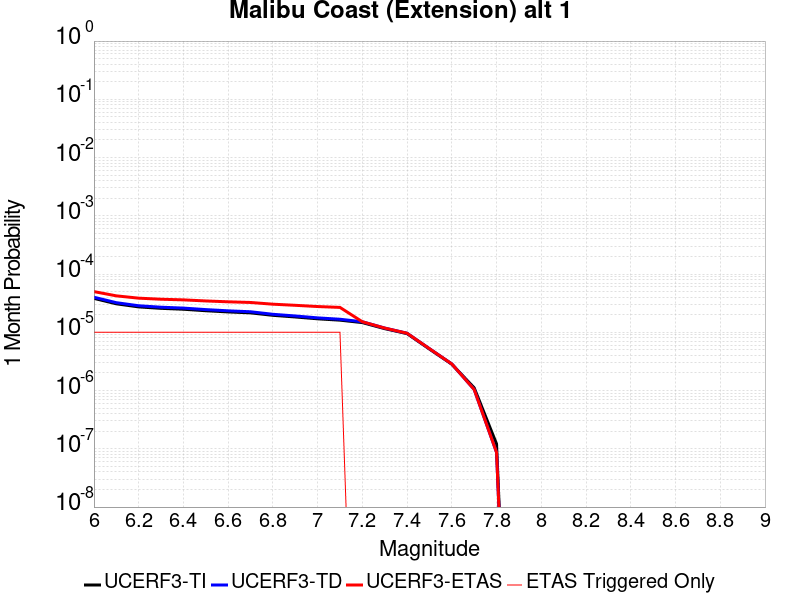 |  | 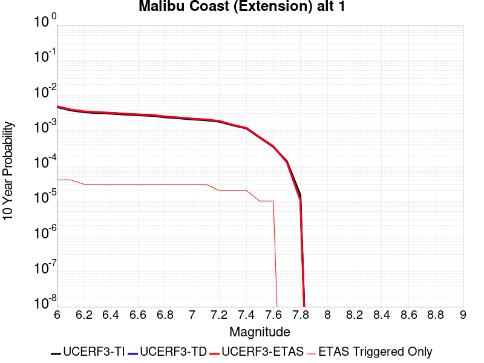 |

| Magnitude | 1 wk TI Prob | 1 wk TD Prob | 1 wk ETAS Prob | 1 wk ETAS/TD Gain | 1 wk ETAS Triggered Only | 1 mo TI Prob | 1 mo TD Prob | 1 mo ETAS Prob | 1 mo ETAS/TD Gain | 1 mo ETAS Triggered Only | 1 yr TI Prob | 1 yr TD Prob | 1 yr ETAS Prob | 1 yr ETAS/TD Gain | 1 yr ETAS Triggered Only | 10 yr TI Prob | 10 yr TD Prob | 10 yr ETAS Prob | 10 yr ETAS/TD Gain | 10 yr ETAS Triggered Only |
|-----|-----|-----|-----|-----|-----|-----|-----|-----|-----|-----|-----|-----|-----|-----|-----|-----|-----|-----|-----|-----|
| 6.0 | 8.930738E-6 | 9.329276E-6 | 9.329276E-6 | 1.0 | 0.0 | 3.827403E-5 | 3.998201E-5 | 4.998161E-5 | 1.2501025 | 1.0E-5 | 4.6588664E-4 | 4.8667393E-4 | 5.1665935E-4 | 1.061613 | 3.0E-5 | 0.0046491115 | 0.004856264 | 0.00489607 | 1.0081968 | 4.0E-5 |
| 6.1 | 7.199952E-6 | 7.5302964E-6 | 7.5302964E-6 | 1.0 | 0.0 | 3.0856572E-5 | 3.2272303E-5 | 4.2271982E-5 | 1.3098532 | 1.0E-5 | 3.75614E-4 | 3.9284505E-4 | 4.2283328E-4 | 1.076336 | 3.0E-5 | 0.0037497976 | 0.003921572 | 0.0039614155 | 1.01016 | 4.0E-5 |
| 6.2 | 6.3721413E-6 | 6.6667917E-6 | 6.6667917E-6 | 1.0 | 0.0 | 2.7308892E-5 | 2.8571652E-5 | 3.857137E-5 | 1.3499873 | 1.0E-5 | 3.3243504E-4 | 3.4780471E-4 | 3.6779774E-4 | 1.0574836 | 2.0E-5 | 0.0033193815 | 0.0034726437 | 0.0035025396 | 1.0086089 | 3.0E-5 |
| 6.3 | 6.016345E-6 | 6.295158E-6 | 6.295158E-6 | 1.0 | 0.0 | 2.578408E-5 | 2.6978973E-5 | 3.69787E-5 | 1.3706491 | 1.0E-5 | 3.1387596E-4 | 3.2841982E-4 | 3.4841325E-4 | 1.0608777 | 2.0E-5 | 0.00313433 | 0.0032793807 | 0.0033092822 | 1.0091181 | 3.0E-5 |
| 6.4 | 5.8104883E-6 | 6.0795446E-6 | 6.0795446E-6 | 1.0 | 0.0 | 2.4901856E-5 | 2.6054933E-5 | 3.6054673E-5 | 1.3837944 | 1.0E-5 | 3.031379E-4 | 3.1717293E-4 | 3.371666E-4 | 1.063037 | 2.0E-5 | 0.0030272473 | 0.0031672374 | 0.0031971424 | 1.009442 | 3.0E-5 |
| 6.5 | 5.476925E-6 | 5.7275133E-6 | 5.7275133E-6 | 1.0 | 0.0 | 2.3472323E-5 | 2.4546256E-5 | 3.454601E-5 | 1.4073842 | 1.0E-5 | 2.8573806E-4 | 2.9880996E-4 | 3.18804E-4 | 1.0669122 | 2.0E-5 | 0.0028537093 | 0.002984114 | 0.0030140243 | 1.0100232 | 3.0E-5 |
| 6.6 | 5.222387E-6 | 5.45858E-6 | 5.45858E-6 | 1.0 | 0.0 | 2.2381464E-5 | 2.3393704E-5 | 3.339347E-5 | 1.4274554 | 1.0E-5 | 2.7246025E-4 | 2.8478142E-4 | 3.0477572E-4 | 1.0702093 | 2.0E-5 | 0.0027212645 | 0.0028441956 | 0.0028741101 | 1.0105178 | 3.0E-5 |
| 6.7 | 5.0337076E-6 | 5.259103E-6 | 5.259103E-6 | 1.0 | 0.0 | 2.1572854E-5 | 2.253882E-5 | 3.2538595E-5 | 1.443669 | 1.0E-5 | 2.6261783E-4 | 2.7437587E-4 | 2.9437037E-4 | 1.0728728 | 2.0E-5 | 0.002623077 | 0.002740401 | 0.0027703189 | 1.0109173 | 3.0E-5 |
| 6.8 | 4.5675624E-6 | 4.7587164E-6 | 4.7587164E-6 | 1.0 | 0.0 | 1.9575122E-5 | 2.039434E-5 | 3.0394136E-5 | 1.4903221 | 1.0E-5 | 2.3830103E-4 | 2.48273E-4 | 2.6826802E-4 | 1.0805365 | 2.0E-5 | 0.0023804565 | 0.002479976 | 0.0025099015 | 1.0120668 | 3.0E-5 |
| 6.9 | 4.2802412E-6 | 4.4520207E-6 | 4.4520207E-6 | 1.0 | 0.0 | 1.8343762E-5 | 1.907995E-5 | 2.9079758E-5 | 1.5241004 | 1.0E-5 | 2.2331243E-4 | 2.3227377E-4 | 2.5226912E-4 | 1.0860853 | 2.0E-5 | 0.0022308815 | 0.0023203269 | 0.0023502572 | 1.0128992 | 3.0E-5 |
| 7.0 | 3.9794063E-6 | 4.130099E-6 | 4.130099E-6 | 1.0 | 0.0 | 1.7054486E-5 | 1.7700306E-5 | 2.7700129E-5 | 1.564952 | 1.0E-5 | 2.0761859E-4 | 2.1548003E-4 | 2.3547572E-4 | 1.092796 | 2.0E-5 | 0.0020742472 | 0.0021527244 | 0.00218266 | 1.0139059 | 3.0E-5 |
| 7.1 | 3.7730424E-6 | 3.911217E-6 | 3.911217E-6 | 1.0 | 0.0 | 1.6170083E-5 | 1.6762251E-5 | 2.6762084E-5 | 1.5965686 | 1.0E-5 | 1.9685295E-4 | 2.0406142E-4 | 2.2405734E-4 | 1.0979897 | 2.0E-5 | 0.0019667868 | 0.0020387534 | 0.0020686921 | 1.0146849 | 3.0E-5 |
| 7.2 | 3.424985E-6 | 3.541337E-6 | 3.541337E-6 | 1.0 | 0.0 | 1.4678424E-5 | 1.5177071E-5 | 1.5177071E-5 | 1.0 | 0.0 | 1.7869516E-4 | 1.8476529E-4 | 1.9476344E-4 | 1.0541127 | 1.0E-5 | 0.0017855153 | 0.0018461287 | 0.0018660919 | 1.0108135 | 2.0E-5 |
| 7.3 | 2.6966375E-6 | 2.7596534E-6 | 2.7596534E-6 | 1.0 | 0.0 | 1.15569665E-5 | 1.1827032E-5 | 1.1827032E-5 | 1.0 | 0.0 | 1.4069698E-4 | 1.4398464E-4 | 1.539832E-4 | 1.0694418 | 1.0E-5 | 0.0014060794 | 0.0014389176 | 0.0014588889 | 1.0138793 | 2.0E-5 |
| 7.4 | 2.215957E-6 | 2.249378E-6 | 2.249378E-6 | 1.0 | 0.0 | 9.496924E-6 | 9.640156E-6 | 9.640156E-6 | 1.0 | 0.0 | 1.1561892E-4 | 1.17362615E-4 | 1.2736145E-4 | 1.085196 | 1.0E-5 | 0.0011555878 | 0.0011730101 | 0.0011929866 | 1.0170301 | 2.0E-5 |
| 7.5 | 1.2040218E-6 | 1.2219067E-6 | 1.2219067E-6 | 1.0 | 0.0 | 5.160083E-6 | 5.2367322E-6 | 5.2367322E-6 | 1.0 | 0.0 | 6.2822204E-5 | 6.375537E-5 | 6.375537E-5 | 1.0 | 0.0 | 6.280445E-4 | 6.3737266E-4 | 6.473663E-4 | 1.0156794 | 1.0E-5 |
| 7.6 | 6.6157446E-7 | 6.678975E-7 | 6.678975E-7 | 1.0 | 0.0 | 2.835316E-6 | 2.8624147E-6 | 2.8624147E-6 | 1.0 | 0.0 | 3.4519428E-5 | 3.484936E-5 | 3.484936E-5 | 1.0 | 0.0 | 3.4514067E-4 | 3.4844046E-4 | 3.5843698E-4 | 1.0286893 | 1.0E-5 |
| 7.7 | 2.6012302E-7 | 2.4357593E-7 | 2.4357593E-7 | 1.0 | 0.0 | 1.1148124E-6 | 1.0438964E-6 | 1.0438964E-6 | 1.0 | 0.0 | 1.3572758E-5 | 1.2709375E-5 | 1.2709375E-5 | 1.0 | 0.0 | 1.3571928E-4 | 1.2708755E-4 | 1.2708755E-4 | 1.0 | 0.0 |
| 7.8 | 2.8323132E-8 | 2.0266649E-8 | 2.0266649E-8 | 1.0 | 0.0 | 1.2138484E-7 | 8.685707E-8 | 8.685707E-8 | 1.0 | 0.0 | 1.4778595E-6 | 1.0574844E-6 | 1.0574844E-6 | 1.0 | 0.0 | 1.4778497E-5 | 1.0574801E-5 | 1.0574801E-5 | 1.0 | 0.0 |

## San Jacinto (Coyote Creek)
*[(top)](#table-of-contents)*

| 1 Week | 1 Month | 1 Year | 10 Year |
|-----|-----|-----|-----|
|  |  |  |  |

| Magnitude | 1 wk TI Prob | 1 wk TD Prob | 1 wk ETAS Prob | 1 wk ETAS/TD Gain | 1 wk ETAS Triggered Only | 1 mo TI Prob | 1 mo TD Prob | 1 mo ETAS Prob | 1 mo ETAS/TD Gain | 1 mo ETAS Triggered Only | 1 yr TI Prob | 1 yr TD Prob | 1 yr ETAS Prob | 1 yr ETAS/TD Gain | 1 yr ETAS Triggered Only | 10 yr TI Prob | 10 yr TD Prob | 10 yr ETAS Prob | 10 yr ETAS/TD Gain | 10 yr ETAS Triggered Only |
|-----|-----|-----|-----|-----|-----|-----|-----|-----|-----|-----|-----|-----|-----|-----|-----|-----|-----|-----|-----|-----|
| 6.0 | 2.7374346E-5 | 2.4145214E-5 | 2.4145214E-5 | 1.0 | 0.0 | 1.1731335E-4 | 1.034754E-4 | 1.13474365E-4 | 1.0966313 | 1.0E-5 | 0.0014273542 | 0.0012590875 | 0.0012890497 | 1.0237968 | 3.0E-5 | 0.01418221 | 0.012928318 | 0.012967801 | 1.003054 | 4.0E-5 |
| 6.1 | 2.7374346E-5 | 2.4145214E-5 | 2.4145214E-5 | 1.0 | 0.0 | 1.1731335E-4 | 1.034754E-4 | 1.13474365E-4 | 1.0966313 | 1.0E-5 | 0.0014273542 | 0.0012590875 | 0.0012890497 | 1.0237968 | 3.0E-5 | 0.01418221 | 0.012928318 | 0.012967801 | 1.003054 | 4.0E-5 |
| 6.2 | 2.7374346E-5 | 2.4145214E-5 | 2.4145214E-5 | 1.0 | 0.0 | 1.1731335E-4 | 1.034754E-4 | 1.13474365E-4 | 1.0966313 | 1.0E-5 | 0.0014273542 | 0.0012590875 | 0.0012890497 | 1.0237968 | 3.0E-5 | 0.01418221 | 0.012928318 | 0.012967801 | 1.003054 | 4.0E-5 |
| 6.3 | 2.7374346E-5 | 2.4145214E-5 | 2.4145214E-5 | 1.0 | 0.0 | 1.1731335E-4 | 1.034754E-4 | 1.13474365E-4 | 1.0966313 | 1.0E-5 | 0.0014273542 | 0.0012590875 | 0.0012890497 | 1.0237968 | 3.0E-5 | 0.01418221 | 0.012928318 | 0.012967801 | 1.003054 | 4.0E-5 |
| 6.4 | 2.7374346E-5 | 2.4145214E-5 | 2.4145214E-5 | 1.0 | 0.0 | 1.1731335E-4 | 1.034754E-4 | 1.13474365E-4 | 1.0966313 | 1.0E-5 | 0.0014273542 | 0.0012590875 | 0.0012890497 | 1.0237968 | 3.0E-5 | 0.01418221 | 0.012928318 | 0.012967801 | 1.003054 | 4.0E-5 |
| 6.5 | 2.7282445E-5 | 2.4031293E-5 | 2.4031293E-5 | 1.0 | 0.0 | 1.16919524E-4 | 1.029872E-4 | 1.1298617E-4 | 1.0970894 | 1.0E-5 | 0.0014225657 | 0.0012531505 | 0.001283113 | 1.0239097 | 3.0E-5 | 0.014134934 | 0.012869646 | 0.012909131 | 1.0030681 | 4.0E-5 |
| 6.6 | 2.7282445E-5 | 2.4031293E-5 | 2.4031293E-5 | 1.0 | 0.0 | 1.16919524E-4 | 1.029872E-4 | 1.1298617E-4 | 1.0970894 | 1.0E-5 | 0.0014225657 | 0.0012531505 | 0.001283113 | 1.0239097 | 3.0E-5 | 0.014134934 | 0.012869646 | 0.012909131 | 1.0030681 | 4.0E-5 |
| 6.7 | 2.7216198E-5 | 2.3956412E-5 | 2.3956412E-5 | 1.0 | 0.0 | 1.1663563E-4 | 1.02666316E-4 | 1.12665286E-4 | 1.0973929 | 1.0E-5 | 0.0014191137 | 0.0012492483 | 0.0012792108 | 1.0239844 | 3.0E-5 | 0.014100855 | 0.0128310565 | 0.012870544 | 1.0030774 | 4.0E-5 |
| 6.8 | 2.7078617E-5 | 2.387363E-5 | 2.387363E-5 | 1.0 | 0.0 | 1.1604605E-4 | 1.0231156E-4 | 1.1231054E-4 | 1.0977306 | 1.0E-5 | 0.001411945 | 0.0012449342 | 0.0012748968 | 1.0240676 | 3.0E-5 | 0.014030075 | 0.012788199 | 0.012827687 | 1.0030879 | 4.0E-5 |
| 6.9 | 2.6982952E-5 | 2.3793142E-5 | 2.3793142E-5 | 1.0 | 0.0 | 1.15636096E-4 | 1.0196664E-4 | 1.11965615E-4 | 1.0980613 | 1.0E-5 | 0.0014069602 | 0.0012407395 | 0.0012707022 | 1.0241492 | 3.0E-5 | 0.013980856 | 0.012746515 | 0.012786005 | 1.0030981 | 4.0E-5 |
| 7.0 | 2.6449972E-5 | 2.3370165E-5 | 2.3370165E-5 | 1.0 | 0.0 | 1.1335209E-4 | 1.00154015E-4 | 1.10153014E-4 | 1.0998362 | 1.0E-5 | 0.001379188 | 0.0012186957 | 0.0012486591 | 1.0245864 | 3.0E-5 | 0.0137065975 | 0.0125278765 | 0.012567376 | 1.0031528 | 4.0E-5 |
| 7.1 | 2.6257849E-5 | 2.3196202E-5 | 2.3196202E-5 | 1.0 | 0.0 | 1.1252879E-4 | 9.940852E-5 | 1.0940753E-4 | 1.100585 | 1.0E-5 | 0.0013691769 | 0.0012096294 | 0.001239593 | 1.024771 | 3.0E-5 | 0.013607717 | 0.012437741 | 0.012477244 | 1.003176 | 4.0E-5 |
| 7.2 | 2.5270041E-5 | 2.2390966E-5 | 2.2390966E-5 | 1.0 | 0.0 | 1.0829568E-4 | 9.595777E-5 | 1.0595681E-4 | 1.1042025 | 1.0E-5 | 0.0013177024 | 0.0011676621 | 0.001197627 | 1.0256624 | 3.0E-5 | 0.013099162 | 0.012018777 | 0.012058297 | 1.0032881 | 4.0E-5 |
| 7.3 | 2.339701E-5 | 2.1122814E-5 | 2.1122814E-5 | 1.0 | 0.0 | 1.0026905E-4 | 9.0523215E-5 | 1.0052231E-4 | 1.1104589 | 1.0E-5 | 0.001220092 | 0.0011015651 | 0.001131532 | 1.027204 | 3.0E-5 | 0.012134149 | 0.011357696 | 0.011397242 | 1.0034819 | 4.0E-5 |
| 7.4 | 2.296333E-5 | 2.0853171E-5 | 2.0853171E-5 | 1.0 | 0.0 | 9.841056E-5 | 8.936768E-5 | 9.9366785E-5 | 1.1118873 | 1.0E-5 | 0.0011974899 | 0.0010875105 | 0.0011174779 | 1.027556 | 3.0E-5 | 0.011910575 | 0.01121681 | 0.01125636 | 1.0035261 | 4.0E-5 |
| 7.5 | 2.2188895E-5 | 2.0376096E-5 | 2.0376096E-5 | 1.0 | 0.0 | 9.50918E-5 | 8.732321E-5 | 9.7322336E-5 | 1.1145071 | 1.0E-5 | 0.0011571277 | 0.0010626436 | 0.0010926117 | 1.0282015 | 3.0E-5 | 0.011511209 | 0.010966429 | 0.011005989 | 1.0036075 | 4.0E-5 |
| 7.6 | 2.0013189E-5 | 1.8962366E-5 | 1.8962366E-5 | 1.0 | 0.0 | 8.5767984E-5 | 8.1264756E-5 | 9.1263944E-5 | 1.1230446 | 1.0E-5 | 0.001043725 | 9.889511E-4 | 0.0010189215 | 1.0303051 | 3.0E-5 | 0.010388365 | 0.010224434 | 0.010264024 | 1.0038722 | 4.0E-5 |
| 7.7 | 1.7230794E-5 | 1.674371E-5 | 1.674371E-5 | 1.0 | 0.0 | 7.384417E-5 | 7.175679E-5 | 8.175607E-5 | 1.1393496 | 1.0E-5 | 8.986819E-4 | 8.7328954E-4 | 9.0326334E-4 | 1.0343229 | 3.0E-5 | 0.008950562 | 0.009062956 | 0.009102594 | 1.0043736 | 4.0E-5 |
| 7.8 | 1.4478809E-5 | 1.4990978E-5 | 1.4990978E-5 | 1.0 | 0.0 | 6.205057E-5 | 6.424547E-5 | 7.424483E-5 | 1.155643 | 1.0E-5 | 7.552038E-4 | 7.819085E-4 | 8.118851E-4 | 1.0383377 | 3.0E-5 | 0.0075264242 | 0.008141387 | 0.008181062 | 1.0048732 | 4.0E-5 |
| 7.9 | 1.1114467E-5 | 1.1645102E-5 | 1.1645102E-5 | 1.0 | 0.0 | 4.7632562E-5 | 4.990663E-5 | 5.990613E-5 | 1.2003642 | 1.0E-5 | 5.797721E-4 | 6.074444E-4 | 6.3742616E-4 | 1.0493573 | 3.0E-5 | 0.0057826187 | 0.0063803247 | 0.0064200694 | 1.0062293 | 4.0E-5 |
| 8.0 | 9.327402E-6 | 9.899186E-6 | 9.899186E-6 | 1.0 | 0.0 | 3.9973966E-5 | 4.2424395E-5 | 4.2424395E-5 | 1.0 | 0.0 | 4.8657437E-4 | 5.1639514E-4 | 5.363848E-4 | 1.03871 | 2.0E-5 | 0.0048551033 | 0.0054499684 | 0.005479805 | 1.0054746 | 3.0E-5 |
| 8.1 | 7.0235833E-6 | 6.827495E-6 | 6.827495E-6 | 1.0 | 0.0 | 3.0100724E-5 | 2.9260367E-5 | 2.9260367E-5 | 1.0 | 0.0 | 3.664147E-4 | 3.5618723E-4 | 3.6618367E-4 | 1.0280651 | 1.0E-5 | 0.003658111 | 0.0037876023 | 0.0038075265 | 1.0052603 | 2.0E-5 |
| 8.2 | 2.0358202E-6 | 8.994527E-7 | 8.994527E-7 | 1.0 | 0.0 | 8.724915E-6 | 3.854792E-6 | 3.854792E-6 | 1.0 | 0.0 | 1.06220665E-4 | 4.69311E-5 | 4.69311E-5 | 1.0 | 0.0 | 0.001061699 | 5.3254166E-4 | 5.3254166E-4 | 1.0 | 0.0 |
| 8.3 | 2.0051264E-7 | 6.617272E-8 | 6.617272E-8 | 1.0 | 0.0 | 8.5933965E-7 | 2.8359733E-7 | 2.8359733E-7 | 1.0 | 0.0 | 1.046241E-5 | 3.4527925E-6 | 3.4527925E-6 | 1.0 | 0.0 | 1.0461917E-4 | 4.01389E-5 | 4.01389E-5 | 1.0 | 0.0 |

## Santa Monica alt 1
*[(top)](#table-of-contents)*

| 1 Week | 1 Month | 1 Year | 10 Year |
|-----|-----|-----|-----|
|  |  |  |  |

| Magnitude | 1 wk TI Prob | 1 wk TD Prob | 1 wk ETAS Prob | 1 wk ETAS/TD Gain | 1 wk ETAS Triggered Only | 1 mo TI Prob | 1 mo TD Prob | 1 mo ETAS Prob | 1 mo ETAS/TD Gain | 1 mo ETAS Triggered Only | 1 yr TI Prob | 1 yr TD Prob | 1 yr ETAS Prob | 1 yr ETAS/TD Gain | 1 yr ETAS Triggered Only | 10 yr TI Prob | 10 yr TD Prob | 10 yr ETAS Prob | 10 yr ETAS/TD Gain | 10 yr ETAS Triggered Only |
|-----|-----|-----|-----|-----|-----|-----|-----|-----|-----|-----|-----|-----|-----|-----|-----|-----|-----|-----|-----|-----|
| 6.0 | 1.1066008E-5 | 1.148031E-5 | 1.148031E-5 | 1.0 | 0.0 | 4.742488E-5 | 4.920048E-5 | 5.919999E-5 | 1.20324 | 1.0E-5 | 5.7724497E-4 | 5.9886515E-4 | 6.088591E-4 | 1.0166882 | 1.0E-5 | 0.005757478 | 0.0059739 | 0.0060037207 | 1.0049919 | 3.0E-5 |
| 6.1 | 1.1066008E-5 | 1.148031E-5 | 1.148031E-5 | 1.0 | 0.0 | 4.742488E-5 | 4.920048E-5 | 5.919999E-5 | 1.20324 | 1.0E-5 | 5.7724497E-4 | 5.9886515E-4 | 6.088591E-4 | 1.0166882 | 1.0E-5 | 0.005757478 | 0.0059739 | 0.0060037207 | 1.0049919 | 3.0E-5 |
| 6.2 | 1.1066008E-5 | 1.148031E-5 | 1.148031E-5 | 1.0 | 0.0 | 4.742488E-5 | 4.920048E-5 | 5.919999E-5 | 1.20324 | 1.0E-5 | 5.7724497E-4 | 5.9886515E-4 | 6.088591E-4 | 1.0166882 | 1.0E-5 | 0.005757478 | 0.0059739 | 0.0060037207 | 1.0049919 | 3.0E-5 |
| 6.3 | 1.1066008E-5 | 1.148031E-5 | 1.148031E-5 | 1.0 | 0.0 | 4.742488E-5 | 4.920048E-5 | 5.919999E-5 | 1.20324 | 1.0E-5 | 5.7724497E-4 | 5.9886515E-4 | 6.088591E-4 | 1.0166882 | 1.0E-5 | 0.005757478 | 0.0059739 | 0.0060037207 | 1.0049919 | 3.0E-5 |
| 6.4 | 1.1066008E-5 | 1.148031E-5 | 1.148031E-5 | 1.0 | 0.0 | 4.742488E-5 | 4.920048E-5 | 5.919999E-5 | 1.20324 | 1.0E-5 | 5.7724497E-4 | 5.9886515E-4 | 6.088591E-4 | 1.0166882 | 1.0E-5 | 0.005757478 | 0.0059739 | 0.0060037207 | 1.0049919 | 3.0E-5 |
| 6.5 | 8.183544E-6 | 8.335432E-6 | 8.335432E-6 | 1.0 | 0.0 | 3.5071862E-5 | 3.57228E-5 | 3.57228E-5 | 1.0 | 0.0 | 4.2691626E-4 | 4.3483984E-4 | 4.3483984E-4 | 1.0 | 0.0 | 0.0042609703 | 0.0043400554 | 0.004359969 | 1.0045882 | 2.0E-5 |
| 6.6 | 8.1543285E-6 | 8.303646E-6 | 8.303646E-6 | 1.0 | 0.0 | 3.4946657E-5 | 3.5586578E-5 | 3.5586578E-5 | 1.0 | 0.0 | 4.2539247E-4 | 4.3318202E-4 | 4.3318202E-4 | 1.0 | 0.0 | 0.0042457907 | 0.004323542 | 0.004343455 | 1.0046059 | 2.0E-5 |
| 6.7 | 8.110878E-6 | 8.257042E-6 | 8.257042E-6 | 1.0 | 0.0 | 3.4760444E-5 | 3.5386853E-5 | 3.5386853E-5 | 1.0 | 0.0 | 4.231262E-4 | 4.3075136E-4 | 4.3075136E-4 | 1.0 | 0.0 | 0.0042232145 | 0.0042993296 | 0.0043192436 | 1.0046319 | 2.0E-5 |
| 6.8 | 7.644036E-6 | 7.75106E-6 | 7.75106E-6 | 1.0 | 0.0 | 3.275974E-5 | 3.3218414E-5 | 3.3218414E-5 | 1.0 | 0.0 | 3.9877684E-4 | 4.0436056E-4 | 4.0436056E-4 | 1.0 | 0.0 | 0.00398062 | 0.0040363944 | 0.0040563135 | 1.0049349 | 2.0E-5 |
| 6.9 | 7.3698293E-6 | 7.455719E-6 | 7.455719E-6 | 1.0 | 0.0 | 3.15846E-5 | 3.19527E-5 | 3.19527E-5 | 1.0 | 0.0 | 3.8447464E-4 | 3.8895605E-4 | 3.8895605E-4 | 1.0 | 0.0 | 0.0038381014 | 0.0038828964 | 0.0039028188 | 1.0051308 | 2.0E-5 |
| 7.0 | 7.209872E-6 | 7.2856255E-6 | 7.2856255E-6 | 1.0 | 0.0 | 3.0899086E-5 | 3.1223743E-5 | 3.1223743E-5 | 1.0 | 0.0 | 3.7613141E-4 | 3.8008415E-4 | 3.8008415E-4 | 1.0 | 0.0 | 0.0037549543 | 0.0037944836 | 0.0038144076 | 1.0052508 | 2.0E-5 |
| 7.1 | 5.603456E-6 | 5.5238925E-6 | 5.5238925E-6 | 1.0 | 0.0 | 2.4014591E-5 | 2.3673612E-5 | 2.3673612E-5 | 1.0 | 0.0 | 2.923384E-4 | 2.881885E-4 | 2.881885E-4 | 1.0 | 0.0 | 0.0029195412 | 0.0028781896 | 0.0028881608 | 1.0034645 | 1.0E-5 |
| 7.2 | 4.7483613E-6 | 4.5911324E-6 | 4.5911324E-6 | 1.0 | 0.0 | 2.0349962E-5 | 1.9676136E-5 | 1.9676136E-5 | 1.0 | 0.0 | 2.4773262E-4 | 2.3953074E-4 | 2.3953074E-4 | 1.0 | 0.0 | 0.0024745662 | 0.0023927398 | 0.0024027159 | 1.0041693 | 1.0E-5 |
| 7.3 | 3.829015E-6 | 3.6342253E-6 | 3.6342253E-6 | 1.0 | 0.0 | 1.6409962E-5 | 1.5575159E-5 | 1.5575159E-5 | 1.0 | 0.0 | 1.9977297E-4 | 1.8961114E-4 | 1.8961114E-4 | 1.0 | 0.0 | 0.0019959346 | 0.0018945024 | 0.0019044835 | 1.0052685 | 1.0E-5 |
| 7.4 | 2.610755E-6 | 2.4995716E-6 | 2.4995716E-6 | 1.0 | 0.0 | 1.1188902E-5 | 1.0712406E-5 | 1.0712406E-5 | 1.0 | 0.0 | 1.3621636E-4 | 1.3041578E-4 | 1.3041578E-4 | 1.0 | 0.0 | 0.001361329 | 0.0013033969 | 0.0013133838 | 1.0076623 | 1.0E-5 |
| 7.5 | 1.792146E-6 | 1.7584184E-6 | 1.7584184E-6 | 1.0 | 0.0 | 7.680603E-6 | 7.536057E-6 | 7.536057E-6 | 1.0 | 0.0 | 9.3507326E-5 | 9.1747665E-5 | 9.1747665E-5 | 1.0 | 0.0 | 9.3467993E-4 | 9.1710105E-4 | 9.2709187E-4 | 1.010894 | 1.0E-5 |
| 7.6 | 1.1473018E-6 | 1.1029152E-6 | 1.1029152E-6 | 1.0 | 0.0 | 4.9169985E-6 | 4.726771E-6 | 4.726771E-6 | 1.0 | 0.0 | 5.986281E-5 | 5.7546935E-5 | 5.7546935E-5 | 1.0 | 0.0 | 5.984669E-4 | 5.7532196E-4 | 5.853162E-4 | 1.0173715 | 1.0E-5 |
| 7.7 | 5.330919E-7 | 4.7452556E-7 | 4.7452556E-7 | 1.0 | 0.0 | 2.2846775E-6 | 2.0336795E-6 | 2.0336795E-6 | 1.0 | 0.0 | 2.7815593E-5 | 2.4759778E-5 | 2.4759778E-5 | 1.0 | 0.0 | 2.7812112E-4 | 2.4757133E-4 | 2.4757133E-4 | 1.0 | 0.0 |
| 7.8 | 1.1668574E-7 | 8.2966224E-8 | 8.2966224E-8 | 1.0 | 0.0 | 5.000816E-7 | 3.5556948E-7 | 3.5556948E-7 | 1.0 | 0.0 | 6.0884768E-6 | 4.32905E-6 | 4.32905E-6 | 1.0 | 0.0 | 6.08831E-5 | 4.3289692E-5 | 4.3289692E-5 | 1.0 | 0.0 |
| 7.9 | 8.007447E-10 | 6.1608785E-10 | 6.1608785E-10 | 1.0 | 0.0 | 3.4317629E-9 | 2.6403764E-9 | 2.6403764E-9 | 1.0 | 0.0 | 4.1781714E-8 | 3.2146584E-8 | 3.2146584E-8 | 1.0 | 0.0 | 4.1781706E-7 | 3.214658E-7 | 3.214658E-7 | 1.0 | 0.0 |

## Surprise Valley 2011 CFM
*[(top)](#table-of-contents)*

| 1 Week | 1 Month | 1 Year | 10 Year |
|-----|-----|-----|-----|
|  |  |  |  |

| Magnitude | 1 wk TI Prob | 1 wk TD Prob | 1 wk ETAS Prob | 1 wk ETAS/TD Gain | 1 wk ETAS Triggered Only | 1 mo TI Prob | 1 mo TD Prob | 1 mo ETAS Prob | 1 mo ETAS/TD Gain | 1 mo ETAS Triggered Only | 1 yr TI Prob | 1 yr TD Prob | 1 yr ETAS Prob | 1 yr ETAS/TD Gain | 1 yr ETAS Triggered Only | 10 yr TI Prob | 10 yr TD Prob | 10 yr ETAS Prob | 10 yr ETAS/TD Gain | 10 yr ETAS Triggered Only |
|-----|-----|-----|-----|-----|-----|-----|-----|-----|-----|-----|-----|-----|-----|-----|-----|-----|-----|-----|-----|-----|
| 6.0 | 4.0396248E-5 | 4.485131E-5 | 4.485131E-5 | 1.0 | 0.0 | 1.7311527E-4 | 1.9220692E-4 | 1.9220692E-4 | 1.0 | 0.0 | 0.002105641 | 0.0023378176 | 0.0023378176 | 1.0 | 0.0 | 0.020858008 | 0.023153966 | 0.023183271 | 1.0012656 | 3.0E-5 |
| 6.1 | 4.0396248E-5 | 4.485131E-5 | 4.485131E-5 | 1.0 | 0.0 | 1.7311527E-4 | 1.9220692E-4 | 1.9220692E-4 | 1.0 | 0.0 | 0.002105641 | 0.0023378176 | 0.0023378176 | 1.0 | 0.0 | 0.020858008 | 0.023153966 | 0.023183271 | 1.0012656 | 3.0E-5 |
| 6.2 | 2.2295266E-5 | 2.440125E-5 | 2.440125E-5 | 1.0 | 0.0 | 9.554764E-5 | 1.0457276E-4 | 1.0457276E-4 | 1.0 | 0.0 | 0.0011626717 | 0.0012724606 | 0.0012724606 | 1.0 | 0.0 | 0.011566074 | 0.012654981 | 0.012654981 | 1.0 | 0.0 |
| 6.3 | 1.572643E-5 | 1.7096807E-5 | 1.7096807E-5 | 1.0 | 0.0 | 6.7397246E-5 | 7.327003E-5 | 7.327003E-5 | 1.0 | 0.0 | 8.202525E-4 | 8.91708E-4 | 8.91708E-4 | 1.0 | 0.0 | 0.008172315 | 0.008882407 | 0.008882407 | 1.0 | 0.0 |
| 6.4 | 1.5714395E-5 | 1.7084629E-5 | 1.7084629E-5 | 1.0 | 0.0 | 6.734567E-5 | 7.3217845E-5 | 7.3217845E-5 | 1.0 | 0.0 | 8.1962504E-4 | 8.9107314E-4 | 8.9107314E-4 | 1.0 | 0.0 | 0.008166086 | 0.008876109 | 0.008876109 | 1.0 | 0.0 |
| 6.5 | 1.2733495E-5 | 1.38016E-5 | 1.38016E-5 | 1.0 | 0.0 | 5.457098E-5 | 5.9148413E-5 | 5.9148413E-5 | 1.0 | 0.0 | 6.641992E-4 | 7.1990065E-4 | 7.1990065E-4 | 1.0 | 0.0 | 0.0066221743 | 0.0071763797 | 0.0071763797 | 1.0 | 0.0 |
| 6.6 | 1.0983784E-5 | 1.1886554E-5 | 1.1886554E-5 | 1.0 | 0.0 | 4.7072506E-5 | 5.094141E-5 | 5.094141E-5 | 1.0 | 0.0 | 5.7295704E-4 | 6.200405E-4 | 6.200405E-4 | 1.0 | 0.0 | 0.0057148207 | 0.0061836545 | 0.0061836545 | 1.0 | 0.0 |
| 6.7 | 9.104806E-6 | 9.839491E-6 | 9.839491E-6 | 1.0 | 0.0 | 3.902001E-5 | 4.2168587E-5 | 4.2168587E-5 | 1.0 | 0.0 | 4.7496508E-4 | 5.132855E-4 | 5.132855E-4 | 1.0 | 0.0 | 0.004739512 | 0.005121397 | 0.005121397 | 1.0 | 0.0 |
| 6.8 | 6.2162403E-6 | 6.7041337E-6 | 6.7041337E-6 | 1.0 | 0.0 | 2.6640759E-5 | 2.8731698E-5 | 2.8731698E-5 | 1.0 | 0.0 | 3.2430296E-4 | 3.497545E-4 | 3.497545E-4 | 1.0 | 0.0 | 0.003238301 | 0.0034922638 | 0.0034922638 | 1.0 | 0.0 |
| 6.9 | 4.1792696E-6 | 4.50323E-6 | 4.50323E-6 | 1.0 | 0.0 | 1.7911032E-5 | 1.9299423E-5 | 1.9299423E-5 | 1.0 | 0.0 | 2.1804498E-4 | 2.3494668E-4 | 2.3494668E-4 | 1.0 | 0.0 | 0.0021783116 | 0.0023471361 | 0.0023471361 | 1.0 | 0.0 |
| 7.0 | 2.7478413E-6 | 2.9622424E-6 | 2.9622424E-6 | 1.0 | 0.0 | 1.177641E-5 | 1.269527E-5 | 1.269527E-5 | 1.0 | 0.0 | 1.4336836E-4 | 1.545552E-4 | 1.545552E-4 | 1.0 | 0.0 | 0.001432759 | 0.0015445995 | 0.0015445995 | 1.0 | 0.0 |
| 7.1 | 8.128648E-7 | 8.724922E-7 | 8.724922E-7 | 1.0 | 0.0 | 3.4837017E-6 | 3.7392501E-6 | 3.7392501E-6 | 1.0 | 0.0 | 4.2413245E-5 | 4.552502E-5 | 4.552502E-5 | 1.0 | 0.0 | 4.2405148E-4 | 4.5521575E-4 | 4.5521575E-4 | 1.0 | 0.0 |
| 7.2 | 4.8641045E-8 | 4.9402068E-8 | 4.9402068E-8 | 1.0 | 0.0 | 2.084616E-7 | 2.1172312E-7 | 2.1172312E-7 | 1.0 | 0.0 | 2.538017E-6 | 2.577726E-6 | 2.577726E-6 | 1.0 | 0.0 | 2.537988E-5 | 2.5776973E-5 | 2.5776973E-5 | 1.0 | 0.0 |
| 7.3 | 5.3911844E-9 | 5.4758145E-9 | 5.4758145E-9 | 1.0 | 0.0 | 2.3105075E-8 | 2.3467775E-8 | 2.3467775E-8 | 1.0 | 0.0 | 2.8130427E-7 | 2.8572015E-7 | 2.8572015E-7 | 1.0 | 0.0 | 2.8130391E-6 | 2.8571992E-6 | 2.8571992E-6 | 1.0 | 0.0 |

## Owens Valley Keough Hot Springs
*[(top)](#table-of-contents)*

| 1 Week | 1 Month | 1 Year | 10 Year |
|-----|-----|-----|-----|
|  |  |  |  |

| Magnitude | 1 wk TI Prob | 1 wk TD Prob | 1 wk ETAS Prob | 1 wk ETAS/TD Gain | 1 wk ETAS Triggered Only | 1 mo TI Prob | 1 mo TD Prob | 1 mo ETAS Prob | 1 mo ETAS/TD Gain | 1 mo ETAS Triggered Only | 1 yr TI Prob | 1 yr TD Prob | 1 yr ETAS Prob | 1 yr ETAS/TD Gain | 1 yr ETAS Triggered Only | 10 yr TI Prob | 10 yr TD Prob | 10 yr ETAS Prob | 10 yr ETAS/TD Gain | 10 yr ETAS Triggered Only |
|-----|-----|-----|-----|-----|-----|-----|-----|-----|-----|-----|-----|-----|-----|-----|-----|-----|-----|-----|-----|-----|
| 6.0 | 1.5708529E-5 | 4.950656E-6 | 4.950656E-6 | 1.0 | 0.0 | 6.7320536E-5 | 2.1216953E-5 | 4.121653E-5 | 1.9426224 | 2.0E-5 | 8.193192E-4 | 2.582909E-4 | 2.7828573E-4 | 1.0774121 | 2.0E-5 | 0.008163051 | 0.0025805652 | 0.0026104876 | 1.0115954 | 3.0E-5 |
| 6.1 | 1.5708529E-5 | 4.950656E-6 | 4.950656E-6 | 1.0 | 0.0 | 6.7320536E-5 | 2.1216953E-5 | 4.121653E-5 | 1.9426224 | 2.0E-5 | 8.193192E-4 | 2.582909E-4 | 2.7828573E-4 | 1.0774121 | 2.0E-5 | 0.008163051 | 0.0025805652 | 0.0026104876 | 1.0115954 | 3.0E-5 |
| 6.2 | 1.5708529E-5 | 4.950656E-6 | 4.950656E-6 | 1.0 | 0.0 | 6.7320536E-5 | 2.1216953E-5 | 4.121653E-5 | 1.9426224 | 2.0E-5 | 8.193192E-4 | 2.582909E-4 | 2.7828573E-4 | 1.0774121 | 2.0E-5 | 0.008163051 | 0.0025805652 | 0.0026104876 | 1.0115954 | 3.0E-5 |
| 6.3 | 1.5708529E-5 | 4.950656E-6 | 4.950656E-6 | 1.0 | 0.0 | 6.7320536E-5 | 2.1216953E-5 | 4.121653E-5 | 1.9426224 | 2.0E-5 | 8.193192E-4 | 2.582909E-4 | 2.7828573E-4 | 1.0774121 | 2.0E-5 | 0.008163051 | 0.0025805652 | 0.0026104876 | 1.0115954 | 3.0E-5 |
| 6.4 | 1.4622509E-5 | 3.7265204E-6 | 3.7265204E-6 | 1.0 | 0.0 | 6.266639E-5 | 1.5970723E-5 | 3.5970403E-5 | 2.2522714 | 2.0E-5 | 7.626962E-4 | 1.944295E-4 | 2.1442561E-4 | 1.1028451 | 2.0E-5 | 0.007600839 | 0.0019430731 | 0.0019730148 | 1.0154095 | 3.0E-5 |
| 6.5 | 1.3335527E-5 | 2.2777172E-6 | 2.2777172E-6 | 1.0 | 0.0 | 5.7151006E-5 | 9.761612E-6 | 1.9761514E-5 | 2.024411 | 1.0E-5 | 6.955913E-4 | 1.18841825E-4 | 1.2884063E-4 | 1.0841354 | 1.0E-5 | 0.0069341804 | 0.0011880046 | 0.0012079809 | 1.016815 | 2.0E-5 |
| 6.6 | 1.3332855E-5 | 2.2748663E-6 | 2.2748663E-6 | 1.0 | 0.0 | 5.7139558E-5 | 9.749395E-6 | 1.9749297E-5 | 2.0256948 | 1.0E-5 | 6.9545204E-4 | 1.186931E-4 | 1.2869191E-4 | 1.0842409 | 1.0E-5 | 0.0069327964 | 0.0011865189 | 0.0012064951 | 1.016836 | 2.0E-5 |
| 6.7 | 1.3318214E-5 | 2.2640966E-6 | 2.2640966E-6 | 1.0 | 0.0 | 5.707681E-5 | 9.703239E-6 | 1.9703142E-5 | 2.0305736 | 1.0E-5 | 6.946886E-4 | 1.1813121E-4 | 1.2813004E-4 | 1.0846416 | 1.0E-5 | 0.0069252094 | 0.001180906 | 0.0012008824 | 1.0169162 | 2.0E-5 |
| 6.8 | 1.2441338E-5 | 1.6777863E-6 | 1.6777863E-6 | 1.0 | 0.0 | 5.331893E-5 | 7.1904947E-6 | 7.1904947E-6 | 1.0 | 0.0 | 6.489646E-4 | 8.7541055E-5 | 8.7541055E-5 | 1.0 | 0.0 | 0.0064707273 | 8.752499E-4 | 8.8524114E-4 | 1.0114154 | 1.0E-5 |
| 6.9 | 1.1130476E-5 | 1.0303868E-6 | 1.0303868E-6 | 1.0 | 0.0 | 4.7701167E-5 | 4.415936E-6 | 4.415936E-6 | 1.0 | 0.0 | 5.806069E-4 | 5.3762706E-5 | 5.3762706E-5 | 1.0 | 0.0 | 0.0057909233 | 5.37651E-4 | 5.37651E-4 | 1.0 | 0.0 |
| 7.0 | 1.0986073E-5 | 9.579413E-7 | 9.579413E-7 | 1.0 | 0.0 | 4.7082318E-5 | 4.1054564E-6 | 4.1054564E-6 | 1.0 | 0.0 | 5.730765E-4 | 4.99828E-5 | 4.99828E-5 | 1.0 | 0.0 | 0.0057160086 | 4.9986853E-4 | 4.9986853E-4 | 1.0 | 0.0 |
| 7.1 | 1.0451338E-5 | 8.0002656E-7 | 8.0002656E-7 | 1.0 | 0.0 | 4.4790682E-5 | 3.4286807E-6 | 3.4286807E-6 | 1.0 | 0.0 | 5.451901E-4 | 4.1743395E-5 | 4.1743395E-5 | 1.0 | 0.0 | 0.005438545 | 4.1750458E-4 | 4.1750458E-4 | 1.0 | 0.0 |
| 7.2 | 9.989061E-6 | 6.544956E-7 | 6.544956E-7 | 1.0 | 0.0 | 4.280956E-5 | 2.804978E-6 | 2.804978E-6 | 1.0 | 0.0 | 5.2108173E-4 | 3.4150078E-5 | 3.4150078E-5 | 1.0 | 0.0 | 0.0051986156 | 3.415851E-4 | 3.415851E-4 | 1.0 | 0.0 |
| 7.3 | 9.465365E-6 | 5.4600474E-7 | 5.4600474E-7 | 1.0 | 0.0 | 4.056522E-5 | 2.3400182E-6 | 2.3400182E-6 | 1.0 | 0.0 | 4.937696E-4 | 2.8489352E-5 | 2.8489352E-5 | 1.0 | 0.0 | 0.0049267393 | 2.8498896E-4 | 2.8498896E-4 | 1.0 | 0.0 |
| 7.4 | 6.3824805E-6 | 4.016335E-7 | 4.016335E-7 | 1.0 | 0.0 | 2.73532E-5 | 1.7212853E-6 | 1.7212853E-6 | 1.0 | 0.0 | 3.3297433E-4 | 2.095645E-5 | 2.095645E-5 | 1.0 | 0.0 | 0.0033247585 | 2.0963654E-4 | 2.0963654E-4 | 1.0 | 0.0 |
| 7.5 | 1.6192645E-6 | 2.516124E-7 | 2.516124E-7 | 1.0 | 0.0 | 6.9396865E-6 | 1.0783383E-6 | 1.0783383E-6 | 1.0 | 0.0 | 8.448741E-5 | 1.31286915E-5 | 1.31286915E-5 | 1.0 | 0.0 | 8.4455294E-4 | 1.3127929E-4 | 1.3127929E-4 | 1.0 | 0.0 |
| 7.6 | 5.7062545E-7 | 1.07924045E-7 | 1.07924045E-7 | 1.0 | 0.0 | 2.4455355E-6 | 4.6253152E-7 | 4.6253152E-7 | 1.0 | 0.0 | 2.9773988E-5 | 5.6313074E-6 | 5.6313074E-6 | 1.0 | 0.0 | 2.977E-4 | 5.6311732E-5 | 5.6311732E-5 | 1.0 | 0.0 |
| 7.7 | 2.5988817E-7 | 4.5457977E-8 | 4.5457977E-8 | 1.0 | 0.0 | 1.113806E-6 | 1.9481989E-7 | 1.9481989E-7 | 1.0 | 0.0 | 1.3560503E-5 | 2.3719301E-6 | 2.3719301E-6 | 1.0 | 0.0 | 1.3559677E-4 | 2.371909E-5 | 2.371909E-5 | 1.0 | 0.0 |

## Santa Cruz Catalina Ridge alt1
*[(top)](#table-of-contents)*

| 1 Week | 1 Month | 1 Year | 10 Year |
|-----|-----|-----|-----|
|  |  |  |  |

| Magnitude | 1 wk TI Prob | 1 wk TD Prob | 1 wk ETAS Prob | 1 wk ETAS/TD Gain | 1 wk ETAS Triggered Only | 1 mo TI Prob | 1 mo TD Prob | 1 mo ETAS Prob | 1 mo ETAS/TD Gain | 1 mo ETAS Triggered Only | 1 yr TI Prob | 1 yr TD Prob | 1 yr ETAS Prob | 1 yr ETAS/TD Gain | 1 yr ETAS Triggered Only | 10 yr TI Prob | 10 yr TD Prob | 10 yr ETAS Prob | 10 yr ETAS/TD Gain | 10 yr ETAS Triggered Only |
|-----|-----|-----|-----|-----|-----|-----|-----|-----|-----|-----|-----|-----|-----|-----|-----|-----|-----|-----|-----|-----|
| 6.0 | 3.2833184E-5 | 3.65584E-5 | 3.65584E-5 | 1.0 | 0.0 | 1.4070606E-4 | 1.5667039E-4 | 1.5667039E-4 | 1.0 | 0.0 | 0.00171175 | 0.0019059596 | 0.0019259214 | 1.0104734 | 2.0E-5 | 0.016986247 | 0.018913029 | 0.018942462 | 1.0015562 | 3.0E-5 |
| 6.1 | 1.9835548E-5 | 2.1659505E-5 | 2.1659505E-5 | 1.0 | 0.0 | 8.500672E-5 | 9.282326E-5 | 9.282326E-5 | 1.0 | 0.0 | 0.0010344655 | 0.0011295575 | 0.0011395462 | 1.0088431 | 1.0E-5 | 0.010296632 | 0.011240295 | 0.011250183 | 1.0008796 | 1.0E-5 |
| 6.2 | 1.9835548E-5 | 2.1659505E-5 | 2.1659505E-5 | 1.0 | 0.0 | 8.500672E-5 | 9.282326E-5 | 9.282326E-5 | 1.0 | 0.0 | 0.0010344655 | 0.0011295575 | 0.0011395462 | 1.0088431 | 1.0E-5 | 0.010296632 | 0.011240295 | 0.011250183 | 1.0008796 | 1.0E-5 |
| 6.3 | 1.5728183E-5 | 1.703395E-5 | 1.703395E-5 | 1.0 | 0.0 | 6.7404755E-5 | 7.300063E-5 | 7.300063E-5 | 1.0 | 0.0 | 8.2034385E-4 | 8.884264E-4 | 8.984175E-4 | 1.0112458 | 1.0E-5 | 0.008173222 | 0.008849427 | 0.008859338 | 1.00112 | 1.0E-5 |
| 6.4 | 1.5728183E-5 | 1.703395E-5 | 1.703395E-5 | 1.0 | 0.0 | 6.7404755E-5 | 7.300063E-5 | 7.300063E-5 | 1.0 | 0.0 | 8.2034385E-4 | 8.884264E-4 | 8.984175E-4 | 1.0112458 | 1.0E-5 | 0.008173222 | 0.008849427 | 0.008859338 | 1.00112 | 1.0E-5 |
| 6.5 | 1.3707734E-5 | 1.4794522E-5 | 1.4794522E-5 | 1.0 | 0.0 | 5.8746107E-5 | 6.3403575E-5 | 6.3403575E-5 | 1.0 | 0.0 | 7.1499916E-4 | 7.716686E-4 | 7.816609E-4 | 1.012949 | 1.0E-5 | 0.0071270303 | 0.0076902895 | 0.0077002128 | 1.0012903 | 1.0E-5 |
| 6.6 | 1.2539813E-5 | 1.3510219E-5 | 1.3510219E-5 | 1.0 | 0.0 | 5.3740947E-5 | 5.789967E-5 | 5.789967E-5 | 1.0 | 0.0 | 6.540996E-4 | 7.0470315E-4 | 7.146961E-4 | 1.0141804 | 1.0E-5 | 0.0065217763 | 0.0070249885 | 0.0070349183 | 1.0014135 | 1.0E-5 |
| 6.7 | 1.1504083E-5 | 1.2377375E-5 | 1.2377375E-5 | 1.0 | 0.0 | 4.930228E-5 | 5.3044827E-5 | 5.3044827E-5 | 1.0 | 0.0 | 6.0008996E-4 | 6.456314E-4 | 6.5562496E-4 | 1.0154787 | 1.0E-5 | 0.005984721 | 0.006437786 | 0.0064477217 | 1.0015433 | 1.0E-5 |
| 6.8 | 1.012739E-5 | 1.0877071E-5 | 1.0877071E-5 | 1.0 | 0.0 | 4.340238E-5 | 4.6615194E-5 | 4.6615194E-5 | 1.0 | 0.0 | 5.282958E-4 | 5.673937E-4 | 5.7738804E-4 | 1.0176145 | 1.0E-5 | 0.0052704164 | 0.0056596193 | 0.005669563 | 1.0017569 | 1.0E-5 |
| 6.9 | 8.9607865E-6 | 9.609117E-6 | 9.609117E-6 | 1.0 | 0.0 | 3.8402806E-5 | 4.1181287E-5 | 4.1181287E-5 | 1.0 | 0.0 | 4.6745385E-4 | 5.012679E-4 | 5.1126286E-4 | 1.0199394 | 1.0E-5 | 0.0046647177 | 0.005001492 | 0.0050114417 | 1.0019894 | 1.0E-5 |
| 7.0 | 8.046829E-6 | 8.619746E-6 | 8.619746E-6 | 1.0 | 0.0 | 3.4485955E-5 | 3.694125E-5 | 3.694125E-5 | 1.0 | 0.0 | 4.1978562E-4 | 4.496677E-4 | 4.5966322E-4 | 1.0222286 | 1.0E-5 | 0.004189935 | 0.0044876686 | 0.004497624 | 1.0022184 | 1.0E-5 |
| 7.1 | 7.136131E-6 | 7.637656E-6 | 7.637656E-6 | 1.0 | 0.0 | 3.0583058E-5 | 3.2732405E-5 | 3.2732405E-5 | 1.0 | 0.0 | 3.7228514E-4 | 3.9844486E-4 | 4.084409E-4 | 1.0250876 | 1.0E-5 | 0.0037166206 | 0.003977381 | 0.0039873417 | 1.0025042 | 1.0E-5 |
| 7.2 | 6.362014E-6 | 6.8049585E-6 | 6.8049585E-6 | 1.0 | 0.0 | 2.726549E-5 | 2.9163786E-5 | 2.9163786E-5 | 1.0 | 0.0 | 3.3190678E-4 | 3.550119E-4 | 3.6500834E-4 | 1.0281581 | 1.0E-5 | 0.0033141149 | 0.003544516 | 0.0035544806 | 1.0028113 | 1.0E-5 |
| 7.3 | 5.004101E-6 | 5.351715E-6 | 5.351715E-6 | 1.0 | 0.0 | 2.1445969E-5 | 2.2935723E-5 | 2.2935723E-5 | 1.0 | 0.0 | 2.6107338E-4 | 2.792072E-4 | 2.8920438E-4 | 1.0358057 | 1.0E-5 | 0.002607669 | 0.0027886187 | 0.0027985908 | 1.003576 | 1.0E-5 |
| 7.4 | 3.4901443E-6 | 3.7320526E-6 | 3.7320526E-6 | 1.0 | 0.0 | 1.4957676E-5 | 1.5994416E-5 | 1.5994416E-5 | 1.0 | 0.0 | 1.8209449E-4 | 1.9471499E-4 | 1.9471499E-4 | 1.0 | 0.0 | 0.0018194534 | 0.0019454823 | 0.0019454823 | 1.0 | 0.0 |
| 7.5 | 1.1215045E-6 | 1.189387E-6 | 1.189387E-6 | 1.0 | 0.0 | 4.806439E-6 | 5.097363E-6 | 5.097363E-6 | 1.0 | 0.0 | 5.851682E-5 | 6.205866E-5 | 6.205866E-5 | 1.0 | 0.0 | 5.850142E-4 | 6.2041637E-4 | 6.2041637E-4 | 1.0 | 0.0 |
| 7.6 | 2.8599047E-7 | 2.9951994E-7 | 2.9951994E-7 | 1.0 | 0.0 | 1.2256729E-6 | 1.2836562E-6 | 1.2836562E-6 | 1.0 | 0.0 | 1.4922465E-5 | 1.5628404E-5 | 1.5628404E-5 | 1.0 | 0.0 | 1.4921463E-4 | 1.5627318E-4 | 1.5627318E-4 | 1.0 | 0.0 |
| 7.7 | 2.0781519E-7 | 2.1744323E-7 | 2.1744323E-7 | 1.0 | 0.0 | 8.906362E-7 | 9.3189925E-7 | 9.3189925E-7 | 1.0 | 0.0 | 1.08434415E-5 | 1.13458145E-5 | 1.13458145E-5 | 1.0 | 0.0 | 1.0842913E-4 | 1.1345245E-4 | 1.1345245E-4 | 1.0 | 0.0 |
| 7.8 | 3.614776E-8 | 3.764102E-8 | 3.764102E-8 | 1.0 | 0.0 | 1.5491896E-7 | 1.6131864E-7 | 1.6131864E-7 | 1.0 | 0.0 | 1.8861368E-6 | 1.9640527E-6 | 1.9640527E-6 | 1.0 | 0.0 | 1.8861208E-5 | 1.9640367E-5 | 1.9640367E-5 | 1.0 | 0.0 |

## San Gabriel (Extension)
*[(top)](#table-of-contents)*

| 1 Week | 1 Month | 1 Year | 10 Year |
|-----|-----|-----|-----|
|  |  |  | 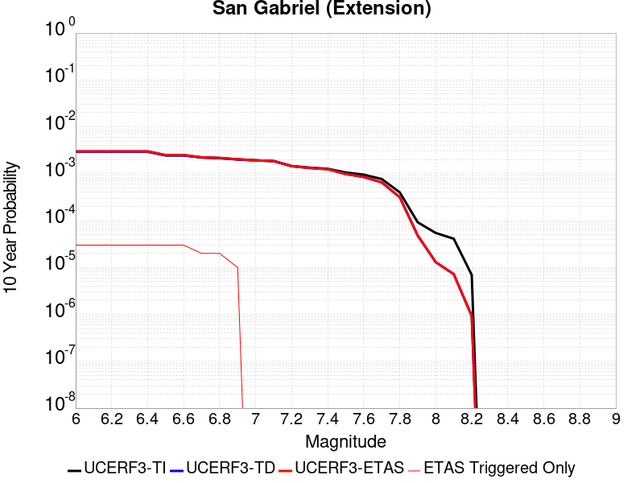 |

| Magnitude | 1 wk TI Prob | 1 wk TD Prob | 1 wk ETAS Prob | 1 wk ETAS/TD Gain | 1 wk ETAS Triggered Only | 1 mo TI Prob | 1 mo TD Prob | 1 mo ETAS Prob | 1 mo ETAS/TD Gain | 1 mo ETAS Triggered Only | 1 yr TI Prob | 1 yr TD Prob | 1 yr ETAS Prob | 1 yr ETAS/TD Gain | 1 yr ETAS Triggered Only | 10 yr TI Prob | 10 yr TD Prob | 10 yr ETAS Prob | 10 yr ETAS/TD Gain | 10 yr ETAS Triggered Only |
|-----|-----|-----|-----|-----|-----|-----|-----|-----|-----|-----|-----|-----|-----|-----|-----|-----|-----|-----|-----|-----|
| 6.0 | 5.6486106E-6 | 5.7168304E-6 | 1.5716772E-5 | 2.749211 | 1.0E-5 | 2.4208108E-5 | 2.450048E-5 | 3.4500234E-5 | 1.4081453 | 1.0E-5 | 2.9469383E-4 | 2.9825376E-4 | 3.182478E-4 | 1.067037 | 2.0E-5 | 0.0029430336 | 0.0029786653 | 0.0030085759 | 1.0100416 | 3.0E-5 |
| 6.1 | 5.6486106E-6 | 5.7168304E-6 | 1.5716772E-5 | 2.749211 | 1.0E-5 | 2.4208108E-5 | 2.450048E-5 | 3.4500234E-5 | 1.4081453 | 1.0E-5 | 2.9469383E-4 | 2.9825376E-4 | 3.182478E-4 | 1.067037 | 2.0E-5 | 0.0029430336 | 0.0029786653 | 0.0030085759 | 1.0100416 | 3.0E-5 |
| 6.2 | 5.6486106E-6 | 5.7168304E-6 | 1.5716772E-5 | 2.749211 | 1.0E-5 | 2.4208108E-5 | 2.450048E-5 | 3.4500234E-5 | 1.4081453 | 1.0E-5 | 2.9469383E-4 | 2.9825376E-4 | 3.182478E-4 | 1.067037 | 2.0E-5 | 0.0029430336 | 0.0029786653 | 0.0030085759 | 1.0100416 | 3.0E-5 |
| 6.3 | 5.6486106E-6 | 5.7168304E-6 | 1.5716772E-5 | 2.749211 | 1.0E-5 | 2.4208108E-5 | 2.450048E-5 | 3.4500234E-5 | 1.4081453 | 1.0E-5 | 2.9469383E-4 | 2.9825376E-4 | 3.182478E-4 | 1.067037 | 2.0E-5 | 0.0029430336 | 0.0029786653 | 0.0030085759 | 1.0100416 | 3.0E-5 |
| 6.4 | 5.6486106E-6 | 5.7168304E-6 | 1.5716772E-5 | 2.749211 | 1.0E-5 | 2.4208108E-5 | 2.450048E-5 | 3.4500234E-5 | 1.4081453 | 1.0E-5 | 2.9469383E-4 | 2.9825376E-4 | 3.182478E-4 | 1.067037 | 2.0E-5 | 0.0029430336 | 0.0029786653 | 0.0030085759 | 1.0100416 | 3.0E-5 |
| 6.5 | 4.7134554E-6 | 4.7542544E-6 | 1.4754207E-5 | 3.1033692 | 1.0E-5 | 2.0200367E-5 | 2.0375222E-5 | 3.0375018E-5 | 1.4907823 | 1.0E-5 | 2.459117E-4 | 2.4804095E-4 | 2.6803598E-4 | 1.0806118 | 2.0E-5 | 0.0024563975 | 0.002477729 | 0.0025076547 | 1.0120778 | 3.0E-5 |
| 6.6 | 4.7134554E-6 | 4.7542544E-6 | 1.4754207E-5 | 3.1033692 | 1.0E-5 | 2.0200367E-5 | 2.0375222E-5 | 3.0375018E-5 | 1.4907823 | 1.0E-5 | 2.459117E-4 | 2.4804095E-4 | 2.6803598E-4 | 1.0806118 | 2.0E-5 | 0.0024563975 | 0.002477729 | 0.0025076547 | 1.0120778 | 3.0E-5 |
| 6.7 | 4.2468837E-6 | 4.2740717E-6 | 1.4274029E-5 | 3.3396792 | 1.0E-5 | 1.8200803E-5 | 1.8317325E-5 | 2.8317143E-5 | 1.5459212 | 1.0E-5 | 2.2157225E-4 | 2.2299135E-4 | 2.4298689E-4 | 1.0896696 | 2.0E-5 | 0.0022135144 | 0.0022277518 | 0.0022477072 | 1.0089576 | 2.0E-5 |
| 6.8 | 4.1180615E-6 | 4.1414614E-6 | 1.414142E-5 | 3.4145966 | 1.0E-5 | 1.7648716E-5 | 1.7749004E-5 | 2.7748825E-5 | 1.5634019 | 1.0E-5 | 2.1485193E-4 | 2.160734E-4 | 2.3606909E-4 | 1.0925411 | 2.0E-5 | 0.0021464431 | 0.0021587082 | 0.002178665 | 1.0092448 | 2.0E-5 |
| 6.9 | 3.863861E-6 | 3.8797766E-6 | 3.8797766E-6 | 1.0 | 0.0 | 1.65593E-5 | 1.6627511E-5 | 1.6627511E-5 | 1.0 | 0.0 | 2.0159081E-4 | 2.0242184E-4 | 2.124198E-4 | 1.0493917 | 1.0E-5 | 0.0020140803 | 0.002022446 | 0.0020324257 | 1.0049345 | 1.0E-5 |
| 7.0 | 3.6947372E-6 | 3.705676E-6 | 3.705676E-6 | 1.0 | 0.0 | 1.5834492E-5 | 1.5881375E-5 | 1.5881375E-5 | 1.0 | 0.0 | 1.9276788E-4 | 1.9333926E-4 | 1.9333926E-4 | 1.0 | 0.0 | 0.0019260074 | 0.0019317807 | 0.0019317807 | 1.0 | 0.0 |
| 7.1 | 3.5686835E-6 | 3.5728963E-6 | 3.5728963E-6 | 1.0 | 0.0 | 1.5294268E-5 | 1.5312327E-5 | 1.5312327E-5 | 1.0 | 0.0 | 1.861918E-4 | 1.8641229E-4 | 1.8641229E-4 | 1.0 | 0.0 | 0.0018603588 | 0.0018626289 | 0.0018626289 | 1.0 | 0.0 |
| 7.2 | 2.8023446E-6 | 2.7767885E-6 | 2.7767885E-6 | 1.0 | 0.0 | 1.2009994E-5 | 1.1900468E-5 | 1.1900468E-5 | 1.0 | 0.0 | 1.4621185E-4 | 1.4487868E-4 | 1.4487868E-4 | 1.0 | 0.0 | 0.001461157 | 0.0014478569 | 0.0014478569 | 1.0 | 0.0 |
| 7.3 | 2.5843012E-6 | 2.5459642E-6 | 2.5459642E-6 | 1.0 | 0.0 | 1.1075529E-5 | 1.0911231E-5 | 1.0911231E-5 | 1.0 | 0.0 | 1.3483623E-4 | 1.3283623E-4 | 1.3283623E-4 | 1.0 | 0.0 | 0.0013475444 | 0.0013275818 | 0.0013275818 | 1.0 | 0.0 |
| 7.4 | 2.4464468E-6 | 2.396665E-6 | 2.396665E-6 | 1.0 | 0.0 | 1.04847295E-5 | 1.0271382E-5 | 1.0271382E-5 | 1.0 | 0.0 | 1.276441E-4 | 1.25047E-4 | 1.25047E-4 | 1.0 | 0.0 | 0.0012757082 | 0.0012497796 | 0.0012497796 | 1.0 | 0.0 |
| 7.5 | 2.0420266E-6 | 1.8910426E-6 | 1.8910426E-6 | 1.0 | 0.0 | 8.751514E-6 | 8.104444E-6 | 8.104444E-6 | 1.0 | 0.0 | 1.0654447E-4 | 9.8667166E-5 | 9.8667166E-5 | 1.0 | 0.0 | 0.001064934 | 9.862408E-4 | 9.862408E-4 | 1.0 | 0.0 |
| 7.6 | 1.8326596E-6 | 1.6398341E-6 | 1.6398341E-6 | 1.0 | 0.0 | 7.854232E-6 | 7.0278415E-6 | 7.0278415E-6 | 1.0 | 0.0 | 9.562107E-5 | 8.5560634E-5 | 8.5560634E-5 | 1.0 | 0.0 | 9.5579936E-4 | 8.5528276E-4 | 8.5528276E-4 | 1.0 | 0.0 |
| 7.7 | 1.4786998E-6 | 1.2523838E-6 | 1.2523838E-6 | 1.0 | 0.0 | 6.3372695E-6 | 5.367348E-6 | 5.367348E-6 | 1.0 | 0.0 | 7.715353E-5 | 6.534551E-5 | 6.534551E-5 | 1.0 | 0.0 | 7.7126746E-4 | 6.532707E-4 | 6.532707E-4 | 1.0 | 0.0 |
| 7.8 | 7.6975533E-7 | 6.0693884E-7 | 6.0693884E-7 | 1.0 | 0.0 | 3.2989474E-6 | 2.601164E-6 | 2.601164E-6 | 1.0 | 0.0 | 4.0163945E-5 | 3.166871E-5 | 3.166871E-5 | 1.0 | 0.0 | 4.0156685E-4 | 3.1664805E-4 | 3.1664805E-4 | 1.0 | 0.0 |
| 7.9 | 1.7645915E-7 | 9.213256E-8 | 9.213256E-8 | 1.0 | 0.0 | 7.562533E-7 | 3.9485377E-7 | 3.9485377E-7 | 1.0 | 0.0 | 9.207345E-6 | 4.807334E-6 | 4.807334E-6 | 1.0 | 0.0 | 9.206964E-5 | 4.807699E-5 | 4.807699E-5 | 1.0 | 0.0 |
| 8.0 | 1.0463461E-7 | 2.4949307E-8 | 2.4949307E-8 | 1.0 | 0.0 | 4.4843398E-7 | 1.0692559E-7 | 1.0692559E-7 | 1.0 | 0.0 | 5.45967E-6 | 1.3018183E-6 | 1.3018183E-6 | 1.0 | 0.0 | 5.459536E-5 | 1.3022789E-5 | 1.3022789E-5 | 1.0 | 0.0 |
| 8.1 | 7.875717E-8 | 1.3866874E-8 | 1.3866874E-8 | 1.0 | 0.0 | 3.3753068E-7 | 5.942946E-8 | 5.942946E-8 | 1.0 | 0.0 | 4.109428E-6 | 7.235534E-7 | 7.235534E-7 | 1.0 | 0.0 | 4.109352E-5 | 7.2401926E-6 | 7.2401926E-6 | 1.0 | 0.0 |
| 8.2 | 1.33163E-8 | 1.7733891E-9 | 1.7733891E-9 | 1.0 | 0.0 | 5.7069855E-8 | 7.600239E-9 | 7.600239E-9 | 1.0 | 0.0 | 6.9482525E-7 | 9.25329E-8 | 9.25329E-8 | 1.0 | 0.0 | 6.9482307E-6 | 9.272953E-7 | 9.272953E-7 | 1.0 | 0.0 |

## Rodgers Creek - Healdsburg 2011 CFM
*[(top)](#table-of-contents)*

| 1 Week | 1 Month | 1 Year | 10 Year |
|-----|-----|-----|-----|
|  |  |  |  |

| Magnitude | 1 wk TI Prob | 1 wk TD Prob | 1 wk ETAS Prob | 1 wk ETAS/TD Gain | 1 wk ETAS Triggered Only | 1 mo TI Prob | 1 mo TD Prob | 1 mo ETAS Prob | 1 mo ETAS/TD Gain | 1 mo ETAS Triggered Only | 1 yr TI Prob | 1 yr TD Prob | 1 yr ETAS Prob | 1 yr ETAS/TD Gain | 1 yr ETAS Triggered Only | 10 yr TI Prob | 10 yr TD Prob | 10 yr ETAS Prob | 10 yr ETAS/TD Gain | 10 yr ETAS Triggered Only |
|-----|-----|-----|-----|-----|-----|-----|-----|-----|-----|-----|-----|-----|-----|-----|-----|-----|-----|-----|-----|-----|
| 6.0 | 7.390182E-5 | 1.3136698E-4 | 1.3136698E-4 | 1.0 | 0.0 | 3.1668364E-4 | 5.6287815E-4 | 5.6287815E-4 | 1.0 | 0.0 | 0.0038488081 | 0.0068315 | 0.0068414323 | 1.0014538 | 1.0E-5 | 0.037828278 | 0.06619178 | 0.06621979 | 1.0004232 | 3.0E-5 |
| 6.1 | 7.318768E-5 | 1.3034661E-4 | 1.3034661E-4 | 1.0 | 0.0 | 3.1362378E-4 | 5.585081E-4 | 5.585081E-4 | 1.0 | 0.0 | 0.0038116854 | 0.0067786723 | 0.0067886044 | 1.0014652 | 1.0E-5 | 0.037469655 | 0.06569639 | 0.06572442 | 1.0004267 | 3.0E-5 |
| 6.2 | 7.1379836E-5 | 1.2727521E-4 | 1.2727521E-4 | 1.0 | 0.0 | 3.058777E-4 | 5.453505E-4 | 5.453505E-4 | 1.0 | 0.0 | 0.003717703 | 0.0066194604 | 0.0066293944 | 1.0015007 | 1.0E-5 | 0.0365612 | 0.06421462 | 0.06424269 | 1.0004371 | 3.0E-5 |
| 6.3 | 6.9255926E-5 | 1.2382054E-4 | 1.2382054E-4 | 1.0 | 0.0 | 2.9677735E-4 | 5.3055194E-4 | 5.3055194E-4 | 1.0 | 0.0 | 0.0036072785 | 0.006440372 | 0.006450308 | 1.0015427 | 1.0E-5 | 0.035492823 | 0.06254096 | 0.06256908 | 1.0004497 | 3.0E-5 |
| 6.4 | 6.6757144E-5 | 1.1958744E-4 | 1.1958744E-4 | 1.0 | 0.0 | 2.8607066E-4 | 5.1241735E-4 | 5.1241735E-4 | 1.0 | 0.0 | 0.0034773487 | 0.0062209065 | 0.006230844 | 1.0015975 | 1.0E-5 | 0.034234364 | 0.060490217 | 0.060518403 | 1.000466 | 3.0E-5 |
| 6.5 | 6.5735134E-5 | 1.1808043E-4 | 1.1808043E-4 | 1.0 | 0.0 | 2.8169158E-4 | 5.0596124E-4 | 5.0596124E-4 | 1.0 | 0.0 | 0.003424202 | 0.0061427657 | 0.0061527044 | 1.0016179 | 1.0E-5 | 0.03371918 | 0.059755135 | 0.059783343 | 1.0004721 | 3.0E-5 |
| 6.6 | 6.289601E-5 | 1.1343802E-4 | 1.1343802E-4 | 1.0 | 0.0 | 2.6952647E-4 | 4.8607276E-4 | 4.8607276E-4 | 1.0 | 0.0 | 0.0032765474 | 0.005901959 | 0.0059118997 | 1.0016843 | 1.0E-5 | 0.032286562 | 0.057494484 | 0.05752276 | 1.0004917 | 3.0E-5 |
| 6.7 | 6.115274E-5 | 1.1060895E-4 | 1.1060895E-4 | 1.0 | 0.0 | 2.6205686E-4 | 4.7395262E-4 | 4.7395262E-4 | 1.0 | 0.0 | 0.0031858748 | 0.0057551847 | 0.005765127 | 1.0017276 | 1.0E-5 | 0.031405866 | 0.05611298 | 0.056141295 | 1.0005046 | 3.0E-5 |
| 6.8 | 5.9232367E-5 | 1.0728244E-4 | 1.0728244E-4 | 1.0 | 0.0 | 2.538283E-4 | 4.597012E-4 | 4.597012E-4 | 1.0 | 0.0 | 0.0030859804 | 0.0055825757 | 0.00559252 | 1.0017813 | 1.0E-5 | 0.030434765 | 0.054479737 | 0.0545081 | 1.0005207 | 3.0E-5 |
| 6.9 | 5.4030377E-5 | 9.8224424E-5 | 9.8224424E-5 | 1.0 | 0.0 | 2.315382E-4 | 4.2089424E-4 | 4.2089424E-4 | 1.0 | 0.0 | 0.0028153337 | 0.005112413 | 0.0051223617 | 1.001946 | 1.0E-5 | 0.027799325 | 0.05001516 | 0.050043657 | 1.0005698 | 3.0E-5 |
| 7.0 | 4.8260714E-5 | 8.740524E-5 | 8.740524E-5 | 1.0 | 0.0 | 2.0681522E-4 | 3.745404E-4 | 3.745404E-4 | 1.0 | 0.0 | 0.0025150678 | 0.004550549 | 0.0045605036 | 1.0021875 | 1.0E-5 | 0.024867928 | 0.044667665 | 0.044696324 | 1.0006416 | 3.0E-5 |
| 7.1 | 4.0294493E-5 | 7.389041E-5 | 7.389041E-5 | 1.0 | 0.0 | 1.7267925E-4 | 3.1663495E-4 | 3.1663495E-4 | 1.0 | 0.0 | 0.0021003427 | 0.0038482544 | 0.0038582159 | 1.0025886 | 1.0E-5 | 0.02080602 | 0.037923392 | 0.03795225 | 1.000761 | 3.0E-5 |
| 7.2 | 3.096388E-5 | 5.697752E-5 | 5.697752E-5 | 1.0 | 0.0 | 1.326956E-4 | 2.4416664E-4 | 2.4416664E-4 | 1.0 | 0.0 | 0.0016143717 | 0.0029686983 | 0.0029786685 | 1.0033585 | 1.0E-5 | 0.01602694 | 0.029436996 | 0.029466113 | 1.0009891 | 3.0E-5 |
| 7.3 | 2.3615226E-5 | 4.3628002E-5 | 4.3628002E-5 | 1.0 | 0.0 | 1.0120418E-4 | 1.8696384E-4 | 1.8696384E-4 | 1.0 | 0.0 | 0.0012314644 | 0.002273922 | 0.0022838993 | 1.0043877 | 1.0E-5 | 0.0122466255 | 0.022636993 | 0.022666315 | 1.0012952 | 3.0E-5 |
| 7.4 | 1.8251132E-5 | 3.3541033E-5 | 3.3541033E-5 | 1.0 | 0.0 | 7.821679E-5 | 1.4373941E-4 | 1.4373941E-4 | 1.0 | 0.0 | 9.518733E-4 | 0.0017486324 | 0.0017586149 | 1.0057088 | 1.0E-5 | 0.009478063 | 0.017465532 | 0.017495006 | 1.0016876 | 3.0E-5 |
| 7.5 | 1.2411432E-5 | 2.246003E-5 | 2.246003E-5 | 1.0 | 0.0 | 5.3190768E-5 | 9.625375E-5 | 9.625375E-5 | 1.0 | 0.0 | 6.4740516E-4 | 0.0011712653 | 0.0011812536 | 1.0085278 | 1.0E-5 | 0.006455223 | 0.011743283 | 0.011763048 | 1.0016831 | 2.0E-5 |
| 7.6 | 4.4771446E-6 | 8.083989E-6 | 8.083989E-6 | 1.0 | 0.0 | 1.918762E-5 | 3.4645214E-5 | 3.4645214E-5 | 1.0 | 0.0 | 2.3358424E-4 | 4.2172507E-4 | 4.3172087E-4 | 1.0237021 | 1.0E-5 | 0.0023333887 | 0.004246066 | 0.004256023 | 1.0023451 | 1.0E-5 |
| 7.7 | 2.157941E-7 | 3.5349316E-7 | 3.5349316E-7 | 1.0 | 0.0 | 9.248315E-7 | 1.5149698E-6 | 1.5149698E-6 | 1.0 | 0.0 | 1.1259765E-5 | 1.8444602E-5 | 1.8444602E-5 | 1.0 | 0.0 | 1.1259195E-4 | 1.9069147E-4 | 1.9069147E-4 | 1.0 | 0.0 |
| 7.8 | 9.9623286E-8 | 1.989979E-7 | 1.989979E-7 | 1.0 | 0.0 | 4.269569E-7 | 8.528478E-7 | 8.528478E-7 | 1.0 | 0.0 | 5.1981874E-6 | 1.0383373E-5 | 1.0383373E-5 | 1.0 | 0.0 | 5.198066E-5 | 1.09018714E-4 | 1.09018714E-4 | 1.0 | 0.0 |
| 7.9 | 5.6745257E-8 | 1.1773924E-7 | 1.1773924E-7 | 1.0 | 0.0 | 2.4319394E-7 | 5.0459664E-7 | 5.0459664E-7 | 1.0 | 0.0 | 2.960882E-6 | 6.1434466E-6 | 6.1434466E-6 | 1.0 | 0.0 | 2.9608427E-5 | 6.470911E-5 | 6.470911E-5 | 1.0 | 0.0 |
| 8.0 | 2.8614323E-8 | 6.57845E-8 | 6.57845E-8 | 1.0 | 0.0 | 1.2263281E-7 | 2.8193355E-7 | 2.8193355E-7 | 1.0 | 0.0 | 1.4930534E-6 | 3.4325356E-6 | 3.4325356E-6 | 1.0 | 0.0 | 1.4930434E-5 | 3.582588E-5 | 3.582588E-5 | 1.0 | 0.0 |
| 8.1 | 3.5045191E-9 | 8.965783E-9 | 8.965783E-9 | 1.0 | 0.0 | 1.5019367E-8 | 3.8424783E-8 | 3.8424783E-8 | 1.0 | 0.0 | 1.8286079E-7 | 4.6782165E-7 | 4.6782165E-7 | 1.0 | 0.0 | 1.8286064E-6 | 4.8327956E-6 | 4.8327956E-6 | 1.0 | 0.0 |

## Monterey Bay-Tularcitos
*[(top)](#table-of-contents)*

| 1 Week | 1 Month | 1 Year | 10 Year |
|-----|-----|-----|-----|
|  |  |  | 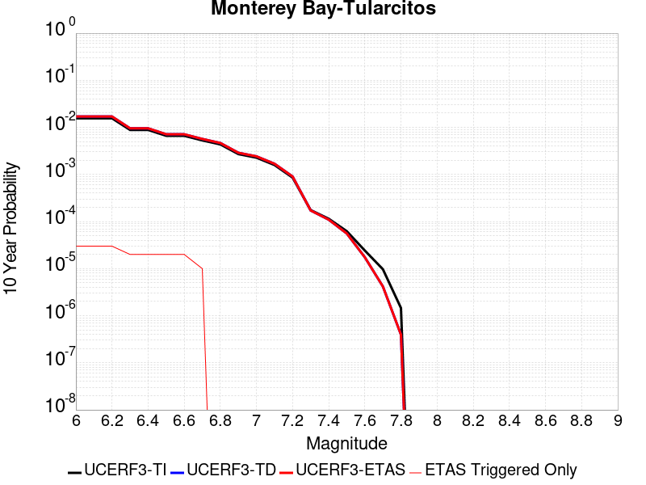 |

| Magnitude | 1 wk TI Prob | 1 wk TD Prob | 1 wk ETAS Prob | 1 wk ETAS/TD Gain | 1 wk ETAS Triggered Only | 1 mo TI Prob | 1 mo TD Prob | 1 mo ETAS Prob | 1 mo ETAS/TD Gain | 1 mo ETAS Triggered Only | 1 yr TI Prob | 1 yr TD Prob | 1 yr ETAS Prob | 1 yr ETAS/TD Gain | 1 yr ETAS Triggered Only | 10 yr TI Prob | 10 yr TD Prob | 10 yr ETAS Prob | 10 yr ETAS/TD Gain | 10 yr ETAS Triggered Only |
|-----|-----|-----|-----|-----|-----|-----|-----|-----|-----|-----|-----|-----|-----|-----|-----|-----|-----|-----|-----|-----|
| 6.0 | 3.0131365E-5 | 3.279877E-5 | 6.2797786E-5 | 1.9146384 | 3.0E-5 | 1.2912804E-4 | 1.4055918E-4 | 1.7055497E-4 | 1.2134032 | 3.0E-5 | 0.001571 | 0.0017100703 | 0.001740019 | 1.0175132 | 3.0E-5 | 0.015599402 | 0.016979916 | 0.017009407 | 1.0017368 | 3.0E-5 |
| 6.1 | 3.0131365E-5 | 3.279877E-5 | 6.2797786E-5 | 1.9146384 | 3.0E-5 | 1.2912804E-4 | 1.4055918E-4 | 1.7055497E-4 | 1.2134032 | 3.0E-5 | 0.001571 | 0.0017100703 | 0.001740019 | 1.0175132 | 3.0E-5 | 0.015599402 | 0.016979916 | 0.017009407 | 1.0017368 | 3.0E-5 |
| 6.2 | 3.0131365E-5 | 3.279877E-5 | 6.2797786E-5 | 1.9146384 | 3.0E-5 | 1.2912804E-4 | 1.4055918E-4 | 1.7055497E-4 | 1.2134032 | 3.0E-5 | 0.001571 | 0.0017100703 | 0.001740019 | 1.0175132 | 3.0E-5 | 0.015599402 | 0.016979916 | 0.017009407 | 1.0017368 | 3.0E-5 |
| 6.3 | 1.6998249E-5 | 1.8330798E-5 | 3.8330432E-5 | 2.09104 | 2.0E-5 | 7.28476E-5 | 7.85583E-5 | 9.855673E-5 | 1.254568 | 2.0E-5 | 8.865586E-4 | 9.5604634E-4 | 9.760272E-4 | 1.0208995 | 2.0E-5 | 0.0088303005 | 0.009521258 | 0.009541067 | 1.0020806 | 2.0E-5 |
| 6.4 | 1.6998249E-5 | 1.8330798E-5 | 3.8330432E-5 | 2.09104 | 2.0E-5 | 7.28476E-5 | 7.85583E-5 | 9.855673E-5 | 1.254568 | 2.0E-5 | 8.865586E-4 | 9.5604634E-4 | 9.760272E-4 | 1.0208995 | 2.0E-5 | 0.0088303005 | 0.009521258 | 0.009541067 | 1.0020806 | 2.0E-5 |
| 6.5 | 1.27470785E-5 | 1.3693312E-5 | 3.369304E-5 | 2.460547 | 2.0E-5 | 5.4629192E-5 | 5.8684363E-5 | 7.868319E-5 | 1.3407863 | 2.0E-5 | 6.649074E-4 | 7.1425823E-4 | 7.3424395E-4 | 1.027981 | 2.0E-5 | 0.0066292146 | 0.007120678 | 0.007140536 | 1.0027887 | 2.0E-5 |
| 6.6 | 1.2739422E-5 | 1.36854E-5 | 3.3685126E-5 | 2.4613914 | 2.0E-5 | 5.4596385E-5 | 5.8650454E-5 | 7.864928E-5 | 1.3409834 | 2.0E-5 | 6.645082E-4 | 7.1384566E-4 | 7.338314E-4 | 1.0279973 | 2.0E-5 | 0.0066252467 | 0.007116579 | 0.0071364366 | 1.0027903 | 2.0E-5 |
| 6.7 | 1.0160109E-5 | 1.0885755E-5 | 2.0885645E-5 | 1.9186218 | 1.0E-5 | 4.35426E-5 | 4.665244E-5 | 5.6651974E-5 | 1.214341 | 1.0E-5 | 5.300022E-4 | 5.6785246E-4 | 5.778468E-4 | 1.0176002 | 1.0E-5 | 0.005287399 | 0.0056647263 | 0.0056746695 | 1.0017554 | 1.0E-5 |
| 6.8 | 8.349859E-6 | 8.932587E-6 | 8.932587E-6 | 1.0 | 0.0 | 3.578462E-5 | 3.8281985E-5 | 3.8281985E-5 | 1.0 | 0.0 | 4.3559066E-4 | 4.6598914E-4 | 4.6598914E-4 | 1.0 | 0.0 | 0.004347378 | 0.004650685 | 0.004650685 | 1.0 | 0.0 |
| 6.9 | 5.193639E-6 | 5.53643E-6 | 5.53643E-6 | 1.0 | 0.0 | 2.2258262E-5 | 2.372736E-5 | 2.372736E-5 | 1.0 | 0.0 | 2.7096065E-4 | 2.8884556E-4 | 2.8884556E-4 | 1.0 | 0.0 | 0.0027063051 | 0.0028850222 | 0.0028850222 | 1.0 | 0.0 |
| 7.0 | 4.359381E-6 | 4.643366E-6 | 4.643366E-6 | 1.0 | 0.0 | 1.8682927E-5 | 1.9900004E-5 | 1.9900004E-5 | 1.0 | 0.0 | 2.274409E-4 | 2.422586E-4 | 2.422586E-4 | 1.0 | 0.0 | 0.0022720827 | 0.002420238 | 0.002420238 | 1.0 | 0.0 |
| 7.1 | 3.0398533E-6 | 3.2310427E-6 | 3.2310427E-6 | 1.0 | 0.0 | 1.3027877E-5 | 1.3847267E-5 | 1.3847267E-5 | 1.0 | 0.0 | 1.5860285E-4 | 1.6858005E-4 | 1.6858005E-4 | 1.0 | 0.0 | 0.001584897 | 0.0016847793 | 0.0016847793 | 1.0 | 0.0 |
| 7.2 | 1.642335E-6 | 1.7333153E-6 | 1.7333153E-6 | 1.0 | 0.0 | 7.0385595E-6 | 7.428485E-6 | 7.428485E-6 | 1.0 | 0.0 | 8.569109E-5 | 9.044012E-5 | 9.044012E-5 | 1.0 | 0.0 | 8.5658056E-4 | 9.042358E-4 | 9.042358E-4 | 1.0 | 0.0 |
| 7.3 | 3.356842E-7 | 3.2952389E-7 | 3.2952389E-7 | 1.0 | 0.0 | 1.4386458E-6 | 1.4122444E-6 | 1.4122444E-6 | 1.0 | 0.0 | 1.7515373E-5 | 1.7193941E-5 | 1.7193941E-5 | 1.0 | 0.0 | 1.7513991E-4 | 1.719262E-4 | 1.719262E-4 | 1.0 | 0.0 |
| 7.4 | 2.1973483E-7 | 2.1006413E-7 | 2.1006413E-7 | 1.0 | 0.0 | 9.417204E-7 | 9.0027453E-7 | 9.0027453E-7 | 1.0 | 0.0 | 1.1465385E-5 | 1.0960787E-5 | 1.0960787E-5 | 1.0 | 0.0 | 1.1464794E-4 | 1.096025E-4 | 1.096025E-4 | 1.0 | 0.0 |
| 7.5 | 1.1944135E-7 | 1.0696043E-7 | 1.0696043E-7 | 1.0 | 0.0 | 5.118914E-7 | 4.5840173E-7 | 4.5840173E-7 | 1.0 | 0.0 | 6.23226E-6 | 5.581027E-6 | 5.581027E-6 | 1.0 | 0.0 | 6.2320854E-5 | 5.5808883E-5 | 5.5808883E-5 | 1.0 | 0.0 |
| 7.6 | 4.636058E-8 | 3.336489E-8 | 3.336489E-8 | 1.0 | 0.0 | 1.9868818E-7 | 1.4299238E-7 | 1.4299238E-7 | 1.0 | 0.0 | 2.419026E-6 | 1.7409308E-6 | 1.7409308E-6 | 1.0 | 0.0 | 2.4189996E-5 | 1.7409173E-5 | 1.7409173E-5 | 1.0 | 0.0 |
| 7.7 | 1.8588572E-8 | 8.003744E-9 | 8.003744E-9 | 1.0 | 0.0 | 7.9665305E-8 | 3.430176E-8 | 3.430176E-8 | 1.0 | 0.0 | 9.699246E-7 | 4.1762385E-7 | 4.1762385E-7 | 1.0 | 0.0 | 9.699204E-6 | 4.176231E-6 | 4.176231E-6 | 1.0 | 0.0 |
| 7.8 | 2.7960154E-9 | 7.6099427E-10 | 7.6099427E-10 | 1.0 | 0.0 | 1.1982923E-8 | 3.2614043E-9 | 3.2614043E-9 | 1.0 | 0.0 | 1.4589209E-7 | 3.9707597E-8 | 3.9707597E-8 | 1.0 | 0.0 | 1.4589199E-6 | 3.9707595E-7 | 3.9707595E-7 | 1.0 | 0.0 |

## Green Valley 2011 CFM
*[(top)](#table-of-contents)*

| 1 Week | 1 Month | 1 Year | 10 Year |
|-----|-----|-----|-----|
|  | 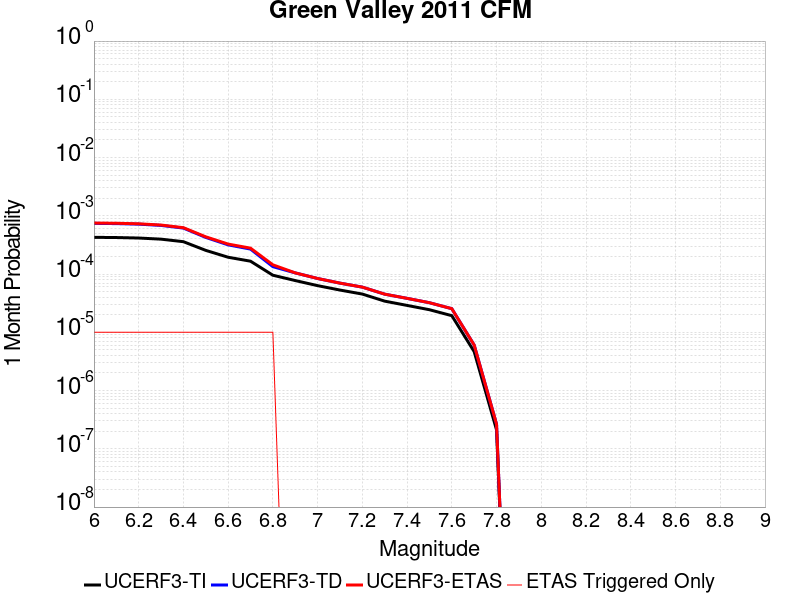 | 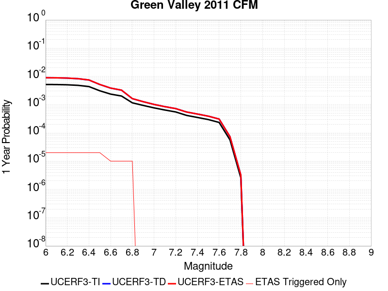 |  |

| Magnitude | 1 wk TI Prob | 1 wk TD Prob | 1 wk ETAS Prob | 1 wk ETAS/TD Gain | 1 wk ETAS Triggered Only | 1 mo TI Prob | 1 mo TD Prob | 1 mo ETAS Prob | 1 mo ETAS/TD Gain | 1 mo ETAS Triggered Only | 1 yr TI Prob | 1 yr TD Prob | 1 yr ETAS Prob | 1 yr ETAS/TD Gain | 1 yr ETAS Triggered Only | 10 yr TI Prob | 10 yr TD Prob | 10 yr ETAS Prob | 10 yr ETAS/TD Gain | 10 yr ETAS Triggered Only |
|-----|-----|-----|-----|-----|-----|-----|-----|-----|-----|-----|-----|-----|-----|-----|-----|-----|-----|-----|-----|-----|
| 6.0 | 9.9629346E-5 | 1.7305532E-4 | 1.8305359E-4 | 1.057775 | 1.0E-5 | 4.2691303E-4 | 7.4143766E-4 | 7.514302E-4 | 1.0134773 | 1.0E-5 | 0.0051852856 | 0.008986705 | 0.009006525 | 1.0022055 | 2.0E-5 | 0.050659515 | 0.085522056 | 0.085549496 | 1.0003208 | 3.0E-5 |
| 6.1 | 9.88615E-5 | 1.7152846E-4 | 1.8152675E-4 | 1.0582894 | 1.0E-5 | 4.2362334E-4 | 7.348976E-4 | 7.448903E-4 | 1.0135974 | 1.0E-5 | 0.0051454236 | 0.0089077335 | 0.008927555 | 1.0022253 | 2.0E-5 | 0.050279044 | 0.084809676 | 0.08483713 | 1.0003238 | 3.0E-5 |
| 6.2 | 9.696895E-5 | 1.6791887E-4 | 1.779172E-4 | 1.0595425 | 1.0E-5 | 4.15515E-4 | 7.194366E-4 | 7.294294E-4 | 1.0138898 | 1.0E-5 | 0.0050471667 | 0.008721114 | 0.008740939 | 1.0022733 | 2.0E-5 | 0.04934063 | 0.0831186 | 0.08314611 | 1.0003309 | 3.0E-5 |
| 6.3 | 9.275224E-5 | 1.5971228E-4 | 1.6971068E-4 | 1.0626026 | 1.0E-5 | 3.9744904E-4 | 6.842841E-4 | 6.9427723E-4 | 1.0146039 | 1.0E-5 | 0.0048282105 | 0.008296439 | 0.008316273 | 1.0023906 | 2.0E-5 | 0.047246475 | 0.07925707 | 0.07928469 | 1.0003486 | 3.0E-5 |
| 6.4 | 8.391499E-5 | 1.4367796E-4 | 1.5367652E-4 | 1.0695901 | 1.0E-5 | 3.595861E-4 | 6.156248E-4 | 6.256187E-4 | 1.0162337 | 1.0E-5 | 0.004369175 | 0.0074670846 | 0.0074869352 | 1.0026584 | 2.0E-5 | 0.04284265 | 0.071630865 | 0.071658716 | 1.0003889 | 3.0E-5 |
| 6.5 | 5.9519385E-5 | 9.9340905E-5 | 1.0933991E-4 | 1.1006534 | 1.0E-5 | 2.5505814E-4 | 4.2568138E-4 | 4.3567715E-4 | 1.0234817 | 1.0E-5 | 0.0031009112 | 0.005168295 | 0.005188192 | 1.0038497 | 2.0E-5 | 0.030579966 | 0.050145864 | 0.05017436 | 1.0005683 | 3.0E-5 |
| 6.6 | 4.5361558E-5 | 7.402609E-5 | 8.402535E-5 | 1.1350775 | 1.0E-5 | 1.9439218E-4 | 3.1721895E-4 | 3.272158E-4 | 1.0315139 | 1.0E-5 | 0.0023641558 | 0.0038539418 | 0.0038639032 | 1.0025847 | 1.0E-5 | 0.023391623 | 0.037665963 | 0.037685208 | 1.0005109 | 2.0E-5 |
| 6.7 | 3.8808106E-5 | 6.2651976E-5 | 7.2651346E-5 | 1.1596019 | 1.0E-5 | 1.6630985E-4 | 2.6848342E-4 | 2.7848073E-4 | 1.0372362 | 1.0E-5 | 0.0020229418 | 0.0032626586 | 0.003272626 | 1.003055 | 1.0E-5 | 0.020046256 | 0.032005914 | 0.032025274 | 1.0006049 | 2.0E-5 |
| 6.8 | 2.2284667E-5 | 3.1285235E-5 | 4.1284922E-5 | 1.3196295 | 1.0E-5 | 9.550222E-5 | 1.3407279E-4 | 1.4407144E-4 | 1.0745764 | 1.0E-5 | 0.0011621192 | 0.0016311078 | 0.0016410915 | 1.0061208 | 1.0E-5 | 0.011560607 | 0.016165998 | 0.016175836 | 1.0006086 | 1.0E-5 |
| 6.9 | 1.8050168E-5 | 2.4448054E-5 | 2.4448054E-5 | 1.0 | 0.0 | 7.735557E-5 | 1.047732E-4 | 1.047732E-4 | 1.0 | 0.0 | 9.4139716E-4 | 0.0012748708 | 0.0012748708 | 1.0 | 0.0 | 0.009374191 | 0.012667833 | 0.012667833 | 1.0 | 0.0 |
| 7.0 | 1.4763166E-5 | 1.9582854E-5 | 1.9582854E-5 | 1.0 | 0.0 | 6.326917E-5 | 8.3923835E-5 | 8.3923835E-5 | 1.0 | 0.0 | 7.7002996E-4 | 0.0010212966 | 0.0010212966 | 1.0 | 0.0 | 0.007673672 | 0.010165343 | 0.010165343 | 1.0 | 0.0 |
| 7.1 | 1.2399713E-5 | 1.6303715E-5 | 1.6303715E-5 | 1.0 | 0.0 | 5.3140546E-5 | 6.98712E-5 | 6.98712E-5 | 1.0 | 0.0 | 6.467941E-4 | 8.503518E-4 | 8.503518E-4 | 1.0 | 0.0 | 0.006449148 | 0.008471259 | 0.008471259 | 1.0 | 0.0 |
| 7.2 | 1.0584195E-5 | 1.3921742E-5 | 1.3921742E-5 | 1.0 | 0.0 | 4.5360044E-5 | 5.9663253E-5 | 5.9663253E-5 | 1.0 | 0.0 | 5.521186E-4 | 7.261596E-4 | 7.261596E-4 | 1.0 | 0.0 | 0.0055074887 | 0.007238285 | 0.007238285 | 1.0 | 0.0 |
| 7.3 | 7.998173E-6 | 1.054402E-5 | 1.054402E-5 | 1.0 | 0.0 | 3.4277433E-5 | 4.518788E-5 | 4.518788E-5 | 1.0 | 0.0 | 4.1724785E-4 | 5.500247E-4 | 5.500247E-4 | 1.0 | 0.0 | 0.004164653 | 0.0054868995 | 0.0054868995 | 1.0 | 0.0 |
| 7.4 | 6.7571127E-6 | 8.932697E-6 | 8.932697E-6 | 1.0 | 0.0 | 2.8958733E-5 | 3.828243E-5 | 3.828243E-5 | 1.0 | 0.0 | 3.5251552E-4 | 4.6598984E-4 | 4.6598984E-4 | 1.0 | 0.0 | 0.0035195686 | 0.0046503306 | 0.0046503306 | 1.0 | 0.0 |
| 7.5 | 5.69878E-6 | 7.516314E-6 | 7.516314E-6 | 1.0 | 0.0 | 2.4423114E-5 | 3.221238E-5 | 3.221238E-5 | 1.0 | 0.0 | 2.9731085E-4 | 3.9211605E-4 | 3.9211605E-4 | 1.0 | 0.0 | 0.002969134 | 0.0039143935 | 0.0039143935 | 1.0 | 0.0 |
| 7.6 | 4.503664E-6 | 5.9356807E-6 | 5.9356807E-6 | 1.0 | 0.0 | 1.9301275E-5 | 2.5438389E-5 | 2.5438389E-5 | 1.0 | 0.0 | 2.3496768E-4 | 3.096692E-4 | 3.096692E-4 | 1.0 | 0.0 | 0.002347194 | 0.003092502 | 0.003092502 | 1.0 | 0.0 |
| 7.7 | 1.0873546E-6 | 1.4106979E-6 | 1.4106979E-6 | 1.0 | 0.0 | 4.6600826E-6 | 6.045834E-6 | 6.045834E-6 | 1.0 | 0.0 | 5.6735033E-5 | 7.360557E-5 | 7.360557E-5 | 1.0 | 0.0 | 5.672055E-4 | 7.35814E-4 | 7.35814E-4 | 1.0 | 0.0 |
| 7.8 | 4.9373917E-8 | 6.1777136E-8 | 6.1777136E-8 | 1.0 | 0.0 | 2.1160248E-7 | 2.6475914E-7 | 2.6475914E-7 | 1.0 | 0.0 | 2.5762572E-6 | 3.223439E-6 | 3.223439E-6 | 1.0 | 0.0 | 2.5762274E-5 | 3.2232296E-5 | 3.2232296E-5 | 1.0 | 0.0 |

## San Gorgonio Pass
*[(top)](#table-of-contents)*

| 1 Week | 1 Month | 1 Year | 10 Year |
|-----|-----|-----|-----|
|  |  |  |  |

| Magnitude | 1 wk TI Prob | 1 wk TD Prob | 1 wk ETAS Prob | 1 wk ETAS/TD Gain | 1 wk ETAS Triggered Only | 1 mo TI Prob | 1 mo TD Prob | 1 mo ETAS Prob | 1 mo ETAS/TD Gain | 1 mo ETAS Triggered Only | 1 yr TI Prob | 1 yr TD Prob | 1 yr ETAS Prob | 1 yr ETAS/TD Gain | 1 yr ETAS Triggered Only | 10 yr TI Prob | 10 yr TD Prob | 10 yr ETAS Prob | 10 yr ETAS/TD Gain | 10 yr ETAS Triggered Only |
|-----|-----|-----|-----|-----|-----|-----|-----|-----|-----|-----|-----|-----|-----|-----|-----|-----|-----|-----|-----|-----|
| 6.0 | 7.644328E-6 | 1.3314231E-5 | 1.3314231E-5 | 1.0 | 0.0 | 3.2760996E-5 | 5.705979E-5 | 6.705922E-5 | 1.1752448 | 1.0E-5 | 3.987921E-4 | 6.944901E-4 | 7.144762E-4 | 1.0287781 | 2.0E-5 | 0.003980772 | 0.0069299806 | 0.0069597727 | 1.004299 | 3.0E-5 |
| 6.1 | 7.644328E-6 | 1.3314231E-5 | 1.3314231E-5 | 1.0 | 0.0 | 3.2760996E-5 | 5.705979E-5 | 6.705922E-5 | 1.1752448 | 1.0E-5 | 3.987921E-4 | 6.944901E-4 | 7.144762E-4 | 1.0287781 | 2.0E-5 | 0.003980772 | 0.0069299806 | 0.0069597727 | 1.004299 | 3.0E-5 |
| 6.2 | 7.644328E-6 | 1.3314231E-5 | 1.3314231E-5 | 1.0 | 0.0 | 3.2760996E-5 | 5.705979E-5 | 6.705922E-5 | 1.1752448 | 1.0E-5 | 3.987921E-4 | 6.944901E-4 | 7.144762E-4 | 1.0287781 | 2.0E-5 | 0.003980772 | 0.0069299806 | 0.0069597727 | 1.004299 | 3.0E-5 |
| 6.3 | 7.644328E-6 | 1.3314231E-5 | 1.3314231E-5 | 1.0 | 0.0 | 3.2760996E-5 | 5.705979E-5 | 6.705922E-5 | 1.1752448 | 1.0E-5 | 3.987921E-4 | 6.944901E-4 | 7.144762E-4 | 1.0287781 | 2.0E-5 | 0.003980772 | 0.0069299806 | 0.0069597727 | 1.004299 | 3.0E-5 |
| 6.4 | 7.644328E-6 | 1.3314231E-5 | 1.3314231E-5 | 1.0 | 0.0 | 3.2760996E-5 | 5.705979E-5 | 6.705922E-5 | 1.1752448 | 1.0E-5 | 3.987921E-4 | 6.944901E-4 | 7.144762E-4 | 1.0287781 | 2.0E-5 | 0.003980772 | 0.0069299806 | 0.0069597727 | 1.004299 | 3.0E-5 |
| 6.5 | 7.644328E-6 | 1.3314231E-5 | 1.3314231E-5 | 1.0 | 0.0 | 3.2760996E-5 | 5.705979E-5 | 6.705922E-5 | 1.1752448 | 1.0E-5 | 3.987921E-4 | 6.944901E-4 | 7.144762E-4 | 1.0287781 | 2.0E-5 | 0.003980772 | 0.0069299806 | 0.0069597727 | 1.004299 | 3.0E-5 |
| 6.6 | 7.644328E-6 | 1.3314231E-5 | 1.3314231E-5 | 1.0 | 0.0 | 3.2760996E-5 | 5.705979E-5 | 6.705922E-5 | 1.1752448 | 1.0E-5 | 3.987921E-4 | 6.944901E-4 | 7.144762E-4 | 1.0287781 | 2.0E-5 | 0.003980772 | 0.0069299806 | 0.0069597727 | 1.004299 | 3.0E-5 |
| 6.7 | 6.987586E-6 | 1.2618505E-5 | 1.2618505E-5 | 1.0 | 0.0 | 2.9946454E-5 | 5.4078235E-5 | 6.407769E-5 | 1.1849073 | 1.0E-5 | 3.645371E-4 | 6.582117E-4 | 6.781985E-4 | 1.0303653 | 2.0E-5 | 0.0036393967 | 0.0065693567 | 0.0065892255 | 1.0030245 | 2.0E-5 |
| 6.8 | 6.987586E-6 | 1.2618505E-5 | 1.2618505E-5 | 1.0 | 0.0 | 2.9946454E-5 | 5.4078235E-5 | 6.407769E-5 | 1.1849073 | 1.0E-5 | 3.645371E-4 | 6.582117E-4 | 6.781985E-4 | 1.0303653 | 2.0E-5 | 0.0036393967 | 0.0065693567 | 0.0065892255 | 1.0030245 | 2.0E-5 |
| 6.9 | 5.504702E-6 | 1.1049368E-5 | 1.1049368E-5 | 1.0 | 0.0 | 2.3591367E-5 | 4.7353606E-5 | 4.7353606E-5 | 1.0 | 0.0 | 2.8718702E-4 | 5.7638274E-4 | 5.8637693E-4 | 1.0173396 | 1.0E-5 | 0.0028681618 | 0.005755309 | 0.005765252 | 1.0017276 | 1.0E-5 |
| 7.0 | 5.4825764E-6 | 1.102571E-5 | 1.102571E-5 | 1.0 | 0.0 | 2.3496545E-5 | 4.7252215E-5 | 4.7252215E-5 | 1.0 | 0.0 | 2.8603288E-4 | 5.751489E-4 | 5.8514316E-4 | 1.0173768 | 1.0E-5 | 0.00285665 | 0.005743035 | 0.0057529774 | 1.0017313 | 1.0E-5 |
| 7.1 | 5.4692787E-6 | 1.101142E-5 | 1.101142E-5 | 1.0 | 0.0 | 2.3439556E-5 | 4.7190973E-5 | 4.7190973E-5 | 1.0 | 0.0 | 2.8533922E-4 | 5.744037E-4 | 5.8439793E-4 | 1.0173993 | 1.0E-5 | 0.0028497311 | 0.0057356213 | 0.005745564 | 1.0017335 | 1.0E-5 |
| 7.2 | 5.453661E-6 | 1.0994446E-5 | 1.0994446E-5 | 1.0 | 0.0 | 2.3372622E-5 | 4.7118232E-5 | 4.7118232E-5 | 1.0 | 0.0 | 2.8452452E-4 | 5.7351857E-4 | 5.835128E-4 | 1.0174263 | 1.0E-5 | 0.002841605 | 0.0057268157 | 0.005736758 | 1.0017362 | 1.0E-5 |
| 7.3 | 5.4422303E-6 | 1.0981369E-5 | 1.0981369E-5 | 1.0 | 0.0 | 2.3323635E-5 | 4.706219E-5 | 4.706219E-5 | 1.0 | 0.0 | 2.8392827E-4 | 5.728366E-4 | 5.8283086E-4 | 1.017447 | 1.0E-5 | 0.0028356577 | 0.005720031 | 0.005729974 | 1.0017382 | 1.0E-5 |
| 7.4 | 5.398595E-6 | 1.0928734E-5 | 1.0928734E-5 | 1.0 | 0.0 | 2.313663E-5 | 4.683662E-5 | 4.683662E-5 | 1.0 | 0.0 | 2.8165206E-4 | 5.700917E-4 | 5.80086E-4 | 1.017531 | 1.0E-5 | 0.0028129534 | 0.005692723 | 0.0057026665 | 1.0017467 | 1.0E-5 |
| 7.5 | 5.3578788E-6 | 1.0855281E-5 | 1.0855281E-5 | 1.0 | 0.0 | 2.2962136E-5 | 4.6521833E-5 | 4.6521833E-5 | 1.0 | 0.0 | 2.7952815E-4 | 5.662612E-4 | 5.762555E-4 | 1.0176497 | 1.0E-5 | 0.002791768 | 0.0056546377 | 0.0056645814 | 1.0017585 | 1.0E-5 |
| 7.6 | 4.8091474E-6 | 9.60368E-6 | 9.60368E-6 | 1.0 | 0.0 | 2.0610469E-5 | 4.1158008E-5 | 4.1158008E-5 | 1.0 | 0.0 | 2.5090357E-4 | 5.0098833E-4 | 5.1098334E-4 | 1.0199505 | 1.0E-5 | 0.0025062046 | 0.0050053033 | 0.005015253 | 1.0019879 | 1.0E-5 |
| 7.7 | 1.5991155E-6 | 3.352866E-6 | 3.352866E-6 | 1.0 | 0.0 | 6.853334E-6 | 1.4369349E-5 | 1.4369349E-5 | 1.0 | 0.0 | 8.343615E-5 | 1.7493303E-4 | 1.8493128E-4 | 1.0571548 | 1.0E-5 | 8.340483E-4 | 0.0017534072 | 0.0017633897 | 1.0056932 | 1.0E-5 |
| 7.8 | 9.258398E-7 | 2.0579948E-6 | 2.0579948E-6 | 1.0 | 0.0 | 3.967879E-6 | 8.819949E-6 | 8.819949E-6 | 1.0 | 0.0 | 4.8307855E-5 | 1.073776E-4 | 1.1737653E-4 | 1.0931193 | 1.0E-5 | 4.8297356E-4 | 0.001078687 | 0.0010886762 | 1.0092605 | 1.0E-5 |
| 7.9 | 5.975575E-7 | 1.2291794E-6 | 1.2291794E-6 | 1.0 | 0.0 | 2.5609581E-6 | 5.2679006E-6 | 5.2679006E-6 | 1.0 | 0.0 | 3.117922E-5 | 6.4134816E-5 | 7.413417E-5 | 1.1559116 | 1.0E-5 | 3.1174847E-4 | 6.463092E-4 | 6.563027E-4 | 1.0154625 | 1.0E-5 |
| 8.0 | 3.4413725E-7 | 6.7148494E-7 | 6.7148494E-7 | 1.0 | 0.0 | 1.4748731E-6 | 2.8777895E-6 | 2.8777895E-6 | 1.0 | 0.0 | 1.7956432E-5 | 3.503653E-5 | 3.503653E-5 | 1.0 | 0.0 | 1.7954981E-4 | 3.5373896E-4 | 3.5373896E-4 | 1.0 | 0.0 |
| 8.1 | 1.1787731E-8 | 9.634385E-9 | 9.634385E-9 | 1.0 | 0.0 | 5.0518846E-8 | 4.129022E-8 | 4.129022E-8 | 1.0 | 0.0 | 6.1506677E-7 | 5.027083E-7 | 5.027083E-7 | 1.0 | 0.0 | 6.1506507E-6 | 5.2424944E-6 | 5.2424944E-6 | 1.0 | 0.0 |

## Malibu Coast alt 1
*[(top)](#table-of-contents)*

| 1 Week | 1 Month | 1 Year | 10 Year |
|-----|-----|-----|-----|
|  |  |  |  |

| Magnitude | 1 wk TI Prob | 1 wk TD Prob | 1 wk ETAS Prob | 1 wk ETAS/TD Gain | 1 wk ETAS Triggered Only | 1 mo TI Prob | 1 mo TD Prob | 1 mo ETAS Prob | 1 mo ETAS/TD Gain | 1 mo ETAS Triggered Only | 1 yr TI Prob | 1 yr TD Prob | 1 yr ETAS Prob | 1 yr ETAS/TD Gain | 1 yr ETAS Triggered Only | 10 yr TI Prob | 10 yr TD Prob | 10 yr ETAS Prob | 10 yr ETAS/TD Gain | 10 yr ETAS Triggered Only |
|-----|-----|-----|-----|-----|-----|-----|-----|-----|-----|-----|-----|-----|-----|-----|-----|-----|-----|-----|-----|-----|
| 6.0 | 1.6572556E-5 | 1.7598066E-5 | 2.7597891E-5 | 1.5682342 | 1.0E-5 | 7.102331E-5 | 7.541821E-5 | 8.541746E-5 | 1.132584 | 1.0E-5 | 8.6436566E-4 | 9.178488E-4 | 9.278396E-4 | 1.010885 | 1.0E-5 | 0.0086101135 | 0.009142512 | 0.009172238 | 1.0032513 | 3.0E-5 |
| 6.1 | 1.6572556E-5 | 1.7598066E-5 | 1.7598066E-5 | 1.0 | 0.0 | 7.102331E-5 | 7.541821E-5 | 7.541821E-5 | 1.0 | 0.0 | 8.6436566E-4 | 9.178488E-4 | 9.178488E-4 | 1.0 | 0.0 | 0.0086101135 | 0.009142512 | 0.009152421 | 1.0010837 | 1.0E-5 |
| 6.2 | 1.1085717E-5 | 1.1557147E-5 | 1.1557147E-5 | 1.0 | 0.0 | 4.750935E-5 | 4.952971E-5 | 4.952971E-5 | 1.0 | 0.0 | 5.782728E-4 | 6.028609E-4 | 6.028609E-4 | 1.0 | 0.0 | 0.0057677035 | 0.0060126255 | 0.0060225655 | 1.0016532 | 1.0E-5 |
| 6.3 | 1.0208568E-5 | 1.0592237E-5 | 1.0592237E-5 | 1.0 | 0.0 | 4.375027E-5 | 4.539453E-5 | 4.539453E-5 | 1.0 | 0.0 | 5.325294E-4 | 5.5254117E-4 | 5.5254117E-4 | 1.0 | 0.0 | 0.0053125503 | 0.0055119814 | 0.0055219266 | 1.0018042 | 1.0E-5 |
| 6.4 | 9.0682315E-6 | 9.342637E-6 | 9.342637E-6 | 1.0 | 0.0 | 3.8863272E-5 | 4.003927E-5 | 4.003927E-5 | 1.0 | 0.0 | 4.730576E-4 | 4.8737114E-4 | 4.8737114E-4 | 1.0 | 0.0 | 0.0047205184 | 0.004863236 | 0.0048731877 | 1.0020462 | 1.0E-5 |
| 6.5 | 7.605796E-6 | 7.748587E-6 | 7.748587E-6 | 1.0 | 0.0 | 3.259586E-5 | 3.3207816E-5 | 3.3207816E-5 | 1.0 | 0.0 | 3.9678233E-4 | 4.0423148E-4 | 4.0423148E-4 | 1.0 | 0.0 | 0.0039607463 | 0.0040351 | 0.0040450594 | 1.0024682 | 1.0E-5 |
| 6.6 | 5.889873E-6 | 5.8795385E-6 | 5.8795385E-6 | 1.0 | 0.0 | 2.5242069E-5 | 2.519778E-5 | 2.519778E-5 | 1.0 | 0.0 | 3.0727885E-4 | 3.0673988E-4 | 3.0673988E-4 | 1.0 | 0.0 | 0.003068543 | 0.0030631777 | 0.003073147 | 1.0032545 | 1.0E-5 |
| 6.7 | 5.66586E-6 | 5.641641E-6 | 5.641641E-6 | 1.0 | 0.0 | 2.428203E-5 | 2.417824E-5 | 2.417824E-5 | 1.0 | 0.0 | 2.955936E-4 | 2.9433038E-4 | 2.9433038E-4 | 1.0 | 0.0 | 0.0029520073 | 0.0029394177 | 0.0029493882 | 1.003392 | 1.0E-5 |
| 6.8 | 5.521556E-6 | 5.489427E-6 | 5.489427E-6 | 1.0 | 0.0 | 2.3663597E-5 | 2.3525903E-5 | 2.3525903E-5 | 1.0 | 0.0 | 2.880662E-4 | 2.8639034E-4 | 2.8639034E-4 | 1.0 | 0.0 | 0.0028769306 | 0.002860224 | 0.0028701955 | 1.0034863 | 1.0E-5 |
| 6.9 | 5.29752E-6 | 5.2499317E-6 | 5.2499317E-6 | 1.0 | 0.0 | 2.270346E-5 | 2.2499513E-5 | 2.2499513E-5 | 1.0 | 0.0 | 2.7637955E-4 | 2.7389723E-4 | 2.7389723E-4 | 1.0 | 0.0 | 0.0027603607 | 0.0027356069 | 0.0027455795 | 1.0036455 | 1.0E-5 |
| 7.0 | 5.106743E-6 | 5.0476788E-6 | 5.0476788E-6 | 1.0 | 0.0 | 2.1885859E-5 | 2.163273E-5 | 2.163273E-5 | 1.0 | 0.0 | 2.6642776E-4 | 2.6334674E-4 | 2.6334674E-4 | 1.0 | 0.0 | 0.0026610855 | 0.0026303562 | 0.0026403298 | 1.0037918 | 1.0E-5 |
| 7.1 | 4.8469647E-6 | 4.770373E-6 | 4.770373E-6 | 1.0 | 0.0 | 2.0772539E-5 | 2.0444295E-5 | 2.0444295E-5 | 1.0 | 0.0 | 2.528763E-4 | 2.4888094E-4 | 2.4888094E-4 | 1.0 | 0.0 | 0.0025258875 | 0.00248603 | 0.0024960053 | 1.0040125 | 1.0E-5 |
| 7.2 | 4.545514E-6 | 4.4481935E-6 | 4.4481935E-6 | 1.0 | 0.0 | 1.9480629E-5 | 1.9063547E-5 | 1.9063547E-5 | 1.0 | 0.0 | 2.3715083E-4 | 2.3207403E-4 | 2.3207403E-4 | 1.0 | 0.0 | 0.0023689792 | 0.0023183243 | 0.002328301 | 1.0043035 | 1.0E-5 |
| 7.3 | 3.794097E-6 | 3.6519348E-6 | 3.6519348E-6 | 1.0 | 0.0 | 1.6260314E-5 | 1.5651056E-5 | 1.5651056E-5 | 1.0 | 0.0 | 1.9795135E-4 | 1.9053498E-4 | 1.9053498E-4 | 1.0 | 0.0 | 0.001977751 | 0.0019037209 | 0.0019137019 | 1.0052428 | 1.0E-5 |
| 7.4 | 2.808217E-6 | 2.719077E-6 | 2.719077E-6 | 1.0 | 0.0 | 1.203516E-5 | 1.1653135E-5 | 1.1653135E-5 | 1.0 | 0.0 | 1.4651821E-4 | 1.418677E-4 | 1.418677E-4 | 1.0 | 0.0 | 0.0014642165 | 0.001417774 | 0.0014277599 | 1.0070434 | 1.0E-5 |
| 7.5 | 1.83809E-6 | 1.8190691E-6 | 1.8190691E-6 | 1.0 | 0.0 | 7.877505E-6 | 7.795988E-6 | 7.795988E-6 | 1.0 | 0.0 | 9.59044E-5 | 9.491203E-5 | 9.491203E-5 | 1.0 | 0.0 | 9.5863023E-4 | 9.48717E-4 | 9.587075E-4 | 1.0105306 | 1.0E-5 |
| 7.6 | 1.1292672E-6 | 1.1001447E-6 | 1.1001447E-6 | 1.0 | 0.0 | 4.839708E-6 | 4.714897E-6 | 4.714897E-6 | 1.0 | 0.0 | 5.8921847E-5 | 5.7402376E-5 | 5.7402376E-5 | 1.0 | 0.0 | 5.890623E-4 | 5.738771E-4 | 5.838714E-4 | 1.0174153 | 1.0E-5 |
| 7.7 | 5.065272E-7 | 4.609151E-7 | 4.609151E-7 | 1.0 | 0.0 | 2.170829E-6 | 1.975349E-6 | 1.975349E-6 | 1.0 | 0.0 | 2.6429525E-5 | 2.404962E-5 | 2.404962E-5 | 1.0 | 0.0 | 2.642638E-4 | 2.4047129E-4 | 2.4047129E-4 | 1.0 | 0.0 |
| 7.8 | 8.952991E-8 | 6.707874E-8 | 6.707874E-8 | 1.0 | 0.0 | 3.8369956E-7 | 2.8748025E-7 | 2.8748025E-7 | 1.0 | 0.0 | 4.671532E-6 | 3.5000667E-6 | 3.5000667E-6 | 1.0 | 0.0 | 4.671434E-5 | 3.5000136E-5 | 3.5000136E-5 | 1.0 | 0.0 |
| 7.9 | 8.007447E-10 | 6.1608785E-10 | 6.1608785E-10 | 1.0 | 0.0 | 3.4317629E-9 | 2.6403764E-9 | 2.6403764E-9 | 1.0 | 0.0 | 4.1781714E-8 | 3.2146584E-8 | 3.2146584E-8 | 1.0 | 0.0 | 4.1781706E-7 | 3.214658E-7 | 3.214658E-7 | 1.0 | 0.0 |

## Raymond
*[(top)](#table-of-contents)*

| 1 Week | 1 Month | 1 Year | 10 Year |
|-----|-----|-----|-----|
|  |  |  |  |

| Magnitude | 1 wk TI Prob | 1 wk TD Prob | 1 wk ETAS Prob | 1 wk ETAS/TD Gain | 1 wk ETAS Triggered Only | 1 mo TI Prob | 1 mo TD Prob | 1 mo ETAS Prob | 1 mo ETAS/TD Gain | 1 mo ETAS Triggered Only | 1 yr TI Prob | 1 yr TD Prob | 1 yr ETAS Prob | 1 yr ETAS/TD Gain | 1 yr ETAS Triggered Only | 10 yr TI Prob | 10 yr TD Prob | 10 yr ETAS Prob | 10 yr ETAS/TD Gain | 10 yr ETAS Triggered Only |
|-----|-----|-----|-----|-----|-----|-----|-----|-----|-----|-----|-----|-----|-----|-----|-----|-----|-----|-----|-----|-----|
| 6.0 | 1.5157413E-5 | 1.5810128E-5 | 2.580997E-5 | 1.632496 | 1.0E-5 | 6.4958724E-5 | 6.7756075E-5 | 7.7755394E-5 | 1.1475782 | 1.0E-5 | 7.905855E-4 | 8.2464307E-4 | 8.346348E-4 | 1.0121164 | 1.0E-5 | 0.007877788 | 0.008218348 | 0.008248102 | 1.0036204 | 3.0E-5 |
| 6.1 | 1.5157413E-5 | 1.5810128E-5 | 2.580997E-5 | 1.632496 | 1.0E-5 | 6.4958724E-5 | 6.7756075E-5 | 7.7755394E-5 | 1.1475782 | 1.0E-5 | 7.905855E-4 | 8.2464307E-4 | 8.346348E-4 | 1.0121164 | 1.0E-5 | 0.007877788 | 0.008218348 | 0.008248102 | 1.0036204 | 3.0E-5 |
| 6.2 | 1.5157413E-5 | 1.5810128E-5 | 2.580997E-5 | 1.632496 | 1.0E-5 | 6.4958724E-5 | 6.7756075E-5 | 7.7755394E-5 | 1.1475782 | 1.0E-5 | 7.905855E-4 | 8.2464307E-4 | 8.346348E-4 | 1.0121164 | 1.0E-5 | 0.007877788 | 0.008218348 | 0.008248102 | 1.0036204 | 3.0E-5 |
| 6.3 | 1.5157413E-5 | 1.5810128E-5 | 2.580997E-5 | 1.632496 | 1.0E-5 | 6.4958724E-5 | 6.7756075E-5 | 7.7755394E-5 | 1.1475782 | 1.0E-5 | 7.905855E-4 | 8.2464307E-4 | 8.346348E-4 | 1.0121164 | 1.0E-5 | 0.007877788 | 0.008218348 | 0.008248102 | 1.0036204 | 3.0E-5 |
| 6.4 | 1.3941944E-5 | 1.445469E-5 | 2.4454546E-5 | 1.6918069 | 1.0E-5 | 5.9749822E-5 | 6.1947336E-5 | 7.194671E-5 | 1.1614175 | 1.0E-5 | 7.2721124E-4 | 7.5397117E-4 | 7.639636E-4 | 1.0132531 | 1.0E-5 | 0.007248361 | 0.0075164647 | 0.007546239 | 1.0039612 | 3.0E-5 |
| 6.5 | 1.3941944E-5 | 1.445469E-5 | 2.4454546E-5 | 1.6918069 | 1.0E-5 | 5.9749822E-5 | 6.1947336E-5 | 7.194671E-5 | 1.1614175 | 1.0E-5 | 7.2721124E-4 | 7.5397117E-4 | 7.639636E-4 | 1.0132531 | 1.0E-5 | 0.007248361 | 0.0075164647 | 0.007546239 | 1.0039612 | 3.0E-5 |
| 6.6 | 1.0542609E-5 | 1.0671113E-5 | 2.0671006E-5 | 1.9370993 | 1.0E-5 | 4.5181827E-5 | 4.573257E-5 | 5.573211E-5 | 1.2186525 | 1.0E-5 | 5.499499E-4 | 5.5665727E-4 | 5.666517E-4 | 1.0179543 | 1.0E-5 | 0.005485909 | 0.00555319 | 0.0055830237 | 1.0053723 | 3.0E-5 |
| 6.7 | 1.0542609E-5 | 1.0671113E-5 | 2.0671006E-5 | 1.9370993 | 1.0E-5 | 4.5181827E-5 | 4.573257E-5 | 5.573211E-5 | 1.2186525 | 1.0E-5 | 5.499499E-4 | 5.5665727E-4 | 5.666517E-4 | 1.0179543 | 1.0E-5 | 0.005485909 | 0.00555319 | 0.0055830237 | 1.0053723 | 3.0E-5 |
| 6.8 | 1.0079132E-5 | 1.0176646E-5 | 2.0176545E-5 | 1.982632 | 1.0E-5 | 4.3195567E-5 | 4.3613498E-5 | 5.361306E-5 | 1.2292768 | 1.0E-5 | 5.257791E-4 | 5.3087034E-4 | 5.40865E-4 | 1.018827 | 1.0E-5 | 0.0052453685 | 0.005296571 | 0.005326412 | 1.0056341 | 3.0E-5 |
| 6.9 | 7.721598E-6 | 7.5489047E-6 | 7.5489047E-6 | 1.0 | 0.0 | 3.3092143E-5 | 3.2352054E-5 | 3.2352054E-5 | 1.0 | 0.0 | 4.0282236E-4 | 3.9381627E-4 | 3.9381627E-4 | 1.0 | 0.0 | 0.0040209293 | 0.0039313175 | 0.003951239 | 1.0050673 | 2.0E-5 |
| 7.0 | 7.137566E-6 | 6.9113057E-6 | 6.9113057E-6 | 1.0 | 0.0 | 3.058921E-5 | 2.961955E-5 | 2.961955E-5 | 1.0 | 0.0 | 3.7236E-4 | 3.6055944E-4 | 3.6055944E-4 | 1.0 | 0.0 | 0.0037173668 | 0.0035998628 | 0.0036197908 | 1.0055357 | 2.0E-5 |
| 7.1 | 5.654976E-6 | 5.29954E-6 | 5.29954E-6 | 1.0 | 0.0 | 2.4235387E-5 | 2.2712118E-5 | 2.2712118E-5 | 1.0 | 0.0 | 2.9502588E-4 | 2.7648517E-4 | 2.7648517E-4 | 1.0 | 0.0 | 0.0029463451 | 0.002761443 | 0.0027714153 | 1.0036113 | 1.0E-5 |
| 7.2 | 4.9358455E-6 | 4.5266574E-6 | 4.5266574E-6 | 1.0 | 0.0 | 2.1153453E-5 | 1.9399817E-5 | 1.9399817E-5 | 1.0 | 0.0 | 2.5751285E-4 | 2.3616731E-4 | 2.3616731E-4 | 1.0 | 0.0 | 0.0025721465 | 0.0023591854 | 0.002369162 | 1.0042287 | 1.0E-5 |
| 7.3 | 4.2368597E-6 | 3.8056164E-6 | 3.8056164E-6 | 1.0 | 0.0 | 1.8157843E-5 | 1.6309683E-5 | 1.6309683E-5 | 1.0 | 0.0 | 2.2104931E-4 | 1.9855241E-4 | 1.9855241E-4 | 1.0 | 0.0 | 0.0022082955 | 0.0019837688 | 0.001993749 | 1.0050309 | 1.0E-5 |
| 7.4 | 3.4999923E-6 | 3.043744E-6 | 3.043744E-6 | 1.0 | 0.0 | 1.49998805E-5 | 1.3044552E-5 | 1.3044552E-5 | 1.0 | 0.0 | 1.8260824E-4 | 1.5880594E-4 | 1.5880594E-4 | 1.0 | 0.0 | 0.0018245826 | 0.0015869403 | 0.0015969244 | 1.0062914 | 1.0E-5 |
| 7.5 | 2.738017E-6 | 2.3020468E-6 | 2.3020468E-6 | 1.0 | 0.0 | 1.1734306E-5 | 9.865878E-6 | 9.865878E-6 | 1.0 | 0.0 | 1.428558E-4 | 1.2011051E-4 | 1.2011051E-4 | 1.0 | 0.0 | 0.0014276401 | 0.0012004703 | 0.0012104583 | 1.0083201 | 1.0E-5 |
| 7.6 | 1.8186392E-6 | 1.442312E-6 | 1.442312E-6 | 1.0 | 0.0 | 7.794145E-6 | 6.181323E-6 | 6.181323E-6 | 1.0 | 0.0 | 9.488958E-5 | 7.5255055E-5 | 7.5255055E-5 | 1.0 | 0.0 | 9.4849075E-4 | 7.523072E-4 | 7.622997E-4 | 1.0132824 | 1.0E-5 |
| 7.7 | 1.0660348E-6 | 7.6438056E-7 | 7.6438056E-7 | 1.0 | 0.0 | 4.5687125E-6 | 3.2759126E-6 | 3.2759126E-6 | 1.0 | 0.0 | 5.5622655E-5 | 3.9883522E-5 | 3.9883522E-5 | 1.0 | 0.0 | 5.5608735E-4 | 3.9877277E-4 | 3.9877277E-4 | 1.0 | 0.0 |
| 7.8 | 6.913602E-7 | 4.3204133E-7 | 4.3204133E-7 | 1.0 | 0.0 | 2.962969E-6 | 1.8516045E-6 | 1.8516045E-6 | 1.0 | 0.0 | 3.607355E-5 | 2.2543056E-5 | 2.2543056E-5 | 1.0 | 0.0 | 3.6067693E-4 | 2.2541556E-4 | 2.2541556E-4 | 1.0 | 0.0 |
| 7.9 | 7.425201E-8 | 5.3222113E-8 | 5.3222113E-8 | 1.0 | 0.0 | 3.1822285E-7 | 2.2809476E-7 | 2.2809476E-7 | 1.0 | 0.0 | 3.874356E-6 | 2.7770516E-6 | 2.7770516E-6 | 1.0 | 0.0 | 3.8742884E-5 | 2.7770298E-5 | 2.7770298E-5 | 1.0 | 0.0 |

## Santa Ynez River
*[(top)](#table-of-contents)*

| 1 Week | 1 Month | 1 Year | 10 Year |
|-----|-----|-----|-----|
|  | 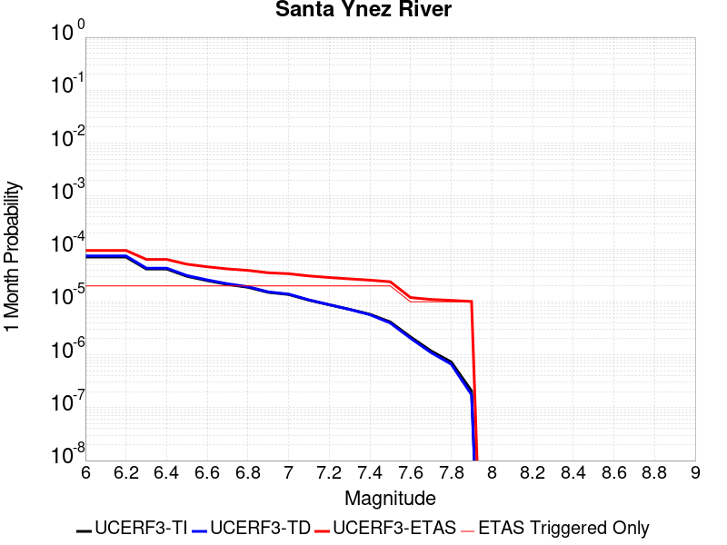 | 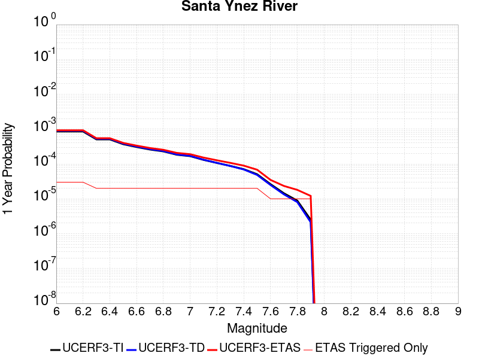 | 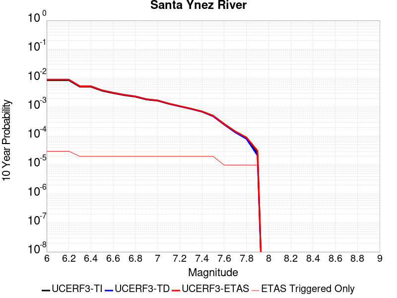 |

| Magnitude | 1 wk TI Prob | 1 wk TD Prob | 1 wk ETAS Prob | 1 wk ETAS/TD Gain | 1 wk ETAS Triggered Only | 1 mo TI Prob | 1 mo TD Prob | 1 mo ETAS Prob | 1 mo ETAS/TD Gain | 1 mo ETAS Triggered Only | 1 yr TI Prob | 1 yr TD Prob | 1 yr ETAS Prob | 1 yr ETAS/TD Gain | 1 yr ETAS Triggered Only | 10 yr TI Prob | 10 yr TD Prob | 10 yr ETAS Prob | 10 yr ETAS/TD Gain | 10 yr ETAS Triggered Only |
|-----|-----|-----|-----|-----|-----|-----|-----|-----|-----|-----|-----|-----|-----|-----|-----|-----|-----|-----|-----|-----|
| 6.0 | 1.6396456E-5 | 1.7209435E-5 | 3.720909E-5 | 2.1621332 | 2.0E-5 | 7.026863E-5 | 7.375284E-5 | 9.375136E-5 | 1.271156 | 2.0E-5 | 8.551848E-4 | 8.976064E-4 | 9.2757953E-4 | 1.0333922 | 3.0E-5 | 0.0085190125 | 0.008943358 | 0.00897309 | 1.0033244 | 3.0E-5 |
| 6.1 | 1.6396456E-5 | 1.7209435E-5 | 3.720909E-5 | 2.1621332 | 2.0E-5 | 7.026863E-5 | 7.375284E-5 | 9.375136E-5 | 1.271156 | 2.0E-5 | 8.551848E-4 | 8.976064E-4 | 9.2757953E-4 | 1.0333922 | 3.0E-5 | 0.0085190125 | 0.008943358 | 0.00897309 | 1.0033244 | 3.0E-5 |
| 6.2 | 1.6396456E-5 | 1.7209435E-5 | 3.720909E-5 | 2.1621332 | 2.0E-5 | 7.026863E-5 | 7.375284E-5 | 9.375136E-5 | 1.271156 | 2.0E-5 | 8.551848E-4 | 8.976064E-4 | 9.2757953E-4 | 1.0333922 | 3.0E-5 | 0.0085190125 | 0.008943358 | 0.00897309 | 1.0033244 | 3.0E-5 |
| 6.3 | 9.736976E-6 | 1.012233E-5 | 3.0122128E-5 | 2.9758096 | 2.0E-5 | 4.172923E-5 | 4.338072E-5 | 6.3379855E-5 | 1.4610143 | 2.0E-5 | 5.0793495E-4 | 5.280373E-4 | 5.4802676E-4 | 1.0378561 | 2.0E-5 | 0.005067755 | 0.005268332 | 0.0052882265 | 1.0037763 | 2.0E-5 |
| 6.4 | 9.736976E-6 | 1.012233E-5 | 3.0122128E-5 | 2.9758096 | 2.0E-5 | 4.172923E-5 | 4.338072E-5 | 6.3379855E-5 | 1.4610143 | 2.0E-5 | 5.0793495E-4 | 5.280373E-4 | 5.4802676E-4 | 1.0378561 | 2.0E-5 | 0.005067755 | 0.005268332 | 0.0052882265 | 1.0037763 | 2.0E-5 |
| 6.5 | 7.081964E-6 | 7.3298966E-6 | 2.732975E-5 | 3.7285316 | 2.0E-5 | 3.035092E-5 | 3.1413474E-5 | 5.1412844E-5 | 1.6366495 | 2.0E-5 | 3.694598E-4 | 3.8239348E-4 | 4.0238583E-4 | 1.0522821 | 2.0E-5 | 0.0036884616 | 0.0038175168 | 0.0038374404 | 1.005219 | 2.0E-5 |
| 6.6 | 5.873247E-6 | 6.059743E-6 | 2.6059623E-5 | 4.30045 | 2.0E-5 | 2.5170815E-5 | 2.5970074E-5 | 4.5969555E-5 | 1.7700971 | 2.0E-5 | 3.064116E-4 | 3.1614062E-4 | 3.361343E-4 | 1.063243 | 2.0E-5 | 0.0030598943 | 0.0031569963 | 0.0031769332 | 1.0063151 | 2.0E-5 |
| 6.7 | 4.973277E-6 | 5.115901E-6 | 2.5115798E-5 | 4.90936 | 2.0E-5 | 2.1313872E-5 | 2.1925109E-5 | 4.192467E-5 | 1.9121761 | 2.0E-5 | 2.5946548E-4 | 2.66906E-4 | 2.8690064E-4 | 1.0749128 | 2.0E-5 | 0.0025916274 | 0.0026659032 | 0.0026858498 | 1.0074822 | 2.0E-5 |
| 6.8 | 4.396492E-6 | 4.5109778E-6 | 2.4510888E-5 | 5.4336085 | 2.0E-5 | 1.884197E-5 | 1.9332621E-5 | 3.9332233E-5 | 2.0345008 | 2.0E-5 | 2.2937685E-4 | 2.3534958E-4 | 2.5534487E-4 | 1.08496 | 2.0E-5 | 0.0022914023 | 0.0023510386 | 0.0023709917 | 1.0084869 | 2.0E-5 |
| 6.9 | 3.5255632E-6 | 3.6013332E-6 | 2.3601262E-5 | 6.5534787 | 2.0E-5 | 1.5109469E-5 | 1.5434196E-5 | 3.5433888E-5 | 2.295804 | 2.0E-5 | 1.8394225E-4 | 1.8789528E-4 | 2.0789153E-4 | 1.1064223 | 2.0E-5 | 0.0018379007 | 0.0018773803 | 0.0018973427 | 1.0106331 | 2.0E-5 |
| 7.0 | 3.211603E-6 | 3.273654E-6 | 2.327359E-5 | 7.109361 | 2.0E-5 | 1.376394E-5 | 1.4029872E-5 | 3.4029592E-5 | 2.4255097 | 2.0E-5 | 1.6756308E-4 | 1.7080043E-4 | 1.9079701E-4 | 1.1170757 | 2.0E-5 | 0.0016743679 | 0.0017067058 | 0.0017266716 | 1.0116985 | 2.0E-5 |
| 7.1 | 2.5094619E-6 | 2.5409204E-6 | 2.254087E-5 | 8.871143 | 2.0E-5 | 1.0754793E-5 | 1.0889614E-5 | 3.0889398E-5 | 2.8365924 | 2.0E-5 | 1.3093173E-4 | 1.3257304E-4 | 1.525704E-4 | 1.1508403 | 2.0E-5 | 0.0013085462 | 0.0013249456 | 0.0013449191 | 1.015075 | 2.0E-5 |
| 7.2 | 2.0515774E-6 | 2.0619375E-6 | 2.2061897E-5 | 10.6995945 | 2.0E-5 | 8.792445E-6 | 8.836846E-6 | 2.8836668E-5 | 3.263231 | 2.0E-5 | 1.0704277E-4 | 1.0758333E-4 | 1.2758118E-4 | 1.1858824 | 2.0E-5 | 0.0010699122 | 0.0010753168 | 0.0010952953 | 1.0185791 | 2.0E-5 |
| 7.3 | 1.6845745E-6 | 1.6773907E-6 | 2.1677357E-5 | 12.923261 | 2.0E-5 | 7.219585E-6 | 7.1887976E-6 | 2.7188655E-5 | 3.7820864 | 2.0E-5 | 8.78949E-5 | 8.752012E-5 | 1.07518375E-4 | 1.2284988 | 2.0E-5 | 8.7860145E-4 | 8.7485946E-4 | 8.948419E-4 | 1.0228409 | 2.0E-5 |
| 7.4 | 1.3600285E-6 | 1.3333357E-6 | 2.133331E-5 | 15.999952 | 2.0E-5 | 5.82868E-6 | 5.714284E-6 | 2.571417E-5 | 4.4999814 | 2.0E-5 | 7.096187E-5 | 6.956921E-5 | 8.956782E-5 | 1.2874635 | 2.0E-5 | 7.0939213E-4 | 6.954765E-4 | 7.154626E-4 | 1.0287373 | 2.0E-5 |
| 7.5 | 9.735342E-7 | 9.290103E-7 | 2.0928992E-5 | 22.528267 | 2.0E-5 | 4.172283E-6 | 3.9814668E-6 | 2.3981387E-5 | 6.0232544 | 2.0E-5 | 5.079636E-5 | 4.8473295E-5 | 6.847233E-5 | 1.4125783 | 2.0E-5 | 5.0784746E-4 | 4.8462892E-4 | 5.046192E-4 | 1.0412487 | 2.0E-5 |
| 7.6 | 5.067187E-7 | 4.77857E-7 | 1.0477852E-5 | 21.926754 | 1.0E-5 | 2.1716498E-6 | 2.047957E-6 | 1.2047936E-5 | 5.882905 | 1.0E-5 | 2.6439517E-5 | 2.4933597E-5 | 3.493335E-5 | 1.4010552 | 1.0E-5 | 2.643637E-4 | 2.4930874E-4 | 2.5930625E-4 | 1.0401009 | 1.0E-5 |
| 7.7 | 2.769089E-7 | 2.5759124E-7 | 1.0257589E-5 | 39.821182 | 1.0E-5 | 1.1867519E-6 | 1.1039621E-6 | 1.1103951E-5 | 10.058272 | 1.0E-5 | 1.4448608E-5 | 1.34406555E-5 | 2.3440522E-5 | 1.7440014 | 1.0E-5 | 1.444767E-4 | 1.3439846E-4 | 1.4439711E-4 | 1.0743957 | 1.0E-5 |
| 7.8 | 1.7044663E-7 | 1.5449015E-7 | 1.0154488E-5 | 65.729034 | 1.0E-5 | 7.3048534E-7 | 6.621005E-7 | 1.0662094E-5 | 16.103437 | 1.0E-5 | 8.893623E-6 | 8.061043E-6 | 1.8060964E-5 | 2.240524 | 1.0E-5 | 8.893267E-5 | 8.060753E-5 | 9.060673E-5 | 1.1240479 | 1.0E-5 |
| 7.9 | 4.8344287E-8 | 4.0910923E-8 | 1.0040911E-5 | 245.4335 | 1.0E-5 | 2.0718979E-7 | 1.7533252E-7 | 1.017533E-5 | 58.034477 | 1.0E-5 | 2.5225327E-6 | 2.1346711E-6 | 1.213465E-5 | 5.684552 | 1.0E-5 | 2.5225041E-5 | 2.1346512E-5 | 3.13463E-5 | 1.4684507 | 1.0E-5 |

## Great Valley 11
*[(top)](#table-of-contents)*

| 1 Week | 1 Month | 1 Year | 10 Year |
|-----|-----|-----|-----|
|  |  |  |  |

| Magnitude | 1 wk TI Prob | 1 wk TD Prob | 1 wk ETAS Prob | 1 wk ETAS/TD Gain | 1 wk ETAS Triggered Only | 1 mo TI Prob | 1 mo TD Prob | 1 mo ETAS Prob | 1 mo ETAS/TD Gain | 1 mo ETAS Triggered Only | 1 yr TI Prob | 1 yr TD Prob | 1 yr ETAS Prob | 1 yr ETAS/TD Gain | 1 yr ETAS Triggered Only | 10 yr TI Prob | 10 yr TD Prob | 10 yr ETAS Prob | 10 yr ETAS/TD Gain | 10 yr ETAS Triggered Only |
|-----|-----|-----|-----|-----|-----|-----|-----|-----|-----|-----|-----|-----|-----|-----|-----|-----|-----|-----|-----|-----|
| 6.0 | 2.8099583E-5 | 2.9832152E-5 | 2.9832152E-5 | 1.0 | 0.0 | 1.20421224E-4 | 1.278462E-4 | 1.278462E-4 | 1.0 | 0.0 | 0.0014651422 | 0.0015554909 | 0.0015554909 | 1.0 | 0.0 | 0.0145552 | 0.01545356 | 0.015483097 | 1.0019113 | 3.0E-5 |
| 6.1 | 2.483194E-5 | 2.590715E-5 | 2.590715E-5 | 1.0 | 0.0 | 1.0641825E-4 | 1.11026246E-4 | 1.11026246E-4 | 1.0 | 0.0 | 0.0012948721 | 0.0013509706 | 0.0013509706 | 1.0 | 0.0 | 0.012873529 | 0.013433994 | 0.01346359 | 1.0022031 | 3.0E-5 |
| 6.2 | 2.483194E-5 | 2.590715E-5 | 2.590715E-5 | 1.0 | 0.0 | 1.0641825E-4 | 1.11026246E-4 | 1.11026246E-4 | 1.0 | 0.0 | 0.0012948721 | 0.0013509706 | 0.0013509706 | 1.0 | 0.0 | 0.012873529 | 0.013433994 | 0.01346359 | 1.0022031 | 3.0E-5 |
| 6.3 | 2.0257901E-5 | 2.0398922E-5 | 2.0398922E-5 | 1.0 | 0.0 | 8.681669E-5 | 8.742122E-5 | 8.742122E-5 | 1.0 | 0.0 | 0.0010564806 | 0.0010638756 | 0.0010638756 | 1.0 | 0.0 | 0.01051472 | 0.010592012 | 0.010621694 | 1.0028024 | 3.0E-5 |
| 6.4 | 1.8054898E-5 | 1.7780874E-5 | 1.7780874E-5 | 1.0 | 0.0 | 7.737584E-5 | 7.62017E-5 | 7.62017E-5 | 1.0 | 0.0 | 9.416436E-4 | 9.2739856E-4 | 9.2739856E-4 | 1.0 | 0.0 | 0.009376635 | 0.009239036 | 0.009268759 | 1.0032171 | 3.0E-5 |
| 6.5 | 1.34804895E-5 | 1.2321055E-5 | 1.2321055E-5 | 1.0 | 0.0 | 5.777225E-5 | 5.2803476E-5 | 5.2803476E-5 | 1.0 | 0.0 | 7.031501E-4 | 6.4269686E-4 | 6.4269686E-4 | 1.0 | 0.0 | 0.007009294 | 0.0064088185 | 0.0064187543 | 1.0015503 | 1.0E-5 |
| 6.6 | 1.294883E-5 | 1.1732312E-5 | 1.1732312E-5 | 1.0 | 0.0 | 5.5493805E-5 | 5.028039E-5 | 5.028039E-5 | 1.0 | 0.0 | 6.754276E-4 | 6.1199587E-4 | 6.1199587E-4 | 1.0 | 0.0 | 0.006733784 | 0.0061035305 | 0.0061134696 | 1.0016284 | 1.0E-5 |
| 6.7 | 1.1272237E-5 | 9.811886E-6 | 9.811886E-6 | 1.0 | 0.0 | 4.8308695E-5 | 4.2050277E-5 | 4.2050277E-5 | 1.0 | 0.0 | 5.879996E-4 | 5.118446E-4 | 5.118446E-4 | 1.0 | 0.0 | 0.005864462 | 0.0051069413 | 0.00511689 | 1.0019481 | 1.0E-5 |
| 6.8 | 9.8337505E-6 | 8.19377E-6 | 8.19377E-6 | 1.0 | 0.0 | 4.2143965E-5 | 3.5115696E-5 | 3.5115696E-5 | 1.0 | 0.0 | 5.1298196E-4 | 4.2745177E-4 | 4.2745177E-4 | 1.0 | 0.0 | 0.005117994 | 0.0042665056 | 0.0042764633 | 1.0023339 | 1.0E-5 |
| 6.9 | 7.4224813E-6 | 5.4131347E-6 | 5.4131347E-6 | 1.0 | 0.0 | 3.1810247E-5 | 2.319895E-5 | 2.319895E-5 | 1.0 | 0.0 | 3.872209E-4 | 2.8241202E-4 | 2.8241202E-4 | 1.0 | 0.0 | 0.0038654688 | 0.0028206722 | 0.002830644 | 1.0035353 | 1.0E-5 |
| 7.0 | 4.4628923E-6 | 2.0110795E-6 | 2.0110795E-6 | 1.0 | 0.0 | 1.912654E-5 | 8.618884E-6 | 8.618884E-6 | 1.0 | 0.0 | 2.3284076E-4 | 1.04929975E-4 | 1.04929975E-4 | 1.0 | 0.0 | 0.0023259693 | 0.0010488159 | 0.0010588054 | 1.0095246 | 1.0E-5 |
| 7.1 | 3.5546527E-6 | 1.1855836E-6 | 1.1855836E-6 | 1.0 | 0.0 | 1.5234136E-5 | 5.081063E-6 | 5.081063E-6 | 1.0 | 0.0 | 1.8545982E-4 | 6.186026E-5 | 6.186026E-5 | 1.0 | 0.0 | 0.0018530512 | 6.1843713E-4 | 6.1843713E-4 | 1.0 | 0.0 |
| 7.2 | 3.2039936E-6 | 1.1254128E-6 | 1.1254128E-6 | 1.0 | 0.0 | 1.3731329E-5 | 4.823189E-6 | 4.823189E-6 | 1.0 | 0.0 | 1.671661E-4 | 5.8720816E-5 | 5.8720816E-5 | 1.0 | 0.0 | 0.0016704041 | 5.870597E-4 | 5.870597E-4 | 1.0 | 0.0 |
| 7.3 | 2.8120473E-6 | 1.0305612E-6 | 1.0305612E-6 | 1.0 | 0.0 | 1.2051575E-5 | 4.4166836E-6 | 4.4166836E-6 | 1.0 | 0.0 | 1.4671806E-4 | 5.3771862E-5 | 5.3771862E-5 | 1.0 | 0.0 | 0.0014662122 | 5.3759513E-4 | 5.3759513E-4 | 1.0 | 0.0 |
| 7.4 | 2.4837766E-6 | 9.800582E-7 | 9.800582E-7 | 1.0 | 0.0 | 1.0644713E-5 | 4.200243E-6 | 4.200243E-6 | 1.0 | 0.0 | 1.2959167E-4 | 5.1136827E-5 | 5.1136827E-5 | 1.0 | 0.0 | 0.0012951613 | 5.112572E-4 | 5.112572E-4 | 1.0 | 0.0 |
| 7.5 | 1.5002679E-6 | 6.546144E-7 | 6.546144E-7 | 1.0 | 0.0 | 6.4297037E-6 | 2.8054874E-6 | 2.8054874E-6 | 1.0 | 0.0 | 7.827883E-5 | 3.4156317E-5 | 3.4156317E-5 | 1.0 | 0.0 | 7.825126E-4 | 3.4151482E-4 | 3.4151482E-4 | 1.0 | 0.0 |

## San Jacinto (Borrego)
*[(top)](#table-of-contents)*

| 1 Week | 1 Month | 1 Year | 10 Year |
|-----|-----|-----|-----|
|  | 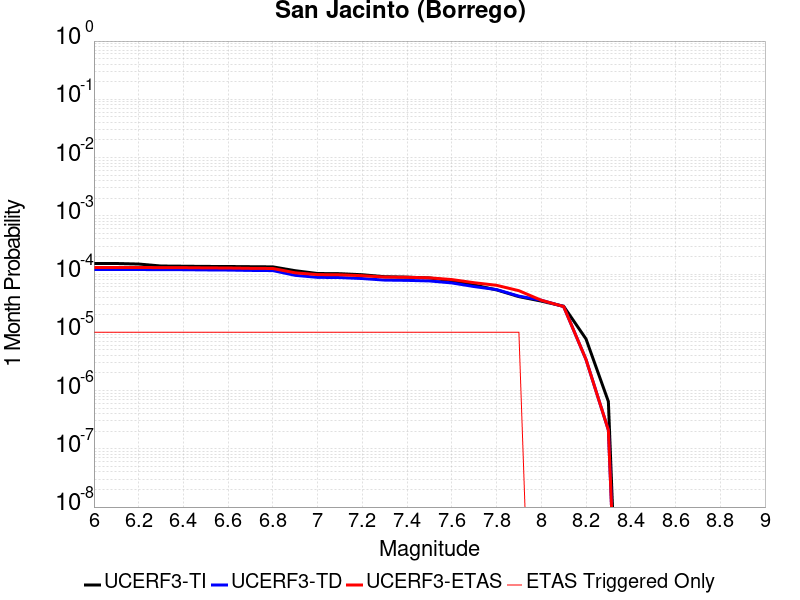 | 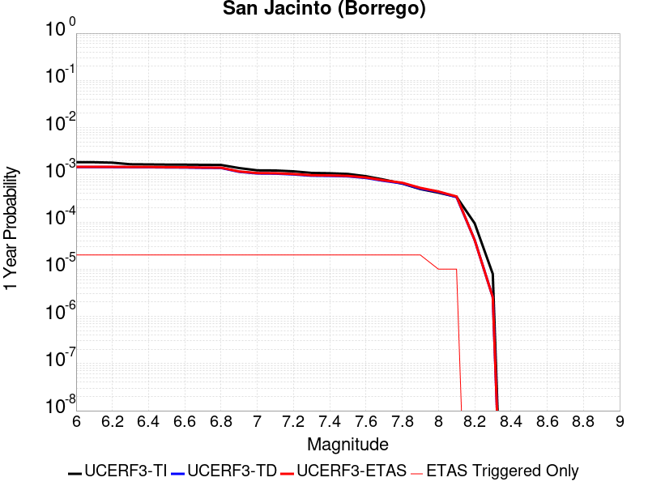 |  |

| Magnitude | 1 wk TI Prob | 1 wk TD Prob | 1 wk ETAS Prob | 1 wk ETAS/TD Gain | 1 wk ETAS Triggered Only | 1 mo TI Prob | 1 mo TD Prob | 1 mo ETAS Prob | 1 mo ETAS/TD Gain | 1 mo ETAS Triggered Only | 1 yr TI Prob | 1 yr TD Prob | 1 yr ETAS Prob | 1 yr ETAS/TD Gain | 1 yr ETAS Triggered Only | 10 yr TI Prob | 10 yr TD Prob | 10 yr ETAS Prob | 10 yr ETAS/TD Gain | 10 yr ETAS Triggered Only |
|-----|-----|-----|-----|-----|-----|-----|-----|-----|-----|-----|-----|-----|-----|-----|-----|-----|-----|-----|-----|-----|
| 6.0 | 3.543992E-5 | 2.7926513E-5 | 2.7926513E-5 | 1.0 | 0.0 | 1.5187653E-4 | 1.1967963E-4 | 1.2967843E-4 | 1.0835464 | 1.0E-5 | 0.0018475284 | 0.0014561379 | 0.0014761087 | 1.0137149 | 2.0E-5 | 0.018322436 | 0.014869647 | 0.014899202 | 1.0019876 | 3.0E-5 |
| 6.1 | 3.542281E-5 | 2.7926513E-5 | 2.7926513E-5 | 1.0 | 0.0 | 1.5180321E-4 | 1.1967963E-4 | 1.2967843E-4 | 1.0835464 | 1.0E-5 | 0.0018466372 | 0.0014561379 | 0.0014761087 | 1.0137149 | 2.0E-5 | 0.018313672 | 0.014869647 | 0.014899202 | 1.0019876 | 3.0E-5 |
| 6.2 | 3.4688688E-5 | 2.7926511E-5 | 2.7926511E-5 | 1.0 | 0.0 | 1.4865733E-4 | 1.1967963E-4 | 1.2967843E-4 | 1.0835464 | 1.0E-5 | 0.0018084005 | 0.0014561379 | 0.0014761087 | 1.0137149 | 2.0E-5 | 0.017937548 | 0.014869647 | 0.014899201 | 1.0019876 | 3.0E-5 |
| 6.3 | 3.2087122E-5 | 2.7771865E-5 | 2.7771865E-5 | 1.0 | 0.0 | 1.3750899E-4 | 1.1901691E-4 | 1.2901572E-4 | 1.0840117 | 1.0E-5 | 0.0016728862 | 0.00144808 | 0.001468051 | 1.0137914 | 2.0E-5 | 0.016603488 | 0.014790683 | 0.0148202395 | 1.0019983 | 3.0E-5 |
| 6.4 | 3.1828724E-5 | 2.7738852E-5 | 2.7738852E-5 | 1.0 | 0.0 | 1.364017E-4 | 1.1887544E-4 | 1.2887425E-4 | 1.0841117 | 1.0E-5 | 0.0016594254 | 0.0014463598 | 0.001466331 | 1.0138078 | 2.0E-5 | 0.016470885 | 0.014773762 | 0.014803318 | 1.0020006 | 3.0E-5 |
| 6.5 | 3.1563577E-5 | 2.747857E-5 | 2.747857E-5 | 1.0 | 0.0 | 1.3526545E-4 | 1.1776006E-4 | 1.2775887E-4 | 1.0849085 | 1.0E-5 | 0.0016456128 | 0.0014327979 | 0.0014527693 | 1.0139387 | 2.0E-5 | 0.0163348 | 0.014640348 | 0.014669908 | 1.0020192 | 3.0E-5 |
| 6.6 | 3.1467625E-5 | 2.7322796E-5 | 2.7322796E-5 | 1.0 | 0.0 | 1.3485427E-4 | 1.1709251E-4 | 1.2709133E-4 | 1.0853926 | 1.0E-5 | 0.0016406142 | 0.0014246812 | 0.0014446527 | 1.0140182 | 2.0E-5 | 0.016285548 | 0.014560594 | 0.014590157 | 1.0020304 | 3.0E-5 |
| 6.7 | 3.1223695E-5 | 2.6940816E-5 | 2.6940816E-5 | 1.0 | 0.0 | 1.3380898E-4 | 1.15455594E-4 | 1.2545443E-4 | 1.0866034 | 1.0E-5 | 0.0016279068 | 0.0014047775 | 0.0014247495 | 1.0142171 | 2.0E-5 | 0.01616033 | 0.014364966 | 0.014394535 | 1.0020584 | 3.0E-5 |
| 6.8 | 3.1015585E-5 | 2.6761822E-5 | 2.6761822E-5 | 1.0 | 0.0 | 1.3291716E-4 | 1.1468855E-4 | 1.246874E-4 | 1.0871826 | 1.0E-5 | 0.001617065 | 0.0013954508 | 0.0014154229 | 1.0143123 | 2.0E-5 | 0.016053487 | 0.014272246 | 0.014301818 | 1.002072 | 3.0E-5 |
| 6.9 | 2.6641965E-5 | 2.2184247E-5 | 2.2184247E-5 | 1.0 | 0.0 | 1.1417485E-4 | 9.50719E-5 | 1.0507095E-4 | 1.1051736 | 1.0E-5 | 0.0013891924 | 0.0011568897 | 0.0011768665 | 1.0172677 | 2.0E-5 | 0.0138054015 | 0.011882438 | 0.011912082 | 1.0024947 | 3.0E-5 |
| 7.0 | 2.3854353E-5 | 2.0479023E-5 | 2.0479023E-5 | 1.0 | 0.0 | 1.02228936E-4 | 8.77643E-5 | 9.7763426E-5 | 1.1139315 | 1.0E-5 | 0.0012439266 | 0.0010680092 | 0.0010879878 | 1.0187064 | 2.0E-5 | 0.012369866 | 0.0109828 | 0.011012471 | 1.0027015 | 3.0E-5 |
| 7.1 | 2.3672901E-5 | 2.031551E-5 | 2.031551E-5 | 1.0 | 0.0 | 1.0145135E-4 | 8.7063585E-5 | 9.7062715E-5 | 1.1148486 | 1.0E-5 | 0.0012344702 | 0.0010594862 | 0.001079465 | 1.0188571 | 2.0E-5 | 0.0122763505 | 0.010897976 | 0.010927649 | 1.0027229 | 3.0E-5 |
| 7.2 | 2.2717244E-5 | 1.9542893E-5 | 1.9542893E-5 | 1.0 | 0.0 | 9.735599E-5 | 8.375258E-5 | 9.375174E-5 | 1.1193893 | 1.0E-5 | 0.0011846646 | 0.001019213 | 0.0010391925 | 1.019603 | 2.0E-5 | 0.01178369 | 0.010495341 | 0.010525026 | 1.0028284 | 3.0E-5 |
| 7.3 | 2.1016205E-5 | 1.8384526E-5 | 1.8384526E-5 | 1.0 | 0.0 | 9.006634E-5 | 7.878846E-5 | 8.878767E-5 | 1.1269121 | 1.0E-5 | 0.001096006 | 9.5882936E-4 | 9.788101E-4 | 1.0208387 | 2.0E-5 | 0.010906163 | 0.009890967 | 0.00992067 | 1.0030031 | 3.0E-5 |
| 7.4 | 2.0683625E-5 | 1.8187047E-5 | 1.8187047E-5 | 1.0 | 0.0 | 8.86411E-5 | 7.794217E-5 | 8.794139E-5 | 1.1282903 | 1.0E-5 | 0.001078671 | 9.485349E-4 | 9.685159E-4 | 1.0210651 | 2.0E-5 | 0.010734501 | 0.009787692 | 0.009817398 | 1.0030351 | 3.0E-5 |
| 7.5 | 1.9993966E-5 | 1.7782075E-5 | 1.7782075E-5 | 1.0 | 0.0 | 8.568561E-5 | 7.620667E-5 | 8.620591E-5 | 1.1312121 | 1.0E-5 | 0.001042723 | 9.2742336E-4 | 9.4740477E-4 | 1.0215452 | 2.0E-5 | 0.010378438 | 0.009574614 | 0.009604327 | 1.0031033 | 3.0E-5 |
| 7.6 | 1.788966E-5 | 1.6435291E-5 | 1.6435291E-5 | 1.0 | 0.0 | 7.666772E-5 | 7.043507E-5 | 8.0434365E-5 | 1.1419648 | 1.0E-5 | 9.3302975E-4 | 8.572113E-4 | 8.7719416E-4 | 1.0233115 | 2.0E-5 | 0.00929122 | 0.008866487 | 0.0088962205 | 1.0033535 | 3.0E-5 |
| 7.7 | 1.5125781E-5 | 1.4237377E-5 | 1.4237377E-5 | 1.0 | 0.0 | 6.4823165E-5 | 6.1015908E-5 | 7.1015296E-5 | 1.1638817 | 1.0E-5 | 7.889362E-4 | 7.426163E-4 | 7.6260144E-4 | 1.0269119 | 2.0E-5 | 0.007861412 | 0.0077142045 | 0.007743973 | 1.0038589 | 3.0E-5 |
| 7.8 | 1.250089E-5 | 1.26304985E-5 | 1.26304985E-5 | 1.0 | 0.0 | 5.3574146E-5 | 5.412959E-5 | 6.4129046E-5 | 1.1847318 | 1.0E-5 | 6.5207E-4 | 6.588291E-4 | 6.7881594E-4 | 1.0303369 | 2.0E-5 | 0.006501599 | 0.0068677636 | 0.0068975575 | 1.0043383 | 3.0E-5 |
| 7.9 | 9.561E-6 | 9.754616E-6 | 9.754616E-6 | 1.0 | 0.0 | 4.0975072E-5 | 4.1804833E-5 | 5.1804414E-5 | 1.2391968 | 1.0E-5 | 4.987573E-4 | 5.088555E-4 | 5.2884535E-4 | 1.0392839 | 2.0E-5 | 0.0049763937 | 0.0053523467 | 0.005382186 | 1.0055751 | 3.0E-5 |
| 8.0 | 8.01699E-6 | 8.293488E-6 | 8.293488E-6 | 1.0 | 0.0 | 3.4358076E-5 | 3.554304E-5 | 3.554304E-5 | 1.0 | 0.0 | 4.1822926E-4 | 4.3265108E-4 | 4.4264673E-4 | 1.0231034 | 1.0E-5 | 0.0041744304 | 0.004573375 | 0.004593284 | 1.0043532 | 2.0E-5 |
| 8.1 | 6.541947E-6 | 6.4622354E-6 | 6.4622354E-6 | 1.0 | 0.0 | 2.8036617E-5 | 2.7695003E-5 | 2.7695003E-5 | 1.0 | 0.0 | 3.4129233E-4 | 3.37135E-4 | 3.4713163E-4 | 1.0296518 | 1.0E-5 | 0.0034076865 | 0.0035806994 | 0.0036006279 | 1.0055655 | 2.0E-5 |
| 8.2 | 1.7968189E-6 | 7.9713476E-7 | 7.9713476E-7 | 1.0 | 0.0 | 7.70063E-6 | 3.4162877E-6 | 3.4162877E-6 | 1.0 | 0.0 | 9.3751136E-5 | 4.159253E-5 | 4.159253E-5 | 1.0 | 0.0 | 9.371159E-4 | 4.712058E-4 | 4.712058E-4 | 1.0 | 0.0 |
| 8.3 | 1.5167889E-7 | 4.897714E-8 | 4.897714E-8 | 1.0 | 0.0 | 6.500522E-7 | 2.09902E-7 | 2.09902E-7 | 1.0 | 0.0 | 7.9143565E-6 | 2.5555544E-6 | 2.5555544E-6 | 1.0 | 0.0 | 7.914075E-5 | 2.969505E-5 | 2.969505E-5 | 1.0 | 0.0 |

## Hayward (So) extension 2011 CFM
*[(top)](#table-of-contents)*

| 1 Week | 1 Month | 1 Year | 10 Year |
|-----|-----|-----|-----|
|  |  |  |  |

| Magnitude | 1 wk TI Prob | 1 wk TD Prob | 1 wk ETAS Prob | 1 wk ETAS/TD Gain | 1 wk ETAS Triggered Only | 1 mo TI Prob | 1 mo TD Prob | 1 mo ETAS Prob | 1 mo ETAS/TD Gain | 1 mo ETAS Triggered Only | 1 yr TI Prob | 1 yr TD Prob | 1 yr ETAS Prob | 1 yr ETAS/TD Gain | 1 yr ETAS Triggered Only | 10 yr TI Prob | 10 yr TD Prob | 10 yr ETAS Prob | 10 yr ETAS/TD Gain | 10 yr ETAS Triggered Only |
|-----|-----|-----|-----|-----|-----|-----|-----|-----|-----|-----|-----|-----|-----|-----|-----|-----|-----|-----|-----|-----|
| 6.0 | 1.1721256E-4 | 2.3697627E-4 | 2.469739E-4 | 1.0421883 | 1.0E-5 | 5.022428E-4 | 0.0010129517 | 0.0010229415 | 1.0098622 | 1.0E-5 | 0.0060976758 | 0.012248711 | 0.012268466 | 1.0016128 | 2.0E-5 | 0.0593305 | 0.112843215 | 0.11286983 | 1.0002359 | 3.0E-5 |
| 6.1 | 6.99169E-5 | 1.3822885E-4 | 1.3822885E-4 | 1.0 | 0.0 | 2.9960944E-4 | 5.9128006E-4 | 5.9128006E-4 | 1.0 | 0.0 | 0.0036416445 | 0.0071720886 | 0.0071720886 | 1.0 | 0.0 | 0.035825435 | 0.067803554 | 0.067803554 | 1.0 | 0.0 |
| 6.2 | 6.99169E-5 | 1.3822885E-4 | 1.3822885E-4 | 1.0 | 0.0 | 2.9960944E-4 | 5.9128006E-4 | 5.9128006E-4 | 1.0 | 0.0 | 0.0036416445 | 0.0071720886 | 0.0071720886 | 1.0 | 0.0 | 0.035825435 | 0.067803554 | 0.067803554 | 1.0 | 0.0 |
| 6.3 | 6.970908E-5 | 1.379104E-4 | 1.379104E-4 | 1.0 | 0.0 | 2.9871898E-4 | 5.899159E-4 | 5.899159E-4 | 1.0 | 0.0 | 0.0036308395 | 0.007155625 | 0.007155625 | 1.0 | 0.0 | 0.035720866 | 0.067652516 | 0.067652516 | 1.0 | 0.0 |
| 6.4 | 6.9517155E-5 | 1.375792E-4 | 1.375792E-4 | 1.0 | 0.0 | 2.9789665E-4 | 5.884971E-4 | 5.884971E-4 | 1.0 | 0.0 | 0.0036208609 | 0.0071385372 | 0.0071385372 | 1.0 | 0.0 | 0.03562429 | 0.06749655 | 0.06749655 | 1.0 | 0.0 |
| 6.5 | 4.786248E-5 | 9.41498E-5 | 9.41498E-5 | 1.0 | 0.0 | 2.0510878E-4 | 4.034394E-4 | 4.034394E-4 | 1.0 | 0.0 | 0.0024943394 | 0.004901227 | 0.004901227 | 1.0 | 0.0 | 0.02466527 | 0.046901822 | 0.046901822 | 1.0 | 0.0 |
| 6.6 | 4.4662214E-5 | 8.881654E-5 | 8.881654E-5 | 1.0 | 0.0 | 1.9139545E-4 | 3.805894E-4 | 3.805894E-4 | 1.0 | 0.0 | 0.0023277493 | 0.0046242937 | 0.0046242937 | 1.0 | 0.0 | 0.02303517 | 0.044293344 | 0.044293344 | 1.0 | 0.0 |
| 6.7 | 3.884542E-5 | 7.8648096E-5 | 7.8648096E-5 | 1.0 | 0.0 | 1.6646975E-4 | 3.370222E-4 | 3.370222E-4 | 1.0 | 0.0 | 0.002024885 | 0.0040959697 | 0.0040959697 | 1.0 | 0.0 | 0.020065336 | 0.039333146 | 0.039333146 | 1.0 | 0.0 |
| 6.8 | 3.4221863E-5 | 6.855653E-5 | 6.855653E-5 | 1.0 | 0.0 | 1.4665688E-4 | 2.93783E-4 | 2.93783E-4 | 1.0 | 0.0 | 0.0017840851 | 0.0035713627 | 0.0035713627 | 1.0 | 0.0 | 0.017698295 | 0.034421004 | 0.034421004 | 1.0 | 0.0 |
| 6.9 | 1.6927712E-5 | 3.0061563E-5 | 3.0061563E-5 | 1.0 | 0.0 | 7.2545314E-5 | 1.2882923E-4 | 1.2882923E-4 | 1.0 | 0.0 | 8.828813E-4 | 0.0015674243 | 0.0015674243 | 1.0 | 0.0 | 0.008793819 | 0.01546327 | 0.01546327 | 1.0 | 0.0 |
| 7.0 | 1.2509653E-5 | 2.2462571E-5 | 2.2462571E-5 | 1.0 | 0.0 | 5.3611697E-5 | 9.6264856E-5 | 9.6264856E-5 | 1.0 | 0.0 | 6.525269E-4 | 0.0011714385 | 0.0011714385 | 1.0 | 0.0 | 0.0065061417 | 0.01158231 | 0.01158231 | 1.0 | 0.0 |
| 7.1 | 8.751583E-6 | 1.4925648E-5 | 1.4925648E-5 | 1.0 | 0.0 | 3.750624E-5 | 6.3965526E-5 | 6.3965526E-5 | 1.0 | 0.0 | 4.5654282E-4 | 7.785079E-4 | 7.785079E-4 | 1.0 | 0.0 | 0.0045560603 | 0.007763496 | 0.007763496 | 1.0 | 0.0 |
| 7.2 | 6.354379E-6 | 1.1498636E-5 | 1.1498636E-5 | 1.0 | 0.0 | 2.7232769E-5 | 4.9278966E-5 | 4.9278966E-5 | 1.0 | 0.0 | 3.3150852E-4 | 5.99811E-4 | 5.99811E-4 | 1.0 | 0.0 | 0.0033101442 | 0.0060003046 | 0.0060003046 | 1.0 | 0.0 |
| 7.3 | 4.645554E-6 | 8.818172E-6 | 8.818172E-6 | 1.0 | 0.0 | 1.9909365E-5 | 3.779164E-5 | 3.779164E-5 | 1.0 | 0.0 | 2.4236954E-4 | 4.6002E-4 | 4.6002E-4 | 1.0 | 0.0 | 0.0024210536 | 0.004610708 | 0.004610708 | 1.0 | 0.0 |
| 7.4 | 4.23437E-6 | 7.992532E-6 | 7.992532E-6 | 1.0 | 0.0 | 1.8147173E-5 | 3.425328E-5 | 3.425328E-5 | 1.0 | 0.0 | 2.2091944E-4 | 4.1695772E-4 | 4.1695772E-4 | 1.0 | 0.0 | 0.0022069993 | 0.004181972 | 0.004181972 | 1.0 | 0.0 |
| 7.5 | 2.2187417E-6 | 3.9522306E-6 | 3.9522306E-6 | 1.0 | 0.0 | 9.508858E-6 | 1.6938036E-5 | 1.6938036E-5 | 1.0 | 0.0 | 1.157642E-4 | 2.0620368E-4 | 2.0620368E-4 | 1.0 | 0.0 | 0.0011570391 | 0.0020734754 | 0.0020734754 | 1.0 | 0.0 |
| 7.6 | 2.7952495E-8 | 3.878529E-8 | 3.878529E-8 | 1.0 | 0.0 | 1.1979641E-7 | 1.6622266E-7 | 1.6622266E-7 | 1.0 | 0.0 | 1.4585203E-6 | 2.0237592E-6 | 2.0237592E-6 | 1.0 | 0.0 | 1.4585107E-5 | 2.0328182E-5 | 2.0328182E-5 | 1.0 | 0.0 |
| 7.7 | 1.7192724E-8 | 2.3436517E-8 | 2.3436517E-8 | 1.0 | 0.0 | 7.36831E-8 | 1.0044221E-7 | 1.0044221E-7 | 1.0 | 0.0 | 8.9709135E-7 | 1.2228833E-6 | 1.2228833E-6 | 1.0 | 0.0 | 8.970877E-6 | 1.2296933E-5 | 1.2296933E-5 | 1.0 | 0.0 |

## Sheephole
*[(top)](#table-of-contents)*

| 1 Week | 1 Month | 1 Year | 10 Year |
|-----|-----|-----|-----|
|  |  |  |  |

| Magnitude | 1 wk TI Prob | 1 wk TD Prob | 1 wk ETAS Prob | 1 wk ETAS/TD Gain | 1 wk ETAS Triggered Only | 1 mo TI Prob | 1 mo TD Prob | 1 mo ETAS Prob | 1 mo ETAS/TD Gain | 1 mo ETAS Triggered Only | 1 yr TI Prob | 1 yr TD Prob | 1 yr ETAS Prob | 1 yr ETAS/TD Gain | 1 yr ETAS Triggered Only | 10 yr TI Prob | 10 yr TD Prob | 10 yr ETAS Prob | 10 yr ETAS/TD Gain | 10 yr ETAS Triggered Only |
|-----|-----|-----|-----|-----|-----|-----|-----|-----|-----|-----|-----|-----|-----|-----|-----|-----|-----|-----|-----|-----|
| 6.0 | 4.5579695E-6 | 4.7412627E-6 | 1.4741215E-5 | 3.1091328 | 1.0E-5 | 1.9534009E-5 | 2.031957E-5 | 4.0319163E-5 | 1.9842528 | 2.0E-5 | 2.3780059E-4 | 2.473682E-4 | 2.6736327E-4 | 1.0808312 | 2.0E-5 | 0.0023754628 | 0.002471473 | 0.002501399 | 1.0121086 | 3.0E-5 |
| 6.1 | 4.5579695E-6 | 4.7412627E-6 | 1.4741215E-5 | 3.1091328 | 1.0E-5 | 1.9534009E-5 | 2.031957E-5 | 4.0319163E-5 | 1.9842528 | 2.0E-5 | 2.3780059E-4 | 2.473682E-4 | 2.6736327E-4 | 1.0808312 | 2.0E-5 | 0.0023754628 | 0.002471473 | 0.002501399 | 1.0121086 | 3.0E-5 |
| 6.2 | 2.6677674E-6 | 2.7873941E-6 | 1.2787366E-5 | 4.58757 | 1.0E-5 | 1.1433239E-5 | 1.1945926E-5 | 3.194569E-5 | 2.6741908 | 2.0E-5 | 1.3919079E-4 | 1.4543302E-4 | 1.6543012E-4 | 1.1375003 | 2.0E-5 | 0.0013910364 | 0.0014534844 | 0.0014734553 | 1.0137401 | 2.0E-5 |
| 6.3 | 2.6677674E-6 | 2.7873941E-6 | 1.2787366E-5 | 4.58757 | 1.0E-5 | 1.1433239E-5 | 1.1945926E-5 | 3.194569E-5 | 2.6741908 | 2.0E-5 | 1.3919079E-4 | 1.4543302E-4 | 1.6543012E-4 | 1.1375003 | 2.0E-5 | 0.0013910364 | 0.0014534844 | 0.0014734553 | 1.0137401 | 2.0E-5 |
| 6.4 | 2.2159759E-6 | 2.3228788E-6 | 1.2322856E-5 | 5.304993 | 1.0E-5 | 9.497005E-6 | 9.955161E-6 | 2.9954961E-5 | 3.0089881 | 2.0E-5 | 1.156199E-4 | 1.2119815E-4 | 1.4119573E-4 | 1.164999 | 2.0E-5 | 0.0011555976 | 0.0012113999 | 0.0012313756 | 1.0164899 | 2.0E-5 |
| 6.5 | 2.1986082E-6 | 2.304759E-6 | 1.2304736E-5 | 5.3388386 | 1.0E-5 | 9.4225725E-6 | 9.877506E-6 | 2.9877308E-5 | 3.0247827 | 2.0E-5 | 1.1471378E-4 | 1.2025281E-4 | 1.402504E-4 | 1.1662962 | 2.0E-5 | 0.0011465458 | 0.0012019566 | 0.0012219326 | 1.0166196 | 2.0E-5 |
| 6.6 | 1.5232331E-6 | 1.6018919E-6 | 1.16018755E-5 | 7.2426085 | 1.0E-5 | 6.5281256E-6 | 6.865234E-6 | 1.6865166E-5 | 2.4566047 | 1.0E-5 | 7.947703E-5 | 8.35812E-5 | 9.358037E-5 | 1.1196342 | 1.0E-5 | 7.9448614E-4 | 8.3551643E-4 | 8.4550807E-4 | 1.0119586 | 1.0E-5 |
| 6.7 | 1.3137362E-6 | 1.382819E-6 | 1.13828055E-5 | 8.231594 | 1.0E-5 | 5.6302856E-6 | 5.926355E-6 | 1.5926295E-5 | 2.687368 | 1.0E-5 | 6.854657E-5 | 7.215112E-5 | 8.21504E-5 | 1.138588 | 1.0E-5 | 6.8525434E-4 | 7.212908E-4 | 7.312836E-4 | 1.013854 | 1.0E-5 |
| 6.8 | 1.2275751E-6 | 1.2922847E-6 | 1.1292272E-5 | 8.738223 | 1.0E-5 | 5.2610258E-6 | 5.5383516E-6 | 1.5538297E-5 | 2.8055813 | 1.0E-5 | 6.4051106E-5 | 6.7427485E-5 | 7.7426805E-5 | 1.1482974 | 1.0E-5 | 6.4032647E-4 | 6.740836E-4 | 6.8407686E-4 | 1.014825 | 1.0E-5 |
| 6.9 | 1.1837088E-6 | 1.246102E-6 | 1.1246089E-5 | 9.025015 | 1.0E-5 | 5.0730278E-6 | 5.340427E-6 | 1.5340374E-5 | 2.8724995 | 1.0E-5 | 6.176237E-5 | 6.501789E-5 | 7.501724E-5 | 1.1537938 | 1.0E-5 | 6.17452E-4 | 6.5000186E-4 | 6.5999536E-4 | 1.0153745 | 1.0E-5 |
| 7.0 | 9.849371E-7 | 1.0366288E-6 | 1.1036618E-5 | 10.646645 | 1.0E-5 | 4.2211523E-6 | 4.442688E-6 | 1.4442643E-5 | 3.2508795 | 1.0E-5 | 5.1391315E-5 | 5.4088487E-5 | 6.4087944E-5 | 1.1848723 | 1.0E-5 | 5.137943E-4 | 5.407633E-4 | 5.5075786E-4 | 1.0184823 | 1.0E-5 |
| 7.1 | 8.1643645E-7 | 8.591669E-7 | 1.08591585E-5 | 12.639173 | 1.0E-5 | 3.4990085E-6 | 3.682139E-6 | 1.3682103E-5 | 3.7158027 | 1.0E-5 | 4.2599597E-5 | 4.482921E-5 | 5.482876E-5 | 1.2230588 | 1.0E-5 | 4.259143E-4 | 4.4821028E-4 | 4.5820582E-4 | 1.022301 | 1.0E-5 |
| 7.2 | 5.7295756E-7 | 6.029502E-7 | 6.029502E-7 | 1.0 | 0.0 | 2.45553E-6 | 2.58407E-6 | 2.58407E-6 | 1.0 | 0.0 | 2.9895667E-5 | 3.1460666E-5 | 3.1460666E-5 | 1.0 | 0.0 | 2.9891645E-4 | 3.145688E-4 | 3.145688E-4 | 1.0 | 0.0 |

## Pine Mtn
*[(top)](#table-of-contents)*

| 1 Week | 1 Month | 1 Year | 10 Year |
|-----|-----|-----|-----|
|  | 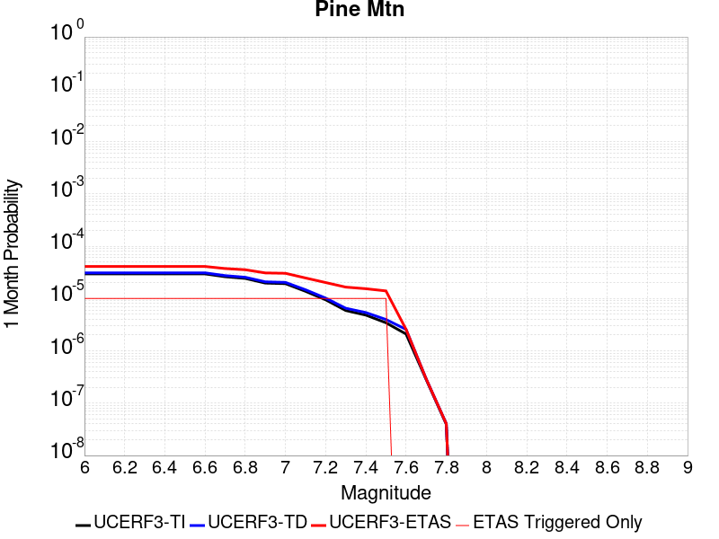 | 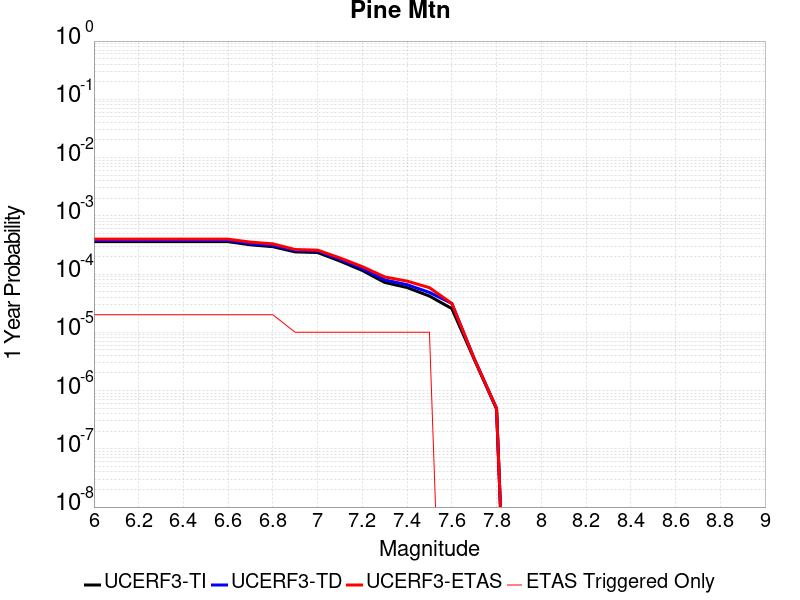 |  |

| Magnitude | 1 wk TI Prob | 1 wk TD Prob | 1 wk ETAS Prob | 1 wk ETAS/TD Gain | 1 wk ETAS Triggered Only | 1 mo TI Prob | 1 mo TD Prob | 1 mo ETAS Prob | 1 mo ETAS/TD Gain | 1 mo ETAS Triggered Only | 1 yr TI Prob | 1 yr TD Prob | 1 yr ETAS Prob | 1 yr ETAS/TD Gain | 1 yr ETAS Triggered Only | 10 yr TI Prob | 10 yr TD Prob | 10 yr ETAS Prob | 10 yr ETAS/TD Gain | 10 yr ETAS Triggered Only |
|-----|-----|-----|-----|-----|-----|-----|-----|-----|-----|-----|-----|-----|-----|-----|-----|-----|-----|-----|-----|-----|
| 6.0 | 6.894797E-6 | 7.225461E-6 | 1.722539E-5 | 2.3839846 | 1.0E-5 | 2.9548795E-5 | 3.096591E-5 | 4.0965602E-5 | 1.3229258 | 1.0E-5 | 3.596972E-4 | 3.7694772E-4 | 3.969402E-4 | 1.0530378 | 2.0E-5 | 0.0035911554 | 0.003763381 | 0.003793268 | 1.0079416 | 3.0E-5 |
| 6.1 | 6.894797E-6 | 7.225461E-6 | 1.722539E-5 | 2.3839846 | 1.0E-5 | 2.9548795E-5 | 3.096591E-5 | 4.0965602E-5 | 1.3229258 | 1.0E-5 | 3.596972E-4 | 3.7694772E-4 | 3.969402E-4 | 1.0530378 | 2.0E-5 | 0.0035911554 | 0.003763381 | 0.003793268 | 1.0079416 | 3.0E-5 |
| 6.2 | 6.894797E-6 | 7.225461E-6 | 1.722539E-5 | 2.3839846 | 1.0E-5 | 2.9548795E-5 | 3.096591E-5 | 4.0965602E-5 | 1.3229258 | 1.0E-5 | 3.596972E-4 | 3.7694772E-4 | 3.969402E-4 | 1.0530378 | 2.0E-5 | 0.0035911554 | 0.003763381 | 0.003793268 | 1.0079416 | 3.0E-5 |
| 6.3 | 6.894797E-6 | 7.225461E-6 | 1.722539E-5 | 2.3839846 | 1.0E-5 | 2.9548795E-5 | 3.096591E-5 | 4.0965602E-5 | 1.3229258 | 1.0E-5 | 3.596972E-4 | 3.7694772E-4 | 3.969402E-4 | 1.0530378 | 2.0E-5 | 0.0035911554 | 0.003763381 | 0.003793268 | 1.0079416 | 3.0E-5 |
| 6.4 | 6.894797E-6 | 7.225461E-6 | 1.722539E-5 | 2.3839846 | 1.0E-5 | 2.9548795E-5 | 3.096591E-5 | 4.0965602E-5 | 1.3229258 | 1.0E-5 | 3.596972E-4 | 3.7694772E-4 | 3.969402E-4 | 1.0530378 | 2.0E-5 | 0.0035911554 | 0.003763381 | 0.003793268 | 1.0079416 | 3.0E-5 |
| 6.5 | 6.894797E-6 | 7.225461E-6 | 1.722539E-5 | 2.3839846 | 1.0E-5 | 2.9548795E-5 | 3.096591E-5 | 4.0965602E-5 | 1.3229258 | 1.0E-5 | 3.596972E-4 | 3.7694772E-4 | 3.969402E-4 | 1.0530378 | 2.0E-5 | 0.0035911554 | 0.003763381 | 0.003793268 | 1.0079416 | 3.0E-5 |
| 6.6 | 6.894797E-6 | 7.225461E-6 | 1.722539E-5 | 2.3839846 | 1.0E-5 | 2.9548795E-5 | 3.096591E-5 | 4.0965602E-5 | 1.3229258 | 1.0E-5 | 3.596972E-4 | 3.7694772E-4 | 3.969402E-4 | 1.0530378 | 2.0E-5 | 0.0035911554 | 0.003763381 | 0.003793268 | 1.0079416 | 3.0E-5 |
| 6.7 | 6.0867933E-6 | 6.3971133E-6 | 1.6397049E-5 | 2.563195 | 1.0E-5 | 2.6085996E-5 | 2.7415923E-5 | 3.7415648E-5 | 1.3647416 | 1.0E-5 | 3.1755073E-4 | 3.3373994E-4 | 3.5373325E-4 | 1.0599068 | 2.0E-5 | 0.0031709734 | 0.0033326065 | 0.0033625064 | 1.0089719 | 3.0E-5 |
| 6.8 | 5.6530425E-6 | 5.9505956E-6 | 1.5950536E-5 | 2.680494 | 1.0E-5 | 2.42271E-5 | 2.5502315E-5 | 3.550206E-5 | 1.3921113 | 1.0E-5 | 2.94925E-4 | 3.104485E-4 | 3.304423E-4 | 1.0644029 | 2.0E-5 | 0.002945339 | 0.0031003528 | 0.00313026 | 1.0096463 | 3.0E-5 |
| 6.9 | 4.6015225E-6 | 4.863834E-6 | 1.48637855E-5 | 3.0559812 | 1.0E-5 | 1.9720663E-5 | 2.0844845E-5 | 3.0844636E-5 | 1.4797249 | 1.0E-5 | 2.4007261E-4 | 2.5375787E-4 | 2.6375536E-4 | 1.0393976 | 1.0E-5 | 0.0023981342 | 0.0025348254 | 0.0025547748 | 1.0078701 | 2.0E-5 |
| 7.0 | 4.4875965E-6 | 4.747473E-6 | 1.4747426E-5 | 3.1063738 | 1.0E-5 | 1.9232413E-5 | 2.0346162E-5 | 3.0345958E-5 | 1.4914832 | 1.0E-5 | 2.3412947E-4 | 2.4768783E-4 | 2.5768534E-4 | 1.0403634 | 1.0E-5 | 0.0023388295 | 0.0024742614 | 0.002494212 | 1.0080632 | 2.0E-5 |
| 7.1 | 3.203907E-6 | 3.4294096E-6 | 1.3429375E-5 | 3.9159439 | 1.0E-5 | 1.3730958E-5 | 1.4697391E-5 | 2.4697243E-5 | 1.6803828 | 1.0E-5 | 1.6716159E-4 | 1.789267E-4 | 1.8892491E-4 | 1.0558788 | 1.0E-5 | 0.0016703589 | 0.0017878925 | 0.0018078568 | 1.0111663 | 2.0E-5 |
| 7.2 | 2.2060601E-6 | 2.3784817E-6 | 1.23784575E-5 | 5.204353 | 1.0E-5 | 9.4545085E-6 | 1.0193455E-5 | 2.0193353E-5 | 1.9810116 | 1.0E-5 | 1.15102564E-4 | 1.240987E-4 | 1.3409746E-4 | 1.080571 | 1.0E-5 | 0.0011504296 | 0.0012403389 | 0.0012503265 | 1.0080523 | 1.0E-5 |
| 7.3 | 1.3765207E-6 | 1.5216481E-6 | 1.1521633E-5 | 7.5718117 | 1.0E-5 | 5.899361E-6 | 6.521333E-6 | 1.6521268E-5 | 2.533419 | 1.0E-5 | 7.182235E-5 | 7.939443E-5 | 8.939364E-5 | 1.1259434 | 1.0E-5 | 7.1799144E-4 | 7.936697E-4 | 8.036618E-4 | 1.0125897 | 1.0E-5 |
| 7.4 | 1.1245983E-6 | 1.2587075E-6 | 1.1258695E-5 | 8.944648 | 1.0E-5 | 4.819698E-6 | 5.39445E-6 | 1.5394397E-5 | 2.8537471 | 1.0E-5 | 5.8678244E-5 | 6.567554E-5 | 7.567488E-5 | 1.1522537 | 1.0E-5 | 5.866275E-4 | 6.5656955E-4 | 6.66563E-4 | 1.0152206 | 1.0E-5 |
| 7.5 | 8.031682E-7 | 9.276951E-7 | 1.0927686E-5 | 11.779393 | 1.0E-5 | 3.4421448E-6 | 3.9758306E-6 | 1.3975791E-5 | 3.5151877 | 1.0E-5 | 4.1907308E-5 | 4.840473E-5 | 5.8404246E-5 | 1.2065814 | 1.0E-5 | 4.1899405E-4 | 4.8394862E-4 | 4.939438E-4 | 1.0206534 | 1.0E-5 |
| 7.6 | 4.8953444E-7 | 6.003009E-7 | 6.003009E-7 | 1.0 | 0.0 | 2.098003E-6 | 2.5727159E-6 | 2.5727159E-6 | 1.0 | 0.0 | 2.5542888E-5 | 3.1322415E-5 | 3.1322415E-5 | 1.0 | 0.0 | 2.5539953E-4 | 3.1318486E-4 | 3.1318486E-4 | 1.0 | 0.0 |
| 7.7 | 6.634529E-8 | 6.788826E-8 | 6.788826E-8 | 1.0 | 0.0 | 2.843369E-7 | 2.9094966E-7 | 2.9094966E-7 | 1.0 | 0.0 | 3.4617963E-6 | 3.5423066E-6 | 3.5423066E-6 | 1.0 | 0.0 | 3.4617424E-5 | 3.542255E-5 | 3.542255E-5 | 1.0 | 0.0 |
| 7.8 | 9.235578E-9 | 9.488566E-9 | 9.488566E-9 | 1.0 | 0.0 | 3.9581046E-8 | 4.0665284E-8 | 4.0665284E-8 | 1.0 | 0.0 | 4.818991E-7 | 4.950997E-7 | 4.950997E-7 | 1.0 | 0.0 | 4.8189804E-6 | 4.950988E-6 | 4.950988E-6 | 1.0 | 0.0 |

## Earthquake Valley
*[(top)](#table-of-contents)*

| 1 Week | 1 Month | 1 Year | 10 Year |
|-----|-----|-----|-----|
|  | 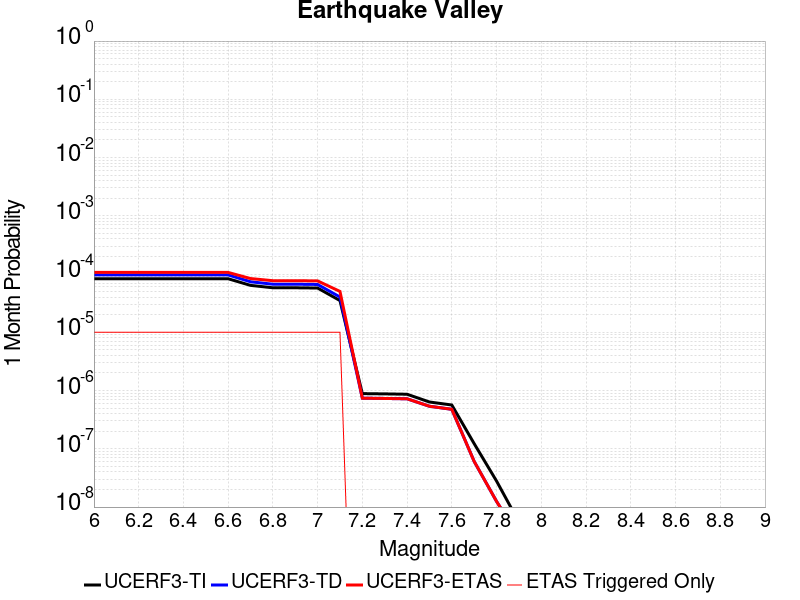 |  |  |

| Magnitude | 1 wk TI Prob | 1 wk TD Prob | 1 wk ETAS Prob | 1 wk ETAS/TD Gain | 1 wk ETAS Triggered Only | 1 mo TI Prob | 1 mo TD Prob | 1 mo ETAS Prob | 1 mo ETAS/TD Gain | 1 mo ETAS Triggered Only | 1 yr TI Prob | 1 yr TD Prob | 1 yr ETAS Prob | 1 yr ETAS/TD Gain | 1 yr ETAS Triggered Only | 10 yr TI Prob | 10 yr TD Prob | 10 yr ETAS Prob | 10 yr ETAS/TD Gain | 10 yr ETAS Triggered Only |
|-----|-----|-----|-----|-----|-----|-----|-----|-----|-----|-----|-----|-----|-----|-----|-----|-----|-----|-----|-----|-----|
| 6.0 | 1.9416384E-5 | 2.258408E-5 | 3.2583852E-5 | 1.4427798 | 1.0E-5 | 8.321042E-5 | 9.6785996E-5 | 1.0678503E-4 | 1.1033107 | 1.0E-5 | 0.001012616 | 0.0011778527 | 0.0012078173 | 1.0254401 | 3.0E-5 | 0.010080142 | 0.011727943 | 0.011757591 | 1.002528 | 3.0E-5 |
| 6.1 | 1.9416384E-5 | 2.258408E-5 | 3.2583852E-5 | 1.4427798 | 1.0E-5 | 8.321042E-5 | 9.6785996E-5 | 1.0678503E-4 | 1.1033107 | 1.0E-5 | 0.001012616 | 0.0011778527 | 0.0012078173 | 1.0254401 | 3.0E-5 | 0.010080142 | 0.011727943 | 0.011757591 | 1.002528 | 3.0E-5 |
| 6.2 | 1.9416384E-5 | 2.258408E-5 | 3.2583852E-5 | 1.4427798 | 1.0E-5 | 8.321042E-5 | 9.6785996E-5 | 1.0678503E-4 | 1.1033107 | 1.0E-5 | 0.001012616 | 0.0011778527 | 0.0012078173 | 1.0254401 | 3.0E-5 | 0.010080142 | 0.011727943 | 0.011757591 | 1.002528 | 3.0E-5 |
| 6.3 | 1.9416384E-5 | 2.258408E-5 | 3.2583852E-5 | 1.4427798 | 1.0E-5 | 8.321042E-5 | 9.6785996E-5 | 1.0678503E-4 | 1.1033107 | 1.0E-5 | 0.001012616 | 0.0011778527 | 0.0012078173 | 1.0254401 | 3.0E-5 | 0.010080142 | 0.011727943 | 0.011757591 | 1.002528 | 3.0E-5 |
| 6.4 | 1.9416384E-5 | 2.258408E-5 | 3.2583852E-5 | 1.4427798 | 1.0E-5 | 8.321042E-5 | 9.6785996E-5 | 1.0678503E-4 | 1.1033107 | 1.0E-5 | 0.001012616 | 0.0011778527 | 0.0012078173 | 1.0254401 | 3.0E-5 | 0.010080142 | 0.011727943 | 0.011757591 | 1.002528 | 3.0E-5 |
| 6.5 | 1.9389157E-5 | 2.255267E-5 | 3.255244E-5 | 1.4433966 | 1.0E-5 | 8.309374E-5 | 9.665139E-5 | 1.0665043E-4 | 1.1034546 | 1.0E-5 | 0.0010111968 | 0.0011762156 | 0.0012061803 | 1.0254755 | 3.0E-5 | 0.010066078 | 0.011711745 | 0.011741393 | 1.0025315 | 3.0E-5 |
| 6.6 | 1.9389157E-5 | 2.255267E-5 | 3.255244E-5 | 1.4433966 | 1.0E-5 | 8.309374E-5 | 9.665139E-5 | 1.0665043E-4 | 1.1034546 | 1.0E-5 | 0.0010111968 | 0.0011762156 | 0.0012061803 | 1.0254755 | 3.0E-5 | 0.010066078 | 0.011711745 | 0.011741393 | 1.0025315 | 3.0E-5 |
| 6.7 | 1.4925434E-5 | 1.7208227E-5 | 2.7208056E-5 | 1.5811074 | 1.0E-5 | 6.396457E-5 | 7.374794E-5 | 8.37472E-5 | 1.135587 | 1.0E-5 | 7.7849044E-4 | 8.9759636E-4 | 9.275694E-4 | 1.0333925 | 3.0E-5 | 0.007757689 | 0.008948085 | 0.008977816 | 1.0033227 | 3.0E-5 |
| 6.8 | 1.3570335E-5 | 1.5616843E-5 | 2.5616688E-5 | 1.6403242 | 1.0E-5 | 5.8157282E-5 | 6.692807E-5 | 7.6927405E-5 | 1.1494042 | 1.0E-5 | 7.0783484E-4 | 8.1462675E-4 | 8.446023E-4 | 1.0367967 | 3.0E-5 | 0.0070558446 | 0.008124476 | 0.008154233 | 1.0036626 | 3.0E-5 |
| 6.9 | 1.3570335E-5 | 1.5616843E-5 | 2.5616688E-5 | 1.6403242 | 1.0E-5 | 5.8157282E-5 | 6.692807E-5 | 7.6927405E-5 | 1.1494042 | 1.0E-5 | 7.0783484E-4 | 8.1462675E-4 | 8.446023E-4 | 1.0367967 | 3.0E-5 | 0.0070558446 | 0.008124476 | 0.008154233 | 1.0036626 | 3.0E-5 |
| 7.0 | 1.3433392E-5 | 1.5460388E-5 | 2.5460233E-5 | 1.6468043 | 1.0E-5 | 5.757041E-5 | 6.6257584E-5 | 7.625692E-5 | 1.1509161 | 1.0E-5 | 7.0069433E-4 | 8.064695E-4 | 8.3644537E-4 | 1.0371692 | 3.0E-5 | 0.006984891 | 0.008043497 | 0.008073255 | 1.0036998 | 3.0E-5 |
| 7.1 | 8.181609E-6 | 9.416851E-6 | 1.9416757E-5 | 2.061916 | 1.0E-5 | 3.5063567E-5 | 4.0357685E-5 | 5.035728E-5 | 1.2477742 | 1.0E-5 | 4.268153E-4 | 4.9131113E-4 | 5.113013E-4 | 1.0406874 | 2.0E-5 | 0.0042599645 | 0.0049088253 | 0.004928727 | 1.0040543 | 2.0E-5 |
| 7.2 | 2.0663983E-7 | 1.726294E-7 | 1.726294E-7 | 1.0 | 0.0 | 8.855989E-7 | 7.398401E-7 | 7.398401E-7 | 1.0 | 0.0 | 1.0782113E-5 | 9.00752E-6 | 9.00752E-6 | 1.0 | 0.0 | 1.07815904E-4 | 9.00719E-5 | 9.00719E-5 | 1.0 | 0.0 |
| 7.3 | 2.0462376E-7 | 1.7078433E-7 | 1.7078433E-7 | 1.0 | 0.0 | 8.7695867E-7 | 7.319327E-7 | 7.319327E-7 | 1.0 | 0.0 | 1.0676919E-5 | 8.911247E-6 | 8.911247E-6 | 1.0 | 0.0 | 1.0676406E-4 | 8.910926E-5 | 8.910926E-5 | 1.0 | 0.0 |
| 7.4 | 2.0171088E-7 | 1.6860913E-7 | 1.6860913E-7 | 1.0 | 0.0 | 8.644749E-7 | 7.2261037E-7 | 7.2261037E-7 | 1.0 | 0.0 | 1.0524931E-5 | 8.79775E-6 | 8.79775E-6 | 1.0 | 0.0 | 1.05244326E-4 | 8.7974375E-5 | 8.7974375E-5 | 1.0 | 0.0 |
| 7.5 | 1.4847944E-7 | 1.2559275E-7 | 1.2559275E-7 | 1.0 | 0.0 | 6.363403E-7 | 5.3825454E-7 | 5.3825454E-7 | 1.0 | 0.0 | 7.747416E-6 | 6.5532317E-6 | 6.5532317E-6 | 1.0 | 0.0 | 7.747146E-5 | 6.55306E-5 | 6.55306E-5 | 1.0 | 0.0 |
| 7.6 | 1.3185847E-7 | 1.1123213E-7 | 1.1123213E-7 | 1.0 | 0.0 | 5.6510765E-7 | 4.7670906E-7 | 4.7670906E-7 | 1.0 | 0.0 | 6.8801637E-6 | 5.8039195E-6 | 5.8039195E-6 | 1.0 | 0.0 | 6.8799505E-5 | 5.803789E-5 | 5.803789E-5 | 1.0 | 0.0 |
| 7.7 | 2.8609954E-8 | 1.4170958E-8 | 1.4170958E-8 | 1.0 | 0.0 | 1.2261408E-7 | 6.0732674E-8 | 6.0732674E-8 | 1.0 | 0.0 | 1.4928254E-6 | 7.394201E-7 | 7.394201E-7 | 1.0 | 0.0 | 1.4928154E-5 | 7.394182E-6 | 7.394182E-6 | 1.0 | 0.0 |
| 7.8 | 6.527266E-9 | 2.923417E-9 | 2.923417E-9 | 1.0 | 0.0 | 2.7973995E-8 | 1.2528931E-8 | 1.2528931E-8 | 1.0 | 0.0 | 3.4058334E-7 | 1.5253973E-7 | 1.5253973E-7 | 1.0 | 0.0 | 3.4058282E-6 | 1.5253964E-6 | 1.5253964E-6 | 1.0 | 0.0 |
| 7.9 | 1.2898267E-9 | 7.127684E-10 | 7.127684E-10 | 1.0 | 0.0 | 5.527829E-9 | 3.0547218E-9 | 3.0547218E-9 | 1.0 | 0.0 | 6.7301315E-8 | 3.719124E-8 | 3.719124E-8 | 1.0 | 0.0 | 6.7301295E-7 | 3.719124E-7 | 3.719124E-7 | 1.0 | 0.0 |

## La Panza 2011
*[(top)](#table-of-contents)*

| 1 Week | 1 Month | 1 Year | 10 Year |
|-----|-----|-----|-----|
|  | 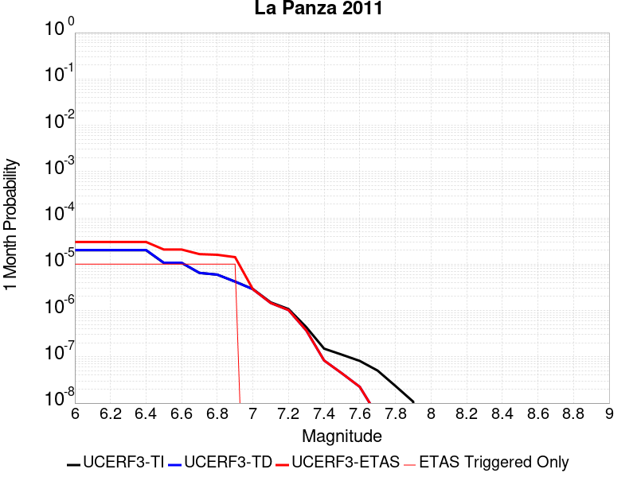 |  |  |

| Magnitude | 1 wk TI Prob | 1 wk TD Prob | 1 wk ETAS Prob | 1 wk ETAS/TD Gain | 1 wk ETAS Triggered Only | 1 mo TI Prob | 1 mo TD Prob | 1 mo ETAS Prob | 1 mo ETAS/TD Gain | 1 mo ETAS Triggered Only | 1 yr TI Prob | 1 yr TD Prob | 1 yr ETAS Prob | 1 yr ETAS/TD Gain | 1 yr ETAS Triggered Only | 10 yr TI Prob | 10 yr TD Prob | 10 yr ETAS Prob | 10 yr ETAS/TD Gain | 10 yr ETAS Triggered Only |
|-----|-----|-----|-----|-----|-----|-----|-----|-----|-----|-----|-----|-----|-----|-----|-----|-----|-----|-----|-----|-----|
| 6.0 | 4.6754544E-6 | 4.717587E-6 | 1.471754E-5 | 3.1197178 | 1.0E-5 | 2.0037509E-5 | 2.0218084E-5 | 3.0217881E-5 | 1.4945967 | 1.0E-5 | 2.4392935E-4 | 2.4612935E-4 | 2.7612195E-4 | 1.1218572 | 3.0E-5 | 0.0024366176 | 0.002458762 | 0.002488688 | 1.0121713 | 3.0E-5 |
| 6.1 | 4.6754544E-6 | 4.717587E-6 | 1.471754E-5 | 3.1197178 | 1.0E-5 | 2.0037509E-5 | 2.0218084E-5 | 3.0217881E-5 | 1.4945967 | 1.0E-5 | 2.4392935E-4 | 2.4612935E-4 | 2.7612195E-4 | 1.1218572 | 3.0E-5 | 0.0024366176 | 0.002458762 | 0.002488688 | 1.0121713 | 3.0E-5 |
| 6.2 | 4.6754544E-6 | 4.717587E-6 | 1.471754E-5 | 3.1197178 | 1.0E-5 | 2.0037509E-5 | 2.0218084E-5 | 3.0217881E-5 | 1.4945967 | 1.0E-5 | 2.4392935E-4 | 2.4612935E-4 | 2.7612195E-4 | 1.1218572 | 3.0E-5 | 0.0024366176 | 0.002458762 | 0.002488688 | 1.0121713 | 3.0E-5 |
| 6.3 | 4.6754544E-6 | 4.717587E-6 | 1.471754E-5 | 3.1197178 | 1.0E-5 | 2.0037509E-5 | 2.0218084E-5 | 3.0217881E-5 | 1.4945967 | 1.0E-5 | 2.4392935E-4 | 2.4612935E-4 | 2.7612195E-4 | 1.1218572 | 3.0E-5 | 0.0024366176 | 0.002458762 | 0.002488688 | 1.0121713 | 3.0E-5 |
| 6.4 | 4.6754544E-6 | 4.717587E-6 | 1.471754E-5 | 3.1197178 | 1.0E-5 | 2.0037509E-5 | 2.0218084E-5 | 3.0217881E-5 | 1.4945967 | 1.0E-5 | 2.4392935E-4 | 2.4612935E-4 | 2.7612195E-4 | 1.1218572 | 3.0E-5 | 0.0024366176 | 0.002458762 | 0.002488688 | 1.0121713 | 3.0E-5 |
| 6.5 | 2.485343E-6 | 2.5005988E-6 | 1.2500574E-5 | 4.999032 | 1.0E-5 | 1.0651426E-5 | 1.0716811E-5 | 2.0716703E-5 | 1.9331034 | 1.0E-5 | 1.296734E-4 | 1.3046975E-4 | 1.5046714E-4 | 1.1532723 | 2.0E-5 | 0.0012959775 | 0.0013039699 | 0.0013239438 | 1.0153178 | 2.0E-5 |
| 6.6 | 2.485343E-6 | 2.5005988E-6 | 1.2500574E-5 | 4.999032 | 1.0E-5 | 1.0651426E-5 | 1.0716811E-5 | 2.0716703E-5 | 1.9331034 | 1.0E-5 | 1.296734E-4 | 1.3046975E-4 | 1.5046714E-4 | 1.1532723 | 2.0E-5 | 0.0012959775 | 0.0013039699 | 0.0013239438 | 1.0153178 | 2.0E-5 |
| 6.7 | 1.5108508E-6 | 1.5146375E-6 | 1.1514622E-5 | 7.60223 | 1.0E-5 | 6.4750584E-6 | 6.491288E-6 | 1.6491224E-5 | 2.5405164 | 1.0E-5 | 7.8830984E-5 | 7.902867E-5 | 8.902788E-5 | 1.1265264 | 1.0E-5 | 7.880303E-4 | 7.900165E-4 | 8.000086E-4 | 1.012648 | 1.0E-5 |
| 6.8 | 1.3865837E-6 | 1.3885102E-6 | 1.1388496E-5 | 8.201954 | 1.0E-5 | 5.942488E-6 | 5.9507447E-6 | 1.5950685E-5 | 2.6804519 | 1.0E-5 | 7.234739E-5 | 7.244801E-5 | 8.244728E-5 | 1.13802 | 1.0E-5 | 7.232384E-4 | 7.242537E-4 | 7.3424645E-4 | 1.0137973 | 1.0E-5 |
| 6.9 | 9.826583E-7 | 9.796287E-7 | 1.0979619E-5 | 11.20794 | 1.0E-5 | 4.2113857E-6 | 4.198402E-6 | 1.419836E-5 | 3.3818486 | 1.0E-5 | 5.1272415E-5 | 5.11144E-5 | 6.111389E-5 | 1.1956296 | 1.0E-5 | 5.126059E-4 | 5.110318E-4 | 5.2102667E-4 | 1.0195583 | 1.0E-5 |
| 7.0 | 6.7797646E-7 | 6.7102144E-7 | 6.7102144E-7 | 1.0 | 0.0 | 2.9056102E-6 | 2.8758034E-6 | 2.8758034E-6 | 1.0 | 0.0 | 3.537523E-5 | 3.5012374E-5 | 3.5012374E-5 | 1.0 | 0.0 | 3.5369597E-4 | 3.5007167E-4 | 3.5007167E-4 | 1.0 | 0.0 |
| 7.1 | 3.4979826E-7 | 3.387388E-7 | 3.387388E-7 | 1.0 | 0.0 | 1.4991346E-6 | 1.4517369E-6 | 1.4517369E-6 | 1.0 | 0.0 | 1.825181E-5 | 1.7674765E-5 | 1.7674765E-5 | 1.0 | 0.0 | 1.825031E-4 | 1.7673477E-4 | 1.7673477E-4 | 1.0 | 0.0 |
| 7.2 | 2.5088332E-7 | 2.3831899E-7 | 2.3831899E-7 | 1.0 | 0.0 | 1.0752137E-6 | 1.0213668E-6 | 1.0213668E-6 | 1.0 | 0.0 | 1.3090649E-5 | 1.2435077E-5 | 1.2435077E-5 | 1.0 | 0.0 | 1.3089878E-4 | 1.2434467E-4 | 1.2434467E-4 | 1.0 | 0.0 |
| 7.3 | 1.0159086E-7 | 8.64462E-8 | 8.64462E-8 | 1.0 | 0.0 | 4.3538932E-7 | 3.7048366E-7 | 3.7048366E-7 | 1.0 | 0.0 | 5.300852E-6 | 4.5106294E-6 | 4.5106294E-6 | 1.0 | 0.0 | 5.3007258E-5 | 4.5105422E-5 | 4.5105422E-5 | 1.0 | 0.0 |
| 7.4 | 3.5006252E-8 | 1.9404325E-8 | 1.9404325E-8 | 1.0 | 0.0 | 1.5002678E-7 | 8.3161396E-8 | 8.3161396E-8 | 1.0 | 0.0 | 1.8265745E-6 | 1.0124895E-6 | 1.0124895E-6 | 1.0 | 0.0 | 1.8265595E-5 | 1.01248515E-5 | 1.01248515E-5 | 1.0 | 0.0 |
| 7.5 | 2.592274E-8 | 1.0239094E-8 | 1.0239094E-8 | 1.0 | 0.0 | 1.1109746E-7 | 4.388183E-8 | 4.388183E-8 | 1.0 | 0.0 | 1.3526106E-6 | 5.342612E-7 | 5.342612E-7 | 1.0 | 0.0 | 1.3526024E-5 | 5.3425997E-6 | 5.3425997E-6 | 1.0 | 0.0 |
| 7.6 | 1.9016717E-8 | 5.244801E-9 | 5.244801E-9 | 1.0 | 0.0 | 8.150022E-8 | 2.247772E-8 | 2.247772E-8 | 1.0 | 0.0 | 9.922647E-7 | 2.736662E-7 | 2.736662E-7 | 1.0 | 0.0 | 9.922603E-6 | 2.7366589E-6 | 2.7366589E-6 | 1.0 | 0.0 |
| 7.7 | 1.17738495E-8 | 1.2398075E-9 | 1.2398075E-9 | 1.0 | 0.0 | 5.0459356E-8 | 5.3134603E-9 | 5.3134603E-9 | 1.0 | 0.0 | 6.1434247E-7 | 6.469138E-8 | 6.469138E-8 | 1.0 | 0.0 | 6.143408E-6 | 6.469136E-7 | 6.469136E-7 | 1.0 | 0.0 |
| 7.8 | 5.489079E-9 | 2.0111768E-10 | 2.0111768E-10 | 1.0 | 0.0 | 2.3524624E-8 | 8.6193275E-10 | 8.6193275E-10 | 1.0 | 0.0 | 2.8641225E-7 | 1.04940305E-8 | 1.04940305E-8 | 1.0 | 0.0 | 2.8641189E-6 | 1.04940305E-7 | 1.04940305E-7 | 1.0 | 0.0 |
| 7.9 | 2.5081048E-9 | 6.683887E-11 | 6.683887E-11 | 1.0 | 0.0 | 1.0749021E-8 | 2.8645197E-10 | 2.8645197E-10 | 1.0 | 0.0 | 1.3086932E-7 | 3.487552E-9 | 3.487552E-9 | 1.0 | 0.0 | 1.3086925E-6 | 3.487552E-8 | 3.487552E-8 | 1.0 | 0.0 |

## Oak Ridge (Onshore)
*[(top)](#table-of-contents)*

| 1 Week | 1 Month | 1 Year | 10 Year |
|-----|-----|-----|-----|
|  |  |  | 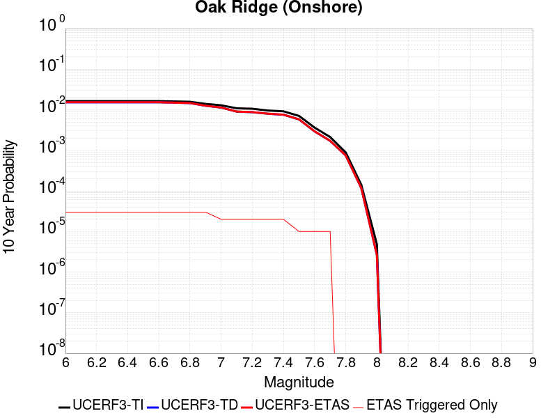 |

| Magnitude | 1 wk TI Prob | 1 wk TD Prob | 1 wk ETAS Prob | 1 wk ETAS/TD Gain | 1 wk ETAS Triggered Only | 1 mo TI Prob | 1 mo TD Prob | 1 mo ETAS Prob | 1 mo ETAS/TD Gain | 1 mo ETAS Triggered Only | 1 yr TI Prob | 1 yr TD Prob | 1 yr ETAS Prob | 1 yr ETAS/TD Gain | 1 yr ETAS Triggered Only | 10 yr TI Prob | 10 yr TD Prob | 10 yr ETAS Prob | 10 yr ETAS/TD Gain | 10 yr ETAS Triggered Only |
|-----|-----|-----|-----|-----|-----|-----|-----|-----|-----|-----|-----|-----|-----|-----|-----|-----|-----|-----|-----|-----|
| 6.0 | 3.155064E-5 | 2.9525974E-5 | 2.9525974E-5 | 1.0 | 0.0 | 1.3521002E-4 | 1.2653397E-4 | 1.365327E-4 | 1.0790201 | 1.0E-5 | 0.001644939 | 0.0015395004 | 0.001549485 | 1.0064856 | 1.0E-5 | 0.01632816 | 0.015292859 | 0.0153224 | 1.0019317 | 3.0E-5 |
| 6.1 | 3.155064E-5 | 2.9525974E-5 | 2.9525974E-5 | 1.0 | 0.0 | 1.3521002E-4 | 1.2653397E-4 | 1.365327E-4 | 1.0790201 | 1.0E-5 | 0.001644939 | 0.0015395004 | 0.001549485 | 1.0064856 | 1.0E-5 | 0.01632816 | 0.015292859 | 0.0153224 | 1.0019317 | 3.0E-5 |
| 6.2 | 3.155064E-5 | 2.9525974E-5 | 2.9525974E-5 | 1.0 | 0.0 | 1.3521002E-4 | 1.2653397E-4 | 1.365327E-4 | 1.0790201 | 1.0E-5 | 0.001644939 | 0.0015395004 | 0.001549485 | 1.0064856 | 1.0E-5 | 0.01632816 | 0.015292859 | 0.0153224 | 1.0019317 | 3.0E-5 |
| 6.3 | 3.155064E-5 | 2.9525974E-5 | 2.9525974E-5 | 1.0 | 0.0 | 1.3521002E-4 | 1.2653397E-4 | 1.365327E-4 | 1.0790201 | 1.0E-5 | 0.001644939 | 0.0015395004 | 0.001549485 | 1.0064856 | 1.0E-5 | 0.01632816 | 0.015292859 | 0.0153224 | 1.0019317 | 3.0E-5 |
| 6.4 | 3.155064E-5 | 2.9525974E-5 | 2.9525974E-5 | 1.0 | 0.0 | 1.3521002E-4 | 1.2653397E-4 | 1.365327E-4 | 1.0790201 | 1.0E-5 | 0.001644939 | 0.0015395004 | 0.001549485 | 1.0064856 | 1.0E-5 | 0.01632816 | 0.015292859 | 0.0153224 | 1.0019317 | 3.0E-5 |
| 6.5 | 3.155064E-5 | 2.9525974E-5 | 2.9525974E-5 | 1.0 | 0.0 | 1.3521002E-4 | 1.2653397E-4 | 1.365327E-4 | 1.0790201 | 1.0E-5 | 0.001644939 | 0.0015395004 | 0.001549485 | 1.0064856 | 1.0E-5 | 0.01632816 | 0.015292859 | 0.0153224 | 1.0019317 | 3.0E-5 |
| 6.6 | 3.155064E-5 | 2.9525974E-5 | 2.9525974E-5 | 1.0 | 0.0 | 1.3521002E-4 | 1.2653397E-4 | 1.365327E-4 | 1.0790201 | 1.0E-5 | 0.001644939 | 0.0015395004 | 0.001549485 | 1.0064856 | 1.0E-5 | 0.01632816 | 0.015292859 | 0.0153224 | 1.0019317 | 3.0E-5 |
| 6.7 | 3.098897E-5 | 2.8864175E-5 | 2.8864175E-5 | 1.0 | 0.0 | 1.328031E-4 | 1.2369796E-4 | 1.3369671E-4 | 1.0808321 | 1.0E-5 | 0.0016156785 | 0.0015050198 | 0.0015150048 | 1.0066345 | 1.0E-5 | 0.016039822 | 0.014952714 | 0.014982265 | 1.0019764 | 3.0E-5 |
| 6.8 | 3.0449872E-5 | 2.8239372E-5 | 2.8239372E-5 | 1.0 | 0.0 | 1.3049292E-4 | 1.2102048E-4 | 1.3101926E-4 | 1.0826206 | 1.0E-5 | 0.0015875935 | 0.0014724657 | 0.0014824509 | 1.0067813 | 1.0E-5 | 0.015762992 | 0.014631462 | 0.014661022 | 1.0020204 | 3.0E-5 |
| 6.9 | 2.697928E-5 | 2.4219773E-5 | 2.4219773E-5 | 1.0 | 0.0 | 1.15620365E-4 | 1.0379502E-4 | 1.1379398E-4 | 1.0963337 | 1.0E-5 | 0.0014067689 | 0.0012629933 | 0.0012729807 | 1.0079077 | 1.0E-5 | 0.0139789665 | 0.01256087 | 0.012590493 | 1.0023583 | 3.0E-5 |
| 7.0 | 2.4893961E-5 | 2.1862043E-5 | 2.1862043E-5 | 1.0 | 0.0 | 1.0668404E-4 | 9.3691204E-5 | 1.0369026E-4 | 1.1067237 | 1.0E-5 | 0.0012981043 | 0.0011401111 | 0.0011500998 | 1.008761 | 1.0E-5 | 0.012905477 | 0.011344905 | 0.011364679 | 1.001743 | 2.0E-5 |
| 7.1 | 2.0945363E-5 | 1.7354487E-5 | 1.7354487E-5 | 1.0 | 0.0 | 8.976275E-5 | 7.437428E-5 | 8.437354E-5 | 1.1344451 | 1.0E-5 | 0.0010923136 | 9.051354E-4 | 9.1512635E-4 | 1.0110381 | 1.0E-5 | 0.0108696 | 0.009015423 | 0.009035243 | 1.0021985 | 2.0E-5 |
| 7.2 | 2.0439404E-5 | 1.6809423E-5 | 1.6809423E-5 | 1.0 | 0.0 | 8.7594504E-5 | 7.203843E-5 | 8.20377E-5 | 1.1388048 | 1.0E-5 | 0.0010659413 | 8.767196E-4 | 8.867108E-4 | 1.0113962 | 1.0E-5 | 0.010608427 | 0.008733526 | 0.008753352 | 1.00227 | 2.0E-5 |
| 7.3 | 1.8463334E-5 | 1.5381811E-5 | 1.5381811E-5 | 1.0 | 0.0 | 7.912617E-5 | 6.59204E-5 | 7.591974E-5 | 1.1516881 | 1.0E-5 | 9.6293533E-4 | 8.0228975E-4 | 8.1228174E-4 | 1.0124543 | 1.0E-5 | 0.009587734 | 0.007994797 | 0.008014637 | 1.0024816 | 2.0E-5 |
| 7.4 | 1.763139E-5 | 1.451684E-5 | 1.451684E-5 | 1.0 | 0.0 | 7.556091E-5 | 6.221356E-5 | 7.221294E-5 | 1.1607267 | 1.0E-5 | 9.1956573E-4 | 7.571909E-4 | 7.671833E-4 | 1.0131967 | 1.0E-5 | 0.009157699 | 0.007546914 | 0.0075667626 | 1.0026301 | 2.0E-5 |
| 7.5 | 1.3594944E-5 | 1.1163356E-5 | 1.1163356E-5 | 1.0 | 0.0 | 5.8262744E-5 | 4.784209E-5 | 5.7841615E-5 | 1.209011 | 1.0E-5 | 7.0911803E-4 | 5.8232434E-4 | 5.923185E-4 | 1.0171626 | 1.0E-5 | 0.007068595 | 0.0058082556 | 0.0058181975 | 1.0017117 | 1.0E-5 |
| 7.6 | 6.9889534E-6 | 5.6367144E-6 | 5.6367144E-6 | 1.0 | 0.0 | 2.9952313E-5 | 2.4157125E-5 | 3.4156885E-5 | 1.4139465 | 1.0E-5 | 3.646084E-4 | 2.9407372E-4 | 3.040708E-4 | 1.033995 | 1.0E-5 | 0.0036401073 | 0.0029368899 | 0.0029468604 | 1.003395 | 1.0E-5 |
| 7.7 | 4.0824193E-6 | 3.2832586E-6 | 3.2832586E-6 | 1.0 | 0.0 | 1.7495966E-5 | 1.4071033E-5 | 2.4070892E-5 | 1.7106699 | 1.0E-5 | 2.1299256E-4 | 1.713015E-4 | 1.8129978E-4 | 1.0583667 | 1.0E-5 | 0.0021278851 | 0.0017117079 | 0.0017216908 | 1.0058321 | 1.0E-5 |
| 7.8 | 1.7023609E-6 | 1.4370495E-6 | 1.4370495E-6 | 1.0 | 0.0 | 7.295812E-6 | 6.1587693E-6 | 6.1587693E-6 | 1.0 | 0.0 | 8.882289E-5 | 7.498047E-5 | 7.498047E-5 | 1.0 | 0.0 | 8.8787393E-4 | 7.495545E-4 | 7.495545E-4 | 1.0 | 0.0 |
| 7.9 | 2.721225E-7 | 2.2616497E-7 | 2.2616497E-7 | 1.0 | 0.0 | 1.1662388E-6 | 9.692781E-7 | 9.692781E-7 | 1.0 | 0.0 | 1.4198865E-5 | 1.1800899E-5 | 1.1800899E-5 | 1.0 | 0.0 | 1.4197957E-4 | 1.1800301E-4 | 1.1800301E-4 | 1.0 | 0.0 |
| 8.0 | 9.364255E-9 | 5.1206666E-9 | 5.1206666E-9 | 1.0 | 0.0 | 4.0132523E-8 | 2.1945715E-8 | 2.1945715E-8 | 1.0 | 0.0 | 4.8861335E-7 | 2.6718905E-7 | 2.6718905E-7 | 1.0 | 0.0 | 4.8861225E-6 | 2.6718876E-6 | 2.6718876E-6 | 1.0 | 0.0 |

## White Wolf
*[(top)](#table-of-contents)*

| 1 Week | 1 Month | 1 Year | 10 Year |
|-----|-----|-----|-----|
|  |  |  |  |

| Magnitude | 1 wk TI Prob | 1 wk TD Prob | 1 wk ETAS Prob | 1 wk ETAS/TD Gain | 1 wk ETAS Triggered Only | 1 mo TI Prob | 1 mo TD Prob | 1 mo ETAS Prob | 1 mo ETAS/TD Gain | 1 mo ETAS Triggered Only | 1 yr TI Prob | 1 yr TD Prob | 1 yr ETAS Prob | 1 yr ETAS/TD Gain | 1 yr ETAS Triggered Only | 10 yr TI Prob | 10 yr TD Prob | 10 yr ETAS Prob | 10 yr ETAS/TD Gain | 10 yr ETAS Triggered Only |
|-----|-----|-----|-----|-----|-----|-----|-----|-----|-----|-----|-----|-----|-----|-----|-----|-----|-----|-----|-----|-----|
| 6.0 | 2.0037822E-5 | 1.0469162E-6 | 2.1046895E-5 | 20.103706 | 2.0E-5 | 8.587355E-5 | 4.486776E-6 | 2.4486686E-5 | 5.4575233 | 2.0E-5 | 0.001045009 | 5.4625183E-5 | 7.462409E-5 | 1.3661115 | 2.0E-5 | 0.010401085 | 5.461226E-4 | 5.7610625E-4 | 1.0549027 | 3.0E-5 |
| 6.1 | 2.0037822E-5 | 1.0469162E-6 | 2.1046895E-5 | 20.103706 | 2.0E-5 | 8.587355E-5 | 4.486776E-6 | 2.4486686E-5 | 5.4575233 | 2.0E-5 | 0.001045009 | 5.4625183E-5 | 7.462409E-5 | 1.3661115 | 2.0E-5 | 0.010401085 | 5.461226E-4 | 5.7610625E-4 | 1.0549027 | 3.0E-5 |
| 6.2 | 2.0037822E-5 | 1.0469162E-6 | 2.1046895E-5 | 20.103706 | 2.0E-5 | 8.587355E-5 | 4.486776E-6 | 2.4486686E-5 | 5.4575233 | 2.0E-5 | 0.001045009 | 5.4625183E-5 | 7.462409E-5 | 1.3661115 | 2.0E-5 | 0.010401085 | 5.461226E-4 | 5.7610625E-4 | 1.0549027 | 3.0E-5 |
| 6.3 | 2.0037822E-5 | 1.0469162E-6 | 2.1046895E-5 | 20.103706 | 2.0E-5 | 8.587355E-5 | 4.486776E-6 | 2.4486686E-5 | 5.4575233 | 2.0E-5 | 0.001045009 | 5.4625183E-5 | 7.462409E-5 | 1.3661115 | 2.0E-5 | 0.010401085 | 5.461226E-4 | 5.7610625E-4 | 1.0549027 | 3.0E-5 |
| 6.4 | 1.132487E-5 | 1.0469162E-6 | 2.1046895E-5 | 20.103706 | 2.0E-5 | 4.8534253E-5 | 4.486776E-6 | 2.4486686E-5 | 5.4575233 | 2.0E-5 | 5.907443E-4 | 5.4625183E-5 | 7.462409E-5 | 1.3661115 | 2.0E-5 | 0.005891764 | 5.461226E-4 | 5.7610625E-4 | 1.0549027 | 3.0E-5 |
| 6.5 | 1.132487E-5 | 1.0469162E-6 | 2.1046895E-5 | 20.103706 | 2.0E-5 | 4.8534253E-5 | 4.486776E-6 | 2.4486686E-5 | 5.4575233 | 2.0E-5 | 5.907443E-4 | 5.4625183E-5 | 7.462409E-5 | 1.3661115 | 2.0E-5 | 0.005891764 | 5.461226E-4 | 5.7610625E-4 | 1.0549027 | 3.0E-5 |
| 6.6 | 9.347473E-6 | 1.0469162E-6 | 2.1046895E-5 | 20.103706 | 2.0E-5 | 4.0059982E-5 | 4.486776E-6 | 2.4486686E-5 | 5.4575233 | 2.0E-5 | 4.8762115E-4 | 5.4625183E-5 | 7.462409E-5 | 1.3661115 | 2.0E-5 | 0.0048655253 | 5.461226E-4 | 5.7610625E-4 | 1.0549027 | 3.0E-5 |
| 6.7 | 7.842647E-6 | 1.0048342E-6 | 2.1004815E-5 | 20.90376 | 2.0E-5 | 3.361091E-5 | 4.3064256E-6 | 2.4306339E-5 | 5.644203 | 2.0E-5 | 4.0913603E-4 | 5.2429517E-5 | 7.242847E-5 | 1.3814445 | 2.0E-5 | 0.004083836 | 5.2417646E-4 | 5.5416074E-4 | 1.0572026 | 3.0E-5 |
| 6.8 | 6.26597E-6 | 9.734822E-7 | 2.0973463E-5 | 21.544783 | 2.0E-5 | 2.685388E-5 | 4.17206E-6 | 2.4171977E-5 | 5.7937746 | 2.0E-5 | 3.2689696E-4 | 5.0793697E-5 | 7.079268E-5 | 1.3937297 | 2.0E-5 | 0.003264165 | 5.078258E-4 | 5.3781056E-4 | 1.0590454 | 3.0E-5 |
| 6.9 | 5.258436E-6 | 9.183254E-7 | 2.0918307E-5 | 22.778753 | 2.0E-5 | 2.2535958E-5 | 3.9356746E-6 | 2.3935596E-5 | 6.0817013 | 2.0E-5 | 2.7434074E-4 | 4.7915833E-5 | 6.791487E-5 | 1.4173785 | 2.0E-5 | 0.0027400232 | 4.790598E-4 | 5.0904544E-4 | 1.0625926 | 3.0E-5 |
| 7.0 | 4.675028E-6 | 8.6611794E-7 | 2.08661E-5 | 24.091522 | 2.0E-5 | 2.003568E-5 | 3.7119291E-6 | 2.3711855E-5 | 6.388014 | 2.0E-5 | 2.4390711E-4 | 4.5191846E-5 | 6.519094E-5 | 1.4425377 | 2.0E-5 | 0.0024363957 | 4.518313E-4 | 4.8181773E-4 | 1.0663664 | 3.0E-5 |
| 7.1 | 2.8270078E-6 | 6.8741696E-7 | 2.0687403E-5 | 30.094402 | 2.0E-5 | 1.2115692E-5 | 2.9460696E-6 | 2.2946011E-5 | 7.788686 | 2.0E-5 | 1.4749856E-4 | 3.5867848E-5 | 5.586713E-5 | 1.5575825 | 2.0E-5 | 0.001474007 | 3.586247E-4 | 3.7861752E-4 | 1.0557486 | 2.0E-5 |
| 7.2 | 1.6881406E-6 | 2.2706382E-7 | 2.2706382E-7 | 1.0 | 0.0 | 7.2348685E-6 | 9.731303E-7 | 9.731303E-7 | 1.0 | 0.0 | 8.808096E-5 | 1.1847799E-5 | 1.1847799E-5 | 1.0 | 0.0 | 8.8046055E-4 | 1.1847183E-4 | 1.1847183E-4 | 1.0 | 0.0 |
| 7.3 | 9.086107E-7 | 1.5266386E-7 | 1.5266386E-7 | 1.0 | 0.0 | 3.8940398E-6 | 6.5427355E-7 | 6.5427355E-7 | 1.0 | 0.0 | 4.7408903E-5 | 7.965752E-6 | 7.965752E-6 | 1.0 | 0.0 | 4.739879E-4 | 7.965475E-5 | 7.965475E-5 | 1.0 | 0.0 |
| 7.4 | 1.9717383E-7 | 9.003913E-8 | 9.003913E-8 | 1.0 | 0.0 | 8.450304E-7 | 3.8588192E-7 | 3.8588192E-7 | 1.0 | 0.0 | 1.0288197E-5 | 4.6981027E-6 | 4.6981027E-6 | 1.0 | 0.0 | 1.028772E-4 | 4.6980065E-5 | 4.6980065E-5 | 1.0 | 0.0 |
| 7.5 | 1.086975E-7 | 6.6597195E-8 | 6.6597195E-8 | 1.0 | 0.0 | 4.6584634E-7 | 2.8541652E-7 | 2.8541652E-7 | 1.0 | 0.0 | 5.6716644E-6 | 3.474941E-6 | 3.474941E-6 | 1.0 | 0.0 | 5.6715195E-5 | 3.474889E-5 | 3.474889E-5 | 1.0 | 0.0 |
| 7.6 | 2.4217808E-8 | 1.5820765E-8 | 1.5820765E-8 | 1.0 | 0.0 | 1.03790605E-7 | 6.780328E-8 | 6.780328E-8 | 1.0 | 0.0 | 1.2636499E-6 | 8.255046E-7 | 8.255046E-7 | 1.0 | 0.0 | 1.2636427E-5 | 8.2550205E-6 | 8.2550205E-6 | 1.0 | 0.0 |

## Emerson-Copper Mtn 2011
*[(top)](#table-of-contents)*

| 1 Week | 1 Month | 1 Year | 10 Year |
|-----|-----|-----|-----|
|  |  |  |  |

| Magnitude | 1 wk TI Prob | 1 wk TD Prob | 1 wk ETAS Prob | 1 wk ETAS/TD Gain | 1 wk ETAS Triggered Only | 1 mo TI Prob | 1 mo TD Prob | 1 mo ETAS Prob | 1 mo ETAS/TD Gain | 1 mo ETAS Triggered Only | 1 yr TI Prob | 1 yr TD Prob | 1 yr ETAS Prob | 1 yr ETAS/TD Gain | 1 yr ETAS Triggered Only | 10 yr TI Prob | 10 yr TD Prob | 10 yr ETAS Prob | 10 yr ETAS/TD Gain | 10 yr ETAS Triggered Only |
|-----|-----|-----|-----|-----|-----|-----|-----|-----|-----|-----|-----|-----|-----|-----|-----|-----|-----|-----|-----|-----|
| 6.0 | 2.1364202E-5 | 9.968114E-6 | 1.9968014E-5 | 2.0031888 | 1.0E-5 | 9.1557646E-5 | 4.2719836E-5 | 5.271941E-5 | 1.2340733 | 1.0E-5 | 0.0011141442 | 5.199986E-4 | 5.299934E-4 | 1.0192208 | 1.0E-5 | 0.011085749 | 0.005188688 | 0.0052085845 | 1.0038345 | 2.0E-5 |
| 6.1 | 2.1364202E-5 | 9.968114E-6 | 1.9968014E-5 | 2.0031888 | 1.0E-5 | 9.1557646E-5 | 4.2719836E-5 | 5.271941E-5 | 1.2340733 | 1.0E-5 | 0.0011141442 | 5.199986E-4 | 5.299934E-4 | 1.0192208 | 1.0E-5 | 0.011085749 | 0.005188688 | 0.0052085845 | 1.0038345 | 2.0E-5 |
| 6.2 | 2.1364202E-5 | 9.968114E-6 | 1.9968014E-5 | 2.0031888 | 1.0E-5 | 9.1557646E-5 | 4.2719836E-5 | 5.271941E-5 | 1.2340733 | 1.0E-5 | 0.0011141442 | 5.199986E-4 | 5.299934E-4 | 1.0192208 | 1.0E-5 | 0.011085749 | 0.005188688 | 0.0052085845 | 1.0038345 | 2.0E-5 |
| 6.3 | 1.7751237E-5 | 8.089227E-6 | 1.8089146E-5 | 2.236202 | 1.0E-5 | 7.607452E-5 | 3.466769E-5 | 4.4667344E-5 | 1.2884431 | 1.0E-5 | 9.258136E-4 | 4.2200365E-4 | 4.3199942E-4 | 1.0236865 | 1.0E-5 | 0.00921966 | 0.0042126453 | 0.004232561 | 1.0047276 | 2.0E-5 |
| 6.4 | 1.7751237E-5 | 8.089227E-6 | 1.8089146E-5 | 2.236202 | 1.0E-5 | 7.607452E-5 | 3.466769E-5 | 4.4667344E-5 | 1.2884431 | 1.0E-5 | 9.258136E-4 | 4.2200365E-4 | 4.3199942E-4 | 1.0236865 | 1.0E-5 | 0.00921966 | 0.0042126453 | 0.004232561 | 1.0047276 | 2.0E-5 |
| 6.5 | 1.5886664E-5 | 6.603819E-6 | 1.6603753E-5 | 2.5142653 | 1.0E-5 | 6.808392E-5 | 2.8301802E-5 | 3.8301518E-5 | 1.3533244 | 1.0E-5 | 8.286065E-4 | 3.4452465E-4 | 3.545212E-4 | 1.0290155 | 1.0E-5 | 0.008255237 | 0.0034403696 | 0.0034603006 | 1.0057933 | 2.0E-5 |
| 6.6 | 1.5886664E-5 | 6.603819E-6 | 1.6603753E-5 | 2.5142653 | 1.0E-5 | 6.808392E-5 | 2.8301802E-5 | 3.8301518E-5 | 1.3533244 | 1.0E-5 | 8.286065E-4 | 3.4452465E-4 | 3.545212E-4 | 1.0290155 | 1.0E-5 | 0.008255237 | 0.0034403696 | 0.0034603006 | 1.0057933 | 2.0E-5 |
| 6.7 | 1.428471E-5 | 5.470403E-6 | 1.5470348E-5 | 2.828009 | 1.0E-5 | 6.121875E-5 | 2.3444394E-5 | 3.344416E-5 | 1.4265312 | 1.0E-5 | 7.450834E-4 | 2.8540206E-4 | 2.953992E-4 | 1.0350283 | 1.0E-5 | 0.007425902 | 0.0028507432 | 0.0028706861 | 1.0069957 | 2.0E-5 |
| 6.8 | 1.3490684E-5 | 5.073699E-6 | 1.5073648E-5 | 2.9709387 | 1.0E-5 | 5.7815934E-5 | 2.1744265E-5 | 3.1744046E-5 | 1.4598814 | 1.0E-5 | 7.0368167E-4 | 2.6470813E-4 | 2.7470547E-4 | 1.0377674 | 1.0E-5 | 0.007014576 | 0.002644309 | 0.0026642561 | 1.0075434 | 2.0E-5 |
| 6.9 | 1.2235421E-5 | 4.289677E-6 | 1.4289634E-5 | 3.331168 | 1.0E-5 | 5.2436466E-5 | 1.838422E-5 | 2.8384036E-5 | 1.5439347 | 1.0E-5 | 6.38227E-4 | 2.238085E-4 | 2.3380626E-4 | 1.044671 | 1.0E-5 | 0.0063639707 | 0.0022361854 | 0.0022561406 | 1.0089238 | 2.0E-5 |
| 7.0 | 1.1009851E-5 | 3.7189886E-6 | 1.3718952E-5 | 3.688893 | 1.0E-5 | 4.7184225E-5 | 1.5938444E-5 | 2.5938285E-5 | 1.6274039 | 1.0E-5 | 5.743165E-4 | 1.9403672E-4 | 2.0403478E-4 | 1.0515267 | 1.0E-5 | 0.005728345 | 0.0019390108 | 0.001958972 | 1.0102946 | 2.0E-5 |
| 7.1 | 9.726373E-6 | 3.2117953E-6 | 1.3211763E-5 | 4.1135135 | 1.0E-5 | 4.168379E-5 | 1.3764783E-5 | 2.3764645E-5 | 1.7264817 | 1.0E-5 | 5.07382E-4 | 1.6757673E-4 | 1.7757504E-4 | 1.0596641 | 1.0E-5 | 0.0050622504 | 0.0016748349 | 0.0016948014 | 1.0119215 | 2.0E-5 |
| 7.2 | 3.9335127E-6 | 1.1524792E-6 | 1.1152468E-5 | 9.676936 | 1.0E-5 | 1.6857803E-5 | 4.9391874E-6 | 1.4939138E-5 | 3.0246146 | 1.0E-5 | 2.0522442E-4 | 6.0133007E-5 | 7.01324E-5 | 1.166288 | 1.0E-5 | 0.00205035 | 6.011733E-4 | 6.211613E-4 | 1.0332483 | 2.0E-5 |
| 7.3 | 2.661632E-6 | 6.911505E-7 | 1.0691144E-5 | 15.468619 | 1.0E-5 | 1.14069435E-5 | 2.9620703E-6 | 1.296204E-5 | 4.376007 | 1.0E-5 | 1.3887069E-4 | 3.6062618E-5 | 4.6062258E-5 | 1.2772855 | 1.0E-5 | 0.0013878393 | 3.605687E-4 | 3.8056148E-4 | 1.0554479 | 2.0E-5 |
| 7.4 | 2.0893426E-6 | 5.4618386E-7 | 1.0546179E-5 | 19.308844 | 1.0E-5 | 8.954295E-6 | 2.3407858E-6 | 1.2340763E-5 | 5.2720594 | 1.0E-5 | 1.0901308E-4 | 2.84987E-5 | 3.8498416E-5 | 1.3508832 | 1.0E-5 | 0.0010895962 | 2.84951E-4 | 3.049453E-4 | 1.0701675 | 2.0E-5 |
| 7.5 | 1.1681728E-6 | 3.6030585E-7 | 3.6030585E-7 | 1.0 | 0.0 | 5.0064455E-6 | 1.544167E-6 | 1.544167E-6 | 1.0 | 0.0 | 6.0951766E-5 | 1.8800076E-5 | 1.8800076E-5 | 1.0 | 0.0 | 6.093505E-4 | 1.8798532E-4 | 1.8798532E-4 | 1.0 | 0.0 |
| 7.6 | 1.3154387E-7 | 7.1197384E-8 | 7.1197384E-8 | 1.0 | 0.0 | 5.6375933E-7 | 3.051316E-7 | 3.051316E-7 | 1.0 | 0.0 | 6.863748E-6 | 3.7149728E-6 | 3.7149728E-6 | 1.0 | 0.0 | 6.863536E-5 | 3.7149264E-5 | 3.7149264E-5 | 1.0 | 0.0 |

## Earthquake Valley (No  Extension)
*[(top)](#table-of-contents)*

| 1 Week | 1 Month | 1 Year | 10 Year |
|-----|-----|-----|-----|
|  |  |  | 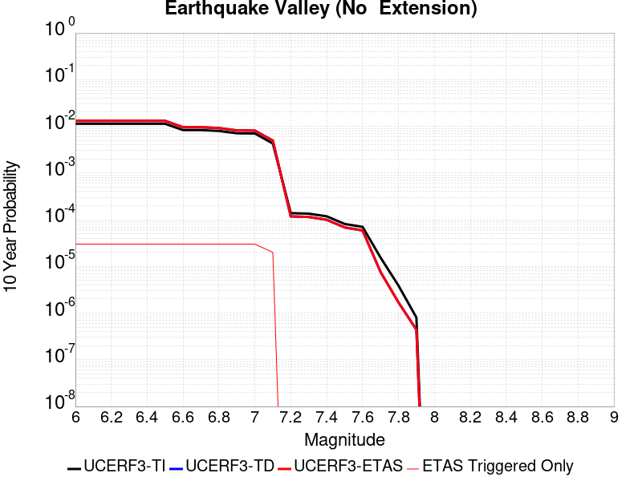 |

| Magnitude | 1 wk TI Prob | 1 wk TD Prob | 1 wk ETAS Prob | 1 wk ETAS/TD Gain | 1 wk ETAS Triggered Only | 1 mo TI Prob | 1 mo TD Prob | 1 mo ETAS Prob | 1 mo ETAS/TD Gain | 1 mo ETAS Triggered Only | 1 yr TI Prob | 1 yr TD Prob | 1 yr ETAS Prob | 1 yr ETAS/TD Gain | 1 yr ETAS Triggered Only | 10 yr TI Prob | 10 yr TD Prob | 10 yr ETAS Prob | 10 yr ETAS/TD Gain | 10 yr ETAS Triggered Only |
|-----|-----|-----|-----|-----|-----|-----|-----|-----|-----|-----|-----|-----|-----|-----|-----|-----|-----|-----|-----|-----|
| 6.0 | 2.1859703E-5 | 2.5198362E-5 | 3.519811E-5 | 1.3968412 | 1.0E-5 | 9.3681076E-5 | 1.07989326E-4 | 1.17988246E-4 | 1.0925918 | 1.0E-5 | 0.0011399703 | 0.001314122 | 0.0013440826 | 1.0227989 | 3.0E-5 | 0.011341401 | 0.013077871 | 0.013107479 | 1.0022639 | 3.0E-5 |
| 6.1 | 2.1859703E-5 | 2.5198362E-5 | 3.519811E-5 | 1.3968412 | 1.0E-5 | 9.3681076E-5 | 1.07989326E-4 | 1.17988246E-4 | 1.0925918 | 1.0E-5 | 0.0011399703 | 0.001314122 | 0.0013440826 | 1.0227989 | 3.0E-5 | 0.011341401 | 0.013077871 | 0.013107479 | 1.0022639 | 3.0E-5 |
| 6.2 | 2.1859703E-5 | 2.5198362E-5 | 3.519811E-5 | 1.3968412 | 1.0E-5 | 9.3681076E-5 | 1.07989326E-4 | 1.17988246E-4 | 1.0925918 | 1.0E-5 | 0.0011399703 | 0.001314122 | 0.0013440826 | 1.0227989 | 3.0E-5 | 0.011341401 | 0.013077871 | 0.013107479 | 1.0022639 | 3.0E-5 |
| 6.3 | 2.1859703E-5 | 2.5198362E-5 | 3.519811E-5 | 1.3968412 | 1.0E-5 | 9.3681076E-5 | 1.07989326E-4 | 1.17988246E-4 | 1.0925918 | 1.0E-5 | 0.0011399703 | 0.001314122 | 0.0013440826 | 1.0227989 | 3.0E-5 | 0.011341401 | 0.013077871 | 0.013107479 | 1.0022639 | 3.0E-5 |
| 6.4 | 2.1859703E-5 | 2.5198362E-5 | 3.519811E-5 | 1.3968412 | 1.0E-5 | 9.3681076E-5 | 1.07989326E-4 | 1.17988246E-4 | 1.0925918 | 1.0E-5 | 0.0011399703 | 0.001314122 | 0.0013440826 | 1.0227989 | 3.0E-5 | 0.011341401 | 0.013077871 | 0.013107479 | 1.0022639 | 3.0E-5 |
| 6.5 | 2.1859703E-5 | 2.5198362E-5 | 3.519811E-5 | 1.3968412 | 1.0E-5 | 9.3681076E-5 | 1.07989326E-4 | 1.17988246E-4 | 1.0925918 | 1.0E-5 | 0.0011399703 | 0.001314122 | 0.0013440826 | 1.0227989 | 3.0E-5 | 0.011341401 | 0.013077871 | 0.013107479 | 1.0022639 | 3.0E-5 |
| 6.6 | 1.597E-5 | 1.8356275E-5 | 2.8356093E-5 | 1.5447628 | 1.0E-5 | 6.8441055E-5 | 7.866787E-5 | 8.866709E-5 | 1.1271067 | 1.0E-5 | 8.329513E-4 | 9.574478E-4 | 9.87419E-4 | 1.0313033 | 3.0E-5 | 0.008298361 | 0.009541836 | 0.0095715495 | 1.0031141 | 3.0E-5 |
| 6.7 | 1.597E-5 | 1.8356275E-5 | 2.8356093E-5 | 1.5447628 | 1.0E-5 | 6.8441055E-5 | 7.866787E-5 | 8.866709E-5 | 1.1271067 | 1.0E-5 | 8.329513E-4 | 9.574478E-4 | 9.87419E-4 | 1.0313033 | 3.0E-5 | 0.008298361 | 0.009541836 | 0.0095715495 | 1.0031141 | 3.0E-5 |
| 6.8 | 1.5315149E-5 | 1.7602091E-5 | 2.7601916E-5 | 1.5681043 | 1.0E-5 | 6.5634704E-5 | 7.543584E-5 | 8.543509E-5 | 1.132553 | 1.0E-5 | 7.988095E-4 | 9.181311E-4 | 9.4810355E-4 | 1.0326451 | 3.0E-5 | 0.007959441 | 0.009151919 | 0.009181645 | 1.003248 | 3.0E-5 |
| 6.9 | 1.3634728E-5 | 1.5675821E-5 | 2.5675665E-5 | 1.6379151 | 1.0E-5 | 5.8433237E-5 | 6.718082E-5 | 7.718016E-5 | 1.148842 | 1.0E-5 | 7.1119244E-4 | 8.177017E-4 | 8.476772E-4 | 1.0366582 | 3.0E-5 | 0.007089207 | 0.008155 | 0.008184756 | 1.0036488 | 3.0E-5 |
| 7.0 | 1.3496271E-5 | 1.5517853E-5 | 2.5517698E-5 | 1.6444091 | 1.0E-5 | 5.783988E-5 | 6.650385E-5 | 7.650319E-5 | 1.1503572 | 1.0E-5 | 7.03973E-4 | 8.094657E-4 | 8.3944143E-4 | 1.0370315 | 3.0E-5 | 0.007017471 | 0.0080732405 | 0.008102999 | 1.003686 | 3.0E-5 |
| 7.1 | 8.242798E-6 | 9.4726E-6 | 1.9472505E-5 | 2.0556664 | 1.0E-5 | 3.53258E-5 | 4.0596606E-5 | 5.0596198E-5 | 1.2463161 | 1.0E-5 | 4.300067E-4 | 4.9421866E-4 | 5.1420875E-4 | 1.040448 | 2.0E-5 | 0.004291756 | 0.0049377717 | 0.004957673 | 1.0040305 | 2.0E-5 |
| 7.2 | 2.6506527E-7 | 2.2560312E-7 | 2.2560312E-7 | 1.0 | 0.0 | 1.1359936E-6 | 9.668702E-7 | 9.668702E-7 | 1.0 | 0.0 | 1.3830633E-5 | 1.17715845E-5 | 1.17715845E-5 | 1.0 | 0.0 | 1.3829772E-4 | 1.1771003E-4 | 1.1771003E-4 | 1.0 | 0.0 |
| 7.3 | 2.5810488E-7 | 2.1955442E-7 | 2.1955442E-7 | 1.0 | 0.0 | 1.1061633E-6 | 9.409472E-7 | 9.409472E-7 | 1.0 | 0.0 | 1.3467455E-5 | 1.1455976E-5 | 1.1455976E-5 | 1.0 | 0.0 | 1.3466639E-4 | 1.1455427E-4 | 1.1455427E-4 | 1.0 | 0.0 |
| 7.4 | 2.2676066E-7 | 1.9110601E-7 | 1.9110601E-7 | 1.0 | 0.0 | 9.71831E-7 | 8.190255E-7 | 8.190255E-7 | 1.0 | 0.0 | 1.1831979E-5 | 9.9715935E-6 | 9.9715935E-6 | 1.0 | 0.0 | 1.1831349E-4 | 9.9711855E-5 | 9.9711855E-5 | 1.0 | 0.0 |
| 7.5 | 1.5553917E-7 | 1.3112096E-7 | 1.3112096E-7 | 1.0 | 0.0 | 6.6659624E-7 | 5.619469E-7 | 5.619469E-7 | 1.0 | 0.0 | 8.115779E-6 | 6.8416834E-6 | 6.8416834E-6 | 1.0 | 0.0 | 8.115482E-5 | 6.841495E-5 | 6.841495E-5 | 1.0 | 0.0 |
| 7.6 | 1.3448629E-7 | 1.1288419E-7 | 1.1288419E-7 | 1.0 | 0.0 | 5.7636964E-7 | 4.837893E-7 | 4.837893E-7 | 1.0 | 0.0 | 7.017278E-6 | 5.890121E-6 | 5.890121E-6 | 1.0 | 0.0 | 7.0170565E-5 | 5.889986E-5 | 5.889986E-5 | 1.0 | 0.0 |
| 7.7 | 2.9719402E-8 | 1.458206E-8 | 1.458206E-8 | 1.0 | 0.0 | 1.2736886E-7 | 6.249454E-8 | 6.249454E-8 | 1.0 | 0.0 | 1.5507147E-6 | 7.608708E-7 | 7.608708E-7 | 1.0 | 0.0 | 1.550704E-5 | 7.6086876E-6 | 7.6086876E-6 | 1.0 | 0.0 |
| 7.8 | 7.4390196E-9 | 3.2502152E-9 | 3.2502152E-9 | 1.0 | 0.0 | 3.1881513E-8 | 1.3929493E-8 | 1.3929493E-8 | 1.0 | 0.0 | 3.8815733E-7 | 1.6959156E-7 | 1.6959156E-7 | 1.0 | 0.0 | 3.8815665E-6 | 1.6959145E-6 | 1.6959145E-6 | 1.0 | 0.0 |
| 7.9 | 1.5373532E-9 | 8.440161E-10 | 8.440161E-10 | 1.0 | 0.0 | 6.5886567E-9 | 3.6172119E-9 | 3.6172119E-9 | 1.0 | 0.0 | 8.021689E-8 | 4.4039556E-8 | 4.4039556E-8 | 1.0 | 0.0 | 8.0216864E-7 | 4.4039552E-7 | 4.4039552E-7 | 1.0 | 0.0 |

## San Andreas (Santa Cruz Mts) 2011 CFM
*[(top)](#table-of-contents)*

| 1 Week | 1 Month | 1 Year | 10 Year |
|-----|-----|-----|-----|
| 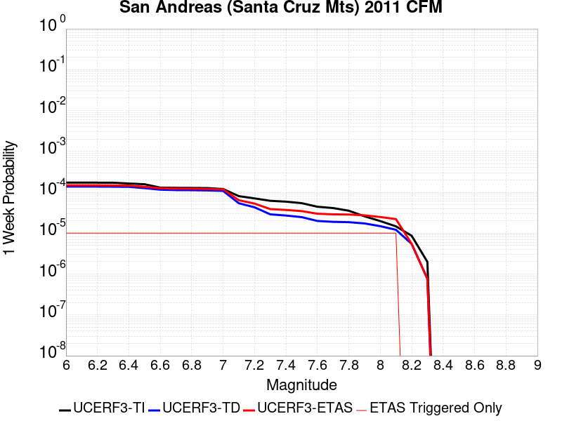 |  | 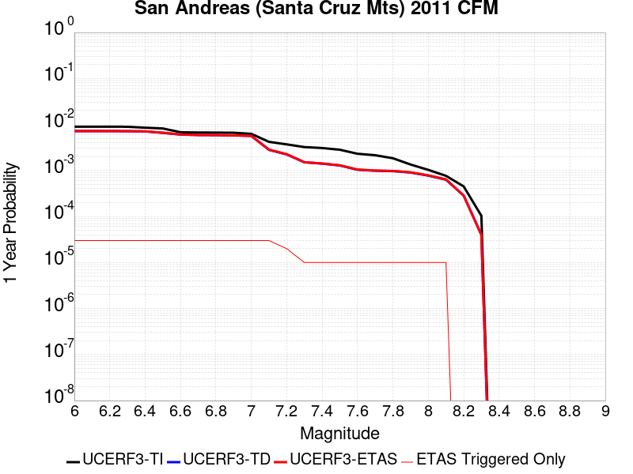 |  |

| Magnitude | 1 wk TI Prob | 1 wk TD Prob | 1 wk ETAS Prob | 1 wk ETAS/TD Gain | 1 wk ETAS Triggered Only | 1 mo TI Prob | 1 mo TD Prob | 1 mo ETAS Prob | 1 mo ETAS/TD Gain | 1 mo ETAS Triggered Only | 1 yr TI Prob | 1 yr TD Prob | 1 yr ETAS Prob | 1 yr ETAS/TD Gain | 1 yr ETAS Triggered Only | 10 yr TI Prob | 10 yr TD Prob | 10 yr ETAS Prob | 10 yr ETAS/TD Gain | 10 yr ETAS Triggered Only |
|-----|-----|-----|-----|-----|-----|-----|-----|-----|-----|-----|-----|-----|-----|-----|-----|-----|-----|-----|-----|-----|
| 6.0 | 1.7221631E-4 | 1.3793171E-4 | 1.4793033E-4 | 1.0724896 | 1.0E-5 | 7.378611E-4 | 5.9100403E-4 | 6.109922E-4 | 1.0338207 | 2.0E-5 | 0.008946515 | 0.007172124 | 0.0072019086 | 1.0041529 | 3.0E-5 | 0.08594794 | 0.0705551 | 0.07058298 | 1.0003952 | 3.0E-5 |
| 6.1 | 1.7221631E-4 | 1.3793171E-4 | 1.4793033E-4 | 1.0724896 | 1.0E-5 | 7.378611E-4 | 5.9100403E-4 | 6.109922E-4 | 1.0338207 | 2.0E-5 | 0.008946515 | 0.007172124 | 0.0072019086 | 1.0041529 | 3.0E-5 | 0.08594794 | 0.0705551 | 0.07058298 | 1.0003952 | 3.0E-5 |
| 6.2 | 1.7221631E-4 | 1.3793171E-4 | 1.4793033E-4 | 1.0724896 | 1.0E-5 | 7.378611E-4 | 5.9100403E-4 | 6.109922E-4 | 1.0338207 | 2.0E-5 | 0.008946515 | 0.007172124 | 0.0072019086 | 1.0041529 | 3.0E-5 | 0.08594794 | 0.0705551 | 0.07058298 | 1.0003952 | 3.0E-5 |
| 6.3 | 1.716926E-4 | 1.3712609E-4 | 1.4712471E-4 | 1.0729156 | 1.0E-5 | 7.3561794E-4 | 5.875529E-4 | 6.075411E-4 | 1.0340195 | 2.0E-5 | 0.008919428 | 0.0071303817 | 0.0071601677 | 1.0041773 | 3.0E-5 | 0.08569809 | 0.070167266 | 0.07019516 | 1.0003976 | 3.0E-5 |
| 6.4 | 1.6392978E-4 | 1.3588481E-4 | 1.4588344E-4 | 1.0735817 | 1.0E-5 | 7.02367E-4 | 5.822355E-4 | 6.0222385E-4 | 1.0343304 | 2.0E-5 | 0.008517839 | 0.007066063 | 0.007095851 | 1.0042156 | 3.0E-5 | 0.08198654 | 0.06940135 | 0.06942927 | 1.0004022 | 3.0E-5 |
| 6.5 | 1.5742714E-4 | 1.2648388E-4 | 1.364826E-4 | 1.0790515 | 1.0E-5 | 6.745133E-4 | 5.4196286E-4 | 5.61952E-4 | 1.0368829 | 2.0E-5 | 0.00818132 | 0.0065787593 | 0.0066085616 | 1.0045301 | 3.0E-5 | 0.078865945 | 0.06486309 | 0.06489115 | 1.0004325 | 3.0E-5 |
| 6.6 | 1.3038084E-4 | 1.1588213E-4 | 1.2588098E-4 | 1.0862846 | 1.0E-5 | 5.5865536E-4 | 4.9654447E-4 | 5.1653455E-4 | 1.0402584 | 2.0E-5 | 0.006780438 | 0.0060289134 | 0.0060587325 | 1.004946 | 3.0E-5 | 0.0657725 | 0.05932738 | 0.059355598 | 1.0004756 | 3.0E-5 |
| 6.7 | 1.2867592E-4 | 1.1314701E-4 | 1.2314587E-4 | 1.0883706 | 1.0E-5 | 5.5135164E-4 | 4.8482692E-4 | 5.0481723E-4 | 1.0412319 | 2.0E-5 | 0.0066920654 | 0.00588703 | 0.005916854 | 1.0050659 | 3.0E-5 | 0.06494093 | 0.058038417 | 0.058066677 | 1.0004869 | 3.0E-5 |
| 6.8 | 1.2801298E-4 | 1.1252261E-4 | 1.2252148E-4 | 1.088861 | 1.0E-5 | 5.485117E-4 | 4.8215193E-4 | 5.021423E-4 | 1.0414608 | 2.0E-5 | 0.0066577005 | 0.0058546383 | 0.0058844625 | 1.0050942 | 3.0E-5 | 0.06461738 | 0.057752274 | 0.057780538 | 1.0004895 | 3.0E-5 |
| 6.9 | 1.269149E-4 | 1.1094465E-4 | 1.2094354E-4 | 1.0901251 | 1.0E-5 | 5.4380763E-4 | 4.7539172E-4 | 4.9538224E-4 | 1.0420506 | 2.0E-5 | 0.006600777 | 0.005772772 | 0.005802599 | 1.0051668 | 3.0E-5 | 0.06408122 | 0.0570241 | 0.057052385 | 1.0004961 | 3.0E-5 |
| 7.0 | 1.2030331E-4 | 1.0824504E-4 | 1.1824395E-4 | 1.092373 | 1.0E-5 | 5.154837E-4 | 4.638261E-4 | 4.838168E-4 | 1.0430996 | 2.0E-5 | 0.006257969 | 0.0056326967 | 0.0056625274 | 1.005296 | 3.0E-5 | 0.06084648 | 0.055696685 | 0.055725016 | 1.0005087 | 3.0E-5 |
| 7.1 | 8.049617E-5 | 5.3926604E-5 | 6.392606E-5 | 1.1854272 | 1.0E-5 | 3.4493793E-4 | 2.3109373E-4 | 2.510891E-4 | 1.086525 | 2.0E-5 | 0.0041915346 | 0.0028099709 | 0.0028398866 | 1.0106462 | 3.0E-5 | 0.041133516 | 0.029618956 | 0.029648067 | 1.0009829 | 3.0E-5 |
| 7.2 | 7.093979E-5 | 4.2937932E-5 | 5.2937503E-5 | 1.2328843 | 1.0E-5 | 3.0399222E-4 | 1.8400686E-4 | 1.9400501E-4 | 1.0543358 | 1.0E-5 | 0.0036948253 | 0.0022380045 | 0.0022579597 | 1.0089165 | 2.0E-5 | 0.03633994 | 0.023941692 | 0.023961212 | 1.0008154 | 2.0E-5 |
| 7.3 | 6.193693E-5 | 2.8894141E-5 | 3.8893853E-5 | 1.3460809 | 1.0E-5 | 2.6541698E-4 | 1.2382616E-4 | 1.3382493E-4 | 1.0807483 | 1.0E-5 | 0.0032266637 | 0.0015065427 | 0.0015165276 | 1.0066277 | 1.0E-5 | 0.031802133 | 0.016499156 | 0.01650899 | 1.000596 | 1.0E-5 |
| 7.4 | 5.906492E-5 | 2.702346E-5 | 3.702319E-5 | 1.3700389 | 1.0E-5 | 2.5311083E-4 | 1.1580969E-4 | 1.2580854E-4 | 1.0863385 | 1.0E-5 | 0.0030772698 | 0.0014090725 | 0.0014190584 | 1.0070869 | 1.0E-5 | 0.030350044 | 0.015471023 | 0.015480868 | 1.0006363 | 1.0E-5 |
| 7.5 | 5.424296E-5 | 2.4678277E-5 | 3.467803E-5 | 1.4052047 | 1.0E-5 | 2.324491E-4 | 1.05759755E-4 | 1.157587E-4 | 1.0945439 | 1.0E-5 | 0.002826395 | 0.0012868657 | 0.0012968528 | 1.0077608 | 1.0E-5 | 0.027907165 | 0.014163188 | 0.014173046 | 1.0006961 | 1.0E-5 |
| 7.6 | 4.43084E-5 | 1.990431E-5 | 2.9904111E-5 | 1.5023937 | 1.0E-5 | 1.8987931E-4 | 8.53014E-5 | 9.5300544E-5 | 1.1172214 | 1.0E-5 | 0.0023093296 | 0.0010380499 | 0.0010480395 | 1.0096234 | 1.0E-5 | 0.022854783 | 0.011412679 | 0.011422565 | 1.0008662 | 1.0E-5 |
| 7.7 | 4.118098E-5 | 1.8936442E-5 | 2.8936252E-5 | 1.5280724 | 1.0E-5 | 1.7647797E-4 | 8.115366E-5 | 9.115285E-5 | 1.123213 | 1.0E-5 | 0.002146502 | 9.875982E-4 | 9.975883E-4 | 1.0101156 | 1.0E-5 | 0.021258866 | 0.010870468 | 0.010880359 | 1.0009099 | 1.0E-5 |
| 7.8 | 3.5408906E-5 | 1.856446E-5 | 2.8564275E-5 | 1.5386536 | 1.0E-5 | 1.5174363E-4 | 7.955955E-5 | 8.955875E-5 | 1.125682 | 1.0E-5 | 0.0018459131 | 9.682073E-4 | 9.781977E-4 | 1.0103184 | 1.0E-5 | 0.018306552 | 0.010652021 | 0.010661914 | 1.0009288 | 1.0E-5 |
| 7.9 | 2.5860836E-5 | 1.7315993E-5 | 2.731582E-5 | 1.5774908 | 1.0E-5 | 1.10827445E-4 | 7.420929E-5 | 8.420855E-5 | 1.134744 | 1.0E-5 | 0.001348489 | 9.031238E-4 | 9.131148E-4 | 1.0110626 | 1.0E-5 | 0.013403354 | 0.009907599 | 0.0099174995 | 1.0009993 | 1.0E-5 |
| 8.0 | 1.9777332E-5 | 1.4839596E-5 | 2.4839448E-5 | 1.6738628 | 1.0E-5 | 8.4757245E-5 | 6.3596715E-5 | 7.3596086E-5 | 1.1572309 | 1.0E-5 | 0.0010314309 | 7.740152E-4 | 7.840074E-4 | 1.0129097 | 1.0E-5 | 0.010266567 | 0.008508967 | 0.008518882 | 1.0011653 | 1.0E-5 |
| 8.1 | 1.468494E-5 | 1.2107374E-5 | 2.2107253E-5 | 1.825933 | 1.0E-5 | 6.293394E-5 | 5.1887713E-5 | 6.188719E-5 | 1.1927139 | 1.0E-5 | 7.6595135E-4 | 6.3155E-4 | 6.4154365E-4 | 1.0158241 | 1.0E-5 | 0.0076331664 | 0.006969149 | 0.0069790795 | 1.0014249 | 1.0E-5 |
| 8.2 | 8.63836E-6 | 5.469061E-6 | 5.469061E-6 | 1.0 | 0.0 | 3.7021015E-5 | 2.3438623E-5 | 2.3438623E-5 | 1.0 | 0.0 | 4.5063766E-4 | 2.8532793E-4 | 2.8532793E-4 | 1.0 | 0.0 | 0.004497249 | 0.00324569 | 0.00324569 | 1.0 | 0.0 |
| 8.3 | 1.983087E-6 | 7.6599065E-7 | 7.6599065E-7 | 1.0 | 0.0 | 8.498917E-6 | 3.282813E-6 | 3.282813E-6 | 1.0 | 0.0 | 1.034694E-4 | 3.9967534E-5 | 3.9967534E-5 | 1.0 | 0.0 | 0.0010342124 | 4.719687E-4 | 4.719687E-4 | 1.0 | 0.0 |

## Shoreline
*[(top)](#table-of-contents)*

| 1 Week | 1 Month | 1 Year | 10 Year |
|-----|-----|-----|-----|
|  |  |  |  |

| Magnitude | 1 wk TI Prob | 1 wk TD Prob | 1 wk ETAS Prob | 1 wk ETAS/TD Gain | 1 wk ETAS Triggered Only | 1 mo TI Prob | 1 mo TD Prob | 1 mo ETAS Prob | 1 mo ETAS/TD Gain | 1 mo ETAS Triggered Only | 1 yr TI Prob | 1 yr TD Prob | 1 yr ETAS Prob | 1 yr ETAS/TD Gain | 1 yr ETAS Triggered Only | 10 yr TI Prob | 10 yr TD Prob | 10 yr ETAS Prob | 10 yr ETAS/TD Gain | 10 yr ETAS Triggered Only |
|-----|-----|-----|-----|-----|-----|-----|-----|-----|-----|-----|-----|-----|-----|-----|-----|-----|-----|-----|-----|-----|
| 6.0 | 3.9888673E-6 | 4.047929E-6 | 1.4047889E-5 | 3.4703891 | 1.0E-5 | 1.7095033E-5 | 1.7348184E-5 | 2.734801E-5 | 1.5764192 | 1.0E-5 | 2.0811215E-4 | 2.1119925E-4 | 2.2119714E-4 | 1.0473386 | 1.0E-5 | 0.0020791737 | 0.002110534 | 0.002130492 | 1.0094563 | 2.0E-5 |
| 6.1 | 3.9888673E-6 | 4.047929E-6 | 1.4047889E-5 | 3.4703891 | 1.0E-5 | 1.7095033E-5 | 1.7348184E-5 | 2.734801E-5 | 1.5764192 | 1.0E-5 | 2.0811215E-4 | 2.1119925E-4 | 2.2119714E-4 | 1.0473386 | 1.0E-5 | 0.0020791737 | 0.002110534 | 0.002130492 | 1.0094563 | 2.0E-5 |
| 6.2 | 1.4039653E-6 | 1.4100891E-6 | 1.4100891E-6 | 1.0 | 0.0 | 6.0169805E-6 | 6.0432253E-6 | 6.0432253E-6 | 1.0 | 0.0 | 7.325427E-5 | 7.357384E-5 | 7.357384E-5 | 1.0 | 0.0 | 7.3230127E-4 | 7.355009E-4 | 7.355009E-4 | 1.0 | 0.0 |
| 6.3 | 1.4039653E-6 | 1.4100891E-6 | 1.4100891E-6 | 1.0 | 0.0 | 6.0169805E-6 | 6.0432253E-6 | 6.0432253E-6 | 1.0 | 0.0 | 7.325427E-5 | 7.357384E-5 | 7.357384E-5 | 1.0 | 0.0 | 7.3230127E-4 | 7.355009E-4 | 7.355009E-4 | 1.0 | 0.0 |
| 6.4 | 1.3314152E-6 | 1.3361605E-6 | 1.3361605E-6 | 1.0 | 0.0 | 5.7060524E-6 | 5.7263896E-6 | 5.7263896E-6 | 1.0 | 0.0 | 6.946897E-5 | 6.971662E-5 | 6.971662E-5 | 1.0 | 0.0 | 6.9447263E-4 | 6.9695286E-4 | 6.9695286E-4 | 1.0 | 0.0 |
| 6.5 | 1.1187026E-6 | 1.120364E-6 | 1.120364E-6 | 1.0 | 0.0 | 4.794431E-6 | 4.8015513E-6 | 4.8015513E-6 | 1.0 | 0.0 | 5.8370628E-5 | 5.8457343E-5 | 5.8457343E-5 | 1.0 | 0.0 | 5.83553E-4 | 5.844222E-4 | 5.844222E-4 | 1.0 | 0.0 |
| 6.6 | 9.793089E-7 | 9.784919E-7 | 9.784919E-7 | 1.0 | 0.0 | 4.1970316E-6 | 4.1935305E-6 | 4.1935305E-6 | 1.0 | 0.0 | 5.1097657E-5 | 5.105505E-5 | 5.105505E-5 | 1.0 | 0.0 | 5.108591E-4 | 5.1043445E-4 | 5.1043445E-4 | 1.0 | 0.0 |
| 6.7 | 8.995986E-7 | 8.9728E-7 | 8.9728E-7 | 1.0 | 0.0 | 3.8554167E-6 | 3.84548E-6 | 3.84548E-6 | 1.0 | 0.0 | 4.693869E-5 | 4.6817724E-5 | 4.6817724E-5 | 1.0 | 0.0 | 4.6928777E-4 | 4.6807955E-4 | 4.6807955E-4 | 1.0 | 0.0 |
| 6.8 | 7.931612E-7 | 7.8804027E-7 | 7.8804027E-7 | 1.0 | 0.0 | 3.3992578E-6 | 3.377311E-6 | 3.377311E-6 | 1.0 | 0.0 | 4.1385178E-5 | 4.1117994E-5 | 4.1117994E-5 | 1.0 | 0.0 | 4.1377472E-4 | 4.1110438E-4 | 4.1110438E-4 | 1.0 | 0.0 |
| 6.9 | 7.1465956E-7 | 7.078006E-7 | 7.078006E-7 | 1.0 | 0.0 | 3.062823E-6 | 3.0334277E-6 | 3.0334277E-6 | 1.0 | 0.0 | 3.7289232E-5 | 3.6931357E-5 | 3.6931357E-5 | 1.0 | 0.0 | 3.7282976E-4 | 3.6925258E-4 | 3.6925258E-4 | 1.0 | 0.0 |
| 7.0 | 6.389046E-7 | 6.299458E-7 | 6.299458E-7 | 1.0 | 0.0 | 2.7381598E-6 | 2.699765E-6 | 2.699765E-6 | 1.0 | 0.0 | 3.3336586E-5 | 3.2869146E-5 | 3.2869146E-5 | 1.0 | 0.0 | 3.3331584E-4 | 3.2864307E-4 | 3.2864307E-4 | 1.0 | 0.0 |
| 7.1 | 5.4300875E-7 | 5.3111313E-7 | 5.3111313E-7 | 1.0 | 0.0 | 2.3271782E-6 | 2.276197E-6 | 2.276197E-6 | 1.0 | 0.0 | 2.8333026E-5 | 2.7712347E-5 | 2.7712347E-5 | 1.0 | 0.0 | 2.8329415E-4 | 2.77089E-4 | 2.77089E-4 | 1.0 | 0.0 |
| 7.2 | 4.6768855E-7 | 4.5348952E-7 | 4.5348952E-7 | 1.0 | 0.0 | 2.0043778E-6 | 1.9435251E-6 | 1.9435251E-6 | 1.0 | 0.0 | 2.4403027E-5 | 2.3662162E-5 | 2.3662162E-5 | 1.0 | 0.0 | 2.4400349E-4 | 2.3659648E-4 | 2.3659648E-4 | 1.0 | 0.0 |
| 7.3 | 4.0966103E-7 | 3.9385662E-7 | 3.9385662E-7 | 1.0 | 0.0 | 1.7556889E-6 | 1.6879559E-6 | 1.6879559E-6 | 1.0 | 0.0 | 2.1375303E-5 | 2.055067E-5 | 2.055067E-5 | 1.0 | 0.0 | 2.1373246E-4 | 2.0548773E-4 | 2.0548773E-4 | 1.0 | 0.0 |
| 7.4 | 3.5105785E-7 | 3.3363975E-7 | 3.3363975E-7 | 1.0 | 0.0 | 1.5045327E-6 | 1.4298838E-6 | 1.4298838E-6 | 1.0 | 0.0 | 1.8317533E-5 | 1.7408696E-5 | 1.7408696E-5 | 1.0 | 0.0 | 1.8316023E-4 | 1.7407336E-4 | 1.7407336E-4 | 1.0 | 0.0 |
| 7.5 | 2.8737534E-7 | 2.6820038E-7 | 2.6820038E-7 | 1.0 | 0.0 | 1.2316079E-6 | 1.1494297E-6 | 1.1494297E-6 | 1.0 | 0.0 | 1.4994724E-5 | 1.3994217E-5 | 1.3994217E-5 | 1.0 | 0.0 | 1.4993713E-4 | 1.3993339E-4 | 1.3993339E-4 | 1.0 | 0.0 |
| 7.6 | 2.0924051E-7 | 1.8778988E-7 | 1.8778988E-7 | 1.0 | 0.0 | 8.967448E-7 | 8.048135E-7 | 8.048135E-7 | 1.0 | 0.0 | 1.0917813E-5 | 9.79856E-6 | 9.79856E-6 | 1.0 | 0.0 | 1.0917276E-4 | 9.798129E-5 | 9.798129E-5 | 1.0 | 0.0 |
| 7.7 | 1.392265E-7 | 1.15433906E-7 | 1.15433906E-7 | 1.0 | 0.0 | 5.9668486E-7 | 4.9471663E-7 | 4.9471663E-7 | 1.0 | 0.0 | 7.2646135E-6 | 6.023158E-6 | 6.023158E-6 | 1.0 | 0.0 | 7.2643765E-5 | 6.0229955E-5 | 6.0229955E-5 | 1.0 | 0.0 |
| 7.8 | 8.1080074E-8 | 5.586722E-8 | 5.586722E-8 | 1.0 | 0.0 | 3.4748598E-7 | 2.394309E-7 | 2.394309E-7 | 1.0 | 0.0 | 4.2306337E-6 | 2.9150672E-6 | 2.9150672E-6 | 1.0 | 0.0 | 4.230553E-5 | 2.9150291E-5 | 2.9150291E-5 | 1.0 | 0.0 |
| 7.9 | 5.0859036E-8 | 2.7244445E-8 | 2.7244445E-8 | 1.0 | 0.0 | 2.1796728E-7 | 1.16761896E-7 | 1.16761896E-7 | 1.0 | 0.0 | 2.6537484E-6 | 1.4215751E-6 | 1.4215751E-6 | 1.0 | 0.0 | 2.6537167E-5 | 1.4215661E-5 | 1.4215661E-5 | 1.0 | 0.0 |
| 8.0 | 3.1760536E-8 | 1.3577206E-8 | 1.3577206E-8 | 1.0 | 0.0 | 1.3611657E-7 | 5.8188025E-8 | 5.8188025E-8 | 1.0 | 0.0 | 1.6572179E-6 | 7.0843896E-7 | 7.0843896E-7 | 1.0 | 0.0 | 1.6572056E-5 | 7.084367E-6 | 7.084367E-6 | 1.0 | 0.0 |
| 8.1 | 1.2947896E-8 | 5.6628693E-9 | 5.6628693E-9 | 1.0 | 0.0 | 5.5490982E-8 | 2.426944E-8 | 2.426944E-8 | 1.0 | 0.0 | 6.756025E-7 | 2.954804E-7 | 2.954804E-7 | 1.0 | 0.0 | 6.7560045E-6 | 2.9548003E-6 | 2.9548003E-6 | 1.0 | 0.0 |

## Cedar Mtn-Mahogany Mtn
*[(top)](#table-of-contents)*

| 1 Week | 1 Month | 1 Year | 10 Year |
|-----|-----|-----|-----|
|  |  |  | 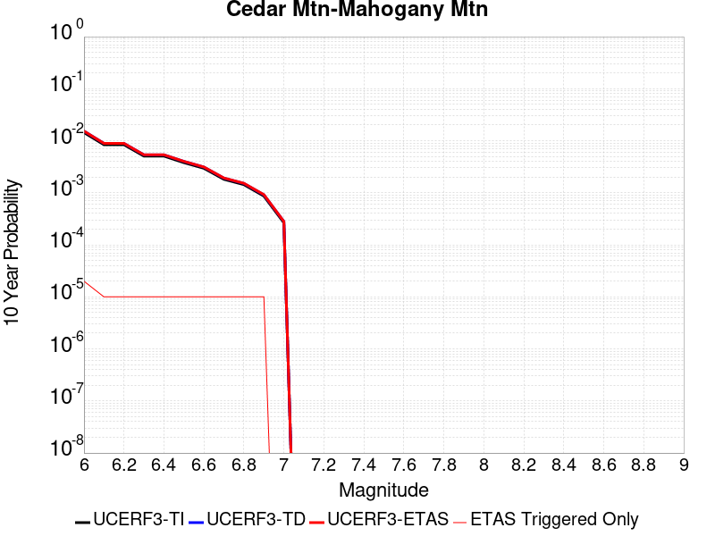 |

| Magnitude | 1 wk TI Prob | 1 wk TD Prob | 1 wk ETAS Prob | 1 wk ETAS/TD Gain | 1 wk ETAS Triggered Only | 1 mo TI Prob | 1 mo TD Prob | 1 mo ETAS Prob | 1 mo ETAS/TD Gain | 1 mo ETAS Triggered Only | 1 yr TI Prob | 1 yr TD Prob | 1 yr ETAS Prob | 1 yr ETAS/TD Gain | 1 yr ETAS Triggered Only | 10 yr TI Prob | 10 yr TD Prob | 10 yr ETAS Prob | 10 yr ETAS/TD Gain | 10 yr ETAS Triggered Only |
|-----|-----|-----|-----|-----|-----|-----|-----|-----|-----|-----|-----|-----|-----|-----|-----|-----|-----|-----|-----|-----|
| 6.0 | 2.7763876E-5 | 2.9588866E-5 | 3.958857E-5 | 1.337955 | 1.0E-5 | 1.1898261E-4 | 1.2680366E-4 | 1.3680238E-4 | 1.078852 | 1.0E-5 | 0.0014476506 | 0.0015428112 | 0.0015527958 | 1.0064716 | 1.0E-5 | 0.0143825635 | 0.015328225 | 0.0153479185 | 1.0012848 | 2.0E-5 |
| 6.1 | 1.6162443E-5 | 1.7142966E-5 | 2.7142794E-5 | 1.5833197 | 1.0E-5 | 6.926578E-5 | 7.346788E-5 | 8.346715E-5 | 1.1361039 | 1.0E-5 | 8.4298453E-4 | 8.941221E-4 | 9.0411317E-4 | 1.0111742 | 1.0E-5 | 0.008397939 | 0.008907059 | 0.008916969 | 1.0011127 | 1.0E-5 |
| 6.2 | 1.6162443E-5 | 1.7142966E-5 | 2.7142794E-5 | 1.5833197 | 1.0E-5 | 6.926578E-5 | 7.346788E-5 | 8.346715E-5 | 1.1361039 | 1.0E-5 | 8.4298453E-4 | 8.941221E-4 | 9.0411317E-4 | 1.0111742 | 1.0E-5 | 0.008397939 | 0.008907059 | 0.008916969 | 1.0011127 | 1.0E-5 |
| 6.3 | 9.746053E-6 | 1.0303152E-5 | 2.0303049E-5 | 1.9705667 | 1.0E-5 | 4.1768133E-5 | 4.415564E-5 | 5.41552E-5 | 1.2264616 | 1.0E-5 | 5.0840835E-4 | 5.3746643E-4 | 5.4746104E-4 | 1.0185958 | 1.0E-5 | 0.0050724675 | 0.005362084 | 0.0053720307 | 1.0018549 | 1.0E-5 |
| 6.4 | 9.746053E-6 | 1.0303152E-5 | 2.0303049E-5 | 1.9705667 | 1.0E-5 | 4.1768133E-5 | 4.415564E-5 | 5.41552E-5 | 1.2264616 | 1.0E-5 | 5.0840835E-4 | 5.3746643E-4 | 5.4746104E-4 | 1.0185958 | 1.0E-5 | 0.0050724675 | 0.005362084 | 0.0053720307 | 1.0018549 | 1.0E-5 |
| 6.5 | 7.290083E-6 | 7.695325E-6 | 1.7695247E-5 | 2.2994804 | 1.0E-5 | 3.124284E-5 | 3.297956E-5 | 4.2979227E-5 | 1.3032081 | 1.0E-5 | 3.8031515E-4 | 4.014543E-4 | 4.1145028E-4 | 1.0248995 | 1.0E-5 | 0.0037966494 | 0.004007511 | 0.004017471 | 1.0024853 | 1.0E-5 |
| 6.6 | 5.67907E-6 | 5.9891527E-6 | 1.5989093E-5 | 2.6696754 | 1.0E-5 | 2.4338644E-5 | 2.5667552E-5 | 3.5667297E-5 | 1.3895869 | 1.0E-5 | 2.962827E-4 | 3.12459E-4 | 3.2245586E-4 | 1.0319942 | 1.0E-5 | 0.0029588798 | 0.003120333 | 0.0031303016 | 1.0031948 | 1.0E-5 |
| 6.7 | 3.4853963E-6 | 3.672631E-6 | 1.3672594E-5 | 3.7228336 | 1.0E-5 | 1.4937327E-5 | 1.5739755E-5 | 2.5739599E-5 | 1.6353239 | 1.0E-5 | 1.8184677E-4 | 1.916153E-4 | 2.0161338E-4 | 1.0521779 | 1.0E-5 | 0.0018169804 | 0.0019145629 | 0.0019245436 | 1.0052131 | 1.0E-5 |
| 6.8 | 2.7535168E-6 | 2.9015764E-6 | 1.2901547E-5 | 4.4463925 | 1.0E-5 | 1.1800733E-5 | 1.2435271E-5 | 2.2435146E-5 | 1.8041543 | 1.0E-5 | 1.4366445E-4 | 1.5138938E-4 | 1.6138787E-4 | 1.0660448 | 1.0E-5 | 0.0014357162 | 0.0015129098 | 0.0015228946 | 1.0065998 | 1.0E-5 |
| 6.9 | 1.6594106E-6 | 1.7496985E-6 | 1.1749681E-5 | 6.71526 | 1.0E-5 | 7.1117406E-6 | 7.4986883E-6 | 1.7498613E-5 | 2.3335567 | 1.0E-5 | 8.6582E-5 | 9.129302E-5 | 1.01292106E-4 | 1.1095273 | 1.0E-5 | 8.654827E-4 | 9.125856E-4 | 9.2257647E-4 | 1.0109478 | 1.0E-5 |
| 7.0 | 5.10215E-7 | 5.389254E-7 | 5.389254E-7 | 1.0 | 0.0 | 2.186634E-6 | 2.3096788E-6 | 2.3096788E-6 | 1.0 | 0.0 | 2.6621943E-5 | 2.8120105E-5 | 2.8120105E-5 | 1.0 | 0.0 | 2.6618753E-4 | 2.81178E-4 | 2.81178E-4 | 1.0 | 0.0 |

## Elmore Ranch
*[(top)](#table-of-contents)*

| 1 Week | 1 Month | 1 Year | 10 Year |
|-----|-----|-----|-----|
|  |  |  |  |

| Magnitude | 1 wk TI Prob | 1 wk TD Prob | 1 wk ETAS Prob | 1 wk ETAS/TD Gain | 1 wk ETAS Triggered Only | 1 mo TI Prob | 1 mo TD Prob | 1 mo ETAS Prob | 1 mo ETAS/TD Gain | 1 mo ETAS Triggered Only | 1 yr TI Prob | 1 yr TD Prob | 1 yr ETAS Prob | 1 yr ETAS/TD Gain | 1 yr ETAS Triggered Only | 10 yr TI Prob | 10 yr TD Prob | 10 yr ETAS Prob | 10 yr ETAS/TD Gain | 10 yr ETAS Triggered Only |
|-----|-----|-----|-----|-----|-----|-----|-----|-----|-----|-----|-----|-----|-----|-----|-----|-----|-----|-----|-----|-----|
| 6.0 | 9.102099E-5 | 8.952015E-5 | 8.952015E-5 | 1.0 | 0.0 | 3.9003167E-4 | 3.8361453E-4 | 3.9361068E-4 | 1.0260578 | 1.0E-5 | 0.0047383 | 0.004662009 | 0.0046719625 | 1.002135 | 1.0E-5 | 0.046385348 | 0.045870975 | 0.045890056 | 1.000416 | 2.0E-5 |
| 6.1 | 3.8306698E-5 | 4.1498504E-5 | 4.1498504E-5 | 1.0 | 0.0 | 1.6416123E-4 | 1.7784268E-4 | 1.8784091E-4 | 1.0562195 | 1.0E-5 | 0.0019968306 | 0.0021631396 | 0.002173118 | 1.0046129 | 1.0E-5 | 0.019789828 | 0.021628205 | 0.021637987 | 1.0004524 | 1.0E-5 |
| 6.2 | 3.8306698E-5 | 4.1498504E-5 | 4.1498504E-5 | 1.0 | 0.0 | 1.6416123E-4 | 1.7784268E-4 | 1.8784091E-4 | 1.0562195 | 1.0E-5 | 0.0019968306 | 0.0021631396 | 0.002173118 | 1.0046129 | 1.0E-5 | 0.019789828 | 0.021628205 | 0.021637987 | 1.0004524 | 1.0E-5 |
| 6.3 | 3.3197924E-5 | 3.6554302E-5 | 3.6554302E-5 | 1.0 | 0.0 | 1.4226905E-4 | 1.5665586E-4 | 1.666543E-4 | 1.0638242 | 1.0E-5 | 0.0017307495 | 0.001905917 | 0.0019158979 | 1.0052369 | 1.0E-5 | 0.017173318 | 0.01908996 | 0.019099768 | 1.0005138 | 1.0E-5 |
| 6.4 | 2.5148964E-5 | 2.7420487E-5 | 2.7420487E-5 | 1.0 | 0.0 | 1.0777682E-4 | 1.17514726E-4 | 1.2751356E-4 | 1.0850857 | 1.0E-5 | 0.0013113929 | 0.0014304507 | 0.0014404365 | 1.0069808 | 1.0E-5 | 0.01303681 | 0.014387194 | 0.01439705 | 1.0006851 | 1.0E-5 |
| 6.5 | 2.5148964E-5 | 2.7420487E-5 | 2.7420487E-5 | 1.0 | 0.0 | 1.0777682E-4 | 1.17514726E-4 | 1.2751356E-4 | 1.0850857 | 1.0E-5 | 0.0013113929 | 0.0014304507 | 0.0014404365 | 1.0069808 | 1.0E-5 | 0.01303681 | 0.014387194 | 0.01439705 | 1.0006851 | 1.0E-5 |

## Robinson Creek
*[(top)](#table-of-contents)*

| 1 Week | 1 Month | 1 Year | 10 Year |
|-----|-----|-----|-----|
|  |  |  |  |

| Magnitude | 1 wk TI Prob | 1 wk TD Prob | 1 wk ETAS Prob | 1 wk ETAS/TD Gain | 1 wk ETAS Triggered Only | 1 mo TI Prob | 1 mo TD Prob | 1 mo ETAS Prob | 1 mo ETAS/TD Gain | 1 mo ETAS Triggered Only | 1 yr TI Prob | 1 yr TD Prob | 1 yr ETAS Prob | 1 yr ETAS/TD Gain | 1 yr ETAS Triggered Only | 10 yr TI Prob | 10 yr TD Prob | 10 yr ETAS Prob | 10 yr ETAS/TD Gain | 10 yr ETAS Triggered Only |
|-----|-----|-----|-----|-----|-----|-----|-----|-----|-----|-----|-----|-----|-----|-----|-----|-----|-----|-----|-----|-----|
| 6.0 | 1.3705327E-5 | 1.5285013E-5 | 1.5285013E-5 | 1.0 | 0.0 | 5.8735794E-5 | 6.55072E-5 | 6.55072E-5 | 1.0 | 0.0 | 7.1487366E-4 | 7.9755014E-4 | 8.075422E-4 | 1.0125284 | 1.0E-5 | 0.0071257832 | 0.007975501 | 0.007995342 | 1.0024877 | 2.0E-5 |
| 6.1 | 1.3705327E-5 | 1.5285013E-5 | 1.5285013E-5 | 1.0 | 0.0 | 5.8735794E-5 | 6.55072E-5 | 6.55072E-5 | 1.0 | 0.0 | 7.1487366E-4 | 7.9755014E-4 | 8.075422E-4 | 1.0125284 | 1.0E-5 | 0.0071257832 | 0.007975501 | 0.007995342 | 1.0024877 | 2.0E-5 |
| 6.2 | 1.3705327E-5 | 1.5285013E-5 | 1.5285013E-5 | 1.0 | 0.0 | 5.8735794E-5 | 6.55072E-5 | 6.55072E-5 | 1.0 | 0.0 | 7.1487366E-4 | 7.9755014E-4 | 8.075422E-4 | 1.0125284 | 1.0E-5 | 0.0071257832 | 0.007975501 | 0.007995342 | 1.0024877 | 2.0E-5 |
| 6.3 | 1.3705327E-5 | 1.5285013E-5 | 1.5285013E-5 | 1.0 | 0.0 | 5.8735794E-5 | 6.55072E-5 | 6.55072E-5 | 1.0 | 0.0 | 7.1487366E-4 | 7.9755014E-4 | 8.075422E-4 | 1.0125284 | 1.0E-5 | 0.0071257832 | 0.007975501 | 0.007995342 | 1.0024877 | 2.0E-5 |
| 6.4 | 1.3705327E-5 | 1.5285013E-5 | 1.5285013E-5 | 1.0 | 0.0 | 5.8735794E-5 | 6.55072E-5 | 6.55072E-5 | 1.0 | 0.0 | 7.1487366E-4 | 7.9755014E-4 | 8.075422E-4 | 1.0125284 | 1.0E-5 | 0.0071257832 | 0.007975501 | 0.007995342 | 1.0024877 | 2.0E-5 |

## Oceanside alt1
*[(top)](#table-of-contents)*

| 1 Week | 1 Month | 1 Year | 10 Year |
|-----|-----|-----|-----|
|  | 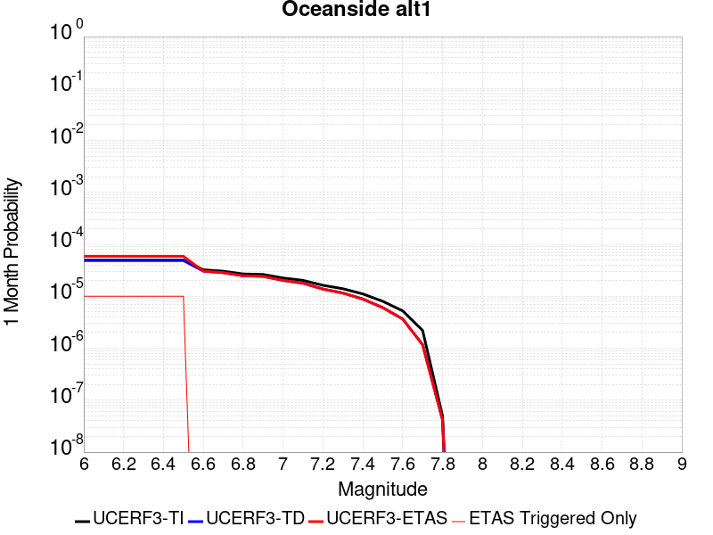 |  | 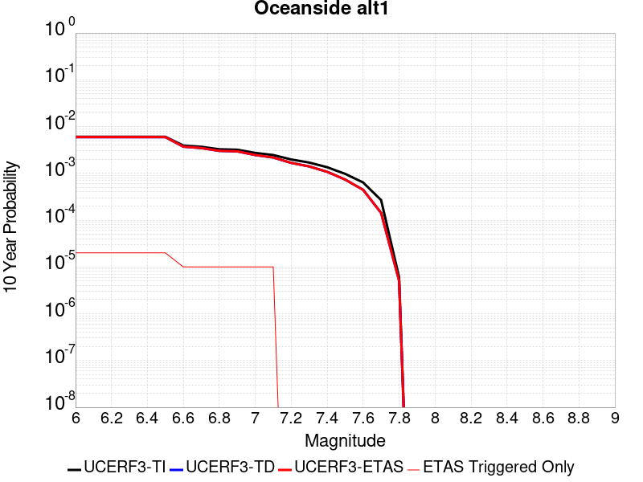 |

| Magnitude | 1 wk TI Prob | 1 wk TD Prob | 1 wk ETAS Prob | 1 wk ETAS/TD Gain | 1 wk ETAS Triggered Only | 1 mo TI Prob | 1 mo TD Prob | 1 mo ETAS Prob | 1 mo ETAS/TD Gain | 1 mo ETAS Triggered Only | 1 yr TI Prob | 1 yr TD Prob | 1 yr ETAS Prob | 1 yr ETAS/TD Gain | 1 yr ETAS Triggered Only | 10 yr TI Prob | 10 yr TD Prob | 10 yr ETAS Prob | 10 yr ETAS/TD Gain | 10 yr ETAS Triggered Only |
|-----|-----|-----|-----|-----|-----|-----|-----|-----|-----|-----|-----|-----|-----|-----|-----|-----|-----|-----|-----|-----|
| 6.0 | 1.1617542E-5 | 1.1423493E-5 | 2.1423379E-5 | 1.8753791 | 1.0E-5 | 4.9788516E-5 | 4.8956997E-5 | 5.8956506E-5 | 1.2042509 | 1.0E-5 | 6.060066E-4 | 5.9590454E-4 | 6.158926E-4 | 1.0335424 | 2.0E-5 | 0.0060435664 | 0.005944664 | 0.0059645455 | 1.0033444 | 2.0E-5 |
| 6.1 | 1.1617542E-5 | 1.1423493E-5 | 2.1423379E-5 | 1.8753791 | 1.0E-5 | 4.9788516E-5 | 4.8956997E-5 | 5.8956506E-5 | 1.2042509 | 1.0E-5 | 6.060066E-4 | 5.9590454E-4 | 6.158926E-4 | 1.0335424 | 2.0E-5 | 0.0060435664 | 0.005944664 | 0.0059645455 | 1.0033444 | 2.0E-5 |
| 6.2 | 1.1617542E-5 | 1.1423493E-5 | 2.1423379E-5 | 1.8753791 | 1.0E-5 | 4.9788516E-5 | 4.8956997E-5 | 5.8956506E-5 | 1.2042509 | 1.0E-5 | 6.060066E-4 | 5.9590454E-4 | 6.158926E-4 | 1.0335424 | 2.0E-5 | 0.0060435664 | 0.005944664 | 0.0059645455 | 1.0033444 | 2.0E-5 |
| 6.3 | 1.1617542E-5 | 1.1423493E-5 | 2.1423379E-5 | 1.8753791 | 1.0E-5 | 4.9788516E-5 | 4.8956997E-5 | 5.8956506E-5 | 1.2042509 | 1.0E-5 | 6.060066E-4 | 5.9590454E-4 | 6.158926E-4 | 1.0335424 | 2.0E-5 | 0.0060435664 | 0.005944664 | 0.0059645455 | 1.0033444 | 2.0E-5 |
| 6.4 | 1.1617542E-5 | 1.1423493E-5 | 2.1423379E-5 | 1.8753791 | 1.0E-5 | 4.9788516E-5 | 4.8956997E-5 | 5.8956506E-5 | 1.2042509 | 1.0E-5 | 6.060066E-4 | 5.9590454E-4 | 6.158926E-4 | 1.0335424 | 2.0E-5 | 0.0060435664 | 0.005944664 | 0.0059645455 | 1.0033444 | 2.0E-5 |
| 6.5 | 1.1617542E-5 | 1.1423493E-5 | 2.1423379E-5 | 1.8753791 | 1.0E-5 | 4.9788516E-5 | 4.8956997E-5 | 5.8956506E-5 | 1.2042509 | 1.0E-5 | 6.060066E-4 | 5.9590454E-4 | 6.158926E-4 | 1.0335424 | 2.0E-5 | 0.0060435664 | 0.005944664 | 0.0059645455 | 1.0033444 | 2.0E-5 |
| 6.6 | 7.561768E-6 | 7.1336153E-6 | 7.1336153E-6 | 1.0 | 0.0 | 3.2407173E-5 | 3.0572286E-5 | 3.0572286E-5 | 1.0 | 0.0 | 3.9448592E-4 | 3.7215507E-4 | 3.8215137E-4 | 1.0268605 | 1.0E-5 | 0.0039378637 | 0.00371543 | 0.0037253927 | 1.0026815 | 1.0E-5 |
| 6.7 | 7.1042605E-6 | 6.6556854E-6 | 6.6556854E-6 | 1.0 | 0.0 | 3.0446476E-5 | 2.8524059E-5 | 2.8524059E-5 | 1.0 | 0.0 | 3.706228E-4 | 3.472259E-4 | 3.5722242E-4 | 1.0287896 | 1.0E-5 | 0.0037000529 | 0.003466917 | 0.0034768824 | 1.0028744 | 1.0E-5 |
| 6.8 | 6.285554E-6 | 5.799706E-6 | 5.799706E-6 | 1.0 | 0.0 | 2.693781E-5 | 2.4855648E-5 | 2.4855648E-5 | 1.0 | 0.0 | 3.2791847E-4 | 3.0257605E-4 | 3.12573E-4 | 1.0330396 | 1.0E-5 | 0.0032743502 | 0.0030216982 | 0.003031668 | 1.0032994 | 1.0E-5 |
| 6.9 | 6.148883E-6 | 5.6565445E-6 | 5.6565445E-6 | 1.0 | 0.0 | 2.635209E-5 | 2.424211E-5 | 2.424211E-5 | 1.0 | 0.0 | 3.2078946E-4 | 2.9510827E-4 | 3.0510532E-4 | 1.0338758 | 1.0E-5 | 0.003203268 | 0.0029472208 | 0.0029571913 | 1.003383 | 1.0E-5 |
| 7.0 | 5.253857E-6 | 4.722404E-6 | 4.722404E-6 | 1.0 | 0.0 | 2.2516335E-5 | 2.0238718E-5 | 2.0238718E-5 | 1.0 | 0.0 | 2.7410188E-4 | 2.4637886E-4 | 2.5637637E-4 | 1.0405779 | 1.0E-5 | 0.0027376404 | 0.0024610884 | 0.0024710638 | 1.0040532 | 1.0E-5 |
| 7.1 | 4.730754E-6 | 4.17851E-6 | 4.17851E-6 | 1.0 | 0.0 | 2.0274503E-5 | 1.7907778E-5 | 1.7907778E-5 | 1.0 | 0.0 | 2.468141E-4 | 2.1800565E-4 | 2.2800347E-4 | 1.0458604 | 1.0E-5 | 0.0024654015 | 0.0021779444 | 0.0021879226 | 1.0045815 | 1.0E-5 |
| 7.2 | 3.7998386E-6 | 3.214026E-6 | 3.214026E-6 | 1.0 | 0.0 | 1.6284921E-5 | 1.37743245E-5 | 1.37743245E-5 | 1.0 | 0.0 | 1.9825088E-4 | 1.6768962E-4 | 1.6768962E-4 | 1.0 | 0.0 | 0.001980741 | 0.001675643 | 0.001675643 | 1.0 | 0.0 |
| 7.3 | 3.2656465E-6 | 2.698376E-6 | 2.698376E-6 | 1.0 | 0.0 | 1.3995553E-5 | 1.1564418E-5 | 1.1564418E-5 | 1.0 | 0.0 | 1.7038253E-4 | 1.407878E-4 | 1.407878E-4 | 1.0 | 0.0 | 0.0017025196 | 0.0014069972 | 0.0014069972 | 1.0 | 0.0 |
| 7.4 | 2.593703E-6 | 2.0680277E-6 | 2.0680277E-6 | 1.0 | 0.0 | 1.1115822E-5 | 8.862946E-6 | 8.862946E-6 | 1.0 | 0.0 | 1.3532673E-4 | 1.0790111E-4 | 1.0790111E-4 | 1.0 | 0.0 | 0.0013524436 | 0.0010784961 | 0.0010784961 | 1.0 | 0.0 |
| 7.5 | 1.8715585E-6 | 1.4137177E-6 | 1.4137177E-6 | 1.0 | 0.0 | 8.020941E-6 | 6.0587763E-6 | 6.0587763E-6 | 1.0 | 0.0 | 9.7650576E-5 | 7.376316E-5 | 7.376316E-5 | 1.0 | 0.0 | 9.7607676E-4 | 7.3739287E-4 | 7.3739287E-4 | 1.0 | 0.0 |
| 7.6 | 1.2246786E-6 | 8.5268175E-7 | 8.5268175E-7 | 1.0 | 0.0 | 5.248612E-6 | 3.6543456E-6 | 3.6543456E-6 | 1.0 | 0.0 | 6.389998E-5 | 4.4490793E-5 | 4.4490793E-5 | 1.0 | 0.0 | 6.3881604E-4 | 4.4482335E-4 | 4.4482335E-4 | 1.0 | 0.0 |
| 7.7 | 5.140719E-7 | 2.734703E-7 | 2.734703E-7 | 1.0 | 0.0 | 2.2031636E-6 | 1.1720151E-6 | 1.1720151E-6 | 1.0 | 0.0 | 2.6823185E-5 | 1.4269205E-5 | 1.4269205E-5 | 1.0 | 0.0 | 2.6819948E-4 | 1.4268424E-4 | 1.4268424E-4 | 1.0 | 0.0 |
| 7.8 | 1.16056995E-8 | 9.782373E-9 | 9.782373E-9 | 1.0 | 0.0 | 4.9738713E-8 | 4.1924455E-8 | 4.1924455E-8 | 1.0 | 0.0 | 6.0556863E-7 | 5.1043025E-7 | 5.1043025E-7 | 1.0 | 0.0 | 6.05567E-6 | 5.1043025E-6 | 5.1043025E-6 | 1.0 | 0.0 |

## San Luis Range - Oceano 2011 CFM
*[(top)](#table-of-contents)*

| 1 Week | 1 Month | 1 Year | 10 Year |
|-----|-----|-----|-----|
|  |  | 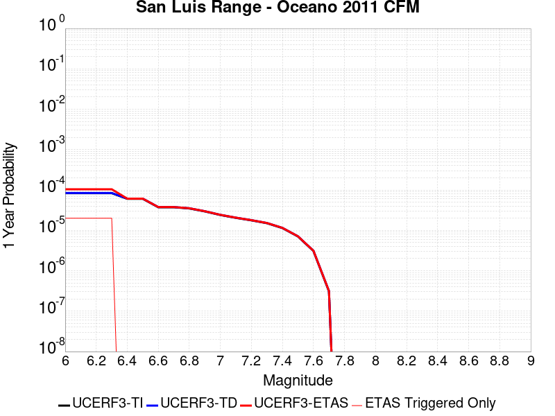 | 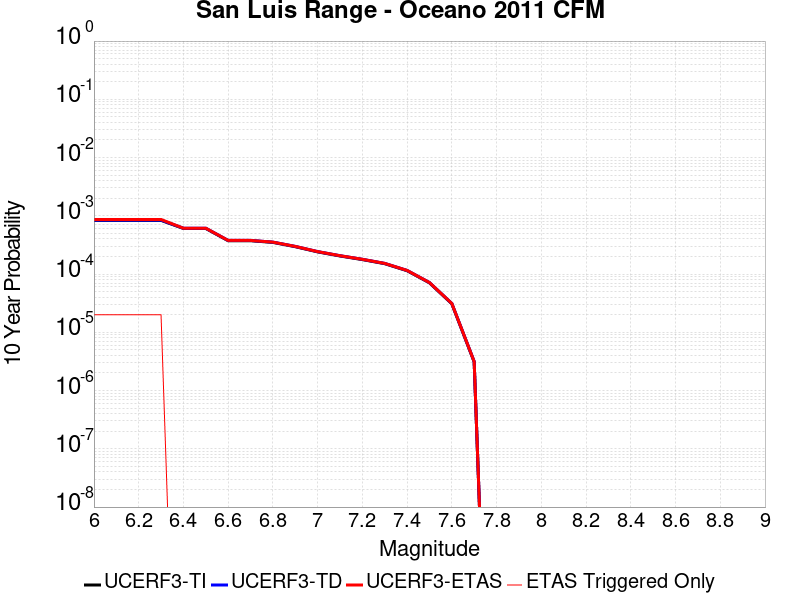 |

| Magnitude | 1 wk TI Prob | 1 wk TD Prob | 1 wk ETAS Prob | 1 wk ETAS/TD Gain | 1 wk ETAS Triggered Only | 1 mo TI Prob | 1 mo TD Prob | 1 mo ETAS Prob | 1 mo ETAS/TD Gain | 1 mo ETAS Triggered Only | 1 yr TI Prob | 1 yr TD Prob | 1 yr ETAS Prob | 1 yr ETAS/TD Gain | 1 yr ETAS Triggered Only | 10 yr TI Prob | 10 yr TD Prob | 10 yr ETAS Prob | 10 yr ETAS/TD Gain | 10 yr ETAS Triggered Only |
|-----|-----|-----|-----|-----|-----|-----|-----|-----|-----|-----|-----|-----|-----|-----|-----|-----|-----|-----|-----|-----|
| 6.0 | 1.6025788E-6 | 1.620119E-6 | 1.620119E-6 | 1.0 | 0.0 | 6.8681766E-6 | 6.943351E-6 | 6.943351E-6 | 1.0 | 0.0 | 8.361684E-5 | 8.453243E-5 | 1.0453074E-4 | 1.2365756 | 2.0E-5 | 8.3585386E-4 | 8.4504357E-4 | 8.6502667E-4 | 1.0236474 | 2.0E-5 |
| 6.1 | 1.6025788E-6 | 1.620119E-6 | 1.620119E-6 | 1.0 | 0.0 | 6.8681766E-6 | 6.943351E-6 | 6.943351E-6 | 1.0 | 0.0 | 8.361684E-5 | 8.453243E-5 | 1.0453074E-4 | 1.2365756 | 2.0E-5 | 8.3585386E-4 | 8.4504357E-4 | 8.6502667E-4 | 1.0236474 | 2.0E-5 |
| 6.2 | 1.6025788E-6 | 1.620119E-6 | 1.620119E-6 | 1.0 | 0.0 | 6.8681766E-6 | 6.943351E-6 | 6.943351E-6 | 1.0 | 0.0 | 8.361684E-5 | 8.453243E-5 | 1.0453074E-4 | 1.2365756 | 2.0E-5 | 8.3585386E-4 | 8.4504357E-4 | 8.6502667E-4 | 1.0236474 | 2.0E-5 |
| 6.3 | 1.6025788E-6 | 1.620119E-6 | 1.620119E-6 | 1.0 | 0.0 | 6.8681766E-6 | 6.943351E-6 | 6.943351E-6 | 1.0 | 0.0 | 8.361684E-5 | 8.453243E-5 | 1.0453074E-4 | 1.2365756 | 2.0E-5 | 8.3585386E-4 | 8.4504357E-4 | 8.6502667E-4 | 1.0236474 | 2.0E-5 |
| 6.4 | 1.1621186E-6 | 1.1749894E-6 | 1.1749894E-6 | 1.0 | 0.0 | 4.980499E-6 | 5.0356607E-6 | 5.0356607E-6 | 1.0 | 0.0 | 6.0635884E-5 | 6.130771E-5 | 6.130771E-5 | 1.0 | 0.0 | 6.0619344E-4 | 6.1293464E-4 | 6.1293464E-4 | 1.0 | 0.0 |
| 6.5 | 1.1621186E-6 | 1.1749894E-6 | 1.1749894E-6 | 1.0 | 0.0 | 4.980499E-6 | 5.0356607E-6 | 5.0356607E-6 | 1.0 | 0.0 | 6.0635884E-5 | 6.130771E-5 | 6.130771E-5 | 1.0 | 0.0 | 6.0619344E-4 | 6.1293464E-4 | 6.1293464E-4 | 1.0 | 0.0 |
| 6.6 | 7.164729E-7 | 7.2485784E-7 | 7.2485784E-7 | 1.0 | 0.0 | 3.0705946E-6 | 3.10653E-6 | 3.10653E-6 | 1.0 | 0.0 | 3.738385E-5 | 3.7821363E-5 | 3.7821363E-5 | 1.0 | 0.0 | 3.737756E-4 | 3.7815105E-4 | 3.7815105E-4 | 1.0 | 0.0 |
| 6.7 | 7.164729E-7 | 7.2485784E-7 | 7.2485784E-7 | 1.0 | 0.0 | 3.0705946E-6 | 3.10653E-6 | 3.10653E-6 | 1.0 | 0.0 | 3.738385E-5 | 3.7821363E-5 | 3.7821363E-5 | 1.0 | 0.0 | 3.737756E-4 | 3.7815105E-4 | 3.7815105E-4 | 1.0 | 0.0 |
| 6.8 | 6.700177E-7 | 6.7774397E-7 | 6.7774397E-7 | 1.0 | 0.0 | 2.8715012E-6 | 2.904614E-6 | 2.904614E-6 | 1.0 | 0.0 | 3.495997E-5 | 3.536312E-5 | 3.536312E-5 | 1.0 | 0.0 | 3.495447E-4 | 3.5357653E-4 | 3.5357653E-4 | 1.0 | 0.0 |
| 6.9 | 5.657865E-7 | 5.7217864E-7 | 5.7217864E-7 | 1.0 | 0.0 | 2.424797E-6 | 2.452192E-6 | 2.452192E-6 | 1.0 | 0.0 | 2.9521503E-5 | 2.9855039E-5 | 2.9855039E-5 | 1.0 | 0.0 | 2.9517582E-4 | 2.9851135E-4 | 2.9851135E-4 | 1.0 | 0.0 |
| 7.0 | 4.608413E-7 | 4.660169E-7 | 4.660169E-7 | 1.0 | 0.0 | 1.9750328E-6 | 1.9972138E-6 | 1.9972138E-6 | 1.0 | 0.0 | 2.4045758E-5 | 2.431581E-5 | 2.431581E-5 | 1.0 | 0.0 | 2.4043156E-4 | 2.4313178E-4 | 2.4313178E-4 | 1.0 | 0.0 |
| 7.1 | 3.9177846E-7 | 3.9621602E-7 | 3.9621602E-7 | 1.0 | 0.0 | 1.6790494E-6 | 1.6980675E-6 | 1.6980675E-6 | 1.0 | 0.0 | 2.0442236E-5 | 2.0673779E-5 | 2.0673779E-5 | 1.0 | 0.0 | 2.0440355E-4 | 2.067187E-4 | 2.067187E-4 | 1.0 | 0.0 |
| 7.2 | 3.3974752E-7 | 3.436653E-7 | 3.436653E-7 | 1.0 | 0.0 | 1.45606E-6 | 1.4728505E-6 | 1.4728505E-6 | 1.0 | 0.0 | 1.7727387E-5 | 1.7931809E-5 | 1.7931809E-5 | 1.0 | 0.0 | 1.7725973E-4 | 1.7930372E-4 | 1.7930372E-4 | 1.0 | 0.0 |
| 7.3 | 2.8900928E-7 | 2.923402E-7 | 2.923402E-7 | 1.0 | 0.0 | 1.2386106E-6 | 1.2528859E-6 | 1.2528859E-6 | 1.0 | 0.0 | 1.5079979E-5 | 1.525378E-5 | 1.525378E-5 | 1.0 | 0.0 | 1.5078956E-4 | 1.5252741E-4 | 1.5252741E-4 | 1.0 | 0.0 |
| 7.4 | 2.1881527E-7 | 2.2139594E-7 | 2.2139594E-7 | 1.0 | 0.0 | 9.3777936E-7 | 9.488394E-7 | 9.488394E-7 | 1.0 | 0.0 | 1.14174045E-5 | 1.1552059E-5 | 1.1552059E-5 | 1.0 | 0.0 | 1.1416818E-4 | 1.1551464E-4 | 1.1551464E-4 | 1.0 | 0.0 |
| 7.5 | 1.356398E-7 | 1.3718639E-7 | 1.3718639E-7 | 1.0 | 0.0 | 5.813133E-7 | 5.8794154E-7 | 5.8794154E-7 | 1.0 | 0.0 | 7.0774663E-6 | 7.158165E-6 | 7.158165E-6 | 1.0 | 0.0 | 7.077241E-5 | 7.157937E-5 | 7.157937E-5 | 1.0 | 0.0 |
| 7.6 | 5.9269272E-8 | 6.001364E-8 | 6.001364E-8 | 1.0 | 0.0 | 2.5401116E-7 | 2.572013E-7 | 2.572013E-7 | 1.0 | 0.0 | 3.0925814E-6 | 3.1314214E-6 | 3.1314214E-6 | 1.0 | 0.0 | 3.0925385E-5 | 3.1313786E-5 | 3.1313786E-5 | 1.0 | 0.0 |
| 7.7 | 5.946232E-9 | 6.036928E-9 | 6.036928E-9 | 1.0 | 0.0 | 2.5483851E-8 | 2.5872547E-8 | 2.5872547E-8 | 1.0 | 0.0 | 3.1026585E-7 | 3.1499823E-7 | 3.1499823E-7 | 1.0 | 0.0 | 3.102654E-6 | 3.1499787E-6 | 3.1499787E-6 | 1.0 | 0.0 |

## Redondo Canyon alt 1
*[(top)](#table-of-contents)*

| 1 Week | 1 Month | 1 Year | 10 Year |
|-----|-----|-----|-----|
|  |  |  |  |

| Magnitude | 1 wk TI Prob | 1 wk TD Prob | 1 wk ETAS Prob | 1 wk ETAS/TD Gain | 1 wk ETAS Triggered Only | 1 mo TI Prob | 1 mo TD Prob | 1 mo ETAS Prob | 1 mo ETAS/TD Gain | 1 mo ETAS Triggered Only | 1 yr TI Prob | 1 yr TD Prob | 1 yr ETAS Prob | 1 yr ETAS/TD Gain | 1 yr ETAS Triggered Only | 10 yr TI Prob | 10 yr TD Prob | 10 yr ETAS Prob | 10 yr ETAS/TD Gain | 10 yr ETAS Triggered Only |
|-----|-----|-----|-----|-----|-----|-----|-----|-----|-----|-----|-----|-----|-----|-----|-----|-----|-----|-----|-----|-----|
| 6.0 | 1.0346246E-5 | 1.09813445E-5 | 2.0981235E-5 | 1.9106253 | 1.0E-5 | 4.43403E-5 | 4.7062502E-5 | 5.7062032E-5 | 1.2124734 | 1.0E-5 | 5.3970946E-4 | 5.729142E-4 | 5.829085E-4 | 1.0174446 | 1.0E-5 | 0.0053840056 | 0.005722111 | 0.0057419967 | 1.0034752 | 2.0E-5 |
| 6.1 | 1.0346246E-5 | 1.09813445E-5 | 2.0981235E-5 | 1.9106253 | 1.0E-5 | 4.43403E-5 | 4.7062502E-5 | 5.7062032E-5 | 1.2124734 | 1.0E-5 | 5.3970946E-4 | 5.729142E-4 | 5.829085E-4 | 1.0174446 | 1.0E-5 | 0.0053840056 | 0.005722111 | 0.0057419967 | 1.0034752 | 2.0E-5 |
| 6.2 | 1.0346246E-5 | 1.09813445E-5 | 2.0981235E-5 | 1.9106253 | 1.0E-5 | 4.43403E-5 | 4.7062502E-5 | 5.7062032E-5 | 1.2124734 | 1.0E-5 | 5.3970946E-4 | 5.729142E-4 | 5.829085E-4 | 1.0174446 | 1.0E-5 | 0.0053840056 | 0.005722111 | 0.0057419967 | 1.0034752 | 2.0E-5 |
| 6.3 | 3.2052794E-6 | 3.2361174E-6 | 3.2361174E-6 | 1.0 | 0.0 | 1.373684E-5 | 1.3869023E-5 | 1.3869023E-5 | 1.0 | 0.0 | 1.6723319E-4 | 1.6884625E-4 | 1.6884625E-4 | 1.0 | 0.0 | 0.001671074 | 0.0016875692 | 0.0016975524 | 1.0059156 | 1.0E-5 |
| 6.4 | 3.2052794E-6 | 3.2361174E-6 | 3.2361174E-6 | 1.0 | 0.0 | 1.373684E-5 | 1.3869023E-5 | 1.3869023E-5 | 1.0 | 0.0 | 1.6723319E-4 | 1.6884625E-4 | 1.6884625E-4 | 1.0 | 0.0 | 0.001671074 | 0.0016875692 | 0.0016975524 | 1.0059156 | 1.0E-5 |
| 6.5 | 3.2052794E-6 | 3.2361174E-6 | 3.2361174E-6 | 1.0 | 0.0 | 1.373684E-5 | 1.3869023E-5 | 1.3869023E-5 | 1.0 | 0.0 | 1.6723319E-4 | 1.6884625E-4 | 1.6884625E-4 | 1.0 | 0.0 | 0.001671074 | 0.0016875692 | 0.0016975524 | 1.0059156 | 1.0E-5 |
| 6.6 | 1.948328E-6 | 1.8288681E-6 | 1.8288681E-6 | 1.0 | 0.0 | 8.349951E-6 | 7.837991E-6 | 7.837991E-6 | 1.0 | 0.0 | 1.016559E-4 | 9.542486E-5 | 9.542486E-5 | 1.0 | 0.0 | 0.0010160941 | 9.539858E-4 | 9.539858E-4 | 1.0 | 0.0 |
| 6.7 | 1.948328E-6 | 1.8288681E-6 | 1.8288681E-6 | 1.0 | 0.0 | 8.349951E-6 | 7.837991E-6 | 7.837991E-6 | 1.0 | 0.0 | 1.016559E-4 | 9.542486E-5 | 9.542486E-5 | 1.0 | 0.0 | 0.0010160941 | 9.539858E-4 | 9.539858E-4 | 1.0 | 0.0 |
| 6.8 | 1.1278219E-6 | 9.033076E-7 | 9.033076E-7 | 1.0 | 0.0 | 4.8335132E-6 | 3.871315E-6 | 3.871315E-6 | 1.0 | 0.0 | 5.8846435E-5 | 4.7132668E-5 | 4.7132668E-5 | 1.0 | 0.0 | 5.8830855E-4 | 4.7126875E-4 | 4.7126875E-4 | 1.0 | 0.0 |
| 6.9 | 1.1278219E-6 | 9.033076E-7 | 9.033076E-7 | 1.0 | 0.0 | 4.8335132E-6 | 3.871315E-6 | 3.871315E-6 | 1.0 | 0.0 | 5.8846435E-5 | 4.7132668E-5 | 4.7132668E-5 | 1.0 | 0.0 | 5.8830855E-4 | 4.7126875E-4 | 4.7126875E-4 | 1.0 | 0.0 |
| 7.0 | 1.1278219E-6 | 9.033076E-7 | 9.033076E-7 | 1.0 | 0.0 | 4.8335132E-6 | 3.871315E-6 | 3.871315E-6 | 1.0 | 0.0 | 5.8846435E-5 | 4.7132668E-5 | 4.7132668E-5 | 1.0 | 0.0 | 5.8830855E-4 | 4.7126875E-4 | 4.7126875E-4 | 1.0 | 0.0 |
| 7.1 | 1.0545139E-6 | 8.5692716E-7 | 8.5692716E-7 | 1.0 | 0.0 | 4.5193374E-6 | 3.6725423E-6 | 3.6725423E-6 | 1.0 | 0.0 | 5.5021545E-5 | 4.471271E-5 | 4.471271E-5 | 1.0 | 0.0 | 5.500792E-4 | 4.470789E-4 | 4.470789E-4 | 1.0 | 0.0 |
| 7.2 | 1.0545139E-6 | 8.5692716E-7 | 8.5692716E-7 | 1.0 | 0.0 | 4.5193374E-6 | 3.6725423E-6 | 3.6725423E-6 | 1.0 | 0.0 | 5.5021545E-5 | 4.471271E-5 | 4.471271E-5 | 1.0 | 0.0 | 5.500792E-4 | 4.470789E-4 | 4.470789E-4 | 1.0 | 0.0 |
| 7.3 | 9.505161E-8 | 5.8957607E-8 | 5.8957607E-8 | 1.0 | 0.0 | 4.0736398E-7 | 2.5267545E-7 | 2.5267545E-7 | 1.0 | 0.0 | 4.959645E-6 | 3.0763204E-6 | 3.0763204E-6 | 1.0 | 0.0 | 4.9595343E-5 | 3.0762894E-5 | 3.0762894E-5 | 1.0 | 0.0 |
| 7.4 | 3.9520785E-8 | 2.6987191E-8 | 2.6987191E-8 | 1.0 | 0.0 | 1.6937479E-7 | 1.1565938E-7 | 1.1565938E-7 | 1.0 | 0.0 | 2.062136E-6 | 1.4081523E-6 | 1.4081523E-6 | 1.0 | 0.0 | 2.062117E-5 | 1.4081461E-5 | 1.4081461E-5 | 1.0 | 0.0 |
| 7.5 | 5.6133214E-9 | 3.7368215E-9 | 3.7368215E-9 | 1.0 | 0.0 | 2.4057092E-8 | 1.601495E-8 | 1.601495E-8 | 1.0 | 0.0 | 2.9289507E-7 | 1.9498201E-7 | 1.9498201E-7 | 1.0 | 0.0 | 2.9289467E-6 | 1.9498186E-6 | 1.9498186E-6 | 1.0 | 0.0 |
| 7.6 | 4.1064334E-9 | 2.5957634E-9 | 2.5957634E-9 | 1.0 | 0.0 | 1.7599E-8 | 1.11247E-8 | 1.11247E-8 | 1.0 | 0.0 | 2.142678E-7 | 1.3544322E-7 | 1.3544322E-7 | 1.0 | 0.0 | 2.1426758E-6 | 1.3544316E-6 | 1.3544316E-6 | 1.0 | 0.0 |
| 7.7 | 1.361975E-9 | 6.360824E-10 | 6.360824E-10 | 1.0 | 0.0 | 5.8370353E-9 | 2.7260674E-9 | 2.7260674E-9 | 1.0 | 0.0 | 7.1065905E-8 | 3.318987E-8 | 3.318987E-8 | 1.0 | 0.0 | 7.106588E-7 | 3.318987E-7 | 3.318987E-7 | 1.0 | 0.0 |
| 7.8 | 1.361975E-9 | 6.360824E-10 | 6.360824E-10 | 1.0 | 0.0 | 5.8370353E-9 | 2.7260674E-9 | 2.7260674E-9 | 1.0 | 0.0 | 7.1065905E-8 | 3.318987E-8 | 3.318987E-8 | 1.0 | 0.0 | 7.106588E-7 | 3.318987E-7 | 3.318987E-7 | 1.0 | 0.0 |

## North Frontal  (West)
*[(top)](#table-of-contents)*

| 1 Week | 1 Month | 1 Year | 10 Year |
|-----|-----|-----|-----|
|  | 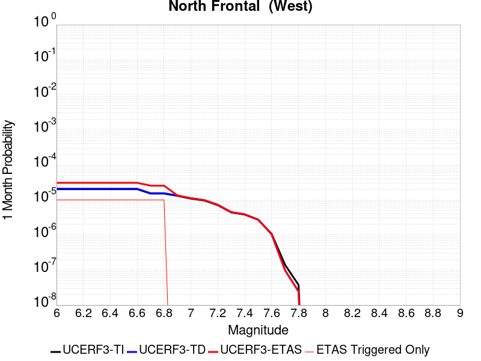 |  |  |

| Magnitude | 1 wk TI Prob | 1 wk TD Prob | 1 wk ETAS Prob | 1 wk ETAS/TD Gain | 1 wk ETAS Triggered Only | 1 mo TI Prob | 1 mo TD Prob | 1 mo ETAS Prob | 1 mo ETAS/TD Gain | 1 mo ETAS Triggered Only | 1 yr TI Prob | 1 yr TD Prob | 1 yr ETAS Prob | 1 yr ETAS/TD Gain | 1 yr ETAS Triggered Only | 10 yr TI Prob | 10 yr TD Prob | 10 yr ETAS Prob | 10 yr ETAS/TD Gain | 10 yr ETAS Triggered Only |
|-----|-----|-----|-----|-----|-----|-----|-----|-----|-----|-----|-----|-----|-----|-----|-----|-----|-----|-----|-----|-----|
| 6.0 | 4.7316266E-6 | 4.8526726E-6 | 1.4852624E-5 | 3.0607102 | 1.0E-5 | 2.0278241E-5 | 2.0797012E-5 | 3.0796804E-5 | 1.4808283 | 1.0E-5 | 2.4685962E-4 | 2.5317568E-4 | 2.6317313E-4 | 1.0394883 | 1.0E-5 | 0.0024658558 | 0.0025290183 | 0.002548968 | 1.0078882 | 2.0E-5 |
| 6.1 | 4.7316266E-6 | 4.8526726E-6 | 1.4852624E-5 | 3.0607102 | 1.0E-5 | 2.0278241E-5 | 2.0797012E-5 | 3.0796804E-5 | 1.4808283 | 1.0E-5 | 2.4685962E-4 | 2.5317568E-4 | 2.6317313E-4 | 1.0394883 | 1.0E-5 | 0.0024658558 | 0.0025290183 | 0.002548968 | 1.0078882 | 2.0E-5 |
| 6.2 | 4.7316266E-6 | 4.8526726E-6 | 1.4852624E-5 | 3.0607102 | 1.0E-5 | 2.0278241E-5 | 2.0797012E-5 | 3.0796804E-5 | 1.4808283 | 1.0E-5 | 2.4685962E-4 | 2.5317568E-4 | 2.6317313E-4 | 1.0394883 | 1.0E-5 | 0.0024658558 | 0.0025290183 | 0.002548968 | 1.0078882 | 2.0E-5 |
| 6.3 | 4.7316266E-6 | 4.8526726E-6 | 1.4852624E-5 | 3.0607102 | 1.0E-5 | 2.0278241E-5 | 2.0797012E-5 | 3.0796804E-5 | 1.4808283 | 1.0E-5 | 2.4685962E-4 | 2.5317568E-4 | 2.6317313E-4 | 1.0394883 | 1.0E-5 | 0.0024658558 | 0.0025290183 | 0.002548968 | 1.0078882 | 2.0E-5 |
| 6.4 | 4.7316266E-6 | 4.8526726E-6 | 1.4852624E-5 | 3.0607102 | 1.0E-5 | 2.0278241E-5 | 2.0797012E-5 | 3.0796804E-5 | 1.4808283 | 1.0E-5 | 2.4685962E-4 | 2.5317568E-4 | 2.6317313E-4 | 1.0394883 | 1.0E-5 | 0.0024658558 | 0.0025290183 | 0.002548968 | 1.0078882 | 2.0E-5 |
| 6.5 | 4.7316266E-6 | 4.8526726E-6 | 1.4852624E-5 | 3.0607102 | 1.0E-5 | 2.0278241E-5 | 2.0797012E-5 | 3.0796804E-5 | 1.4808283 | 1.0E-5 | 2.4685962E-4 | 2.5317568E-4 | 2.6317313E-4 | 1.0394883 | 1.0E-5 | 0.0024658558 | 0.0025290183 | 0.002548968 | 1.0078882 | 2.0E-5 |
| 6.6 | 4.7316266E-6 | 4.8526726E-6 | 1.4852624E-5 | 3.0607102 | 1.0E-5 | 2.0278241E-5 | 2.0797012E-5 | 3.0796804E-5 | 1.4808283 | 1.0E-5 | 2.4685962E-4 | 2.5317568E-4 | 2.6317313E-4 | 1.0394883 | 1.0E-5 | 0.0024658558 | 0.0025290183 | 0.002548968 | 1.0078882 | 2.0E-5 |
| 6.7 | 3.5382777E-6 | 3.6308859E-6 | 1.363085E-5 | 3.7541387 | 1.0E-5 | 1.516396E-5 | 1.5560852E-5 | 2.5560696E-5 | 1.6426283 | 1.0E-5 | 1.8460557E-4 | 1.8943768E-4 | 1.9943577E-4 | 1.0527778 | 1.0E-5 | 0.0018445229 | 0.0018928389 | 0.0019128011 | 1.0105461 | 2.0E-5 |
| 6.8 | 3.5382777E-6 | 3.6308859E-6 | 1.363085E-5 | 3.7541387 | 1.0E-5 | 1.516396E-5 | 1.5560852E-5 | 2.5560696E-5 | 1.6426283 | 1.0E-5 | 1.8460557E-4 | 1.8943768E-4 | 1.9943577E-4 | 1.0527778 | 1.0E-5 | 0.0018445229 | 0.0018928389 | 0.0019128011 | 1.0105461 | 2.0E-5 |
| 6.9 | 3.0428037E-6 | 3.1227605E-6 | 3.1227605E-6 | 1.0 | 0.0 | 1.30405215E-5 | 1.33831945E-5 | 1.33831945E-5 | 1.0 | 0.0 | 1.5875678E-4 | 1.6292889E-4 | 1.6292889E-4 | 1.0 | 0.0 | 0.0015864341 | 0.0016281615 | 0.0016381453 | 1.0061319 | 1.0E-5 |
| 7.0 | 2.538778E-6 | 2.6060904E-6 | 2.6060904E-6 | 1.0 | 0.0 | 1.0880432E-5 | 1.1168913E-5 | 1.1168913E-5 | 1.0 | 0.0 | 1.324612E-4 | 1.3597352E-4 | 1.3597352E-4 | 1.0 | 0.0 | 0.0013238228 | 0.0013589499 | 0.0013689363 | 1.0073487 | 1.0E-5 |
| 7.1 | 2.2418935E-6 | 2.3012074E-6 | 2.3012074E-6 | 1.0 | 0.0 | 9.60808E-6 | 9.862282E-6 | 9.862282E-6 | 1.0 | 0.0 | 1.1697209E-4 | 1.2006712E-4 | 1.2006712E-4 | 1.0 | 0.0 | 0.0011691054 | 0.0012000664 | 0.0012000664 | 1.0 | 0.0 |
| 7.2 | 1.6526745E-6 | 1.6924851E-6 | 1.6924851E-6 | 1.0 | 0.0 | 7.082872E-6 | 7.253489E-6 | 7.253489E-6 | 1.0 | 0.0 | 8.623055E-5 | 8.8307905E-5 | 8.8307905E-5 | 1.0 | 0.0 | 8.61971E-4 | 8.827532E-4 | 8.827532E-4 | 1.0 | 0.0 |
| 7.3 | 1.0246019E-6 | 1.0442261E-6 | 1.0442261E-6 | 1.0 | 0.0 | 4.391144E-6 | 4.4752474E-6 | 4.4752474E-6 | 1.0 | 0.0 | 5.3460866E-5 | 5.448489E-5 | 5.448489E-5 | 1.0 | 0.0 | 5.344801E-4 | 5.4472685E-4 | 5.4472685E-4 | 1.0 | 0.0 |
| 7.4 | 8.9045164E-7 | 9.0565584E-7 | 9.0565584E-7 | 1.0 | 0.0 | 3.8162157E-6 | 3.8813773E-6 | 3.8813773E-6 | 1.0 | 0.0 | 4.646144E-5 | 4.7254853E-5 | 4.7254853E-5 | 1.0 | 0.0 | 4.6451724E-4 | 4.7245892E-4 | 4.7245892E-4 | 1.0 | 0.0 |
| 7.5 | 6.3357E-7 | 6.4027006E-7 | 6.4027006E-7 | 1.0 | 0.0 | 2.7152971E-6 | 2.744012E-6 | 2.744012E-6 | 1.0 | 0.0 | 3.305824E-5 | 3.34079E-5 | 3.34079E-5 | 1.0 | 0.0 | 3.3053322E-4 | 3.3403534E-4 | 3.3403534E-4 | 1.0 | 0.0 |
| 7.6 | 2.5087024E-7 | 2.4361097E-7 | 2.4361097E-7 | 1.0 | 0.0 | 1.0751578E-6 | 1.0440467E-6 | 1.0440467E-6 | 1.0 | 0.0 | 1.3089967E-5 | 1.2711216E-5 | 1.2711216E-5 | 1.0 | 0.0 | 1.3089196E-4 | 1.2710695E-4 | 1.2710695E-4 | 1.0 | 0.0 |
| 7.7 | 3.282987E-8 | 2.2874195E-8 | 2.2874195E-8 | 1.0 | 0.0 | 1.4069944E-7 | 9.803227E-8 | 9.803227E-8 | 1.0 | 0.0 | 1.7130144E-6 | 1.1935423E-6 | 1.1935423E-6 | 1.0 | 0.0 | 1.7130013E-5 | 1.1935367E-5 | 1.1935367E-5 | 1.0 | 0.0 |
| 7.8 | 8.77499E-9 | 5.6815956E-9 | 5.6815956E-9 | 1.0 | 0.0 | 3.7607098E-8 | 2.4349696E-8 | 2.4349696E-8 | 1.0 | 0.0 | 4.578663E-7 | 2.9645753E-7 | 2.9645753E-7 | 1.0 | 0.0 | 4.5786537E-6 | 2.9645726E-6 | 2.9645726E-6 | 1.0 | 0.0 |

## San Andreas (North Coast) 2011 CFM
*[(top)](#table-of-contents)*

| 1 Week | 1 Month | 1 Year | 10 Year |
|-----|-----|-----|-----|
|  |  |  |  |

| Magnitude | 1 wk TI Prob | 1 wk TD Prob | 1 wk ETAS Prob | 1 wk ETAS/TD Gain | 1 wk ETAS Triggered Only | 1 mo TI Prob | 1 mo TD Prob | 1 mo ETAS Prob | 1 mo ETAS/TD Gain | 1 mo ETAS Triggered Only | 1 yr TI Prob | 1 yr TD Prob | 1 yr ETAS Prob | 1 yr ETAS/TD Gain | 1 yr ETAS Triggered Only | 10 yr TI Prob | 10 yr TD Prob | 10 yr ETAS Prob | 10 yr ETAS/TD Gain | 10 yr ETAS Triggered Only |
|-----|-----|-----|-----|-----|-----|-----|-----|-----|-----|-----|-----|-----|-----|-----|-----|-----|-----|-----|-----|-----|
| 6.0 | 1.5333705E-4 | 7.1106435E-5 | 8.1105725E-5 | 1.1406243 | 1.0E-5 | 6.5699324E-4 | 3.0470645E-4 | 3.147034E-4 | 1.0328084 | 1.0E-5 | 0.007969595 | 0.0037035241 | 0.0037234502 | 1.0053803 | 2.0E-5 | 0.0768977 | 0.03935284 | 0.039372053 | 1.0004883 | 2.0E-5 |
| 6.1 | 1.5333705E-4 | 7.1106435E-5 | 8.1105725E-5 | 1.1406243 | 1.0E-5 | 6.5699324E-4 | 3.0470645E-4 | 3.147034E-4 | 1.0328084 | 1.0E-5 | 0.007969595 | 0.0037035241 | 0.0037234502 | 1.0053803 | 2.0E-5 | 0.0768977 | 0.03935284 | 0.039372053 | 1.0004883 | 2.0E-5 |
| 6.2 | 1.3912938E-4 | 6.050204E-5 | 7.050143E-5 | 1.1652737 | 1.0E-5 | 5.961325E-4 | 2.5926883E-4 | 2.6926622E-4 | 1.03856 | 1.0E-5 | 0.007233787 | 0.003152056 | 0.0031620245 | 1.0031625 | 1.0E-5 | 0.07002798 | 0.03369227 | 0.033701934 | 1.0002868 | 1.0E-5 |
| 6.3 | 1.3912938E-4 | 6.050204E-5 | 7.050143E-5 | 1.1652737 | 1.0E-5 | 5.961325E-4 | 2.5926883E-4 | 2.6926622E-4 | 1.03856 | 1.0E-5 | 0.007233787 | 0.003152056 | 0.0031620245 | 1.0031625 | 1.0E-5 | 0.07002798 | 0.03369227 | 0.033701934 | 1.0002868 | 1.0E-5 |
| 6.4 | 1.2623647E-4 | 5.0442024E-5 | 6.0441518E-5 | 1.1982374 | 1.0E-5 | 5.4090127E-4 | 2.161623E-4 | 2.2616013E-4 | 1.0462515 | 1.0E-5 | 0.0065656058 | 0.0026286195 | 0.0026385933 | 1.0037943 | 1.0E-5 | 0.06374981 | 0.028303223 | 0.02831294 | 1.0003433 | 1.0E-5 |
| 6.5 | 1.1736096E-4 | 4.3523814E-5 | 5.3523378E-5 | 1.2297493 | 1.0E-5 | 5.028786E-4 | 1.8651738E-4 | 1.9651551E-4 | 1.0536044 | 1.0E-5 | 0.006105373 | 0.0022685004 | 0.0022784777 | 1.0043982 | 1.0E-5 | 0.05940335 | 0.024579322 | 0.024589075 | 1.0003968 | 1.0E-5 |
| 6.6 | 1.1586959E-4 | 4.2423668E-5 | 5.2423246E-5 | 1.2357075 | 1.0E-5 | 4.964894E-4 | 1.8180315E-4 | 1.9180133E-4 | 1.0549946 | 1.0E-5 | 0.006028018 | 0.0022112224 | 0.0022212004 | 1.0045124 | 1.0E-5 | 0.058671024 | 0.023984991 | 0.023994751 | 1.000407 | 1.0E-5 |
| 6.7 | 1.13693764E-4 | 4.073593E-5 | 5.073552E-5 | 1.2454735 | 1.0E-5 | 4.87168E-4 | 1.7457096E-4 | 1.8456922E-4 | 1.0572733 | 1.0E-5 | 0.005915152 | 0.0021233456 | 0.0021333243 | 1.0046996 | 1.0E-5 | 0.057601593 | 0.023076393 | 0.023086162 | 1.0004233 | 1.0E-5 |
| 6.8 | 1.1204889E-4 | 3.9953447E-5 | 4.995305E-5 | 1.2502813 | 1.0E-5 | 4.8012115E-4 | 1.7121792E-4 | 1.8121621E-4 | 1.0583951 | 1.0E-5 | 0.005829819 | 0.002082601 | 0.0020925803 | 1.0047917 | 1.0E-5 | 0.05679232 | 0.022636656 | 0.022646429 | 1.0004318 | 1.0E-5 |
| 6.9 | 1.1005794E-4 | 3.900957E-5 | 4.900918E-5 | 1.2563374 | 1.0E-5 | 4.7159163E-4 | 1.6717325E-4 | 1.7717158E-4 | 1.0598081 | 1.0E-5 | 0.0057265228 | 0.0020334502 | 0.0020434298 | 1.0049077 | 1.0E-5 | 0.055811852 | 0.022102542 | 0.022112321 | 1.0004424 | 1.0E-5 |
| 7.0 | 1.0647948E-4 | 3.7166337E-5 | 4.7165966E-5 | 1.2690507 | 1.0E-5 | 4.562608E-4 | 1.5927466E-4 | 1.6927307E-4 | 1.0627747 | 1.0E-5 | 0.0055408357 | 0.0019374598 | 0.0019474404 | 1.0051514 | 1.0E-5 | 0.054047033 | 0.021062272 | 0.021072062 | 1.0004648 | 1.0E-5 |
| 7.1 | 1.04795035E-4 | 3.6215948E-5 | 4.6215588E-5 | 1.2761115 | 1.0E-5 | 4.4904428E-4 | 1.5520205E-4 | 1.652005E-4 | 1.0644221 | 1.0E-5 | 0.0054534175 | 0.0018879628 | 0.001897944 | 1.0052867 | 1.0E-5 | 0.053215165 | 0.020530313 | 0.020540107 | 1.0004771 | 1.0E-5 |
| 7.2 | 1.02724036E-4 | 3.5124547E-5 | 4.5124194E-5 | 1.2846912 | 1.0E-5 | 4.401716E-4 | 1.5052517E-4 | 1.6052366E-4 | 1.066424 | 1.0E-5 | 0.0053459285 | 0.0018311188 | 0.0018411005 | 1.0054511 | 1.0E-5 | 0.052191395 | 0.019919246 | 0.019929048 | 1.000492 | 1.0E-5 |
| 7.3 | 1.00650694E-4 | 3.4592013E-5 | 4.4591667E-5 | 1.2890741 | 1.0E-5 | 4.312888E-4 | 1.4824314E-4 | 1.5824166E-4 | 1.0674467 | 1.0E-5 | 0.005238306 | 0.0018033815 | 0.0018133634 | 1.0055351 | 1.0E-5 | 0.051165357 | 0.019596443 | 0.019606246 | 1.0005003 | 1.0E-5 |
| 7.4 | 9.672919E-5 | 3.338123E-5 | 4.3380896E-5 | 1.2995596 | 1.0E-5 | 4.144878E-4 | 1.4305465E-4 | 1.5305322E-4 | 1.0698934 | 1.0E-5 | 0.005034718 | 0.0017403142 | 0.0017502968 | 1.0057361 | 1.0E-5 | 0.049221683 | 0.018869769 | 0.01887958 | 1.00052 | 1.0E-5 |
| 7.5 | 8.7600405E-5 | 2.2700917E-5 | 3.270069E-5 | 1.4405009 | 1.0E-5 | 3.753763E-4 | 9.728602E-5 | 1.0728505E-4 | 1.1027797 | 1.0E-5 | 0.0045606326 | 0.0011838155 | 0.0011938037 | 1.0084373 | 1.0E-5 | 0.04468165 | 0.013130207 | 0.013140076 | 1.0007516 | 1.0E-5 |
| 7.6 | 7.9562284E-5 | 1.9226305E-5 | 2.9226114E-5 | 1.5201107 | 1.0E-5 | 3.4093665E-4 | 8.239586E-5 | 9.2395036E-5 | 1.1213553 | 1.0E-5 | 0.0041430052 | 0.0010027094 | 0.0010126993 | 1.009963 | 1.0E-5 | 0.040666126 | 0.011221658 | 0.011231546 | 1.0008811 | 1.0E-5 |
| 7.7 | 6.3866544E-5 | 1.1941707E-5 | 2.1941587E-5 | 1.8373913 | 1.0E-5 | 2.7368503E-4 | 5.117774E-5 | 6.117723E-5 | 1.1953875 | 1.0E-5 | 0.0033270244 | 6.2291115E-4 | 6.329049E-4 | 1.0160437 | 1.0E-5 | 0.032776527 | 0.007210334 | 0.0072202617 | 1.0013769 | 1.0E-5 |
| 7.8 | 4.2543215E-5 | 9.076524E-6 | 1.9076433E-5 | 2.1017332 | 1.0E-5 | 1.8231533E-4 | 3.8898812E-5 | 4.8898422E-5 | 1.2570673 | 1.0E-5 | 0.0022174292 | 4.7349022E-4 | 4.8348546E-4 | 1.0211098 | 1.0E-5 | 0.021954332 | 0.005490525 | 0.0055004703 | 1.0018113 | 1.0E-5 |
| 7.9 | 2.2636612E-5 | 7.81435E-6 | 1.7814273E-5 | 2.279687 | 1.0E-5 | 9.7010445E-5 | 3.3489643E-5 | 4.3489308E-5 | 1.2985898 | 1.0E-5 | 0.0011804621 | 4.076602E-4 | 4.1765612E-4 | 1.0245203 | 1.0E-5 | 0.011742111 | 0.0046832846 | 0.0046932376 | 1.0021253 | 1.0E-5 |
| 8.0 | 1.5167874E-5 | 7.0494675E-6 | 1.7049397E-5 | 2.418537 | 1.0E-5 | 6.500356E-5 | 3.0211655E-5 | 4.021135E-5 | 1.330988 | 1.0E-5 | 7.9113094E-4 | 3.677649E-4 | 3.7776123E-4 | 1.0271813 | 1.0E-5 | 0.007883203 | 0.004215588 | 0.0042255456 | 1.0023621 | 1.0E-5 |
| 8.1 | 1.0681047E-5 | 6.386992E-6 | 1.6386928E-5 | 2.5656722 | 1.0E-5 | 4.5775112E-5 | 2.7372536E-5 | 3.737226E-5 | 1.3653197 | 1.0E-5 | 5.5716943E-4 | 3.3320975E-4 | 3.4320643E-4 | 1.0300012 | 1.0E-5 | 0.0055577457 | 0.003817393 | 0.0038273546 | 1.0026096 | 1.0E-5 |
| 8.2 | 8.226114E-6 | 5.1150587E-6 | 5.1150587E-6 | 1.0 | 0.0 | 3.52543E-5 | 2.1921496E-5 | 2.1921496E-5 | 1.0 | 0.0 | 4.2913653E-4 | 2.668616E-4 | 2.668616E-4 | 1.0 | 0.0 | 0.004283088 | 0.0030450926 | 0.0030450926 | 1.0 | 0.0 |
| 8.3 | 1.983087E-6 | 7.6599065E-7 | 7.6599065E-7 | 1.0 | 0.0 | 8.498917E-6 | 3.282813E-6 | 3.282813E-6 | 1.0 | 0.0 | 1.034694E-4 | 3.9967534E-5 | 3.9967534E-5 | 1.0 | 0.0 | 0.0010342124 | 4.719687E-4 | 4.719687E-4 | 1.0 | 0.0 |

## Pitas Point (Lower West)
*[(top)](#table-of-contents)*

| 1 Week | 1 Month | 1 Year | 10 Year |
|-----|-----|-----|-----|
|  | 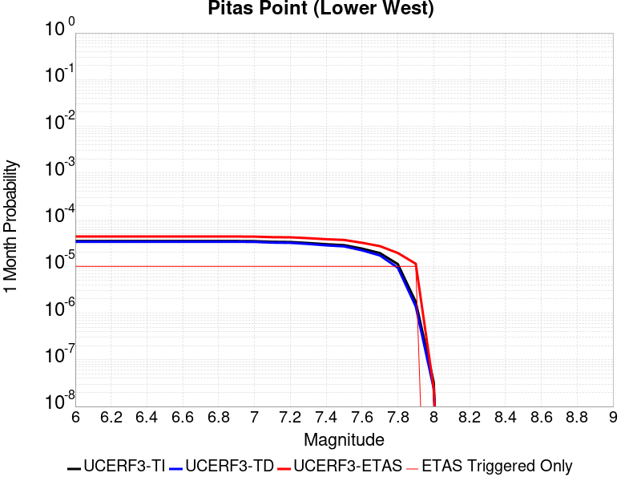 | 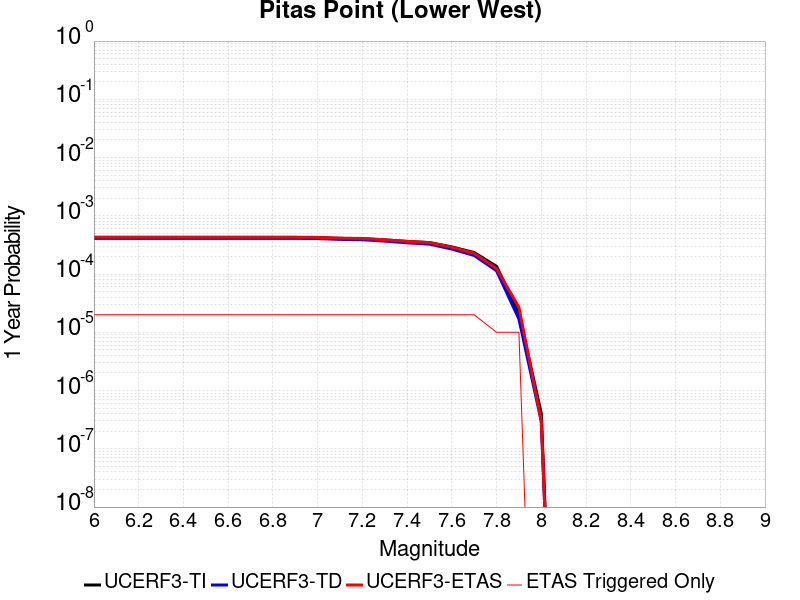 |  |

| Magnitude | 1 wk TI Prob | 1 wk TD Prob | 1 wk ETAS Prob | 1 wk ETAS/TD Gain | 1 wk ETAS Triggered Only | 1 mo TI Prob | 1 mo TD Prob | 1 mo ETAS Prob | 1 mo ETAS/TD Gain | 1 mo ETAS Triggered Only | 1 yr TI Prob | 1 yr TD Prob | 1 yr ETAS Prob | 1 yr ETAS/TD Gain | 1 yr ETAS Triggered Only | 10 yr TI Prob | 10 yr TD Prob | 10 yr ETAS Prob | 10 yr ETAS/TD Gain | 10 yr ETAS Triggered Only |
|-----|-----|-----|-----|-----|-----|-----|-----|-----|-----|-----|-----|-----|-----|-----|-----|-----|-----|-----|-----|-----|
| 6.0 | 8.151497E-6 | 7.855762E-6 | 1.7855684E-5 | 2.2729409 | 1.0E-5 | 3.493452E-5 | 3.3667122E-5 | 4.3666787E-5 | 1.2970157 | 1.0E-5 | 4.252448E-4 | 4.0982084E-4 | 4.2981267E-4 | 1.0487818 | 2.0E-5 | 0.0042443196 | 0.0040907315 | 0.0041106497 | 1.0048691 | 2.0E-5 |
| 6.1 | 8.151497E-6 | 7.855762E-6 | 1.7855684E-5 | 2.2729409 | 1.0E-5 | 3.493452E-5 | 3.3667122E-5 | 4.3666787E-5 | 1.2970157 | 1.0E-5 | 4.252448E-4 | 4.0982084E-4 | 4.2981267E-4 | 1.0487818 | 2.0E-5 | 0.0042443196 | 0.0040907315 | 0.0041106497 | 1.0048691 | 2.0E-5 |
| 6.2 | 8.151497E-6 | 7.855762E-6 | 1.7855684E-5 | 2.2729409 | 1.0E-5 | 3.493452E-5 | 3.3667122E-5 | 4.3666787E-5 | 1.2970157 | 1.0E-5 | 4.252448E-4 | 4.0982084E-4 | 4.2981267E-4 | 1.0487818 | 2.0E-5 | 0.0042443196 | 0.0040907315 | 0.0041106497 | 1.0048691 | 2.0E-5 |
| 6.3 | 8.151497E-6 | 7.855762E-6 | 1.7855684E-5 | 2.2729409 | 1.0E-5 | 3.493452E-5 | 3.3667122E-5 | 4.3666787E-5 | 1.2970157 | 1.0E-5 | 4.252448E-4 | 4.0982084E-4 | 4.2981267E-4 | 1.0487818 | 2.0E-5 | 0.0042443196 | 0.0040907315 | 0.0041106497 | 1.0048691 | 2.0E-5 |
| 6.4 | 8.151497E-6 | 7.855762E-6 | 1.7855684E-5 | 2.2729409 | 1.0E-5 | 3.493452E-5 | 3.3667122E-5 | 4.3666787E-5 | 1.2970157 | 1.0E-5 | 4.252448E-4 | 4.0982084E-4 | 4.2981267E-4 | 1.0487818 | 2.0E-5 | 0.0042443196 | 0.0040907315 | 0.0041106497 | 1.0048691 | 2.0E-5 |
| 6.5 | 8.151497E-6 | 7.855762E-6 | 1.7855684E-5 | 2.2729409 | 1.0E-5 | 3.493452E-5 | 3.3667122E-5 | 4.3666787E-5 | 1.2970157 | 1.0E-5 | 4.252448E-4 | 4.0982084E-4 | 4.2981267E-4 | 1.0487818 | 2.0E-5 | 0.0042443196 | 0.0040907315 | 0.0041106497 | 1.0048691 | 2.0E-5 |
| 6.6 | 8.151497E-6 | 7.855762E-6 | 1.7855684E-5 | 2.2729409 | 1.0E-5 | 3.493452E-5 | 3.3667122E-5 | 4.3666787E-5 | 1.2970157 | 1.0E-5 | 4.252448E-4 | 4.0982084E-4 | 4.2981267E-4 | 1.0487818 | 2.0E-5 | 0.0042443196 | 0.0040907315 | 0.0041106497 | 1.0048691 | 2.0E-5 |
| 6.7 | 8.151497E-6 | 7.855762E-6 | 1.7855684E-5 | 2.2729409 | 1.0E-5 | 3.493452E-5 | 3.3667122E-5 | 4.3666787E-5 | 1.2970157 | 1.0E-5 | 4.252448E-4 | 4.0982084E-4 | 4.2981267E-4 | 1.0487818 | 2.0E-5 | 0.0042443196 | 0.0040907315 | 0.0041106497 | 1.0048691 | 2.0E-5 |
| 6.8 | 8.151497E-6 | 7.855762E-6 | 1.7855684E-5 | 2.2729409 | 1.0E-5 | 3.493452E-5 | 3.3667122E-5 | 4.3666787E-5 | 1.2970157 | 1.0E-5 | 4.252448E-4 | 4.0982084E-4 | 4.2981267E-4 | 1.0487818 | 2.0E-5 | 0.0042443196 | 0.0040907315 | 0.0041106497 | 1.0048691 | 2.0E-5 |
| 6.9 | 8.151497E-6 | 7.855762E-6 | 1.7855684E-5 | 2.2729409 | 1.0E-5 | 3.493452E-5 | 3.3667122E-5 | 4.3666787E-5 | 1.2970157 | 1.0E-5 | 4.252448E-4 | 4.0982084E-4 | 4.2981267E-4 | 1.0487818 | 2.0E-5 | 0.0042443196 | 0.0040907315 | 0.0041106497 | 1.0048691 | 2.0E-5 |
| 7.0 | 8.103535E-6 | 7.805192E-6 | 1.7805114E-5 | 2.2811885 | 1.0E-5 | 3.4728975E-5 | 3.3450397E-5 | 4.3450065E-5 | 1.2989401 | 1.0E-5 | 4.2274324E-4 | 4.0718322E-4 | 4.2717508E-4 | 1.0490979 | 2.0E-5 | 0.0042193993 | 0.004064452 | 0.0040843706 | 1.0049007 | 2.0E-5 |
| 7.1 | 7.853298E-6 | 7.540883E-6 | 1.7540808E-5 | 2.3260946 | 1.0E-5 | 3.3656554E-5 | 3.2317676E-5 | 4.231735E-5 | 1.3094182 | 1.0E-5 | 4.096915E-4 | 3.9339735E-4 | 4.1338947E-4 | 1.0508192 | 2.0E-5 | 0.00408937 | 0.0039270855 | 0.003947007 | 1.0050728 | 2.0E-5 |
| 7.2 | 7.771102E-6 | 7.453165E-6 | 1.745309E-5 | 2.341702 | 1.0E-5 | 3.33043E-5 | 3.194175E-5 | 4.194143E-5 | 1.3130599 | 1.0E-5 | 4.0540437E-4 | 3.8882208E-4 | 4.0881432E-4 | 1.0514174 | 2.0E-5 | 0.0040466557 | 0.0038814936 | 0.003901416 | 1.0051327 | 2.0E-5 |
| 7.3 | 7.3945344E-6 | 7.0492697E-6 | 1.7049199E-5 | 2.4185767 | 1.0E-5 | 3.1690477E-5 | 3.021081E-5 | 4.0210507E-5 | 1.3309973 | 1.0E-5 | 3.8576324E-4 | 3.6775516E-4 | 3.877478E-4 | 1.054364 | 2.0E-5 | 0.0038509427 | 0.0036715334 | 0.00369146 | 1.0054274 | 2.0E-5 |
| 7.4 | 6.964645E-6 | 6.5901186E-6 | 1.6590053E-5 | 2.5174134 | 1.0E-5 | 2.9848137E-5 | 2.8243063E-5 | 3.824278E-5 | 1.3540592 | 1.0E-5 | 3.6334046E-4 | 3.4380553E-4 | 3.6379864E-4 | 1.0581524 | 2.0E-5 | 0.0036274698 | 0.0034327896 | 0.0034527208 | 1.0058062 | 2.0E-5 |
| 7.5 | 6.6525035E-6 | 6.259157E-6 | 1.6259095E-5 | 2.597649 | 1.0E-5 | 2.851042E-5 | 2.6824686E-5 | 3.682442E-5 | 1.3727809 | 1.0E-5 | 3.4705905E-4 | 3.265421E-4 | 3.4653555E-4 | 1.0612278 | 2.0E-5 | 0.0034651754 | 0.0032606742 | 0.003280609 | 1.0061136 | 2.0E-5 |
| 7.6 | 5.613338E-6 | 5.151386E-6 | 1.5151335E-5 | 2.941215 | 1.0E-5 | 2.405694E-5 | 2.2077185E-5 | 3.2076965E-5 | 1.4529463 | 1.0E-5 | 2.928539E-4 | 2.6875688E-4 | 2.887515E-4 | 1.0743967 | 2.0E-5 | 0.0029246826 | 0.0026843501 | 0.0027042963 | 1.0074306 | 2.0E-5 |
| 7.7 | 4.494704E-6 | 3.996911E-6 | 1.3996871E-5 | 3.5019221 | 1.0E-5 | 1.9262876E-5 | 1.7129507E-5 | 2.7129336E-5 | 1.5837779 | 1.0E-5 | 2.3450027E-4 | 2.0853203E-4 | 2.2852786E-4 | 1.0958885 | 2.0E-5 | 0.0023425296 | 0.0020833875 | 0.002103346 | 1.0095798 | 2.0E-5 |
| 7.8 | 2.6075882E-6 | 2.1836374E-6 | 1.2183616E-5 | 5.5795045 | 1.0E-5 | 1.117533E-5 | 9.358413E-6 | 1.935832E-5 | 2.0685472 | 1.0E-5 | 1.3605114E-4 | 1.1393277E-4 | 1.2393163E-4 | 1.087761 | 1.0E-5 | 0.0013596788 | 0.0011387484 | 0.0011487369 | 1.0087715 | 1.0E-5 |
| 7.9 | 4.045984E-7 | 3.242375E-7 | 1.0324235E-5 | 31.841581 | 1.0E-5 | 1.733992E-6 | 1.3895885E-6 | 1.1389575E-5 | 8.196365 | 1.0E-5 | 2.1111147E-5 | 1.6918111E-5 | 2.6917944E-5 | 1.5910726 | 1.0E-5 | 2.1109142E-4 | 1.6916855E-4 | 1.7916686E-4 | 1.0591027 | 1.0E-5 |
| 8.0 | 7.791402E-9 | 5.683497E-9 | 5.683497E-9 | 1.0 | 0.0 | 3.3391725E-8 | 2.4357844E-8 | 2.4357844E-8 | 1.0 | 0.0 | 4.0654416E-7 | 2.9655675E-7 | 2.9655675E-7 | 1.0 | 0.0 | 4.065434E-6 | 2.9655655E-6 | 2.9655655E-6 | 1.0 | 0.0 |

## Quien Sabe 2011 CFM
*[(top)](#table-of-contents)*

| 1 Week | 1 Month | 1 Year | 10 Year |
|-----|-----|-----|-----|
|  |  |  | 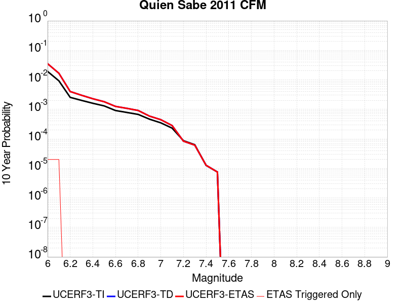 |

| Magnitude | 1 wk TI Prob | 1 wk TD Prob | 1 wk ETAS Prob | 1 wk ETAS/TD Gain | 1 wk ETAS Triggered Only | 1 mo TI Prob | 1 mo TD Prob | 1 mo ETAS Prob | 1 mo ETAS/TD Gain | 1 mo ETAS Triggered Only | 1 yr TI Prob | 1 yr TD Prob | 1 yr ETAS Prob | 1 yr ETAS/TD Gain | 1 yr ETAS Triggered Only | 10 yr TI Prob | 10 yr TD Prob | 10 yr ETAS Prob | 10 yr ETAS/TD Gain | 10 yr ETAS Triggered Only |
|-----|-----|-----|-----|-----|-----|-----|-----|-----|-----|-----|-----|-----|-----|-----|-----|-----|-----|-----|-----|-----|
| 6.0 | 3.729899E-5 | 7.087805E-5 | 8.087735E-5 | 1.1410774 | 1.0E-5 | 1.5984301E-4 | 3.037322E-4 | 3.1372916E-4 | 1.0329137 | 1.0E-5 | 0.0019443515 | 0.0036852323 | 0.0037051586 | 1.0054071 | 2.0E-5 | 0.019274272 | 0.035349756 | 0.03536905 | 1.0005457 | 2.0E-5 |
| 6.1 | 1.7825725E-5 | 3.31456E-5 | 4.3145268E-5 | 1.3016891 | 1.0E-5 | 7.639373E-5 | 1.4204586E-4 | 1.5204445E-4 | 1.0703897 | 1.0E-5 | 9.296967E-4 | 0.0017267246 | 0.00174669 | 1.0115626 | 2.0E-5 | 0.009258169 | 0.016698597 | 0.016718263 | 1.0011777 | 2.0E-5 |
| 6.2 | 4.8865336E-6 | 7.804963E-6 | 7.804963E-6 | 1.0 | 0.0 | 2.0942118E-5 | 3.344947E-5 | 3.344947E-5 | 1.0 | 0.0 | 2.5494045E-4 | 4.0691497E-4 | 4.0691497E-4 | 1.0 | 0.0 | 0.0025464818 | 0.0040135453 | 0.0040135453 | 1.0 | 0.0 |
| 6.3 | 3.858491E-6 | 5.789573E-6 | 5.789573E-6 | 1.0 | 0.0 | 1.6536285E-5 | 2.4812247E-5 | 2.4812247E-5 | 1.0 | 0.0 | 2.0131067E-4 | 3.0205192E-4 | 3.0205192E-4 | 1.0 | 0.0 | 0.002011284 | 0.0030019816 | 0.0030019816 | 1.0 | 0.0 |
| 6.4 | 3.0771805E-6 | 4.384806E-6 | 4.384806E-6 | 1.0 | 0.0 | 1.318785E-5 | 1.8791905E-5 | 1.8791905E-5 | 1.0 | 0.0 | 1.6055023E-4 | 2.2876984E-4 | 2.2876984E-4 | 1.0 | 0.0 | 0.001604343 | 0.002286477 | 0.002286477 | 1.0 | 0.0 |
| 6.5 | 2.5081235E-6 | 3.463511E-6 | 3.463511E-6 | 1.0 | 0.0 | 1.0749056E-5 | 1.4843542E-5 | 1.4843542E-5 | 1.0 | 0.0 | 1.308619E-4 | 1.807066E-4 | 1.807066E-4 | 1.0 | 0.0 | 0.0013078486 | 0.0018123116 | 0.0018123116 | 1.0 | 0.0 |
| 6.6 | 1.7505364E-6 | 2.4023168E-6 | 2.4023168E-6 | 1.0 | 0.0 | 7.502277E-6 | 1.0295607E-5 | 1.0295607E-5 | 1.0 | 0.0 | 9.13364E-5 | 1.2534253E-4 | 1.2534253E-4 | 1.0 | 0.0 | 9.129886E-4 | 0.0012582915 | 0.0012582915 | 1.0 | 0.0 |
| 6.7 | 1.505737E-6 | 2.0637349E-6 | 2.0637349E-6 | 1.0 | 0.0 | 6.4531428E-6 | 8.844551E-6 | 8.844551E-6 | 1.0 | 0.0 | 7.8564175E-5 | 1.0767768E-4 | 1.0767768E-4 | 1.0 | 0.0 | 7.853641E-4 | 0.0010818138 | 0.0010818138 | 1.0 | 0.0 |
| 6.8 | 1.2924105E-6 | 1.7484025E-6 | 1.7484025E-6 | 1.0 | 0.0 | 5.5388905E-6 | 7.4931354E-6 | 7.4931354E-6 | 1.0 | 0.0 | 6.74339E-5 | 9.122565E-5 | 9.122565E-5 | 1.0 | 0.0 | 6.741344E-4 | 9.1609603E-4 | 9.1609603E-4 | 1.0 | 0.0 |
| 6.9 | 8.9075286E-7 | 1.1249955E-6 | 1.1249955E-6 | 1.0 | 0.0 | 3.8175067E-6 | 4.8214015E-6 | 4.8214015E-6 | 1.0 | 0.0 | 4.6477155E-5 | 5.8699206E-5 | 5.8699206E-5 | 1.0 | 0.0 | 4.6467435E-4 | 5.903947E-4 | 5.903947E-4 | 1.0 | 0.0 |
| 7.0 | 6.6891175E-7 | 8.51663E-7 | 8.51663E-7 | 1.0 | 0.0 | 2.8667614E-6 | 3.6499803E-6 | 3.6499803E-6 | 1.0 | 0.0 | 3.4902263E-5 | 4.44378E-5 | 4.44378E-5 | 1.0 | 0.0 | 3.4896782E-4 | 4.4678617E-4 | 4.4678617E-4 | 1.0 | 0.0 |
| 7.1 | 4.4205015E-7 | 5.3919683E-7 | 5.3919683E-7 | 1.0 | 0.0 | 1.8944993E-6 | 2.3108425E-6 | 2.3108425E-6 | 1.0 | 0.0 | 2.3065284E-5 | 2.8134315E-5 | 2.8134315E-5 | 1.0 | 0.0 | 2.3062891E-4 | 2.826926E-4 | 2.826926E-4 | 1.0 | 0.0 |
| 7.2 | 1.6620965E-7 | 1.5987598E-7 | 1.5987598E-7 | 1.0 | 0.0 | 7.123269E-7 | 6.851826E-7 | 6.851826E-7 | 1.0 | 0.0 | 8.672545E-6 | 8.34207E-6 | 8.34207E-6 | 1.0 | 0.0 | 8.6722066E-5 | 8.3573126E-5 | 8.3573126E-5 | 1.0 | 0.0 |
| 7.3 | 1.2142488E-7 | 1.1726492E-7 | 1.1726492E-7 | 1.0 | 0.0 | 5.2039223E-7 | 5.0256386E-7 | 5.0256386E-7 | 1.0 | 0.0 | 6.335757E-6 | 6.118701E-6 | 6.118701E-6 | 1.0 | 0.0 | 6.3355765E-5 | 6.124848E-5 | 6.124848E-5 | 1.0 | 0.0 |
| 7.4 | 2.4192937E-8 | 2.4543448E-8 | 2.4543448E-8 | 1.0 | 0.0 | 1.0368401E-7 | 1.051862E-7 | 1.051862E-7 | 1.0 | 0.0 | 1.2623522E-6 | 1.2806413E-6 | 1.2806413E-6 | 1.0 | 0.0 | 1.2623449E-5 | 1.2812683E-5 | 1.2812683E-5 | 1.0 | 0.0 |
| 7.5 | 1.4432802E-8 | 1.4506471E-8 | 1.4506471E-8 | 1.0 | 0.0 | 6.185486E-8 | 6.2170585E-8 | 6.2170585E-8 | 1.0 | 0.0 | 7.530827E-7 | 7.5692674E-7 | 7.5692674E-7 | 1.0 | 0.0 | 7.530801E-6 | 7.5735175E-6 | 7.5735175E-6 | 1.0 | 0.0 |

## Hartley Springs 2011 CFM
*[(top)](#table-of-contents)*

| 1 Week | 1 Month | 1 Year | 10 Year |
|-----|-----|-----|-----|
|  |  |  |  |

| Magnitude | 1 wk TI Prob | 1 wk TD Prob | 1 wk ETAS Prob | 1 wk ETAS/TD Gain | 1 wk ETAS Triggered Only | 1 mo TI Prob | 1 mo TD Prob | 1 mo ETAS Prob | 1 mo ETAS/TD Gain | 1 mo ETAS Triggered Only | 1 yr TI Prob | 1 yr TD Prob | 1 yr ETAS Prob | 1 yr ETAS/TD Gain | 1 yr ETAS Triggered Only | 10 yr TI Prob | 10 yr TD Prob | 10 yr ETAS Prob | 10 yr ETAS/TD Gain | 10 yr ETAS Triggered Only |
|-----|-----|-----|-----|-----|-----|-----|-----|-----|-----|-----|-----|-----|-----|-----|-----|-----|-----|-----|-----|-----|
| 6.0 | 1.4352418E-5 | 1.4434182E-5 | 1.4434182E-5 | 1.0 | 0.0 | 6.1508916E-5 | 6.1860235E-5 | 7.185962E-5 | 1.1616447 | 1.0E-5 | 7.486137E-4 | 7.5305253E-4 | 7.730375E-4 | 1.0265386 | 2.0E-5 | 0.007460968 | 0.0075211283 | 0.007540978 | 1.0026392 | 2.0E-5 |
| 6.1 | 1.4352418E-5 | 1.4434182E-5 | 1.4434182E-5 | 1.0 | 0.0 | 6.1508916E-5 | 6.1860235E-5 | 7.185962E-5 | 1.1616447 | 1.0E-5 | 7.486137E-4 | 7.5305253E-4 | 7.730375E-4 | 1.0265386 | 2.0E-5 | 0.007460968 | 0.0075211283 | 0.007540978 | 1.0026392 | 2.0E-5 |
| 6.2 | 1.4352418E-5 | 1.4434182E-5 | 1.4434182E-5 | 1.0 | 0.0 | 6.1508916E-5 | 6.1860235E-5 | 7.185962E-5 | 1.1616447 | 1.0E-5 | 7.486137E-4 | 7.5305253E-4 | 7.730375E-4 | 1.0265386 | 2.0E-5 | 0.007460968 | 0.0075211283 | 0.007540978 | 1.0026392 | 2.0E-5 |
| 6.3 | 1.4352418E-5 | 1.4434182E-5 | 1.4434182E-5 | 1.0 | 0.0 | 6.1508916E-5 | 6.1860235E-5 | 7.185962E-5 | 1.1616447 | 1.0E-5 | 7.486137E-4 | 7.5305253E-4 | 7.730375E-4 | 1.0265386 | 2.0E-5 | 0.007460968 | 0.0075211283 | 0.007540978 | 1.0026392 | 2.0E-5 |
| 6.4 | 1.4352418E-5 | 1.4434182E-5 | 1.4434182E-5 | 1.0 | 0.0 | 6.1508916E-5 | 6.1860235E-5 | 7.185962E-5 | 1.1616447 | 1.0E-5 | 7.486137E-4 | 7.5305253E-4 | 7.730375E-4 | 1.0265386 | 2.0E-5 | 0.007460968 | 0.0075211283 | 0.007540978 | 1.0026392 | 2.0E-5 |
| 6.5 | 1.2279858E-5 | 1.2133106E-5 | 1.2133106E-5 | 1.0 | 0.0 | 5.26269E-5 | 5.1998883E-5 | 6.199836E-5 | 1.1923019 | 1.0E-5 | 6.4054417E-4 | 6.3306064E-4 | 6.53048E-4 | 1.0315726 | 2.0E-5 | 0.0063870098 | 0.006328085 | 0.006347958 | 1.0031406 | 2.0E-5 |
| 6.6 | 1.2279858E-5 | 1.2133106E-5 | 1.2133106E-5 | 1.0 | 0.0 | 5.26269E-5 | 5.1998883E-5 | 6.199836E-5 | 1.1923019 | 1.0E-5 | 6.4054417E-4 | 6.3306064E-4 | 6.53048E-4 | 1.0315726 | 2.0E-5 | 0.0063870098 | 0.006328085 | 0.006347958 | 1.0031406 | 2.0E-5 |
| 6.7 | 2.1282601E-6 | 8.8948315E-7 | 8.8948315E-7 | 1.0 | 0.0 | 9.121083E-6 | 3.8120663E-6 | 3.8120663E-6 | 1.0 | 0.0 | 1.11043526E-4 | 4.641118E-5 | 4.641118E-5 | 1.0 | 0.0 | 0.0011098806 | 4.6404017E-4 | 4.6404017E-4 | 1.0 | 0.0 |
| 6.8 | 2.00516E-6 | 8.517597E-7 | 8.517597E-7 | 1.0 | 0.0 | 8.593515E-6 | 3.650395E-6 | 3.650395E-6 | 1.0 | 0.0 | 1.04621024E-4 | 4.444291E-5 | 4.444291E-5 | 1.0 | 0.0 | 0.0010457177 | 4.4436535E-4 | 4.4436535E-4 | 1.0 | 0.0 |
| 6.9 | 2.00516E-6 | 8.517597E-7 | 8.517597E-7 | 1.0 | 0.0 | 8.593515E-6 | 3.650395E-6 | 3.650395E-6 | 1.0 | 0.0 | 1.04621024E-4 | 4.444291E-5 | 4.444291E-5 | 1.0 | 0.0 | 0.0010457177 | 4.4436535E-4 | 4.4436535E-4 | 1.0 | 0.0 |
| 7.0 | 1.8366732E-6 | 8.237307E-7 | 8.237307E-7 | 1.0 | 0.0 | 7.871433E-6 | 3.5302712E-6 | 3.5302712E-6 | 1.0 | 0.0 | 9.583048E-5 | 4.298046E-5 | 4.298046E-5 | 1.0 | 0.0 | 9.5789164E-4 | 4.2974652E-4 | 4.2974652E-4 | 1.0 | 0.0 |
| 7.1 | 1.5097997E-6 | 7.1902616E-7 | 7.1902616E-7 | 1.0 | 0.0 | 6.470554E-6 | 3.0815384E-6 | 3.0815384E-6 | 1.0 | 0.0 | 7.877615E-5 | 3.7517326E-5 | 3.7517326E-5 | 1.0 | 0.0 | 7.874823E-4 | 3.7513362E-4 | 3.7513362E-4 | 1.0 | 0.0 |
| 7.2 | 1.3490993E-6 | 6.405254E-7 | 6.405254E-7 | 1.0 | 0.0 | 5.7818415E-6 | 2.7451074E-6 | 2.7451074E-6 | 1.0 | 0.0 | 7.0391645E-5 | 3.3421402E-5 | 3.3421402E-5 | 1.0 | 0.0 | 7.0369354E-4 | 3.341867E-4 | 3.341867E-4 | 1.0 | 0.0 |
| 7.3 | 7.900015E-7 | 4.0889498E-7 | 4.0889498E-7 | 1.0 | 0.0 | 3.3857161E-6 | 1.752407E-6 | 1.752407E-6 | 1.0 | 0.0 | 4.1220315E-5 | 2.1335554E-5 | 2.1335554E-5 | 1.0 | 0.0 | 4.121267E-4 | 2.1335555E-4 | 2.1335555E-4 | 1.0 | 0.0 |

## Elsinore (Stepovers Combined)
*[(top)](#table-of-contents)*

| 1 Week | 1 Month | 1 Year | 10 Year |
|-----|-----|-----|-----|
| 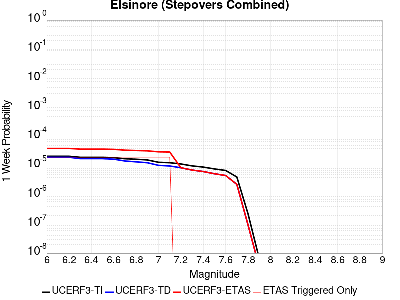 |  |  |  |

| Magnitude | 1 wk TI Prob | 1 wk TD Prob | 1 wk ETAS Prob | 1 wk ETAS/TD Gain | 1 wk ETAS Triggered Only | 1 mo TI Prob | 1 mo TD Prob | 1 mo ETAS Prob | 1 mo ETAS/TD Gain | 1 mo ETAS Triggered Only | 1 yr TI Prob | 1 yr TD Prob | 1 yr ETAS Prob | 1 yr ETAS/TD Gain | 1 yr ETAS Triggered Only | 10 yr TI Prob | 10 yr TD Prob | 10 yr ETAS Prob | 10 yr ETAS/TD Gain | 10 yr ETAS Triggered Only |
|-----|-----|-----|-----|-----|-----|-----|-----|-----|-----|-----|-----|-----|-----|-----|-----|-----|-----|-----|-----|-----|
| 6.0 | 2.144392E-5 | 1.9760193E-5 | 3.9759798E-5 | 2.012116 | 2.0E-5 | 9.189928E-5 | 8.468392E-5 | 1.0468222E-4 | 1.2361524 | 2.0E-5 | 0.0011182994 | 0.0010305607 | 0.0010505401 | 1.0193869 | 2.0E-5 | 0.011126885 | 0.010264917 | 0.010284713 | 1.0019283 | 2.0E-5 |
| 6.1 | 2.144392E-5 | 1.9760193E-5 | 3.9759798E-5 | 2.012116 | 2.0E-5 | 9.189928E-5 | 8.468392E-5 | 1.0468222E-4 | 1.2361524 | 2.0E-5 | 0.0011182994 | 0.0010305607 | 0.0010505401 | 1.0193869 | 2.0E-5 | 0.011126885 | 0.010264917 | 0.010284713 | 1.0019283 | 2.0E-5 |
| 6.2 | 2.144392E-5 | 1.9760193E-5 | 3.9759798E-5 | 2.012116 | 2.0E-5 | 9.189928E-5 | 8.468392E-5 | 1.0468222E-4 | 1.2361524 | 2.0E-5 | 0.0011182994 | 0.0010305607 | 0.0010505401 | 1.0193869 | 2.0E-5 | 0.011126885 | 0.010264917 | 0.010284713 | 1.0019283 | 2.0E-5 |
| 6.3 | 1.9751555E-5 | 1.7741453E-5 | 3.7741098E-5 | 2.1272833 | 2.0E-5 | 8.4646774E-5 | 7.603267E-5 | 9.603115E-5 | 1.2630248 | 2.0E-5 | 0.0010300872 | 9.253213E-4 | 9.453028E-4 | 1.0215942 | 2.0E-5 | 0.010253254 | 0.009221276 | 0.009241092 | 1.0021489 | 2.0E-5 |
| 6.4 | 1.9751555E-5 | 1.7741453E-5 | 3.7741098E-5 | 2.1272833 | 2.0E-5 | 8.4646774E-5 | 7.603267E-5 | 9.603115E-5 | 1.2630248 | 2.0E-5 | 0.0010300872 | 9.253213E-4 | 9.453028E-4 | 1.0215942 | 2.0E-5 | 0.010253254 | 0.009221276 | 0.009241092 | 1.0021489 | 2.0E-5 |
| 6.5 | 1.9751555E-5 | 1.7741453E-5 | 3.7741098E-5 | 2.1272833 | 2.0E-5 | 8.4646774E-5 | 7.603267E-5 | 9.603115E-5 | 1.2630248 | 2.0E-5 | 0.0010300872 | 9.253213E-4 | 9.453028E-4 | 1.0215942 | 2.0E-5 | 0.010253254 | 0.009221276 | 0.009241092 | 1.0021489 | 2.0E-5 |
| 6.6 | 1.9188685E-5 | 1.7003393E-5 | 3.7003054E-5 | 2.176216 | 2.0E-5 | 8.2234634E-5 | 7.286974E-5 | 9.2868286E-5 | 1.2744423 | 2.0E-5 | 0.0010007467 | 8.868442E-4 | 9.068264E-4 | 1.0225319 | 2.0E-5 | 0.00996252 | 0.0088398475 | 0.008859671 | 1.0022424 | 2.0E-5 |
| 6.7 | 1.7608272E-5 | 1.4732616E-5 | 3.4732322E-5 | 2.357512 | 2.0E-5 | 7.546184E-5 | 6.3138315E-5 | 8.313705E-5 | 1.3167449 | 2.0E-5 | 9.183606E-4 | 7.684476E-4 | 7.884322E-4 | 1.0260065 | 2.0E-5 | 0.009145746 | 0.00766491 | 0.0076847565 | 1.0025893 | 2.0E-5 |
| 6.8 | 1.697165E-5 | 1.3783365E-5 | 3.378309E-5 | 2.4510045 | 2.0E-5 | 7.273361E-5 | 5.9070277E-5 | 7.90691E-5 | 1.3385597 | 2.0E-5 | 8.8517193E-4 | 7.18952E-4 | 7.389376E-4 | 1.0277983 | 2.0E-5 | 0.008816543 | 0.007172675 | 0.0071925316 | 1.0027684 | 2.0E-5 |
| 6.9 | 1.600365E-5 | 1.2846671E-5 | 3.2846416E-5 | 2.5568035 | 2.0E-5 | 6.858527E-5 | 5.5056043E-5 | 7.5054944E-5 | 1.3632462 | 2.0E-5 | 8.347058E-4 | 6.7010894E-4 | 6.9009553E-4 | 1.0298259 | 2.0E-5 | 0.008315775 | 0.0066867657 | 0.006706632 | 1.0029709 | 2.0E-5 |
| 7.0 | 1.3314581E-5 | 1.0447548E-5 | 3.044734E-5 | 2.9143047 | 2.0E-5 | 5.7061243E-5 | 4.4774453E-5 | 6.477356E-5 | 1.4466633 | 2.0E-5 | 6.944992E-4 | 5.449953E-4 | 5.6498445E-4 | 1.0366776 | 2.0E-5 | 0.006923327 | 0.0054405155 | 0.0054604067 | 1.0036561 | 2.0E-5 |
| 7.1 | 1.2865345E-5 | 9.937536E-6 | 2.9937337E-5 | 3.0125513 | 2.0E-5 | 5.5136024E-5 | 4.258876E-5 | 6.2587904E-5 | 1.4695874 | 2.0E-5 | 6.710743E-4 | 5.183973E-4 | 5.383869E-4 | 1.0385604 | 2.0E-5 | 0.0066905143 | 0.0051752133 | 0.00519511 | 1.0038446 | 2.0E-5 |
| 7.2 | 1.1650051E-5 | 8.633809E-6 | 8.633809E-6 | 1.0 | 0.0 | 4.9927836E-5 | 3.7001522E-5 | 3.7001522E-5 | 1.0 | 0.0 | 6.0770183E-4 | 4.504022E-4 | 4.504022E-4 | 1.0 | 0.0 | 0.0060604266 | 0.0044963174 | 0.0044963174 | 1.0 | 0.0 |
| 7.3 | 1.0008533E-5 | 7.2010425E-6 | 7.2010425E-6 | 1.0 | 0.0 | 4.2893007E-5 | 3.0861254E-5 | 3.0861254E-5 | 1.0 | 0.0 | 5.220972E-4 | 3.7567242E-4 | 3.7567242E-4 | 1.0 | 0.0 | 0.005208723 | 0.003750761 | 0.003750761 | 1.0 | 0.0 |
| 7.4 | 9.116759E-6 | 6.410068E-6 | 6.410068E-6 | 1.0 | 0.0 | 3.907124E-5 | 2.747144E-5 | 2.747144E-5 | 1.0 | 0.0 | 4.7558855E-4 | 3.3441483E-4 | 3.3441483E-4 | 1.0 | 0.0 | 0.00474572 | 0.0033392678 | 0.0033392678 | 1.0 | 0.0 |
| 7.5 | 7.870524E-6 | 5.3825365E-6 | 5.3825365E-6 | 1.0 | 0.0 | 3.3730383E-5 | 2.3067816E-5 | 2.3067816E-5 | 1.0 | 0.0 | 4.1059E-4 | 2.8081573E-4 | 2.8081573E-4 | 1.0 | 0.0 | 0.0040983222 | 0.0028047354 | 0.0028047354 | 1.0 | 0.0 |
| 7.6 | 6.9774537E-6 | 4.6776067E-6 | 4.6776067E-6 | 1.0 | 0.0 | 2.990303E-5 | 2.0046738E-5 | 2.0046738E-5 | 1.0 | 0.0 | 3.640086E-4 | 2.4404288E-4 | 2.4404288E-4 | 1.0 | 0.0 | 0.003634129 | 0.0024378651 | 0.0024378651 | 1.0 | 0.0 |
| 7.7 | 4.1616954E-6 | 2.32834E-6 | 2.32834E-6 | 1.0 | 0.0 | 1.7835715E-5 | 9.978567E-6 | 9.978567E-6 | 1.0 | 0.0 | 2.171282E-4 | 1.2148302E-4 | 1.2148302E-4 | 1.0 | 0.0 | 0.0021691616 | 0.0012142392 | 0.0012142392 | 1.0 | 0.0 |
| 7.8 | 2.2692414E-7 | 9.3854695E-8 | 9.3854695E-8 | 1.0 | 0.0 | 9.725317E-7 | 4.0223435E-7 | 4.0223435E-7 | 1.0 | 0.0 | 1.1840509E-5 | 4.8971956E-6 | 4.8971956E-6 | 1.0 | 0.0 | 1.1839878E-4 | 4.8971204E-5 | 4.8971204E-5 | 1.0 | 0.0 |
| 7.9 | 6.676829E-9 | 3.439853E-9 | 3.439853E-9 | 1.0 | 0.0 | 2.861498E-8 | 1.4742227E-8 | 1.4742227E-8 | 1.0 | 0.0 | 3.4838732E-7 | 1.7948659E-7 | 1.7948659E-7 | 1.0 | 0.0 | 3.4838679E-6 | 1.7948646E-6 | 1.7948646E-6 | 1.0 | 0.0 |

## Earthquake Valley (So Extension)
*[(top)](#table-of-contents)*

| 1 Week | 1 Month | 1 Year | 10 Year |
|-----|-----|-----|-----|
|  |  |  |  |

| Magnitude | 1 wk TI Prob | 1 wk TD Prob | 1 wk ETAS Prob | 1 wk ETAS/TD Gain | 1 wk ETAS Triggered Only | 1 mo TI Prob | 1 mo TD Prob | 1 mo ETAS Prob | 1 mo ETAS/TD Gain | 1 mo ETAS Triggered Only | 1 yr TI Prob | 1 yr TD Prob | 1 yr ETAS Prob | 1 yr ETAS/TD Gain | 1 yr ETAS Triggered Only | 10 yr TI Prob | 10 yr TD Prob | 10 yr ETAS Prob | 10 yr ETAS/TD Gain | 10 yr ETAS Triggered Only |
|-----|-----|-----|-----|-----|-----|-----|-----|-----|-----|-----|-----|-----|-----|-----|-----|-----|-----|-----|-----|-----|
| 6.0 | 3.0194888E-5 | 3.7072114E-5 | 4.7071742E-5 | 1.2697345 | 1.0E-5 | 1.2940024E-4 | 1.5887388E-4 | 1.6887228E-4 | 1.062933 | 1.0E-5 | 0.0015743093 | 0.0019331174 | 0.0019530788 | 1.010326 | 2.0E-5 | 0.01563203 | 0.019213019 | 0.019232634 | 1.0010209 | 2.0E-5 |
| 6.1 | 3.0194888E-5 | 3.7072114E-5 | 4.7071742E-5 | 1.2697345 | 1.0E-5 | 1.2940024E-4 | 1.5887388E-4 | 1.6887228E-4 | 1.062933 | 1.0E-5 | 0.0015743093 | 0.0019331174 | 0.0019530788 | 1.010326 | 2.0E-5 | 0.01563203 | 0.019213019 | 0.019232634 | 1.0010209 | 2.0E-5 |
| 6.2 | 3.0194888E-5 | 3.7072114E-5 | 4.7071742E-5 | 1.2697345 | 1.0E-5 | 1.2940024E-4 | 1.5887388E-4 | 1.6887228E-4 | 1.062933 | 1.0E-5 | 0.0015743093 | 0.0019331174 | 0.0019530788 | 1.010326 | 2.0E-5 | 0.01563203 | 0.019213019 | 0.019232634 | 1.0010209 | 2.0E-5 |
| 6.3 | 1.5795305E-5 | 1.844658E-5 | 2.8446397E-5 | 1.5420959 | 1.0E-5 | 6.769241E-5 | 7.9055004E-5 | 8.9054214E-5 | 1.1264842 | 1.0E-5 | 8.238434E-4 | 9.6218096E-4 | 9.821617E-4 | 1.0207661 | 2.0E-5 | 0.008207959 | 0.009591061 | 0.009610869 | 1.0020653 | 2.0E-5 |
| 6.4 | 1.5795305E-5 | 1.844658E-5 | 2.8446397E-5 | 1.5420959 | 1.0E-5 | 6.769241E-5 | 7.9055004E-5 | 8.9054214E-5 | 1.1264842 | 1.0E-5 | 8.238434E-4 | 9.6218096E-4 | 9.821617E-4 | 1.0207661 | 2.0E-5 | 0.008207959 | 0.009591061 | 0.009610869 | 1.0020653 | 2.0E-5 |
| 6.5 | 1.5795305E-5 | 1.844658E-5 | 2.8446397E-5 | 1.5420959 | 1.0E-5 | 6.769241E-5 | 7.9055004E-5 | 8.9054214E-5 | 1.1264842 | 1.0E-5 | 8.238434E-4 | 9.6218096E-4 | 9.821617E-4 | 1.0207661 | 2.0E-5 | 0.008207959 | 0.009591061 | 0.009610869 | 1.0020653 | 2.0E-5 |
| 6.6 | 1.5795305E-5 | 1.844658E-5 | 2.8446397E-5 | 1.5420959 | 1.0E-5 | 6.769241E-5 | 7.9055004E-5 | 8.9054214E-5 | 1.1264842 | 1.0E-5 | 8.238434E-4 | 9.6218096E-4 | 9.821617E-4 | 1.0207661 | 2.0E-5 | 0.008207959 | 0.009591061 | 0.009610869 | 1.0020653 | 2.0E-5 |
| 6.7 | 1.1363076E-5 | 1.3138294E-5 | 2.3138162E-5 | 1.7611238 | 1.0E-5 | 4.8697988E-5 | 5.6306188E-5 | 6.630563E-5 | 1.1775904 | 1.0E-5 | 5.927367E-4 | 6.8538834E-4 | 7.0537464E-4 | 1.0291605 | 2.0E-5 | 0.0059115817 | 0.0068402183 | 0.0068600816 | 1.0029039 | 2.0E-5 |
| 6.8 | 1.0049611E-5 | 1.1594334E-5 | 2.1594218E-5 | 1.8624803 | 1.0E-5 | 4.306905E-5 | 4.9689468E-5 | 5.968897E-5 | 1.20124 | 1.0E-5 | 5.242395E-4 | 6.048745E-4 | 6.248624E-4 | 1.0330447 | 2.0E-5 | 0.0052300454 | 0.006039458 | 0.0060593374 | 1.0032916 | 2.0E-5 |
| 6.9 | 1.0049611E-5 | 1.1594334E-5 | 2.1594218E-5 | 1.8624803 | 1.0E-5 | 4.306905E-5 | 4.9689468E-5 | 5.968897E-5 | 1.20124 | 1.0E-5 | 5.242395E-4 | 6.048745E-4 | 6.248624E-4 | 1.0330447 | 2.0E-5 | 0.0052300454 | 0.006039458 | 0.0060593374 | 1.0032916 | 2.0E-5 |
| 7.0 | 1.0049611E-5 | 1.1594334E-5 | 2.1594218E-5 | 1.8624803 | 1.0E-5 | 4.306905E-5 | 4.9689468E-5 | 5.968897E-5 | 1.20124 | 1.0E-5 | 5.242395E-4 | 6.048745E-4 | 6.248624E-4 | 1.0330447 | 2.0E-5 | 0.0052300454 | 0.006039458 | 0.0060593374 | 1.0032916 | 2.0E-5 |
| 7.1 | 8.140254E-6 | 9.383458E-6 | 1.9383364E-5 | 2.0656953 | 1.0E-5 | 3.4886336E-5 | 4.0214578E-5 | 5.0214174E-5 | 1.248656 | 1.0E-5 | 4.2465836E-4 | 4.8956956E-4 | 5.0955976E-4 | 1.0408322 | 2.0E-5 | 0.0042384774 | 0.0048914864 | 0.0049113887 | 1.0040687 | 2.0E-5 |
| 7.2 | 1.673835E-7 | 1.4154125E-7 | 1.4154125E-7 | 1.0 | 0.0 | 7.173577E-7 | 6.066052E-7 | 6.066052E-7 | 1.0 | 0.0 | 8.733795E-6 | 7.385397E-6 | 7.385397E-6 | 1.0 | 0.0 | 8.733451E-5 | 7.385187E-5 | 7.385187E-5 | 1.0 | 0.0 |
| 7.3 | 1.6632116E-7 | 1.4052354E-7 | 1.4052354E-7 | 1.0 | 0.0 | 7.1280476E-7 | 6.0224363E-7 | 6.0224363E-7 | 1.0 | 0.0 | 8.678364E-6 | 7.332295E-6 | 7.332295E-6 | 1.0 | 0.0 | 8.6780245E-5 | 7.332089E-5 | 7.332089E-5 | 1.0 | 0.0 |
| 7.4 | 1.6569169E-7 | 1.3996983E-7 | 1.3996983E-7 | 1.0 | 0.0 | 7.1010703E-7 | 5.9987053E-7 | 5.9987053E-7 | 1.0 | 0.0 | 8.645519E-6 | 7.303403E-6 | 7.303403E-6 | 1.0 | 0.0 | 8.645182E-5 | 7.303199E-5 | 7.303199E-5 | 1.0 | 0.0 |
| 7.5 | 1.1764555E-7 | 1.0095917E-7 | 1.0095917E-7 | 1.0 | 0.0 | 5.041951E-7 | 4.326821E-7 | 4.326821E-7 | 1.0 | 0.0 | 6.138558E-6 | 5.267894E-6 | 5.267894E-6 | 1.0 | 0.0 | 6.1383886E-5 | 5.2677904E-5 | 5.2677904E-5 | 1.0 | 0.0 |
| 7.6 | 1.07927605E-7 | 9.260736E-8 | 9.260736E-8 | 1.0 | 0.0 | 4.6254678E-7 | 3.9688865E-7 | 3.9688865E-7 | 1.0 | 0.0 | 5.6314925E-6 | 4.832111E-6 | 4.832111E-6 | 1.0 | 0.0 | 5.63135E-5 | 4.8320264E-5 | 4.8320264E-5 | 1.0 | 0.0 |
| 7.7 | 2.1826905E-8 | 1.1180516E-8 | 1.1180516E-8 | 1.0 | 0.0 | 9.3543875E-8 | 4.7916494E-8 | 4.7916494E-8 | 1.0 | 0.0 | 1.1388961E-6 | 5.833832E-7 | 5.833832E-7 | 1.0 | 0.0 | 1.1388902E-5 | 5.8338223E-6 | 5.8338223E-6 | 1.0 | 0.0 |
| 7.8 | 2.6169649E-9 | 1.1969472E-9 | 1.1969472E-9 | 1.0 | 0.0 | 1.1215564E-8 | 5.1297735E-9 | 5.1297735E-9 | 1.0 | 0.0 | 1.3654947E-7 | 6.2454994E-8 | 6.2454994E-8 | 1.0 | 0.0 | 1.365494E-6 | 6.245499E-7 | 6.245499E-7 | 1.0 | 0.0 |

## Pitas Point (Lower)-Montalvo
*[(top)](#table-of-contents)*

| 1 Week | 1 Month | 1 Year | 10 Year |
|-----|-----|-----|-----|
|  |  | 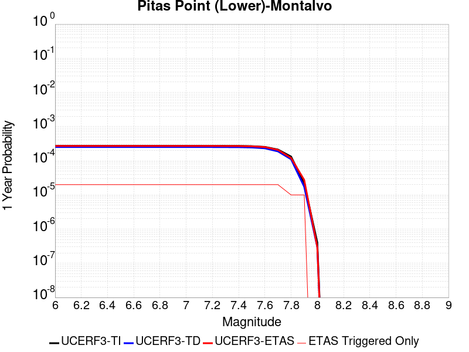 |  |

| Magnitude | 1 wk TI Prob | 1 wk TD Prob | 1 wk ETAS Prob | 1 wk ETAS/TD Gain | 1 wk ETAS Triggered Only | 1 mo TI Prob | 1 mo TD Prob | 1 mo ETAS Prob | 1 mo ETAS/TD Gain | 1 mo ETAS Triggered Only | 1 yr TI Prob | 1 yr TD Prob | 1 yr ETAS Prob | 1 yr ETAS/TD Gain | 1 yr ETAS Triggered Only | 10 yr TI Prob | 10 yr TD Prob | 10 yr ETAS Prob | 10 yr ETAS/TD Gain | 10 yr ETAS Triggered Only |
|-----|-----|-----|-----|-----|-----|-----|-----|-----|-----|-----|-----|-----|-----|-----|-----|-----|-----|-----|-----|-----|
| 6.0 | 5.2543637E-6 | 4.8378706E-6 | 1.4837822E-5 | 3.0670152 | 1.0E-5 | 2.2518509E-5 | 2.0733567E-5 | 3.073336E-5 | 1.4822997 | 1.0E-5 | 2.7412834E-4 | 2.5240227E-4 | 2.723972E-4 | 1.0792186 | 2.0E-5 | 0.0027379042 | 0.0025211885 | 0.0025411379 | 1.0079128 | 2.0E-5 |
| 6.1 | 5.2543637E-6 | 4.8378706E-6 | 1.4837822E-5 | 3.0670152 | 1.0E-5 | 2.2518509E-5 | 2.0733567E-5 | 3.073336E-5 | 1.4822997 | 1.0E-5 | 2.7412834E-4 | 2.5240227E-4 | 2.723972E-4 | 1.0792186 | 2.0E-5 | 0.0027379042 | 0.0025211885 | 0.0025411379 | 1.0079128 | 2.0E-5 |
| 6.2 | 5.2543637E-6 | 4.8378706E-6 | 1.4837822E-5 | 3.0670152 | 1.0E-5 | 2.2518509E-5 | 2.0733567E-5 | 3.073336E-5 | 1.4822997 | 1.0E-5 | 2.7412834E-4 | 2.5240227E-4 | 2.723972E-4 | 1.0792186 | 2.0E-5 | 0.0027379042 | 0.0025211885 | 0.0025411379 | 1.0079128 | 2.0E-5 |
| 6.3 | 5.2543637E-6 | 4.8378706E-6 | 1.4837822E-5 | 3.0670152 | 1.0E-5 | 2.2518509E-5 | 2.0733567E-5 | 3.073336E-5 | 1.4822997 | 1.0E-5 | 2.7412834E-4 | 2.5240227E-4 | 2.723972E-4 | 1.0792186 | 2.0E-5 | 0.0027379042 | 0.0025211885 | 0.0025411379 | 1.0079128 | 2.0E-5 |
| 6.4 | 5.2543637E-6 | 4.8378706E-6 | 1.4837822E-5 | 3.0670152 | 1.0E-5 | 2.2518509E-5 | 2.0733567E-5 | 3.073336E-5 | 1.4822997 | 1.0E-5 | 2.7412834E-4 | 2.5240227E-4 | 2.723972E-4 | 1.0792186 | 2.0E-5 | 0.0027379042 | 0.0025211885 | 0.0025411379 | 1.0079128 | 2.0E-5 |
| 6.5 | 5.2543637E-6 | 4.8378706E-6 | 1.4837822E-5 | 3.0670152 | 1.0E-5 | 2.2518509E-5 | 2.0733567E-5 | 3.073336E-5 | 1.4822997 | 1.0E-5 | 2.7412834E-4 | 2.5240227E-4 | 2.723972E-4 | 1.0792186 | 2.0E-5 | 0.0027379042 | 0.0025211885 | 0.0025411379 | 1.0079128 | 2.0E-5 |
| 6.6 | 5.2543637E-6 | 4.8378706E-6 | 1.4837822E-5 | 3.0670152 | 1.0E-5 | 2.2518509E-5 | 2.0733567E-5 | 3.073336E-5 | 1.4822997 | 1.0E-5 | 2.7412834E-4 | 2.5240227E-4 | 2.723972E-4 | 1.0792186 | 2.0E-5 | 0.0027379042 | 0.0025211885 | 0.0025411379 | 1.0079128 | 2.0E-5 |
| 6.7 | 5.2543637E-6 | 4.8378706E-6 | 1.4837822E-5 | 3.0670152 | 1.0E-5 | 2.2518509E-5 | 2.0733567E-5 | 3.073336E-5 | 1.4822997 | 1.0E-5 | 2.7412834E-4 | 2.5240227E-4 | 2.723972E-4 | 1.0792186 | 2.0E-5 | 0.0027379042 | 0.0025211885 | 0.0025411379 | 1.0079128 | 2.0E-5 |
| 6.8 | 5.2543637E-6 | 4.8378706E-6 | 1.4837822E-5 | 3.0670152 | 1.0E-5 | 2.2518509E-5 | 2.0733567E-5 | 3.073336E-5 | 1.4822997 | 1.0E-5 | 2.7412834E-4 | 2.5240227E-4 | 2.723972E-4 | 1.0792186 | 2.0E-5 | 0.0027379042 | 0.0025211885 | 0.0025411379 | 1.0079128 | 2.0E-5 |
| 6.9 | 5.2543637E-6 | 4.8378706E-6 | 1.4837822E-5 | 3.0670152 | 1.0E-5 | 2.2518509E-5 | 2.0733567E-5 | 3.073336E-5 | 1.4822997 | 1.0E-5 | 2.7412834E-4 | 2.5240227E-4 | 2.723972E-4 | 1.0792186 | 2.0E-5 | 0.0027379042 | 0.0025211885 | 0.0025411379 | 1.0079128 | 2.0E-5 |
| 7.0 | 5.2543637E-6 | 4.8378706E-6 | 1.4837822E-5 | 3.0670152 | 1.0E-5 | 2.2518509E-5 | 2.0733567E-5 | 3.073336E-5 | 1.4822997 | 1.0E-5 | 2.7412834E-4 | 2.5240227E-4 | 2.723972E-4 | 1.0792186 | 2.0E-5 | 0.0027379042 | 0.0025211885 | 0.0025411379 | 1.0079128 | 2.0E-5 |
| 7.1 | 5.2543637E-6 | 4.8378706E-6 | 1.4837822E-5 | 3.0670152 | 1.0E-5 | 2.2518509E-5 | 2.0733567E-5 | 3.073336E-5 | 1.4822997 | 1.0E-5 | 2.7412834E-4 | 2.5240227E-4 | 2.723972E-4 | 1.0792186 | 2.0E-5 | 0.0027379042 | 0.0025211885 | 0.0025411379 | 1.0079128 | 2.0E-5 |
| 7.2 | 5.2458695E-6 | 4.8290244E-6 | 1.48289755E-5 | 3.0708017 | 1.0E-5 | 2.2482105E-5 | 2.0695656E-5 | 3.069545E-5 | 1.4831831 | 1.0E-5 | 2.7368523E-4 | 2.519408E-4 | 2.7193574E-4 | 1.0793637 | 2.0E-5 | 0.0027334841 | 0.0025165842 | 0.0025365339 | 1.0079273 | 2.0E-5 |
| 7.3 | 5.22665E-6 | 4.8089414E-6 | 1.4808894E-5 | 3.0794497 | 1.0E-5 | 2.2399736E-5 | 2.0609588E-5 | 3.0609383E-5 | 1.485201 | 1.0E-5 | 2.7268266E-4 | 2.5089315E-4 | 2.7088815E-4 | 1.0796952 | 2.0E-5 | 0.002723483 | 0.0025061315 | 0.0025260814 | 1.0079604 | 2.0E-5 |
| 7.4 | 5.210642E-6 | 4.792154E-6 | 1.4792106E-5 | 3.0867343 | 1.0E-5 | 2.233113E-5 | 2.0537642E-5 | 3.0537438E-5 | 1.4869008 | 1.0E-5 | 2.718476E-4 | 2.5001742E-4 | 2.7001242E-4 | 1.0799744 | 2.0E-5 | 0.002715153 | 0.0024973939 | 0.002517344 | 1.0079883 | 2.0E-5 |
| 7.5 | 5.1226016E-6 | 4.7000403E-6 | 1.4699994E-5 | 3.1276312 | 1.0E-5 | 2.1953823E-5 | 2.0142877E-5 | 3.0142675E-5 | 1.4964434 | 1.0E-5 | 2.67255E-4 | 2.4521223E-4 | 2.6520735E-4 | 1.081542 | 2.0E-5 | 0.0026693381 | 0.0024494485 | 0.0024693992 | 1.0081451 | 2.0E-5 |
| 7.6 | 4.8796987E-6 | 4.4449403E-6 | 1.4444896E-5 | 3.249739 | 1.0E-5 | 2.0912828E-5 | 1.9049607E-5 | 2.9049417E-5 | 1.5249352 | 1.0E-5 | 2.5458392E-4 | 2.3190459E-4 | 2.5189994E-4 | 1.0862224 | 2.0E-5 | 0.0025429246 | 0.0023166565 | 0.00233661 | 1.0086131 | 2.0E-5 |
| 7.7 | 4.0834398E-6 | 3.6091124E-6 | 1.3609077E-5 | 3.7707543 | 1.0E-5 | 1.7500339E-5 | 1.5467534E-5 | 2.546738E-5 | 1.6465055 | 1.0E-5 | 2.1304579E-4 | 1.8830119E-4 | 2.0829742E-4 | 1.1061928 | 2.0E-5 | 0.0021284167 | 0.00188144 | 0.0019014025 | 1.0106101 | 2.0E-5 |
| 7.8 | 2.5445438E-6 | 2.121228E-6 | 1.2121207E-5 | 5.7142406 | 1.0E-5 | 1.0905142E-5 | 9.090945E-6 | 1.9090854E-5 | 2.0999856 | 1.0E-5 | 1.3276201E-4 | 1.1067669E-4 | 1.2067558E-4 | 1.0903432 | 1.0E-5 | 0.0013268272 | 0.0011062203 | 0.0011162093 | 1.0090297 | 1.0E-5 |
| 7.9 | 4.1677114E-7 | 3.3293693E-7 | 1.0332934E-5 | 31.035707 | 1.0E-5 | 1.7861609E-6 | 1.4268718E-6 | 1.1426858E-5 | 8.0083275 | 1.0E-5 | 2.1746291E-5 | 1.737203E-5 | 2.7371856E-5 | 1.575628 | 1.0E-5 | 2.1744163E-4 | 1.7370703E-4 | 1.8370528E-4 | 1.0575582 | 1.0E-5 |
| 8.0 | 7.791402E-9 | 5.683497E-9 | 5.683497E-9 | 1.0 | 0.0 | 3.3391725E-8 | 2.4357844E-8 | 2.4357844E-8 | 1.0 | 0.0 | 4.0654416E-7 | 2.9655675E-7 | 2.9655675E-7 | 1.0 | 0.0 | 4.065434E-6 | 2.9655655E-6 | 2.9655655E-6 | 1.0 | 0.0 |

## Compton
*[(top)](#table-of-contents)*

| 1 Week | 1 Month | 1 Year | 10 Year |
|-----|-----|-----|-----|
|  |  |  |  |

| Magnitude | 1 wk TI Prob | 1 wk TD Prob | 1 wk ETAS Prob | 1 wk ETAS/TD Gain | 1 wk ETAS Triggered Only | 1 mo TI Prob | 1 mo TD Prob | 1 mo ETAS Prob | 1 mo ETAS/TD Gain | 1 mo ETAS Triggered Only | 1 yr TI Prob | 1 yr TD Prob | 1 yr ETAS Prob | 1 yr ETAS/TD Gain | 1 yr ETAS Triggered Only | 10 yr TI Prob | 10 yr TD Prob | 10 yr ETAS Prob | 10 yr ETAS/TD Gain | 10 yr ETAS Triggered Only |
|-----|-----|-----|-----|-----|-----|-----|-----|-----|-----|-----|-----|-----|-----|-----|-----|-----|-----|-----|-----|-----|
| 6.0 | 1.06050875E-5 | 6.358671E-6 | 6.358671E-6 | 1.0 | 0.0 | 4.5449582E-5 | 2.7251177E-5 | 3.7250906E-5 | 1.3669466 | 1.0E-5 | 5.5320817E-4 | 3.317354E-4 | 3.417321E-4 | 1.0301346 | 1.0E-5 | 0.0055183303 | 0.0033126862 | 0.0033326198 | 1.0060174 | 2.0E-5 |
| 6.1 | 1.06050875E-5 | 6.358671E-6 | 6.358671E-6 | 1.0 | 0.0 | 4.5449582E-5 | 2.7251177E-5 | 3.7250906E-5 | 1.3669466 | 1.0E-5 | 5.5320817E-4 | 3.317354E-4 | 3.417321E-4 | 1.0301346 | 1.0E-5 | 0.0055183303 | 0.0033126862 | 0.0033326198 | 1.0060174 | 2.0E-5 |
| 6.2 | 1.06050875E-5 | 6.358671E-6 | 6.358671E-6 | 1.0 | 0.0 | 4.5449582E-5 | 2.7251177E-5 | 3.7250906E-5 | 1.3669466 | 1.0E-5 | 5.5320817E-4 | 3.317354E-4 | 3.417321E-4 | 1.0301346 | 1.0E-5 | 0.0055183303 | 0.0033126862 | 0.0033326198 | 1.0060174 | 2.0E-5 |
| 6.3 | 1.06050875E-5 | 6.358671E-6 | 6.358671E-6 | 1.0 | 0.0 | 4.5449582E-5 | 2.7251177E-5 | 3.7250906E-5 | 1.3669466 | 1.0E-5 | 5.5320817E-4 | 3.317354E-4 | 3.417321E-4 | 1.0301346 | 1.0E-5 | 0.0055183303 | 0.0033126862 | 0.0033326198 | 1.0060174 | 2.0E-5 |
| 6.4 | 1.06050875E-5 | 6.358671E-6 | 6.358671E-6 | 1.0 | 0.0 | 4.5449582E-5 | 2.7251177E-5 | 3.7250906E-5 | 1.3669466 | 1.0E-5 | 5.5320817E-4 | 3.317354E-4 | 3.417321E-4 | 1.0301346 | 1.0E-5 | 0.0055183303 | 0.0033126862 | 0.0033326198 | 1.0060174 | 2.0E-5 |
| 6.5 | 1.06050875E-5 | 6.358671E-6 | 6.358671E-6 | 1.0 | 0.0 | 4.5449582E-5 | 2.7251177E-5 | 3.7250906E-5 | 1.3669466 | 1.0E-5 | 5.5320817E-4 | 3.317354E-4 | 3.417321E-4 | 1.0301346 | 1.0E-5 | 0.0055183303 | 0.0033126862 | 0.0033326198 | 1.0060174 | 2.0E-5 |
| 6.6 | 1.06050875E-5 | 6.358671E-6 | 6.358671E-6 | 1.0 | 0.0 | 4.5449582E-5 | 2.7251177E-5 | 3.7250906E-5 | 1.3669466 | 1.0E-5 | 5.5320817E-4 | 3.317354E-4 | 3.417321E-4 | 1.0301346 | 1.0E-5 | 0.0055183303 | 0.0033126862 | 0.0033326198 | 1.0060174 | 2.0E-5 |
| 6.7 | 1.06050875E-5 | 6.358671E-6 | 6.358671E-6 | 1.0 | 0.0 | 4.5449582E-5 | 2.7251177E-5 | 3.7250906E-5 | 1.3669466 | 1.0E-5 | 5.5320817E-4 | 3.317354E-4 | 3.417321E-4 | 1.0301346 | 1.0E-5 | 0.0055183303 | 0.0033126862 | 0.0033326198 | 1.0060174 | 2.0E-5 |
| 6.8 | 1.06050875E-5 | 6.358671E-6 | 6.358671E-6 | 1.0 | 0.0 | 4.5449582E-5 | 2.7251177E-5 | 3.7250906E-5 | 1.3669466 | 1.0E-5 | 5.5320817E-4 | 3.317354E-4 | 3.417321E-4 | 1.0301346 | 1.0E-5 | 0.0055183303 | 0.0033126862 | 0.0033326198 | 1.0060174 | 2.0E-5 |
| 6.9 | 1.06050875E-5 | 6.358671E-6 | 6.358671E-6 | 1.0 | 0.0 | 4.5449582E-5 | 2.7251177E-5 | 3.7250906E-5 | 1.3669466 | 1.0E-5 | 5.5320817E-4 | 3.317354E-4 | 3.417321E-4 | 1.0301346 | 1.0E-5 | 0.0055183303 | 0.0033126862 | 0.0033326198 | 1.0060174 | 2.0E-5 |
| 7.0 | 7.672486E-6 | 4.2720512E-6 | 4.2720512E-6 | 1.0 | 0.0 | 3.288167E-5 | 1.8308665E-5 | 1.8308665E-5 | 1.0 | 0.0 | 4.0026082E-4 | 2.2288582E-4 | 2.2288582E-4 | 1.0 | 0.0 | 0.0039954064 | 0.002226685 | 0.0022366627 | 1.004481 | 1.0E-5 |
| 7.1 | 7.163992E-6 | 3.883762E-6 | 3.883762E-6 | 1.0 | 0.0 | 3.0702464E-5 | 1.6644592E-5 | 1.6644592E-5 | 1.0 | 0.0 | 3.7373835E-4 | 2.0262963E-4 | 2.0262963E-4 | 1.0 | 0.0 | 0.0037311043 | 0.0020245055 | 0.0020344853 | 1.0049294 | 1.0E-5 |
| 7.2 | 6.3689185E-6 | 3.3102428E-6 | 3.3102428E-6 | 1.0 | 0.0 | 2.729508E-5 | 1.418668E-5 | 1.418668E-5 | 1.0 | 0.0 | 3.322669E-4 | 1.7270957E-4 | 1.7270957E-4 | 1.0 | 0.0 | 0.0033177056 | 0.0017257951 | 0.0017357778 | 1.0057844 | 1.0E-5 |
| 7.3 | 4.4987873E-6 | 2.4480942E-6 | 2.4480942E-6 | 1.0 | 0.0 | 1.9280375E-5 | 1.0491792E-5 | 1.0491792E-5 | 1.0 | 0.0 | 2.3471327E-4 | 1.2773038E-4 | 1.2773038E-4 | 1.0 | 0.0 | 0.002344655 | 0.0012765999 | 0.0012865871 | 1.0078233 | 1.0E-5 |
| 7.4 | 2.987296E-6 | 1.7394335E-6 | 1.7394335E-6 | 1.0 | 0.0 | 1.2802635E-5 | 7.454694E-6 | 7.454694E-6 | 1.0 | 0.0 | 1.5586092E-4 | 9.0757174E-5 | 9.0757174E-5 | 1.0 | 0.0 | 0.0015575165 | 9.072069E-4 | 9.1719785E-4 | 1.0110128 | 1.0E-5 |
| 7.5 | 2.4111696E-6 | 1.4472155E-6 | 1.4472155E-6 | 1.0 | 0.0 | 1.0333543E-5 | 6.2023378E-6 | 6.2023378E-6 | 1.0 | 0.0 | 1.2580362E-4 | 7.551089E-5 | 7.551089E-5 | 1.0 | 0.0 | 0.0012573242 | 7.54857E-4 | 7.648495E-4 | 1.0132376 | 1.0E-5 |
| 7.6 | 1.8783096E-6 | 1.1360459E-6 | 1.1360459E-6 | 1.0 | 0.0 | 8.049874E-6 | 4.8687593E-6 | 4.8687593E-6 | 1.0 | 0.0 | 9.8002805E-5 | 5.927557E-5 | 5.927557E-5 | 1.0 | 0.0 | 9.795959E-4 | 5.926016E-4 | 6.025956E-4 | 1.0168648 | 1.0E-5 |
| 7.7 | 6.6646817E-7 | 3.560237E-7 | 3.560237E-7 | 1.0 | 0.0 | 2.856289E-6 | 1.525815E-6 | 1.525815E-6 | 1.0 | 0.0 | 3.4774763E-5 | 1.8576653E-5 | 1.8576653E-5 | 1.0 | 0.0 | 3.4769322E-4 | 1.8575235E-4 | 1.8575235E-4 | 1.0 | 0.0 |
| 7.8 | 7.054689E-8 | 4.1342968E-8 | 4.1342968E-8 | 1.0 | 0.0 | 3.0234378E-7 | 1.7718413E-7 | 1.7718413E-7 | 1.0 | 0.0 | 3.6810293E-6 | 2.1572148E-6 | 2.1572148E-6 | 1.0 | 0.0 | 3.6809684E-5 | 2.1571948E-5 | 2.1571948E-5 | 1.0 | 0.0 |
| 7.9 | 7.420925E-9 | 4.0131285E-9 | 4.0131285E-9 | 1.0 | 0.0 | 3.1803964E-8 | 1.7199122E-8 | 1.7199122E-8 | 1.0 | 0.0 | 3.872132E-7 | 2.093993E-7 | 2.093993E-7 | 1.0 | 0.0 | 3.872125E-6 | 2.0939913E-6 | 2.0939913E-6 | 1.0 | 0.0 |

## Hat Creek-McArthur-Mayfield
*[(top)](#table-of-contents)*

| 1 Week | 1 Month | 1 Year | 10 Year |
|-----|-----|-----|-----|
|  |  |  |  |

| Magnitude | 1 wk TI Prob | 1 wk TD Prob | 1 wk ETAS Prob | 1 wk ETAS/TD Gain | 1 wk ETAS Triggered Only | 1 mo TI Prob | 1 mo TD Prob | 1 mo ETAS Prob | 1 mo ETAS/TD Gain | 1 mo ETAS Triggered Only | 1 yr TI Prob | 1 yr TD Prob | 1 yr ETAS Prob | 1 yr ETAS/TD Gain | 1 yr ETAS Triggered Only | 10 yr TI Prob | 10 yr TD Prob | 10 yr ETAS Prob | 10 yr ETAS/TD Gain | 10 yr ETAS Triggered Only |
|-----|-----|-----|-----|-----|-----|-----|-----|-----|-----|-----|-----|-----|-----|-----|-----|-----|-----|-----|-----|-----|
| 6.0 | 3.967457E-5 | 4.315831E-5 | 4.315831E-5 | 1.0 | 0.0 | 1.7002279E-4 | 1.8495171E-4 | 1.9494987E-4 | 1.0540582 | 1.0E-5 | 0.002068062 | 0.002249576 | 0.002269531 | 1.0088706 | 2.0E-5 | 0.02048922 | 0.022280399 | 0.022299953 | 1.0008776 | 2.0E-5 |
| 6.1 | 2.5044013E-5 | 2.7071164E-5 | 2.7071164E-5 | 1.0 | 0.0 | 1.0732707E-4 | 1.1601429E-4 | 1.2601314E-4 | 1.0861863 | 1.0E-5 | 0.0013059238 | 0.0014115906 | 0.0014215765 | 1.0070742 | 1.0E-5 | 0.01298276 | 0.01402966 | 0.01403952 | 1.0007027 | 1.0E-5 |
| 6.2 | 2.5044013E-5 | 2.7071164E-5 | 2.7071164E-5 | 1.0 | 0.0 | 1.0732707E-4 | 1.1601429E-4 | 1.2601314E-4 | 1.0861863 | 1.0E-5 | 0.0013059238 | 0.0014115906 | 0.0014215765 | 1.0070742 | 1.0E-5 | 0.01298276 | 0.01402966 | 0.01403952 | 1.0007027 | 1.0E-5 |
| 6.3 | 1.6624012E-5 | 1.7891072E-5 | 1.7891072E-5 | 1.0 | 0.0 | 7.124382E-5 | 7.6673816E-5 | 7.6673816E-5 | 1.0 | 0.0 | 8.670483E-4 | 9.331125E-4 | 9.331125E-4 | 1.0 | 0.0 | 0.008636732 | 0.009292879 | 0.009292879 | 1.0 | 0.0 |
| 6.4 | 1.6624012E-5 | 1.7891072E-5 | 1.7891072E-5 | 1.0 | 0.0 | 7.124382E-5 | 7.6673816E-5 | 7.6673816E-5 | 1.0 | 0.0 | 8.670483E-4 | 9.331125E-4 | 9.331125E-4 | 1.0 | 0.0 | 0.008636732 | 0.009292879 | 0.009292879 | 1.0 | 0.0 |
| 6.5 | 1.3394842E-5 | 1.4392137E-5 | 1.4392137E-5 | 1.0 | 0.0 | 5.7405203E-5 | 6.167916E-5 | 6.167916E-5 | 1.0 | 0.0 | 6.986842E-4 | 7.506906E-4 | 7.506906E-4 | 1.0 | 0.0 | 0.006964916 | 0.0074821403 | 0.0074821403 | 1.0 | 0.0 |
| 6.6 | 1.1137514E-5 | 1.1954546E-5 | 1.1954546E-5 | 1.0 | 0.0 | 4.7731326E-5 | 5.1232782E-5 | 5.1232782E-5 | 1.0 | 0.0 | 5.809739E-4 | 6.2358467E-4 | 6.2358467E-4 | 1.0 | 0.0 | 0.005794574 | 0.00621877 | 0.00621877 | 1.0 | 0.0 |
| 6.7 | 7.0200663E-6 | 7.5242897E-6 | 7.5242897E-6 | 1.0 | 0.0 | 3.008565E-5 | 3.2246568E-5 | 3.2246568E-5 | 1.0 | 0.0 | 3.6623122E-4 | 3.925328E-4 | 3.925328E-4 | 1.0 | 0.0 | 0.0036562826 | 0.0039185574 | 0.0039185574 | 1.0 | 0.0 |
| 6.8 | 5.940172E-6 | 6.3654766E-6 | 6.3654766E-6 | 1.0 | 0.0 | 2.545763E-5 | 2.7280335E-5 | 2.7280335E-5 | 1.0 | 0.0 | 3.0990256E-4 | 3.3208873E-4 | 3.3208873E-4 | 1.0 | 0.0 | 0.0030947074 | 0.0033160534 | 0.0033160534 | 1.0 | 0.0 |
| 6.9 | 4.129831E-6 | 4.423547E-6 | 4.423547E-6 | 1.0 | 0.0 | 1.7699154E-5 | 1.8957926E-5 | 1.8957926E-5 | 1.0 | 0.0 | 2.154659E-4 | 2.3078908E-4 | 2.3078908E-4 | 1.0 | 0.0 | 0.002152571 | 0.0023055724 | 0.0023055724 | 1.0 | 0.0 |
| 7.0 | 2.6512955E-6 | 2.8374002E-6 | 2.8374002E-6 | 1.0 | 0.0 | 1.1362646E-5 | 1.2160232E-5 | 1.2160232E-5 | 1.0 | 0.0 | 1.3833142E-4 | 1.480412E-4 | 1.480412E-4 | 1.0 | 0.0 | 0.0013824535 | 0.0014794683 | 0.0014794683 | 1.0 | 0.0 |
| 7.1 | 1.2992575E-6 | 1.3909317E-6 | 1.3909317E-6 | 1.0 | 0.0 | 5.568235E-6 | 5.961124E-6 | 5.961124E-6 | 1.0 | 0.0 | 6.779115E-5 | 7.257448E-5 | 7.257448E-5 | 1.0 | 0.0 | 6.7770475E-4 | 7.2552945E-4 | 7.2552945E-4 | 1.0 | 0.0 |
| 7.2 | 4.968191E-7 | 5.3271475E-7 | 5.3271475E-7 | 1.0 | 0.0 | 2.1292228E-6 | 2.283062E-6 | 2.283062E-6 | 1.0 | 0.0 | 2.592298E-5 | 2.7796052E-5 | 2.7796052E-5 | 1.0 | 0.0 | 2.5919956E-4 | 2.7793812E-4 | 2.7793812E-4 | 1.0 | 0.0 |

## Hunting Creek - Bartlett Springs connector 2011
*[(top)](#table-of-contents)*

| 1 Week | 1 Month | 1 Year | 10 Year |
|-----|-----|-----|-----|
|  |  |  | 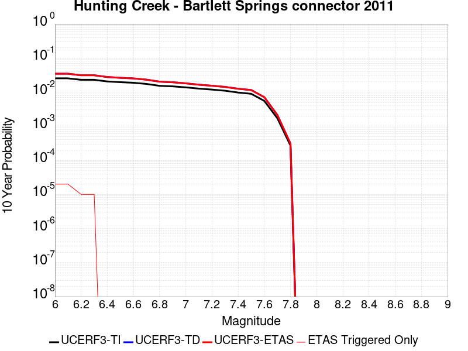 |

| Magnitude | 1 wk TI Prob | 1 wk TD Prob | 1 wk ETAS Prob | 1 wk ETAS/TD Gain | 1 wk ETAS Triggered Only | 1 mo TI Prob | 1 mo TD Prob | 1 mo ETAS Prob | 1 mo ETAS/TD Gain | 1 mo ETAS Triggered Only | 1 yr TI Prob | 1 yr TD Prob | 1 yr ETAS Prob | 1 yr ETAS/TD Gain | 1 yr ETAS Triggered Only | 10 yr TI Prob | 10 yr TD Prob | 10 yr ETAS Prob | 10 yr ETAS/TD Gain | 10 yr ETAS Triggered Only |
|-----|-----|-----|-----|-----|-----|-----|-----|-----|-----|-----|-----|-----|-----|-----|-----|-----|-----|-----|-----|-----|
| 6.0 | 4.940016E-5 | 6.786822E-5 | 7.786754E-5 | 1.1473343 | 1.0E-5 | 2.1169778E-4 | 2.9083234E-4 | 3.1082652E-4 | 1.0687481 | 2.0E-5 | 0.002574374 | 0.003535177 | 0.0035551065 | 1.0056374 | 2.0E-5 | 0.025447546 | 0.034773834 | 0.03479314 | 1.0005552 | 2.0E-5 |
| 6.1 | 4.940016E-5 | 6.786822E-5 | 7.786754E-5 | 1.1473343 | 1.0E-5 | 2.1169778E-4 | 2.9083234E-4 | 3.1082652E-4 | 1.0687481 | 2.0E-5 | 0.002574374 | 0.003535177 | 0.0035551065 | 1.0056374 | 2.0E-5 | 0.025447546 | 0.034773834 | 0.03479314 | 1.0005552 | 2.0E-5 |
| 6.2 | 4.472471E-5 | 6.1002804E-5 | 7.100219E-5 | 1.163917 | 1.0E-5 | 1.9166325E-4 | 2.6141506E-4 | 2.7141246E-4 | 1.0382433 | 1.0E-5 | 0.0023310026 | 0.003178107 | 0.0031880753 | 1.0031365 | 1.0E-5 | 0.02306703 | 0.031316914 | 0.0313266 | 1.0003093 | 1.0E-5 |
| 6.3 | 4.472471E-5 | 6.1002804E-5 | 7.100219E-5 | 1.163917 | 1.0E-5 | 1.9166325E-4 | 2.6141506E-4 | 2.7141246E-4 | 1.0382433 | 1.0E-5 | 0.0023310026 | 0.003178107 | 0.0031880753 | 1.0031365 | 1.0E-5 | 0.02306703 | 0.031316914 | 0.0313266 | 1.0003093 | 1.0E-5 |
| 6.4 | 4.0001003E-5 | 5.4103755E-5 | 5.4103755E-5 | 1.0 | 0.0 | 1.714216E-4 | 2.31853E-4 | 2.31853E-4 | 1.0 | 0.0 | 0.0020850603 | 0.0028191248 | 0.0028191248 | 1.0 | 0.0 | 0.02065605 | 0.027828315 | 0.027828315 | 1.0 | 0.0 |
| 6.5 | 3.8033053E-5 | 5.1266547E-5 | 5.1266547E-5 | 1.0 | 0.0 | 1.6298861E-4 | 2.1969559E-4 | 2.1969559E-4 | 1.0 | 0.0 | 0.0019825802 | 0.0026714746 | 0.0026714746 | 1.0 | 0.0 | 0.019649856 | 0.026390454 | 0.026390454 | 1.0 | 0.0 |
| 6.6 | 3.653754E-5 | 4.913017E-5 | 4.913017E-5 | 1.0 | 0.0 | 1.5658008E-4 | 2.1054115E-4 | 2.1054115E-4 | 1.0 | 0.0 | 0.0019046954 | 0.0025602852 | 0.0025602852 | 1.0 | 0.0 | 0.018884527 | 0.025306415 | 0.025306415 | 1.0 | 0.0 |
| 6.7 | 3.372024E-5 | 4.514011E-5 | 4.514011E-5 | 1.0 | 0.0 | 1.4450731E-4 | 1.9344354E-4 | 1.9344354E-4 | 1.0 | 0.0 | 0.0017579567 | 0.002352639 | 0.002352639 | 1.0 | 0.0 | 0.017441148 | 0.023278099 | 0.023278099 | 1.0 | 0.0 |
| 6.8 | 2.9650024E-5 | 3.9411374E-5 | 3.9411374E-5 | 1.0 | 0.0 | 1.2706534E-4 | 1.6889503E-4 | 1.6889503E-4 | 1.0 | 0.0 | 0.0015459227 | 0.0020543463 | 0.0020543463 | 1.0 | 0.0 | 0.015352124 | 0.020351216 | 0.020351216 | 1.0 | 0.0 |
| 6.9 | 2.860775E-5 | 3.7812544E-5 | 3.7812544E-5 | 1.0 | 0.0 | 1.2259888E-4 | 1.6204377E-4 | 1.6204377E-4 | 1.0 | 0.0 | 0.0014916194 | 0.001971107 | 0.001971107 | 1.0 | 0.0 | 0.014816469 | 0.01953584 | 0.01953584 | 1.0 | 0.0 |
| 7.0 | 2.6696067E-5 | 3.506726E-5 | 3.506726E-5 | 1.0 | 0.0 | 1.144067E-4 | 1.5027967E-4 | 1.5027967E-4 | 1.0 | 0.0 | 0.0013920115 | 0.0018281302 | 0.0018281302 | 1.0 | 0.0 | 0.013833242 | 0.018131364 | 0.018131364 | 1.0 | 0.0 |
| 7.1 | 2.456087E-5 | 3.2013093E-5 | 3.2013093E-5 | 1.0 | 0.0 | 1.0525662E-4 | 1.371918E-4 | 1.371918E-4 | 1.0 | 0.0 | 0.001280746 | 0.0016690396 | 0.0016690396 | 1.0 | 0.0 | 0.012733897 | 0.016566366 | 0.016566366 | 1.0 | 0.0 |
| 7.2 | 2.295761E-5 | 2.9822932E-5 | 2.9822932E-5 | 1.0 | 0.0 | 9.8386045E-5 | 1.2780636E-4 | 1.2780636E-4 | 1.0 | 0.0 | 0.0011971919 | 0.001554941 | 0.001554941 | 1.0 | 0.0 | 0.011907627 | 0.015442089 | 0.015442089 | 1.0 | 0.0 |
| 7.3 | 2.1256936E-5 | 2.7541912E-5 | 2.7541912E-5 | 1.0 | 0.0 | 9.109797E-5 | 1.1803147E-4 | 1.1803147E-4 | 1.0 | 0.0 | 0.0011085535 | 0.0014360948 | 0.0014360948 | 1.0 | 0.0 | 0.011030397 | 0.014269472 | 0.014269472 | 1.0 | 0.0 |
| 7.4 | 1.8784336E-5 | 2.4306766E-5 | 2.4306766E-5 | 1.0 | 0.0 | 8.050181E-5 | 1.0416774E-4 | 1.0416774E-4 | 1.0 | 0.0 | 9.796688E-4 | 0.001267512 | 0.001267512 | 1.0 | 0.0 | 0.009753612 | 0.012603902 | 0.012603902 | 1.0 | 0.0 |
| 7.5 | 1.7248298E-5 | 2.2268887E-5 | 2.2268887E-5 | 1.0 | 0.0 | 7.391918E-5 | 9.543464E-5 | 9.543464E-5 | 1.0 | 0.0 | 8.9959445E-4 | 0.0011613049 | 0.0011613049 | 1.0 | 0.0 | 0.008959615 | 0.01155334 | 0.01155334 | 1.0 | 0.0 |
| 7.6 | 1.0653709E-5 | 1.3722118E-5 | 1.3722118E-5 | 1.0 | 0.0 | 4.5657955E-5 | 5.8807767E-5 | 5.8807767E-5 | 1.0 | 0.0 | 5.557438E-4 | 7.157521E-4 | 7.157521E-4 | 1.0 | 0.0 | 0.0055435603 | 0.0071348166 | 0.0071348166 | 1.0 | 0.0 |
| 7.7 | 3.286316E-6 | 4.0903437E-6 | 4.0903437E-6 | 1.0 | 0.0 | 1.4084137E-5 | 1.7529928E-5 | 1.7529928E-5 | 1.0 | 0.0 | 1.7146087E-4 | 2.1340612E-4 | 2.1340612E-4 | 1.0 | 0.0 | 0.0017132863 | 0.0021320276 | 0.0021320276 | 1.0 | 0.0 |
| 7.8 | 5.1855085E-7 | 5.9720696E-7 | 5.9720696E-7 | 1.0 | 0.0 | 2.222359E-6 | 2.5594559E-6 | 2.5594559E-6 | 1.0 | 0.0 | 2.7056883E-5 | 3.116094E-5 | 3.116094E-5 | 1.0 | 0.0 | 2.705359E-4 | 3.1156495E-4 | 3.1156495E-4 | 1.0 | 0.0 |

## Puente Hills
*[(top)](#table-of-contents)*

| 1 Week | 1 Month | 1 Year | 10 Year |
|-----|-----|-----|-----|
|  |  |  |  |

| Magnitude | 1 wk TI Prob | 1 wk TD Prob | 1 wk ETAS Prob | 1 wk ETAS/TD Gain | 1 wk ETAS Triggered Only | 1 mo TI Prob | 1 mo TD Prob | 1 mo ETAS Prob | 1 mo ETAS/TD Gain | 1 mo ETAS Triggered Only | 1 yr TI Prob | 1 yr TD Prob | 1 yr ETAS Prob | 1 yr ETAS/TD Gain | 1 yr ETAS Triggered Only | 10 yr TI Prob | 10 yr TD Prob | 10 yr ETAS Prob | 10 yr ETAS/TD Gain | 10 yr ETAS Triggered Only |
|-----|-----|-----|-----|-----|-----|-----|-----|-----|-----|-----|-----|-----|-----|-----|-----|-----|-----|-----|-----|-----|
| 6.0 | 1.2101656E-5 | 8.098625E-6 | 1.8098544E-5 | 2.2347674 | 1.0E-5 | 5.1863204E-5 | 3.4707962E-5 | 4.4707616E-5 | 1.2881083 | 1.0E-5 | 6.312516E-4 | 4.2249315E-4 | 4.4248468E-4 | 1.0473181 | 2.0E-5 | 0.0062946146 | 0.0042174594 | 0.004237375 | 1.0047222 | 2.0E-5 |
| 6.1 | 1.2101656E-5 | 8.098625E-6 | 1.8098544E-5 | 2.2347674 | 1.0E-5 | 5.1863204E-5 | 3.4707962E-5 | 4.4707616E-5 | 1.2881083 | 1.0E-5 | 6.312516E-4 | 4.2249315E-4 | 4.4248468E-4 | 1.0473181 | 2.0E-5 | 0.0062946146 | 0.0042174594 | 0.004237375 | 1.0047222 | 2.0E-5 |
| 6.2 | 1.2101656E-5 | 8.098625E-6 | 1.8098544E-5 | 2.2347674 | 1.0E-5 | 5.1863204E-5 | 3.4707962E-5 | 4.4707616E-5 | 1.2881083 | 1.0E-5 | 6.312516E-4 | 4.2249315E-4 | 4.4248468E-4 | 1.0473181 | 2.0E-5 | 0.0062946146 | 0.0042174594 | 0.004237375 | 1.0047222 | 2.0E-5 |
| 6.3 | 1.2101656E-5 | 8.098625E-6 | 1.8098544E-5 | 2.2347674 | 1.0E-5 | 5.1863204E-5 | 3.4707962E-5 | 4.4707616E-5 | 1.2881083 | 1.0E-5 | 6.312516E-4 | 4.2249315E-4 | 4.4248468E-4 | 1.0473181 | 2.0E-5 | 0.0062946146 | 0.0042174594 | 0.004237375 | 1.0047222 | 2.0E-5 |
| 6.4 | 1.2101656E-5 | 8.098625E-6 | 1.8098544E-5 | 2.2347674 | 1.0E-5 | 5.1863204E-5 | 3.4707962E-5 | 4.4707616E-5 | 1.2881083 | 1.0E-5 | 6.312516E-4 | 4.2249315E-4 | 4.4248468E-4 | 1.0473181 | 2.0E-5 | 0.0062946146 | 0.0042174594 | 0.004237375 | 1.0047222 | 2.0E-5 |
| 6.5 | 1.2101656E-5 | 8.098625E-6 | 1.8098544E-5 | 2.2347674 | 1.0E-5 | 5.1863204E-5 | 3.4707962E-5 | 4.4707616E-5 | 1.2881083 | 1.0E-5 | 6.312516E-4 | 4.2249315E-4 | 4.4248468E-4 | 1.0473181 | 2.0E-5 | 0.0062946146 | 0.0042174594 | 0.004237375 | 1.0047222 | 2.0E-5 |
| 6.6 | 1.0222488E-5 | 6.3991847E-6 | 6.3991847E-6 | 1.0 | 0.0 | 4.3809923E-5 | 2.7424803E-5 | 2.7424803E-5 | 1.0 | 0.0 | 5.332553E-4 | 3.3384826E-4 | 3.4384493E-4 | 1.0299437 | 1.0E-5 | 0.0053197746 | 0.0033337125 | 0.0033436792 | 1.0029896 | 1.0E-5 |
| 6.7 | 1.0222488E-5 | 6.3991847E-6 | 6.3991847E-6 | 1.0 | 0.0 | 4.3809923E-5 | 2.7424803E-5 | 2.7424803E-5 | 1.0 | 0.0 | 5.332553E-4 | 3.3384826E-4 | 3.4384493E-4 | 1.0299437 | 1.0E-5 | 0.0053197746 | 0.0033337125 | 0.0033436792 | 1.0029896 | 1.0E-5 |
| 6.8 | 8.6367845E-6 | 5.0282533E-6 | 5.0282533E-6 | 1.0 | 0.0 | 3.7014266E-5 | 2.1549482E-5 | 2.1549482E-5 | 1.0 | 0.0 | 4.505555E-4 | 2.623339E-4 | 2.623339E-4 | 1.0 | 0.0 | 0.004496431 | 0.0026202986 | 0.0026202986 | 1.0 | 0.0 |
| 6.9 | 8.066481E-6 | 4.836117E-6 | 4.836117E-6 | 1.0 | 0.0 | 3.4570177E-5 | 2.0726053E-5 | 2.0726053E-5 | 1.0 | 0.0 | 4.2081063E-4 | 2.52311E-4 | 2.52311E-4 | 1.0 | 0.0 | 0.0042001465 | 0.0025202993 | 0.0025202993 | 1.0 | 0.0 |
| 7.0 | 7.393828E-6 | 4.417296E-6 | 4.417296E-6 | 1.0 | 0.0 | 3.168745E-5 | 1.8931134E-5 | 1.8931134E-5 | 1.0 | 0.0 | 3.857264E-4 | 2.3046264E-4 | 2.3046264E-4 | 1.0 | 0.0 | 0.0038505755 | 0.0023022818 | 0.0023022818 | 1.0 | 0.0 |
| 7.1 | 6.4660953E-6 | 3.8044495E-6 | 3.8044495E-6 | 1.0 | 0.0 | 2.7711543E-5 | 1.6304684E-5 | 1.6304684E-5 | 1.0 | 0.0 | 3.373358E-4 | 1.984918E-4 | 1.984918E-4 | 1.0 | 0.0 | 0.0033682417 | 0.001983181 | 0.001983181 | 1.0 | 0.0 |
| 7.2 | 5.143232E-6 | 2.7865456E-6 | 2.7865456E-6 | 1.0 | 0.0 | 2.2042237E-5 | 1.1942284E-5 | 1.1942284E-5 | 1.0 | 0.0 | 2.6833118E-4 | 1.453877E-4 | 1.453877E-4 | 1.0 | 0.0 | 0.002680074 | 0.0014529356 | 0.0014529356 | 1.0 | 0.0 |
| 7.3 | 3.928255E-6 | 2.0913774E-6 | 2.0913774E-6 | 1.0 | 0.0 | 1.683527E-5 | 8.963015E-6 | 8.963015E-6 | 1.0 | 0.0 | 2.0495013E-4 | 1.0911931E-4 | 1.0911931E-4 | 1.0 | 0.0 | 0.002047612 | 0.001090664 | 0.001090664 | 1.0 | 0.0 |
| 7.4 | 2.7894434E-6 | 1.3546753E-6 | 1.3546753E-6 | 1.0 | 0.0 | 1.1954703E-5 | 5.8057385E-6 | 5.8057385E-6 | 1.0 | 0.0 | 1.4553878E-4 | 7.068262E-5 | 7.068262E-5 | 1.0 | 0.0 | 0.001454435 | 7.066058E-4 | 7.066058E-4 | 1.0 | 0.0 |
| 7.5 | 2.041735E-6 | 8.787305E-7 | 8.787305E-7 | 1.0 | 0.0 | 8.750263E-6 | 3.7659825E-6 | 3.7659825E-6 | 1.0 | 0.0 | 1.06529245E-4 | 4.5849905E-5 | 4.5849905E-5 | 1.0 | 0.0 | 0.0010647819 | 4.5840783E-4 | 4.5840783E-4 | 1.0 | 0.0 |
| 7.6 | 1.6959062E-6 | 6.6986263E-7 | 6.6986263E-7 | 1.0 | 0.0 | 7.268149E-6 | 2.8708366E-6 | 2.8708366E-6 | 1.0 | 0.0 | 8.848612E-5 | 3.4951907E-5 | 3.4951907E-5 | 1.0 | 0.0 | 8.84509E-4 | 3.4946698E-4 | 3.4946698E-4 | 1.0 | 0.0 |
| 7.7 | 1.4767965E-6 | 5.407607E-7 | 5.407607E-7 | 1.0 | 0.0 | 6.3291122E-6 | 2.317544E-6 | 2.317544E-6 | 1.0 | 0.0 | 7.705422E-5 | 2.8215758E-5 | 2.8215758E-5 | 1.0 | 0.0 | 7.702751E-4 | 2.8212433E-4 | 2.8212433E-4 | 1.0 | 0.0 |
| 7.8 | 1.8432911E-7 | 7.28201E-8 | 7.28201E-8 | 1.0 | 0.0 | 7.8998164E-7 | 3.1208612E-7 | 3.1208612E-7 | 1.0 | 0.0 | 9.617985E-6 | 3.7996451E-6 | 3.7996451E-6 | 1.0 | 0.0 | 9.617568E-5 | 3.7996128E-5 | 3.7996128E-5 | 1.0 | 0.0 |

## Concord 2011 CFM
*[(top)](#table-of-contents)*

| 1 Week | 1 Month | 1 Year | 10 Year |
|-----|-----|-----|-----|
|  |  |  |  |

| Magnitude | 1 wk TI Prob | 1 wk TD Prob | 1 wk ETAS Prob | 1 wk ETAS/TD Gain | 1 wk ETAS Triggered Only | 1 mo TI Prob | 1 mo TD Prob | 1 mo ETAS Prob | 1 mo ETAS/TD Gain | 1 mo ETAS Triggered Only | 1 yr TI Prob | 1 yr TD Prob | 1 yr ETAS Prob | 1 yr ETAS/TD Gain | 1 yr ETAS Triggered Only | 10 yr TI Prob | 10 yr TD Prob | 10 yr ETAS Prob | 10 yr ETAS/TD Gain | 10 yr ETAS Triggered Only |
|-----|-----|-----|-----|-----|-----|-----|-----|-----|-----|-----|-----|-----|-----|-----|-----|-----|-----|-----|-----|-----|
| 6.0 | 5.7865112E-5 | 9.759152E-5 | 1.0759054E-4 | 1.1024579 | 1.0E-5 | 2.4796976E-4 | 4.1818706E-4 | 4.281829E-4 | 1.0239028 | 1.0E-5 | 0.0030148525 | 0.005079467 | 0.0050993655 | 1.0039175 | 2.0E-5 | 0.029742775 | 0.049248982 | 0.049267996 | 1.0003861 | 2.0E-5 |
| 6.1 | 5.7865112E-5 | 9.759152E-5 | 1.0759054E-4 | 1.1024579 | 1.0E-5 | 2.4796976E-4 | 4.1818706E-4 | 4.281829E-4 | 1.0239028 | 1.0E-5 | 0.0030148525 | 0.005079467 | 0.0050993655 | 1.0039175 | 2.0E-5 | 0.029742775 | 0.049248982 | 0.049267996 | 1.0003861 | 2.0E-5 |
| 6.2 | 5.6789337E-5 | 9.5795076E-5 | 1.0579412E-4 | 1.1043795 | 1.0E-5 | 2.4336016E-4 | 4.104905E-4 | 4.2048638E-4 | 1.0243511 | 1.0E-5 | 0.0029588845 | 0.0049861916 | 0.0050060917 | 1.0039911 | 2.0E-5 | 0.029197963 | 0.04836556 | 0.048384592 | 1.0003935 | 2.0E-5 |
| 6.3 | 5.203322E-5 | 8.803056E-5 | 9.8029675E-5 | 1.1135869 | 1.0E-5 | 2.2298045E-4 | 3.7722368E-4 | 3.872199E-4 | 1.0264995 | 1.0E-5 | 0.0027114071 | 0.0045838105 | 0.0046037184 | 1.0043432 | 2.0E-5 | 0.026785625 | 0.04453672 | 0.044555828 | 1.000429 | 2.0E-5 |
| 6.4 | 4.7120942E-5 | 7.897404E-5 | 8.897325E-5 | 1.1266139 | 1.0E-5 | 2.0193127E-4 | 3.3842045E-4 | 3.4841706E-4 | 1.029539 | 1.0E-5 | 0.0024557412 | 0.00411323 | 0.0041331477 | 1.0048424 | 2.0E-5 | 0.024287801 | 0.040065527 | 0.040084727 | 1.0004792 | 2.0E-5 |
| 6.5 | 2.9598437E-5 | 4.667486E-5 | 5.667439E-5 | 1.214238 | 1.0E-5 | 1.2684427E-4 | 2.0002096E-4 | 2.1001896E-4 | 1.0499848 | 1.0E-5 | 0.001543235 | 0.0024327459 | 0.0024526971 | 1.0082011 | 2.0E-5 | 0.015325619 | 0.023909973 | 0.023929495 | 1.0008165 | 2.0E-5 |
| 6.6 | 2.0443718E-5 | 2.998433E-5 | 3.9984032E-5 | 1.3334975 | 1.0E-5 | 8.7613E-5 | 1.2849816E-4 | 1.3849686E-4 | 1.0778121 | 1.0E-5 | 0.0010661662 | 0.0015633785 | 0.0015733629 | 1.0063864 | 1.0E-5 | 0.010610655 | 0.015466996 | 0.0154768415 | 1.0006366 | 1.0E-5 |
| 6.7 | 1.798539E-5 | 2.5557381E-5 | 3.5557125E-5 | 1.3912663 | 1.0E-5 | 7.7077966E-5 | 1.0952716E-4 | 1.1952606E-4 | 1.0912915 | 1.0E-5 | 9.380202E-4 | 0.001332699 | 0.0013426857 | 1.0074936 | 1.0E-5 | 0.009340706 | 0.013217433 | 0.013227301 | 1.0007466 | 1.0E-5 |
| 6.8 | 1.613555E-5 | 2.1959211E-5 | 3.1958993E-5 | 1.4553797 | 1.0E-5 | 6.915052E-5 | 9.4107585E-5 | 1.0410664E-4 | 1.1062514 | 1.0E-5 | 8.4158237E-4 | 0.0011451716 | 0.0011551601 | 1.0087223 | 1.0E-5 | 0.008384023 | 0.0113782035 | 0.01138809 | 1.0008689 | 1.0E-5 |
| 6.9 | 1.2916435E-5 | 1.7081054E-5 | 1.7081054E-5 | 1.0 | 0.0 | 5.5354973E-5 | 7.32025E-5 | 7.32025E-5 | 1.0 | 0.0 | 6.7373837E-4 | 8.908818E-4 | 8.908818E-4 | 1.0 | 0.0 | 0.006716994 | 0.008867139 | 0.008867139 | 1.0 | 0.0 |
| 7.0 | 9.81129E-6 | 1.2630829E-5 | 1.2630829E-5 | 1.0 | 0.0 | 4.2047708E-5 | 5.413101E-5 | 5.413101E-5 | 1.0 | 0.0 | 5.118106E-4 | 6.588474E-4 | 6.588474E-4 | 1.0 | 0.0 | 0.005106334 | 0.006569153 | 0.006569153 | 1.0 | 0.0 |
| 7.1 | 8.0889195E-6 | 1.0418261E-5 | 1.0418261E-5 | 1.0 | 0.0 | 3.4666336E-5 | 4.4648932E-5 | 4.4648932E-5 | 1.0 | 0.0 | 4.219809E-4 | 5.434662E-4 | 5.434662E-4 | 1.0 | 0.0 | 0.004211805 | 0.0054215975 | 0.0054215975 | 1.0 | 0.0 |
| 7.2 | 6.267438E-6 | 8.115699E-6 | 8.115699E-6 | 1.0 | 0.0 | 2.6860173E-5 | 3.4781104E-5 | 3.4781104E-5 | 1.0 | 0.0 | 3.2697353E-4 | 4.233784E-4 | 4.233784E-4 | 1.0 | 0.0 | 0.0032649285 | 0.004225969 | 0.004225969 | 1.0 | 0.0 |
| 7.3 | 3.6761196E-6 | 4.8401653E-6 | 4.8401653E-6 | 1.0 | 0.0 | 1.5754704E-5 | 2.0743402E-5 | 2.0743402E-5 | 1.0 | 0.0 | 1.9179663E-4 | 2.5252186E-4 | 2.5252186E-4 | 1.0 | 0.0 | 0.0019163118 | 0.002522487 | 0.002522487 | 1.0 | 0.0 |
| 7.4 | 2.8044356E-6 | 3.7096036E-6 | 3.7096036E-6 | 1.0 | 0.0 | 1.2018954E-5 | 1.5898204E-5 | 1.5898204E-5 | 1.0 | 0.0 | 1.4632095E-4 | 1.9354356E-4 | 1.9354356E-4 | 1.0 | 0.0 | 0.0014622464 | 0.0019338481 | 0.0019338481 | 1.0 | 0.0 |
| 7.5 | 2.4578699E-6 | 3.2447442E-6 | 3.2447442E-6 | 1.0 | 0.0 | 1.0533685E-5 | 1.3905973E-5 | 1.3905973E-5 | 1.0 | 0.0 | 1.2824008E-4 | 1.6929218E-4 | 1.6929218E-4 | 1.0 | 0.0 | 0.0012816609 | 0.001691713 | 0.001691713 | 1.0 | 0.0 |
| 7.6 | 1.7713267E-6 | 2.3351192E-6 | 2.3351192E-6 | 1.0 | 0.0 | 7.591378E-6 | 1.0007616E-5 | 1.0007616E-5 | 1.0 | 0.0 | 9.2421105E-5 | 1.21836E-4 | 1.21836E-4 | 1.0 | 0.0 | 9.2382677E-4 | 0.0012177454 | 0.0012177454 | 1.0 | 0.0 |
| 7.7 | 5.1912366E-7 | 6.8290143E-7 | 6.8290143E-7 | 1.0 | 0.0 | 2.2248137E-6 | 2.9267171E-6 | 2.9267171E-6 | 1.0 | 0.0 | 2.708677E-5 | 3.5632213E-5 | 3.5632213E-5 | 1.0 | 0.0 | 2.708347E-4 | 3.5627294E-4 | 3.5627294E-4 | 1.0 | 0.0 |

## Santa Susana East (connector)
*[(top)](#table-of-contents)*

| 1 Week | 1 Month | 1 Year | 10 Year |
|-----|-----|-----|-----|
|  | 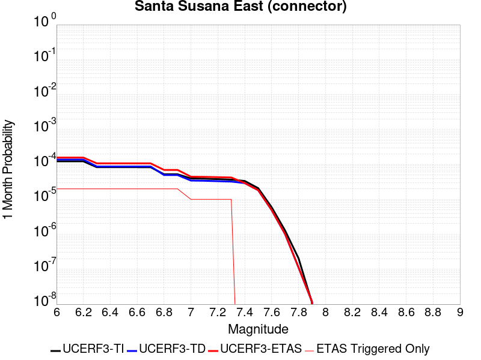 |  |  |

| Magnitude | 1 wk TI Prob | 1 wk TD Prob | 1 wk ETAS Prob | 1 wk ETAS/TD Gain | 1 wk ETAS Triggered Only | 1 mo TI Prob | 1 mo TD Prob | 1 mo ETAS Prob | 1 mo ETAS/TD Gain | 1 mo ETAS Triggered Only | 1 yr TI Prob | 1 yr TD Prob | 1 yr ETAS Prob | 1 yr ETAS/TD Gain | 1 yr ETAS Triggered Only | 10 yr TI Prob | 10 yr TD Prob | 10 yr ETAS Prob | 10 yr ETAS/TD Gain | 10 yr ETAS Triggered Only |
|-----|-----|-----|-----|-----|-----|-----|-----|-----|-----|-----|-----|-----|-----|-----|-----|-----|-----|-----|-----|-----|
| 6.0 | 2.858397E-5 | 3.202091E-5 | 5.202027E-5 | 1.6245718 | 2.0E-5 | 1.2249697E-4 | 1.3722685E-4 | 1.572241E-4 | 1.145724 | 2.0E-5 | 0.0014903803 | 0.0016697381 | 0.0016897047 | 1.0119579 | 2.0E-5 | 0.014804244 | 0.016599052 | 0.01661872 | 1.0011849 | 2.0E-5 |
| 6.1 | 2.858397E-5 | 3.202091E-5 | 5.202027E-5 | 1.6245718 | 2.0E-5 | 1.2249697E-4 | 1.3722685E-4 | 1.572241E-4 | 1.145724 | 2.0E-5 | 0.0014903803 | 0.0016697381 | 0.0016897047 | 1.0119579 | 2.0E-5 | 0.014804244 | 0.016599052 | 0.01661872 | 1.0011849 | 2.0E-5 |
| 6.2 | 2.858397E-5 | 3.202091E-5 | 5.202027E-5 | 1.6245718 | 2.0E-5 | 1.2249697E-4 | 1.3722685E-4 | 1.572241E-4 | 1.145724 | 2.0E-5 | 0.0014903803 | 0.0016697381 | 0.0016897047 | 1.0119579 | 2.0E-5 | 0.014804244 | 0.016599052 | 0.01661872 | 1.0011849 | 2.0E-5 |
| 6.3 | 1.943582E-5 | 2.036718E-5 | 4.0366773E-5 | 1.981952 | 2.0E-5 | 8.329371E-5 | 8.7285625E-5 | 1.0728388E-4 | 1.2291127 | 2.0E-5 | 0.001013629 | 0.0010622967 | 0.0010822754 | 1.0188072 | 2.0E-5 | 0.010090181 | 0.010583619 | 0.0106034065 | 1.0018697 | 2.0E-5 |
| 6.4 | 1.943582E-5 | 2.036718E-5 | 4.0366773E-5 | 1.981952 | 2.0E-5 | 8.329371E-5 | 8.7285625E-5 | 1.0728388E-4 | 1.2291127 | 2.0E-5 | 0.001013629 | 0.0010622967 | 0.0010822754 | 1.0188072 | 2.0E-5 | 0.010090181 | 0.010583619 | 0.0106034065 | 1.0018697 | 2.0E-5 |
| 6.5 | 1.943582E-5 | 2.036718E-5 | 4.0366773E-5 | 1.981952 | 2.0E-5 | 8.329371E-5 | 8.7285625E-5 | 1.0728388E-4 | 1.2291127 | 2.0E-5 | 0.001013629 | 0.0010622967 | 0.0010822754 | 1.0188072 | 2.0E-5 | 0.010090181 | 0.010583619 | 0.0106034065 | 1.0018697 | 2.0E-5 |
| 6.6 | 1.943582E-5 | 2.036718E-5 | 4.0366773E-5 | 1.981952 | 2.0E-5 | 8.329371E-5 | 8.7285625E-5 | 1.0728388E-4 | 1.2291127 | 2.0E-5 | 0.001013629 | 0.0010622967 | 0.0010822754 | 1.0188072 | 2.0E-5 | 0.010090181 | 0.010583619 | 0.0106034065 | 1.0018697 | 2.0E-5 |
| 6.7 | 1.9404439E-5 | 2.03546E-5 | 4.0354193E-5 | 1.9825588 | 2.0E-5 | 8.3159226E-5 | 8.723172E-5 | 1.0722998E-4 | 1.2292544 | 2.0E-5 | 0.0010119933 | 0.0010616409 | 0.0010816198 | 1.0188187 | 2.0E-5 | 0.010073971 | 0.010577125 | 0.010596912 | 1.0018709 | 2.0E-5 |
| 6.8 | 1.2217526E-5 | 1.1592998E-5 | 3.1592765E-5 | 2.7251594 | 2.0E-5 | 5.2359774E-5 | 4.9683425E-5 | 6.968243E-5 | 1.4025288 | 2.0E-5 | 6.372938E-4 | 6.0474465E-4 | 6.247325E-4 | 1.0330518 | 2.0E-5 | 0.0063546924 | 0.006033037 | 0.006052916 | 1.0032951 | 2.0E-5 |
| 6.9 | 1.2217526E-5 | 1.1592998E-5 | 3.1592765E-5 | 2.7251594 | 2.0E-5 | 5.2359774E-5 | 4.9683425E-5 | 6.968243E-5 | 1.4025288 | 2.0E-5 | 6.372938E-4 | 6.0474465E-4 | 6.247325E-4 | 1.0330518 | 2.0E-5 | 0.0063546924 | 0.006033037 | 0.006052916 | 1.0032951 | 2.0E-5 |
| 7.0 | 9.276017E-6 | 8.059113E-6 | 1.8059032E-5 | 2.2408214 | 1.0E-5 | 3.9753755E-5 | 3.4538618E-5 | 4.4538272E-5 | 1.289521 | 1.0E-5 | 4.8389446E-4 | 4.2042998E-4 | 4.3042577E-4 | 1.0237752 | 1.0E-5 | 0.0048284214 | 0.0041970722 | 0.0042070304 | 1.0023726 | 1.0E-5 |
| 7.1 | 9.130355E-6 | 7.942286E-6 | 1.7942208E-5 | 2.2590733 | 1.0E-5 | 3.9129503E-5 | 3.4037945E-5 | 4.4037606E-5 | 1.2937797 | 1.0E-5 | 4.7629757E-4 | 4.1433662E-4 | 4.2433248E-4 | 1.024125 | 1.0E-5 | 0.00475278 | 0.004136367 | 0.0041463254 | 1.0024076 | 1.0E-5 |
| 7.2 | 8.851015E-6 | 7.741445E-6 | 1.7741368E-5 | 2.2917385 | 1.0E-5 | 3.7932372E-5 | 3.317722E-5 | 4.317689E-5 | 1.3014016 | 1.0E-5 | 4.6172875E-4 | 4.038612E-4 | 4.1385717E-4 | 1.024751 | 1.0E-5 | 0.0046077054 | 0.0040319953 | 0.0040419553 | 1.0024701 | 1.0E-5 |
| 7.3 | 8.573006E-6 | 7.550166E-6 | 1.755009E-5 | 2.324464 | 1.0E-5 | 3.6740938E-5 | 3.2357475E-5 | 4.235715E-5 | 1.3090376 | 1.0E-5 | 4.472291E-4 | 3.9388443E-4 | 4.038805E-4 | 1.0253781 | 1.0E-5 | 0.004463301 | 0.0039325804 | 0.0039425413 | 1.0025328 | 1.0E-5 |
| 7.4 | 7.852282E-6 | 6.817687E-6 | 6.817687E-6 | 1.0 | 0.0 | 3.36522E-5 | 2.9218349E-5 | 2.9218349E-5 | 1.0 | 0.0 | 4.096385E-4 | 3.5567835E-4 | 3.5567835E-4 | 1.0 | 0.0 | 0.0040888423 | 0.0035517553 | 0.0035517553 | 1.0 | 0.0 |
| 7.5 | 4.8869324E-6 | 4.279055E-6 | 4.279055E-6 | 1.0 | 0.0 | 2.0943828E-5 | 1.8338687E-5 | 1.8338687E-5 | 1.0 | 0.0 | 2.5496128E-4 | 2.232523E-4 | 2.232523E-4 | 1.0 | 0.0 | 0.0025466895 | 0.0022304445 | 0.0022304445 | 1.0 | 0.0 |
| 7.6 | 1.3894544E-6 | 1.1568179E-6 | 1.1568179E-6 | 1.0 | 0.0 | 5.954791E-6 | 4.957783E-6 | 4.957783E-6 | 1.0 | 0.0 | 7.249717E-5 | 6.0359558E-5 | 6.0359558E-5 | 1.0 | 0.0 | 7.247352E-4 | 6.0345343E-4 | 6.0345343E-4 | 1.0 | 0.0 |
| 7.7 | 2.9924632E-7 | 2.371928E-7 | 2.371928E-7 | 1.0 | 0.0 | 1.2824837E-6 | 1.0165402E-6 | 1.0165402E-6 | 1.0 | 0.0 | 1.5614127E-5 | 1.2376314E-5 | 1.2376314E-5 | 1.0 | 0.0 | 1.5613029E-4 | 1.2375697E-4 | 1.2375697E-4 | 1.0 | 0.0 |
| 7.8 | 4.8188564E-8 | 2.6323061E-8 | 2.6323061E-8 | 1.0 | 0.0 | 2.065224E-7 | 1.1281311E-7 | 1.1281311E-7 | 1.0 | 0.0 | 2.5144072E-6 | 1.3734989E-6 | 1.3734989E-6 | 1.0 | 0.0 | 2.5143789E-5 | 1.3734912E-5 | 1.3734912E-5 | 1.0 | 0.0 |
| 7.9 | 2.6127251E-9 | 2.7681102E-9 | 2.7681102E-9 | 1.0 | 0.0 | 1.1197393E-8 | 1.186333E-8 | 1.186333E-8 | 1.0 | 0.0 | 1.3632825E-7 | 1.4443603E-7 | 1.4443603E-7 | 1.0 | 0.0 | 1.3632817E-6 | 1.4443604E-6 | 1.4443604E-6 | 1.0 | 0.0 |

## Joshua Tree (Seismicity)
*[(top)](#table-of-contents)*

| 1 Week | 1 Month | 1 Year | 10 Year |
|-----|-----|-----|-----|
|  |  |  | 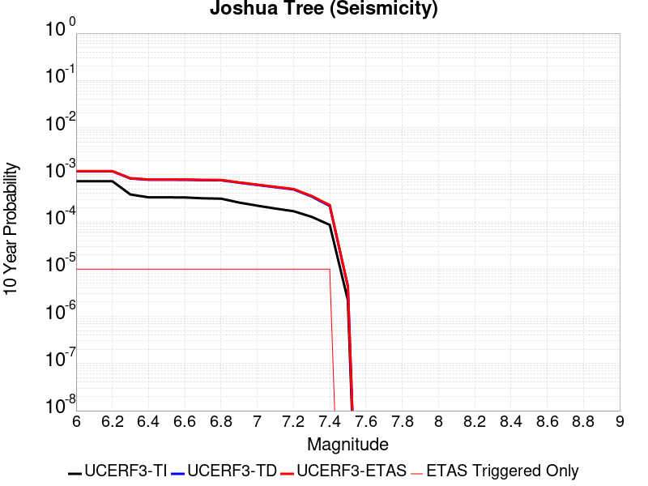 |

| Magnitude | 1 wk TI Prob | 1 wk TD Prob | 1 wk ETAS Prob | 1 wk ETAS/TD Gain | 1 wk ETAS Triggered Only | 1 mo TI Prob | 1 mo TD Prob | 1 mo ETAS Prob | 1 mo ETAS/TD Gain | 1 mo ETAS Triggered Only | 1 yr TI Prob | 1 yr TD Prob | 1 yr ETAS Prob | 1 yr ETAS/TD Gain | 1 yr ETAS Triggered Only | 10 yr TI Prob | 10 yr TD Prob | 10 yr ETAS Prob | 10 yr ETAS/TD Gain | 10 yr ETAS Triggered Only |
|-----|-----|-----|-----|-----|-----|-----|-----|-----|-----|-----|-----|-----|-----|-----|-----|-----|-----|-----|-----|-----|
| 6.0 | 1.4025588E-6 | 2.278198E-6 | 2.278198E-6 | 1.0 | 0.0 | 6.0109523E-6 | 9.763674E-6 | 9.763674E-6 | 1.0 | 0.0 | 7.318089E-5 | 1.188669E-4 | 1.188669E-4 | 1.0 | 0.0 | 7.315679E-4 | 0.0011880973 | 0.0011980855 | 1.0084069 | 1.0E-5 |
| 6.1 | 1.4025588E-6 | 2.278198E-6 | 2.278198E-6 | 1.0 | 0.0 | 6.0109523E-6 | 9.763674E-6 | 9.763674E-6 | 1.0 | 0.0 | 7.318089E-5 | 1.188669E-4 | 1.188669E-4 | 1.0 | 0.0 | 7.315679E-4 | 0.0011880973 | 0.0011980855 | 1.0084069 | 1.0E-5 |
| 6.2 | 1.4025588E-6 | 2.278198E-6 | 2.278198E-6 | 1.0 | 0.0 | 6.0109523E-6 | 9.763674E-6 | 9.763674E-6 | 1.0 | 0.0 | 7.318089E-5 | 1.188669E-4 | 1.188669E-4 | 1.0 | 0.0 | 7.315679E-4 | 0.0011880973 | 0.0011980855 | 1.0084069 | 1.0E-5 |
| 6.3 | 7.3325685E-7 | 1.6022291E-6 | 1.6022291E-6 | 1.0 | 0.0 | 3.1425257E-6 | 6.8666786E-6 | 6.8666786E-6 | 1.0 | 0.0 | 3.825958E-5 | 8.359869E-5 | 8.359869E-5 | 1.0 | 0.0 | 3.8252992E-4 | 8.35681E-4 | 8.456726E-4 | 1.0119563 | 1.0E-5 |
| 6.4 | 6.38256E-7 | 1.506478E-6 | 1.506478E-6 | 1.0 | 0.0 | 2.7353801E-6 | 6.4563187E-6 | 6.4563187E-6 | 1.0 | 0.0 | 3.3302742E-5 | 7.860292E-5 | 7.860292E-5 | 1.0 | 0.0 | 3.3297754E-4 | 7.857586E-4 | 7.9575076E-4 | 1.0127165 | 1.0E-5 |
| 6.5 | 6.38256E-7 | 1.506478E-6 | 1.506478E-6 | 1.0 | 0.0 | 2.7353801E-6 | 6.4563187E-6 | 6.4563187E-6 | 1.0 | 0.0 | 3.3302742E-5 | 7.860292E-5 | 7.860292E-5 | 1.0 | 0.0 | 3.3297754E-4 | 7.857586E-4 | 7.9575076E-4 | 1.0127165 | 1.0E-5 |
| 6.6 | 6.3436806E-7 | 1.5035663E-6 | 1.5035663E-6 | 1.0 | 0.0 | 2.7187175E-6 | 6.4438404E-6 | 6.4438404E-6 | 1.0 | 0.0 | 3.3099885E-5 | 7.8451005E-5 | 7.8451005E-5 | 1.0 | 0.0 | 3.3094952E-4 | 7.8424055E-4 | 7.942327E-4 | 1.0127412 | 1.0E-5 |
| 6.7 | 6.094856E-7 | 1.4782569E-6 | 1.4782569E-6 | 1.0 | 0.0 | 2.6120786E-6 | 6.335372E-6 | 6.335372E-6 | 1.0 | 0.0 | 3.1801592E-5 | 7.713049E-5 | 7.713049E-5 | 1.0 | 0.0 | 3.179704E-4 | 7.710446E-4 | 7.8103686E-4 | 1.0129594 | 1.0E-5 |
| 6.8 | 5.984801E-7 | 1.4695347E-6 | 1.4695347E-6 | 1.0 | 0.0 | 2.564912E-6 | 6.297991E-6 | 6.297991E-6 | 1.0 | 0.0 | 3.1227355E-5 | 7.667542E-5 | 7.667542E-5 | 1.0 | 0.0 | 3.1222968E-4 | 7.66497E-4 | 7.764893E-4 | 1.0130364 | 1.0E-5 |
| 6.9 | 4.94631E-7 | 1.3039806E-6 | 1.3039806E-6 | 1.0 | 0.0 | 2.1198455E-6 | 5.5884766E-6 | 5.5884766E-6 | 1.0 | 0.0 | 2.5808813E-5 | 6.803764E-5 | 6.803764E-5 | 1.0 | 0.0 | 2.5805813E-4 | 6.8017404E-4 | 6.9016725E-4 | 1.0146921 | 1.0E-5 |
| 7.0 | 4.250375E-7 | 1.1676822E-6 | 1.1676822E-6 | 1.0 | 0.0 | 1.8215881E-6 | 5.004343E-6 | 5.004343E-6 | 1.0 | 0.0 | 2.2177608E-5 | 6.0926224E-5 | 6.0926224E-5 | 1.0 | 0.0 | 2.2175396E-4 | 6.091003E-4 | 6.190942E-4 | 1.0164076 | 1.0E-5 |
| 7.1 | 3.6888565E-7 | 1.0461399E-6 | 1.0461399E-6 | 1.0 | 0.0 | 1.5809376E-6 | 4.483449E-6 | 4.483449E-6 | 1.0 | 0.0 | 1.9247746E-5 | 5.458467E-5 | 5.458467E-5 | 1.0 | 0.0 | 1.9246078E-4 | 5.457171E-4 | 5.557116E-4 | 1.0183145 | 1.0E-5 |
| 7.2 | 3.2473773E-7 | 9.409762E-7 | 9.409762E-7 | 1.0 | 0.0 | 1.3917323E-6 | 4.032749E-6 | 4.032749E-6 | 1.0 | 0.0 | 1.694421E-5 | 4.9097656E-5 | 4.9097656E-5 | 1.0 | 0.0 | 1.6942917E-4 | 4.908722E-4 | 5.0086726E-4 | 1.0203619 | 1.0E-5 |
| 7.3 | 2.465367E-7 | 6.644128E-7 | 6.644128E-7 | 1.0 | 0.0 | 1.0565853E-6 | 2.8474808E-6 | 2.8474808E-6 | 1.0 | 0.0 | 1.2863851E-5 | 3.4667562E-5 | 3.4667562E-5 | 1.0 | 0.0 | 1.2863107E-4 | 3.4662496E-4 | 3.566215E-4 | 1.0288396 | 1.0E-5 |
| 7.4 | 1.6654941E-7 | 4.1855373E-7 | 4.1855373E-7 | 1.0 | 0.0 | 7.13783E-7 | 1.7938006E-6 | 1.7938006E-6 | 1.0 | 0.0 | 8.690274E-6 | 2.1839332E-5 | 2.1839332E-5 | 1.0 | 0.0 | 8.689934E-5 | 2.183746E-4 | 2.2837242E-4 | 1.0457829 | 1.0E-5 |
| 7.5 | 4.24214E-9 | 8.342421E-9 | 8.342421E-9 | 1.0 | 0.0 | 1.81806E-8 | 3.5753235E-8 | 3.5753235E-8 | 1.0 | 0.0 | 2.213488E-7 | 4.352956E-7 | 4.352956E-7 | 1.0 | 0.0 | 2.2134857E-6 | 4.352954E-6 | 4.352954E-6 | 1.0 | 0.0 |

## Mission (connected) 2011 CFM
*[(top)](#table-of-contents)*

| 1 Week | 1 Month | 1 Year | 10 Year |
|-----|-----|-----|-----|
|  |  |  |  |

| Magnitude | 1 wk TI Prob | 1 wk TD Prob | 1 wk ETAS Prob | 1 wk ETAS/TD Gain | 1 wk ETAS Triggered Only | 1 mo TI Prob | 1 mo TD Prob | 1 mo ETAS Prob | 1 mo ETAS/TD Gain | 1 mo ETAS Triggered Only | 1 yr TI Prob | 1 yr TD Prob | 1 yr ETAS Prob | 1 yr ETAS/TD Gain | 1 yr ETAS Triggered Only | 10 yr TI Prob | 10 yr TD Prob | 10 yr ETAS Prob | 10 yr ETAS/TD Gain | 10 yr ETAS Triggered Only |
|-----|-----|-----|-----|-----|-----|-----|-----|-----|-----|-----|-----|-----|-----|-----|-----|-----|-----|-----|-----|-----|
| 6.0 | 1.8735573E-5 | 2.6882515E-5 | 2.6882515E-5 | 1.0 | 0.0 | 8.029284E-5 | 1.1520558E-4 | 1.1520558E-4 | 1.0 | 0.0 | 9.771269E-4 | 0.0014016571 | 0.0014016571 | 1.0 | 0.0 | 0.009728416 | 0.013937562 | 0.013947423 | 1.0007075 | 1.0E-5 |
| 6.1 | 1.7515964E-5 | 2.5523792E-5 | 2.5523792E-5 | 1.0 | 0.0 | 7.506625E-5 | 1.0938298E-4 | 1.0938298E-4 | 1.0 | 0.0 | 9.135484E-4 | 0.0013308554 | 0.0013308554 | 1.0 | 0.0 | 0.009098019 | 0.0132381655 | 0.0132381655 | 1.0 | 0.0 |
| 6.2 | 1.6486343E-5 | 2.4368448E-5 | 2.4368448E-5 | 1.0 | 0.0 | 7.065384E-5 | 1.0443191E-4 | 1.0443191E-4 | 1.0 | 0.0 | 8.5987104E-4 | 0.0012706495 | 0.0012706495 | 1.0 | 0.0 | 0.008565514 | 0.012643143 | 0.012643143 | 1.0 | 0.0 |
| 6.3 | 1.5229385E-5 | 2.2797909E-5 | 2.2797909E-5 | 1.0 | 0.0 | 6.526716E-5 | 9.7701544E-5 | 9.7701544E-5 | 1.0 | 0.0 | 7.9433795E-4 | 0.0011887997 | 0.0011887997 | 1.0 | 0.0 | 0.007915046 | 0.011836352 | 0.011836352 | 1.0 | 0.0 |
| 6.4 | 1.4435828E-5 | 2.1398E-5 | 2.1398E-5 | 1.0 | 0.0 | 6.186637E-5 | 9.1702364E-5 | 9.1702364E-5 | 1.0 | 0.0 | 7.529627E-4 | 0.0011158385 | 0.0011158385 | 1.0 | 0.0 | 0.007504165 | 0.011119362 | 0.011119362 | 1.0 | 0.0 |
| 6.5 | 1.30127955E-5 | 1.9037068E-5 | 1.9037068E-5 | 1.0 | 0.0 | 5.576793E-5 | 8.1584905E-5 | 8.1584905E-5 | 1.0 | 0.0 | 6.78763E-4 | 9.927875E-4 | 9.927875E-4 | 1.0 | 0.0 | 0.0067669353 | 0.009911527 | 0.009911527 | 1.0 | 0.0 |
| 6.6 | 1.1220718E-5 | 1.639339E-5 | 1.639339E-5 | 1.0 | 0.0 | 4.8087906E-5 | 7.0255504E-5 | 7.0255504E-5 | 1.0 | 0.0 | 5.8531296E-4 | 8.5502357E-4 | 8.5502357E-4 | 1.0 | 0.0 | 0.005837737 | 0.00854963 | 0.00854963 | 1.0 | 0.0 |
| 6.7 | 8.086152E-6 | 1.1750298E-5 | 1.1750298E-5 | 1.0 | 0.0 | 3.4654473E-5 | 5.035745E-5 | 5.035745E-5 | 1.0 | 0.0 | 4.2183654E-4 | 6.129302E-4 | 6.129302E-4 | 1.0 | 0.0 | 0.004210367 | 0.0061497535 | 0.0061497535 | 1.0 | 0.0 |
| 6.8 | 6.8361655E-6 | 1.0195406E-5 | 1.0195406E-5 | 1.0 | 0.0 | 2.9297524E-5 | 4.3693864E-5 | 4.3693864E-5 | 1.0 | 0.0 | 3.5663895E-4 | 5.3184363E-4 | 5.3184363E-4 | 1.0 | 0.0 | 0.0035606713 | 0.0053387266 | 0.0053387266 | 1.0 | 0.0 |
| 6.9 | 5.2517353E-6 | 7.8690955E-6 | 7.8690955E-6 | 1.0 | 0.0 | 2.2507242E-5 | 3.3724264E-5 | 3.3724264E-5 | 1.0 | 0.0 | 2.739912E-4 | 4.105158E-4 | 4.105158E-4 | 1.0 | 0.0 | 0.0027365363 | 0.004129868 | 0.004129868 | 1.0 | 0.0 |
| 7.0 | 4.4602784E-6 | 6.7016504E-6 | 6.7016504E-6 | 1.0 | 0.0 | 1.911534E-5 | 2.8721044E-5 | 2.8721044E-5 | 1.0 | 0.0 | 2.327044E-4 | 3.4962274E-4 | 3.4962274E-4 | 1.0 | 0.0 | 0.0023246086 | 0.0035221886 | 0.0035221886 | 1.0 | 0.0 |
| 7.1 | 4.1492594E-6 | 6.2504096E-6 | 6.2504096E-6 | 1.0 | 0.0 | 1.7782419E-5 | 2.6787196E-5 | 2.6787196E-5 | 1.0 | 0.0 | 2.1647944E-4 | 3.2608546E-4 | 3.2608546E-4 | 1.0 | 0.0 | 0.0021626868 | 0.0032870003 | 0.0032870003 | 1.0 | 0.0 |
| 7.2 | 2.213247E-6 | 3.3628444E-6 | 3.3628444E-6 | 1.0 | 0.0 | 9.485309E-6 | 1.441211E-5 | 1.441211E-5 | 1.0 | 0.0 | 1.15477524E-4 | 1.7545334E-4 | 1.7545334E-4 | 1.0 | 0.0 | 0.0011541754 | 0.0017818302 | 0.0017818302 | 1.0 | 0.0 |
| 7.3 | 1.7362703E-6 | 2.7384676E-6 | 2.7384676E-6 | 1.0 | 0.0 | 7.4411373E-6 | 1.1736238E-5 | 1.1736238E-5 | 1.0 | 0.0 | 9.0592075E-5 | 1.4287935E-4 | 1.4287935E-4 | 1.0 | 0.0 | 9.0555154E-4 | 0.0014532148 | 0.0014532148 | 1.0 | 0.0 |
| 7.4 | 1.1628409E-6 | 1.8493533E-6 | 1.8493533E-6 | 1.0 | 0.0 | 4.9835944E-6 | 7.925776E-6 | 7.925776E-6 | 1.0 | 0.0 | 6.0673574E-5 | 9.649206E-5 | 9.649206E-5 | 1.0 | 0.0 | 6.065701E-4 | 9.85306E-4 | 9.85306E-4 | 1.0 | 0.0 |
| 7.5 | 5.5610667E-7 | 9.343823E-7 | 9.343823E-7 | 1.0 | 0.0 | 2.3833122E-6 | 4.0044893E-6 | 4.0044893E-6 | 1.0 | 0.0 | 2.9016439E-5 | 4.8753573E-5 | 4.8753573E-5 | 1.0 | 0.0 | 2.901265E-4 | 5.0411286E-4 | 5.0411286E-4 | 1.0 | 0.0 |
| 7.6 | 4.4307663E-7 | 7.784628E-7 | 7.784628E-7 | 1.0 | 0.0 | 1.8988985E-6 | 3.3362649E-6 | 3.3362649E-6 | 1.0 | 0.0 | 2.3118844E-5 | 4.061827E-5 | 4.061827E-5 | 1.0 | 0.0 | 2.3116439E-4 | 4.2210697E-4 | 4.2210697E-4 | 1.0 | 0.0 |
| 7.7 | 3.639119E-7 | 6.3549425E-7 | 6.3549425E-7 | 1.0 | 0.0 | 1.5596215E-6 | 2.7235437E-6 | 2.7235437E-6 | 1.0 | 0.0 | 1.8988227E-5 | 3.315864E-5 | 3.315864E-5 | 1.0 | 0.0 | 1.8986604E-4 | 3.4690052E-4 | 3.4690052E-4 | 1.0 | 0.0 |
| 7.8 | 3.1152942E-7 | 5.474834E-7 | 5.474834E-7 | 1.0 | 0.0 | 1.3351254E-6 | 2.3463554E-6 | 2.3463554E-6 | 1.0 | 0.0 | 1.6255031E-5 | 2.8566503E-5 | 2.8566503E-5 | 1.0 | 0.0 | 1.6253842E-4 | 2.977112E-4 | 2.977112E-4 | 1.0 | 0.0 |
| 7.9 | 1.8035962E-7 | 3.7184682E-7 | 3.7184682E-7 | 1.0 | 0.0 | 7.729696E-7 | 1.5936282E-6 | 1.5936282E-6 | 1.0 | 0.0 | 9.410865E-6 | 1.9402252E-5 | 1.9402252E-5 | 1.0 | 0.0 | 9.410465E-5 | 2.0071324E-4 | 2.0071324E-4 | 1.0 | 0.0 |
| 8.0 | 9.279334E-8 | 1.9695527E-7 | 1.9695527E-7 | 1.0 | 0.0 | 3.976857E-7 | 8.4409373E-7 | 8.4409373E-7 | 1.0 | 0.0 | 4.841813E-6 | 1.0276794E-5 | 1.0276794E-5 | 1.0 | 0.0 | 4.841707E-5 | 1.05289524E-4 | 1.05289524E-4 | 1.0 | 0.0 |
| 8.1 | 5.9253985E-8 | 1.18509675E-7 | 1.18509675E-7 | 1.0 | 0.0 | 2.5394561E-7 | 5.078985E-7 | 5.078985E-7 | 1.0 | 0.0 | 3.0917836E-6 | 6.183647E-6 | 6.183647E-6 | 1.0 | 0.0 | 3.0917407E-5 | 6.322351E-5 | 6.322351E-5 | 1.0 | 0.0 |

## Peralta Hills
*[(top)](#table-of-contents)*

| 1 Week | 1 Month | 1 Year | 10 Year |
|-----|-----|-----|-----|
|  |  |  |  |

| Magnitude | 1 wk TI Prob | 1 wk TD Prob | 1 wk ETAS Prob | 1 wk ETAS/TD Gain | 1 wk ETAS Triggered Only | 1 mo TI Prob | 1 mo TD Prob | 1 mo ETAS Prob | 1 mo ETAS/TD Gain | 1 mo ETAS Triggered Only | 1 yr TI Prob | 1 yr TD Prob | 1 yr ETAS Prob | 1 yr ETAS/TD Gain | 1 yr ETAS Triggered Only | 10 yr TI Prob | 10 yr TD Prob | 10 yr ETAS Prob | 10 yr ETAS/TD Gain | 10 yr ETAS Triggered Only |
|-----|-----|-----|-----|-----|-----|-----|-----|-----|-----|-----|-----|-----|-----|-----|-----|-----|-----|-----|-----|-----|
| 6.0 | 3.8850067E-6 | 3.839512E-6 | 3.839512E-6 | 1.0 | 0.0 | 1.6649923E-5 | 1.645499E-5 | 1.645499E-5 | 1.0 | 0.0 | 2.0269395E-4 | 2.0032849E-4 | 2.1032649E-4 | 1.049908 | 1.0E-5 | 0.0020250916 | 0.0020022066 | 0.0020121867 | 1.0049845 | 1.0E-5 |
| 6.1 | 3.8850067E-6 | 3.839512E-6 | 3.839512E-6 | 1.0 | 0.0 | 1.6649923E-5 | 1.645499E-5 | 1.645499E-5 | 1.0 | 0.0 | 2.0269395E-4 | 2.0032849E-4 | 2.1032649E-4 | 1.049908 | 1.0E-5 | 0.0020250916 | 0.0020022066 | 0.0020121867 | 1.0049845 | 1.0E-5 |
| 6.2 | 3.8850067E-6 | 3.839512E-6 | 3.839512E-6 | 1.0 | 0.0 | 1.6649923E-5 | 1.645499E-5 | 1.645499E-5 | 1.0 | 0.0 | 2.0269395E-4 | 2.0032849E-4 | 2.1032649E-4 | 1.049908 | 1.0E-5 | 0.0020250916 | 0.0020022066 | 0.0020121867 | 1.0049845 | 1.0E-5 |
| 6.3 | 3.8850067E-6 | 3.839512E-6 | 3.839512E-6 | 1.0 | 0.0 | 1.6649923E-5 | 1.645499E-5 | 1.645499E-5 | 1.0 | 0.0 | 2.0269395E-4 | 2.0032849E-4 | 2.1032649E-4 | 1.049908 | 1.0E-5 | 0.0020250916 | 0.0020022066 | 0.0020121867 | 1.0049845 | 1.0E-5 |
| 6.4 | 3.8850067E-6 | 3.839512E-6 | 3.839512E-6 | 1.0 | 0.0 | 1.6649923E-5 | 1.645499E-5 | 1.645499E-5 | 1.0 | 0.0 | 2.0269395E-4 | 2.0032849E-4 | 2.1032649E-4 | 1.049908 | 1.0E-5 | 0.0020250916 | 0.0020022066 | 0.0020121867 | 1.0049845 | 1.0E-5 |
| 6.5 | 1.5587785E-6 | 1.4430796E-6 | 1.4430796E-6 | 1.0 | 0.0 | 6.6804623E-6 | 6.184613E-6 | 6.184613E-6 | 1.0 | 0.0 | 8.133159E-5 | 7.529531E-5 | 7.529531E-5 | 1.0 | 0.0 | 8.1301836E-4 | 7.52722E-4 | 7.52722E-4 | 1.0 | 0.0 |
| 6.6 | 1.5587785E-6 | 1.4430796E-6 | 1.4430796E-6 | 1.0 | 0.0 | 6.6804623E-6 | 6.184613E-6 | 6.184613E-6 | 1.0 | 0.0 | 8.133159E-5 | 7.529531E-5 | 7.529531E-5 | 1.0 | 0.0 | 8.1301836E-4 | 7.52722E-4 | 7.52722E-4 | 1.0 | 0.0 |
| 6.7 | 1.5018579E-6 | 1.3837022E-6 | 1.3837022E-6 | 1.0 | 0.0 | 6.436518E-6 | 5.93014E-6 | 5.93014E-6 | 1.0 | 0.0 | 7.836179E-5 | 7.21973E-5 | 7.21973E-5 | 1.0 | 0.0 | 7.833416E-4 | 7.21762E-4 | 7.21762E-4 | 1.0 | 0.0 |
| 6.8 | 1.4584314E-6 | 1.3381342E-6 | 1.3381342E-6 | 1.0 | 0.0 | 6.250405E-6 | 5.7348498E-6 | 5.7348498E-6 | 1.0 | 0.0 | 7.6096025E-5 | 6.98198E-5 | 6.98198E-5 | 1.0 | 0.0 | 7.6069974E-4 | 6.98002E-4 | 6.98002E-4 | 1.0 | 0.0 |
| 6.9 | 1.1382393E-6 | 9.862285E-7 | 9.862285E-7 | 1.0 | 0.0 | 4.8781594E-6 | 4.226687E-6 | 4.226687E-6 | 1.0 | 0.0 | 5.9389975E-5 | 5.1458785E-5 | 5.1458785E-5 | 1.0 | 0.0 | 5.93741E-4 | 5.144769E-4 | 5.144769E-4 | 1.0 | 0.0 |
| 7.0 | 9.970413E-7 | 8.309642E-7 | 8.309642E-7 | 1.0 | 0.0 | 4.273027E-6 | 3.561271E-6 | 3.561271E-6 | 1.0 | 0.0 | 5.2022864E-5 | 4.335768E-5 | 4.335768E-5 | 1.0 | 0.0 | 5.2010687E-4 | 4.33499E-4 | 4.33499E-4 | 1.0 | 0.0 |
| 7.1 | 9.684443E-7 | 7.99408E-7 | 7.99408E-7 | 1.0 | 0.0 | 4.150469E-6 | 3.4260302E-6 | 3.4260302E-6 | 1.0 | 0.0 | 5.053079E-5 | 4.1711188E-5 | 4.1711188E-5 | 1.0 | 0.0 | 5.05193E-4 | 4.170403E-4 | 4.170403E-4 | 1.0 | 0.0 |
| 7.2 | 9.240811E-7 | 7.5031426E-7 | 7.5031426E-7 | 1.0 | 0.0 | 3.960342E-6 | 3.215629E-6 | 3.215629E-6 | 1.0 | 0.0 | 4.8216094E-5 | 3.9149647E-5 | 3.9149647E-5 | 1.0 | 0.0 | 4.8205635E-4 | 3.9143403E-4 | 3.9143403E-4 | 1.0 | 0.0 |
| 7.3 | 8.158643E-7 | 6.350017E-7 | 6.350017E-7 | 1.0 | 0.0 | 3.4965567E-6 | 2.7214332E-6 | 2.7214332E-6 | 1.0 | 0.0 | 4.2569747E-5 | 3.313301E-5 | 3.313301E-5 | 1.0 | 0.0 | 4.2561593E-4 | 3.3128684E-4 | 3.3128684E-4 | 1.0 | 0.0 |
| 7.4 | 6.3822824E-7 | 4.7957286E-7 | 4.7957286E-7 | 1.0 | 0.0 | 2.7352612E-6 | 2.0553111E-6 | 2.0553111E-6 | 1.0 | 0.0 | 3.3301294E-5 | 2.5023177E-5 | 2.5023177E-5 | 1.0 | 0.0 | 3.3296304E-4 | 2.5020874E-4 | 2.5020874E-4 | 1.0 | 0.0 |
| 7.5 | 4.0292628E-7 | 2.7846056E-7 | 2.7846056E-7 | 1.0 | 0.0 | 1.7268258E-6 | 1.193402E-6 | 1.193402E-6 | 1.0 | 0.0 | 2.1023901E-5 | 1.4529601E-5 | 1.4529601E-5 | 1.0 | 0.0 | 2.1021912E-4 | 1.452893E-4 | 1.452893E-4 | 1.0 | 0.0 |
| 7.6 | 3.672993E-7 | 2.485495E-7 | 2.485495E-7 | 1.0 | 0.0 | 1.5741389E-6 | 1.0652118E-6 | 1.0652118E-6 | 1.0 | 0.0 | 1.9164972E-5 | 1.2968904E-5 | 1.2968904E-5 | 1.0 | 0.0 | 1.916332E-4 | 1.296842E-4 | 1.296842E-4 | 1.0 | 0.0 |
| 7.7 | 2.8466823E-7 | 1.7859877E-7 | 1.7859877E-7 | 1.0 | 0.0 | 1.2200061E-6 | 7.6542324E-7 | 7.6542324E-7 | 1.0 | 0.0 | 1.4853474E-5 | 9.319015E-6 | 9.319015E-6 | 1.0 | 0.0 | 1.485248E-4 | 9.3188835E-5 | 9.3188835E-5 | 1.0 | 0.0 |

## Casmalia 2011 CFM
*[(top)](#table-of-contents)*

| 1 Week | 1 Month | 1 Year | 10 Year |
|-----|-----|-----|-----|
|  |  |  |  |

| Magnitude | 1 wk TI Prob | 1 wk TD Prob | 1 wk ETAS Prob | 1 wk ETAS/TD Gain | 1 wk ETAS Triggered Only | 1 mo TI Prob | 1 mo TD Prob | 1 mo ETAS Prob | 1 mo ETAS/TD Gain | 1 mo ETAS Triggered Only | 1 yr TI Prob | 1 yr TD Prob | 1 yr ETAS Prob | 1 yr ETAS/TD Gain | 1 yr ETAS Triggered Only | 10 yr TI Prob | 10 yr TD Prob | 10 yr ETAS Prob | 10 yr ETAS/TD Gain | 10 yr ETAS Triggered Only |
|-----|-----|-----|-----|-----|-----|-----|-----|-----|-----|-----|-----|-----|-----|-----|-----|-----|-----|-----|-----|-----|
| 6.0 | 4.1704893E-6 | 4.262483E-6 | 4.262483E-6 | 1.0 | 0.0 | 1.7873403E-5 | 1.8267656E-5 | 1.8267656E-5 | 1.0 | 0.0 | 2.1758694E-4 | 2.2238622E-4 | 2.32384E-4 | 1.0449568 | 1.0E-5 | 0.0021737402 | 0.0022216577 | 0.0022316356 | 1.0044911 | 1.0E-5 |
| 6.1 | 4.1704893E-6 | 4.262483E-6 | 4.262483E-6 | 1.0 | 0.0 | 1.7873403E-5 | 1.8267656E-5 | 1.8267656E-5 | 1.0 | 0.0 | 2.1758694E-4 | 2.2238622E-4 | 2.32384E-4 | 1.0449568 | 1.0E-5 | 0.0021737402 | 0.0022216577 | 0.0022316356 | 1.0044911 | 1.0E-5 |
| 6.2 | 3.457312E-6 | 3.5370217E-6 | 3.5370217E-6 | 1.0 | 0.0 | 1.4816967E-5 | 1.5158577E-5 | 1.5158577E-5 | 1.0 | 0.0 | 1.8038164E-4 | 1.8454014E-4 | 1.9453828E-4 | 1.0541787 | 1.0E-5 | 0.001802353 | 0.0018438784 | 0.00185386 | 1.0054133 | 1.0E-5 |
| 6.3 | 3.457312E-6 | 3.5370217E-6 | 3.5370217E-6 | 1.0 | 0.0 | 1.4816967E-5 | 1.5158577E-5 | 1.5158577E-5 | 1.0 | 0.0 | 1.8038164E-4 | 1.8454014E-4 | 1.9453828E-4 | 1.0541787 | 1.0E-5 | 0.001802353 | 0.0018438784 | 0.00185386 | 1.0054133 | 1.0E-5 |
| 6.4 | 3.0957337E-6 | 3.1692257E-6 | 3.1692257E-6 | 1.0 | 0.0 | 1.3267363E-5 | 1.3582326E-5 | 1.3582326E-5 | 1.0 | 0.0 | 1.6151817E-4 | 1.6535232E-4 | 1.6535232E-4 | 1.0 | 0.0 | 0.0016140083 | 0.0016522991 | 0.0016522991 | 1.0 | 0.0 |
| 6.5 | 3.0957337E-6 | 3.1692257E-6 | 3.1692257E-6 | 1.0 | 0.0 | 1.3267363E-5 | 1.3582326E-5 | 1.3582326E-5 | 1.0 | 0.0 | 1.6151817E-4 | 1.6535232E-4 | 1.6535232E-4 | 1.0 | 0.0 | 0.0016140083 | 0.0016522991 | 0.0016522991 | 1.0 | 0.0 |
| 6.6 | 2.9459152E-6 | 3.0165752E-6 | 3.0165752E-6 | 1.0 | 0.0 | 1.262529E-5 | 1.2928115E-5 | 1.2928115E-5 | 1.0 | 0.0 | 1.5370206E-4 | 1.5738848E-4 | 1.5738848E-4 | 1.0 | 0.0 | 0.0015359579 | 0.0015727758 | 0.0015727758 | 1.0 | 0.0 |
| 6.7 | 2.8634809E-6 | 2.9324726E-6 | 2.9324726E-6 | 1.0 | 0.0 | 1.2272003E-5 | 1.256768E-5 | 1.256768E-5 | 1.0 | 0.0 | 1.4940138E-4 | 1.530008E-4 | 1.530008E-4 | 1.0 | 0.0 | 0.0014930099 | 0.0015289601 | 0.0015289601 | 1.0 | 0.0 |
| 6.8 | 2.7999822E-6 | 2.8675968E-6 | 2.8675968E-6 | 1.0 | 0.0 | 1.1999869E-5 | 1.2289643E-5 | 1.2289643E-5 | 1.0 | 0.0 | 1.460886E-4 | 1.4961617E-4 | 1.4961617E-4 | 1.0 | 0.0 | 0.001459926 | 0.0014951597 | 0.0014951597 | 1.0 | 0.0 |
| 6.9 | 2.551052E-6 | 2.6119649E-6 | 2.6119649E-6 | 1.0 | 0.0 | 1.0933034E-5 | 1.1194087E-5 | 1.1194087E-5 | 1.0 | 0.0 | 1.3310155E-4 | 1.3627953E-4 | 1.3627953E-4 | 1.0 | 0.0 | 0.0013302186 | 0.0013619636 | 0.0013619636 | 1.0 | 0.0 |
| 7.0 | 2.3081875E-6 | 2.3624088E-6 | 2.3624088E-6 | 1.0 | 0.0 | 9.892195E-6 | 1.01245705E-5 | 1.01245705E-5 | 1.0 | 0.0 | 1.20430814E-4 | 1.232597E-4 | 1.232597E-4 | 1.0 | 0.0 | 0.0012036557 | 0.0012319161 | 0.0012319161 | 1.0 | 0.0 |
| 7.1 | 2.093245E-6 | 2.1417243E-6 | 2.1417243E-6 | 1.0 | 0.0 | 8.971019E-6 | 9.178786E-6 | 9.178786E-6 | 1.0 | 0.0 | 1.09216686E-4 | 1.1174601E-4 | 1.1174601E-4 | 1.0 | 0.0 | 0.0010916302 | 0.0011169002 | 0.0011169002 | 1.0 | 0.0 |
| 7.2 | 1.9714576E-6 | 2.0165091E-6 | 2.0165091E-6 | 1.0 | 0.0 | 8.449076E-6 | 8.642153E-6 | 8.642153E-6 | 1.0 | 0.0 | 1.0286264E-4 | 1.05213156E-4 | 1.05213156E-4 | 1.0 | 0.0 | 0.0010281504 | 0.0010516352 | 0.0010516352 | 1.0 | 0.0 |
| 7.3 | 1.6689512E-6 | 1.7047131E-6 | 1.7047131E-6 | 1.0 | 0.0 | 7.1526288E-6 | 7.3058927E-6 | 7.3058927E-6 | 1.0 | 0.0 | 8.7079774E-5 | 8.894562E-5 | 8.894562E-5 | 1.0 | 0.0 | 8.7045657E-4 | 8.89101E-4 | 8.89101E-4 | 1.0 | 0.0 |
| 7.4 | 1.4490954E-6 | 1.4778908E-6 | 1.4778908E-6 | 1.0 | 0.0 | 6.210394E-6 | 6.333802E-6 | 6.333802E-6 | 1.0 | 0.0 | 7.560892E-5 | 7.711132E-5 | 7.711132E-5 | 1.0 | 0.0 | 7.55832E-4 | 7.7084627E-4 | 7.7084627E-4 | 1.0 | 0.0 |
| 7.5 | 1.226873E-6 | 1.2481701E-6 | 1.2481701E-6 | 1.0 | 0.0 | 5.2580162E-6 | 5.3492895E-6 | 5.3492895E-6 | 1.0 | 0.0 | 6.401447E-5 | 6.5125656E-5 | 6.5125656E-5 | 1.0 | 0.0 | 6.399603E-4 | 6.5106625E-4 | 6.5106625E-4 | 1.0 | 0.0 |
| 7.6 | 9.2561345E-7 | 9.361923E-7 | 9.361923E-7 | 1.0 | 0.0 | 3.966909E-6 | 4.012247E-6 | 4.012247E-6 | 1.0 | 0.0 | 4.8296046E-5 | 4.884801E-5 | 4.884801E-5 | 1.0 | 0.0 | 4.828555E-4 | 4.8837316E-4 | 4.8837316E-4 | 1.0 | 0.0 |
| 7.7 | 5.4367933E-7 | 5.392888E-7 | 5.392888E-7 | 1.0 | 0.0 | 2.3300522E-6 | 2.3112357E-6 | 2.3112357E-6 | 1.0 | 0.0 | 2.8368017E-5 | 2.8138933E-5 | 2.8138933E-5 | 1.0 | 0.0 | 2.8364395E-4 | 2.8135383E-4 | 2.8135383E-4 | 1.0 | 0.0 |
| 7.8 | 1.8825742E-7 | 1.7342276E-7 | 1.7342276E-7 | 1.0 | 0.0 | 8.068173E-7 | 7.4324015E-7 | 7.4324015E-7 | 1.0 | 0.0 | 9.822956E-6 | 9.048912E-6 | 9.048912E-6 | 1.0 | 0.0 | 9.822522E-5 | 9.048546E-5 | 9.048546E-5 | 1.0 | 0.0 |
| 7.9 | 6.342771E-8 | 4.6790706E-8 | 4.6790706E-8 | 1.0 | 0.0 | 2.7183304E-7 | 2.0053157E-7 | 2.0053157E-7 | 1.0 | 0.0 | 3.3095623E-6 | 2.4414692E-6 | 2.4414692E-6 | 1.0 | 0.0 | 3.309513E-5 | 2.4414428E-5 | 2.4414428E-5 | 1.0 | 0.0 |
| 8.0 | 1.2574819E-8 | 6.4733463E-9 | 6.4733463E-9 | 1.0 | 0.0 | 5.3892084E-8 | 2.7742912E-8 | 2.7742912E-8 | 1.0 | 0.0 | 6.561359E-7 | 3.377699E-7 | 3.377699E-7 | 1.0 | 0.0 | 6.56134E-6 | 3.377694E-6 | 3.377694E-6 | 1.0 | 0.0 |

## Great Valley 12
*[(top)](#table-of-contents)*

| 1 Week | 1 Month | 1 Year | 10 Year |
|-----|-----|-----|-----|
|  |  |  |  |

| Magnitude | 1 wk TI Prob | 1 wk TD Prob | 1 wk ETAS Prob | 1 wk ETAS/TD Gain | 1 wk ETAS Triggered Only | 1 mo TI Prob | 1 mo TD Prob | 1 mo ETAS Prob | 1 mo ETAS/TD Gain | 1 mo ETAS Triggered Only | 1 yr TI Prob | 1 yr TD Prob | 1 yr ETAS Prob | 1 yr ETAS/TD Gain | 1 yr ETAS Triggered Only | 10 yr TI Prob | 10 yr TD Prob | 10 yr ETAS Prob | 10 yr ETAS/TD Gain | 10 yr ETAS Triggered Only |
|-----|-----|-----|-----|-----|-----|-----|-----|-----|-----|-----|-----|-----|-----|-----|-----|-----|-----|-----|-----|-----|
| 6.0 | 8.757157E-6 | 5.5550595E-6 | 5.5550595E-6 | 1.0 | 0.0 | 3.7530135E-5 | 2.3807186E-5 | 2.3807186E-5 | 1.0 | 0.0 | 4.5683357E-4 | 2.8981516E-4 | 2.8981516E-4 | 1.0 | 0.0 | 0.004558956 | 0.002894493 | 0.002904464 | 1.0034448 | 1.0E-5 |
| 6.1 | 8.757157E-6 | 5.5550595E-6 | 5.5550595E-6 | 1.0 | 0.0 | 3.7530135E-5 | 2.3807186E-5 | 2.3807186E-5 | 1.0 | 0.0 | 4.5683357E-4 | 2.8981516E-4 | 2.8981516E-4 | 1.0 | 0.0 | 0.004558956 | 0.002894493 | 0.002904464 | 1.0034448 | 1.0E-5 |
| 6.2 | 8.499136E-6 | 5.2807277E-6 | 5.2807277E-6 | 1.0 | 0.0 | 3.642436E-5 | 2.26315E-5 | 2.26315E-5 | 1.0 | 0.0 | 4.4337637E-4 | 2.7550483E-4 | 2.7550483E-4 | 1.0 | 0.0 | 0.0044249278 | 0.0027517474 | 0.0027617197 | 1.0036241 | 1.0E-5 |
| 6.3 | 8.186883E-6 | 4.948873E-6 | 4.948873E-6 | 1.0 | 0.0 | 3.508617E-5 | 2.120929E-5 | 2.120929E-5 | 1.0 | 0.0 | 4.270904E-4 | 2.581935E-4 | 2.581935E-4 | 1.0 | 0.0 | 0.004262705 | 0.002579036 | 0.0025890102 | 1.0038674 | 1.0E-5 |
| 6.4 | 7.979878E-6 | 4.7208764E-6 | 4.7208764E-6 | 1.0 | 0.0 | 3.419903E-5 | 2.0232175E-5 | 2.0232175E-5 | 1.0 | 0.0 | 4.1629362E-4 | 2.4629984E-4 | 2.4629984E-4 | 1.0 | 0.0 | 0.0041551464 | 0.0024603626 | 0.002470338 | 1.0040544 | 1.0E-5 |
| 6.5 | 7.871003E-6 | 4.6008513E-6 | 4.6008513E-6 | 1.0 | 0.0 | 3.373243E-5 | 1.971779E-5 | 1.971779E-5 | 1.0 | 0.0 | 4.1061494E-4 | 2.4003859E-4 | 2.4003859E-4 | 1.0 | 0.0 | 0.0040985704 | 0.002397886 | 0.002407862 | 1.0041603 | 1.0E-5 |
| 6.6 | 7.508221E-6 | 4.2042357E-6 | 4.2042357E-6 | 1.0 | 0.0 | 3.2177693E-5 | 1.8018034E-5 | 1.8018034E-5 | 1.0 | 0.0 | 3.91693E-4 | 2.1934835E-4 | 2.1934835E-4 | 1.0 | 0.0 | 0.003910033 | 0.0021914048 | 0.0022013828 | 1.0045533 | 1.0E-5 |
| 6.7 | 7.1297914E-6 | 3.7819577E-6 | 3.7819577E-6 | 1.0 | 0.0 | 3.055589E-5 | 1.6208294E-5 | 1.6208294E-5 | 1.0 | 0.0 | 3.7195446E-4 | 1.973189E-4 | 1.973189E-4 | 1.0 | 0.0 | 0.0037133251 | 0.001971516 | 0.0019814963 | 1.0050622 | 1.0E-5 |
| 6.8 | 6.376581E-6 | 2.9485313E-6 | 2.9485313E-6 | 1.0 | 0.0 | 2.7327918E-5 | 1.2636502E-5 | 1.2636502E-5 | 1.0 | 0.0 | 3.326666E-4 | 1.5383872E-4 | 1.5383872E-4 | 1.0 | 0.0 | 0.0033216903 | 0.0015373388 | 0.0015473235 | 1.0064948 | 1.0E-5 |
| 6.9 | 5.9095E-6 | 2.6865973E-6 | 2.6865973E-6 | 1.0 | 0.0 | 2.5326184E-5 | 1.1513938E-5 | 1.1513938E-5 | 1.0 | 0.0 | 3.0830267E-4 | 1.4017333E-4 | 1.4017333E-4 | 1.0 | 0.0 | 0.003078753 | 0.0014008647 | 0.0014108507 | 1.0071285 | 1.0E-5 |
| 7.0 | 5.3239864E-6 | 2.1967287E-6 | 2.1967287E-6 | 1.0 | 0.0 | 2.2816885E-5 | 9.414519E-6 | 9.414519E-6 | 1.0 | 0.0 | 2.7776015E-4 | 1.14615876E-4 | 1.14615876E-4 | 1.0 | 0.0 | 0.0027741324 | 0.001145581 | 0.0011555696 | 1.0087192 | 1.0E-5 |
| 7.1 | 4.329147E-6 | 1.3708027E-6 | 1.3708027E-6 | 1.0 | 0.0 | 1.8553355E-5 | 5.8748556E-6 | 5.8748556E-6 | 1.0 | 0.0 | 2.2586368E-4 | 7.152411E-5 | 7.152411E-5 | 1.0 | 0.0 | 0.0022563424 | 7.150196E-4 | 7.150196E-4 | 1.0 | 0.0 |
| 7.2 | 3.978488E-6 | 1.3106319E-6 | 1.3106319E-6 | 1.0 | 0.0 | 1.7050552E-5 | 5.6169824E-6 | 5.6169824E-6 | 1.0 | 0.0 | 2.075707E-4 | 6.83847E-5 | 6.83847E-5 | 1.0 | 0.0 | 0.0020737692 | 6.8364514E-4 | 6.8364514E-4 | 1.0 | 0.0 |
| 7.3 | 3.586542E-6 | 1.2157802E-6 | 1.2157802E-6 | 1.0 | 0.0 | 1.5370804E-5 | 5.210477E-6 | 5.210477E-6 | 1.0 | 0.0 | 1.8712347E-4 | 6.343579E-5 | 6.343579E-5 | 1.0 | 0.0 | 0.0018696598 | 6.341854E-4 | 6.341854E-4 | 1.0 | 0.0 |
| 7.4 | 2.4837766E-6 | 9.800582E-7 | 9.800582E-7 | 1.0 | 0.0 | 1.0644713E-5 | 4.200243E-6 | 4.200243E-6 | 1.0 | 0.0 | 1.2959167E-4 | 5.1136827E-5 | 5.1136827E-5 | 1.0 | 0.0 | 0.0012951613 | 5.112572E-4 | 5.112572E-4 | 1.0 | 0.0 |
| 7.5 | 1.5002679E-6 | 6.546144E-7 | 6.546144E-7 | 1.0 | 0.0 | 6.4297037E-6 | 2.8054874E-6 | 2.8054874E-6 | 1.0 | 0.0 | 7.827883E-5 | 3.4156317E-5 | 3.4156317E-5 | 1.0 | 0.0 | 7.825126E-4 | 3.4151482E-4 | 3.4151482E-4 | 1.0 | 0.0 |

## Great Valley 08 (Quinto)
*[(top)](#table-of-contents)*

| 1 Week | 1 Month | 1 Year | 10 Year |
|-----|-----|-----|-----|
|  |  |  |  |

| Magnitude | 1 wk TI Prob | 1 wk TD Prob | 1 wk ETAS Prob | 1 wk ETAS/TD Gain | 1 wk ETAS Triggered Only | 1 mo TI Prob | 1 mo TD Prob | 1 mo ETAS Prob | 1 mo ETAS/TD Gain | 1 mo ETAS Triggered Only | 1 yr TI Prob | 1 yr TD Prob | 1 yr ETAS Prob | 1 yr ETAS/TD Gain | 1 yr ETAS Triggered Only | 10 yr TI Prob | 10 yr TD Prob | 10 yr ETAS Prob | 10 yr ETAS/TD Gain | 10 yr ETAS Triggered Only |
|-----|-----|-----|-----|-----|-----|-----|-----|-----|-----|-----|-----|-----|-----|-----|-----|-----|-----|-----|-----|-----|
| 6.0 | 7.737697E-6 | 8.253038E-6 | 8.253038E-6 | 1.0 | 0.0 | 3.3161137E-5 | 3.536979E-5 | 3.536979E-5 | 1.0 | 0.0 | 4.0366207E-4 | 4.3056096E-4 | 4.3056096E-4 | 1.0 | 0.0 | 0.004029296 | 0.0042991205 | 0.0043090777 | 1.002316 | 1.0E-5 |
| 6.1 | 7.737697E-6 | 8.253038E-6 | 8.253038E-6 | 1.0 | 0.0 | 3.3161137E-5 | 3.536979E-5 | 3.536979E-5 | 1.0 | 0.0 | 4.0366207E-4 | 4.3056096E-4 | 4.3056096E-4 | 1.0 | 0.0 | 0.004029296 | 0.0042991205 | 0.0043090777 | 1.002316 | 1.0E-5 |
| 6.2 | 7.737697E-6 | 8.253038E-6 | 8.253038E-6 | 1.0 | 0.0 | 3.3161137E-5 | 3.536979E-5 | 3.536979E-5 | 1.0 | 0.0 | 4.0366207E-4 | 4.3056096E-4 | 4.3056096E-4 | 1.0 | 0.0 | 0.004029296 | 0.0042991205 | 0.0043090777 | 1.002316 | 1.0E-5 |
| 6.3 | 5.374012E-6 | 5.7505736E-6 | 5.7505736E-6 | 1.0 | 0.0 | 2.3031276E-5 | 2.4645145E-5 | 2.4645145E-5 | 1.0 | 0.0 | 2.803697E-4 | 3.0002446E-4 | 3.0002446E-4 | 1.0 | 0.0 | 0.0028001624 | 0.0029972875 | 0.0029972875 | 1.0 | 0.0 |
| 6.4 | 5.374012E-6 | 5.7505736E-6 | 5.7505736E-6 | 1.0 | 0.0 | 2.3031276E-5 | 2.4645145E-5 | 2.4645145E-5 | 1.0 | 0.0 | 2.803697E-4 | 3.0002446E-4 | 3.0002446E-4 | 1.0 | 0.0 | 0.0028001624 | 0.0029972875 | 0.0029972875 | 1.0 | 0.0 |
| 6.5 | 3.65427E-6 | 3.941324E-6 | 3.941324E-6 | 1.0 | 0.0 | 1.5661062E-5 | 1.689132E-5 | 1.689132E-5 | 1.0 | 0.0 | 1.9065675E-4 | 2.0563944E-4 | 2.0563944E-4 | 1.0 | 0.0 | 0.0019049325 | 0.0020551833 | 0.0020551833 | 1.0 | 0.0 |
| 6.6 | 3.6143538E-6 | 3.8985104E-6 | 3.8985104E-6 | 1.0 | 0.0 | 1.5489995E-5 | 1.6707834E-5 | 1.6707834E-5 | 1.0 | 0.0 | 1.8857437E-4 | 2.0340596E-4 | 2.0340596E-4 | 1.0 | 0.0 | 0.0018841444 | 0.0020328893 | 0.0020328893 | 1.0 | 0.0 |
| 6.7 | 2.4821015E-6 | 2.6857067E-6 | 2.6857067E-6 | 1.0 | 0.0 | 1.0637535E-5 | 1.1510153E-5 | 1.1510153E-5 | 1.0 | 0.0 | 1.2950429E-4 | 1.4013276E-4 | 1.4013276E-4 | 1.0 | 0.0 | 0.0012942884 | 0.0014009989 | 0.0014009989 | 1.0 | 0.0 |
| 6.8 | 4.7110538E-7 | 5.193021E-7 | 5.193021E-7 | 1.0 | 0.0 | 2.0190216E-6 | 2.2255786E-6 | 2.2255786E-6 | 1.0 | 0.0 | 2.458131E-5 | 2.70961E-5 | 2.70961E-5 | 1.0 | 0.0 | 2.457859E-4 | 2.7092977E-4 | 2.7092977E-4 | 1.0 | 0.0 |
| 6.9 | 3.958685E-7 | 4.3703452E-7 | 4.3703452E-7 | 1.0 | 0.0 | 1.6965782E-6 | 1.8730038E-6 | 1.8730038E-6 | 1.0 | 0.0 | 2.0655643E-5 | 2.28036E-5 | 2.28036E-5 | 1.0 | 0.0 | 2.0653724E-4 | 2.2801422E-4 | 2.2801422E-4 | 1.0 | 0.0 |
| 7.0 | 2.70294E-7 | 2.9920008E-7 | 2.9920008E-7 | 1.0 | 0.0 | 1.1584025E-6 | 1.2822856E-6 | 1.2822856E-6 | 1.0 | 0.0 | 1.4103458E-5 | 1.5611728E-5 | 1.5611728E-5 | 1.0 | 0.0 | 1.4102564E-4 | 1.5610759E-4 | 1.5610759E-4 | 1.0 | 0.0 |
| 7.1 | 1.4828602E-7 | 1.6469107E-7 | 1.6469107E-7 | 1.0 | 0.0 | 6.3551136E-7 | 7.058187E-7 | 7.058187E-7 | 1.0 | 0.0 | 7.737323E-6 | 8.593317E-6 | 8.593317E-6 | 1.0 | 0.0 | 7.737054E-5 | 8.593065E-5 | 8.593065E-5 | 1.0 | 0.0 |

## Newport-Inglewood (Offshore)
*[(top)](#table-of-contents)*

| 1 Week | 1 Month | 1 Year | 10 Year |
|-----|-----|-----|-----|
|  |  |  |  |

| Magnitude | 1 wk TI Prob | 1 wk TD Prob | 1 wk ETAS Prob | 1 wk ETAS/TD Gain | 1 wk ETAS Triggered Only | 1 mo TI Prob | 1 mo TD Prob | 1 mo ETAS Prob | 1 mo ETAS/TD Gain | 1 mo ETAS Triggered Only | 1 yr TI Prob | 1 yr TD Prob | 1 yr ETAS Prob | 1 yr ETAS/TD Gain | 1 yr ETAS Triggered Only | 10 yr TI Prob | 10 yr TD Prob | 10 yr ETAS Prob | 10 yr ETAS/TD Gain | 10 yr ETAS Triggered Only |
|-----|-----|-----|-----|-----|-----|-----|-----|-----|-----|-----|-----|-----|-----|-----|-----|-----|-----|-----|-----|-----|
| 6.0 | 1.9626508E-5 | 1.8965357E-5 | 1.8965357E-5 | 1.0 | 0.0 | 8.411089E-5 | 8.1277634E-5 | 8.1277634E-5 | 1.0 | 0.0 | 0.001023569 | 9.891186E-4 | 9.891186E-4 | 1.0 | 0.0 | 0.010188672 | 0.009848503 | 0.009858405 | 1.0010054 | 1.0E-5 |
| 6.1 | 1.331886E-5 | 1.2218092E-5 | 1.2218092E-5 | 1.0 | 0.0 | 5.707958E-5 | 5.2362207E-5 | 5.2362207E-5 | 1.0 | 0.0 | 6.947222E-4 | 6.3732493E-4 | 6.3732493E-4 | 1.0 | 0.0 | 0.006925544 | 0.006355149 | 0.0063650855 | 1.0015635 | 1.0E-5 |
| 6.2 | 1.2250852E-5 | 1.1076029E-5 | 1.1076029E-5 | 1.0 | 0.0 | 5.2502597E-5 | 4.7467838E-5 | 4.7467838E-5 | 1.0 | 0.0 | 6.3903164E-4 | 5.777687E-4 | 5.777687E-4 | 1.0 | 0.0 | 0.006371971 | 0.0057627866 | 0.005772729 | 1.0017253 | 1.0E-5 |
| 6.3 | 1.2106258E-5 | 1.0918891E-5 | 1.0918891E-5 | 1.0 | 0.0 | 5.1882926E-5 | 4.6794412E-5 | 4.6794412E-5 | 1.0 | 0.0 | 6.3149154E-4 | 5.69574E-4 | 5.69574E-4 | 1.0 | 0.0 | 0.0062970007 | 0.005681259 | 0.0056912024 | 1.0017502 | 1.0E-5 |
| 6.4 | 1.1348758E-5 | 1.0109362E-5 | 1.0109362E-5 | 1.0 | 0.0 | 4.8636626E-5 | 4.3325123E-5 | 4.3325123E-5 | 1.0 | 0.0 | 5.919901E-4 | 5.273565E-4 | 5.273565E-4 | 1.0 | 0.0 | 0.005904155 | 0.0052611465 | 0.005271094 | 1.0018908 | 1.0E-5 |
| 6.5 | 1.100837E-5 | 9.7433895E-6 | 9.7433895E-6 | 1.0 | 0.0 | 4.7177873E-5 | 4.1756717E-5 | 4.1756717E-5 | 1.0 | 0.0 | 5.7423924E-4 | 5.082702E-4 | 5.082702E-4 | 1.0 | 0.0 | 0.005727576 | 0.0050711688 | 0.005081118 | 1.001962 | 1.0E-5 |
| 6.6 | 1.0634696E-5 | 9.345544E-6 | 9.345544E-6 | 1.0 | 0.0 | 4.557647E-5 | 4.0051716E-5 | 4.0051716E-5 | 1.0 | 0.0 | 5.5475225E-4 | 4.8752132E-4 | 4.8752132E-4 | 1.0 | 0.0 | 0.0055336943 | 0.0048646047 | 0.004874556 | 1.0020456 | 1.0E-5 |
| 6.7 | 9.9780855E-6 | 8.667911E-6 | 8.667911E-6 | 1.0 | 0.0 | 4.276252E-5 | 3.7147664E-5 | 3.7147664E-5 | 1.0 | 0.0 | 5.205093E-4 | 4.5217964E-4 | 4.5217964E-4 | 1.0 | 0.0 | 0.0051929182 | 0.004512675 | 0.0045226295 | 1.002206 | 1.0E-5 |
| 6.8 | 9.59546E-6 | 8.27295E-6 | 8.27295E-6 | 1.0 | 0.0 | 4.1122752E-5 | 3.5455025E-5 | 3.5455025E-5 | 1.0 | 0.0 | 5.0055445E-4 | 4.315801E-4 | 4.315801E-4 | 1.0 | 0.0 | 0.004994285 | 0.004307495 | 0.004317452 | 1.0023116 | 1.0E-5 |
| 6.9 | 9.000614E-6 | 7.70684E-6 | 7.70684E-6 | 1.0 | 0.0 | 3.857349E-5 | 3.30289E-5 | 3.30289E-5 | 1.0 | 0.0 | 4.6953102E-4 | 4.0205332E-4 | 4.0205332E-4 | 1.0 | 0.0 | 0.004685402 | 0.0040133307 | 0.0040232907 | 1.0024817 | 1.0E-5 |
| 7.0 | 7.4070194E-6 | 6.148904E-6 | 6.148904E-6 | 1.0 | 0.0 | 3.1743984E-5 | 2.635218E-5 | 2.635218E-5 | 1.0 | 0.0 | 3.8641447E-4 | 3.207907E-4 | 3.207907E-4 | 1.0 | 0.0 | 0.0038574322 | 0.0032032963 | 0.0032132643 | 1.0031118 | 1.0E-5 |
| 7.1 | 6.299615E-6 | 5.0565927E-6 | 5.0565927E-6 | 1.0 | 0.0 | 2.699807E-5 | 2.1670932E-5 | 2.1670932E-5 | 1.0 | 0.0 | 3.2865192E-4 | 2.638118E-4 | 2.638118E-4 | 1.0 | 0.0 | 0.003281663 | 0.002635001 | 0.0026449745 | 1.003785 | 1.0E-5 |
| 7.2 | 5.096653E-6 | 3.892769E-6 | 3.892769E-6 | 1.0 | 0.0 | 2.1842614E-5 | 1.668319E-5 | 1.668319E-5 | 1.0 | 0.0 | 2.6590136E-4 | 2.0309901E-4 | 2.0309901E-4 | 1.0 | 0.0 | 0.0026558342 | 0.0020291451 | 0.0020391247 | 1.0049182 | 1.0E-5 |
| 7.3 | 3.9753018E-6 | 2.9099103E-6 | 2.9099103E-6 | 1.0 | 0.0 | 1.7036897E-5 | 1.2470985E-5 | 1.2470985E-5 | 1.0 | 0.0 | 2.0740448E-4 | 1.5182374E-4 | 1.5182374E-4 | 1.0 | 0.0 | 0.00207211 | 0.0015172083 | 0.0015271931 | 1.0065811 | 1.0E-5 |
| 7.4 | 3.0568392E-6 | 2.1449955E-6 | 2.1449955E-6 | 1.0 | 0.0 | 1.3100675E-5 | 9.192806E-6 | 9.192806E-6 | 1.0 | 0.0 | 1.5948903E-4 | 1.1191672E-4 | 1.1191672E-4 | 1.0 | 0.0 | 0.0015937461 | 0.0011186098 | 0.0011285987 | 1.0089296 | 1.0E-5 |
| 7.5 | 1.7279019E-6 | 1.1469883E-6 | 1.1469883E-6 | 1.0 | 0.0 | 7.405273E-6 | 4.915655E-6 | 4.915655E-6 | 1.0 | 0.0 | 9.015547E-5 | 5.9846494E-5 | 5.9846494E-5 | 1.0 | 0.0 | 9.01189E-4 | 5.9830764E-4 | 6.0830166E-4 | 1.0167038 | 1.0E-5 |
| 7.6 | 1.1156416E-6 | 7.223012E-7 | 7.223012E-7 | 1.0 | 0.0 | 4.7813123E-6 | 3.095573E-6 | 3.095573E-6 | 1.0 | 0.0 | 5.821092E-5 | 3.7687976E-5 | 3.7687976E-5 | 1.0 | 0.0 | 5.8195676E-4 | 3.7681818E-4 | 3.8681438E-4 | 1.026528 | 1.0E-5 |
| 7.7 | 9.117973E-8 | 6.734145E-8 | 6.734145E-8 | 1.0 | 0.0 | 3.907702E-7 | 2.886062E-7 | 2.886062E-7 | 1.0 | 0.0 | 4.757617E-6 | 3.513775E-6 | 3.513775E-6 | 1.0 | 0.0 | 4.7575148E-5 | 3.5137225E-5 | 3.5137225E-5 | 1.0 | 0.0 |

## North Salt Lake
*[(top)](#table-of-contents)*

| 1 Week | 1 Month | 1 Year | 10 Year |
|-----|-----|-----|-----|
|  | 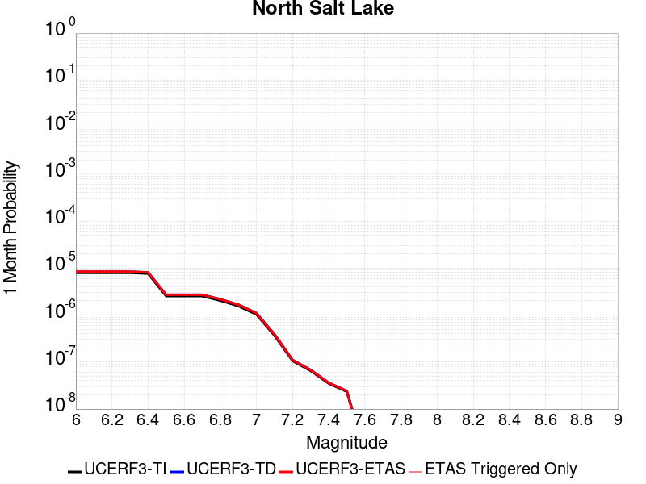 |  |  |

| Magnitude | 1 wk TI Prob | 1 wk TD Prob | 1 wk ETAS Prob | 1 wk ETAS/TD Gain | 1 wk ETAS Triggered Only | 1 mo TI Prob | 1 mo TD Prob | 1 mo ETAS Prob | 1 mo ETAS/TD Gain | 1 mo ETAS Triggered Only | 1 yr TI Prob | 1 yr TD Prob | 1 yr ETAS Prob | 1 yr ETAS/TD Gain | 1 yr ETAS Triggered Only | 10 yr TI Prob | 10 yr TD Prob | 10 yr ETAS Prob | 10 yr ETAS/TD Gain | 10 yr ETAS Triggered Only |
|-----|-----|-----|-----|-----|-----|-----|-----|-----|-----|-----|-----|-----|-----|-----|-----|-----|-----|-----|-----|-----|
| 6.0 | 1.849599E-6 | 1.955571E-6 | 1.955571E-6 | 1.0 | 0.0 | 7.926829E-6 | 8.381003E-6 | 8.381003E-6 | 1.0 | 0.0 | 9.650487E-5 | 1.0203594E-4 | 1.12034926E-4 | 1.0979947 | 1.0E-5 | 9.646297E-4 | 0.0010200888 | 0.0010300786 | 1.009793 | 1.0E-5 |
| 6.1 | 1.849599E-6 | 1.955571E-6 | 1.955571E-6 | 1.0 | 0.0 | 7.926829E-6 | 8.381003E-6 | 8.381003E-6 | 1.0 | 0.0 | 9.650487E-5 | 1.0203594E-4 | 1.12034926E-4 | 1.0979947 | 1.0E-5 | 9.646297E-4 | 0.0010200888 | 0.0010300786 | 1.009793 | 1.0E-5 |
| 6.2 | 1.849599E-6 | 1.955571E-6 | 1.955571E-6 | 1.0 | 0.0 | 7.926829E-6 | 8.381003E-6 | 8.381003E-6 | 1.0 | 0.0 | 9.650487E-5 | 1.0203594E-4 | 1.12034926E-4 | 1.0979947 | 1.0E-5 | 9.646297E-4 | 0.0010200888 | 0.0010300786 | 1.009793 | 1.0E-5 |
| 6.3 | 1.849599E-6 | 1.955571E-6 | 1.955571E-6 | 1.0 | 0.0 | 7.926829E-6 | 8.381003E-6 | 8.381003E-6 | 1.0 | 0.0 | 9.650487E-5 | 1.0203594E-4 | 1.12034926E-4 | 1.0979947 | 1.0E-5 | 9.646297E-4 | 0.0010200888 | 0.0010300786 | 1.009793 | 1.0E-5 |
| 6.4 | 1.7803909E-6 | 1.8860707E-6 | 1.8860707E-6 | 1.0 | 0.0 | 7.630225E-6 | 8.083147E-6 | 8.083147E-6 | 1.0 | 0.0 | 9.289402E-5 | 9.840987E-5 | 1.0840889E-4 | 1.1016058 | 1.0E-5 | 9.28552E-4 | 9.838602E-4 | 9.938503E-4 | 1.010154 | 1.0E-5 |
| 6.5 | 5.9157696E-7 | 6.3001835E-7 | 6.3001835E-7 | 1.0 | 0.0 | 2.5353274E-6 | 2.7000763E-6 | 2.7000763E-6 | 1.0 | 0.0 | 3.0867173E-5 | 3.2872973E-5 | 3.2872973E-5 | 1.0 | 0.0 | 3.0862886E-4 | 3.28685E-4 | 3.28685E-4 | 1.0 | 0.0 |
| 6.6 | 5.9157696E-7 | 6.3001835E-7 | 6.3001835E-7 | 1.0 | 0.0 | 2.5353274E-6 | 2.7000763E-6 | 2.7000763E-6 | 1.0 | 0.0 | 3.0867173E-5 | 3.2872973E-5 | 3.2872973E-5 | 1.0 | 0.0 | 3.0862886E-4 | 3.28685E-4 | 3.28685E-4 | 1.0 | 0.0 |
| 6.7 | 5.9157696E-7 | 6.3001835E-7 | 6.3001835E-7 | 1.0 | 0.0 | 2.5353274E-6 | 2.7000763E-6 | 2.7000763E-6 | 1.0 | 0.0 | 3.0867173E-5 | 3.2872973E-5 | 3.2872973E-5 | 1.0 | 0.0 | 3.0862886E-4 | 3.28685E-4 | 3.28685E-4 | 1.0 | 0.0 |
| 6.8 | 4.7536267E-7 | 5.066019E-7 | 5.066019E-7 | 1.0 | 0.0 | 2.037267E-6 | 2.1711494E-6 | 2.1711494E-6 | 1.0 | 0.0 | 2.4803443E-5 | 2.6433447E-5 | 2.6433447E-5 | 1.0 | 0.0 | 2.4800675E-4 | 2.6430548E-4 | 2.6430548E-4 | 1.0 | 0.0 |
| 6.9 | 3.6345344E-7 | 3.8750048E-7 | 3.8750048E-7 | 1.0 | 0.0 | 1.5576567E-6 | 1.6607154E-6 | 1.6607154E-6 | 1.0 | 0.0 | 1.8964305E-5 | 2.021904E-5 | 2.021904E-5 | 1.0 | 0.0 | 1.8962687E-4 | 2.021737E-4 | 2.021737E-4 | 1.0 | 0.0 |
| 7.0 | 2.4087325E-7 | 2.5709335E-7 | 2.5709335E-7 | 1.0 | 0.0 | 1.0323135E-6 | 1.1018283E-6 | 1.1018283E-6 | 1.0 | 0.0 | 1.25683455E-5 | 1.3414689E-5 | 1.3414689E-5 | 1.0 | 0.0 | 1.2567634E-4 | 1.3414006E-4 | 1.3414006E-4 | 1.0 | 0.0 |
| 7.1 | 8.551555E-8 | 9.044477E-8 | 9.044477E-8 | 1.0 | 0.0 | 3.6649516E-7 | 3.876204E-7 | 3.876204E-7 | 1.0 | 0.0 | 4.4620692E-6 | 4.7192693E-6 | 4.7192693E-6 | 1.0 | 0.0 | 4.46198E-5 | 4.719181E-5 | 4.719181E-5 | 1.0 | 0.0 |
| 7.2 | 2.475279E-8 | 2.5893172E-8 | 2.5893172E-8 | 1.0 | 0.0 | 1.0608338E-7 | 1.1097074E-7 | 1.1097074E-7 | 1.0 | 0.0 | 1.2915643E-6 | 1.3510679E-6 | 1.3510679E-6 | 1.0 | 0.0 | 1.2915569E-5 | 1.3510604E-5 | 1.3510604E-5 | 1.0 | 0.0 |
| 7.3 | 1.5212393E-8 | 1.5847489E-8 | 1.5847489E-8 | 1.0 | 0.0 | 6.519597E-8 | 6.791781E-8 | 6.791781E-8 | 1.0 | 0.0 | 7.9376065E-7 | 8.2689905E-7 | 8.2689905E-7 | 1.0 | 0.0 | 7.937579E-6 | 8.268963E-6 | 8.268963E-6 | 1.0 | 0.0 |
| 7.4 | 8.182E-9 | 8.447294E-9 | 8.447294E-9 | 1.0 | 0.0 | 3.5065714E-8 | 3.620269E-8 | 3.620269E-8 | 1.0 | 0.0 | 4.26925E-7 | 4.4076765E-7 | 4.4076765E-7 | 1.0 | 0.0 | 4.269242E-6 | 4.4076683E-6 | 4.4076683E-6 | 1.0 | 0.0 |
| 7.5 | 5.479913E-9 | 5.6680434E-9 | 5.6680434E-9 | 1.0 | 0.0 | 2.3485342E-8 | 2.4291614E-8 | 2.4291614E-8 | 1.0 | 0.0 | 2.85934E-7 | 2.9575037E-7 | 2.9575037E-7 | 1.0 | 0.0 | 2.8593363E-6 | 2.9575E-6 | 2.9575E-6 | 1.0 | 0.0 |
| 7.6 | 2.6813562E-10 | 2.773195E-10 | 2.773195E-10 | 1.0 | 0.0 | 1.1491527E-9 | 1.1885122E-9 | 1.1885122E-9 | 1.0 | 0.0 | 1.3990933E-8 | 1.4470135E-8 | 1.4470135E-8 | 1.0 | 0.0 | 1.3990932E-7 | 1.4470135E-7 | 1.4470135E-7 | 1.0 | 0.0 |

## Franklin 2011 CFM
*[(top)](#table-of-contents)*

| 1 Week | 1 Month | 1 Year | 10 Year |
|-----|-----|-----|-----|
|  |  |  |  |

| Magnitude | 1 wk TI Prob | 1 wk TD Prob | 1 wk ETAS Prob | 1 wk ETAS/TD Gain | 1 wk ETAS Triggered Only | 1 mo TI Prob | 1 mo TD Prob | 1 mo ETAS Prob | 1 mo ETAS/TD Gain | 1 mo ETAS Triggered Only | 1 yr TI Prob | 1 yr TD Prob | 1 yr ETAS Prob | 1 yr ETAS/TD Gain | 1 yr ETAS Triggered Only | 10 yr TI Prob | 10 yr TD Prob | 10 yr ETAS Prob | 10 yr ETAS/TD Gain | 10 yr ETAS Triggered Only |
|-----|-----|-----|-----|-----|-----|-----|-----|-----|-----|-----|-----|-----|-----|-----|-----|-----|-----|-----|-----|-----|
| 6.0 | 1.845602E-5 | 2.021262E-5 | 2.021262E-5 | 1.0 | 0.0 | 7.9094825E-5 | 8.66228E-5 | 8.66228E-5 | 1.0 | 0.0 | 9.6255407E-4 | 0.0010541513 | 0.0010541513 | 1.0 | 0.0 | 0.009583955 | 0.0105088325 | 0.010518727 | 1.0009416 | 1.0E-5 |
| 6.1 | 1.845602E-5 | 2.021262E-5 | 2.021262E-5 | 1.0 | 0.0 | 7.9094825E-5 | 8.66228E-5 | 8.66228E-5 | 1.0 | 0.0 | 9.6255407E-4 | 0.0010541513 | 0.0010541513 | 1.0 | 0.0 | 0.009583955 | 0.0105088325 | 0.010518727 | 1.0009416 | 1.0E-5 |
| 6.2 | 1.845602E-5 | 2.021262E-5 | 2.021262E-5 | 1.0 | 0.0 | 7.9094825E-5 | 8.66228E-5 | 8.66228E-5 | 1.0 | 0.0 | 9.6255407E-4 | 0.0010541513 | 0.0010541513 | 1.0 | 0.0 | 0.009583955 | 0.0105088325 | 0.010518727 | 1.0009416 | 1.0E-5 |
| 6.3 | 1.3813506E-5 | 1.5154827E-5 | 1.5154827E-5 | 1.0 | 0.0 | 5.9199396E-5 | 6.4947686E-5 | 6.4947686E-5 | 1.0 | 0.0 | 7.205143E-4 | 7.9045893E-4 | 7.9045893E-4 | 1.0 | 0.0 | 0.007181826 | 0.007891679 | 0.007901601 | 1.0012572 | 1.0E-5 |
| 6.4 | 1.3813506E-5 | 1.5154827E-5 | 1.5154827E-5 | 1.0 | 0.0 | 5.9199396E-5 | 6.4947686E-5 | 6.4947686E-5 | 1.0 | 0.0 | 7.205143E-4 | 7.9045893E-4 | 7.9045893E-4 | 1.0 | 0.0 | 0.007181826 | 0.007891679 | 0.007901601 | 1.0012572 | 1.0E-5 |
| 6.5 | 1.1308949E-5 | 1.24178005E-5 | 1.24178005E-5 | 1.0 | 0.0 | 4.8466023E-5 | 5.3218067E-5 | 5.3218067E-5 | 1.0 | 0.0 | 5.899141E-4 | 6.4773945E-4 | 6.4773945E-4 | 1.0 | 0.0 | 0.0058835056 | 0.006473166 | 0.0064831013 | 1.0015348 | 1.0E-5 |
| 6.6 | 1.0813164E-5 | 1.1876023E-5 | 1.1876023E-5 | 1.0 | 0.0 | 4.6341313E-5 | 5.089626E-5 | 5.089626E-5 | 1.0 | 0.0 | 5.640594E-4 | 6.1948766E-4 | 6.1948766E-4 | 1.0 | 0.0 | 0.005626298 | 0.006192243 | 0.0062021813 | 1.0016049 | 1.0E-5 |
| 6.7 | 1.0706348E-5 | 1.1757787E-5 | 1.1757787E-5 | 1.0 | 0.0 | 4.5883542E-5 | 5.0389554E-5 | 5.0389554E-5 | 1.0 | 0.0 | 5.5848894E-4 | 6.13322E-4 | 6.13322E-4 | 1.0 | 0.0 | 0.005570874 | 0.0061309286 | 0.0061408672 | 1.0016211 | 1.0E-5 |
| 6.8 | 9.443655E-6 | 1.0349109E-5 | 1.0349109E-5 | 1.0 | 0.0 | 4.0472176E-5 | 4.435258E-5 | 4.435258E-5 | 1.0 | 0.0 | 4.9263734E-4 | 5.398602E-4 | 5.398602E-4 | 1.0 | 0.0 | 0.0049154665 | 0.005400073 | 0.005410019 | 1.0018418 | 1.0E-5 |
| 6.9 | 8.7001645E-6 | 9.522179E-6 | 9.522179E-6 | 1.0 | 0.0 | 3.728589E-5 | 4.0808707E-5 | 4.0808707E-5 | 1.0 | 0.0 | 4.538611E-4 | 4.96734E-4 | 4.96734E-4 | 1.0 | 0.0 | 0.0045293528 | 0.0049708076 | 0.0049708076 | 1.0 | 0.0 |
| 7.0 | 8.074731E-6 | 8.815796E-6 | 8.815796E-6 | 1.0 | 0.0 | 3.460553E-5 | 3.7781443E-5 | 3.7781443E-5 | 1.0 | 0.0 | 4.212409E-4 | 4.5989305E-4 | 4.5989305E-4 | 1.0 | 0.0 | 0.004204433 | 0.0046039694 | 0.0046039694 | 1.0 | 0.0 |
| 7.1 | 7.3370957E-6 | 7.96167E-6 | 7.96167E-6 | 1.0 | 0.0 | 3.1444317E-5 | 3.4121003E-5 | 3.4121003E-5 | 1.0 | 0.0 | 3.8276732E-4 | 4.1534504E-4 | 4.1534504E-4 | 1.0 | 0.0 | 0.0038210868 | 0.0041600848 | 0.0041600848 | 1.0 | 0.0 |
| 7.2 | 5.1750103E-6 | 5.45711E-6 | 5.45711E-6 | 1.0 | 0.0 | 2.2178427E-5 | 2.3387407E-5 | 2.3387407E-5 | 1.0 | 0.0 | 2.699889E-4 | 2.847048E-4 | 2.847048E-4 | 1.0 | 0.0 | 0.002696611 | 0.0028573172 | 0.0028573172 | 1.0 | 0.0 |
| 7.3 | 3.5221371E-6 | 3.7960522E-6 | 3.7960522E-6 | 1.0 | 0.0 | 1.5094786E-5 | 1.6268694E-5 | 1.6268694E-5 | 1.0 | 0.0 | 1.8376352E-4 | 1.9805344E-4 | 1.9805344E-4 | 1.0 | 0.0 | 0.0018361164 | 0.001992203 | 0.001992203 | 1.0 | 0.0 |
| 7.4 | 2.5749775E-6 | 2.818195E-6 | 2.818195E-6 | 1.0 | 0.0 | 1.1035571E-5 | 1.2077923E-5 | 1.2077923E-5 | 1.0 | 0.0 | 1.343498E-4 | 1.4703887E-4 | 1.4703887E-4 | 1.0 | 0.0 | 0.001342686 | 0.0014816395 | 0.0014816395 | 1.0 | 0.0 |
| 7.5 | 1.3642131E-6 | 1.5497415E-6 | 1.5497415E-6 | 1.0 | 0.0 | 5.8466144E-6 | 6.6417324E-6 | 6.6417324E-6 | 1.0 | 0.0 | 7.1180206E-5 | 8.086011E-5 | 8.086011E-5 | 1.0 | 0.0 | 7.115741E-4 | 8.1911724E-4 | 8.1911724E-4 | 1.0 | 0.0 |
| 7.6 | 5.329124E-7 | 6.70109E-7 | 6.70109E-7 | 1.0 | 0.0 | 2.2839083E-6 | 2.8718923E-6 | 2.8718923E-6 | 1.0 | 0.0 | 2.7806227E-5 | 3.4964734E-5 | 3.4964734E-5 | 1.0 | 0.0 | 2.780275E-4 | 3.5998525E-4 | 3.5998525E-4 | 1.0 | 0.0 |
| 7.7 | 4.199127E-7 | 5.486773E-7 | 5.486773E-7 | 1.0 | 0.0 | 1.7996247E-6 | 2.351472E-6 | 2.351472E-6 | 1.0 | 0.0 | 2.191021E-5 | 2.8628798E-5 | 2.8628798E-5 | 1.0 | 0.0 | 2.190805E-4 | 2.9645552E-4 | 2.9645552E-4 | 1.0 | 0.0 |
| 7.8 | 2.2586491E-7 | 3.066155E-7 | 3.066155E-7 | 1.0 | 0.0 | 9.67992E-7 | 1.3140657E-6 | 1.3140657E-6 | 1.0 | 0.0 | 1.178524E-5 | 1.5998634E-5 | 1.5998634E-5 | 1.0 | 0.0 | 1.17846146E-4 | 1.6628981E-4 | 1.6628981E-4 | 1.0 | 0.0 |
| 7.9 | 1.4568845E-7 | 2.1202585E-7 | 2.1202585E-7 | 1.0 | 0.0 | 6.243789E-7 | 9.086819E-7 | 9.086819E-7 | 1.0 | 0.0 | 7.601787E-6 | 1.1063146E-5 | 1.1063146E-5 | 1.0 | 0.0 | 7.601527E-5 | 1.1508061E-4 | 1.1508061E-4 | 1.0 | 0.0 |
| 8.0 | 5.2868224E-8 | 9.996793E-8 | 9.996793E-8 | 1.0 | 0.0 | 2.2657808E-7 | 4.2843388E-7 | 4.2843388E-7 | 1.0 | 0.0 | 2.7585847E-6 | 5.21617E-6 | 5.21617E-6 | 1.0 | 0.0 | 2.7585504E-5 | 5.4014814E-5 | 5.4014814E-5 | 1.0 | 0.0 |
| 8.1 | 2.654434E-9 | 4.7226045E-9 | 4.7226045E-9 | 1.0 | 0.0 | 1.1376145E-8 | 2.0239735E-8 | 2.0239735E-8 | 1.0 | 0.0 | 1.3850456E-7 | 2.4641872E-7 | 2.4641872E-7 | 1.0 | 0.0 | 1.3850448E-6 | 2.5336271E-6 | 2.5336271E-6 | 1.0 | 0.0 |

## Gillem - Big Crack 2011 CFM
*[(top)](#table-of-contents)*

| 1 Week | 1 Month | 1 Year | 10 Year |
|-----|-----|-----|-----|
|  |  |  |  |

| Magnitude | 1 wk TI Prob | 1 wk TD Prob | 1 wk ETAS Prob | 1 wk ETAS/TD Gain | 1 wk ETAS Triggered Only | 1 mo TI Prob | 1 mo TD Prob | 1 mo ETAS Prob | 1 mo ETAS/TD Gain | 1 mo ETAS Triggered Only | 1 yr TI Prob | 1 yr TD Prob | 1 yr ETAS Prob | 1 yr ETAS/TD Gain | 1 yr ETAS Triggered Only | 10 yr TI Prob | 10 yr TD Prob | 10 yr ETAS Prob | 10 yr ETAS/TD Gain | 10 yr ETAS Triggered Only |
|-----|-----|-----|-----|-----|-----|-----|-----|-----|-----|-----|-----|-----|-----|-----|-----|-----|-----|-----|-----|-----|
| 6.0 | 2.196852E-5 | 2.3604485E-5 | 2.3604485E-5 | 1.0 | 0.0 | 9.4147406E-5 | 1.01158665E-4 | 1.01158665E-4 | 1.0 | 0.0 | 0.0011456419 | 0.0012309998 | 0.0012309998 | 1.0 | 0.0 | 0.011397537 | 0.012250669 | 0.012260547 | 1.0008063 | 1.0E-5 |
| 6.1 | 9.992795E-6 | 1.071189E-5 | 1.071189E-5 | 1.0 | 0.0 | 4.2825563E-5 | 4.5907396E-5 | 4.5907396E-5 | 1.0 | 0.0 | 5.2127644E-4 | 5.587975E-4 | 5.587975E-4 | 1.0 | 0.0 | 0.0052005537 | 0.0055757347 | 0.005585679 | 1.0017835 | 1.0E-5 |
| 6.2 | 9.992795E-6 | 1.071189E-5 | 1.071189E-5 | 1.0 | 0.0 | 4.2825563E-5 | 4.5907396E-5 | 4.5907396E-5 | 1.0 | 0.0 | 5.2127644E-4 | 5.587975E-4 | 5.587975E-4 | 1.0 | 0.0 | 0.0052005537 | 0.0055757347 | 0.005585679 | 1.0017835 | 1.0E-5 |
| 6.3 | 4.6127884E-6 | 4.942657E-6 | 4.942657E-6 | 1.0 | 0.0 | 1.9768944E-5 | 2.1182668E-5 | 2.1182668E-5 | 1.0 | 0.0 | 2.406603E-4 | 2.5787292E-4 | 2.5787292E-4 | 1.0 | 0.0 | 0.0024039985 | 0.0025761751 | 0.0025761751 | 1.0 | 0.0 |
| 6.4 | 4.6127884E-6 | 4.942657E-6 | 4.942657E-6 | 1.0 | 0.0 | 1.9768944E-5 | 2.1182668E-5 | 2.1182668E-5 | 1.0 | 0.0 | 2.406603E-4 | 2.5787292E-4 | 2.5787292E-4 | 1.0 | 0.0 | 0.0024039985 | 0.0025761751 | 0.0025761751 | 1.0 | 0.0 |
| 6.5 | 2.716712E-6 | 2.9111113E-6 | 2.9111113E-6 | 1.0 | 0.0 | 1.1643E-5 | 1.24761455E-5 | 1.24761455E-5 | 1.0 | 0.0 | 1.417443E-4 | 1.5188892E-4 | 1.5188892E-4 | 1.0 | 0.0 | 0.0014165393 | 0.001518089 | 0.001518089 | 1.0 | 0.0 |
| 6.6 | 1.3818255E-6 | 1.4820689E-6 | 1.4820689E-6 | 1.0 | 0.0 | 5.922096E-6 | 6.3517155E-6 | 6.3517155E-6 | 1.0 | 0.0 | 7.209913E-5 | 7.7330624E-5 | 7.7330624E-5 | 1.0 | 0.0 | 7.2075747E-4 | 7.7315804E-4 | 7.7315804E-4 | 1.0 | 0.0 |

## San Gregorio (North) 2011 CFM
*[(top)](#table-of-contents)*

| 1 Week | 1 Month | 1 Year | 10 Year |
|-----|-----|-----|-----|
|  |  |  | 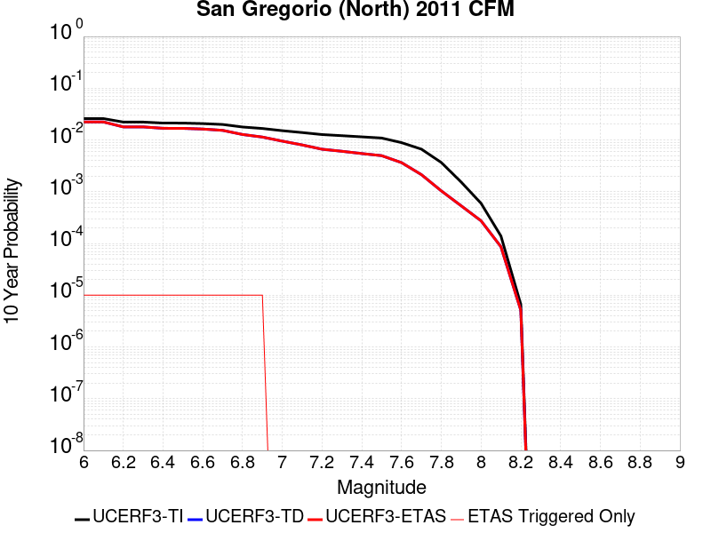 |

| Magnitude | 1 wk TI Prob | 1 wk TD Prob | 1 wk ETAS Prob | 1 wk ETAS/TD Gain | 1 wk ETAS Triggered Only | 1 mo TI Prob | 1 mo TD Prob | 1 mo ETAS Prob | 1 mo ETAS/TD Gain | 1 mo ETAS Triggered Only | 1 yr TI Prob | 1 yr TD Prob | 1 yr ETAS Prob | 1 yr ETAS/TD Gain | 1 yr ETAS Triggered Only | 10 yr TI Prob | 10 yr TD Prob | 10 yr ETAS Prob | 10 yr ETAS/TD Gain | 10 yr ETAS Triggered Only |
|-----|-----|-----|-----|-----|-----|-----|-----|-----|-----|-----|-----|-----|-----|-----|-----|-----|-----|-----|-----|-----|
| 6.0 | 5.0283932E-5 | 4.3057815E-5 | 4.3057815E-5 | 1.0 | 0.0 | 2.1548476E-4 | 1.8452053E-4 | 1.9451868E-4 | 1.0541846 | 1.0E-5 | 0.0026203706 | 0.002244237 | 0.0022542146 | 1.0044459 | 1.0E-5 | 0.02589687 | 0.022293162 | 0.022302939 | 1.0004386 | 1.0E-5 |
| 6.1 | 5.0283932E-5 | 4.3057815E-5 | 4.3057815E-5 | 1.0 | 0.0 | 2.1548476E-4 | 1.8452053E-4 | 1.9451868E-4 | 1.0541846 | 1.0E-5 | 0.0026203706 | 0.002244237 | 0.0022542146 | 1.0044459 | 1.0E-5 | 0.02589687 | 0.022293162 | 0.022302939 | 1.0004386 | 1.0E-5 |
| 6.2 | 4.2998647E-5 | 3.4441564E-5 | 3.4441564E-5 | 1.0 | 0.0 | 1.842669E-4 | 1.475984E-4 | 1.5759692E-4 | 1.0677414 | 1.0E-5 | 0.0022411412 | 0.00179554 | 0.001805522 | 1.0055593 | 1.0E-5 | 0.022186736 | 0.017886506 | 0.017896328 | 1.0005491 | 1.0E-5 |
| 6.3 | 4.2998647E-5 | 3.4441564E-5 | 3.4441564E-5 | 1.0 | 0.0 | 1.842669E-4 | 1.475984E-4 | 1.5759692E-4 | 1.0677414 | 1.0E-5 | 0.0022411412 | 0.00179554 | 0.001805522 | 1.0055593 | 1.0E-5 | 0.022186736 | 0.017886506 | 0.017896328 | 1.0005491 | 1.0E-5 |
| 6.4 | 4.1101295E-5 | 3.2326872E-5 | 3.2326872E-5 | 1.0 | 0.0 | 1.7613651E-4 | 1.3853642E-4 | 1.4853504E-4 | 1.0721732 | 1.0E-5 | 0.0021423528 | 0.0016853869 | 0.00169537 | 1.0059234 | 1.0E-5 | 0.02121817 | 0.016801886 | 0.016811717 | 1.0005852 | 1.0E-5 |
| 6.5 | 4.1032585E-5 | 3.2244905E-5 | 3.2244905E-5 | 1.0 | 0.0 | 1.7584208E-4 | 1.3818518E-4 | 1.481838E-4 | 1.0723567 | 1.0E-5 | 0.0021387753 | 0.0016811171 | 0.0016911003 | 1.0059384 | 1.0E-5 | 0.021183075 | 0.016759839 | 0.016769672 | 1.0005866 | 1.0E-5 |
| 6.6 | 4.011629E-5 | 3.1266558E-5 | 3.1266558E-5 | 1.0 | 0.0 | 1.7191563E-4 | 1.339927E-4 | 1.4399135E-4 | 1.074621 | 1.0E-5 | 0.0020910634 | 0.0016301516 | 0.0016401353 | 1.0061244 | 1.0E-5 | 0.020714961 | 0.01625741 | 0.016267247 | 1.0006051 | 1.0E-5 |
| 6.7 | 3.8583938E-5 | 2.9453593E-5 | 2.9453593E-5 | 1.0 | 0.0 | 1.6534925E-4 | 1.2622366E-4 | 1.362224E-4 | 1.0792145 | 1.0E-5 | 0.0020112682 | 0.0015357039 | 0.0015456886 | 1.0065017 | 1.0E-5 | 0.019931622 | 0.015325955 | 0.015335802 | 1.0006425 | 1.0E-5 |
| 6.8 | 3.44341E-5 | 2.4450854E-5 | 2.4450854E-5 | 1.0 | 0.0 | 1.4756636E-4 | 1.0478523E-4 | 1.14784176E-4 | 1.0954233 | 1.0E-5 | 0.0017951399 | 0.0012750238 | 0.0012850111 | 1.007833 | 1.0E-5 | 0.017807078 | 0.012751131 | 0.012761004 | 1.0007743 | 1.0E-5 |
| 6.9 | 3.221199E-5 | 2.1778029E-5 | 2.1778029E-5 | 1.0 | 0.0 | 1.3804408E-4 | 9.333112E-5 | 1.0333019E-4 | 1.1071354 | 1.0E-5 | 0.0016793909 | 0.0011357224 | 0.0011457109 | 1.008795 | 1.0E-5 | 0.01666756 | 0.011372583 | 0.011382469 | 1.0008693 | 1.0E-5 |
| 7.0 | 2.9186718E-5 | 1.8146875E-5 | 1.8146875E-5 | 1.0 | 0.0 | 1.2507994E-4 | 7.7770026E-5 | 7.7770026E-5 | 1.0 | 0.0 | 0.0015217843 | 9.464431E-4 | 9.464431E-4 | 1.0 | 0.0 | 0.015114053 | 0.009496798 | 0.009496798 | 1.0 | 0.0 |
| 7.1 | 2.6840138E-5 | 1.5284508E-5 | 1.5284508E-5 | 1.0 | 0.0 | 1.1502409E-4 | 6.55034E-5 | 6.55034E-5 | 1.0 | 0.0 | 0.0013995186 | 7.9721404E-4 | 7.9721404E-4 | 1.0 | 0.0 | 0.013907375 | 0.008015723 | 0.008015723 | 1.0 | 0.0 |
| 7.2 | 2.453002E-5 | 1.2606672E-5 | 1.2606672E-5 | 1.0 | 0.0 | 1.05124425E-4 | 5.4027478E-5 | 5.4027478E-5 | 1.0 | 0.0 | 0.0012791384 | 6.575866E-4 | 6.575866E-4 | 1.0 | 0.0 | 0.012718005 | 0.00662763 | 0.00662763 | 1.0 | 0.0 |
| 7.3 | 2.3330727E-5 | 1.1488677E-5 | 1.1488677E-5 | 1.0 | 0.0 | 9.9985E-5 | 4.923626E-5 | 4.923626E-5 | 1.0 | 0.0 | 0.0012166376 | 5.9928704E-4 | 5.9928704E-4 | 1.0 | 0.0 | 0.012099981 | 0.006046564 | 0.006046564 | 1.0 | 0.0 |
| 7.4 | 2.2136466E-5 | 1.0368981E-5 | 1.0368981E-5 | 1.0 | 0.0 | 9.486712E-5 | 4.4437733E-5 | 4.4437733E-5 | 1.0 | 0.0 | 0.0011543952 | 5.4089533E-4 | 5.4089533E-4 | 1.0 | 0.0 | 0.011484168 | 0.005464249 | 0.005464249 | 1.0 | 0.0 |
| 7.5 | 2.0994974E-5 | 9.427217E-6 | 9.427217E-6 | 1.0 | 0.0 | 8.997535E-5 | 4.0401734E-5 | 4.0401734E-5 | 1.0 | 0.0 | 0.0010948994 | 4.9178035E-4 | 4.9178035E-4 | 1.0 | 0.0 | 0.010895205 | 0.004973358 | 0.004973358 | 1.0 | 0.0 |
| 7.6 | 1.7091823E-5 | 6.893766E-6 | 6.893766E-6 | 1.0 | 0.0 | 7.3248615E-5 | 2.9544377E-5 | 2.9544377E-5 | 1.0 | 0.0 | 8.9143694E-4 | 3.596435E-4 | 3.596435E-4 | 1.0 | 0.0 | 0.008878695 | 0.0036482841 | 0.0036482841 | 1.0 | 0.0 |
| 7.7 | 1.2772179E-5 | 4.0208706E-6 | 4.0208706E-6 | 1.0 | 0.0 | 5.473676E-5 | 1.7232189E-5 | 1.7232189E-5 | 1.0 | 0.0 | 6.6621625E-4 | 2.0978172E-4 | 2.0978172E-4 | 1.0 | 0.0 | 0.006642225 | 0.002136922 | 0.002136922 | 1.0 | 0.0 |
| 7.8 | 7.041923E-6 | 1.940626E-6 | 1.940626E-6 | 1.0 | 0.0 | 3.017932E-5 | 8.316942E-6 | 8.316942E-6 | 1.0 | 0.0 | 3.6737128E-4 | 1.0125406E-4 | 1.0125406E-4 | 1.0 | 0.0 | 0.0036676454 | 0.0010379003 | 0.0010379003 | 1.0 | 0.0 |
| 7.9 | 2.946768E-6 | 1.0033551E-6 | 1.0033551E-6 | 1.0 | 0.0 | 1.2628945E-5 | 4.300086E-6 | 4.300086E-6 | 1.0 | 0.0 | 1.5374656E-4 | 5.235229E-5 | 5.235229E-5 | 1.0 | 0.0 | 0.0015364023 | 5.3400313E-4 | 5.3400313E-4 | 1.0 | 0.0 |
| 8.0 | 1.1433375E-6 | 5.18146E-7 | 5.18146E-7 | 1.0 | 0.0 | 4.9000087E-6 | 2.2206239E-6 | 2.2206239E-6 | 1.0 | 0.0 | 5.965597E-5 | 2.703576E-5 | 2.703576E-5 | 1.0 | 0.0 | 5.963996E-4 | 2.7398416E-4 | 2.7398416E-4 | 1.0 | 0.0 |
| 8.1 | 2.6675295E-7 | 1.62899E-7 | 1.62899E-7 | 1.0 | 0.0 | 1.1432264E-6 | 6.9813836E-7 | 6.9813836E-7 | 1.0 | 0.0 | 1.3918692E-5 | 8.499802E-6 | 8.499802E-6 | 1.0 | 0.0 | 1.391782E-4 | 8.63795E-5 | 8.63795E-5 | 1.0 | 0.0 |
| 8.2 | 1.2704569E-8 | 9.431393E-9 | 9.431393E-9 | 1.0 | 0.0 | 5.444815E-8 | 4.042026E-8 | 4.042026E-8 | 1.0 | 0.0 | 6.629061E-7 | 4.9211656E-7 | 4.9211656E-7 | 1.0 | 0.0 | 6.629041E-6 | 5.1121438E-6 | 5.1121438E-6 | 1.0 | 0.0 |

## Johnson Valley (No) 2011 rev
*[(top)](#table-of-contents)*

| 1 Week | 1 Month | 1 Year | 10 Year |
|-----|-----|-----|-----|
|  |  |  |  |

| Magnitude | 1 wk TI Prob | 1 wk TD Prob | 1 wk ETAS Prob | 1 wk ETAS/TD Gain | 1 wk ETAS Triggered Only | 1 mo TI Prob | 1 mo TD Prob | 1 mo ETAS Prob | 1 mo ETAS/TD Gain | 1 mo ETAS Triggered Only | 1 yr TI Prob | 1 yr TD Prob | 1 yr ETAS Prob | 1 yr ETAS/TD Gain | 1 yr ETAS Triggered Only | 10 yr TI Prob | 10 yr TD Prob | 10 yr ETAS Prob | 10 yr ETAS/TD Gain | 10 yr ETAS Triggered Only |
|-----|-----|-----|-----|-----|-----|-----|-----|-----|-----|-----|-----|-----|-----|-----|-----|-----|-----|-----|-----|-----|
| 6.0 | 2.577707E-5 | 1.2900938E-5 | 1.2900938E-5 | 1.0 | 0.0 | 1.1046848E-4 | 5.5288787E-5 | 5.5288787E-5 | 1.0 | 0.0 | 0.0013441239 | 6.7297276E-4 | 6.82966E-4 | 1.0148494 | 1.0E-5 | 0.013360229 | 0.006713257 | 0.0067231897 | 1.0014796 | 1.0E-5 |
| 6.1 | 2.577707E-5 | 1.2900938E-5 | 1.2900938E-5 | 1.0 | 0.0 | 1.1046848E-4 | 5.5288787E-5 | 5.5288787E-5 | 1.0 | 0.0 | 0.0013441239 | 6.7297276E-4 | 6.82966E-4 | 1.0148494 | 1.0E-5 | 0.013360229 | 0.006713257 | 0.0067231897 | 1.0014796 | 1.0E-5 |
| 6.2 | 2.577707E-5 | 1.2900938E-5 | 1.2900938E-5 | 1.0 | 0.0 | 1.1046848E-4 | 5.5288787E-5 | 5.5288787E-5 | 1.0 | 0.0 | 0.0013441239 | 6.7297276E-4 | 6.82966E-4 | 1.0148494 | 1.0E-5 | 0.013360229 | 0.006713257 | 0.0067231897 | 1.0014796 | 1.0E-5 |
| 6.3 | 2.577707E-5 | 1.2900938E-5 | 1.2900938E-5 | 1.0 | 0.0 | 1.1046848E-4 | 5.5288787E-5 | 5.5288787E-5 | 1.0 | 0.0 | 0.0013441239 | 6.7297276E-4 | 6.82966E-4 | 1.0148494 | 1.0E-5 | 0.013360229 | 0.006713257 | 0.0067231897 | 1.0014796 | 1.0E-5 |
| 6.4 | 1.5296591E-5 | 7.536742E-6 | 7.536742E-6 | 1.0 | 0.0 | 6.555518E-5 | 3.2300028E-5 | 3.2300028E-5 | 1.0 | 0.0 | 7.97842E-4 | 3.9320064E-4 | 3.9320064E-4 | 1.0 | 0.0 | 0.007949836 | 0.0039268904 | 0.0039268904 | 1.0 | 0.0 |
| 6.5 | 1.5296591E-5 | 7.536742E-6 | 7.536742E-6 | 1.0 | 0.0 | 6.555518E-5 | 3.2300028E-5 | 3.2300028E-5 | 1.0 | 0.0 | 7.97842E-4 | 3.9320064E-4 | 3.9320064E-4 | 1.0 | 0.0 | 0.007949836 | 0.0039268904 | 0.0039268904 | 1.0 | 0.0 |
| 6.6 | 1.3289383E-5 | 5.9917306E-6 | 5.9917306E-6 | 1.0 | 0.0 | 5.6953253E-5 | 2.5678688E-5 | 2.5678688E-5 | 1.0 | 0.0 | 6.9318525E-4 | 3.1261015E-4 | 3.1261015E-4 | 1.0 | 0.0 | 0.0069102696 | 0.0031233684 | 0.0031233684 | 1.0 | 0.0 |
| 6.7 | 1.3289383E-5 | 5.9917306E-6 | 5.9917306E-6 | 1.0 | 0.0 | 5.6953253E-5 | 2.5678688E-5 | 2.5678688E-5 | 1.0 | 0.0 | 6.9318525E-4 | 3.1261015E-4 | 3.1261015E-4 | 1.0 | 0.0 | 0.0069102696 | 0.0031233684 | 0.0031233684 | 1.0 | 0.0 |
| 6.8 | 8.330789E-6 | 2.9211888E-6 | 2.9211888E-6 | 1.0 | 0.0 | 3.570289E-5 | 1.2519352E-5 | 1.2519352E-5 | 1.0 | 0.0 | 4.34596E-4 | 1.5241816E-4 | 1.5241816E-4 | 1.0 | 0.0 | 0.0043374705 | 0.0015236961 | 0.0015236961 | 1.0 | 0.0 |
| 6.9 | 7.2359003E-6 | 2.3013247E-6 | 2.3013247E-6 | 1.0 | 0.0 | 3.1010633E-5 | 9.8628125E-6 | 9.8628125E-6 | 1.0 | 0.0 | 3.7748902E-4 | 1.2007845E-4 | 1.2007845E-4 | 1.0 | 0.0 | 0.0037684843 | 0.0012006586 | 0.0012006586 | 1.0 | 0.0 |
| 7.0 | 6.5149957E-6 | 2.088482E-6 | 2.088482E-6 | 1.0 | 0.0 | 2.792111E-5 | 8.950637E-6 | 8.950637E-6 | 1.0 | 0.0 | 3.398865E-4 | 1.0897385E-4 | 1.0897385E-4 | 1.0 | 0.0 | 0.003393671 | 0.0010897239 | 0.0010897239 | 1.0 | 0.0 |
| 7.1 | 1.1662233E-6 | 2.8802024E-8 | 2.8802024E-8 | 1.0 | 0.0 | 4.9980904E-6 | 1.2343725E-7 | 1.2343725E-7 | 1.0 | 0.0 | 6.0850052E-5 | 1.5028476E-6 | 1.5028476E-6 | 1.0 | 0.0 | 6.083339E-4 | 1.50283895E-5 | 1.50283895E-5 | 1.0 | 0.0 |
| 7.2 | 5.413881E-7 | 2.8802024E-8 | 2.8802024E-8 | 1.0 | 0.0 | 2.3202326E-6 | 1.2343725E-7 | 1.2343725E-7 | 1.0 | 0.0 | 2.8248465E-5 | 1.5028476E-6 | 1.5028476E-6 | 1.0 | 0.0 | 2.8244875E-4 | 1.50283895E-5 | 1.50283895E-5 | 1.0 | 0.0 |
| 7.3 | 5.076821E-7 | 2.8802024E-8 | 2.8802024E-8 | 1.0 | 0.0 | 2.1757785E-6 | 1.2343723E-7 | 1.2343723E-7 | 1.0 | 0.0 | 2.648978E-5 | 1.5028475E-6 | 1.5028475E-6 | 1.0 | 0.0 | 2.6486625E-4 | 1.50283895E-5 | 1.50283895E-5 | 1.0 | 0.0 |
| 7.4 | 4.7568687E-7 | 2.8783948E-8 | 2.8783948E-8 | 1.0 | 0.0 | 2.0386565E-6 | 1.2335977E-7 | 1.2335977E-7 | 1.0 | 0.0 | 2.482036E-5 | 1.5019043E-6 | 1.5019043E-6 | 1.0 | 0.0 | 2.4817587E-4 | 1.5018958E-5 | 1.5018958E-5 | 1.0 | 0.0 |
| 7.5 | 3.435626E-7 | 2.5357679E-8 | 2.5357679E-8 | 1.0 | 0.0 | 1.4724103E-6 | 1.0867576E-7 | 1.0867576E-7 | 1.0 | 0.0 | 1.7926448E-5 | 1.3231268E-6 | 1.3231268E-6 | 1.0 | 0.0 | 1.7925001E-4 | 1.3231205E-5 | 1.3231205E-5 | 1.0 | 0.0 |

## Great Valley 06 (Midland) 2011 CFM alt1
*[(top)](#table-of-contents)*

| 1 Week | 1 Month | 1 Year | 10 Year |
|-----|-----|-----|-----|
|  |  |  |  |

| Magnitude | 1 wk TI Prob | 1 wk TD Prob | 1 wk ETAS Prob | 1 wk ETAS/TD Gain | 1 wk ETAS Triggered Only | 1 mo TI Prob | 1 mo TD Prob | 1 mo ETAS Prob | 1 mo ETAS/TD Gain | 1 mo ETAS Triggered Only | 1 yr TI Prob | 1 yr TD Prob | 1 yr ETAS Prob | 1 yr ETAS/TD Gain | 1 yr ETAS Triggered Only | 10 yr TI Prob | 10 yr TD Prob | 10 yr ETAS Prob | 10 yr ETAS/TD Gain | 10 yr ETAS Triggered Only |
|-----|-----|-----|-----|-----|-----|-----|-----|-----|-----|-----|-----|-----|-----|-----|-----|-----|-----|-----|-----|-----|
| 6.0 | 1.2712525E-5 | 1.3210576E-5 | 1.3210576E-5 | 1.0 | 0.0 | 5.4481112E-5 | 5.6615667E-5 | 5.6615667E-5 | 1.0 | 0.0 | 6.6310563E-4 | 6.8910315E-4 | 6.8910315E-4 | 1.0 | 0.0 | 0.0066113044 | 0.006872179 | 0.00688211 | 1.0014452 | 1.0E-5 |
| 6.1 | 1.2712525E-5 | 1.3210576E-5 | 1.3210576E-5 | 1.0 | 0.0 | 5.4481112E-5 | 5.6615667E-5 | 5.6615667E-5 | 1.0 | 0.0 | 6.6310563E-4 | 6.8910315E-4 | 6.8910315E-4 | 1.0 | 0.0 | 0.0066113044 | 0.006872179 | 0.00688211 | 1.0014452 | 1.0E-5 |
| 6.2 | 1.2712525E-5 | 1.3210576E-5 | 1.3210576E-5 | 1.0 | 0.0 | 5.4481112E-5 | 5.6615667E-5 | 5.6615667E-5 | 1.0 | 0.0 | 6.6310563E-4 | 6.8910315E-4 | 6.8910315E-4 | 1.0 | 0.0 | 0.0066113044 | 0.006872179 | 0.00688211 | 1.0014452 | 1.0E-5 |
| 6.3 | 1.2712525E-5 | 1.3210576E-5 | 1.3210576E-5 | 1.0 | 0.0 | 5.4481112E-5 | 5.6615667E-5 | 5.6615667E-5 | 1.0 | 0.0 | 6.6310563E-4 | 6.8910315E-4 | 6.8910315E-4 | 1.0 | 0.0 | 0.0066113044 | 0.006872179 | 0.00688211 | 1.0014452 | 1.0E-5 |
| 6.4 | 1.2712525E-5 | 1.3210576E-5 | 1.3210576E-5 | 1.0 | 0.0 | 5.4481112E-5 | 5.6615667E-5 | 5.6615667E-5 | 1.0 | 0.0 | 6.6310563E-4 | 6.8910315E-4 | 6.8910315E-4 | 1.0 | 0.0 | 0.0066113044 | 0.006872179 | 0.00688211 | 1.0014452 | 1.0E-5 |
| 6.5 | 1.2712525E-5 | 1.3210576E-5 | 1.3210576E-5 | 1.0 | 0.0 | 5.4481112E-5 | 5.6615667E-5 | 5.6615667E-5 | 1.0 | 0.0 | 6.6310563E-4 | 6.8910315E-4 | 6.8910315E-4 | 1.0 | 0.0 | 0.0066113044 | 0.006872179 | 0.00688211 | 1.0014452 | 1.0E-5 |
| 6.6 | 5.7574384E-6 | 5.9706463E-6 | 5.9706463E-6 | 1.0 | 0.0 | 2.4674504E-5 | 2.5588255E-5 | 2.5588255E-5 | 1.0 | 0.0 | 3.0037065E-4 | 3.1149638E-4 | 3.1149638E-4 | 1.0 | 0.0 | 0.0029996498 | 0.0031109843 | 0.0031109843 | 1.0 | 0.0 |
| 6.7 | 5.7574384E-6 | 5.9706463E-6 | 5.9706463E-6 | 1.0 | 0.0 | 2.4674504E-5 | 2.5588255E-5 | 2.5588255E-5 | 1.0 | 0.0 | 3.0037065E-4 | 3.1149638E-4 | 3.1149638E-4 | 1.0 | 0.0 | 0.0029996498 | 0.0031109843 | 0.0031109843 | 1.0 | 0.0 |
| 6.8 | 3.3474828E-6 | 3.4693849E-6 | 3.4693849E-6 | 1.0 | 0.0 | 1.4346277E-5 | 1.4868716E-5 | 1.4868716E-5 | 1.0 | 0.0 | 1.7465191E-4 | 1.8101306E-4 | 1.8101306E-4 | 1.0 | 0.0 | 0.0017451472 | 0.0018088033 | 0.0018088033 | 1.0 | 0.0 |
| 6.9 | 2.035106E-6 | 2.1090357E-6 | 2.1090357E-6 | 1.0 | 0.0 | 8.721853E-6 | 9.038697E-6 | 9.038697E-6 | 1.0 | 0.0 | 1.0618339E-4 | 1.10041314E-4 | 1.10041314E-4 | 1.0 | 0.0 | 0.0010613267 | 0.0010999405 | 0.0010999405 | 1.0 | 0.0 |
| 7.0 | 1.2424716E-6 | 1.2878762E-6 | 1.2878762E-6 | 1.0 | 0.0 | 5.3248673E-6 | 5.51946E-6 | 5.51946E-6 | 1.0 | 0.0 | 6.482833E-5 | 6.7197805E-5 | 6.7197805E-5 | 1.0 | 0.0 | 6.480942E-4 | 6.718192E-4 | 6.718192E-4 | 1.0 | 0.0 |
| 7.1 | 6.6904556E-7 | 6.939035E-7 | 6.939035E-7 | 1.0 | 0.0 | 2.867335E-6 | 2.97387E-6 | 2.97387E-6 | 1.0 | 0.0 | 3.4909244E-5 | 3.6206526E-5 | 3.6206526E-5 | 1.0 | 0.0 | 3.490376E-4 | 3.6203177E-4 | 3.6203177E-4 | 1.0 | 0.0 |
| 7.2 | 3.948168E-7 | 4.095705E-7 | 4.095705E-7 | 1.0 | 0.0 | 1.6920709E-6 | 1.7553022E-6 | 1.7553022E-6 | 1.0 | 0.0 | 2.0600768E-5 | 2.1370803E-5 | 2.1370803E-5 | 1.0 | 0.0 | 2.0598859E-4 | 2.1370803E-4 | 2.1370803E-4 | 1.0 | 0.0 |

## Morales (West)
*[(top)](#table-of-contents)*

| 1 Week | 1 Month | 1 Year | 10 Year |
|-----|-----|-----|-----|
|  | 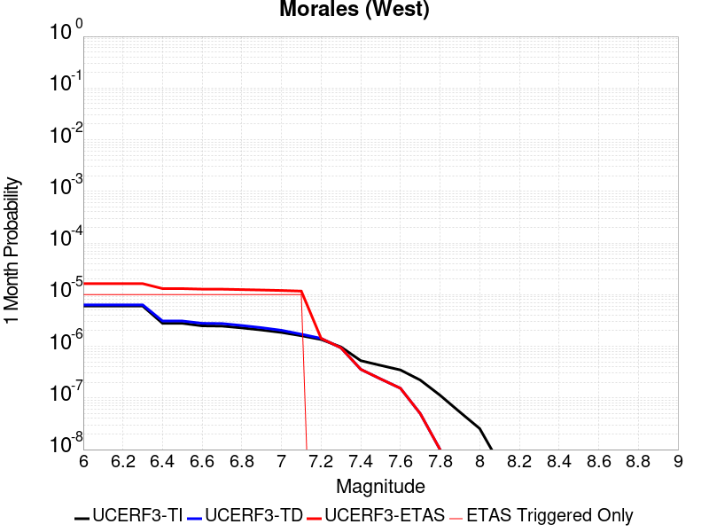 |  |  |

| Magnitude | 1 wk TI Prob | 1 wk TD Prob | 1 wk ETAS Prob | 1 wk ETAS/TD Gain | 1 wk ETAS Triggered Only | 1 mo TI Prob | 1 mo TD Prob | 1 mo ETAS Prob | 1 mo ETAS/TD Gain | 1 mo ETAS Triggered Only | 1 yr TI Prob | 1 yr TD Prob | 1 yr ETAS Prob | 1 yr ETAS/TD Gain | 1 yr ETAS Triggered Only | 10 yr TI Prob | 10 yr TD Prob | 10 yr ETAS Prob | 10 yr ETAS/TD Gain | 10 yr ETAS Triggered Only |
|-----|-----|-----|-----|-----|-----|-----|-----|-----|-----|-----|-----|-----|-----|-----|-----|-----|-----|-----|-----|-----|
| 6.0 | 1.4027072E-6 | 1.4791576E-6 | 1.1479143E-5 | 7.7605944 | 1.0E-5 | 6.0115885E-6 | 6.339236E-6 | 1.6339172E-5 | 2.5774672 | 1.0E-5 | 7.318863E-5 | 7.7178156E-5 | 8.717739E-5 | 1.1295604 | 1.0E-5 | 7.316453E-4 | 7.715821E-4 | 7.815744E-4 | 1.0129504 | 1.0E-5 |
| 6.1 | 1.4027072E-6 | 1.4791576E-6 | 1.1479143E-5 | 7.7605944 | 1.0E-5 | 6.0115885E-6 | 6.339236E-6 | 1.6339172E-5 | 2.5774672 | 1.0E-5 | 7.318863E-5 | 7.7178156E-5 | 8.717739E-5 | 1.1295604 | 1.0E-5 | 7.316453E-4 | 7.715821E-4 | 7.815744E-4 | 1.0129504 | 1.0E-5 |
| 6.2 | 1.4027072E-6 | 1.4791576E-6 | 1.1479143E-5 | 7.7605944 | 1.0E-5 | 6.0115885E-6 | 6.339236E-6 | 1.6339172E-5 | 2.5774672 | 1.0E-5 | 7.318863E-5 | 7.7178156E-5 | 8.717739E-5 | 1.1295604 | 1.0E-5 | 7.316453E-4 | 7.715821E-4 | 7.815744E-4 | 1.0129504 | 1.0E-5 |
| 6.3 | 1.4027072E-6 | 1.4791576E-6 | 1.1479143E-5 | 7.7605944 | 1.0E-5 | 6.0115885E-6 | 6.339236E-6 | 1.6339172E-5 | 2.5774672 | 1.0E-5 | 7.318863E-5 | 7.7178156E-5 | 8.717739E-5 | 1.1295604 | 1.0E-5 | 7.316453E-4 | 7.715821E-4 | 7.815744E-4 | 1.0129504 | 1.0E-5 |
| 6.4 | 6.504502E-7 | 7.2038824E-7 | 1.0720381E-5 | 14.881393 | 1.0E-5 | 2.7876408E-6 | 3.0873746E-6 | 1.3087344E-5 | 4.238988 | 1.0E-5 | 3.3939E-5 | 3.758815E-5 | 4.7587775E-5 | 1.2660313 | 1.0E-5 | 3.3933815E-4 | 3.758191E-4 | 3.8581534E-4 | 1.0265986 | 1.0E-5 |
| 6.5 | 6.504502E-7 | 7.2038824E-7 | 1.0720381E-5 | 14.881393 | 1.0E-5 | 2.7876408E-6 | 3.0873746E-6 | 1.3087344E-5 | 4.238988 | 1.0E-5 | 3.3939E-5 | 3.758815E-5 | 4.7587775E-5 | 1.2660313 | 1.0E-5 | 3.3933815E-4 | 3.758191E-4 | 3.8581534E-4 | 1.0265986 | 1.0E-5 |
| 6.6 | 5.8056526E-7 | 6.500143E-7 | 1.0650007E-5 | 16.384268 | 1.0E-5 | 2.4881344E-6 | 2.7857725E-6 | 1.2785745E-5 | 4.5896587 | 1.0E-5 | 3.0292615E-5 | 3.3916258E-5 | 4.391592E-5 | 1.2948339 | 1.0E-5 | 3.0288487E-4 | 3.3911143E-4 | 3.4910804E-4 | 1.0294788 | 1.0E-5 |
| 6.7 | 5.741448E-7 | 6.435454E-7 | 1.0643539E-5 | 16.53891 | 1.0E-5 | 2.4606184E-6 | 2.7580488E-6 | 1.27580215E-5 | 4.625742 | 1.0E-5 | 2.9957617E-5 | 3.3578734E-5 | 4.3578395E-5 | 1.2977976 | 1.0E-5 | 2.9953578E-4 | 3.357372E-4 | 3.4573383E-4 | 1.0297751 | 1.0E-5 |
| 6.8 | 5.299428E-7 | 5.8909023E-7 | 1.0589084E-5 | 17.975319 | 1.0E-5 | 2.2711813E-6 | 2.52467E-6 | 1.2524644E-5 | 4.9609036 | 1.0E-5 | 2.7651282E-5 | 3.073743E-5 | 4.073712E-5 | 1.3253263 | 1.0E-5 | 2.7647841E-4 | 3.0733226E-4 | 3.1732916E-4 | 1.032528 | 1.0E-5 |
| 6.9 | 4.82394E-7 | 5.3416807E-7 | 1.0534162E-5 | 19.72069 | 1.0E-5 | 2.0674013E-6 | 2.2892896E-6 | 1.2289267E-5 | 5.3681574 | 1.0E-5 | 2.517032E-5 | 2.7871749E-5 | 3.787147E-5 | 1.3587762 | 1.0E-5 | 2.516747E-4 | 2.7868294E-4 | 2.8868014E-4 | 1.035873 | 1.0E-5 |
| 7.0 | 4.3264512E-7 | 4.759864E-7 | 1.0475982E-5 | 22.008993 | 1.0E-5 | 1.8541921E-6 | 2.0399402E-6 | 1.203992E-5 | 5.902095 | 1.0E-5 | 2.2574555E-5 | 2.4835992E-5 | 3.4835743E-5 | 1.4026315 | 1.0E-5 | 2.2572262E-4 | 2.4833248E-4 | 2.5833E-4 | 1.0402586 | 1.0E-5 |
| 7.1 | 3.7388565E-7 | 4.000384E-7 | 1.0400035E-5 | 25.99759 | 1.0E-5 | 1.6023661E-6 | 1.7144492E-6 | 1.1714432E-5 | 6.832767 | 1.0E-5 | 1.9508632E-5 | 2.0873222E-5 | 3.0873012E-5 | 1.4790727 | 1.0E-5 | 1.950692E-4 | 2.0871284E-4 | 2.1871076E-4 | 1.0479027 | 1.0E-5 |
| 7.2 | 3.1592543E-7 | 3.3199075E-7 | 3.3199075E-7 | 1.0 | 0.0 | 1.3539654E-6 | 1.4228168E-6 | 1.4228168E-6 | 1.0 | 0.0 | 1.6484404E-5 | 1.7322658E-5 | 1.7322658E-5 | 1.0 | 0.0 | 1.6483181E-4 | 1.7321325E-4 | 1.7321325E-4 | 1.0 | 0.0 |
| 7.3 | 2.2677783E-7 | 2.1793869E-7 | 2.1793869E-7 | 1.0 | 0.0 | 9.719047E-7 | 9.3402264E-7 | 9.3402264E-7 | 1.0 | 0.0 | 1.1832874E-5 | 1.1371666E-5 | 1.1371666E-5 | 1.0 | 0.0 | 1.18322445E-4 | 1.1371089E-4 | 1.1371089E-4 | 1.0 | 0.0 |
| 7.4 | 1.2295531E-7 | 8.350771E-8 | 8.350771E-8 | 1.0 | 0.0 | 5.269512E-7 | 3.5789014E-7 | 3.5789014E-7 | 1.0 | 0.0 | 6.4156125E-6 | 4.3573036E-6 | 4.3573036E-6 | 1.0 | 0.0 | 6.415427E-5 | 4.357219E-5 | 4.357219E-5 | 1.0 | 0.0 |
| 7.5 | 9.9632544E-8 | 5.443089E-8 | 5.443089E-8 | 1.0 | 0.0 | 4.2699656E-7 | 2.3327522E-7 | 2.3327522E-7 | 1.0 | 0.0 | 5.198671E-6 | 2.840122E-6 | 2.840122E-6 | 1.0 | 0.0 | 5.198549E-5 | 2.8400864E-5 | 2.8400864E-5 | 1.0 | 0.0 |
| 7.6 | 8.125894E-8 | 3.594956E-8 | 3.594956E-8 | 1.0 | 0.0 | 3.4825257E-7 | 1.5406955E-7 | 1.5406955E-7 | 1.0 | 0.0 | 4.2399665E-6 | 1.8757952E-6 | 1.8757952E-6 | 1.0 | 0.0 | 4.2398857E-5 | 1.8757797E-5 | 1.8757797E-5 | 1.0 | 0.0 |
| 7.7 | 5.1810765E-8 | 1.1642662E-8 | 1.1642662E-8 | 1.0 | 0.0 | 2.2204613E-7 | 4.9897128E-8 | 4.9897128E-8 | 1.0 | 0.0 | 2.7034082E-6 | 6.074974E-7 | 6.074974E-7 | 1.0 | 0.0 | 2.7033753E-5 | 6.0749603E-6 | 6.0749603E-6 | 1.0 | 0.0 |
| 7.8 | 2.6315043E-8 | 2.3383624E-9 | 2.3383624E-9 | 1.0 | 0.0 | 1.1277875E-7 | 1.0021558E-8 | 1.0021558E-8 | 1.0 | 0.0 | 1.3730804E-6 | 1.2201247E-7 | 1.2201247E-7 | 1.0 | 0.0 | 1.3730719E-5 | 1.2201268E-6 | 1.2201268E-6 | 1.0 | 0.0 |
| 7.9 | 1.24281545E-8 | 4.207228E-10 | 4.207228E-10 | 1.0 | 0.0 | 5.3263516E-8 | 1.8031033E-9 | 1.8031033E-9 | 1.0 | 0.0 | 6.4848314E-7 | 2.1952776E-8 | 2.1952776E-8 | 1.0 | 0.0 | 6.4848123E-6 | 2.195305E-7 | 2.195305E-7 | 1.0 | 0.0 |
| 8.0 | 5.954214E-9 | 1.8509339E-10 | 1.8509339E-10 | 1.0 | 0.0 | 2.551806E-8 | 7.9326146E-10 | 7.9326146E-10 | 1.0 | 0.0 | 3.1068234E-7 | 9.657958E-9 | 9.657958E-9 | 1.0 | 0.0 | 3.1068191E-6 | 9.658236E-8 | 9.658236E-8 | 1.0 | 0.0 |
| 8.1 | 1.2586262E-9 | 8.346668E-11 | 8.346668E-11 | 1.0 | 0.0 | 5.3941123E-9 | 3.5771386E-10 | 3.5771386E-10 | 1.0 | 0.0 | 6.567332E-8 | 4.355168E-9 | 4.355168E-9 | 1.0 | 0.0 | 6.56733E-7 | 4.3554458E-8 | 4.3554458E-8 | 1.0 | 0.0 |

## Hosgri (Extension)
*[(top)](#table-of-contents)*

| 1 Week | 1 Month | 1 Year | 10 Year |
|-----|-----|-----|-----|
|  |  |  |  |

| Magnitude | 1 wk TI Prob | 1 wk TD Prob | 1 wk ETAS Prob | 1 wk ETAS/TD Gain | 1 wk ETAS Triggered Only | 1 mo TI Prob | 1 mo TD Prob | 1 mo ETAS Prob | 1 mo ETAS/TD Gain | 1 mo ETAS Triggered Only | 1 yr TI Prob | 1 yr TD Prob | 1 yr ETAS Prob | 1 yr ETAS/TD Gain | 1 yr ETAS Triggered Only | 10 yr TI Prob | 10 yr TD Prob | 10 yr ETAS Prob | 10 yr ETAS/TD Gain | 10 yr ETAS Triggered Only |
|-----|-----|-----|-----|-----|-----|-----|-----|-----|-----|-----|-----|-----|-----|-----|-----|-----|-----|-----|-----|-----|
| 6.0 | 1.1369135E-5 | 1.2083072E-5 | 2.2082952E-5 | 1.8275942 | 1.0E-5 | 4.8723956E-5 | 5.1783692E-5 | 6.1783176E-5 | 1.1931009 | 1.0E-5 | 5.9305265E-4 | 6.3030684E-4 | 6.403005E-4 | 1.0158553 | 1.0E-5 | 0.005914725 | 0.0062874397 | 0.006297377 | 1.0015805 | 1.0E-5 |
| 6.1 | 6.934979E-6 | 7.324555E-6 | 7.324555E-6 | 1.0 | 0.0 | 2.9721E-5 | 3.1390595E-5 | 3.1390595E-5 | 1.0 | 0.0 | 3.617931E-4 | 3.8211764E-4 | 3.8211764E-4 | 1.0 | 0.0 | 0.0036120464 | 0.0038150186 | 0.0038150186 | 1.0 | 0.0 |
| 6.2 | 6.934979E-6 | 7.324555E-6 | 7.324555E-6 | 1.0 | 0.0 | 2.9721E-5 | 3.1390595E-5 | 3.1390595E-5 | 1.0 | 0.0 | 3.617931E-4 | 3.8211764E-4 | 3.8211764E-4 | 1.0 | 0.0 | 0.0036120464 | 0.0038150186 | 0.0038150186 | 1.0 | 0.0 |
| 6.3 | 4.5484676E-6 | 4.76933E-6 | 4.76933E-6 | 1.0 | 0.0 | 1.9493287E-5 | 2.043983E-5 | 2.043983E-5 | 1.0 | 0.0 | 2.3730492E-4 | 2.4882692E-4 | 2.4882692E-4 | 1.0 | 0.0 | 0.0023705168 | 0.0024855258 | 0.0024855258 | 1.0 | 0.0 |
| 6.4 | 4.218095E-6 | 4.4168614E-6 | 4.4168614E-6 | 1.0 | 0.0 | 1.8077424E-5 | 1.8929271E-5 | 1.8929271E-5 | 1.0 | 0.0 | 2.2007042E-4 | 2.3043984E-4 | 2.3043984E-4 | 1.0 | 0.0 | 0.002198526 | 0.0023020422 | 0.0023020422 | 1.0 | 0.0 |
| 6.5 | 3.717374E-6 | 3.8838775E-6 | 3.8838775E-6 | 1.0 | 0.0 | 1.5931506E-5 | 1.6645085E-5 | 1.6645085E-5 | 1.0 | 0.0 | 1.9394881E-4 | 2.0263524E-4 | 2.0263524E-4 | 1.0 | 0.0 | 0.0019377962 | 0.0020245234 | 0.0020245234 | 1.0 | 0.0 |
| 6.6 | 3.4605036E-6 | 3.608306E-6 | 3.608306E-6 | 1.0 | 0.0 | 1.4830645E-5 | 1.5464078E-5 | 1.5464078E-5 | 1.0 | 0.0 | 1.8054814E-4 | 1.8825903E-4 | 1.8825903E-4 | 1.0 | 0.0 | 0.0018040152 | 0.0018810101 | 0.0018810101 | 1.0 | 0.0 |
| 6.7 | 3.123439E-6 | 3.2465687E-6 | 3.2465687E-6 | 1.0 | 0.0 | 1.33860985E-5 | 1.3913792E-5 | 1.3913792E-5 | 1.0 | 0.0 | 1.6296357E-4 | 1.6938736E-4 | 1.6938736E-4 | 1.0 | 0.0 | 0.001628441 | 0.0016925934 | 0.0016925934 | 1.0 | 0.0 |
| 6.8 | 2.8290783E-6 | 2.9305404E-6 | 2.9305404E-6 | 1.0 | 0.0 | 1.2124565E-5 | 1.2559399E-5 | 1.2559399E-5 | 1.0 | 0.0 | 1.4760658E-4 | 1.5290003E-4 | 1.5290003E-4 | 1.0 | 0.0 | 0.0014750857 | 0.001527957 | 0.001527957 | 1.0 | 0.0 |
| 6.9 | 2.454112E-6 | 2.5283196E-6 | 2.5283196E-6 | 1.0 | 0.0 | 1.0517581E-5 | 1.0835611E-5 | 1.0835611E-5 | 1.0 | 0.0 | 1.2804402E-4 | 1.3191563E-4 | 1.3191563E-4 | 1.0 | 0.0 | 0.0012797028 | 0.0013183793 | 0.0013183793 | 1.0 | 0.0 |
| 7.0 | 2.1008145E-6 | 2.1498704E-6 | 2.1498704E-6 | 1.0 | 0.0 | 9.003459E-6 | 9.213698E-6 | 9.213698E-6 | 1.0 | 0.0 | 1.096116E-4 | 1.1217103E-4 | 1.1217103E-4 | 1.0 | 0.0 | 0.0010955755 | 0.0011211479 | 0.0011211479 | 1.0 | 0.0 |
| 7.1 | 1.744384E-6 | 1.7686352E-6 | 1.7686352E-6 | 1.0 | 0.0 | 7.47591E-6 | 7.5798434E-6 | 7.5798434E-6 | 1.0 | 0.0 | 9.1015405E-5 | 9.22807E-5 | 9.22807E-5 | 1.0 | 0.0 | 9.097813E-4 | 9.2242553E-4 | 9.2242553E-4 | 1.0 | 0.0 |
| 7.2 | 1.5456587E-6 | 1.5562882E-6 | 1.5562882E-6 | 1.0 | 0.0 | 6.6242346E-6 | 6.66979E-6 | 6.66979E-6 | 1.0 | 0.0 | 8.064707E-5 | 8.120168E-5 | 8.120168E-5 | 1.0 | 0.0 | 8.0617814E-4 | 8.117213E-4 | 8.117213E-4 | 1.0 | 0.0 |
| 7.3 | 1.3775123E-6 | 1.3766082E-6 | 1.3766082E-6 | 1.0 | 0.0 | 5.9036106E-6 | 5.899736E-6 | 5.899736E-6 | 1.0 | 0.0 | 7.187409E-5 | 7.182693E-5 | 7.182693E-5 | 1.0 | 0.0 | 7.185085E-4 | 7.180382E-4 | 7.180382E-4 | 1.0 | 0.0 |
| 7.4 | 1.214491E-6 | 1.2023461E-6 | 1.2023461E-6 | 1.0 | 0.0 | 5.2049513E-6 | 5.1529014E-6 | 5.1529014E-6 | 1.0 | 0.0 | 6.336844E-5 | 6.2734776E-5 | 6.2734776E-5 | 1.0 | 0.0 | 6.335037E-4 | 6.271715E-4 | 6.271715E-4 | 1.0 | 0.0 |
| 7.5 | 1.0101123E-6 | 9.842246E-7 | 9.842246E-7 | 1.0 | 0.0 | 4.3290456E-6 | 4.2180986E-6 | 4.2180986E-6 | 1.0 | 0.0 | 5.2704854E-5 | 5.1354145E-5 | 5.1354145E-5 | 1.0 | 0.0 | 5.2692357E-4 | 5.1342335E-4 | 5.1342335E-4 | 1.0 | 0.0 |
| 7.6 | 8.1558215E-7 | 7.765966E-7 | 7.765966E-7 | 1.0 | 0.0 | 3.4953473E-6 | 3.328267E-6 | 3.328267E-6 | 1.0 | 0.0 | 4.255502E-5 | 4.0520903E-5 | 4.0520903E-5 | 1.0 | 0.0 | 4.2546875E-4 | 4.0513556E-4 | 4.0513556E-4 | 1.0 | 0.0 |
| 7.7 | 4.757816E-7 | 4.1308888E-7 | 4.1308888E-7 | 1.0 | 0.0 | 2.0390623E-6 | 1.7703798E-6 | 1.7703798E-6 | 1.0 | 0.0 | 2.4825302E-5 | 2.155416E-5 | 2.155416E-5 | 1.0 | 0.0 | 2.482253E-4 | 2.1552083E-4 | 2.1552083E-4 | 1.0 | 0.0 |
| 7.8 | 2.782787E-7 | 2.0047722E-7 | 2.0047722E-7 | 1.0 | 0.0 | 1.1926223E-6 | 8.5918776E-7 | 8.5918776E-7 | 1.0 | 0.0 | 1.452008E-5 | 1.04605615E-5 | 1.04605615E-5 | 1.0 | 0.0 | 1.4519131E-4 | 1.04600724E-4 | 1.04600724E-4 | 1.0 | 0.0 |
| 7.9 | 1.6948086E-7 | 9.244227E-8 | 9.244227E-8 | 1.0 | 0.0 | 7.2634634E-7 | 3.961811E-7 | 3.961811E-7 | 1.0 | 0.0 | 8.843231E-6 | 4.8234942E-6 | 4.8234942E-6 | 1.0 | 0.0 | 8.842879E-5 | 4.8233902E-5 | 4.8233902E-5 | 1.0 | 0.0 |
| 8.0 | 1.0225492E-7 | 4.4738776E-8 | 4.4738776E-8 | 1.0 | 0.0 | 4.382353E-7 | 1.917376E-7 | 1.917376E-7 | 1.0 | 0.0 | 5.335502E-6 | 2.3344028E-6 | 2.3344028E-6 | 1.0 | 0.0 | 5.335374E-5 | 2.3343786E-5 | 2.3343786E-5 | 1.0 | 0.0 |
| 8.1 | 1.43711345E-8 | 5.787707E-9 | 5.787707E-9 | 1.0 | 0.0 | 6.1590576E-8 | 2.480446E-8 | 2.480446E-8 | 1.0 | 0.0 | 7.4986497E-7 | 3.0199428E-7 | 3.0199428E-7 | 1.0 | 0.0 | 7.4986247E-6 | 3.0199392E-6 | 3.0199392E-6 | 1.0 | 0.0 |

## Northridge
*[(top)](#table-of-contents)*

| 1 Week | 1 Month | 1 Year | 10 Year |
|-----|-----|-----|-----|
|  |  |  |  |

| Magnitude | 1 wk TI Prob | 1 wk TD Prob | 1 wk ETAS Prob | 1 wk ETAS/TD Gain | 1 wk ETAS Triggered Only | 1 mo TI Prob | 1 mo TD Prob | 1 mo ETAS Prob | 1 mo ETAS/TD Gain | 1 mo ETAS Triggered Only | 1 yr TI Prob | 1 yr TD Prob | 1 yr ETAS Prob | 1 yr ETAS/TD Gain | 1 yr ETAS Triggered Only | 10 yr TI Prob | 10 yr TD Prob | 10 yr ETAS Prob | 10 yr ETAS/TD Gain | 10 yr ETAS Triggered Only |
|-----|-----|-----|-----|-----|-----|-----|-----|-----|-----|-----|-----|-----|-----|-----|-----|-----|-----|-----|-----|-----|
| 6.0 | 1.8340852E-5 | 7.5880193E-6 | 1.7587943E-5 | 2.317857 | 1.0E-5 | 7.860128E-5 | 3.251969E-5 | 4.2519365E-5 | 1.307496 | 1.0E-5 | 9.565505E-4 | 3.958575E-4 | 4.0585353E-4 | 1.0252516 | 1.0E-5 | 0.009524435 | 0.003951746 | 0.0039617065 | 1.0025206 | 1.0E-5 |
| 6.1 | 1.8340852E-5 | 7.5880193E-6 | 1.7587943E-5 | 2.317857 | 1.0E-5 | 7.860128E-5 | 3.251969E-5 | 4.2519365E-5 | 1.307496 | 1.0E-5 | 9.565505E-4 | 3.958575E-4 | 4.0585353E-4 | 1.0252516 | 1.0E-5 | 0.009524435 | 0.003951746 | 0.0039617065 | 1.0025206 | 1.0E-5 |
| 6.2 | 1.8340852E-5 | 7.5880193E-6 | 1.7587943E-5 | 2.317857 | 1.0E-5 | 7.860128E-5 | 3.251969E-5 | 4.2519365E-5 | 1.307496 | 1.0E-5 | 9.565505E-4 | 3.958575E-4 | 4.0585353E-4 | 1.0252516 | 1.0E-5 | 0.009524435 | 0.003951746 | 0.0039617065 | 1.0025206 | 1.0E-5 |
| 6.3 | 1.8340852E-5 | 7.5880193E-6 | 1.7587943E-5 | 2.317857 | 1.0E-5 | 7.860128E-5 | 3.251969E-5 | 4.2519365E-5 | 1.307496 | 1.0E-5 | 9.565505E-4 | 3.958575E-4 | 4.0585353E-4 | 1.0252516 | 1.0E-5 | 0.009524435 | 0.003951746 | 0.0039617065 | 1.0025206 | 1.0E-5 |
| 6.4 | 1.7361892E-5 | 7.5880193E-6 | 1.7587943E-5 | 2.317857 | 1.0E-5 | 7.440598E-5 | 3.251969E-5 | 4.2519365E-5 | 1.307496 | 1.0E-5 | 9.055163E-4 | 3.958575E-4 | 4.0585353E-4 | 1.0252516 | 1.0E-5 | 0.009018354 | 0.003951746 | 0.0039617065 | 1.0025206 | 1.0E-5 |
| 6.5 | 1.7361892E-5 | 7.5880193E-6 | 1.7587943E-5 | 2.317857 | 1.0E-5 | 7.440598E-5 | 3.251969E-5 | 4.2519365E-5 | 1.307496 | 1.0E-5 | 9.055163E-4 | 3.958575E-4 | 4.0585353E-4 | 1.0252516 | 1.0E-5 | 0.009018354 | 0.003951746 | 0.0039617065 | 1.0025206 | 1.0E-5 |
| 6.6 | 1.5458201E-5 | 7.5880193E-6 | 1.7587943E-5 | 2.317857 | 1.0E-5 | 6.624775E-5 | 3.251969E-5 | 4.2519365E-5 | 1.307496 | 1.0E-5 | 8.0626784E-4 | 3.958575E-4 | 4.0585353E-4 | 1.0252516 | 1.0E-5 | 0.008033488 | 0.003951746 | 0.0039617065 | 1.0025206 | 1.0E-5 |
| 6.7 | 1.2538368E-5 | 6.381603E-6 | 1.6381538E-5 | 2.5669944 | 1.0E-5 | 5.3734755E-5 | 2.7349442E-5 | 3.7349168E-5 | 1.3656281 | 1.0E-5 | 6.5402425E-4 | 3.3292902E-4 | 3.429257E-4 | 1.0300264 | 1.0E-5 | 0.0065210275 | 0.0033243506 | 0.0033343174 | 1.0029981 | 1.0E-5 |
| 6.8 | 1.1438097E-5 | 6.3502566E-6 | 1.6350194E-5 | 2.5747294 | 1.0E-5 | 4.9019498E-5 | 2.7215105E-5 | 3.721483E-5 | 1.367433 | 1.0E-5 | 5.9664896E-4 | 3.3129397E-4 | 3.4129064E-4 | 1.0301747 | 1.0E-5 | 0.005950495 | 0.0033080487 | 0.0033180155 | 1.0030129 | 1.0E-5 |
| 6.9 | 1.1204891E-5 | 6.2867084E-6 | 1.6286645E-5 | 2.5906475 | 1.0E-5 | 4.8020076E-5 | 2.694276E-5 | 3.6942492E-5 | 1.3711472 | 1.0E-5 | 5.8448757E-4 | 3.2797916E-4 | 3.379759E-4 | 1.0304798 | 1.0E-5 | 0.0058295266 | 0.0032749989 | 0.003284966 | 1.0030434 | 1.0E-5 |
| 7.0 | 1.061046E-5 | 6.115359E-6 | 1.6115298E-5 | 2.635217 | 1.0E-5 | 4.5472607E-5 | 2.6208421E-5 | 3.620816E-5 | 1.3815467 | 1.0E-5 | 5.534883E-4 | 3.1904122E-4 | 3.2903804E-4 | 1.0313339 | 1.0E-5 | 0.0055211177 | 0.0031858785 | 0.0031958467 | 1.0031289 | 1.0E-5 |
| 7.1 | 1.0266979E-5 | 6.004274E-6 | 1.6004215E-5 | 2.6654704 | 1.0E-5 | 4.40006E-5 | 2.5732352E-5 | 3.5732093E-5 | 1.3886058 | 1.0E-5 | 5.355756E-4 | 3.1324677E-4 | 3.2324364E-4 | 1.0319138 | 1.0E-5 | 0.0053428668 | 0.003128098 | 0.003138067 | 1.0031868 | 1.0E-5 |
| 7.2 | 9.91273E-6 | 5.819984E-6 | 1.5819925E-5 | 2.7182078 | 1.0E-5 | 4.248244E-5 | 2.4942554E-5 | 3.4942303E-5 | 1.4009112 | 1.0E-5 | 5.171009E-4 | 3.036337E-4 | 3.1363065E-4 | 1.0329244 | 1.0E-5 | 0.0051589934 | 0.0030322333 | 0.0030422031 | 1.0032879 | 1.0E-5 |
| 7.3 | 8.4959265E-6 | 5.193062E-6 | 1.519301E-5 | 2.9256363 | 1.0E-5 | 3.6410605E-5 | 2.225579E-5 | 3.2255568E-5 | 1.4493113 | 1.0E-5 | 4.4320893E-4 | 2.709308E-4 | 2.809281E-4 | 1.0368998 | 1.0E-5 | 0.00442326 | 0.0027060313 | 0.0027160044 | 1.0036855 | 1.0E-5 |
| 7.4 | 8.0847185E-6 | 4.9819355E-6 | 1.4981886E-5 | 3.007242 | 1.0E-5 | 3.4648332E-5 | 2.135098E-5 | 3.1350766E-5 | 1.4683526 | 1.0E-5 | 4.2176177E-4 | 2.599174E-4 | 2.699148E-4 | 1.0384637 | 1.0E-5 | 0.0042096223 | 0.00259616 | 0.002606134 | 1.0038419 | 1.0E-5 |
| 7.5 | 6.8220684E-6 | 4.2533075E-6 | 1.4253265E-5 | 3.3511014 | 1.0E-5 | 2.9237108E-5 | 1.8228335E-5 | 2.8228153E-5 | 1.5485865 | 1.0E-5 | 3.5590364E-4 | 2.2190758E-4 | 2.3190536E-4 | 1.0450538 | 1.0E-5 | 0.0035533418 | 0.002216881 | 0.0022268586 | 1.0045009 | 1.0E-5 |
| 7.6 | 4.4224143E-6 | 2.8999582E-6 | 1.2899929E-5 | 4.4483156 | 1.0E-5 | 1.8953066E-5 | 1.2428334E-5 | 2.242821E-5 | 1.8046031 | 1.0E-5 | 2.3072914E-4 | 1.5130457E-4 | 1.6130306E-4 | 1.0660819 | 1.0E-5 | 0.0023048974 | 0.0015120271 | 0.001522012 | 1.0066036 | 1.0E-5 |
| 7.7 | 2.5297056E-6 | 1.6045905E-6 | 1.1604575E-5 | 7.2321095 | 1.0E-5 | 1.0841551E-5 | 6.8767986E-6 | 1.687673E-5 | 2.454155 | 1.0E-5 | 1.319879E-4 | 8.3721854E-5 | 9.372101E-5 | 1.1194332 | 1.0E-5 | 0.0013190953 | 8.369078E-4 | 8.4689946E-4 | 1.0119387 | 1.0E-5 |
| 7.8 | 1.2508156E-6 | 8.780076E-7 | 1.0877999E-5 | 12.389413 | 1.0E-5 | 5.3606273E-6 | 3.7628845E-6 | 1.3762847E-5 | 3.6575258 | 1.0E-5 | 6.526368E-5 | 4.581217E-5 | 5.581171E-5 | 1.2182726 | 1.0E-5 | 6.524452E-4 | 4.5802852E-4 | 4.6802394E-4 | 1.0218227 | 1.0E-5 |
| 7.9 | 2.262199E-7 | 1.4664671E-7 | 1.0146645E-5 | 69.191086 | 1.0E-5 | 9.695135E-7 | 6.284858E-7 | 1.062848E-5 | 16.91125 | 1.0E-5 | 1.1803763E-5 | 7.651788E-6 | 1.7651711E-5 | 2.306874 | 1.0E-5 | 1.1803136E-4 | 7.651533E-5 | 8.651456E-5 | 1.1306828 | 1.0E-5 |
| 8.0 | 2.865362E-9 | 1.2753101E-9 | 1.2753101E-9 | 1.0 | 0.0 | 1.2280123E-8 | 5.4656146E-9 | 5.4656146E-9 | 1.0 | 0.0 | 1.4951048E-7 | 6.654386E-8 | 6.654386E-8 | 1.0 | 0.0 | 1.4951038E-6 | 6.654386E-7 | 6.654386E-7 | 1.0 | 0.0 |

## Northridge Hills
*[(top)](#table-of-contents)*

| 1 Week | 1 Month | 1 Year | 10 Year |
|-----|-----|-----|-----|
|  |  |  |  |

| Magnitude | 1 wk TI Prob | 1 wk TD Prob | 1 wk ETAS Prob | 1 wk ETAS/TD Gain | 1 wk ETAS Triggered Only | 1 mo TI Prob | 1 mo TD Prob | 1 mo ETAS Prob | 1 mo ETAS/TD Gain | 1 mo ETAS Triggered Only | 1 yr TI Prob | 1 yr TD Prob | 1 yr ETAS Prob | 1 yr ETAS/TD Gain | 1 yr ETAS Triggered Only | 10 yr TI Prob | 10 yr TD Prob | 10 yr ETAS Prob | 10 yr ETAS/TD Gain | 10 yr ETAS Triggered Only |
|-----|-----|-----|-----|-----|-----|-----|-----|-----|-----|-----|-----|-----|-----|-----|-----|-----|-----|-----|-----|-----|
| 6.0 | 5.095982E-6 | 3.6152098E-6 | 3.6152098E-6 | 1.0 | 0.0 | 2.183974E-5 | 1.5493664E-5 | 2.549351E-5 | 1.6454151 | 1.0E-5 | 2.658664E-4 | 1.8861916E-4 | 1.9861727E-4 | 1.0530069 | 1.0E-5 | 0.0026554854 | 0.001884603 | 0.0018945843 | 1.0052961 | 1.0E-5 |
| 6.1 | 5.095982E-6 | 3.6152098E-6 | 3.6152098E-6 | 1.0 | 0.0 | 2.183974E-5 | 1.5493664E-5 | 2.549351E-5 | 1.6454151 | 1.0E-5 | 2.658664E-4 | 1.8861916E-4 | 1.9861727E-4 | 1.0530069 | 1.0E-5 | 0.0026554854 | 0.001884603 | 0.0018945843 | 1.0052961 | 1.0E-5 |
| 6.2 | 5.095982E-6 | 3.6152098E-6 | 3.6152098E-6 | 1.0 | 0.0 | 2.183974E-5 | 1.5493664E-5 | 2.549351E-5 | 1.6454151 | 1.0E-5 | 2.658664E-4 | 1.8861916E-4 | 1.9861727E-4 | 1.0530069 | 1.0E-5 | 0.0026554854 | 0.001884603 | 0.0018945843 | 1.0052961 | 1.0E-5 |
| 6.3 | 5.095982E-6 | 3.6152098E-6 | 3.6152098E-6 | 1.0 | 0.0 | 2.183974E-5 | 1.5493664E-5 | 2.549351E-5 | 1.6454151 | 1.0E-5 | 2.658664E-4 | 1.8861916E-4 | 1.9861727E-4 | 1.0530069 | 1.0E-5 | 0.0026554854 | 0.001884603 | 0.0018945843 | 1.0052961 | 1.0E-5 |
| 6.4 | 5.095982E-6 | 3.6152098E-6 | 3.6152098E-6 | 1.0 | 0.0 | 2.183974E-5 | 1.5493664E-5 | 2.549351E-5 | 1.6454151 | 1.0E-5 | 2.658664E-4 | 1.8861916E-4 | 1.9861727E-4 | 1.0530069 | 1.0E-5 | 0.0026554854 | 0.001884603 | 0.0018945843 | 1.0052961 | 1.0E-5 |
| 6.5 | 5.095982E-6 | 3.6152098E-6 | 3.6152098E-6 | 1.0 | 0.0 | 2.183974E-5 | 1.5493664E-5 | 2.549351E-5 | 1.6454151 | 1.0E-5 | 2.658664E-4 | 1.8861916E-4 | 1.9861727E-4 | 1.0530069 | 1.0E-5 | 0.0026554854 | 0.001884603 | 0.0018945843 | 1.0052961 | 1.0E-5 |
| 6.6 | 5.095982E-6 | 3.6152098E-6 | 3.6152098E-6 | 1.0 | 0.0 | 2.183974E-5 | 1.5493664E-5 | 2.549351E-5 | 1.6454151 | 1.0E-5 | 2.658664E-4 | 1.8861916E-4 | 1.9861727E-4 | 1.0530069 | 1.0E-5 | 0.0026554854 | 0.001884603 | 0.0018945843 | 1.0052961 | 1.0E-5 |
| 6.7 | 5.095982E-6 | 3.6152098E-6 | 3.6152098E-6 | 1.0 | 0.0 | 2.183974E-5 | 1.5493664E-5 | 2.549351E-5 | 1.6454151 | 1.0E-5 | 2.658664E-4 | 1.8861916E-4 | 1.9861727E-4 | 1.0530069 | 1.0E-5 | 0.0026554854 | 0.001884603 | 0.0018945843 | 1.0052961 | 1.0E-5 |
| 6.8 | 5.095982E-6 | 3.6152098E-6 | 3.6152098E-6 | 1.0 | 0.0 | 2.183974E-5 | 1.5493664E-5 | 2.549351E-5 | 1.6454151 | 1.0E-5 | 2.658664E-4 | 1.8861916E-4 | 1.9861727E-4 | 1.0530069 | 1.0E-5 | 0.0026554854 | 0.001884603 | 0.0018945843 | 1.0052961 | 1.0E-5 |
| 6.9 | 5.0942654E-6 | 3.6134247E-6 | 3.6134247E-6 | 1.0 | 0.0 | 2.1832384E-5 | 1.5486015E-5 | 2.548586E-5 | 1.645734 | 1.0E-5 | 2.6577685E-4 | 1.8852603E-4 | 1.9852415E-4 | 1.0530331 | 1.0E-5 | 0.002654592 | 0.0018836735 | 0.0018936546 | 1.0052987 | 1.0E-5 |
| 7.0 | 4.851143E-6 | 3.3587396E-6 | 3.3587396E-6 | 1.0 | 0.0 | 2.0790447E-5 | 1.4394519E-5 | 2.4394376E-5 | 1.6946988 | 1.0E-5 | 2.5309427E-4 | 1.7523921E-4 | 1.8523747E-4 | 1.0570549 | 1.0E-5 | 0.0025280623 | 0.0017510147 | 0.0017609972 | 1.005701 | 1.0E-5 |
| 7.1 | 4.7910607E-6 | 3.2970208E-6 | 3.2970208E-6 | 1.0 | 0.0 | 2.0532956E-5 | 1.4130013E-5 | 2.4129871E-5 | 1.7077035 | 1.0E-5 | 2.4996005E-4 | 1.7201937E-4 | 1.8201764E-4 | 1.058123 | 1.0E-5 | 0.0024967908 | 0.0017188663 | 0.001728849 | 1.0058078 | 1.0E-5 |
| 7.2 | 4.580079E-6 | 3.1067987E-6 | 3.1067987E-6 | 1.0 | 0.0 | 1.9628762E-5 | 1.3314784E-5 | 2.3314651E-5 | 1.7510349 | 1.0E-5 | 2.3895396E-4 | 1.6209547E-4 | 1.7209385E-4 | 1.061682 | 1.0E-5 | 0.0023869718 | 0.0016197758 | 0.0016297597 | 1.0061637 | 1.0E-5 |
| 7.3 | 4.290062E-6 | 2.8682275E-6 | 2.8682275E-6 | 1.0 | 0.0 | 1.838585E-5 | 1.2292346E-5 | 1.2292346E-5 | 1.0 | 0.0 | 2.2382473E-4 | 1.4964906E-4 | 1.4964906E-4 | 1.0 | 0.0 | 0.0022359942 | 0.0014954859 | 0.0014954859 | 1.0 | 0.0 |
| 7.4 | 4.0259683E-6 | 2.673904E-6 | 2.673904E-6 | 1.0 | 0.0 | 1.7254037E-5 | 1.1459538E-5 | 1.1459538E-5 | 1.0 | 0.0 | 2.1004764E-4 | 1.3951097E-4 | 1.3951097E-4 | 1.0 | 0.0 | 0.002098492 | 0.0013942367 | 0.0013942367 | 1.0 | 0.0 |
| 7.5 | 3.5477108E-6 | 2.285216E-6 | 2.285216E-6 | 1.0 | 0.0 | 1.5204386E-5 | 9.793746E-6 | 9.793746E-6 | 1.0 | 0.0 | 1.8509767E-4 | 1.1923235E-4 | 1.1923235E-4 | 1.0 | 0.0 | 0.0018494357 | 0.0011916853 | 0.0011916853 | 1.0 | 0.0 |
| 7.6 | 2.9990608E-6 | 1.8528339E-6 | 1.8528339E-6 | 1.0 | 0.0 | 1.2853055E-5 | 7.940693E-6 | 7.940693E-6 | 1.0 | 0.0 | 1.564747E-4 | 9.667365E-5 | 9.667365E-5 | 1.0 | 0.0 | 0.0015636457 | 9.663168E-4 | 9.663168E-4 | 1.0 | 0.0 |
| 7.7 | 2.4542855E-6 | 1.4461344E-6 | 1.4461344E-6 | 1.0 | 0.0 | 1.05183235E-5 | 6.197704E-6 | 6.197704E-6 | 1.0 | 0.0 | 1.2805307E-4 | 7.545444E-5 | 7.545444E-5 | 1.0 | 0.0 | 0.001279793 | 7.5428875E-4 | 7.5428875E-4 | 1.0 | 0.0 |
| 7.8 | 1.3623128E-6 | 8.016168E-7 | 8.016168E-7 | 1.0 | 0.0 | 5.8384703E-6 | 3.4354962E-6 | 3.4354962E-6 | 1.0 | 0.0 | 7.108106E-5 | 4.1826366E-5 | 4.1826366E-5 | 1.0 | 0.0 | 7.1058323E-4 | 4.1818514E-4 | 4.1818514E-4 | 1.0 | 0.0 |
| 7.9 | 7.716622E-7 | 4.218757E-7 | 4.218757E-7 | 1.0 | 0.0 | 3.3071194E-6 | 1.8080375E-6 | 1.8080375E-6 | 1.0 | 0.0 | 4.0263436E-5 | 2.2012635E-5 | 2.2012635E-5 | 1.0 | 0.0 | 4.0256142E-4 | 2.2010466E-4 | 2.2010466E-4 | 1.0 | 0.0 |
| 8.0 | 1.2117711E-7 | 6.6220565E-8 | 6.6220565E-8 | 1.0 | 0.0 | 5.1933034E-7 | 2.838024E-7 | 2.838024E-7 | 1.0 | 0.0 | 6.3228285E-6 | 3.4552888E-6 | 3.4552888E-6 | 1.0 | 0.0 | 6.3226486E-5 | 3.455237E-5 | 3.455237E-5 | 1.0 | 0.0 |

## Los Alamos extension
*[(top)](#table-of-contents)*

| 1 Week | 1 Month | 1 Year | 10 Year |
|-----|-----|-----|-----|
|  |  |  | 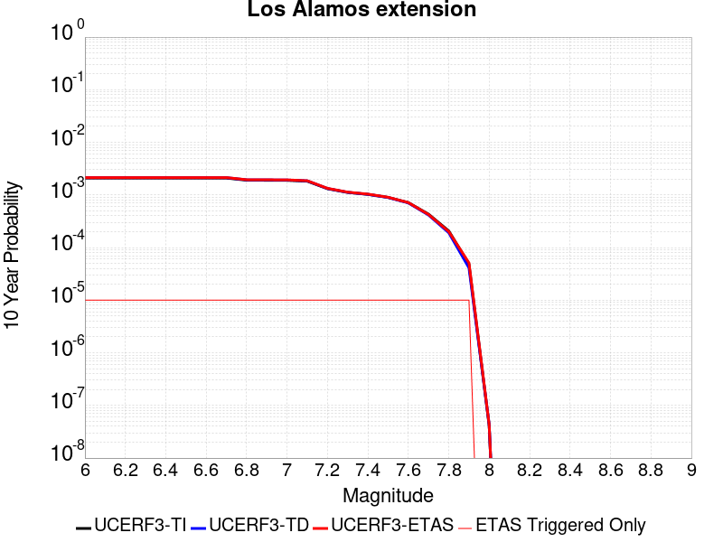 |

| Magnitude | 1 wk TI Prob | 1 wk TD Prob | 1 wk ETAS Prob | 1 wk ETAS/TD Gain | 1 wk ETAS Triggered Only | 1 mo TI Prob | 1 mo TD Prob | 1 mo ETAS Prob | 1 mo ETAS/TD Gain | 1 mo ETAS Triggered Only | 1 yr TI Prob | 1 yr TD Prob | 1 yr ETAS Prob | 1 yr ETAS/TD Gain | 1 yr ETAS Triggered Only | 10 yr TI Prob | 10 yr TD Prob | 10 yr ETAS Prob | 10 yr ETAS/TD Gain | 10 yr ETAS Triggered Only |
|-----|-----|-----|-----|-----|-----|-----|-----|-----|-----|-----|-----|-----|-----|-----|-----|-----|-----|-----|-----|-----|
| 6.0 | 4.0146506E-6 | 4.0861596E-6 | 1.4086118E-5 | 3.4472756 | 1.0E-5 | 1.7205533E-5 | 1.7512002E-5 | 2.7511827E-5 | 1.5710269 | 1.0E-5 | 2.0945723E-4 | 2.1318886E-4 | 2.2318673E-4 | 1.0468968 | 1.0E-5 | 0.0020925992 | 0.0021299527 | 0.0021399313 | 1.0046849 | 1.0E-5 |
| 6.1 | 4.0146506E-6 | 4.0861596E-6 | 1.4086118E-5 | 3.4472756 | 1.0E-5 | 1.7205533E-5 | 1.7512002E-5 | 2.7511827E-5 | 1.5710269 | 1.0E-5 | 2.0945723E-4 | 2.1318886E-4 | 2.2318673E-4 | 1.0468968 | 1.0E-5 | 0.0020925992 | 0.0021299527 | 0.0021399313 | 1.0046849 | 1.0E-5 |
| 6.2 | 4.0146506E-6 | 4.0861596E-6 | 1.4086118E-5 | 3.4472756 | 1.0E-5 | 1.7205533E-5 | 1.7512002E-5 | 2.7511827E-5 | 1.5710269 | 1.0E-5 | 2.0945723E-4 | 2.1318886E-4 | 2.2318673E-4 | 1.0468968 | 1.0E-5 | 0.0020925992 | 0.0021299527 | 0.0021399313 | 1.0046849 | 1.0E-5 |
| 6.3 | 4.0146506E-6 | 4.0861596E-6 | 1.4086118E-5 | 3.4472756 | 1.0E-5 | 1.7205533E-5 | 1.7512002E-5 | 2.7511827E-5 | 1.5710269 | 1.0E-5 | 2.0945723E-4 | 2.1318886E-4 | 2.2318673E-4 | 1.0468968 | 1.0E-5 | 0.0020925992 | 0.0021299527 | 0.0021399313 | 1.0046849 | 1.0E-5 |
| 6.4 | 4.0146506E-6 | 4.0861596E-6 | 1.4086118E-5 | 3.4472756 | 1.0E-5 | 1.7205533E-5 | 1.7512002E-5 | 2.7511827E-5 | 1.5710269 | 1.0E-5 | 2.0945723E-4 | 2.1318886E-4 | 2.2318673E-4 | 1.0468968 | 1.0E-5 | 0.0020925992 | 0.0021299527 | 0.0021399313 | 1.0046849 | 1.0E-5 |
| 6.5 | 4.0146506E-6 | 4.0861596E-6 | 1.4086118E-5 | 3.4472756 | 1.0E-5 | 1.7205533E-5 | 1.7512002E-5 | 2.7511827E-5 | 1.5710269 | 1.0E-5 | 2.0945723E-4 | 2.1318886E-4 | 2.2318673E-4 | 1.0468968 | 1.0E-5 | 0.0020925992 | 0.0021299527 | 0.0021399313 | 1.0046849 | 1.0E-5 |
| 6.6 | 4.0146506E-6 | 4.0861596E-6 | 1.4086118E-5 | 3.4472756 | 1.0E-5 | 1.7205533E-5 | 1.7512002E-5 | 2.7511827E-5 | 1.5710269 | 1.0E-5 | 2.0945723E-4 | 2.1318886E-4 | 2.2318673E-4 | 1.0468968 | 1.0E-5 | 0.0020925992 | 0.0021299527 | 0.0021399313 | 1.0046849 | 1.0E-5 |
| 6.7 | 4.0146506E-6 | 4.0861596E-6 | 1.4086118E-5 | 3.4472756 | 1.0E-5 | 1.7205533E-5 | 1.7512002E-5 | 2.7511827E-5 | 1.5710269 | 1.0E-5 | 2.0945723E-4 | 2.1318886E-4 | 2.2318673E-4 | 1.0468968 | 1.0E-5 | 0.0020925992 | 0.0021299527 | 0.0021399313 | 1.0046849 | 1.0E-5 |
| 6.8 | 3.6584688E-6 | 3.7188588E-6 | 1.3718822E-5 | 3.6889868 | 1.0E-5 | 1.5679057E-5 | 1.5937874E-5 | 2.5937716E-5 | 1.6274263 | 1.0E-5 | 1.9087581E-4 | 1.9402728E-4 | 2.0402535E-4 | 1.0515292 | 1.0E-5 | 0.0019071194 | 0.0019386712 | 0.0019486519 | 1.0051482 | 1.0E-5 |
| 6.9 | 3.644631E-6 | 3.7045688E-6 | 1.3704532E-5 | 3.6993594 | 1.0E-5 | 1.5619753E-5 | 1.5876632E-5 | 2.5876474E-5 | 1.6298465 | 1.0E-5 | 1.901539E-4 | 1.9328178E-4 | 2.0327985E-4 | 1.0517279 | 1.0E-5 | 0.0018999127 | 0.0019312293 | 0.0019412099 | 1.0051681 | 1.0E-5 |
| 7.0 | 3.6318522E-6 | 3.6913295E-6 | 1.3691292E-5 | 3.709041 | 1.0E-5 | 1.5564989E-5 | 1.5819893E-5 | 2.5819734E-5 | 1.6321056 | 1.0E-5 | 1.8948725E-4 | 1.925911E-4 | 2.0258917E-4 | 1.0519135 | 1.0E-5 | 0.0018932576 | 0.0019243343 | 0.0019343151 | 1.0051866 | 1.0E-5 |
| 7.1 | 3.5001724E-6 | 3.5554E-6 | 1.3555365E-5 | 3.812613 | 1.0E-5 | 1.5000653E-5 | 1.5237345E-5 | 2.5237192E-5 | 1.6562723 | 1.0E-5 | 1.8261763E-4 | 1.854998E-4 | 1.9549794E-4 | 1.0538985 | 1.0E-5 | 0.0018246764 | 0.0018535402 | 0.0018635218 | 1.005385 | 1.0E-5 |
| 7.2 | 2.5204702E-6 | 2.5436943E-6 | 1.2543669E-5 | 4.93128 | 1.0E-5 | 1.080197E-5 | 1.0901502E-5 | 2.0901392E-5 | 1.9172949 | 1.0E-5 | 1.3150605E-4 | 1.3271775E-4 | 1.4271642E-4 | 1.0753379 | 1.0E-5 | 0.0013142825 | 0.0013263905 | 0.0013363772 | 1.0075293 | 1.0E-5 |
| 7.3 | 2.1399692E-6 | 2.1501316E-6 | 1.215011E-5 | 5.650868 | 1.0E-5 | 9.1712645E-6 | 9.2148175E-6 | 1.9214725E-5 | 2.0851986 | 1.0E-5 | 1.1165442E-4 | 1.1218466E-4 | 1.2218354E-4 | 1.0891287 | 1.0E-5 | 0.0011159834 | 0.0011212835 | 0.0011312723 | 1.0089084 | 1.0E-5 |
| 7.4 | 1.9660122E-6 | 1.9702363E-6 | 1.1970216E-5 | 6.0755234 | 1.0E-5 | 8.42574E-6 | 8.4438425E-6 | 1.8443758E-5 | 2.184285 | 1.0E-5 | 1.0257855E-4 | 1.0279897E-4 | 1.1279794E-4 | 1.0972673 | 1.0E-5 | 0.0010253121 | 0.0010275173 | 0.001037507 | 1.0097222 | 1.0E-5 |
| 7.5 | 1.7204633E-6 | 1.7150983E-6 | 1.1715081E-5 | 6.8305597 | 1.0E-5 | 7.373393E-6 | 7.3504007E-6 | 1.7350327E-5 | 2.36046 | 1.0E-5 | 8.976737E-5 | 8.948748E-5 | 9.948659E-5 | 1.1117375 | 1.0E-5 | 8.9731114E-4 | 8.9451746E-4 | 9.045085E-4 | 1.0111692 | 1.0E-5 |
| 7.6 | 1.3717638E-6 | 1.3535827E-6 | 1.1353569E-5 | 8.387792 | 1.0E-5 | 5.878974E-6 | 5.8010555E-6 | 1.5800997E-5 | 2.7238142 | 1.0E-5 | 7.157416E-5 | 7.062559E-5 | 8.0624886E-5 | 1.1415818 | 1.0E-5 | 7.1551115E-4 | 7.060341E-4 | 7.16027E-4 | 1.0141536 | 1.0E-5 |
| 7.7 | 8.272564E-7 | 7.957636E-7 | 1.0795756E-5 | 13.566536 | 1.0E-5 | 3.5453797E-6 | 3.410411E-6 | 1.3410377E-5 | 3.932188 | 1.0E-5 | 4.3164142E-5 | 4.1520965E-5 | 5.152055E-5 | 1.2408322 | 1.0E-5 | 4.315576E-4 | 4.1513226E-4 | 4.2512812E-4 | 1.0240787 | 1.0E-5 |
| 7.8 | 3.9708277E-7 | 3.6719027E-7 | 1.0367186E-5 | 28.233828 | 1.0E-5 | 1.7017821E-6 | 1.5736716E-6 | 1.1573656E-5 | 7.354556 | 1.0E-5 | 2.0719E-5 | 1.9159284E-5 | 2.9159093E-5 | 1.5219302 | 1.0E-5 | 2.071707E-4 | 1.9157639E-4 | 2.0157447E-4 | 1.0521885 | 1.0E-5 |
| 7.9 | 9.292528E-8 | 7.889087E-8 | 1.007889E-5 | 127.75737 | 1.0E-5 | 3.9825116E-7 | 3.381037E-7 | 1.03381E-5 | 30.576715 | 1.0E-5 | 4.848697E-6 | 4.116405E-6 | 1.4116364E-5 | 3.4292943 | 1.0E-5 | 4.8485912E-5 | 4.1163294E-5 | 5.1162882E-5 | 1.2429249 | 1.0E-5 |
| 8.0 | 7.880441E-11 | 8.2353124E-11 | 8.2353124E-11 | 1.0 | 0.0 | 3.3773329E-10 | 3.52942E-10 | 3.52942E-10 | 1.0 | 0.0 | 4.1119033E-9 | 4.2970694E-9 | 4.2970694E-9 | 1.0 | 0.0 | 4.1119034E-8 | 4.2970694E-8 | 4.2970694E-8 | 1.0 | 0.0 |

## Mount Diablo Thrust North CFM
*[(top)](#table-of-contents)*

| 1 Week | 1 Month | 1 Year | 10 Year |
|-----|-----|-----|-----|
| 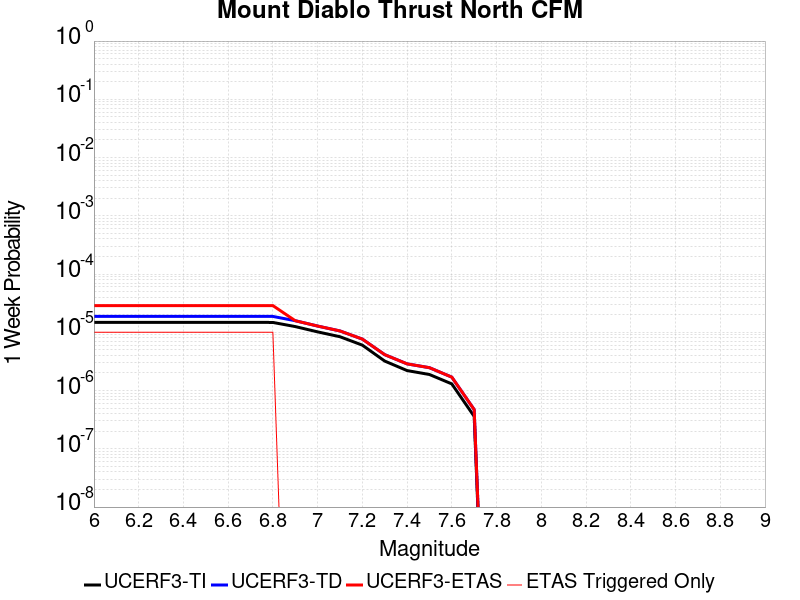 |  | 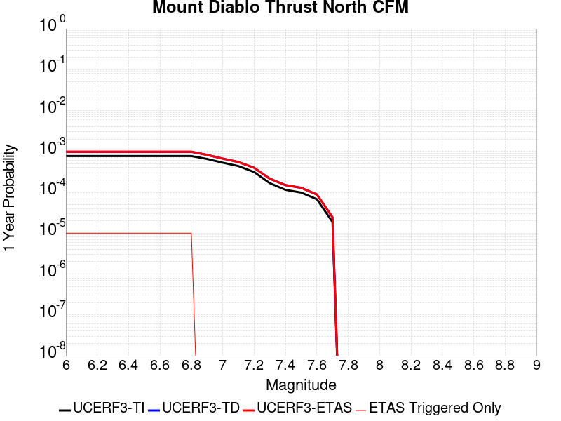 |  |

| Magnitude | 1 wk TI Prob | 1 wk TD Prob | 1 wk ETAS Prob | 1 wk ETAS/TD Gain | 1 wk ETAS Triggered Only | 1 mo TI Prob | 1 mo TD Prob | 1 mo ETAS Prob | 1 mo ETAS/TD Gain | 1 mo ETAS Triggered Only | 1 yr TI Prob | 1 yr TD Prob | 1 yr ETAS Prob | 1 yr ETAS/TD Gain | 1 yr ETAS Triggered Only | 10 yr TI Prob | 10 yr TD Prob | 10 yr ETAS Prob | 10 yr ETAS/TD Gain | 10 yr ETAS Triggered Only |
|-----|-----|-----|-----|-----|-----|-----|-----|-----|-----|-----|-----|-----|-----|-----|-----|-----|-----|-----|-----|-----|
| 6.0 | 1.479628E-5 | 1.876973E-5 | 2.8769542E-5 | 1.5327626 | 1.0E-5 | 6.341109E-5 | 8.043928E-5 | 9.043847E-5 | 1.1243074 | 1.0E-5 | 7.717565E-4 | 9.789177E-4 | 9.889079E-4 | 1.0102054 | 1.0E-5 | 0.007690818 | 0.009747355 | 0.009757258 | 1.0010159 | 1.0E-5 |
| 6.1 | 1.479628E-5 | 1.876973E-5 | 2.8769542E-5 | 1.5327626 | 1.0E-5 | 6.341109E-5 | 8.043928E-5 | 9.043847E-5 | 1.1243074 | 1.0E-5 | 7.717565E-4 | 9.789177E-4 | 9.889079E-4 | 1.0102054 | 1.0E-5 | 0.007690818 | 0.009747355 | 0.009757258 | 1.0010159 | 1.0E-5 |
| 6.2 | 1.479628E-5 | 1.876973E-5 | 2.8769542E-5 | 1.5327626 | 1.0E-5 | 6.341109E-5 | 8.043928E-5 | 9.043847E-5 | 1.1243074 | 1.0E-5 | 7.717565E-4 | 9.789177E-4 | 9.889079E-4 | 1.0102054 | 1.0E-5 | 0.007690818 | 0.009747355 | 0.009757258 | 1.0010159 | 1.0E-5 |
| 6.3 | 1.479628E-5 | 1.876973E-5 | 2.8769542E-5 | 1.5327626 | 1.0E-5 | 6.341109E-5 | 8.043928E-5 | 9.043847E-5 | 1.1243074 | 1.0E-5 | 7.717565E-4 | 9.789177E-4 | 9.889079E-4 | 1.0102054 | 1.0E-5 | 0.007690818 | 0.009747355 | 0.009757258 | 1.0010159 | 1.0E-5 |
| 6.4 | 1.479628E-5 | 1.876973E-5 | 2.8769542E-5 | 1.5327626 | 1.0E-5 | 6.341109E-5 | 8.043928E-5 | 9.043847E-5 | 1.1243074 | 1.0E-5 | 7.717565E-4 | 9.789177E-4 | 9.889079E-4 | 1.0102054 | 1.0E-5 | 0.007690818 | 0.009747355 | 0.009757258 | 1.0010159 | 1.0E-5 |
| 6.5 | 1.479628E-5 | 1.876973E-5 | 2.8769542E-5 | 1.5327626 | 1.0E-5 | 6.341109E-5 | 8.043928E-5 | 9.043847E-5 | 1.1243074 | 1.0E-5 | 7.717565E-4 | 9.789177E-4 | 9.889079E-4 | 1.0102054 | 1.0E-5 | 0.007690818 | 0.009747355 | 0.009757258 | 1.0010159 | 1.0E-5 |
| 6.6 | 1.479016E-5 | 1.8762841E-5 | 2.8762654E-5 | 1.5329583 | 1.0E-5 | 6.338486E-5 | 8.040976E-5 | 9.0408954E-5 | 1.124353 | 1.0E-5 | 7.714374E-4 | 9.785586E-4 | 9.885489E-4 | 1.0102091 | 1.0E-5 | 0.007687649 | 0.009743797 | 0.0097536985 | 1.0010163 | 1.0E-5 |
| 6.7 | 1.479016E-5 | 1.8762841E-5 | 2.8762654E-5 | 1.5329583 | 1.0E-5 | 6.338486E-5 | 8.040976E-5 | 9.0408954E-5 | 1.124353 | 1.0E-5 | 7.714374E-4 | 9.785586E-4 | 9.885489E-4 | 1.0102091 | 1.0E-5 | 0.007687649 | 0.009743797 | 0.0097536985 | 1.0010163 | 1.0E-5 |
| 6.8 | 1.4771667E-5 | 1.8741612E-5 | 2.8741424E-5 | 1.5335621 | 1.0E-5 | 6.330561E-5 | 8.031878E-5 | 9.0317975E-5 | 1.1244938 | 1.0E-5 | 7.704732E-4 | 9.774519E-4 | 9.874422E-4 | 1.0102206 | 1.0E-5 | 0.007678074 | 0.009732827 | 0.009742729 | 1.0010175 | 1.0E-5 |
| 6.9 | 1.2548234E-5 | 1.5822025E-5 | 1.5822025E-5 | 1.0 | 0.0 | 5.3777036E-5 | 6.780694E-5 | 6.780694E-5 | 1.0 | 0.0 | 6.545387E-4 | 8.2524033E-4 | 8.2524033E-4 | 1.0 | 0.0 | 0.006526142 | 0.008222396 | 0.008222396 | 1.0 | 0.0 |
| 7.0 | 1.01754185E-5 | 1.2808985E-5 | 1.2808985E-5 | 1.0 | 0.0 | 4.360821E-5 | 5.4894506E-5 | 5.4894506E-5 | 1.0 | 0.0 | 5.308006E-4 | 6.6813733E-4 | 6.6813733E-4 | 1.0 | 0.0 | 0.005295345 | 0.006661672 | 0.006661672 | 1.0 | 0.0 |
| 7.1 | 8.398341E-6 | 1.0554712E-5 | 1.0554712E-5 | 1.0 | 0.0 | 3.5992394E-5 | 4.5233704E-5 | 4.5233704E-5 | 1.0 | 0.0 | 4.3811928E-4 | 5.5058225E-4 | 5.5058225E-4 | 1.0 | 0.0 | 0.0043725655 | 0.0054924674 | 0.0054924674 | 1.0 | 0.0 |
| 7.2 | 6.024759E-6 | 7.648385E-6 | 7.648385E-6 | 1.0 | 0.0 | 2.582014E-5 | 3.2778386E-5 | 3.2778386E-5 | 1.0 | 0.0 | 3.1431485E-4 | 3.9900444E-4 | 3.9900444E-4 | 1.0 | 0.0 | 0.0031387066 | 0.0039830892 | 0.0039830892 | 1.0 | 0.0 |
| 7.3 | 3.2099704E-6 | 4.1355897E-6 | 4.1355897E-6 | 1.0 | 0.0 | 1.3756943E-5 | 1.7723836E-5 | 1.7723836E-5 | 1.0 | 0.0 | 1.674779E-4 | 2.1576651E-4 | 2.1576651E-4 | 1.0 | 0.0 | 0.0016735174 | 0.0021556707 | 0.0021556707 | 1.0 | 0.0 |
| 7.4 | 2.2041513E-6 | 2.8734273E-6 | 2.8734273E-6 | 1.0 | 0.0 | 9.4463285E-6 | 1.2314631E-5 | 1.2314631E-5 | 1.0 | 0.0 | 1.1500298E-4 | 1.499204E-4 | 1.499204E-4 | 1.0 | 0.0 | 0.0011494348 | 0.0014982593 | 0.0014982593 | 1.0 | 0.0 |
| 7.5 | 1.8869501E-6 | 2.4696565E-6 | 2.4696565E-6 | 1.0 | 0.0 | 8.086904E-6 | 1.0584199E-5 | 1.0584199E-5 | 1.0 | 0.0 | 9.845361E-5 | 1.2885507E-4 | 1.2885507E-4 | 1.0 | 0.0 | 9.841E-4 | 0.0012878602 | 0.0012878602 | 1.0 | 0.0 |
| 7.6 | 1.3012458E-6 | 1.7005032E-6 | 1.7005032E-6 | 1.0 | 0.0 | 5.576756E-6 | 7.287851E-6 | 7.287851E-6 | 1.0 | 0.0 | 6.7894885E-5 | 8.8726025E-5 | 8.8726025E-5 | 1.0 | 0.0 | 6.787415E-4 | 8.869415E-4 | 8.869415E-4 | 1.0 | 0.0 |
| 7.7 | 3.603383E-7 | 4.716468E-7 | 4.716468E-7 | 1.0 | 0.0 | 1.5443061E-6 | 2.021342E-6 | 2.021342E-6 | 1.0 | 0.0 | 1.8801764E-5 | 2.4609568E-5 | 2.4609568E-5 | 1.0 | 0.0 | 1.8800174E-4 | 2.46074E-4 | 2.46074E-4 | 1.0 | 0.0 |

## Laguna Salada
*[(top)](#table-of-contents)*

| 1 Week | 1 Month | 1 Year | 10 Year |
|-----|-----|-----|-----|
|  | 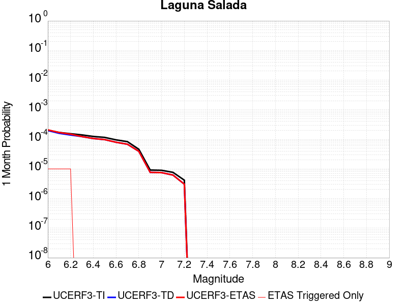 |  |  |

| Magnitude | 1 wk TI Prob | 1 wk TD Prob | 1 wk ETAS Prob | 1 wk ETAS/TD Gain | 1 wk ETAS Triggered Only | 1 mo TI Prob | 1 mo TD Prob | 1 mo ETAS Prob | 1 mo ETAS/TD Gain | 1 mo ETAS Triggered Only | 1 yr TI Prob | 1 yr TD Prob | 1 yr ETAS Prob | 1 yr ETAS/TD Gain | 1 yr ETAS Triggered Only | 10 yr TI Prob | 10 yr TD Prob | 10 yr ETAS Prob | 10 yr ETAS/TD Gain | 10 yr ETAS Triggered Only |
|-----|-----|-----|-----|-----|-----|-----|-----|-----|-----|-----|-----|-----|-----|-----|-----|-----|-----|-----|-----|-----|
| 6.0 | 4.6465593E-5 | 4.634639E-5 | 4.634639E-5 | 1.0 | 0.0 | 1.9912305E-4 | 1.9861311E-4 | 2.0861112E-4 | 1.0503391 | 1.0E-5 | 0.0024216278 | 0.002415429 | 0.002425405 | 1.00413 | 1.0E-5 | 0.02395408 | 0.023975259 | 0.023985019 | 1.0004071 | 1.0E-5 |
| 6.1 | 3.982297E-5 | 3.7246125E-5 | 3.7246125E-5 | 1.0 | 0.0 | 1.706587E-4 | 1.5961716E-4 | 1.6961557E-4 | 1.06264 | 1.0E-5 | 0.0020757897 | 0.0019417295 | 0.0019517101 | 1.0051401 | 1.0E-5 | 0.020565065 | 0.019331863 | 0.01934167 | 1.0005072 | 1.0E-5 |
| 6.2 | 3.6067784E-5 | 3.2602693E-5 | 3.2602693E-5 | 1.0 | 0.0 | 1.5456705E-4 | 1.3971896E-4 | 1.4971757E-4 | 1.0715623 | 1.0E-5 | 0.0018802295 | 0.0016998611 | 0.0017098442 | 1.0058728 | 1.0E-5 | 0.018644003 | 0.016949628 | 0.016959459 | 1.00058 | 1.0E-5 |
| 6.3 | 3.2859112E-5 | 2.8849448E-5 | 2.8849448E-5 | 1.0 | 0.0 | 1.4081717E-4 | 1.2363521E-4 | 1.2363521E-4 | 1.0 | 0.0 | 0.0017131006 | 0.0015043203 | 0.0015043203 | 1.0 | 0.0 | 0.016999546 | 0.015018767 | 0.015018767 | 1.0 | 0.0 |
| 6.4 | 2.9132116E-5 | 2.4852965E-5 | 2.4852965E-5 | 1.0 | 0.0 | 1.2484594E-4 | 1.0650887E-4 | 1.0650887E-4 | 1.0 | 0.0 | 0.0015189396 | 0.001296065 | 0.001296065 | 1.0 | 0.0 | 0.015085992 | 0.012956262 | 0.012956262 | 1.0 | 0.0 |
| 6.5 | 2.7075037E-5 | 2.2825836E-5 | 2.2825836E-5 | 1.0 | 0.0 | 1.1603071E-4 | 9.7821845E-5 | 9.7821845E-5 | 1.0 | 0.0 | 0.0014117584 | 0.0011904186 | 0.0011904186 | 1.0 | 0.0 | 0.014028233 | 0.011907749 | 0.011907749 | 1.0 | 0.0 |
| 6.6 | 2.2367465E-5 | 1.8573526E-5 | 1.8573526E-5 | 1.0 | 0.0 | 9.5857045E-5 | 7.959886E-5 | 7.959886E-5 | 1.0 | 0.0 | 0.0011664346 | 9.6876756E-4 | 9.6876756E-4 | 1.0 | 0.0 | 0.011603311 | 0.009702191 | 0.009702191 | 1.0 | 0.0 |
| 6.7 | 1.9458053E-5 | 1.5914242E-5 | 1.5914242E-5 | 1.0 | 0.0 | 8.338899E-5 | 6.8202564E-5 | 6.8202564E-5 | 1.0 | 0.0 | 0.001014788 | 8.3013024E-4 | 8.3013024E-4 | 1.0 | 0.0 | 0.010101665 | 0.0083209425 | 0.0083209425 | 1.0 | 0.0 |
| 6.8 | 1.0767866E-5 | 9.18435E-6 | 9.18435E-6 | 1.0 | 0.0 | 4.614718E-5 | 3.9361294E-5 | 3.9361294E-5 | 1.0 | 0.0 | 5.6169706E-4 | 4.7918706E-4 | 4.7918706E-4 | 1.0 | 0.0 | 0.0056027942 | 0.0048096925 | 0.0048096925 | 1.0 | 0.0 |
| 6.9 | 2.1384765E-6 | 1.7913675E-6 | 1.7913675E-6 | 1.0 | 0.0 | 9.164866E-6 | 7.677269E-6 | 7.677269E-6 | 1.0 | 0.0 | 1.1157654E-4 | 9.346713E-5 | 9.346713E-5 | 1.0 | 0.0 | 0.0011152053 | 9.343165E-4 | 9.343165E-4 | 1.0 | 0.0 |
| 7.0 | 2.0952946E-6 | 1.7493046E-6 | 1.7493046E-6 | 1.0 | 0.0 | 8.979802E-6 | 7.4970003E-6 | 7.4970003E-6 | 1.0 | 0.0 | 1.0932361E-4 | 9.1272545E-5 | 9.1272545E-5 | 1.0 | 0.0 | 0.0010926984 | 9.123888E-4 | 9.123888E-4 | 1.0 | 0.0 |
| 7.1 | 1.7887576E-6 | 1.4500254E-6 | 1.4500254E-6 | 1.0 | 0.0 | 7.666081E-6 | 6.2143813E-6 | 6.2143813E-6 | 1.0 | 0.0 | 9.333054E-5 | 7.565777E-5 | 7.565777E-5 | 1.0 | 0.0 | 9.329135E-4 | 7.563506E-4 | 7.563506E-4 | 1.0 | 0.0 |
| 7.2 | 9.723109E-7 | 7.135619E-7 | 7.135619E-7 | 1.0 | 0.0 | 4.16704E-6 | 3.0581198E-6 | 3.0581198E-6 | 1.0 | 0.0 | 5.073253E-5 | 3.7232137E-5 | 3.7232137E-5 | 1.0 | 0.0 | 5.072095E-4 | 3.7227524E-4 | 3.7227524E-4 | 1.0 | 0.0 |

## Pittville 2011 CFM
*[(top)](#table-of-contents)*

| 1 Week | 1 Month | 1 Year | 10 Year |
|-----|-----|-----|-----|
|  |  |  |  |

| Magnitude | 1 wk TI Prob | 1 wk TD Prob | 1 wk ETAS Prob | 1 wk ETAS/TD Gain | 1 wk ETAS Triggered Only | 1 mo TI Prob | 1 mo TD Prob | 1 mo ETAS Prob | 1 mo ETAS/TD Gain | 1 mo ETAS Triggered Only | 1 yr TI Prob | 1 yr TD Prob | 1 yr ETAS Prob | 1 yr ETAS/TD Gain | 1 yr ETAS Triggered Only | 10 yr TI Prob | 10 yr TD Prob | 10 yr ETAS Prob | 10 yr ETAS/TD Gain | 10 yr ETAS Triggered Only |
|-----|-----|-----|-----|-----|-----|-----|-----|-----|-----|-----|-----|-----|-----|-----|-----|-----|-----|-----|-----|-----|
| 6.0 | 2.5031832E-5 | 2.7056969E-5 | 2.7056969E-5 | 1.0 | 0.0 | 1.0727487E-4 | 1.1595384E-4 | 1.1595384E-4 | 1.0 | 0.0 | 0.001305289 | 0.0014109211 | 0.0014109211 | 1.0 | 0.0 | 0.012976485 | 0.014029415 | 0.014039275 | 1.0007027 | 1.0E-5 |
| 6.1 | 1.2540113E-5 | 1.3513067E-5 | 1.3513067E-5 | 1.0 | 0.0 | 5.3742235E-5 | 5.7911984E-5 | 5.7911984E-5 | 1.0 | 0.0 | 6.541153E-4 | 7.048728E-4 | 7.048728E-4 | 1.0 | 0.0 | 0.0065219323 | 0.0070286044 | 0.007038534 | 1.0014127 | 1.0E-5 |
| 6.2 | 6.603218E-6 | 7.107189E-6 | 7.107189E-6 | 1.0 | 0.0 | 2.8299199E-5 | 3.0459063E-5 | 3.0459063E-5 | 1.0 | 0.0 | 3.4448825E-4 | 3.7078248E-4 | 3.7078248E-4 | 1.0 | 0.0 | 0.0034395473 | 0.0037022792 | 0.0037122422 | 1.002691 | 1.0E-5 |
| 6.3 | 6.603218E-6 | 7.107189E-6 | 7.107189E-6 | 1.0 | 0.0 | 2.8299199E-5 | 3.0459063E-5 | 3.0459063E-5 | 1.0 | 0.0 | 3.4448825E-4 | 3.7078248E-4 | 3.7078248E-4 | 1.0 | 0.0 | 0.0034395473 | 0.0037022792 | 0.0037122422 | 1.002691 | 1.0E-5 |
| 6.4 | 3.9389015E-6 | 4.239175E-6 | 4.239175E-6 | 1.0 | 0.0 | 1.6880897E-5 | 1.8167784E-5 | 1.8167784E-5 | 1.0 | 0.0 | 2.0550552E-4 | 2.2117342E-4 | 2.2117342E-4 | 1.0 | 0.0 | 0.0020531558 | 0.002209838 | 0.002209838 | 1.0 | 0.0 |
| 6.5 | 2.4533072E-6 | 2.6412686E-6 | 2.6412686E-6 | 1.0 | 0.0 | 1.0514132E-5 | 1.1319685E-5 | 1.1319685E-5 | 1.0 | 0.0 | 1.2800204E-4 | 1.3781038E-4 | 1.3781038E-4 | 1.0 | 0.0 | 0.0012792832 | 0.0013774394 | 0.0013774394 | 1.0 | 0.0 |
| 6.6 | 1.3482367E-6 | 1.452993E-6 | 1.452993E-6 | 1.0 | 0.0 | 5.778144E-6 | 6.2271047E-6 | 6.2271047E-6 | 1.0 | 0.0 | 7.0346636E-5 | 7.58135E-5 | 7.58135E-5 | 1.0 | 0.0 | 7.032437E-4 | 7.5798744E-4 | 7.5798744E-4 | 1.0 | 0.0 |

## Superstition Hills
*[(top)](#table-of-contents)*

| 1 Week | 1 Month | 1 Year | 10 Year |
|-----|-----|-----|-----|
|  |  |  |  |

| Magnitude | 1 wk TI Prob | 1 wk TD Prob | 1 wk ETAS Prob | 1 wk ETAS/TD Gain | 1 wk ETAS Triggered Only | 1 mo TI Prob | 1 mo TD Prob | 1 mo ETAS Prob | 1 mo ETAS/TD Gain | 1 mo ETAS Triggered Only | 1 yr TI Prob | 1 yr TD Prob | 1 yr ETAS Prob | 1 yr ETAS/TD Gain | 1 yr ETAS Triggered Only | 10 yr TI Prob | 10 yr TD Prob | 10 yr ETAS Prob | 10 yr ETAS/TD Gain | 10 yr ETAS Triggered Only |
|-----|-----|-----|-----|-----|-----|-----|-----|-----|-----|-----|-----|-----|-----|-----|-----|-----|-----|-----|-----|-----|
| 6.0 | 6.6865185E-5 | 1.41376995E-5 | 1.41376995E-5 | 1.0 | 0.0 | 2.8653358E-4 | 6.0588824E-5 | 6.0588824E-5 | 1.0 | 0.0 | 0.0034829667 | 7.374355E-4 | 7.474281E-4 | 1.0135505 | 1.0E-5 | 0.03428881 | 0.0075204074 | 0.007530332 | 1.0013198 | 1.0E-5 |
| 6.1 | 6.544851E-5 | 1.41376995E-5 | 1.41376995E-5 | 1.0 | 0.0 | 2.8046346E-4 | 6.0588824E-5 | 6.0588824E-5 | 1.0 | 0.0 | 0.0034092965 | 7.374355E-4 | 7.474281E-4 | 1.0135505 | 1.0E-5 | 0.033574644 | 0.007520407 | 0.0075303316 | 1.0013198 | 1.0E-5 |
| 6.2 | 6.544851E-5 | 1.41376995E-5 | 1.41376995E-5 | 1.0 | 0.0 | 2.8046346E-4 | 6.0588824E-5 | 6.0588824E-5 | 1.0 | 0.0 | 0.0034092965 | 7.374355E-4 | 7.474281E-4 | 1.0135505 | 1.0E-5 | 0.033574644 | 0.007520407 | 0.0075303316 | 1.0013198 | 1.0E-5 |
| 6.3 | 5.2402065E-5 | 1.4137698E-5 | 1.4137698E-5 | 1.0 | 0.0 | 2.2456095E-4 | 6.058882E-5 | 6.058882E-5 | 1.0 | 0.0 | 0.0027306017 | 7.374354E-4 | 7.4742804E-4 | 1.0135505 | 1.0E-5 | 0.02697292 | 0.007520402 | 0.0075303265 | 1.0013198 | 1.0E-5 |
| 6.4 | 4.542238E-5 | 1.4137698E-5 | 1.4137698E-5 | 1.0 | 0.0 | 1.9465282E-4 | 6.0588816E-5 | 6.0588816E-5 | 1.0 | 0.0 | 0.0023673223 | 7.3743536E-4 | 7.47428E-4 | 1.0135505 | 1.0E-5 | 0.023422617 | 0.0075203986 | 0.007530323 | 1.0013198 | 1.0E-5 |
| 6.5 | 2.9672969E-5 | 1.4137696E-5 | 1.4137696E-5 | 1.0 | 0.0 | 1.2716366E-4 | 6.058881E-5 | 6.058881E-5 | 1.0 | 0.0 | 0.0015471181 | 7.374353E-4 | 7.474279E-4 | 1.0135505 | 1.0E-5 | 0.015363912 | 0.007520392 | 0.007530317 | 1.0013198 | 1.0E-5 |
| 6.6 | 2.6056105E-5 | 1.3803458E-5 | 1.3803458E-5 | 1.0 | 0.0 | 1.1166424E-4 | 5.9156428E-5 | 5.9156428E-5 | 1.0 | 0.0 | 0.0013586642 | 7.200076E-4 | 7.300004E-4 | 1.0138787 | 1.0E-5 | 0.013503874 | 0.0073448285 | 0.007354755 | 1.0013515 | 1.0E-5 |
| 6.7 | 1.4611248E-5 | 1.3383359E-5 | 1.3383359E-5 | 1.0 | 0.0 | 6.261813E-5 | 5.7356083E-5 | 5.7356083E-5 | 1.0 | 0.0 | 7.6210906E-4 | 6.981025E-4 | 7.0809555E-4 | 1.0143145 | 1.0E-5 | 0.0075950073 | 0.00712602 | 0.0071359486 | 1.0013933 | 1.0E-5 |
| 6.8 | 1.30607E-5 | 1.09787925E-5 | 1.09787925E-5 | 1.0 | 0.0 | 5.597323E-5 | 4.705117E-5 | 4.705117E-5 | 1.0 | 0.0 | 6.8126095E-4 | 5.7270617E-4 | 5.827004E-4 | 1.0174509 | 1.0E-5 | 0.006791762 | 0.00587438 | 0.0058843214 | 1.0016923 | 1.0E-5 |
| 6.9 | 1.0443096E-5 | 8.195349E-6 | 8.195349E-6 | 1.0 | 0.0 | 4.4755358E-5 | 3.5122466E-5 | 3.5122466E-5 | 1.0 | 0.0 | 5.447602E-4 | 4.2753448E-4 | 4.375302E-4 | 1.0233799 | 1.0E-5 | 0.005434267 | 0.0044094524 | 0.0044194083 | 1.0022578 | 1.0E-5 |
| 7.0 | 8.045912E-6 | 6.739692E-6 | 6.739692E-6 | 1.0 | 0.0 | 3.4482026E-5 | 2.888408E-5 | 2.888408E-5 | 1.0 | 0.0 | 4.197378E-4 | 3.5160795E-4 | 3.6160444E-4 | 1.0284308 | 1.0E-5 | 0.0041894587 | 0.0036334093 | 0.003643373 | 1.0027423 | 1.0E-5 |
| 7.1 | 8.045912E-6 | 6.739692E-6 | 6.739692E-6 | 1.0 | 0.0 | 3.4482026E-5 | 2.888408E-5 | 2.888408E-5 | 1.0 | 0.0 | 4.197378E-4 | 3.5160795E-4 | 3.6160444E-4 | 1.0284308 | 1.0E-5 | 0.0041894587 | 0.0036334093 | 0.003643373 | 1.0027423 | 1.0E-5 |
| 7.2 | 7.375506E-6 | 6.2466297E-6 | 6.2466297E-6 | 1.0 | 0.0 | 3.1608928E-5 | 2.6771E-5 | 2.6771E-5 | 1.0 | 0.0 | 3.8477074E-4 | 3.2588904E-4 | 3.358858E-4 | 1.0306753 | 1.0E-5 | 0.003841052 | 0.003373887 | 0.0033838532 | 1.0029539 | 1.0E-5 |
| 7.3 | 6.6063913E-6 | 5.7990574E-6 | 5.7990574E-6 | 1.0 | 0.0 | 2.8312797E-5 | 2.485287E-5 | 2.485287E-5 | 1.0 | 0.0 | 3.446538E-4 | 3.025424E-4 | 3.1253937E-4 | 1.0330433 | 1.0E-5 | 0.0034411973 | 0.003138153 | 0.0031481218 | 1.0031766 | 1.0E-5 |
| 7.4 | 6.4313126E-6 | 5.680481E-6 | 5.680481E-6 | 1.0 | 0.0 | 2.7562477E-5 | 2.4344696E-5 | 2.4344696E-5 | 1.0 | 0.0 | 3.355215E-4 | 2.9635706E-4 | 3.063541E-4 | 1.0337331 | 1.0E-5 | 0.0033501536 | 0.0030759154 | 0.0030858845 | 1.0032411 | 1.0E-5 |
| 7.5 | 6.0742927E-6 | 5.4763104E-6 | 5.4763104E-6 | 1.0 | 0.0 | 2.6032423E-5 | 2.3469694E-5 | 2.3469694E-5 | 1.0 | 0.0 | 3.1689866E-4 | 2.8570674E-4 | 2.9570388E-4 | 1.0349909 | 1.0E-5 | 0.0031644711 | 0.002967756 | 0.0029777263 | 1.0033596 | 1.0E-5 |
| 7.6 | 5.6987187E-6 | 5.294521E-6 | 5.294521E-6 | 1.0 | 0.0 | 2.4422852E-5 | 2.269061E-5 | 2.269061E-5 | 1.0 | 0.0 | 2.9730765E-4 | 2.7622381E-4 | 2.8622107E-4 | 1.0361925 | 1.0E-5 | 0.002969102 | 0.0028710118 | 0.002880983 | 1.003473 | 1.0E-5 |
| 7.7 | 5.1658035E-6 | 4.925535E-6 | 4.925535E-6 | 1.0 | 0.0 | 2.2138971E-5 | 2.1109268E-5 | 2.1109268E-5 | 1.0 | 0.0 | 2.6950863E-4 | 2.5697565E-4 | 2.6697307E-4 | 1.0389042 | 1.0E-5 | 0.00269182 | 0.0026760625 | 0.0026860356 | 1.0037268 | 1.0E-5 |
| 7.8 | 3.6864697E-6 | 4.1964995E-6 | 4.1964995E-6 | 1.0 | 0.0 | 1.579906E-5 | 1.7984876E-5 | 1.7984876E-5 | 1.0 | 0.0 | 1.9233658E-4 | 2.1894433E-4 | 2.2894214E-4 | 1.0456637 | 1.0E-5 | 0.0019217018 | 0.0022892624 | 0.0022992396 | 1.0043582 | 1.0E-5 |
| 7.9 | 3.0265903E-6 | 3.5637288E-6 | 3.5637288E-6 | 1.0 | 0.0 | 1.2971037E-5 | 1.5273037E-5 | 1.5273037E-5 | 1.0 | 0.0 | 1.5791094E-4 | 1.859338E-4 | 1.9593193E-4 | 1.0537726 | 1.0E-5 | 0.0015779877 | 0.0019534735 | 0.001963454 | 1.0051091 | 1.0E-5 |
| 8.0 | 2.5271493E-6 | 3.0867361E-6 | 3.0867361E-6 | 1.0 | 0.0 | 1.0830595E-5 | 1.3228804E-5 | 1.3228804E-5 | 1.0 | 0.0 | 1.3185451E-4 | 1.610492E-4 | 1.7104759E-4 | 1.0620828 | 1.0E-5 | 0.0013177631 | 0.0016973554 | 0.0017073384 | 1.0058815 | 1.0E-5 |
| 8.1 | 2.3749135E-6 | 2.917377E-6 | 2.917377E-6 | 1.0 | 0.0 | 1.0178161E-5 | 1.25029865E-5 | 1.25029865E-5 | 1.0 | 0.0 | 1.2391206E-4 | 1.5221364E-4 | 1.6221212E-4 | 1.0656872 | 1.0E-5 | 0.0012384299 | 0.001604949 | 0.001614933 | 1.0062207 | 1.0E-5 |
| 8.2 | 1.7186406E-9 | 1.1440594E-9 | 1.1440594E-9 | 1.0 | 0.0 | 7.3656024E-9 | 4.9031117E-9 | 4.9031117E-9 | 1.0 | 0.0 | 8.9676206E-8 | 5.969538E-8 | 5.969538E-8 | 1.0 | 0.0 | 8.9676166E-7 | 6.389059E-7 | 6.389059E-7 | 1.0 | 0.0 |

## Burnt Mtn
*[(top)](#table-of-contents)*

| 1 Week | 1 Month | 1 Year | 10 Year |
|-----|-----|-----|-----|
|  |  |  |  |

| Magnitude | 1 wk TI Prob | 1 wk TD Prob | 1 wk ETAS Prob | 1 wk ETAS/TD Gain | 1 wk ETAS Triggered Only | 1 mo TI Prob | 1 mo TD Prob | 1 mo ETAS Prob | 1 mo ETAS/TD Gain | 1 mo ETAS Triggered Only | 1 yr TI Prob | 1 yr TD Prob | 1 yr ETAS Prob | 1 yr ETAS/TD Gain | 1 yr ETAS Triggered Only | 10 yr TI Prob | 10 yr TD Prob | 10 yr ETAS Prob | 10 yr ETAS/TD Gain | 10 yr ETAS Triggered Only |
|-----|-----|-----|-----|-----|-----|-----|-----|-----|-----|-----|-----|-----|-----|-----|-----|-----|-----|-----|-----|-----|
| 6.0 | 1.5673151E-5 | 1.1749407E-5 | 1.1749407E-5 | 1.0 | 0.0 | 6.716892E-5 | 5.0354356E-5 | 5.0354356E-5 | 1.0 | 0.0 | 8.1747473E-4 | 6.1302073E-4 | 6.1302073E-4 | 1.0 | 0.0 | 0.008144741 | 0.006125938 | 0.0061358768 | 1.0016224 | 1.0E-5 |
| 6.1 | 1.5673151E-5 | 1.1749407E-5 | 1.1749407E-5 | 1.0 | 0.0 | 6.716892E-5 | 5.0354356E-5 | 5.0354356E-5 | 1.0 | 0.0 | 8.1747473E-4 | 6.1302073E-4 | 6.1302073E-4 | 1.0 | 0.0 | 0.008144741 | 0.006125938 | 0.0061358768 | 1.0016224 | 1.0E-5 |
| 6.2 | 1.5673151E-5 | 1.1749407E-5 | 1.1749407E-5 | 1.0 | 0.0 | 6.716892E-5 | 5.0354356E-5 | 5.0354356E-5 | 1.0 | 0.0 | 8.1747473E-4 | 6.1302073E-4 | 6.1302073E-4 | 1.0 | 0.0 | 0.008144741 | 0.006125938 | 0.0061358768 | 1.0016224 | 1.0E-5 |
| 6.3 | 1.5673151E-5 | 1.1749407E-5 | 1.1749407E-5 | 1.0 | 0.0 | 6.716892E-5 | 5.0354356E-5 | 5.0354356E-5 | 1.0 | 0.0 | 8.1747473E-4 | 6.1302073E-4 | 6.1302073E-4 | 1.0 | 0.0 | 0.008144741 | 0.006125938 | 0.0061358768 | 1.0016224 | 1.0E-5 |
| 6.4 | 1.5673151E-5 | 1.1749407E-5 | 1.1749407E-5 | 1.0 | 0.0 | 6.716892E-5 | 5.0354356E-5 | 5.0354356E-5 | 1.0 | 0.0 | 8.1747473E-4 | 6.1302073E-4 | 6.1302073E-4 | 1.0 | 0.0 | 0.008144741 | 0.006125938 | 0.0061358768 | 1.0016224 | 1.0E-5 |
| 6.5 | 1.36191375E-5 | 1.0078299E-5 | 1.0078299E-5 | 1.0 | 0.0 | 5.8366426E-5 | 4.3192707E-5 | 4.3192707E-5 | 1.0 | 0.0 | 7.103795E-4 | 5.2587123E-4 | 5.2587123E-4 | 1.0 | 0.0 | 0.0070811296 | 0.0052587125 | 0.0052686594 | 1.0018916 | 1.0E-5 |

## Cucamonga
*[(top)](#table-of-contents)*

| 1 Week | 1 Month | 1 Year | 10 Year |
|-----|-----|-----|-----|
|  |  | 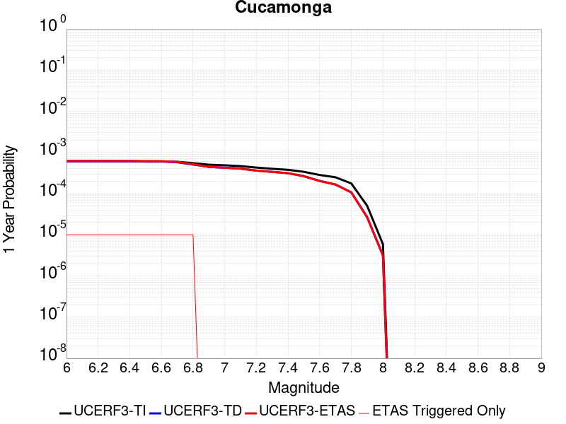 | 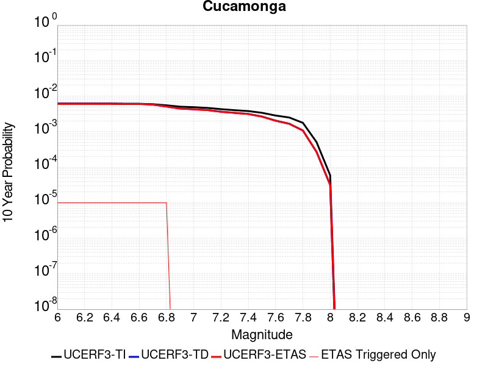 |

| Magnitude | 1 wk TI Prob | 1 wk TD Prob | 1 wk ETAS Prob | 1 wk ETAS/TD Gain | 1 wk ETAS Triggered Only | 1 mo TI Prob | 1 mo TD Prob | 1 mo ETAS Prob | 1 mo ETAS/TD Gain | 1 mo ETAS Triggered Only | 1 yr TI Prob | 1 yr TD Prob | 1 yr ETAS Prob | 1 yr ETAS/TD Gain | 1 yr ETAS Triggered Only | 10 yr TI Prob | 10 yr TD Prob | 10 yr ETAS Prob | 10 yr ETAS/TD Gain | 10 yr ETAS Triggered Only |
|-----|-----|-----|-----|-----|-----|-----|-----|-----|-----|-----|-----|-----|-----|-----|-----|-----|-----|-----|-----|-----|
| 6.0 | 1.1848348E-5 | 1.1737008E-5 | 1.1737008E-5 | 1.0 | 0.0 | 5.0777642E-5 | 5.030051E-5 | 5.030051E-5 | 1.0 | 0.0 | 6.180424E-4 | 6.1223935E-4 | 6.222332E-4 | 1.0163234 | 1.0E-5 | 0.0061632637 | 0.0061067017 | 0.0061166408 | 1.0016276 | 1.0E-5 |
| 6.1 | 1.1848348E-5 | 1.1737008E-5 | 1.1737008E-5 | 1.0 | 0.0 | 5.0777642E-5 | 5.030051E-5 | 5.030051E-5 | 1.0 | 0.0 | 6.180424E-4 | 6.1223935E-4 | 6.222332E-4 | 1.0163234 | 1.0E-5 | 0.0061632637 | 0.0061067017 | 0.0061166408 | 1.0016276 | 1.0E-5 |
| 6.2 | 1.1848348E-5 | 1.1737008E-5 | 1.1737008E-5 | 1.0 | 0.0 | 5.0777642E-5 | 5.030051E-5 | 5.030051E-5 | 1.0 | 0.0 | 6.180424E-4 | 6.1223935E-4 | 6.222332E-4 | 1.0163234 | 1.0E-5 | 0.0061632637 | 0.0061067017 | 0.0061166408 | 1.0016276 | 1.0E-5 |
| 6.3 | 1.1848348E-5 | 1.1737008E-5 | 1.1737008E-5 | 1.0 | 0.0 | 5.0777642E-5 | 5.030051E-5 | 5.030051E-5 | 1.0 | 0.0 | 6.180424E-4 | 6.1223935E-4 | 6.222332E-4 | 1.0163234 | 1.0E-5 | 0.0061632637 | 0.0061067017 | 0.0061166408 | 1.0016276 | 1.0E-5 |
| 6.4 | 1.1848348E-5 | 1.1737008E-5 | 1.1737008E-5 | 1.0 | 0.0 | 5.0777642E-5 | 5.030051E-5 | 5.030051E-5 | 1.0 | 0.0 | 6.180424E-4 | 6.1223935E-4 | 6.222332E-4 | 1.0163234 | 1.0E-5 | 0.0061632637 | 0.0061067017 | 0.0061166408 | 1.0016276 | 1.0E-5 |
| 6.5 | 1.16988695E-5 | 1.15760395E-5 | 1.15760395E-5 | 1.0 | 0.0 | 5.013705E-5 | 4.9610666E-5 | 4.9610666E-5 | 1.0 | 0.0 | 6.102476E-4 | 6.0384517E-4 | 6.1383913E-4 | 1.0165505 | 1.0E-5 | 0.006085745 | 0.006023216 | 0.006033156 | 1.0016502 | 1.0E-5 |
| 6.6 | 1.16988695E-5 | 1.15760395E-5 | 1.15760395E-5 | 1.0 | 0.0 | 5.013705E-5 | 4.9610666E-5 | 4.9610666E-5 | 1.0 | 0.0 | 6.102476E-4 | 6.0384517E-4 | 6.1383913E-4 | 1.0165505 | 1.0E-5 | 0.006085745 | 0.006023216 | 0.006033156 | 1.0016502 | 1.0E-5 |
| 6.7 | 1.1397107E-5 | 1.11149475E-5 | 1.11149475E-5 | 1.0 | 0.0 | 4.884383E-5 | 4.7634636E-5 | 4.7634636E-5 | 1.0 | 0.0 | 5.9451134E-4 | 5.797998E-4 | 5.897941E-4 | 1.0172373 | 1.0E-5 | 0.005929234 | 0.0057840226 | 0.005793965 | 1.0017189 | 1.0E-5 |
| 6.8 | 1.058387E-5 | 9.784992E-6 | 9.784992E-6 | 1.0 | 0.0 | 4.5358654E-5 | 4.193501E-5 | 4.193501E-5 | 1.0 | 0.0 | 5.521017E-4 | 5.1044027E-4 | 5.2043516E-4 | 1.019581 | 1.0E-5 | 0.00550732 | 0.0050936877 | 0.0051036365 | 1.0019532 | 1.0E-5 |
| 6.9 | 9.690046E-6 | 8.57948E-6 | 8.57948E-6 | 1.0 | 0.0 | 4.1528107E-5 | 3.6768684E-5 | 3.6768684E-5 | 1.0 | 0.0 | 5.054874E-4 | 4.475672E-4 | 4.475672E-4 | 1.0 | 0.0 | 0.005043391 | 0.004467594 | 0.004467594 | 1.0 | 0.0 |
| 7.0 | 9.381461E-6 | 8.187101E-6 | 8.187101E-6 | 1.0 | 0.0 | 4.020564E-5 | 3.5087105E-5 | 3.5087105E-5 | 1.0 | 0.0 | 4.893937E-4 | 4.2710215E-4 | 4.2710215E-4 | 1.0 | 0.0 | 0.0048831734 | 0.0042637475 | 0.0042637475 | 1.0 | 0.0 |
| 7.1 | 8.946492E-6 | 7.781886E-6 | 7.781886E-6 | 1.0 | 0.0 | 3.8341543E-5 | 3.3350516E-5 | 3.3350516E-5 | 1.0 | 0.0 | 4.667083E-4 | 4.0596718E-4 | 4.0596718E-4 | 1.0 | 0.0 | 0.0046572937 | 0.004053192 | 0.004053192 | 1.0 | 0.0 |
| 7.2 | 8.251016E-6 | 6.9752796E-6 | 6.9752796E-6 | 1.0 | 0.0 | 3.5361016E-5 | 2.9893714E-5 | 2.9893714E-5 | 1.0 | 0.0 | 4.3043532E-4 | 3.6389544E-4 | 3.6389544E-4 | 1.0 | 0.0 | 0.0042960253 | 0.0036339292 | 0.0036339292 | 1.0 | 0.0 |
| 7.3 | 7.717881E-6 | 6.4863502E-6 | 6.4863502E-6 | 1.0 | 0.0 | 3.3076216E-5 | 2.7798349E-5 | 2.7798349E-5 | 1.0 | 0.0 | 4.026285E-4 | 3.3839257E-4 | 3.3839257E-4 | 1.0 | 0.0 | 0.004018998 | 0.00337971 | 0.00337971 | 1.0 | 0.0 |
| 7.4 | 7.275623E-6 | 6.031997E-6 | 6.031997E-6 | 1.0 | 0.0 | 3.118087E-5 | 2.585116E-5 | 2.585116E-5 | 1.0 | 0.0 | 3.7956095E-4 | 3.1469265E-4 | 3.1469265E-4 | 1.0 | 0.0 | 0.0037891332 | 0.0031434062 | 0.0031434062 | 1.0 | 0.0 |
| 7.5 | 6.5109502E-6 | 5.1006014E-6 | 5.1006014E-6 | 1.0 | 0.0 | 2.7903774E-5 | 2.1859538E-5 | 2.1859538E-5 | 1.0 | 0.0 | 3.3967546E-4 | 2.661075E-4 | 2.661075E-4 | 1.0 | 0.0 | 0.0033915674 | 0.002658813 | 0.002658813 | 1.0 | 0.0 |
| 7.6 | 5.4495326E-6 | 3.90857E-6 | 3.90857E-6 | 1.0 | 0.0 | 2.335493E-5 | 1.6750908E-5 | 1.6750908E-5 | 1.0 | 0.0 | 2.8430918E-4 | 2.0392328E-4 | 2.0392328E-4 | 1.0 | 0.0 | 0.0028394572 | 0.002038282 | 0.002038282 | 1.0 | 0.0 |
| 7.7 | 4.7997164E-6 | 3.2002547E-6 | 3.2002547E-6 | 1.0 | 0.0 | 2.057005E-5 | 1.3715306E-5 | 1.3715306E-5 | 1.0 | 0.0 | 2.504116E-4 | 1.6697108E-4 | 1.6697108E-4 | 1.0 | 0.0 | 0.002501296 | 0.0016693877 | 0.0016693877 | 1.0 | 0.0 |
| 7.8 | 3.3941733E-6 | 2.0641899E-6 | 2.0641899E-6 | 1.0 | 0.0 | 1.4546376E-5 | 8.846498E-6 | 8.846498E-6 | 1.0 | 0.0 | 1.7708774E-4 | 1.07700806E-4 | 1.07700806E-4 | 1.0 | 0.0 | 0.0017694668 | 0.001076723 | 0.001076723 | 1.0 | 0.0 |
| 7.9 | 9.750552E-7 | 5.155946E-7 | 5.155946E-7 | 1.0 | 0.0 | 4.178801E-6 | 2.2096892E-6 | 2.2096892E-6 | 1.0 | 0.0 | 5.0875715E-5 | 2.690264E-5 | 2.690264E-5 | 1.0 | 0.0 | 5.086407E-4 | 2.6899425E-4 | 2.6899425E-4 | 1.0 | 0.0 |
| 8.0 | 1.133857E-7 | 6.053707E-8 | 6.053707E-8 | 1.0 | 0.0 | 4.8593864E-7 | 2.5944456E-7 | 2.5944456E-7 | 1.0 | 0.0 | 5.9162867E-6 | 3.158733E-6 | 3.158733E-6 | 1.0 | 0.0 | 5.916129E-5 | 3.1586897E-5 | 3.1586897E-5 | 1.0 | 0.0 |

## Butano 2011 CFM
*[(top)](#table-of-contents)*

| 1 Week | 1 Month | 1 Year | 10 Year |
|-----|-----|-----|-----|
|  |  |  | 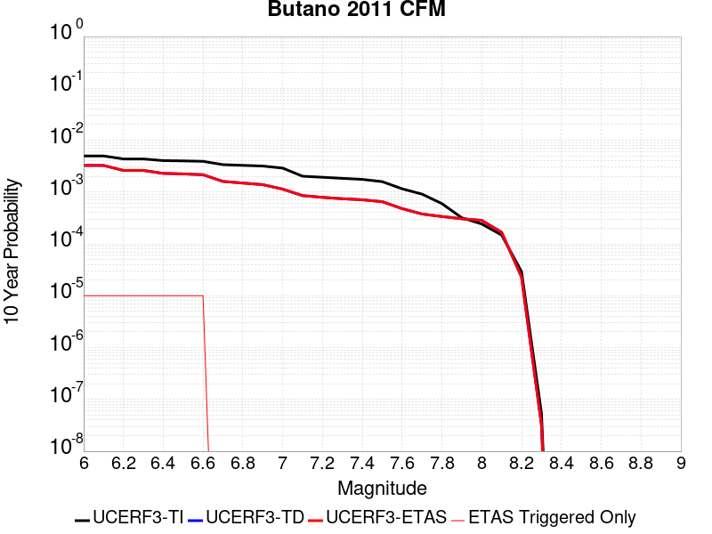 |

| Magnitude | 1 wk TI Prob | 1 wk TD Prob | 1 wk ETAS Prob | 1 wk ETAS/TD Gain | 1 wk ETAS Triggered Only | 1 mo TI Prob | 1 mo TD Prob | 1 mo ETAS Prob | 1 mo ETAS/TD Gain | 1 mo ETAS Triggered Only | 1 yr TI Prob | 1 yr TD Prob | 1 yr ETAS Prob | 1 yr ETAS/TD Gain | 1 yr ETAS Triggered Only | 10 yr TI Prob | 10 yr TD Prob | 10 yr ETAS Prob | 10 yr ETAS/TD Gain | 10 yr ETAS Triggered Only |
|-----|-----|-----|-----|-----|-----|-----|-----|-----|-----|-----|-----|-----|-----|-----|-----|-----|-----|-----|-----|-----|
| 6.0 | 9.561135E-6 | 6.2256954E-6 | 6.2256954E-6 | 1.0 | 0.0 | 4.097565E-5 | 2.6681291E-5 | 2.6681291E-5 | 1.0 | 0.0 | 4.9876433E-4 | 3.247985E-4 | 3.3479524E-4 | 1.0307783 | 1.0E-5 | 0.004976464 | 0.003260905 | 0.0032708722 | 1.0030566 | 1.0E-5 |
| 6.1 | 9.561135E-6 | 6.2256954E-6 | 6.2256954E-6 | 1.0 | 0.0 | 4.097565E-5 | 2.6681291E-5 | 2.6681291E-5 | 1.0 | 0.0 | 4.9876433E-4 | 3.247985E-4 | 3.3479524E-4 | 1.0307783 | 1.0E-5 | 0.004976464 | 0.003260905 | 0.0032708722 | 1.0030566 | 1.0E-5 |
| 6.2 | 8.364741E-6 | 4.9787805E-6 | 4.9787805E-6 | 1.0 | 0.0 | 3.5848396E-5 | 2.1337464E-5 | 2.1337464E-5 | 1.0 | 0.0 | 4.3636683E-4 | 2.5975425E-4 | 2.6975165E-4 | 1.0384879 | 1.0E-5 | 0.0043551093 | 0.0026121214 | 0.0026220952 | 1.0038183 | 1.0E-5 |
| 6.3 | 8.364741E-6 | 4.9787805E-6 | 4.9787805E-6 | 1.0 | 0.0 | 3.5848396E-5 | 2.1337464E-5 | 2.1337464E-5 | 1.0 | 0.0 | 4.3636683E-4 | 2.5975425E-4 | 2.6975165E-4 | 1.0384879 | 1.0E-5 | 0.0043551093 | 0.0026121214 | 0.0026220952 | 1.0038183 | 1.0E-5 |
| 6.4 | 7.768282E-6 | 4.3567284E-6 | 4.3567284E-6 | 1.0 | 0.0 | 3.329221E-5 | 1.8671566E-5 | 1.8671566E-5 | 1.0 | 0.0 | 4.0525728E-4 | 2.2730397E-4 | 2.3730169E-4 | 1.0439839 | 1.0E-5 | 0.0040451903 | 0.0022883145 | 0.0022982918 | 1.0043601 | 1.0E-5 |
| 6.5 | 7.673437E-6 | 4.2562915E-6 | 4.2562915E-6 | 1.0 | 0.0 | 3.2885746E-5 | 1.8241128E-5 | 1.8241128E-5 | 1.0 | 0.0 | 4.0031038E-4 | 2.2206445E-4 | 2.3206224E-4 | 1.045022 | 1.0E-5 | 0.0039959005 | 0.002236025 | 0.0022460027 | 1.0044622 | 1.0E-5 |
| 6.6 | 7.5244197E-6 | 4.101255E-6 | 4.101255E-6 | 1.0 | 0.0 | 3.2247113E-5 | 1.7576695E-5 | 1.7576695E-5 | 1.0 | 0.0 | 3.9253788E-4 | 2.1397659E-4 | 2.2397445E-4 | 1.0467241 | 1.0E-5 | 0.003918452 | 0.0021553051 | 0.0021652835 | 1.0046297 | 1.0E-5 |
| 6.7 | 6.4921405E-6 | 3.0413205E-6 | 3.0413205E-6 | 1.0 | 0.0 | 2.7823162E-5 | 1.3034165E-5 | 1.3034165E-5 | 1.0 | 0.0 | 3.3869434E-4 | 1.586795E-4 | 1.586795E-4 | 1.0 | 0.0 | 0.003381786 | 0.0016031476 | 0.0016031476 | 1.0 | 0.0 |
| 6.8 | 6.2890294E-6 | 2.8280872E-6 | 2.8280872E-6 | 1.0 | 0.0 | 2.6952705E-5 | 1.2120317E-5 | 1.2120317E-5 | 1.0 | 0.0 | 3.2809976E-4 | 1.4755495E-4 | 1.4755495E-4 | 1.0 | 0.0 | 0.0032761577 | 0.0014920565 | 0.0014920565 | 1.0 | 0.0 |
| 6.9 | 6.0965517E-6 | 2.6346027E-6 | 2.6346027E-6 | 1.0 | 0.0 | 2.6127816E-5 | 1.1291106E-5 | 1.1291106E-5 | 1.0 | 0.0 | 3.1805973E-4 | 1.374606E-4 | 1.374606E-4 | 1.0 | 0.0 | 0.0031760489 | 0.001391243 | 0.001391243 | 1.0 | 0.0 |
| 7.0 | 5.566252E-6 | 2.1520116E-6 | 2.1520116E-6 | 1.0 | 0.0 | 2.3855147E-5 | 9.222874E-6 | 9.222874E-6 | 1.0 | 0.0 | 2.9039773E-4 | 1.1228274E-4 | 1.1228274E-4 | 1.0 | 0.0 | 0.0029001853 | 0.0011397449 | 0.0011397449 | 1.0 | 0.0 |
| 7.1 | 3.878588E-6 | 1.6034423E-6 | 1.6034423E-6 | 1.0 | 0.0 | 1.6622414E-5 | 6.8718773E-6 | 6.8718773E-6 | 1.0 | 0.0 | 2.023591E-4 | 8.36619E-5 | 8.36619E-5 | 1.0 | 0.0 | 0.0020217493 | 8.533922E-4 | 8.533922E-4 | 1.0 | 0.0 |
| 7.2 | 3.7038085E-6 | 1.4845051E-6 | 1.4845051E-6 | 1.0 | 0.0 | 1.587337E-5 | 6.362149E-6 | 6.362149E-6 | 1.0 | 0.0 | 1.9324113E-4 | 7.745641E-5 | 7.745641E-5 | 1.0 | 0.0 | 0.0019307317 | 7.913504E-4 | 7.913504E-4 | 1.0 | 0.0 |
| 7.3 | 3.5277278E-6 | 1.3926247E-6 | 1.3926247E-6 | 1.0 | 0.0 | 1.5118746E-5 | 5.9683775E-6 | 5.9683775E-6 | 1.0 | 0.0 | 1.8405518E-4 | 7.266257E-5 | 7.266257E-5 | 1.0 | 0.0 | 0.0018390282 | 7.433578E-4 | 7.433578E-4 | 1.0 | 0.0 |
| 7.4 | 3.3711294E-6 | 1.3298818E-6 | 1.3298818E-6 | 1.0 | 0.0 | 1.4447617E-5 | 5.699481E-6 | 5.699481E-6 | 1.0 | 0.0 | 1.7588554E-4 | 6.9388974E-5 | 6.9388974E-5 | 1.0 | 0.0 | 0.0017574639 | 7.10591E-4 | 7.10591E-4 | 1.0 | 0.0 |
| 7.5 | 3.0496426E-6 | 1.2188874E-6 | 1.2188874E-6 | 1.0 | 0.0 | 1.3069831E-5 | 5.223793E-6 | 5.223793E-6 | 1.0 | 0.0 | 1.5911358E-4 | 6.359782E-5 | 6.359782E-5 | 1.0 | 0.0 | 0.001589997 | 6.526465E-4 | 6.526465E-4 | 1.0 | 0.0 |
| 7.6 | 2.2179781E-6 | 8.870908E-7 | 8.870908E-7 | 1.0 | 0.0 | 9.505586E-6 | 3.801812E-6 | 3.801812E-6 | 1.0 | 0.0 | 1.1572436E-4 | 4.6286077E-5 | 4.6286077E-5 | 1.0 | 0.0 | 0.0011566412 | 4.7951055E-4 | 4.7951055E-4 | 1.0 | 0.0 |
| 7.7 | 1.7519328E-6 | 6.9309675E-7 | 6.9309675E-7 | 1.0 | 0.0 | 7.508262E-6 | 2.9704113E-6 | 2.9704113E-6 | 1.0 | 0.0 | 9.140925E-5 | 3.6164158E-5 | 3.6164158E-5 | 1.0 | 0.0 | 9.137166E-4 | 3.7759746E-4 | 3.7759746E-4 | 1.0 | 0.0 |
| 7.8 | 1.1478974E-6 | 6.174061E-7 | 6.174061E-7 | 1.0 | 0.0 | 4.9195505E-6 | 2.6460236E-6 | 2.6460236E-6 | 1.0 | 0.0 | 5.9893882E-5 | 3.221486E-5 | 3.221486E-5 | 1.0 | 0.0 | 5.9877743E-4 | 3.377777E-4 | 3.377777E-4 | 1.0 | 0.0 |
| 7.9 | 6.1154634E-7 | 5.581767E-7 | 5.581767E-7 | 1.0 | 0.0 | 2.6209104E-6 | 2.3921834E-6 | 2.3921834E-6 | 1.0 | 0.0 | 3.1909116E-5 | 2.9124443E-5 | 2.9124443E-5 | 1.0 | 0.0 | 3.1904536E-4 | 3.0563958E-4 | 3.0563958E-4 | 1.0 | 0.0 |
| 8.0 | 4.6520046E-7 | 5.189283E-7 | 5.189283E-7 | 1.0 | 0.0 | 1.9937147E-6 | 2.2239765E-6 | 2.2239765E-6 | 1.0 | 0.0 | 2.4273206E-5 | 2.7076578E-5 | 2.7076578E-5 | 1.0 | 0.0 | 2.4270554E-4 | 2.8419052E-4 | 2.8419052E-4 | 1.0 | 0.0 |
| 8.1 | 2.8425194E-7 | 3.0570487E-7 | 3.0570487E-7 | 1.0 | 0.0 | 1.218222E-6 | 1.3101632E-6 | 1.3101632E-6 | 1.0 | 0.0 | 1.4831752E-5 | 1.5951118E-5 | 1.5951118E-5 | 1.0 | 0.0 | 1.4830762E-4 | 1.6740595E-4 | 1.6740595E-4 | 1.0 | 0.0 |
| 8.2 | 5.585778E-8 | 4.0522167E-8 | 4.0522167E-8 | 1.0 | 0.0 | 2.3939046E-7 | 1.7366644E-7 | 1.7366644E-7 | 1.0 | 0.0 | 2.914575E-6 | 2.1143867E-6 | 2.1143867E-6 | 1.0 | 0.0 | 2.9145367E-5 | 2.2976306E-5 | 2.2976306E-5 | 1.0 | 0.0 |
| 8.3 | 1.0371215E-10 | 5.356804E-11 | 5.356804E-11 | 1.0 | 0.0 | 4.4448079E-10 | 2.2957702E-10 | 2.2957702E-10 | 1.0 | 0.0 | 5.4115543E-9 | 2.795101E-9 | 2.795101E-9 | 1.0 | 0.0 | 5.4115542E-8 | 3.2150194E-8 | 3.2150194E-8 | 1.0 | 0.0 |

## Great Valley 05 Pittsburg - Kirby Hills alt1
*[(top)](#table-of-contents)*

| 1 Week | 1 Month | 1 Year | 10 Year |
|-----|-----|-----|-----|
|  |  |  |  |

| Magnitude | 1 wk TI Prob | 1 wk TD Prob | 1 wk ETAS Prob | 1 wk ETAS/TD Gain | 1 wk ETAS Triggered Only | 1 mo TI Prob | 1 mo TD Prob | 1 mo ETAS Prob | 1 mo ETAS/TD Gain | 1 mo ETAS Triggered Only | 1 yr TI Prob | 1 yr TD Prob | 1 yr ETAS Prob | 1 yr ETAS/TD Gain | 1 yr ETAS Triggered Only | 10 yr TI Prob | 10 yr TD Prob | 10 yr ETAS Prob | 10 yr ETAS/TD Gain | 10 yr ETAS Triggered Only |
|-----|-----|-----|-----|-----|-----|-----|-----|-----|-----|-----|-----|-----|-----|-----|-----|-----|-----|-----|-----|-----|
| 6.0 | 4.187212E-5 | 5.3442072E-5 | 6.344154E-5 | 1.1871085 | 1.0E-5 | 1.794396E-4 | 2.290231E-4 | 2.3902081E-4 | 1.0436537 | 1.0E-5 | 0.002182488 | 0.0027857882 | 0.0027957603 | 1.0035796 | 1.0E-5 | 0.021611776 | 0.02760304 | 0.027612763 | 1.0003523 | 1.0E-5 |
| 6.1 | 4.187212E-5 | 5.3442072E-5 | 6.344154E-5 | 1.1871085 | 1.0E-5 | 1.794396E-4 | 2.290231E-4 | 2.3902081E-4 | 1.0436537 | 1.0E-5 | 0.002182488 | 0.0027857882 | 0.0027957603 | 1.0035796 | 1.0E-5 | 0.021611776 | 0.02760304 | 0.027612763 | 1.0003523 | 1.0E-5 |
| 6.2 | 1.7353306E-5 | 2.2154374E-5 | 3.2154152E-5 | 1.4513681 | 1.0E-5 | 7.436919E-5 | 9.494618E-5 | 1.0494523E-4 | 1.1053128 | 1.0E-5 | 9.050688E-4 | 0.0011557543 | 0.0011657428 | 1.0086423 | 1.0E-5 | 0.009013915 | 0.011535114 | 0.011544998 | 1.0008569 | 1.0E-5 |
| 6.3 | 1.7353306E-5 | 2.2154374E-5 | 3.2154152E-5 | 1.4513681 | 1.0E-5 | 7.436919E-5 | 9.494618E-5 | 1.0494523E-4 | 1.1053128 | 1.0E-5 | 9.050688E-4 | 0.0011557543 | 0.0011657428 | 1.0086423 | 1.0E-5 | 0.009013915 | 0.011535114 | 0.011544998 | 1.0008569 | 1.0E-5 |
| 6.4 | 1.4028824E-5 | 1.7900597E-5 | 2.7900416E-5 | 1.5586306 | 1.0E-5 | 6.0122147E-5 | 7.671684E-5 | 8.671607E-5 | 1.1303395 | 1.0E-5 | 7.3174125E-4 | 9.340275E-4 | 9.440182E-4 | 1.0106963 | 1.0E-5 | 0.0072933645 | 0.009338138 | 0.009348044 | 1.0010608 | 1.0E-5 |

## Thirty Mile Bank
*[(top)](#table-of-contents)*

| 1 Week | 1 Month | 1 Year | 10 Year |
|-----|-----|-----|-----|
|  |  |  | 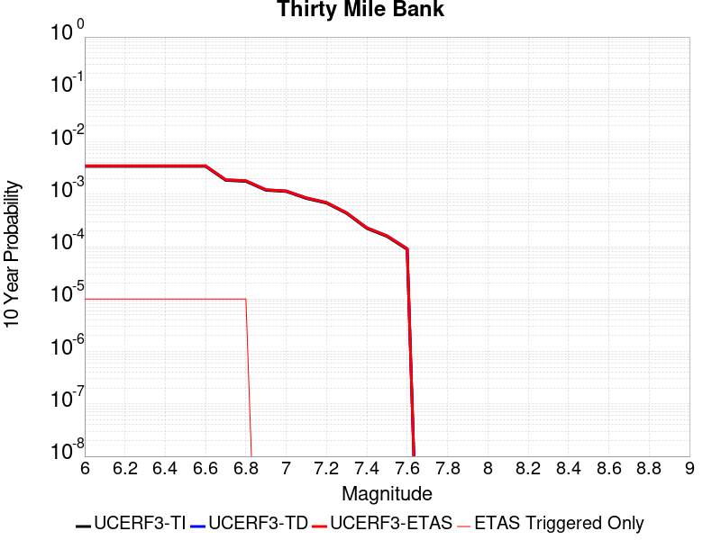 |

| Magnitude | 1 wk TI Prob | 1 wk TD Prob | 1 wk ETAS Prob | 1 wk ETAS/TD Gain | 1 wk ETAS Triggered Only | 1 mo TI Prob | 1 mo TD Prob | 1 mo ETAS Prob | 1 mo ETAS/TD Gain | 1 mo ETAS Triggered Only | 1 yr TI Prob | 1 yr TD Prob | 1 yr ETAS Prob | 1 yr ETAS/TD Gain | 1 yr ETAS Triggered Only | 10 yr TI Prob | 10 yr TD Prob | 10 yr ETAS Prob | 10 yr ETAS/TD Gain | 10 yr ETAS Triggered Only |
|-----|-----|-----|-----|-----|-----|-----|-----|-----|-----|-----|-----|-----|-----|-----|-----|-----|-----|-----|-----|-----|
| 6.0 | 6.5124755E-6 | 6.6592643E-6 | 6.6592643E-6 | 1.0 | 0.0 | 2.791031E-5 | 2.8539416E-5 | 3.8539132E-5 | 1.3503826 | 1.0E-5 | 3.3975503E-4 | 3.4741635E-4 | 3.5741288E-4 | 1.0287739 | 1.0E-5 | 0.0033923604 | 0.003469164 | 0.0034791294 | 1.0028726 | 1.0E-5 |
| 6.1 | 6.5124755E-6 | 6.6592643E-6 | 6.6592643E-6 | 1.0 | 0.0 | 2.791031E-5 | 2.8539416E-5 | 3.8539132E-5 | 1.3503826 | 1.0E-5 | 3.3975503E-4 | 3.4741635E-4 | 3.5741288E-4 | 1.0287739 | 1.0E-5 | 0.0033923604 | 0.003469164 | 0.0034791294 | 1.0028726 | 1.0E-5 |
| 6.2 | 6.5124755E-6 | 6.6592643E-6 | 6.6592643E-6 | 1.0 | 0.0 | 2.791031E-5 | 2.8539416E-5 | 3.8539132E-5 | 1.3503826 | 1.0E-5 | 3.3975503E-4 | 3.4741635E-4 | 3.5741288E-4 | 1.0287739 | 1.0E-5 | 0.0033923604 | 0.003469164 | 0.0034791294 | 1.0028726 | 1.0E-5 |
| 6.3 | 6.5124755E-6 | 6.6592643E-6 | 6.6592643E-6 | 1.0 | 0.0 | 2.791031E-5 | 2.8539416E-5 | 3.8539132E-5 | 1.3503826 | 1.0E-5 | 3.3975503E-4 | 3.4741635E-4 | 3.5741288E-4 | 1.0287739 | 1.0E-5 | 0.0033923604 | 0.003469164 | 0.0034791294 | 1.0028726 | 1.0E-5 |
| 6.4 | 6.5124755E-6 | 6.6592643E-6 | 6.6592643E-6 | 1.0 | 0.0 | 2.791031E-5 | 2.8539416E-5 | 3.8539132E-5 | 1.3503826 | 1.0E-5 | 3.3975503E-4 | 3.4741635E-4 | 3.5741288E-4 | 1.0287739 | 1.0E-5 | 0.0033923604 | 0.003469164 | 0.0034791294 | 1.0028726 | 1.0E-5 |
| 6.5 | 6.5124755E-6 | 6.6592643E-6 | 6.6592643E-6 | 1.0 | 0.0 | 2.791031E-5 | 2.8539416E-5 | 3.8539132E-5 | 1.3503826 | 1.0E-5 | 3.3975503E-4 | 3.4741635E-4 | 3.5741288E-4 | 1.0287739 | 1.0E-5 | 0.0033923604 | 0.003469164 | 0.0034791294 | 1.0028726 | 1.0E-5 |
| 6.6 | 6.5124755E-6 | 6.6592643E-6 | 6.6592643E-6 | 1.0 | 0.0 | 2.791031E-5 | 2.8539416E-5 | 3.8539132E-5 | 1.3503826 | 1.0E-5 | 3.3975503E-4 | 3.4741635E-4 | 3.5741288E-4 | 1.0287739 | 1.0E-5 | 0.0033923604 | 0.003469164 | 0.0034791294 | 1.0028726 | 1.0E-5 |
| 6.7 | 3.5261137E-6 | 3.6098995E-6 | 3.6098995E-6 | 1.0 | 0.0 | 1.5111828E-5 | 1.547091E-5 | 2.5470756E-5 | 1.6463643 | 1.0E-5 | 1.8397097E-4 | 1.883427E-4 | 1.9834083E-4 | 1.0530847 | 1.0E-5 | 0.0018381875 | 0.0018818958 | 0.001891877 | 1.0053037 | 1.0E-5 |
| 6.8 | 3.370743E-6 | 3.4509355E-6 | 3.4509355E-6 | 1.0 | 0.0 | 1.4445961E-5 | 1.47896435E-5 | 2.4789495E-5 | 1.6761389 | 1.0E-5 | 1.7586538E-4 | 1.8004965E-4 | 1.9004785E-4 | 1.0555302 | 1.0E-5 | 0.0017572626 | 0.0017990996 | 0.0018090816 | 1.0055484 | 1.0E-5 |
| 6.9 | 2.2756835E-6 | 2.333161E-6 | 2.333161E-6 | 1.0 | 0.0 | 9.752893E-6 | 9.999225E-6 | 9.999225E-6 | 1.0 | 0.0 | 1.18735006E-4 | 1.2173401E-4 | 1.2173401E-4 | 1.0 | 0.0 | 0.0011867158 | 0.0012166979 | 0.0012166979 | 1.0 | 0.0 |
| 7.0 | 2.1617404E-6 | 2.21598E-6 | 2.21598E-6 | 1.0 | 0.0 | 9.264569E-6 | 9.497024E-6 | 9.497024E-6 | 1.0 | 0.0 | 1.1279029E-4 | 1.1562037E-4 | 1.1562037E-4 | 1.0 | 0.0 | 0.0011273306 | 0.0011556263 | 0.0011556263 | 1.0 | 0.0 |
| 7.1 | 1.5900777E-6 | 1.6327014E-6 | 1.6327014E-6 | 1.0 | 0.0 | 6.814601E-6 | 6.997274E-6 | 6.997274E-6 | 1.0 | 0.0 | 8.296461E-5 | 8.518861E-5 | 8.518861E-5 | 1.0 | 0.0 | 8.293364E-4 | 8.5157226E-4 | 8.5157226E-4 | 1.0 | 0.0 |
| 7.2 | 1.2971728E-6 | 1.3328992E-6 | 1.3328992E-6 | 1.0 | 0.0 | 5.5593005E-6 | 5.712413E-6 | 5.712413E-6 | 1.0 | 0.0 | 6.768238E-5 | 6.954651E-5 | 6.954651E-5 | 1.0 | 0.0 | 6.7661767E-4 | 6.952578E-4 | 6.952578E-4 | 1.0 | 0.0 |
| 7.3 | 8.2454284E-7 | 8.448891E-7 | 8.448891E-7 | 1.0 | 0.0 | 3.5337503E-6 | 3.6209485E-6 | 3.6209485E-6 | 1.0 | 0.0 | 4.302256E-5 | 4.408422E-5 | 4.408422E-5 | 1.0 | 0.0 | 4.301423E-4 | 4.4076078E-4 | 4.4076078E-4 | 1.0 | 0.0 |
| 7.4 | 4.2619024E-7 | 4.3863466E-7 | 4.3863466E-7 | 1.0 | 0.0 | 1.8265283E-6 | 1.8798615E-6 | 1.8798615E-6 | 1.0 | 0.0 | 2.2237757E-5 | 2.2887078E-5 | 2.2887078E-5 | 1.0 | 0.0 | 2.223553E-4 | 2.288476E-4 | 2.288476E-4 | 1.0 | 0.0 |
| 7.5 | 2.993922E-7 | 3.086453E-7 | 3.086453E-7 | 1.0 | 0.0 | 1.2831089E-6 | 1.3227649E-6 | 1.3227649E-6 | 1.0 | 0.0 | 1.5621737E-5 | 1.6104546E-5 | 1.6104546E-5 | 1.0 | 0.0 | 1.562064E-4 | 1.6103406E-4 | 1.6103406E-4 | 1.0 | 0.0 |
| 7.6 | 1.6988751E-7 | 1.7533823E-7 | 1.7533823E-7 | 1.0 | 0.0 | 7.2808916E-7 | 7.5144936E-7 | 7.5144936E-7 | 1.0 | 0.0 | 8.864449E-6 | 9.14886E-6 | 9.14886E-6 | 1.0 | 0.0 | 8.8640954E-5 | 9.1485024E-5 | 9.1485024E-5 | 1.0 | 0.0 |

## Bennett Valley 2011 CFM
*[(top)](#table-of-contents)*

| 1 Week | 1 Month | 1 Year | 10 Year |
|-----|-----|-----|-----|
|  |  |  |  |

| Magnitude | 1 wk TI Prob | 1 wk TD Prob | 1 wk ETAS Prob | 1 wk ETAS/TD Gain | 1 wk ETAS Triggered Only | 1 mo TI Prob | 1 mo TD Prob | 1 mo ETAS Prob | 1 mo ETAS/TD Gain | 1 mo ETAS Triggered Only | 1 yr TI Prob | 1 yr TD Prob | 1 yr ETAS Prob | 1 yr ETAS/TD Gain | 1 yr ETAS Triggered Only | 10 yr TI Prob | 10 yr TD Prob | 10 yr ETAS Prob | 10 yr ETAS/TD Gain | 10 yr ETAS Triggered Only |
|-----|-----|-----|-----|-----|-----|-----|-----|-----|-----|-----|-----|-----|-----|-----|-----|-----|-----|-----|-----|-----|
| 6.0 | 2.3893934E-5 | 2.8238892E-5 | 2.8238892E-5 | 1.0 | 0.0 | 1.0239855E-4 | 1.2101925E-4 | 1.2101925E-4 | 1.0 | 0.0 | 0.0012459893 | 0.0014725985 | 0.0014725985 | 1.0 | 0.0 | 0.012390262 | 0.014651061 | 0.014660914 | 1.0006726 | 1.0E-5 |
| 6.1 | 2.3893934E-5 | 2.8238892E-5 | 2.8238892E-5 | 1.0 | 0.0 | 1.0239855E-4 | 1.2101925E-4 | 1.2101925E-4 | 1.0 | 0.0 | 0.0012459893 | 0.0014725985 | 0.0014725985 | 1.0 | 0.0 | 0.012390262 | 0.014651061 | 0.014660914 | 1.0006726 | 1.0E-5 |
| 6.2 | 1.6657146E-5 | 1.9853778E-5 | 1.9853778E-5 | 1.0 | 0.0 | 7.138582E-5 | 8.508564E-5 | 8.508564E-5 | 1.0 | 0.0 | 8.6877577E-4 | 0.0010355669 | 0.0010355669 | 1.0 | 0.0 | 0.008653872 | 0.010325688 | 0.010335585 | 1.0009584 | 1.0E-5 |
| 6.3 | 1.6657146E-5 | 1.9853778E-5 | 1.9853778E-5 | 1.0 | 0.0 | 7.138582E-5 | 8.508564E-5 | 8.508564E-5 | 1.0 | 0.0 | 8.6877577E-4 | 0.0010355669 | 0.0010355669 | 1.0 | 0.0 | 0.008653872 | 0.010325688 | 0.010335585 | 1.0009584 | 1.0E-5 |
| 6.4 | 1.29418495E-5 | 1.5567497E-5 | 1.5567497E-5 | 1.0 | 0.0 | 5.546389E-5 | 6.671687E-5 | 6.671687E-5 | 1.0 | 0.0 | 6.7506364E-4 | 8.121055E-4 | 8.121055E-4 | 1.0 | 0.0 | 0.0067301663 | 0.008108527 | 0.008118446 | 1.0012233 | 1.0E-5 |
| 6.5 | 1.2582504E-5 | 1.5134528E-5 | 1.5134528E-5 | 1.0 | 0.0 | 5.39239E-5 | 6.4861386E-5 | 6.4861386E-5 | 1.0 | 0.0 | 6.563257E-4 | 7.895315E-4 | 7.895315E-4 | 1.0 | 0.0 | 0.006543907 | 0.007884431 | 0.007894352 | 1.0012584 | 1.0E-5 |
| 6.6 | 1.0846706E-5 | 1.3036779E-5 | 1.3036779E-5 | 1.0 | 0.0 | 4.6485053E-5 | 5.5871435E-5 | 5.5871435E-5 | 1.0 | 0.0 | 5.6580856E-4 | 6.801508E-4 | 6.801508E-4 | 1.0 | 0.0 | 0.005643701 | 0.0067976876 | 0.0068076197 | 1.001461 | 1.0E-5 |
| 6.7 | 1.6803231E-6 | 2.377857E-6 | 2.377857E-6 | 1.0 | 0.0 | 7.2013645E-6 | 1.0190777E-5 | 1.0190777E-5 | 1.0 | 0.0 | 8.7673085E-5 | 1.2406579E-4 | 1.2406579E-4 | 1.0 | 0.0 | 8.76385E-4 | 0.0012444059 | 0.0012444059 | 1.0 | 0.0 |
| 6.8 | 1.4609833E-6 | 2.0939308E-6 | 2.0939308E-6 | 1.0 | 0.0 | 6.261342E-6 | 8.973958E-6 | 8.973958E-6 | 1.0 | 0.0 | 7.6229175E-5 | 1.09252534E-4 | 1.09252534E-4 | 1.0 | 0.0 | 7.620303E-4 | 0.0010963855 | 0.0010963855 | 1.0 | 0.0 |
| 6.9 | 1.3492396E-6 | 1.945872E-6 | 1.945872E-6 | 1.0 | 0.0 | 5.7824427E-6 | 8.339425E-6 | 8.339425E-6 | 1.0 | 0.0 | 7.0398964E-5 | 1.0152783E-4 | 1.0152783E-4 | 1.0 | 0.0 | 7.037667E-4 | 0.001019182 | 0.001019182 | 1.0 | 0.0 |
| 7.0 | 1.2347921E-6 | 1.7888614E-6 | 1.7888614E-6 | 1.0 | 0.0 | 5.291955E-6 | 7.6665265E-6 | 7.6665265E-6 | 1.0 | 0.0 | 6.442765E-5 | 9.333601E-5 | 9.333601E-5 | 1.0 | 0.0 | 6.440897E-4 | 9.373206E-4 | 9.373206E-4 | 1.0 | 0.0 |
| 7.1 | 1.1262973E-6 | 1.6358822E-6 | 1.6358822E-6 | 1.0 | 0.0 | 4.8269794E-6 | 7.010905E-6 | 7.010905E-6 | 1.0 | 0.0 | 5.876689E-5 | 8.535448E-5 | 8.535448E-5 | 1.0 | 0.0 | 5.875135E-4 | 8.575462E-4 | 8.575462E-4 | 1.0 | 0.0 |
| 7.2 | 9.351744E-7 | 1.3611456E-6 | 1.3611456E-6 | 1.0 | 0.0 | 4.007884E-6 | 5.8334676E-6 | 5.8334676E-6 | 1.0 | 0.0 | 4.8794896E-5 | 7.102018E-5 | 7.102018E-5 | 1.0 | 0.0 | 4.878418E-4 | 7.1425125E-4 | 7.1425125E-4 | 1.0 | 0.0 |
| 7.3 | 8.5039534E-7 | 1.2386469E-6 | 1.2386469E-6 | 1.0 | 0.0 | 3.6445463E-6 | 5.308476E-6 | 5.308476E-6 | 1.0 | 0.0 | 4.437145E-5 | 6.4628795E-5 | 6.4628795E-5 | 1.0 | 0.0 | 4.436259E-4 | 6.50087E-4 | 6.50087E-4 | 1.0 | 0.0 |
| 7.4 | 6.7875015E-7 | 9.600462E-7 | 9.600462E-7 | 1.0 | 0.0 | 2.908926E-6 | 4.114477E-6 | 4.114477E-6 | 1.0 | 0.0 | 3.54156E-5 | 5.0092618E-5 | 5.0092618E-5 | 1.0 | 0.0 | 3.5409955E-4 | 5.0410116E-4 | 5.0410116E-4 | 1.0 | 0.0 |
| 7.5 | 5.826867E-7 | 8.188238E-7 | 8.188238E-7 | 1.0 | 0.0 | 2.4972264E-6 | 3.5092403E-6 | 3.5092403E-6 | 1.0 | 0.0 | 3.0403306E-5 | 4.2724172E-5 | 4.2724172E-5 | 1.0 | 0.0 | 3.0399146E-4 | 4.3002292E-4 | 4.3002292E-4 | 1.0 | 0.0 |
| 7.6 | 2.7734902E-7 | 3.682212E-7 | 3.682212E-7 | 1.0 | 0.0 | 1.1886381E-6 | 1.5780898E-6 | 1.5780898E-6 | 1.0 | 0.0 | 1.4471572E-5 | 1.9213076E-5 | 1.9213076E-5 | 1.0 | 0.0 | 1.447063E-4 | 1.9312318E-4 | 1.9312318E-4 | 1.0 | 0.0 |
| 7.7 | 1.0530888E-7 | 1.3748802E-7 | 1.3748802E-7 | 1.0 | 0.0 | 4.513237E-7 | 5.892342E-7 | 5.892342E-7 | 1.0 | 0.0 | 5.4948523E-6 | 7.1739028E-6 | 7.1739028E-6 | 1.0 | 0.0 | 5.4947162E-5 | 7.256238E-5 | 7.256238E-5 | 1.0 | 0.0 |
| 7.8 | 1.2714258E-8 | 1.9632653E-8 | 1.9632653E-8 | 1.0 | 0.0 | 5.448968E-8 | 8.413994E-8 | 8.413994E-8 | 1.0 | 0.0 | 6.6341164E-7 | 1.0244033E-6 | 1.0244033E-6 | 1.0 | 0.0 | 6.6340967E-6 | 1.0658104E-5 | 1.0658104E-5 | 1.0 | 0.0 |
| 7.9 | 4.075888E-9 | 7.559692E-9 | 7.559692E-9 | 1.0 | 0.0 | 1.7468091E-8 | 3.239868E-8 | 3.239868E-8 | 1.0 | 0.0 | 2.12674E-7 | 3.9445388E-7 | 3.9445388E-7 | 1.0 | 0.0 | 2.1267379E-6 | 4.194808E-6 | 4.194808E-6 | 1.0 | 0.0 |
| 8.0 | 1.9126138E-9 | 3.995532E-9 | 3.995532E-9 | 1.0 | 0.0 | 8.196917E-9 | 1.7123707E-8 | 1.7123707E-8 | 1.0 | 0.0 | 9.9797454E-8 | 2.0848113E-7 | 2.0848113E-7 | 1.0 | 0.0 | 9.979741E-7 | 2.197992E-6 | 2.197992E-6 | 1.0 | 0.0 |

## Point Reyes 2011 CFM
*[(top)](#table-of-contents)*

| 1 Week | 1 Month | 1 Year | 10 Year |
|-----|-----|-----|-----|
|  |  |  |  |

| Magnitude | 1 wk TI Prob | 1 wk TD Prob | 1 wk ETAS Prob | 1 wk ETAS/TD Gain | 1 wk ETAS Triggered Only | 1 mo TI Prob | 1 mo TD Prob | 1 mo ETAS Prob | 1 mo ETAS/TD Gain | 1 mo ETAS Triggered Only | 1 yr TI Prob | 1 yr TD Prob | 1 yr ETAS Prob | 1 yr ETAS/TD Gain | 1 yr ETAS Triggered Only | 10 yr TI Prob | 10 yr TD Prob | 10 yr ETAS Prob | 10 yr ETAS/TD Gain | 10 yr ETAS Triggered Only |
|-----|-----|-----|-----|-----|-----|-----|-----|-----|-----|-----|-----|-----|-----|-----|-----|-----|-----|-----|-----|-----|
| 6.0 | 8.8644965E-6 | 8.967163E-6 | 8.967163E-6 | 1.0 | 0.0 | 3.7990147E-5 | 3.843017E-5 | 4.8429785E-5 | 1.2602022 | 1.0E-5 | 4.624319E-4 | 4.6779314E-4 | 4.7778848E-4 | 1.021367 | 1.0E-5 | 0.0046147075 | 0.004668713 | 0.004678666 | 1.0021319 | 1.0E-5 |
| 6.1 | 4.526405E-6 | 4.5392185E-6 | 4.5392185E-6 | 1.0 | 0.0 | 1.9398734E-5 | 1.9453653E-5 | 2.945346E-5 | 1.5140322 | 1.0E-5 | 2.36154E-4 | 2.3682354E-4 | 2.4682118E-4 | 1.0422156 | 1.0E-5 | 0.002359032 | 0.0023658178 | 0.002375794 | 1.0042169 | 1.0E-5 |
| 6.2 | 4.526405E-6 | 4.5392185E-6 | 4.5392185E-6 | 1.0 | 0.0 | 1.9398734E-5 | 1.9453653E-5 | 2.945346E-5 | 1.5140322 | 1.0E-5 | 2.36154E-4 | 2.3682354E-4 | 2.4682118E-4 | 1.0422156 | 1.0E-5 | 0.002359032 | 0.0023658178 | 0.002375794 | 1.0042169 | 1.0E-5 |
| 6.3 | 2.6842322E-6 | 2.660676E-6 | 2.660676E-6 | 1.0 | 0.0 | 1.1503801E-5 | 1.1402849E-5 | 1.1402849E-5 | 1.0 | 0.0 | 1.4004979E-4 | 1.3882104E-4 | 1.3882104E-4 | 1.0 | 0.0 | 0.0013996155 | 0.0013873649 | 0.0013873649 | 1.0 | 0.0 |
| 6.4 | 2.6842322E-6 | 2.660676E-6 | 2.660676E-6 | 1.0 | 0.0 | 1.1503801E-5 | 1.1402849E-5 | 1.1402849E-5 | 1.0 | 0.0 | 1.4004979E-4 | 1.3882104E-4 | 1.3882104E-4 | 1.0 | 0.0 | 0.0013996155 | 0.0013873649 | 0.0013873649 | 1.0 | 0.0 |
| 6.5 | 1.9281833E-6 | 1.8906262E-6 | 1.8906262E-6 | 1.0 | 0.0 | 8.263617E-6 | 8.102659E-6 | 8.102659E-6 | 1.0 | 0.0 | 1.0060489E-4 | 9.86455E-5 | 9.86455E-5 | 1.0 | 0.0 | 0.0010055936 | 9.860279E-4 | 9.860279E-4 | 1.0 | 0.0 |
| 6.6 | 1.4726726E-6 | 1.4269577E-6 | 1.4269577E-6 | 1.0 | 0.0 | 6.3114385E-6 | 6.1155188E-6 | 6.1155188E-6 | 1.0 | 0.0 | 7.683905E-5 | 7.445395E-5 | 7.445395E-5 | 1.0 | 0.0 | 7.6812494E-4 | 7.4429717E-4 | 7.4429717E-4 | 1.0 | 0.0 |
| 6.7 | 8.572307E-7 | 8.007212E-7 | 8.007212E-7 | 1.0 | 0.0 | 3.6738406E-6 | 3.431658E-6 | 3.431658E-6 | 1.0 | 0.0 | 4.472809E-5 | 4.1779647E-5 | 4.1779647E-5 | 1.0 | 0.0 | 4.471909E-4 | 4.1772184E-4 | 4.1772184E-4 | 1.0 | 0.0 |
| 6.8 | 6.6745434E-7 | 6.0773E-7 | 6.0773E-7 | 1.0 | 0.0 | 2.8605155E-6 | 2.6045543E-6 | 2.6045543E-6 | 1.0 | 0.0 | 3.482622E-5 | 3.171E-5 | 3.171E-5 | 1.0 | 0.0 | 3.4820763E-4 | 3.1705803E-4 | 3.1705803E-4 | 1.0 | 0.0 |
| 6.9 | 4.291521E-7 | 3.6535937E-7 | 3.6535937E-7 | 1.0 | 0.0 | 1.839222E-6 | 1.565825E-6 | 1.565825E-6 | 1.0 | 0.0 | 2.2392298E-5 | 1.9063755E-5 | 1.9063755E-5 | 1.0 | 0.0 | 2.2390042E-4 | 1.9062385E-4 | 1.9062385E-4 | 1.0 | 0.0 |
| 7.0 | 2.6812808E-7 | 2.0187414E-7 | 2.0187414E-7 | 1.0 | 0.0 | 1.1491198E-6 | 8.651746E-7 | 8.651746E-7 | 1.0 | 0.0 | 1.3990444E-5 | 1.0533451E-5 | 1.0533451E-5 | 1.0 | 0.0 | 1.3989564E-4 | 1.0533186E-4 | 1.0533186E-4 | 1.0 | 0.0 |
| 7.1 | 1.9451231E-7 | 1.2725499E-7 | 1.2725499E-7 | 1.0 | 0.0 | 8.336239E-7 | 5.453784E-7 | 5.453784E-7 | 1.0 | 0.0 | 1.0149324E-5 | 6.6399616E-6 | 6.6399616E-6 | 1.0 | 0.0 | 1.014886E-4 | 6.639991E-5 | 6.639991E-5 | 1.0 | 0.0 |
| 7.2 | 1.6715143E-7 | 1.00428394E-7 | 1.00428394E-7 | 1.0 | 0.0 | 7.1636305E-7 | 4.3040734E-7 | 4.3040734E-7 | 1.0 | 0.0 | 8.721685E-6 | 5.2401965E-6 | 5.2401965E-6 | 1.0 | 0.0 | 8.721343E-5 | 5.2402997E-5 | 5.2402997E-5 | 1.0 | 0.0 |
| 7.3 | 1.5503173E-7 | 9.0131024E-8 | 9.0131024E-8 | 1.0 | 0.0 | 6.644215E-7 | 3.8627576E-7 | 3.8627576E-7 | 1.0 | 0.0 | 8.089301E-6 | 4.702897E-6 | 4.702897E-6 | 1.0 | 0.0 | 8.089007E-5 | 4.7030244E-5 | 4.7030244E-5 | 1.0 | 0.0 |
| 7.4 | 1.4251614E-7 | 8.097624E-8 | 8.097624E-8 | 1.0 | 0.0 | 6.1078333E-7 | 3.47041E-7 | 3.47041E-7 | 1.0 | 0.0 | 7.4362615E-6 | 4.225216E-6 | 4.225216E-6 | 1.0 | 0.0 | 7.436013E-5 | 4.2253625E-5 | 4.2253625E-5 | 1.0 | 0.0 |
| 7.5 | 1.2710186E-7 | 7.0296394E-8 | 7.0296394E-8 | 1.0 | 0.0 | 5.447221E-7 | 3.0127023E-7 | 3.0127023E-7 | 1.0 | 0.0 | 6.6319717E-6 | 3.667959E-6 | 3.667959E-6 | 1.0 | 0.0 | 6.6317734E-5 | 3.6681253E-5 | 3.6681253E-5 | 1.0 | 0.0 |
| 7.6 | 1.0144708E-7 | 5.4952274E-8 | 5.4952274E-8 | 1.0 | 0.0 | 4.347731E-7 | 2.3550973E-7 | 2.3550973E-7 | 1.0 | 0.0 | 5.2933497E-6 | 2.8673273E-6 | 2.8673273E-6 | 1.0 | 0.0 | 5.293224E-5 | 2.8675171E-5 | 2.8675171E-5 | 1.0 | 0.0 |
| 7.7 | 7.090527E-8 | 3.98231E-8 | 3.98231E-8 | 1.0 | 0.0 | 3.038797E-7 | 1.7067042E-7 | 1.7067042E-7 | 1.0 | 0.0 | 3.699729E-6 | 2.0779103E-6 | 2.0779103E-6 | 1.0 | 0.0 | 3.6996673E-5 | 2.0781177E-5 | 2.0781177E-5 | 1.0 | 0.0 |
| 7.8 | 3.8712045E-8 | 2.7440025E-8 | 2.7440025E-8 | 1.0 | 0.0 | 1.6590876E-7 | 1.176001E-7 | 1.176001E-7 | 1.0 | 0.0 | 2.0199373E-6 | 1.4317802E-6 | 1.4317802E-6 | 1.0 | 0.0 | 2.0199188E-5 | 1.4319979E-5 | 1.4319979E-5 | 1.0 | 0.0 |
| 7.9 | 1.7068782E-8 | 1.1833354E-8 | 1.1833354E-8 | 1.0 | 0.0 | 7.315192E-8 | 5.0714362E-8 | 5.0714362E-8 | 1.0 | 0.0 | 8.906242E-7 | 6.174472E-7 | 6.174472E-7 | 1.0 | 0.0 | 8.906207E-6 | 6.1767228E-6 | 6.1767228E-6 | 1.0 | 0.0 |
| 8.0 | 1.0172592E-8 | 7.0280843E-9 | 7.0280843E-9 | 1.0 | 0.0 | 4.359682E-8 | 3.0120354E-8 | 3.0120354E-8 | 1.0 | 0.0 | 5.3079117E-7 | 3.6671526E-7 | 3.6671526E-7 | 1.0 | 0.0 | 5.307899E-6 | 3.6694146E-6 | 3.6694146E-6 | 1.0 | 0.0 |
| 8.1 | 3.7861243E-9 | 3.5452439E-9 | 3.5452439E-9 | 1.0 | 0.0 | 1.6226247E-8 | 1.5193901E-8 | 1.5193901E-8 | 1.0 | 0.0 | 1.9755454E-7 | 1.8498575E-7 | 1.8498575E-7 | 1.0 | 0.0 | 1.9755437E-6 | 1.8518531E-6 | 1.8518531E-6 | 1.0 | 0.0 |

## Sierra Madre
*[(top)](#table-of-contents)*

| 1 Week | 1 Month | 1 Year | 10 Year |
|-----|-----|-----|-----|
|  |  |  |  |

| Magnitude | 1 wk TI Prob | 1 wk TD Prob | 1 wk ETAS Prob | 1 wk ETAS/TD Gain | 1 wk ETAS Triggered Only | 1 mo TI Prob | 1 mo TD Prob | 1 mo ETAS Prob | 1 mo ETAS/TD Gain | 1 mo ETAS Triggered Only | 1 yr TI Prob | 1 yr TD Prob | 1 yr ETAS Prob | 1 yr ETAS/TD Gain | 1 yr ETAS Triggered Only | 10 yr TI Prob | 10 yr TD Prob | 10 yr ETAS Prob | 10 yr ETAS/TD Gain | 10 yr ETAS Triggered Only |
|-----|-----|-----|-----|-----|-----|-----|-----|-----|-----|-----|-----|-----|-----|-----|-----|-----|-----|-----|-----|-----|
| 6.0 | 1.3379373E-5 | 1.10007395E-5 | 1.10007395E-5 | 1.0 | 0.0 | 5.7338908E-5 | 4.7145186E-5 | 4.7145186E-5 | 1.0 | 0.0 | 6.978776E-4 | 5.738429E-4 | 5.738429E-4 | 1.0 | 0.0 | 0.0069569005 | 0.0057239756 | 0.0057339184 | 1.001737 | 1.0E-5 |
| 6.1 | 1.3379373E-5 | 1.10007395E-5 | 1.10007395E-5 | 1.0 | 0.0 | 5.7338908E-5 | 4.7145186E-5 | 4.7145186E-5 | 1.0 | 0.0 | 6.978776E-4 | 5.738429E-4 | 5.738429E-4 | 1.0 | 0.0 | 0.0069569005 | 0.0057239756 | 0.0057339184 | 1.001737 | 1.0E-5 |
| 6.2 | 1.3379373E-5 | 1.10007395E-5 | 1.10007395E-5 | 1.0 | 0.0 | 5.7338908E-5 | 4.7145186E-5 | 4.7145186E-5 | 1.0 | 0.0 | 6.978776E-4 | 5.738429E-4 | 5.738429E-4 | 1.0 | 0.0 | 0.0069569005 | 0.0057239756 | 0.0057339184 | 1.001737 | 1.0E-5 |
| 6.3 | 1.3379373E-5 | 1.10007395E-5 | 1.10007395E-5 | 1.0 | 0.0 | 5.7338908E-5 | 4.7145186E-5 | 4.7145186E-5 | 1.0 | 0.0 | 6.978776E-4 | 5.738429E-4 | 5.738429E-4 | 1.0 | 0.0 | 0.0069569005 | 0.0057239756 | 0.0057339184 | 1.001737 | 1.0E-5 |
| 6.4 | 1.3379373E-5 | 1.10007395E-5 | 1.10007395E-5 | 1.0 | 0.0 | 5.7338908E-5 | 4.7145186E-5 | 4.7145186E-5 | 1.0 | 0.0 | 6.978776E-4 | 5.738429E-4 | 5.738429E-4 | 1.0 | 0.0 | 0.0069569005 | 0.0057239756 | 0.0057339184 | 1.001737 | 1.0E-5 |
| 6.5 | 1.26563245E-5 | 1.0230196E-5 | 1.0230196E-5 | 1.0 | 0.0 | 5.4240263E-5 | 4.3842967E-5 | 4.3842967E-5 | 1.0 | 0.0 | 6.601751E-4 | 5.336584E-4 | 5.336584E-4 | 1.0 | 0.0 | 0.006582173 | 0.0053240913 | 0.005334038 | 1.0018682 | 1.0E-5 |
| 6.6 | 1.26563245E-5 | 1.0230196E-5 | 1.0230196E-5 | 1.0 | 0.0 | 5.4240263E-5 | 4.3842967E-5 | 4.3842967E-5 | 1.0 | 0.0 | 6.601751E-4 | 5.336584E-4 | 5.336584E-4 | 1.0 | 0.0 | 0.006582173 | 0.0053240913 | 0.005334038 | 1.0018682 | 1.0E-5 |
| 6.7 | 1.2502474E-5 | 1.006634E-5 | 1.006634E-5 | 1.0 | 0.0 | 5.3580934E-5 | 4.314075E-5 | 4.314075E-5 | 1.0 | 0.0 | 6.521526E-4 | 5.251131E-4 | 5.251131E-4 | 1.0 | 0.0 | 0.0065024206 | 0.0052390425 | 0.00524899 | 1.0018988 | 1.0E-5 |
| 6.8 | 1.2454966E-5 | 1.0018625E-5 | 1.0018625E-5 | 1.0 | 0.0 | 5.3377335E-5 | 4.2936266E-5 | 4.2936266E-5 | 1.0 | 0.0 | 6.4967526E-4 | 5.226247E-4 | 5.226247E-4 | 1.0 | 0.0 | 0.006477792 | 0.0052142753 | 0.0052242232 | 1.0019078 | 1.0E-5 |
| 6.9 | 1.2225574E-5 | 9.792602E-6 | 9.792602E-6 | 1.0 | 0.0 | 5.2394265E-5 | 4.1967625E-5 | 4.1967625E-5 | 1.0 | 0.0 | 6.3771347E-4 | 5.108371E-4 | 5.108371E-4 | 1.0 | 0.0 | 0.006358865 | 0.0050969445 | 0.005106894 | 1.0019519 | 1.0E-5 |
| 7.0 | 1.182946E-5 | 9.399144E-6 | 9.399144E-6 | 1.0 | 0.0 | 5.06967E-5 | 4.0281426E-5 | 4.0281426E-5 | 1.0 | 0.0 | 6.1705755E-4 | 4.9031706E-4 | 4.9031706E-4 | 1.0 | 0.0 | 0.006153469 | 0.004892664 | 0.004902615 | 1.0020338 | 1.0E-5 |
| 7.1 | 1.14369095E-5 | 8.986159E-6 | 8.986159E-6 | 1.0 | 0.0 | 4.9014405E-5 | 3.8511545E-5 | 3.8511545E-5 | 1.0 | 0.0 | 5.9658696E-4 | 4.687782E-4 | 4.687782E-4 | 1.0 | 0.0 | 0.005949879 | 0.004678199 | 0.0046881526 | 1.0021275 | 1.0E-5 |
| 7.2 | 1.0836419E-5 | 8.3995565E-6 | 8.3995565E-6 | 1.0 | 0.0 | 4.644097E-5 | 3.5997607E-5 | 3.5997607E-5 | 1.0 | 0.0 | 5.652721E-4 | 4.3818366E-4 | 4.3818366E-4 | 1.0 | 0.0 | 0.0056383642 | 0.004373494 | 0.0043834504 | 1.0022765 | 1.0E-5 |
| 7.3 | 1.0403439E-5 | 8.02082E-6 | 8.02082E-6 | 1.0 | 0.0 | 4.4585406E-5 | 3.4374494E-5 | 3.4374494E-5 | 1.0 | 0.0 | 5.426921E-4 | 4.1843E-4 | 4.1843E-4 | 1.0 | 0.0 | 0.005413687 | 0.004176717 | 0.004186675 | 1.0023842 | 1.0E-5 |
| 7.4 | 9.768864E-6 | 7.414448E-6 | 7.414448E-6 | 1.0 | 0.0 | 4.186589E-5 | 3.1775824E-5 | 3.1775824E-5 | 1.0 | 0.0 | 5.09598E-4 | 3.868029E-4 | 3.868029E-4 | 1.0 | 0.0 | 0.0050843097 | 0.0038615882 | 0.0038715496 | 1.0025796 | 1.0E-5 |
| 7.5 | 8.687089E-6 | 6.4501564E-6 | 6.4501564E-6 | 1.0 | 0.0 | 3.722985E-5 | 2.764324E-5 | 2.764324E-5 | 1.0 | 0.0 | 4.5317915E-4 | 3.3650533E-4 | 3.3650533E-4 | 1.0 | 0.0 | 0.004522561 | 0.0033602451 | 0.0033702117 | 1.0029659 | 1.0E-5 |
| 7.6 | 6.3506063E-6 | 4.4303215E-6 | 4.4303215E-6 | 1.0 | 0.0 | 2.72166E-5 | 1.8986955E-5 | 1.8986955E-5 | 1.0 | 0.0 | 3.3131172E-4 | 2.3114192E-4 | 2.3114192E-4 | 1.0 | 0.0 | 0.003308182 | 0.0023092402 | 0.002319217 | 1.0043204 | 1.0E-5 |
| 7.7 | 4.62223E-6 | 2.932967E-6 | 2.932967E-6 | 1.0 | 0.0 | 1.9809406E-5 | 1.2569798E-5 | 1.2569798E-5 | 1.0 | 0.0 | 2.4115283E-4 | 1.5302657E-4 | 1.5302657E-4 | 1.0 | 0.0 | 0.0024089129 | 0.001529413 | 0.001529413 | 1.0 | 0.0 |
| 7.8 | 3.2145008E-6 | 1.9494332E-6 | 1.9494332E-6 | 1.0 | 0.0 | 1.3776359E-5 | 8.3546865E-6 | 8.3546865E-6 | 1.0 | 0.0 | 1.6771426E-4 | 1.0171358E-4 | 1.0171358E-4 | 1.0 | 0.0 | 0.0016758774 | 0.0010168145 | 0.0010168145 | 1.0 | 0.0 |
| 7.9 | 1.0391769E-6 | 5.6026335E-7 | 5.6026335E-7 | 1.0 | 0.0 | 4.4536077E-6 | 2.4011265E-6 | 2.4011265E-6 | 1.0 | 0.0 | 5.4221324E-5 | 2.9233326E-5 | 2.9233326E-5 | 1.0 | 0.0 | 5.4208096E-4 | 2.9229524E-4 | 2.9229524E-4 | 1.0 | 0.0 |
| 8.0 | 1.210983E-7 | 6.613821E-8 | 6.613821E-8 | 1.0 | 0.0 | 5.1899264E-7 | 2.8344945E-7 | 2.8344945E-7 | 1.0 | 0.0 | 6.3187167E-6 | 3.4509917E-6 | 3.4509917E-6 | 1.0 | 0.0 | 6.318537E-5 | 3.45094E-5 | 3.45094E-5 | 1.0 | 0.0 |

## San Andreas (Offshore) 2011 CFM
*[(top)](#table-of-contents)*

| 1 Week | 1 Month | 1 Year | 10 Year |
|-----|-----|-----|-----|
|  |  | 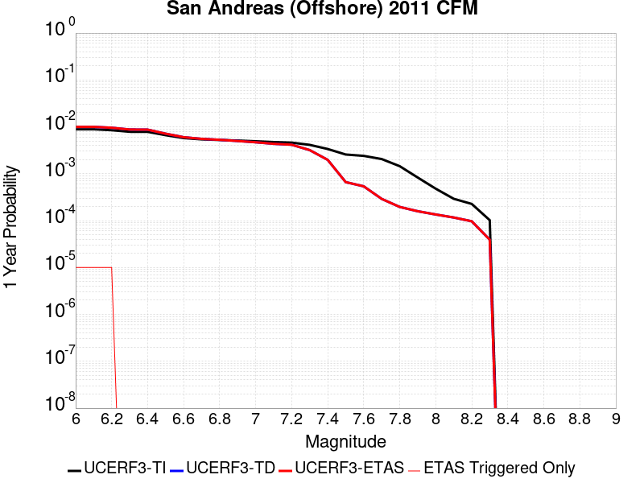 |  |

| Magnitude | 1 wk TI Prob | 1 wk TD Prob | 1 wk ETAS Prob | 1 wk ETAS/TD Gain | 1 wk ETAS Triggered Only | 1 mo TI Prob | 1 mo TD Prob | 1 mo ETAS Prob | 1 mo ETAS/TD Gain | 1 mo ETAS Triggered Only | 1 yr TI Prob | 1 yr TD Prob | 1 yr ETAS Prob | 1 yr ETAS/TD Gain | 1 yr ETAS Triggered Only | 10 yr TI Prob | 10 yr TD Prob | 10 yr ETAS Prob | 10 yr ETAS/TD Gain | 10 yr ETAS Triggered Only |
|-----|-----|-----|-----|-----|-----|-----|-----|-----|-----|-----|-----|-----|-----|-----|-----|-----|-----|-----|-----|-----|
| 6.0 | 1.7072787E-4 | 1.9226041E-4 | 2.022585E-4 | 1.0520028 | 1.0E-5 | 7.3148566E-4 | 8.237154E-4 | 8.337072E-4 | 1.0121301 | 1.0E-5 | 0.008869528 | 0.0099831335 | 0.009993034 | 1.0009917 | 1.0E-5 | 0.085237645 | 0.09682738 | 0.09683641 | 1.0000932 | 1.0E-5 |
| 6.1 | 1.7072787E-4 | 1.9226041E-4 | 2.022585E-4 | 1.0520028 | 1.0E-5 | 7.3148566E-4 | 8.237154E-4 | 8.337072E-4 | 1.0121301 | 1.0E-5 | 0.008869528 | 0.0099831335 | 0.009993034 | 1.0009917 | 1.0E-5 | 0.085237645 | 0.09682738 | 0.09683641 | 1.0000932 | 1.0E-5 |
| 6.2 | 1.6312556E-4 | 1.8407789E-4 | 1.9407604E-4 | 1.0543149 | 1.0E-5 | 6.989222E-4 | 7.8866904E-4 | 7.986612E-4 | 1.0126696 | 1.0E-5 | 0.008476226 | 0.009560268 | 0.009570173 | 1.001036 | 1.0E-5 | 0.08160117 | 0.09284818 | 0.09285726 | 1.0000978 | 1.0E-5 |
| 6.3 | 1.5103363E-4 | 1.6880741E-4 | 1.6880741E-4 | 1.0 | 0.0 | 6.471264E-4 | 7.232619E-4 | 7.232619E-4 | 1.0 | 0.0 | 0.007850339 | 0.008770605 | 0.008770605 | 1.0 | 0.0 | 0.075787395 | 0.085489064 | 0.085489064 | 1.0 | 0.0 |
| 6.4 | 1.5047993E-4 | 1.676667E-4 | 1.676667E-4 | 1.0 | 0.0 | 6.4475456E-4 | 7.1837584E-4 | 7.1837584E-4 | 1.0 | 0.0 | 0.007821669 | 0.008711592 | 0.008711592 | 1.0 | 0.0 | 0.0755203 | 0.08496926 | 0.08496926 | 1.0 | 0.0 |
| 6.5 | 1.2760791E-4 | 1.3735025E-4 | 1.3735025E-4 | 1.0 | 0.0 | 5.467764E-4 | 5.885125E-4 | 5.885125E-4 | 1.0 | 0.0 | 0.0066367025 | 0.0071418737 | 0.0071418737 | 1.0 | 0.0 | 0.064419635 | 0.07025001 | 0.07025001 | 1.0 | 0.0 |
| 6.6 | 1.1063525E-4 | 1.15566356E-4 | 1.15566356E-4 | 1.0 | 0.0 | 4.740649E-4 | 4.9519143E-4 | 4.9519143E-4 | 1.0 | 0.0 | 0.0057564764 | 0.006012491 | 0.006012491 | 1.0 | 0.0 | 0.05609626 | 0.05948894 | 0.05948894 | 1.0 | 0.0 |
| 6.7 | 1.0391049E-4 | 1.0645922E-4 | 1.0645922E-4 | 1.0 | 0.0 | 4.4525467E-4 | 4.5617504E-4 | 4.5617504E-4 | 1.0 | 0.0 | 0.0054075094 | 0.005539975 | 0.005539975 | 1.0 | 0.0 | 0.052778035 | 0.05498876 | 0.05498876 | 1.0 | 0.0 |
| 6.8 | 1.0096706E-4 | 1.01582686E-4 | 1.01582686E-4 | 1.0 | 0.0 | 4.3264418E-4 | 4.3528268E-4 | 4.3528268E-4 | 1.0 | 0.0 | 0.0052547283 | 0.005286866 | 0.005286866 | 1.0 | 0.0 | 0.051321987 | 0.052687574 | 0.052687574 | 1.0 | 0.0 |
| 6.9 | 9.800265E-5 | 9.588748E-5 | 9.588748E-5 | 1.0 | 0.0 | 4.1994374E-4 | 4.1088252E-4 | 4.1088252E-4 | 1.0 | 0.0 | 0.0051008356 | 0.0049911886 | 0.0049911886 | 1.0 | 0.0 | 0.049853306 | 0.05001504 | 0.05001504 | 1.0 | 0.0 |
| 7.0 | 9.4642375E-5 | 9.002143E-5 | 9.002143E-5 | 1.0 | 0.0 | 4.0554712E-4 | 3.8574997E-4 | 3.8574997E-4 | 1.0 | 0.0 | 0.004926363 | 0.0046865544 | 0.0046865544 | 1.0 | 0.0 | 0.048185747 | 0.047196057 | 0.047196057 | 1.0 | 0.0 |
| 7.1 | 9.0996844E-5 | 8.354169E-5 | 8.354169E-5 | 1.0 | 0.0 | 3.8992817E-4 | 3.5798753E-4 | 3.5798753E-4 | 1.0 | 0.0 | 0.004737046 | 0.004349944 | 0.004349944 | 1.0 | 0.0 | 0.04637333 | 0.044047635 | 0.044047635 | 1.0 | 0.0 |
| 7.2 | 8.848287E-5 | 7.9818135E-5 | 7.9818135E-5 | 1.0 | 0.0 | 3.791572E-4 | 3.4203375E-4 | 3.4203375E-4 | 1.0 | 0.0 | 0.004606472 | 0.0041564633 | 0.0041564633 | 1.0 | 0.0 | 0.045121472 | 0.042191572 | 0.042191572 | 1.0 | 0.0 |
| 7.3 | 7.9280784E-5 | 6.1276216E-5 | 6.1276216E-5 | 1.0 | 0.0 | 3.3973053E-4 | 2.625865E-4 | 2.625865E-4 | 1.0 | 0.0 | 0.004128377 | 0.0031924061 | 0.0031924061 | 1.0 | 0.0 | 0.040525194 | 0.032904375 | 0.032904375 | 1.0 | 0.0 |
| 7.4 | 6.468038E-5 | 3.7933212E-5 | 3.7933212E-5 | 1.0 | 0.0 | 2.771722E-4 | 1.625611E-4 | 1.625611E-4 | 1.0 | 0.0 | 0.0033693502 | 0.0019774425 | 0.0019774425 | 1.0 | 0.0 | 0.0331872 | 0.02082181 | 0.02082181 | 1.0 | 0.0 |
| 7.5 | 4.930574E-5 | 1.2703362E-5 | 1.2703362E-5 | 1.0 | 0.0 | 2.1129321E-4 | 5.444185E-5 | 5.444185E-5 | 1.0 | 0.0 | 0.0025694598 | 6.6262955E-4 | 6.6262955E-4 | 1.0 | 0.0 | 0.02539953 | 0.007481418 | 0.007481418 | 1.0 | 0.0 |
| 7.6 | 4.612566E-5 | 1.0336213E-5 | 1.0336213E-5 | 1.0 | 0.0 | 1.9766642E-4 | 4.429731E-5 | 4.429731E-5 | 1.0 | 0.0 | 0.0024039324 | 5.391877E-4 | 5.391877E-4 | 1.0 | 0.0 | 0.023780935 | 0.006172099 | 0.006172099 | 1.0 | 0.0 |
| 7.7 | 3.9435414E-5 | 5.574925E-6 | 5.574925E-6 | 1.0 | 0.0 | 1.6899795E-4 | 2.3892318E-5 | 2.3892318E-5 | 1.0 | 0.0 | 0.0020556084 | 2.9085035E-4 | 2.9085035E-4 | 1.0 | 0.0 | 0.020366974 | 0.0035420412 | 0.0035420412 | 1.0 | 0.0 |
| 7.8 | 2.7787428E-5 | 3.7553348E-6 | 3.7553348E-6 | 1.0 | 0.0 | 1.1908354E-4 | 1.6094193E-5 | 1.6094193E-5 | 1.0 | 0.0 | 0.0014488777 | 1.9592921E-4 | 1.9592921E-4 | 1.0 | 0.0 | 0.014394675 | 0.0023877125 | 0.0023877125 | 1.0 | 0.0 |
| 7.9 | 1.590671E-5 | 3.04085E-6 | 3.04085E-6 | 1.0 | 0.0 | 6.816983E-5 | 1.303215E-5 | 1.303215E-5 | 1.0 | 0.0 | 8.2965166E-4 | 1.586549E-4 | 1.586549E-4 | 1.0 | 0.0 | 0.008265611 | 0.001904262 | 0.001904262 | 1.0 | 0.0 |
| 8.0 | 9.193638E-6 | 2.5920847E-6 | 2.5920847E-6 | 1.0 | 0.0 | 3.940071E-5 | 1.1108887E-5 | 1.1108887E-5 | 1.0 | 0.0 | 4.7959806E-4 | 1.3524233E-4 | 1.3524233E-4 | 1.0 | 0.0 | 0.0047856434 | 0.0016115032 | 0.0016115032 | 1.0 | 0.0 |
| 8.1 | 5.601576E-6 | 2.2343472E-6 | 2.2343472E-6 | 1.0 | 0.0 | 2.4006533E-5 | 9.575739E-6 | 9.575739E-6 | 1.0 | 0.0 | 2.9224035E-4 | 1.16578405E-4 | 1.16578405E-4 | 1.0 | 0.0 | 0.0029185633 | 0.0014020674 | 0.0014020674 | 1.0 | 0.0 |
| 8.2 | 4.3508785E-6 | 1.857566E-6 | 1.857566E-6 | 1.0 | 0.0 | 1.864649E-5 | 7.960973E-6 | 7.960973E-6 | 1.0 | 0.0 | 2.2699735E-4 | 9.692056E-5 | 9.692056E-5 | 1.0 | 0.0 | 0.0022676561 | 0.0011594221 | 0.0011594221 | 1.0 | 0.0 |
| 8.3 | 1.9573292E-6 | 7.514906E-7 | 7.514906E-7 | 1.0 | 0.0 | 8.388526E-6 | 3.22067E-6 | 3.22067E-6 | 1.0 | 0.0 | 1.0212552E-4 | 3.921097E-5 | 3.921097E-5 | 1.0 | 0.0 | 0.001020786 | 4.640846E-4 | 4.640846E-4 | 1.0 | 0.0 |

## Fitzhugh Creek
*[(top)](#table-of-contents)*

| 1 Week | 1 Month | 1 Year | 10 Year |
|-----|-----|-----|-----|
|  |  | 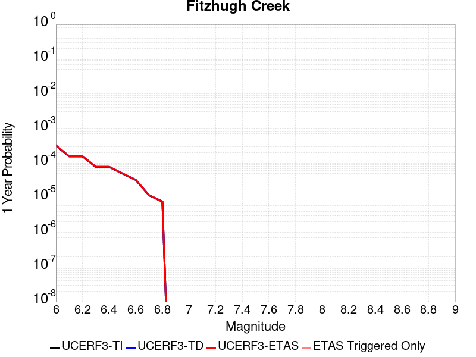 |  |

| Magnitude | 1 wk TI Prob | 1 wk TD Prob | 1 wk ETAS Prob | 1 wk ETAS/TD Gain | 1 wk ETAS Triggered Only | 1 mo TI Prob | 1 mo TD Prob | 1 mo ETAS Prob | 1 mo ETAS/TD Gain | 1 mo ETAS Triggered Only | 1 yr TI Prob | 1 yr TD Prob | 1 yr ETAS Prob | 1 yr ETAS/TD Gain | 1 yr ETAS Triggered Only | 10 yr TI Prob | 10 yr TD Prob | 10 yr ETAS Prob | 10 yr ETAS/TD Gain | 10 yr ETAS Triggered Only |
|-----|-----|-----|-----|-----|-----|-----|-----|-----|-----|-----|-----|-----|-----|-----|-----|-----|-----|-----|-----|-----|
| 6.0 | 6.1090436E-6 | 6.2101562E-6 | 6.2101562E-6 | 1.0 | 0.0 | 2.6181353E-5 | 2.6614709E-5 | 2.6614709E-5 | 1.0 | 0.0 | 3.1871133E-4 | 3.239904E-4 | 3.239904E-4 | 1.0 | 0.0 | 0.0031825465 | 0.0032356246 | 0.0032455921 | 1.0030806 | 1.0E-5 |
| 6.1 | 2.9741811E-6 | 3.021581E-6 | 3.021581E-6 | 1.0 | 0.0 | 1.2746428E-5 | 1.2949574E-5 | 1.2949574E-5 | 1.0 | 0.0 | 1.5517672E-4 | 1.576506E-4 | 1.576506E-4 | 1.0 | 0.0 | 0.001550684 | 0.0015754806 | 0.0015754806 | 1.0 | 0.0 |
| 6.2 | 2.9741811E-6 | 3.021581E-6 | 3.021581E-6 | 1.0 | 0.0 | 1.2746428E-5 | 1.2949574E-5 | 1.2949574E-5 | 1.0 | 0.0 | 1.5517672E-4 | 1.576506E-4 | 1.576506E-4 | 1.0 | 0.0 | 0.001550684 | 0.0015754806 | 0.0015754806 | 1.0 | 0.0 |
| 6.3 | 1.4781198E-6 | 1.5012708E-6 | 1.5012708E-6 | 1.0 | 0.0 | 6.3347834E-6 | 6.4340034E-6 | 6.4340034E-6 | 1.0 | 0.0 | 7.712326E-5 | 7.833137E-5 | 7.833137E-5 | 1.0 | 0.0 | 7.70965E-4 | 7.830576E-4 | 7.830576E-4 | 1.0 | 0.0 |
| 6.4 | 1.4781198E-6 | 1.5012708E-6 | 1.5012708E-6 | 1.0 | 0.0 | 6.3347834E-6 | 6.4340034E-6 | 6.4340034E-6 | 1.0 | 0.0 | 7.712326E-5 | 7.833137E-5 | 7.833137E-5 | 1.0 | 0.0 | 7.70965E-4 | 7.830576E-4 | 7.830576E-4 | 1.0 | 0.0 |
| 6.5 | 9.5176676E-7 | 9.66606E-7 | 9.66606E-7 | 1.0 | 0.0 | 4.078994E-6 | 4.142591E-6 | 4.142591E-6 | 1.0 | 0.0 | 4.9660623E-5 | 5.0434985E-5 | 5.0434985E-5 | 1.0 | 0.0 | 4.964952E-4 | 5.042458E-4 | 5.042458E-4 | 1.0 | 0.0 |
| 6.6 | 6.21145E-7 | 6.3085855E-7 | 6.3085855E-7 | 1.0 | 0.0 | 2.662047E-6 | 2.7036772E-6 | 2.7036772E-6 | 1.0 | 0.0 | 3.2409942E-5 | 3.291684E-5 | 3.291684E-5 | 1.0 | 0.0 | 3.2405215E-4 | 3.2912623E-4 | 3.2912623E-4 | 1.0 | 0.0 |
| 6.7 | 2.2377962E-7 | 2.2734636E-7 | 2.2734636E-7 | 1.0 | 0.0 | 9.590551E-7 | 9.743413E-7 | 9.743413E-7 | 1.0 | 0.0 | 1.1676434E-5 | 1.1862574E-5 | 1.1862574E-5 | 1.0 | 0.0 | 1.1675821E-4 | 1.1862254E-4 | 1.1862254E-4 | 1.0 | 0.0 |
| 6.8 | 1.4785022E-7 | 1.5021492E-7 | 1.5021492E-7 | 1.0 | 0.0 | 6.3364365E-7 | 6.4377826E-7 | 6.4377826E-7 | 1.0 | 0.0 | 7.714584E-6 | 7.838E-6 | 7.838E-6 | 1.0 | 0.0 | 7.714316E-5 | 7.838E-5 | 7.838E-5 | 1.0 | 0.0 |

## South Cuyama
*[(top)](#table-of-contents)*

| 1 Week | 1 Month | 1 Year | 10 Year |
|-----|-----|-----|-----|
|  |  |  |  |

| Magnitude | 1 wk TI Prob | 1 wk TD Prob | 1 wk ETAS Prob | 1 wk ETAS/TD Gain | 1 wk ETAS Triggered Only | 1 mo TI Prob | 1 mo TD Prob | 1 mo ETAS Prob | 1 mo ETAS/TD Gain | 1 mo ETAS Triggered Only | 1 yr TI Prob | 1 yr TD Prob | 1 yr ETAS Prob | 1 yr ETAS/TD Gain | 1 yr ETAS Triggered Only | 10 yr TI Prob | 10 yr TD Prob | 10 yr ETAS Prob | 10 yr ETAS/TD Gain | 10 yr ETAS Triggered Only |
|-----|-----|-----|-----|-----|-----|-----|-----|-----|-----|-----|-----|-----|-----|-----|-----|-----|-----|-----|-----|-----|
| 6.0 | 1.2747308E-6 | 1.2818697E-6 | 1.1281857E-5 | 8.801095 | 1.0E-5 | 5.4631205E-6 | 5.4937163E-6 | 1.549366E-5 | 2.8202515 | 1.0E-5 | 6.6511464E-5 | 6.6884015E-5 | 7.688334E-5 | 1.1495025 | 1.0E-5 | 6.649156E-4 | 6.686458E-4 | 6.786391E-4 | 1.0149456 | 1.0E-5 |
| 6.1 | 1.2747308E-6 | 1.2818697E-6 | 1.1281857E-5 | 8.801095 | 1.0E-5 | 5.4631205E-6 | 5.4937163E-6 | 1.549366E-5 | 2.8202515 | 1.0E-5 | 6.6511464E-5 | 6.6884015E-5 | 7.688334E-5 | 1.1495025 | 1.0E-5 | 6.649156E-4 | 6.686458E-4 | 6.786391E-4 | 1.0149456 | 1.0E-5 |
| 6.2 | 1.2747308E-6 | 1.2818697E-6 | 1.1281857E-5 | 8.801095 | 1.0E-5 | 5.4631205E-6 | 5.4937163E-6 | 1.549366E-5 | 2.8202515 | 1.0E-5 | 6.6511464E-5 | 6.6884015E-5 | 7.688334E-5 | 1.1495025 | 1.0E-5 | 6.649156E-4 | 6.686458E-4 | 6.786391E-4 | 1.0149456 | 1.0E-5 |
| 6.3 | 1.2747308E-6 | 1.2818697E-6 | 1.1281857E-5 | 8.801095 | 1.0E-5 | 5.4631205E-6 | 5.4937163E-6 | 1.549366E-5 | 2.8202515 | 1.0E-5 | 6.6511464E-5 | 6.6884015E-5 | 7.688334E-5 | 1.1495025 | 1.0E-5 | 6.649156E-4 | 6.686458E-4 | 6.786391E-4 | 1.0149456 | 1.0E-5 |
| 6.4 | 1.2747308E-6 | 1.2818697E-6 | 1.1281857E-5 | 8.801095 | 1.0E-5 | 5.4631205E-6 | 5.4937163E-6 | 1.549366E-5 | 2.8202515 | 1.0E-5 | 6.6511464E-5 | 6.6884015E-5 | 7.688334E-5 | 1.1495025 | 1.0E-5 | 6.649156E-4 | 6.686458E-4 | 6.786391E-4 | 1.0149456 | 1.0E-5 |
| 6.5 | 1.2747308E-6 | 1.2818697E-6 | 1.1281857E-5 | 8.801095 | 1.0E-5 | 5.4631205E-6 | 5.4937163E-6 | 1.549366E-5 | 2.8202515 | 1.0E-5 | 6.6511464E-5 | 6.6884015E-5 | 7.688334E-5 | 1.1495025 | 1.0E-5 | 6.649156E-4 | 6.686458E-4 | 6.786391E-4 | 1.0149456 | 1.0E-5 |
| 6.6 | 1.2747308E-6 | 1.2818697E-6 | 1.1281857E-5 | 8.801095 | 1.0E-5 | 5.4631205E-6 | 5.4937163E-6 | 1.549366E-5 | 2.8202515 | 1.0E-5 | 6.6511464E-5 | 6.6884015E-5 | 7.688334E-5 | 1.1495025 | 1.0E-5 | 6.649156E-4 | 6.686458E-4 | 6.786391E-4 | 1.0149456 | 1.0E-5 |
| 6.7 | 1.2747308E-6 | 1.2818697E-6 | 1.1281857E-5 | 8.801095 | 1.0E-5 | 5.4631205E-6 | 5.4937163E-6 | 1.549366E-5 | 2.8202515 | 1.0E-5 | 6.6511464E-5 | 6.6884015E-5 | 7.688334E-5 | 1.1495025 | 1.0E-5 | 6.649156E-4 | 6.686458E-4 | 6.786391E-4 | 1.0149456 | 1.0E-5 |
| 6.8 | 1.2747308E-6 | 1.2818697E-6 | 1.1281857E-5 | 8.801095 | 1.0E-5 | 5.4631205E-6 | 5.4937163E-6 | 1.549366E-5 | 2.8202515 | 1.0E-5 | 6.6511464E-5 | 6.6884015E-5 | 7.688334E-5 | 1.1495025 | 1.0E-5 | 6.649156E-4 | 6.686458E-4 | 6.786391E-4 | 1.0149456 | 1.0E-5 |
| 6.9 | 8.4566324E-7 | 8.507883E-7 | 8.507883E-7 | 1.0 | 0.0 | 3.624266E-6 | 3.6462304E-6 | 3.6462304E-6 | 1.0 | 0.0 | 4.4124543E-5 | 4.439196E-5 | 4.439196E-5 | 1.0 | 0.0 | 4.4115784E-4 | 4.4383196E-4 | 4.4383196E-4 | 1.0 | 0.0 |
| 7.0 | 8.2277904E-7 | 8.27782E-7 | 8.27782E-7 | 1.0 | 0.0 | 3.526191E-6 | 3.5476323E-6 | 3.5476323E-6 | 1.0 | 0.0 | 4.293053E-5 | 4.3191576E-5 | 4.3191576E-5 | 1.0 | 0.0 | 4.292224E-4 | 4.3183283E-4 | 4.3183283E-4 | 1.0 | 0.0 |
| 7.1 | 6.7661887E-7 | 6.80913E-7 | 6.80913E-7 | 1.0 | 0.0 | 2.899792E-6 | 2.9181954E-6 | 2.9181954E-6 | 1.0 | 0.0 | 3.5304394E-5 | 3.5528454E-5 | 3.5528454E-5 | 1.0 | 0.0 | 3.5298787E-4 | 3.552281E-4 | 3.552281E-4 | 1.0 | 0.0 |
| 7.2 | 5.783336E-7 | 5.8211907E-7 | 5.8211907E-7 | 1.0 | 0.0 | 2.4785702E-6 | 2.4947938E-6 | 2.4947938E-6 | 1.0 | 0.0 | 3.0176174E-5 | 3.0373692E-5 | 3.0373692E-5 | 1.0 | 0.0 | 3.0172078E-4 | 3.0369565E-4 | 3.0369565E-4 | 1.0 | 0.0 |
| 7.3 | 5.136759E-7 | 5.170938E-7 | 5.170938E-7 | 1.0 | 0.0 | 2.2014663E-6 | 2.2161144E-6 | 2.2161144E-6 | 1.0 | 0.0 | 2.6802521E-5 | 2.698086E-5 | 2.698086E-5 | 1.0 | 0.0 | 2.679929E-4 | 2.6977606E-4 | 2.6977606E-4 | 1.0 | 0.0 |
| 7.4 | 4.3370295E-7 | 4.3665364E-7 | 4.3665364E-7 | 1.0 | 0.0 | 1.8587256E-6 | 1.8713713E-6 | 1.8713713E-6 | 1.0 | 0.0 | 2.2629749E-5 | 2.278371E-5 | 2.278371E-5 | 1.0 | 0.0 | 2.2627445E-4 | 2.278139E-4 | 2.278139E-4 | 1.0 | 0.0 |
| 7.5 | 3.3242574E-7 | 3.3476465E-7 | 3.3476465E-7 | 1.0 | 0.0 | 1.4246809E-6 | 1.4347048E-6 | 1.4347048E-6 | 1.0 | 0.0 | 1.7345352E-5 | 1.7467393E-5 | 1.7467393E-5 | 1.0 | 0.0 | 1.7343998E-4 | 1.7466032E-4 | 1.7466032E-4 | 1.0 | 0.0 |
| 7.6 | 2.0627535E-7 | 2.07789E-7 | 2.07789E-7 | 1.0 | 0.0 | 8.840369E-7 | 8.90524E-7 | 8.90524E-7 | 1.0 | 0.0 | 1.0763096E-5 | 1.0842076E-5 | 1.0842076E-5 | 1.0 | 0.0 | 1.0762575E-4 | 1.0841556E-4 | 1.0841556E-4 | 1.0 | 0.0 |
| 7.7 | 6.15236E-8 | 6.1983044E-8 | 6.1983044E-8 | 1.0 | 0.0 | 2.6367252E-7 | 2.656416E-7 | 2.656416E-7 | 1.0 | 0.0 | 3.2102084E-6 | 3.2341818E-6 | 3.2341818E-6 | 1.0 | 0.0 | 3.210162E-5 | 3.234136E-5 | 3.234136E-5 | 1.0 | 0.0 |
| 7.8 | 1.1765573E-8 | 1.1873414E-8 | 1.1873414E-8 | 1.0 | 0.0 | 5.0423886E-8 | 5.0886058E-8 | 5.0886058E-8 | 1.0 | 0.0 | 6.1391063E-7 | 6.195376E-7 | 6.195376E-7 | 1.0 | 0.0 | 6.1390897E-6 | 6.19536E-6 | 6.19536E-6 | 1.0 | 0.0 |
| 7.9 | 6.0381755E-10 | 6.10058E-10 | 6.10058E-10 | 1.0 | 0.0 | 2.5877895E-9 | 2.614534E-9 | 2.614534E-9 | 1.0 | 0.0 | 3.1506335E-8 | 3.1831952E-8 | 3.1831952E-8 | 1.0 | 0.0 | 3.1506332E-7 | 3.183195E-7 | 3.183195E-7 | 1.0 | 0.0 |

## San Gregorio (South) 2011 CFM
*[(top)](#table-of-contents)*

| 1 Week | 1 Month | 1 Year | 10 Year |
|-----|-----|-----|-----|
|  | 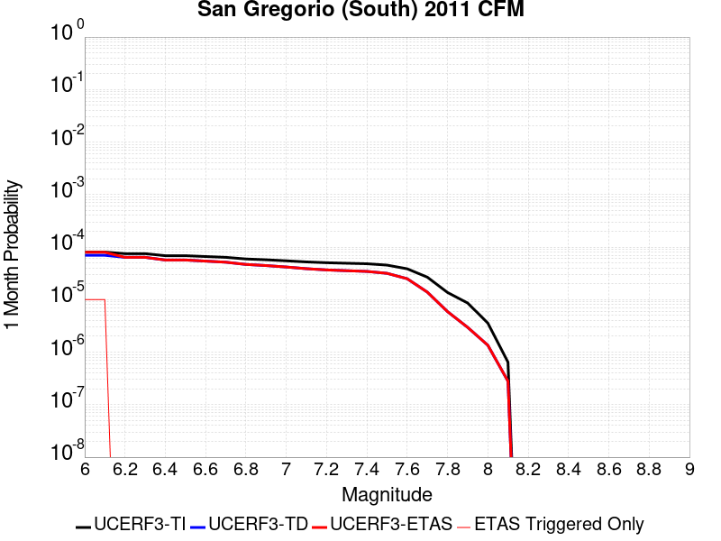 |  |  |

| Magnitude | 1 wk TI Prob | 1 wk TD Prob | 1 wk ETAS Prob | 1 wk ETAS/TD Gain | 1 wk ETAS Triggered Only | 1 mo TI Prob | 1 mo TD Prob | 1 mo ETAS Prob | 1 mo ETAS/TD Gain | 1 mo ETAS Triggered Only | 1 yr TI Prob | 1 yr TD Prob | 1 yr ETAS Prob | 1 yr ETAS/TD Gain | 1 yr ETAS Triggered Only | 10 yr TI Prob | 10 yr TD Prob | 10 yr ETAS Prob | 10 yr ETAS/TD Gain | 10 yr ETAS Triggered Only |
|-----|-----|-----|-----|-----|-----|-----|-----|-----|-----|-----|-----|-----|-----|-----|-----|-----|-----|-----|-----|-----|
| 6.0 | 1.8770423E-5 | 1.6279751E-5 | 2.627959E-5 | 1.61425 | 1.0E-5 | 8.044219E-5 | 6.976852E-5 | 7.976782E-5 | 1.1433212 | 1.0E-5 | 9.789435E-4 | 8.491044E-4 | 8.5909595E-4 | 1.0117671 | 1.0E-5 | 0.009746423 | 0.008471312 | 0.008481227 | 1.0011704 | 1.0E-5 |
| 6.1 | 1.8770423E-5 | 1.6279751E-5 | 2.627959E-5 | 1.61425 | 1.0E-5 | 8.044219E-5 | 6.976852E-5 | 7.976782E-5 | 1.1433212 | 1.0E-5 | 9.789435E-4 | 8.491044E-4 | 8.5909595E-4 | 1.0117671 | 1.0E-5 | 0.009746423 | 0.008471312 | 0.008481227 | 1.0011704 | 1.0E-5 |
| 6.2 | 1.7508692E-5 | 1.4899257E-5 | 1.4899257E-5 | 1.0 | 0.0 | 7.5035096E-5 | 6.3852414E-5 | 6.3852414E-5 | 1.0 | 0.0 | 9.1316935E-4 | 7.7712885E-4 | 7.7712885E-4 | 1.0 | 0.0 | 0.00909426 | 0.00775674 | 0.00775674 | 1.0 | 0.0 |
| 6.3 | 1.7508692E-5 | 1.4899257E-5 | 1.4899257E-5 | 1.0 | 0.0 | 7.5035096E-5 | 6.3852414E-5 | 6.3852414E-5 | 1.0 | 0.0 | 9.1316935E-4 | 7.7712885E-4 | 7.7712885E-4 | 1.0 | 0.0 | 0.00909426 | 0.00775674 | 0.00775674 | 1.0 | 0.0 |
| 6.4 | 1.6004591E-5 | 1.3249094E-5 | 1.3249094E-5 | 1.0 | 0.0 | 6.85893E-5 | 5.6780602E-5 | 5.6780602E-5 | 1.0 | 0.0 | 8.347548E-4 | 6.910856E-4 | 6.910856E-4 | 1.0 | 0.0 | 0.008316261 | 0.006901791 | 0.006901791 | 1.0 | 0.0 |
| 6.5 | 1.6004591E-5 | 1.3249094E-5 | 1.3249094E-5 | 1.0 | 0.0 | 6.85893E-5 | 5.6780602E-5 | 5.6780602E-5 | 1.0 | 0.0 | 8.347548E-4 | 6.910856E-4 | 6.910856E-4 | 1.0 | 0.0 | 0.008316261 | 0.006901791 | 0.006901791 | 1.0 | 0.0 |
| 6.6 | 1.5442201E-5 | 1.2633725E-5 | 1.2633725E-5 | 1.0 | 0.0 | 6.617918E-5 | 5.4143416E-5 | 5.4143416E-5 | 1.0 | 0.0 | 8.0543366E-4 | 6.5899757E-4 | 6.5899757E-4 | 1.0 | 0.0 | 0.008025207 | 0.006582842 | 0.006582842 | 1.0 | 0.0 |
| 6.7 | 1.489921E-5 | 1.2042234E-5 | 1.2042234E-5 | 1.0 | 0.0 | 6.3852196E-5 | 5.1608557E-5 | 5.1608557E-5 | 1.0 | 0.0 | 7.7712315E-4 | 6.2815374E-4 | 6.2815374E-4 | 1.0 | 0.0 | 0.0077441116 | 0.006276176 | 0.006276176 | 1.0 | 0.0 |
| 6.8 | 1.3876024E-5 | 1.0921184E-5 | 1.0921184E-5 | 1.0 | 0.0 | 5.9467322E-5 | 4.6804238E-5 | 4.6804238E-5 | 1.0 | 0.0 | 7.237741E-4 | 5.69693E-4 | 5.69693E-4 | 1.0 | 0.0 | 0.0072142133 | 0.0056946846 | 0.0056946846 | 1.0 | 0.0 |
| 6.9 | 1.33922495E-5 | 1.0392687E-5 | 1.0392687E-5 | 1.0 | 0.0 | 5.7394092E-5 | 4.4539327E-5 | 4.4539327E-5 | 1.0 | 0.0 | 6.9854903E-4 | 5.4213166E-4 | 5.4213166E-4 | 1.0 | 0.0 | 0.0069635725 | 0.005420442 | 0.005420442 | 1.0 | 0.0 |
| 7.0 | 1.2807324E-5 | 9.752649E-6 | 9.752649E-6 | 1.0 | 0.0 | 5.4887376E-5 | 4.1796397E-5 | 4.1796397E-5 | 1.0 | 0.0 | 6.680489E-4 | 5.087525E-4 | 5.087525E-4 | 1.0 | 0.0 | 0.006660442 | 0.0050882204 | 0.0050882204 | 1.0 | 0.0 |
| 7.1 | 1.2191438E-5 | 9.061537E-6 | 9.061537E-6 | 1.0 | 0.0 | 5.224797E-5 | 3.8834576E-5 | 3.8834576E-5 | 1.0 | 0.0 | 6.3593336E-4 | 4.727085E-4 | 4.727085E-4 | 1.0 | 0.0 | 0.0063411663 | 0.0047293645 | 0.0047293645 | 1.0 | 0.0 |
| 7.2 | 1.1769438E-5 | 8.581731E-6 | 8.581731E-6 | 1.0 | 0.0 | 5.0439474E-5 | 3.677833E-5 | 3.677833E-5 | 1.0 | 0.0 | 6.1392755E-4 | 4.4768423E-4 | 4.4768423E-4 | 1.0 | 0.0 | 0.0061223423 | 0.004480157 | 0.004480157 | 1.0 | 0.0 |
| 7.3 | 1.150374E-5 | 8.29716E-6 | 8.29716E-6 | 1.0 | 0.0 | 4.9300812E-5 | 3.5558773E-5 | 3.5558773E-5 | 1.0 | 0.0 | 6.0007203E-4 | 4.3284212E-4 | 4.3284212E-4 | 1.0 | 0.0 | 0.0059845424 | 0.0043323063 | 0.0043323063 | 1.0 | 0.0 |
| 7.4 | 1.12514E-5 | 8.042902E-6 | 8.042902E-6 | 1.0 | 0.0 | 4.8219394E-5 | 3.4469125E-5 | 3.4469125E-5 | 1.0 | 0.0 | 5.8691297E-4 | 4.1958084E-4 | 4.1958084E-4 | 1.0 | 0.0 | 0.005853653 | 0.0042001884 | 0.0042001884 | 1.0 | 0.0 |
| 7.5 | 1.059696E-5 | 7.3931915E-6 | 7.3931915E-6 | 1.0 | 0.0 | 4.5414752E-5 | 3.168472E-5 | 3.168472E-5 | 1.0 | 0.0 | 5.5278436E-4 | 3.8569325E-4 | 3.8569325E-4 | 1.0 | 0.0 | 0.0055141128 | 0.0038624762 | 0.0038624762 | 1.0 | 0.0 |
| 7.6 | 9.018592E-6 | 5.8369624E-6 | 5.8369624E-6 | 1.0 | 0.0 | 3.8650534E-5 | 2.5015313E-5 | 2.5015313E-5 | 1.0 | 0.0 | 4.7046866E-4 | 3.045189E-4 | 3.045189E-4 | 1.0 | 0.0 | 0.004694739 | 0.0030528754 | 0.0030528754 | 1.0 | 0.0 |
| 7.7 | 6.243489E-6 | 3.2395455E-6 | 3.2395455E-6 | 1.0 | 0.0 | 2.6757538E-5 | 1.3883692E-5 | 1.3883692E-5 | 1.0 | 0.0 | 3.257243E-4 | 1.6902086E-4 | 1.6902086E-4 | 1.0 | 0.0 | 0.003252473 | 0.001699108 | 0.001699108 | 1.0 | 0.0 |
| 7.8 | 3.1941963E-6 | 1.3809986E-6 | 1.3809986E-6 | 1.0 | 0.0 | 1.368934E-5 | 5.9185513E-6 | 5.9185513E-6 | 1.0 | 0.0 | 1.6665498E-4 | 7.2055984E-5 | 7.2055984E-5 | 1.0 | 0.0 | 0.0016653005 | 7.263174E-4 | 7.263174E-4 | 1.0 | 0.0 |
| 7.9 | 2.0098398E-6 | 6.9161155E-7 | 6.9161155E-7 | 1.0 | 0.0 | 8.6135715E-6 | 2.964046E-6 | 2.964046E-6 | 1.0 | 0.0 | 1.0486518E-4 | 3.608666E-5 | 3.608666E-5 | 1.0 | 0.0 | 0.0010481571 | 3.657225E-4 | 3.657225E-4 | 1.0 | 0.0 |
| 8.0 | 8.353119E-7 | 3.1623412E-7 | 3.1623412E-7 | 1.0 | 0.0 | 3.579903E-6 | 1.3552883E-6 | 1.3552883E-6 | 1.0 | 0.0 | 4.358445E-5 | 1.6500511E-5 | 1.6500511E-5 | 1.0 | 0.0 | 4.3575902E-4 | 1.6619264E-4 | 1.6619264E-4 | 1.0 | 0.0 |
| 8.1 | 1.5033264E-7 | 6.527624E-8 | 6.527624E-8 | 1.0 | 0.0 | 6.442826E-7 | 2.7975528E-7 | 2.7975528E-7 | 1.0 | 0.0 | 7.844113E-6 | 3.4060151E-6 | 3.4060151E-6 | 1.0 | 0.0 | 7.843835E-5 | 3.407693E-5 | 3.407693E-5 | 1.0 | 0.0 |

## Rinconada 2011 CFM
*[(top)](#table-of-contents)*

| 1 Week | 1 Month | 1 Year | 10 Year |
|-----|-----|-----|-----|
|  |  |  |  |

| Magnitude | 1 wk TI Prob | 1 wk TD Prob | 1 wk ETAS Prob | 1 wk ETAS/TD Gain | 1 wk ETAS Triggered Only | 1 mo TI Prob | 1 mo TD Prob | 1 mo ETAS Prob | 1 mo ETAS/TD Gain | 1 mo ETAS Triggered Only | 1 yr TI Prob | 1 yr TD Prob | 1 yr ETAS Prob | 1 yr ETAS/TD Gain | 1 yr ETAS Triggered Only | 10 yr TI Prob | 10 yr TD Prob | 10 yr ETAS Prob | 10 yr ETAS/TD Gain | 10 yr ETAS Triggered Only |
|-----|-----|-----|-----|-----|-----|-----|-----|-----|-----|-----|-----|-----|-----|-----|-----|-----|-----|-----|-----|-----|
| 6.0 | 1.5752368E-5 | 1.6274716E-5 | 1.6274716E-5 | 1.0 | 0.0 | 6.75084E-5 | 6.974694E-5 | 6.974694E-5 | 1.0 | 0.0 | 8.2160486E-4 | 8.488412E-4 | 8.5883273E-4 | 1.0117707 | 1.0E-5 | 0.008185739 | 0.00845637 | 0.008466286 | 1.0011725 | 1.0E-5 |
| 6.1 | 1.0966133E-5 | 1.1323029E-5 | 1.1323029E-5 | 1.0 | 0.0 | 4.6996865E-5 | 4.852637E-5 | 4.852637E-5 | 1.0 | 0.0 | 5.720366E-4 | 5.906491E-4 | 6.006432E-4 | 1.0169206 | 1.0E-5 | 0.0057056635 | 0.0058908886 | 0.00590083 | 1.0016875 | 1.0E-5 |
| 6.2 | 1.0966133E-5 | 1.1323029E-5 | 1.1323029E-5 | 1.0 | 0.0 | 4.6996865E-5 | 4.852637E-5 | 4.852637E-5 | 1.0 | 0.0 | 5.720366E-4 | 5.906491E-4 | 6.006432E-4 | 1.0169206 | 1.0E-5 | 0.0057056635 | 0.0058908886 | 0.00590083 | 1.0016875 | 1.0E-5 |
| 6.3 | 8.926149E-6 | 9.212771E-6 | 9.212771E-6 | 1.0 | 0.0 | 3.8254362E-5 | 3.948271E-5 | 3.948271E-5 | 1.0 | 0.0 | 4.6564735E-4 | 4.805963E-4 | 4.905915E-4 | 1.0207975 | 1.0E-5 | 0.0046467283 | 0.0047956146 | 0.0048055663 | 1.0020752 | 1.0E-5 |
| 6.4 | 7.676955E-6 | 7.920191E-6 | 7.920191E-6 | 1.0 | 0.0 | 3.290082E-5 | 3.3943234E-5 | 3.3943234E-5 | 1.0 | 0.0 | 4.0049385E-4 | 4.1318068E-4 | 4.2317656E-4 | 1.0241925 | 1.0E-5 | 0.0039977287 | 0.004124151 | 0.0041341097 | 1.0024147 | 1.0E-5 |
| 6.5 | 6.1671026E-6 | 6.3589546E-6 | 6.3589546E-6 | 1.0 | 0.0 | 2.6430173E-5 | 2.725238E-5 | 2.725238E-5 | 1.0 | 0.0 | 3.2173982E-4 | 3.317473E-4 | 3.4174396E-4 | 1.0301335 | 1.0E-5 | 0.003212744 | 0.0033125326 | 0.0033224993 | 1.0030088 | 1.0E-5 |
| 6.6 | 5.553456E-6 | 5.7248126E-6 | 5.7248126E-6 | 1.0 | 0.0 | 2.3800309E-5 | 2.453468E-5 | 2.453468E-5 | 1.0 | 0.0 | 2.897302E-4 | 2.9866883E-4 | 2.9866883E-4 | 1.0 | 0.0 | 0.0028935277 | 0.002982683 | 0.002982683 | 1.0 | 0.0 |
| 6.7 | 4.787857E-6 | 4.9333094E-6 | 4.9333094E-6 | 1.0 | 0.0 | 2.0519226E-5 | 2.1142583E-5 | 2.1142583E-5 | 1.0 | 0.0 | 2.4979294E-4 | 2.573806E-4 | 2.573806E-4 | 1.0 | 0.0 | 0.0024951235 | 0.0025708308 | 0.0025708308 | 1.0 | 0.0 |
| 6.8 | 3.9955166E-6 | 4.1134763E-6 | 4.1134763E-6 | 1.0 | 0.0 | 1.7123532E-5 | 1.7629065E-5 | 1.7629065E-5 | 1.0 | 0.0 | 2.0845905E-4 | 2.1461274E-4 | 2.1461274E-4 | 1.0 | 0.0 | 0.002082636 | 0.0021440585 | 0.0021440585 | 1.0 | 0.0 |
| 6.9 | 3.4250072E-6 | 3.5224464E-6 | 3.5224464E-6 | 1.0 | 0.0 | 1.46785205E-5 | 1.5096111E-5 | 1.5096111E-5 | 1.0 | 0.0 | 1.7869633E-4 | 1.8377967E-4 | 1.8377967E-4 | 1.0 | 0.0 | 0.001785527 | 0.0018362794 | 0.0018362794 | 1.0 | 0.0 |
| 7.0 | 2.7712713E-6 | 2.8467E-6 | 2.8467E-6 | 1.0 | 0.0 | 1.1876823E-5 | 1.2200086E-5 | 1.2200086E-5 | 1.0 | 0.0 | 1.4459073E-4 | 1.4852593E-4 | 1.4852593E-4 | 1.0 | 0.0 | 0.0014449668 | 0.0014842682 | 0.0014842682 | 1.0 | 0.0 |
| 7.1 | 2.227358E-6 | 2.2856984E-6 | 2.2856984E-6 | 1.0 | 0.0 | 9.545785E-6 | 9.795814E-6 | 9.795814E-6 | 1.0 | 0.0 | 1.16213734E-4 | 1.19257515E-4 | 1.19257515E-4 | 1.0 | 0.0 | 0.0011615298 | 0.0011919362 | 0.0011919362 | 1.0 | 0.0 |
| 7.2 | 1.581796E-6 | 1.6209011E-6 | 1.6209011E-6 | 1.0 | 0.0 | 6.779108E-6 | 6.9467005E-6 | 6.9467005E-6 | 1.0 | 0.0 | 8.253252E-5 | 8.457281E-5 | 8.457281E-5 | 1.0 | 0.0 | 8.250187E-4 | 8.454067E-4 | 8.454067E-4 | 1.0 | 0.0 |
| 7.3 | 1.0306567E-6 | 1.0546477E-6 | 1.0546477E-6 | 1.0 | 0.0 | 4.4170924E-6 | 4.519911E-6 | 4.519911E-6 | 1.0 | 0.0 | 5.3776774E-5 | 5.5028526E-5 | 5.5028526E-5 | 1.0 | 0.0 | 5.376376E-4 | 5.5014924E-4 | 5.5014924E-4 | 1.0 | 0.0 |
| 7.4 | 6.535541E-7 | 6.682742E-7 | 6.682742E-7 | 1.0 | 0.0 | 2.800943E-6 | 2.864029E-6 | 2.864029E-6 | 1.0 | 0.0 | 3.4100947E-5 | 3.4868997E-5 | 3.4868997E-5 | 1.0 | 0.0 | 3.4095717E-4 | 3.4863537E-4 | 3.4863537E-4 | 1.0 | 0.0 |
| 7.5 | 3.2656962E-7 | 3.3316687E-7 | 3.3316687E-7 | 1.0 | 0.0 | 1.3995833E-6 | 1.4278572E-6 | 1.4278572E-6 | 1.0 | 0.0 | 1.7039794E-5 | 1.7384024E-5 | 1.7384024E-5 | 1.0 | 0.0 | 1.7038487E-4 | 1.7382667E-4 | 1.7382667E-4 | 1.0 | 0.0 |
| 7.6 | 9.754343E-8 | 9.82099E-8 | 9.82099E-8 | 1.0 | 0.0 | 4.180432E-7 | 4.208995E-7 | 4.208995E-7 | 1.0 | 0.0 | 5.089664E-6 | 5.1244397E-6 | 5.1244397E-6 | 1.0 | 0.0 | 5.0895473E-5 | 5.1243223E-5 | 5.1243223E-5 | 1.0 | 0.0 |
| 7.7 | 6.0001453E-9 | 5.8490435E-9 | 5.8490435E-9 | 1.0 | 0.0 | 2.5714908E-8 | 2.506733E-8 | 2.506733E-8 | 1.0 | 0.0 | 3.1307894E-7 | 3.051947E-7 | 3.051947E-7 | 1.0 | 0.0 | 3.1307852E-6 | 3.051943E-6 | 3.051943E-6 | 1.0 | 0.0 |
| 7.8 | 7.400003E-11 | 7.4654505E-11 | 7.4654505E-11 | 1.0 | 0.0 | 3.171432E-10 | 3.1994773E-10 | 3.1994773E-10 | 1.0 | 0.0 | 3.861218E-9 | 3.895363E-9 | 3.895363E-9 | 1.0 | 0.0 | 3.861218E-8 | 3.895363E-8 | 3.895363E-8 | 1.0 | 0.0 |

## Del Valle
*[(top)](#table-of-contents)*

| 1 Week | 1 Month | 1 Year | 10 Year |
|-----|-----|-----|-----|
| 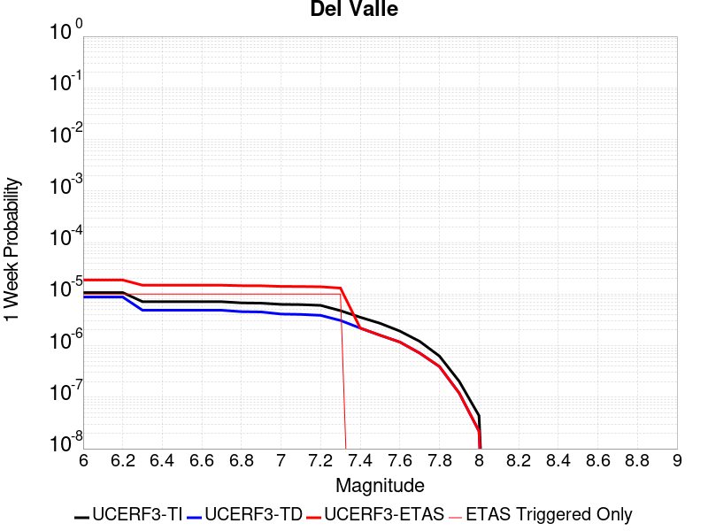 |  |  |  |

| Magnitude | 1 wk TI Prob | 1 wk TD Prob | 1 wk ETAS Prob | 1 wk ETAS/TD Gain | 1 wk ETAS Triggered Only | 1 mo TI Prob | 1 mo TD Prob | 1 mo ETAS Prob | 1 mo ETAS/TD Gain | 1 mo ETAS Triggered Only | 1 yr TI Prob | 1 yr TD Prob | 1 yr ETAS Prob | 1 yr ETAS/TD Gain | 1 yr ETAS Triggered Only | 10 yr TI Prob | 10 yr TD Prob | 10 yr ETAS Prob | 10 yr ETAS/TD Gain | 10 yr ETAS Triggered Only |
|-----|-----|-----|-----|-----|-----|-----|-----|-----|-----|-----|-----|-----|-----|-----|-----|-----|-----|-----|-----|-----|
| 6.0 | 1.0716125E-5 | 8.767882E-6 | 1.8767794E-5 | 2.1405163 | 1.0E-5 | 4.592544E-5 | 3.7576207E-5 | 4.757583E-5 | 1.2661159 | 1.0E-5 | 5.589988E-4 | 4.5741405E-4 | 4.6740947E-4 | 1.021852 | 1.0E-5 | 0.0055759475 | 0.00456668 | 0.0045766346 | 1.0021797 | 1.0E-5 |
| 6.1 | 1.0716125E-5 | 8.767882E-6 | 1.8767794E-5 | 2.1405163 | 1.0E-5 | 4.592544E-5 | 3.7576207E-5 | 4.757583E-5 | 1.2661159 | 1.0E-5 | 5.589988E-4 | 4.5741405E-4 | 4.6740947E-4 | 1.021852 | 1.0E-5 | 0.0055759475 | 0.00456668 | 0.0045766346 | 1.0021797 | 1.0E-5 |
| 6.2 | 1.0716125E-5 | 8.767882E-6 | 1.8767794E-5 | 2.1405163 | 1.0E-5 | 4.592544E-5 | 3.7576207E-5 | 4.757583E-5 | 1.2661159 | 1.0E-5 | 5.589988E-4 | 4.5741405E-4 | 4.6740947E-4 | 1.021852 | 1.0E-5 | 0.0055759475 | 0.00456668 | 0.0045766346 | 1.0021797 | 1.0E-5 |
| 6.3 | 7.1293784E-6 | 4.865823E-6 | 1.4865775E-5 | 3.0551407 | 1.0E-5 | 3.055412E-5 | 2.0853364E-5 | 3.0853156E-5 | 1.4795289 | 1.0E-5 | 3.7193293E-4 | 2.5386087E-4 | 2.6385832E-4 | 1.0393816 | 1.0E-5 | 0.0037131102 | 0.0025357946 | 0.0025457693 | 1.0039335 | 1.0E-5 |
| 6.4 | 7.1293784E-6 | 4.865823E-6 | 1.4865775E-5 | 3.0551407 | 1.0E-5 | 3.055412E-5 | 2.0853364E-5 | 3.0853156E-5 | 1.4795289 | 1.0E-5 | 3.7193293E-4 | 2.5386087E-4 | 2.6385832E-4 | 1.0393816 | 1.0E-5 | 0.0037131102 | 0.0025357946 | 0.0025457693 | 1.0039335 | 1.0E-5 |
| 6.5 | 7.1293784E-6 | 4.865823E-6 | 1.4865775E-5 | 3.0551407 | 1.0E-5 | 3.055412E-5 | 2.0853364E-5 | 3.0853156E-5 | 1.4795289 | 1.0E-5 | 3.7193293E-4 | 2.5386087E-4 | 2.6385832E-4 | 1.0393816 | 1.0E-5 | 0.0037131102 | 0.0025357946 | 0.0025457693 | 1.0039335 | 1.0E-5 |
| 6.6 | 7.1293784E-6 | 4.865823E-6 | 1.4865775E-5 | 3.0551407 | 1.0E-5 | 3.055412E-5 | 2.0853364E-5 | 3.0853156E-5 | 1.4795289 | 1.0E-5 | 3.7193293E-4 | 2.5386087E-4 | 2.6385832E-4 | 1.0393816 | 1.0E-5 | 0.0037131102 | 0.0025357946 | 0.0025457693 | 1.0039335 | 1.0E-5 |
| 6.7 | 7.12272E-6 | 4.8631987E-6 | 1.486315E-5 | 3.0562499 | 1.0E-5 | 3.0525585E-5 | 2.0842117E-5 | 3.0841908E-5 | 1.4797877 | 1.0E-5 | 3.7158563E-4 | 2.5372396E-4 | 2.6372142E-4 | 1.039403 | 1.0E-5 | 0.003709649 | 0.0025344288 | 0.0025444035 | 1.0039357 | 1.0E-5 |
| 6.8 | 6.7558703E-6 | 4.5594015E-6 | 1.4559356E-5 | 3.1932604 | 1.0E-5 | 2.895341E-5 | 1.9540148E-5 | 2.9539953E-5 | 1.5117568 | 1.0E-5 | 3.5245073E-4 | 2.3787597E-4 | 2.478736E-4 | 1.0420287 | 1.0E-5 | 0.0035189227 | 0.0023762889 | 0.002386265 | 1.0041982 | 1.0E-5 |
| 6.9 | 6.6700386E-6 | 4.502539E-6 | 1.4502494E-5 | 3.2209592 | 1.0E-5 | 2.8585566E-5 | 1.9296456E-5 | 2.9296263E-5 | 1.5182198 | 1.0E-5 | 3.479737E-4 | 2.3490966E-4 | 2.449073E-4 | 1.0425595 | 1.0E-5 | 0.003474293 | 0.0023466884 | 0.002356665 | 1.0042514 | 1.0E-5 |
| 7.0 | 6.3181424E-6 | 4.0987034E-6 | 1.4098662E-5 | 3.439786 | 1.0E-5 | 2.7077473E-5 | 1.7565755E-5 | 2.756558E-5 | 1.5692794 | 1.0E-5 | 3.2961834E-4 | 2.1384252E-4 | 2.2384037E-4 | 1.0467534 | 1.0E-5 | 0.0032912986 | 0.002136422 | 0.0021464007 | 1.0046707 | 1.0E-5 |
| 7.1 | 6.248759E-6 | 4.033895E-6 | 1.4033854E-5 | 3.4789836 | 1.0E-5 | 2.678012E-5 | 1.7288008E-5 | 2.7287835E-5 | 1.5784256 | 1.0E-5 | 3.2599916E-4 | 2.104616E-4 | 2.204595E-4 | 1.0475047 | 1.0E-5 | 0.0032552136 | 0.0021026772 | 0.0021126561 | 1.0047458 | 1.0E-5 |
| 7.2 | 6.0411944E-6 | 3.869888E-6 | 1.386985E-5 | 3.5840442 | 1.0E-5 | 2.5890577E-5 | 1.658513E-5 | 2.6584965E-5 | 1.6029397 | 1.0E-5 | 3.1517216E-4 | 2.0190567E-4 | 2.1190365E-4 | 1.0495181 | 1.0E-5 | 0.0031472554 | 0.0020172757 | 0.0020272555 | 1.0049472 | 1.0E-5 |
| 7.3 | 4.7691183E-6 | 3.0781202E-6 | 1.307809E-5 | 4.248726 | 1.0E-5 | 2.0438918E-5 | 1.3191879E-5 | 2.3191747E-5 | 1.7580321 | 1.0E-5 | 2.488154E-4 | 1.605995E-4 | 1.705979E-4 | 1.0622567 | 1.0E-5 | 0.00248537 | 0.0016048603 | 0.0016148442 | 1.006221 | 1.0E-5 |
| 7.4 | 3.5524722E-6 | 2.1893363E-6 | 2.1893363E-6 | 1.0 | 0.0 | 1.5224792E-5 | 9.382837E-6 | 9.382837E-6 | 1.0 | 0.0 | 1.8534607E-4 | 1.1423013E-4 | 1.1423013E-4 | 1.0 | 0.0 | 0.0018519156 | 0.0011417224 | 0.0011417224 | 1.0 | 0.0 |
| 7.5 | 2.7133442E-6 | 1.5916097E-6 | 1.5916097E-6 | 1.0 | 0.0 | 1.1628566E-5 | 6.821167E-6 | 6.821167E-6 | 1.0 | 0.0 | 1.415686E-4 | 8.304456E-5 | 8.304456E-5 | 1.0 | 0.0 | 0.0014147845 | 8.301372E-4 | 8.301372E-4 | 1.0 | 0.0 |
| 7.6 | 1.915338E-6 | 1.173914E-6 | 1.173914E-6 | 1.0 | 0.0 | 8.208566E-6 | 5.0310505E-6 | 5.0310505E-6 | 1.0 | 0.0 | 9.993471E-5 | 6.125133E-5 | 6.125133E-5 | 1.0 | 0.0 | 9.988978E-4 | 6.123454E-4 | 6.123454E-4 | 1.0 | 0.0 |
| 7.7 | 1.2120448E-6 | 7.180313E-7 | 7.180313E-7 | 1.0 | 0.0 | 5.194467E-6 | 3.0772733E-6 | 3.0772733E-6 | 1.0 | 0.0 | 6.3240805E-5 | 3.746516E-5 | 3.746516E-5 | 1.0 | 0.0 | 6.322281E-4 | 3.7458882E-4 | 3.7458882E-4 | 1.0 | 0.0 |
| 7.8 | 6.272381E-7 | 3.932549E-7 | 3.932549E-7 | 1.0 | 0.0 | 2.6881603E-6 | 1.6853771E-6 | 1.6853771E-6 | 1.0 | 0.0 | 3.272786E-5 | 2.0519275E-5 | 2.0519275E-5 | 1.0 | 0.0 | 3.272304E-4 | 2.0517396E-4 | 2.0517396E-4 | 1.0 | 0.0 |
| 7.9 | 2.0292627E-7 | 1.2004622E-7 | 1.2004622E-7 | 1.0 | 0.0 | 8.6968373E-7 | 5.1448376E-7 | 5.1448376E-7 | 1.0 | 0.0 | 1.0588348E-5 | 6.263822E-6 | 6.263822E-6 | 1.0 | 0.0 | 1.0587843E-4 | 6.263647E-5 | 6.263647E-5 | 1.0 | 0.0 |
| 8.0 | 4.374492E-8 | 2.189964E-8 | 2.189964E-8 | 1.0 | 0.0 | 1.8747821E-7 | 9.385559E-8 | 9.385559E-8 | 1.0 | 0.0 | 2.2825448E-6 | 1.1426913E-6 | 1.1426913E-6 | 1.0 | 0.0 | 2.2825214E-5 | 1.1426858E-5 | 1.1426858E-5 | 1.0 | 0.0 |

## Eaton Roughs 2011 CFM
*[(top)](#table-of-contents)*

| 1 Week | 1 Month | 1 Year | 10 Year |
|-----|-----|-----|-----|
|  |  |  |  |

| Magnitude | 1 wk TI Prob | 1 wk TD Prob | 1 wk ETAS Prob | 1 wk ETAS/TD Gain | 1 wk ETAS Triggered Only | 1 mo TI Prob | 1 mo TD Prob | 1 mo ETAS Prob | 1 mo ETAS/TD Gain | 1 mo ETAS Triggered Only | 1 yr TI Prob | 1 yr TD Prob | 1 yr ETAS Prob | 1 yr ETAS/TD Gain | 1 yr ETAS Triggered Only | 10 yr TI Prob | 10 yr TD Prob | 10 yr ETAS Prob | 10 yr ETAS/TD Gain | 10 yr ETAS Triggered Only |
|-----|-----|-----|-----|-----|-----|-----|-----|-----|-----|-----|-----|-----|-----|-----|-----|-----|-----|-----|-----|-----|
| 6.0 | 6.8044945E-5 | 8.843646E-5 | 8.843646E-5 | 1.0 | 0.0 | 2.9158857E-4 | 3.7896493E-4 | 3.7896493E-4 | 1.0 | 0.0 | 0.0035443127 | 0.0046050907 | 0.0046050907 | 1.0 | 0.0 | 0.03488314 | 0.04516335 | 0.045172896 | 1.0002115 | 1.0E-5 |
| 6.1 | 6.8044945E-5 | 8.843646E-5 | 8.843646E-5 | 1.0 | 0.0 | 2.9158857E-4 | 3.7896493E-4 | 3.7896493E-4 | 1.0 | 0.0 | 0.0035443127 | 0.0046050907 | 0.0046050907 | 1.0 | 0.0 | 0.03488314 | 0.04516335 | 0.045172896 | 1.0002115 | 1.0E-5 |
| 6.2 | 6.8044945E-5 | 8.843646E-5 | 8.843646E-5 | 1.0 | 0.0 | 2.9158857E-4 | 3.7896493E-4 | 3.7896493E-4 | 1.0 | 0.0 | 0.0035443127 | 0.0046050907 | 0.0046050907 | 1.0 | 0.0 | 0.03488314 | 0.04516335 | 0.045172896 | 1.0002115 | 1.0E-5 |
| 6.3 | 6.8044945E-5 | 8.843646E-5 | 8.843646E-5 | 1.0 | 0.0 | 2.9158857E-4 | 3.7896493E-4 | 3.7896493E-4 | 1.0 | 0.0 | 0.0035443127 | 0.0046050907 | 0.0046050907 | 1.0 | 0.0 | 0.03488314 | 0.04516335 | 0.045172896 | 1.0002115 | 1.0E-5 |
| 6.4 | 4.5830013E-5 | 5.715427E-5 | 5.715427E-5 | 1.0 | 0.0 | 1.9639956E-4 | 2.4492692E-4 | 2.4492692E-4 | 1.0 | 0.0 | 0.0023885423 | 0.0029784471 | 0.0029784471 | 1.0 | 0.0 | 0.023630321 | 0.029421588 | 0.029431295 | 1.0003299 | 1.0E-5 |
| 6.5 | 4.5830013E-5 | 5.715427E-5 | 5.715427E-5 | 1.0 | 0.0 | 1.9639956E-4 | 2.4492692E-4 | 2.4492692E-4 | 1.0 | 0.0 | 0.0023885423 | 0.0029784471 | 0.0029784471 | 1.0 | 0.0 | 0.023630321 | 0.029421588 | 0.029431295 | 1.0003299 | 1.0E-5 |
| 6.6 | 3.222194E-5 | 3.8261504E-5 | 3.8261504E-5 | 1.0 | 0.0 | 1.3808672E-4 | 1.639682E-4 | 1.639682E-4 | 1.0 | 0.0 | 0.0016799092 | 0.001994599 | 0.001994599 | 1.0 | 0.0 | 0.016672665 | 0.019776601 | 0.019776601 | 1.0 | 0.0 |
| 6.7 | 2.4155654E-5 | 2.7786238E-5 | 2.7786238E-5 | 1.0 | 0.0 | 1.0352012E-4 | 1.1907848E-4 | 1.1907848E-4 | 1.0 | 0.0 | 0.0012596287 | 0.0014488247 | 0.0014488247 | 1.0 | 0.0 | 0.012525126 | 0.014394943 | 0.014394943 | 1.0 | 0.0 |
| 6.8 | 2.1814667E-5 | 2.4940868E-5 | 2.4940868E-5 | 1.0 | 0.0 | 9.348808E-5 | 1.06885076E-4 | 1.06885076E-4 | 1.0 | 0.0 | 0.001137623 | 0.0013005526 | 0.0013005526 | 1.0 | 0.0 | 0.011318169 | 0.012930038 | 0.012930038 | 1.0 | 0.0 |
| 6.9 | 2.0700467E-5 | 2.3628932E-5 | 2.3628932E-5 | 1.0 | 0.0 | 8.871327E-5 | 1.01262944E-4 | 1.01262944E-4 | 1.0 | 0.0 | 0.0010795488 | 0.0012321823 | 0.0012321823 | 1.0 | 0.0 | 0.010743194 | 0.012254035 | 0.012254035 | 1.0 | 0.0 |
| 7.0 | 2.0104066E-5 | 2.29365E-5 | 2.29365E-5 | 1.0 | 0.0 | 8.615744E-5 | 9.82956E-5 | 9.82956E-5 | 1.0 | 0.0 | 0.0010484619 | 0.0011960949 | 0.0011960949 | 1.0 | 0.0 | 0.010435291 | 0.011897073 | 0.011897073 | 1.0 | 0.0 |
| 7.1 | 1.8225232E-5 | 2.0773046E-5 | 2.0773046E-5 | 1.0 | 0.0 | 7.81058E-5 | 8.902431E-5 | 8.902431E-5 | 1.0 | 0.0 | 9.5052324E-4 | 0.0010833336 | 0.0010833336 | 1.0 | 0.0 | 0.009464677 | 0.010780825 | 0.010780825 | 1.0 | 0.0 |
| 7.2 | 1.7526572E-5 | 1.9993488E-5 | 1.9993488E-5 | 1.0 | 0.0 | 7.511172E-5 | 8.5683576E-5 | 8.5683576E-5 | 1.0 | 0.0 | 9.141015E-4 | 0.0010426997 | 0.0010426997 | 1.0 | 0.0 | 0.009103506 | 0.010378351 | 0.010378351 | 1.0 | 0.0 |
| 7.3 | 1.5727232E-5 | 1.8021507E-5 | 1.8021507E-5 | 1.0 | 0.0 | 6.740067E-5 | 7.723275E-5 | 7.723275E-5 | 1.0 | 0.0 | 8.2029426E-4 | 9.399043E-4 | 9.399043E-4 | 1.0 | 0.0 | 0.008172729 | 0.009359511 | 0.009359511 | 1.0 | 0.0 |
| 7.4 | 1.4457361E-5 | 1.6598358E-5 | 1.6598358E-5 | 1.0 | 0.0 | 6.195865E-5 | 7.113389E-5 | 7.113389E-5 | 1.0 | 0.0 | 7.540854E-4 | 8.657119E-4 | 8.657119E-4 | 1.0 | 0.0 | 0.007515317 | 0.008623555 | 0.008623555 | 1.0 | 0.0 |
| 7.5 | 1.33280955E-5 | 1.5345435E-5 | 1.5345435E-5 | 1.0 | 0.0 | 5.711916E-5 | 6.57645E-5 | 6.57645E-5 | 1.0 | 0.0 | 6.9520384E-4 | 8.0038945E-4 | 8.0038945E-4 | 1.0 | 0.0 | 0.00693033 | 0.007975209 | 0.007975209 | 1.0 | 0.0 |
| 7.6 | 1.0699478E-5 | 1.2387815E-5 | 1.2387815E-5 | 1.0 | 0.0 | 4.5854096E-5 | 5.308956E-5 | 5.308956E-5 | 1.0 | 0.0 | 5.581306E-4 | 6.4617425E-4 | 6.4617425E-4 | 1.0 | 0.0 | 0.005567309 | 0.0064430353 | 0.0064430353 | 1.0 | 0.0 |
| 7.7 | 5.9390236E-6 | 6.852951E-6 | 6.852951E-6 | 1.0 | 0.0 | 2.545271E-5 | 2.9369461E-5 | 2.9369461E-5 | 1.0 | 0.0 | 3.0984267E-4 | 3.5751477E-4 | 3.5751477E-4 | 1.0 | 0.0 | 0.0030941102 | 0.0035694204 | 0.0035694204 | 1.0 | 0.0 |
| 7.8 | 2.1622036E-6 | 2.3296996E-6 | 2.3296996E-6 | 1.0 | 0.0 | 9.266554E-6 | 9.984388E-6 | 9.984388E-6 | 1.0 | 0.0 | 1.1281446E-4 | 1.21553225E-4 | 1.21553225E-4 | 1.0 | 0.0 | 0.001127572 | 0.001214873 | 0.001214873 | 1.0 | 0.0 |
| 7.9 | 4.9586197E-7 | 5.2189216E-7 | 5.2189216E-7 | 1.0 | 0.0 | 2.125121E-6 | 2.2366787E-6 | 2.2366787E-6 | 1.0 | 0.0 | 2.5873042E-5 | 2.7231245E-5 | 2.7231245E-5 | 1.0 | 0.0 | 2.5870028E-4 | 2.7228118E-4 | 2.7228118E-4 | 1.0 | 0.0 |

## Cerro Prieto
*[(top)](#table-of-contents)*

| 1 Week | 1 Month | 1 Year | 10 Year |
|-----|-----|-----|-----|
|  |  |  |  |

| Magnitude | 1 wk TI Prob | 1 wk TD Prob | 1 wk ETAS Prob | 1 wk ETAS/TD Gain | 1 wk ETAS Triggered Only | 1 mo TI Prob | 1 mo TD Prob | 1 mo ETAS Prob | 1 mo ETAS/TD Gain | 1 mo ETAS Triggered Only | 1 yr TI Prob | 1 yr TD Prob | 1 yr ETAS Prob | 1 yr ETAS/TD Gain | 1 yr ETAS Triggered Only | 10 yr TI Prob | 10 yr TD Prob | 10 yr ETAS Prob | 10 yr ETAS/TD Gain | 10 yr ETAS Triggered Only |
|-----|-----|-----|-----|-----|-----|-----|-----|-----|-----|-----|-----|-----|-----|-----|-----|-----|-----|-----|-----|-----|
| 6.0 | 2.9101528E-4 | 5.964804E-4 | 5.964804E-4 | 1.0 | 0.0 | 0.0012466122 | 0.002554082 | 0.0025640565 | 1.0039053 | 1.0E-5 | 0.015072231 | 0.03064807 | 0.030657765 | 1.0003163 | 1.0E-5 | 0.14089979 | 0.25397858 | 0.25398603 | 1.0000293 | 1.0E-5 |
| 6.1 | 2.9101528E-4 | 5.964804E-4 | 5.964804E-4 | 1.0 | 0.0 | 0.0012466122 | 0.002554082 | 0.0025640565 | 1.0039053 | 1.0E-5 | 0.015072231 | 0.03064807 | 0.030657765 | 1.0003163 | 1.0E-5 | 0.14089979 | 0.25397858 | 0.25398603 | 1.0000293 | 1.0E-5 |
| 6.2 | 2.9101528E-4 | 5.964804E-4 | 5.964804E-4 | 1.0 | 0.0 | 0.0012466122 | 0.002554082 | 0.0025640565 | 1.0039053 | 1.0E-5 | 0.015072231 | 0.03064807 | 0.030657765 | 1.0003163 | 1.0E-5 | 0.14089979 | 0.25397858 | 0.25398603 | 1.0000293 | 1.0E-5 |
| 6.3 | 2.9101528E-4 | 5.964804E-4 | 5.964804E-4 | 1.0 | 0.0 | 0.0012466122 | 0.002554082 | 0.0025640565 | 1.0039053 | 1.0E-5 | 0.015072231 | 0.03064807 | 0.030657765 | 1.0003163 | 1.0E-5 | 0.14089979 | 0.25397858 | 0.25398603 | 1.0000293 | 1.0E-5 |
| 6.4 | 2.508648E-4 | 5.1397446E-4 | 5.1397446E-4 | 1.0 | 0.0 | 0.0010746918 | 0.0022010866 | 0.0022110646 | 1.0045332 | 1.0E-5 | 0.013006088 | 0.026471792 | 0.026481528 | 1.0003678 | 1.0E-5 | 0.12270685 | 0.22440416 | 0.2244119 | 1.0000346 | 1.0E-5 |
| 6.5 | 2.508648E-4 | 5.1397446E-4 | 5.1397446E-4 | 1.0 | 0.0 | 0.0010746918 | 0.0022010866 | 0.0022110646 | 1.0045332 | 1.0E-5 | 0.013006088 | 0.026471792 | 0.026481528 | 1.0003678 | 1.0E-5 | 0.12270685 | 0.22440416 | 0.2244119 | 1.0000346 | 1.0E-5 |
| 6.6 | 2.294914E-4 | 4.7116808E-4 | 4.7116808E-4 | 1.0 | 0.0 | 9.831638E-4 | 0.0020179166 | 0.0020278965 | 1.0049456 | 1.0E-5 | 0.011904482 | 0.02429866 | 0.024308417 | 1.0004015 | 1.0E-5 | 0.11286586 | 0.20858558 | 0.20859349 | 1.0000379 | 1.0E-5 |
| 6.7 | 1.9621674E-4 | 4.0419117E-4 | 4.0419117E-4 | 1.0 | 0.0 | 8.4065786E-4 | 0.0017312564 | 0.001741239 | 1.0057662 | 1.0E-5 | 0.010187071 | 0.020884845 | 0.020894635 | 1.0004689 | 1.0E-5 | 0.09732539 | 0.18290249 | 0.18291067 | 1.0000447 | 1.0E-5 |
| 6.8 | 1.5476145E-4 | 3.056516E-4 | 3.056516E-4 | 1.0 | 0.0 | 6.6309475E-4 | 0.00130938 | 0.0013193669 | 1.0076272 | 1.0E-5 | 0.008043335 | 0.015836509 | 0.01584635 | 1.0006214 | 1.0E-5 | 0.07758363 | 0.14336355 | 0.14337212 | 1.0000597 | 1.0E-5 |
| 6.9 | 1.20509176E-4 | 2.2582515E-4 | 2.2582515E-4 | 1.0 | 0.0 | 5.1636563E-4 | 9.6752634E-4 | 9.775166E-4 | 1.0103257 | 1.0E-5 | 0.006268645 | 0.011726342 | 0.011736225 | 1.0008428 | 1.0E-5 | 0.060947374 | 0.109451205 | 0.10946011 | 1.0000814 | 1.0E-5 |
| 7.0 | 9.3269155E-5 | 1.6716642E-4 | 1.6716642E-4 | 1.0 | 0.0 | 3.9966372E-4 | 7.162739E-4 | 7.2626676E-4 | 1.0139512 | 1.0E-5 | 0.0048550544 | 0.008693418 | 0.008703331 | 1.0011402 | 1.0E-5 | 0.04750344 | 0.08315912 | 0.08316828 | 1.0001103 | 1.0E-5 |
| 7.1 | 5.029709E-5 | 8.1718936E-5 | 8.1718936E-5 | 1.0 | 0.0 | 2.1554115E-4 | 3.5019626E-4 | 3.6019276E-4 | 1.0285454 | 1.0E-5 | 0.0026210553 | 0.0042587193 | 0.0042686765 | 1.0023382 | 1.0E-5 | 0.025903556 | 0.042365108 | 0.042374685 | 1.000226 | 1.0E-5 |
| 7.2 | 6.5445185E-8 | 6.814903E-8 | 6.814903E-8 | 1.0 | 0.0 | 2.8047933E-7 | 2.9206726E-7 | 2.9206726E-7 | 1.0 | 0.0 | 3.4148304E-6 | 3.555919E-6 | 3.555919E-6 | 1.0 | 0.0 | 3.414778E-5 | 3.5559187E-5 | 3.5559187E-5 | 1.0 | 0.0 |

## Likely 2011 CFM
*[(top)](#table-of-contents)*

| 1 Week | 1 Month | 1 Year | 10 Year |
|-----|-----|-----|-----|
|  |  |  |  |

| Magnitude | 1 wk TI Prob | 1 wk TD Prob | 1 wk ETAS Prob | 1 wk ETAS/TD Gain | 1 wk ETAS Triggered Only | 1 mo TI Prob | 1 mo TD Prob | 1 mo ETAS Prob | 1 mo ETAS/TD Gain | 1 mo ETAS Triggered Only | 1 yr TI Prob | 1 yr TD Prob | 1 yr ETAS Prob | 1 yr ETAS/TD Gain | 1 yr ETAS Triggered Only | 10 yr TI Prob | 10 yr TD Prob | 10 yr ETAS Prob | 10 yr ETAS/TD Gain | 10 yr ETAS Triggered Only |
|-----|-----|-----|-----|-----|-----|-----|-----|-----|-----|-----|-----|-----|-----|-----|-----|-----|-----|-----|-----|-----|
| 6.0 | 2.5315949E-5 | 2.7104748E-5 | 2.7104748E-5 | 1.0 | 0.0 | 1.0849241E-4 | 1.16158284E-4 | 1.16158284E-4 | 1.0 | 0.0 | 0.0013200947 | 0.0014133542 | 0.0014133542 | 1.0 | 0.0 | 0.013122803 | 0.01404831 | 0.01405817 | 1.0007018 | 1.0E-5 |
| 6.1 | 2.5315949E-5 | 2.7104748E-5 | 2.7104748E-5 | 1.0 | 0.0 | 1.0849241E-4 | 1.16158284E-4 | 1.16158284E-4 | 1.0 | 0.0 | 0.0013200947 | 0.0014133542 | 0.0014133542 | 1.0 | 0.0 | 0.013122803 | 0.01404831 | 0.01405817 | 1.0007018 | 1.0E-5 |
| 6.2 | 1.6375941E-5 | 1.7465842E-5 | 1.7465842E-5 | 1.0 | 0.0 | 7.0180715E-5 | 7.485153E-5 | 7.485153E-5 | 1.0 | 0.0 | 8.5411523E-4 | 9.109487E-4 | 9.109487E-4 | 1.0 | 0.0 | 0.008508399 | 0.009073433 | 0.009083342 | 1.0010921 | 1.0E-5 |
| 6.3 | 1.1945543E-5 | 1.2712587E-5 | 1.2712587E-5 | 1.0 | 0.0 | 5.119418E-5 | 5.4481407E-5 | 5.4481407E-5 | 1.0 | 0.0 | 6.2311086E-4 | 6.631146E-4 | 6.631146E-4 | 1.0 | 0.0 | 0.0062136655 | 0.0066119144 | 0.0066218483 | 1.0015024 | 1.0E-5 |
| 6.4 | 9.192729E-6 | 9.768488E-6 | 9.768488E-6 | 1.0 | 0.0 | 3.939681E-5 | 4.1864292E-5 | 4.1864292E-5 | 1.0 | 0.0 | 4.7955062E-4 | 5.0958124E-4 | 5.0958124E-4 | 1.0 | 0.0 | 0.004785171 | 0.0050844094 | 0.005094358 | 1.0019568 | 1.0E-5 |
| 6.5 | 7.67906E-6 | 8.152622E-6 | 8.152622E-6 | 1.0 | 0.0 | 3.2909844E-5 | 3.4939352E-5 | 3.4939352E-5 | 1.0 | 0.0 | 4.006037E-4 | 4.2530545E-4 | 4.2530545E-4 | 1.0 | 0.0 | 0.0039988225 | 0.004245108 | 0.0042550657 | 1.0023457 | 1.0E-5 |
| 6.6 | 6.4884057E-6 | 6.8847507E-6 | 6.8847507E-6 | 1.0 | 0.0 | 2.7807157E-5 | 2.9505749E-5 | 2.9505749E-5 | 1.0 | 0.0 | 3.3849955E-4 | 3.591747E-4 | 3.591747E-4 | 1.0 | 0.0 | 0.003379844 | 0.0035860867 | 0.003596051 | 1.0027785 | 1.0E-5 |
| 6.7 | 4.6060636E-6 | 4.884041E-6 | 4.884041E-6 | 1.0 | 0.0 | 1.9740122E-5 | 2.0931442E-5 | 2.0931442E-5 | 1.0 | 0.0 | 2.403095E-4 | 2.5481134E-4 | 2.5481134E-4 | 1.0 | 0.0 | 0.002400498 | 0.0025452746 | 0.0025452746 | 1.0 | 0.0 |
| 6.8 | 3.2795615E-6 | 3.4773732E-6 | 3.4773732E-6 | 1.0 | 0.0 | 1.4055187E-5 | 1.4902946E-5 | 1.4902946E-5 | 1.0 | 0.0 | 1.7110848E-4 | 1.8142881E-4 | 1.8142881E-4 | 1.0 | 0.0 | 0.0017097679 | 0.0018128622 | 0.0018128622 | 1.0 | 0.0 |
| 6.9 | 2.3289967E-6 | 2.4705569E-6 | 2.4705569E-6 | 1.0 | 0.0 | 9.981376E-6 | 1.058806E-5 | 1.058806E-5 | 1.0 | 0.0 | 1.2151648E-4 | 1.2890245E-4 | 1.2890245E-4 | 1.0 | 0.0 | 0.0012145005 | 0.0012883197 | 0.0012883197 | 1.0 | 0.0 |
| 7.0 | 1.211292E-6 | 1.2863958E-6 | 1.2863958E-6 | 1.0 | 0.0 | 5.1912407E-6 | 5.5131145E-6 | 5.5131145E-6 | 1.0 | 0.0 | 6.320152E-5 | 6.712041E-5 | 6.712041E-5 | 1.0 | 0.0 | 6.3183554E-4 | 6.710312E-4 | 6.710312E-4 | 1.0 | 0.0 |

## East Huasna 2011 CFM
*[(top)](#table-of-contents)*

| 1 Week | 1 Month | 1 Year | 10 Year |
|-----|-----|-----|-----|
|  |  |  |  |

| Magnitude | 1 wk TI Prob | 1 wk TD Prob | 1 wk ETAS Prob | 1 wk ETAS/TD Gain | 1 wk ETAS Triggered Only | 1 mo TI Prob | 1 mo TD Prob | 1 mo ETAS Prob | 1 mo ETAS/TD Gain | 1 mo ETAS Triggered Only | 1 yr TI Prob | 1 yr TD Prob | 1 yr ETAS Prob | 1 yr ETAS/TD Gain | 1 yr ETAS Triggered Only | 10 yr TI Prob | 10 yr TD Prob | 10 yr ETAS Prob | 10 yr ETAS/TD Gain | 10 yr ETAS Triggered Only |
|-----|-----|-----|-----|-----|-----|-----|-----|-----|-----|-----|-----|-----|-----|-----|-----|-----|-----|-----|-----|-----|
| 6.0 | 1.4658423E-6 | 1.4715657E-6 | 1.4715657E-6 | 1.0 | 0.0 | 6.282166E-6 | 6.3066955E-6 | 6.3066955E-6 | 1.0 | 0.0 | 7.6482684E-5 | 7.678138E-5 | 7.678138E-5 | 1.0 | 0.0 | 7.645637E-4 | 7.6755555E-4 | 7.775479E-4 | 1.0130184 | 1.0E-5 |
| 6.1 | 1.4658423E-6 | 1.4715657E-6 | 1.4715657E-6 | 1.0 | 0.0 | 6.282166E-6 | 6.3066955E-6 | 6.3066955E-6 | 1.0 | 0.0 | 7.6482684E-5 | 7.678138E-5 | 7.678138E-5 | 1.0 | 0.0 | 7.645637E-4 | 7.6755555E-4 | 7.775479E-4 | 1.0130184 | 1.0E-5 |
| 6.2 | 1.4658423E-6 | 1.4715657E-6 | 1.4715657E-6 | 1.0 | 0.0 | 6.282166E-6 | 6.3066955E-6 | 6.3066955E-6 | 1.0 | 0.0 | 7.6482684E-5 | 7.678138E-5 | 7.678138E-5 | 1.0 | 0.0 | 7.645637E-4 | 7.6755555E-4 | 7.775479E-4 | 1.0130184 | 1.0E-5 |
| 6.3 | 1.4658423E-6 | 1.4715657E-6 | 1.4715657E-6 | 1.0 | 0.0 | 6.282166E-6 | 6.3066955E-6 | 6.3066955E-6 | 1.0 | 0.0 | 7.6482684E-5 | 7.678138E-5 | 7.678138E-5 | 1.0 | 0.0 | 7.645637E-4 | 7.6755555E-4 | 7.775479E-4 | 1.0130184 | 1.0E-5 |
| 6.4 | 1.0488257E-6 | 1.0527513E-6 | 1.0527513E-6 | 1.0 | 0.0 | 4.4949593E-6 | 4.5117836E-6 | 4.5117836E-6 | 1.0 | 0.0 | 5.472476E-5 | 5.49296E-5 | 5.49296E-5 | 1.0 | 0.0 | 5.4711284E-4 | 5.491621E-4 | 5.491621E-4 | 1.0 | 0.0 |
| 6.5 | 1.0488257E-6 | 1.0527513E-6 | 1.0527513E-6 | 1.0 | 0.0 | 4.4949593E-6 | 4.5117836E-6 | 4.5117836E-6 | 1.0 | 0.0 | 5.472476E-5 | 5.49296E-5 | 5.49296E-5 | 1.0 | 0.0 | 5.4711284E-4 | 5.491621E-4 | 5.491621E-4 | 1.0 | 0.0 |
| 6.6 | 8.463064E-7 | 8.49363E-7 | 8.49363E-7 | 1.0 | 0.0 | 3.6270226E-6 | 3.6401223E-6 | 3.6401223E-6 | 1.0 | 0.0 | 4.4158103E-5 | 4.4317596E-5 | 4.4317596E-5 | 1.0 | 0.0 | 4.414933E-4 | 4.4308844E-4 | 4.4308844E-4 | 1.0 | 0.0 |
| 6.7 | 7.876149E-7 | 7.902531E-7 | 7.902531E-7 | 1.0 | 0.0 | 3.375488E-6 | 3.3867946E-6 | 3.3867946E-6 | 1.0 | 0.0 | 4.109579E-5 | 4.1233452E-5 | 4.1233452E-5 | 1.0 | 0.0 | 4.108819E-4 | 4.1225864E-4 | 4.1225864E-4 | 1.0 | 0.0 |
| 6.8 | 6.9940785E-7 | 7.0165754E-7 | 7.0165754E-7 | 1.0 | 0.0 | 2.9974588E-6 | 3.0071003E-6 | 3.0071003E-6 | 1.0 | 0.0 | 3.649345E-5 | 3.6610836E-5 | 3.6610836E-5 | 1.0 | 0.0 | 3.6487455E-4 | 3.660485E-4 | 3.660485E-4 | 1.0 | 0.0 |
| 6.9 | 5.899658E-7 | 5.9155974E-7 | 5.9155974E-7 | 1.0 | 0.0 | 2.5284223E-6 | 2.5352535E-6 | 2.5352535E-6 | 1.0 | 0.0 | 3.0783107E-5 | 3.086628E-5 | 3.086628E-5 | 1.0 | 0.0 | 3.0778843E-4 | 3.086202E-4 | 3.086202E-4 | 1.0 | 0.0 |
| 7.0 | 4.793814E-7 | 4.8032706E-7 | 4.8032706E-7 | 1.0 | 0.0 | 2.05449E-6 | 2.058543E-6 | 2.058543E-6 | 1.0 | 0.0 | 2.501313E-5 | 2.5062474E-5 | 2.5062474E-5 | 1.0 | 0.0 | 2.5010316E-4 | 2.5059667E-4 | 2.5059667E-4 | 1.0 | 0.0 |
| 7.1 | 4.1256908E-7 | 4.129939E-7 | 4.129939E-7 | 1.0 | 0.0 | 1.768152E-6 | 1.7699726E-6 | 1.7699726E-6 | 1.0 | 0.0 | 2.1527037E-5 | 2.1549205E-5 | 2.1549205E-5 | 1.0 | 0.0 | 2.1524953E-4 | 2.154713E-4 | 2.154713E-4 | 1.0 | 0.0 |
| 7.2 | 2.822599E-7 | 2.8161398E-7 | 2.8161398E-7 | 1.0 | 0.0 | 1.2096847E-6 | 1.2069165E-6 | 1.2069165E-6 | 1.0 | 0.0 | 1.47278115E-5 | 1.469411E-5 | 1.469411E-5 | 1.0 | 0.0 | 1.4726835E-4 | 1.4693146E-4 | 1.4693146E-4 | 1.0 | 0.0 |
| 7.3 | 1.5261652E-7 | 1.5075E-7 | 1.5075E-7 | 1.0 | 0.0 | 6.540707E-7 | 6.4607127E-7 | 6.4607127E-7 | 1.0 | 0.0 | 7.963281E-6 | 7.8658895E-6 | 7.8658895E-6 | 1.0 | 0.0 | 7.962996E-5 | 7.865613E-5 | 7.865613E-5 | 1.0 | 0.0 |
| 7.4 | 7.976414E-8 | 8.057865E-8 | 8.057865E-8 | 1.0 | 0.0 | 3.418463E-7 | 3.45337E-7 | 3.45337E-7 | 1.0 | 0.0 | 4.1619705E-6 | 4.2044703E-6 | 4.2044703E-6 | 1.0 | 0.0 | 4.161893E-5 | 4.2043914E-5 | 4.2043914E-5 | 1.0 | 0.0 |
| 7.5 | 4.2715055E-8 | 4.3202512E-8 | 4.3202512E-8 | 1.0 | 0.0 | 1.830645E-7 | 1.8515361E-7 | 1.8515361E-7 | 1.0 | 0.0 | 2.228808E-6 | 2.2542429E-6 | 2.2542429E-6 | 1.0 | 0.0 | 2.2287857E-5 | 2.2542203E-5 | 2.2542203E-5 | 1.0 | 0.0 |
| 7.6 | 2.1807532E-8 | 2.2057476E-8 | 2.2057476E-8 | 1.0 | 0.0 | 9.346085E-8 | 9.4532034E-8 | 9.4532034E-8 | 1.0 | 0.0 | 1.1378852E-6 | 1.1509269E-6 | 1.1509269E-6 | 1.0 | 0.0 | 1.1378794E-5 | 1.1509211E-5 | 1.1509211E-5 | 1.0 | 0.0 |
| 7.7 | 4.7196043E-9 | 4.767283E-9 | 4.767283E-9 | 1.0 | 0.0 | 2.0226874E-8 | 2.0431212E-8 | 2.0431212E-8 | 1.0 | 0.0 | 2.4626218E-7 | 2.4874998E-7 | 2.4874998E-7 | 1.0 | 0.0 | 2.462619E-6 | 2.487497E-6 | 2.487497E-6 | 1.0 | 0.0 |
| 7.8 | 7.400003E-11 | 7.4654505E-11 | 7.4654505E-11 | 1.0 | 0.0 | 3.171432E-10 | 3.1994773E-10 | 3.1994773E-10 | 1.0 | 0.0 | 3.861218E-9 | 3.895363E-9 | 3.895363E-9 | 1.0 | 0.0 | 3.861218E-8 | 3.895363E-8 | 3.895363E-8 | 1.0 | 0.0 |

## San Andreas (Peninsula) 2011 CFM
*[(top)](#table-of-contents)*

| 1 Week | 1 Month | 1 Year | 10 Year |
|-----|-----|-----|-----|
|  |  |  |  |

| Magnitude | 1 wk TI Prob | 1 wk TD Prob | 1 wk ETAS Prob | 1 wk ETAS/TD Gain | 1 wk ETAS Triggered Only | 1 mo TI Prob | 1 mo TD Prob | 1 mo ETAS Prob | 1 mo ETAS/TD Gain | 1 mo ETAS Triggered Only | 1 yr TI Prob | 1 yr TD Prob | 1 yr ETAS Prob | 1 yr ETAS/TD Gain | 1 yr ETAS Triggered Only | 10 yr TI Prob | 10 yr TD Prob | 10 yr ETAS Prob | 10 yr ETAS/TD Gain | 10 yr ETAS Triggered Only |
|-----|-----|-----|-----|-----|-----|-----|-----|-----|-----|-----|-----|-----|-----|-----|-----|-----|-----|-----|-----|-----|
| 6.0 | 8.6200685E-5 | 2.52136E-5 | 3.5213347E-5 | 1.3966013 | 1.0E-5 | 3.6937918E-4 | 1.0805382E-4 | 1.1805274E-4 | 1.0925364 | 1.0E-5 | 0.0044879215 | 0.001314763 | 0.0013247498 | 1.0075959 | 1.0E-5 | 0.043983612 | 0.014774441 | 0.014784293 | 1.0006669 | 1.0E-5 |
| 6.1 | 8.6200685E-5 | 2.52136E-5 | 3.5213347E-5 | 1.3966013 | 1.0E-5 | 3.6937918E-4 | 1.0805382E-4 | 1.1805274E-4 | 1.0925364 | 1.0E-5 | 0.0044879215 | 0.001314763 | 0.0013247498 | 1.0075959 | 1.0E-5 | 0.043983612 | 0.014774441 | 0.014784293 | 1.0006669 | 1.0E-5 |
| 6.2 | 8.6200685E-5 | 2.52136E-5 | 3.5213347E-5 | 1.3966013 | 1.0E-5 | 3.6937918E-4 | 1.0805382E-4 | 1.1805274E-4 | 1.0925364 | 1.0E-5 | 0.0044879215 | 0.001314763 | 0.0013247498 | 1.0075959 | 1.0E-5 | 0.043983612 | 0.014774441 | 0.014784293 | 1.0006669 | 1.0E-5 |
| 6.3 | 8.551163E-5 | 2.490552E-5 | 3.490527E-5 | 1.4015074 | 1.0E-5 | 3.6642692E-4 | 1.06733576E-4 | 1.1673251E-4 | 1.0936812 | 1.0E-5 | 0.004452125 | 0.0012987083 | 0.0013086953 | 1.00769 | 1.0E-5 | 0.043639794 | 0.014601416 | 0.01461127 | 1.0006748 | 1.0E-5 |
| 6.4 | 8.551163E-5 | 2.490552E-5 | 3.490527E-5 | 1.4015074 | 1.0E-5 | 3.6642692E-4 | 1.06733576E-4 | 1.1673251E-4 | 1.0936812 | 1.0E-5 | 0.004452125 | 0.0012987083 | 0.0013086953 | 1.00769 | 1.0E-5 | 0.043639794 | 0.014601416 | 0.01461127 | 1.0006748 | 1.0E-5 |
| 6.5 | 8.511146E-5 | 2.4726973E-5 | 3.4726723E-5 | 1.4044067 | 1.0E-5 | 3.647124E-4 | 1.05968444E-4 | 1.1596738E-4 | 1.0943577 | 1.0E-5 | 0.004431336 | 0.0012894038 | 0.0012993909 | 1.0077455 | 1.0E-5 | 0.04344007 | 0.0145011945 | 0.014511049 | 1.0006796 | 1.0E-5 |
| 6.6 | 8.4985084E-5 | 2.4657606E-5 | 3.4657358E-5 | 1.4055444 | 1.0E-5 | 3.6417096E-4 | 1.05671184E-4 | 1.15670126E-4 | 1.0946232 | 1.0E-5 | 0.0044247704 | 0.001285789 | 0.0012957761 | 1.0077673 | 1.0E-5 | 0.043376986 | 0.014463263 | 0.014473118 | 1.0006814 | 1.0E-5 |
| 6.7 | 8.462618E-5 | 2.4486113E-5 | 3.4485867E-5 | 1.4083848 | 1.0E-5 | 3.6263323E-4 | 1.0493627E-4 | 1.1493522E-4 | 1.0952859 | 1.0E-5 | 0.004406125 | 0.0012768519 | 0.0012868391 | 1.0078218 | 1.0E-5 | 0.043197807 | 0.01436807 | 0.0143779265 | 1.0006859 | 1.0E-5 |
| 6.8 | 8.42337E-5 | 2.438192E-5 | 3.4381676E-5 | 1.41013 | 1.0E-5 | 3.6095164E-4 | 1.04489765E-4 | 1.1448872E-4 | 1.0956931 | 1.0E-5 | 0.004385734 | 0.0012714221 | 0.0012814094 | 1.0078552 | 1.0E-5 | 0.043001823 | 0.014308756 | 0.014318613 | 1.0006889 | 1.0E-5 |
| 6.9 | 8.365989E-5 | 2.4186513E-5 | 3.4186272E-5 | 1.4134436 | 1.0E-5 | 3.5849313E-4 | 1.03652375E-4 | 1.1365134E-4 | 1.0964663 | 1.0E-5 | 0.004355922 | 0.0012612387 | 0.0012712261 | 1.0079187 | 1.0E-5 | 0.04271523 | 0.014201242 | 0.0142111 | 1.0006942 | 1.0E-5 |
| 7.0 | 8.30936E-5 | 2.3948E-5 | 3.394776E-5 | 1.4175614 | 1.0E-5 | 3.560668E-4 | 1.02630256E-4 | 1.12629226E-4 | 1.0974271 | 1.0E-5 | 0.004326499 | 0.0012488087 | 0.0012587962 | 1.0079976 | 1.0E-5 | 0.042432297 | 0.014072227 | 0.014082086 | 1.0007006 | 1.0E-5 |
| 7.1 | 8.041264E-5 | 2.3634402E-5 | 3.3634165E-5 | 1.423102 | 1.0E-5 | 3.4458007E-4 | 1.0128637E-4 | 1.1128536E-4 | 1.09872 | 1.0E-5 | 0.0041871946 | 0.0012324656 | 0.0012424532 | 1.0081038 | 1.0E-5 | 0.041091725 | 0.013895032 | 0.013904893 | 1.0007097 | 1.0E-5 |
| 7.2 | 7.8427016E-5 | 2.3058019E-5 | 3.3057786E-5 | 1.4336786 | 1.0E-5 | 3.3607247E-4 | 9.8816345E-5 | 1.0881535E-4 | 1.1011878 | 1.0E-5 | 0.004084008 | 0.0012024266 | 0.0012124146 | 1.0083065 | 1.0E-5 | 0.040097635 | 0.013579085 | 0.013588949 | 1.0007265 | 1.0E-5 |
| 7.3 | 7.721087E-5 | 2.2842805E-5 | 3.2842578E-5 | 1.4377646 | 1.0E-5 | 3.3086175E-4 | 9.7894066E-5 | 1.0789309E-4 | 1.1021413 | 1.0E-5 | 0.004020803 | 0.0011912102 | 0.0012011983 | 1.0083848 | 1.0E-5 | 0.03948827 | 0.013462781 | 0.0134726465 | 1.0007328 | 1.0E-5 |
| 7.4 | 7.3536525E-5 | 2.0960428E-5 | 3.096022E-5 | 1.4770795 | 1.0E-5 | 3.1511846E-4 | 8.982732E-5 | 9.982642E-5 | 1.1113147 | 1.0E-5 | 0.0038298194 | 0.0010931002 | 0.0011030893 | 1.0091383 | 1.0E-5 | 0.037644852 | 0.012419564 | 0.012429439 | 1.0007951 | 1.0E-5 |
| 7.5 | 6.806207E-5 | 1.876674E-5 | 2.8766552E-5 | 1.5328476 | 1.0E-5 | 2.9166197E-4 | 8.042641E-5 | 9.042561E-5 | 1.1243273 | 1.0E-5 | 0.0035452035 | 9.787527E-4 | 9.887429E-4 | 1.010207 | 1.0E-5 | 0.034891766 | 0.01117254 | 0.011182427 | 1.000885 | 1.0E-5 |
| 7.6 | 5.6731416E-5 | 1.4177827E-5 | 2.4177685E-5 | 1.7053167 | 1.0E-5 | 2.43112E-4 | 6.07607E-5 | 7.076009E-5 | 1.1645701 | 1.0E-5 | 0.0029558712 | 7.395106E-4 | 7.495032E-4 | 1.0135125 | 1.0E-5 | 0.02916862 | 0.008485565 | 0.00849548 | 1.0011685 | 1.0E-5 |
| 7.7 | 4.946994E-5 | 1.3246218E-5 | 2.3246086E-5 | 1.7549225 | 1.0E-5 | 2.1199681E-4 | 5.6768273E-5 | 6.67677E-5 | 1.1761447 | 1.0E-5 | 0.002578006 | 6.9093466E-4 | 7.0092775E-4 | 1.0144632 | 1.0E-5 | 0.02548303 | 0.0079078935 | 0.007917815 | 1.0012546 | 1.0E-5 |
| 7.8 | 3.9718198E-5 | 1.2982541E-5 | 2.298241E-5 | 1.7702552 | 1.0E-5 | 1.7020974E-4 | 5.5638273E-5 | 6.5637716E-5 | 1.1797224 | 1.0E-5 | 0.0020703338 | 6.771856E-4 | 6.871788E-4 | 1.014757 | 1.0E-5 | 0.020511515 | 0.0077184658 | 0.007728389 | 1.0012856 | 1.0E-5 |
| 7.9 | 2.4115114E-5 | 1.218559E-5 | 2.2185468E-5 | 1.8206314 | 1.0E-5 | 1.0334639E-4 | 5.2222913E-5 | 6.222239E-5 | 1.1914768 | 1.0E-5 | 0.001257516 | 6.3562865E-4 | 6.4562226E-4 | 1.0157225 | 1.0E-5 | 0.012504238 | 0.007159044 | 0.0071689724 | 1.0013869 | 1.0E-5 |
| 8.0 | 1.7756569E-5 | 1.1410005E-5 | 2.140989E-5 | 1.8764138 | 1.0E-5 | 7.6097356E-5 | 4.8899106E-5 | 5.8898615E-5 | 1.2044927 | 1.0E-5 | 9.260915E-4 | 5.951841E-4 | 6.051782E-4 | 1.0167916 | 1.0E-5 | 0.009222416 | 0.006659493 | 0.0066694263 | 1.0014917 | 1.0E-5 |
| 8.1 | 1.3159258E-5 | 9.746194E-6 | 1.9746098E-5 | 2.0260315 | 1.0E-5 | 5.6395602E-5 | 4.1768737E-5 | 5.176832E-5 | 1.2394035 | 1.0E-5 | 6.864001E-4 | 5.0841586E-4 | 5.1841076E-4 | 1.0196589 | 1.0E-5 | 0.0068428386 | 0.005689538 | 0.005699481 | 1.0017476 | 1.0E-5 |
| 8.2 | 8.635426E-6 | 5.466912E-6 | 5.466912E-6 | 1.0 | 0.0 | 3.700844E-5 | 2.3429413E-5 | 2.3429413E-5 | 1.0 | 0.0 | 4.5048463E-4 | 2.8521585E-4 | 2.8521585E-4 | 1.0 | 0.0 | 0.004495725 | 0.0032445018 | 0.0032445018 | 1.0 | 0.0 |
| 8.3 | 1.983087E-6 | 7.6599065E-7 | 7.6599065E-7 | 1.0 | 0.0 | 8.498917E-6 | 3.282813E-6 | 3.282813E-6 | 1.0 | 0.0 | 1.034694E-4 | 3.9967534E-5 | 3.9967534E-5 | 1.0 | 0.0 | 0.0010342124 | 4.719687E-4 | 4.719687E-4 | 1.0 | 0.0 |

## West Tahoe
*[(top)](#table-of-contents)*

| 1 Week | 1 Month | 1 Year | 10 Year |
|-----|-----|-----|-----|
| 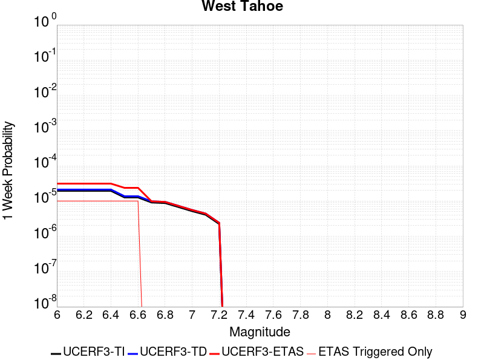 |  |  |  |

| Magnitude | 1 wk TI Prob | 1 wk TD Prob | 1 wk ETAS Prob | 1 wk ETAS/TD Gain | 1 wk ETAS Triggered Only | 1 mo TI Prob | 1 mo TD Prob | 1 mo ETAS Prob | 1 mo ETAS/TD Gain | 1 mo ETAS Triggered Only | 1 yr TI Prob | 1 yr TD Prob | 1 yr ETAS Prob | 1 yr ETAS/TD Gain | 1 yr ETAS Triggered Only | 10 yr TI Prob | 10 yr TD Prob | 10 yr ETAS Prob | 10 yr ETAS/TD Gain | 10 yr ETAS Triggered Only |
|-----|-----|-----|-----|-----|-----|-----|-----|-----|-----|-----|-----|-----|-----|-----|-----|-----|-----|-----|-----|-----|
| 6.0 | 1.952444E-5 | 2.118317E-5 | 3.1182957E-5 | 1.4720628 | 1.0E-5 | 8.367348E-5 | 9.078217E-5 | 1.0078125E-4 | 1.1101438 | 1.0E-5 | 0.0010182485 | 0.0011047672 | 0.0011147561 | 1.0090417 | 1.0E-5 | 0.010135954 | 0.010998235 | 0.011008126 | 1.0008992 | 1.0E-5 |
| 6.1 | 1.952444E-5 | 2.118317E-5 | 3.1182957E-5 | 1.4720628 | 1.0E-5 | 8.367348E-5 | 9.078217E-5 | 1.0078125E-4 | 1.1101438 | 1.0E-5 | 0.0010182485 | 0.0011047672 | 0.0011147561 | 1.0090417 | 1.0E-5 | 0.010135954 | 0.010998235 | 0.011008126 | 1.0008992 | 1.0E-5 |
| 6.2 | 1.952444E-5 | 2.118317E-5 | 3.1182957E-5 | 1.4720628 | 1.0E-5 | 8.367348E-5 | 9.078217E-5 | 1.0078125E-4 | 1.1101438 | 1.0E-5 | 0.0010182485 | 0.0011047672 | 0.0011147561 | 1.0090417 | 1.0E-5 | 0.010135954 | 0.010998235 | 0.011008126 | 1.0008992 | 1.0E-5 |
| 6.3 | 1.952444E-5 | 2.118317E-5 | 3.1182957E-5 | 1.4720628 | 1.0E-5 | 8.367348E-5 | 9.078217E-5 | 1.0078125E-4 | 1.1101438 | 1.0E-5 | 0.0010182485 | 0.0011047672 | 0.0011147561 | 1.0090417 | 1.0E-5 | 0.010135954 | 0.010998235 | 0.011008126 | 1.0008992 | 1.0E-5 |
| 6.4 | 1.952444E-5 | 2.118317E-5 | 3.1182957E-5 | 1.4720628 | 1.0E-5 | 8.367348E-5 | 9.078217E-5 | 1.0078125E-4 | 1.1101438 | 1.0E-5 | 0.0010182485 | 0.0011047672 | 0.0011147561 | 1.0090417 | 1.0E-5 | 0.010135954 | 0.010998235 | 0.011008126 | 1.0008992 | 1.0E-5 |
| 6.5 | 1.2685271E-5 | 1.3690627E-5 | 2.369049E-5 | 1.7304167 | 1.0E-5 | 5.4364315E-5 | 5.8672893E-5 | 6.867231E-5 | 1.1704265 | 1.0E-5 | 6.616845E-4 | 7.141248E-4 | 7.241177E-4 | 1.0139931 | 1.0E-5 | 0.0065971776 | 0.00711995 | 0.0071298787 | 1.0013945 | 1.0E-5 |
| 6.6 | 1.2685271E-5 | 1.3690627E-5 | 2.369049E-5 | 1.7304167 | 1.0E-5 | 5.4364315E-5 | 5.8672893E-5 | 6.867231E-5 | 1.1704265 | 1.0E-5 | 6.616845E-4 | 7.141248E-4 | 7.241177E-4 | 1.0139931 | 1.0E-5 | 0.0065971776 | 0.00711995 | 0.0071298787 | 1.0013945 | 1.0E-5 |
| 6.7 | 9.117886E-6 | 9.809846E-6 | 9.809846E-6 | 1.0 | 0.0 | 3.9076072E-5 | 4.2041564E-5 | 4.2041564E-5 | 1.0 | 0.0 | 4.756473E-4 | 5.11743E-4 | 5.11743E-4 | 1.0 | 0.0 | 0.0047463053 | 0.0051063634 | 0.0051063634 | 1.0 | 0.0 |
| 6.8 | 8.786828E-6 | 9.457863E-6 | 9.457863E-6 | 1.0 | 0.0 | 3.7657293E-5 | 4.053311E-5 | 4.053311E-5 | 1.0 | 0.0 | 4.5838108E-4 | 4.933859E-4 | 4.933859E-4 | 1.0 | 0.0 | 0.0045743673 | 0.0049236063 | 0.0049236063 | 1.0 | 0.0 |
| 6.9 | 6.7562123E-6 | 7.2638086E-6 | 7.2638086E-6 | 1.0 | 0.0 | 2.8954875E-5 | 3.1130265E-5 | 3.1130265E-5 | 1.0 | 0.0 | 3.5246857E-4 | 3.789498E-4 | 3.789498E-4 | 1.0 | 0.0 | 0.0035191004 | 0.0037835082 | 0.0037835082 | 1.0 | 0.0 |
| 7.0 | 5.1792854E-6 | 5.567338E-6 | 5.567338E-6 | 1.0 | 0.0 | 2.2196748E-5 | 2.3859824E-5 | 2.3859824E-5 | 1.0 | 0.0 | 2.702119E-4 | 2.9045844E-4 | 2.9045844E-4 | 1.0 | 0.0 | 0.0026988357 | 0.0029011632 | 0.0029011632 | 1.0 | 0.0 |
| 7.1 | 4.090765E-6 | 4.3974223E-6 | 4.3974223E-6 | 1.0 | 0.0 | 1.7531731E-5 | 1.884598E-5 | 1.884598E-5 | 1.0 | 0.0 | 2.134279E-4 | 2.2942905E-4 | 2.2942905E-4 | 1.0 | 0.0 | 0.0021322304 | 0.0022922563 | 0.0022922563 | 1.0 | 0.0 |
| 7.2 | 2.2356758E-6 | 2.4023684E-6 | 2.4023684E-6 | 1.0 | 0.0 | 9.581432E-6 | 1.0295834E-5 | 1.0295834E-5 | 1.0 | 0.0 | 1.1664769E-4 | 1.2534647E-4 | 1.2534647E-4 | 1.0 | 0.0 | 0.0011658648 | 0.0012529434 | 0.0012529434 | 1.0 | 0.0 |

## San Jose
*[(top)](#table-of-contents)*

| 1 Week | 1 Month | 1 Year | 10 Year |
|-----|-----|-----|-----|
|  |  |  |  |

| Magnitude | 1 wk TI Prob | 1 wk TD Prob | 1 wk ETAS Prob | 1 wk ETAS/TD Gain | 1 wk ETAS Triggered Only | 1 mo TI Prob | 1 mo TD Prob | 1 mo ETAS Prob | 1 mo ETAS/TD Gain | 1 mo ETAS Triggered Only | 1 yr TI Prob | 1 yr TD Prob | 1 yr ETAS Prob | 1 yr ETAS/TD Gain | 1 yr ETAS Triggered Only | 10 yr TI Prob | 10 yr TD Prob | 10 yr ETAS Prob | 10 yr ETAS/TD Gain | 10 yr ETAS Triggered Only |
|-----|-----|-----|-----|-----|-----|-----|-----|-----|-----|-----|-----|-----|-----|-----|-----|-----|-----|-----|-----|-----|
| 6.0 | 5.0851277E-6 | 4.1256726E-6 | 4.1256726E-6 | 1.0 | 0.0 | 2.1793223E-5 | 1.768135E-5 | 1.768135E-5 | 1.0 | 0.0 | 2.653002E-4 | 2.152518E-4 | 2.2524965E-4 | 1.0464473 | 1.0E-5 | 0.0026498367 | 0.0021507242 | 0.0021607026 | 1.0046396 | 1.0E-5 |
| 6.1 | 5.0851277E-6 | 4.1256726E-6 | 4.1256726E-6 | 1.0 | 0.0 | 2.1793223E-5 | 1.768135E-5 | 1.768135E-5 | 1.0 | 0.0 | 2.653002E-4 | 2.152518E-4 | 2.2524965E-4 | 1.0464473 | 1.0E-5 | 0.0026498367 | 0.0021507242 | 0.0021607026 | 1.0046396 | 1.0E-5 |
| 6.2 | 5.0851277E-6 | 4.1256726E-6 | 4.1256726E-6 | 1.0 | 0.0 | 2.1793223E-5 | 1.768135E-5 | 1.768135E-5 | 1.0 | 0.0 | 2.653002E-4 | 2.152518E-4 | 2.2524965E-4 | 1.0464473 | 1.0E-5 | 0.0026498367 | 0.0021507242 | 0.0021607026 | 1.0046396 | 1.0E-5 |
| 6.3 | 5.0851277E-6 | 4.1256726E-6 | 4.1256726E-6 | 1.0 | 0.0 | 2.1793223E-5 | 1.768135E-5 | 1.768135E-5 | 1.0 | 0.0 | 2.653002E-4 | 2.152518E-4 | 2.2524965E-4 | 1.0464473 | 1.0E-5 | 0.0026498367 | 0.0021507242 | 0.0021607026 | 1.0046396 | 1.0E-5 |
| 6.4 | 4.3115124E-6 | 3.3237832E-6 | 3.3237832E-6 | 1.0 | 0.0 | 1.8477778E-5 | 1.424472E-5 | 1.424472E-5 | 1.0 | 0.0 | 2.2494372E-4 | 1.7341787E-4 | 1.8341614E-4 | 1.0576541 | 1.0E-5 | 0.0022471617 | 0.0017330751 | 0.0017430579 | 1.0057601 | 1.0E-5 |
| 6.5 | 4.3115124E-6 | 3.3237832E-6 | 3.3237832E-6 | 1.0 | 0.0 | 1.8477778E-5 | 1.424472E-5 | 1.424472E-5 | 1.0 | 0.0 | 2.2494372E-4 | 1.7341787E-4 | 1.8341614E-4 | 1.0576541 | 1.0E-5 | 0.0022471617 | 0.0017330751 | 0.0017430579 | 1.0057601 | 1.0E-5 |
| 6.6 | 3.110396E-6 | 2.0799866E-6 | 2.0799866E-6 | 1.0 | 0.0 | 1.33302E-5 | 8.9141995E-6 | 8.9141995E-6 | 1.0 | 0.0 | 1.622831E-4 | 1.0852526E-4 | 1.1852417E-4 | 1.0921345 | 1.0E-5 | 0.0016216465 | 0.0010847825 | 0.0010947717 | 1.0092084 | 1.0E-5 |
| 6.7 | 3.110396E-6 | 2.0799866E-6 | 2.0799866E-6 | 1.0 | 0.0 | 1.33302E-5 | 8.9141995E-6 | 8.9141995E-6 | 1.0 | 0.0 | 1.622831E-4 | 1.0852526E-4 | 1.1852417E-4 | 1.0921345 | 1.0E-5 | 0.0016216465 | 0.0010847825 | 0.0010947717 | 1.0092084 | 1.0E-5 |
| 6.8 | 2.856651E-6 | 1.902435E-6 | 1.902435E-6 | 1.0 | 0.0 | 1.2242733E-5 | 8.153269E-6 | 8.153269E-6 | 1.0 | 0.0 | 1.4904508E-4 | 9.926178E-5 | 1.09260785E-4 | 1.1007338 | 1.0E-5 | 0.0014894515 | 9.922314E-4 | 0.0010022215 | 1.0100683 | 1.0E-5 |
| 6.9 | 2.1618725E-6 | 1.4186642E-6 | 1.4186642E-6 | 1.0 | 0.0 | 9.265135E-6 | 6.0799757E-6 | 6.0799757E-6 | 1.0 | 0.0 | 1.12797185E-4 | 7.402128E-5 | 7.402128E-5 | 1.0 | 0.0 | 0.0011273995 | 7.4000744E-4 | 7.4000744E-4 | 1.0 | 0.0 |
| 7.0 | 1.9684312E-6 | 1.3256331E-6 | 1.3256331E-6 | 1.0 | 0.0 | 8.436106E-6 | 5.681273E-6 | 5.681273E-6 | 1.0 | 0.0 | 1.02704755E-4 | 6.9167385E-5 | 6.9167385E-5 | 1.0 | 0.0 | 0.001026573 | 6.914992E-4 | 6.914992E-4 | 1.0 | 0.0 |
| 7.1 | 1.6070337E-6 | 1.1155087E-6 | 1.1155087E-6 | 1.0 | 0.0 | 6.887269E-6 | 4.780743E-6 | 4.780743E-6 | 1.0 | 0.0 | 8.384928E-5 | 5.8204052E-5 | 5.8204052E-5 | 1.0 | 0.0 | 8.3817646E-4 | 5.819267E-4 | 5.819267E-4 | 1.0 | 0.0 |
| 7.2 | 1.0631658E-6 | 6.4037624E-7 | 6.4037624E-7 | 1.0 | 0.0 | 4.556417E-6 | 2.7444669E-6 | 2.7444669E-6 | 1.0 | 0.0 | 5.5472963E-5 | 3.3413387E-5 | 3.3413387E-5 | 1.0 | 0.0 | 5.545912E-4 | 3.3411747E-4 | 3.3411747E-4 | 1.0 | 0.0 |
| 7.3 | 7.060711E-7 | 4.5824706E-7 | 4.5824706E-7 | 1.0 | 0.0 | 3.0260155E-6 | 1.9639147E-6 | 1.9639147E-6 | 1.0 | 0.0 | 3.6841117E-5 | 2.3910407E-5 | 2.3910407E-5 | 1.0 | 0.0 | 3.6835007E-4 | 2.3911172E-4 | 2.3911172E-4 | 1.0 | 0.0 |
| 7.4 | 3.3677085E-7 | 2.3233133E-7 | 2.3233133E-7 | 1.0 | 0.0 | 1.4433028E-6 | 9.957054E-7 | 9.957054E-7 | 1.0 | 0.0 | 1.757207E-5 | 1.21226485E-5 | 1.21226485E-5 | 1.0 | 0.0 | 1.7570681E-4 | 1.2125263E-4 | 1.2125263E-4 | 1.0 | 0.0 |
| 7.5 | 3.129161E-7 | 1.9530925E-7 | 1.9530925E-7 | 1.0 | 0.0 | 1.3410682E-6 | 8.370394E-7 | 8.370394E-7 | 1.0 | 0.0 | 1.6327383E-5 | 1.0190909E-5 | 1.0190909E-5 | 1.0 | 0.0 | 1.6326184E-4 | 1.0193714E-4 | 1.0193714E-4 | 1.0 | 0.0 |
| 7.6 | 2.8008668E-7 | 1.4242323E-7 | 1.4242323E-7 | 1.0 | 0.0 | 1.2003709E-6 | 6.1038514E-7 | 6.1038514E-7 | 1.0 | 0.0 | 1.46144175E-5 | 7.4314153E-6 | 7.4314153E-6 | 1.0 | 0.0 | 1.4613457E-4 | 7.434427E-5 | 7.434427E-5 | 1.0 | 0.0 |
| 7.7 | 2.7852005E-7 | 1.4016913E-7 | 1.4016913E-7 | 1.0 | 0.0 | 1.1936568E-6 | 6.007248E-7 | 6.007248E-7 | 1.0 | 0.0 | 1.4532674E-5 | 7.3138012E-6 | 7.3138012E-6 | 1.0 | 0.0 | 1.4531724E-4 | 7.316821E-5 | 7.316821E-5 | 1.0 | 0.0 |
| 7.8 | 1.1810797E-7 | 7.5190094E-8 | 7.5190094E-8 | 1.0 | 0.0 | 5.0617695E-7 | 3.222432E-7 | 3.222432E-7 | 1.0 | 0.0 | 6.1626865E-6 | 3.9233046E-6 | 3.9233046E-6 | 1.0 | 0.0 | 6.162516E-5 | 3.9250725E-5 | 3.9250725E-5 | 1.0 | 0.0 |

## Great Valley 10 (Panoche)
*[(top)](#table-of-contents)*

| 1 Week | 1 Month | 1 Year | 10 Year |
|-----|-----|-----|-----|
|  |  |  | 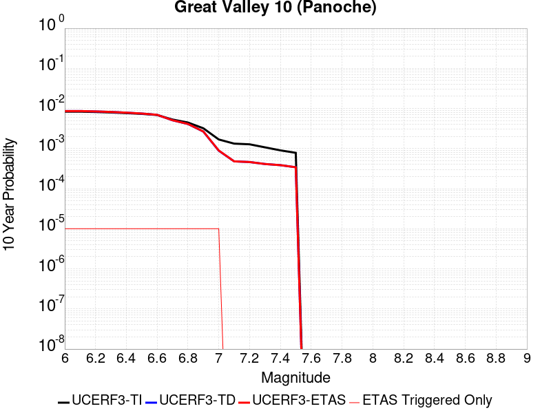 |

| Magnitude | 1 wk TI Prob | 1 wk TD Prob | 1 wk ETAS Prob | 1 wk ETAS/TD Gain | 1 wk ETAS Triggered Only | 1 mo TI Prob | 1 mo TD Prob | 1 mo ETAS Prob | 1 mo ETAS/TD Gain | 1 mo ETAS Triggered Only | 1 yr TI Prob | 1 yr TD Prob | 1 yr ETAS Prob | 1 yr ETAS/TD Gain | 1 yr ETAS Triggered Only | 10 yr TI Prob | 10 yr TD Prob | 10 yr ETAS Prob | 10 yr ETAS/TD Gain | 10 yr ETAS Triggered Only |
|-----|-----|-----|-----|-----|-----|-----|-----|-----|-----|-----|-----|-----|-----|-----|-----|-----|-----|-----|-----|-----|
| 6.0 | 1.6014626E-5 | 1.6575399E-5 | 1.6575399E-5 | 1.0 | 0.0 | 6.863231E-5 | 7.103552E-5 | 7.103552E-5 | 1.0 | 0.0 | 8.35278E-4 | 8.645185E-4 | 8.645185E-4 | 1.0 | 0.0 | 0.008321454 | 0.008612172 | 0.008622086 | 1.0011512 | 1.0E-5 |
| 6.1 | 1.6014626E-5 | 1.6575399E-5 | 1.6575399E-5 | 1.0 | 0.0 | 6.863231E-5 | 7.103552E-5 | 7.103552E-5 | 1.0 | 0.0 | 8.35278E-4 | 8.645185E-4 | 8.645185E-4 | 1.0 | 0.0 | 0.008321454 | 0.008612172 | 0.008622086 | 1.0011512 | 1.0E-5 |
| 6.2 | 1.56782E-5 | 1.6198446E-5 | 1.6198446E-5 | 1.0 | 0.0 | 6.719056E-5 | 6.94201E-5 | 6.94201E-5 | 1.0 | 0.0 | 8.17738E-4 | 8.4486604E-4 | 8.4486604E-4 | 1.0 | 0.0 | 0.008147354 | 0.008417147 | 0.008427063 | 1.001178 | 1.0E-5 |
| 6.3 | 1.5263338E-5 | 1.5723514E-5 | 1.5723514E-5 | 1.0 | 0.0 | 6.541267E-5 | 6.738478E-5 | 6.738478E-5 | 1.0 | 0.0 | 7.961082E-4 | 8.201049E-4 | 8.201049E-4 | 1.0 | 0.0 | 0.007932622 | 0.008171377 | 0.008181295 | 1.0012138 | 1.0E-5 |
| 6.4 | 1.4720723E-5 | 1.5099376E-5 | 1.5099376E-5 | 1.0 | 0.0 | 6.308728E-5 | 6.471004E-5 | 6.471004E-5 | 1.0 | 0.0 | 7.67817E-4 | 7.8756385E-4 | 7.8756385E-4 | 1.0 | 0.0 | 0.007651695 | 0.007848303 | 0.007858224 | 1.0012642 | 1.0E-5 |
| 6.5 | 1.408264E-5 | 1.4355969E-5 | 1.4355969E-5 | 1.0 | 0.0 | 6.0352773E-5 | 6.1524166E-5 | 6.1524166E-5 | 1.0 | 0.0 | 7.3454727E-4 | 7.488031E-4 | 7.488031E-4 | 1.0 | 0.0 | 0.0073212404 | 0.0074633555 | 0.007473281 | 1.0013299 | 1.0E-5 |
| 6.6 | 1.3197086E-5 | 1.3321889E-5 | 1.3321889E-5 | 1.0 | 0.0 | 5.6557717E-5 | 5.709259E-5 | 5.709259E-5 | 1.0 | 0.0 | 6.8837265E-4 | 6.9488434E-4 | 6.9488434E-4 | 1.0 | 0.0 | 0.006862442 | 0.0069276537 | 0.0069375844 | 1.0014335 | 1.0E-5 |
| 6.7 | 1.017583E-5 | 9.745382E-6 | 9.745382E-6 | 1.0 | 0.0 | 4.360997E-5 | 4.176527E-5 | 4.176527E-5 | 1.0 | 0.0 | 5.30822E-4 | 5.0837593E-4 | 5.0837593E-4 | 1.0 | 0.0 | 0.0052955584 | 0.005072382 | 0.005082331 | 1.0019615 | 1.0E-5 |
| 6.8 | 8.557912E-6 | 7.872707E-6 | 7.872707E-6 | 1.0 | 0.0 | 3.667625E-5 | 3.373975E-5 | 3.373975E-5 | 1.0 | 0.0 | 4.4644187E-4 | 4.1070607E-4 | 4.1070607E-4 | 1.0 | 0.0 | 0.0044554602 | 0.004099677 | 0.004109636 | 1.0024292 | 1.0E-5 |
| 6.9 | 6.14664E-6 | 5.092071E-6 | 5.092071E-6 | 1.0 | 0.0 | 2.6342475E-5 | 2.1822989E-5 | 2.1822989E-5 | 1.0 | 0.0 | 3.2067244E-4 | 2.6566387E-4 | 2.6566387E-4 | 1.0 | 0.0 | 0.003202101 | 0.002653601 | 0.0026635746 | 1.0037584 | 1.0E-5 |
| 7.0 | 3.2310581E-6 | 1.6951219E-6 | 1.6951219E-6 | 1.0 | 0.0 | 1.3847319E-5 | 7.264788E-6 | 7.264788E-6 | 1.0 | 0.0 | 1.6857806E-4 | 8.8445304E-5 | 8.8445304E-5 | 1.0 | 0.0 | 0.0016845023 | 8.841104E-4 | 8.9410157E-4 | 1.0113008 | 1.0E-5 |
| 7.1 | 2.544492E-6 | 9.1889206E-7 | 9.1889206E-7 | 1.0 | 0.0 | 1.090492E-5 | 3.938103E-6 | 3.938103E-6 | 1.0 | 0.0 | 1.327593E-4 | 4.79454E-5 | 4.79454E-5 | 1.0 | 0.0 | 0.0013268003 | 4.793553E-4 | 4.793553E-4 | 1.0 | 0.0 |
| 7.2 | 2.4479045E-6 | 8.841304E-7 | 8.841304E-7 | 1.0 | 0.0 | 1.0490977E-5 | 3.789125E-6 | 3.789125E-6 | 1.0 | 0.0 | 1.2772017E-4 | 4.6131667E-5 | 4.6131667E-5 | 1.0 | 0.0 | 0.0012764678 | 4.6122566E-4 | 4.6122566E-4 | 1.0 | 0.0 |
| 7.3 | 2.0559578E-6 | 7.892787E-7 | 7.892787E-7 | 1.0 | 0.0 | 8.811218E-6 | 3.3826188E-6 | 3.3826188E-6 | 1.0 | 0.0 | 1.072713E-4 | 4.1182655E-5 | 4.1182655E-5 | 1.0 | 0.0 | 0.0010721954 | 4.1175485E-4 | 4.1175485E-4 | 1.0 | 0.0 |
| 7.4 | 1.727687E-6 | 7.387757E-7 | 7.387757E-7 | 1.0 | 0.0 | 7.404352E-6 | 3.1661782E-6 | 3.1661782E-6 | 1.0 | 0.0 | 9.0144255E-5 | 3.8547583E-5 | 3.8547583E-5 | 1.0 | 0.0 | 9.0107694E-4 | 3.854136E-4 | 3.854136E-4 | 1.0 | 0.0 |
| 7.5 | 1.5002679E-6 | 6.546144E-7 | 6.546144E-7 | 1.0 | 0.0 | 6.4297037E-6 | 2.8054874E-6 | 2.8054874E-6 | 1.0 | 0.0 | 7.827883E-5 | 3.4156317E-5 | 3.4156317E-5 | 1.0 | 0.0 | 7.825126E-4 | 3.4151482E-4 | 3.4151482E-4 | 1.0 | 0.0 |

## Sisar
*[(top)](#table-of-contents)*

| 1 Week | 1 Month | 1 Year | 10 Year |
|-----|-----|-----|-----|
|  |  |  |  |

| Magnitude | 1 wk TI Prob | 1 wk TD Prob | 1 wk ETAS Prob | 1 wk ETAS/TD Gain | 1 wk ETAS Triggered Only | 1 mo TI Prob | 1 mo TD Prob | 1 mo ETAS Prob | 1 mo ETAS/TD Gain | 1 mo ETAS Triggered Only | 1 yr TI Prob | 1 yr TD Prob | 1 yr ETAS Prob | 1 yr ETAS/TD Gain | 1 yr ETAS Triggered Only | 10 yr TI Prob | 10 yr TD Prob | 10 yr ETAS Prob | 10 yr ETAS/TD Gain | 10 yr ETAS Triggered Only |
|-----|-----|-----|-----|-----|-----|-----|-----|-----|-----|-----|-----|-----|-----|-----|-----|-----|-----|-----|-----|-----|
| 6.0 | 4.544193E-6 | 3.839576E-6 | 3.839576E-6 | 1.0 | 0.0 | 1.9474966E-5 | 1.6455224E-5 | 2.645506E-5 | 1.6076998 | 1.0E-5 | 2.3708193E-4 | 2.0032428E-4 | 2.1032228E-4 | 1.0499091 | 1.0E-5 | 0.0023682916 | 0.002001471 | 0.0020114507 | 1.0049863 | 1.0E-5 |
| 6.1 | 4.544193E-6 | 3.839576E-6 | 3.839576E-6 | 1.0 | 0.0 | 1.9474966E-5 | 1.6455224E-5 | 2.645506E-5 | 1.6076998 | 1.0E-5 | 2.3708193E-4 | 2.0032428E-4 | 2.1032228E-4 | 1.0499091 | 1.0E-5 | 0.0023682916 | 0.002001471 | 0.0020114507 | 1.0049863 | 1.0E-5 |
| 6.2 | 4.544193E-6 | 3.839576E-6 | 3.839576E-6 | 1.0 | 0.0 | 1.9474966E-5 | 1.6455224E-5 | 2.645506E-5 | 1.6076998 | 1.0E-5 | 2.3708193E-4 | 2.0032428E-4 | 2.1032228E-4 | 1.0499091 | 1.0E-5 | 0.0023682916 | 0.002001471 | 0.0020114507 | 1.0049863 | 1.0E-5 |
| 6.3 | 4.544193E-6 | 3.839576E-6 | 3.839576E-6 | 1.0 | 0.0 | 1.9474966E-5 | 1.6455224E-5 | 2.645506E-5 | 1.6076998 | 1.0E-5 | 2.3708193E-4 | 2.0032428E-4 | 2.1032228E-4 | 1.0499091 | 1.0E-5 | 0.0023682916 | 0.002001471 | 0.0020114507 | 1.0049863 | 1.0E-5 |
| 6.4 | 4.544193E-6 | 3.839576E-6 | 3.839576E-6 | 1.0 | 0.0 | 1.9474966E-5 | 1.6455224E-5 | 2.645506E-5 | 1.6076998 | 1.0E-5 | 2.3708193E-4 | 2.0032428E-4 | 2.1032228E-4 | 1.0499091 | 1.0E-5 | 0.0023682916 | 0.002001471 | 0.0020114507 | 1.0049863 | 1.0E-5 |
| 6.5 | 4.544193E-6 | 3.839576E-6 | 3.839576E-6 | 1.0 | 0.0 | 1.9474966E-5 | 1.6455224E-5 | 2.645506E-5 | 1.6076998 | 1.0E-5 | 2.3708193E-4 | 2.0032428E-4 | 2.1032228E-4 | 1.0499091 | 1.0E-5 | 0.0023682916 | 0.002001471 | 0.0020114507 | 1.0049863 | 1.0E-5 |
| 6.6 | 4.544193E-6 | 3.839576E-6 | 3.839576E-6 | 1.0 | 0.0 | 1.9474966E-5 | 1.6455224E-5 | 2.645506E-5 | 1.6076998 | 1.0E-5 | 2.3708193E-4 | 2.0032428E-4 | 2.1032228E-4 | 1.0499091 | 1.0E-5 | 0.0023682916 | 0.002001471 | 0.0020114507 | 1.0049863 | 1.0E-5 |
| 6.7 | 4.544193E-6 | 3.839576E-6 | 3.839576E-6 | 1.0 | 0.0 | 1.9474966E-5 | 1.6455224E-5 | 2.645506E-5 | 1.6076998 | 1.0E-5 | 2.3708193E-4 | 2.0032428E-4 | 2.1032228E-4 | 1.0499091 | 1.0E-5 | 0.0023682916 | 0.002001471 | 0.0020114507 | 1.0049863 | 1.0E-5 |
| 6.8 | 4.544193E-6 | 3.839576E-6 | 3.839576E-6 | 1.0 | 0.0 | 1.9474966E-5 | 1.6455224E-5 | 2.645506E-5 | 1.6076998 | 1.0E-5 | 2.3708193E-4 | 2.0032428E-4 | 2.1032228E-4 | 1.0499091 | 1.0E-5 | 0.0023682916 | 0.002001471 | 0.0020114507 | 1.0049863 | 1.0E-5 |
| 6.9 | 4.542225E-6 | 3.8375383E-6 | 3.8375383E-6 | 1.0 | 0.0 | 1.9466532E-5 | 1.6446491E-5 | 2.6446325E-5 | 1.6080225 | 1.0E-5 | 2.3697925E-4 | 2.0021795E-4 | 2.1021595E-4 | 1.0499356 | 1.0E-5 | 0.002367267 | 0.0020004094 | 0.0020103895 | 1.004989 | 1.0E-5 |
| 7.0 | 4.5278484E-6 | 3.822602E-6 | 3.822602E-6 | 1.0 | 0.0 | 1.940492E-5 | 1.638248E-5 | 2.6382317E-5 | 1.6103982 | 1.0E-5 | 2.3622929E-4 | 1.9943877E-4 | 2.0943678E-4 | 1.0501307 | 1.0E-5 | 0.0023597833 | 0.0019926317 | 0.0020026118 | 1.0050085 | 1.0E-5 |
| 7.1 | 4.5132488E-6 | 3.8073897E-6 | 3.8073897E-6 | 1.0 | 0.0 | 1.9342351E-5 | 1.6317284E-5 | 2.631712E-5 | 1.6128371 | 1.0E-5 | 2.3546767E-4 | 1.9864515E-4 | 2.0864318E-4 | 1.050331 | 1.0E-5 | 0.0023521832 | 0.0019847096 | 0.00199469 | 1.0050285 | 1.0E-5 |
| 7.2 | 4.448859E-6 | 3.7398502E-6 | 3.7398502E-6 | 1.0 | 0.0 | 1.9066398E-5 | 1.6027832E-5 | 2.6027672E-5 | 1.6239047 | 1.0E-5 | 2.3210866E-4 | 1.9512173E-4 | 2.0511977E-4 | 1.0512401 | 1.0E-5 | 0.0023186638 | 0.0019495375 | 0.001959518 | 1.0051194 | 1.0E-5 |
| 7.3 | 4.3424366E-6 | 3.6336846E-6 | 3.6336846E-6 | 1.0 | 0.0 | 1.861031E-5 | 1.5572843E-5 | 2.5572686E-5 | 1.6421335 | 1.0E-5 | 2.2655698E-4 | 1.895832E-4 | 1.995813E-4 | 1.0527372 | 1.0E-5 | 0.0022632615 | 0.0018942481 | 0.0019042292 | 1.0052692 | 1.0E-5 |
| 7.4 | 4.218641E-6 | 3.5330384E-6 | 3.5330384E-6 | 1.0 | 0.0 | 1.8079765E-5 | 1.5141507E-5 | 2.5141357E-5 | 1.6604263 | 1.0E-5 | 2.2009891E-4 | 1.8433259E-4 | 1.9433074E-4 | 1.0542397 | 1.0E-5 | 0.0021988105 | 0.0018418302 | 0.0018518118 | 1.0054194 | 1.0E-5 |
| 7.5 | 3.983779E-6 | 3.3478068E-6 | 3.3478068E-6 | 1.0 | 0.0 | 1.7073227E-5 | 1.4347666E-5 | 2.4347522E-5 | 1.6969675 | 1.0E-5 | 2.0784672E-4 | 1.7466917E-4 | 1.8466743E-4 | 1.0572411 | 1.0E-5 | 0.0020765243 | 0.0017453518 | 0.0017553343 | 1.0057195 | 1.0E-5 |
| 7.6 | 2.777393E-6 | 2.35225E-6 | 2.35225E-6 | 1.0 | 0.0 | 1.1903058E-5 | 1.0081033E-5 | 2.0080932E-5 | 1.9919518 | 1.0E-5 | 1.449101E-4 | 1.2272975E-4 | 1.3272851E-4 | 1.0814699 | 1.0E-5 | 0.0014481564 | 0.0012266274 | 0.0012366151 | 1.0081425 | 1.0E-5 |
| 7.7 | 1.9028433E-6 | 1.593867E-6 | 1.593867E-6 | 1.0 | 0.0 | 8.155017E-6 | 6.8308404E-6 | 1.6830772E-5 | 2.4639387 | 1.0E-5 | 9.928281E-5 | 8.3162355E-5 | 9.316153E-5 | 1.1202368 | 1.0E-5 | 9.923846E-4 | 8.313171E-4 | 8.413088E-4 | 1.0120192 | 1.0E-5 |
| 7.8 | 4.9095956E-7 | 4.3583708E-7 | 4.3583708E-7 | 1.0 | 0.0 | 2.1041105E-6 | 1.8678718E-6 | 1.8678718E-6 | 1.0 | 0.0 | 2.5617246E-5 | 2.2741104E-5 | 2.2741104E-5 | 1.0 | 0.0 | 2.5614293E-4 | 2.2738794E-4 | 2.2738794E-4 | 1.0 | 0.0 |
| 7.9 | 1.16657894E-7 | 1.0335569E-7 | 1.0335569E-7 | 1.0 | 0.0 | 4.999623E-7 | 4.4295288E-7 | 4.4295288E-7 | 1.0 | 0.0 | 6.087024E-6 | 5.3929384E-6 | 5.3929384E-6 | 1.0 | 0.0 | 6.0868573E-5 | 5.3928103E-5 | 5.3928103E-5 | 1.0 | 0.0 |
| 8.0 | 2.5100346E-9 | 1.7067566E-9 | 1.7067566E-9 | 1.0 | 0.0 | 1.0757291E-8 | 7.3146724E-9 | 7.3146724E-9 | 1.0 | 0.0 | 1.3097001E-7 | 8.905613E-8 | 8.905613E-8 | 1.0 | 0.0 | 1.3096993E-6 | 8.9056095E-7 | 8.9056095E-7 | 1.0 | 0.0 |

## Holser alt 1
*[(top)](#table-of-contents)*

| 1 Week | 1 Month | 1 Year | 10 Year |
|-----|-----|-----|-----|
|  |  | 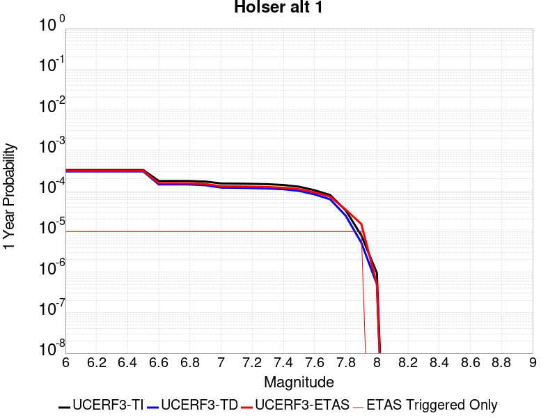 |  |

| Magnitude | 1 wk TI Prob | 1 wk TD Prob | 1 wk ETAS Prob | 1 wk ETAS/TD Gain | 1 wk ETAS Triggered Only | 1 mo TI Prob | 1 mo TD Prob | 1 mo ETAS Prob | 1 mo ETAS/TD Gain | 1 mo ETAS Triggered Only | 1 yr TI Prob | 1 yr TD Prob | 1 yr ETAS Prob | 1 yr ETAS/TD Gain | 1 yr ETAS Triggered Only | 10 yr TI Prob | 10 yr TD Prob | 10 yr ETAS Prob | 10 yr ETAS/TD Gain | 10 yr ETAS Triggered Only |
|-----|-----|-----|-----|-----|-----|-----|-----|-----|-----|-----|-----|-----|-----|-----|-----|-----|-----|-----|-----|-----|
| 6.0 | 6.2746653E-6 | 5.789965E-6 | 1.5789907E-5 | 2.727116 | 1.0E-5 | 2.6891146E-5 | 2.4813964E-5 | 3.481372E-5 | 1.4029889 | 1.0E-5 | 3.273505E-4 | 3.020797E-4 | 3.1207665E-4 | 1.0330938 | 1.0E-5 | 0.0032686873 | 0.0030178234 | 0.0030277933 | 1.0033036 | 1.0E-5 |
| 6.1 | 6.2746653E-6 | 5.789965E-6 | 1.5789907E-5 | 2.727116 | 1.0E-5 | 2.6891146E-5 | 2.4813964E-5 | 3.481372E-5 | 1.4029889 | 1.0E-5 | 3.273505E-4 | 3.020797E-4 | 3.1207665E-4 | 1.0330938 | 1.0E-5 | 0.0032686873 | 0.0030178234 | 0.0030277933 | 1.0033036 | 1.0E-5 |
| 6.2 | 6.2746653E-6 | 5.789965E-6 | 1.5789907E-5 | 2.727116 | 1.0E-5 | 2.6891146E-5 | 2.4813964E-5 | 3.481372E-5 | 1.4029889 | 1.0E-5 | 3.273505E-4 | 3.020797E-4 | 3.1207665E-4 | 1.0330938 | 1.0E-5 | 0.0032686873 | 0.0030178234 | 0.0030277933 | 1.0033036 | 1.0E-5 |
| 6.3 | 6.2746653E-6 | 5.789965E-6 | 1.5789907E-5 | 2.727116 | 1.0E-5 | 2.6891146E-5 | 2.4813964E-5 | 3.481372E-5 | 1.4029889 | 1.0E-5 | 3.273505E-4 | 3.020797E-4 | 3.1207665E-4 | 1.0330938 | 1.0E-5 | 0.0032686873 | 0.0030178234 | 0.0030277933 | 1.0033036 | 1.0E-5 |
| 6.4 | 6.2746653E-6 | 5.789965E-6 | 1.5789907E-5 | 2.727116 | 1.0E-5 | 2.6891146E-5 | 2.4813964E-5 | 3.481372E-5 | 1.4029889 | 1.0E-5 | 3.273505E-4 | 3.020797E-4 | 3.1207665E-4 | 1.0330938 | 1.0E-5 | 0.0032686873 | 0.0030178234 | 0.0030277933 | 1.0033036 | 1.0E-5 |
| 6.5 | 6.2746653E-6 | 5.789965E-6 | 1.5789907E-5 | 2.727116 | 1.0E-5 | 2.6891146E-5 | 2.4813964E-5 | 3.481372E-5 | 1.4029889 | 1.0E-5 | 3.273505E-4 | 3.020797E-4 | 3.1207665E-4 | 1.0330938 | 1.0E-5 | 0.0032686873 | 0.0030178234 | 0.0030277933 | 1.0033036 | 1.0E-5 |
| 6.6 | 3.375825E-6 | 2.7711897E-6 | 1.2771162E-5 | 4.6085486 | 1.0E-5 | 1.4467741E-5 | 1.1876474E-5 | 2.1876356E-5 | 1.8419907 | 1.0E-5 | 1.761305E-4 | 1.4458665E-4 | 1.545852E-4 | 1.0691527 | 1.0E-5 | 0.0017599097 | 0.0014449427 | 0.0014549283 | 1.0069107 | 1.0E-5 |
| 6.7 | 3.375825E-6 | 2.7711897E-6 | 1.2771162E-5 | 4.6085486 | 1.0E-5 | 1.4467741E-5 | 1.1876474E-5 | 2.1876356E-5 | 1.8419907 | 1.0E-5 | 1.761305E-4 | 1.4458665E-4 | 1.545852E-4 | 1.0691527 | 1.0E-5 | 0.0017599097 | 0.0014449427 | 0.0014549283 | 1.0069107 | 1.0E-5 |
| 6.8 | 3.366533E-6 | 2.7615893E-6 | 1.2761561E-5 | 4.6210933 | 1.0E-5 | 1.4427919E-5 | 1.183533E-5 | 2.183521E-5 | 1.8449179 | 1.0E-5 | 1.7564575E-4 | 1.4408577E-4 | 1.5408434E-4 | 1.0693932 | 1.0E-5 | 0.0017550698 | 0.0014399405 | 0.0014499262 | 1.0069348 | 1.0E-5 |
| 6.9 | 3.253174E-6 | 2.6438113E-6 | 1.2643785E-5 | 4.782408 | 1.0E-5 | 1.39421E-5 | 1.1330571E-5 | 2.133046E-5 | 1.882558 | 1.0E-5 | 1.6973184E-4 | 1.3794114E-4 | 1.4793976E-4 | 1.0724847 | 1.0E-5 | 0.0016960226 | 0.001378571 | 0.0013885573 | 1.0072439 | 1.0E-5 |
| 7.0 | 2.9336593E-6 | 2.311799E-6 | 1.2311776E-5 | 5.3256254 | 1.0E-5 | 1.2572766E-5 | 9.907673E-6 | 1.9907575E-5 | 2.0093088 | 1.0E-5 | 1.5306266E-4 | 1.2061927E-4 | 1.3061806E-4 | 1.0828955 | 1.0E-5 | 0.0015295728 | 0.0012055405 | 0.0012155285 | 1.008285 | 1.0E-5 |
| 7.1 | 2.9087812E-6 | 2.2876513E-6 | 1.2287628E-5 | 5.3712854 | 1.0E-5 | 1.2466146E-5 | 9.804184E-6 | 1.9804085E-5 | 2.0199628 | 1.0E-5 | 1.5176475E-4 | 1.19359414E-4 | 1.2935822E-4 | 1.0837705 | 1.0E-5 | 0.0015166114 | 0.0011929555 | 0.0012029436 | 1.0083725 | 1.0E-5 |
| 7.2 | 2.8674524E-6 | 2.2475429E-6 | 1.224752E-5 | 5.4492936 | 1.0E-5 | 1.2289024E-5 | 9.63229E-6 | 1.9632194E-5 | 2.0381646 | 1.0E-5 | 1.4960859E-4 | 1.1726685E-4 | 1.2726568E-4 | 1.0852656 | 1.0E-5 | 0.0014950791 | 0.001172052 | 0.0011820403 | 1.008522 | 1.0E-5 |
| 7.3 | 2.8057775E-6 | 2.1954324E-6 | 1.2195411E-5 | 5.554901 | 1.0E-5 | 1.2024705E-5 | 9.408962E-6 | 1.9408868E-5 | 2.0628064 | 1.0E-5 | 1.4639096E-4 | 1.14548115E-4 | 1.2454698E-4 | 1.0872896 | 1.0E-5 | 0.0014629456 | 0.001144893 | 0.0011548816 | 1.0087245 | 1.0E-5 |
| 7.4 | 2.683666E-6 | 2.1092305E-6 | 1.210921E-5 | 5.7410555 | 1.0E-5 | 1.1501375E-5 | 9.039529E-6 | 1.9039438E-5 | 2.1062424 | 1.0E-5 | 1.4002025E-4 | 1.1005072E-4 | 1.2004962E-4 | 1.0908571 | 1.0E-5 | 0.0013993206 | 0.0010999644 | 0.0011099534 | 1.0090812 | 1.0E-5 |
| 7.5 | 2.434495E-6 | 1.9195363E-6 | 1.1919517E-5 | 6.209582 | 1.0E-5 | 1.0433508E-5 | 8.226558E-6 | 1.8226476E-5 | 2.2155652 | 1.0E-5 | 1.2702055E-4 | 1.0015376E-4 | 1.1015276E-4 | 1.0998365 | 1.0E-5 | 0.0012694797 | 0.0010010883 | 0.0010110782 | 1.0099791 | 1.0E-5 |
| 7.6 | 1.9914562E-6 | 1.5731459E-6 | 1.157313E-5 | 7.356679 | 1.0E-5 | 8.534785E-6 | 6.742037E-6 | 1.674197E-5 | 2.4832213 | 1.0E-5 | 1.03906044E-4 | 8.208122E-5 | 9.20804E-5 | 1.1218206 | 1.0E-5 | 0.0010385747 | 8.205106E-4 | 8.3050237E-4 | 1.0121776 | 1.0E-5 |
| 7.7 | 1.5229501E-6 | 1.1896061E-6 | 1.1189594E-5 | 9.406134 | 1.0E-5 | 6.526913E-6 | 5.098302E-6 | 1.5098251E-5 | 2.9614272 | 1.0E-5 | 7.946226E-5 | 6.2070074E-5 | 7.206945E-5 | 1.1610982 | 1.0E-5 | 7.943385E-4 | 6.2052865E-4 | 6.3052244E-4 | 1.0161053 | 1.0E-5 |
| 7.8 | 6.3489426E-7 | 4.687806E-7 | 1.0468776E-5 | 22.331932 | 1.0E-5 | 2.7209726E-6 | 2.009058E-6 | 1.2009038E-5 | 5.977447 | 1.0E-5 | 3.312734E-5 | 2.4460009E-5 | 3.4459765E-5 | 1.4088206 | 1.0E-5 | 3.31224E-4 | 2.4457334E-4 | 2.545709E-4 | 1.0408776 | 1.0E-5 |
| 7.9 | 1.5459432E-7 | 1.0193758E-7 | 1.0101937E-5 | 99.099236 | 1.0E-5 | 6.6254694E-7 | 4.3687527E-7 | 1.0436871E-5 | 23.889818 | 1.0E-5 | 8.066479E-6 | 5.3189433E-6 | 1.531889E-5 | 2.8800626 | 1.0E-5 | 8.066186E-5 | 5.3188178E-5 | 6.318765E-5 | 1.1880018 | 1.0E-5 |
| 8.0 | 1.8307812E-8 | 9.690293E-9 | 9.690293E-9 | 1.0 | 0.0 | 7.846205E-8 | 4.152983E-8 | 4.152983E-8 | 1.0 | 0.0 | 9.55275E-7 | 5.0562556E-7 | 5.0562556E-7 | 1.0 | 0.0 | 9.552709E-6 | 5.0562444E-6 | 5.0562444E-6 | 1.0 | 0.0 |

## Santa Monica Bay
*[(top)](#table-of-contents)*

| 1 Week | 1 Month | 1 Year | 10 Year |
|-----|-----|-----|-----|
|  |  |  |  |

| Magnitude | 1 wk TI Prob | 1 wk TD Prob | 1 wk ETAS Prob | 1 wk ETAS/TD Gain | 1 wk ETAS Triggered Only | 1 mo TI Prob | 1 mo TD Prob | 1 mo ETAS Prob | 1 mo ETAS/TD Gain | 1 mo ETAS Triggered Only | 1 yr TI Prob | 1 yr TD Prob | 1 yr ETAS Prob | 1 yr ETAS/TD Gain | 1 yr ETAS Triggered Only | 10 yr TI Prob | 10 yr TD Prob | 10 yr ETAS Prob | 10 yr ETAS/TD Gain | 10 yr ETAS Triggered Only |
|-----|-----|-----|-----|-----|-----|-----|-----|-----|-----|-----|-----|-----|-----|-----|-----|-----|-----|-----|-----|-----|
| 6.0 | 6.493459E-7 | 6.570905E-7 | 1.0657084E-5 | 16.218594 | 1.0E-5 | 2.782908E-6 | 2.8160991E-6 | 1.2816071E-5 | 4.5510015 | 1.0E-5 | 3.388138E-5 | 3.4285487E-5 | 4.428514E-5 | 1.2916586 | 1.0E-5 | 3.3876215E-4 | 3.4280377E-4 | 3.5280033E-4 | 1.0291612 | 1.0E-5 |
| 6.1 | 6.493459E-7 | 6.570905E-7 | 1.0657084E-5 | 16.218594 | 1.0E-5 | 2.782908E-6 | 2.8160991E-6 | 1.2816071E-5 | 4.5510015 | 1.0E-5 | 3.388138E-5 | 3.4285487E-5 | 4.428514E-5 | 1.2916586 | 1.0E-5 | 3.3876215E-4 | 3.4280377E-4 | 3.5280033E-4 | 1.0291612 | 1.0E-5 |
| 6.2 | 6.493459E-7 | 6.570905E-7 | 1.0657084E-5 | 16.218594 | 1.0E-5 | 2.782908E-6 | 2.8160991E-6 | 1.2816071E-5 | 4.5510015 | 1.0E-5 | 3.388138E-5 | 3.4285487E-5 | 4.428514E-5 | 1.2916586 | 1.0E-5 | 3.3876215E-4 | 3.4280377E-4 | 3.5280033E-4 | 1.0291612 | 1.0E-5 |
| 6.3 | 6.493459E-7 | 6.570905E-7 | 1.0657084E-5 | 16.218594 | 1.0E-5 | 2.782908E-6 | 2.8160991E-6 | 1.2816071E-5 | 4.5510015 | 1.0E-5 | 3.388138E-5 | 3.4285487E-5 | 4.428514E-5 | 1.2916586 | 1.0E-5 | 3.3876215E-4 | 3.4280377E-4 | 3.5280033E-4 | 1.0291612 | 1.0E-5 |
| 6.4 | 6.493459E-7 | 6.570905E-7 | 1.0657084E-5 | 16.218594 | 1.0E-5 | 2.782908E-6 | 2.8160991E-6 | 1.2816071E-5 | 4.5510015 | 1.0E-5 | 3.388138E-5 | 3.4285487E-5 | 4.428514E-5 | 1.2916586 | 1.0E-5 | 3.3876215E-4 | 3.4280377E-4 | 3.5280033E-4 | 1.0291612 | 1.0E-5 |
| 6.5 | 6.493459E-7 | 6.570905E-7 | 1.0657084E-5 | 16.218594 | 1.0E-5 | 2.782908E-6 | 2.8160991E-6 | 1.2816071E-5 | 4.5510015 | 1.0E-5 | 3.388138E-5 | 3.4285487E-5 | 4.428514E-5 | 1.2916586 | 1.0E-5 | 3.3876215E-4 | 3.4280377E-4 | 3.5280033E-4 | 1.0291612 | 1.0E-5 |
| 6.6 | 6.493459E-7 | 6.570905E-7 | 1.0657084E-5 | 16.218594 | 1.0E-5 | 2.782908E-6 | 2.8160991E-6 | 1.2816071E-5 | 4.5510015 | 1.0E-5 | 3.388138E-5 | 3.4285487E-5 | 4.428514E-5 | 1.2916586 | 1.0E-5 | 3.3876215E-4 | 3.4280377E-4 | 3.5280033E-4 | 1.0291612 | 1.0E-5 |
| 6.7 | 6.493459E-7 | 6.570905E-7 | 1.0657084E-5 | 16.218594 | 1.0E-5 | 2.782908E-6 | 2.8160991E-6 | 1.2816071E-5 | 4.5510015 | 1.0E-5 | 3.388138E-5 | 3.4285487E-5 | 4.428514E-5 | 1.2916586 | 1.0E-5 | 3.3876215E-4 | 3.4280377E-4 | 3.5280033E-4 | 1.0291612 | 1.0E-5 |
| 6.8 | 6.493459E-7 | 6.570905E-7 | 1.0657084E-5 | 16.218594 | 1.0E-5 | 2.782908E-6 | 2.8160991E-6 | 1.2816071E-5 | 4.5510015 | 1.0E-5 | 3.388138E-5 | 3.4285487E-5 | 4.428514E-5 | 1.2916586 | 1.0E-5 | 3.3876215E-4 | 3.4280377E-4 | 3.5280033E-4 | 1.0291612 | 1.0E-5 |
| 6.9 | 6.493459E-7 | 6.570905E-7 | 1.0657084E-5 | 16.218594 | 1.0E-5 | 2.782908E-6 | 2.8160991E-6 | 1.2816071E-5 | 4.5510015 | 1.0E-5 | 3.388138E-5 | 3.4285487E-5 | 4.428514E-5 | 1.2916586 | 1.0E-5 | 3.3876215E-4 | 3.4280377E-4 | 3.5280033E-4 | 1.0291612 | 1.0E-5 |
| 7.0 | 6.3621707E-7 | 6.4389707E-7 | 1.064389E-5 | 16.530422 | 1.0E-5 | 2.726642E-6 | 2.759556E-6 | 1.27595285E-5 | 4.623761 | 1.0E-5 | 3.319636E-5 | 3.3597094E-5 | 4.359676E-5 | 1.2976348 | 1.0E-5 | 3.31914E-4 | 3.3592194E-4 | 3.4591858E-4 | 1.0297588 | 1.0E-5 |
| 7.1 | 5.796316E-7 | 5.8694985E-7 | 1.0586944E-5 | 18.037222 | 1.0E-5 | 2.4841331E-6 | 2.515497E-6 | 1.2515472E-5 | 4.9753475 | 1.0E-5 | 3.0243902E-5 | 3.062576E-5 | 4.0625455E-5 | 1.3265125 | 1.0E-5 | 3.0239785E-4 | 3.0621697E-4 | 3.162139E-4 | 1.0326465 | 1.0E-5 |
| 7.2 | 5.2654514E-7 | 5.3347253E-7 | 5.3347253E-7 | 1.0 | 0.0 | 2.25662E-6 | 2.286309E-6 | 2.286309E-6 | 1.0 | 0.0 | 2.7474003E-5 | 2.7835471E-5 | 2.7835471E-5 | 1.0 | 0.0 | 2.7470608E-4 | 2.7832124E-4 | 2.7832124E-4 | 1.0 | 0.0 |
| 7.3 | 4.582996E-7 | 4.6463197E-7 | 4.6463197E-7 | 1.0 | 0.0 | 1.9641398E-6 | 1.9912784E-6 | 1.9912784E-6 | 1.0 | 0.0 | 2.3913139E-5 | 2.4243556E-5 | 2.4243556E-5 | 1.0 | 0.0 | 2.3910566E-4 | 2.4241036E-4 | 2.4241036E-4 | 1.0 | 0.0 |
| 7.4 | 3.9690556E-7 | 4.026118E-7 | 4.026118E-7 | 1.0 | 0.0 | 1.7010227E-6 | 1.725478E-6 | 1.725478E-6 | 1.0 | 0.0 | 2.0709755E-5 | 2.1007503E-5 | 2.1007503E-5 | 1.0 | 0.0 | 2.0707825E-4 | 2.1005633E-4 | 2.1005633E-4 | 1.0 | 0.0 |
| 7.5 | 2.514765E-7 | 2.5540857E-7 | 2.5540857E-7 | 1.0 | 0.0 | 1.077756E-6 | 1.0946077E-6 | 1.0946077E-6 | 1.0 | 0.0 | 1.31216E-5 | 1.3326773E-5 | 1.3326773E-5 | 1.0 | 0.0 | 1.3120825E-4 | 1.3326031E-4 | 1.3326031E-4 | 1.0 | 0.0 |
| 7.6 | 1.6412821E-7 | 1.6690133E-7 | 1.6690133E-7 | 1.0 | 0.0 | 7.0340644E-7 | 7.152912E-7 | 7.152912E-7 | 1.0 | 0.0 | 8.563939E-6 | 8.708636E-6 | 8.708636E-6 | 1.0 | 0.0 | 8.56361E-5 | 8.7083E-5 | 8.7083E-5 | 1.0 | 0.0 |
| 7.7 | 1.2030355E-7 | 1.224329E-7 | 1.224329E-7 | 1.0 | 0.0 | 5.155865E-7 | 5.247123E-7 | 5.247123E-7 | 1.0 | 0.0 | 6.277248E-6 | 6.388354E-6 | 6.388354E-6 | 1.0 | 0.0 | 6.2770705E-5 | 6.3881744E-5 | 6.3881744E-5 | 1.0 | 0.0 |
| 7.8 | 3.0539674E-8 | 3.1123864E-8 | 3.1123864E-8 | 1.0 | 0.0 | 1.308843E-7 | 1.3338799E-7 | 1.3338799E-7 | 1.0 | 0.0 | 1.5935152E-6 | 1.6239977E-6 | 1.6239977E-6 | 1.0 | 0.0 | 1.5935038E-5 | 1.623988E-5 | 1.623988E-5 | 1.0 | 0.0 |

## Mission Hills 2011
*[(top)](#table-of-contents)*

| 1 Week | 1 Month | 1 Year | 10 Year |
|-----|-----|-----|-----|
|  |  |  |  |

| Magnitude | 1 wk TI Prob | 1 wk TD Prob | 1 wk ETAS Prob | 1 wk ETAS/TD Gain | 1 wk ETAS Triggered Only | 1 mo TI Prob | 1 mo TD Prob | 1 mo ETAS Prob | 1 mo ETAS/TD Gain | 1 mo ETAS Triggered Only | 1 yr TI Prob | 1 yr TD Prob | 1 yr ETAS Prob | 1 yr ETAS/TD Gain | 1 yr ETAS Triggered Only | 10 yr TI Prob | 10 yr TD Prob | 10 yr ETAS Prob | 10 yr ETAS/TD Gain | 10 yr ETAS Triggered Only |
|-----|-----|-----|-----|-----|-----|-----|-----|-----|-----|-----|-----|-----|-----|-----|-----|-----|-----|-----|-----|-----|
| 6.0 | 1.8765717E-5 | 1.9054645E-5 | 1.9054645E-5 | 1.0 | 0.0 | 8.0422025E-5 | 8.166215E-5 | 8.166215E-5 | 1.0 | 0.0 | 9.786983E-4 | 9.941267E-4 | 9.941267E-4 | 1.0 | 0.0 | 0.009743992 | 0.009930461 | 0.009940362 | 1.000997 | 1.0E-5 |
| 6.1 | 1.8765717E-5 | 1.9054645E-5 | 1.9054645E-5 | 1.0 | 0.0 | 8.0422025E-5 | 8.166215E-5 | 8.166215E-5 | 1.0 | 0.0 | 9.786983E-4 | 9.941267E-4 | 9.941267E-4 | 1.0 | 0.0 | 0.009743992 | 0.009930461 | 0.009940362 | 1.000997 | 1.0E-5 |
| 6.2 | 1.8765717E-5 | 1.9054645E-5 | 1.9054645E-5 | 1.0 | 0.0 | 8.0422025E-5 | 8.166215E-5 | 8.166215E-5 | 1.0 | 0.0 | 9.786983E-4 | 9.941267E-4 | 9.941267E-4 | 1.0 | 0.0 | 0.009743992 | 0.009930461 | 0.009940362 | 1.000997 | 1.0E-5 |
| 6.3 | 1.8765717E-5 | 1.9054645E-5 | 1.9054645E-5 | 1.0 | 0.0 | 8.0422025E-5 | 8.166215E-5 | 8.166215E-5 | 1.0 | 0.0 | 9.786983E-4 | 9.941267E-4 | 9.941267E-4 | 1.0 | 0.0 | 0.009743992 | 0.009930461 | 0.009940362 | 1.000997 | 1.0E-5 |
| 6.4 | 4.566357E-6 | 2.5148488E-6 | 2.5148488E-6 | 1.0 | 0.0 | 1.9569954E-5 | 1.0777889E-5 | 1.0777889E-5 | 1.0 | 0.0 | 2.3823815E-4 | 1.3121472E-4 | 1.3121472E-4 | 1.0 | 0.0 | 0.002379829 | 0.0013115506 | 0.0013115506 | 1.0 | 0.0 |
| 6.5 | 4.566357E-6 | 2.5148488E-6 | 2.5148488E-6 | 1.0 | 0.0 | 1.9569954E-5 | 1.0777889E-5 | 1.0777889E-5 | 1.0 | 0.0 | 2.3823815E-4 | 1.3121472E-4 | 1.3121472E-4 | 1.0 | 0.0 | 0.002379829 | 0.0013115506 | 0.0013115506 | 1.0 | 0.0 |
| 6.6 | 4.566357E-6 | 2.5148488E-6 | 2.5148488E-6 | 1.0 | 0.0 | 1.9569954E-5 | 1.0777889E-5 | 1.0777889E-5 | 1.0 | 0.0 | 2.3823815E-4 | 1.3121472E-4 | 1.3121472E-4 | 1.0 | 0.0 | 0.002379829 | 0.0013115506 | 0.0013115506 | 1.0 | 0.0 |
| 6.7 | 2.3266773E-6 | 1.3296187E-6 | 1.3296187E-6 | 1.0 | 0.0 | 9.971435E-6 | 5.698354E-6 | 5.698354E-6 | 1.0 | 0.0 | 1.2139547E-4 | 6.937531E-5 | 6.937531E-5 | 1.0 | 0.0 | 0.0012132917 | 6.9354265E-4 | 6.9354265E-4 | 1.0 | 0.0 |
| 6.8 | 2.032735E-6 | 1.1894115E-6 | 1.1894115E-6 | 1.0 | 0.0 | 8.711692E-6 | 5.097468E-6 | 5.097468E-6 | 1.0 | 0.0 | 1.06059684E-4 | 6.205996E-5 | 6.205996E-5 | 1.0 | 0.0 | 0.0010600908 | 6.2043115E-4 | 6.2043115E-4 | 1.0 | 0.0 |
| 6.9 | 1.3186259E-6 | 1.0561778E-6 | 1.0561778E-6 | 1.0 | 0.0 | 5.6512413E-6 | 4.5264687E-6 | 4.5264687E-6 | 1.0 | 0.0 | 6.8801695E-5 | 5.5108394E-5 | 5.5108394E-5 | 1.0 | 0.0 | 6.8780396E-4 | 5.5095024E-4 | 5.5095024E-4 | 1.0 | 0.0 |
| 7.0 | 1.2726016E-6 | 1.0159088E-6 | 1.0159088E-6 | 1.0 | 0.0 | 5.4539955E-6 | 4.3538876E-6 | 4.3538876E-6 | 1.0 | 0.0 | 6.6400375E-5 | 5.300732E-5 | 5.300732E-5 | 1.0 | 0.0 | 6.6380535E-4 | 5.299496E-4 | 5.299496E-4 | 1.0 | 0.0 |
| 7.1 | 1.2063913E-6 | 9.570072E-7 | 9.570072E-7 | 1.0 | 0.0 | 5.170238E-6 | 4.101453E-6 | 4.101453E-6 | 1.0 | 0.0 | 6.294583E-5 | 4.9934075E-5 | 4.9934075E-5 | 1.0 | 0.0 | 6.2928005E-4 | 4.992311E-4 | 4.992311E-4 | 1.0 | 0.0 |
| 7.2 | 9.105806E-7 | 7.3765557E-7 | 7.3765557E-7 | 1.0 | 0.0 | 3.9024826E-6 | 3.1613772E-6 | 3.1613772E-6 | 1.0 | 0.0 | 4.7511687E-5 | 3.8489103E-5 | 3.8489103E-5 | 1.0 | 0.0 | 4.7501532E-4 | 3.8482592E-4 | 3.8482592E-4 | 1.0 | 0.0 |
| 7.3 | 7.020432E-7 | 5.710089E-7 | 5.710089E-7 | 1.0 | 0.0 | 3.0087533E-6 | 2.447179E-6 | 2.447179E-6 | 1.0 | 0.0 | 3.6630954E-5 | 2.979401E-5 | 2.979401E-5 | 1.0 | 0.0 | 3.6624918E-4 | 2.9790145E-4 | 2.9790145E-4 | 1.0 | 0.0 |
| 7.4 | 5.3900635E-7 | 4.4480825E-7 | 4.4480825E-7 | 1.0 | 0.0 | 2.3100251E-6 | 1.9063198E-6 | 1.9063198E-6 | 1.0 | 0.0 | 2.8124194E-5 | 2.3209208E-5 | 2.3209208E-5 | 1.0 | 0.0 | 2.8120633E-4 | 2.3206905E-4 | 2.3206905E-4 | 1.0 | 0.0 |
| 7.5 | 2.907075E-7 | 2.2875415E-7 | 2.2875415E-7 | 1.0 | 0.0 | 1.2458887E-6 | 9.803746E-7 | 9.803746E-7 | 1.0 | 0.0 | 1.5168589E-5 | 1.1935997E-5 | 1.1935997E-5 | 1.0 | 0.0 | 1.5167553E-4 | 1.1935373E-4 | 1.1935373E-4 | 1.0 | 0.0 |
| 7.6 | 1.6903675E-7 | 1.2353402E-7 | 1.2353402E-7 | 1.0 | 0.0 | 7.2444305E-7 | 5.294314E-7 | 5.294314E-7 | 1.0 | 0.0 | 8.820059E-6 | 6.4458095E-6 | 6.4458095E-6 | 1.0 | 0.0 | 8.8197085E-5 | 6.445635E-5 | 6.445635E-5 | 1.0 | 0.0 |
| 7.7 | 7.168073E-8 | 3.9135116E-8 | 3.9135116E-8 | 1.0 | 0.0 | 3.072031E-7 | 1.6772192E-7 | 1.6772192E-7 | 1.0 | 0.0 | 3.7401915E-6 | 2.0420127E-6 | 2.0420127E-6 | 1.0 | 0.0 | 3.7401285E-5 | 2.041995E-5 | 2.041995E-5 | 1.0 | 0.0 |
| 7.8 | 6.564101E-8 | 3.3835356E-8 | 3.3835356E-8 | 1.0 | 0.0 | 2.813186E-7 | 1.4500866E-7 | 1.4500866E-7 | 1.0 | 0.0 | 3.4250486E-6 | 1.7654792E-6 | 1.7654792E-6 | 1.0 | 0.0 | 3.424996E-5 | 1.7654662E-5 | 1.7654662E-5 | 1.0 | 0.0 |
| 7.9 | 1.0029074E-8 | 3.7292542E-9 | 3.7292542E-9 | 1.0 | 0.0 | 4.2981743E-8 | 1.5982518E-8 | 1.5982518E-8 | 1.0 | 0.0 | 5.2330256E-7 | 1.9458714E-7 | 1.9458714E-7 | 1.0 | 0.0 | 5.2330133E-6 | 1.945871E-6 | 1.945871E-6 | 1.0 | 0.0 |

## Sargent 2011 CFM
*[(top)](#table-of-contents)*

| 1 Week | 1 Month | 1 Year | 10 Year |
|-----|-----|-----|-----|
|  |  |  | 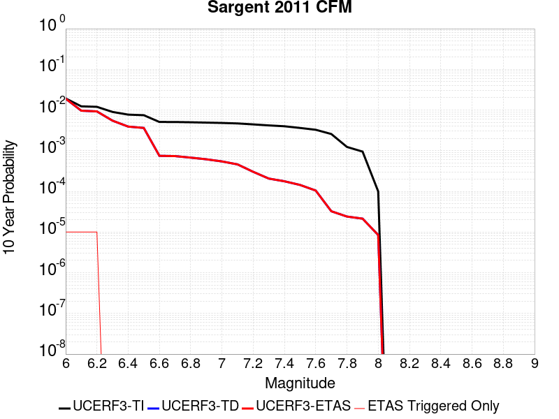 |

| Magnitude | 1 wk TI Prob | 1 wk TD Prob | 1 wk ETAS Prob | 1 wk ETAS/TD Gain | 1 wk ETAS Triggered Only | 1 mo TI Prob | 1 mo TD Prob | 1 mo ETAS Prob | 1 mo ETAS/TD Gain | 1 mo ETAS Triggered Only | 1 yr TI Prob | 1 yr TD Prob | 1 yr ETAS Prob | 1 yr ETAS/TD Gain | 1 yr ETAS Triggered Only | 10 yr TI Prob | 10 yr TD Prob | 10 yr ETAS Prob | 10 yr ETAS/TD Gain | 10 yr ETAS Triggered Only |
|-----|-----|-----|-----|-----|-----|-----|-----|-----|-----|-----|-----|-----|-----|-----|-----|-----|-----|-----|-----|-----|
| 6.0 | 3.7327867E-5 | 3.664913E-5 | 3.664913E-5 | 1.0 | 0.0 | 1.5996677E-4 | 1.5706103E-4 | 1.5706103E-4 | 1.0 | 0.0 | 0.0019458556 | 0.0019110236 | 0.0019110236 | 1.0 | 0.0 | 0.01928905 | 0.019018095 | 0.019027904 | 1.0005158 | 1.0E-5 |
| 6.1 | 2.3771476E-5 | 1.8479273E-5 | 1.8479273E-5 | 1.0 | 0.0 | 1.01873775E-4 | 7.919498E-5 | 7.919498E-5 | 1.0 | 0.0 | 0.0012396075 | 9.638493E-4 | 9.638493E-4 | 1.0 | 0.0 | 0.012327154 | 0.009636091 | 0.009645995 | 1.0010278 | 1.0E-5 |
| 6.2 | 2.3112721E-5 | 1.7710632E-5 | 1.7710632E-5 | 1.0 | 0.0 | 9.9050754E-5 | 7.590099E-5 | 7.590099E-5 | 1.0 | 0.0 | 0.0012052758 | 9.237792E-4 | 9.237792E-4 | 1.0 | 0.0 | 0.011987597 | 0.009238743 | 0.009248652 | 1.0010724 | 1.0E-5 |
| 6.3 | 1.728509E-5 | 1.0458927E-5 | 1.0458927E-5 | 1.0 | 0.0 | 7.407686E-5 | 4.482347E-5 | 4.482347E-5 | 1.0 | 0.0 | 9.015125E-4 | 5.456343E-4 | 5.456343E-4 | 1.0 | 0.0 | 0.008978641 | 0.0054791216 | 0.0054791216 | 1.0 | 0.0 |
| 6.4 | 1.48395575E-5 | 7.4559816E-6 | 7.4559816E-6 | 1.0 | 0.0 | 6.3596555E-5 | 3.195403E-5 | 3.195403E-5 | 1.0 | 0.0 | 7.7401294E-4 | 3.8900663E-4 | 3.8900663E-4 | 1.0 | 0.0 | 0.0077132257 | 0.003918666 | 0.003918666 | 1.0 | 0.0 |
| 6.5 | 1.4358964E-5 | 6.894759E-6 | 6.894759E-6 | 1.0 | 0.0 | 6.1536964E-5 | 2.9548846E-5 | 2.9548846E-5 | 1.0 | 0.0 | 7.48955E-4 | 3.5973339E-4 | 3.5973339E-4 | 1.0 | 0.0 | 0.0074643586 | 0.0036269152 | 0.0036269152 | 1.0 | 0.0 |
| 6.6 | 9.772591E-6 | 1.3736154E-6 | 1.3736154E-6 | 1.0 | 0.0 | 4.188186E-5 | 5.88691E-6 | 5.88691E-6 | 1.0 | 0.0 | 5.097923E-4 | 7.16708E-5 | 7.16708E-5 | 1.0 | 0.0 | 0.005086244 | 7.483097E-4 | 7.483097E-4 | 1.0 | 0.0 |
| 6.7 | 9.752745E-6 | 1.3523068E-6 | 1.3523068E-6 | 1.0 | 0.0 | 4.179681E-5 | 5.795587E-6 | 5.795587E-6 | 1.0 | 0.0 | 5.0875737E-4 | 7.055902E-5 | 7.055902E-5 | 1.0 | 0.0 | 0.005075942 | 7.371994E-4 | 7.371994E-4 | 1.0 | 0.0 |
| 6.8 | 9.608213E-6 | 1.2361709E-6 | 1.2361709E-6 | 1.0 | 0.0 | 4.1177405E-5 | 5.2978644E-6 | 5.2978644E-6 | 1.0 | 0.0 | 5.012196E-4 | 6.449961E-5 | 6.449961E-5 | 1.0 | 0.0 | 0.005000906 | 6.7634037E-4 | 6.7634037E-4 | 1.0 | 0.0 |
| 6.9 | 9.427164E-6 | 1.12094E-6 | 1.12094E-6 | 1.0 | 0.0 | 4.04015E-5 | 4.80402E-6 | 4.80402E-6 | 1.0 | 0.0 | 4.9177726E-4 | 5.8487396E-5 | 5.8487396E-5 | 1.0 | 0.0 | 0.004906904 | 6.1557174E-4 | 6.1557174E-4 | 1.0 | 0.0 |
| 7.0 | 9.247601E-6 | 9.873988E-7 | 9.873988E-7 | 1.0 | 0.0 | 3.9631974E-5 | 4.2317024E-6 | 4.2317024E-6 | 1.0 | 0.0 | 4.8241246E-4 | 5.1519775E-5 | 5.1519775E-5 | 1.0 | 0.0 | 0.0048136655 | 5.4542476E-4 | 5.4542476E-4 | 1.0 | 0.0 |
| 7.1 | 8.995454E-6 | 8.2711284E-7 | 8.2711284E-7 | 1.0 | 0.0 | 3.8551374E-5 | 3.5447645E-6 | 3.5447645E-6 | 1.0 | 0.0 | 4.6926187E-4 | 4.3156666E-5 | 4.3156666E-5 | 1.0 | 0.0 | 0.004682722 | 4.609069E-4 | 4.609069E-4 | 1.0 | 0.0 |
| 7.2 | 8.520861E-6 | 5.2766507E-7 | 5.2766507E-7 | 1.0 | 0.0 | 3.6517464E-5 | 2.2614197E-6 | 2.2614197E-6 | 1.0 | 0.0 | 4.445094E-4 | 2.7532446E-5 | 2.7532446E-5 | 1.0 | 0.0 | 0.004436213 | 3.0297207E-4 | 3.0297207E-4 | 1.0 | 0.0 |
| 7.3 | 8.043592E-6 | 3.456507E-7 | 3.456507E-7 | 1.0 | 0.0 | 3.4472083E-5 | 1.4813593E-6 | 1.4813593E-6 | 1.0 | 0.0 | 4.196168E-4 | 1.8035402E-5 | 1.8035402E-5 | 1.0 | 0.0 | 0.004188253 | 2.0669671E-4 | 2.0669671E-4 | 1.0 | 0.0 |
| 7.4 | 7.662316E-6 | 2.928958E-7 | 2.928958E-7 | 1.0 | 0.0 | 3.2838085E-5 | 1.2552671E-6 | 1.2552671E-6 | 1.0 | 0.0 | 3.9973034E-4 | 1.528277E-5 | 1.528277E-5 | 1.0 | 0.0 | 0.0039901207 | 1.7736501E-4 | 1.7736501E-4 | 1.0 | 0.0 |
| 7.5 | 6.961638E-6 | 2.3574503E-7 | 2.3574503E-7 | 1.0 | 0.0 | 2.9835252E-5 | 1.0103355E-6 | 1.0103355E-6 | 1.0 | 0.0 | 3.6318362E-4 | 1.2300766E-5 | 1.2300766E-5 | 1.0 | 0.0 | 0.0036259065 | 1.4409334E-4 | 1.4409334E-4 | 1.0 | 0.0 |
| 7.6 | 6.282332E-6 | 1.6892966E-7 | 1.6892966E-7 | 1.0 | 0.0 | 2.6924003E-5 | 7.2398404E-7 | 7.2398404E-7 | 1.0 | 0.0 | 3.2775043E-4 | 8.814471E-6 | 8.814471E-6 | 1.0 | 0.0 | 0.0032726745 | 1.05050465E-4 | 1.05050465E-4 | 1.0 | 0.0 |
| 7.7 | 4.934408E-6 | 5.001089E-8 | 5.001089E-8 | 1.0 | 0.0 | 2.114729E-5 | 2.1433237E-7 | 2.1433237E-7 | 1.0 | 0.0 | 2.5743784E-4 | 2.6094935E-6 | 2.6094935E-6 | 1.0 | 0.0 | 0.0025713982 | 3.2545366E-5 | 3.2545366E-5 | 1.0 | 0.0 |
| 7.8 | 2.373212E-6 | 3.5172643E-8 | 3.5172643E-8 | 1.0 | 0.0 | 1.0170869E-5 | 1.507399E-7 | 1.507399E-7 | 1.0 | 0.0 | 1.238233E-4 | 1.8352566E-6 | 1.8352566E-6 | 1.0 | 0.0 | 0.0012375432 | 2.4125171E-5 | 2.4125171E-5 | 1.0 | 0.0 |
| 7.9 | 1.8227792E-6 | 3.0619603E-8 | 3.0619603E-8 | 1.0 | 0.0 | 7.811887E-6 | 1.3122687E-7 | 1.3122687E-7 | 1.0 | 0.0 | 9.510558E-5 | 1.5976858E-6 | 1.5976858E-6 | 1.0 | 0.0 | 9.5064886E-4 | 2.1410624E-5 | 2.1410624E-5 | 1.0 | 0.0 |
| 8.0 | 1.9095137E-7 | 1.326461E-8 | 1.326461E-8 | 1.0 | 0.0 | 8.1836276E-7 | 5.684833E-8 | 5.684833E-8 | 1.0 | 0.0 | 9.963521E-6 | 6.921282E-7 | 6.921282E-7 | 1.0 | 0.0 | 9.963074E-5 | 8.463319E-6 | 8.463319E-6 | 1.0 | 0.0 |

