# Parent Section Magnitude-Probability Distributions

Only fault sections with at least one triggered aftershock are plotted. Sections are sorted by total supraseismogenic trigger rate (decreasing)

## Table Of Contents

* [Tank Canyon](#tank-canyon)
* [Garlock (Central)](#garlock-central)
* [Little Lake](#little-lake)
* [Airport Lake](#airport-lake)
* [Owl Lake](#owl-lake)
* [Panamint Valley](#panamint-valley)
* [Garlock (East)](#garlock-east)
* [Ash Hill](#ash-hill)
* [Hunter Mountain-Saline Valley](#hunter-mountain-saline-valley)
* [Blackwater](#blackwater)
* [Gravel Hills-Harper Lk](#gravel-hills-harper-lk)
* [Goldstone Lake](#goldstone-lake)
* [Garlock (West)](#garlock-west)
* [McLean Lake](#mclean-lake)
* [San Andreas (Mojave S)](#san-andreas-mojave-s)
* [So Sierra Nevada](#so-sierra-nevada)
* [Death Valley (So)](#death-valley-so)
* [Paradise](#paradise)
* [Coyote Canyon](#coyote-canyon)
* [San Andreas (Mojave N)](#san-andreas-mojave-n)
* [Santa Rosa Island](#santa-rosa-island)
* [Towne Pass](#towne-pass)
* [Death Valley (No)](#death-valley-no)
* [Death Valley (Black Mtns Frontal)](#death-valley-black-mtns-frontal)
* [Baker](#baker)
* [Death Valley (Fish Lake Valley)](#death-valley-fish-lake-valley)
* [Santa Cruz Island](#santa-cruz-island)
* [Garlic Springs](#garlic-springs)
* [Nelson Lake](#nelson-lake)
* [Lenwood-Lockhart-Old Woman Springs](#lenwood-lockhart-old-woman-springs)
* [Cady](#cady)
* [Great Valley 11](#great-valley-11)
* [Santa Ynez (West)](#santa-ynez-west)
* [Sierra Nevada  (No Extension)](#sierra-nevada--no-extension)
* [San Andreas (San Bernardino N)](#san-andreas-san-bernardino-n)
* [Channel Islands Western Deep Ramp](#channel-islands-western-deep-ramp)
* [Channel Islands Thrust](#channel-islands-thrust)
* [Santa Cruz Catalina Ridge alt1](#santa-cruz-catalina-ridge-alt1)
* [Coyote Lake](#coyote-lake)

## Tank Canyon
*[(top)](#table-of-contents)*

| 1 Week | 1 Month | 1 Year | 10 Year |
|-----|-----|-----|-----|
|  |  |  |  |

| Magnitude | 1 wk TI Prob | 1 wk TD Prob | 1 wk ETAS Prob | 1 wk ETAS/TD Gain | 1 wk ETAS Triggered Only | 1 mo TI Prob | 1 mo TD Prob | 1 mo ETAS Prob | 1 mo ETAS/TD Gain | 1 mo ETAS Triggered Only | 1 yr TI Prob | 1 yr TD Prob | 1 yr ETAS Prob | 1 yr ETAS/TD Gain | 1 yr ETAS Triggered Only | 10 yr TI Prob | 10 yr TD Prob | 10 yr ETAS Prob | 10 yr ETAS/TD Gain | 10 yr ETAS Triggered Only |
|-----|-----|-----|-----|-----|-----|-----|-----|-----|-----|-----|-----|-----|-----|-----|-----|-----|-----|-----|-----|-----|
| 6.0 | 4.8284557E-5 | 5.7964822E-5 | 0.039055705 | 673.78284 | 0.039 | 2.0691741E-4 | 2.4840087E-4 | 0.055234738 | 222.3613 | 0.055 | 0.0025163088 | 0.0030207601 | 0.09474285 | 31.36391 | 0.092 | 0.02488006 | 0.029863637 | 0.14045918 | 4.7033515 | 0.114 |
| 6.1 | 1.7796336E-5 | 2.0873314E-5 | 0.013020602 | 623.79175 | 0.013 | 7.626778E-5 | 8.945422E-5 | 0.019087754 | 213.38016 | 0.019 | 9.281647E-4 | 0.0010885983 | 0.034052674 | 31.281214 | 0.033 | 0.009242975 | 0.010836744 | 0.0523816 | 4.833703 | 0.042 |
| 6.2 | 1.7796336E-5 | 2.0873314E-5 | 0.013020602 | 623.79175 | 0.013 | 7.626778E-5 | 8.945422E-5 | 0.019087754 | 213.38016 | 0.019 | 9.281647E-4 | 0.0010885983 | 0.034052674 | 31.281214 | 0.033 | 0.009242975 | 0.010836744 | 0.0523816 | 4.833703 | 0.042 |
| 6.3 | 1.3515912E-5 | 1.5759564E-5 | 0.010015602 | 635.52527 | 0.01 | 5.792405E-5 | 6.753938E-5 | 0.015066526 | 223.07765 | 0.015 | 7.049971E-4 | 8.2200574E-4 | 0.025801456 | 31.388412 | 0.025 | 0.007027647 | 0.0081922645 | 0.037946496 | 4.631991 | 0.03 |
| 6.4 | 1.0870146E-5 | 1.2618021E-5 | 0.0070125298 | 555.7551 | 0.007 | 4.658551E-5 | 5.4076212E-5 | 0.012053427 | 222.89703 | 0.012 | 5.67031E-4 | 6.581969E-4 | 0.016647667 | 25.292835 | 0.016 | 0.005655863 | 0.0065644905 | 0.026433202 | 4.026695 | 0.02 |
| 6.5 | 7.964826E-6 | 9.196094E-6 | 0.0040091593 | 435.9633 | 0.004 | 3.4134522E-5 | 3.9411298E-5 | 0.0090390565 | 229.35193 | 0.009 | 4.1550855E-4 | 4.7973756E-4 | 0.012473981 | 26.001677 | 0.012 | 0.0041473247 | 0.004788321 | 0.019716496 | 4.117622 | 0.015 |
| 6.6 | 6.6317E-6 | 7.6122988E-6 | 0.0040075816 | 526.4614 | 0.004 | 2.8421264E-5 | 3.2623782E-5 | 0.008032363 | 246.21188 | 0.008 | 3.4597394E-4 | 3.9713128E-4 | 0.011392763 | 28.687649 | 0.011 | 0.0034543579 | 0.003965368 | 0.017909853 | 4.5165677 | 0.014 |
| 6.7 | 4.793663E-6 | 5.4307857E-6 | 0.00200542 | 369.26883 | 0.002 | 2.0544108E-5 | 2.3274613E-5 | 0.006023135 | 258.7856 | 0.006 | 2.500958E-4 | 2.8333595E-4 | 0.0072813528 | 25.698654 | 0.007 | 0.0024981452 | 0.0028304397 | 0.010807796 | 3.8184159 | 0.008 |
| 6.8 | 4.382823E-6 | 4.9692567E-6 | 0.0020049594 | 403.47266 | 0.002 | 1.8783392E-5 | 2.1296666E-5 | 0.006021169 | 282.72824 | 0.006 | 2.286638E-4 | 2.5926033E-4 | 0.0072574457 | 27.99289 | 0.007 | 0.0022842865 | 0.002590253 | 0.010569531 | 4.0805016 | 0.008 |
| 6.9 | 2.729601E-6 | 3.0735416E-6 | 0.0010030705 | 326.35654 | 0.001 | 1.1698237E-5 | 1.3172262E-5 | 0.0030131328 | 228.74832 | 0.003 | 1.4241673E-4 | 1.6036171E-4 | 0.0031598806 | 19.704708 | 0.003 | 0.001423255 | 0.0016026258 | 0.004597818 | 2.868928 | 0.003 |
| 7.0 | 1.8987357E-6 | 2.126939E-6 | 2.126939E-6 | 1.0 | 0.0 | 8.137413E-6 | 9.115425E-6 | 0.0010091063 | 110.703156 | 0.001 | 9.90685E-5 | 1.1097535E-4 | 0.0011108643 | 10.010011 | 0.001 | 9.902435E-4 | 0.0011092679 | 0.0021081588 | 1.9004954 | 0.001 |
| 7.1 | 1.4928986E-6 | 1.6641272E-6 | 1.6641272E-6 | 1.0 | 0.0 | 6.398121E-6 | 7.1319573E-6 | 0.0010071248 | 141.21295 | 0.001 | 7.789434E-5 | 8.682871E-5 | 0.0010867419 | 12.515927 | 0.001 | 7.786704E-4 | 8.6800574E-4 | 0.0018671377 | 2.151066 | 0.001 |
| 7.2 | 1.069082E-6 | 1.1828573E-6 | 1.1828573E-6 | 1.0 | 0.0 | 4.581772E-6 | 5.0693816E-6 | 5.0693816E-6 | 1.0 | 0.0 | 5.5781646E-5 | 6.171851E-5 | 6.171851E-5 | 1.0 | 0.0 | 5.576765E-4 | 6.170659E-4 | 6.170659E-4 | 1.0 | 0.0 |
| 7.3 | 8.776551E-7 | 9.770005E-7 | 9.770005E-7 | 1.0 | 0.0 | 3.7613736E-6 | 4.1871413E-6 | 4.1871413E-6 | 1.0 | 0.0 | 4.579376E-5 | 5.097777E-5 | 5.097777E-5 | 1.0 | 0.0 | 4.5784327E-4 | 5.097118E-4 | 5.097118E-4 | 1.0 | 0.0 |
| 7.4 | 7.55721E-7 | 8.510244E-7 | 8.510244E-7 | 1.0 | 0.0 | 3.2388E-6 | 3.6472454E-6 | 3.6472454E-6 | 1.0 | 0.0 | 3.9431678E-5 | 4.4404827E-5 | 4.4404827E-5 | 1.0 | 0.0 | 3.942468E-4 | 4.440104E-4 | 4.440104E-4 | 1.0 | 0.0 |
| 7.5 | 5.587665E-7 | 6.305619E-7 | 6.305619E-7 | 1.0 | 0.0 | 2.3947114E-6 | 2.702408E-6 | 2.702408E-6 | 1.0 | 0.0 | 2.915522E-5 | 3.290182E-5 | 3.290182E-5 | 1.0 | 0.0 | 2.9151395E-4 | 3.290182E-4 | 3.290182E-4 | 1.0 | 0.0 |

## Garlock (Central)
*[(top)](#table-of-contents)*

| 1 Week | 1 Month | 1 Year | 10 Year |
|-----|-----|-----|-----|
|  |  |  |  |

| Magnitude | 1 wk TI Prob | 1 wk TD Prob | 1 wk ETAS Prob | 1 wk ETAS/TD Gain | 1 wk ETAS Triggered Only | 1 mo TI Prob | 1 mo TD Prob | 1 mo ETAS Prob | 1 mo ETAS/TD Gain | 1 mo ETAS Triggered Only | 1 yr TI Prob | 1 yr TD Prob | 1 yr ETAS Prob | 1 yr ETAS/TD Gain | 1 yr ETAS Triggered Only | 10 yr TI Prob | 10 yr TD Prob | 10 yr ETAS Prob | 10 yr ETAS/TD Gain | 10 yr ETAS Triggered Only |
|-----|-----|-----|-----|-----|-----|-----|-----|-----|-----|-----|-----|-----|-----|-----|-----|-----|-----|-----|-----|-----|
| 6.0 | 5.5131142E-5 | 7.024681E-5 | 0.056066312 | 798.13324 | 0.056 | 2.3625491E-4 | 3.010234E-4 | 0.07127965 | 236.79108 | 0.071 | 0.0028726095 | 0.0036588663 | 0.1013003 | 27.686253 | 0.098 | 0.028357591 | 0.036079824 | 0.15175025 | 4.2059584 | 0.12 |
| 6.1 | 5.5131142E-5 | 7.024681E-5 | 0.056066312 | 798.13324 | 0.056 | 2.3625491E-4 | 3.010234E-4 | 0.07127965 | 236.79108 | 0.071 | 0.0028726095 | 0.0036588663 | 0.1013003 | 27.686253 | 0.098 | 0.028357591 | 0.036079824 | 0.15175025 | 4.2059584 | 0.12 |
| 6.2 | 4.216245E-5 | 5.1661493E-5 | 0.038049698 | 736.51953 | 0.038 | 1.806837E-4 | 2.2138779E-4 | 0.047210984 | 213.25017 | 0.047 | 0.0021976046 | 0.0026920962 | 0.06951173 | 25.82067 | 0.067 | 0.021759989 | 0.026689773 | 0.108447835 | 4.063273 | 0.084 |
| 6.3 | 4.216245E-5 | 5.1661493E-5 | 0.038049698 | 736.51953 | 0.038 | 1.806837E-4 | 2.2138779E-4 | 0.047210984 | 213.25017 | 0.047 | 0.0021976046 | 0.0026920962 | 0.06951173 | 25.82067 | 0.067 | 0.021759989 | 0.026689773 | 0.108447835 | 4.063273 | 0.084 |
| 6.4 | 3.6858168E-5 | 4.411054E-5 | 0.030042788 | 681.0795 | 0.03 | 1.5795401E-4 | 1.8903162E-4 | 0.036182225 | 191.40833 | 0.036 | 0.0019213937 | 0.002299056 | 0.054179505 | 23.565979 | 0.052 | 0.019048655 | 0.02284894 | 0.087340906 | 3.8225367 | 0.066 |
| 6.5 | 3.39199E-5 | 4.0018083E-5 | 0.025039017 | 625.69257 | 0.025 | 1.453629E-4 | 1.7149492E-4 | 0.03116618 | 181.73238 | 0.031 | 0.0017683565 | 0.002085973 | 0.046992105 | 22.527666 | 0.045 | 0.017543508 | 0.020759864 | 0.078535035 | 3.7830224 | 0.059 |
| 6.6 | 3.3571985E-5 | 3.9472274E-5 | 0.025038486 | 634.331 | 0.025 | 1.4387199E-4 | 1.6915603E-4 | 0.031163912 | 184.23175 | 0.031 | 0.0017502342 | 0.0020575512 | 0.046964962 | 22.825659 | 0.045 | 0.017365133 | 0.020481179 | 0.07827279 | 3.8216937 | 0.059 |
| 6.7 | 3.2580007E-5 | 3.8088703E-5 | 0.023037212 | 604.8306 | 0.023 | 1.3962112E-4 | 1.632272E-4 | 0.029158494 | 178.63747 | 0.029 | 0.0016985617 | 0.0019855013 | 0.044900123 | 22.614 | 0.043 | 0.016856372 | 0.019773813 | 0.07368626 | 3.7264564 | 0.055 |
| 6.8 | 3.2185937E-5 | 3.7515918E-5 | 0.023036653 | 614.05005 | 0.023 | 1.3793244E-4 | 1.6077272E-4 | 0.029156111 | 181.34985 | 0.029 | 0.0016780337 | 0.001955672 | 0.043873534 | 22.433994 | 0.042 | 0.016654192 | 0.019480614 | 0.07242866 | 3.7179866 | 0.054 |
| 6.9 | 3.165394E-5 | 3.6720503E-5 | 0.023035876 | 627.3301 | 0.023 | 1.3565269E-4 | 1.5736422E-4 | 0.029152801 | 185.25687 | 0.029 | 0.0016503202 | 0.001914247 | 0.042835765 | 22.377342 | 0.041 | 0.01638118 | 0.019073246 | 0.07106236 | 3.7257614 | 0.053 |
| 7.0 | 3.0903822E-5 | 3.5625766E-5 | 0.023034807 | 646.57715 | 0.023 | 1.3243823E-4 | 1.5267303E-4 | 0.029148245 | 190.9194 | 0.029 | 0.0016112428 | 0.0018572307 | 0.042781085 | 23.03488 | 0.041 | 0.015996104 | 0.018512413 | 0.06954977 | 3.756926 | 0.052 |
| 7.1 | 3.0069863E-5 | 3.4392073E-5 | 0.0230336 | 669.7358 | 0.023 | 1.2886449E-4 | 1.4738638E-4 | 0.029143112 | 197.73273 | 0.029 | 0.0015677959 | 0.0017929734 | 0.041721255 | 23.269312 | 0.04 | 0.01556781 | 0.017880075 | 0.06796819 | 3.801337 | 0.051 |
| 7.2 | 2.7957109E-5 | 3.128145E-5 | 0.021030625 | 672.3033 | 0.021 | 1.1981068E-4 | 1.340566E-4 | 0.025130706 | 187.46341 | 0.025 | 0.0014577188 | 0.0016309366 | 0.034577116 | 21.200773 | 0.033 | 0.014481937 | 0.016283695 | 0.059567213 | 3.6580894 | 0.044 |
| 7.3 | 2.4519275E-5 | 2.6714795E-5 | 0.014026341 | 525.04016 | 0.014 | 1.0507837E-4 | 1.1448703E-4 | 0.018112427 | 158.20505 | 0.018 | 0.0012785783 | 0.001393003 | 0.024360964 | 17.48809 | 0.023 | 0.012712469 | 0.013928054 | 0.04252414 | 3.0531287 | 0.029 |
| 7.4 | 2.3225532E-5 | 2.51994E-5 | 0.013024872 | 516.8723 | 0.013 | 9.95342E-5 | 1.0799304E-4 | 0.017106157 | 158.40056 | 0.017 | 0.0012111551 | 0.0013140367 | 0.023285128 | 17.720303 | 0.022 | 0.012045753 | 0.013145725 | 0.040777646 | 3.10197 | 0.028 |
| 7.5 | 2.097765E-5 | 2.2483688E-5 | 0.011022236 | 490.23257 | 0.011 | 8.9901114E-5 | 9.635517E-5 | 0.0140950065 | 146.28178 | 0.014 | 0.0010939965 | 0.0011725046 | 0.019151399 | 16.333752 | 0.018 | 0.010886264 | 0.011740365 | 0.03249382 | 2.7677007 | 0.021 |
| 7.6 | 1.511254E-5 | 1.5991332E-5 | 0.0070158793 | 438.73013 | 0.007 | 6.476642E-5 | 6.853253E-5 | 0.007068053 | 103.13428 | 0.007 | 7.882459E-4 | 8.3407195E-4 | 0.009826565 | 11.781436 | 0.009 | 0.007854558 | 0.008383559 | 0.01929134 | 2.301092 | 0.011 |
| 7.7 | 9.934069E-6 | 1.0678794E-5 | 1.0678794E-5 | 1.0 | 0.0 | 4.2573887E-5 | 4.5765457E-5 | 4.5765457E-5 | 1.0 | 0.0 | 5.182138E-4 | 5.570524E-4 | 0.0015564953 | 2.7941635 | 0.001 | 0.00517007 | 0.005627684 | 0.007616428 | 1.353386 | 0.002 |
| 7.8 | 6.7562896E-6 | 8.428449E-6 | 8.428449E-6 | 1.0 | 0.0 | 2.8955206E-5 | 3.6121426E-5 | 3.6121426E-5 | 1.0 | 0.0 | 3.5247262E-4 | 4.3968976E-4 | 0.0014392501 | 3.273331 | 0.001 | 0.0035191406 | 0.004446654 | 0.006437761 | 1.4477763 | 0.002 |
| 7.9 | 3.975453E-6 | 5.37103E-6 | 5.37103E-6 | 1.0 | 0.0 | 1.7037546E-5 | 2.3018498E-5 | 2.3018498E-5 | 1.0 | 0.0 | 2.0741238E-4 | 2.8021427E-4 | 0.0012799341 | 4.5676975 | 0.001 | 0.002072189 | 0.0028336283 | 0.0038307947 | 1.3519044 | 0.001 |
| 8.0 | 1.6729537E-6 | 2.0775144E-6 | 2.0775144E-6 | 1.0 | 0.0 | 7.169782E-6 | 8.903603E-6 | 8.903603E-6 | 1.0 | 0.0 | 8.7288594E-5 | 1.0839601E-4 | 1.0839601E-4 | 1.0 | 0.0 | 8.7254314E-4 | 0.0010969337 | 0.0010969337 | 1.0 | 0.0 |
| 8.1 | 3.6733252E-7 | 3.1489964E-7 | 3.1489964E-7 | 1.0 | 0.0 | 1.5742813E-6 | 1.3495693E-6 | 1.3495693E-6 | 1.0 | 0.0 | 1.9166706E-5 | 1.6430899E-5 | 1.6430899E-5 | 1.0 | 0.0 | 1.9165053E-4 | 1.6638759E-4 | 1.6638759E-4 | 1.0 | 0.0 |

## Little Lake
*[(top)](#table-of-contents)*

| 1 Week | 1 Month | 1 Year | 10 Year |
|-----|-----|-----|-----|
|  |  |  |  |

| Magnitude | 1 wk TI Prob | 1 wk TD Prob | 1 wk ETAS Prob | 1 wk ETAS/TD Gain | 1 wk ETAS Triggered Only | 1 mo TI Prob | 1 mo TD Prob | 1 mo ETAS Prob | 1 mo ETAS/TD Gain | 1 mo ETAS Triggered Only | 1 yr TI Prob | 1 yr TD Prob | 1 yr ETAS Prob | 1 yr ETAS/TD Gain | 1 yr ETAS Triggered Only | 10 yr TI Prob | 10 yr TD Prob | 10 yr ETAS Prob | 10 yr ETAS/TD Gain | 10 yr ETAS Triggered Only |
|-----|-----|-----|-----|-----|-----|-----|-----|-----|-----|-----|-----|-----|-----|-----|-----|-----|-----|-----|-----|-----|
| 6.0 | 2.8424427E-5 | 3.120572E-5 | 0.0290303 | 930.2878 | 0.029 | 1.2181328E-4 | 1.337327E-4 | 0.040128384 | 300.06412 | 0.04 | 0.0014820677 | 0.0016271127 | 0.05953274 | 36.587963 | 0.058 | 0.014722223 | 0.016165402 | 0.08503383 | 5.260236 | 0.07 |
| 6.1 | 2.8424427E-5 | 3.120572E-5 | 0.0290303 | 930.2878 | 0.029 | 1.2181328E-4 | 1.337327E-4 | 0.040128384 | 300.06412 | 0.04 | 0.0014820677 | 0.0016271127 | 0.05953274 | 36.587963 | 0.058 | 0.014722223 | 0.016165402 | 0.08503383 | 5.260236 | 0.07 |
| 6.2 | 2.8424427E-5 | 3.120572E-5 | 0.0290303 | 930.2878 | 0.029 | 1.2181328E-4 | 1.337327E-4 | 0.040128384 | 300.06412 | 0.04 | 0.0014820677 | 0.0016271127 | 0.05953274 | 36.587963 | 0.058 | 0.014722223 | 0.016165402 | 0.08503383 | 5.260236 | 0.07 |
| 6.3 | 1.48860645E-5 | 1.6081389E-5 | 0.0150158405 | 933.74023 | 0.015 | 6.379586E-5 | 6.8918576E-5 | 0.023067333 | 334.70413 | 0.023 | 7.7643775E-4 | 8.3878887E-4 | 0.03481027 | 41.500633 | 0.034 | 0.007737305 | 0.008359048 | 0.050999608 | 6.1011267 | 0.043 |
| 6.4 | 1.48860645E-5 | 1.6081389E-5 | 0.0150158405 | 933.74023 | 0.015 | 6.379586E-5 | 6.8918576E-5 | 0.023067333 | 334.70413 | 0.023 | 7.7643775E-4 | 8.3878887E-4 | 0.03481027 | 41.500633 | 0.034 | 0.007737305 | 0.008359048 | 0.050999608 | 6.1011267 | 0.043 |
| 6.5 | 1.2797581E-5 | 1.3765565E-5 | 0.0120136 | 872.72845 | 0.012 | 5.4845623E-5 | 5.899409E-5 | 0.019057874 | 323.04718 | 0.019 | 6.675408E-4 | 7.18042E-4 | 0.0306965 | 42.750282 | 0.03 | 0.006655392 | 0.00715977 | 0.04687338 | 6.5467715 | 0.04 |
| 6.6 | 9.661896E-6 | 1.0289038E-5 | 0.008010207 | 778.51855 | 0.008 | 4.1407468E-5 | 4.409522E-5 | 0.015043434 | 341.1579 | 0.015 | 5.040193E-4 | 5.367433E-4 | 0.024523862 | 45.69011 | 0.024 | 0.005028777 | 0.0053560743 | 0.039173968 | 7.313933 | 0.034 |
| 6.7 | 7.767871E-6 | 8.199687E-6 | 0.008008135 | 976.63904 | 0.008 | 3.329045E-5 | 3.5141118E-5 | 0.014034649 | 399.3797 | 0.014 | 4.0523586E-4 | 4.2777284E-4 | 0.020419218 | 47.733784 | 0.02 | 0.004044977 | 0.004270846 | 0.033146992 | 7.761224 | 0.029 |
| 6.8 | 6.4235196E-6 | 6.7357446E-6 | 0.0060066953 | 891.7641 | 0.006 | 2.752908E-5 | 2.8867229E-5 | 0.012028521 | 416.6843 | 0.012 | 3.35115E-4 | 3.5141467E-4 | 0.017345442 | 49.3589 | 0.017 | 0.003346101 | 0.00350985 | 0.026429124 | 7.5299864 | 0.023 |
| 6.9 | 3.1283696E-6 | 3.1121804E-6 | 0.003003103 | 964.9514 | 0.003 | 1.3407229E-5 | 1.3337856E-5 | 0.008013231 | 600.7885 | 0.008 | 1.6322079E-4 | 1.6237781E-4 | 0.01216043 | 74.889725 | 0.012 | 0.0016310095 | 0.00162274 | 0.017596776 | 10.843866 | 0.016 |
| 7.0 | 2.290603E-6 | 2.2286815E-6 | 0.0020022243 | 898.3895 | 0.002 | 9.816834E-6 | 9.551463E-6 | 0.0050095036 | 524.475 | 0.005 | 1.19513395E-4 | 1.162839E-4 | 0.008115354 | 69.78914 | 0.008 | 0.0011944914 | 0.0011623327 | 0.012149547 | 10.452727 | 0.011 |
| 7.1 | 1.293693E-6 | 1.1776827E-6 | 1.1776827E-6 | 1.0 | 0.0 | 5.5443866E-6 | 5.0472063E-6 | 0.0010050421 | 199.12842 | 0.001 | 6.750081E-5 | 6.14487E-5 | 0.0030612643 | 49.81821 | 0.003 | 6.7480316E-4 | 6.143856E-4 | 0.0056113135 | 9.133212 | 0.005 |
| 7.2 | 4.715842E-7 | 3.0917857E-7 | 3.0917857E-7 | 1.0 | 0.0 | 2.0210737E-6 | 1.3250503E-6 | 1.3250503E-6 | 1.0 | 0.0 | 2.4606294E-5 | 1.6132375E-5 | 1.6132375E-5 | 1.0 | 0.0 | 2.460357E-4 | 1.6131258E-4 | 0.00216099 | 13.39629 | 0.002 |
| 7.3 | 3.9430947E-7 | 2.3097488E-7 | 2.3097488E-7 | 1.0 | 0.0 | 1.6898966E-6 | 9.89892E-7 | 9.89892E-7 | 1.0 | 0.0 | 2.0574296E-5 | 1.2051869E-5 | 1.2051869E-5 | 1.0 | 0.0 | 2.0572392E-4 | 1.20512224E-4 | 1.20512224E-4 | 1.0 | 0.0 |
| 7.4 | 3.547123E-7 | 1.9679135E-7 | 1.9679135E-7 | 1.0 | 0.0 | 1.5201948E-6 | 8.4339126E-7 | 8.4339126E-7 | 1.0 | 0.0 | 1.8508214E-5 | 1.0268241E-5 | 1.0268241E-5 | 1.0 | 0.0 | 1.8506673E-4 | 1.02677724E-4 | 1.02677724E-4 | 1.0 | 0.0 |
| 7.5 | 2.6354266E-7 | 1.4423138E-7 | 1.4423138E-7 | 1.0 | 0.0 | 1.129468E-6 | 6.181344E-7 | 6.181344E-7 | 1.0 | 0.0 | 1.3751187E-5 | 7.5257603E-6 | 7.5257603E-6 | 1.0 | 0.0 | 1.3750336E-4 | 7.5255106E-5 | 7.5255106E-5 | 1.0 | 0.0 |
| 7.6 | 1.269913E-7 | 7.572556E-8 | 7.572556E-8 | 1.0 | 0.0 | 5.4424834E-7 | 3.245381E-7 | 3.245381E-7 | 1.0 | 0.0 | 6.6262032E-6 | 3.9512443E-6 | 3.9512443E-6 | 1.0 | 0.0 | 6.626006E-5 | 3.9511775E-5 | 3.9511775E-5 | 1.0 | 0.0 |

## Airport Lake
*[(top)](#table-of-contents)*

| 1 Week | 1 Month | 1 Year | 10 Year |
|-----|-----|-----|-----|
|  |  | 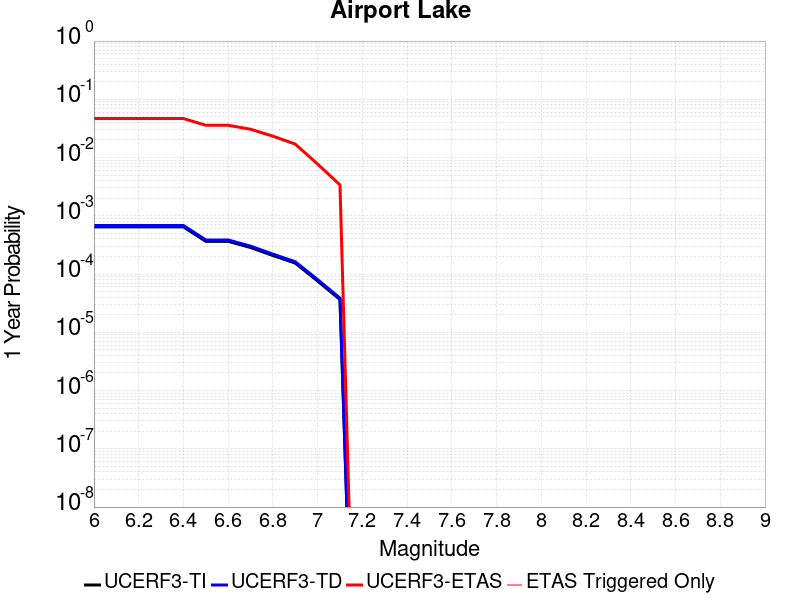 |  |

| Magnitude | 1 wk TI Prob | 1 wk TD Prob | 1 wk ETAS Prob | 1 wk ETAS/TD Gain | 1 wk ETAS Triggered Only | 1 mo TI Prob | 1 mo TD Prob | 1 mo ETAS Prob | 1 mo ETAS/TD Gain | 1 mo ETAS Triggered Only | 1 yr TI Prob | 1 yr TD Prob | 1 yr ETAS Prob | 1 yr ETAS/TD Gain | 1 yr ETAS Triggered Only | 10 yr TI Prob | 10 yr TD Prob | 10 yr ETAS Prob | 10 yr ETAS/TD Gain | 10 yr ETAS Triggered Only |
|-----|-----|-----|-----|-----|-----|-----|-----|-----|-----|-----|-----|-----|-----|-----|-----|-----|-----|-----|-----|-----|
| 6.0 | 1.2387061E-5 | 1.3103157E-5 | 0.022012815 | 1679.9628 | 0.022 | 5.3086325E-5 | 5.615534E-5 | 0.028054584 | 499.5889 | 0.028 | 6.461343E-4 | 6.8350515E-4 | 0.04165548 | 60.943916 | 0.041 | 0.0064425888 | 0.0068168393 | 0.058462363 | 8.576169 | 0.052 |
| 6.1 | 1.2387061E-5 | 1.3103157E-5 | 0.022012815 | 1679.9628 | 0.022 | 5.3086325E-5 | 5.615534E-5 | 0.028054584 | 499.5889 | 0.028 | 6.461343E-4 | 6.8350515E-4 | 0.04165548 | 60.943916 | 0.041 | 0.0064425888 | 0.0068168393 | 0.058462363 | 8.576169 | 0.052 |
| 6.2 | 1.2387061E-5 | 1.3103157E-5 | 0.022012815 | 1679.9628 | 0.022 | 5.3086325E-5 | 5.615534E-5 | 0.028054584 | 499.5889 | 0.028 | 6.461343E-4 | 6.8350515E-4 | 0.04165548 | 60.943916 | 0.041 | 0.0064425888 | 0.0068168393 | 0.058462363 | 8.576169 | 0.052 |
| 6.3 | 1.2387061E-5 | 1.3103157E-5 | 0.022012815 | 1679.9628 | 0.022 | 5.3086325E-5 | 5.615534E-5 | 0.028054584 | 499.5889 | 0.028 | 6.461343E-4 | 6.8350515E-4 | 0.04165548 | 60.943916 | 0.041 | 0.0064425888 | 0.0068168393 | 0.058462363 | 8.576169 | 0.052 |
| 6.4 | 1.2387061E-5 | 1.3103157E-5 | 0.022012815 | 1679.9628 | 0.022 | 5.3086325E-5 | 5.615534E-5 | 0.028054584 | 499.5889 | 0.028 | 6.461343E-4 | 6.8350515E-4 | 0.04165548 | 60.943916 | 0.041 | 0.0064425888 | 0.0068168393 | 0.058462363 | 8.576169 | 0.052 |
| 6.5 | 6.9922594E-6 | 7.384925E-6 | 0.0140072815 | 1896.7399 | 0.014 | 2.996648E-5 | 3.1649324E-5 | 0.020031016 | 632.90497 | 0.02 | 3.6478083E-4 | 3.8526783E-4 | 0.03037371 | 78.837906 | 0.03 | 0.003641826 | 0.0038465366 | 0.041700367 | 10.841017 | 0.038 |
| 6.6 | 6.9922594E-6 | 7.384925E-6 | 0.0140072815 | 1896.7399 | 0.014 | 2.996648E-5 | 3.1649324E-5 | 0.020031016 | 632.90497 | 0.02 | 3.6478083E-4 | 3.8526783E-4 | 0.03037371 | 78.837906 | 0.03 | 0.003641826 | 0.0038465366 | 0.041700367 | 10.841017 | 0.038 |
| 6.7 | 5.477277E-6 | 5.7860684E-6 | 0.009005734 | 1556.4513 | 0.009 | 2.3473833E-5 | 2.4797222E-5 | 0.015024425 | 605.8915 | 0.015 | 2.8575645E-4 | 3.0186825E-4 | 0.021295529 | 70.54578 | 0.021 | 0.0028538927 | 0.003014966 | 0.030930547 | 10.259004 | 0.028 |
| 6.8 | 3.9950432E-6 | 4.2190873E-6 | 0.006004194 | 1423.1025 | 0.006 | 1.7121502E-5 | 1.8081691E-5 | 0.012017865 | 664.6427 | 0.012 | 2.0843433E-4 | 2.2012512E-4 | 0.018216163 | 82.75368 | 0.018 | 0.0020823893 | 0.0021993418 | 0.024150956 | 10.980993 | 0.022 |
| 6.9 | 2.95695E-6 | 3.1230243E-6 | 0.0030031137 | 961.6043 | 0.003 | 1.2672582E-5 | 1.3384334E-5 | 0.0090132635 | 673.41895 | 0.009 | 1.5427776E-4 | 1.6294434E-4 | 0.014160663 | 86.90491 | 0.014 | 0.001541707 | 0.0016284712 | 0.018600788 | 11.422239 | 0.017 |
| 7.0 | 1.456072E-6 | 1.540812E-6 | 0.0020015377 | 1299.0149 | 0.002 | 6.2402937E-6 | 6.603469E-6 | 0.0050065704 | 758.1728 | 0.005 | 7.597293E-5 | 8.039528E-5 | 0.008079752 | 100.500336 | 0.008 | 7.594696E-4 | 8.0376083E-4 | 0.009796527 | 12.188361 | 0.009 |
| 7.1 | 6.995192E-7 | 7.4089746E-7 | 7.4089746E-7 | 1.0 | 0.0 | 2.997936E-6 | 3.1752747E-6 | 0.0010031721 | 315.93237 | 0.001 | 3.649926E-5 | 3.865897E-5 | 0.003038543 | 78.598656 | 0.003 | 3.6493264E-4 | 3.865897E-4 | 0.00338543 | 8.757165 | 0.003 |

## Owl Lake
*[(top)](#table-of-contents)*

| 1 Week | 1 Month | 1 Year | 10 Year |
|-----|-----|-----|-----|
|  |  |  |  |

| Magnitude | 1 wk TI Prob | 1 wk TD Prob | 1 wk ETAS Prob | 1 wk ETAS/TD Gain | 1 wk ETAS Triggered Only | 1 mo TI Prob | 1 mo TD Prob | 1 mo ETAS Prob | 1 mo ETAS/TD Gain | 1 mo ETAS Triggered Only | 1 yr TI Prob | 1 yr TD Prob | 1 yr ETAS Prob | 1 yr ETAS/TD Gain | 1 yr ETAS Triggered Only | 10 yr TI Prob | 10 yr TD Prob | 10 yr ETAS Prob | 10 yr ETAS/TD Gain | 10 yr ETAS Triggered Only |
|-----|-----|-----|-----|-----|-----|-----|-----|-----|-----|-----|-----|-----|-----|-----|-----|-----|-----|-----|-----|-----|
| 6.0 | 5.0320643E-5 | 6.635816E-5 | 0.018065164 | 272.23727 | 0.018 | 2.1564208E-4 | 2.843674E-4 | 0.024277542 | 85.37386 | 0.024 | 0.0026222812 | 0.0034577388 | 0.037340175 | 10.799016 | 0.034 | 0.02591553 | 0.034140717 | 0.07663853 | 2.2447836 | 0.044 |
| 6.1 | 5.0320643E-5 | 6.635816E-5 | 0.018065164 | 272.23727 | 0.018 | 2.1564208E-4 | 2.843674E-4 | 0.024277542 | 85.37386 | 0.024 | 0.0026222812 | 0.0034577388 | 0.037340175 | 10.799016 | 0.034 | 0.02591553 | 0.034140717 | 0.07663853 | 2.2447836 | 0.044 |
| 6.2 | 2.4125871E-5 | 3.0981035E-5 | 0.01103064 | 356.04492 | 0.011 | 1.0339249E-4 | 1.3277028E-4 | 0.014130912 | 106.43129 | 0.014 | 0.0012580766 | 0.001615439 | 0.024578284 | 15.214616 | 0.023 | 0.012509781 | 0.016070465 | 0.04657228 | 2.8980045 | 0.031 |
| 6.3 | 1.7433485E-5 | 2.2355514E-5 | 0.009022154 | 403.57623 | 0.009 | 7.471279E-5 | 9.580672E-5 | 0.011094753 | 115.8035 | 0.011 | 9.0924866E-4 | 0.0011659743 | 0.02014382 | 17.276384 | 0.019 | 0.009055373 | 0.011628896 | 0.036338173 | 3.1248171 | 0.025 |
| 6.4 | 1.7433485E-5 | 2.2355514E-5 | 0.009022154 | 403.57623 | 0.009 | 7.471279E-5 | 9.580672E-5 | 0.011094753 | 115.8035 | 0.011 | 9.0924866E-4 | 0.0011659743 | 0.02014382 | 17.276384 | 0.019 | 0.009055373 | 0.011628896 | 0.036338173 | 3.1248171 | 0.025 |
| 6.5 | 1.5182742E-5 | 1.9429144E-5 | 0.009019255 | 464.21262 | 0.009 | 6.506727E-5 | 8.326596E-5 | 0.01108235 | 133.09581 | 0.011 | 7.919061E-4 | 0.0010134429 | 0.019994188 | 19.728973 | 0.019 | 0.0078909 | 0.010118429 | 0.033875585 | 3.34791 | 0.024 |
| 6.6 | 6.7271576E-6 | 8.547361E-6 | 0.00900847 | 1053.9476 | 0.009 | 2.8830356E-5 | 3.6631063E-5 | 0.011036228 | 301.28058 | 0.011 | 3.5095305E-4 | 4.458976E-4 | 0.016438764 | 36.866676 | 0.016 | 0.0035039932 | 0.004467813 | 0.024378456 | 5.4564633 | 0.02 |
| 6.7 | 6.682835E-6 | 8.479807E-6 | 0.009008404 | 1062.3359 | 0.009 | 2.8640408E-5 | 3.6341557E-5 | 0.011035942 | 303.6728 | 0.011 | 3.4864116E-4 | 4.4237426E-4 | 0.016435297 | 37.15247 | 0.016 | 0.003480947 | 0.0044327388 | 0.024344085 | 5.4918833 | 0.02 |
| 6.8 | 6.5774975E-6 | 8.32628E-6 | 0.009008251 | 1081.9058 | 0.009 | 2.8188972E-5 | 3.5683603E-5 | 0.0110352915 | 309.25385 | 0.011 | 3.4314668E-4 | 4.343669E-4 | 0.016427416 | 37.819218 | 0.016 | 0.0034261728 | 0.004352885 | 0.024265828 | 5.574654 | 0.02 |
| 6.9 | 6.363419E-6 | 7.999454E-6 | 0.009007927 | 1126.0677 | 0.009 | 2.727151E-5 | 3.428296E-5 | 0.011033906 | 321.8481 | 0.011 | 3.3198006E-4 | 4.1732067E-4 | 0.016410643 | 39.323822 | 0.016 | 0.0033148455 | 0.0041828766 | 0.02409922 | 5.7613983 | 0.02 |
| 7.0 | 6.1342453E-6 | 7.6316555E-6 | 0.009007563 | 1180.2896 | 0.009 | 2.6289357E-5 | 3.2706717E-5 | 0.011032347 | 337.31137 | 0.011 | 3.2002592E-4 | 3.9813702E-4 | 0.016391767 | 41.17117 | 0.016 | 0.0031956544 | 0.003991571 | 0.023911739 | 5.990559 | 0.02 |
| 7.1 | 5.842926E-6 | 7.142211E-6 | 0.009007078 | 1261.105 | 0.009 | 2.504087E-5 | 3.0609146E-5 | 0.011030273 | 360.3587 | 0.011 | 3.0482994E-4 | 3.7260808E-4 | 0.015367019 | 41.24178 | 0.015 | 0.0030441214 | 0.0037370329 | 0.02266603 | 6.0652475 | 0.019 |
| 7.2 | 4.77173E-6 | 5.358483E-6 | 0.007005321 | 1307.3328 | 0.007 | 2.045011E-5 | 2.2964748E-5 | 0.007022804 | 305.808 | 0.007 | 2.4895166E-4 | 2.79564E-4 | 0.010276768 | 36.759983 | 0.01 | 0.0024867293 | 0.002808645 | 0.016769323 | 5.97061 | 0.014 |
| 7.3 | 3.0494948E-6 | 2.710463E-6 | 2.710463E-6 | 1.0 | 0.0 | 1.3069198E-5 | 1.1616219E-5 | 1.1616219E-5 | 1.0 | 0.0 | 1.5910587E-4 | 1.4141845E-4 | 1.4141845E-4 | 1.0 | 0.0 | 0.0015899199 | 0.0014232415 | 0.0024218182 | 1.7016215 | 0.001 |
| 7.4 | 2.7263884E-6 | 2.3056762E-6 | 2.3056762E-6 | 1.0 | 0.0 | 1.1684469E-5 | 9.881433E-6 | 9.881433E-6 | 1.0 | 0.0 | 1.4224913E-4 | 1.20299905E-4 | 1.20299905E-4 | 1.0 | 0.0 | 0.0014215811 | 0.0012112238 | 0.0022100126 | 1.8246113 | 0.001 |
| 7.5 | 2.6090431E-6 | 2.1656133E-6 | 2.1656133E-6 | 1.0 | 0.0 | 1.1181565E-5 | 9.281167E-6 | 9.281167E-6 | 1.0 | 0.0 | 1.3612706E-4 | 1.1299244E-4 | 1.1299244E-4 | 1.0 | 0.0 | 0.001360437 | 0.0011379806 | 0.0011379806 | 1.0 | 0.0 |
| 7.6 | 2.3008756E-6 | 1.8727933E-6 | 1.8727933E-6 | 1.0 | 0.0 | 9.860858E-6 | 8.0262325E-6 | 8.0262325E-6 | 1.0 | 0.0 | 1.20049335E-4 | 9.7715085E-5 | 9.7715085E-5 | 1.0 | 0.0 | 0.001199845 | 9.849932E-4 | 9.849932E-4 | 1.0 | 0.0 |
| 7.7 | 1.7184348E-6 | 1.3419171E-6 | 1.3419171E-6 | 1.0 | 0.0 | 7.3646997E-6 | 5.7510606E-6 | 5.7510606E-6 | 1.0 | 0.0 | 8.966153E-5 | 7.0016955E-5 | 7.0016955E-5 | 1.0 | 0.0 | 8.962536E-4 | 7.078345E-4 | 7.078345E-4 | 1.0 | 0.0 |
| 7.8 | 8.4612907E-7 | 8.4058576E-7 | 8.4058576E-7 | 1.0 | 0.0 | 3.6262625E-6 | 3.6025056E-6 | 3.6025056E-6 | 1.0 | 0.0 | 4.4148852E-5 | 4.3859643E-5 | 4.3859643E-5 | 1.0 | 0.0 | 4.414008E-4 | 4.4398365E-4 | 4.4398365E-4 | 1.0 | 0.0 |
| 7.9 | 2.716738E-7 | 3.768106E-7 | 3.768106E-7 | 1.0 | 0.0 | 1.1643157E-6 | 1.6149015E-6 | 1.6149015E-6 | 1.0 | 0.0 | 1.4175452E-5 | 1.966126E-5 | 1.966126E-5 | 1.0 | 0.0 | 1.4174548E-4 | 1.9836679E-4 | 1.9836679E-4 | 1.0 | 0.0 |
| 8.0 | 2.1995428E-8 | 3.384878E-8 | 3.384878E-8 | 1.0 | 0.0 | 9.426611E-8 | 1.4506621E-7 | 1.4506621E-7 | 1.0 | 0.0 | 1.1476893E-6 | 1.7661803E-6 | 1.7661803E-6 | 1.0 | 0.0 | 1.14768345E-5 | 1.7963059E-5 | 1.7963059E-5 | 1.0 | 0.0 |

## Panamint Valley
*[(top)](#table-of-contents)*

| 1 Week | 1 Month | 1 Year | 10 Year |
|-----|-----|-----|-----|
| 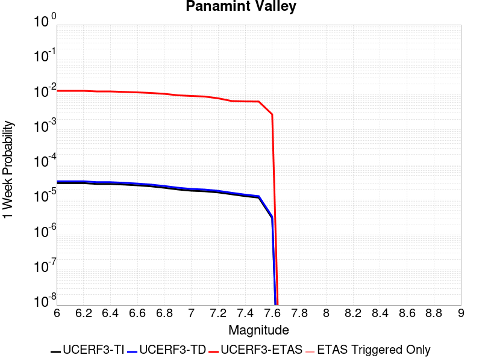 |  |  |  |

| Magnitude | 1 wk TI Prob | 1 wk TD Prob | 1 wk ETAS Prob | 1 wk ETAS/TD Gain | 1 wk ETAS Triggered Only | 1 mo TI Prob | 1 mo TD Prob | 1 mo ETAS Prob | 1 mo ETAS/TD Gain | 1 mo ETAS Triggered Only | 1 yr TI Prob | 1 yr TD Prob | 1 yr ETAS Prob | 1 yr ETAS/TD Gain | 1 yr ETAS Triggered Only | 10 yr TI Prob | 10 yr TD Prob | 10 yr ETAS Prob | 10 yr ETAS/TD Gain | 10 yr ETAS Triggered Only |
|-----|-----|-----|-----|-----|-----|-----|-----|-----|-----|-----|-----|-----|-----|-----|-----|-----|-----|-----|-----|-----|
| 6.0 | 3.0211835E-5 | 3.3984514E-5 | 0.0140335085 | 412.93835 | 0.014 | 1.2947287E-4 | 1.4563995E-4 | 0.019142874 | 131.43971 | 0.019 | 0.0015751923 | 0.0017717537 | 0.0317186 | 17.902376 | 0.03 | 0.015640736 | 0.017583137 | 0.053932562 | 3.0672889 | 0.037 |
| 6.1 | 3.0211835E-5 | 3.3984514E-5 | 0.0140335085 | 412.93835 | 0.014 | 1.2947287E-4 | 1.4563995E-4 | 0.019142874 | 131.43971 | 0.019 | 0.0015751923 | 0.0017717537 | 0.0317186 | 17.902376 | 0.03 | 0.015640736 | 0.017583137 | 0.053932562 | 3.0672889 | 0.037 |
| 6.2 | 3.0211835E-5 | 3.3984514E-5 | 0.0140335085 | 412.93835 | 0.014 | 1.2947287E-4 | 1.4563995E-4 | 0.019142874 | 131.43971 | 0.019 | 0.0015751923 | 0.0017717537 | 0.0317186 | 17.902376 | 0.03 | 0.015640736 | 0.017583137 | 0.053932562 | 3.0672889 | 0.037 |
| 6.3 | 2.8573924E-5 | 3.210268E-5 | 0.013031686 | 405.93762 | 0.013 | 1.2245393E-4 | 1.3757581E-4 | 0.018135099 | 131.81895 | 0.018 | 0.001489857 | 0.0016737265 | 0.030625189 | 18.297607 | 0.029 | 0.01479908 | 0.016617801 | 0.05103618 | 3.071175 | 0.035 |
| 6.4 | 2.8573924E-5 | 3.210268E-5 | 0.013031686 | 405.93762 | 0.013 | 1.2245393E-4 | 1.3757581E-4 | 0.018135099 | 131.81895 | 0.018 | 0.001489857 | 0.0016737265 | 0.030625189 | 18.297607 | 0.029 | 0.01479908 | 0.016617801 | 0.05103618 | 3.071175 | 0.035 |
| 6.5 | 2.7468774E-5 | 3.0828433E-5 | 0.0130304275 | 422.67563 | 0.013 | 1.1771801E-4 | 1.3211532E-4 | 0.018129738 | 137.22661 | 0.018 | 0.0014322745 | 0.0016073446 | 0.02956234 | 18.392035 | 0.028 | 0.014230782 | 0.015963677 | 0.04942091 | 3.0958352 | 0.034 |
| 6.6 | 2.6135967E-5 | 2.925248E-5 | 0.013028872 | 445.39377 | 0.013 | 1.1200648E-4 | 1.253619E-4 | 0.018123105 | 144.5663 | 0.018 | 0.0013628257 | 0.0015252391 | 0.029482532 | 19.329779 | 0.028 | 0.013544982 | 0.015154043 | 0.048638806 | 3.2096257 | 0.034 |
| 6.7 | 2.4498746E-5 | 2.7341335E-5 | 0.013026986 | 476.45758 | 0.013 | 1.04990395E-4 | 1.1717203E-4 | 0.018115062 | 154.60228 | 0.018 | 0.0012775084 | 0.0014256609 | 0.027388593 | 19.211155 | 0.026 | 0.012701893 | 0.014171274 | 0.045717794 | 3.226089 | 0.032 |
| 6.8 | 2.2244329E-5 | 2.4935423E-5 | 0.013024611 | 522.3337 | 0.013 | 9.532935E-5 | 1.0686185E-4 | 0.018104939 | 169.42378 | 0.018 | 0.0011600169 | 0.0013002884 | 0.026267782 | 20.201506 | 0.025 | 0.011539802 | 0.0129325185 | 0.042544544 | 3.2897336 | 0.03 |
| 6.9 | 1.9902658E-5 | 2.2290267E-5 | 0.012022023 | 539.3396 | 0.012 | 8.529431E-5 | 9.552632E-5 | 0.015094093 | 158.00978 | 0.015 | 0.0010379635 | 0.0011624309 | 0.02213802 | 19.04459 | 0.021 | 0.010331288 | 0.011568608 | 0.03627939 | 3.1360207 | 0.025 |
| 7.0 | 1.8353881E-5 | 2.0566185E-5 | 0.01102034 | 535.84753 | 0.011 | 7.865712E-5 | 8.813792E-5 | 0.013086992 | 148.48311 | 0.013 | 9.5722964E-4 | 0.0010725686 | 0.019053262 | 17.764143 | 0.018 | 0.009531168 | 0.010678849 | 0.032443915 | 3.038147 | 0.022 |
| 7.1 | 1.7667631E-5 | 1.9772613E-5 | 0.011019555 | 557.3141 | 0.011 | 7.571623E-5 | 8.473711E-5 | 0.013083636 | 154.40266 | 0.013 | 9.2145515E-4 | 0.0010312037 | 0.019012641 | 18.43733 | 0.018 | 0.009176437 | 0.010269073 | 0.03204315 | 3.1203551 | 0.022 |
| 7.2 | 1.6381597E-5 | 1.8158249E-5 | 0.011017959 | 606.77423 | 0.011 | 7.020495E-5 | 7.781885E-5 | 0.012076885 | 155.19229 | 0.012 | 8.544101E-4 | 9.4704994E-4 | 0.015932845 | 16.823658 | 0.015 | 0.008511325 | 0.009434792 | 0.028255532 | 2.994823 | 0.019 |
| 7.3 | 1.4520491E-5 | 1.5966476E-5 | 0.0110157905 | 689.9325 | 0.011 | 6.222919E-5 | 6.842605E-5 | 0.012067605 | 176.3598 | 0.012 | 7.57377E-4 | 8.327849E-4 | 0.015820293 | 18.996853 | 0.015 | 0.0075480095 | 0.00829975 | 0.025158655 | 3.0312543 | 0.017 |
| 7.4 | 1.2852287E-5 | 1.4145411E-5 | 0.010014004 | 707.93304 | 0.01 | 5.5080065E-5 | 6.062187E-5 | 0.011059955 | 182.44167 | 0.011 | 6.7039346E-4 | 7.378371E-4 | 0.014727508 | 19.960377 | 0.014 | 0.0066837464 | 0.0073567946 | 0.023239085 | 3.1588602 | 0.016 |
| 7.5 | 1.1637851E-5 | 1.2836797E-5 | 0.010012709 | 780.0005 | 0.01 | 4.987555E-5 | 5.5013777E-5 | 0.011054409 | 200.93892 | 0.011 | 6.070656E-4 | 6.6960254E-4 | 0.014660228 | 21.893925 | 0.014 | 0.006054099 | 0.0066787465 | 0.022571886 | 3.3796592 | 0.016 |
| 7.6 | 3.0068115E-6 | 3.3330316E-6 | 0.006003313 | 1801.157 | 0.006 | 1.2886271E-5 | 1.4284384E-5 | 0.0060141985 | 421.0331 | 0.006 | 1.5687906E-4 | 1.7390578E-4 | 0.0071726884 | 41.244682 | 0.007 | 0.0015676835 | 0.0017391363 | 0.009725223 | 5.5919847 | 0.008 |

## Garlock (East)
*[(top)](#table-of-contents)*

| 1 Week | 1 Month | 1 Year | 10 Year |
|-----|-----|-----|-----|
|  |  |  |  |

| Magnitude | 1 wk TI Prob | 1 wk TD Prob | 1 wk ETAS Prob | 1 wk ETAS/TD Gain | 1 wk ETAS Triggered Only | 1 mo TI Prob | 1 mo TD Prob | 1 mo ETAS Prob | 1 mo ETAS/TD Gain | 1 mo ETAS Triggered Only | 1 yr TI Prob | 1 yr TD Prob | 1 yr ETAS Prob | 1 yr ETAS/TD Gain | 1 yr ETAS Triggered Only | 10 yr TI Prob | 10 yr TD Prob | 10 yr ETAS Prob | 10 yr ETAS/TD Gain | 10 yr ETAS Triggered Only |
|-----|-----|-----|-----|-----|-----|-----|-----|-----|-----|-----|-----|-----|-----|-----|-----|-----|-----|-----|-----|-----|
| 6.0 | 4.5092507E-5 | 6.290325E-5 | 0.007062463 | 112.27501 | 0.007 | 1.9323928E-4 | 2.6956003E-4 | 0.011266595 | 41.796238 | 0.011 | 0.0023501497 | 0.0032774 | 0.02221513 | 6.7782784 | 0.019 | 0.023254504 | 0.032351844 | 0.0555754 | 1.7178433 | 0.024 |
| 6.1 | 4.5092507E-5 | 6.290325E-5 | 0.007062463 | 112.27501 | 0.007 | 1.9323928E-4 | 2.6956003E-4 | 0.011266595 | 41.796238 | 0.011 | 0.0023501497 | 0.0032774 | 0.02221513 | 6.7782784 | 0.019 | 0.023254504 | 0.032351844 | 0.0555754 | 1.7178433 | 0.024 |
| 6.2 | 2.6674514E-5 | 3.4509674E-5 | 0.003034406 | 87.929146 | 0.003 | 1.1431433E-4 | 1.4789042E-4 | 0.005147151 | 34.803818 | 0.005 | 0.0013908884 | 0.0017991117 | 0.011781121 | 6.5482984 | 0.01 | 0.01382215 | 0.017890299 | 0.029675616 | 1.6587546 | 0.012 |
| 6.3 | 2.6674514E-5 | 3.4509674E-5 | 0.003034406 | 87.929146 | 0.003 | 1.1431433E-4 | 1.4789042E-4 | 0.005147151 | 34.803818 | 0.005 | 0.0013908884 | 0.0017991117 | 0.011781121 | 6.5482984 | 0.01 | 0.01382215 | 0.017890299 | 0.029675616 | 1.6587546 | 0.012 |
| 6.4 | 2.5312667E-5 | 3.233893E-5 | 0.003032242 | 93.76445 | 0.003 | 1.0847834E-4 | 1.3858822E-4 | 0.0051378952 | 37.0731 | 0.005 | 0.0013199237 | 0.0016860351 | 0.011669175 | 6.921075 | 0.01 | 0.013121112 | 0.016778335 | 0.028576996 | 1.703208 | 0.012 |
| 6.5 | 2.5312667E-5 | 3.233893E-5 | 0.003032242 | 93.76445 | 0.003 | 1.0847834E-4 | 1.3858822E-4 | 0.0051378952 | 37.0731 | 0.005 | 0.0013199237 | 0.0016860351 | 0.011669175 | 6.921075 | 0.01 | 0.013121112 | 0.016778335 | 0.028576996 | 1.703208 | 0.012 |
| 6.6 | 2.246556E-5 | 2.8133776E-5 | 0.0030280494 | 107.630394 | 0.003 | 9.627742E-5 | 1.20567885E-4 | 0.005119965 | 42.465412 | 0.005 | 0.0011715472 | 0.0014669491 | 0.010453747 | 7.126182 | 0.009 | 0.011653901 | 0.01461866 | 0.025457855 | 1.741463 | 0.011 |
| 6.7 | 2.2241198E-5 | 2.7803519E-5 | 0.0030277201 | 108.89701 | 0.003 | 9.531594E-5 | 1.1915263E-4 | 0.005118557 | 42.957985 | 0.005 | 0.0011598538 | 0.0014497414 | 0.010436694 | 7.1990037 | 0.009 | 0.011538187 | 0.014448853 | 0.025289916 | 1.7503061 | 0.011 |
| 6.8 | 1.9528685E-5 | 2.389819E-5 | 0.0030238265 | 126.52951 | 0.003 | 8.369167E-5 | 1.0241691E-4 | 0.0051019047 | 49.815063 | 0.005 | 0.0010184698 | 0.0012462323 | 0.008237509 | 6.6099305 | 0.007 | 0.010138147 | 0.012436427 | 0.0213245 | 1.7146806 | 0.009 |
| 6.9 | 1.3318621E-5 | 1.5198884E-5 | 0.0030151533 | 198.3799 | 0.003 | 5.7078556E-5 | 6.513648E-5 | 0.0050648106 | 77.7569 | 0.005 | 6.9470983E-4 | 7.927538E-4 | 0.0077872043 | 9.822979 | 0.007 | 0.0069254204 | 0.007939888 | 0.01686843 | 2.1245172 | 0.009 |
| 7.0 | 1.1760853E-5 | 1.31077895E-5 | 0.0030130686 | 229.86855 | 0.003 | 5.0402683E-5 | 5.6175057E-5 | 0.005055894 | 90.00247 | 0.005 | 6.134799E-4 | 6.8372174E-4 | 0.007678936 | 11.231083 | 0.007 | 0.0061178906 | 0.00685652 | 0.015794812 | 2.3036191 | 0.009 |
| 7.1 | 1.0064758E-5 | 1.0902931E-5 | 0.0030108702 | 276.15237 | 0.003 | 4.3133965E-5 | 4.672603E-5 | 0.0050464924 | 108.00174 | 0.005 | 5.2502943E-4 | 5.687444E-4 | 0.007564763 | 13.300814 | 0.007 | 0.005237907 | 0.0057129986 | 0.014661581 | 2.5663548 | 0.009 |
| 7.2 | 9.768808E-6 | 1.0498807E-5 | 0.0030104674 | 286.74374 | 0.003 | 4.186565E-5 | 4.499413E-5 | 0.005044769 | 112.120605 | 0.005 | 5.095951E-4 | 5.4766936E-4 | 0.007543836 | 13.774435 | 0.007 | 0.0050842804 | 0.0055032647 | 0.014453735 | 2.6263928 | 0.009 |
| 7.3 | 9.344516E-6 | 9.944468E-6 | 0.0030099147 | 302.67227 | 0.003 | 4.004731E-5 | 4.261847E-5 | 0.0050424053 | 118.315025 | 0.005 | 4.8746695E-4 | 5.1875977E-4 | 0.0075151287 | 14.486721 | 0.007 | 0.0048639905 | 0.0052149445 | 0.01416801 | 2.7168093 | 0.009 |
| 7.4 | 9.023491E-6 | 9.490661E-6 | 0.0030094623 | 317.09723 | 0.003 | 3.867153E-5 | 4.0673647E-5 | 0.0050404705 | 123.92472 | 0.005 | 4.7072413E-4 | 4.950925E-4 | 0.007491627 | 15.131773 | 0.007 | 0.004697283 | 0.0049783974 | 0.013933592 | 2.7988107 | 0.009 |
| 7.5 | 7.081253E-6 | 7.087672E-6 | 0.0010070805 | 142.08905 | 0.001 | 3.0347876E-5 | 3.0375388E-5 | 0.0020303146 | 66.84078 | 0.002 | 3.6942272E-4 | 3.6975832E-4 | 0.0033686492 | 9.110408 | 0.003 | 0.003688092 | 0.0037243143 | 0.006713141 | 1.8025174 | 0.003 |
| 7.6 | 6.116396E-6 | 5.959245E-6 | 0.0010059533 | 168.8055 | 0.001 | 2.6212863E-5 | 2.5539372E-5 | 0.0010255139 | 40.154232 | 0.001 | 3.1909486E-4 | 3.1089774E-4 | 0.002310276 | 7.4309835 | 0.002 | 0.0031863707 | 0.0031357552 | 0.0051294835 | 1.6358049 | 0.002 |
| 7.7 | 4.797145E-6 | 4.757281E-6 | 4.757281E-6 | 1.0 | 0.0 | 2.055903E-5 | 2.0388188E-5 | 2.0388188E-5 | 1.0 | 0.0 | 2.5027743E-4 | 2.4819805E-4 | 0.0012479499 | 5.0280404 | 0.001 | 0.0024999576 | 0.0025093474 | 0.0035068379 | 1.39751 | 0.001 |
| 7.8 | 3.4028885E-6 | 3.978462E-6 | 3.978462E-6 | 1.0 | 0.0 | 1.4583726E-5 | 1.7050439E-5 | 1.7050439E-5 | 1.0 | 0.0 | 1.775424E-4 | 2.0756939E-4 | 0.0012073618 | 5.8166656 | 0.001 | 0.0017740062 | 0.0021012232 | 0.0030991219 | 1.4749132 | 0.001 |
| 7.9 | 2.5928412E-6 | 3.3724489E-6 | 3.3724489E-6 | 1.0 | 0.0 | 1.1112129E-5 | 1.4453272E-5 | 1.4453272E-5 | 1.0 | 0.0 | 1.3528178E-4 | 1.7595445E-4 | 0.0011757785 | 6.682289 | 0.001 | 0.0013519945 | 0.0017812408 | 0.0027794596 | 1.5604064 | 0.001 |
| 8.0 | 1.3743648E-6 | 1.6734747E-6 | 1.6734747E-6 | 1.0 | 0.0 | 5.8901214E-6 | 7.1720146E-6 | 7.1720146E-6 | 1.0 | 0.0 | 7.1709874E-5 | 8.731581E-5 | 8.731581E-5 | 1.0 | 0.0 | 7.1686733E-4 | 8.837234E-4 | 8.837234E-4 | 1.0 | 0.0 |
| 8.1 | 3.6733252E-7 | 3.1489964E-7 | 3.1489964E-7 | 1.0 | 0.0 | 1.5742813E-6 | 1.3495693E-6 | 1.3495693E-6 | 1.0 | 0.0 | 1.9166706E-5 | 1.6430899E-5 | 1.6430899E-5 | 1.0 | 0.0 | 1.9165053E-4 | 1.6638759E-4 | 1.6638759E-4 | 1.0 | 0.0 |

## Ash Hill
*[(top)](#table-of-contents)*

| 1 Week | 1 Month | 1 Year | 10 Year |
|-----|-----|-----|-----|
|  |  |  |  |

| Magnitude | 1 wk TI Prob | 1 wk TD Prob | 1 wk ETAS Prob | 1 wk ETAS/TD Gain | 1 wk ETAS Triggered Only | 1 mo TI Prob | 1 mo TD Prob | 1 mo ETAS Prob | 1 mo ETAS/TD Gain | 1 mo ETAS Triggered Only | 1 yr TI Prob | 1 yr TD Prob | 1 yr ETAS Prob | 1 yr ETAS/TD Gain | 1 yr ETAS Triggered Only | 10 yr TI Prob | 10 yr TD Prob | 10 yr ETAS Prob | 10 yr ETAS/TD Gain | 10 yr ETAS Triggered Only |
|-----|-----|-----|-----|-----|-----|-----|-----|-----|-----|-----|-----|-----|-----|-----|-----|-----|-----|-----|-----|-----|
| 6.0 | 2.1545662E-5 | 2.3194447E-5 | 0.0050230785 | 216.56384 | 0.005 | 9.2335285E-5 | 9.940143E-5 | 0.0050989045 | 51.296085 | 0.005 | 0.0011236023 | 0.0012096206 | 0.0072023626 | 5.954233 | 0.006 | 0.011179381 | 0.012038348 | 0.027845735 | 2.313086 | 0.016 |
| 6.1 | 2.1545662E-5 | 2.3194447E-5 | 0.0050230785 | 216.56384 | 0.005 | 9.2335285E-5 | 9.940143E-5 | 0.0050989045 | 51.296085 | 0.005 | 0.0011236023 | 0.0012096206 | 0.0072023626 | 5.954233 | 0.006 | 0.011179381 | 0.012038348 | 0.027845735 | 2.313086 | 0.016 |
| 6.2 | 2.1545662E-5 | 2.3194447E-5 | 0.0050230785 | 216.56384 | 0.005 | 9.2335285E-5 | 9.940143E-5 | 0.0050989045 | 51.296085 | 0.005 | 0.0011236023 | 0.0012096206 | 0.0072023626 | 5.954233 | 0.006 | 0.011179381 | 0.012038348 | 0.027845735 | 2.313086 | 0.016 |
| 6.3 | 1.0025529E-5 | 1.0746934E-5 | 0.0030107147 | 280.14636 | 0.003 | 4.2965847E-5 | 4.605755E-5 | 0.0030459194 | 66.1329 | 0.003 | 5.229836E-4 | 5.6061964E-4 | 0.004558377 | 8.130962 | 0.004 | 0.005217545 | 0.0055933665 | 0.01653184 | 2.9556153 | 0.011 |
| 6.4 | 1.0025529E-5 | 1.0746934E-5 | 0.0030107147 | 280.14636 | 0.003 | 4.2965847E-5 | 4.605755E-5 | 0.0030459194 | 66.1329 | 0.003 | 5.229836E-4 | 5.6061964E-4 | 0.004558377 | 8.130962 | 0.004 | 0.005217545 | 0.0055933665 | 0.01653184 | 2.9556153 | 0.011 |
| 6.5 | 6.9617327E-6 | 7.456634E-6 | 0.0030074343 | 403.3233 | 0.003 | 2.9835655E-5 | 3.195666E-5 | 0.0030318608 | 94.874146 | 0.003 | 3.6318856E-4 | 3.8901155E-4 | 0.0033878444 | 8.708854 | 0.003 | 0.0036259557 | 0.0038841602 | 0.010856971 | 2.7951913 | 0.007 |
| 6.6 | 4.9919777E-6 | 5.3466883E-6 | 0.002005336 | 375.06134 | 0.002 | 2.1394015E-5 | 2.2914215E-5 | 0.0020228685 | 88.28007 | 0.002 | 2.60441E-4 | 2.7895154E-4 | 0.0022783936 | 8.167704 | 0.002 | 0.0026013597 | 0.0027866727 | 0.007772739 | 2.7892547 | 0.005 |
| 6.7 | 3.6630722E-6 | 3.924624E-6 | 0.0020039168 | 510.601 | 0.002 | 1.5698786E-5 | 1.681974E-5 | 0.002016786 | 119.90591 | 0.002 | 1.9111596E-4 | 2.0476682E-4 | 0.0022043572 | 10.765207 | 0.002 | 0.0019095168 | 0.0020463446 | 0.0070361127 | 3.4383814 | 0.005 |
| 6.8 | 2.5599613E-6 | 2.744925E-6 | 2.744925E-6 | 1.0 | 0.0 | 1.0971216E-5 | 1.1763939E-5 | 1.1763939E-5 | 1.0 | 0.0 | 1.3356637E-4 | 1.4322149E-4 | 1.4322149E-4 | 1.0 | 0.0 | 0.0013348613 | 0.0014317769 | 0.0044274814 | 3.0922985 | 0.003 |
| 6.9 | 1.7684905E-6 | 1.8968707E-6 | 1.8968707E-6 | 1.0 | 0.0 | 7.579223E-6 | 8.129446E-6 | 8.129446E-6 | 1.0 | 0.0 | 9.2273134E-5 | 9.8976E-5 | 9.8976E-5 | 1.0 | 0.0 | 9.223483E-4 | 9.8976E-4 | 9.8976E-4 | 1.0 | 0.0 |

## Hunter Mountain-Saline Valley
*[(top)](#table-of-contents)*

| 1 Week | 1 Month | 1 Year | 10 Year |
|-----|-----|-----|-----|
|  |  |  | 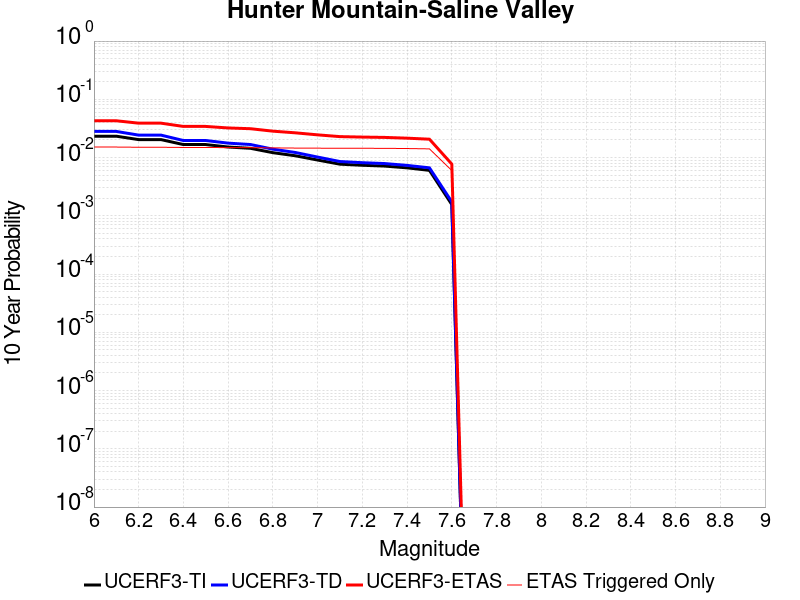 |

| Magnitude | 1 wk TI Prob | 1 wk TD Prob | 1 wk ETAS Prob | 1 wk ETAS/TD Gain | 1 wk ETAS Triggered Only | 1 mo TI Prob | 1 mo TD Prob | 1 mo ETAS Prob | 1 mo ETAS/TD Gain | 1 mo ETAS Triggered Only | 1 yr TI Prob | 1 yr TD Prob | 1 yr ETAS Prob | 1 yr ETAS/TD Gain | 1 yr ETAS Triggered Only | 10 yr TI Prob | 10 yr TD Prob | 10 yr ETAS Prob | 10 yr ETAS/TD Gain | 10 yr ETAS Triggered Only |
|-----|-----|-----|-----|-----|-----|-----|-----|-----|-----|-----|-----|-----|-----|-----|-----|-----|-----|-----|-----|-----|
| 6.0 | 4.5103672E-5 | 5.4570177E-5 | 0.01105397 | 202.5643 | 0.011 | 1.9328714E-4 | 2.3385242E-4 | 0.012231046 | 52.302414 | 0.012 | 0.002350731 | 0.0028435152 | 0.016803706 | 5.9094834 | 0.014 | 0.023260195 | 0.028091887 | 0.043642417 | 1.5535594 | 0.016 |
| 6.1 | 4.5103672E-5 | 5.4570177E-5 | 0.01105397 | 202.5643 | 0.011 | 1.9328714E-4 | 2.3385242E-4 | 0.012231046 | 52.302414 | 0.012 | 0.002350731 | 0.0028435152 | 0.016803706 | 5.9094834 | 0.014 | 0.023260195 | 0.028091887 | 0.043642417 | 1.5535594 | 0.016 |
| 6.2 | 3.9363465E-5 | 4.706337E-5 | 0.011046546 | 234.71642 | 0.011 | 1.6868966E-4 | 2.0168544E-4 | 0.012199265 | 60.48659 | 0.012 | 0.002051862 | 0.0024528175 | 0.016418478 | 6.693722 | 0.014 | 0.020330196 | 0.024273481 | 0.039885107 | 1.6431556 | 0.016 |
| 6.3 | 3.9363465E-5 | 4.706337E-5 | 0.011046546 | 234.71642 | 0.011 | 1.6868966E-4 | 2.0168544E-4 | 0.012199265 | 60.48659 | 0.012 | 0.002051862 | 0.0024528175 | 0.016418478 | 6.693722 | 0.014 | 0.020330196 | 0.024273481 | 0.039885107 | 1.6431556 | 0.016 |
| 6.4 | 3.2311684E-5 | 3.795099E-5 | 0.011037533 | 290.83652 | 0.011 | 1.384713E-4 | 1.6263737E-4 | 0.012160686 | 74.77178 | 0.012 | 0.0016845843 | 0.0019783843 | 0.015950687 | 8.062481 | 0.014 | 0.016718714 | 0.019616475 | 0.03530261 | 1.799641 | 0.016 |
| 6.5 | 3.2311684E-5 | 3.795099E-5 | 0.011037533 | 290.83652 | 0.011 | 1.384713E-4 | 1.6263737E-4 | 0.012160686 | 74.77178 | 0.012 | 0.0016845843 | 0.0019783843 | 0.015950687 | 8.062481 | 0.014 | 0.016718714 | 0.019616475 | 0.03530261 | 1.799641 | 0.016 |
| 6.6 | 2.9305844E-5 | 3.418183E-5 | 0.011033806 | 322.7974 | 0.011 | 1.2559042E-4 | 1.4648569E-4 | 0.012144728 | 82.907265 | 0.012 | 0.0015279909 | 0.001782067 | 0.015757117 | 8.842046 | 0.014 | 0.015175272 | 0.01768569 | 0.03340272 | 1.8886862 | 0.016 |
| 6.7 | 2.7826512E-5 | 3.2344276E-5 | 0.011031988 | 341.0801 | 0.011 | 1.19251024E-4 | 1.386113E-4 | 0.012136948 | 87.56103 | 0.012 | 0.0014509142 | 0.0016863465 | 0.015662737 | 9.2879715 | 0.014 | 0.014414776 | 0.016743187 | 0.032475296 | 1.9396126 | 0.016 |
| 6.8 | 2.3389874E-5 | 2.6866714E-5 | 0.010026598 | 373.19778 | 0.01 | 1.0023846E-4 | 1.15138246E-4 | 0.011113872 | 96.52632 | 0.011 | 0.00121972 | 0.001400954 | 0.014382741 | 10.266391 | 0.013 | 0.01213047 | 0.013927434 | 0.028718522 | 2.062011 | 0.015 |
| 6.9 | 2.069209E-5 | 2.3570032E-5 | 0.010023334 | 425.25757 | 0.01 | 8.867737E-5 | 1.01010715E-4 | 0.011099899 | 109.888336 | 0.011 | 0.0010791123 | 0.0012291478 | 0.014213169 | 11.563434 | 0.013 | 0.010738871 | 0.012228523 | 0.027045095 | 2.2116404 | 0.015 |
| 7.0 | 1.7462342E-5 | 1.9633546E-5 | 0.010019437 | 510.32236 | 0.01 | 7.483646E-5 | 8.414118E-5 | 0.0110832155 | 131.72165 | 0.011 | 9.1075303E-4 | 0.0010239601 | 0.014010648 | 13.682808 | 0.013 | 0.009070295 | 0.0101960525 | 0.025043111 | 2.4561577 | 0.015 |
| 7.1 | 1.4807709E-5 | 1.6441749E-5 | 0.010016277 | 609.19775 | 0.01 | 6.3460066E-5 | 7.046283E-5 | 0.011069688 | 157.09967 | 0.011 | 7.723524E-4 | 8.575638E-4 | 0.013846415 | 16.146221 | 0.013 | 0.007696735 | 0.008545532 | 0.023417348 | 2.7403033 | 0.015 |
| 7.2 | 1.4180048E-5 | 1.5698337E-5 | 0.010015542 | 638.0002 | 0.01 | 6.077022E-5 | 6.727694E-5 | 0.011066537 | 164.49228 | 0.011 | 7.396263E-4 | 8.188051E-4 | 0.013808161 | 16.863792 | 0.013 | 0.0073716943 | 0.008160833 | 0.02303842 | 2.8230476 | 0.015 |
| 7.3 | 1.3730402E-5 | 1.5172075E-5 | 0.01001502 | 660.0956 | 0.01 | 5.8843252E-5 | 6.502165E-5 | 0.011064307 | 170.16342 | 0.011 | 7.161811E-4 | 7.9136714E-4 | 0.013781079 | 17.414268 | 0.013 | 0.007138774 | 0.007888422 | 0.022770096 | 2.8865209 | 0.015 |
| 7.4 | 1.2810095E-5 | 1.4109277E-5 | 0.010013968 | 709.7435 | 0.01 | 5.489925E-5 | 6.0467017E-5 | 0.011059802 | 182.90636 | 0.011 | 6.681934E-4 | 7.359531E-4 | 0.013726385 | 18.651169 | 0.013 | 0.006661878 | 0.007338053 | 0.022227982 | 3.0291388 | 0.015 |
| 7.5 | 1.1595659E-5 | 1.2800664E-5 | 0.010012672 | 782.19946 | 0.01 | 4.9694736E-5 | 5.4858923E-5 | 0.011054255 | 201.50333 | 0.011 | 6.0486543E-4 | 6.6771836E-4 | 0.013659038 | 20.456285 | 0.013 | 0.006032217 | 0.0066599925 | 0.021560092 | 3.2372549 | 0.015 |
| 7.6 | 2.997694E-6 | 3.3251579E-6 | 0.0060033053 | 1805.4196 | 0.006 | 1.28471975E-5 | 1.425064E-5 | 0.006014165 | 422.0277 | 0.006 | 1.564034E-4 | 1.73495E-4 | 0.0071722805 | 41.33998 | 0.007 | 0.0015629337 | 0.001735031 | 0.009721151 | 5.6028686 | 0.008 |

## Blackwater
*[(top)](#table-of-contents)*

| 1 Week | 1 Month | 1 Year | 10 Year |
|-----|-----|-----|-----|
|  |  |  |  |

| Magnitude | 1 wk TI Prob | 1 wk TD Prob | 1 wk ETAS Prob | 1 wk ETAS/TD Gain | 1 wk ETAS Triggered Only | 1 mo TI Prob | 1 mo TD Prob | 1 mo ETAS Prob | 1 mo ETAS/TD Gain | 1 mo ETAS Triggered Only | 1 yr TI Prob | 1 yr TD Prob | 1 yr ETAS Prob | 1 yr ETAS/TD Gain | 1 yr ETAS Triggered Only | 10 yr TI Prob | 10 yr TD Prob | 10 yr ETAS Prob | 10 yr ETAS/TD Gain | 10 yr ETAS Triggered Only |
|-----|-----|-----|-----|-----|-----|-----|-----|-----|-----|-----|-----|-----|-----|-----|-----|-----|-----|-----|-----|-----|
| 6.0 | 3.0708583E-5 | 3.3095846E-5 | 0.006032897 | 182.28563 | 0.006 | 1.3160157E-4 | 1.4183241E-4 | 0.0061409813 | 43.297447 | 0.006 | 0.0016010714 | 0.0017255784 | 0.0107100485 | 6.206642 | 0.009 | 0.015895851 | 0.017135633 | 0.02991287 | 1.745653 | 0.013 |
| 6.1 | 3.0708583E-5 | 3.3095846E-5 | 0.006032897 | 182.28563 | 0.006 | 1.3160157E-4 | 1.4183241E-4 | 0.0061409813 | 43.297447 | 0.006 | 0.0016010714 | 0.0017255784 | 0.0107100485 | 6.206642 | 0.009 | 0.015895851 | 0.017135633 | 0.02991287 | 1.745653 | 0.013 |
| 6.2 | 1.1707779E-5 | 1.2545122E-5 | 0.0010125326 | 80.71126 | 0.001 | 5.017523E-5 | 5.3763757E-5 | 0.00105371 | 19.59889 | 0.001 | 6.107122E-4 | 6.5438676E-4 | 0.002653078 | 4.0542965 | 0.002 | 0.006090366 | 0.0065255696 | 0.0114929415 | 1.7612166 | 0.005 |
| 6.3 | 1.1707779E-5 | 1.2545122E-5 | 0.0010125326 | 80.71126 | 0.001 | 5.017523E-5 | 5.3763757E-5 | 0.00105371 | 19.59889 | 0.001 | 6.107122E-4 | 6.5438676E-4 | 0.002653078 | 4.0542965 | 0.002 | 0.006090366 | 0.0065255696 | 0.0114929415 | 1.7612166 | 0.005 |
| 6.4 | 7.929244E-6 | 8.480098E-6 | 0.0010084716 | 118.922165 | 0.001 | 3.3982033E-5 | 3.6342793E-5 | 0.0010363065 | 28.51477 | 0.001 | 4.136527E-4 | 4.423877E-4 | 0.0024415029 | 5.5189214 | 0.002 | 0.0041288356 | 0.0044154758 | 0.008397814 | 1.9019046 | 0.004 |
| 6.5 | 5.8832115E-6 | 6.285991E-6 | 6.285991E-6 | 1.0 | 0.0 | 2.521352E-5 | 2.6939697E-5 | 2.6939697E-5 | 1.0 | 0.0 | 3.0693135E-4 | 3.27944E-4 | 0.001327616 | 4.048301 | 0.001 | 0.0030650778 | 0.0032748538 | 0.0062650293 | 1.9130714 | 0.003 |
| 6.6 | 5.8832115E-6 | 6.285991E-6 | 6.285991E-6 | 1.0 | 0.0 | 2.521352E-5 | 2.6939697E-5 | 2.6939697E-5 | 1.0 | 0.0 | 3.0693135E-4 | 3.27944E-4 | 0.001327616 | 4.048301 | 0.001 | 0.0030650778 | 0.0032748538 | 0.0062650293 | 1.9130714 | 0.003 |
| 6.7 | 3.0715053E-6 | 3.2814662E-6 | 3.2814662E-6 | 1.0 | 0.0 | 1.3163528E-5 | 1.4063357E-5 | 1.4063357E-5 | 1.0 | 0.0 | 1.6025416E-4 | 1.7120909E-4 | 0.0011710379 | 6.8398113 | 0.001 | 0.0016013865 | 0.0017108864 | 0.0037074646 | 2.1669848 | 0.002 |
| 6.8 | 2.2722281E-6 | 2.4287538E-6 | 2.4287538E-6 | 1.0 | 0.0 | 9.738084E-6 | 1.0408908E-5 | 1.0408908E-5 | 1.0 | 0.0 | 1.1855473E-4 | 1.26722E-4 | 1.26722E-4 | 1.0 | 0.0 | 0.001184915 | 0.0012665876 | 0.002265321 | 1.788523 | 0.001 |
| 6.9 | 9.952399E-7 | 1.0653489E-6 | 1.0653489E-6 | 1.0 | 0.0 | 4.265307E-6 | 4.5657757E-6 | 4.5657757E-6 | 1.0 | 0.0 | 5.1928873E-5 | 5.5587418E-5 | 5.5587418E-5 | 1.0 | 0.0 | 5.191674E-4 | 5.557858E-4 | 5.557858E-4 | 1.0 | 0.0 |
| 7.0 | 4.7385504E-7 | 5.0755597E-7 | 5.0755597E-7 | 1.0 | 0.0 | 2.0308057E-6 | 2.1752398E-6 | 2.1752398E-6 | 1.0 | 0.0 | 2.4724779E-5 | 2.6483543E-5 | 2.6483543E-5 | 1.0 | 0.0 | 2.4722028E-4 | 2.6483546E-4 | 2.6483546E-4 | 1.0 | 0.0 |

## Gravel Hills-Harper Lk
*[(top)](#table-of-contents)*

| 1 Week | 1 Month | 1 Year | 10 Year |
|-----|-----|-----|-----|
|  |  |  |  |

| Magnitude | 1 wk TI Prob | 1 wk TD Prob | 1 wk ETAS Prob | 1 wk ETAS/TD Gain | 1 wk ETAS Triggered Only | 1 mo TI Prob | 1 mo TD Prob | 1 mo ETAS Prob | 1 mo ETAS/TD Gain | 1 mo ETAS Triggered Only | 1 yr TI Prob | 1 yr TD Prob | 1 yr ETAS Prob | 1 yr ETAS/TD Gain | 1 yr ETAS Triggered Only | 10 yr TI Prob | 10 yr TD Prob | 10 yr ETAS Prob | 10 yr ETAS/TD Gain | 10 yr ETAS Triggered Only |
|-----|-----|-----|-----|-----|-----|-----|-----|-----|-----|-----|-----|-----|-----|-----|-----|-----|-----|-----|-----|-----|
| 6.0 | 3.0679566E-5 | 3.1464646E-5 | 0.0030313702 | 96.3421 | 0.003 | 1.3147724E-4 | 1.3484273E-4 | 0.0051341685 | 38.075233 | 0.005 | 0.0015995599 | 0.0016406906 | 0.009627565 | 5.8679953 | 0.008 | 0.015880952 | 0.01630734 | 0.024176879 | 1.4825767 | 0.008 |
| 6.1 | 3.0679566E-5 | 3.1464646E-5 | 0.0030313702 | 96.3421 | 0.003 | 1.3147724E-4 | 1.3484273E-4 | 0.0051341685 | 38.075233 | 0.005 | 0.0015995599 | 0.0016406906 | 0.009627565 | 5.8679953 | 0.008 | 0.015880952 | 0.01630734 | 0.024176879 | 1.4825767 | 0.008 |
| 6.2 | 1.514536E-5 | 1.3635206E-5 | 0.0010136216 | 74.338554 | 0.001 | 6.490707E-5 | 5.843536E-5 | 0.0020583186 | 35.223854 | 0.002 | 7.8995706E-4 | 7.1123015E-4 | 0.0037090965 | 5.215044 | 0.003 | 0.007871548 | 0.0070907404 | 0.010069468 | 1.420087 | 0.003 |
| 6.3 | 1.514536E-5 | 1.3635206E-5 | 0.0010136216 | 74.338554 | 0.001 | 6.490707E-5 | 5.843536E-5 | 0.0020583186 | 35.223854 | 0.002 | 7.8995706E-4 | 7.1123015E-4 | 0.0037090965 | 5.215044 | 0.003 | 0.007871548 | 0.0070907404 | 0.010069468 | 1.420087 | 0.003 |
| 6.4 | 1.2532521E-5 | 1.06896905E-5 | 0.001010679 | 94.54707 | 0.001 | 5.37097E-5 | 4.581219E-5 | 0.0020457206 | 44.654503 | 0.002 | 6.537194E-4 | 5.576265E-4 | 0.0035559535 | 6.3769455 | 0.003 | 0.0065179965 | 0.005562863 | 0.0085461745 | 1.5362906 | 0.003 |
| 6.5 | 1.1094058E-5 | 9.083664E-6 | 9.083664E-6 | 1.0 | 0.0 | 4.7545094E-5 | 3.892943E-5 | 3.892943E-5 | 1.0 | 0.0 | 5.787078E-4 | 4.7386673E-4 | 4.7386673E-4 | 1.0 | 0.0 | 0.0057720304 | 0.0047289706 | 0.0047289706 | 1.0 | 0.0 |
| 6.6 | 9.688328E-6 | 7.5316952E-6 | 7.5316952E-6 | 1.0 | 0.0 | 4.1520743E-5 | 3.227831E-5 | 3.227831E-5 | 1.0 | 0.0 | 5.053978E-4 | 3.9292008E-4 | 3.9292008E-4 | 1.0 | 0.0 | 0.0050424994 | 0.0039225104 | 0.0039225104 | 1.0 | 0.0 |
| 6.7 | 8.974824E-6 | 6.749413E-6 | 6.749413E-6 | 1.0 | 0.0 | 3.8462964E-5 | 2.8925748E-5 | 2.8925748E-5 | 1.0 | 0.0 | 4.6818596E-4 | 3.5211627E-4 | 3.5211627E-4 | 1.0 | 0.0 | 0.004672008 | 0.0035158044 | 0.0035158044 | 1.0 | 0.0 |
| 6.8 | 7.4780046E-6 | 5.1161933E-6 | 5.1161933E-6 | 1.0 | 0.0 | 3.20482E-5 | 2.1926366E-5 | 2.1926366E-5 | 1.0 | 0.0 | 3.9011694E-4 | 2.669222E-4 | 2.669222E-4 | 1.0 | 0.0 | 0.0038943281 | 0.0026661542 | 0.0026661542 | 1.0 | 0.0 |
| 6.9 | 6.3409307E-6 | 3.9074966E-6 | 3.9074966E-6 | 1.0 | 0.0 | 2.7175134E-5 | 1.6746313E-5 | 1.6746313E-5 | 1.0 | 0.0 | 3.3080703E-4 | 2.0386827E-4 | 2.0386827E-4 | 1.0 | 0.0 | 0.0033031502 | 0.0020369107 | 0.0020369107 | 1.0 | 0.0 |
| 7.0 | 5.1239335E-6 | 2.6058565E-6 | 2.6058565E-6 | 1.0 | 0.0 | 2.195953E-5 | 1.116791E-5 | 1.116791E-5 | 1.0 | 0.0 | 2.6732447E-4 | 1.3596108E-4 | 1.3596108E-4 | 1.0 | 0.0 | 0.0026700313 | 0.0013588042 | 0.0013588042 | 1.0 | 0.0 |
| 7.1 | 4.438899E-6 | 2.0984728E-6 | 2.0984728E-6 | 1.0 | 0.0 | 1.9023713E-5 | 8.993425E-6 | 8.993425E-6 | 1.0 | 0.0 | 2.315891E-4 | 1.0948967E-4 | 1.0948967E-4 | 1.0 | 0.0 | 0.002313479 | 0.0010943791 | 0.0010943791 | 1.0 | 0.0 |
| 7.2 | 3.50367E-6 | 1.2615716E-6 | 1.2615716E-6 | 1.0 | 0.0 | 1.5015643E-5 | 5.4067245E-6 | 5.4067245E-6 | 1.0 | 0.0 | 1.8280011E-4 | 6.582497E-5 | 6.582497E-5 | 1.0 | 0.0 | 0.0018264982 | 6.580629E-4 | 6.580629E-4 | 1.0 | 0.0 |
| 7.3 | 2.561638E-6 | 7.1191585E-7 | 7.1191585E-7 | 1.0 | 0.0 | 1.0978401E-5 | 3.0510646E-6 | 3.0510646E-6 | 1.0 | 0.0 | 1.3365384E-4 | 3.71461E-5 | 3.71461E-5 | 1.0 | 0.0 | 0.0013357349 | 3.7140088E-4 | 3.7140088E-4 | 1.0 | 0.0 |
| 7.4 | 2.0368864E-6 | 5.304837E-7 | 5.304837E-7 | 1.0 | 0.0 | 8.729483E-6 | 2.2734996E-6 | 2.2734996E-6 | 1.0 | 0.0 | 1.06276275E-4 | 2.7679513E-5 | 2.7679513E-5 | 1.0 | 0.0 | 0.0010622547 | 2.767612E-4 | 2.767612E-4 | 1.0 | 0.0 |
| 7.5 | 1.1681728E-6 | 3.6030585E-7 | 3.6030585E-7 | 1.0 | 0.0 | 5.0064455E-6 | 1.544167E-6 | 1.544167E-6 | 1.0 | 0.0 | 6.0951766E-5 | 1.8800076E-5 | 1.8800076E-5 | 1.0 | 0.0 | 6.093505E-4 | 1.8798532E-4 | 1.8798532E-4 | 1.0 | 0.0 |
| 7.6 | 1.3154387E-7 | 7.1197384E-8 | 7.1197384E-8 | 1.0 | 0.0 | 5.6375933E-7 | 3.051316E-7 | 3.051316E-7 | 1.0 | 0.0 | 6.863748E-6 | 3.7149728E-6 | 3.7149728E-6 | 1.0 | 0.0 | 6.863536E-5 | 3.7149264E-5 | 3.7149264E-5 | 1.0 | 0.0 |

## Goldstone Lake
*[(top)](#table-of-contents)*

| 1 Week | 1 Month | 1 Year | 10 Year |
|-----|-----|-----|-----|
|  |  | 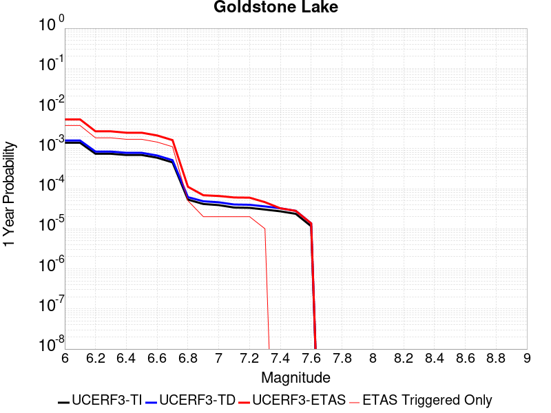 |  |

| Magnitude | 1 wk TI Prob | 1 wk TD Prob | 1 wk ETAS Prob | 1 wk ETAS/TD Gain | 1 wk ETAS Triggered Only | 1 mo TI Prob | 1 mo TD Prob | 1 mo ETAS Prob | 1 mo ETAS/TD Gain | 1 mo ETAS Triggered Only | 1 yr TI Prob | 1 yr TD Prob | 1 yr ETAS Prob | 1 yr ETAS/TD Gain | 1 yr ETAS Triggered Only | 10 yr TI Prob | 10 yr TD Prob | 10 yr ETAS Prob | 10 yr ETAS/TD Gain | 10 yr ETAS Triggered Only |
|-----|-----|-----|-----|-----|-----|-----|-----|-----|-----|-----|-----|-----|-----|-----|-----|-----|-----|-----|-----|-----|
| 6.0 | 2.671352E-5 | 3.037609E-5 | 3.037609E-5 | 1.0 | 0.0 | 1.1448149E-4 | 1.3017785E-4 | 1.3017785E-4 | 1.0 | 0.0 | 0.001392921 | 0.0015839594 | 0.0045792074 | 2.8909879 | 0.003 | 0.013842222 | 0.015746197 | 0.021651719 | 1.3750445 | 0.006 |
| 6.1 | 2.671352E-5 | 3.037609E-5 | 3.037609E-5 | 1.0 | 0.0 | 1.1448149E-4 | 1.3017785E-4 | 1.3017785E-4 | 1.0 | 0.0 | 0.001392921 | 0.0015839594 | 0.0045792074 | 2.8909879 | 0.003 | 0.013842222 | 0.015746197 | 0.021651719 | 1.3750445 | 0.006 |
| 6.2 | 1.4197047E-5 | 1.6096245E-5 | 1.6096245E-5 | 1.0 | 0.0 | 6.0843064E-5 | 6.8982634E-5 | 6.8982634E-5 | 1.0 | 0.0 | 7.4051257E-4 | 8.3963864E-4 | 0.001838799 | 2.1899886 | 0.001 | 0.007380498 | 0.0083743585 | 0.01035761 | 1.2368243 | 0.002 |
| 6.3 | 1.4197047E-5 | 1.6096245E-5 | 1.6096245E-5 | 1.0 | 0.0 | 6.0843064E-5 | 6.8982634E-5 | 6.8982634E-5 | 1.0 | 0.0 | 7.4051257E-4 | 8.3963864E-4 | 0.001838799 | 2.1899886 | 0.001 | 0.007380498 | 0.0083743585 | 0.01035761 | 1.2368243 | 0.002 |
| 6.4 | 1.3238931E-5 | 1.500846E-5 | 1.500846E-5 | 1.0 | 0.0 | 5.6737044E-5 | 6.4320935E-5 | 6.4320935E-5 | 1.0 | 0.0 | 6.9055456E-4 | 7.82924E-4 | 0.0017821412 | 2.2762632 | 0.001 | 0.006884126 | 0.0078112837 | 0.009795661 | 1.2540399 | 0.002 |
| 6.5 | 1.3238931E-5 | 1.500846E-5 | 1.500846E-5 | 1.0 | 0.0 | 5.6737044E-5 | 6.4320935E-5 | 6.4320935E-5 | 1.0 | 0.0 | 6.9055456E-4 | 7.82924E-4 | 0.0017821412 | 2.2762632 | 0.001 | 0.006884126 | 0.0078112837 | 0.009795661 | 1.2540399 | 0.002 |
| 6.6 | 1.1328278E-5 | 1.2855166E-5 | 1.2855166E-5 | 1.0 | 0.0 | 4.8548856E-5 | 5.5092944E-5 | 5.5092944E-5 | 1.0 | 0.0 | 5.90922E-4 | 6.7064585E-4 | 0.0016699752 | 2.4901 | 0.001 | 0.0058935313 | 0.0066956086 | 0.008682217 | 1.2967032 | 0.002 |
| 6.7 | 8.651175E-6 | 9.824565E-6 | 9.824565E-6 | 1.0 | 0.0 | 3.707594E-5 | 4.2105108E-5 | 4.2105108E-5 | 1.0 | 0.0 | 4.5130608E-4 | 5.1259965E-4 | 0.0015120871 | 2.9498403 | 0.001 | 0.0045039062 | 0.005123051 | 0.007112805 | 1.3883923 | 0.002 |
| 6.8 | 1.0215377E-6 | 1.1754702E-6 | 1.1754702E-6 | 1.0 | 0.0 | 4.378012E-6 | 5.0377203E-6 | 5.0377203E-6 | 1.0 | 0.0 | 5.3300988E-5 | 6.1332634E-5 | 6.1332634E-5 | 1.0 | 0.0 | 5.3288206E-4 | 6.1316835E-4 | 6.1316835E-4 | 1.0 | 0.0 |
| 6.9 | 7.9360774E-7 | 9.2833966E-7 | 9.2833966E-7 | 1.0 | 0.0 | 3.4011714E-6 | 3.9785928E-6 | 3.9785928E-6 | 1.0 | 0.0 | 4.1408475E-5 | 4.843836E-5 | 4.843836E-5 | 1.0 | 0.0 | 4.140076E-4 | 4.8428503E-4 | 4.8428503E-4 | 1.0 | 0.0 |
| 7.0 | 7.4382757E-7 | 8.7473285E-7 | 8.7473285E-7 | 1.0 | 0.0 | 3.1878285E-6 | 3.74885E-6 | 3.74885E-6 | 1.0 | 0.0 | 3.8811122E-5 | 4.564136E-5 | 4.564136E-5 | 1.0 | 0.0 | 3.8804344E-4 | 4.5632652E-4 | 4.5632652E-4 | 1.0 | 0.0 |
| 7.1 | 6.4709513E-7 | 7.7113E-7 | 7.7113E-7 | 1.0 | 0.0 | 2.773262E-6 | 3.3048389E-6 | 3.3048389E-6 | 1.0 | 0.0 | 3.376394E-5 | 4.0235733E-5 | 4.0235733E-5 | 1.0 | 0.0 | 3.375881E-4 | 4.0229043E-4 | 4.0229043E-4 | 1.0 | 0.0 |
| 7.2 | 6.356704E-7 | 7.5883594E-7 | 7.5883594E-7 | 1.0 | 0.0 | 2.7242988E-6 | 3.2521505E-6 | 3.2521505E-6 | 1.0 | 0.0 | 3.3167835E-5 | 3.959427E-5 | 3.959427E-5 | 1.0 | 0.0 | 3.3162883E-4 | 3.958781E-4 | 3.958781E-4 | 1.0 | 0.0 |
| 7.3 | 5.7695723E-7 | 6.8965653E-7 | 6.8965653E-7 | 1.0 | 0.0 | 2.4726714E-6 | 2.9556677E-6 | 2.9556677E-6 | 1.0 | 0.0 | 3.0104358E-5 | 3.5984718E-5 | 3.5984718E-5 | 1.0 | 0.0 | 3.0100282E-4 | 3.5979465E-4 | 3.5979465E-4 | 1.0 | 0.0 |
| 7.4 | 5.209647E-7 | 6.193514E-7 | 6.193514E-7 | 1.0 | 0.0 | 2.232704E-6 | 2.6543607E-6 | 2.6543607E-6 | 1.0 | 0.0 | 2.718283E-5 | 3.2316417E-5 | 3.2316417E-5 | 1.0 | 0.0 | 2.7179506E-4 | 3.2312275E-4 | 3.2312275E-4 | 1.0 | 0.0 |
| 7.5 | 4.512955E-7 | 5.348885E-7 | 5.348885E-7 | 1.0 | 0.0 | 1.934122E-6 | 2.2923775E-6 | 2.2923775E-6 | 1.0 | 0.0 | 2.3547682E-5 | 2.7909393E-5 | 2.7909393E-5 | 1.0 | 0.0 | 2.3545188E-4 | 2.7906417E-4 | 2.7906417E-4 | 1.0 | 0.0 |
| 7.6 | 2.21172E-7 | 2.603961E-7 | 2.603961E-7 | 1.0 | 0.0 | 9.478797E-7 | 1.1159829E-6 | 1.1159829E-6 | 1.0 | 0.0 | 1.1540374E-5 | 1.3587036E-5 | 1.3587036E-5 | 1.0 | 0.0 | 1.1539775E-4 | 1.3586486E-4 | 1.3586486E-4 | 1.0 | 0.0 |

## Garlock (West)
*[(top)](#table-of-contents)*

| 1 Week | 1 Month | 1 Year | 10 Year |
|-----|-----|-----|-----|
|  |  | 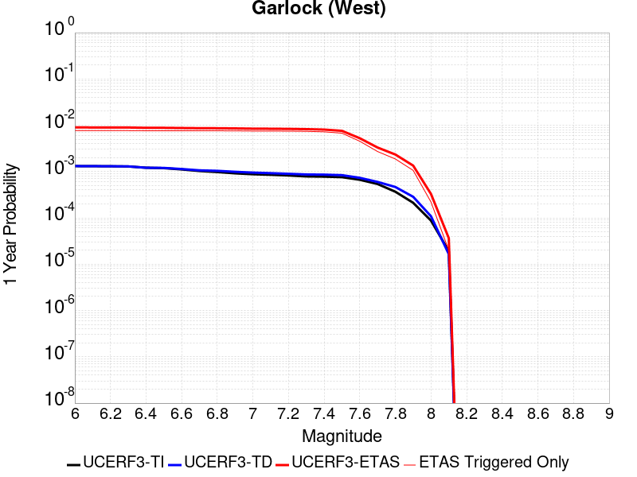 | 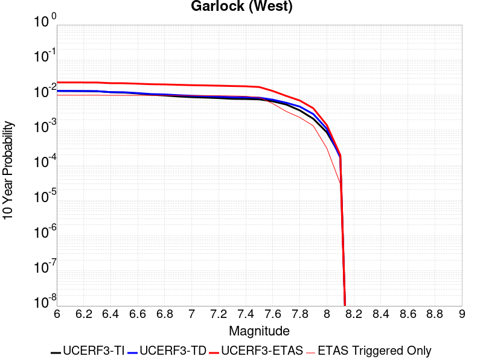 |

| Magnitude | 1 wk TI Prob | 1 wk TD Prob | 1 wk ETAS Prob | 1 wk ETAS/TD Gain | 1 wk ETAS Triggered Only | 1 mo TI Prob | 1 mo TD Prob | 1 mo ETAS Prob | 1 mo ETAS/TD Gain | 1 mo ETAS Triggered Only | 1 yr TI Prob | 1 yr TD Prob | 1 yr ETAS Prob | 1 yr ETAS/TD Gain | 1 yr ETAS Triggered Only | 10 yr TI Prob | 10 yr TD Prob | 10 yr ETAS Prob | 10 yr ETAS/TD Gain | 10 yr ETAS Triggered Only |
|-----|-----|-----|-----|-----|-----|-----|-----|-----|-----|-----|-----|-----|-----|-----|-----|-----|-----|-----|-----|-----|
| 6.0 | 2.5181727E-5 | 2.51973E-5 | 0.0010251721 | 40.68579 | 0.001 | 1.0791722E-4 | 1.0798398E-4 | 0.00310766 | 28.7789 | 0.003 | 0.0013131002 | 0.0013139155 | 0.006307346 | 4.80042 | 0.005 | 0.013053683 | 0.013141977 | 0.020049982 | 1.5256444 | 0.007 |
| 6.1 | 2.5077732E-5 | 2.5098372E-5 | 0.0010250732 | 40.84222 | 0.001 | 1.0747157E-4 | 1.0756004E-4 | 0.0031072374 | 28.8884 | 0.003 | 0.001307681 | 0.0013087603 | 0.0063022166 | 4.8154097 | 0.005 | 0.013000126 | 0.013091032 | 0.019999396 | 1.5277172 | 0.007 |
| 6.2 | 2.494612E-5 | 2.498005E-5 | 0.0010249551 | 41.030945 | 0.001 | 1.0690756E-4 | 1.0705298E-4 | 0.003106732 | 29.020506 | 0.003 | 0.0013008224 | 0.0013025942 | 0.0062960815 | 4.8334937 | 0.005 | 0.012932341 | 0.013030097 | 0.019938886 | 1.5302178 | 0.007 |
| 6.3 | 2.4733758E-5 | 2.479942E-5 | 0.0010247746 | 41.322525 | 0.001 | 1.0599751E-4 | 1.06278916E-4 | 0.00310596 | 29.224613 | 0.003 | 0.0012897556 | 0.0012931811 | 0.006286715 | 4.8614345 | 0.005 | 0.012822957 | 0.012937066 | 0.019846506 | 1.534081 | 0.007 |
| 6.4 | 2.3237335E-5 | 2.317873E-5 | 0.0010231555 | 44.142002 | 0.001 | 9.958477E-5 | 9.933365E-5 | 0.0030990357 | 31.198246 | 0.003 | 0.0012117702 | 0.001208719 | 0.0062026754 | 5.131611 | 0.005 | 0.012051838 | 0.012101916 | 0.019017203 | 1.5714208 | 0.007 |
| 6.5 | 2.2732203E-5 | 2.2993298E-5 | 0.0010229703 | 44.489933 | 0.001 | 9.742009E-5 | 9.8539E-5 | 0.0030982434 | 31.4418 | 0.003 | 0.0011854442 | 0.0011990548 | 0.0061930595 | 5.1649513 | 0.005 | 0.011791403 | 0.012006322 | 0.018922279 | 1.5760262 | 0.007 |
| 6.6 | 2.1319436E-5 | 2.17735E-5 | 0.0010217517 | 46.92639 | 0.001 | 9.136581E-5 | 9.331167E-5 | 0.0030930317 | 33.14732 | 0.003 | 0.001111811 | 0.0011354799 | 0.006129802 | 5.3984246 | 0.005 | 0.011062649 | 0.011377227 | 0.018297585 | 1.6082642 | 0.007 |
| 6.7 | 1.970802E-5 | 2.0393396E-5 | 0.001020373 | 50.03448 | 0.001 | 8.446021E-5 | 8.739735E-5 | 0.0030871353 | 35.322983 | 0.003 | 0.001027818 | 0.001063545 | 0.0060582273 | 5.6962585 | 0.005 | 0.010230771 | 0.010664964 | 0.01759031 | 1.6493547 | 0.007 |
| 6.8 | 1.8744462E-5 | 1.9901045E-5 | 0.0010198811 | 51.24762 | 0.001 | 8.033094E-5 | 8.5287415E-5 | 0.0030850316 | 36.17218 | 0.003 | 9.775903E-4 | 0.0010378812 | 0.006032692 | 5.8125067 | 0.005 | 0.009733009 | 0.01041075 | 0.017337875 | 1.6653819 | 0.007 |
| 6.9 | 1.7559682E-5 | 1.8953415E-5 | 0.0010189344 | 53.75994 | 0.001 | 7.5253614E-5 | 8.12264E-5 | 0.0030809827 | 37.930805 | 0.003 | 9.158276E-4 | 9.884841E-4 | 0.0059835417 | 6.05325 | 0.005 | 0.0091206245 | 0.009921231 | 0.016851783 | 1.6985576 | 0.007 |
| 7.0 | 1.6794445E-5 | 1.8216237E-5 | 0.001018198 | 55.89508 | 0.001 | 7.197421E-5 | 7.8067256E-5 | 0.003077833 | 39.4254 | 0.003 | 8.759337E-4 | 9.5005584E-4 | 0.0059453053 | 6.2578487 | 0.005 | 0.008724891 | 0.009540141 | 0.01647336 | 1.7267418 | 0.007 |
| 7.1 | 1.6337795E-5 | 1.7717046E-5 | 0.0010176994 | 57.441822 | 0.001 | 7.0017246E-5 | 7.5927994E-5 | 0.0030757003 | 40.50812 | 0.003 | 8.521265E-4 | 9.240326E-4 | 0.0059194122 | 6.4060645 | 0.005 | 0.008488664 | 0.009281996 | 0.016217021 | 1.7471482 | 0.007 |
| 7.2 | 1.5780008E-5 | 1.7165687E-5 | 0.0010171485 | 59.254753 | 0.001 | 6.762685E-5 | 7.356516E-5 | 0.0030733445 | 41.777172 | 0.003 | 8.2304585E-4 | 8.9528906E-4 | 0.0058908127 | 6.579788 | 0.005 | 0.008200042 | 0.008996838 | 0.01593386 | 1.7710512 | 0.007 |
| 7.3 | 1.5058865E-5 | 1.6618762E-5 | 0.0010166022 | 61.171955 | 0.001 | 6.45364E-5 | 7.122133E-5 | 0.0030710076 | 43.119213 | 0.003 | 7.854473E-4 | 8.667759E-4 | 0.005862442 | 6.7635036 | 0.005 | 0.00782677 | 0.008713539 | 0.015652543 | 1.7963476 | 0.007 |
| 7.4 | 1.4887923E-5 | 1.6454731E-5 | 0.0010164382 | 61.771793 | 0.001 | 6.380382E-5 | 7.051838E-5 | 0.0030703067 | 43.5391 | 0.003 | 7.7653467E-4 | 8.582243E-4 | 0.0058539333 | 6.820983 | 0.005 | 0.0077382675 | 0.008628399 | 0.015568 | 1.8042744 | 0.007 |
| 7.5 | 1.4509299E-5 | 1.6046748E-5 | 0.0010160307 | 63.31692 | 0.001 | 6.218123E-5 | 6.876997E-5 | 0.0030685638 | 44.62069 | 0.003 | 7.567935E-4 | 8.36954E-4 | 0.005832769 | 6.969044 | 0.005 | 0.0075422134 | 0.008416704 | 0.014366204 | 1.706868 | 0.006 |
| 7.6 | 1.2756717E-5 | 1.4050848E-5 | 0.0010140368 | 72.16908 | 0.001 | 5.4670498E-5 | 6.0216535E-5 | 0.0010601563 | 17.605734 | 0.001 | 6.6541E-4 | 7.328904E-4 | 0.0027314245 | 3.726921 | 0.002 | 0.006634211 | 0.0073816874 | 0.010359542 | 1.4034111 | 0.003 |
| 7.7 | 1.0328985E-5 | 1.1460557E-5 | 1.1460557E-5 | 1.0 | 0.0 | 4.4266326E-5 | 4.911575E-5 | 4.911575E-5 | 1.0 | 0.0 | 5.388092E-4 | 5.978206E-4 | 0.0015972228 | 2.6717427 | 0.001 | 0.0053750467 | 0.006038511 | 0.008026434 | 1.3292074 | 0.002 |
| 7.8 | 7.0306583E-6 | 8.899601E-6 | 8.899601E-6 | 1.0 | 0.0 | 3.0131043E-5 | 3.814059E-5 | 3.814059E-5 | 1.0 | 0.0 | 3.667837E-4 | 4.642629E-4 | 0.0014637987 | 3.152952 | 0.001 | 0.003661789 | 0.0046952725 | 0.006685882 | 1.4239603 | 0.002 |
| 7.9 | 4.060633E-6 | 5.4653938E-6 | 5.4653938E-6 | 1.0 | 0.0 | 1.7402595E-5 | 2.3422906E-5 | 2.3422906E-5 | 1.0 | 0.0 | 2.11856E-4 | 2.851367E-4 | 0.0012848516 | 4.50609 | 0.001 | 0.0021165414 | 0.002884201 | 0.0038813169 | 1.3457165 | 0.001 |
| 8.0 | 1.6729537E-6 | 2.0775144E-6 | 2.0775144E-6 | 1.0 | 0.0 | 7.169782E-6 | 8.903603E-6 | 8.903603E-6 | 1.0 | 0.0 | 8.7288594E-5 | 1.0839601E-4 | 1.0839601E-4 | 1.0 | 0.0 | 8.7254314E-4 | 0.0010969337 | 0.0010969337 | 1.0 | 0.0 |
| 8.1 | 3.6733252E-7 | 3.1489964E-7 | 3.1489964E-7 | 1.0 | 0.0 | 1.5742813E-6 | 1.3495693E-6 | 1.3495693E-6 | 1.0 | 0.0 | 1.9166706E-5 | 1.6430899E-5 | 1.6430899E-5 | 1.0 | 0.0 | 1.9165053E-4 | 1.6638759E-4 | 1.6638759E-4 | 1.0 | 0.0 |

## McLean Lake
*[(top)](#table-of-contents)*

| 1 Week | 1 Month | 1 Year | 10 Year |
|-----|-----|-----|-----|
|  | 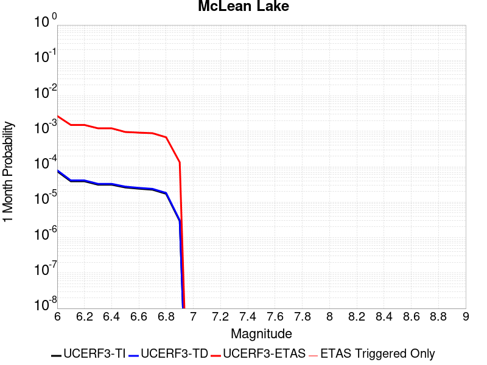 |  |  |

| Magnitude | 1 wk TI Prob | 1 wk TD Prob | 1 wk ETAS Prob | 1 wk ETAS/TD Gain | 1 wk ETAS Triggered Only | 1 mo TI Prob | 1 mo TD Prob | 1 mo ETAS Prob | 1 mo ETAS/TD Gain | 1 mo ETAS Triggered Only | 1 yr TI Prob | 1 yr TD Prob | 1 yr ETAS Prob | 1 yr ETAS/TD Gain | 1 yr ETAS Triggered Only | 10 yr TI Prob | 10 yr TD Prob | 10 yr ETAS Prob | 10 yr ETAS/TD Gain | 10 yr ETAS Triggered Only |
|-----|-----|-----|-----|-----|-----|-----|-----|-----|-----|-----|-----|-----|-----|-----|-----|-----|-----|-----|-----|-----|
| 6.0 | 1.7360222E-5 | 1.8501627E-5 | 0.0010184831 | 55.048298 | 0.001 | 7.439883E-5 | 7.9290556E-5 | 0.002079132 | 26.221685 | 0.002 | 9.0542925E-4 | 9.6498354E-4 | 0.003962089 | 4.105861 | 0.003 | 0.009017491 | 0.0096127745 | 0.014564711 | 1.5151412 | 0.005 |
| 6.1 | 9.062689E-6 | 9.592193E-6 | 9.592193E-6 | 1.0 | 0.0 | 3.8839516E-5 | 4.1108804E-5 | 4.1108804E-5 | 1.0 | 0.0 | 4.727685E-4 | 5.003936E-4 | 0.0014998933 | 2.9974267 | 0.001 | 0.0047176396 | 0.004993552 | 0.0059885583 | 1.1992582 | 0.001 |
| 6.2 | 9.062689E-6 | 9.592193E-6 | 9.592193E-6 | 1.0 | 0.0 | 3.8839516E-5 | 4.1108804E-5 | 4.1108804E-5 | 1.0 | 0.0 | 4.727685E-4 | 5.003936E-4 | 0.0014998933 | 2.9974267 | 0.001 | 0.0047176396 | 0.004993552 | 0.0059885583 | 1.1992582 | 0.001 |
| 6.3 | 7.2575485E-6 | 7.66771E-6 | 7.66771E-6 | 1.0 | 0.0 | 3.110341E-5 | 3.2861237E-5 | 3.2861237E-5 | 1.0 | 0.0 | 3.786182E-4 | 4.0001926E-4 | 0.0013996193 | 3.4988797 | 0.001 | 0.0037797375 | 0.0039936965 | 0.004989703 | 1.2493945 | 0.001 |
| 6.4 | 7.2575485E-6 | 7.66771E-6 | 7.66771E-6 | 1.0 | 0.0 | 3.110341E-5 | 3.2861237E-5 | 3.2861237E-5 | 1.0 | 0.0 | 3.786182E-4 | 4.0001926E-4 | 0.0013996193 | 3.4988797 | 0.001 | 0.0037797375 | 0.0039936965 | 0.004989703 | 1.2493945 | 0.001 |
| 6.5 | 6.06582E-6 | 6.4038773E-6 | 6.4038773E-6 | 1.0 | 0.0 | 2.5996113E-5 | 2.7444936E-5 | 2.7444936E-5 | 1.0 | 0.0 | 3.164567E-4 | 3.3409733E-4 | 3.3409733E-4 | 1.0 | 0.0 | 0.0031600643 | 0.0033365893 | 0.0033365893 | 1.0 | 0.0 |
| 6.6 | 5.598744E-6 | 5.910262E-6 | 5.910262E-6 | 1.0 | 0.0 | 2.3994397E-5 | 2.5329486E-5 | 2.5329486E-5 | 1.0 | 0.0 | 2.9209262E-4 | 3.0834923E-4 | 3.0834923E-4 | 1.0 | 0.0 | 0.0029170897 | 0.003079843 | 0.003079843 | 1.0 | 0.0 |
| 6.7 | 5.246996E-6 | 5.539162E-6 | 5.539162E-6 | 1.0 | 0.0 | 2.2486933E-5 | 2.3739085E-5 | 2.3739085E-5 | 1.0 | 0.0 | 2.73744E-4 | 2.8899137E-4 | 2.8899137E-4 | 1.0 | 0.0 | 0.0027340704 | 0.0028867796 | 0.0028867796 | 1.0 | 0.0 |
| 6.8 | 4.02324E-6 | 4.2469046E-6 | 4.2469046E-6 | 1.0 | 0.0 | 1.7242342E-5 | 1.8200926E-5 | 1.8200926E-5 | 1.0 | 0.0 | 2.099053E-4 | 2.2157968E-4 | 2.2157968E-4 | 1.0 | 0.0 | 0.0020970714 | 0.002214172 | 0.002214172 | 1.0 | 0.0 |
| 6.9 | 6.835972E-7 | 7.1399285E-7 | 7.1399285E-7 | 1.0 | 0.0 | 2.9296991E-6 | 3.0599674E-6 | 3.0599674E-6 | 1.0 | 0.0 | 3.56685E-5 | 3.7254784E-5 | 3.7254784E-5 | 1.0 | 0.0 | 3.5662777E-4 | 3.7251666E-4 | 3.7251666E-4 | 1.0 | 0.0 |

## San Andreas (Mojave S)
*[(top)](#table-of-contents)*

| 1 Week | 1 Month | 1 Year | 10 Year |
|-----|-----|-----|-----|
|  |  |  | 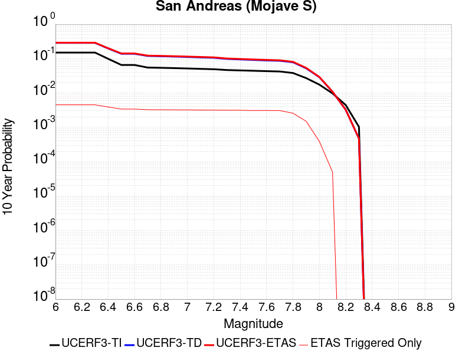 |

| Magnitude | 1 wk TI Prob | 1 wk TD Prob | 1 wk ETAS Prob | 1 wk ETAS/TD Gain | 1 wk ETAS Triggered Only | 1 mo TI Prob | 1 mo TD Prob | 1 mo ETAS Prob | 1 mo ETAS/TD Gain | 1 mo ETAS Triggered Only | 1 yr TI Prob | 1 yr TD Prob | 1 yr ETAS Prob | 1 yr ETAS/TD Gain | 1 yr ETAS Triggered Only | 10 yr TI Prob | 10 yr TD Prob | 10 yr ETAS Prob | 10 yr ETAS/TD Gain | 10 yr ETAS Triggered Only |
|-----|-----|-----|-----|-----|-----|-----|-----|-----|-----|-----|-----|-----|-----|-----|-----|-----|-----|-----|-----|-----|
| 6.0 | 3.1064058E-4 | 6.7460834E-4 | 6.7460834E-4 | 1.0 | 0.0 | 0.0013306376 | 0.0028881032 | 0.0028881032 | 1.0 | 0.0 | 0.016080605 | 0.03462235 | 0.035587724 | 1.027883 | 0.001 | 0.1496549 | 0.28660452 | 0.28874472 | 1.0074674 | 0.003 |
| 6.1 | 3.1064058E-4 | 6.7460834E-4 | 6.7460834E-4 | 1.0 | 0.0 | 0.0013306376 | 0.0028881032 | 0.0028881032 | 1.0 | 0.0 | 0.016080605 | 0.03462235 | 0.035587724 | 1.027883 | 0.001 | 0.1496549 | 0.28660452 | 0.28874472 | 1.0074674 | 0.003 |
| 6.2 | 3.1064058E-4 | 6.7460834E-4 | 6.7460834E-4 | 1.0 | 0.0 | 0.0013306376 | 0.0028881032 | 0.0028881032 | 1.0 | 0.0 | 0.016080605 | 0.03462235 | 0.035587724 | 1.027883 | 0.001 | 0.1496549 | 0.28660452 | 0.28874472 | 1.0074674 | 0.003 |
| 6.3 | 3.1064058E-4 | 6.7460834E-4 | 6.7460834E-4 | 1.0 | 0.0 | 0.0013306376 | 0.0028881032 | 0.0028881032 | 1.0 | 0.0 | 0.016080605 | 0.03462235 | 0.035587724 | 1.027883 | 0.001 | 0.1496549 | 0.28660452 | 0.28874472 | 1.0074674 | 0.003 |
| 6.4 | 1.9872203E-4 | 4.3179357E-4 | 4.3179357E-4 | 1.0 | 0.0 | 8.5138786E-4 | 0.0018492596 | 0.0018492596 | 1.0 | 0.0 | 0.010316478 | 0.02228844 | 0.023266152 | 1.0438663 | 0.001 | 0.098504856 | 0.19699748 | 0.19940649 | 1.0122286 | 0.003 |
| 6.5 | 1.291105E-4 | 2.875267E-4 | 2.875267E-4 | 1.0 | 0.0 | 5.5321335E-4 | 0.0012316781 | 0.0012316781 | 1.0 | 0.0 | 0.006714592 | 0.0148934 | 0.015878506 | 1.0661439 | 0.001 | 0.065152965 | 0.13803436 | 0.13975829 | 1.0124892 | 0.002 |
| 6.6 | 1.291105E-4 | 2.875267E-4 | 2.875267E-4 | 1.0 | 0.0 | 5.5321335E-4 | 0.0012316781 | 0.0012316781 | 1.0 | 0.0 | 0.006714592 | 0.0148934 | 0.015878506 | 1.0661439 | 0.001 | 0.065152965 | 0.13803436 | 0.13975829 | 1.0124892 | 0.002 |
| 6.7 | 1.08001186E-4 | 2.4333889E-4 | 2.4333889E-4 | 1.0 | 0.0 | 4.6278012E-4 | 0.0010424647 | 0.0010424647 | 1.0 | 0.0 | 0.0056198016 | 0.012618446 | 0.013605827 | 1.0782491 | 0.001 | 0.054797906 | 0.119176775 | 0.12093842 | 1.0147818 | 0.002 |
| 6.8 | 1.0624356E-4 | 2.3851555E-4 | 2.3851555E-4 | 1.0 | 0.0 | 4.5525006E-4 | 0.0010218095 | 0.0010218095 | 1.0 | 0.0 | 0.0055285925 | 0.012369843 | 0.013357474 | 1.0798417 | 0.001 | 0.053930566 | 0.11712591 | 0.118891664 | 1.0150757 | 0.002 |
| 6.9 | 1.0393785E-4 | 2.3221898E-4 | 2.3221898E-4 | 1.0 | 0.0 | 4.4537184E-4 | 9.948451E-4 | 9.948451E-4 | 1.0 | 0.0 | 0.0054089287 | 0.012045221 | 0.013033176 | 1.0820205 | 0.001 | 0.05279156 | 0.11442335 | 0.11619451 | 1.015479 | 0.002 |
| 7.0 | 1.0155622E-4 | 2.2591476E-4 | 2.2591476E-4 | 1.0 | 0.0 | 4.3516833E-4 | 9.6784724E-4 | 9.6784724E-4 | 1.0 | 0.0 | 0.005285311 | 0.0117200995 | 0.01270838 | 1.0843235 | 0.001 | 0.05161361 | 0.111683756 | 0.113460384 | 1.0159078 | 0.002 |
| 7.1 | 9.885595E-5 | 2.1879886E-4 | 2.1879886E-4 | 1.0 | 0.0 | 4.2359953E-4 | 9.3737274E-4 | 9.3737274E-4 | 1.0 | 0.0 | 0.0051451353 | 0.011352993 | 0.01234164 | 1.0870825 | 0.001 | 0.05027629 | 0.1085682 | 0.11035106 | 1.0164216 | 0.002 |
| 7.2 | 9.6411415E-5 | 2.124288E-4 | 2.124288E-4 | 1.0 | 0.0 | 4.1312634E-4 | 9.1009185E-4 | 9.1009185E-4 | 1.0 | 0.0 | 0.005018219 | 0.011024255 | 0.012013231 | 1.089709 | 0.001 | 0.049064007 | 0.105758004 | 0.107546486 | 1.0169111 | 0.002 |
| 7.3 | 9.1180635E-5 | 1.9471257E-4 | 1.9471257E-4 | 1.0 | 0.0 | 3.907156E-4 | 8.342157E-4 | 8.342157E-4 | 1.0 | 0.0 | 0.004746591 | 0.01010939 | 0.011099281 | 1.0979179 | 0.001 | 0.046464786 | 0.09795115 | 0.09975525 | 1.0184183 | 0.002 |
| 7.4 | 8.887388E-5 | 1.8719878E-4 | 1.8719878E-4 | 1.0 | 0.0 | 3.8083247E-4 | 8.020339E-4 | 8.020339E-4 | 1.0 | 0.0 | 0.0046267817 | 0.00972114 | 0.010711419 | 1.1018686 | 0.001 | 0.045316286 | 0.09458615 | 0.096396975 | 1.0191448 | 0.002 |
| 7.5 | 8.6750515E-5 | 1.8051457E-4 | 1.8051457E-4 | 1.0 | 0.0 | 3.7173493E-4 | 7.7340455E-4 | 7.7340455E-4 | 1.0 | 0.0 | 0.004516484 | 0.009375632 | 0.010366256 | 1.1056595 | 0.001 | 0.04425787 | 0.091549896 | 0.093366794 | 1.019846 | 0.002 |
| 7.6 | 8.453092E-5 | 1.7439072E-4 | 1.7439072E-4 | 1.0 | 0.0 | 3.6222505E-4 | 7.471748E-4 | 7.471748E-4 | 1.0 | 0.0 | 0.0044011753 | 0.009058985 | 0.010049925 | 1.1093876 | 0.001 | 0.04315024 | 0.08870898 | 0.090531565 | 1.0205456 | 0.002 |
| 7.7 | 8.259102E-5 | 1.6961215E-4 | 1.6961215E-4 | 1.0 | 0.0 | 3.539135E-4 | 7.2670676E-4 | 7.2670676E-4 | 1.0 | 0.0 | 0.004300386 | 0.008811831 | 0.0098030185 | 1.1124839 | 0.001 | 0.042181134 | 0.08645982 | 0.08828691 | 1.0211321 | 0.002 |
| 7.8 | 7.444844E-5 | 1.5283503E-4 | 1.5283503E-4 | 1.0 | 0.0 | 3.1902574E-4 | 6.548429E-4 | 6.548429E-4 | 1.0 | 0.0 | 0.0038772223 | 0.007943616 | 0.008935672 | 1.1248872 | 0.001 | 0.03810269 | 0.078290746 | 0.08013417 | 1.0235459 | 0.002 |
| 7.9 | 5.2586525E-5 | 1.00064186E-4 | 1.00064186E-4 | 1.0 | 0.0 | 2.2535135E-4 | 4.2877605E-4 | 4.2877605E-4 | 1.0 | 0.0 | 0.0027402006 | 0.005207864 | 0.006202656 | 1.1910173 | 0.001 | 0.027066574 | 0.052200034 | 0.053147834 | 1.0181571 | 0.001 |
| 8.0 | 3.379877E-5 | 5.4074168E-5 | 5.4074168E-5 | 1.0 | 0.0 | 1.4484383E-4 | 2.3172585E-4 | 2.3172585E-4 | 1.0 | 0.0 | 0.0017620471 | 0.002817614 | 0.002817614 | 1.0 | 0.0 | 0.017481409 | 0.028834904 | 0.028834904 | 1.0 | 0.0 |
| 8.1 | 1.8668277E-5 | 1.9309397E-5 | 1.9309397E-5 | 1.0 | 0.0 | 8.000444E-5 | 8.275194E-5 | 8.275194E-5 | 1.0 | 0.0 | 9.736188E-4 | 0.0010070398 | 0.0010070398 | 1.0 | 0.0 | 0.009693642 | 0.010798888 | 0.010798888 | 1.0 | 0.0 |
| 8.2 | 8.541571E-6 | 5.460819E-6 | 5.460819E-6 | 1.0 | 0.0 | 3.660622E-5 | 2.3403301E-5 | 2.3403301E-5 | 1.0 | 0.0 | 4.455896E-4 | 2.84898E-4 | 2.84898E-4 | 1.0 | 0.0 | 0.0044469717 | 0.0032408056 | 0.0032408056 | 1.0 | 0.0 |
| 8.3 | 1.983087E-6 | 7.6599065E-7 | 7.6599065E-7 | 1.0 | 0.0 | 8.498917E-6 | 3.282813E-6 | 3.282813E-6 | 1.0 | 0.0 | 1.034694E-4 | 3.9967534E-5 | 3.9967534E-5 | 1.0 | 0.0 | 0.0010342124 | 4.719687E-4 | 4.719687E-4 | 1.0 | 0.0 |

## So Sierra Nevada
*[(top)](#table-of-contents)*

| 1 Week | 1 Month | 1 Year | 10 Year |
|-----|-----|-----|-----|
|  |  |  |  |

| Magnitude | 1 wk TI Prob | 1 wk TD Prob | 1 wk ETAS Prob | 1 wk ETAS/TD Gain | 1 wk ETAS Triggered Only | 1 mo TI Prob | 1 mo TD Prob | 1 mo ETAS Prob | 1 mo ETAS/TD Gain | 1 mo ETAS Triggered Only | 1 yr TI Prob | 1 yr TD Prob | 1 yr ETAS Prob | 1 yr ETAS/TD Gain | 1 yr ETAS Triggered Only | 10 yr TI Prob | 10 yr TD Prob | 10 yr ETAS Prob | 10 yr ETAS/TD Gain | 10 yr ETAS Triggered Only |
|-----|-----|-----|-----|-----|-----|-----|-----|-----|-----|-----|-----|-----|-----|-----|-----|-----|-----|-----|-----|-----|
| 6.0 | 1.15488665E-5 | 1.1079643E-5 | 1.1079643E-5 | 1.0 | 0.0 | 4.9494203E-5 | 4.748339E-5 | 4.748339E-5 | 1.0 | 0.0 | 6.024253E-4 | 5.7796965E-4 | 0.0015773918 | 2.7291946 | 0.001 | 0.006007948 | 0.005765934 | 0.010737104 | 1.8621622 | 0.005 |
| 6.1 | 1.15488665E-5 | 1.1079643E-5 | 1.1079643E-5 | 1.0 | 0.0 | 4.9494203E-5 | 4.748339E-5 | 4.748339E-5 | 1.0 | 0.0 | 6.024253E-4 | 5.7796965E-4 | 0.0015773918 | 2.7291946 | 0.001 | 0.006007948 | 0.005765934 | 0.010737104 | 1.8621622 | 0.005 |
| 6.2 | 1.15488665E-5 | 1.1079643E-5 | 1.1079643E-5 | 1.0 | 0.0 | 4.9494203E-5 | 4.748339E-5 | 4.748339E-5 | 1.0 | 0.0 | 6.024253E-4 | 5.7796965E-4 | 0.0015773918 | 2.7291946 | 0.001 | 0.006007948 | 0.005765934 | 0.010737104 | 1.8621622 | 0.005 |
| 6.3 | 1.15488665E-5 | 1.1079643E-5 | 1.1079643E-5 | 1.0 | 0.0 | 4.9494203E-5 | 4.748339E-5 | 4.748339E-5 | 1.0 | 0.0 | 6.024253E-4 | 5.7796965E-4 | 0.0015773918 | 2.7291946 | 0.001 | 0.006007948 | 0.005765934 | 0.010737104 | 1.8621622 | 0.005 |
| 6.4 | 1.15488665E-5 | 1.1079643E-5 | 1.1079643E-5 | 1.0 | 0.0 | 4.9494203E-5 | 4.748339E-5 | 4.748339E-5 | 1.0 | 0.0 | 6.024253E-4 | 5.7796965E-4 | 0.0015773918 | 2.7291946 | 0.001 | 0.006007948 | 0.005765934 | 0.010737104 | 1.8621622 | 0.005 |
| 6.5 | 1.15488665E-5 | 1.1079643E-5 | 1.1079643E-5 | 1.0 | 0.0 | 4.9494203E-5 | 4.748339E-5 | 4.748339E-5 | 1.0 | 0.0 | 6.024253E-4 | 5.7796965E-4 | 0.0015773918 | 2.7291946 | 0.001 | 0.006007948 | 0.005765934 | 0.010737104 | 1.8621622 | 0.005 |
| 6.6 | 7.587044E-6 | 6.935635E-6 | 6.935635E-6 | 1.0 | 0.0 | 3.2515498E-5 | 2.9723828E-5 | 2.9723828E-5 | 1.0 | 0.0 | 3.9580427E-4 | 3.6183043E-4 | 0.0013614686 | 3.7627254 | 0.001 | 0.003951 | 0.0036127048 | 0.007598254 | 2.1032038 | 0.004 |
| 6.7 | 7.587044E-6 | 6.935635E-6 | 6.935635E-6 | 1.0 | 0.0 | 3.2515498E-5 | 2.9723828E-5 | 2.9723828E-5 | 1.0 | 0.0 | 3.9580427E-4 | 3.6183043E-4 | 0.0013614686 | 3.7627254 | 0.001 | 0.003951 | 0.0036127048 | 0.007598254 | 2.1032038 | 0.004 |
| 6.8 | 5.9026956E-6 | 5.1793927E-6 | 5.1793927E-6 | 1.0 | 0.0 | 2.5297022E-5 | 2.2197215E-5 | 2.2197215E-5 | 1.0 | 0.0 | 3.0794772E-4 | 2.7021873E-4 | 0.0012699486 | 4.6997056 | 0.001 | 0.0030752132 | 0.002699018 | 0.006688222 | 2.4780204 | 0.004 |
| 6.9 | 5.0118915E-6 | 4.2524252E-6 | 4.2524252E-6 | 1.0 | 0.0 | 2.1479358E-5 | 1.8224557E-5 | 1.8224557E-5 | 1.0 | 0.0 | 2.614798E-4 | 2.2186211E-4 | 2.2186211E-4 | 1.0 | 0.0 | 0.0026117235 | 0.0022164788 | 0.005209829 | 2.3504982 | 0.003 |
| 7.0 | 4.4924795E-6 | 3.7139177E-6 | 3.7139177E-6 | 1.0 | 0.0 | 1.925334E-5 | 1.5916696E-5 | 1.5916696E-5 | 1.0 | 0.0 | 2.3438422E-4 | 1.9376918E-4 | 1.9376918E-4 | 1.0 | 0.0 | 0.0023413717 | 0.0019360651 | 0.004930257 | 2.5465345 | 0.003 |
| 7.1 | 3.9118436E-6 | 3.1119775E-6 | 3.1119775E-6 | 1.0 | 0.0 | 1.6764936E-5 | 1.3336982E-5 | 1.3336982E-5 | 1.0 | 0.0 | 2.0409399E-4 | 1.6236622E-4 | 1.6236622E-4 | 1.0 | 0.0 | 0.0020390663 | 0.001622532 | 0.0046176645 | 2.845962 | 0.003 |
| 7.2 | 3.4200818E-6 | 2.6054543E-6 | 2.6054543E-6 | 1.0 | 0.0 | 1.4657411E-5 | 1.11661875E-5 | 1.11661875E-5 | 1.0 | 0.0 | 1.7843937E-4 | 1.3594035E-4 | 1.3594035E-4 | 1.0 | 0.0 | 0.0017829615 | 0.0013586218 | 0.0033559045 | 2.4700801 | 0.002 |
| 7.3 | 2.6593618E-6 | 1.8284203E-6 | 1.8284203E-6 | 1.0 | 0.0 | 1.13972155E-5 | 7.836065E-6 | 7.836065E-6 | 1.0 | 0.0 | 1.3875226E-4 | 9.540021E-5 | 9.540021E-5 | 1.0 | 0.0 | 0.0013866565 | 9.5362146E-4 | 9.5362146E-4 | 1.0 | 0.0 |
| 7.4 | 2.2577992E-6 | 1.436438E-6 | 1.436438E-6 | 1.0 | 0.0 | 9.676246E-6 | 6.15615E-6 | 6.15615E-6 | 1.0 | 0.0 | 1.1780193E-4 | 7.49488E-5 | 7.49488E-5 | 1.0 | 0.0 | 0.001177395 | 7.492603E-4 | 7.492603E-4 | 1.0 | 0.0 |
| 7.5 | 1.489319E-6 | 7.353936E-7 | 7.353936E-7 | 1.0 | 0.0 | 6.3827797E-6 | 3.1516831E-6 | 3.1516831E-6 | 1.0 | 0.0 | 7.770758E-5 | 3.8371072E-5 | 3.8371072E-5 | 1.0 | 0.0 | 7.7680405E-4 | 3.836449E-4 | 3.836449E-4 | 1.0 | 0.0 |
| 7.6 | 1.0680322E-6 | 4.6596554E-7 | 4.6596554E-7 | 1.0 | 0.0 | 4.577273E-6 | 1.9969937E-6 | 1.9969937E-6 | 1.0 | 0.0 | 5.5726876E-5 | 2.4313129E-5 | 2.4313129E-5 | 1.0 | 0.0 | 5.5712904E-4 | 2.4310495E-4 | 2.4310495E-4 | 1.0 | 0.0 |
| 7.7 | 5.509146E-7 | 1.5580486E-7 | 1.5580486E-7 | 1.0 | 0.0 | 2.3610605E-6 | 6.677349E-7 | 6.677349E-7 | 1.0 | 0.0 | 2.8745531E-5 | 8.129644E-6 | 8.129644E-6 | 1.0 | 0.0 | 2.8741814E-4 | 8.1293576E-5 | 8.1293576E-5 | 1.0 | 0.0 |

## Death Valley (So)
*[(top)](#table-of-contents)*

| 1 Week | 1 Month | 1 Year | 10 Year |
|-----|-----|-----|-----|
|  |  |  |  |

| Magnitude | 1 wk TI Prob | 1 wk TD Prob | 1 wk ETAS Prob | 1 wk ETAS/TD Gain | 1 wk ETAS Triggered Only | 1 mo TI Prob | 1 mo TD Prob | 1 mo ETAS Prob | 1 mo ETAS/TD Gain | 1 mo ETAS Triggered Only | 1 yr TI Prob | 1 yr TD Prob | 1 yr ETAS Prob | 1 yr ETAS/TD Gain | 1 yr ETAS Triggered Only | 10 yr TI Prob | 10 yr TD Prob | 10 yr ETAS Prob | 10 yr ETAS/TD Gain | 10 yr ETAS Triggered Only |
|-----|-----|-----|-----|-----|-----|-----|-----|-----|-----|-----|-----|-----|-----|-----|-----|-----|-----|-----|-----|-----|
| 6.0 | 2.0684236E-5 | 2.5617775E-5 | 0.0020255665 | 79.06879 | 0.002 | 8.864371E-5 | 1.0978594E-4 | 0.0021095665 | 19.21527 | 0.002 | 0.0010787029 | 0.0013358411 | 0.0033331695 | 2.495184 | 0.002 | 0.010734817 | 0.013281397 | 0.017228272 | 1.2971731 | 0.004 |
| 6.1 | 2.0684236E-5 | 2.5617775E-5 | 0.0020255665 | 79.06879 | 0.002 | 8.864371E-5 | 1.0978594E-4 | 0.0021095665 | 19.21527 | 0.002 | 0.0010787029 | 0.0013358411 | 0.0033331695 | 2.495184 | 0.002 | 0.010734817 | 0.013281397 | 0.017228272 | 1.2971731 | 0.004 |
| 6.2 | 2.0684236E-5 | 2.5617775E-5 | 0.0020255665 | 79.06879 | 0.002 | 8.864371E-5 | 1.0978594E-4 | 0.0021095665 | 19.21527 | 0.002 | 0.0010787029 | 0.0013358411 | 0.0033331695 | 2.495184 | 0.002 | 0.010734817 | 0.013281397 | 0.017228272 | 1.2971731 | 0.004 |
| 6.3 | 2.0240292E-5 | 2.511786E-5 | 0.0020250676 | 80.62262 | 0.002 | 8.6741224E-5 | 1.07643624E-4 | 0.0021074284 | 19.577827 | 0.002 | 0.0010555626 | 0.00130979 | 0.0033071705 | 2.5249624 | 0.002 | 0.010505628 | 0.013023956 | 0.01697186 | 1.3031263 | 0.004 |
| 6.4 | 2.0240292E-5 | 2.511786E-5 | 0.0020250676 | 80.62262 | 0.002 | 8.6741224E-5 | 1.07643624E-4 | 0.0021074284 | 19.577827 | 0.002 | 0.0010555626 | 0.00130979 | 0.0033071705 | 2.5249624 | 0.002 | 0.010505628 | 0.013023956 | 0.01697186 | 1.3031263 | 0.004 |
| 6.5 | 1.9962767E-5 | 2.4807114E-5 | 0.0020247574 | 81.62003 | 0.002 | 8.55519E-5 | 1.0631196E-4 | 0.0021060994 | 19.810558 | 0.002 | 0.0010410968 | 0.0012935963 | 0.0032910092 | 2.5440774 | 0.002 | 0.010362327 | 0.012863902 | 0.016812447 | 1.3069476 | 0.004 |
| 6.6 | 1.8937297E-5 | 2.3310964E-5 | 0.0020232643 | 86.79453 | 0.002 | 8.115732E-5 | 9.990039E-5 | 0.0020997005 | 21.017942 | 0.002 | 9.876423E-4 | 0.0012156231 | 0.0032131919 | 2.6432467 | 0.002 | 0.009832645 | 0.012092789 | 0.016044417 | 1.3267757 | 0.004 |
| 6.7 | 1.8621096E-5 | 2.2911607E-5 | 0.0020228657 | 88.29 | 0.002 | 7.980225E-5 | 9.818898E-5 | 0.0020979927 | 21.366884 | 0.002 | 9.711593E-4 | 0.0011948098 | 0.0031924201 | 2.6719067 | 0.002 | 0.009669261 | 0.011886904 | 0.015839357 | 1.3325047 | 0.004 |
| 6.8 | 1.7830353E-5 | 2.1805688E-5 | 0.002021762 | 92.717186 | 0.002 | 7.641356E-5 | 9.344968E-5 | 0.0020932627 | 22.399893 | 0.002 | 9.29938E-4 | 0.00113717 | 0.0031348956 | 2.756752 | 0.002 | 0.009260561 | 0.011316354 | 0.015271089 | 1.3494707 | 0.004 |
| 6.9 | 1.3135183E-5 | 1.5303925E-5 | 0.0020152733 | 131.68343 | 0.002 | 5.6292425E-5 | 6.558664E-5 | 0.0020654555 | 31.492016 | 0.002 | 6.8514474E-4 | 7.982312E-4 | 0.0027966348 | 3.5035396 | 0.002 | 0.006830362 | 0.007954649 | 0.01192283 | 1.4988506 | 0.004 |
| 7.0 | 1.1507512E-5 | 1.3154199E-5 | 0.0020131278 | 153.0407 | 0.002 | 4.9316975E-5 | 5.6373956E-5 | 0.0020562613 | 36.475376 | 0.002 | 6.002687E-4 | 6.8614254E-4 | 0.0026847702 | 3.9128463 | 0.002 | 0.0059864987 | 0.0068409415 | 0.009820418 | 1.4355361 | 0.003 |
| 7.1 | 9.715903E-6 | 1.0865278E-5 | 0.0020108435 | 185.0706 | 0.002 | 4.1638916E-5 | 4.656467E-5 | 0.0020464715 | 43.949017 | 0.002 | 5.068359E-4 | 5.667817E-4 | 0.0025656482 | 4.5266957 | 0.002 | 0.0050568148 | 0.0056538144 | 0.008636853 | 1.5276152 | 0.003 |
| 7.2 | 9.233269E-6 | 1.02863105E-5 | 0.0020102658 | 195.43118 | 0.002 | 3.9570554E-5 | 4.4083466E-5 | 0.0020439953 | 46.36648 | 0.002 | 4.81665E-4 | 5.3658825E-4 | 0.002535515 | 4.7252526 | 0.002 | 0.0048062233 | 0.0053533576 | 0.0083372975 | 1.5573959 | 0.003 |
| 7.3 | 8.8041315E-6 | 9.808164E-6 | 0.0010097984 | 102.95488 | 0.001 | 3.7731446E-5 | 4.2034335E-5 | 0.0010419923 | 24.789076 | 0.001 | 4.592835E-4 | 5.1165203E-4 | 0.0015111404 | 2.9534533 | 0.001 | 0.0045833546 | 0.005105167 | 0.007094957 | 1.3897599 | 0.002 |
| 7.4 | 8.708749E-6 | 9.707175E-6 | 0.0010096974 | 104.01559 | 0.001 | 3.7322676E-5 | 4.160154E-5 | 0.00104156 | 25.036572 | 0.001 | 4.5430884E-4 | 5.0638523E-4 | 0.0015058789 | 2.973781 | 0.001 | 0.004533812 | 0.0050527398 | 0.0070426343 | 1.3938248 | 0.002 |
| 7.5 | 8.612678E-6 | 9.604817E-6 | 0.0010095952 | 105.11342 | 0.001 | 3.6910955E-5 | 4.1162875E-5 | 0.0010411217 | 25.292734 | 0.001 | 4.492982E-4 | 5.01047E-4 | 0.0015005459 | 2.9948208 | 0.001 | 0.004483909 | 0.0049995985 | 0.0069895997 | 1.3980321 | 0.002 |
| 7.6 | 8.319024E-6 | 9.283916E-6 | 0.0010092746 | 108.712166 | 0.001 | 3.5652476E-5 | 3.978763E-5 | 0.0010397478 | 26.13244 | 0.001 | 4.3398244E-4 | 4.8431093E-4 | 0.0014838267 | 3.0637894 | 0.001 | 0.0043313587 | 0.0048329784 | 0.0068233125 | 1.4118235 | 0.002 |
| 7.7 | 7.4718328E-6 | 8.34517E-6 | 0.0010083368 | 120.8288 | 0.001 | 3.2021748E-5 | 3.5764548E-5 | 0.0010357287 | 28.959652 | 0.001 | 3.8979502E-4 | 4.353504E-4 | 0.001434915 | 3.2960002 | 0.001 | 0.00389112 | 0.0043453807 | 0.00633669 | 1.4582589 | 0.002 |
| 7.8 | 3.4586725E-7 | 3.6482615E-7 | 0.0010003644 | 2742.0308 | 0.001 | 1.4822873E-6 | 1.5635396E-6 | 0.001001562 | 640.5734 | 0.001 | 1.80467E-5 | 1.9035933E-5 | 0.0010190168 | 53.531227 | 0.001 | 1.8045233E-4 | 1.9034347E-4 | 0.0011901532 | 6.2526608 | 0.001 |
| 7.9 | 2.5591178E-9 | 2.6696718E-9 | 2.6696718E-9 | 1.0 | 0.0 | 1.0967647E-8 | 1.14414505E-8 | 1.14414505E-8 | 1.0 | 0.0 | 1.335311E-7 | 1.3929966E-7 | 1.3929966E-7 | 1.0 | 0.0 | 1.3353102E-6 | 1.3929966E-6 | 1.3929966E-6 | 1.0 | 0.0 |

## Paradise
*[(top)](#table-of-contents)*

| 1 Week | 1 Month | 1 Year | 10 Year |
|-----|-----|-----|-----|
|  |  |  |  |

| Magnitude | 1 wk TI Prob | 1 wk TD Prob | 1 wk ETAS Prob | 1 wk ETAS/TD Gain | 1 wk ETAS Triggered Only | 1 mo TI Prob | 1 mo TD Prob | 1 mo ETAS Prob | 1 mo ETAS/TD Gain | 1 mo ETAS Triggered Only | 1 yr TI Prob | 1 yr TD Prob | 1 yr ETAS Prob | 1 yr ETAS/TD Gain | 1 yr ETAS Triggered Only | 10 yr TI Prob | 10 yr TD Prob | 10 yr ETAS Prob | 10 yr ETAS/TD Gain | 10 yr ETAS Triggered Only |
|-----|-----|-----|-----|-----|-----|-----|-----|-----|-----|-----|-----|-----|-----|-----|-----|-----|-----|-----|-----|-----|
| 6.0 | 1.4851273E-5 | 1.6694692E-5 | 0.0010166779 | 60.89828 | 0.001 | 6.364676E-5 | 7.154685E-5 | 0.0010714753 | 14.975856 | 0.001 | 7.7462377E-4 | 8.707584E-4 | 0.002869017 | 3.2948484 | 0.002 | 0.0077192914 | 0.008675844 | 0.012641141 | 1.4570502 | 0.004 |
| 6.1 | 1.4851273E-5 | 1.6694692E-5 | 0.0010166779 | 60.89828 | 0.001 | 6.364676E-5 | 7.154685E-5 | 0.0010714753 | 14.975856 | 0.001 | 7.7462377E-4 | 8.707584E-4 | 0.002869017 | 3.2948484 | 0.002 | 0.0077192914 | 0.008675844 | 0.012641141 | 1.4570502 | 0.004 |
| 6.2 | 1.4851273E-5 | 1.6694692E-5 | 0.0010166779 | 60.89828 | 0.001 | 6.364676E-5 | 7.154685E-5 | 0.0010714753 | 14.975856 | 0.001 | 7.7462377E-4 | 8.707584E-4 | 0.002869017 | 3.2948484 | 0.002 | 0.0077192914 | 0.008675844 | 0.012641141 | 1.4570502 | 0.004 |
| 6.3 | 1.0426831E-5 | 1.188862E-5 | 0.0010118767 | 85.11305 | 0.001 | 4.4685654E-5 | 5.0950268E-5 | 0.0010508993 | 20.625982 | 0.001 | 5.43912E-4 | 6.201489E-4 | 0.0016195287 | 2.611516 | 0.001 | 0.0054258266 | 0.0061847917 | 0.008172422 | 1.3213738 | 0.002 |
| 6.4 | 1.0426831E-5 | 1.188862E-5 | 0.0010118767 | 85.11305 | 0.001 | 4.4685654E-5 | 5.0950268E-5 | 0.0010508993 | 20.625982 | 0.001 | 5.43912E-4 | 6.201489E-4 | 0.0016195287 | 2.611516 | 0.001 | 0.0054258266 | 0.0061847917 | 0.008172422 | 1.3213738 | 0.002 |
| 6.5 | 9.25027E-6 | 1.06199595E-5 | 0.0010106093 | 95.161316 | 0.001 | 3.964341E-5 | 4.551335E-5 | 0.0010454678 | 22.970577 | 0.001 | 4.8255164E-4 | 5.53989E-4 | 0.001553435 | 2.80409 | 0.001 | 0.0048150513 | 0.0055265795 | 0.007515526 | 1.3598875 | 0.002 |
| 6.6 | 7.904275E-6 | 9.159525E-6 | 9.159525E-6 | 1.0 | 0.0 | 3.3875025E-5 | 3.9254537E-5 | 3.9254537E-5 | 1.0 | 0.0 | 4.1235037E-4 | 4.7782314E-4 | 4.7782314E-4 | 1.0 | 0.0 | 0.0041158604 | 0.0047683544 | 0.005763586 | 1.2087159 | 0.001 |
| 6.7 | 7.2061953E-6 | 8.407248E-6 | 8.407248E-6 | 1.0 | 0.0 | 3.088333E-5 | 3.6030586E-5 | 3.6030586E-5 | 1.0 | 0.0 | 3.7593965E-4 | 4.3858777E-4 | 4.3858777E-4 | 1.0 | 0.0 | 0.003753043 | 0.004377591 | 0.0053732134 | 1.2274362 | 0.001 |
| 6.8 | 6.6948724E-6 | 7.842166E-6 | 7.842166E-6 | 1.0 | 0.0 | 2.8691995E-5 | 3.360887E-5 | 3.360887E-5 | 1.0 | 0.0 | 3.4926904E-4 | 4.0911473E-4 | 4.0911473E-4 | 1.0 | 0.0 | 0.003487206 | 0.0040839734 | 0.005079889 | 1.2438596 | 0.001 |
| 6.9 | 6.0421025E-6 | 7.130621E-6 | 7.130621E-6 | 1.0 | 0.0 | 2.5894467E-5 | 3.0559466E-5 | 3.0559466E-5 | 1.0 | 0.0 | 3.1521954E-4 | 3.7200135E-4 | 3.7200135E-4 | 1.0 | 0.0 | 0.0031477278 | 0.0037141247 | 0.0047104107 | 1.2682425 | 0.001 |
| 7.0 | 4.134091E-6 | 5.0803087E-6 | 5.0803087E-6 | 1.0 | 0.0 | 1.7717413E-5 | 2.177258E-5 | 2.177258E-5 | 1.0 | 0.0 | 2.1568815E-4 | 2.6505045E-4 | 2.6505045E-4 | 1.0 | 0.0 | 0.0021547892 | 0.0026474963 | 0.0026474963 | 1.0 | 0.0 |
| 7.1 | 3.7674888E-6 | 4.6318696E-6 | 4.6318696E-6 | 1.0 | 0.0 | 1.6146281E-5 | 1.9850726E-5 | 1.9850726E-5 | 1.0 | 0.0 | 1.9656324E-4 | 2.4165731E-4 | 2.4165731E-4 | 1.0 | 0.0 | 0.0019638946 | 0.002414096 | 0.002414096 | 1.0 | 0.0 |
| 7.2 | 3.4065345E-6 | 4.156723E-6 | 4.156723E-6 | 1.0 | 0.0 | 1.4599351E-5 | 1.7814415E-5 | 1.7814415E-5 | 1.0 | 0.0 | 1.777326E-4 | 2.1687041E-4 | 2.1687041E-4 | 1.0 | 0.0 | 0.0017759053 | 0.002166736 | 0.002166736 | 1.0 | 0.0 |
| 7.3 | 2.9934936E-6 | 3.6293168E-6 | 3.6293168E-6 | 1.0 | 0.0 | 1.2829195E-5 | 1.555413E-5 | 1.555413E-5 | 1.0 | 0.0 | 1.5618425E-4 | 1.8935655E-4 | 1.8935655E-4 | 1.0 | 0.0 | 0.0015607453 | 0.0018920974 | 0.0018920974 | 1.0 | 0.0 |
| 7.4 | 2.4049796E-6 | 2.8889842E-6 | 2.8889842E-6 | 1.0 | 0.0 | 1.0307015E-5 | 1.238131E-5 | 1.238131E-5 | 1.0 | 0.0 | 1.2548068E-4 | 1.5073347E-4 | 1.5073347E-4 | 1.0 | 0.0 | 0.0012540985 | 0.0015064536 | 0.0015064536 | 1.0 | 0.0 |
| 7.5 | 1.2710091E-6 | 1.5134682E-6 | 1.5134682E-6 | 1.0 | 0.0 | 5.44717E-6 | 6.4862834E-6 | 6.4862834E-6 | 1.0 | 0.0 | 6.631728E-5 | 7.8968886E-5 | 7.8968886E-5 | 1.0 | 0.0 | 6.6297496E-4 | 7.8953087E-4 | 7.8953087E-4 | 1.0 | 0.0 |
| 7.6 | 2.21172E-7 | 2.603961E-7 | 2.603961E-7 | 1.0 | 0.0 | 9.478797E-7 | 1.1159829E-6 | 1.1159829E-6 | 1.0 | 0.0 | 1.1540374E-5 | 1.3587036E-5 | 1.3587036E-5 | 1.0 | 0.0 | 1.1539775E-4 | 1.3586486E-4 | 1.3586486E-4 | 1.0 | 0.0 |

## Coyote Canyon
*[(top)](#table-of-contents)*

| 1 Week | 1 Month | 1 Year | 10 Year |
|-----|-----|-----|-----|
|  |  |  |  |

| Magnitude | 1 wk TI Prob | 1 wk TD Prob | 1 wk ETAS Prob | 1 wk ETAS/TD Gain | 1 wk ETAS Triggered Only | 1 mo TI Prob | 1 mo TD Prob | 1 mo ETAS Prob | 1 mo ETAS/TD Gain | 1 mo ETAS Triggered Only | 1 yr TI Prob | 1 yr TD Prob | 1 yr ETAS Prob | 1 yr ETAS/TD Gain | 1 yr ETAS Triggered Only | 10 yr TI Prob | 10 yr TD Prob | 10 yr ETAS Prob | 10 yr ETAS/TD Gain | 10 yr ETAS Triggered Only |
|-----|-----|-----|-----|-----|-----|-----|-----|-----|-----|-----|-----|-----|-----|-----|-----|-----|-----|-----|-----|-----|
| 6.0 | 3.5090034E-5 | 4.0364324E-5 | 4.0364324E-5 | 1.0 | 0.0 | 1.503772E-4 | 1.7297994E-4 | 1.7297994E-4 | 1.0 | 0.0 | 0.0018293047 | 0.0021042528 | 0.0041000443 | 1.9484562 | 0.002 | 0.018143194 | 0.020869201 | 0.023806594 | 1.1407526 | 0.003 |
| 6.1 | 3.5090034E-5 | 4.0364324E-5 | 4.0364324E-5 | 1.0 | 0.0 | 1.503772E-4 | 1.7297994E-4 | 1.7297994E-4 | 1.0 | 0.0 | 0.0018293047 | 0.0021042528 | 0.0041000443 | 1.9484562 | 0.002 | 0.018143194 | 0.020869201 | 0.023806594 | 1.1407526 | 0.003 |
| 6.2 | 1.841879E-5 | 2.1059794E-5 | 2.1059794E-5 | 1.0 | 0.0 | 7.8935285E-5 | 9.0253714E-5 | 9.0253714E-5 | 1.0 | 0.0 | 9.606133E-4 | 0.001098387 | 0.001098387 | 1.0 | 0.0 | 0.0095647145 | 0.010939667 | 0.010939667 | 1.0 | 0.0 |
| 6.3 | 1.841879E-5 | 2.1059794E-5 | 2.1059794E-5 | 1.0 | 0.0 | 7.8935285E-5 | 9.0253714E-5 | 9.0253714E-5 | 1.0 | 0.0 | 9.606133E-4 | 0.001098387 | 0.001098387 | 1.0 | 0.0 | 0.0095647145 | 0.010939667 | 0.010939667 | 1.0 | 0.0 |
| 6.4 | 1.712201E-5 | 1.9565212E-5 | 1.9565212E-5 | 1.0 | 0.0 | 7.337798E-5 | 8.3848776E-5 | 8.3848776E-5 | 1.0 | 0.0 | 8.930107E-4 | 0.0010204813 | 0.0010204813 | 1.0 | 0.0 | 0.008894307 | 0.010167871 | 0.010167871 | 1.0 | 0.0 |
| 6.5 | 1.4744935E-5 | 1.6836972E-5 | 1.6836972E-5 | 1.0 | 0.0 | 6.3191044E-5 | 7.215698E-5 | 7.215698E-5 | 1.0 | 0.0 | 7.6907943E-4 | 8.7825063E-4 | 8.7825063E-4 | 1.0 | 0.0 | 0.007664232 | 0.008756994 | 0.008756994 | 1.0 | 0.0 |
| 6.6 | 1.2017839E-5 | 1.37240895E-5 | 1.37240895E-5 | 1.0 | 0.0 | 5.150401E-5 | 5.88167E-5 | 5.88167E-5 | 1.0 | 0.0 | 6.268809E-4 | 7.159466E-4 | 7.159466E-4 | 1.0 | 0.0 | 0.0062511545 | 0.0071450938 | 0.0071450938 | 1.0 | 0.0 |
| 6.7 | 1.00956095E-5 | 1.1533517E-5 | 1.1533517E-5 | 1.0 | 0.0 | 4.326618E-5 | 4.942891E-5 | 4.942891E-5 | 1.0 | 0.0 | 5.266384E-4 | 6.017178E-4 | 6.017178E-4 | 1.0 | 0.0 | 0.005253921 | 0.0060094125 | 0.0060094125 | 1.0 | 0.0 |

## San Andreas (Mojave N)
*[(top)](#table-of-contents)*

| 1 Week | 1 Month | 1 Year | 10 Year |
|-----|-----|-----|-----|
|  |  |  |  |

| Magnitude | 1 wk TI Prob | 1 wk TD Prob | 1 wk ETAS Prob | 1 wk ETAS/TD Gain | 1 wk ETAS Triggered Only | 1 mo TI Prob | 1 mo TD Prob | 1 mo ETAS Prob | 1 mo ETAS/TD Gain | 1 mo ETAS Triggered Only | 1 yr TI Prob | 1 yr TD Prob | 1 yr ETAS Prob | 1 yr ETAS/TD Gain | 1 yr ETAS Triggered Only | 10 yr TI Prob | 10 yr TD Prob | 10 yr ETAS Prob | 10 yr ETAS/TD Gain | 10 yr ETAS Triggered Only |
|-----|-----|-----|-----|-----|-----|-----|-----|-----|-----|-----|-----|-----|-----|-----|-----|-----|-----|-----|-----|-----|
| 6.0 | 9.877682E-5 | 1.9400702E-4 | 1.9400702E-4 | 1.0 | 0.0 | 4.2326056E-4 | 8.311939E-4 | 8.311939E-4 | 1.0 | 0.0 | 0.0051410277 | 0.010072956 | 0.011062883 | 1.0982758 | 0.001 | 0.05023708 | 0.09831428 | 0.100117646 | 1.018343 | 0.002 |
| 6.1 | 9.877682E-5 | 1.9400702E-4 | 1.9400702E-4 | 1.0 | 0.0 | 4.2326056E-4 | 8.311939E-4 | 8.311939E-4 | 1.0 | 0.0 | 0.0051410277 | 0.010072956 | 0.011062883 | 1.0982758 | 0.001 | 0.05023708 | 0.09831428 | 0.100117646 | 1.018343 | 0.002 |
| 6.2 | 9.877682E-5 | 1.9400702E-4 | 1.9400702E-4 | 1.0 | 0.0 | 4.2326056E-4 | 8.311939E-4 | 8.311939E-4 | 1.0 | 0.0 | 0.0051410277 | 0.010072956 | 0.011062883 | 1.0982758 | 0.001 | 0.05023708 | 0.09831428 | 0.100117646 | 1.018343 | 0.002 |
| 6.3 | 9.877682E-5 | 1.9400702E-4 | 1.9400702E-4 | 1.0 | 0.0 | 4.2326056E-4 | 8.311939E-4 | 8.311939E-4 | 1.0 | 0.0 | 0.0051410277 | 0.010072956 | 0.011062883 | 1.0982758 | 0.001 | 0.05023708 | 0.09831428 | 0.100117646 | 1.018343 | 0.002 |
| 6.4 | 9.877682E-5 | 1.9400702E-4 | 1.9400702E-4 | 1.0 | 0.0 | 4.2326056E-4 | 8.311939E-4 | 8.311939E-4 | 1.0 | 0.0 | 0.0051410277 | 0.010072956 | 0.011062883 | 1.0982758 | 0.001 | 0.05023708 | 0.09831428 | 0.100117646 | 1.018343 | 0.002 |
| 6.5 | 9.861474E-5 | 1.9374468E-4 | 1.9374468E-4 | 1.0 | 0.0 | 4.2256617E-4 | 8.300703E-4 | 8.300703E-4 | 1.0 | 0.0 | 0.0051326132 | 0.010059402 | 0.011049343 | 1.0984095 | 0.001 | 0.050156746 | 0.098192066 | 0.09999569 | 1.0183682 | 0.002 |
| 6.6 | 9.861474E-5 | 1.9374468E-4 | 1.9374468E-4 | 1.0 | 0.0 | 4.2256617E-4 | 8.300703E-4 | 8.300703E-4 | 1.0 | 0.0 | 0.0051326132 | 0.010059402 | 0.011049343 | 1.0984095 | 0.001 | 0.050156746 | 0.098192066 | 0.09999569 | 1.0183682 | 0.002 |
| 6.7 | 9.8552715E-5 | 1.9364421E-4 | 1.9364421E-4 | 1.0 | 0.0 | 4.223004E-4 | 8.2964E-4 | 8.2964E-4 | 1.0 | 0.0 | 0.0051293927 | 0.010054212 | 0.011044158 | 1.0984608 | 0.001 | 0.050125998 | 0.098145254 | 0.099948965 | 1.0183779 | 0.002 |
| 6.8 | 9.8464974E-5 | 1.9349584E-4 | 1.9349584E-4 | 1.0 | 0.0 | 4.219245E-4 | 8.290045E-4 | 8.290045E-4 | 1.0 | 0.0 | 0.0051248376 | 0.010046546 | 0.0110365 | 1.0985367 | 0.001 | 0.05008251 | 0.09807528 | 0.09987913 | 1.0183924 | 0.002 |
| 6.9 | 9.825824E-5 | 1.9317595E-4 | 1.9317595E-4 | 1.0 | 0.0 | 4.2103877E-4 | 8.276344E-4 | 8.276344E-4 | 1.0 | 0.0 | 0.0051141046 | 0.010030019 | 0.011019989 | 1.0987008 | 0.001 | 0.049980022 | 0.09792438 | 0.09972853 | 1.0184239 | 0.002 |
| 7.0 | 9.781462E-5 | 1.924896E-4 | 1.924896E-4 | 1.0 | 0.0 | 4.1913814E-4 | 8.246948E-4 | 8.246948E-4 | 1.0 | 0.0 | 0.005091073 | 0.009994558 | 0.010984564 | 1.0990545 | 0.001 | 0.04976007 | 0.09760077 | 0.09940557 | 1.0184916 | 0.002 |
| 7.1 | 9.7121134E-5 | 1.9150671E-4 | 1.9150671E-4 | 1.0 | 0.0 | 4.1616702E-4 | 8.204851E-4 | 8.204851E-4 | 1.0 | 0.0 | 0.005055068 | 0.009943774 | 0.01093383 | 1.0995654 | 0.001 | 0.04941613 | 0.09713728 | 0.09894301 | 1.0185894 | 0.002 |
| 7.2 | 9.663819E-5 | 1.9081456E-4 | 1.9081456E-4 | 1.0 | 0.0 | 4.1409794E-4 | 8.175206E-4 | 8.175206E-4 | 1.0 | 0.0 | 0.0050299936 | 0.00990801 | 0.010898103 | 1.0999284 | 0.001 | 0.049176537 | 0.09681055 | 0.09861693 | 1.0186589 | 0.002 |
| 7.3 | 9.6277574E-5 | 1.9033969E-4 | 1.9033969E-4 | 1.0 | 0.0 | 4.125529E-4 | 8.154867E-4 | 8.154867E-4 | 1.0 | 0.0 | 0.0050112694 | 0.009883473 | 0.01087359 | 1.100179 | 0.001 | 0.04899759 | 0.09658401 | 0.09839084 | 1.0187074 | 0.002 |
| 7.4 | 9.593308E-5 | 1.897375E-4 | 1.897375E-4 | 1.0 | 0.0 | 4.1107697E-4 | 8.129075E-4 | 8.129075E-4 | 1.0 | 0.0 | 0.0049933824 | 0.009852355 | 0.010842503 | 1.1004986 | 0.001 | 0.04882661 | 0.09630218 | 0.09810958 | 1.018768 | 0.002 |
| 7.5 | 9.561707E-5 | 1.8919831E-4 | 1.8919831E-4 | 1.0 | 0.0 | 4.0972308E-4 | 8.1059814E-4 | 8.1059814E-4 | 1.0 | 0.0 | 0.0049769743 | 0.009824493 | 0.010814669 | 1.1007864 | 0.001 | 0.048669744 | 0.09604836 | 0.09785627 | 1.0188228 | 0.002 |
| 7.6 | 9.418194E-5 | 1.8572104E-4 | 1.8572104E-4 | 1.0 | 0.0 | 4.0357444E-4 | 7.957047E-4 | 7.957047E-4 | 1.0 | 0.0 | 0.004902454 | 0.009644784 | 0.010635139 | 1.102683 | 0.001 | 0.047957025 | 0.094430685 | 0.096241824 | 1.0191796 | 0.002 |
| 7.7 | 8.202141E-5 | 1.6021315E-4 | 1.6021315E-4 | 1.0 | 0.0 | 3.51473E-4 | 6.8644714E-4 | 6.8644714E-4 | 1.0 | 0.0 | 0.00427079 | 0.008325525 | 0.009317199 | 1.1191125 | 0.001 | 0.04189639 | 0.08223219 | 0.08406773 | 1.0223213 | 0.002 |
| 7.8 | 7.2859846E-5 | 1.4516473E-4 | 1.4516473E-4 | 1.0 | 0.0 | 3.1221908E-4 | 6.219862E-4 | 6.219862E-4 | 1.0 | 0.0 | 0.003794643 | 0.0075464295 | 0.008538883 | 1.131513 | 0.001 | 0.037304975 | 0.07472468 | 0.076575235 | 1.0247649 | 0.002 |
| 7.9 | 5.3874453E-5 | 1.0045676E-4 | 1.0045676E-4 | 1.0 | 0.0 | 2.3087008E-4 | 4.3045796E-4 | 4.3045796E-4 | 1.0 | 0.0 | 0.0028072202 | 0.0052282433 | 0.006223015 | 1.1902689 | 0.001 | 0.02772022 | 0.05242443 | 0.053372003 | 1.0180751 | 0.001 |
| 8.0 | 3.468538E-5 | 5.4260272E-5 | 5.4260272E-5 | 1.0 | 0.0 | 1.4864317E-4 | 2.325233E-4 | 2.325233E-4 | 1.0 | 0.0 | 0.0018082283 | 0.002827298 | 0.002827298 | 1.0 | 0.0 | 0.017935853 | 0.028947512 | 0.028947512 | 1.0 | 0.0 |
| 8.1 | 1.9152367E-5 | 1.940263E-5 | 1.940263E-5 | 1.0 | 0.0 | 8.207899E-5 | 8.3151484E-5 | 8.3151484E-5 | 1.0 | 0.0 | 9.988535E-4 | 0.0010118998 | 0.0010118998 | 1.0 | 0.0 | 0.009943757 | 0.01085625 | 0.01085625 | 1.0 | 0.0 |
| 8.2 | 8.643924E-6 | 5.4748625E-6 | 5.4748625E-6 | 1.0 | 0.0 | 3.704486E-5 | 2.3463486E-5 | 2.3463486E-5 | 1.0 | 0.0 | 4.5092785E-4 | 2.8563058E-4 | 2.8563058E-4 | 1.0 | 0.0 | 0.0045001395 | 0.0032487072 | 0.0032487072 | 1.0 | 0.0 |
| 8.3 | 1.983087E-6 | 7.6599065E-7 | 7.6599065E-7 | 1.0 | 0.0 | 8.498917E-6 | 3.282813E-6 | 3.282813E-6 | 1.0 | 0.0 | 1.034694E-4 | 3.9967534E-5 | 3.9967534E-5 | 1.0 | 0.0 | 0.0010342124 | 4.719687E-4 | 4.719687E-4 | 1.0 | 0.0 |

## Santa Rosa Island
*[(top)](#table-of-contents)*

| 1 Week | 1 Month | 1 Year | 10 Year |
|-----|-----|-----|-----|
|  |  |  |  |

| Magnitude | 1 wk TI Prob | 1 wk TD Prob | 1 wk ETAS Prob | 1 wk ETAS/TD Gain | 1 wk ETAS Triggered Only | 1 mo TI Prob | 1 mo TD Prob | 1 mo ETAS Prob | 1 mo ETAS/TD Gain | 1 mo ETAS Triggered Only | 1 yr TI Prob | 1 yr TD Prob | 1 yr ETAS Prob | 1 yr ETAS/TD Gain | 1 yr ETAS Triggered Only | 10 yr TI Prob | 10 yr TD Prob | 10 yr ETAS Prob | 10 yr ETAS/TD Gain | 10 yr ETAS Triggered Only |
|-----|-----|-----|-----|-----|-----|-----|-----|-----|-----|-----|-----|-----|-----|-----|-----|-----|-----|-----|-----|-----|
| 6.0 | 4.1143165E-5 | 4.7091133E-5 | 4.7091133E-5 | 1.0 | 0.0 | 1.7631594E-4 | 2.0180465E-4 | 2.0180465E-4 | 1.0 | 0.0 | 0.002144533 | 0.0024544 | 0.0034519455 | 1.4064316 | 0.001 | 0.021239553 | 0.024293551 | 0.025269257 | 1.0401632 | 0.001 |
| 6.1 | 2.1061249E-5 | 2.3864959E-5 | 2.3864959E-5 | 1.0 | 0.0 | 9.0259375E-5 | 1.0227455E-4 | 1.0227455E-4 | 1.0 | 0.0 | 0.0010983539 | 0.0012445104 | 0.0022432657 | 1.8025289 | 0.001 | 0.01092941 | 0.012378449 | 0.01336607 | 1.0797856 | 0.001 |
| 6.2 | 2.1061249E-5 | 2.3864959E-5 | 2.3864959E-5 | 1.0 | 0.0 | 9.0259375E-5 | 1.0227455E-4 | 1.0227455E-4 | 1.0 | 0.0 | 0.0010983539 | 0.0012445104 | 0.0022432657 | 1.8025289 | 0.001 | 0.01092941 | 0.012378449 | 0.01336607 | 1.0797856 | 0.001 |
| 6.3 | 1.5158236E-5 | 1.7074419E-5 | 1.7074419E-5 | 1.0 | 0.0 | 6.496225E-5 | 7.3174095E-5 | 7.3174095E-5 | 1.0 | 0.0 | 7.906284E-4 | 8.905424E-4 | 0.0018896519 | 2.121911 | 0.001 | 0.007878214 | 0.008870989 | 0.009862118 | 1.111727 | 0.001 |
| 6.4 | 1.2341918E-5 | 1.3852917E-5 | 1.3852917E-5 | 1.0 | 0.0 | 5.2892858E-5 | 5.9368336E-5 | 5.9368336E-5 | 1.0 | 0.0 | 6.437803E-4 | 7.225779E-4 | 0.0017218554 | 2.3829339 | 0.001 | 0.006419184 | 0.007203121 | 0.008195918 | 1.1378287 | 0.001 |
| 6.5 | 9.061158E-6 | 1.0117031E-5 | 1.0117031E-5 | 1.0 | 0.0 | 3.883296E-5 | 4.3358013E-5 | 4.3358013E-5 | 1.0 | 0.0 | 4.726887E-4 | 5.277613E-4 | 0.0015272335 | 2.893796 | 0.001 | 0.004716845 | 0.0052656173 | 0.0062603517 | 1.1889112 | 0.001 |
| 6.6 | 7.5461685E-6 | 8.400733E-6 | 8.400733E-6 | 1.0 | 0.0 | 3.2340322E-5 | 3.600267E-5 | 3.600267E-5 | 1.0 | 0.0 | 3.936723E-4 | 4.3824865E-4 | 0.0014378104 | 3.2808096 | 0.001 | 0.003929756 | 0.0043742736 | 0.0053698993 | 1.2276094 | 0.001 |
| 6.7 | 5.5023775E-6 | 6.087381E-6 | 6.087381E-6 | 1.0 | 0.0 | 2.3581404E-5 | 2.6088532E-5 | 2.6088532E-5 | 1.0 | 0.0 | 2.8706578E-4 | 3.1758484E-4 | 0.0013172672 | 4.147765 | 0.001 | 0.0028669522 | 0.0031716314 | 0.0041684597 | 1.3142952 | 0.001 |
| 6.8 | 3.7351679E-6 | 4.0831405E-6 | 4.0831405E-6 | 1.0 | 0.0 | 1.6007763E-5 | 1.749907E-5 | 1.749907E-5 | 1.0 | 0.0 | 1.948771E-4 | 2.1303284E-4 | 2.1303284E-4 | 1.0 | 0.0 | 0.0019470629 | 0.0021285315 | 0.0021285315 | 1.0 | 0.0 |
| 6.9 | 2.456366E-6 | 2.6292705E-6 | 2.6292705E-6 | 1.0 | 0.0 | 1.0527241E-5 | 1.1268254E-5 | 1.1268254E-5 | 1.0 | 0.0 | 1.2816161E-4 | 1.3718237E-4 | 1.3718237E-4 | 1.0 | 0.0 | 0.0012808773 | 0.0013709799 | 0.0013709799 | 1.0 | 0.0 |
| 7.0 | 2.3245157E-6 | 2.4827782E-6 | 2.4827782E-6 | 1.0 | 0.0 | 9.962172E-6 | 1.0640435E-5 | 1.0640435E-5 | 1.0 | 0.0 | 1.2128269E-4 | 1.2953962E-4 | 1.2953962E-4 | 1.0 | 0.0 | 0.0012121652 | 0.0012946434 | 0.0012946434 | 1.0 | 0.0 |
| 7.1 | 2.2248344E-6 | 2.37325E-6 | 2.37325E-6 | 1.0 | 0.0 | 9.53497E-6 | 1.0171032E-5 | 1.0171032E-5 | 1.0 | 0.0 | 1.1608207E-4 | 1.2382529E-4 | 1.2382529E-4 | 1.0 | 0.0 | 0.0011602144 | 0.001237565 | 0.001237565 | 1.0 | 0.0 |
| 7.2 | 2.1350402E-6 | 2.276154E-6 | 2.276154E-6 | 1.0 | 0.0 | 9.150141E-6 | 9.754909E-6 | 9.754909E-6 | 1.0 | 0.0 | 1.1139726E-4 | 1.1875956E-4 | 1.1875956E-4 | 1.0 | 0.0 | 0.0011134144 | 0.0011869629 | 0.0011869629 | 1.0 | 0.0 |
| 7.3 | 1.9793572E-6 | 2.108719E-6 | 2.108719E-6 | 1.0 | 0.0 | 8.482932E-6 | 9.037336E-6 | 9.037336E-6 | 1.0 | 0.0 | 1.032748E-4 | 1.10024026E-4 | 1.10024026E-4 | 1.0 | 0.0 | 0.0010322682 | 0.0010996973 | 0.0010996973 | 1.0 | 0.0 |
| 7.4 | 1.6951194E-6 | 1.8045733E-6 | 1.8045733E-6 | 1.0 | 0.0 | 7.264777E-6 | 7.733863E-6 | 7.733863E-6 | 1.0 | 0.0 | 8.844508E-5 | 9.415573E-5 | 9.415573E-5 | 1.0 | 0.0 | 8.840988E-4 | 9.4116E-4 | 9.4116E-4 | 1.0 | 0.0 |
| 7.5 | 8.987207E-7 | 9.5122147E-7 | 9.5122147E-7 | 1.0 | 0.0 | 3.8516546E-6 | 4.076657E-6 | 4.076657E-6 | 1.0 | 0.0 | 4.6892885E-5 | 4.963218E-5 | 4.963218E-5 | 1.0 | 0.0 | 4.688299E-4 | 4.9621216E-4 | 4.9621216E-4 | 1.0 | 0.0 |
| 7.6 | 3.8783037E-7 | 4.052932E-7 | 4.052932E-7 | 1.0 | 0.0 | 1.6621291E-6 | 1.7369698E-6 | 1.7369698E-6 | 1.0 | 0.0 | 2.0236233E-5 | 2.1147409E-5 | 2.1147409E-5 | 1.0 | 0.0 | 2.023439E-4 | 2.1145462E-4 | 2.1145462E-4 | 1.0 | 0.0 |
| 7.7 | 6.181804E-8 | 6.339035E-8 | 6.339035E-8 | 1.0 | 0.0 | 2.6493444E-7 | 2.7167292E-7 | 2.7167292E-7 | 1.0 | 0.0 | 3.225572E-6 | 3.3076128E-6 | 3.3076128E-6 | 1.0 | 0.0 | 3.225525E-5 | 3.307564E-5 | 3.307564E-5 | 1.0 | 0.0 |
| 7.8 | 1.3704449E-9 | 1.3964153E-9 | 1.3964153E-9 | 1.0 | 0.0 | 5.873335E-9 | 5.984637E-9 | 5.984637E-9 | 1.0 | 0.0 | 7.1507856E-8 | 7.286295E-8 | 7.286295E-8 | 1.0 | 0.0 | 7.1507833E-7 | 7.286294E-7 | 7.286294E-7 | 1.0 | 0.0 |

## Towne Pass
*[(top)](#table-of-contents)*

| 1 Week | 1 Month | 1 Year | 10 Year |
|-----|-----|-----|-----|
|  |  |  |  |

| Magnitude | 1 wk TI Prob | 1 wk TD Prob | 1 wk ETAS Prob | 1 wk ETAS/TD Gain | 1 wk ETAS Triggered Only | 1 mo TI Prob | 1 mo TD Prob | 1 mo ETAS Prob | 1 mo ETAS/TD Gain | 1 mo ETAS Triggered Only | 1 yr TI Prob | 1 yr TD Prob | 1 yr ETAS Prob | 1 yr ETAS/TD Gain | 1 yr ETAS Triggered Only | 10 yr TI Prob | 10 yr TD Prob | 10 yr ETAS Prob | 10 yr ETAS/TD Gain | 10 yr ETAS Triggered Only |
|-----|-----|-----|-----|-----|-----|-----|-----|-----|-----|-----|-----|-----|-----|-----|-----|-----|-----|-----|-----|-----|
| 6.0 | 3.849728E-6 | 3.8945414E-6 | 3.8945414E-6 | 1.0 | 0.0 | 1.649873E-5 | 1.669081E-5 | 1.669081E-5 | 1.0 | 0.0 | 2.0085352E-4 | 2.0319603E-4 | 0.0012029929 | 5.9203563 | 0.001 | 0.0020067208 | 0.0020305314 | 0.0040264702 | 1.9829638 | 0.002 |
| 6.1 | 3.849728E-6 | 3.8945414E-6 | 3.8945414E-6 | 1.0 | 0.0 | 1.649873E-5 | 1.669081E-5 | 1.669081E-5 | 1.0 | 0.0 | 2.0085352E-4 | 2.0319603E-4 | 0.0012029929 | 5.9203563 | 0.001 | 0.0020067208 | 0.0020305314 | 0.0040264702 | 1.9829638 | 0.002 |
| 6.2 | 3.849728E-6 | 3.8945414E-6 | 3.8945414E-6 | 1.0 | 0.0 | 1.649873E-5 | 1.669081E-5 | 1.669081E-5 | 1.0 | 0.0 | 2.0085352E-4 | 2.0319603E-4 | 0.0012029929 | 5.9203563 | 0.001 | 0.0020067208 | 0.0020305314 | 0.0040264702 | 1.9829638 | 0.002 |
| 6.3 | 3.849728E-6 | 3.8945414E-6 | 3.8945414E-6 | 1.0 | 0.0 | 1.649873E-5 | 1.669081E-5 | 1.669081E-5 | 1.0 | 0.0 | 2.0085352E-4 | 2.0319603E-4 | 0.0012029929 | 5.9203563 | 0.001 | 0.0020067208 | 0.0020305314 | 0.0040264702 | 1.9829638 | 0.002 |
| 6.4 | 3.849728E-6 | 3.8945414E-6 | 3.8945414E-6 | 1.0 | 0.0 | 1.649873E-5 | 1.669081E-5 | 1.669081E-5 | 1.0 | 0.0 | 2.0085352E-4 | 2.0319603E-4 | 0.0012029929 | 5.9203563 | 0.001 | 0.0020067208 | 0.0020305314 | 0.0040264702 | 1.9829638 | 0.002 |
| 6.5 | 1.1953545E-6 | 1.203052E-6 | 1.203052E-6 | 1.0 | 0.0 | 5.1229376E-6 | 5.1559277E-6 | 5.1559277E-6 | 1.0 | 0.0 | 6.236998E-5 | 6.277173E-5 | 0.0010627089 | 16.929737 | 0.001 | 6.235248E-4 | 6.275517E-4 | 0.0016269241 | 2.5924942 | 0.001 |
| 6.6 | 1.1953545E-6 | 1.203052E-6 | 1.203052E-6 | 1.0 | 0.0 | 5.1229376E-6 | 5.1559277E-6 | 5.1559277E-6 | 1.0 | 0.0 | 6.236998E-5 | 6.277173E-5 | 0.0010627089 | 16.929737 | 0.001 | 6.235248E-4 | 6.275517E-4 | 0.0016269241 | 2.5924942 | 0.001 |
| 6.7 | 8.375951E-7 | 8.4106705E-7 | 8.4106705E-7 | 1.0 | 0.0 | 3.5896885E-6 | 3.6045683E-6 | 3.6045683E-6 | 1.0 | 0.0 | 4.370358E-5 | 4.3884793E-5 | 4.3884793E-5 | 1.0 | 0.0 | 4.3694986E-4 | 4.38767E-4 | 4.38767E-4 | 1.0 | 0.0 |
| 6.8 | 6.38041E-7 | 6.392156E-7 | 6.392156E-7 | 1.0 | 0.0 | 2.7344586E-6 | 2.7394929E-6 | 2.7394929E-6 | 1.0 | 0.0 | 3.3291526E-5 | 3.3352855E-5 | 3.3352855E-5 | 1.0 | 0.0 | 3.3286537E-4 | 3.334823E-4 | 3.334823E-4 | 1.0 | 0.0 |
| 6.9 | 5.3460053E-7 | 5.345333E-7 | 5.345333E-7 | 1.0 | 0.0 | 2.2911431E-6 | 2.2908553E-6 | 2.2908553E-6 | 1.0 | 0.0 | 2.789431E-5 | 2.789084E-5 | 2.789084E-5 | 1.0 | 0.0 | 2.789081E-4 | 2.7887672E-4 | 2.7887672E-4 | 1.0 | 0.0 |
| 7.0 | 3.557783E-7 | 3.5324226E-7 | 3.5324226E-7 | 1.0 | 0.0 | 1.5247632E-6 | 1.5138945E-6 | 1.5138945E-6 | 1.0 | 0.0 | 1.8563835E-5 | 1.843152E-5 | 1.843152E-5 | 1.0 | 0.0 | 1.8562283E-4 | 1.8430075E-4 | 1.8430075E-4 | 1.0 | 0.0 |
| 7.1 | 3.037942E-7 | 3.0002218E-7 | 3.0002218E-7 | 1.0 | 0.0 | 1.3019744E-6 | 1.2858087E-6 | 1.2858087E-6 | 1.0 | 0.0 | 1.5851423E-5 | 1.5654618E-5 | 1.5654618E-5 | 1.0 | 0.0 | 1.5850292E-4 | 1.5653588E-4 | 1.5653588E-4 | 1.0 | 0.0 |
| 7.2 | 2.0808248E-7 | 2.0217689E-7 | 2.0217689E-7 | 1.0 | 0.0 | 8.917818E-7 | 8.6647213E-7 | 8.6647213E-7 | 1.0 | 0.0 | 1.0857389E-5 | 1.0549252E-5 | 1.0549252E-5 | 1.0 | 0.0 | 1.0856859E-4 | 1.0548797E-4 | 1.0548797E-4 | 1.0 | 0.0 |
| 7.3 | 1.1162073E-7 | 1.0636894E-7 | 1.0636894E-7 | 1.0 | 0.0 | 4.7837443E-7 | 4.558668E-7 | 4.558668E-7 | 1.0 | 0.0 | 5.8241935E-6 | 5.550166E-6 | 5.550166E-6 | 1.0 | 0.0 | 5.8240406E-5 | 5.5500474E-5 | 5.5500474E-5 | 1.0 | 0.0 |

## Death Valley (No)
*[(top)](#table-of-contents)*

| 1 Week | 1 Month | 1 Year | 10 Year |
|-----|-----|-----|-----|
|  |  |  | 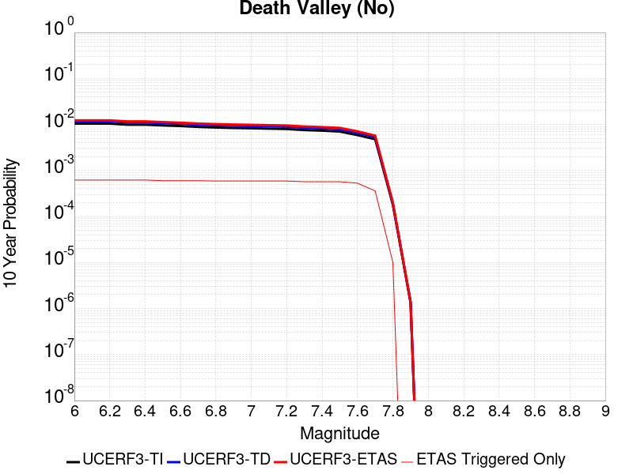 |

| Magnitude | 1 wk TI Prob | 1 wk TD Prob | 1 wk ETAS Prob | 1 wk ETAS/TD Gain | 1 wk ETAS Triggered Only | 1 mo TI Prob | 1 mo TD Prob | 1 mo ETAS Prob | 1 mo ETAS/TD Gain | 1 mo ETAS Triggered Only | 1 yr TI Prob | 1 yr TD Prob | 1 yr ETAS Prob | 1 yr ETAS/TD Gain | 1 yr ETAS Triggered Only | 10 yr TI Prob | 10 yr TD Prob | 10 yr ETAS Prob | 10 yr ETAS/TD Gain | 10 yr ETAS Triggered Only |
|-----|-----|-----|-----|-----|-----|-----|-----|-----|-----|-----|-----|-----|-----|-----|-----|-----|-----|-----|-----|-----|
| 6.0 | 2.0074807E-5 | 2.2500084E-5 | 0.0010224776 | 45.44328 | 0.001 | 8.603206E-5 | 9.642541E-5 | 0.001096329 | 11.369711 | 0.001 | 0.001046937 | 0.0011733545 | 0.0021721811 | 1.8512573 | 0.001 | 0.010420183 | 0.011672506 | 0.013649162 | 1.1693428 | 0.002 |
| 6.1 | 2.0074807E-5 | 2.2500084E-5 | 0.0010224776 | 45.44328 | 0.001 | 8.603206E-5 | 9.642541E-5 | 0.001096329 | 11.369711 | 0.001 | 0.001046937 | 0.0011733545 | 0.0021721811 | 1.8512573 | 0.001 | 0.010420183 | 0.011672506 | 0.013649162 | 1.1693428 | 0.002 |
| 6.2 | 2.0074807E-5 | 2.2500084E-5 | 0.0010224776 | 45.44328 | 0.001 | 8.603206E-5 | 9.642541E-5 | 0.001096329 | 11.369711 | 0.001 | 0.001046937 | 0.0011733545 | 0.0021721811 | 1.8512573 | 0.001 | 0.010420183 | 0.011672506 | 0.013649162 | 1.1693428 | 0.002 |
| 6.3 | 1.9050609E-5 | 2.1336948E-5 | 0.0010213156 | 47.866062 | 0.001 | 8.164292E-5 | 9.1440896E-5 | 0.0010913494 | 11.935026 | 0.001 | 9.935491E-4 | 0.001112731 | 0.0021116184 | 1.8976898 | 0.001 | 0.009891188 | 0.011072419 | 0.013050274 | 1.178629 | 0.002 |
| 6.4 | 1.9050609E-5 | 2.1336948E-5 | 0.0010213156 | 47.866062 | 0.001 | 8.164292E-5 | 9.1440896E-5 | 0.0010913494 | 11.935026 | 0.001 | 9.935491E-4 | 0.001112731 | 0.0021116184 | 1.8976898 | 0.001 | 0.009891188 | 0.011072419 | 0.013050274 | 1.178629 | 0.002 |
| 6.5 | 1.8367004E-5 | 2.0561009E-5 | 0.0010205405 | 49.634747 | 0.001 | 7.8713354E-5 | 8.811567E-5 | 0.0010880276 | 12.347719 | 0.001 | 9.5791375E-4 | 0.0010722869 | 0.0020712146 | 1.9315863 | 0.001 | 0.009537951 | 0.0106719155 | 0.012650572 | 1.1854078 | 0.002 |
| 6.6 | 1.779439E-5 | 1.9910927E-5 | 0.001019891 | 51.222675 | 0.001 | 7.625944E-5 | 8.53298E-5 | 0.0010852445 | 12.718236 | 0.001 | 9.280632E-4 | 0.0010384015 | 0.0020373631 | 1.9620186 | 0.001 | 0.009241969 | 0.010336253 | 0.01231558 | 1.1914937 | 0.002 |
| 6.7 | 1.7025437E-5 | 1.9043426E-5 | 0.0010190244 | 53.510563 | 0.001 | 7.296412E-5 | 8.161216E-5 | 0.0010815306 | 13.252076 | 0.001 | 8.87976E-4 | 9.931813E-4 | 0.0019921882 | 2.0058656 | 0.001 | 0.008844362 | 0.009888145 | 0.011868369 | 1.2002624 | 0.002 |
| 6.8 | 1.6545107E-5 | 1.8512545E-5 | 0.001018494 | 55.016422 | 0.001 | 7.090568E-5 | 7.93371E-5 | 0.0010792578 | 13.603443 | 0.001 | 8.629347E-4 | 9.655073E-4 | 0.0019645419 | 2.034725 | 0.001 | 0.008595915 | 0.009613829 | 0.011594601 | 1.2060337 | 0.002 |
| 6.9 | 1.615478E-5 | 1.8087594E-5 | 0.0010180695 | 56.285515 | 0.001 | 6.9232934E-5 | 7.751599E-5 | 0.0010774385 | 13.899564 | 0.001 | 8.4258494E-4 | 9.433546E-4 | 0.0019424113 | 2.0590467 | 0.001 | 0.008393973 | 0.009394196 | 0.011375407 | 1.2108974 | 0.002 |
| 7.0 | 1.5894311E-5 | 1.780555E-5 | 0.0010177877 | 57.161266 | 0.001 | 6.81167E-5 | 7.6307304E-5 | 0.001076231 | 14.103906 | 0.001 | 8.2900526E-4 | 9.286515E-4 | 0.0019277228 | 2.0758302 | 0.001 | 0.008259195 | 0.009248397 | 0.011229901 | 1.2142537 | 0.002 |
| 7.1 | 1.5602263E-5 | 1.7483504E-5 | 0.0010174661 | 58.195774 | 0.001 | 6.6865134E-5 | 7.492718E-5 | 0.0010748523 | 14.345291 | 0.001 | 8.137789E-4 | 9.118627E-4 | 0.0019109509 | 2.0956564 | 0.001 | 0.008108052 | 0.009081894 | 0.01106373 | 1.2182183 | 0.002 |
| 7.2 | 1.5323829E-5 | 1.717063E-5 | 0.0010171535 | 59.23798 | 0.001 | 6.56719E-5 | 7.358637E-5 | 0.0010735128 | 14.588472 | 0.001 | 7.99262E-4 | 8.9555193E-4 | 0.0018946563 | 2.11563 | 0.001 | 0.007963934 | 0.008920107 | 0.010902266 | 1.2222126 | 0.002 |
| 7.3 | 1.4556212E-5 | 1.6302456E-5 | 0.0010162862 | 62.339455 | 0.001 | 6.238227E-5 | 6.9865826E-5 | 0.0010697959 | 15.312149 | 0.001 | 7.592395E-4 | 8.5029035E-4 | 0.00184944 | 2.1750689 | 0.001 | 0.0075665074 | 0.008471014 | 0.010454073 | 1.2340993 | 0.002 |
| 7.4 | 1.411725E-5 | 1.580796E-5 | 0.0010157921 | 64.25827 | 0.001 | 6.0501097E-5 | 6.7746674E-5 | 0.0010676789 | 15.759872 | 0.001 | 7.363519E-4 | 8.245094E-4 | 0.0018236849 | 2.2118423 | 0.001 | 0.0073391674 | 0.008215138 | 0.010198708 | 1.241453 | 0.002 |
| 7.5 | 1.3503312E-5 | 1.5126289E-5 | 0.0010151111 | 67.10907 | 0.001 | 5.7870053E-5 | 6.482538E-5 | 0.0010647605 | 16.425058 | 0.001 | 7.043401E-4 | 7.8896893E-4 | 0.00178818 | 2.266477 | 0.001 | 0.007021119 | 0.007862304 | 0.009846579 | 1.2523783 | 0.002 |
| 7.6 | 1.1279839E-5 | 1.2626327E-5 | 0.0010126136 | 80.1986 | 0.001 | 4.834127E-5 | 5.4111737E-5 | 0.0010540576 | 19.479279 | 0.001 | 5.88396E-4 | 6.5861654E-4 | 0.0016579579 | 2.5173342 | 0.001 | 0.005868405 | 0.006567199 | 0.008554064 | 1.3025439 | 0.002 |
| 7.7 | 9.189108E-6 | 1.0283358E-5 | 0.0010102731 | 98.2435 | 0.001 | 3.93813E-5 | 4.407082E-5 | 0.0010440267 | 23.68975 | 0.001 | 4.7936183E-4 | 5.3643517E-4 | 0.0015358988 | 2.8631582 | 0.001 | 0.004783291 | 0.005351914 | 0.0073412103 | 1.3716981 | 0.002 |
| 7.8 | 3.4586725E-7 | 3.6482615E-7 | 0.0010003644 | 2742.0308 | 0.001 | 1.4822873E-6 | 1.5635396E-6 | 0.001001562 | 640.5734 | 0.001 | 1.80467E-5 | 1.9035933E-5 | 0.0010190168 | 53.531227 | 0.001 | 1.8045233E-4 | 1.9034347E-4 | 0.0011901532 | 6.2526608 | 0.001 |
| 7.9 | 2.5591178E-9 | 2.6696718E-9 | 2.6696718E-9 | 1.0 | 0.0 | 1.0967647E-8 | 1.14414505E-8 | 1.14414505E-8 | 1.0 | 0.0 | 1.335311E-7 | 1.3929966E-7 | 1.3929966E-7 | 1.0 | 0.0 | 1.3353102E-6 | 1.3929966E-6 | 1.3929966E-6 | 1.0 | 0.0 |

## Death Valley (Black Mtns Frontal)
*[(top)](#table-of-contents)*

| 1 Week | 1 Month | 1 Year | 10 Year |
|-----|-----|-----|-----|
|  |  | 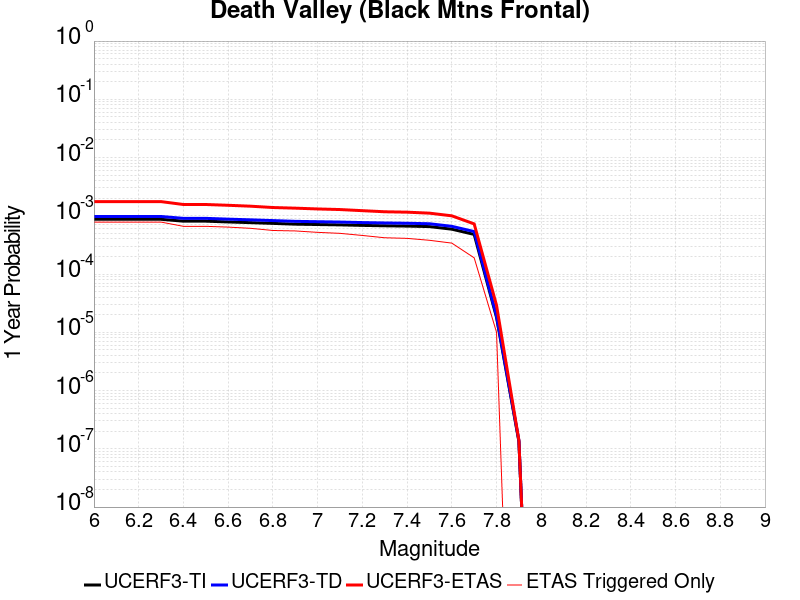 |  |

| Magnitude | 1 wk TI Prob | 1 wk TD Prob | 1 wk ETAS Prob | 1 wk ETAS/TD Gain | 1 wk ETAS Triggered Only | 1 mo TI Prob | 1 mo TD Prob | 1 mo ETAS Prob | 1 mo ETAS/TD Gain | 1 mo ETAS Triggered Only | 1 yr TI Prob | 1 yr TD Prob | 1 yr ETAS Prob | 1 yr ETAS/TD Gain | 1 yr ETAS Triggered Only | 10 yr TI Prob | 10 yr TD Prob | 10 yr ETAS Prob | 10 yr ETAS/TD Gain | 10 yr ETAS Triggered Only |
|-----|-----|-----|-----|-----|-----|-----|-----|-----|-----|-----|-----|-----|-----|-----|-----|-----|-----|-----|-----|-----|
| 6.0 | 1.6707214E-5 | 1.867027E-5 | 0.0010186516 | 54.560093 | 0.001 | 7.160038E-5 | 8.001302E-5 | 0.001079933 | 13.496965 | 0.001 | 8.71386E-4 | 9.737309E-4 | 0.001972757 | 2.0259778 | 0.001 | 0.00867977 | 0.009695496 | 0.011676106 | 1.2042813 | 0.002 |
| 6.1 | 1.6707214E-5 | 1.867027E-5 | 0.0010186516 | 54.560093 | 0.001 | 7.160038E-5 | 8.001302E-5 | 0.001079933 | 13.496965 | 0.001 | 8.71386E-4 | 9.737309E-4 | 0.001972757 | 2.0259778 | 0.001 | 0.00867977 | 0.009695496 | 0.011676106 | 1.2042813 | 0.002 |
| 6.2 | 1.6707214E-5 | 1.867027E-5 | 0.0010186516 | 54.560093 | 0.001 | 7.160038E-5 | 8.001302E-5 | 0.001079933 | 13.496965 | 0.001 | 8.71386E-4 | 9.737309E-4 | 0.001972757 | 2.0259778 | 0.001 | 0.00867977 | 0.009695496 | 0.011676106 | 1.2042813 | 0.002 |
| 6.3 | 1.6707214E-5 | 1.867027E-5 | 0.0010186516 | 54.560093 | 0.001 | 7.160038E-5 | 8.001302E-5 | 0.001079933 | 13.496965 | 0.001 | 8.71386E-4 | 9.737309E-4 | 0.001972757 | 2.0259778 | 0.001 | 0.00867977 | 0.009695496 | 0.011676106 | 1.2042813 | 0.002 |
| 6.4 | 1.5515609E-5 | 1.7338214E-5 | 0.0010173209 | 58.67507 | 0.001 | 6.649377E-5 | 7.4304546E-5 | 0.0010742303 | 14.457127 | 0.001 | 8.0926094E-4 | 9.042885E-4 | 0.0019033842 | 2.1048417 | 0.001 | 0.008063202 | 0.009006773 | 0.010988759 | 1.2200551 | 0.002 |
| 6.5 | 1.5515609E-5 | 1.7338214E-5 | 0.0010173209 | 58.67507 | 0.001 | 6.649377E-5 | 7.4304546E-5 | 0.0010742303 | 14.457127 | 0.001 | 8.0926094E-4 | 9.042885E-4 | 0.0019033842 | 2.1048417 | 0.001 | 0.008063202 | 0.009006773 | 0.010988759 | 1.2200551 | 0.002 |
| 6.6 | 1.5041828E-5 | 1.6809145E-5 | 0.0010167924 | 60.490425 | 0.001 | 6.4463384E-5 | 7.203723E-5 | 0.0010719652 | 14.88071 | 0.001 | 7.8455906E-4 | 8.767063E-4 | 0.0018758297 | 2.1396327 | 0.001 | 0.00781795 | 0.008733132 | 0.010715666 | 1.2270129 | 0.002 |
| 6.7 | 1.4634985E-5 | 1.6356016E-5 | 0.0010163396 | 62.13858 | 0.001 | 6.271985E-5 | 7.009536E-5 | 0.0010700253 | 15.265279 | 0.001 | 7.6334673E-4 | 8.5308263E-4 | 0.0018522296 | 2.1712193 | 0.001 | 0.007607299 | 0.008498715 | 0.010481718 | 1.2333297 | 0.002 |
| 6.8 | 1.4209158E-5 | 1.5882048E-5 | 0.0010158662 | 63.963173 | 0.001 | 6.089497E-5 | 6.8064175E-5 | 0.0010679961 | 15.691017 | 0.001 | 7.4114406E-4 | 8.2837185E-4 | 0.0018275435 | 2.2061872 | 0.001 | 0.007386771 | 0.008253456 | 0.01023695 | 1.2403227 | 0.002 |
| 6.9 | 1.3780098E-5 | 1.5404594E-5 | 0.0010153892 | 65.9147 | 0.001 | 5.9056227E-5 | 6.6018045E-5 | 0.001065952 | 16.146374 | 0.001 | 7.1877235E-4 | 8.0347876E-4 | 0.0018026753 | 2.243588 | 0.001 | 0.0071645193 | 0.008006332 | 0.00999032 | 1.2478023 | 0.002 |
| 7.0 | 1.3585064E-5 | 1.5188155E-5 | 0.0010151729 | 66.83978 | 0.001 | 5.8220405E-5 | 6.50905E-5 | 0.0010650255 | 16.362225 | 0.001 | 7.086029E-4 | 7.9219416E-4 | 0.001791402 | 2.2613168 | 0.001 | 0.007063476 | 0.007894293 | 0.009878505 | 1.2513475 | 0.002 |
| 7.1 | 1.3398601E-5 | 1.49813395E-5 | 0.0010149664 | 67.7487 | 0.001 | 5.742131E-5 | 6.420419E-5 | 0.00106414 | 16.574306 | 0.001 | 6.9888023E-4 | 7.8141113E-4 | 0.0017806297 | 2.278736 | 0.001 | 0.0069668638 | 0.007787224 | 0.00977165 | 1.254831 | 0.002 |
| 7.2 | 1.3126312E-5 | 1.4679561E-5 | 0.0010146649 | 69.120926 | 0.001 | 5.6254412E-5 | 6.291092E-5 | 0.001062848 | 16.894493 | 0.001 | 6.846822E-4 | 7.6567667E-4 | 0.001764911 | 2.3050344 | 0.001 | 0.006825765 | 0.00763097 | 0.009615708 | 1.2600899 | 0.002 |
| 7.3 | 1.2922429E-5 | 1.4453788E-5 | 0.0010144394 | 70.18501 | 0.001 | 5.5380664E-5 | 6.194336E-5 | 0.0010618814 | 17.142778 | 0.001 | 6.74051E-4 | 7.53905E-4 | 0.0017531511 | 2.325427 | 0.001 | 0.006720101 | 0.007514055 | 0.009499026 | 1.2641679 | 0.002 |
| 7.4 | 1.2768878E-5 | 1.4283772E-5 | 0.0010142695 | 71.00852 | 0.001 | 5.4722615E-5 | 6.1214756E-5 | 0.0010611536 | 17.33493 | 0.001 | 6.660441E-4 | 7.4504025E-4 | 0.0017442952 | 2.3412094 | 0.001 | 0.0066405144 | 0.0074260035 | 0.0094111515 | 1.2673239 | 0.002 |
| 7.5 | 1.2521929E-5 | 1.40120155E-5 | 0.0010139981 | 72.366325 | 0.001 | 5.366431E-5 | 6.005014E-5 | 0.0010599901 | 17.65175 | 0.001 | 6.531671E-4 | 7.3087064E-4 | 0.0017301398 | 2.3672311 | 0.001 | 0.006512506 | 0.0072852457 | 0.0092706755 | 1.2725275 | 0.002 |
| 7.6 | 1.1301089E-5 | 1.2648149E-5 | 0.0010126355 | 80.06195 | 0.001 | 4.8432343E-5 | 5.4205255E-5 | 0.0010541511 | 19.447395 | 0.001 | 5.895042E-4 | 6.5975444E-4 | 0.0016590947 | 2.5147154 | 0.001 | 0.0058794282 | 0.00657851 | 0.008565353 | 1.3020202 | 0.002 |
| 7.7 | 9.189108E-6 | 1.0283358E-5 | 0.0010102731 | 98.2435 | 0.001 | 3.93813E-5 | 4.407082E-5 | 0.0010440267 | 23.68975 | 0.001 | 4.7936183E-4 | 5.3643517E-4 | 0.0015358988 | 2.8631582 | 0.001 | 0.004783291 | 0.005351914 | 0.0073412103 | 1.3716981 | 0.002 |
| 7.8 | 3.4586725E-7 | 3.6482615E-7 | 0.0010003644 | 2742.0308 | 0.001 | 1.4822873E-6 | 1.5635396E-6 | 0.001001562 | 640.5734 | 0.001 | 1.80467E-5 | 1.9035933E-5 | 0.0010190168 | 53.531227 | 0.001 | 1.8045233E-4 | 1.9034347E-4 | 0.0011901532 | 6.2526608 | 0.001 |
| 7.9 | 2.5591178E-9 | 2.6696718E-9 | 2.6696718E-9 | 1.0 | 0.0 | 1.0967647E-8 | 1.14414505E-8 | 1.14414505E-8 | 1.0 | 0.0 | 1.335311E-7 | 1.3929966E-7 | 1.3929966E-7 | 1.0 | 0.0 | 1.3353102E-6 | 1.3929966E-6 | 1.3929966E-6 | 1.0 | 0.0 |

## Baker
*[(top)](#table-of-contents)*

| 1 Week | 1 Month | 1 Year | 10 Year |
|-----|-----|-----|-----|
|  |  |  |  |

| Magnitude | 1 wk TI Prob | 1 wk TD Prob | 1 wk ETAS Prob | 1 wk ETAS/TD Gain | 1 wk ETAS Triggered Only | 1 mo TI Prob | 1 mo TD Prob | 1 mo ETAS Prob | 1 mo ETAS/TD Gain | 1 mo ETAS Triggered Only | 1 yr TI Prob | 1 yr TD Prob | 1 yr ETAS Prob | 1 yr ETAS/TD Gain | 1 yr ETAS Triggered Only | 10 yr TI Prob | 10 yr TD Prob | 10 yr ETAS Prob | 10 yr ETAS/TD Gain | 10 yr ETAS Triggered Only |
|-----|-----|-----|-----|-----|-----|-----|-----|-----|-----|-----|-----|-----|-----|-----|-----|-----|-----|-----|-----|-----|
| 6.0 | 5.695525E-6 | 5.8348373E-6 | 0.0020058232 | 343.76678 | 0.002 | 2.4409164E-5 | 2.5006228E-5 | 0.0020249563 | 80.97807 | 0.002 | 2.9714106E-4 | 3.044123E-4 | 0.0023038036 | 7.568037 | 0.002 | 0.0029674405 | 0.0030403486 | 0.005034268 | 1.6558193 | 0.002 |
| 6.1 | 5.695525E-6 | 5.8348373E-6 | 0.0020058232 | 343.76678 | 0.002 | 2.4409164E-5 | 2.5006228E-5 | 0.0020249563 | 80.97807 | 0.002 | 2.9714106E-4 | 3.044123E-4 | 0.0023038036 | 7.568037 | 0.002 | 0.0029674405 | 0.0030403486 | 0.005034268 | 1.6558193 | 0.002 |
| 6.2 | 5.695525E-6 | 5.8348373E-6 | 0.0020058232 | 343.76678 | 0.002 | 2.4409164E-5 | 2.5006228E-5 | 0.0020249563 | 80.97807 | 0.002 | 2.9714106E-4 | 3.044123E-4 | 0.0023038036 | 7.568037 | 0.002 | 0.0029674405 | 0.0030403486 | 0.005034268 | 1.6558193 | 0.002 |
| 6.3 | 3.2995713E-6 | 3.383667E-6 | 0.0020033768 | 592.0727 | 0.002 | 1.4140943E-5 | 1.4501353E-5 | 0.0020144724 | 138.91617 | 0.002 | 1.7215237E-4 | 1.7654014E-4 | 0.002176187 | 12.326869 | 0.002 | 0.0017201907 | 0.001764046 | 0.0037605178 | 2.1317573 | 0.002 |
| 6.4 | 3.2995713E-6 | 3.383667E-6 | 0.0020033768 | 592.0727 | 0.002 | 1.4140943E-5 | 1.4501353E-5 | 0.0020144724 | 138.91617 | 0.002 | 1.7215237E-4 | 1.7654014E-4 | 0.002176187 | 12.326869 | 0.002 | 0.0017201907 | 0.001764046 | 0.0037605178 | 2.1317573 | 0.002 |
| 6.5 | 2.782202E-6 | 2.8558404E-6 | 0.0020028502 | 701.31726 | 0.002 | 1.1923668E-5 | 1.223926E-5 | 0.0020122149 | 164.40657 | 0.002 | 1.4516099E-4 | 1.4900314E-4 | 0.002148705 | 14.420536 | 0.002 | 0.001450662 | 0.0014890651 | 0.0034860868 | 2.3411245 | 0.002 |
| 6.6 | 2.3163404E-6 | 2.38092E-6 | 0.0020023761 | 841.00946 | 0.002 | 9.927136E-6 | 1.0203904E-5 | 0.0020101834 | 197.00142 | 0.002 | 1.20856166E-4 | 1.2422565E-4 | 0.0021239773 | 17.097734 | 0.002 | 0.0012079047 | 0.0012415823 | 0.0032390992 | 2.6088476 | 0.002 |
| 6.7 | 2.037056E-6 | 2.0965003E-6 | 0.0020020923 | 954.9687 | 0.002 | 8.7302105E-6 | 8.984972E-6 | 0.002008967 | 223.5919 | 0.002 | 1.0628513E-4 | 1.093867E-4 | 0.0021091679 | 19.281757 | 0.002 | 0.0010623431 | 0.0010933448 | 0.003091158 | 2.8272493 | 0.002 |
| 6.8 | 1.8356744E-6 | 1.8915287E-6 | 0.0020018877 | 1058.3439 | 0.002 | 7.867153E-6 | 8.106527E-6 | 0.0020080903 | 247.71277 | 0.002 | 9.577837E-5 | 9.869264E-5 | 0.0020984951 | 21.262936 | 0.002 | 9.57371E-4 | 9.86502E-4 | 0.0029845291 | 3.0253654 | 0.002 |
| 6.9 | 1.6310546E-6 | 1.6832072E-6 | 0.0020016797 | 1189.2058 | 0.002 | 6.9902153E-6 | 7.213726E-6 | 0.0020071992 | 278.24725 | 0.002 | 8.510255E-5 | 8.782368E-5 | 0.002087648 | 23.7709 | 0.002 | 8.5069967E-4 | 8.7790104E-4 | 0.0028761453 | 3.276161 | 0.002 |
| 7.0 | 1.2058036E-6 | 1.2508665E-6 | 0.0020012483 | 1599.8896 | 0.002 | 5.1677193E-6 | 5.3608455E-6 | 0.00200535 | 374.07346 | 0.002 | 6.291517E-5 | 6.5266366E-5 | 0.0020651359 | 31.641655 | 0.002 | 6.289736E-4 | 6.524743E-4 | 0.0026511694 | 4.063255 | 0.002 |
| 7.1 | 1.052382E-6 | 1.0951609E-6 | 0.002001093 | 1827.2137 | 0.002 | 4.5102006E-6 | 4.693538E-6 | 0.0020046842 | 427.11578 | 0.002 | 5.491031E-5 | 5.7142337E-5 | 0.002057028 | 35.998318 | 0.002 | 5.4896745E-4 | 5.7127734E-4 | 0.0025701348 | 4.4989266 | 0.002 |
| 7.2 | 1.0067454E-6 | 1.0487711E-6 | 0.0020010467 | 1907.992 | 0.002 | 4.3146156E-6 | 4.4947255E-6 | 0.0020044858 | 445.964 | 0.002 | 5.252918E-5 | 5.4721917E-5 | 0.0020546124 | 37.54643 | 0.002 | 5.251676E-4 | 5.470853E-4 | 0.0025459912 | 4.653737 | 0.002 |
| 7.3 | 9.3596316E-7 | 9.767723E-7 | 0.0010009758 | 1024.779 | 0.001 | 4.0112645E-6 | 4.1861604E-6 | 0.0010041819 | 239.88138 | 0.001 | 4.8836053E-5 | 5.096532E-5 | 0.0010509144 | 20.620186 | 0.001 | 4.8825322E-4 | 5.095371E-4 | 0.0015090276 | 2.9615657 | 0.001 |
| 7.4 | 8.8117395E-7 | 9.2076635E-7 | 0.0010009198 | 1087.0509 | 0.001 | 3.7764542E-6 | 3.9461356E-6 | 0.0010039422 | 254.41148 | 0.001 | 4.5977362E-5 | 4.8043148E-5 | 0.001047995 | 21.813623 | 0.001 | 4.596785E-4 | 4.8032837E-4 | 0.001479848 | 3.080909 | 0.001 |
| 7.5 | 8.292386E-7 | 8.6745956E-7 | 0.0010008666 | 1153.7905 | 0.001 | 3.5538749E-6 | 3.7176785E-6 | 0.0010037139 | 269.98407 | 0.001 | 4.326757E-5 | 4.5261804E-5 | 0.0010452166 | 23.092684 | 0.001 | 4.3259145E-4 | 4.5252658E-4 | 0.001452074 | 3.2088149 | 0.001 |
| 7.6 | 7.553842E-7 | 7.9144706E-7 | 0.0010007906 | 1264.5074 | 0.001 | 3.2373566E-6 | 3.3919116E-6 | 0.0010033885 | 295.818 | 0.001 | 3.9414106E-5 | 4.129575E-5 | 0.0010412545 | 25.21457 | 0.001 | 3.9407116E-4 | 4.1288146E-4 | 0.0014124686 | 3.4210029 | 0.001 |
| 7.7 | 6.5285366E-7 | 6.852797E-7 | 0.0010006846 | 1460.2572 | 0.001 | 2.797941E-6 | 2.9369096E-6 | 0.001002934 | 341.49295 | 0.001 | 3.40644E-5 | 3.5756293E-5 | 0.0010357206 | 28.966105 | 0.001 | 3.405918E-4 | 3.5750607E-4 | 0.0013571485 | 3.7961552 | 0.001 |
| 7.8 | 3.4586725E-7 | 3.6482615E-7 | 0.0010003644 | 2742.0308 | 0.001 | 1.4822873E-6 | 1.5635396E-6 | 0.001001562 | 640.5734 | 0.001 | 1.80467E-5 | 1.9035933E-5 | 0.0010190168 | 53.531227 | 0.001 | 1.8045233E-4 | 1.9034347E-4 | 0.0011901532 | 6.2526608 | 0.001 |
| 7.9 | 2.5591178E-9 | 2.6696718E-9 | 2.6696718E-9 | 1.0 | 0.0 | 1.0967647E-8 | 1.14414505E-8 | 1.14414505E-8 | 1.0 | 0.0 | 1.335311E-7 | 1.3929966E-7 | 1.3929966E-7 | 1.0 | 0.0 | 1.3353102E-6 | 1.3929966E-6 | 1.3929966E-6 | 1.0 | 0.0 |

## Death Valley (Fish Lake Valley)
*[(top)](#table-of-contents)*

| 1 Week | 1 Month | 1 Year | 10 Year |
|-----|-----|-----|-----|
|  |  |  |  |

| Magnitude | 1 wk TI Prob | 1 wk TD Prob | 1 wk ETAS Prob | 1 wk ETAS/TD Gain | 1 wk ETAS Triggered Only | 1 mo TI Prob | 1 mo TD Prob | 1 mo ETAS Prob | 1 mo ETAS/TD Gain | 1 mo ETAS Triggered Only | 1 yr TI Prob | 1 yr TD Prob | 1 yr ETAS Prob | 1 yr ETAS/TD Gain | 1 yr ETAS Triggered Only | 10 yr TI Prob | 10 yr TD Prob | 10 yr ETAS Prob | 10 yr ETAS/TD Gain | 10 yr ETAS Triggered Only |
|-----|-----|-----|-----|-----|-----|-----|-----|-----|-----|-----|-----|-----|-----|-----|-----|-----|-----|-----|-----|-----|
| 6.0 | 3.872328E-5 | 4.7267473E-5 | 0.0010472202 | 22.155197 | 0.001 | 1.6594635E-4 | 2.0256084E-4 | 0.0012023583 | 5.935788 | 0.001 | 0.0020185246 | 0.002463534 | 0.0034610704 | 1.4049209 | 0.001 | 0.02000288 | 0.024388181 | 0.026339404 | 1.080007 | 0.002 |
| 6.1 | 3.872328E-5 | 4.7267473E-5 | 0.0010472202 | 22.155197 | 0.001 | 1.6594635E-4 | 2.0256084E-4 | 0.0012023583 | 5.935788 | 0.001 | 0.0020185246 | 0.002463534 | 0.0034610704 | 1.4049209 | 0.001 | 0.02000288 | 0.024388181 | 0.026339404 | 1.080007 | 0.002 |
| 6.2 | 3.872328E-5 | 4.7267473E-5 | 0.0010472202 | 22.155197 | 0.001 | 1.6594635E-4 | 2.0256084E-4 | 0.0012023583 | 5.935788 | 0.001 | 0.0020185246 | 0.002463534 | 0.0034610704 | 1.4049209 | 0.001 | 0.02000288 | 0.024388181 | 0.026339404 | 1.080007 | 0.002 |
| 6.3 | 2.8356371E-5 | 3.3609853E-5 | 0.0010335762 | 30.752182 | 0.001 | 1.2152165E-4 | 1.4403471E-4 | 0.0011438907 | 7.941771 | 0.001 | 0.0014785219 | 0.0017522911 | 0.0027505388 | 1.5696814 | 0.001 | 0.014687235 | 0.017391782 | 0.019357 | 1.1129968 | 0.002 |
| 6.4 | 2.8356371E-5 | 3.3609853E-5 | 0.0010335762 | 30.752182 | 0.001 | 1.2152165E-4 | 1.4403471E-4 | 0.0011438907 | 7.941771 | 0.001 | 0.0014785219 | 0.0017522911 | 0.0027505388 | 1.5696814 | 0.001 | 0.014687235 | 0.017391782 | 0.019357 | 1.1129968 | 0.002 |
| 6.5 | 2.4448687E-5 | 2.8607552E-5 | 0.001028579 | 35.954803 | 0.001 | 1.0477588E-4 | 1.2259831E-4 | 0.0011224757 | 9.155719 | 0.001 | 0.0012748998 | 0.0014916632 | 0.0024901715 | 1.6693927 | 0.001 | 0.012676105 | 0.014821377 | 0.016791733 | 1.1329402 | 0.002 |
| 6.6 | 2.1298161E-5 | 2.4660083E-5 | 0.0010246354 | 41.55036 | 0.001 | 9.127464E-5 | 1.0568198E-4 | 0.0011055763 | 10.46135 | 0.001 | 0.0011107022 | 0.0012859525 | 0.0022846665 | 1.7766336 | 0.001 | 0.011051672 | 0.012788526 | 0.014762948 | 1.1543902 | 0.002 |
| 6.7 | 1.8959729E-5 | 2.1781025E-5 | 0.0010217592 | 46.91052 | 0.001 | 8.125345E-5 | 9.334405E-5 | 0.0010932507 | 11.712055 | 0.001 | 9.888117E-4 | 0.001135897 | 0.002134761 | 1.8793615 | 0.001 | 0.009844234 | 0.01130357 | 0.013280963 | 1.1749352 | 0.002 |
| 6.8 | 1.6691629E-5 | 1.9018353E-5 | 0.0010189994 | 53.579792 | 0.001 | 7.153359E-5 | 8.150477E-5 | 0.0010814233 | 13.26822 | 0.001 | 8.7057345E-4 | 9.918857E-4 | 0.0019908939 | 2.0071807 | 0.001 | 0.008671708 | 0.009876343 | 0.01185659 | 1.2005041 | 0.002 |
| 6.9 | 1.450505E-5 | 1.638954E-5 | 0.0010163732 | 62.013527 | 0.001 | 6.216302E-5 | 7.0239046E-5 | 0.0010701688 | 15.236096 | 0.001 | 7.5657194E-4 | 8.5483363E-4 | 0.0018539788 | 2.1688182 | 0.001 | 0.007540013 | 0.008516385 | 0.010499353 | 1.2328414 | 0.002 |
| 7.0 | 1.2940855E-5 | 1.4537972E-5 | 0.0010145234 | 69.784386 | 0.001 | 5.545963E-5 | 6.230414E-5 | 0.0010622418 | 17.049297 | 0.001 | 6.750118E-4 | 7.5829466E-4 | 0.0017575364 | 2.3177485 | 0.001 | 0.006729651 | 0.0075576897 | 0.009542574 | 1.2626312 | 0.002 |
| 7.1 | 1.2544658E-5 | 1.4078208E-5 | 0.0010140642 | 72.03077 | 0.001 | 5.3761712E-5 | 6.0333812E-5 | 0.0010602735 | 17.573454 | 0.001 | 6.5435225E-4 | 7.343222E-4 | 0.0017335878 | 2.3608 | 0.001 | 0.006524288 | 0.007319551 | 0.009304912 | 1.2712408 | 0.002 |
| 7.2 | 1.2489416E-5 | 1.4015674E-5 | 0.0010140017 | 72.34769 | 0.001 | 5.3524967E-5 | 6.0065824E-5 | 0.0010600057 | 17.647402 | 0.001 | 6.514716E-4 | 7.310616E-4 | 0.0017303305 | 2.3668737 | 0.001 | 0.006495651 | 0.0072871596 | 0.009272586 | 1.2724553 | 0.002 |
| 7.3 | 1.2368307E-5 | 1.3879812E-5 | 0.0010138659 | 73.04608 | 0.001 | 5.3005948E-5 | 5.9483587E-5 | 0.0010594241 | 17.81036 | 0.001 | 6.451563E-4 | 7.2397763E-4 | 0.0017232536 | 2.380258 | 0.001 | 0.0064328653 | 0.007216782 | 0.009202348 | 1.2751318 | 0.002 |
| 7.4 | 1.2161707E-5 | 1.36478675E-5 | 0.0010136343 | 74.270515 | 0.001 | 5.212056E-5 | 5.8489582E-5 | 0.0010584311 | 18.096062 | 0.001 | 6.3438306E-4 | 7.118836E-4 | 0.0017111717 | 2.403724 | 0.001 | 0.006325751 | 0.0070966207 | 0.009082427 | 1.2798243 | 0.002 |
| 7.5 | 1.1707948E-5 | 1.3145515E-5 | 0.0010131324 | 77.07057 | 0.001 | 5.0175953E-5 | 5.6336736E-5 | 0.0010562805 | 18.749407 | 0.001 | 6.10721E-4 | 6.856895E-4 | 0.0016850038 | 2.457386 | 0.001 | 0.0060904534 | 0.006836321 | 0.008822649 | 1.290555 | 0.002 |
| 7.6 | 1.0319538E-5 | 1.1579622E-5 | 0.001011568 | 87.357605 | 0.001 | 4.4225842E-5 | 4.9626036E-5 | 0.0010495764 | 21.149712 | 0.001 | 5.383166E-4 | 6.040347E-4 | 0.0016034306 | 2.654534 | 0.001 | 0.0053701443 | 0.0060244603 | 0.008012411 | 1.3299799 | 0.002 |
| 7.7 | 8.937764E-6 | 1.0022779E-5 | 0.0010100128 | 100.77173 | 0.001 | 3.830414E-5 | 4.295409E-5 | 0.0010429111 | 24.27967 | 0.001 | 4.6625308E-4 | 5.228456E-4 | 0.0015223228 | 2.9116106 | 0.001 | 0.0046527605 | 0.005216664 | 0.007206231 | 1.3813868 | 0.002 |
| 7.8 | 3.108007E-7 | 3.284654E-7 | 0.0010003281 | 3045.4597 | 0.001 | 1.3320023E-6 | 1.407708E-6 | 0.0010014063 | 711.37354 | 0.001 | 1.6217007E-5 | 1.7138715E-5 | 0.0010171216 | 59.34643 | 0.001 | 1.6215823E-4 | 1.7137431E-4 | 0.001171203 | 6.8341804 | 0.001 |
| 7.9 | 2.5591178E-9 | 2.6696718E-9 | 2.6696718E-9 | 1.0 | 0.0 | 1.0967647E-8 | 1.14414505E-8 | 1.14414505E-8 | 1.0 | 0.0 | 1.335311E-7 | 1.3929966E-7 | 1.3929966E-7 | 1.0 | 0.0 | 1.3353102E-6 | 1.3929966E-6 | 1.3929966E-6 | 1.0 | 0.0 |

## Santa Cruz Island
*[(top)](#table-of-contents)*

| 1 Week | 1 Month | 1 Year | 10 Year |
|-----|-----|-----|-----|
| 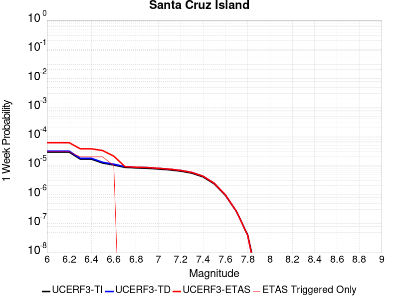 |  |  |  |

| Magnitude | 1 wk TI Prob | 1 wk TD Prob | 1 wk ETAS Prob | 1 wk ETAS/TD Gain | 1 wk ETAS Triggered Only | 1 mo TI Prob | 1 mo TD Prob | 1 mo ETAS Prob | 1 mo ETAS/TD Gain | 1 mo ETAS Triggered Only | 1 yr TI Prob | 1 yr TD Prob | 1 yr ETAS Prob | 1 yr ETAS/TD Gain | 1 yr ETAS Triggered Only | 10 yr TI Prob | 10 yr TD Prob | 10 yr ETAS Prob | 10 yr ETAS/TD Gain | 10 yr ETAS Triggered Only |
|-----|-----|-----|-----|-----|-----|-----|-----|-----|-----|-----|-----|-----|-----|-----|-----|-----|-----|-----|-----|-----|
| 6.0 | 2.9164563E-5 | 3.1599742E-5 | 3.1599742E-5 | 1.0 | 0.0 | 1.2498499E-4 | 1.3542121E-4 | 1.3542121E-4 | 1.0 | 0.0 | 0.0015206301 | 0.0016476426 | 0.002645995 | 1.6059278 | 0.001 | 0.015102667 | 0.016368 | 0.017351631 | 1.0600948 | 0.001 |
| 6.1 | 2.9164563E-5 | 3.1599742E-5 | 3.1599742E-5 | 1.0 | 0.0 | 1.2498499E-4 | 1.3542121E-4 | 1.3542121E-4 | 1.0 | 0.0 | 0.0015206301 | 0.0016476426 | 0.002645995 | 1.6059278 | 0.001 | 0.015102667 | 0.016368 | 0.017351631 | 1.0600948 | 0.001 |
| 6.2 | 2.9164563E-5 | 3.1599742E-5 | 3.1599742E-5 | 1.0 | 0.0 | 1.2498499E-4 | 1.3542121E-4 | 1.3542121E-4 | 1.0 | 0.0 | 0.0015206301 | 0.0016476426 | 0.002645995 | 1.6059278 | 0.001 | 0.015102667 | 0.016368 | 0.017351631 | 1.0600948 | 0.001 |
| 6.3 | 1.6635553E-5 | 1.780436E-5 | 1.780436E-5 | 1.0 | 0.0 | 7.1293274E-5 | 7.630226E-5 | 7.630226E-5 | 1.0 | 0.0 | 8.6765E-4 | 9.2860236E-4 | 0.0019276738 | 2.0758872 | 0.001 | 0.008642701 | 0.009249094 | 0.010239844 | 1.1071187 | 0.001 |
| 6.4 | 1.6635553E-5 | 1.780436E-5 | 1.780436E-5 | 1.0 | 0.0 | 7.1293274E-5 | 7.630226E-5 | 7.630226E-5 | 1.0 | 0.0 | 8.6765E-4 | 9.2860236E-4 | 0.0019276738 | 2.0758872 | 0.001 | 0.008642701 | 0.009249094 | 0.010239844 | 1.1071187 | 0.001 |
| 6.5 | 1.2238748E-5 | 1.3042995E-5 | 1.3042995E-5 | 1.0 | 0.0 | 5.2450723E-5 | 5.5897377E-5 | 5.5897377E-5 | 1.0 | 0.0 | 6.3840044E-4 | 6.8034173E-4 | 0.0016796615 | 2.4688497 | 0.001 | 0.0063656955 | 0.0067829876 | 0.007776205 | 1.1464276 | 0.001 |
| 6.6 | 1.0489767E-5 | 1.1156636E-5 | 1.1156636E-5 | 1.0 | 0.0 | 4.495537E-5 | 4.781329E-5 | 4.781329E-5 | 1.0 | 0.0 | 5.4719415E-4 | 5.819735E-4 | 0.0015813916 | 2.717291 | 0.001 | 0.005458487 | 0.0058047357 | 0.006798931 | 1.1712731 | 0.001 |
| 6.7 | 8.699222E-6 | 9.236782E-6 | 9.236782E-6 | 1.0 | 0.0 | 3.7281847E-5 | 3.958561E-5 | 3.958561E-5 | 1.0 | 0.0 | 4.5381195E-4 | 4.8184878E-4 | 0.0014813669 | 3.0743399 | 0.001 | 0.0045288634 | 0.004808108 | 0.0058032996 | 1.206982 | 0.001 |
| 6.8 | 8.307732E-6 | 8.8169045E-6 | 8.8169045E-6 | 1.0 | 0.0 | 3.560408E-5 | 3.7786187E-5 | 3.7786187E-5 | 1.0 | 0.0 | 4.3339343E-4 | 4.5995016E-4 | 0.0014594902 | 3.1731486 | 0.001 | 0.004325492 | 0.0045900354 | 0.005585445 | 1.2168633 | 0.001 |
| 6.9 | 8.073121E-6 | 8.564939E-6 | 8.564939E-6 | 1.0 | 0.0 | 3.459863E-5 | 3.6706366E-5 | 3.6706366E-5 | 1.0 | 0.0 | 4.2115687E-4 | 4.468088E-4 | 0.001446362 | 3.237094 | 0.001 | 0.004203596 | 0.004459156 | 0.0054546967 | 1.2232577 | 0.001 |
| 7.0 | 7.617019E-6 | 8.074664E-6 | 8.074664E-6 | 1.0 | 0.0 | 3.264396E-5 | 3.4605247E-5 | 3.4605247E-5 | 1.0 | 0.0 | 3.9736772E-4 | 4.212378E-4 | 0.0014208166 | 3.3729558 | 0.001 | 0.003966579 | 0.0042044413 | 0.0052002366 | 1.2368437 | 0.001 |
| 7.1 | 7.1224836E-6 | 7.545788E-6 | 7.545788E-6 | 1.0 | 0.0 | 3.052457E-5 | 3.2338692E-5 | 3.2338692E-5 | 1.0 | 0.0 | 3.715733E-4 | 3.936528E-4 | 0.0013932592 | 3.5393097 | 0.001 | 0.003709526 | 0.003929598 | 0.0049256682 | 1.253479 | 0.001 |
| 7.2 | 6.441115E-6 | 6.8273835E-6 | 6.8273835E-6 | 1.0 | 0.0 | 2.7604487E-5 | 2.9259887E-5 | 2.9259887E-5 | 1.0 | 0.0 | 3.360328E-4 | 3.5618112E-4 | 3.5618112E-4 | 1.0 | 0.0 | 0.0033552512 | 0.003556131 | 0.003556131 | 1.0 | 0.0 |
| 7.3 | 5.494274E-6 | 5.8199944E-6 | 5.8199944E-6 | 1.0 | 0.0 | 2.3546674E-5 | 2.4942596E-5 | 2.4942596E-5 | 1.0 | 0.0 | 2.8664304E-4 | 3.0363398E-4 | 3.0363398E-4 | 1.0 | 0.0 | 0.002862736 | 0.0030322142 | 0.0030322142 | 1.0 | 0.0 |
| 7.4 | 4.0802624E-6 | 4.312256E-6 | 4.312256E-6 | 1.0 | 0.0 | 1.7486722E-5 | 1.8480967E-5 | 1.8480967E-5 | 1.0 | 0.0 | 2.1288003E-4 | 2.2498262E-4 | 2.2498262E-4 | 1.0 | 0.0 | 0.0021267622 | 0.0022475575 | 0.0022475575 | 1.0 | 0.0 |
| 7.5 | 2.3584746E-6 | 2.4753094E-6 | 2.4753094E-6 | 1.0 | 0.0 | 1.0107709E-5 | 1.0608426E-5 | 1.0608426E-5 | 1.0 | 0.0 | 1.2305441E-4 | 1.2915E-4 | 1.2915E-4 | 1.0 | 0.0 | 0.0012298629 | 0.0012907543 | 0.0012907543 | 1.0 | 0.0 |
| 7.6 | 9.4981914E-7 | 9.86093E-7 | 9.86093E-7 | 1.0 | 0.0 | 4.0706473E-6 | 4.2261063E-6 | 4.2261063E-6 | 1.0 | 0.0 | 4.9559E-5 | 5.145164E-5 | 5.145164E-5 | 1.0 | 0.0 | 4.954795E-4 | 5.1439856E-4 | 5.1439856E-4 | 1.0 | 0.0 |
| 7.7 | 2.6013532E-7 | 2.6416603E-7 | 2.6416603E-7 | 1.0 | 0.0 | 1.1148652E-6 | 1.1321397E-6 | 1.1321397E-6 | 1.0 | 0.0 | 1.3573399E-5 | 1.3783714E-5 | 1.3783714E-5 | 1.0 | 0.0 | 1.357257E-4 | 1.3782867E-4 | 1.3782867E-4 | 1.0 | 0.0 |
| 7.8 | 4.1522263E-8 | 3.965679E-8 | 3.965679E-8 | 1.0 | 0.0 | 1.7795254E-7 | 1.6995766E-7 | 1.6995766E-7 | 1.0 | 0.0 | 2.16657E-6 | 2.0692328E-6 | 2.0692328E-6 | 1.0 | 0.0 | 2.1665488E-5 | 2.0692156E-5 | 2.0692156E-5 | 1.0 | 0.0 |
| 7.9 | 7.7242046E-10 | 5.9468175E-10 | 5.9468175E-10 | 1.0 | 0.0 | 3.3103735E-9 | 2.5486364E-9 | 2.5486364E-9 | 1.0 | 0.0 | 4.0303796E-8 | 3.1029646E-8 | 3.1029646E-8 | 1.0 | 0.0 | 4.030379E-7 | 3.1029643E-7 | 3.1029643E-7 | 1.0 | 0.0 |

## Garlic Springs
*[(top)](#table-of-contents)*

| 1 Week | 1 Month | 1 Year | 10 Year |
|-----|-----|-----|-----|
|  |  |  |  |

| Magnitude | 1 wk TI Prob | 1 wk TD Prob | 1 wk ETAS Prob | 1 wk ETAS/TD Gain | 1 wk ETAS Triggered Only | 1 mo TI Prob | 1 mo TD Prob | 1 mo ETAS Prob | 1 mo ETAS/TD Gain | 1 mo ETAS Triggered Only | 1 yr TI Prob | 1 yr TD Prob | 1 yr ETAS Prob | 1 yr ETAS/TD Gain | 1 yr ETAS Triggered Only | 10 yr TI Prob | 10 yr TD Prob | 10 yr ETAS Prob | 10 yr ETAS/TD Gain | 10 yr ETAS Triggered Only |
|-----|-----|-----|-----|-----|-----|-----|-----|-----|-----|-----|-----|-----|-----|-----|-----|-----|-----|-----|-----|-----|
| 6.0 | 1.6760017E-5 | 1.8776833E-5 | 1.8776833E-5 | 1.0 | 0.0 | 7.182667E-5 | 8.0470316E-5 | 8.0470316E-5 | 1.0 | 0.0 | 8.7413884E-4 | 9.794032E-4 | 9.794032E-4 | 1.0 | 0.0 | 0.008707083 | 0.009762413 | 0.01075265 | 1.1014336 | 0.001 |
| 6.1 | 9.852767E-6 | 1.09735865E-5 | 1.09735865E-5 | 1.0 | 0.0 | 4.222546E-5 | 4.702921E-5 | 4.702921E-5 | 1.0 | 0.0 | 5.139737E-4 | 5.7250116E-4 | 5.7250116E-4 | 1.0 | 0.0 | 0.005127866 | 0.005717221 | 0.006711504 | 1.1739101 | 0.001 |
| 6.2 | 9.852767E-6 | 1.09735865E-5 | 1.09735865E-5 | 1.0 | 0.0 | 4.222546E-5 | 4.702921E-5 | 4.702921E-5 | 1.0 | 0.0 | 5.139737E-4 | 5.7250116E-4 | 5.7250116E-4 | 1.0 | 0.0 | 0.005127866 | 0.005717221 | 0.006711504 | 1.1739101 | 0.001 |
| 6.3 | 4.3167724E-6 | 4.7780286E-6 | 4.7780286E-6 | 1.0 | 0.0 | 1.8500323E-5 | 2.0477235E-5 | 2.0477235E-5 | 1.0 | 0.0 | 2.2521814E-4 | 2.4930484E-4 | 2.4930484E-4 | 1.0 | 0.0 | 0.0022499003 | 0.00249251 | 0.0034900175 | 1.400202 | 0.001 |
| 6.4 | 4.3167724E-6 | 4.7780286E-6 | 4.7780286E-6 | 1.0 | 0.0 | 1.8500323E-5 | 2.0477235E-5 | 2.0477235E-5 | 1.0 | 0.0 | 2.2521814E-4 | 2.4930484E-4 | 2.4930484E-4 | 1.0 | 0.0 | 0.0022499003 | 0.00249251 | 0.0034900175 | 1.400202 | 0.001 |
| 6.5 | 4.3167724E-6 | 4.7780286E-6 | 4.7780286E-6 | 1.0 | 0.0 | 1.8500323E-5 | 2.0477235E-5 | 2.0477235E-5 | 1.0 | 0.0 | 2.2521814E-4 | 2.4930484E-4 | 2.4930484E-4 | 1.0 | 0.0 | 0.0022499003 | 0.00249251 | 0.0034900175 | 1.400202 | 0.001 |
| 6.6 | 4.301311E-6 | 4.760897E-6 | 4.760897E-6 | 1.0 | 0.0 | 1.8434059E-5 | 2.0403815E-5 | 2.0403815E-5 | 1.0 | 0.0 | 2.2441156E-4 | 2.4841115E-4 | 2.4841115E-4 | 1.0 | 0.0 | 0.0022418506 | 0.002483593 | 0.0034811094 | 1.4016424 | 0.001 |
| 6.7 | 3.8599724E-6 | 4.27106E-6 | 4.27106E-6 | 1.0 | 0.0 | 1.6542634E-5 | 1.8304541E-5 | 1.8304541E-5 | 1.0 | 0.0 | 2.0138794E-4 | 2.228578E-4 | 2.228578E-4 | 1.0 | 0.0 | 0.0020120554 | 0.002228578 | 0.0032263494 | 1.4477166 | 0.001 |

## Nelson Lake
*[(top)](#table-of-contents)*

| 1 Week | 1 Month | 1 Year | 10 Year |
|-----|-----|-----|-----|
| 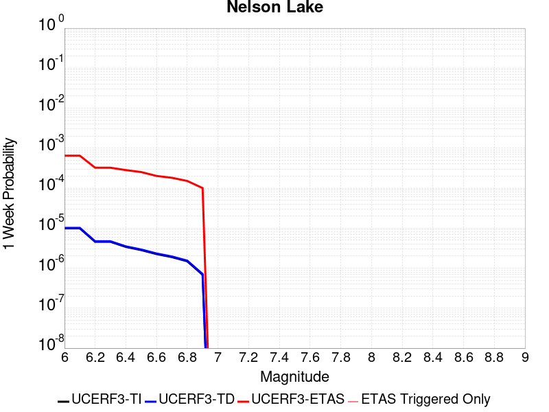 |  |  |  |

| Magnitude | 1 wk TI Prob | 1 wk TD Prob | 1 wk ETAS Prob | 1 wk ETAS/TD Gain | 1 wk ETAS Triggered Only | 1 mo TI Prob | 1 mo TD Prob | 1 mo ETAS Prob | 1 mo ETAS/TD Gain | 1 mo ETAS Triggered Only | 1 yr TI Prob | 1 yr TD Prob | 1 yr ETAS Prob | 1 yr ETAS/TD Gain | 1 yr ETAS Triggered Only | 10 yr TI Prob | 10 yr TD Prob | 10 yr ETAS Prob | 10 yr ETAS/TD Gain | 10 yr ETAS Triggered Only |
|-----|-----|-----|-----|-----|-----|-----|-----|-----|-----|-----|-----|-----|-----|-----|-----|-----|-----|-----|-----|-----|
| 6.0 | 9.913453E-6 | 1.0192255E-5 | 1.0192255E-5 | 1.0 | 0.0 | 4.2485535E-5 | 4.3680422E-5 | 4.3680422E-5 | 1.0 | 0.0 | 5.1713863E-4 | 5.316897E-4 | 0.001531158 | 2.8797963 | 0.001 | 0.0051593683 | 0.005305204 | 0.006299899 | 1.1874942 | 0.001 |
| 6.1 | 9.913453E-6 | 1.0192255E-5 | 1.0192255E-5 | 1.0 | 0.0 | 4.2485535E-5 | 4.3680422E-5 | 4.3680422E-5 | 1.0 | 0.0 | 5.1713863E-4 | 5.316897E-4 | 0.001531158 | 2.8797963 | 0.001 | 0.0051593683 | 0.005305204 | 0.006299899 | 1.1874942 | 0.001 |
| 6.2 | 4.5596407E-6 | 4.696313E-6 | 4.696313E-6 | 1.0 | 0.0 | 1.954117E-5 | 2.0126909E-5 | 2.0126909E-5 | 1.0 | 0.0 | 2.3788778E-4 | 2.4501883E-4 | 0.0012447739 | 5.080319 | 0.001 | 0.0023763329 | 0.0024476128 | 0.0034451652 | 1.4075613 | 0.001 |
| 6.3 | 4.5596407E-6 | 4.696313E-6 | 4.696313E-6 | 1.0 | 0.0 | 1.954117E-5 | 2.0126909E-5 | 2.0126909E-5 | 1.0 | 0.0 | 2.3788778E-4 | 2.4501883E-4 | 0.0012447739 | 5.080319 | 0.001 | 0.0023763329 | 0.0024476128 | 0.0034451652 | 1.4075613 | 0.001 |
| 6.4 | 3.4025713E-6 | 3.5098972E-6 | 3.5098972E-6 | 1.0 | 0.0 | 1.4582367E-5 | 1.5042335E-5 | 1.5042335E-5 | 1.0 | 0.0 | 1.7752586E-4 | 1.8312587E-4 | 1.8312587E-4 | 1.0 | 0.0 | 0.001773841 | 0.0018298327 | 0.0018298327 | 1.0 | 0.0 |
| 6.5 | 2.8352947E-6 | 2.927856E-6 | 2.927856E-6 | 1.0 | 0.0 | 1.2151207E-5 | 1.2547898E-5 | 1.2547898E-5 | 1.0 | 0.0 | 1.479309E-4 | 1.5276071E-4 | 1.5276071E-4 | 1.0 | 0.0 | 0.0014783246 | 0.0015266308 | 0.0015266308 | 1.0 | 0.0 |
| 6.6 | 2.251518E-6 | 2.3290677E-6 | 2.3290677E-6 | 1.0 | 0.0 | 9.649328E-6 | 9.981683E-6 | 9.981683E-6 | 1.0 | 0.0 | 1.1747423E-4 | 1.2152085E-4 | 1.2152085E-4 | 1.0 | 0.0 | 0.0011741214 | 0.0012146058 | 0.0012146058 | 1.0 | 0.0 |
| 6.7 | 1.8911853E-6 | 1.9591396E-6 | 1.9591396E-6 | 1.0 | 0.0 | 8.105055E-6 | 8.39629E-6 | 8.39629E-6 | 1.0 | 0.0 | 9.867457E-5 | 1.0222061E-4 | 1.0222061E-4 | 1.0 | 0.0 | 9.863076E-4 | 0.0010217935 | 0.0010217935 | 1.0 | 0.0 |
| 6.8 | 1.4874814E-6 | 1.5438305E-6 | 1.5438305E-6 | 1.0 | 0.0 | 6.374905E-6 | 6.6164025E-6 | 6.6164025E-6 | 1.0 | 0.0 | 7.76117E-5 | 8.055224E-5 | 8.055224E-5 | 1.0 | 0.0 | 7.75846E-4 | 8.0528157E-4 | 8.0528157E-4 | 1.0 | 0.0 |
| 6.9 | 6.835972E-7 | 7.1399285E-7 | 7.1399285E-7 | 1.0 | 0.0 | 2.9296991E-6 | 3.0599674E-6 | 3.0599674E-6 | 1.0 | 0.0 | 3.56685E-5 | 3.7254784E-5 | 3.7254784E-5 | 1.0 | 0.0 | 3.5662777E-4 | 3.7251666E-4 | 3.7251666E-4 | 1.0 | 0.0 |

## Lenwood-Lockhart-Old Woman Springs
*[(top)](#table-of-contents)*

| 1 Week | 1 Month | 1 Year | 10 Year |
|-----|-----|-----|-----|
|  |  |  |  |

| Magnitude | 1 wk TI Prob | 1 wk TD Prob | 1 wk ETAS Prob | 1 wk ETAS/TD Gain | 1 wk ETAS Triggered Only | 1 mo TI Prob | 1 mo TD Prob | 1 mo ETAS Prob | 1 mo ETAS/TD Gain | 1 mo ETAS Triggered Only | 1 yr TI Prob | 1 yr TD Prob | 1 yr ETAS Prob | 1 yr ETAS/TD Gain | 1 yr ETAS Triggered Only | 10 yr TI Prob | 10 yr TD Prob | 10 yr ETAS Prob | 10 yr ETAS/TD Gain | 10 yr ETAS Triggered Only |
|-----|-----|-----|-----|-----|-----|-----|-----|-----|-----|-----|-----|-----|-----|-----|-----|-----|-----|-----|-----|-----|
| 6.0 | 3.744542E-5 | 4.396252E-5 | 0.0010439185 | 23.74565 | 0.001 | 1.604705E-4 | 1.8839816E-4 | 0.0011882097 | 6.306907 | 0.001 | 0.0019519776 | 0.0022915069 | 0.0032892153 | 1.435394 | 0.001 | 0.019349206 | 0.022696787 | 0.023674091 | 1.0430591 | 0.001 |
| 6.1 | 3.744542E-5 | 4.396252E-5 | 0.0010439185 | 23.74565 | 0.001 | 1.604705E-4 | 1.8839816E-4 | 0.0011882097 | 6.306907 | 0.001 | 0.0019519776 | 0.0022915069 | 0.0032892153 | 1.435394 | 0.001 | 0.019349206 | 0.022696787 | 0.023674091 | 1.0430591 | 0.001 |
| 6.2 | 3.744542E-5 | 4.396252E-5 | 0.0010439185 | 23.74565 | 0.001 | 1.604705E-4 | 1.8839816E-4 | 0.0011882097 | 6.306907 | 0.001 | 0.0019519776 | 0.0022915069 | 0.0032892153 | 1.435394 | 0.001 | 0.019349206 | 0.022696787 | 0.023674091 | 1.0430591 | 0.001 |
| 6.3 | 2.1079984E-5 | 2.5353434E-5 | 0.0010253281 | 40.441387 | 0.001 | 9.0339665E-5 | 1.0865316E-4 | 0.0011085445 | 10.202598 | 0.001 | 0.0010993304 | 0.0013220694 | 0.0023207474 | 1.7553899 | 0.001 | 0.010939079 | 0.0131442575 | 0.014131113 | 1.0750788 | 0.001 |
| 6.4 | 2.1079984E-5 | 2.5353434E-5 | 0.0010253281 | 40.441387 | 0.001 | 9.0339665E-5 | 1.0865316E-4 | 0.0011085445 | 10.202598 | 0.001 | 0.0010993304 | 0.0013220694 | 0.0023207474 | 1.7553899 | 0.001 | 0.010939079 | 0.0131442575 | 0.014131113 | 1.0750788 | 0.001 |
| 6.5 | 1.7397282E-5 | 2.066241E-5 | 0.0010206418 | 49.396065 | 0.001 | 7.455765E-5 | 8.8550245E-5 | 0.0010884617 | 12.292024 | 0.001 | 9.073613E-4 | 0.0010775778 | 0.0020765 | 1.9270072 | 0.001 | 0.009036654 | 0.010724821 | 0.011714096 | 1.0922416 | 0.001 |
| 6.6 | 1.52050325E-5 | 1.7679693E-5 | 0.001017662 | 57.561066 | 0.001 | 6.51628E-5 | 7.576796E-5 | 0.0010756922 | 14.197191 | 0.001 | 7.9306826E-4 | 9.220924E-4 | 0.0019211703 | 2.08349 | 0.001 | 0.007902439 | 0.009183526 | 0.010174342 | 1.1078906 | 0.001 |
| 6.7 | 1.332523E-5 | 1.5264002E-5 | 0.0010152487 | 66.51262 | 0.001 | 5.7106878E-5 | 6.5415545E-5 | 0.0010653501 | 16.285887 | 0.001 | 6.950544E-4 | 7.961491E-4 | 0.0017953529 | 2.2550461 | 0.001 | 0.006928845 | 0.007933599 | 0.008925665 | 1.1250463 | 0.001 |
| 6.8 | 1.1525329E-5 | 1.3030979E-5 | 0.001013018 | 77.739204 | 0.001 | 4.9393333E-5 | 5.584588E-5 | 0.00105579 | 18.905424 | 0.001 | 6.011979E-4 | 6.797157E-4 | 0.0016790361 | 2.4702032 | 0.001 | 0.00599574 | 0.006776819 | 0.0077700424 | 1.1465619 | 0.001 |
| 6.9 | 1.0253909E-5 | 1.15144385E-5 | 1.15144385E-5 | 1.0 | 0.0 | 4.3944583E-5 | 4.9346683E-5 | 4.9346683E-5 | 1.0 | 0.0 | 5.3489394E-4 | 6.0063385E-4 | 6.0063385E-4 | 1.0 | 0.0 | 0.0053360825 | 0.0059904843 | 0.0059904843 | 1.0 | 0.0 |
| 7.0 | 8.104563E-6 | 8.991279E-6 | 8.991279E-6 | 1.0 | 0.0 | 3.4733377E-5 | 3.8533497E-5 | 3.8533497E-5 | 1.0 | 0.0 | 4.2279682E-4 | 4.6904673E-4 | 4.6904673E-4 | 1.0 | 0.0 | 0.0042199334 | 0.0046808156 | 0.0046808156 | 1.0 | 0.0 |
| 7.1 | 6.7986157E-6 | 7.515816E-6 | 7.515816E-6 | 1.0 | 0.0 | 2.91366E-5 | 3.2210253E-5 | 3.2210253E-5 | 1.0 | 0.0 | 3.5468035E-4 | 3.920914E-4 | 3.920914E-4 | 1.0 | 0.0 | 0.003541148 | 0.003914213 | 0.003914213 | 1.0 | 0.0 |
| 7.2 | 5.6893327E-6 | 6.2800136E-6 | 6.2800136E-6 | 1.0 | 0.0 | 2.4382627E-5 | 2.6914078E-5 | 2.6914078E-5 | 1.0 | 0.0 | 2.9681803E-4 | 3.2763163E-4 | 3.2763163E-4 | 1.0 | 0.0 | 0.002964219 | 0.0032716845 | 0.0032716845 | 1.0 | 0.0 |
| 7.3 | 4.253348E-6 | 4.7069107E-6 | 4.7069107E-6 | 1.0 | 0.0 | 1.8228506E-5 | 2.0172329E-5 | 2.0172329E-5 | 1.0 | 0.0 | 2.2190946E-4 | 2.4557224E-4 | 2.4557224E-4 | 1.0 | 0.0 | 0.00221688 | 0.0024531898 | 0.0024531898 | 1.0 | 0.0 |
| 7.4 | 2.5448119E-6 | 2.852045E-6 | 2.852045E-6 | 1.0 | 0.0 | 1.0906291E-5 | 1.2223002E-5 | 1.2223002E-5 | 1.0 | 0.0 | 1.3277601E-4 | 1.4880655E-4 | 1.4880655E-4 | 1.0 | 0.0 | 0.001326967 | 0.0014872311 | 0.0014872311 | 1.0 | 0.0 |
| 7.5 | 4.3706837E-8 | 4.562909E-8 | 4.562909E-8 | 1.0 | 0.0 | 1.8731501E-7 | 1.9555324E-7 | 1.9555324E-7 | 1.0 | 0.0 | 2.2805577E-6 | 2.3808586E-6 | 2.3808586E-6 | 1.0 | 0.0 | 2.2805343E-5 | 2.3808387E-5 | 2.3808387E-5 | 1.0 | 0.0 |

## Cady
*[(top)](#table-of-contents)*

| 1 Week | 1 Month | 1 Year | 10 Year |
|-----|-----|-----|-----|
|  |  |  |  |

| Magnitude | 1 wk TI Prob | 1 wk TD Prob | 1 wk ETAS Prob | 1 wk ETAS/TD Gain | 1 wk ETAS Triggered Only | 1 mo TI Prob | 1 mo TD Prob | 1 mo ETAS Prob | 1 mo ETAS/TD Gain | 1 mo ETAS Triggered Only | 1 yr TI Prob | 1 yr TD Prob | 1 yr ETAS Prob | 1 yr ETAS/TD Gain | 1 yr ETAS Triggered Only | 10 yr TI Prob | 10 yr TD Prob | 10 yr ETAS Prob | 10 yr ETAS/TD Gain | 10 yr ETAS Triggered Only |
|-----|-----|-----|-----|-----|-----|-----|-----|-----|-----|-----|-----|-----|-----|-----|-----|-----|-----|-----|-----|-----|
| 6.0 | 1.9892565E-5 | 2.1858728E-5 | 2.1858728E-5 | 1.0 | 0.0 | 8.525106E-5 | 9.3677416E-5 | 9.3677416E-5 | 1.0 | 0.0 | 0.0010374374 | 0.0011400167 | 0.0011400167 | 1.0 | 0.0 | 0.010326075 | 0.011350701 | 0.01233935 | 1.0871003 | 0.001 |
| 6.1 | 1.9892565E-5 | 2.1858728E-5 | 2.1858728E-5 | 1.0 | 0.0 | 8.525106E-5 | 9.3677416E-5 | 9.3677416E-5 | 1.0 | 0.0 | 0.0010374374 | 0.0011400167 | 0.0011400167 | 1.0 | 0.0 | 0.010326075 | 0.011350701 | 0.01233935 | 1.0871003 | 0.001 |
| 6.2 | 1.9892565E-5 | 2.1858728E-5 | 2.1858728E-5 | 1.0 | 0.0 | 8.525106E-5 | 9.3677416E-5 | 9.3677416E-5 | 1.0 | 0.0 | 0.0010374374 | 0.0011400167 | 0.0011400167 | 1.0 | 0.0 | 0.010326075 | 0.011350701 | 0.01233935 | 1.0871003 | 0.001 |
| 6.3 | 1.1117327E-5 | 1.2176583E-5 | 1.2176583E-5 | 1.0 | 0.0 | 4.764482E-5 | 5.2184492E-5 | 5.2184492E-5 | 1.0 | 0.0 | 5.7992124E-4 | 6.351925E-4 | 6.351925E-4 | 1.0 | 0.0 | 0.0057841022 | 0.0063368753 | 0.0063368753 | 1.0 | 0.0 |
| 6.4 | 1.1117327E-5 | 1.2176583E-5 | 1.2176583E-5 | 1.0 | 0.0 | 4.764482E-5 | 5.2184492E-5 | 5.2184492E-5 | 1.0 | 0.0 | 5.7992124E-4 | 6.351925E-4 | 6.351925E-4 | 1.0 | 0.0 | 0.0057841022 | 0.0063368753 | 0.0063368753 | 1.0 | 0.0 |
| 6.5 | 6.103093E-6 | 6.672021E-6 | 6.672021E-6 | 1.0 | 0.0 | 2.615585E-5 | 2.8594131E-5 | 2.8594131E-5 | 1.0 | 0.0 | 3.1840094E-4 | 3.480905E-4 | 3.480905E-4 | 1.0 | 0.0 | 0.0031794512 | 0.0034766865 | 0.0034766865 | 1.0 | 0.0 |
| 6.6 | 5.817237E-6 | 6.3656585E-6 | 6.3656585E-6 | 1.0 | 0.0 | 2.4930776E-5 | 2.728118E-5 | 2.728118E-5 | 1.0 | 0.0 | 3.034899E-4 | 3.3211018E-4 | 3.3211018E-4 | 1.0 | 0.0 | 0.0030307577 | 0.0033173605 | 0.0033173605 | 1.0 | 0.0 |
| 6.7 | 4.8846314E-6 | 5.3405684E-6 | 5.3405684E-6 | 1.0 | 0.0 | 2.0933967E-5 | 2.2888014E-5 | 2.2888014E-5 | 1.0 | 0.0 | 2.5484123E-4 | 2.7863772E-4 | 2.7863772E-4 | 1.0 | 0.0 | 0.0025454918 | 0.0027840391 | 0.0027840391 | 1.0 | 0.0 |
| 6.8 | 1.7788773E-6 | 1.9399079E-6 | 1.9399079E-6 | 1.0 | 0.0 | 7.6237375E-6 | 8.313874E-6 | 8.313874E-6 | 1.0 | 0.0 | 9.281505E-5 | 1.01218284E-4 | 1.01218284E-4 | 1.0 | 0.0 | 9.2776294E-4 | 0.0010118765 | 0.0010118765 | 1.0 | 0.0 |
| 6.9 | 7.5455404E-7 | 8.297092E-7 | 8.297092E-7 | 1.0 | 0.0 | 3.233799E-6 | 3.5558937E-6 | 3.5558937E-6 | 1.0 | 0.0 | 3.937079E-5 | 4.3292483E-5 | 4.3292483E-5 | 1.0 | 0.0 | 3.9363815E-4 | 4.3287344E-4 | 4.3287344E-4 | 1.0 | 0.0 |
| 7.0 | 6.8578805E-7 | 7.541816E-7 | 7.541816E-7 | 1.0 | 0.0 | 2.9390883E-6 | 3.2322048E-6 | 3.2322048E-6 | 1.0 | 0.0 | 3.578281E-5 | 3.9351715E-5 | 3.9351715E-5 | 1.0 | 0.0 | 3.577705E-4 | 3.9347992E-4 | 3.9347992E-4 | 1.0 | 0.0 |

## Great Valley 11
*[(top)](#table-of-contents)*

| 1 Week | 1 Month | 1 Year | 10 Year |
|-----|-----|-----|-----|
|  |  |  | 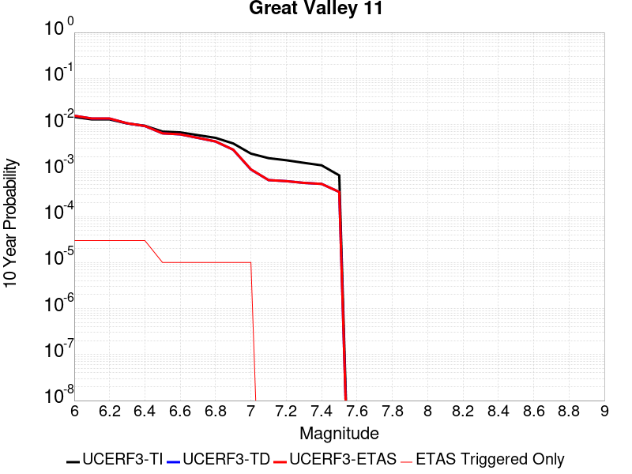 |

| Magnitude | 1 wk TI Prob | 1 wk TD Prob | 1 wk ETAS Prob | 1 wk ETAS/TD Gain | 1 wk ETAS Triggered Only | 1 mo TI Prob | 1 mo TD Prob | 1 mo ETAS Prob | 1 mo ETAS/TD Gain | 1 mo ETAS Triggered Only | 1 yr TI Prob | 1 yr TD Prob | 1 yr ETAS Prob | 1 yr ETAS/TD Gain | 1 yr ETAS Triggered Only | 10 yr TI Prob | 10 yr TD Prob | 10 yr ETAS Prob | 10 yr ETAS/TD Gain | 10 yr ETAS Triggered Only |
|-----|-----|-----|-----|-----|-----|-----|-----|-----|-----|-----|-----|-----|-----|-----|-----|-----|-----|-----|-----|-----|
| 6.0 | 2.8099583E-5 | 2.9832152E-5 | 2.9832152E-5 | 1.0 | 0.0 | 1.20421224E-4 | 1.278462E-4 | 1.278462E-4 | 1.0 | 0.0 | 0.0014651422 | 0.0015554909 | 0.0015554909 | 1.0 | 0.0 | 0.0145552 | 0.01545356 | 0.016438106 | 1.06371 | 0.001 |
| 6.1 | 2.483194E-5 | 2.590715E-5 | 2.590715E-5 | 1.0 | 0.0 | 1.0641825E-4 | 1.11026246E-4 | 1.11026246E-4 | 1.0 | 0.0 | 0.0012948721 | 0.0013509706 | 0.0013509706 | 1.0 | 0.0 | 0.012873529 | 0.013433994 | 0.01442056 | 1.073438 | 0.001 |
| 6.2 | 2.483194E-5 | 2.590715E-5 | 2.590715E-5 | 1.0 | 0.0 | 1.0641825E-4 | 1.11026246E-4 | 1.11026246E-4 | 1.0 | 0.0 | 0.0012948721 | 0.0013509706 | 0.0013509706 | 1.0 | 0.0 | 0.012873529 | 0.013433994 | 0.01442056 | 1.073438 | 0.001 |
| 6.3 | 2.0257901E-5 | 2.0398922E-5 | 2.0398922E-5 | 1.0 | 0.0 | 8.681669E-5 | 8.742122E-5 | 8.742122E-5 | 1.0 | 0.0 | 0.0010564806 | 0.0010638756 | 0.0010638756 | 1.0 | 0.0 | 0.01051472 | 0.010592012 | 0.011581419 | 1.0934107 | 0.001 |
| 6.4 | 1.8054898E-5 | 1.7780874E-5 | 1.7780874E-5 | 1.0 | 0.0 | 7.737584E-5 | 7.62017E-5 | 7.62017E-5 | 1.0 | 0.0 | 9.416436E-4 | 9.2739856E-4 | 9.2739856E-4 | 1.0 | 0.0 | 0.009376635 | 0.009239036 | 0.010229796 | 1.1072364 | 0.001 |
| 6.5 | 1.34804895E-5 | 1.2321055E-5 | 1.2321055E-5 | 1.0 | 0.0 | 5.777225E-5 | 5.2803476E-5 | 5.2803476E-5 | 1.0 | 0.0 | 7.031501E-4 | 6.4269686E-4 | 6.4269686E-4 | 1.0 | 0.0 | 0.007009294 | 0.0064088185 | 0.0064088185 | 1.0 | 0.0 |
| 6.6 | 1.294883E-5 | 1.1732312E-5 | 1.1732312E-5 | 1.0 | 0.0 | 5.5493805E-5 | 5.028039E-5 | 5.028039E-5 | 1.0 | 0.0 | 6.754276E-4 | 6.1199587E-4 | 6.1199587E-4 | 1.0 | 0.0 | 0.006733784 | 0.0061035305 | 0.0061035305 | 1.0 | 0.0 |
| 6.7 | 1.1272237E-5 | 9.811886E-6 | 9.811886E-6 | 1.0 | 0.0 | 4.8308695E-5 | 4.2050277E-5 | 4.2050277E-5 | 1.0 | 0.0 | 5.879996E-4 | 5.118446E-4 | 5.118446E-4 | 1.0 | 0.0 | 0.005864462 | 0.0051069413 | 0.0051069413 | 1.0 | 0.0 |
| 6.8 | 9.8337505E-6 | 8.19377E-6 | 8.19377E-6 | 1.0 | 0.0 | 4.2143965E-5 | 3.5115696E-5 | 3.5115696E-5 | 1.0 | 0.0 | 5.1298196E-4 | 4.2745177E-4 | 4.2745177E-4 | 1.0 | 0.0 | 0.005117994 | 0.0042665056 | 0.0042665056 | 1.0 | 0.0 |
| 6.9 | 7.4224813E-6 | 5.4131347E-6 | 5.4131347E-6 | 1.0 | 0.0 | 3.1810247E-5 | 2.319895E-5 | 2.319895E-5 | 1.0 | 0.0 | 3.872209E-4 | 2.8241202E-4 | 2.8241202E-4 | 1.0 | 0.0 | 0.0038654688 | 0.0028206722 | 0.0028206722 | 1.0 | 0.0 |
| 7.0 | 4.4628923E-6 | 2.0110795E-6 | 2.0110795E-6 | 1.0 | 0.0 | 1.912654E-5 | 8.618884E-6 | 8.618884E-6 | 1.0 | 0.0 | 2.3284076E-4 | 1.04929975E-4 | 1.04929975E-4 | 1.0 | 0.0 | 0.0023259693 | 0.0010488159 | 0.0010488159 | 1.0 | 0.0 |
| 7.1 | 3.5546527E-6 | 1.1855836E-6 | 1.1855836E-6 | 1.0 | 0.0 | 1.5234136E-5 | 5.081063E-6 | 5.081063E-6 | 1.0 | 0.0 | 1.8545982E-4 | 6.186026E-5 | 6.186026E-5 | 1.0 | 0.0 | 0.0018530512 | 6.1843713E-4 | 6.1843713E-4 | 1.0 | 0.0 |
| 7.2 | 3.2039936E-6 | 1.1254128E-6 | 1.1254128E-6 | 1.0 | 0.0 | 1.3731329E-5 | 4.823189E-6 | 4.823189E-6 | 1.0 | 0.0 | 1.671661E-4 | 5.8720816E-5 | 5.8720816E-5 | 1.0 | 0.0 | 0.0016704041 | 5.870597E-4 | 5.870597E-4 | 1.0 | 0.0 |
| 7.3 | 2.8120473E-6 | 1.0305612E-6 | 1.0305612E-6 | 1.0 | 0.0 | 1.2051575E-5 | 4.4166836E-6 | 4.4166836E-6 | 1.0 | 0.0 | 1.4671806E-4 | 5.3771862E-5 | 5.3771862E-5 | 1.0 | 0.0 | 0.0014662122 | 5.3759513E-4 | 5.3759513E-4 | 1.0 | 0.0 |
| 7.4 | 2.4837766E-6 | 9.800582E-7 | 9.800582E-7 | 1.0 | 0.0 | 1.0644713E-5 | 4.200243E-6 | 4.200243E-6 | 1.0 | 0.0 | 1.2959167E-4 | 5.1136827E-5 | 5.1136827E-5 | 1.0 | 0.0 | 0.0012951613 | 5.112572E-4 | 5.112572E-4 | 1.0 | 0.0 |
| 7.5 | 1.5002679E-6 | 6.546144E-7 | 6.546144E-7 | 1.0 | 0.0 | 6.4297037E-6 | 2.8054874E-6 | 2.8054874E-6 | 1.0 | 0.0 | 7.827883E-5 | 3.4156317E-5 | 3.4156317E-5 | 1.0 | 0.0 | 7.825126E-4 | 3.4151482E-4 | 3.4151482E-4 | 1.0 | 0.0 |

## Santa Ynez (West)
*[(top)](#table-of-contents)*

| 1 Week | 1 Month | 1 Year | 10 Year |
|-----|-----|-----|-----|
|  |  |  | 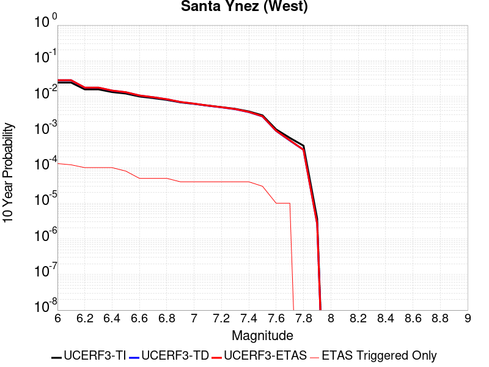 |

| Magnitude | 1 wk TI Prob | 1 wk TD Prob | 1 wk ETAS Prob | 1 wk ETAS/TD Gain | 1 wk ETAS Triggered Only | 1 mo TI Prob | 1 mo TD Prob | 1 mo ETAS Prob | 1 mo ETAS/TD Gain | 1 mo ETAS Triggered Only | 1 yr TI Prob | 1 yr TD Prob | 1 yr ETAS Prob | 1 yr ETAS/TD Gain | 1 yr ETAS Triggered Only | 10 yr TI Prob | 10 yr TD Prob | 10 yr ETAS Prob | 10 yr ETAS/TD Gain | 10 yr ETAS Triggered Only |
|-----|-----|-----|-----|-----|-----|-----|-----|-----|-----|-----|-----|-----|-----|-----|-----|-----|-----|-----|-----|-----|
| 6.0 | 4.7352758E-5 | 5.4972126E-5 | 5.4972126E-5 | 1.0 | 0.0 | 2.0292461E-4 | 2.3557522E-4 | 2.3557522E-4 | 1.0 | 0.0 | 0.0024678076 | 0.0028645284 | 0.0038616639 | 1.3480976 | 0.001 | 0.024405818 | 0.028304417 | 0.029276112 | 1.0343301 | 0.001 |
| 6.1 | 4.7352758E-5 | 5.4972126E-5 | 5.4972126E-5 | 1.0 | 0.0 | 2.0292461E-4 | 2.3557522E-4 | 2.3557522E-4 | 1.0 | 0.0 | 0.0024678076 | 0.0028645284 | 0.0038616639 | 1.3480976 | 0.001 | 0.024405818 | 0.028304417 | 0.029276112 | 1.0343301 | 0.001 |
| 6.2 | 3.0415853E-5 | 3.392511E-5 | 3.392511E-5 | 1.0 | 0.0 | 1.3034715E-4 | 1.4538545E-4 | 1.4538545E-4 | 1.0 | 0.0 | 0.0015858212 | 0.0017686661 | 0.0027668974 | 1.5643978 | 0.001 | 0.015745522 | 0.017549807 | 0.018532258 | 1.0559807 | 0.001 |
| 6.3 | 3.0415853E-5 | 3.392511E-5 | 3.392511E-5 | 1.0 | 0.0 | 1.3034715E-4 | 1.4538545E-4 | 1.4538545E-4 | 1.0 | 0.0 | 0.0015858212 | 0.0017686661 | 0.0027668974 | 1.5643978 | 0.001 | 0.015745522 | 0.017549807 | 0.018532258 | 1.0559807 | 0.001 |
| 6.4 | 2.5452082E-5 | 2.7912422E-5 | 2.7912422E-5 | 1.0 | 0.0 | 1.09075794E-4 | 1.196193E-4 | 1.196193E-4 | 1.0 | 0.0 | 0.0013271887 | 0.0014554089 | 0.0024539535 | 1.6860921 | 0.001 | 0.013192902 | 0.014460951 | 0.015446491 | 1.0681517 | 0.001 |
| 6.5 | 2.3143784E-5 | 2.5128256E-5 | 2.5128256E-5 | 1.0 | 0.0 | 9.9183875E-5 | 1.0768817E-4 | 1.0768817E-4 | 1.0 | 0.0 | 0.0012068948 | 0.0013103267 | 0.0013103267 | 1.0 | 0.0 | 0.012003611 | 0.01302768 | 0.01302768 | 1.0 | 0.0 |
| 6.6 | 1.9118515E-5 | 2.035434E-5 | 2.035434E-5 | 1.0 | 0.0 | 8.193392E-5 | 8.7230015E-5 | 8.7230015E-5 | 1.0 | 0.0 | 9.97089E-4 | 0.001061516 | 0.001061516 | 1.0 | 0.0 | 0.00992627 | 0.010565365 | 0.010565365 | 1.0 | 0.0 |
| 6.7 | 1.722807E-5 | 1.8146347E-5 | 1.8146347E-5 | 1.0 | 0.0 | 7.3832496E-5 | 7.776777E-5 | 7.776777E-5 | 1.0 | 0.0 | 8.985399E-4 | 9.464169E-4 | 9.464169E-4 | 1.0 | 0.0 | 0.008949154 | 0.0094245095 | 0.0094245095 | 1.0 | 0.0 |
| 6.8 | 1.5317364E-5 | 1.5926486E-5 | 1.5926486E-5 | 1.0 | 0.0 | 6.56442E-5 | 6.82546E-5 | 6.82546E-5 | 1.0 | 0.0 | 7.98925E-4 | 8.306873E-4 | 8.306873E-4 | 1.0 | 0.0 | 0.007960589 | 0.00827631 | 0.00827631 | 1.0 | 0.0 |
| 6.9 | 1.3071226E-5 | 1.3329624E-5 | 1.3329624E-5 | 1.0 | 0.0 | 5.6018336E-5 | 5.7125722E-5 | 5.7125722E-5 | 1.0 | 0.0 | 6.8180985E-4 | 6.9528597E-4 | 6.9528597E-4 | 1.0 | 0.0 | 0.0067972173 | 0.006931367 | 0.006931367 | 1.0 | 0.0 |
| 7.0 | 1.1836986E-5 | 1.19327815E-5 | 1.19327815E-5 | 1.0 | 0.0 | 5.0728955E-5 | 5.11395E-5 | 5.11395E-5 | 1.0 | 0.0 | 6.1745E-4 | 6.2244723E-4 | 6.2244723E-4 | 1.0 | 0.0 | 0.006157372 | 0.006207231 | 0.006207231 | 1.0 | 0.0 |
| 7.1 | 1.0597169E-5 | 1.0542201E-5 | 1.0542201E-5 | 1.0 | 0.0 | 4.541565E-5 | 4.5180084E-5 | 4.5180084E-5 | 1.0 | 0.0 | 5.5279525E-4 | 5.4992986E-4 | 5.4992986E-4 | 1.0 | 0.0 | 0.0055142213 | 0.005485821 | 0.005485821 | 1.0 | 0.0 |
| 7.2 | 9.59113E-6 | 9.459144E-6 | 9.459144E-6 | 1.0 | 0.0 | 4.11042E-5 | 4.0538565E-5 | 4.0538565E-5 | 1.0 | 0.0 | 5.0032866E-4 | 4.934463E-4 | 4.934463E-4 | 1.0 | 0.0 | 0.004992037 | 0.0049236254 | 0.0049236254 | 1.0 | 0.0 |
| 7.3 | 8.586084E-6 | 8.379583E-6 | 8.379583E-6 | 1.0 | 0.0 | 3.679698E-5 | 3.5912013E-5 | 3.5912013E-5 | 1.0 | 0.0 | 4.4791115E-4 | 4.3714207E-4 | 4.3714207E-4 | 1.0 | 0.0 | 0.004470094 | 0.004362933 | 0.004362933 | 1.0 | 0.0 |
| 7.4 | 7.2622997E-6 | 6.9515427E-6 | 6.9515427E-6 | 1.0 | 0.0 | 3.112377E-5 | 2.979199E-5 | 2.979199E-5 | 1.0 | 0.0 | 3.78866E-4 | 3.626581E-4 | 3.626581E-4 | 1.0 | 0.0 | 0.0037822074 | 0.0036207628 | 0.0036207628 | 1.0 | 0.0 |
| 7.5 | 5.627296E-6 | 5.251588E-6 | 5.251588E-6 | 1.0 | 0.0 | 2.411676E-5 | 2.2506614E-5 | 2.2506614E-5 | 1.0 | 0.0 | 2.9358198E-4 | 2.739843E-4 | 2.739843E-4 | 1.0 | 0.0 | 0.0029319443 | 0.002736537 | 0.002736537 | 1.0 | 0.0 |
| 7.6 | 2.265244E-6 | 2.0608625E-6 | 2.0608625E-6 | 1.0 | 0.0 | 9.708152E-6 | 8.832238E-6 | 8.832238E-6 | 1.0 | 0.0 | 1.18190335E-4 | 1.0752728E-4 | 1.0752728E-4 | 1.0 | 0.0 | 0.001181275 | 0.0010747612 | 0.0010747612 | 1.0 | 0.0 |
| 7.7 | 1.3099874E-6 | 1.1016252E-6 | 1.1016252E-6 | 1.0 | 0.0 | 5.61422E-6 | 4.7212425E-6 | 4.7212425E-6 | 1.0 | 0.0 | 6.8350986E-5 | 5.7479636E-5 | 5.7479636E-5 | 1.0 | 0.0 | 6.832996E-4 | 5.7465007E-4 | 5.7465007E-4 | 1.0 | 0.0 |
| 7.8 | 7.903951E-7 | 6.0711415E-7 | 6.0711415E-7 | 1.0 | 0.0 | 3.3874032E-6 | 2.6019152E-6 | 2.6019152E-6 | 1.0 | 0.0 | 4.1240855E-5 | 3.167787E-5 | 3.167787E-5 | 1.0 | 0.0 | 4.12332E-4 | 3.167349E-4 | 3.167349E-4 | 1.0 | 0.0 |
| 7.9 | 7.0753297E-9 | 5.0899476E-9 | 5.0899476E-9 | 1.0 | 0.0 | 3.032284E-8 | 2.181406E-8 | 2.181406E-8 | 1.0 | 0.0 | 3.6918053E-7 | 2.6558615E-7 | 2.6558615E-7 | 1.0 | 0.0 | 3.691799E-6 | 2.6558594E-6 | 2.6558594E-6 | 1.0 | 0.0 |

## Sierra Nevada  (No Extension)
*[(top)](#table-of-contents)*

| 1 Week | 1 Month | 1 Year | 10 Year |
|-----|-----|-----|-----|
|  |  |  |  |

| Magnitude | 1 wk TI Prob | 1 wk TD Prob | 1 wk ETAS Prob | 1 wk ETAS/TD Gain | 1 wk ETAS Triggered Only | 1 mo TI Prob | 1 mo TD Prob | 1 mo ETAS Prob | 1 mo ETAS/TD Gain | 1 mo ETAS Triggered Only | 1 yr TI Prob | 1 yr TD Prob | 1 yr ETAS Prob | 1 yr ETAS/TD Gain | 1 yr ETAS Triggered Only | 10 yr TI Prob | 10 yr TD Prob | 10 yr ETAS Prob | 10 yr ETAS/TD Gain | 10 yr ETAS Triggered Only |
|-----|-----|-----|-----|-----|-----|-----|-----|-----|-----|-----|-----|-----|-----|-----|-----|-----|-----|-----|-----|-----|
| 6.0 | 7.7690465E-6 | 6.976322E-6 | 6.976322E-6 | 1.0 | 0.0 | 3.329549E-5 | 2.9898381E-5 | 2.9898381E-5 | 1.0 | 0.0 | 4.0529718E-4 | 3.6398784E-4 | 3.6398784E-4 | 1.0 | 0.0 | 0.004045588 | 0.0036374326 | 0.0046337955 | 1.2739192 | 0.001 |
| 6.1 | 7.7690465E-6 | 6.976322E-6 | 6.976322E-6 | 1.0 | 0.0 | 3.329549E-5 | 2.9898381E-5 | 2.9898381E-5 | 1.0 | 0.0 | 4.0529718E-4 | 3.6398784E-4 | 3.6398784E-4 | 1.0 | 0.0 | 0.004045588 | 0.0036374326 | 0.0046337955 | 1.2739192 | 0.001 |
| 6.2 | 7.7690465E-6 | 6.976322E-6 | 6.976322E-6 | 1.0 | 0.0 | 3.329549E-5 | 2.9898381E-5 | 2.9898381E-5 | 1.0 | 0.0 | 4.0529718E-4 | 3.6398784E-4 | 3.6398784E-4 | 1.0 | 0.0 | 0.004045588 | 0.0036374326 | 0.0046337955 | 1.2739192 | 0.001 |
| 6.3 | 7.7690465E-6 | 6.976322E-6 | 6.976322E-6 | 1.0 | 0.0 | 3.329549E-5 | 2.9898381E-5 | 2.9898381E-5 | 1.0 | 0.0 | 4.0529718E-4 | 3.6398784E-4 | 3.6398784E-4 | 1.0 | 0.0 | 0.004045588 | 0.0036374326 | 0.0046337955 | 1.2739192 | 0.001 |
| 6.4 | 7.7690465E-6 | 6.976322E-6 | 6.976322E-6 | 1.0 | 0.0 | 3.329549E-5 | 2.9898381E-5 | 2.9898381E-5 | 1.0 | 0.0 | 4.0529718E-4 | 3.6398784E-4 | 3.6398784E-4 | 1.0 | 0.0 | 0.004045588 | 0.0036374326 | 0.0046337955 | 1.2739192 | 0.001 |
| 6.5 | 7.7690465E-6 | 6.976322E-6 | 6.976322E-6 | 1.0 | 0.0 | 3.329549E-5 | 2.9898381E-5 | 2.9898381E-5 | 1.0 | 0.0 | 4.0529718E-4 | 3.6398784E-4 | 3.6398784E-4 | 1.0 | 0.0 | 0.004045588 | 0.0036374326 | 0.0046337955 | 1.2739192 | 0.001 |
| 6.6 | 2.653E-6 | 1.614854E-6 | 1.614854E-6 | 1.0 | 0.0 | 1.136995E-5 | 6.9207845E-6 | 6.9207845E-6 | 1.0 | 0.0 | 1.3842035E-4 | 8.425733E-5 | 8.425733E-5 | 1.0 | 0.0 | 0.0013833415 | 8.422573E-4 | 0.0018414151 | 2.1862857 | 0.001 |
| 6.7 | 2.5902466E-6 | 1.5501876E-6 | 1.5501876E-6 | 1.0 | 0.0 | 1.11010095E-5 | 6.643644E-6 | 6.643644E-6 | 1.0 | 0.0 | 1.351464E-4 | 8.0883394E-5 | 8.0883394E-5 | 1.0 | 0.0 | 0.0013506424 | 8.0854254E-4 | 0.001807734 | 2.2357934 | 0.001 |
| 6.8 | 2.5853892E-6 | 1.5469877E-6 | 1.5469877E-6 | 1.0 | 0.0 | 1.1080193E-5 | 6.629931E-6 | 6.629931E-6 | 1.0 | 0.0 | 1.34893E-4 | 8.071645E-5 | 8.071645E-5 | 1.0 | 0.0 | 0.0013481114 | 8.068743E-4 | 0.0018060674 | 2.2383504 | 0.001 |
| 6.9 | 2.458257E-6 | 1.4220619E-6 | 1.4220619E-6 | 1.0 | 0.0 | 1.0535345E-5 | 6.094537E-6 | 6.094537E-6 | 1.0 | 0.0 | 1.2826028E-4 | 7.4198484E-5 | 7.4198484E-5 | 1.0 | 0.0 | 0.0012818627 | 7.4173906E-4 | 0.0017409973 | 2.347183 | 0.001 |
| 7.0 | 2.4341468E-6 | 1.3990258E-6 | 1.3990258E-6 | 1.0 | 0.0 | 1.0432016E-5 | 5.9958115E-6 | 5.9958115E-6 | 1.0 | 0.0 | 1.270024E-4 | 7.2996576E-5 | 7.2996576E-5 | 1.0 | 0.0 | 0.0012692984 | 7.297279E-4 | 0.0017289981 | 2.3693738 | 0.001 |
| 7.1 | 2.3652476E-6 | 1.3339754E-6 | 1.3339754E-6 | 1.0 | 0.0 | 1.0136736E-5 | 5.717025E-6 | 5.717025E-6 | 1.0 | 0.0 | 1.2340778E-4 | 6.9602575E-5 | 6.9602575E-5 | 1.0 | 0.0 | 0.0012333926 | 6.9580943E-4 | 0.0016951136 | 2.436175 | 0.001 |
| 7.2 | 2.272158E-6 | 1.2502821E-6 | 1.2502821E-6 | 1.0 | 0.0 | 9.737784E-6 | 5.3583412E-6 | 5.3583412E-6 | 1.0 | 0.0 | 1.1855107E-4 | 6.5235865E-5 | 6.5235865E-5 | 1.0 | 0.0 | 0.0011848784 | 6.5216864E-4 | 0.0016515165 | 2.5323458 | 0.001 |
| 7.3 | 2.1382127E-6 | 1.1419703E-6 | 1.1419703E-6 | 1.0 | 0.0 | 9.163737E-6 | 4.8941492E-6 | 4.8941492E-6 | 1.0 | 0.0 | 1.1156279E-4 | 5.958465E-5 | 5.958465E-5 | 1.0 | 0.0 | 0.001115068 | 5.956879E-4 | 5.956879E-4 | 1.0 | 0.0 |
| 7.4 | 1.9048055E-6 | 9.575242E-7 | 9.575242E-7 | 1.0 | 0.0 | 8.163426E-6 | 4.1036687E-6 | 4.1036687E-6 | 1.0 | 0.0 | 9.9385186E-5 | 4.996103E-5 | 4.996103E-5 | 1.0 | 0.0 | 9.934074E-4 | 4.994987E-4 | 4.994987E-4 | 1.0 | 0.0 |
| 7.5 | 1.5373403E-6 | 7.560042E-7 | 7.560042E-7 | 1.0 | 0.0 | 6.5885843E-6 | 3.2400142E-6 | 3.2400142E-6 | 1.0 | 0.0 | 8.021306E-5 | 3.9446462E-5 | 3.9446462E-5 | 1.0 | 0.0 | 8.0184115E-4 | 3.943951E-4 | 3.943951E-4 | 1.0 | 0.0 |
| 7.6 | 1.0680322E-6 | 4.6596554E-7 | 4.6596554E-7 | 1.0 | 0.0 | 4.577273E-6 | 1.9969937E-6 | 1.9969937E-6 | 1.0 | 0.0 | 5.5726876E-5 | 2.4313129E-5 | 2.4313129E-5 | 1.0 | 0.0 | 5.5712904E-4 | 2.4310495E-4 | 2.4310495E-4 | 1.0 | 0.0 |
| 7.7 | 5.509146E-7 | 1.5580486E-7 | 1.5580486E-7 | 1.0 | 0.0 | 2.3610605E-6 | 6.677349E-7 | 6.677349E-7 | 1.0 | 0.0 | 2.8745531E-5 | 8.129644E-6 | 8.129644E-6 | 1.0 | 0.0 | 2.8741814E-4 | 8.1293576E-5 | 8.1293576E-5 | 1.0 | 0.0 |

## San Andreas (San Bernardino N)
*[(top)](#table-of-contents)*

| 1 Week | 1 Month | 1 Year | 10 Year |
|-----|-----|-----|-----|
|  |  |  |  |

| Magnitude | 1 wk TI Prob | 1 wk TD Prob | 1 wk ETAS Prob | 1 wk ETAS/TD Gain | 1 wk ETAS Triggered Only | 1 mo TI Prob | 1 mo TD Prob | 1 mo ETAS Prob | 1 mo ETAS/TD Gain | 1 mo ETAS Triggered Only | 1 yr TI Prob | 1 yr TD Prob | 1 yr ETAS Prob | 1 yr ETAS/TD Gain | 1 yr ETAS Triggered Only | 10 yr TI Prob | 10 yr TD Prob | 10 yr ETAS Prob | 10 yr ETAS/TD Gain | 10 yr ETAS Triggered Only |
|-----|-----|-----|-----|-----|-----|-----|-----|-----|-----|-----|-----|-----|-----|-----|-----|-----|-----|-----|-----|-----|
| 6.0 | 1.4273766E-4 | 3.1606483E-4 | 3.1606483E-4 | 1.0 | 0.0 | 6.115894E-4 | 0.0013538664 | 0.0013538664 | 1.0 | 0.0 | 0.0074207084 | 0.016360244 | 0.017343882 | 1.0601238 | 0.001 | 0.07177748 | 0.15026689 | 0.15111662 | 1.0056548 | 0.001 |
| 6.1 | 1.4273766E-4 | 3.1606483E-4 | 3.1606483E-4 | 1.0 | 0.0 | 6.115894E-4 | 0.0013538664 | 0.0013538664 | 1.0 | 0.0 | 0.0074207084 | 0.016360244 | 0.017343882 | 1.0601238 | 0.001 | 0.07177748 | 0.15026689 | 0.15111662 | 1.0056548 | 0.001 |
| 6.2 | 1.4273766E-4 | 3.1606483E-4 | 3.1606483E-4 | 1.0 | 0.0 | 6.115894E-4 | 0.0013538664 | 0.0013538664 | 1.0 | 0.0 | 0.0074207084 | 0.016360244 | 0.017343882 | 1.0601238 | 0.001 | 0.07177748 | 0.15026689 | 0.15111662 | 1.0056548 | 0.001 |
| 6.3 | 1.3730655E-4 | 3.0511338E-4 | 3.0511338E-4 | 1.0 | 0.0 | 5.883239E-4 | 0.0013069791 | 0.0013069791 | 1.0 | 0.0 | 0.0071393442 | 0.015797773 | 0.016781975 | 1.0623001 | 0.001 | 0.06914291 | 0.14556676 | 0.1464212 | 1.0058697 | 0.001 |
| 6.4 | 1.3730655E-4 | 3.0511338E-4 | 3.0511338E-4 | 1.0 | 0.0 | 5.883239E-4 | 0.0013069791 | 0.0013069791 | 1.0 | 0.0 | 0.0071393442 | 0.015797773 | 0.016781975 | 1.0623001 | 0.001 | 0.06914291 | 0.14556676 | 0.1464212 | 1.0058697 | 0.001 |
| 6.5 | 1.2942807E-4 | 2.8925808E-4 | 2.8925808E-4 | 1.0 | 0.0 | 5.545738E-4 | 0.0012390936 | 0.0012390936 | 1.0 | 0.0 | 0.0067310524 | 0.01498286 | 0.015967878 | 1.065743 | 0.001 | 0.06530788 | 0.13870941 | 0.13957071 | 1.0062094 | 0.001 |
| 6.6 | 1.1125901E-4 | 2.536472E-4 | 2.536472E-4 | 1.0 | 0.0 | 4.767372E-4 | 0.0010866089 | 0.0010866089 | 1.0 | 0.0 | 0.005788839 | 0.013149847 | 0.014136697 | 1.0750465 | 0.001 | 0.056403454 | 0.122999296 | 0.123876296 | 1.0071301 | 0.001 |
| 6.7 | 1.02209575E-4 | 2.3499702E-4 | 2.3499702E-4 | 1.0 | 0.0 | 4.3796748E-4 | 0.0010067427 | 0.0010067427 | 1.0 | 0.0 | 0.0053192247 | 0.012188629 | 0.013176441 | 1.0810437 | 0.001 | 0.051936906 | 0.114790924 | 0.11567613 | 1.0077115 | 0.001 |
| 6.8 | 9.610582E-5 | 2.2025521E-4 | 2.2025521E-4 | 1.0 | 0.0 | 4.1181705E-4 | 9.436101E-4 | 9.436101E-4 | 1.0 | 0.0 | 0.0050023515 | 0.011428202 | 0.0124167735 | 1.0865028 | 0.001 | 0.048912346 | 0.1081929 | 0.10908471 | 1.0082427 | 0.001 |
| 6.9 | 9.3877505E-5 | 2.1481077E-4 | 2.1481077E-4 | 1.0 | 0.0 | 4.0227012E-4 | 9.2029345E-4 | 9.2029345E-4 | 1.0 | 0.0 | 0.0048866454 | 0.011147255 | 0.012136108 | 1.0887082 | 0.001 | 0.04780577 | 0.10578323 | 0.10667744 | 1.0084532 | 0.001 |
| 7.0 | 9.1019785E-5 | 2.0808022E-4 | 2.0808022E-4 | 1.0 | 0.0 | 3.900265E-4 | 8.914682E-4 | 8.914682E-4 | 1.0 | 0.0 | 0.0047382377 | 0.010799837 | 0.011789037 | 1.091594 | 0.001 | 0.046384744 | 0.102753714 | 0.103650965 | 1.008732 | 0.001 |
| 7.1 | 8.771155E-5 | 1.9982594E-4 | 1.9982594E-4 | 1.0 | 0.0 | 3.758525E-4 | 8.5611636E-4 | 8.5611636E-4 | 1.0 | 0.0 | 0.0045664064 | 0.0103736 | 0.011363226 | 1.0953985 | 0.001 | 0.044737056 | 0.09906527 | 0.0999662 | 1.0090944 | 0.001 |
| 7.2 | 8.0830236E-5 | 1.8388197E-4 | 1.8388197E-4 | 1.0 | 0.0 | 3.4636928E-4 | 7.8782777E-4 | 7.8782777E-4 | 1.0 | 0.0 | 0.0042088944 | 0.009549725 | 0.010540175 | 1.1037151 | 0.001 | 0.041300658 | 0.09179615 | 0.092704356 | 1.0098937 | 0.001 |
| 7.3 | 7.7668235E-5 | 1.7331762E-4 | 1.7331762E-4 | 1.0 | 0.0 | 3.328214E-4 | 7.425784E-4 | 7.425784E-4 | 1.0 | 0.0 | 0.0040445733 | 0.009003494 | 0.00999449 | 1.110068 | 0.001 | 0.03971748 | 0.08706327 | 0.0879762 | 1.0104859 | 0.001 |
| 7.4 | 7.520177E-5 | 1.6551897E-4 | 1.6551897E-4 | 1.0 | 0.0 | 3.2225347E-4 | 7.0917426E-4 | 7.0917426E-4 | 1.0 | 0.0 | 0.0039163795 | 0.008600081 | 0.009591482 | 1.115278 | 0.001 | 0.038480744 | 0.08351955 | 0.08443603 | 1.0109732 | 0.001 |
| 7.5 | 7.274697E-5 | 1.5839566E-4 | 1.5839566E-4 | 1.0 | 0.0 | 3.1173544E-4 | 6.78662E-4 | 6.78662E-4 | 1.0 | 0.0 | 0.003788775 | 0.008231463 | 0.009223231 | 1.1204851 | 0.001 | 0.03724827 | 0.08023631 | 0.081156075 | 1.0114632 | 0.001 |
| 7.6 | 7.1185845E-5 | 1.540943E-4 | 1.540943E-4 | 1.0 | 0.0 | 3.0504653E-4 | 6.6023704E-4 | 6.6023704E-4 | 1.0 | 0.0 | 0.0037076178 | 0.008008812 | 0.009000802 | 1.1238625 | 0.001 | 0.036463667 | 0.07822598 | 0.07914775 | 1.0117835 | 0.001 |
| 7.7 | 6.709961E-5 | 1.4318313E-4 | 1.4318313E-4 | 1.0 | 0.0 | 2.8753807E-4 | 6.1349774E-4 | 6.1349774E-4 | 1.0 | 0.0 | 0.003495157 | 0.0074437927 | 0.008436348 | 1.1333401 | 0.001 | 0.034406938 | 0.07305469 | 0.07398164 | 1.0126884 | 0.001 |
| 7.8 | 6.300812E-5 | 1.3202413E-4 | 1.3202413E-4 | 1.0 | 0.0 | 2.7000686E-4 | 5.65695E-4 | 5.65695E-4 | 1.0 | 0.0 | 0.0032823787 | 0.006865616 | 0.00785875 | 1.1446533 | 0.001 | 0.032343175 | 0.06771354 | 0.06864583 | 1.0137681 | 0.001 |
| 7.9 | 4.983037E-5 | 9.723488E-5 | 9.723488E-5 | 1.0 | 0.0 | 2.1354125E-4 | 4.1665437E-4 | 4.1665437E-4 | 1.0 | 0.0 | 0.0025967648 | 0.0050609782 | 0.006055917 | 1.1965903 | 0.001 | 0.025666296 | 0.05064886 | 0.05159821 | 1.0187438 | 0.001 |
| 8.0 | 3.2211527E-5 | 5.3304586E-5 | 5.3304586E-5 | 1.0 | 0.0 | 1.380421E-4 | 2.2842824E-4 | 2.2842824E-4 | 1.0 | 0.0 | 0.0016793669 | 0.0027775685 | 0.0027775685 | 1.0 | 0.0 | 0.016667323 | 0.028361378 | 0.028361378 | 1.0 | 0.0 |
| 8.1 | 1.743376E-5 | 1.8824427E-5 | 1.8824427E-5 | 1.0 | 0.0 | 7.471398E-5 | 8.067362E-5 | 8.067362E-5 | 1.0 | 0.0 | 9.0926304E-4 | 9.817594E-4 | 9.817594E-4 | 1.0 | 0.0 | 0.009055517 | 0.010484105 | 0.010484105 | 1.0 | 0.0 |
| 8.2 | 7.831616E-6 | 5.1551065E-6 | 5.1551065E-6 | 1.0 | 0.0 | 3.3563636E-5 | 2.2093127E-5 | 2.2093127E-5 | 1.0 | 0.0 | 4.0856065E-4 | 2.6895068E-4 | 2.6895068E-4 | 1.0 | 0.0 | 0.004078103 | 0.0030418145 | 0.0030418145 | 1.0 | 0.0 |
| 8.3 | 1.983087E-6 | 7.6599065E-7 | 7.6599065E-7 | 1.0 | 0.0 | 8.498917E-6 | 3.282813E-6 | 3.282813E-6 | 1.0 | 0.0 | 1.034694E-4 | 3.9967534E-5 | 3.9967534E-5 | 1.0 | 0.0 | 0.0010342124 | 4.719687E-4 | 4.719687E-4 | 1.0 | 0.0 |

## Channel Islands Western Deep Ramp
*[(top)](#table-of-contents)*

| 1 Week | 1 Month | 1 Year | 10 Year |
|-----|-----|-----|-----|
|  |  | 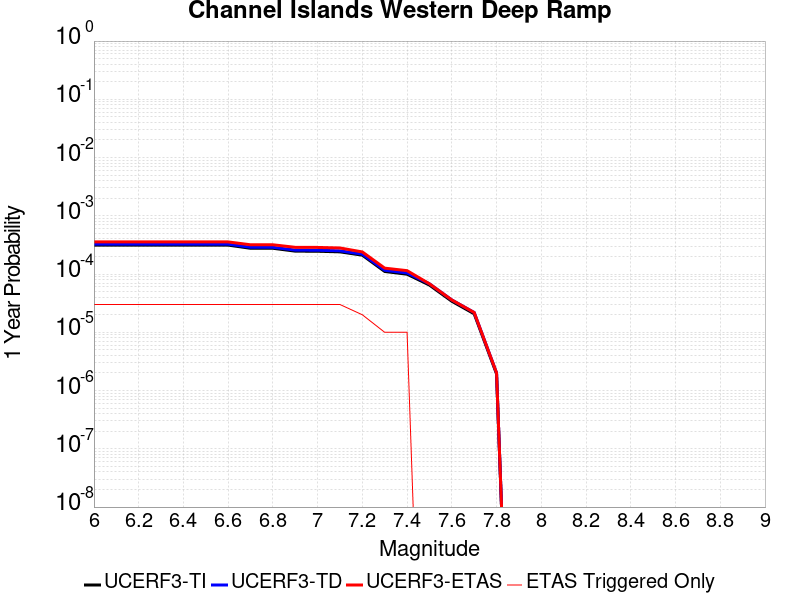 |  |

| Magnitude | 1 wk TI Prob | 1 wk TD Prob | 1 wk ETAS Prob | 1 wk ETAS/TD Gain | 1 wk ETAS Triggered Only | 1 mo TI Prob | 1 mo TD Prob | 1 mo ETAS Prob | 1 mo ETAS/TD Gain | 1 mo ETAS Triggered Only | 1 yr TI Prob | 1 yr TD Prob | 1 yr ETAS Prob | 1 yr ETAS/TD Gain | 1 yr ETAS Triggered Only | 10 yr TI Prob | 10 yr TD Prob | 10 yr ETAS Prob | 10 yr ETAS/TD Gain | 10 yr ETAS Triggered Only |
|-----|-----|-----|-----|-----|-----|-----|-----|-----|-----|-----|-----|-----|-----|-----|-----|-----|-----|-----|-----|-----|
| 6.0 | 6.0213506E-6 | 6.2548684E-6 | 6.2548684E-6 | 1.0 | 0.0 | 2.5805533E-5 | 2.6806329E-5 | 2.6806329E-5 | 1.0 | 0.0 | 3.1413708E-4 | 3.2632265E-4 | 0.0013259964 | 4.063452 | 0.001 | 0.0031369338 | 0.0032588763 | 0.0042556175 | 1.3058542 | 0.001 |
| 6.1 | 6.0213506E-6 | 6.2548684E-6 | 6.2548684E-6 | 1.0 | 0.0 | 2.5805533E-5 | 2.6806329E-5 | 2.6806329E-5 | 1.0 | 0.0 | 3.1413708E-4 | 3.2632265E-4 | 0.0013259964 | 4.063452 | 0.001 | 0.0031369338 | 0.0032588763 | 0.0042556175 | 1.3058542 | 0.001 |
| 6.2 | 6.0213506E-6 | 6.2548684E-6 | 6.2548684E-6 | 1.0 | 0.0 | 2.5805533E-5 | 2.6806329E-5 | 2.6806329E-5 | 1.0 | 0.0 | 3.1413708E-4 | 3.2632265E-4 | 0.0013259964 | 4.063452 | 0.001 | 0.0031369338 | 0.0032588763 | 0.0042556175 | 1.3058542 | 0.001 |
| 6.3 | 6.0213506E-6 | 6.2548684E-6 | 6.2548684E-6 | 1.0 | 0.0 | 2.5805533E-5 | 2.6806329E-5 | 2.6806329E-5 | 1.0 | 0.0 | 3.1413708E-4 | 3.2632265E-4 | 0.0013259964 | 4.063452 | 0.001 | 0.0031369338 | 0.0032588763 | 0.0042556175 | 1.3058542 | 0.001 |
| 6.4 | 6.0213506E-6 | 6.2548684E-6 | 6.2548684E-6 | 1.0 | 0.0 | 2.5805533E-5 | 2.6806329E-5 | 2.6806329E-5 | 1.0 | 0.0 | 3.1413708E-4 | 3.2632265E-4 | 0.0013259964 | 4.063452 | 0.001 | 0.0031369338 | 0.0032588763 | 0.0042556175 | 1.3058542 | 0.001 |
| 6.5 | 6.0213506E-6 | 6.2548684E-6 | 6.2548684E-6 | 1.0 | 0.0 | 2.5805533E-5 | 2.6806329E-5 | 2.6806329E-5 | 1.0 | 0.0 | 3.1413708E-4 | 3.2632265E-4 | 0.0013259964 | 4.063452 | 0.001 | 0.0031369338 | 0.0032588763 | 0.0042556175 | 1.3058542 | 0.001 |
| 6.6 | 6.0213506E-6 | 6.2548684E-6 | 6.2548684E-6 | 1.0 | 0.0 | 2.5805533E-5 | 2.6806329E-5 | 2.6806329E-5 | 1.0 | 0.0 | 3.1413708E-4 | 3.2632265E-4 | 0.0013259964 | 4.063452 | 0.001 | 0.0031369338 | 0.0032588763 | 0.0042556175 | 1.3058542 | 0.001 |
| 6.7 | 5.313309E-6 | 5.5252403E-6 | 5.5252403E-6 | 1.0 | 0.0 | 2.2771126E-5 | 2.367941E-5 | 2.367941E-5 | 1.0 | 0.0 | 2.772032E-4 | 2.8826276E-4 | 0.0012879745 | 4.468057 | 0.001 | 0.0027685766 | 0.0028792918 | 0.0038764123 | 1.3463076 | 0.001 |
| 6.8 | 5.313309E-6 | 5.5252403E-6 | 5.5252403E-6 | 1.0 | 0.0 | 2.2771126E-5 | 2.367941E-5 | 2.367941E-5 | 1.0 | 0.0 | 2.772032E-4 | 2.8826276E-4 | 0.0012879745 | 4.468057 | 0.001 | 0.0027685766 | 0.0028792918 | 0.0038764123 | 1.3463076 | 0.001 |
| 6.9 | 4.744377E-6 | 4.9394303E-6 | 4.9394303E-6 | 1.0 | 0.0 | 2.0332885E-5 | 2.1168837E-5 | 2.1168837E-5 | 1.0 | 0.0 | 2.4752476E-4 | 2.5770385E-4 | 0.0012574461 | 4.879423 | 0.001 | 0.0024724922 | 0.0025744175 | 0.003571843 | 1.3874373 | 0.001 |
| 7.0 | 4.722209E-6 | 4.9164732E-6 | 4.9164732E-6 | 1.0 | 0.0 | 2.0237881E-5 | 2.107045E-5 | 2.107045E-5 | 1.0 | 0.0 | 2.4636835E-4 | 2.5650626E-4 | 0.0012562497 | 4.89754 | 0.001 | 0.002460954 | 0.0025624693 | 0.003559907 | 1.3892486 | 0.001 |
| 7.1 | 4.611174E-6 | 4.801409E-6 | 4.801409E-6 | 1.0 | 0.0 | 1.9762025E-5 | 2.0577325E-5 | 2.0577325E-5 | 1.0 | 0.0 | 2.4057609E-4 | 2.5050386E-4 | 0.0012502534 | 4.9909544 | 0.001 | 0.002403158 | 0.002502582 | 0.0035000793 | 1.3985873 | 0.001 |
| 7.2 | 4.043994E-6 | 4.2120264E-6 | 4.2120264E-6 | 1.0 | 0.0 | 1.7331287E-5 | 1.8051438E-5 | 1.8051438E-5 | 1.0 | 0.0 | 2.10988E-4 | 2.1975765E-4 | 2.1975765E-4 | 1.0 | 0.0 | 0.002107878 | 0.0021957543 | 0.0021957543 | 1.0 | 0.0 |
| 7.3 | 2.1233036E-6 | 2.2297875E-6 | 2.2297875E-6 | 1.0 | 0.0 | 9.099841E-6 | 9.556197E-6 | 9.556197E-6 | 1.0 | 0.0 | 1.1078493E-4 | 1.1634055E-4 | 1.1634055E-4 | 1.0 | 0.0 | 0.0011072971 | 0.001162802 | 0.001162802 | 1.0 | 0.0 |
| 7.4 | 1.9051884E-6 | 2.0014973E-6 | 2.0014973E-6 | 1.0 | 0.0 | 8.165067E-6 | 8.577817E-6 | 8.577817E-6 | 1.0 | 0.0 | 9.940516E-5 | 1.0442998E-4 | 1.0442998E-4 | 1.0 | 0.0 | 9.93607E-4 | 0.0010438144 | 0.0010438144 | 1.0 | 0.0 |
| 7.5 | 1.2408497E-6 | 1.3038839E-6 | 1.3038839E-6 | 1.0 | 0.0 | 5.317916E-6 | 5.588062E-6 | 5.588062E-6 | 1.0 | 0.0 | 6.4743705E-5 | 6.8032554E-5 | 6.8032554E-5 | 1.0 | 0.0 | 6.4724847E-4 | 6.8011944E-4 | 6.8011944E-4 | 1.0 | 0.0 |
| 7.6 | 6.5440025E-7 | 6.886718E-7 | 6.886718E-7 | 1.0 | 0.0 | 2.8045695E-6 | 2.9514472E-6 | 2.9514472E-6 | 1.0 | 0.0 | 3.4145098E-5 | 3.593329E-5 | 3.593329E-5 | 1.0 | 0.0 | 3.4139853E-4 | 3.5927625E-4 | 3.5927625E-4 | 1.0 | 0.0 |
| 7.7 | 3.985963E-7 | 4.1930787E-7 | 4.1930787E-7 | 1.0 | 0.0 | 1.7082689E-6 | 1.7970326E-6 | 1.7970326E-6 | 1.0 | 0.0 | 2.0797976E-5 | 2.1878664E-5 | 2.1878664E-5 | 1.0 | 0.0 | 2.0796029E-4 | 2.1876628E-4 | 2.1876628E-4 | 1.0 | 0.0 |
| 7.8 | 3.706329E-8 | 3.8591796E-8 | 3.8591796E-8 | 1.0 | 0.0 | 1.5884267E-7 | 1.653934E-7 | 1.653934E-7 | 1.0 | 0.0 | 1.9339077E-6 | 2.0136629E-6 | 2.0136629E-6 | 1.0 | 0.0 | 1.933891E-5 | 2.0136458E-5 | 2.0136458E-5 | 1.0 | 0.0 |

## Channel Islands Thrust
*[(top)](#table-of-contents)*

| 1 Week | 1 Month | 1 Year | 10 Year |
|-----|-----|-----|-----|
|  | 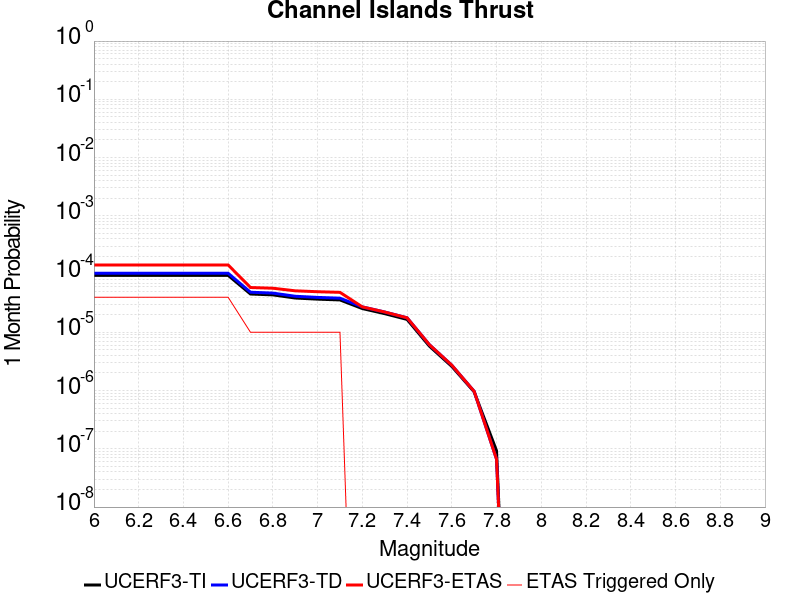 | 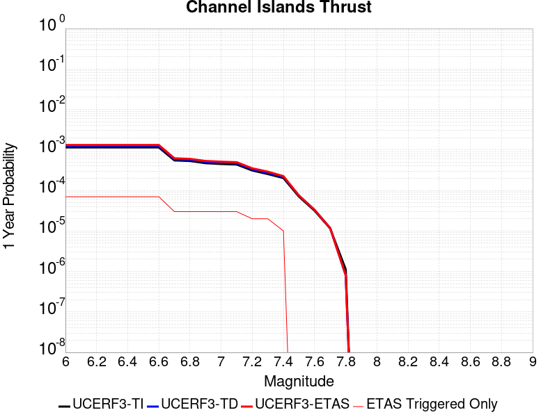 |  |

| Magnitude | 1 wk TI Prob | 1 wk TD Prob | 1 wk ETAS Prob | 1 wk ETAS/TD Gain | 1 wk ETAS Triggered Only | 1 mo TI Prob | 1 mo TD Prob | 1 mo ETAS Prob | 1 mo ETAS/TD Gain | 1 mo ETAS Triggered Only | 1 yr TI Prob | 1 yr TD Prob | 1 yr ETAS Prob | 1 yr ETAS/TD Gain | 1 yr ETAS Triggered Only | 10 yr TI Prob | 10 yr TD Prob | 10 yr ETAS Prob | 10 yr ETAS/TD Gain | 10 yr ETAS Triggered Only |
|-----|-----|-----|-----|-----|-----|-----|-----|-----|-----|-----|-----|-----|-----|-----|-----|-----|-----|-----|-----|-----|
| 6.0 | 2.2156251E-5 | 2.4092022E-5 | 2.4092022E-5 | 1.0 | 0.0 | 9.495191E-5 | 1.03248036E-4 | 1.03248036E-4 | 1.0 | 0.0 | 0.0011554264 | 0.0012564264 | 0.0022551701 | 1.794908 | 0.001 | 0.011494373 | 0.0125038205 | 0.013491317 | 1.0789756 | 0.001 |
| 6.1 | 2.2156251E-5 | 2.4092022E-5 | 2.4092022E-5 | 1.0 | 0.0 | 9.495191E-5 | 1.03248036E-4 | 1.03248036E-4 | 1.0 | 0.0 | 0.0011554264 | 0.0012564264 | 0.0022551701 | 1.794908 | 0.001 | 0.011494373 | 0.0125038205 | 0.013491317 | 1.0789756 | 0.001 |
| 6.2 | 2.2156251E-5 | 2.4092022E-5 | 2.4092022E-5 | 1.0 | 0.0 | 9.495191E-5 | 1.03248036E-4 | 1.03248036E-4 | 1.0 | 0.0 | 0.0011554264 | 0.0012564264 | 0.0022551701 | 1.794908 | 0.001 | 0.011494373 | 0.0125038205 | 0.013491317 | 1.0789756 | 0.001 |
| 6.3 | 2.2156251E-5 | 2.4092022E-5 | 2.4092022E-5 | 1.0 | 0.0 | 9.495191E-5 | 1.03248036E-4 | 1.03248036E-4 | 1.0 | 0.0 | 0.0011554264 | 0.0012564264 | 0.0022551701 | 1.794908 | 0.001 | 0.011494373 | 0.0125038205 | 0.013491317 | 1.0789756 | 0.001 |
| 6.4 | 2.2156251E-5 | 2.4092022E-5 | 2.4092022E-5 | 1.0 | 0.0 | 9.495191E-5 | 1.03248036E-4 | 1.03248036E-4 | 1.0 | 0.0 | 0.0011554264 | 0.0012564264 | 0.0022551701 | 1.794908 | 0.001 | 0.011494373 | 0.0125038205 | 0.013491317 | 1.0789756 | 0.001 |
| 6.5 | 2.2156251E-5 | 2.4092022E-5 | 2.4092022E-5 | 1.0 | 0.0 | 9.495191E-5 | 1.03248036E-4 | 1.03248036E-4 | 1.0 | 0.0 | 0.0011554264 | 0.0012564264 | 0.0022551701 | 1.794908 | 0.001 | 0.011494373 | 0.0125038205 | 0.013491317 | 1.0789756 | 0.001 |
| 6.6 | 2.2156251E-5 | 2.4092022E-5 | 2.4092022E-5 | 1.0 | 0.0 | 9.495191E-5 | 1.03248036E-4 | 1.03248036E-4 | 1.0 | 0.0 | 0.0011554264 | 0.0012564264 | 0.0022551701 | 1.794908 | 0.001 | 0.011494373 | 0.0125038205 | 0.013491317 | 1.0789756 | 0.001 |
| 6.7 | 1.0601296E-5 | 1.1379544E-5 | 1.1379544E-5 | 1.0 | 0.0 | 4.5433335E-5 | 4.876859E-5 | 4.876859E-5 | 1.0 | 0.0 | 5.5301044E-4 | 5.936007E-4 | 0.0015930071 | 2.683634 | 0.001 | 0.005516363 | 0.005920653 | 0.0069147325 | 1.1679003 | 0.001 |
| 6.8 | 1.0246747E-5 | 1.0996669E-5 | 1.0996669E-5 | 1.0 | 0.0 | 4.391389E-5 | 4.7127756E-5 | 4.7127756E-5 | 1.0 | 0.0 | 5.345204E-4 | 5.7363417E-4 | 0.0015730605 | 2.7422714 | 0.001 | 0.0053323656 | 0.005722025 | 0.0067163026 | 1.1737633 | 0.001 |
| 6.9 | 9.049551E-6 | 9.699645E-6 | 9.699645E-6 | 1.0 | 0.0 | 3.878322E-5 | 4.1569267E-5 | 4.1569267E-5 | 1.0 | 0.0 | 4.7208337E-4 | 5.059924E-4 | 0.0015054864 | 2.9753144 | 0.001 | 0.0047108172 | 0.0050488203 | 0.0060437713 | 1.1970661 | 0.001 |
| 7.0 | 8.6542195E-6 | 9.274603E-6 | 9.274603E-6 | 1.0 | 0.0 | 3.7088983E-5 | 3.9747716E-5 | 3.9747716E-5 | 1.0 | 0.0 | 4.5146482E-4 | 4.8382508E-4 | 0.0014833412 | 3.0658627 | 0.001 | 0.004505487 | 0.004828129 | 0.005823301 | 1.2061195 | 0.001 |
| 7.1 | 8.391028E-6 | 8.992924E-6 | 8.992924E-6 | 1.0 | 0.0 | 3.5961057E-5 | 3.854056E-5 | 3.854056E-5 | 1.0 | 0.0 | 4.3773788E-4 | 4.6913436E-4 | 0.0014686652 | 3.1305854 | 0.001 | 0.004368766 | 0.0046818503 | 0.0056771683 | 1.2125908 | 0.001 |
| 7.2 | 5.965188E-6 | 6.3716952E-6 | 6.3716952E-6 | 1.0 | 0.0 | 2.556484E-5 | 2.7306982E-5 | 2.7306982E-5 | 1.0 | 0.0 | 3.1120746E-4 | 3.3241234E-4 | 0.0013320799 | 4.007312 | 0.001 | 0.00310772 | 0.0033192092 | 0.00431589 | 1.3002765 | 0.001 |
| 7.3 | 4.877518E-6 | 5.2060063E-6 | 5.2060063E-6 | 1.0 | 0.0 | 2.0903482E-5 | 2.2311267E-5 | 2.2311267E-5 | 1.0 | 0.0 | 2.5447016E-4 | 2.716063E-4 | 0.0012713347 | 4.6808 | 0.001 | 0.0025417898 | 0.0027127895 | 0.0037100767 | 1.3676243 | 0.001 |
| 7.4 | 3.8829853E-6 | 4.141863E-6 | 4.141863E-6 | 1.0 | 0.0 | 1.664126E-5 | 1.7750723E-5 | 1.7750723E-5 | 1.0 | 0.0 | 2.0258849E-4 | 2.1609402E-4 | 2.1609402E-4 | 1.0 | 0.0 | 0.002024039 | 0.0021588807 | 0.0021588807 | 1.0 | 0.0 |
| 7.5 | 1.3489616E-6 | 1.4277903E-6 | 1.4277903E-6 | 1.0 | 0.0 | 5.7812517E-6 | 6.119087E-6 | 6.119087E-6 | 1.0 | 0.0 | 7.038446E-5 | 7.449738E-5 | 7.449738E-5 | 1.0 | 0.0 | 7.036218E-4 | 7.44728E-4 | 7.44728E-4 | 1.0 | 0.0 |
| 7.6 | 6.058192E-7 | 6.353778E-7 | 6.353778E-7 | 1.0 | 0.0 | 2.5963652E-6 | 2.7230449E-6 | 2.7230449E-6 | 1.0 | 0.0 | 3.161029E-5 | 3.3152584E-5 | 3.3152584E-5 | 1.0 | 0.0 | 3.1605794E-4 | 3.31478E-4 | 3.31478E-4 | 1.0 | 0.0 |
| 7.7 | 2.2170494E-7 | 2.2607902E-7 | 2.2607902E-7 | 1.0 | 0.0 | 9.5016367E-7 | 9.689098E-7 | 9.689098E-7 | 1.0 | 0.0 | 1.1568181E-5 | 1.1796425E-5 | 1.1796425E-5 | 1.0 | 0.0 | 1.1567579E-4 | 1.1795909E-4 | 1.1795909E-4 | 1.0 | 0.0 |
| 7.8 | 2.1613102E-8 | 1.5466682E-8 | 1.5466682E-8 | 1.0 | 0.0 | 9.262757E-8 | 6.628578E-8 | 6.628578E-8 | 1.0 | 0.0 | 1.1277401E-6 | 8.070291E-7 | 8.070291E-7 | 1.0 | 0.0 | 1.1277344E-5 | 8.070269E-6 | 8.070269E-6 | 1.0 | 0.0 |

## Santa Cruz Catalina Ridge alt1
*[(top)](#table-of-contents)*

| 1 Week | 1 Month | 1 Year | 10 Year |
|-----|-----|-----|-----|
|  |  |  |  |

| Magnitude | 1 wk TI Prob | 1 wk TD Prob | 1 wk ETAS Prob | 1 wk ETAS/TD Gain | 1 wk ETAS Triggered Only | 1 mo TI Prob | 1 mo TD Prob | 1 mo ETAS Prob | 1 mo ETAS/TD Gain | 1 mo ETAS Triggered Only | 1 yr TI Prob | 1 yr TD Prob | 1 yr ETAS Prob | 1 yr ETAS/TD Gain | 1 yr ETAS Triggered Only | 10 yr TI Prob | 10 yr TD Prob | 10 yr ETAS Prob | 10 yr ETAS/TD Gain | 10 yr ETAS Triggered Only |
|-----|-----|-----|-----|-----|-----|-----|-----|-----|-----|-----|-----|-----|-----|-----|-----|-----|-----|-----|-----|-----|
| 6.0 | 3.2833184E-5 | 3.65584E-5 | 3.65584E-5 | 1.0 | 0.0 | 1.4070606E-4 | 1.5667039E-4 | 1.5667039E-4 | 1.0 | 0.0 | 0.00171175 | 0.0019059596 | 0.0029040535 | 1.5236701 | 0.001 | 0.016986247 | 0.018913029 | 0.019894116 | 1.0518736 | 0.001 |
| 6.1 | 1.9835548E-5 | 2.1659505E-5 | 2.1659505E-5 | 1.0 | 0.0 | 8.500672E-5 | 9.282326E-5 | 9.282326E-5 | 1.0 | 0.0 | 0.0010344655 | 0.0011295575 | 0.0021284278 | 1.8843025 | 0.001 | 0.010296632 | 0.011240295 | 0.012229055 | 1.0879656 | 0.001 |
| 6.2 | 1.9835548E-5 | 2.1659505E-5 | 2.1659505E-5 | 1.0 | 0.0 | 8.500672E-5 | 9.282326E-5 | 9.282326E-5 | 1.0 | 0.0 | 0.0010344655 | 0.0011295575 | 0.0021284278 | 1.8843025 | 0.001 | 0.010296632 | 0.011240295 | 0.012229055 | 1.0879656 | 0.001 |
| 6.3 | 1.5728183E-5 | 1.703395E-5 | 1.703395E-5 | 1.0 | 0.0 | 6.7404755E-5 | 7.300063E-5 | 7.300063E-5 | 1.0 | 0.0 | 8.2034385E-4 | 8.884264E-4 | 0.001887538 | 2.1245856 | 0.001 | 0.008173222 | 0.008849427 | 0.009840578 | 1.1120017 | 0.001 |
| 6.4 | 1.5728183E-5 | 1.703395E-5 | 1.703395E-5 | 1.0 | 0.0 | 6.7404755E-5 | 7.300063E-5 | 7.300063E-5 | 1.0 | 0.0 | 8.2034385E-4 | 8.884264E-4 | 0.001887538 | 2.1245856 | 0.001 | 0.008173222 | 0.008849427 | 0.009840578 | 1.1120017 | 0.001 |
| 6.5 | 1.3707734E-5 | 1.4794522E-5 | 1.4794522E-5 | 1.0 | 0.0 | 5.8746107E-5 | 6.3403575E-5 | 6.3403575E-5 | 1.0 | 0.0 | 7.1499916E-4 | 7.716686E-4 | 0.001770897 | 2.294893 | 0.001 | 0.0071270303 | 0.0076902895 | 0.008682599 | 1.1290342 | 0.001 |
| 6.6 | 1.2539813E-5 | 1.3510219E-5 | 1.3510219E-5 | 1.0 | 0.0 | 5.3740947E-5 | 5.789967E-5 | 5.789967E-5 | 1.0 | 0.0 | 6.540996E-4 | 7.0470315E-4 | 0.0017039984 | 2.4180372 | 0.001 | 0.0065217763 | 0.0070249885 | 0.008017964 | 1.141349 | 0.001 |
| 6.7 | 1.1504083E-5 | 1.2377375E-5 | 1.2377375E-5 | 1.0 | 0.0 | 4.930228E-5 | 5.3044827E-5 | 5.3044827E-5 | 1.0 | 0.0 | 6.0008996E-4 | 6.456314E-4 | 0.0016449858 | 2.5478714 | 0.001 | 0.005984721 | 0.006437786 | 0.0074313483 | 1.1543329 | 0.001 |
| 6.8 | 1.012739E-5 | 1.0877071E-5 | 1.0877071E-5 | 1.0 | 0.0 | 4.340238E-5 | 4.6615194E-5 | 4.6615194E-5 | 1.0 | 0.0 | 5.282958E-4 | 5.673937E-4 | 0.0015668264 | 2.7614446 | 0.001 | 0.0052704164 | 0.0056596193 | 0.00665396 | 1.1756903 | 0.001 |
| 6.9 | 8.9607865E-6 | 9.609117E-6 | 9.609117E-6 | 1.0 | 0.0 | 3.8402806E-5 | 4.1181287E-5 | 4.1181287E-5 | 1.0 | 0.0 | 4.6745385E-4 | 5.012679E-4 | 0.0015007666 | 2.9939413 | 0.001 | 0.0046647177 | 0.005001492 | 0.0059964904 | 1.1989404 | 0.001 |
| 7.0 | 8.046829E-6 | 8.619746E-6 | 8.619746E-6 | 1.0 | 0.0 | 3.4485955E-5 | 3.694125E-5 | 3.694125E-5 | 1.0 | 0.0 | 4.1978562E-4 | 4.496677E-4 | 0.001449218 | 3.2228644 | 0.001 | 0.004189935 | 0.0044876686 | 0.005483181 | 1.2218329 | 0.001 |
| 7.1 | 7.136131E-6 | 7.637656E-6 | 7.637656E-6 | 1.0 | 0.0 | 3.0583058E-5 | 3.2732405E-5 | 3.2732405E-5 | 1.0 | 0.0 | 3.7228514E-4 | 3.9844486E-4 | 0.0013980464 | 3.5087576 | 0.001 | 0.0037166206 | 0.003977381 | 0.0049734036 | 1.2504218 | 0.001 |
| 7.2 | 6.362014E-6 | 6.8049585E-6 | 6.8049585E-6 | 1.0 | 0.0 | 2.726549E-5 | 2.9163786E-5 | 2.9163786E-5 | 1.0 | 0.0 | 3.3190678E-4 | 3.550119E-4 | 0.0013546569 | 3.815807 | 0.001 | 0.0033141149 | 0.003544516 | 0.0045409715 | 1.281126 | 0.001 |
| 7.3 | 5.004101E-6 | 5.351715E-6 | 5.351715E-6 | 1.0 | 0.0 | 2.1445969E-5 | 2.2935723E-5 | 2.2935723E-5 | 1.0 | 0.0 | 2.6107338E-4 | 2.792072E-4 | 0.001278928 | 4.5805697 | 0.001 | 0.002607669 | 0.0027886187 | 0.00378583 | 1.3576005 | 0.001 |
| 7.4 | 3.4901443E-6 | 3.7320526E-6 | 3.7320526E-6 | 1.0 | 0.0 | 1.4957676E-5 | 1.5994416E-5 | 1.5994416E-5 | 1.0 | 0.0 | 1.8209449E-4 | 1.9471499E-4 | 1.9471499E-4 | 1.0 | 0.0 | 0.0018194534 | 0.0019454823 | 0.0019454823 | 1.0 | 0.0 |
| 7.5 | 1.1215045E-6 | 1.189387E-6 | 1.189387E-6 | 1.0 | 0.0 | 4.806439E-6 | 5.097363E-6 | 5.097363E-6 | 1.0 | 0.0 | 5.851682E-5 | 6.205866E-5 | 6.205866E-5 | 1.0 | 0.0 | 5.850142E-4 | 6.2041637E-4 | 6.2041637E-4 | 1.0 | 0.0 |
| 7.6 | 2.8599047E-7 | 2.9951994E-7 | 2.9951994E-7 | 1.0 | 0.0 | 1.2256729E-6 | 1.2836562E-6 | 1.2836562E-6 | 1.0 | 0.0 | 1.4922465E-5 | 1.5628404E-5 | 1.5628404E-5 | 1.0 | 0.0 | 1.4921463E-4 | 1.5627318E-4 | 1.5627318E-4 | 1.0 | 0.0 |
| 7.7 | 2.0781519E-7 | 2.1744323E-7 | 2.1744323E-7 | 1.0 | 0.0 | 8.906362E-7 | 9.3189925E-7 | 9.3189925E-7 | 1.0 | 0.0 | 1.08434415E-5 | 1.13458145E-5 | 1.13458145E-5 | 1.0 | 0.0 | 1.0842913E-4 | 1.1345245E-4 | 1.1345245E-4 | 1.0 | 0.0 |
| 7.8 | 3.614776E-8 | 3.764102E-8 | 3.764102E-8 | 1.0 | 0.0 | 1.5491896E-7 | 1.6131864E-7 | 1.6131864E-7 | 1.0 | 0.0 | 1.8861368E-6 | 1.9640527E-6 | 1.9640527E-6 | 1.0 | 0.0 | 1.8861208E-5 | 1.9640367E-5 | 1.9640367E-5 | 1.0 | 0.0 |

## Coyote Lake
*[(top)](#table-of-contents)*

| 1 Week | 1 Month | 1 Year | 10 Year |
|-----|-----|-----|-----|
| 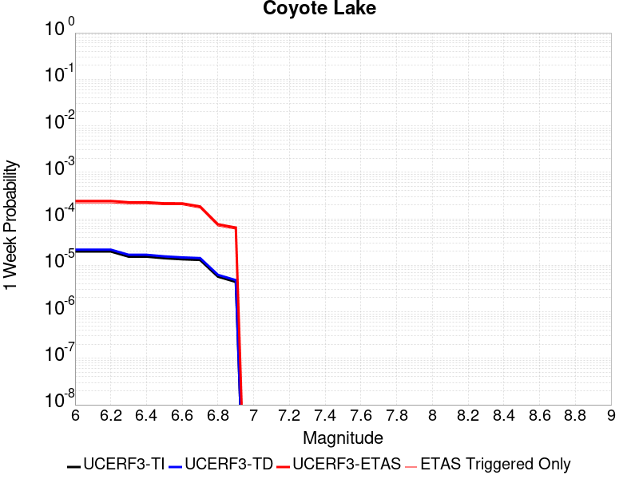 |  |  |  |

| Magnitude | 1 wk TI Prob | 1 wk TD Prob | 1 wk ETAS Prob | 1 wk ETAS/TD Gain | 1 wk ETAS Triggered Only | 1 mo TI Prob | 1 mo TD Prob | 1 mo ETAS Prob | 1 mo ETAS/TD Gain | 1 mo ETAS Triggered Only | 1 yr TI Prob | 1 yr TD Prob | 1 yr ETAS Prob | 1 yr ETAS/TD Gain | 1 yr ETAS Triggered Only | 10 yr TI Prob | 10 yr TD Prob | 10 yr ETAS Prob | 10 yr ETAS/TD Gain | 10 yr ETAS Triggered Only |
|-----|-----|-----|-----|-----|-----|-----|-----|-----|-----|-----|-----|-----|-----|-----|-----|-----|-----|-----|-----|-----|
| 6.0 | 1.980352E-5 | 2.1706745E-5 | 2.1706745E-5 | 1.0 | 0.0 | 8.486947E-5 | 9.302599E-5 | 9.302599E-5 | 1.0 | 0.0 | 0.0010327959 | 0.0011320751 | 0.0011320751 | 1.0 | 0.0 | 0.010280091 | 0.011270258 | 0.012258988 | 1.0877291 | 0.001 |
| 6.1 | 1.980352E-5 | 2.1706745E-5 | 2.1706745E-5 | 1.0 | 0.0 | 8.486947E-5 | 9.302599E-5 | 9.302599E-5 | 1.0 | 0.0 | 0.0010327959 | 0.0011320751 | 0.0011320751 | 1.0 | 0.0 | 0.010280091 | 0.011270258 | 0.012258988 | 1.0877291 | 0.001 |
| 6.2 | 1.980352E-5 | 2.1706745E-5 | 2.1706745E-5 | 1.0 | 0.0 | 8.486947E-5 | 9.302599E-5 | 9.302599E-5 | 1.0 | 0.0 | 0.0010327959 | 0.0011320751 | 0.0011320751 | 1.0 | 0.0 | 0.010280091 | 0.011270258 | 0.012258988 | 1.0877291 | 0.001 |
| 6.3 | 1.5344787E-5 | 1.682067E-5 | 1.682067E-5 | 1.0 | 0.0 | 6.576172E-5 | 7.2086936E-5 | 7.2086936E-5 | 1.0 | 0.0 | 8.003548E-4 | 8.773662E-4 | 8.773662E-4 | 1.0 | 0.0 | 0.007974784 | 0.00874507 | 0.009736324 | 1.1133502 | 0.001 |
| 6.4 | 1.5344787E-5 | 1.682067E-5 | 1.682067E-5 | 1.0 | 0.0 | 6.576172E-5 | 7.2086936E-5 | 7.2086936E-5 | 1.0 | 0.0 | 8.003548E-4 | 8.773662E-4 | 8.773662E-4 | 1.0 | 0.0 | 0.007974784 | 0.00874507 | 0.009736324 | 1.1133502 | 0.001 |
| 6.5 | 1.4189697E-5 | 1.5557987E-5 | 1.5557987E-5 | 1.0 | 0.0 | 6.081157E-5 | 6.6675726E-5 | 6.6675726E-5 | 1.0 | 0.0 | 7.401293E-4 | 8.115349E-4 | 8.115349E-4 | 1.0 | 0.0 | 0.0073766913 | 0.008091656 | 0.009083564 | 1.1225841 | 0.001 |
| 6.6 | 1.3469301E-5 | 1.4771577E-5 | 1.4771577E-5 | 1.0 | 0.0 | 5.7724297E-5 | 6.330556E-5 | 6.330556E-5 | 1.0 | 0.0 | 7.025667E-4 | 7.7053264E-4 | 7.7053264E-4 | 1.0 | 0.0 | 0.0070034964 | 0.0076845144 | 0.00867683 | 1.1291318 | 0.001 |
| 6.7 | 1.3027966E-5 | 1.4281745E-5 | 1.4281745E-5 | 1.0 | 0.0 | 5.5832945E-5 | 6.120638E-5 | 6.120638E-5 | 1.0 | 0.0 | 6.7955407E-4 | 7.4499263E-4 | 7.4499263E-4 | 1.0 | 0.0 | 0.006774798 | 0.0074308286 | 0.008423398 | 1.1335745 | 0.001 |
| 6.8 | 5.695434E-6 | 6.2244176E-6 | 6.2244176E-6 | 1.0 | 0.0 | 2.4408775E-5 | 2.6675973E-5 | 2.6675973E-5 | 1.0 | 0.0 | 2.971363E-4 | 3.2476155E-4 | 3.2476155E-4 | 1.0 | 0.0 | 0.0029673933 | 0.0032458105 | 0.0032458105 | 1.0 | 0.0 |
| 6.9 | 4.385688E-6 | 4.7930553E-6 | 4.7930553E-6 | 1.0 | 0.0 | 1.879567E-5 | 2.0541665E-5 | 2.0541665E-5 | 1.0 | 0.0 | 2.2881327E-4 | 2.5009477E-4 | 2.5009477E-4 | 1.0 | 0.0 | 0.002285778 | 0.0025009478 | 0.0025009478 | 1.0 | 0.0 |

