# Parent Section Magnitude-Probability Distributions

Only fault sections with at least one triggered aftershock are plotted. Sections are sorted by total supraseismogenic trigger rate (decreasing)

## Table Of Contents

* [Garlock (Central)](#garlock-central)
* [Blackwater](#blackwater)
* [Tank Canyon](#tank-canyon)
* [Owl Lake](#owl-lake)
* [Little Lake](#little-lake)
* [Garlock (East)](#garlock-east)
* [Panamint Valley](#panamint-valley)
* [Hunter Mountain-Saline Valley](#hunter-mountain-saline-valley)
* [Airport Lake](#airport-lake)
* [Garlock (West)](#garlock-west)
* [So Sierra Nevada](#so-sierra-nevada)
* [Gravel Hills-Harper Lk](#gravel-hills-harper-lk)
* [Ash Hill](#ash-hill)
* [McLean Lake](#mclean-lake)
* [Goldstone Lake](#goldstone-lake)
* [Coyote Canyon](#coyote-canyon)
* [San Andreas (Mojave S)](#san-andreas-mojave-s)
* [San Andreas (Mojave N)](#san-andreas-mojave-n)
* [Nelson Lake](#nelson-lake)
* [Death Valley (So)](#death-valley-so)
* [Towne Pass](#towne-pass)
* [Lenwood-Lockhart-Old Woman Springs](#lenwood-lockhart-old-woman-springs)
* [San Andreas (San Bernardino N)](#san-andreas-san-bernardino-n)
* [Sierra Nevada  (No Extension)](#sierra-nevada--no-extension)
* [Paradise](#paradise)
* [Bicycle Lake](#bicycle-lake)
* [Garlic Springs](#garlic-springs)
* [San Andreas (San Bernardino S)](#san-andreas-san-bernardino-s)
* [Owens Valley](#owens-valley)
* [Helendale-So Lockhart](#helendale-so-lockhart)
* [Coyote Lake](#coyote-lake)
* [Death Valley (Black Mtns Frontal)](#death-valley-black-mtns-frontal)
* [San Andreas (Big Bend)](#san-andreas-big-bend)
* [Independence rev 2011](#independence-rev-2011)
* [San Andreas (San Gorgonio Pass-Garnet HIll)](#san-andreas-san-gorgonio-pass-garnet-hill)
* [San Andreas (Parkfield)](#san-andreas-parkfield)
* [Death Valley (No)](#death-valley-no)
* [Kern Canyon (North Kern) 2011](#kern-canyon-north-kern-2011)
* [Red Pass](#red-pass)
* [San Jacinto (San Bernardino)](#san-jacinto-san-bernardino)
* [San Andreas (Coachella) rev](#san-andreas-coachella-rev)
* [Death Valley (Fish Lake Valley)](#death-valley-fish-lake-valley)
* [San Andreas (Cholame) rev](#san-andreas-cholame-rev)
* [San Andreas (Carrizo) rev](#san-andreas-carrizo-rev)
* [San Jacinto (San Jacinto Valley) rev](#san-jacinto-san-jacinto-valley-rev)
* [Elsinore (Glen Ivy) rev](#elsinore-glen-ivy-rev)
* [Calico-Hidalgo](#calico-hidalgo)
* [San Andreas (North Branch Mill Creek)](#san-andreas-north-branch-mill-creek)
* [San Jacinto (Stepovers Combined)](#san-jacinto-stepovers-combined)
* [Cady](#cady)
* [Lake Isabella (Seismicity)](#lake-isabella-seismicity)
* [Manix-Afton Hills](#manix-afton-hills)
* [White Mountains](#white-mountains)
* [San Jacinto (Anza) rev](#san-jacinto-anza-rev)
* [San Andreas (Creeping Section) 2011 CFM](#san-andreas-creeping-section-2011-cfm)
* [Cleghorn Lake](#cleghorn-lake)
* [Mission Creek](#mission-creek)
* [Ludlow](#ludlow)
* [White Wolf (Extension)](#white-wolf-extension)
* [Kern Canyon (South Kern) 2011](#kern-canyon-south-kern-2011)
* [Santa Ynez (West)](#santa-ynez-west)
* [Cleghorn Pass](#cleghorn-pass)
* [Baker](#baker)
* [San Jacinto (Lytle Creek connector)](#san-jacinto-lytle-creek-connector)
* [Scodie Lineament](#scodie-lineament)
* [Brawley (Seismic Zone) alt 1](#brawley-seismic-zone-alt-1)
* [Pinto Mtn](#pinto-mtn)
* [Santa Cruz Island](#santa-cruz-island)
* [Santa Rosa Island](#santa-rosa-island)
* [Imperial](#imperial)
* [San Jacinto (Coyote Creek)](#san-jacinto-coyote-creek)
* [Deep Springs](#deep-springs)
* [Mission Ridge-Arroyo Parida-Santa Ana](#mission-ridge-arroyo-parida-santa-ana)
* [Red Mountain](#red-mountain)
* [Camp Rock 2011](#camp-rock-2011)
* [Tin Mountain](#tin-mountain)
* [Big Pine (East)](#big-pine-east)
* [Santa Ynez (East)](#santa-ynez-east)
* [Pleito](#pleito)
* [Owens Valley Keough Hot Springs](#owens-valley-keough-hot-springs)
* [Rose Canyon](#rose-canyon)
* [Big Pine (Central)](#big-pine-central)
* [San Jacinto (Borrego)](#san-jacinto-borrego)
* [Channel Islands Thrust](#channel-islands-thrust)
* [Whittier alt 1](#whittier-alt-1)
* [Cleghorn](#cleghorn)
* [San Diego Trough north alt1](#san-diego-trough-north-alt1)
* [Palos Verdes](#palos-verdes)
* [San Jacinto (Clark) rev](#san-jacinto-clark-rev)
* [Cucamonga](#cucamonga)
* [Kern Canyon (Lake Isabella) 2011](#kern-canyon-lake-isabella-2011)
* [Lost Hills](#lost-hills)
* [Elysian Park (Upper)](#elysian-park-upper)
* [Dry Mountain](#dry-mountain)
* [Ventura-Pitas Point](#ventura-pitas-point)
* [Blue Cut](#blue-cut)
* [Bullion Mountains](#bullion-mountains)
* [San Diego Trough south](#san-diego-trough-south)
* [Chino alt 1](#chino-alt-1)
* [Pisgah-Bullion Mtn-Mesquite Lk](#pisgah-bullion-mtn-mesquite-lk)
* [Green Valley 2011 CFM](#green-valley-2011-cfm)
* [Oceanic - West Huasna](#oceanic---west-huasna)
* [Raymond](#raymond)
* [Hunting Creek - Berryessa 2011 CFM](#hunting-creek---berryessa-2011-cfm)
* [Sheephole](#sheephole)
* [San Clemente](#san-clemente)
* [Ortigalita (North)](#ortigalita-north)
* [Santa Ynez River](#santa-ynez-river)
* [Los Alamos extension](#los-alamos-extension)
* [Santa Cruz Catalina Ridge alt1](#santa-cruz-catalina-ridge-alt1)
* [Rinconada 2011 CFM](#rinconada-2011-cfm)
* [Pine Mtn](#pine-mtn)
* [Oak Ridge (Onshore)](#oak-ridge-onshore)
* [Newport-Inglewood (Offshore)](#newport-inglewood-offshore)
* [Channel Islands Western Deep Ramp](#channel-islands-western-deep-ramp)
* [Calaveras (So) - Paicines extension 2011 CFM](#calaveras-so---paicines-extension-2011-cfm)
* [Calaveras (So) 2011 CFM](#calaveras-so-2011-cfm)
* [Great Valley 03 Mysterious Ridge](#great-valley-03-mysterious-ridge)
* [San Pedro Basin](#san-pedro-basin)
* [Johnson Valley (No) 2011 rev](#johnson-valley-no-2011-rev)
* [Hosgri](#hosgri)
* [Los Alamos 2011 CFM](#los-alamos-2011-cfm)
* [San Cayetano](#san-cayetano)
* [Hosgri (Extension)](#hosgri-extension)
* [Mono Lake 2011 CFM](#mono-lake-2011-cfm)
* [Cerro Prieto](#cerro-prieto)
* [San Gabriel](#san-gabriel)
* [San Jacinto (Superstition Mtn)](#san-jacinto-superstition-mtn)
* [Pitas Point (Lower West)](#pitas-point-lower-west)
* [Coronado Bank alt1](#coronado-bank-alt1)
* [Compton](#compton)
* [Simi-Santa Rosa](#simi-santa-rosa)
* [Great Valley 09 (Laguna Seca)](#great-valley-09-laguna-seca)
* [Honey Lake 2011 CFM](#honey-lake-2011-cfm)
* [San Gregorio (North) 2011 CFM](#san-gregorio-north-2011-cfm)
* [Sierra Madre](#sierra-madre)
* [San Luis Range 2011 CFM](#san-luis-range-2011-cfm)
* [White Wolf](#white-wolf)
* [Robinson Creek](#robinson-creek)
* [Monterey Bay-Tularcitos](#monterey-bay-tularcitos)
* [Santa Susana alt 1](#santa-susana-alt-1)
* [Hunting Creek - Bartlett Springs connector 2011](#hunting-creek---bartlett-springs-connector-2011)
* [Round Valley](#round-valley)
* [Earthquake Valley (So Extension)](#earthquake-valley-so-extension)
* [Big Lagoon - Bald Mtn 2011 CFM](#big-lagoon---bald-mtn-2011-cfm)
* [Earthquake Valley (No  Extension)](#earthquake-valley-no--extension)
* [North Frontal  (West)](#north-frontal--west)
* [Redondo Canyon alt 1](#redondo-canyon-alt-1)
* [Great Valley 04a Trout Creek](#great-valley-04a-trout-creek)
* [Verdugo](#verdugo)
* [Malibu Coast alt 1](#malibu-coast-alt-1)
* [Newport-Inglewood alt 1](#newport-inglewood-alt-1)
* [Elmore Ranch](#elmore-ranch)
* [Hartley Springs 2011 CFM](#hartley-springs-2011-cfm)
* [Great Valley 04b Gordon Valley](#great-valley-04b-gordon-valley)
* [North Frontal  (East)](#north-frontal--east)
* [Oceanside alt1](#oceanside-alt1)
* [Reliz 2011 CFM](#reliz-2011-cfm)
* [Malibu Coast (Extension) alt 1](#malibu-coast-extension-alt-1)
* [Hollywood](#hollywood)
* [Fish Slough 2011 CFM](#fish-slough-2011-cfm)
* [San Gorgonio Pass](#san-gorgonio-pass)
* [Puente Hills](#puente-hills)
* [Concord 2011 CFM](#concord-2011-cfm)
* [Great Valley 07 (Orestimba)](#great-valley-07-orestimba)
* [Cedar Mtn-Mahogany Mtn](#cedar-mtn-mahogany-mtn)
* [Hayward (No) 2011 CFM](#hayward-no-2011-cfm)
* [Santa Monica alt 1](#santa-monica-alt-1)
* [Elsinore (Temecula) rev](#elsinore-temecula-rev)
* [La Panza 2011](#la-panza-2011)
* [San Jose](#san-jose)
* [Fitzhugh Creek](#fitzhugh-creek)
* [Richfield](#richfield)
* [West Tahoe](#west-tahoe)
* [Great Valley 05 Pittsburg - Kirby Hills alt1](#great-valley-05-pittsburg---kirby-hills-alt1)
* [Swain Ravine - Spenceville](#swain-ravine---spenceville)
* [San Gregorio (South) 2011 CFM](#san-gregorio-south-2011-cfm)
* [South Cuyama](#south-cuyama)
* [Ortigalita (South)](#ortigalita-south)
* [Earthquake Valley](#earthquake-valley)
* [Rodgers Creek - Healdsburg 2011 CFM](#rodgers-creek---healdsburg-2011-cfm)
* [Pittville 2011 CFM](#pittville-2011-cfm)
* [Elysian Park (Lower CFM)](#elysian-park-lower-cfm)
* [San Gabriel (Extension)](#san-gabriel-extension)
* [San Juan](#san-juan)
* [San Andreas (Offshore) 2011 CFM](#san-andreas-offshore-2011-cfm)
* [Elsinore (Julian)](#elsinore-julian)
* [Elsinore (Stepovers Combined)](#elsinore-stepovers-combined)
* [Santa Susana East (connector)](#santa-susana-east-connector)
* [San Andreas (North Coast) 2011 CFM](#san-andreas-north-coast-2011-cfm)
* [West Napa 2011 CFM](#west-napa-2011-cfm)
* [Little Salmon (Offshore)](#little-salmon-offshore)
* [Pitas Point (Lower)-Montalvo](#pitas-point-lower-montalvo)
* [Anacapa-Dume alt 1](#anacapa-dume-alt-1)
* [Bennett Valley 2011 CFM](#bennett-valley-2011-cfm)
* [Laguna Salada](#laguna-salada)
* [Quien Sabe 2011 CFM](#quien-sabe-2011-cfm)
* [Superstition Hills](#superstition-hills)
* [Sisar](#sisar)
* [Peralta Hills](#peralta-hills)
* [Eaton Roughs 2011 CFM](#eaton-roughs-2011-cfm)
* [Davis Creek](#davis-creek)
* [Likely 2011 CFM](#likely-2011-cfm)
* [Hilton Creek 2011 CFM](#hilton-creek-2011-cfm)
* [East Huasna 2011 CFM](#east-huasna-2011-cfm)
* [Point Reyes 2011 connector](#point-reyes-2011-connector)
* [Casmalia 2011 CFM](#casmalia-2011-cfm)
* [Northridge](#northridge)
* [Butano 2011 CFM](#butano-2011-cfm)
* [San Luis Range - Pecho 2011 CFM](#san-luis-range---pecho-2011-cfm)
* [Breckenridge 2011](#breckenridge-2011)
* [San Andreas (Santa Cruz Mts) 2011 CFM](#san-andreas-santa-cruz-mts-2011-cfm)
* [Homestead Valley 2011](#homestead-valley-2011)
* [Maacama 2011 CFM](#maacama-2011-cfm)
* [Calaveras (Central) 2011 CFM](#calaveras-central-2011-cfm)
* [Polaris 2011 CFM](#polaris-2011-cfm)
* [Fontana (Seismicity)](#fontana-seismicity)
* [Great Valley 03a Dunnigan Hills](#great-valley-03a-dunnigan-hills)
* [Mount Diablo Thrust South](#mount-diablo-thrust-south)
* [Keddie Ridge 2011 CFM](#keddie-ridge-2011-cfm)
* [Hayward (So) 2011 CFM](#hayward-so-2011-cfm)
* [Garberville - Briceland 2011 CFM](#garberville---briceland-2011-cfm)
* [Holser alt 1](#holser-alt-1)
* [San Andreas (Peninsula) 2011 CFM](#san-andreas-peninsula-2011-cfm)
* [Mendocino](#mendocino)
* [Point Reyes 2011 CFM](#point-reyes-2011-cfm)
* [Rocky Ledge 2011 CFM](#rocky-ledge-2011-cfm)
* [Elsinore (Coyote Mountains)](#elsinore-coyote-mountains)
* [Las Positas](#las-positas)
* [Mount Diablo Thrust North CFM](#mount-diablo-thrust-north-cfm)
* [Lions Head 2011 CFM](#lions-head-2011-cfm)
* [Morales (East)](#morales-east)

## Garlock (Central)
*[(top)](#table-of-contents)*

| 1 Week | 1 Month | 1 Year | 10 Year |
|-----|-----|-----|-----|
|  | 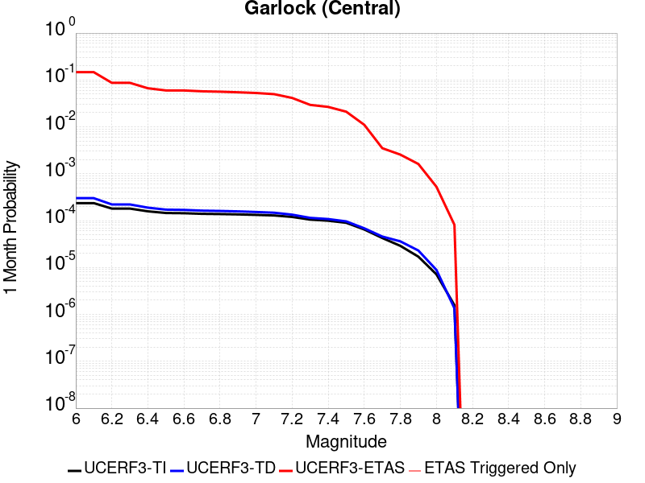 |  |  |

| Magnitude | 1 wk TI Prob | 1 wk TD Prob | 1 wk ETAS Prob | 1 wk ETAS/TD Gain | 1 wk ETAS Triggered Only | 1 mo TI Prob | 1 mo TD Prob | 1 mo ETAS Prob | 1 mo ETAS/TD Gain | 1 mo ETAS Triggered Only | 1 yr TI Prob | 1 yr TD Prob | 1 yr ETAS Prob | 1 yr ETAS/TD Gain | 1 yr ETAS Triggered Only | 10 yr TI Prob | 10 yr TD Prob | 10 yr ETAS Prob | 10 yr ETAS/TD Gain | 10 yr ETAS Triggered Only |
|-----|-----|-----|-----|-----|-----|-----|-----|-----|-----|-----|-----|-----|-----|-----|-----|-----|-----|-----|-----|-----|
| 6.0 | 5.5131142E-5 | 7.02476E-5 | 0.12130173 | 1726.774 | 0.12124 | 2.3625491E-4 | 3.0102677E-4 | 0.14647701 | 486.5913 | 0.14622 | 0.0028726095 | 0.003658906 | 0.19141938 | 52.316017 | 0.18845 | 0.028357591 | 0.036136657 | 0.254924 | 7.0544434 | 0.22699 |
| 6.1 | 5.5131142E-5 | 7.02476E-5 | 0.12130173 | 1726.774 | 0.12124 | 2.3625491E-4 | 3.0102677E-4 | 0.14647701 | 486.5913 | 0.14622 | 0.0028726095 | 0.003658906 | 0.19141938 | 52.316017 | 0.18845 | 0.028357591 | 0.036136657 | 0.254924 | 7.0544434 | 0.22699 |
| 6.2 | 4.216245E-5 | 5.1661802E-5 | 0.071267985 | 1379.5103 | 0.07122 | 1.806837E-4 | 2.213891E-4 | 0.08681221 | 392.12506 | 0.08661 | 0.0021976046 | 0.002692112 | 0.11519842 | 42.791092 | 0.11281 | 0.021759989 | 0.026701318 | 0.16041309 | 6.007684 | 0.13738 |
| 6.3 | 4.216245E-5 | 5.1661802E-5 | 0.071267985 | 1379.5103 | 0.07122 | 1.806837E-4 | 2.213891E-4 | 0.08681221 | 392.12506 | 0.08661 | 0.0021976046 | 0.002692112 | 0.11519842 | 42.791092 | 0.11281 | 0.021759989 | 0.026701318 | 0.16041309 | 6.007684 | 0.13738 |
| 6.4 | 3.6858168E-5 | 4.411026E-5 | 0.05444171 | 1234.2188 | 0.0544 | 1.5795401E-4 | 1.8903041E-4 | 0.06648649 | 351.7238 | 0.06631 | 0.0019213937 | 0.0022990413 | 0.088799715 | 38.624672 | 0.0867 | 0.019048655 | 0.022866098 | 0.12657909 | 5.535666 | 0.10614 |
| 6.5 | 3.39199E-5 | 4.0018425E-5 | 0.049038056 | 1225.387 | 0.049 | 1.453629E-4 | 1.7149639E-4 | 0.05973128 | 348.29468 | 0.05957 | 0.0017683565 | 0.0020859907 | 0.08004303 | 38.37171 | 0.07812 | 0.017543508 | 0.020758783 | 0.1143057 | 5.506377 | 0.09553 |
| 6.6 | 3.3571985E-5 | 3.947258E-5 | 0.04897754 | 1240.7991 | 0.04894 | 1.4387199E-4 | 1.6915736E-4 | 0.059629098 | 352.50668 | 0.05947 | 0.0017502342 | 0.0020575672 | 0.079877116 | 38.821148 | 0.07798 | 0.017365133 | 0.020480042 | 0.113887064 | 5.5608807 | 0.09536 |
| 6.7 | 3.2580007E-5 | 3.808902E-5 | 0.0470463 | 1235.167 | 0.04701 | 1.3962112E-4 | 1.6322857E-4 | 0.05725391 | 350.75912 | 0.0571 | 0.0016985617 | 0.0019855178 | 0.076666944 | 38.61307 | 0.07483 | 0.016856372 | 0.019770874 | 0.109491244 | 5.5380077 | 0.09153 |
| 6.8 | 3.2185937E-5 | 3.7516216E-5 | 0.046245784 | 1232.6879 | 0.04621 | 1.3793244E-4 | 1.60774E-4 | 0.056181766 | 349.44562 | 0.05603 | 0.0016780337 | 0.0019556875 | 0.07521214 | 38.45816 | 0.0734 | 0.016654192 | 0.019477878 | 0.10750915 | 5.5195518 | 0.08978 |
| 6.9 | 3.165394E-5 | 3.672075E-5 | 0.044885073 | 1222.3354 | 0.04485 | 1.3565269E-4 | 1.5736527E-4 | 0.054558802 | 346.70166 | 0.05441 | 0.0016503202 | 0.00191426 | 0.07318756 | 38.232822 | 0.07141 | 0.01638118 | 0.019071518 | 0.10479486 | 5.494836 | 0.08739 |
| 7.0 | 3.0903822E-5 | 3.562591E-5 | 0.04339408 | 1218.0483 | 0.04336 | 1.3243823E-4 | 1.5267366E-4 | 0.052694652 | 345.14566 | 0.05255 | 0.0016112428 | 0.0018572382 | 0.07081892 | 38.13131 | 0.06909 | 0.015996104 | 0.018513493 | 0.101537436 | 5.48451 | 0.08459 |
| 7.1 | 3.0069863E-5 | 3.4392175E-5 | 0.040972985 | 1191.3462 | 0.04094 | 1.2886449E-4 | 1.4738683E-4 | 0.04978007 | 337.75116 | 0.04964 | 0.0015677959 | 0.0017929787 | 0.067105666 | 37.426914 | 0.06543 | 0.01556781 | 0.01788099 | 0.096637115 | 5.4044614 | 0.08019 |
| 7.2 | 2.7957109E-5 | 3.128141E-5 | 0.03419021 | 1092.9882 | 0.03416 | 1.1981068E-4 | 1.3405642E-4 | 0.041338533 | 308.36667 | 0.04121 | 0.0014577188 | 0.0016309345 | 0.055702604 | 34.153793 | 0.05416 | 0.014481937 | 0.016284352 | 0.08172112 | 5.018383 | 0.06652 |
| 7.3 | 2.4519275E-5 | 2.6714602E-5 | 0.024336066 | 910.9649 | 0.02431 | 1.0507837E-4 | 1.1448621E-4 | 0.029391134 | 256.72205 | 0.02928 | 0.0012785783 | 0.001392993 | 0.039929237 | 28.664349 | 0.03859 | 0.012712469 | 0.01392861 | 0.061072685 | 4.384693 | 0.04781 |
| 7.4 | 2.3225532E-5 | 2.5199166E-5 | 0.022024645 | 874.02277 | 0.022 | 9.95342E-5 | 1.0799204E-4 | 0.02659513 | 246.26936 | 0.02649 | 0.0012111551 | 0.0013140244 | 0.036268033 | 27.600729 | 0.035 | 0.012045753 | 0.013146196 | 0.055936176 | 4.2549324 | 0.04336 |
| 7.5 | 2.097765E-5 | 2.2483406E-5 | 0.01750209 | 778.44476 | 0.01748 | 8.9901114E-5 | 9.6353964E-5 | 0.021044336 | 218.40654 | 0.02095 | 0.0010939965 | 0.00117249 | 0.028989837 | 24.725018 | 0.02785 | 0.010886264 | 0.0117406575 | 0.04593443 | 3.912424 | 0.0346 |
| 7.6 | 1.511254E-5 | 1.5990969E-5 | 0.0091758445 | 573.81415 | 0.00916 | 6.476642E-5 | 6.8530964E-5 | 0.011047779 | 161.20856 | 0.01098 | 7.882459E-4 | 8.34053E-4 | 0.0156317 | 18.741856 | 0.01481 | 0.007854558 | 0.008383867 | 0.02658994 | 3.17156 | 0.01836 |
| 7.7 | 9.934069E-6 | 1.0678523E-5 | 0.0027506493 | 257.58704 | 0.00274 | 4.2573887E-5 | 4.5764296E-5 | 0.003505606 | 76.601326 | 0.00346 | 5.182138E-4 | 5.570383E-4 | 0.0051644705 | 9.271302 | 0.00461 | 0.00517007 | 0.005627419 | 0.011325174 | 2.0124989 | 0.00573 |
| 7.8 | 6.7562896E-6 | 8.42837E-6 | 0.0019784118 | 234.73244 | 0.00197 | 2.8955206E-5 | 3.6121084E-5 | 0.0025560302 | 70.762825 | 0.00252 | 3.5247262E-4 | 4.3968562E-4 | 0.0037082478 | 8.433862 | 0.00327 | 0.0035191406 | 0.004446416 | 0.008458497 | 1.9023179 | 0.00403 |
| 7.9 | 3.975453E-6 | 5.3710532E-6 | 0.0012153646 | 226.2805 | 0.00121 | 1.7037546E-5 | 2.3018596E-5 | 0.001612982 | 70.073 | 0.00159 | 2.0741238E-4 | 2.8021546E-4 | 0.0023396383 | 8.349425 | 0.00206 | 0.002072189 | 0.0028335669 | 0.005326483 | 1.8797803 | 0.0025 |
| 8.0 | 1.6729537E-6 | 2.0775192E-6 | 4.2207664E-4 | 203.16377 | 4.2E-4 | 7.169782E-6 | 8.903624E-6 | 5.28899E-4 | 59.402668 | 5.2E-4 | 8.7288594E-5 | 1.0839626E-4 | 8.3831715E-4 | 7.7338195 | 7.3E-4 | 8.7254314E-4 | 0.001096854 | 0.0020058558 | 1.8287355 | 9.1E-4 |
| 8.1 | 3.6733252E-7 | 3.1489736E-7 | 4.0314884E-5 | 128.02547 | 4.0E-5 | 1.5742813E-6 | 1.3495595E-6 | 8.134945E-5 | 60.27852 | 8.0E-5 | 1.9166706E-5 | 1.643078E-5 | 1.2642897E-4 | 7.694642 | 1.1E-4 | 1.9165053E-4 | 1.662928E-4 | 2.9627117E-4 | 1.7816237 | 1.3E-4 |

## Blackwater
*[(top)](#table-of-contents)*

| 1 Week | 1 Month | 1 Year | 10 Year |
|-----|-----|-----|-----|
|  |  | 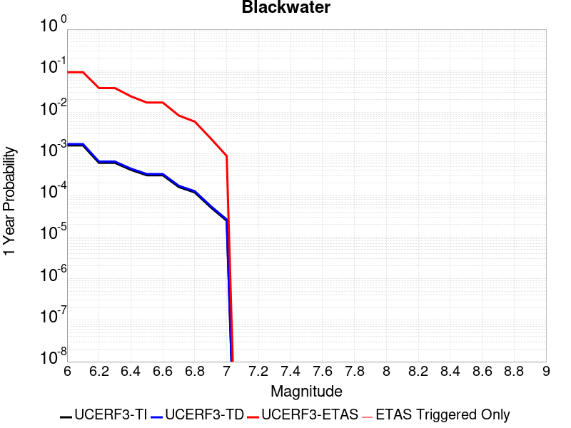 |  |

| Magnitude | 1 wk TI Prob | 1 wk TD Prob | 1 wk ETAS Prob | 1 wk ETAS/TD Gain | 1 wk ETAS Triggered Only | 1 mo TI Prob | 1 mo TD Prob | 1 mo ETAS Prob | 1 mo ETAS/TD Gain | 1 mo ETAS Triggered Only | 1 yr TI Prob | 1 yr TD Prob | 1 yr ETAS Prob | 1 yr ETAS/TD Gain | 1 yr ETAS Triggered Only | 10 yr TI Prob | 10 yr TD Prob | 10 yr ETAS Prob | 10 yr ETAS/TD Gain | 10 yr ETAS Triggered Only |
|-----|-----|-----|-----|-----|-----|-----|-----|-----|-----|-----|-----|-----|-----|-----|-----|-----|-----|-----|-----|-----|
| 6.0 | 3.0708583E-5 | 3.3095846E-5 | 0.056241237 | 1699.3441 | 0.05621 | 1.3160157E-4 | 1.4183241E-4 | 0.069442004 | 489.60602 | 0.06931 | 0.0016010714 | 0.0017255784 | 0.09266838 | 53.70279 | 0.0911 | 0.015895851 | 0.017135633 | 0.12712799 | 7.4189253 | 0.11191 |
| 6.1 | 3.0708583E-5 | 3.3095846E-5 | 0.056241237 | 1699.3441 | 0.05621 | 1.3160157E-4 | 1.4183241E-4 | 0.069442004 | 489.60602 | 0.06931 | 0.0016010714 | 0.0017255784 | 0.09266838 | 53.70279 | 0.0911 | 0.015895851 | 0.017135633 | 0.12712799 | 7.4189253 | 0.11191 |
| 6.2 | 1.1707779E-5 | 1.2545122E-5 | 0.023122255 | 1843.1272 | 0.02311 | 5.017523E-5 | 5.3763757E-5 | 0.028522233 | 530.51044 | 0.02847 | 6.107122E-4 | 6.5438676E-4 | 0.038459633 | 58.772022 | 0.03783 | 0.006090366 | 0.0065255696 | 0.05276187 | 8.085404 | 0.04654 |
| 6.3 | 1.1707779E-5 | 1.2545122E-5 | 0.023122255 | 1843.1272 | 0.02311 | 5.017523E-5 | 5.3763757E-5 | 0.028522233 | 530.51044 | 0.02847 | 6.107122E-4 | 6.5438676E-4 | 0.038459633 | 58.772022 | 0.03783 | 0.006090366 | 0.0065255696 | 0.05276187 | 8.085404 | 0.04654 |
| 6.4 | 7.929244E-6 | 8.480098E-6 | 0.014648356 | 1727.3805 | 0.01464 | 3.3982033E-5 | 3.6342793E-5 | 0.018025689 | 495.99072 | 0.01799 | 4.136527E-4 | 4.423877E-4 | 0.02434181 | 55.0237 | 0.02391 | 0.0041288356 | 0.0044154758 | 0.033984337 | 7.6966414 | 0.0297 |
| 6.5 | 5.8832115E-6 | 6.285991E-6 | 0.010366221 | 1649.0989 | 0.01036 | 2.521352E-5 | 2.6939697E-5 | 0.012756596 | 473.52414 | 0.01273 | 3.0693135E-4 | 3.27944E-4 | 0.017232398 | 52.546772 | 0.01691 | 0.0030650778 | 0.0032748538 | 0.024116376 | 7.364108 | 0.02091 |
| 6.6 | 5.8832115E-6 | 6.285991E-6 | 0.010366221 | 1649.0989 | 0.01036 | 2.521352E-5 | 2.6939697E-5 | 0.012756596 | 473.52414 | 0.01273 | 3.0693135E-4 | 3.27944E-4 | 0.017232398 | 52.546772 | 0.01691 | 0.0030650778 | 0.0032748538 | 0.024116376 | 7.364108 | 0.02091 |
| 6.7 | 3.0715053E-6 | 3.2814662E-6 | 0.005053265 | 1539.9412 | 0.00505 | 1.3163528E-5 | 1.4063357E-5 | 0.0062339758 | 443.27792 | 0.00622 | 1.6025416E-4 | 1.7120909E-4 | 0.008409798 | 49.12005 | 0.00824 | 0.0016013865 | 0.0017108864 | 0.011763657 | 6.8757677 | 0.01007 |
| 6.8 | 2.2722281E-6 | 2.4287538E-6 | 0.00361242 | 1487.3555 | 0.00361 | 9.738084E-6 | 1.0408908E-5 | 0.004430363 | 425.63187 | 0.00442 | 1.1855473E-4 | 1.26722E-4 | 0.005995978 | 47.315998 | 0.00587 | 0.001184915 | 0.0012665876 | 0.008397544 | 6.630054 | 0.00714 |
| 6.9 | 9.952399E-7 | 1.0653489E-6 | 0.0014310639 | 1343.2819 | 0.00143 | 4.265307E-6 | 4.5657757E-6 | 0.0017845576 | 390.8553 | 0.00178 | 5.1928873E-5 | 5.5587418E-5 | 0.002365459 | 42.553856 | 0.00231 | 5.191674E-4 | 5.557858E-4 | 0.0034241907 | 6.16099 | 0.00287 |
| 7.0 | 4.7385504E-7 | 5.0755597E-7 | 5.4050726E-4 | 1064.9216 | 5.4E-4 | 2.0308057E-6 | 2.1752398E-6 | 6.621738E-4 | 304.41415 | 6.6E-4 | 2.4724779E-5 | 2.6483543E-5 | 8.964605E-4 | 33.849716 | 8.7E-4 | 2.4722028E-4 | 2.6483546E-4 | 0.0013445495 | 5.076924 | 0.00108 |

## Tank Canyon
*[(top)](#table-of-contents)*

| 1 Week | 1 Month | 1 Year | 10 Year |
|-----|-----|-----|-----|
|  |  |  |  |

| Magnitude | 1 wk TI Prob | 1 wk TD Prob | 1 wk ETAS Prob | 1 wk ETAS/TD Gain | 1 wk ETAS Triggered Only | 1 mo TI Prob | 1 mo TD Prob | 1 mo ETAS Prob | 1 mo ETAS/TD Gain | 1 mo ETAS Triggered Only | 1 yr TI Prob | 1 yr TD Prob | 1 yr ETAS Prob | 1 yr ETAS/TD Gain | 1 yr ETAS Triggered Only | 10 yr TI Prob | 10 yr TD Prob | 10 yr ETAS Prob | 10 yr ETAS/TD Gain | 10 yr ETAS Triggered Only |
|-----|-----|-----|-----|-----|-----|-----|-----|-----|-----|-----|-----|-----|-----|-----|-----|-----|-----|-----|-----|-----|
| 6.0 | 4.8284557E-5 | 5.796445E-5 | 0.022336673 | 385.35126 | 0.02228 | 2.0691741E-4 | 2.4839927E-4 | 0.030630851 | 123.31297 | 0.03039 | 0.0025163088 | 0.0030207336 | 0.04983888 | 16.498932 | 0.04696 | 0.02488006 | 0.029863616 | 0.09391202 | 3.144697 | 0.06602 |
| 6.1 | 1.7796336E-5 | 2.0873378E-5 | 0.0071207252 | 341.1391 | 0.0071 | 7.626778E-5 | 8.945448E-5 | 0.010058562 | 112.44337 | 0.00997 | 9.281647E-4 | 0.0010886024 | 0.017650554 | 16.213959 | 0.01658 | 0.009242975 | 0.010836642 | 0.034794178 | 3.2107897 | 0.02422 |
| 6.2 | 1.7796336E-5 | 2.0873378E-5 | 0.0071207252 | 341.1391 | 0.0071 | 7.626778E-5 | 8.945448E-5 | 0.010058562 | 112.44337 | 0.00997 | 9.281647E-4 | 0.0010886024 | 0.017650554 | 16.213959 | 0.01658 | 0.009242975 | 0.010836642 | 0.034794178 | 3.2107897 | 0.02422 |
| 6.3 | 1.3515912E-5 | 1.5759651E-5 | 0.0051656784 | 327.77872 | 0.00515 | 5.792405E-5 | 6.7539746E-5 | 0.007257054 | 107.44864 | 0.00719 | 7.049971E-4 | 8.2200987E-4 | 0.012572343 | 15.294638 | 0.01176 | 0.007027647 | 0.008192157 | 0.025132235 | 3.067841 | 0.01708 |
| 6.4 | 1.0870146E-5 | 1.2618114E-5 | 0.0038525697 | 305.32056 | 0.00384 | 4.658551E-5 | 5.4076605E-5 | 0.0054737837 | 101.22276 | 0.00542 | 5.67031E-4 | 6.582015E-4 | 0.009342481 | 14.1939535 | 0.00869 | 0.005655863 | 0.006564382 | 0.01922075 | 2.9280367 | 0.01274 |
| 6.5 | 7.964826E-6 | 9.196184E-6 | 0.002409174 | 261.97543 | 0.0024 | 3.4134522E-5 | 3.941168E-5 | 0.003429278 | 87.01172 | 0.00339 | 4.1550855E-4 | 4.797421E-4 | 0.005957113 | 12.417324 | 0.00548 | 0.0041473247 | 0.004788209 | 0.012799664 | 2.6731632 | 0.00805 |
| 6.6 | 6.6317E-6 | 7.612378E-6 | 0.0018675983 | 245.33704 | 0.00186 | 2.8421264E-5 | 3.262412E-5 | 0.0025625415 | 78.547455 | 0.00253 | 3.4597394E-4 | 3.9713533E-4 | 0.0044155386 | 11.118474 | 0.00402 | 0.0034543579 | 0.0039652516 | 0.009712372 | 2.449371 | 0.00577 |
| 6.7 | 4.793663E-6 | 5.4308593E-6 | 8.054265E-4 | 148.30554 | 8.0E-4 | 2.0544108E-5 | 2.3274928E-5 | 0.0012032475 | 51.69715 | 0.00118 | 2.500958E-4 | 2.833398E-4 | 0.0022027958 | 7.7743964 | 0.00192 | 0.0024981452 | 0.0028303189 | 0.0057719694 | 2.0393353 | 0.00295 |
| 6.8 | 4.382823E-6 | 4.969325E-6 | 7.349657E-4 | 147.90051 | 7.3E-4 | 1.8783392E-5 | 2.1296957E-5 | 0.0010912742 | 51.24085 | 0.00107 | 2.286638E-4 | 2.5926388E-4 | 0.0020088102 | 7.74813 | 0.00175 | 0.0022842865 | 0.0025901233 | 0.005263182 | 2.0320199 | 0.00268 |
| 6.9 | 2.729601E-6 | 3.0735862E-6 | 3.0307265E-4 | 98.60555 | 3.0E-4 | 1.1698237E-5 | 1.3172453E-5 | 4.7316638E-4 | 35.920902 | 4.6E-4 | 1.4241673E-4 | 1.6036403E-4 | 9.102438E-4 | 5.6761093 | 7.5E-4 | 0.001423255 | 0.0016024808 | 0.002690734 | 1.6791054 | 0.00109 |
| 7.0 | 1.8987357E-6 | 2.126971E-6 | 1.3212669E-4 | 62.11965 | 1.3E-4 | 8.137413E-6 | 9.115562E-6 | 1.9911383E-4 | 21.843287 | 1.9E-4 | 9.90685E-5 | 1.1097702E-4 | 4.0094482E-4 | 3.6128638 | 2.9E-4 | 9.902435E-4 | 0.0011092846 | 0.0015687743 | 1.4142216 | 4.6E-4 |
| 7.1 | 1.4928986E-6 | 1.6641525E-6 | 7.1664035E-5 | 43.06338 | 7.0E-5 | 6.398121E-6 | 7.132066E-6 | 9.713142E-5 | 13.618975 | 9.0E-5 | 7.789434E-5 | 8.6830034E-5 | 2.5681528E-4 | 2.9576778 | 1.7E-4 | 7.786704E-4 | 8.6801895E-4 | 0.0011777498 | 1.3568251 | 3.1E-4 |
| 7.2 | 1.069082E-6 | 1.1828765E-6 | 4.118283E-5 | 34.81583 | 4.0E-5 | 4.581772E-6 | 5.0694644E-6 | 4.506926E-5 | 8.89034 | 4.0E-5 | 5.5781646E-5 | 6.171951E-5 | 1.5171396E-4 | 2.4581199 | 9.0E-5 | 5.576765E-4 | 6.1707594E-4 | 7.969649E-4 | 1.2915183 | 1.8E-4 |
| 7.3 | 8.776551E-7 | 9.770151E-7 | 2.0976995E-5 | 21.470491 | 2.0E-5 | 3.7613736E-6 | 4.187204E-6 | 2.418712E-5 | 5.7764373 | 2.0E-5 | 4.579376E-5 | 5.0978535E-5 | 1.10975474E-4 | 2.1769059 | 6.0E-5 | 4.5784327E-4 | 5.097194E-4 | 6.296583E-4 | 1.2353036 | 1.2E-4 |
| 7.4 | 7.55721E-7 | 8.5103835E-7 | 8.5103835E-7 | 1.0 | 0.0 | 3.2388E-6 | 3.6473052E-6 | 3.6473052E-6 | 1.0 | 0.0 | 3.9431678E-5 | 4.4405555E-5 | 8.440378E-5 | 1.9007483 | 4.0E-5 | 3.942468E-4 | 4.4401767E-4 | 5.4397323E-4 | 1.2251163 | 1.0E-4 |
| 7.5 | 5.587665E-7 | 6.305732E-7 | 6.305732E-7 | 1.0 | 0.0 | 2.3947114E-6 | 2.7024564E-6 | 2.7024564E-6 | 1.0 | 0.0 | 2.915522E-5 | 3.2902408E-5 | 5.290175E-5 | 1.6078383 | 2.0E-5 | 2.9151395E-4 | 3.2902407E-4 | 3.7900763E-4 | 1.1519146 | 5.0E-5 |

## Owl Lake
*[(top)](#table-of-contents)*

| 1 Week | 1 Month | 1 Year | 10 Year |
|-----|-----|-----|-----|
|  |  |  |  |

| Magnitude | 1 wk TI Prob | 1 wk TD Prob | 1 wk ETAS Prob | 1 wk ETAS/TD Gain | 1 wk ETAS Triggered Only | 1 mo TI Prob | 1 mo TD Prob | 1 mo ETAS Prob | 1 mo ETAS/TD Gain | 1 mo ETAS Triggered Only | 1 yr TI Prob | 1 yr TD Prob | 1 yr ETAS Prob | 1 yr ETAS/TD Gain | 1 yr ETAS Triggered Only | 10 yr TI Prob | 10 yr TD Prob | 10 yr ETAS Prob | 10 yr ETAS/TD Gain | 10 yr ETAS Triggered Only |
|-----|-----|-----|-----|-----|-----|-----|-----|-----|-----|-----|-----|-----|-----|-----|-----|-----|-----|-----|-----|-----|
| 6.0 | 5.0320643E-5 | 6.6358676E-5 | 0.026044635 | 392.48273 | 0.02598 | 2.1564208E-4 | 2.843643E-4 | 0.033994775 | 119.54656 | 0.03372 | 0.0026222812 | 0.003457547 | 0.050902933 | 14.722268 | 0.04761 | 0.02591553 | 0.034141295 | 0.094014876 | 2.7536998 | 0.06199 |
| 6.1 | 5.0320643E-5 | 6.6358676E-5 | 0.026044635 | 392.48273 | 0.02598 | 2.1564208E-4 | 2.843643E-4 | 0.033994775 | 119.54656 | 0.03372 | 0.0026222812 | 0.003457547 | 0.050902933 | 14.722268 | 0.04761 | 0.02591553 | 0.034141295 | 0.094014876 | 2.7536998 | 0.06199 |
| 6.2 | 2.4125871E-5 | 3.0980515E-5 | 0.021110328 | 681.4066 | 0.02108 | 1.0339249E-4 | 1.3276804E-4 | 0.027009198 | 203.43149 | 0.02688 | 0.0012580766 | 0.0016154252 | 0.039104767 | 24.207104 | 0.03755 | 0.012509781 | 0.016070755 | 0.06349614 | 3.9510367 | 0.0482 |
| 6.3 | 1.7433485E-5 | 2.2355545E-5 | 0.019201927 | 858.93353 | 0.01918 | 7.471279E-5 | 9.580685E-5 | 0.024353482 | 254.19356 | 0.02426 | 9.0924866E-4 | 0.001165962 | 0.03433724 | 29.449709 | 0.03321 | 0.009055373 | 0.0116291465 | 0.053150605 | 4.570465 | 0.04201 |
| 6.4 | 1.7433485E-5 | 2.2355545E-5 | 0.019201927 | 858.93353 | 0.01918 | 7.471279E-5 | 9.580685E-5 | 0.024353482 | 254.19356 | 0.02426 | 9.0924866E-4 | 0.001165962 | 0.03433724 | 29.449709 | 0.03321 | 0.009055373 | 0.0116291465 | 0.053150605 | 4.570465 | 0.04201 |
| 6.5 | 1.5182742E-5 | 1.9429277E-5 | 0.018699067 | 962.417 | 0.01868 | 6.506727E-5 | 8.3266525E-5 | 0.02359131 | 283.32285 | 0.02351 | 7.919061E-4 | 0.0010134344 | 0.032871116 | 32.435368 | 0.03189 | 0.0078909 | 0.010118678 | 0.04980302 | 4.9218903 | 0.04009 |
| 6.6 | 6.7271576E-6 | 8.547518E-6 | 0.015988411 | 1870.5326 | 0.01598 | 2.8830356E-5 | 3.6631736E-5 | 0.019515919 | 532.7598 | 0.01948 | 3.5095305E-4 | 4.4590578E-4 | 0.026004504 | 58.318382 | 0.02557 | 0.0035039932 | 0.0044680187 | 0.035419106 | 7.9272513 | 0.03109 |
| 6.7 | 6.682835E-6 | 8.479961E-6 | 0.015988344 | 1885.4266 | 0.01598 | 2.8640408E-5 | 3.6342215E-5 | 0.019505635 | 536.7211 | 0.01947 | 3.4864116E-4 | 4.423823E-4 | 0.02598108 | 58.729927 | 0.02555 | 0.003480947 | 0.0044329325 | 0.03534529 | 7.973343 | 0.03105 |
| 6.8 | 6.5774975E-6 | 8.326427E-6 | 0.015988193 | 1920.1746 | 0.01598 | 2.8188972E-5 | 3.5684232E-5 | 0.01949499 | 546.31946 | 0.01946 | 3.4314668E-4 | 4.3437455E-4 | 0.025943289 | 59.72562 | 0.02552 | 0.0034261728 | 0.0043531056 | 0.035238072 | 8.094927 | 0.03102 |
| 6.9 | 6.363419E-6 | 7.999591E-6 | 0.015967872 | 1996.0862 | 0.01596 | 2.727151E-5 | 3.428354E-5 | 0.019453619 | 567.43317 | 0.01942 | 3.3198006E-4 | 4.1732774E-4 | 0.025876699 | 62.0057 | 0.02547 | 0.0033148455 | 0.0041830647 | 0.034963768 | 8.358409 | 0.03091 |
| 7.0 | 6.1342453E-6 | 7.631779E-6 | 0.01582751 | 2073.8953 | 0.01582 | 2.6289357E-5 | 3.2707245E-5 | 0.019282078 | 589.53534 | 0.01925 | 3.2002592E-4 | 3.9814346E-4 | 0.025628094 | 64.368996 | 0.02524 | 0.0031956544 | 0.003991739 | 0.03444967 | 8.630241 | 0.03058 |
| 7.1 | 5.842926E-6 | 7.142312E-6 | 0.014737037 | 2063.3425 | 0.01473 | 2.504087E-5 | 3.060958E-5 | 0.01798006 | 587.3998 | 0.01795 | 3.0482994E-4 | 3.7261334E-4 | 0.024023797 | 64.4738 | 0.02366 | 0.0030441214 | 0.0037371595 | 0.032300014 | 8.642932 | 0.02867 |
| 7.2 | 4.77173E-6 | 5.358478E-6 | 0.009555307 | 1783.2129 | 0.00955 | 2.045011E-5 | 2.2964727E-5 | 0.011602699 | 505.24 | 0.01158 | 2.4895166E-4 | 2.7956374E-4 | 0.015425328 | 55.176426 | 0.01515 | 0.0024867293 | 0.0028086212 | 0.021156942 | 7.532857 | 0.0184 |
| 7.3 | 3.0494948E-6 | 2.710356E-6 | 0.0025127036 | 927.0751 | 0.00251 | 1.3069198E-5 | 1.1615762E-5 | 0.002991581 | 257.54498 | 0.00298 | 1.5910587E-4 | 1.4141288E-4 | 0.0041608443 | 29.423376 | 0.00402 | 0.0015899199 | 0.0014231089 | 0.0064559365 | 4.536502 | 0.00504 |
| 7.4 | 2.7263884E-6 | 2.3055634E-6 | 0.0017823015 | 773.0438 | 0.00178 | 1.1684469E-5 | 9.880949E-6 | 0.0020998602 | 212.51607 | 0.00209 | 1.4224913E-4 | 1.2029401E-4 | 0.0029399549 | 24.439743 | 0.00282 | 0.0014215811 | 0.0012110578 | 0.004706819 | 3.8865356 | 0.0035 |
| 7.5 | 2.6090431E-6 | 2.1655019E-6 | 0.0015321622 | 707.53217 | 0.00153 | 1.1181565E-5 | 9.2806895E-6 | 0.0017592645 | 189.56183 | 0.00175 | 1.3612706E-4 | 1.1298663E-4 | 0.0024327245 | 21.531082 | 0.00232 | 0.001360437 | 0.0011378126 | 0.0040445016 | 3.5546288 | 0.00291 |
| 7.6 | 2.3008756E-6 | 1.8726826E-6 | 0.0011418705 | 609.7513 | 0.00114 | 9.860858E-6 | 8.025758E-6 | 0.0012980154 | 161.73119 | 0.00129 | 1.20049335E-4 | 9.770931E-5 | 0.0017975433 | 18.396847 | 0.0017 | 0.001199845 | 9.848307E-4 | 0.0031227232 | 3.1708224 | 0.00214 |
| 7.7 | 1.7184348E-6 | 1.341808E-6 | 6.21341E-4 | 463.0625 | 6.2E-4 | 7.3646997E-6 | 5.750593E-6 | 7.357464E-4 | 127.942696 | 7.3E-4 | 8.966153E-5 | 7.0011265E-5 | 0.0010399433 | 14.853943 | 9.7E-4 | 8.962536E-4 | 7.0769014E-4 | 0.0019268268 | 2.7226982 | 0.00122 |
| 7.8 | 8.4612907E-7 | 8.4054994E-7 | 3.6084023E-4 | 429.29065 | 3.6E-4 | 3.6262625E-6 | 3.602352E-6 | 4.1360088E-4 | 114.81412 | 4.1E-4 | 4.4148852E-5 | 4.3857777E-5 | 5.4383586E-4 | 12.399987 | 5.0E-4 | 4.414008E-4 | 4.4386165E-4 | 0.0010435954 | 2.3511727 | 6.0E-4 |
| 7.9 | 2.716738E-7 | 3.7681625E-7 | 1.4037677E-4 | 372.53372 | 1.4E-4 | 1.1643157E-6 | 1.6149258E-6 | 1.6161466E-4 | 100.0756 | 1.6E-4 | 1.4175452E-5 | 1.9661555E-5 | 2.0965782E-4 | 10.663339 | 1.9E-4 | 1.4174548E-4 | 1.9829652E-4 | 4.182529E-4 | 2.1092296 | 2.2E-4 |
| 8.0 | 2.1995428E-8 | 3.3853325E-8 | 2.0033853E-5 | 591.7839 | 2.0E-5 | 9.426611E-8 | 1.4508568E-7 | 2.0145082E-5 | 138.84956 | 2.0E-5 | 1.1476893E-6 | 1.7664173E-6 | 2.1766382E-5 | 12.322332 | 2.0E-5 | 1.14768345E-5 | 1.7869768E-5 | 5.7869052E-5 | 3.2383773 | 4.0E-5 |

## Little Lake
*[(top)](#table-of-contents)*

| 1 Week | 1 Month | 1 Year | 10 Year |
|-----|-----|-----|-----|
|  | 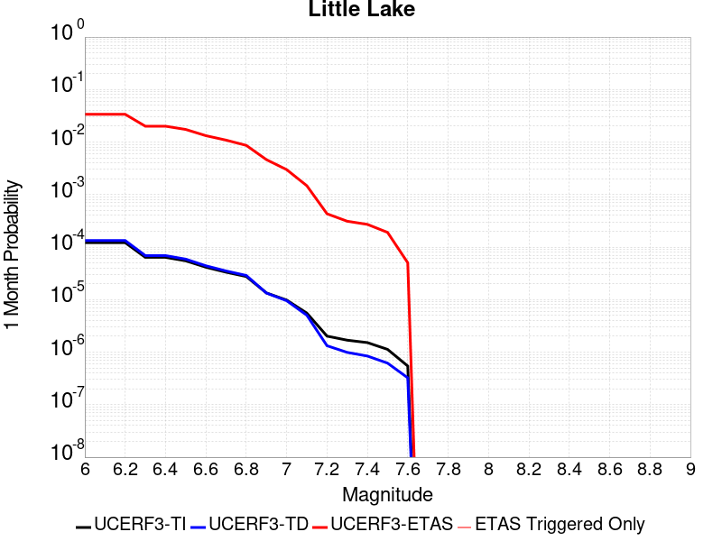 |  | 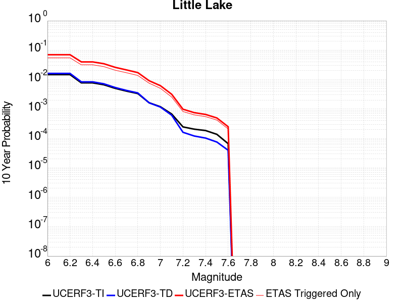 |

| Magnitude | 1 wk TI Prob | 1 wk TD Prob | 1 wk ETAS Prob | 1 wk ETAS/TD Gain | 1 wk ETAS Triggered Only | 1 mo TI Prob | 1 mo TD Prob | 1 mo ETAS Prob | 1 mo ETAS/TD Gain | 1 mo ETAS Triggered Only | 1 yr TI Prob | 1 yr TD Prob | 1 yr ETAS Prob | 1 yr ETAS/TD Gain | 1 yr ETAS Triggered Only | 10 yr TI Prob | 10 yr TD Prob | 10 yr ETAS Prob | 10 yr ETAS/TD Gain | 10 yr ETAS Triggered Only |
|-----|-----|-----|-----|-----|-----|-----|-----|-----|-----|-----|-----|-----|-----|-----|-----|-----|-----|-----|-----|-----|
| 6.0 | 2.8424427E-5 | 3.1205716E-5 | 0.027650343 | 886.06665 | 0.02762 | 1.2181328E-4 | 1.3373268E-4 | 0.03379923 | 252.73726 | 0.03367 | 0.0014820677 | 0.0016271125 | 0.045964852 | 28.24934 | 0.04441 | 0.014722223 | 0.016165398 | 0.06998115 | 4.3290706 | 0.0547 |
| 6.1 | 2.8424427E-5 | 3.1205716E-5 | 0.027650343 | 886.06665 | 0.02762 | 1.2181328E-4 | 1.3373268E-4 | 0.03379923 | 252.73726 | 0.03367 | 0.0014820677 | 0.0016271125 | 0.045964852 | 28.24934 | 0.04441 | 0.014722223 | 0.016165398 | 0.06998115 | 4.3290706 | 0.0547 |
| 6.2 | 2.8424427E-5 | 3.1205716E-5 | 0.027650343 | 886.06665 | 0.02762 | 1.2181328E-4 | 1.3373268E-4 | 0.03379923 | 252.73726 | 0.03367 | 0.0014820677 | 0.0016271125 | 0.045964852 | 28.24934 | 0.04441 | 0.014722223 | 0.016165398 | 0.06998115 | 4.3290706 | 0.0547 |
| 6.3 | 1.48860645E-5 | 1.6081383E-5 | 0.016475817 | 1024.5272 | 0.01646 | 6.379586E-5 | 6.8918554E-5 | 0.020037543 | 290.74234 | 0.01997 | 7.7643775E-4 | 8.387886E-4 | 0.026846955 | 32.00682 | 0.02603 | 0.007737305 | 0.008359045 | 0.039873395 | 4.7700896 | 0.03178 |
| 6.4 | 1.48860645E-5 | 1.6081383E-5 | 0.016475817 | 1024.5272 | 0.01646 | 6.379586E-5 | 6.8918554E-5 | 0.020037543 | 290.74234 | 0.01997 | 7.7643775E-4 | 8.387886E-4 | 0.026846955 | 32.00682 | 0.02603 | 0.007737305 | 0.008359045 | 0.039873395 | 4.7700896 | 0.03178 |
| 6.5 | 1.2797581E-5 | 1.376556E-5 | 0.014273569 | 1036.9044 | 0.01426 | 5.4845623E-5 | 5.8994065E-5 | 0.017387971 | 294.74103 | 0.01733 | 6.675408E-4 | 7.1804173E-4 | 0.023261843 | 32.396225 | 0.02256 | 0.006655392 | 0.007159767 | 0.03450259 | 4.8189535 | 0.02754 |
| 6.6 | 9.661896E-6 | 1.0289033E-5 | 0.010740179 | 1043.8473 | 0.01073 | 4.1407468E-5 | 4.40952E-5 | 0.013233514 | 300.11234 | 0.01319 | 5.040193E-4 | 5.36743E-4 | 0.017557602 | 32.711372 | 0.01703 | 0.005028777 | 0.0053560715 | 0.026024772 | 4.858929 | 0.02078 |
| 6.7 | 7.767871E-6 | 8.199681E-6 | 0.008848127 | 1079.0819 | 0.00884 | 3.329045E-5 | 3.5141096E-5 | 0.01088476 | 309.74448 | 0.01085 | 4.0523586E-4 | 4.2777258E-4 | 0.014431779 | 33.737038 | 0.01401 | 0.004044977 | 0.004270843 | 0.021257984 | 4.9774675 | 0.01706 |
| 6.8 | 6.4235196E-6 | 6.735739E-6 | 0.0070466883 | 1046.1641 | 0.00704 | 2.752908E-5 | 2.8867207E-5 | 0.008648618 | 299.60013 | 0.00862 | 3.35115E-4 | 3.5141438E-4 | 0.011627451 | 33.087578 | 0.01128 | 0.003346101 | 0.0035098472 | 0.017251447 | 4.915156 | 0.01379 |
| 6.9 | 3.1283696E-6 | 3.1121751E-6 | 0.0037831005 | 1215.5808 | 0.00378 | 1.3407229E-5 | 1.33378335E-5 | 0.004623276 | 346.62872 | 0.00461 | 1.6322079E-4 | 1.6237753E-4 | 0.0062413905 | 38.437523 | 0.00608 | 0.0016310095 | 0.0016227372 | 0.009150501 | 5.6389303 | 0.00754 |
| 7.0 | 2.290603E-6 | 2.2286763E-6 | 0.0024022234 | 1077.87 | 0.0024 | 9.816834E-6 | 9.551441E-6 | 0.0029895229 | 312.99185 | 0.00298 | 1.19513395E-4 | 1.1628362E-4 | 0.0041158185 | 35.394653 | 0.004 | 0.0011944914 | 0.0011623299 | 0.006196472 | 5.3310785 | 0.00504 |
| 7.1 | 1.293693E-6 | 1.1776774E-6 | 0.0011511763 | 977.49713 | 0.00115 | 5.5443866E-6 | 5.047183E-6 | 0.0014750398 | 292.2501 | 0.00147 | 6.750081E-5 | 6.1448416E-5 | 0.0020813243 | 33.87108 | 0.00202 | 6.7480316E-4 | 6.1438273E-4 | 0.0031628162 | 5.1479573 | 0.00255 |
| 7.2 | 4.715842E-7 | 3.091732E-7 | 3.7030905E-4 | 1197.7399 | 3.7E-4 | 2.0210737E-6 | 1.3250274E-6 | 4.3132447E-4 | 325.52118 | 4.3E-4 | 2.4606294E-5 | 1.6132095E-5 | 6.461219E-4 | 40.051956 | 6.3E-4 | 2.460357E-4 | 1.6130977E-4 | 9.811776E-4 | 6.0825667 | 8.2E-4 |
| 7.3 | 3.9430947E-7 | 2.3096938E-7 | 2.702309E-4 | 1169.9858 | 2.7E-4 | 1.6898966E-6 | 9.898685E-7 | 3.1098956E-4 | 314.17264 | 3.1E-4 | 2.0574296E-5 | 1.2051582E-5 | 4.8204593E-4 | 39.998558 | 4.7E-4 | 2.0572392E-4 | 1.2050936E-4 | 7.504334E-4 | 6.2271795 | 6.3E-4 |
| 7.4 | 3.547123E-7 | 1.9678579E-7 | 2.3019675E-4 | 1169.7833 | 2.3E-4 | 1.5201948E-6 | 8.433674E-7 | 2.7084313E-4 | 321.1449 | 2.7E-4 | 1.8508214E-5 | 1.02679505E-5 | 4.4026354E-4 | 42.87745 | 4.3E-4 | 1.8506673E-4 | 1.0267482E-4 | 6.5261836E-4 | 6.3561673 | 5.5E-4 |
| 7.5 | 2.6354266E-7 | 1.4422719E-7 | 1.7014421E-4 | 1179.6958 | 1.7E-4 | 1.129468E-6 | 6.1811636E-7 | 1.90618E-4 | 308.38528 | 1.9E-4 | 1.3751187E-5 | 7.525541E-6 | 3.175232E-4 | 42.19274 | 3.1E-4 | 1.3750336E-4 | 7.5252916E-5 | 4.952213E-4 | 6.580759 | 4.2E-4 |
| 7.6 | 1.269913E-7 | 7.572344E-8 | 5.007572E-5 | 661.2974 | 5.0E-5 | 5.4424834E-7 | 3.24529E-7 | 5.0324514E-5 | 155.06938 | 5.0E-5 | 6.6262032E-6 | 3.9511337E-6 | 1.3395063E-4 | 33.901817 | 1.3E-4 | 6.626006E-5 | 3.9510673E-5 | 2.4950237E-4 | 6.31481 | 2.1E-4 |

## Garlock (East)
*[(top)](#table-of-contents)*

| 1 Week | 1 Month | 1 Year | 10 Year |
|-----|-----|-----|-----|
| 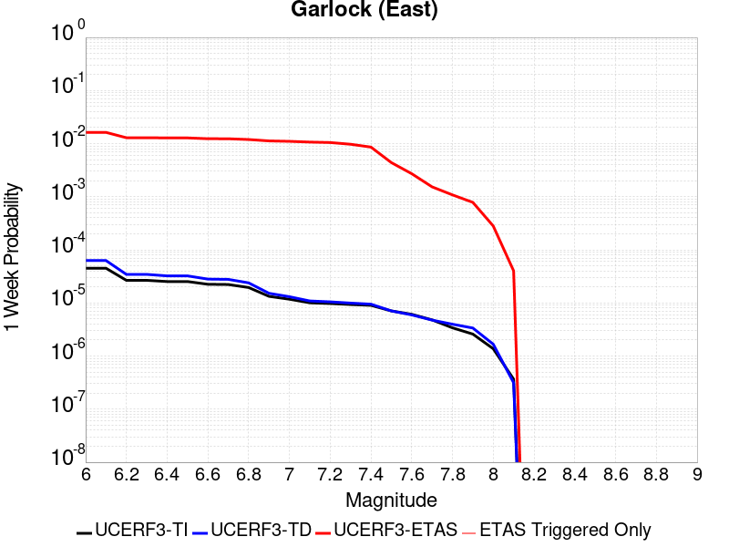 |  |  | 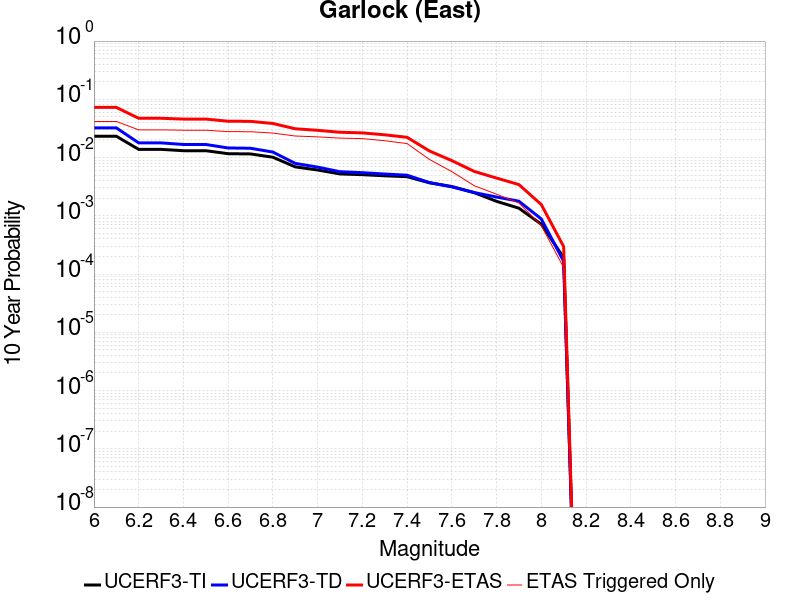 |

| Magnitude | 1 wk TI Prob | 1 wk TD Prob | 1 wk ETAS Prob | 1 wk ETAS/TD Gain | 1 wk ETAS Triggered Only | 1 mo TI Prob | 1 mo TD Prob | 1 mo ETAS Prob | 1 mo ETAS/TD Gain | 1 mo ETAS Triggered Only | 1 yr TI Prob | 1 yr TD Prob | 1 yr ETAS Prob | 1 yr ETAS/TD Gain | 1 yr ETAS Triggered Only | 10 yr TI Prob | 10 yr TD Prob | 10 yr ETAS Prob | 10 yr ETAS/TD Gain | 10 yr ETAS Triggered Only |
|-----|-----|-----|-----|-----|-----|-----|-----|-----|-----|-----|-----|-----|-----|-----|-----|-----|-----|-----|-----|-----|
| 6.0 | 4.5092507E-5 | 6.2904815E-5 | 0.016291885 | 258.9926 | 0.01623 | 1.9323928E-4 | 2.6956675E-4 | 0.02173378 | 80.624855 | 0.02147 | 0.0023501497 | 0.003277482 | 0.03434532 | 10.47918 | 0.03117 | 0.023254504 | 0.03235377 | 0.07270462 | 2.247176 | 0.0417 |
| 6.1 | 4.5092507E-5 | 6.2904815E-5 | 0.016291885 | 258.9926 | 0.01623 | 1.9323928E-4 | 2.6956675E-4 | 0.02173378 | 80.624855 | 0.02147 | 0.0023501497 | 0.003277482 | 0.03434532 | 10.47918 | 0.03117 | 0.023254504 | 0.03235377 | 0.07270462 | 2.247176 | 0.0417 |
| 6.2 | 2.6674514E-5 | 3.4511588E-5 | 0.012924067 | 374.48486 | 0.01289 | 1.1431433E-4 | 1.4789861E-4 | 0.016665455 | 112.681625 | 0.01652 | 0.0013908884 | 0.0017992114 | 0.024827704 | 13.799214 | 0.02307 | 0.01382215 | 0.017872788 | 0.047258034 | 2.6441333 | 0.02992 |
| 6.3 | 2.6674514E-5 | 3.4511588E-5 | 0.012924067 | 374.48486 | 0.01289 | 1.1431433E-4 | 1.4789861E-4 | 0.016665455 | 112.681625 | 0.01652 | 0.0013908884 | 0.0017992114 | 0.024827704 | 13.799214 | 0.02307 | 0.01382215 | 0.017872788 | 0.047258034 | 2.6441333 | 0.02992 |
| 6.4 | 2.5312667E-5 | 3.2340467E-5 | 0.012821927 | 396.46695 | 0.01279 | 1.0847834E-4 | 1.3859481E-4 | 0.016506325 | 119.09772 | 0.01637 | 0.0013199237 | 0.0016861152 | 0.024417723 | 14.481646 | 0.02277 | 0.013121112 | 0.016772287 | 0.045777503 | 2.729354 | 0.0295 |
| 6.5 | 2.5312667E-5 | 3.2340467E-5 | 0.012821927 | 396.46695 | 0.01279 | 1.0847834E-4 | 1.3859481E-4 | 0.016506325 | 119.09772 | 0.01637 | 0.0013199237 | 0.0016861152 | 0.024417723 | 14.481646 | 0.02277 | 0.013121112 | 0.016772287 | 0.045777503 | 2.729354 | 0.0295 |
| 6.6 | 2.246556E-5 | 2.8134691E-5 | 0.012377787 | 439.9475 | 0.01235 | 9.627742E-5 | 1.2057181E-4 | 0.015828678 | 131.28009 | 0.01571 | 0.0011715472 | 0.0014669969 | 0.023125177 | 15.763618 | 0.02169 | 0.011653901 | 0.014613169 | 0.04205619 | 2.8779652 | 0.02785 |
| 6.7 | 2.2241198E-5 | 2.7804432E-5 | 0.012357461 | 444.44217 | 0.01233 | 9.531594E-5 | 1.1915654E-4 | 0.01579729 | 132.57593 | 0.01568 | 0.0011598538 | 0.0014497889 | 0.023078386 | 15.918446 | 0.02166 | 0.011538187 | 0.014442829 | 0.041831464 | 2.8963482 | 0.02779 |
| 6.8 | 1.9528685E-5 | 2.3898969E-5 | 0.011953614 | 500.1728 | 0.01193 | 8.369167E-5 | 1.0242024E-4 | 0.015260868 | 149.00246 | 0.01516 | 0.0010184698 | 0.0012462728 | 0.02194045 | 17.604855 | 0.02072 | 0.010138147 | 0.012436723 | 0.03844914 | 3.091581 | 0.02634 |
| 6.9 | 1.3318621E-5 | 1.5198818E-5 | 0.011255028 | 740.51996 | 0.01124 | 5.7078556E-5 | 6.51362E-5 | 0.014144219 | 217.14836 | 0.01408 | 6.9470983E-4 | 7.927504E-4 | 0.01953788 | 24.645687 | 0.01876 | 0.0069254204 | 0.007940721 | 0.03120451 | 3.9296825 | 0.02345 |
| 7.0 | 1.1760853E-5 | 1.3107653E-5 | 0.011052963 | 843.245 | 0.01104 | 5.0402683E-5 | 5.6174475E-5 | 0.013815401 | 245.93736 | 0.01376 | 6.134799E-4 | 6.8371464E-4 | 0.01887127 | 27.601093 | 0.0182 | 0.0061178906 | 0.006857401 | 0.029362012 | 4.281799 | 0.02266 |
| 7.1 | 1.0064758E-5 | 1.0902761E-5 | 0.0107007865 | 981.4749 | 0.01069 | 4.3133965E-5 | 4.67253E-5 | 0.013346104 | 285.62906 | 0.0133 | 5.2502943E-4 | 5.6873553E-4 | 0.017998816 | 31.647076 | 0.01744 | 0.005237907 | 0.0057133473 | 0.027179996 | 4.7572803 | 0.02159 |
| 7.2 | 9.768808E-6 | 1.0498628E-5 | 0.010490389 | 999.2151 | 0.01048 | 4.186565E-5 | 4.499337E-5 | 0.013064408 | 290.36298 | 0.01302 | 5.095951E-4 | 5.4766005E-4 | 0.017648289 | 32.2249 | 0.01711 | 0.0050842804 | 0.005503584 | 0.026537184 | 4.8218 | 0.02115 |
| 7.3 | 9.344516E-6 | 9.9442705E-6 | 0.009739848 | 979.4431 | 0.00973 | 4.004731E-5 | 4.2617627E-5 | 0.012072105 | 283.26553 | 0.01203 | 4.8746695E-4 | 5.187495E-4 | 0.016230594 | 31.287922 | 0.01572 | 0.0048639905 | 0.005215269 | 0.02457378 | 4.711891 | 0.01946 |
| 7.4 | 9.023491E-6 | 9.490441E-6 | 0.0086094085 | 907.1663 | 0.0086 | 3.867153E-5 | 4.0672705E-5 | 0.0107102385 | 263.32742 | 0.01067 | 4.7072413E-4 | 4.95081E-4 | 0.014498145 | 29.28439 | 0.01401 | 0.004697283 | 0.0049787266 | 0.022272196 | 4.4734726 | 0.01738 |
| 7.5 | 7.081253E-6 | 7.0873994E-6 | 0.004397056 | 620.4048 | 0.00439 | 3.0347876E-5 | 3.0374218E-5 | 0.005570206 | 183.38599 | 0.00554 | 3.6942272E-4 | 3.697441E-4 | 0.0077969967 | 21.08755 | 0.00743 | 0.003688092 | 0.0037244745 | 0.012969911 | 3.4823465 | 0.00928 |
| 7.6 | 6.116396E-6 | 5.9589424E-6 | 0.0027159427 | 455.77597 | 0.00271 | 2.6212863E-5 | 2.5538076E-5 | 0.003435451 | 134.5227 | 0.00341 | 3.1909486E-4 | 3.1088197E-4 | 0.00497943 | 16.017107 | 0.00467 | 0.0031863707 | 0.0031359126 | 0.008867881 | 2.827847 | 0.00575 |
| 7.7 | 4.797145E-6 | 4.7571157E-6 | 0.0015347499 | 322.62195 | 0.00153 | 2.055903E-5 | 2.0387479E-5 | 0.0019603479 | 96.1545 | 0.00194 | 2.5027743E-4 | 2.481894E-4 | 0.0028875342 | 11.634397 | 0.00264 | 0.0024999576 | 0.0025094065 | 0.0057911505 | 2.307777 | 0.00329 |
| 7.8 | 3.4028885E-6 | 3.978375E-6 | 0.001083974 | 272.46655 | 0.00108 | 1.4583726E-5 | 1.7050066E-5 | 0.0014070263 | 82.52322 | 0.00139 | 1.775424E-4 | 2.0756487E-4 | 0.0020671787 | 9.959194 | 0.00186 | 0.0017740062 | 0.0021012141 | 0.004446276 | 2.116051 | 0.00235 |
| 7.9 | 2.5928412E-6 | 3.372436E-6 | 7.833698E-4 | 232.28604 | 7.8E-4 | 1.1112129E-5 | 1.4453217E-5 | 0.0010344385 | 71.5715 | 0.00102 | 1.3528178E-4 | 1.7595377E-4 | 0.0015057197 | 8.557473 | 0.00133 | 0.0013519945 | 0.0017812426 | 0.0034382858 | 1.9302737 | 0.00166 |
| 8.0 | 1.3743648E-6 | 1.6734741E-6 | 2.81673E-4 | 168.31633 | 2.8E-4 | 5.8901214E-6 | 7.1720124E-6 | 3.7716934E-4 | 52.589058 | 3.7E-4 | 7.1709874E-5 | 8.731578E-5 | 6.172695E-4 | 7.069392 | 5.3E-4 | 7.1686733E-4 | 8.837377E-4 | 0.0015631368 | 1.768779 | 6.8E-4 |
| 8.1 | 3.6733252E-7 | 3.1489736E-7 | 4.0314884E-5 | 128.02547 | 4.0E-5 | 1.5742813E-6 | 1.3495595E-6 | 8.134945E-5 | 60.27852 | 8.0E-5 | 1.9166706E-5 | 1.643078E-5 | 1.2642897E-4 | 7.694642 | 1.1E-4 | 1.9165053E-4 | 1.662928E-4 | 2.9627117E-4 | 1.7816237 | 1.3E-4 |

## Panamint Valley
*[(top)](#table-of-contents)*

| 1 Week | 1 Month | 1 Year | 10 Year |
|-----|-----|-----|-----|
|  |  |  |  |

| Magnitude | 1 wk TI Prob | 1 wk TD Prob | 1 wk ETAS Prob | 1 wk ETAS/TD Gain | 1 wk ETAS Triggered Only | 1 mo TI Prob | 1 mo TD Prob | 1 mo ETAS Prob | 1 mo ETAS/TD Gain | 1 mo ETAS Triggered Only | 1 yr TI Prob | 1 yr TD Prob | 1 yr ETAS Prob | 1 yr ETAS/TD Gain | 1 yr ETAS Triggered Only | 10 yr TI Prob | 10 yr TD Prob | 10 yr ETAS Prob | 10 yr ETAS/TD Gain | 10 yr ETAS Triggered Only |
|-----|-----|-----|-----|-----|-----|-----|-----|-----|-----|-----|-----|-----|-----|-----|-----|-----|-----|-----|-----|-----|
| 6.0 | 3.0211835E-5 | 3.3984263E-5 | 0.018503357 | 544.4684 | 0.01847 | 1.2947287E-4 | 1.4563887E-4 | 0.023072299 | 158.4213 | 0.02293 | 0.0015751923 | 0.0017717406 | 0.034244105 | 19.327946 | 0.03253 | 0.015640736 | 0.017583003 | 0.059365198 | 3.3762832 | 0.04253 |
| 6.1 | 3.0211835E-5 | 3.3984263E-5 | 0.018503357 | 544.4684 | 0.01847 | 1.2947287E-4 | 1.4563887E-4 | 0.023072299 | 158.4213 | 0.02293 | 0.0015751923 | 0.0017717406 | 0.034244105 | 19.327946 | 0.03253 | 0.015640736 | 0.017583003 | 0.059365198 | 3.3762832 | 0.04253 |
| 6.2 | 3.0211835E-5 | 3.3984263E-5 | 0.018503357 | 544.4684 | 0.01847 | 1.2947287E-4 | 1.4563887E-4 | 0.023072299 | 158.4213 | 0.02293 | 0.0015751923 | 0.0017717406 | 0.034244105 | 19.327946 | 0.03253 | 0.015640736 | 0.017583003 | 0.059365198 | 3.3762832 | 0.04253 |
| 6.3 | 2.8573924E-5 | 3.2102445E-5 | 0.01788153 | 557.0146 | 0.01785 | 1.2245393E-4 | 1.375748E-4 | 0.02211455 | 160.74565 | 0.02198 | 0.001489857 | 0.0016737141 | 0.0324022 | 19.359457 | 0.03078 | 0.01479908 | 0.016618038 | 0.055953316 | 3.3670232 | 0.04 |
| 6.4 | 2.8573924E-5 | 3.2102445E-5 | 0.01788153 | 557.0146 | 0.01785 | 1.2245393E-4 | 1.375748E-4 | 0.02211455 | 160.74565 | 0.02198 | 0.001489857 | 0.0016737141 | 0.0324022 | 19.359457 | 0.03078 | 0.01479908 | 0.016618038 | 0.055953316 | 3.3670232 | 0.04 |
| 6.5 | 2.7468774E-5 | 3.0828138E-5 | 0.017530289 | 568.6457 | 0.0175 | 1.1771801E-4 | 1.3211406E-4 | 0.02157928 | 163.33826 | 0.02145 | 0.0014322745 | 0.0016073292 | 0.031519175 | 19.609655 | 0.02996 | 0.014230782 | 0.015963882 | 0.054174006 | 3.3935356 | 0.03883 |
| 6.6 | 2.6135967E-5 | 2.9252153E-5 | 0.01721875 | 588.6319 | 0.01719 | 1.1200648E-4 | 1.2536049E-4 | 0.02103274 | 167.77806 | 0.02091 | 0.0013628257 | 0.0015252219 | 0.03048099 | 19.984627 | 0.029 | 0.013544982 | 0.015154343 | 0.05199742 | 3.4311893 | 0.03741 |
| 6.7 | 2.4498746E-5 | 2.7341044E-5 | 0.016796883 | 614.3468 | 0.01677 | 1.04990395E-4 | 1.17170785E-4 | 0.020384796 | 173.97507 | 0.02027 | 0.0012775084 | 0.0014256459 | 0.029245928 | 20.51416 | 0.02786 | 0.012701893 | 0.014171593 | 0.049444534 | 3.488989 | 0.03578 |
| 6.8 | 2.2244329E-5 | 2.4935374E-5 | 0.016114535 | 646.25195 | 0.01609 | 9.532935E-5 | 1.0686163E-4 | 0.019354805 | 181.12024 | 0.01925 | 0.0011600169 | 0.0013002857 | 0.027446244 | 21.107857 | 0.02618 | 0.011539802 | 0.012932955 | 0.045960218 | 3.553729 | 0.03346 |
| 6.9 | 1.9902658E-5 | 2.2290182E-5 | 0.015541945 | 697.2551 | 0.01552 | 8.529431E-5 | 9.552596E-5 | 0.018553762 | 194.22745 | 0.01846 | 0.0010379635 | 0.0011624265 | 0.026013505 | 22.378624 | 0.02488 | 0.010331288 | 0.011569021 | 0.042694714 | 3.6904342 | 0.03149 |
| 7.0 | 1.8353881E-5 | 2.056605E-5 | 0.015190254 | 738.6082 | 0.01517 | 7.865712E-5 | 8.813734E-5 | 0.018056553 | 204.86838 | 0.01797 | 9.5722964E-4 | 0.0010725616 | 0.025156703 | 23.454786 | 0.02411 | 0.009531168 | 0.01067939 | 0.040695377 | 3.8106463 | 0.03034 |
| 7.1 | 1.7667631E-5 | 1.9772435E-5 | 0.0148694785 | 752.03076 | 0.01485 | 7.571623E-5 | 8.4736355E-5 | 0.01761325 | 207.85944 | 0.01753 | 9.2145515E-4 | 0.0010311945 | 0.02455691 | 23.814045 | 0.02355 | 0.009176437 | 0.0102695925 | 0.039496332 | 3.8459492 | 0.02953 |
| 7.2 | 1.6381597E-5 | 1.8158042E-5 | 0.013427914 | 739.5023 | 0.01341 | 7.020495E-5 | 7.781795E-5 | 0.015786596 | 202.86572 | 0.01571 | 8.544101E-4 | 9.470391E-4 | 0.02190717 | 23.132277 | 0.02098 | 0.008511325 | 0.009435269 | 0.035487123 | 3.761114 | 0.0263 |
| 7.3 | 1.4520491E-5 | 1.596657E-5 | 0.011255787 | 704.9596 | 0.01124 | 6.222919E-5 | 6.842646E-5 | 0.013277522 | 194.04077 | 0.01321 | 7.57377E-4 | 8.327899E-4 | 0.018548025 | 22.272154 | 0.01773 | 0.0075480095 | 0.008300399 | 0.030326048 | 3.6535647 | 0.02221 |
| 7.4 | 1.2852287E-5 | 1.41454875E-5 | 0.010903992 | 770.84595 | 0.01089 | 5.5080065E-5 | 6.06222E-5 | 0.012889844 | 212.62581 | 0.01283 | 6.7039346E-4 | 7.378411E-4 | 0.017955128 | 24.33468 | 0.01723 | 0.0066837464 | 0.007357429 | 0.028788581 | 3.912859 | 0.02159 |
| 7.5 | 1.1637851E-5 | 1.2836868E-5 | 0.010852697 | 845.4319 | 0.01084 | 4.987555E-5 | 5.5014076E-5 | 0.0128343105 | 233.2914 | 0.01278 | 6.070656E-4 | 6.696062E-4 | 0.017778143 | 26.550146 | 0.01712 | 0.006054099 | 0.0066793845 | 0.027926512 | 4.181001 | 0.02139 |
| 7.6 | 3.0068115E-6 | 3.3330623E-6 | 0.0045633176 | 1369.1067 | 0.00456 | 1.2886271E-5 | 1.4284516E-5 | 0.005304209 | 371.32578 | 0.00529 | 1.5687906E-4 | 1.7390738E-4 | 0.0073526585 | 42.279163 | 0.00718 | 0.0015676835 | 0.0017397973 | 0.010674226 | 6.1353273 | 0.00895 |

## Hunter Mountain-Saline Valley
*[(top)](#table-of-contents)*

| 1 Week | 1 Month | 1 Year | 10 Year |
|-----|-----|-----|-----|
| 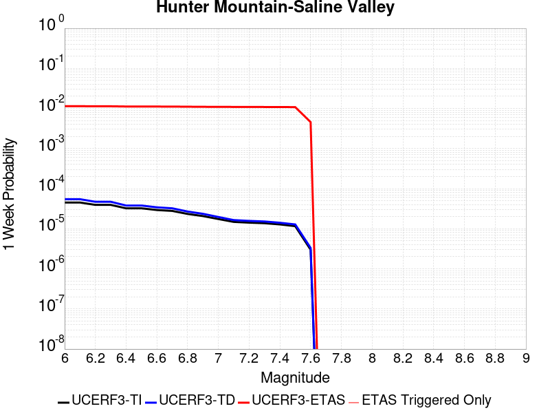 | 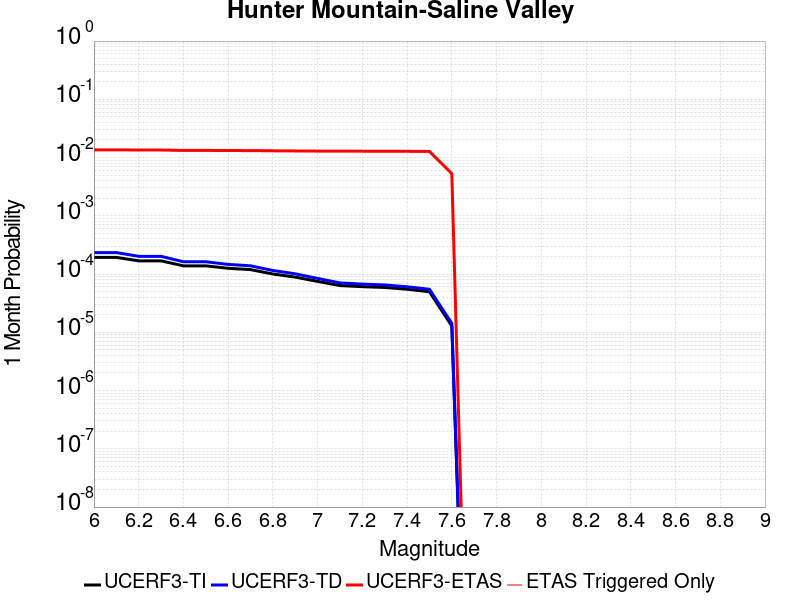 |  |  |

| Magnitude | 1 wk TI Prob | 1 wk TD Prob | 1 wk ETAS Prob | 1 wk ETAS/TD Gain | 1 wk ETAS Triggered Only | 1 mo TI Prob | 1 mo TD Prob | 1 mo ETAS Prob | 1 mo ETAS/TD Gain | 1 mo ETAS Triggered Only | 1 yr TI Prob | 1 yr TD Prob | 1 yr ETAS Prob | 1 yr ETAS/TD Gain | 1 yr ETAS Triggered Only | 10 yr TI Prob | 10 yr TD Prob | 10 yr ETAS Prob | 10 yr ETAS/TD Gain | 10 yr ETAS Triggered Only |
|-----|-----|-----|-----|-----|-----|-----|-----|-----|-----|-----|-----|-----|-----|-----|-----|-----|-----|-----|-----|-----|
| 6.0 | 4.5103672E-5 | 5.456906E-5 | 0.01139395 | 208.79872 | 0.01134 | 1.9328714E-4 | 2.3384714E-4 | 0.0135807255 | 58.075226 | 0.01335 | 0.002350731 | 0.0028435462 | 0.020921992 | 7.357712 | 0.01813 | 0.023260195 | 0.028092625 | 0.050290987 | 1.7901847 | 0.02284 |
| 6.1 | 4.5103672E-5 | 5.456906E-5 | 0.01139395 | 208.79872 | 0.01134 | 1.9328714E-4 | 2.3384714E-4 | 0.0135807255 | 58.075226 | 0.01335 | 0.002350731 | 0.0028435462 | 0.020921992 | 7.357712 | 0.01813 | 0.023260195 | 0.028092625 | 0.050290987 | 1.7901847 | 0.02284 |
| 6.2 | 3.9363465E-5 | 4.706271E-5 | 0.011326532 | 240.66893 | 0.01128 | 1.6868966E-4 | 2.016826E-4 | 0.013469006 | 66.78318 | 0.01327 | 0.002051862 | 0.0024528534 | 0.020398727 | 8.316325 | 0.01799 | 0.020330196 | 0.024274187 | 0.04636462 | 1.910038 | 0.02264 |
| 6.3 | 3.9363465E-5 | 4.706271E-5 | 0.011326532 | 240.66893 | 0.01128 | 1.6868966E-4 | 2.016826E-4 | 0.013469006 | 66.78318 | 0.01327 | 0.002051862 | 0.0024528534 | 0.020398727 | 8.316325 | 0.01799 | 0.020330196 | 0.024274187 | 0.04636462 | 1.910038 | 0.02264 |
| 6.4 | 3.2311684E-5 | 3.795112E-5 | 0.011187528 | 294.78784 | 0.01115 | 1.384713E-4 | 1.6263791E-4 | 0.013270506 | 81.5954 | 0.01311 | 0.0016845843 | 0.001978387 | 0.01971323 | 9.964294 | 0.01777 | 0.016718714 | 0.019617118 | 0.04156789 | 2.1189601 | 0.02239 |
| 6.5 | 3.2311684E-5 | 3.795112E-5 | 0.011187528 | 294.78784 | 0.01115 | 1.384713E-4 | 1.6263791E-4 | 0.013270506 | 81.5954 | 0.01311 | 0.0016845843 | 0.001978387 | 0.01971323 | 9.964294 | 0.01777 | 0.016718714 | 0.019617118 | 0.04156789 | 2.1189601 | 0.02239 |
| 6.6 | 2.9305844E-5 | 3.418196E-5 | 0.011153802 | 326.30664 | 0.01112 | 1.2559042E-4 | 1.4648624E-4 | 0.013204573 | 90.14207 | 0.01306 | 0.0015279909 | 0.0017820727 | 0.019430565 | 10.903352 | 0.01768 | 0.015175272 | 0.017686324 | 0.039513335 | 2.234118 | 0.02222 |
| 6.7 | 2.7826512E-5 | 3.2344353E-5 | 0.011131985 | 344.1709 | 0.0111 | 1.19251024E-4 | 1.3861163E-4 | 0.013176804 | 95.06276 | 0.01304 | 0.0014509142 | 0.0016863506 | 0.019306587 | 11.448739 | 0.01765 | 0.014414776 | 0.016743818 | 0.03855244 | 2.302488 | 0.02218 |
| 6.8 | 2.3389874E-5 | 2.6866792E-5 | 0.01105657 | 411.53296 | 0.01103 | 1.0023846E-4 | 1.1513857E-4 | 0.013063648 | 113.46021 | 0.01295 | 0.00121972 | 0.001400958 | 0.018866455 | 13.466824 | 0.01749 | 0.01213047 | 0.013928067 | 0.035592068 | 2.5554204 | 0.02197 |
| 6.9 | 2.069209E-5 | 2.357011E-5 | 0.010993311 | 466.40903 | 0.01097 | 8.867737E-5 | 1.0101105E-4 | 0.012989709 | 128.59691 | 0.01289 | 0.0010791123 | 0.0012291519 | 0.018617753 | 15.146829 | 0.01741 | 0.010738871 | 0.012229158 | 0.033802073 | 2.7640557 | 0.02184 |
| 7.0 | 1.7462342E-5 | 1.9633622E-5 | 0.010949419 | 557.68713 | 0.01093 | 7.483646E-5 | 8.414151E-5 | 0.012923061 | 153.58722 | 0.01284 | 9.1075303E-4 | 0.0010239641 | 0.01831624 | 17.887579 | 0.01731 | 0.009070295 | 0.010196688 | 0.03168532 | 3.1074128 | 0.02171 |
| 7.1 | 1.4807709E-5 | 1.6441827E-5 | 0.0109262625 | 664.54065 | 0.01091 | 6.3460066E-5 | 7.046316E-5 | 0.012889559 | 182.92622 | 0.01282 | 7.723524E-4 | 8.575678E-4 | 0.018102767 | 21.109428 | 0.01726 | 0.007696735 | 0.008546168 | 0.029971484 | 3.5070088 | 0.02161 |
| 7.2 | 1.4180048E-5 | 1.5698413E-5 | 0.0109055275 | 694.6898 | 0.01089 | 6.077022E-5 | 6.727727E-5 | 0.012866416 | 191.24463 | 0.0128 | 7.396263E-4 | 8.1880915E-4 | 0.018044693 | 22.037727 | 0.01724 | 0.0073716943 | 0.008161469 | 0.029565345 | 3.6225517 | 0.02158 |
| 7.3 | 1.3730402E-5 | 1.5172151E-5 | 0.010875007 | 716.7743 | 0.01086 | 5.8843252E-5 | 6.502197E-5 | 0.012834191 | 197.38239 | 0.01277 | 7.161811E-4 | 7.9137104E-4 | 0.017967768 | 22.704605 | 0.01719 | 0.007138774 | 0.007889058 | 0.029249206 | 3.7075665 | 0.02153 |
| 7.4 | 1.2810095E-5 | 1.4109353E-5 | 0.010853956 | 769.27386 | 0.01084 | 5.489925E-5 | 6.0467344E-5 | 0.012809697 | 211.84486 | 0.01275 | 6.681934E-4 | 7.3595706E-4 | 0.017873336 | 24.28584 | 0.01715 | 0.006661878 | 0.0073386896 | 0.028670982 | 3.9068258 | 0.02149 |
| 7.5 | 1.1595659E-5 | 1.2800734E-5 | 0.010802663 | 843.90967 | 0.01079 | 4.9694736E-5 | 5.485922E-5 | 0.012754163 | 232.48894 | 0.0127 | 6.0486543E-4 | 6.67722E-4 | 0.017696343 | 26.502562 | 0.01704 | 0.006032217 | 0.006660632 | 0.027808826 | 4.175103 | 0.02129 |
| 7.6 | 2.997694E-6 | 3.3251877E-6 | 0.00456331 | 1372.3467 | 0.00456 | 1.28471975E-5 | 1.4250767E-5 | 0.0053041754 | 372.2028 | 0.00529 | 1.564034E-4 | 1.7349655E-4 | 0.0073522506 | 42.376926 | 0.00718 | 0.0015629337 | 0.0017356955 | 0.010670161 | 6.1474843 | 0.00895 |

## Airport Lake
*[(top)](#table-of-contents)*

| 1 Week | 1 Month | 1 Year | 10 Year |
|-----|-----|-----|-----|
| 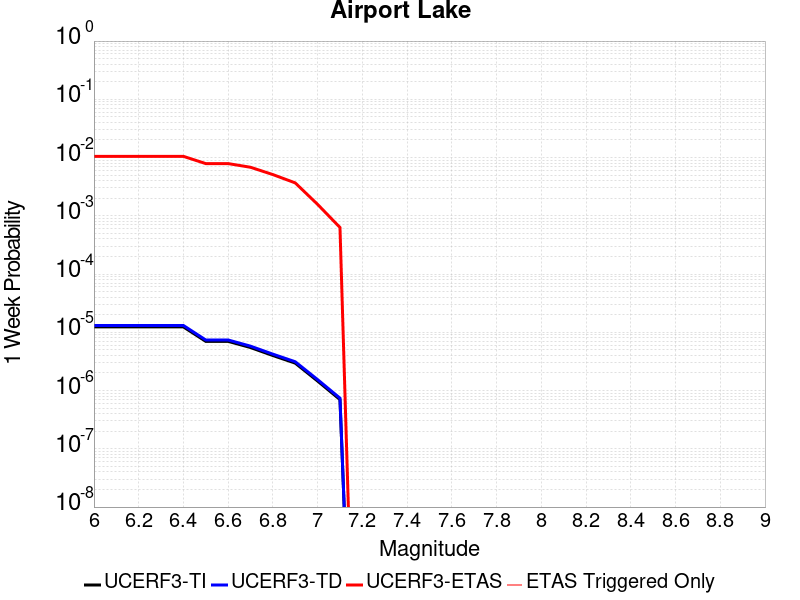 |  |  |  |

| Magnitude | 1 wk TI Prob | 1 wk TD Prob | 1 wk ETAS Prob | 1 wk ETAS/TD Gain | 1 wk ETAS Triggered Only | 1 mo TI Prob | 1 mo TD Prob | 1 mo ETAS Prob | 1 mo ETAS/TD Gain | 1 mo ETAS Triggered Only | 1 yr TI Prob | 1 yr TD Prob | 1 yr ETAS Prob | 1 yr ETAS/TD Gain | 1 yr ETAS Triggered Only | 10 yr TI Prob | 10 yr TD Prob | 10 yr ETAS Prob | 10 yr ETAS/TD Gain | 10 yr ETAS Triggered Only |
|-----|-----|-----|-----|-----|-----|-----|-----|-----|-----|-----|-----|-----|-----|-----|-----|-----|-----|-----|-----|-----|
| 6.0 | 1.2387061E-5 | 1.3103157E-5 | 0.010492966 | 800.7968 | 0.01048 | 5.3086325E-5 | 5.615534E-5 | 0.012875436 | 229.28249 | 0.01282 | 6.461343E-4 | 6.8350515E-4 | 0.01740207 | 25.460041 | 0.01673 | 0.0064425888 | 0.0068168393 | 0.027504845 | 4.034838 | 0.02083 |
| 6.1 | 1.2387061E-5 | 1.3103157E-5 | 0.010492966 | 800.7968 | 0.01048 | 5.3086325E-5 | 5.615534E-5 | 0.012875436 | 229.28249 | 0.01282 | 6.461343E-4 | 6.8350515E-4 | 0.01740207 | 25.460041 | 0.01673 | 0.0064425888 | 0.0068168393 | 0.027504845 | 4.034838 | 0.02083 |
| 6.2 | 1.2387061E-5 | 1.3103157E-5 | 0.010492966 | 800.7968 | 0.01048 | 5.3086325E-5 | 5.615534E-5 | 0.012875436 | 229.28249 | 0.01282 | 6.461343E-4 | 6.8350515E-4 | 0.01740207 | 25.460041 | 0.01673 | 0.0064425888 | 0.0068168393 | 0.027504845 | 4.034838 | 0.02083 |
| 6.3 | 1.2387061E-5 | 1.3103157E-5 | 0.010492966 | 800.7968 | 0.01048 | 5.3086325E-5 | 5.615534E-5 | 0.012875436 | 229.28249 | 0.01282 | 6.461343E-4 | 6.8350515E-4 | 0.01740207 | 25.460041 | 0.01673 | 0.0064425888 | 0.0068168393 | 0.027504845 | 4.034838 | 0.02083 |
| 6.4 | 1.2387061E-5 | 1.3103157E-5 | 0.010492966 | 800.7968 | 0.01048 | 5.3086325E-5 | 5.615534E-5 | 0.012875436 | 229.28249 | 0.01282 | 6.461343E-4 | 6.8350515E-4 | 0.01740207 | 25.460041 | 0.01673 | 0.0064425888 | 0.0068168393 | 0.027504845 | 4.034838 | 0.02083 |
| 6.5 | 6.9922594E-6 | 7.384925E-6 | 0.007877327 | 1066.6766 | 0.00787 | 2.996648E-5 | 3.1649324E-5 | 0.009631345 | 304.3144 | 0.0096 | 3.6478083E-4 | 3.8526783E-4 | 0.012820475 | 33.276787 | 0.01244 | 0.003641826 | 0.0038465366 | 0.019227145 | 4.9985604 | 0.01544 |
| 6.6 | 6.9922594E-6 | 7.384925E-6 | 0.007877327 | 1066.6766 | 0.00787 | 2.996648E-5 | 3.1649324E-5 | 0.009631345 | 304.3144 | 0.0096 | 3.6478083E-4 | 3.8526783E-4 | 0.012820475 | 33.276787 | 0.01244 | 0.003641826 | 0.0038465366 | 0.019227145 | 4.9985604 | 0.01544 |
| 6.7 | 5.477277E-6 | 5.7860684E-6 | 0.006815747 | 1177.9581 | 0.00681 | 2.3473833E-5 | 2.4797222E-5 | 0.008364591 | 337.31964 | 0.00834 | 2.8575645E-4 | 3.0186825E-4 | 0.0109886415 | 36.40211 | 0.01069 | 0.0028538927 | 0.003014966 | 0.016165199 | 5.3616524 | 0.01319 |
| 6.8 | 3.9950432E-6 | 4.2190873E-6 | 0.0051041977 | 1209.7872 | 0.0051 | 1.7121502E-5 | 1.8081691E-5 | 0.00619797 | 342.776 | 0.00618 | 2.0843433E-4 | 2.2012512E-4 | 0.0082683535 | 37.56206 | 0.00805 | 0.0020823893 | 0.0021993418 | 0.01211748 | 5.509594 | 0.00994 |
| 6.9 | 2.95695E-6 | 3.1230243E-6 | 0.0036731116 | 1176.1393 | 0.00367 | 1.2672582E-5 | 1.3384334E-5 | 0.004523324 | 337.9566 | 0.00451 | 1.5427776E-4 | 1.6294434E-4 | 0.0060519846 | 37.141422 | 0.00589 | 0.001541707 | 0.0016284712 | 0.008856681 | 5.4386477 | 0.00724 |
| 7.0 | 1.456072E-6 | 1.540812E-6 | 0.0015715384 | 1019.9417 | 0.00157 | 6.2402937E-6 | 6.603469E-6 | 0.00202659 | 306.8978 | 0.00202 | 7.597293E-5 | 8.039528E-5 | 0.0026901856 | 33.461983 | 0.00261 | 7.594696E-4 | 8.0376083E-4 | 0.0040711327 | 5.0651045 | 0.00327 |
| 7.1 | 6.995192E-7 | 7.4089746E-7 | 6.307404E-4 | 851.3195 | 6.3E-4 | 2.997936E-6 | 3.1752747E-6 | 8.5317256E-4 | 268.69254 | 8.5E-4 | 3.649926E-5 | 3.865897E-5 | 0.0011386165 | 29.452839 | 0.0011 | 3.6493264E-4 | 3.865897E-4 | 0.0017360678 | 4.4907246 | 0.00135 |

## Garlock (West)
*[(top)](#table-of-contents)*

| 1 Week | 1 Month | 1 Year | 10 Year |
|-----|-----|-----|-----|
| 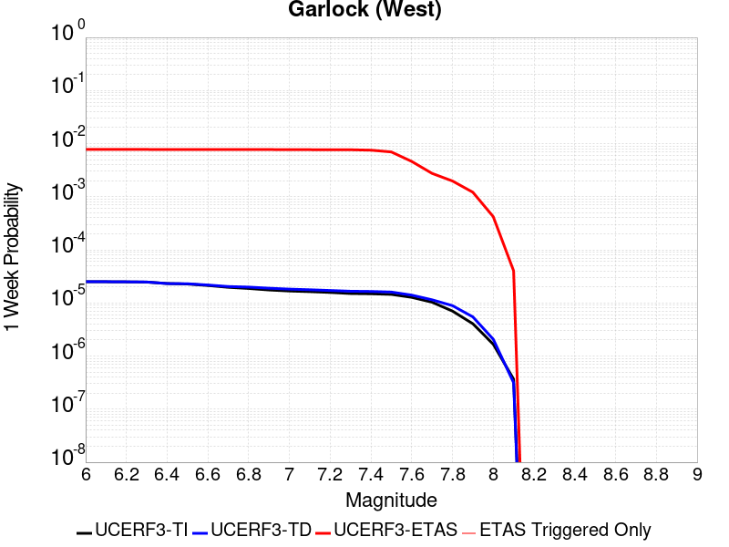 |  |  | 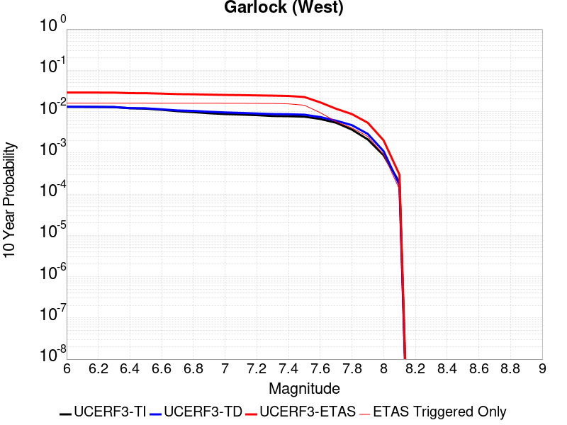 |

| Magnitude | 1 wk TI Prob | 1 wk TD Prob | 1 wk ETAS Prob | 1 wk ETAS/TD Gain | 1 wk ETAS Triggered Only | 1 mo TI Prob | 1 mo TD Prob | 1 mo ETAS Prob | 1 mo ETAS/TD Gain | 1 mo ETAS Triggered Only | 1 yr TI Prob | 1 yr TD Prob | 1 yr ETAS Prob | 1 yr ETAS/TD Gain | 1 yr ETAS Triggered Only | 10 yr TI Prob | 10 yr TD Prob | 10 yr ETAS Prob | 10 yr ETAS/TD Gain | 10 yr ETAS Triggered Only |
|-----|-----|-----|-----|-----|-----|-----|-----|-----|-----|-----|-----|-----|-----|-----|-----|-----|-----|-----|-----|-----|
| 6.0 | 2.5181727E-5 | 2.5197181E-5 | 0.0077750017 | 308.56635 | 0.00775 | 1.0791722E-4 | 1.0798347E-4 | 0.009806936 | 90.81886 | 0.0097 | 0.0013131002 | 0.0013139093 | 0.014226921 | 10.827932 | 0.01293 | 0.013053683 | 0.013141794 | 0.02904995 | 2.210501 | 0.01612 |
| 6.1 | 2.5077732E-5 | 2.5098223E-5 | 0.007774904 | 309.77905 | 0.00775 | 1.0747157E-4 | 1.075594E-4 | 0.009806516 | 91.17303 | 0.0097 | 0.001307681 | 0.0013087525 | 0.01422183 | 10.866708 | 0.01293 | 0.013000126 | 0.013090835 | 0.028999811 | 2.2152758 | 0.01612 |
| 6.2 | 2.494612E-5 | 2.4979914E-5 | 0.007774786 | 311.24152 | 0.00775 | 1.0690756E-4 | 1.070524E-4 | 0.009806014 | 91.60013 | 0.0097 | 0.0013008224 | 0.0013025872 | 0.014215745 | 10.913469 | 0.01293 | 0.012932341 | 0.013029906 | 0.028939864 | 2.221034 | 0.01612 |
| 6.3 | 2.4733758E-5 | 2.4799276E-5 | 0.0077746073 | 313.50137 | 0.00775 | 1.0599751E-4 | 1.06278305E-4 | 0.009805247 | 92.26011 | 0.0097 | 0.0012897556 | 0.0012931736 | 0.014206453 | 10.985727 | 0.01293 | 0.012822957 | 0.0129368715 | 0.02884833 | 2.2299309 | 0.01612 |
| 6.4 | 2.3237335E-5 | 2.3178607E-5 | 0.0077529997 | 334.48944 | 0.00773 | 9.958477E-5 | 9.933313E-5 | 0.009768372 | 98.33953 | 0.00967 | 0.0012117702 | 0.0012087126 | 0.014093121 | 11.659612 | 0.0129 | 0.012051838 | 0.012101731 | 0.027977256 | 2.311839 | 0.01607 |
| 6.5 | 2.2732203E-5 | 2.2992977E-5 | 0.0077528153 | 337.1819 | 0.00773 | 9.742009E-5 | 9.8537625E-5 | 0.0097675845 | 99.125435 | 0.00967 | 0.0011854442 | 0.0011990381 | 0.014083571 | 11.745724 | 0.0129 | 0.011791403 | 0.012006035 | 0.0278831 | 2.3224235 | 0.01607 |
| 6.6 | 2.1319436E-5 | 2.1773201E-5 | 0.007751605 | 356.01584 | 0.00773 | 9.136581E-5 | 9.3310395E-5 | 0.009762408 | 104.62294 | 0.00967 | 0.001111811 | 0.0011354643 | 0.014020816 | 12.348091 | 0.0129 | 0.011062649 | 0.011376952 | 0.027254239 | 2.395566 | 0.01606 |
| 6.7 | 1.970802E-5 | 2.0393094E-5 | 0.0077502355 | 380.04214 | 0.00773 | 8.446021E-5 | 8.739606E-5 | 0.009756551 | 111.63605 | 0.00967 | 0.001027818 | 0.0010635294 | 0.01394981 | 13.116526 | 0.0129 | 0.010230771 | 0.0106646875 | 0.026553413 | 2.4898443 | 0.01606 |
| 6.8 | 1.8744462E-5 | 1.9900775E-5 | 0.007749747 | 389.41934 | 0.00773 | 8.033094E-5 | 8.528626E-5 | 0.009744463 | 114.25595 | 0.00966 | 9.775903E-4 | 0.0010378672 | 0.0139045 | 13.397185 | 0.01288 | 0.009733009 | 0.010410495 | 0.02628351 | 2.5247128 | 0.01604 |
| 6.9 | 1.7559682E-5 | 1.8953151E-5 | 0.007738807 | 408.3124 | 0.00772 | 7.5253614E-5 | 8.122527E-5 | 0.0097304415 | 119.79574 | 0.00965 | 9.158276E-4 | 9.884704E-4 | 0.013845749 | 14.007246 | 0.01287 | 0.0091206245 | 0.009921073 | 0.025792038 | 2.5997226 | 0.01603 |
| 7.0 | 1.6794445E-5 | 1.8215967E-5 | 0.0077180755 | 423.69836 | 0.0077 | 7.197421E-5 | 7.806611E-5 | 0.009707314 | 124.34737 | 0.00963 | 8.759337E-4 | 9.5004175E-4 | 0.013777844 | 14.502356 | 0.01284 | 0.008724891 | 0.009539958 | 0.02536751 | 2.6590798 | 0.01598 |
| 7.1 | 1.6337795E-5 | 1.771677E-5 | 0.007697581 | 434.47995 | 0.00768 | 7.0017246E-5 | 7.592681E-5 | 0.009685197 | 127.559654 | 0.00961 | 8.521265E-4 | 9.2401815E-4 | 0.013722181 | 14.8505535 | 0.01281 | 0.008488664 | 0.009281721 | 0.02507377 | 2.7014139 | 0.01594 |
| 7.2 | 1.5780008E-5 | 1.71654E-5 | 0.007677034 | 447.2389 | 0.00766 | 6.762685E-5 | 7.3563926E-5 | 0.009662858 | 131.35321 | 0.00959 | 8.2304585E-4 | 8.952741E-4 | 0.013663832 | 15.262177 | 0.01278 | 0.008200042 | 0.008996559 | 0.024694053 | 2.7448332 | 0.01584 |
| 7.3 | 1.5058865E-5 | 1.6618484E-5 | 0.007676491 | 461.92493 | 0.00766 | 6.45364E-5 | 7.122013E-5 | 0.009640538 | 135.36255 | 0.00957 | 7.854473E-4 | 8.667614E-4 | 0.013595719 | 15.685655 | 0.01274 | 0.00782677 | 0.008713263 | 0.024345854 | 2.7941146 | 0.01577 |
| 7.4 | 1.4887923E-5 | 1.6454453E-5 | 0.0075363307 | 458.01163 | 0.00752 | 6.380382E-5 | 7.0517184E-5 | 0.009439857 | 133.86604 | 0.00937 | 7.7653467E-4 | 8.5820974E-4 | 0.013297525 | 15.4944935 | 0.01245 | 0.0077382675 | 0.008628101 | 0.023905143 | 2.7706144 | 0.01541 |
| 7.5 | 1.4509299E-5 | 1.6046468E-5 | 0.006975935 | 434.73334 | 0.00696 | 6.218123E-5 | 6.876877E-5 | 0.008748172 | 127.2114 | 0.00868 | 7.567935E-4 | 8.369394E-4 | 0.012347298 | 14.752918 | 0.01152 | 0.0075422134 | 0.008416411 | 0.022586139 | 2.6835835 | 0.01429 |
| 7.6 | 1.2756717E-5 | 1.4050529E-5 | 0.004623986 | 329.09692 | 0.00461 | 5.4670498E-5 | 6.0215163E-5 | 0.005769871 | 95.8209 | 0.00571 | 6.6541E-4 | 7.328737E-4 | 0.00838726 | 11.444345 | 0.00766 | 0.006634211 | 0.007381374 | 0.016751694 | 2.2694547 | 0.00944 |
| 7.7 | 1.0328985E-5 | 1.146033E-5 | 0.0027514289 | 240.08287 | 0.00274 | 4.4266326E-5 | 4.9114777E-5 | 0.0035089448 | 71.44377 | 0.00346 | 5.388092E-4 | 5.9780874E-4 | 0.005205053 | 8.706886 | 0.00461 | 0.0053750467 | 0.006038286 | 0.011733687 | 1.9432149 | 0.00573 |
| 7.8 | 7.0306583E-6 | 8.899537E-6 | 0.001978882 | 222.35786 | 0.00197 | 3.0131043E-5 | 3.8140315E-5 | 0.0025580442 | 67.0693 | 0.00252 | 3.667837E-4 | 4.6425956E-4 | 0.0037327413 | 8.040204 | 0.00327 | 0.003661789 | 0.0046950667 | 0.008706146 | 1.8543178 | 0.00403 |
| 7.9 | 4.060633E-6 | 5.465412E-6 | 0.0012154588 | 222.39107 | 0.00121 | 1.7402595E-5 | 2.3422985E-5 | 0.0016133857 | 68.88045 | 0.00159 | 2.11856E-4 | 2.8513762E-4 | 0.0023445503 | 8.222522 | 0.00206 | 0.0021165414 | 0.002884143 | 0.0053769327 | 1.8643086 | 0.0025 |
| 8.0 | 1.6729537E-6 | 2.0775192E-6 | 4.2207664E-4 | 203.16377 | 4.2E-4 | 7.169782E-6 | 8.903624E-6 | 5.28899E-4 | 59.402668 | 5.2E-4 | 8.7288594E-5 | 1.0839626E-4 | 8.3831715E-4 | 7.7338195 | 7.3E-4 | 8.7254314E-4 | 0.001096854 | 0.0020058558 | 1.8287355 | 9.1E-4 |
| 8.1 | 3.6733252E-7 | 3.1489736E-7 | 4.0314884E-5 | 128.02547 | 4.0E-5 | 1.5742813E-6 | 1.3495595E-6 | 8.134945E-5 | 60.27852 | 8.0E-5 | 1.9166706E-5 | 1.643078E-5 | 1.2642897E-4 | 7.694642 | 1.1E-4 | 1.9165053E-4 | 1.662928E-4 | 2.9627117E-4 | 1.7816237 | 1.3E-4 |

## So Sierra Nevada
*[(top)](#table-of-contents)*

| 1 Week | 1 Month | 1 Year | 10 Year |
|-----|-----|-----|-----|
|  |  |  | 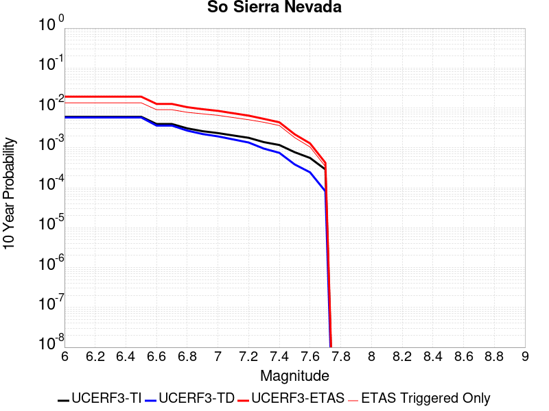 |

| Magnitude | 1 wk TI Prob | 1 wk TD Prob | 1 wk ETAS Prob | 1 wk ETAS/TD Gain | 1 wk ETAS Triggered Only | 1 mo TI Prob | 1 mo TD Prob | 1 mo ETAS Prob | 1 mo ETAS/TD Gain | 1 mo ETAS Triggered Only | 1 yr TI Prob | 1 yr TD Prob | 1 yr ETAS Prob | 1 yr ETAS/TD Gain | 1 yr ETAS Triggered Only | 10 yr TI Prob | 10 yr TD Prob | 10 yr ETAS Prob | 10 yr ETAS/TD Gain | 10 yr ETAS Triggered Only |
|-----|-----|-----|-----|-----|-----|-----|-----|-----|-----|-----|-----|-----|-----|-----|-----|-----|-----|-----|-----|-----|
| 6.0 | 1.15488665E-5 | 1.1079612E-5 | 0.006011013 | 542.52924 | 0.006 | 4.9494203E-5 | 4.7483256E-5 | 0.007657122 | 161.25941 | 0.00761 | 6.024253E-4 | 5.779681E-4 | 0.01119183 | 19.364098 | 0.01062 | 0.006007948 | 0.005765918 | 0.019138366 | 3.3192227 | 0.01345 |
| 6.1 | 1.15488665E-5 | 1.1079612E-5 | 0.006011013 | 542.52924 | 0.006 | 4.9494203E-5 | 4.7483256E-5 | 0.007657122 | 161.25941 | 0.00761 | 6.024253E-4 | 5.779681E-4 | 0.01119183 | 19.364098 | 0.01062 | 0.006007948 | 0.005765918 | 0.019138366 | 3.3192227 | 0.01345 |
| 6.2 | 1.15488665E-5 | 1.1079612E-5 | 0.006011013 | 542.52924 | 0.006 | 4.9494203E-5 | 4.7483256E-5 | 0.007657122 | 161.25941 | 0.00761 | 6.024253E-4 | 5.779681E-4 | 0.01119183 | 19.364098 | 0.01062 | 0.006007948 | 0.005765918 | 0.019138366 | 3.3192227 | 0.01345 |
| 6.3 | 1.15488665E-5 | 1.1079612E-5 | 0.006011013 | 542.52924 | 0.006 | 4.9494203E-5 | 4.7483256E-5 | 0.007657122 | 161.25941 | 0.00761 | 6.024253E-4 | 5.779681E-4 | 0.01119183 | 19.364098 | 0.01062 | 0.006007948 | 0.005765918 | 0.019138366 | 3.3192227 | 0.01345 |
| 6.4 | 1.15488665E-5 | 1.1079612E-5 | 0.006011013 | 542.52924 | 0.006 | 4.9494203E-5 | 4.7483256E-5 | 0.007657122 | 161.25941 | 0.00761 | 6.024253E-4 | 5.779681E-4 | 0.01119183 | 19.364098 | 0.01062 | 0.006007948 | 0.005765918 | 0.019138366 | 3.3192227 | 0.01345 |
| 6.5 | 1.15488665E-5 | 1.1079612E-5 | 0.006011013 | 542.52924 | 0.006 | 4.9494203E-5 | 4.7483256E-5 | 0.007657122 | 161.25941 | 0.00761 | 6.024253E-4 | 5.779681E-4 | 0.01119183 | 19.364098 | 0.01062 | 0.006007948 | 0.005765918 | 0.019138366 | 3.3192227 | 0.01345 |
| 6.6 | 7.587044E-6 | 6.9356042E-6 | 0.0044969046 | 648.37964 | 0.00449 | 3.2515498E-5 | 2.9723697E-5 | 0.0055595594 | 187.04132 | 0.00553 | 3.9580427E-4 | 3.6182883E-4 | 0.0077491547 | 21.416632 | 0.00739 | 0.003951 | 0.0036126887 | 0.012600102 | 3.4877353 | 0.00902 |
| 6.7 | 7.587044E-6 | 6.9356042E-6 | 0.0044969046 | 648.37964 | 0.00449 | 3.2515498E-5 | 2.9723697E-5 | 0.0055595594 | 187.04132 | 0.00553 | 3.9580427E-4 | 3.6182883E-4 | 0.0077491547 | 21.416632 | 0.00739 | 0.003951 | 0.0036126887 | 0.012600102 | 3.4877353 | 0.00902 |
| 6.8 | 5.9026956E-6 | 5.179362E-6 | 0.003965159 | 765.569 | 0.00396 | 2.5297022E-5 | 2.2197082E-5 | 0.00485209 | 218.59132 | 0.00483 | 3.0794772E-4 | 2.7021713E-4 | 0.006678485 | 24.715254 | 0.00641 | 0.0030752132 | 0.002699002 | 0.010438058 | 3.8673768 | 0.00776 |
| 6.9 | 5.0118915E-6 | 4.2523943E-6 | 0.003614237 | 849.9299 | 0.00361 | 2.1479358E-5 | 1.8224424E-5 | 0.004398145 | 241.33243 | 0.00438 | 2.614798E-4 | 2.2186051E-4 | 0.0060805604 | 27.407133 | 0.00586 | 0.0026117235 | 0.0022164627 | 0.009300726 | 4.1962023 | 0.0071 |
| 7.0 | 4.4924795E-6 | 3.7138868E-6 | 0.0033037015 | 889.55365 | 0.0033 | 1.925334E-5 | 1.5916565E-5 | 0.004005853 | 251.67825 | 0.00399 | 2.3438422E-4 | 1.9376757E-4 | 0.005562727 | 28.708246 | 0.00537 | 0.0023413717 | 0.0019360491 | 0.008443426 | 4.361163 | 0.00652 |
| 7.1 | 3.9118436E-6 | 3.1119469E-6 | 0.002933103 | 942.52985 | 0.00293 | 1.6764936E-5 | 1.333685E-5 | 0.0035632895 | 267.17624 | 0.00355 | 2.0409399E-4 | 1.6236462E-4 | 0.004911593 | 30.250391 | 0.00475 | 0.0020390663 | 0.0016225161 | 0.007353203 | 4.5319753 | 0.00574 |
| 7.2 | 3.4200818E-6 | 2.6054236E-6 | 0.0026725985 | 1025.7827 | 0.00267 | 1.4657411E-5 | 1.11660565E-5 | 0.0032211302 | 288.4752 | 0.00321 | 1.7843937E-4 | 1.3593875E-4 | 0.0043953597 | 32.33338 | 0.00426 | 0.0017829615 | 0.0013586058 | 0.0064117312 | 4.7193465 | 0.00506 |
| 7.3 | 2.6593618E-6 | 1.8283897E-6 | 0.0023118241 | 1264.4045 | 0.00231 | 1.13972155E-5 | 7.8359335E-6 | 0.002817814 | 359.60153 | 0.00281 | 1.3875226E-4 | 9.539862E-5 | 0.0038150437 | 39.99056 | 0.00372 | 0.0013866565 | 9.536055E-4 | 0.0053094476 | 5.567761 | 0.00436 |
| 7.4 | 2.2577992E-6 | 1.4364078E-6 | 0.0018814337 | 1309.8186 | 0.00188 | 9.676246E-6 | 6.1560204E-6 | 0.0023361417 | 379.48895 | 0.00233 | 1.1780193E-4 | 7.4947224E-5 | 0.0032147118 | 42.89301 | 0.00314 | 0.001177395 | 7.4924453E-4 | 0.0043665324 | 5.8279133 | 0.00362 |
| 7.5 | 1.489319E-6 | 7.353661E-7 | 8.207348E-4 | 1116.0901 | 8.2E-4 | 6.3827797E-6 | 3.1515651E-6 | 0.0010831482 | 343.6858 | 0.00108 | 7.770758E-5 | 3.8369635E-5 | 0.0015383121 | 40.091915 | 0.0015 | 7.7680405E-4 | 3.8363054E-4 | 0.00218294 | 5.6902146 | 0.0018 |
| 7.6 | 1.0680322E-6 | 4.65941E-7 | 4.4046572E-4 | 945.32513 | 4.4E-4 | 4.577273E-6 | 1.9968884E-6 | 5.919957E-4 | 296.45908 | 5.9E-4 | 5.5726876E-5 | 2.4311848E-5 | 9.042905E-4 | 37.19546 | 8.8E-4 | 5.5712904E-4 | 2.4309216E-4 | 0.0012928369 | 5.3183 | 0.00105 |
| 7.7 | 5.509146E-7 | 1.5578539E-7 | 1.6015576E-4 | 1028.0538 | 1.6E-4 | 2.3610605E-6 | 6.676515E-7 | 2.1066751E-4 | 315.53516 | 2.1E-4 | 2.8745531E-5 | 8.128628E-6 | 2.9812628E-4 | 36.676086 | 2.9E-4 | 2.8741814E-4 | 8.128342E-5 | 4.212558E-4 | 5.1825547 | 3.4E-4 |

## Gravel Hills-Harper Lk
*[(top)](#table-of-contents)*

| 1 Week | 1 Month | 1 Year | 10 Year |
|-----|-----|-----|-----|
| 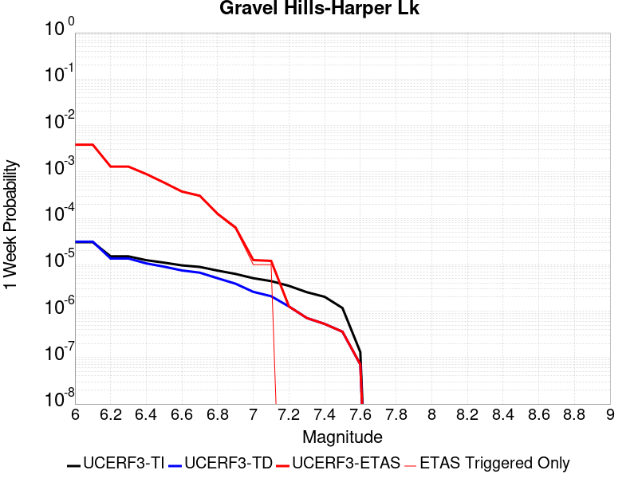 |  |  |  |

| Magnitude | 1 wk TI Prob | 1 wk TD Prob | 1 wk ETAS Prob | 1 wk ETAS/TD Gain | 1 wk ETAS Triggered Only | 1 mo TI Prob | 1 mo TD Prob | 1 mo ETAS Prob | 1 mo ETAS/TD Gain | 1 mo ETAS Triggered Only | 1 yr TI Prob | 1 yr TD Prob | 1 yr ETAS Prob | 1 yr ETAS/TD Gain | 1 yr ETAS Triggered Only | 10 yr TI Prob | 10 yr TD Prob | 10 yr ETAS Prob | 10 yr ETAS/TD Gain | 10 yr ETAS Triggered Only |
|-----|-----|-----|-----|-----|-----|-----|-----|-----|-----|-----|-----|-----|-----|-----|-----|-----|-----|-----|-----|-----|
| 6.0 | 3.0679566E-5 | 3.1464628E-5 | 0.0038713438 | 123.03797 | 0.00384 | 1.3147724E-4 | 1.3484266E-4 | 0.0056241024 | 41.70863 | 0.00549 | 0.0015995599 | 0.00164069 | 0.010526088 | 6.415647 | 0.0089 | 0.015880952 | 0.016307337 | 0.028996972 | 1.778155 | 0.0129 |
| 6.1 | 3.0679566E-5 | 3.1464628E-5 | 0.0038713438 | 123.03797 | 0.00384 | 1.3147724E-4 | 1.3484266E-4 | 0.0056241024 | 41.70863 | 0.00549 | 0.0015995599 | 0.00164069 | 0.010526088 | 6.415647 | 0.0089 | 0.015880952 | 0.016307337 | 0.028996972 | 1.778155 | 0.0129 |
| 6.2 | 1.514536E-5 | 1.36352E-5 | 0.0013036176 | 95.60678 | 0.00129 | 6.490707E-5 | 5.843533E-5 | 0.0018883283 | 32.314842 | 0.00183 | 7.8995706E-4 | 7.112298E-4 | 0.0038290108 | 5.383648 | 0.00312 | 0.007871548 | 0.007090737 | 0.0115489 | 1.6287305 | 0.00449 |
| 6.3 | 1.514536E-5 | 1.36352E-5 | 0.0013036176 | 95.60678 | 0.00129 | 6.490707E-5 | 5.843533E-5 | 0.0018883283 | 32.314842 | 0.00183 | 7.8995706E-4 | 7.112298E-4 | 0.0038290108 | 5.383648 | 0.00312 | 0.007871548 | 0.007090737 | 0.0115489 | 1.6287305 | 0.00449 |
| 6.4 | 1.2532521E-5 | 1.0689684E-5 | 9.0068014E-4 | 84.25695 | 8.9E-4 | 5.37097E-5 | 4.581216E-5 | 0.001335753 | 29.157173 | 0.00129 | 6.537194E-4 | 5.5762613E-4 | 0.0027064271 | 4.85348 | 0.00215 | 0.0065179965 | 0.005562859 | 0.008556115 | 1.5380787 | 0.00301 |
| 6.5 | 1.1094058E-5 | 9.083657E-6 | 5.890784E-4 | 64.85036 | 5.8E-4 | 4.7545094E-5 | 3.89294E-5 | 8.888963E-4 | 22.83355 | 8.5E-4 | 5.787078E-4 | 4.7386638E-4 | 0.0019431699 | 4.1006703 | 0.00147 | 0.0057720304 | 0.004728967 | 0.006828989 | 1.4440763 | 0.00211 |
| 6.6 | 9.688328E-6 | 7.531688E-6 | 3.775289E-4 | 50.1254 | 3.7E-4 | 4.1520743E-5 | 3.227828E-5 | 5.522615E-4 | 17.109385 | 5.2E-4 | 5.053978E-4 | 3.9291973E-4 | 0.0013625385 | 3.4677277 | 9.7E-4 | 0.0050424994 | 0.0039225067 | 0.0052970937 | 1.3504359 | 0.00138 |
| 6.7 | 8.974824E-6 | 6.749406E-6 | 3.067474E-4 | 45.448055 | 3.0E-4 | 3.8462964E-5 | 2.8925719E-5 | 4.4891358E-4 | 15.519531 | 4.2E-4 | 4.6818596E-4 | 3.5211592E-4 | 0.0011118483 | 3.1576202 | 7.6E-4 | 0.004672008 | 0.003515801 | 0.0045920038 | 1.3061047 | 0.00108 |
| 6.8 | 7.4780046E-6 | 5.1161865E-6 | 1.2511558E-4 | 24.454851 | 1.2E-4 | 3.20482E-5 | 2.1926337E-5 | 1.8192283E-4 | 8.297001 | 1.6E-4 | 3.9011694E-4 | 2.6692182E-4 | 6.268257E-4 | 2.3483493 | 3.6E-4 | 0.0038943281 | 0.0026661505 | 0.003214684 | 1.20574 | 5.5E-4 |
| 6.9 | 6.3409307E-6 | 3.907489E-6 | 6.390725E-5 | 16.35507 | 6.0E-5 | 2.7175134E-5 | 1.674628E-5 | 9.674494E-5 | 5.7771006 | 8.0E-5 | 3.3080703E-4 | 2.0386786E-4 | 4.0382709E-4 | 1.9808276 | 2.0E-4 | 0.0033031502 | 0.0020369065 | 0.0023762141 | 1.1665797 | 3.4E-4 |
| 7.0 | 5.1239335E-6 | 2.6058492E-6 | 1.2605823E-5 | 4.8375106 | 1.0E-5 | 2.195953E-5 | 1.1167879E-5 | 3.1167656E-5 | 2.7908304 | 2.0E-5 | 2.6732447E-4 | 1.359607E-4 | 1.9595254E-4 | 1.441244 | 6.0E-5 | 0.0026700313 | 0.0013588005 | 0.0014886238 | 1.0955427 | 1.3E-4 |
| 7.1 | 4.438899E-6 | 2.0984692E-6 | 1.2098449E-5 | 5.7653685 | 1.0E-5 | 1.9023713E-5 | 8.99341E-6 | 2.899323E-5 | 3.2238305 | 2.0E-5 | 2.315891E-4 | 1.0948948E-4 | 1.5948401E-4 | 1.4566149 | 5.0E-5 | 0.002313479 | 0.0010943774 | 0.0012042569 | 1.1004038 | 1.1E-4 |
| 7.2 | 3.50367E-6 | 1.2615715E-6 | 1.2615715E-6 | 1.0 | 0.0 | 1.5015643E-5 | 5.406724E-6 | 5.406724E-6 | 1.0 | 0.0 | 1.8280011E-4 | 6.5824956E-5 | 7.5824304E-5 | 1.151908 | 1.0E-5 | 0.0018264982 | 6.580628E-4 | 6.980365E-4 | 1.0607445 | 4.0E-5 |
| 7.3 | 2.561638E-6 | 7.118686E-7 | 7.118686E-7 | 1.0 | 0.0 | 1.0978401E-5 | 3.050862E-6 | 3.050862E-6 | 1.0 | 0.0 | 1.3365384E-4 | 3.7143633E-5 | 4.714326E-5 | 1.2692151 | 1.0E-5 | 0.0013357349 | 3.7137623E-4 | 4.0136508E-4 | 1.0807506 | 3.0E-5 |
| 7.4 | 2.0368864E-6 | 5.304471E-7 | 5.304471E-7 | 1.0 | 0.0 | 8.729483E-6 | 2.2733427E-6 | 2.2733427E-6 | 1.0 | 0.0 | 1.06276275E-4 | 2.76776E-5 | 2.76776E-5 | 1.0 | 0.0 | 0.0010622547 | 2.767421E-4 | 2.767421E-4 | 1.0 | 0.0 |
| 7.5 | 1.1681728E-6 | 3.6028484E-7 | 3.6028484E-7 | 1.0 | 0.0 | 5.0064455E-6 | 1.544077E-6 | 1.544077E-6 | 1.0 | 0.0 | 6.0951766E-5 | 1.879898E-5 | 1.879898E-5 | 1.0 | 0.0 | 6.093505E-4 | 1.8797436E-4 | 1.8797436E-4 | 1.0 | 0.0 |
| 7.6 | 1.3154387E-7 | 7.1196716E-8 | 7.1196716E-8 | 1.0 | 0.0 | 5.6375933E-7 | 3.0512876E-7 | 3.0512876E-7 | 1.0 | 0.0 | 6.863748E-6 | 3.714938E-6 | 3.714938E-6 | 1.0 | 0.0 | 6.863536E-5 | 3.7148915E-5 | 3.7148915E-5 | 1.0 | 0.0 |

## Ash Hill
*[(top)](#table-of-contents)*

| 1 Week | 1 Month | 1 Year | 10 Year |
|-----|-----|-----|-----|
|  |  |  |  |

| Magnitude | 1 wk TI Prob | 1 wk TD Prob | 1 wk ETAS Prob | 1 wk ETAS/TD Gain | 1 wk ETAS Triggered Only | 1 mo TI Prob | 1 mo TD Prob | 1 mo ETAS Prob | 1 mo ETAS/TD Gain | 1 mo ETAS Triggered Only | 1 yr TI Prob | 1 yr TD Prob | 1 yr ETAS Prob | 1 yr ETAS/TD Gain | 1 yr ETAS Triggered Only | 10 yr TI Prob | 10 yr TD Prob | 10 yr ETAS Prob | 10 yr ETAS/TD Gain | 10 yr ETAS Triggered Only |
|-----|-----|-----|-----|-----|-----|-----|-----|-----|-----|-----|-----|-----|-----|-----|-----|-----|-----|-----|-----|-----|
| 6.0 | 2.1545662E-5 | 2.3194447E-5 | 0.0031631216 | 136.3741 | 0.00314 | 9.2335285E-5 | 9.940143E-5 | 0.0048089335 | 48.37891 | 0.00471 | 0.0011236023 | 0.0012096206 | 0.009070101 | 7.4983025 | 0.00787 | 0.011179381 | 0.012038348 | 0.023735814 | 1.9716836 | 0.01184 |
| 6.1 | 2.1545662E-5 | 2.3194447E-5 | 0.0031631216 | 136.3741 | 0.00314 | 9.2335285E-5 | 9.940143E-5 | 0.0048089335 | 48.37891 | 0.00471 | 0.0011236023 | 0.0012096206 | 0.009070101 | 7.4983025 | 0.00787 | 0.011179381 | 0.012038348 | 0.023735814 | 1.9716836 | 0.01184 |
| 6.2 | 2.1545662E-5 | 2.3194447E-5 | 0.0031631216 | 136.3741 | 0.00314 | 9.2335285E-5 | 9.940143E-5 | 0.0048089335 | 48.37891 | 0.00471 | 0.0011236023 | 0.0012096206 | 0.009070101 | 7.4983025 | 0.00787 | 0.011179381 | 0.012038348 | 0.023735814 | 1.9716836 | 0.01184 |
| 6.3 | 1.0025529E-5 | 1.0746934E-5 | 0.0012607335 | 117.31099 | 0.00125 | 4.2965847E-5 | 4.605755E-5 | 0.001985968 | 43.119274 | 0.00194 | 5.229836E-4 | 5.6061964E-4 | 0.0037888088 | 6.758252 | 0.00323 | 0.005217545 | 0.0055933665 | 0.010465959 | 1.8711377 | 0.0049 |
| 6.4 | 1.0025529E-5 | 1.0746934E-5 | 0.0012607335 | 117.31099 | 0.00125 | 4.2965847E-5 | 4.605755E-5 | 0.001985968 | 43.119274 | 0.00194 | 5.229836E-4 | 5.6061964E-4 | 0.0037888088 | 6.758252 | 0.00323 | 0.005217545 | 0.0055933665 | 0.010465959 | 1.8711377 | 0.0049 |
| 6.5 | 6.9617327E-6 | 7.456634E-6 | 8.174506E-4 | 109.62729 | 8.1E-4 | 2.9835655E-5 | 3.195666E-5 | 0.0013019161 | 40.740055 | 0.00127 | 3.6318856E-4 | 3.8901155E-4 | 0.0025681634 | 6.6017666 | 0.00218 | 0.0036259557 | 0.0038841602 | 0.0071713426 | 1.8463045 | 0.0033 |
| 6.6 | 4.9919777E-6 | 5.3466883E-6 | 5.753436E-4 | 107.607475 | 5.7E-4 | 2.1394015E-5 | 2.2914215E-5 | 9.4289315E-4 | 41.14883 | 9.2E-4 | 2.60441E-4 | 2.7895154E-4 | 0.0018085247 | 6.4832935 | 0.00153 | 0.0026013597 | 0.0027866727 | 0.0052697337 | 1.8910488 | 0.00249 |
| 6.7 | 3.6630722E-6 | 3.924624E-6 | 4.6392283E-4 | 118.20823 | 4.6E-4 | 1.5698786E-5 | 1.681974E-5 | 7.668071E-4 | 45.589714 | 7.5E-4 | 1.9111596E-4 | 2.0476682E-4 | 0.0014545108 | 7.1032543 | 0.00125 | 0.0019095168 | 0.0020463446 | 0.0040322724 | 1.9704758 | 0.00199 |
| 6.8 | 2.5599613E-6 | 2.744925E-6 | 3.027441E-4 | 110.2923 | 3.0E-4 | 1.0971216E-5 | 1.1763939E-5 | 4.917583E-4 | 41.802177 | 4.8E-4 | 1.3356637E-4 | 1.4322149E-4 | 0.0010130969 | 7.073637 | 8.7E-4 | 0.0013348613 | 0.0014317769 | 0.0028098011 | 1.9624573 | 0.00138 |
| 6.9 | 1.7684905E-6 | 1.8968707E-6 | 2.2189645E-4 | 116.98027 | 2.2E-4 | 7.579223E-6 | 8.129446E-6 | 3.481267E-4 | 42.82293 | 3.4E-4 | 9.2273134E-5 | 9.8976E-5 | 6.5892056E-4 | 6.6573772 | 5.6E-4 | 9.223483E-4 | 9.8976E-4 | 0.0018988594 | 1.9185047 | 9.1E-4 |

## McLean Lake
*[(top)](#table-of-contents)*

| 1 Week | 1 Month | 1 Year | 10 Year |
|-----|-----|-----|-----|
|  |  |  |  |

| Magnitude | 1 wk TI Prob | 1 wk TD Prob | 1 wk ETAS Prob | 1 wk ETAS/TD Gain | 1 wk ETAS Triggered Only | 1 mo TI Prob | 1 mo TD Prob | 1 mo ETAS Prob | 1 mo ETAS/TD Gain | 1 mo ETAS Triggered Only | 1 yr TI Prob | 1 yr TD Prob | 1 yr ETAS Prob | 1 yr ETAS/TD Gain | 1 yr ETAS Triggered Only | 10 yr TI Prob | 10 yr TD Prob | 10 yr ETAS Prob | 10 yr ETAS/TD Gain | 10 yr ETAS Triggered Only |
|-----|-----|-----|-----|-----|-----|-----|-----|-----|-----|-----|-----|-----|-----|-----|-----|-----|-----|-----|-----|-----|
| 6.0 | 1.7360222E-5 | 1.8501627E-5 | 0.0032584416 | 176.11649 | 0.00324 | 7.439883E-5 | 7.9290556E-5 | 0.0046189306 | 58.253227 | 0.00454 | 9.0542925E-4 | 9.6498354E-4 | 0.00857763 | 8.888887 | 0.00762 | 0.009017491 | 0.0096127745 | 0.021685595 | 2.2559142 | 0.01219 |
| 6.1 | 9.062689E-6 | 9.592193E-6 | 0.0015595773 | 162.58818 | 0.00155 | 3.8839516E-5 | 4.1108804E-5 | 0.0022410185 | 54.514317 | 0.0022 | 4.727685E-4 | 5.003936E-4 | 0.004398442 | 8.789965 | 0.0039 | 0.0047176396 | 0.004993552 | 0.011361593 | 2.2752528 | 0.0064 |
| 6.2 | 9.062689E-6 | 9.592193E-6 | 0.0015595773 | 162.58818 | 0.00155 | 3.8839516E-5 | 4.1108804E-5 | 0.0022410185 | 54.514317 | 0.0022 | 4.727685E-4 | 5.003936E-4 | 0.004398442 | 8.789965 | 0.0039 | 0.0047176396 | 0.004993552 | 0.011361593 | 2.2752528 | 0.0064 |
| 6.3 | 7.2575485E-6 | 7.66771E-6 | 0.0011676588 | 152.28261 | 0.00116 | 3.110341E-5 | 3.2861237E-5 | 0.0017028063 | 51.818085 | 0.00167 | 3.786182E-4 | 4.0001926E-4 | 0.0033988191 | 8.496639 | 0.003 | 0.0037797375 | 0.0039936965 | 0.008963768 | 2.244479 | 0.00499 |
| 6.4 | 7.2575485E-6 | 7.66771E-6 | 0.0011676588 | 152.28261 | 0.00116 | 3.110341E-5 | 3.2861237E-5 | 0.0017028063 | 51.818085 | 0.00167 | 3.786182E-4 | 4.0001926E-4 | 0.0033988191 | 8.496639 | 0.003 | 0.0037797375 | 0.0039936965 | 0.008963768 | 2.244479 | 0.00499 |
| 6.5 | 6.06582E-6 | 6.4038773E-6 | 0.0010063974 | 157.1544 | 0.001 | 2.5996113E-5 | 2.7444936E-5 | 0.0014574057 | 53.1029 | 0.00143 | 3.164567E-4 | 3.3409733E-4 | 0.002923232 | 8.749641 | 0.00259 | 0.0031600643 | 0.0033365893 | 0.0076621086 | 2.2963896 | 0.00434 |
| 6.6 | 5.598744E-6 | 5.910262E-6 | 9.5590466E-4 | 161.73642 | 9.5E-4 | 2.3994397E-5 | 2.5329486E-5 | 0.0013752953 | 54.29622 | 0.00135 | 2.9209262E-4 | 3.0834923E-4 | 0.002717606 | 8.813403 | 0.00241 | 0.0029170897 | 0.003079843 | 0.0071572466 | 2.3238997 | 0.00409 |
| 6.7 | 5.246996E-6 | 5.539162E-6 | 8.455345E-4 | 152.64665 | 8.4E-4 | 2.2486933E-5 | 2.3739085E-5 | 0.0012137109 | 51.12711 | 0.00119 | 2.73744E-4 | 2.8899137E-4 | 0.0024783586 | 8.575891 | 0.00219 | 0.0027340704 | 0.0028867796 | 0.006596041 | 2.284913 | 0.00372 |
| 6.8 | 4.02324E-6 | 4.2469046E-6 | 6.142443E-4 | 144.63342 | 6.1E-4 | 1.7242342E-5 | 1.8200926E-5 | 8.981849E-4 | 49.34831 | 8.8E-4 | 2.099053E-4 | 2.2157968E-4 | 0.0018212252 | 8.219278 | 0.0016 | 0.0020970714 | 0.002214172 | 0.004958083 | 2.2392492 | 0.00275 |
| 6.9 | 6.835972E-7 | 7.1399285E-7 | 1.0071392E-4 | 141.05733 | 1.0E-4 | 2.9296991E-6 | 3.0599674E-6 | 1.7305945E-4 | 56.555977 | 1.7E-4 | 3.56685E-5 | 3.7254784E-5 | 3.372436E-4 | 9.052357 | 3.0E-4 | 3.5662777E-4 | 3.7251666E-4 | 8.423416E-4 | 2.2612185 | 4.7E-4 |

## Goldstone Lake
*[(top)](#table-of-contents)*

| 1 Week | 1 Month | 1 Year | 10 Year |
|-----|-----|-----|-----|
| 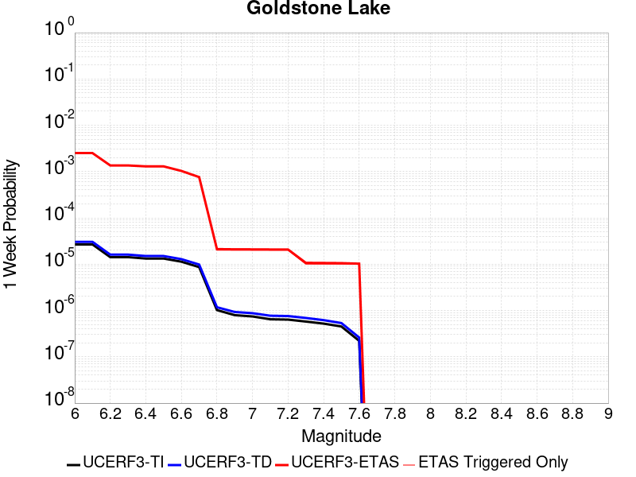 |  |  |  |

| Magnitude | 1 wk TI Prob | 1 wk TD Prob | 1 wk ETAS Prob | 1 wk ETAS/TD Gain | 1 wk ETAS Triggered Only | 1 mo TI Prob | 1 mo TD Prob | 1 mo ETAS Prob | 1 mo ETAS/TD Gain | 1 mo ETAS Triggered Only | 1 yr TI Prob | 1 yr TD Prob | 1 yr ETAS Prob | 1 yr ETAS/TD Gain | 1 yr ETAS Triggered Only | 10 yr TI Prob | 10 yr TD Prob | 10 yr ETAS Prob | 10 yr ETAS/TD Gain | 10 yr ETAS Triggered Only |
|-----|-----|-----|-----|-----|-----|-----|-----|-----|-----|-----|-----|-----|-----|-----|-----|-----|-----|-----|-----|-----|
| 6.0 | 2.671352E-5 | 3.0376103E-5 | 0.0025103008 | 82.64065 | 0.00248 | 1.1448149E-4 | 1.3017791E-4 | 0.003839695 | 29.495749 | 0.00371 | 0.001392921 | 0.0015839601 | 0.0079438705 | 5.015196 | 0.00637 | 0.013842222 | 0.015746202 | 0.025775747 | 1.6369501 | 0.01019 |
| 6.1 | 2.671352E-5 | 3.0376103E-5 | 0.0025103008 | 82.64065 | 0.00248 | 1.1448149E-4 | 1.3017791E-4 | 0.003839695 | 29.495749 | 0.00371 | 0.001392921 | 0.0015839601 | 0.0079438705 | 5.015196 | 0.00637 | 0.013842222 | 0.015746202 | 0.025775747 | 1.6369501 | 0.01019 |
| 6.2 | 1.4197047E-5 | 1.6096254E-5 | 0.0013560747 | 84.24784 | 0.00134 | 6.0843064E-5 | 6.898268E-5 | 0.0019288544 | 27.96143 | 0.00186 | 7.4051257E-4 | 8.3963916E-4 | 0.003996986 | 4.7603617 | 0.00316 | 0.007380498 | 0.008374364 | 0.013491153 | 1.6110061 | 0.00516 |
| 6.3 | 1.4197047E-5 | 1.6096254E-5 | 0.0013560747 | 84.24784 | 0.00134 | 6.0843064E-5 | 6.898268E-5 | 0.0019288544 | 27.96143 | 0.00186 | 7.4051257E-4 | 8.3963916E-4 | 0.003996986 | 4.7603617 | 0.00316 | 0.007380498 | 0.008374364 | 0.013491153 | 1.6110061 | 0.00516 |
| 6.4 | 1.3238931E-5 | 1.500847E-5 | 0.0012949893 | 86.2839 | 0.00128 | 5.6737044E-5 | 6.432098E-5 | 0.0018642052 | 28.98285 | 0.0018 | 6.9055456E-4 | 7.8292453E-4 | 0.0038205443 | 4.8798375 | 0.00304 | 0.006884126 | 0.007811289 | 0.012702779 | 1.6262078 | 0.00493 |
| 6.5 | 1.3238931E-5 | 1.500847E-5 | 0.0012949893 | 86.2839 | 0.00128 | 5.6737044E-5 | 6.432098E-5 | 0.0018642052 | 28.98285 | 0.0018 | 6.9055456E-4 | 7.8292453E-4 | 0.0038205443 | 4.8798375 | 0.00304 | 0.006884126 | 0.007811289 | 0.012702779 | 1.6262078 | 0.00493 |
| 6.6 | 1.1328278E-5 | 1.2855176E-5 | 0.0010328421 | 80.34445 | 0.00102 | 4.8548856E-5 | 5.5092984E-5 | 0.001545011 | 28.043695 | 0.00149 | 5.90922E-4 | 6.706464E-4 | 0.0032589093 | 4.859356 | 0.00259 | 0.0058935313 | 0.0066956137 | 0.010917157 | 1.6304939 | 0.00425 |
| 6.7 | 8.651175E-6 | 9.824575E-6 | 7.598172E-4 | 77.33843 | 7.5E-4 | 3.707594E-5 | 4.2105148E-5 | 0.0012020563 | 28.548914 | 0.00116 | 4.5130608E-4 | 5.126002E-4 | 0.0025015802 | 4.880178 | 0.00199 | 0.0045039062 | 0.0051230565 | 0.008455894 | 1.6505566 | 0.00335 |
| 6.8 | 1.0215377E-6 | 1.1754802E-6 | 2.1175456E-5 | 18.014303 | 2.0E-5 | 4.378012E-6 | 5.037763E-6 | 4.5037563E-5 | 8.939992 | 4.0E-5 | 5.3300988E-5 | 6.133315E-5 | 1.5132764E-4 | 2.4673057 | 9.0E-5 | 5.3288206E-4 | 6.131735E-4 | 7.730754E-4 | 1.2607776 | 1.6E-4 |
| 6.9 | 7.9360774E-7 | 9.283496E-7 | 2.0928332E-5 | 22.543589 | 2.0E-5 | 3.4011714E-6 | 3.9786355E-6 | 4.3978478E-5 | 11.0536585 | 4.0E-5 | 4.1408475E-5 | 4.843888E-5 | 1.08435976E-4 | 2.2386143 | 6.0E-5 | 4.140076E-4 | 4.842902E-4 | 5.7424663E-4 | 1.1857489 | 9.0E-5 |
| 7.0 | 7.4382757E-7 | 8.747428E-7 | 2.0874726E-5 | 23.863844 | 2.0E-5 | 3.1878285E-6 | 3.7488926E-6 | 4.3748743E-5 | 11.669777 | 4.0E-5 | 3.8811122E-5 | 4.564188E-5 | 1.0563914E-4 | 2.314522 | 6.0E-5 | 3.8804344E-4 | 4.563317E-4 | 5.362952E-4 | 1.1752311 | 8.0E-5 |
| 7.1 | 6.4709513E-7 | 7.711399E-7 | 2.0771124E-5 | 26.93561 | 2.0E-5 | 2.773262E-6 | 3.3048816E-6 | 3.3304783E-5 | 10.077451 | 3.0E-5 | 3.376394E-5 | 4.023625E-5 | 9.0234236E-5 | 2.2426105 | 5.0E-5 | 3.375881E-4 | 4.022956E-4 | 4.6227148E-4 | 1.1490841 | 6.0E-5 |
| 7.2 | 6.356704E-7 | 7.588459E-7 | 2.0758831E-5 | 27.355793 | 2.0E-5 | 2.7242988E-6 | 3.252193E-6 | 3.3252094E-5 | 10.224515 | 3.0E-5 | 3.3167835E-5 | 3.959479E-5 | 8.959281E-5 | 2.2627423 | 5.0E-5 | 3.3162883E-4 | 3.9588328E-4 | 4.5585955E-4 | 1.1514999 | 6.0E-5 |
| 7.3 | 5.7695723E-7 | 6.896648E-7 | 1.0689658E-5 | 15.499787 | 1.0E-5 | 2.4726714E-6 | 2.9557032E-6 | 2.2955644E-5 | 7.766559 | 2.0E-5 | 3.0104358E-5 | 3.598515E-5 | 7.598371E-5 | 2.1115296 | 4.0E-5 | 3.0100282E-4 | 3.5979896E-4 | 4.0978097E-4 | 1.1389165 | 5.0E-5 |
| 7.4 | 5.209647E-7 | 6.193583E-7 | 1.0619352E-5 | 17.145733 | 1.0E-5 | 2.232704E-6 | 2.6543903E-6 | 2.2654338E-5 | 8.534667 | 2.0E-5 | 2.718283E-5 | 3.2316777E-5 | 7.231549E-5 | 2.2377071 | 4.0E-5 | 2.7179506E-4 | 3.2312635E-4 | 3.7311018E-4 | 1.1546882 | 5.0E-5 |
| 7.5 | 4.512955E-7 | 5.3489487E-7 | 1.053489E-5 | 19.695251 | 1.0E-5 | 1.934122E-6 | 2.2924048E-6 | 2.2292359E-5 | 9.7244425 | 2.0E-5 | 2.3547682E-5 | 2.7909726E-5 | 6.790861E-5 | 2.4331522 | 4.0E-5 | 2.3545188E-4 | 2.7906752E-4 | 3.2905358E-4 | 1.1791182 | 5.0E-5 |
| 7.6 | 2.21172E-7 | 2.6040198E-7 | 1.0260399E-5 | 39.402157 | 1.0E-5 | 9.478797E-7 | 1.1160082E-6 | 2.1115986E-5 | 18.920996 | 2.0E-5 | 1.1540374E-5 | 1.3587343E-5 | 5.35868E-5 | 3.9438763 | 4.0E-5 | 1.1539775E-4 | 1.3586794E-4 | 1.758625E-4 | 1.2943635 | 4.0E-5 |

## Coyote Canyon
*[(top)](#table-of-contents)*

| 1 Week | 1 Month | 1 Year | 10 Year |
|-----|-----|-----|-----|
|  | 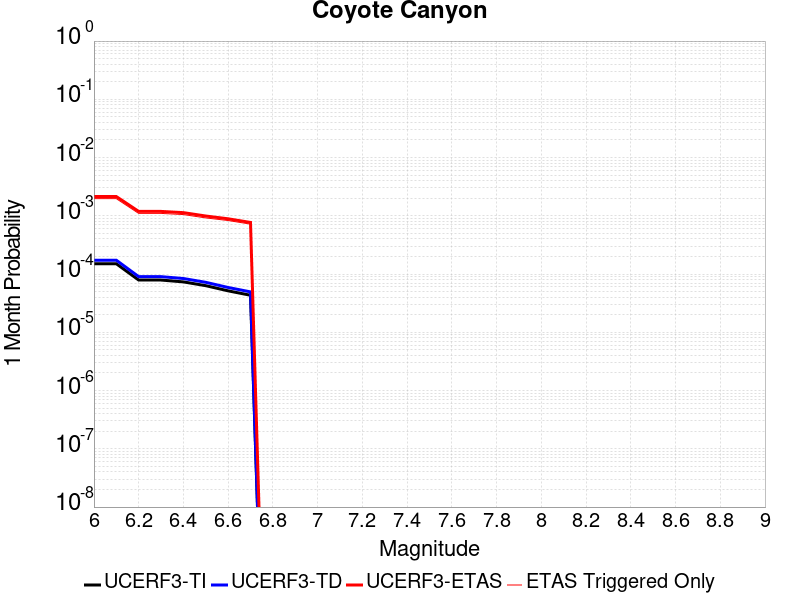 | 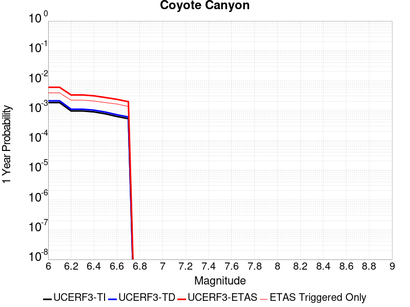 |  |

| Magnitude | 1 wk TI Prob | 1 wk TD Prob | 1 wk ETAS Prob | 1 wk ETAS/TD Gain | 1 wk ETAS Triggered Only | 1 mo TI Prob | 1 mo TD Prob | 1 mo ETAS Prob | 1 mo ETAS/TD Gain | 1 mo ETAS Triggered Only | 1 yr TI Prob | 1 yr TD Prob | 1 yr ETAS Prob | 1 yr ETAS/TD Gain | 1 yr ETAS Triggered Only | 10 yr TI Prob | 10 yr TD Prob | 10 yr ETAS Prob | 10 yr ETAS/TD Gain | 10 yr ETAS Triggered Only |
|-----|-----|-----|-----|-----|-----|-----|-----|-----|-----|-----|-----|-----|-----|-----|-----|-----|-----|-----|-----|-----|
| 6.0 | 3.5090034E-5 | 4.0364317E-5 | 0.0012703147 | 31.47123 | 0.00123 | 1.503772E-4 | 1.7297991E-4 | 0.0021426391 | 12.386636 | 0.00197 | 0.0018293047 | 0.0021042533 | 0.0059661097 | 2.835262 | 0.00387 | 0.018143194 | 0.020869205 | 0.027145432 | 1.3007412 | 0.00641 |
| 6.1 | 3.5090034E-5 | 4.0364317E-5 | 0.0012703147 | 31.47123 | 0.00123 | 1.503772E-4 | 1.7297991E-4 | 0.0021426391 | 12.386636 | 0.00197 | 0.0018293047 | 0.0021042533 | 0.0059661097 | 2.835262 | 0.00387 | 0.018143194 | 0.020869205 | 0.027145432 | 1.3007412 | 0.00641 |
| 6.2 | 1.841879E-5 | 2.1059794E-5 | 6.710461E-4 | 31.863852 | 6.5E-4 | 7.8935285E-5 | 9.025371E-5 | 0.0011901545 | 13.186765 | 0.0011 | 9.606133E-4 | 0.0010983871 | 0.0033059595 | 3.0098312 | 0.00221 | 0.0095647145 | 0.010939668 | 0.014401379 | 1.3164366 | 0.0035 |
| 6.3 | 1.841879E-5 | 2.1059794E-5 | 6.710461E-4 | 31.863852 | 6.5E-4 | 7.8935285E-5 | 9.025371E-5 | 0.0011901545 | 13.186765 | 0.0011 | 9.606133E-4 | 0.0010983871 | 0.0033059595 | 3.0098312 | 0.00221 | 0.0095647145 | 0.010939668 | 0.014401379 | 1.3164366 | 0.0035 |
| 6.4 | 1.712201E-5 | 1.9565212E-5 | 6.3955307E-4 | 32.68828 | 6.2E-4 | 7.337798E-5 | 8.3848776E-5 | 0.0011337608 | 13.521494 | 0.00105 | 8.930107E-4 | 0.0010204813 | 0.003088369 | 3.0263846 | 0.00207 | 0.008894307 | 0.010167871 | 0.013394724 | 1.3173578 | 0.00326 |
| 6.5 | 1.4744935E-5 | 1.6836972E-5 | 5.7682756E-4 | 34.25958 | 5.6E-4 | 6.3191044E-5 | 7.215698E-5 | 9.920906E-4 | 13.749059 | 9.2E-4 | 7.6907943E-4 | 8.782507E-4 | 0.0027066434 | 3.0818577 | 0.00183 | 0.007664232 | 0.008756994 | 0.011700986 | 1.3361875 | 0.00297 |
| 6.6 | 1.2017839E-5 | 1.3724089E-5 | 5.337169E-4 | 38.88906 | 5.2E-4 | 5.150401E-5 | 5.88167E-5 | 8.887679E-4 | 15.110809 | 8.3E-4 | 6.268809E-4 | 7.159466E-4 | 0.0023547725 | 3.2890337 | 0.00164 | 0.0062511545 | 0.0071450938 | 0.009756302 | 1.3654548 | 0.00263 |
| 6.7 | 1.00956095E-5 | 1.1533517E-5 | 4.5152844E-4 | 39.149242 | 4.4E-4 | 4.326618E-5 | 4.942891E-5 | 7.6939334E-4 | 15.565654 | 7.2E-4 | 5.266384E-4 | 6.017178E-4 | 0.0019608994 | 3.2588358 | 0.00136 | 0.005253921 | 0.0060094125 | 0.008255831 | 1.3738167 | 0.00226 |

## San Andreas (Mojave S)
*[(top)](#table-of-contents)*

| 1 Week | 1 Month | 1 Year | 10 Year |
|-----|-----|-----|-----|
|  | 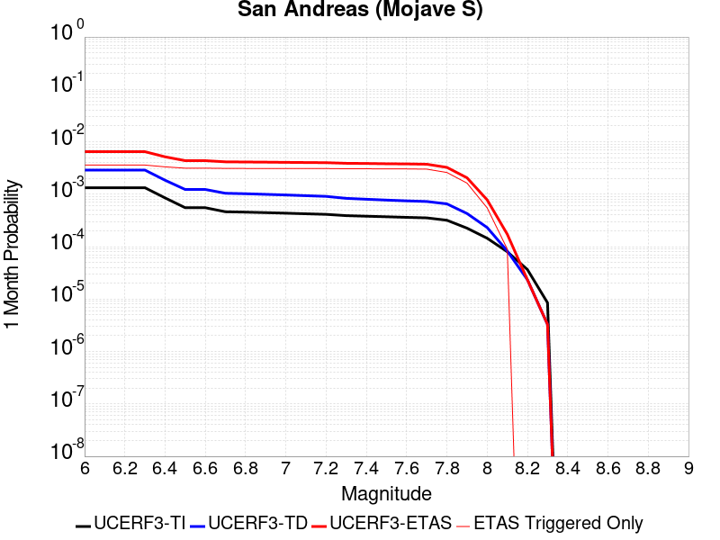 |  |  |

| Magnitude | 1 wk TI Prob | 1 wk TD Prob | 1 wk ETAS Prob | 1 wk ETAS/TD Gain | 1 wk ETAS Triggered Only | 1 mo TI Prob | 1 mo TD Prob | 1 mo ETAS Prob | 1 mo ETAS/TD Gain | 1 mo ETAS Triggered Only | 1 yr TI Prob | 1 yr TD Prob | 1 yr ETAS Prob | 1 yr ETAS/TD Gain | 1 yr ETAS Triggered Only | 10 yr TI Prob | 10 yr TD Prob | 10 yr ETAS Prob | 10 yr ETAS/TD Gain | 10 yr ETAS Triggered Only |
|-----|-----|-----|-----|-----|-----|-----|-----|-----|-----|-----|-----|-----|-----|-----|-----|-----|-----|-----|-----|-----|
| 6.0 | 3.1064058E-4 | 6.7462435E-4 | 0.0034427557 | 5.1032186 | 0.00277 | 0.0013306376 | 0.002888172 | 0.0064777746 | 2.2428632 | 0.0036 | 0.016080605 | 0.034565594 | 0.039276917 | 1.1363008 | 0.00488 | 0.1496549 | 0.28654557 | 0.29111883 | 1.0159599 | 0.00641 |
| 6.1 | 3.1064058E-4 | 6.7462435E-4 | 0.0034427557 | 5.1032186 | 0.00277 | 0.0013306376 | 0.002888172 | 0.0064777746 | 2.2428632 | 0.0036 | 0.016080605 | 0.034565594 | 0.039276917 | 1.1363008 | 0.00488 | 0.1496549 | 0.28654557 | 0.29111883 | 1.0159599 | 0.00641 |
| 6.2 | 3.1064058E-4 | 6.7462435E-4 | 0.0034427557 | 5.1032186 | 0.00277 | 0.0013306376 | 0.002888172 | 0.0064777746 | 2.2428632 | 0.0036 | 0.016080605 | 0.034565594 | 0.039276917 | 1.1363008 | 0.00488 | 0.1496549 | 0.28654557 | 0.29111883 | 1.0159599 | 0.00641 |
| 6.3 | 3.1064058E-4 | 6.7462435E-4 | 0.0034427557 | 5.1032186 | 0.00277 | 0.0013306376 | 0.002888172 | 0.0064777746 | 2.2428632 | 0.0036 | 0.016080605 | 0.034565594 | 0.039276917 | 1.1363008 | 0.00488 | 0.1496549 | 0.28654557 | 0.29111883 | 1.0159599 | 0.00641 |
| 6.4 | 1.9872203E-4 | 4.3181062E-4 | 0.0029807095 | 6.902817 | 0.00255 | 8.5138786E-4 | 0.0018493326 | 0.005173174 | 2.7973197 | 0.00333 | 0.010316478 | 0.02228931 | 0.026708562 | 1.1982678 | 0.00452 | 0.098504856 | 0.19686839 | 0.20155868 | 1.0238245 | 0.00584 |
| 6.5 | 1.291105E-4 | 2.8754136E-4 | 0.0027168426 | 9.448527 | 0.00243 | 5.5321335E-4 | 0.0012317409 | 0.004367873 | 3.5460973 | 0.00314 | 0.006714592 | 0.014894155 | 0.019071003 | 1.2804354 | 0.00424 | 0.065152965 | 0.13800792 | 0.14269717 | 1.033978 | 0.00544 |
| 6.6 | 1.291105E-4 | 2.8754136E-4 | 0.0027168426 | 9.448527 | 0.00243 | 5.5321335E-4 | 0.0012317409 | 0.004367873 | 3.5460973 | 0.00314 | 0.006714592 | 0.014894155 | 0.019071003 | 1.2804354 | 0.00424 | 0.065152965 | 0.13800792 | 0.14269717 | 1.033978 | 0.00544 |
| 6.7 | 1.08001186E-4 | 2.4335351E-4 | 0.002652767 | 10.900878 | 0.00241 | 4.6278012E-4 | 0.0010425274 | 0.004149285 | 3.9800253 | 0.00311 | 0.0056198016 | 0.0126192 | 0.016726704 | 1.3254964 | 0.00416 | 0.054797906 | 0.11918431 | 0.12388787 | 1.0394646 | 0.00534 |
| 6.8 | 1.0624356E-4 | 2.3853009E-4 | 0.0026379577 | 11.059224 | 0.0024 | 4.5525006E-4 | 0.0010218718 | 0.0041187042 | 4.0305486 | 0.0031 | 0.0055285925 | 0.012370593 | 0.016469255 | 1.331323 | 0.00415 | 0.053930566 | 0.11713308 | 0.121821105 | 1.0400231 | 0.00531 |
| 6.9 | 1.0393785E-4 | 2.3223337E-4 | 0.002631676 | 11.332032 | 0.0024 | 4.4537184E-4 | 9.949068E-4 | 0.0040918225 | 4.11277 | 0.0031 | 0.0054089287 | 0.012045963 | 0.016136093 | 1.3395436 | 0.00414 | 0.05279156 | 0.114433445 | 0.119100384 | 1.0407829 | 0.00527 |
| 7.0 | 1.0155622E-4 | 2.2592908E-4 | 0.0026153892 | 11.576151 | 0.00239 | 4.3516833E-4 | 9.6790853E-4 | 0.0040549175 | 4.1893606 | 0.00309 | 0.005285311 | 0.011720838 | 0.015792549 | 1.3473907 | 0.00412 | 0.05161361 | 0.11169745 | 0.116361044 | 1.041752 | 0.00525 |
| 7.1 | 9.885595E-5 | 2.188132E-4 | 0.0026082902 | 11.920168 | 0.00239 | 4.2359953E-4 | 9.374342E-4 | 0.0040245377 | 4.2931414 | 0.00309 | 0.0051451353 | 0.011353733 | 0.015426956 | 1.3587562 | 0.00412 | 0.05027629 | 0.10857607 | 0.113238215 | 1.042939 | 0.00523 |
| 7.2 | 9.6411415E-5 | 2.1244297E-4 | 0.0026019353 | 12.247688 | 0.00239 | 4.1312634E-4 | 9.101525E-4 | 0.0039973403 | 4.3919454 | 0.00309 | 0.005018219 | 0.011024987 | 0.015099564 | 1.3695766 | 0.00412 | 0.049064007 | 0.1057697 | 0.11044653 | 1.0442171 | 0.00523 |
| 7.3 | 9.1180635E-5 | 1.9472656E-4 | 0.0025742631 | 13.219887 | 0.00238 | 3.907156E-4 | 8.342756E-4 | 0.0038917228 | 4.6647925 | 0.00306 | 0.004746591 | 0.010110112 | 0.014158762 | 1.4004555 | 0.00409 | 0.046464786 | 0.09796176 | 0.10265236 | 1.047882 | 0.0052 |
| 7.4 | 8.887388E-5 | 1.872126E-4 | 0.0025667672 | 13.710439 | 0.00238 | 3.8083247E-4 | 8.020931E-4 | 0.0038596387 | 4.8119583 | 0.00306 | 0.0046267817 | 0.009721855 | 0.013772093 | 1.4166117 | 0.00409 | 0.045316286 | 0.094593845 | 0.09930196 | 1.0497719 | 0.0052 |
| 7.5 | 8.6750515E-5 | 1.80528E-4 | 0.0025501002 | 14.125788 | 0.00237 | 3.7173493E-4 | 7.734621E-4 | 0.0038111107 | 4.92734 | 0.00304 | 0.004516484 | 0.009376327 | 0.013398258 | 1.4289454 | 0.00406 | 0.04425787 | 0.09155606 | 0.09624363 | 1.051199 | 0.00516 |
| 7.6 | 8.453092E-5 | 1.7440386E-4 | 0.0025439905 | 14.586779 | 0.00237 | 3.6222505E-4 | 7.4723107E-4 | 0.0037849594 | 5.0653133 | 0.00304 | 0.0044011753 | 0.009059664 | 0.013072972 | 1.4429865 | 0.00405 | 0.04315024 | 0.08871447 | 0.09340759 | 1.0529014 | 0.00515 |
| 7.7 | 8.259102E-5 | 1.6962511E-4 | 0.0025192264 | 14.851731 | 0.00235 | 3.539135E-4 | 7.267622E-4 | 0.0037345747 | 5.138647 | 0.00301 | 0.004300386 | 0.0088125 | 0.01277725 | 1.4499006 | 0.004 | 0.042181134 | 0.086465426 | 0.09112445 | 1.0538831 | 0.0051 |
| 7.8 | 7.444844E-5 | 1.528469E-4 | 0.002172538 | 14.213819 | 0.00202 | 3.1902574E-4 | 6.5489375E-4 | 0.003253191 | 4.9675097 | 0.0026 | 0.0038772223 | 0.007944231 | 0.011356903 | 1.4295787 | 0.00344 | 0.03810269 | 0.078293875 | 0.082275644 | 1.0508567 | 0.00432 |
| 7.9 | 5.2586525E-5 | 1.0007023E-4 | 0.0013499452 | 13.489977 | 0.00125 | 2.2535135E-4 | 4.2880196E-4 | 0.002058103 | 4.799659 | 0.00163 | 0.0027402006 | 0.005208178 | 0.007366876 | 1.4144825 | 0.00217 | 0.027066574 | 0.052201588 | 0.054713257 | 1.0481148 | 0.00265 |
| 8.0 | 3.379877E-5 | 5.4075565E-5 | 5.040512E-4 | 9.3212385 | 4.5E-4 | 1.4484383E-4 | 2.3173184E-4 | 7.816044E-4 | 3.372883 | 5.5E-4 | 0.0017620471 | 0.0028176866 | 0.0036054607 | 1.2795818 | 7.9E-4 | 0.017481409 | 0.028835917 | 0.029797368 | 1.0333422 | 9.9E-4 |
| 8.1 | 1.8668277E-5 | 1.9308145E-5 | 6.930718E-5 | 3.5895307 | 5.0E-5 | 8.000444E-5 | 8.274657E-5 | 1.7273912E-4 | 2.0875683 | 9.0E-5 | 9.736188E-4 | 0.0010069745 | 0.0011268536 | 1.1190488 | 1.2E-4 | 0.009693642 | 0.010798624 | 0.010956896 | 1.0146567 | 1.6E-4 |
| 8.2 | 8.541571E-6 | 5.4596358E-6 | 5.4596358E-6 | 1.0 | 0.0 | 3.660622E-5 | 2.339823E-5 | 2.339823E-5 | 1.0 | 0.0 | 4.455896E-4 | 2.848363E-4 | 2.848363E-4 | 1.0 | 0.0 | 0.0044469717 | 0.003240283 | 0.003240283 | 1.0 | 0.0 |
| 8.3 | 1.983087E-6 | 7.6564595E-7 | 7.6564595E-7 | 1.0 | 0.0 | 8.498917E-6 | 3.281336E-6 | 3.281336E-6 | 1.0 | 0.0 | 1.034694E-4 | 3.9949547E-5 | 3.9949547E-5 | 1.0 | 0.0 | 0.0010342124 | 4.717979E-4 | 4.717979E-4 | 1.0 | 0.0 |

## San Andreas (Mojave N)
*[(top)](#table-of-contents)*

| 1 Week | 1 Month | 1 Year | 10 Year |
|-----|-----|-----|-----|
|  |  |  | 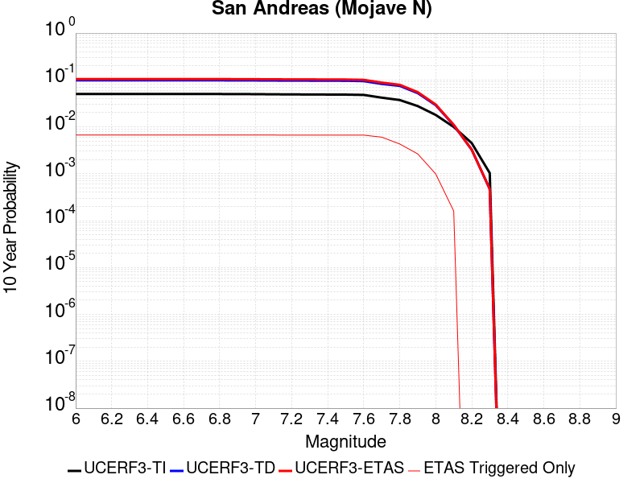 |

| Magnitude | 1 wk TI Prob | 1 wk TD Prob | 1 wk ETAS Prob | 1 wk ETAS/TD Gain | 1 wk ETAS Triggered Only | 1 mo TI Prob | 1 mo TD Prob | 1 mo ETAS Prob | 1 mo ETAS/TD Gain | 1 mo ETAS Triggered Only | 1 yr TI Prob | 1 yr TD Prob | 1 yr ETAS Prob | 1 yr ETAS/TD Gain | 1 yr ETAS Triggered Only | 10 yr TI Prob | 10 yr TD Prob | 10 yr ETAS Prob | 10 yr ETAS/TD Gain | 10 yr ETAS Triggered Only |
|-----|-----|-----|-----|-----|-----|-----|-----|-----|-----|-----|-----|-----|-----|-----|-----|-----|-----|-----|-----|-----|
| 6.0 | 9.877682E-5 | 1.9402112E-4 | 0.003323414 | 17.129135 | 0.00313 | 4.2326056E-4 | 8.312543E-4 | 0.0047779707 | 5.7479053 | 0.00395 | 0.0051410277 | 0.010073684 | 0.015359891 | 1.524754 | 0.00534 | 0.05023708 | 0.09832245 | 0.104363695 | 1.0614431 | 0.0067 |
| 6.1 | 9.877682E-5 | 1.9402112E-4 | 0.003323414 | 17.129135 | 0.00313 | 4.2326056E-4 | 8.312543E-4 | 0.0047779707 | 5.7479053 | 0.00395 | 0.0051410277 | 0.010073684 | 0.015359891 | 1.524754 | 0.00534 | 0.05023708 | 0.09832245 | 0.104363695 | 1.0614431 | 0.0067 |
| 6.2 | 9.877682E-5 | 1.9402112E-4 | 0.003323414 | 17.129135 | 0.00313 | 4.2326056E-4 | 8.312543E-4 | 0.0047779707 | 5.7479053 | 0.00395 | 0.0051410277 | 0.010073684 | 0.015359891 | 1.524754 | 0.00534 | 0.05023708 | 0.09832245 | 0.104363695 | 1.0614431 | 0.0067 |
| 6.3 | 9.877682E-5 | 1.9402112E-4 | 0.003323414 | 17.129135 | 0.00313 | 4.2326056E-4 | 8.312543E-4 | 0.0047779707 | 5.7479053 | 0.00395 | 0.0051410277 | 0.010073684 | 0.015359891 | 1.524754 | 0.00534 | 0.05023708 | 0.09832245 | 0.104363695 | 1.0614431 | 0.0067 |
| 6.4 | 9.877682E-5 | 1.9402112E-4 | 0.003323414 | 17.129135 | 0.00313 | 4.2326056E-4 | 8.312543E-4 | 0.0047779707 | 5.7479053 | 0.00395 | 0.0051410277 | 0.010073684 | 0.015359891 | 1.524754 | 0.00534 | 0.05023708 | 0.09832245 | 0.104363695 | 1.0614431 | 0.0067 |
| 6.5 | 9.861474E-5 | 1.937588E-4 | 0.0033231524 | 17.150974 | 0.00313 | 4.2256617E-4 | 8.3013077E-4 | 0.0047768517 | 5.7543364 | 0.00395 | 0.0051326132 | 0.0100601325 | 0.015346412 | 1.5254681 | 0.00534 | 0.050156746 | 0.09820035 | 0.10424241 | 1.0615278 | 0.0067 |
| 6.6 | 9.861474E-5 | 1.937588E-4 | 0.0033231524 | 17.150974 | 0.00313 | 4.2256617E-4 | 8.3013077E-4 | 0.0047768517 | 5.7543364 | 0.00395 | 0.0051326132 | 0.0100601325 | 0.015346412 | 1.5254681 | 0.00534 | 0.050156746 | 0.09820035 | 0.10424241 | 1.0615278 | 0.0067 |
| 6.7 | 9.8552715E-5 | 1.9365833E-4 | 0.003323052 | 17.159355 | 0.00313 | 4.223004E-4 | 8.2970044E-4 | 0.0047764233 | 5.7568045 | 0.00395 | 0.0051293927 | 0.010054941 | 0.015341248 | 1.5257422 | 0.00534 | 0.050125998 | 0.09815356 | 0.10419593 | 1.0615604 | 0.0067 |
| 6.8 | 9.8464974E-5 | 1.9350994E-4 | 0.0033229042 | 17.17175 | 0.00313 | 4.219245E-4 | 8.290649E-4 | 0.00477579 | 5.7604537 | 0.00395 | 0.0051248376 | 0.010047276 | 0.015333623 | 1.5261474 | 0.00534 | 0.05008251 | 0.09808378 | 0.10412662 | 1.0616089 | 0.0067 |
| 6.9 | 9.825824E-5 | 1.9319002E-4 | 0.0033225853 | 17.198536 | 0.00313 | 4.2103877E-4 | 8.276947E-4 | 0.004774425 | 5.768341 | 0.00395 | 0.0051141046 | 0.010030746 | 0.015317182 | 1.5270232 | 0.00534 | 0.049980022 | 0.097932965 | 0.103976816 | 1.0617142 | 0.0067 |
| 7.0 | 9.781462E-5 | 1.9250368E-4 | 0.003311903 | 17.204363 | 0.00312 | 4.1913814E-4 | 8.247551E-4 | 0.0047615054 | 5.773236 | 0.00394 | 0.005091073 | 0.009995285 | 0.01525221 | 1.5259404 | 0.00531 | 0.04976007 | 0.09760912 | 0.10362807 | 1.0616637 | 0.00667 |
| 7.1 | 9.7121134E-5 | 1.9152075E-4 | 0.0033109232 | 17.287542 | 0.00312 | 4.1616702E-4 | 8.205452E-4 | 0.004757312 | 5.7977457 | 0.00394 | 0.005055068 | 0.0099444995 | 0.015201694 | 1.5286535 | 0.00531 | 0.04941613 | 0.09714571 | 0.10316774 | 1.0619898 | 0.00667 |
| 7.2 | 9.663819E-5 | 1.9082859E-4 | 0.0033002351 | 17.294239 | 0.00311 | 4.1409794E-4 | 8.175807E-4 | 0.0047443677 | 5.802935 | 0.00393 | 0.0050299936 | 0.009908735 | 0.015156219 | 1.5295815 | 0.0053 | 0.049176537 | 0.09681883 | 0.102834016 | 1.0621283 | 0.00666 |
| 7.3 | 9.6277574E-5 | 1.9035369E-4 | 0.0032997618 | 17.334898 | 0.00311 | 4.125529E-4 | 8.1554666E-4 | 0.0047423416 | 5.814924 | 0.00393 | 0.0050112694 | 0.009884195 | 0.015121908 | 1.5299078 | 0.00529 | 0.04899759 | 0.09659228 | 0.10259994 | 1.0621961 | 0.00665 |
| 7.4 | 9.593308E-5 | 1.8975153E-4 | 0.0032991613 | 17.386744 | 0.00311 | 4.1107697E-4 | 8.129676E-4 | 0.0047397725 | 5.830211 | 0.00393 | 0.0049933824 | 0.009853081 | 0.015090957 | 1.531598 | 0.00529 | 0.04882661 | 0.09630986 | 0.1023194 | 1.062398 | 0.00665 |
| 7.5 | 9.561707E-5 | 1.8921228E-4 | 0.0032986237 | 17.433456 | 0.00311 | 4.0972308E-4 | 8.106579E-4 | 0.004737472 | 5.843984 | 0.00393 | 0.0049769743 | 0.009825215 | 0.015063239 | 1.5331206 | 0.00529 | 0.048669744 | 0.096056245 | 0.10206747 | 1.0625802 | 0.00665 |
| 7.6 | 9.418194E-5 | 1.8573487E-4 | 0.0032951573 | 17.741188 | 0.00311 | 4.0357444E-4 | 7.95764E-4 | 0.0047226367 | 5.9347205 | 0.00393 | 0.004902454 | 0.009645499 | 0.014884475 | 1.5431523 | 0.00529 | 0.047957025 | 0.094437465 | 0.10045946 | 1.063767 | 0.00665 |
| 7.7 | 8.202141E-5 | 1.6022482E-4 | 0.0029497778 | 18.410242 | 0.00279 | 3.51473E-4 | 6.8649714E-4 | 0.004224067 | 6.153073 | 0.00354 | 0.00427079 | 0.008326128 | 0.01306633 | 1.5693164 | 0.00478 | 0.04189639 | 0.082237914 | 0.08777202 | 1.0672939 | 0.00603 |
| 7.8 | 7.2859846E-5 | 1.4517571E-4 | 0.0021648824 | 14.912153 | 0.00202 | 3.1221908E-4 | 6.2203326E-4 | 0.003220416 | 5.177241 | 0.0026 | 0.003794643 | 0.0075469986 | 0.010961037 | 1.4523703 | 0.00344 | 0.037304975 | 0.07472766 | 0.078715585 | 1.0533661 | 0.00431 |
| 7.9 | 5.3874453E-5 | 1.00462625E-4 | 0.001350337 | 13.441188 | 0.00125 | 2.3087008E-4 | 4.3048308E-4 | 0.0020597815 | 4.784814 | 0.00163 | 0.0028072202 | 0.0052285474 | 0.007387202 | 1.4128592 | 0.00217 | 0.02772022 | 0.052425884 | 0.054936957 | 1.0478976 | 0.00265 |
| 8.0 | 3.468538E-5 | 5.4261534E-5 | 5.0423713E-4 | 9.292717 | 4.5E-4 | 1.4864317E-4 | 2.3252872E-4 | 7.8240084E-4 | 3.3647492 | 5.5E-4 | 0.0018082283 | 0.0028273636 | 0.00361513 | 1.2786223 | 7.9E-4 | 0.017935853 | 0.028948462 | 0.029909803 | 1.0332087 | 9.9E-4 |
| 8.1 | 1.9152367E-5 | 1.9401303E-5 | 6.940033E-5 | 3.5770965 | 5.0E-5 | 8.207899E-5 | 8.3145795E-5 | 1.7313831E-4 | 2.082346 | 9.0E-5 | 9.988535E-4 | 0.0010118305 | 0.0011317091 | 1.118477 | 1.2E-4 | 0.009943757 | 0.01085595 | 0.011014214 | 1.0145785 | 1.6E-4 |
| 8.2 | 8.643924E-6 | 5.473668E-6 | 5.473668E-6 | 1.0 | 0.0 | 3.704486E-5 | 2.3458366E-5 | 2.3458366E-5 | 1.0 | 0.0 | 4.5092785E-4 | 2.8556827E-4 | 2.8556827E-4 | 1.0 | 0.0 | 0.0045001395 | 0.0032481793 | 0.0032481793 | 1.0 | 0.0 |
| 8.3 | 1.983087E-6 | 7.6564595E-7 | 7.6564595E-7 | 1.0 | 0.0 | 8.498917E-6 | 3.281336E-6 | 3.281336E-6 | 1.0 | 0.0 | 1.034694E-4 | 3.9949547E-5 | 3.9949547E-5 | 1.0 | 0.0 | 0.0010342124 | 4.717979E-4 | 4.717979E-4 | 1.0 | 0.0 |

## Nelson Lake
*[(top)](#table-of-contents)*

| 1 Week | 1 Month | 1 Year | 10 Year |
|-----|-----|-----|-----|
|  |  |  | 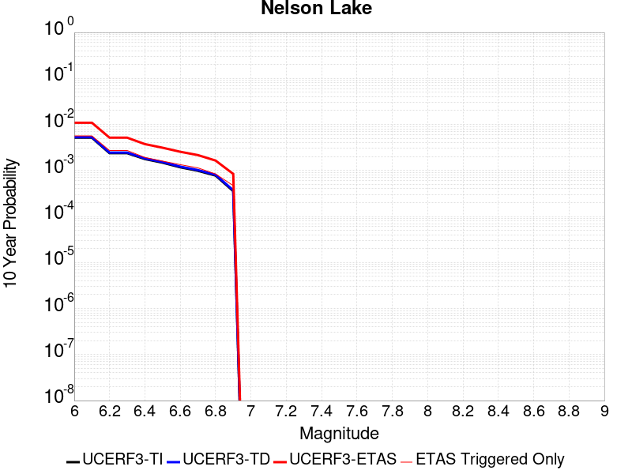 |

| Magnitude | 1 wk TI Prob | 1 wk TD Prob | 1 wk ETAS Prob | 1 wk ETAS/TD Gain | 1 wk ETAS Triggered Only | 1 mo TI Prob | 1 mo TD Prob | 1 mo ETAS Prob | 1 mo ETAS/TD Gain | 1 mo ETAS Triggered Only | 1 yr TI Prob | 1 yr TD Prob | 1 yr ETAS Prob | 1 yr ETAS/TD Gain | 1 yr ETAS Triggered Only | 10 yr TI Prob | 10 yr TD Prob | 10 yr ETAS Prob | 10 yr ETAS/TD Gain | 10 yr ETAS Triggered Only |
|-----|-----|-----|-----|-----|-----|-----|-----|-----|-----|-----|-----|-----|-----|-----|-----|-----|-----|-----|-----|-----|
| 6.0 | 9.913453E-6 | 1.0192255E-5 | 8.20184E-4 | 80.4713 | 8.1E-4 | 4.2485535E-5 | 4.3680422E-5 | 0.0015836131 | 36.25453 | 0.00154 | 5.1713863E-4 | 5.316897E-4 | 0.0038699138 | 7.2785196 | 0.00334 | 0.0051593683 | 0.005305204 | 0.01092523 | 2.0593421 | 0.00565 |
| 6.1 | 9.913453E-6 | 1.0192255E-5 | 8.20184E-4 | 80.4713 | 8.1E-4 | 4.2485535E-5 | 4.3680422E-5 | 0.0015836131 | 36.25453 | 0.00154 | 5.1713863E-4 | 5.316897E-4 | 0.0038699138 | 7.2785196 | 0.00334 | 0.0051593683 | 0.005305204 | 0.01092523 | 2.0593421 | 0.00565 |
| 6.2 | 4.5596407E-6 | 4.696313E-6 | 3.6469463E-4 | 77.65552 | 3.6E-4 | 1.954117E-5 | 2.0126909E-5 | 7.301126E-4 | 36.275448 | 7.1E-4 | 2.3788778E-4 | 2.4501883E-4 | 0.0017146587 | 6.9980693 | 0.00147 | 0.0023763329 | 0.0024476128 | 0.0051609552 | 2.1085668 | 0.00272 |
| 6.3 | 4.5596407E-6 | 4.696313E-6 | 3.6469463E-4 | 77.65552 | 3.6E-4 | 1.954117E-5 | 2.0126909E-5 | 7.301126E-4 | 36.275448 | 7.1E-4 | 2.3788778E-4 | 2.4501883E-4 | 0.0017146587 | 6.9980693 | 0.00147 | 0.0023763329 | 0.0024476128 | 0.0051609552 | 2.1085668 | 0.00272 |
| 6.4 | 3.4025713E-6 | 3.5098972E-6 | 2.9350887E-4 | 83.623215 | 2.9E-4 | 1.4582367E-5 | 1.5042335E-5 | 5.4503436E-4 | 36.23336 | 5.3E-4 | 1.7752586E-4 | 1.8312587E-4 | 0.0011829428 | 6.459725 | 0.001 | 0.001773841 | 0.0018298327 | 0.0037463193 | 2.0473564 | 0.00192 |
| 6.5 | 2.8352947E-6 | 2.927856E-6 | 2.4292716E-4 | 82.971 | 2.4E-4 | 1.2151207E-5 | 1.2547898E-5 | 4.6254226E-4 | 36.86213 | 4.5E-4 | 1.479309E-4 | 1.5276071E-4 | 0.0010126294 | 6.62886 | 8.6E-4 | 0.0014783246 | 0.0015266308 | 0.0031241882 | 2.0464594 | 0.0016 |
| 6.6 | 2.251518E-6 | 2.3290677E-6 | 2.2232856E-4 | 95.45818 | 2.2E-4 | 9.649328E-6 | 9.981683E-6 | 3.9997778E-4 | 40.071175 | 3.9E-4 | 1.1747423E-4 | 1.2152085E-4 | 8.6143095E-4 | 7.08875 | 7.4E-4 | 0.0011741214 | 0.0012146058 | 0.0025529782 | 2.1018987 | 0.00134 |
| 6.7 | 1.8911853E-6 | 1.9591396E-6 | 2.0195874E-4 | 103.08543 | 2.0E-4 | 8.105055E-6 | 8.39629E-6 | 3.4839343E-4 | 41.49374 | 3.4E-4 | 9.867457E-5 | 1.0222061E-4 | 7.421552E-4 | 7.2603283 | 6.4E-4 | 9.863076E-4 | 0.0010217935 | 0.0021606286 | 2.1145453 | 0.00114 |
| 6.8 | 1.4874814E-6 | 1.5438305E-6 | 1.6154359E-4 | 104.63816 | 1.6E-4 | 6.374905E-6 | 6.6164025E-6 | 2.5661476E-4 | 38.784634 | 2.5E-4 | 7.76117E-5 | 8.055224E-5 | 5.905112E-4 | 7.330785 | 5.1E-4 | 7.75846E-4 | 8.0528157E-4 | 0.0016446051 | 2.0422735 | 8.4E-4 |
| 6.9 | 6.835972E-7 | 7.1399285E-7 | 1.0071392E-4 | 141.05733 | 1.0E-4 | 2.9296991E-6 | 3.0599674E-6 | 1.7305945E-4 | 56.555977 | 1.7E-4 | 3.56685E-5 | 3.7254784E-5 | 3.372436E-4 | 9.052357 | 3.0E-4 | 3.5662777E-4 | 3.7251666E-4 | 8.423416E-4 | 2.2612185 | 4.7E-4 |

## Death Valley (So)
*[(top)](#table-of-contents)*

| 1 Week | 1 Month | 1 Year | 10 Year |
|-----|-----|-----|-----|
| 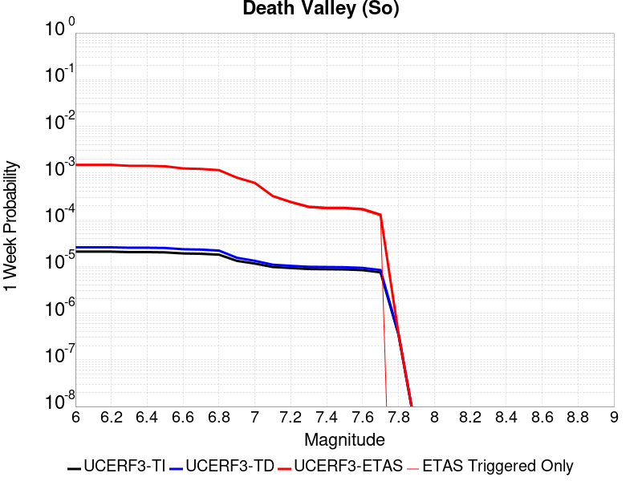 |  |  | 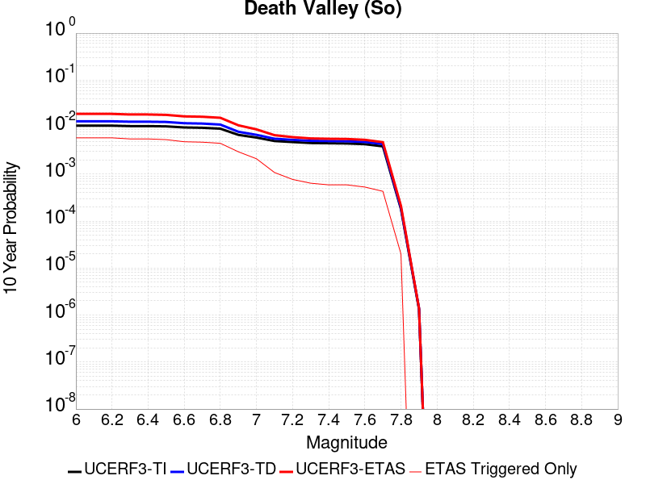 |

| Magnitude | 1 wk TI Prob | 1 wk TD Prob | 1 wk ETAS Prob | 1 wk ETAS/TD Gain | 1 wk ETAS Triggered Only | 1 mo TI Prob | 1 mo TD Prob | 1 mo ETAS Prob | 1 mo ETAS/TD Gain | 1 mo ETAS Triggered Only | 1 yr TI Prob | 1 yr TD Prob | 1 yr ETAS Prob | 1 yr ETAS/TD Gain | 1 yr ETAS Triggered Only | 10 yr TI Prob | 10 yr TD Prob | 10 yr ETAS Prob | 10 yr ETAS/TD Gain | 10 yr ETAS Triggered Only |
|-----|-----|-----|-----|-----|-----|-----|-----|-----|-----|-----|-----|-----|-----|-----|-----|-----|-----|-----|-----|-----|
| 6.0 | 2.0684236E-5 | 2.5618314E-5 | 0.0014955807 | 58.379356 | 0.00147 | 8.864371E-5 | 1.0978825E-4 | 0.0022495533 | 20.489927 | 0.00214 | 0.0010787029 | 0.0013358692 | 0.005240646 | 3.9230232 | 0.00391 | 0.010734817 | 0.013279985 | 0.0191115 | 1.4391207 | 0.00591 |
| 6.1 | 2.0684236E-5 | 2.5618314E-5 | 0.0014955807 | 58.379356 | 0.00147 | 8.864371E-5 | 1.0978825E-4 | 0.0022495533 | 20.489927 | 0.00214 | 0.0010787029 | 0.0013358692 | 0.005240646 | 3.9230232 | 0.00391 | 0.010734817 | 0.013279985 | 0.0191115 | 1.4391207 | 0.00591 |
| 6.2 | 2.0684236E-5 | 2.5618314E-5 | 0.0014955807 | 58.379356 | 0.00147 | 8.864371E-5 | 1.0978825E-4 | 0.0022495533 | 20.489927 | 0.00214 | 0.0010787029 | 0.0013358692 | 0.005240646 | 3.9230232 | 0.00391 | 0.010734817 | 0.013279985 | 0.0191115 | 1.4391207 | 0.00591 |
| 6.3 | 2.0240292E-5 | 2.51184E-5 | 0.0014250833 | 56.73464 | 0.0014 | 8.6741224E-5 | 1.0764593E-4 | 0.0021474264 | 19.948978 | 0.00204 | 0.0010555626 | 0.001309818 | 0.005014959 | 3.8287446 | 0.00371 | 0.010505628 | 0.013022543 | 0.018549617 | 1.4244236 | 0.0056 |
| 6.4 | 2.0240292E-5 | 2.51184E-5 | 0.0014250833 | 56.73464 | 0.0014 | 8.6741224E-5 | 1.0764593E-4 | 0.0021474264 | 19.948978 | 0.00204 | 0.0010555626 | 0.001309818 | 0.005014959 | 3.8287446 | 0.00371 | 0.010505628 | 0.013022543 | 0.018549617 | 1.4244236 | 0.0056 |
| 6.5 | 1.9962767E-5 | 2.4807652E-5 | 0.0013947737 | 56.223526 | 0.00137 | 8.55519E-5 | 1.0631427E-4 | 0.0020861037 | 19.62205 | 0.00198 | 0.0010410968 | 0.0012936244 | 0.004868993 | 3.7638385 | 0.00358 | 0.010362327 | 0.01286249 | 0.018202903 | 1.4151928 | 0.00541 |
| 6.6 | 1.8937297E-5 | 2.3311462E-5 | 0.0012532828 | 53.762512 | 0.00123 | 8.115732E-5 | 9.990252E-5 | 0.0018897237 | 18.915676 | 0.00179 | 9.876423E-4 | 0.0012156491 | 0.004471686 | 3.6784348 | 0.00326 | 0.009832645 | 0.0120915035 | 0.016912498 | 1.3987092 | 0.00488 |
| 6.7 | 1.8621096E-5 | 2.2912098E-5 | 0.0012228846 | 53.37288 | 0.0012 | 7.980225E-5 | 9.8191085E-5 | 0.0018380203 | 18.71881 | 0.00174 | 9.711593E-4 | 0.0011948354 | 0.004391012 | 3.6749933 | 0.0032 | 0.009669261 | 0.011885625 | 0.016608812 | 1.3973864 | 0.00478 |
| 6.8 | 1.7830353E-5 | 2.1806083E-5 | 0.0011517814 | 52.81927 | 0.00113 | 7.641356E-5 | 9.3451374E-5 | 0.001723299 | 18.440596 | 0.00163 | 9.29938E-4 | 0.0011371907 | 0.0041537564 | 3.6526473 | 0.00302 | 0.009260561 | 0.01131609 | 0.015784942 | 1.3949113 | 0.00452 |
| 6.9 | 1.3135183E-5 | 1.5304031E-5 | 7.952921E-4 | 51.966187 | 7.8E-4 | 5.6292425E-5 | 6.558709E-5 | 0.0011855137 | 18.075413 | 0.00112 | 6.8514474E-4 | 7.982367E-4 | 0.0028066323 | 3.51604 | 0.00201 | 0.006830362 | 0.007955158 | 0.010911452 | 1.3716197 | 0.00298 |
| 7.0 | 1.1507512E-5 | 1.3154237E-5 | 6.1314635E-4 | 46.612076 | 6.0E-4 | 4.9316975E-5 | 5.637412E-5 | 8.763279E-4 | 15.544862 | 8.2E-4 | 6.002687E-4 | 6.861445E-4 | 0.002095177 | 3.0535507 | 0.00141 | 0.0059864987 | 0.0068414924 | 0.008946989 | 1.3077539 | 0.00212 |
| 7.1 | 9.715903E-6 | 1.0865287E-5 | 3.2086193E-4 | 29.53092 | 3.1E-4 | 4.1638916E-5 | 4.6564706E-5 | 4.465461E-4 | 9.589797 | 4.0E-4 | 5.068359E-4 | 5.667821E-4 | 0.0012663853 | 2.2343426 | 7.0E-4 | 0.0050568148 | 0.005653834 | 0.0067277276 | 1.1899408 | 0.00108 |
| 7.2 | 9.233269E-6 | 1.0286314E-5 | 2.4028395E-4 | 23.359577 | 2.3E-4 | 3.9570554E-5 | 4.408348E-5 | 3.4407026E-4 | 7.8049703 | 3.0E-4 | 4.81665E-4 | 5.365884E-4 | 0.0010563094 | 1.9685653 | 5.2E-4 | 0.0048062233 | 0.0053533595 | 0.0061192373 | 1.1430649 | 7.7E-4 |
| 7.3 | 8.8041315E-6 | 9.808164E-6 | 1.898064E-4 | 19.35188 | 1.8E-4 | 3.7731446E-5 | 4.2034335E-5 | 2.6202507E-4 | 6.233597 | 2.2E-4 | 4.592835E-4 | 5.1165203E-4 | 9.41432E-4 | 1.8399849 | 4.3E-4 | 0.0045833546 | 0.005105167 | 0.0057419 | 1.1247232 | 6.4E-4 |
| 7.4 | 8.708749E-6 | 9.707175E-6 | 1.7970553E-4 | 18.51265 | 1.7E-4 | 3.7322676E-5 | 4.160154E-5 | 2.4159322E-4 | 5.8073144 | 2.0E-4 | 4.5430884E-4 | 5.0638523E-4 | 9.161776E-4 | 1.8092502 | 4.1E-4 | 0.004533812 | 0.0050527398 | 0.0056397584 | 1.1161784 | 5.9E-4 |
| 7.5 | 8.612678E-6 | 9.604817E-6 | 1.7960319E-4 | 18.699282 | 1.7E-4 | 3.6910955E-5 | 4.1162875E-5 | 2.4115464E-4 | 5.8585467 | 2.0E-4 | 4.492982E-4 | 5.01047E-4 | 9.1084157E-4 | 1.8178766 | 4.1E-4 | 0.004483909 | 0.0049995985 | 0.005586649 | 1.1174195 | 5.9E-4 |
| 7.6 | 8.319024E-6 | 9.283916E-6 | 1.6928243E-4 | 18.233946 | 1.6E-4 | 3.5652476E-5 | 3.978763E-5 | 2.2978007E-4 | 5.7751637 | 1.9E-4 | 4.3398244E-4 | 4.8431093E-4 | 8.641269E-4 | 1.7842399 | 3.8E-4 | 0.0043313587 | 0.0048329784 | 0.005360417 | 1.1091332 | 5.3E-4 |
| 7.7 | 7.4718328E-6 | 8.34517E-6 | 1.2834417E-4 | 15.379456 | 1.2E-4 | 3.2021748E-5 | 3.5764548E-5 | 1.7575955E-4 | 4.914351 | 1.4E-4 | 3.8979502E-4 | 4.353504E-4 | 7.552111E-4 | 1.7347201 | 3.2E-4 | 0.00389112 | 0.0043453807 | 0.004773512 | 1.0985256 | 4.3E-4 |
| 7.8 | 3.4586725E-7 | 3.6482615E-7 | 3.6482615E-7 | 1.0 | 0.0 | 1.4822873E-6 | 1.5635396E-6 | 1.5635396E-6 | 1.0 | 0.0 | 1.80467E-5 | 1.9035933E-5 | 2.9035744E-5 | 1.5253123 | 1.0E-5 | 1.8045233E-4 | 1.9034347E-4 | 2.1033967E-4 | 1.1050532 | 2.0E-5 |
| 7.9 | 2.5591178E-9 | 2.6696718E-9 | 2.6696718E-9 | 1.0 | 0.0 | 1.0967647E-8 | 1.14414505E-8 | 1.14414505E-8 | 1.0 | 0.0 | 1.335311E-7 | 1.3929966E-7 | 1.3929966E-7 | 1.0 | 0.0 | 1.3353102E-6 | 1.3929966E-6 | 1.3929966E-6 | 1.0 | 0.0 |

## Towne Pass
*[(top)](#table-of-contents)*

| 1 Week | 1 Month | 1 Year | 10 Year |
|-----|-----|-----|-----|
|  |  |  |  |

| Magnitude | 1 wk TI Prob | 1 wk TD Prob | 1 wk ETAS Prob | 1 wk ETAS/TD Gain | 1 wk ETAS Triggered Only | 1 mo TI Prob | 1 mo TD Prob | 1 mo ETAS Prob | 1 mo ETAS/TD Gain | 1 mo ETAS Triggered Only | 1 yr TI Prob | 1 yr TD Prob | 1 yr ETAS Prob | 1 yr ETAS/TD Gain | 1 yr ETAS Triggered Only | 10 yr TI Prob | 10 yr TD Prob | 10 yr ETAS Prob | 10 yr ETAS/TD Gain | 10 yr ETAS Triggered Only |
|-----|-----|-----|-----|-----|-----|-----|-----|-----|-----|-----|-----|-----|-----|-----|-----|-----|-----|-----|-----|-----|
| 6.0 | 3.849728E-6 | 3.894542E-6 | 0.0015138887 | 388.72058 | 0.00151 | 1.649873E-5 | 1.6690812E-5 | 0.002096656 | 125.61738 | 0.00208 | 2.0085352E-4 | 2.0319606E-4 | 0.003982428 | 19.598944 | 0.00378 | 0.0020067208 | 0.0020305319 | 0.007349709 | 3.6195982 | 0.00533 |
| 6.1 | 3.849728E-6 | 3.894542E-6 | 0.0015138887 | 388.72058 | 0.00151 | 1.649873E-5 | 1.6690812E-5 | 0.002096656 | 125.61738 | 0.00208 | 2.0085352E-4 | 2.0319606E-4 | 0.003982428 | 19.598944 | 0.00378 | 0.0020067208 | 0.0020305319 | 0.007349709 | 3.6195982 | 0.00533 |
| 6.2 | 3.849728E-6 | 3.894542E-6 | 0.0015138887 | 388.72058 | 0.00151 | 1.649873E-5 | 1.6690812E-5 | 0.002096656 | 125.61738 | 0.00208 | 2.0085352E-4 | 2.0319606E-4 | 0.003982428 | 19.598944 | 0.00378 | 0.0020067208 | 0.0020305319 | 0.007349709 | 3.6195982 | 0.00533 |
| 6.3 | 3.849728E-6 | 3.894542E-6 | 0.0015138887 | 388.72058 | 0.00151 | 1.649873E-5 | 1.6690812E-5 | 0.002096656 | 125.61738 | 0.00208 | 2.0085352E-4 | 2.0319606E-4 | 0.003982428 | 19.598944 | 0.00378 | 0.0020067208 | 0.0020305319 | 0.007349709 | 3.6195982 | 0.00533 |
| 6.4 | 3.849728E-6 | 3.894542E-6 | 0.0015138887 | 388.72058 | 0.00151 | 1.649873E-5 | 1.6690812E-5 | 0.002096656 | 125.61738 | 0.00208 | 2.0085352E-4 | 2.0319606E-4 | 0.003982428 | 19.598944 | 0.00378 | 0.0020067208 | 0.0020305319 | 0.007349709 | 3.6195982 | 0.00533 |
| 6.5 | 1.1953545E-6 | 1.2030526E-6 | 2.3120278E-4 | 192.1801 | 2.3E-4 | 5.1229376E-6 | 5.15593E-6 | 3.5515413E-4 | 68.882645 | 3.5E-4 | 6.236998E-5 | 6.277176E-5 | 6.627341E-4 | 10.557838 | 6.0E-4 | 6.235248E-4 | 6.2755204E-4 | 0.0014570311 | 2.3217695 | 8.3E-4 |
| 6.6 | 1.1953545E-6 | 1.2030526E-6 | 2.3120278E-4 | 192.1801 | 2.3E-4 | 5.1229376E-6 | 5.15593E-6 | 3.5515413E-4 | 68.882645 | 3.5E-4 | 6.236998E-5 | 6.277176E-5 | 6.627341E-4 | 10.557838 | 6.0E-4 | 6.235248E-4 | 6.2755204E-4 | 0.0014570311 | 2.3217695 | 8.3E-4 |
| 6.7 | 8.375951E-7 | 8.410676E-7 | 1.3084096E-4 | 155.56532 | 1.3E-4 | 3.5896885E-6 | 3.6045708E-6 | 1.9360389E-4 | 53.710663 | 1.9E-4 | 4.370358E-5 | 4.3884826E-5 | 3.7387034E-4 | 8.519354 | 3.3E-4 | 4.3694986E-4 | 4.3876728E-4 | 9.185567E-4 | 2.093494 | 4.8E-4 |
| 6.8 | 6.38041E-7 | 6.3921624E-7 | 7.063917E-5 | 110.50904 | 7.0E-5 | 2.7344586E-6 | 2.7394954E-6 | 9.273925E-5 | 33.852676 | 9.0E-5 | 3.3291526E-5 | 3.3352884E-5 | 2.0334721E-4 | 6.0968404 | 1.7E-4 | 3.3286537E-4 | 3.334826E-4 | 6.1338925E-4 | 1.839344 | 2.8E-4 |
| 6.9 | 5.3460053E-7 | 5.345339E-7 | 6.05345E-5 | 113.24727 | 6.0E-5 | 2.2911431E-6 | 2.2908578E-6 | 6.229072E-5 | 27.191004 | 6.0E-5 | 2.789431E-5 | 2.7890868E-5 | 1.5788725E-4 | 5.6608934 | 1.3E-4 | 2.789081E-4 | 2.78877E-4 | 4.7882122E-4 | 1.716962 | 2.0E-4 |
| 7.0 | 3.557783E-7 | 3.5324283E-7 | 2.0353236E-5 | 57.618256 | 2.0E-5 | 1.5247632E-6 | 1.513897E-6 | 2.1513866E-5 | 14.210917 | 2.0E-5 | 1.8563835E-5 | 1.8431549E-5 | 4.8430997E-5 | 2.627614 | 3.0E-5 | 1.8562283E-4 | 1.8430105E-4 | 2.3429183E-4 | 1.2712452 | 5.0E-5 |
| 7.1 | 3.037942E-7 | 3.0002275E-7 | 1.0300019E-5 | 34.330795 | 1.0E-5 | 1.3019744E-6 | 1.2858112E-6 | 1.1285799E-5 | 8.777182 | 1.0E-5 | 1.5851423E-5 | 1.5654647E-5 | 3.5654335E-5 | 2.277556 | 2.0E-5 | 1.5850292E-4 | 1.5653619E-4 | 1.9652993E-4 | 1.255492 | 4.0E-5 |
| 7.2 | 2.0808248E-7 | 2.0217735E-7 | 1.0202175E-5 | 50.461517 | 1.0E-5 | 8.917818E-7 | 8.6647407E-7 | 1.0866465E-5 | 12.541017 | 1.0E-5 | 1.0857389E-5 | 1.0549275E-5 | 2.054917E-5 | 1.9479225 | 1.0E-5 | 1.0856859E-4 | 1.0548821E-4 | 1.1548715E-4 | 1.0947874 | 1.0E-5 |
| 7.3 | 1.1162073E-7 | 1.0636902E-7 | 1.0106368E-5 | 95.01232 | 1.0E-5 | 4.7837443E-7 | 4.5586717E-7 | 1.0455863E-5 | 22.936205 | 1.0E-5 | 5.8241935E-6 | 5.5501705E-6 | 1.5550115E-5 | 2.8017364 | 1.0E-5 | 5.8240406E-5 | 5.550052E-5 | 6.549997E-5 | 1.1801685 | 1.0E-5 |

## Lenwood-Lockhart-Old Woman Springs
*[(top)](#table-of-contents)*

| 1 Week | 1 Month | 1 Year | 10 Year |
|-----|-----|-----|-----|
|  |  |  | 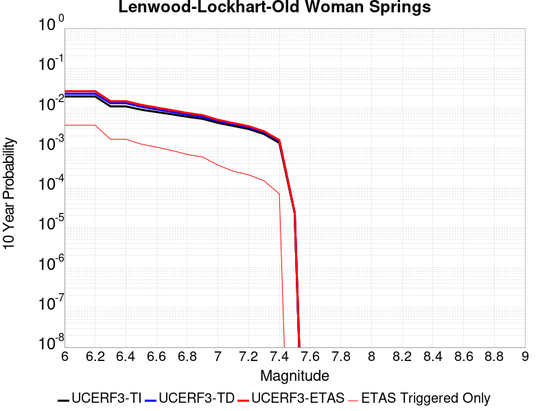 |

| Magnitude | 1 wk TI Prob | 1 wk TD Prob | 1 wk ETAS Prob | 1 wk ETAS/TD Gain | 1 wk ETAS Triggered Only | 1 mo TI Prob | 1 mo TD Prob | 1 mo ETAS Prob | 1 mo ETAS/TD Gain | 1 mo ETAS Triggered Only | 1 yr TI Prob | 1 yr TD Prob | 1 yr ETAS Prob | 1 yr ETAS/TD Gain | 1 yr ETAS Triggered Only | 10 yr TI Prob | 10 yr TD Prob | 10 yr ETAS Prob | 10 yr ETAS/TD Gain | 10 yr ETAS Triggered Only |
|-----|-----|-----|-----|-----|-----|-----|-----|-----|-----|-----|-----|-----|-----|-----|-----|-----|-----|-----|-----|-----|
| 6.0 | 3.744542E-5 | 4.396349E-5 | 0.0010239204 | 23.290245 | 9.8E-4 | 1.604705E-4 | 1.8840231E-4 | 0.0015881385 | 8.429506 | 0.0014 | 0.0019519776 | 0.0022915571 | 0.004646149 | 2.0275073 | 0.00236 | 0.019349206 | 0.022697281 | 0.026293756 | 1.158454 | 0.00368 |
| 6.1 | 3.744542E-5 | 4.396349E-5 | 0.0010239204 | 23.290245 | 9.8E-4 | 1.604705E-4 | 1.8840231E-4 | 0.0015881385 | 8.429506 | 0.0014 | 0.0019519776 | 0.0022915571 | 0.004646149 | 2.0275073 | 0.00236 | 0.019349206 | 0.022697281 | 0.026293756 | 1.158454 | 0.00368 |
| 6.2 | 3.744542E-5 | 4.396349E-5 | 0.0010239204 | 23.290245 | 9.8E-4 | 1.604705E-4 | 1.8840231E-4 | 0.0015881385 | 8.429506 | 0.0014 | 0.0019519776 | 0.0022915571 | 0.004646149 | 2.0275073 | 0.00236 | 0.019349206 | 0.022697281 | 0.026293756 | 1.158454 | 0.00368 |
| 6.3 | 2.1079984E-5 | 2.5354384E-5 | 4.4534373E-4 | 17.564762 | 4.2E-4 | 9.0339665E-5 | 1.0865723E-4 | 6.785953E-4 | 6.245284 | 5.7E-4 | 0.0010993304 | 0.0013221189 | 0.0023307835 | 1.7629153 | 0.00101 | 0.010939079 | 0.013144747 | 0.0147631895 | 1.1231247 | 0.00164 |
| 6.4 | 2.1079984E-5 | 2.5354384E-5 | 4.4534373E-4 | 17.564762 | 4.2E-4 | 9.0339665E-5 | 1.0865723E-4 | 6.785953E-4 | 6.245284 | 5.7E-4 | 0.0010993304 | 0.0013221189 | 0.0023307835 | 1.7629153 | 0.00101 | 0.010939079 | 0.013144747 | 0.0147631895 | 1.1231247 | 0.00164 |
| 6.5 | 1.7397282E-5 | 2.0663285E-5 | 3.3065688E-4 | 16.002144 | 3.1E-4 | 7.455765E-5 | 8.8554E-5 | 4.8851856E-4 | 5.5166183 | 4.0E-4 | 9.073613E-4 | 0.0010776235 | 0.0018068367 | 1.6766866 | 7.3E-4 | 0.009036654 | 0.010725273 | 0.011951974 | 1.1143748 | 0.00124 |
| 6.6 | 1.52050325E-5 | 1.7680086E-5 | 2.7767548E-4 | 15.705551 | 2.6E-4 | 6.51628E-5 | 7.576964E-5 | 4.0574462E-4 | 5.3549767 | 3.3E-4 | 7.9306826E-4 | 9.221128E-4 | 0.0015115688 | 1.6392449 | 5.9E-4 | 0.007902439 | 0.009183729 | 0.010214178 | 1.1122037 | 0.00104 |
| 6.7 | 1.332523E-5 | 1.5264379E-5 | 2.1526133E-4 | 14.1022 | 2.0E-4 | 5.7106878E-5 | 6.541716E-5 | 3.353995E-4 | 5.127087 | 2.7E-4 | 6.950544E-4 | 7.9616875E-4 | 0.0012957706 | 1.6275076 | 5.0E-4 | 0.006928845 | 0.0079337945 | 0.008786971 | 1.107537 | 8.6E-4 |
| 6.8 | 1.1525329E-5 | 1.3031365E-5 | 1.6302941E-4 | 12.51054 | 1.5E-4 | 4.9393333E-5 | 5.5847537E-5 | 2.7583525E-4 | 4.9390764 | 2.2E-4 | 6.011979E-4 | 6.7973585E-4 | 0.001079464 | 1.5880638 | 4.0E-4 | 0.00599574 | 0.0067770192 | 0.0074524106 | 1.0996591 | 6.8E-4 |
| 6.9 | 1.0253909E-5 | 1.1514835E-5 | 1.5151322E-4 | 13.15809 | 1.4E-4 | 4.3944583E-5 | 4.934838E-5 | 2.493385E-4 | 5.052618 | 2.0E-4 | 5.3489394E-4 | 6.006545E-4 | 9.5044426E-4 | 1.5823478 | 3.5E-4 | 0.0053360825 | 0.0059906896 | 0.006577155 | 1.0978961 | 5.9E-4 |
| 7.0 | 8.104563E-6 | 8.99143E-6 | 9.899062E-5 | 11.00944 | 9.0E-5 | 3.4733377E-5 | 3.853415E-5 | 1.4852991E-4 | 3.854501 | 1.1E-4 | 4.2279682E-4 | 4.6905465E-4 | 6.5896555E-4 | 1.40488 | 1.9E-4 | 0.0042199334 | 0.0046808943 | 0.0050491625 | 1.0786747 | 3.7E-4 |
| 7.1 | 6.7986157E-6 | 7.5159796E-6 | 6.751553E-5 | 8.982931 | 6.0E-5 | 2.91366E-5 | 3.2210955E-5 | 1.1220838E-4 | 3.483547 | 8.0E-5 | 3.5468035E-4 | 3.9209996E-4 | 5.2204897E-4 | 1.3314182 | 1.3E-4 | 0.003541148 | 0.003914298 | 0.00417328 | 1.0661632 | 2.6E-4 |
| 7.2 | 5.6893327E-6 | 6.280132E-6 | 5.627982E-5 | 8.961566 | 5.0E-5 | 2.4382627E-5 | 2.6914584E-5 | 9.69127E-5 | 3.6007504 | 7.0E-5 | 2.9681803E-4 | 3.276378E-4 | 4.4759846E-4 | 1.3661381 | 1.2E-4 | 0.002964219 | 0.003271746 | 0.003481059 | 1.0639759 | 2.1E-4 |
| 7.3 | 4.253348E-6 | 4.707075E-6 | 3.4706933E-5 | 7.3733554 | 3.0E-5 | 1.8228506E-5 | 2.017303E-5 | 7.017202E-5 | 3.4785066 | 5.0E-5 | 2.2190946E-4 | 2.455808E-4 | 3.2556115E-4 | 1.3256783 | 8.0E-5 | 0.00221688 | 0.0024532753 | 0.0026029071 | 1.0609927 | 1.5E-4 |
| 7.4 | 2.5448119E-6 | 2.8520594E-6 | 1.28520305E-5 | 4.5062284 | 1.0E-5 | 1.0906291E-5 | 1.2223064E-5 | 4.22227E-5 | 3.4543464 | 3.0E-5 | 1.3277601E-4 | 1.4880729E-4 | 1.9879985E-4 | 1.335955 | 5.0E-5 | 0.001326967 | 0.0014872387 | 0.0015571346 | 1.0469971 | 7.0E-5 |
| 7.5 | 4.3706837E-8 | 4.562909E-8 | 4.562909E-8 | 1.0 | 0.0 | 1.8731501E-7 | 1.9555324E-7 | 1.9555324E-7 | 1.0 | 0.0 | 2.2805577E-6 | 2.3808586E-6 | 2.3808586E-6 | 1.0 | 0.0 | 2.2805343E-5 | 2.3808387E-5 | 2.3808387E-5 | 1.0 | 0.0 |

## San Andreas (San Bernardino N)
*[(top)](#table-of-contents)*

| 1 Week | 1 Month | 1 Year | 10 Year |
|-----|-----|-----|-----|
|  |  |  | 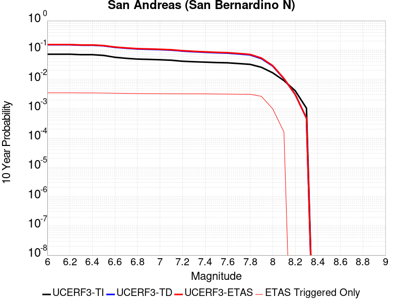 |

| Magnitude | 1 wk TI Prob | 1 wk TD Prob | 1 wk ETAS Prob | 1 wk ETAS/TD Gain | 1 wk ETAS Triggered Only | 1 mo TI Prob | 1 mo TD Prob | 1 mo ETAS Prob | 1 mo ETAS/TD Gain | 1 mo ETAS Triggered Only | 1 yr TI Prob | 1 yr TD Prob | 1 yr ETAS Prob | 1 yr ETAS/TD Gain | 1 yr ETAS Triggered Only | 10 yr TI Prob | 10 yr TD Prob | 10 yr ETAS Prob | 10 yr ETAS/TD Gain | 10 yr ETAS Triggered Only |
|-----|-----|-----|-----|-----|-----|-----|-----|-----|-----|-----|-----|-----|-----|-----|-----|-----|-----|-----|-----|-----|
| 6.0 | 1.4273766E-4 | 3.160784E-4 | 0.001835598 | 5.807413 | 0.00152 | 6.115894E-4 | 0.0013539245 | 0.00334123 | 2.4678113 | 0.00199 | 0.0074207084 | 0.016360939 | 0.019006928 | 1.161726 | 0.00269 | 0.07177748 | 0.15021163 | 0.1531604 | 1.0196308 | 0.00347 |
| 6.1 | 1.4273766E-4 | 3.160784E-4 | 0.001835598 | 5.807413 | 0.00152 | 6.115894E-4 | 0.0013539245 | 0.00334123 | 2.4678113 | 0.00199 | 0.0074207084 | 0.016360939 | 0.019006928 | 1.161726 | 0.00269 | 0.07177748 | 0.15021163 | 0.1531604 | 1.0196308 | 0.00347 |
| 6.2 | 1.4273766E-4 | 3.160784E-4 | 0.001835598 | 5.807413 | 0.00152 | 6.115894E-4 | 0.0013539245 | 0.00334123 | 2.4678113 | 0.00199 | 0.0074207084 | 0.016360939 | 0.019006928 | 1.161726 | 0.00269 | 0.07177748 | 0.15021163 | 0.1531604 | 1.0196308 | 0.00347 |
| 6.3 | 1.3730655E-4 | 3.0512668E-4 | 0.001814666 | 5.947254 | 0.00151 | 5.883239E-4 | 0.001307036 | 0.0032744613 | 2.505257 | 0.00197 | 0.0071393442 | 0.015798455 | 0.018426273 | 1.1663339 | 0.00267 | 0.06914291 | 0.1455135 | 0.1484444 | 1.0201417 | 0.00343 |
| 6.4 | 1.3730655E-4 | 3.0512668E-4 | 0.001814666 | 5.947254 | 0.00151 | 5.883239E-4 | 0.001307036 | 0.0032744613 | 2.505257 | 0.00197 | 0.0071393442 | 0.015798455 | 0.018426273 | 1.1663339 | 0.00267 | 0.06914291 | 0.1455135 | 0.1484444 | 1.0201417 | 0.00343 |
| 6.5 | 1.2942807E-4 | 2.8927144E-4 | 0.0017888375 | 6.183941 | 0.0015 | 5.545738E-4 | 0.0012391509 | 0.0031967221 | 2.5797682 | 0.00196 | 0.0067310524 | 0.014983548 | 0.01759384 | 1.1742107 | 0.00265 | 0.06530788 | 0.13865088 | 0.14157085 | 1.0210599 | 0.00339 |
| 6.6 | 1.1125901E-4 | 2.5365927E-4 | 0.0017532788 | 6.911945 | 0.0015 | 4.767372E-4 | 0.0010866605 | 0.0030445307 | 2.801731 | 0.00196 | 0.005788839 | 0.0131504685 | 0.01575575 | 1.1981133 | 0.00264 | 0.056403454 | 0.12300496 | 0.12594289 | 1.0238847 | 0.00335 |
| 6.7 | 1.02209575E-4 | 2.3500937E-4 | 0.0017346569 | 7.381224 | 0.0015 | 4.3796748E-4 | 0.0010067957 | 0.0029548325 | 2.934888 | 0.00195 | 0.0053192247 | 0.012189267 | 0.014777331 | 1.2123232 | 0.00262 | 0.051936906 | 0.114792764 | 0.1177228 | 1.0255246 | 0.00331 |
| 6.8 | 9.610582E-5 | 2.2026796E-4 | 0.0017199375 | 7.8083873 | 0.0015 | 4.1181705E-4 | 9.436647E-4 | 0.0028918246 | 3.064462 | 0.00195 | 0.0050023515 | 0.011428859 | 0.01400903 | 1.2257593 | 0.00261 | 0.048912346 | 0.10820469 | 0.11112086 | 1.0269505 | 0.00327 |
| 6.9 | 9.3877505E-5 | 2.1482339E-4 | 0.0017145012 | 7.9809794 | 0.0015 | 4.0227012E-4 | 9.203475E-4 | 0.002868553 | 3.1168149 | 0.00195 | 0.0048866454 | 0.011147907 | 0.0137288105 | 1.2315147 | 0.00261 | 0.04780577 | 0.105798274 | 0.108704425 | 1.0274688 | 0.00325 |
| 7.0 | 9.1019785E-5 | 2.0809306E-4 | 0.001697783 | 8.158768 | 0.00149 | 3.900265E-4 | 8.915232E-4 | 0.0028297936 | 3.1741111 | 0.00194 | 0.0047382377 | 0.0108004995 | 0.0133724185 | 1.2381296 | 0.0026 | 0.046384744 | 0.10276815 | 0.10567518 | 1.0282873 | 0.00324 |
| 7.1 | 8.771155E-5 | 1.9983841E-4 | 0.0016895407 | 8.454535 | 0.00149 | 3.758525E-4 | 8.5616973E-4 | 0.0027945088 | 3.2639658 | 0.00194 | 0.0045664064 | 0.010374243 | 0.01294727 | 1.2480206 | 0.0026 | 0.044737056 | 0.09907644 | 0.101977415 | 1.0292802 | 0.00322 |
| 7.2 | 8.0830236E-5 | 1.8389444E-4 | 0.0016736204 | 9.100985 | 0.00149 | 3.4636928E-4 | 7.8788114E-4 | 0.0027263525 | 3.4603603 | 0.00194 | 0.0042088944 | 0.009550368 | 0.012115633 | 1.2686037 | 0.00259 | 0.041300658 | 0.09180518 | 0.09472049 | 1.0317553 | 0.00321 |
| 7.3 | 7.7668235E-5 | 1.7333007E-4 | 0.0016530736 | 9.537142 | 0.00148 | 3.328214E-4 | 7.426318E-4 | 0.0026711985 | 3.5969353 | 0.00193 | 0.0040445733 | 0.009004138 | 0.011560908 | 1.2839549 | 0.00258 | 0.03971748 | 0.08706761 | 0.089989 | 1.033553 | 0.0032 |
| 7.4 | 7.520177E-5 | 1.655312E-4 | 0.0016352879 | 9.879032 | 0.00147 | 3.2225347E-4 | 7.092266E-4 | 0.002627865 | 3.7052543 | 0.00192 | 0.0039163795 | 0.008600714 | 0.011148609 | 1.2962425 | 0.00257 | 0.038480744 | 0.08352157 | 0.08644513 | 1.0350038 | 0.00319 |
| 7.5 | 7.274697E-5 | 1.584075E-4 | 0.0016181762 | 10.215275 | 0.00146 | 3.1173544E-4 | 6.7871273E-4 | 0.0025774231 | 3.797517 | 0.0019 | 0.003788775 | 0.008232076 | 0.010751166 | 1.3060092 | 0.00254 | 0.03724827 | 0.08023654 | 0.083133794 | 1.036109 | 0.00315 |
| 7.6 | 7.1185845E-5 | 1.5410586E-4 | 0.0016138809 | 10.472548 | 0.00146 | 3.0504653E-4 | 6.602866E-4 | 0.002559032 | 3.8756385 | 0.0019 | 0.0037076178 | 0.0080094095 | 0.010509226 | 1.31211 | 0.00252 | 0.036463667 | 0.07822661 | 0.08111177 | 1.0368819 | 0.00313 |
| 7.7 | 6.709961E-5 | 1.4319421E-4 | 0.001582988 | 11.054832 | 0.00144 | 2.8753807E-4 | 6.135452E-4 | 0.0024923917 | 4.062279 | 0.00188 | 0.003495157 | 0.0074443663 | 0.00991583 | 1.3319911 | 0.00249 | 0.034406938 | 0.07305558 | 0.07591984 | 1.0392065 | 0.00309 |
| 7.8 | 6.300812E-5 | 1.320343E-4 | 0.0015718442 | 11.904817 | 0.00144 | 2.7000686E-4 | 5.657386E-4 | 0.002444675 | 4.3212094 | 0.00188 | 0.0032823787 | 0.006866143 | 0.009339047 | 1.360159 | 0.00249 | 0.032343175 | 0.06771385 | 0.07059461 | 1.0425432 | 0.00309 |
| 7.9 | 4.983037E-5 | 9.7241085E-5 | 0.0013471196 | 13.853399 | 0.00125 | 2.1354125E-4 | 4.1668097E-4 | 0.002036006 | 4.8862467 | 0.00162 | 0.0025967648 | 0.0050613005 | 0.007210368 | 1.4246078 | 0.00216 | 0.025666296 | 0.050650507 | 0.053147297 | 1.0492945 | 0.00263 |
| 8.0 | 3.2211527E-5 | 5.3306234E-5 | 5.0328224E-4 | 9.4413395 | 4.5E-4 | 1.380421E-4 | 2.2843528E-4 | 7.7830965E-4 | 3.407134 | 5.5E-4 | 0.0016793669 | 0.0027776542 | 0.00356546 | 1.2836226 | 7.9E-4 | 0.016667323 | 0.028362568 | 0.02932449 | 1.0339152 | 9.9E-4 |
| 8.1 | 1.743376E-5 | 1.8823403E-5 | 6.882246E-5 | 3.656218 | 5.0E-5 | 7.471398E-5 | 8.066923E-5 | 1.7066197E-4 | 2.115577 | 9.0E-5 | 9.0926304E-4 | 9.81706E-4 | 0.0011015882 | 1.1221162 | 1.2E-4 | 0.009055517 | 0.010483979 | 0.010642302 | 1.0151014 | 1.6E-4 |
| 8.2 | 7.831616E-6 | 5.1540533E-6 | 5.1540533E-6 | 1.0 | 0.0 | 3.3563636E-5 | 2.2088612E-5 | 2.2088612E-5 | 1.0 | 0.0 | 4.0856065E-4 | 2.6889573E-4 | 2.6889573E-4 | 1.0 | 0.0 | 0.004078103 | 0.0030413668 | 0.0030413668 | 1.0 | 0.0 |
| 8.3 | 1.983087E-6 | 7.6564595E-7 | 7.6564595E-7 | 1.0 | 0.0 | 8.498917E-6 | 3.281336E-6 | 3.281336E-6 | 1.0 | 0.0 | 1.034694E-4 | 3.9949547E-5 | 3.9949547E-5 | 1.0 | 0.0 | 0.0010342124 | 4.717979E-4 | 4.717979E-4 | 1.0 | 0.0 |

## Sierra Nevada  (No Extension)
*[(top)](#table-of-contents)*

| 1 Week | 1 Month | 1 Year | 10 Year |
|-----|-----|-----|-----|
|  |  |  |  |

| Magnitude | 1 wk TI Prob | 1 wk TD Prob | 1 wk ETAS Prob | 1 wk ETAS/TD Gain | 1 wk ETAS Triggered Only | 1 mo TI Prob | 1 mo TD Prob | 1 mo ETAS Prob | 1 mo ETAS/TD Gain | 1 mo ETAS Triggered Only | 1 yr TI Prob | 1 yr TD Prob | 1 yr ETAS Prob | 1 yr ETAS/TD Gain | 1 yr ETAS Triggered Only | 10 yr TI Prob | 10 yr TD Prob | 10 yr ETAS Prob | 10 yr ETAS/TD Gain | 10 yr ETAS Triggered Only |
|-----|-----|-----|-----|-----|-----|-----|-----|-----|-----|-----|-----|-----|-----|-----|-----|-----|-----|-----|-----|-----|
| 6.0 | 7.7690465E-6 | 6.9762887E-6 | 0.0014069665 | 201.67838 | 0.0014 | 3.329549E-5 | 2.989824E-5 | 0.0018198447 | 60.867958 | 0.00179 | 4.0529718E-4 | 3.6398612E-4 | 0.0030430106 | 8.360238 | 0.00268 | 0.004045588 | 0.0036374154 | 0.0069951573 | 1.923112 | 0.00337 |
| 6.1 | 7.7690465E-6 | 6.9762887E-6 | 0.0014069665 | 201.67838 | 0.0014 | 3.329549E-5 | 2.989824E-5 | 0.0018198447 | 60.867958 | 0.00179 | 4.0529718E-4 | 3.6398612E-4 | 0.0030430106 | 8.360238 | 0.00268 | 0.004045588 | 0.0036374154 | 0.0069951573 | 1.923112 | 0.00337 |
| 6.2 | 7.7690465E-6 | 6.9762887E-6 | 0.0014069665 | 201.67838 | 0.0014 | 3.329549E-5 | 2.989824E-5 | 0.0018198447 | 60.867958 | 0.00179 | 4.0529718E-4 | 3.6398612E-4 | 0.0030430106 | 8.360238 | 0.00268 | 0.004045588 | 0.0036374154 | 0.0069951573 | 1.923112 | 0.00337 |
| 6.3 | 7.7690465E-6 | 6.9762887E-6 | 0.0014069665 | 201.67838 | 0.0014 | 3.329549E-5 | 2.989824E-5 | 0.0018198447 | 60.867958 | 0.00179 | 4.0529718E-4 | 3.6398612E-4 | 0.0030430106 | 8.360238 | 0.00268 | 0.004045588 | 0.0036374154 | 0.0069951573 | 1.923112 | 0.00337 |
| 6.4 | 7.7690465E-6 | 6.9762887E-6 | 0.0014069665 | 201.67838 | 0.0014 | 3.329549E-5 | 2.989824E-5 | 0.0018198447 | 60.867958 | 0.00179 | 4.0529718E-4 | 3.6398612E-4 | 0.0030430106 | 8.360238 | 0.00268 | 0.004045588 | 0.0036374154 | 0.0069951573 | 1.923112 | 0.00337 |
| 6.5 | 7.7690465E-6 | 6.9762887E-6 | 0.0014069665 | 201.67838 | 0.0014 | 3.329549E-5 | 2.989824E-5 | 0.0018198447 | 60.867958 | 0.00179 | 4.0529718E-4 | 3.6398612E-4 | 0.0030430106 | 8.360238 | 0.00268 | 0.004045588 | 0.0036374154 | 0.0069951573 | 1.923112 | 0.00337 |
| 6.6 | 2.653E-6 | 1.6148208E-6 | 0.001141613 | 706.95953 | 0.00114 | 1.136995E-5 | 6.9206426E-6 | 0.0014769104 | 213.40656 | 0.00147 | 1.3842035E-4 | 8.42556E-5 | 0.002204077 | 26.159412 | 0.00212 | 0.0013833415 | 8.4224E-4 | 0.003420067 | 4.06068 | 0.00258 |
| 6.7 | 2.5902466E-6 | 1.5501544E-6 | 0.0011315484 | 729.9585 | 0.00113 | 1.11010095E-5 | 6.643502E-6 | 0.0014566339 | 219.25693 | 0.00145 | 1.351464E-4 | 8.088166E-5 | 0.0021607135 | 26.714502 | 0.00208 | 0.0013506424 | 8.0852525E-4 | 0.0033464716 | 4.1389823 | 0.00254 |
| 6.8 | 2.5853892E-6 | 1.5469546E-6 | 0.0011315452 | 731.4663 | 0.00113 | 1.1080193E-5 | 6.629789E-6 | 0.0014566202 | 219.70837 | 0.00145 | 1.34893E-4 | 8.071472E-5 | 0.0021605468 | 26.767693 | 0.00208 | 0.0013481114 | 8.06857E-4 | 0.0033448075 | 4.1454773 | 0.00254 |
| 6.9 | 2.458257E-6 | 1.422029E-6 | 0.0011014205 | 774.54156 | 0.0011 | 1.0535345E-5 | 6.0943958E-6 | 0.0014260857 | 233.99954 | 0.00142 | 1.2826028E-4 | 7.419676E-5 | 0.002094047 | 28.222889 | 0.00202 | 0.0012818627 | 7.4172183E-4 | 0.0032198823 | 4.3410916 | 0.00248 |
| 7.0 | 2.4341468E-6 | 1.3989927E-6 | 0.0011013974 | 787.2789 | 0.0011 | 1.0432016E-5 | 5.9956697E-6 | 0.0014259871 | 237.83618 | 0.00142 | 1.270024E-4 | 7.299485E-5 | 0.0020928474 | 28.671165 | 0.00202 | 0.0012692984 | 7.297107E-4 | 0.003207901 | 4.396127 | 0.00248 |
| 7.1 | 2.3652476E-6 | 1.3339427E-6 | 0.0011013325 | 825.622 | 0.0011 | 1.0136736E-5 | 5.716885E-6 | 0.0014057088 | 245.8872 | 0.0014 | 1.2340778E-4 | 6.9600865E-5 | 0.0020594622 | 29.589607 | 0.00199 | 0.0012333926 | 6.957924E-4 | 0.0031241016 | 4.489991 | 0.00243 |
| 7.2 | 2.272158E-6 | 1.2502497E-6 | 0.0011012489 | 880.8232 | 0.0011 | 9.737784E-6 | 5.358202E-6 | 0.0014053507 | 262.28027 | 0.0014 | 1.1855107E-4 | 6.523417E-5 | 0.0020351056 | 31.196926 | 0.00197 | 0.0011848784 | 6.5215176E-4 | 0.0030305996 | 4.6470776 | 0.00238 |
| 7.3 | 2.1382127E-6 | 1.1419382E-6 | 0.0010711408 | 938.0023 | 0.00107 | 9.163737E-6 | 4.894012E-6 | 0.0013748873 | 280.93256 | 0.00137 | 1.1156279E-4 | 5.9582977E-5 | 0.0019494704 | 32.71858 | 0.00189 | 0.001115068 | 5.956712E-4 | 0.0028743132 | 4.825335 | 0.00228 |
| 7.4 | 1.9048055E-6 | 9.574928E-7 | 9.6095656E-4 | 1003.6175 | 9.6E-4 | 8.163426E-6 | 4.103534E-6 | 0.0012640983 | 308.05112 | 0.00126 | 9.9385186E-5 | 4.995939E-5 | 0.0018098714 | 36.226852 | 0.00176 | 9.934074E-4 | 4.9948227E-4 | 0.0025784434 | 5.162232 | 0.00208 |
| 7.5 | 1.5373403E-6 | 7.559763E-7 | 8.207554E-4 | 1085.6892 | 8.2E-4 | 6.5885843E-6 | 3.2398946E-6 | 0.0010832364 | 334.3431 | 0.00108 | 8.021306E-5 | 3.9445007E-5 | 0.0015393859 | 39.026127 | 0.0015 | 8.0184115E-4 | 3.9438053E-4 | 0.0021936707 | 5.5623198 | 0.0018 |
| 7.6 | 1.0680322E-6 | 4.65941E-7 | 4.4046572E-4 | 945.32513 | 4.4E-4 | 4.577273E-6 | 1.9968884E-6 | 5.919957E-4 | 296.45908 | 5.9E-4 | 5.5726876E-5 | 2.4311848E-5 | 9.042905E-4 | 37.19546 | 8.8E-4 | 5.5712904E-4 | 2.4309216E-4 | 0.0012928369 | 5.3183 | 0.00105 |
| 7.7 | 5.509146E-7 | 1.5578539E-7 | 1.6015576E-4 | 1028.0538 | 1.6E-4 | 2.3610605E-6 | 6.676515E-7 | 2.1066751E-4 | 315.53516 | 2.1E-4 | 2.8745531E-5 | 8.128628E-6 | 2.9812628E-4 | 36.676086 | 2.9E-4 | 2.8741814E-4 | 8.128342E-5 | 4.212558E-4 | 5.1825547 | 3.4E-4 |

## Paradise
*[(top)](#table-of-contents)*

| 1 Week | 1 Month | 1 Year | 10 Year |
|-----|-----|-----|-----|
|  |  |  |  |

| Magnitude | 1 wk TI Prob | 1 wk TD Prob | 1 wk ETAS Prob | 1 wk ETAS/TD Gain | 1 wk ETAS Triggered Only | 1 mo TI Prob | 1 mo TD Prob | 1 mo ETAS Prob | 1 mo ETAS/TD Gain | 1 mo ETAS Triggered Only | 1 yr TI Prob | 1 yr TD Prob | 1 yr ETAS Prob | 1 yr ETAS/TD Gain | 1 yr ETAS Triggered Only | 10 yr TI Prob | 10 yr TD Prob | 10 yr ETAS Prob | 10 yr ETAS/TD Gain | 10 yr ETAS Triggered Only |
|-----|-----|-----|-----|-----|-----|-----|-----|-----|-----|-----|-----|-----|-----|-----|-----|-----|-----|-----|-----|-----|
| 6.0 | 1.4851273E-5 | 1.6694768E-5 | 7.0668326E-4 | 42.32962 | 6.9E-4 | 6.364676E-5 | 7.154718E-5 | 0.0011614691 | 16.233612 | 0.00109 | 7.7462377E-4 | 8.707624E-4 | 0.0028989948 | 3.3292603 | 0.00203 | 0.0077192914 | 0.008675884 | 0.012165345 | 1.4022024 | 0.00352 |
| 6.1 | 1.4851273E-5 | 1.6694768E-5 | 7.0668326E-4 | 42.32962 | 6.9E-4 | 6.364676E-5 | 7.154718E-5 | 0.0011614691 | 16.233612 | 0.00109 | 7.7462377E-4 | 8.707624E-4 | 0.0028989948 | 3.3292603 | 0.00203 | 0.0077192914 | 0.008675884 | 0.012165345 | 1.4022024 | 0.00352 |
| 6.2 | 1.4851273E-5 | 1.6694768E-5 | 7.0668326E-4 | 42.32962 | 6.9E-4 | 6.364676E-5 | 7.154718E-5 | 0.0011614691 | 16.233612 | 0.00109 | 7.7462377E-4 | 8.707624E-4 | 0.0028989948 | 3.3292603 | 0.00203 | 0.0077192914 | 0.008675884 | 0.012165345 | 1.4022024 | 0.00352 |
| 6.3 | 1.0426831E-5 | 1.1888697E-5 | 3.0188524E-4 | 25.392626 | 2.9E-4 | 4.4685654E-5 | 5.09506E-5 | 5.4092566E-4 | 10.616669 | 4.9E-4 | 5.43912E-4 | 6.201529E-4 | 0.0014996072 | 2.418125 | 8.8E-4 | 0.0054258266 | 0.0061848317 | 0.007566235 | 1.2233534 | 0.00139 |
| 6.4 | 1.0426831E-5 | 1.1888697E-5 | 3.0188524E-4 | 25.392626 | 2.9E-4 | 4.4685654E-5 | 5.09506E-5 | 5.4092566E-4 | 10.616669 | 4.9E-4 | 5.43912E-4 | 6.201529E-4 | 0.0014996072 | 2.418125 | 8.8E-4 | 0.0054258266 | 0.0061848317 | 0.007566235 | 1.2233534 | 0.00139 |
| 6.5 | 9.25027E-6 | 1.0620037E-5 | 2.4061759E-4 | 22.656944 | 2.3E-4 | 3.964341E-5 | 4.551368E-5 | 4.054973E-4 | 8.90935 | 3.6E-4 | 4.8255164E-4 | 5.5399304E-4 | 0.0012236219 | 2.2087314 | 6.7E-4 | 0.0048150513 | 0.0055266195 | 0.006580761 | 1.190739 | 0.00106 |
| 6.6 | 7.904275E-6 | 9.159602E-6 | 1.3915841E-4 | 15.192626 | 1.3E-4 | 3.3875025E-5 | 3.925487E-5 | 2.4924663E-4 | 6.3494444 | 2.1E-4 | 4.1235037E-4 | 4.7782718E-4 | 8.276599E-4 | 1.7321324 | 3.5E-4 | 0.0041158604 | 0.004768395 | 0.0054053427 | 1.1335771 | 6.4E-4 |
| 6.7 | 7.2061953E-6 | 8.407326E-6 | 8.8406654E-5 | 10.51543 | 8.0E-5 | 3.088333E-5 | 3.603092E-5 | 1.8602551E-4 | 5.162941 | 1.5E-4 | 3.7593965E-4 | 4.3859181E-4 | 7.084734E-4 | 1.6153365 | 2.7E-4 | 0.003753043 | 0.004377631 | 0.004885399 | 1.1159914 | 5.1E-4 |
| 6.8 | 6.6948724E-6 | 7.842242E-6 | 7.7841694E-5 | 9.925949 | 7.0E-5 | 2.8691995E-5 | 3.3609194E-5 | 1.5360516E-4 | 4.5703316 | 1.2E-4 | 3.4926904E-4 | 4.091187E-4 | 6.290287E-4 | 1.5375212 | 2.2E-4 | 0.003487206 | 0.0040840125 | 0.00447242 | 1.0951043 | 3.9E-4 |
| 6.9 | 6.0421025E-6 | 7.1306963E-6 | 5.713034E-5 | 8.0118885 | 5.0E-5 | 2.5894467E-5 | 3.0559786E-5 | 1.3055673E-4 | 4.272174 | 1.0E-4 | 3.1521954E-4 | 3.7200528E-4 | 5.419421E-4 | 1.4568127 | 1.7E-4 | 0.0031477278 | 0.0037141638 | 0.003973198 | 1.0697423 | 2.6E-4 |
| 7.0 | 4.134091E-6 | 5.0803824E-6 | 4.5080178E-5 | 8.873383 | 4.0E-5 | 1.7717413E-5 | 2.1772896E-5 | 9.177137E-5 | 4.2149367 | 7.0E-5 | 2.1568815E-4 | 2.650543E-4 | 3.6502778E-4 | 1.3771812 | 1.0E-4 | 0.0021547892 | 0.0026475347 | 0.002787164 | 1.0527394 | 1.4E-4 |
| 7.1 | 3.7674888E-6 | 4.631936E-6 | 4.463175E-5 | 9.635658 | 4.0E-5 | 1.6146281E-5 | 1.9851012E-5 | 6.985002E-5 | 3.5187132 | 5.0E-5 | 1.9656324E-4 | 2.4166079E-4 | 3.2164145E-4 | 1.3309625 | 8.0E-5 | 0.0019638946 | 0.0024141306 | 0.002523865 | 1.0454551 | 1.1E-4 |
| 7.2 | 3.4065345E-6 | 4.156782E-6 | 3.4156656E-5 | 8.217092 | 3.0E-5 | 1.4599351E-5 | 1.7814667E-5 | 5.7813955E-5 | 3.2453008 | 4.0E-5 | 1.777326E-4 | 2.168735E-4 | 2.868583E-4 | 1.3226988 | 7.0E-5 | 0.0017759053 | 0.0021667667 | 0.00226655 | 1.0460517 | 1.0E-4 |
| 7.3 | 2.9934936E-6 | 3.6293673E-6 | 2.3629294E-5 | 6.5105824 | 2.0E-5 | 1.2829195E-5 | 1.5554348E-5 | 4.555388E-5 | 2.9286914 | 3.0E-5 | 1.5618425E-4 | 1.8935918E-4 | 2.4934782E-4 | 1.3167981 | 6.0E-5 | 0.0015607453 | 0.0018921237 | 0.0019819534 | 1.0474756 | 9.0E-5 |
| 7.4 | 2.4049796E-6 | 2.8890186E-6 | 1.288899E-5 | 4.4613733 | 1.0E-5 | 1.0307015E-5 | 1.2381457E-5 | 3.238121E-5 | 2.6152987 | 2.0E-5 | 1.2548068E-4 | 1.5073526E-4 | 2.0072772E-4 | 1.3316574 | 5.0E-5 | 0.0012540985 | 0.0015064715 | 0.0015663812 | 1.0397682 | 6.0E-5 |
| 7.5 | 1.2710091E-6 | 1.5134859E-6 | 1.1513471E-5 | 7.6072536 | 1.0E-5 | 5.44717E-6 | 6.4863593E-6 | 2.648623E-5 | 4.083374 | 2.0E-5 | 6.631728E-5 | 7.896981E-5 | 1.1896665E-4 | 1.5064827 | 4.0E-5 | 6.6297496E-4 | 7.895401E-4 | 8.3950063E-4 | 1.063278 | 5.0E-5 |
| 7.6 | 2.21172E-7 | 2.6040198E-7 | 1.0260399E-5 | 39.402157 | 1.0E-5 | 9.478797E-7 | 1.1160082E-6 | 2.1115986E-5 | 18.920996 | 2.0E-5 | 1.1540374E-5 | 1.3587343E-5 | 5.35868E-5 | 3.9438763 | 4.0E-5 | 1.1539775E-4 | 1.3586794E-4 | 1.758625E-4 | 1.2943635 | 4.0E-5 |

## Bicycle Lake
*[(top)](#table-of-contents)*

| 1 Week | 1 Month | 1 Year | 10 Year |
|-----|-----|-----|-----|
|  |  | 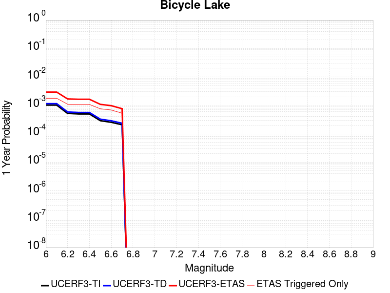 |  |

| Magnitude | 1 wk TI Prob | 1 wk TD Prob | 1 wk ETAS Prob | 1 wk ETAS/TD Gain | 1 wk ETAS Triggered Only | 1 mo TI Prob | 1 mo TD Prob | 1 mo ETAS Prob | 1 mo ETAS/TD Gain | 1 mo ETAS Triggered Only | 1 yr TI Prob | 1 yr TD Prob | 1 yr ETAS Prob | 1 yr ETAS/TD Gain | 1 yr ETAS Triggered Only | 10 yr TI Prob | 10 yr TD Prob | 10 yr ETAS Prob | 10 yr ETAS/TD Gain | 10 yr ETAS Triggered Only |
|-----|-----|-----|-----|-----|-----|-----|-----|-----|-----|-----|-----|-----|-----|-----|-----|-----|-----|-----|-----|-----|
| 6.0 | 1.9621975E-5 | 2.2097078E-5 | 4.7208712E-4 | 21.364233 | 4.5E-4 | 8.4091465E-5 | 9.4699084E-5 | 8.546271E-4 | 9.024661 | 7.6E-4 | 0.0010233327 | 0.0011524865 | 0.0029304351 | 2.5427065 | 0.00178 | 0.01018633 | 0.011478408 | 0.014572481 | 1.2695559 | 0.00313 |
| 6.1 | 1.9621975E-5 | 2.2097078E-5 | 4.7208712E-4 | 21.364233 | 4.5E-4 | 8.4091465E-5 | 9.4699084E-5 | 8.546271E-4 | 9.024661 | 7.6E-4 | 0.0010233327 | 0.0011524865 | 0.0029304351 | 2.5427065 | 0.00178 | 0.01018633 | 0.011478408 | 0.014572481 | 1.2695559 | 0.00313 |
| 6.2 | 9.9971285E-6 | 1.125564E-5 | 2.812526E-4 | 24.987705 | 2.7E-4 | 4.2844134E-5 | 4.8237856E-5 | 5.282147E-4 | 10.950211 | 4.8E-4 | 5.2150246E-4 | 5.871897E-4 | 0.0016865438 | 2.87223 | 0.0011 | 0.0052028033 | 0.005861487 | 0.0077105844 | 1.3154657 | 0.00186 |
| 6.3 | 9.589428E-6 | 1.0798346E-5 | 2.6079564E-4 | 24.151443 | 2.5E-4 | 4.10969E-5 | 4.62781E-5 | 5.062568E-4 | 10.939447 | 4.6E-4 | 5.002399E-4 | 5.6334207E-4 | 0.0016427337 | 2.9160502 | 0.00108 | 0.0049911533 | 0.0056242296 | 0.0074141063 | 1.3182439 | 0.0018 |
| 6.4 | 9.589428E-6 | 1.0798346E-5 | 2.6079564E-4 | 24.151443 | 2.5E-4 | 4.10969E-5 | 4.62781E-5 | 5.062568E-4 | 10.939447 | 4.6E-4 | 5.002399E-4 | 5.6334207E-4 | 0.0016427337 | 2.9160502 | 0.00108 | 0.0049911533 | 0.0056242296 | 0.0074141063 | 1.3182439 | 0.0018 |
| 6.5 | 5.557707E-6 | 6.2856016E-6 | 2.1628429E-4 | 34.40948 | 2.1E-4 | 2.3818526E-5 | 2.6938165E-5 | 3.969282E-4 | 14.73479 | 3.7E-4 | 2.8995197E-4 | 3.279497E-4 | 0.0010877005 | 3.3166685 | 7.6E-4 | 0.0028957394 | 0.0032772934 | 0.004543131 | 1.3862449 | 0.00127 |
| 6.6 | 4.8742945E-6 | 5.5132896E-6 | 1.9551224E-4 | 35.461994 | 1.9E-4 | 2.0889667E-5 | 2.3628318E-5 | 3.636203E-4 | 15.3891735 | 3.4E-4 | 2.54302E-4 | 2.87663E-4 | 9.774645E-4 | 3.3979502 | 6.9E-4 | 0.002540112 | 0.0028754752 | 0.004042111 | 1.4057193 | 0.00117 |
| 6.7 | 3.991108E-6 | 4.5159104E-6 | 1.5451523E-4 | 34.215744 | 1.5E-4 | 1.7104636E-5 | 1.9353902E-5 | 2.993485E-4 | 15.467088 | 2.8E-4 | 2.0822904E-4 | 2.3563375E-4 | 7.6550886E-4 | 3.2487233 | 5.3E-4 | 0.0020803404 | 0.0023563374 | 0.0033140753 | 1.406452 | 9.6E-4 |

## Garlic Springs
*[(top)](#table-of-contents)*

| 1 Week | 1 Month | 1 Year | 10 Year |
|-----|-----|-----|-----|
|  |  |  | 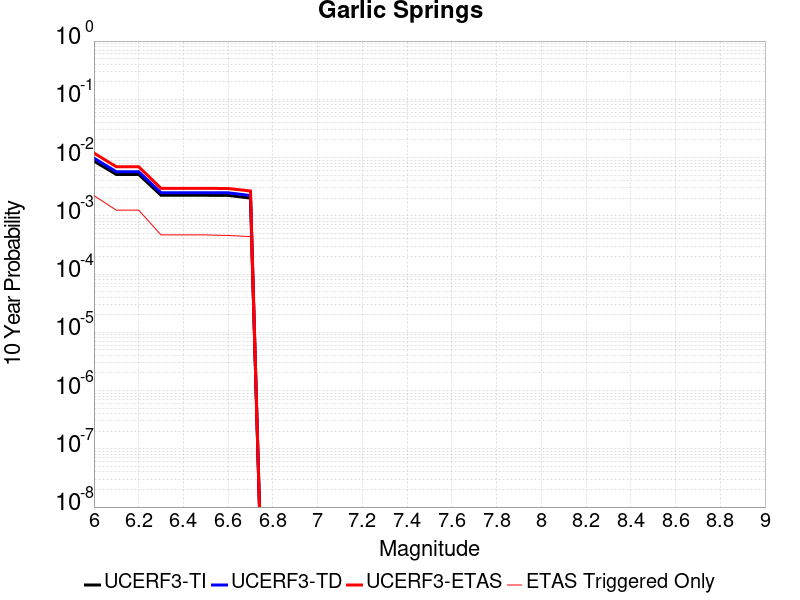 |

| Magnitude | 1 wk TI Prob | 1 wk TD Prob | 1 wk ETAS Prob | 1 wk ETAS/TD Gain | 1 wk ETAS Triggered Only | 1 mo TI Prob | 1 mo TD Prob | 1 mo ETAS Prob | 1 mo ETAS/TD Gain | 1 mo ETAS Triggered Only | 1 yr TI Prob | 1 yr TD Prob | 1 yr ETAS Prob | 1 yr ETAS/TD Gain | 1 yr ETAS Triggered Only | 10 yr TI Prob | 10 yr TD Prob | 10 yr ETAS Prob | 10 yr ETAS/TD Gain | 10 yr ETAS Triggered Only |
|-----|-----|-----|-----|-----|-----|-----|-----|-----|-----|-----|-----|-----|-----|-----|-----|-----|-----|-----|-----|-----|
| 6.0 | 1.6760017E-5 | 1.8776833E-5 | 4.087695E-4 | 21.769886 | 3.9E-4 | 7.182667E-5 | 8.0470316E-5 | 6.5042445E-4 | 8.0827875 | 5.7E-4 | 8.7413884E-4 | 9.794032E-4 | 0.002178228 | 2.224036 | 0.0012 | 0.008707083 | 0.009762413 | 0.01196074 | 1.2251828 | 0.00222 |
| 6.1 | 9.852767E-6 | 1.0973587E-5 | 2.2097128E-4 | 20.13665 | 2.1E-4 | 4.222546E-5 | 4.702921E-5 | 3.2701605E-4 | 6.9534664 | 2.8E-4 | 5.139737E-4 | 5.7250116E-4 | 0.0012021405 | 2.0998044 | 6.3E-4 | 0.005127866 | 0.005717221 | 0.006960075 | 1.2173877 | 0.00125 |
| 6.2 | 9.852767E-6 | 1.0973587E-5 | 2.2097128E-4 | 20.13665 | 2.1E-4 | 4.222546E-5 | 4.702921E-5 | 3.2701605E-4 | 6.9534664 | 2.8E-4 | 5.139737E-4 | 5.7250116E-4 | 0.0012021405 | 2.0998044 | 6.3E-4 | 0.005127866 | 0.005717221 | 0.006960075 | 1.2173877 | 0.00125 |
| 6.3 | 4.3167724E-6 | 4.7780286E-6 | 1.14777504E-4 | 24.021936 | 1.1E-4 | 1.8500323E-5 | 2.0477235E-5 | 1.4047477E-4 | 6.8600464 | 1.2E-4 | 2.2521814E-4 | 2.4930484E-4 | 5.0924E-4 | 2.04264 | 2.6E-4 | 0.0022499003 | 0.00249251 | 0.0029613385 | 1.188095 | 4.7E-4 |
| 6.4 | 4.3167724E-6 | 4.7780286E-6 | 1.14777504E-4 | 24.021936 | 1.1E-4 | 1.8500323E-5 | 2.0477235E-5 | 1.4047477E-4 | 6.8600464 | 1.2E-4 | 2.2521814E-4 | 2.4930484E-4 | 5.0924E-4 | 2.04264 | 2.6E-4 | 0.0022499003 | 0.00249251 | 0.0029613385 | 1.188095 | 4.7E-4 |
| 6.5 | 4.3167724E-6 | 4.7780286E-6 | 1.14777504E-4 | 24.021936 | 1.1E-4 | 1.8500323E-5 | 2.0477235E-5 | 1.4047477E-4 | 6.8600464 | 1.2E-4 | 2.2521814E-4 | 2.4930484E-4 | 5.0924E-4 | 2.04264 | 2.6E-4 | 0.0022499003 | 0.00249251 | 0.0029613385 | 1.188095 | 4.7E-4 |
| 6.6 | 4.301311E-6 | 4.760897E-6 | 1.14760376E-4 | 24.10478 | 1.1E-4 | 1.8434059E-5 | 2.0403815E-5 | 1.4040136E-4 | 6.881133 | 1.2E-4 | 2.2441156E-4 | 2.4841115E-4 | 5.083466E-4 | 2.046392 | 2.6E-4 | 0.0022418506 | 0.002483593 | 0.0029424506 | 1.1847556 | 4.6E-4 |
| 6.7 | 3.8599724E-6 | 4.27106E-6 | 1.04270635E-4 | 24.413292 | 1.0E-4 | 1.6542634E-5 | 1.8304541E-5 | 1.2830253E-4 | 7.0093274 | 1.1E-4 | 2.0138794E-4 | 2.228578E-4 | 4.728021E-4 | 2.1215415 | 2.5E-4 | 0.0020120554 | 0.002228578 | 0.0026675975 | 1.1969953 | 4.4E-4 |

## San Andreas (San Bernardino S)
*[(top)](#table-of-contents)*

| 1 Week | 1 Month | 1 Year | 10 Year |
|-----|-----|-----|-----|
| 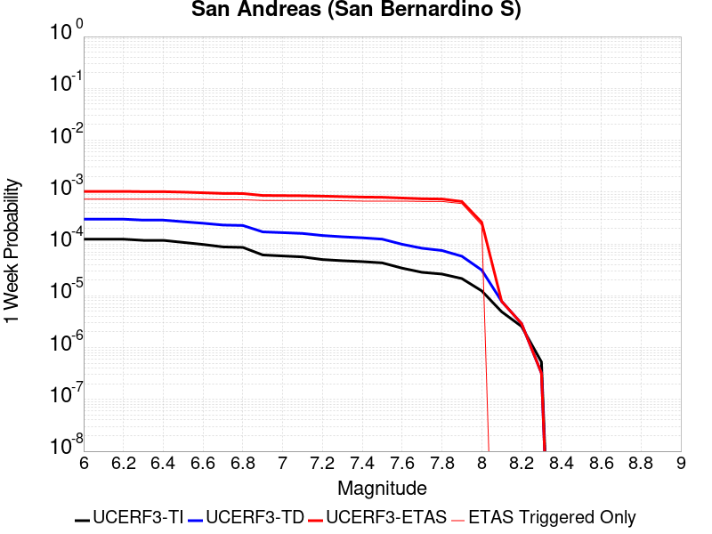 |  |  |  |

| Magnitude | 1 wk TI Prob | 1 wk TD Prob | 1 wk ETAS Prob | 1 wk ETAS/TD Gain | 1 wk ETAS Triggered Only | 1 mo TI Prob | 1 mo TD Prob | 1 mo ETAS Prob | 1 mo ETAS/TD Gain | 1 mo ETAS Triggered Only | 1 yr TI Prob | 1 yr TD Prob | 1 yr ETAS Prob | 1 yr ETAS/TD Gain | 1 yr ETAS Triggered Only | 10 yr TI Prob | 10 yr TD Prob | 10 yr ETAS Prob | 10 yr ETAS/TD Gain | 10 yr ETAS Triggered Only |
|-----|-----|-----|-----|-----|-----|-----|-----|-----|-----|-----|-----|-----|-----|-----|-----|-----|-----|-----|-----|-----|
| 6.0 | 1.2336002E-4 | 3.0005194E-4 | 0.0010298329 | 3.4321823 | 7.3E-4 | 5.2857865E-4 | 0.0012853292 | 0.0023339796 | 1.8158613 | 0.00105 | 0.006416472 | 0.015541554 | 0.01696902 | 1.0918483 | 0.00145 | 0.06234337 | 0.14294699 | 0.14449826 | 1.010852 | 0.00181 |
| 6.1 | 1.2336002E-4 | 3.0005194E-4 | 0.0010298329 | 3.4321823 | 7.3E-4 | 5.2857865E-4 | 0.0012853292 | 0.0023339796 | 1.8158613 | 0.00105 | 0.006416472 | 0.015541554 | 0.01696902 | 1.0918483 | 0.00145 | 0.06234337 | 0.14294699 | 0.14449826 | 1.010852 | 0.00181 |
| 6.2 | 1.2336002E-4 | 3.0005194E-4 | 0.0010298329 | 3.4321823 | 7.3E-4 | 5.2857865E-4 | 0.0012853292 | 0.0023339796 | 1.8158613 | 0.00105 | 0.006416472 | 0.015541554 | 0.01696902 | 1.0918483 | 0.00145 | 0.06234337 | 0.14294699 | 0.14449826 | 1.010852 | 0.00181 |
| 6.3 | 1.1712257E-4 | 2.8793467E-4 | 0.0010177245 | 3.5345674 | 7.3E-4 | 5.018573E-4 | 0.0012334478 | 0.0022821527 | 1.8502223 | 0.00105 | 0.006093008 | 0.014918666 | 0.016347034 | 1.0957437 | 0.00145 | 0.059286322 | 0.13765779 | 0.13921863 | 1.0113386 | 0.00181 |
| 6.4 | 1.1712257E-4 | 2.8793467E-4 | 0.0010177245 | 3.5345674 | 7.3E-4 | 5.018573E-4 | 0.0012334478 | 0.0022821527 | 1.8502223 | 0.00105 | 0.006093008 | 0.014918666 | 0.016347034 | 1.0957437 | 0.00145 | 0.059286322 | 0.13765779 | 0.13921863 | 1.0113386 | 0.00181 |
| 6.5 | 1.0689076E-4 | 2.6806415E-4 | 9.978685E-4 | 3.7224987 | 7.3E-4 | 4.5802278E-4 | 0.0011483653 | 0.002187171 | 1.9045951 | 0.00104 | 0.0055621783 | 0.013896335 | 0.015316324 | 1.1021844 | 0.00144 | 0.05425003 | 0.1288989 | 0.13045818 | 1.0120969 | 0.00179 |
| 6.6 | 9.7648895E-5 | 2.505129E-4 | 9.7033253E-4 | 3.8733833 | 7.2E-4 | 4.1842813E-4 | 0.0010732086 | 0.002092114 | 1.949401 | 0.00102 | 0.005082469 | 0.012992399 | 0.01438408 | 1.107115 | 0.00141 | 0.049677886 | 0.121077746 | 0.122607075 | 1.0126309 | 0.00174 |
| 6.7 | 8.757013E-5 | 2.3122175E-4 | 9.410576E-4 | 4.0699353 | 7.1E-4 | 3.7524657E-4 | 9.905964E-4 | 0.001999596 | 2.0185778 | 0.00101 | 0.00455906 | 0.011997902 | 0.013381105 | 1.1152871 | 0.0014 | 0.04466656 | 0.112373024 | 0.11390862 | 1.0136652 | 0.00173 |
| 6.8 | 8.562978E-5 | 2.2682057E-4 | 9.366595E-4 | 4.1295176 | 7.1E-4 | 3.6693315E-4 | 9.7174826E-4 | 0.001980767 | 2.038354 | 0.00101 | 0.004458263 | 0.011770921 | 0.0131544415 | 1.1175371 | 0.0014 | 0.043698758 | 0.11037863 | 0.11190878 | 1.0138627 | 0.00172 |
| 6.9 | 6.124075E-5 | 1.7066885E-4 | 8.605511E-4 | 5.0422273 | 6.9E-4 | 2.6243398E-4 | 7.312337E-4 | 0.0017005244 | 2.3255553 | 9.7E-4 | 0.0031904527 | 0.008866636 | 0.010174932 | 1.1475527 | 0.00132 | 0.031450346 | 0.08420262 | 0.08569536 | 1.0177281 | 0.00163 |
| 7.0 | 5.8598747E-5 | 1.6495936E-4 | 8.548455E-4 | 5.1821585 | 6.9E-4 | 2.5111332E-4 | 7.067779E-4 | 0.0016660994 | 2.3573167 | 9.6E-4 | 0.0030530186 | 0.008571265 | 0.009870037 | 1.1515262 | 0.00131 | 0.03011414 | 0.08151562 | 0.08300356 | 1.0182534 | 0.00162 |
| 7.1 | 5.613814E-5 | 1.5914452E-4 | 8.490347E-4 | 5.334992 | 6.9E-4 | 2.4056983E-4 | 6.818704E-4 | 0.0016412158 | 2.406932 | 9.6E-4 | 0.0029250039 | 0.008270353 | 0.009569519 | 1.1570871 | 0.00131 | 0.028868021 | 0.07881268 | 0.08030501 | 1.0189351 | 0.00162 |
| 7.2 | 4.991222E-5 | 1.4520933E-4 | 8.3510915E-4 | 5.751071 | 6.9E-4 | 2.1389198E-4 | 6.221777E-4 | 0.001551599 | 2.49382 | 9.3E-4 | 0.002601025 | 0.0075488063 | 0.008799295 | 1.1656538 | 0.00126 | 0.025707912 | 0.07226191 | 0.0736999 | 1.0198997 | 0.00155 |
| 7.3 | 4.7410045E-5 | 1.371513E-4 | 8.17058E-4 | 5.957348 | 6.8E-4 | 2.0317009E-4 | 5.8765925E-4 | 0.0015071186 | 2.564613 | 9.2E-4 | 0.0024707897 | 0.0071313656 | 0.008362522 | 1.1726397 | 0.00124 | 0.024434982 | 0.068541944 | 0.069967076 | 1.0207921 | 0.00153 |
| 7.4 | 4.5556746E-5 | 1.3123035E-4 | 8.011424E-4 | 6.1048565 | 6.7E-4 | 1.952286E-4 | 5.6229485E-4 | 0.0014717832 | 2.617458 | 9.1E-4 | 0.002374317 | 0.0068245293 | 0.008046135 | 1.1790022 | 0.00123 | 0.023491086 | 0.06579143 | 0.06721143 | 1.0215833 | 0.00152 |
| 7.5 | 4.3084514E-5 | 1.2358342E-4 | 7.935006E-4 | 6.420769 | 6.7E-4 | 1.8463485E-4 | 5.2953605E-4 | 0.0014290594 | 2.6987011 | 9.0E-4 | 0.0022456115 | 0.0064281146 | 0.0076402724 | 1.1885712 | 0.00122 | 0.022230545 | 0.062190283 | 0.06357824 | 1.0223179 | 0.00148 |
| 7.6 | 3.408608E-5 | 9.836477E-5 | 7.6829887E-4 | 7.810712 | 6.7E-4 | 1.4607502E-4 | 4.214953E-4 | 0.0013111201 | 3.11064 | 8.9E-4 | 0.0017770125 | 0.005119656 | 0.006293615 | 1.2293042 | 0.00118 | 0.017628696 | 0.05002244 | 0.051390406 | 1.0273471 | 0.00144 |
| 7.7 | 2.8315713E-5 | 8.2495724E-5 | 7.424413E-4 | 8.999755 | 6.6E-4 | 1.2134742E-4 | 3.5350522E-4 | 0.0012331941 | 3.4884748 | 8.8E-4 | 0.0014764034 | 0.004295442 | 0.005460416 | 1.2712117 | 0.00117 | 0.01466633 | 0.042272415 | 0.043632388 | 1.0321716 | 0.00142 |
| 7.8 | 2.6222975E-5 | 7.463898E-5 | 7.345897E-4 | 9.841905 | 6.6E-4 | 1.1237934E-4 | 3.1984213E-4 | 0.0011995607 | 3.7504773 | 8.8E-4 | 0.0013673597 | 0.003887131 | 0.0050525833 | 1.2998232 | 0.00117 | 0.013589768 | 0.038437475 | 0.039802894 | 1.035523 | 0.00142 |
| 7.9 | 2.1469694E-5 | 5.7884805E-5 | 6.5785006E-4 | 11.364815 | 6.0E-4 | 9.200973E-5 | 2.4805416E-4 | 0.0010278607 | 4.1436944 | 7.8E-4 | 0.0011196428 | 0.00301588 | 0.0040627136 | 1.347107 | 0.00105 | 0.011140184 | 0.030153265 | 0.031365573 | 1.0402049 | 0.00125 |
| 8.0 | 1.2420249E-5 | 3.1321662E-5 | 2.6131445E-4 | 8.342931 | 2.3E-4 | 5.322855E-5 | 1.342288E-4 | 3.741966E-4 | 2.787752 | 2.4E-4 | 6.478649E-4 | 0.0016330116 | 0.0020024073 | 1.2262052 | 3.7E-4 | 0.0064597935 | 0.01652369 | 0.016985925 | 1.027974 | 4.7E-4 |
| 8.1 | 4.9197724E-6 | 7.822525E-6 | 7.822525E-6 | 1.0 | 0.0 | 2.1084568E-5 | 3.3524673E-5 | 3.3524673E-5 | 1.0 | 0.0 | 2.566744E-4 | 4.080866E-4 | 4.080866E-4 | 1.0 | 0.0 | 0.002563781 | 0.004384557 | 0.004384557 | 1.0 | 0.0 |
| 8.2 | 2.5634774E-6 | 2.9065757E-6 | 2.9065757E-6 | 1.0 | 0.0 | 1.0986286E-5 | 1.2456694E-5 | 1.2456694E-5 | 1.0 | 0.0 | 1.3374983E-4 | 1.5164974E-4 | 1.5164974E-4 | 1.0 | 0.0 | 0.0013366934 | 0.001704941 | 0.001704941 | 1.0 | 0.0 |
| 8.3 | 5.2850464E-7 | 3.2080476E-7 | 3.2080476E-7 | 1.0 | 0.0 | 2.2650179E-6 | 1.3748769E-6 | 1.3748769E-6 | 1.0 | 0.0 | 2.7576245E-5 | 1.673901E-5 | 1.673901E-5 | 1.0 | 0.0 | 2.7572823E-4 | 1.986671E-4 | 1.986671E-4 | 1.0 | 0.0 |

## Owens Valley
*[(top)](#table-of-contents)*

| 1 Week | 1 Month | 1 Year | 10 Year |
|-----|-----|-----|-----|
|  |  | 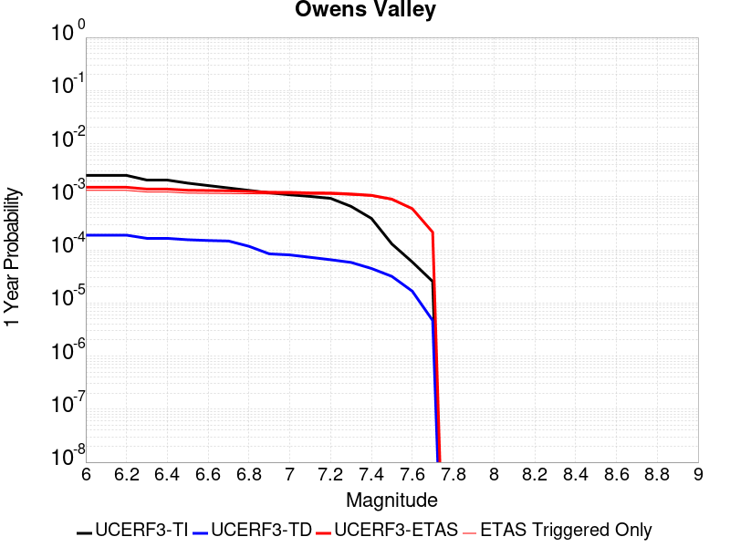 |  |

| Magnitude | 1 wk TI Prob | 1 wk TD Prob | 1 wk ETAS Prob | 1 wk ETAS/TD Gain | 1 wk ETAS Triggered Only | 1 mo TI Prob | 1 mo TD Prob | 1 mo ETAS Prob | 1 mo ETAS/TD Gain | 1 mo ETAS Triggered Only | 1 yr TI Prob | 1 yr TD Prob | 1 yr ETAS Prob | 1 yr ETAS/TD Gain | 1 yr ETAS Triggered Only | 10 yr TI Prob | 10 yr TD Prob | 10 yr ETAS Prob | 10 yr ETAS/TD Gain | 10 yr ETAS Triggered Only |
|-----|-----|-----|-----|-----|-----|-----|-----|-----|-----|-----|-----|-----|-----|-----|-----|-----|-----|-----|-----|-----|
| 6.0 | 4.83821E-5 | 3.6210524E-6 | 6.536187E-4 | 180.50517 | 6.5E-4 | 2.0733538E-4 | 1.551871E-5 | 9.455043E-4 | 60.926735 | 9.3E-4 | 0.002521386 | 1.889249E-4 | 0.0015086755 | 7.9855833 | 0.00132 | 0.024929691 | 0.0019297141 | 0.0035565686 | 1.8430547 | 0.00163 |
| 6.1 | 4.83821E-5 | 3.6210524E-6 | 6.536187E-4 | 180.50517 | 6.5E-4 | 2.0733538E-4 | 1.551871E-5 | 9.455043E-4 | 60.926735 | 9.3E-4 | 0.002521386 | 1.889249E-4 | 0.0015086755 | 7.9855833 | 0.00132 | 0.024929691 | 0.0019297141 | 0.0035565686 | 1.8430547 | 0.00163 |
| 6.2 | 4.83821E-5 | 3.6210524E-6 | 6.536187E-4 | 180.50517 | 6.5E-4 | 2.0733538E-4 | 1.551871E-5 | 9.455043E-4 | 60.926735 | 9.3E-4 | 0.002521386 | 1.889249E-4 | 0.0015086755 | 7.9855833 | 0.00132 | 0.024929691 | 0.0019297141 | 0.0035565686 | 1.8430547 | 0.00163 |
| 6.3 | 3.953008E-5 | 3.1530958E-6 | 6.2315114E-4 | 197.63152 | 6.2E-4 | 1.6940363E-4 | 1.3513202E-5 | 8.8350143E-4 | 65.380615 | 8.7E-4 | 0.002060538 | 1.6451156E-4 | 0.0013943092 | 8.475449 | 0.00123 | 0.020415364 | 0.0016621627 | 0.0031496861 | 1.8949325 | 0.00149 |
| 6.4 | 3.953008E-5 | 3.1530958E-6 | 6.2315114E-4 | 197.63152 | 6.2E-4 | 1.6940363E-4 | 1.3513202E-5 | 8.8350143E-4 | 65.380615 | 8.7E-4 | 0.002060538 | 1.6451156E-4 | 0.0013943092 | 8.475449 | 0.00123 | 0.020415364 | 0.0016621627 | 0.0031496861 | 1.8949325 | 0.00149 |
| 6.5 | 3.457342E-5 | 2.9707387E-6 | 5.92969E-4 | 199.60321 | 5.9E-4 | 1.4816338E-4 | 1.273168E-5 | 8.3272124E-4 | 65.40545 | 8.2E-4 | 0.0018023965 | 1.5499788E-4 | 0.0013248165 | 8.54732 | 0.00117 | 0.017878477 | 0.0015563119 | 0.0029641173 | 1.9045781 | 0.00141 |
| 6.6 | 3.1127765E-5 | 2.8737306E-6 | 5.9287203E-4 | 206.30745 | 5.9E-4 | 1.3339789E-4 | 1.2315934E-5 | 8.323058E-4 | 67.5796 | 8.2E-4 | 0.0016229092 | 1.4993687E-4 | 0.0013097629 | 8.73543 | 0.00116 | 0.016111081 | 0.0015013438 | 0.002879272 | 1.9177966 | 0.00138 |
| 6.7 | 2.806885E-5 | 2.8101606E-6 | 5.828085E-4 | 207.39333 | 5.8E-4 | 1.2028952E-4 | 1.2043493E-5 | 8.2203373E-4 | 68.255424 | 8.1E-4 | 0.001463541 | 1.4662035E-4 | 0.0012964518 | 8.842236 | 0.00115 | 0.014539397 | 0.0014656087 | 0.0028336009 | 1.9333951 | 0.00137 |
| 6.8 | 2.524524E-5 | 2.2351392E-6 | 5.822338E-4 | 260.4911 | 5.8E-4 | 1.0818939E-4 | 9.579134E-6 | 8.095715E-4 | 84.51405 | 8.0E-4 | 0.0013164099 | 1.16620016E-4 | 0.0012564871 | 10.774197 | 0.00114 | 0.01308639 | 0.001165827 | 0.0025242416 | 2.1651938 | 0.00136 |
| 6.9 | 2.2704568E-5 | 1.6079711E-6 | 5.8160705E-4 | 361.70242 | 5.8E-4 | 9.730166E-5 | 6.8912864E-6 | 8.068858E-4 | 117.08783 | 8.0E-4 | 0.0011840039 | 8.38982E-5 | 0.0012138034 | 14.467574 | 0.00113 | 0.011777153 | 8.38853E-4 | 0.002177729 | 2.5960793 | 0.00134 |
| 7.0 | 2.0871712E-5 | 1.5393621E-6 | 5.815385E-4 | 377.77887 | 5.8E-4 | 8.944713E-5 | 6.5972495E-6 | 8.06592E-4 | 122.261856 | 8.0E-4 | 0.0010884746 | 8.031857E-5 | 0.0012102278 | 15.067845 | 0.00113 | 0.010831586 | 8.030395E-4 | 0.0021419635 | 2.66732 | 0.00134 |
| 7.1 | 1.944928E-5 | 1.3862556E-6 | 5.8138545E-4 | 419.3927 | 5.8E-4 | 8.335139E-5 | 5.941082E-6 | 7.859364E-4 | 132.28844 | 7.8E-4 | 0.0010143308 | 7.233028E-5 | 0.00118225 | 16.34516 | 0.00111 | 0.010097133 | 7.2319806E-4 | 0.0020422435 | 2.8239062 | 0.00132 |
| 7.2 | 1.7876306E-5 | 1.2487686E-6 | 5.81248E-4 | 465.45697 | 5.8E-4 | 7.6610486E-5 | 5.3518543E-6 | 7.8534766E-4 | 146.74309 | 7.8E-4 | 9.3233347E-4 | 6.515689E-5 | 0.0011750846 | 18.034695 | 0.00111 | 0.009284316 | 6.5148395E-4 | 0.001950637 | 2.9941444 | 0.0013 |
| 7.3 | 1.2618672E-5 | 1.1113839E-6 | 5.6111073E-4 | 504.87573 | 5.6E-4 | 5.40789E-5 | 4.763065E-6 | 7.6475943E-4 | 160.56035 | 7.6E-4 | 6.582117E-4 | 5.7988782E-5 | 0.0011279267 | 19.450775 | 0.00107 | 0.0065626553 | 5.7983754E-4 | 0.001839107 | 3.1717625 | 0.00126 |
| 7.4 | 7.4874442E-6 | 8.547518E-7 | 5.108543E-4 | 597.66394 | 5.1E-4 | 3.208865E-5 | 3.6632168E-6 | 7.136606E-4 | 194.81801 | 7.1E-4 | 3.906093E-4 | 4.4598757E-5 | 0.0010645533 | 23.869572 | 0.00102 | 0.003899234 | 4.459579E-4 | 0.0016154362 | 3.622396 | 0.00117 |
| 7.5 | 2.4734156E-6 | 6.0679935E-7 | 4.3060654E-4 | 709.63574 | 4.3E-4 | 1.060031E-5 | 2.6005662E-6 | 6.22599E-4 | 239.40901 | 6.2E-4 | 1.2905113E-4 | 3.1661435E-5 | 9.016339E-4 | 28.477352 | 8.7E-4 | 0.0012897621 | 3.1656958E-4 | 0.001316253 | 4.157863 | 0.001 |
| 7.6 | 1.1328841E-6 | 3.1961991E-7 | 2.8031954E-4 | 877.0402 | 2.8E-4 | 4.8552088E-6 | 1.369799E-6 | 4.1136923E-4 | 300.31357 | 4.1E-4 | 5.9110564E-5 | 1.6677177E-5 | 5.966675E-4 | 35.77749 | 5.8E-4 | 5.9094845E-4 | 1.6675945E-4 | 8.066527E-4 | 4.8372235 | 6.4E-4 |
| 7.7 | 4.8613185E-7 | 8.962742E-8 | 1.1008962E-4 | 1228.3029 | 1.1E-4 | 2.0834207E-6 | 3.8411747E-7 | 1.5038406E-4 | 391.5054 | 1.5E-4 | 2.536535E-5 | 4.676621E-6 | 2.1467565E-4 | 45.904007 | 2.1E-4 | 2.5362454E-4 | 4.676529E-5 | 2.7675452E-4 | 5.9179473 | 2.3E-4 |

## Helendale-So Lockhart
*[(top)](#table-of-contents)*

| 1 Week | 1 Month | 1 Year | 10 Year |
|-----|-----|-----|-----|
|  |  |  |  |

| Magnitude | 1 wk TI Prob | 1 wk TD Prob | 1 wk ETAS Prob | 1 wk ETAS/TD Gain | 1 wk ETAS Triggered Only | 1 mo TI Prob | 1 mo TD Prob | 1 mo ETAS Prob | 1 mo ETAS/TD Gain | 1 mo ETAS Triggered Only | 1 yr TI Prob | 1 yr TD Prob | 1 yr ETAS Prob | 1 yr ETAS/TD Gain | 1 yr ETAS Triggered Only | 10 yr TI Prob | 10 yr TD Prob | 10 yr ETAS Prob | 10 yr ETAS/TD Gain | 10 yr ETAS Triggered Only |
|-----|-----|-----|-----|-----|-----|-----|-----|-----|-----|-----|-----|-----|-----|-----|-----|-----|-----|-----|-----|-----|
| 6.0 | 1.7296055E-5 | 1.8103729E-5 | 3.3809795E-4 | 18.675596 | 3.2E-4 | 7.412385E-5 | 7.7585224E-5 | 5.775464E-4 | 7.4440265 | 5.0E-4 | 9.0208417E-4 | 9.4421144E-4 | 0.0017534466 | 1.8570487 | 8.1E-4 | 0.008984311 | 0.009404116 | 0.010771139 | 1.1453643 | 0.00138 |
| 6.1 | 1.7296055E-5 | 1.8103729E-5 | 3.3809795E-4 | 18.675596 | 3.2E-4 | 7.412385E-5 | 7.7585224E-5 | 5.775464E-4 | 7.4440265 | 5.0E-4 | 9.0208417E-4 | 9.4421144E-4 | 0.0017534466 | 1.8570487 | 8.1E-4 | 0.008984311 | 0.009404116 | 0.010771139 | 1.1453643 | 0.00138 |
| 6.2 | 1.7296055E-5 | 1.8103729E-5 | 3.3809795E-4 | 18.675596 | 3.2E-4 | 7.412385E-5 | 7.7585224E-5 | 5.775464E-4 | 7.4440265 | 5.0E-4 | 9.0208417E-4 | 9.4421144E-4 | 0.0017534466 | 1.8570487 | 8.1E-4 | 0.008984311 | 0.009404116 | 0.010771139 | 1.1453643 | 0.00138 |
| 6.3 | 1.0669118E-5 | 1.1135425E-5 | 2.5113276E-4 | 22.552599 | 2.4E-4 | 4.5723988E-5 | 4.772239E-5 | 3.4770806E-4 | 7.2860575 | 3.0E-4 | 5.5654737E-4 | 5.80868E-4 | 0.001050595 | 1.808664 | 4.7E-4 | 0.0055515557 | 0.0057937936 | 0.006648811 | 1.1475747 | 8.6E-4 |
| 6.4 | 1.0669118E-5 | 1.1135425E-5 | 2.5113276E-4 | 22.552599 | 2.4E-4 | 4.5723988E-5 | 4.772239E-5 | 3.4770806E-4 | 7.2860575 | 3.0E-4 | 5.5654737E-4 | 5.80868E-4 | 0.001050595 | 1.808664 | 4.7E-4 | 0.0055515557 | 0.0057937936 | 0.006648811 | 1.1475747 | 8.6E-4 |
| 6.5 | 8.790038E-6 | 9.170197E-6 | 2.1916827E-4 | 23.900063 | 2.1E-4 | 3.767105E-5 | 3.930026E-5 | 2.8929044E-4 | 7.361031 | 2.5E-4 | 4.585485E-4 | 4.7837716E-4 | 8.681906E-4 | 1.8148663 | 3.9E-4 | 0.0045760344 | 0.004773638 | 0.0054902015 | 1.1501083 | 7.2E-4 |
| 6.6 | 7.396949E-6 | 7.715537E-6 | 2.07714E-4 | 26.921522 | 2.0E-4 | 3.1700827E-5 | 3.3066175E-5 | 2.7305825E-4 | 8.257933 | 2.4E-4 | 3.858892E-4 | 4.025073E-4 | 7.323745E-4 | 1.8195308 | 3.3E-4 | 0.003852198 | 0.00401789 | 0.00457564 | 1.1388166 | 5.6E-4 |
| 6.7 | 6.4600285E-6 | 6.738031E-6 | 1.8673681E-4 | 27.713856 | 1.8E-4 | 2.7685543E-5 | 2.887696E-5 | 2.388709E-4 | 8.272023 | 2.1E-4 | 3.3701936E-4 | 3.5152107E-4 | 6.314226E-4 | 1.7962583 | 2.8E-4 | 0.0033650869 | 0.003509732 | 0.004007977 | 1.141961 | 5.0E-4 |
| 6.8 | 5.600104E-6 | 5.836009E-6 | 1.3583525E-4 | 23.275366 | 1.3E-4 | 2.4000226E-5 | 2.5011232E-5 | 1.8500723E-4 | 7.396966 | 1.6E-4 | 2.9216358E-4 | 3.044698E-4 | 5.1440584E-4 | 1.6895136 | 2.1E-4 | 0.0029177975 | 0.003040588 | 0.003409463 | 1.121317 | 3.7E-4 |
| 6.9 | 4.839122E-6 | 5.0395092E-6 | 1.250389E-4 | 24.811722 | 1.2E-4 | 2.0738931E-5 | 2.159772E-5 | 1.615947E-4 | 7.4820256 | 1.4E-4 | 2.5246723E-4 | 2.6292098E-4 | 4.328763E-4 | 1.6464121 | 1.7E-4 | 0.002521806 | 0.002626147 | 0.002925359 | 1.1139358 | 3.0E-4 |
| 7.0 | 3.6937633E-6 | 3.845208E-6 | 7.384494E-5 | 19.204407 | 7.0E-5 | 1.5830317E-5 | 1.647936E-5 | 8.6478205E-5 | 5.247668 | 7.0E-5 | 1.9271708E-4 | 2.0061806E-4 | 2.80602E-4 | 1.3986877 | 8.0E-5 | 0.0019255003 | 0.002004401 | 0.0021840401 | 1.0896224 | 1.8E-4 |
| 7.1 | 2.7858857E-6 | 2.8978538E-6 | 3.2897766E-5 | 11.352459 | 3.0E-5 | 1.1939455E-5 | 1.2419316E-5 | 4.2418942E-5 | 3.4155622 | 3.0E-5 | 1.4535317E-4 | 1.511949E-4 | 1.8119035E-4 | 1.1983894 | 3.0E-5 | 0.0014525814 | 0.0015109418 | 0.0016207756 | 1.0726923 | 1.1E-4 |
| 7.2 | 2.1672065E-6 | 2.2540128E-6 | 2.2253967E-5 | 9.873044 | 2.0E-5 | 9.2879945E-6 | 9.66002E-6 | 2.9659826E-5 | 3.070369 | 2.0E-5 | 1.1307546E-4 | 1.1760458E-4 | 1.3760223E-4 | 1.1700414 | 2.0E-5 | 0.0011301794 | 0.0011754417 | 0.0012453593 | 1.0594821 | 7.0E-5 |
| 7.3 | 1.4823496E-6 | 1.5422102E-6 | 1.1542194E-5 | 7.4841905 | 1.0E-5 | 6.3529114E-6 | 6.6094562E-6 | 1.660939E-5 | 2.5129738 | 1.0E-5 | 7.734395E-5 | 8.046731E-5 | 9.046651E-5 | 1.1242641 | 1.0E-5 | 7.731704E-4 | 8.0439687E-4 | 8.443647E-4 | 1.0496867 | 4.0E-5 |
| 7.4 | 4.2321457E-7 | 4.4108765E-7 | 4.4108765E-7 | 1.0 | 0.0 | 1.8137755E-6 | 1.8903745E-6 | 1.8903745E-6 | 1.0 | 0.0 | 2.2082493E-5 | 2.3015113E-5 | 2.3015113E-5 | 1.0 | 0.0 | 2.2080299E-4 | 2.3013182E-4 | 2.3013182E-4 | 1.0 | 0.0 |
| 7.5 | 5.6942316E-8 | 5.9415648E-8 | 5.9415648E-8 | 1.0 | 0.0 | 2.440385E-7 | 2.5463845E-7 | 2.5463845E-7 | 1.0 | 0.0 | 2.9711643E-6 | 3.1002196E-6 | 3.1002196E-6 | 1.0 | 0.0 | 2.9711247E-5 | 3.1001844E-5 | 3.1001844E-5 | 1.0 | 0.0 |

## Coyote Lake
*[(top)](#table-of-contents)*

| 1 Week | 1 Month | 1 Year | 10 Year |
|-----|-----|-----|-----|
|  |  | 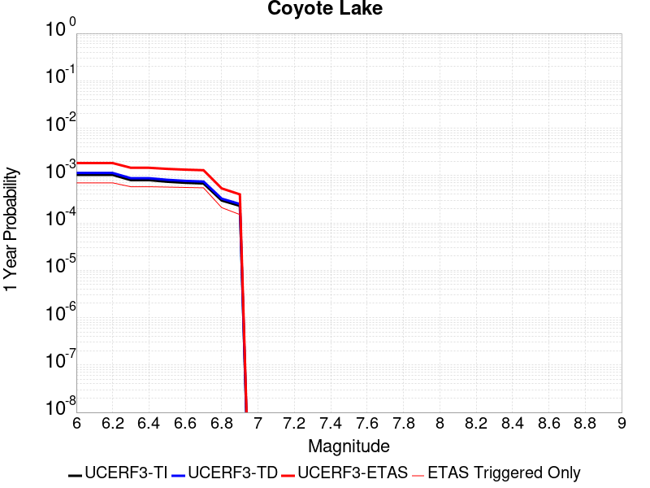 |  |

| Magnitude | 1 wk TI Prob | 1 wk TD Prob | 1 wk ETAS Prob | 1 wk ETAS/TD Gain | 1 wk ETAS Triggered Only | 1 mo TI Prob | 1 mo TD Prob | 1 mo ETAS Prob | 1 mo ETAS/TD Gain | 1 mo ETAS Triggered Only | 1 yr TI Prob | 1 yr TD Prob | 1 yr ETAS Prob | 1 yr ETAS/TD Gain | 1 yr ETAS Triggered Only | 10 yr TI Prob | 10 yr TD Prob | 10 yr ETAS Prob | 10 yr ETAS/TD Gain | 10 yr ETAS Triggered Only |
|-----|-----|-----|-----|-----|-----|-----|-----|-----|-----|-----|-----|-----|-----|-----|-----|-----|-----|-----|-----|-----|
| 6.0 | 1.980352E-5 | 2.1706745E-5 | 2.4170197E-4 | 11.134879 | 2.2E-4 | 8.486947E-5 | 9.302599E-5 | 3.7299996E-4 | 4.009631 | 2.8E-4 | 0.0010327959 | 0.0011320751 | 0.0018312826 | 1.6176336 | 7.0E-4 | 0.010280091 | 0.011270258 | 0.012525945 | 1.111416 | 0.00127 |
| 6.1 | 1.980352E-5 | 2.1706745E-5 | 2.4170197E-4 | 11.134879 | 2.2E-4 | 8.486947E-5 | 9.302599E-5 | 3.7299996E-4 | 4.009631 | 2.8E-4 | 0.0010327959 | 0.0011320751 | 0.0018312826 | 1.6176336 | 7.0E-4 | 0.010280091 | 0.011270258 | 0.012525945 | 1.111416 | 0.00127 |
| 6.2 | 1.980352E-5 | 2.1706745E-5 | 2.4170197E-4 | 11.134879 | 2.2E-4 | 8.486947E-5 | 9.302599E-5 | 3.7299996E-4 | 4.009631 | 2.8E-4 | 0.0010327959 | 0.0011320751 | 0.0018312826 | 1.6176336 | 7.0E-4 | 0.010280091 | 0.011270258 | 0.012525945 | 1.111416 | 0.00127 |
| 6.3 | 1.5344787E-5 | 1.682067E-5 | 1.8681781E-4 | 11.106443 | 1.7E-4 | 6.576172E-5 | 7.2086936E-5 | 2.820718E-4 | 3.9129393 | 2.1E-4 | 8.003548E-4 | 8.773662E-4 | 0.0014568574 | 1.6604894 | 5.8E-4 | 0.007974784 | 0.00874507 | 0.0097958 | 1.1201512 | 0.00106 |
| 6.4 | 1.5344787E-5 | 1.682067E-5 | 1.8681781E-4 | 11.106443 | 1.7E-4 | 6.576172E-5 | 7.2086936E-5 | 2.820718E-4 | 3.9129393 | 2.1E-4 | 8.003548E-4 | 8.773662E-4 | 0.0014568574 | 1.6604894 | 5.8E-4 | 0.007974784 | 0.00874507 | 0.0097958 | 1.1201512 | 0.00106 |
| 6.5 | 1.4189697E-5 | 1.5557987E-5 | 1.755555E-4 | 11.283947 | 1.6E-4 | 6.081157E-5 | 6.6675726E-5 | 2.666624E-4 | 3.9993925 | 2.0E-4 | 7.401293E-4 | 8.115349E-4 | 0.0013810723 | 1.7018027 | 5.7E-4 | 0.0073766913 | 0.008091656 | 0.0091034025 | 1.1250358 | 0.00102 |
| 6.6 | 1.3469301E-5 | 1.4771577E-5 | 1.7476921E-4 | 11.831452 | 1.6E-4 | 5.7724297E-5 | 6.330556E-5 | 2.632929E-4 | 4.15908 | 2.0E-4 | 7.025667E-4 | 7.7053264E-4 | 0.0013301012 | 1.72621 | 5.6E-4 | 0.0070034964 | 0.0076845144 | 0.00867683 | 1.1291318 | 0.001 |
| 6.7 | 1.3027966E-5 | 1.4281745E-5 | 1.642796E-4 | 11.5027685 | 1.5E-4 | 5.5832945E-5 | 6.120638E-5 | 2.5119475E-4 | 4.1040616 | 1.9E-4 | 6.7955407E-4 | 7.4499263E-4 | 0.0012945828 | 1.7377124 | 5.5E-4 | 0.006774798 | 0.0074308286 | 0.008403546 | 1.130903 | 9.8E-4 |
| 6.8 | 5.695434E-6 | 6.2244176E-6 | 2.6224294E-5 | 4.213132 | 2.0E-5 | 2.4408775E-5 | 2.6675973E-5 | 5.6675173E-5 | 2.1245775 | 3.0E-5 | 2.971363E-4 | 3.2476155E-4 | 5.3469336E-4 | 1.6464182 | 2.1E-4 | 0.0029673933 | 0.0032458105 | 0.0036146094 | 1.1136231 | 3.7E-4 |
| 6.9 | 4.385688E-6 | 4.7930553E-6 | 4.7930553E-6 | 1.0 | 0.0 | 1.879567E-5 | 2.0541665E-5 | 2.0541665E-5 | 1.0 | 0.0 | 2.2881327E-4 | 2.5009477E-4 | 4.0005727E-4 | 1.5996226 | 1.5E-4 | 0.002285778 | 0.0025009478 | 0.0027403475 | 1.0957236 | 2.4E-4 |

## Death Valley (Black Mtns Frontal)
*[(top)](#table-of-contents)*

| 1 Week | 1 Month | 1 Year | 10 Year |
|-----|-----|-----|-----|
|  |  | 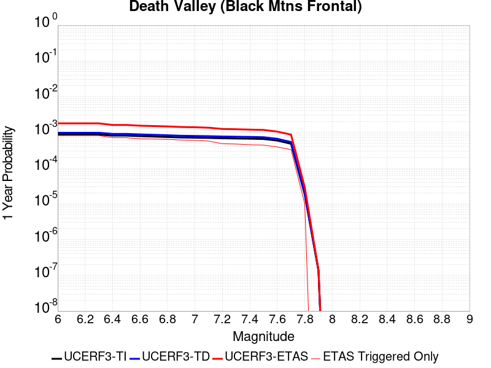 | 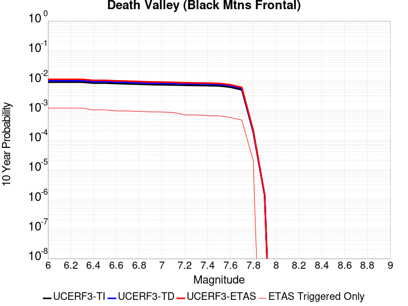 |

| Magnitude | 1 wk TI Prob | 1 wk TD Prob | 1 wk ETAS Prob | 1 wk ETAS/TD Gain | 1 wk ETAS Triggered Only | 1 mo TI Prob | 1 mo TD Prob | 1 mo ETAS Prob | 1 mo ETAS/TD Gain | 1 mo ETAS Triggered Only | 1 yr TI Prob | 1 yr TD Prob | 1 yr ETAS Prob | 1 yr ETAS/TD Gain | 1 yr ETAS Triggered Only | 10 yr TI Prob | 10 yr TD Prob | 10 yr ETAS Prob | 10 yr ETAS/TD Gain | 10 yr ETAS Triggered Only |
|-----|-----|-----|-----|-----|-----|-----|-----|-----|-----|-----|-----|-----|-----|-----|-----|-----|-----|-----|-----|-----|
| 6.0 | 1.6707214E-5 | 1.867027E-5 | 2.9866505E-4 | 15.996826 | 2.8E-4 | 7.160038E-5 | 8.001303E-5 | 4.899802E-4 | 6.1237555 | 4.1E-4 | 8.71386E-4 | 9.737309E-4 | 0.0017829421 | 1.831042 | 8.1E-4 | 0.00867977 | 0.009695496 | 0.01084425 | 1.1184832 | 0.00116 |
| 6.1 | 1.6707214E-5 | 1.867027E-5 | 2.9866505E-4 | 15.996826 | 2.8E-4 | 7.160038E-5 | 8.001303E-5 | 4.899802E-4 | 6.1237555 | 4.1E-4 | 8.71386E-4 | 9.737309E-4 | 0.0017829421 | 1.831042 | 8.1E-4 | 0.00867977 | 0.009695496 | 0.01084425 | 1.1184832 | 0.00116 |
| 6.2 | 1.6707214E-5 | 1.867027E-5 | 2.9866505E-4 | 15.996826 | 2.8E-4 | 7.160038E-5 | 8.001303E-5 | 4.899802E-4 | 6.1237555 | 4.1E-4 | 8.71386E-4 | 9.737309E-4 | 0.0017829421 | 1.831042 | 8.1E-4 | 0.00867977 | 0.009695496 | 0.01084425 | 1.1184832 | 0.00116 |
| 6.3 | 1.6707214E-5 | 1.867027E-5 | 2.9866505E-4 | 15.996826 | 2.8E-4 | 7.160038E-5 | 8.001303E-5 | 4.899802E-4 | 6.1237555 | 4.1E-4 | 8.71386E-4 | 9.737309E-4 | 0.0017829421 | 1.831042 | 8.1E-4 | 0.00867977 | 0.009695496 | 0.01084425 | 1.1184832 | 0.00116 |
| 6.4 | 1.5515609E-5 | 1.7338214E-5 | 2.7733372E-4 | 15.995518 | 2.6E-4 | 6.649377E-5 | 7.4304546E-5 | 4.2427855E-4 | 5.7099943 | 3.5E-4 | 8.0926094E-4 | 9.042885E-4 | 0.0016136464 | 1.7844377 | 7.1E-4 | 0.008063202 | 0.009006773 | 0.010007676 | 1.1111279 | 0.00101 |
| 6.5 | 1.5515609E-5 | 1.7338214E-5 | 2.7733372E-4 | 15.995518 | 2.6E-4 | 6.649377E-5 | 7.4304546E-5 | 4.2427855E-4 | 5.7099943 | 3.5E-4 | 8.0926094E-4 | 9.042885E-4 | 0.0016136464 | 1.7844377 | 7.1E-4 | 0.008063202 | 0.009006773 | 0.010007676 | 1.1111279 | 0.00101 |
| 6.6 | 1.5041828E-5 | 1.6809145E-5 | 2.6680494E-4 | 15.872606 | 2.5E-4 | 6.4463384E-5 | 7.203723E-5 | 3.920142E-4 | 5.4418273 | 3.2E-4 | 7.8455906E-4 | 8.767063E-4 | 0.0015361276 | 1.7521577 | 6.6E-4 | 0.00781795 | 0.008733132 | 0.009664923 | 1.106696 | 9.4E-4 |
| 6.7 | 1.4634985E-5 | 1.6356016E-5 | 2.563521E-4 | 15.67326 | 2.4E-4 | 6.271985E-5 | 7.009536E-5 | 3.8007364E-4 | 5.4222364 | 3.1E-4 | 7.6334673E-4 | 8.5308263E-4 | 0.0015025282 | 1.7612926 | 6.5E-4 | 0.007607299 | 0.008498715 | 0.009420812 | 1.1084983 | 9.3E-4 |
| 6.8 | 1.4209158E-5 | 1.5882048E-5 | 2.5587823E-4 | 16.111162 | 2.4E-4 | 6.089497E-5 | 6.8064175E-5 | 3.7804307E-4 | 5.5542154 | 3.1E-4 | 7.4114406E-4 | 8.2837185E-4 | 0.0014678417 | 1.7719599 | 6.4E-4 | 0.007386771 | 0.008253456 | 0.009146028 | 1.1081452 | 9.0E-4 |
| 6.9 | 1.3780098E-5 | 1.5404594E-5 | 2.4540105E-4 | 15.930382 | 2.3E-4 | 5.9056227E-5 | 6.6018045E-5 | 3.6599825E-4 | 5.5439124 | 3.0E-4 | 7.1877235E-4 | 8.0347876E-4 | 0.0014129886 | 1.7585887 | 6.1E-4 | 0.0071645193 | 0.008006332 | 0.008869368 | 1.1077939 | 8.7E-4 |
| 7.0 | 1.3585064E-5 | 1.5188155E-5 | 2.4518467E-4 | 16.14315 | 2.3E-4 | 5.8220405E-5 | 6.50905E-5 | 3.6507097E-4 | 5.6086674 | 3.0E-4 | 7.086029E-4 | 7.9219416E-4 | 0.0013917189 | 1.75679 | 6.0E-4 | 0.007063476 | 0.007894293 | 0.008747505 | 1.1080794 | 8.6E-4 |
| 7.1 | 1.3398601E-5 | 1.49813395E-5 | 2.3497804E-4 | 15.684715 | 2.2E-4 | 5.742131E-5 | 6.420419E-5 | 3.441862E-4 | 5.360806 | 2.8E-4 | 6.9888023E-4 | 7.8141113E-4 | 0.0013509657 | 1.7288796 | 5.7E-4 | 0.0069668638 | 0.007787224 | 0.008610761 | 1.1057549 | 8.3E-4 |
| 7.2 | 1.3126312E-5 | 1.4679561E-5 | 2.1467662E-4 | 14.624186 | 2.0E-4 | 5.6254412E-5 | 6.291092E-5 | 3.128952E-4 | 4.9736233 | 2.5E-4 | 6.846822E-4 | 7.6567667E-4 | 0.0012453091 | 1.6264164 | 4.8E-4 | 0.006825765 | 0.00763097 | 0.008315705 | 1.089731 | 6.9E-4 |
| 7.3 | 1.2922429E-5 | 1.4453788E-5 | 2.1445089E-4 | 14.837003 | 2.0E-4 | 5.5380664E-5 | 6.194336E-5 | 3.1192787E-4 | 5.0356946 | 2.5E-4 | 6.74051E-4 | 7.53905E-4 | 0.0012235506 | 1.6229508 | 4.7E-4 | 0.006720101 | 0.007514055 | 0.008188945 | 1.089817 | 6.8E-4 |
| 7.4 | 1.2768878E-5 | 1.4283772E-5 | 2.0428105E-4 | 14.30162 | 1.9E-4 | 5.4722615E-5 | 6.1214756E-5 | 2.9120067E-4 | 4.757034 | 2.3E-4 | 6.660441E-4 | 7.4504025E-4 | 0.001194705 | 1.6035442 | 4.5E-4 | 0.0066405144 | 0.0074260035 | 0.008071177 | 1.0868802 | 6.5E-4 |
| 7.5 | 1.2521929E-5 | 1.40120155E-5 | 1.940095E-4 | 13.845938 | 1.8E-4 | 5.366431E-5 | 6.005014E-5 | 2.8003694E-4 | 4.663385 | 2.2E-4 | 6.531671E-4 | 7.3087064E-4 | 0.0011705491 | 1.6015817 | 4.4E-4 | 0.006512506 | 0.0072852457 | 0.007920583 | 1.0872087 | 6.4E-4 |
| 7.6 | 1.1301089E-5 | 1.2648149E-5 | 1.8264599E-4 | 14.440532 | 1.7E-4 | 4.8432343E-5 | 5.4205255E-5 | 2.5419443E-4 | 4.689479 | 2.0E-4 | 5.895042E-4 | 6.5975444E-4 | 0.0010494972 | 1.590739 | 3.9E-4 | 0.0058794282 | 0.00657851 | 0.0071348264 | 1.0845656 | 5.6E-4 |
| 7.7 | 9.189108E-6 | 1.0283358E-5 | 1.4028202E-4 | 13.641654 | 1.3E-4 | 3.93813E-5 | 4.407082E-5 | 1.9406421E-4 | 4.403463 | 1.5E-4 | 4.7936183E-4 | 5.3643517E-4 | 8.6625817E-4 | 1.6148422 | 3.3E-4 | 0.004783291 | 0.005351914 | 0.005809452 | 1.0854906 | 4.6E-4 |
| 7.8 | 3.4586725E-7 | 3.6482615E-7 | 3.6482615E-7 | 1.0 | 0.0 | 1.4822873E-6 | 1.5635396E-6 | 1.5635396E-6 | 1.0 | 0.0 | 1.80467E-5 | 1.9035933E-5 | 2.9035744E-5 | 1.5253123 | 1.0E-5 | 1.8045233E-4 | 1.9034347E-4 | 2.1033967E-4 | 1.1050532 | 2.0E-5 |
| 7.9 | 2.5591178E-9 | 2.6696718E-9 | 2.6696718E-9 | 1.0 | 0.0 | 1.0967647E-8 | 1.14414505E-8 | 1.14414505E-8 | 1.0 | 0.0 | 1.335311E-7 | 1.3929966E-7 | 1.3929966E-7 | 1.0 | 0.0 | 1.3353102E-6 | 1.3929966E-6 | 1.3929966E-6 | 1.0 | 0.0 |

## San Andreas (Big Bend)
*[(top)](#table-of-contents)*

| 1 Week | 1 Month | 1 Year | 10 Year |
|-----|-----|-----|-----|
| 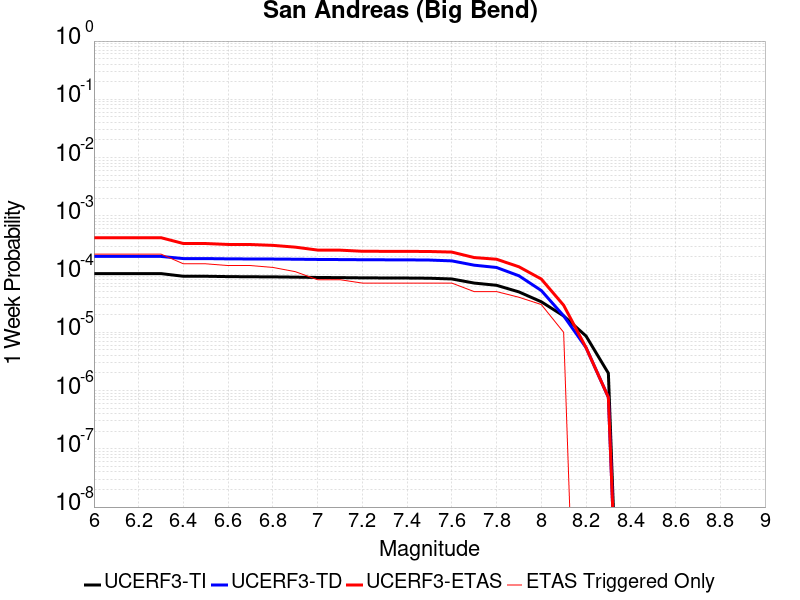 |  | 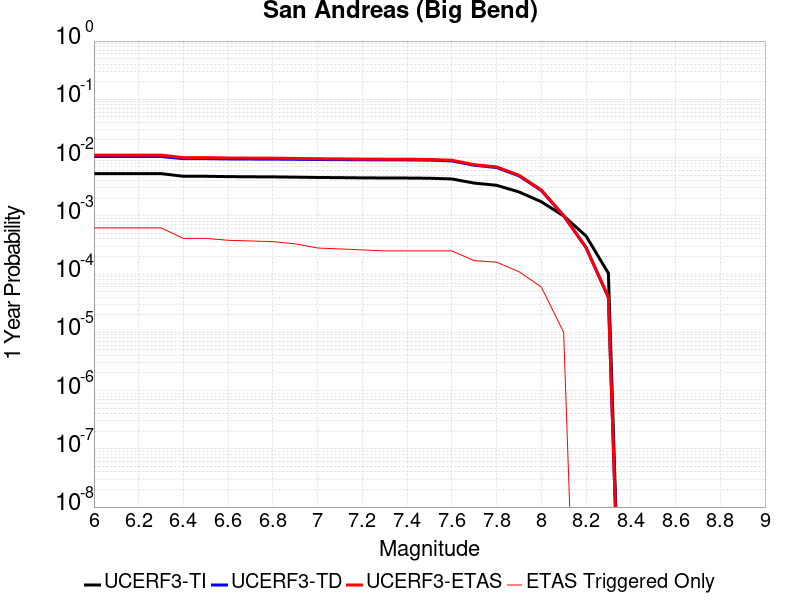 |  |

| Magnitude | 1 wk TI Prob | 1 wk TD Prob | 1 wk ETAS Prob | 1 wk ETAS/TD Gain | 1 wk ETAS Triggered Only | 1 mo TI Prob | 1 mo TD Prob | 1 mo ETAS Prob | 1 mo ETAS/TD Gain | 1 mo ETAS Triggered Only | 1 yr TI Prob | 1 yr TD Prob | 1 yr ETAS Prob | 1 yr ETAS/TD Gain | 1 yr ETAS Triggered Only | 10 yr TI Prob | 10 yr TD Prob | 10 yr ETAS Prob | 10 yr ETAS/TD Gain | 10 yr ETAS Triggered Only |
|-----|-----|-----|-----|-----|-----|-----|-----|-----|-----|-----|-----|-----|-----|-----|-----|-----|-----|-----|-----|-----|
| 6.0 | 1.0179969E-4 | 2.0073925E-4 | 4.2069508E-4 | 2.095729 | 2.2E-4 | 4.362114E-4 | 8.6002843E-4 | 0.0012097275 | 1.4066132 | 3.5E-4 | 0.0052979486 | 0.010420859 | 0.011034398 | 1.058876 | 6.2E-4 | 0.051734097 | 0.101455905 | 0.10239039 | 1.0092107 | 0.00104 |
| 6.1 | 1.0179969E-4 | 2.0073925E-4 | 4.2069508E-4 | 2.095729 | 2.2E-4 | 4.362114E-4 | 8.6002843E-4 | 0.0012097275 | 1.4066132 | 3.5E-4 | 0.0052979486 | 0.010420859 | 0.011034398 | 1.058876 | 6.2E-4 | 0.051734097 | 0.101455905 | 0.10239039 | 1.0092107 | 0.00104 |
| 6.2 | 1.0179969E-4 | 2.0073925E-4 | 4.2069508E-4 | 2.095729 | 2.2E-4 | 4.362114E-4 | 8.6002843E-4 | 0.0012097275 | 1.4066132 | 3.5E-4 | 0.0052979486 | 0.010420859 | 0.011034398 | 1.058876 | 6.2E-4 | 0.051734097 | 0.101455905 | 0.10239039 | 1.0092107 | 0.00104 |
| 6.3 | 1.0179969E-4 | 2.0073925E-4 | 4.2069508E-4 | 2.095729 | 2.2E-4 | 4.362114E-4 | 8.6002843E-4 | 0.0012097275 | 1.4066132 | 3.5E-4 | 0.0052979486 | 0.010420859 | 0.011034398 | 1.058876 | 6.2E-4 | 0.051734097 | 0.101455905 | 0.10239039 | 1.0092107 | 0.00104 |
| 6.4 | 9.1639464E-5 | 1.8430917E-4 | 3.3428153E-4 | 1.8136998 | 1.5E-4 | 3.9268145E-4 | 7.896575E-4 | 9.894996E-4 | 1.2530743 | 2.0E-4 | 0.0047704205 | 0.009571818 | 0.009977894 | 1.0424241 | 4.1E-4 | 0.046693064 | 0.09378695 | 0.09438505 | 1.0063772 | 6.6E-4 |
| 6.5 | 9.1639464E-5 | 1.8430917E-4 | 3.3428153E-4 | 1.8136998 | 1.5E-4 | 3.9268145E-4 | 7.896575E-4 | 9.894996E-4 | 1.2530743 | 2.0E-4 | 0.0047704205 | 0.009571818 | 0.009977894 | 1.0424241 | 4.1E-4 | 0.046693064 | 0.09378695 | 0.09438505 | 1.0063772 | 6.6E-4 |
| 6.6 | 9.042622E-5 | 1.8238011E-4 | 3.2235458E-4 | 1.7674875 | 1.4E-4 | 3.8748336E-4 | 7.813951E-4 | 9.6125447E-4 | 1.2301772 | 1.8E-4 | 0.0047074095 | 0.0094721 | 0.009848501 | 1.0397378 | 3.8E-4 | 0.046089325 | 0.09287721 | 0.093412414 | 1.0057625 | 5.9E-4 |
| 6.7 | 8.9836685E-5 | 1.8152347E-4 | 3.2149805E-4 | 1.7711102 | 1.4E-4 | 3.8495753E-4 | 7.7772595E-4 | 9.57586E-4 | 1.231264 | 1.8E-4 | 0.00467679 | 0.009427815 | 0.0097943265 | 1.0388756 | 3.7E-4 | 0.045795817 | 0.09247148 | 0.09299785 | 1.0056922 | 5.8E-4 |
| 6.8 | 8.9471854E-5 | 1.8099119E-4 | 3.1096768E-4 | 1.718137 | 1.3E-4 | 3.8339442E-4 | 7.754462E-4 | 9.4531436E-4 | 1.2190586 | 1.7E-4 | 0.004657841 | 0.009400298 | 0.009756913 | 1.0379367 | 3.6E-4 | 0.04561414 | 0.0922192 | 0.09273664 | 1.005611 | 5.7E-4 |
| 6.9 | 8.858234E-5 | 1.7981093E-4 | 2.8979115E-4 | 1.6116437 | 1.1E-4 | 3.7958333E-4 | 7.7039085E-4 | 9.202753E-4 | 1.1945564 | 1.5E-4 | 0.004611638 | 0.009339278 | 0.009666196 | 1.0350046 | 3.3E-4 | 0.04517103 | 0.09165911 | 0.09214961 | 1.0053514 | 5.4E-4 |
| 7.0 | 8.7433385E-5 | 1.7819891E-4 | 2.5818465E-4 | 1.4488566 | 8.0E-5 | 3.746607E-4 | 7.6348626E-4 | 8.833946E-4 | 1.1570537 | 1.2E-4 | 0.004551957 | 0.009255932 | 0.00953334 | 1.0299709 | 2.8E-4 | 0.044598386 | 0.09089323 | 0.09132051 | 1.0047009 | 4.7E-4 |
| 7.1 | 8.684964E-5 | 1.7731842E-4 | 2.5730423E-4 | 1.4510858 | 8.0E-5 | 3.7215967E-4 | 7.597149E-4 | 8.7962375E-4 | 1.1578339 | 1.2E-4 | 0.0045216335 | 0.009210405 | 0.009477918 | 1.0290446 | 2.7E-4 | 0.04430731 | 0.09047475 | 0.090893134 | 1.0046242 | 4.6E-4 |
| 7.2 | 8.606521E-5 | 1.7622454E-4 | 2.462122E-4 | 1.3971505 | 7.0E-5 | 3.6879873E-4 | 7.550296E-4 | 8.649465E-4 | 1.1455797 | 1.1E-4 | 0.0044808835 | 0.009153842 | 0.009411462 | 1.0281434 | 2.6E-4 | 0.043916024 | 0.08995518 | 0.0903465 | 1.0043502 | 4.3E-4 |
| 7.3 | 8.568266E-5 | 1.7564454E-4 | 2.4563225E-4 | 1.3984622 | 7.0E-5 | 3.6715972E-4 | 7.5254537E-4 | 8.6246256E-4 | 1.1460606 | 1.1E-4 | 0.0044610105 | 0.00912385 | 0.009371569 | 1.0271508 | 2.5E-4 | 0.043725148 | 0.08967623 | 0.09005857 | 1.0042635 | 4.2E-4 |
| 7.4 | 8.5432206E-5 | 1.752704E-4 | 2.4525812E-4 | 1.3993129 | 7.0E-5 | 3.6608664E-4 | 7.509428E-4 | 8.6086016E-4 | 1.1463726 | 1.1E-4 | 0.004447999 | 0.009104501 | 0.009352226 | 1.0272089 | 2.5E-4 | 0.043600157 | 0.08949642 | 0.089878835 | 1.0042729 | 4.2E-4 |
| 7.5 | 8.4791965E-5 | 1.7396381E-4 | 2.4395164E-4 | 1.4023125 | 7.0E-5 | 3.633435E-4 | 7.4534636E-4 | 8.5526437E-4 | 1.1474724 | 1.1E-4 | 0.0044147377 | 0.009036932 | 0.009284673 | 1.0274142 | 2.5E-4 | 0.043280575 | 0.08887209 | 0.08925476 | 1.0043058 | 4.2E-4 |
| 7.6 | 8.241105E-5 | 1.6841735E-4 | 2.3840556E-4 | 1.4155642 | 7.0E-5 | 3.531424E-4 | 7.2158914E-4 | 8.3150977E-4 | 1.1523314 | 1.1E-4 | 0.0042910352 | 0.008750047 | 0.008997859 | 1.0283213 | 2.5E-4 | 0.042091176 | 0.08625032 | 0.0866341 | 1.0044496 | 4.2E-4 |
| 7.7 | 7.00432E-5 | 1.4205615E-4 | 1.9204905E-4 | 1.3519235 | 5.0E-5 | 3.001506E-4 | 6.0867006E-4 | 6.8862137E-4 | 1.1313541 | 8.0E-5 | 0.0036482112 | 0.0073854174 | 0.007554162 | 1.0228484 | 1.7E-4 | 0.035888977 | 0.07352299 | 0.0738102 | 1.0039064 | 3.1E-4 |
| 7.8 | 6.415362E-5 | 1.2969968E-4 | 1.7969319E-4 | 1.385456 | 5.0E-5 | 2.749151E-4 | 5.557374E-4 | 6.356929E-4 | 1.1438729 | 8.0E-5 | 0.0033419547 | 0.0067451415 | 0.0069040623 | 1.0235608 | 1.6E-4 | 0.03292141 | 0.06725514 | 0.06750698 | 1.0037446 | 2.7E-4 |
| 7.9 | 4.939911E-5 | 9.341721E-5 | 1.3341347E-4 | 1.4281466 | 4.0E-5 | 2.116933E-4 | 4.0029807E-4 | 4.4028208E-4 | 1.0998856 | 4.0E-5 | 0.0025743195 | 0.004862747 | 0.0049722125 | 1.022511 | 1.1E-4 | 0.025447013 | 0.048915803 | 0.049058463 | 1.0029165 | 1.5E-4 |
| 8.0 | 3.344983E-5 | 5.2228E-5 | 8.2226434E-5 | 1.5743746 | 3.0E-5 | 1.4334853E-4 | 2.2381509E-4 | 2.5380836E-4 | 1.1340092 | 3.0E-5 | 0.0017438711 | 0.0027215453 | 0.002781382 | 1.0219862 | 6.0E-5 | 0.017302496 | 0.027923161 | 0.028000928 | 1.002785 | 8.0E-5 |
| 8.1 | 1.9104898E-5 | 1.9171663E-5 | 2.917147E-5 | 1.5215932 | 1.0E-5 | 8.1875565E-5 | 8.2161685E-5 | 9.216086E-5 | 1.1217012 | 1.0E-5 | 9.963791E-4 | 9.9986E-4 | 0.0010098501 | 1.0099914 | 1.0E-5 | 0.009919235 | 0.010749552 | 0.01077923 | 1.0027608 | 3.0E-5 |
| 8.2 | 8.643924E-6 | 5.473668E-6 | 5.473668E-6 | 1.0 | 0.0 | 3.704486E-5 | 2.3458366E-5 | 2.3458366E-5 | 1.0 | 0.0 | 4.5092785E-4 | 2.8556827E-4 | 2.8556827E-4 | 1.0 | 0.0 | 0.0045001395 | 0.0032481793 | 0.0032481793 | 1.0 | 0.0 |
| 8.3 | 1.983087E-6 | 7.6564595E-7 | 7.6564595E-7 | 1.0 | 0.0 | 8.498917E-6 | 3.281336E-6 | 3.281336E-6 | 1.0 | 0.0 | 1.034694E-4 | 3.9949547E-5 | 3.9949547E-5 | 1.0 | 0.0 | 0.0010342124 | 4.717979E-4 | 4.717979E-4 | 1.0 | 0.0 |

## Independence rev 2011
*[(top)](#table-of-contents)*

| 1 Week | 1 Month | 1 Year | 10 Year |
|-----|-----|-----|-----|
|  | 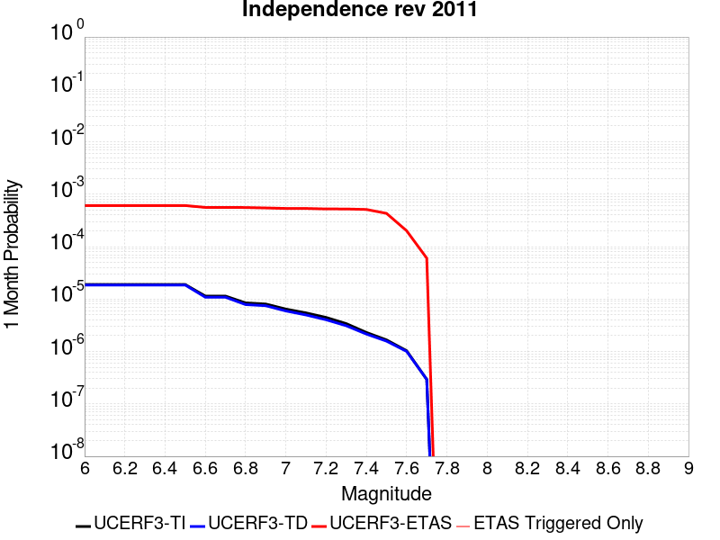 |  |  |

| Magnitude | 1 wk TI Prob | 1 wk TD Prob | 1 wk ETAS Prob | 1 wk ETAS/TD Gain | 1 wk ETAS Triggered Only | 1 mo TI Prob | 1 mo TD Prob | 1 mo ETAS Prob | 1 mo ETAS/TD Gain | 1 mo ETAS Triggered Only | 1 yr TI Prob | 1 yr TD Prob | 1 yr ETAS Prob | 1 yr ETAS/TD Gain | 1 yr ETAS Triggered Only | 10 yr TI Prob | 10 yr TD Prob | 10 yr ETAS Prob | 10 yr ETAS/TD Gain | 10 yr ETAS Triggered Only |
|-----|-----|-----|-----|-----|-----|-----|-----|-----|-----|-----|-----|-----|-----|-----|-----|-----|-----|-----|-----|-----|
| 6.0 | 4.422171E-6 | 4.3262253E-6 | 4.443243E-4 | 102.70485 | 4.4E-4 | 1.8952025E-5 | 1.8540852E-5 | 6.085299E-4 | 32.821033 | 5.9E-4 | 2.3071647E-4 | 2.2571447E-4 | 0.0010955181 | 4.8535576 | 8.7E-4 | 0.0023047708 | 0.0022551457 | 0.0033327101 | 1.4778248 | 0.00108 |
| 6.1 | 4.422171E-6 | 4.3262253E-6 | 4.443243E-4 | 102.70485 | 4.4E-4 | 1.8952025E-5 | 1.8540852E-5 | 6.085299E-4 | 32.821033 | 5.9E-4 | 2.3071647E-4 | 2.2571447E-4 | 0.0010955181 | 4.8535576 | 8.7E-4 | 0.0023047708 | 0.0022551457 | 0.0033327101 | 1.4778248 | 0.00108 |
| 6.2 | 4.422171E-6 | 4.3262253E-6 | 4.443243E-4 | 102.70485 | 4.4E-4 | 1.8952025E-5 | 1.8540852E-5 | 6.085299E-4 | 32.821033 | 5.9E-4 | 2.3071647E-4 | 2.2571447E-4 | 0.0010955181 | 4.8535576 | 8.7E-4 | 0.0023047708 | 0.0022551457 | 0.0033327101 | 1.4778248 | 0.00108 |
| 6.3 | 4.422171E-6 | 4.3262253E-6 | 4.443243E-4 | 102.70485 | 4.4E-4 | 1.8952025E-5 | 1.8540852E-5 | 6.085299E-4 | 32.821033 | 5.9E-4 | 2.3071647E-4 | 2.2571447E-4 | 0.0010955181 | 4.8535576 | 8.7E-4 | 0.0023047708 | 0.0022551457 | 0.0033327101 | 1.4778248 | 0.00108 |
| 6.4 | 4.422171E-6 | 4.3262253E-6 | 4.443243E-4 | 102.70485 | 4.4E-4 | 1.8952025E-5 | 1.8540852E-5 | 6.085299E-4 | 32.821033 | 5.9E-4 | 2.3071647E-4 | 2.2571447E-4 | 0.0010955181 | 4.8535576 | 8.7E-4 | 0.0023047708 | 0.0022551457 | 0.0033327101 | 1.4778248 | 0.00108 |
| 6.5 | 4.422171E-6 | 4.3262253E-6 | 4.443243E-4 | 102.70485 | 4.4E-4 | 1.8952025E-5 | 1.8540852E-5 | 6.085299E-4 | 32.821033 | 5.9E-4 | 2.3071647E-4 | 2.2571447E-4 | 0.0010955181 | 4.8535576 | 8.7E-4 | 0.0023047708 | 0.0022551457 | 0.0033327101 | 1.4778248 | 0.00108 |
| 6.6 | 2.663744E-6 | 2.5319846E-6 | 4.1253094E-4 | 162.9279 | 4.1E-4 | 1.1415996E-5 | 1.08513195E-5 | 5.6084536E-4 | 51.68453 | 5.5E-4 | 1.3898089E-4 | 1.321073E-4 | 9.320016E-4 | 7.0548835 | 8.0E-4 | 0.0013889399 | 0.0013203359 | 0.0023090288 | 1.7488192 | 9.9E-4 |
| 6.7 | 2.663744E-6 | 2.5319846E-6 | 4.1253094E-4 | 162.9279 | 4.1E-4 | 1.1415996E-5 | 1.08513195E-5 | 5.6084536E-4 | 51.68453 | 5.5E-4 | 1.3898089E-4 | 1.321073E-4 | 9.320016E-4 | 7.0548835 | 8.0E-4 | 0.0013889399 | 0.0013203359 | 0.0023090288 | 1.7488192 | 9.9E-4 |
| 6.8 | 1.9716529E-6 | 1.8322567E-6 | 4.118315E-4 | 224.76738 | 4.1E-4 | 8.449913E-6 | 7.852505E-6 | 5.578482E-4 | 71.04079 | 5.5E-4 | 1.0287284E-4 | 9.560019E-5 | 8.955237E-4 | 9.367384 | 8.0E-4 | 0.0010282523 | 9.5560355E-4 | 0.001934667 | 2.02455 | 9.8E-4 |
| 6.9 | 1.8788617E-6 | 1.7429976E-6 | 4.017423E-4 | 230.4893 | 4.0E-4 | 8.0522395E-6 | 7.4699688E-6 | 5.474659E-4 | 73.28892 | 5.4E-4 | 9.80316E-5 | 9.09432E-5 | 8.808714E-4 | 9.685951 | 7.9E-4 | 9.798837E-4 | 9.090718E-4 | 0.0018781901 | 2.0660524 | 9.7E-4 |
| 7.0 | 1.5045488E-6 | 1.3849498E-6 | 4.013844E-4 | 289.81876 | 4.0E-4 | 6.44805E-6 | 5.9354857E-6 | 5.359323E-4 | 90.29292 | 5.3E-4 | 7.8502184E-5 | 7.226219E-5 | 8.4220653E-4 | 11.654871 | 7.7E-4 | 7.8474457E-4 | 7.223921E-4 | 0.0016717059 | 2.3141253 | 9.5E-4 |
| 7.1 | 1.272341E-6 | 1.1625089E-6 | 4.0116205E-4 | 345.083 | 4.0E-4 | 5.4528787E-6 | 4.9821715E-6 | 5.349795E-4 | 107.378784 | 5.3E-4 | 6.6386776E-5 | 6.0656283E-5 | 8.306096E-4 | 13.69371 | 7.7E-4 | 6.636695E-4 | 6.064005E-4 | 0.0015558244 | 2.5656714 | 9.5E-4 |
| 7.2 | 1.0416892E-6 | 9.409871E-7 | 4.009406E-4 | 426.08514 | 4.0E-4 | 4.464375E-6 | 4.032796E-6 | 5.240307E-4 | 129.94229 | 5.2E-4 | 5.4352407E-5 | 4.9098202E-5 | 8.090609E-4 | 16.478422 | 7.6E-4 | 5.4339116E-4 | 4.908754E-4 | 0.0014204188 | 2.8936446 | 9.3E-4 |
| 7.3 | 7.9450155E-7 | 7.2350036E-7 | 4.0072322E-4 | 553.8673 | 4.0E-4 | 3.4050022E-6 | 3.1007123E-6 | 5.230991E-4 | 168.70288 | 5.2E-4 | 4.1455114E-5 | 3.7750528E-5 | 7.7772257E-4 | 20.601635 | 7.4E-4 | 4.144738E-4 | 3.7744228E-4 | 0.0012771026 | 3.3835707 | 9.0E-4 |
| 7.4 | 5.3893444E-7 | 5.0195166E-7 | 3.9050175E-4 | 777.96686 | 3.9E-4 | 2.309717E-6 | 2.1512196E-6 | 5.121501E-4 | 238.07431 | 5.1E-4 | 2.8120441E-5 | 2.6190788E-5 | 7.361722E-4 | 28.108057 | 7.1E-4 | 2.8116882E-4 | 2.6187746E-4 | 0.0011116549 | 4.2449427 | 8.5E-4 |
| 7.5 | 3.8852085E-7 | 3.6825622E-7 | 3.4036813E-4 | 924.26984 | 3.4E-4 | 1.6650882E-6 | 1.57824E-6 | 4.3157756E-4 | 273.45496 | 4.3E-4 | 2.027226E-5 | 1.9214905E-5 | 6.192034E-4 | 32.22516 | 6.0E-4 | 2.0270412E-4 | 1.9213265E-4 | 9.3199045E-4 | 4.8507657 | 7.4E-4 |
| 7.6 | 2.414929E-7 | 2.3457605E-7 | 1.6023454E-4 | 683.0814 | 1.6E-4 | 1.0349692E-6 | 1.0053255E-6 | 2.0100512E-4 | 199.94034 | 2.0E-4 | 1.2600677E-5 | 1.2239771E-5 | 3.4223573E-4 | 27.960958 | 3.3E-4 | 1.2599962E-4 | 1.223911E-4 | 5.623372E-4 | 4.594593 | 4.4E-4 |
| 7.7 | 6.8298014E-8 | 6.8589785E-8 | 5.0068586E-5 | 729.9715 | 5.0E-5 | 2.9270575E-7 | 2.939562E-7 | 6.029394E-5 | 205.11198 | 6.0E-5 | 3.5636867E-6 | 3.5789112E-6 | 8.357863E-5 | 23.353086 | 8.0E-5 | 3.5636294E-5 | 3.5788584E-5 | 1.4578465E-4 | 4.073496 | 1.1E-4 |

## San Andreas (San Gorgonio Pass-Garnet HIll)
*[(top)](#table-of-contents)*

| 1 Week | 1 Month | 1 Year | 10 Year |
|-----|-----|-----|-----|
| 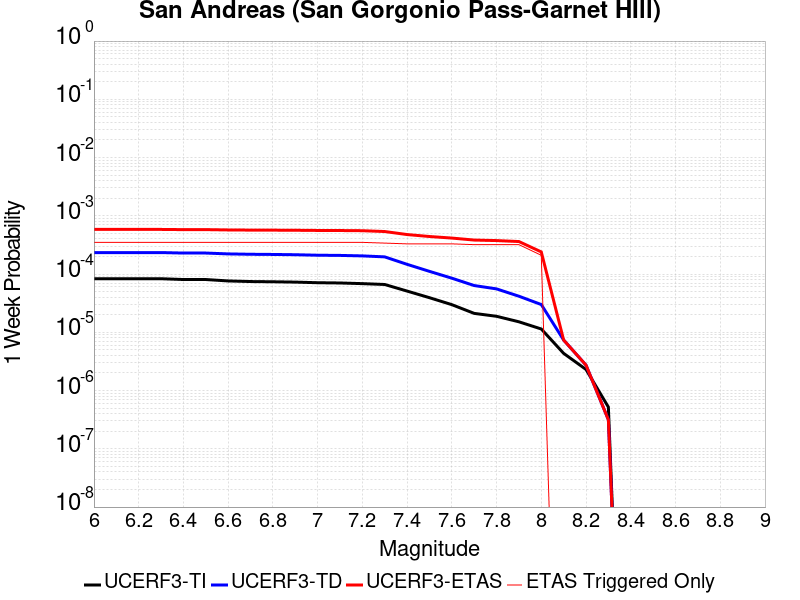 |  |  | 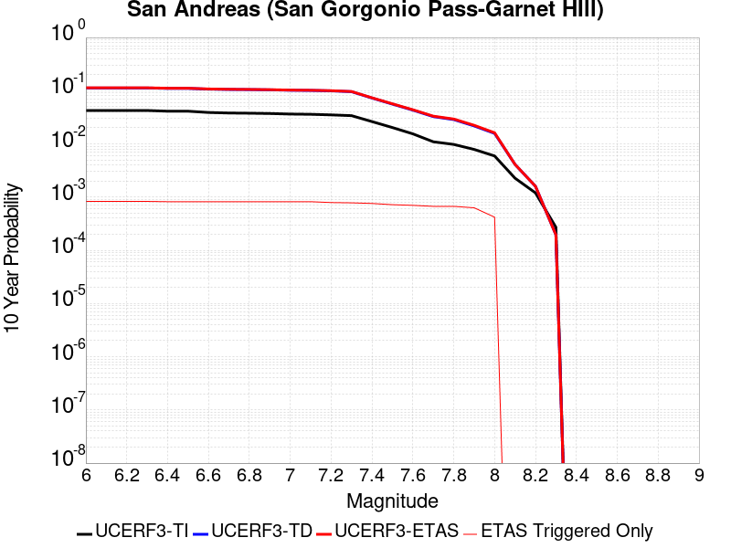 |

| Magnitude | 1 wk TI Prob | 1 wk TD Prob | 1 wk ETAS Prob | 1 wk ETAS/TD Gain | 1 wk ETAS Triggered Only | 1 mo TI Prob | 1 mo TD Prob | 1 mo ETAS Prob | 1 mo ETAS/TD Gain | 1 mo ETAS Triggered Only | 1 yr TI Prob | 1 yr TD Prob | 1 yr ETAS Prob | 1 yr ETAS/TD Gain | 1 yr ETAS Triggered Only | 10 yr TI Prob | 10 yr TD Prob | 10 yr ETAS Prob | 10 yr ETAS/TD Gain | 10 yr ETAS Triggered Only |
|-----|-----|-----|-----|-----|-----|-----|-----|-----|-----|-----|-----|-----|-----|-----|-----|-----|-----|-----|-----|-----|
| 6.0 | 8.31567E-5 | 2.3384395E-4 | 5.837621E-4 | 2.4963746 | 3.5E-4 | 3.5633717E-4 | 0.0010018025 | 0.0014413617 | 1.4387683 | 4.4E-4 | 0.004329778 | 0.012128622 | 0.012731223 | 1.0496843 | 6.1E-4 | 0.042463828 | 0.11258187 | 0.11331843 | 1.0065424 | 8.3E-4 |
| 6.1 | 8.31567E-5 | 2.3384395E-4 | 5.837621E-4 | 2.4963746 | 3.5E-4 | 3.5633717E-4 | 0.0010018025 | 0.0014413617 | 1.4387683 | 4.4E-4 | 0.004329778 | 0.012128622 | 0.012731223 | 1.0496843 | 6.1E-4 | 0.042463828 | 0.11258187 | 0.11331843 | 1.0065424 | 8.3E-4 |
| 6.2 | 8.31567E-5 | 2.3384395E-4 | 5.837621E-4 | 2.4963746 | 3.5E-4 | 3.5633717E-4 | 0.0010018025 | 0.0014413617 | 1.4387683 | 4.4E-4 | 0.004329778 | 0.012128622 | 0.012731223 | 1.0496843 | 6.1E-4 | 0.042463828 | 0.11258187 | 0.11331843 | 1.0065424 | 8.3E-4 |
| 6.3 | 8.31567E-5 | 2.3384395E-4 | 5.837621E-4 | 2.4963746 | 3.5E-4 | 3.5633717E-4 | 0.0010018025 | 0.0014413617 | 1.4387683 | 4.4E-4 | 0.004329778 | 0.012128622 | 0.012731223 | 1.0496843 | 6.1E-4 | 0.042463828 | 0.11258187 | 0.11331843 | 1.0065424 | 8.3E-4 |
| 6.4 | 8.059055E-5 | 2.2941893E-4 | 5.7933864E-4 | 2.5252433 | 3.5E-4 | 3.4534236E-4 | 9.828559E-4 | 0.0014124333 | 1.4370705 | 4.3E-4 | 0.0041964394 | 0.011900819 | 0.012493678 | 1.0498167 | 6.0E-4 | 0.041180745 | 0.110562965 | 0.1112923 | 1.0065966 | 8.2E-4 |
| 6.5 | 8.059055E-5 | 2.2941893E-4 | 5.7933864E-4 | 2.5252433 | 3.5E-4 | 3.4534236E-4 | 9.828559E-4 | 0.0014124333 | 1.4370705 | 4.3E-4 | 0.0041964394 | 0.011900819 | 0.012493678 | 1.0498167 | 6.0E-4 | 0.041180745 | 0.110562965 | 0.1112923 | 1.0065966 | 8.2E-4 |
| 6.6 | 7.619237E-5 | 2.2186468E-4 | 5.71787E-4 | 2.5771883 | 3.5E-4 | 3.2649786E-4 | 9.5050444E-4 | 0.0013800957 | 1.4519614 | 4.3E-4 | 0.0039678677 | 0.0115115335 | 0.012104627 | 1.0515217 | 6.0E-4 | 0.03897764 | 0.10709954 | 0.10783172 | 1.0068364 | 8.2E-4 |
| 6.7 | 7.440636E-5 | 2.1862281E-4 | 5.685463E-4 | 2.600581 | 3.5E-4 | 3.188454E-4 | 9.3662075E-4 | 0.001366218 | 1.4586673 | 4.3E-4 | 0.0038750346 | 0.011344268 | 0.011937462 | 1.0522902 | 6.0E-4 | 0.038081564 | 0.1056081 | 0.1063415 | 1.0069445 | 8.2E-4 |
| 6.8 | 7.3735864E-5 | 2.1709445E-4 | 5.6701846E-4 | 2.6118515 | 3.5E-4 | 3.1597257E-4 | 9.300753E-4 | 0.0013596753 | 1.4618982 | 4.3E-4 | 0.0038401815 | 0.011265406 | 0.011858648 | 1.0526603 | 6.0E-4 | 0.03774495 | 0.104909696 | 0.10564367 | 1.0069963 | 8.2E-4 |
| 6.9 | 7.27575E-5 | 2.1478413E-4 | 5.6470896E-4 | 2.629193 | 3.5E-4 | 3.117806E-4 | 9.20181E-4 | 0.0013497852 | 1.4668694 | 4.3E-4 | 0.003789323 | 0.011146182 | 0.011739494 | 1.05323 | 6.0E-4 | 0.037253562 | 0.10385753 | 0.10459237 | 1.0070754 | 8.2E-4 |
| 7.0 | 7.102591E-5 | 2.1062451E-4 | 5.605508E-4 | 2.661375 | 3.5E-4 | 3.0436125E-4 | 9.023664E-4 | 0.0013319784 | 1.4760948 | 4.3E-4 | 0.003699303 | 0.010931484 | 0.011524925 | 1.0542873 | 6.0E-4 | 0.03638325 | 0.101959534 | 0.10269593 | 1.0072224 | 8.2E-4 |
| 7.1 | 7.028513E-5 | 2.0898094E-4 | 5.589078E-4 | 2.674444 | 3.5E-4 | 3.0118722E-4 | 8.953274E-4 | 0.0013249425 | 1.4798412 | 4.3E-4 | 0.0036607897 | 0.010846641 | 0.011440133 | 1.0547167 | 6.0E-4 | 0.036010686 | 0.10120243 | 0.10193945 | 1.0072826 | 8.2E-4 |
| 7.2 | 6.8498244E-5 | 2.050596E-4 | 5.549878E-4 | 2.706471 | 3.5E-4 | 2.9353087E-4 | 8.7853306E-4 | 0.0012981641 | 1.4776497 | 4.2E-4 | 0.003567883 | 0.0106441835 | 0.0112180095 | 1.0539099 | 5.8E-4 | 0.035111405 | 0.09939449 | 0.10010597 | 1.0071582 | 7.9E-4 |
| 7.3 | 6.622592E-5 | 1.9733235E-4 | 5.3726527E-4 | 2.7226415 | 3.4E-4 | 2.8379448E-4 | 8.4543816E-4 | 0.0012550915 | 1.4845456 | 4.1E-4 | 0.0034497243 | 0.010245111 | 0.010809271 | 1.0550663 | 5.7E-4 | 0.033966612 | 0.095891245 | 0.09659645 | 1.0073543 | 7.8E-4 |
| 7.4 | 5.1050705E-5 | 1.4690042E-4 | 4.7685194E-4 | 3.2460897 | 3.3E-4 | 2.1877038E-4 | 6.294222E-4 | 0.0010291705 | 1.6351035 | 4.0E-4 | 0.002660276 | 0.007636482 | 0.008192206 | 1.0727721 | 5.6E-4 | 0.02628654 | 0.07286554 | 0.07357016 | 1.0096701 | 7.6E-4 |
| 7.5 | 3.9302922E-5 | 1.11307076E-4 | 4.4127036E-4 | 3.964441 | 3.3E-4 | 1.6843023E-4 | 4.7694342E-4 | 8.667574E-4 | 1.817317 | 3.9E-4 | 0.0020487092 | 0.0057913954 | 0.00633821 | 1.0944185 | 5.5E-4 | 0.020299247 | 0.05601151 | 0.05669118 | 1.0121346 | 7.2E-4 |
| 7.6 | 2.9851626E-5 | 8.4956984E-5 | 4.1492895E-4 | 4.8839884 | 3.3E-4 | 1.2792926E-4 | 3.6405068E-4 | 7.4391236E-4 | 2.0434308 | 3.8E-4 | 0.0015564259 | 0.0044233347 | 0.0049509904 | 1.1192892 | 5.3E-4 | 0.0154556995 | 0.043196145 | 0.043865908 | 1.0155052 | 7.0E-4 |
| 7.7 | 2.1135214E-5 | 6.353527E-5 | 3.8351494E-4 | 6.0362525 | 3.2E-4 | 9.0576345E-5 | 2.722656E-4 | 6.421649E-4 | 2.358597 | 3.7E-4 | 0.0011022091 | 0.0033098008 | 0.0038280797 | 1.1565892 | 5.2E-4 | 0.010967582 | 0.03258456 | 0.03323273 | 1.0198919 | 6.7E-4 |
| 7.8 | 1.883379E-5 | 5.564576E-5 | 3.7562795E-4 | 6.750343 | 3.2E-4 | 8.0713755E-5 | 2.3846005E-4 | 6.083718E-4 | 2.5512526 | 3.7E-4 | 9.822468E-4 | 0.002899389 | 0.0034178814 | 1.1788281 | 5.2E-4 | 0.0097791655 | 0.028696978 | 0.029347751 | 1.0226774 | 6.7E-4 |
| 7.9 | 1.5156185E-5 | 4.1662403E-5 | 3.616491E-4 | 8.680466 | 3.2E-4 | 6.495346E-5 | 1.7854095E-4 | 5.384767E-4 | 3.015984 | 3.6E-4 | 7.9052144E-4 | 0.0021715704 | 0.0026704846 | 1.2297481 | 5.0E-4 | 0.007877152 | 0.021760946 | 0.022377236 | 1.0283209 | 6.3E-4 |
| 8.0 | 1.1405907E-5 | 2.9976925E-5 | 2.3997063E-4 | 8.005178 | 2.1E-4 | 4.8881542E-5 | 1.2846621E-4 | 3.4843796E-4 | 2.7122924 | 2.2E-4 | 5.9497025E-4 | 0.0015629551 | 0.0018924393 | 1.2108085 | 3.3E-4 | 0.005933798 | 0.015774013 | 0.016187388 | 1.026206 | 4.2E-4 |
| 8.1 | 4.3511436E-6 | 7.369465E-6 | 7.369465E-6 | 1.0 | 0.0 | 1.8647626E-5 | 3.158304E-5 | 3.158304E-5 | 1.0 | 0.0 | 2.2701119E-4 | 3.844558E-4 | 3.844558E-4 | 1.0 | 0.0 | 0.0022677942 | 0.0041165445 | 0.0041165445 | 1.0 | 0.0 |
| 8.2 | 2.3042528E-6 | 2.7328301E-6 | 2.7328301E-6 | 1.0 | 0.0 | 9.875332E-6 | 1.1712076E-5 | 1.1712076E-5 | 1.0 | 0.0 | 1.2022553E-4 | 1.4258524E-4 | 1.4258524E-4 | 1.0 | 0.0 | 0.0012016051 | 0.0015979637 | 0.0015979637 | 1.0 | 0.0 |
| 8.3 | 5.202968E-7 | 3.1590292E-7 | 3.1590292E-7 | 1.0 | 0.0 | 2.2298414E-6 | 1.353869E-6 | 1.353869E-6 | 1.0 | 0.0 | 2.714798E-5 | 1.6483244E-5 | 1.6483244E-5 | 1.0 | 0.0 | 2.7144665E-4 | 1.955901E-4 | 1.955901E-4 | 1.0 | 0.0 |

## San Andreas (Parkfield)
*[(top)](#table-of-contents)*

| 1 Week | 1 Month | 1 Year | 10 Year |
|-----|-----|-----|-----|
|  |  |  | 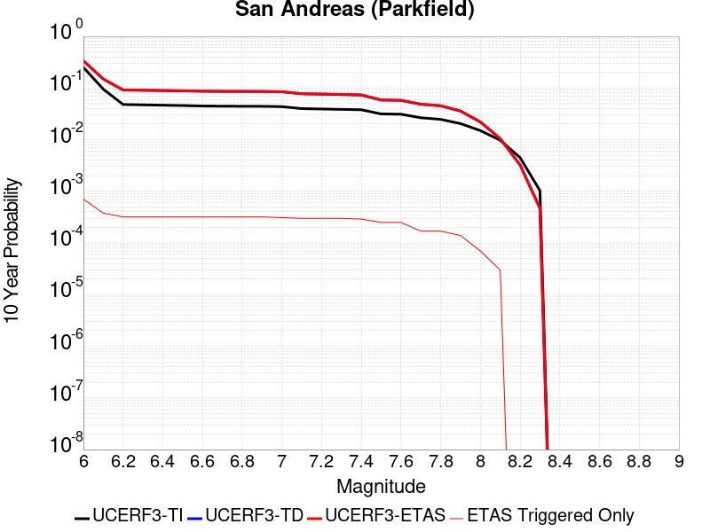 |

| Magnitude | 1 wk TI Prob | 1 wk TD Prob | 1 wk ETAS Prob | 1 wk ETAS/TD Gain | 1 wk ETAS Triggered Only | 1 mo TI Prob | 1 mo TD Prob | 1 mo ETAS Prob | 1 mo ETAS/TD Gain | 1 mo ETAS Triggered Only | 1 yr TI Prob | 1 yr TD Prob | 1 yr ETAS Prob | 1 yr ETAS/TD Gain | 1 yr ETAS Triggered Only | 10 yr TI Prob | 10 yr TD Prob | 10 yr ETAS Prob | 10 yr ETAS/TD Gain | 10 yr ETAS Triggered Only |
|-----|-----|-----|-----|-----|-----|-----|-----|-----|-----|-----|-----|-----|-----|-----|-----|-----|-----|-----|-----|-----|
| 6.0 | 5.556969E-4 | 7.778562E-4 | 9.577162E-4 | 1.2312253 | 1.8E-4 | 0.0023793848 | 0.0033299583 | 0.003599059 | 1.0808121 | 2.7E-4 | 0.028586963 | 0.040235043 | 0.04069573 | 1.0114499 | 4.8E-4 | 0.25176284 | 0.3371973 | 0.33766788 | 1.0013956 | 7.1E-4 |
| 6.1 | 1.925858E-4 | 3.0278185E-4 | 4.1274854E-4 | 1.3631879 | 1.1E-4 | 8.2510663E-4 | 0.001297085 | 0.0014468904 | 1.1154939 | 1.5E-4 | 0.0099994885 | 0.01577393 | 0.016049514 | 1.0174708 | 2.8E-4 | 0.095613256 | 0.14975825 | 0.15008134 | 1.0021574 | 3.8E-4 |
| 6.2 | 9.4306815E-5 | 1.8243887E-4 | 2.7242245E-4 | 1.4932259 | 9.0E-5 | 4.0410945E-4 | 7.8164786E-4 | 9.01554E-4 | 1.1534019 | 1.2E-4 | 0.0049089384 | 0.009475246 | 0.009712973 | 1.0250891 | 2.4E-4 | 0.048019063 | 0.0918565 | 0.09214711 | 1.0031637 | 3.2E-4 |
| 6.3 | 9.283051E-5 | 1.794041E-4 | 2.6938797E-4 | 1.5015708 | 9.0E-5 | 3.9778434E-4 | 7.686494E-4 | 8.885571E-4 | 1.155998 | 1.2E-4 | 0.0048322747 | 0.009318355 | 0.0095561175 | 1.0255157 | 2.4E-4 | 0.047285385 | 0.090509474 | 0.09080051 | 1.0032156 | 3.2E-4 |
| 6.4 | 9.138826E-5 | 1.7702584E-4 | 2.670099E-4 | 1.5083103 | 9.0E-5 | 3.916052E-4 | 7.5846276E-4 | 8.783717E-4 | 1.1580948 | 1.2E-4 | 0.0047573745 | 0.009195387 | 0.00943318 | 1.0258601 | 2.4E-4 | 0.046568092 | 0.0894136 | 0.08970498 | 1.0032588 | 3.2E-4 |
| 6.5 | 9.000255E-5 | 1.746064E-4 | 2.6459066E-4 | 1.5153551 | 9.0E-5 | 3.8566816E-4 | 7.4809964E-4 | 8.6800987E-4 | 1.1602864 | 1.2E-4 | 0.0046854047 | 0.009070284 | 0.009308107 | 1.0262201 | 2.4E-4 | 0.045878403 | 0.08829608 | 0.08858782 | 1.0033041 | 3.2E-4 |
| 6.6 | 8.8109264E-5 | 1.7141816E-4 | 2.6140272E-4 | 1.5249419 | 9.0E-5 | 3.7755648E-4 | 7.3444354E-4 | 8.543554E-4 | 1.163269 | 1.2E-4 | 0.0045870654 | 0.008905404 | 0.009143267 | 1.0267099 | 2.4E-4 | 0.04493529 | 0.08682707 | 0.08711929 | 1.0033655 | 3.2E-4 |
| 6.7 | 8.738073E-5 | 1.7008898E-4 | 2.600737E-4 | 1.5290447 | 9.0E-5 | 3.7443507E-4 | 7.287503E-4 | 8.4866286E-4 | 1.1645454 | 1.2E-4 | 0.0045492216 | 0.008836695 | 0.009074574 | 1.0269195 | 2.4E-4 | 0.04457213 | 0.0862268 | 0.086519204 | 1.0033911 | 3.2E-4 |
| 6.8 | 8.710195E-5 | 1.6954402E-4 | 2.5952875E-4 | 1.5307456 | 9.0E-5 | 3.7324068E-4 | 7.26416E-4 | 8.4632885E-4 | 1.1650746 | 1.2E-4 | 0.0045347405 | 0.008808513 | 0.009046399 | 1.0270064 | 2.4E-4 | 0.04443313 | 0.08597436 | 0.086266845 | 1.003402 | 3.2E-4 |
| 6.9 | 8.6801556E-5 | 1.6895356E-4 | 2.5893835E-4 | 1.5326008 | 9.0E-5 | 3.7195362E-4 | 7.238869E-4 | 8.438E-4 | 1.1656518 | 1.2E-4 | 0.0045191357 | 0.0087779695 | 0.009015863 | 1.0271012 | 2.4E-4 | 0.044283327 | 0.08570042 | 0.085993 | 1.0034139 | 3.2E-4 |
| 7.0 | 8.5571606E-5 | 1.664819E-4 | 2.564669E-4 | 1.5405093 | 9.0E-5 | 3.6668387E-4 | 7.132999E-4 | 8.332143E-4 | 1.1681122 | 1.2E-4 | 0.004455241 | 0.008650103 | 0.008878114 | 1.0263593 | 2.3E-4 | 0.043669727 | 0.08454836 | 0.084832154 | 1.0033566 | 3.1E-4 |
| 7.1 | 7.82589E-5 | 1.5128969E-4 | 2.4127607E-4 | 1.5947952 | 9.0E-5 | 3.3535215E-4 | 6.4822397E-4 | 7.681462E-4 | 1.1850013 | 1.2E-4 | 0.0040752706 | 0.007863738 | 0.008091929 | 1.0290182 | 2.3E-4 | 0.040013418 | 0.077460445 | 0.077737205 | 1.003573 | 3.0E-4 |
| 7.2 | 7.690929E-5 | 1.4866212E-4 | 2.3864873E-4 | 1.6053097 | 9.0E-5 | 3.2956956E-4 | 6.369685E-4 | 7.568921E-4 | 1.1882724 | 1.2E-4 | 0.004005129 | 0.0077276826 | 0.007955905 | 1.0295331 | 2.3E-4 | 0.0393371 | 0.07623341 | 0.07651054 | 1.0036353 | 3.0E-4 |
| 7.3 | 7.5543794E-5 | 1.4562748E-4 | 2.3561437E-4 | 1.6179253 | 9.0E-5 | 3.2371894E-4 | 6.239692E-4 | 7.438943E-4 | 1.1921972 | 1.2E-4 | 0.003934157 | 0.0075705256 | 0.0077987844 | 1.030151 | 2.3E-4 | 0.038652334 | 0.07479777 | 0.075075336 | 1.0037109 | 3.0E-4 |
| 7.4 | 7.4214564E-5 | 1.4263717E-4 | 2.3262434E-4 | 1.6308815 | 9.0E-5 | 3.1802364E-4 | 6.1115966E-4 | 7.3108636E-4 | 1.196228 | 1.2E-4 | 0.003865065 | 0.0074156416 | 0.0076439357 | 1.0307856 | 2.3E-4 | 0.03798529 | 0.07337152 | 0.07364025 | 1.0036625 | 2.9E-4 |
| 7.5 | 6.149578E-5 | 1.1191443E-4 | 1.819066E-4 | 1.6254079 | 7.0E-5 | 2.6352672E-4 | 4.795452E-4 | 5.7949725E-4 | 1.2084309 | 1.0E-4 | 0.0032037178 | 0.005822865 | 0.0060117585 | 1.03244 | 1.9E-4 | 0.03157923 | 0.058559462 | 0.058794823 | 1.0040191 | 2.5E-4 |
| 7.6 | 6.0643448E-5 | 1.102009E-4 | 1.8019318E-4 | 1.6351335 | 7.0E-5 | 2.598746E-4 | 4.7220418E-4 | 5.72157E-4 | 1.2116728 | 1.0E-4 | 0.0031593828 | 0.005733962 | 0.0059228726 | 1.0329459 | 1.9E-4 | 0.031148417 | 0.05772042 | 0.057955988 | 1.0040812 | 2.5E-4 |
| 7.7 | 5.1652263E-5 | 9.175265E-5 | 1.4174805E-4 | 1.5448934 | 5.0E-5 | 2.2134806E-4 | 3.9316638E-4 | 4.6313886E-4 | 1.1779717 | 7.0E-5 | 0.002691582 | 0.0047763046 | 0.0049056835 | 1.0270877 | 1.3E-4 | 0.026592141 | 0.04853641 | 0.048698157 | 1.0033325 | 1.7E-4 |
| 7.8 | 4.8090482E-5 | 8.560165E-5 | 1.3559737E-4 | 1.5840509 | 5.0E-5 | 2.060858E-4 | 3.6681266E-4 | 4.3678697E-4 | 1.1907631 | 7.0E-5 | 0.0025062072 | 0.004456807 | 0.0045862277 | 1.0290389 | 1.3E-4 | 0.024781305 | 0.045302264 | 0.045464564 | 1.0035826 | 1.7E-4 |
| 7.9 | 3.970278E-5 | 6.7507375E-5 | 1.07504675E-4 | 1.5924878 | 4.0E-5 | 1.7014367E-4 | 2.8928524E-4 | 3.2927367E-4 | 1.1382319 | 4.0E-5 | 0.002069531 | 0.0035163634 | 0.003616012 | 1.0283384 | 1.0E-4 | 0.020503636 | 0.03588176 | 0.036016736 | 1.0037616 | 1.4E-4 |
| 8.0 | 2.8982335E-5 | 4.0698153E-5 | 7.069693E-5 | 1.7371042 | 3.0E-5 | 1.2420409E-4 | 1.7440901E-4 | 2.0440377E-4 | 1.1719794 | 3.0E-5 | 0.0015111357 | 0.0021213628 | 0.0021712568 | 1.0235198 | 5.0E-5 | 0.015009012 | 0.02201118 | 0.02207964 | 1.0031102 | 7.0E-5 |
| 8.1 | 1.8836186E-5 | 1.867974E-5 | 2.8679553E-5 | 1.5353293 | 1.0E-5 | 8.0724014E-5 | 8.005358E-5 | 9.0052774E-5 | 1.1249063 | 1.0E-5 | 9.823717E-4 | 9.742171E-4 | 9.842074E-4 | 1.0102546 | 1.0E-5 | 0.009780403 | 0.010487711 | 0.010517396 | 1.0028305 | 3.0E-5 |
| 8.2 | 8.643924E-6 | 5.473668E-6 | 5.473668E-6 | 1.0 | 0.0 | 3.704486E-5 | 2.3458366E-5 | 2.3458366E-5 | 1.0 | 0.0 | 4.5092785E-4 | 2.8556827E-4 | 2.8556827E-4 | 1.0 | 0.0 | 0.0045001395 | 0.0032481793 | 0.0032481793 | 1.0 | 0.0 |
| 8.3 | 1.983087E-6 | 7.6564595E-7 | 7.6564595E-7 | 1.0 | 0.0 | 8.498917E-6 | 3.281336E-6 | 3.281336E-6 | 1.0 | 0.0 | 1.034694E-4 | 3.9949547E-5 | 3.9949547E-5 | 1.0 | 0.0 | 0.0010342124 | 4.717979E-4 | 4.717979E-4 | 1.0 | 0.0 |

## Death Valley (No)
*[(top)](#table-of-contents)*

| 1 Week | 1 Month | 1 Year | 10 Year |
|-----|-----|-----|-----|
| 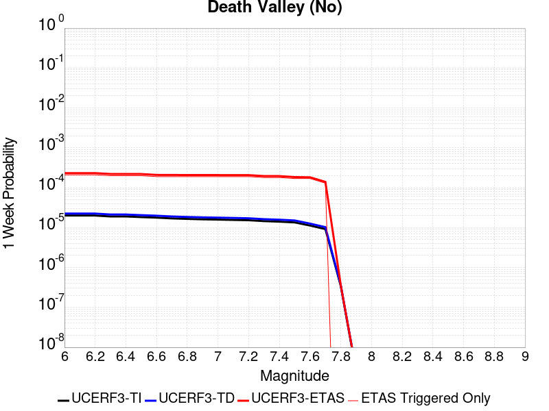 |  | 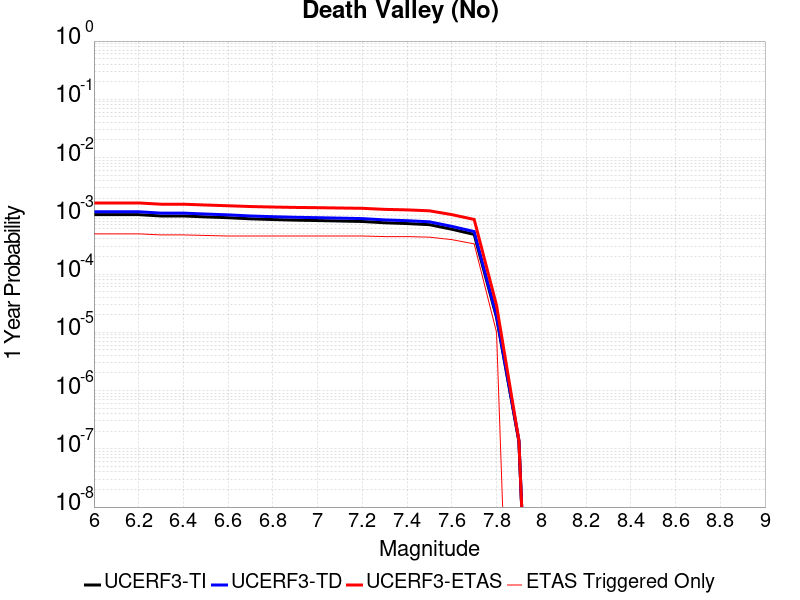 | 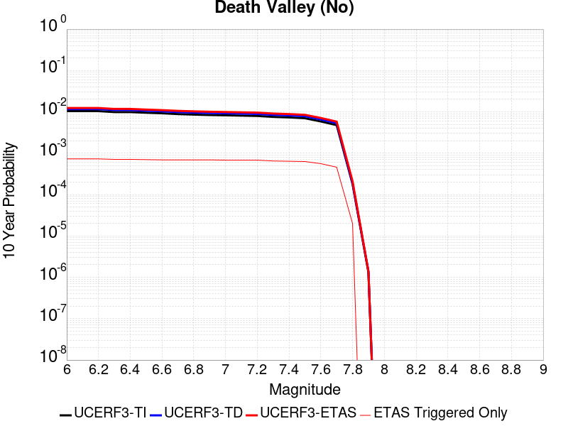 |

| Magnitude | 1 wk TI Prob | 1 wk TD Prob | 1 wk ETAS Prob | 1 wk ETAS/TD Gain | 1 wk ETAS Triggered Only | 1 mo TI Prob | 1 mo TD Prob | 1 mo ETAS Prob | 1 mo ETAS/TD Gain | 1 mo ETAS Triggered Only | 1 yr TI Prob | 1 yr TD Prob | 1 yr ETAS Prob | 1 yr ETAS/TD Gain | 1 yr ETAS Triggered Only | 10 yr TI Prob | 10 yr TD Prob | 10 yr ETAS Prob | 10 yr ETAS/TD Gain | 10 yr ETAS Triggered Only |
|-----|-----|-----|-----|-----|-----|-----|-----|-----|-----|-----|-----|-----|-----|-----|-----|-----|-----|-----|-----|-----|
| 6.0 | 2.0074807E-5 | 2.2500084E-5 | 2.3249535E-4 | 10.333089 | 2.1E-4 | 8.603206E-5 | 9.642541E-5 | 3.464013E-4 | 3.5924277 | 2.5E-4 | 0.001046937 | 0.0011733545 | 0.0016627795 | 1.4171162 | 4.9E-4 | 0.010420183 | 0.011672506 | 0.012393986 | 1.0618101 | 7.3E-4 |
| 6.1 | 2.0074807E-5 | 2.2500084E-5 | 2.3249535E-4 | 10.333089 | 2.1E-4 | 8.603206E-5 | 9.642541E-5 | 3.464013E-4 | 3.5924277 | 2.5E-4 | 0.001046937 | 0.0011733545 | 0.0016627795 | 1.4171162 | 4.9E-4 | 0.010420183 | 0.011672506 | 0.012393986 | 1.0618101 | 7.3E-4 |
| 6.2 | 2.0074807E-5 | 2.2500084E-5 | 2.3249535E-4 | 10.333089 | 2.1E-4 | 8.603206E-5 | 9.642541E-5 | 3.464013E-4 | 3.5924277 | 2.5E-4 | 0.001046937 | 0.0011733545 | 0.0016627795 | 1.4171162 | 4.9E-4 | 0.010420183 | 0.011672506 | 0.012393986 | 1.0618101 | 7.3E-4 |
| 6.3 | 1.9050609E-5 | 2.1336948E-5 | 2.2133268E-4 | 10.373212 | 2.0E-4 | 8.164292E-5 | 9.1440896E-5 | 3.3141894E-4 | 3.6244063 | 2.4E-4 | 9.935491E-4 | 0.001112731 | 0.0015822081 | 1.4219142 | 4.7E-4 | 0.009891188 | 0.011072419 | 0.011774558 | 1.0634133 | 7.1E-4 |
| 6.4 | 1.9050609E-5 | 2.1336948E-5 | 2.2133268E-4 | 10.373212 | 2.0E-4 | 8.164292E-5 | 9.1440896E-5 | 3.3141894E-4 | 3.6244063 | 2.4E-4 | 9.935491E-4 | 0.001112731 | 0.0015822081 | 1.4219142 | 4.7E-4 | 0.009891188 | 0.011072419 | 0.011774558 | 1.0634133 | 7.1E-4 |
| 6.5 | 1.8367004E-5 | 2.0561009E-5 | 2.2055689E-4 | 10.72695 | 2.0E-4 | 7.8713354E-5 | 8.811567E-5 | 3.2809452E-4 | 3.7234526 | 2.4E-4 | 9.5791375E-4 | 0.0010722869 | 0.0015317936 | 1.4285297 | 4.6E-4 | 0.009537951 | 0.0106719155 | 0.011364445 | 1.0648928 | 7.0E-4 |
| 6.6 | 1.779439E-5 | 1.9910927E-5 | 2.0990714E-4 | 10.542309 | 1.9E-4 | 7.625944E-5 | 8.53298E-5 | 3.1531017E-4 | 3.6951942 | 2.3E-4 | 9.280632E-4 | 0.0010384015 | 0.0014879343 | 1.4329084 | 4.5E-4 | 0.009241969 | 0.010336253 | 0.011019121 | 1.0660653 | 6.9E-4 |
| 6.7 | 1.7025437E-5 | 1.9043426E-5 | 2.090398E-4 | 10.977007 | 1.9E-4 | 7.296412E-5 | 8.161216E-5 | 3.1159338E-4 | 3.8179774 | 2.3E-4 | 8.87976E-4 | 9.931813E-4 | 0.0014427344 | 1.4526395 | 4.5E-4 | 0.008844362 | 0.009888145 | 0.010571322 | 1.0690905 | 6.9E-4 |
| 6.8 | 1.6545107E-5 | 1.8512545E-5 | 2.0850902E-4 | 11.263121 | 1.9E-4 | 7.090568E-5 | 7.93371E-5 | 3.0931886E-4 | 3.898792 | 2.3E-4 | 8.629347E-4 | 9.655073E-4 | 0.0014150728 | 1.4656262 | 4.5E-4 | 0.008595915 | 0.009613829 | 0.010297195 | 1.0710816 | 6.9E-4 |
| 6.9 | 1.615478E-5 | 1.8087594E-5 | 2.0808415E-4 | 11.504248 | 1.9E-4 | 6.9232934E-5 | 7.751599E-5 | 3.0749815E-4 | 3.9668996 | 2.3E-4 | 8.4258494E-4 | 9.433546E-4 | 0.0013929302 | 1.476571 | 4.5E-4 | 0.008393973 | 0.009394196 | 0.010077714 | 1.0727596 | 6.9E-4 |
| 7.0 | 1.5894311E-5 | 1.780555E-5 | 2.0780216E-4 | 11.67064 | 1.9E-4 | 6.81167E-5 | 7.6307304E-5 | 3.0628976E-4 | 4.0138984 | 2.3E-4 | 8.2900526E-4 | 9.286515E-4 | 0.0013782337 | 1.4841236 | 4.5E-4 | 0.008259195 | 0.009248397 | 0.009922109 | 1.0728463 | 6.8E-4 |
| 7.1 | 1.5602263E-5 | 1.7483504E-5 | 2.0748017E-4 | 11.867197 | 1.9E-4 | 6.6865134E-5 | 7.492718E-5 | 3.0490995E-4 | 4.069417 | 2.3E-4 | 8.137789E-4 | 9.118627E-4 | 0.0013614524 | 1.4930453 | 4.5E-4 | 0.008108052 | 0.009081894 | 0.0097557185 | 1.0741942 | 6.8E-4 |
| 7.2 | 1.5323829E-5 | 1.717063E-5 | 2.0716737E-4 | 12.065216 | 1.9E-4 | 6.56719E-5 | 7.358637E-5 | 3.0356945E-4 | 4.1253486 | 2.3E-4 | 7.99262E-4 | 8.9555193E-4 | 0.0013451489 | 1.5020335 | 4.5E-4 | 0.007963934 | 0.008920107 | 0.009594041 | 1.0755522 | 6.8E-4 |
| 7.3 | 1.4556212E-5 | 1.6302456E-5 | 1.9629952E-4 | 12.041101 | 1.8E-4 | 6.238227E-5 | 6.9865826E-5 | 2.8985046E-4 | 4.1486726 | 2.2E-4 | 7.592395E-4 | 8.5029035E-4 | 0.0012899162 | 1.5170304 | 4.4E-4 | 0.0075665074 | 0.008471014 | 0.009115508 | 1.0760822 | 6.5E-4 |
| 7.4 | 1.411725E-5 | 1.580796E-5 | 1.9580511E-4 | 12.386489 | 1.8E-4 | 6.0501097E-5 | 6.7746674E-5 | 2.8773176E-4 | 4.247172 | 2.2E-4 | 7.363519E-4 | 8.245094E-4 | 0.0012641466 | 1.5332106 | 4.4E-4 | 0.0073391674 | 0.008215138 | 0.008849881 | 1.0772649 | 6.4E-4 |
| 7.5 | 1.3503312E-5 | 1.5126289E-5 | 1.8512372E-4 | 12.238542 | 1.7E-4 | 5.7870053E-5 | 6.482538E-5 | 2.7481175E-4 | 4.239262 | 2.1E-4 | 7.043401E-4 | 7.8896893E-4 | 0.0012186297 | 1.5445851 | 4.3E-4 | 0.007021119 | 0.007862304 | 0.008487351 | 1.0794991 | 6.3E-4 |
| 7.6 | 1.1279839E-5 | 1.2626327E-5 | 1.8262418E-4 | 14.463761 | 1.7E-4 | 4.834127E-5 | 5.4111737E-5 | 2.5410092E-4 | 4.6958556 | 2.0E-4 | 5.88396E-4 | 6.5861654E-4 | 0.0010483597 | 1.5917603 | 3.9E-4 | 0.005868405 | 0.006567199 | 0.007123521 | 1.0847123 | 5.6E-4 |
| 7.7 | 9.189108E-6 | 1.0283358E-5 | 1.4028202E-4 | 13.641654 | 1.3E-4 | 3.93813E-5 | 4.407082E-5 | 1.9406421E-4 | 4.403463 | 1.5E-4 | 4.7936183E-4 | 5.3643517E-4 | 8.6625817E-4 | 1.6148422 | 3.3E-4 | 0.004783291 | 0.005351914 | 0.005809452 | 1.0854906 | 4.6E-4 |
| 7.8 | 3.4586725E-7 | 3.6482615E-7 | 3.6482615E-7 | 1.0 | 0.0 | 1.4822873E-6 | 1.5635396E-6 | 1.5635396E-6 | 1.0 | 0.0 | 1.80467E-5 | 1.9035933E-5 | 2.9035744E-5 | 1.5253123 | 1.0E-5 | 1.8045233E-4 | 1.9034347E-4 | 2.1033967E-4 | 1.1050532 | 2.0E-5 |
| 7.9 | 2.5591178E-9 | 2.6696718E-9 | 2.6696718E-9 | 1.0 | 0.0 | 1.0967647E-8 | 1.14414505E-8 | 1.14414505E-8 | 1.0 | 0.0 | 1.335311E-7 | 1.3929966E-7 | 1.3929966E-7 | 1.0 | 0.0 | 1.3353102E-6 | 1.3929966E-6 | 1.3929966E-6 | 1.0 | 0.0 |

## Kern Canyon (North Kern) 2011
*[(top)](#table-of-contents)*

| 1 Week | 1 Month | 1 Year | 10 Year |
|-----|-----|-----|-----|
|  |  |  |  |

| Magnitude | 1 wk TI Prob | 1 wk TD Prob | 1 wk ETAS Prob | 1 wk ETAS/TD Gain | 1 wk ETAS Triggered Only | 1 mo TI Prob | 1 mo TD Prob | 1 mo ETAS Prob | 1 mo ETAS/TD Gain | 1 mo ETAS Triggered Only | 1 yr TI Prob | 1 yr TD Prob | 1 yr ETAS Prob | 1 yr ETAS/TD Gain | 1 yr ETAS Triggered Only | 10 yr TI Prob | 10 yr TD Prob | 10 yr ETAS Prob | 10 yr ETAS/TD Gain | 10 yr ETAS Triggered Only |
|-----|-----|-----|-----|-----|-----|-----|-----|-----|-----|-----|-----|-----|-----|-----|-----|-----|-----|-----|-----|-----|
| 6.0 | 6.6264497E-6 | 6.75733E-6 | 1.9675605E-4 | 29.117424 | 1.9E-4 | 2.8398761E-5 | 2.895971E-5 | 3.3895072E-4 | 11.704217 | 3.1E-4 | 3.4570007E-4 | 3.5253543E-4 | 8.1237324E-4 | 2.3043735 | 4.6E-4 | 0.0034516277 | 0.0035205502 | 0.004158297 | 1.1811497 | 6.4E-4 |
| 6.1 | 6.6264497E-6 | 6.75733E-6 | 1.9675605E-4 | 29.117424 | 1.9E-4 | 2.8398761E-5 | 2.895971E-5 | 3.3895072E-4 | 11.704217 | 3.1E-4 | 3.4570007E-4 | 3.5253543E-4 | 8.1237324E-4 | 2.3043735 | 4.6E-4 | 0.0034516277 | 0.0035205502 | 0.004158297 | 1.1811497 | 6.4E-4 |
| 6.2 | 6.6264497E-6 | 6.75733E-6 | 1.9675605E-4 | 29.117424 | 1.9E-4 | 2.8398761E-5 | 2.895971E-5 | 3.3895072E-4 | 11.704217 | 3.1E-4 | 3.4570007E-4 | 3.5253543E-4 | 8.1237324E-4 | 2.3043735 | 4.6E-4 | 0.0034516277 | 0.0035205502 | 0.004158297 | 1.1811497 | 6.4E-4 |
| 6.3 | 6.6264497E-6 | 6.75733E-6 | 1.9675605E-4 | 29.117424 | 1.9E-4 | 2.8398761E-5 | 2.895971E-5 | 3.3895072E-4 | 11.704217 | 3.1E-4 | 3.4570007E-4 | 3.5253543E-4 | 8.1237324E-4 | 2.3043735 | 4.6E-4 | 0.0034516277 | 0.0035205502 | 0.004158297 | 1.1811497 | 6.4E-4 |
| 6.4 | 6.6264497E-6 | 6.75733E-6 | 1.9675605E-4 | 29.117424 | 1.9E-4 | 2.8398761E-5 | 2.895971E-5 | 3.3895072E-4 | 11.704217 | 3.1E-4 | 3.4570007E-4 | 3.5253543E-4 | 8.1237324E-4 | 2.3043735 | 4.6E-4 | 0.0034516277 | 0.0035205502 | 0.004158297 | 1.1811497 | 6.4E-4 |
| 6.5 | 3.2162225E-6 | 3.2570915E-6 | 1.13256734E-4 | 34.77235 | 1.1E-4 | 1.3783738E-5 | 1.3958894E-5 | 1.9395638E-4 | 13.894825 | 1.8E-4 | 1.6780409E-4 | 1.6993708E-4 | 4.198946E-4 | 2.4708827 | 2.5E-4 | 0.0016767744 | 0.001698151 | 0.0020575398 | 1.2116352 | 3.6E-4 |
| 6.6 | 3.2162225E-6 | 3.2570915E-6 | 1.13256734E-4 | 34.77235 | 1.1E-4 | 1.3783738E-5 | 1.3958894E-5 | 1.9395638E-4 | 13.894825 | 1.8E-4 | 1.6780409E-4 | 1.6993708E-4 | 4.198946E-4 | 2.4708827 | 2.5E-4 | 0.0016767744 | 0.001698151 | 0.0020575398 | 1.2116352 | 3.6E-4 |
| 6.7 | 2.1908265E-6 | 2.2071222E-6 | 7.220697E-5 | 32.715435 | 7.0E-5 | 9.389223E-6 | 9.459062E-6 | 1.1945802E-4 | 12.62895 | 1.1E-4 | 1.1430779E-4 | 1.1515819E-4 | 2.7513976E-4 | 2.389233 | 1.6E-4 | 0.0011424901 | 0.0011510046 | 0.0014007168 | 1.2169516 | 2.5E-4 |
| 6.8 | 1.7303895E-6 | 1.736553E-6 | 6.173645E-5 | 35.551147 | 6.0E-5 | 7.415934E-6 | 7.442349E-6 | 1.0744161E-4 | 14.436518 | 1.0E-4 | 9.028525E-5 | 9.060693E-5 | 2.3059425E-4 | 2.5449955 | 1.4E-4 | 9.024858E-4 | 9.0570963E-4 | 0.0010955376 | 1.2095903 | 1.9E-4 |
| 6.9 | 1.3700314E-6 | 1.3688623E-6 | 3.136882E-5 | 22.91598 | 3.0E-5 | 5.87155E-6 | 5.86654E-6 | 6.586619E-5 | 11.227434 | 6.0E-5 | 7.148377E-5 | 7.142283E-5 | 1.7141568E-4 | 2.4000125 | 1.0E-4 | 7.146078E-4 | 7.140033E-4 | 8.5390336E-4 | 1.1959375 | 1.4E-4 |
| 7.0 | 1.1467797E-6 | 1.1413805E-6 | 2.1141357E-5 | 18.52262 | 2.0E-5 | 4.9147607E-6 | 4.8916218E-6 | 5.4891378E-5 | 11.221509 | 5.0E-5 | 5.983557E-5 | 5.95539E-5 | 1.3954914E-4 | 2.343241 | 8.0E-5 | 5.981946E-4 | 5.9538253E-4 | 7.153111E-4 | 1.201431 | 1.2E-4 |
| 7.1 | 9.3952065E-7 | 9.3026915E-7 | 1.093026E-5 | 11.749567 | 1.0E-5 | 4.026511E-6 | 3.986862E-6 | 4.3986704E-5 | 11.032914 | 4.0E-5 | 4.9021666E-5 | 4.853898E-5 | 1.0853606E-4 | 2.23606 | 6.0E-5 | 4.901085E-4 | 4.8528553E-4 | 5.85237E-4 | 1.2059642 | 1.0E-4 |
| 7.2 | 6.858055E-7 | 6.7193014E-7 | 1.06719235E-5 | 15.882489 | 1.0E-5 | 2.939163E-6 | 2.8796974E-6 | 4.2879583E-5 | 14.890308 | 4.0E-5 | 3.5783723E-5 | 3.5059762E-5 | 9.505766E-5 | 2.7113037 | 6.0E-5 | 3.5777962E-4 | 3.5054318E-4 | 4.4051165E-4 | 1.2566544 | 9.0E-5 |
| 7.3 | 5.1101983E-7 | 4.939301E-7 | 4.939301E-7 | 1.0 | 0.0 | 2.1900833E-6 | 2.1168414E-6 | 2.21168E-5 | 10.448019 | 2.0E-5 | 2.6663936E-5 | 2.5772246E-5 | 5.577147E-5 | 2.164013 | 3.0E-5 | 2.6660739E-4 | 2.5769303E-4 | 2.9768274E-4 | 1.1551834 | 4.0E-5 |
| 7.4 | 3.4999414E-7 | 3.2995916E-7 | 3.2995916E-7 | 1.0 | 0.0 | 1.499974E-6 | 1.4141099E-6 | 2.1414082E-5 | 15.143152 | 2.0E-5 | 1.8262032E-5 | 1.7216655E-5 | 4.7216137E-5 | 2.7424688 | 3.0E-5 | 1.826053E-4 | 1.7215345E-4 | 2.1214657E-4 | 1.2323109 | 4.0E-5 |
| 7.5 | 1.7021522E-7 | 1.4750053E-7 | 1.4750053E-7 | 1.0 | 0.0 | 7.2949354E-7 | 6.32145E-7 | 6.32145E-7 | 1.0 | 0.0 | 8.881548E-6 | 7.696339E-6 | 7.696339E-6 | 1.0 | 0.0 | 8.8811925E-5 | 7.696081E-5 | 8.696003E-5 | 1.1299263 | 1.0E-5 |
| 7.6 | 2.572245E-8 | 1.735264E-8 | 1.735264E-8 | 1.0 | 0.0 | 1.10239064E-7 | 7.436845E-8 | 7.436845E-8 | 1.0 | 0.0 | 1.3421597E-6 | 9.0543557E-7 | 9.0543557E-7 | 1.0 | 0.0 | 1.3421517E-5 | 9.054324E-6 | 9.054324E-6 | 1.0 | 0.0 |

## Red Pass
*[(top)](#table-of-contents)*

| 1 Week | 1 Month | 1 Year | 10 Year |
|-----|-----|-----|-----|
|  |  | 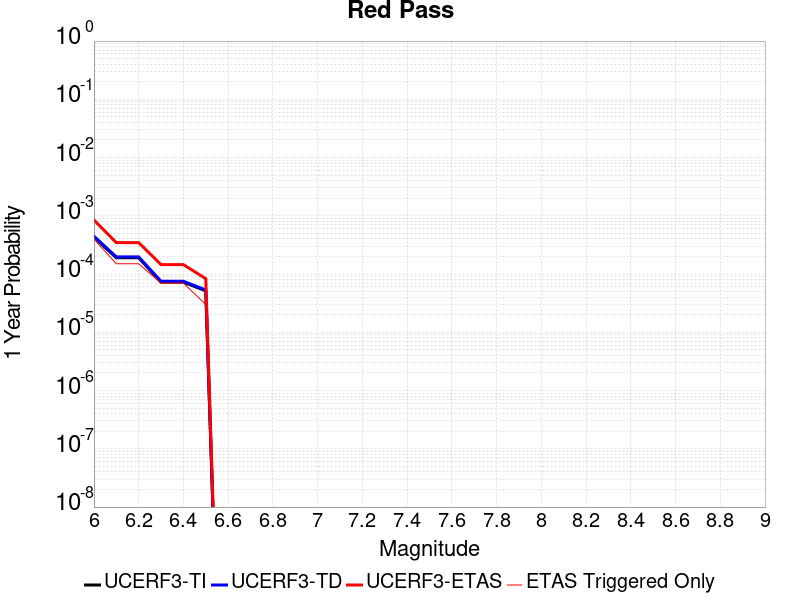 | 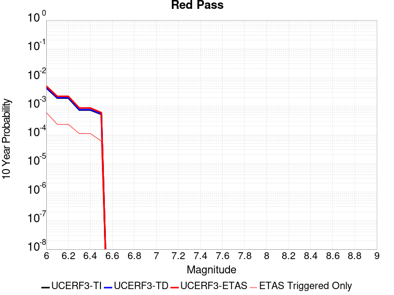 |

| Magnitude | 1 wk TI Prob | 1 wk TD Prob | 1 wk ETAS Prob | 1 wk ETAS/TD Gain | 1 wk ETAS Triggered Only | 1 mo TI Prob | 1 mo TD Prob | 1 mo ETAS Prob | 1 mo ETAS/TD Gain | 1 mo ETAS Triggered Only | 1 yr TI Prob | 1 yr TD Prob | 1 yr ETAS Prob | 1 yr ETAS/TD Gain | 1 yr ETAS Triggered Only | 10 yr TI Prob | 10 yr TD Prob | 10 yr ETAS Prob | 10 yr ETAS/TD Gain | 10 yr ETAS Triggered Only |
|-----|-----|-----|-----|-----|-----|-----|-----|-----|-----|-----|-----|-----|-----|-----|-----|-----|-----|-----|-----|-----|
| 6.0 | 8.258278E-6 | 8.551265E-6 | 1.685499E-4 | 19.710522 | 1.6E-4 | 3.539214E-5 | 3.6647863E-5 | 2.6663943E-4 | 7.2757154 | 2.3E-4 | 4.308141E-4 | 4.4611428E-4 | 8.4593584E-4 | 1.8962313 | 4.0E-4 | 0.0042997985 | 0.004453945 | 0.0050512725 | 1.134112 | 6.0E-4 |
| 6.1 | 3.649988E-6 | 3.7753161E-6 | 3.3775203E-5 | 8.946324 | 3.0E-5 | 1.5642712E-5 | 1.6179853E-5 | 7.617888E-5 | 4.708256 | 6.0E-5 | 1.9043336E-4 | 1.9697666E-4 | 3.469471E-4 | 1.7613615 | 1.5E-4 | 0.0019027026 | 0.001968488 | 0.0021980354 | 1.116611 | 2.3E-4 |
| 6.2 | 3.649988E-6 | 3.7753161E-6 | 3.3775203E-5 | 8.946324 | 3.0E-5 | 1.5642712E-5 | 1.6179853E-5 | 7.617888E-5 | 4.708256 | 6.0E-5 | 1.9043336E-4 | 1.9697666E-4 | 3.469471E-4 | 1.7613615 | 1.5E-4 | 0.0019027026 | 0.001968488 | 0.0021980354 | 1.116611 | 2.3E-4 |
| 6.3 | 1.3924937E-6 | 1.4411166E-6 | 1.1441102E-5 | 7.9390535 | 1.0E-5 | 5.9678164E-6 | 6.1762075E-6 | 3.617602E-5 | 5.85732 | 3.0E-5 | 7.265574E-5 | 7.519415E-5 | 1.4518888E-4 | 1.9308535 | 7.0E-5 | 7.263199E-4 | 7.518258E-4 | 8.617431E-4 | 1.1462005 | 1.1E-4 |
| 6.4 | 1.3924937E-6 | 1.4411166E-6 | 1.1441102E-5 | 7.9390535 | 1.0E-5 | 5.9678164E-6 | 6.1762075E-6 | 3.617602E-5 | 5.85732 | 3.0E-5 | 7.265574E-5 | 7.519415E-5 | 1.4518888E-4 | 1.9308535 | 7.0E-5 | 7.263199E-4 | 7.518258E-4 | 8.617431E-4 | 1.1462005 | 1.1E-4 |
| 6.5 | 9.876812E-7 | 1.0221912E-6 | 1.0221912E-6 | 1.0 | 0.0 | 4.2329125E-6 | 4.3808195E-6 | 4.3808195E-6 | 1.0 | 0.0 | 5.153449E-5 | 5.3336476E-5 | 8.3334875E-5 | 1.5624368 | 3.0E-5 | 5.1522546E-4 | 5.333648E-4 | 5.9333275E-4 | 1.1124333 | 6.0E-5 |

## San Jacinto (San Bernardino)
*[(top)](#table-of-contents)*

| 1 Week | 1 Month | 1 Year | 10 Year |
|-----|-----|-----|-----|
|  |  | 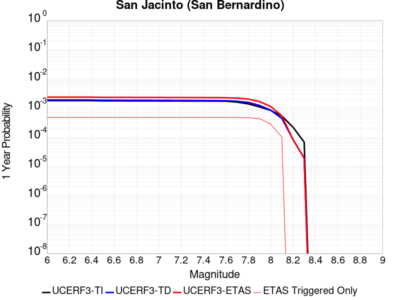 |  |

| Magnitude | 1 wk TI Prob | 1 wk TD Prob | 1 wk ETAS Prob | 1 wk ETAS/TD Gain | 1 wk ETAS Triggered Only | 1 mo TI Prob | 1 mo TD Prob | 1 mo ETAS Prob | 1 mo ETAS/TD Gain | 1 mo ETAS Triggered Only | 1 yr TI Prob | 1 yr TD Prob | 1 yr ETAS Prob | 1 yr ETAS/TD Gain | 1 yr ETAS Triggered Only | 10 yr TI Prob | 10 yr TD Prob | 10 yr ETAS Prob | 10 yr ETAS/TD Gain | 10 yr ETAS Triggered Only |
|-----|-----|-----|-----|-----|-----|-----|-----|-----|-----|-----|-----|-----|-----|-----|-----|-----|-----|-----|-----|-----|
| 6.0 | 3.409352E-5 | 3.598562E-5 | 3.1597554E-4 | 8.780606 | 2.8E-4 | 1.461069E-4 | 1.5421498E-4 | 5.1415944E-4 | 3.3340435 | 3.6E-4 | 0.0017774 | 0.0018759521 | 0.0023450705 | 1.2500695 | 4.7E-4 | 0.01763251 | 0.019349992 | 0.019938383 | 1.0304078 | 6.0E-4 |
| 6.1 | 3.409352E-5 | 3.598562E-5 | 3.1597554E-4 | 8.780606 | 2.8E-4 | 1.461069E-4 | 1.5421498E-4 | 5.1415944E-4 | 3.3340435 | 3.6E-4 | 0.0017774 | 0.0018759521 | 0.0023450705 | 1.2500695 | 4.7E-4 | 0.01763251 | 0.019349992 | 0.019938383 | 1.0304078 | 6.0E-4 |
| 6.2 | 3.409352E-5 | 3.598562E-5 | 3.1597554E-4 | 8.780606 | 2.8E-4 | 1.461069E-4 | 1.5421498E-4 | 5.1415944E-4 | 3.3340435 | 3.6E-4 | 0.0017774 | 0.0018759521 | 0.0023450705 | 1.2500695 | 4.7E-4 | 0.01763251 | 0.019349992 | 0.019938383 | 1.0304078 | 6.0E-4 |
| 6.3 | 3.409352E-5 | 3.598562E-5 | 3.1597554E-4 | 8.780606 | 2.8E-4 | 1.461069E-4 | 1.5421498E-4 | 5.1415944E-4 | 3.3340435 | 3.6E-4 | 0.0017774 | 0.0018759521 | 0.0023450705 | 1.2500695 | 4.7E-4 | 0.01763251 | 0.019349992 | 0.019938383 | 1.0304078 | 6.0E-4 |
| 6.4 | 3.400795E-5 | 3.5878285E-5 | 3.1586824E-4 | 8.803884 | 2.8E-4 | 1.4574021E-4 | 1.5375503E-4 | 5.1369966E-4 | 3.3410268 | 3.6E-4 | 0.0017729428 | 0.0018703619 | 0.0023394828 | 1.2508183 | 4.7E-4 | 0.017588645 | 0.019295074 | 0.019883497 | 1.030496 | 6.0E-4 |
| 6.5 | 3.341482E-5 | 3.5138914E-5 | 3.151291E-4 | 8.968094 | 2.8E-4 | 1.4319851E-4 | 1.5058667E-4 | 5.1053247E-4 | 3.39029 | 3.6E-4 | 0.0017420477 | 0.0018318522 | 0.0023009912 | 1.2561009 | 4.7E-4 | 0.017284546 | 0.018916616 | 0.019495456 | 1.0305995 | 5.9E-4 |
| 6.6 | 3.3364955E-5 | 3.5076133E-5 | 3.150663E-4 | 8.982356 | 2.8E-4 | 1.4298483E-4 | 1.5031763E-4 | 5.102635E-4 | 3.3945687 | 3.6E-4 | 0.0017394501 | 0.0018285823 | 0.002297723 | 1.2565597 | 4.7E-4 | 0.017258976 | 0.01888448 | 0.019463338 | 1.0306526 | 5.9E-4 |
| 6.7 | 3.335922E-5 | 3.5065907E-5 | 3.150561E-4 | 8.984684 | 2.8E-4 | 1.4296026E-4 | 1.5027382E-4 | 5.102197E-4 | 3.395267 | 3.6E-4 | 0.0017391514 | 0.0018280497 | 0.0022971905 | 1.2566346 | 4.7E-4 | 0.017256035 | 0.018879272 | 0.019458134 | 1.0306612 | 5.9E-4 |
| 6.8 | 3.327683E-5 | 3.4959972E-5 | 3.149502E-4 | 9.00888 | 2.8E-4 | 1.4260718E-4 | 1.4981985E-4 | 5.0976593E-4 | 3.4025257 | 3.6E-4 | 0.0017348597 | 0.001822532 | 0.0022916754 | 1.257413 | 4.7E-4 | 0.017213784 | 0.018825045 | 0.019403936 | 1.0307512 | 5.9E-4 |
| 6.9 | 3.3235785E-5 | 3.4900928E-5 | 3.1489116E-4 | 9.022429 | 2.8E-4 | 1.4243131E-4 | 1.4956683E-4 | 5.0951296E-4 | 3.4065907 | 3.6E-4 | 0.0017327217 | 0.0018194567 | 0.0022886016 | 1.2578489 | 4.7E-4 | 0.017192734 | 0.018794911 | 0.019373821 | 1.0308015 | 5.9E-4 |
| 7.0 | 3.3197095E-5 | 3.4840854E-5 | 3.148311E-4 | 9.036262 | 2.8E-4 | 1.422655E-4 | 1.4930942E-4 | 5.092557E-4 | 3.4107404 | 3.6E-4 | 0.0017307063 | 0.0018163278 | 0.0022854742 | 1.2582939 | 4.7E-4 | 0.017172894 | 0.01876429 | 0.019343218 | 1.0308527 | 5.9E-4 |
| 7.1 | 3.3129716E-5 | 3.4721066E-5 | 3.1471133E-4 | 9.063989 | 2.8E-4 | 1.4197677E-4 | 1.4879608E-4 | 5.087425E-4 | 3.4190586 | 3.6E-4 | 0.0017271966 | 0.0018100884 | 0.0022792376 | 1.2591858 | 4.7E-4 | 0.017138338 | 0.018703366 | 0.01928233 | 1.0309551 | 5.9E-4 |
| 7.2 | 3.3034008E-5 | 3.4588513E-5 | 3.1457882E-4 | 9.094893 | 2.8E-4 | 1.4156665E-4 | 1.4822806E-4 | 5.081747E-4 | 3.42833 | 3.6E-4 | 0.0017222111 | 0.0018031843 | 0.0022723367 | 1.26018 | 4.7E-4 | 0.017089253 | 0.01863575 | 0.019214755 | 1.0310696 | 5.9E-4 |
| 7.3 | 3.2956614E-5 | 3.4456265E-5 | 3.1444663E-4 | 9.125963 | 2.8E-4 | 1.4123498E-4 | 1.4766137E-4 | 5.0760823E-4 | 3.437651 | 3.6E-4 | 0.0017181796 | 0.0017962961 | 0.002265452 | 1.2611796 | 4.7E-4 | 0.017049557 | 0.018568495 | 0.019147541 | 1.0311842 | 5.9E-4 |
| 7.4 | 3.2915937E-5 | 3.4377957E-5 | 3.1436834E-4 | 9.144473 | 2.8E-4 | 1.4106068E-4 | 1.473258E-4 | 5.072728E-4 | 3.443204 | 3.6E-4 | 0.0017160608 | 0.0017922173 | 0.0022613748 | 1.261775 | 4.7E-4 | 0.017028693 | 0.018528769 | 0.019107837 | 1.0312524 | 5.9E-4 |
| 7.5 | 3.281791E-5 | 3.424287E-5 | 3.1423327E-4 | 9.176604 | 2.8E-4 | 1.406406E-4 | 1.4674691E-4 | 5.066941E-4 | 3.4528432 | 3.6E-4 | 0.0017109542 | 0.0017851809 | 0.002254342 | 1.2628087 | 4.7E-4 | 0.016978411 | 0.018459652 | 0.019038761 | 1.0313716 | 5.9E-4 |
| 7.6 | 3.2521442E-5 | 3.396782E-5 | 3.139583E-4 | 9.242816 | 2.8E-4 | 1.3937015E-4 | 1.4556825E-4 | 5.0551584E-4 | 3.4727068 | 3.6E-4 | 0.0016955109 | 0.0017708542 | 0.002240022 | 1.2649386 | 4.7E-4 | 0.016826328 | 0.018317295 | 0.018896488 | 1.03162 | 5.9E-4 |
| 7.7 | 3.0287873E-5 | 3.245191E-5 | 3.1244283E-4 | 9.6278715 | 2.8E-4 | 1.297987E-4 | 1.3907222E-4 | 4.9902214E-4 | 3.5882232 | 3.6E-4 | 0.0015791537 | 0.0016918903 | 0.0021610952 | 1.2773257 | 4.7E-4 | 0.01567979 | 0.017528199 | 0.018107858 | 1.0330701 | 5.9E-4 |
| 7.8 | 2.6316151E-5 | 2.9662837E-5 | 3.0965454E-4 | 10.439141 | 2.8E-4 | 1.1277862E-4 | 1.2712025E-4 | 4.870745E-4 | 3.8316042 | 3.6E-4 | 0.0013722149 | 0.0015465913 | 0.0020058798 | 1.2969683 | 4.6E-4 | 0.013637724 | 0.016069878 | 0.016640557 | 1.0355123 | 5.8E-4 |
| 7.9 | 2.0761147E-5 | 2.3417291E-5 | 2.9341097E-4 | 12.529672 | 2.7E-4 | 8.897331E-5 | 1.0035596E-4 | 4.4032183E-4 | 4.3876004 | 3.4E-4 | 0.0010827117 | 0.0012211498 | 0.0016506247 | 1.3516971 | 4.3E-4 | 0.010774517 | 0.012793272 | 0.013326364 | 1.0416697 | 5.4E-4 |
| 8.0 | 1.5738568E-5 | 1.6032505E-5 | 1.8602978E-4 | 11.603288 | 1.7E-4 | 6.744926E-5 | 6.8708934E-5 | 2.8869382E-4 | 4.2016926 | 2.2E-4 | 8.2088535E-4 | 8.3621085E-4 | 0.0011159767 | 1.3345637 | 2.8E-4 | 0.008178596 | 0.008865741 | 0.009222549 | 1.0402458 | 3.6E-4 |
| 8.1 | 1.0105832E-5 | 8.329479E-6 | 5.8329064E-5 | 7.0027266 | 5.0E-5 | 4.3309992E-5 | 3.569728E-5 | 1.0569478E-4 | 2.9608638 | 7.0E-5 | 5.2717153E-4 | 4.3452822E-4 | 5.3448475E-4 | 1.2300346 | 1.0E-4 | 0.005259227 | 0.0046768794 | 0.0048162243 | 1.0297945 | 1.4E-4 |
| 8.2 | 4.189207E-6 | 1.577699E-6 | 1.577699E-6 | 1.0 | 0.0 | 1.7953622E-5 | 6.7615497E-6 | 6.7615497E-6 | 1.0 | 0.0 | 2.1856341E-4 | 8.231879E-5 | 8.231879E-5 | 1.0 | 0.0 | 0.0021834858 | 9.562628E-4 | 9.562628E-4 | 1.0 | 0.0 |
| 8.3 | 1.2758221E-6 | 3.612677E-7 | 3.612677E-7 | 1.0 | 0.0 | 5.4677976E-6 | 1.5482892E-6 | 1.5482892E-6 | 1.0 | 0.0 | 6.65684E-5 | 1.8850264E-5 | 1.8850264E-5 | 1.0 | 0.0 | 6.6548464E-4 | 2.2739546E-4 | 2.2739546E-4 | 1.0 | 0.0 |

## San Andreas (Coachella) rev
*[(top)](#table-of-contents)*

| 1 Week | 1 Month | 1 Year | 10 Year |
|-----|-----|-----|-----|
|  |  | 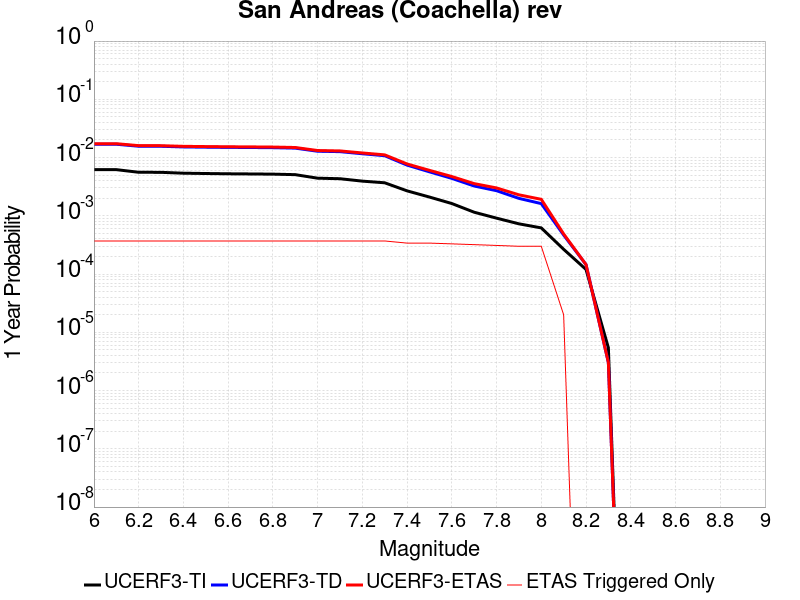 |  |

| Magnitude | 1 wk TI Prob | 1 wk TD Prob | 1 wk ETAS Prob | 1 wk ETAS/TD Gain | 1 wk ETAS Triggered Only | 1 mo TI Prob | 1 mo TD Prob | 1 mo ETAS Prob | 1 mo ETAS/TD Gain | 1 mo ETAS Triggered Only | 1 yr TI Prob | 1 yr TD Prob | 1 yr ETAS Prob | 1 yr ETAS/TD Gain | 1 yr ETAS Triggered Only | 10 yr TI Prob | 10 yr TD Prob | 10 yr ETAS Prob | 10 yr ETAS/TD Gain | 10 yr ETAS Triggered Only |
|-----|-----|-----|-----|-----|-----|-----|-----|-----|-----|-----|-----|-----|-----|-----|-----|-----|-----|-----|-----|-----|
| 6.0 | 1.1925945E-4 | 3.273077E-4 | 5.2724226E-4 | 1.6108458 | 2.0E-4 | 5.110118E-4 | 0.001401998 | 0.0016416615 | 1.1709442 | 2.4E-4 | 0.0062038354 | 0.016937068 | 0.017300801 | 1.0214756 | 3.7E-4 | 0.060334753 | 0.15267672 | 0.15311733 | 1.0028859 | 5.2E-4 |
| 6.1 | 1.1925945E-4 | 3.273077E-4 | 5.2724226E-4 | 1.6108458 | 2.0E-4 | 5.110118E-4 | 0.001401998 | 0.0016416615 | 1.1709442 | 2.4E-4 | 0.0062038354 | 0.016937068 | 0.017300801 | 1.0214756 | 3.7E-4 | 0.060334753 | 0.15267672 | 0.15311733 | 1.0028859 | 5.2E-4 |
| 6.2 | 1.07432395E-4 | 3.0231563E-4 | 5.0225516E-4 | 1.6613603 | 2.0E-4 | 4.603433E-4 | 0.001294999 | 0.0015346883 | 1.1850883 | 2.4E-4 | 0.005590286 | 0.015653731 | 0.01601794 | 1.0232666 | 3.7E-4 | 0.05451731 | 0.14182784 | 0.1422655 | 1.0030859 | 5.1E-4 |
| 6.3 | 1.0718766E-4 | 3.0176868E-4 | 5.017083E-4 | 1.6625593 | 2.0E-4 | 4.592948E-4 | 0.0012926573 | 0.001532347 | 1.1854241 | 2.4E-4 | 0.005577586 | 0.01562563 | 0.01598985 | 1.023309 | 3.7E-4 | 0.054396555 | 0.14159605 | 0.14203385 | 1.0030918 | 5.1E-4 |
| 6.4 | 1.0355944E-4 | 2.9384956E-4 | 4.937908E-4 | 1.6804204 | 2.0E-4 | 4.4375064E-4 | 0.0012587514 | 0.0014984492 | 1.1904252 | 2.4E-4 | 0.0053892885 | 0.015218662 | 0.015583032 | 1.0239422 | 3.7E-4 | 0.052604496 | 0.13815795 | 0.13859749 | 1.0031815 | 5.1E-4 |
| 6.5 | 1.0227914E-4 | 2.9104383E-4 | 4.9098564E-4 | 1.6869817 | 2.0E-4 | 4.382655E-4 | 0.0012467385 | 0.0014864393 | 1.1922623 | 2.4E-4 | 0.0053228354 | 0.015074439 | 0.015438861 | 1.0241748 | 3.7E-4 | 0.051971316 | 0.13694239 | 0.13738254 | 1.0032142 | 5.1E-4 |
| 6.6 | 1.0116757E-4 | 2.8870135E-4 | 4.886436E-4 | 1.6925575 | 2.0E-4 | 4.3350324E-4 | 0.0012367087 | 0.0014764119 | 1.1938235 | 2.4E-4 | 0.0052651367 | 0.014954008 | 0.015318476 | 1.0243726 | 3.7E-4 | 0.051421247 | 0.13591973 | 0.13636042 | 1.0032423 | 5.1E-4 |
| 6.7 | 1.0050676E-4 | 2.8728697E-4 | 4.8722952E-4 | 1.695968 | 2.0E-4 | 4.3067214E-4 | 0.0012306528 | 0.0014703575 | 1.1947784 | 2.4E-4 | 0.005230834 | 0.014881288 | 0.015245782 | 1.0244935 | 3.7E-4 | 0.051094085 | 0.13530464 | 0.13574564 | 1.0032593 | 5.1E-4 |
| 6.8 | 9.976819E-5 | 2.8532353E-4 | 4.8526647E-4 | 1.7007587 | 2.0E-4 | 4.2750788E-4 | 0.001222246 | 0.0014619527 | 1.1961198 | 2.4E-4 | 0.0051924936 | 0.014780328 | 0.015144859 | 1.0246633 | 3.7E-4 | 0.050728295 | 0.13445628 | 0.13489771 | 1.003283 | 5.1E-4 |
| 6.9 | 9.77719E-5 | 2.802926E-4 | 4.8023651E-4 | 1.7133402 | 2.0E-4 | 4.1895514E-4 | 0.0012007048 | 0.0014404167 | 1.1996427 | 2.4E-4 | 0.0050888555 | 0.0145215895 | 0.014886217 | 1.0251093 | 3.7E-4 | 0.049738888 | 0.13228476 | 0.1327273 | 1.0033454 | 5.1E-4 |
| 7.0 | 8.500761E-5 | 2.4763815E-4 | 4.4758862E-4 | 1.80743 | 2.0E-4 | 3.6426744E-4 | 0.0010608779 | 0.0013006233 | 1.2259877 | 2.4E-4 | 0.0044259406 | 0.01284047 | 0.013205719 | 1.0284451 | 3.7E-4 | 0.04338823 | 0.11813616 | 0.11858591 | 1.0038071 | 5.1E-4 |
| 7.1 | 8.319876E-5 | 2.4366553E-4 | 4.436168E-4 | 1.8205973 | 2.0E-4 | 3.5651738E-4 | 0.0010438662 | 0.0012836156 | 1.2296746 | 2.4E-4 | 0.004331963 | 0.012635773 | 0.013001098 | 1.028912 | 3.7E-4 | 0.042484846 | 0.11635632 | 0.11680698 | 1.0038731 | 5.1E-4 |
| 7.2 | 7.563917E-5 | 2.2414974E-4 | 4.2410492E-4 | 1.8920606 | 2.0E-4 | 3.2412758E-4 | 9.602912E-4 | 0.0012000607 | 1.2496842 | 2.4E-4 | 0.0039391145 | 0.011629559 | 0.011995257 | 1.0314455 | 3.7E-4 | 0.03870018 | 0.10776202 | 0.10821705 | 1.0042226 | 5.1E-4 |
| 7.3 | 7.082985E-5 | 2.07311E-4 | 4.0726954E-4 | 1.9645342 | 2.0E-4 | 3.0352117E-4 | 8.881761E-4 | 0.001127963 | 1.2699767 | 2.4E-4 | 0.0036891096 | 0.010760553 | 0.011126572 | 1.0340148 | 3.7E-4 | 0.03628465 | 0.10028403 | 0.10074289 | 1.0045756 | 5.1E-4 |
| 7.4 | 5.146215E-5 | 1.4274761E-4 | 3.2272193E-4 | 2.2607868 | 1.8E-4 | 2.2053342E-4 | 6.1163295E-4 | 8.3149836E-4 | 1.3594729 | 2.2E-4 | 0.0026816884 | 0.0074213943 | 0.0077588707 | 1.0454735 | 3.4E-4 | 0.02649557 | 0.07085049 | 0.07128719 | 1.0061637 | 4.7E-4 |
| 7.5 | 4.0285166E-5 | 1.0942422E-4 | 2.8940453E-4 | 2.644794 | 1.8E-4 | 1.7263928E-4 | 4.6887697E-4 | 6.887738E-4 | 1.4689863 | 2.2E-4 | 0.002099857 | 0.0056937044 | 0.0060317684 | 1.059375 | 3.4E-4 | 0.020801254 | 0.055013083 | 0.055438325 | 1.0077299 | 4.5E-4 |
| 7.6 | 3.1168736E-5 | 8.439599E-5 | 2.643808E-4 | 3.1326227 | 1.8E-4 | 1.3357346E-4 | 3.616471E-4 | 5.815675E-4 | 1.6081078 | 2.2E-4 | 0.0016250437 | 0.004394191 | 0.0047227405 | 1.0747691 | 3.3E-4 | 0.016132116 | 0.042812478 | 0.04323364 | 1.0098374 | 4.4E-4 |
| 7.7 | 2.2100989E-5 | 6.239345E-5 | 2.3238284E-4 | 3.724475 | 1.7E-4 | 9.4715084E-5 | 2.6737314E-4 | 4.7731696E-4 | 1.7852093 | 2.1E-4 | 0.001152546 | 0.0032504152 | 0.003569375 | 1.0981289 | 3.2E-4 | 0.011465867 | 0.031902168 | 0.03229909 | 1.0124418 | 4.1E-4 |
| 7.8 | 1.7484861E-5 | 5.180078E-5 | 2.1179249E-4 | 4.0885963 | 1.6E-4 | 7.493296E-5 | 2.2198448E-4 | 4.219401E-4 | 1.9007639 | 2.0E-4 | 9.1192697E-4 | 0.0026993142 | 0.0030084774 | 1.114534 | 3.1E-4 | 0.009081938 | 0.026641788 | 0.027031131 | 1.014614 | 4.0E-4 |
| 7.9 | 1.3967285E-5 | 3.8226146E-5 | 1.9822003E-4 | 5.1854568 | 1.6E-4 | 5.985842E-5 | 1.6381606E-4 | 3.637833E-4 | 2.2206814 | 2.0E-4 | 7.2853256E-4 | 0.0019926373 | 0.0022920396 | 1.1502542 | 3.0E-4 | 0.0072614877 | 0.019911002 | 0.020273635 | 1.0182127 | 3.7E-4 |
| 8.0 | 1.1887396E-5 | 3.106798E-5 | 1.9106301E-4 | 6.149837 | 1.6E-4 | 5.094499E-5 | 1.331417E-4 | 3.3311508E-4 | 2.501959 | 2.0E-4 | 6.200787E-4 | 0.0016197958 | 0.00191931 | 1.1849085 | 3.0E-4 | 0.006183513 | 0.016280567 | 0.016644543 | 1.0223565 | 3.7E-4 |
| 8.1 | 5.100864E-6 | 8.973766E-6 | 8.973766E-6 | 1.0 | 0.0 | 2.1860664E-5 | 3.845843E-5 | 5.845766E-5 | 1.520022 | 2.0E-5 | 2.6612106E-4 | 4.6813092E-4 | 4.8812156E-4 | 1.042703 | 2.0E-5 | 0.002658026 | 0.004918092 | 0.0049379934 | 1.0040466 | 2.0E-5 |
| 8.2 | 2.3004484E-6 | 2.7863473E-6 | 2.7863473E-6 | 1.0 | 0.0 | 9.859027E-6 | 1.19414335E-5 | 1.19414335E-5 | 1.0 | 0.0 | 1.2002704E-4 | 1.4537729E-4 | 1.4537729E-4 | 1.0 | 0.0 | 0.0011996223 | 0.0015973782 | 0.0015973782 | 1.0 | 0.0 |
| 8.3 | 1.0424446E-7 | 5.814421E-8 | 5.814421E-8 | 1.0 | 0.0 | 4.4676187E-7 | 2.4918944E-7 | 2.4918944E-7 | 1.0 | 0.0 | 5.439312E-6 | 3.0338776E-6 | 3.0338776E-6 | 1.0 | 0.0 | 5.4391792E-5 | 3.189592E-5 | 3.189592E-5 | 1.0 | 0.0 |

## Death Valley (Fish Lake Valley)
*[(top)](#table-of-contents)*

| 1 Week | 1 Month | 1 Year | 10 Year |
|-----|-----|-----|-----|
|  |  |  |  |

| Magnitude | 1 wk TI Prob | 1 wk TD Prob | 1 wk ETAS Prob | 1 wk ETAS/TD Gain | 1 wk ETAS Triggered Only | 1 mo TI Prob | 1 mo TD Prob | 1 mo ETAS Prob | 1 mo ETAS/TD Gain | 1 mo ETAS Triggered Only | 1 yr TI Prob | 1 yr TD Prob | 1 yr ETAS Prob | 1 yr ETAS/TD Gain | 1 yr ETAS Triggered Only | 10 yr TI Prob | 10 yr TD Prob | 10 yr ETAS Prob | 10 yr ETAS/TD Gain | 10 yr ETAS Triggered Only |
|-----|-----|-----|-----|-----|-----|-----|-----|-----|-----|-----|-----|-----|-----|-----|-----|-----|-----|-----|-----|-----|
| 6.0 | 3.872328E-5 | 4.7265705E-5 | 2.0725814E-4 | 4.3849583 | 1.6E-4 | 1.6594635E-4 | 2.0255324E-4 | 3.9251478E-4 | 1.937835 | 1.9E-4 | 0.0020185246 | 0.0024635606 | 0.0028426244 | 1.1538683 | 3.8E-4 | 0.02000288 | 0.024388338 | 0.024895655 | 1.0208017 | 5.2E-4 |
| 6.1 | 3.872328E-5 | 4.7265705E-5 | 2.0725814E-4 | 4.3849583 | 1.6E-4 | 1.6594635E-4 | 2.0255324E-4 | 3.9251478E-4 | 1.937835 | 1.9E-4 | 0.0020185246 | 0.0024635606 | 0.0028426244 | 1.1538683 | 3.8E-4 | 0.02000288 | 0.024388338 | 0.024895655 | 1.0208017 | 5.2E-4 |
| 6.2 | 3.872328E-5 | 4.7265705E-5 | 2.0725814E-4 | 4.3849583 | 1.6E-4 | 1.6594635E-4 | 2.0255324E-4 | 3.9251478E-4 | 1.937835 | 1.9E-4 | 0.0020185246 | 0.0024635606 | 0.0028426244 | 1.1538683 | 3.8E-4 | 0.02000288 | 0.024388338 | 0.024895655 | 1.0208017 | 5.2E-4 |
| 6.3 | 2.8356371E-5 | 3.360979E-5 | 1.9360441E-4 | 5.760358 | 1.6E-4 | 1.2152165E-4 | 1.4403443E-4 | 3.3400705E-4 | 2.318939 | 1.9E-4 | 0.0014785219 | 0.0017522788 | 0.002131613 | 1.2164805 | 3.8E-4 | 0.014687235 | 0.017391816 | 0.017902773 | 1.0293791 | 5.2E-4 |
| 6.4 | 2.8356371E-5 | 3.360979E-5 | 1.9360441E-4 | 5.760358 | 1.6E-4 | 1.2152165E-4 | 1.4403443E-4 | 3.3400705E-4 | 2.318939 | 1.9E-4 | 0.0014785219 | 0.0017522788 | 0.002131613 | 1.2164805 | 3.8E-4 | 0.014687235 | 0.017391816 | 0.017902773 | 1.0293791 | 5.2E-4 |
| 6.5 | 2.4448687E-5 | 2.8607585E-5 | 1.786033E-4 | 6.2432146 | 1.5E-4 | 1.0477588E-4 | 1.2259845E-4 | 3.0257637E-4 | 2.4680278 | 1.8E-4 | 0.0012748998 | 0.0014916616 | 0.0018611097 | 1.2476755 | 3.7E-4 | 0.012676105 | 0.014821392 | 0.015323833 | 1.0338998 | 5.1E-4 |
| 6.6 | 2.1298161E-5 | 2.4660083E-5 | 1.7465638E-4 | 7.0825543 | 1.5E-4 | 9.127464E-5 | 1.0568197E-4 | 2.8566294E-4 | 2.7030435 | 1.8E-4 | 0.0011107022 | 0.0012859512 | 0.0016554755 | 1.2873547 | 3.7E-4 | 0.011051672 | 0.01278853 | 0.013292008 | 1.0393695 | 5.1E-4 |
| 6.7 | 1.8959729E-5 | 2.1781027E-5 | 1.7177776E-4 | 7.886578 | 1.5E-4 | 8.125345E-5 | 9.334406E-5 | 2.7332726E-4 | 2.9281697 | 1.8E-4 | 9.888117E-4 | 0.001135897 | 0.0015054767 | 1.3253638 | 3.7E-4 | 0.009844234 | 0.01130357 | 0.011807805 | 1.0446085 | 5.1E-4 |
| 6.8 | 1.6691629E-5 | 1.9018351E-5 | 1.690155E-4 | 8.886969 | 1.5E-4 | 7.153359E-5 | 8.150477E-5 | 2.614901E-4 | 3.2082796 | 1.8E-4 | 8.7057345E-4 | 9.918857E-4 | 0.0013615187 | 1.3726568 | 3.7E-4 | 0.008671708 | 0.009876343 | 0.0103813065 | 1.0511285 | 5.1E-4 |
| 6.9 | 1.450505E-5 | 1.638954E-5 | 1.5638725E-4 | 9.541894 | 1.4E-4 | 6.216302E-5 | 7.0239046E-5 | 2.402271E-4 | 3.4201362 | 1.7E-4 | 7.5657194E-4 | 8.5483363E-4 | 0.0012145259 | 1.4207746 | 3.6E-4 | 0.007540013 | 0.008516386 | 0.009012127 | 1.0582104 | 5.0E-4 |
| 7.0 | 1.2940855E-5 | 1.4537972E-5 | 1.5453594E-4 | 10.629814 | 1.4E-4 | 5.545963E-5 | 6.230414E-5 | 2.3229355E-4 | 3.7283807 | 1.7E-4 | 6.750118E-4 | 7.5829466E-4 | 0.0011180217 | 1.4743894 | 3.6E-4 | 0.006729651 | 0.0075576897 | 0.008053911 | 1.0656577 | 5.0E-4 |
| 7.1 | 1.2544658E-5 | 1.4078208E-5 | 1.5407623E-4 | 10.944307 | 1.4E-4 | 5.3761712E-5 | 6.0333812E-5 | 2.3032355E-4 | 3.8174872 | 1.7E-4 | 6.5435225E-4 | 7.343222E-4 | 0.0010940578 | 1.4898881 | 3.6E-4 | 0.006524288 | 0.007319551 | 0.007815891 | 1.0678102 | 5.0E-4 |
| 7.2 | 1.2489416E-5 | 1.4015674E-5 | 1.5401372E-4 | 10.988677 | 1.4E-4 | 5.3524967E-5 | 6.0065824E-5 | 2.3005561E-4 | 3.8300583 | 1.7E-4 | 6.514716E-4 | 7.310616E-4 | 0.0010907984 | 1.4920745 | 3.6E-4 | 0.006495651 | 0.0072871596 | 0.0077835163 | 1.0681138 | 5.0E-4 |
| 7.3 | 1.2368307E-5 | 1.3879812E-5 | 1.5387787E-4 | 11.086452 | 1.4E-4 | 5.3005948E-5 | 5.9483587E-5 | 2.2947347E-4 | 3.8577611 | 1.7E-4 | 6.451563E-4 | 7.2397763E-4 | 0.001083717 | 1.4968929 | 3.6E-4 | 0.0064328653 | 0.007216782 | 0.0077131735 | 1.0687829 | 5.0E-4 |
| 7.4 | 1.2161707E-5 | 1.36478675E-5 | 1.5364596E-4 | 11.257873 | 1.4E-4 | 5.212056E-5 | 5.8489582E-5 | 2.2847964E-4 | 3.9063306 | 1.7E-4 | 6.3438306E-4 | 7.118836E-4 | 0.0010716274 | 1.5053407 | 3.6E-4 | 0.006325751 | 0.0070966207 | 0.007583143 | 1.0685569 | 4.9E-4 |
| 7.5 | 1.1707948E-5 | 1.3145515E-5 | 1.5314367E-4 | 11.64988 | 1.4E-4 | 5.0175953E-5 | 5.6336736E-5 | 2.2632716E-4 | 4.0173993 | 1.7E-4 | 6.10721E-4 | 6.856895E-4 | 0.0010454427 | 1.524659 | 3.6E-4 | 0.0060904534 | 0.006836321 | 0.0073229712 | 1.071186 | 4.9E-4 |
| 7.6 | 1.0319538E-5 | 1.1579622E-5 | 1.51578E-4 | 13.090064 | 1.4E-4 | 4.4225842E-5 | 4.9626036E-5 | 2.096181E-4 | 4.2239537 | 1.6E-4 | 5.383166E-4 | 6.040347E-4 | 9.438293E-4 | 1.5625416 | 3.4E-4 | 0.0053701443 | 0.0060244603 | 0.006491629 | 1.0775453 | 4.7E-4 |
| 7.7 | 8.937764E-6 | 1.0022779E-5 | 1.4002148E-4 | 13.9703245 | 1.3E-4 | 3.830414E-5 | 4.295409E-5 | 1.9294764E-4 | 4.4919505 | 1.5E-4 | 4.6625308E-4 | 5.228456E-4 | 8.52673E-4 | 1.6308315 | 3.3E-4 | 0.0046527605 | 0.005216664 | 0.0056742644 | 1.087719 | 4.6E-4 |
| 7.8 | 3.108007E-7 | 3.284654E-7 | 3.284654E-7 | 1.0 | 0.0 | 1.3320023E-6 | 1.407708E-6 | 1.407708E-6 | 1.0 | 0.0 | 1.6217007E-5 | 1.7138715E-5 | 2.7138543E-5 | 1.5834643 | 1.0E-5 | 1.6215823E-4 | 1.7137431E-4 | 1.9137088E-4 | 1.1166836 | 2.0E-5 |
| 7.9 | 2.5591178E-9 | 2.6696718E-9 | 2.6696718E-9 | 1.0 | 0.0 | 1.0967647E-8 | 1.14414505E-8 | 1.14414505E-8 | 1.0 | 0.0 | 1.335311E-7 | 1.3929966E-7 | 1.3929966E-7 | 1.0 | 0.0 | 1.3353102E-6 | 1.3929966E-6 | 1.3929966E-6 | 1.0 | 0.0 |

## San Andreas (Cholame) rev
*[(top)](#table-of-contents)*

| 1 Week | 1 Month | 1 Year | 10 Year |
|-----|-----|-----|-----|
| 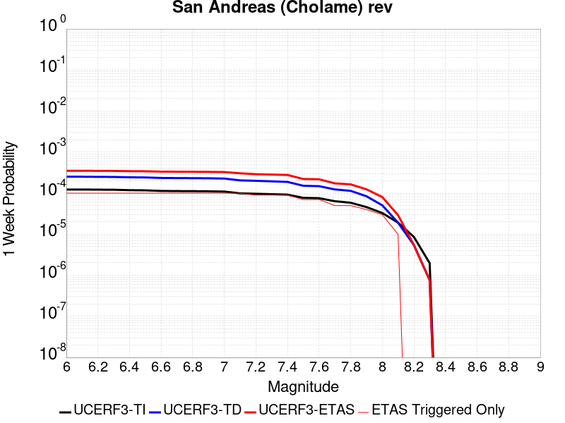 |  | 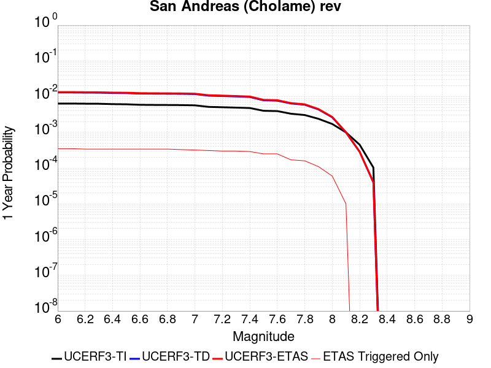 |  |

| Magnitude | 1 wk TI Prob | 1 wk TD Prob | 1 wk ETAS Prob | 1 wk ETAS/TD Gain | 1 wk ETAS Triggered Only | 1 mo TI Prob | 1 mo TD Prob | 1 mo ETAS Prob | 1 mo ETAS/TD Gain | 1 mo ETAS Triggered Only | 1 yr TI Prob | 1 yr TD Prob | 1 yr ETAS Prob | 1 yr ETAS/TD Gain | 1 yr ETAS Triggered Only | 10 yr TI Prob | 10 yr TD Prob | 10 yr ETAS Prob | 10 yr ETAS/TD Gain | 10 yr ETAS Triggered Only |
|-----|-----|-----|-----|-----|-----|-----|-----|-----|-----|-----|-----|-----|-----|-----|-----|-----|-----|-----|-----|-----|
| 6.0 | 1.2302514E-4 | 2.5205986E-4 | 3.5203467E-4 | 1.3966311 | 1.0E-4 | 5.27144E-4 | 0.0010798109 | 0.0012196598 | 1.1295123 | 1.4E-4 | 0.0063991086 | 0.013067958 | 0.013413384 | 1.0264331 | 3.5E-4 | 0.06217949 | 0.12438412 | 0.124830686 | 1.0035902 | 5.1E-4 |
| 6.1 | 1.2302514E-4 | 2.5205986E-4 | 3.5203467E-4 | 1.3966311 | 1.0E-4 | 5.27144E-4 | 0.0010798109 | 0.0012196598 | 1.1295123 | 1.4E-4 | 0.0063991086 | 0.013067958 | 0.013413384 | 1.0264331 | 3.5E-4 | 0.06217949 | 0.12438412 | 0.124830686 | 1.0035902 | 5.1E-4 |
| 6.2 | 1.2203569E-4 | 2.502277E-4 | 3.5020267E-4 | 1.399536 | 1.0E-4 | 5.2290526E-4 | 0.0010719653 | 0.0012118152 | 1.1304612 | 1.4E-4 | 0.006347804 | 0.012973578 | 0.013309167 | 1.0258671 | 3.4E-4 | 0.061695136 | 0.123571314 | 0.12400953 | 1.0035462 | 5.0E-4 |
| 6.3 | 1.2142645E-4 | 2.4908737E-4 | 3.4906247E-4 | 1.4013655 | 1.0E-4 | 5.202953E-4 | 0.0010670823 | 0.0012069328 | 1.1310589 | 1.4E-4 | 0.006316212 | 0.012914834 | 0.013250442 | 1.0259863 | 3.4E-4 | 0.06139677 | 0.12306532 | 0.12350379 | 1.0035629 | 5.0E-4 |
| 6.4 | 1.1865206E-4 | 2.4414246E-4 | 3.4411805E-4 | 1.4094969 | 1.0E-4 | 5.0840975E-4 | 0.0010459068 | 0.0011857604 | 1.1337152 | 1.4E-4 | 0.006172335 | 0.012660044 | 0.0129957395 | 1.0265162 | 3.4E-4 | 0.060036868 | 0.12085904 | 0.12129861 | 1.0036371 | 5.0E-4 |
| 6.5 | 1.17443946E-4 | 2.4207575E-4 | 3.4205156E-4 | 1.4129938 | 1.0E-4 | 5.032341E-4 | 0.0010370566 | 0.0011769114 | 1.1348574 | 1.4E-4 | 0.006109677 | 0.012553536 | 0.012889268 | 1.026744 | 3.4E-4 | 0.059444077 | 0.11993008 | 0.12037012 | 1.0036691 | 5.0E-4 |
| 6.6 | 1.13579066E-4 | 2.3516564E-4 | 3.3514213E-4 | 1.4251322 | 1.0E-4 | 4.866766E-4 | 0.001007465 | 0.0011473239 | 1.1388227 | 1.4E-4 | 0.0059092017 | 0.012197345 | 0.012533197 | 1.027535 | 3.4E-4 | 0.057545185 | 0.1168492 | 0.11729077 | 1.003779 | 5.0E-4 |
| 6.7 | 1.1271412E-4 | 2.336088E-4 | 3.3358543E-4 | 1.4279661 | 1.0E-4 | 4.829711E-4 | 0.001000798 | 0.0011406578 | 1.1397483 | 1.4E-4 | 0.005864331 | 0.012117079 | 0.01245296 | 1.0277196 | 3.4E-4 | 0.057119697 | 0.11615275 | 0.11659467 | 1.0038047 | 5.0E-4 |
| 6.8 | 1.1217975E-4 | 2.3249313E-4 | 3.3246988E-4 | 1.4300202 | 1.0E-4 | 4.8068175E-4 | 9.960202E-4 | 0.0011358807 | 1.1404194 | 1.4E-4 | 0.005836608 | 0.012059555 | 0.012395455 | 1.0278534 | 3.4E-4 | 0.056856725 | 0.11565061 | 0.116092786 | 1.0038234 | 5.0E-4 |
| 6.9 | 1.1146753E-4 | 2.3098059E-4 | 3.309575E-4 | 1.4328368 | 1.0E-4 | 4.7763053E-4 | 9.895428E-4 | 0.0011294042 | 1.1413395 | 1.4E-4 | 0.0057996577 | 0.011981564 | 0.012307609 | 1.0272123 | 3.3E-4 | 0.056506127 | 0.11497027 | 0.11540393 | 1.003772 | 4.9E-4 |
| 7.0 | 1.0965793E-4 | 2.2721413E-4 | 3.271914E-4 | 1.4400135 | 1.0E-4 | 4.698779E-4 | 9.734129E-4 | 0.0011132766 | 1.1436839 | 1.4E-4 | 0.005705768 | 0.011787324 | 0.012103552 | 1.0268278 | 3.2E-4 | 0.055614736 | 0.11327011 | 0.113686875 | 1.0036794 | 4.7E-4 |
| 7.1 | 9.927982E-5 | 2.0540332E-4 | 3.0538277E-4 | 1.486747 | 1.0E-4 | 4.2541555E-4 | 8.8000396E-4 | 0.0010198808 | 1.1589502 | 1.4E-4 | 0.0051671406 | 0.010661708 | 0.010968403 | 1.028766 | 3.1E-4 | 0.05048634 | 0.10336573 | 0.10376921 | 1.0039035 | 4.5E-4 |
| 7.2 | 9.696786E-5 | 2.0044584E-4 | 2.904278E-4 | 1.448909 | 9.0E-5 | 4.1551032E-4 | 8.587718E-4 | 9.886601E-4 | 1.1512489 | 1.3E-4 | 0.00504711 | 0.010405703 | 0.010702582 | 1.0285304 | 3.0E-4 | 0.04934009 | 0.10110233 | 0.10149785 | 1.003912 | 4.4E-4 |
| 7.3 | 9.4727984E-5 | 1.9473763E-4 | 2.847201E-4 | 1.4620703 | 9.0E-5 | 4.0591392E-4 | 8.343239E-4 | 9.6421543E-4 | 1.1556848 | 1.3E-4 | 0.0049308087 | 0.010110851 | 0.010407818 | 1.0293711 | 3.0E-4 | 0.048228268 | 0.09847412 | 0.09887079 | 1.0040282 | 4.4E-4 |
| 7.4 | 9.220358E-5 | 1.8844259E-4 | 2.7842564E-4 | 1.477509 | 9.0E-5 | 3.9509835E-4 | 8.07362E-4 | 9.372571E-4 | 1.1608882 | 1.3E-4 | 0.004799717 | 0.009785578 | 0.01007274 | 1.0293454 | 2.9E-4 | 0.046973653 | 0.09555831 | 0.095938176 | 1.0039753 | 4.2E-4 |
| 7.5 | 7.71631E-5 | 1.5179155E-4 | 2.2178092E-4 | 1.4610888 | 7.0E-5 | 3.306571E-4 | 6.5037323E-4 | 7.6030166E-4 | 1.1690236 | 1.1E-4 | 0.0040183207 | 0.007889617 | 0.008137644 | 1.0314372 | 2.5E-4 | 0.03946433 | 0.078289196 | 0.07863945 | 1.0044738 | 3.8E-4 |
| 7.6 | 7.5634416E-5 | 1.4838556E-4 | 2.1837518E-4 | 1.471674 | 7.0E-5 | 3.241072E-4 | 6.357833E-4 | 7.4571336E-4 | 1.172905 | 1.1E-4 | 0.0039388672 | 0.007713256 | 0.007961327 | 1.0321617 | 2.5E-4 | 0.038697794 | 0.076654874 | 0.07700575 | 1.0045773 | 3.8E-4 |
| 7.7 | 6.3783E-5 | 1.2359623E-4 | 1.7359004E-4 | 1.4044931 | 5.0E-5 | 2.7332708E-4 | 5.2959064E-4 | 6.095483E-4 | 1.1509801 | 8.0E-5 | 0.0033226798 | 0.0064287307 | 0.0065976377 | 1.0262738 | 1.7E-4 | 0.032734364 | 0.06454488 | 0.06479745 | 1.0039132 | 2.7E-4 |
| 7.8 | 5.863422E-5 | 1.14169685E-4 | 1.6416398E-4 | 1.4378946 | 5.0E-5 | 2.512653E-4 | 4.892069E-4 | 5.691678E-4 | 1.16345 | 8.0E-5 | 0.003054864 | 0.0059398497 | 0.006098899 | 1.0267767 | 1.6E-4 | 0.030132094 | 0.05966162 | 0.0598779 | 1.003625 | 2.3E-4 |
| 7.9 | 4.595283E-5 | 8.426815E-5 | 1.2426478E-4 | 1.4746352 | 4.0E-5 | 1.9692584E-4 | 3.6109926E-4 | 4.010848E-4 | 1.1107329 | 4.0E-5 | 0.0023949358 | 0.0043875277 | 0.004497045 | 1.0249611 | 1.1E-4 | 0.023692891 | 0.044363137 | 0.044506483 | 1.0032312 | 1.5E-4 |
| 8.0 | 3.2950178E-5 | 5.077396E-5 | 8.0772435E-5 | 1.590824 | 3.0E-5 | 1.412074E-4 | 2.1758456E-4 | 2.4757802E-4 | 1.1378474 | 3.0E-5 | 0.0017178444 | 0.0026458753 | 0.0027057165 | 1.0226169 | 6.0E-5 | 0.017046256 | 0.027181072 | 0.027258899 | 1.0028632 | 8.0E-5 |
| 8.1 | 1.9177472E-5 | 1.9183733E-5 | 2.9183542E-5 | 1.5212649 | 1.0E-5 | 8.218658E-5 | 8.221342E-5 | 9.221259E-5 | 1.1216247 | 1.0E-5 | 0.0010001622 | 0.0010004893 | 0.0010104793 | 1.0099851 | 1.0E-5 | 0.009956728 | 0.010757887 | 0.010787563 | 1.0027586 | 3.0E-5 |
| 8.2 | 8.643924E-6 | 5.473668E-6 | 5.473668E-6 | 1.0 | 0.0 | 3.704486E-5 | 2.3458366E-5 | 2.3458366E-5 | 1.0 | 0.0 | 4.5092785E-4 | 2.8556827E-4 | 2.8556827E-4 | 1.0 | 0.0 | 0.0045001395 | 0.0032481793 | 0.0032481793 | 1.0 | 0.0 |
| 8.3 | 1.983087E-6 | 7.6564595E-7 | 7.6564595E-7 | 1.0 | 0.0 | 8.498917E-6 | 3.281336E-6 | 3.281336E-6 | 1.0 | 0.0 | 1.034694E-4 | 3.9949547E-5 | 3.9949547E-5 | 1.0 | 0.0 | 0.0010342124 | 4.717979E-4 | 4.717979E-4 | 1.0 | 0.0 |

## San Andreas (Carrizo) rev
*[(top)](#table-of-contents)*

| 1 Week | 1 Month | 1 Year | 10 Year |
|-----|-----|-----|-----|
|  |  |  |  |

| Magnitude | 1 wk TI Prob | 1 wk TD Prob | 1 wk ETAS Prob | 1 wk ETAS/TD Gain | 1 wk ETAS Triggered Only | 1 mo TI Prob | 1 mo TD Prob | 1 mo ETAS Prob | 1 mo ETAS/TD Gain | 1 mo ETAS Triggered Only | 1 yr TI Prob | 1 yr TD Prob | 1 yr ETAS Prob | 1 yr ETAS/TD Gain | 1 yr ETAS Triggered Only | 10 yr TI Prob | 10 yr TD Prob | 10 yr ETAS Prob | 10 yr ETAS/TD Gain | 10 yr ETAS Triggered Only |
|-----|-----|-----|-----|-----|-----|-----|-----|-----|-----|-----|-----|-----|-----|-----|-----|-----|-----|-----|-----|-----|
| 6.0 | 1.1674632E-4 | 2.4324407E-4 | 3.532173E-4 | 1.4521106 | 1.1E-4 | 5.002454E-4 | 0.0010420597 | 0.001201893 | 1.1533821 | 1.6E-4 | 0.006073493 | 0.012613757 | 0.012949468 | 1.0266147 | 3.4E-4 | 0.0591016 | 0.120640226 | 0.1210887 | 1.0037174 | 5.1E-4 |
| 6.1 | 1.1674632E-4 | 2.4324407E-4 | 3.532173E-4 | 1.4521106 | 1.1E-4 | 5.002454E-4 | 0.0010420597 | 0.001201893 | 1.1533821 | 1.6E-4 | 0.006073493 | 0.012613757 | 0.012949468 | 1.0266147 | 3.4E-4 | 0.0591016 | 0.120640226 | 0.1210887 | 1.0037174 | 5.1E-4 |
| 6.2 | 1.1674632E-4 | 2.4324407E-4 | 3.532173E-4 | 1.4521106 | 1.1E-4 | 5.002454E-4 | 0.0010420597 | 0.001201893 | 1.1533821 | 1.6E-4 | 0.006073493 | 0.012613757 | 0.012949468 | 1.0266147 | 3.4E-4 | 0.0591016 | 0.120640226 | 0.1210887 | 1.0037174 | 5.1E-4 |
| 6.3 | 1.1674632E-4 | 2.4324407E-4 | 3.532173E-4 | 1.4521106 | 1.1E-4 | 5.002454E-4 | 0.0010420597 | 0.001201893 | 1.1533821 | 1.6E-4 | 0.006073493 | 0.012613757 | 0.012949468 | 1.0266147 | 3.4E-4 | 0.0591016 | 0.120640226 | 0.1210887 | 1.0037174 | 5.1E-4 |
| 6.4 | 1.1674632E-4 | 2.4324407E-4 | 3.532173E-4 | 1.4521106 | 1.1E-4 | 5.002454E-4 | 0.0010420597 | 0.001201893 | 1.1533821 | 1.6E-4 | 0.006073493 | 0.012613757 | 0.012949468 | 1.0266147 | 3.4E-4 | 0.0591016 | 0.120640226 | 0.1210887 | 1.0037174 | 5.1E-4 |
| 6.5 | 1.13136164E-4 | 2.3644442E-4 | 3.464184E-4 | 1.4651157 | 1.1E-4 | 4.847792E-4 | 0.0010129412 | 0.0011727791 | 1.1577959 | 1.6E-4 | 0.0058862255 | 0.012263271 | 0.012599101 | 1.0273851 | 3.4E-4 | 0.057327334 | 0.11761008 | 0.1180601 | 1.0038264 | 5.1E-4 |
| 6.6 | 1.13136164E-4 | 2.3644442E-4 | 3.464184E-4 | 1.4651157 | 1.1E-4 | 4.847792E-4 | 0.0010129412 | 0.0011727791 | 1.1577959 | 1.6E-4 | 0.0058862255 | 0.012263271 | 0.012599101 | 1.0273851 | 3.4E-4 | 0.057327334 | 0.11761008 | 0.1180601 | 1.0038264 | 5.1E-4 |
| 6.7 | 1.1149675E-4 | 2.3335687E-4 | 3.433312E-4 | 1.471271 | 1.1E-4 | 4.777557E-4 | 9.997191E-4 | 0.0011595591 | 1.1598849 | 1.6E-4 | 0.0058011734 | 0.012104088 | 0.012439973 | 1.0277497 | 3.4E-4 | 0.05652051 | 0.1162291 | 0.116679825 | 1.0038779 | 5.1E-4 |
| 6.8 | 1.1103589E-4 | 2.3237852E-4 | 3.4235296E-4 | 1.4732556 | 1.1E-4 | 4.7578133E-4 | 9.955293E-4 | 0.00115537 | 1.1605586 | 1.6E-4 | 0.005777263 | 0.012053643 | 0.012389545 | 1.0278672 | 3.4E-4 | 0.056293584 | 0.11578894 | 0.11623989 | 1.0038946 | 5.1E-4 |
| 6.9 | 1.1053259E-4 | 2.3130233E-4 | 3.412769E-4 | 1.475458 | 1.1E-4 | 4.7362508E-4 | 9.909206E-4 | 0.0011507621 | 1.161306 | 1.6E-4 | 0.0057511497 | 0.011998152 | 0.012334073 | 1.0279977 | 3.4E-4 | 0.05604569 | 0.11530445 | 0.11575564 | 1.003913 | 5.1E-4 |
| 7.0 | 1.1005377E-4 | 2.3031076E-4 | 3.3028773E-4 | 1.434096 | 1.0E-4 | 4.7157376E-4 | 9.866742E-4 | 0.0011365262 | 1.1518759 | 1.5E-4 | 0.0057263062 | 0.011947021 | 0.012273079 | 1.0272919 | 3.3E-4 | 0.055809796 | 0.11485658 | 0.11529915 | 1.0038532 | 5.0E-4 |
| 7.1 | 1.0308142E-4 | 2.1540876E-4 | 3.153872E-4 | 1.4641336 | 1.0E-4 | 4.417027E-4 | 9.228548E-4 | 0.0010627257 | 1.1515632 | 1.4E-4 | 0.0053644776 | 0.011178188 | 0.011494611 | 1.0283072 | 3.2E-4 | 0.052368138 | 0.10809042 | 0.10852746 | 1.0040432 | 4.9E-4 |
| 7.2 | 1.0027479E-4 | 2.094876E-4 | 2.9946875E-4 | 1.4295297 | 9.0E-5 | 4.296783E-4 | 8.9749607E-4 | 0.0010273794 | 1.1447175 | 1.3E-4 | 0.0052187922 | 0.010872566 | 0.011179196 | 1.0282022 | 3.1E-4 | 0.050979212 | 0.10539086 | 0.10581133 | 1.0039896 | 4.7E-4 |
| 7.3 | 9.816942E-5 | 2.0423878E-4 | 2.942204E-4 | 1.4405707 | 9.0E-5 | 4.2065824E-4 | 8.7501644E-4 | 0.0010049026 | 1.1484387 | 1.3E-4 | 0.005109493 | 0.010601572 | 0.010898392 | 1.0279977 | 3.0E-4 | 0.049935985 | 0.10297546 | 0.103388086 | 1.0040071 | 4.6E-4 |
| 7.4 | 9.5634205E-5 | 1.9793298E-4 | 2.8791517E-4 | 1.4546094 | 9.0E-5 | 4.0979648E-4 | 8.4800937E-4 | 9.778992E-4 | 1.1531702 | 1.3E-4 | 0.0049778637 | 0.010275901 | 0.010562921 | 1.0279313 | 2.9E-4 | 0.048678253 | 0.100067884 | 0.10046385 | 1.003957 | 4.4E-4 |
| 7.5 | 8.052417E-5 | 1.6113915E-4 | 2.3112788E-4 | 1.4343371 | 7.0E-5 | 3.4505792E-4 | 6.9041376E-4 | 8.003378E-4 | 1.1592147 | 1.1E-4 | 0.0041929903 | 0.008373471 | 0.008621378 | 1.0296062 | 2.5E-4 | 0.04114753 | 0.082815245 | 0.08318212 | 1.00443 | 4.0E-4 |
| 7.6 | 7.897024E-5 | 1.5767086E-4 | 2.2765982E-4 | 1.4438928 | 7.0E-5 | 3.384E-4 | 6.755574E-4 | 7.854831E-4 | 1.1627185 | 1.1E-4 | 0.0041122385 | 0.00819397 | 0.008441921 | 1.0302602 | 2.5E-4 | 0.040369697 | 0.08115866 | 0.0815262 | 1.0045286 | 4.0E-4 |
| 7.7 | 6.707427E-5 | 1.3277122E-4 | 1.8276459E-4 | 1.3765377 | 5.0E-5 | 2.8742946E-4 | 5.688955E-4 | 6.4885E-4 | 1.1405433 | 8.0E-5 | 0.003493839 | 0.0069043385 | 0.007073165 | 1.0244522 | 1.7E-4 | 0.034394164 | 0.06905339 | 0.06932337 | 1.0039097 | 2.9E-4 |
| 7.8 | 6.147705E-5 | 1.2198445E-4 | 1.7197835E-4 | 1.4098383 | 5.0E-5 | 2.6344648E-4 | 5.226858E-4 | 6.02644E-4 | 1.1529757 | 8.0E-5 | 0.0032027436 | 0.006345156 | 0.006504141 | 1.0250561 | 1.6E-4 | 0.031569764 | 0.0635172 | 0.06375132 | 1.003686 | 2.5E-4 |
| 7.9 | 4.7636717E-5 | 8.8802946E-5 | 1.287994E-4 | 1.4503955 | 4.0E-5 | 2.0414138E-4 | 3.8052857E-4 | 4.2051336E-4 | 1.1050769 | 4.0E-5 | 0.0024825884 | 0.004623101 | 0.004732593 | 1.0236835 | 1.1E-4 | 0.024550365 | 0.046629366 | 0.046772372 | 1.0030669 | 1.5E-4 |
| 8.0 | 3.3554235E-5 | 5.2138024E-5 | 8.213646E-5 | 1.5753658 | 3.0E-5 | 1.4379594E-4 | 2.2342955E-4 | 2.5342286E-4 | 1.1342405 | 3.0E-5 | 0.0017493097 | 0.002716863 | 0.0027767 | 1.0220243 | 6.0E-5 | 0.017356034 | 0.027881905 | 0.027959675 | 1.0027893 | 8.0E-5 |
| 8.1 | 1.9175432E-5 | 1.9183564E-5 | 2.9183373E-5 | 1.5212696 | 1.0E-5 | 8.217783E-5 | 8.221269E-5 | 9.221186E-5 | 1.1216258 | 1.0E-5 | 0.0010000558 | 0.0010004805 | 0.0010104704 | 1.0099852 | 1.0E-5 | 0.009955673 | 0.010757771 | 0.010787448 | 1.0027586 | 3.0E-5 |
| 8.2 | 8.643924E-6 | 5.473668E-6 | 5.473668E-6 | 1.0 | 0.0 | 3.704486E-5 | 2.3458366E-5 | 2.3458366E-5 | 1.0 | 0.0 | 4.5092785E-4 | 2.8556827E-4 | 2.8556827E-4 | 1.0 | 0.0 | 0.0045001395 | 0.0032481793 | 0.0032481793 | 1.0 | 0.0 |
| 8.3 | 1.983087E-6 | 7.6564595E-7 | 7.6564595E-7 | 1.0 | 0.0 | 8.498917E-6 | 3.281336E-6 | 3.281336E-6 | 1.0 | 0.0 | 1.034694E-4 | 3.9949547E-5 | 3.9949547E-5 | 1.0 | 0.0 | 0.0010342124 | 4.717979E-4 | 4.717979E-4 | 1.0 | 0.0 |

## San Jacinto (San Jacinto Valley) rev
*[(top)](#table-of-contents)*

| 1 Week | 1 Month | 1 Year | 10 Year |
|-----|-----|-----|-----|
| 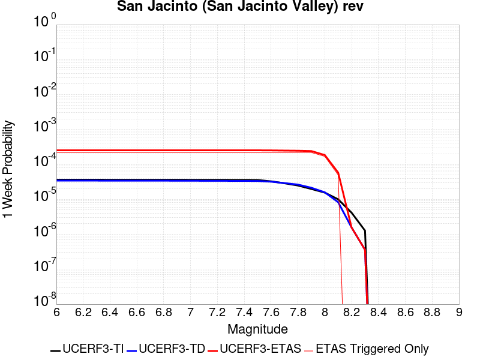 |  |  |  |

| Magnitude | 1 wk TI Prob | 1 wk TD Prob | 1 wk ETAS Prob | 1 wk ETAS/TD Gain | 1 wk ETAS Triggered Only | 1 mo TI Prob | 1 mo TD Prob | 1 mo ETAS Prob | 1 mo ETAS/TD Gain | 1 mo ETAS Triggered Only | 1 yr TI Prob | 1 yr TD Prob | 1 yr ETAS Prob | 1 yr ETAS/TD Gain | 1 yr ETAS Triggered Only | 10 yr TI Prob | 10 yr TD Prob | 10 yr ETAS Prob | 10 yr ETAS/TD Gain | 10 yr ETAS Triggered Only |
|-----|-----|-----|-----|-----|-----|-----|-----|-----|-----|-----|-----|-----|-----|-----|-----|-----|-----|-----|-----|-----|
| 6.0 | 3.652694E-5 | 3.4401106E-5 | 2.5439353E-4 | 7.394923 | 2.2E-4 | 1.5653463E-4 | 1.4742499E-4 | 4.273837E-4 | 2.8989909 | 2.8E-4 | 0.0019041431 | 0.0017934233 | 0.00216276 | 1.2059393 | 3.7E-4 | 0.018879099 | 0.018526303 | 0.018987594 | 1.0248994 | 4.7E-4 |
| 6.1 | 3.652694E-5 | 3.4401106E-5 | 2.5439353E-4 | 7.394923 | 2.2E-4 | 1.5653463E-4 | 1.4742499E-4 | 4.273837E-4 | 2.8989909 | 2.8E-4 | 0.0019041431 | 0.0017934233 | 0.00216276 | 1.2059393 | 3.7E-4 | 0.018879099 | 0.018526303 | 0.018987594 | 1.0248994 | 4.7E-4 |
| 6.2 | 3.652694E-5 | 3.4401106E-5 | 2.5439353E-4 | 7.394923 | 2.2E-4 | 1.5653463E-4 | 1.4742499E-4 | 4.273837E-4 | 2.8989909 | 2.8E-4 | 0.0019041431 | 0.0017934233 | 0.00216276 | 1.2059393 | 3.7E-4 | 0.018879099 | 0.018526303 | 0.018987594 | 1.0248994 | 4.7E-4 |
| 6.3 | 3.652694E-5 | 3.4401106E-5 | 2.5439353E-4 | 7.394923 | 2.2E-4 | 1.5653463E-4 | 1.4742499E-4 | 4.273837E-4 | 2.8989909 | 2.8E-4 | 0.0019041431 | 0.0017934233 | 0.00216276 | 1.2059393 | 3.7E-4 | 0.018879099 | 0.018526303 | 0.018987594 | 1.0248994 | 4.7E-4 |
| 6.4 | 3.646941E-5 | 3.432268E-5 | 2.5431512E-4 | 7.409536 | 2.2E-4 | 1.5628811E-4 | 1.4708891E-4 | 4.2704772E-4 | 2.9033306 | 2.8E-4 | 0.0019011468 | 0.0017893389 | 0.0021586767 | 1.2064103 | 3.7E-4 | 0.018849645 | 0.018486181 | 0.018947493 | 1.0249544 | 4.7E-4 |
| 6.5 | 3.646941E-5 | 3.432268E-5 | 2.5431512E-4 | 7.409536 | 2.2E-4 | 1.5628811E-4 | 1.4708891E-4 | 4.2704772E-4 | 2.9033306 | 2.8E-4 | 0.0019011468 | 0.0017893389 | 0.0021586767 | 1.2064103 | 3.7E-4 | 0.018849645 | 0.018486181 | 0.018947493 | 1.0249544 | 4.7E-4 |
| 6.6 | 3.6442503E-5 | 3.4286066E-5 | 2.5427854E-4 | 7.416381 | 2.2E-4 | 1.561728E-4 | 1.4693203E-4 | 4.2689088E-4 | 2.905363 | 2.8E-4 | 0.0018997455 | 0.001787432 | 0.0021567706 | 1.206631 | 3.7E-4 | 0.018835869 | 0.01846745 | 0.018928772 | 1.0249802 | 4.7E-4 |
| 6.7 | 3.6432113E-5 | 3.427164E-5 | 2.542641E-4 | 7.419081 | 2.2E-4 | 1.5612828E-4 | 1.4687021E-4 | 4.268291E-4 | 2.9061651 | 2.8E-4 | 0.0018992044 | 0.0017866807 | 0.0021560197 | 1.206718 | 3.7E-4 | 0.018830549 | 0.018460074 | 0.018921398 | 1.0249903 | 4.7E-4 |
| 6.8 | 3.6409598E-5 | 3.4240697E-5 | 2.5423316E-4 | 7.424883 | 2.2E-4 | 1.560318E-4 | 1.4673761E-4 | 4.2669653E-4 | 2.907888 | 2.8E-4 | 0.0018980318 | 0.0017850689 | 0.0021544085 | 1.2069049 | 3.7E-4 | 0.018819023 | 0.018444229 | 0.01890556 | 1.0250123 | 4.7E-4 |
| 6.9 | 3.638078E-5 | 3.4201123E-5 | 2.5419358E-4 | 7.4323177 | 2.2E-4 | 1.5590832E-4 | 1.4656801E-4 | 4.2652697E-4 | 2.910096 | 2.8E-4 | 0.0018965311 | 0.0017830075 | 0.0021523477 | 1.2071445 | 3.7E-4 | 0.018804269 | 0.018423963 | 0.018885303 | 1.0250403 | 4.7E-4 |
| 7.0 | 3.6294874E-5 | 3.408314E-5 | 2.5407565E-4 | 7.4545846 | 2.2E-4 | 1.5554018E-4 | 1.4606243E-4 | 4.2602155E-4 | 2.9167085 | 2.8E-4 | 0.0018920569 | 0.0017768623 | 0.002146205 | 1.2078623 | 3.7E-4 | 0.018760284 | 0.018363545 | 0.018824914 | 1.0251242 | 4.7E-4 |
| 7.1 | 3.6260717E-5 | 3.403942E-5 | 2.5403194E-4 | 7.4628744 | 2.2E-4 | 1.5539382E-4 | 1.4587509E-4 | 4.2583424E-4 | 2.9191704 | 2.8E-4 | 0.001890278 | 0.0017745851 | 0.0021439285 | 1.2081294 | 3.7E-4 | 0.018742796 | 0.018341139 | 0.018802518 | 1.0251554 | 4.7E-4 |
| 7.2 | 3.6210204E-5 | 3.397364E-5 | 2.5396617E-4 | 7.4753885 | 2.2E-4 | 1.5517735E-4 | 1.455932E-4 | 4.2555245E-4 | 2.9228866 | 2.8E-4 | 0.001887647 | 0.0017711588 | 0.0021405034 | 1.2085328 | 3.7E-4 | 0.01871693 | 0.018307408 | 0.018768804 | 1.0252026 | 4.7E-4 |
| 7.3 | 3.6119454E-5 | 3.386193E-5 | 2.5385446E-4 | 7.4967523 | 2.2E-4 | 1.5478847E-4 | 1.4511449E-4 | 4.2507384E-4 | 2.929231 | 2.8E-4 | 0.0018829206 | 0.0017653398 | 0.0021346866 | 1.2092214 | 3.7E-4 | 0.018670462 | 0.01824996 | 0.018711383 | 1.0252835 | 4.7E-4 |
| 7.4 | 3.607848E-5 | 3.380943E-5 | 2.53802E-4 | 7.5068407 | 2.2E-4 | 1.5461289E-4 | 1.4488952E-4 | 4.2484896E-4 | 2.932227 | 2.8E-4 | 0.0018807866 | 0.0017626052 | 0.0021319531 | 1.2095466 | 3.7E-4 | 0.018649481 | 0.018222956 | 0.018684391 | 1.0253216 | 4.7E-4 |
| 7.5 | 3.5856774E-5 | 3.3619202E-5 | 2.536118E-4 | 7.5436587 | 2.2E-4 | 1.5366284E-4 | 1.4407437E-4 | 4.2403402E-4 | 2.9431608 | 2.8E-4 | 0.0018692396 | 0.0017526967 | 0.0021220483 | 1.2107333 | 3.7E-4 | 0.018535944 | 0.018124057 | 0.018585538 | 1.0254624 | 4.7E-4 |
| 7.6 | 3.286655E-5 | 3.2142278E-5 | 2.521352E-4 | 7.844348 | 2.2E-4 | 1.4084904E-4 | 1.3774536E-4 | 4.177068E-4 | 3.0324564 | 2.8E-4 | 0.001713488 | 0.0016757617 | 0.0020451415 | 1.2204251 | 3.7E-4 | 0.017003361 | 0.017343804 | 0.017805653 | 1.026629 | 4.7E-4 |
| 7.7 | 2.8882527E-5 | 2.9235205E-5 | 2.4922876E-4 | 8.524954 | 2.2E-4 | 1.237764E-4 | 1.2528773E-4 | 4.0525265E-4 | 3.2345757 | 2.8E-4 | 0.0015059357 | 0.0015243118 | 0.0018937478 | 1.2423625 | 3.7E-4 | 0.014957713 | 0.015830338 | 0.016292898 | 1.0292199 | 4.7E-4 |
| 7.8 | 2.4950225E-5 | 2.6526219E-5 | 2.465204E-4 | 9.293461 | 2.2E-4 | 1.0692515E-4 | 1.1367885E-4 | 3.9364703E-4 | 3.462799 | 2.8E-4 | 0.0013010362 | 0.0013831621 | 0.0017426643 | 1.2599132 | 3.6E-4 | 0.012934455 | 0.01441176 | 0.01486513 | 1.0314584 | 4.6E-4 |
| 7.9 | 1.9881603E-5 | 2.150649E-5 | 2.4150177E-4 | 11.22925 | 2.2E-4 | 8.520408E-5 | 9.216742E-5 | 3.6214254E-4 | 3.9291816 | 2.7E-4 | 0.001036866 | 0.0011215615 | 0.0014611802 | 1.3028088 | 3.4E-4 | 0.010320415 | 0.011776998 | 0.012201934 | 1.0360819 | 4.3E-4 |
| 8.0 | 1.563292E-5 | 1.5936288E-5 | 1.8593358E-4 | 11.667308 | 1.7E-4 | 6.6996516E-5 | 6.829659E-5 | 2.8828156E-4 | 4.221024 | 2.2E-4 | 8.153773E-4 | 8.3119445E-4 | 0.0011109618 | 1.3365846 | 2.8E-4 | 0.00812392 | 0.008810331 | 0.00916716 | 1.0405011 | 3.6E-4 |
| 8.1 | 1.0045313E-5 | 8.300794E-6 | 5.830038E-5 | 7.02347 | 5.0E-5 | 4.305063E-5 | 3.557435E-5 | 1.0557186E-4 | 2.96764 | 7.0E-5 | 5.2401534E-4 | 4.3303217E-4 | 5.3298887E-4 | 1.2308297 | 1.0E-4 | 0.0052278144 | 0.0046587666 | 0.0047981148 | 1.0299109 | 1.4E-4 |
| 8.2 | 4.1554413E-6 | 1.5648296E-6 | 1.5648296E-6 | 1.0 | 0.0 | 1.7808914E-5 | 6.7063957E-6 | 6.7063957E-6 | 1.0 | 0.0 | 2.1680194E-4 | 8.164734E-5 | 8.164734E-5 | 1.0 | 0.0 | 0.0021659054 | 9.479703E-4 | 9.479703E-4 | 1.0 | 0.0 |
| 8.3 | 1.2758221E-6 | 3.612677E-7 | 3.612677E-7 | 1.0 | 0.0 | 5.4677976E-6 | 1.5482892E-6 | 1.5482892E-6 | 1.0 | 0.0 | 6.65684E-5 | 1.8850264E-5 | 1.8850264E-5 | 1.0 | 0.0 | 6.6548464E-4 | 2.2739546E-4 | 2.2739546E-4 | 1.0 | 0.0 |

## Elsinore (Glen Ivy) rev
*[(top)](#table-of-contents)*

| 1 Week | 1 Month | 1 Year | 10 Year |
|-----|-----|-----|-----|
|  |  |  |  |

| Magnitude | 1 wk TI Prob | 1 wk TD Prob | 1 wk ETAS Prob | 1 wk ETAS/TD Gain | 1 wk ETAS Triggered Only | 1 mo TI Prob | 1 mo TD Prob | 1 mo ETAS Prob | 1 mo ETAS/TD Gain | 1 mo ETAS Triggered Only | 1 yr TI Prob | 1 yr TD Prob | 1 yr ETAS Prob | 1 yr ETAS/TD Gain | 1 yr ETAS Triggered Only | 10 yr TI Prob | 10 yr TD Prob | 10 yr ETAS Prob | 10 yr ETAS/TD Gain | 10 yr ETAS Triggered Only |
|-----|-----|-----|-----|-----|-----|-----|-----|-----|-----|-----|-----|-----|-----|-----|-----|-----|-----|-----|-----|-----|
| 6.0 | 1.6204086E-4 | 2.937271E-4 | 3.8370065E-4 | 1.3063169 | 9.0E-5 | 6.94276E-4 | 0.0012583778 | 0.0014581261 | 1.1587348 | 2.0E-4 | 0.008420097 | 0.0152346175 | 0.015470962 | 1.0155135 | 2.4E-4 | 0.081081145 | 0.13962454 | 0.1399687 | 1.0024648 | 4.0E-4 |
| 6.1 | 1.6204086E-4 | 2.937271E-4 | 3.8370065E-4 | 1.3063169 | 9.0E-5 | 6.94276E-4 | 0.0012583778 | 0.0014581261 | 1.1587348 | 2.0E-4 | 0.008420097 | 0.0152346175 | 0.015470962 | 1.0155135 | 2.4E-4 | 0.081081145 | 0.13962454 | 0.1399687 | 1.0024648 | 4.0E-4 |
| 6.2 | 1.6204086E-4 | 2.937271E-4 | 3.8370065E-4 | 1.3063169 | 9.0E-5 | 6.94276E-4 | 0.0012583778 | 0.0014581261 | 1.1587348 | 2.0E-4 | 0.008420097 | 0.0152346175 | 0.015470962 | 1.0155135 | 2.4E-4 | 0.081081145 | 0.13962454 | 0.1399687 | 1.0024648 | 4.0E-4 |
| 6.3 | 1.0111737E-4 | 1.7703463E-4 | 2.37024E-4 | 1.3388568 | 6.0E-5 | 4.332882E-4 | 7.5861585E-4 | 9.085021E-4 | 1.1975785 | 1.5E-4 | 0.005262531 | 0.0092177205 | 0.0093762465 | 1.0171978 | 1.6E-4 | 0.0513964 | 0.08707393 | 0.087320425 | 1.0028309 | 2.7E-4 |
| 6.4 | 1.0111737E-4 | 1.7703463E-4 | 2.37024E-4 | 1.3388568 | 6.0E-5 | 4.332882E-4 | 7.5861585E-4 | 9.085021E-4 | 1.1975785 | 1.5E-4 | 0.005262531 | 0.0092177205 | 0.0093762465 | 1.0171978 | 1.6E-4 | 0.0513964 | 0.08707393 | 0.087320425 | 1.0028309 | 2.7E-4 |
| 6.5 | 3.6624708E-5 | 4.6391986E-5 | 7.639059E-5 | 1.6466334 | 3.0E-5 | 1.569536E-4 | 1.9880968E-4 | 2.3880172E-4 | 1.2011575 | 4.0E-5 | 0.001909235 | 0.0024181814 | 0.0024580846 | 1.0165013 | 4.0E-5 | 0.01892915 | 0.023697061 | 0.023765402 | 1.0028839 | 7.0E-5 |
| 6.6 | 2.5051324E-5 | 2.6147465E-5 | 5.614668E-5 | 2.1473088 | 3.0E-5 | 1.073584E-4 | 1.12056E-4 | 1.4205264E-4 | 1.2676933 | 3.0E-5 | 0.0013063047 | 0.0013634725 | 0.0013934316 | 1.0219727 | 3.0E-5 | 0.012986525 | 0.013565759 | 0.0136052165 | 1.0029086 | 4.0E-5 |
| 6.7 | 2.2189772E-5 | 2.2072489E-5 | 5.2071828E-5 | 2.359128 | 3.0E-5 | 9.509556E-5 | 9.459316E-5 | 1.2459033E-4 | 1.3171177 | 3.0E-5 | 0.0011571734 | 0.0011510996 | 0.0011810651 | 1.0260321 | 3.0E-5 | 0.011511663 | 0.0114663225 | 0.011505865 | 1.0034485 | 4.0E-5 |
| 6.8 | 1.6654378E-5 | 1.44376E-5 | 2.4437455E-5 | 1.6926259 | 1.0E-5 | 7.137396E-5 | 6.187399E-5 | 7.187337E-5 | 1.1616088 | 1.0E-5 | 8.686314E-4 | 7.5306057E-4 | 7.630531E-4 | 1.0132692 | 1.0E-5 | 0.008652439 | 0.0075100763 | 0.007529926 | 1.0026431 | 2.0E-5 |
| 6.9 | 1.5042909E-5 | 1.2331886E-5 | 1.2331886E-5 | 1.0 | 0.0 | 6.446802E-5 | 5.2849886E-5 | 5.2849886E-5 | 1.0 | 0.0 | 7.8461546E-4 | 6.4326054E-4 | 6.4326054E-4 | 1.0 | 0.0 | 0.007818509 | 0.006417925 | 0.006427861 | 1.0015482 | 1.0E-5 |
| 7.0 | 1.4361385E-5 | 1.1451172E-5 | 1.1451172E-5 | 1.0 | 0.0 | 6.154734E-5 | 4.9075545E-5 | 4.9075545E-5 | 1.0 | 0.0 | 7.490812E-4 | 5.973339E-4 | 5.973339E-4 | 1.0 | 0.0 | 0.007465612 | 0.005960982 | 0.0059709223 | 1.0016676 | 1.0E-5 |
| 7.1 | 1.3265571E-5 | 1.0244736E-5 | 1.0244736E-5 | 1.0 | 0.0 | 5.6851208E-5 | 4.3905282E-5 | 4.3905282E-5 | 1.0 | 0.0 | 6.919436E-4 | 5.344183E-4 | 5.344183E-4 | 1.0 | 0.0 | 0.006897931 | 0.0053346003 | 0.005344547 | 1.0018646 | 1.0E-5 |
| 7.2 | 1.1596403E-5 | 8.504847E-6 | 8.504847E-6 | 1.0 | 0.0 | 4.9697923E-5 | 3.6448844E-5 | 3.6448844E-5 | 1.0 | 0.0 | 6.049042E-4 | 4.4367602E-4 | 4.4367602E-4 | 1.0 | 0.0 | 0.006032603 | 0.004429357 | 0.0044393125 | 1.0022477 | 1.0E-5 |
| 7.3 | 1.0150827E-5 | 7.238537E-6 | 7.238537E-6 | 1.0 | 0.0 | 4.3502816E-5 | 3.102194E-5 | 3.102194E-5 | 1.0 | 0.0 | 5.2951806E-4 | 3.776281E-4 | 3.776281E-4 | 1.0 | 0.0 | 0.005282581 | 0.003770271 | 0.0037802334 | 1.0026423 | 1.0E-5 |
| 7.4 | 9.080705E-6 | 6.352307E-6 | 6.352307E-6 | 1.0 | 0.0 | 3.8916725E-5 | 2.7223898E-5 | 2.7223898E-5 | 1.0 | 0.0 | 4.7370812E-4 | 3.314019E-4 | 3.314019E-4 | 1.0 | 0.0 | 0.004726996 | 0.0033092257 | 0.0033092257 | 1.0 | 0.0 |
| 7.5 | 7.671649E-6 | 5.225419E-6 | 5.225419E-6 | 1.0 | 0.0 | 3.287808E-5 | 2.2394468E-5 | 2.2394468E-5 | 1.0 | 0.0 | 4.0021708E-4 | 2.7261977E-4 | 2.7261977E-4 | 1.0 | 0.0 | 0.0039949706 | 0.0027229784 | 0.0027229784 | 1.0 | 0.0 |
| 7.6 | 6.990086E-6 | 4.687336E-6 | 4.687336E-6 | 1.0 | 0.0 | 2.9957167E-5 | 2.0088435E-5 | 2.0088435E-5 | 1.0 | 0.0 | 3.6466747E-4 | 2.445504E-4 | 2.445504E-4 | 1.0 | 0.0 | 0.0036406964 | 0.0024429292 | 0.0024429292 | 1.0 | 0.0 |
| 7.7 | 4.163505E-6 | 2.329331E-6 | 2.329331E-6 | 1.0 | 0.0 | 1.7843471E-5 | 9.982813E-6 | 9.982813E-6 | 1.0 | 0.0 | 2.172226E-4 | 1.2153471E-4 | 1.2153471E-4 | 1.0 | 0.0 | 0.0021701038 | 0.0012147555 | 0.0012147555 | 1.0 | 0.0 |
| 7.8 | 2.2692414E-7 | 9.384417E-8 | 9.384417E-8 | 1.0 | 0.0 | 9.725317E-7 | 4.0218927E-7 | 4.0218927E-7 | 1.0 | 0.0 | 1.1840509E-5 | 4.8966467E-6 | 4.8966467E-6 | 1.0 | 0.0 | 1.1839878E-4 | 4.8965718E-5 | 4.8965718E-5 | 1.0 | 0.0 |
| 7.9 | 6.676829E-9 | 3.4397174E-9 | 3.4397174E-9 | 1.0 | 0.0 | 2.861498E-8 | 1.4741646E-8 | 1.4741646E-8 | 1.0 | 0.0 | 3.4838732E-7 | 1.7947953E-7 | 1.7947953E-7 | 1.0 | 0.0 | 3.4838679E-6 | 1.794794E-6 | 1.794794E-6 | 1.0 | 0.0 |

## Calico-Hidalgo
*[(top)](#table-of-contents)*

| 1 Week | 1 Month | 1 Year | 10 Year |
|-----|-----|-----|-----|
| 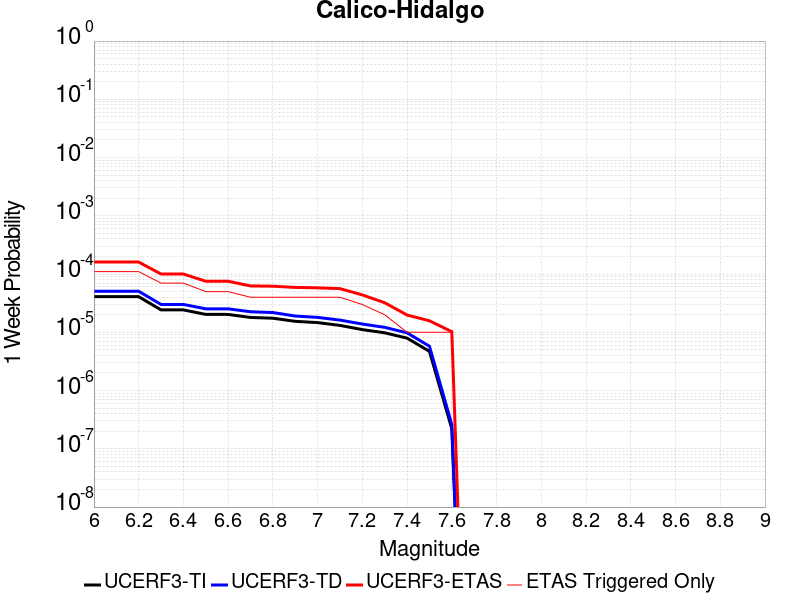 |  |  |  |

| Magnitude | 1 wk TI Prob | 1 wk TD Prob | 1 wk ETAS Prob | 1 wk ETAS/TD Gain | 1 wk ETAS Triggered Only | 1 mo TI Prob | 1 mo TD Prob | 1 mo ETAS Prob | 1 mo ETAS/TD Gain | 1 mo ETAS Triggered Only | 1 yr TI Prob | 1 yr TD Prob | 1 yr ETAS Prob | 1 yr ETAS/TD Gain | 1 yr ETAS Triggered Only | 10 yr TI Prob | 10 yr TD Prob | 10 yr ETAS Prob | 10 yr ETAS/TD Gain | 10 yr ETAS Triggered Only |
|-----|-----|-----|-----|-----|-----|-----|-----|-----|-----|-----|-----|-----|-----|-----|-----|-----|-----|-----|-----|-----|
| 6.0 | 4.0906612E-5 | 5.0704355E-5 | 1.6069878E-4 | 3.169329 | 1.1E-4 | 1.7530227E-4 | 2.1728857E-4 | 3.8725164E-4 | 1.7821997 | 1.7E-4 | 0.0021322158 | 0.002642678 | 0.0028920174 | 1.094351 | 2.5E-4 | 0.02111873 | 0.026152814 | 0.026581308 | 1.0163842 | 4.4E-4 |
| 6.1 | 4.0906612E-5 | 5.0704355E-5 | 1.6069878E-4 | 3.169329 | 1.1E-4 | 1.7530227E-4 | 2.1728857E-4 | 3.8725164E-4 | 1.7821997 | 1.7E-4 | 0.0021322158 | 0.002642678 | 0.0028920174 | 1.094351 | 2.5E-4 | 0.02111873 | 0.026152814 | 0.026581308 | 1.0163842 | 4.4E-4 |
| 6.2 | 4.0906612E-5 | 5.0704355E-5 | 1.6069878E-4 | 3.169329 | 1.1E-4 | 1.7530227E-4 | 2.1728857E-4 | 3.8725164E-4 | 1.7821997 | 1.7E-4 | 0.0021322158 | 0.002642678 | 0.0028920174 | 1.094351 | 2.5E-4 | 0.02111873 | 0.026152814 | 0.026581308 | 1.0163842 | 4.4E-4 |
| 6.3 | 2.4242801E-5 | 3.0090967E-5 | 1.0008886E-4 | 3.3262095 | 7.0E-5 | 1.0389358E-4 | 1.289551E-4 | 2.489396E-4 | 1.9304364 | 1.2E-4 | 0.0012641704 | 0.0015689312 | 0.0017386645 | 1.108184 | 1.7E-4 | 0.01257003 | 0.015582229 | 0.015848022 | 1.0170574 | 2.7E-4 |
| 6.4 | 2.4242801E-5 | 3.0090967E-5 | 1.0008886E-4 | 3.3262095 | 7.0E-5 | 1.0389358E-4 | 1.289551E-4 | 2.489396E-4 | 1.9304364 | 1.2E-4 | 0.0012641704 | 0.0015689312 | 0.0017386645 | 1.108184 | 1.7E-4 | 0.01257003 | 0.015582229 | 0.015848022 | 1.0170574 | 2.7E-4 |
| 6.5 | 2.0286952E-5 | 2.5316054E-5 | 7.531479E-5 | 2.9749813 | 5.0E-5 | 8.694118E-5 | 1.0849296E-4 | 1.8848428E-4 | 1.737295 | 8.0E-5 | 0.0010579949 | 0.0013201186 | 0.0014399601 | 1.090781 | 1.2E-4 | 0.010529719 | 0.013124701 | 0.013322076 | 1.0150385 | 2.0E-4 |
| 6.6 | 2.0269223E-5 | 2.5297004E-5 | 7.529574E-5 | 2.9764686 | 5.0E-5 | 8.6865206E-5 | 1.08411325E-4 | 1.8840264E-4 | 1.7378503 | 8.0E-5 | 0.0010570707 | 0.0013191258 | 0.0014389674 | 1.0908493 | 1.2E-4 | 0.010520565 | 0.01311489 | 0.013312267 | 1.0150498 | 2.0E-4 |
| 6.7 | 1.799852E-5 | 2.2540933E-5 | 6.2540035E-5 | 2.7745094 | 4.0E-5 | 7.713423E-5 | 9.660051E-5 | 1.6659375E-4 | 1.7245638 | 7.0E-5 | 9.3870464E-4 | 0.0011754911 | 0.0012753736 | 1.0849708 | 1.0E-4 | 0.009347493 | 0.011694346 | 0.01187224 | 1.015212 | 1.8E-4 |
| 6.8 | 1.7458793E-5 | 2.184258E-5 | 6.18417E-5 | 2.8312454 | 4.0E-5 | 7.4821255E-5 | 9.360778E-5 | 1.6360123E-4 | 1.7477311 | 7.0E-5 | 9.10568E-4 | 0.0011390933 | 0.0012389794 | 1.0876892 | 1.0E-4 | 0.009068459 | 0.011334131 | 0.01151209 | 1.0157013 | 1.8E-4 |
| 6.9 | 1.542884E-5 | 1.9026285E-5 | 5.9025526E-5 | 3.1023147 | 4.0E-5 | 6.612192E-5 | 8.153875E-5 | 1.5153304E-4 | 1.8584175 | 7.0E-5 | 8.04737E-4 | 9.922953E-4 | 0.0010921961 | 1.1006764 | 1.0E-4 | 0.008018291 | 0.009880043 | 0.010048363 | 1.0170364 | 1.7E-4 |
| 7.0 | 1.468253E-5 | 1.803109E-5 | 5.803037E-5 | 3.2183504 | 4.0E-5 | 6.292361E-5 | 7.727389E-5 | 1.4726848E-4 | 1.9057987 | 7.0E-5 | 7.658257E-4 | 9.4041653E-4 | 0.0010403225 | 1.1062359 | 1.0E-4 | 0.0076319184 | 0.009365736 | 0.009534144 | 1.0179813 | 1.7E-4 |
| 7.1 | 1.3139281E-5 | 1.620139E-5 | 5.620074E-5 | 3.468884 | 4.0E-5 | 5.6309986E-5 | 6.943275E-5 | 1.1942928E-4 | 1.7200713 | 5.0E-5 | 6.853584E-4 | 8.4502844E-4 | 9.249608E-4 | 1.0945914 | 8.0E-5 | 0.0068324856 | 0.008419449 | 0.008548355 | 1.0153104 | 1.3E-4 |
| 7.2 | 1.1127404E-5 | 1.3867038E-5 | 4.386662E-5 | 3.1633735 | 3.0E-5 | 4.7688E-5 | 5.9428872E-5 | 9.94265E-5 | 1.6730335 | 4.0E-5 | 5.8044674E-4 | 7.233172E-4 | 7.932666E-4 | 1.0967064 | 7.0E-5 | 0.0057893298 | 0.007210737 | 0.007310016 | 1.0137682 | 1.0E-4 |
| 7.3 | 9.808154E-6 | 1.2176586E-5 | 3.2176344E-5 | 2.6424766 | 2.0E-5 | 4.2034266E-5 | 5.2184383E-5 | 8.218282E-5 | 1.5748546 | 3.0E-5 | 5.11647E-4 | 6.351704E-4 | 6.9513224E-4 | 1.0944028 | 6.0E-5 | 0.0051047057 | 0.006334625 | 0.0064240554 | 1.0141176 | 9.0E-5 |
| 7.4 | 7.942452E-6 | 9.792348E-6 | 1.979225E-5 | 2.0211957 | 1.0E-5 | 3.4038632E-5 | 4.1966585E-5 | 6.1965744E-5 | 1.4765496 | 2.0E-5 | 4.1434157E-4 | 5.108328E-4 | 5.608073E-4 | 1.0978293 | 5.0E-5 | 0.0041356985 | 0.005097527 | 0.0051572216 | 1.0117104 | 6.0E-5 |
| 7.5 | 4.7121216E-6 | 5.7729717E-6 | 1.5772914E-5 | 2.7322001 | 1.0E-5 | 2.019465E-5 | 2.4741115E-5 | 4.474062E-5 | 1.808351 | 2.0E-5 | 2.4584212E-4 | 3.011891E-4 | 3.4117704E-4 | 1.132767 | 4.0E-5 | 0.0024557032 | 0.0030085614 | 0.0030584112 | 1.0165693 | 5.0E-5 |
| 7.6 | 2.21172E-7 | 2.6040198E-7 | 1.0260399E-5 | 39.402157 | 1.0E-5 | 9.478797E-7 | 1.1160082E-6 | 2.1115986E-5 | 18.920996 | 2.0E-5 | 1.1540374E-5 | 1.3587343E-5 | 5.35868E-5 | 3.9438763 | 4.0E-5 | 1.1539775E-4 | 1.3586794E-4 | 1.758625E-4 | 1.2943635 | 4.0E-5 |

## San Andreas (North Branch Mill Creek)
*[(top)](#table-of-contents)*

| 1 Week | 1 Month | 1 Year | 10 Year |
|-----|-----|-----|-----|
|  |  | 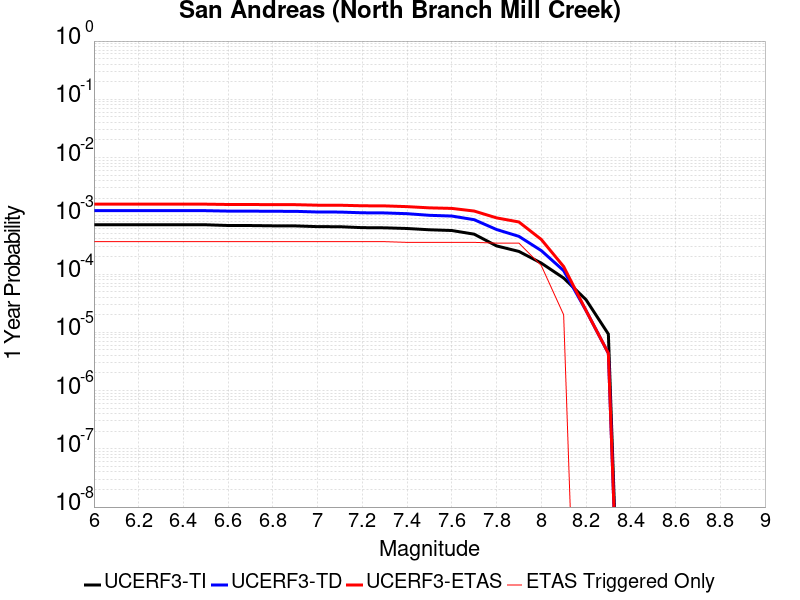 |  |

| Magnitude | 1 wk TI Prob | 1 wk TD Prob | 1 wk ETAS Prob | 1 wk ETAS/TD Gain | 1 wk ETAS Triggered Only | 1 mo TI Prob | 1 mo TD Prob | 1 mo ETAS Prob | 1 mo ETAS/TD Gain | 1 mo ETAS Triggered Only | 1 yr TI Prob | 1 yr TD Prob | 1 yr ETAS Prob | 1 yr ETAS/TD Gain | 1 yr ETAS Triggered Only | 10 yr TI Prob | 10 yr TD Prob | 10 yr ETAS Prob | 10 yr ETAS/TD Gain | 10 yr ETAS Triggered Only |
|-----|-----|-----|-----|-----|-----|-----|-----|-----|-----|-----|-----|-----|-----|-----|-----|-----|-----|-----|-----|-----|
| 6.0 | 1.3461156E-5 | 2.3500992E-5 | 1.8349724E-4 | 7.8080635 | 1.6E-4 | 5.7689394E-5 | 1.00714664E-4 | 3.606885E-4 | 3.5812905 | 2.6E-4 | 7.02142E-4 | 0.0012255146 | 0.0015850734 | 1.2933941 | 3.6E-4 | 0.0069992766 | 0.012228744 | 0.0126633635 | 1.0355408 | 4.4E-4 |
| 6.1 | 1.3461156E-5 | 2.3500992E-5 | 1.8349724E-4 | 7.8080635 | 1.6E-4 | 5.7689394E-5 | 1.00714664E-4 | 3.606885E-4 | 3.5812905 | 2.6E-4 | 7.02142E-4 | 0.0012255146 | 0.0015850734 | 1.2933941 | 3.6E-4 | 0.0069992766 | 0.012228744 | 0.0126633635 | 1.0355408 | 4.4E-4 |
| 6.2 | 1.3461156E-5 | 2.3500992E-5 | 1.8349724E-4 | 7.8080635 | 1.6E-4 | 5.7689394E-5 | 1.00714664E-4 | 3.606885E-4 | 3.5812905 | 2.6E-4 | 7.02142E-4 | 0.0012255146 | 0.0015850734 | 1.2933941 | 3.6E-4 | 0.0069992766 | 0.012228744 | 0.0126633635 | 1.0355408 | 4.4E-4 |
| 6.3 | 1.3461156E-5 | 2.3500992E-5 | 1.8349724E-4 | 7.8080635 | 1.6E-4 | 5.7689394E-5 | 1.00714664E-4 | 3.606885E-4 | 3.5812905 | 2.6E-4 | 7.02142E-4 | 0.0012255146 | 0.0015850734 | 1.2933941 | 3.6E-4 | 0.0069992766 | 0.012228744 | 0.0126633635 | 1.0355408 | 4.4E-4 |
| 6.4 | 1.3461156E-5 | 2.3500992E-5 | 1.8349724E-4 | 7.8080635 | 1.6E-4 | 5.7689394E-5 | 1.00714664E-4 | 3.606885E-4 | 3.5812905 | 2.6E-4 | 7.02142E-4 | 0.0012255146 | 0.0015850734 | 1.2933941 | 3.6E-4 | 0.0069992766 | 0.012228744 | 0.0126633635 | 1.0355408 | 4.4E-4 |
| 6.5 | 1.3450706E-5 | 2.348995E-5 | 1.8348619E-4 | 7.811263 | 1.6E-4 | 5.764461E-5 | 1.00667356E-4 | 3.606412E-4 | 3.5825038 | 2.6E-4 | 7.0159714E-4 | 0.0012249392 | 0.0015844983 | 1.2935321 | 3.6E-4 | 0.006993862 | 0.012223054 | 0.012657676 | 1.0355575 | 4.4E-4 |
| 6.6 | 1.3074523E-5 | 2.3104236E-5 | 1.8310054E-4 | 7.9249773 | 1.6E-4 | 5.6032466E-5 | 9.901441E-5 | 3.5898868E-4 | 3.6256204 | 2.6E-4 | 6.8198174E-4 | 0.001204837 | 0.0015644033 | 1.2984356 | 3.6E-4 | 0.006798926 | 0.012024219 | 0.012449048 | 1.0353311 | 4.3E-4 |
| 6.7 | 1.3050216E-5 | 2.3079532E-5 | 1.8307584E-4 | 7.9323893 | 1.6E-4 | 5.59283E-5 | 9.890855E-5 | 3.5888283E-4 | 3.6284308 | 2.6E-4 | 6.8071426E-4 | 0.0012035496 | 0.0015631163 | 1.2987552 | 3.6E-4 | 0.0067863287 | 0.012011484 | 0.012436319 | 1.035369 | 4.3E-4 |
| 6.8 | 1.29049395E-5 | 2.2927941E-5 | 1.8292427E-4 | 7.978225 | 1.6E-4 | 5.530571E-5 | 9.825892E-5 | 3.5823337E-4 | 3.6458101 | 2.6E-4 | 6.73139E-4 | 0.001195649 | 0.0015552186 | 1.3007317 | 3.6E-4 | 0.0067110364 | 0.011933329 | 0.012358197 | 1.0356035 | 4.3E-4 |
| 6.9 | 1.2867369E-5 | 2.2887343E-5 | 1.8288368E-4 | 7.9906034 | 1.6E-4 | 5.51447E-5 | 9.808494E-5 | 3.5805945E-4 | 3.6505036 | 2.6E-4 | 6.711799E-4 | 0.0011935332 | 0.0015531036 | 1.3012655 | 3.6E-4 | 0.006691564 | 0.011912397 | 0.012337275 | 1.0356668 | 4.3E-4 |
| 7.0 | 1.2495996E-5 | 2.2287419E-5 | 1.8228385E-4 | 8.178778 | 1.6E-4 | 5.3553173E-5 | 9.551403E-5 | 3.554892E-4 | 3.7218533 | 2.6E-4 | 6.518148E-4 | 0.0011622658 | 0.0015218474 | 1.3093798 | 3.6E-4 | 0.0064990623 | 0.011603 | 0.012028011 | 1.0366294 | 4.3E-4 |
| 7.1 | 1.2452067E-5 | 2.2232492E-5 | 1.8222893E-4 | 8.196514 | 1.6E-4 | 5.3364907E-5 | 9.527864E-5 | 3.5525387E-4 | 3.728578 | 2.6E-4 | 6.4952404E-4 | 0.001159403 | 0.0015189856 | 1.3101447 | 3.6E-4 | 0.0064762887 | 0.011574671 | 0.011999694 | 1.03672 | 4.3E-4 |
| 7.2 | 1.2002777E-5 | 2.1611015E-5 | 1.8160755E-4 | 8.403472 | 1.6E-4 | 5.143946E-5 | 9.261536E-5 | 3.5259128E-4 | 3.8070498 | 2.6E-4 | 6.2609545E-4 | 0.0011270114 | 0.0014866056 | 1.3190689 | 3.6E-4 | 0.006243344 | 0.011254058 | 0.011679218 | 1.0377785 | 4.3E-4 |
| 7.3 | 1.1923425E-5 | 2.1480853E-5 | 1.8147742E-4 | 8.448334 | 1.6E-4 | 5.109939E-5 | 9.205757E-5 | 3.5203365E-4 | 3.8240597 | 2.6E-4 | 6.219575E-4 | 0.0011202273 | 0.001479824 | 1.3210033 | 3.6E-4 | 0.0062021962 | 0.011186945 | 0.011612135 | 1.0380076 | 4.3E-4 |
| 7.4 | 1.16105175E-5 | 2.0854808E-5 | 1.8085146E-4 | 8.671932 | 1.6E-4 | 4.975841E-5 | 8.93747E-5 | 3.4935147E-4 | 3.9088407 | 2.6E-4 | 6.0564023E-4 | 0.0010875963 | 0.0014372157 | 1.3214606 | 3.5E-4 | 0.006039923 | 0.010864409 | 0.011279847 | 1.0382383 | 4.2E-4 |
| 7.5 | 1.1037265E-5 | 1.9554842E-5 | 1.7955172E-4 | 9.181956 | 1.6E-4 | 4.7301706E-5 | 8.380379E-5 | 3.43782E-4 | 4.1022253 | 2.6E-4 | 5.757461E-4 | 0.0010198357 | 0.0013694788 | 1.3428426 | 3.5E-4 | 0.005742567 | 0.010195527 | 0.010611245 | 1.0407746 | 4.2E-4 |
| 7.6 | 1.0720915E-5 | 1.8996727E-5 | 1.789937E-4 | 9.422343 | 1.6E-4 | 4.5945973E-5 | 8.141202E-5 | 3.4139084E-4 | 4.193372 | 2.6E-4 | 5.592486E-4 | 9.907428E-4 | 0.001340396 | 1.3529203 | 3.5E-4 | 0.005578433 | 0.009907238 | 0.010323077 | 1.0419732 | 4.2E-4 |
| 7.7 | 9.276279E-6 | 1.6442464E-5 | 1.7643983E-4 | 10.7307415 | 1.6E-4 | 3.9754876E-5 | 7.046581E-5 | 3.3044748E-4 | 4.6894727 | 2.6E-4 | 4.839081E-4 | 8.5758517E-4 | 0.001207285 | 1.4077727 | 3.5E-4 | 0.0048285574 | 0.008586576 | 0.00900297 | 1.0484935 | 4.2E-4 |
| 7.8 | 5.8346777E-6 | 1.11555855E-5 | 1.6115392E-4 | 14.44603 | 1.5E-4 | 2.5005522E-5 | 4.7808775E-5 | 2.9779683E-4 | 6.2289157 | 2.5E-4 | 3.043997E-4 | 5.819165E-4 | 9.2171866E-4 | 1.5839362 | 3.4E-4 | 0.0030398308 | 0.0058473335 | 0.0062549356 | 1.0697074 | 4.1E-4 |
| 7.9 | 4.690204E-6 | 8.509473E-6 | 1.5850819E-4 | 18.627262 | 1.5E-4 | 2.0100719E-5 | 3.6468664E-5 | 2.8645954E-4 | 7.8549504 | 2.5E-4 | 2.4469878E-4 | 4.439156E-4 | 7.837647E-4 | 1.7655714 | 3.4E-4 | 0.002444295 | 0.004471165 | 0.0048793317 | 1.0912887 | 4.1E-4 |
| 8.0 | 2.9570454E-6 | 4.8470656E-6 | 5.4846823E-5 | 11.31547 | 5.0E-5 | 1.267299E-5 | 2.0772974E-5 | 1.1077111E-4 | 5.332463 | 9.0E-5 | 1.5428272E-4 | 2.5288164E-4 | 3.9284624E-4 | 1.5534787 | 1.4E-4 | 0.0015417566 | 0.002549932 | 0.0027095242 | 1.0625868 | 1.6E-4 |
| 8.1 | 1.6376824E-6 | 2.1968672E-6 | 2.1968672E-6 | 1.0 | 0.0 | 7.01862E-6 | 9.415111E-6 | 2.9414923E-5 | 3.1242247 | 2.0E-5 | 8.544835E-5 | 1.1462297E-4 | 1.3462067E-4 | 1.1744651 | 2.0E-5 | 8.54155E-4 | 0.0011607445 | 0.0011807212 | 1.0172104 | 2.0E-5 |
| 8.2 | 6.9631557E-7 | 4.535001E-7 | 4.535001E-7 | 1.0 | 0.0 | 2.984206E-6 | 1.9435704E-6 | 1.9435704E-6 | 1.0 | 0.0 | 3.63321E-5 | 2.3662713E-5 | 2.3662713E-5 | 1.0 | 0.0 | 3.6326164E-4 | 2.4510184E-4 | 2.4510184E-4 | 1.0 | 0.0 |
| 8.3 | 1.7876137E-7 | 8.357368E-8 | 8.357368E-8 | 1.0 | 0.0 | 7.661199E-7 | 3.5817288E-7 | 3.5817288E-7 | 1.0 | 0.0 | 9.32747E-6 | 4.3607465E-6 | 4.3607465E-6 | 1.0 | 0.0 | 9.3270784E-5 | 4.5800018E-5 | 4.5800018E-5 | 1.0 | 0.0 |

## San Jacinto (Stepovers Combined)
*[(top)](#table-of-contents)*

| 1 Week | 1 Month | 1 Year | 10 Year |
|-----|-----|-----|-----|
|  | 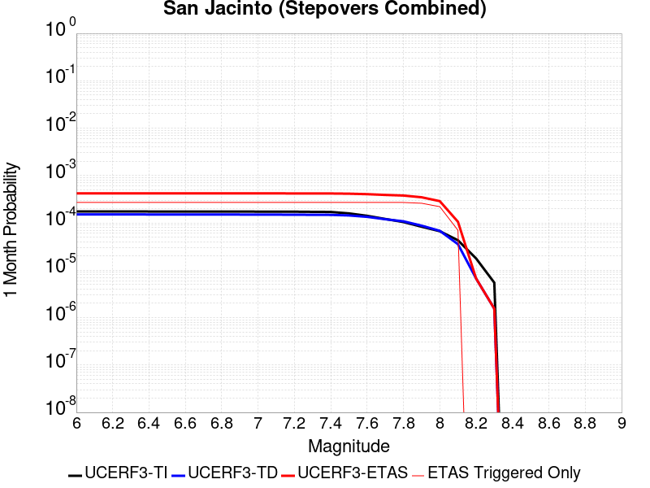 | 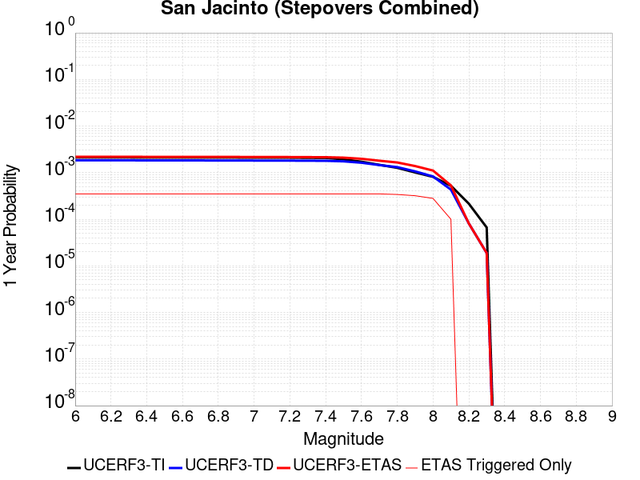 |  |

| Magnitude | 1 wk TI Prob | 1 wk TD Prob | 1 wk ETAS Prob | 1 wk ETAS/TD Gain | 1 wk ETAS Triggered Only | 1 mo TI Prob | 1 mo TD Prob | 1 mo ETAS Prob | 1 mo ETAS/TD Gain | 1 mo ETAS Triggered Only | 1 yr TI Prob | 1 yr TD Prob | 1 yr ETAS Prob | 1 yr ETAS/TD Gain | 1 yr ETAS Triggered Only | 10 yr TI Prob | 10 yr TD Prob | 10 yr ETAS Prob | 10 yr ETAS/TD Gain | 10 yr ETAS Triggered Only |
|-----|-----|-----|-----|-----|-----|-----|-----|-----|-----|-----|-----|-----|-----|-----|-----|-----|-----|-----|-----|-----|
| 6.0 | 4.0667746E-5 | 3.5271103E-5 | 2.4526368E-4 | 6.9536724 | 2.1E-4 | 1.742787E-4 | 1.5115313E-4 | 4.2111232E-4 | 2.785998 | 2.7E-4 | 0.0021197782 | 0.0018387372 | 0.0021880937 | 1.189998 | 3.5E-4 | 0.020996714 | 0.018986495 | 0.01941814 | 1.0227344 | 4.4E-4 |
| 6.1 | 4.0667746E-5 | 3.5271103E-5 | 2.4526368E-4 | 6.9536724 | 2.1E-4 | 1.742787E-4 | 1.5115313E-4 | 4.2111232E-4 | 2.785998 | 2.7E-4 | 0.0021197782 | 0.0018387372 | 0.0021880937 | 1.189998 | 3.5E-4 | 0.020996714 | 0.018986495 | 0.01941814 | 1.0227344 | 4.4E-4 |
| 6.2 | 4.0667746E-5 | 3.5271103E-5 | 2.4526368E-4 | 6.9536724 | 2.1E-4 | 1.742787E-4 | 1.5115313E-4 | 4.2111232E-4 | 2.785998 | 2.7E-4 | 0.0021197782 | 0.0018387372 | 0.0021880937 | 1.189998 | 3.5E-4 | 0.020996714 | 0.018986495 | 0.01941814 | 1.0227344 | 4.4E-4 |
| 6.3 | 4.0667746E-5 | 3.5271103E-5 | 2.4526368E-4 | 6.9536724 | 2.1E-4 | 1.742787E-4 | 1.5115313E-4 | 4.2111232E-4 | 2.785998 | 2.7E-4 | 0.0021197782 | 0.0018387372 | 0.0021880937 | 1.189998 | 3.5E-4 | 0.020996714 | 0.018986495 | 0.01941814 | 1.0227344 | 4.4E-4 |
| 6.4 | 4.0577226E-5 | 3.5143014E-5 | 2.4513563E-4 | 6.975373 | 2.1E-4 | 1.738908E-4 | 1.5060425E-4 | 4.205636E-4 | 2.7925081 | 2.7E-4 | 0.0021150648 | 0.0018320669 | 0.0021814257 | 1.190691 | 3.5E-4 | 0.020950472 | 0.018921062 | 0.019352738 | 1.0228145 | 4.4E-4 |
| 6.5 | 4.0577226E-5 | 3.5143014E-5 | 2.4513563E-4 | 6.975373 | 2.1E-4 | 1.738908E-4 | 1.5060425E-4 | 4.205636E-4 | 2.7925081 | 2.7E-4 | 0.0021150648 | 0.0018320669 | 0.0021814257 | 1.190691 | 3.5E-4 | 0.020950472 | 0.018921062 | 0.019352738 | 1.0228145 | 4.4E-4 |
| 6.6 | 4.053861E-5 | 3.5088357E-5 | 2.45081E-4 | 6.984681 | 2.1E-4 | 1.7372532E-4 | 1.5037002E-4 | 4.2032942E-4 | 2.7953007 | 2.7E-4 | 0.0021130538 | 0.0018292206 | 0.0021785803 | 1.1909883 | 3.5E-4 | 0.020930743 | 0.01889314 | 0.019324828 | 1.0228488 | 4.4E-4 |
| 6.7 | 4.0516545E-5 | 3.505743E-5 | 2.4505006E-4 | 6.9899607 | 2.1E-4 | 1.7363077E-4 | 1.502375E-4 | 4.2019694E-4 | 2.7968845 | 2.7E-4 | 0.002111905 | 0.0018276101 | 0.0021769705 | 1.191157 | 3.5E-4 | 0.020919468 | 0.018877337 | 0.01930903 | 1.0228684 | 4.4E-4 |
| 6.8 | 4.049434E-5 | 3.5028992E-5 | 2.4502163E-4 | 6.994824 | 2.1E-4 | 1.7353562E-4 | 1.5011564E-4 | 4.200751E-4 | 2.7983434 | 2.7E-4 | 0.0021107488 | 0.0018261289 | 0.0021754897 | 1.1913123 | 3.5E-4 | 0.020908125 | 0.018862749 | 0.019294448 | 1.0228864 | 4.4E-4 |
| 6.9 | 4.046386E-5 | 3.4991554E-5 | 2.449842E-4 | 7.0012383 | 2.1E-4 | 1.73405E-4 | 1.499552E-4 | 4.1991472E-4 | 2.8002677 | 2.7E-4 | 0.0021091616 | 0.0018241788 | 0.0021735404 | 1.1915171 | 3.5E-4 | 0.020892553 | 0.018843522 | 0.019275231 | 1.0229102 | 4.4E-4 |
| 7.0 | 4.036382E-5 | 3.4872126E-5 | 2.4486482E-4 | 7.021792 | 2.1E-4 | 1.7297632E-4 | 1.4944343E-4 | 4.1940308E-4 | 2.806434 | 2.7E-4 | 0.0021039525 | 0.0018179584 | 0.0021673222 | 1.1921736 | 3.5E-4 | 0.02084144 | 0.018782137 | 0.019213872 | 1.0229865 | 4.4E-4 |
| 7.1 | 4.0343282E-5 | 3.485059E-5 | 2.4484328E-4 | 7.025513 | 2.1E-4 | 1.7288832E-4 | 1.4935112E-4 | 4.1931082E-4 | 2.8075502 | 2.7E-4 | 0.002102883 | 0.0018168368 | 0.002166201 | 1.1922926 | 3.5E-4 | 0.020830948 | 0.018771008 | 0.019202748 | 1.0230004 | 4.4E-4 |
| 7.2 | 4.0257353E-5 | 3.475509E-5 | 2.447478E-4 | 7.042071 | 2.1E-4 | 1.725201E-4 | 1.489419E-4 | 4.1890168E-4 | 2.8125174 | 2.7E-4 | 0.0020984085 | 0.0018118626 | 0.0021612283 | 1.1928214 | 3.5E-4 | 0.020787042 | 0.018721746 | 0.01915351 | 1.0230621 | 4.4E-4 |
| 7.3 | 3.9940667E-5 | 3.458276E-5 | 2.445755E-4 | 7.07218 | 2.1E-4 | 1.7116306E-4 | 1.4820343E-4 | 4.181634E-4 | 2.8215501 | 2.7E-4 | 0.0020819185 | 0.0018028866 | 0.0021522557 | 1.1937832 | 3.5E-4 | 0.020625217 | 0.018630387 | 0.01906219 | 1.0231774 | 4.4E-4 |
| 7.4 | 3.9721202E-5 | 3.4468165E-5 | 2.4446094E-4 | 7.092368 | 2.1E-4 | 1.7022261E-4 | 1.4771236E-4 | 4.1767248E-4 | 2.8276067 | 2.7E-4 | 0.0020704903 | 0.0017969179 | 0.002146289 | 1.194428 | 3.5E-4 | 0.020513052 | 0.018569522 | 0.01900135 | 1.0232548 | 4.4E-4 |
| 7.5 | 3.7036873E-5 | 3.3535776E-5 | 2.4352873E-4 | 7.2617598 | 2.1E-4 | 1.5871979E-4 | 1.4371685E-4 | 4.1367803E-4 | 2.8784242 | 2.7E-4 | 0.0019307006 | 0.0017483513 | 0.0020977394 | 1.1998386 | 3.5E-4 | 0.019140124 | 0.018071128 | 0.018503178 | 1.0239083 | 4.4E-4 |
| 7.6 | 3.2940967E-5 | 3.13167E-5 | 2.4131013E-4 | 7.705477 | 2.1E-4 | 1.4116794E-4 | 1.3420754E-4 | 4.041713E-4 | 3.0115395 | 2.7E-4 | 0.0017173645 | 0.0016327545 | 0.001982183 | 1.2140117 | 3.5E-4 | 0.01704153 | 0.016904091 | 0.017336654 | 1.0255892 | 4.4E-4 |
| 7.7 | 2.8236149E-5 | 2.7882697E-5 | 2.3787684E-4 | 8.5313425 | 2.1E-4 | 1.2100645E-4 | 1.1949181E-4 | 3.8945954E-4 | 3.2592993 | 2.7E-4 | 0.0014722579 | 0.0014538429 | 0.0018033341 | 1.2403913 | 3.5E-4 | 0.014625421 | 0.015114912 | 0.015548261 | 1.0286703 | 4.4E-4 |
| 7.8 | 2.4329287E-5 | 2.5206451E-5 | 2.3520115E-4 | 9.330991 | 2.1E-4 | 1.042642E-4 | 1.08023174E-4 | 3.77994E-4 | 3.4991937 | 2.7E-4 | 0.0012686774 | 0.0013143895 | 0.0016539426 | 1.2583352 | 3.4E-4 | 0.012614589 | 0.013712341 | 0.014136444 | 1.0309286 | 4.3E-4 |
| 7.9 | 1.9370926E-5 | 2.0420413E-5 | 2.3041613E-4 | 11.283617 | 2.1E-4 | 8.301561E-5 | 8.751312E-5 | 3.4749036E-4 | 3.970723 | 2.6E-4 | 0.0010102465 | 0.0010649522 | 0.0013846115 | 1.3001629 | 3.2E-4 | 0.0100566605 | 0.011199402 | 0.011594921 | 1.0353162 | 4.0E-4 |
| 8.0 | 1.5583017E-5 | 1.5885415E-5 | 1.8588272E-4 | 11.70147 | 1.7E-4 | 6.6782646E-5 | 6.807858E-5 | 2.880636E-4 | 4.23134 | 2.2E-4 | 8.127754E-4 | 8.2854216E-4 | 0.0011083102 | 1.3376629 | 2.8E-4 | 0.008098091 | 0.008781636 | 0.009138475 | 1.0406346 | 3.6E-4 |
| 8.1 | 1.0024873E-5 | 8.291399E-6 | 5.8290985E-5 | 7.030295 | 5.0E-5 | 4.2963035E-5 | 3.553409E-5 | 1.055316E-4 | 2.9698694 | 7.0E-5 | 5.229494E-4 | 4.3254215E-4 | 5.324989E-4 | 1.2310914 | 1.0E-4 | 0.0052172043 | 0.0046530655 | 0.004792414 | 1.0299476 | 1.4E-4 |
| 8.2 | 4.142796E-6 | 1.5602761E-6 | 1.5602761E-6 | 1.0 | 0.0 | 1.775472E-5 | 6.6868806E-6 | 6.6868806E-6 | 1.0 | 0.0 | 2.1614227E-4 | 8.140976E-5 | 8.140976E-5 | 1.0 | 0.0 | 0.0021593217 | 9.4514614E-4 | 9.4514614E-4 | 1.0 | 0.0 |
| 8.3 | 1.2750878E-6 | 3.609817E-7 | 3.609817E-7 | 1.0 | 0.0 | 5.4646503E-6 | 1.5470634E-6 | 1.5470634E-6 | 1.0 | 0.0 | 6.653009E-5 | 1.8835339E-5 | 1.8835339E-5 | 1.0 | 0.0 | 6.6510175E-4 | 2.272251E-4 | 2.272251E-4 | 1.0 | 0.0 |

## Cady
*[(top)](#table-of-contents)*

| 1 Week | 1 Month | 1 Year | 10 Year |
|-----|-----|-----|-----|
|  | 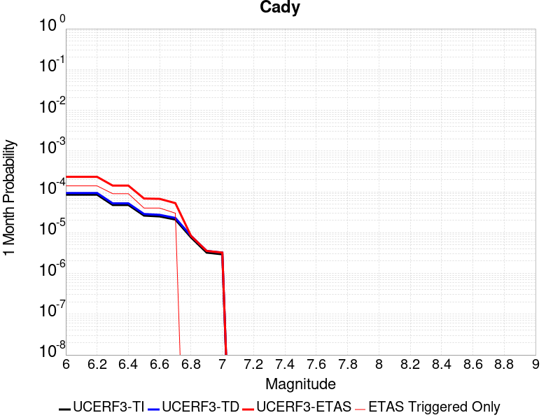 |  |  |

| Magnitude | 1 wk TI Prob | 1 wk TD Prob | 1 wk ETAS Prob | 1 wk ETAS/TD Gain | 1 wk ETAS Triggered Only | 1 mo TI Prob | 1 mo TD Prob | 1 mo ETAS Prob | 1 mo ETAS/TD Gain | 1 mo ETAS Triggered Only | 1 yr TI Prob | 1 yr TD Prob | 1 yr ETAS Prob | 1 yr ETAS/TD Gain | 1 yr ETAS Triggered Only | 10 yr TI Prob | 10 yr TD Prob | 10 yr ETAS Prob | 10 yr ETAS/TD Gain | 10 yr ETAS Triggered Only |
|-----|-----|-----|-----|-----|-----|-----|-----|-----|-----|-----|-----|-----|-----|-----|-----|-----|-----|-----|-----|-----|
| 6.0 | 1.9892565E-5 | 2.1858728E-5 | 1.1185676E-4 | 5.117258 | 9.0E-5 | 8.525106E-5 | 9.3677416E-5 | 2.3366431E-4 | 2.4943504 | 1.4E-4 | 0.0010374374 | 0.0011400167 | 0.0013597659 | 1.1927596 | 2.2E-4 | 0.010326075 | 0.011350701 | 0.011756047 | 1.0357112 | 4.1E-4 |
| 6.1 | 1.9892565E-5 | 2.1858728E-5 | 1.1185676E-4 | 5.117258 | 9.0E-5 | 8.525106E-5 | 9.3677416E-5 | 2.3366431E-4 | 2.4943504 | 1.4E-4 | 0.0010374374 | 0.0011400167 | 0.0013597659 | 1.1927596 | 2.2E-4 | 0.010326075 | 0.011350701 | 0.011756047 | 1.0357112 | 4.1E-4 |
| 6.2 | 1.9892565E-5 | 2.1858728E-5 | 1.1185676E-4 | 5.117258 | 9.0E-5 | 8.525106E-5 | 9.3677416E-5 | 2.3366431E-4 | 2.4943504 | 1.4E-4 | 0.0010374374 | 0.0011400167 | 0.0013597659 | 1.1927596 | 2.2E-4 | 0.010326075 | 0.011350701 | 0.011756047 | 1.0357112 | 4.1E-4 |
| 6.3 | 1.1117327E-5 | 1.2176583E-5 | 5.2176096E-5 | 4.2849536 | 4.0E-5 | 4.764482E-5 | 5.2184492E-5 | 1.421798E-4 | 2.7245603 | 9.0E-5 | 5.7992124E-4 | 6.351925E-4 | 7.751036E-4 | 1.2202656 | 1.4E-4 | 0.0057841022 | 0.0063368753 | 0.0065753544 | 1.0376335 | 2.4E-4 |
| 6.4 | 1.1117327E-5 | 1.2176583E-5 | 5.2176096E-5 | 4.2849536 | 4.0E-5 | 4.764482E-5 | 5.2184492E-5 | 1.421798E-4 | 2.7245603 | 9.0E-5 | 5.7992124E-4 | 6.351925E-4 | 7.751036E-4 | 1.2202656 | 1.4E-4 | 0.0057841022 | 0.0063368753 | 0.0065753544 | 1.0376335 | 2.4E-4 |
| 6.5 | 6.103093E-6 | 6.672021E-6 | 1.6671955E-5 | 2.4987862 | 1.0E-5 | 2.615585E-5 | 2.8594131E-5 | 6.8592984E-5 | 2.3988485 | 4.0E-5 | 3.1840094E-4 | 3.480905E-4 | 3.9807308E-4 | 1.1435908 | 5.0E-5 | 0.0031794512 | 0.0034766865 | 0.0035863041 | 1.0315293 | 1.1E-4 |
| 6.6 | 5.817237E-6 | 6.3656585E-6 | 1.6365595E-5 | 2.5709193 | 1.0E-5 | 2.4930776E-5 | 2.728118E-5 | 6.728009E-5 | 2.4661722 | 4.0E-5 | 3.034899E-4 | 3.3211018E-4 | 3.8209357E-4 | 1.1505024 | 5.0E-5 | 0.0030307577 | 0.0033173605 | 0.0034269956 | 1.0330489 | 1.1E-4 |
| 6.7 | 4.8846314E-6 | 5.3405684E-6 | 1.5340514E-5 | 2.8724499 | 1.0E-5 | 2.0933967E-5 | 2.2888014E-5 | 5.2887328E-5 | 2.3106997 | 3.0E-5 | 2.5484123E-4 | 2.7863772E-4 | 3.0862936E-4 | 1.1076367 | 3.0E-5 | 0.0025454918 | 0.0027840391 | 0.0028638165 | 1.0286552 | 8.0E-5 |
| 6.8 | 1.7788773E-6 | 1.9399079E-6 | 1.9399079E-6 | 1.0 | 0.0 | 7.6237375E-6 | 8.313874E-6 | 8.313874E-6 | 1.0 | 0.0 | 9.281505E-5 | 1.01218284E-4 | 1.01218284E-4 | 1.0 | 0.0 | 9.2776294E-4 | 0.0010118765 | 0.0010318563 | 1.0197452 | 2.0E-5 |
| 6.9 | 7.5455404E-7 | 8.297092E-7 | 8.297092E-7 | 1.0 | 0.0 | 3.233799E-6 | 3.5558937E-6 | 3.5558937E-6 | 1.0 | 0.0 | 3.937079E-5 | 4.3292483E-5 | 4.3292483E-5 | 1.0 | 0.0 | 3.9363815E-4 | 4.3287344E-4 | 4.5286477E-4 | 1.0461829 | 2.0E-5 |
| 7.0 | 6.8578805E-7 | 7.541816E-7 | 7.541816E-7 | 1.0 | 0.0 | 2.9390883E-6 | 3.2322048E-6 | 3.2322048E-6 | 1.0 | 0.0 | 3.578281E-5 | 3.9351715E-5 | 3.9351715E-5 | 1.0 | 0.0 | 3.577705E-4 | 3.9347992E-4 | 4.1347204E-4 | 1.0508085 | 2.0E-5 |

## Lake Isabella (Seismicity)
*[(top)](#table-of-contents)*

| 1 Week | 1 Month | 1 Year | 10 Year |
|-----|-----|-----|-----|
| 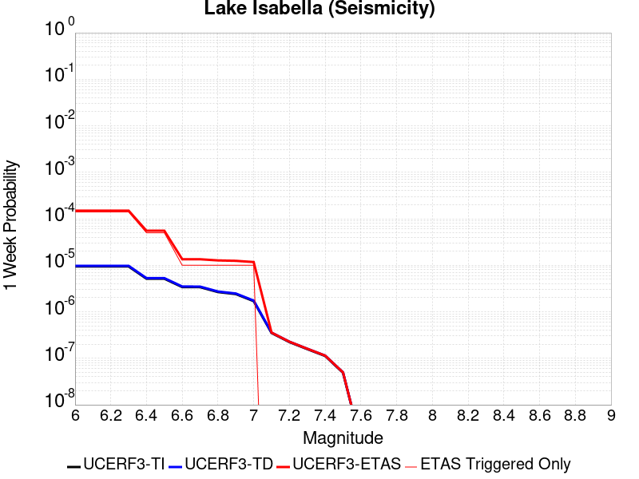 | 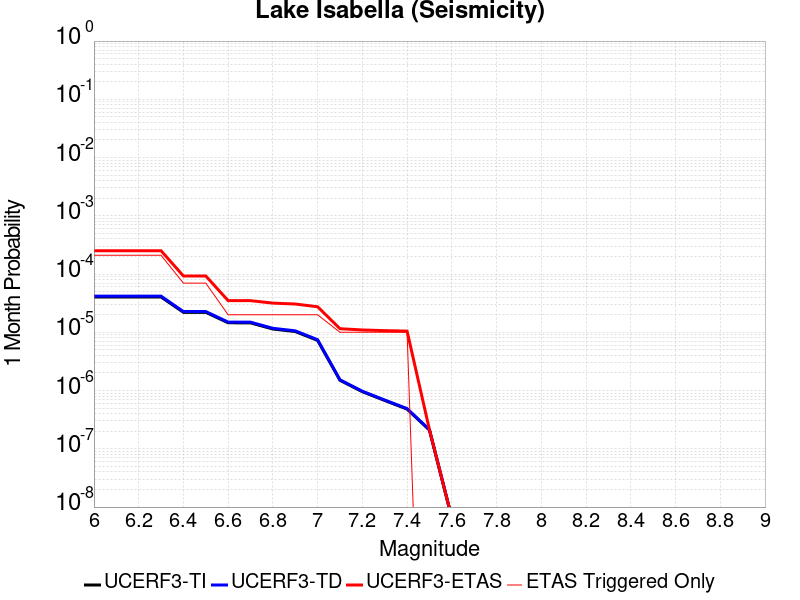 |  |  |

| Magnitude | 1 wk TI Prob | 1 wk TD Prob | 1 wk ETAS Prob | 1 wk ETAS/TD Gain | 1 wk ETAS Triggered Only | 1 mo TI Prob | 1 mo TD Prob | 1 mo ETAS Prob | 1 mo ETAS/TD Gain | 1 mo ETAS Triggered Only | 1 yr TI Prob | 1 yr TD Prob | 1 yr ETAS Prob | 1 yr ETAS/TD Gain | 1 yr ETAS Triggered Only | 10 yr TI Prob | 10 yr TD Prob | 10 yr ETAS Prob | 10 yr ETAS/TD Gain | 10 yr ETAS Triggered Only |
|-----|-----|-----|-----|-----|-----|-----|-----|-----|-----|-----|-----|-----|-----|-----|-----|-----|-----|-----|-----|-----|
| 6.0 | 9.431637E-6 | 9.741651E-6 | 1.4974028E-4 | 15.37114 | 1.4E-4 | 4.0420677E-5 | 4.1749343E-5 | 2.5174057E-4 | 6.0298095 | 2.1E-4 | 4.920106E-4 | 5.0819275E-4 | 8.4801996E-4 | 1.6686975 | 3.4E-4 | 0.004909227 | 0.005071599 | 0.0054695704 | 1.0784706 | 4.0E-4 |
| 6.1 | 9.431637E-6 | 9.741651E-6 | 1.4974028E-4 | 15.37114 | 1.4E-4 | 4.0420677E-5 | 4.1749343E-5 | 2.5174057E-4 | 6.0298095 | 2.1E-4 | 4.920106E-4 | 5.0819275E-4 | 8.4801996E-4 | 1.6686975 | 3.4E-4 | 0.004909227 | 0.005071599 | 0.0054695704 | 1.0784706 | 4.0E-4 |
| 6.2 | 9.431637E-6 | 9.741651E-6 | 1.4974028E-4 | 15.37114 | 1.4E-4 | 4.0420677E-5 | 4.1749343E-5 | 2.5174057E-4 | 6.0298095 | 2.1E-4 | 4.920106E-4 | 5.0819275E-4 | 8.4801996E-4 | 1.6686975 | 3.4E-4 | 0.004909227 | 0.005071599 | 0.0054695704 | 1.0784706 | 4.0E-4 |
| 6.3 | 9.431637E-6 | 9.741651E-6 | 1.4974028E-4 | 15.37114 | 1.4E-4 | 4.0420677E-5 | 4.1749343E-5 | 2.5174057E-4 | 6.0298095 | 2.1E-4 | 4.920106E-4 | 5.0819275E-4 | 8.4801996E-4 | 1.6686975 | 3.4E-4 | 0.004909227 | 0.005071599 | 0.0054695704 | 1.0784706 | 4.0E-4 |
| 6.4 | 5.144063E-6 | 5.3000763E-6 | 5.529981E-5 | 10.433777 | 5.0E-5 | 2.2045799E-5 | 2.2714434E-5 | 9.271284E-5 | 4.0816708 | 7.0E-5 | 2.6837454E-4 | 2.765166E-4 | 4.1647788E-4 | 1.5061587 | 1.4E-4 | 0.0026805066 | 0.0027620657 | 0.0029216239 | 1.0577676 | 1.6E-4 |
| 6.5 | 5.144063E-6 | 5.3000763E-6 | 5.529981E-5 | 10.433777 | 5.0E-5 | 2.2045799E-5 | 2.2714434E-5 | 9.271284E-5 | 4.0816708 | 7.0E-5 | 2.6837454E-4 | 2.765166E-4 | 4.1647788E-4 | 1.5061587 | 1.4E-4 | 0.0026805066 | 0.0027620657 | 0.0029216239 | 1.0577676 | 1.6E-4 |
| 6.6 | 3.4009804E-6 | 3.498786E-6 | 1.3498751E-5 | 3.858124 | 1.0E-5 | 1.4575549E-5 | 1.4994721E-5 | 3.499442E-5 | 2.3337827 | 2.0E-5 | 1.7744285E-4 | 1.8254704E-4 | 2.2253973E-4 | 1.2190816 | 4.0E-5 | 0.0017730123 | 0.0018241286 | 0.0018740373 | 1.0273603 | 5.0E-5 |
| 6.7 | 3.3880428E-6 | 3.4856528E-6 | 1.3485618E-5 | 3.8688931 | 1.0E-5 | 1.4520103E-5 | 1.4938435E-5 | 3.4938137E-5 | 2.3388083 | 2.0E-5 | 1.767679E-4 | 1.8186188E-4 | 2.218546E-4 | 1.2199072 | 4.0E-5 | 0.0017662736 | 0.0018172882 | 0.0018671973 | 1.0274636 | 5.0E-5 |
| 6.8 | 2.6582E-6 | 2.7337003E-6 | 1.27336725E-5 | 4.6580358 | 1.0E-5 | 1.1392236E-5 | 1.1715813E-5 | 3.171558E-5 | 2.7070744 | 2.0E-5 | 1.3869164E-4 | 1.4263204E-4 | 1.7262776E-4 | 1.2103014 | 3.0E-5 | 0.0013860512 | 0.0014255369 | 0.00146548 | 1.0280195 | 4.0E-5 |
| 6.9 | 2.406011E-6 | 2.4743288E-6 | 1.2474304E-5 | 5.04149 | 1.0E-5 | 1.0311434E-5 | 1.0604231E-5 | 3.060402E-5 | 2.8860197 | 2.0E-5 | 1.2553448E-4 | 1.2910018E-4 | 1.5909631E-4 | 1.2323477 | 3.0E-5 | 0.0012546359 | 0.0012903814 | 0.0013303298 | 1.0309585 | 4.0E-5 |
| 7.0 | 1.6953097E-6 | 1.7429371E-6 | 1.174292E-5 | 6.7374315 | 1.0E-5 | 7.265593E-6 | 7.469715E-6 | 2.7469567E-5 | 3.6774583 | 2.0E-5 | 8.8455E-5 | 9.094104E-5 | 1.20938304E-4 | 1.3298541 | 3.0E-5 | 8.84198E-4 | 9.09141E-4 | 9.491046E-4 | 1.0439576 | 4.0E-5 |
| 7.1 | 3.5013824E-7 | 3.5714822E-7 | 3.5714822E-7 | 1.0 | 0.0 | 1.5005916E-6 | 1.5306344E-6 | 1.1530619E-5 | 7.533229 | 1.0E-5 | 1.826955E-5 | 1.8635317E-5 | 2.8635131E-5 | 1.5366055 | 1.0E-5 | 1.8268047E-4 | 1.863378E-4 | 1.9633592E-4 | 1.053656 | 1.0E-5 |
| 7.2 | 2.2321095E-7 | 2.2750574E-7 | 2.2750574E-7 | 1.0 | 0.0 | 9.56618E-7 | 9.750242E-7 | 1.0975014E-5 | 11.2561455 | 1.0E-5 | 1.1646762E-5 | 1.1870856E-5 | 2.1870737E-5 | 1.8423892 | 1.0E-5 | 1.1646151E-4 | 1.1870232E-4 | 1.2870114E-4 | 1.0842344 | 1.0E-5 |
| 7.3 | 1.5760406E-7 | 1.6060922E-7 | 1.6060922E-7 | 1.0 | 0.0 | 6.7544585E-7 | 6.8832503E-7 | 1.0688318E-5 | 15.528009 | 1.0E-5 | 8.223522E-6 | 8.380326E-6 | 1.8380242E-5 | 2.193261 | 1.0E-5 | 8.2232174E-5 | 8.3800165E-5 | 9.3799325E-5 | 1.1193215 | 1.0E-5 |
| 7.4 | 1.1216497E-7 | 1.1431706E-7 | 1.1431706E-7 | 1.0 | 0.0 | 4.8070694E-7 | 4.899302E-7 | 1.0489925E-5 | 21.411062 | 1.0E-5 | 5.852591E-6 | 5.964884E-6 | 1.5964824E-5 | 2.6764686 | 1.0E-5 | 5.8524372E-5 | 5.9647282E-5 | 6.964669E-5 | 1.1676422 | 1.0E-5 |
| 7.5 | 4.885185E-8 | 4.9787737E-8 | 4.9787737E-8 | 1.0 | 0.0 | 2.0936506E-7 | 2.13376E-7 | 2.13376E-7 | 1.0 | 0.0 | 2.5490165E-6 | 2.59785E-6 | 2.59785E-6 | 1.0 | 0.0 | 2.5489873E-5 | 2.5978214E-5 | 2.5978214E-5 | 1.0 | 0.0 |
| 7.6 | 1.504641E-9 | 1.5317903E-9 | 1.5317903E-9 | 1.0 | 0.0 | 6.4484613E-9 | 6.5648154E-9 | 6.5648154E-9 | 1.0 | 0.0 | 7.851001E-8 | 7.992663E-8 | 7.992663E-8 | 1.0 | 0.0 | 7.8509987E-7 | 7.992663E-7 | 7.992663E-7 | 1.0 | 0.0 |

## Manix-Afton Hills
*[(top)](#table-of-contents)*

| 1 Week | 1 Month | 1 Year | 10 Year |
|-----|-----|-----|-----|
|  |  |  | 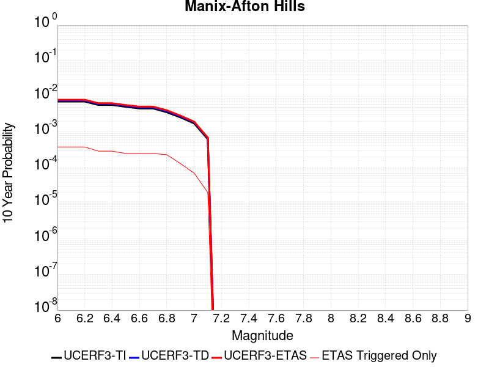 |

| Magnitude | 1 wk TI Prob | 1 wk TD Prob | 1 wk ETAS Prob | 1 wk ETAS/TD Gain | 1 wk ETAS Triggered Only | 1 mo TI Prob | 1 mo TD Prob | 1 mo ETAS Prob | 1 mo ETAS/TD Gain | 1 mo ETAS Triggered Only | 1 yr TI Prob | 1 yr TD Prob | 1 yr ETAS Prob | 1 yr ETAS/TD Gain | 1 yr ETAS Triggered Only | 10 yr TI Prob | 10 yr TD Prob | 10 yr ETAS Prob | 10 yr ETAS/TD Gain | 10 yr ETAS Triggered Only |
|-----|-----|-----|-----|-----|-----|-----|-----|-----|-----|-----|-----|-----|-----|-----|-----|-----|-----|-----|-----|-----|
| 6.0 | 1.3783202E-5 | 1.47110895E-5 | 1.3470932E-4 | 9.156991 | 1.2E-4 | 5.906953E-5 | 6.30461E-5 | 2.3303539E-4 | 3.6962695 | 1.7E-4 | 7.189342E-4 | 7.6733343E-4 | 9.97157E-4 | 1.2995093 | 2.3E-4 | 0.0071661277 | 0.007648596 | 0.008025689 | 1.0493023 | 3.8E-4 |
| 6.1 | 1.3783202E-5 | 1.47110895E-5 | 1.3470932E-4 | 9.156991 | 1.2E-4 | 5.906953E-5 | 6.30461E-5 | 2.3303539E-4 | 3.6962695 | 1.7E-4 | 7.189342E-4 | 7.6733343E-4 | 9.97157E-4 | 1.2995093 | 2.3E-4 | 0.0071661277 | 0.007648596 | 0.008025689 | 1.0493023 | 3.8E-4 |
| 6.2 | 1.3783202E-5 | 1.47110895E-5 | 1.3470932E-4 | 9.156991 | 1.2E-4 | 5.906953E-5 | 6.30461E-5 | 2.3303539E-4 | 3.6962695 | 1.7E-4 | 7.189342E-4 | 7.6733343E-4 | 9.97157E-4 | 1.2995093 | 2.3E-4 | 0.0071661277 | 0.007648596 | 0.008025689 | 1.0493023 | 3.8E-4 |
| 6.3 | 1.10494875E-5 | 1.1793136E-5 | 9.179219E-5 | 7.7835274 | 8.0E-5 | 4.7354086E-5 | 5.054109E-5 | 1.6053554E-4 | 3.176337 | 1.1E-4 | 5.763835E-4 | 6.151744E-4 | 7.75076E-4 | 1.2599288 | 1.6E-4 | 0.005748908 | 0.0061357557 | 0.0064239763 | 1.046974 | 2.9E-4 |
| 6.4 | 1.10494875E-5 | 1.1793136E-5 | 9.179219E-5 | 7.7835274 | 8.0E-5 | 4.7354086E-5 | 5.054109E-5 | 1.6053554E-4 | 3.176337 | 1.1E-4 | 5.763835E-4 | 6.151744E-4 | 7.75076E-4 | 1.2599288 | 1.6E-4 | 0.005748908 | 0.0061357557 | 0.0064239763 | 1.046974 | 2.9E-4 |
| 6.5 | 9.788949E-6 | 1.045432E-5 | 8.045359E-5 | 7.695727 | 7.0E-5 | 4.1951964E-5 | 4.480351E-5 | 1.4479904E-4 | 3.231868 | 1.0E-4 | 5.1064545E-4 | 5.453555E-4 | 6.8527914E-4 | 1.2565733 | 1.4E-4 | 0.0050947363 | 0.0054410985 | 0.0056897383 | 1.0456966 | 2.5E-4 |
| 6.6 | 8.810006E-6 | 9.4136285E-6 | 7.941297E-5 | 8.435958 | 7.0E-5 | 3.775662E-5 | 4.0343548E-5 | 1.4033951E-4 | 3.4786112 | 1.0E-4 | 4.5958988E-4 | 4.9108086E-4 | 6.3101214E-4 | 1.2849455 | 1.4E-4 | 0.0045864056 | 0.004900839 | 0.005149614 | 1.0507617 | 2.5E-4 |
| 6.7 | 8.80128E-6 | 9.404108E-6 | 7.940345E-5 | 8.443485 | 7.0E-5 | 3.7719226E-5 | 4.0302748E-5 | 1.4029871E-4 | 3.4811203 | 1.0E-4 | 4.591348E-4 | 4.9058435E-4 | 6.305157E-4 | 1.285234 | 1.4E-4 | 0.004581874 | 0.0048958957 | 0.005144672 | 1.0508132 | 2.5E-4 |
| 6.8 | 6.8994877E-6 | 7.380076E-6 | 5.7379708E-5 | 7.774948 | 5.0E-5 | 2.9568899E-5 | 3.162856E-5 | 1.1162603E-4 | 3.5292795 | 8.0E-5 | 3.5994186E-4 | 3.8501783E-4 | 5.0497166E-4 | 1.3115538 | 1.2E-4 | 0.003593594 | 0.0038443129 | 0.0040734285 | 1.0595987 | 2.3E-4 |
| 6.9 | 4.9328037E-6 | 5.2709615E-6 | 4.527075E-5 | 8.588708 | 4.0E-5 | 2.1140417E-5 | 2.2589675E-5 | 6.258877E-5 | 2.7706807 | 4.0E-5 | 2.5735417E-4 | 2.7500073E-4 | 3.4498147E-4 | 1.2544748 | 7.0E-5 | 0.0025705635 | 0.0027472095 | 0.0028768524 | 1.0471908 | 1.3E-4 |
| 7.0 | 3.347973E-6 | 3.59003E-6 | 1.35899945E-5 | 3.7854822 | 1.0E-5 | 1.4348378E-5 | 1.5385775E-5 | 2.5385621E-5 | 1.649941 | 1.0E-5 | 1.746775E-4 | 1.8730981E-4 | 2.173042E-4 | 1.1601324 | 3.0E-5 | 0.0017454025 | 0.0018719219 | 0.0019417909 | 1.0373247 | 7.0E-5 |
| 7.1 | 1.2073567E-6 | 1.293482E-6 | 1.293482E-6 | 1.0 | 0.0 | 5.1743755E-6 | 5.543492E-6 | 5.543492E-6 | 1.0 | 0.0 | 6.29962E-5 | 6.749156E-5 | 6.749156E-5 | 1.0 | 0.0 | 6.297835E-4 | 6.7487074E-4 | 6.9485727E-4 | 1.0296153 | 2.0E-5 |

## White Mountains
*[(top)](#table-of-contents)*

| 1 Week | 1 Month | 1 Year | 10 Year |
|-----|-----|-----|-----|
|  |  |  |  |

| Magnitude | 1 wk TI Prob | 1 wk TD Prob | 1 wk ETAS Prob | 1 wk ETAS/TD Gain | 1 wk ETAS Triggered Only | 1 mo TI Prob | 1 mo TD Prob | 1 mo ETAS Prob | 1 mo ETAS/TD Gain | 1 mo ETAS Triggered Only | 1 yr TI Prob | 1 yr TD Prob | 1 yr ETAS Prob | 1 yr ETAS/TD Gain | 1 yr ETAS Triggered Only | 10 yr TI Prob | 10 yr TD Prob | 10 yr ETAS Prob | 10 yr ETAS/TD Gain | 10 yr ETAS Triggered Only |
|-----|-----|-----|-----|-----|-----|-----|-----|-----|-----|-----|-----|-----|-----|-----|-----|-----|-----|-----|-----|-----|
| 6.0 | 3.503579E-5 | 3.3784127E-5 | 1.9377872E-4 | 5.735792 | 1.6E-4 | 1.5014476E-4 | 1.4478175E-4 | 3.247557E-4 | 2.2430706 | 1.8E-4 | 0.0018264796 | 0.0017614134 | 0.0020509027 | 1.1643505 | 2.9E-4 | 0.018115403 | 0.017486857 | 0.017850386 | 1.0207888 | 3.7E-4 |
| 6.1 | 3.503579E-5 | 3.3784127E-5 | 1.9377872E-4 | 5.735792 | 1.6E-4 | 1.5014476E-4 | 1.4478175E-4 | 3.247557E-4 | 2.2430706 | 1.8E-4 | 0.0018264796 | 0.0017614134 | 0.0020509027 | 1.1643505 | 2.9E-4 | 0.018115403 | 0.017486857 | 0.017850386 | 1.0207888 | 3.7E-4 |
| 6.2 | 3.503579E-5 | 3.3784127E-5 | 1.9377872E-4 | 5.735792 | 1.6E-4 | 1.5014476E-4 | 1.4478175E-4 | 3.247557E-4 | 2.2430706 | 1.8E-4 | 0.0018264796 | 0.0017614134 | 0.0020509027 | 1.1643505 | 2.9E-4 | 0.018115403 | 0.017486857 | 0.017850386 | 1.0207888 | 3.7E-4 |
| 6.3 | 1.7818425E-5 | 1.591616E-5 | 6.591537E-5 | 4.1414113 | 5.0E-5 | 7.636245E-5 | 6.821041E-5 | 1.2820632E-4 | 1.8795712 | 6.0E-5 | 9.293162E-4 | 8.301596E-4 | 9.5005997E-4 | 1.1444305 | 1.2E-4 | 0.009254395 | 0.0082720425 | 0.008440636 | 1.0203811 | 1.7E-4 |
| 6.4 | 1.7818425E-5 | 1.591616E-5 | 6.591537E-5 | 4.1414113 | 5.0E-5 | 7.636245E-5 | 6.821041E-5 | 1.2820632E-4 | 1.8795712 | 6.0E-5 | 9.293162E-4 | 8.301596E-4 | 9.5005997E-4 | 1.1444305 | 1.2E-4 | 0.009254395 | 0.0082720425 | 0.008440636 | 1.0203811 | 1.7E-4 |
| 6.5 | 1.3397557E-5 | 1.1336374E-5 | 2.133626E-5 | 1.8821063 | 1.0E-5 | 5.741684E-5 | 4.8583595E-5 | 5.8583108E-5 | 1.2058208 | 1.0E-5 | 6.988258E-4 | 5.913517E-4 | 6.413221E-4 | 1.0845021 | 5.0E-5 | 0.006966323 | 0.005898487 | 0.0059879557 | 1.0151682 | 9.0E-5 |
| 6.6 | 1.0818695E-5 | 8.625434E-6 | 1.8625347E-5 | 2.1593518 | 1.0E-5 | 4.6365014E-5 | 3.6965648E-5 | 4.6965277E-5 | 1.2705114 | 1.0E-5 | 5.6434784E-4 | 4.4996818E-4 | 4.7995467E-4 | 1.0666413 | 3.0E-5 | 0.005629168 | 0.0044910074 | 0.004540783 | 1.0110834 | 5.0E-5 |
| 6.7 | 9.067908E-6 | 6.802476E-6 | 1.6802407E-5 | 2.470043 | 1.0E-5 | 3.8861883E-5 | 2.915316E-5 | 3.915287E-5 | 1.343006 | 1.0E-5 | 4.7304068E-4 | 3.548851E-4 | 3.8487447E-4 | 1.0845044 | 3.0E-5 | 0.00472035 | 0.003543501 | 0.0035933238 | 1.0140604 | 5.0E-5 |
| 6.8 | 7.295947E-6 | 4.9364285E-6 | 4.9364285E-6 | 1.0 | 0.0 | 3.126797E-5 | 2.1155956E-5 | 2.1155956E-5 | 1.0 | 0.0 | 3.8062103E-4 | 2.5754445E-4 | 2.6754188E-4 | 1.0388182 | 1.0E-5 | 0.0037996976 | 0.0025725728 | 0.0026024955 | 1.0116315 | 3.0E-5 |
| 6.9 | 6.2243444E-6 | 3.8322546E-6 | 3.8322546E-6 | 1.0 | 0.0 | 2.6675489E-5 | 1.6423846E-5 | 1.6423846E-5 | 1.0 | 0.0 | 3.2472567E-4 | 1.9994251E-4 | 2.0994052E-4 | 1.0500044 | 1.0E-5 | 0.0032425157 | 0.001997679 | 0.0020276192 | 1.0149875 | 3.0E-5 |
| 7.0 | 4.9878413E-6 | 2.679564E-6 | 2.679564E-6 | 1.0 | 0.0 | 2.1376287E-5 | 1.1483797E-5 | 1.1483797E-5 | 1.0 | 0.0 | 2.602252E-4 | 1.3980652E-4 | 1.3980652E-4 | 1.0 | 0.0 | 0.002599207 | 0.0013972119 | 0.0014071979 | 1.0071471 | 1.0E-5 |
| 7.1 | 4.0252844E-6 | 1.885702E-6 | 1.885702E-6 | 1.0 | 0.0 | 1.7251105E-5 | 8.081555E-6 | 8.081555E-6 | 1.0 | 0.0 | 2.1001195E-4 | 9.838863E-5 | 9.838863E-5 | 1.0 | 0.0 | 0.0020981359 | 9.834635E-4 | 9.934537E-4 | 1.0101582 | 1.0E-5 |
| 7.2 | 3.3284066E-6 | 1.2818929E-6 | 1.2818929E-6 | 1.0 | 0.0 | 1.4264522E-5 | 5.4938155E-6 | 5.4938155E-6 | 1.0 | 0.0 | 1.736567E-4 | 6.688525E-5 | 6.688525E-5 | 1.0 | 0.0 | 0.0017352107 | 6.6866126E-4 | 6.6866126E-4 | 1.0 | 0.0 |
| 7.3 | 2.458226E-6 | 6.056684E-7 | 6.056684E-7 | 1.0 | 0.0 | 1.0535211E-5 | 2.5957193E-6 | 2.5957193E-6 | 1.0 | 0.0 | 1.2825865E-4 | 3.160246E-5 | 3.160246E-5 | 1.0 | 0.0 | 0.0012818464 | 3.1598343E-4 | 3.1598343E-4 | 1.0 | 0.0 |
| 7.4 | 1.965953E-6 | 3.1084684E-7 | 3.1084684E-7 | 1.0 | 0.0 | 8.425486E-6 | 1.3322001E-6 | 1.3322001E-6 | 1.0 | 0.0 | 1.0257547E-4 | 1.6219417E-5 | 1.6219417E-5 | 1.0 | 0.0 | 0.0010252813 | 1.6218246E-4 | 1.6218246E-4 | 1.0 | 0.0 |
| 7.5 | 1.2014192E-6 | 1.8241002E-7 | 1.8241002E-7 | 1.0 | 0.0 | 5.148929E-6 | 7.8175697E-7 | 7.8175697E-7 | 1.0 | 0.0 | 6.2686406E-5 | 9.51785E-6 | 9.51785E-6 | 1.0 | 0.0 | 6.266873E-4 | 9.517451E-5 | 9.517451E-5 | 1.0 | 0.0 |
| 7.6 | 2.5612175E-7 | 4.893784E-8 | 4.893784E-8 | 1.0 | 0.0 | 1.0976642E-6 | 2.0973359E-7 | 2.0973359E-7 | 1.0 | 0.0 | 1.3363979E-5 | 2.5535037E-6 | 2.5535037E-6 | 1.0 | 0.0 | 1.3363175E-4 | 2.553478E-5 | 2.553478E-5 | 1.0 | 0.0 |

## San Jacinto (Anza) rev
*[(top)](#table-of-contents)*

| 1 Week | 1 Month | 1 Year | 10 Year |
|-----|-----|-----|-----|
|  |  | 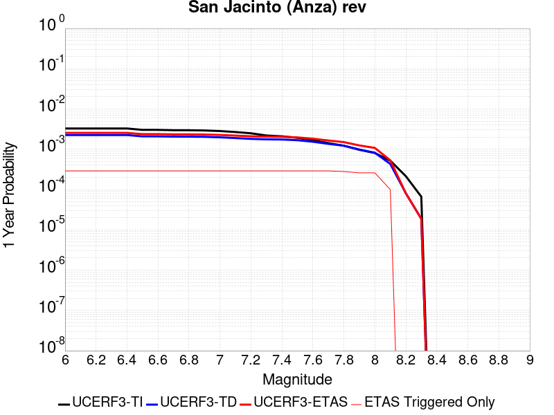 | 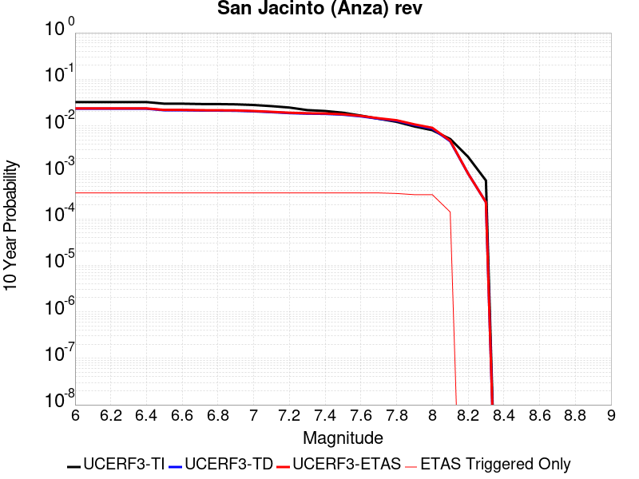 |

| Magnitude | 1 wk TI Prob | 1 wk TD Prob | 1 wk ETAS Prob | 1 wk ETAS/TD Gain | 1 wk ETAS Triggered Only | 1 mo TI Prob | 1 mo TD Prob | 1 mo ETAS Prob | 1 mo ETAS/TD Gain | 1 mo ETAS Triggered Only | 1 yr TI Prob | 1 yr TD Prob | 1 yr ETAS Prob | 1 yr ETAS/TD Gain | 1 yr ETAS Triggered Only | 10 yr TI Prob | 10 yr TD Prob | 10 yr ETAS Prob | 10 yr ETAS/TD Gain | 10 yr ETAS Triggered Only |
|-----|-----|-----|-----|-----|-----|-----|-----|-----|-----|-----|-----|-----|-----|-----|-----|-----|-----|-----|-----|-----|
| 6.0 | 6.3015636E-5 | 4.3298347E-5 | 1.9329185E-4 | 4.464185 | 1.5E-4 | 2.7003905E-4 | 1.8555121E-4 | 3.9551224E-4 | 2.131553 | 2.1E-4 | 0.0032827691 | 0.0022567573 | 0.002546103 | 1.1282129 | 2.9E-4 | 0.032346968 | 0.02329361 | 0.023645226 | 1.0150949 | 3.6E-4 |
| 6.1 | 6.3015636E-5 | 4.3298347E-5 | 1.9329185E-4 | 4.464185 | 1.5E-4 | 2.7003905E-4 | 1.8555121E-4 | 3.9551224E-4 | 2.131553 | 2.1E-4 | 0.0032827691 | 0.0022567573 | 0.002546103 | 1.1282129 | 2.9E-4 | 0.032346968 | 0.02329361 | 0.023645226 | 1.0150949 | 3.6E-4 |
| 6.2 | 6.3015636E-5 | 4.3298347E-5 | 1.9329185E-4 | 4.464185 | 1.5E-4 | 2.7003905E-4 | 1.8555121E-4 | 3.9551224E-4 | 2.131553 | 2.1E-4 | 0.0032827691 | 0.0022567573 | 0.002546103 | 1.1282129 | 2.9E-4 | 0.032346968 | 0.02329361 | 0.023645226 | 1.0150949 | 3.6E-4 |
| 6.3 | 6.3015636E-5 | 4.3298347E-5 | 1.9329185E-4 | 4.464185 | 1.5E-4 | 2.7003905E-4 | 1.8555121E-4 | 3.9551224E-4 | 2.131553 | 2.1E-4 | 0.0032827691 | 0.0022567573 | 0.002546103 | 1.1282129 | 2.9E-4 | 0.032346968 | 0.02329361 | 0.023645226 | 1.0150949 | 3.6E-4 |
| 6.4 | 6.3015636E-5 | 4.3298347E-5 | 1.9329185E-4 | 4.464185 | 1.5E-4 | 2.7003905E-4 | 1.8555121E-4 | 3.9551224E-4 | 2.131553 | 2.1E-4 | 0.0032827691 | 0.0022567573 | 0.002546103 | 1.1282129 | 2.9E-4 | 0.032346968 | 0.02329361 | 0.023645226 | 1.0150949 | 3.6E-4 |
| 6.5 | 5.811017E-5 | 4.0080286E-5 | 1.9007428E-4 | 4.742338 | 1.5E-4 | 2.4901982E-4 | 1.7176138E-4 | 3.8172532E-4 | 2.2224164 | 2.1E-4 | 0.0030276014 | 0.0020891947 | 0.0023785888 | 1.1385194 | 2.9E-4 | 0.02986684 | 0.021590833 | 0.02194306 | 1.0163138 | 3.6E-4 |
| 6.6 | 5.811017E-5 | 4.0080286E-5 | 1.9007428E-4 | 4.742338 | 1.5E-4 | 2.4901982E-4 | 1.7176138E-4 | 3.8172532E-4 | 2.2224164 | 2.1E-4 | 0.0030276014 | 0.0020891947 | 0.0023785888 | 1.1385194 | 2.9E-4 | 0.02986684 | 0.021590833 | 0.02194306 | 1.0163138 | 3.6E-4 |
| 6.7 | 5.712442E-5 | 3.950301E-5 | 1.8949709E-4 | 4.797029 | 1.5E-4 | 2.4479596E-4 | 1.6928767E-4 | 3.7925213E-4 | 2.240282 | 2.1E-4 | 0.0029763177 | 0.0020591344 | 0.0023485373 | 1.1405458 | 2.9E-4 | 0.029367693 | 0.021282919 | 0.021635257 | 1.016555 | 3.6E-4 |
| 6.8 | 5.6967532E-5 | 3.93593E-5 | 1.8935339E-4 | 4.8108935 | 1.5E-4 | 2.4412372E-4 | 1.6867183E-4 | 3.786364E-4 | 2.244811 | 2.1E-4 | 0.0029681553 | 0.0020516508 | 0.002341056 | 1.1410596 | 2.9E-4 | 0.029288229 | 0.02120852 | 0.021560885 | 1.0166143 | 3.6E-4 |
| 6.9 | 5.6211324E-5 | 3.9064216E-5 | 1.8905835E-4 | 4.839681 | 1.5E-4 | 2.4088343E-4 | 1.6740736E-4 | 3.773722E-4 | 2.2542152 | 2.1E-4 | 0.0029288116 | 0.0020362847 | 0.0023256943 | 1.1421262 | 2.9E-4 | 0.028905109 | 0.021047527 | 0.02139995 | 1.0167441 | 3.6E-4 |
| 7.0 | 5.4383527E-5 | 3.7925012E-5 | 1.8791933E-4 | 4.9550233 | 1.5E-4 | 2.3305144E-4 | 1.6252567E-4 | 3.7249154E-4 | 2.2918937 | 2.1E-4 | 0.0028337094 | 0.001976959 | 0.0022663856 | 1.1464 | 2.9E-4 | 0.027978465 | 0.02044095 | 0.02079359 | 1.0172517 | 3.6E-4 |
| 7.1 | 5.1393665E-5 | 3.638787E-5 | 1.8638241E-4 | 5.1221027 | 1.5E-4 | 2.2023996E-4 | 1.5593872E-4 | 3.6590596E-4 | 2.346473 | 2.1E-4 | 0.0026781242 | 0.0018969048 | 0.0021863547 | 1.1525906 | 2.9E-4 | 0.026460782 | 0.019616077 | 0.019969014 | 1.0179923 | 3.6E-4 |
| 7.2 | 4.785222E-5 | 3.4738845E-5 | 1.8473364E-4 | 5.317783 | 1.5E-4 | 2.0506482E-4 | 1.4887229E-4 | 3.5884103E-4 | 2.4103951 | 2.1E-4 | 0.0024938055 | 0.0018110167 | 0.0021004917 | 1.1598411 | 2.9E-4 | 0.024660049 | 0.018728783 | 0.019082041 | 1.0188618 | 3.6E-4 |
| 7.3 | 4.2143256E-5 | 3.3834414E-5 | 1.8382934E-4 | 5.433206 | 1.5E-4 | 1.8060145E-4 | 1.449966E-4 | 3.5496615E-4 | 2.4480999 | 2.1E-4 | 0.002196605 | 0.0017639075 | 0.0020533958 | 1.1641177 | 2.9E-4 | 0.02175019 | 0.018236695 | 0.01859013 | 1.0193805 | 3.6E-4 |
| 7.4 | 4.0264713E-5 | 3.3472694E-5 | 1.8346767E-4 | 5.481115 | 1.5E-4 | 1.7255165E-4 | 1.4344654E-4 | 3.534164E-4 | 2.4637501 | 2.1E-4 | 0.002098792 | 0.0017450659 | 0.0020345598 | 1.1658928 | 2.9E-4 | 0.020790804 | 0.018041389 | 0.018394895 | 1.0195941 | 3.6E-4 |
| 7.5 | 3.694492E-5 | 3.2186905E-5 | 1.8218208E-4 | 5.66013 | 1.5E-4 | 1.5832575E-4 | 1.379366E-4 | 3.4790763E-4 | 2.5222285 | 2.1E-4 | 0.0019259118 | 0.0016780876 | 0.001967601 | 1.1725258 | 2.9E-4 | 0.01909306 | 0.017357888 | 0.01771164 | 1.0203799 | 3.6E-4 |
| 7.6 | 3.200565E-5 | 2.9502702E-5 | 1.7949828E-4 | 6.08413 | 1.5E-4 | 1.3715986E-4 | 1.2643404E-4 | 3.3640748E-4 | 2.6607351 | 2.1E-4 | 0.001668642 | 0.0015382497 | 0.0018278037 | 1.188236 | 2.9E-4 | 0.01656168 | 0.015946016 | 0.016300276 | 1.0222162 | 3.6E-4 |
| 7.7 | 2.731642E-5 | 2.6091477E-5 | 1.7608756E-4 | 6.748854 | 1.5E-4 | 1.1706512E-4 | 1.11815825E-4 | 3.2179235E-4 | 2.8778784 | 2.1E-4 | 0.001424336 | 0.0013605085 | 0.001650114 | 1.2128656 | 2.9E-4 | 0.014152412 | 0.0141668 | 0.014521699 | 1.0250515 | 3.6E-4 |
| 7.8 | 2.3466424E-5 | 2.3503619E-5 | 1.735001E-4 | 7.381846 | 1.5E-4 | 1.0056651E-4 | 1.0072591E-4 | 3.1070475E-4 | 3.0846558 | 2.1E-4 | 0.0012237094 | 0.0012256489 | 0.0015053058 | 1.2281704 | 2.8E-4 | 0.012169928 | 0.012808796 | 0.013154313 | 1.0269749 | 3.5E-4 |
| 7.9 | 1.8611925E-5 | 1.890698E-5 | 1.6890414E-4 | 8.933428 | 1.5E-4 | 7.9762955E-5 | 8.10274E-5 | 2.810112E-4 | 3.4681008 | 2.0E-4 | 9.7068126E-4 | 9.860628E-4 | 0.0012458065 | 1.2634149 | 2.6E-4 | 0.0096645225 | 0.010393705 | 0.010720275 | 1.03142 | 3.3E-4 |
| 8.0 | 1.5460775E-5 | 1.5739915E-5 | 1.6573755E-4 | 10.529761 | 1.5E-4 | 6.6258784E-5 | 6.745504E-5 | 2.6744156E-4 | 3.964738 | 2.0E-4 | 8.0640207E-4 | 8.2095637E-4 | 0.0010807429 | 1.3164438 | 2.6E-4 | 0.008034821 | 0.008702706 | 0.009029834 | 1.0375892 | 3.3E-4 |
| 8.1 | 9.983884E-6 | 8.268954E-6 | 5.8268542E-5 | 7.0466638 | 5.0E-5 | 4.2787375E-5 | 3.5437897E-5 | 1.05435414E-4 | 2.9752166 | 7.0E-5 | 5.2081177E-4 | 4.313715E-4 | 5.313284E-4 | 1.2317188 | 1.0E-4 | 0.0051959283 | 0.00463968 | 0.0047790306 | 1.0300345 | 1.4E-4 |
| 8.2 | 4.1226E-6 | 1.5522551E-6 | 1.5522551E-6 | 1.0 | 0.0 | 1.7668166E-5 | 6.6525045E-6 | 6.6525045E-6 | 1.0 | 0.0 | 2.1508869E-4 | 8.099126E-5 | 8.099126E-5 | 1.0 | 0.0 | 0.0021488064 | 9.401847E-4 | 9.401847E-4 | 1.0 | 0.0 |
| 8.3 | 1.2750878E-6 | 3.609817E-7 | 3.609817E-7 | 1.0 | 0.0 | 5.4646503E-6 | 1.5470634E-6 | 1.5470634E-6 | 1.0 | 0.0 | 6.653009E-5 | 1.8835339E-5 | 1.8835339E-5 | 1.0 | 0.0 | 6.6510175E-4 | 2.272251E-4 | 2.272251E-4 | 1.0 | 0.0 |

## San Andreas (Creeping Section) 2011 CFM
*[(top)](#table-of-contents)*

| 1 Week | 1 Month | 1 Year | 10 Year |
|-----|-----|-----|-----|
| 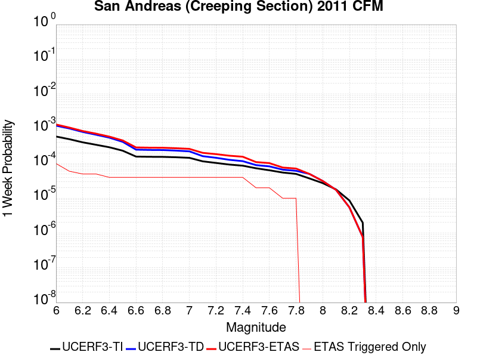 |  |  | 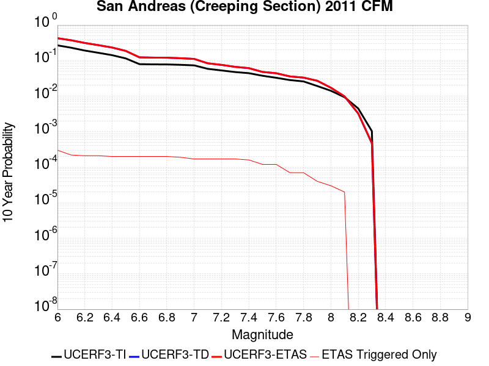 |

| Magnitude | 1 wk TI Prob | 1 wk TD Prob | 1 wk ETAS Prob | 1 wk ETAS/TD Gain | 1 wk ETAS Triggered Only | 1 mo TI Prob | 1 mo TD Prob | 1 mo ETAS Prob | 1 mo ETAS/TD Gain | 1 mo ETAS Triggered Only | 1 yr TI Prob | 1 yr TD Prob | 1 yr ETAS Prob | 1 yr ETAS/TD Gain | 1 yr ETAS Triggered Only | 10 yr TI Prob | 10 yr TD Prob | 10 yr ETAS Prob | 10 yr ETAS/TD Gain | 10 yr ETAS Triggered Only |
|-----|-----|-----|-----|-----|-----|-----|-----|-----|-----|-----|-----|-----|-----|-----|-----|-----|-----|-----|-----|-----|
| 6.0 | 5.986481E-4 | 0.0012275929 | 0.0013274702 | 1.0813602 | 1.0E-4 | 0.0025631124 | 0.005245547 | 0.005364917 | 1.0227566 | 1.2E-4 | 0.030762846 | 0.06120491 | 0.061402056 | 1.0032212 | 2.1E-4 | 0.26835477 | 0.42593494 | 0.42610714 | 1.0004044 | 3.0E-4 |
| 6.1 | 5.015945E-4 | 0.0010217986 | 0.0010817372 | 1.05866 | 6.0E-5 | 0.00214792 | 0.0043678596 | 0.00444751 | 1.0182356 | 8.0E-5 | 0.025839351 | 0.05124837 | 0.05140017 | 1.002962 | 1.6E-4 | 0.23032776 | 0.37285668 | 0.37299466 | 1.00037 | 2.2E-4 |
| 6.2 | 4.073338E-4 | 8.1073755E-4 | 8.60697E-4 | 1.0616223 | 5.0E-5 | 0.0017445484 | 0.0034671477 | 0.003536905 | 1.0201195 | 7.0E-5 | 0.021034058 | 0.04093317 | 0.04107703 | 1.0035145 | 1.5E-4 | 0.19150782 | 0.31303346 | 0.31317773 | 1.0004609 | 2.1E-4 |
| 6.3 | 3.464099E-4 | 6.7391695E-4 | 7.238833E-4 | 1.0741432 | 5.0E-5 | 0.0014837692 | 0.0028829593 | 0.0029527575 | 1.0242106 | 7.0E-5 | 0.017915873 | 0.034189582 | 0.034334455 | 1.0042373 | 1.5E-4 | 0.16538359 | 0.2713166 | 0.2714696 | 1.000564 | 2.1E-4 |
| 6.4 | 2.935057E-4 | 5.5442745E-4 | 5.944053E-4 | 1.0721065 | 4.0E-5 | 0.0012572751 | 0.0023725363 | 0.002432394 | 1.0252293 | 6.0E-5 | 0.015200248 | 0.02826451 | 0.028400553 | 1.0048132 | 1.4E-4 | 0.14201577 | 0.23298529 | 0.23313868 | 1.0006584 | 2.0E-4 |
| 6.5 | 2.3409708E-4 | 4.2093755E-4 | 4.609207E-4 | 1.094986 | 4.0E-5 | 0.0010028875 | 0.0018019684 | 0.0018618604 | 1.0332369 | 6.0E-5 | 0.012141965 | 0.021587461 | 0.02172444 | 1.0063453 | 1.4E-4 | 0.11499573 | 0.18682368 | 0.18698631 | 1.0008706 | 2.0E-4 |
| 6.6 | 1.5842178E-4 | 2.506933E-4 | 2.9068327E-4 | 1.1595175 | 4.0E-5 | 6.7877385E-4 | 0.0010739497 | 0.0011338854 | 1.0558085 | 6.0E-5 | 0.0082328 | 0.012995575 | 0.013133755 | 1.0106329 | 1.4E-4 | 0.07934396 | 0.12314638 | 0.12332175 | 1.0014241 | 2.0E-4 |
| 6.7 | 1.5616413E-4 | 2.4605883E-4 | 2.8604898E-4 | 1.1625228 | 4.0E-5 | 6.691031E-4 | 0.0010541069 | 0.0011140436 | 1.0568602 | 6.0E-5 | 0.0081159435 | 0.01275744 | 0.012895654 | 1.010834 | 1.4E-4 | 0.0782586 | 0.12117351 | 0.121349275 | 1.0014505 | 2.0E-4 |
| 6.8 | 1.5538467E-4 | 2.4429744E-4 | 2.8428767E-4 | 1.1636949 | 4.0E-5 | 6.6576427E-4 | 0.0010465645 | 0.0011065018 | 1.0572704 | 6.0E-5 | 0.008075596 | 0.012666838 | 0.012805065 | 1.0109125 | 1.4E-4 | 0.07788358 | 0.120404355 | 0.12058027 | 1.001461 | 2.0E-4 |
| 6.9 | 1.5153569E-4 | 2.3539034E-4 | 2.753809E-4 | 1.1698905 | 4.0E-5 | 6.49277E-4 | 0.0010084276 | 0.0010683672 | 1.0594386 | 6.0E-5 | 0.007876333 | 0.01220901 | 0.0123473015 | 1.0113269 | 1.4E-4 | 0.07602952 | 0.11647445 | 0.11664232 | 1.0014412 | 1.9E-4 |
| 7.0 | 1.4588932E-4 | 2.2396253E-4 | 2.6395358E-4 | 1.1785613 | 4.0E-5 | 6.250901E-4 | 9.5948833E-4 | 0.0010194308 | 1.0624733 | 6.0E-5 | 0.0075839474 | 0.011619697 | 0.011738302 | 1.0102073 | 1.2E-4 | 0.073302895 | 0.11132046 | 0.111471534 | 1.0013571 | 1.7E-4 |
| 7.1 | 1.1565079E-4 | 1.6281738E-4 | 2.0281087E-4 | 1.245634 | 4.0E-5 | 4.955521E-4 | 6.9760304E-4 | 7.575612E-4 | 1.0859488 | 6.0E-5 | 0.006016669 | 0.0084604435 | 0.008579428 | 1.0140636 | 1.2E-4 | 0.058563538 | 0.08367046 | 0.08382624 | 1.0018618 | 1.7E-4 |
| 7.2 | 1.0393792E-4 | 1.4615769E-4 | 1.8615184E-4 | 1.273637 | 4.0E-5 | 4.4537216E-4 | 6.2624045E-4 | 6.862029E-4 | 1.0957499 | 6.0E-5 | 0.005408933 | 0.0075979927 | 0.007717081 | 1.0156736 | 1.2E-4 | 0.052791595 | 0.07561969 | 0.07577684 | 1.002078 | 1.7E-4 |
| 7.3 | 9.332884E-5 | 1.2780898E-4 | 1.6780387E-4 | 1.312927 | 4.0E-5 | 3.999194E-4 | 5.4763845E-4 | 6.0760556E-4 | 1.1095014 | 6.0E-5 | 0.0048581534 | 0.006647249 | 0.0067664515 | 1.0179325 | 1.2E-4 | 0.047533102 | 0.06648326 | 0.06664196 | 1.002387 | 1.7E-4 |
| 7.4 | 8.670252E-5 | 1.17032345E-4 | 1.5702767E-4 | 1.3417459 | 4.0E-5 | 3.715293E-4 | 5.0147134E-4 | 5.614413E-4 | 1.1195879 | 6.0E-5 | 0.004513991 | 0.006088443 | 0.0062077125 | 1.0195894 | 1.2E-4 | 0.044233937 | 0.061151642 | 0.06130186 | 1.0024564 | 1.6E-4 |
| 7.5 | 7.3036405E-5 | 9.005856E-5 | 1.1005676E-4 | 1.2220577 | 2.0E-5 | 3.129756E-4 | 3.8590826E-4 | 4.2589282E-4 | 1.1036116 | 4.0E-5 | 0.0038038217 | 0.0046883323 | 0.004767957 | 1.0169836 | 8.0E-5 | 0.03739367 | 0.047877792 | 0.047992047 | 1.0023863 | 1.2E-4 |
| 7.6 | 6.3935775E-5 | 8.280385E-5 | 1.0280219E-4 | 1.2415147 | 2.0E-5 | 2.7398168E-4 | 3.5482543E-4 | 3.9481124E-4 | 1.1126915 | 4.0E-5 | 0.0033306254 | 0.004311461 | 0.004391116 | 1.0184752 | 8.0E-5 | 0.032811474 | 0.04399201 | 0.04410673 | 1.0026078 | 1.2E-4 |
| 7.7 | 5.5050095E-5 | 6.6618326E-5 | 7.661766E-5 | 1.1500988 | 1.0E-5 | 2.3590765E-4 | 2.854759E-4 | 3.1546733E-4 | 1.1050577 | 3.0E-5 | 0.0028683927 | 0.003470134 | 0.0035199604 | 1.0143586 | 5.0E-5 | 0.0283165 | 0.035796214 | 0.03586371 | 1.0018855 | 7.0E-5 |
| 7.8 | 5.027131E-5 | 6.162871E-5 | 7.162809E-5 | 1.1622521 | 1.0E-5 | 2.1543067E-4 | 2.640963E-4 | 2.940884E-4 | 1.113565 | 3.0E-5 | 0.0026197135 | 0.003210635 | 0.0032604744 | 1.0155232 | 5.0E-5 | 0.025890453 | 0.03312666 | 0.03319434 | 1.0020431 | 7.0E-5 |
| 7.9 | 3.7271806E-5 | 5.022507E-5 | 5.022507E-5 | 1.0 | 0.0 | 1.5972654E-4 | 2.1523255E-4 | 2.1523255E-4 | 1.0 | 0.0 | 0.0019429359 | 0.002617309 | 0.0026372569 | 1.0076214 | 2.0E-5 | 0.019260362 | 0.027067466 | 0.027106382 | 1.0014378 | 4.0E-5 |
| 8.0 | 2.7310243E-5 | 3.1427757E-5 | 3.1427757E-5 | 1.0 | 0.0 | 1.17038646E-4 | 1.3468343E-4 | 1.3468343E-4 | 1.0 | 0.0 | 0.0014240141 | 0.0016385383 | 0.001648522 | 1.006093 | 1.0E-5 | 0.014149235 | 0.01721386 | 0.017243344 | 1.0017128 | 3.0E-5 |
| 8.1 | 1.7940547E-5 | 1.7399378E-5 | 1.7399378E-5 | 1.0 | 0.0 | 7.688579E-5 | 7.456663E-5 | 7.456663E-5 | 1.0 | 0.0 | 9.3568244E-4 | 9.074711E-4 | 9.074711E-4 | 1.0 | 0.0 | 0.009317525 | 0.009798636 | 0.009818439 | 1.0020211 | 2.0E-5 |
| 8.2 | 8.643924E-6 | 5.473668E-6 | 5.473668E-6 | 1.0 | 0.0 | 3.704486E-5 | 2.3458366E-5 | 2.3458366E-5 | 1.0 | 0.0 | 4.5092785E-4 | 2.8556827E-4 | 2.8556827E-4 | 1.0 | 0.0 | 0.0045001395 | 0.0032481793 | 0.0032481793 | 1.0 | 0.0 |
| 8.3 | 1.983087E-6 | 7.6564595E-7 | 7.6564595E-7 | 1.0 | 0.0 | 8.498917E-6 | 3.281336E-6 | 3.281336E-6 | 1.0 | 0.0 | 1.034694E-4 | 3.9949547E-5 | 3.9949547E-5 | 1.0 | 0.0 | 0.0010342124 | 4.717979E-4 | 4.717979E-4 | 1.0 | 0.0 |

## Cleghorn Lake
*[(top)](#table-of-contents)*

| 1 Week | 1 Month | 1 Year | 10 Year |
|-----|-----|-----|-----|
| 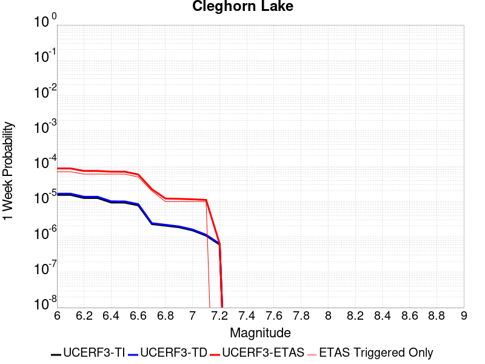 |  |  | 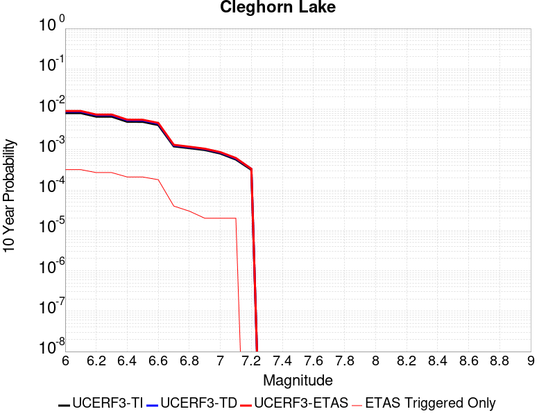 |

| Magnitude | 1 wk TI Prob | 1 wk TD Prob | 1 wk ETAS Prob | 1 wk ETAS/TD Gain | 1 wk ETAS Triggered Only | 1 mo TI Prob | 1 mo TD Prob | 1 mo ETAS Prob | 1 mo ETAS/TD Gain | 1 mo ETAS Triggered Only | 1 yr TI Prob | 1 yr TD Prob | 1 yr ETAS Prob | 1 yr ETAS/TD Gain | 1 yr ETAS Triggered Only | 10 yr TI Prob | 10 yr TD Prob | 10 yr ETAS Prob | 10 yr ETAS/TD Gain | 10 yr ETAS Triggered Only |
|-----|-----|-----|-----|-----|-----|-----|-----|-----|-----|-----|-----|-----|-----|-----|-----|-----|-----|-----|-----|-----|
| 6.0 | 1.5467183E-5 | 1.6794203E-5 | 8.679303E-5 | 5.1680346 | 7.0E-5 | 6.6286244E-5 | 7.197348E-5 | 1.5196773E-4 | 2.1114404 | 8.0E-5 | 8.067362E-4 | 8.759797E-4 | 0.0010458308 | 1.1938984 | 1.7E-4 | 0.008038137 | 0.008730696 | 0.009047901 | 1.0363322 | 3.2E-4 |
| 6.1 | 1.5467183E-5 | 1.6794203E-5 | 8.679303E-5 | 5.1680346 | 7.0E-5 | 6.6286244E-5 | 7.197348E-5 | 1.5196773E-4 | 2.1114404 | 8.0E-5 | 8.067362E-4 | 8.759797E-4 | 0.0010458308 | 1.1938984 | 1.7E-4 | 0.008038137 | 0.008730696 | 0.009047901 | 1.0363322 | 3.2E-4 |
| 6.2 | 1.2624631E-5 | 1.3681544E-5 | 7.368073E-5 | 5.38541 | 6.0E-5 | 5.410444E-5 | 5.863415E-5 | 1.2863004E-4 | 2.1937735 | 7.0E-5 | 6.585225E-4 | 7.1368564E-4 | 8.535857E-4 | 1.1960248 | 1.4E-4 | 0.0065657445 | 0.0071187317 | 0.0073868097 | 1.0376581 | 2.7E-4 |
| 6.3 | 1.2624631E-5 | 1.3681544E-5 | 7.368073E-5 | 5.38541 | 6.0E-5 | 5.410444E-5 | 5.863415E-5 | 1.2863004E-4 | 2.1937735 | 7.0E-5 | 6.585225E-4 | 7.1368564E-4 | 8.535857E-4 | 1.1960248 | 1.4E-4 | 0.0065657445 | 0.0071187317 | 0.0073868097 | 1.0376581 | 2.7E-4 |
| 6.4 | 9.417684E-6 | 1.0170118E-5 | 7.016951E-5 | 6.8995767 | 6.0E-5 | 4.036088E-5 | 4.3585722E-5 | 1.0358311E-4 | 2.3765376 | 6.0E-5 | 4.912829E-4 | 5.3056807E-4 | 6.405097E-4 | 1.207215 | 1.1E-4 | 0.004901982 | 0.005297049 | 0.0055059367 | 1.0394347 | 2.1E-4 |
| 6.5 | 9.368219E-6 | 1.0117545E-5 | 7.0116934E-5 | 6.930233 | 6.0E-5 | 4.014889E-5 | 4.3360415E-5 | 1.03357816E-4 | 2.3836906 | 6.0E-5 | 4.8870314E-4 | 5.2782625E-4 | 6.377682E-4 | 1.2082919 | 1.1E-4 | 0.004876298 | 0.0052697617 | 0.005478655 | 1.03964 | 2.1E-4 |
| 6.6 | 7.803798E-6 | 8.441831E-6 | 5.844141E-5 | 6.922836 | 5.0E-5 | 3.3444423E-5 | 3.6179E-5 | 8.617719E-5 | 2.3819673 | 5.0E-5 | 4.0710976E-4 | 4.4043022E-4 | 5.303906E-4 | 1.2042557 | 9.0E-5 | 0.0040636472 | 0.0043994905 | 0.0045786984 | 1.0407338 | 1.8E-4 |
| 6.7 | 2.3108669E-6 | 2.4438336E-6 | 2.2443784E-5 | 9.183843 | 2.0E-5 | 9.903678E-6 | 1.0473532E-5 | 3.0473322E-5 | 2.9095554 | 2.0E-5 | 1.205706E-4 | 1.2750797E-4 | 1.5750415E-4 | 1.2352494 | 3.0E-5 | 0.001205052 | 0.0012743667 | 0.0013143158 | 1.0313481 | 4.0E-5 |
| 6.8 | 2.0882828E-6 | 2.2062823E-6 | 1.220626E-5 | 5.5325017 | 1.0E-5 | 8.949753E-6 | 9.455462E-6 | 1.9455367E-5 | 2.0575798 | 1.0E-5 | 1.08957785E-4 | 1.1511434E-4 | 1.3511203E-4 | 1.1737204 | 2.0E-5 | 0.0010890438 | 0.0011505639 | 0.0011805294 | 1.0260441 | 3.0E-5 |
| 6.9 | 1.876935E-6 | 1.981051E-6 | 1.1981031E-5 | 6.047816 | 1.0E-5 | 8.043982E-6 | 8.490192E-6 | 1.8490107E-5 | 2.1778197 | 1.0E-5 | 9.7931086E-5 | 1.03363345E-4 | 1.2336127E-4 | 1.1934721 | 2.0E-5 | 9.788794E-4 | 0.0010331686 | 0.001053148 | 1.0193379 | 2.0E-5 |
| 7.0 | 1.5357559E-6 | 1.6202807E-6 | 1.1620265E-5 | 7.17176 | 1.0E-5 | 6.5817944E-6 | 6.9440425E-6 | 1.6943974E-5 | 2.4400733 | 1.0E-5 | 8.01304E-5 | 8.454057E-5 | 1.0453887E-4 | 1.2365528 | 2.0E-5 | 8.010151E-4 | 8.450965E-4 | 8.650796E-4 | 1.0236459 | 2.0E-5 |
| 7.1 | 1.0905424E-6 | 1.1497619E-6 | 1.114975E-5 | 9.697442 | 1.0E-5 | 4.6737446E-6 | 4.9275427E-6 | 1.4927493E-5 | 3.0293992 | 1.0E-5 | 5.6901354E-5 | 5.999128E-5 | 7.999008E-5 | 1.3333617 | 2.0E-5 | 5.6886784E-4 | 5.997606E-4 | 6.197486E-4 | 1.0333266 | 2.0E-5 |
| 7.2 | 6.06668E-7 | 6.387277E-7 | 6.387277E-7 | 1.0 | 0.0 | 2.600003E-6 | 2.7374022E-6 | 2.7374022E-6 | 1.0 | 0.0 | 3.1654577E-5 | 3.3327433E-5 | 3.3327433E-5 | 1.0 | 0.0 | 3.1650066E-4 | 3.3323118E-4 | 3.3323118E-4 | 1.0 | 0.0 |

## Mission Creek
*[(top)](#table-of-contents)*

| 1 Week | 1 Month | 1 Year | 10 Year |
|-----|-----|-----|-----|
|  |  |  |  |

| Magnitude | 1 wk TI Prob | 1 wk TD Prob | 1 wk ETAS Prob | 1 wk ETAS/TD Gain | 1 wk ETAS Triggered Only | 1 mo TI Prob | 1 mo TD Prob | 1 mo ETAS Prob | 1 mo ETAS/TD Gain | 1 mo ETAS Triggered Only | 1 yr TI Prob | 1 yr TD Prob | 1 yr ETAS Prob | 1 yr ETAS/TD Gain | 1 yr ETAS Triggered Only | 10 yr TI Prob | 10 yr TD Prob | 10 yr ETAS Prob | 10 yr ETAS/TD Gain | 10 yr ETAS Triggered Only |
|-----|-----|-----|-----|-----|-----|-----|-----|-----|-----|-----|-----|-----|-----|-----|-----|-----|-----|-----|-----|-----|
| 6.0 | 1.1549387E-5 | 1.6322783E-5 | 1.4632066E-4 | 8.964198 | 1.3E-4 | 4.9496433E-5 | 6.995299E-5 | 2.899376E-4 | 4.144749 | 2.2E-4 | 6.0245243E-4 | 8.5135986E-4 | 0.001141113 | 1.3403414 | 2.9E-4 | 0.006008218 | 0.008510157 | 0.008827433 | 1.0372821 | 3.2E-4 |
| 6.1 | 1.1549387E-5 | 1.6322783E-5 | 1.4632066E-4 | 8.964198 | 1.3E-4 | 4.9496433E-5 | 6.995299E-5 | 2.899376E-4 | 4.144749 | 2.2E-4 | 6.0245243E-4 | 8.5135986E-4 | 0.001141113 | 1.3403414 | 2.9E-4 | 0.006008218 | 0.008510157 | 0.008827433 | 1.0372821 | 3.2E-4 |
| 6.2 | 1.1549387E-5 | 1.6322783E-5 | 1.4632066E-4 | 8.964198 | 1.3E-4 | 4.9496433E-5 | 6.995299E-5 | 2.899376E-4 | 4.144749 | 2.2E-4 | 6.0245243E-4 | 8.5135986E-4 | 0.001141113 | 1.3403414 | 2.9E-4 | 0.006008218 | 0.008510157 | 0.008827433 | 1.0372821 | 3.2E-4 |
| 6.3 | 1.1549387E-5 | 1.6322783E-5 | 1.4632066E-4 | 8.964198 | 1.3E-4 | 4.9496433E-5 | 6.995299E-5 | 2.899376E-4 | 4.144749 | 2.2E-4 | 6.0245243E-4 | 8.5135986E-4 | 0.001141113 | 1.3403414 | 2.9E-4 | 0.006008218 | 0.008510157 | 0.008827433 | 1.0372821 | 3.2E-4 |
| 6.4 | 1.1549387E-5 | 1.6322783E-5 | 1.4632066E-4 | 8.964198 | 1.3E-4 | 4.9496433E-5 | 6.995299E-5 | 2.899376E-4 | 4.144749 | 2.2E-4 | 6.0245243E-4 | 8.5135986E-4 | 0.001141113 | 1.3403414 | 2.9E-4 | 0.006008218 | 0.008510157 | 0.008827433 | 1.0372821 | 3.2E-4 |
| 6.5 | 1.1549387E-5 | 1.6322783E-5 | 1.4632066E-4 | 8.964198 | 1.3E-4 | 4.9496433E-5 | 6.995299E-5 | 2.899376E-4 | 4.144749 | 2.2E-4 | 6.0245243E-4 | 8.5135986E-4 | 0.001141113 | 1.3403414 | 2.9E-4 | 0.006008218 | 0.008510157 | 0.008827433 | 1.0372821 | 3.2E-4 |
| 6.6 | 9.202681E-6 | 1.3846059E-5 | 1.338444E-4 | 9.666606 | 1.2E-4 | 3.9439463E-5 | 5.9338956E-5 | 2.593271E-4 | 4.3702674 | 2.0E-4 | 4.800697E-4 | 7.2222133E-4 | 9.920263E-4 | 1.3735766 | 2.7E-4 | 0.004790339 | 0.0072273402 | 0.007515244 | 1.0398355 | 2.9E-4 |
| 6.7 | 9.019164E-6 | 1.3651728E-5 | 1.3365009E-4 | 9.789976 | 1.2E-4 | 3.8652986E-5 | 5.8506146E-5 | 2.5849446E-4 | 4.4182444 | 2.0E-4 | 4.7049852E-4 | 7.1208854E-4 | 9.818963E-4 | 1.3788964 | 2.7E-4 | 0.004695036 | 0.0071266647 | 0.007414598 | 1.0404023 | 2.9E-4 |
| 6.8 | 8.673558E-6 | 1.3273839E-5 | 1.3327225E-4 | 10.040218 | 1.2E-4 | 3.717186E-5 | 5.688669E-5 | 2.5687533E-4 | 4.515561 | 2.0E-4 | 4.524734E-4 | 6.923842E-4 | 9.6219726E-4 | 1.389687 | 2.7E-4 | 0.0045155324 | 0.0069308523 | 0.0072188424 | 1.041552 | 2.9E-4 |
| 6.9 | 7.002255E-6 | 1.1478069E-5 | 1.3147669E-4 | 11.454601 | 1.2E-4 | 3.000932E-5 | 4.9190832E-5 | 2.3918149E-4 | 4.8623185 | 1.9E-4 | 3.653022E-4 | 5.9874065E-4 | 8.58585E-4 | 1.4339848 | 2.6E-4 | 0.0036470229 | 0.005999676 | 0.0062779956 | 1.0463892 | 2.8E-4 |
| 7.0 | 5.84644E-6 | 9.675359E-6 | 1.296742E-4 | 13.40252 | 1.2E-4 | 2.5055931E-5 | 4.146519E-5 | 2.2145773E-4 | 5.3408103 | 1.8E-4 | 3.0501327E-4 | 5.047263E-4 | 7.5460016E-4 | 1.495068 | 2.5E-4 | 0.0030459496 | 0.005063994 | 0.0053226775 | 1.0510828 | 2.6E-4 |
| 7.1 | 5.54703E-6 | 9.329834E-6 | 1.2932872E-4 | 13.861845 | 1.2E-4 | 2.377277E-5 | 3.9984414E-5 | 2.1997721E-4 | 5.501574 | 1.8E-4 | 2.8939504E-4 | 4.8670598E-4 | 7.365843E-4 | 1.5134071 | 2.5E-4 | 0.0028901845 | 0.0048845876 | 0.0051433174 | 1.0529686 | 2.6E-4 |
| 7.2 | 4.384709E-6 | 7.681918E-6 | 1.2768099E-4 | 16.62098 | 1.2E-4 | 1.8791474E-5 | 3.292211E-5 | 2.0291652E-4 | 6.163533 | 1.7E-4 | 2.2876218E-4 | 4.0075663E-4 | 6.4066047E-4 | 1.5986272 | 2.4E-4 | 0.0022852682 | 0.004028542 | 0.004277535 | 1.0618072 | 2.5E-4 |
| 7.3 | 3.7888456E-6 | 6.915788E-6 | 1.2691497E-4 | 18.35148 | 1.2E-4 | 1.623781E-5 | 2.9638775E-5 | 1.9963374E-4 | 6.7355595 | 1.7E-4 | 1.9767738E-4 | 3.6079568E-4 | 5.907127E-4 | 1.63725 | 2.3E-4 | 0.0019750162 | 0.00363027 | 0.0038693987 | 1.0658708 | 2.4E-4 |
| 7.4 | 2.1982462E-6 | 5.0241033E-6 | 1.1502355E-4 | 22.894344 | 1.1E-4 | 9.421021E-6 | 2.1531694E-5 | 1.8152824E-4 | 8.430746 | 1.6E-4 | 1.1469489E-4 | 2.6211704E-4 | 4.8205937E-4 | 1.8390998 | 2.2E-4 | 0.0011463572 | 0.0026460327 | 0.0028754242 | 1.0866926 | 2.3E-4 |
| 7.5 | 2.051923E-6 | 4.6153277E-6 | 1.1461482E-4 | 24.833517 | 1.1E-4 | 8.793926E-6 | 1.9779825E-5 | 1.7977666E-4 | 9.08889 | 1.6E-4 | 1.0706078E-4 | 2.4079291E-4 | 4.6073995E-4 | 1.9134282 | 2.2E-4 | 0.0010700922 | 0.0024335932 | 0.0026630333 | 1.0942805 | 2.3E-4 |
| 7.6 | 1.8733427E-6 | 4.1236603E-6 | 1.14123206E-4 | 27.675219 | 1.1E-4 | 8.028587E-6 | 1.7672712E-5 | 1.7766988E-4 | 10.053346 | 1.6E-4 | 9.774366E-5 | 2.151441E-4 | 4.2509893E-4 | 1.9758799 | 2.1E-4 | 9.770069E-4 | 0.0021782513 | 0.002397772 | 1.1007785 | 2.2E-4 |
| 7.7 | 1.8411953E-6 | 4.0433315E-6 | 1.1404289E-4 | 28.205177 | 1.1E-4 | 7.890813E-6 | 1.732845E-5 | 1.7732568E-4 | 10.233211 | 1.6E-4 | 9.606641E-5 | 2.1095353E-4 | 4.2090923E-4 | 1.9952699 | 2.1E-4 | 9.6024893E-4 | 0.0021365292 | 0.0023560592 | 1.1027508 | 2.2E-4 |
| 7.8 | 1.7194251E-6 | 3.71068E-6 | 1.1371027E-4 | 30.644053 | 1.1E-4 | 7.368944E-6 | 1.5902819E-5 | 1.7590028E-4 | 11.06095 | 1.6E-4 | 8.97132E-5 | 1.9359968E-4 | 4.0355904E-4 | 2.0845025 | 2.1E-4 | 8.967699E-4 | 0.0019624757 | 0.0021820439 | 1.1118833 | 2.2E-4 |
| 7.9 | 1.4035052E-6 | 2.9502596E-6 | 1.12949936E-4 | 38.284744 | 1.1E-4 | 6.0150082E-6 | 1.2643909E-5 | 1.7264189E-4 | 13.654154 | 1.6E-4 | 7.3230265E-5 | 1.5392878E-4 | 3.6389646E-4 | 2.3640573 | 2.1E-4 | 7.3206134E-4 | 0.0015631174 | 0.0017827735 | 1.1405244 | 2.2E-4 |
| 8.0 | 3.9318823E-7 | 5.528477E-7 | 2.0552836E-5 | 37.176304 | 2.0E-5 | 1.6850913E-6 | 2.3693453E-6 | 2.2369299E-5 | 9.44113 | 2.0E-5 | 2.0515794E-5 | 2.8846403E-5 | 6.884525E-5 | 2.3866146 | 4.0E-5 | 2.0513899E-4 | 2.990952E-4 | 3.4908025E-4 | 1.1671208 | 5.0E-5 |
| 8.1 | 1.596793E-7 | 1.13775044E-7 | 1.13775044E-7 | 1.0 | 0.0 | 6.8433974E-7 | 4.876072E-7 | 4.876072E-7 | 1.0 | 0.0 | 8.331805E-6 | 5.936602E-6 | 5.936602E-6 | 1.0 | 0.0 | 8.331492E-5 | 6.5494125E-5 | 6.5494125E-5 | 1.0 | 0.0 |
| 8.2 | 4.9003038E-8 | 2.5435753E-8 | 2.5435753E-8 | 1.0 | 0.0 | 2.10013E-7 | 1.09010365E-7 | 1.09010365E-7 | 1.0 | 0.0 | 2.5569052E-6 | 1.3272004E-6 | 1.3272004E-6 | 1.0 | 0.0 | 2.556876E-5 | 1.4952613E-5 | 1.4952613E-5 | 1.0 | 0.0 |

## Ludlow
*[(top)](#table-of-contents)*

| 1 Week | 1 Month | 1 Year | 10 Year |
|-----|-----|-----|-----|
|  | 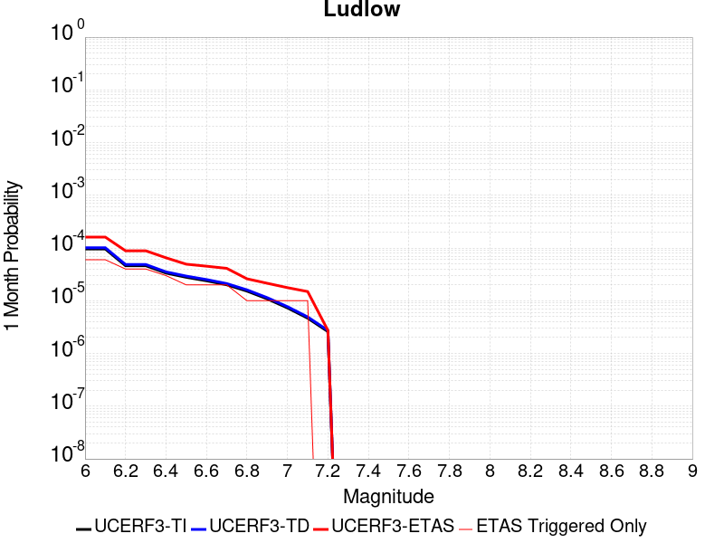 | 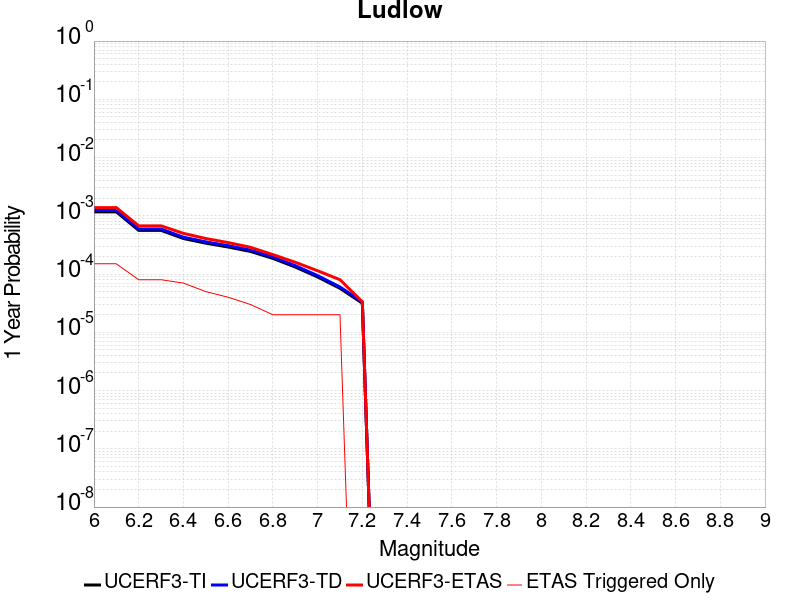 | 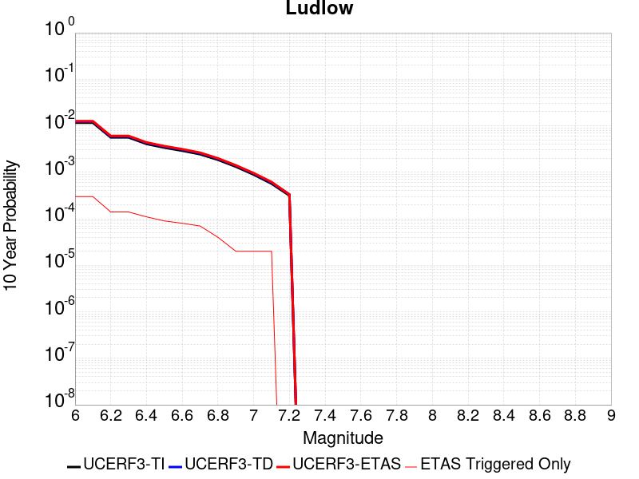 |

| Magnitude | 1 wk TI Prob | 1 wk TD Prob | 1 wk ETAS Prob | 1 wk ETAS/TD Gain | 1 wk ETAS Triggered Only | 1 mo TI Prob | 1 mo TD Prob | 1 mo ETAS Prob | 1 mo ETAS/TD Gain | 1 mo ETAS Triggered Only | 1 yr TI Prob | 1 yr TD Prob | 1 yr ETAS Prob | 1 yr ETAS/TD Gain | 1 yr ETAS Triggered Only | 10 yr TI Prob | 10 yr TD Prob | 10 yr ETAS Prob | 10 yr ETAS/TD Gain | 10 yr ETAS Triggered Only |
|-----|-----|-----|-----|-----|-----|-----|-----|-----|-----|-----|-----|-----|-----|-----|-----|-----|-----|-----|-----|-----|
| 6.0 | 2.2407607E-5 | 2.3657254E-5 | 6.3656305E-5 | 2.6907732 | 4.0E-5 | 9.602906E-5 | 1.0138454E-4 | 1.6137846E-4 | 1.5917462 | 6.0E-5 | 0.0011685267 | 0.001233702 | 0.0013835168 | 1.1214353 | 1.5E-4 | 0.011624013 | 0.012273042 | 0.01256936 | 1.0241438 | 3.0E-4 |
| 6.1 | 2.2407607E-5 | 2.3657254E-5 | 6.3656305E-5 | 2.6907732 | 4.0E-5 | 9.602906E-5 | 1.0138454E-4 | 1.6137846E-4 | 1.5917462 | 6.0E-5 | 0.0011685267 | 0.001233702 | 0.0013835168 | 1.1214353 | 1.5E-4 | 0.011624013 | 0.012273042 | 0.01256936 | 1.0241438 | 3.0E-4 |
| 6.2 | 1.0781252E-5 | 1.1365663E-5 | 4.136532E-5 | 3.6394992 | 3.0E-5 | 4.620455E-5 | 4.8709102E-5 | 8.870715E-5 | 1.8211617 | 4.0E-5 | 5.623952E-4 | 5.9287593E-4 | 6.728285E-4 | 1.1348555 | 8.0E-5 | 0.00560974 | 0.0059133614 | 0.006052533 | 1.0235353 | 1.4E-4 |
| 6.3 | 1.0781252E-5 | 1.1365663E-5 | 4.136532E-5 | 3.6394992 | 3.0E-5 | 4.620455E-5 | 4.8709102E-5 | 8.870715E-5 | 1.8211617 | 4.0E-5 | 5.623952E-4 | 5.9287593E-4 | 6.728285E-4 | 1.1348555 | 8.0E-5 | 0.00560974 | 0.0059133614 | 0.006052533 | 1.0235353 | 1.4E-4 |
| 6.4 | 7.814439E-6 | 8.237729E-6 | 2.8237564E-5 | 3.4278336 | 2.0E-5 | 3.3490025E-5 | 3.530408E-5 | 6.530302E-5 | 1.8497301 | 3.0E-5 | 4.0766477E-4 | 4.2974384E-4 | 4.9971376E-4 | 1.1628177 | 7.0E-5 | 0.0040691774 | 0.0042892746 | 0.0043988028 | 1.0255353 | 1.1E-4 |
| 6.5 | 6.4986366E-6 | 6.85092E-6 | 1.685085E-5 | 2.4596481 | 1.0E-5 | 2.7851002E-5 | 2.9360759E-5 | 4.9360173E-5 | 1.6811613 | 2.0E-5 | 3.390332E-4 | 3.5740953E-4 | 4.0739166E-4 | 1.1398455 | 5.0E-5 | 0.003385164 | 0.0035684432 | 0.0036581222 | 1.0251311 | 9.0E-5 |
| 6.6 | 5.582177E-6 | 5.8860055E-6 | 1.5885948E-5 | 2.698935 | 1.0E-5 | 2.3923398E-5 | 2.5225498E-5 | 4.5224995E-5 | 1.7928286 | 2.0E-5 | 2.9122844E-4 | 3.0707786E-4 | 3.470656E-4 | 1.1302202 | 4.0E-5 | 0.0029084706 | 0.003066609 | 0.0031463634 | 1.0260074 | 8.0E-5 |
| 6.7 | 4.6858763E-6 | 4.940427E-6 | 1.4940378E-5 | 3.0241065 | 1.0E-5 | 2.0082172E-5 | 2.1173091E-5 | 4.117267E-5 | 1.9445752 | 2.0E-5 | 2.4447302E-4 | 2.5775246E-4 | 2.877447E-4 | 1.1163608 | 3.0E-5 | 0.0024420423 | 0.0025745912 | 0.002644411 | 1.0271188 | 7.0E-5 |
| 6.8 | 3.5584908E-6 | 3.7520183E-6 | 1.3751981E-5 | 3.6652222 | 1.0E-5 | 1.5250586E-5 | 1.6079981E-5 | 2.607982E-5 | 1.6218812 | 1.0E-5 | 1.8566006E-4 | 1.957566E-4 | 2.1575269E-4 | 1.1021477 | 2.0E-5 | 0.0018550502 | 0.0019558826 | 0.0019958045 | 1.0204111 | 4.0E-5 |
| 6.9 | 2.532834E-6 | 2.6710034E-6 | 1.26709765E-5 | 4.7439013 | 1.0E-5 | 1.0854958E-5 | 1.1447109E-5 | 2.1446995E-5 | 1.8735731 | 1.0E-5 | 1.3215111E-4 | 1.3935992E-4 | 1.5935714E-4 | 1.1434933 | 2.0E-5 | 0.0013207254 | 0.0013927529 | 0.001412725 | 1.01434 | 2.0E-5 |
| 7.0 | 1.7083285E-6 | 1.8019439E-6 | 1.1801926E-5 | 6.5495524 | 1.0E-5 | 7.3213873E-6 | 7.722595E-6 | 1.7722517E-5 | 2.2948916 | 1.0E-5 | 8.913424E-5 | 9.40187E-5 | 1.1401682E-4 | 1.2127036 | 2.0E-5 | 8.9098496E-4 | 9.3980576E-4 | 9.5978694E-4 | 1.021261 | 2.0E-5 |
| 7.1 | 1.0905424E-6 | 1.1497619E-6 | 1.114975E-5 | 9.697442 | 1.0E-5 | 4.6737446E-6 | 4.9275427E-6 | 1.4927493E-5 | 3.0293992 | 1.0E-5 | 5.6901354E-5 | 5.999128E-5 | 7.999008E-5 | 1.3333617 | 2.0E-5 | 5.6886784E-4 | 5.997606E-4 | 6.197486E-4 | 1.0333266 | 2.0E-5 |
| 7.2 | 6.06668E-7 | 6.387277E-7 | 6.387277E-7 | 1.0 | 0.0 | 2.600003E-6 | 2.7374022E-6 | 2.7374022E-6 | 1.0 | 0.0 | 3.1654577E-5 | 3.3327433E-5 | 3.3327433E-5 | 1.0 | 0.0 | 3.1650066E-4 | 3.3323118E-4 | 3.3323118E-4 | 1.0 | 0.0 |

## White Wolf (Extension)
*[(top)](#table-of-contents)*

| 1 Week | 1 Month | 1 Year | 10 Year |
|-----|-----|-----|-----|
|  | 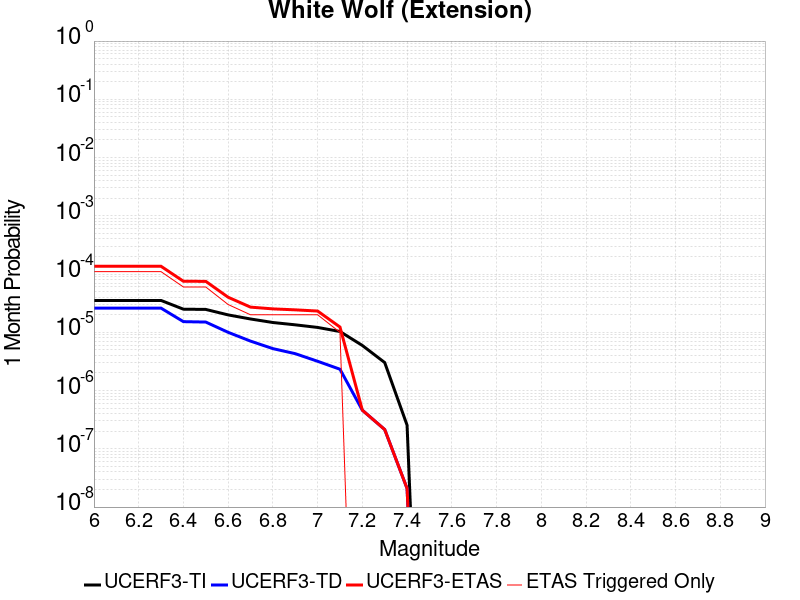 | 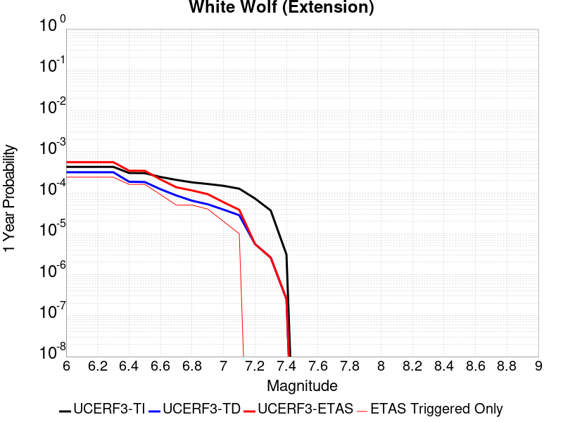 | 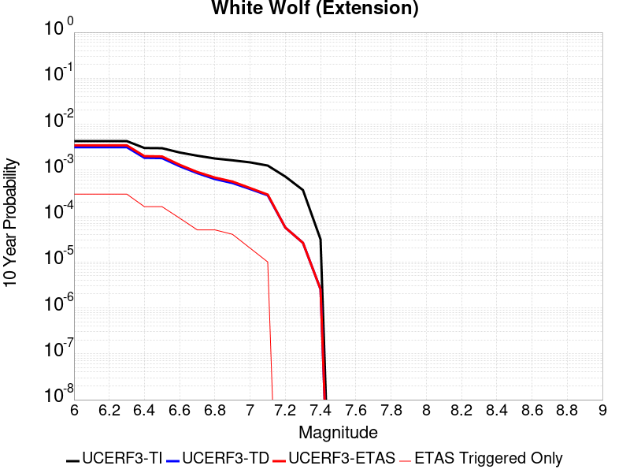 |

| Magnitude | 1 wk TI Prob | 1 wk TD Prob | 1 wk ETAS Prob | 1 wk ETAS/TD Gain | 1 wk ETAS Triggered Only | 1 mo TI Prob | 1 mo TD Prob | 1 mo ETAS Prob | 1 mo ETAS/TD Gain | 1 mo ETAS Triggered Only | 1 yr TI Prob | 1 yr TD Prob | 1 yr ETAS Prob | 1 yr ETAS/TD Gain | 1 yr ETAS Triggered Only | 10 yr TI Prob | 10 yr TD Prob | 10 yr ETAS Prob | 10 yr ETAS/TD Gain | 10 yr ETAS Triggered Only |
|-----|-----|-----|-----|-----|-----|-----|-----|-----|-----|-----|-----|-----|-----|-----|-----|-----|-----|-----|-----|-----|
| 6.0 | 8.222555E-6 | 6.066615E-6 | 9.606607E-5 | 15.835201 | 9.0E-5 | 3.5239045E-5 | 2.5999556E-5 | 1.359967E-4 | 5.2307315 | 1.1E-4 | 4.289509E-4 | 3.1650523E-4 | 5.5642927E-4 | 1.7580413 | 2.4E-4 | 0.0042812387 | 0.0031611966 | 0.0034602482 | 1.0946008 | 3.0E-4 |
| 6.1 | 8.222555E-6 | 6.066615E-6 | 9.606607E-5 | 15.835201 | 9.0E-5 | 3.5239045E-5 | 2.5999556E-5 | 1.359967E-4 | 5.2307315 | 1.1E-4 | 4.289509E-4 | 3.1650523E-4 | 5.5642927E-4 | 1.7580413 | 2.4E-4 | 0.0042812387 | 0.0031611966 | 0.0034602482 | 1.0946008 | 3.0E-4 |
| 6.2 | 8.222555E-6 | 6.066615E-6 | 9.606607E-5 | 15.835201 | 9.0E-5 | 3.5239045E-5 | 2.5999556E-5 | 1.359967E-4 | 5.2307315 | 1.1E-4 | 4.289509E-4 | 3.1650523E-4 | 5.5642927E-4 | 1.7580413 | 2.4E-4 | 0.0042812387 | 0.0031611966 | 0.0034602482 | 1.0946008 | 3.0E-4 |
| 6.3 | 8.222555E-6 | 6.066615E-6 | 9.606607E-5 | 15.835201 | 9.0E-5 | 3.5239045E-5 | 2.5999556E-5 | 1.359967E-4 | 5.2307315 | 1.1E-4 | 4.289509E-4 | 3.1650523E-4 | 5.5642927E-4 | 1.7580413 | 2.4E-4 | 0.0042812387 | 0.0031611966 | 0.0034602482 | 1.0946008 | 3.0E-4 |
| 6.4 | 5.821773E-6 | 3.5571256E-6 | 5.355695E-5 | 15.056243 | 5.0E-5 | 2.4950215E-5 | 1.5244741E-5 | 7.524383E-5 | 4.9357233 | 6.0E-5 | 3.0372653E-4 | 1.8559002E-4 | 3.4556031E-4 | 1.8619553 | 1.6E-4 | 0.0030331176 | 0.0018544586 | 0.0020141618 | 1.0861186 | 1.6E-4 |
| 6.5 | 5.766023E-6 | 3.4990599E-6 | 5.3498883E-5 | 15.289503 | 5.0E-5 | 2.4711293E-5 | 1.49958905E-5 | 7.499499E-5 | 5.001036 | 6.0E-5 | 3.0081844E-4 | 1.8256076E-4 | 3.4253157E-4 | 1.8762605 | 1.6E-4 | 0.0030041158 | 0.0018242161 | 0.0019839243 | 1.0875489 | 1.6E-4 |
| 6.6 | 4.643576E-6 | 2.3325733E-6 | 3.2332504E-5 | 13.861302 | 3.0E-5 | 1.9900888E-5 | 9.9967065E-6 | 3.999641E-5 | 4.0009584 | 3.0E-5 | 2.4226638E-4 | 1.2170354E-4 | 2.1169258E-4 | 1.739412 | 9.0E-5 | 0.0024200242 | 0.0012164112 | 0.0013063018 | 1.0738981 | 9.0E-5 |
| 6.7 | 3.9529173E-6 | 1.6482975E-6 | 2.1648264E-5 | 13.133712 | 2.0E-5 | 1.6940963E-5 | 7.064114E-6 | 2.7063972E-5 | 3.8311913 | 2.0E-5 | 2.0623671E-4 | 8.600239E-5 | 1.3599808E-4 | 1.5813292 | 5.0E-5 | 0.002060454 | 8.597095E-4 | 9.0966653E-4 | 1.0581092 | 5.0E-5 |
| 6.8 | 3.4377522E-6 | 1.2244764E-6 | 2.1224452E-5 | 17.333492 | 2.0E-5 | 1.473314E-5 | 5.247746E-6 | 2.524764E-5 | 4.81114 | 2.0E-5 | 1.7936122E-4 | 6.388952E-5 | 1.1388633E-4 | 1.7825509 | 5.0E-5 | 0.0017921652 | 6.3872064E-4 | 6.886887E-4 | 1.0782315 | 5.0E-5 |
| 6.9 | 3.1367306E-6 | 1.0033316E-6 | 2.1003312E-5 | 20.93357 | 2.0E-5 | 1.3443062E-5 | 4.299986E-6 | 2.42999E-5 | 5.6511583 | 2.0E-5 | 1.63657E-4 | 5.2351144E-5 | 9.234905E-5 | 1.7640312 | 4.0E-5 | 0.0016353652 | 5.233958E-4 | 5.6337484E-4 | 1.076384 | 4.0E-5 |
| 7.0 | 2.8298145E-6 | 7.4282326E-7 | 2.074281E-5 | 27.924284 | 2.0E-5 | 1.2127721E-5 | 3.1835248E-6 | 2.318346E-5 | 7.282325 | 2.0E-5 | 1.47645E-4 | 3.8758775E-5 | 5.8758E-5 | 1.5159922 | 2.0E-5 | 0.0014754693 | 3.8752513E-4 | 4.075174E-4 | 1.0515896 | 2.0E-5 |
| 7.1 | 2.4091064E-6 | 5.4223835E-7 | 1.0542233E-5 | 19.442064 | 1.0E-5 | 1.03247E-5 | 2.3238767E-6 | 1.2323853E-5 | 5.303144 | 1.0E-5 | 1.2569598E-4 | 2.8292874E-5 | 3.829259E-5 | 1.3534359 | 1.0E-5 | 0.001256249 | 2.8289677E-4 | 2.9289394E-4 | 1.0353386 | 1.0E-5 |
| 7.2 | 1.3875518E-6 | 1.0740268E-7 | 1.0740268E-7 | 1.0 | 0.0 | 5.9466374E-6 | 4.6029712E-7 | 4.6029712E-7 | 1.0 | 0.0 | 7.23979E-5 | 5.604104E-6 | 5.604104E-6 | 1.0 | 0.0 | 7.2374323E-4 | 5.6039742E-5 | 5.6039742E-5 | 1.0 | 0.0 |
| 7.3 | 7.056077E-7 | 5.0002956E-8 | 5.0002956E-8 | 1.0 | 0.0 | 3.0240296E-6 | 2.1429837E-7 | 2.1429837E-7 | 1.0 | 0.0 | 3.681694E-5 | 2.60908E-6 | 2.60908E-6 | 1.0 | 0.0 | 3.681084E-4 | 2.609054E-5 | 2.609054E-5 | 1.0 | 0.0 |
| 7.4 | 5.9334678E-8 | 4.8638475E-9 | 4.8638475E-9 | 1.0 | 0.0 | 2.5429145E-7 | 2.084506E-8 | 2.084506E-8 | 1.0 | 0.0 | 3.095994E-6 | 2.5378858E-7 | 2.5378858E-7 | 1.0 | 0.0 | 3.095951E-5 | 2.5378843E-6 | 2.5378843E-6 | 1.0 | 0.0 |

## Kern Canyon (South Kern) 2011
*[(top)](#table-of-contents)*

| 1 Week | 1 Month | 1 Year | 10 Year |
|-----|-----|-----|-----|
| 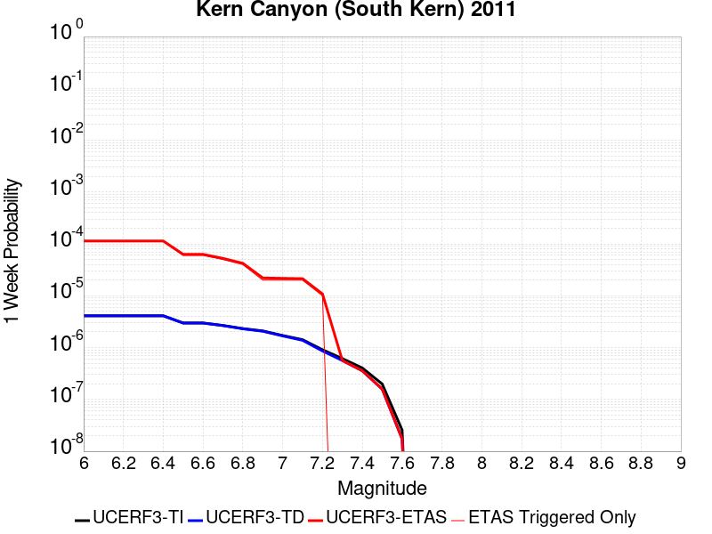 |  |  | 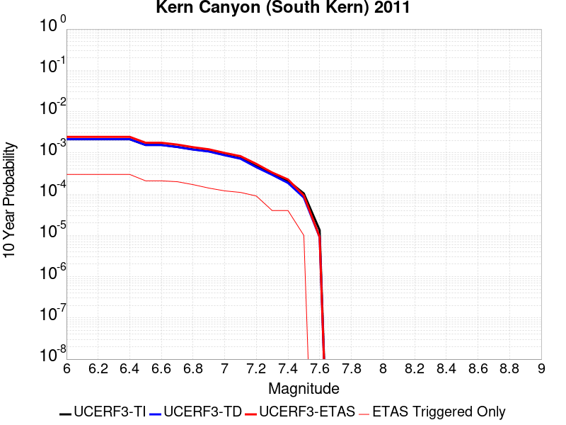 |

| Magnitude | 1 wk TI Prob | 1 wk TD Prob | 1 wk ETAS Prob | 1 wk ETAS/TD Gain | 1 wk ETAS Triggered Only | 1 mo TI Prob | 1 mo TD Prob | 1 mo ETAS Prob | 1 mo ETAS/TD Gain | 1 mo ETAS Triggered Only | 1 yr TI Prob | 1 yr TD Prob | 1 yr ETAS Prob | 1 yr ETAS/TD Gain | 1 yr ETAS Triggered Only | 10 yr TI Prob | 10 yr TD Prob | 10 yr ETAS Prob | 10 yr ETAS/TD Gain | 10 yr ETAS Triggered Only |
|-----|-----|-----|-----|-----|-----|-----|-----|-----|-----|-----|-----|-----|-----|-----|-----|-----|-----|-----|-----|-----|
| 6.0 | 4.105075E-6 | 4.113726E-6 | 1.14113274E-4 | 27.73964 | 1.1E-4 | 1.7593058E-5 | 1.7630138E-5 | 1.676275E-4 | 9.508008 | 1.5E-4 | 2.1417443E-4 | 2.1462643E-4 | 4.345792E-4 | 2.0248168 | 2.2E-4 | 0.0021396813 | 0.0021442554 | 0.002443612 | 1.1396087 | 3.0E-4 |
| 6.1 | 4.105075E-6 | 4.113726E-6 | 1.14113274E-4 | 27.73964 | 1.1E-4 | 1.7593058E-5 | 1.7630138E-5 | 1.676275E-4 | 9.508008 | 1.5E-4 | 2.1417443E-4 | 2.1462643E-4 | 4.345792E-4 | 2.0248168 | 2.2E-4 | 0.0021396813 | 0.0021442554 | 0.002443612 | 1.1396087 | 3.0E-4 |
| 6.2 | 4.105075E-6 | 4.113726E-6 | 1.14113274E-4 | 27.73964 | 1.1E-4 | 1.7593058E-5 | 1.7630138E-5 | 1.676275E-4 | 9.508008 | 1.5E-4 | 2.1417443E-4 | 2.1462643E-4 | 4.345792E-4 | 2.0248168 | 2.2E-4 | 0.0021396813 | 0.0021442554 | 0.002443612 | 1.1396087 | 3.0E-4 |
| 6.3 | 4.105075E-6 | 4.113726E-6 | 1.14113274E-4 | 27.73964 | 1.1E-4 | 1.7593058E-5 | 1.7630138E-5 | 1.676275E-4 | 9.508008 | 1.5E-4 | 2.1417443E-4 | 2.1462643E-4 | 4.345792E-4 | 2.0248168 | 2.2E-4 | 0.0021396813 | 0.0021442554 | 0.002443612 | 1.1396087 | 3.0E-4 |
| 6.4 | 4.105075E-6 | 4.113726E-6 | 1.14113274E-4 | 27.73964 | 1.1E-4 | 1.7593058E-5 | 1.7630138E-5 | 1.676275E-4 | 9.508008 | 1.5E-4 | 2.1417443E-4 | 2.1462643E-4 | 4.345792E-4 | 2.0248168 | 2.2E-4 | 0.0021396813 | 0.0021442554 | 0.002443612 | 1.1396087 | 3.0E-4 |
| 6.5 | 2.9849807E-6 | 2.973154E-6 | 6.297298E-5 | 21.180529 | 6.0E-5 | 1.2792712E-5 | 1.2742028E-5 | 1.0274088E-4 | 8.06315 | 9.0E-5 | 1.5574014E-4 | 1.551233E-4 | 2.8510313E-4 | 1.837913 | 1.3E-4 | 0.0015563103 | 0.0015501654 | 0.0017598398 | 1.1352594 | 2.1E-4 |
| 6.6 | 2.9849807E-6 | 2.973154E-6 | 6.297298E-5 | 21.180529 | 6.0E-5 | 1.2792712E-5 | 1.2742028E-5 | 1.0274088E-4 | 8.06315 | 9.0E-5 | 1.5574014E-4 | 1.551233E-4 | 2.8510313E-4 | 1.837913 | 1.3E-4 | 0.0015563103 | 0.0015501654 | 0.0017598398 | 1.1352594 | 2.1E-4 |
| 6.7 | 2.6756725E-6 | 2.6582202E-6 | 5.2658088E-5 | 19.809528 | 5.0E-5 | 1.1467117E-5 | 1.1392323E-5 | 9.139141E-5 | 8.022193 | 8.0E-5 | 1.396032E-4 | 1.386928E-4 | 2.5867615E-4 | 1.8651015 | 1.2E-4 | 0.0013951553 | 0.0013860734 | 0.0015857962 | 1.1440924 | 2.0E-4 |
| 6.8 | 2.3283721E-6 | 2.3047783E-6 | 4.2304688E-5 | 18.35521 | 4.0E-5 | 9.9787E-6 | 9.877584E-6 | 7.9876896E-5 | 8.086683 | 7.0E-5 | 1.214839E-4 | 1.2025302E-4 | 2.3023979E-4 | 1.9146279 | 1.1E-4 | 0.001214175 | 0.001201887 | 0.0013716826 | 1.1412742 | 1.7E-4 |
| 6.9 | 2.0972677E-6 | 2.0696405E-6 | 2.2069598E-5 | 10.663494 | 2.0E-5 | 8.988259E-6 | 8.869858E-6 | 5.8869413E-5 | 6.6370187 | 5.0E-5 | 1.0942656E-4 | 1.0798523E-4 | 1.979755E-4 | 1.8333573 | 9.0E-5 | 0.0010937268 | 0.0010793334 | 0.0012191823 | 1.1295696 | 1.4E-4 |
| 7.0 | 1.7132242E-6 | 1.6787029E-6 | 2.167867E-5 | 12.91394 | 2.0E-5 | 7.3423685E-6 | 7.1944214E-6 | 5.719406E-5 | 7.949779 | 5.0E-5 | 8.938967E-5 | 8.75886E-5 | 1.6758159E-4 | 1.9132808 | 8.0E-5 | 8.935372E-4 | 8.755446E-4 | 9.954396E-4 | 1.1369375 | 1.2E-4 |
| 7.1 | 1.4215541E-6 | 1.3815746E-6 | 2.1381547E-5 | 15.476216 | 2.0E-5 | 6.0923603E-6 | 5.9210206E-6 | 5.5920726E-5 | 9.44444 | 5.0E-5 | 7.417196E-5 | 7.208607E-5 | 1.4208103E-4 | 1.9709914 | 7.0E-5 | 7.414721E-4 | 7.206296E-4 | 8.3055027E-4 | 1.1525344 | 1.1E-4 |
| 7.2 | 9.097853E-7 | 8.60377E-7 | 1.0860368E-5 | 12.622803 | 1.0E-5 | 3.899074E-6 | 3.6873246E-6 | 4.3687178E-5 | 11.847934 | 4.0E-5 | 4.7470192E-5 | 4.4892266E-5 | 1.0488957E-4 | 2.3364732 | 6.0E-5 | 4.7460053E-4 | 4.4883305E-4 | 5.3879264E-4 | 1.20043 | 9.0E-5 |
| 7.3 | 6.144169E-7 | 5.628199E-7 | 5.628199E-7 | 1.0 | 0.0 | 2.6332125E-6 | 2.4120832E-6 | 2.2412034E-5 | 9.291569 | 2.0E-5 | 3.205889E-5 | 2.9366722E-5 | 5.936584E-5 | 2.0215344 | 3.0E-5 | 3.2054266E-4 | 2.9362892E-4 | 3.3361715E-4 | 1.1361864 | 4.0E-5 |
| 7.4 | 4.049844E-7 | 3.5728252E-7 | 3.5728252E-7 | 1.0 | 0.0 | 1.7356463E-6 | 1.5312098E-6 | 2.153118E-5 | 14.061547 | 2.0E-5 | 2.1131287E-5 | 1.8642324E-5 | 4.8641763E-5 | 2.6092114 | 3.0E-5 | 2.1129279E-4 | 1.8640784E-4 | 2.2640039E-4 | 1.2145432 | 4.0E-5 |
| 7.5 | 1.9871162E-7 | 1.5830383E-7 | 1.5830383E-7 | 1.0 | 0.0 | 8.5162094E-7 | 6.784448E-7 | 6.784448E-7 | 1.0 | 0.0 | 1.0368436E-5 | 8.260035E-6 | 8.260035E-6 | 1.0 | 0.0 | 1.0367952E-4 | 8.259736E-5 | 9.2596536E-5 | 1.1210592 | 1.0E-5 |
| 7.6 | 2.572245E-8 | 1.735264E-8 | 1.735264E-8 | 1.0 | 0.0 | 1.10239064E-7 | 7.436845E-8 | 7.436845E-8 | 1.0 | 0.0 | 1.3421597E-6 | 9.0543557E-7 | 9.0543557E-7 | 1.0 | 0.0 | 1.3421517E-5 | 9.054324E-6 | 9.054324E-6 | 1.0 | 0.0 |

## Santa Ynez (West)
*[(top)](#table-of-contents)*

| 1 Week | 1 Month | 1 Year | 10 Year |
|-----|-----|-----|-----|
|  |  |  | 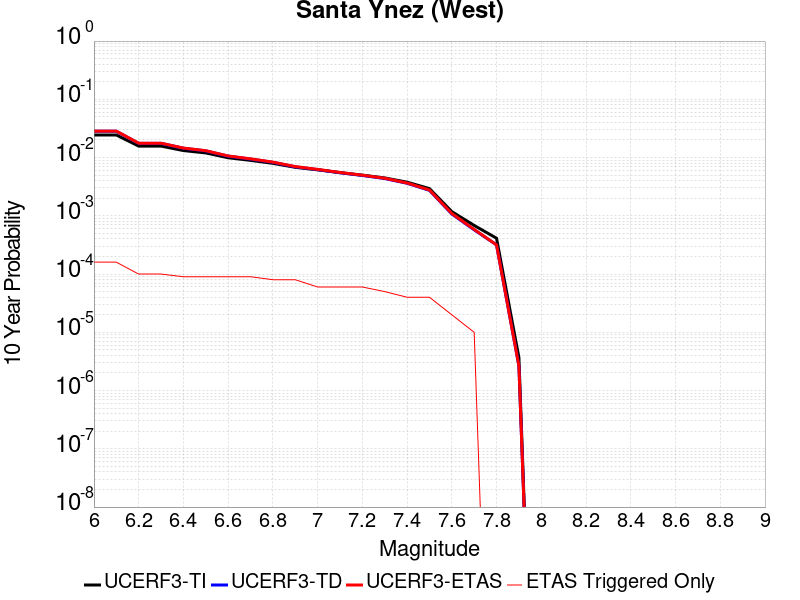 |

| Magnitude | 1 wk TI Prob | 1 wk TD Prob | 1 wk ETAS Prob | 1 wk ETAS/TD Gain | 1 wk ETAS Triggered Only | 1 mo TI Prob | 1 mo TD Prob | 1 mo ETAS Prob | 1 mo ETAS/TD Gain | 1 mo ETAS Triggered Only | 1 yr TI Prob | 1 yr TD Prob | 1 yr ETAS Prob | 1 yr ETAS/TD Gain | 1 yr ETAS Triggered Only | 10 yr TI Prob | 10 yr TD Prob | 10 yr ETAS Prob | 10 yr ETAS/TD Gain | 10 yr ETAS Triggered Only |
|-----|-----|-----|-----|-----|-----|-----|-----|-----|-----|-----|-----|-----|-----|-----|-----|-----|-----|-----|-----|-----|
| 6.0 | 4.7352758E-5 | 5.497084E-5 | 1.04968094E-4 | 1.9095231 | 5.0E-5 | 2.0292461E-4 | 2.3556968E-4 | 2.9555554E-4 | 1.2546418 | 6.0E-5 | 0.0024678076 | 0.002864558 | 0.003004157 | 1.0487331 | 1.4E-4 | 0.024405818 | 0.028304456 | 0.028459927 | 1.0054928 | 1.6E-4 |
| 6.1 | 4.7352758E-5 | 5.497084E-5 | 1.04968094E-4 | 1.9095231 | 5.0E-5 | 2.0292461E-4 | 2.3556968E-4 | 2.9555554E-4 | 1.2546418 | 6.0E-5 | 0.0024678076 | 0.002864558 | 0.003004157 | 1.0487331 | 1.4E-4 | 0.024405818 | 0.028304456 | 0.028459927 | 1.0054928 | 1.6E-4 |
| 6.2 | 3.0415853E-5 | 3.3925004E-5 | 5.3924323E-5 | 1.5895157 | 2.0E-5 | 1.3034715E-4 | 1.4538495E-4 | 1.6538205E-4 | 1.1375458 | 2.0E-5 | 0.0015858212 | 0.0017686592 | 0.0018485177 | 1.045152 | 8.0E-5 | 0.015745522 | 0.01754978 | 0.017648024 | 1.0055981 | 1.0E-4 |
| 6.3 | 3.0415853E-5 | 3.3925004E-5 | 5.3924323E-5 | 1.5895157 | 2.0E-5 | 1.3034715E-4 | 1.4538495E-4 | 1.6538205E-4 | 1.1375458 | 2.0E-5 | 0.0015858212 | 0.0017686592 | 0.0018485177 | 1.045152 | 8.0E-5 | 0.015745522 | 0.01754978 | 0.017648024 | 1.0055981 | 1.0E-4 |
| 6.4 | 2.5452082E-5 | 2.7912318E-5 | 4.791176E-5 | 1.7165095 | 2.0E-5 | 1.09075794E-4 | 1.1961885E-4 | 1.3961646E-4 | 1.1671777 | 2.0E-5 | 0.0013271887 | 0.0014554056 | 0.0015352891 | 1.0548875 | 8.0E-5 | 0.013192902 | 0.01446091 | 0.014549608 | 1.0061337 | 9.0E-5 |
| 6.5 | 2.3143784E-5 | 2.5128133E-5 | 4.512763E-5 | 1.7959007 | 2.0E-5 | 9.9183875E-5 | 1.07687636E-4 | 1.2768549E-4 | 1.1857023 | 2.0E-5 | 0.0012068948 | 0.001310323 | 0.0013902182 | 1.0609736 | 8.0E-5 | 0.012003611 | 0.013027638 | 0.013116466 | 1.0068184 | 9.0E-5 |
| 6.6 | 1.9118515E-5 | 2.0354244E-5 | 4.0353836E-5 | 1.982576 | 2.0E-5 | 8.193392E-5 | 8.722961E-5 | 1.0722786E-4 | 1.22926 | 2.0E-5 | 9.97089E-4 | 0.001061511 | 0.001141426 | 1.0752842 | 8.0E-5 | 0.00992627 | 0.010565317 | 0.010654366 | 1.0084285 | 9.0E-5 |
| 6.7 | 1.722807E-5 | 1.8146253E-5 | 3.814589E-5 | 2.102136 | 2.0E-5 | 7.3832496E-5 | 7.776737E-5 | 9.776581E-5 | 1.2571573 | 2.0E-5 | 8.985399E-4 | 9.4641204E-4 | 0.0010263363 | 1.0844498 | 8.0E-5 | 0.008949154 | 0.009424461 | 0.009513613 | 1.0094596 | 9.0E-5 |
| 6.8 | 1.5317364E-5 | 1.5926391E-5 | 3.5926074E-5 | 2.2557573 | 2.0E-5 | 6.56442E-5 | 6.82542E-5 | 8.825283E-5 | 1.2930022 | 2.0E-5 | 7.98925E-4 | 8.3068234E-4 | 9.006242E-4 | 1.0841981 | 7.0E-5 | 0.007960589 | 0.008276261 | 0.008355599 | 1.0095862 | 8.0E-5 |
| 6.9 | 1.3071226E-5 | 1.332953E-5 | 3.3329263E-5 | 2.500408 | 2.0E-5 | 5.6018336E-5 | 5.712532E-5 | 7.7124176E-5 | 1.3500874 | 2.0E-5 | 6.8180985E-4 | 6.952811E-4 | 7.652324E-4 | 1.1006087 | 7.0E-5 | 0.0067972173 | 0.0069313184 | 0.007010764 | 1.0114619 | 8.0E-5 |
| 7.0 | 1.1836986E-5 | 1.1932688E-5 | 3.193245E-5 | 2.6760483 | 2.0E-5 | 5.0728955E-5 | 5.1139097E-5 | 7.113807E-5 | 1.3910702 | 2.0E-5 | 6.1745E-4 | 6.2244234E-4 | 6.724112E-4 | 1.0802788 | 5.0E-5 | 0.006157372 | 0.0062071825 | 0.00626681 | 1.0096062 | 6.0E-5 |
| 7.1 | 1.0597169E-5 | 1.0542107E-5 | 3.0541898E-5 | 2.8971338 | 2.0E-5 | 4.541565E-5 | 4.5179684E-5 | 6.517878E-5 | 1.4426569 | 2.0E-5 | 5.5279525E-4 | 5.4992497E-4 | 5.9989747E-4 | 1.0908715 | 5.0E-5 | 0.0055142213 | 0.005485772 | 0.005545443 | 1.0108774 | 6.0E-5 |
| 7.2 | 9.59113E-6 | 9.45905E-6 | 2.945886E-5 | 3.1143572 | 2.0E-5 | 4.11042E-5 | 4.053816E-5 | 6.053735E-5 | 1.4933423 | 2.0E-5 | 5.0032866E-4 | 4.934414E-4 | 5.4341677E-4 | 1.1012791 | 5.0E-5 | 0.004992037 | 0.0049235765 | 0.0049832813 | 1.0121262 | 6.0E-5 |
| 7.3 | 8.586084E-6 | 8.379489E-6 | 2.8379322E-5 | 3.3867602 | 2.0E-5 | 3.679698E-5 | 3.591161E-5 | 5.591089E-5 | 1.556903 | 2.0E-5 | 4.4791115E-4 | 4.3713715E-4 | 4.7711967E-4 | 1.0914645 | 4.0E-5 | 0.004470094 | 0.004362884 | 0.004412666 | 1.0114104 | 5.0E-5 |
| 7.4 | 7.2622997E-6 | 6.9514485E-6 | 2.695131E-5 | 3.877078 | 2.0E-5 | 3.112377E-5 | 2.9791589E-5 | 4.9790993E-5 | 1.6713104 | 2.0E-5 | 3.78866E-4 | 3.6265317E-4 | 3.926423E-4 | 1.0826937 | 3.0E-5 | 0.0037822074 | 0.003620714 | 0.0036605692 | 1.0110075 | 4.0E-5 |
| 7.5 | 5.627296E-6 | 5.2514984E-6 | 2.5251393E-5 | 4.808417 | 2.0E-5 | 2.411676E-5 | 2.2506232E-5 | 4.250578E-5 | 1.8886228 | 2.0E-5 | 2.9358198E-4 | 2.7397962E-4 | 3.039714E-4 | 1.1094671 | 3.0E-5 | 0.0029319443 | 0.0027364905 | 0.002776381 | 1.0145773 | 4.0E-5 |
| 7.6 | 2.265244E-6 | 2.0608632E-6 | 1.2060843E-5 | 5.852326 | 1.0E-5 | 9.708152E-6 | 8.832241E-6 | 1.8832152E-5 | 2.1322055 | 1.0E-5 | 1.18190335E-4 | 1.0752732E-4 | 1.1752624E-4 | 1.0929897 | 1.0E-5 | 0.001181275 | 0.0010747615 | 0.00109474 | 1.0185888 | 2.0E-5 |
| 7.7 | 1.3099874E-6 | 1.1016228E-6 | 1.1101612E-5 | 10.077506 | 1.0E-5 | 5.61422E-6 | 4.7212325E-6 | 1.4721185E-5 | 3.1180809 | 1.0E-5 | 6.8350986E-5 | 5.7479516E-5 | 6.747894E-5 | 1.173965 | 1.0E-5 | 6.832996E-4 | 5.7464885E-4 | 5.846431E-4 | 1.0173919 | 1.0E-5 |
| 7.8 | 7.903951E-7 | 6.0710704E-7 | 6.0710704E-7 | 1.0 | 0.0 | 3.3874032E-6 | 2.601885E-6 | 2.601885E-6 | 1.0 | 0.0 | 4.1240855E-5 | 3.16775E-5 | 3.16775E-5 | 1.0 | 0.0 | 4.12332E-4 | 3.167312E-4 | 3.167312E-4 | 1.0 | 0.0 |
| 7.9 | 7.0753297E-9 | 5.090092E-9 | 5.090092E-9 | 1.0 | 0.0 | 3.032284E-8 | 2.181468E-8 | 2.181468E-8 | 1.0 | 0.0 | 3.6918053E-7 | 2.655937E-7 | 2.655937E-7 | 1.0 | 0.0 | 3.691799E-6 | 2.6559348E-6 | 2.6559348E-6 | 1.0 | 0.0 |

## Cleghorn Pass
*[(top)](#table-of-contents)*

| 1 Week | 1 Month | 1 Year | 10 Year |
|-----|-----|-----|-----|
|  |  |  |  |

| Magnitude | 1 wk TI Prob | 1 wk TD Prob | 1 wk ETAS Prob | 1 wk ETAS/TD Gain | 1 wk ETAS Triggered Only | 1 mo TI Prob | 1 mo TD Prob | 1 mo ETAS Prob | 1 mo ETAS/TD Gain | 1 mo ETAS Triggered Only | 1 yr TI Prob | 1 yr TD Prob | 1 yr ETAS Prob | 1 yr ETAS/TD Gain | 1 yr ETAS Triggered Only | 10 yr TI Prob | 10 yr TD Prob | 10 yr ETAS Prob | 10 yr ETAS/TD Gain | 10 yr ETAS Triggered Only |
|-----|-----|-----|-----|-----|-----|-----|-----|-----|-----|-----|-----|-----|-----|-----|-----|-----|-----|-----|-----|-----|
| 6.0 | 1.0522846E-5 | 1.1040642E-5 | 9.103976E-5 | 8.245875 | 8.0E-5 | 4.509713E-5 | 4.7316473E-5 | 1.4731174E-4 | 3.1133287 | 1.0E-4 | 5.4891926E-4 | 5.759784E-4 | 7.4588053E-4 | 1.2949799 | 1.7E-4 | 0.0054756533 | 0.005750022 | 0.0059985844 | 1.0432281 | 2.5E-4 |
| 6.1 | 1.0522846E-5 | 1.1040642E-5 | 9.103976E-5 | 8.245875 | 8.0E-5 | 4.509713E-5 | 4.7316473E-5 | 1.4731174E-4 | 3.1133287 | 1.0E-4 | 5.4891926E-4 | 5.759784E-4 | 7.4588053E-4 | 1.2949799 | 1.7E-4 | 0.0054756533 | 0.005750022 | 0.0059985844 | 1.0432281 | 2.5E-4 |
| 6.2 | 2.1045846E-6 | 2.2082024E-6 | 3.2208136E-5 | 14.585681 | 3.0E-5 | 9.019617E-6 | 9.463714E-6 | 3.946343E-5 | 4.169973 | 3.0E-5 | 1.098083E-4 | 1.1521882E-4 | 1.4521537E-4 | 1.2603441 | 3.0E-5 | 0.0010975406 | 0.0011520023 | 0.0011919562 | 1.0346822 | 4.0E-5 |
| 6.3 | 2.1045846E-6 | 2.2082024E-6 | 3.2208136E-5 | 14.585681 | 3.0E-5 | 9.019617E-6 | 9.463714E-6 | 3.946343E-5 | 4.169973 | 3.0E-5 | 1.098083E-4 | 1.1521882E-4 | 1.4521537E-4 | 1.2603441 | 3.0E-5 | 0.0010975406 | 0.0011520023 | 0.0011919562 | 1.0346822 | 4.0E-5 |
| 6.4 | 1.7259927E-6 | 1.810877E-6 | 3.181082E-5 | 17.566528 | 3.0E-5 | 7.3970905E-6 | 7.760902E-6 | 3.776067E-5 | 4.8655 | 3.0E-5 | 9.005586E-5 | 9.4488976E-5 | 1.2448615E-4 | 1.3174673 | 3.0E-5 | 9.001937E-4 | 9.448898E-4 | 9.84852E-4 | 1.042293 | 4.0E-5 |

## Baker
*[(top)](#table-of-contents)*

| 1 Week | 1 Month | 1 Year | 10 Year |
|-----|-----|-----|-----|
| 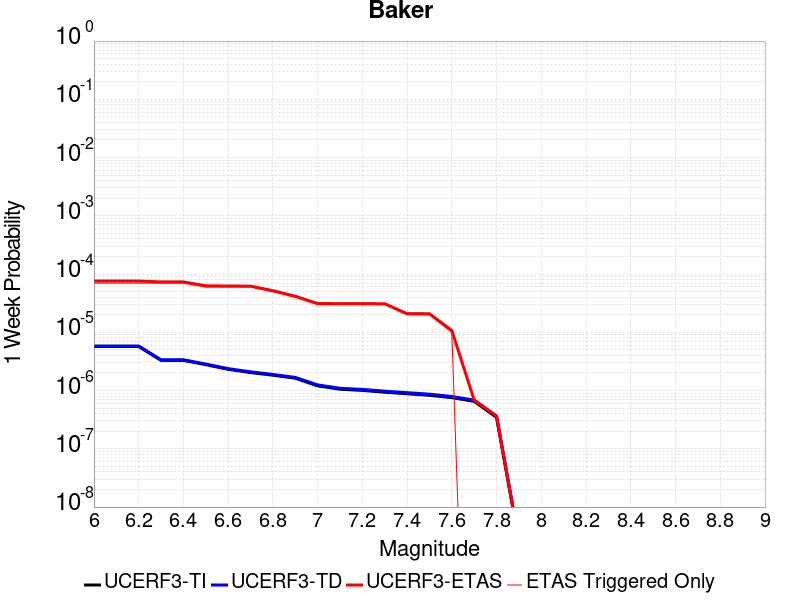 | 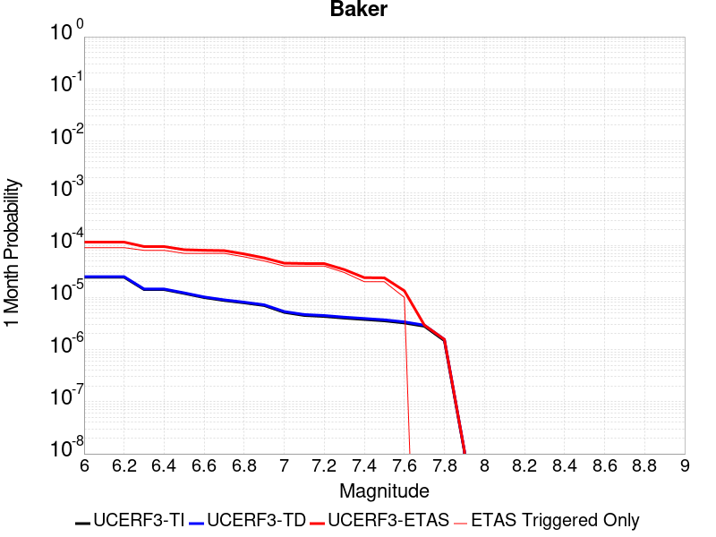 | 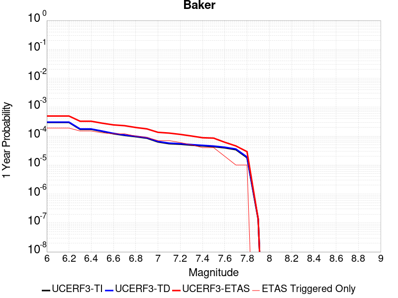 | 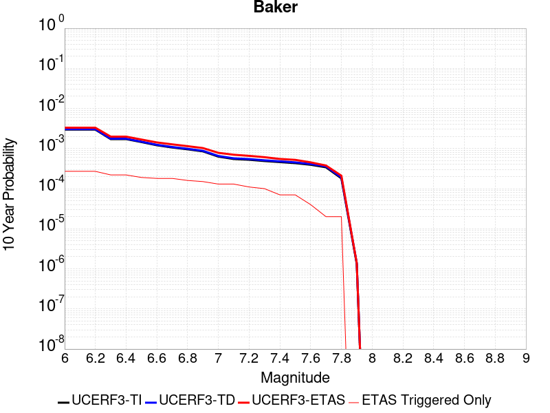 |

| Magnitude | 1 wk TI Prob | 1 wk TD Prob | 1 wk ETAS Prob | 1 wk ETAS/TD Gain | 1 wk ETAS Triggered Only | 1 mo TI Prob | 1 mo TD Prob | 1 mo ETAS Prob | 1 mo ETAS/TD Gain | 1 mo ETAS Triggered Only | 1 yr TI Prob | 1 yr TD Prob | 1 yr ETAS Prob | 1 yr ETAS/TD Gain | 1 yr ETAS Triggered Only | 10 yr TI Prob | 10 yr TD Prob | 10 yr ETAS Prob | 10 yr ETAS/TD Gain | 10 yr ETAS Triggered Only |
|-----|-----|-----|-----|-----|-----|-----|-----|-----|-----|-----|-----|-----|-----|-----|-----|-----|-----|-----|-----|-----|
| 6.0 | 5.695525E-6 | 5.8348373E-6 | 7.583443E-5 | 12.996838 | 7.0E-5 | 2.4409164E-5 | 2.5006228E-5 | 1.15003975E-4 | 4.5990133 | 9.0E-5 | 2.9714106E-4 | 3.044123E-4 | 4.9435446E-4 | 1.6239635 | 1.9E-4 | 0.0029674405 | 0.0030403486 | 0.0033095279 | 1.0885355 | 2.7E-4 |
| 6.1 | 5.695525E-6 | 5.8348373E-6 | 7.583443E-5 | 12.996838 | 7.0E-5 | 2.4409164E-5 | 2.5006228E-5 | 1.15003975E-4 | 4.5990133 | 9.0E-5 | 2.9714106E-4 | 3.044123E-4 | 4.9435446E-4 | 1.6239635 | 1.9E-4 | 0.0029674405 | 0.0030403486 | 0.0033095279 | 1.0885355 | 2.7E-4 |
| 6.2 | 5.695525E-6 | 5.8348373E-6 | 7.583443E-5 | 12.996838 | 7.0E-5 | 2.4409164E-5 | 2.5006228E-5 | 1.15003975E-4 | 4.5990133 | 9.0E-5 | 2.9714106E-4 | 3.044123E-4 | 4.9435446E-4 | 1.6239635 | 1.9E-4 | 0.0029674405 | 0.0030403486 | 0.0033095279 | 1.0885355 | 2.7E-4 |
| 6.3 | 3.2995713E-6 | 3.383667E-6 | 7.338343E-5 | 21.687544 | 7.0E-5 | 1.4140943E-5 | 1.4501353E-5 | 9.4500196E-5 | 6.516647 | 8.0E-5 | 1.7215237E-4 | 1.7654014E-4 | 3.2651366E-4 | 1.8495152 | 1.5E-4 | 0.0017201907 | 0.001764046 | 0.001983658 | 1.1244932 | 2.2E-4 |
| 6.4 | 3.2995713E-6 | 3.383667E-6 | 7.338343E-5 | 21.687544 | 7.0E-5 | 1.4140943E-5 | 1.4501353E-5 | 9.4500196E-5 | 6.516647 | 8.0E-5 | 1.7215237E-4 | 1.7654014E-4 | 3.2651366E-4 | 1.8495152 | 1.5E-4 | 0.0017201907 | 0.001764046 | 0.001983658 | 1.1244932 | 2.2E-4 |
| 6.5 | 2.782202E-6 | 2.8558404E-6 | 6.2855666E-5 | 22.009518 | 6.0E-5 | 1.1923668E-5 | 1.223926E-5 | 8.22384E-5 | 6.7192297 | 7.0E-5 | 1.4516099E-4 | 1.4900314E-4 | 2.7898376E-4 | 1.8723348 | 1.3E-4 | 0.001450662 | 0.0014890651 | 0.0016787822 | 1.1274068 | 1.9E-4 |
| 6.6 | 2.3163404E-6 | 2.38092E-6 | 6.238078E-5 | 26.200283 | 6.0E-5 | 9.927136E-6 | 1.0203904E-5 | 8.020319E-5 | 7.8600492 | 7.0E-5 | 1.20856166E-4 | 1.2422565E-4 | 2.4421074E-4 | 1.9658641 | 1.2E-4 | 0.0012079047 | 0.0012415823 | 0.0014213588 | 1.1447963 | 1.8E-4 |
| 6.7 | 2.037056E-6 | 2.0965003E-6 | 6.209638E-5 | 29.61906 | 6.0E-5 | 8.7302105E-6 | 8.984972E-6 | 7.898434E-5 | 8.790717 | 7.0E-5 | 1.0628513E-4 | 1.093867E-4 | 2.2937357E-4 | 2.0969055 | 1.2E-4 | 0.0010623431 | 0.0010933448 | 0.001273148 | 1.1644524 | 1.8E-4 |
| 6.8 | 1.8356744E-6 | 1.8915287E-6 | 5.1891435E-5 | 27.433596 | 5.0E-5 | 7.867153E-6 | 8.106527E-6 | 6.810604E-5 | 8.401383 | 6.0E-5 | 9.577837E-5 | 9.869264E-5 | 1.9868277E-4 | 2.0131469 | 1.0E-4 | 9.57371E-4 | 9.86502E-4 | 0.0011463442 | 1.1620293 | 1.6E-4 |
| 6.9 | 1.6310546E-6 | 1.6832072E-6 | 4.168314E-5 | 24.764116 | 4.0E-5 | 6.9902153E-6 | 7.213726E-6 | 5.7213365E-5 | 7.931181 | 5.0E-5 | 8.510255E-5 | 8.782368E-5 | 1.7781577E-4 | 2.0246904 | 9.0E-5 | 8.5069967E-4 | 8.7790104E-4 | 0.0010277694 | 1.1707121 | 1.5E-4 |
| 7.0 | 1.2058036E-6 | 1.2508665E-6 | 3.1250827E-5 | 24.983343 | 3.0E-5 | 5.1677193E-6 | 5.3608455E-6 | 4.536063E-5 | 8.46147 | 4.0E-5 | 6.291517E-5 | 6.5266366E-5 | 1.352618E-4 | 2.072458 | 7.0E-5 | 6.289736E-4 | 6.524743E-4 | 7.823895E-4 | 1.1991116 | 1.3E-4 |
| 7.1 | 1.052382E-6 | 1.0951609E-6 | 3.109513E-5 | 28.393206 | 3.0E-5 | 4.5102006E-6 | 4.693538E-6 | 4.469335E-5 | 9.522315 | 4.0E-5 | 5.491031E-5 | 5.7142337E-5 | 1.2713834E-4 | 2.2249413 | 7.0E-5 | 5.4896745E-4 | 5.7127734E-4 | 7.0120307E-4 | 1.2274302 | 1.3E-4 |
| 7.2 | 1.0067454E-6 | 1.0487711E-6 | 3.104874E-5 | 29.604877 | 3.0E-5 | 4.3146156E-6 | 4.4947255E-6 | 4.4494547E-5 | 9.89928 | 4.0E-5 | 5.252918E-5 | 5.4721917E-5 | 1.14718634E-4 | 2.0963929 | 6.0E-5 | 5.251676E-4 | 5.470853E-4 | 6.570251E-4 | 1.2009555 | 1.1E-4 |
| 7.3 | 9.3596316E-7 | 9.767723E-7 | 3.0976742E-5 | 31.713371 | 3.0E-5 | 4.0112645E-6 | 4.1861604E-6 | 3.4186036E-5 | 8.166442 | 3.0E-5 | 4.8836053E-5 | 5.096532E-5 | 1.00962774E-4 | 1.9810092 | 5.0E-5 | 4.8825322E-4 | 5.095371E-4 | 6.0948613E-4 | 1.1961566 | 1.0E-4 |
| 7.4 | 8.8117395E-7 | 9.2076635E-7 | 2.0920748E-5 | 22.721018 | 2.0E-5 | 3.7764542E-6 | 3.9461356E-6 | 2.3946057E-5 | 6.0682297 | 2.0E-5 | 4.5977362E-5 | 4.8043148E-5 | 8.8041226E-5 | 1.8325449 | 4.0E-5 | 4.596785E-4 | 4.8032837E-4 | 5.5029476E-4 | 1.1456636 | 7.0E-5 |
| 7.5 | 8.292386E-7 | 8.6745956E-7 | 2.0867443E-5 | 24.055809 | 2.0E-5 | 3.5538749E-6 | 3.7176785E-6 | 2.3717605E-5 | 6.379681 | 2.0E-5 | 4.326757E-5 | 4.5261804E-5 | 8.525999E-5 | 1.8837074 | 4.0E-5 | 4.3259145E-4 | 4.5252658E-4 | 5.224949E-4 | 1.1546171 | 7.0E-5 |
| 7.6 | 7.553842E-7 | 7.9144706E-7 | 1.0791439E-5 | 13.635074 | 1.0E-5 | 3.2373566E-6 | 3.3919116E-6 | 1.33918775E-5 | 3.94818 | 1.0E-5 | 3.9414106E-5 | 4.129575E-5 | 6.129492E-5 | 1.4842913 | 2.0E-5 | 3.9407116E-4 | 4.1288146E-4 | 4.5286494E-4 | 1.0968401 | 4.0E-5 |
| 7.7 | 6.5285366E-7 | 6.852797E-7 | 6.852797E-7 | 1.0 | 0.0 | 2.797941E-6 | 2.9369096E-6 | 2.9369096E-6 | 1.0 | 0.0 | 3.40644E-5 | 3.5756293E-5 | 4.5755936E-5 | 1.279661 | 1.0E-5 | 3.405918E-4 | 3.5750607E-4 | 3.7749892E-4 | 1.0559231 | 2.0E-5 |
| 7.8 | 3.4586725E-7 | 3.6482615E-7 | 3.6482615E-7 | 1.0 | 0.0 | 1.4822873E-6 | 1.5635396E-6 | 1.5635396E-6 | 1.0 | 0.0 | 1.80467E-5 | 1.9035933E-5 | 2.9035744E-5 | 1.5253123 | 1.0E-5 | 1.8045233E-4 | 1.9034347E-4 | 2.1033967E-4 | 1.1050532 | 2.0E-5 |
| 7.9 | 2.5591178E-9 | 2.6696718E-9 | 2.6696718E-9 | 1.0 | 0.0 | 1.0967647E-8 | 1.14414505E-8 | 1.14414505E-8 | 1.0 | 0.0 | 1.335311E-7 | 1.3929966E-7 | 1.3929966E-7 | 1.0 | 0.0 | 1.3353102E-6 | 1.3929966E-6 | 1.3929966E-6 | 1.0 | 0.0 |

## San Jacinto (Lytle Creek connector)
*[(top)](#table-of-contents)*

| 1 Week | 1 Month | 1 Year | 10 Year |
|-----|-----|-----|-----|
|  | 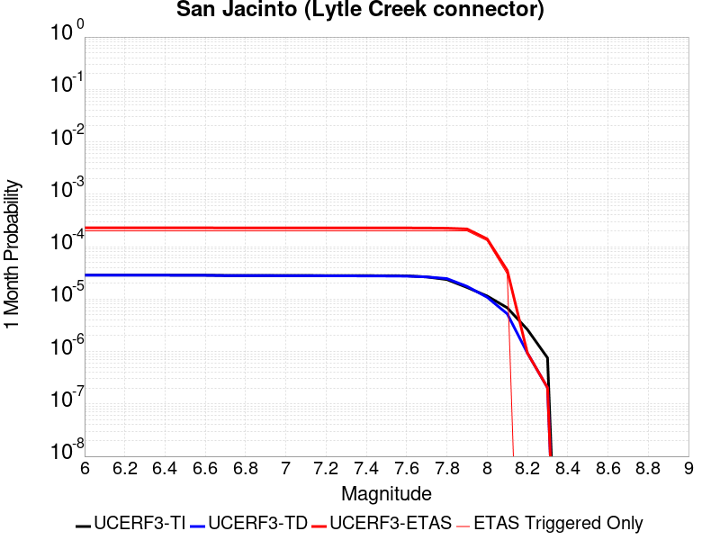 | 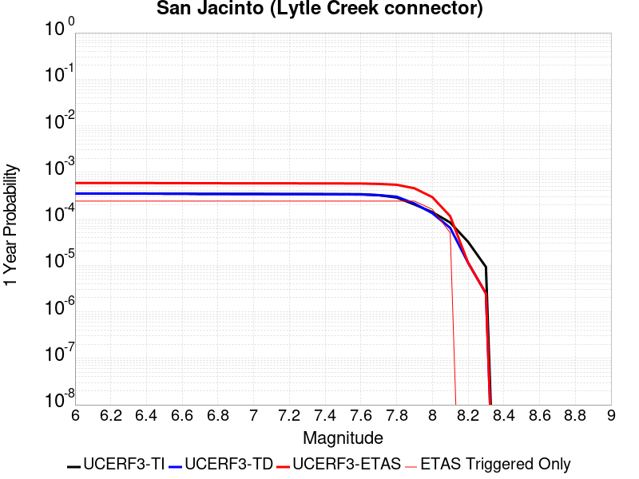 |  |

| Magnitude | 1 wk TI Prob | 1 wk TD Prob | 1 wk ETAS Prob | 1 wk ETAS/TD Gain | 1 wk ETAS Triggered Only | 1 mo TI Prob | 1 mo TD Prob | 1 mo ETAS Prob | 1 mo ETAS/TD Gain | 1 mo ETAS Triggered Only | 1 yr TI Prob | 1 yr TD Prob | 1 yr ETAS Prob | 1 yr ETAS/TD Gain | 1 yr ETAS Triggered Only | 10 yr TI Prob | 10 yr TD Prob | 10 yr ETAS Prob | 10 yr ETAS/TD Gain | 10 yr ETAS Triggered Only |
|-----|-----|-----|-----|-----|-----|-----|-----|-----|-----|-----|-----|-----|-----|-----|-----|-----|-----|-----|-----|-----|
| 6.0 | 6.693995E-6 | 6.660123E-6 | 1.6665905E-4 | 25.02342 | 1.6E-4 | 2.8688235E-5 | 2.8543072E-5 | 2.2853736E-4 | 8.006754 | 2.0E-4 | 3.492233E-4 | 3.4745657E-4 | 5.8737316E-4 | 1.6904938 | 2.4E-4 | 0.00348675 | 0.0035491167 | 0.0038081938 | 1.0729977 | 2.6E-4 |
| 6.1 | 6.693995E-6 | 6.660123E-6 | 1.6665905E-4 | 25.02342 | 1.6E-4 | 2.8688235E-5 | 2.8543072E-5 | 2.2853736E-4 | 8.006754 | 2.0E-4 | 3.492233E-4 | 3.4745657E-4 | 5.8737316E-4 | 1.6904938 | 2.4E-4 | 0.00348675 | 0.0035491167 | 0.0038081938 | 1.0729977 | 2.6E-4 |
| 6.2 | 6.693995E-6 | 6.660123E-6 | 1.6665905E-4 | 25.02342 | 1.6E-4 | 2.8688235E-5 | 2.8543072E-5 | 2.2853736E-4 | 8.006754 | 2.0E-4 | 3.492233E-4 | 3.4745657E-4 | 5.8737316E-4 | 1.6904938 | 2.4E-4 | 0.00348675 | 0.0035491167 | 0.0038081938 | 1.0729977 | 2.6E-4 |
| 6.3 | 6.693995E-6 | 6.660123E-6 | 1.6665905E-4 | 25.02342 | 1.6E-4 | 2.8688235E-5 | 2.8543072E-5 | 2.2853736E-4 | 8.006754 | 2.0E-4 | 3.492233E-4 | 3.4745657E-4 | 5.8737316E-4 | 1.6904938 | 2.4E-4 | 0.00348675 | 0.0035491167 | 0.0038081938 | 1.0729977 | 2.6E-4 |
| 6.4 | 6.693995E-6 | 6.660123E-6 | 1.6665905E-4 | 25.02342 | 1.6E-4 | 2.8688235E-5 | 2.8543072E-5 | 2.2853736E-4 | 8.006754 | 2.0E-4 | 3.492233E-4 | 3.4745657E-4 | 5.8737316E-4 | 1.6904938 | 2.4E-4 | 0.00348675 | 0.0035491167 | 0.0038081938 | 1.0729977 | 2.6E-4 |
| 6.5 | 6.6561875E-6 | 6.620341E-6 | 1.6661928E-4 | 25.16778 | 1.6E-4 | 2.8526205E-5 | 2.8372582E-5 | 2.283669E-4 | 8.048859 | 2.0E-4 | 3.472512E-4 | 3.453815E-4 | 5.8529864E-4 | 1.6946437 | 2.4E-4 | 0.0034670907 | 0.0035284322 | 0.0037875148 | 1.0734271 | 2.6E-4 |
| 6.6 | 6.6561875E-6 | 6.620341E-6 | 1.6661928E-4 | 25.16778 | 1.6E-4 | 2.8526205E-5 | 2.8372582E-5 | 2.283669E-4 | 8.048859 | 2.0E-4 | 3.472512E-4 | 3.453815E-4 | 5.8529864E-4 | 1.6946437 | 2.4E-4 | 0.0034670907 | 0.0035284322 | 0.0037875148 | 1.0734271 | 2.6E-4 |
| 6.7 | 6.5802237E-6 | 6.539518E-6 | 1.6653848E-4 | 25.466476 | 1.6E-4 | 2.8200653E-5 | 2.8026205E-5 | 2.280206E-4 | 8.135979 | 2.0E-4 | 3.4328885E-4 | 3.4116567E-4 | 5.810838E-4 | 1.7032305 | 2.4E-4 | 0.0034275902 | 0.0034864065 | 0.0037455002 | 1.0743153 | 2.6E-4 |
| 6.8 | 6.575632E-6 | 6.5340073E-6 | 1.6653296E-4 | 25.48711 | 1.6E-4 | 2.8180975E-5 | 2.8002589E-5 | 2.2799699E-4 | 8.141997 | 2.0E-4 | 3.4304935E-4 | 3.4087826E-4 | 5.8079645E-4 | 1.7038237 | 2.4E-4 | 0.0034252026 | 0.0034835413 | 0.0037426357 | 1.0743767 | 2.6E-4 |
| 6.9 | 6.570433E-6 | 6.525401E-6 | 1.6652436E-4 | 25.519405 | 1.6E-4 | 2.8158694E-5 | 2.7965707E-5 | 2.2796012E-4 | 8.151416 | 2.0E-4 | 3.4277816E-4 | 3.4042934E-4 | 5.8034767E-4 | 1.7047521 | 2.4E-4 | 0.0034224992 | 0.0034790665 | 0.0037381619 | 1.0744727 | 2.6E-4 |
| 7.0 | 6.5643826E-6 | 6.5155223E-6 | 1.6651448E-4 | 25.556581 | 1.6E-4 | 2.8132765E-5 | 2.7923368E-5 | 2.2791779E-4 | 8.16226 | 2.0E-4 | 3.424626E-4 | 3.3991406E-4 | 5.798325E-4 | 1.7058208 | 2.4E-4 | 0.0034193532 | 0.0034739296 | 0.0037330263 | 1.0745832 | 2.6E-4 |
| 7.1 | 6.557402E-6 | 6.504234E-6 | 1.6650319E-4 | 25.599201 | 1.6E-4 | 2.8102848E-5 | 2.7874992E-5 | 2.2786942E-4 | 8.17469 | 2.0E-4 | 3.4209844E-4 | 3.3932526E-4 | 5.792438E-4 | 1.707046 | 2.4E-4 | 0.0034157229 | 0.0034680606 | 0.003727159 | 1.0747099 | 2.6E-4 |
| 7.2 | 6.546394E-6 | 6.4862006E-6 | 1.6648516E-4 | 25.667595 | 1.6E-4 | 2.8055672E-5 | 2.7797707E-5 | 2.2779214E-4 | 8.194638 | 2.0E-4 | 3.4152428E-4 | 3.383846E-4 | 5.7830336E-4 | 1.7090122 | 2.4E-4 | 0.0034099987 | 0.0034586883 | 0.003717789 | 1.074913 | 2.6E-4 |
| 7.3 | 6.5364216E-6 | 6.4669857E-6 | 1.6646595E-4 | 25.740887 | 1.6E-4 | 2.8012933E-5 | 2.771536E-5 | 2.2770981E-4 | 8.216016 | 2.0E-4 | 3.4100408E-4 | 3.373823E-4 | 5.7730137E-4 | 1.7111192 | 2.4E-4 | 0.003404813 | 0.0034487103 | 0.0037078136 | 1.0751305 | 2.6E-4 |
| 7.4 | 6.5269523E-6 | 6.4480723E-6 | 1.6644705E-4 | 25.813457 | 1.6E-4 | 2.7972354E-5 | 2.7634303E-5 | 2.2762877E-4 | 8.237182 | 2.0E-4 | 3.4051016E-4 | 3.3639578E-4 | 5.7631504E-4 | 1.7132053 | 2.4E-4 | 0.0033998888 | 0.0034388923 | 0.0036979981 | 1.0753458 | 2.6E-4 |
| 7.5 | 6.5111835E-6 | 6.424346E-6 | 1.6642331E-4 | 25.9051 | 1.6E-4 | 2.7904773E-5 | 2.753262E-5 | 2.2752711E-4 | 8.26391 | 2.0E-4 | 3.3968766E-4 | 3.3515817E-4 | 5.750777E-4 | 1.7158399 | 2.4E-4 | 0.0033916887 | 0.0034265644 | 0.0036856735 | 1.0756178 | 2.6E-4 |
| 7.6 | 6.4768806E-6 | 6.383454E-6 | 1.6638244E-4 | 26.06464 | 1.6E-4 | 2.7757764E-5 | 2.7357375E-5 | 2.273519E-4 | 8.310443 | 2.0E-4 | 3.3789838E-4 | 3.330252E-4 | 5.729453E-4 | 1.7204262 | 2.4E-4 | 0.0033738504 | 0.0034052972 | 0.0036644118 | 1.0760916 | 2.6E-4 |
| 7.7 | 6.1655364E-6 | 6.1759456E-6 | 1.6617496E-4 | 26.906803 | 1.6E-4 | 2.642346E-5 | 2.646807E-5 | 2.2646277E-4 | 8.556074 | 2.0E-4 | 3.2165812E-4 | 3.2220117E-4 | 5.6212384E-4 | 1.7446363 | 2.4E-4 | 0.0032119295 | 0.0032969362 | 0.003556079 | 1.0786011 | 2.6E-4 |
| 7.8 | 5.5043524E-6 | 5.7370175E-6 | 1.657361E-4 | 28.888895 | 1.6E-4 | 2.3589868E-5 | 2.4586987E-5 | 2.2458207E-4 | 9.134184 | 2.0E-4 | 2.871688E-4 | 2.993055E-4 | 5.392337E-4 | 1.8016163 | 2.4E-4 | 0.0028679797 | 0.0030670585 | 0.0033262612 | 1.0845118 | 2.6E-4 |
| 7.9 | 3.889249E-6 | 4.0766436E-6 | 1.6407599E-4 | 40.247814 | 1.6E-4 | 1.6668104E-5 | 1.7471213E-5 | 2.1746772E-4 | 12.447202 | 2.0E-4 | 2.0291525E-4 | 2.126913E-4 | 4.5264026E-4 | 2.128156 | 2.4E-4 | 0.0020273007 | 0.0021941073 | 0.002453537 | 1.1182392 | 2.6E-4 |
| 8.0 | 2.668535E-6 | 2.5313454E-6 | 9.253112E-5 | 36.554127 | 9.0E-5 | 1.1436528E-5 | 1.0848577E-5 | 1.4084717E-4 | 12.983007 | 1.3E-4 | 1.3923083E-4 | 1.3207346E-4 | 2.920523E-4 | 2.211287 | 1.6E-4 | 0.0013914363 | 0.0013755665 | 0.001555319 | 1.1306752 | 1.8E-4 |
| 8.1 | 1.5911459E-6 | 1.2185134E-6 | 2.121849E-5 | 17.413424 | 2.0E-5 | 6.8191785E-6 | 5.2221894E-6 | 3.5222034E-5 | 6.7446866 | 3.0E-5 | 8.3020335E-5 | 6.357832E-5 | 1.13575144E-4 | 1.7863815 | 5.0E-5 | 8.298933E-4 | 6.6911156E-4 | 7.290714E-4 | 1.0896112 | 6.0E-5 |
| 8.2 | 6.1294963E-7 | 2.1802066E-7 | 2.1802066E-7 | 1.0 | 0.0 | 2.6269242E-6 | 9.3437393E-7 | 9.3437393E-7 | 1.0 | 0.0 | 3.1982334E-5 | 1.1375943E-5 | 1.1375943E-5 | 1.0 | 0.0 | 3.1977732E-4 | 1.2778955E-4 | 1.2778955E-4 | 1.0 | 0.0 |
| 8.3 | 1.762871E-7 | 4.7516316E-8 | 4.7516316E-8 | 1.0 | 0.0 | 7.5551594E-7 | 2.0364133E-7 | 2.0364133E-7 | 1.0 | 0.0 | 9.1983675E-6 | 2.4793305E-6 | 2.4793305E-6 | 1.0 | 0.0 | 9.197987E-5 | 2.8671833E-5 | 2.8671833E-5 | 1.0 | 0.0 |

## Scodie Lineament
*[(top)](#table-of-contents)*

| 1 Week | 1 Month | 1 Year | 10 Year |
|-----|-----|-----|-----|
|  |  |  |  |

| Magnitude | 1 wk TI Prob | 1 wk TD Prob | 1 wk ETAS Prob | 1 wk ETAS/TD Gain | 1 wk ETAS Triggered Only | 1 mo TI Prob | 1 mo TD Prob | 1 mo ETAS Prob | 1 mo ETAS/TD Gain | 1 mo ETAS Triggered Only | 1 yr TI Prob | 1 yr TD Prob | 1 yr ETAS Prob | 1 yr ETAS/TD Gain | 1 yr ETAS Triggered Only | 10 yr TI Prob | 10 yr TD Prob | 10 yr ETAS Prob | 10 yr ETAS/TD Gain | 10 yr ETAS Triggered Only |
|-----|-----|-----|-----|-----|-----|-----|-----|-----|-----|-----|-----|-----|-----|-----|-----|-----|-----|-----|-----|-----|
| 6.0 | 3.2919327E-6 | 3.0133303E-6 | 1.0301303E-4 | 34.185772 | 1.0E-4 | 1.4108206E-5 | 1.2914227E-5 | 1.3291268E-4 | 10.291958 | 1.2E-4 | 1.7175387E-4 | 1.5722254E-4 | 3.571911E-4 | 2.271882 | 2.0E-4 | 0.0017162118 | 0.0015714248 | 0.0018210319 | 1.1588413 | 2.5E-4 |
| 6.1 | 1.8663811E-6 | 1.5490382E-6 | 3.1548992E-5 | 20.366827 | 3.0E-5 | 7.998751E-6 | 6.6387206E-6 | 4.6638455E-5 | 7.025217 | 4.0E-5 | 9.738045E-5 | 8.082393E-5 | 1.7081665E-4 | 2.1134417 | 9.0E-5 | 9.7337784E-4 | 8.079941E-4 | 8.979214E-4 | 1.1112969 | 9.0E-5 |
| 6.2 | 1.8663811E-6 | 1.5490382E-6 | 3.1548992E-5 | 20.366827 | 3.0E-5 | 7.998751E-6 | 6.6387206E-6 | 4.6638455E-5 | 7.025217 | 4.0E-5 | 9.738045E-5 | 8.082393E-5 | 1.7081665E-4 | 2.1134417 | 9.0E-5 | 9.7337784E-4 | 8.079941E-4 | 8.979214E-4 | 1.1112969 | 9.0E-5 |
| 6.3 | 1.8663811E-6 | 1.5490382E-6 | 3.1548992E-5 | 20.366827 | 3.0E-5 | 7.998751E-6 | 6.6387206E-6 | 4.6638455E-5 | 7.025217 | 4.0E-5 | 9.738045E-5 | 8.082393E-5 | 1.7081665E-4 | 2.1134417 | 9.0E-5 | 9.7337784E-4 | 8.079941E-4 | 8.979214E-4 | 1.1112969 | 9.0E-5 |
| 6.4 | 1.8663811E-6 | 1.5490382E-6 | 3.1548992E-5 | 20.366827 | 3.0E-5 | 7.998751E-6 | 6.6387206E-6 | 4.6638455E-5 | 7.025217 | 4.0E-5 | 9.738045E-5 | 8.082393E-5 | 1.7081665E-4 | 2.1134417 | 9.0E-5 | 9.7337784E-4 | 8.079941E-4 | 8.979214E-4 | 1.1112969 | 9.0E-5 |
| 6.5 | 1.8106311E-6 | 1.4909722E-6 | 3.1490927E-5 | 21.12107 | 3.0E-5 | 7.759824E-6 | 6.389868E-6 | 4.6389614E-5 | 7.2598705 | 4.0E-5 | 9.447177E-5 | 7.779436E-5 | 1.6778735E-4 | 2.1568062 | 9.0E-5 | 9.4431615E-4 | 7.7771995E-4 | 8.676499E-4 | 1.1156329 | 9.0E-5 |
| 6.6 | 1.2414679E-6 | 8.9974395E-7 | 1.0899735E-5 | 12.114263 | 1.0E-5 | 5.320566E-6 | 3.85604E-6 | 1.3856002E-5 | 3.593324 | 1.0E-5 | 6.477596E-5 | 4.6946367E-5 | 7.694496E-5 | 1.6389971 | 3.0E-5 | 6.475708E-4 | 4.6937316E-4 | 4.993591E-4 | 1.063885 | 3.0E-5 |
| 6.7 | 1.1062215E-6 | 7.594193E-7 | 1.0759411E-5 | 14.167946 | 1.0E-5 | 4.7409408E-6 | 3.2546504E-6 | 1.3254618E-5 | 4.0725164 | 1.0E-5 | 5.7719422E-5 | 3.962472E-5 | 5.962393E-5 | 1.5047154 | 2.0E-5 | 5.770443E-4 | 3.9618355E-4 | 4.161756E-4 | 1.0504616 | 2.0E-5 |
| 6.8 | 1.0006736E-6 | 6.5002786E-7 | 1.0650021E-5 | 16.383945 | 1.0E-5 | 4.288594E-6 | 2.7858312E-6 | 1.2785803E-5 | 4.589583 | 1.0E-5 | 5.221238E-5 | 3.391703E-5 | 5.391635E-5 | 1.5896543 | 2.0E-5 | 5.220012E-4 | 3.3912458E-4 | 3.591178E-4 | 1.0589554 | 2.0E-5 |
| 6.9 | 9.167364E-7 | 5.6315065E-7 | 1.0563145E-5 | 18.757227 | 1.0E-5 | 3.9288643E-6 | 2.413501E-6 | 1.2413477E-5 | 5.1433487 | 1.0E-5 | 4.7832873E-5 | 2.9384037E-5 | 4.938345E-5 | 1.6806217 | 2.0E-5 | 4.782258E-4 | 2.9380718E-4 | 3.138013E-4 | 1.0680518 | 2.0E-5 |
| 7.0 | 7.6987664E-7 | 4.113265E-7 | 1.0411322E-5 | 25.311577 | 1.0E-5 | 3.2994672E-6 | 1.7628269E-6 | 1.176281E-5 | 6.6726966 | 1.0E-5 | 4.0170275E-5 | 2.1462245E-5 | 3.146203E-5 | 1.4659245 | 1.0E-5 | 4.0163012E-4 | 2.1460558E-4 | 2.2460344E-4 | 1.0465871 | 1.0E-5 |
| 7.1 | 7.1038727E-7 | 3.5210306E-7 | 1.03521E-5 | 29.400766 | 1.0E-5 | 3.0445133E-6 | 1.5090123E-6 | 1.1508997E-5 | 7.626841 | 1.0E-5 | 3.706632E-5 | 1.8372106E-5 | 2.8371922E-5 | 1.5442934 | 1.0E-5 | 3.7060137E-4 | 1.8370937E-4 | 1.9370753E-4 | 1.0544238 | 1.0E-5 |
| 7.2 | 2.0799602E-7 | 3.1178534E-8 | 3.1178534E-8 | 1.0 | 0.0 | 8.914113E-7 | 1.3362228E-7 | 1.3362228E-7 | 1.0 | 0.0 | 1.0852878E-5 | 1.6268501E-6 | 1.6268501E-6 | 1.0 | 0.0 | 1.08523476E-4 | 1.626839E-5 | 1.626839E-5 | 1.0 | 0.0 |
| 7.3 | 1.5048182E-7 | 1.5939106E-8 | 1.5939106E-8 | 1.0 | 0.0 | 6.449219E-7 | 6.8310456E-8 | 6.8310456E-8 | 1.0 | 0.0 | 7.851896E-6 | 8.316795E-7 | 8.316795E-7 | 1.0 | 0.0 | 7.851618E-5 | 8.316767E-6 | 8.316767E-6 | 1.0 | 0.0 |
| 7.4 | 5.9334678E-8 | 4.8638475E-9 | 4.8638475E-9 | 1.0 | 0.0 | 2.5429145E-7 | 2.084506E-8 | 2.084506E-8 | 1.0 | 0.0 | 3.095994E-6 | 2.5378858E-7 | 2.5378858E-7 | 1.0 | 0.0 | 3.095951E-5 | 2.5378843E-6 | 2.5378843E-6 | 1.0 | 0.0 |

## Brawley (Seismic Zone) alt 1
*[(top)](#table-of-contents)*

| 1 Week | 1 Month | 1 Year | 10 Year |
|-----|-----|-----|-----|
|  |  |  |  |

| Magnitude | 1 wk TI Prob | 1 wk TD Prob | 1 wk ETAS Prob | 1 wk ETAS/TD Gain | 1 wk ETAS Triggered Only | 1 mo TI Prob | 1 mo TD Prob | 1 mo ETAS Prob | 1 mo ETAS/TD Gain | 1 mo ETAS Triggered Only | 1 yr TI Prob | 1 yr TD Prob | 1 yr ETAS Prob | 1 yr ETAS/TD Gain | 1 yr ETAS Triggered Only | 10 yr TI Prob | 10 yr TD Prob | 10 yr ETAS Prob | 10 yr ETAS/TD Gain | 10 yr ETAS Triggered Only |
|-----|-----|-----|-----|-----|-----|-----|-----|-----|-----|-----|-----|-----|-----|-----|-----|-----|-----|-----|-----|-----|
| 6.0 | 2.2521618E-4 | 4.763429E-4 | 5.5630476E-4 | 1.1678662 | 8.0E-5 | 9.6485513E-4 | 0.0020399094 | 0.002149685 | 1.0538139 | 1.1E-4 | 0.011683988 | 0.024544531 | 0.024720114 | 1.0071536 | 1.8E-4 | 0.11088423 | 0.21349923 | 0.21368799 | 1.0008842 | 2.4E-4 |
| 6.1 | 2.2521618E-4 | 4.763429E-4 | 5.5630476E-4 | 1.1678662 | 8.0E-5 | 9.6485513E-4 | 0.0020399094 | 0.002149685 | 1.0538139 | 1.1E-4 | 0.011683988 | 0.024544531 | 0.024720114 | 1.0071536 | 1.8E-4 | 0.11088423 | 0.21349923 | 0.21368799 | 1.0008842 | 2.4E-4 |
| 6.2 | 2.198148E-4 | 4.6718874E-4 | 5.471514E-4 | 1.171157 | 8.0E-5 | 9.417233E-4 | 0.0020007377 | 0.0021105176 | 1.0548698 | 1.1E-4 | 0.011405343 | 0.024078513 | 0.024254179 | 1.0072955 | 1.8E-4 | 0.10837428 | 0.20993572 | 0.21012534 | 1.0009032 | 2.4E-4 |
| 6.3 | 2.1704129E-4 | 4.615455E-4 | 5.415086E-4 | 1.1732507 | 8.0E-5 | 9.298453E-4 | 0.0019765892 | 0.0020863719 | 1.0555414 | 1.1E-4 | 0.011262234 | 0.023792034 | 0.02396775 | 1.0073856 | 1.8E-4 | 0.107082725 | 0.20782684 | 0.20801696 | 1.0009148 | 2.4E-4 |
| 6.4 | 1.876142E-4 | 4.004663E-4 | 4.7043827E-4 | 1.1747262 | 7.0E-5 | 8.038131E-4 | 0.0017151695 | 0.0018050151 | 1.052383 | 9.0E-5 | 0.00974259 | 0.020678662 | 0.020835353 | 1.0075774 | 1.6E-4 | 0.093263686 | 0.18457787 | 0.18475726 | 1.0009719 | 2.2E-4 |
| 6.5 | 1.7390939E-4 | 3.7478763E-4 | 4.447614E-4 | 1.1867025 | 7.0E-5 | 7.45113E-4 | 0.0016052561 | 0.0016851277 | 1.0497563 | 8.0E-5 | 0.009034078 | 0.019367293 | 0.019514387 | 1.0075951 | 1.5E-4 | 0.086755216 | 0.17440015 | 0.17457353 | 1.0009941 | 2.1E-4 |
| 6.6 | 1.591791E-4 | 3.4893592E-4 | 4.1891148E-4 | 1.20054 | 7.0E-5 | 6.8201777E-4 | 0.0014945926 | 0.0015744731 | 1.0534463 | 8.0E-5 | 0.008271996 | 0.018045008 | 0.018182483 | 1.0076184 | 1.4E-4 | 0.07970774 | 0.16380787 | 0.1639751 | 1.0010209 | 2.0E-4 |
| 6.7 | 1.4268003E-4 | 3.2059717E-4 | 3.9057474E-4 | 1.2182726 | 7.0E-5 | 6.1134255E-4 | 0.0013732726 | 0.0014531628 | 1.058175 | 8.0E-5 | 0.007417723 | 0.01659171 | 0.016729387 | 1.0082979 | 1.4E-4 | 0.07174956 | 0.15193594 | 0.15210554 | 1.0011164 | 2.0E-4 |
| 6.8 | 1.239713E-4 | 2.9055026E-4 | 3.6052993E-4 | 1.2408521 | 7.0E-5 | 5.3119735E-4 | 0.0012446274 | 0.0013245278 | 1.0641962 | 8.0E-5 | 0.0064481674 | 0.015049482 | 0.015177526 | 1.0085082 | 1.3E-4 | 0.06264243 | 0.13838051 | 0.13854422 | 1.001183 | 1.9E-4 |
| 6.9 | 1.0180238E-4 | 2.6255674E-4 | 3.325384E-4 | 1.266539 | 7.0E-5 | 4.3622297E-4 | 0.0011247622 | 0.0012046723 | 1.0710461 | 8.0E-5 | 0.005298089 | 0.013608998 | 0.013737229 | 1.0094225 | 1.3E-4 | 0.05173543 | 0.12496473 | 0.12513098 | 1.0013304 | 1.9E-4 |
| 7.0 | 7.6619996E-5 | 2.2400476E-4 | 2.8399134E-4 | 1.2677914 | 6.0E-5 | 3.283301E-4 | 9.596704E-4 | 0.0010296032 | 1.0728717 | 7.0E-5 | 0.0039900932 | 0.011622103 | 0.011740708 | 1.0102051 | 1.2E-4 | 0.039192066 | 0.10726982 | 0.10743052 | 1.001498 | 1.8E-4 |
| 7.1 | 7.5127435E-5 | 2.2083633E-4 | 2.808231E-4 | 1.2716345 | 6.0E-5 | 3.2193496E-4 | 9.461013E-4 | 0.0010160351 | 1.0739179 | 7.0E-5 | 0.0039125155 | 0.011458648 | 0.011577273 | 1.0103525 | 1.2E-4 | 0.038443442 | 0.10583378 | 0.10599473 | 1.0015208 | 1.8E-4 |
| 7.2 | 6.788582E-5 | 2.0211334E-4 | 2.621012E-4 | 1.2968031 | 6.0E-5 | 2.9090676E-4 | 8.6591556E-4 | 9.358549E-4 | 1.0807693 | 7.0E-5 | 0.0035360386 | 0.0104922 | 0.010610941 | 1.011317 | 1.2E-4 | 0.034803 | 0.097503684 | 0.09766614 | 1.0016661 | 1.8E-4 |
| 7.3 | 6.399602E-5 | 1.8842232E-4 | 2.48411E-4 | 1.3183737 | 6.0E-5 | 2.7423984E-4 | 8.0727716E-4 | 8.7722065E-4 | 1.0866412 | 7.0E-5 | 0.0033337586 | 0.009784897 | 0.009903722 | 1.0121439 | 1.2E-4 | 0.03284188 | 0.091397986 | 0.09156153 | 1.0017895 | 1.8E-4 |
| 7.4 | 4.506759E-5 | 1.2530042E-4 | 1.6529541E-4 | 1.3191928 | 4.0E-5 | 1.9313251E-4 | 5.3689216E-4 | 5.868653E-4 | 1.0930786 | 5.0E-5 | 0.0023488526 | 0.006517245 | 0.0066066585 | 1.0137196 | 9.0E-5 | 0.023241805 | 0.062364522 | 0.06249579 | 1.0021049 | 1.4E-4 |
| 7.5 | 3.43289E-5 | 9.336103E-5 | 1.333573E-4 | 1.4284043 | 4.0E-5 | 1.4711556E-4 | 4.0005764E-4 | 4.5003765E-4 | 1.1249319 | 5.0E-5 | 0.0017896603 | 0.004859886 | 0.004949449 | 1.0184289 | 9.0E-5 | 0.01775316 | 0.047057066 | 0.04717142 | 1.0024301 | 1.2E-4 |
| 7.6 | 2.5980507E-5 | 7.053672E-5 | 1.105339E-4 | 1.5670404 | 4.0E-5 | 1.1134028E-4 | 3.0226534E-4 | 3.4225325E-4 | 1.132294 | 4.0E-5 | 0.001354725 | 0.0036738948 | 0.0037436376 | 1.0189834 | 7.0E-5 | 0.013464959 | 0.03584298 | 0.035939395 | 1.00269 | 1.0E-4 |
| 7.7 | 1.7292105E-5 | 4.9412036E-5 | 7.941056E-5 | 1.6071095 | 3.0E-5 | 7.4106916E-5 | 2.1174872E-4 | 2.4174237E-4 | 1.1416473 | 3.0E-5 | 9.018782E-4 | 0.0025749984 | 0.0026348438 | 1.023241 | 6.0E-5 | 0.008982267 | 0.025292097 | 0.025360325 | 1.0026977 | 7.0E-5 |
| 7.8 | 1.2927471E-5 | 3.9697254E-5 | 5.969646E-5 | 1.5037931 | 2.0E-5 | 5.5402274E-5 | 1.7012001E-4 | 1.9011661E-4 | 1.117544 | 2.0E-5 | 6.743139E-4 | 0.0020692463 | 0.0021191428 | 1.0241134 | 5.0E-5 | 0.0067227143 | 0.020433145 | 0.020491919 | 1.0028764 | 6.0E-5 |
| 7.9 | 1.0200774E-5 | 2.8748475E-5 | 4.87479E-5 | 1.695669 | 2.0E-5 | 4.371687E-5 | 1.2320194E-4 | 1.4319948E-4 | 1.1623151 | 2.0E-5 | 5.321229E-4 | 0.0014989526 | 0.0015488777 | 1.0333066 | 5.0E-5 | 0.005308505 | 0.014992895 | 0.015042145 | 1.0032849 | 5.0E-5 |
| 8.0 | 8.650396E-6 | 2.3279512E-5 | 4.3279044E-5 | 1.8591045 | 2.0E-5 | 3.70726E-5 | 9.976552E-5 | 1.1976353E-4 | 1.2004501 | 2.0E-5 | 4.5126543E-4 | 0.0012139693 | 0.0012639086 | 1.0411372 | 5.0E-5 | 0.0045035016 | 0.012212164 | 0.012261554 | 1.0040443 | 5.0E-5 |
| 8.1 | 3.9368224E-6 | 7.3283345E-6 | 7.3283345E-6 | 1.0 | 0.0 | 1.6871985E-5 | 3.1406773E-5 | 3.1406773E-5 | 1.0 | 0.0 | 2.0539707E-4 | 3.8231048E-4 | 3.8231048E-4 | 1.0 | 0.0 | 0.0020520731 | 0.0040015313 | 0.0040015313 | 1.0 | 0.0 |
| 8.2 | 1.7101195E-6 | 2.2178374E-6 | 2.2178374E-6 | 1.0 | 0.0 | 7.329063E-6 | 9.504983E-6 | 9.504983E-6 | 1.0 | 0.0 | 8.922769E-5 | 1.15717055E-4 | 1.15717055E-4 | 1.0 | 0.0 | 8.9191867E-4 | 0.00126669 | 0.00126669 | 1.0 | 0.0 |
| 8.3 | 3.0346666E-8 | 1.721086E-8 | 1.721086E-8 | 1.0 | 0.0 | 1.3005713E-7 | 7.376083E-8 | 7.376083E-8 | 1.0 | 0.0 | 1.5834444E-6 | 8.98038E-7 | 8.98038E-7 | 1.0 | 0.0 | 1.5834332E-5 | 9.36379E-6 | 9.36379E-6 | 1.0 | 0.0 |

## Pinto Mtn
*[(top)](#table-of-contents)*

| 1 Week | 1 Month | 1 Year | 10 Year |
|-----|-----|-----|-----|
|  | 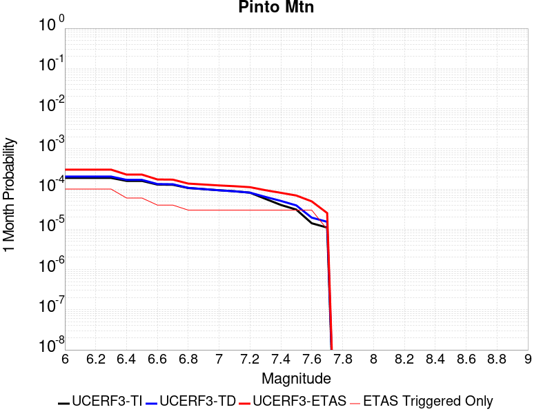 | 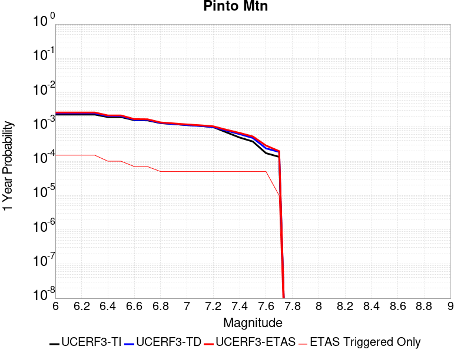 |  |

| Magnitude | 1 wk TI Prob | 1 wk TD Prob | 1 wk ETAS Prob | 1 wk ETAS/TD Gain | 1 wk ETAS Triggered Only | 1 mo TI Prob | 1 mo TD Prob | 1 mo ETAS Prob | 1 mo ETAS/TD Gain | 1 mo ETAS Triggered Only | 1 yr TI Prob | 1 yr TD Prob | 1 yr ETAS Prob | 1 yr ETAS/TD Gain | 1 yr ETAS Triggered Only | 10 yr TI Prob | 10 yr TD Prob | 10 yr ETAS Prob | 10 yr ETAS/TD Gain | 10 yr ETAS Triggered Only |
|-----|-----|-----|-----|-----|-----|-----|-----|-----|-----|-----|-----|-----|-----|-----|-----|-----|-----|-----|-----|-----|
| 6.0 | 4.4194956E-5 | 4.7853926E-5 | 8.785201E-5 | 1.8358371 | 4.0E-5 | 1.893932E-4 | 2.0507304E-4 | 3.0505253E-4 | 1.4875312 | 1.0E-4 | 0.0023034236 | 0.0024940688 | 0.0026436946 | 1.0599927 | 1.5E-4 | 0.022796938 | 0.024678305 | 0.024883123 | 1.0082995 | 2.1E-4 |
| 6.1 | 4.4194956E-5 | 4.7853926E-5 | 8.785201E-5 | 1.8358371 | 4.0E-5 | 1.893932E-4 | 2.0507304E-4 | 3.0505253E-4 | 1.4875312 | 1.0E-4 | 0.0023034236 | 0.0024940688 | 0.0026436946 | 1.0599927 | 1.5E-4 | 0.022796938 | 0.024678305 | 0.024883123 | 1.0082995 | 2.1E-4 |
| 6.2 | 4.4194956E-5 | 4.7853926E-5 | 8.785201E-5 | 1.8358371 | 4.0E-5 | 1.893932E-4 | 2.0507304E-4 | 3.0505253E-4 | 1.4875312 | 1.0E-4 | 0.0023034236 | 0.0024940688 | 0.0026436946 | 1.0599927 | 1.5E-4 | 0.022796938 | 0.024678305 | 0.024883123 | 1.0082995 | 2.1E-4 |
| 6.3 | 4.4194956E-5 | 4.7853926E-5 | 8.785201E-5 | 1.8358371 | 4.0E-5 | 1.893932E-4 | 2.0507304E-4 | 3.0505253E-4 | 1.4875312 | 1.0E-4 | 0.0023034236 | 0.0024940688 | 0.0026436946 | 1.0599927 | 1.5E-4 | 0.022796938 | 0.024678305 | 0.024883123 | 1.0082995 | 2.1E-4 |
| 6.4 | 3.729929E-5 | 3.960349E-5 | 5.96027E-5 | 1.504986 | 2.0E-5 | 1.5984432E-4 | 1.6971873E-4 | 2.2970854E-4 | 1.3534662 | 6.0E-5 | 0.0019443673 | 0.0020644604 | 0.002164254 | 1.0483388 | 1.0E-4 | 0.019274427 | 0.020462848 | 0.020599984 | 1.0067017 | 1.4E-4 |
| 6.5 | 3.729929E-5 | 3.960349E-5 | 5.96027E-5 | 1.504986 | 2.0E-5 | 1.5984432E-4 | 1.6971873E-4 | 2.2970854E-4 | 1.3534662 | 6.0E-5 | 0.0019443673 | 0.0020644604 | 0.002164254 | 1.0483388 | 1.0E-4 | 0.019274427 | 0.020462848 | 0.020599984 | 1.0067017 | 1.4E-4 |
| 6.6 | 3.0204548E-5 | 3.12056E-5 | 5.1204977E-5 | 1.6408906 | 2.0E-5 | 1.2944164E-4 | 1.3373162E-4 | 1.7372628E-4 | 1.2990665 | 4.0E-5 | 0.0015748127 | 0.0016270012 | 0.0016968873 | 1.042954 | 7.0E-5 | 0.015636992 | 0.016154764 | 0.01625315 | 1.0060902 | 1.0E-4 |
| 6.7 | 2.9857754E-5 | 3.0814987E-5 | 5.0814368E-5 | 1.6490148 | 2.0E-5 | 1.2795553E-4 | 1.3205773E-4 | 1.7205245E-4 | 1.3028579 | 4.0E-5 | 0.0015567453 | 0.0016066517 | 0.0016765392 | 1.0434989 | 7.0E-5 | 0.015458848 | 0.015954204 | 0.01605261 | 1.0061679 | 1.0E-4 |
| 6.8 | 2.4819734E-5 | 2.5009665E-5 | 4.5009165E-5 | 1.7996708 | 2.0E-5 | 1.0636595E-4 | 1.0718E-4 | 1.3717679E-4 | 1.279873 | 3.0E-5 | 0.0012942362 | 0.001304157 | 0.0013540918 | 1.038289 | 5.0E-5 | 0.012867244 | 0.012967403 | 0.013036495 | 1.0053282 | 7.0E-5 |
| 6.9 | 2.331124E-5 | 2.3337945E-5 | 4.3337477E-5 | 1.8569535 | 2.0E-5 | 9.990149E-5 | 1.0001605E-4 | 1.3001304E-4 | 1.2999219 | 3.0E-5 | 0.001215622 | 0.0012170355 | 0.0012669746 | 1.0410334 | 5.0E-5 | 0.012089936 | 0.012105897 | 0.012165171 | 1.0048963 | 6.0E-5 |
| 7.0 | 2.1818534E-5 | 2.1761074E-5 | 4.176064E-5 | 1.9190522 | 2.0E-5 | 9.3504656E-5 | 9.3258524E-5 | 1.2325573E-4 | 1.3216565 | 3.0E-5 | 0.0011378246 | 0.0011348509 | 0.0011847942 | 1.0440086 | 5.0E-5 | 0.011320163 | 0.01129266 | 0.011342094 | 1.0043776 | 5.0E-5 |
| 7.1 | 2.066081E-5 | 2.0540718E-5 | 4.0540308E-5 | 1.9736558 | 2.0E-5 | 8.854332E-5 | 8.8028784E-5 | 1.18026146E-4 | 1.3407676 | 3.0E-5 | 0.0010774818 | 0.0010712431 | 0.0011211896 | 1.0466248 | 5.0E-5 | 0.010722724 | 0.0106628435 | 0.010712311 | 1.0046391 | 5.0E-5 |
| 7.2 | 1.8990233E-5 | 1.9054001E-5 | 3.9053622E-5 | 2.0496283 | 2.0E-5 | 8.138417E-5 | 8.165756E-5 | 1.11655114E-4 | 1.3673579 | 3.0E-5 | 9.904018E-4 | 9.937467E-4 | 0.001043697 | 1.0502646 | 5.0E-5 | 0.009859995 | 0.009895029 | 0.009944534 | 1.0050031 | 5.0E-5 |
| 7.3 | 1.3335872E-5 | 1.4906713E-5 | 3.4906414E-5 | 2.3416574 | 2.0E-5 | 5.7152483E-5 | 6.388442E-5 | 9.38825E-5 | 1.4695681 | 3.0E-5 | 6.956093E-4 | 7.77528E-4 | 8.2748913E-4 | 1.0642563 | 5.0E-5 | 0.006934359 | 0.007749376 | 0.0077989884 | 1.0064021 | 5.0E-5 |
| 7.4 | 9.414066E-6 | 1.186096E-5 | 3.1860724E-5 | 2.6861842 | 2.0E-5 | 4.0345374E-5 | 5.083175E-5 | 8.083022E-5 | 1.5901524 | 3.0E-5 | 4.910942E-4 | 6.1871024E-4 | 6.686793E-4 | 1.0807632 | 5.0E-5 | 0.0049001034 | 0.0061708256 | 0.0062205167 | 1.0080526 | 5.0E-5 |
| 7.5 | 7.2101157E-6 | 9.158192E-6 | 2.9158009E-5 | 3.1838171 | 2.0E-5 | 3.090013E-5 | 3.9248847E-5 | 6.924767E-5 | 1.7643236 | 3.0E-5 | 3.7614413E-4 | 4.7775774E-4 | 5.277339E-4 | 1.1046056 | 5.0E-5 | 0.0037550807 | 0.004768082 | 0.0048178434 | 1.0104364 | 5.0E-5 |
| 7.6 | 3.296375E-6 | 4.5455017E-6 | 2.454541E-5 | 5.3999343 | 2.0E-5 | 1.4127245E-5 | 1.9480583E-5 | 4.948E-5 | 2.539965 | 3.0E-5 | 1.7198564E-4 | 2.3715167E-4 | 2.8713982E-4 | 1.2107855 | 5.0E-5 | 0.0017185259 | 0.0023691233 | 0.002419005 | 1.0210549 | 5.0E-5 |
| 7.7 | 2.5741092E-6 | 3.5844084E-6 | 1.3584373E-5 | 3.7898507 | 1.0E-5 | 1.103185E-5 | 1.5361667E-5 | 2.5361514E-5 | 1.650961 | 1.0E-5 | 1.3430449E-4 | 1.8701357E-4 | 1.970117E-4 | 1.053462 | 1.0E-5 | 0.0013422335 | 0.0018686918 | 0.0018786731 | 1.0053413 | 1.0E-5 |

## Santa Cruz Island
*[(top)](#table-of-contents)*

| 1 Week | 1 Month | 1 Year | 10 Year |
|-----|-----|-----|-----|
|  |  |  |  |

| Magnitude | 1 wk TI Prob | 1 wk TD Prob | 1 wk ETAS Prob | 1 wk ETAS/TD Gain | 1 wk ETAS Triggered Only | 1 mo TI Prob | 1 mo TD Prob | 1 mo ETAS Prob | 1 mo ETAS/TD Gain | 1 mo ETAS Triggered Only | 1 yr TI Prob | 1 yr TD Prob | 1 yr ETAS Prob | 1 yr ETAS/TD Gain | 1 yr ETAS Triggered Only | 10 yr TI Prob | 10 yr TD Prob | 10 yr ETAS Prob | 10 yr ETAS/TD Gain | 10 yr ETAS Triggered Only |
|-----|-----|-----|-----|-----|-----|-----|-----|-----|-----|-----|-----|-----|-----|-----|-----|-----|-----|-----|-----|-----|
| 6.0 | 2.9164563E-5 | 3.1599742E-5 | 8.159816E-5 | 2.5822413 | 5.0E-5 | 1.2498499E-4 | 1.3542121E-4 | 1.8541444E-4 | 1.3691684 | 5.0E-5 | 0.0015206301 | 0.0016476426 | 0.0017474778 | 1.0605928 | 1.0E-4 | 0.015102667 | 0.016368 | 0.016545054 | 1.010817 | 1.8E-4 |
| 6.1 | 2.9164563E-5 | 3.1599742E-5 | 8.159816E-5 | 2.5822413 | 5.0E-5 | 1.2498499E-4 | 1.3542121E-4 | 1.8541444E-4 | 1.3691684 | 5.0E-5 | 0.0015206301 | 0.0016476426 | 0.0017474778 | 1.0605928 | 1.0E-4 | 0.015102667 | 0.016368 | 0.016545054 | 1.010817 | 1.8E-4 |
| 6.2 | 2.9164563E-5 | 3.1599742E-5 | 8.159816E-5 | 2.5822413 | 5.0E-5 | 1.2498499E-4 | 1.3542121E-4 | 1.8541444E-4 | 1.3691684 | 5.0E-5 | 0.0015206301 | 0.0016476426 | 0.0017474778 | 1.0605928 | 1.0E-4 | 0.015102667 | 0.016368 | 0.016545054 | 1.010817 | 1.8E-4 |
| 6.3 | 1.6635553E-5 | 1.780436E-5 | 2.780418E-5 | 1.5616502 | 1.0E-5 | 7.1293274E-5 | 7.630227E-5 | 8.63015E-5 | 1.1310477 | 1.0E-5 | 8.6765E-4 | 9.286024E-4 | 9.585745E-4 | 1.0322766 | 3.0E-5 | 0.008642701 | 0.009249094 | 0.009328354 | 1.0085695 | 8.0E-5 |
| 6.4 | 1.6635553E-5 | 1.780436E-5 | 2.780418E-5 | 1.5616502 | 1.0E-5 | 7.1293274E-5 | 7.630227E-5 | 8.63015E-5 | 1.1310477 | 1.0E-5 | 8.6765E-4 | 9.286024E-4 | 9.585745E-4 | 1.0322766 | 3.0E-5 | 0.008642701 | 0.009249094 | 0.009328354 | 1.0085695 | 8.0E-5 |
| 6.5 | 1.2238748E-5 | 1.3042996E-5 | 2.3042865E-5 | 1.766685 | 1.0E-5 | 5.2450723E-5 | 5.5897377E-5 | 6.589682E-5 | 1.1788893 | 1.0E-5 | 6.3840044E-4 | 6.8034173E-4 | 7.1032136E-4 | 1.0440655 | 3.0E-5 | 0.0063656955 | 0.006782988 | 0.006852513 | 1.01025 | 7.0E-5 |
| 6.6 | 1.0489767E-5 | 1.1156636E-5 | 1.1156636E-5 | 1.0 | 0.0 | 4.495537E-5 | 4.781329E-5 | 4.781329E-5 | 1.0 | 0.0 | 5.4719415E-4 | 5.819736E-4 | 6.019619E-4 | 1.0343459 | 2.0E-5 | 0.005458487 | 0.005804736 | 0.0058544455 | 1.0085636 | 5.0E-5 |
| 6.7 | 8.699222E-6 | 9.236783E-6 | 9.236783E-6 | 1.0 | 0.0 | 3.7281847E-5 | 3.958561E-5 | 3.958561E-5 | 1.0 | 0.0 | 4.5381195E-4 | 4.818488E-4 | 4.9184397E-4 | 1.0207434 | 1.0E-5 | 0.0045288634 | 0.004808108 | 0.004847916 | 1.0082793 | 4.0E-5 |
| 6.8 | 8.307732E-6 | 8.8169045E-6 | 8.8169045E-6 | 1.0 | 0.0 | 3.560408E-5 | 3.7786187E-5 | 3.7786187E-5 | 1.0 | 0.0 | 4.3339343E-4 | 4.5995016E-4 | 4.6994555E-4 | 1.0217315 | 1.0E-5 | 0.004325492 | 0.0045900354 | 0.004619898 | 1.0065058 | 3.0E-5 |
| 6.9 | 8.073121E-6 | 8.564939E-6 | 8.564939E-6 | 1.0 | 0.0 | 3.459863E-5 | 3.670637E-5 | 3.670637E-5 | 1.0 | 0.0 | 4.2115687E-4 | 4.4680882E-4 | 4.5680435E-4 | 1.0223709 | 1.0E-5 | 0.004203596 | 0.004459156 | 0.0044890223 | 1.0066978 | 3.0E-5 |
| 7.0 | 7.617019E-6 | 8.074665E-6 | 8.074665E-6 | 1.0 | 0.0 | 3.264396E-5 | 3.4605247E-5 | 3.4605247E-5 | 1.0 | 0.0 | 3.9736772E-4 | 4.2123784E-4 | 4.3123364E-4 | 1.0237296 | 1.0E-5 | 0.003966579 | 0.0042044413 | 0.0042343154 | 1.0071054 | 3.0E-5 |
| 7.1 | 7.1224836E-6 | 7.5457883E-6 | 7.5457883E-6 | 1.0 | 0.0 | 3.052457E-5 | 3.2338692E-5 | 3.2338692E-5 | 1.0 | 0.0 | 3.715733E-4 | 3.9365282E-4 | 3.9365282E-4 | 1.0 | 0.0 | 0.003709526 | 0.0039295983 | 0.0039495192 | 1.0050696 | 2.0E-5 |
| 7.2 | 6.441115E-6 | 6.8273835E-6 | 6.8273835E-6 | 1.0 | 0.0 | 2.7604487E-5 | 2.9259889E-5 | 2.9259889E-5 | 1.0 | 0.0 | 3.360328E-4 | 3.5618115E-4 | 3.5618115E-4 | 1.0 | 0.0 | 0.0033552512 | 0.0035561312 | 0.0035660956 | 1.002802 | 1.0E-5 |
| 7.3 | 5.494274E-6 | 5.8199944E-6 | 5.8199944E-6 | 1.0 | 0.0 | 2.3546674E-5 | 2.4942596E-5 | 2.4942596E-5 | 1.0 | 0.0 | 2.8664304E-4 | 3.03634E-4 | 3.03634E-4 | 1.0 | 0.0 | 0.002862736 | 0.0030322145 | 0.0030421843 | 1.0032879 | 1.0E-5 |
| 7.4 | 4.0802624E-6 | 4.3122564E-6 | 4.3122564E-6 | 1.0 | 0.0 | 1.7486722E-5 | 1.8480969E-5 | 1.8480969E-5 | 1.0 | 0.0 | 2.1288003E-4 | 2.2498264E-4 | 2.2498264E-4 | 1.0 | 0.0 | 0.0021267622 | 0.0022475577 | 0.0022575352 | 1.0044392 | 1.0E-5 |
| 7.5 | 2.3584746E-6 | 2.4753099E-6 | 2.4753099E-6 | 1.0 | 0.0 | 1.0107709E-5 | 1.0608428E-5 | 1.0608428E-5 | 1.0 | 0.0 | 1.2305441E-4 | 1.2915001E-4 | 1.2915001E-4 | 1.0 | 0.0 | 0.0012298629 | 0.0012907545 | 0.0012907545 | 1.0 | 0.0 |
| 7.6 | 9.4981914E-7 | 9.860934E-7 | 9.860934E-7 | 1.0 | 0.0 | 4.0706473E-6 | 4.2261076E-6 | 4.2261076E-6 | 1.0 | 0.0 | 4.9559E-5 | 5.1451658E-5 | 5.1451658E-5 | 1.0 | 0.0 | 4.954795E-4 | 5.1439874E-4 | 5.1439874E-4 | 1.0 | 0.0 |
| 7.7 | 2.6013532E-7 | 2.6416632E-7 | 2.6416632E-7 | 1.0 | 0.0 | 1.1148652E-6 | 1.1321408E-6 | 1.1321408E-6 | 1.0 | 0.0 | 1.3573399E-5 | 1.3783729E-5 | 1.3783729E-5 | 1.0 | 0.0 | 1.357257E-4 | 1.378288E-4 | 1.378288E-4 | 1.0 | 0.0 |
| 7.8 | 4.1522263E-8 | 3.965698E-8 | 3.965698E-8 | 1.0 | 0.0 | 1.7795254E-7 | 1.6995848E-7 | 1.6995848E-7 | 1.0 | 0.0 | 2.16657E-6 | 2.0692428E-6 | 2.0692428E-6 | 1.0 | 0.0 | 2.1665488E-5 | 2.0692256E-5 | 2.0692256E-5 | 1.0 | 0.0 |
| 7.9 | 7.7242046E-10 | 5.9475225E-10 | 5.9475225E-10 | 1.0 | 0.0 | 3.3103735E-9 | 2.5489382E-9 | 2.5489382E-9 | 1.0 | 0.0 | 4.0303796E-8 | 3.1033323E-8 | 3.1033323E-8 | 1.0 | 0.0 | 4.030379E-7 | 3.103332E-7 | 3.103332E-7 | 1.0 | 0.0 |

## Santa Rosa Island
*[(top)](#table-of-contents)*

| 1 Week | 1 Month | 1 Year | 10 Year |
|-----|-----|-----|-----|
|  | 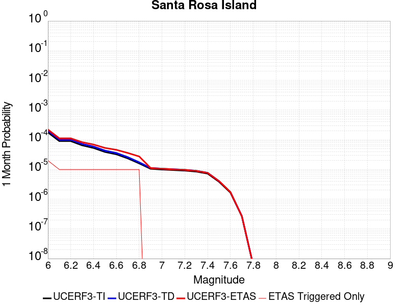 |  | 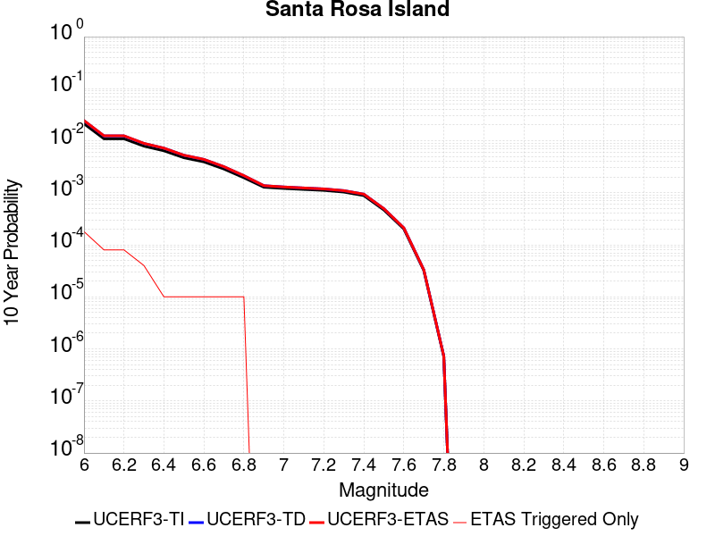 |

| Magnitude | 1 wk TI Prob | 1 wk TD Prob | 1 wk ETAS Prob | 1 wk ETAS/TD Gain | 1 wk ETAS Triggered Only | 1 mo TI Prob | 1 mo TD Prob | 1 mo ETAS Prob | 1 mo ETAS/TD Gain | 1 mo ETAS Triggered Only | 1 yr TI Prob | 1 yr TD Prob | 1 yr ETAS Prob | 1 yr ETAS/TD Gain | 1 yr ETAS Triggered Only | 10 yr TI Prob | 10 yr TD Prob | 10 yr ETAS Prob | 10 yr ETAS/TD Gain | 10 yr ETAS Triggered Only |
|-----|-----|-----|-----|-----|-----|-----|-----|-----|-----|-----|-----|-----|-----|-----|-----|-----|-----|-----|-----|-----|
| 6.0 | 4.1143165E-5 | 4.709113E-5 | 6.7090186E-5 | 1.4246885 | 2.0E-5 | 1.7631594E-4 | 2.0180462E-4 | 2.2180058E-4 | 1.0990858 | 2.0E-5 | 0.002144533 | 0.0024543991 | 0.0025142517 | 1.0243859 | 6.0E-5 | 0.021239553 | 0.024293557 | 0.024469184 | 1.0072293 | 1.8E-4 |
| 6.1 | 2.1061249E-5 | 2.3864959E-5 | 3.3864722E-5 | 1.4190143 | 1.0E-5 | 9.0259375E-5 | 1.0227455E-4 | 1.1227353E-4 | 1.097766 | 1.0E-5 | 0.0010983539 | 0.0012445103 | 0.0012644854 | 1.0160506 | 2.0E-5 | 0.01092941 | 0.01237845 | 0.012457459 | 1.0063828 | 8.0E-5 |
| 6.2 | 2.1061249E-5 | 2.3864959E-5 | 3.3864722E-5 | 1.4190143 | 1.0E-5 | 9.0259375E-5 | 1.0227455E-4 | 1.1227353E-4 | 1.097766 | 1.0E-5 | 0.0010983539 | 0.0012445103 | 0.0012644854 | 1.0160506 | 2.0E-5 | 0.01092941 | 0.01237845 | 0.012457459 | 1.0063828 | 8.0E-5 |
| 6.3 | 1.5158236E-5 | 1.7074419E-5 | 2.7074248E-5 | 1.5856615 | 1.0E-5 | 6.496225E-5 | 7.3174095E-5 | 8.317336E-5 | 1.1366504 | 1.0E-5 | 7.906284E-4 | 8.9054246E-4 | 9.005336E-4 | 1.0112191 | 1.0E-5 | 0.007878214 | 0.00887099 | 0.0089106355 | 1.004469 | 4.0E-5 |
| 6.4 | 1.2341918E-5 | 1.3852917E-5 | 2.3852777E-5 | 1.7218597 | 1.0E-5 | 5.2892858E-5 | 5.9368336E-5 | 6.936774E-5 | 1.16843 | 1.0E-5 | 6.437803E-4 | 7.225779E-4 | 7.325707E-4 | 1.0138294 | 1.0E-5 | 0.006419184 | 0.0072031217 | 0.0072130496 | 1.0013783 | 1.0E-5 |
| 6.5 | 9.061158E-6 | 1.0117032E-5 | 2.011693E-5 | 1.9884223 | 1.0E-5 | 3.883296E-5 | 4.3358017E-5 | 5.335758E-5 | 1.2306279 | 1.0E-5 | 4.726887E-4 | 5.277613E-4 | 5.37756E-4 | 1.018938 | 1.0E-5 | 0.004716845 | 0.0052656177 | 0.0052755647 | 1.0018891 | 1.0E-5 |
| 6.6 | 7.5461685E-6 | 8.400734E-6 | 1.840065E-5 | 2.1903622 | 1.0E-5 | 3.2340322E-5 | 3.600267E-5 | 4.600231E-5 | 1.2777472 | 1.0E-5 | 3.936723E-4 | 4.3824868E-4 | 4.4824427E-4 | 1.0228081 | 1.0E-5 | 0.003929756 | 0.0043742736 | 0.00438423 | 1.0022761 | 1.0E-5 |
| 6.7 | 5.5023775E-6 | 6.087381E-6 | 1.608732E-5 | 2.6427326 | 1.0E-5 | 2.3581404E-5 | 2.6088532E-5 | 3.6088273E-5 | 1.3833002 | 1.0E-5 | 2.8706578E-4 | 3.1758484E-4 | 3.2758166E-4 | 1.0314777 | 1.0E-5 | 0.0028669522 | 0.0031716316 | 0.0031815998 | 1.003143 | 1.0E-5 |
| 6.8 | 3.7351679E-6 | 4.0831405E-6 | 1.40831E-5 | 3.4490852 | 1.0E-5 | 1.6007763E-5 | 1.7499071E-5 | 2.7498896E-5 | 1.5714489 | 1.0E-5 | 1.948771E-4 | 2.1303285E-4 | 2.2303071E-4 | 1.0469311 | 1.0E-5 | 0.0019470629 | 0.0021285315 | 0.00213851 | 1.004688 | 1.0E-5 |
| 6.9 | 2.456366E-6 | 2.6292707E-6 | 2.6292707E-6 | 1.0 | 0.0 | 1.0527241E-5 | 1.1268255E-5 | 1.1268255E-5 | 1.0 | 0.0 | 1.2816161E-4 | 1.3718239E-4 | 1.3718239E-4 | 1.0 | 0.0 | 0.0012808773 | 0.0013709799 | 0.0013709799 | 1.0 | 0.0 |
| 7.0 | 2.3245157E-6 | 2.4827784E-6 | 2.4827784E-6 | 1.0 | 0.0 | 9.962172E-6 | 1.0640436E-5 | 1.0640436E-5 | 1.0 | 0.0 | 1.2128269E-4 | 1.2953962E-4 | 1.2953962E-4 | 1.0 | 0.0 | 0.0012121652 | 0.0012946434 | 0.0012946434 | 1.0 | 0.0 |
| 7.1 | 2.2248344E-6 | 2.37325E-6 | 2.37325E-6 | 1.0 | 0.0 | 9.53497E-6 | 1.0171032E-5 | 1.0171032E-5 | 1.0 | 0.0 | 1.1608207E-4 | 1.238253E-4 | 1.238253E-4 | 1.0 | 0.0 | 0.0011602144 | 0.0012375651 | 0.0012375651 | 1.0 | 0.0 |
| 7.2 | 2.1350402E-6 | 2.2761542E-6 | 2.2761542E-6 | 1.0 | 0.0 | 9.150141E-6 | 9.75491E-6 | 9.75491E-6 | 1.0 | 0.0 | 1.1139726E-4 | 1.1875957E-4 | 1.1875957E-4 | 1.0 | 0.0 | 0.0011134144 | 0.0011869629 | 0.0011869629 | 1.0 | 0.0 |
| 7.3 | 1.9793572E-6 | 2.1087192E-6 | 2.1087192E-6 | 1.0 | 0.0 | 8.482932E-6 | 9.037337E-6 | 9.037337E-6 | 1.0 | 0.0 | 1.032748E-4 | 1.1002403E-4 | 1.1002403E-4 | 1.0 | 0.0 | 0.0010322682 | 0.0010996974 | 0.0010996974 | 1.0 | 0.0 |
| 7.4 | 1.6951194E-6 | 1.8045735E-6 | 1.8045735E-6 | 1.0 | 0.0 | 7.264777E-6 | 7.733864E-6 | 7.733864E-6 | 1.0 | 0.0 | 8.844508E-5 | 9.415574E-5 | 9.415574E-5 | 1.0 | 0.0 | 8.840988E-4 | 9.411601E-4 | 9.411601E-4 | 1.0 | 0.0 |
| 7.5 | 8.987207E-7 | 9.512216E-7 | 9.512216E-7 | 1.0 | 0.0 | 3.8516546E-6 | 4.0766577E-6 | 4.0766577E-6 | 1.0 | 0.0 | 4.6892885E-5 | 4.9632188E-5 | 4.9632188E-5 | 1.0 | 0.0 | 4.688299E-4 | 4.962122E-4 | 4.962122E-4 | 1.0 | 0.0 |
| 7.6 | 3.8783037E-7 | 4.0529335E-7 | 4.0529335E-7 | 1.0 | 0.0 | 1.6621291E-6 | 1.7369704E-6 | 1.7369704E-6 | 1.0 | 0.0 | 2.0236233E-5 | 2.1147416E-5 | 2.1147416E-5 | 1.0 | 0.0 | 2.023439E-4 | 2.114547E-4 | 2.114547E-4 | 1.0 | 0.0 |
| 7.7 | 6.181804E-8 | 6.339047E-8 | 6.339047E-8 | 1.0 | 0.0 | 2.6493444E-7 | 2.7167343E-7 | 2.7167343E-7 | 1.0 | 0.0 | 3.225572E-6 | 3.307619E-6 | 3.307619E-6 | 1.0 | 0.0 | 3.225525E-5 | 3.3075703E-5 | 3.3075703E-5 | 1.0 | 0.0 |
| 7.8 | 1.3704449E-9 | 1.3964153E-9 | 1.3964153E-9 | 1.0 | 0.0 | 5.873335E-9 | 5.984637E-9 | 5.984637E-9 | 1.0 | 0.0 | 7.1507856E-8 | 7.286295E-8 | 7.286295E-8 | 1.0 | 0.0 | 7.1507833E-7 | 7.286294E-7 | 7.286294E-7 | 1.0 | 0.0 |

## Imperial
*[(top)](#table-of-contents)*

| 1 Week | 1 Month | 1 Year | 10 Year |
|-----|-----|-----|-----|
|  |  | 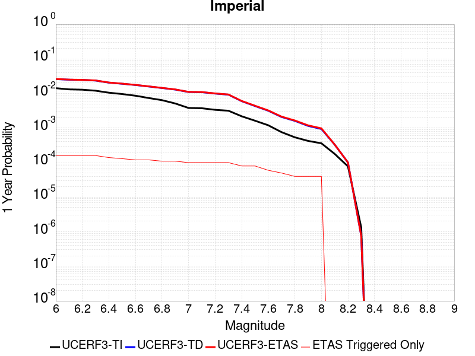 | 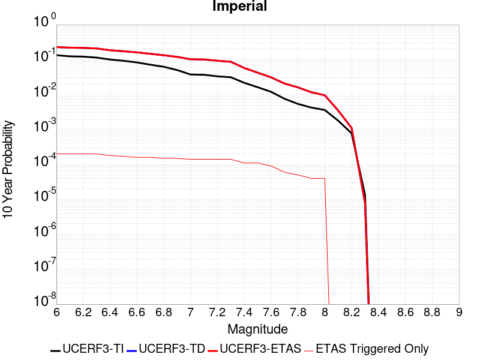 |

| Magnitude | 1 wk TI Prob | 1 wk TD Prob | 1 wk ETAS Prob | 1 wk ETAS/TD Gain | 1 wk ETAS Triggered Only | 1 mo TI Prob | 1 mo TD Prob | 1 mo ETAS Prob | 1 mo ETAS/TD Gain | 1 mo ETAS Triggered Only | 1 yr TI Prob | 1 yr TD Prob | 1 yr ETAS Prob | 1 yr ETAS/TD Gain | 1 yr ETAS Triggered Only | 10 yr TI Prob | 10 yr TD Prob | 10 yr ETAS Prob | 10 yr ETAS/TD Gain | 10 yr ETAS Triggered Only |
|-----|-----|-----|-----|-----|-----|-----|-----|-----|-----|-----|-----|-----|-----|-----|-----|-----|-----|-----|-----|-----|
| 6.0 | 2.7496446E-4 | 5.055345E-4 | 5.854941E-4 | 1.1581683 | 8.0E-5 | 0.0011778869 | 0.002164817 | 0.002274579 | 1.0507026 | 1.1E-4 | 0.0142467655 | 0.026048409 | 0.026204241 | 1.0059824 | 1.6E-4 | 0.13367249 | 0.22807029 | 0.22822468 | 1.0006769 | 2.0E-4 |
| 6.1 | 2.5356023E-4 | 4.8657708E-4 | 5.6653813E-4 | 1.1643338 | 8.0E-5 | 0.001086234 | 0.002083702 | 0.0021934728 | 1.0526806 | 1.1E-4 | 0.013144928 | 0.02507094 | 0.025226926 | 1.0062219 | 1.6E-4 | 0.123940155 | 0.21949561 | 0.21965171 | 1.0007112 | 2.0E-4 |
| 6.2 | 2.4820742E-4 | 4.775311E-4 | 5.574929E-4 | 1.1674484 | 8.0E-5 | 0.0010633124 | 0.0020449946 | 0.0021547696 | 1.0536798 | 1.1E-4 | 0.01286919 | 0.024610676 | 0.024766738 | 1.0063412 | 1.6E-4 | 0.12148927 | 0.21600136 | 0.21615817 | 1.0007259 | 2.0E-4 |
| 6.3 | 2.3205351E-4 | 4.5892023E-4 | 5.388835E-4 | 1.1742423 | 8.0E-5 | 9.94136E-4 | 0.0019653554 | 0.0020751392 | 1.0558596 | 1.1E-4 | 0.012036599 | 0.023661187 | 0.023817401 | 1.0066022 | 1.6E-4 | 0.11405133 | 0.20793827 | 0.20809668 | 1.0007619 | 2.0E-4 |
| 6.4 | 2.0304754E-4 | 3.9878016E-4 | 4.6875223E-4 | 1.1754653 | 7.0E-5 | 8.6991355E-4 | 0.0017079529 | 0.0017977993 | 1.0526047 | 9.0E-5 | 0.010539869 | 0.020595418 | 0.020732535 | 1.0066576 | 1.4E-4 | 0.100537635 | 0.18507113 | 0.18521781 | 1.0007926 | 1.8E-4 |
| 6.5 | 1.854992E-4 | 3.6990462E-4 | 4.3987873E-4 | 1.189168 | 7.0E-5 | 7.9475436E-4 | 0.0015843548 | 0.001664228 | 1.0504137 | 8.0E-5 | 0.009633281 | 0.01911443 | 0.019241944 | 1.0066712 | 1.3E-4 | 0.0922623 | 0.1733039 | 0.17344444 | 1.000811 | 1.7E-4 |
| 6.6 | 1.6586106E-4 | 3.4036173E-4 | 4.103379E-4 | 1.2055936 | 7.0E-5 | 7.106394E-4 | 0.0014578878 | 0.0015377712 | 1.054794 | 8.0E-5 | 0.008617763 | 0.017607626 | 0.017725512 | 1.0066953 | 1.2E-4 | 0.08291132 | 0.16078055 | 0.16091482 | 1.0008352 | 1.6E-4 |
| 6.7 | 1.4224656E-4 | 3.076812E-4 | 3.7765966E-4 | 1.2274382 | 7.0E-5 | 6.094856E-4 | 0.0013179756 | 0.0013978701 | 1.0606191 | 8.0E-5 | 0.0073952693 | 0.015928522 | 0.01604661 | 1.0074136 | 1.2E-4 | 0.07153955 | 0.14648798 | 0.14662455 | 1.0009322 | 1.6E-4 |
| 6.8 | 1.2317259E-4 | 2.779231E-4 | 3.4790364E-4 | 1.2517983 | 7.0E-5 | 5.2777573E-4 | 0.0011905615 | 0.0012704663 | 1.0671152 | 8.0E-5 | 0.0064067547 | 0.014400131 | 0.014508547 | 1.0075288 | 1.1E-4 | 0.06225166 | 0.13294089 | 0.13307095 | 1.0009784 | 1.5E-4 |
| 6.9 | 9.859898E-5 | 2.5015484E-4 | 3.2013733E-4 | 1.2797567 | 7.0E-5 | 4.2249862E-4 | 0.0010716559 | 0.0011515701 | 1.0745708 | 8.0E-5 | 0.0051317946 | 0.012970319 | 0.013078892 | 1.0083709 | 1.1E-4 | 0.05014893 | 0.119408876 | 0.11954096 | 1.0011061 | 1.5E-4 |
| 7.0 | 7.3191884E-5 | 2.1267848E-4 | 2.7266573E-4 | 1.282056 | 6.0E-5 | 3.136418E-4 | 9.11164E-4 | 9.811003E-4 | 1.0767548 | 7.0E-5 | 0.003811904 | 0.011037681 | 0.011136577 | 1.0089599 | 1.0E-4 | 0.037471764 | 0.10206756 | 0.10219327 | 1.0012317 | 1.4E-4 |
| 7.1 | 7.1760296E-5 | 2.0969207E-4 | 2.696795E-4 | 1.2860738 | 6.0E-5 | 3.0750787E-4 | 8.9837395E-4 | 9.683111E-4 | 1.0778486 | 7.0E-5 | 0.003737482 | 0.010883528 | 0.01098244 | 1.0090882 | 1.0E-4 | 0.03675245 | 0.10070406 | 0.10082997 | 1.0012503 | 1.4E-4 |
| 7.2 | 6.46614E-5 | 1.9137723E-4 | 2.5136574E-4 | 1.3134569 | 6.0E-5 | 2.7709085E-4 | 8.199333E-4 | 8.898759E-4 | 1.0853028 | 7.0E-5 | 0.0033683628 | 0.009937617 | 0.010036624 | 1.0099628 | 1.0E-4 | 0.033177625 | 0.092511006 | 0.09263805 | 1.0013733 | 1.4E-4 |
| 7.3 | 6.088115E-5 | 1.780939E-4 | 2.3808322E-4 | 1.3368409 | 6.0E-5 | 2.6089314E-4 | 7.6303916E-4 | 8.3298574E-4 | 1.0916684 | 7.0E-5 | 0.0031717476 | 0.009251006 | 0.009350081 | 1.0107096 | 1.0E-4 | 0.031268585 | 0.08656135 | 0.086689234 | 1.0014774 | 1.4E-4 |
| 7.4 | 4.199346E-5 | 1.1511097E-4 | 1.5510636E-4 | 1.3474507 | 4.0E-5 | 1.7995955E-4 | 4.932403E-4 | 5.4321566E-4 | 1.1013205 | 5.0E-5 | 0.0021888057 | 0.005988835 | 0.006068356 | 1.0132782 | 8.0E-5 | 0.02167372 | 0.05744024 | 0.057543922 | 1.0018051 | 1.1E-4 |
| 7.5 | 3.130448E-5 | 8.333871E-5 | 1.2333538E-4 | 1.479929 | 4.0E-5 | 1.3415517E-4 | 3.5711733E-4 | 4.070995E-4 | 1.13996 | 5.0E-5 | 0.0016321153 | 0.0043392954 | 0.004418948 | 1.0183562 | 8.0E-5 | 0.016201803 | 0.042133506 | 0.042238872 | 1.0025008 | 1.1E-4 |
| 7.6 | 2.3074248E-5 | 6.0849357E-5 | 1.00846926E-4 | 1.6573211 | 4.0E-5 | 9.888588E-5 | 2.6075702E-4 | 3.007466E-4 | 1.1533595 | 4.0E-5 | 0.0012032706 | 0.0031701182 | 0.0032299282 | 1.0188668 | 6.0E-5 | 0.011967761 | 0.03102816 | 0.031115368 | 1.0028106 | 9.0E-5 |
| 7.7 | 1.45864815E-5 | 4.0128452E-5 | 7.012725E-5 | 1.7475692 | 3.0E-5 | 6.2511994E-5 | 1.7196777E-4 | 2.0196261E-4 | 1.1744213 | 3.0E-5 | 7.608177E-4 | 0.0020917025 | 0.002141598 | 1.023854 | 5.0E-5 | 0.007582182 | 0.02062909 | 0.020687852 | 1.0028485 | 6.0E-5 |
| 7.8 | 1.0352979E-5 | 3.096395E-5 | 5.0963332E-5 | 1.6458924 | 2.0E-5 | 4.4369157E-5 | 1.326959E-4 | 1.5269325E-4 | 1.1507006 | 2.0E-5 | 5.400606E-4 | 0.0016143778 | 0.0016543132 | 1.0247374 | 4.0E-5 | 0.0053875 | 0.016017893 | 0.016067091 | 1.0030715 | 5.0E-5 |
| 7.9 | 8.137906E-6 | 2.2151205E-5 | 4.215076E-5 | 1.9028654 | 2.0E-5 | 3.4876273E-5 | 9.493029E-5 | 1.1492839E-4 | 1.2106609 | 2.0E-5 | 4.2453592E-4 | 0.0011551644 | 0.0011951182 | 1.0345871 | 4.0E-5 | 0.004237258 | 0.011618842 | 0.011658378 | 1.0034027 | 4.0E-5 |
| 8.0 | 6.93792E-6 | 1.8010365E-5 | 3.8010006E-5 | 2.1104517 | 2.0E-5 | 2.9733603E-5 | 7.7185E-5 | 9.718346E-5 | 1.2590977 | 2.0E-5 | 3.6194647E-4 | 9.3932304E-4 | 9.792855E-4 | 1.0425439 | 4.0E-5 | 0.0036135751 | 0.009502415 | 0.009542035 | 1.0041695 | 4.0E-5 |
| 8.1 | 3.4286315E-6 | 6.380179E-6 | 6.380179E-6 | 1.0 | 0.0 | 1.4694053E-5 | 2.734334E-5 | 2.734334E-5 | 1.0 | 0.0 | 1.7888541E-4 | 3.3285443E-4 | 3.3285443E-4 | 1.0 | 0.0 | 0.0017874148 | 0.0034863674 | 0.0034863674 | 1.0 | 0.0 |
| 8.2 | 1.4906886E-6 | 1.936633E-6 | 1.936633E-6 | 1.0 | 0.0 | 6.3886496E-6 | 8.2998295E-6 | 8.2998295E-6 | 1.0 | 0.0 | 7.7779034E-5 | 1.0104576E-4 | 1.0104576E-4 | 1.0 | 0.0 | 7.775182E-4 | 0.0011075423 | 0.0011075423 | 1.0 | 0.0 |
| 8.3 | 2.5758007E-8 | 1.4495866E-8 | 1.4495866E-8 | 1.0 | 0.0 | 1.10391454E-7 | 6.212514E-8 | 6.212514E-8 | 1.0 | 0.0 | 1.3440151E-6 | 7.563736E-7 | 7.563736E-7 | 1.0 | 0.0 | 1.344007E-5 | 7.884359E-6 | 7.884359E-6 | 1.0 | 0.0 |

## San Jacinto (Coyote Creek)
*[(top)](#table-of-contents)*

| 1 Week | 1 Month | 1 Year | 10 Year |
|-----|-----|-----|-----|
|  |  |  |  |

| Magnitude | 1 wk TI Prob | 1 wk TD Prob | 1 wk ETAS Prob | 1 wk ETAS/TD Gain | 1 wk ETAS Triggered Only | 1 mo TI Prob | 1 mo TD Prob | 1 mo ETAS Prob | 1 mo ETAS/TD Gain | 1 mo ETAS Triggered Only | 1 yr TI Prob | 1 yr TD Prob | 1 yr ETAS Prob | 1 yr ETAS/TD Gain | 1 yr ETAS Triggered Only | 10 yr TI Prob | 10 yr TD Prob | 10 yr ETAS Prob | 10 yr ETAS/TD Gain | 10 yr ETAS Triggered Only |
|-----|-----|-----|-----|-----|-----|-----|-----|-----|-----|-----|-----|-----|-----|-----|-----|-----|-----|-----|-----|-----|
| 6.0 | 2.7374346E-5 | 2.41444E-5 | 1.0414247E-4 | 4.313318 | 8.0E-5 | 1.1731335E-4 | 1.034719E-4 | 1.9346259E-4 | 1.8697113 | 9.0E-5 | 0.0014273542 | 0.001259045 | 0.0014188435 | 1.1269205 | 1.6E-4 | 0.01418221 | 0.012928195 | 0.01312561 | 1.0152701 | 2.0E-4 |
| 6.1 | 2.7374346E-5 | 2.41444E-5 | 1.0414247E-4 | 4.313318 | 8.0E-5 | 1.1731335E-4 | 1.034719E-4 | 1.9346259E-4 | 1.8697113 | 9.0E-5 | 0.0014273542 | 0.001259045 | 0.0014188435 | 1.1269205 | 1.6E-4 | 0.01418221 | 0.012928195 | 0.01312561 | 1.0152701 | 2.0E-4 |
| 6.2 | 2.7374346E-5 | 2.41444E-5 | 1.0414247E-4 | 4.313318 | 8.0E-5 | 1.1731335E-4 | 1.034719E-4 | 1.9346259E-4 | 1.8697113 | 9.0E-5 | 0.0014273542 | 0.001259045 | 0.0014188435 | 1.1269205 | 1.6E-4 | 0.01418221 | 0.012928195 | 0.01312561 | 1.0152701 | 2.0E-4 |
| 6.3 | 2.7374346E-5 | 2.41444E-5 | 1.0414247E-4 | 4.313318 | 8.0E-5 | 1.1731335E-4 | 1.034719E-4 | 1.9346259E-4 | 1.8697113 | 9.0E-5 | 0.0014273542 | 0.001259045 | 0.0014188435 | 1.1269205 | 1.6E-4 | 0.01418221 | 0.012928195 | 0.01312561 | 1.0152701 | 2.0E-4 |
| 6.4 | 2.7374346E-5 | 2.41444E-5 | 1.0414247E-4 | 4.313318 | 8.0E-5 | 1.1731335E-4 | 1.034719E-4 | 1.9346259E-4 | 1.8697113 | 9.0E-5 | 0.0014273542 | 0.001259045 | 0.0014188435 | 1.1269205 | 1.6E-4 | 0.01418221 | 0.012928195 | 0.01312561 | 1.0152701 | 2.0E-4 |
| 6.5 | 2.7282445E-5 | 2.4030476E-5 | 1.0402856E-4 | 4.3290257 | 8.0E-5 | 1.16919524E-4 | 1.0298371E-4 | 1.9297443E-4 | 1.8738346 | 9.0E-5 | 0.0014225657 | 0.001253108 | 0.0014129076 | 1.1275225 | 1.6E-4 | 0.014134934 | 0.012869522 | 0.013066948 | 1.0153406 | 2.0E-4 |
| 6.6 | 2.7282445E-5 | 2.4030476E-5 | 1.0402856E-4 | 4.3290257 | 8.0E-5 | 1.16919524E-4 | 1.0298371E-4 | 1.9297443E-4 | 1.8738346 | 9.0E-5 | 0.0014225657 | 0.001253108 | 0.0014129076 | 1.1275225 | 1.6E-4 | 0.014134934 | 0.012869522 | 0.013066948 | 1.0153406 | 2.0E-4 |
| 6.7 | 2.7216198E-5 | 2.3955597E-5 | 1.0395368E-4 | 4.339432 | 8.0E-5 | 1.1663563E-4 | 1.02662816E-4 | 1.9265358E-4 | 1.8765663 | 9.0E-5 | 0.0014191137 | 0.0012492058 | 0.001409006 | 1.1279213 | 1.6E-4 | 0.014100855 | 0.012830934 | 0.013028367 | 1.0153873 | 2.0E-4 |
| 6.8 | 2.7078617E-5 | 2.3872815E-5 | 1.0387091E-4 | 4.3510118 | 8.0E-5 | 1.1604605E-4 | 1.0230807E-4 | 1.9229886E-4 | 1.879606 | 9.0E-5 | 0.001411945 | 0.0012448917 | 0.0014046925 | 1.1283653 | 1.6E-4 | 0.014030075 | 0.0127880825 | 0.012985525 | 1.0154395 | 2.0E-4 |
| 6.9 | 2.6982952E-5 | 2.3792329E-5 | 1.0379043E-4 | 4.362348 | 8.0E-5 | 1.15636096E-4 | 1.0196315E-4 | 1.9195398E-4 | 1.8825818 | 9.0E-5 | 0.0014069602 | 0.0012406971 | 0.0014004986 | 1.1287998 | 1.6E-4 | 0.013980856 | 0.012746378 | 0.0129438285 | 1.0154908 | 2.0E-4 |
| 7.0 | 2.6449972E-5 | 2.3369357E-5 | 1.03367485E-4 | 4.4232063 | 8.0E-5 | 1.1335209E-4 | 1.0015055E-4 | 1.9014154E-4 | 1.8985571 | 9.0E-5 | 0.001379188 | 0.0012186535 | 0.0013784586 | 1.1311325 | 1.6E-4 | 0.0137065975 | 0.012527733 | 0.0127252275 | 1.0157646 | 2.0E-4 |
| 7.1 | 2.6257849E-5 | 2.3195396E-5 | 1.0319354E-4 | 4.44888 | 8.0E-5 | 1.1252879E-4 | 9.940507E-5 | 1.8939612E-4 | 1.9052964 | 9.0E-5 | 0.0013691769 | 0.0012095873 | 0.0013693938 | 1.1321166 | 1.6E-4 | 0.013607717 | 0.012437661 | 0.012635173 | 1.0158802 | 2.0E-4 |
| 7.2 | 2.5270041E-5 | 2.2390155E-5 | 1.0238837E-4 | 4.572919 | 8.0E-5 | 1.0829568E-4 | 9.5954296E-5 | 1.8594565E-4 | 1.9378566 | 9.0E-5 | 0.0013177024 | 0.0011676198 | 0.0013274329 | 1.1368709 | 1.6E-4 | 0.013099162 | 0.0120187905 | 0.012216386 | 1.0164406 | 2.0E-4 |
| 7.3 | 2.339701E-5 | 2.1122027E-5 | 1.01120335E-4 | 4.787435 | 8.0E-5 | 1.0026905E-4 | 9.051985E-5 | 1.8051169E-4 | 1.9941671 | 9.0E-5 | 0.001220092 | 0.001101524 | 0.0012613478 | 1.1450933 | 1.6E-4 | 0.012134149 | 0.011357642 | 0.011555371 | 1.0174093 | 2.0E-4 |
| 7.4 | 2.296333E-5 | 2.0852396E-5 | 1.00850724E-4 | 4.8364096 | 8.0E-5 | 9.841056E-5 | 8.936436E-5 | 1.7935631E-4 | 2.0070229 | 9.0E-5 | 0.0011974899 | 0.0010874701 | 0.0012472961 | 1.1469705 | 1.6E-4 | 0.011910575 | 0.011216754 | 0.01141451 | 1.0176305 | 2.0E-4 |
| 7.5 | 2.2188895E-5 | 2.037534E-5 | 1.0037371E-4 | 4.9262347 | 8.0E-5 | 9.50918E-5 | 8.731998E-5 | 1.7731212E-4 | 2.030602 | 9.0E-5 | 0.0011571277 | 0.0010626042 | 0.0012224342 | 1.1504135 | 1.6E-4 | 0.011511209 | 0.010966369 | 0.011164176 | 1.0180376 | 2.0E-4 |
| 7.6 | 2.0013189E-5 | 1.8961666E-5 | 9.896015E-5 | 5.218959 | 8.0E-5 | 8.5767984E-5 | 8.126176E-5 | 1.7125445E-4 | 2.1074421 | 9.0E-5 | 0.001043725 | 9.889146E-4 | 0.0011487564 | 1.1616335 | 1.6E-4 | 0.010388365 | 0.010224371 | 0.010422327 | 1.0193611 | 2.0E-4 |
| 7.7 | 1.7230794E-5 | 1.6743043E-5 | 9.67417E-5 | 5.778024 | 8.0E-5 | 7.384417E-5 | 7.175393E-5 | 1.6174748E-4 | 2.2541966 | 9.0E-5 | 8.986819E-4 | 8.732547E-4 | 0.0010331151 | 1.1830626 | 1.6E-4 | 0.008950562 | 0.00906292 | 0.009261108 | 1.021868 | 2.0E-4 |
| 7.8 | 1.4478809E-5 | 1.499039E-5 | 9.498919E-5 | 6.3366723 | 8.0E-5 | 6.205057E-5 | 6.424295E-5 | 1.5423716E-4 | 2.400842 | 9.0E-5 | 7.552038E-4 | 7.8187784E-4 | 9.317606E-4 | 1.1916958 | 1.5E-4 | 0.0075264242 | 0.008141388 | 0.008329841 | 1.0231476 | 1.9E-4 |
| 7.9 | 1.1114467E-5 | 1.1644517E-5 | 9.164358E-5 | 7.870106 | 8.0E-5 | 4.7632562E-5 | 4.990412E-5 | 1.3989962E-4 | 2.8033683 | 9.0E-5 | 5.797721E-4 | 6.074139E-4 | 7.473288E-4 | 1.2303454 | 1.4E-4 | 0.0057826187 | 0.0063803545 | 0.006559206 | 1.0280316 | 1.8E-4 |
| 8.0 | 9.327402E-6 | 9.8986575E-6 | 8.989787E-5 | 9.081824 | 8.0E-5 | 3.9973966E-5 | 4.2422133E-5 | 1.3241831E-4 | 3.1214442 | 9.0E-5 | 4.8657437E-4 | 5.163676E-4 | 6.562953E-4 | 1.2709846 | 1.4E-4 | 0.0048551033 | 0.00544994 | 0.0056289593 | 1.0328479 | 1.8E-4 |
| 8.1 | 7.0235833E-6 | 6.826985E-6 | 3.682678E-5 | 5.394296 | 3.0E-5 | 3.0100724E-5 | 2.9258183E-5 | 6.925701E-5 | 2.367099 | 4.0E-5 | 3.664147E-4 | 3.5616063E-4 | 4.2613572E-4 | 1.1964705 | 7.0E-5 | 0.003658111 | 0.0037874572 | 0.0038870785 | 1.0263029 | 1.0E-4 |
| 8.2 | 2.0358202E-6 | 8.9912584E-7 | 8.9912584E-7 | 1.0 | 0.0 | 8.724915E-6 | 3.853391E-6 | 3.853391E-6 | 1.0 | 0.0 | 1.06220665E-4 | 4.6914047E-5 | 4.6914047E-5 | 1.0 | 0.0 | 0.001061699 | 5.3239096E-4 | 5.3239096E-4 | 1.0 | 0.0 |
| 8.3 | 2.0051264E-7 | 6.61379E-8 | 6.61379E-8 | 1.0 | 0.0 | 8.5933965E-7 | 2.8344812E-7 | 2.8344812E-7 | 1.0 | 0.0 | 1.046241E-5 | 3.450976E-6 | 3.450976E-6 | 1.0 | 0.0 | 1.0461917E-4 | 4.0120205E-5 | 4.0120205E-5 | 1.0 | 0.0 |

## Deep Springs
*[(top)](#table-of-contents)*

| 1 Week | 1 Month | 1 Year | 10 Year |
|-----|-----|-----|-----|
| 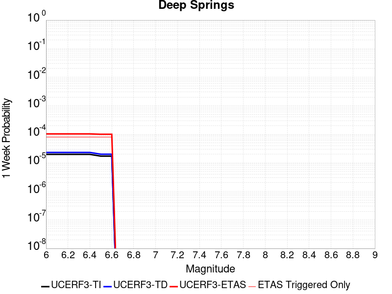 |  | 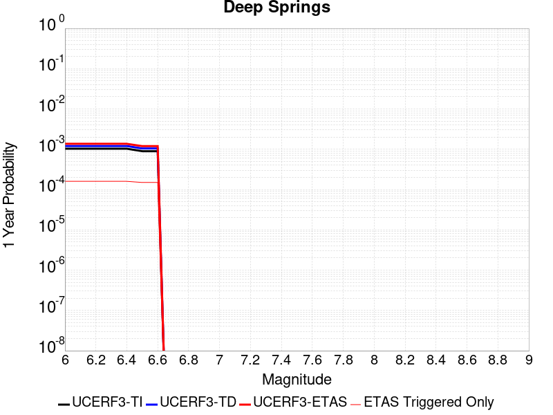 |  |

| Magnitude | 1 wk TI Prob | 1 wk TD Prob | 1 wk ETAS Prob | 1 wk ETAS/TD Gain | 1 wk ETAS Triggered Only | 1 mo TI Prob | 1 mo TD Prob | 1 mo ETAS Prob | 1 mo ETAS/TD Gain | 1 mo ETAS Triggered Only | 1 yr TI Prob | 1 yr TD Prob | 1 yr ETAS Prob | 1 yr ETAS/TD Gain | 1 yr ETAS Triggered Only | 10 yr TI Prob | 10 yr TD Prob | 10 yr ETAS Prob | 10 yr ETAS/TD Gain | 10 yr ETAS Triggered Only |
|-----|-----|-----|-----|-----|-----|-----|-----|-----|-----|-----|-----|-----|-----|-----|-----|-----|-----|-----|-----|-----|
| 6.0 | 1.9810619E-5 | 2.311252E-5 | 1.0311067E-4 | 4.4612474 | 8.0E-5 | 8.489989E-5 | 9.9052755E-5 | 2.0904186E-4 | 2.1104093 | 1.1E-4 | 0.001033166 | 0.0012058078 | 0.0013656149 | 1.1325312 | 1.6E-4 | 0.010283757 | 0.01204243 | 0.012230142 | 1.0155876 | 1.9E-4 |
| 6.1 | 1.9810619E-5 | 2.311252E-5 | 1.0311067E-4 | 4.4612474 | 8.0E-5 | 8.489989E-5 | 9.9052755E-5 | 2.0904186E-4 | 2.1104093 | 1.1E-4 | 0.001033166 | 0.0012058078 | 0.0013656149 | 1.1325312 | 1.6E-4 | 0.010283757 | 0.01204243 | 0.012230142 | 1.0155876 | 1.9E-4 |
| 6.2 | 1.9810619E-5 | 2.311252E-5 | 1.0311067E-4 | 4.4612474 | 8.0E-5 | 8.489989E-5 | 9.9052755E-5 | 2.0904186E-4 | 2.1104093 | 1.1E-4 | 0.001033166 | 0.0012058078 | 0.0013656149 | 1.1325312 | 1.6E-4 | 0.010283757 | 0.01204243 | 0.012230142 | 1.0155876 | 1.9E-4 |
| 6.3 | 1.9810619E-5 | 2.311252E-5 | 1.0311067E-4 | 4.4612474 | 8.0E-5 | 8.489989E-5 | 9.9052755E-5 | 2.0904186E-4 | 2.1104093 | 1.1E-4 | 0.001033166 | 0.0012058078 | 0.0013656149 | 1.1325312 | 1.6E-4 | 0.010283757 | 0.01204243 | 0.012230142 | 1.0155876 | 1.9E-4 |
| 6.4 | 1.9810619E-5 | 2.311252E-5 | 1.0311067E-4 | 4.4612474 | 8.0E-5 | 8.489989E-5 | 9.9052755E-5 | 2.0904186E-4 | 2.1104093 | 1.1E-4 | 0.001033166 | 0.0012058078 | 0.0013656149 | 1.1325312 | 1.6E-4 | 0.010283757 | 0.01204243 | 0.012230142 | 1.0155876 | 1.9E-4 |
| 6.5 | 1.7190405E-5 | 2.0050558E-5 | 1.0004895E-4 | 4.989834 | 8.0E-5 | 7.367108E-5 | 8.593096E-5 | 1.9592152E-4 | 2.2799873 | 1.1E-4 | 8.9657627E-4 | 0.0010462092 | 0.0011960523 | 1.1432247 | 1.5E-4 | 0.008929676 | 0.010462061 | 0.010630283 | 1.0160792 | 1.7E-4 |
| 6.6 | 1.7190405E-5 | 2.0050558E-5 | 1.0004895E-4 | 4.989834 | 8.0E-5 | 7.367108E-5 | 8.593096E-5 | 1.9592152E-4 | 2.2799873 | 1.1E-4 | 8.9657627E-4 | 0.0010462092 | 0.0011960523 | 1.1432247 | 1.5E-4 | 0.008929676 | 0.010462061 | 0.010630283 | 1.0160792 | 1.7E-4 |

## Mission Ridge-Arroyo Parida-Santa Ana
*[(top)](#table-of-contents)*

| 1 Week | 1 Month | 1 Year | 10 Year |
|-----|-----|-----|-----|
|  |  |  | 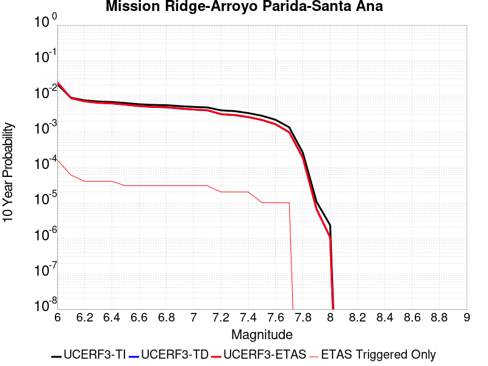 |

| Magnitude | 1 wk TI Prob | 1 wk TD Prob | 1 wk ETAS Prob | 1 wk ETAS/TD Gain | 1 wk ETAS Triggered Only | 1 mo TI Prob | 1 mo TD Prob | 1 mo ETAS Prob | 1 mo ETAS/TD Gain | 1 mo ETAS Triggered Only | 1 yr TI Prob | 1 yr TD Prob | 1 yr ETAS Prob | 1 yr ETAS/TD Gain | 1 yr ETAS Triggered Only | 10 yr TI Prob | 10 yr TD Prob | 10 yr ETAS Prob | 10 yr ETAS/TD Gain | 10 yr ETAS Triggered Only |
|-----|-----|-----|-----|-----|-----|-----|-----|-----|-----|-----|-----|-----|-----|-----|-----|-----|-----|-----|-----|-----|
| 6.0 | 4.169034E-5 | 4.7137048E-5 | 5.7136574E-5 | 1.2121373 | 1.0E-5 | 1.7866064E-4 | 2.0200513E-4 | 2.220011E-4 | 1.0989873 | 2.0E-5 | 0.0021730233 | 0.0024574657 | 0.00255722 | 1.0405923 | 1.0E-4 | 0.021518968 | 0.02438483 | 0.024540927 | 1.0064014 | 1.6E-4 |
| 6.1 | 1.73813E-5 | 1.6854203E-5 | 2.6854035E-5 | 1.5933138 | 1.0E-5 | 7.4489166E-5 | 7.223036E-5 | 8.2229635E-5 | 1.138436 | 1.0E-5 | 9.065282E-4 | 8.790605E-4 | 9.3900773E-4 | 1.0681947 | 6.0E-5 | 0.009028391 | 0.008757128 | 0.008816604 | 1.0067916 | 6.0E-5 |
| 6.2 | 1.4622182E-5 | 1.3673262E-5 | 2.3673127E-5 | 1.7313443 | 1.0E-5 | 6.2664985E-5 | 5.85984E-5 | 6.8597816E-5 | 1.1706431 | 1.0E-5 | 7.6267915E-4 | 7.132059E-4 | 7.531774E-4 | 1.0560448 | 4.0E-5 | 0.007600669 | 0.007109767 | 0.0071494826 | 1.005586 | 4.0E-5 |
| 6.3 | 1.3552434E-5 | 1.2482174E-5 | 2.2482049E-5 | 1.8011326 | 1.0E-5 | 5.8080568E-5 | 5.349395E-5 | 6.349342E-5 | 1.1869271 | 1.0E-5 | 7.069015E-4 | 6.510974E-4 | 6.910713E-4 | 1.0613947 | 4.0E-5 | 0.00704657 | 0.006492415 | 0.006532155 | 1.006121 | 4.0E-5 |
| 6.4 | 1.30977305E-5 | 1.1979128E-5 | 2.1979009E-5 | 1.8347752 | 1.0E-5 | 5.613192E-5 | 5.133813E-5 | 6.133762E-5 | 1.194777 | 1.0E-5 | 6.831918E-4 | 6.2486547E-4 | 6.648405E-4 | 1.0639738 | 4.0E-5 | 0.006810953 | 0.006231584 | 0.006271335 | 1.0063789 | 4.0E-5 |
| 6.5 | 1.225205E-5 | 1.1048776E-5 | 2.1048665E-5 | 1.9050677 | 1.0E-5 | 5.2507727E-5 | 4.735105E-5 | 5.735058E-5 | 1.2111785 | 1.0E-5 | 6.3909404E-4 | 5.7634927E-4 | 6.06332E-4 | 1.0520217 | 3.0E-5 | 0.006372592 | 0.005749009 | 0.0057788366 | 1.0051883 | 3.0E-5 |
| 6.6 | 1.1352241E-5 | 1.0063508E-5 | 2.0063408E-5 | 1.9936793 | 1.0E-5 | 4.8651553E-5 | 4.3128617E-5 | 5.3128188E-5 | 1.2318546 | 1.0E-5 | 5.921717E-4 | 5.249665E-4 | 5.549508E-4 | 1.0571165 | 3.0E-5 | 0.0059059616 | 0.0052376646 | 0.0052675074 | 1.0056977 | 3.0E-5 |
| 6.7 | 1.0864116E-5 | 9.517E-6 | 1.9516905E-5 | 2.0507412 | 1.0E-5 | 4.6559664E-5 | 4.0786515E-5 | 5.0786108E-5 | 1.245169 | 1.0E-5 | 5.667165E-4 | 4.964647E-4 | 5.264498E-4 | 1.0603973 | 3.0E-5 | 0.005652734 | 0.0049539437 | 0.0049837953 | 1.0060258 | 3.0E-5 |
| 6.8 | 1.0666365E-5 | 9.299752E-6 | 1.929966E-5 | 2.0752876 | 1.0E-5 | 4.571219E-5 | 3.985548E-5 | 4.9855083E-5 | 1.2508966 | 1.0E-5 | 5.564038E-4 | 4.8513446E-4 | 5.151199E-4 | 1.0618086 | 3.0E-5 | 0.005550127 | 0.00484114 | 0.004870995 | 1.0061669 | 3.0E-5 |
| 6.9 | 1.0038665E-5 | 8.592018E-6 | 1.8591933E-5 | 2.1638608 | 1.0E-5 | 4.302214E-5 | 3.682243E-5 | 4.6822057E-5 | 1.2715636 | 1.0E-5 | 5.236687E-4 | 4.4822265E-4 | 4.782092E-4 | 1.066901 | 3.0E-5 | 0.005224364 | 0.0044735507 | 0.004503417 | 1.0066761 | 3.0E-5 |
| 7.0 | 9.5379955E-6 | 8.025047E-6 | 1.8024966E-5 | 2.2460887 | 1.0E-5 | 4.0876483E-5 | 3.439261E-5 | 4.439227E-5 | 1.2907501 | 1.0E-5 | 4.975576E-4 | 4.1865133E-4 | 4.4863875E-4 | 1.0716287 | 3.0E-5 | 0.00496445 | 0.00417898 | 0.0042088544 | 1.0071487 | 3.0E-5 |
| 7.1 | 9.207389E-6 | 7.652347E-6 | 1.7652272E-5 | 2.3067784 | 1.0E-5 | 3.945964E-5 | 3.2795375E-5 | 4.2795047E-5 | 1.304911 | 1.0E-5 | 4.803152E-4 | 3.992122E-4 | 4.2920024E-4 | 1.075118 | 3.0E-5 | 0.004792784 | 0.003985301 | 0.0040151817 | 1.0074977 | 3.0E-5 |
| 7.2 | 7.638091E-6 | 5.9310923E-6 | 1.5931033E-5 | 2.6860201 | 1.0E-5 | 3.2734264E-5 | 2.5418722E-5 | 3.5418467E-5 | 1.3934008 | 1.0E-5 | 3.984668E-4 | 3.094293E-4 | 3.294231E-4 | 1.0646151 | 2.0E-5 | 0.0039775306 | 0.0030901956 | 0.0031101338 | 1.0064521 | 2.0E-5 |
| 7.3 | 7.2500147E-6 | 5.596131E-6 | 1.5596075E-5 | 2.786939 | 1.0E-5 | 3.1071122E-5 | 2.3983199E-5 | 3.398296E-5 | 1.4169486 | 1.0E-5 | 3.7822526E-4 | 2.9195662E-4 | 3.1195077E-4 | 1.0684834 | 2.0E-5 | 0.0037758215 | 0.0029159402 | 0.002935882 | 1.0068388 | 2.0E-5 |
| 7.4 | 6.3899715E-6 | 4.9184864E-6 | 1.4918437E-5 | 3.033136 | 1.0E-5 | 2.7385306E-5 | 2.1079059E-5 | 3.107885E-5 | 1.4743944 | 1.0E-5 | 3.3336508E-4 | 2.566075E-4 | 2.7660237E-4 | 1.0779201 | 2.0E-5 | 0.0033286542 | 0.002563311 | 0.0025832597 | 1.0077825 | 2.0E-5 |
| 7.5 | 5.379025E-6 | 4.0838477E-6 | 4.0838477E-6 | 1.0 | 0.0 | 2.305276E-5 | 1.7502087E-5 | 1.7502087E-5 | 1.0 | 0.0 | 2.806312E-4 | 2.1306718E-4 | 2.2306504E-4 | 1.0469235 | 1.0E-5 | 0.0028027708 | 0.0021286402 | 0.0021386188 | 1.0046878 | 1.0E-5 |
| 7.6 | 4.1270696E-6 | 3.0883373E-6 | 3.0883373E-6 | 1.0 | 0.0 | 1.768732E-5 | 1.32356645E-5 | 1.32356645E-5 | 1.0 | 0.0 | 2.1532185E-4 | 1.6113237E-4 | 1.7113076E-4 | 1.0620508 | 1.0E-5 | 0.0021511333 | 0.0016101635 | 0.0016201474 | 1.0062006 | 1.0E-5 |
| 7.7 | 2.5406805E-6 | 1.8282044E-6 | 1.8282044E-6 | 1.0 | 0.0 | 1.0888585E-5 | 7.835139E-6 | 7.835139E-6 | 1.0 | 0.0 | 1.3256045E-4 | 9.53887E-5 | 1.0538774E-4 | 1.1048242 | 1.0E-5 | 0.0013248142 | 9.534837E-4 | 9.6347416E-4 | 1.0104779 | 1.0E-5 |
| 7.8 | 4.8608285E-7 | 3.509864E-7 | 3.509864E-7 | 1.0 | 0.0 | 2.0832106E-6 | 1.5042266E-6 | 1.5042266E-6 | 1.0 | 0.0 | 2.5362791E-5 | 1.8313805E-5 | 1.8313805E-5 | 1.0 | 0.0 | 2.5359896E-4 | 1.8312308E-4 | 1.8312308E-4 | 1.0 | 0.0 |
| 7.9 | 2.0472514E-8 | 1.2688718E-8 | 1.2688718E-8 | 1.0 | 0.0 | 8.7739345E-8 | 5.438022E-8 | 5.438022E-8 | 1.0 | 0.0 | 1.068226E-6 | 6.6207895E-7 | 6.6207895E-7 | 1.0 | 0.0 | 1.0682209E-5 | 6.620771E-6 | 6.620771E-6 | 1.0 | 0.0 |
| 8.0 | 4.443582E-9 | 2.032067E-9 | 2.032067E-9 | 1.0 | 0.0 | 1.9043922E-8 | 8.7088585E-9 | 8.7088585E-9 | 1.0 | 0.0 | 2.3185973E-7 | 1.0603035E-7 | 1.0603035E-7 | 1.0 | 0.0 | 2.3185949E-6 | 1.0603031E-6 | 1.0603031E-6 | 1.0 | 0.0 |

## Red Mountain
*[(top)](#table-of-contents)*

| 1 Week | 1 Month | 1 Year | 10 Year |
|-----|-----|-----|-----|
|  |  |  |  |

| Magnitude | 1 wk TI Prob | 1 wk TD Prob | 1 wk ETAS Prob | 1 wk ETAS/TD Gain | 1 wk ETAS Triggered Only | 1 mo TI Prob | 1 mo TD Prob | 1 mo ETAS Prob | 1 mo ETAS/TD Gain | 1 mo ETAS Triggered Only | 1 yr TI Prob | 1 yr TD Prob | 1 yr ETAS Prob | 1 yr ETAS/TD Gain | 1 yr ETAS Triggered Only | 10 yr TI Prob | 10 yr TD Prob | 10 yr ETAS Prob | 10 yr ETAS/TD Gain | 10 yr ETAS Triggered Only |
|-----|-----|-----|-----|-----|-----|-----|-----|-----|-----|-----|-----|-----|-----|-----|-----|-----|-----|-----|-----|-----|
| 6.0 | 4.1810763E-5 | 4.7590016E-5 | 6.758906E-5 | 1.4202362 | 2.0E-5 | 1.7917668E-4 | 2.039422E-4 | 2.2393811E-4 | 1.098047 | 2.0E-5 | 0.0021792934 | 0.0024803334 | 0.0025701101 | 1.0361954 | 9.0E-5 | 0.021580452 | 0.02454411 | 0.02467092 | 1.0051665 | 1.3E-4 |
| 6.1 | 4.1810763E-5 | 4.7590016E-5 | 6.758906E-5 | 1.4202362 | 2.0E-5 | 1.7917668E-4 | 2.039422E-4 | 2.2393811E-4 | 1.098047 | 2.0E-5 | 0.0021792934 | 0.0024803334 | 0.0025701101 | 1.0361954 | 9.0E-5 | 0.021580452 | 0.02454411 | 0.02467092 | 1.0051665 | 1.3E-4 |
| 6.2 | 4.1810763E-5 | 4.7590016E-5 | 6.758906E-5 | 1.4202362 | 2.0E-5 | 1.7917668E-4 | 2.039422E-4 | 2.2393811E-4 | 1.098047 | 2.0E-5 | 0.0021792934 | 0.0024803334 | 0.0025701101 | 1.0361954 | 9.0E-5 | 0.021580452 | 0.02454411 | 0.02467092 | 1.0051665 | 1.3E-4 |
| 6.3 | 4.1810763E-5 | 4.7590016E-5 | 6.758906E-5 | 1.4202362 | 2.0E-5 | 1.7917668E-4 | 2.039422E-4 | 2.2393811E-4 | 1.098047 | 2.0E-5 | 0.0021792934 | 0.0024803334 | 0.0025701101 | 1.0361954 | 9.0E-5 | 0.021580452 | 0.02454411 | 0.02467092 | 1.0051665 | 1.3E-4 |
| 6.4 | 4.1810763E-5 | 4.7590016E-5 | 6.758906E-5 | 1.4202362 | 2.0E-5 | 1.7917668E-4 | 2.039422E-4 | 2.2393811E-4 | 1.098047 | 2.0E-5 | 0.0021792934 | 0.0024803334 | 0.0025701101 | 1.0361954 | 9.0E-5 | 0.021580452 | 0.02454411 | 0.02467092 | 1.0051665 | 1.3E-4 |
| 6.5 | 3.154503E-5 | 3.5359757E-5 | 4.5359404E-5 | 1.2827973 | 1.0E-5 | 1.3518598E-4 | 1.5153353E-4 | 1.6153202E-4 | 1.065982 | 1.0E-5 | 0.0016446467 | 0.0018434518 | 0.0019233043 | 1.0433168 | 8.0E-5 | 0.01632528 | 0.018291244 | 0.018399233 | 1.0059038 | 1.1E-4 |
| 6.6 | 3.1535834E-5 | 3.5349138E-5 | 4.5348785E-5 | 1.2828823 | 1.0E-5 | 1.3514658E-4 | 1.5148803E-4 | 1.6148652E-4 | 1.0660018 | 1.0E-5 | 0.0016441676 | 0.0018428987 | 0.0019227513 | 1.0433298 | 8.0E-5 | 0.01632056 | 0.018285805 | 0.018393794 | 1.0059056 | 1.1E-4 |
| 6.7 | 2.8267326E-5 | 3.1469353E-5 | 4.146904E-5 | 1.3177595 | 1.0E-5 | 1.2114006E-4 | 1.3486217E-4 | 1.4486082E-4 | 1.0741398 | 1.0E-5 | 0.0014738824 | 0.0016407954 | 0.0016907133 | 1.030423 | 5.0E-5 | 0.014641452 | 0.01629557 | 0.016374268 | 1.0048293 | 8.0E-5 |
| 6.8 | 2.8212884E-5 | 3.1407242E-5 | 4.1406925E-5 | 1.3183879 | 1.0E-5 | 1.20906756E-4 | 1.3459599E-4 | 1.4459465E-4 | 1.0742865 | 1.0E-5 | 0.0014710457 | 0.0016375595 | 0.0016874777 | 1.0304832 | 5.0E-5 | 0.014613459 | 0.016263688 | 0.016342387 | 1.004839 | 8.0E-5 |
| 6.9 | 2.4227871E-5 | 2.6706994E-5 | 3.6706726E-5 | 1.3744237 | 1.0E-5 | 1.03829596E-4 | 1.1445395E-4 | 1.2445281E-4 | 1.0873613 | 1.0E-5 | 0.0012633923 | 0.0013926621 | 0.0014425924 | 1.0358524 | 5.0E-5 | 0.012562336 | 0.0138470335 | 0.013925926 | 1.0056974 | 8.0E-5 |
| 7.0 | 2.348524E-5 | 2.5835778E-5 | 3.583552E-5 | 1.3870502 | 1.0E-5 | 1.0064714E-4 | 1.10720495E-4 | 1.20719385E-4 | 1.0903075 | 1.0E-5 | 0.0012246901 | 0.001347264 | 0.0013971967 | 1.0370623 | 5.0E-5 | 0.012179627 | 0.013398598 | 0.013477526 | 1.0058907 | 8.0E-5 |
| 7.1 | 2.2311642E-5 | 2.4462845E-5 | 3.44626E-5 | 1.4087732 | 1.0E-5 | 9.561782E-5 | 1.04836974E-4 | 1.1483592E-4 | 1.0953763 | 1.0E-5 | 0.0011635252 | 0.0012757176 | 0.0013256537 | 1.0391437 | 5.0E-5 | 0.01157452 | 0.01269146 | 0.012770444 | 1.0062234 | 8.0E-5 |
| 7.2 | 1.6533986E-5 | 1.7670362E-5 | 2.7670185E-5 | 1.5659094 | 1.0E-5 | 7.085802E-5 | 7.572828E-5 | 8.572753E-5 | 1.1320411 | 1.0E-5 | 8.623549E-4 | 9.2166534E-4 | 9.6162845E-4 | 1.0433598 | 4.0E-5 | 0.008590161 | 0.009184707 | 0.0092540635 | 1.0075513 | 7.0E-5 |
| 7.3 | 1.4703092E-5 | 1.5559537E-5 | 2.555938E-5 | 1.6426827 | 1.0E-5 | 6.301173E-5 | 6.668237E-5 | 7.66817E-5 | 1.1499547 | 1.0E-5 | 7.668978E-4 | 8.1161706E-4 | 8.4159273E-4 | 1.0369333 | 3.0E-5 | 0.0076425658 | 0.008092604 | 0.008152118 | 1.0073541 | 6.0E-5 |
| 7.4 | 6.1331984E-6 | 5.5288874E-6 | 1.5528833E-5 | 2.8086722 | 1.0E-5 | 2.6284872E-5 | 2.3695018E-5 | 3.369478E-5 | 1.4220196 | 1.0E-5 | 3.199713E-4 | 2.884492E-4 | 3.084434E-4 | 1.0693163 | 2.0E-5 | 0.0031951098 | 0.0028808024 | 0.002910716 | 1.0103837 | 3.0E-5 |
| 7.5 | 5.954766E-6 | 5.338517E-6 | 5.338517E-6 | 1.0 | 0.0 | 2.5520176E-5 | 2.2879161E-5 | 2.2879161E-5 | 1.0 | 0.0 | 3.1066386E-4 | 2.785187E-4 | 2.885159E-4 | 1.0358943 | 1.0E-5 | 0.003102299 | 0.0027817504 | 0.0028016947 | 1.0071697 | 2.0E-5 |
| 7.6 | 4.9726646E-6 | 4.315309E-6 | 4.315309E-6 | 1.0 | 0.0 | 2.1311245E-5 | 1.8494053E-5 | 1.8494053E-5 | 1.0 | 0.0 | 2.5943352E-4 | 2.2514217E-4 | 2.3513992E-4 | 1.0444064 | 1.0E-5 | 0.0025913084 | 0.0022491754 | 0.0022691304 | 1.0088722 | 2.0E-5 |
| 7.7 | 3.3613894E-6 | 2.8526886E-6 | 2.8526886E-6 | 1.0 | 0.0 | 1.4405875E-5 | 1.22257525E-5 | 1.22257525E-5 | 1.0 | 0.0 | 1.7537741E-4 | 1.4883863E-4 | 1.5883715E-4 | 1.0671768 | 1.0E-5 | 0.0017523908 | 0.0014874157 | 0.0014974009 | 1.006713 | 1.0E-5 |
| 7.8 | 1.1828961E-6 | 1.0122935E-6 | 1.0122935E-6 | 1.0 | 0.0 | 5.069545E-6 | 4.338394E-6 | 4.338394E-6 | 1.0 | 0.0 | 6.171996E-5 | 5.281869E-5 | 5.281869E-5 | 1.0 | 0.0 | 6.170282E-4 | 5.280643E-4 | 5.280643E-4 | 1.0 | 0.0 |
| 7.9 | 2.2967266E-7 | 1.861919E-7 | 1.861919E-7 | 1.0 | 0.0 | 9.843111E-7 | 7.97965E-7 | 7.97965E-7 | 1.0 | 0.0 | 1.19839215E-5 | 9.715184E-6 | 9.715184E-6 | 1.0 | 0.0 | 1.1983275E-4 | 9.714788E-5 | 9.714788E-5 | 1.0 | 0.0 |

## Camp Rock 2011
*[(top)](#table-of-contents)*

| 1 Week | 1 Month | 1 Year | 10 Year |
|-----|-----|-----|-----|
|  |  |  | 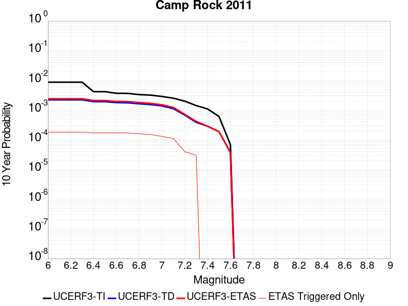 |

| Magnitude | 1 wk TI Prob | 1 wk TD Prob | 1 wk ETAS Prob | 1 wk ETAS/TD Gain | 1 wk ETAS Triggered Only | 1 mo TI Prob | 1 mo TD Prob | 1 mo ETAS Prob | 1 mo ETAS/TD Gain | 1 mo ETAS Triggered Only | 1 yr TI Prob | 1 yr TD Prob | 1 yr ETAS Prob | 1 yr ETAS/TD Gain | 1 yr ETAS Triggered Only | 10 yr TI Prob | 10 yr TD Prob | 10 yr ETAS Prob | 10 yr ETAS/TD Gain | 10 yr ETAS Triggered Only |
|-----|-----|-----|-----|-----|-----|-----|-----|-----|-----|-----|-----|-----|-----|-----|-----|-----|-----|-----|-----|-----|
| 6.0 | 1.6710783E-5 | 4.249999E-6 | 5.4249787E-5 | 12.764658 | 5.0E-5 | 7.161568E-5 | 1.8214158E-5 | 8.821288E-5 | 4.8430943 | 7.0E-5 | 8.7157206E-4 | 2.2173533E-4 | 3.3171094E-4 | 1.4959769 | 1.1E-4 | 0.008681616 | 0.0022151938 | 0.002394795 | 1.081077 | 1.8E-4 |
| 6.1 | 1.6710783E-5 | 4.249999E-6 | 5.4249787E-5 | 12.764658 | 5.0E-5 | 7.161568E-5 | 1.8214158E-5 | 8.821288E-5 | 4.8430943 | 7.0E-5 | 8.7157206E-4 | 2.2173533E-4 | 3.3171094E-4 | 1.4959769 | 1.1E-4 | 0.008681616 | 0.0022151938 | 0.002394795 | 1.081077 | 1.8E-4 |
| 6.2 | 1.6710783E-5 | 4.249999E-6 | 5.4249787E-5 | 12.764658 | 5.0E-5 | 7.161568E-5 | 1.8214158E-5 | 8.821288E-5 | 4.8430943 | 7.0E-5 | 8.7157206E-4 | 2.2173533E-4 | 3.3171094E-4 | 1.4959769 | 1.1E-4 | 0.008681616 | 0.0022151938 | 0.002394795 | 1.081077 | 1.8E-4 |
| 6.3 | 1.6710783E-5 | 4.249999E-6 | 5.4249787E-5 | 12.764658 | 5.0E-5 | 7.161568E-5 | 1.8214158E-5 | 8.821288E-5 | 4.8430943 | 7.0E-5 | 8.7157206E-4 | 2.2173533E-4 | 3.3171094E-4 | 1.4959769 | 1.1E-4 | 0.008681616 | 0.0022151938 | 0.002394795 | 1.081077 | 1.8E-4 |
| 6.4 | 7.982846E-6 | 3.6820359E-6 | 4.368189E-5 | 11.863515 | 4.0E-5 | 3.421175E-5 | 1.578006E-5 | 7.577911E-5 | 4.802207 | 6.0E-5 | 4.1644843E-4 | 1.9210564E-4 | 2.9208642E-4 | 1.5204469 | 1.0E-4 | 0.0041566887 | 0.0019194306 | 0.0020891044 | 1.088398 | 1.7E-4 |
| 6.5 | 7.982846E-6 | 3.6820359E-6 | 4.368189E-5 | 11.863515 | 4.0E-5 | 3.421175E-5 | 1.578006E-5 | 7.577911E-5 | 4.802207 | 6.0E-5 | 4.1644843E-4 | 1.9210564E-4 | 2.9208642E-4 | 1.5204469 | 1.0E-4 | 0.0041566887 | 0.0019194306 | 0.0020891044 | 1.088398 | 1.7E-4 |
| 6.6 | 7.048869E-6 | 3.4242998E-6 | 4.3424163E-5 | 12.68118 | 4.0E-5 | 3.0209088E-5 | 1.467549E-5 | 7.467461E-5 | 5.0883894 | 6.0E-5 | 3.677336E-4 | 1.7865976E-4 | 2.786419E-4 | 1.5596231 | 1.0E-4 | 0.0036712566 | 0.0017851929 | 0.0019548894 | 1.0950578 | 1.7E-4 |
| 6.7 | 6.987307E-6 | 3.3622775E-6 | 4.3362143E-5 | 12.896658 | 4.0E-5 | 2.9945259E-5 | 1.4409683E-5 | 7.440882E-5 | 5.163807 | 6.0E-5 | 3.6452254E-4 | 1.7542407E-4 | 2.7540652E-4 | 1.5699472 | 1.0E-4 | 0.0036392517 | 0.0017528872 | 0.0019225891 | 1.0968128 | 1.7E-4 |
| 6.8 | 6.3737602E-6 | 3.1178672E-6 | 3.3117773E-5 | 10.621932 | 3.0E-5 | 2.731583E-5 | 1.3362222E-5 | 6.336156E-5 | 4.7418427 | 5.0E-5 | 3.3251947E-4 | 1.6267318E-4 | 2.5265856E-4 | 1.5531665 | 9.0E-5 | 0.0033202237 | 0.0016255698 | 0.0017853096 | 1.0982671 | 1.6E-4 |
| 6.9 | 6.112211E-6 | 2.933078E-6 | 2.293302E-5 | 7.818755 | 2.0E-5 | 2.6194928E-5 | 1.2570275E-5 | 5.2569772E-5 | 4.1820703 | 4.0E-5 | 3.1887658E-4 | 1.5303263E-4 | 2.3302039E-4 | 1.5226843 | 8.0E-5 | 0.003184194 | 0.0015293002 | 0.0016790709 | 1.0979341 | 1.5E-4 |
| 7.0 | 5.5140117E-6 | 2.64191E-6 | 1.2641884E-5 | 4.7851305 | 1.0E-5 | 2.3631264E-5 | 1.1322423E-5 | 3.1322197E-5 | 2.7663863 | 2.0E-5 | 2.8767265E-4 | 1.3784204E-4 | 1.9783377E-4 | 1.4352208 | 6.0E-5 | 0.0028730053 | 0.0013775907 | 0.0015074116 | 1.0942377 | 1.3E-4 |
| 7.1 | 4.8151105E-6 | 2.1342612E-6 | 1.213424E-5 | 5.6854525 | 1.0E-5 | 2.0636026E-5 | 9.146803E-6 | 2.914662E-5 | 3.1865366 | 2.0E-5 | 2.5121463E-4 | 1.1135685E-4 | 1.6135129E-4 | 1.448957 | 5.0E-5 | 0.0025093083 | 0.0011130325 | 0.00122291 | 1.0987191 | 1.1E-4 |
| 7.2 | 3.818335E-6 | 1.2937372E-6 | 1.2937372E-6 | 1.0 | 0.0 | 1.6364189E-5 | 5.5445767E-6 | 5.5445767E-6 | 1.0 | 0.0 | 1.9921579E-4 | 6.750321E-5 | 7.750254E-5 | 1.1481311 | 1.0E-5 | 0.0019903728 | 6.7483535E-4 | 7.1480835E-4 | 1.0592337 | 4.0E-5 |
| 7.3 | 2.7166698E-6 | 7.383078E-7 | 7.383078E-7 | 1.0 | 0.0 | 1.1642818E-5 | 3.1641725E-6 | 3.1641725E-6 | 1.0 | 0.0 | 1.4174209E-4 | 3.852314E-5 | 4.8522754E-5 | 1.2595743 | 1.0E-5 | 0.0014165172 | 3.8516664E-4 | 4.1515508E-4 | 1.0778583 | 3.0E-5 |
| 7.4 | 2.0893426E-6 | 5.4614605E-7 | 5.4614605E-7 | 1.0 | 0.0 | 8.954295E-6 | 2.340624E-6 | 2.340624E-6 | 1.0 | 0.0 | 1.0901308E-4 | 2.8496728E-5 | 2.8496728E-5 | 1.0 | 0.0 | 0.0010895962 | 2.849313E-4 | 2.849313E-4 | 1.0 | 0.0 |
| 7.5 | 1.1681728E-6 | 3.6028484E-7 | 3.6028484E-7 | 1.0 | 0.0 | 5.0064455E-6 | 1.544077E-6 | 1.544077E-6 | 1.0 | 0.0 | 6.0951766E-5 | 1.879898E-5 | 1.879898E-5 | 1.0 | 0.0 | 6.093505E-4 | 1.8797436E-4 | 1.8797436E-4 | 1.0 | 0.0 |
| 7.6 | 1.3154387E-7 | 7.1196716E-8 | 7.1196716E-8 | 1.0 | 0.0 | 5.6375933E-7 | 3.0512876E-7 | 3.0512876E-7 | 1.0 | 0.0 | 6.863748E-6 | 3.714938E-6 | 3.714938E-6 | 1.0 | 0.0 | 6.863536E-5 | 3.7148915E-5 | 3.7148915E-5 | 1.0 | 0.0 |

## Tin Mountain
*[(top)](#table-of-contents)*

| 1 Week | 1 Month | 1 Year | 10 Year |
|-----|-----|-----|-----|
|  | 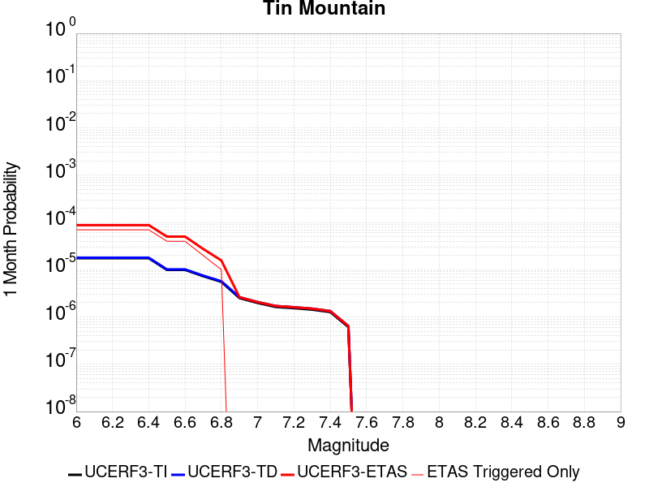 |  |  |

| Magnitude | 1 wk TI Prob | 1 wk TD Prob | 1 wk ETAS Prob | 1 wk ETAS/TD Gain | 1 wk ETAS Triggered Only | 1 mo TI Prob | 1 mo TD Prob | 1 mo ETAS Prob | 1 mo ETAS/TD Gain | 1 mo ETAS Triggered Only | 1 yr TI Prob | 1 yr TD Prob | 1 yr ETAS Prob | 1 yr ETAS/TD Gain | 1 yr ETAS Triggered Only | 10 yr TI Prob | 10 yr TD Prob | 10 yr ETAS Prob | 10 yr ETAS/TD Gain | 10 yr ETAS Triggered Only |
|-----|-----|-----|-----|-----|-----|-----|-----|-----|-----|-----|-----|-----|-----|-----|-----|-----|-----|-----|-----|-----|
| 6.0 | 4.083776E-6 | 4.1815365E-6 | 4.4181368E-5 | 10.565822 | 4.0E-5 | 1.750178E-5 | 1.792077E-5 | 8.7919514E-5 | 4.9060125 | 7.0E-5 | 2.1306332E-4 | 2.1816725E-4 | 3.3814105E-4 | 1.5499167 | 1.2E-4 | 0.0021285915 | 0.0021798965 | 0.0023495257 | 1.0778154 | 1.7E-4 |
| 6.1 | 4.083776E-6 | 4.1815365E-6 | 4.4181368E-5 | 10.565822 | 4.0E-5 | 1.750178E-5 | 1.792077E-5 | 8.7919514E-5 | 4.9060125 | 7.0E-5 | 2.1306332E-4 | 2.1816725E-4 | 3.3814105E-4 | 1.5499167 | 1.2E-4 | 0.0021285915 | 0.0021798965 | 0.0023495257 | 1.0778154 | 1.7E-4 |
| 6.2 | 4.083776E-6 | 4.1815365E-6 | 4.4181368E-5 | 10.565822 | 4.0E-5 | 1.750178E-5 | 1.792077E-5 | 8.7919514E-5 | 4.9060125 | 7.0E-5 | 2.1306332E-4 | 2.1816725E-4 | 3.3814105E-4 | 1.5499167 | 1.2E-4 | 0.0021285915 | 0.0021798965 | 0.0023495257 | 1.0778154 | 1.7E-4 |
| 6.3 | 4.083776E-6 | 4.1815365E-6 | 4.4181368E-5 | 10.565822 | 4.0E-5 | 1.750178E-5 | 1.792077E-5 | 8.7919514E-5 | 4.9060125 | 7.0E-5 | 2.1306332E-4 | 2.1816725E-4 | 3.3814105E-4 | 1.5499167 | 1.2E-4 | 0.0021285915 | 0.0021798965 | 0.0023495257 | 1.0778154 | 1.7E-4 |
| 6.4 | 4.083776E-6 | 4.1815365E-6 | 4.4181368E-5 | 10.565822 | 4.0E-5 | 1.750178E-5 | 1.792077E-5 | 8.7919514E-5 | 4.9060125 | 7.0E-5 | 2.1306332E-4 | 2.1816725E-4 | 3.3814105E-4 | 1.5499167 | 1.2E-4 | 0.0021285915 | 0.0021798965 | 0.0023495257 | 1.0778154 | 1.7E-4 |
| 6.5 | 2.3143427E-6 | 2.3731573E-6 | 1.2373133E-5 | 5.213786 | 1.0E-5 | 9.9185745E-6 | 1.0170638E-5 | 5.017023E-5 | 4.93285 | 4.0E-5 | 1.2075195E-4 | 1.2382126E-4 | 1.7381506E-4 | 1.4037579 | 5.0E-5 | 0.0012068636 | 0.0012375986 | 0.0012975243 | 1.048421 | 6.0E-5 |
| 6.6 | 2.3143427E-6 | 2.3731573E-6 | 1.2373133E-5 | 5.213786 | 1.0E-5 | 9.9185745E-6 | 1.0170638E-5 | 5.017023E-5 | 4.93285 | 4.0E-5 | 1.2075195E-4 | 1.2382126E-4 | 1.7381506E-4 | 1.4037579 | 5.0E-5 | 0.0012068636 | 0.0012375986 | 0.0012975243 | 1.048421 | 6.0E-5 |
| 6.7 | 1.7029532E-6 | 1.7497915E-6 | 1.1749774E-5 | 6.7149568 | 1.0E-5 | 7.2983503E-6 | 7.499088E-6 | 2.7498938E-5 | 3.666971 | 2.0E-5 | 8.885379E-5 | 9.1298105E-5 | 1.21295365E-4 | 1.3285639 | 3.0E-5 | 8.881827E-4 | 9.1265864E-4 | 9.526221E-4 | 1.043788 | 4.0E-5 |
| 6.8 | 1.2914646E-6 | 1.3299378E-6 | 1.1329925E-5 | 8.519138 | 1.0E-5 | 5.534837E-6 | 5.6997237E-6 | 1.5699667E-5 | 2.754461 | 1.0E-5 | 6.738455E-5 | 6.939237E-5 | 7.939168E-5 | 1.144098 | 1.0E-5 | 6.736412E-4 | 6.9375033E-4 | 7.1373646E-4 | 1.0288088 | 2.0E-5 |
| 6.9 | 5.8708974E-7 | 6.1169936E-7 | 6.1169936E-7 | 1.0 | 0.0 | 2.5160964E-6 | 2.6215664E-6 | 2.6215664E-6 | 1.0 | 0.0 | 3.0633044E-5 | 3.1917145E-5 | 3.1917145E-5 | 1.0 | 0.0 | 3.0628822E-4 | 3.191297E-4 | 3.191297E-4 | 1.0 | 0.0 |
| 7.0 | 4.6248786E-7 | 4.832015E-7 | 4.832015E-7 | 1.0 | 0.0 | 1.9820893E-6 | 2.0708624E-6 | 2.0708624E-6 | 1.0 | 0.0 | 2.413167E-5 | 2.5212494E-5 | 2.5212494E-5 | 1.0 | 0.0 | 2.412905E-4 | 2.5210003E-4 | 2.5210003E-4 | 1.0 | 0.0 |
| 7.1 | 3.804606E-7 | 3.987147E-7 | 3.987147E-7 | 1.0 | 0.0 | 1.6305444E-6 | 1.7087764E-6 | 1.7087764E-6 | 1.0 | 0.0 | 1.9851697E-5 | 2.0804187E-5 | 2.0804187E-5 | 1.0 | 0.0 | 1.9849923E-4 | 2.0802575E-4 | 2.0802575E-4 | 1.0 | 0.0 |
| 7.2 | 3.5864858E-7 | 3.7616863E-7 | 3.7616863E-7 | 1.0 | 0.0 | 1.5370645E-6 | 1.6121504E-6 | 1.6121504E-6 | 1.0 | 0.0 | 1.87136E-5 | 1.9627789E-5 | 1.9627789E-5 | 1.0 | 0.0 | 1.8712023E-4 | 1.9626386E-4 | 1.9626386E-4 | 1.0 | 0.0 |
| 7.3 | 3.342063E-7 | 3.506347E-7 | 3.506347E-7 | 1.0 | 0.0 | 1.4323119E-6 | 1.5027196E-6 | 1.5027196E-6 | 1.0 | 0.0 | 1.7438259E-5 | 1.829549E-5 | 1.829549E-5 | 1.0 | 0.0 | 1.743689E-4 | 1.8294314E-4 | 1.8294314E-4 | 1.0 | 0.0 |
| 7.4 | 2.971242E-7 | 3.1165817E-7 | 3.1165817E-7 | 1.0 | 0.0 | 1.2733886E-6 | 1.3356774E-6 | 1.3356774E-6 | 1.0 | 0.0 | 1.5503398E-5 | 1.6261785E-5 | 1.6261785E-5 | 1.0 | 0.0 | 1.5502315E-4 | 1.6260923E-4 | 1.6260923E-4 | 1.0 | 0.0 |
| 7.5 | 1.4326713E-7 | 1.5012525E-7 | 1.5012525E-7 | 1.0 | 0.0 | 6.140018E-7 | 6.433939E-7 | 6.433939E-7 | 1.0 | 0.0 | 7.4754466E-6 | 7.8333205E-6 | 7.8333205E-6 | 1.0 | 0.0 | 7.475195E-5 | 7.833321E-5 | 7.833321E-5 | 1.0 | 0.0 |

## Big Pine (East)
*[(top)](#table-of-contents)*

| 1 Week | 1 Month | 1 Year | 10 Year |
|-----|-----|-----|-----|
|  |  | 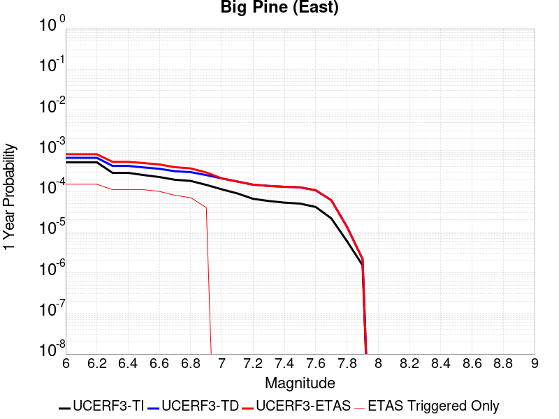 |  |

| Magnitude | 1 wk TI Prob | 1 wk TD Prob | 1 wk ETAS Prob | 1 wk ETAS/TD Gain | 1 wk ETAS Triggered Only | 1 mo TI Prob | 1 mo TD Prob | 1 mo ETAS Prob | 1 mo ETAS/TD Gain | 1 mo ETAS Triggered Only | 1 yr TI Prob | 1 yr TD Prob | 1 yr ETAS Prob | 1 yr ETAS/TD Gain | 1 yr ETAS Triggered Only | 10 yr TI Prob | 10 yr TD Prob | 10 yr ETAS Prob | 10 yr ETAS/TD Gain | 10 yr ETAS Triggered Only |
|-----|-----|-----|-----|-----|-----|-----|-----|-----|-----|-----|-----|-----|-----|-----|-----|-----|-----|-----|-----|-----|
| 6.0 | 9.916913E-6 | 1.28172705E-5 | 8.2816376E-5 | 6.461311 | 7.0E-5 | 4.250036E-5 | 5.493013E-5 | 1.2492629E-4 | 2.2742763 | 7.0E-5 | 5.173191E-4 | 6.685912E-4 | 8.184909E-4 | 1.2242024 | 1.5E-4 | 0.0051611643 | 0.006670449 | 0.006839315 | 1.0253155 | 1.7E-4 |
| 6.1 | 9.916913E-6 | 1.28172705E-5 | 8.2816376E-5 | 6.461311 | 7.0E-5 | 4.250036E-5 | 5.493013E-5 | 1.2492629E-4 | 2.2742763 | 7.0E-5 | 5.173191E-4 | 6.685912E-4 | 8.184909E-4 | 1.2242024 | 1.5E-4 | 0.0051611643 | 0.006670449 | 0.006839315 | 1.0253155 | 1.7E-4 |
| 6.2 | 9.916913E-6 | 1.28172705E-5 | 8.2816376E-5 | 6.461311 | 7.0E-5 | 4.250036E-5 | 5.493013E-5 | 1.2492629E-4 | 2.2742763 | 7.0E-5 | 5.173191E-4 | 6.685912E-4 | 8.184909E-4 | 1.2242024 | 1.5E-4 | 0.0051611643 | 0.006670449 | 0.006839315 | 1.0253155 | 1.7E-4 |
| 6.3 | 5.479711E-6 | 8.1132375E-6 | 5.8112833E-5 | 7.162718 | 5.0E-5 | 2.3484265E-5 | 3.4770575E-5 | 8.4768835E-5 | 2.4379475 | 5.0E-5 | 2.858834E-4 | 4.232527E-4 | 5.3320616E-4 | 1.2597821 | 1.1E-4 | 0.0028551589 | 0.0042272513 | 0.004346744 | 1.0282673 | 1.2E-4 |
| 6.4 | 5.465009E-6 | 8.0975315E-6 | 5.8097125E-5 | 7.1746716 | 5.0E-5 | 2.3421257E-5 | 3.4703262E-5 | 8.4701525E-5 | 2.4407368 | 5.0E-5 | 2.851165E-4 | 4.2243348E-4 | 5.32387E-4 | 1.260286 | 1.1E-4 | 0.0028475097 | 0.00421909 | 0.004338584 | 1.0283221 | 1.2E-4 |
| 6.5 | 4.826767E-6 | 7.4225877E-6 | 5.7422218E-5 | 7.7361455 | 5.0E-5 | 2.068598E-5 | 3.1810716E-5 | 8.180913E-5 | 2.5717473 | 5.0E-5 | 2.518227E-4 | 3.8722943E-4 | 4.9718685E-4 | 1.2839593 | 1.1E-4 | 0.0025153751 | 0.0038682907 | 0.003977865 | 1.0283264 | 1.1E-4 |
| 6.6 | 4.3146847E-6 | 6.8825234E-6 | 5.6882178E-5 | 8.264728 | 5.0E-5 | 1.8491375E-5 | 2.949621E-5 | 7.9494734E-5 | 2.6950831 | 5.0E-5 | 2.2510924E-4 | 3.5905963E-4 | 4.5902372E-4 | 1.2784053 | 1.0E-4 | 0.0022488134 | 0.0035875062 | 0.0036871475 | 1.0277746 | 1.0E-4 |
| 6.7 | 3.6968106E-6 | 5.9957474E-6 | 5.5995446E-5 | 9.339193 | 5.0E-5 | 1.5843378E-5 | 2.5695816E-5 | 7.569453E-5 | 2.945792 | 5.0E-5 | 1.9287605E-4 | 3.128032E-4 | 3.9277817E-4 | 1.2556719 | 8.0E-5 | 0.0019270873 | 0.0031262499 | 0.0032059997 | 1.0255097 | 8.0E-5 |
| 6.8 | 3.4671132E-6 | 5.7024477E-6 | 4.5702218E-5 | 8.014492 | 4.0E-5 | 1.4858972E-5 | 2.4438841E-5 | 6.443786E-5 | 2.636699 | 4.0E-5 | 1.8089297E-4 | 2.9750372E-4 | 3.674829E-4 | 1.2352211 | 7.0E-5 | 0.0018074579 | 0.0029736666 | 0.0030434586 | 1.0234699 | 7.0E-5 |
| 6.9 | 2.7686972E-6 | 4.8254797E-6 | 2.4825384E-5 | 5.1446457 | 2.0E-5 | 1.1865792E-5 | 2.0680467E-5 | 4.0680054E-5 | 1.9670762 | 2.0E-5 | 1.4445644E-4 | 2.5175634E-4 | 2.9174628E-4 | 1.1588438 | 4.0E-5 | 0.0014436257 | 0.002517256 | 0.0025571552 | 1.0158503 | 4.0E-5 |
| 7.0 | 2.1472624E-6 | 3.985277E-6 | 3.985277E-6 | 1.0 | 0.0 | 9.20252E-6 | 1.707965E-5 | 1.707965E-5 | 1.0 | 0.0 | 1.12034926E-4 | 2.0792543E-4 | 2.0792543E-4 | 1.0 | 0.0 | 0.0011197845 | 0.0020798238 | 0.0020798238 | 1.0 | 0.0 |
| 7.1 | 1.7018335E-6 | 3.3450835E-6 | 3.3450835E-6 | 1.0 | 0.0 | 7.293552E-6 | 1.4335996E-5 | 1.4335996E-5 | 1.0 | 0.0 | 8.879537E-5 | 1.7452713E-4 | 1.7452713E-4 | 1.0 | 0.0 | 8.87599E-4 | 0.0017463792 | 0.0017463792 | 1.0 | 0.0 |
| 7.2 | 1.25603E-6 | 2.794679E-6 | 2.794679E-6 | 1.0 | 0.0 | 5.3829745E-6 | 1.1977142E-5 | 1.1977142E-5 | 1.0 | 0.0 | 6.553574E-5 | 1.4581217E-4 | 1.4581217E-4 | 1.0 | 0.0 | 6.551642E-4 | 0.0014596173 | 0.0014596173 | 1.0 | 0.0 |
| 7.3 | 1.112297E-6 | 2.610519E-6 | 2.610519E-6 | 1.0 | 0.0 | 4.7669787E-6 | 1.1187892E-5 | 1.1187892E-5 | 1.0 | 0.0 | 5.803642E-5 | 1.3620428E-4 | 1.3620428E-4 | 1.0 | 0.0 | 5.802127E-4 | 0.001363502 | 0.001363502 | 1.0 | 0.0 |
| 7.4 | 1.0137181E-6 | 2.4836752E-6 | 2.4836752E-6 | 1.0 | 0.0 | 4.3444993E-6 | 1.064428E-5 | 1.064428E-5 | 1.0 | 0.0 | 5.2892992E-5 | 1.2958662E-4 | 1.2958662E-4 | 1.0 | 0.0 | 5.288041E-4 | 0.0012971918 | 0.0012971918 | 1.0 | 0.0 |
| 7.5 | 9.598608E-7 | 2.407328E-6 | 2.407328E-6 | 1.0 | 0.0 | 4.1136827E-6 | 1.03170805E-5 | 1.03170805E-5 | 1.0 | 0.0 | 5.0082934E-5 | 1.2560343E-4 | 1.2560343E-4 | 1.0 | 0.0 | 5.007165E-4 | 0.0012572132 | 0.0012572132 | 1.0 | 0.0 |
| 7.6 | 7.929459E-7 | 2.0450152E-6 | 2.0450152E-6 | 1.0 | 0.0 | 3.3983351E-6 | 8.764322E-6 | 8.764322E-6 | 1.0 | 0.0 | 4.1373947E-5 | 1.0670057E-4 | 1.0670057E-4 | 1.0 | 0.0 | 4.1366243E-4 | 0.0010685825 | 0.0010685825 | 1.0 | 0.0 |
| 7.7 | 4.155788E-7 | 1.1606729E-6 | 1.1606729E-6 | 1.0 | 0.0 | 1.7810507E-6 | 4.974303E-6 | 4.974303E-6 | 1.0 | 0.0 | 2.1684076E-5 | 6.05605E-5 | 6.05605E-5 | 1.0 | 0.0 | 2.1681961E-4 | 6.085995E-4 | 6.085995E-4 | 1.0 | 0.0 |
| 7.8 | 1.14666925E-7 | 2.592197E-7 | 2.592197E-7 | 1.0 | 0.0 | 4.914296E-7 | 1.1109411E-6 | 1.1109411E-6 | 1.0 | 0.0 | 5.9831386E-6 | 1.3525627E-5 | 1.3525627E-5 | 1.0 | 0.0 | 5.9829777E-5 | 1.3636416E-4 | 1.3636416E-4 | 1.0 | 0.0 |
| 7.9 | 2.9231824E-8 | 4.1462318E-8 | 4.1462318E-8 | 1.0 | 0.0 | 1.2527924E-7 | 1.7769564E-7 | 1.7769564E-7 | 1.0 | 0.0 | 1.5252737E-6 | 2.1634426E-6 | 2.1634426E-6 | 1.0 | 0.0 | 1.5252632E-5 | 2.197062E-5 | 2.197062E-5 | 1.0 | 0.0 |

## Santa Ynez (East)
*[(top)](#table-of-contents)*

| 1 Week | 1 Month | 1 Year | 10 Year |
|-----|-----|-----|-----|
|  |  |  |  |

| Magnitude | 1 wk TI Prob | 1 wk TD Prob | 1 wk ETAS Prob | 1 wk ETAS/TD Gain | 1 wk ETAS Triggered Only | 1 mo TI Prob | 1 mo TD Prob | 1 mo ETAS Prob | 1 mo ETAS/TD Gain | 1 mo ETAS Triggered Only | 1 yr TI Prob | 1 yr TD Prob | 1 yr ETAS Prob | 1 yr ETAS/TD Gain | 1 yr ETAS Triggered Only | 10 yr TI Prob | 10 yr TD Prob | 10 yr ETAS Prob | 10 yr ETAS/TD Gain | 10 yr ETAS Triggered Only |
|-----|-----|-----|-----|-----|-----|-----|-----|-----|-----|-----|-----|-----|-----|-----|-----|-----|-----|-----|-----|-----|
| 6.0 | 3.2269712E-5 | 3.6750775E-5 | 9.674857E-5 | 2.6325586 | 6.0E-5 | 1.3829143E-4 | 1.5749714E-4 | 2.1748769E-4 | 1.3808993 | 6.0E-5 | 0.0016823979 | 0.0019164253 | 0.0020461762 | 1.0677047 | 1.3E-4 | 0.016697178 | 0.019056438 | 0.01921339 | 1.0082362 | 1.6E-4 |
| 6.1 | 3.2269712E-5 | 3.6750775E-5 | 9.674857E-5 | 2.6325586 | 6.0E-5 | 1.3829143E-4 | 1.5749714E-4 | 2.1748769E-4 | 1.3808993 | 6.0E-5 | 0.0016823979 | 0.0019164253 | 0.0020461762 | 1.0677047 | 1.3E-4 | 0.016697178 | 0.019056438 | 0.01921339 | 1.0082362 | 1.6E-4 |
| 6.2 | 3.2269712E-5 | 3.6750775E-5 | 9.674857E-5 | 2.6325586 | 6.0E-5 | 1.3829143E-4 | 1.5749714E-4 | 2.1748769E-4 | 1.3808993 | 6.0E-5 | 0.0016823979 | 0.0019164253 | 0.0020461762 | 1.0677047 | 1.3E-4 | 0.016697178 | 0.019056438 | 0.01921339 | 1.0082362 | 1.6E-4 |
| 6.3 | 3.2269712E-5 | 3.6750775E-5 | 9.674857E-5 | 2.6325586 | 6.0E-5 | 1.3829143E-4 | 1.5749714E-4 | 2.1748769E-4 | 1.3808993 | 6.0E-5 | 0.0016823979 | 0.0019164253 | 0.0020461762 | 1.0677047 | 1.3E-4 | 0.016697178 | 0.019056438 | 0.01921339 | 1.0082362 | 1.6E-4 |
| 6.4 | 1.4404779E-5 | 1.48492945E-5 | 4.484885E-5 | 3.020268 | 3.0E-5 | 6.1733306E-5 | 6.363831E-5 | 9.36364E-5 | 1.4713842 | 3.0E-5 | 7.513438E-4 | 7.7452604E-4 | 8.4447186E-4 | 1.0903078 | 7.0E-5 | 0.0074880854 | 0.007718817 | 0.0078081223 | 1.0115699 | 9.0E-5 |
| 6.5 | 1.4404779E-5 | 1.48492945E-5 | 4.484885E-5 | 3.020268 | 3.0E-5 | 6.1733306E-5 | 6.363831E-5 | 9.36364E-5 | 1.4713842 | 3.0E-5 | 7.513438E-4 | 7.7452604E-4 | 8.4447186E-4 | 1.0903078 | 7.0E-5 | 0.0074880854 | 0.007718817 | 0.0078081223 | 1.0115699 | 9.0E-5 |
| 6.6 | 1.280208E-5 | 1.301186E-5 | 4.301147E-5 | 3.305559 | 3.0E-5 | 5.4864904E-5 | 5.5763932E-5 | 8.576226E-5 | 1.5379522 | 3.0E-5 | 6.6777546E-4 | 6.7871617E-4 | 7.486686E-4 | 1.1030658 | 7.0E-5 | 0.006657724 | 0.0067666434 | 0.006846102 | 1.0117427 | 8.0E-5 |
| 6.7 | 1.2457027E-5 | 1.262838E-5 | 4.2628002E-5 | 3.3755715 | 3.0E-5 | 5.3386164E-5 | 5.4120515E-5 | 8.4118896E-5 | 1.5542884 | 3.0E-5 | 6.497827E-4 | 6.5871974E-4 | 7.2867365E-4 | 1.1061968 | 7.0E-5 | 0.00647886 | 0.00656787 | 0.006647344 | 1.0121005 | 8.0E-5 |
| 6.8 | 1.2095134E-5 | 1.2230827E-5 | 4.223046E-5 | 3.4527886 | 3.0E-5 | 5.1835254E-5 | 5.2416784E-5 | 8.2415216E-5 | 1.5723057 | 3.0E-5 | 6.309115E-4 | 6.3798914E-4 | 6.9795083E-4 | 1.0939854 | 6.0E-5 | 0.0062912325 | 0.006361764 | 0.0064313184 | 1.0109333 | 7.0E-5 |
| 6.9 | 1.1104036E-5 | 1.115726E-5 | 4.1156924E-5 | 3.6888022 | 3.0E-5 | 4.758786E-5 | 4.781596E-5 | 7.7814526E-5 | 1.6273756 | 3.0E-5 | 5.7922816E-4 | 5.82005E-4 | 6.4197014E-4 | 1.1030319 | 6.0E-5 | 0.005777207 | 0.0058049536 | 0.0058745476 | 1.0119886 | 7.0E-5 |
| 7.0 | 1.0577444E-5 | 1.05815925E-5 | 4.0581275E-5 | 3.8350818 | 3.0E-5 | 4.5331115E-5 | 4.53489E-5 | 7.534754E-5 | 1.6615075 | 3.0E-5 | 5.5176654E-4 | 5.5198424E-4 | 6.119511E-4 | 1.1086388 | 6.0E-5 | 0.0055039856 | 0.00550627 | 0.0055758846 | 1.0126427 | 7.0E-5 |
| 7.1 | 1.0021775E-5 | 9.9809E-6 | 3.99806E-5 | 4.005711 | 3.0E-5 | 4.294976E-5 | 4.277459E-5 | 7.2773306E-5 | 1.7013209 | 3.0E-5 | 5.2278786E-4 | 5.206574E-4 | 5.8062613E-4 | 1.115179 | 6.0E-5 | 0.0052155964 | 0.005194508 | 0.0052641444 | 1.0134058 | 7.0E-5 |
| 7.2 | 8.874109E-6 | 8.748706E-6 | 3.8748443E-5 | 4.4290485 | 3.0E-5 | 3.8031343E-5 | 3.7493923E-5 | 6.74928E-5 | 1.8000996 | 3.0E-5 | 4.629332E-4 | 4.56394E-4 | 5.0637114E-4 | 1.1095045 | 5.0E-5 | 0.0046197 | 0.0045546847 | 0.004614412 | 1.0131133 | 6.0E-5 |
| 7.3 | 7.5504267E-6 | 7.5050243E-6 | 3.75048E-5 | 4.997292 | 3.0E-5 | 3.235857E-5 | 3.2164E-5 | 6.216303E-5 | 1.9326899 | 3.0E-5 | 3.9389438E-4 | 3.9152734E-4 | 4.4150776E-4 | 1.127655 | 5.0E-5 | 0.0039319694 | 0.0039084824 | 0.003968248 | 1.0152912 | 6.0E-5 |
| 7.4 | 6.309394E-6 | 6.183062E-6 | 3.6182875E-5 | 5.851935 | 3.0E-5 | 2.703998E-5 | 2.6498574E-5 | 5.6497778E-5 | 2.1321063 | 3.0E-5 | 3.2916202E-4 | 3.2257332E-4 | 3.6256041E-4 | 1.1239628 | 4.0E-5 | 0.003286749 | 0.0032211484 | 0.0032709872 | 1.0154724 | 5.0E-5 |
| 7.5 | 4.6103073E-6 | 4.4408016E-6 | 2.4440713E-5 | 5.503671 | 2.0E-5 | 1.975831E-5 | 1.9031871E-5 | 3.9031493E-5 | 2.0508487 | 2.0E-5 | 2.4053088E-4 | 2.316891E-4 | 2.6168214E-4 | 1.1294539 | 3.0E-5 | 0.002402707 | 0.002314545 | 0.0023544524 | 1.0172421 | 4.0E-5 |
| 7.6 | 1.2858658E-6 | 1.3008196E-6 | 1.1300806E-5 | 8.687451 | 1.0E-5 | 5.5108417E-6 | 5.574929E-6 | 1.5574873E-5 | 2.7937348 | 1.0E-5 | 6.7092435E-5 | 6.787272E-5 | 7.787204E-5 | 1.1473246 | 1.0E-5 | 6.707218E-4 | 6.7852676E-4 | 6.8852E-4 | 1.0147278 | 1.0E-5 |
| 7.7 | 5.3302307E-7 | 5.612138E-7 | 1.0561208E-5 | 18.81851 | 1.0E-5 | 2.2843826E-6 | 2.4052001E-6 | 1.2405176E-5 | 5.157648 | 1.0E-5 | 2.7812002E-5 | 2.9282955E-5 | 3.9282662E-5 | 1.3414856 | 1.0E-5 | 2.7808524E-4 | 2.9279455E-4 | 3.0279162E-4 | 1.0341437 | 1.0E-5 |
| 7.8 | 4.613933E-8 | 4.80301E-8 | 4.80301E-8 | 1.0 | 0.0 | 1.9773998E-7 | 2.0584326E-7 | 2.0584326E-7 | 1.0 | 0.0 | 2.4074816E-6 | 2.5061388E-6 | 2.5061388E-6 | 1.0 | 0.0 | 2.4074554E-5 | 2.5061116E-5 | 2.5061116E-5 | 1.0 | 0.0 |

## Pleito
*[(top)](#table-of-contents)*

| 1 Week | 1 Month | 1 Year | 10 Year |
|-----|-----|-----|-----|
|  |  |  |  |

| Magnitude | 1 wk TI Prob | 1 wk TD Prob | 1 wk ETAS Prob | 1 wk ETAS/TD Gain | 1 wk ETAS Triggered Only | 1 mo TI Prob | 1 mo TD Prob | 1 mo ETAS Prob | 1 mo ETAS/TD Gain | 1 mo ETAS Triggered Only | 1 yr TI Prob | 1 yr TD Prob | 1 yr ETAS Prob | 1 yr ETAS/TD Gain | 1 yr ETAS Triggered Only | 10 yr TI Prob | 10 yr TD Prob | 10 yr ETAS Prob | 10 yr ETAS/TD Gain | 10 yr ETAS Triggered Only |
|-----|-----|-----|-----|-----|-----|-----|-----|-----|-----|-----|-----|-----|-----|-----|-----|-----|-----|-----|-----|-----|
| 6.0 | 1.6763008E-5 | 2.4764735E-5 | 5.4763994E-5 | 2.21137 | 3.0E-5 | 7.183948E-5 | 1.0613067E-4 | 1.7612324E-4 | 1.6594943 | 7.0E-5 | 8.742947E-4 | 0.001291447 | 0.001411292 | 1.0927991 | 1.2E-4 | 0.00870863 | 0.012954412 | 0.013122209 | 1.0129529 | 1.7E-4 |
| 6.1 | 1.6763008E-5 | 2.4764735E-5 | 5.4763994E-5 | 2.21137 | 3.0E-5 | 7.183948E-5 | 1.0613067E-4 | 1.7612324E-4 | 1.6594943 | 7.0E-5 | 8.742947E-4 | 0.001291447 | 0.001411292 | 1.0927991 | 1.2E-4 | 0.00870863 | 0.012954412 | 0.013122209 | 1.0129529 | 1.7E-4 |
| 6.2 | 1.6763008E-5 | 2.4764735E-5 | 5.4763994E-5 | 2.21137 | 3.0E-5 | 7.183948E-5 | 1.0613067E-4 | 1.7612324E-4 | 1.6594943 | 7.0E-5 | 8.742947E-4 | 0.001291447 | 0.001411292 | 1.0927991 | 1.2E-4 | 0.00870863 | 0.012954412 | 0.013122209 | 1.0129529 | 1.7E-4 |
| 6.3 | 1.6763008E-5 | 2.4764735E-5 | 5.4763994E-5 | 2.21137 | 3.0E-5 | 7.183948E-5 | 1.0613067E-4 | 1.7612324E-4 | 1.6594943 | 7.0E-5 | 8.742947E-4 | 0.001291447 | 0.001411292 | 1.0927991 | 1.2E-4 | 0.00870863 | 0.012954412 | 0.013122209 | 1.0129529 | 1.7E-4 |
| 6.4 | 1.6763008E-5 | 2.4764735E-5 | 5.4763994E-5 | 2.21137 | 3.0E-5 | 7.183948E-5 | 1.0613067E-4 | 1.7612324E-4 | 1.6594943 | 7.0E-5 | 8.742947E-4 | 0.001291447 | 0.001411292 | 1.0927991 | 1.2E-4 | 0.00870863 | 0.012954412 | 0.013122209 | 1.0129529 | 1.7E-4 |
| 6.5 | 1.6763008E-5 | 2.4764735E-5 | 5.4763994E-5 | 2.21137 | 3.0E-5 | 7.183948E-5 | 1.0613067E-4 | 1.7612324E-4 | 1.6594943 | 7.0E-5 | 8.742947E-4 | 0.001291447 | 0.001411292 | 1.0927991 | 1.2E-4 | 0.00870863 | 0.012954412 | 0.013122209 | 1.0129529 | 1.7E-4 |
| 6.6 | 9.910213E-6 | 1.721552E-5 | 4.7215002E-5 | 2.7425835 | 3.0E-5 | 4.247165E-5 | 7.3778734E-5 | 1.2377504E-4 | 1.677652 | 5.0E-5 | 5.169696E-4 | 8.9788967E-4 | 9.678268E-4 | 1.0778906 | 7.0E-5 | 0.0051576863 | 0.009051226 | 0.00916023 | 1.012043 | 1.1E-4 |
| 6.7 | 9.910213E-6 | 1.721552E-5 | 4.7215002E-5 | 2.7425835 | 3.0E-5 | 4.247165E-5 | 7.3778734E-5 | 1.2377504E-4 | 1.677652 | 5.0E-5 | 5.169696E-4 | 8.9788967E-4 | 9.678268E-4 | 1.0778906 | 7.0E-5 | 0.0051576863 | 0.009051226 | 0.00916023 | 1.012043 | 1.1E-4 |
| 6.8 | 8.300162E-6 | 1.5475129E-5 | 3.547482E-5 | 2.2923763 | 2.0E-5 | 3.557164E-5 | 6.63203E-5 | 9.631831E-5 | 1.4523202 | 3.0E-5 | 4.3299864E-4 | 8.07152E-4 | 8.5711165E-4 | 1.0618962 | 5.0E-5 | 0.004321559 | 0.008150663 | 0.00823993 | 1.010952 | 9.0E-5 |
| 6.9 | 8.183114E-6 | 1.5346344E-5 | 3.534604E-5 | 2.303222 | 2.0E-5 | 3.5070017E-5 | 6.57684E-5 | 9.576642E-5 | 1.4561161 | 3.0E-5 | 4.2689382E-4 | 8.0043747E-4 | 8.5039745E-4 | 1.0624158 | 5.0E-5 | 0.0042607468 | 0.008084008 | 0.00817328 | 1.0110431 | 9.0E-5 |
| 7.0 | 7.1748823E-6 | 1.4133306E-5 | 2.4133164E-5 | 1.7075386 | 1.0E-5 | 3.0749135E-5 | 6.0569906E-5 | 7.05693E-5 | 1.1650885 | 1.0E-5 | 3.743064E-4 | 7.3718966E-4 | 7.571749E-4 | 1.0271101 | 2.0E-5 | 0.0037367654 | 0.0074553755 | 0.0074851518 | 1.003994 | 3.0E-5 |
| 7.1 | 7.1671807E-6 | 1.4123676E-5 | 2.4123534E-5 | 1.708021 | 1.0E-5 | 3.0716128E-5 | 6.0528637E-5 | 7.052803E-5 | 1.1652011 | 1.0E-5 | 3.7390468E-4 | 7.366875E-4 | 7.5667276E-4 | 1.0271286 | 2.0E-5 | 0.0037327618 | 0.0074503883 | 0.0074801645 | 1.0039966 | 3.0E-5 |
| 7.2 | 7.0649667E-6 | 1.3970962E-5 | 1.3970962E-5 | 1.0 | 0.0 | 3.0278077E-5 | 5.987418E-5 | 5.987418E-5 | 1.0 | 0.0 | 3.6857324E-4 | 7.287248E-4 | 7.3871756E-4 | 1.0137126 | 1.0E-5 | 0.0036796255 | 0.0073711374 | 0.00739099 | 1.0026933 | 2.0E-5 |
| 7.3 | 7.02082E-6 | 1.3914415E-5 | 1.3914415E-5 | 1.0 | 0.0 | 3.008888E-5 | 5.9631846E-5 | 5.9631846E-5 | 1.0 | 0.0 | 3.6627054E-4 | 7.257764E-4 | 7.3576916E-4 | 1.0137683 | 1.0E-5 | 0.0036566744 | 0.0073416373 | 0.0073614907 | 1.0027041 | 2.0E-5 |
| 7.4 | 6.987146E-6 | 1.3873975E-5 | 1.3873975E-5 | 1.0 | 0.0 | 2.9944567E-5 | 5.9458544E-5 | 5.9458544E-5 | 1.0 | 0.0 | 3.6451413E-4 | 7.2366785E-4 | 7.336606E-4 | 1.0138085 | 1.0E-5 | 0.0036391679 | 0.007320571 | 0.007340425 | 1.002712 | 2.0E-5 |
| 7.5 | 6.9494554E-6 | 1.383088E-5 | 1.383088E-5 | 1.0 | 0.0 | 2.9783041E-5 | 5.9273858E-5 | 5.9273858E-5 | 1.0 | 0.0 | 3.625482E-4 | 7.2142074E-4 | 7.3141354E-4 | 1.0138515 | 1.0E-5 | 0.0036195726 | 0.007298199 | 0.007318053 | 1.0027204 | 2.0E-5 |
| 7.6 | 6.92694E-6 | 1.3789992E-5 | 1.3789992E-5 | 1.0 | 0.0 | 2.9686547E-5 | 5.909863E-5 | 5.909863E-5 | 1.0 | 0.0 | 3.6137376E-4 | 7.192888E-4 | 7.292816E-4 | 1.0138927 | 1.0E-5 | 0.0036078666 | 0.007276951 | 0.0072968053 | 1.0027285 | 2.0E-5 |
| 7.7 | 6.395867E-6 | 1.26690065E-5 | 1.26690065E-5 | 1.0 | 0.0 | 2.741057E-5 | 5.4294615E-5 | 5.4294615E-5 | 1.0 | 0.0 | 3.336726E-4 | 6.6083675E-4 | 6.7083014E-4 | 1.0151223 | 1.0E-5 | 0.0033317201 | 0.0066955453 | 0.0067154113 | 1.0029671 | 2.0E-5 |
| 7.8 | 5.8664327E-6 | 1.1536581E-5 | 1.1536581E-5 | 1.0 | 0.0 | 2.5141611E-5 | 4.9441554E-5 | 4.9441554E-5 | 1.0 | 0.0 | 3.060561E-4 | 6.0178485E-4 | 6.117789E-4 | 1.0166073 | 1.0E-5 | 0.0030563495 | 0.0061010164 | 0.0061208946 | 1.0032581 | 2.0E-5 |
| 7.9 | 3.7167474E-6 | 7.1145205E-6 | 7.1145205E-6 | 1.0 | 0.0 | 1.592882E-5 | 3.0490448E-5 | 3.0490448E-5 | 1.0 | 0.0 | 1.9391612E-4 | 3.7115812E-4 | 3.8115442E-4 | 1.0269327 | 1.0E-5 | 0.0019374699 | 0.0037676243 | 0.0037775866 | 1.0026442 | 1.0E-5 |
| 8.0 | 1.0903841E-6 | 1.2879104E-6 | 1.2879104E-6 | 1.0 | 0.0 | 4.6730665E-6 | 5.5196047E-6 | 5.5196047E-6 | 1.0 | 0.0 | 5.68931E-5 | 6.719913E-5 | 6.719913E-5 | 1.0 | 0.0 | 5.6878536E-4 | 6.942094E-4 | 6.942094E-4 | 1.0 | 0.0 |
| 8.1 | 2.6894583E-7 | 1.1056095E-7 | 1.1056095E-7 | 1.0 | 0.0 | 1.1526245E-6 | 4.7383253E-7 | 4.7383253E-7 | 1.0 | 0.0 | 1.4033113E-5 | 5.768896E-6 | 5.768896E-6 | 1.0 | 0.0 | 1.4032227E-4 | 6.454915E-5 | 6.454915E-5 | 1.0 | 0.0 |
| 8.2 | 5.2967013E-9 | 2.4567874E-9 | 2.4567874E-9 | 1.0 | 0.0 | 2.2700148E-8 | 1.0529089E-8 | 1.0529089E-8 | 1.0 | 0.0 | 2.7637427E-7 | 1.2819166E-7 | 1.2819166E-7 | 1.0 | 0.0 | 2.7637393E-6 | 1.4588004E-6 | 1.4588004E-6 | 1.0 | 0.0 |

## Owens Valley Keough Hot Springs
*[(top)](#table-of-contents)*

| 1 Week | 1 Month | 1 Year | 10 Year |
|-----|-----|-----|-----|
|  |  |  | 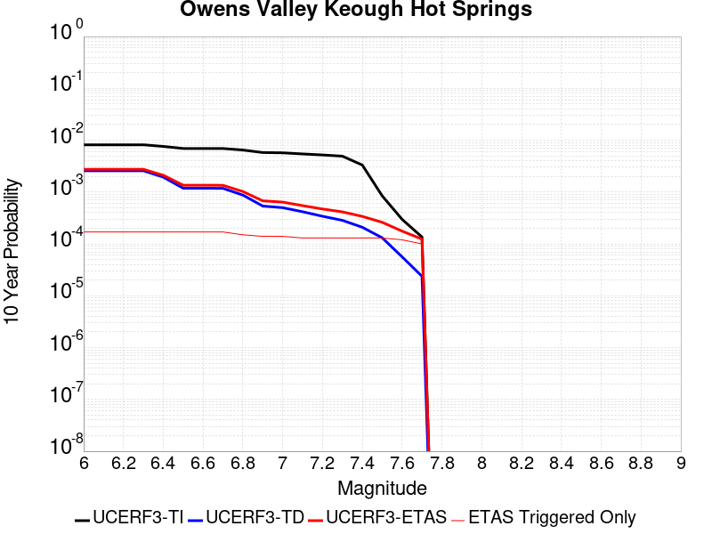 |

| Magnitude | 1 wk TI Prob | 1 wk TD Prob | 1 wk ETAS Prob | 1 wk ETAS/TD Gain | 1 wk ETAS Triggered Only | 1 mo TI Prob | 1 mo TD Prob | 1 mo ETAS Prob | 1 mo ETAS/TD Gain | 1 mo ETAS Triggered Only | 1 yr TI Prob | 1 yr TD Prob | 1 yr ETAS Prob | 1 yr ETAS/TD Gain | 1 yr ETAS Triggered Only | 10 yr TI Prob | 10 yr TD Prob | 10 yr ETAS Prob | 10 yr ETAS/TD Gain | 10 yr ETAS Triggered Only |
|-----|-----|-----|-----|-----|-----|-----|-----|-----|-----|-----|-----|-----|-----|-----|-----|-----|-----|-----|-----|-----|
| 6.0 | 1.5708529E-5 | 4.950463E-6 | 5.4950215E-5 | 11.100016 | 5.0E-5 | 6.7320536E-5 | 2.1216127E-5 | 1.21214005E-4 | 5.7132955 | 1.0E-4 | 8.193192E-4 | 2.5828084E-4 | 3.9824468E-4 | 1.5419056 | 1.4E-4 | 0.008163051 | 0.0025804387 | 0.00275 | 1.0657103 | 1.7E-4 |
| 6.1 | 1.5708529E-5 | 4.950463E-6 | 5.4950215E-5 | 11.100016 | 5.0E-5 | 6.7320536E-5 | 2.1216127E-5 | 1.21214005E-4 | 5.7132955 | 1.0E-4 | 8.193192E-4 | 2.5828084E-4 | 3.9824468E-4 | 1.5419056 | 1.4E-4 | 0.008163051 | 0.0025804387 | 0.00275 | 1.0657103 | 1.7E-4 |
| 6.2 | 1.5708529E-5 | 4.950463E-6 | 5.4950215E-5 | 11.100016 | 5.0E-5 | 6.7320536E-5 | 2.1216127E-5 | 1.21214005E-4 | 5.7132955 | 1.0E-4 | 8.193192E-4 | 2.5828084E-4 | 3.9824468E-4 | 1.5419056 | 1.4E-4 | 0.008163051 | 0.0025804387 | 0.00275 | 1.0657103 | 1.7E-4 |
| 6.3 | 1.5708529E-5 | 4.950463E-6 | 5.4950215E-5 | 11.100016 | 5.0E-5 | 6.7320536E-5 | 2.1216127E-5 | 1.21214005E-4 | 5.7132955 | 1.0E-4 | 8.193192E-4 | 2.5828084E-4 | 3.9824468E-4 | 1.5419056 | 1.4E-4 | 0.008163051 | 0.0025804387 | 0.00275 | 1.0657103 | 1.7E-4 |
| 6.4 | 1.4622509E-5 | 3.7263276E-6 | 5.372614E-5 | 14.417987 | 5.0E-5 | 6.266639E-5 | 1.5969896E-5 | 1.159683E-4 | 7.2616816 | 1.0E-4 | 7.626962E-4 | 1.9441944E-4 | 3.343922E-4 | 1.7199526 | 1.4E-4 | 0.007600839 | 0.0019429466 | 0.0021126163 | 1.0873259 | 1.7E-4 |
| 6.5 | 1.3335527E-5 | 2.2775241E-6 | 5.227741E-5 | 22.953613 | 5.0E-5 | 5.7151006E-5 | 9.760785E-6 | 1.0975981E-4 | 11.244977 | 1.0E-4 | 6.955913E-4 | 1.1883176E-4 | 2.5881513E-4 | 2.1779962 | 1.4E-4 | 0.0069341804 | 0.001187878 | 0.0013576761 | 1.1429423 | 1.7E-4 |
| 6.6 | 1.3332855E-5 | 2.2746733E-6 | 5.227456E-5 | 22.981127 | 5.0E-5 | 5.7139558E-5 | 9.748568E-6 | 1.0974759E-4 | 11.257817 | 1.0E-4 | 6.9545204E-4 | 1.1868303E-4 | 2.586664E-4 | 2.1794727 | 1.4E-4 | 0.0069327964 | 0.0011863923 | 0.0013561905 | 1.1431216 | 1.7E-4 |
| 6.7 | 1.3318214E-5 | 2.2639038E-6 | 5.226379E-5 | 23.085693 | 5.0E-5 | 5.707681E-5 | 9.702413E-6 | 1.0970144E-4 | 11.306615 | 1.0E-4 | 6.946886E-4 | 1.18121156E-4 | 2.581046E-4 | 2.1850839 | 1.4E-4 | 0.0069252094 | 0.0011807795 | 0.0013505787 | 1.1438026 | 1.7E-4 |
| 6.8 | 1.2441338E-5 | 1.677594E-6 | 5.167751E-5 | 30.804539 | 5.0E-5 | 5.331893E-5 | 7.1896707E-6 | 9.7189026E-5 | 13.517869 | 9.0E-5 | 6.489646E-4 | 8.753102E-5 | 2.1751964E-4 | 2.4850578 | 1.3E-4 | 0.0064707273 | 8.751236E-4 | 0.0010249923 | 1.1712544 | 1.5E-4 |
| 6.9 | 1.1130476E-5 | 1.0302234E-6 | 5.1030172E-5 | 49.53311 | 5.0E-5 | 4.7701167E-5 | 4.4152357E-6 | 9.441484E-5 | 21.383871 | 9.0E-5 | 5.806069E-4 | 5.3754186E-5 | 1.837472E-4 | 3.4182863 | 1.3E-4 | 0.0057909233 | 5.375404E-4 | 6.7746517E-4 | 1.2603055 | 1.4E-4 |
| 7.0 | 1.0986073E-5 | 9.577824E-7 | 5.0957733E-5 | 53.203873 | 5.0E-5 | 4.7082318E-5 | 4.1047756E-6 | 9.4104405E-5 | 22.925592 | 9.0E-5 | 5.730765E-4 | 4.9974507E-5 | 1.79968E-4 | 3.6011963 | 1.3E-4 | 0.0057160086 | 4.997603E-4 | 6.396904E-4 | 1.2799942 | 1.4E-4 |
| 7.1 | 1.0451338E-5 | 7.9988575E-7 | 5.0799845E-5 | 63.508877 | 5.0E-5 | 4.4790682E-5 | 3.4280772E-6 | 8.34278E-5 | 24.336617 | 8.0E-5 | 5.451901E-4 | 4.1736046E-5 | 1.6173103E-4 | 3.8750925 | 1.2E-4 | 0.005438545 | 4.1740583E-4 | 5.4735155E-4 | 1.3113174 | 1.3E-4 |
| 7.2 | 9.989061E-6 | 6.543693E-7 | 5.0654337E-5 | 77.40941 | 5.0E-5 | 4.280956E-5 | 2.8044367E-6 | 8.280421E-5 | 29.526148 | 8.0E-5 | 5.2108173E-4 | 3.4143486E-5 | 1.5413939E-4 | 4.5144596 | 1.2E-4 | 0.0051986156 | 3.41488E-4 | 4.7144358E-4 | 1.380557 | 1.3E-4 |
| 7.3 | 9.465365E-6 | 5.458855E-7 | 5.054586E-5 | 92.594246 | 5.0E-5 | 4.056522E-5 | 2.3395073E-6 | 8.233932E-5 | 35.195156 | 8.0E-5 | 4.937696E-4 | 2.8483131E-5 | 1.4847971E-4 | 5.2129 | 1.2E-4 | 0.0049267393 | 2.8489542E-4 | 4.1485837E-4 | 1.4561778 | 1.3E-4 |
| 7.4 | 6.3824805E-6 | 4.0153776E-7 | 5.040152E-5 | 125.52124 | 5.0E-5 | 2.73532E-5 | 1.7208749E-6 | 8.172074E-5 | 47.4879 | 8.0E-5 | 3.3297433E-4 | 2.0951453E-5 | 1.4094893E-4 | 6.7274065 | 1.2E-4 | 0.0033247585 | 2.0955436E-4 | 3.3952712E-4 | 1.6202341 | 1.3E-4 |
| 7.5 | 1.6192645E-6 | 2.5156373E-7 | 5.025155E-5 | 199.75674 | 5.0E-5 | 6.9396865E-6 | 1.0781299E-6 | 8.107804E-5 | 75.202484 | 8.0E-5 | 8.448741E-5 | 1.3126153E-5 | 1.3312457E-4 | 10.141933 | 1.2E-4 | 8.4455294E-4 | 1.3125391E-4 | 2.6123686E-4 | 1.9903167 | 1.3E-4 |
| 7.6 | 5.7062545E-7 | 1.0790214E-7 | 5.0107898E-5 | 464.38278 | 5.0E-5 | 2.4455355E-6 | 4.6243767E-7 | 7.04624E-5 | 152.37167 | 7.0E-5 | 2.9773988E-5 | 5.630165E-6 | 1.1562955E-4 | 20.537506 | 1.1E-4 | 2.977E-4 | 5.6300305E-5 | 1.7629354E-4 | 3.1313071 | 1.2E-4 |
| 7.7 | 2.5988817E-7 | 4.5445965E-8 | 4.0045445E-5 | 881.1661 | 4.0E-5 | 1.113806E-6 | 1.9476842E-7 | 6.0194758E-5 | 309.0581 | 6.0E-5 | 1.3560503E-5 | 2.3713033E-6 | 9.237109E-5 | 38.953724 | 9.0E-5 | 1.3559677E-4 | 2.3712824E-5 | 1.2371046E-4 | 5.2170277 | 1.0E-4 |

## Rose Canyon
*[(top)](#table-of-contents)*

| 1 Week | 1 Month | 1 Year | 10 Year |
|-----|-----|-----|-----|
|  | 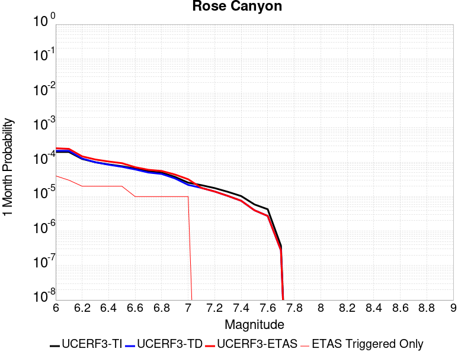 |  | 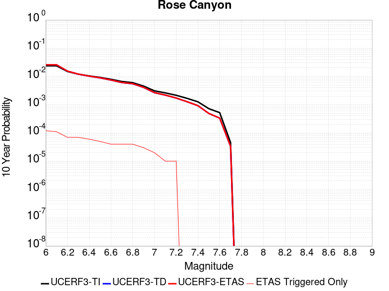 |

| Magnitude | 1 wk TI Prob | 1 wk TD Prob | 1 wk ETAS Prob | 1 wk ETAS/TD Gain | 1 wk ETAS Triggered Only | 1 mo TI Prob | 1 mo TD Prob | 1 mo ETAS Prob | 1 mo ETAS/TD Gain | 1 mo ETAS Triggered Only | 1 yr TI Prob | 1 yr TD Prob | 1 yr ETAS Prob | 1 yr ETAS/TD Gain | 1 yr ETAS Triggered Only | 10 yr TI Prob | 10 yr TD Prob | 10 yr ETAS Prob | 10 yr ETAS/TD Gain | 10 yr ETAS Triggered Only |
|-----|-----|-----|-----|-----|-----|-----|-----|-----|-----|-----|-----|-----|-----|-----|-----|-----|-----|-----|-----|-----|
| 6.0 | 4.5923203E-5 | 4.9714607E-5 | 8.9712616E-5 | 1.8045526 | 4.0E-5 | 1.9679888E-4 | 2.1304654E-4 | 2.5303802E-4 | 1.1877124 | 4.0E-5 | 0.0023933933 | 0.0025909478 | 0.0026607665 | 1.0269471 | 7.0E-5 | 0.023677798 | 0.025618518 | 0.025735443 | 1.0045642 | 1.2E-4 |
| 6.1 | 4.5923203E-5 | 4.9714607E-5 | 7.9713114E-5 | 1.6034144 | 3.0E-5 | 1.9679888E-4 | 2.1304654E-4 | 2.4304015E-4 | 1.1407843 | 3.0E-5 | 0.0023933933 | 0.0025909478 | 0.0026507925 | 1.0230975 | 6.0E-5 | 0.023677798 | 0.025618518 | 0.0257257 | 1.0041838 | 1.1E-4 |
| 6.2 | 2.8844734E-5 | 2.9669678E-5 | 4.9669085E-5 | 1.6740689 | 2.0E-5 | 1.2361443E-4 | 1.2714976E-4 | 1.4714722E-4 | 1.1572748 | 2.0E-5 | 0.0015039665 | 0.001546976 | 0.0015869142 | 1.0258169 | 4.0E-5 | 0.0149382865 | 0.015364873 | 0.015433798 | 1.0044858 | 7.0E-5 |
| 6.3 | 2.3171577E-5 | 2.3162425E-5 | 4.3161963E-5 | 1.8634474 | 2.0E-5 | 9.9302975E-5 | 9.926383E-5 | 1.19261844E-4 | 1.2014632 | 2.0E-5 | 0.0012083431 | 0.0012078804 | 0.0012478321 | 1.0330758 | 4.0E-5 | 0.012017938 | 0.012012152 | 0.012081311 | 1.0057575 | 7.0E-5 |
| 6.4 | 2.0066604E-5 | 1.9668067E-5 | 3.9667673E-5 | 2.0168567 | 2.0E-5 | 8.599689E-5 | 8.428905E-5 | 1.0428736E-4 | 1.2372588 | 2.0E-5 | 0.0010465092 | 0.001025746 | 0.0010557153 | 1.029217 | 3.0E-5 | 0.010415946 | 0.010211479 | 0.010270866 | 1.0058157 | 6.0E-5 |
| 6.5 | 1.776989E-5 | 1.7115402E-5 | 3.711506E-5 | 2.168518 | 2.0E-5 | 7.615444E-5 | 7.33497E-5 | 9.334823E-5 | 1.2726464 | 2.0E-5 | 9.267859E-4 | 8.926737E-4 | 9.226469E-4 | 1.033577 | 3.0E-5 | 0.009229303 | 0.008874663 | 0.00892422 | 1.005584 | 5.0E-5 |
| 6.6 | 1.5227364E-5 | 1.4340872E-5 | 2.4340728E-5 | 1.6972976 | 1.0E-5 | 6.52585E-5 | 6.145947E-5 | 7.145885E-5 | 1.1626989 | 1.0E-5 | 7.942326E-4 | 7.480173E-4 | 7.6800236E-4 | 1.0267173 | 2.0E-5 | 0.007914 | 0.0074410336 | 0.007480736 | 1.0053356 | 4.0E-5 |
| 6.7 | 1.2703898E-5 | 1.1674277E-5 | 2.1674161E-5 | 1.856574 | 1.0E-5 | 5.4444143E-5 | 5.0031682E-5 | 6.003118E-5 | 1.1998633 | 1.0E-5 | 6.626558E-4 | 6.089697E-4 | 6.289575E-4 | 1.0328224 | 2.0E-5 | 0.006606833 | 0.0060623093 | 0.006102067 | 1.0065582 | 4.0E-5 |
| 6.8 | 1.1554917E-5 | 1.0610384E-5 | 2.0610278E-5 | 1.9424629 | 1.0E-5 | 4.9520135E-5 | 4.547231E-5 | 5.5471854E-5 | 1.2199041 | 1.0E-5 | 6.0274085E-4 | 5.5348873E-4 | 5.734777E-4 | 1.0361145 | 2.0E-5 | 0.0060110865 | 0.005504414 | 0.0055441936 | 1.007227 | 4.0E-5 |
| 6.9 | 8.732078E-6 | 7.882285E-6 | 1.7882207E-5 | 2.2686577 | 1.0E-5 | 3.7422655E-5 | 3.37808E-5 | 4.3780463E-5 | 1.2960161 | 1.0E-5 | 4.5552556E-4 | 4.112066E-4 | 4.3119836E-4 | 1.0486174 | 2.0E-5 | 0.0045459294 | 0.004089515 | 0.0041193925 | 1.0073059 | 3.0E-5 |
| 7.0 | 5.9337494E-6 | 5.107436E-6 | 1.51073855E-5 | 2.9579196 | 1.0E-5 | 2.5430107E-5 | 2.1888829E-5 | 3.1888612E-5 | 1.456844 | 1.0E-5 | 3.0956755E-4 | 2.6646405E-4 | 2.764614E-4 | 1.0375185 | 1.0E-5 | 0.0030913667 | 0.002661461 | 0.0026814078 | 1.0074947 | 2.0E-5 |
| 7.1 | 5.013409E-6 | 4.17734E-6 | 4.17734E-6 | 1.0 | 0.0 | 2.1485863E-5 | 1.7902763E-5 | 1.7902763E-5 | 1.0 | 0.0 | 2.6155898E-4 | 2.1794444E-4 | 2.1794444E-4 | 1.0 | 0.0 | 0.0026125133 | 0.0021773188 | 0.002187297 | 1.0045828 | 1.0E-5 |
| 7.2 | 4.120763E-6 | 3.2820917E-6 | 3.2820917E-6 | 1.0 | 0.0 | 1.7660293E-5 | 1.4066032E-5 | 1.4066032E-5 | 1.0 | 0.0 | 2.1499286E-4 | 1.7124058E-4 | 1.7124058E-4 | 1.0 | 0.0 | 0.0021478499 | 0.0017110958 | 0.0017210786 | 1.0058342 | 1.0E-5 |
| 7.3 | 3.2081239E-6 | 2.4404965E-6 | 2.4404965E-6 | 1.0 | 0.0 | 1.374903E-5 | 1.0459229E-5 | 1.0459229E-5 | 1.0 | 0.0 | 1.6738157E-4 | 1.2733374E-4 | 1.2733374E-4 | 1.0 | 0.0 | 0.0016725556 | 0.0012726148 | 0.0012726148 | 1.0 | 0.0 |
| 7.4 | 2.4194755E-6 | 1.7680321E-6 | 1.7680321E-6 | 1.0 | 0.0 | 1.0369139E-5 | 7.5772587E-6 | 7.5772587E-6 | 1.0 | 0.0 | 1.2623696E-4 | 9.224927E-5 | 9.224927E-5 | 1.0 | 0.0 | 0.0012616527 | 9.221151E-4 | 9.221151E-4 | 1.0 | 0.0 |
| 7.5 | 1.3842889E-6 | 9.3782967E-7 | 9.3782967E-7 | 1.0 | 0.0 | 5.9326535E-6 | 4.019264E-6 | 4.019264E-6 | 1.0 | 0.0 | 7.222766E-5 | 4.8933474E-5 | 4.8933474E-5 | 1.0 | 0.0 | 7.220419E-4 | 4.8923056E-4 | 4.8923056E-4 | 1.0 | 0.0 |
| 7.6 | 1.0021575E-6 | 6.4113493E-7 | 6.4113493E-7 | 1.0 | 0.0 | 4.2949537E-6 | 2.7477186E-6 | 2.7477186E-6 | 1.0 | 0.0 | 5.2289808E-5 | 3.345298E-5 | 3.345298E-5 | 1.0 | 0.0 | 5.2277505E-4 | 3.344816E-4 | 3.344816E-4 | 1.0 | 0.0 |
| 7.7 | 8.7620116E-8 | 6.449304E-8 | 6.449304E-8 | 1.0 | 0.0 | 3.7551473E-7 | 2.763987E-7 | 2.763987E-7 | 1.0 | 0.0 | 4.5718825E-6 | 3.3651493E-6 | 3.3651493E-6 | 1.0 | 0.0 | 4.5717883E-5 | 3.3651013E-5 | 3.3651013E-5 | 1.0 | 0.0 |

## Big Pine (Central)
*[(top)](#table-of-contents)*

| 1 Week | 1 Month | 1 Year | 10 Year |
|-----|-----|-----|-----|
|  |  | 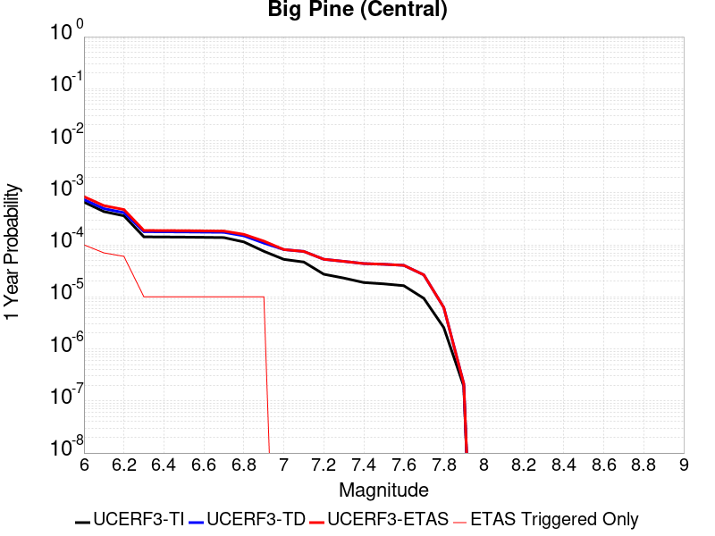 |  |

| Magnitude | 1 wk TI Prob | 1 wk TD Prob | 1 wk ETAS Prob | 1 wk ETAS/TD Gain | 1 wk ETAS Triggered Only | 1 mo TI Prob | 1 mo TD Prob | 1 mo ETAS Prob | 1 mo ETAS/TD Gain | 1 mo ETAS Triggered Only | 1 yr TI Prob | 1 yr TD Prob | 1 yr ETAS Prob | 1 yr ETAS/TD Gain | 1 yr ETAS Triggered Only | 10 yr TI Prob | 10 yr TD Prob | 10 yr ETAS Prob | 10 yr ETAS/TD Gain | 10 yr ETAS Triggered Only |
|-----|-----|-----|-----|-----|-----|-----|-----|-----|-----|-----|-----|-----|-----|-----|-----|-----|-----|-----|-----|-----|
| 6.0 | 1.2706755E-5 | 1.4250602E-5 | 8.424961E-5 | 5.912003 | 7.0E-5 | 5.4456385E-5 | 6.107279E-5 | 1.410679E-4 | 2.3098323 | 8.0E-5 | 6.628048E-4 | 7.433441E-4 | 8.4326975E-4 | 1.1344272 | 1.0E-4 | 0.006608314 | 0.007413639 | 0.0075526014 | 1.0187441 | 1.4E-4 |
| 6.1 | 8.342579E-6 | 9.510835E-6 | 5.951036E-5 | 6.2571115 | 5.0E-5 | 3.5753423E-5 | 4.076021E-5 | 1.0075777E-4 | 2.471964 | 6.0E-5 | 4.3521097E-4 | 4.9616426E-4 | 5.661296E-4 | 1.1410123 | 7.0E-5 | 0.0043435963 | 0.004954155 | 0.005043709 | 1.0180765 | 9.0E-5 |
| 6.2 | 6.923899E-6 | 7.967221E-6 | 4.7966903E-5 | 6.020531 | 4.0E-5 | 2.9673516E-5 | 3.4144894E-5 | 8.414319E-5 | 2.4642978 | 5.0E-5 | 3.6121515E-4 | 4.1565404E-4 | 4.7562912E-4 | 1.1442908 | 6.0E-5 | 0.003606286 | 0.0041521094 | 0.004231777 | 1.0191873 | 8.0E-5 |
| 6.3 | 2.728396E-6 | 3.4243646E-6 | 1.342433E-5 | 3.9202397 | 1.0E-5 | 1.1693074E-5 | 1.4675771E-5 | 2.4675624E-5 | 1.6813852 | 1.0E-5 | 1.4235388E-4 | 1.7866373E-4 | 1.8866194E-4 | 1.055961 | 1.0E-5 | 0.0014226272 | 0.0017867433 | 0.0017967254 | 1.0055867 | 1.0E-5 |
| 6.4 | 2.7136944E-6 | 3.4086581E-6 | 1.3408624E-5 | 3.9336958 | 1.0E-5 | 1.1630066E-5 | 1.4608458E-5 | 2.4608311E-5 | 1.6845249 | 1.0E-5 | 1.4158686E-4 | 1.7784433E-4 | 1.8784255E-4 | 1.056219 | 1.0E-5 | 0.0014149669 | 0.0017785623 | 0.0017885446 | 1.0056125 | 1.0E-5 |
| 6.5 | 2.6971882E-6 | 3.3910032E-6 | 1.3390969E-5 | 3.9489698 | 1.0E-5 | 1.1559327E-5 | 1.4532795E-5 | 2.453265E-5 | 1.6880889 | 1.0E-5 | 1.4072572E-4 | 1.7692328E-4 | 1.869215E-4 | 1.0565116 | 1.0E-5 | 0.0014063664 | 0.0017693666 | 0.0017793488 | 1.0056417 | 1.0E-5 |
| 6.6 | 2.669092E-6 | 3.3610236E-6 | 1.336099E-5 | 3.975274 | 1.0E-5 | 1.1438916E-5 | 1.4404312E-5 | 2.4404168E-5 | 1.6942265 | 1.0E-5 | 1.3925991E-4 | 1.7535927E-4 | 1.8535751E-4 | 1.0570158 | 1.0E-5 | 0.0013917267 | 0.0017537511 | 0.0017637336 | 1.005692 | 1.0E-5 |
| 6.7 | 2.6408059E-6 | 3.3310494E-6 | 1.3331016E-5 | 4.002047 | 1.0E-5 | 1.1317691E-5 | 1.4275853E-5 | 2.4275709E-5 | 1.7004735 | 1.0E-5 | 1.3778417E-4 | 1.737955E-4 | 1.8379377E-4 | 1.0575289 | 1.0E-5 | 0.0013769877 | 0.0017381381 | 0.0017481208 | 1.0057433 | 1.0E-5 |
| 6.8 | 2.1786943E-6 | 2.8545066E-6 | 1.2854478E-5 | 4.5032225 | 1.0E-5 | 9.337228E-6 | 1.2233547E-5 | 2.2233424E-5 | 1.8174144 | 1.0E-5 | 1.1367482E-4 | 1.4893398E-4 | 1.5893248E-4 | 1.0671339 | 1.0E-5 | 0.0011361669 | 0.0014898704 | 0.0014998555 | 1.006702 | 1.0E-5 |
| 6.9 | 1.4411696E-6 | 2.0685677E-6 | 1.2068547E-5 | 5.834253 | 1.0E-5 | 6.1764263E-6 | 8.865261E-6 | 1.8865174E-5 | 2.1279883 | 1.0E-5 | 7.51954E-5 | 1.0792949E-4 | 1.1792841E-4 | 1.0926431 | 1.0E-5 | 7.5169955E-4 | 0.0010802548 | 0.001090244 | 1.0092471 | 1.0E-5 |
| 7.0 | 1.0073411E-6 | 1.5543274E-6 | 1.5543274E-6 | 1.0 | 0.0 | 4.317169E-6 | 6.661387E-6 | 6.661387E-6 | 1.0 | 0.0 | 5.2560266E-5 | 8.109952E-5 | 8.109952E-5 | 1.0 | 0.0 | 5.2547833E-4 | 8.1217213E-4 | 8.1217213E-4 | 1.0 | 0.0 |
| 7.1 | 8.947104E-7 | 1.430316E-6 | 1.430316E-6 | 1.0 | 0.0 | 3.834468E-6 | 6.1299124E-6 | 6.1299124E-6 | 1.0 | 0.0 | 4.6683643E-5 | 7.462928E-5 | 7.462928E-5 | 1.0 | 0.0 | 4.6673836E-4 | 7.4751483E-4 | 7.4751483E-4 | 1.0 | 0.0 |
| 7.2 | 5.215166E-7 | 1.0112277E-6 | 1.0112277E-6 | 1.0 | 0.0 | 2.2350691E-6 | 4.333826E-6 | 4.333826E-6 | 1.0 | 0.0 | 2.7211627E-5 | 5.27631E-5 | 5.27631E-5 | 1.0 | 0.0 | 2.7208295E-4 | 5.289683E-4 | 5.289683E-4 | 1.0 | 0.0 |
| 7.3 | 4.4024807E-7 | 9.220183E-7 | 9.220183E-7 | 1.0 | 0.0 | 1.8867761E-6 | 3.951501E-6 | 3.951501E-6 | 1.0 | 0.0 | 2.2971257E-5 | 4.8108504E-5 | 4.8108504E-5 | 1.0 | 0.0 | 2.2968883E-4 | 4.824433E-4 | 4.824433E-4 | 1.0 | 0.0 |
| 7.4 | 3.6130905E-7 | 8.359109E-7 | 8.359109E-7 | 1.0 | 0.0 | 1.5484665E-6 | 3.5824705E-6 | 3.5824705E-6 | 1.0 | 0.0 | 1.8852415E-5 | 4.3615746E-5 | 4.3615746E-5 | 1.0 | 0.0 | 1.8850817E-4 | 4.3752496E-4 | 4.3752496E-4 | 1.0 | 0.0 |
| 7.5 | 3.408184E-7 | 8.1087245E-7 | 8.1087245E-7 | 1.0 | 0.0 | 1.4606494E-6 | 3.475163E-6 | 3.475163E-6 | 1.0 | 0.0 | 1.7783263E-5 | 4.230933E-5 | 4.230933E-5 | 1.0 | 0.0 | 1.778184E-4 | 4.2444657E-4 | 4.2444657E-4 | 1.0 | 0.0 |
| 7.6 | 3.1428627E-7 | 7.732167E-7 | 7.732167E-7 | 1.0 | 0.0 | 1.3469405E-6 | 3.313782E-6 | 3.313782E-6 | 1.0 | 0.0 | 1.6398877E-5 | 4.0344585E-5 | 4.0344585E-5 | 1.0 | 0.0 | 1.6397667E-4 | 4.0477706E-4 | 4.0477706E-4 | 1.0 | 0.0 |
| 7.7 | 1.7972785E-7 | 5.0782415E-7 | 5.0782415E-7 | 1.0 | 0.0 | 7.70262E-7 | 2.1763874E-6 | 2.1763874E-6 | 1.0 | 0.0 | 9.377899E-6 | 2.6497206E-5 | 2.6497206E-5 | 1.0 | 0.0 | 9.377503E-5 | 2.6633305E-4 | 2.6633305E-4 | 1.0 | 0.0 |
| 7.8 | 4.9230927E-8 | 1.1981747E-7 | 1.1981747E-7 | 1.0 | 0.0 | 2.1098968E-7 | 5.135033E-7 | 5.135033E-7 | 1.0 | 0.0 | 2.5687964E-6 | 6.2518866E-6 | 6.2518866E-6 | 1.0 | 0.0 | 2.5687666E-5 | 6.2971965E-5 | 6.2971965E-5 | 1.0 | 0.0 |
| 7.9 | 3.6805972E-9 | 4.1051638E-9 | 4.1051638E-9 | 1.0 | 0.0 | 1.5773987E-8 | 1.7593557E-8 | 1.7593557E-8 | 1.0 | 0.0 | 1.9204828E-7 | 2.1420155E-7 | 2.1420155E-7 | 1.0 | 0.0 | 1.920481E-6 | 2.1898923E-6 | 2.1898923E-6 | 1.0 | 0.0 |

## San Jacinto (Borrego)
*[(top)](#table-of-contents)*

| 1 Week | 1 Month | 1 Year | 10 Year |
|-----|-----|-----|-----|
|  |  | 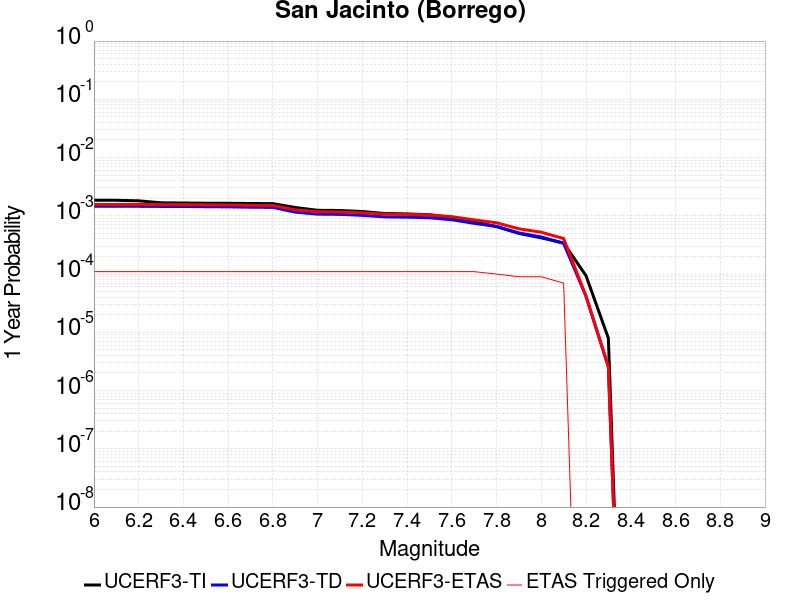 |  |

| Magnitude | 1 wk TI Prob | 1 wk TD Prob | 1 wk ETAS Prob | 1 wk ETAS/TD Gain | 1 wk ETAS Triggered Only | 1 mo TI Prob | 1 mo TD Prob | 1 mo ETAS Prob | 1 mo ETAS/TD Gain | 1 mo ETAS Triggered Only | 1 yr TI Prob | 1 yr TD Prob | 1 yr ETAS Prob | 1 yr ETAS/TD Gain | 1 yr ETAS Triggered Only | 10 yr TI Prob | 10 yr TD Prob | 10 yr ETAS Prob | 10 yr ETAS/TD Gain | 10 yr ETAS Triggered Only |
|-----|-----|-----|-----|-----|-----|-----|-----|-----|-----|-----|-----|-----|-----|-----|-----|-----|-----|-----|-----|-----|
| 6.0 | 3.543992E-5 | 2.7925962E-5 | 7.792457E-5 | 2.7903986 | 5.0E-5 | 1.5187653E-4 | 1.1967727E-4 | 1.796701E-4 | 1.5012883 | 6.0E-5 | 0.0018475284 | 0.0014561092 | 0.001565949 | 1.0754337 | 1.1E-4 | 0.018322436 | 0.01486815 | 0.015006069 | 1.0092762 | 1.4E-4 |
| 6.1 | 3.542281E-5 | 2.7925962E-5 | 7.792457E-5 | 2.7903986 | 5.0E-5 | 1.5180321E-4 | 1.1967727E-4 | 1.796701E-4 | 1.5012883 | 6.0E-5 | 0.0018466372 | 0.0014561092 | 0.001565949 | 1.0754337 | 1.1E-4 | 0.018313672 | 0.01486815 | 0.015006069 | 1.0092762 | 1.4E-4 |
| 6.2 | 3.4688688E-5 | 2.7925962E-5 | 7.792457E-5 | 2.7903986 | 5.0E-5 | 1.4865733E-4 | 1.1967727E-4 | 1.796701E-4 | 1.5012883 | 6.0E-5 | 0.0018084005 | 0.0014561091 | 0.001565949 | 1.0754337 | 1.1E-4 | 0.017937548 | 0.01486815 | 0.015006069 | 1.0092762 | 1.4E-4 |
| 6.3 | 3.2087122E-5 | 2.7771312E-5 | 7.7769924E-5 | 2.800369 | 5.0E-5 | 1.3750899E-4 | 1.1901455E-4 | 1.790074E-4 | 1.50408 | 6.0E-5 | 0.0016728862 | 0.0014480512 | 0.001557892 | 1.0758542 | 1.1E-4 | 0.016603488 | 0.014789308 | 0.014927237 | 1.0093263 | 1.4E-4 |
| 6.4 | 3.1828724E-5 | 2.773829E-5 | 7.77369E-5 | 2.8025126 | 5.0E-5 | 1.364017E-4 | 1.1887303E-4 | 1.788659E-4 | 1.5046802 | 6.0E-5 | 0.0016594254 | 0.0014463306 | 0.0015561715 | 1.0759445 | 1.1E-4 | 0.016470885 | 0.014772502 | 0.014910433 | 1.0093371 | 1.4E-4 |
| 6.5 | 3.1563577E-5 | 2.7477974E-5 | 7.74766E-5 | 2.8195894 | 5.0E-5 | 1.3526545E-4 | 1.17757496E-4 | 1.7775044E-4 | 1.5094616 | 6.0E-5 | 0.0016456128 | 0.0014327668 | 0.0015426092 | 1.0766646 | 1.1E-4 | 0.0163348 | 0.01463991 | 0.014777861 | 1.0094229 | 1.4E-4 |
| 6.6 | 3.1467625E-5 | 2.7322194E-5 | 7.732083E-5 | 2.8299642 | 5.0E-5 | 1.3485427E-4 | 1.17089934E-4 | 1.7708291E-4 | 1.5123667 | 6.0E-5 | 0.0016406142 | 0.0014246498 | 0.0015344932 | 1.077102 | 1.1E-4 | 0.016285548 | 0.014560228 | 0.01469819 | 1.0094752 | 1.4E-4 |
| 6.7 | 3.1223695E-5 | 2.6940217E-5 | 7.693887E-5 | 2.8559113 | 5.0E-5 | 1.3380898E-4 | 1.1545303E-4 | 1.7544611E-4 | 1.5196319 | 6.0E-5 | 0.0016279068 | 0.0014047464 | 0.001514592 | 1.0781959 | 1.1E-4 | 0.01616033 | 0.01436451 | 0.014502498 | 1.0096062 | 1.4E-4 |
| 6.8 | 3.1015585E-5 | 2.6761221E-5 | 7.675988E-5 | 2.8683252 | 5.0E-5 | 1.3291716E-4 | 1.1468597E-4 | 1.746791E-4 | 1.5231078 | 6.0E-5 | 0.001617065 | 0.0013954195 | 0.001505266 | 1.0787194 | 1.1E-4 | 0.016053487 | 0.014271772 | 0.014409774 | 1.0096695 | 1.4E-4 |
| 6.9 | 2.6641965E-5 | 2.2183434E-5 | 7.218232E-5 | 3.253884 | 5.0E-5 | 1.1417485E-4 | 9.506842E-5 | 1.5506272E-4 | 1.6310644 | 6.0E-5 | 0.0013891924 | 0.0011568473 | 0.0012667201 | 1.0949761 | 1.1E-4 | 0.0138054015 | 0.011882191 | 0.012020527 | 1.0116423 | 1.4E-4 |
| 7.0 | 2.3854353E-5 | 2.047825E-5 | 7.0477225E-5 | 3.4415648 | 5.0E-5 | 1.02228936E-4 | 8.776099E-5 | 1.4775572E-4 | 1.6836151 | 6.0E-5 | 0.0012439266 | 0.0010679689 | 0.0011778515 | 1.1028893 | 1.1E-4 | 0.012369866 | 0.0109826205 | 0.011121083 | 1.0126075 | 1.4E-4 |
| 7.1 | 2.3672901E-5 | 2.0314741E-5 | 7.031373E-5 | 3.461217 | 5.0E-5 | 1.0145135E-4 | 8.706028E-5 | 1.4705506E-4 | 1.6891177 | 6.0E-5 | 0.0012344702 | 0.0010594461 | 0.0011693295 | 1.1037178 | 1.1E-4 | 0.0122763505 | 0.010897858 | 0.011036333 | 1.0127065 | 1.4E-4 |
| 7.2 | 2.2717244E-5 | 1.9542116E-5 | 6.9541136E-5 | 3.5585265 | 5.0E-5 | 9.735599E-5 | 8.3749255E-5 | 1.4374423E-4 | 1.7163643 | 6.0E-5 | 0.0011846646 | 0.0010191725 | 0.0011290604 | 1.1078207 | 1.1E-4 | 0.01178369 | 0.010495322 | 0.010633852 | 1.0131993 | 1.4E-4 |
| 7.3 | 2.1016205E-5 | 1.8383771E-5 | 6.8382855E-5 | 3.7197402 | 5.0E-5 | 9.006634E-5 | 7.878522E-5 | 1.387805E-4 | 1.7615042 | 6.0E-5 | 0.001096006 | 9.5879E-4 | 0.0010686845 | 1.114618 | 1.1E-4 | 0.010906163 | 0.009890901 | 0.010029516 | 1.0140145 | 1.4E-4 |
| 7.4 | 2.0683625E-5 | 1.8186302E-5 | 6.818539E-5 | 3.749272 | 5.0E-5 | 8.86411E-5 | 7.7938974E-5 | 1.379343E-4 | 1.769773 | 6.0E-5 | 0.001078671 | 9.48496E-4 | 0.0010583916 | 1.1158631 | 1.1E-4 | 0.010734501 | 0.0097876275 | 0.009926258 | 1.0141637 | 1.4E-4 |
| 7.5 | 1.9993966E-5 | 1.7781347E-5 | 6.778046E-5 | 3.8118854 | 5.0E-5 | 8.568561E-5 | 7.6203556E-5 | 1.3619899E-4 | 1.7873048 | 6.0E-5 | 0.001042723 | 9.2738547E-4 | 0.0010372835 | 1.118503 | 1.1E-4 | 0.010378438 | 0.009574548 | 0.009713208 | 1.0144821 | 1.4E-4 |
| 7.6 | 1.788966E-5 | 1.6434618E-5 | 6.643379E-5 | 4.0423083 | 5.0E-5 | 7.666772E-5 | 7.043219E-5 | 1.3042796E-4 | 1.8518232 | 6.0E-5 | 9.3302975E-4 | 8.5717626E-4 | 9.67082E-4 | 1.1282183 | 1.1E-4 | 0.00929122 | 0.008866415 | 0.009005174 | 1.0156499 | 1.4E-4 |
| 7.7 | 1.5125781E-5 | 1.4236738E-5 | 6.4236025E-5 | 4.5119905 | 5.0E-5 | 6.4823165E-5 | 6.101317E-5 | 1.2100951E-4 | 1.9833343 | 6.0E-5 | 7.889362E-4 | 7.4258295E-4 | 8.5250125E-4 | 1.1480216 | 1.1E-4 | 0.007861412 | 0.007714161 | 0.007853081 | 1.0180085 | 1.4E-4 |
| 7.8 | 1.250089E-5 | 1.262994E-5 | 6.262931E-5 | 4.958797 | 5.0E-5 | 5.3574146E-5 | 5.4127195E-5 | 1.1412395E-4 | 2.1084402 | 6.0E-5 | 6.5207E-4 | 6.588E-4 | 7.587341E-4 | 1.1516912 | 1.0E-4 | 0.006501599 | 0.006867759 | 0.0069968663 | 1.0187991 | 1.3E-4 |
| 7.9 | 9.561E-6 | 9.754065E-6 | 5.9753576E-5 | 6.126018 | 5.0E-5 | 4.0975072E-5 | 4.180247E-5 | 1.0179996E-4 | 2.435262 | 6.0E-5 | 4.987573E-4 | 5.0882675E-4 | 5.98781E-4 | 1.1767875 | 9.0E-5 | 0.0049763937 | 0.0053523607 | 0.005471718 | 1.0223 | 1.2E-4 |
| 8.0 | 8.01699E-6 | 8.292994E-6 | 5.829258E-5 | 7.0291357 | 5.0E-5 | 3.4358076E-5 | 3.554092E-5 | 9.553879E-5 | 2.688135 | 6.0E-5 | 4.1822926E-4 | 4.3262533E-4 | 5.225864E-4 | 1.2079422 | 9.0E-5 | 0.0041744304 | 0.0045733186 | 0.00469277 | 1.0261191 | 1.2E-4 |
| 8.1 | 6.541947E-6 | 6.461784E-6 | 3.646159E-5 | 5.6426506 | 3.0E-5 | 2.8036617E-5 | 2.7693068E-5 | 6.769196E-5 | 2.4443648 | 4.0E-5 | 3.4129233E-4 | 3.3711144E-4 | 4.0708785E-4 | 1.2075765 | 7.0E-5 | 0.0034076865 | 0.0035805756 | 0.0036802173 | 1.0278285 | 1.0E-4 |
| 8.2 | 1.7968189E-6 | 7.9684827E-7 | 7.9684827E-7 | 1.0 | 0.0 | 7.70063E-6 | 3.4150596E-6 | 3.4150596E-6 | 1.0 | 0.0 | 9.3751136E-5 | 4.157758E-5 | 4.157758E-5 | 1.0 | 0.0 | 9.371159E-4 | 4.7107413E-4 | 4.7107413E-4 | 1.0 | 0.0 |
| 8.3 | 1.5167889E-7 | 4.8951257E-8 | 4.8951257E-8 | 1.0 | 0.0 | 6.500522E-7 | 2.0979108E-7 | 2.0979108E-7 | 1.0 | 0.0 | 7.9143565E-6 | 2.5542038E-6 | 2.5542038E-6 | 1.0 | 0.0 | 7.914075E-5 | 2.9679897E-5 | 2.9679897E-5 | 1.0 | 0.0 |

## Channel Islands Thrust
*[(top)](#table-of-contents)*

| 1 Week | 1 Month | 1 Year | 10 Year |
|-----|-----|-----|-----|
|  |  |  |  |

| Magnitude | 1 wk TI Prob | 1 wk TD Prob | 1 wk ETAS Prob | 1 wk ETAS/TD Gain | 1 wk ETAS Triggered Only | 1 mo TI Prob | 1 mo TD Prob | 1 mo ETAS Prob | 1 mo ETAS/TD Gain | 1 mo ETAS Triggered Only | 1 yr TI Prob | 1 yr TD Prob | 1 yr ETAS Prob | 1 yr ETAS/TD Gain | 1 yr ETAS Triggered Only | 10 yr TI Prob | 10 yr TD Prob | 10 yr ETAS Prob | 10 yr ETAS/TD Gain | 10 yr ETAS Triggered Only |
|-----|-----|-----|-----|-----|-----|-----|-----|-----|-----|-----|-----|-----|-----|-----|-----|-----|-----|-----|-----|-----|
| 6.0 | 2.2156251E-5 | 2.4092022E-5 | 6.409106E-5 | 2.6602607 | 4.0E-5 | 9.495191E-5 | 1.03248036E-4 | 1.432439E-4 | 1.3873765 | 4.0E-5 | 0.0011554264 | 0.0012564266 | 0.0013263385 | 1.0556436 | 7.0E-5 | 0.011494373 | 0.0125038205 | 0.01262232 | 1.009477 | 1.2E-4 |
| 6.1 | 2.2156251E-5 | 2.4092022E-5 | 6.409106E-5 | 2.6602607 | 4.0E-5 | 9.495191E-5 | 1.03248036E-4 | 1.432439E-4 | 1.3873765 | 4.0E-5 | 0.0011554264 | 0.0012564266 | 0.0013263385 | 1.0556436 | 7.0E-5 | 0.011494373 | 0.0125038205 | 0.01262232 | 1.009477 | 1.2E-4 |
| 6.2 | 2.2156251E-5 | 2.4092022E-5 | 6.409106E-5 | 2.6602607 | 4.0E-5 | 9.495191E-5 | 1.03248036E-4 | 1.432439E-4 | 1.3873765 | 4.0E-5 | 0.0011554264 | 0.0012564266 | 0.0013263385 | 1.0556436 | 7.0E-5 | 0.011494373 | 0.0125038205 | 0.01262232 | 1.009477 | 1.2E-4 |
| 6.3 | 2.2156251E-5 | 2.4092022E-5 | 6.409106E-5 | 2.6602607 | 4.0E-5 | 9.495191E-5 | 1.03248036E-4 | 1.432439E-4 | 1.3873765 | 4.0E-5 | 0.0011554264 | 0.0012564266 | 0.0013263385 | 1.0556436 | 7.0E-5 | 0.011494373 | 0.0125038205 | 0.01262232 | 1.009477 | 1.2E-4 |
| 6.4 | 2.2156251E-5 | 2.4092022E-5 | 6.409106E-5 | 2.6602607 | 4.0E-5 | 9.495191E-5 | 1.03248036E-4 | 1.432439E-4 | 1.3873765 | 4.0E-5 | 0.0011554264 | 0.0012564266 | 0.0013263385 | 1.0556436 | 7.0E-5 | 0.011494373 | 0.0125038205 | 0.01262232 | 1.009477 | 1.2E-4 |
| 6.5 | 2.2156251E-5 | 2.4092022E-5 | 6.409106E-5 | 2.6602607 | 4.0E-5 | 9.495191E-5 | 1.03248036E-4 | 1.432439E-4 | 1.3873765 | 4.0E-5 | 0.0011554264 | 0.0012564266 | 0.0013263385 | 1.0556436 | 7.0E-5 | 0.011494373 | 0.0125038205 | 0.01262232 | 1.009477 | 1.2E-4 |
| 6.6 | 2.2156251E-5 | 2.4092022E-5 | 6.409106E-5 | 2.6602607 | 4.0E-5 | 9.495191E-5 | 1.03248036E-4 | 1.432439E-4 | 1.3873765 | 4.0E-5 | 0.0011554264 | 0.0012564266 | 0.0013263385 | 1.0556436 | 7.0E-5 | 0.011494373 | 0.0125038205 | 0.01262232 | 1.009477 | 1.2E-4 |
| 6.7 | 1.0601296E-5 | 1.1379544E-5 | 2.137943E-5 | 1.8787599 | 1.0E-5 | 4.5433335E-5 | 4.876859E-5 | 5.8768102E-5 | 1.20504 | 1.0E-5 | 5.5301044E-4 | 5.936007E-4 | 6.235829E-4 | 1.050509 | 3.0E-5 | 0.005516363 | 0.005920653 | 0.005990239 | 1.011753 | 7.0E-5 |
| 6.8 | 1.0246747E-5 | 1.0996669E-5 | 2.0996558E-5 | 1.9093562 | 1.0E-5 | 4.391389E-5 | 4.7127756E-5 | 5.7127287E-5 | 1.2121792 | 1.0E-5 | 5.345204E-4 | 5.7363417E-4 | 6.0361694E-4 | 1.0522681 | 3.0E-5 | 0.0053323656 | 0.005722025 | 0.0057916245 | 1.0121634 | 7.0E-5 |
| 6.9 | 9.049551E-6 | 9.699645E-6 | 9.699645E-6 | 1.0 | 0.0 | 3.878322E-5 | 4.1569267E-5 | 4.1569267E-5 | 1.0 | 0.0 | 4.7208337E-4 | 5.059924E-4 | 5.259823E-4 | 1.0395063 | 2.0E-5 | 0.0047108172 | 0.0050488203 | 0.005098568 | 1.0098534 | 5.0E-5 |
| 7.0 | 8.6542195E-6 | 9.274603E-6 | 9.274603E-6 | 1.0 | 0.0 | 3.7088983E-5 | 3.9747716E-5 | 3.9747716E-5 | 1.0 | 0.0 | 4.5146482E-4 | 4.8382508E-4 | 5.038154E-4 | 1.0413172 | 2.0E-5 | 0.004505487 | 0.0048281294 | 0.004867936 | 1.0082448 | 4.0E-5 |
| 7.1 | 8.391028E-6 | 8.992925E-6 | 8.992925E-6 | 1.0 | 0.0 | 3.5961057E-5 | 3.8540562E-5 | 3.8540562E-5 | 1.0 | 0.0 | 4.3773788E-4 | 4.6913436E-4 | 4.8912497E-4 | 1.0426117 | 2.0E-5 | 0.004368766 | 0.0046818503 | 0.004721663 | 1.0085037 | 4.0E-5 |
| 7.2 | 5.965188E-6 | 6.3716957E-6 | 6.3716957E-6 | 1.0 | 0.0 | 2.556484E-5 | 2.7306984E-5 | 2.7306984E-5 | 1.0 | 0.0 | 3.1120746E-4 | 3.3241237E-4 | 3.524057E-4 | 1.0601462 | 2.0E-5 | 0.00310772 | 0.0033192094 | 0.0033491098 | 1.0090083 | 3.0E-5 |
| 7.3 | 4.877518E-6 | 5.206007E-6 | 5.206007E-6 | 1.0 | 0.0 | 2.0903482E-5 | 2.231127E-5 | 2.231127E-5 | 1.0 | 0.0 | 2.5447016E-4 | 2.716063E-4 | 2.9160085E-4 | 1.073616 | 2.0E-5 | 0.0025417898 | 0.0027127897 | 0.0027427082 | 1.0110288 | 3.0E-5 |
| 7.4 | 3.8829853E-6 | 4.141863E-6 | 4.141863E-6 | 1.0 | 0.0 | 1.664126E-5 | 1.7750723E-5 | 1.7750723E-5 | 1.0 | 0.0 | 2.0258849E-4 | 2.1609403E-4 | 2.3608972E-4 | 1.0925323 | 2.0E-5 | 0.002024039 | 0.002158881 | 0.002188816 | 1.0138661 | 3.0E-5 |
| 7.5 | 1.3489616E-6 | 1.4277905E-6 | 1.4277905E-6 | 1.0 | 0.0 | 5.7812517E-6 | 6.119088E-6 | 6.119088E-6 | 1.0 | 0.0 | 7.038446E-5 | 7.449739E-5 | 8.449665E-5 | 1.1342229 | 1.0E-5 | 7.036218E-4 | 7.4472814E-4 | 7.647133E-4 | 1.0268354 | 2.0E-5 |
| 7.6 | 6.058192E-7 | 6.35378E-7 | 6.35378E-7 | 1.0 | 0.0 | 2.5963652E-6 | 2.7230458E-6 | 2.7230458E-6 | 1.0 | 0.0 | 3.161029E-5 | 3.3152595E-5 | 3.3152595E-5 | 1.0 | 0.0 | 3.1605794E-4 | 3.314781E-4 | 3.414748E-4 | 1.0301579 | 1.0E-5 |
| 7.7 | 2.2170494E-7 | 2.2607924E-7 | 2.2607924E-7 | 1.0 | 0.0 | 9.5016367E-7 | 9.689107E-7 | 9.689107E-7 | 1.0 | 0.0 | 1.1568181E-5 | 1.17964355E-5 | 1.17964355E-5 | 1.0 | 0.0 | 1.1567579E-4 | 1.179592E-4 | 1.2795802E-4 | 1.0847651 | 1.0E-5 |
| 7.8 | 2.1613102E-8 | 1.5466837E-8 | 1.5466837E-8 | 1.0 | 0.0 | 9.262757E-8 | 6.628645E-8 | 6.628645E-8 | 1.0 | 0.0 | 1.1277401E-6 | 8.070372E-7 | 8.070372E-7 | 1.0 | 0.0 | 1.1277344E-5 | 8.07035E-6 | 8.07035E-6 | 1.0 | 0.0 |

## Whittier alt 1
*[(top)](#table-of-contents)*

| 1 Week | 1 Month | 1 Year | 10 Year |
|-----|-----|-----|-----|
| 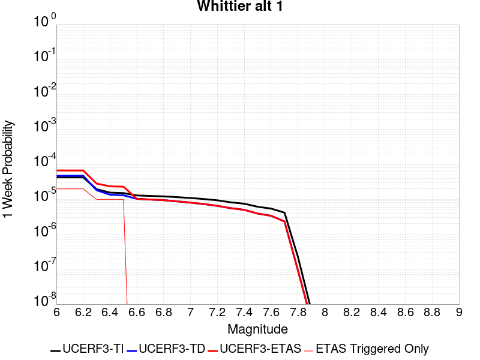 |  |  | 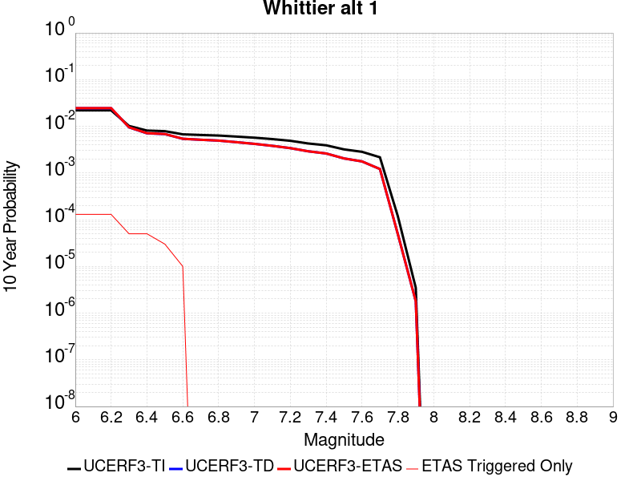 |

| Magnitude | 1 wk TI Prob | 1 wk TD Prob | 1 wk ETAS Prob | 1 wk ETAS/TD Gain | 1 wk ETAS Triggered Only | 1 mo TI Prob | 1 mo TD Prob | 1 mo ETAS Prob | 1 mo ETAS/TD Gain | 1 mo ETAS Triggered Only | 1 yr TI Prob | 1 yr TD Prob | 1 yr ETAS Prob | 1 yr ETAS/TD Gain | 1 yr ETAS Triggered Only | 10 yr TI Prob | 10 yr TD Prob | 10 yr ETAS Prob | 10 yr ETAS/TD Gain | 10 yr ETAS Triggered Only |
|-----|-----|-----|-----|-----|-----|-----|-----|-----|-----|-----|-----|-----|-----|-----|-----|-----|-----|-----|-----|-----|
| 6.0 | 4.2554693E-5 | 4.7252182E-5 | 6.725124E-5 | 1.4232409 | 2.0E-5 | 1.8236451E-4 | 2.0249544E-4 | 2.4248734E-4 | 1.1974953 | 4.0E-5 | 0.002218027 | 0.0024629163 | 0.0025227687 | 1.0243014 | 6.0E-5 | 0.02196019 | 0.024390263 | 0.024517093 | 1.0052 | 1.3E-4 |
| 6.1 | 4.2554693E-5 | 4.7252182E-5 | 6.725124E-5 | 1.4232409 | 2.0E-5 | 1.8236451E-4 | 2.0249544E-4 | 2.4248734E-4 | 1.1974953 | 4.0E-5 | 0.002218027 | 0.0024629163 | 0.0025227687 | 1.0243014 | 6.0E-5 | 0.02196019 | 0.024390263 | 0.024517093 | 1.0052 | 1.3E-4 |
| 6.2 | 4.2554693E-5 | 4.7252182E-5 | 6.725124E-5 | 1.4232409 | 2.0E-5 | 1.8236451E-4 | 2.0249544E-4 | 2.4248734E-4 | 1.1974953 | 4.0E-5 | 0.002218027 | 0.0024629163 | 0.0025227687 | 1.0243014 | 6.0E-5 | 0.02196019 | 0.024390263 | 0.024517093 | 1.0052 | 1.3E-4 |
| 6.3 | 1.9617712E-5 | 1.826841E-5 | 2.8268229E-5 | 1.547383 | 1.0E-5 | 8.40732E-5 | 7.829095E-5 | 8.8290166E-5 | 1.1277187 | 1.0E-5 | 0.0010231105 | 9.527944E-4 | 9.7277533E-4 | 1.020971 | 2.0E-5 | 0.01018413 | 0.0094904 | 0.009539925 | 1.0052185 | 5.0E-5 |
| 6.4 | 1.5611336E-5 | 1.3604089E-5 | 2.3603954E-5 | 1.7350631 | 1.0E-5 | 6.690401E-5 | 5.8301972E-5 | 6.8301386E-5 | 1.1715108 | 1.0E-5 | 8.142519E-4 | 7.096013E-4 | 7.295871E-4 | 1.0281649 | 2.0E-5 | 0.008112748 | 0.0070753377 | 0.0071249837 | 1.0070168 | 5.0E-5 |
| 6.5 | 1.5150166E-5 | 1.3100744E-5 | 2.3100612E-5 | 1.7633054 | 1.0E-5 | 6.492767E-5 | 5.614487E-5 | 6.6144305E-5 | 1.1781007 | 1.0E-5 | 7.9020765E-4 | 6.8335526E-4 | 6.9334847E-4 | 1.0146236 | 1.0E-5 | 0.007874036 | 0.006814508 | 0.006844303 | 1.0043724 | 3.0E-5 |
| 6.6 | 1.295588E-5 | 1.0380544E-5 | 1.0380544E-5 | 1.0 | 0.0 | 5.552402E-5 | 4.44873E-5 | 4.44873E-5 | 1.0 | 0.0 | 6.7579525E-4 | 5.415002E-4 | 5.415002E-4 | 1.0 | 0.0 | 0.006737438 | 0.005403343 | 0.005413289 | 1.0018407 | 1.0E-5 |
| 6.7 | 1.2542085E-5 | 9.899189E-6 | 9.899189E-6 | 1.0 | 0.0 | 5.3750682E-5 | 4.2424414E-5 | 4.2424414E-5 | 1.0 | 0.0 | 6.542181E-4 | 5.163967E-4 | 5.163967E-4 | 1.0 | 0.0 | 0.006522954 | 0.005153464 | 0.005153464 | 1.0 | 0.0 |
| 6.8 | 1.2195878E-5 | 9.49523E-6 | 9.49523E-6 | 1.0 | 0.0 | 5.2267E-5 | 4.069322E-5 | 4.069322E-5 | 1.0 | 0.0 | 6.36165E-4 | 4.9532915E-4 | 4.9532915E-4 | 1.0 | 0.0 | 0.0063434686 | 0.0049436963 | 0.0049436963 | 1.0 | 0.0 |
| 6.9 | 1.1580298E-5 | 8.772739E-6 | 8.772739E-6 | 1.0 | 0.0 | 4.9628903E-5 | 3.759692E-5 | 3.759692E-5 | 1.0 | 0.0 | 6.040644E-4 | 4.5764804E-4 | 4.5764804E-4 | 1.0 | 0.0 | 0.00602425 | 0.0045684646 | 0.0045684646 | 1.0 | 0.0 |
| 7.0 | 1.0964795E-5 | 8.083794E-6 | 8.083794E-6 | 1.0 | 0.0 | 4.6991136E-5 | 3.4644378E-5 | 3.4644378E-5 | 1.0 | 0.0 | 5.7196687E-4 | 4.217152E-4 | 4.217152E-4 | 1.0 | 0.0 | 0.0057049696 | 0.004210459 | 0.004210459 | 1.0 | 0.0 |
| 7.1 | 1.0230601E-5 | 7.32646E-6 | 7.32646E-6 | 1.0 | 0.0 | 4.3844695E-5 | 3.1398744E-5 | 3.1398744E-5 | 1.0 | 0.0 | 5.336784E-4 | 3.8221394E-4 | 3.8221394E-4 | 1.0 | 0.0 | 0.005323986 | 0.0038167592 | 0.0038167592 | 1.0 | 0.0 |
| 7.2 | 9.40865E-6 | 6.5430822E-6 | 6.5430822E-6 | 1.0 | 0.0 | 4.032216E-5 | 2.8041486E-5 | 2.8041486E-5 | 1.0 | 0.0 | 4.908117E-4 | 3.4135283E-4 | 3.4135283E-4 | 1.0 | 0.0 | 0.0048972913 | 0.0034094024 | 0.0034094024 | 1.0 | 0.0 |
| 7.3 | 8.237384E-6 | 5.5975433E-6 | 5.5975433E-6 | 1.0 | 0.0 | 3.5302593E-5 | 2.3989258E-5 | 2.3989258E-5 | 1.0 | 0.0 | 4.2972428E-4 | 2.920311E-4 | 2.920311E-4 | 1.0 | 0.0 | 0.0042889426 | 0.0029167992 | 0.0029167992 | 1.0 | 0.0 |
| 7.4 | 7.5316966E-6 | 5.0276153E-6 | 5.0276153E-6 | 1.0 | 0.0 | 3.2278298E-5 | 2.154675E-5 | 2.154675E-5 | 1.0 | 0.0 | 3.9291743E-4 | 2.623011E-4 | 2.623011E-4 | 1.0 | 0.0 | 0.0039222343 | 0.0026200267 | 0.0026200267 | 1.0 | 0.0 |
| 7.5 | 6.149649E-6 | 3.9336355E-6 | 3.9336355E-6 | 1.0 | 0.0 | 2.6355372E-5 | 1.6858336E-5 | 1.6858336E-5 | 1.0 | 0.0 | 3.208294E-4 | 2.052318E-4 | 2.052318E-4 | 1.0 | 0.0 | 0.003203666 | 0.0020505118 | 0.0020505118 | 1.0 | 0.0 |
| 7.6 | 5.457711E-6 | 3.3951796E-6 | 3.3951796E-6 | 1.0 | 0.0 | 2.338998E-5 | 1.4550694E-5 | 1.4550694E-5 | 1.0 | 0.0 | 2.8473578E-4 | 1.771411E-4 | 1.771411E-4 | 1.0 | 0.0 | 0.0028437122 | 0.0017700798 | 0.0017700798 | 1.0 | 0.0 |
| 7.7 | 4.1676276E-6 | 2.3329922E-6 | 2.3329922E-6 | 1.0 | 0.0 | 1.7861139E-5 | 9.998504E-6 | 9.998504E-6 | 1.0 | 0.0 | 2.1743766E-4 | 1.2172572E-4 | 1.2172572E-4 | 1.0 | 0.0 | 0.0021722503 | 0.0012166635 | 0.0012166635 | 1.0 | 0.0 |
| 7.8 | 2.2692414E-7 | 9.384417E-8 | 9.384417E-8 | 1.0 | 0.0 | 9.725317E-7 | 4.0218927E-7 | 4.0218927E-7 | 1.0 | 0.0 | 1.1840509E-5 | 4.8966467E-6 | 4.8966467E-6 | 1.0 | 0.0 | 1.1839878E-4 | 4.8965718E-5 | 4.8965718E-5 | 1.0 | 0.0 |
| 7.9 | 6.676829E-9 | 3.4397174E-9 | 3.4397174E-9 | 1.0 | 0.0 | 2.861498E-8 | 1.4741646E-8 | 1.4741646E-8 | 1.0 | 0.0 | 3.4838732E-7 | 1.7947953E-7 | 1.7947953E-7 | 1.0 | 0.0 | 3.4838679E-6 | 1.794794E-6 | 1.794794E-6 | 1.0 | 0.0 |

## Cleghorn
*[(top)](#table-of-contents)*

| 1 Week | 1 Month | 1 Year | 10 Year |
|-----|-----|-----|-----|
|  |  |  |  |

| Magnitude | 1 wk TI Prob | 1 wk TD Prob | 1 wk ETAS Prob | 1 wk ETAS/TD Gain | 1 wk ETAS Triggered Only | 1 mo TI Prob | 1 mo TD Prob | 1 mo ETAS Prob | 1 mo ETAS/TD Gain | 1 mo ETAS Triggered Only | 1 yr TI Prob | 1 yr TD Prob | 1 yr ETAS Prob | 1 yr ETAS/TD Gain | 1 yr ETAS Triggered Only | 10 yr TI Prob | 10 yr TD Prob | 10 yr ETAS Prob | 10 yr ETAS/TD Gain | 10 yr ETAS Triggered Only |
|-----|-----|-----|-----|-----|-----|-----|-----|-----|-----|-----|-----|-----|-----|-----|-----|-----|-----|-----|-----|-----|
| 6.0 | 7.9267165E-6 | 9.831764E-6 | 2.9831568E-5 | 3.0342028 | 2.0E-5 | 3.39712E-5 | 4.2135514E-5 | 7.213425E-5 | 1.7119585 | 3.0E-5 | 4.1352084E-4 | 5.1288976E-4 | 5.7285896E-4 | 1.1169242 | 6.0E-5 | 0.004127522 | 0.005132214 | 0.0052515985 | 1.0232617 | 1.2E-4 |
| 6.1 | 7.9267165E-6 | 9.831764E-6 | 2.9831568E-5 | 3.0342028 | 2.0E-5 | 3.39712E-5 | 4.2135514E-5 | 7.213425E-5 | 1.7119585 | 3.0E-5 | 4.1352084E-4 | 5.1288976E-4 | 5.7285896E-4 | 1.1169242 | 6.0E-5 | 0.004127522 | 0.005132214 | 0.0052515985 | 1.0232617 | 1.2E-4 |
| 6.2 | 7.9267165E-6 | 9.831764E-6 | 2.9831568E-5 | 3.0342028 | 2.0E-5 | 3.39712E-5 | 4.2135514E-5 | 7.213425E-5 | 1.7119585 | 3.0E-5 | 4.1352084E-4 | 5.1288976E-4 | 5.7285896E-4 | 1.1169242 | 6.0E-5 | 0.004127522 | 0.005132214 | 0.0052515985 | 1.0232617 | 1.2E-4 |
| 6.3 | 7.9267165E-6 | 9.831764E-6 | 2.9831568E-5 | 3.0342028 | 2.0E-5 | 3.39712E-5 | 4.2135514E-5 | 7.213425E-5 | 1.7119585 | 3.0E-5 | 4.1352084E-4 | 5.1288976E-4 | 5.7285896E-4 | 1.1169242 | 6.0E-5 | 0.004127522 | 0.005132214 | 0.0052515985 | 1.0232617 | 1.2E-4 |
| 6.4 | 4.3445207E-6 | 6.0916254E-6 | 1.6091564E-5 | 2.641588 | 1.0E-5 | 1.8619241E-5 | 2.6106709E-5 | 3.610645E-5 | 1.3830333 | 1.0E-5 | 2.2666567E-4 | 3.1780385E-4 | 3.5779114E-4 | 1.1258239 | 4.0E-5 | 0.0022643462 | 0.0031877246 | 0.0032774378 | 1.0281433 | 9.0E-5 |
| 6.5 | 4.3445207E-6 | 6.0916254E-6 | 1.6091564E-5 | 2.641588 | 1.0E-5 | 1.8619241E-5 | 2.6106709E-5 | 3.610645E-5 | 1.3830333 | 1.0E-5 | 2.2666567E-4 | 3.1780385E-4 | 3.5779114E-4 | 1.1258239 | 4.0E-5 | 0.0022643462 | 0.0031877246 | 0.0032774378 | 1.0281433 | 9.0E-5 |
| 6.6 | 4.040109E-6 | 5.774033E-6 | 1.5773976E-5 | 2.7318816 | 1.0E-5 | 1.7314638E-5 | 2.4745626E-5 | 3.474538E-5 | 1.4041018 | 1.0E-5 | 2.1078532E-4 | 3.0123728E-4 | 3.3122825E-4 | 1.0995593 | 3.0E-5 | 0.002105855 | 0.0030225143 | 0.0030923027 | 1.0230895 | 7.0E-5 |
| 6.7 | 3.3632055E-6 | 5.06753E-6 | 1.5067479E-5 | 2.9733381 | 1.0E-5 | 1.4413658E-5 | 2.1717806E-5 | 3.1717587E-5 | 1.4604417 | 1.0E-5 | 1.7547216E-4 | 2.643825E-4 | 2.943746E-4 | 1.113442 | 3.0E-5 | 0.0017533366 | 0.0026548486 | 0.0027047158 | 1.0187835 | 5.0E-5 |
| 6.8 | 3.2902772E-6 | 4.9894375E-6 | 1.4989388E-5 | 3.004224 | 1.0E-5 | 1.4101111E-5 | 2.138313E-5 | 3.1382915E-5 | 1.4676484 | 1.0E-5 | 1.716675E-4 | 2.6030882E-4 | 2.9030102E-4 | 1.1152177 | 3.0E-5 | 0.0017153495 | 0.0026142076 | 0.0026640769 | 1.0190762 | 5.0E-5 |
| 6.9 | 3.031547E-6 | 4.6911987E-6 | 1.4691152E-5 | 3.1316414 | 1.0E-5 | 1.299228E-5 | 2.0104984E-5 | 3.0104784E-5 | 1.4973791 | 1.0E-5 | 1.5816953E-4 | 2.4475096E-4 | 2.7474362E-4 | 1.1225436 | 3.0E-5 | 0.00158057 | 0.0024589805 | 0.0025088575 | 1.0202836 | 5.0E-5 |
| 7.0 | 2.8259715E-6 | 4.3707637E-6 | 1.437072E-5 | 3.2879195 | 1.0E-5 | 1.211125E-5 | 1.8731711E-5 | 2.8731525E-5 | 1.533844 | 1.0E-5 | 1.4744449E-4 | 2.2803496E-4 | 2.5802813E-4 | 1.1315287 | 3.0E-5 | 0.001473467 | 0.0022921748 | 0.0023420602 | 1.0217633 | 5.0E-5 |
| 7.1 | 2.5962665E-6 | 4.065983E-6 | 1.4065942E-5 | 3.45942 | 1.0E-5 | 1.1126809E-5 | 1.7425526E-5 | 2.7425353E-5 | 1.5738608 | 1.0E-5 | 1.3546048E-4 | 2.1213535E-4 | 2.4212898E-4 | 1.1413891 | 3.0E-5 | 0.0013537793 | 0.0021334959 | 0.0021833892 | 1.0233858 | 5.0E-5 |
| 7.2 | 2.3247253E-6 | 3.6765352E-6 | 1.3676498E-5 | 3.719942 | 1.0E-5 | 9.96307E-6 | 1.5756486E-5 | 2.5756328E-5 | 1.6346493 | 1.0E-5 | 1.21293626E-4 | 1.9181852E-4 | 2.2181276E-4 | 1.1563678 | 3.0E-5 | 0.0012122744 | 0.0019307166 | 0.00198062 | 1.0258471 | 5.0E-5 |
| 7.3 | 2.056928E-6 | 3.235253E-6 | 1.3235221E-5 | 4.0909386 | 1.0E-5 | 8.815376E-6 | 1.3865297E-5 | 2.3865157E-5 | 1.7212151 | 1.0E-5 | 1.0732192E-4 | 1.6879707E-4 | 1.9879201E-4 | 1.1776983 | 3.0E-5 | 0.001072701 | 0.0017009423 | 0.0017508572 | 1.0293455 | 5.0E-5 |
| 7.4 | 1.8055999E-6 | 2.8256538E-6 | 1.2825625E-5 | 4.538994 | 1.0E-5 | 7.738263E-6 | 1.210989E-5 | 2.2109769E-5 | 1.8257613 | 1.0E-5 | 9.4209274E-5 | 1.4742807E-4 | 1.7742364E-4 | 1.203459 | 3.0E-5 | 9.4169343E-4 | 0.0014876705 | 0.0015375961 | 1.0335596 | 5.0E-5 |
| 7.5 | 1.4683443E-6 | 2.4248943E-6 | 2.4248943E-6 | 1.0 | 0.0 | 6.292889E-6 | 1.0392363E-5 | 1.0392363E-5 | 1.0 | 0.0 | 7.661323E-5 | 1.2651978E-4 | 1.4651724E-4 | 1.158058 | 2.0E-5 | 7.658682E-4 | 0.0012788812 | 0.0013188301 | 1.0312374 | 4.0E-5 |
| 7.6 | 9.804088E-7 | 1.9004091E-6 | 1.9004091E-6 | 1.0 | 0.0 | 4.201745E-6 | 8.144585E-6 | 8.144585E-6 | 1.0 | 0.0 | 5.1155046E-5 | 9.915586E-5 | 9.915586E-5 | 1.0 | 0.0 | 5.114327E-4 | 0.0010055583 | 0.0010255382 | 1.0198694 | 2.0E-5 |
| 7.7 | 7.3434086E-7 | 1.6285549E-6 | 1.6285549E-6 | 1.0 | 0.0 | 3.1471714E-6 | 6.9795024E-6 | 6.9795024E-6 | 1.0 | 0.0 | 3.831614E-5 | 8.4972155E-5 | 8.4972155E-5 | 1.0 | 0.0 | 3.8309532E-4 | 8.6387293E-4 | 8.838557E-4 | 1.0231316 | 2.0E-5 |
| 7.8 | 6.434184E-7 | 1.5221389E-6 | 1.5221389E-6 | 1.0 | 0.0 | 2.7575045E-6 | 6.523436E-6 | 6.523436E-6 | 1.0 | 0.0 | 3.35721E-5 | 7.9419966E-5 | 7.9419966E-5 | 1.0 | 0.0 | 3.3567028E-4 | 8.080443E-4 | 8.2802813E-4 | 1.0247312 | 2.0E-5 |
| 7.9 | 3.4943926E-7 | 7.5750586E-7 | 7.5750586E-7 | 1.0 | 0.0 | 1.497596E-6 | 3.2464498E-6 | 3.2464498E-6 | 1.0 | 0.0 | 1.8233079E-5 | 3.9524817E-5 | 3.9524817E-5 | 1.0 | 0.0 | 1.8231584E-4 | 4.0401975E-4 | 4.140157E-4 | 1.0247413 | 1.0E-5 |
| 8.0 | 6.717524E-8 | 5.837515E-8 | 5.837515E-8 | 1.0 | 0.0 | 2.8789387E-7 | 2.501792E-7 | 2.501792E-7 | 1.0 | 0.0 | 3.505102E-6 | 3.0459275E-6 | 3.0459275E-6 | 1.0 | 0.0 | 3.5050467E-5 | 3.2751934E-5 | 3.2751934E-5 | 1.0 | 0.0 |
| 8.1 | 3.1984914E-8 | 1.2949885E-8 | 1.2949885E-8 | 1.0 | 0.0 | 1.370782E-7 | 5.549951E-8 | 5.549951E-8 | 1.0 | 0.0 | 1.6689258E-6 | 6.757063E-7 | 6.757063E-7 | 1.0 | 0.0 | 1.6689133E-5 | 7.741151E-6 | 7.741151E-6 | 1.0 | 0.0 |
| 8.2 | 1.21887656E-8 | 3.6471115E-9 | 3.6471115E-9 | 1.0 | 0.0 | 5.2237567E-8 | 1.563048E-8 | 1.563048E-8 | 1.0 | 0.0 | 6.359922E-7 | 1.9030107E-7 | 1.9030107E-7 | 1.0 | 0.0 | 6.3599036E-6 | 2.245849E-6 | 2.245849E-6 | 1.0 | 0.0 |

## San Diego Trough north alt1
*[(top)](#table-of-contents)*

| 1 Week | 1 Month | 1 Year | 10 Year |
|-----|-----|-----|-----|
|  | 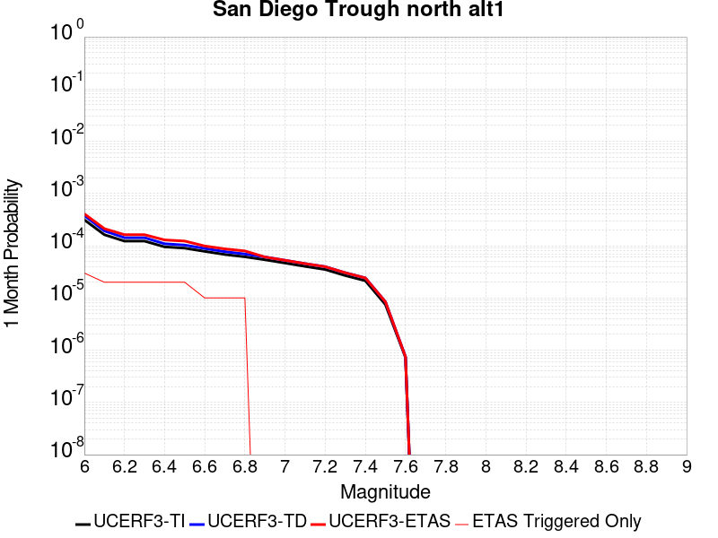 | 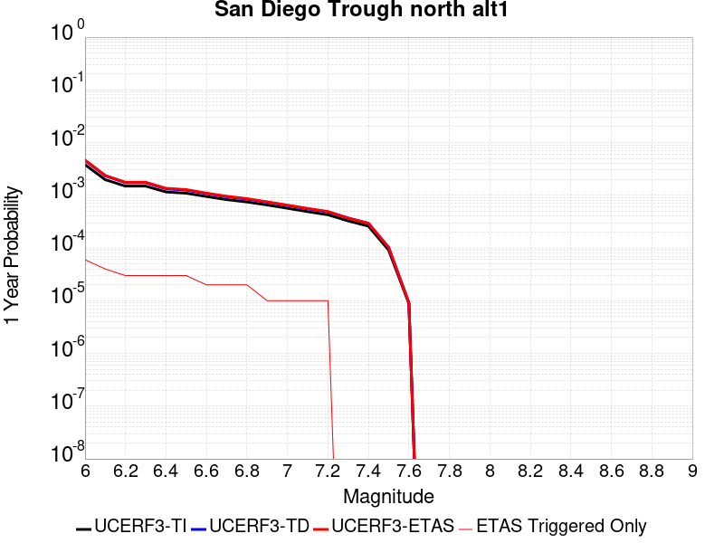 |  |

| Magnitude | 1 wk TI Prob | 1 wk TD Prob | 1 wk ETAS Prob | 1 wk ETAS/TD Gain | 1 wk ETAS Triggered Only | 1 mo TI Prob | 1 mo TD Prob | 1 mo ETAS Prob | 1 mo ETAS/TD Gain | 1 mo ETAS Triggered Only | 1 yr TI Prob | 1 yr TD Prob | 1 yr ETAS Prob | 1 yr ETAS/TD Gain | 1 yr ETAS Triggered Only | 10 yr TI Prob | 10 yr TD Prob | 10 yr ETAS Prob | 10 yr ETAS/TD Gain | 10 yr ETAS Triggered Only |
|-----|-----|-----|-----|-----|-----|-----|-----|-----|-----|-----|-----|-----|-----|-----|-----|-----|-----|-----|-----|-----|
| 6.0 | 7.329252E-5 | 8.821269E-5 | 1.18210046E-4 | 1.3400571 | 3.0E-5 | 3.14073E-4 | 3.7800326E-4 | 4.0799193E-4 | 1.0793344 | 3.0E-5 | 0.0038171355 | 0.0045930487 | 0.004652773 | 1.0130032 | 6.0E-5 | 0.03752231 | 0.045045137 | 0.04515973 | 1.002544 | 1.2E-4 |
| 6.1 | 3.7940346E-5 | 4.4884906E-5 | 6.488401E-5 | 1.445564 | 2.0E-5 | 1.6259136E-4 | 1.9235026E-4 | 2.1234641E-4 | 1.1039569 | 2.0E-5 | 0.0019777524 | 0.002339431 | 0.0023793373 | 1.0170581 | 4.0E-5 | 0.019602431 | 0.023156732 | 0.023225112 | 1.0029529 | 7.0E-5 |
| 6.2 | 2.8645263E-5 | 3.329672E-5 | 5.3296055E-5 | 1.6006397 | 2.0E-5 | 1.2275964E-4 | 1.4269259E-4 | 1.6268973E-4 | 1.1401415 | 2.0E-5 | 0.0014935739 | 0.0017359206 | 0.0017658685 | 1.0172518 | 3.0E-5 | 0.0148357535 | 0.017226268 | 0.017275406 | 1.0028526 | 5.0E-5 |
| 6.3 | 2.8645263E-5 | 3.329672E-5 | 5.3296055E-5 | 1.6006397 | 2.0E-5 | 1.2275964E-4 | 1.4269259E-4 | 1.6268973E-4 | 1.1401415 | 2.0E-5 | 0.0014935739 | 0.0017359206 | 0.0017658685 | 1.0172518 | 3.0E-5 | 0.0148357535 | 0.017226268 | 0.017275406 | 1.0028526 | 5.0E-5 |
| 6.4 | 2.2204576E-5 | 2.544832E-5 | 4.544781E-5 | 1.7858865 | 2.0E-5 | 9.5159E-5 | 1.0905972E-4 | 1.2905755E-4 | 1.1833657 | 2.0E-5 | 0.001157945 | 0.0013270028 | 0.001356963 | 1.0225773 | 3.0E-5 | 0.011519298 | 0.013191959 | 0.013231431 | 1.0029922 | 4.0E-5 |
| 6.5 | 2.1004838E-5 | 2.4024695E-5 | 4.4024215E-5 | 1.8324567 | 2.0E-5 | 9.0017624E-5 | 1.0295897E-4 | 1.2295692E-4 | 1.1942321 | 2.0E-5 | 0.0010954136 | 0.0012528135 | 0.0012827759 | 1.0239161 | 3.0E-5 | 0.010900296 | 0.012458592 | 0.012498093 | 1.0031706 | 4.0E-5 |
| 6.6 | 1.820557E-5 | 2.070479E-5 | 3.070458E-5 | 1.48297 | 1.0E-5 | 7.802154E-5 | 8.8731824E-5 | 9.873094E-5 | 1.1126891 | 1.0E-5 | 9.4949827E-4 | 0.0010797799 | 0.0010997584 | 1.0185022 | 2.0E-5 | 0.009454516 | 0.010746005 | 0.010775683 | 1.0027617 | 3.0E-5 |
| 6.7 | 1.5884485E-5 | 1.7983646E-5 | 2.7983466E-5 | 1.5560508 | 1.0E-5 | 6.807459E-5 | 7.707051E-5 | 8.706974E-5 | 1.1297413 | 1.0E-5 | 8.284929E-4 | 9.3793223E-4 | 9.5791346E-4 | 1.0213035 | 2.0E-5 | 0.008254109 | 0.009340104 | 0.009369823 | 1.0031819 | 3.0E-5 |
| 6.8 | 1.4331171E-5 | 1.6201066E-5 | 2.6200903E-5 | 1.6172334 | 1.0E-5 | 6.141786E-5 | 6.94313E-5 | 7.94306E-5 | 1.1440172 | 1.0E-5 | 7.4750587E-4 | 8.450002E-4 | 8.649833E-4 | 1.0236486 | 2.0E-5 | 0.0074499645 | 0.008418139 | 0.008447886 | 1.0035337 | 3.0E-5 |
| 6.9 | 1.2574203E-5 | 1.4205835E-5 | 1.4205835E-5 | 1.0 | 0.0 | 5.3888325E-5 | 6.0880735E-5 | 6.0880735E-5 | 1.0 | 0.0 | 6.558929E-4 | 7.409723E-4 | 7.5096486E-4 | 1.0134858 | 1.0E-5 | 0.0065396037 | 0.007385203 | 0.0074050557 | 1.0026882 | 2.0E-5 |
| 7.0 | 1.0883844E-5 | 1.2289262E-5 | 1.2289262E-5 | 1.0 | 0.0 | 4.664421E-5 | 5.2667205E-5 | 5.2667205E-5 | 1.0 | 0.0 | 5.677453E-4 | 6.4103556E-4 | 6.510292E-4 | 1.0155897 | 1.0E-5 | 0.00566297 | 0.006391993 | 0.006411865 | 1.0031089 | 2.0E-5 |
| 7.1 | 9.393088E-6 | 1.060702E-5 | 1.060702E-5 | 1.0 | 0.0 | 4.025547E-5 | 4.545787E-5 | 4.545787E-5 | 1.0 | 0.0 | 4.900001E-4 | 5.533098E-4 | 5.6330423E-4 | 1.0180631 | 1.0E-5 | 0.0048892107 | 0.005519418 | 0.0055393074 | 1.0036036 | 2.0E-5 |
| 7.2 | 8.190791E-6 | 9.258625E-6 | 9.258625E-6 | 1.0 | 0.0 | 3.510292E-5 | 3.9679224E-5 | 3.9679224E-5 | 1.0 | 0.0 | 4.2729423E-4 | 4.8298817E-4 | 4.929833E-4 | 1.0206945 | 1.0E-5 | 0.0042647356 | 0.004819465 | 0.004839368 | 1.0041299 | 2.0E-5 |
| 7.3 | 6.268162E-6 | 7.089716E-6 | 7.089716E-6 | 1.0 | 0.0 | 2.6863276E-5 | 3.0384144E-5 | 3.0384144E-5 | 1.0 | 0.0 | 3.2701128E-4 | 3.6986457E-4 | 3.6986457E-4 | 1.0 | 0.0 | 0.003265305 | 0.003692536 | 0.003692536 | 1.0 | 0.0 |
| 7.4 | 4.985186E-6 | 5.6426816E-6 | 5.6426816E-6 | 1.0 | 0.0 | 2.1364907E-5 | 2.4182698E-5 | 2.4182698E-5 | 1.0 | 0.0 | 2.600867E-4 | 2.9438498E-4 | 2.9438498E-4 | 1.0 | 0.0 | 0.002597825 | 0.0029399914 | 0.0029399914 | 1.0 | 0.0 |
| 7.5 | 1.7489613E-6 | 1.969678E-6 | 1.969678E-6 | 1.0 | 0.0 | 7.495527E-6 | 8.4414505E-6 | 8.4414505E-6 | 1.0 | 0.0 | 9.125422E-5 | 1.02770035E-4 | 1.02770035E-4 | 1.0 | 0.0 | 9.1216754E-4 | 0.0010272472 | 0.0010272472 | 1.0 | 0.0 |
| 7.6 | 1.6988751E-7 | 1.7533823E-7 | 1.7533823E-7 | 1.0 | 0.0 | 7.2808916E-7 | 7.5144936E-7 | 7.5144936E-7 | 1.0 | 0.0 | 8.864449E-6 | 9.14886E-6 | 9.14886E-6 | 1.0 | 0.0 | 8.8640954E-5 | 9.1485024E-5 | 9.1485024E-5 | 1.0 | 0.0 |

## Palos Verdes
*[(top)](#table-of-contents)*

| 1 Week | 1 Month | 1 Year | 10 Year |
|-----|-----|-----|-----|
|  |  | 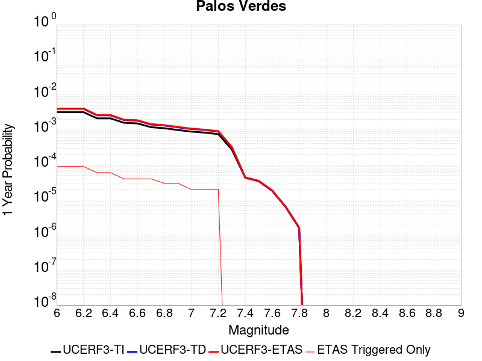 | 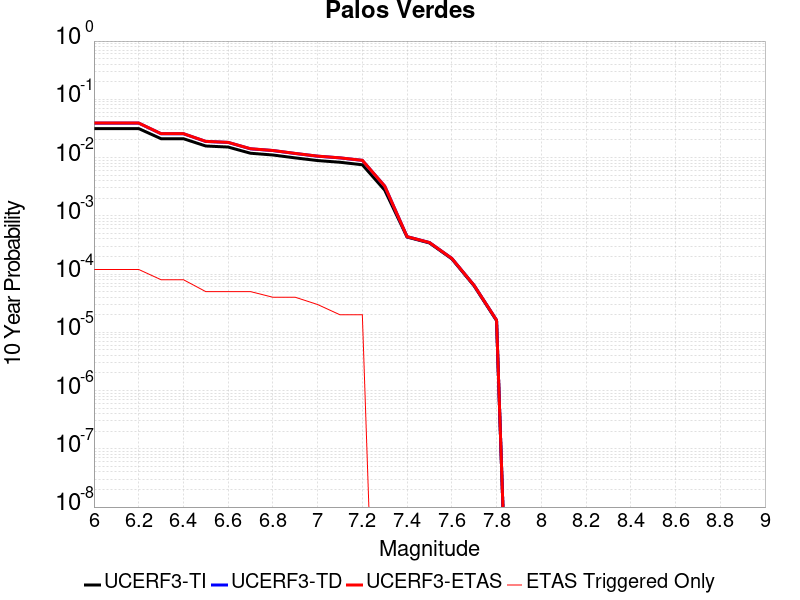 |

| Magnitude | 1 wk TI Prob | 1 wk TD Prob | 1 wk ETAS Prob | 1 wk ETAS/TD Gain | 1 wk ETAS Triggered Only | 1 mo TI Prob | 1 mo TD Prob | 1 mo ETAS Prob | 1 mo ETAS/TD Gain | 1 mo ETAS Triggered Only | 1 yr TI Prob | 1 yr TD Prob | 1 yr ETAS Prob | 1 yr ETAS/TD Gain | 1 yr ETAS Triggered Only | 10 yr TI Prob | 10 yr TD Prob | 10 yr ETAS Prob | 10 yr ETAS/TD Gain | 10 yr ETAS Triggered Only |
|-----|-----|-----|-----|-----|-----|-----|-----|-----|-----|-----|-----|-----|-----|-----|-----|-----|-----|-----|-----|-----|
| 6.0 | 6.126063E-5 | 7.622572E-5 | 1.0622344E-4 | 1.3935379 | 3.0E-5 | 2.6251914E-4 | 3.266441E-4 | 3.866245E-4 | 1.1836262 | 6.0E-5 | 0.0031914865 | 0.0039701737 | 0.0040598167 | 1.0225791 | 9.0E-5 | 0.031460393 | 0.03904909 | 0.0391644 | 1.002953 | 1.2E-4 |
| 6.1 | 6.126063E-5 | 7.622572E-5 | 1.0622344E-4 | 1.3935379 | 3.0E-5 | 2.6251914E-4 | 3.266441E-4 | 3.866245E-4 | 1.1836262 | 6.0E-5 | 0.0031914865 | 0.0039701737 | 0.0040598167 | 1.0225791 | 9.0E-5 | 0.031460393 | 0.03904909 | 0.0391644 | 1.002953 | 1.2E-4 |
| 6.2 | 6.126063E-5 | 7.622572E-5 | 1.0622344E-4 | 1.3935379 | 3.0E-5 | 2.6251914E-4 | 3.266441E-4 | 3.866245E-4 | 1.1836262 | 6.0E-5 | 0.0031914865 | 0.0039701737 | 0.0040598167 | 1.0225791 | 9.0E-5 | 0.031460393 | 0.03904909 | 0.0391644 | 1.002953 | 1.2E-4 |
| 6.3 | 4.0838047E-5 | 4.9749007E-5 | 6.974801E-5 | 1.401998 | 2.0E-5 | 1.7500846E-4 | 2.1319388E-4 | 2.5318534E-4 | 1.1875826 | 4.0E-5 | 0.0021286458 | 0.002592754 | 0.0026525985 | 1.0230814 | 6.0E-5 | 0.021083709 | 0.025646746 | 0.025724696 | 1.0030394 | 8.0E-5 |
| 6.4 | 4.0838047E-5 | 4.9749007E-5 | 6.974801E-5 | 1.401998 | 2.0E-5 | 1.7500846E-4 | 2.1319388E-4 | 2.5318534E-4 | 1.1875826 | 4.0E-5 | 0.0021286458 | 0.002592754 | 0.0026525985 | 1.0230814 | 6.0E-5 | 0.021083709 | 0.025646746 | 0.025724696 | 1.0030394 | 8.0E-5 |
| 6.5 | 3.0512005E-5 | 3.6561592E-5 | 5.6560864E-5 | 1.5470021 | 2.0E-5 | 1.3075917E-4 | 1.566838E-4 | 1.8667911E-4 | 1.1914384 | 3.0E-5 | 0.0015908304 | 0.001906072 | 0.0019459957 | 1.0209455 | 4.0E-5 | 0.015794903 | 0.018909173 | 0.018958228 | 1.0025942 | 5.0E-5 |
| 6.6 | 2.9255087E-5 | 3.5154393E-5 | 5.5153687E-5 | 1.5688989 | 2.0E-5 | 1.2537291E-4 | 1.5065364E-4 | 1.8064912E-4 | 1.1991023 | 3.0E-5 | 0.0015253464 | 0.0018327782 | 0.001872705 | 1.0217848 | 4.0E-5 | 0.015149189 | 0.018188244 | 0.018237334 | 1.002699 | 5.0E-5 |
| 6.7 | 2.287198E-5 | 2.724828E-5 | 4.7247733E-5 | 1.7339714 | 2.0E-5 | 9.801909E-5 | 1.16773626E-4 | 1.4677012E-4 | 1.2568773 | 3.0E-5 | 0.001192729 | 0.0014208833 | 0.0014608265 | 1.0281115 | 4.0E-5 | 0.011863477 | 0.014127217 | 0.014176511 | 1.0034893 | 5.0E-5 |
| 6.8 | 2.1325764E-5 | 2.5431878E-5 | 3.5431625E-5 | 1.3931973 | 1.0E-5 | 9.139293E-5 | 1.0898972E-4 | 1.2898754E-4 | 1.1834836 | 2.0E-5 | 0.001112141 | 0.0013262323 | 0.0013561925 | 1.0225905 | 3.0E-5 | 0.011065915 | 0.013192211 | 0.0132316835 | 1.002992 | 4.0E-5 |
| 6.9 | 1.9009392E-5 | 2.2613547E-5 | 3.2613323E-5 | 1.4422028 | 1.0E-5 | 8.1466285E-5 | 9.6912096E-5 | 1.1691016E-4 | 1.2063526 | 2.0E-5 | 9.914007E-4 | 0.0011793535 | 0.001209318 | 1.0254077 | 3.0E-5 | 0.009869894 | 0.011739633 | 0.011779163 | 1.0033673 | 4.0E-5 |
| 7.0 | 1.7098473E-5 | 2.0319356E-5 | 2.0319356E-5 | 1.0 | 0.0 | 7.3277115E-5 | 8.708052E-5 | 9.7079654E-5 | 1.1148262 | 1.0E-5 | 8.917837E-4 | 0.001059775 | 0.0010797537 | 1.0188519 | 2.0E-5 | 0.008882134 | 0.010555646 | 0.0105853295 | 1.002812 | 3.0E-5 |
| 7.1 | 1.5982785E-5 | 1.899476E-5 | 1.899476E-5 | 1.0 | 0.0 | 6.849585E-5 | 8.1404054E-5 | 9.1403235E-5 | 1.122834 | 1.0E-5 | 8.336179E-4 | 9.907284E-4 | 0.0010107086 | 1.0201671 | 2.0E-5 | 0.008304977 | 0.009871479 | 0.009891282 | 1.002006 | 2.0E-5 |
| 7.2 | 1.4468002E-5 | 1.7197237E-5 | 1.7197237E-5 | 1.0 | 0.0 | 6.200425E-5 | 7.370083E-5 | 8.370009E-5 | 1.1356736 | 1.0E-5 | 7.546402E-4 | 8.970222E-4 | 9.1700425E-4 | 1.022276 | 2.0E-5 | 0.007520827 | 0.008942284 | 0.008962105 | 1.0022166 | 2.0E-5 |
| 7.3 | 5.288233E-6 | 6.2036747E-6 | 6.2036747E-6 | 1.0 | 0.0 | 2.2663658E-5 | 2.6587102E-5 | 2.6587102E-5 | 1.0 | 0.0 | 2.7589512E-4 | 3.236848E-4 | 3.236848E-4 | 1.0 | 0.0 | 0.0027555283 | 0.0032355562 | 0.0032355562 | 1.0 | 0.0 |
| 7.4 | 8.279556E-7 | 8.408347E-7 | 8.408347E-7 | 1.0 | 0.0 | 3.5483763E-6 | 3.6035726E-6 | 3.6035726E-6 | 1.0 | 0.0 | 4.3200624E-5 | 4.3872686E-5 | 4.3872686E-5 | 1.0 | 0.0 | 4.3192226E-4 | 4.3864746E-4 | 4.3864746E-4 | 1.0 | 0.0 |
| 7.5 | 6.559831E-7 | 6.667229E-7 | 6.667229E-7 | 1.0 | 0.0 | 2.8113532E-6 | 2.857381E-6 | 2.857381E-6 | 1.0 | 0.0 | 3.4227687E-5 | 3.4788125E-5 | 3.4788125E-5 | 1.0 | 0.0 | 3.4222414E-4 | 3.4783344E-4 | 3.4783344E-4 | 1.0 | 0.0 |
| 7.6 | 3.5018968E-7 | 3.5620027E-7 | 3.5620027E-7 | 1.0 | 0.0 | 1.500812E-6 | 1.526572E-6 | 1.526572E-6 | 1.0 | 0.0 | 1.8272232E-5 | 1.8585903E-5 | 1.8585903E-5 | 1.0 | 0.0 | 1.8270731E-4 | 1.8584808E-4 | 1.8584808E-4 | 1.0 | 0.0 |
| 7.7 | 1.1986104E-7 | 1.2198376E-7 | 1.2198376E-7 | 1.0 | 0.0 | 5.1369005E-7 | 5.2278745E-7 | 5.2278745E-7 | 1.0 | 0.0 | 6.2541585E-6 | 6.364919E-6 | 6.364919E-6 | 1.0 | 0.0 | 6.2539824E-5 | 6.364741E-5 | 6.364741E-5 | 1.0 | 0.0 |
| 7.8 | 3.0445005E-8 | 3.1027582E-8 | 3.1027582E-8 | 1.0 | 0.0 | 1.3047858E-7 | 1.3297536E-7 | 1.3297536E-7 | 1.0 | 0.0 | 1.5885756E-6 | 1.6189739E-6 | 1.6189739E-6 | 1.0 | 0.0 | 1.5885644E-5 | 1.6189642E-5 | 1.6189642E-5 | 1.0 | 0.0 |

## San Jacinto (Clark) rev
*[(top)](#table-of-contents)*

| 1 Week | 1 Month | 1 Year | 10 Year |
|-----|-----|-----|-----|
|  |  | 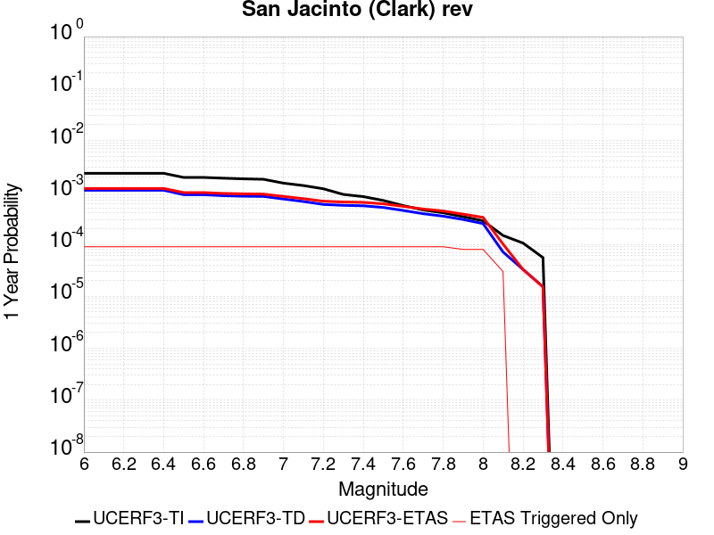 |  |

| Magnitude | 1 wk TI Prob | 1 wk TD Prob | 1 wk ETAS Prob | 1 wk ETAS/TD Gain | 1 wk ETAS Triggered Only | 1 mo TI Prob | 1 mo TD Prob | 1 mo ETAS Prob | 1 mo ETAS/TD Gain | 1 mo ETAS Triggered Only | 1 yr TI Prob | 1 yr TD Prob | 1 yr ETAS Prob | 1 yr ETAS/TD Gain | 1 yr ETAS Triggered Only | 10 yr TI Prob | 10 yr TD Prob | 10 yr ETAS Prob | 10 yr ETAS/TD Gain | 10 yr ETAS Triggered Only |
|-----|-----|-----|-----|-----|-----|-----|-----|-----|-----|-----|-----|-----|-----|-----|-----|-----|-----|-----|-----|-----|
| 6.0 | 4.482615E-5 | 2.1153059E-5 | 6.115221E-5 | 2.8909395 | 4.0E-5 | 1.9209793E-4 | 9.065287E-5 | 1.7064562E-4 | 1.8824072 | 8.0E-5 | 0.0023362834 | 0.0011031491 | 0.0011930498 | 1.0814946 | 9.0E-5 | 0.02311874 | 0.011485709 | 0.011594445 | 1.0094671 | 1.1E-4 |
| 6.1 | 4.482615E-5 | 2.1153059E-5 | 6.115221E-5 | 2.8909395 | 4.0E-5 | 1.9209793E-4 | 9.065287E-5 | 1.7064562E-4 | 1.8824072 | 8.0E-5 | 0.0023362834 | 0.0011031491 | 0.0011930498 | 1.0814946 | 9.0E-5 | 0.02311874 | 0.011485709 | 0.011594445 | 1.0094671 | 1.1E-4 |
| 6.2 | 4.482615E-5 | 2.1153059E-5 | 6.115221E-5 | 2.8909395 | 4.0E-5 | 1.9209793E-4 | 9.065287E-5 | 1.7064562E-4 | 1.8824072 | 8.0E-5 | 0.0023362834 | 0.0011031491 | 0.0011930498 | 1.0814946 | 9.0E-5 | 0.02311874 | 0.011485709 | 0.011594445 | 1.0094671 | 1.1E-4 |
| 6.3 | 4.482615E-5 | 2.1153059E-5 | 6.115221E-5 | 2.8909395 | 4.0E-5 | 1.9209793E-4 | 9.065287E-5 | 1.7064562E-4 | 1.8824072 | 8.0E-5 | 0.0023362834 | 0.0011031491 | 0.0011930498 | 1.0814946 | 9.0E-5 | 0.02311874 | 0.011485709 | 0.011594445 | 1.0094671 | 1.1E-4 |
| 6.4 | 4.482615E-5 | 2.1153059E-5 | 6.115221E-5 | 2.8909395 | 4.0E-5 | 1.9209793E-4 | 9.065287E-5 | 1.7064562E-4 | 1.8824072 | 8.0E-5 | 0.0023362834 | 0.0011031491 | 0.0011930498 | 1.0814946 | 9.0E-5 | 0.02311874 | 0.011485709 | 0.011594445 | 1.0094671 | 1.1E-4 |
| 6.5 | 3.7294863E-5 | 1.7354667E-5 | 5.7353973E-5 | 3.3048155 | 4.0E-5 | 1.5982533E-4 | 7.437504E-5 | 1.5436909E-4 | 2.0755496 | 8.0E-5 | 0.0019441366 | 9.051445E-4 | 9.95063E-4 | 1.0993416 | 9.0E-5 | 0.01927216 | 0.009485902 | 0.00959486 | 1.0114862 | 1.1E-4 |
| 6.6 | 3.7294863E-5 | 1.7354667E-5 | 5.7353973E-5 | 3.3048155 | 4.0E-5 | 1.5982533E-4 | 7.437504E-5 | 1.5436909E-4 | 2.0755496 | 8.0E-5 | 0.0019441366 | 9.051445E-4 | 9.95063E-4 | 1.0993416 | 9.0E-5 | 0.01927216 | 0.009485902 | 0.00959486 | 1.0114862 | 1.1E-4 |
| 6.7 | 3.6039248E-5 | 1.6602684E-5 | 5.660202E-5 | 3.409209 | 4.0E-5 | 1.5444479E-4 | 7.115244E-5 | 1.5114674E-4 | 2.1242666 | 8.0E-5 | 0.0018787434 | 8.659408E-4 | 9.5586287E-4 | 1.1038432 | 9.0E-5 | 0.01862939 | 0.009088189 | 0.0091971895 | 1.0119936 | 1.1E-4 |
| 6.8 | 3.5031844E-5 | 1.6231123E-5 | 5.6230474E-5 | 3.4643612 | 4.0E-5 | 1.5012783E-4 | 6.956012E-5 | 1.4955456E-4 | 2.1500041 | 8.0E-5 | 0.0018262739 | 8.4656954E-4 | 9.3649334E-4 | 1.1062214 | 9.0E-5 | 0.01811338 | 0.008888788 | 0.00899781 | 1.0122651 | 1.1E-4 |
| 6.9 | 3.435112E-5 | 1.6061658E-5 | 5.6061017E-5 | 3.490363 | 4.0E-5 | 1.4721078E-4 | 6.8833884E-5 | 1.4882837E-4 | 2.1621382 | 8.0E-5 | 0.0017908178 | 8.377344E-4 | 9.27659E-4 | 1.1073426 | 9.0E-5 | 0.017764548 | 0.008796512 | 0.008905544 | 1.0123949 | 1.1E-4 |
| 7.0 | 2.8959772E-5 | 1.43355255E-5 | 5.4334952E-5 | 3.790231 | 4.0E-5 | 1.241074E-4 | 6.1436534E-5 | 1.4143162E-4 | 2.3020768 | 8.0E-5 | 0.0015099603 | 7.477359E-4 | 8.376686E-4 | 1.1202734 | 9.0E-5 | 0.014997416 | 0.007868331 | 0.007977465 | 1.0138701 | 1.1E-4 |
| 7.1 | 2.6002877E-5 | 1.2827699E-5 | 5.2827185E-5 | 4.118212 | 4.0E-5 | 1.11436144E-4 | 5.4974706E-5 | 1.3497031E-4 | 2.4551346 | 8.0E-5 | 0.0013558907 | 6.6911365E-4 | 7.590534E-4 | 1.1344163 | 9.0E-5 | 0.013476475 | 0.0070483433 | 0.0071575684 | 1.0154965 | 1.1E-4 |
| 7.2 | 2.2544838E-5 | 1.1260331E-5 | 5.125988E-5 | 4.5522532 | 4.0E-5 | 9.661716E-5 | 4.825768E-5 | 1.2825381E-4 | 2.6576872 | 8.0E-5 | 0.001175679 | 5.873803E-4 | 6.7732745E-4 | 1.1531327 | 9.0E-5 | 0.011694785 | 0.00619256 | 0.006301879 | 1.0176532 | 1.1E-4 |
| 7.3 | 1.75334E-5 | 1.0810585E-5 | 5.081015E-5 | 4.7000375 | 4.0E-5 | 7.514098E-5 | 4.6330264E-5 | 1.2632656E-4 | 2.726653 | 8.0E-5 | 9.144575E-4 | 5.6392635E-4 | 6.538756E-4 | 1.1595052 | 9.0E-5 | 0.009107036 | 0.0059332196 | 0.0060425666 | 1.0184296 | 1.1E-4 |
| 7.4 | 1.5924552E-5 | 1.0610475E-5 | 5.061005E-5 | 4.7698193 | 4.0E-5 | 6.82463E-5 | 4.547268E-5 | 1.2546904E-4 | 2.7592182 | 8.0E-5 | 8.305819E-4 | 5.534906E-4 | 6.434408E-4 | 1.1625143 | 9.0E-5 | 0.008274844 | 0.0058205863 | 0.005929946 | 1.0187885 | 1.1E-4 |
| 7.5 | 1.3428931E-5 | 9.851045E-6 | 4.9850652E-5 | 5.060443 | 4.0E-5 | 5.7551293E-5 | 4.221809E-5 | 1.2221471E-4 | 2.8948424 | 8.0E-5 | 7.004617E-4 | 5.1388505E-4 | 6.038388E-4 | 1.1750464 | 9.0E-5 | 0.006982579 | 0.005406209 | 0.005515614 | 1.020237 | 1.1E-4 |
| 7.6 | 1.0688787E-5 | 8.614091E-6 | 4.8613747E-5 | 5.6435146 | 4.0E-5 | 4.5808283E-5 | 3.6917012E-5 | 1.1691406E-4 | 3.1669426 | 8.0E-5 | 5.5757316E-4 | 4.4937237E-4 | 5.3933193E-4 | 1.2001894 | 9.0E-5 | 0.005561762 | 0.0047413614 | 0.0048508397 | 1.0230901 | 1.1E-4 |
| 7.7 | 8.81236E-6 | 7.4673385E-6 | 4.746704E-5 | 6.356621 | 4.0E-5 | 3.776671E-5 | 3.200249E-5 | 1.1199993E-4 | 3.4997256 | 8.0E-5 | 4.597127E-4 | 3.8956082E-4 | 4.7952577E-4 | 1.2309394 | 9.0E-5 | 0.0045876284 | 0.0041344194 | 0.0042439643 | 1.0264959 | 1.1E-4 |
| 7.8 | 7.780431E-6 | 6.695928E-6 | 4.669566E-5 | 6.97374 | 4.0E-5 | 3.3344273E-5 | 2.8696519E-5 | 1.0869422E-4 | 3.7877147 | 8.0E-5 | 4.0589093E-4 | 3.4932428E-4 | 4.3929284E-4 | 1.2575502 | 9.0E-5 | 0.0040515037 | 0.0037226272 | 0.0038322178 | 1.029439 | 1.1E-4 |
| 7.9 | 6.5437994E-6 | 5.7797783E-6 | 4.5779547E-5 | 7.9206405 | 4.0E-5 | 2.8044553E-5 | 2.4770245E-5 | 9.476851E-5 | 3.8259013 | 7.0E-5 | 3.4138895E-4 | 3.0153614E-4 | 3.8151204E-4 | 1.2652282 | 8.0E-5 | 0.0034086495 | 0.0032343294 | 0.0033340058 | 1.0308183 | 1.0E-4 |
| 8.0 | 5.4488164E-6 | 4.812793E-6 | 4.48126E-5 | 9.311142 | 4.0E-5 | 2.3351862E-5 | 2.0626094E-5 | 9.062465E-5 | 4.3936896 | 7.0E-5 | 2.8427184E-4 | 2.510939E-4 | 3.310738E-4 | 1.3185259 | 8.0E-5 | 0.0028390845 | 0.0027107038 | 0.0028104326 | 1.0367908 | 1.0E-4 |
| 8.1 | 2.8397242E-6 | 1.3665673E-6 | 2.136654E-5 | 15.635191 | 2.0E-5 | 1.217019E-5 | 5.856704E-6 | 3.5856527E-5 | 6.1223054 | 3.0E-5 | 1.4816198E-4 | 7.1303046E-5 | 1.0130091E-4 | 1.4207094 | 3.0E-5 | 0.0014806325 | 8.113543E-4 | 8.5132185E-4 | 1.0492603 | 4.0E-5 |
| 8.2 | 2.030244E-6 | 6.3151083E-7 | 6.3151083E-7 | 1.0 | 0.0 | 8.701017E-6 | 2.7064723E-6 | 2.7064723E-6 | 1.0 | 0.0 | 1.05929736E-4 | 3.2950808E-5 | 3.2950808E-5 | 1.0 | 0.0 | 0.0010587925 | 3.9470522E-4 | 3.9470522E-4 | 1.0 | 0.0 |
| 8.3 | 1.0659804E-6 | 2.9230563E-7 | 2.9230563E-7 | 1.0 | 0.0 | 4.568479E-6 | 1.2527379E-6 | 1.2527379E-6 | 1.0 | 0.0 | 5.5619817E-5 | 1.5251981E-5 | 1.5251981E-5 | 1.0 | 0.0 | 5.5605895E-4 | 1.8556409E-4 | 1.8556409E-4 | 1.0 | 0.0 |

## Cucamonga
*[(top)](#table-of-contents)*

| 1 Week | 1 Month | 1 Year | 10 Year |
|-----|-----|-----|-----|
|  |  |  | 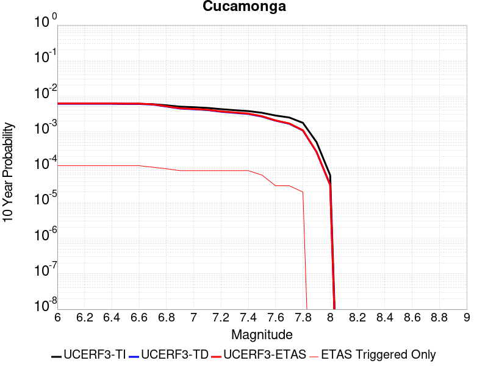 |

| Magnitude | 1 wk TI Prob | 1 wk TD Prob | 1 wk ETAS Prob | 1 wk ETAS/TD Gain | 1 wk ETAS Triggered Only | 1 mo TI Prob | 1 mo TD Prob | 1 mo ETAS Prob | 1 mo ETAS/TD Gain | 1 mo ETAS Triggered Only | 1 yr TI Prob | 1 yr TD Prob | 1 yr ETAS Prob | 1 yr ETAS/TD Gain | 1 yr ETAS Triggered Only | 10 yr TI Prob | 10 yr TD Prob | 10 yr ETAS Prob | 10 yr ETAS/TD Gain | 10 yr ETAS Triggered Only |
|-----|-----|-----|-----|-----|-----|-----|-----|-----|-----|-----|-----|-----|-----|-----|-----|-----|-----|-----|-----|-----|
| 6.0 | 1.1848348E-5 | 1.1737109E-5 | 2.1736992E-5 | 1.8519886 | 1.0E-5 | 5.0777642E-5 | 5.0300943E-5 | 8.029943E-5 | 1.5963804 | 3.0E-5 | 6.180424E-4 | 6.122446E-4 | 7.1218336E-4 | 1.1632334 | 1.0E-4 | 0.0061632637 | 0.006106745 | 0.0062160734 | 1.0179029 | 1.1E-4 |
| 6.1 | 1.1848348E-5 | 1.1737109E-5 | 2.1736992E-5 | 1.8519886 | 1.0E-5 | 5.0777642E-5 | 5.0300943E-5 | 8.029943E-5 | 1.5963804 | 3.0E-5 | 6.180424E-4 | 6.122446E-4 | 7.1218336E-4 | 1.1632334 | 1.0E-4 | 0.0061632637 | 0.006106745 | 0.0062160734 | 1.0179029 | 1.1E-4 |
| 6.2 | 1.1848348E-5 | 1.1737109E-5 | 2.1736992E-5 | 1.8519886 | 1.0E-5 | 5.0777642E-5 | 5.0300943E-5 | 8.029943E-5 | 1.5963804 | 3.0E-5 | 6.180424E-4 | 6.122446E-4 | 7.1218336E-4 | 1.1632334 | 1.0E-4 | 0.0061632637 | 0.006106745 | 0.0062160734 | 1.0179029 | 1.1E-4 |
| 6.3 | 1.1848348E-5 | 1.1737109E-5 | 2.1736992E-5 | 1.8519886 | 1.0E-5 | 5.0777642E-5 | 5.0300943E-5 | 8.029943E-5 | 1.5963804 | 3.0E-5 | 6.180424E-4 | 6.122446E-4 | 7.1218336E-4 | 1.1632334 | 1.0E-4 | 0.0061632637 | 0.006106745 | 0.0062160734 | 1.0179029 | 1.1E-4 |
| 6.4 | 1.1848348E-5 | 1.1737109E-5 | 2.1736992E-5 | 1.8519886 | 1.0E-5 | 5.0777642E-5 | 5.0300943E-5 | 8.029943E-5 | 1.5963804 | 3.0E-5 | 6.180424E-4 | 6.122446E-4 | 7.1218336E-4 | 1.1632334 | 1.0E-4 | 0.0061632637 | 0.006106745 | 0.0062160734 | 1.0179029 | 1.1E-4 |
| 6.5 | 1.16988695E-5 | 1.157614E-5 | 2.1576025E-5 | 1.8638358 | 1.0E-5 | 5.013705E-5 | 4.9611102E-5 | 7.9609614E-5 | 1.6046734 | 3.0E-5 | 6.102476E-4 | 6.0385047E-4 | 7.0379005E-4 | 1.165504 | 1.0E-4 | 0.006085745 | 0.0060232594 | 0.0061325966 | 1.0181526 | 1.1E-4 |
| 6.6 | 1.16988695E-5 | 1.157614E-5 | 2.1576025E-5 | 1.8638358 | 1.0E-5 | 5.013705E-5 | 4.9611102E-5 | 7.9609614E-5 | 1.6046734 | 3.0E-5 | 6.102476E-4 | 6.0385047E-4 | 7.0379005E-4 | 1.165504 | 1.0E-4 | 0.006085745 | 0.0060232594 | 0.0061325966 | 1.0181526 | 1.1E-4 |
| 6.7 | 1.1397107E-5 | 1.1115039E-5 | 2.1114927E-5 | 1.8996719 | 1.0E-5 | 4.884383E-5 | 4.7635025E-5 | 7.7633595E-5 | 1.6297587 | 3.0E-5 | 5.9451134E-4 | 5.798046E-4 | 6.797466E-4 | 1.1723719 | 1.0E-4 | 0.005929234 | 0.005784061 | 0.0058834823 | 1.0171889 | 1.0E-4 |
| 6.8 | 1.058387E-5 | 9.785037E-6 | 1.9784939E-5 | 2.0219586 | 1.0E-5 | 4.5358654E-5 | 4.1935207E-5 | 6.193437E-5 | 1.4769062 | 2.0E-5 | 5.521017E-4 | 5.1044265E-4 | 6.003967E-4 | 1.1762276 | 9.0E-5 | 0.00550732 | 0.005093702 | 0.0051832437 | 1.0175788 | 9.0E-5 |
| 6.9 | 9.690046E-6 | 8.579504E-6 | 1.8579418E-5 | 2.1655586 | 1.0E-5 | 4.1528107E-5 | 3.6768783E-5 | 5.6768047E-5 | 1.5439197 | 2.0E-5 | 5.054874E-4 | 4.475684E-4 | 5.275326E-4 | 1.1786636 | 8.0E-5 | 0.005043391 | 0.0044675954 | 0.004547238 | 1.0178267 | 8.0E-5 |
| 7.0 | 9.381461E-6 | 8.18712E-6 | 1.8187038E-5 | 2.2214208 | 1.0E-5 | 4.020564E-5 | 3.508719E-5 | 5.5086486E-5 | 1.5699886 | 2.0E-5 | 4.893937E-4 | 4.2710314E-4 | 5.0706894E-4 | 1.1872284 | 8.0E-5 | 0.0048831734 | 0.004263747 | 0.004343406 | 1.0186828 | 8.0E-5 |
| 7.1 | 8.946492E-6 | 7.781904E-6 | 1.7781826E-5 | 2.2850225 | 1.0E-5 | 3.8341543E-5 | 3.3350592E-5 | 5.3349926E-5 | 1.5996695 | 2.0E-5 | 4.667083E-4 | 4.0596814E-4 | 4.8593566E-4 | 1.1969798 | 8.0E-5 | 0.0046572937 | 0.0040531927 | 0.0041328683 | 1.0196575 | 8.0E-5 |
| 7.2 | 8.251016E-6 | 6.9752878E-6 | 1.6975218E-5 | 2.4336226 | 1.0E-5 | 3.5361016E-5 | 2.9893748E-5 | 4.989315E-5 | 1.6690162 | 2.0E-5 | 4.3043532E-4 | 3.6389584E-4 | 4.4386674E-4 | 1.2197632 | 8.0E-5 | 0.0042960253 | 0.0036339252 | 0.0037136343 | 1.0219347 | 8.0E-5 |
| 7.3 | 7.717881E-6 | 6.4863584E-6 | 1.6486294E-5 | 2.541687 | 1.0E-5 | 3.3076216E-5 | 2.7798384E-5 | 4.779783E-5 | 1.7194463 | 2.0E-5 | 4.026285E-4 | 3.38393E-4 | 4.183659E-4 | 1.2363315 | 8.0E-5 | 0.004018998 | 0.0033797103 | 0.0034594398 | 1.0235907 | 8.0E-5 |
| 7.4 | 7.275623E-6 | 6.032004E-6 | 1.6031943E-5 | 2.6578138 | 1.0E-5 | 3.118087E-5 | 2.5851192E-5 | 4.5850673E-5 | 1.7736387 | 2.0E-5 | 3.7956095E-4 | 3.1469302E-4 | 3.9466785E-4 | 1.254136 | 8.0E-5 | 0.0037891332 | 0.0031434046 | 0.0032231533 | 1.0253701 | 8.0E-5 |
| 7.5 | 6.5109502E-6 | 5.100593E-6 | 5.100593E-6 | 1.0 | 0.0 | 2.7903774E-5 | 2.1859503E-5 | 3.1859283E-5 | 1.457457 | 1.0E-5 | 3.3967546E-4 | 2.661071E-4 | 3.2609113E-4 | 1.2254131 | 6.0E-5 | 0.0033915674 | 0.0026588016 | 0.0027186421 | 1.0225066 | 6.0E-5 |
| 7.6 | 5.4495326E-6 | 3.908547E-6 | 3.908547E-6 | 1.0 | 0.0 | 2.335493E-5 | 1.6750808E-5 | 2.675064E-5 | 1.5969762 | 1.0E-5 | 2.8430918E-4 | 2.0392207E-4 | 2.3391595E-4 | 1.1470851 | 3.0E-5 | 0.0028394572 | 0.0020382616 | 0.0020682004 | 1.0146884 | 3.0E-5 |
| 7.7 | 4.7997164E-6 | 3.2002263E-6 | 3.2002263E-6 | 1.0 | 0.0 | 2.057005E-5 | 1.3715184E-5 | 2.3715047E-5 | 1.7291089 | 1.0E-5 | 2.504116E-4 | 1.6696959E-4 | 1.969646E-4 | 1.1796434 | 3.0E-5 | 0.002501296 | 0.0016693701 | 0.00169932 | 1.0179409 | 3.0E-5 |
| 7.8 | 3.3941733E-6 | 2.0641678E-6 | 2.0641678E-6 | 1.0 | 0.0 | 1.4546376E-5 | 8.846404E-6 | 1.8846315E-5 | 2.1303928 | 1.0E-5 | 1.7708774E-4 | 1.07699656E-4 | 1.276975E-4 | 1.1856816 | 2.0E-5 | 0.0017694668 | 0.0010766032 | 0.0010965817 | 1.018557 | 2.0E-5 |
| 7.9 | 9.750552E-7 | 5.155798E-7 | 5.155798E-7 | 1.0 | 0.0 | 4.178801E-6 | 2.2096258E-6 | 2.2096258E-6 | 1.0 | 0.0 | 5.0875715E-5 | 2.6901867E-5 | 2.6901867E-5 | 1.0 | 0.0 | 5.086407E-4 | 2.689865E-4 | 2.689865E-4 | 1.0 | 0.0 |
| 8.0 | 1.133857E-7 | 6.053372E-8 | 6.053372E-8 | 1.0 | 0.0 | 4.8593864E-7 | 2.594302E-7 | 2.594302E-7 | 1.0 | 0.0 | 5.9162867E-6 | 3.1585582E-6 | 3.1585582E-6 | 1.0 | 0.0 | 5.916129E-5 | 3.158515E-5 | 3.158515E-5 | 1.0 | 0.0 |

## Kern Canyon (Lake Isabella) 2011
*[(top)](#table-of-contents)*

| 1 Week | 1 Month | 1 Year | 10 Year |
|-----|-----|-----|-----|
| 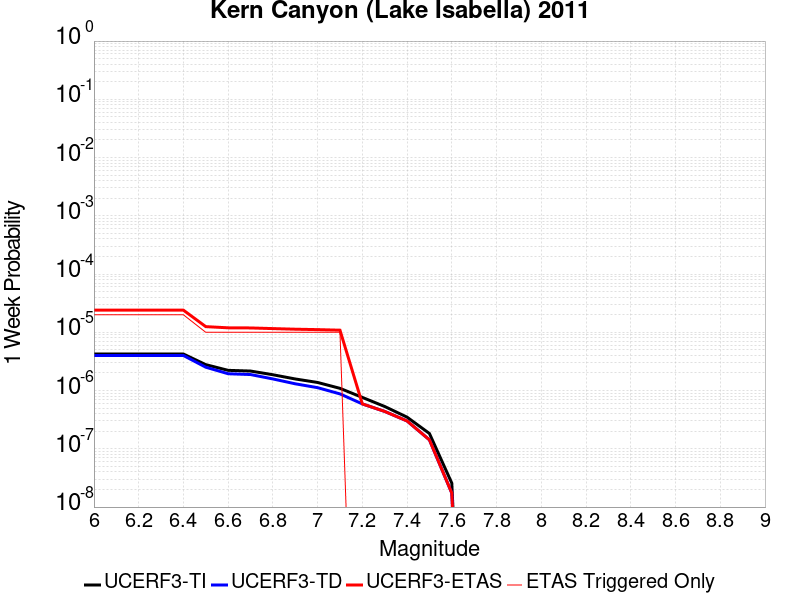 |  | 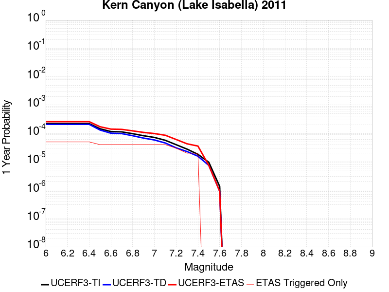 |  |

| Magnitude | 1 wk TI Prob | 1 wk TD Prob | 1 wk ETAS Prob | 1 wk ETAS/TD Gain | 1 wk ETAS Triggered Only | 1 mo TI Prob | 1 mo TD Prob | 1 mo ETAS Prob | 1 mo ETAS/TD Gain | 1 mo ETAS Triggered Only | 1 yr TI Prob | 1 yr TD Prob | 1 yr ETAS Prob | 1 yr ETAS/TD Gain | 1 yr ETAS Triggered Only | 10 yr TI Prob | 10 yr TD Prob | 10 yr ETAS Prob | 10 yr ETAS/TD Gain | 10 yr ETAS Triggered Only |
|-----|-----|-----|-----|-----|-----|-----|-----|-----|-----|-----|-----|-----|-----|-----|-----|-----|-----|-----|-----|-----|
| 6.0 | 4.2387383E-6 | 4.0016344E-6 | 2.4001554E-5 | 5.997938 | 2.0E-5 | 1.8165894E-5 | 1.7149758E-5 | 4.7149242E-5 | 2.7492657 | 3.0E-5 | 2.2114732E-4 | 2.0878017E-4 | 2.5876972E-4 | 1.2394364 | 5.0E-5 | 0.0022092736 | 0.002086024 | 0.0021957946 | 1.0526218 | 1.1E-4 |
| 6.1 | 4.2387383E-6 | 4.0016344E-6 | 2.4001554E-5 | 5.997938 | 2.0E-5 | 1.8165894E-5 | 1.7149758E-5 | 4.7149242E-5 | 2.7492657 | 3.0E-5 | 2.2114732E-4 | 2.0878017E-4 | 2.5876972E-4 | 1.2394364 | 5.0E-5 | 0.0022092736 | 0.002086024 | 0.0021957946 | 1.0526218 | 1.1E-4 |
| 6.2 | 4.2387383E-6 | 4.0016344E-6 | 2.4001554E-5 | 5.997938 | 2.0E-5 | 1.8165894E-5 | 1.7149758E-5 | 4.7149242E-5 | 2.7492657 | 3.0E-5 | 2.2114732E-4 | 2.0878017E-4 | 2.5876972E-4 | 1.2394364 | 5.0E-5 | 0.0022092736 | 0.002086024 | 0.0021957946 | 1.0526218 | 1.1E-4 |
| 6.3 | 4.2387383E-6 | 4.0016344E-6 | 2.4001554E-5 | 5.997938 | 2.0E-5 | 1.8165894E-5 | 1.7149758E-5 | 4.7149242E-5 | 2.7492657 | 3.0E-5 | 2.2114732E-4 | 2.0878017E-4 | 2.5876972E-4 | 1.2394364 | 5.0E-5 | 0.0022092736 | 0.002086024 | 0.0021957946 | 1.0526218 | 1.1E-4 |
| 6.4 | 4.2387383E-6 | 4.0016344E-6 | 2.4001554E-5 | 5.997938 | 2.0E-5 | 1.8165894E-5 | 1.7149758E-5 | 4.7149242E-5 | 2.7492657 | 3.0E-5 | 2.2114732E-4 | 2.0878017E-4 | 2.5876972E-4 | 1.2394364 | 5.0E-5 | 0.0022092736 | 0.002086024 | 0.0021957946 | 1.0526218 | 1.1E-4 |
| 6.5 | 2.7857532E-6 | 2.5178624E-6 | 1.2517838E-5 | 4.971613 | 1.0E-5 | 1.1938888E-5 | 1.0790796E-5 | 3.079058E-5 | 2.8534114 | 2.0E-5 | 1.4534626E-4 | 1.3137035E-4 | 1.713651E-4 | 1.3044428 | 4.0E-5 | 0.0014525123 | 0.0013129596 | 0.0013928546 | 1.0608511 | 8.0E-5 |
| 6.6 | 2.2233348E-6 | 1.944119E-6 | 1.1944099E-5 | 6.1437078 | 1.0E-5 | 9.528543E-6 | 8.331913E-6 | 2.8331746E-5 | 3.4003892 | 2.0E-5 | 1.1600384E-4 | 1.014364E-4 | 1.4143235E-4 | 1.3942958 | 4.0E-5 | 0.001159433 | 0.0010139096 | 0.0010938285 | 1.0788225 | 8.0E-5 |
| 6.7 | 2.1635126E-6 | 1.8834991E-6 | 1.18834805E-5 | 6.3092575 | 1.0E-5 | 9.272164E-6 | 8.072114E-6 | 2.8071952E-5 | 3.4776456 | 2.0E-5 | 1.1288274E-4 | 9.827364E-5 | 1.3826971E-4 | 1.4069867 | 4.0E-5 | 0.0011282542 | 9.8231E-4 | 0.0010622314 | 1.0813607 | 8.0E-5 |
| 6.8 | 1.8685711E-6 | 1.583138E-6 | 1.1583122E-5 | 7.316559 | 1.0E-5 | 8.008137E-6 | 6.7848596E-6 | 2.6784724E-5 | 3.9477196 | 2.0E-5 | 9.74947E-5 | 8.2602586E-5 | 1.2259927E-4 | 1.4842063 | 4.0E-5 | 9.745194E-4 | 8.2572375E-4 | 8.856742E-4 | 1.0726036 | 6.0E-5 |
| 6.9 | 1.5815071E-6 | 1.3064887E-6 | 1.1306475E-5 | 8.654094 | 1.0E-5 | 6.77787E-6 | 5.5992255E-6 | 2.5599113E-5 | 4.5719028 | 2.0E-5 | 8.251744E-5 | 6.816846E-5 | 1.0816574E-4 | 1.5867416 | 4.0E-5 | 8.248681E-4 | 6.8147824E-4 | 7.414373E-4 | 1.0879838 | 6.0E-5 |
| 7.0 | 1.3772564E-6 | 1.1210681E-6 | 1.1121057E-5 | 9.920054 | 1.0E-5 | 5.9025137E-6 | 4.8045686E-6 | 2.4804473E-5 | 5.1626844 | 2.0E-5 | 7.186073E-5 | 5.8494075E-5 | 9.8491735E-5 | 1.68379 | 4.0E-5 | 7.18375E-4 | 5.8478885E-4 | 6.4475375E-4 | 1.1025411 | 6.0E-5 |
| 7.1 | 1.0916998E-6 | 8.7637505E-7 | 1.0876366E-5 | 12.41063 | 1.0E-5 | 4.678705E-6 | 3.7558877E-6 | 2.3755812E-5 | 6.3249526 | 2.0E-5 | 5.6961744E-5 | 4.5726985E-5 | 8.572516E-5 | 1.874717 | 4.0E-5 | 5.6947145E-4 | 4.571771E-4 | 5.0715427E-4 | 1.1093168 | 5.0E-5 |
| 7.2 | 7.6277024E-7 | 5.901439E-7 | 5.901439E-7 | 1.0 | 0.0 | 3.2690114E-6 | 2.5291856E-6 | 1.252916E-5 | 4.9538317 | 1.0E-5 | 3.9799485E-5 | 3.0792406E-5 | 6.079148E-5 | 1.9742361 | 3.0E-5 | 3.9792358E-4 | 3.07882E-4 | 3.4786967E-4 | 1.12988 | 4.0E-5 |
| 7.3 | 5.3265916E-7 | 4.3824264E-7 | 4.3824264E-7 | 1.0 | 0.0 | 2.282823E-6 | 1.8781814E-6 | 1.1878163E-5 | 6.3242893 | 1.0E-5 | 2.7793016E-5 | 2.2866623E-5 | 4.2866166E-5 | 1.8746172 | 2.0E-5 | 2.778954E-4 | 2.2864307E-4 | 2.5863622E-4 | 1.1311789 | 3.0E-5 |
| 7.4 | 3.4946007E-7 | 3.0065647E-7 | 3.0065647E-7 | 1.0 | 0.0 | 1.497685E-6 | 1.2885271E-6 | 1.12885145E-5 | 8.760789 | 1.0E-5 | 1.8234163E-5 | 1.5687707E-5 | 3.5687393E-5 | 2.2748637 | 2.0E-5 | 1.8232666E-4 | 1.5686621E-4 | 1.868615E-4 | 1.1912158 | 3.0E-5 |
| 7.5 | 1.8317026E-7 | 1.4244755E-7 | 1.4244755E-7 | 1.0 | 0.0 | 7.850152E-7 | 6.1048934E-7 | 6.1048934E-7 | 1.0 | 0.0 | 9.557518E-6 | 7.432683E-6 | 7.432683E-6 | 1.0 | 0.0 | 9.5571064E-5 | 7.432442E-5 | 8.4323685E-5 | 1.1345353 | 1.0E-5 |
| 7.6 | 2.572245E-8 | 1.735264E-8 | 1.735264E-8 | 1.0 | 0.0 | 1.10239064E-7 | 7.436845E-8 | 7.436845E-8 | 1.0 | 0.0 | 1.3421597E-6 | 9.0543557E-7 | 9.0543557E-7 | 1.0 | 0.0 | 1.3421517E-5 | 9.054324E-6 | 9.054324E-6 | 1.0 | 0.0 |

## Lost Hills
*[(top)](#table-of-contents)*

| 1 Week | 1 Month | 1 Year | 10 Year |
|-----|-----|-----|-----|
|  |  |  |  |

| Magnitude | 1 wk TI Prob | 1 wk TD Prob | 1 wk ETAS Prob | 1 wk ETAS/TD Gain | 1 wk ETAS Triggered Only | 1 mo TI Prob | 1 mo TD Prob | 1 mo ETAS Prob | 1 mo ETAS/TD Gain | 1 mo ETAS Triggered Only | 1 yr TI Prob | 1 yr TD Prob | 1 yr ETAS Prob | 1 yr ETAS/TD Gain | 1 yr ETAS Triggered Only | 10 yr TI Prob | 10 yr TD Prob | 10 yr ETAS Prob | 10 yr ETAS/TD Gain | 10 yr ETAS Triggered Only |
|-----|-----|-----|-----|-----|-----|-----|-----|-----|-----|-----|-----|-----|-----|-----|-----|-----|-----|-----|-----|-----|
| 6.0 | 2.233523E-5 | 2.5106583E-5 | 4.510608E-5 | 1.7965839 | 2.0E-5 | 9.571891E-5 | 1.0759615E-4 | 1.3759293E-4 | 1.2787904 | 3.0E-5 | 0.0011647546 | 0.001309364 | 0.0013592986 | 1.0381365 | 5.0E-5 | 0.011586686 | 0.013033091 | 0.013141657 | 1.0083301 | 1.1E-4 |
| 6.1 | 2.233523E-5 | 2.5106583E-5 | 4.510608E-5 | 1.7965839 | 2.0E-5 | 9.571891E-5 | 1.0759615E-4 | 1.3759293E-4 | 1.2787904 | 3.0E-5 | 0.0011647546 | 0.001309364 | 0.0013592986 | 1.0381365 | 5.0E-5 | 0.011586686 | 0.013033091 | 0.013141657 | 1.0083301 | 1.1E-4 |
| 6.2 | 2.233523E-5 | 2.5106583E-5 | 4.510608E-5 | 1.7965839 | 2.0E-5 | 9.571891E-5 | 1.0759615E-4 | 1.3759293E-4 | 1.2787904 | 3.0E-5 | 0.0011647546 | 0.001309364 | 0.0013592986 | 1.0381365 | 5.0E-5 | 0.011586686 | 0.013033091 | 0.013141657 | 1.0083301 | 1.1E-4 |
| 6.3 | 2.233523E-5 | 2.5106583E-5 | 4.510608E-5 | 1.7965839 | 2.0E-5 | 9.571891E-5 | 1.0759615E-4 | 1.3759293E-4 | 1.2787904 | 3.0E-5 | 0.0011647546 | 0.001309364 | 0.0013592986 | 1.0381365 | 5.0E-5 | 0.011586686 | 0.013033091 | 0.013141657 | 1.0083301 | 1.1E-4 |
| 6.4 | 1.2288092E-5 | 1.3781108E-5 | 2.3780969E-5 | 1.7256211 | 1.0E-5 | 5.2662188E-5 | 5.906108E-5 | 6.906049E-5 | 1.1693063 | 1.0E-5 | 6.409735E-4 | 7.189252E-4 | 7.3891087E-4 | 1.0277992 | 2.0E-5 | 0.006391279 | 0.0071752006 | 0.0072149136 | 1.0055348 | 4.0E-5 |
| 6.5 | 1.2288092E-5 | 1.3781108E-5 | 2.3780969E-5 | 1.7256211 | 1.0E-5 | 5.2662188E-5 | 5.906108E-5 | 6.906049E-5 | 1.1693063 | 1.0E-5 | 6.409735E-4 | 7.189252E-4 | 7.3891087E-4 | 1.0277992 | 2.0E-5 | 0.006391279 | 0.0071752006 | 0.0072149136 | 1.0055348 | 4.0E-5 |
| 6.6 | 8.58281E-6 | 9.63377E-6 | 1.9633673E-5 | 2.0380054 | 1.0E-5 | 3.6782953E-5 | 4.12874E-5 | 5.128699E-5 | 1.2421947 | 1.0E-5 | 4.4774043E-4 | 5.026414E-4 | 5.2263134E-4 | 1.0397698 | 2.0E-5 | 0.0044683935 | 0.005023205 | 0.0050530545 | 1.0059422 | 3.0E-5 |
| 6.7 | 7.205685E-6 | 8.088302E-6 | 1.8088222E-5 | 2.2363434 | 1.0E-5 | 3.088114E-5 | 3.466415E-5 | 4.4663804E-5 | 1.2884725 | 1.0E-5 | 3.7591302E-4 | 4.2203604E-4 | 4.4202758E-4 | 1.0473694 | 2.0E-5 | 0.0037527776 | 0.0042203604 | 0.0042502335 | 1.0070784 | 3.0E-5 |

## Elysian Park (Upper)
*[(top)](#table-of-contents)*

| 1 Week | 1 Month | 1 Year | 10 Year |
|-----|-----|-----|-----|
|  |  |  |  |

| Magnitude | 1 wk TI Prob | 1 wk TD Prob | 1 wk ETAS Prob | 1 wk ETAS/TD Gain | 1 wk ETAS Triggered Only | 1 mo TI Prob | 1 mo TD Prob | 1 mo ETAS Prob | 1 mo ETAS/TD Gain | 1 mo ETAS Triggered Only | 1 yr TI Prob | 1 yr TD Prob | 1 yr ETAS Prob | 1 yr ETAS/TD Gain | 1 yr ETAS Triggered Only | 10 yr TI Prob | 10 yr TD Prob | 10 yr ETAS Prob | 10 yr ETAS/TD Gain | 10 yr ETAS Triggered Only |
|-----|-----|-----|-----|-----|-----|-----|-----|-----|-----|-----|-----|-----|-----|-----|-----|-----|-----|-----|-----|-----|
| 6.0 | 3.1876025E-5 | 3.7035275E-5 | 4.7034904E-5 | 1.2700028 | 1.0E-5 | 1.3660437E-4 | 1.5871569E-4 | 1.8871092E-4 | 1.1889873 | 3.0E-5 | 0.0016618895 | 0.001931122 | 0.0019810256 | 1.0258417 | 5.0E-5 | 0.016495159 | 0.019189863 | 0.019278135 | 1.0045999 | 9.0E-5 |
| 6.1 | 3.1876025E-5 | 3.7035275E-5 | 4.7034904E-5 | 1.2700028 | 1.0E-5 | 1.3660437E-4 | 1.5871569E-4 | 1.8871092E-4 | 1.1889873 | 3.0E-5 | 0.0016618895 | 0.001931122 | 0.0019810256 | 1.0258417 | 5.0E-5 | 0.016495159 | 0.019189863 | 0.019278135 | 1.0045999 | 9.0E-5 |
| 6.2 | 3.1876025E-5 | 3.7035275E-5 | 4.7034904E-5 | 1.2700028 | 1.0E-5 | 1.3660437E-4 | 1.5871569E-4 | 1.8871092E-4 | 1.1889873 | 3.0E-5 | 0.0016618895 | 0.001931122 | 0.0019810256 | 1.0258417 | 5.0E-5 | 0.016495159 | 0.019189863 | 0.019278135 | 1.0045999 | 9.0E-5 |
| 6.3 | 3.1876025E-5 | 3.7035275E-5 | 4.7034904E-5 | 1.2700028 | 1.0E-5 | 1.3660437E-4 | 1.5871569E-4 | 1.8871092E-4 | 1.1889873 | 3.0E-5 | 0.0016618895 | 0.001931122 | 0.0019810256 | 1.0258417 | 5.0E-5 | 0.016495159 | 0.019189863 | 0.019278135 | 1.0045999 | 9.0E-5 |
| 6.4 | 1.9273462E-5 | 2.120244E-5 | 3.1202228E-5 | 1.4716338 | 1.0E-5 | 8.259794E-5 | 9.086542E-5 | 1.108636E-4 | 1.2200857 | 2.0E-5 | 0.001005166 | 0.0011058967 | 0.0011458525 | 1.0361297 | 4.0E-5 | 0.010006315 | 0.011020744 | 0.0110800825 | 1.0053843 | 6.0E-5 |
| 6.5 | 1.9273462E-5 | 2.120244E-5 | 3.1202228E-5 | 1.4716338 | 1.0E-5 | 8.259794E-5 | 9.086542E-5 | 1.108636E-4 | 1.2200857 | 2.0E-5 | 0.001005166 | 0.0011058967 | 0.0011458525 | 1.0361297 | 4.0E-5 | 0.010006315 | 0.011020744 | 0.0110800825 | 1.0053843 | 6.0E-5 |
| 6.6 | 9.813258E-6 | 9.665589E-6 | 1.9665491E-5 | 2.034588 | 1.0E-5 | 4.205614E-5 | 4.1423333E-5 | 5.1422918E-5 | 1.2413999 | 1.0E-5 | 5.119132E-4 | 5.042196E-4 | 5.242095E-4 | 1.0396453 | 2.0E-5 | 0.005107356 | 0.0050314795 | 0.0050613284 | 1.0059325 | 3.0E-5 |
| 6.7 | 9.801478E-6 | 9.653158E-6 | 1.9653062E-5 | 2.0359204 | 1.0E-5 | 4.2005657E-5 | 4.137006E-5 | 5.1369647E-5 | 1.2417107 | 1.0E-5 | 5.112989E-4 | 5.0357135E-4 | 5.2356126E-4 | 1.0396963 | 2.0E-5 | 0.0051012407 | 0.005025026 | 0.0050548753 | 1.0059401 | 3.0E-5 |
| 6.8 | 8.102489E-6 | 7.772994E-6 | 1.7772916E-5 | 2.2864957 | 1.0E-5 | 3.4724493E-5 | 3.3312434E-5 | 4.3312102E-5 | 1.3001782 | 1.0E-5 | 4.2268867E-4 | 4.0550836E-4 | 4.2550027E-4 | 1.0493008 | 2.0E-5 | 0.004218856 | 0.0040481784 | 0.0040780567 | 1.0073807 | 3.0E-5 |
| 6.9 | 6.08275E-6 | 5.481441E-6 | 5.481441E-6 | 1.0 | 0.0 | 2.6068668E-5 | 2.3491682E-5 | 2.3491682E-5 | 1.0 | 0.0 | 3.173398E-4 | 2.8597447E-4 | 2.959716E-4 | 1.0349581 | 1.0E-5 | 0.0031688702 | 0.0028561424 | 0.0028760852 | 1.0069824 | 2.0E-5 |
| 7.0 | 5.5995934E-6 | 4.9827686E-6 | 4.9827686E-6 | 1.0 | 0.0 | 2.3998036E-5 | 2.1354552E-5 | 2.1354552E-5 | 1.0 | 0.0 | 2.9213692E-4 | 2.5996132E-4 | 2.5996132E-4 | 1.0 | 0.0 | 0.0029175316 | 0.0025966396 | 0.0026066136 | 1.0038412 | 1.0E-5 |
| 7.1 | 4.709881E-6 | 4.0873906E-6 | 4.0873906E-6 | 1.0 | 0.0 | 2.0185047E-5 | 1.7517272E-5 | 1.7517272E-5 | 1.0 | 0.0 | 2.4572524E-4 | 2.1325232E-4 | 2.1325232E-4 | 1.0 | 0.0 | 0.002454537 | 0.0021305184 | 0.002140497 | 1.0046837 | 1.0E-5 |
| 7.2 | 3.6063436E-6 | 2.9779412E-6 | 2.9779412E-6 | 1.0 | 0.0 | 1.5455667E-5 | 1.27625435E-5 | 1.27625435E-5 | 1.0 | 0.0 | 1.881565E-4 | 1.55373E-4 | 1.55373E-4 | 1.0 | 0.0 | 0.0018799726 | 0.0015526549 | 0.0015626394 | 1.0064306 | 1.0E-5 |
| 7.3 | 2.471135E-6 | 2.0954562E-6 | 2.0954562E-6 | 1.0 | 0.0 | 1.0590536E-5 | 8.980496E-6 | 8.980496E-6 | 1.0 | 0.0 | 1.2893214E-4 | 1.0933213E-4 | 1.0933213E-4 | 1.0 | 0.0 | 0.0012885736 | 0.0010927906 | 0.0011027798 | 1.0091408 | 1.0E-5 |
| 7.4 | 1.163943E-6 | 1.0275061E-6 | 1.0275061E-6 | 1.0 | 0.0 | 4.988318E-6 | 4.40359E-6 | 4.40359E-6 | 1.0 | 0.0 | 6.0731076E-5 | 5.361242E-5 | 5.361242E-5 | 1.0 | 0.0 | 6.071448E-4 | 5.3599785E-4 | 5.3599785E-4 | 1.0 | 0.0 |
| 7.5 | 4.99459E-7 | 4.917601E-7 | 4.917601E-7 | 1.0 | 0.0 | 2.140537E-6 | 2.1075416E-6 | 2.1075416E-6 | 1.0 | 0.0 | 2.6060725E-5 | 2.5659032E-5 | 2.5659032E-5 | 1.0 | 0.0 | 2.605767E-4 | 2.5656226E-4 | 2.5656226E-4 | 1.0 | 0.0 |
| 7.6 | 2.4667852E-7 | 2.4778313E-7 | 2.4778313E-7 | 1.0 | 0.0 | 1.0571932E-6 | 1.0619274E-6 | 1.0619274E-6 | 1.0 | 0.0 | 1.2871251E-5 | 1.2928893E-5 | 1.2928893E-5 | 1.0 | 0.0 | 1.2870505E-4 | 1.2928178E-4 | 1.2928178E-4 | 1.0 | 0.0 |
| 7.7 | 8.2312795E-8 | 7.3864214E-8 | 7.3864214E-8 | 1.0 | 0.0 | 3.527691E-7 | 3.165609E-7 | 3.165609E-7 | 1.0 | 0.0 | 4.294955E-6 | 3.854123E-6 | 3.854123E-6 | 1.0 | 0.0 | 4.2948723E-5 | 3.854068E-5 | 3.854068E-5 | 1.0 | 0.0 |
| 7.8 | 2.7819295E-8 | 1.7565618E-8 | 1.7565618E-8 | 1.0 | 0.0 | 1.1922555E-7 | 7.528122E-8 | 7.528122E-8 | 1.0 | 0.0 | 1.45157E-6 | 9.1654863E-7 | 9.1654863E-7 | 1.0 | 0.0 | 1.45156055E-5 | 9.165463E-6 | 9.165463E-6 | 1.0 | 0.0 |

## Dry Mountain
*[(top)](#table-of-contents)*

| 1 Week | 1 Month | 1 Year | 10 Year |
|-----|-----|-----|-----|
| 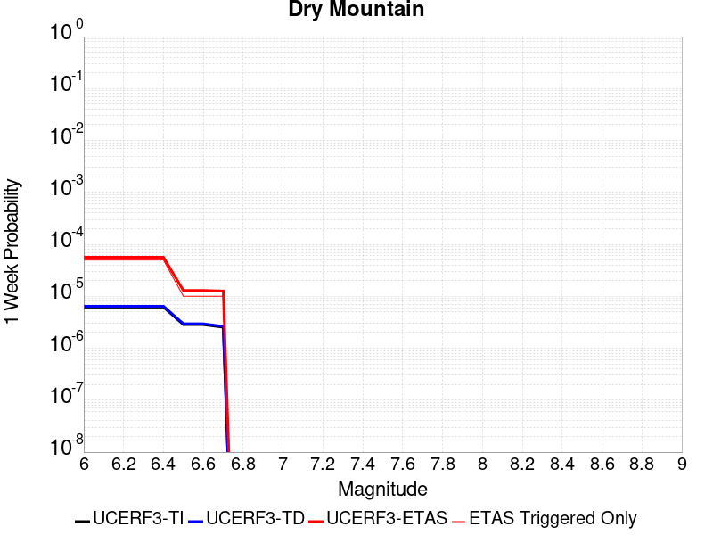 |  | 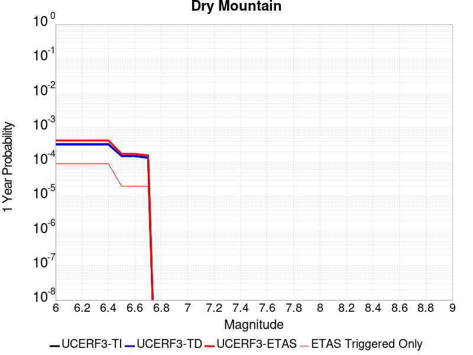 | 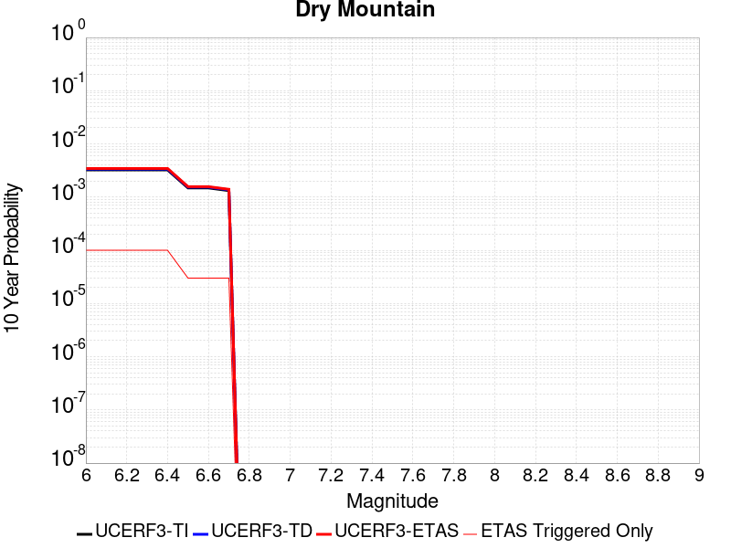 |

| Magnitude | 1 wk TI Prob | 1 wk TD Prob | 1 wk ETAS Prob | 1 wk ETAS/TD Gain | 1 wk ETAS Triggered Only | 1 mo TI Prob | 1 mo TD Prob | 1 mo ETAS Prob | 1 mo ETAS/TD Gain | 1 mo ETAS Triggered Only | 1 yr TI Prob | 1 yr TD Prob | 1 yr ETAS Prob | 1 yr ETAS/TD Gain | 1 yr ETAS Triggered Only | 10 yr TI Prob | 10 yr TD Prob | 10 yr ETAS Prob | 10 yr ETAS/TD Gain | 10 yr ETAS Triggered Only |
|-----|-----|-----|-----|-----|-----|-----|-----|-----|-----|-----|-----|-----|-----|-----|-----|-----|-----|-----|-----|-----|
| 6.0 | 6.222801E-6 | 6.439381E-6 | 5.6439058E-5 | 8.764671 | 5.0E-5 | 2.6668875E-5 | 2.7597147E-5 | 7.759577E-5 | 2.8117316 | 5.0E-5 | 3.2464517E-4 | 3.3595937E-4 | 4.2592915E-4 | 1.2677995 | 9.0E-5 | 0.0032417132 | 0.0033560768 | 0.0034557413 | 1.0296967 | 1.0E-4 |
| 6.1 | 6.222801E-6 | 6.439381E-6 | 5.6439058E-5 | 8.764671 | 5.0E-5 | 2.6668875E-5 | 2.7597147E-5 | 7.759577E-5 | 2.8117316 | 5.0E-5 | 3.2464517E-4 | 3.3595937E-4 | 4.2592915E-4 | 1.2677995 | 9.0E-5 | 0.0032417132 | 0.0033560768 | 0.0034557413 | 1.0296967 | 1.0E-4 |
| 6.2 | 6.222801E-6 | 6.439381E-6 | 5.6439058E-5 | 8.764671 | 5.0E-5 | 2.6668875E-5 | 2.7597147E-5 | 7.759577E-5 | 2.8117316 | 5.0E-5 | 3.2464517E-4 | 3.3595937E-4 | 4.2592915E-4 | 1.2677995 | 9.0E-5 | 0.0032417132 | 0.0033560768 | 0.0034557413 | 1.0296967 | 1.0E-4 |
| 6.3 | 6.222801E-6 | 6.439381E-6 | 5.6439058E-5 | 8.764671 | 5.0E-5 | 2.6668875E-5 | 2.7597147E-5 | 7.759577E-5 | 2.8117316 | 5.0E-5 | 3.2464517E-4 | 3.3595937E-4 | 4.2592915E-4 | 1.2677995 | 9.0E-5 | 0.0032417132 | 0.0033560768 | 0.0034557413 | 1.0296967 | 1.0E-4 |
| 6.4 | 6.222801E-6 | 6.439381E-6 | 5.6439058E-5 | 8.764671 | 5.0E-5 | 2.6668875E-5 | 2.7597147E-5 | 7.759577E-5 | 2.8117316 | 5.0E-5 | 3.2464517E-4 | 3.3595937E-4 | 4.2592915E-4 | 1.2677995 | 9.0E-5 | 0.0032417132 | 0.0033560768 | 0.0034557413 | 1.0296967 | 1.0E-4 |
| 6.5 | 2.8528623E-6 | 2.9521684E-6 | 1.2952139E-5 | 4.3873305 | 1.0E-5 | 1.22264955E-5 | 1.2652138E-5 | 2.2652011E-5 | 1.7903702 | 1.0E-5 | 1.4884741E-4 | 1.540376E-4 | 1.7403452E-4 | 1.1298184 | 2.0E-5 | 0.0014874774 | 0.0015401616 | 0.0015701154 | 1.0194485 | 3.0E-5 |
| 6.6 | 2.8528623E-6 | 2.9521684E-6 | 1.2952139E-5 | 4.3873305 | 1.0E-5 | 1.22264955E-5 | 1.2652138E-5 | 2.2652011E-5 | 1.7903702 | 1.0E-5 | 1.4884741E-4 | 1.540376E-4 | 1.7403452E-4 | 1.1298184 | 2.0E-5 | 0.0014874774 | 0.0015401616 | 0.0015701154 | 1.0194485 | 3.0E-5 |
| 6.7 | 2.541E-6 | 2.6293578E-6 | 1.2629332E-5 | 4.8032 | 1.0E-5 | 1.0889954E-5 | 1.1268677E-5 | 2.1268565E-5 | 1.8874056 | 1.0E-5 | 1.3257713E-4 | 1.3719614E-4 | 1.571934E-4 | 1.1457567 | 2.0E-5 | 0.0013249806 | 0.0013719613 | 0.0014019202 | 1.0218365 | 3.0E-5 |

## Ventura-Pitas Point
*[(top)](#table-of-contents)*

| 1 Week | 1 Month | 1 Year | 10 Year |
|-----|-----|-----|-----|
|  | 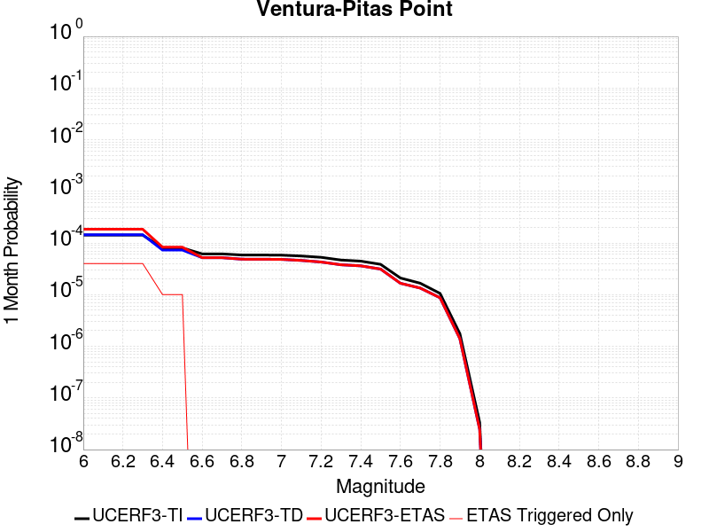 |  |  |

| Magnitude | 1 wk TI Prob | 1 wk TD Prob | 1 wk ETAS Prob | 1 wk ETAS/TD Gain | 1 wk ETAS Triggered Only | 1 mo TI Prob | 1 mo TD Prob | 1 mo ETAS Prob | 1 mo ETAS/TD Gain | 1 mo ETAS Triggered Only | 1 yr TI Prob | 1 yr TD Prob | 1 yr ETAS Prob | 1 yr ETAS/TD Gain | 1 yr ETAS Triggered Only | 10 yr TI Prob | 10 yr TD Prob | 10 yr ETAS Prob | 10 yr ETAS/TD Gain | 10 yr ETAS Triggered Only |
|-----|-----|-----|-----|-----|-----|-----|-----|-----|-----|-----|-----|-----|-----|-----|-----|-----|-----|-----|-----|-----|
| 6.0 | 3.3179622E-5 | 3.373519E-5 | 6.373417E-5 | 1.8892492 | 3.0E-5 | 1.4219063E-4 | 1.4457281E-4 | 1.8456703E-4 | 1.2766372 | 4.0E-5 | 0.0017297962 | 0.0017590097 | 0.0017989393 | 1.0227001 | 4.0E-5 | 0.017163932 | 0.017476497 | 0.017555099 | 1.0044975 | 8.0E-5 |
| 6.1 | 3.3179622E-5 | 3.373519E-5 | 6.373417E-5 | 1.8892492 | 3.0E-5 | 1.4219063E-4 | 1.4457281E-4 | 1.8456703E-4 | 1.2766372 | 4.0E-5 | 0.0017297962 | 0.0017590097 | 0.0017989393 | 1.0227001 | 4.0E-5 | 0.017163932 | 0.017476497 | 0.017555099 | 1.0044975 | 8.0E-5 |
| 6.2 | 3.3179622E-5 | 3.373519E-5 | 6.373417E-5 | 1.8892492 | 3.0E-5 | 1.4219063E-4 | 1.4457281E-4 | 1.8456703E-4 | 1.2766372 | 4.0E-5 | 0.0017297962 | 0.0017590097 | 0.0017989393 | 1.0227001 | 4.0E-5 | 0.017163932 | 0.017476497 | 0.017555099 | 1.0044975 | 8.0E-5 |
| 6.3 | 3.3179622E-5 | 3.373519E-5 | 6.373417E-5 | 1.8892492 | 3.0E-5 | 1.4219063E-4 | 1.4457281E-4 | 1.8456703E-4 | 1.2766372 | 4.0E-5 | 0.0017297962 | 0.0017590097 | 0.0017989393 | 1.0227001 | 4.0E-5 | 0.017163932 | 0.017476497 | 0.017555099 | 1.0044975 | 8.0E-5 |
| 6.4 | 1.8754668E-5 | 1.7019594E-5 | 1.7019594E-5 | 1.0 | 0.0 | 8.037467E-5 | 7.2939205E-5 | 8.293848E-5 | 1.1370904 | 1.0E-5 | 9.781223E-4 | 8.8769617E-4 | 8.976873E-4 | 1.0112551 | 1.0E-5 | 0.009738282 | 0.008843943 | 0.008883589 | 1.0044829 | 4.0E-5 |
| 6.5 | 1.8754668E-5 | 1.7019594E-5 | 1.7019594E-5 | 1.0 | 0.0 | 8.037467E-5 | 7.2939205E-5 | 8.293848E-5 | 1.1370904 | 1.0E-5 | 9.781223E-4 | 8.8769617E-4 | 8.976873E-4 | 1.0112551 | 1.0E-5 | 0.009738282 | 0.008843943 | 0.008883589 | 1.0044829 | 4.0E-5 |
| 6.6 | 1.4361558E-5 | 1.2122258E-5 | 1.2122258E-5 | 1.0 | 0.0 | 6.154808E-5 | 5.1951512E-5 | 5.1951512E-5 | 1.0 | 0.0 | 7.490902E-4 | 6.323284E-4 | 6.323284E-4 | 1.0 | 0.0 | 0.0074657016 | 0.006305652 | 0.006325526 | 1.0031518 | 2.0E-5 |
| 6.7 | 1.4361558E-5 | 1.2122258E-5 | 1.2122258E-5 | 1.0 | 0.0 | 6.154808E-5 | 5.1951512E-5 | 5.1951512E-5 | 1.0 | 0.0 | 7.490902E-4 | 6.323284E-4 | 6.323284E-4 | 1.0 | 0.0 | 0.0074657016 | 0.006305652 | 0.006325526 | 1.0031518 | 2.0E-5 |
| 6.8 | 1.3663846E-5 | 1.1344401E-5 | 1.1344401E-5 | 1.0 | 0.0 | 5.8558027E-5 | 4.8617967E-5 | 4.8617967E-5 | 1.0 | 0.0 | 7.127108E-4 | 5.917649E-4 | 5.917649E-4 | 1.0 | 0.0 | 0.007104293 | 0.0059022107 | 0.005922093 | 1.0033686 | 2.0E-5 |
| 6.9 | 1.3644157E-5 | 1.1322501E-5 | 1.1322501E-5 | 1.0 | 0.0 | 5.8473648E-5 | 4.8524114E-5 | 4.8524114E-5 | 1.0 | 0.0 | 7.116841E-4 | 5.906229E-4 | 5.906229E-4 | 1.0 | 0.0 | 0.007094092 | 0.0058908514 | 0.0059107337 | 1.003375 | 2.0E-5 |
| 7.0 | 1.3568845E-5 | 1.12420685E-5 | 1.12420685E-5 | 1.0 | 0.0 | 5.8150898E-5 | 4.8179416E-5 | 4.8179416E-5 | 1.0 | 0.0 | 7.077572E-4 | 5.8642845E-4 | 5.8642845E-4 | 1.0 | 0.0 | 0.007055073 | 0.005849128 | 0.0058690114 | 1.0033994 | 2.0E-5 |
| 7.1 | 1.306572E-5 | 1.0720521E-5 | 1.0720521E-5 | 1.0 | 0.0 | 5.599474E-5 | 4.594429E-5 | 4.594429E-5 | 1.0 | 0.0 | 6.815227E-4 | 5.5923004E-4 | 5.5923004E-4 | 1.0 | 0.0 | 0.0067943637 | 0.005578536 | 0.0055984245 | 1.0035652 | 2.0E-5 |
| 7.2 | 1.232604E-5 | 9.995121E-6 | 9.995121E-6 | 1.0 | 0.0 | 5.2824813E-5 | 4.283554E-5 | 4.283554E-5 | 1.0 | 0.0 | 6.429523E-4 | 5.2139966E-4 | 5.2139966E-4 | 1.0 | 0.0 | 0.0064109527 | 0.005202059 | 0.005212007 | 1.0019124 | 1.0E-5 |
| 7.3 | 1.0917261E-5 | 8.843812E-6 | 8.843812E-6 | 1.0 | 0.0 | 4.678742E-5 | 3.7901507E-5 | 3.7901507E-5 | 1.0 | 0.0 | 5.69488E-4 | 4.6135474E-4 | 4.6135474E-4 | 1.0 | 0.0 | 0.0056803077 | 0.004604239 | 0.004614193 | 1.0021619 | 1.0E-5 |
| 7.4 | 1.039959E-5 | 8.42354E-6 | 8.42354E-6 | 1.0 | 0.0 | 4.456891E-5 | 3.6100395E-5 | 3.6100395E-5 | 1.0 | 0.0 | 5.424914E-4 | 4.394352E-4 | 4.394352E-4 | 1.0 | 0.0 | 0.0054116896 | 0.0043859277 | 0.004395884 | 1.00227 | 1.0E-5 |
| 7.5 | 9.015877E-6 | 7.29752E-6 | 7.29752E-6 | 1.0 | 0.0 | 3.86389E-5 | 3.1274718E-5 | 3.1274718E-5 | 1.0 | 0.0 | 4.7032707E-4 | 3.8070456E-4 | 3.8070456E-4 | 1.0 | 0.0 | 0.004693329 | 0.003800772 | 0.003800772 | 1.0 | 0.0 |
| 7.6 | 4.900162E-6 | 3.874119E-6 | 3.874119E-6 | 1.0 | 0.0 | 2.1000526E-5 | 1.6603262E-5 | 1.6603262E-5 | 1.0 | 0.0 | 2.556514E-4 | 2.0212609E-4 | 2.0212609E-4 | 1.0 | 0.0 | 0.0025535747 | 0.002019436 | 0.002019436 | 1.0 | 0.0 |
| 7.7 | 3.8850626E-6 | 3.12676E-6 | 3.12676E-6 | 1.0 | 0.0 | 1.6650163E-5 | 1.3400332E-5 | 1.3400332E-5 | 1.0 | 0.0 | 2.0269687E-4 | 1.6313691E-4 | 1.6313691E-4 | 1.0 | 0.0 | 0.002025121 | 0.0016301809 | 0.0016301809 | 1.0 | 0.0 |
| 7.8 | 2.4654719E-6 | 2.029902E-6 | 2.029902E-6 | 1.0 | 0.0 | 1.0566265E-5 | 8.699551E-6 | 8.699551E-6 | 1.0 | 0.0 | 1.2863669E-4 | 1.0591193E-4 | 1.0591193E-4 | 1.0 | 0.0 | 0.0012856225 | 0.0010586192 | 0.0010586192 | 1.0 | 0.0 |
| 7.9 | 4.095894E-7 | 3.2765078E-7 | 3.2765078E-7 | 1.0 | 0.0 | 1.7553821E-6 | 1.4042168E-6 | 1.4042168E-6 | 1.0 | 0.0 | 2.1371567E-5 | 1.709621E-5 | 1.709621E-5 | 1.0 | 0.0 | 2.1369511E-4 | 1.7094925E-4 | 1.7094925E-4 | 1.0 | 0.0 |
| 8.0 | 7.791402E-9 | 5.6836056E-9 | 5.6836056E-9 | 1.0 | 0.0 | 3.3391725E-8 | 2.4358311E-8 | 2.4358311E-8 | 1.0 | 0.0 | 4.0654416E-7 | 2.965624E-7 | 2.965624E-7 | 1.0 | 0.0 | 4.065434E-6 | 2.9656223E-6 | 2.9656223E-6 | 1.0 | 0.0 |

## Blue Cut
*[(top)](#table-of-contents)*

| 1 Week | 1 Month | 1 Year | 10 Year |
|-----|-----|-----|-----|
|  |  |  |  |

| Magnitude | 1 wk TI Prob | 1 wk TD Prob | 1 wk ETAS Prob | 1 wk ETAS/TD Gain | 1 wk ETAS Triggered Only | 1 mo TI Prob | 1 mo TD Prob | 1 mo ETAS Prob | 1 mo ETAS/TD Gain | 1 mo ETAS Triggered Only | 1 yr TI Prob | 1 yr TD Prob | 1 yr ETAS Prob | 1 yr ETAS/TD Gain | 1 yr ETAS Triggered Only | 10 yr TI Prob | 10 yr TD Prob | 10 yr ETAS Prob | 10 yr ETAS/TD Gain | 10 yr ETAS Triggered Only |
|-----|-----|-----|-----|-----|-----|-----|-----|-----|-----|-----|-----|-----|-----|-----|-----|-----|-----|-----|-----|-----|
| 6.0 | 2.1227985E-5 | 2.2719574E-5 | 2.2719574E-5 | 1.0 | 0.0 | 9.097391E-5 | 9.73663E-5 | 1.07365326E-4 | 1.102695 | 1.0E-5 | 0.0011070445 | 0.0011848481 | 0.0012547652 | 1.0590093 | 7.0E-5 | 0.011015458 | 0.011791152 | 0.011889973 | 1.0083809 | 1.0E-4 |
| 6.1 | 2.1227985E-5 | 2.2719574E-5 | 2.2719574E-5 | 1.0 | 0.0 | 9.097391E-5 | 9.73663E-5 | 1.07365326E-4 | 1.102695 | 1.0E-5 | 0.0011070445 | 0.0011848481 | 0.0012547652 | 1.0590093 | 7.0E-5 | 0.011015458 | 0.011791152 | 0.011889973 | 1.0083809 | 1.0E-4 |
| 6.2 | 2.1227985E-5 | 2.2719574E-5 | 2.2719574E-5 | 1.0 | 0.0 | 9.097391E-5 | 9.73663E-5 | 1.07365326E-4 | 1.102695 | 1.0E-5 | 0.0011070445 | 0.0011848481 | 0.0012547652 | 1.0590093 | 7.0E-5 | 0.011015458 | 0.011791152 | 0.011889973 | 1.0083809 | 1.0E-4 |
| 6.3 | 1.1613981E-5 | 1.2353542E-5 | 1.2353542E-5 | 1.0 | 0.0 | 4.9773254E-5 | 5.2942745E-5 | 5.2942745E-5 | 1.0 | 0.0 | 6.0582085E-4 | 6.443998E-4 | 6.84374E-4 | 1.0620333 | 4.0E-5 | 0.0060417196 | 0.0064265593 | 0.0064961095 | 1.0108223 | 7.0E-5 |
| 6.4 | 1.1613981E-5 | 1.2353542E-5 | 1.2353542E-5 | 1.0 | 0.0 | 4.9773254E-5 | 5.2942745E-5 | 5.2942745E-5 | 1.0 | 0.0 | 6.0582085E-4 | 6.443998E-4 | 6.84374E-4 | 1.0620333 | 4.0E-5 | 0.0060417196 | 0.0064265593 | 0.0064961095 | 1.0108223 | 7.0E-5 |
| 6.5 | 8.931326E-6 | 9.4816E-6 | 9.4816E-6 | 1.0 | 0.0 | 3.8276554E-5 | 4.0634844E-5 | 4.0634844E-5 | 1.0 | 0.0 | 4.6591737E-4 | 4.946261E-4 | 5.3460634E-4 | 1.0808291 | 4.0E-5 | 0.0046494175 | 0.004936161 | 0.004985914 | 1.0100794 | 5.0E-5 |
| 6.6 | 7.345353E-6 | 7.79028E-6 | 7.79028E-6 | 1.0 | 0.0 | 3.1479703E-5 | 3.338653E-5 | 3.338653E-5 | 1.0 | 0.0 | 3.83198E-4 | 4.064132E-4 | 4.4639694E-4 | 1.098382 | 4.0E-5 | 0.0038253788 | 0.0040574907 | 0.004107288 | 1.0122728 | 5.0E-5 |
| 6.7 | 6.2775666E-6 | 6.655149E-6 | 6.655149E-6 | 1.0 | 0.0 | 2.690358E-5 | 2.8521798E-5 | 2.8521798E-5 | 1.0 | 0.0 | 3.2750185E-4 | 3.472051E-4 | 3.871912E-4 | 1.1151657 | 4.0E-5 | 0.0032701963 | 0.003467367 | 0.0035171937 | 1.0143702 | 5.0E-5 |
| 6.8 | 5.5234095E-6 | 5.8551113E-6 | 5.8551113E-6 | 1.0 | 0.0 | 2.367154E-5 | 2.5093133E-5 | 2.5093133E-5 | 1.0 | 0.0 | 2.8816288E-4 | 3.0547334E-4 | 3.4546113E-4 | 1.1309043 | 4.0E-5 | 0.002877895 | 0.0030512505 | 0.003101098 | 1.0163367 | 5.0E-5 |
| 6.9 | 4.7780054E-6 | 5.0654203E-6 | 5.0654203E-6 | 1.0 | 0.0 | 2.0477004E-5 | 2.1708804E-5 | 2.1708804E-5 | 1.0 | 0.0 | 2.4927902E-4 | 2.642797E-4 | 3.042691E-4 | 1.1513149 | 4.0E-5 | 0.0024899957 | 0.002640346 | 0.0026902142 | 1.0188869 | 5.0E-5 |
| 7.0 | 3.883171E-6 | 4.118487E-6 | 4.118487E-6 | 1.0 | 0.0 | 1.6642054E-5 | 1.7650578E-5 | 1.7650578E-5 | 1.0 | 0.0 | 2.0259817E-4 | 2.1488148E-4 | 2.548729E-4 | 1.1861091 | 4.0E-5 | 0.0020241356 | 0.0021474129 | 0.0021973054 | 1.0232339 | 5.0E-5 |
| 7.1 | 2.8358215E-6 | 3.0097158E-6 | 3.0097158E-6 | 1.0 | 0.0 | 1.2153464E-5 | 1.2898756E-5 | 1.2898756E-5 | 1.0 | 0.0 | 1.4795837E-4 | 1.5703762E-4 | 1.870329E-4 | 1.191007 | 3.0E-5 | 0.001478599 | 0.0015699116 | 0.0016098488 | 1.0254391 | 4.0E-5 |

## Bullion Mountains
*[(top)](#table-of-contents)*

| 1 Week | 1 Month | 1 Year | 10 Year |
|-----|-----|-----|-----|
|  | 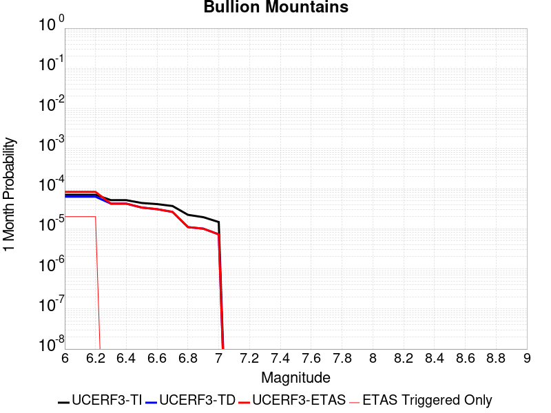 |  | 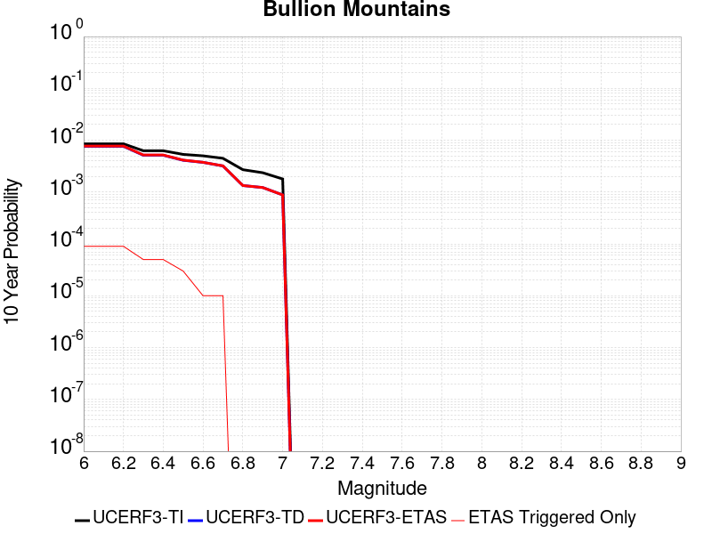 |

| Magnitude | 1 wk TI Prob | 1 wk TD Prob | 1 wk ETAS Prob | 1 wk ETAS/TD Gain | 1 wk ETAS Triggered Only | 1 mo TI Prob | 1 mo TD Prob | 1 mo ETAS Prob | 1 mo ETAS/TD Gain | 1 mo ETAS Triggered Only | 1 yr TI Prob | 1 yr TD Prob | 1 yr ETAS Prob | 1 yr ETAS/TD Gain | 1 yr ETAS Triggered Only | 10 yr TI Prob | 10 yr TD Prob | 10 yr ETAS Prob | 10 yr ETAS/TD Gain | 10 yr ETAS Triggered Only |
|-----|-----|-----|-----|-----|-----|-----|-----|-----|-----|-----|-----|-----|-----|-----|-----|-----|-----|-----|-----|-----|
| 6.0 | 1.6420427E-5 | 1.4692009E-5 | 1.4692009E-5 | 1.0 | 0.0 | 7.037136E-5 | 6.296445E-5 | 8.296319E-5 | 1.3176196 | 2.0E-5 | 8.5643446E-4 | 7.6636096E-4 | 8.2631496E-4 | 1.078232 | 6.0E-5 | 0.008531413 | 0.0076409746 | 0.007730287 | 1.0116886 | 9.0E-5 |
| 6.1 | 1.6420427E-5 | 1.4692009E-5 | 1.4692009E-5 | 1.0 | 0.0 | 7.037136E-5 | 6.296445E-5 | 8.296319E-5 | 1.3176196 | 2.0E-5 | 8.5643446E-4 | 7.6636096E-4 | 8.2631496E-4 | 1.078232 | 6.0E-5 | 0.008531413 | 0.0076409746 | 0.007730287 | 1.0116886 | 9.0E-5 |
| 6.2 | 1.6420427E-5 | 1.4692009E-5 | 1.4692009E-5 | 1.0 | 0.0 | 7.037136E-5 | 6.296445E-5 | 8.296319E-5 | 1.3176196 | 2.0E-5 | 8.5643446E-4 | 7.6636096E-4 | 8.2631496E-4 | 1.078232 | 6.0E-5 | 0.008531413 | 0.0076409746 | 0.007730287 | 1.0116886 | 9.0E-5 |
| 6.3 | 1.2046778E-5 | 9.862255E-6 | 9.862255E-6 | 1.0 | 0.0 | 5.1628023E-5 | 4.2266256E-5 | 4.2266256E-5 | 1.0 | 0.0 | 6.283899E-4 | 5.144933E-4 | 5.5447273E-4 | 1.0777063 | 4.0E-5 | 0.0062661595 | 0.0051353034 | 0.0051850467 | 1.0096865 | 5.0E-5 |
| 6.4 | 1.2046778E-5 | 9.862255E-6 | 9.862255E-6 | 1.0 | 0.0 | 5.1628023E-5 | 4.2266256E-5 | 4.2266256E-5 | 1.0 | 0.0 | 6.283899E-4 | 5.144933E-4 | 5.5447273E-4 | 1.0777063 | 4.0E-5 | 0.0062661595 | 0.0051353034 | 0.0051850467 | 1.0096865 | 5.0E-5 |
| 6.5 | 1.0244343E-5 | 7.879378E-6 | 7.879378E-6 | 1.0 | 0.0 | 4.390359E-5 | 3.3768443E-5 | 3.3768443E-5 | 1.0 | 0.0 | 5.343951E-4 | 4.1107394E-4 | 4.310657E-4 | 1.0486331 | 2.0E-5 | 0.005331118 | 0.0041051665 | 0.0041350434 | 1.0072778 | 3.0E-5 |
| 6.6 | 9.605408E-6 | 7.1774166E-6 | 7.1774166E-6 | 1.0 | 0.0 | 4.1165385E-5 | 3.0760108E-5 | 3.0760108E-5 | 1.0 | 0.0 | 5.010733E-4 | 3.7446033E-4 | 3.8445657E-4 | 1.0266951 | 1.0E-5 | 0.00499945 | 0.0037402906 | 0.0037502532 | 1.0026636 | 1.0E-5 |
| 6.7 | 8.60418E-6 | 6.123926E-6 | 6.123926E-6 | 1.0 | 0.0 | 3.687454E-5 | 2.6245243E-5 | 2.6245243E-5 | 1.0 | 0.0 | 4.48855E-4 | 3.195085E-4 | 3.295053E-4 | 1.031288 | 1.0E-5 | 0.004479495 | 0.0031924031 | 0.003202371 | 1.0031224 | 1.0E-5 |
| 6.8 | 5.187994E-6 | 2.563117E-6 | 2.563117E-6 | 1.0 | 0.0 | 2.223407E-5 | 1.0984763E-5 | 1.0984763E-5 | 1.0 | 0.0 | 2.7066618E-4 | 1.3373529E-4 | 1.3373529E-4 | 1.0 | 0.0 | 0.0027033675 | 0.0013369396 | 0.0013369396 | 1.0 | 0.0 |
| 6.9 | 4.5302368E-6 | 2.3442778E-6 | 2.3442778E-6 | 1.0 | 0.0 | 1.9415156E-5 | 1.0046889E-5 | 1.0046889E-5 | 1.0 | 0.0 | 2.3635388E-4 | 1.2231797E-4 | 1.2231797E-4 | 1.0 | 0.0 | 0.0023610266 | 0.0012228956 | 0.0012228956 | 1.0 | 0.0 |
| 7.0 | 3.431668E-6 | 1.6882177E-6 | 1.6882177E-6 | 1.0 | 0.0 | 1.4707065E-5 | 7.2352186E-6 | 7.2352186E-6 | 1.0 | 0.0 | 1.7904381E-4 | 8.808879E-5 | 8.808879E-5 | 1.0 | 0.0 | 0.0017889962 | 8.8088785E-4 | 8.8088785E-4 | 1.0 | 0.0 |

## San Diego Trough south
*[(top)](#table-of-contents)*

| 1 Week | 1 Month | 1 Year | 10 Year |
|-----|-----|-----|-----|
|  |  |  |  |

| Magnitude | 1 wk TI Prob | 1 wk TD Prob | 1 wk ETAS Prob | 1 wk ETAS/TD Gain | 1 wk ETAS Triggered Only | 1 mo TI Prob | 1 mo TD Prob | 1 mo ETAS Prob | 1 mo ETAS/TD Gain | 1 mo ETAS Triggered Only | 1 yr TI Prob | 1 yr TD Prob | 1 yr ETAS Prob | 1 yr ETAS/TD Gain | 1 yr ETAS Triggered Only | 10 yr TI Prob | 10 yr TD Prob | 10 yr ETAS Prob | 10 yr ETAS/TD Gain | 10 yr ETAS Triggered Only |
|-----|-----|-----|-----|-----|-----|-----|-----|-----|-----|-----|-----|-----|-----|-----|-----|-----|-----|-----|-----|-----|
| 6.0 | 8.279495E-5 | 1.0425541E-4 | 1.1425436E-4 | 1.0959083 | 1.0E-5 | 3.5478722E-4 | 4.4673498E-4 | 4.6672602E-4 | 1.0447493 | 2.0E-5 | 0.004310982 | 0.0054259133 | 0.0054656966 | 1.0073321 | 4.0E-5 | 0.042283054 | 0.05299303 | 0.05305932 | 1.001251 | 7.0E-5 |
| 6.1 | 4.6961468E-5 | 5.773024E-5 | 5.773024E-5 | 1.0 | 0.0 | 2.0124791E-4 | 2.473905E-4 | 2.5738802E-4 | 1.040412 | 1.0E-5 | 0.00244744 | 0.003007886 | 0.0030377957 | 1.0099437 | 3.0E-5 | 0.024206603 | 0.029679636 | 0.029718447 | 1.0013077 | 4.0E-5 |
| 6.2 | 3.5079658E-5 | 4.214258E-5 | 4.214258E-5 | 1.0 | 0.0 | 1.5033272E-4 | 1.8059829E-4 | 1.9059649E-4 | 1.0553615 | 1.0E-5 | 0.0018287642 | 0.002196587 | 0.002206565 | 1.0045425 | 1.0E-5 | 0.018137876 | 0.021751188 | 0.021770753 | 1.0008994 | 2.0E-5 |
| 6.3 | 3.5079658E-5 | 4.214258E-5 | 4.214258E-5 | 1.0 | 0.0 | 1.5033272E-4 | 1.8059829E-4 | 1.9059649E-4 | 1.0553615 | 1.0E-5 | 0.0018287642 | 0.002196587 | 0.002206565 | 1.0045425 | 1.0E-5 | 0.018137876 | 0.021751188 | 0.021770753 | 1.0008994 | 2.0E-5 |
| 6.4 | 2.7196904E-5 | 3.208715E-5 | 3.208715E-5 | 1.0 | 0.0 | 1.16552954E-4 | 1.3750911E-4 | 1.3750911E-4 | 1.0 | 0.0 | 0.0014181085 | 0.0016728995 | 0.0016728995 | 1.0 | 0.0 | 0.014090929 | 0.016604666 | 0.016604666 | 1.0 | 0.0 |
| 6.5 | 2.5584688E-5 | 3.0101632E-5 | 3.0101632E-5 | 1.0 | 0.0 | 1.0964406E-4 | 1.2900059E-4 | 1.2900059E-4 | 1.0 | 0.0 | 0.0013340989 | 0.0015694627 | 0.0015694627 | 1.0 | 0.0 | 0.013261181 | 0.015585332 | 0.015585332 | 1.0 | 0.0 |
| 6.6 | 2.2034688E-5 | 2.574271E-5 | 2.574271E-5 | 1.0 | 0.0 | 9.443096E-5 | 1.1032127E-4 | 1.1032127E-4 | 1.0 | 0.0 | 0.0011490905 | 0.0013423412 | 0.0013423412 | 1.0 | 0.0 | 0.011431668 | 0.013343325 | 0.013343325 | 1.0 | 0.0 |
| 6.7 | 1.9394853E-5 | 2.254176E-5 | 2.254176E-5 | 1.0 | 0.0 | 8.311815E-5 | 9.6604E-5 | 9.6604E-5 | 1.0 | 0.0 | 0.0010114936 | 0.0011755243 | 0.0011755243 | 1.0 | 0.0 | 0.01006902 | 0.011693766 | 0.011693766 | 1.0 | 0.0 |
| 6.8 | 1.7615313E-5 | 2.0403182E-5 | 2.0403182E-5 | 1.0 | 0.0 | 7.549201E-5 | 8.743931E-5 | 8.743931E-5 | 1.0 | 0.0 | 9.1872766E-4 | 0.0010640579 | 0.0010640579 | 1.0 | 0.0 | 0.009149387 | 0.010590198 | 0.010590198 | 1.0 | 0.0 |
| 6.9 | 1.5621423E-5 | 1.8026114E-5 | 1.8026114E-5 | 1.0 | 0.0 | 6.6947236E-5 | 7.725251E-5 | 7.725251E-5 | 1.0 | 0.0 | 8.147778E-4 | 9.40147E-4 | 9.40147E-4 | 1.0 | 0.0 | 0.008117969 | 0.009362142 | 0.009362142 | 1.0 | 0.0 |
| 7.0 | 1.3444376E-5 | 1.544809E-5 | 1.544809E-5 | 1.0 | 0.0 | 5.7617483E-5 | 6.620443E-5 | 6.620443E-5 | 1.0 | 0.0 | 7.0126704E-4 | 8.057436E-4 | 8.057436E-4 | 1.0 | 0.0 | 0.006990582 | 0.008028555 | 0.008028555 | 1.0 | 0.0 |
| 7.1 | 1.2268361E-5 | 1.407303E-5 | 1.407303E-5 | 1.0 | 0.0 | 5.2577634E-5 | 6.0311606E-5 | 6.0311606E-5 | 1.0 | 0.0 | 6.399447E-4 | 7.3404907E-4 | 7.3404907E-4 | 1.0 | 0.0 | 0.0063810493 | 0.0073165493 | 0.0073165493 | 1.0 | 0.0 |
| 7.2 | 1.0922655E-5 | 1.2513563E-5 | 1.2513563E-5 | 1.0 | 0.0 | 4.681054E-5 | 5.3628468E-5 | 5.3628468E-5 | 1.0 | 0.0 | 5.697693E-4 | 6.5273355E-4 | 6.5273355E-4 | 1.0 | 0.0 | 0.0056831064 | 0.0065084435 | 0.0065084435 | 1.0 | 0.0 |
| 7.3 | 6.1106753E-6 | 6.928925E-6 | 6.928925E-6 | 1.0 | 0.0 | 2.6188345E-5 | 2.9695057E-5 | 2.9695057E-5 | 1.0 | 0.0 | 3.1879646E-4 | 3.6147775E-4 | 3.6147775E-4 | 1.0 | 0.0 | 0.0031833951 | 0.003608943 | 0.003608943 | 1.0 | 0.0 |
| 7.4 | 4.933187E-6 | 5.5895525E-6 | 5.5895525E-6 | 1.0 | 0.0 | 2.114206E-5 | 2.3955008E-5 | 2.3955008E-5 | 1.0 | 0.0 | 2.5737417E-4 | 2.9161357E-4 | 2.9161357E-4 | 1.0 | 0.0 | 0.002570763 | 0.0029123505 | 0.0029123505 | 1.0 | 0.0 |
| 7.5 | 1.7489613E-6 | 1.969678E-6 | 1.969678E-6 | 1.0 | 0.0 | 7.495527E-6 | 8.4414505E-6 | 8.4414505E-6 | 1.0 | 0.0 | 9.125422E-5 | 1.02770035E-4 | 1.02770035E-4 | 1.0 | 0.0 | 9.1216754E-4 | 0.0010272472 | 0.0010272472 | 1.0 | 0.0 |
| 7.6 | 1.6988751E-7 | 1.7533823E-7 | 1.7533823E-7 | 1.0 | 0.0 | 7.2808916E-7 | 7.5144936E-7 | 7.5144936E-7 | 1.0 | 0.0 | 8.864449E-6 | 9.14886E-6 | 9.14886E-6 | 1.0 | 0.0 | 8.8640954E-5 | 9.1485024E-5 | 9.1485024E-5 | 1.0 | 0.0 |

## Chino alt 1
*[(top)](#table-of-contents)*

| 1 Week | 1 Month | 1 Year | 10 Year |
|-----|-----|-----|-----|
|  |  |  |  |

| Magnitude | 1 wk TI Prob | 1 wk TD Prob | 1 wk ETAS Prob | 1 wk ETAS/TD Gain | 1 wk ETAS Triggered Only | 1 mo TI Prob | 1 mo TD Prob | 1 mo ETAS Prob | 1 mo ETAS/TD Gain | 1 mo ETAS Triggered Only | 1 yr TI Prob | 1 yr TD Prob | 1 yr ETAS Prob | 1 yr ETAS/TD Gain | 1 yr ETAS Triggered Only | 10 yr TI Prob | 10 yr TD Prob | 10 yr ETAS Prob | 10 yr ETAS/TD Gain | 10 yr ETAS Triggered Only |
|-----|-----|-----|-----|-----|-----|-----|-----|-----|-----|-----|-----|-----|-----|-----|-----|-----|-----|-----|-----|-----|
| 6.0 | 3.939946E-5 | 4.894798E-5 | 8.894602E-5 | 1.817154 | 4.0E-5 | 1.6884391E-4 | 2.0976314E-4 | 2.5975265E-4 | 1.2383142 | 5.0E-5 | 0.0020537362 | 0.002551385 | 0.002611232 | 1.0234567 | 6.0E-5 | 0.020348595 | 0.025280168 | 0.025358146 | 1.0030845 | 8.0E-5 |
| 6.1 | 2.1505624E-5 | 2.6878823E-5 | 6.687775E-5 | 2.4881203 | 4.0E-5 | 9.2163704E-5 | 1.15190494E-4 | 1.5518589E-4 | 1.3472109 | 4.0E-5 | 0.0011215154 | 0.0014016517 | 0.0014515815 | 1.0356222 | 5.0E-5 | 0.011158722 | 0.013947425 | 0.014006589 | 1.0042418 | 6.0E-5 |
| 6.2 | 2.1505624E-5 | 2.6878823E-5 | 6.687775E-5 | 2.4881203 | 4.0E-5 | 9.2163704E-5 | 1.15190494E-4 | 1.5518589E-4 | 1.3472109 | 4.0E-5 | 0.0011215154 | 0.0014016517 | 0.0014515815 | 1.0356222 | 5.0E-5 | 0.011158722 | 0.013947425 | 0.014006589 | 1.0042418 | 6.0E-5 |
| 6.3 | 1.4290785E-5 | 1.8164832E-5 | 4.8164286E-5 | 2.6515129 | 3.0E-5 | 6.1244784E-5 | 7.784722E-5 | 1.0784488E-4 | 1.3853402 | 3.0E-5 | 7.454001E-4 | 9.4742293E-4 | 9.87385E-4 | 1.0421798 | 4.0E-5 | 0.007429048 | 0.00944674 | 0.009496268 | 1.0052428 | 5.0E-5 |
| 6.4 | 1.4290785E-5 | 1.8164832E-5 | 4.8164286E-5 | 2.6515129 | 3.0E-5 | 6.1244784E-5 | 7.784722E-5 | 1.0784488E-4 | 1.3853402 | 3.0E-5 | 7.454001E-4 | 9.4742293E-4 | 9.87385E-4 | 1.0421798 | 4.0E-5 | 0.007429048 | 0.00944674 | 0.009496268 | 1.0052428 | 5.0E-5 |
| 6.5 | 1.3017944E-5 | 1.6651793E-5 | 4.6651294E-5 | 2.8015778 | 3.0E-5 | 5.5789995E-5 | 7.1363116E-5 | 1.0136098E-4 | 1.4203552 | 3.0E-5 | 6.790315E-4 | 8.6854334E-4 | 8.985173E-4 | 1.0345106 | 3.0E-5 | 0.0067696036 | 0.008664233 | 0.008693973 | 1.0034325 | 3.0E-5 |
| 6.6 | 9.470016E-6 | 1.2039209E-5 | 4.2038846E-5 | 3.491828 | 3.0E-5 | 4.058515E-5 | 5.159578E-5 | 8.159423E-5 | 1.5814129 | 3.0E-5 | 4.940122E-4 | 6.280315E-4 | 6.580127E-4 | 1.0477383 | 3.0E-5 | 0.004929154 | 0.006273248 | 0.0063030594 | 1.0047522 | 3.0E-5 |
| 6.7 | 8.314155E-6 | 1.040749E-5 | 4.0407176E-5 | 3.8825095 | 3.0E-5 | 3.5631605E-5 | 4.4602948E-5 | 7.460161E-5 | 1.6725713 | 3.0E-5 | 4.3372845E-4 | 5.4293784E-4 | 5.7292153E-4 | 1.0552249 | 3.0E-5 | 0.004328829 | 0.0054270807 | 0.005456918 | 1.0054978 | 3.0E-5 |
| 6.8 | 3.4856364E-6 | 3.8134033E-6 | 1.38133655E-5 | 3.6223195 | 1.0E-5 | 1.4938357E-5 | 1.6343065E-5 | 2.6342903E-5 | 1.6118703 | 1.0E-5 | 1.8185932E-4 | 1.9896074E-4 | 2.0895875E-4 | 1.0502511 | 1.0E-5 | 0.0018171056 | 0.0019894529 | 0.001999433 | 1.0050166 | 1.0E-5 |
| 6.9 | 2.2645952E-6 | 2.152909E-6 | 2.152909E-6 | 1.0 | 0.0 | 9.705372E-6 | 9.226722E-6 | 9.226722E-6 | 1.0 | 0.0 | 1.18156495E-4 | 1.12329755E-4 | 1.12329755E-4 | 1.0 | 0.0 | 0.0011809369 | 0.0011233138 | 0.0011233138 | 1.0 | 0.0 |
| 7.0 | 1.7864003E-6 | 1.5430741E-6 | 1.5430741E-6 | 1.0 | 0.0 | 7.655979E-6 | 6.613158E-6 | 6.613158E-6 | 1.0 | 0.0 | 9.3207556E-5 | 8.051228E-5 | 8.051228E-5 | 1.0 | 0.0 | 9.316847E-4 | 8.052856E-4 | 8.052856E-4 | 1.0 | 0.0 |
| 7.1 | 1.7315456E-6 | 1.4733466E-6 | 1.4733466E-6 | 1.0 | 0.0 | 7.420889E-6 | 6.314328E-6 | 6.314328E-6 | 1.0 | 0.0 | 9.034557E-5 | 7.687428E-5 | 7.687428E-5 | 1.0 | 0.0 | 9.0308854E-4 | 7.68921E-4 | 7.68921E-4 | 1.0 | 0.0 |
| 7.2 | 1.6008337E-6 | 1.3574178E-6 | 1.3574178E-6 | 1.0 | 0.0 | 6.860698E-6 | 5.817492E-6 | 5.817492E-6 | 1.0 | 0.0 | 8.352579E-5 | 7.082572E-5 | 7.082572E-5 | 1.0 | 0.0 | 8.34944E-4 | 7.0846075E-4 | 7.0846075E-4 | 1.0 | 0.0 |
| 7.3 | 1.3320939E-6 | 1.1217794E-6 | 1.1217794E-6 | 1.0 | 0.0 | 5.7089615E-6 | 4.8076176E-6 | 4.8076176E-6 | 1.0 | 0.0 | 6.9504385E-5 | 5.853122E-5 | 5.853122E-5 | 1.0 | 0.0 | 6.9482654E-4 | 5.8530655E-4 | 5.8530655E-4 | 1.0 | 0.0 |
| 7.4 | 1.114294E-6 | 9.237087E-7 | 9.237087E-7 | 1.0 | 0.0 | 4.775537E-6 | 3.9587458E-6 | 3.9587458E-6 | 1.0 | 0.0 | 5.8140613E-5 | 4.81967E-5 | 4.81967E-5 | 1.0 | 0.0 | 5.81254E-4 | 4.8187698E-4 | 4.8187698E-4 | 1.0 | 0.0 |
| 7.5 | 9.354081E-7 | 7.6233886E-7 | 7.6233886E-7 | 1.0 | 0.0 | 4.0088858E-6 | 3.2671626E-6 | 3.2671626E-6 | 1.0 | 0.0 | 4.8807087E-5 | 3.9777013E-5 | 3.9777013E-5 | 1.0 | 0.0 | 4.879637E-4 | 3.9770233E-4 | 3.9770233E-4 | 1.0 | 0.0 |
| 7.6 | 8.521771E-7 | 6.880688E-7 | 6.880688E-7 | 1.0 | 0.0 | 3.6521824E-6 | 2.948863E-6 | 2.948863E-6 | 1.0 | 0.0 | 4.4464414E-5 | 3.590185E-5 | 3.590185E-5 | 1.0 | 0.0 | 4.4455516E-4 | 3.5896365E-4 | 3.5896365E-4 | 1.0 | 0.0 |
| 7.7 | 2.1803626E-7 | 1.4186368E-7 | 1.4186368E-7 | 1.0 | 0.0 | 9.344408E-7 | 6.0798715E-7 | 6.0798715E-7 | 1.0 | 0.0 | 1.1376757E-5 | 7.4022278E-6 | 7.4022278E-6 | 1.0 | 0.0 | 1.13761744E-4 | 7.402077E-5 | 7.402077E-5 | 1.0 | 0.0 |

## Pisgah-Bullion Mtn-Mesquite Lk
*[(top)](#table-of-contents)*

| 1 Week | 1 Month | 1 Year | 10 Year |
|-----|-----|-----|-----|
|  |  |  |  |

| Magnitude | 1 wk TI Prob | 1 wk TD Prob | 1 wk ETAS Prob | 1 wk ETAS/TD Gain | 1 wk ETAS Triggered Only | 1 mo TI Prob | 1 mo TD Prob | 1 mo ETAS Prob | 1 mo ETAS/TD Gain | 1 mo ETAS Triggered Only | 1 yr TI Prob | 1 yr TD Prob | 1 yr ETAS Prob | 1 yr ETAS/TD Gain | 1 yr ETAS Triggered Only | 10 yr TI Prob | 10 yr TD Prob | 10 yr ETAS Prob | 10 yr ETAS/TD Gain | 10 yr ETAS Triggered Only |
|-----|-----|-----|-----|-----|-----|-----|-----|-----|-----|-----|-----|-----|-----|-----|-----|-----|-----|-----|-----|-----|
| 6.0 | 3.0240792E-5 | 2.40909E-5 | 2.40909E-5 | 1.0 | 0.0 | 1.2959696E-4 | 1.032432E-4 | 1.1324216E-4 | 1.0968487 | 1.0E-5 | 0.0015767008 | 0.0012563618 | 0.0012963115 | 1.031798 | 4.0E-5 | 0.015655609 | 0.012502613 | 0.012591488 | 1.0071084 | 9.0E-5 |
| 6.1 | 3.0240792E-5 | 2.40909E-5 | 2.40909E-5 | 1.0 | 0.0 | 1.2959696E-4 | 1.032432E-4 | 1.1324216E-4 | 1.0968487 | 1.0E-5 | 0.0015767008 | 0.0012563618 | 0.0012963115 | 1.031798 | 4.0E-5 | 0.015655609 | 0.012502613 | 0.012591488 | 1.0071084 | 9.0E-5 |
| 6.2 | 3.0240792E-5 | 2.40909E-5 | 2.40909E-5 | 1.0 | 0.0 | 1.2959696E-4 | 1.032432E-4 | 1.1324216E-4 | 1.0968487 | 1.0E-5 | 0.0015767008 | 0.0012563618 | 0.0012963115 | 1.031798 | 4.0E-5 | 0.015655609 | 0.012502613 | 0.012591488 | 1.0071084 | 9.0E-5 |
| 6.3 | 2.0498217E-5 | 1.3638054E-5 | 1.3638054E-5 | 1.0 | 0.0 | 8.784654E-5 | 5.8447586E-5 | 6.8447E-5 | 1.1710835 | 1.0E-5 | 0.0010690069 | 7.1138324E-4 | 7.4136193E-4 | 1.0421413 | 3.0E-5 | 0.01063879 | 0.0070926864 | 0.007142332 | 1.0069995 | 5.0E-5 |
| 6.4 | 2.0498217E-5 | 1.3638054E-5 | 1.3638054E-5 | 1.0 | 0.0 | 8.784654E-5 | 5.8447586E-5 | 6.8447E-5 | 1.1710835 | 1.0E-5 | 0.0010690069 | 7.1138324E-4 | 7.4136193E-4 | 1.0421413 | 3.0E-5 | 0.01063879 | 0.0070926864 | 0.007142332 | 1.0069995 | 5.0E-5 |
| 6.5 | 1.7316182E-5 | 1.04769715E-5 | 1.04769715E-5 | 1.0 | 0.0 | 7.42101E-5 | 4.490059E-5 | 5.490014E-5 | 1.2227042 | 1.0E-5 | 9.0313336E-4 | 5.465376E-4 | 5.665266E-4 | 1.036574 | 2.0E-5 | 0.008994718 | 0.00545293 | 0.005472821 | 1.0036478 | 2.0E-5 |
| 6.6 | 1.5251077E-5 | 8.414133E-6 | 8.414133E-6 | 1.0 | 0.0 | 6.536012E-5 | 3.606011E-5 | 4.605975E-5 | 1.2773048 | 1.0E-5 | 7.9546886E-4 | 4.3895066E-4 | 4.5894188E-4 | 1.0455432 | 2.0E-5 | 0.007926274 | 0.0043815537 | 0.004401466 | 1.0045446 | 2.0E-5 |
| 6.7 | 1.2997425E-5 | 6.4112146E-6 | 6.4112146E-6 | 1.0 | 0.0 | 5.570206E-5 | 2.7476372E-5 | 3.7476097E-5 | 1.363939 | 1.0E-5 | 6.7796157E-4 | 3.3447813E-4 | 3.5447144E-4 | 1.0597746 | 2.0E-5 | 0.0067589693 | 0.003340207 | 0.0033601404 | 1.0059676 | 2.0E-5 |
| 6.8 | 1.035386E-5 | 4.333145E-6 | 4.333145E-6 | 1.0 | 0.0 | 4.437293E-5 | 1.8570496E-5 | 1.8570496E-5 | 1.0 | 0.0 | 5.401065E-4 | 2.260732E-4 | 2.260732E-4 | 1.0 | 0.0 | 0.0053879567 | 0.002258519 | 0.002258519 | 1.0 | 0.0 |
| 6.9 | 8.816252E-6 | 3.5805879E-6 | 3.5805879E-6 | 1.0 | 0.0 | 3.778339E-5 | 1.534529E-5 | 1.534529E-5 | 1.0 | 0.0 | 4.5991567E-4 | 1.8681347E-4 | 1.8681347E-4 | 1.0 | 0.0 | 0.00458965 | 0.0018666228 | 0.0018666228 | 1.0 | 0.0 |
| 7.0 | 6.8232207E-6 | 2.5674399E-6 | 2.5674399E-6 | 1.0 | 0.0 | 2.9242048E-5 | 1.100327E-5 | 1.100327E-5 | 1.0 | 0.0 | 3.5596377E-4 | 1.3395688E-4 | 1.3395688E-4 | 1.0 | 0.0 | 0.0035539411 | 0.0013387925 | 0.0013387925 | 1.0 | 0.0 |
| 7.1 | 5.837013E-6 | 2.2273143E-6 | 2.2273143E-6 | 1.0 | 0.0 | 2.501553E-5 | 9.5456E-6 | 9.5456E-6 | 1.0 | 0.0 | 3.045215E-4 | 1.1621177E-4 | 1.1621177E-4 | 1.0 | 0.0 | 0.0030410455 | 0.001161539 | 0.001161539 | 1.0 | 0.0 |
| 7.2 | 4.278052E-6 | 1.6275065E-6 | 1.6275065E-6 | 1.0 | 0.0 | 1.833438E-5 | 6.975011E-6 | 6.975011E-6 | 1.0 | 0.0 | 2.231982E-4 | 8.491768E-5 | 8.491768E-5 | 1.0 | 0.0 | 0.0022297418 | 8.4887556E-4 | 8.4887556E-4 | 1.0 | 0.0 |
| 7.3 | 1.8803692E-6 | 8.344788E-7 | 8.344788E-7 | 1.0 | 0.0 | 8.0587E-6 | 3.5763337E-6 | 3.5763337E-6 | 1.0 | 0.0 | 9.811026E-5 | 4.354114E-5 | 4.354114E-5 | 1.0 | 0.0 | 9.806695E-4 | 4.3534054E-4 | 4.3534054E-4 | 1.0 | 0.0 |

## Green Valley 2011 CFM
*[(top)](#table-of-contents)*

| 1 Week | 1 Month | 1 Year | 10 Year |
|-----|-----|-----|-----|
|  |  | 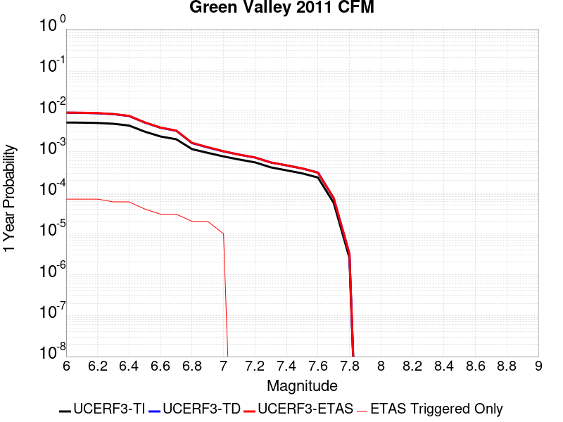 | 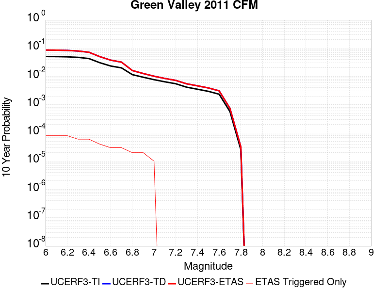 |

| Magnitude | 1 wk TI Prob | 1 wk TD Prob | 1 wk ETAS Prob | 1 wk ETAS/TD Gain | 1 wk ETAS Triggered Only | 1 mo TI Prob | 1 mo TD Prob | 1 mo ETAS Prob | 1 mo ETAS/TD Gain | 1 mo ETAS Triggered Only | 1 yr TI Prob | 1 yr TD Prob | 1 yr ETAS Prob | 1 yr ETAS/TD Gain | 1 yr ETAS Triggered Only | 10 yr TI Prob | 10 yr TD Prob | 10 yr ETAS Prob | 10 yr ETAS/TD Gain | 10 yr ETAS Triggered Only |
|-----|-----|-----|-----|-----|-----|-----|-----|-----|-----|-----|-----|-----|-----|-----|-----|-----|-----|-----|-----|-----|
| 6.0 | 9.9629346E-5 | 1.7302863E-4 | 2.130217E-4 | 1.2311356 | 4.0E-5 | 4.2691303E-4 | 7.41326E-4 | 7.8129634E-4 | 1.0539174 | 4.0E-5 | 0.0051852856 | 0.00898692 | 0.009056291 | 1.007719 | 7.0E-5 | 0.050659515 | 0.08553951 | 0.08561267 | 1.0008552 | 8.0E-5 |
| 6.1 | 9.88615E-5 | 1.7150163E-4 | 2.1149477E-4 | 1.233194 | 4.0E-5 | 4.2362334E-4 | 7.347854E-4 | 7.74756E-4 | 1.0543977 | 4.0E-5 | 0.0051454236 | 0.008907947 | 0.008977324 | 1.0077882 | 7.0E-5 | 0.050279044 | 0.08482712 | 0.08490033 | 1.0008631 | 8.0E-5 |
| 6.2 | 9.696895E-5 | 1.6789208E-4 | 2.0788537E-4 | 1.2382083 | 4.0E-5 | 4.15515E-4 | 7.1932544E-4 | 7.592967E-4 | 1.0555676 | 4.0E-5 | 0.0050471667 | 0.00872133 | 0.008790719 | 1.0079563 | 7.0E-5 | 0.04934063 | 0.08313578 | 0.083209135 | 1.0008823 | 8.0E-5 |
| 6.3 | 9.275224E-5 | 1.5968543E-4 | 1.8968064E-4 | 1.1878394 | 3.0E-5 | 3.9744904E-4 | 6.841728E-4 | 7.1415224E-4 | 1.0438186 | 3.0E-5 | 0.0048282105 | 0.008296652 | 0.008356154 | 1.0071719 | 6.0E-5 | 0.047246475 | 0.07927481 | 0.07933005 | 1.0006969 | 6.0E-5 |
| 6.4 | 8.391499E-5 | 1.4365884E-4 | 1.7365452E-4 | 1.208798 | 3.0E-5 | 3.595861E-4 | 6.155238E-4 | 6.455053E-4 | 1.048709 | 3.0E-5 | 0.004369175 | 0.007467181 | 0.007526733 | 1.0079751 | 6.0E-5 | 0.04284265 | 0.07164672 | 0.07170242 | 1.0007775 | 6.0E-5 |
| 6.5 | 5.9519385E-5 | 9.932622E-5 | 1.0932523E-4 | 1.1006683 | 1.0E-5 | 2.5505814E-4 | 4.2560388E-4 | 4.3559962E-4 | 1.023486 | 1.0E-5 | 0.0031009112 | 0.005168341 | 0.005208134 | 1.0076994 | 4.0E-5 | 0.030579966 | 0.05014692 | 0.050184913 | 1.0007577 | 4.0E-5 |
| 6.6 | 4.5361558E-5 | 7.4019794E-5 | 8.4019055E-5 | 1.135089 | 1.0E-5 | 1.9439218E-4 | 3.1717744E-4 | 3.2717426E-4 | 1.0315181 | 1.0E-5 | 0.0023641558 | 0.0038538678 | 0.0038837523 | 1.0077544 | 3.0E-5 | 0.023391623 | 0.03766727 | 0.037696138 | 1.0007664 | 3.0E-5 |
| 6.7 | 3.8808106E-5 | 6.264382E-5 | 7.264319E-5 | 1.1596227 | 1.0E-5 | 1.6630985E-4 | 2.6843755E-4 | 2.7843486E-4 | 1.0372427 | 1.0E-5 | 0.0020229418 | 0.0032627317 | 0.0032926337 | 1.0091647 | 3.0E-5 | 0.020046256 | 0.032007415 | 0.032036457 | 1.0009073 | 3.0E-5 |
| 6.8 | 2.2284667E-5 | 3.128574E-5 | 3.128574E-5 | 1.0 | 0.0 | 9.550222E-5 | 1.3407487E-4 | 1.3407487E-4 | 1.0 | 0.0 | 0.0011621192 | 0.0016311383 | 0.0016511056 | 1.0122414 | 2.0E-5 | 0.011560607 | 0.01616672 | 0.016186398 | 1.0012171 | 2.0E-5 |
| 6.9 | 1.8050168E-5 | 2.4448536E-5 | 2.4448536E-5 | 1.0 | 0.0 | 7.735557E-5 | 1.0477527E-4 | 1.0477527E-4 | 1.0 | 0.0 | 9.4139716E-4 | 0.0012748954 | 0.0012948699 | 1.0156676 | 2.0E-5 | 0.009374191 | 0.012669067 | 0.012688814 | 1.0015587 | 2.0E-5 |
| 7.0 | 1.4763166E-5 | 1.9583236E-5 | 1.9583236E-5 | 1.0 | 0.0 | 6.326917E-5 | 8.3925464E-5 | 8.3925464E-5 | 1.0 | 0.0 | 7.7002996E-4 | 0.001021315 | 0.0010313048 | 1.0097812 | 1.0E-5 | 0.007673672 | 0.01016625 | 0.010176148 | 1.0009737 | 1.0E-5 |
| 7.1 | 1.2399713E-5 | 1.6304042E-5 | 1.6304042E-5 | 1.0 | 0.0 | 5.3140546E-5 | 6.987261E-5 | 6.987261E-5 | 1.0 | 0.0 | 6.467941E-4 | 8.5036893E-4 | 8.5036893E-4 | 1.0 | 0.0 | 0.006449148 | 0.008471781 | 0.008471781 | 1.0 | 0.0 |
| 7.2 | 1.0584195E-5 | 1.39220465E-5 | 1.39220465E-5 | 1.0 | 0.0 | 4.5360044E-5 | 5.966456E-5 | 5.966456E-5 | 1.0 | 0.0 | 5.521186E-4 | 7.2617555E-4 | 7.2617555E-4 | 1.0 | 0.0 | 0.0055074887 | 0.0072386027 | 0.0072386027 | 1.0 | 0.0 |
| 7.3 | 7.998173E-6 | 1.0544255E-5 | 1.0544255E-5 | 1.0 | 0.0 | 3.4277433E-5 | 4.5188888E-5 | 4.5188888E-5 | 1.0 | 0.0 | 4.1724785E-4 | 5.500369E-4 | 5.500369E-4 | 1.0 | 0.0 | 0.004164653 | 0.005487135 | 0.005487135 | 1.0 | 0.0 |
| 7.4 | 6.7571127E-6 | 8.932903E-6 | 8.932903E-6 | 1.0 | 0.0 | 2.8958733E-5 | 3.8283313E-5 | 3.8283313E-5 | 1.0 | 0.0 | 3.5251552E-4 | 4.660006E-4 | 4.660006E-4 | 1.0 | 0.0 | 0.0035195686 | 0.004650633 | 0.004650633 | 1.0 | 0.0 |
| 7.5 | 5.69878E-6 | 7.516483E-6 | 7.516483E-6 | 1.0 | 0.0 | 2.4423114E-5 | 3.2213105E-5 | 3.2213105E-5 | 1.0 | 0.0 | 2.9731085E-4 | 3.9212484E-4 | 3.9212484E-4 | 1.0 | 0.0 | 0.002969134 | 0.0039147018 | 0.0039147018 | 1.0 | 0.0 |
| 7.6 | 4.503664E-6 | 5.9358217E-6 | 5.9358217E-6 | 1.0 | 0.0 | 1.9301275E-5 | 2.5438992E-5 | 2.5438992E-5 | 1.0 | 0.0 | 2.3496768E-4 | 3.0967654E-4 | 3.0967654E-4 | 1.0 | 0.0 | 0.002347194 | 0.0030927279 | 0.0030927279 | 1.0 | 0.0 |
| 7.7 | 1.0873546E-6 | 1.410754E-6 | 1.410754E-6 | 1.0 | 0.0 | 4.6600826E-6 | 6.0460743E-6 | 6.0460743E-6 | 1.0 | 0.0 | 5.6735033E-5 | 7.36085E-5 | 7.36085E-5 | 1.0 | 0.0 | 5.672055E-4 | 7.3587085E-4 | 7.3587085E-4 | 1.0 | 0.0 |
| 7.8 | 4.9373917E-8 | 6.177967E-8 | 6.177967E-8 | 1.0 | 0.0 | 2.1160248E-7 | 2.6477002E-7 | 2.6477002E-7 | 1.0 | 0.0 | 2.5762572E-6 | 3.2235714E-6 | 3.2235714E-6 | 1.0 | 0.0 | 2.5762274E-5 | 3.2228E-5 | 3.2228E-5 | 1.0 | 0.0 |

## Oceanic - West Huasna
*[(top)](#table-of-contents)*

| 1 Week | 1 Month | 1 Year | 10 Year |
|-----|-----|-----|-----|
|  | 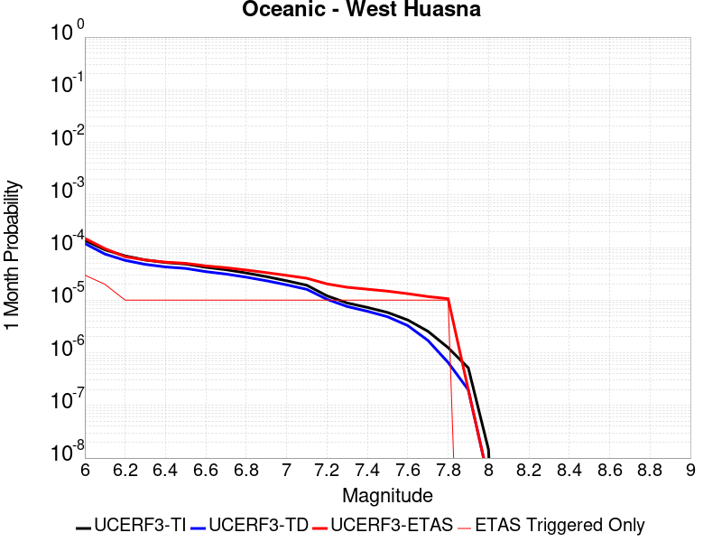 |  |  |

| Magnitude | 1 wk TI Prob | 1 wk TD Prob | 1 wk ETAS Prob | 1 wk ETAS/TD Gain | 1 wk ETAS Triggered Only | 1 mo TI Prob | 1 mo TD Prob | 1 mo ETAS Prob | 1 mo ETAS/TD Gain | 1 mo ETAS Triggered Only | 1 yr TI Prob | 1 yr TD Prob | 1 yr ETAS Prob | 1 yr ETAS/TD Gain | 1 yr ETAS Triggered Only | 10 yr TI Prob | 10 yr TD Prob | 10 yr ETAS Prob | 10 yr ETAS/TD Gain | 10 yr ETAS Triggered Only |
|-----|-----|-----|-----|-----|-----|-----|-----|-----|-----|-----|-----|-----|-----|-----|-----|-----|-----|-----|-----|-----|
| 6.0 | 3.195567E-5 | 2.7926368E-5 | 3.792609E-5 | 1.3580745 | 1.0E-5 | 1.3694567E-4 | 1.19679185E-4 | 1.496756E-4 | 1.2506402 | 3.0E-5 | 0.0016660384 | 0.0014561634 | 0.0015060905 | 1.0342869 | 5.0E-5 | 0.016536033 | 0.01447077 | 0.014539758 | 1.0047673 | 7.0E-5 |
| 6.1 | 2.1156782E-5 | 1.7573117E-5 | 2.7572942E-5 | 1.569041 | 1.0E-5 | 9.066878E-5 | 7.531123E-5 | 9.530973E-5 | 1.2655447 | 2.0E-5 | 0.0011033333 | 9.1653795E-4 | 9.4651047E-4 | 1.0327018 | 3.0E-5 | 0.010978713 | 0.009128587 | 0.009178131 | 1.0054272 | 5.0E-5 |
| 6.2 | 1.6195117E-5 | 1.3327227E-5 | 2.3327093E-5 | 1.7503337 | 1.0E-5 | 6.9405796E-5 | 5.7115452E-5 | 6.711488E-5 | 1.175074 | 1.0E-5 | 8.44688E-4 | 6.9516135E-4 | 7.151475E-4 | 1.0287503 | 2.0E-5 | 0.008414844 | 0.0069301617 | 0.0069698845 | 1.0057318 | 4.0E-5 |
| 6.3 | 1.3559345E-5 | 1.1179013E-5 | 2.1178901E-5 | 1.8945234 | 1.0E-5 | 5.811018E-5 | 4.7909183E-5 | 5.7908703E-5 | 1.2087183 | 1.0E-5 | 7.072618E-4 | 5.8313913E-4 | 5.931333E-4 | 1.0171386 | 1.0E-5 | 0.0070501505 | 0.005816208 | 0.0058460333 | 1.005128 | 3.0E-5 |
| 6.4 | 1.2120619E-5 | 1.0000874E-5 | 2.0000774E-5 | 1.9999026 | 1.0E-5 | 5.1944477E-5 | 4.2860185E-5 | 5.285976E-5 | 1.2333068 | 1.0E-5 | 6.322405E-4 | 5.216983E-4 | 5.316931E-4 | 1.0191581 | 1.0E-5 | 0.006304447 | 0.005204804 | 0.0052346475 | 1.0057338 | 3.0E-5 |
| 6.5 | 1.13511915E-5 | 9.367378E-6 | 1.9367284E-5 | 2.0675244 | 1.0E-5 | 4.8647056E-5 | 4.0145293E-5 | 5.0144892E-5 | 1.2490852 | 1.0E-5 | 5.9211696E-4 | 4.886598E-4 | 4.9865484E-4 | 1.0204542 | 1.0E-5 | 0.0059054173 | 0.0048759114 | 0.004905765 | 1.0061227 | 3.0E-5 |
| 6.6 | 9.850605E-6 | 8.1353155E-6 | 1.8135233E-5 | 2.2291987 | 1.0E-5 | 4.2216197E-5 | 3.4865174E-5 | 4.4864824E-5 | 1.2868092 | 1.0E-5 | 5.1386096E-4 | 4.2440102E-4 | 4.343968E-4 | 1.0235527 | 1.0E-5 | 0.0051267436 | 0.0042359377 | 0.004255853 | 1.0047015 | 2.0E-5 |
| 6.7 | 8.8558645E-6 | 7.318341E-6 | 1.7318267E-5 | 2.36642 | 1.0E-5 | 3.7953152E-5 | 3.1363943E-5 | 4.136363E-5 | 1.3188275 | 1.0E-5 | 4.6198163E-4 | 3.8178926E-4 | 3.9178543E-4 | 1.0261824 | 1.0E-5 | 0.004610224 | 0.0038113592 | 0.003831283 | 1.0052274 | 2.0E-5 |
| 6.8 | 7.67136E-6 | 6.39169E-6 | 1.6391627E-5 | 2.5645216 | 1.0E-5 | 3.2876844E-5 | 2.739267E-5 | 3.7392398E-5 | 1.3650512 | 1.0E-5 | 4.0020206E-4 | 3.3345487E-4 | 3.4345154E-4 | 1.0299791 | 1.0E-5 | 0.003994821 | 0.0033295664 | 0.0033494998 | 1.0059868 | 2.0E-5 |
| 6.9 | 6.534529E-6 | 5.458261E-6 | 1.5458207E-5 | 2.8320754 | 1.0E-5 | 2.8004823E-5 | 2.3392338E-5 | 3.3392105E-5 | 1.4274805 | 1.0E-5 | 3.4090536E-4 | 2.8476462E-4 | 2.9476176E-4 | 1.0351068 | 1.0E-5 | 0.0034038287 | 0.002844014 | 0.0028539856 | 1.0035062 | 1.0E-5 |
| 7.0 | 5.460525E-6 | 4.5699203E-6 | 1.4569874E-5 | 3.1882122 | 1.0E-5 | 2.3402039E-5 | 1.9585226E-5 | 2.958503E-5 | 1.510579 | 1.0E-5 | 2.8488258E-4 | 2.3842414E-4 | 2.4842177E-4 | 1.0419321 | 1.0E-5 | 0.0028451765 | 0.0023816973 | 0.0023916736 | 1.0041887 | 1.0E-5 |
| 7.1 | 4.4825083E-6 | 3.7524153E-6 | 1.37523775E-5 | 3.66494 | 1.0E-5 | 1.9210609E-5 | 1.6081682E-5 | 2.6081521E-5 | 1.6218156 | 1.0E-5 | 2.3386406E-4 | 1.9577699E-4 | 2.0577502E-4 | 1.0510685 | 1.0E-5 | 0.002336181 | 0.001956057 | 0.0019660376 | 1.0051023 | 1.0E-5 |
| 7.2 | 2.821708E-6 | 2.424941E-6 | 1.2424916E-5 | 5.1238017 | 1.0E-5 | 1.2092979E-5 | 1.0392562E-5 | 2.039246E-5 | 1.9622166 | 1.0E-5 | 1.4722206E-4 | 1.265221E-4 | 1.3652084E-4 | 1.0790275 | 1.0E-5 | 0.0014712457 | 0.0012645032 | 0.0012744906 | 1.0078982 | 1.0E-5 |
| 7.3 | 2.0644757E-6 | 1.7687502E-6 | 1.1768732E-5 | 6.6537 | 1.0E-5 | 8.847723E-6 | 7.580336E-6 | 1.758026E-5 | 2.3191926 | 1.0E-5 | 1.0771569E-4 | 9.228668E-5 | 1.0228576E-4 | 1.108348 | 1.0E-5 | 0.001076635 | 9.224854E-4 | 9.324762E-4 | 1.0108303 | 1.0E-5 |
| 7.4 | 1.6980367E-6 | 1.4379966E-6 | 1.1437983E-5 | 7.954109 | 1.0E-5 | 7.27728E-6 | 6.1628284E-6 | 1.6162767E-5 | 2.6226215 | 1.0E-5 | 8.8597284E-5 | 7.502986E-5 | 8.50291E-5 | 1.1332703 | 1.0E-5 | 8.8561967E-4 | 7.5004686E-4 | 7.600394E-4 | 1.0133225 | 1.0E-5 |
| 7.5 | 1.3637683E-6 | 1.1302697E-6 | 1.1130258E-5 | 9.847437 | 1.0E-5 | 5.844708E-6 | 4.844004E-6 | 1.4843955E-5 | 3.064398 | 1.0E-5 | 7.1156996E-5 | 5.897415E-5 | 6.897356E-5 | 1.1695558 | 1.0E-5 | 7.1134215E-4 | 5.8958656E-4 | 5.995807E-4 | 1.0169511 | 1.0E-5 |
| 7.6 | 9.802994E-7 | 7.6772847E-7 | 1.0767721E-5 | 14.025428 | 1.0E-5 | 4.2012766E-6 | 3.2902608E-6 | 1.3290228E-5 | 4.039263 | 1.0E-5 | 5.1149345E-5 | 4.005819E-5 | 5.0057788E-5 | 1.2496269 | 1.0E-5 | 5.113757E-4 | 4.0051117E-4 | 4.1050717E-4 | 1.0249581 | 1.0E-5 |
| 7.7 | 5.986191E-7 | 4.0050708E-7 | 1.0400503E-5 | 25.968338 | 1.0E-5 | 2.5655079E-6 | 1.7164577E-6 | 1.1716441E-5 | 6.8259416 | 1.0E-5 | 3.1234613E-5 | 2.0897673E-5 | 3.0897463E-5 | 1.4785122 | 1.0E-5 | 3.123022E-4 | 2.0895849E-4 | 2.189564E-4 | 1.0478464 | 1.0E-5 |
| 7.8 | 2.9189815E-7 | 1.5285202E-7 | 1.015285E-5 | 66.42274 | 1.0E-5 | 1.2509914E-6 | 6.5507993E-7 | 1.0655073E-5 | 16.265303 | 1.0E-5 | 1.5230714E-5 | 7.975569E-6 | 1.797549E-5 | 2.253819 | 1.0E-5 | 1.522967E-4 | 7.97542E-5 | 8.9753405E-5 | 1.1253753 | 1.0E-5 |
| 7.9 | 1.2057845E-7 | 4.6208047E-8 | 4.6208047E-8 | 1.0 | 0.0 | 5.1676466E-7 | 1.9803447E-7 | 1.9803447E-7 | 1.0 | 0.0 | 6.2915915E-6 | 2.411067E-6 | 2.411067E-6 | 1.0 | 0.0 | 6.2914136E-5 | 2.4111772E-5 | 2.4111772E-5 | 1.0 | 0.0 |
| 8.0 | 3.3806387E-9 | 9.0093144E-10 | 9.0093144E-10 | 1.0 | 0.0 | 1.4488451E-8 | 3.8611354E-9 | 3.8611354E-9 | 1.0 | 0.0 | 1.7639688E-7 | 4.7009323E-8 | 4.7009323E-8 | 1.0 | 0.0 | 1.7639674E-6 | 4.712806E-7 | 4.712806E-7 | 1.0 | 0.0 |

## Raymond
*[(top)](#table-of-contents)*

| 1 Week | 1 Month | 1 Year | 10 Year |
|-----|-----|-----|-----|
|  |  | 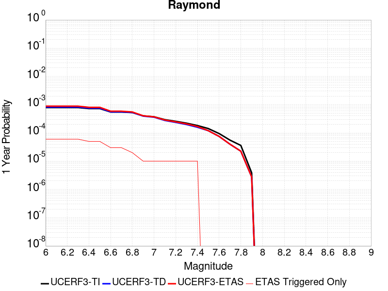 |  |

| Magnitude | 1 wk TI Prob | 1 wk TD Prob | 1 wk ETAS Prob | 1 wk ETAS/TD Gain | 1 wk ETAS Triggered Only | 1 mo TI Prob | 1 mo TD Prob | 1 mo ETAS Prob | 1 mo ETAS/TD Gain | 1 mo ETAS Triggered Only | 1 yr TI Prob | 1 yr TD Prob | 1 yr ETAS Prob | 1 yr ETAS/TD Gain | 1 yr ETAS Triggered Only | 10 yr TI Prob | 10 yr TD Prob | 10 yr ETAS Prob | 10 yr ETAS/TD Gain | 10 yr ETAS Triggered Only |
|-----|-----|-----|-----|-----|-----|-----|-----|-----|-----|-----|-----|-----|-----|-----|-----|-----|-----|-----|-----|-----|
| 6.0 | 1.5157413E-5 | 1.5810125E-5 | 3.5809808E-5 | 2.264992 | 2.0E-5 | 6.4958724E-5 | 6.775606E-5 | 8.7754706E-5 | 1.2951566 | 2.0E-5 | 7.905855E-4 | 8.246429E-4 | 8.845934E-4 | 1.0726987 | 6.0E-5 | 0.007877788 | 0.008218355 | 0.008297697 | 1.0096543 | 8.0E-5 |
| 6.1 | 1.5157413E-5 | 1.5810125E-5 | 3.5809808E-5 | 2.264992 | 2.0E-5 | 6.4958724E-5 | 6.775606E-5 | 8.7754706E-5 | 1.2951566 | 2.0E-5 | 7.905855E-4 | 8.246429E-4 | 8.845934E-4 | 1.0726987 | 6.0E-5 | 0.007877788 | 0.008218355 | 0.008297697 | 1.0096543 | 8.0E-5 |
| 6.2 | 1.5157413E-5 | 1.5810125E-5 | 3.5809808E-5 | 2.264992 | 2.0E-5 | 6.4958724E-5 | 6.775606E-5 | 8.7754706E-5 | 1.2951566 | 2.0E-5 | 7.905855E-4 | 8.246429E-4 | 8.845934E-4 | 1.0726987 | 6.0E-5 | 0.007877788 | 0.008218355 | 0.008297697 | 1.0096543 | 8.0E-5 |
| 6.3 | 1.5157413E-5 | 1.5810125E-5 | 3.5809808E-5 | 2.264992 | 2.0E-5 | 6.4958724E-5 | 6.775606E-5 | 8.7754706E-5 | 1.2951566 | 2.0E-5 | 7.905855E-4 | 8.246429E-4 | 8.845934E-4 | 1.0726987 | 6.0E-5 | 0.007877788 | 0.008218355 | 0.008297697 | 1.0096543 | 8.0E-5 |
| 6.4 | 1.3941944E-5 | 1.4454688E-5 | 3.44544E-5 | 2.383614 | 2.0E-5 | 5.9749822E-5 | 6.194732E-5 | 8.1946084E-5 | 1.322835 | 2.0E-5 | 7.2721124E-4 | 7.53971E-4 | 8.039333E-4 | 1.0662656 | 5.0E-5 | 0.007248361 | 0.007516471 | 0.007585945 | 1.0092429 | 7.0E-5 |
| 6.5 | 1.3941944E-5 | 1.4454688E-5 | 3.44544E-5 | 2.383614 | 2.0E-5 | 5.9749822E-5 | 6.194732E-5 | 8.1946084E-5 | 1.322835 | 2.0E-5 | 7.2721124E-4 | 7.53971E-4 | 8.039333E-4 | 1.0662656 | 5.0E-5 | 0.007248361 | 0.007516471 | 0.007585945 | 1.0092429 | 7.0E-5 |
| 6.6 | 1.0542609E-5 | 1.067111E-5 | 3.0670897E-5 | 2.8741992 | 2.0E-5 | 4.5181827E-5 | 4.573256E-5 | 6.573164E-5 | 1.4373052 | 2.0E-5 | 5.499499E-4 | 5.566571E-4 | 5.8664044E-4 | 1.0538632 | 3.0E-5 | 0.005485909 | 0.0055531966 | 0.005602919 | 1.0089538 | 5.0E-5 |
| 6.7 | 1.0542609E-5 | 1.067111E-5 | 3.0670897E-5 | 2.8741992 | 2.0E-5 | 4.5181827E-5 | 4.573256E-5 | 6.573164E-5 | 1.4373052 | 2.0E-5 | 5.499499E-4 | 5.566571E-4 | 5.8664044E-4 | 1.0538632 | 3.0E-5 | 0.005485909 | 0.0055531966 | 0.005602919 | 1.0089538 | 5.0E-5 |
| 6.8 | 1.0079132E-5 | 1.0176644E-5 | 2.0176542E-5 | 1.9826323 | 1.0E-5 | 4.3195567E-5 | 4.3613487E-5 | 5.361305E-5 | 1.2292769 | 1.0E-5 | 5.257791E-4 | 5.308702E-4 | 5.508596E-4 | 1.037654 | 2.0E-5 | 0.0052453685 | 0.0052965777 | 0.0053363657 | 1.0075121 | 4.0E-5 |
| 6.9 | 7.721598E-6 | 7.548902E-6 | 7.548902E-6 | 1.0 | 0.0 | 3.3092143E-5 | 3.2352043E-5 | 3.2352043E-5 | 1.0 | 0.0 | 4.0282236E-4 | 3.9381615E-4 | 4.038122E-4 | 1.0253825 | 1.0E-5 | 0.0040209293 | 0.003931324 | 0.003961206 | 1.007601 | 3.0E-5 |
| 7.0 | 7.137566E-6 | 6.911303E-6 | 6.911303E-6 | 1.0 | 0.0 | 3.058921E-5 | 2.961954E-5 | 2.961954E-5 | 1.0 | 0.0 | 3.7236E-4 | 3.605593E-4 | 3.705557E-4 | 1.0277247 | 1.0E-5 | 0.0037173668 | 0.003599869 | 0.003629761 | 1.0083036 | 3.0E-5 |
| 7.1 | 5.654976E-6 | 5.299538E-6 | 5.299538E-6 | 1.0 | 0.0 | 2.4235387E-5 | 2.2712107E-5 | 2.2712107E-5 | 1.0 | 0.0 | 2.9502588E-4 | 2.7648505E-4 | 2.8648227E-4 | 1.0361583 | 1.0E-5 | 0.0029463451 | 0.0027614492 | 0.002781394 | 1.0072225 | 2.0E-5 |
| 7.2 | 4.9358455E-6 | 4.526655E-6 | 4.526655E-6 | 1.0 | 0.0 | 2.1153453E-5 | 1.9399806E-5 | 1.9399806E-5 | 1.0 | 0.0 | 2.5751285E-4 | 2.3616718E-4 | 2.4616483E-4 | 1.0423329 | 1.0E-5 | 0.0025721465 | 0.002359192 | 0.0023791445 | 1.0084574 | 2.0E-5 |
| 7.3 | 4.2368597E-6 | 3.8056128E-6 | 3.8056128E-6 | 1.0 | 0.0 | 1.8157843E-5 | 1.6309668E-5 | 1.6309668E-5 | 1.0 | 0.0 | 2.2104931E-4 | 1.9855222E-4 | 2.0855023E-4 | 1.0503546 | 1.0E-5 | 0.0022082955 | 0.0019837746 | 0.002003735 | 1.0100617 | 2.0E-5 |
| 7.4 | 3.4999923E-6 | 3.0437407E-6 | 3.0437407E-6 | 1.0 | 0.0 | 1.49998805E-5 | 1.3044538E-5 | 1.3044538E-5 | 1.0 | 0.0 | 1.8260824E-4 | 1.5880575E-4 | 1.6880417E-4 | 1.06296 | 1.0E-5 | 0.0018245826 | 0.0015869461 | 0.0016069143 | 1.0125828 | 2.0E-5 |
| 7.5 | 2.738017E-6 | 2.3020405E-6 | 2.3020405E-6 | 1.0 | 0.0 | 1.1734306E-5 | 9.865851E-6 | 9.865851E-6 | 1.0 | 0.0 | 1.428558E-4 | 1.20110184E-4 | 1.20110184E-4 | 1.0 | 0.0 | 0.0014276401 | 0.0012004747 | 0.0012104627 | 1.0083201 | 1.0E-5 |
| 7.6 | 1.8186392E-6 | 1.442302E-6 | 1.442302E-6 | 1.0 | 0.0 | 7.794145E-6 | 6.1812802E-6 | 6.1812802E-6 | 1.0 | 0.0 | 9.488958E-5 | 7.5254524E-5 | 7.5254524E-5 | 1.0 | 0.0 | 9.4849075E-4 | 7.5230957E-4 | 7.623021E-4 | 1.0132824 | 1.0E-5 |
| 7.7 | 1.0660348E-6 | 7.6437E-7 | 7.6437E-7 | 1.0 | 0.0 | 4.5687125E-6 | 3.2758674E-6 | 3.2758674E-6 | 1.0 | 0.0 | 5.5622655E-5 | 3.988297E-5 | 3.988297E-5 | 1.0 | 0.0 | 5.5608735E-4 | 3.9877492E-4 | 4.0877092E-4 | 1.0250669 | 1.0E-5 |
| 7.8 | 6.913602E-7 | 4.3202903E-7 | 4.3202903E-7 | 1.0 | 0.0 | 2.962969E-6 | 1.8515517E-6 | 1.8515517E-6 | 1.0 | 0.0 | 3.607355E-5 | 2.2542416E-5 | 2.2542416E-5 | 1.0 | 0.0 | 3.6067693E-4 | 2.2541684E-4 | 2.2541684E-4 | 1.0 | 0.0 |
| 7.9 | 7.425201E-8 | 5.322267E-8 | 5.322267E-8 | 1.0 | 0.0 | 3.1822285E-7 | 2.2809714E-7 | 2.2809714E-7 | 1.0 | 0.0 | 3.874356E-6 | 2.7770805E-6 | 2.7770805E-6 | 1.0 | 0.0 | 3.8742884E-5 | 2.7770588E-5 | 2.7770588E-5 | 1.0 | 0.0 |

## Hunting Creek - Berryessa 2011 CFM
*[(top)](#table-of-contents)*

| 1 Week | 1 Month | 1 Year | 10 Year |
|-----|-----|-----|-----|
|  |  | 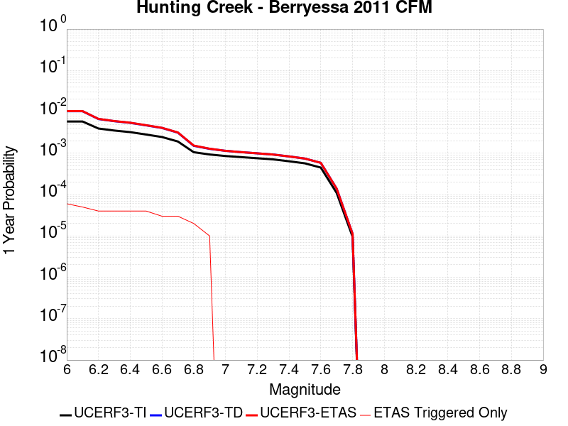 |  |

| Magnitude | 1 wk TI Prob | 1 wk TD Prob | 1 wk ETAS Prob | 1 wk ETAS/TD Gain | 1 wk ETAS Triggered Only | 1 mo TI Prob | 1 mo TD Prob | 1 mo ETAS Prob | 1 mo ETAS/TD Gain | 1 mo ETAS Triggered Only | 1 yr TI Prob | 1 yr TD Prob | 1 yr ETAS Prob | 1 yr ETAS/TD Gain | 1 yr ETAS Triggered Only | 10 yr TI Prob | 10 yr TD Prob | 10 yr ETAS Prob | 10 yr ETAS/TD Gain | 10 yr ETAS Triggered Only |
|-----|-----|-----|-----|-----|-----|-----|-----|-----|-----|-----|-----|-----|-----|-----|-----|-----|-----|-----|-----|-----|
| 6.0 | 1.1270982E-4 | 2.0028367E-4 | 2.2027966E-4 | 1.0998384 | 2.0E-5 | 4.8295266E-4 | 8.579912E-4 | 8.879655E-4 | 1.0349354 | 3.0E-5 | 0.0058641075 | 0.010386173 | 0.010445549 | 1.0057169 | 6.0E-5 | 0.057117578 | 0.09804048 | 0.0980946 | 1.0005519 | 6.0E-5 |
| 6.1 | 1.1239393E-4 | 1.9976508E-4 | 2.1976109E-4 | 1.1000975 | 2.0E-5 | 4.8159933E-4 | 8.557703E-4 | 8.757532E-4 | 1.0233507 | 2.0E-5 | 0.0058477195 | 0.010359417 | 0.010408899 | 1.0047765 | 5.0E-5 | 0.056962132 | 0.09779895 | 0.09784406 | 1.0004612 | 5.0E-5 |
| 6.2 | 7.596265E-5 | 1.2933646E-4 | 1.3933517E-4 | 1.0773077 | 1.0E-5 | 3.2551357E-4 | 5.5415573E-4 | 5.6415016E-4 | 1.0180354 | 1.0E-5 | 0.0039559277 | 0.0067213587 | 0.00676109 | 1.0059112 | 4.0E-5 | 0.038862433 | 0.06459229 | 0.064629704 | 1.0005792 | 4.0E-5 |
| 6.3 | 6.78794E-5 | 1.1448377E-4 | 1.2448263E-4 | 1.0873386 | 1.0E-5 | 2.9087928E-4 | 4.9052597E-4 | 5.0052104E-4 | 1.0203763 | 1.0E-5 | 0.003535705 | 0.005952661 | 0.005992423 | 1.0066797 | 4.0E-5 | 0.034799766 | 0.057466213 | 0.057503913 | 1.000656 | 4.0E-5 |
| 6.4 | 6.2165134E-5 | 1.0434825E-4 | 1.143472E-4 | 1.0958229 | 1.0E-5 | 2.6639478E-4 | 4.4711027E-4 | 4.5710578E-4 | 1.0223558 | 1.0E-5 | 0.0032385332 | 0.0054274183 | 0.005467201 | 1.00733 | 4.0E-5 | 0.03191742 | 0.05255138 | 0.05258928 | 1.0007212 | 4.0E-5 |
| 6.5 | 5.4368087E-5 | 9.070258E-5 | 1.00701676E-4 | 1.1102405 | 1.0E-5 | 2.3298527E-4 | 3.886537E-4 | 3.986498E-4 | 1.0257199 | 1.0E-5 | 0.0028329059 | 0.0047197016 | 0.004759513 | 1.0084351 | 4.0E-5 | 0.027970633 | 0.045881182 | 0.045919348 | 1.0008318 | 4.0E-5 |
| 6.6 | 4.729947E-5 | 7.847101E-5 | 8.8470224E-5 | 1.1274256 | 1.0E-5 | 2.0269625E-4 | 3.3624718E-4 | 3.4624382E-4 | 1.0297301 | 1.0E-5 | 0.002465034 | 0.004084746 | 0.004114623 | 1.0073144 | 3.0E-5 | 0.02437869 | 0.03985269 | 0.039881494 | 1.0007228 | 3.0E-5 |
| 6.7 | 3.6875328E-5 | 6.0443555E-5 | 7.044295E-5 | 1.1654336 | 1.0E-5 | 1.5802756E-4 | 2.5900968E-4 | 2.6900708E-4 | 1.0385985 | 1.0E-5 | 0.0019222875 | 0.0031482724 | 0.0031781779 | 1.0094991 | 3.0E-5 | 0.019057442 | 0.03089371 | 0.030922784 | 1.000941 | 3.0E-5 |
| 6.8 | 2.0292036E-5 | 2.8976721E-5 | 2.8976721E-5 | 1.0 | 0.0 | 8.6962966E-5 | 1.2417998E-4 | 1.2417998E-4 | 1.0 | 0.0 | 0.0010582599 | 0.0015108302 | 0.0015308 | 1.0132178 | 2.0E-5 | 0.010532344 | 0.0149790775 | 0.014998778 | 1.0013152 | 2.0E-5 |
| 6.9 | 1.7871042E-5 | 2.4472653E-5 | 2.4472653E-5 | 1.0 | 0.0 | 7.658793E-5 | 1.04878585E-4 | 1.04878585E-4 | 1.0 | 0.0 | 9.320591E-4 | 0.0012761486 | 0.0012861358 | 1.0078261 | 1.0E-5 | 0.009281595 | 0.012680395 | 0.0126902675 | 1.0007787 | 1.0E-5 |
| 7.0 | 1.6415532E-5 | 2.1906566E-5 | 2.1906566E-5 | 1.0 | 0.0 | 7.035038E-5 | 9.388191E-5 | 9.388191E-5 | 1.0 | 0.0 | 8.561793E-4 | 0.0011424144 | 0.0011424144 | 1.0 | 0.0 | 0.008528882 | 0.011365017 | 0.011365017 | 1.0 | 0.0 |
| 7.1 | 1.5409885E-5 | 2.0346588E-5 | 2.0346588E-5 | 1.0 | 0.0 | 6.6040695E-5 | 8.719676E-5 | 8.719676E-5 | 1.0 | 0.0 | 8.0374884E-4 | 0.0010611062 | 0.0010611062 | 1.0 | 0.0 | 0.00800848 | 0.010560924 | 0.010560924 | 1.0 | 0.0 |
| 7.2 | 1.4497423E-5 | 1.905519E-5 | 1.905519E-5 | 1.0 | 0.0 | 6.213033E-5 | 8.166256E-5 | 8.166256E-5 | 1.0 | 0.0 | 7.5617427E-4 | 9.937913E-4 | 9.937913E-4 | 1.0 | 0.0 | 0.0075360634 | 0.00989425 | 0.00989425 | 1.0 | 0.0 |
| 7.3 | 1.3615175E-5 | 1.7826347E-5 | 1.7826347E-5 | 1.0 | 0.0 | 5.8349444E-5 | 7.6396405E-5 | 7.6396405E-5 | 1.0 | 0.0 | 7.101729E-4 | 9.297323E-4 | 9.297323E-4 | 1.0 | 0.0 | 0.0070790765 | 0.009259124 | 0.009259124 | 1.0 | 0.0 |
| 7.4 | 1.2252825E-5 | 1.6026455E-5 | 1.6026455E-5 | 1.0 | 0.0 | 5.251105E-5 | 6.868302E-5 | 6.868302E-5 | 1.0 | 0.0 | 6.391345E-4 | 8.3589775E-4 | 8.3589775E-4 | 1.0 | 0.0 | 0.0063729943 | 0.008328172 | 0.008328172 | 1.0 | 0.0 |
| 7.5 | 1.0913301E-5 | 1.4241286E-5 | 1.4241286E-5 | 1.0 | 0.0 | 4.6770452E-5 | 6.103267E-5 | 6.103267E-5 | 1.0 | 0.0 | 5.6928146E-4 | 7.428222E-4 | 7.428222E-4 | 1.0 | 0.0 | 0.0056782532 | 0.0074039865 | 0.0074039865 | 1.0 | 0.0 |
| 7.6 | 8.623192E-6 | 1.12347825E-5 | 1.12347825E-5 | 1.0 | 0.0 | 3.6956015E-5 | 4.8148195E-5 | 4.8148195E-5 | 1.0 | 0.0 | 4.4984656E-4 | 5.8604917E-4 | 5.8604917E-4 | 1.0 | 0.0 | 0.00448937 | 0.005845504 | 0.005845504 | 1.0 | 0.0 |
| 7.7 | 2.0993634E-6 | 2.66264E-6 | 2.66264E-6 | 1.0 | 0.0 | 8.997241E-6 | 1.1411265E-5 | 1.1411265E-5 | 1.0 | 0.0 | 1.09535904E-4 | 1.3892337E-4 | 1.3892337E-4 | 1.0 | 0.0 | 0.0010948193 | 0.0013883994 | 0.0013883994 | 1.0 | 0.0 |
| 7.8 | 1.8428308E-7 | 2.1674624E-7 | 2.1674624E-7 | 1.0 | 0.0 | 7.897844E-7 | 9.289122E-7 | 9.289122E-7 | 1.0 | 0.0 | 9.615583E-6 | 1.130945E-5 | 1.130945E-5 | 1.0 | 0.0 | 9.615166E-5 | 1.1308173E-4 | 1.1308173E-4 | 1.0 | 0.0 |

## Sheephole
*[(top)](#table-of-contents)*

| 1 Week | 1 Month | 1 Year | 10 Year |
|-----|-----|-----|-----|
|  |  |  | 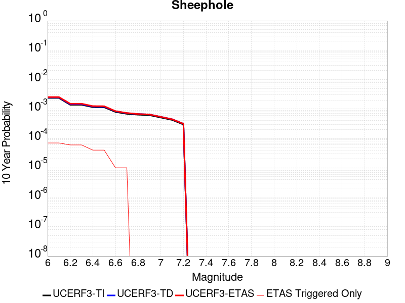 |

| Magnitude | 1 wk TI Prob | 1 wk TD Prob | 1 wk ETAS Prob | 1 wk ETAS/TD Gain | 1 wk ETAS Triggered Only | 1 mo TI Prob | 1 mo TD Prob | 1 mo ETAS Prob | 1 mo ETAS/TD Gain | 1 mo ETAS Triggered Only | 1 yr TI Prob | 1 yr TD Prob | 1 yr ETAS Prob | 1 yr ETAS/TD Gain | 1 yr ETAS Triggered Only | 10 yr TI Prob | 10 yr TD Prob | 10 yr ETAS Prob | 10 yr ETAS/TD Gain | 10 yr ETAS Triggered Only |
|-----|-----|-----|-----|-----|-----|-----|-----|-----|-----|-----|-----|-----|-----|-----|-----|-----|-----|-----|-----|-----|
| 6.0 | 4.5579695E-6 | 4.7412627E-6 | 2.4741168E-5 | 5.2182655 | 2.0E-5 | 1.9534009E-5 | 2.031957E-5 | 4.0319163E-5 | 1.9842528 | 2.0E-5 | 2.3780059E-4 | 2.473682E-4 | 2.7736078E-4 | 1.1212467 | 3.0E-5 | 0.0023754628 | 0.002471473 | 0.0025413001 | 1.0282532 | 7.0E-5 |
| 6.1 | 4.5579695E-6 | 4.7412627E-6 | 2.4741168E-5 | 5.2182655 | 2.0E-5 | 1.9534009E-5 | 2.031957E-5 | 4.0319163E-5 | 1.9842528 | 2.0E-5 | 2.3780059E-4 | 2.473682E-4 | 2.7736078E-4 | 1.1212467 | 3.0E-5 | 0.0023754628 | 0.002471473 | 0.0025413001 | 1.0282532 | 7.0E-5 |
| 6.2 | 2.6677674E-6 | 2.7873941E-6 | 2.2787339E-5 | 8.17514 | 2.0E-5 | 1.1433239E-5 | 1.1945926E-5 | 3.194569E-5 | 2.6741908 | 2.0E-5 | 1.3919079E-4 | 1.4543302E-4 | 1.7542866E-4 | 1.2062505 | 3.0E-5 | 0.0013910364 | 0.0014534844 | 0.0015133972 | 1.0412201 | 6.0E-5 |
| 6.3 | 2.6677674E-6 | 2.7873941E-6 | 2.2787339E-5 | 8.17514 | 2.0E-5 | 1.1433239E-5 | 1.1945926E-5 | 3.194569E-5 | 2.6741908 | 2.0E-5 | 1.3919079E-4 | 1.4543302E-4 | 1.7542866E-4 | 1.2062505 | 3.0E-5 | 0.0013910364 | 0.0014534844 | 0.0015133972 | 1.0412201 | 6.0E-5 |
| 6.4 | 2.2159759E-6 | 2.3228788E-6 | 2.2322833E-5 | 9.609986 | 2.0E-5 | 9.497005E-6 | 9.955161E-6 | 2.9954961E-5 | 3.0089881 | 2.0E-5 | 1.156199E-4 | 1.2119815E-4 | 1.5119452E-4 | 1.2474985 | 3.0E-5 | 0.0011555976 | 0.0012113999 | 0.0012513514 | 1.0329796 | 4.0E-5 |
| 6.5 | 2.1986082E-6 | 2.304759E-6 | 2.2304714E-5 | 9.677677 | 2.0E-5 | 9.4225725E-6 | 9.877506E-6 | 2.9877308E-5 | 3.0247827 | 2.0E-5 | 1.1471378E-4 | 1.2025281E-4 | 1.502492E-4 | 1.2494445 | 3.0E-5 | 0.0011465458 | 0.0012019566 | 0.0012419085 | 1.0332391 | 4.0E-5 |
| 6.6 | 1.5232331E-6 | 1.6018919E-6 | 1.16018755E-5 | 7.2426085 | 1.0E-5 | 6.5281256E-6 | 6.865234E-6 | 1.6865166E-5 | 2.4566047 | 1.0E-5 | 7.947703E-5 | 8.35812E-5 | 9.358037E-5 | 1.1196342 | 1.0E-5 | 7.9448614E-4 | 8.3551643E-4 | 8.4550807E-4 | 1.0119586 | 1.0E-5 |
| 6.7 | 1.3137362E-6 | 1.382819E-6 | 1.13828055E-5 | 8.231594 | 1.0E-5 | 5.6302856E-6 | 5.926355E-6 | 1.5926295E-5 | 2.687368 | 1.0E-5 | 6.854657E-5 | 7.215112E-5 | 8.21504E-5 | 1.138588 | 1.0E-5 | 6.8525434E-4 | 7.212908E-4 | 7.312836E-4 | 1.013854 | 1.0E-5 |
| 6.8 | 1.2275751E-6 | 1.2922847E-6 | 1.2922847E-6 | 1.0 | 0.0 | 5.2610258E-6 | 5.5383516E-6 | 5.5383516E-6 | 1.0 | 0.0 | 6.4051106E-5 | 6.7427485E-5 | 6.7427485E-5 | 1.0 | 0.0 | 6.4032647E-4 | 6.740836E-4 | 6.740836E-4 | 1.0 | 0.0 |
| 6.9 | 1.1837088E-6 | 1.246102E-6 | 1.246102E-6 | 1.0 | 0.0 | 5.0730278E-6 | 5.340427E-6 | 5.340427E-6 | 1.0 | 0.0 | 6.176237E-5 | 6.501789E-5 | 6.501789E-5 | 1.0 | 0.0 | 6.17452E-4 | 6.5000186E-4 | 6.5000186E-4 | 1.0 | 0.0 |
| 7.0 | 9.849371E-7 | 1.0366288E-6 | 1.0366288E-6 | 1.0 | 0.0 | 4.2211523E-6 | 4.442688E-6 | 4.442688E-6 | 1.0 | 0.0 | 5.1391315E-5 | 5.4088487E-5 | 5.4088487E-5 | 1.0 | 0.0 | 5.137943E-4 | 5.407633E-4 | 5.407633E-4 | 1.0 | 0.0 |
| 7.1 | 8.1643645E-7 | 8.591669E-7 | 8.591669E-7 | 1.0 | 0.0 | 3.4990085E-6 | 3.682139E-6 | 3.682139E-6 | 1.0 | 0.0 | 4.2599597E-5 | 4.482921E-5 | 4.482921E-5 | 1.0 | 0.0 | 4.259143E-4 | 4.4821028E-4 | 4.4821028E-4 | 1.0 | 0.0 |
| 7.2 | 5.7295756E-7 | 6.029502E-7 | 6.029502E-7 | 1.0 | 0.0 | 2.45553E-6 | 2.58407E-6 | 2.58407E-6 | 1.0 | 0.0 | 2.9895667E-5 | 3.1460666E-5 | 3.1460666E-5 | 1.0 | 0.0 | 2.9891645E-4 | 3.145688E-4 | 3.145688E-4 | 1.0 | 0.0 |

## San Clemente
*[(top)](#table-of-contents)*

| 1 Week | 1 Month | 1 Year | 10 Year |
|-----|-----|-----|-----|
|  |  |  |  |

| Magnitude | 1 wk TI Prob | 1 wk TD Prob | 1 wk ETAS Prob | 1 wk ETAS/TD Gain | 1 wk ETAS Triggered Only | 1 mo TI Prob | 1 mo TD Prob | 1 mo ETAS Prob | 1 mo ETAS/TD Gain | 1 mo ETAS Triggered Only | 1 yr TI Prob | 1 yr TD Prob | 1 yr ETAS Prob | 1 yr ETAS/TD Gain | 1 yr ETAS Triggered Only | 10 yr TI Prob | 10 yr TD Prob | 10 yr ETAS Prob | 10 yr ETAS/TD Gain | 10 yr ETAS Triggered Only |
|-----|-----|-----|-----|-----|-----|-----|-----|-----|-----|-----|-----|-----|-----|-----|-----|-----|-----|-----|-----|-----|
| 6.0 | 6.681379E-5 | 8.163834E-5 | 9.163752E-5 | 1.1224815 | 1.0E-5 | 2.8631336E-4 | 3.4983488E-4 | 3.698279E-4 | 1.0571498 | 2.0E-5 | 0.003480294 | 0.00425141 | 0.0043011974 | 1.0117108 | 5.0E-5 | 0.03426291 | 0.04175603 | 0.041823108 | 1.0016063 | 7.0E-5 |
| 6.1 | 6.681379E-5 | 8.163834E-5 | 8.163834E-5 | 1.0 | 0.0 | 2.8631336E-4 | 3.4983488E-4 | 3.598314E-4 | 1.028575 | 1.0E-5 | 0.003480294 | 0.00425141 | 0.00429124 | 1.0093687 | 4.0E-5 | 0.03426291 | 0.04175603 | 0.04180394 | 1.0011474 | 5.0E-5 |
| 6.2 | 3.9400576E-5 | 4.6452373E-5 | 4.6452373E-5 | 1.0 | 0.0 | 1.6884868E-4 | 1.9906677E-4 | 1.9906677E-4 | 1.0 | 0.0 | 0.0020537945 | 0.0024209984 | 0.0024309743 | 1.0041205 | 1.0E-5 | 0.020349167 | 0.023952903 | 0.023972424 | 1.0008149 | 2.0E-5 |
| 6.3 | 3.2590255E-5 | 3.792912E-5 | 3.792912E-5 | 1.0 | 0.0 | 1.3966505E-4 | 1.6254342E-4 | 1.6254342E-4 | 1.0 | 0.0 | 0.0016990956 | 0.0019772002 | 0.0019871802 | 1.0050477 | 1.0E-5 | 0.01686163 | 0.019599883 | 0.019619491 | 1.0010004 | 2.0E-5 |
| 6.4 | 2.9454652E-5 | 3.4097764E-5 | 3.4097764E-5 | 1.0 | 0.0 | 1.2622811E-4 | 1.4612524E-4 | 1.4612524E-4 | 1.0 | 0.0 | 0.0015357438 | 0.0017776493 | 0.0017876315 | 1.0056154 | 1.0E-5 | 0.015251739 | 0.01763747 | 0.017647294 | 1.000557 | 1.0E-5 |
| 6.5 | 2.790836E-5 | 3.2247463E-5 | 3.2247463E-5 | 1.0 | 0.0 | 1.1960178E-4 | 1.3819624E-4 | 1.3819624E-4 | 1.0 | 0.0 | 0.001455179 | 0.0016812662 | 0.0016912494 | 1.0059379 | 1.0E-5 | 0.014456868 | 0.016688485 | 0.016698318 | 1.0005893 | 1.0E-5 |
| 6.6 | 2.2492153E-5 | 2.5762702E-5 | 2.5762702E-5 | 1.0 | 0.0 | 9.639138E-5 | 1.1040699E-4 | 1.1040699E-4 | 1.0 | 0.0 | 0.0011729331 | 0.0013433909 | 0.0013433909 | 1.0 | 0.0 | 0.011667615 | 0.013354417 | 0.013354417 | 1.0 | 0.0 |
| 6.7 | 1.9862755E-5 | 2.2666423E-5 | 2.2666423E-5 | 1.0 | 0.0 | 8.512331E-5 | 9.713826E-5 | 9.713826E-5 | 1.0 | 0.0 | 0.0010358836 | 0.0011820279 | 0.0011820279 | 1.0 | 0.0 | 0.010310682 | 0.011758701 | 0.011758701 | 1.0 | 0.0 |
| 6.8 | 1.6697575E-5 | 1.897771E-5 | 1.897771E-5 | 1.0 | 0.0 | 7.155907E-5 | 8.133056E-5 | 8.133056E-5 | 1.0 | 0.0 | 8.7088346E-4 | 9.897591E-4 | 9.897591E-4 | 1.0 | 0.0 | 0.008674784 | 0.0098545365 | 0.0098545365 | 1.0 | 0.0 |
| 6.9 | 1.5218415E-5 | 1.72694E-5 | 1.72694E-5 | 1.0 | 0.0 | 6.522015E-5 | 7.4009666E-5 | 7.4009666E-5 | 1.0 | 0.0 | 7.93766E-4 | 9.00704E-4 | 9.00704E-4 | 1.0 | 0.0 | 0.007909367 | 0.008971481 | 0.008971481 | 1.0 | 0.0 |
| 7.0 | 1.2392958E-5 | 1.4033016E-5 | 1.4033016E-5 | 1.0 | 0.0 | 5.3111595E-5 | 6.014015E-5 | 6.014015E-5 | 1.0 | 0.0 | 6.4644177E-4 | 7.319679E-4 | 7.319679E-4 | 1.0 | 0.0 | 0.0064456454 | 0.0072963564 | 0.0072963564 | 1.0 | 0.0 |
| 7.1 | 1.0934128E-5 | 1.2375138E-5 | 1.2375138E-5 | 1.0 | 0.0 | 4.6859706E-5 | 5.303527E-5 | 5.303527E-5 | 1.0 | 0.0 | 5.7036756E-4 | 6.455204E-4 | 6.455204E-4 | 1.0 | 0.0 | 0.0056890585 | 0.0064371997 | 0.0064371997 | 1.0 | 0.0 |
| 7.2 | 9.5798805E-6 | 1.0844935E-5 | 1.0844935E-5 | 1.0 | 0.0 | 4.1055984E-5 | 4.6477508E-5 | 4.6477508E-5 | 1.0 | 0.0 | 4.9974193E-4 | 5.657239E-4 | 5.657239E-4 | 1.0 | 0.0 | 0.0049861963 | 0.0056435615 | 0.0056435615 | 1.0 | 0.0 |
| 7.3 | 8.0167365E-6 | 9.083918E-6 | 9.083918E-6 | 1.0 | 0.0 | 3.4356988E-5 | 3.8930535E-5 | 3.8930535E-5 | 1.0 | 0.0 | 4.1821605E-4 | 4.7388324E-4 | 4.7388324E-4 | 1.0 | 0.0 | 0.0041742986 | 0.0047294297 | 0.0047294297 | 1.0 | 0.0 |
| 7.4 | 2.9581017E-6 | 3.3623792E-6 | 3.3623792E-6 | 1.0 | 0.0 | 1.2677518E-5 | 1.4410146E-5 | 1.4410146E-5 | 1.0 | 0.0 | 1.5433785E-4 | 1.7543444E-4 | 1.7543444E-4 | 1.0 | 0.0 | 0.001542307 | 0.0017534546 | 0.0017534546 | 1.0 | 0.0 |

## Ortigalita (North)
*[(top)](#table-of-contents)*

| 1 Week | 1 Month | 1 Year | 10 Year |
|-----|-----|-----|-----|
|  |  |  | 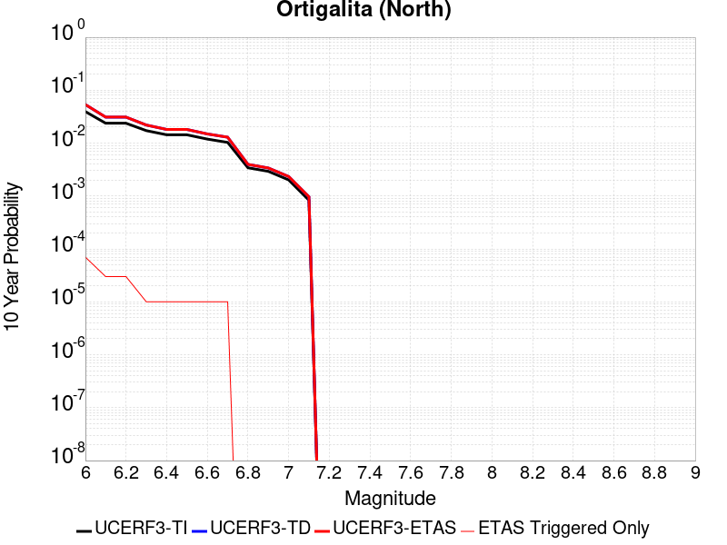 |

| Magnitude | 1 wk TI Prob | 1 wk TD Prob | 1 wk ETAS Prob | 1 wk ETAS/TD Gain | 1 wk ETAS Triggered Only | 1 mo TI Prob | 1 mo TD Prob | 1 mo ETAS Prob | 1 mo ETAS/TD Gain | 1 mo ETAS Triggered Only | 1 yr TI Prob | 1 yr TD Prob | 1 yr ETAS Prob | 1 yr ETAS/TD Gain | 1 yr ETAS Triggered Only | 10 yr TI Prob | 10 yr TD Prob | 10 yr ETAS Prob | 10 yr ETAS/TD Gain | 10 yr ETAS Triggered Only |
|-----|-----|-----|-----|-----|-----|-----|-----|-----|-----|-----|-----|-----|-----|-----|-----|-----|-----|-----|-----|-----|
| 6.0 | 7.711876E-5 | 1.0505308E-4 | 1.3504992E-4 | 1.28554 | 3.0E-5 | 3.3046713E-4 | 4.501601E-4 | 4.8014658E-4 | 1.066613 | 3.0E-5 | 0.004016016 | 0.0054680547 | 0.005527727 | 1.0109128 | 6.0E-5 | 0.039442103 | 0.053455614 | 0.05352187 | 1.0012395 | 7.0E-5 |
| 6.1 | 4.607858E-5 | 6.0239887E-5 | 8.0238686E-5 | 1.331986 | 2.0E-5 | 1.9746469E-4 | 2.5814763E-4 | 2.7814248E-4 | 1.077455 | 2.0E-5 | 0.0024014818 | 0.0031387366 | 0.0031686425 | 1.009528 | 3.0E-5 | 0.023756953 | 0.030975312 | 0.031004382 | 1.0009385 | 3.0E-5 |
| 6.2 | 4.607858E-5 | 6.0239887E-5 | 8.0238686E-5 | 1.331986 | 2.0E-5 | 1.9746469E-4 | 2.5814763E-4 | 2.7814248E-4 | 1.077455 | 2.0E-5 | 0.0024014818 | 0.0031387366 | 0.0031686425 | 1.009528 | 3.0E-5 | 0.023756953 | 0.030975312 | 0.031004382 | 1.0009385 | 3.0E-5 |
| 6.3 | 3.327423E-5 | 4.2476124E-5 | 5.2475698E-5 | 1.2354164 | 1.0E-5 | 1.4259605E-4 | 1.8202956E-4 | 1.9202773E-4 | 1.0549262 | 1.0E-5 | 0.0017347244 | 0.002214206 | 0.0022241839 | 1.0045063 | 1.0E-5 | 0.017212452 | 0.02194574 | 0.02195552 | 1.0004457 | 1.0E-5 |
| 6.4 | 2.7732503E-5 | 3.4999008E-5 | 4.4998655E-5 | 1.2857124 | 1.0E-5 | 1.1884817E-4 | 1.499886E-4 | 1.599871E-4 | 1.0666617 | 1.0E-5 | 0.001446016 | 0.0018248158 | 0.0018347976 | 1.00547 | 1.0E-5 | 0.014366428 | 0.018121297 | 0.018131116 | 1.0005418 | 1.0E-5 |
| 6.5 | 2.7689714E-5 | 3.4948822E-5 | 4.4948472E-5 | 1.2861227 | 1.0E-5 | 1.186648E-4 | 1.4977354E-4 | 1.5977204E-4 | 1.0667574 | 1.0E-5 | 0.0014437864 | 0.0018222018 | 0.0018321836 | 1.0054779 | 1.0E-5 | 0.014344421 | 0.018095585 | 0.018105403 | 1.0005426 | 1.0E-5 |
| 6.6 | 2.2976905E-5 | 2.871829E-5 | 3.8718004E-5 | 1.3482001 | 1.0E-5 | 9.846873E-5 | 1.23074E-4 | 1.3307277E-4 | 1.081242 | 1.0E-5 | 0.0011981975 | 0.0014976348 | 0.0015076199 | 1.0066671 | 1.0E-5 | 0.011917574 | 0.014898733 | 0.014908585 | 1.0006613 | 1.0E-5 |
| 6.7 | 1.9871539E-5 | 2.4904637E-5 | 3.4904388E-5 | 1.4015217 | 1.0E-5 | 8.516096E-5 | 1.067312E-4 | 1.1673012E-4 | 1.0936834 | 1.0E-5 | 0.0010363415 | 0.0012989199 | 0.0013089069 | 1.0076888 | 1.0E-5 | 0.010315218 | 0.012936938 | 0.012946809 | 1.0007629 | 1.0E-5 |
| 6.8 | 6.5640475E-6 | 7.6054926E-6 | 7.6054926E-6 | 1.0 | 0.0 | 2.813133E-5 | 3.2594577E-5 | 3.2594577E-5 | 1.0 | 0.0 | 3.424451E-4 | 3.9676955E-4 | 3.9676955E-4 | 1.0 | 0.0 | 0.0034191788 | 0.003960899 | 0.003960899 | 1.0 | 0.0 |
| 6.9 | 5.6219683E-6 | 6.5018376E-6 | 6.5018376E-6 | 1.0 | 0.0 | 2.4093928E-5 | 2.7864735E-5 | 2.7864735E-5 | 1.0 | 0.0 | 2.933041E-4 | 3.3920293E-4 | 3.3920293E-4 | 1.0 | 0.0 | 0.0029291727 | 0.003387109 | 0.003387109 | 1.0 | 0.0 |
| 7.0 | 3.875591E-6 | 4.4847548E-6 | 4.4847548E-6 | 1.0 | 0.0 | 1.6609569E-5 | 1.9220248E-5 | 1.9220248E-5 | 1.0 | 0.0 | 2.0220275E-4 | 2.339835E-4 | 2.339835E-4 | 1.0 | 0.0 | 0.0020201886 | 0.0023375798 | 0.0023375798 | 1.0 | 0.0 |
| 7.1 | 1.6017933E-6 | 1.8570418E-6 | 1.8570418E-6 | 1.0 | 0.0 | 6.8648105E-6 | 7.958732E-6 | 7.958732E-6 | 1.0 | 0.0 | 8.357586E-5 | 9.689432E-5 | 9.689432E-5 | 1.0 | 0.0 | 8.3544437E-4 | 9.686254E-4 | 9.686254E-4 | 1.0 | 0.0 |

## Santa Ynez River
*[(top)](#table-of-contents)*

| 1 Week | 1 Month | 1 Year | 10 Year |
|-----|-----|-----|-----|
|  |  | 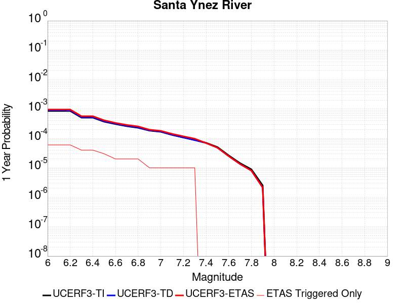 |  |

| Magnitude | 1 wk TI Prob | 1 wk TD Prob | 1 wk ETAS Prob | 1 wk ETAS/TD Gain | 1 wk ETAS Triggered Only | 1 mo TI Prob | 1 mo TD Prob | 1 mo ETAS Prob | 1 mo ETAS/TD Gain | 1 mo ETAS Triggered Only | 1 yr TI Prob | 1 yr TD Prob | 1 yr ETAS Prob | 1 yr ETAS/TD Gain | 1 yr ETAS Triggered Only | 10 yr TI Prob | 10 yr TD Prob | 10 yr ETAS Prob | 10 yr ETAS/TD Gain | 10 yr ETAS Triggered Only |
|-----|-----|-----|-----|-----|-----|-----|-----|-----|-----|-----|-----|-----|-----|-----|-----|-----|-----|-----|-----|-----|
| 6.0 | 1.6396456E-5 | 1.7209444E-5 | 3.72091E-5 | 2.1621325 | 2.0E-5 | 7.026863E-5 | 7.3752875E-5 | 9.3751405E-5 | 1.2711558 | 2.0E-5 | 8.551848E-4 | 8.976069E-4 | 9.5755304E-4 | 1.0667844 | 6.0E-5 | 0.0085190125 | 0.008943363 | 0.009002826 | 1.0066489 | 6.0E-5 |
| 6.1 | 1.6396456E-5 | 1.7209444E-5 | 3.72091E-5 | 2.1621325 | 2.0E-5 | 7.026863E-5 | 7.3752875E-5 | 9.3751405E-5 | 1.2711558 | 2.0E-5 | 8.551848E-4 | 8.976069E-4 | 9.5755304E-4 | 1.0667844 | 6.0E-5 | 0.0085190125 | 0.008943363 | 0.009002826 | 1.0066489 | 6.0E-5 |
| 6.2 | 1.6396456E-5 | 1.7209444E-5 | 3.72091E-5 | 2.1621325 | 2.0E-5 | 7.026863E-5 | 7.3752875E-5 | 9.3751405E-5 | 1.2711558 | 2.0E-5 | 8.551848E-4 | 8.976069E-4 | 9.5755304E-4 | 1.0667844 | 6.0E-5 | 0.0085190125 | 0.008943363 | 0.009002826 | 1.0066489 | 6.0E-5 |
| 6.3 | 9.736976E-6 | 1.01223395E-5 | 3.0122137E-5 | 2.975808 | 2.0E-5 | 4.172923E-5 | 4.338076E-5 | 6.337989E-5 | 1.4610139 | 2.0E-5 | 5.0793495E-4 | 5.280378E-4 | 5.680166E-4 | 1.0757122 | 4.0E-5 | 0.005067755 | 0.0052683367 | 0.005308126 | 1.0075525 | 4.0E-5 |
| 6.4 | 9.736976E-6 | 1.01223395E-5 | 3.0122137E-5 | 2.975808 | 2.0E-5 | 4.172923E-5 | 4.338076E-5 | 6.337989E-5 | 1.4610139 | 2.0E-5 | 5.0793495E-4 | 5.280378E-4 | 5.680166E-4 | 1.0757122 | 4.0E-5 | 0.005067755 | 0.0052683367 | 0.005308126 | 1.0075525 | 4.0E-5 |
| 6.5 | 7.081964E-6 | 7.329905E-6 | 1.7329832E-5 | 2.364264 | 1.0E-5 | 3.035092E-5 | 3.141351E-5 | 4.1413197E-5 | 1.3183243 | 1.0E-5 | 3.694598E-4 | 3.8239395E-4 | 4.1238248E-4 | 1.0784231 | 3.0E-5 | 0.0036884616 | 0.0038175215 | 0.003847407 | 1.0078285 | 3.0E-5 |
| 6.6 | 5.873247E-6 | 6.0597517E-6 | 1.6059692E-5 | 2.6502225 | 1.0E-5 | 2.5170815E-5 | 2.5970112E-5 | 3.5969853E-5 | 1.385048 | 1.0E-5 | 3.064116E-4 | 3.161411E-4 | 3.3613478E-4 | 1.0632429 | 2.0E-5 | 0.0030598943 | 0.003157001 | 0.0031769378 | 1.0063151 | 2.0E-5 |
| 6.7 | 4.973277E-6 | 5.11591E-6 | 1.5115859E-5 | 2.9546764 | 1.0E-5 | 2.1313872E-5 | 2.1925147E-5 | 3.1924927E-5 | 1.4560872 | 1.0E-5 | 2.5946548E-4 | 2.6690646E-4 | 2.869011E-4 | 1.0749127 | 2.0E-5 | 0.0025916274 | 0.0026659078 | 0.0026858544 | 1.0074822 | 2.0E-5 |
| 6.8 | 4.396492E-6 | 4.510987E-6 | 1.4510942E-5 | 3.2168 | 1.0E-5 | 1.884197E-5 | 1.933266E-5 | 2.9332465E-5 | 1.5172495 | 1.0E-5 | 2.2937685E-4 | 2.3535005E-4 | 2.5534534E-4 | 1.0849597 | 2.0E-5 | 0.0022914023 | 0.0023510433 | 0.0023709964 | 1.0084869 | 2.0E-5 |
| 6.9 | 3.5255632E-6 | 3.6013423E-6 | 3.6013423E-6 | 1.0 | 0.0 | 1.5109469E-5 | 1.5434234E-5 | 1.5434234E-5 | 1.0 | 0.0 | 1.8394225E-4 | 1.8789574E-4 | 1.9789387E-4 | 1.053211 | 1.0E-5 | 0.0018379007 | 0.001877385 | 0.0018873662 | 1.0053166 | 1.0E-5 |
| 7.0 | 3.211603E-6 | 3.273663E-6 | 3.273663E-6 | 1.0 | 0.0 | 1.376394E-5 | 1.402991E-5 | 1.402991E-5 | 1.0 | 0.0 | 1.6756308E-4 | 1.708009E-4 | 1.807992E-4 | 1.0585377 | 1.0E-5 | 0.0016743679 | 0.0017067104 | 0.0017166934 | 1.0058492 | 1.0E-5 |
| 7.1 | 2.5094619E-6 | 2.5409295E-6 | 2.5409295E-6 | 1.0 | 0.0 | 1.0754793E-5 | 1.0889652E-5 | 1.0889652E-5 | 1.0 | 0.0 | 1.3093173E-4 | 1.325735E-4 | 1.4257219E-4 | 1.0754199 | 1.0E-5 | 0.0013085462 | 0.0013249503 | 0.0013349369 | 1.0075375 | 1.0E-5 |
| 7.2 | 2.0515774E-6 | 2.0619466E-6 | 2.0619466E-6 | 1.0 | 0.0 | 8.792445E-6 | 8.836884E-6 | 8.836884E-6 | 1.0 | 0.0 | 1.0704277E-4 | 1.0758379E-4 | 1.1758271E-4 | 1.0929408 | 1.0E-5 | 0.0010699122 | 0.0010753215 | 0.0010853106 | 1.0092895 | 1.0E-5 |
| 7.3 | 1.6845745E-6 | 1.6773996E-6 | 1.6773996E-6 | 1.0 | 0.0 | 7.219585E-6 | 7.1888358E-6 | 7.1888358E-6 | 1.0 | 0.0 | 8.78949E-5 | 8.752059E-5 | 9.751971E-5 | 1.1142489 | 1.0E-5 | 8.7860145E-4 | 8.7486405E-4 | 8.8485534E-4 | 1.0114204 | 1.0E-5 |
| 7.4 | 1.3600285E-6 | 1.3333447E-6 | 1.3333447E-6 | 1.0 | 0.0 | 5.82868E-6 | 5.714322E-6 | 5.714322E-6 | 1.0 | 0.0 | 7.096187E-5 | 6.956967E-5 | 6.956967E-5 | 1.0 | 0.0 | 7.0939213E-4 | 6.9548114E-4 | 6.9548114E-4 | 1.0 | 0.0 |
| 7.5 | 9.735342E-7 | 9.2901894E-7 | 9.2901894E-7 | 1.0 | 0.0 | 4.172283E-6 | 3.9815036E-6 | 3.9815036E-6 | 1.0 | 0.0 | 5.079636E-5 | 4.8473747E-5 | 4.8473747E-5 | 1.0 | 0.0 | 5.0784746E-4 | 4.8463346E-4 | 4.8463346E-4 | 1.0 | 0.0 |
| 7.6 | 5.067187E-7 | 4.778609E-7 | 4.778609E-7 | 1.0 | 0.0 | 2.1716498E-6 | 2.0479738E-6 | 2.0479738E-6 | 1.0 | 0.0 | 2.6439517E-5 | 2.4933803E-5 | 2.4933803E-5 | 1.0 | 0.0 | 2.643637E-4 | 2.493108E-4 | 2.493108E-4 | 1.0 | 0.0 |
| 7.7 | 2.769089E-7 | 2.5759346E-7 | 2.5759346E-7 | 1.0 | 0.0 | 1.1867519E-6 | 1.1039714E-6 | 1.1039714E-6 | 1.0 | 0.0 | 1.4448608E-5 | 1.344077E-5 | 1.344077E-5 | 1.0 | 0.0 | 1.444767E-4 | 1.343996E-4 | 1.343996E-4 | 1.0 | 0.0 |
| 7.8 | 1.7044663E-7 | 1.5449208E-7 | 1.5449208E-7 | 1.0 | 0.0 | 7.3048534E-7 | 6.6210873E-7 | 6.6210873E-7 | 1.0 | 0.0 | 8.893623E-6 | 8.061144E-6 | 8.061144E-6 | 1.0 | 0.0 | 8.893267E-5 | 8.060854E-5 | 8.060854E-5 | 1.0 | 0.0 |
| 7.9 | 4.8344287E-8 | 4.0911143E-8 | 4.0911143E-8 | 1.0 | 0.0 | 2.0718979E-7 | 1.7533345E-7 | 1.7533345E-7 | 1.0 | 0.0 | 2.5225327E-6 | 2.1346827E-6 | 2.1346827E-6 | 1.0 | 0.0 | 2.5225041E-5 | 2.1346626E-5 | 2.1346626E-5 | 1.0 | 0.0 |

## Los Alamos extension
*[(top)](#table-of-contents)*

| 1 Week | 1 Month | 1 Year | 10 Year |
|-----|-----|-----|-----|
| 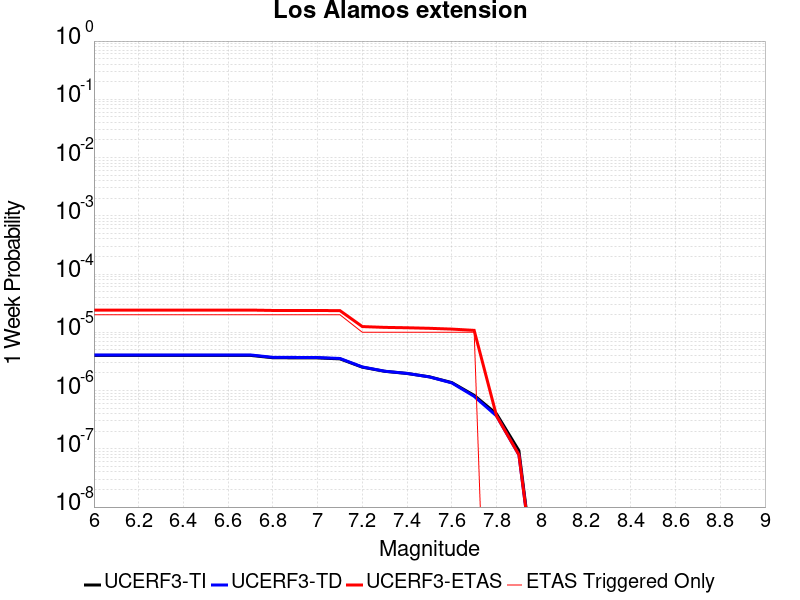 | 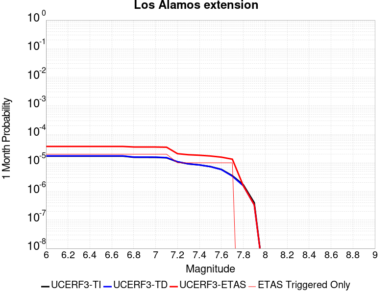 |  |  |

| Magnitude | 1 wk TI Prob | 1 wk TD Prob | 1 wk ETAS Prob | 1 wk ETAS/TD Gain | 1 wk ETAS Triggered Only | 1 mo TI Prob | 1 mo TD Prob | 1 mo ETAS Prob | 1 mo ETAS/TD Gain | 1 mo ETAS Triggered Only | 1 yr TI Prob | 1 yr TD Prob | 1 yr ETAS Prob | 1 yr ETAS/TD Gain | 1 yr ETAS Triggered Only | 10 yr TI Prob | 10 yr TD Prob | 10 yr ETAS Prob | 10 yr ETAS/TD Gain | 10 yr ETAS Triggered Only |
|-----|-----|-----|-----|-----|-----|-----|-----|-----|-----|-----|-----|-----|-----|-----|-----|-----|-----|-----|-----|-----|
| 6.0 | 4.0146506E-6 | 4.086164E-6 | 2.4086083E-5 | 5.8945456 | 2.0E-5 | 1.7205533E-5 | 1.7512022E-5 | 3.7511672E-5 | 2.1420527 | 2.0E-5 | 2.0945723E-4 | 2.1318911E-4 | 2.6317846E-4 | 1.2344836 | 5.0E-5 | 0.0020925992 | 0.002129955 | 0.002199806 | 1.0327946 | 7.0E-5 |
| 6.1 | 4.0146506E-6 | 4.086164E-6 | 2.4086083E-5 | 5.8945456 | 2.0E-5 | 1.7205533E-5 | 1.7512022E-5 | 3.7511672E-5 | 2.1420527 | 2.0E-5 | 2.0945723E-4 | 2.1318911E-4 | 2.6317846E-4 | 1.2344836 | 5.0E-5 | 0.0020925992 | 0.002129955 | 0.002199806 | 1.0327946 | 7.0E-5 |
| 6.2 | 4.0146506E-6 | 4.086164E-6 | 2.4086083E-5 | 5.8945456 | 2.0E-5 | 1.7205533E-5 | 1.7512022E-5 | 3.7511672E-5 | 2.1420527 | 2.0E-5 | 2.0945723E-4 | 2.1318911E-4 | 2.6317846E-4 | 1.2344836 | 5.0E-5 | 0.0020925992 | 0.002129955 | 0.002199806 | 1.0327946 | 7.0E-5 |
| 6.3 | 4.0146506E-6 | 4.086164E-6 | 2.4086083E-5 | 5.8945456 | 2.0E-5 | 1.7205533E-5 | 1.7512022E-5 | 3.7511672E-5 | 2.1420527 | 2.0E-5 | 2.0945723E-4 | 2.1318911E-4 | 2.6317846E-4 | 1.2344836 | 5.0E-5 | 0.0020925992 | 0.002129955 | 0.002199806 | 1.0327946 | 7.0E-5 |
| 6.4 | 4.0146506E-6 | 4.086164E-6 | 2.4086083E-5 | 5.8945456 | 2.0E-5 | 1.7205533E-5 | 1.7512022E-5 | 3.7511672E-5 | 2.1420527 | 2.0E-5 | 2.0945723E-4 | 2.1318911E-4 | 2.6317846E-4 | 1.2344836 | 5.0E-5 | 0.0020925992 | 0.002129955 | 0.002199806 | 1.0327946 | 7.0E-5 |
| 6.5 | 4.0146506E-6 | 4.086164E-6 | 2.4086083E-5 | 5.8945456 | 2.0E-5 | 1.7205533E-5 | 1.7512022E-5 | 3.7511672E-5 | 2.1420527 | 2.0E-5 | 2.0945723E-4 | 2.1318911E-4 | 2.6317846E-4 | 1.2344836 | 5.0E-5 | 0.0020925992 | 0.002129955 | 0.002199806 | 1.0327946 | 7.0E-5 |
| 6.6 | 4.0146506E-6 | 4.086164E-6 | 2.4086083E-5 | 5.8945456 | 2.0E-5 | 1.7205533E-5 | 1.7512022E-5 | 3.7511672E-5 | 2.1420527 | 2.0E-5 | 2.0945723E-4 | 2.1318911E-4 | 2.6317846E-4 | 1.2344836 | 5.0E-5 | 0.0020925992 | 0.002129955 | 0.002199806 | 1.0327946 | 7.0E-5 |
| 6.7 | 4.0146506E-6 | 4.086164E-6 | 2.4086083E-5 | 5.8945456 | 2.0E-5 | 1.7205533E-5 | 1.7512022E-5 | 3.7511672E-5 | 2.1420527 | 2.0E-5 | 2.0945723E-4 | 2.1318911E-4 | 2.6317846E-4 | 1.2344836 | 5.0E-5 | 0.0020925992 | 0.002129955 | 0.002199806 | 1.0327946 | 7.0E-5 |
| 6.8 | 3.6584688E-6 | 3.7188636E-6 | 2.3718789E-5 | 6.377967 | 2.0E-5 | 1.5679057E-5 | 1.5937894E-5 | 3.5937577E-5 | 2.2548509 | 2.0E-5 | 1.9087581E-4 | 1.9402753E-4 | 2.4401782E-4 | 1.2576454 | 5.0E-5 | 0.0019071194 | 0.0019386737 | 0.002008538 | 1.0360372 | 7.0E-5 |
| 6.9 | 3.644631E-6 | 3.7045736E-6 | 2.3704499E-5 | 6.398712 | 2.0E-5 | 1.5619753E-5 | 1.5876652E-5 | 3.5876335E-5 | 2.2596915 | 2.0E-5 | 1.901539E-4 | 1.9328203E-4 | 2.4327237E-4 | 1.2586393 | 5.0E-5 | 0.0018999127 | 0.0019312317 | 0.0020010965 | 1.0361763 | 7.0E-5 |
| 7.0 | 3.6318522E-6 | 3.691334E-6 | 2.369126E-5 | 6.4180756 | 2.0E-5 | 1.5564989E-5 | 1.5819913E-5 | 3.5819598E-5 | 2.2642095 | 2.0E-5 | 1.8948725E-4 | 1.9259135E-4 | 2.4258172E-4 | 1.259567 | 5.0E-5 | 0.0018932576 | 0.0019243368 | 0.0019942021 | 1.0363061 | 7.0E-5 |
| 7.1 | 3.5001724E-6 | 3.5554046E-6 | 2.3555334E-5 | 6.625219 | 2.0E-5 | 1.5000653E-5 | 1.5237365E-5 | 3.523706E-5 | 2.312543 | 2.0E-5 | 1.8261763E-4 | 1.8550004E-4 | 2.2549262E-4 | 1.2155933 | 4.0E-5 | 0.0018246764 | 0.0018535426 | 0.0019134314 | 1.0323105 | 6.0E-5 |
| 7.2 | 2.5204702E-6 | 2.5436989E-6 | 1.2543674E-5 | 4.931273 | 1.0E-5 | 1.080197E-5 | 1.0901522E-5 | 2.0901412E-5 | 1.9172932 | 1.0E-5 | 1.3150605E-4 | 1.3271799E-4 | 1.5271534E-4 | 1.1506754 | 2.0E-5 | 0.0013142825 | 0.001326393 | 0.0013563532 | 1.0225878 | 3.0E-5 |
| 7.3 | 2.1399692E-6 | 2.1501362E-6 | 1.2150114E-5 | 5.650858 | 1.0E-5 | 9.1712645E-6 | 9.2148375E-6 | 1.9214745E-5 | 2.0851963 | 1.0E-5 | 1.1165442E-4 | 1.121849E-4 | 1.2218377E-4 | 1.0891286 | 1.0E-5 | 0.0011159834 | 0.001121286 | 0.0011312747 | 1.0089084 | 1.0E-5 |
| 7.4 | 1.9660122E-6 | 1.970241E-6 | 1.1970222E-5 | 6.075511 | 1.0E-5 | 8.42574E-6 | 8.4438625E-6 | 1.8443778E-5 | 2.184282 | 1.0E-5 | 1.0257855E-4 | 1.0279921E-4 | 1.1279818E-4 | 1.097267 | 1.0E-5 | 0.0010253121 | 0.0010275197 | 0.0010375094 | 1.0097222 | 1.0E-5 |
| 7.5 | 1.7204633E-6 | 1.7151029E-6 | 1.1715086E-5 | 6.8305435 | 1.0E-5 | 7.373393E-6 | 7.3504207E-6 | 1.7350347E-5 | 2.3604562 | 1.0E-5 | 8.976737E-5 | 8.948772E-5 | 9.948683E-5 | 1.1117371 | 1.0E-5 | 8.9731114E-4 | 8.945199E-4 | 9.0451096E-4 | 1.0111692 | 1.0E-5 |
| 7.6 | 1.3717638E-6 | 1.3535872E-6 | 1.1353573E-5 | 8.387767 | 1.0E-5 | 5.878974E-6 | 5.801075E-6 | 1.5801017E-5 | 2.7238083 | 1.0E-5 | 7.157416E-5 | 7.062583E-5 | 8.062512E-5 | 1.1415813 | 1.0E-5 | 7.1551115E-4 | 7.0603646E-4 | 7.160294E-4 | 1.0141536 | 1.0E-5 |
| 7.7 | 8.272564E-7 | 7.9576733E-7 | 1.0795759E-5 | 13.566478 | 1.0E-5 | 3.5453797E-6 | 3.4104269E-6 | 1.3410393E-5 | 3.9321742 | 1.0E-5 | 4.3164142E-5 | 4.1521158E-5 | 5.1520743E-5 | 1.240831 | 1.0E-5 | 4.315576E-4 | 4.151342E-4 | 4.2513004E-4 | 1.0240786 | 1.0E-5 |
| 7.8 | 3.9708277E-7 | 3.671937E-7 | 3.671937E-7 | 1.0 | 0.0 | 1.7017821E-6 | 1.5736864E-6 | 1.5736864E-6 | 1.0 | 0.0 | 2.0719E-5 | 1.9159465E-5 | 1.9159465E-5 | 1.0 | 0.0 | 2.071707E-4 | 1.9157819E-4 | 1.9157819E-4 | 1.0 | 0.0 |
| 7.9 | 9.292528E-8 | 7.889168E-8 | 7.889168E-8 | 1.0 | 0.0 | 3.9825116E-7 | 3.3810713E-7 | 3.3810713E-7 | 1.0 | 0.0 | 4.848697E-6 | 4.1164467E-6 | 4.1164467E-6 | 1.0 | 0.0 | 4.8485912E-5 | 4.1163716E-5 | 4.1163716E-5 | 1.0 | 0.0 |
| 8.0 | 7.880441E-11 | 8.2353124E-11 | 8.2353124E-11 | 1.0 | 0.0 | 3.3773329E-10 | 3.52942E-10 | 3.52942E-10 | 1.0 | 0.0 | 4.1119033E-9 | 4.2970694E-9 | 4.2970694E-9 | 1.0 | 0.0 | 4.1119034E-8 | 4.2970694E-8 | 4.2970694E-8 | 1.0 | 0.0 |

## Santa Cruz Catalina Ridge alt1
*[(top)](#table-of-contents)*

| 1 Week | 1 Month | 1 Year | 10 Year |
|-----|-----|-----|-----|
|  |  | 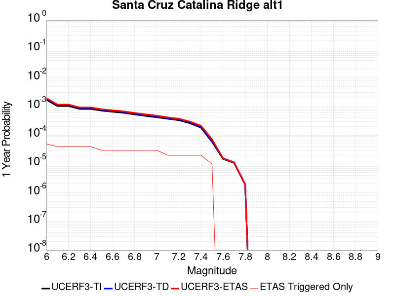 |  |

| Magnitude | 1 wk TI Prob | 1 wk TD Prob | 1 wk ETAS Prob | 1 wk ETAS/TD Gain | 1 wk ETAS Triggered Only | 1 mo TI Prob | 1 mo TD Prob | 1 mo ETAS Prob | 1 mo ETAS/TD Gain | 1 mo ETAS Triggered Only | 1 yr TI Prob | 1 yr TD Prob | 1 yr ETAS Prob | 1 yr ETAS/TD Gain | 1 yr ETAS Triggered Only | 10 yr TI Prob | 10 yr TD Prob | 10 yr ETAS Prob | 10 yr ETAS/TD Gain | 10 yr ETAS Triggered Only |
|-----|-----|-----|-----|-----|-----|-----|-----|-----|-----|-----|-----|-----|-----|-----|-----|-----|-----|-----|-----|-----|
| 6.0 | 3.2833184E-5 | 3.6558402E-5 | 3.6558402E-5 | 1.0 | 0.0 | 1.4070606E-4 | 1.5667039E-4 | 1.6666882E-4 | 1.0638182 | 1.0E-5 | 0.00171175 | 0.0019059594 | 0.001955864 | 1.0261835 | 5.0E-5 | 0.016986247 | 0.018913032 | 0.018962087 | 1.0025936 | 5.0E-5 |
| 6.1 | 1.9835548E-5 | 2.1659505E-5 | 2.1659505E-5 | 1.0 | 0.0 | 8.500672E-5 | 9.282326E-5 | 1.02822334E-4 | 1.1077216 | 1.0E-5 | 0.0010344655 | 0.0011295575 | 0.0011695123 | 1.0353721 | 4.0E-5 | 0.010296632 | 0.011240296 | 0.011289733 | 1.0043982 | 5.0E-5 |
| 6.2 | 1.9835548E-5 | 2.1659505E-5 | 2.1659505E-5 | 1.0 | 0.0 | 8.500672E-5 | 9.282326E-5 | 1.02822334E-4 | 1.1077216 | 1.0E-5 | 0.0010344655 | 0.0011295575 | 0.0011695123 | 1.0353721 | 4.0E-5 | 0.010296632 | 0.011240296 | 0.011289733 | 1.0043982 | 5.0E-5 |
| 6.3 | 1.5728183E-5 | 1.703395E-5 | 1.703395E-5 | 1.0 | 0.0 | 6.7404755E-5 | 7.300063E-5 | 8.29999E-5 | 1.1369752 | 1.0E-5 | 8.2034385E-4 | 8.884264E-4 | 9.2839083E-4 | 1.0449834 | 4.0E-5 | 0.008173222 | 0.008849427 | 0.008889073 | 1.0044801 | 4.0E-5 |
| 6.4 | 1.5728183E-5 | 1.703395E-5 | 1.703395E-5 | 1.0 | 0.0 | 6.7404755E-5 | 7.300063E-5 | 8.29999E-5 | 1.1369752 | 1.0E-5 | 8.2034385E-4 | 8.884264E-4 | 9.2839083E-4 | 1.0449834 | 4.0E-5 | 0.008173222 | 0.008849427 | 0.008889073 | 1.0044801 | 4.0E-5 |
| 6.5 | 1.3707734E-5 | 1.4794522E-5 | 1.4794522E-5 | 1.0 | 0.0 | 5.8746107E-5 | 6.3403575E-5 | 7.340294E-5 | 1.1577098 | 1.0E-5 | 7.1499916E-4 | 7.716686E-4 | 8.0164545E-4 | 1.0388469 | 3.0E-5 | 0.0071270303 | 0.0076902895 | 0.007720059 | 1.003871 | 3.0E-5 |
| 6.6 | 1.2539813E-5 | 1.3510219E-5 | 1.3510219E-5 | 1.0 | 0.0 | 5.3740947E-5 | 5.789967E-5 | 6.789909E-5 | 1.1727026 | 1.0E-5 | 6.540996E-4 | 7.0470315E-4 | 7.34682E-4 | 1.0425411 | 3.0E-5 | 0.0065217763 | 0.0070249885 | 0.007054778 | 1.0042405 | 3.0E-5 |
| 6.7 | 1.1504083E-5 | 1.2377375E-5 | 1.2377375E-5 | 1.0 | 0.0 | 4.930228E-5 | 5.3044827E-5 | 6.3044296E-5 | 1.1885098 | 1.0E-5 | 6.0008996E-4 | 6.456314E-4 | 6.75612E-4 | 1.0464362 | 3.0E-5 | 0.005984721 | 0.006437786 | 0.006467593 | 1.00463 | 3.0E-5 |
| 6.8 | 1.012739E-5 | 1.0877071E-5 | 1.0877071E-5 | 1.0 | 0.0 | 4.340238E-5 | 4.6615194E-5 | 5.661473E-5 | 1.2145123 | 1.0E-5 | 5.282958E-4 | 5.673937E-4 | 5.9737667E-4 | 1.0528433 | 3.0E-5 | 0.0052704164 | 0.0056596193 | 0.0056894496 | 1.0052707 | 3.0E-5 |
| 6.9 | 8.9607865E-6 | 9.609117E-6 | 9.609117E-6 | 1.0 | 0.0 | 3.8402806E-5 | 4.1181287E-5 | 5.1180876E-5 | 1.2428187 | 1.0E-5 | 4.6745385E-4 | 5.012679E-4 | 5.312529E-4 | 1.0598183 | 3.0E-5 | 0.0046647177 | 0.005001492 | 0.0050313417 | 1.0059682 | 3.0E-5 |
| 7.0 | 8.046829E-6 | 8.619746E-6 | 8.619746E-6 | 1.0 | 0.0 | 3.4485955E-5 | 3.694125E-5 | 4.694088E-5 | 1.2706901 | 1.0E-5 | 4.1978562E-4 | 4.496677E-4 | 4.796542E-4 | 1.0666859 | 3.0E-5 | 0.004189935 | 0.0044876686 | 0.0045175343 | 1.006655 | 3.0E-5 |
| 7.1 | 7.136131E-6 | 7.637656E-6 | 7.637656E-6 | 1.0 | 0.0 | 3.0583058E-5 | 3.2732405E-5 | 3.2732405E-5 | 1.0 | 0.0 | 3.7228514E-4 | 3.9844486E-4 | 4.184369E-4 | 1.0501752 | 2.0E-5 | 0.0037166206 | 0.003977381 | 0.0039973017 | 1.0050085 | 2.0E-5 |
| 7.2 | 6.362014E-6 | 6.8049585E-6 | 6.8049585E-6 | 1.0 | 0.0 | 2.726549E-5 | 2.9163786E-5 | 2.9163786E-5 | 1.0 | 0.0 | 3.3190678E-4 | 3.550119E-4 | 3.7500478E-4 | 1.0563161 | 2.0E-5 | 0.0033141149 | 0.003544516 | 0.003564445 | 1.0056225 | 2.0E-5 |
| 7.3 | 5.004101E-6 | 5.351715E-6 | 5.351715E-6 | 1.0 | 0.0 | 2.1445969E-5 | 2.2935723E-5 | 2.2935723E-5 | 1.0 | 0.0 | 2.6107338E-4 | 2.792072E-4 | 2.9920158E-4 | 1.0716114 | 2.0E-5 | 0.002607669 | 0.0027886187 | 0.0028085627 | 1.007152 | 2.0E-5 |
| 7.4 | 3.4901443E-6 | 3.7320526E-6 | 3.7320526E-6 | 1.0 | 0.0 | 1.4957676E-5 | 1.5994416E-5 | 1.5994416E-5 | 1.0 | 0.0 | 1.8209449E-4 | 1.9471499E-4 | 2.147111E-4 | 1.1026943 | 2.0E-5 | 0.0018194534 | 0.0019454823 | 0.0019654434 | 1.0102602 | 2.0E-5 |
| 7.5 | 1.1215045E-6 | 1.189387E-6 | 1.189387E-6 | 1.0 | 0.0 | 4.806439E-6 | 5.097363E-6 | 5.097363E-6 | 1.0 | 0.0 | 5.851682E-5 | 6.205866E-5 | 7.205804E-5 | 1.1611278 | 1.0E-5 | 5.850142E-4 | 6.2041637E-4 | 6.3041016E-4 | 1.0161082 | 1.0E-5 |
| 7.6 | 2.8599047E-7 | 2.9951994E-7 | 2.9951994E-7 | 1.0 | 0.0 | 1.2256729E-6 | 1.2836562E-6 | 1.2836562E-6 | 1.0 | 0.0 | 1.4922465E-5 | 1.5628404E-5 | 1.5628404E-5 | 1.0 | 0.0 | 1.4921463E-4 | 1.5627318E-4 | 1.5627318E-4 | 1.0 | 0.0 |
| 7.7 | 2.0781519E-7 | 2.1744323E-7 | 2.1744323E-7 | 1.0 | 0.0 | 8.906362E-7 | 9.3189925E-7 | 9.3189925E-7 | 1.0 | 0.0 | 1.08434415E-5 | 1.13458145E-5 | 1.13458145E-5 | 1.0 | 0.0 | 1.0842913E-4 | 1.1345245E-4 | 1.1345245E-4 | 1.0 | 0.0 |
| 7.8 | 3.614776E-8 | 3.764102E-8 | 3.764102E-8 | 1.0 | 0.0 | 1.5491896E-7 | 1.6131864E-7 | 1.6131864E-7 | 1.0 | 0.0 | 1.8861368E-6 | 1.9640527E-6 | 1.9640527E-6 | 1.0 | 0.0 | 1.8861208E-5 | 1.9640367E-5 | 1.9640367E-5 | 1.0 | 0.0 |

## Rinconada 2011 CFM
*[(top)](#table-of-contents)*

| 1 Week | 1 Month | 1 Year | 10 Year |
|-----|-----|-----|-----|
|  |  | 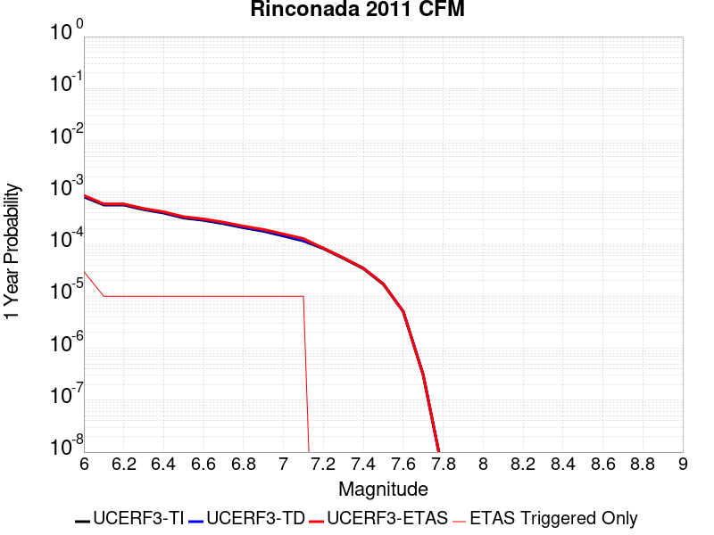 |  |

| Magnitude | 1 wk TI Prob | 1 wk TD Prob | 1 wk ETAS Prob | 1 wk ETAS/TD Gain | 1 wk ETAS Triggered Only | 1 mo TI Prob | 1 mo TD Prob | 1 mo ETAS Prob | 1 mo ETAS/TD Gain | 1 mo ETAS Triggered Only | 1 yr TI Prob | 1 yr TD Prob | 1 yr ETAS Prob | 1 yr ETAS/TD Gain | 1 yr ETAS Triggered Only | 10 yr TI Prob | 10 yr TD Prob | 10 yr ETAS Prob | 10 yr ETAS/TD Gain | 10 yr ETAS Triggered Only |
|-----|-----|-----|-----|-----|-----|-----|-----|-----|-----|-----|-----|-----|-----|-----|-----|-----|-----|-----|-----|-----|
| 6.0 | 1.5752368E-5 | 1.6274716E-5 | 1.6274716E-5 | 1.0 | 0.0 | 6.75084E-5 | 6.974694E-5 | 7.9746234E-5 | 1.1433655 | 1.0E-5 | 8.2160486E-4 | 8.488413E-4 | 8.788158E-4 | 1.0353123 | 3.0E-5 | 0.008185739 | 0.00845637 | 0.008525779 | 1.0082078 | 7.0E-5 |
| 6.1 | 1.0966133E-5 | 1.1323029E-5 | 1.1323029E-5 | 1.0 | 0.0 | 4.6996865E-5 | 4.852637E-5 | 5.8525886E-5 | 1.2060635 | 1.0E-5 | 5.720366E-4 | 5.9064914E-4 | 6.006432E-4 | 1.0169206 | 1.0E-5 | 0.0057056635 | 0.005890889 | 0.0059306533 | 1.0067501 | 4.0E-5 |
| 6.2 | 1.0966133E-5 | 1.1323029E-5 | 1.1323029E-5 | 1.0 | 0.0 | 4.6996865E-5 | 4.852637E-5 | 5.8525886E-5 | 1.2060635 | 1.0E-5 | 5.720366E-4 | 5.9064914E-4 | 6.006432E-4 | 1.0169206 | 1.0E-5 | 0.0057056635 | 0.005890889 | 0.0059306533 | 1.0067501 | 4.0E-5 |
| 6.3 | 8.926149E-6 | 9.212772E-6 | 9.212772E-6 | 1.0 | 0.0 | 3.8254362E-5 | 3.948271E-5 | 4.9482318E-5 | 1.2532654 | 1.0E-5 | 4.6564735E-4 | 4.8059633E-4 | 4.905915E-4 | 1.0207975 | 1.0E-5 | 0.0046467283 | 0.0047956146 | 0.0048354226 | 1.0083009 | 4.0E-5 |
| 6.4 | 7.676955E-6 | 7.920191E-6 | 7.920191E-6 | 1.0 | 0.0 | 3.290082E-5 | 3.3943234E-5 | 4.3942895E-5 | 1.2945995 | 1.0E-5 | 4.0049385E-4 | 4.131807E-4 | 4.2317656E-4 | 1.0241925 | 1.0E-5 | 0.0039977287 | 0.004124151 | 0.004163986 | 1.0096589 | 4.0E-5 |
| 6.5 | 6.1671026E-6 | 6.358955E-6 | 6.358955E-6 | 1.0 | 0.0 | 2.6430173E-5 | 2.725238E-5 | 3.7252106E-5 | 1.3669305 | 1.0E-5 | 3.2173982E-4 | 3.317473E-4 | 3.4174396E-4 | 1.0301335 | 1.0E-5 | 0.003212744 | 0.0033125326 | 0.0033524001 | 1.0120354 | 4.0E-5 |
| 6.6 | 5.553456E-6 | 5.7248126E-6 | 5.7248126E-6 | 1.0 | 0.0 | 2.3800309E-5 | 2.4534682E-5 | 3.4534438E-5 | 1.4075763 | 1.0E-5 | 2.897302E-4 | 2.9866886E-4 | 3.0866588E-4 | 1.033472 | 1.0E-5 | 0.0028935277 | 0.0029826832 | 0.0030125938 | 1.010028 | 3.0E-5 |
| 6.7 | 4.787857E-6 | 4.93331E-6 | 4.93331E-6 | 1.0 | 0.0 | 2.0519226E-5 | 2.1142585E-5 | 3.1142372E-5 | 1.472969 | 1.0E-5 | 2.4979294E-4 | 2.573806E-4 | 2.6737803E-4 | 1.0388429 | 1.0E-5 | 0.0024951235 | 0.002570831 | 0.0026007537 | 1.0116394 | 3.0E-5 |
| 6.8 | 3.9955166E-6 | 4.1134763E-6 | 4.1134763E-6 | 1.0 | 0.0 | 1.7123532E-5 | 1.7629065E-5 | 2.7628888E-5 | 1.567235 | 1.0E-5 | 2.0845905E-4 | 2.1461275E-4 | 2.2461062E-4 | 1.0465856 | 1.0E-5 | 0.002082636 | 0.0021440587 | 0.0021739942 | 1.0139621 | 3.0E-5 |
| 6.9 | 3.4250072E-6 | 3.5224466E-6 | 3.5224466E-6 | 1.0 | 0.0 | 1.46785205E-5 | 1.5096112E-5 | 2.5095962E-5 | 1.6624122 | 1.0E-5 | 1.7869633E-4 | 1.8377969E-4 | 1.9377784E-4 | 1.054403 | 1.0E-5 | 0.001785527 | 0.0018362795 | 0.0018562428 | 1.0108715 | 2.0E-5 |
| 7.0 | 2.7712713E-6 | 2.8467002E-6 | 2.8467002E-6 | 1.0 | 0.0 | 1.1876823E-5 | 1.22000865E-5 | 2.2199965E-5 | 1.8196563 | 1.0E-5 | 1.4459073E-4 | 1.4852594E-4 | 1.5852446E-4 | 1.0673183 | 1.0E-5 | 0.0014449668 | 0.0014842683 | 0.0015042387 | 1.0134547 | 2.0E-5 |
| 7.1 | 2.227358E-6 | 2.2856987E-6 | 2.2856987E-6 | 1.0 | 0.0 | 9.545785E-6 | 9.795815E-6 | 1.9795716E-5 | 2.0208342 | 1.0E-5 | 1.16213734E-4 | 1.1925753E-4 | 1.2925634E-4 | 1.0838422 | 1.0E-5 | 0.0011615298 | 0.0011919363 | 0.0012019244 | 1.0083797 | 1.0E-5 |
| 7.2 | 1.581796E-6 | 1.6209015E-6 | 1.6209015E-6 | 1.0 | 0.0 | 6.779108E-6 | 6.946702E-6 | 6.946702E-6 | 1.0 | 0.0 | 8.253252E-5 | 8.4572814E-5 | 8.4572814E-5 | 1.0 | 0.0 | 8.250187E-4 | 8.4540684E-4 | 8.4540684E-4 | 1.0 | 0.0 |
| 7.3 | 1.0306567E-6 | 1.054648E-6 | 1.054648E-6 | 1.0 | 0.0 | 4.4170924E-6 | 4.519912E-6 | 4.519912E-6 | 1.0 | 0.0 | 5.3776774E-5 | 5.502854E-5 | 5.502854E-5 | 1.0 | 0.0 | 5.376376E-4 | 5.501494E-4 | 5.501494E-4 | 1.0 | 0.0 |
| 7.4 | 6.535541E-7 | 6.682744E-7 | 6.682744E-7 | 1.0 | 0.0 | 2.800943E-6 | 2.8640302E-6 | 2.8640302E-6 | 1.0 | 0.0 | 3.4100947E-5 | 3.4869012E-5 | 3.4869012E-5 | 1.0 | 0.0 | 3.4095717E-4 | 3.486355E-4 | 3.486355E-4 | 1.0 | 0.0 |
| 7.5 | 3.2656962E-7 | 3.3316712E-7 | 3.3316712E-7 | 1.0 | 0.0 | 1.3995833E-6 | 1.4278584E-6 | 1.4278584E-6 | 1.0 | 0.0 | 1.7039794E-5 | 1.7384036E-5 | 1.7384036E-5 | 1.0 | 0.0 | 1.7038487E-4 | 1.738268E-4 | 1.738268E-4 | 1.0 | 0.0 |
| 7.6 | 9.754343E-8 | 9.821017E-8 | 9.821017E-8 | 1.0 | 0.0 | 4.180432E-7 | 4.2090065E-7 | 4.2090065E-7 | 1.0 | 0.0 | 5.089664E-6 | 5.1244533E-6 | 5.1244533E-6 | 1.0 | 0.0 | 5.0895473E-5 | 5.124336E-5 | 5.124336E-5 | 1.0 | 0.0 |
| 7.7 | 6.0001453E-9 | 5.8491207E-9 | 5.8491207E-9 | 1.0 | 0.0 | 2.5714908E-8 | 2.506766E-8 | 2.506766E-8 | 1.0 | 0.0 | 3.1307894E-7 | 3.051987E-7 | 3.051987E-7 | 1.0 | 0.0 | 3.1307852E-6 | 3.0519832E-6 | 3.0519832E-6 | 1.0 | 0.0 |
| 7.8 | 7.400003E-11 | 7.4654505E-11 | 7.4654505E-11 | 1.0 | 0.0 | 3.171432E-10 | 3.1994773E-10 | 3.1994773E-10 | 1.0 | 0.0 | 3.861218E-9 | 3.895363E-9 | 3.895363E-9 | 1.0 | 0.0 | 3.861218E-8 | 3.895363E-8 | 3.895363E-8 | 1.0 | 0.0 |

## Pine Mtn
*[(top)](#table-of-contents)*

| 1 Week | 1 Month | 1 Year | 10 Year |
|-----|-----|-----|-----|
|  |  |  | 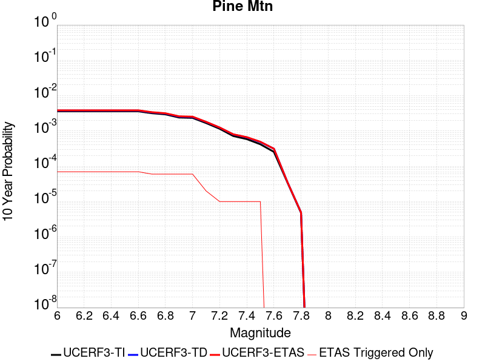 |

| Magnitude | 1 wk TI Prob | 1 wk TD Prob | 1 wk ETAS Prob | 1 wk ETAS/TD Gain | 1 wk ETAS Triggered Only | 1 mo TI Prob | 1 mo TD Prob | 1 mo ETAS Prob | 1 mo ETAS/TD Gain | 1 mo ETAS Triggered Only | 1 yr TI Prob | 1 yr TD Prob | 1 yr ETAS Prob | 1 yr ETAS/TD Gain | 1 yr ETAS Triggered Only | 10 yr TI Prob | 10 yr TD Prob | 10 yr ETAS Prob | 10 yr ETAS/TD Gain | 10 yr ETAS Triggered Only |
|-----|-----|-----|-----|-----|-----|-----|-----|-----|-----|-----|-----|-----|-----|-----|-----|-----|-----|-----|-----|-----|
| 6.0 | 6.894797E-6 | 7.2254716E-6 | 7.2254716E-6 | 1.0 | 0.0 | 2.9548795E-5 | 3.0965955E-5 | 5.0965336E-5 | 1.6458505 | 2.0E-5 | 3.596972E-4 | 3.7694827E-4 | 4.169332E-4 | 1.1060754 | 4.0E-5 | 0.0035911554 | 0.0037633865 | 0.003833123 | 1.0185302 | 7.0E-5 |
| 6.1 | 6.894797E-6 | 7.2254716E-6 | 7.2254716E-6 | 1.0 | 0.0 | 2.9548795E-5 | 3.0965955E-5 | 5.0965336E-5 | 1.6458505 | 2.0E-5 | 3.596972E-4 | 3.7694827E-4 | 4.169332E-4 | 1.1060754 | 4.0E-5 | 0.0035911554 | 0.0037633865 | 0.003833123 | 1.0185302 | 7.0E-5 |
| 6.2 | 6.894797E-6 | 7.2254716E-6 | 7.2254716E-6 | 1.0 | 0.0 | 2.9548795E-5 | 3.0965955E-5 | 5.0965336E-5 | 1.6458505 | 2.0E-5 | 3.596972E-4 | 3.7694827E-4 | 4.169332E-4 | 1.1060754 | 4.0E-5 | 0.0035911554 | 0.0037633865 | 0.003833123 | 1.0185302 | 7.0E-5 |
| 6.3 | 6.894797E-6 | 7.2254716E-6 | 7.2254716E-6 | 1.0 | 0.0 | 2.9548795E-5 | 3.0965955E-5 | 5.0965336E-5 | 1.6458505 | 2.0E-5 | 3.596972E-4 | 3.7694827E-4 | 4.169332E-4 | 1.1060754 | 4.0E-5 | 0.0035911554 | 0.0037633865 | 0.003833123 | 1.0185302 | 7.0E-5 |
| 6.4 | 6.894797E-6 | 7.2254716E-6 | 7.2254716E-6 | 1.0 | 0.0 | 2.9548795E-5 | 3.0965955E-5 | 5.0965336E-5 | 1.6458505 | 2.0E-5 | 3.596972E-4 | 3.7694827E-4 | 4.169332E-4 | 1.1060754 | 4.0E-5 | 0.0035911554 | 0.0037633865 | 0.003833123 | 1.0185302 | 7.0E-5 |
| 6.5 | 6.894797E-6 | 7.2254716E-6 | 7.2254716E-6 | 1.0 | 0.0 | 2.9548795E-5 | 3.0965955E-5 | 5.0965336E-5 | 1.6458505 | 2.0E-5 | 3.596972E-4 | 3.7694827E-4 | 4.169332E-4 | 1.1060754 | 4.0E-5 | 0.0035911554 | 0.0037633865 | 0.003833123 | 1.0185302 | 7.0E-5 |
| 6.6 | 6.894797E-6 | 7.2254716E-6 | 7.2254716E-6 | 1.0 | 0.0 | 2.9548795E-5 | 3.0965955E-5 | 5.0965336E-5 | 1.6458505 | 2.0E-5 | 3.596972E-4 | 3.7694827E-4 | 4.169332E-4 | 1.1060754 | 4.0E-5 | 0.0035911554 | 0.0037633865 | 0.003833123 | 1.0185302 | 7.0E-5 |
| 6.7 | 6.0867933E-6 | 6.397124E-6 | 6.397124E-6 | 1.0 | 0.0 | 2.6085996E-5 | 2.7415968E-5 | 4.741542E-5 | 1.7294818 | 2.0E-5 | 3.1755073E-4 | 3.337405E-4 | 3.7372715E-4 | 1.1198136 | 4.0E-5 | 0.0031709734 | 0.0033326119 | 0.0033924119 | 1.0179439 | 6.0E-5 |
| 6.8 | 5.6530425E-6 | 5.950606E-6 | 5.950606E-6 | 1.0 | 0.0 | 2.42271E-5 | 2.5502359E-5 | 4.550185E-5 | 1.7842212 | 2.0E-5 | 2.94925E-4 | 3.1044905E-4 | 3.5043663E-4 | 1.1288056 | 4.0E-5 | 0.002945339 | 0.0031003582 | 0.0031601721 | 1.0192926 | 6.0E-5 |
| 6.9 | 4.6015225E-6 | 4.8638444E-6 | 4.8638444E-6 | 1.0 | 0.0 | 1.9720663E-5 | 2.084489E-5 | 4.0844472E-5 | 1.9594477 | 2.0E-5 | 2.4007261E-4 | 2.5375842E-4 | 2.9374828E-4 | 1.1575903 | 4.0E-5 | 0.0023981342 | 0.002534831 | 0.0025946787 | 1.0236102 | 6.0E-5 |
| 7.0 | 4.4875965E-6 | 4.7474837E-6 | 4.7474837E-6 | 1.0 | 0.0 | 1.9232413E-5 | 2.0346208E-5 | 4.03458E-5 | 1.9829642 | 2.0E-5 | 2.3412947E-4 | 2.4768838E-4 | 2.8767847E-4 | 1.1614532 | 4.0E-5 | 0.0023388295 | 0.0024742668 | 0.0025341185 | 1.0241896 | 6.0E-5 |
| 7.1 | 3.203907E-6 | 3.42942E-6 | 3.42942E-6 | 1.0 | 0.0 | 1.3730958E-5 | 1.4697435E-5 | 1.4697435E-5 | 1.0 | 0.0 | 1.6716159E-4 | 1.7892725E-4 | 1.8892546E-4 | 1.0558786 | 1.0E-5 | 0.0016703589 | 0.001787898 | 0.0018078622 | 1.0111663 | 2.0E-5 |
| 7.2 | 2.2060601E-6 | 2.3784874E-6 | 2.3784874E-6 | 1.0 | 0.0 | 9.4545085E-6 | 1.019348E-5 | 1.019348E-5 | 1.0 | 0.0 | 1.15102564E-4 | 1.2409901E-4 | 1.2409901E-4 | 1.0 | 0.0 | 0.0011504296 | 0.0012403419 | 0.0012503295 | 1.0080523 | 1.0E-5 |
| 7.3 | 1.3765207E-6 | 1.5216535E-6 | 1.5216535E-6 | 1.0 | 0.0 | 5.899361E-6 | 6.5213567E-6 | 6.5213567E-6 | 1.0 | 0.0 | 7.182235E-5 | 7.939472E-5 | 7.939472E-5 | 1.0 | 0.0 | 7.1799144E-4 | 7.9367263E-4 | 8.036647E-4 | 1.0125897 | 1.0E-5 |
| 7.4 | 1.1245983E-6 | 1.2587126E-6 | 1.2587126E-6 | 1.0 | 0.0 | 4.819698E-6 | 5.394472E-6 | 5.394472E-6 | 1.0 | 0.0 | 5.8678244E-5 | 6.56758E-5 | 6.56758E-5 | 1.0 | 0.0 | 5.866275E-4 | 6.565722E-4 | 6.6656567E-4 | 1.0152206 | 1.0E-5 |
| 7.5 | 8.031682E-7 | 9.276999E-7 | 9.276999E-7 | 1.0 | 0.0 | 3.4421448E-6 | 3.975851E-6 | 3.975851E-6 | 1.0 | 0.0 | 4.1907308E-5 | 4.840498E-5 | 4.840498E-5 | 1.0 | 0.0 | 4.1899405E-4 | 4.8395112E-4 | 4.939463E-4 | 1.0206532 | 1.0E-5 |
| 7.6 | 4.8953444E-7 | 6.0030544E-7 | 6.0030544E-7 | 1.0 | 0.0 | 2.098003E-6 | 2.5727354E-6 | 2.5727354E-6 | 1.0 | 0.0 | 2.5542888E-5 | 3.1322652E-5 | 3.1322652E-5 | 1.0 | 0.0 | 2.5539953E-4 | 3.1318725E-4 | 3.1318725E-4 | 1.0 | 0.0 |
| 7.7 | 6.634529E-8 | 6.788826E-8 | 6.788826E-8 | 1.0 | 0.0 | 2.843369E-7 | 2.9094966E-7 | 2.9094966E-7 | 1.0 | 0.0 | 3.4617963E-6 | 3.5423066E-6 | 3.5423066E-6 | 1.0 | 0.0 | 3.4617424E-5 | 3.542255E-5 | 3.542255E-5 | 1.0 | 0.0 |
| 7.8 | 9.235578E-9 | 9.488566E-9 | 9.488566E-9 | 1.0 | 0.0 | 3.9581046E-8 | 4.0665284E-8 | 4.0665284E-8 | 1.0 | 0.0 | 4.818991E-7 | 4.950997E-7 | 4.950997E-7 | 1.0 | 0.0 | 4.8189804E-6 | 4.950988E-6 | 4.950988E-6 | 1.0 | 0.0 |

## Oak Ridge (Onshore)
*[(top)](#table-of-contents)*

| 1 Week | 1 Month | 1 Year | 10 Year |
|-----|-----|-----|-----|
|  |  | 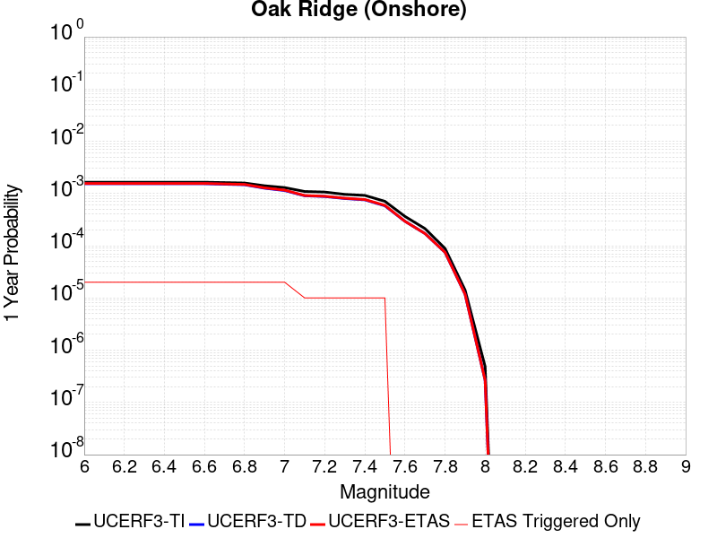 | 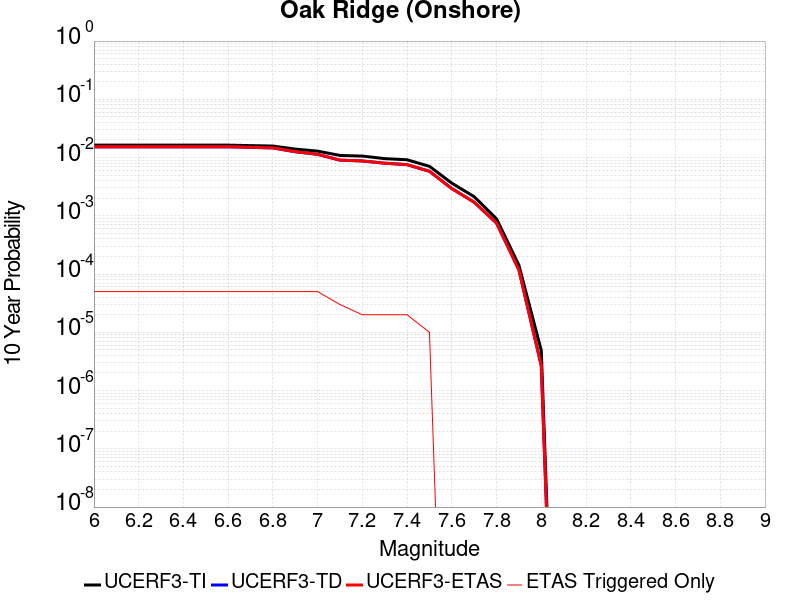 |

| Magnitude | 1 wk TI Prob | 1 wk TD Prob | 1 wk ETAS Prob | 1 wk ETAS/TD Gain | 1 wk ETAS Triggered Only | 1 mo TI Prob | 1 mo TD Prob | 1 mo ETAS Prob | 1 mo ETAS/TD Gain | 1 mo ETAS Triggered Only | 1 yr TI Prob | 1 yr TD Prob | 1 yr ETAS Prob | 1 yr ETAS/TD Gain | 1 yr ETAS Triggered Only | 10 yr TI Prob | 10 yr TD Prob | 10 yr ETAS Prob | 10 yr ETAS/TD Gain | 10 yr ETAS Triggered Only |
|-----|-----|-----|-----|-----|-----|-----|-----|-----|-----|-----|-----|-----|-----|-----|-----|-----|-----|-----|-----|-----|
| 6.0 | 3.155064E-5 | 2.9526076E-5 | 3.952578E-5 | 1.3386737 | 1.0E-5 | 1.3521002E-4 | 1.265344E-4 | 1.3653314E-4 | 1.0790199 | 1.0E-5 | 0.001644939 | 0.0015395058 | 0.001559475 | 1.0129712 | 2.0E-5 | 0.01632816 | 0.015293054 | 0.01534229 | 1.0032195 | 5.0E-5 |
| 6.1 | 3.155064E-5 | 2.9526076E-5 | 3.952578E-5 | 1.3386737 | 1.0E-5 | 1.3521002E-4 | 1.265344E-4 | 1.3653314E-4 | 1.0790199 | 1.0E-5 | 0.001644939 | 0.0015395058 | 0.001559475 | 1.0129712 | 2.0E-5 | 0.01632816 | 0.015293054 | 0.01534229 | 1.0032195 | 5.0E-5 |
| 6.2 | 3.155064E-5 | 2.9526076E-5 | 3.952578E-5 | 1.3386737 | 1.0E-5 | 1.3521002E-4 | 1.265344E-4 | 1.3653314E-4 | 1.0790199 | 1.0E-5 | 0.001644939 | 0.0015395058 | 0.001559475 | 1.0129712 | 2.0E-5 | 0.01632816 | 0.015293054 | 0.01534229 | 1.0032195 | 5.0E-5 |
| 6.3 | 3.155064E-5 | 2.9526076E-5 | 3.952578E-5 | 1.3386737 | 1.0E-5 | 1.3521002E-4 | 1.265344E-4 | 1.3653314E-4 | 1.0790199 | 1.0E-5 | 0.001644939 | 0.0015395058 | 0.001559475 | 1.0129712 | 2.0E-5 | 0.01632816 | 0.015293054 | 0.01534229 | 1.0032195 | 5.0E-5 |
| 6.4 | 3.155064E-5 | 2.9526076E-5 | 3.952578E-5 | 1.3386737 | 1.0E-5 | 1.3521002E-4 | 1.265344E-4 | 1.3653314E-4 | 1.0790199 | 1.0E-5 | 0.001644939 | 0.0015395058 | 0.001559475 | 1.0129712 | 2.0E-5 | 0.01632816 | 0.015293054 | 0.01534229 | 1.0032195 | 5.0E-5 |
| 6.5 | 3.155064E-5 | 2.9526076E-5 | 3.952578E-5 | 1.3386737 | 1.0E-5 | 1.3521002E-4 | 1.265344E-4 | 1.3653314E-4 | 1.0790199 | 1.0E-5 | 0.001644939 | 0.0015395058 | 0.001559475 | 1.0129712 | 2.0E-5 | 0.01632816 | 0.015293054 | 0.01534229 | 1.0032195 | 5.0E-5 |
| 6.6 | 3.155064E-5 | 2.9526076E-5 | 3.952578E-5 | 1.3386737 | 1.0E-5 | 1.3521002E-4 | 1.265344E-4 | 1.3653314E-4 | 1.0790199 | 1.0E-5 | 0.001644939 | 0.0015395058 | 0.001559475 | 1.0129712 | 2.0E-5 | 0.01632816 | 0.015293054 | 0.01534229 | 1.0032195 | 5.0E-5 |
| 6.7 | 3.098897E-5 | 2.8864279E-5 | 3.886399E-5 | 1.346439 | 1.0E-5 | 1.328031E-4 | 1.236984E-4 | 1.3369716E-4 | 1.0808318 | 1.0E-5 | 0.0016156785 | 0.0015050253 | 0.0015249952 | 1.0132688 | 2.0E-5 | 0.016039822 | 0.014952909 | 0.015002162 | 1.0032939 | 5.0E-5 |
| 6.8 | 3.0449872E-5 | 2.8239476E-5 | 3.8239195E-5 | 1.3541042 | 1.0E-5 | 1.3049292E-4 | 1.2102092E-4 | 1.3101971E-4 | 1.0826204 | 1.0E-5 | 0.0015875935 | 0.001472471 | 0.0014924416 | 1.0135626 | 2.0E-5 | 0.015762992 | 0.014631658 | 0.014680926 | 1.0033673 | 5.0E-5 |
| 6.9 | 2.697928E-5 | 2.4219877E-5 | 3.4219636E-5 | 1.412874 | 1.0E-5 | 1.15620365E-4 | 1.03795464E-4 | 1.1379443E-4 | 1.0963333 | 1.0E-5 | 0.0014067689 | 0.0012629988 | 0.0012829734 | 1.0158154 | 2.0E-5 | 0.0139789665 | 0.012561066 | 0.012610438 | 1.0039306 | 5.0E-5 |
| 7.0 | 2.4893961E-5 | 2.1862146E-5 | 3.1861928E-5 | 1.4574016 | 1.0E-5 | 1.0668404E-4 | 9.369165E-5 | 1.0369071E-4 | 1.1067231 | 1.0E-5 | 0.0012981043 | 0.0011401166 | 0.0011600938 | 1.0175221 | 2.0E-5 | 0.012905477 | 0.011345102 | 0.011394535 | 1.0043572 | 5.0E-5 |
| 7.1 | 2.0945363E-5 | 1.7354592E-5 | 1.7354592E-5 | 1.0 | 0.0 | 8.976275E-5 | 7.437473E-5 | 7.437473E-5 | 1.0 | 0.0 | 0.0010923136 | 9.0514094E-4 | 9.151319E-4 | 1.011038 | 1.0E-5 | 0.0108696 | 0.009015621 | 0.00904535 | 1.0032976 | 3.0E-5 |
| 7.2 | 2.0439404E-5 | 1.680953E-5 | 1.680953E-5 | 1.0 | 0.0 | 8.7594504E-5 | 7.203888E-5 | 7.203888E-5 | 1.0 | 0.0 | 0.0010659413 | 8.767251E-4 | 8.8671636E-4 | 1.011396 | 1.0E-5 | 0.010608427 | 0.008733723 | 0.008753548 | 1.00227 | 2.0E-5 |
| 7.3 | 1.8463334E-5 | 1.5381947E-5 | 1.5381947E-5 | 1.0 | 0.0 | 7.912617E-5 | 6.592098E-5 | 6.592098E-5 | 1.0 | 0.0 | 9.6293533E-4 | 8.0229685E-4 | 8.1228884E-4 | 1.0124543 | 1.0E-5 | 0.009587734 | 0.0079950085 | 0.008014848 | 1.0024816 | 2.0E-5 |
| 7.4 | 1.763139E-5 | 1.4516977E-5 | 1.4516977E-5 | 1.0 | 0.0 | 7.556091E-5 | 6.221415E-5 | 6.221415E-5 | 1.0 | 0.0 | 9.1956573E-4 | 7.57198E-4 | 7.671905E-4 | 1.0131966 | 1.0E-5 | 0.009157699 | 0.007547126 | 0.007566975 | 1.00263 | 2.0E-5 |
| 7.5 | 1.3594944E-5 | 1.1163363E-5 | 1.1163363E-5 | 1.0 | 0.0 | 5.8262744E-5 | 4.7842117E-5 | 4.7842117E-5 | 1.0 | 0.0 | 7.0911803E-4 | 5.8232463E-4 | 5.9231883E-4 | 1.0171626 | 1.0E-5 | 0.007068595 | 0.005808362 | 0.0058183037 | 1.0017116 | 1.0E-5 |
| 7.6 | 6.9889534E-6 | 5.6367194E-6 | 5.6367194E-6 | 1.0 | 0.0 | 2.9952313E-5 | 2.4157147E-5 | 2.4157147E-5 | 1.0 | 0.0 | 3.646084E-4 | 2.94074E-4 | 2.94074E-4 | 1.0 | 0.0 | 0.0036401073 | 0.0029368924 | 0.0029368924 | 1.0 | 0.0 |
| 7.7 | 4.0824193E-6 | 3.2832731E-6 | 3.2832731E-6 | 1.0 | 0.0 | 1.7495966E-5 | 1.4071096E-5 | 1.4071096E-5 | 1.0 | 0.0 | 2.1299256E-4 | 1.7130225E-4 | 1.7130225E-4 | 1.0 | 0.0 | 0.0021278851 | 0.0017117155 | 0.0017117155 | 1.0 | 0.0 |
| 7.8 | 1.7023609E-6 | 1.43706E-6 | 1.43706E-6 | 1.0 | 0.0 | 7.295812E-6 | 6.158814E-6 | 6.158814E-6 | 1.0 | 0.0 | 8.882289E-5 | 7.4981006E-5 | 7.4981006E-5 | 1.0 | 0.0 | 8.8787393E-4 | 7.4955984E-4 | 7.4955984E-4 | 1.0 | 0.0 |
| 7.9 | 2.721225E-7 | 2.261692E-7 | 2.261692E-7 | 1.0 | 0.0 | 1.1662388E-6 | 9.692963E-7 | 9.692963E-7 | 1.0 | 0.0 | 1.4198865E-5 | 1.1801121E-5 | 1.1801121E-5 | 1.0 | 0.0 | 1.4197957E-4 | 1.1800523E-4 | 1.1800523E-4 | 1.0 | 0.0 |
| 8.0 | 9.364255E-9 | 5.1204916E-9 | 5.1204916E-9 | 1.0 | 0.0 | 4.0132523E-8 | 2.1944963E-8 | 2.1944963E-8 | 1.0 | 0.0 | 4.8861335E-7 | 2.671799E-7 | 2.671799E-7 | 1.0 | 0.0 | 4.8861225E-6 | 2.6717962E-6 | 2.6717962E-6 | 1.0 | 0.0 |

## Newport-Inglewood (Offshore)
*[(top)](#table-of-contents)*

| 1 Week | 1 Month | 1 Year | 10 Year |
|-----|-----|-----|-----|
|  |  | 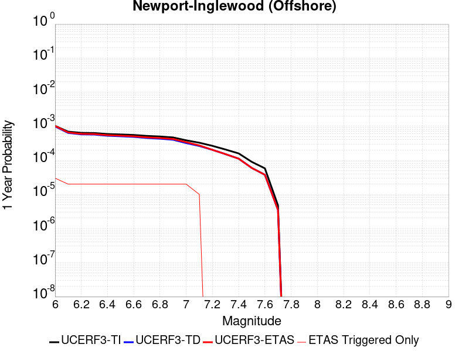 |  |

| Magnitude | 1 wk TI Prob | 1 wk TD Prob | 1 wk ETAS Prob | 1 wk ETAS/TD Gain | 1 wk ETAS Triggered Only | 1 mo TI Prob | 1 mo TD Prob | 1 mo ETAS Prob | 1 mo ETAS/TD Gain | 1 mo ETAS Triggered Only | 1 yr TI Prob | 1 yr TD Prob | 1 yr ETAS Prob | 1 yr ETAS/TD Gain | 1 yr ETAS Triggered Only | 10 yr TI Prob | 10 yr TD Prob | 10 yr ETAS Prob | 10 yr ETAS/TD Gain | 10 yr ETAS Triggered Only |
|-----|-----|-----|-----|-----|-----|-----|-----|-----|-----|-----|-----|-----|-----|-----|-----|-----|-----|-----|-----|-----|
| 6.0 | 1.9626508E-5 | 1.8965342E-5 | 3.8964965E-5 | 2.0545352 | 2.0E-5 | 8.411089E-5 | 8.1277576E-5 | 1.0127595E-4 | 1.2460504 | 2.0E-5 | 0.001023569 | 9.891179E-4 | 0.0010190882 | 1.0303 | 3.0E-5 | 0.010188672 | 0.009848497 | 0.009907906 | 1.0060323 | 6.0E-5 |
| 6.1 | 1.331886E-5 | 1.2218078E-5 | 2.2217957E-5 | 1.8184493 | 1.0E-5 | 5.707958E-5 | 5.2362153E-5 | 6.236163E-5 | 1.1909677 | 1.0E-5 | 6.947222E-4 | 6.3732424E-4 | 6.5731147E-4 | 1.0313612 | 2.0E-5 | 0.006925544 | 0.006355142 | 0.006394888 | 1.0062541 | 4.0E-5 |
| 6.2 | 1.2250852E-5 | 1.1076016E-5 | 2.1075904E-5 | 1.9028417 | 1.0E-5 | 5.2502597E-5 | 4.746778E-5 | 5.7467307E-5 | 1.2106593 | 1.0E-5 | 6.3903164E-4 | 5.7776796E-4 | 5.977564E-4 | 1.034596 | 2.0E-5 | 0.006371971 | 0.0057627796 | 0.0058025494 | 1.0069011 | 4.0E-5 |
| 6.3 | 1.2106258E-5 | 1.0918878E-5 | 2.091877E-5 | 1.915835 | 1.0E-5 | 5.1882926E-5 | 4.6794354E-5 | 5.6793888E-5 | 1.213691 | 1.0E-5 | 6.3149154E-4 | 5.695733E-4 | 5.8956194E-4 | 1.035094 | 2.0E-5 | 0.0062970007 | 0.005681252 | 0.0057210247 | 1.0070007 | 4.0E-5 |
| 6.4 | 1.1348758E-5 | 1.0109348E-5 | 2.0109248E-5 | 1.9891734 | 1.0E-5 | 4.8636626E-5 | 4.3325064E-5 | 5.332463E-5 | 1.2308033 | 1.0E-5 | 5.919901E-4 | 5.2735576E-4 | 5.4734526E-4 | 1.0379051 | 2.0E-5 | 0.005904155 | 0.0052611395 | 0.005300929 | 1.0075629 | 4.0E-5 |
| 6.5 | 1.100837E-5 | 9.743376E-6 | 1.9743278E-5 | 2.0263283 | 1.0E-5 | 4.7177873E-5 | 4.175666E-5 | 5.1756244E-5 | 1.2394727 | 1.0E-5 | 5.7423924E-4 | 5.082695E-4 | 5.282594E-4 | 1.0393292 | 2.0E-5 | 0.005727576 | 0.005071162 | 0.0051010097 | 1.0058858 | 3.0E-5 |
| 6.6 | 1.0634696E-5 | 9.34553E-6 | 1.9345436E-5 | 2.0700202 | 1.0E-5 | 4.557647E-5 | 4.0051662E-5 | 5.005126E-5 | 1.2496675 | 1.0E-5 | 5.5475225E-4 | 4.875206E-4 | 5.0751085E-4 | 1.041004 | 2.0E-5 | 0.0055336943 | 0.0048645977 | 0.0048944517 | 1.006137 | 3.0E-5 |
| 6.7 | 9.9780855E-6 | 8.667898E-6 | 1.8667812E-5 | 2.1536722 | 1.0E-5 | 4.276252E-5 | 3.7147613E-5 | 4.714724E-5 | 1.2691863 | 1.0E-5 | 5.205093E-4 | 4.5217903E-4 | 4.7216998E-4 | 1.0442103 | 2.0E-5 | 0.0051929182 | 0.0045126686 | 0.0045425333 | 1.0066179 | 3.0E-5 |
| 6.8 | 9.59546E-6 | 8.272933E-6 | 1.827285E-5 | 2.2087512 | 1.0E-5 | 4.1122752E-5 | 3.545495E-5 | 4.545459E-5 | 1.2820381 | 1.0E-5 | 5.0055445E-4 | 4.3157916E-4 | 4.5157052E-4 | 1.0463214 | 2.0E-5 | 0.004994285 | 0.004307486 | 0.004337357 | 1.0069346 | 3.0E-5 |
| 6.9 | 9.000614E-6 | 7.706823E-6 | 1.7706747E-5 | 2.2975414 | 1.0E-5 | 3.857349E-5 | 3.3028828E-5 | 4.30285E-5 | 1.3027558 | 1.0E-5 | 4.6953102E-4 | 4.0205245E-4 | 4.220444E-4 | 1.0497247 | 2.0E-5 | 0.004685402 | 0.0040133223 | 0.004043202 | 1.0074451 | 3.0E-5 |
| 7.0 | 7.4070194E-6 | 6.148865E-6 | 1.6148802E-5 | 2.6263065 | 1.0E-5 | 3.1743984E-5 | 2.6352012E-5 | 3.635175E-5 | 1.3794676 | 1.0E-5 | 3.8641447E-4 | 3.2078868E-4 | 3.4078225E-4 | 1.0623263 | 2.0E-5 | 0.0038574322 | 0.0032032758 | 0.0032331797 | 1.0093354 | 3.0E-5 |
| 7.1 | 6.299615E-6 | 5.0565613E-6 | 5.0565613E-6 | 1.0 | 0.0 | 2.699807E-5 | 2.1670798E-5 | 2.1670798E-5 | 1.0 | 0.0 | 3.2865192E-4 | 2.6381016E-4 | 2.7380753E-4 | 1.037896 | 1.0E-5 | 0.003281663 | 0.0026349847 | 0.002654932 | 1.0075701 | 2.0E-5 |
| 7.2 | 5.096653E-6 | 3.892733E-6 | 3.892733E-6 | 1.0 | 0.0 | 2.1842614E-5 | 1.6683034E-5 | 1.6683034E-5 | 1.0 | 0.0 | 2.6590136E-4 | 2.0309711E-4 | 2.0309711E-4 | 1.0 | 0.0 | 0.0026558342 | 0.0020291263 | 0.0020391059 | 1.0049182 | 1.0E-5 |
| 7.3 | 3.9753018E-6 | 2.9098787E-6 | 2.9098787E-6 | 1.0 | 0.0 | 1.7036897E-5 | 1.24708495E-5 | 1.24708495E-5 | 1.0 | 0.0 | 2.0740448E-4 | 1.518221E-4 | 1.518221E-4 | 1.0 | 0.0 | 0.00207211 | 0.0015171919 | 0.0015171919 | 1.0 | 0.0 |
| 7.4 | 3.0568392E-6 | 2.1449732E-6 | 2.1449732E-6 | 1.0 | 0.0 | 1.3100675E-5 | 9.19271E-6 | 9.19271E-6 | 1.0 | 0.0 | 1.5948903E-4 | 1.11915564E-4 | 1.11915564E-4 | 1.0 | 0.0 | 0.0015937461 | 0.0011185983 | 0.0011185983 | 1.0 | 0.0 |
| 7.5 | 1.7279019E-6 | 1.1469651E-6 | 1.1469651E-6 | 1.0 | 0.0 | 7.405273E-6 | 4.9155556E-6 | 4.9155556E-6 | 1.0 | 0.0 | 9.015547E-5 | 5.9845286E-5 | 5.9845286E-5 | 1.0 | 0.0 | 9.01189E-4 | 5.982956E-4 | 5.982956E-4 | 1.0 | 0.0 |
| 7.6 | 1.1156416E-6 | 7.222962E-7 | 7.222962E-7 | 1.0 | 0.0 | 4.7813123E-6 | 3.0955514E-6 | 3.0955514E-6 | 1.0 | 0.0 | 5.821092E-5 | 3.768771E-5 | 3.768771E-5 | 1.0 | 0.0 | 5.8195676E-4 | 3.7681553E-4 | 3.7681553E-4 | 1.0 | 0.0 |
| 7.7 | 9.117973E-8 | 6.7342256E-8 | 6.7342256E-8 | 1.0 | 0.0 | 3.907702E-7 | 2.8860964E-7 | 2.8860964E-7 | 1.0 | 0.0 | 4.757617E-6 | 3.5138169E-6 | 3.5138169E-6 | 1.0 | 0.0 | 4.7575148E-5 | 3.5137644E-5 | 3.5137644E-5 | 1.0 | 0.0 |

## Channel Islands Western Deep Ramp
*[(top)](#table-of-contents)*

| 1 Week | 1 Month | 1 Year | 10 Year |
|-----|-----|-----|-----|
|  |  |  |  |

| Magnitude | 1 wk TI Prob | 1 wk TD Prob | 1 wk ETAS Prob | 1 wk ETAS/TD Gain | 1 wk ETAS Triggered Only | 1 mo TI Prob | 1 mo TD Prob | 1 mo ETAS Prob | 1 mo ETAS/TD Gain | 1 mo ETAS Triggered Only | 1 yr TI Prob | 1 yr TD Prob | 1 yr ETAS Prob | 1 yr ETAS/TD Gain | 1 yr ETAS Triggered Only | 10 yr TI Prob | 10 yr TD Prob | 10 yr ETAS Prob | 10 yr ETAS/TD Gain | 10 yr ETAS Triggered Only |
|-----|-----|-----|-----|-----|-----|-----|-----|-----|-----|-----|-----|-----|-----|-----|-----|-----|-----|-----|-----|-----|
| 6.0 | 6.0213506E-6 | 6.2548684E-6 | 1.6254806E-5 | 2.5987446 | 1.0E-5 | 2.5805533E-5 | 2.6806329E-5 | 3.680606E-5 | 1.3730363 | 1.0E-5 | 3.1413708E-4 | 3.2632265E-4 | 3.5631284E-4 | 1.0919036 | 3.0E-5 | 0.0031369338 | 0.0032588763 | 0.0033186807 | 1.0183512 | 6.0E-5 |
| 6.1 | 6.0213506E-6 | 6.2548684E-6 | 1.6254806E-5 | 2.5987446 | 1.0E-5 | 2.5805533E-5 | 2.6806329E-5 | 3.680606E-5 | 1.3730363 | 1.0E-5 | 3.1413708E-4 | 3.2632265E-4 | 3.5631284E-4 | 1.0919036 | 3.0E-5 | 0.0031369338 | 0.0032588763 | 0.0033186807 | 1.0183512 | 6.0E-5 |
| 6.2 | 6.0213506E-6 | 6.2548684E-6 | 1.6254806E-5 | 2.5987446 | 1.0E-5 | 2.5805533E-5 | 2.6806329E-5 | 3.680606E-5 | 1.3730363 | 1.0E-5 | 3.1413708E-4 | 3.2632265E-4 | 3.5631284E-4 | 1.0919036 | 3.0E-5 | 0.0031369338 | 0.0032588763 | 0.0033186807 | 1.0183512 | 6.0E-5 |
| 6.3 | 6.0213506E-6 | 6.2548684E-6 | 1.6254806E-5 | 2.5987446 | 1.0E-5 | 2.5805533E-5 | 2.6806329E-5 | 3.680606E-5 | 1.3730363 | 1.0E-5 | 3.1413708E-4 | 3.2632265E-4 | 3.5631284E-4 | 1.0919036 | 3.0E-5 | 0.0031369338 | 0.0032588763 | 0.0033186807 | 1.0183512 | 6.0E-5 |
| 6.4 | 6.0213506E-6 | 6.2548684E-6 | 1.6254806E-5 | 2.5987446 | 1.0E-5 | 2.5805533E-5 | 2.6806329E-5 | 3.680606E-5 | 1.3730363 | 1.0E-5 | 3.1413708E-4 | 3.2632265E-4 | 3.5631284E-4 | 1.0919036 | 3.0E-5 | 0.0031369338 | 0.0032588763 | 0.0033186807 | 1.0183512 | 6.0E-5 |
| 6.5 | 6.0213506E-6 | 6.2548684E-6 | 1.6254806E-5 | 2.5987446 | 1.0E-5 | 2.5805533E-5 | 2.6806329E-5 | 3.680606E-5 | 1.3730363 | 1.0E-5 | 3.1413708E-4 | 3.2632265E-4 | 3.5631284E-4 | 1.0919036 | 3.0E-5 | 0.0031369338 | 0.0032588763 | 0.0033186807 | 1.0183512 | 6.0E-5 |
| 6.6 | 6.0213506E-6 | 6.2548684E-6 | 1.6254806E-5 | 2.5987446 | 1.0E-5 | 2.5805533E-5 | 2.6806329E-5 | 3.680606E-5 | 1.3730363 | 1.0E-5 | 3.1413708E-4 | 3.2632265E-4 | 3.5631284E-4 | 1.0919036 | 3.0E-5 | 0.0031369338 | 0.0032588763 | 0.0033186807 | 1.0183512 | 6.0E-5 |
| 6.7 | 5.313309E-6 | 5.5252403E-6 | 1.5525186E-5 | 2.809866 | 1.0E-5 | 2.2771126E-5 | 2.367941E-5 | 3.3679175E-5 | 1.4222978 | 1.0E-5 | 2.772032E-4 | 2.8826276E-4 | 3.182541E-4 | 1.1040417 | 3.0E-5 | 0.0027685766 | 0.0028792918 | 0.002939119 | 1.0207784 | 6.0E-5 |
| 6.8 | 5.313309E-6 | 5.5252403E-6 | 1.5525186E-5 | 2.809866 | 1.0E-5 | 2.2771126E-5 | 2.367941E-5 | 3.3679175E-5 | 1.4222978 | 1.0E-5 | 2.772032E-4 | 2.8826276E-4 | 3.182541E-4 | 1.1040417 | 3.0E-5 | 0.0027685766 | 0.0028792918 | 0.002939119 | 1.0207784 | 6.0E-5 |
| 6.9 | 4.744377E-6 | 4.9394303E-6 | 1.4939381E-5 | 3.024515 | 1.0E-5 | 2.0332885E-5 | 2.1168837E-5 | 3.1168624E-5 | 1.4723825 | 1.0E-5 | 2.4752476E-4 | 2.5770385E-4 | 2.876961E-4 | 1.1163827 | 3.0E-5 | 0.0024724922 | 0.0025744175 | 0.002634263 | 1.0232463 | 6.0E-5 |
| 7.0 | 4.722209E-6 | 4.9164732E-6 | 1.4916424E-5 | 3.0339684 | 1.0E-5 | 2.0237881E-5 | 2.107045E-5 | 3.1070238E-5 | 1.4745883 | 1.0E-5 | 2.4636835E-4 | 2.5650626E-4 | 2.8649857E-4 | 1.1169262 | 3.0E-5 | 0.002460954 | 0.0025624693 | 0.0026223157 | 1.0233549 | 6.0E-5 |
| 7.1 | 4.611174E-6 | 4.801409E-6 | 1.48013605E-5 | 3.082712 | 1.0E-5 | 1.9762025E-5 | 2.0577325E-5 | 3.057712E-5 | 1.4859618 | 1.0E-5 | 2.4057609E-4 | 2.5050386E-4 | 2.8049634E-4 | 1.1197287 | 3.0E-5 | 0.002403158 | 0.002502582 | 0.0025624319 | 1.0239153 | 6.0E-5 |
| 7.2 | 4.043994E-6 | 4.2120264E-6 | 1.4211984E-5 | 3.374144 | 1.0E-5 | 1.7331287E-5 | 1.8051438E-5 | 2.8051258E-5 | 1.5539625 | 1.0E-5 | 2.10988E-4 | 2.1975765E-4 | 2.4975106E-4 | 1.136484 | 3.0E-5 | 0.002107878 | 0.0021957543 | 0.0022556225 | 1.0272654 | 6.0E-5 |
| 7.3 | 2.1233036E-6 | 2.2297875E-6 | 2.2297875E-6 | 1.0 | 0.0 | 9.099841E-6 | 9.556197E-6 | 9.556197E-6 | 1.0 | 0.0 | 1.1078493E-4 | 1.1634055E-4 | 1.3633822E-4 | 1.1718891 | 2.0E-5 | 0.0011072971 | 0.001162802 | 0.001192767 | 1.0257697 | 3.0E-5 |
| 7.4 | 1.9051884E-6 | 2.0014973E-6 | 2.0014973E-6 | 1.0 | 0.0 | 8.165067E-6 | 8.577817E-6 | 8.577817E-6 | 1.0 | 0.0 | 9.940516E-5 | 1.0442998E-4 | 1.2442788E-4 | 1.1914959 | 2.0E-5 | 9.93607E-4 | 0.0010438144 | 0.001073783 | 1.0287107 | 3.0E-5 |
| 7.5 | 1.2408497E-6 | 1.3038839E-6 | 1.3038839E-6 | 1.0 | 0.0 | 5.317916E-6 | 5.588062E-6 | 5.588062E-6 | 1.0 | 0.0 | 6.4743705E-5 | 6.8032554E-5 | 7.803187E-5 | 1.1469785 | 1.0E-5 | 6.4724847E-4 | 6.8011944E-4 | 7.0010585E-4 | 1.0293866 | 2.0E-5 |
| 7.6 | 6.5440025E-7 | 6.886718E-7 | 6.886718E-7 | 1.0 | 0.0 | 2.8045695E-6 | 2.9514472E-6 | 2.9514472E-6 | 1.0 | 0.0 | 3.4145098E-5 | 3.593329E-5 | 3.593329E-5 | 1.0 | 0.0 | 3.4139853E-4 | 3.5927625E-4 | 3.6927266E-4 | 1.0278237 | 1.0E-5 |
| 7.7 | 3.985963E-7 | 4.1930787E-7 | 4.1930787E-7 | 1.0 | 0.0 | 1.7082689E-6 | 1.7970326E-6 | 1.7970326E-6 | 1.0 | 0.0 | 2.0797976E-5 | 2.1878664E-5 | 2.1878664E-5 | 1.0 | 0.0 | 2.0796029E-4 | 2.1876628E-4 | 2.2876408E-4 | 1.0457009 | 1.0E-5 |
| 7.8 | 3.706329E-8 | 3.8591796E-8 | 3.8591796E-8 | 1.0 | 0.0 | 1.5884267E-7 | 1.653934E-7 | 1.653934E-7 | 1.0 | 0.0 | 1.9339077E-6 | 2.0136629E-6 | 2.0136629E-6 | 1.0 | 0.0 | 1.933891E-5 | 2.0136458E-5 | 2.0136458E-5 | 1.0 | 0.0 |

## Calaveras (So) - Paicines extension 2011 CFM
*[(top)](#table-of-contents)*

| 1 Week | 1 Month | 1 Year | 10 Year |
|-----|-----|-----|-----|
|  | 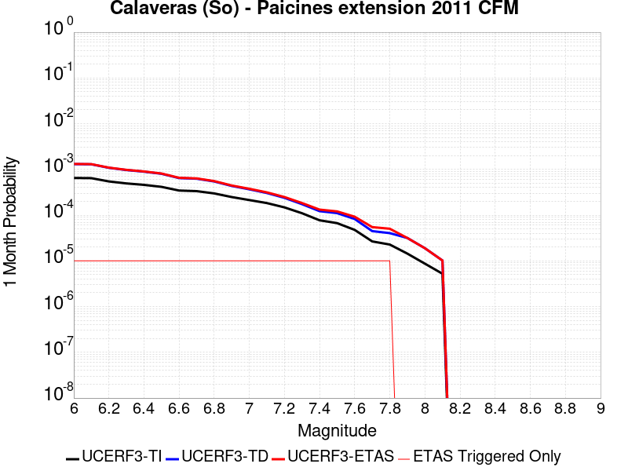 | 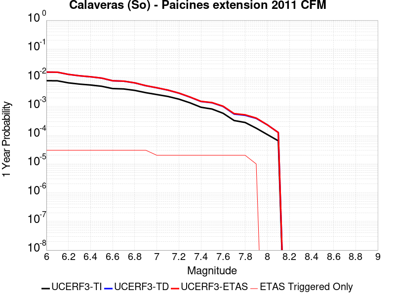 |  |

| Magnitude | 1 wk TI Prob | 1 wk TD Prob | 1 wk ETAS Prob | 1 wk ETAS/TD Gain | 1 wk ETAS Triggered Only | 1 mo TI Prob | 1 mo TD Prob | 1 mo ETAS Prob | 1 mo ETAS/TD Gain | 1 mo ETAS Triggered Only | 1 yr TI Prob | 1 yr TD Prob | 1 yr ETAS Prob | 1 yr ETAS/TD Gain | 1 yr ETAS Triggered Only | 10 yr TI Prob | 10 yr TD Prob | 10 yr ETAS Prob | 10 yr ETAS/TD Gain | 10 yr ETAS Triggered Only |
|-----|-----|-----|-----|-----|-----|-----|-----|-----|-----|-----|-----|-----|-----|-----|-----|-----|-----|-----|-----|-----|
| 6.0 | 1.5183659E-4 | 3.0520977E-4 | 3.0520977E-4 | 1.0 | 0.0 | 6.5056595E-4 | 0.0013068188 | 0.0013168057 | 1.0076421 | 1.0E-5 | 0.007891912 | 0.015696203 | 0.015725734 | 1.0018812 | 3.0E-5 | 0.076174594 | 0.13848905 | 0.13854074 | 1.0003732 | 6.0E-5 |
| 6.1 | 1.5024997E-4 | 3.021517E-4 | 3.021517E-4 | 1.0 | 0.0 | 6.437695E-4 | 0.0012937278 | 0.0013037149 | 1.0077196 | 1.0E-5 | 0.0078097614 | 0.015539596 | 0.01556913 | 1.0019006 | 3.0E-5 | 0.075409345 | 0.13715863 | 0.13721041 | 1.0003774 | 6.0E-5 |
| 6.2 | 1.2743923E-4 | 2.5313982E-4 | 2.5313982E-4 | 1.0 | 0.0 | 5.460538E-4 | 0.0010839999 | 0.001093989 | 1.0092151 | 1.0E-5 | 0.0066279583 | 0.013046881 | 0.01307649 | 1.0022694 | 3.0E-5 | 0.064337276 | 0.117256075 | 0.117309034 | 1.0004517 | 6.0E-5 |
| 6.3 | 1.1525114E-4 | 2.2599236E-4 | 2.2599236E-4 | 1.0 | 0.0 | 4.9383997E-4 | 9.678718E-4 | 9.77862E-4 | 1.010322 | 1.0E-5 | 0.0059959386 | 0.011668079 | 0.011697729 | 1.0025411 | 3.0E-5 | 0.058367174 | 0.106372125 | 0.10642574 | 1.000504 | 6.0E-5 |
| 6.4 | 1.07200925E-4 | 2.0840544E-4 | 2.0840544E-4 | 1.0 | 0.0 | 4.5935164E-4 | 8.926123E-4 | 9.026034E-4 | 1.011193 | 1.0E-5 | 0.0055782744 | 0.010772959 | 0.010802636 | 1.0027548 | 3.0E-5 | 0.0544031 | 0.099194765 | 0.09924882 | 1.0005449 | 6.0E-5 |
| 6.5 | 9.69631E-5 | 1.8734725E-4 | 1.8734725E-4 | 1.0 | 0.0 | 4.1548995E-4 | 8.024631E-4 | 8.124551E-4 | 1.0124516 | 1.0E-5 | 0.0050468626 | 0.009694842 | 0.009724551 | 1.0030644 | 3.0E-5 | 0.04933773 | 0.090086564 | 0.09014116 | 1.0006061 | 6.0E-5 |
| 6.6 | 8.0552316E-5 | 1.507068E-4 | 1.507068E-4 | 1.0 | 0.0 | 3.4517853E-4 | 6.4569083E-4 | 6.556844E-4 | 1.0154773 | 1.0E-5 | 0.0041944524 | 0.007826508 | 0.007856273 | 1.0038031 | 3.0E-5 | 0.04116161 | 0.0748563 | 0.07491181 | 1.0007415 | 6.0E-5 |
| 6.7 | 7.815757E-5 | 1.4611272E-4 | 1.4611272E-4 | 1.0 | 0.0 | 3.34918E-4 | 6.26014E-4 | 6.360078E-4 | 1.015964 | 1.0E-5 | 0.004070005 | 0.007589312 | 0.007619084 | 1.0039229 | 3.0E-5 | 0.039962657 | 0.07270582 | 0.07276146 | 1.0007652 | 6.0E-5 |
| 6.8 | 6.965264E-5 | 1.2722758E-4 | 1.2722758E-4 | 1.0 | 0.0 | 2.9847719E-4 | 5.4513285E-4 | 5.551274E-4 | 1.0183342 | 1.0E-5 | 0.0036279052 | 0.0066135945 | 0.006643396 | 1.0045061 | 3.0E-5 | 0.03569247 | 0.063801065 | 0.06385724 | 1.0008805 | 6.0E-5 |
| 6.9 | 5.8000453E-5 | 1.01439E-4 | 1.01439E-4 | 1.0 | 0.0 | 2.4854968E-4 | 4.346666E-4 | 4.4466226E-4 | 1.0229962 | 1.0E-5 | 0.0030218933 | 0.005279322 | 0.005309164 | 1.0056525 | 3.0E-5 | 0.029811295 | 0.051502965 | 0.05155039 | 1.0009208 | 5.0E-5 |
| 7.0 | 4.9865852E-5 | 8.568029E-5 | 8.568029E-5 | 1.0 | 0.0 | 2.1369329E-4 | 3.6715003E-4 | 3.7714635E-4 | 1.0272268 | 1.0E-5 | 0.0025986114 | 0.004460979 | 0.0044808895 | 1.0044633 | 2.0E-5 | 0.025684336 | 0.043782018 | 0.043820266 | 1.0008736 | 4.0E-5 |
| 7.1 | 4.283875E-5 | 7.1124625E-5 | 7.1124625E-5 | 1.0 | 0.0 | 1.8358172E-4 | 3.0478454E-4 | 3.1478147E-4 | 1.0328001 | 1.0E-5 | 0.0022328163 | 0.003704494 | 0.00372442 | 1.0053788 | 2.0E-5 | 0.022105146 | 0.03673582 | 0.036774352 | 1.0010488 | 4.0E-5 |
| 7.2 | 3.450115E-5 | 5.5778568E-5 | 5.5778568E-5 | 1.0 | 0.0 | 1.478537E-4 | 2.3902925E-4 | 2.4902687E-4 | 1.0418259 | 1.0E-5 | 0.0017986323 | 0.0029063264 | 0.0029262684 | 1.0068616 | 2.0E-5 | 0.017841442 | 0.029079042 | 0.029117879 | 1.0013355 | 4.0E-5 |
| 7.3 | 2.5709045E-5 | 4.059001E-5 | 4.059001E-5 | 1.0 | 0.0 | 1.1017697E-4 | 1.7394568E-4 | 1.8394395E-4 | 1.0574793 | 1.0E-5 | 0.0013405791 | 0.0021157486 | 0.0021357064 | 1.0094329 | 2.0E-5 | 0.013325208 | 0.02129686 | 0.02133601 | 1.0018382 | 4.0E-5 |
| 7.4 | 1.8003093E-5 | 2.8511378E-5 | 2.8511378E-5 | 1.0 | 0.0 | 7.715383E-5 | 1.2218591E-4 | 1.321847E-4 | 1.0818325 | 1.0E-5 | 9.3894306E-4 | 0.0014866006 | 0.001506571 | 1.0134335 | 2.0E-5 | 0.009349857 | 0.015051589 | 0.015090987 | 1.0026175 | 4.0E-5 |
| 7.5 | 1.5595824E-5 | 2.5823752E-5 | 2.5823752E-5 | 1.0 | 0.0 | 6.683753E-5 | 1.10668545E-4 | 1.20667435E-4 | 1.0903499 | 1.0E-5 | 8.134431E-4 | 0.0013465589 | 0.001366532 | 1.0148326 | 2.0E-5 | 0.008104719 | 0.013651571 | 0.013691025 | 1.0028901 | 4.0E-5 |
| 7.6 | 1.1110309E-5 | 1.9223195E-5 | 1.9223195E-5 | 1.0 | 0.0 | 4.761474E-5 | 8.2382525E-5 | 9.2381706E-5 | 1.121375 | 1.0E-5 | 5.795553E-4 | 0.0010025471 | 0.0010225271 | 1.0199292 | 2.0E-5 | 0.0057804612 | 0.01020344 | 0.010243032 | 1.0038803 | 4.0E-5 |
| 7.7 | 6.2140443E-6 | 1.04376995E-5 | 1.04376995E-5 | 1.0 | 0.0 | 2.6631347E-5 | 4.4732235E-5 | 5.4731787E-5 | 1.2235425 | 1.0E-5 | 3.241884E-4 | 5.4447894E-4 | 5.6446804E-4 | 1.0367124 | 2.0E-5 | 0.0032371588 | 0.005620102 | 0.0056499336 | 1.005308 | 3.0E-5 |
| 7.8 | 5.305533E-6 | 9.433651E-6 | 9.433651E-6 | 1.0 | 0.0 | 2.27378E-5 | 4.0429306E-5 | 5.0428902E-5 | 1.2473353 | 1.0E-5 | 2.7679754E-4 | 4.9211574E-4 | 5.121059E-4 | 1.0406208 | 2.0E-5 | 0.0027645302 | 0.005074622 | 0.00510447 | 1.0058818 | 3.0E-5 |
| 7.9 | 3.363505E-6 | 7.3854467E-6 | 7.3854467E-6 | 1.0 | 0.0 | 1.4414942E-5 | 3.1651532E-5 | 3.1651532E-5 | 1.0 | 0.0 | 1.7548777E-4 | 3.8528934E-4 | 3.952855E-4 | 1.0259445 | 1.0E-5 | 0.0017534926 | 0.003948784 | 0.003968705 | 1.0050448 | 2.0E-5 |
| 8.0 | 2.0271132E-6 | 4.4134235E-6 | 4.4134235E-6 | 1.0 | 0.0 | 8.687599E-6 | 1.8914534E-5 | 1.8914534E-5 | 1.0 | 0.0 | 1.05766376E-4 | 2.3026018E-4 | 2.3026018E-4 | 1.0 | 0.0 | 0.0010571606 | 0.002351194 | 0.0023611705 | 1.0042431 | 1.0E-5 |
| 8.1 | 1.2206116E-6 | 2.3752666E-6 | 2.3752666E-6 | 1.0 | 0.0 | 5.2311816E-6 | 1.0179674E-5 | 1.0179674E-5 | 1.0 | 0.0 | 6.3687774E-5 | 1.2393051E-4 | 1.2393051E-4 | 1.0 | 0.0 | 6.366953E-4 | 0.0012705618 | 0.0012805491 | 1.0078605 | 1.0E-5 |

## Calaveras (So) 2011 CFM
*[(top)](#table-of-contents)*

| 1 Week | 1 Month | 1 Year | 10 Year |
|-----|-----|-----|-----|
|  |  |  |  |

| Magnitude | 1 wk TI Prob | 1 wk TD Prob | 1 wk ETAS Prob | 1 wk ETAS/TD Gain | 1 wk ETAS Triggered Only | 1 mo TI Prob | 1 mo TD Prob | 1 mo ETAS Prob | 1 mo ETAS/TD Gain | 1 mo ETAS Triggered Only | 1 yr TI Prob | 1 yr TD Prob | 1 yr ETAS Prob | 1 yr ETAS/TD Gain | 1 yr ETAS Triggered Only | 10 yr TI Prob | 10 yr TD Prob | 10 yr ETAS Prob | 10 yr ETAS/TD Gain | 10 yr ETAS Triggered Only |
|-----|-----|-----|-----|-----|-----|-----|-----|-----|-----|-----|-----|-----|-----|-----|-----|-----|-----|-----|-----|-----|
| 6.0 | 1.5950744E-4 | 3.0713255E-4 | 3.1712948E-4 | 1.0325493 | 1.0E-5 | 6.834242E-4 | 0.001315409 | 0.0013253958 | 1.0075922 | 1.0E-5 | 0.00828899 | 0.015858326 | 0.015897691 | 1.0024823 | 4.0E-5 | 0.079865426 | 0.14440185 | 0.14445318 | 1.0003555 | 6.0E-5 |
| 6.1 | 1.3584697E-4 | 2.603514E-4 | 2.7034877E-4 | 1.0383996 | 1.0E-5 | 5.8207137E-4 | 0.0011151754 | 0.0011251643 | 1.0089571 | 1.0E-5 | 0.007063716 | 0.013461385 | 0.013490981 | 1.0021986 | 3.0E-5 | 0.06843361 | 0.124029994 | 0.124073796 | 1.0003531 | 5.0E-5 |
| 6.2 | 1.14676266E-4 | 2.1714384E-4 | 2.1714384E-4 | 1.0 | 0.0 | 4.9137714E-4 | 9.30223E-4 | 9.30223E-4 | 1.0 | 0.0 | 0.0059661185 | 0.011245058 | 0.011264834 | 1.0017586 | 2.0E-5 | 0.058084648 | 0.10502057 | 0.10505637 | 1.0003408 | 4.0E-5 |
| 6.3 | 8.691518E-5 | 1.5987935E-4 | 1.5987935E-4 | 1.0 | 0.0 | 3.7244044E-4 | 6.849807E-4 | 6.849807E-4 | 1.0 | 0.0 | 0.004525038 | 0.008301122 | 0.0083209565 | 1.0023893 | 2.0E-5 | 0.044339992 | 0.0793365 | 0.07937333 | 1.0004642 | 4.0E-5 |
| 6.4 | 8.50982E-5 | 1.5694331E-4 | 1.5694331E-4 | 1.0 | 0.0 | 3.646556E-4 | 6.724042E-4 | 6.724042E-4 | 1.0 | 0.0 | 0.0044306475 | 0.008149155 | 0.008168993 | 1.0024343 | 2.0E-5 | 0.04343345 | 0.07794268 | 0.07797956 | 1.0004731 | 4.0E-5 |
| 6.5 | 8.4062965E-5 | 1.5518743E-4 | 1.5518743E-4 | 1.0 | 0.0 | 3.602201E-4 | 6.6488347E-4 | 6.6488347E-4 | 1.0 | 0.0 | 0.004376863 | 0.008058365 | 0.0080782045 | 1.0024619 | 2.0E-5 | 0.042916555 | 0.07711388 | 0.0771508 | 1.0004787 | 4.0E-5 |
| 6.6 | 8.194716E-5 | 1.5154552E-4 | 1.5154552E-4 | 1.0 | 0.0 | 3.5115483E-4 | 6.492843E-4 | 6.492843E-4 | 1.0 | 0.0 | 0.0042669317 | 0.007870209 | 0.007890052 | 1.0025213 | 2.0E-5 | 0.04185927 | 0.07539919 | 0.075436175 | 1.0004905 | 4.0E-5 |
| 6.7 | 8.012326E-5 | 1.4822475E-4 | 1.4822475E-4 | 1.0 | 0.0 | 3.433402E-4 | 6.350612E-4 | 6.350612E-4 | 1.0 | 0.0 | 0.004172157 | 0.007698701 | 0.0077185472 | 1.0025778 | 2.0E-5 | 0.040946912 | 0.07384132 | 0.07387836 | 1.0005018 | 4.0E-5 |
| 6.8 | 7.119773E-5 | 1.2881879E-4 | 1.2881879E-4 | 1.0 | 0.0 | 3.0509746E-4 | 5.519494E-4 | 5.519494E-4 | 1.0 | 0.0 | 0.0037082357 | 0.006696066 | 0.006715932 | 1.0029669 | 2.0E-5 | 0.036469642 | 0.06468575 | 0.06472316 | 1.0005784 | 4.0E-5 |
| 6.9 | 5.7343088E-5 | 9.919277E-5 | 9.919277E-5 | 1.0 | 0.0 | 2.4573295E-4 | 4.25043E-4 | 4.25043E-4 | 1.0 | 0.0 | 0.0029876942 | 0.005162694 | 0.005182591 | 1.0038539 | 2.0E-5 | 0.02947844 | 0.05051036 | 0.050538845 | 1.000564 | 3.0E-5 |
| 7.0 | 4.8746577E-5 | 8.2850725E-5 | 8.2850725E-5 | 1.0 | 0.0 | 2.0889717E-4 | 3.5502657E-4 | 3.5502657E-4 | 1.0 | 0.0 | 0.0025403565 | 0.004313948 | 0.004323905 | 1.002308 | 1.0E-5 | 0.025115121 | 0.042485245 | 0.042504396 | 1.0004507 | 2.0E-5 |
| 7.1 | 4.2998014E-5 | 7.265203E-5 | 7.265203E-5 | 1.0 | 0.0 | 1.8426418E-4 | 3.1132903E-4 | 3.1132903E-4 | 1.0 | 0.0 | 0.002241108 | 0.003783903 | 0.0037938652 | 1.0026327 | 1.0E-5 | 0.022186412 | 0.037423562 | 0.037442815 | 1.0005144 | 2.0E-5 |
| 7.2 | 3.221292E-5 | 5.390791E-5 | 5.390791E-5 | 1.0 | 0.0 | 1.3804805E-4 | 2.3101359E-4 | 2.3101359E-4 | 1.0 | 0.0 | 0.0016794393 | 0.0028089907 | 0.0028189626 | 1.00355 | 1.0E-5 | 0.016668037 | 0.02803602 | 0.028055461 | 1.0006933 | 2.0E-5 |
| 7.3 | 2.3756531E-5 | 3.9473416E-5 | 3.9473416E-5 | 1.0 | 0.0 | 1.0180973E-4 | 1.6916092E-4 | 1.6916092E-4 | 1.0 | 0.0 | 0.0012388286 | 0.0020576057 | 0.0020675852 | 1.00485 | 1.0E-5 | 0.012319452 | 0.020643145 | 0.020662732 | 1.0009488 | 2.0E-5 |
| 7.4 | 1.5997684E-5 | 2.7342163E-5 | 2.7342163E-5 | 1.0 | 0.0 | 6.8559704E-5 | 1.1717545E-4 | 1.1717545E-4 | 1.0 | 0.0 | 8.343947E-4 | 0.00142568 | 0.0014356658 | 1.0070041 | 1.0E-5 | 0.008312687 | 0.014376011 | 0.014395723 | 1.0013713 | 2.0E-5 |
| 7.5 | 1.3814293E-5 | 2.4783874E-5 | 2.4783874E-5 | 1.0 | 0.0 | 5.9202768E-5 | 1.062123E-4 | 1.062123E-4 | 1.0 | 0.0 | 7.205553E-4 | 0.00129237 | 0.0013023571 | 1.0077277 | 1.0E-5 | 0.007182234 | 0.013055085 | 0.013074824 | 1.0015119 | 2.0E-5 |
| 7.6 | 8.817309E-6 | 1.6430757E-5 | 1.6430757E-5 | 1.0 | 0.0 | 3.7787922E-5 | 7.0415634E-5 | 7.0415634E-5 | 1.0 | 0.0 | 4.5997082E-4 | 8.569745E-4 | 8.669659E-4 | 1.0116589 | 1.0E-5 | 0.004590199 | 0.008719284 | 0.008739109 | 1.0022738 | 2.0E-5 |
| 7.7 | 4.0352206E-6 | 7.707318E-6 | 7.707318E-6 | 1.0 | 0.0 | 1.7293689E-5 | 3.3030945E-5 | 3.3030945E-5 | 1.0 | 0.0 | 2.1053031E-4 | 4.0207763E-4 | 4.1207363E-4 | 1.0248609 | 1.0E-5 | 0.0021033096 | 0.004165172 | 0.004185089 | 1.0047817 | 2.0E-5 |
| 7.8 | 3.413169E-6 | 6.787282E-6 | 6.787282E-6 | 1.0 | 0.0 | 1.4627784E-5 | 2.9088029E-5 | 2.9088029E-5 | 1.0 | 0.0 | 1.7807873E-4 | 3.5408925E-4 | 3.6408572E-4 | 1.0282315 | 1.0E-5 | 0.0017793609 | 0.0036665166 | 0.0036864432 | 1.0054348 | 2.0E-5 |
| 7.9 | 2.4740732E-6 | 5.2791843E-6 | 5.2791843E-6 | 1.0 | 0.0 | 1.06031275E-5 | 2.262488E-5 | 2.262488E-5 | 1.0 | 0.0 | 1.2908543E-4 | 2.7542314E-4 | 2.854204E-4 | 1.0362978 | 1.0E-5 | 0.0012901047 | 0.0028347955 | 0.0028547389 | 1.0070351 | 2.0E-5 |
| 8.0 | 1.5231818E-6 | 3.2889548E-6 | 3.2889548E-6 | 1.0 | 0.0 | 6.527906E-6 | 1.40954435E-5 | 1.40954435E-5 | 1.0 | 0.0 | 7.9474354E-5 | 1.7159856E-4 | 1.7159856E-4 | 1.0 | 0.0 | 7.944594E-4 | 0.0017564303 | 0.0017664128 | 1.0056834 | 1.0E-5 |
| 8.1 | 1.0104524E-6 | 2.045782E-6 | 2.045782E-6 | 1.0 | 0.0 | 4.330503E-6 | 8.767608E-6 | 8.767608E-6 | 1.0 | 0.0 | 5.2722597E-5 | 1.0674043E-4 | 1.0674043E-4 | 1.0 | 0.0 | 5.271009E-4 | 0.001092934 | 0.0011029232 | 1.0091397 | 1.0E-5 |

## Great Valley 03 Mysterious Ridge
*[(top)](#table-of-contents)*

| 1 Week | 1 Month | 1 Year | 10 Year |
|-----|-----|-----|-----|
|  |  | 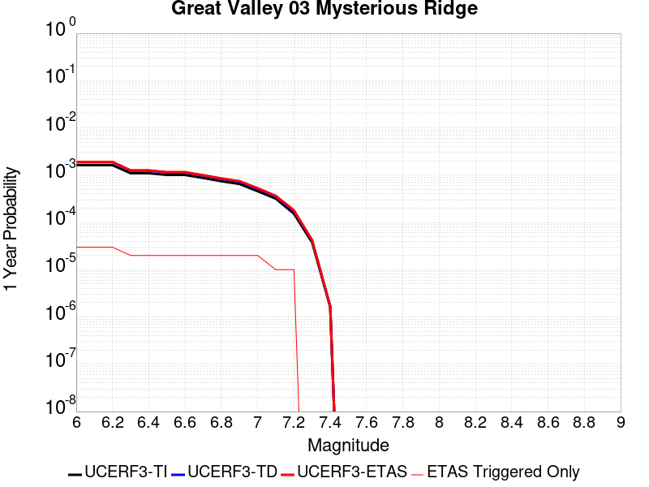 |  |

| Magnitude | 1 wk TI Prob | 1 wk TD Prob | 1 wk ETAS Prob | 1 wk ETAS/TD Gain | 1 wk ETAS Triggered Only | 1 mo TI Prob | 1 mo TD Prob | 1 mo ETAS Prob | 1 mo ETAS/TD Gain | 1 mo ETAS Triggered Only | 1 yr TI Prob | 1 yr TD Prob | 1 yr ETAS Prob | 1 yr ETAS/TD Gain | 1 yr ETAS Triggered Only | 10 yr TI Prob | 10 yr TD Prob | 10 yr ETAS Prob | 10 yr ETAS/TD Gain | 10 yr ETAS Triggered Only |
|-----|-----|-----|-----|-----|-----|-----|-----|-----|-----|-----|-----|-----|-----|-----|-----|-----|-----|-----|-----|-----|
| 6.0 | 3.1182444E-5 | 3.6034133E-5 | 3.6034133E-5 | 1.0 | 0.0 | 1.336322E-4 | 1.5442389E-4 | 1.6442235E-4 | 1.0647469 | 1.0E-5 | 0.0016257578 | 0.0018786751 | 0.0019086187 | 1.0159388 | 3.0E-5 | 0.016139153 | 0.018646672 | 0.018685926 | 1.0021051 | 4.0E-5 |
| 6.1 | 3.1182444E-5 | 3.6034133E-5 | 3.6034133E-5 | 1.0 | 0.0 | 1.336322E-4 | 1.5442389E-4 | 1.6442235E-4 | 1.0647469 | 1.0E-5 | 0.0016257578 | 0.0018786751 | 0.0019086187 | 1.0159388 | 3.0E-5 | 0.016139153 | 0.018646672 | 0.018685926 | 1.0021051 | 4.0E-5 |
| 6.2 | 3.1182444E-5 | 3.6034133E-5 | 3.6034133E-5 | 1.0 | 0.0 | 1.336322E-4 | 1.5442389E-4 | 1.6442235E-4 | 1.0647469 | 1.0E-5 | 0.0016257578 | 0.0018786751 | 0.0019086187 | 1.0159388 | 3.0E-5 | 0.016139153 | 0.018646672 | 0.018685926 | 1.0021051 | 4.0E-5 |
| 6.3 | 2.106934E-5 | 2.3850303E-5 | 2.3850303E-5 | 1.0 | 0.0 | 9.0294045E-5 | 1.0221176E-4 | 1.12210735E-4 | 1.0978261 | 1.0E-5 | 0.0010987755 | 0.0012437488 | 0.0012637239 | 1.0160605 | 2.0E-5 | 0.010933585 | 0.0123711275 | 0.01239088 | 1.0015967 | 2.0E-5 |
| 6.4 | 2.106934E-5 | 2.3850303E-5 | 2.3850303E-5 | 1.0 | 0.0 | 9.0294045E-5 | 1.0221176E-4 | 1.12210735E-4 | 1.0978261 | 1.0E-5 | 0.0010987755 | 0.0012437488 | 0.0012637239 | 1.0160605 | 2.0E-5 | 0.010933585 | 0.0123711275 | 0.01239088 | 1.0015967 | 2.0E-5 |
| 6.5 | 1.9389783E-5 | 2.1884982E-5 | 2.1884982E-5 | 1.0 | 0.0 | 8.309642E-5 | 9.378956E-5 | 1.03788625E-4 | 1.1066117 | 1.0E-5 | 0.0010112294 | 0.0011413175 | 0.0011612946 | 1.0175036 | 2.0E-5 | 0.010066401 | 0.011357434 | 0.011377207 | 1.0017409 | 2.0E-5 |
| 6.6 | 1.9370193E-5 | 2.1864902E-5 | 2.1864902E-5 | 1.0 | 0.0 | 8.301247E-5 | 9.3703515E-5 | 1.0370258E-4 | 1.1067096 | 1.0E-5 | 0.0010102082 | 0.001140271 | 0.0011602482 | 1.0175197 | 2.0E-5 | 0.010056281 | 0.011347076 | 0.011366849 | 1.0017426 | 2.0E-5 |
| 6.7 | 1.6723505E-5 | 1.8799281E-5 | 1.8799281E-5 | 1.0 | 0.0 | 7.16702E-5 | 8.056597E-5 | 9.056517E-5 | 1.1241119 | 1.0E-5 | 8.722353E-4 | 9.804688E-4 | 0.0010004492 | 1.0203784 | 2.0E-5 | 0.008688197 | 0.009763439 | 0.009783244 | 1.0020285 | 2.0E-5 |
| 6.8 | 1.426937E-5 | 1.599721E-5 | 1.599721E-5 | 1.0 | 0.0 | 6.115301E-5 | 6.855775E-5 | 7.855707E-5 | 1.1458524 | 1.0E-5 | 7.4428355E-4 | 8.343854E-4 | 8.543687E-4 | 1.0239497 | 2.0E-5 | 0.007417957 | 0.008314005 | 0.008333839 | 1.0023856 | 2.0E-5 |
| 6.9 | 1.2469891E-5 | 1.3956928E-5 | 1.3956928E-5 | 1.0 | 0.0 | 5.3441294E-5 | 5.9814105E-5 | 6.9813505E-5 | 1.1671747 | 1.0E-5 | 6.504535E-4 | 7.280055E-4 | 7.479909E-4 | 1.0274523 | 2.0E-5 | 0.006485529 | 0.00725743 | 0.0072772847 | 1.0027359 | 2.0E-5 |
| 7.0 | 8.7746275E-6 | 9.791734E-6 | 9.791734E-6 | 1.0 | 0.0 | 3.7605005E-5 | 4.196394E-5 | 5.1963518E-5 | 1.2382898 | 1.0E-5 | 4.5774475E-4 | 5.1079853E-4 | 5.307883E-4 | 1.0391344 | 2.0E-5 | 0.00456803 | 0.005096977 | 0.0051168753 | 1.0039039 | 2.0E-5 |
| 7.1 | 6.1067153E-6 | 6.813725E-6 | 6.813725E-6 | 1.0 | 0.0 | 2.6171374E-5 | 2.9201385E-5 | 2.9201385E-5 | 1.0 | 0.0 | 3.1858988E-4 | 3.5547445E-4 | 3.6547089E-4 | 1.0281215 | 1.0E-5 | 0.0031813353 | 0.003549609 | 0.0035595736 | 1.0028073 | 1.0E-5 |
| 7.2 | 2.939283E-6 | 3.2741057E-6 | 3.2741057E-6 | 1.0 | 0.0 | 1.2596866E-5 | 1.4031816E-5 | 1.4031816E-5 | 1.0 | 0.0 | 1.5335606E-4 | 1.7082572E-4 | 1.80824E-4 | 1.0585291 | 1.0E-5 | 0.0015325027 | 0.001707116 | 0.001717099 | 1.0058478 | 1.0E-5 |
| 7.3 | 7.2387763E-7 | 8.008505E-7 | 8.008505E-7 | 1.0 | 0.0 | 3.102329E-6 | 3.4322145E-6 | 3.4322145E-6 | 1.0 | 0.0 | 3.77702E-5 | 4.178687E-5 | 4.178687E-5 | 1.0 | 0.0 | 3.7763783E-4 | 4.1783508E-4 | 4.1783508E-4 | 1.0 | 0.0 |
| 7.4 | 3.112171E-8 | 3.2068368E-8 | 3.2068368E-8 | 1.0 | 0.0 | 1.3337875E-7 | 1.3743585E-7 | 1.3743585E-7 | 1.0 | 0.0 | 1.6238852E-6 | 1.6732803E-6 | 1.6732803E-6 | 1.0 | 0.0 | 1.6238733E-5 | 1.6732685E-5 | 1.6732685E-5 | 1.0 | 0.0 |

## San Pedro Basin
*[(top)](#table-of-contents)*

| 1 Week | 1 Month | 1 Year | 10 Year |
|-----|-----|-----|-----|
|  |  |  | 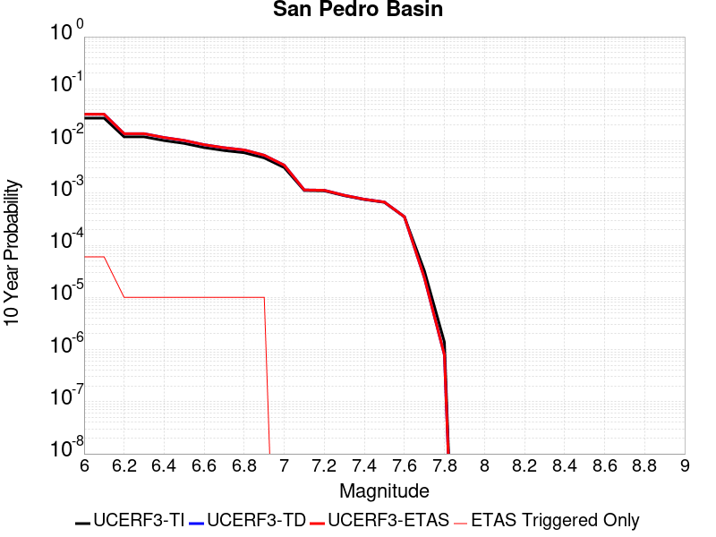 |

| Magnitude | 1 wk TI Prob | 1 wk TD Prob | 1 wk ETAS Prob | 1 wk ETAS/TD Gain | 1 wk ETAS Triggered Only | 1 mo TI Prob | 1 mo TD Prob | 1 mo ETAS Prob | 1 mo ETAS/TD Gain | 1 mo ETAS Triggered Only | 1 yr TI Prob | 1 yr TD Prob | 1 yr ETAS Prob | 1 yr ETAS/TD Gain | 1 yr ETAS Triggered Only | 10 yr TI Prob | 10 yr TD Prob | 10 yr ETAS Prob | 10 yr ETAS/TD Gain | 10 yr ETAS Triggered Only |
|-----|-----|-----|-----|-----|-----|-----|-----|-----|-----|-----|-----|-----|-----|-----|-----|-----|-----|-----|-----|-----|
| 6.0 | 5.3449043E-5 | 6.337018E-5 | 9.336828E-5 | 1.4733788 | 3.0E-5 | 2.2904722E-4 | 2.7156167E-4 | 3.0155352E-4 | 1.1104422 | 3.0E-5 | 0.0027850836 | 0.0033018515 | 0.0033317523 | 1.0090559 | 3.0E-5 | 0.027504366 | 0.03258948 | 0.032647528 | 1.0017811 | 6.0E-5 |
| 6.1 | 5.3449043E-5 | 6.337018E-5 | 9.336828E-5 | 1.4733788 | 3.0E-5 | 2.2904722E-4 | 2.7156167E-4 | 3.0155352E-4 | 1.1104422 | 3.0E-5 | 0.0027850836 | 0.0033018515 | 0.0033317523 | 1.0090559 | 3.0E-5 | 0.027504366 | 0.03258948 | 0.032647528 | 1.0017811 | 6.0E-5 |
| 6.2 | 2.3189454E-5 | 2.6642829E-5 | 3.6642563E-5 | 1.3753256 | 1.0E-5 | 9.9379584E-5 | 1.1417881E-4 | 1.2417766E-4 | 1.087572 | 1.0E-5 | 0.0012092749 | 0.0013892875 | 0.0013992736 | 1.007188 | 1.0E-5 | 0.012027155 | 0.01381089 | 0.013820752 | 1.0007141 | 1.0E-5 |
| 6.3 | 2.3189454E-5 | 2.6642829E-5 | 3.6642563E-5 | 1.3753256 | 1.0E-5 | 9.9379584E-5 | 1.1417881E-4 | 1.2417766E-4 | 1.087572 | 1.0E-5 | 0.0012092749 | 0.0013892875 | 0.0013992736 | 1.007188 | 1.0E-5 | 0.012027155 | 0.01381089 | 0.013820752 | 1.0007141 | 1.0E-5 |
| 6.4 | 1.966056E-5 | 2.246342E-5 | 3.2463195E-5 | 1.4451581 | 1.0E-5 | 8.425682E-5 | 9.626848E-5 | 1.06267515E-4 | 1.1038662 | 1.0E-5 | 0.001025344 | 0.0011714787 | 0.001181467 | 1.0085262 | 1.0E-5 | 0.010206259 | 0.011657119 | 0.011667003 | 1.0008478 | 1.0E-5 |
| 6.5 | 1.7342953E-5 | 1.9745152E-5 | 2.9744955E-5 | 1.5064434 | 1.0E-5 | 7.4324824E-5 | 8.461954E-5 | 9.46187E-5 | 1.118166 | 1.0E-5 | 9.04529E-4 | 0.0010297929 | 0.0010397827 | 1.0097007 | 1.0E-5 | 0.009008561 | 0.010253932 | 0.01026383 | 1.0009652 | 1.0E-5 |
| 6.6 | 1.439804E-5 | 1.6322716E-5 | 2.6322554E-5 | 1.6126331 | 1.0E-5 | 6.170443E-5 | 6.99528E-5 | 7.995211E-5 | 1.1429435 | 1.0E-5 | 7.509924E-4 | 8.513747E-4 | 8.613662E-4 | 1.0117357 | 1.0E-5 | 0.0074845953 | 0.008484333 | 0.008494249 | 1.0011686 | 1.0E-5 |
| 6.7 | 1.2634884E-5 | 1.4285298E-5 | 2.4285155E-5 | 1.7000104 | 1.0E-5 | 5.414838E-5 | 6.122144E-5 | 7.122083E-5 | 1.1633315 | 1.0E-5 | 6.590571E-4 | 7.451466E-4 | 7.5513916E-4 | 1.0134102 | 1.0E-5 | 0.006571059 | 0.007429502 | 0.0074394275 | 1.001336 | 1.0E-5 |
| 6.8 | 1.146091E-5 | 1.2933193E-5 | 2.2933064E-5 | 1.7731943 | 1.0E-5 | 4.911726E-5 | 5.542696E-5 | 6.542641E-5 | 1.1804076 | 1.0E-5 | 5.9783855E-4 | 6.74644E-4 | 6.846373E-4 | 1.0148126 | 1.0E-5 | 0.0059623276 | 0.0067288997 | 0.006738832 | 1.0014762 | 1.0E-5 |
| 6.9 | 9.109035E-6 | 1.0235013E-5 | 2.0234911E-5 | 1.9770284 | 1.0E-5 | 3.9038136E-5 | 4.386376E-5 | 5.386332E-5 | 1.2279686 | 1.0E-5 | 4.7518566E-4 | 5.339384E-4 | 5.4393307E-4 | 1.0187187 | 1.0E-5 | 0.0047417083 | 0.0053293095 | 0.005339256 | 1.0018665 | 1.0E-5 |
| 7.0 | 5.9351028E-6 | 6.583965E-6 | 6.583965E-6 | 1.0 | 0.0 | 2.5435906E-5 | 2.821682E-5 | 2.821682E-5 | 1.0 | 0.0 | 3.0963816E-4 | 3.4350925E-4 | 3.4350925E-4 | 1.0 | 0.0 | 0.0030920706 | 0.0034320997 | 0.0034320997 | 1.0 | 0.0 |
| 7.1 | 2.1557585E-6 | 2.2096492E-6 | 2.2096492E-6 | 1.0 | 0.0 | 9.238933E-6 | 9.469892E-6 | 9.469892E-6 | 1.0 | 0.0 | 1.1247819E-4 | 1.15289986E-4 | 1.15289986E-4 | 1.0 | 0.0 | 0.0011242128 | 0.0011523172 | 0.0011523172 | 1.0 | 0.0 |
| 7.2 | 2.1251979E-6 | 2.1779954E-6 | 2.1779954E-6 | 1.0 | 0.0 | 9.107958E-6 | 9.334234E-6 | 9.334234E-6 | 1.0 | 0.0 | 1.1088375E-4 | 1.13638525E-4 | 1.13638525E-4 | 1.0 | 0.0 | 0.0011082845 | 0.0011358195 | 0.0011358195 | 1.0 | 0.0 |
| 7.3 | 1.7145798E-6 | 1.7442885E-6 | 1.7442885E-6 | 1.0 | 0.0 | 7.3481783E-6 | 7.475501E-6 | 7.475501E-6 | 1.0 | 0.0 | 8.94604E-5 | 9.1010515E-5 | 9.1010515E-5 | 1.0 | 0.0 | 8.9424395E-4 | 9.0974156E-4 | 9.0974156E-4 | 1.0 | 0.0 |
| 7.4 | 1.4467993E-6 | 1.4641878E-6 | 1.4641878E-6 | 1.0 | 0.0 | 6.200554E-6 | 6.275076E-6 | 6.275076E-6 | 1.0 | 0.0 | 7.548913E-5 | 7.639644E-5 | 7.639644E-5 | 1.0 | 0.0 | 7.546349E-4 | 7.6370913E-4 | 7.6370913E-4 | 1.0 | 0.0 |
| 7.5 | 1.2803735E-6 | 1.2931506E-6 | 1.2931506E-6 | 1.0 | 0.0 | 5.487303E-6 | 5.5420624E-6 | 5.5420624E-6 | 1.0 | 0.0 | 6.680587E-5 | 6.747259E-5 | 6.747259E-5 | 1.0 | 0.0 | 6.678579E-4 | 6.745281E-4 | 6.745281E-4 | 1.0 | 0.0 |
| 7.6 | 6.755009E-7 | 6.76947E-7 | 6.76947E-7 | 1.0 | 0.0 | 2.8950008E-6 | 2.9011985E-6 | 2.9011985E-6 | 1.0 | 0.0 | 3.5246063E-5 | 3.532158E-5 | 3.532158E-5 | 1.0 | 0.0 | 3.5240475E-4 | 3.5316538E-4 | 3.5316538E-4 | 1.0 | 0.0 |
| 7.7 | 6.211885E-8 | 4.5699714E-8 | 4.5699714E-8 | 1.0 | 0.0 | 2.6622362E-7 | 1.9585592E-7 | 1.9585592E-7 | 1.0 | 0.0 | 3.2412677E-6 | 2.3845432E-6 | 2.3845432E-6 | 1.0 | 0.0 | 3.2412205E-5 | 2.3845198E-5 | 2.3845198E-5 | 1.0 | 0.0 |
| 7.8 | 2.6580573E-9 | 1.5138054E-9 | 1.5138054E-9 | 1.0 | 0.0 | 1.1391674E-8 | 6.4877375E-9 | 6.4877375E-9 | 1.0 | 0.0 | 1.3869362E-7 | 7.89882E-8 | 7.89882E-8 | 1.0 | 0.0 | 1.3869354E-6 | 7.89882E-7 | 7.89882E-7 | 1.0 | 0.0 |

## Johnson Valley (No) 2011 rev
*[(top)](#table-of-contents)*

| 1 Week | 1 Month | 1 Year | 10 Year |
|-----|-----|-----|-----|
|  |  |  | 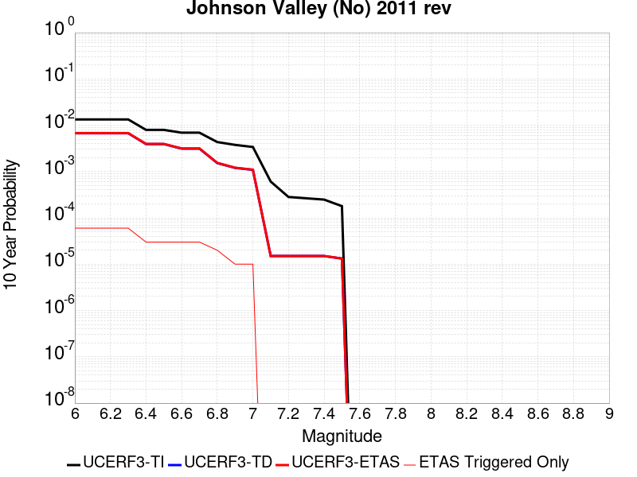 |

| Magnitude | 1 wk TI Prob | 1 wk TD Prob | 1 wk ETAS Prob | 1 wk ETAS/TD Gain | 1 wk ETAS Triggered Only | 1 mo TI Prob | 1 mo TD Prob | 1 mo ETAS Prob | 1 mo ETAS/TD Gain | 1 mo ETAS Triggered Only | 1 yr TI Prob | 1 yr TD Prob | 1 yr ETAS Prob | 1 yr ETAS/TD Gain | 1 yr ETAS Triggered Only | 10 yr TI Prob | 10 yr TD Prob | 10 yr ETAS Prob | 10 yr ETAS/TD Gain | 10 yr ETAS Triggered Only |
|-----|-----|-----|-----|-----|-----|-----|-----|-----|-----|-----|-----|-----|-----|-----|-----|-----|-----|-----|-----|-----|
| 6.0 | 2.577707E-5 | 1.2901208E-5 | 2.2901078E-5 | 1.7751112 | 1.0E-5 | 1.1046848E-4 | 5.528994E-5 | 7.528884E-5 | 1.3617095 | 2.0E-5 | 0.0013441239 | 6.729868E-4 | 7.129599E-4 | 1.0593965 | 4.0E-5 | 0.013360229 | 0.006713397 | 0.006772994 | 1.0088774 | 6.0E-5 |
| 6.1 | 2.577707E-5 | 1.2901208E-5 | 2.2901078E-5 | 1.7751112 | 1.0E-5 | 1.1046848E-4 | 5.528994E-5 | 7.528884E-5 | 1.3617095 | 2.0E-5 | 0.0013441239 | 6.729868E-4 | 7.129599E-4 | 1.0593965 | 4.0E-5 | 0.013360229 | 0.006713397 | 0.006772994 | 1.0088774 | 6.0E-5 |
| 6.2 | 2.577707E-5 | 1.2901208E-5 | 2.2901078E-5 | 1.7751112 | 1.0E-5 | 1.1046848E-4 | 5.528994E-5 | 7.528884E-5 | 1.3617095 | 2.0E-5 | 0.0013441239 | 6.729868E-4 | 7.129599E-4 | 1.0593965 | 4.0E-5 | 0.013360229 | 0.006713397 | 0.006772994 | 1.0088774 | 6.0E-5 |
| 6.3 | 2.577707E-5 | 1.2901208E-5 | 2.2901078E-5 | 1.7751112 | 1.0E-5 | 1.1046848E-4 | 5.528994E-5 | 7.528884E-5 | 1.3617095 | 2.0E-5 | 0.0013441239 | 6.729868E-4 | 7.129599E-4 | 1.0593965 | 4.0E-5 | 0.013360229 | 0.006713397 | 0.006772994 | 1.0088774 | 6.0E-5 |
| 6.4 | 1.5296591E-5 | 7.5369735E-6 | 7.5369735E-6 | 1.0 | 0.0 | 6.555518E-5 | 3.230102E-5 | 4.2300697E-5 | 1.3095777 | 1.0E-5 | 7.97842E-4 | 3.9321271E-4 | 4.1320483E-4 | 1.050843 | 2.0E-5 | 0.007949836 | 0.003927011 | 0.0039568935 | 1.0076094 | 3.0E-5 |
| 6.5 | 1.5296591E-5 | 7.5369735E-6 | 7.5369735E-6 | 1.0 | 0.0 | 6.555518E-5 | 3.230102E-5 | 4.2300697E-5 | 1.3095777 | 1.0E-5 | 7.97842E-4 | 3.9321271E-4 | 4.1320483E-4 | 1.050843 | 2.0E-5 | 0.007949836 | 0.003927011 | 0.0039568935 | 1.0076094 | 3.0E-5 |
| 6.6 | 1.3289383E-5 | 5.9919316E-6 | 5.9919316E-6 | 1.0 | 0.0 | 5.6953253E-5 | 2.567955E-5 | 3.567929E-5 | 1.3894049 | 1.0E-5 | 6.9318525E-4 | 3.1262063E-4 | 3.3261438E-4 | 1.0639553 | 2.0E-5 | 0.0069102696 | 0.0031234731 | 0.0031533793 | 1.0095747 | 3.0E-5 |
| 6.7 | 1.3289383E-5 | 5.9919316E-6 | 5.9919316E-6 | 1.0 | 0.0 | 5.6953253E-5 | 2.567955E-5 | 3.567929E-5 | 1.3894049 | 1.0E-5 | 6.9318525E-4 | 3.1262063E-4 | 3.3261438E-4 | 1.0639553 | 2.0E-5 | 0.0069102696 | 0.0031234731 | 0.0031533793 | 1.0095747 | 3.0E-5 |
| 6.8 | 8.330789E-6 | 2.9214577E-6 | 2.9214577E-6 | 1.0 | 0.0 | 3.570289E-5 | 1.2520505E-5 | 2.252038E-5 | 1.7986798 | 1.0E-5 | 4.34596E-4 | 1.524322E-4 | 1.7242915E-4 | 1.1311859 | 2.0E-5 | 0.0043374705 | 0.0015238364 | 0.0015438059 | 1.0131048 | 2.0E-5 |
| 6.9 | 7.2359003E-6 | 2.3014702E-6 | 2.3014702E-6 | 1.0 | 0.0 | 3.1010633E-5 | 9.863436E-6 | 9.863436E-6 | 1.0 | 0.0 | 3.7748902E-4 | 1.2008605E-4 | 1.3008485E-4 | 1.0832636 | 1.0E-5 | 0.0037684843 | 0.0012007345 | 0.0012107225 | 1.0083182 | 1.0E-5 |
| 7.0 | 6.5149957E-6 | 2.0886398E-6 | 2.0886398E-6 | 1.0 | 0.0 | 2.792111E-5 | 8.951313E-6 | 8.951313E-6 | 1.0 | 0.0 | 3.398865E-4 | 1.0898209E-4 | 1.1898099E-4 | 1.0917482 | 1.0E-5 | 0.003393671 | 0.0010898062 | 0.0010997953 | 1.009166 | 1.0E-5 |
| 7.1 | 1.1662233E-6 | 2.8793124E-8 | 2.8793124E-8 | 1.0 | 0.0 | 4.9980904E-6 | 1.2339909E-7 | 1.2339909E-7 | 1.0 | 0.0 | 6.0850052E-5 | 1.5023832E-6 | 1.5023832E-6 | 1.0 | 0.0 | 6.083339E-4 | 1.5023746E-5 | 1.5023746E-5 | 1.0 | 0.0 |
| 7.2 | 5.413881E-7 | 2.8793124E-8 | 2.8793124E-8 | 1.0 | 0.0 | 2.3202326E-6 | 1.2339909E-7 | 1.2339909E-7 | 1.0 | 0.0 | 2.8248465E-5 | 1.5023832E-6 | 1.5023832E-6 | 1.0 | 0.0 | 2.8244875E-4 | 1.5023746E-5 | 1.5023746E-5 | 1.0 | 0.0 |
| 7.3 | 5.076821E-7 | 2.8793124E-8 | 2.8793124E-8 | 1.0 | 0.0 | 2.1757785E-6 | 1.2339909E-7 | 1.2339909E-7 | 1.0 | 0.0 | 2.648978E-5 | 1.5023832E-6 | 1.5023832E-6 | 1.0 | 0.0 | 2.6486625E-4 | 1.5023746E-5 | 1.5023746E-5 | 1.0 | 0.0 |
| 7.4 | 4.7568687E-7 | 2.8775073E-8 | 2.8775073E-8 | 1.0 | 0.0 | 2.0386565E-6 | 1.2332174E-7 | 1.2332174E-7 | 1.0 | 0.0 | 2.482036E-5 | 1.5014413E-6 | 1.5014413E-6 | 1.0 | 0.0 | 2.4817587E-4 | 1.5014328E-5 | 1.5014328E-5 | 1.0 | 0.0 |
| 7.5 | 3.435626E-7 | 2.5350424E-8 | 2.5350424E-8 | 1.0 | 0.0 | 1.4724103E-6 | 1.0864467E-7 | 1.0864467E-7 | 1.0 | 0.0 | 1.7926448E-5 | 1.3227482E-6 | 1.3227482E-6 | 1.0 | 0.0 | 1.7925001E-4 | 1.3227419E-5 | 1.3227419E-5 | 1.0 | 0.0 |

## Hosgri
*[(top)](#table-of-contents)*

| 1 Week | 1 Month | 1 Year | 10 Year |
|-----|-----|-----|-----|
|  |  |  | 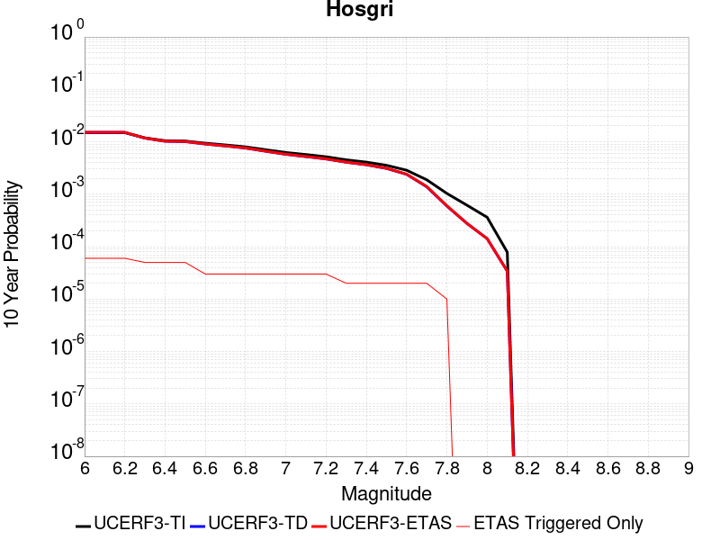 |

| Magnitude | 1 wk TI Prob | 1 wk TD Prob | 1 wk ETAS Prob | 1 wk ETAS/TD Gain | 1 wk ETAS Triggered Only | 1 mo TI Prob | 1 mo TD Prob | 1 mo ETAS Prob | 1 mo ETAS/TD Gain | 1 mo ETAS Triggered Only | 1 yr TI Prob | 1 yr TD Prob | 1 yr ETAS Prob | 1 yr ETAS/TD Gain | 1 yr ETAS Triggered Only | 10 yr TI Prob | 10 yr TD Prob | 10 yr ETAS Prob | 10 yr ETAS/TD Gain | 10 yr ETAS Triggered Only |
|-----|-----|-----|-----|-----|-----|-----|-----|-----|-----|-----|-----|-----|-----|-----|-----|-----|-----|-----|-----|-----|
| 6.0 | 2.883978E-5 | 2.9128403E-5 | 6.9127236E-5 | 2.3731902 | 4.0E-5 | 1.235932E-4 | 1.248302E-4 | 1.7482394E-4 | 1.4004941 | 5.0E-5 | 0.0015037085 | 0.0015187752 | 0.0015786842 | 1.0394455 | 6.0E-5 | 0.01493574 | 0.01508773 | 0.0151468245 | 1.0039167 | 6.0E-5 |
| 6.1 | 2.883978E-5 | 2.9128403E-5 | 6.9127236E-5 | 2.3731902 | 4.0E-5 | 1.235932E-4 | 1.248302E-4 | 1.7482394E-4 | 1.4004941 | 5.0E-5 | 0.0015037085 | 0.0015187752 | 0.0015786842 | 1.0394455 | 6.0E-5 | 0.01493574 | 0.01508773 | 0.0151468245 | 1.0039167 | 6.0E-5 |
| 6.2 | 2.883978E-5 | 2.9128403E-5 | 6.9127236E-5 | 2.3731902 | 4.0E-5 | 1.235932E-4 | 1.248302E-4 | 1.7482394E-4 | 1.4004941 | 5.0E-5 | 0.0015037085 | 0.0015187752 | 0.0015786842 | 1.0394455 | 6.0E-5 | 0.01493574 | 0.01508773 | 0.0151468245 | 1.0039167 | 6.0E-5 |
| 6.3 | 2.2914428E-5 | 2.2641956E-5 | 6.264105E-5 | 2.7665918 | 4.0E-5 | 9.8200995E-5 | 9.703337E-5 | 1.4702852E-4 | 1.5152366 | 5.0E-5 | 0.0011949413 | 0.001180746 | 0.001230687 | 1.042296 | 5.0E-5 | 0.011885363 | 0.011746123 | 0.011795536 | 1.0042068 | 5.0E-5 |
| 6.4 | 2.0195741E-5 | 1.9696547E-5 | 5.9695758E-5 | 3.0307727 | 4.0E-5 | 8.65503E-5 | 8.4411055E-5 | 1.3440683E-4 | 1.5922894 | 5.0E-5 | 0.0010532405 | 0.001027222 | 0.0010771706 | 1.048625 | 5.0E-5 | 0.010482626 | 0.010225783 | 0.010275272 | 1.0048397 | 5.0E-5 |
| 6.5 | 1.9924333E-5 | 1.9408968E-5 | 5.940819E-5 | 3.060863 | 4.0E-5 | 8.53872E-5 | 8.317865E-5 | 1.3317449E-4 | 1.6010658 | 5.0E-5 | 0.0010390934 | 0.0010122315 | 0.0010621808 | 1.0493459 | 5.0E-5 | 0.010342481 | 0.010077244 | 0.01012674 | 1.0049117 | 5.0E-5 |
| 6.6 | 1.809694E-5 | 1.7458287E-5 | 3.745794E-5 | 2.1455677 | 2.0E-5 | 7.7556004E-5 | 7.4819094E-5 | 1.0481685E-4 | 1.4009372 | 3.0E-5 | 9.438353E-4 | 9.105431E-4 | 9.405157E-4 | 1.0329174 | 3.0E-5 | 0.009398366 | 0.009069063 | 0.009098791 | 1.0032779 | 3.0E-5 |
| 6.7 | 1.675989E-5 | 1.6042752E-5 | 3.604243E-5 | 2.246649 | 2.0E-5 | 7.182612E-5 | 6.8752845E-5 | 9.875078E-5 | 1.4363155 | 3.0E-5 | 8.7413215E-4 | 8.3674554E-4 | 8.6672045E-4 | 1.0358232 | 3.0E-5 | 0.008707017 | 0.008336853 | 0.008366603 | 1.0035685 | 3.0E-5 |
| 6.8 | 1.5401129E-5 | 1.4614069E-5 | 3.461378E-5 | 2.3685243 | 2.0E-5 | 6.6003166E-5 | 6.263023E-5 | 9.262835E-5 | 1.478972 | 3.0E-5 | 8.032922E-4 | 7.6225714E-4 | 7.9223426E-4 | 1.0393268 | 3.0E-5 | 0.008003947 | 0.0075972863 | 0.0076270583 | 1.0039188 | 3.0E-5 |
| 6.9 | 1.356559E-5 | 1.2689955E-5 | 3.2689702E-5 | 2.5760298 | 2.0E-5 | 5.8136946E-5 | 5.438439E-5 | 8.438276E-5 | 1.5515989 | 3.0E-5 | 7.0758746E-4 | 6.6192925E-4 | 6.9190934E-4 | 1.045292 | 3.0E-5 | 0.007053386 | 0.006600378 | 0.00663018 | 1.0045152 | 3.0E-5 |
| 7.0 | 1.2030819E-5 | 1.1095949E-5 | 3.1095726E-5 | 2.8024397 | 2.0E-5 | 5.155963E-5 | 4.75532E-5 | 7.755178E-5 | 1.6308423 | 3.0E-5 | 6.275577E-4 | 5.788065E-4 | 6.0878915E-4 | 1.0518008 | 3.0E-5 | 0.006257884 | 0.0057737473 | 0.0058035743 | 1.0051659 | 3.0E-5 |
| 7.1 | 1.0972698E-5 | 1.0022167E-5 | 3.0021967E-5 | 2.9955564 | 2.0E-5 | 4.7025E-5 | 4.2951437E-5 | 7.295015E-5 | 1.6984333 | 3.0E-5 | 5.72379E-4 | 5.2280835E-4 | 5.527927E-4 | 1.0573524 | 3.0E-5 | 0.0057090693 | 0.005216533 | 0.005246376 | 1.005721 | 3.0E-5 |
| 7.2 | 9.961926E-6 | 9.034732E-6 | 2.9034552E-5 | 3.2136593 | 2.0E-5 | 4.2693267E-5 | 3.8719707E-5 | 6.8718546E-5 | 1.7747692 | 3.0E-5 | 5.1966653E-4 | 4.7131052E-4 | 5.0129637E-4 | 1.0636224 | 3.0E-5 | 0.00518453 | 0.0047038523 | 0.0047337115 | 1.0063478 | 3.0E-5 |
| 7.3 | 8.700929E-6 | 7.828089E-6 | 2.7827933E-5 | 3.554882 | 2.0E-5 | 3.7289166E-5 | 3.354852E-5 | 5.354785E-5 | 1.5961314 | 2.0E-5 | 4.53901E-4 | 4.083767E-4 | 4.2836854E-4 | 1.0489544 | 2.0E-5 | 0.00452975 | 0.004076999 | 0.0040969173 | 1.0048856 | 2.0E-5 |
| 7.4 | 7.866285E-6 | 6.9987263E-6 | 2.6998587E-5 | 3.857643 | 2.0E-5 | 3.3712215E-5 | 2.9994197E-5 | 4.9993596E-5 | 1.6667757 | 2.0E-5 | 4.103689E-4 | 3.6511818E-4 | 3.8511088E-4 | 1.0547568 | 2.0E-5 | 0.004096119 | 0.0036459167 | 0.003665844 | 1.0054656 | 2.0E-5 |
| 7.5 | 6.8381305E-6 | 5.9596814E-6 | 2.5959562E-5 | 4.355864 | 2.0E-5 | 2.9305946E-5 | 2.5541241E-5 | 4.554073E-5 | 1.7830273 | 2.0E-5 | 3.5674145E-4 | 3.1092027E-4 | 3.3091404E-4 | 1.0643052 | 2.0E-5 | 0.0035616932 | 0.003105584 | 0.003125522 | 1.00642 | 2.0E-5 |
| 7.6 | 5.503376E-6 | 4.595227E-6 | 2.4595134E-5 | 5.352322 | 2.0E-5 | 2.3585684E-5 | 1.9693682E-5 | 3.969329E-5 | 2.0155342 | 2.0E-5 | 2.8711787E-4 | 2.397442E-4 | 2.597394E-4 | 1.0834023 | 2.0E-5 | 0.002867472 | 0.0023955852 | 0.0024155374 | 1.0083287 | 2.0E-5 |
| 7.7 | 3.6144982E-6 | 2.6521896E-6 | 2.2652137E-5 | 8.540919 | 2.0E-5 | 1.5490614E-5 | 1.1366477E-5 | 3.136625E-5 | 2.75954 | 2.0E-5 | 1.8858191E-4 | 1.3837808E-4 | 1.5837532E-4 | 1.1445116 | 2.0E-5 | 0.0018842196 | 0.001383647 | 0.0014036193 | 1.0144346 | 2.0E-5 |
| 7.8 | 1.9853494E-6 | 1.1360784E-6 | 1.1136067E-5 | 9.802199 | 1.0E-5 | 8.508612E-6 | 4.8688985E-6 | 1.486885E-5 | 3.0538428 | 1.0E-5 | 1.0358743E-4 | 5.9277223E-5 | 6.927663E-5 | 1.1686889 | 1.0E-5 | 0.0010353916 | 5.933389E-4 | 6.03333E-4 | 1.0168438 | 1.0E-5 |
| 7.9 | 1.1818757E-6 | 5.29477E-7 | 5.29477E-7 | 1.0 | 0.0 | 5.0651715E-6 | 2.269185E-6 | 2.269185E-6 | 1.0 | 0.0 | 6.1666724E-5 | 2.7626977E-5 | 2.7626977E-5 | 1.0 | 0.0 | 6.1649614E-4 | 2.7691363E-4 | 2.7691363E-4 | 1.0 | 0.0 |
| 8.0 | 6.962958E-7 | 2.71365E-7 | 2.71365E-7 | 1.0 | 0.0 | 2.9841215E-6 | 1.1629924E-6 | 1.1629924E-6 | 1.0 | 0.0 | 3.6331072E-5 | 1.415934E-5 | 1.415934E-5 | 1.0 | 0.0 | 3.6325134E-4 | 1.4215276E-4 | 1.4215276E-4 | 1.0 | 0.0 |
| 8.1 | 1.5033264E-7 | 6.52693E-8 | 6.52693E-8 | 1.0 | 0.0 | 6.442826E-7 | 2.7972553E-7 | 2.7972553E-7 | 1.0 | 0.0 | 7.844113E-6 | 3.4056532E-6 | 3.4056532E-6 | 1.0 | 0.0 | 7.843835E-5 | 3.4072833E-5 | 3.4072833E-5 | 1.0 | 0.0 |

## Los Alamos 2011 CFM
*[(top)](#table-of-contents)*

| 1 Week | 1 Month | 1 Year | 10 Year |
|-----|-----|-----|-----|
|  |  |  |  |

| Magnitude | 1 wk TI Prob | 1 wk TD Prob | 1 wk ETAS Prob | 1 wk ETAS/TD Gain | 1 wk ETAS Triggered Only | 1 mo TI Prob | 1 mo TD Prob | 1 mo ETAS Prob | 1 mo ETAS/TD Gain | 1 mo ETAS Triggered Only | 1 yr TI Prob | 1 yr TD Prob | 1 yr ETAS Prob | 1 yr ETAS/TD Gain | 1 yr ETAS Triggered Only | 10 yr TI Prob | 10 yr TD Prob | 10 yr ETAS Prob | 10 yr ETAS/TD Gain | 10 yr ETAS Triggered Only |
|-----|-----|-----|-----|-----|-----|-----|-----|-----|-----|-----|-----|-----|-----|-----|-----|-----|-----|-----|-----|-----|
| 6.0 | 4.6284417E-6 | 4.7517333E-6 | 2.4751638E-5 | 5.2089705 | 2.0E-5 | 1.9836029E-5 | 2.0364423E-5 | 4.0364015E-5 | 1.982085 | 2.0E-5 | 2.4147688E-4 | 2.479104E-4 | 2.8790048E-4 | 1.1613086 | 4.0E-5 | 0.0024121467 | 0.0024765125 | 0.002536364 | 1.0241677 | 6.0E-5 |
| 6.1 | 4.6284417E-6 | 4.7517333E-6 | 2.4751638E-5 | 5.2089705 | 2.0E-5 | 1.9836029E-5 | 2.0364423E-5 | 4.0364015E-5 | 1.982085 | 2.0E-5 | 2.4147688E-4 | 2.479104E-4 | 2.8790048E-4 | 1.1613086 | 4.0E-5 | 0.0024121467 | 0.0024765125 | 0.002536364 | 1.0241677 | 6.0E-5 |
| 6.2 | 4.6284417E-6 | 4.7517333E-6 | 2.4751638E-5 | 5.2089705 | 2.0E-5 | 1.9836029E-5 | 2.0364423E-5 | 4.0364015E-5 | 1.982085 | 2.0E-5 | 2.4147688E-4 | 2.479104E-4 | 2.8790048E-4 | 1.1613086 | 4.0E-5 | 0.0024121467 | 0.0024765125 | 0.002536364 | 1.0241677 | 6.0E-5 |
| 6.3 | 4.6284417E-6 | 4.7517333E-6 | 2.4751638E-5 | 5.2089705 | 2.0E-5 | 1.9836029E-5 | 2.0364423E-5 | 4.0364015E-5 | 1.982085 | 2.0E-5 | 2.4147688E-4 | 2.479104E-4 | 2.8790048E-4 | 1.1613086 | 4.0E-5 | 0.0024121467 | 0.0024765125 | 0.002536364 | 1.0241677 | 6.0E-5 |
| 6.4 | 4.6284417E-6 | 4.7517333E-6 | 2.4751638E-5 | 5.2089705 | 2.0E-5 | 1.9836029E-5 | 2.0364423E-5 | 4.0364015E-5 | 1.982085 | 2.0E-5 | 2.4147688E-4 | 2.479104E-4 | 2.8790048E-4 | 1.1613086 | 4.0E-5 | 0.0024121467 | 0.0024765125 | 0.002536364 | 1.0241677 | 6.0E-5 |
| 6.5 | 4.6284417E-6 | 4.7517333E-6 | 2.4751638E-5 | 5.2089705 | 2.0E-5 | 1.9836029E-5 | 2.0364423E-5 | 4.0364015E-5 | 1.982085 | 2.0E-5 | 2.4147688E-4 | 2.479104E-4 | 2.8790048E-4 | 1.1613086 | 4.0E-5 | 0.0024121467 | 0.0024765125 | 0.002536364 | 1.0241677 | 6.0E-5 |
| 6.6 | 4.6284417E-6 | 4.7517333E-6 | 2.4751638E-5 | 5.2089705 | 2.0E-5 | 1.9836029E-5 | 2.0364423E-5 | 4.0364015E-5 | 1.982085 | 2.0E-5 | 2.4147688E-4 | 2.479104E-4 | 2.8790048E-4 | 1.1613086 | 4.0E-5 | 0.0024121467 | 0.0024765125 | 0.002536364 | 1.0241677 | 6.0E-5 |
| 6.7 | 4.062321E-6 | 4.166351E-6 | 2.4166267E-5 | 5.8003435 | 2.0E-5 | 1.7409831E-5 | 1.7855677E-5 | 3.785532E-5 | 2.120072 | 2.0E-5 | 2.1194408E-4 | 2.1737268E-4 | 2.5736398E-4 | 1.1839758 | 4.0E-5 | 0.0021174205 | 0.0021717504 | 0.00223162 | 1.0275675 | 6.0E-5 |
| 6.8 | 4.062321E-6 | 4.166351E-6 | 2.4166267E-5 | 5.8003435 | 2.0E-5 | 1.7409831E-5 | 1.7855677E-5 | 3.785532E-5 | 2.120072 | 2.0E-5 | 2.1194408E-4 | 2.1737268E-4 | 2.5736398E-4 | 1.1839758 | 4.0E-5 | 0.0021174205 | 0.0021717504 | 0.00223162 | 1.0275675 | 6.0E-5 |
| 6.9 | 3.2936077E-6 | 3.37296E-6 | 2.3372893E-5 | 6.92949 | 2.0E-5 | 1.4115385E-5 | 1.4455468E-5 | 3.445518E-5 | 2.3835394 | 2.0E-5 | 1.7184127E-4 | 1.7598206E-4 | 2.1597501E-4 | 1.227256 | 4.0E-5 | 0.0017170844 | 0.0017585196 | 0.0018184141 | 1.0340596 | 6.0E-5 |
| 7.0 | 3.1687898E-6 | 3.2448177E-6 | 2.3244753E-5 | 7.1636543 | 2.0E-5 | 1.3580457E-5 | 1.3906293E-5 | 3.3906013E-5 | 2.4381778 | 2.0E-5 | 1.6532952E-4 | 1.692969E-4 | 2.0929011E-4 | 1.2362313 | 4.0E-5 | 0.0016520657 | 0.0016917707 | 0.0017516692 | 1.0354058 | 6.0E-5 |
| 7.1 | 2.9379228E-6 | 3.007328E-6 | 2.3007267E-5 | 7.650402 | 2.0E-5 | 1.25910365E-5 | 1.288849E-5 | 3.288823E-5 | 2.551752 | 2.0E-5 | 1.5328509E-4 | 1.5690697E-4 | 1.8690227E-4 | 1.191166 | 3.0E-5 | 0.001531794 | 0.001568051 | 0.0016179726 | 1.0318367 | 5.0E-5 |
| 7.2 | 2.0020686E-6 | 2.041632E-6 | 1.2041612E-5 | 5.898032 | 1.0E-5 | 8.580266E-6 | 8.749822E-6 | 1.8749735E-5 | 2.1428704 | 1.0E-5 | 1.0445973E-4 | 1.0652392E-4 | 1.1652285E-4 | 1.0938656 | 1.0E-5 | 0.0010441064 | 0.001064733 | 0.0010847118 | 1.018764 | 2.0E-5 |
| 7.3 | 1.7364243E-6 | 1.7678824E-6 | 1.1767865E-5 | 6.6564746 | 1.0E-5 | 7.441797E-6 | 7.576617E-6 | 1.7576542E-5 | 2.3198402 | 1.0E-5 | 9.0600115E-5 | 9.224144E-5 | 1.0224052E-4 | 1.1084012 | 1.0E-5 | 9.0563187E-4 | 9.2203467E-4 | 9.3202543E-4 | 1.0108355 | 1.0E-5 |
| 7.4 | 1.5718434E-6 | 1.5983198E-6 | 1.1598304E-5 | 7.25656 | 1.0E-5 | 6.7364545E-6 | 6.8499244E-6 | 1.6849855E-5 | 2.45986 | 1.0E-5 | 8.201325E-5 | 8.339467E-5 | 9.3393835E-5 | 1.1199018 | 1.0E-5 | 8.198299E-4 | 8.3363673E-4 | 8.4362837E-4 | 1.0119857 | 1.0E-5 |
| 7.5 | 1.3841119E-6 | 1.4042814E-6 | 1.1404268E-5 | 8.12107 | 1.0E-5 | 5.9318945E-6 | 6.018335E-6 | 1.6018275E-5 | 2.6615791 | 1.0E-5 | 7.221842E-5 | 7.327079E-5 | 8.327006E-5 | 1.1364701 | 1.0E-5 | 7.2194956E-4 | 7.3246926E-4 | 7.4246194E-4 | 1.0136424 | 1.0E-5 |
| 7.6 | 1.0843726E-6 | 1.0934443E-6 | 1.1093433E-5 | 10.145404 | 1.0E-5 | 4.647303E-6 | 4.6861815E-6 | 1.4686135E-5 | 3.1339235 | 1.0E-5 | 5.6579443E-5 | 5.705279E-5 | 6.705222E-5 | 1.1752663 | 1.0E-5 | 5.656504E-4 | 5.70384E-4 | 5.8037834E-4 | 1.0175221 | 1.0E-5 |
| 7.7 | 5.544814E-7 | 5.501884E-7 | 1.0550183E-5 | 19.175581 | 1.0E-5 | 2.3763469E-6 | 2.3579482E-6 | 1.2357925E-5 | 5.2409654 | 1.0E-5 | 2.8931638E-5 | 2.8707644E-5 | 3.8707356E-5 | 1.3483293 | 1.0E-5 | 2.8927872E-4 | 2.870395E-4 | 2.9703663E-4 | 1.0348284 | 1.0E-5 |
| 7.8 | 2.0707465E-7 | 1.9778598E-7 | 1.9778598E-7 | 1.0 | 0.0 | 8.874625E-7 | 8.476539E-7 | 8.476539E-7 | 1.0 | 0.0 | 1.08048025E-5 | 1.0320137E-5 | 1.0320137E-5 | 1.0 | 0.0 | 1.0804277E-4 | 1.0319663E-4 | 1.0319663E-4 | 1.0 | 0.0 |
| 7.9 | 3.9821284E-8 | 3.4331528E-8 | 3.4331528E-8 | 1.0 | 0.0 | 1.7066264E-7 | 1.4713511E-7 | 1.4713511E-7 | 1.0 | 0.0 | 2.0778157E-6 | 1.7913685E-6 | 1.7913685E-6 | 1.0 | 0.0 | 2.0777963E-5 | 1.7913546E-5 | 1.7913546E-5 | 1.0 | 0.0 |
| 8.0 | 7.880441E-11 | 8.2353124E-11 | 8.2353124E-11 | 1.0 | 0.0 | 3.3773329E-10 | 3.52942E-10 | 3.52942E-10 | 1.0 | 0.0 | 4.1119033E-9 | 4.2970694E-9 | 4.2970694E-9 | 1.0 | 0.0 | 4.1119034E-8 | 4.2970694E-8 | 4.2970694E-8 | 1.0 | 0.0 |

## San Cayetano
*[(top)](#table-of-contents)*

| 1 Week | 1 Month | 1 Year | 10 Year |
|-----|-----|-----|-----|
|  | 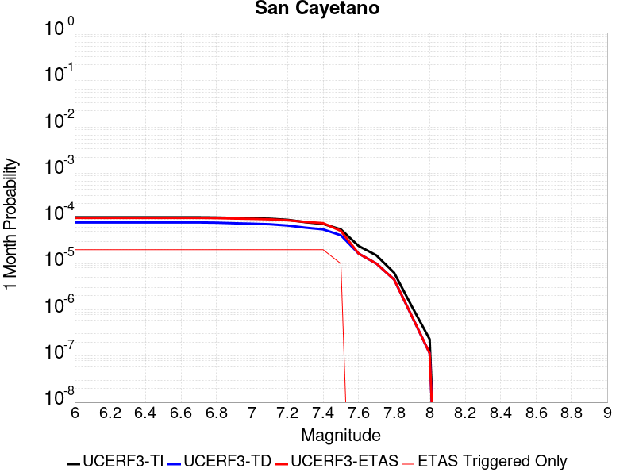 | 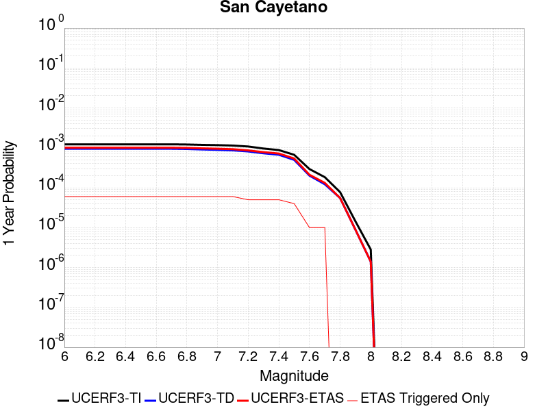 |  |

| Magnitude | 1 wk TI Prob | 1 wk TD Prob | 1 wk ETAS Prob | 1 wk ETAS/TD Gain | 1 wk ETAS Triggered Only | 1 mo TI Prob | 1 mo TD Prob | 1 mo ETAS Prob | 1 mo ETAS/TD Gain | 1 mo ETAS Triggered Only | 1 yr TI Prob | 1 yr TD Prob | 1 yr ETAS Prob | 1 yr ETAS/TD Gain | 1 yr ETAS Triggered Only | 10 yr TI Prob | 10 yr TD Prob | 10 yr ETAS Prob | 10 yr ETAS/TD Gain | 10 yr ETAS Triggered Only |
|-----|-----|-----|-----|-----|-----|-----|-----|-----|-----|-----|-----|-----|-----|-----|-----|-----|-----|-----|-----|-----|
| 6.0 | 2.3476267E-5 | 1.8169216E-5 | 3.816885E-5 | 2.100743 | 2.0E-5 | 1.0060869E-4 | 7.786576E-5 | 9.7864206E-5 | 1.2568322 | 2.0E-5 | 0.0012242225 | 9.4760704E-4 | 0.0010075502 | 1.0632573 | 6.0E-5 | 0.012175002 | 0.00943675 | 0.009496184 | 1.0062981 | 6.0E-5 |
| 6.1 | 2.3476267E-5 | 1.8169216E-5 | 3.816885E-5 | 2.100743 | 2.0E-5 | 1.0060869E-4 | 7.786576E-5 | 9.7864206E-5 | 1.2568322 | 2.0E-5 | 0.0012242225 | 9.4760704E-4 | 0.0010075502 | 1.0632573 | 6.0E-5 | 0.012175002 | 0.00943675 | 0.009496184 | 1.0062981 | 6.0E-5 |
| 6.2 | 2.3476267E-5 | 1.8169216E-5 | 3.816885E-5 | 2.100743 | 2.0E-5 | 1.0060869E-4 | 7.786576E-5 | 9.7864206E-5 | 1.2568322 | 2.0E-5 | 0.0012242225 | 9.4760704E-4 | 0.0010075502 | 1.0632573 | 6.0E-5 | 0.012175002 | 0.00943675 | 0.009496184 | 1.0062981 | 6.0E-5 |
| 6.3 | 2.3476267E-5 | 1.8169216E-5 | 3.816885E-5 | 2.100743 | 2.0E-5 | 1.0060869E-4 | 7.786576E-5 | 9.7864206E-5 | 1.2568322 | 2.0E-5 | 0.0012242225 | 9.4760704E-4 | 0.0010075502 | 1.0632573 | 6.0E-5 | 0.012175002 | 0.00943675 | 0.009496184 | 1.0062981 | 6.0E-5 |
| 6.4 | 2.3476267E-5 | 1.8169216E-5 | 3.816885E-5 | 2.100743 | 2.0E-5 | 1.0060869E-4 | 7.786576E-5 | 9.7864206E-5 | 1.2568322 | 2.0E-5 | 0.0012242225 | 9.4760704E-4 | 0.0010075502 | 1.0632573 | 6.0E-5 | 0.012175002 | 0.00943675 | 0.009496184 | 1.0062981 | 6.0E-5 |
| 6.5 | 2.3476267E-5 | 1.8169216E-5 | 3.816885E-5 | 2.100743 | 2.0E-5 | 1.0060869E-4 | 7.786576E-5 | 9.7864206E-5 | 1.2568322 | 2.0E-5 | 0.0012242225 | 9.4760704E-4 | 0.0010075502 | 1.0632573 | 6.0E-5 | 0.012175002 | 0.00943675 | 0.009496184 | 1.0062981 | 6.0E-5 |
| 6.6 | 2.3476267E-5 | 1.8169216E-5 | 3.816885E-5 | 2.100743 | 2.0E-5 | 1.0060869E-4 | 7.786576E-5 | 9.7864206E-5 | 1.2568322 | 2.0E-5 | 0.0012242225 | 9.4760704E-4 | 0.0010075502 | 1.0632573 | 6.0E-5 | 0.012175002 | 0.00943675 | 0.009496184 | 1.0062981 | 6.0E-5 |
| 6.7 | 2.3476267E-5 | 1.8169216E-5 | 3.816885E-5 | 2.100743 | 2.0E-5 | 1.0060869E-4 | 7.786576E-5 | 9.7864206E-5 | 1.2568322 | 2.0E-5 | 0.0012242225 | 9.4760704E-4 | 0.0010075502 | 1.0632573 | 6.0E-5 | 0.012175002 | 0.00943675 | 0.009496184 | 1.0062981 | 6.0E-5 |
| 6.8 | 2.3241924E-5 | 1.7936945E-5 | 3.793659E-5 | 2.114997 | 2.0E-5 | 9.960445E-5 | 7.687038E-5 | 9.686885E-5 | 1.2601582 | 2.0E-5 | 0.0012120095 | 9.354987E-4 | 9.954425E-4 | 1.0640769 | 6.0E-5 | 0.012054204 | 0.0093166195 | 0.00937606 | 1.0063801 | 6.0E-5 |
| 6.9 | 2.2761007E-5 | 1.7432383E-5 | 3.7432037E-5 | 2.14727 | 2.0E-5 | 9.7543525E-5 | 7.47081E-5 | 9.47066E-5 | 1.2676886 | 2.0E-5 | 0.0011869454 | 9.09195E-4 | 9.6914044E-4 | 1.0659324 | 6.0E-5 | 0.011806256 | 0.009055741 | 0.009115198 | 1.0065657 | 6.0E-5 |
| 7.0 | 2.240283E-5 | 1.7066137E-5 | 3.7065794E-5 | 2.1718915 | 2.0E-5 | 9.600859E-5 | 7.313856E-5 | 9.3137096E-5 | 1.2734336 | 2.0E-5 | 0.0011682777 | 8.9010154E-4 | 9.5004815E-4 | 1.067348 | 6.0E-5 | 0.011621549 | 0.008866336 | 0.008925804 | 1.0067072 | 6.0E-5 |
| 7.1 | 2.1871154E-5 | 1.658602E-5 | 3.6585687E-5 | 2.2058148 | 2.0E-5 | 9.373015E-5 | 7.108103E-5 | 9.10796E-5 | 1.2813491 | 2.0E-5 | 0.0011405671 | 8.6507126E-4 | 9.250193E-4 | 1.0692985 | 6.0E-5 | 0.011347309 | 0.008617996 | 0.00867748 | 1.0069022 | 6.0E-5 |
| 7.2 | 2.0714133E-5 | 1.5564563E-5 | 3.556425E-5 | 2.2849503 | 2.0E-5 | 8.8771834E-5 | 6.670358E-5 | 8.6702246E-5 | 1.299814 | 2.0E-5 | 0.0010802611 | 8.118168E-4 | 8.617762E-4 | 1.0615402 | 5.0E-5 | 0.010750249 | 0.008089443 | 0.008139038 | 1.0061309 | 5.0E-5 |
| 7.3 | 1.8408395E-5 | 1.3996829E-5 | 3.3996548E-5 | 2.4288752 | 2.0E-5 | 7.8890735E-5 | 5.9985046E-5 | 7.9983845E-5 | 1.3333964 | 2.0E-5 | 9.600714E-4 | 7.300762E-4 | 7.800397E-4 | 1.068436 | 5.0E-5 | 0.009559342 | 0.0072776447 | 0.007327281 | 1.0068203 | 5.0E-5 |
| 7.4 | 1.6856795E-5 | 1.285006E-5 | 3.2849803E-5 | 2.5563931 | 2.0E-5 | 7.2241404E-5 | 5.5070537E-5 | 7.506944E-5 | 1.3631506 | 2.0E-5 | 8.7918417E-4 | 6.7028037E-4 | 7.2024687E-4 | 1.0745456 | 5.0E-5 | 0.00875714 | 0.0066834087 | 0.0067330743 | 1.0074313 | 5.0E-5 |
| 7.5 | 1.2822778E-5 | 9.577415E-6 | 1.957732E-5 | 2.0441132 | 1.0E-5 | 5.495361E-5 | 4.1045427E-5 | 5.1045015E-5 | 1.2436225 | 1.0E-5 | 6.688548E-4 | 4.9961504E-4 | 5.395951E-4 | 1.0800216 | 4.0E-5 | 0.006668452 | 0.0049851923 | 0.005024993 | 1.0079838 | 4.0E-5 |
| 7.6 | 5.6272684E-6 | 3.854899E-6 | 3.854899E-6 | 1.0 | 0.0 | 2.4116642E-5 | 1.6520893E-5 | 1.6520893E-5 | 1.0 | 0.0 | 2.9358055E-4 | 2.0112342E-4 | 2.111214E-4 | 1.0497108 | 1.0E-5 | 0.0029319301 | 0.0020094248 | 0.0020194047 | 1.0049665 | 1.0E-5 |
| 7.7 | 3.5261346E-6 | 2.3407094E-6 | 2.3407094E-6 | 1.0 | 0.0 | 1.5111918E-5 | 1.0031574E-5 | 1.0031574E-5 | 1.0 | 0.0 | 1.8397206E-4 | 1.2212765E-4 | 1.3212643E-4 | 1.0818715 | 1.0E-5 | 0.0018381984 | 0.0012206127 | 0.0012306004 | 1.0081826 | 1.0E-5 |
| 7.8 | 1.4826929E-6 | 1.0564395E-6 | 1.0564395E-6 | 1.0 | 0.0 | 6.354383E-6 | 4.52759E-6 | 4.52759E-6 | 1.0 | 0.0 | 7.736187E-5 | 5.5122033E-5 | 5.5122033E-5 | 1.0 | 0.0 | 7.733494E-4 | 5.510856E-4 | 5.510856E-4 | 1.0 | 0.0 |
| 7.9 | 2.7568166E-7 | 1.6977887E-7 | 1.6977887E-7 | 1.0 | 0.0 | 1.1814923E-6 | 7.276235E-7 | 7.276235E-7 | 1.0 | 0.0 | 1.4384574E-5 | 8.85878E-6 | 8.85878E-6 | 1.0 | 0.0 | 1.4383643E-4 | 8.858431E-5 | 8.858431E-5 | 1.0 | 0.0 |
| 8.0 | 5.407832E-8 | 2.688677E-8 | 2.688677E-8 | 1.0 | 0.0 | 2.3176422E-7 | 1.15229014E-7 | 1.15229014E-7 | 1.0 | 0.0 | 2.8217257E-6 | 1.4029123E-6 | 1.4029123E-6 | 1.0 | 0.0 | 2.8216898E-5 | 1.40290385E-5 | 1.40290385E-5 | 1.0 | 0.0 |

## Hosgri (Extension)
*[(top)](#table-of-contents)*

| 1 Week | 1 Month | 1 Year | 10 Year |
|-----|-----|-----|-----|
| 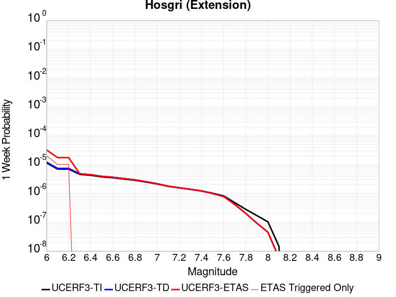 | 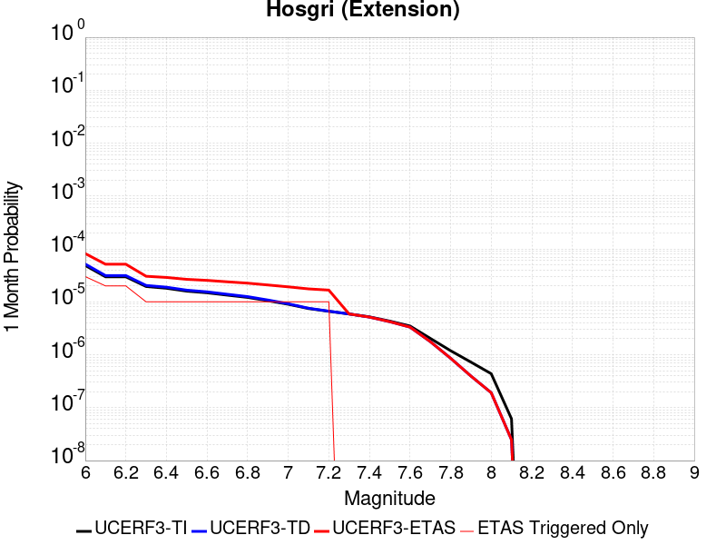 |  |  |

| Magnitude | 1 wk TI Prob | 1 wk TD Prob | 1 wk ETAS Prob | 1 wk ETAS/TD Gain | 1 wk ETAS Triggered Only | 1 mo TI Prob | 1 mo TD Prob | 1 mo ETAS Prob | 1 mo ETAS/TD Gain | 1 mo ETAS Triggered Only | 1 yr TI Prob | 1 yr TD Prob | 1 yr ETAS Prob | 1 yr ETAS/TD Gain | 1 yr ETAS Triggered Only | 10 yr TI Prob | 10 yr TD Prob | 10 yr ETAS Prob | 10 yr ETAS/TD Gain | 10 yr ETAS Triggered Only |
|-----|-----|-----|-----|-----|-----|-----|-----|-----|-----|-----|-----|-----|-----|-----|-----|-----|-----|-----|-----|-----|
| 6.0 | 1.1369135E-5 | 1.2083073E-5 | 3.2082833E-5 | 2.655188 | 2.0E-5 | 4.8723956E-5 | 5.17837E-5 | 8.178214E-5 | 1.5793029 | 3.0E-5 | 5.9305265E-4 | 6.303069E-4 | 6.802754E-4 | 1.0792764 | 5.0E-5 | 0.005914725 | 0.00628744 | 0.006347063 | 1.0094829 | 6.0E-5 |
| 6.1 | 6.934979E-6 | 7.324556E-6 | 1.7324483E-5 | 2.3652604 | 1.0E-5 | 2.9721E-5 | 3.13906E-5 | 5.1389972E-5 | 1.6371135 | 2.0E-5 | 3.617931E-4 | 3.821177E-4 | 4.1210622E-4 | 1.0784799 | 3.0E-5 | 0.0036120464 | 0.003815019 | 0.0038449047 | 1.0078336 | 3.0E-5 |
| 6.2 | 6.934979E-6 | 7.324556E-6 | 1.7324483E-5 | 2.3652604 | 1.0E-5 | 2.9721E-5 | 3.13906E-5 | 5.1389972E-5 | 1.6371135 | 2.0E-5 | 3.617931E-4 | 3.821177E-4 | 4.1210622E-4 | 1.0784799 | 3.0E-5 | 0.0036120464 | 0.003815019 | 0.0038449047 | 1.0078336 | 3.0E-5 |
| 6.3 | 4.5484676E-6 | 4.769331E-6 | 4.769331E-6 | 1.0 | 0.0 | 1.9493287E-5 | 2.0439833E-5 | 3.0439629E-5 | 1.4892308 | 1.0E-5 | 2.3730492E-4 | 2.4882698E-4 | 2.588245E-4 | 1.0401785 | 1.0E-5 | 0.0023705168 | 0.0024855263 | 0.0024955014 | 1.0040133 | 1.0E-5 |
| 6.4 | 4.218095E-6 | 4.416863E-6 | 4.416863E-6 | 1.0 | 0.0 | 1.8077424E-5 | 1.8929275E-5 | 2.8929086E-5 | 1.5282723 | 1.0E-5 | 2.2007042E-4 | 2.3043988E-4 | 2.4043758E-4 | 1.0433853 | 1.0E-5 | 0.002198526 | 0.002302043 | 0.00231202 | 1.004334 | 1.0E-5 |
| 6.5 | 3.717374E-6 | 3.883879E-6 | 3.883879E-6 | 1.0 | 0.0 | 1.5931506E-5 | 1.664509E-5 | 2.6644922E-5 | 1.6007679 | 1.0E-5 | 1.9394881E-4 | 2.026353E-4 | 2.1263327E-4 | 1.0493398 | 1.0E-5 | 0.0019377962 | 0.0020245241 | 0.002034504 | 1.0049294 | 1.0E-5 |
| 6.6 | 3.4605036E-6 | 3.6083072E-6 | 3.6083072E-6 | 1.0 | 0.0 | 1.4830645E-5 | 1.5464082E-5 | 2.5463927E-5 | 1.6466497 | 1.0E-5 | 1.8054814E-4 | 1.8825909E-4 | 1.982572E-4 | 1.0531083 | 1.0E-5 | 0.0018040152 | 0.0018810107 | 0.0018909919 | 1.0053062 | 1.0E-5 |
| 6.7 | 3.123439E-6 | 3.2465698E-6 | 3.2465698E-6 | 1.0 | 0.0 | 1.33860985E-5 | 1.39137965E-5 | 2.3913657E-5 | 1.7187011 | 1.0E-5 | 1.6296357E-4 | 1.6938741E-4 | 1.7938572E-4 | 1.0590262 | 1.0E-5 | 0.001628441 | 0.001692594 | 0.0017025771 | 1.0058981 | 1.0E-5 |
| 6.8 | 2.8290783E-6 | 2.9305413E-6 | 2.9305413E-6 | 1.0 | 0.0 | 1.2124565E-5 | 1.2559403E-5 | 2.2559278E-5 | 1.7962061 | 1.0E-5 | 1.4760658E-4 | 1.5290009E-4 | 1.6289856E-4 | 1.0653921 | 1.0E-5 | 0.0014750857 | 0.0015279576 | 0.0015379423 | 1.0065347 | 1.0E-5 |
| 6.9 | 2.454112E-6 | 2.5283207E-6 | 2.5283207E-6 | 1.0 | 0.0 | 1.0517581E-5 | 1.0835615E-5 | 2.0835507E-5 | 1.9228725 | 1.0E-5 | 1.2804402E-4 | 1.3191569E-4 | 1.4191437E-4 | 1.075796 | 1.0E-5 | 0.0012797028 | 0.0013183799 | 0.0013283667 | 1.007575 | 1.0E-5 |
| 7.0 | 2.1008145E-6 | 2.1498715E-6 | 2.1498715E-6 | 1.0 | 0.0 | 9.003459E-6 | 9.2137025E-6 | 1.921361E-5 | 2.08533 | 1.0E-5 | 1.096116E-4 | 1.1217109E-4 | 1.2216996E-4 | 1.0891396 | 1.0E-5 | 0.0010955755 | 0.0011211485 | 0.0011311373 | 1.0089095 | 1.0E-5 |
| 7.1 | 1.744384E-6 | 1.7686364E-6 | 1.7686364E-6 | 1.0 | 0.0 | 7.47591E-6 | 7.579848E-6 | 1.7579772E-5 | 2.3192778 | 1.0E-5 | 9.1015405E-5 | 9.228076E-5 | 1.0227984E-4 | 1.1083549 | 1.0E-5 | 9.097813E-4 | 9.224261E-4 | 9.324169E-4 | 1.010831 | 1.0E-5 |
| 7.2 | 1.5456587E-6 | 1.5562894E-6 | 1.5562894E-6 | 1.0 | 0.0 | 6.6242346E-6 | 6.6697944E-6 | 1.6669728E-5 | 2.4992867 | 1.0E-5 | 8.064707E-5 | 8.120173E-5 | 9.120092E-5 | 1.1231401 | 1.0E-5 | 8.0617814E-4 | 8.117219E-4 | 8.2171377E-4 | 1.0123094 | 1.0E-5 |
| 7.3 | 1.3775123E-6 | 1.3766092E-6 | 1.3766092E-6 | 1.0 | 0.0 | 5.9036106E-6 | 5.8997407E-6 | 5.8997407E-6 | 1.0 | 0.0 | 7.187409E-5 | 7.182699E-5 | 7.182699E-5 | 1.0 | 0.0 | 7.185085E-4 | 7.180387E-4 | 7.180387E-4 | 1.0 | 0.0 |
| 7.4 | 1.214491E-6 | 1.2023471E-6 | 1.2023471E-6 | 1.0 | 0.0 | 5.2049513E-6 | 5.152906E-6 | 5.152906E-6 | 1.0 | 0.0 | 6.336844E-5 | 6.2734835E-5 | 6.2734835E-5 | 1.0 | 0.0 | 6.335037E-4 | 6.2717206E-4 | 6.2717206E-4 | 1.0 | 0.0 |
| 7.5 | 1.0101123E-6 | 9.842256E-7 | 9.842256E-7 | 1.0 | 0.0 | 4.3290456E-6 | 4.218103E-6 | 4.218103E-6 | 1.0 | 0.0 | 5.2704854E-5 | 5.13542E-5 | 5.13542E-5 | 1.0 | 0.0 | 5.2692357E-4 | 5.1342393E-4 | 5.1342393E-4 | 1.0 | 0.0 |
| 7.6 | 8.1558215E-7 | 7.765977E-7 | 7.765977E-7 | 1.0 | 0.0 | 3.4953473E-6 | 3.3282718E-6 | 3.3282718E-6 | 1.0 | 0.0 | 4.255502E-5 | 4.0520958E-5 | 4.0520958E-5 | 1.0 | 0.0 | 4.2546875E-4 | 4.0513615E-4 | 4.0513615E-4 | 1.0 | 0.0 |
| 7.7 | 4.757816E-7 | 4.1308996E-7 | 4.1308996E-7 | 1.0 | 0.0 | 2.0390623E-6 | 1.7703843E-6 | 1.7703843E-6 | 1.0 | 0.0 | 2.4825302E-5 | 2.1554217E-5 | 2.1554217E-5 | 1.0 | 0.0 | 2.482253E-4 | 2.1552139E-4 | 2.1552139E-4 | 1.0 | 0.0 |
| 7.8 | 2.782787E-7 | 2.004783E-7 | 2.004783E-7 | 1.0 | 0.0 | 1.1926223E-6 | 8.591924E-7 | 8.591924E-7 | 1.0 | 0.0 | 1.452008E-5 | 1.0460618E-5 | 1.0460618E-5 | 1.0 | 0.0 | 1.4519131E-4 | 1.04601284E-4 | 1.04601284E-4 | 1.0 | 0.0 |
| 7.9 | 1.6948086E-7 | 9.243938E-8 | 9.243938E-8 | 1.0 | 0.0 | 7.2634634E-7 | 3.961687E-7 | 3.961687E-7 | 1.0 | 0.0 | 8.843231E-6 | 4.8233433E-6 | 4.8233433E-6 | 1.0 | 0.0 | 8.842879E-5 | 4.8232392E-5 | 4.8232392E-5 | 1.0 | 0.0 |
| 8.0 | 1.0225492E-7 | 4.473497E-8 | 4.473497E-8 | 1.0 | 0.0 | 4.382353E-7 | 1.917213E-7 | 1.917213E-7 | 1.0 | 0.0 | 5.335502E-6 | 2.3342043E-6 | 2.3342043E-6 | 1.0 | 0.0 | 5.335374E-5 | 2.33418E-5 | 2.33418E-5 | 1.0 | 0.0 |
| 8.1 | 1.43711345E-8 | 5.78716E-9 | 5.78716E-9 | 1.0 | 0.0 | 6.1590576E-8 | 2.4802116E-8 | 2.4802116E-8 | 1.0 | 0.0 | 7.4986497E-7 | 3.019657E-7 | 3.019657E-7 | 1.0 | 0.0 | 7.4986247E-6 | 3.0196536E-6 | 3.0196536E-6 | 1.0 | 0.0 |

## Mono Lake 2011 CFM
*[(top)](#table-of-contents)*

| 1 Week | 1 Month | 1 Year | 10 Year |
|-----|-----|-----|-----|
|  |  |  |  |

| Magnitude | 1 wk TI Prob | 1 wk TD Prob | 1 wk ETAS Prob | 1 wk ETAS/TD Gain | 1 wk ETAS Triggered Only | 1 mo TI Prob | 1 mo TD Prob | 1 mo ETAS Prob | 1 mo ETAS/TD Gain | 1 mo ETAS Triggered Only | 1 yr TI Prob | 1 yr TD Prob | 1 yr ETAS Prob | 1 yr ETAS/TD Gain | 1 yr ETAS Triggered Only | 10 yr TI Prob | 10 yr TD Prob | 10 yr ETAS Prob | 10 yr ETAS/TD Gain | 10 yr ETAS Triggered Only |
|-----|-----|-----|-----|-----|-----|-----|-----|-----|-----|-----|-----|-----|-----|-----|-----|-----|-----|-----|-----|-----|
| 6.0 | 2.0341662E-5 | 2.3828192E-5 | 4.3827713E-5 | 1.839322 | 2.0E-5 | 8.717564E-5 | 1.0211982E-4 | 1.3211675E-4 | 1.2937425 | 3.0E-5 | 0.0010608466 | 0.0012431308 | 0.0012930686 | 1.040171 | 5.0E-5 | 0.010557966 | 0.012413842 | 0.01246322 | 1.0039778 | 5.0E-5 |
| 6.1 | 2.0341662E-5 | 2.3828192E-5 | 4.3827713E-5 | 1.839322 | 2.0E-5 | 8.717564E-5 | 1.0211982E-4 | 1.3211675E-4 | 1.2937425 | 3.0E-5 | 0.0010608466 | 0.0012431308 | 0.0012930686 | 1.040171 | 5.0E-5 | 0.010557966 | 0.012413842 | 0.01246322 | 1.0039778 | 5.0E-5 |
| 6.2 | 2.0341662E-5 | 2.3828192E-5 | 4.3827713E-5 | 1.839322 | 2.0E-5 | 8.717564E-5 | 1.0211982E-4 | 1.3211675E-4 | 1.2937425 | 3.0E-5 | 0.0010608466 | 0.0012431308 | 0.0012930686 | 1.040171 | 5.0E-5 | 0.010557966 | 0.012413842 | 0.01246322 | 1.0039778 | 5.0E-5 |
| 6.3 | 2.0341662E-5 | 2.3828192E-5 | 4.3827713E-5 | 1.839322 | 2.0E-5 | 8.717564E-5 | 1.0211982E-4 | 1.3211675E-4 | 1.2937425 | 3.0E-5 | 0.0010608466 | 0.0012431308 | 0.0012930686 | 1.040171 | 5.0E-5 | 0.010557966 | 0.012413842 | 0.01246322 | 1.0039778 | 5.0E-5 |
| 6.4 | 1.749821E-5 | 2.049101E-5 | 4.04906E-5 | 1.9760178 | 2.0E-5 | 7.499018E-5 | 8.781861E-5 | 1.1781598E-4 | 1.3415833 | 3.0E-5 | 9.1262296E-4 | 0.0010691914 | 0.001119138 | 1.0467143 | 5.0E-5 | 0.009088841 | 0.01069187 | 0.010741335 | 1.0046264 | 5.0E-5 |
| 6.5 | 1.749821E-5 | 2.049101E-5 | 4.04906E-5 | 1.9760178 | 2.0E-5 | 7.499018E-5 | 8.781861E-5 | 1.1781598E-4 | 1.3415833 | 3.0E-5 | 9.1262296E-4 | 0.0010691914 | 0.001119138 | 1.0467143 | 5.0E-5 | 0.009088841 | 0.01069187 | 0.010741335 | 1.0046264 | 5.0E-5 |

## Cerro Prieto
*[(top)](#table-of-contents)*

| 1 Week | 1 Month | 1 Year | 10 Year |
|-----|-----|-----|-----|
|  |  |  |  |

| Magnitude | 1 wk TI Prob | 1 wk TD Prob | 1 wk ETAS Prob | 1 wk ETAS/TD Gain | 1 wk ETAS Triggered Only | 1 mo TI Prob | 1 mo TD Prob | 1 mo ETAS Prob | 1 mo ETAS/TD Gain | 1 mo ETAS Triggered Only | 1 yr TI Prob | 1 yr TD Prob | 1 yr ETAS Prob | 1 yr ETAS/TD Gain | 1 yr ETAS Triggered Only | 10 yr TI Prob | 10 yr TD Prob | 10 yr ETAS Prob | 10 yr ETAS/TD Gain | 10 yr ETAS Triggered Only |
|-----|-----|-----|-----|-----|-----|-----|-----|-----|-----|-----|-----|-----|-----|-----|-----|-----|-----|-----|-----|-----|
| 6.0 | 2.9101528E-4 | 5.9654453E-4 | 5.9654453E-4 | 1.0 | 0.0 | 0.0012466122 | 0.0025543566 | 0.0025543566 | 1.0 | 0.0 | 0.015072231 | 0.030802928 | 0.030841695 | 1.0012586 | 4.0E-5 | 0.14089979 | 0.25386256 | 0.25389987 | 1.000147 | 5.0E-5 |
| 6.1 | 2.9101528E-4 | 5.9654453E-4 | 5.9654453E-4 | 1.0 | 0.0 | 0.0012466122 | 0.0025543566 | 0.0025543566 | 1.0 | 0.0 | 0.015072231 | 0.030802928 | 0.030841695 | 1.0012586 | 4.0E-5 | 0.14089979 | 0.25386256 | 0.25389987 | 1.000147 | 5.0E-5 |
| 6.2 | 2.9101528E-4 | 5.9654453E-4 | 5.9654453E-4 | 1.0 | 0.0 | 0.0012466122 | 0.0025543566 | 0.0025543566 | 1.0 | 0.0 | 0.015072231 | 0.030802928 | 0.030841695 | 1.0012586 | 4.0E-5 | 0.14089979 | 0.25386256 | 0.25389987 | 1.000147 | 5.0E-5 |
| 6.3 | 2.9101528E-4 | 5.9654453E-4 | 5.9654453E-4 | 1.0 | 0.0 | 0.0012466122 | 0.0025543566 | 0.0025543566 | 1.0 | 0.0 | 0.015072231 | 0.030802928 | 0.030841695 | 1.0012586 | 4.0E-5 | 0.14089979 | 0.25386256 | 0.25389987 | 1.000147 | 5.0E-5 |
| 6.4 | 2.508648E-4 | 5.140412E-4 | 5.140412E-4 | 1.0 | 0.0 | 0.0010746918 | 0.0022013725 | 0.0022013725 | 1.0 | 0.0 | 0.013006088 | 0.026629416 | 0.026658617 | 1.0010966 | 3.0E-5 | 0.12270685 | 0.2242222 | 0.22425322 | 1.0001384 | 4.0E-5 |
| 6.5 | 2.508648E-4 | 5.140412E-4 | 5.140412E-4 | 1.0 | 0.0 | 0.0010746918 | 0.0022013725 | 0.0022013725 | 1.0 | 0.0 | 0.013006088 | 0.026629416 | 0.026658617 | 1.0010966 | 3.0E-5 | 0.12270685 | 0.2242222 | 0.22425322 | 1.0001384 | 4.0E-5 |
| 6.6 | 2.294914E-4 | 4.7123645E-4 | 4.7123645E-4 | 1.0 | 0.0 | 9.831638E-4 | 0.0020182093 | 0.0020182093 | 1.0 | 0.0 | 0.011904482 | 0.024394194 | 0.024423461 | 1.0011998 | 3.0E-5 | 0.11286586 | 0.20837563 | 0.2084073 | 1.000152 | 4.0E-5 |
| 6.7 | 1.9621674E-4 | 4.0426268E-4 | 4.0426268E-4 | 1.0 | 0.0 | 8.4065786E-4 | 0.0017315624 | 0.0017315624 | 1.0 | 0.0 | 0.010187071 | 0.020888962 | 0.020908544 | 1.0009375 | 2.0E-5 | 0.09732539 | 0.18264732 | 0.18266366 | 1.0000895 | 2.0E-5 |
| 6.8 | 1.5476145E-4 | 3.0572579E-4 | 3.0572579E-4 | 1.0 | 0.0 | 6.6309475E-4 | 0.0013096977 | 0.0013096977 | 1.0 | 0.0 | 0.008043335 | 0.015826825 | 0.015836667 | 1.0006218 | 1.0E-5 | 0.07758363 | 0.14310057 | 0.14310914 | 1.0000598 | 1.0E-5 |
| 6.9 | 1.20509176E-4 | 2.2588465E-4 | 2.2588465E-4 | 1.0 | 0.0 | 5.1636563E-4 | 9.6778123E-4 | 9.6778123E-4 | 1.0 | 0.0 | 0.006268645 | 0.011734025 | 0.011743907 | 1.0008422 | 1.0E-5 | 0.060947374 | 0.10917958 | 0.10918849 | 1.0000815 | 1.0E-5 |
| 7.0 | 9.3269155E-5 | 1.6721459E-4 | 1.6721459E-4 | 1.0 | 0.0 | 3.9966372E-4 | 7.1648025E-4 | 7.1648025E-4 | 1.0 | 0.0 | 0.0048550544 | 0.008695914 | 0.008695914 | 1.0 | 0.0 | 0.04750344 | 0.082943216 | 0.082943216 | 1.0 | 0.0 |
| 7.1 | 5.029709E-5 | 8.174011E-5 | 8.174011E-5 | 1.0 | 0.0 | 2.1554115E-4 | 3.50287E-4 | 3.50287E-4 | 1.0 | 0.0 | 0.0026210553 | 0.004259821 | 0.004259821 | 1.0 | 0.0 | 0.025903556 | 0.04226813 | 0.04226813 | 1.0 | 0.0 |
| 7.2 | 6.5445185E-8 | 6.824737E-8 | 6.824737E-8 | 1.0 | 0.0 | 2.8047933E-7 | 2.9248872E-7 | 2.9248872E-7 | 1.0 | 0.0 | 3.4148304E-6 | 3.56105E-6 | 3.56105E-6 | 1.0 | 0.0 | 3.414778E-5 | 3.56105E-5 | 3.56105E-5 | 1.0 | 0.0 |

## San Gabriel
*[(top)](#table-of-contents)*

| 1 Week | 1 Month | 1 Year | 10 Year |
|-----|-----|-----|-----|
| 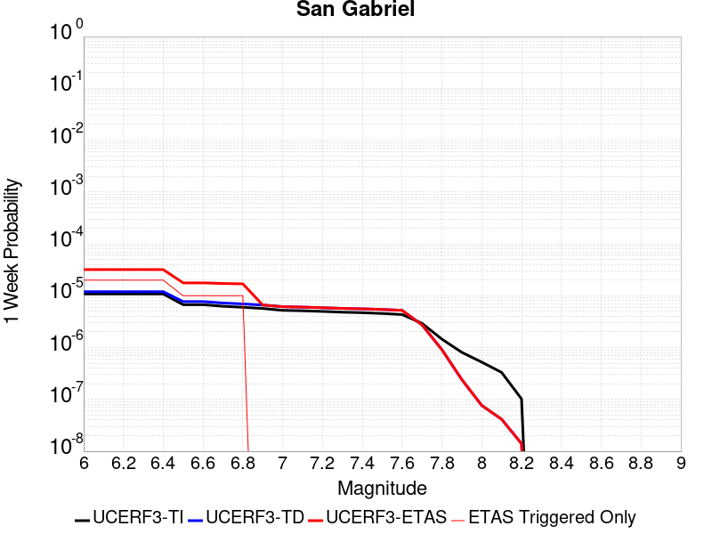 |  |  |  |

| Magnitude | 1 wk TI Prob | 1 wk TD Prob | 1 wk ETAS Prob | 1 wk ETAS/TD Gain | 1 wk ETAS Triggered Only | 1 mo TI Prob | 1 mo TD Prob | 1 mo ETAS Prob | 1 mo ETAS/TD Gain | 1 mo ETAS Triggered Only | 1 yr TI Prob | 1 yr TD Prob | 1 yr ETAS Prob | 1 yr ETAS/TD Gain | 1 yr ETAS Triggered Only | 10 yr TI Prob | 10 yr TD Prob | 10 yr ETAS Prob | 10 yr ETAS/TD Gain | 10 yr ETAS Triggered Only |
|-----|-----|-----|-----|-----|-----|-----|-----|-----|-----|-----|-----|-----|-----|-----|-----|-----|-----|-----|-----|-----|
| 6.0 | 1.083775E-5 | 1.198525E-5 | 3.198501E-5 | 2.6686978 | 2.0E-5 | 4.6446676E-5 | 5.1364408E-5 | 8.1362865E-5 | 1.584032 | 3.0E-5 | 5.653415E-4 | 6.251936E-4 | 6.6516857E-4 | 1.0639402 | 4.0E-5 | 0.0056390543 | 0.0062463325 | 0.00629602 | 1.0079547 | 5.0E-5 |
| 6.1 | 1.083775E-5 | 1.198525E-5 | 3.198501E-5 | 2.6686978 | 2.0E-5 | 4.6446676E-5 | 5.1364408E-5 | 8.1362865E-5 | 1.584032 | 3.0E-5 | 5.653415E-4 | 6.251936E-4 | 6.6516857E-4 | 1.0639402 | 4.0E-5 | 0.0056390543 | 0.0062463325 | 0.00629602 | 1.0079547 | 5.0E-5 |
| 6.2 | 1.083775E-5 | 1.198525E-5 | 3.198501E-5 | 2.6686978 | 2.0E-5 | 4.6446676E-5 | 5.1364408E-5 | 8.1362865E-5 | 1.584032 | 3.0E-5 | 5.653415E-4 | 6.251936E-4 | 6.6516857E-4 | 1.0639402 | 4.0E-5 | 0.0056390543 | 0.0062463325 | 0.00629602 | 1.0079547 | 5.0E-5 |
| 6.3 | 1.083775E-5 | 1.198525E-5 | 3.198501E-5 | 2.6686978 | 2.0E-5 | 4.6446676E-5 | 5.1364408E-5 | 8.1362865E-5 | 1.584032 | 3.0E-5 | 5.653415E-4 | 6.251936E-4 | 6.6516857E-4 | 1.0639402 | 4.0E-5 | 0.0056390543 | 0.0062463325 | 0.00629602 | 1.0079547 | 5.0E-5 |
| 6.4 | 1.083775E-5 | 1.198525E-5 | 3.198501E-5 | 2.6686978 | 2.0E-5 | 4.6446676E-5 | 5.1364408E-5 | 8.1362865E-5 | 1.584032 | 3.0E-5 | 5.653415E-4 | 6.251936E-4 | 6.6516857E-4 | 1.0639402 | 4.0E-5 | 0.0056390543 | 0.0062463325 | 0.00629602 | 1.0079547 | 5.0E-5 |
| 6.5 | 6.7317824E-6 | 7.717007E-6 | 1.771693E-5 | 2.295829 | 1.0E-5 | 2.8850178E-5 | 3.3072472E-5 | 5.3071813E-5 | 1.6047125 | 2.0E-5 | 3.511943E-4 | 4.0258403E-4 | 4.3257195E-4 | 1.0744886 | 3.0E-5 | 0.003506398 | 0.004029533 | 0.0040693716 | 1.0098867 | 4.0E-5 |
| 6.6 | 6.7317824E-6 | 7.717007E-6 | 1.771693E-5 | 2.295829 | 1.0E-5 | 2.8850178E-5 | 3.3072472E-5 | 5.3071813E-5 | 1.6047125 | 2.0E-5 | 3.511943E-4 | 4.0258403E-4 | 4.3257195E-4 | 1.0744886 | 3.0E-5 | 0.003506398 | 0.004029533 | 0.0040693716 | 1.0098867 | 4.0E-5 |
| 6.7 | 6.274881E-6 | 7.2459275E-6 | 1.7245855E-5 | 2.3800757 | 1.0E-5 | 2.6892068E-5 | 3.105361E-5 | 5.105299E-5 | 1.6440275 | 2.0E-5 | 3.2736175E-4 | 3.7801306E-4 | 4.0800174E-4 | 1.0793324 | 3.0E-5 | 0.0032687993 | 0.0037846796 | 0.0038245283 | 1.0105289 | 4.0E-5 |
| 6.8 | 5.996209E-6 | 6.958647E-6 | 1.6958578E-5 | 2.4370508 | 1.0E-5 | 2.5697784E-5 | 2.9822439E-5 | 4.9821843E-5 | 1.6706159 | 2.0E-5 | 3.128256E-4 | 3.6302864E-4 | 3.9301775E-4 | 1.0826081 | 3.0E-5 | 0.003123856 | 0.0036353325 | 0.003675187 | 1.0109631 | 4.0E-5 |
| 6.9 | 5.686331E-6 | 6.6236917E-6 | 6.6236917E-6 | 1.0 | 0.0 | 2.4369761E-5 | 2.8386947E-5 | 3.8386665E-5 | 1.3522646 | 1.0E-5 | 2.9666146E-4 | 3.4555717E-4 | 3.6555025E-4 | 1.0578575 | 2.0E-5 | 0.0029626573 | 0.0034611735 | 0.0034910697 | 1.0086375 | 3.0E-5 |
| 7.0 | 5.2329838E-6 | 6.1475757E-6 | 6.1475757E-6 | 1.0 | 0.0 | 2.242688E-5 | 2.6346492E-5 | 3.6346228E-5 | 1.3795471 | 1.0E-5 | 2.7301308E-4 | 3.207221E-4 | 3.4071566E-4 | 1.0623393 | 2.0E-5 | 0.002726779 | 0.0032135549 | 0.0032434585 | 1.0093055 | 3.0E-5 |
| 7.1 | 5.135671E-6 | 6.0377E-6 | 6.0377E-6 | 1.0 | 0.0 | 2.2009834E-5 | 2.5875606E-5 | 3.5875346E-5 | 1.3864543 | 1.0E-5 | 2.6793676E-4 | 3.1499073E-4 | 3.2498757E-4 | 1.031737 | 1.0E-5 | 0.0026761394 | 0.0031564054 | 0.0031763422 | 1.0063163 | 2.0E-5 |
| 7.2 | 4.989062E-6 | 5.8710784E-6 | 5.8710784E-6 | 1.0 | 0.0 | 2.1381518E-5 | 2.5161527E-5 | 3.5161276E-5 | 1.3974222 | 1.0E-5 | 2.6028889E-4 | 3.0629928E-4 | 3.162962E-4 | 1.0326378 | 1.0E-5 | 0.0025998424 | 0.003069734 | 0.0030797033 | 1.0032476 | 1.0E-5 |
| 7.3 | 4.8219395E-6 | 5.7026323E-6 | 5.7026323E-6 | 1.0 | 0.0 | 2.0665291E-5 | 2.4439627E-5 | 3.4439385E-5 | 1.4091616 | 1.0E-5 | 2.5157086E-4 | 2.975126E-4 | 3.0750962E-4 | 1.033602 | 1.0E-5 | 0.0025128627 | 0.002982106 | 0.0029920763 | 1.0033433 | 1.0E-5 |
| 7.4 | 4.7118383E-6 | 5.5911896E-6 | 5.5911896E-6 | 1.0 | 0.0 | 2.0193436E-5 | 2.3962024E-5 | 3.3961784E-5 | 1.417317 | 1.0E-5 | 2.4582737E-4 | 2.9169934E-4 | 3.0169642E-4 | 1.0342718 | 1.0E-5 | 0.002455556 | 0.0029241266 | 0.0029340973 | 1.0034099 | 1.0E-5 |
| 7.5 | 4.5506545E-6 | 5.4365555E-6 | 5.4365555E-6 | 1.0 | 0.0 | 1.9502659E-5 | 2.329932E-5 | 3.3299086E-5 | 1.429187 | 1.0E-5 | 2.37419E-4 | 2.8363304E-4 | 2.936302E-4 | 1.0352468 | 1.0E-5 | 0.002371655 | 0.0028436715 | 0.0028536431 | 1.0035065 | 1.0E-5 |
| 7.6 | 4.343636E-6 | 5.2294336E-6 | 5.2294336E-6 | 1.0 | 0.0 | 1.861545E-5 | 2.241167E-5 | 3.2411444E-5 | 1.4461861 | 1.0E-5 | 2.2661954E-4 | 2.7282868E-4 | 2.8282593E-4 | 1.036643 | 1.0E-5 | 0.0022638857 | 0.0027358893 | 0.002745862 | 1.0036451 | 1.0E-5 |
| 7.7 | 2.936235E-6 | 2.743946E-6 | 2.743946E-6 | 1.0 | 0.0 | 1.2583803E-5 | 1.1759716E-5 | 1.1759716E-5 | 1.0 | 0.0 | 1.5319703E-4 | 1.4316518E-4 | 1.4316518E-4 | 1.0 | 0.0 | 0.0015309147 | 0.0014379849 | 0.0014379849 | 1.0 | 0.0 |
| 7.8 | 1.4541639E-6 | 9.122518E-7 | 9.122518E-7 | 1.0 | 0.0 | 6.232116E-6 | 3.9096444E-6 | 3.9096444E-6 | 1.0 | 0.0 | 7.587337E-5 | 4.7598885E-5 | 4.7598885E-5 | 1.0 | 0.0 | 7.584747E-4 | 4.8078224E-4 | 4.8078224E-4 | 1.0 | 0.0 |
| 7.9 | 8.098958E-7 | 2.4165956E-7 | 2.4165956E-7 | 1.0 | 0.0 | 3.4709774E-6 | 1.0356835E-6 | 1.0356835E-6 | 1.0 | 0.0 | 4.225833E-5 | 1.2609373E-5 | 1.2609373E-5 | 1.0 | 0.0 | 4.2250296E-4 | 1.2917137E-4 | 1.2917137E-4 | 1.0 | 0.0 |
| 8.0 | 5.2473234E-7 | 7.672734E-8 | 7.672734E-8 | 1.0 | 0.0 | 2.248851E-6 | 3.2883142E-7 | 3.2883142E-7 | 1.0 | 0.0 | 2.7379416E-5 | 4.003515E-6 | 4.003515E-6 | 1.0 | 0.0 | 2.7376044E-4 | 4.215796E-5 | 4.215796E-5 | 1.0 | 0.0 |
| 8.1 | 3.3162388E-7 | 4.1457096E-8 | 4.1457096E-8 | 1.0 | 0.0 | 1.4212444E-6 | 1.7767324E-7 | 1.7767324E-7 | 1.0 | 0.0 | 1.7303513E-5 | 2.1631695E-6 | 2.1631695E-6 | 1.0 | 0.0 | 1.7302166E-4 | 2.294416E-5 | 2.294416E-5 | 1.0 | 0.0 |
| 8.2 | 1.0235345E-7 | 1.4032201E-8 | 1.4032201E-8 | 1.0 | 0.0 | 4.3865757E-7 | 6.013801E-8 | 6.013801E-8 | 1.0 | 0.0 | 5.340643E-6 | 7.3217996E-7 | 7.3217996E-7 | 1.0 | 0.0 | 5.3405143E-5 | 7.921925E-6 | 7.921925E-6 | 1.0 | 0.0 |

## San Jacinto (Superstition Mtn)
*[(top)](#table-of-contents)*

| 1 Week | 1 Month | 1 Year | 10 Year |
|-----|-----|-----|-----|
| 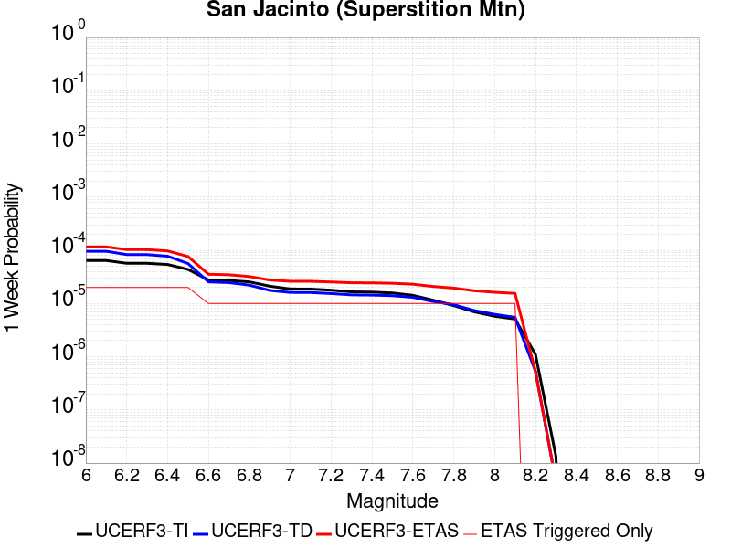 |  | 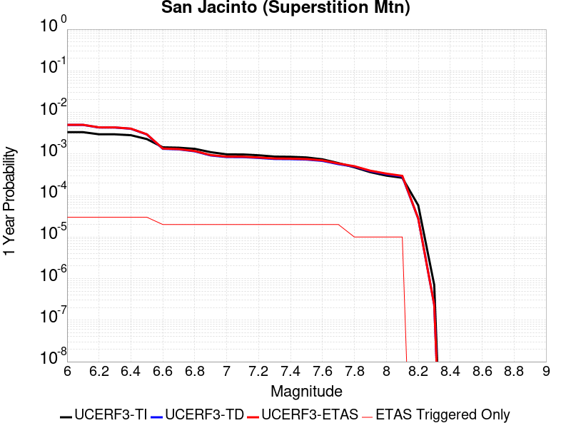 |  |

| Magnitude | 1 wk TI Prob | 1 wk TD Prob | 1 wk ETAS Prob | 1 wk ETAS/TD Gain | 1 wk ETAS Triggered Only | 1 mo TI Prob | 1 mo TD Prob | 1 mo ETAS Prob | 1 mo ETAS/TD Gain | 1 mo ETAS Triggered Only | 1 yr TI Prob | 1 yr TD Prob | 1 yr ETAS Prob | 1 yr ETAS/TD Gain | 1 yr ETAS Triggered Only | 10 yr TI Prob | 10 yr TD Prob | 10 yr ETAS Prob | 10 yr ETAS/TD Gain | 10 yr ETAS Triggered Only |
|-----|-----|-----|-----|-----|-----|-----|-----|-----|-----|-----|-----|-----|-----|-----|-----|-----|-----|-----|-----|-----|
| 6.0 | 6.4193904E-5 | 9.599558E-5 | 1.15993666E-4 | 1.2083229 | 2.0E-5 | 2.7508775E-4 | 4.1135435E-4 | 4.3134612E-4 | 1.0485998 | 2.0E-5 | 0.0033440501 | 0.0049981694 | 0.005028019 | 1.0059721 | 3.0E-5 | 0.03294174 | 0.048820045 | 0.048867602 | 1.0009742 | 5.0E-5 |
| 6.1 | 6.4193904E-5 | 9.599558E-5 | 1.15993666E-4 | 1.2083229 | 2.0E-5 | 2.7508775E-4 | 4.1135435E-4 | 4.3134612E-4 | 1.0485998 | 2.0E-5 | 0.0033440501 | 0.0049981694 | 0.005028019 | 1.0059721 | 3.0E-5 | 0.03294174 | 0.048820045 | 0.048867602 | 1.0009742 | 5.0E-5 |
| 6.2 | 5.7023593E-5 | 8.3144616E-5 | 1.0314296E-4 | 1.2405248 | 2.0E-5 | 2.4436394E-4 | 3.5629462E-4 | 3.762875E-4 | 1.0561134 | 2.0E-5 | 0.002971072 | 0.0043309047 | 0.004360775 | 1.006897 | 3.0E-5 | 0.029316625 | 0.042502448 | 0.042550325 | 1.0011264 | 5.0E-5 |
| 6.3 | 5.6940098E-5 | 8.298998E-5 | 1.0298831E-4 | 1.240973 | 2.0E-5 | 2.4400617E-4 | 3.5563204E-4 | 3.7562495E-4 | 1.0562179 | 2.0E-5 | 0.002966728 | 0.00432287 | 0.0043527405 | 1.0069098 | 3.0E-5 | 0.029274331 | 0.04242582 | 0.0424737 | 1.0011286 | 5.0E-5 |
| 6.4 | 5.4171585E-5 | 7.748391E-5 | 9.748236E-5 | 1.2580981 | 2.0E-5 | 2.3214328E-4 | 3.3204095E-4 | 3.520343E-4 | 1.0602136 | 2.0E-5 | 0.0028226813 | 0.0040367534 | 0.004066632 | 1.0074017 | 3.0E-5 | 0.02787096 | 0.039715026 | 0.03976304 | 1.001209 | 5.0E-5 |
| 6.5 | 4.375144E-5 | 5.6421442E-5 | 7.6420314E-5 | 1.3544551 | 2.0E-5 | 1.874927E-4 | 2.417904E-4 | 2.6178558E-4 | 1.0826963 | 2.0E-5 | 0.0022803338 | 0.002941 | 0.0029709118 | 1.0101706 | 3.0E-5 | 0.022570757 | 0.029235592 | 0.02928413 | 1.0016602 | 5.0E-5 |
| 6.6 | 2.772192E-5 | 2.5488029E-5 | 3.5487774E-5 | 1.392331 | 1.0E-5 | 1.1880282E-4 | 1.0922994E-4 | 1.1922885E-4 | 1.09154 | 1.0E-5 | 0.0014454646 | 0.0013290826 | 0.001349056 | 1.015028 | 2.0E-5 | 0.014360986 | 0.013540891 | 0.013580349 | 1.0029141 | 4.0E-5 |
| 6.7 | 2.7124124E-5 | 2.4699055E-5 | 3.469881E-5 | 1.4048638 | 1.0E-5 | 1.1624106E-4 | 1.0584891E-4 | 1.1584785E-4 | 1.0944643 | 1.0E-5 | 0.0014143161 | 0.0012879678 | 0.001307942 | 1.0155083 | 2.0E-5 | 0.014053487 | 0.013134248 | 0.013173723 | 1.0030055 | 4.0E-5 |
| 6.8 | 2.5475807E-5 | 2.2164071E-5 | 3.2163847E-5 | 1.4511707 | 1.0E-5 | 1.0917746E-4 | 9.498548E-5 | 1.0498453E-4 | 1.1052692 | 1.0E-5 | 0.001328425 | 0.0011558468 | 0.0011758236 | 1.0172833 | 2.0E-5 | 0.0132051185 | 0.011821818 | 0.011861345 | 1.0033436 | 4.0E-5 |
| 6.9 | 2.1162023E-5 | 1.762564E-5 | 2.7625465E-5 | 1.5673453 | 1.0E-5 | 9.069123E-5 | 7.553629E-5 | 8.553554E-5 | 1.1323767 | 1.0E-5 | 0.0011036064 | 9.1927015E-4 | 9.3925174E-4 | 1.0217364 | 2.0E-5 | 0.010981417 | 0.009446762 | 0.009486384 | 1.0041943 | 4.0E-5 |
| 7.0 | 1.8754288E-5 | 1.616099E-5 | 2.6160827E-5 | 1.6187639 | 1.0E-5 | 8.037304E-5 | 6.9259564E-5 | 7.925887E-5 | 1.1443744 | 1.0E-5 | 9.781026E-4 | 8.429114E-4 | 8.628945E-4 | 1.0237073 | 2.0E-5 | 0.009738087 | 0.008669995 | 0.008709648 | 1.0045736 | 4.0E-5 |
| 7.1 | 1.8678527E-5 | 1.6086136E-5 | 2.6085974E-5 | 1.6216433 | 1.0E-5 | 8.0048376E-5 | 6.8938774E-5 | 7.893809E-5 | 1.1450462 | 1.0E-5 | 9.7415317E-4 | 8.3900883E-4 | 8.5899205E-4 | 1.0238177 | 2.0E-5 | 0.009698939 | 0.008631011 | 0.008670665 | 1.0045944 | 4.0E-5 |
| 7.2 | 1.7804578E-5 | 1.5380709E-5 | 2.5380556E-5 | 1.6501551 | 1.0E-5 | 7.6303106E-5 | 6.591567E-5 | 7.591501E-5 | 1.151699 | 1.0E-5 | 9.285943E-4 | 8.022301E-4 | 8.2221406E-4 | 1.0249104 | 2.0E-5 | 0.009247236 | 0.008262424 | 0.0083020935 | 1.0048012 | 4.0E-5 |
| 7.3 | 1.6583685E-5 | 1.4529837E-5 | 2.4529692E-5 | 1.688229 | 1.0E-5 | 7.1070994E-5 | 6.226926E-5 | 7.226864E-5 | 1.1605829 | 1.0E-5 | 8.649459E-4 | 7.5786654E-4 | 7.778514E-4 | 1.0263699 | 2.0E-5 | 0.00861587 | 0.007817646 | 0.007857333 | 1.0050766 | 4.0E-5 |
| 7.4 | 1.6387552E-5 | 1.4394727E-5 | 2.4394583E-5 | 1.6946888 | 1.0E-5 | 7.023047E-5 | 6.169024E-5 | 7.1689625E-5 | 1.1620902 | 1.0E-5 | 8.5472054E-4 | 7.508219E-4 | 7.7080686E-4 | 1.0266175 | 2.0E-5 | 0.008514405 | 0.0077470187 | 0.0077867084 | 1.0051233 | 4.0E-5 |
| 7.5 | 1.5790754E-5 | 1.40354305E-5 | 2.4035291E-5 | 1.7124726 | 1.0E-5 | 6.767291E-5 | 6.015047E-5 | 7.0149865E-5 | 1.1662397 | 1.0E-5 | 8.236062E-4 | 7.320879E-4 | 7.5207325E-4 | 1.0272992 | 2.0E-5 | 0.008205604 | 0.007557581 | 0.007597279 | 1.0052527 | 4.0E-5 |
| 7.6 | 1.4248672E-5 | 1.3054444E-5 | 2.3054314E-5 | 1.7660127 | 1.0E-5 | 6.106431E-5 | 5.5946428E-5 | 6.594587E-5 | 1.1787324 | 1.0E-5 | 7.432043E-4 | 6.809366E-4 | 7.00923E-4 | 1.0293514 | 2.0E-5 | 0.007407237 | 0.007040175 | 0.0070798937 | 1.0056417 | 4.0E-5 |
| 7.7 | 1.15449975E-5 | 1.0903222E-5 | 2.0903113E-5 | 1.9171501 | 1.0E-5 | 4.947762E-5 | 4.672726E-5 | 5.6726793E-5 | 1.2139978 | 1.0E-5 | 6.022235E-4 | 5.6875666E-4 | 5.887453E-4 | 1.0351444 | 2.0E-5 | 0.006005941 | 0.0059102564 | 0.0059500197 | 1.0067279 | 4.0E-5 |
| 7.8 | 9.1391985E-6 | 9.5139185E-6 | 1.9513824E-5 | 2.0510817 | 1.0E-5 | 3.9167408E-5 | 4.0773306E-5 | 5.07729E-5 | 1.2452486 | 1.0E-5 | 4.767588E-4 | 4.963025E-4 | 5.062975E-4 | 1.020139 | 1.0E-5 | 0.0047573727 | 0.005176809 | 0.005206654 | 1.0057651 | 3.0E-5 |
| 7.9 | 6.973017E-6 | 7.3817937E-6 | 1.738172E-5 | 2.3546743 | 1.0E-5 | 2.9884017E-5 | 3.163588E-5 | 4.163556E-5 | 1.3160868 | 1.0E-5 | 3.6377716E-4 | 3.8509927E-4 | 3.950954E-4 | 1.0259573 | 1.0E-5 | 0.0036318225 | 0.004051976 | 0.004081854 | 1.0073738 | 3.0E-5 |
| 8.0 | 5.7638235E-6 | 6.259641E-6 | 1.6259579E-5 | 2.5975256 | 1.0E-5 | 2.4701867E-5 | 2.682676E-5 | 3.6826492E-5 | 1.3727521 | 1.0E-5 | 3.0070372E-4 | 3.2656736E-4 | 3.365641E-4 | 1.0306115 | 1.0E-5 | 0.0030029714 | 0.0034535413 | 0.0034834377 | 1.0086567 | 3.0E-5 |
| 8.1 | 5.1124434E-6 | 5.4953657E-6 | 1.549531E-5 | 2.8197052 | 1.0E-5 | 2.1910288E-5 | 2.3551356E-5 | 3.355112E-5 | 1.424594 | 1.0E-5 | 2.6672508E-4 | 2.8670052E-4 | 2.9669766E-4 | 1.0348696 | 1.0E-5 | 0.0026640517 | 0.0030403896 | 0.0030702986 | 1.0098372 | 3.0E-5 |
| 8.2 | 1.1075938E-6 | 5.3348367E-7 | 5.3348367E-7 | 1.0 | 0.0 | 4.7468216E-6 | 2.2863567E-6 | 2.2863567E-6 | 1.0 | 0.0 | 5.779102E-5 | 2.7836059E-5 | 2.7836059E-5 | 1.0 | 0.0 | 5.777599E-4 | 3.133962E-4 | 3.133962E-4 | 1.0 | 0.0 |
| 8.3 | 1.3584393E-8 | 4.4718784E-9 | 4.4718784E-9 | 1.0 | 0.0 | 5.8218827E-8 | 1.9165192E-8 | 1.9165192E-8 | 1.0 | 0.0 | 7.0881396E-7 | 2.3333622E-7 | 2.3333622E-7 | 1.0 | 0.0 | 7.0881174E-6 | 2.6140672E-6 | 2.6140672E-6 | 1.0 | 0.0 |

## Pitas Point (Lower West)
*[(top)](#table-of-contents)*

| 1 Week | 1 Month | 1 Year | 10 Year |
|-----|-----|-----|-----|
|  |  | 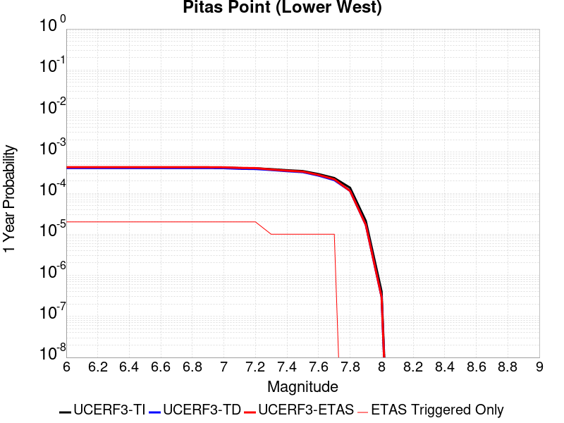 | 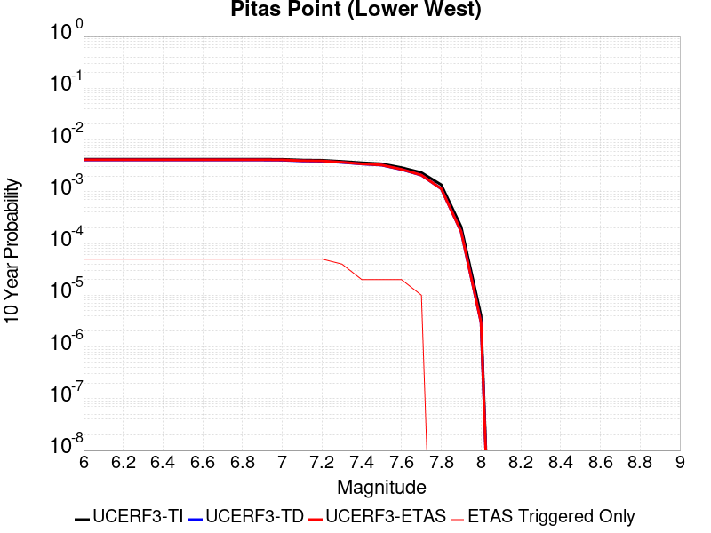 |

| Magnitude | 1 wk TI Prob | 1 wk TD Prob | 1 wk ETAS Prob | 1 wk ETAS/TD Gain | 1 wk ETAS Triggered Only | 1 mo TI Prob | 1 mo TD Prob | 1 mo ETAS Prob | 1 mo ETAS/TD Gain | 1 mo ETAS Triggered Only | 1 yr TI Prob | 1 yr TD Prob | 1 yr ETAS Prob | 1 yr ETAS/TD Gain | 1 yr ETAS Triggered Only | 10 yr TI Prob | 10 yr TD Prob | 10 yr ETAS Prob | 10 yr ETAS/TD Gain | 10 yr ETAS Triggered Only |
|-----|-----|-----|-----|-----|-----|-----|-----|-----|-----|-----|-----|-----|-----|-----|-----|-----|-----|-----|-----|-----|
| 6.0 | 8.151497E-6 | 7.855796E-6 | 7.855796E-6 | 1.0 | 0.0 | 3.493452E-5 | 3.3667267E-5 | 3.3667267E-5 | 1.0 | 0.0 | 4.252448E-4 | 4.0982262E-4 | 4.2981442E-4 | 1.0487816 | 2.0E-5 | 0.0042443196 | 0.004090749 | 0.0041405447 | 1.0121727 | 5.0E-5 |
| 6.1 | 8.151497E-6 | 7.855796E-6 | 7.855796E-6 | 1.0 | 0.0 | 3.493452E-5 | 3.3667267E-5 | 3.3667267E-5 | 1.0 | 0.0 | 4.252448E-4 | 4.0982262E-4 | 4.2981442E-4 | 1.0487816 | 2.0E-5 | 0.0042443196 | 0.004090749 | 0.0041405447 | 1.0121727 | 5.0E-5 |
| 6.2 | 8.151497E-6 | 7.855796E-6 | 7.855796E-6 | 1.0 | 0.0 | 3.493452E-5 | 3.3667267E-5 | 3.3667267E-5 | 1.0 | 0.0 | 4.252448E-4 | 4.0982262E-4 | 4.2981442E-4 | 1.0487816 | 2.0E-5 | 0.0042443196 | 0.004090749 | 0.0041405447 | 1.0121727 | 5.0E-5 |
| 6.3 | 8.151497E-6 | 7.855796E-6 | 7.855796E-6 | 1.0 | 0.0 | 3.493452E-5 | 3.3667267E-5 | 3.3667267E-5 | 1.0 | 0.0 | 4.252448E-4 | 4.0982262E-4 | 4.2981442E-4 | 1.0487816 | 2.0E-5 | 0.0042443196 | 0.004090749 | 0.0041405447 | 1.0121727 | 5.0E-5 |
| 6.4 | 8.151497E-6 | 7.855796E-6 | 7.855796E-6 | 1.0 | 0.0 | 3.493452E-5 | 3.3667267E-5 | 3.3667267E-5 | 1.0 | 0.0 | 4.252448E-4 | 4.0982262E-4 | 4.2981442E-4 | 1.0487816 | 2.0E-5 | 0.0042443196 | 0.004090749 | 0.0041405447 | 1.0121727 | 5.0E-5 |
| 6.5 | 8.151497E-6 | 7.855796E-6 | 7.855796E-6 | 1.0 | 0.0 | 3.493452E-5 | 3.3667267E-5 | 3.3667267E-5 | 1.0 | 0.0 | 4.252448E-4 | 4.0982262E-4 | 4.2981442E-4 | 1.0487816 | 2.0E-5 | 0.0042443196 | 0.004090749 | 0.0041405447 | 1.0121727 | 5.0E-5 |
| 6.6 | 8.151497E-6 | 7.855796E-6 | 7.855796E-6 | 1.0 | 0.0 | 3.493452E-5 | 3.3667267E-5 | 3.3667267E-5 | 1.0 | 0.0 | 4.252448E-4 | 4.0982262E-4 | 4.2981442E-4 | 1.0487816 | 2.0E-5 | 0.0042443196 | 0.004090749 | 0.0041405447 | 1.0121727 | 5.0E-5 |
| 6.7 | 8.151497E-6 | 7.855796E-6 | 7.855796E-6 | 1.0 | 0.0 | 3.493452E-5 | 3.3667267E-5 | 3.3667267E-5 | 1.0 | 0.0 | 4.252448E-4 | 4.0982262E-4 | 4.2981442E-4 | 1.0487816 | 2.0E-5 | 0.0042443196 | 0.004090749 | 0.0041405447 | 1.0121727 | 5.0E-5 |
| 6.8 | 8.151497E-6 | 7.855796E-6 | 7.855796E-6 | 1.0 | 0.0 | 3.493452E-5 | 3.3667267E-5 | 3.3667267E-5 | 1.0 | 0.0 | 4.252448E-4 | 4.0982262E-4 | 4.2981442E-4 | 1.0487816 | 2.0E-5 | 0.0042443196 | 0.004090749 | 0.0041405447 | 1.0121727 | 5.0E-5 |
| 6.9 | 8.151497E-6 | 7.855796E-6 | 7.855796E-6 | 1.0 | 0.0 | 3.493452E-5 | 3.3667267E-5 | 3.3667267E-5 | 1.0 | 0.0 | 4.252448E-4 | 4.0982262E-4 | 4.2981442E-4 | 1.0487816 | 2.0E-5 | 0.0042443196 | 0.004090749 | 0.0041405447 | 1.0121727 | 5.0E-5 |
| 7.0 | 8.103535E-6 | 7.805226E-6 | 7.805226E-6 | 1.0 | 0.0 | 3.4728975E-5 | 3.3450542E-5 | 3.3450542E-5 | 1.0 | 0.0 | 4.2274324E-4 | 4.07185E-4 | 4.2717686E-4 | 1.0490978 | 2.0E-5 | 0.0042193993 | 0.0040644696 | 0.0041142665 | 1.0122517 | 5.0E-5 |
| 7.1 | 7.853298E-6 | 7.540917E-6 | 7.540917E-6 | 1.0 | 0.0 | 3.3656554E-5 | 3.2317817E-5 | 3.2317817E-5 | 1.0 | 0.0 | 4.096915E-4 | 3.9339912E-4 | 4.1339124E-4 | 1.0508189 | 2.0E-5 | 0.00408937 | 0.0039271032 | 0.0039769066 | 1.0126821 | 5.0E-5 |
| 7.2 | 7.771102E-6 | 7.453199E-6 | 7.453199E-6 | 1.0 | 0.0 | 3.33043E-5 | 3.1941894E-5 | 3.1941894E-5 | 1.0 | 0.0 | 4.0540437E-4 | 3.8882386E-4 | 4.088161E-4 | 1.0514172 | 2.0E-5 | 0.0040466557 | 0.003881511 | 0.003931317 | 1.0128316 | 5.0E-5 |
| 7.3 | 7.3945344E-6 | 7.0493033E-6 | 7.0493033E-6 | 1.0 | 0.0 | 3.1690477E-5 | 3.0210955E-5 | 3.0210955E-5 | 1.0 | 0.0 | 3.8576324E-4 | 3.677569E-4 | 3.7775323E-4 | 1.0271819 | 1.0E-5 | 0.0038509427 | 0.003671551 | 0.003711404 | 1.0108546 | 4.0E-5 |
| 7.4 | 6.964645E-6 | 6.5901527E-6 | 6.5901527E-6 | 1.0 | 0.0 | 2.9848137E-5 | 2.8243208E-5 | 2.8243208E-5 | 1.0 | 0.0 | 3.6334046E-4 | 3.438073E-4 | 3.5380386E-4 | 1.0290761 | 1.0E-5 | 0.0036274698 | 0.0034328073 | 0.0034527385 | 1.0058061 | 2.0E-5 |
| 7.5 | 6.6525035E-6 | 6.259191E-6 | 6.259191E-6 | 1.0 | 0.0 | 2.851042E-5 | 2.6824831E-5 | 2.6824831E-5 | 1.0 | 0.0 | 3.4705905E-4 | 3.2654387E-4 | 3.365406E-4 | 1.0306138 | 1.0E-5 | 0.0034651754 | 0.0032606919 | 0.0032806266 | 1.0061136 | 2.0E-5 |
| 7.6 | 5.613338E-6 | 5.15142E-6 | 5.15142E-6 | 1.0 | 0.0 | 2.405694E-5 | 2.2077327E-5 | 2.2077327E-5 | 1.0 | 0.0 | 2.928539E-4 | 2.6875862E-4 | 2.7875594E-4 | 1.0371981 | 1.0E-5 | 0.0029246826 | 0.0026843674 | 0.0027043137 | 1.0074306 | 2.0E-5 |
| 7.7 | 4.494704E-6 | 3.996945E-6 | 3.996945E-6 | 1.0 | 0.0 | 1.9262876E-5 | 1.7129652E-5 | 1.7129652E-5 | 1.0 | 0.0 | 2.3450027E-4 | 2.0853379E-4 | 2.185317E-4 | 1.0479438 | 1.0E-5 | 0.0023425296 | 0.0020834052 | 0.0020933843 | 1.0047898 | 1.0E-5 |
| 7.8 | 2.6075882E-6 | 2.1836663E-6 | 2.1836663E-6 | 1.0 | 0.0 | 1.117533E-5 | 9.358537E-6 | 9.358537E-6 | 1.0 | 0.0 | 1.3605114E-4 | 1.1393427E-4 | 1.1393427E-4 | 1.0 | 0.0 | 0.0013596788 | 0.0011387634 | 0.0011387634 | 1.0 | 0.0 |
| 7.9 | 4.045984E-7 | 3.2424057E-7 | 3.2424057E-7 | 1.0 | 0.0 | 1.733992E-6 | 1.3896017E-6 | 1.3896017E-6 | 1.0 | 0.0 | 2.1111147E-5 | 1.6918271E-5 | 1.6918271E-5 | 1.0 | 0.0 | 2.1109142E-4 | 1.6917015E-4 | 1.6917015E-4 | 1.0 | 0.0 |
| 8.0 | 7.791402E-9 | 5.6836056E-9 | 5.6836056E-9 | 1.0 | 0.0 | 3.3391725E-8 | 2.4358311E-8 | 2.4358311E-8 | 1.0 | 0.0 | 4.0654416E-7 | 2.965624E-7 | 2.965624E-7 | 1.0 | 0.0 | 4.065434E-6 | 2.9656223E-6 | 2.9656223E-6 | 1.0 | 0.0 |

## Coronado Bank alt1
*[(top)](#table-of-contents)*

| 1 Week | 1 Month | 1 Year | 10 Year |
|-----|-----|-----|-----|
|  |  |  |  |

| Magnitude | 1 wk TI Prob | 1 wk TD Prob | 1 wk ETAS Prob | 1 wk ETAS/TD Gain | 1 wk ETAS Triggered Only | 1 mo TI Prob | 1 mo TD Prob | 1 mo ETAS Prob | 1 mo ETAS/TD Gain | 1 mo ETAS Triggered Only | 1 yr TI Prob | 1 yr TD Prob | 1 yr ETAS Prob | 1 yr ETAS/TD Gain | 1 yr ETAS Triggered Only | 10 yr TI Prob | 10 yr TD Prob | 10 yr ETAS Prob | 10 yr ETAS/TD Gain | 10 yr ETAS Triggered Only |
|-----|-----|-----|-----|-----|-----|-----|-----|-----|-----|-----|-----|-----|-----|-----|-----|-----|-----|-----|-----|-----|
| 6.0 | 7.533492E-5 | 9.3951705E-5 | 9.3951705E-5 | 1.0 | 0.0 | 3.22824E-4 | 4.025903E-4 | 4.025903E-4 | 1.0 | 0.0 | 0.0039233007 | 0.004891121 | 0.0049209744 | 1.0061035 | 3.0E-5 | 0.03854755 | 0.047904 | 0.047951605 | 1.0009937 | 5.0E-5 |
| 6.1 | 4.1807285E-5 | 5.0493105E-5 | 5.0493105E-5 | 1.0 | 0.0 | 1.7916178E-4 | 2.1638138E-4 | 2.1638138E-4 | 1.0 | 0.0 | 0.0021791123 | 0.0026313365 | 0.002651284 | 1.0075808 | 2.0E-5 | 0.021578677 | 0.026011124 | 0.026040344 | 1.0011233 | 3.0E-5 |
| 6.2 | 4.1807285E-5 | 5.0493105E-5 | 5.0493105E-5 | 1.0 | 0.0 | 1.7916178E-4 | 2.1638138E-4 | 2.1638138E-4 | 1.0 | 0.0 | 0.0021791123 | 0.0026313365 | 0.002651284 | 1.0075808 | 2.0E-5 | 0.021578677 | 0.026011124 | 0.026040344 | 1.0011233 | 3.0E-5 |
| 6.3 | 3.1793104E-5 | 3.7711125E-5 | 3.7711125E-5 | 1.0 | 0.0 | 1.3624904E-4 | 1.6160926E-4 | 1.6160926E-4 | 1.0 | 0.0 | 0.0016575698 | 0.001965849 | 0.0019858098 | 1.0101538 | 2.0E-5 | 0.016452603 | 0.019488495 | 0.019508105 | 1.0010062 | 2.0E-5 |
| 6.4 | 2.9878007E-5 | 3.5335797E-5 | 3.5335797E-5 | 1.0 | 0.0 | 1.2804232E-4 | 1.5143053E-4 | 1.5143053E-4 | 1.0 | 0.0 | 0.0015578003 | 0.0018421395 | 0.0018621027 | 1.010837 | 2.0E-5 | 0.015469253 | 0.018272463 | 0.0182921 | 1.0010746 | 2.0E-5 |
| 6.5 | 2.4512565E-5 | 2.8764101E-5 | 2.8764101E-5 | 1.0 | 0.0 | 1.0504962E-4 | 1.2326906E-4 | 1.2326906E-4 | 1.0 | 0.0 | 0.0012782287 | 0.0014997943 | 0.0015097794 | 1.0066576 | 1.0E-5 | 0.012709012 | 0.0148996925 | 0.014909544 | 1.0006611 | 1.0E-5 |
| 6.6 | 2.1317413E-5 | 2.490667E-5 | 2.490667E-5 | 1.0 | 0.0 | 9.135714E-5 | 1.0673863E-4 | 1.0673863E-4 | 1.0 | 0.0 | 0.0011117056 | 0.0012987903 | 0.0013087774 | 1.0076895 | 1.0E-5 | 0.011061605 | 0.012914407 | 0.012924278 | 1.0007644 | 1.0E-5 |
| 6.7 | 1.8585655E-5 | 2.1634882E-5 | 2.1634882E-5 | 1.0 | 0.0 | 7.9650374E-5 | 9.271774E-5 | 9.271774E-5 | 1.0 | 0.0 | 9.6931186E-4 | 0.0011282744 | 0.001138263 | 1.0088531 | 1.0E-5 | 0.0096509475 | 0.011227623 | 0.0112375105 | 1.0008807 | 1.0E-5 |
| 6.8 | 1.5862879E-5 | 1.8419476E-5 | 1.8419476E-5 | 1.0 | 0.0 | 6.798199E-5 | 7.8938334E-5 | 7.8938334E-5 | 1.0 | 0.0 | 8.273665E-4 | 9.606697E-4 | 9.7066007E-4 | 1.0103995 | 1.0E-5 | 0.008242928 | 0.009567151 | 0.0095770545 | 1.0010352 | 1.0E-5 |
| 6.9 | 1.3021509E-5 | 1.5095266E-5 | 1.5095266E-5 | 1.0 | 0.0 | 5.5805274E-5 | 6.46925E-5 | 6.46925E-5 | 1.0 | 0.0 | 6.792174E-4 | 7.873646E-4 | 7.873646E-4 | 1.0 | 0.0 | 0.006771452 | 0.007847573 | 0.007847573 | 1.0 | 0.0 |
| 7.0 | 1.0974371E-5 | 1.2720105E-5 | 1.2720105E-5 | 1.0 | 0.0 | 4.7032172E-5 | 5.4513697E-5 | 5.4513697E-5 | 1.0 | 0.0 | 5.7246623E-4 | 6.635197E-4 | 6.635197E-4 | 1.0 | 0.0 | 0.0057099373 | 0.0066171354 | 0.0066171354 | 1.0 | 0.0 |
| 7.1 | 8.766221E-6 | 1.0163833E-5 | 1.0163833E-5 | 1.0 | 0.0 | 3.7568978E-5 | 4.3558655E-5 | 4.3558655E-5 | 1.0 | 0.0 | 4.573063E-4 | 5.302148E-4 | 5.302148E-4 | 1.0 | 0.0 | 0.0045636636 | 0.005291197 | 0.005291197 | 1.0 | 0.0 |
| 7.2 | 8.026024E-7 | 8.331776E-7 | 8.331776E-7 | 1.0 | 0.0 | 3.43972E-6 | 3.5707562E-6 | 3.5707562E-6 | 1.0 | 0.0 | 4.1877785E-5 | 4.34731E-5 | 4.34731E-5 | 1.0 | 0.0 | 4.1869894E-4 | 4.3464705E-4 | 4.3464705E-4 | 1.0 | 0.0 |
| 7.3 | 3.7293114E-7 | 3.700106E-7 | 3.700106E-7 | 1.0 | 0.0 | 1.5982754E-6 | 1.5857588E-6 | 1.5857588E-6 | 1.0 | 0.0 | 1.9458828E-5 | 1.9306442E-5 | 1.9306442E-5 | 1.0 | 0.0 | 1.9457124E-4 | 1.9304773E-4 | 1.9304773E-4 | 1.0 | 0.0 |
| 7.4 | 2.0557036E-7 | 1.9674441E-7 | 1.9674441E-7 | 1.0 | 0.0 | 8.810155E-7 | 8.4319004E-7 | 8.4319004E-7 | 1.0 | 0.0 | 1.0726311E-5 | 1.02657905E-5 | 1.02657905E-5 | 1.0 | 0.0 | 1.0725793E-4 | 1.026532E-4 | 1.026532E-4 | 1.0 | 0.0 |
| 7.5 | 6.845446E-8 | 6.2794086E-8 | 6.2794086E-8 | 1.0 | 0.0 | 2.9337625E-7 | 2.6911746E-7 | 2.6911746E-7 | 1.0 | 0.0 | 3.5718497E-6 | 3.2765004E-6 | 3.2765004E-6 | 1.0 | 0.0 | 3.5717923E-5 | 3.276453E-5 | 3.276453E-5 | 1.0 | 0.0 |
| 7.6 | 6.0975145E-9 | 5.531901E-9 | 5.531901E-9 | 1.0 | 0.0 | 2.6132206E-8 | 2.3708148E-8 | 2.3708148E-8 | 1.0 | 0.0 | 3.1815955E-7 | 2.8864667E-7 | 2.8864667E-7 | 1.0 | 0.0 | 3.181591E-6 | 2.886464E-6 | 2.886464E-6 | 1.0 | 0.0 |

## Compton
*[(top)](#table-of-contents)*

| 1 Week | 1 Month | 1 Year | 10 Year |
|-----|-----|-----|-----|
|  |  |  |  |

| Magnitude | 1 wk TI Prob | 1 wk TD Prob | 1 wk ETAS Prob | 1 wk ETAS/TD Gain | 1 wk ETAS Triggered Only | 1 mo TI Prob | 1 mo TD Prob | 1 mo ETAS Prob | 1 mo ETAS/TD Gain | 1 mo ETAS Triggered Only | 1 yr TI Prob | 1 yr TD Prob | 1 yr ETAS Prob | 1 yr ETAS/TD Gain | 1 yr ETAS Triggered Only | 10 yr TI Prob | 10 yr TD Prob | 10 yr ETAS Prob | 10 yr ETAS/TD Gain | 10 yr ETAS Triggered Only |
|-----|-----|-----|-----|-----|-----|-----|-----|-----|-----|-----|-----|-----|-----|-----|-----|-----|-----|-----|-----|-----|
| 6.0 | 1.06050875E-5 | 6.35892E-6 | 1.6358856E-5 | 2.5725842 | 1.0E-5 | 4.5449582E-5 | 2.7252245E-5 | 3.725197E-5 | 1.3669323 | 1.0E-5 | 5.5320817E-4 | 3.3174842E-4 | 3.4174512E-4 | 1.0301334 | 1.0E-5 | 0.0055183303 | 0.003312816 | 0.0033626503 | 1.0150429 | 5.0E-5 |
| 6.1 | 1.06050875E-5 | 6.35892E-6 | 1.6358856E-5 | 2.5725842 | 1.0E-5 | 4.5449582E-5 | 2.7252245E-5 | 3.725197E-5 | 1.3669323 | 1.0E-5 | 5.5320817E-4 | 3.3174842E-4 | 3.4174512E-4 | 1.0301334 | 1.0E-5 | 0.0055183303 | 0.003312816 | 0.0033626503 | 1.0150429 | 5.0E-5 |
| 6.2 | 1.06050875E-5 | 6.35892E-6 | 1.6358856E-5 | 2.5725842 | 1.0E-5 | 4.5449582E-5 | 2.7252245E-5 | 3.725197E-5 | 1.3669323 | 1.0E-5 | 5.5320817E-4 | 3.3174842E-4 | 3.4174512E-4 | 1.0301334 | 1.0E-5 | 0.0055183303 | 0.003312816 | 0.0033626503 | 1.0150429 | 5.0E-5 |
| 6.3 | 1.06050875E-5 | 6.35892E-6 | 1.6358856E-5 | 2.5725842 | 1.0E-5 | 4.5449582E-5 | 2.7252245E-5 | 3.725197E-5 | 1.3669323 | 1.0E-5 | 5.5320817E-4 | 3.3174842E-4 | 3.4174512E-4 | 1.0301334 | 1.0E-5 | 0.0055183303 | 0.003312816 | 0.0033626503 | 1.0150429 | 5.0E-5 |
| 6.4 | 1.06050875E-5 | 6.35892E-6 | 1.6358856E-5 | 2.5725842 | 1.0E-5 | 4.5449582E-5 | 2.7252245E-5 | 3.725197E-5 | 1.3669323 | 1.0E-5 | 5.5320817E-4 | 3.3174842E-4 | 3.4174512E-4 | 1.0301334 | 1.0E-5 | 0.0055183303 | 0.003312816 | 0.0033626503 | 1.0150429 | 5.0E-5 |
| 6.5 | 1.06050875E-5 | 6.35892E-6 | 1.6358856E-5 | 2.5725842 | 1.0E-5 | 4.5449582E-5 | 2.7252245E-5 | 3.725197E-5 | 1.3669323 | 1.0E-5 | 5.5320817E-4 | 3.3174842E-4 | 3.4174512E-4 | 1.0301334 | 1.0E-5 | 0.0055183303 | 0.003312816 | 0.0033626503 | 1.0150429 | 5.0E-5 |
| 6.6 | 1.06050875E-5 | 6.35892E-6 | 1.6358856E-5 | 2.5725842 | 1.0E-5 | 4.5449582E-5 | 2.7252245E-5 | 3.725197E-5 | 1.3669323 | 1.0E-5 | 5.5320817E-4 | 3.3174842E-4 | 3.4174512E-4 | 1.0301334 | 1.0E-5 | 0.0055183303 | 0.003312816 | 0.0033626503 | 1.0150429 | 5.0E-5 |
| 6.7 | 1.06050875E-5 | 6.35892E-6 | 1.6358856E-5 | 2.5725842 | 1.0E-5 | 4.5449582E-5 | 2.7252245E-5 | 3.725197E-5 | 1.3669323 | 1.0E-5 | 5.5320817E-4 | 3.3174842E-4 | 3.4174512E-4 | 1.0301334 | 1.0E-5 | 0.0055183303 | 0.003312816 | 0.0033626503 | 1.0150429 | 5.0E-5 |
| 6.8 | 1.06050875E-5 | 6.35892E-6 | 1.6358856E-5 | 2.5725842 | 1.0E-5 | 4.5449582E-5 | 2.7252245E-5 | 3.725197E-5 | 1.3669323 | 1.0E-5 | 5.5320817E-4 | 3.3174842E-4 | 3.4174512E-4 | 1.0301334 | 1.0E-5 | 0.0055183303 | 0.003312816 | 0.0033626503 | 1.0150429 | 5.0E-5 |
| 6.9 | 1.06050875E-5 | 6.35892E-6 | 1.6358856E-5 | 2.5725842 | 1.0E-5 | 4.5449582E-5 | 2.7252245E-5 | 3.725197E-5 | 1.3669323 | 1.0E-5 | 5.5320817E-4 | 3.3174842E-4 | 3.4174512E-4 | 1.0301334 | 1.0E-5 | 0.0055183303 | 0.003312816 | 0.0033626503 | 1.0150429 | 5.0E-5 |
| 7.0 | 7.672486E-6 | 4.272077E-6 | 1.4272035E-5 | 3.3407717 | 1.0E-5 | 3.288167E-5 | 1.8308778E-5 | 2.8308594E-5 | 1.5461761 | 1.0E-5 | 4.0026082E-4 | 2.2288719E-4 | 2.3288497E-4 | 1.0448557 | 1.0E-5 | 0.0039954064 | 0.0022266984 | 0.0022366764 | 1.004481 | 1.0E-5 |
| 7.1 | 7.163992E-6 | 3.883783E-6 | 1.3883744E-5 | 3.574799 | 1.0E-5 | 3.0702464E-5 | 1.664468E-5 | 2.6644515E-5 | 1.6007825 | 1.0E-5 | 3.7373835E-4 | 2.0263072E-4 | 2.126287E-4 | 1.0493408 | 1.0E-5 | 0.0037311043 | 0.0020245167 | 0.0020344963 | 1.0049294 | 1.0E-5 |
| 7.2 | 6.3689185E-6 | 3.3101053E-6 | 1.3310072E-5 | 4.021042 | 1.0E-5 | 2.729508E-5 | 1.4186091E-5 | 2.4185949E-5 | 1.7049059 | 1.0E-5 | 3.322669E-4 | 1.7270239E-4 | 1.8270066E-4 | 1.057893 | 1.0E-5 | 0.0033177056 | 0.0017257235 | 0.0017357062 | 1.0057846 | 1.0E-5 |
| 7.3 | 4.4987873E-6 | 2.4480198E-6 | 1.2447996E-5 | 5.084924 | 1.0E-5 | 1.9280375E-5 | 1.0491473E-5 | 2.0491369E-5 | 1.953145 | 1.0E-5 | 2.3471327E-4 | 1.2772651E-4 | 1.3772523E-4 | 1.0782822 | 1.0E-5 | 0.002344655 | 0.0012765612 | 0.0012865484 | 1.0078236 | 1.0E-5 |
| 7.4 | 2.987296E-6 | 1.7394043E-6 | 1.7394043E-6 | 1.0 | 0.0 | 1.2802635E-5 | 7.4545687E-6 | 7.4545687E-6 | 1.0 | 0.0 | 1.5586092E-4 | 9.075565E-5 | 9.075565E-5 | 1.0 | 0.0 | 0.0015575165 | 9.071917E-4 | 9.071917E-4 | 1.0 | 0.0 |
| 7.5 | 2.4111696E-6 | 1.4471991E-6 | 1.4471991E-6 | 1.0 | 0.0 | 1.0333543E-5 | 6.2022677E-6 | 6.2022677E-6 | 1.0 | 0.0 | 1.2580362E-4 | 7.551004E-5 | 7.551004E-5 | 1.0 | 0.0 | 0.0012573242 | 7.548485E-4 | 7.548485E-4 | 1.0 | 0.0 |
| 7.6 | 1.8783096E-6 | 1.1360306E-6 | 1.1360306E-6 | 1.0 | 0.0 | 8.049874E-6 | 4.868694E-6 | 4.868694E-6 | 1.0 | 0.0 | 9.8002805E-5 | 5.9274775E-5 | 5.9274775E-5 | 1.0 | 0.0 | 9.795959E-4 | 5.925936E-4 | 5.925936E-4 | 1.0 | 0.0 |
| 7.7 | 6.6646817E-7 | 3.5601457E-7 | 3.5601457E-7 | 1.0 | 0.0 | 2.856289E-6 | 1.5257759E-6 | 1.5257759E-6 | 1.0 | 0.0 | 3.4774763E-5 | 1.8576176E-5 | 1.8576176E-5 | 1.0 | 0.0 | 3.4769322E-4 | 1.8574759E-4 | 1.8574759E-4 | 1.0 | 0.0 |
| 7.8 | 7.054689E-8 | 4.1342012E-8 | 4.1342012E-8 | 1.0 | 0.0 | 3.0234378E-7 | 1.7718004E-7 | 1.7718004E-7 | 1.0 | 0.0 | 3.6810293E-6 | 2.157165E-6 | 2.157165E-6 | 1.0 | 0.0 | 3.6809684E-5 | 2.157145E-5 | 2.157145E-5 | 1.0 | 0.0 |
| 7.9 | 7.420925E-9 | 4.0130637E-9 | 4.0130637E-9 | 1.0 | 0.0 | 3.1803964E-8 | 1.7198845E-8 | 1.7198845E-8 | 1.0 | 0.0 | 3.872132E-7 | 2.0939592E-7 | 2.0939592E-7 | 1.0 | 0.0 | 3.872125E-6 | 2.0939574E-6 | 2.0939574E-6 | 1.0 | 0.0 |

## Simi-Santa Rosa
*[(top)](#table-of-contents)*

| 1 Week | 1 Month | 1 Year | 10 Year |
|-----|-----|-----|-----|
|  |  |  |  |

| Magnitude | 1 wk TI Prob | 1 wk TD Prob | 1 wk ETAS Prob | 1 wk ETAS/TD Gain | 1 wk ETAS Triggered Only | 1 mo TI Prob | 1 mo TD Prob | 1 mo ETAS Prob | 1 mo ETAS/TD Gain | 1 mo ETAS Triggered Only | 1 yr TI Prob | 1 yr TD Prob | 1 yr ETAS Prob | 1 yr ETAS/TD Gain | 1 yr ETAS Triggered Only | 10 yr TI Prob | 10 yr TD Prob | 10 yr ETAS Prob | 10 yr ETAS/TD Gain | 10 yr ETAS Triggered Only |
|-----|-----|-----|-----|-----|-----|-----|-----|-----|-----|-----|-----|-----|-----|-----|-----|-----|-----|-----|-----|-----|
| 6.0 | 2.198912E-5 | 2.2275388E-5 | 4.2274944E-5 | 1.8978319 | 2.0E-5 | 9.4235686E-5 | 9.54627E-5 | 1.15460796E-4 | 1.2094859 | 2.0E-5 | 0.0011467156 | 0.0011616825 | 0.0012016362 | 1.0343928 | 4.0E-5 | 0.011408163 | 0.011560547 | 0.01160997 | 1.0042751 | 5.0E-5 |
| 6.1 | 2.198912E-5 | 2.2275388E-5 | 4.2274944E-5 | 1.8978319 | 2.0E-5 | 9.4235686E-5 | 9.54627E-5 | 1.15460796E-4 | 1.2094859 | 2.0E-5 | 0.0011467156 | 0.0011616825 | 0.0012016362 | 1.0343928 | 4.0E-5 | 0.011408163 | 0.011560547 | 0.01160997 | 1.0042751 | 5.0E-5 |
| 6.2 | 1.69983E-5 | 1.6668506E-5 | 3.666817E-5 | 2.1998477 | 2.0E-5 | 7.284782E-5 | 7.143466E-5 | 9.1433234E-5 | 1.2799561 | 2.0E-5 | 8.865613E-4 | 8.6939917E-4 | 8.993731E-4 | 1.0344766 | 3.0E-5 | 0.008830327 | 0.0086629 | 0.008702553 | 1.0045774 | 4.0E-5 |
| 6.3 | 1.69983E-5 | 1.6668506E-5 | 3.666817E-5 | 2.1998477 | 2.0E-5 | 7.284782E-5 | 7.143466E-5 | 9.1433234E-5 | 1.2799561 | 2.0E-5 | 8.865613E-4 | 8.6939917E-4 | 8.993731E-4 | 1.0344766 | 3.0E-5 | 0.008830327 | 0.0086629 | 0.008702553 | 1.0045774 | 4.0E-5 |
| 6.4 | 1.4666188E-5 | 1.4052489E-5 | 2.4052348E-5 | 1.7116077 | 1.0E-5 | 6.285358E-5 | 6.0223705E-5 | 7.0223105E-5 | 1.1660376 | 1.0E-5 | 7.6497364E-4 | 7.330018E-4 | 7.5298717E-4 | 1.0272651 | 2.0E-5 | 0.0076234564 | 0.0073083164 | 0.007338097 | 1.0040749 | 3.0E-5 |
| 6.5 | 1.4666188E-5 | 1.4052489E-5 | 2.4052348E-5 | 1.7116077 | 1.0E-5 | 6.285358E-5 | 6.0223705E-5 | 7.0223105E-5 | 1.1660376 | 1.0E-5 | 7.6497364E-4 | 7.330018E-4 | 7.5298717E-4 | 1.0272651 | 2.0E-5 | 0.0076234564 | 0.0073083164 | 0.007338097 | 1.0040749 | 3.0E-5 |
| 6.6 | 1.4377586E-5 | 1.3729529E-5 | 2.3729392E-5 | 1.7283471 | 1.0E-5 | 6.1616774E-5 | 5.883965E-5 | 6.8839065E-5 | 1.1699435 | 1.0E-5 | 7.4992597E-4 | 7.1616215E-4 | 7.361478E-4 | 1.0279067 | 2.0E-5 | 0.007474003 | 0.0071410104 | 0.0071707964 | 1.0041711 | 3.0E-5 |
| 6.7 | 1.3881404E-5 | 1.3207497E-5 | 2.3207365E-5 | 1.7571357 | 1.0E-5 | 5.9490372E-5 | 5.6602472E-5 | 6.6601904E-5 | 1.1766608 | 1.0E-5 | 7.240546E-4 | 6.889419E-4 | 7.0892816E-4 | 1.02901 | 2.0E-5 | 0.007217 | 0.0068705105 | 0.0069003045 | 1.0043365 | 3.0E-5 |
| 6.8 | 1.0176516E-5 | 9.1541E-6 | 1.9154008E-5 | 2.0923967 | 1.0E-5 | 4.3612912E-5 | 3.923136E-5 | 4.9230966E-5 | 1.2548882 | 1.0E-5 | 5.308578E-4 | 4.775537E-4 | 4.975441E-4 | 1.0418601 | 2.0E-5 | 0.0052959146 | 0.004766908 | 0.004796765 | 1.0062634 | 3.0E-5 |
| 6.9 | 9.699797E-6 | 8.774672E-6 | 1.8774585E-5 | 2.1396337 | 1.0E-5 | 4.15699E-5 | 3.760529E-5 | 4.760491E-5 | 1.26591 | 1.0E-5 | 5.05996E-4 | 4.5776463E-4 | 4.7775547E-4 | 1.0436705 | 2.0E-5 | 0.005048454 | 0.0045698346 | 0.0045996974 | 1.0065348 | 3.0E-5 |
| 7.0 | 7.4049476E-6 | 6.559291E-6 | 1.6559225E-5 | 2.5245452 | 1.0E-5 | 3.1735104E-5 | 2.8111013E-5 | 3.811073E-5 | 1.3557224 | 1.0E-5 | 3.8630638E-4 | 3.422105E-4 | 3.5220708E-4 | 1.0292118 | 1.0E-5 | 0.0038563553 | 0.0034180775 | 0.0034380092 | 1.0058312 | 2.0E-5 |
| 7.1 | 3.873439E-6 | 2.759473E-6 | 2.759473E-6 | 1.0 | 0.0 | 1.6600346E-5 | 1.1826261E-5 | 1.1826261E-5 | 1.0 | 0.0 | 2.0209046E-4 | 1.4397544E-4 | 1.4397544E-4 | 1.0 | 0.0 | 0.0020190678 | 0.0014388453 | 0.0014388453 | 1.0 | 0.0 |
| 7.2 | 3.417706E-6 | 2.367616E-6 | 2.367616E-6 | 1.0 | 0.0 | 1.4647229E-5 | 1.0146887E-5 | 1.0146887E-5 | 1.0 | 0.0 | 1.7831543E-4 | 1.2353157E-4 | 1.2353157E-4 | 1.0 | 0.0 | 0.0017817242 | 0.0012346513 | 0.0012346513 | 1.0 | 0.0 |
| 7.3 | 1.90225E-6 | 1.4073756E-6 | 1.4073756E-6 | 1.0 | 0.0 | 8.152474E-6 | 6.031596E-6 | 6.031596E-6 | 1.0 | 0.0 | 9.9251854E-5 | 7.343223E-5 | 7.343223E-5 | 1.0 | 0.0 | 9.920754E-4 | 7.340819E-4 | 7.340819E-4 | 1.0 | 0.0 |
| 7.4 | 1.5170556E-6 | 1.1024792E-6 | 1.1024792E-6 | 1.0 | 0.0 | 6.5016507E-6 | 4.7249023E-6 | 4.7249023E-6 | 1.0 | 0.0 | 7.915472E-5 | 5.752418E-5 | 5.752418E-5 | 1.0 | 0.0 | 7.9126534E-4 | 5.75094E-4 | 5.75094E-4 | 1.0 | 0.0 |
| 7.5 | 1.178732E-6 | 8.5351127E-7 | 8.5351127E-7 | 1.0 | 0.0 | 5.0516987E-6 | 3.6579004E-6 | 3.6579004E-6 | 1.0 | 0.0 | 6.1502695E-5 | 4.4534037E-5 | 4.4534037E-5 | 1.0 | 0.0 | 6.148568E-4 | 4.4525208E-4 | 4.4525208E-4 | 1.0 | 0.0 |
| 7.6 | 6.8722386E-7 | 4.793211E-7 | 4.793211E-7 | 1.0 | 0.0 | 2.9452417E-6 | 2.0542318E-6 | 2.0542318E-6 | 1.0 | 0.0 | 3.5857727E-5 | 2.5009986E-5 | 2.5009986E-5 | 1.0 | 0.0 | 3.5851944E-4 | 2.5007184E-4 | 2.5007184E-4 | 1.0 | 0.0 |
| 7.7 | 5.5126515E-7 | 3.6731117E-7 | 3.6731117E-7 | 1.0 | 0.0 | 2.3625628E-6 | 1.5741898E-6 | 1.5741898E-6 | 1.0 | 0.0 | 2.8763823E-5 | 1.9165593E-5 | 1.9165593E-5 | 1.0 | 0.0 | 2.87601E-4 | 1.9163951E-4 | 1.9163951E-4 | 1.0 | 0.0 |
| 7.8 | 3.3860243E-7 | 2.0075514E-7 | 2.0075514E-7 | 1.0 | 0.0 | 1.4511525E-6 | 8.6037886E-7 | 8.6037886E-7 | 1.0 | 0.0 | 1.7667637E-5 | 1.0475063E-5 | 1.0475063E-5 | 1.0 | 0.0 | 1.7666233E-4 | 1.0474575E-4 | 1.0474575E-4 | 1.0 | 0.0 |
| 7.9 | 2.7955386E-7 | 1.4648724E-7 | 1.4648724E-7 | 1.0 | 0.0 | 1.1980875E-6 | 6.278023E-7 | 6.278023E-7 | 1.0 | 0.0 | 1.4586617E-5 | 7.643467E-6 | 7.643467E-6 | 1.0 | 0.0 | 1.458566E-4 | 7.643208E-5 | 7.643208E-5 | 1.0 | 0.0 |
| 8.0 | 5.6259015E-8 | 3.335318E-8 | 3.335318E-8 | 1.0 | 0.0 | 2.4111003E-7 | 1.429422E-7 | 1.429422E-7 | 1.0 | 0.0 | 2.9355108E-6 | 1.7403199E-6 | 1.7403199E-6 | 1.0 | 0.0 | 2.935472E-5 | 1.7403077E-5 | 1.7403077E-5 | 1.0 | 0.0 |

## Great Valley 09 (Laguna Seca)
*[(top)](#table-of-contents)*

| 1 Week | 1 Month | 1 Year | 10 Year |
|-----|-----|-----|-----|
|  | 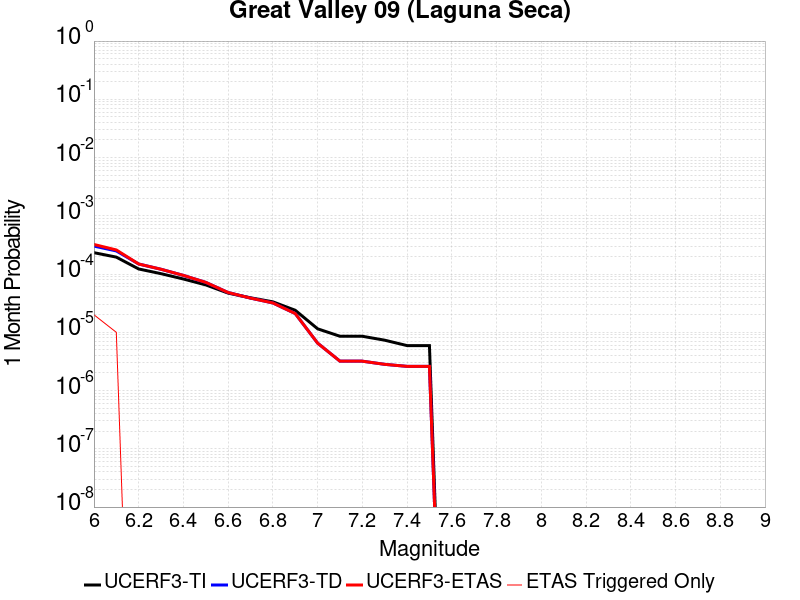 |  | 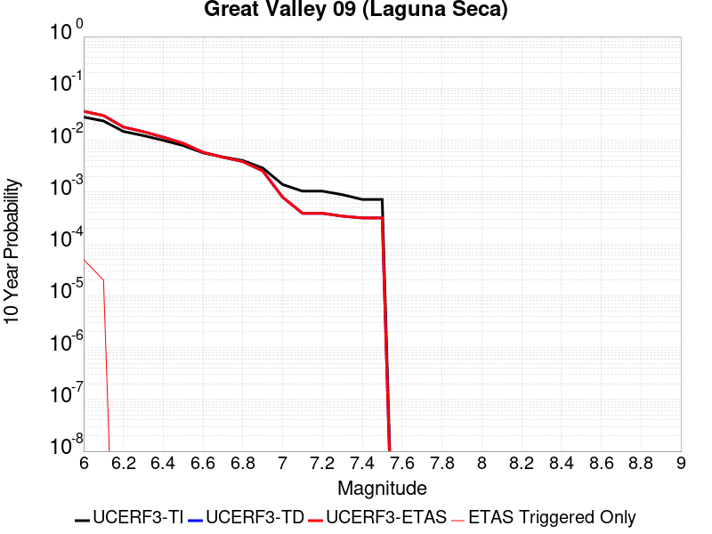 |

| Magnitude | 1 wk TI Prob | 1 wk TD Prob | 1 wk ETAS Prob | 1 wk ETAS/TD Gain | 1 wk ETAS Triggered Only | 1 mo TI Prob | 1 mo TD Prob | 1 mo ETAS Prob | 1 mo ETAS/TD Gain | 1 mo ETAS Triggered Only | 1 yr TI Prob | 1 yr TD Prob | 1 yr ETAS Prob | 1 yr ETAS/TD Gain | 1 yr ETAS Triggered Only | 10 yr TI Prob | 10 yr TD Prob | 10 yr ETAS Prob | 10 yr ETAS/TD Gain | 10 yr ETAS Triggered Only |
|-----|-----|-----|-----|-----|-----|-----|-----|-----|-----|-----|-----|-----|-----|-----|-----|-----|-----|-----|-----|-----|
| 6.0 | 5.4353277E-5 | 7.050019E-5 | 9.0498776E-5 | 1.2836672 | 2.0E-5 | 2.3292181E-4 | 3.0211007E-4 | 3.2210402E-4 | 1.0661811 | 2.0E-5 | 0.0028321352 | 0.0036720056 | 0.0037018955 | 1.00814 | 3.0E-5 | 0.02796312 | 0.036115844 | 0.036164038 | 1.0013344 | 5.0E-5 |
| 6.1 | 4.5578287E-5 | 5.822054E-5 | 6.821996E-5 | 1.1717507 | 1.0E-5 | 1.953209E-4 | 2.4949352E-4 | 2.5949103E-4 | 1.0400712 | 1.0E-5 | 0.0023754383 | 0.0030333549 | 0.0030433247 | 1.0032867 | 1.0E-5 | 0.023502063 | 0.029919893 | 0.029939294 | 1.0006485 | 2.0E-5 |
| 6.2 | 2.8536782E-5 | 3.4736422E-5 | 3.4736422E-5 | 1.0 | 0.0 | 1.2229476E-4 | 1.4886161E-4 | 1.4886161E-4 | 1.0 | 0.0 | 0.0014879217 | 0.0018108576 | 0.0018108576 | 1.0 | 0.0 | 0.014779986 | 0.017958276 | 0.017958276 | 1.0 | 0.0 |
| 6.3 | 2.3698774E-5 | 2.8213344E-5 | 2.8213344E-5 | 1.0 | 0.0 | 1.01562226E-4 | 1.2090833E-4 | 1.2090833E-4 | 1.0 | 0.0 | 0.0012358186 | 0.001471051 | 0.001471051 | 1.0 | 0.0 | 0.012289686 | 0.014611455 | 0.014611455 | 1.0 | 0.0 |
| 6.4 | 1.9191197E-5 | 2.212289E-5 | 2.212289E-5 | 1.0 | 0.0 | 8.2245395E-5 | 9.4808805E-5 | 9.4808805E-5 | 1.0 | 0.0 | 0.0010008777 | 0.0011536906 | 0.0011536906 | 1.0 | 0.0 | 0.009963818 | 0.011477022 | 0.011477022 | 1.0 | 0.0 |
| 6.5 | 1.5203241E-5 | 1.6801298E-5 | 1.6801298E-5 | 1.0 | 0.0 | 6.5155116E-5 | 7.200338E-5 | 7.200338E-5 | 1.0 | 0.0 | 7.9297484E-4 | 8.76301E-4 | 8.76301E-4 | 1.0 | 0.0 | 0.007901512 | 0.008729581 | 0.008729581 | 1.0 | 0.0 |
| 6.6 | 1.0984925E-5 | 1.12425605E-5 | 1.12425605E-5 | 1.0 | 0.0 | 4.70774E-5 | 4.8181533E-5 | 4.8181533E-5 | 1.0 | 0.0 | 5.730166E-4 | 5.8645604E-4 | 5.8645604E-4 | 1.0 | 0.0 | 0.005715413 | 0.0058494755 | 0.0058494755 | 1.0 | 0.0 |
| 6.7 | 9.134616E-6 | 9.019868E-6 | 9.019868E-6 | 1.0 | 0.0 | 3.9147766E-5 | 3.865602E-5 | 3.865602E-5 | 1.0 | 0.0 | 4.7651984E-4 | 4.7053778E-4 | 4.7053778E-4 | 1.0 | 0.0 | 0.004754993 | 0.00469566 | 0.00469566 | 1.0 | 0.0 |
| 6.8 | 7.785589E-6 | 7.4519185E-6 | 7.4519185E-6 | 1.0 | 0.0 | 3.3366385E-5 | 3.1936415E-5 | 3.1936415E-5 | 1.0 | 0.0 | 4.0616E-4 | 3.887585E-4 | 3.887585E-4 | 1.0 | 0.0 | 0.0040541845 | 0.003880988 | 0.003880988 | 1.0 | 0.0 |
| 6.9 | 5.579095E-6 | 4.8984666E-6 | 4.8984666E-6 | 1.0 | 0.0 | 2.3910188E-5 | 2.0993268E-5 | 2.0993268E-5 | 1.0 | 0.0 | 2.9106764E-4 | 2.5556443E-4 | 2.5556443E-4 | 1.0 | 0.0 | 0.002906867 | 0.0025528427 | 0.0025528427 | 1.0 | 0.0 |
| 7.0 | 2.6816688E-6 | 1.521587E-6 | 1.521587E-6 | 1.0 | 0.0 | 1.1492816E-5 | 6.521071E-6 | 6.521071E-6 | 1.0 | 0.0 | 1.3991605E-4 | 7.939124E-5 | 7.939124E-5 | 1.0 | 0.0 | 0.0013982799 | 7.936375E-4 | 7.936375E-4 | 1.0 | 0.0 |
| 7.1 | 1.9951021E-6 | 7.45357E-7 | 7.45357E-7 | 1.0 | 0.0 | 8.55041E-6 | 3.1943835E-6 | 3.1943835E-6 | 1.0 | 0.0 | 1.0409627E-4 | 3.889097E-5 | 3.889097E-5 | 1.0 | 0.0 | 0.0010404752 | 3.8884574E-4 | 3.8884574E-4 | 1.0 | 0.0 |
| 7.2 | 1.9951021E-6 | 7.45357E-7 | 7.45357E-7 | 1.0 | 0.0 | 8.55041E-6 | 3.1943835E-6 | 3.1943835E-6 | 1.0 | 0.0 | 1.0409627E-4 | 3.889097E-5 | 3.889097E-5 | 1.0 | 0.0 | 0.0010404752 | 3.8884574E-4 | 3.8884574E-4 | 1.0 | 0.0 |
| 7.3 | 1.7087556E-6 | 6.578663E-7 | 6.578663E-7 | 1.0 | 0.0 | 7.3232177E-6 | 2.819424E-6 | 2.819424E-6 | 1.0 | 0.0 | 8.915652E-5 | 3.432599E-5 | 3.432599E-5 | 1.0 | 0.0 | 8.9120766E-4 | 3.432109E-4 | 3.432109E-4 | 1.0 | 0.0 |
| 7.4 | 1.3804846E-6 | 6.0737113E-7 | 6.0737113E-7 | 1.0 | 0.0 | 5.916349E-6 | 2.6030168E-6 | 2.6030168E-6 | 1.0 | 0.0 | 7.2029165E-5 | 3.169131E-5 | 3.169131E-5 | 1.0 | 0.0 | 7.200583E-4 | 3.168719E-4 | 3.168719E-4 | 1.0 | 0.0 |
| 7.5 | 1.3804846E-6 | 6.0737113E-7 | 6.0737113E-7 | 1.0 | 0.0 | 5.916349E-6 | 2.6030168E-6 | 2.6030168E-6 | 1.0 | 0.0 | 7.2029165E-5 | 3.169131E-5 | 3.169131E-5 | 1.0 | 0.0 | 7.200583E-4 | 3.168719E-4 | 3.168719E-4 | 1.0 | 0.0 |

## Honey Lake 2011 CFM
*[(top)](#table-of-contents)*

| 1 Week | 1 Month | 1 Year | 10 Year |
|-----|-----|-----|-----|
|  |  |  | 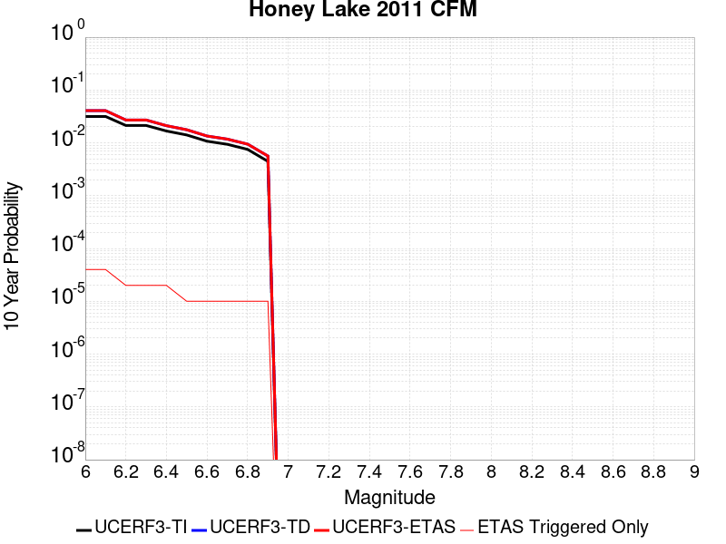 |

| Magnitude | 1 wk TI Prob | 1 wk TD Prob | 1 wk ETAS Prob | 1 wk ETAS/TD Gain | 1 wk ETAS Triggered Only | 1 mo TI Prob | 1 mo TD Prob | 1 mo ETAS Prob | 1 mo ETAS/TD Gain | 1 mo ETAS Triggered Only | 1 yr TI Prob | 1 yr TD Prob | 1 yr ETAS Prob | 1 yr ETAS/TD Gain | 1 yr ETAS Triggered Only | 10 yr TI Prob | 10 yr TD Prob | 10 yr ETAS Prob | 10 yr ETAS/TD Gain | 10 yr ETAS Triggered Only |
|-----|-----|-----|-----|-----|-----|-----|-----|-----|-----|-----|-----|-----|-----|-----|-----|-----|-----|-----|-----|-----|
| 6.0 | 6.155506E-5 | 7.954708E-5 | 8.954628E-5 | 1.1257017 | 1.0E-5 | 2.6378073E-4 | 3.4087323E-4 | 3.508698E-4 | 1.0293264 | 1.0E-5 | 0.0032068014 | 0.0041426765 | 0.0041625937 | 1.0048078 | 2.0E-5 | 0.03160919 | 0.040703055 | 0.040741425 | 1.0009427 | 4.0E-5 |
| 6.1 | 6.155506E-5 | 7.954708E-5 | 8.954628E-5 | 1.1257017 | 1.0E-5 | 2.6378073E-4 | 3.4087323E-4 | 3.508698E-4 | 1.0293264 | 1.0E-5 | 0.0032068014 | 0.0041426765 | 0.0041625937 | 1.0048078 | 2.0E-5 | 0.03160919 | 0.040703055 | 0.040741425 | 1.0009427 | 4.0E-5 |
| 6.2 | 4.1335024E-5 | 5.257652E-5 | 5.257652E-5 | 1.0 | 0.0 | 1.7713808E-4 | 2.2530954E-4 | 2.2530954E-4 | 1.0 | 0.0 | 0.0021545228 | 0.0027398444 | 0.002749817 | 1.0036398 | 1.0E-5 | 0.021337535 | 0.027076809 | 0.027096266 | 1.0007186 | 2.0E-5 |
| 6.3 | 4.1335024E-5 | 5.257652E-5 | 5.257652E-5 | 1.0 | 0.0 | 1.7713808E-4 | 2.2530954E-4 | 2.2530954E-4 | 1.0 | 0.0 | 0.0021545228 | 0.0027398444 | 0.002749817 | 1.0036398 | 1.0E-5 | 0.021337535 | 0.027076809 | 0.027096266 | 1.0007186 | 2.0E-5 |
| 6.4 | 3.2393702E-5 | 4.0887273E-5 | 4.0887273E-5 | 1.0 | 0.0 | 1.3882275E-4 | 1.7522006E-4 | 1.7522006E-4 | 1.0 | 0.0 | 0.0016888566 | 0.0021313233 | 0.002141302 | 1.004682 | 1.0E-5 | 0.016760793 | 0.021119867 | 0.021139443 | 1.000927 | 2.0E-5 |
| 6.5 | 2.7205504E-5 | 3.4211767E-5 | 3.4211767E-5 | 1.0 | 0.0 | 1.1658981E-4 | 1.4661417E-4 | 1.4661417E-4 | 1.0 | 0.0 | 0.0014185566 | 0.0017836596 | 0.0017936417 | 1.0055964 | 1.0E-5 | 0.014095354 | 0.017702963 | 0.017712785 | 1.0005549 | 1.0E-5 |
| 6.6 | 2.069265E-5 | 2.5955416E-5 | 2.5955416E-5 | 1.0 | 0.0 | 8.867977E-5 | 1.1123324E-4 | 1.1123324E-4 | 1.0 | 0.0 | 0.0010791414 | 0.0013535074 | 0.0013634939 | 1.0073782 | 1.0E-5 | 0.010739161 | 0.0134610105 | 0.013470876 | 1.0007329 | 1.0E-5 |
| 6.7 | 1.8060919E-5 | 2.265683E-5 | 2.265683E-5 | 1.0 | 0.0 | 7.7401644E-5 | 9.7097545E-5 | 9.7097545E-5 | 1.0 | 0.0 | 9.419576E-4 | 0.0011816025 | 0.0011915907 | 1.0084531 | 1.0E-5 | 0.009379748 | 0.0117612425 | 0.011771125 | 1.0008403 | 1.0E-5 |
| 6.8 | 1.4474663E-5 | 1.8181274E-5 | 1.8181274E-5 | 1.0 | 0.0 | 6.203279E-5 | 7.791785E-5 | 7.791785E-5 | 1.0 | 0.0 | 7.5498753E-4 | 9.4831345E-4 | 9.583039E-4 | 1.010535 | 1.0E-5 | 0.007524277 | 0.009450195 | 0.009460101 | 1.0010482 | 1.0E-5 |
| 6.9 | 8.564552E-6 | 1.0802311E-5 | 1.0802311E-5 | 1.0 | 0.0 | 3.6704707E-5 | 4.6295176E-5 | 4.6295176E-5 | 1.0 | 0.0 | 4.4678818E-4 | 5.635644E-4 | 5.735588E-4 | 1.0177342 | 1.0E-5 | 0.0044589094 | 0.0056278505 | 0.0056377943 | 1.0017669 | 1.0E-5 |

## San Gregorio (North) 2011 CFM
*[(top)](#table-of-contents)*

| 1 Week | 1 Month | 1 Year | 10 Year |
|-----|-----|-----|-----|
| 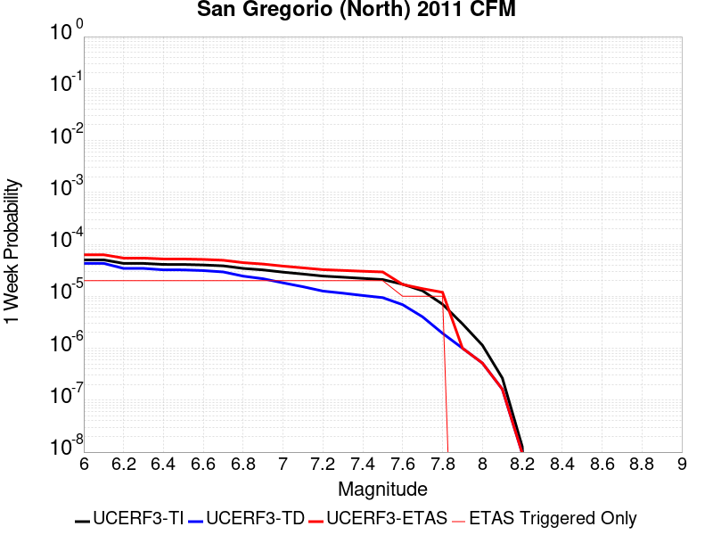 |  |  |  |

| Magnitude | 1 wk TI Prob | 1 wk TD Prob | 1 wk ETAS Prob | 1 wk ETAS/TD Gain | 1 wk ETAS Triggered Only | 1 mo TI Prob | 1 mo TD Prob | 1 mo ETAS Prob | 1 mo ETAS/TD Gain | 1 mo ETAS Triggered Only | 1 yr TI Prob | 1 yr TD Prob | 1 yr ETAS Prob | 1 yr ETAS/TD Gain | 1 yr ETAS Triggered Only | 10 yr TI Prob | 10 yr TD Prob | 10 yr ETAS Prob | 10 yr ETAS/TD Gain | 10 yr ETAS Triggered Only |
|-----|-----|-----|-----|-----|-----|-----|-----|-----|-----|-----|-----|-----|-----|-----|-----|-----|-----|-----|-----|-----|
| 6.0 | 5.0283932E-5 | 4.3057098E-5 | 6.3056235E-5 | 1.4644794 | 2.0E-5 | 2.1548476E-4 | 1.8451746E-4 | 2.0451377E-4 | 1.1083708 | 2.0E-5 | 0.0026203706 | 0.002244199 | 0.0022741316 | 1.0133379 | 3.0E-5 | 0.02589687 | 0.022295918 | 0.02232525 | 1.0013156 | 3.0E-5 |
| 6.1 | 5.0283932E-5 | 4.3057098E-5 | 6.3056235E-5 | 1.4644794 | 2.0E-5 | 2.1548476E-4 | 1.8451746E-4 | 2.0451377E-4 | 1.1083708 | 2.0E-5 | 0.0026203706 | 0.002244199 | 0.0022741316 | 1.0133379 | 3.0E-5 | 0.02589687 | 0.022295918 | 0.02232525 | 1.0013156 | 3.0E-5 |
| 6.2 | 4.2998647E-5 | 3.4440873E-5 | 5.444018E-5 | 1.5806854 | 2.0E-5 | 1.842669E-4 | 1.4759546E-4 | 1.675925E-4 | 1.1354855 | 2.0E-5 | 0.0022411412 | 0.001795506 | 0.0018254521 | 1.0166783 | 3.0E-5 | 0.022186736 | 0.017884884 | 0.017914347 | 1.0016474 | 3.0E-5 |
| 6.3 | 4.2998647E-5 | 3.4440873E-5 | 5.444018E-5 | 1.5806854 | 2.0E-5 | 1.842669E-4 | 1.4759546E-4 | 1.675925E-4 | 1.1354855 | 2.0E-5 | 0.0022411412 | 0.001795506 | 0.0018254521 | 1.0166783 | 3.0E-5 | 0.022186736 | 0.017884884 | 0.017914347 | 1.0016474 | 3.0E-5 |
| 6.4 | 4.1101295E-5 | 3.2326076E-5 | 5.2325428E-5 | 1.6186756 | 2.0E-5 | 1.7613651E-4 | 1.3853304E-4 | 1.5853027E-4 | 1.1443499 | 2.0E-5 | 0.0021423528 | 0.0016853481 | 0.0017152976 | 1.0177705 | 3.0E-5 | 0.02121817 | 0.016800618 | 0.016830115 | 1.0017556 | 3.0E-5 |
| 6.5 | 4.1032585E-5 | 3.224411E-5 | 5.2243464E-5 | 1.6202483 | 2.0E-5 | 1.7584208E-4 | 1.381818E-4 | 1.5817903E-4 | 1.1447169 | 2.0E-5 | 0.0021387753 | 0.0016810785 | 0.001711028 | 1.0178157 | 3.0E-5 | 0.021183075 | 0.01675857 | 0.016788067 | 1.0017601 | 3.0E-5 |
| 6.6 | 4.011629E-5 | 3.1265718E-5 | 5.126509E-5 | 1.6396583 | 2.0E-5 | 1.7191563E-4 | 1.3398913E-4 | 1.5398645E-4 | 1.1492459 | 2.0E-5 | 0.0020910634 | 0.0016301107 | 0.0016600618 | 1.0183736 | 3.0E-5 | 0.020714961 | 0.016257357 | 0.016286869 | 1.0018153 | 3.0E-5 |
| 6.7 | 3.8583938E-5 | 2.9452754E-5 | 4.9452166E-5 | 1.6790336 | 2.0E-5 | 1.6534925E-4 | 1.2622007E-4 | 1.4621754E-4 | 1.1584334 | 2.0E-5 | 0.0020112682 | 0.0015356604 | 0.0015656142 | 1.0195056 | 3.0E-5 | 0.019931622 | 0.015326062 | 0.015355603 | 1.0019275 | 3.0E-5 |
| 6.8 | 3.44341E-5 | 2.4450024E-5 | 4.4449534E-5 | 1.817975 | 2.0E-5 | 1.4756636E-4 | 1.0478167E-4 | 1.2477957E-4 | 1.1908531 | 2.0E-5 | 0.0017951399 | 0.0012749807 | 0.0012949553 | 1.0156665 | 2.0E-5 | 0.017807078 | 0.012751525 | 0.01277127 | 1.0015484 | 2.0E-5 |
| 6.9 | 3.221199E-5 | 2.1777196E-5 | 4.177676E-5 | 1.9183719 | 2.0E-5 | 1.3804408E-4 | 9.3327544E-5 | 1.13325674E-4 | 1.214279 | 2.0E-5 | 0.0016793909 | 0.0011356788 | 0.0011556561 | 1.0175906 | 2.0E-5 | 0.01666756 | 0.011372544 | 0.011392316 | 1.0017387 | 2.0E-5 |
| 7.0 | 2.9186718E-5 | 1.814604E-5 | 3.8145678E-5 | 2.1021488 | 2.0E-5 | 1.2507994E-4 | 7.776645E-5 | 9.7764896E-5 | 1.2571603 | 2.0E-5 | 0.0015217843 | 9.463997E-4 | 9.6638076E-4 | 1.0211127 | 2.0E-5 | 0.015114053 | 0.0094966395 | 0.00951645 | 1.002086 | 2.0E-5 |
| 7.1 | 2.6840138E-5 | 1.5283675E-5 | 3.528337E-5 | 2.3085659 | 2.0E-5 | 1.1502409E-4 | 6.549983E-5 | 8.549852E-5 | 1.3053243 | 2.0E-5 | 0.0013995186 | 7.971706E-4 | 8.171547E-4 | 1.0250688 | 2.0E-5 | 0.013907375 | 0.0080155255 | 0.0080353655 | 1.0024751 | 2.0E-5 |
| 7.2 | 2.453002E-5 | 1.2605825E-5 | 3.2605574E-5 | 2.586548 | 2.0E-5 | 1.05124425E-4 | 5.4023847E-5 | 7.402277E-5 | 1.3701869 | 2.0E-5 | 0.0012791384 | 6.5754243E-4 | 6.7752926E-4 | 1.0303963 | 2.0E-5 | 0.012718005 | 0.006627395 | 0.0066472623 | 1.0029978 | 2.0E-5 |
| 7.3 | 2.3330727E-5 | 1.1487833E-5 | 3.14876E-5 | 2.7409525 | 2.0E-5 | 9.9985E-5 | 4.923264E-5 | 6.923165E-5 | 1.4062146 | 2.0E-5 | 0.0012166376 | 5.99243E-4 | 6.19231E-4 | 1.0333555 | 2.0E-5 | 0.012099981 | 0.0060462817 | 0.0060661607 | 1.0032878 | 2.0E-5 |
| 7.4 | 2.2136466E-5 | 1.0368137E-5 | 3.036793E-5 | 2.928967 | 2.0E-5 | 9.486712E-5 | 4.4434113E-5 | 6.4433225E-5 | 1.4500846 | 2.0E-5 | 0.0011543952 | 5.408513E-4 | 5.608405E-4 | 1.0369587 | 2.0E-5 | 0.011484168 | 0.0054640025 | 0.005483893 | 1.0036403 | 2.0E-5 |
| 7.5 | 2.0994974E-5 | 9.426374E-6 | 2.9426186E-5 | 3.1216865 | 2.0E-5 | 8.997535E-5 | 4.0398125E-5 | 6.0397317E-5 | 1.4950525 | 2.0E-5 | 0.0010948994 | 4.917364E-4 | 5.1172654E-4 | 1.0406522 | 2.0E-5 | 0.010895205 | 0.004973108 | 0.0049930084 | 1.0040016 | 2.0E-5 |
| 7.6 | 1.7091823E-5 | 6.892992E-6 | 1.6892924E-5 | 2.4507387 | 1.0E-5 | 7.3248615E-5 | 2.9541061E-5 | 3.9540766E-5 | 1.3385019 | 1.0E-5 | 8.9143694E-4 | 3.5960317E-4 | 3.6959955E-4 | 1.0277984 | 1.0E-5 | 0.008878695 | 0.0036480771 | 0.0036580407 | 1.0027312 | 1.0E-5 |
| 7.7 | 1.2772179E-5 | 4.0202267E-6 | 1.4020186E-5 | 3.487412 | 1.0E-5 | 5.473676E-5 | 1.722943E-5 | 2.7229256E-5 | 1.5803922 | 1.0E-5 | 6.6621625E-4 | 2.0974813E-4 | 2.1974604E-4 | 1.0476662 | 1.0E-5 | 0.006642225 | 0.0021365841 | 0.0021465628 | 1.0046704 | 1.0E-5 |
| 7.8 | 7.041923E-6 | 1.9402341E-6 | 1.1940215E-5 | 6.1540074 | 1.0E-5 | 3.017932E-5 | 8.315263E-6 | 1.8315179E-5 | 2.2025979 | 1.0E-5 | 3.6737128E-4 | 1.01233614E-4 | 1.11232606E-4 | 1.0987715 | 1.0E-5 | 0.0036676454 | 0.0010376878 | 0.0010476774 | 1.0096269 | 1.0E-5 |
| 7.9 | 2.946768E-6 | 1.0031822E-6 | 1.0031822E-6 | 1.0 | 0.0 | 1.2628945E-5 | 4.299345E-6 | 4.299345E-6 | 1.0 | 0.0 | 1.5374656E-4 | 5.2343268E-5 | 5.2343268E-5 | 1.0 | 0.0 | 0.0015364023 | 5.339059E-4 | 5.339059E-4 | 1.0 | 0.0 |
| 8.0 | 1.1433375E-6 | 5.180804E-7 | 5.180804E-7 | 1.0 | 0.0 | 4.9000087E-6 | 2.2203426E-6 | 2.2203426E-6 | 1.0 | 0.0 | 5.965597E-5 | 2.7032334E-5 | 2.7032334E-5 | 1.0 | 0.0 | 5.963996E-4 | 2.7394458E-4 | 2.7394458E-4 | 1.0 | 0.0 |
| 8.1 | 2.6675295E-7 | 1.6288074E-7 | 1.6288074E-7 | 1.0 | 0.0 | 1.1432264E-6 | 6.9806015E-7 | 6.9806015E-7 | 1.0 | 0.0 | 1.3918692E-5 | 8.498849E-6 | 8.498849E-6 | 1.0 | 0.0 | 1.391782E-4 | 8.6366665E-5 | 8.6366665E-5 | 1.0 | 0.0 |
| 8.2 | 1.2704569E-8 | 9.429871E-9 | 9.429871E-9 | 1.0 | 0.0 | 5.444815E-8 | 4.041373E-8 | 4.041373E-8 | 1.0 | 0.0 | 6.629061E-7 | 4.920371E-7 | 4.920371E-7 | 1.0 | 0.0 | 6.629041E-6 | 5.1106863E-6 | 5.1106863E-6 | 1.0 | 0.0 |

## Sierra Madre
*[(top)](#table-of-contents)*

| 1 Week | 1 Month | 1 Year | 10 Year |
|-----|-----|-----|-----|
|  | 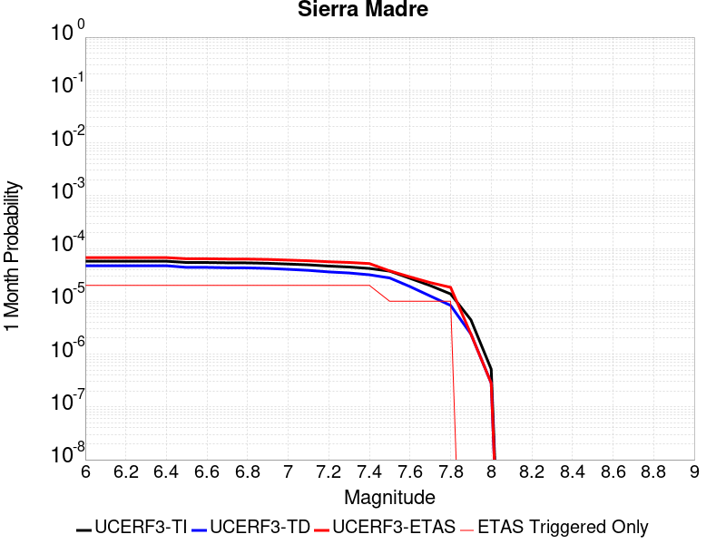 |  |  |

| Magnitude | 1 wk TI Prob | 1 wk TD Prob | 1 wk ETAS Prob | 1 wk ETAS/TD Gain | 1 wk ETAS Triggered Only | 1 mo TI Prob | 1 mo TD Prob | 1 mo ETAS Prob | 1 mo ETAS/TD Gain | 1 mo ETAS Triggered Only | 1 yr TI Prob | 1 yr TD Prob | 1 yr ETAS Prob | 1 yr ETAS/TD Gain | 1 yr ETAS Triggered Only | 10 yr TI Prob | 10 yr TD Prob | 10 yr ETAS Prob | 10 yr ETAS/TD Gain | 10 yr ETAS Triggered Only |
|-----|-----|-----|-----|-----|-----|-----|-----|-----|-----|-----|-----|-----|-----|-----|-----|-----|-----|-----|-----|-----|
| 6.0 | 1.3379373E-5 | 1.1000776E-5 | 2.1000666E-5 | 1.9090167 | 1.0E-5 | 5.7338908E-5 | 4.714534E-5 | 6.71444E-5 | 1.4242 | 2.0E-5 | 6.978776E-4 | 5.738448E-4 | 6.1382185E-4 | 1.0696653 | 4.0E-5 | 0.0069569005 | 0.0057238447 | 0.005763616 | 1.0069484 | 4.0E-5 |
| 6.1 | 1.3379373E-5 | 1.1000776E-5 | 2.1000666E-5 | 1.9090167 | 1.0E-5 | 5.7338908E-5 | 4.714534E-5 | 6.71444E-5 | 1.4242 | 2.0E-5 | 6.978776E-4 | 5.738448E-4 | 6.1382185E-4 | 1.0696653 | 4.0E-5 | 0.0069569005 | 0.0057238447 | 0.005763616 | 1.0069484 | 4.0E-5 |
| 6.2 | 1.3379373E-5 | 1.1000776E-5 | 2.1000666E-5 | 1.9090167 | 1.0E-5 | 5.7338908E-5 | 4.714534E-5 | 6.71444E-5 | 1.4242 | 2.0E-5 | 6.978776E-4 | 5.738448E-4 | 6.1382185E-4 | 1.0696653 | 4.0E-5 | 0.0069569005 | 0.0057238447 | 0.005763616 | 1.0069484 | 4.0E-5 |
| 6.3 | 1.3379373E-5 | 1.1000776E-5 | 2.1000666E-5 | 1.9090167 | 1.0E-5 | 5.7338908E-5 | 4.714534E-5 | 6.71444E-5 | 1.4242 | 2.0E-5 | 6.978776E-4 | 5.738448E-4 | 6.1382185E-4 | 1.0696653 | 4.0E-5 | 0.0069569005 | 0.0057238447 | 0.005763616 | 1.0069484 | 4.0E-5 |
| 6.4 | 1.3379373E-5 | 1.1000776E-5 | 2.1000666E-5 | 1.9090167 | 1.0E-5 | 5.7338908E-5 | 4.714534E-5 | 6.71444E-5 | 1.4242 | 2.0E-5 | 6.978776E-4 | 5.738448E-4 | 6.1382185E-4 | 1.0696653 | 4.0E-5 | 0.0069569005 | 0.0057238447 | 0.005763616 | 1.0069484 | 4.0E-5 |
| 6.5 | 1.26563245E-5 | 1.0230232E-5 | 2.0230129E-5 | 1.977485 | 1.0E-5 | 5.4240263E-5 | 4.384312E-5 | 6.384224E-5 | 1.456152 | 2.0E-5 | 6.601751E-4 | 5.3366035E-4 | 5.73639E-4 | 1.0749141 | 4.0E-5 | 0.006582173 | 0.0053239604 | 0.0053637475 | 1.0074732 | 4.0E-5 |
| 6.6 | 1.26563245E-5 | 1.0230232E-5 | 2.0230129E-5 | 1.977485 | 1.0E-5 | 5.4240263E-5 | 4.384312E-5 | 6.384224E-5 | 1.456152 | 2.0E-5 | 6.601751E-4 | 5.3366035E-4 | 5.73639E-4 | 1.0749141 | 4.0E-5 | 0.006582173 | 0.0053239604 | 0.0053637475 | 1.0074732 | 4.0E-5 |
| 6.7 | 1.2502474E-5 | 1.00663765E-5 | 2.0066276E-5 | 1.9933962 | 1.0E-5 | 5.3580934E-5 | 4.3140906E-5 | 6.314004E-5 | 1.4635772 | 2.0E-5 | 6.521526E-4 | 5.25115E-4 | 5.65094E-4 | 1.0761338 | 4.0E-5 | 0.0065024206 | 0.0052389116 | 0.005278702 | 1.0075952 | 4.0E-5 |
| 6.8 | 1.2454966E-5 | 1.0018662E-5 | 2.001856E-5 | 1.9981273 | 1.0E-5 | 5.3377335E-5 | 4.293642E-5 | 6.293556E-5 | 1.465785 | 2.0E-5 | 6.4967526E-4 | 5.226266E-4 | 5.626057E-4 | 1.0764965 | 4.0E-5 | 0.006477792 | 0.0052141445 | 0.0052539357 | 1.0076314 | 4.0E-5 |
| 6.9 | 1.2225574E-5 | 9.792639E-6 | 1.979254E-5 | 2.0211651 | 1.0E-5 | 5.2394265E-5 | 4.196778E-5 | 6.1966944E-5 | 1.476536 | 2.0E-5 | 6.3771347E-4 | 5.10839E-4 | 5.508186E-4 | 1.0782626 | 4.0E-5 | 0.006358865 | 0.0050968137 | 0.00513661 | 1.0078081 | 4.0E-5 |
| 7.0 | 1.182946E-5 | 9.399179E-6 | 1.9399085E-5 | 2.0639126 | 1.0E-5 | 5.06967E-5 | 4.0281582E-5 | 6.0280778E-5 | 1.4964849 | 2.0E-5 | 6.1705755E-4 | 4.903189E-4 | 5.302993E-4 | 1.0815395 | 4.0E-5 | 0.006153469 | 0.004892533 | 0.0049323374 | 1.0081357 | 4.0E-5 |
| 7.1 | 1.14369095E-5 | 8.986194E-6 | 1.8986104E-5 | 2.1128082 | 1.0E-5 | 4.9014405E-5 | 3.85117E-5 | 5.8510926E-5 | 1.5193027 | 2.0E-5 | 5.9658696E-4 | 4.6878002E-4 | 5.0876127E-4 | 1.0852878 | 4.0E-5 | 0.005949879 | 0.0046780678 | 0.004717881 | 1.0085106 | 4.0E-5 |
| 7.2 | 1.0836419E-5 | 8.39959E-6 | 1.8399505E-5 | 2.1905243 | 1.0E-5 | 4.644097E-5 | 3.599775E-5 | 5.599703E-5 | 1.5555702 | 2.0E-5 | 5.652721E-4 | 4.3818538E-4 | 4.7816784E-4 | 1.0912455 | 4.0E-5 | 0.0056383642 | 0.0043733614 | 0.0044131866 | 1.0091063 | 4.0E-5 |
| 7.3 | 1.0403439E-5 | 8.020854E-6 | 1.8020773E-5 | 2.24674 | 1.0E-5 | 4.4585406E-5 | 3.437464E-5 | 5.437395E-5 | 1.5818043 | 2.0E-5 | 5.426921E-4 | 4.184318E-4 | 4.5841504E-4 | 1.0955551 | 4.0E-5 | 0.005413687 | 0.004176585 | 0.0042164177 | 1.0095372 | 4.0E-5 |
| 7.4 | 9.768864E-6 | 7.4144855E-6 | 1.7414412E-5 | 2.3487012 | 1.0E-5 | 4.186589E-5 | 3.1775984E-5 | 5.1775347E-5 | 1.6293862 | 2.0E-5 | 5.09598E-4 | 3.868048E-4 | 4.2678934E-4 | 1.1033714 | 4.0E-5 | 0.0050843097 | 0.0038614576 | 0.0039013033 | 1.0103188 | 4.0E-5 |
| 7.5 | 8.687089E-6 | 6.450183E-6 | 6.450183E-6 | 1.0 | 0.0 | 3.722985E-5 | 2.7643353E-5 | 3.7643076E-5 | 1.3617406 | 1.0E-5 | 4.5317915E-4 | 3.3650672E-4 | 3.5649998E-4 | 1.0594141 | 2.0E-5 | 0.004522561 | 0.003360109 | 0.0033800418 | 1.0059322 | 2.0E-5 |
| 7.6 | 6.3506063E-6 | 4.430329E-6 | 4.430329E-6 | 1.0 | 0.0 | 2.72166E-5 | 1.8986988E-5 | 2.8986798E-5 | 1.5266665 | 1.0E-5 | 3.3131172E-4 | 2.3114232E-4 | 2.4114E-4 | 1.0432534 | 1.0E-5 | 0.003308182 | 0.0023090935 | 0.0023190705 | 1.0043207 | 1.0E-5 |
| 7.7 | 4.62223E-6 | 2.9329542E-6 | 2.9329542E-6 | 1.0 | 0.0 | 1.9809406E-5 | 1.2569743E-5 | 2.2569617E-5 | 1.7955512 | 1.0E-5 | 2.4115283E-4 | 1.5302589E-4 | 1.6302436E-4 | 1.0653384 | 1.0E-5 | 0.0024089129 | 0.0015292577 | 0.0015392425 | 1.0065291 | 1.0E-5 |
| 7.8 | 3.2145008E-6 | 1.949411E-6 | 1.949411E-6 | 1.0 | 0.0 | 1.3776359E-5 | 8.354592E-6 | 1.8354509E-5 | 2.1969366 | 1.0E-5 | 1.6771426E-4 | 1.01712416E-4 | 1.117114E-4 | 1.0983064 | 1.0E-5 | 0.0016758774 | 0.0010166786 | 0.0010266685 | 1.009826 | 1.0E-5 |
| 7.9 | 1.0391769E-6 | 5.602482E-7 | 5.602482E-7 | 1.0 | 0.0 | 4.4536077E-6 | 2.4010617E-6 | 2.4010617E-6 | 1.0 | 0.0 | 5.4221324E-5 | 2.9232539E-5 | 2.9232539E-5 | 1.0 | 0.0 | 5.4208096E-4 | 2.9228735E-4 | 2.9228735E-4 | 1.0 | 0.0 |
| 8.0 | 1.210983E-7 | 6.613497E-8 | 6.613497E-8 | 1.0 | 0.0 | 5.1899264E-7 | 2.8343558E-7 | 2.8343558E-7 | 1.0 | 0.0 | 6.3187167E-6 | 3.4508228E-6 | 3.4508228E-6 | 1.0 | 0.0 | 6.318537E-5 | 3.450771E-5 | 3.450771E-5 | 1.0 | 0.0 |

## San Luis Range 2011 CFM
*[(top)](#table-of-contents)*

| 1 Week | 1 Month | 1 Year | 10 Year |
|-----|-----|-----|-----|
|  |  |  |  |

| Magnitude | 1 wk TI Prob | 1 wk TD Prob | 1 wk ETAS Prob | 1 wk ETAS/TD Gain | 1 wk ETAS Triggered Only | 1 mo TI Prob | 1 mo TD Prob | 1 mo ETAS Prob | 1 mo ETAS/TD Gain | 1 mo ETAS Triggered Only | 1 yr TI Prob | 1 yr TD Prob | 1 yr ETAS Prob | 1 yr ETAS/TD Gain | 1 yr ETAS Triggered Only | 10 yr TI Prob | 10 yr TD Prob | 10 yr ETAS Prob | 10 yr ETAS/TD Gain | 10 yr ETAS Triggered Only |
|-----|-----|-----|-----|-----|-----|-----|-----|-----|-----|-----|-----|-----|-----|-----|-----|-----|-----|-----|-----|-----|
| 6.0 | 8.8368415E-6 | 8.965455E-6 | 1.8965366E-5 | 2.1153824 | 1.0E-5 | 3.787163E-5 | 3.8422855E-5 | 5.8422087E-5 | 1.5205035 | 2.0E-5 | 4.609895E-4 | 4.6770574E-4 | 4.9769174E-4 | 1.0641129 | 3.0E-5 | 0.0046003438 | 0.004667997 | 0.00470781 | 1.008529 | 4.0E-5 |
| 6.1 | 8.8368415E-6 | 8.965455E-6 | 1.8965366E-5 | 2.1153824 | 1.0E-5 | 3.787163E-5 | 3.8422855E-5 | 5.8422087E-5 | 1.5205035 | 2.0E-5 | 4.609895E-4 | 4.6770574E-4 | 4.9769174E-4 | 1.0641129 | 3.0E-5 | 0.0046003438 | 0.004667997 | 0.00470781 | 1.008529 | 4.0E-5 |
| 6.2 | 8.8368415E-6 | 8.965455E-6 | 1.8965366E-5 | 2.1153824 | 1.0E-5 | 3.787163E-5 | 3.8422855E-5 | 5.8422087E-5 | 1.5205035 | 2.0E-5 | 4.609895E-4 | 4.6770574E-4 | 4.9769174E-4 | 1.0641129 | 3.0E-5 | 0.0046003438 | 0.004667997 | 0.00470781 | 1.008529 | 4.0E-5 |
| 6.3 | 8.8368415E-6 | 8.965455E-6 | 1.8965366E-5 | 2.1153824 | 1.0E-5 | 3.787163E-5 | 3.8422855E-5 | 5.8422087E-5 | 1.5205035 | 2.0E-5 | 4.609895E-4 | 4.6770574E-4 | 4.9769174E-4 | 1.0641129 | 3.0E-5 | 0.0046003438 | 0.004667997 | 0.00470781 | 1.008529 | 4.0E-5 |
| 6.4 | 3.9094193E-6 | 3.941204E-6 | 3.941204E-6 | 1.0 | 0.0 | 1.6754546E-5 | 1.6890766E-5 | 1.6890766E-5 | 1.0 | 0.0 | 2.039675E-4 | 2.0562594E-4 | 2.0562594E-4 | 1.0 | 0.0 | 0.0020378039 | 0.0020543856 | 0.0020643652 | 1.0048577 | 1.0E-5 |
| 6.5 | 3.9094193E-6 | 3.941204E-6 | 3.941204E-6 | 1.0 | 0.0 | 1.6754546E-5 | 1.6890766E-5 | 1.6890766E-5 | 1.0 | 0.0 | 2.039675E-4 | 2.0562594E-4 | 2.0562594E-4 | 1.0 | 0.0 | 0.0020378039 | 0.0020543856 | 0.0020643652 | 1.0048577 | 1.0E-5 |
| 6.6 | 3.0587726E-6 | 3.0753893E-6 | 3.0753893E-6 | 1.0 | 0.0 | 1.3108959E-5 | 1.3180174E-5 | 1.3180174E-5 | 1.0 | 0.0 | 1.595899E-4 | 1.6045693E-4 | 1.6045693E-4 | 1.0 | 0.0 | 0.0015947534 | 0.0016034227 | 0.0016034227 | 1.0 | 0.0 |
| 6.7 | 2.6160574E-6 | 2.6251284E-6 | 2.6251284E-6 | 1.0 | 0.0 | 1.1211626E-5 | 1.1250502E-5 | 1.1250502E-5 | 1.0 | 0.0 | 1.3649299E-4 | 1.3696631E-4 | 1.3696631E-4 | 1.0 | 0.0 | 0.0013640919 | 0.0013688251 | 0.0013688251 | 1.0 | 0.0 |
| 6.8 | 2.5110312E-6 | 2.5181412E-6 | 2.5181412E-6 | 1.0 | 0.0 | 1.0761518E-5 | 1.079199E-5 | 1.079199E-5 | 1.0 | 0.0 | 1.310136E-4 | 1.313846E-4 | 1.313846E-4 | 1.0 | 0.0 | 0.0013093639 | 0.0013130752 | 0.0013130752 | 1.0 | 0.0 |
| 6.9 | 1.8564405E-6 | 1.852488E-6 | 1.852488E-6 | 1.0 | 0.0 | 7.95615E-6 | 7.93921E-6 | 7.93921E-6 | 1.0 | 0.0 | 9.686181E-5 | 9.665562E-5 | 9.665562E-5 | 1.0 | 0.0 | 9.68196E-4 | 9.6613786E-4 | 9.6613786E-4 | 1.0 | 0.0 |
| 7.0 | 1.546127E-6 | 1.5369549E-6 | 1.5369549E-6 | 1.0 | 0.0 | 6.626242E-6 | 6.5869326E-6 | 6.5869326E-6 | 1.0 | 0.0 | 8.06715E-5 | 8.019296E-5 | 8.019296E-5 | 1.0 | 0.0 | 8.0642226E-4 | 8.016409E-4 | 8.016409E-4 | 1.0 | 0.0 |
| 7.1 | 1.3368208E-6 | 1.3235336E-6 | 1.3235336E-6 | 1.0 | 0.0 | 5.7292195E-6 | 5.6722747E-6 | 5.6722747E-6 | 1.0 | 0.0 | 6.975101E-5 | 6.905776E-5 | 6.905776E-5 | 1.0 | 0.0 | 6.972912E-4 | 6.903635E-4 | 6.903635E-4 | 1.0 | 0.0 |
| 7.2 | 1.0623363E-6 | 1.0454378E-6 | 1.0454378E-6 | 1.0 | 0.0 | 4.5528623E-6 | 4.4804397E-6 | 4.4804397E-6 | 1.0 | 0.0 | 5.5429686E-5 | 5.4547992E-5 | 5.4547992E-5 | 1.0 | 0.0 | 5.5415864E-4 | 5.453463E-4 | 5.453463E-4 | 1.0 | 0.0 |
| 7.3 | 7.831679E-7 | 7.727399E-7 | 7.727399E-7 | 1.0 | 0.0 | 3.3564295E-6 | 3.3117383E-6 | 3.3117383E-6 | 1.0 | 0.0 | 4.086376E-5 | 4.031967E-5 | 4.031967E-5 | 1.0 | 0.0 | 4.0856248E-4 | 4.0312367E-4 | 4.0312367E-4 | 1.0 | 0.0 |
| 7.4 | 5.9558846E-7 | 5.910646E-7 | 5.910646E-7 | 1.0 | 0.0 | 2.5525194E-6 | 2.5331315E-6 | 2.5331315E-6 | 1.0 | 0.0 | 3.107648E-5 | 3.084044E-5 | 3.084044E-5 | 1.0 | 0.0 | 3.1072134E-4 | 3.083617E-4 | 3.083617E-4 | 1.0 | 0.0 |
| 7.5 | 4.1616502E-7 | 4.1196404E-7 | 4.1196404E-7 | 1.0 | 0.0 | 1.7835631E-6 | 1.765559E-6 | 1.765559E-6 | 1.0 | 0.0 | 2.1714664E-5 | 2.1495469E-5 | 2.1495469E-5 | 1.0 | 0.0 | 2.1712543E-4 | 2.1493394E-4 | 2.1493394E-4 | 1.0 | 0.0 |
| 7.6 | 2.3816014E-7 | 2.3376614E-7 | 2.3376614E-7 | 1.0 | 0.0 | 1.0206859E-6 | 1.0018545E-6 | 1.0018545E-6 | 1.0 | 0.0 | 1.242678E-5 | 1.219751E-5 | 1.219751E-5 | 1.0 | 0.0 | 1.2426086E-4 | 1.2196843E-4 | 1.2196843E-4 | 1.0 | 0.0 |
| 7.7 | 9.918777E-8 | 9.3868096E-8 | 9.3868096E-8 | 1.0 | 0.0 | 4.2509038E-7 | 4.022918E-7 | 4.022918E-7 | 1.0 | 0.0 | 5.1754632E-6 | 4.8978914E-6 | 4.8978914E-6 | 1.0 | 0.0 | 5.1753424E-5 | 4.897784E-5 | 4.897784E-5 | 1.0 | 0.0 |
| 7.8 | 3.4982556E-8 | 2.968672E-8 | 2.968672E-8 | 1.0 | 0.0 | 1.4992524E-7 | 1.272288E-7 | 1.272288E-7 | 1.0 | 0.0 | 1.8253382E-6 | 1.5490094E-6 | 1.5490094E-6 | 1.0 | 0.0 | 1.8253233E-5 | 1.5489988E-5 | 1.5489988E-5 | 1.0 | 0.0 |
| 7.9 | 1.6624908E-8 | 1.1476994E-8 | 1.1476994E-8 | 1.0 | 0.0 | 7.12496E-8 | 4.9187115E-8 | 4.9187115E-8 | 1.0 | 0.0 | 8.6746354E-7 | 5.988529E-7 | 5.988529E-7 | 1.0 | 0.0 | 8.674601E-6 | 5.9885133E-6 | 5.9885133E-6 | 1.0 | 0.0 |
| 8.0 | 6.3352315E-9 | 3.0886564E-9 | 3.0886564E-9 | 1.0 | 0.0 | 2.715099E-8 | 1.32370985E-8 | 1.32370985E-8 | 1.0 | 0.0 | 3.3056327E-7 | 1.6116167E-7 | 1.6116167E-7 | 1.0 | 0.0 | 3.3056278E-6 | 1.6116155E-6 | 1.6116155E-6 | 1.0 | 0.0 |

## White Wolf
*[(top)](#table-of-contents)*

| 1 Week | 1 Month | 1 Year | 10 Year |
|-----|-----|-----|-----|
| 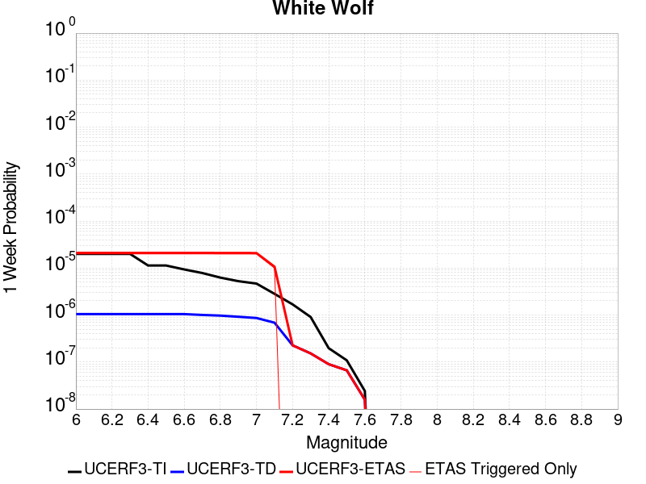 |  | 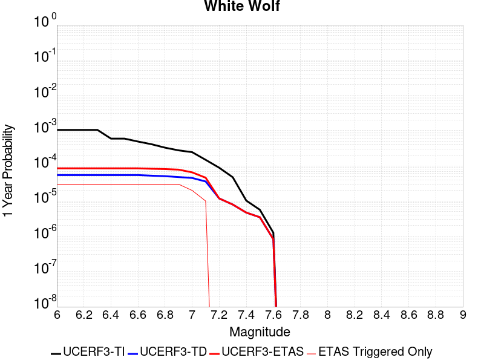 |  |

| Magnitude | 1 wk TI Prob | 1 wk TD Prob | 1 wk ETAS Prob | 1 wk ETAS/TD Gain | 1 wk ETAS Triggered Only | 1 mo TI Prob | 1 mo TD Prob | 1 mo ETAS Prob | 1 mo ETAS/TD Gain | 1 mo ETAS Triggered Only | 1 yr TI Prob | 1 yr TD Prob | 1 yr ETAS Prob | 1 yr ETAS/TD Gain | 1 yr ETAS Triggered Only | 10 yr TI Prob | 10 yr TD Prob | 10 yr ETAS Prob | 10 yr ETAS/TD Gain | 10 yr ETAS Triggered Only |
|-----|-----|-----|-----|-----|-----|-----|-----|-----|-----|-----|-----|-----|-----|-----|-----|-----|-----|-----|-----|-----|
| 6.0 | 2.0037822E-5 | 1.0468583E-6 | 2.1046837E-5 | 20.104763 | 2.0E-5 | 8.587355E-5 | 4.4865283E-6 | 2.4486439E-5 | 5.45777 | 2.0E-5 | 0.001045009 | 5.4622164E-5 | 8.462052E-5 | 1.5491976 | 3.0E-5 | 0.010401085 | 5.4609246E-4 | 5.860706E-4 | 1.0732076 | 4.0E-5 |
| 6.1 | 2.0037822E-5 | 1.0468583E-6 | 2.1046837E-5 | 20.104763 | 2.0E-5 | 8.587355E-5 | 4.4865283E-6 | 2.4486439E-5 | 5.45777 | 2.0E-5 | 0.001045009 | 5.4622164E-5 | 8.462052E-5 | 1.5491976 | 3.0E-5 | 0.010401085 | 5.4609246E-4 | 5.860706E-4 | 1.0732076 | 4.0E-5 |
| 6.2 | 2.0037822E-5 | 1.0468583E-6 | 2.1046837E-5 | 20.104763 | 2.0E-5 | 8.587355E-5 | 4.4865283E-6 | 2.4486439E-5 | 5.45777 | 2.0E-5 | 0.001045009 | 5.4622164E-5 | 8.462052E-5 | 1.5491976 | 3.0E-5 | 0.010401085 | 5.4609246E-4 | 5.860706E-4 | 1.0732076 | 4.0E-5 |
| 6.3 | 2.0037822E-5 | 1.0468583E-6 | 2.1046837E-5 | 20.104763 | 2.0E-5 | 8.587355E-5 | 4.4865283E-6 | 2.4486439E-5 | 5.45777 | 2.0E-5 | 0.001045009 | 5.4622164E-5 | 8.462052E-5 | 1.5491976 | 3.0E-5 | 0.010401085 | 5.4609246E-4 | 5.860706E-4 | 1.0732076 | 4.0E-5 |
| 6.4 | 1.132487E-5 | 1.0468583E-6 | 2.1046837E-5 | 20.104763 | 2.0E-5 | 4.8534253E-5 | 4.4865283E-6 | 2.4486439E-5 | 5.45777 | 2.0E-5 | 5.907443E-4 | 5.4622164E-5 | 8.462052E-5 | 1.5491976 | 3.0E-5 | 0.005891764 | 5.4609246E-4 | 5.860706E-4 | 1.0732076 | 4.0E-5 |
| 6.5 | 1.132487E-5 | 1.0468583E-6 | 2.1046837E-5 | 20.104763 | 2.0E-5 | 4.8534253E-5 | 4.4865283E-6 | 2.4486439E-5 | 5.45777 | 2.0E-5 | 5.907443E-4 | 5.4622164E-5 | 8.462052E-5 | 1.5491976 | 3.0E-5 | 0.005891764 | 5.4609246E-4 | 5.860706E-4 | 1.0732076 | 4.0E-5 |
| 6.6 | 9.347473E-6 | 1.0468583E-6 | 2.1046837E-5 | 20.104763 | 2.0E-5 | 4.0059982E-5 | 4.4865283E-6 | 2.4486439E-5 | 5.45777 | 2.0E-5 | 4.8762115E-4 | 5.4622164E-5 | 8.462052E-5 | 1.5491976 | 3.0E-5 | 0.0048655253 | 5.4609246E-4 | 5.860706E-4 | 1.0732076 | 4.0E-5 |
| 6.7 | 7.842647E-6 | 1.0047773E-6 | 2.1004756E-5 | 20.904888 | 2.0E-5 | 3.361091E-5 | 4.306182E-6 | 2.4306095E-5 | 5.644466 | 2.0E-5 | 4.0913603E-4 | 5.2426552E-5 | 8.242498E-5 | 1.5721991 | 3.0E-5 | 0.004083836 | 5.241468E-4 | 5.6412583E-4 | 1.0762745 | 4.0E-5 |
| 6.8 | 6.26597E-6 | 9.734289E-7 | 2.097341E-5 | 21.54591 | 2.0E-5 | 2.685388E-5 | 4.1718313E-6 | 2.4171748E-5 | 5.7940373 | 2.0E-5 | 3.2689696E-4 | 5.0790914E-5 | 8.078939E-5 | 1.5906268 | 3.0E-5 | 0.003264165 | 5.07798E-4 | 5.477776E-4 | 1.0787315 | 4.0E-5 |
| 6.9 | 5.258436E-6 | 9.1827343E-7 | 2.0918254E-5 | 22.779985 | 2.0E-5 | 2.2535958E-5 | 3.935452E-6 | 2.3935374E-5 | 6.0819883 | 2.0E-5 | 2.7434074E-4 | 4.7913123E-5 | 7.791168E-5 | 1.6261033 | 3.0E-5 | 0.0027400232 | 4.7903272E-4 | 5.1901356E-4 | 1.0834616 | 4.0E-5 |
| 7.0 | 4.675028E-6 | 8.660704E-7 | 2.0866053E-5 | 24.09279 | 2.0E-5 | 2.003568E-5 | 3.7117254E-6 | 2.3711651E-5 | 6.38831 | 2.0E-5 | 2.4390711E-4 | 4.518937E-5 | 6.518846E-5 | 1.442562 | 2.0E-5 | 0.0024363957 | 4.518065E-4 | 4.8179293E-4 | 1.0663701 | 3.0E-5 |
| 7.1 | 2.8270078E-6 | 6.8737717E-7 | 1.068737E-5 | 15.548044 | 1.0E-5 | 1.2115692E-5 | 2.945899E-6 | 1.29458695E-5 | 4.3945394 | 1.0E-5 | 1.4749856E-4 | 3.586577E-5 | 4.5865414E-5 | 1.2788074 | 1.0E-5 | 0.001474007 | 3.5860392E-4 | 3.7859674E-4 | 1.0557518 | 2.0E-5 |
| 7.2 | 1.6881406E-6 | 2.2703432E-7 | 2.2703432E-7 | 1.0 | 0.0 | 7.2348685E-6 | 9.730038E-7 | 9.730038E-7 | 1.0 | 0.0 | 8.808096E-5 | 1.1846259E-5 | 1.1846259E-5 | 1.0 | 0.0 | 8.8046055E-4 | 1.1845643E-4 | 1.2845524E-4 | 1.0844092 | 1.0E-5 |
| 7.3 | 9.086107E-7 | 1.5264496E-7 | 1.5264496E-7 | 1.0 | 0.0 | 3.8940398E-6 | 6.5419255E-7 | 6.5419255E-7 | 1.0 | 0.0 | 4.7408903E-5 | 7.964766E-6 | 7.964766E-6 | 1.0 | 0.0 | 4.739879E-4 | 7.964489E-5 | 8.964409E-5 | 1.1255473 | 1.0E-5 |
| 7.4 | 1.9717383E-7 | 9.003399E-8 | 9.003399E-8 | 1.0 | 0.0 | 8.450304E-7 | 3.8585992E-7 | 3.8585992E-7 | 1.0 | 0.0 | 1.0288197E-5 | 4.697835E-6 | 4.697835E-6 | 1.0 | 0.0 | 1.028772E-4 | 4.6977384E-5 | 5.6976914E-5 | 1.2128584 | 1.0E-5 |
| 7.5 | 1.086975E-7 | 6.659662E-8 | 6.659662E-8 | 1.0 | 0.0 | 4.6584634E-7 | 2.8541407E-7 | 2.8541407E-7 | 1.0 | 0.0 | 5.6716644E-6 | 3.474911E-6 | 3.474911E-6 | 1.0 | 0.0 | 5.6715195E-5 | 3.474859E-5 | 4.474824E-5 | 1.2877715 | 1.0E-5 |
| 7.6 | 2.4217808E-8 | 1.5820849E-8 | 1.5820849E-8 | 1.0 | 0.0 | 1.03790605E-7 | 6.780364E-8 | 6.780364E-8 | 1.0 | 0.0 | 1.2636499E-6 | 8.25509E-7 | 8.25509E-7 | 1.0 | 0.0 | 1.2636427E-5 | 8.255064E-6 | 8.255064E-6 | 1.0 | 0.0 |

## Robinson Creek
*[(top)](#table-of-contents)*

| 1 Week | 1 Month | 1 Year | 10 Year |
|-----|-----|-----|-----|
|  |  |  |  |

| Magnitude | 1 wk TI Prob | 1 wk TD Prob | 1 wk ETAS Prob | 1 wk ETAS/TD Gain | 1 wk ETAS Triggered Only | 1 mo TI Prob | 1 mo TD Prob | 1 mo ETAS Prob | 1 mo ETAS/TD Gain | 1 mo ETAS Triggered Only | 1 yr TI Prob | 1 yr TD Prob | 1 yr ETAS Prob | 1 yr ETAS/TD Gain | 1 yr ETAS Triggered Only | 10 yr TI Prob | 10 yr TD Prob | 10 yr ETAS Prob | 10 yr ETAS/TD Gain | 10 yr ETAS Triggered Only |
|-----|-----|-----|-----|-----|-----|-----|-----|-----|-----|-----|-----|-----|-----|-----|-----|-----|-----|-----|-----|-----|
| 6.0 | 1.3705327E-5 | 1.5285013E-5 | 1.5285013E-5 | 1.0 | 0.0 | 5.8735794E-5 | 6.55072E-5 | 6.55072E-5 | 1.0 | 0.0 | 7.1487366E-4 | 7.9755014E-4 | 8.075422E-4 | 1.0125284 | 1.0E-5 | 0.0071257832 | 0.007975501 | 0.008015183 | 1.0049753 | 4.0E-5 |
| 6.1 | 1.3705327E-5 | 1.5285013E-5 | 1.5285013E-5 | 1.0 | 0.0 | 5.8735794E-5 | 6.55072E-5 | 6.55072E-5 | 1.0 | 0.0 | 7.1487366E-4 | 7.9755014E-4 | 8.075422E-4 | 1.0125284 | 1.0E-5 | 0.0071257832 | 0.007975501 | 0.008015183 | 1.0049753 | 4.0E-5 |
| 6.2 | 1.3705327E-5 | 1.5285013E-5 | 1.5285013E-5 | 1.0 | 0.0 | 5.8735794E-5 | 6.55072E-5 | 6.55072E-5 | 1.0 | 0.0 | 7.1487366E-4 | 7.9755014E-4 | 8.075422E-4 | 1.0125284 | 1.0E-5 | 0.0071257832 | 0.007975501 | 0.008015183 | 1.0049753 | 4.0E-5 |
| 6.3 | 1.3705327E-5 | 1.5285013E-5 | 1.5285013E-5 | 1.0 | 0.0 | 5.8735794E-5 | 6.55072E-5 | 6.55072E-5 | 1.0 | 0.0 | 7.1487366E-4 | 7.9755014E-4 | 8.075422E-4 | 1.0125284 | 1.0E-5 | 0.0071257832 | 0.007975501 | 0.008015183 | 1.0049753 | 4.0E-5 |
| 6.4 | 1.3705327E-5 | 1.5285013E-5 | 1.5285013E-5 | 1.0 | 0.0 | 5.8735794E-5 | 6.55072E-5 | 6.55072E-5 | 1.0 | 0.0 | 7.1487366E-4 | 7.9755014E-4 | 8.075422E-4 | 1.0125284 | 1.0E-5 | 0.0071257832 | 0.007975501 | 0.008015183 | 1.0049753 | 4.0E-5 |

## Monterey Bay-Tularcitos
*[(top)](#table-of-contents)*

| 1 Week | 1 Month | 1 Year | 10 Year |
|-----|-----|-----|-----|
| 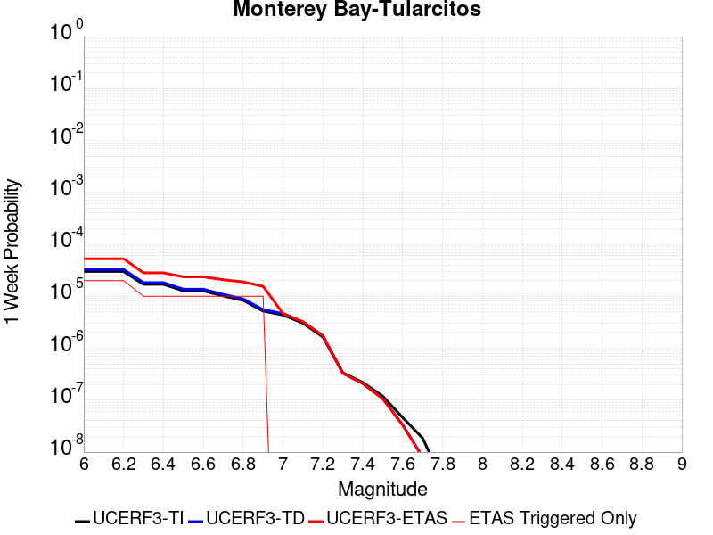 |  |  |  |

| Magnitude | 1 wk TI Prob | 1 wk TD Prob | 1 wk ETAS Prob | 1 wk ETAS/TD Gain | 1 wk ETAS Triggered Only | 1 mo TI Prob | 1 mo TD Prob | 1 mo ETAS Prob | 1 mo ETAS/TD Gain | 1 mo ETAS Triggered Only | 1 yr TI Prob | 1 yr TD Prob | 1 yr ETAS Prob | 1 yr ETAS/TD Gain | 1 yr ETAS Triggered Only | 10 yr TI Prob | 10 yr TD Prob | 10 yr ETAS Prob | 10 yr ETAS/TD Gain | 10 yr ETAS Triggered Only |
|-----|-----|-----|-----|-----|-----|-----|-----|-----|-----|-----|-----|-----|-----|-----|-----|-----|-----|-----|-----|-----|
| 6.0 | 3.0131365E-5 | 3.279877E-5 | 5.2798114E-5 | 1.609759 | 2.0E-5 | 1.2912804E-4 | 1.4055918E-4 | 1.6055637E-4 | 1.1422688 | 2.0E-5 | 0.001571 | 0.0017100703 | 0.0017500018 | 1.0233508 | 4.0E-5 | 0.015599402 | 0.016979916 | 0.017019238 | 1.0023158 | 4.0E-5 |
| 6.1 | 3.0131365E-5 | 3.279877E-5 | 5.2798114E-5 | 1.609759 | 2.0E-5 | 1.2912804E-4 | 1.4055918E-4 | 1.6055637E-4 | 1.1422688 | 2.0E-5 | 0.001571 | 0.0017100703 | 0.0017500018 | 1.0233508 | 4.0E-5 | 0.015599402 | 0.016979916 | 0.017019238 | 1.0023158 | 4.0E-5 |
| 6.2 | 3.0131365E-5 | 3.279877E-5 | 5.2798114E-5 | 1.609759 | 2.0E-5 | 1.2912804E-4 | 1.4055918E-4 | 1.6055637E-4 | 1.1422688 | 2.0E-5 | 0.001571 | 0.0017100703 | 0.0017500018 | 1.0233508 | 4.0E-5 | 0.015599402 | 0.016979916 | 0.017019238 | 1.0023158 | 4.0E-5 |
| 6.3 | 1.6998249E-5 | 1.8330798E-5 | 2.8330614E-5 | 1.54552 | 1.0E-5 | 7.28476E-5 | 7.85583E-5 | 8.8557514E-5 | 1.127284 | 1.0E-5 | 8.865586E-4 | 9.5604634E-4 | 9.760272E-4 | 1.0208995 | 2.0E-5 | 0.0088303005 | 0.009521258 | 0.009541067 | 1.0020806 | 2.0E-5 |
| 6.4 | 1.6998249E-5 | 1.8330798E-5 | 2.8330614E-5 | 1.54552 | 1.0E-5 | 7.28476E-5 | 7.85583E-5 | 8.8557514E-5 | 1.127284 | 1.0E-5 | 8.865586E-4 | 9.5604634E-4 | 9.760272E-4 | 1.0208995 | 2.0E-5 | 0.0088303005 | 0.009521258 | 0.009541067 | 1.0020806 | 2.0E-5 |
| 6.5 | 1.27470785E-5 | 1.3693312E-5 | 2.3693176E-5 | 1.7302735 | 1.0E-5 | 5.4629192E-5 | 5.8684363E-5 | 6.8683774E-5 | 1.1703931 | 1.0E-5 | 6.649074E-4 | 7.1425823E-4 | 7.3424395E-4 | 1.027981 | 2.0E-5 | 0.0066292146 | 0.007120678 | 0.007140536 | 1.0027887 | 2.0E-5 |
| 6.6 | 1.2739422E-5 | 1.36854E-5 | 2.3685263E-5 | 1.7306957 | 1.0E-5 | 5.4596385E-5 | 5.8650454E-5 | 6.864987E-5 | 1.1704917 | 1.0E-5 | 6.645082E-4 | 7.1384566E-4 | 7.338314E-4 | 1.0279973 | 2.0E-5 | 0.0066252467 | 0.007116579 | 0.0071364366 | 1.0027903 | 2.0E-5 |
| 6.7 | 1.0160109E-5 | 1.0885755E-5 | 2.0885645E-5 | 1.9186218 | 1.0E-5 | 4.35426E-5 | 4.665244E-5 | 5.6651974E-5 | 1.214341 | 1.0E-5 | 5.300022E-4 | 5.6785246E-4 | 5.8784115E-4 | 1.0352004 | 2.0E-5 | 0.005287399 | 0.0056647263 | 0.005684613 | 1.0035106 | 2.0E-5 |
| 6.8 | 8.349859E-6 | 8.932587E-6 | 1.8932498E-5 | 2.1194866 | 1.0E-5 | 3.578462E-5 | 3.8281985E-5 | 4.8281603E-5 | 1.2612095 | 1.0E-5 | 4.3559066E-4 | 4.6598914E-4 | 4.8597984E-4 | 1.0428995 | 2.0E-5 | 0.004347378 | 0.004650685 | 0.004670592 | 1.0042804 | 2.0E-5 |
| 6.9 | 5.193639E-6 | 5.53643E-6 | 1.5536374E-5 | 2.8062081 | 1.0E-5 | 2.2258262E-5 | 2.372736E-5 | 3.3727123E-5 | 1.4214444 | 1.0E-5 | 2.7096065E-4 | 2.8884556E-4 | 2.9884267E-4 | 1.0346106 | 1.0E-5 | 0.0027063051 | 0.0028850224 | 0.0028949934 | 1.0034562 | 1.0E-5 |
| 7.0 | 4.359381E-6 | 4.643366E-6 | 4.643366E-6 | 1.0 | 0.0 | 1.8682927E-5 | 1.9900004E-5 | 1.9900004E-5 | 1.0 | 0.0 | 2.274409E-4 | 2.422586E-4 | 2.422586E-4 | 1.0 | 0.0 | 0.0022720827 | 0.002420238 | 0.002420238 | 1.0 | 0.0 |
| 7.1 | 3.0398533E-6 | 3.2310427E-6 | 3.2310427E-6 | 1.0 | 0.0 | 1.3027877E-5 | 1.3847267E-5 | 1.3847267E-5 | 1.0 | 0.0 | 1.5860285E-4 | 1.6858005E-4 | 1.6858005E-4 | 1.0 | 0.0 | 0.001584897 | 0.0016847793 | 0.0016847793 | 1.0 | 0.0 |
| 7.2 | 1.642335E-6 | 1.7333153E-6 | 1.7333153E-6 | 1.0 | 0.0 | 7.0385595E-6 | 7.428485E-6 | 7.428485E-6 | 1.0 | 0.0 | 8.569109E-5 | 9.044012E-5 | 9.044012E-5 | 1.0 | 0.0 | 8.5658056E-4 | 9.042358E-4 | 9.042358E-4 | 1.0 | 0.0 |
| 7.3 | 3.356842E-7 | 3.2952389E-7 | 3.2952389E-7 | 1.0 | 0.0 | 1.4386458E-6 | 1.4122445E-6 | 1.4122445E-6 | 1.0 | 0.0 | 1.7515373E-5 | 1.7193941E-5 | 1.7193941E-5 | 1.0 | 0.0 | 1.7513991E-4 | 1.719262E-4 | 1.719262E-4 | 1.0 | 0.0 |
| 7.4 | 2.1973483E-7 | 2.1006414E-7 | 2.1006414E-7 | 1.0 | 0.0 | 9.417204E-7 | 9.002746E-7 | 9.002746E-7 | 1.0 | 0.0 | 1.1465385E-5 | 1.0960788E-5 | 1.0960788E-5 | 1.0 | 0.0 | 1.1464794E-4 | 1.0960251E-4 | 1.0960251E-4 | 1.0 | 0.0 |
| 7.5 | 1.1944135E-7 | 1.0696035E-7 | 1.0696035E-7 | 1.0 | 0.0 | 5.118914E-7 | 4.5840142E-7 | 4.5840142E-7 | 1.0 | 0.0 | 6.23226E-6 | 5.581023E-6 | 5.581023E-6 | 1.0 | 0.0 | 6.2320854E-5 | 5.5808843E-5 | 5.5808843E-5 | 1.0 | 0.0 |
| 7.6 | 4.636058E-8 | 3.3364433E-8 | 3.3364433E-8 | 1.0 | 0.0 | 1.9868818E-7 | 1.4299042E-7 | 1.4299042E-7 | 1.0 | 0.0 | 2.419026E-6 | 1.740907E-6 | 1.740907E-6 | 1.0 | 0.0 | 2.4189996E-5 | 1.7408936E-5 | 1.7408936E-5 | 1.0 | 0.0 |
| 7.7 | 1.8588572E-8 | 8.003168E-9 | 8.003168E-9 | 1.0 | 0.0 | 7.9665305E-8 | 3.429929E-8 | 3.429929E-8 | 1.0 | 0.0 | 9.699246E-7 | 4.1759378E-7 | 4.1759378E-7 | 1.0 | 0.0 | 9.699204E-6 | 4.1759304E-6 | 4.1759304E-6 | 1.0 | 0.0 |
| 7.8 | 2.7960154E-9 | 7.608624E-10 | 7.608624E-10 | 1.0 | 0.0 | 1.1982923E-8 | 3.2608392E-9 | 3.2608392E-9 | 1.0 | 0.0 | 1.4589209E-7 | 3.9700716E-8 | 3.9700716E-8 | 1.0 | 0.0 | 1.4589199E-6 | 3.970071E-7 | 3.970071E-7 | 1.0 | 0.0 |

## Santa Susana alt 1
*[(top)](#table-of-contents)*

| 1 Week | 1 Month | 1 Year | 10 Year |
|-----|-----|-----|-----|
|  |  | 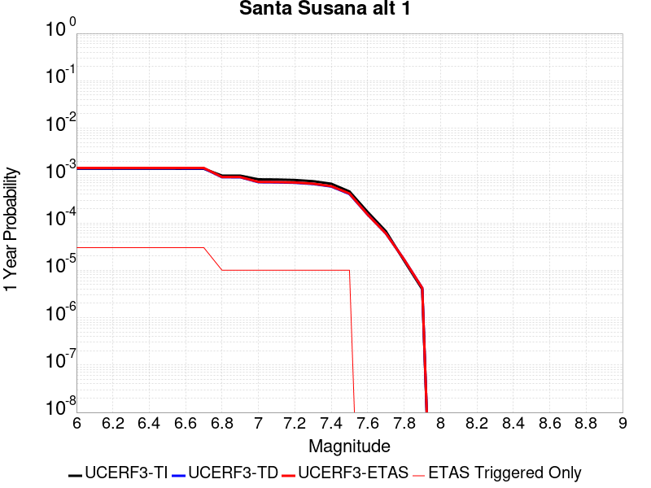 | 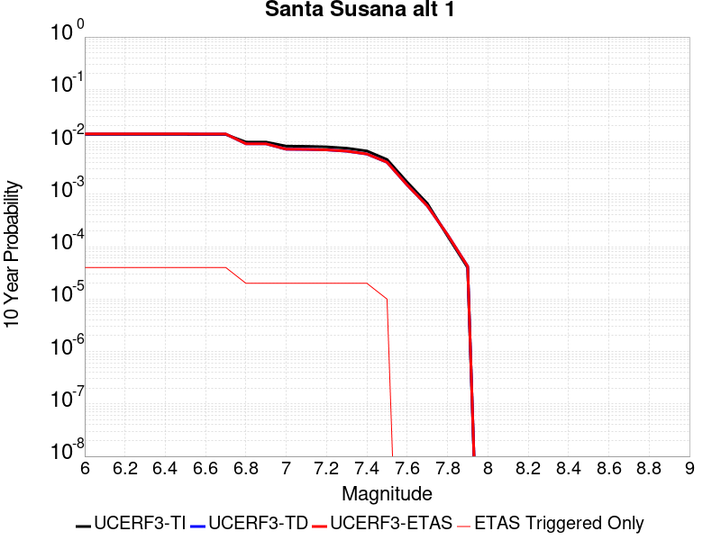 |

| Magnitude | 1 wk TI Prob | 1 wk TD Prob | 1 wk ETAS Prob | 1 wk ETAS/TD Gain | 1 wk ETAS Triggered Only | 1 mo TI Prob | 1 mo TD Prob | 1 mo ETAS Prob | 1 mo ETAS/TD Gain | 1 mo ETAS Triggered Only | 1 yr TI Prob | 1 yr TD Prob | 1 yr ETAS Prob | 1 yr ETAS/TD Gain | 1 yr ETAS Triggered Only | 10 yr TI Prob | 10 yr TD Prob | 10 yr ETAS Prob | 10 yr ETAS/TD Gain | 10 yr ETAS Triggered Only |
|-----|-----|-----|-----|-----|-----|-----|-----|-----|-----|-----|-----|-----|-----|-----|-----|-----|-----|-----|-----|-----|
| 6.0 | 2.674877E-5 | 2.7198214E-5 | 3.719794E-5 | 1.3676612 | 1.0E-5 | 1.1463255E-4 | 1.16559204E-4 | 1.2655804E-4 | 1.0857834 | 1.0E-5 | 0.0013947578 | 0.0014182981 | 0.0014482556 | 1.0211221 | 3.0E-5 | 0.013860362 | 0.014104388 | 0.014143824 | 1.002796 | 4.0E-5 |
| 6.1 | 2.674877E-5 | 2.7198214E-5 | 3.719794E-5 | 1.3676612 | 1.0E-5 | 1.1463255E-4 | 1.16559204E-4 | 1.2655804E-4 | 1.0857834 | 1.0E-5 | 0.0013947578 | 0.0014182981 | 0.0014482556 | 1.0211221 | 3.0E-5 | 0.013860362 | 0.014104388 | 0.014143824 | 1.002796 | 4.0E-5 |
| 6.2 | 2.674877E-5 | 2.7198214E-5 | 3.719794E-5 | 1.3676612 | 1.0E-5 | 1.1463255E-4 | 1.16559204E-4 | 1.2655804E-4 | 1.0857834 | 1.0E-5 | 0.0013947578 | 0.0014182981 | 0.0014482556 | 1.0211221 | 3.0E-5 | 0.013860362 | 0.014104388 | 0.014143824 | 1.002796 | 4.0E-5 |
| 6.3 | 2.674877E-5 | 2.7198214E-5 | 3.719794E-5 | 1.3676612 | 1.0E-5 | 1.1463255E-4 | 1.16559204E-4 | 1.2655804E-4 | 1.0857834 | 1.0E-5 | 0.0013947578 | 0.0014182981 | 0.0014482556 | 1.0211221 | 3.0E-5 | 0.013860362 | 0.014104388 | 0.014143824 | 1.002796 | 4.0E-5 |
| 6.4 | 2.674877E-5 | 2.7198214E-5 | 3.719794E-5 | 1.3676612 | 1.0E-5 | 1.1463255E-4 | 1.16559204E-4 | 1.2655804E-4 | 1.0857834 | 1.0E-5 | 0.0013947578 | 0.0014182981 | 0.0014482556 | 1.0211221 | 3.0E-5 | 0.013860362 | 0.014104388 | 0.014143824 | 1.002796 | 4.0E-5 |
| 6.5 | 2.674877E-5 | 2.7198214E-5 | 3.719794E-5 | 1.3676612 | 1.0E-5 | 1.1463255E-4 | 1.16559204E-4 | 1.2655804E-4 | 1.0857834 | 1.0E-5 | 0.0013947578 | 0.0014182981 | 0.0014482556 | 1.0211221 | 3.0E-5 | 0.013860362 | 0.014104388 | 0.014143824 | 1.002796 | 4.0E-5 |
| 6.6 | 2.6647976E-5 | 2.7074553E-5 | 3.7074282E-5 | 1.3693405 | 1.0E-5 | 1.14200615E-4 | 1.16029274E-4 | 1.2602811E-4 | 1.0861752 | 1.0E-5 | 0.0013895056 | 0.0014118546 | 0.0014418123 | 1.0212187 | 3.0E-5 | 0.013808494 | 0.014040773 | 0.0140802115 | 1.0028088 | 4.0E-5 |
| 6.7 | 2.6647976E-5 | 2.7074553E-5 | 3.7074282E-5 | 1.3693405 | 1.0E-5 | 1.14200615E-4 | 1.16029274E-4 | 1.2602811E-4 | 1.0861752 | 1.0E-5 | 0.0013895056 | 0.0014118546 | 0.0014418123 | 1.0212187 | 3.0E-5 | 0.013808494 | 0.014040773 | 0.0140802115 | 1.0028088 | 4.0E-5 |
| 6.8 | 1.9073179E-5 | 1.7637467E-5 | 1.7637467E-5 | 1.0 | 0.0 | 8.1739636E-5 | 7.558706E-5 | 7.558706E-5 | 1.0 | 0.0 | 9.947256E-4 | 9.19902E-4 | 9.2989276E-4 | 1.0108607 | 1.0E-5 | 0.009902848 | 0.009163361 | 0.009183178 | 1.0021626 | 2.0E-5 |
| 6.9 | 1.9041876E-5 | 1.7619597E-5 | 1.7619597E-5 | 1.0 | 0.0 | 8.160549E-5 | 7.551048E-5 | 7.551048E-5 | 1.0 | 0.0 | 9.930939E-4 | 9.189705E-4 | 9.2896126E-4 | 1.0108718 | 1.0E-5 | 0.0098866755 | 0.009154123 | 0.00917394 | 1.0021648 | 2.0E-5 |
| 7.0 | 1.5917482E-5 | 1.3864049E-5 | 1.3864049E-5 | 1.0 | 0.0 | 6.8215995E-5 | 5.9416023E-5 | 5.9416023E-5 | 1.0 | 0.0 | 8.302132E-4 | 7.2315463E-4 | 7.3314743E-4 | 1.0138183 | 1.0E-5 | 0.008271185 | 0.0072090672 | 0.007228923 | 1.0027543 | 2.0E-5 |
| 7.1 | 1.577788E-5 | 1.3744056E-5 | 1.3744056E-5 | 1.0 | 0.0 | 6.761774E-5 | 5.890179E-5 | 5.890179E-5 | 1.0 | 0.0 | 8.2293496E-4 | 7.16898E-4 | 7.2689087E-4 | 1.013939 | 1.0E-5 | 0.008198941 | 0.0071469042 | 0.0071667614 | 1.0027784 | 2.0E-5 |
| 7.2 | 1.5416446E-5 | 1.34701295E-5 | 1.34701295E-5 | 1.0 | 0.0 | 6.606882E-5 | 5.7727877E-5 | 5.7727877E-5 | 1.0 | 0.0 | 8.0409093E-4 | 7.026149E-4 | 7.1260787E-4 | 1.0142225 | 1.0E-5 | 0.008011877 | 0.0070049763 | 0.0070248363 | 1.0028352 | 2.0E-5 |
| 7.3 | 1.4534083E-5 | 1.2718032E-5 | 1.2718032E-5 | 1.0 | 0.0 | 6.228744E-5 | 5.4504737E-5 | 5.4504737E-5 | 1.0 | 0.0 | 7.580857E-4 | 6.633976E-4 | 6.733909E-4 | 1.0150639 | 1.0E-5 | 0.007555048 | 0.0066151717 | 0.006635039 | 1.0030034 | 2.0E-5 |
| 7.4 | 1.2858995E-5 | 1.1229814E-5 | 1.1229814E-5 | 1.0 | 0.0 | 5.5108816E-5 | 4.812691E-5 | 4.812691E-5 | 1.0 | 0.0 | 6.7074323E-4 | 5.8579154E-4 | 5.957857E-4 | 1.0170609 | 1.0E-5 | 0.0066872234 | 0.0058433902 | 0.0058632735 | 1.0034027 | 2.0E-5 |
| 7.5 | 8.827668E-6 | 7.805494E-6 | 7.805494E-6 | 1.0 | 0.0 | 3.7832317E-5 | 3.3451703E-5 | 3.3451703E-5 | 1.0 | 0.0 | 4.605111E-4 | 4.072008E-4 | 4.1719674E-4 | 1.0245479 | 1.0E-5 | 0.0045955796 | 0.0040648985 | 0.004074858 | 1.0024501 | 1.0E-5 |
| 7.6 | 3.2533426E-6 | 2.8720106E-6 | 2.8720106E-6 | 1.0 | 0.0 | 1.3942822E-5 | 1.230856E-5 | 1.230856E-5 | 1.0 | 0.0 | 1.6974064E-4 | 1.4984679E-4 | 1.4984679E-4 | 1.0 | 0.0 | 0.0016961104 | 0.0014974943 | 0.0014974943 | 1.0 | 0.0 |
| 7.7 | 1.2751709E-6 | 1.1491339E-6 | 1.1491339E-6 | 1.0 | 0.0 | 5.4650063E-6 | 4.9248506E-6 | 4.9248506E-6 | 1.0 | 0.0 | 6.653442E-5 | 5.99585E-5 | 5.99585E-5 | 1.0 | 0.0 | 6.6514505E-4 | 5.9943215E-4 | 5.9943215E-4 | 1.0 | 0.0 |
| 7.8 | 3.067544E-7 | 3.240052E-7 | 3.240052E-7 | 1.0 | 0.0 | 1.3146611E-6 | 1.3885931E-6 | 1.3885931E-6 | 1.0 | 0.0 | 1.600588E-5 | 1.6906E-5 | 1.6906E-5 | 1.0 | 0.0 | 1.6004729E-4 | 1.6904817E-4 | 1.6904817E-4 | 1.0 | 0.0 |
| 7.9 | 7.622999E-8 | 8.0879715E-8 | 8.0879715E-8 | 1.0 | 0.0 | 3.2669993E-7 | 3.4662733E-7 | 3.4662733E-7 | 1.0 | 0.0 | 3.977564E-6 | 4.220182E-6 | 4.220182E-6 | 1.0 | 0.0 | 3.977493E-5 | 4.2201224E-5 | 4.2201224E-5 | 1.0 | 0.0 |

## Hunting Creek - Bartlett Springs connector 2011
*[(top)](#table-of-contents)*

| 1 Week | 1 Month | 1 Year | 10 Year |
|-----|-----|-----|-----|
|  |  |  |  |

| Magnitude | 1 wk TI Prob | 1 wk TD Prob | 1 wk ETAS Prob | 1 wk ETAS/TD Gain | 1 wk ETAS Triggered Only | 1 mo TI Prob | 1 mo TD Prob | 1 mo ETAS Prob | 1 mo ETAS/TD Gain | 1 mo ETAS Triggered Only | 1 yr TI Prob | 1 yr TD Prob | 1 yr ETAS Prob | 1 yr ETAS/TD Gain | 1 yr ETAS Triggered Only | 10 yr TI Prob | 10 yr TD Prob | 10 yr ETAS Prob | 10 yr ETAS/TD Gain | 10 yr ETAS Triggered Only |
|-----|-----|-----|-----|-----|-----|-----|-----|-----|-----|-----|-----|-----|-----|-----|-----|-----|-----|-----|-----|-----|
| 6.0 | 4.940016E-5 | 6.7870766E-5 | 6.7870766E-5 | 1.0 | 0.0 | 2.1169778E-4 | 2.9084194E-4 | 3.1083613E-4 | 1.0687459 | 2.0E-5 | 0.002574374 | 0.0035350819 | 0.0035749404 | 1.0112752 | 4.0E-5 | 0.025447546 | 0.03477475 | 0.03481336 | 1.0011103 | 4.0E-5 |
| 6.1 | 4.940016E-5 | 6.7870766E-5 | 6.7870766E-5 | 1.0 | 0.0 | 2.1169778E-4 | 2.9084194E-4 | 3.1083613E-4 | 1.0687459 | 2.0E-5 | 0.002574374 | 0.0035350819 | 0.0035749404 | 1.0112752 | 4.0E-5 | 0.025447546 | 0.03477475 | 0.03481336 | 1.0011103 | 4.0E-5 |
| 6.2 | 4.472471E-5 | 6.100572E-5 | 6.100572E-5 | 1.0 | 0.0 | 1.9166325E-4 | 2.6142647E-4 | 2.7142384E-4 | 1.0382416 | 1.0E-5 | 0.0023310026 | 0.0031781218 | 0.0032080265 | 1.0094095 | 3.0E-5 | 0.02306703 | 0.031317808 | 0.03134687 | 1.0009279 | 3.0E-5 |
| 6.3 | 4.472471E-5 | 6.100572E-5 | 6.100572E-5 | 1.0 | 0.0 | 1.9166325E-4 | 2.6142647E-4 | 2.7142384E-4 | 1.0382416 | 1.0E-5 | 0.0023310026 | 0.0031781218 | 0.0032080265 | 1.0094095 | 3.0E-5 | 0.02306703 | 0.031317808 | 0.03134687 | 1.0009279 | 3.0E-5 |
| 6.4 | 4.0001003E-5 | 5.410516E-5 | 5.410516E-5 | 1.0 | 0.0 | 1.714216E-4 | 2.318579E-4 | 2.318579E-4 | 1.0 | 0.0 | 0.0020850603 | 0.0028191686 | 0.0028391122 | 1.0070742 | 2.0E-5 | 0.02065605 | 0.027829198 | 0.027848642 | 1.0006987 | 2.0E-5 |
| 6.5 | 3.8033053E-5 | 5.126649E-5 | 5.126649E-5 | 1.0 | 0.0 | 1.6298861E-4 | 2.1969521E-4 | 2.1969521E-4 | 1.0 | 0.0 | 0.0019825802 | 0.0026714848 | 0.0026914314 | 1.0074664 | 2.0E-5 | 0.019649856 | 0.026391273 | 0.026410745 | 1.0007378 | 2.0E-5 |
| 6.6 | 3.653754E-5 | 4.912955E-5 | 4.912955E-5 | 1.0 | 0.0 | 1.5658008E-4 | 2.1053842E-4 | 2.1053842E-4 | 1.0 | 0.0 | 0.0019046954 | 0.0025602889 | 0.0025802376 | 1.0077916 | 2.0E-5 | 0.018884527 | 0.025307199 | 0.025326693 | 1.0007703 | 2.0E-5 |
| 6.7 | 3.372024E-5 | 4.5140216E-5 | 4.5140216E-5 | 1.0 | 0.0 | 1.4450731E-4 | 1.9344388E-4 | 1.9344388E-4 | 1.0 | 0.0 | 0.0017579567 | 0.0023526535 | 0.0023726064 | 1.008481 | 2.0E-5 | 0.017441148 | 0.023278862 | 0.023298396 | 1.0008391 | 2.0E-5 |
| 6.8 | 2.9650024E-5 | 3.9411647E-5 | 3.9411647E-5 | 1.0 | 0.0 | 1.2706534E-4 | 1.6889606E-4 | 1.6889606E-4 | 1.0 | 0.0 | 0.0015459227 | 0.0020543607 | 0.0020743196 | 1.0097154 | 2.0E-5 | 0.015352124 | 0.020351961 | 0.020371554 | 1.0009627 | 2.0E-5 |
| 6.9 | 2.860775E-5 | 3.7812886E-5 | 3.7812886E-5 | 1.0 | 0.0 | 1.2259888E-4 | 1.620452E-4 | 1.620452E-4 | 1.0 | 0.0 | 0.0014916194 | 0.0019711219 | 0.0019811022 | 1.0050633 | 1.0E-5 | 0.014816469 | 0.019536555 | 0.01954636 | 1.0005019 | 1.0E-5 |
| 7.0 | 2.6696067E-5 | 3.5067544E-5 | 3.5067544E-5 | 1.0 | 0.0 | 1.144067E-4 | 1.5028086E-4 | 1.5028086E-4 | 1.0 | 0.0 | 0.0013920115 | 0.0018281427 | 0.0018281427 | 1.0 | 0.0 | 0.013833242 | 0.01813184 | 0.01813184 | 1.0 | 0.0 |
| 7.1 | 2.456087E-5 | 3.2013326E-5 | 3.2013326E-5 | 1.0 | 0.0 | 1.0525662E-4 | 1.3719281E-4 | 1.3719281E-4 | 1.0 | 0.0 | 0.001280746 | 0.0016690517 | 0.0016690517 | 1.0 | 0.0 | 0.012733897 | 0.016566671 | 0.016566671 | 1.0 | 0.0 |
| 7.2 | 2.295761E-5 | 2.9823148E-5 | 2.9823148E-5 | 1.0 | 0.0 | 9.8386045E-5 | 1.2780727E-4 | 1.2780727E-4 | 1.0 | 0.0 | 0.0011971919 | 0.0015549522 | 0.0015549522 | 1.0 | 0.0 | 0.011907627 | 0.015442378 | 0.015442378 | 1.0 | 0.0 |
| 7.3 | 2.1256936E-5 | 2.7542124E-5 | 2.7542124E-5 | 1.0 | 0.0 | 9.109797E-5 | 1.1803238E-4 | 1.1803238E-4 | 1.0 | 0.0 | 0.0011085535 | 0.0014361058 | 0.0014361058 | 1.0 | 0.0 | 0.011030397 | 0.014269741 | 0.014269741 | 1.0 | 0.0 |
| 7.4 | 1.8784336E-5 | 2.430697E-5 | 2.430697E-5 | 1.0 | 0.0 | 8.050181E-5 | 1.0416861E-4 | 1.0416861E-4 | 1.0 | 0.0 | 9.796688E-4 | 0.0012675226 | 0.0012675226 | 1.0 | 0.0 | 0.009753612 | 0.012604194 | 0.012604194 | 1.0 | 0.0 |
| 7.5 | 1.7248298E-5 | 2.2269056E-5 | 2.2269056E-5 | 1.0 | 0.0 | 7.391918E-5 | 9.543537E-5 | 9.543537E-5 | 1.0 | 0.0 | 8.9959445E-4 | 0.0011613137 | 0.0011613137 | 1.0 | 0.0 | 0.008959615 | 0.011553645 | 0.011553645 | 1.0 | 0.0 |
| 7.6 | 1.0653709E-5 | 1.3722259E-5 | 1.3722259E-5 | 1.0 | 0.0 | 4.5657955E-5 | 5.880837E-5 | 5.880837E-5 | 1.0 | 0.0 | 5.557438E-4 | 7.157594E-4 | 7.157594E-4 | 1.0 | 0.0 | 0.0055435603 | 0.0071350415 | 0.0071350415 | 1.0 | 0.0 |
| 7.7 | 3.286316E-6 | 4.0903997E-6 | 4.0903997E-6 | 1.0 | 0.0 | 1.4084137E-5 | 1.7530168E-5 | 1.7530168E-5 | 1.0 | 0.0 | 1.7146087E-4 | 2.1340905E-4 | 2.1340905E-4 | 1.0 | 0.0 | 0.0017132863 | 0.0021320845 | 0.0021320845 | 1.0 | 0.0 |
| 7.8 | 5.1855085E-7 | 5.972095E-7 | 5.972095E-7 | 1.0 | 0.0 | 2.222359E-6 | 2.5594668E-6 | 2.5594668E-6 | 1.0 | 0.0 | 2.7056883E-5 | 3.1161075E-5 | 3.1161075E-5 | 1.0 | 0.0 | 2.705359E-4 | 3.1156064E-4 | 3.1156064E-4 | 1.0 | 0.0 |

## Round Valley
*[(top)](#table-of-contents)*

| 1 Week | 1 Month | 1 Year | 10 Year |
|-----|-----|-----|-----|
| 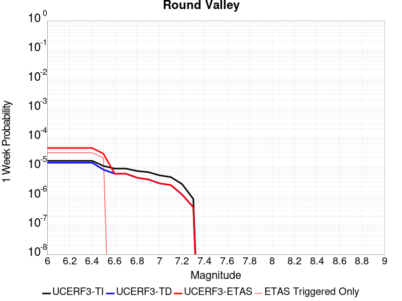 | 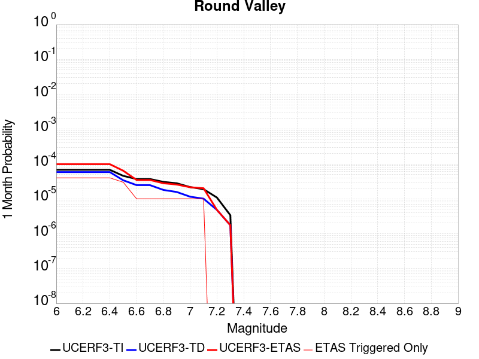 |  |  |

| Magnitude | 1 wk TI Prob | 1 wk TD Prob | 1 wk ETAS Prob | 1 wk ETAS/TD Gain | 1 wk ETAS Triggered Only | 1 mo TI Prob | 1 mo TD Prob | 1 mo ETAS Prob | 1 mo ETAS/TD Gain | 1 mo ETAS Triggered Only | 1 yr TI Prob | 1 yr TD Prob | 1 yr ETAS Prob | 1 yr ETAS/TD Gain | 1 yr ETAS Triggered Only | 10 yr TI Prob | 10 yr TD Prob | 10 yr ETAS Prob | 10 yr ETAS/TD Gain | 10 yr ETAS Triggered Only |
|-----|-----|-----|-----|-----|-----|-----|-----|-----|-----|-----|-----|-----|-----|-----|-----|-----|-----|-----|-----|-----|
| 6.0 | 1.588152E-5 | 1.3670525E-5 | 4.3670116E-5 | 3.1944723 | 3.0E-5 | 6.806188E-5 | 5.8586873E-5 | 9.8584525E-5 | 1.6827068 | 4.0E-5 | 8.283384E-4 | 7.131011E-4 | 7.530726E-4 | 1.056053 | 4.0E-5 | 0.008252576 | 0.0071120164 | 0.0071517318 | 1.0055842 | 4.0E-5 |
| 6.1 | 1.588152E-5 | 1.3670525E-5 | 4.3670116E-5 | 3.1944723 | 3.0E-5 | 6.806188E-5 | 5.8586873E-5 | 9.8584525E-5 | 1.6827068 | 4.0E-5 | 8.283384E-4 | 7.131011E-4 | 7.530726E-4 | 1.056053 | 4.0E-5 | 0.008252576 | 0.0071120164 | 0.0071517318 | 1.0055842 | 4.0E-5 |
| 6.2 | 1.588152E-5 | 1.3670525E-5 | 4.3670116E-5 | 3.1944723 | 3.0E-5 | 6.806188E-5 | 5.8586873E-5 | 9.8584525E-5 | 1.6827068 | 4.0E-5 | 8.283384E-4 | 7.131011E-4 | 7.530726E-4 | 1.056053 | 4.0E-5 | 0.008252576 | 0.0071120164 | 0.0071517318 | 1.0055842 | 4.0E-5 |
| 6.3 | 1.588152E-5 | 1.3670525E-5 | 4.3670116E-5 | 3.1944723 | 3.0E-5 | 6.806188E-5 | 5.8586873E-5 | 9.8584525E-5 | 1.6827068 | 4.0E-5 | 8.283384E-4 | 7.131011E-4 | 7.530726E-4 | 1.056053 | 4.0E-5 | 0.008252576 | 0.0071120164 | 0.0071517318 | 1.0055842 | 4.0E-5 |
| 6.4 | 1.588152E-5 | 1.3670525E-5 | 4.3670116E-5 | 3.1944723 | 3.0E-5 | 6.806188E-5 | 5.8586873E-5 | 9.8584525E-5 | 1.6827068 | 4.0E-5 | 8.283384E-4 | 7.131011E-4 | 7.530726E-4 | 1.056053 | 4.0E-5 | 0.008252576 | 0.0071120164 | 0.0071517318 | 1.0055842 | 4.0E-5 |
| 6.5 | 1.0646776E-5 | 7.952847E-6 | 2.7952688E-5 | 3.5148027 | 2.0E-5 | 4.5628243E-5 | 3.4083234E-5 | 6.408221E-5 | 1.8801682 | 3.0E-5 | 5.553823E-4 | 4.1489274E-4 | 4.4488028E-4 | 1.0722779 | 3.0E-5 | 0.005539963 | 0.00414201 | 0.004171886 | 1.0072129 | 3.0E-5 |
| 6.6 | 8.632956E-6 | 5.768552E-6 | 5.768552E-6 | 1.0 | 0.0 | 3.6997862E-5 | 2.4722152E-5 | 3.4721907E-5 | 1.4044856 | 1.0E-5 | 4.5035584E-4 | 3.0095447E-4 | 3.1095147E-4 | 1.0332177 | 1.0E-5 | 0.0044944426 | 0.0030058469 | 0.003015817 | 1.0033169 | 1.0E-5 |
| 6.7 | 8.632956E-6 | 5.768552E-6 | 5.768552E-6 | 1.0 | 0.0 | 3.6997862E-5 | 2.4722152E-5 | 3.4721907E-5 | 1.4044856 | 1.0E-5 | 4.5035584E-4 | 3.0095447E-4 | 3.1095147E-4 | 1.0332177 | 1.0E-5 | 0.0044944426 | 0.0030058469 | 0.003015817 | 1.0033169 | 1.0E-5 |
| 6.8 | 7.143895E-6 | 4.201644E-6 | 4.201644E-6 | 1.0 | 0.0 | 3.0616335E-5 | 1.8006931E-5 | 2.800675E-5 | 1.5553317 | 1.0E-5 | 3.726901E-4 | 2.19214E-4 | 2.292118E-4 | 1.0456076 | 1.0E-5 | 0.0037206567 | 0.0021901424 | 0.0022001204 | 1.004556 | 1.0E-5 |
| 6.9 | 6.5120694E-6 | 3.6642807E-6 | 3.6642807E-6 | 1.0 | 0.0 | 2.790857E-5 | 1.5703974E-5 | 2.5703817E-5 | 1.6367714 | 1.0E-5 | 3.3973387E-4 | 1.9118062E-4 | 2.0117871E-4 | 1.0522965 | 1.0E-5 | 0.0033921495 | 0.0019103106 | 0.0019202915 | 1.0052247 | 1.0E-5 |
| 7.0 | 5.0614435E-6 | 2.6834869E-6 | 2.6834869E-6 | 1.0 | 0.0 | 2.169172E-5 | 1.1500612E-5 | 2.1500498E-5 | 1.8695089 | 1.0E-5 | 2.6406467E-4 | 1.40012E-4 | 1.5001059E-4 | 1.0714124 | 1.0E-5 | 0.0026375111 | 0.0013993392 | 0.0014093252 | 1.0071362 | 1.0E-5 |
| 7.1 | 4.41728E-6 | 2.3573243E-6 | 2.3573243E-6 | 1.0 | 0.0 | 1.8931061E-5 | 1.01027845E-5 | 2.0102683E-5 | 1.9898161 | 1.0E-5 | 2.304613E-4 | 1.2299545E-4 | 1.3299422E-4 | 1.0812938 | 1.0E-5 | 0.0023022245 | 0.0012293702 | 0.001239358 | 1.0081242 | 1.0E-5 |
| 7.2 | 2.535495E-6 | 1.120784E-6 | 1.120784E-6 | 1.0 | 0.0 | 1.0866362E-5 | 4.803354E-6 | 4.803354E-6 | 1.0 | 0.0 | 1.3228992E-4 | 5.8479785E-5 | 5.8479785E-5 | 1.0 | 0.0 | 0.0013221119 | 5.846952E-4 | 5.846952E-4 | 1.0 | 0.0 |
| 7.3 | 7.900015E-7 | 4.0888176E-7 | 4.0888176E-7 | 1.0 | 0.0 | 3.3857161E-6 | 1.7523504E-6 | 1.7523504E-6 | 1.0 | 0.0 | 4.1220315E-5 | 2.1334865E-5 | 2.1334865E-5 | 1.0 | 0.0 | 4.121267E-4 | 2.1334866E-4 | 2.1334866E-4 | 1.0 | 0.0 |

## Earthquake Valley (So Extension)
*[(top)](#table-of-contents)*

| 1 Week | 1 Month | 1 Year | 10 Year |
|-----|-----|-----|-----|
|  | 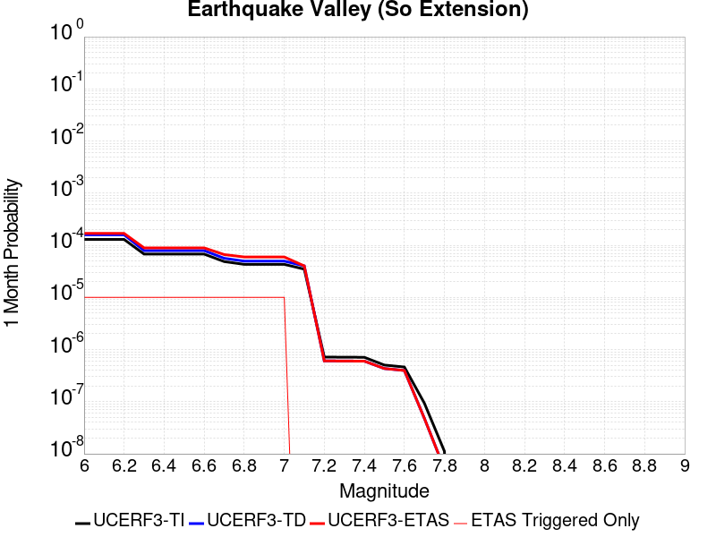 |  | 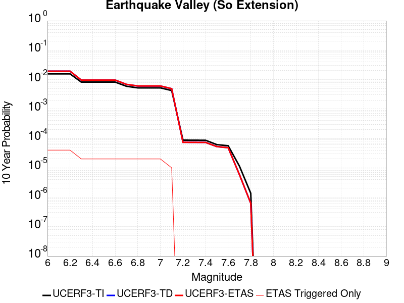 |

| Magnitude | 1 wk TI Prob | 1 wk TD Prob | 1 wk ETAS Prob | 1 wk ETAS/TD Gain | 1 wk ETAS Triggered Only | 1 mo TI Prob | 1 mo TD Prob | 1 mo ETAS Prob | 1 mo ETAS/TD Gain | 1 mo ETAS Triggered Only | 1 yr TI Prob | 1 yr TD Prob | 1 yr ETAS Prob | 1 yr ETAS/TD Gain | 1 yr ETAS Triggered Only | 10 yr TI Prob | 10 yr TD Prob | 10 yr ETAS Prob | 10 yr ETAS/TD Gain | 10 yr ETAS Triggered Only |
|-----|-----|-----|-----|-----|-----|-----|-----|-----|-----|-----|-----|-----|-----|-----|-----|-----|-----|-----|-----|-----|
| 6.0 | 3.0194888E-5 | 3.707208E-5 | 3.707208E-5 | 1.0 | 0.0 | 1.2940024E-4 | 1.5887374E-4 | 1.6887215E-4 | 1.0629331 | 1.0E-5 | 0.0015743093 | 0.0019330877 | 0.0019530491 | 1.0103261 | 2.0E-5 | 0.01563203 | 0.0192131 | 0.019252334 | 1.0020419 | 4.0E-5 |
| 6.1 | 3.0194888E-5 | 3.707208E-5 | 3.707208E-5 | 1.0 | 0.0 | 1.2940024E-4 | 1.5887374E-4 | 1.6887215E-4 | 1.0629331 | 1.0E-5 | 0.0015743093 | 0.0019330877 | 0.0019530491 | 1.0103261 | 2.0E-5 | 0.01563203 | 0.0192131 | 0.019252334 | 1.0020419 | 4.0E-5 |
| 6.2 | 3.0194888E-5 | 3.707208E-5 | 3.707208E-5 | 1.0 | 0.0 | 1.2940024E-4 | 1.5887374E-4 | 1.6887215E-4 | 1.0629331 | 1.0E-5 | 0.0015743093 | 0.0019330877 | 0.0019530491 | 1.0103261 | 2.0E-5 | 0.01563203 | 0.0192131 | 0.019252334 | 1.0020419 | 4.0E-5 |
| 6.3 | 1.5795305E-5 | 1.8446612E-5 | 1.8446612E-5 | 1.0 | 0.0 | 6.769241E-5 | 7.905514E-5 | 8.905435E-5 | 1.126484 | 1.0E-5 | 8.238434E-4 | 9.621823E-4 | 9.721727E-4 | 1.010383 | 1.0E-5 | 0.008207959 | 0.0095910635 | 0.009610872 | 1.0020653 | 2.0E-5 |
| 6.4 | 1.5795305E-5 | 1.8446612E-5 | 1.8446612E-5 | 1.0 | 0.0 | 6.769241E-5 | 7.905514E-5 | 8.905435E-5 | 1.126484 | 1.0E-5 | 8.238434E-4 | 9.621823E-4 | 9.721727E-4 | 1.010383 | 1.0E-5 | 0.008207959 | 0.0095910635 | 0.009610872 | 1.0020653 | 2.0E-5 |
| 6.5 | 1.5795305E-5 | 1.8446612E-5 | 1.8446612E-5 | 1.0 | 0.0 | 6.769241E-5 | 7.905514E-5 | 8.905435E-5 | 1.126484 | 1.0E-5 | 8.238434E-4 | 9.621823E-4 | 9.721727E-4 | 1.010383 | 1.0E-5 | 0.008207959 | 0.0095910635 | 0.009610872 | 1.0020653 | 2.0E-5 |
| 6.6 | 1.5795305E-5 | 1.8446612E-5 | 1.8446612E-5 | 1.0 | 0.0 | 6.769241E-5 | 7.905514E-5 | 8.905435E-5 | 1.126484 | 1.0E-5 | 8.238434E-4 | 9.621823E-4 | 9.721727E-4 | 1.010383 | 1.0E-5 | 0.008207959 | 0.0095910635 | 0.009610872 | 1.0020653 | 2.0E-5 |
| 6.7 | 1.1363076E-5 | 1.3138288E-5 | 1.3138288E-5 | 1.0 | 0.0 | 4.8697988E-5 | 5.6306162E-5 | 6.63056E-5 | 1.1775905 | 1.0E-5 | 5.927367E-4 | 6.8538805E-4 | 6.953812E-4 | 1.0145802 | 1.0E-5 | 0.0059115817 | 0.006840215 | 0.0068600783 | 1.0029039 | 2.0E-5 |
| 6.8 | 1.0049611E-5 | 1.1594328E-5 | 1.1594328E-5 | 1.0 | 0.0 | 4.306905E-5 | 4.968944E-5 | 5.9688944E-5 | 1.20124 | 1.0E-5 | 5.242395E-4 | 6.0487416E-4 | 6.148681E-4 | 1.0165224 | 1.0E-5 | 0.0052300454 | 0.0060394546 | 0.006059334 | 1.0032916 | 2.0E-5 |
| 6.9 | 1.0049611E-5 | 1.1594328E-5 | 1.1594328E-5 | 1.0 | 0.0 | 4.306905E-5 | 4.968944E-5 | 5.9688944E-5 | 1.20124 | 1.0E-5 | 5.242395E-4 | 6.0487416E-4 | 6.148681E-4 | 1.0165224 | 1.0E-5 | 0.0052300454 | 0.0060394546 | 0.006059334 | 1.0032916 | 2.0E-5 |
| 7.0 | 1.0049611E-5 | 1.1594328E-5 | 1.1594328E-5 | 1.0 | 0.0 | 4.306905E-5 | 4.968944E-5 | 5.9688944E-5 | 1.20124 | 1.0E-5 | 5.242395E-4 | 6.0487416E-4 | 6.148681E-4 | 1.0165224 | 1.0E-5 | 0.0052300454 | 0.0060394546 | 0.006059334 | 1.0032916 | 2.0E-5 |
| 7.1 | 8.140254E-6 | 9.3834515E-6 | 9.3834515E-6 | 1.0 | 0.0 | 3.4886336E-5 | 4.021455E-5 | 4.021455E-5 | 1.0 | 0.0 | 4.2465836E-4 | 4.895692E-4 | 4.895692E-4 | 1.0 | 0.0 | 0.0042384774 | 0.004891483 | 0.0049014343 | 1.0020344 | 1.0E-5 |
| 7.2 | 1.673835E-7 | 1.4153493E-7 | 1.4153493E-7 | 1.0 | 0.0 | 7.173577E-7 | 6.065781E-7 | 6.065781E-7 | 1.0 | 0.0 | 8.733795E-6 | 7.3850674E-6 | 7.3850674E-6 | 1.0 | 0.0 | 8.733451E-5 | 7.3848576E-5 | 7.3848576E-5 | 1.0 | 0.0 |
| 7.3 | 1.6632116E-7 | 1.4051723E-7 | 1.4051723E-7 | 1.0 | 0.0 | 7.1280476E-7 | 6.022166E-7 | 6.022166E-7 | 1.0 | 0.0 | 8.678364E-6 | 7.331966E-6 | 7.331966E-6 | 1.0 | 0.0 | 8.6780245E-5 | 7.33176E-5 | 7.33176E-5 | 1.0 | 0.0 |
| 7.4 | 1.6569169E-7 | 1.3996352E-7 | 1.3996352E-7 | 1.0 | 0.0 | 7.1010703E-7 | 5.9984353E-7 | 5.9984353E-7 | 1.0 | 0.0 | 8.645519E-6 | 7.303074E-6 | 7.303074E-6 | 1.0 | 0.0 | 8.645182E-5 | 7.30287E-5 | 7.30287E-5 | 1.0 | 0.0 |
| 7.5 | 1.1764555E-7 | 1.0095245E-7 | 1.0095245E-7 | 1.0 | 0.0 | 5.041951E-7 | 4.3265328E-7 | 4.3265328E-7 | 1.0 | 0.0 | 6.138558E-6 | 5.267543E-6 | 5.267543E-6 | 1.0 | 0.0 | 6.1383886E-5 | 5.2674397E-5 | 5.2674397E-5 | 1.0 | 0.0 |
| 7.6 | 1.07927605E-7 | 9.2600665E-8 | 9.2600665E-8 | 1.0 | 0.0 | 4.6254678E-7 | 3.9685995E-7 | 3.9685995E-7 | 1.0 | 0.0 | 5.6314925E-6 | 4.8317615E-6 | 4.8317615E-6 | 1.0 | 0.0 | 5.63135E-5 | 4.831677E-5 | 4.831677E-5 | 1.0 | 0.0 |
| 7.7 | 2.1826905E-8 | 1.1179958E-8 | 1.1179958E-8 | 1.0 | 0.0 | 9.3543875E-8 | 4.791411E-8 | 4.791411E-8 | 1.0 | 0.0 | 1.1388961E-6 | 5.8335416E-7 | 5.8335416E-7 | 1.0 | 0.0 | 1.1388902E-5 | 5.8335318E-6 | 5.8335318E-6 | 1.0 | 0.0 |
| 7.8 | 2.6169649E-9 | 1.1968753E-9 | 1.1968753E-9 | 1.0 | 0.0 | 1.1215564E-8 | 5.1294657E-9 | 5.1294657E-9 | 1.0 | 0.0 | 1.3654947E-7 | 6.245124E-8 | 6.245124E-8 | 1.0 | 0.0 | 1.365494E-6 | 6.2451244E-7 | 6.2451244E-7 | 1.0 | 0.0 |

## Big Lagoon - Bald Mtn 2011 CFM
*[(top)](#table-of-contents)*

| 1 Week | 1 Month | 1 Year | 10 Year |
|-----|-----|-----|-----|
|  | 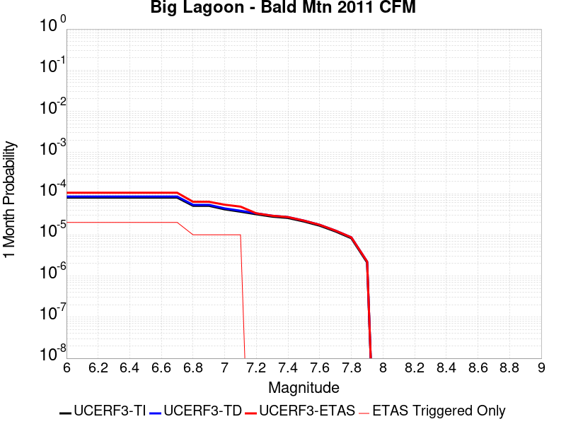 | 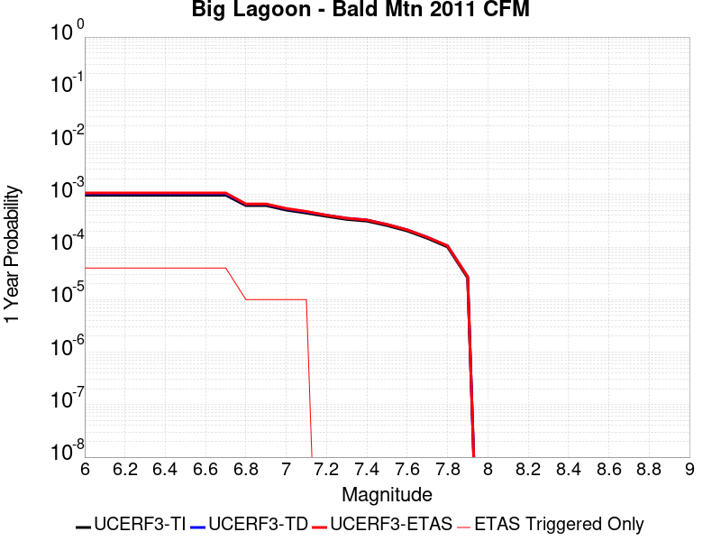 |  |

| Magnitude | 1 wk TI Prob | 1 wk TD Prob | 1 wk ETAS Prob | 1 wk ETAS/TD Gain | 1 wk ETAS Triggered Only | 1 mo TI Prob | 1 mo TD Prob | 1 mo ETAS Prob | 1 mo ETAS/TD Gain | 1 mo ETAS Triggered Only | 1 yr TI Prob | 1 yr TD Prob | 1 yr ETAS Prob | 1 yr ETAS/TD Gain | 1 yr ETAS Triggered Only | 10 yr TI Prob | 10 yr TD Prob | 10 yr ETAS Prob | 10 yr ETAS/TD Gain | 10 yr ETAS Triggered Only |
|-----|-----|-----|-----|-----|-----|-----|-----|-----|-----|-----|-----|-----|-----|-----|-----|-----|-----|-----|-----|-----|
| 6.0 | 1.8699735E-5 | 1.985018E-5 | 2.9849982E-5 | 1.5037638 | 1.0E-5 | 8.013926E-5 | 8.5069645E-5 | 1.0506794E-4 | 1.2350816 | 2.0E-5 | 9.752587E-4 | 0.0010352687 | 0.0010752272 | 1.0385973 | 4.0E-5 | 0.009709897 | 0.010308274 | 0.010347862 | 1.0038403 | 4.0E-5 |
| 6.1 | 1.8699735E-5 | 1.985018E-5 | 2.9849982E-5 | 1.5037638 | 1.0E-5 | 8.013926E-5 | 8.5069645E-5 | 1.0506794E-4 | 1.2350816 | 2.0E-5 | 9.752587E-4 | 0.0010352687 | 0.0010752272 | 1.0385973 | 4.0E-5 | 0.009709897 | 0.010308274 | 0.010347862 | 1.0038403 | 4.0E-5 |
| 6.2 | 1.8699735E-5 | 1.985018E-5 | 2.9849982E-5 | 1.5037638 | 1.0E-5 | 8.013926E-5 | 8.5069645E-5 | 1.0506794E-4 | 1.2350816 | 2.0E-5 | 9.752587E-4 | 0.0010352687 | 0.0010752272 | 1.0385973 | 4.0E-5 | 0.009709897 | 0.010308274 | 0.010347862 | 1.0038403 | 4.0E-5 |
| 6.3 | 1.8699735E-5 | 1.985018E-5 | 2.9849982E-5 | 1.5037638 | 1.0E-5 | 8.013926E-5 | 8.5069645E-5 | 1.0506794E-4 | 1.2350816 | 2.0E-5 | 9.752587E-4 | 0.0010352687 | 0.0010752272 | 1.0385973 | 4.0E-5 | 0.009709897 | 0.010308274 | 0.010347862 | 1.0038403 | 4.0E-5 |
| 6.4 | 1.8699735E-5 | 1.985018E-5 | 2.9849982E-5 | 1.5037638 | 1.0E-5 | 8.013926E-5 | 8.5069645E-5 | 1.0506794E-4 | 1.2350816 | 2.0E-5 | 9.752587E-4 | 0.0010352687 | 0.0010752272 | 1.0385973 | 4.0E-5 | 0.009709897 | 0.010308274 | 0.010347862 | 1.0038403 | 4.0E-5 |
| 6.5 | 1.8699735E-5 | 1.985018E-5 | 2.9849982E-5 | 1.5037638 | 1.0E-5 | 8.013926E-5 | 8.5069645E-5 | 1.0506794E-4 | 1.2350816 | 2.0E-5 | 9.752587E-4 | 0.0010352687 | 0.0010752272 | 1.0385973 | 4.0E-5 | 0.009709897 | 0.010308274 | 0.010347862 | 1.0038403 | 4.0E-5 |
| 6.6 | 1.8699735E-5 | 1.985018E-5 | 2.9849982E-5 | 1.5037638 | 1.0E-5 | 8.013926E-5 | 8.5069645E-5 | 1.0506794E-4 | 1.2350816 | 2.0E-5 | 9.752587E-4 | 0.0010352687 | 0.0010752272 | 1.0385973 | 4.0E-5 | 0.009709897 | 0.010308274 | 0.010347862 | 1.0038403 | 4.0E-5 |
| 6.7 | 1.8699735E-5 | 1.985018E-5 | 2.9849982E-5 | 1.5037638 | 1.0E-5 | 8.013926E-5 | 8.5069645E-5 | 1.0506794E-4 | 1.2350816 | 2.0E-5 | 9.752587E-4 | 0.0010352687 | 0.0010752272 | 1.0385973 | 4.0E-5 | 0.009709897 | 0.010308274 | 0.010347862 | 1.0038403 | 4.0E-5 |
| 6.8 | 1.18505095E-5 | 1.2499804E-5 | 2.2499678E-5 | 1.8000026 | 1.0E-5 | 5.078691E-5 | 5.3569514E-5 | 6.356898E-5 | 1.1866634 | 1.0E-5 | 6.181552E-4 | 6.520185E-4 | 6.6201197E-4 | 1.015327 | 1.0E-5 | 0.006164385 | 0.0065015587 | 0.0065114936 | 1.0015281 | 1.0E-5 |
| 6.9 | 1.18505095E-5 | 1.2499804E-5 | 2.2499678E-5 | 1.8000026 | 1.0E-5 | 5.078691E-5 | 5.3569514E-5 | 6.356898E-5 | 1.1866634 | 1.0E-5 | 6.181552E-4 | 6.520185E-4 | 6.6201197E-4 | 1.015327 | 1.0E-5 | 0.006164385 | 0.0065015587 | 0.0065114936 | 1.0015281 | 1.0E-5 |
| 7.0 | 9.719786E-6 | 1.0235487E-5 | 2.0235386E-5 | 1.9769831 | 1.0E-5 | 4.1655563E-5 | 4.386565E-5 | 5.3865213E-5 | 1.2279588 | 1.0E-5 | 5.0703844E-4 | 5.3393573E-4 | 5.439304E-4 | 1.0187188 | 1.0E-5 | 0.005058831 | 0.0053267754 | 0.0053367224 | 1.0018673 | 1.0E-5 |
| 7.1 | 8.523418E-6 | 8.969463E-6 | 1.8969375E-5 | 2.114884 | 1.0E-5 | 3.652842E-5 | 3.844E-5 | 4.8439615E-5 | 1.2601357 | 1.0E-5 | 4.4464276E-4 | 4.6790804E-4 | 4.7790338E-4 | 1.0213617 | 1.0E-5 | 0.0044375416 | 0.004669392 | 0.0046793455 | 1.0021316 | 1.0E-5 |
| 7.2 | 7.378894E-6 | 7.761112E-6 | 7.761112E-6 | 1.0 | 0.0 | 3.162345E-5 | 3.326149E-5 | 3.326149E-5 | 1.0 | 0.0 | 3.8494746E-4 | 4.048843E-4 | 4.048843E-4 | 1.0 | 0.0 | 0.0038428132 | 0.0040415623 | 0.0040415623 | 1.0 | 0.0 |
| 7.3 | 6.4640294E-6 | 6.7924434E-6 | 6.7924434E-6 | 1.0 | 0.0 | 2.7702688E-5 | 2.9110151E-5 | 2.9110151E-5 | 1.0 | 0.0 | 3.3722803E-4 | 3.5435913E-4 | 3.5435913E-4 | 1.0 | 0.0 | 0.0033671674 | 0.0035380109 | 0.0035380109 | 1.0 | 0.0 |
| 7.4 | 5.9959093E-6 | 6.2988E-6 | 6.2988E-6 | 1.0 | 0.0 | 2.5696501E-5 | 2.6994581E-5 | 2.6994581E-5 | 1.0 | 0.0 | 3.1280998E-4 | 3.2861007E-4 | 3.2861007E-4 | 1.0 | 0.0 | 0.0031237002 | 0.0032813034 | 0.0032813034 | 1.0 | 0.0 |
| 7.5 | 4.929265E-6 | 5.176396E-6 | 5.176396E-6 | 1.0 | 0.0 | 2.112525E-5 | 2.2184367E-5 | 2.2184367E-5 | 1.0 | 0.0 | 2.5716957E-4 | 2.700616E-4 | 2.700616E-4 | 1.0 | 0.0 | 0.0025687215 | 0.002697375 | 0.002697375 | 1.0 | 0.0 |
| 7.6 | 3.8982403E-6 | 4.0889267E-6 | 4.0889267E-6 | 1.0 | 0.0 | 1.6706637E-5 | 1.7523857E-5 | 1.7523857E-5 | 1.0 | 0.0 | 2.0338432E-4 | 2.1333233E-4 | 2.1333233E-4 | 1.0 | 0.0 | 0.0020319829 | 0.002131303 | 0.002131303 | 1.0 | 0.0 |
| 7.7 | 2.820968E-6 | 2.9572116E-6 | 2.9572116E-6 | 1.0 | 0.0 | 1.2089806E-5 | 1.2673704E-5 | 1.2673704E-5 | 1.0 | 0.0 | 1.4718344E-4 | 1.5429159E-4 | 1.5429159E-4 | 1.0 | 0.0 | 0.00147086 | 0.0015418624 | 0.0015418624 | 1.0 | 0.0 |
| 7.8 | 1.9314455E-6 | 2.0260186E-6 | 2.0260186E-6 | 1.0 | 0.0 | 8.277597E-6 | 8.682909E-6 | 8.682909E-6 | 1.0 | 0.0 | 1.0077508E-4 | 1.0570941E-4 | 1.0570941E-4 | 1.0 | 0.0 | 0.0010072939 | 0.0010566041 | 0.0010566041 | 1.0 | 0.0 |
| 7.9 | 4.9586197E-7 | 5.2189216E-7 | 5.2189216E-7 | 1.0 | 0.0 | 2.125121E-6 | 2.2366787E-6 | 2.2366787E-6 | 1.0 | 0.0 | 2.5873042E-5 | 2.7231245E-5 | 2.7231245E-5 | 1.0 | 0.0 | 2.5870028E-4 | 2.7228118E-4 | 2.7228118E-4 | 1.0 | 0.0 |

## Earthquake Valley (No  Extension)
*[(top)](#table-of-contents)*

| 1 Week | 1 Month | 1 Year | 10 Year |
|-----|-----|-----|-----|
|  |  |  |  |

| Magnitude | 1 wk TI Prob | 1 wk TD Prob | 1 wk ETAS Prob | 1 wk ETAS/TD Gain | 1 wk ETAS Triggered Only | 1 mo TI Prob | 1 mo TD Prob | 1 mo ETAS Prob | 1 mo ETAS/TD Gain | 1 mo ETAS Triggered Only | 1 yr TI Prob | 1 yr TD Prob | 1 yr ETAS Prob | 1 yr ETAS/TD Gain | 1 yr ETAS Triggered Only | 10 yr TI Prob | 10 yr TD Prob | 10 yr ETAS Prob | 10 yr ETAS/TD Gain | 10 yr ETAS Triggered Only |
|-----|-----|-----|-----|-----|-----|-----|-----|-----|-----|-----|-----|-----|-----|-----|-----|-----|-----|-----|-----|-----|
| 6.0 | 2.1859703E-5 | 2.5198351E-5 | 2.5198351E-5 | 1.0 | 0.0 | 9.3681076E-5 | 1.0798928E-4 | 1.179882E-4 | 1.0925918 | 1.0E-5 | 0.0011399703 | 0.0013141216 | 0.0013241085 | 1.0075996 | 1.0E-5 | 0.011341401 | 0.013077869 | 0.013117346 | 1.0030186 | 4.0E-5 |
| 6.1 | 2.1859703E-5 | 2.5198351E-5 | 2.5198351E-5 | 1.0 | 0.0 | 9.3681076E-5 | 1.0798928E-4 | 1.179882E-4 | 1.0925918 | 1.0E-5 | 0.0011399703 | 0.0013141216 | 0.0013241085 | 1.0075996 | 1.0E-5 | 0.011341401 | 0.013077869 | 0.013117346 | 1.0030186 | 4.0E-5 |
| 6.2 | 2.1859703E-5 | 2.5198351E-5 | 2.5198351E-5 | 1.0 | 0.0 | 9.3681076E-5 | 1.0798928E-4 | 1.179882E-4 | 1.0925918 | 1.0E-5 | 0.0011399703 | 0.0013141216 | 0.0013241085 | 1.0075996 | 1.0E-5 | 0.011341401 | 0.013077869 | 0.013117346 | 1.0030186 | 4.0E-5 |
| 6.3 | 2.1859703E-5 | 2.5198351E-5 | 2.5198351E-5 | 1.0 | 0.0 | 9.3681076E-5 | 1.0798928E-4 | 1.179882E-4 | 1.0925918 | 1.0E-5 | 0.0011399703 | 0.0013141216 | 0.0013241085 | 1.0075996 | 1.0E-5 | 0.011341401 | 0.013077869 | 0.013117346 | 1.0030186 | 4.0E-5 |
| 6.4 | 2.1859703E-5 | 2.5198351E-5 | 2.5198351E-5 | 1.0 | 0.0 | 9.3681076E-5 | 1.0798928E-4 | 1.179882E-4 | 1.0925918 | 1.0E-5 | 0.0011399703 | 0.0013141216 | 0.0013241085 | 1.0075996 | 1.0E-5 | 0.011341401 | 0.013077869 | 0.013117346 | 1.0030186 | 4.0E-5 |
| 6.5 | 2.1859703E-5 | 2.5198351E-5 | 2.5198351E-5 | 1.0 | 0.0 | 9.3681076E-5 | 1.0798928E-4 | 1.179882E-4 | 1.0925918 | 1.0E-5 | 0.0011399703 | 0.0013141216 | 0.0013241085 | 1.0075996 | 1.0E-5 | 0.011341401 | 0.013077869 | 0.013117346 | 1.0030186 | 4.0E-5 |
| 6.6 | 1.597E-5 | 1.835627E-5 | 1.835627E-5 | 1.0 | 0.0 | 6.8441055E-5 | 7.866784E-5 | 8.866706E-5 | 1.1271068 | 1.0E-5 | 8.329513E-4 | 9.5744745E-4 | 9.6743787E-4 | 1.0104344 | 1.0E-5 | 0.008298361 | 0.009541833 | 0.009561641 | 1.002076 | 2.0E-5 |
| 6.7 | 1.597E-5 | 1.835627E-5 | 1.835627E-5 | 1.0 | 0.0 | 6.8441055E-5 | 7.866784E-5 | 8.866706E-5 | 1.1271068 | 1.0E-5 | 8.329513E-4 | 9.5744745E-4 | 9.6743787E-4 | 1.0104344 | 1.0E-5 | 0.008298361 | 0.009541833 | 0.009561641 | 1.002076 | 2.0E-5 |
| 6.8 | 1.5315149E-5 | 1.7602086E-5 | 1.7602086E-5 | 1.0 | 0.0 | 6.5634704E-5 | 7.543582E-5 | 8.543506E-5 | 1.132553 | 1.0E-5 | 7.988095E-4 | 9.1813074E-4 | 9.2812156E-4 | 1.0108817 | 1.0E-5 | 0.007959441 | 0.009151915 | 0.009171733 | 1.0021653 | 2.0E-5 |
| 6.9 | 1.3634728E-5 | 1.5675814E-5 | 1.5675814E-5 | 1.0 | 0.0 | 5.8433237E-5 | 6.7180794E-5 | 7.718013E-5 | 1.1488421 | 1.0E-5 | 7.1119244E-4 | 8.1770134E-4 | 8.2769315E-4 | 1.0122194 | 1.0E-5 | 0.007089207 | 0.008154998 | 0.008174834 | 1.0024325 | 2.0E-5 |
| 7.0 | 1.3496271E-5 | 1.5517848E-5 | 1.5517848E-5 | 1.0 | 0.0 | 5.783988E-5 | 6.6503824E-5 | 7.650316E-5 | 1.1503572 | 1.0E-5 | 7.03973E-4 | 8.0946536E-4 | 8.194573E-4 | 1.0123439 | 1.0E-5 | 0.007017471 | 0.008073238 | 0.008093076 | 1.0024574 | 2.0E-5 |
| 7.1 | 8.242798E-6 | 9.472594E-6 | 9.472594E-6 | 1.0 | 0.0 | 3.53258E-5 | 4.0596577E-5 | 4.0596577E-5 | 1.0 | 0.0 | 4.300067E-4 | 4.9421826E-4 | 4.9421826E-4 | 1.0 | 0.0 | 0.004291756 | 0.0049377684 | 0.004947719 | 1.0020152 | 1.0E-5 |
| 7.2 | 2.6506527E-7 | 2.2559628E-7 | 2.2559628E-7 | 1.0 | 0.0 | 1.1359936E-6 | 9.668408E-7 | 9.668408E-7 | 1.0 | 0.0 | 1.3830633E-5 | 1.1771229E-5 | 1.1771229E-5 | 1.0 | 0.0 | 1.3829772E-4 | 1.1770646E-4 | 1.1770646E-4 | 1.0 | 0.0 |
| 7.3 | 2.5810488E-7 | 2.1954757E-7 | 2.1954757E-7 | 1.0 | 0.0 | 1.1061633E-6 | 9.4091786E-7 | 9.4091786E-7 | 1.0 | 0.0 | 1.3467455E-5 | 1.1455619E-5 | 1.1455619E-5 | 1.0 | 0.0 | 1.3466639E-4 | 1.145507E-4 | 1.145507E-4 | 1.0 | 0.0 |
| 7.4 | 2.2676066E-7 | 1.9109943E-7 | 1.9109943E-7 | 1.0 | 0.0 | 9.71831E-7 | 8.189973E-7 | 8.189973E-7 | 1.0 | 0.0 | 1.1831979E-5 | 9.971251E-6 | 9.971251E-6 | 1.0 | 0.0 | 1.1831349E-4 | 9.970842E-5 | 9.970842E-5 | 1.0 | 0.0 |
| 7.5 | 1.5553917E-7 | 1.311138E-7 | 1.311138E-7 | 1.0 | 0.0 | 6.6659624E-7 | 5.619162E-7 | 5.619162E-7 | 1.0 | 0.0 | 8.115779E-6 | 6.84131E-6 | 6.84131E-6 | 1.0 | 0.0 | 8.115482E-5 | 6.841121E-5 | 6.841121E-5 | 1.0 | 0.0 |
| 7.6 | 1.3448629E-7 | 1.1287708E-7 | 1.1287708E-7 | 1.0 | 0.0 | 5.7636964E-7 | 4.8375887E-7 | 4.8375887E-7 | 1.0 | 0.0 | 7.017278E-6 | 5.8897504E-6 | 5.8897504E-6 | 1.0 | 0.0 | 7.0170565E-5 | 5.8896156E-5 | 5.8896156E-5 | 1.0 | 0.0 |
| 7.7 | 2.9719402E-8 | 1.4581234E-8 | 1.4581234E-8 | 1.0 | 0.0 | 1.2736886E-7 | 6.2491004E-8 | 6.2491004E-8 | 1.0 | 0.0 | 1.5507147E-6 | 7.6082773E-7 | 7.6082773E-7 | 1.0 | 0.0 | 1.550704E-5 | 7.608257E-6 | 7.608257E-6 | 1.0 | 0.0 |
| 7.8 | 7.4390196E-9 | 3.249962E-9 | 3.249962E-9 | 1.0 | 0.0 | 3.1881513E-8 | 1.39284095E-8 | 1.39284095E-8 | 1.0 | 0.0 | 3.8815733E-7 | 1.6957837E-7 | 1.6957837E-7 | 1.0 | 0.0 | 3.8815665E-6 | 1.6957828E-6 | 1.6957828E-6 | 1.0 | 0.0 |
| 7.9 | 1.5373532E-9 | 8.4400953E-10 | 8.4400953E-10 | 1.0 | 0.0 | 6.5886567E-9 | 3.6171839E-9 | 3.6171839E-9 | 1.0 | 0.0 | 8.021689E-8 | 4.403921E-8 | 4.403921E-8 | 1.0 | 0.0 | 8.0216864E-7 | 4.403921E-7 | 4.403921E-7 | 1.0 | 0.0 |

## North Frontal  (West)
*[(top)](#table-of-contents)*

| 1 Week | 1 Month | 1 Year | 10 Year |
|-----|-----|-----|-----|
|  |  |  |  |

| Magnitude | 1 wk TI Prob | 1 wk TD Prob | 1 wk ETAS Prob | 1 wk ETAS/TD Gain | 1 wk ETAS Triggered Only | 1 mo TI Prob | 1 mo TD Prob | 1 mo ETAS Prob | 1 mo ETAS/TD Gain | 1 mo ETAS Triggered Only | 1 yr TI Prob | 1 yr TD Prob | 1 yr ETAS Prob | 1 yr ETAS/TD Gain | 1 yr ETAS Triggered Only | 10 yr TI Prob | 10 yr TD Prob | 10 yr ETAS Prob | 10 yr ETAS/TD Gain | 10 yr ETAS Triggered Only |
|-----|-----|-----|-----|-----|-----|-----|-----|-----|-----|-----|-----|-----|-----|-----|-----|-----|-----|-----|-----|-----|
| 6.0 | 4.7316266E-6 | 4.852674E-6 | 2.4852578E-5 | 5.121419 | 2.0E-5 | 2.0278241E-5 | 2.0797017E-5 | 4.07966E-5 | 1.9616563 | 2.0E-5 | 2.4685962E-4 | 2.5317573E-4 | 2.9316562E-4 | 1.157953 | 4.0E-5 | 0.0024658558 | 0.002529019 | 0.002568918 | 1.0157764 | 4.0E-5 |
| 6.1 | 4.7316266E-6 | 4.852674E-6 | 2.4852578E-5 | 5.121419 | 2.0E-5 | 2.0278241E-5 | 2.0797017E-5 | 4.07966E-5 | 1.9616563 | 2.0E-5 | 2.4685962E-4 | 2.5317573E-4 | 2.9316562E-4 | 1.157953 | 4.0E-5 | 0.0024658558 | 0.002529019 | 0.002568918 | 1.0157764 | 4.0E-5 |
| 6.2 | 4.7316266E-6 | 4.852674E-6 | 2.4852578E-5 | 5.121419 | 2.0E-5 | 2.0278241E-5 | 2.0797017E-5 | 4.07966E-5 | 1.9616563 | 2.0E-5 | 2.4685962E-4 | 2.5317573E-4 | 2.9316562E-4 | 1.157953 | 4.0E-5 | 0.0024658558 | 0.002529019 | 0.002568918 | 1.0157764 | 4.0E-5 |
| 6.3 | 4.7316266E-6 | 4.852674E-6 | 2.4852578E-5 | 5.121419 | 2.0E-5 | 2.0278241E-5 | 2.0797017E-5 | 4.07966E-5 | 1.9616563 | 2.0E-5 | 2.4685962E-4 | 2.5317573E-4 | 2.9316562E-4 | 1.157953 | 4.0E-5 | 0.0024658558 | 0.002529019 | 0.002568918 | 1.0157764 | 4.0E-5 |
| 6.4 | 4.7316266E-6 | 4.852674E-6 | 2.4852578E-5 | 5.121419 | 2.0E-5 | 2.0278241E-5 | 2.0797017E-5 | 4.07966E-5 | 1.9616563 | 2.0E-5 | 2.4685962E-4 | 2.5317573E-4 | 2.9316562E-4 | 1.157953 | 4.0E-5 | 0.0024658558 | 0.002529019 | 0.002568918 | 1.0157764 | 4.0E-5 |
| 6.5 | 4.7316266E-6 | 4.852674E-6 | 2.4852578E-5 | 5.121419 | 2.0E-5 | 2.0278241E-5 | 2.0797017E-5 | 4.07966E-5 | 1.9616563 | 2.0E-5 | 2.4685962E-4 | 2.5317573E-4 | 2.9316562E-4 | 1.157953 | 4.0E-5 | 0.0024658558 | 0.002529019 | 0.002568918 | 1.0157764 | 4.0E-5 |
| 6.6 | 4.7316266E-6 | 4.852674E-6 | 2.4852578E-5 | 5.121419 | 2.0E-5 | 2.0278241E-5 | 2.0797017E-5 | 4.07966E-5 | 1.9616563 | 2.0E-5 | 2.4685962E-4 | 2.5317573E-4 | 2.9316562E-4 | 1.157953 | 4.0E-5 | 0.0024658558 | 0.002529019 | 0.002568918 | 1.0157764 | 4.0E-5 |
| 6.7 | 3.5382777E-6 | 3.6308872E-6 | 2.3630815E-5 | 6.5082755 | 2.0E-5 | 1.516396E-5 | 1.5560858E-5 | 3.5560544E-5 | 2.2852561 | 2.0E-5 | 1.8460557E-4 | 1.8943775E-4 | 2.2943017E-4 | 1.2111112 | 4.0E-5 | 0.0018445229 | 0.0018928396 | 0.0019327638 | 1.0210923 | 4.0E-5 |
| 6.8 | 3.5382777E-6 | 3.6308872E-6 | 2.3630815E-5 | 6.5082755 | 2.0E-5 | 1.516396E-5 | 1.5560858E-5 | 3.5560544E-5 | 2.2852561 | 2.0E-5 | 1.8460557E-4 | 1.8943775E-4 | 2.2943017E-4 | 1.2111112 | 4.0E-5 | 0.0018445229 | 0.0018928396 | 0.0019327638 | 1.0210923 | 4.0E-5 |
| 6.9 | 3.0428037E-6 | 3.1227619E-6 | 2.3122699E-5 | 7.404567 | 2.0E-5 | 1.30405215E-5 | 1.3383201E-5 | 3.3382934E-5 | 2.4943907 | 2.0E-5 | 1.5875678E-4 | 1.6292896E-4 | 2.0292244E-4 | 1.2454658 | 4.0E-5 | 0.0015864341 | 0.0016281622 | 0.0016680971 | 1.0245275 | 4.0E-5 |
| 7.0 | 2.538778E-6 | 2.6060916E-6 | 1.2606066E-5 | 4.8371534 | 1.0E-5 | 1.0880432E-5 | 1.116892E-5 | 2.1168808E-5 | 1.8953317 | 1.0E-5 | 1.324612E-4 | 1.3597358E-4 | 1.659695E-4 | 1.2206011 | 3.0E-5 | 0.0013238228 | 0.0013589506 | 0.0013889099 | 1.0220459 | 3.0E-5 |
| 7.1 | 2.2418935E-6 | 2.3012087E-6 | 1.2301186E-5 | 5.3455324 | 1.0E-5 | 9.60808E-6 | 9.862288E-6 | 1.986219E-5 | 2.0139534 | 1.0E-5 | 1.1697209E-4 | 1.2006718E-4 | 1.5006358E-4 | 1.2498301 | 3.0E-5 | 0.0011691054 | 0.0012000671 | 0.0012300311 | 1.0249686 | 3.0E-5 |
| 7.2 | 1.6526745E-6 | 1.6924864E-6 | 1.6924864E-6 | 1.0 | 0.0 | 7.082872E-6 | 7.2534945E-6 | 7.2534945E-6 | 1.0 | 0.0 | 8.623055E-5 | 8.830797E-5 | 1.0830621E-4 | 1.2264601 | 2.0E-5 | 8.61971E-4 | 8.8275387E-4 | 9.027362E-4 | 1.0226364 | 2.0E-5 |
| 7.3 | 1.0246019E-6 | 1.0442274E-6 | 1.0442274E-6 | 1.0 | 0.0 | 4.391144E-6 | 4.4752533E-6 | 4.4752533E-6 | 1.0 | 0.0 | 5.3460866E-5 | 5.4484964E-5 | 7.4483876E-5 | 1.3670537 | 2.0E-5 | 5.344801E-4 | 5.4472755E-4 | 5.6471664E-4 | 1.0366956 | 2.0E-5 |
| 7.4 | 8.9045164E-7 | 9.056572E-7 | 9.056572E-7 | 1.0 | 0.0 | 3.8162157E-6 | 3.881383E-6 | 3.881383E-6 | 1.0 | 0.0 | 4.646144E-5 | 4.725492E-5 | 6.7253975E-5 | 1.4232163 | 2.0E-5 | 4.6451724E-4 | 4.7245962E-4 | 4.9245014E-4 | 1.0423117 | 2.0E-5 |
| 7.5 | 6.3357E-7 | 6.4027137E-7 | 6.4027137E-7 | 1.0 | 0.0 | 2.7152971E-6 | 2.7440176E-6 | 2.7440176E-6 | 1.0 | 0.0 | 3.305824E-5 | 3.340797E-5 | 5.34073E-5 | 1.5986395 | 2.0E-5 | 3.3053322E-4 | 3.3403604E-4 | 3.5402938E-4 | 1.0598538 | 2.0E-5 |
| 7.6 | 2.5087024E-7 | 2.436123E-7 | 2.436123E-7 | 1.0 | 0.0 | 1.0751578E-6 | 1.0440525E-6 | 1.0440525E-6 | 1.0 | 0.0 | 1.3089967E-5 | 1.2711286E-5 | 1.2711286E-5 | 1.0 | 0.0 | 1.3089196E-4 | 1.2710765E-4 | 1.2710765E-4 | 1.0 | 0.0 |
| 7.7 | 3.282987E-8 | 2.2875435E-8 | 2.2875435E-8 | 1.0 | 0.0 | 1.4069944E-7 | 9.8037575E-8 | 9.8037575E-8 | 1.0 | 0.0 | 1.7130144E-6 | 1.193607E-6 | 1.193607E-6 | 1.0 | 0.0 | 1.7130013E-5 | 1.1936014E-5 | 1.1936014E-5 | 1.0 | 0.0 |
| 7.8 | 8.77499E-9 | 5.6817466E-9 | 5.6817466E-9 | 1.0 | 0.0 | 3.7607098E-8 | 2.4350342E-8 | 2.4350342E-8 | 1.0 | 0.0 | 4.578663E-7 | 2.964654E-7 | 2.964654E-7 | 1.0 | 0.0 | 4.5786537E-6 | 2.9646512E-6 | 2.9646512E-6 | 1.0 | 0.0 |

## Redondo Canyon alt 1
*[(top)](#table-of-contents)*

| 1 Week | 1 Month | 1 Year | 10 Year |
|-----|-----|-----|-----|
| 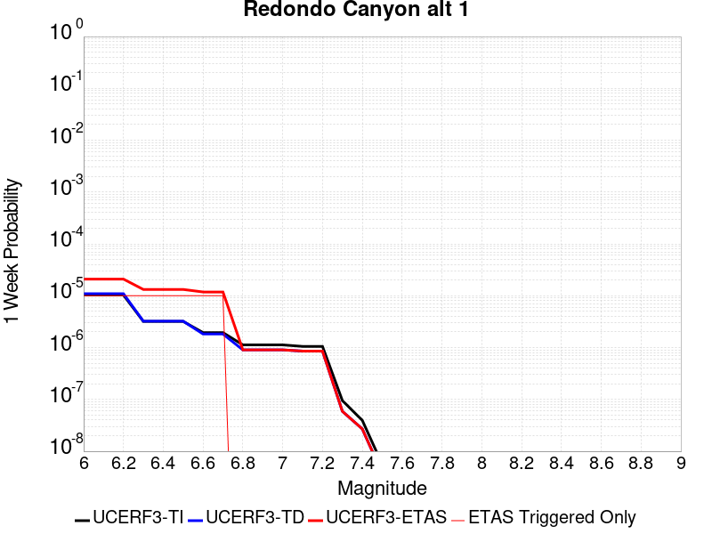 |  |  | 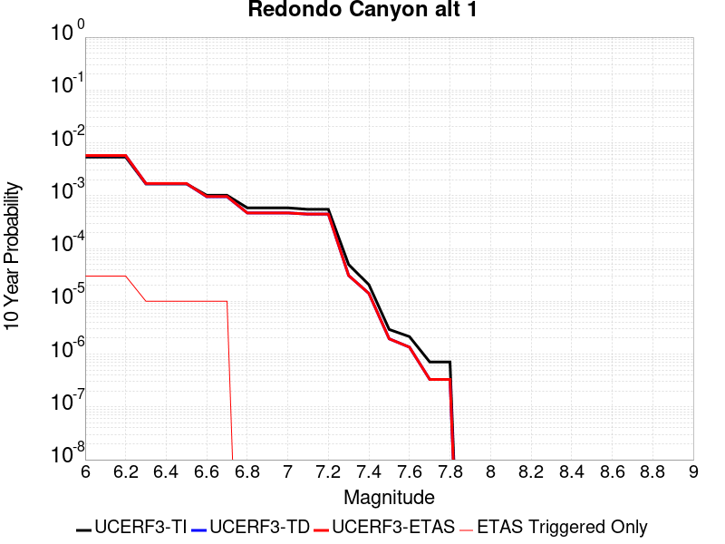 |

| Magnitude | 1 wk TI Prob | 1 wk TD Prob | 1 wk ETAS Prob | 1 wk ETAS/TD Gain | 1 wk ETAS Triggered Only | 1 mo TI Prob | 1 mo TD Prob | 1 mo ETAS Prob | 1 mo ETAS/TD Gain | 1 mo ETAS Triggered Only | 1 yr TI Prob | 1 yr TD Prob | 1 yr ETAS Prob | 1 yr ETAS/TD Gain | 1 yr ETAS Triggered Only | 10 yr TI Prob | 10 yr TD Prob | 10 yr ETAS Prob | 10 yr ETAS/TD Gain | 10 yr ETAS Triggered Only |
|-----|-----|-----|-----|-----|-----|-----|-----|-----|-----|-----|-----|-----|-----|-----|-----|-----|-----|-----|-----|-----|
| 6.0 | 1.0346246E-5 | 1.0981325E-5 | 2.0981215E-5 | 1.9106269 | 1.0E-5 | 4.43403E-5 | 4.7062418E-5 | 5.706195E-5 | 1.2124738 | 1.0E-5 | 5.3970946E-4 | 5.729132E-4 | 6.0289603E-4 | 1.052334 | 3.0E-5 | 0.0053840056 | 0.0057221013 | 0.0057519297 | 1.0052128 | 3.0E-5 |
| 6.1 | 1.0346246E-5 | 1.0981325E-5 | 2.0981215E-5 | 1.9106269 | 1.0E-5 | 4.43403E-5 | 4.7062418E-5 | 5.706195E-5 | 1.2124738 | 1.0E-5 | 5.3970946E-4 | 5.729132E-4 | 6.0289603E-4 | 1.052334 | 3.0E-5 | 0.0053840056 | 0.0057221013 | 0.0057519297 | 1.0052128 | 3.0E-5 |
| 6.2 | 1.0346246E-5 | 1.0981325E-5 | 2.0981215E-5 | 1.9106269 | 1.0E-5 | 4.43403E-5 | 4.7062418E-5 | 5.706195E-5 | 1.2124738 | 1.0E-5 | 5.3970946E-4 | 5.729132E-4 | 6.0289603E-4 | 1.052334 | 3.0E-5 | 0.0053840056 | 0.0057221013 | 0.0057519297 | 1.0052128 | 3.0E-5 |
| 6.3 | 3.2052794E-6 | 3.2360983E-6 | 1.3236066E-5 | 4.090131 | 1.0E-5 | 1.373684E-5 | 1.3868941E-5 | 2.3868803E-5 | 1.7210256 | 1.0E-5 | 1.6723319E-4 | 1.6884525E-4 | 1.7884356E-4 | 1.0592158 | 1.0E-5 | 0.001671074 | 0.0016875593 | 0.0016975424 | 1.0059158 | 1.0E-5 |
| 6.4 | 3.2052794E-6 | 3.2360983E-6 | 1.3236066E-5 | 4.090131 | 1.0E-5 | 1.373684E-5 | 1.3868941E-5 | 2.3868803E-5 | 1.7210256 | 1.0E-5 | 1.6723319E-4 | 1.6884525E-4 | 1.7884356E-4 | 1.0592158 | 1.0E-5 | 0.001671074 | 0.0016875593 | 0.0016975424 | 1.0059158 | 1.0E-5 |
| 6.5 | 3.2052794E-6 | 3.2360983E-6 | 1.3236066E-5 | 4.090131 | 1.0E-5 | 1.373684E-5 | 1.3868941E-5 | 2.3868803E-5 | 1.7210256 | 1.0E-5 | 1.6723319E-4 | 1.6884525E-4 | 1.7884356E-4 | 1.0592158 | 1.0E-5 | 0.001671074 | 0.0016875593 | 0.0016975424 | 1.0059158 | 1.0E-5 |
| 6.6 | 1.948328E-6 | 1.8288489E-6 | 1.1828831E-5 | 6.4679103 | 1.0E-5 | 8.349951E-6 | 7.837909E-6 | 1.783783E-5 | 2.2758405 | 1.0E-5 | 1.016559E-4 | 9.5423864E-5 | 1.0542291E-4 | 1.1047856 | 1.0E-5 | 0.0010160941 | 9.5397583E-4 | 9.639663E-4 | 1.0104724 | 1.0E-5 |
| 6.7 | 1.948328E-6 | 1.8288489E-6 | 1.1828831E-5 | 6.4679103 | 1.0E-5 | 8.349951E-6 | 7.837909E-6 | 1.783783E-5 | 2.2758405 | 1.0E-5 | 1.016559E-4 | 9.5423864E-5 | 1.0542291E-4 | 1.1047856 | 1.0E-5 | 0.0010160941 | 9.5397583E-4 | 9.639663E-4 | 1.0104724 | 1.0E-5 |
| 6.8 | 1.1278219E-6 | 9.032885E-7 | 9.032885E-7 | 1.0 | 0.0 | 4.8335132E-6 | 3.871233E-6 | 3.871233E-6 | 1.0 | 0.0 | 5.8846435E-5 | 4.713167E-5 | 4.713167E-5 | 1.0 | 0.0 | 5.8830855E-4 | 4.7125877E-4 | 4.7125877E-4 | 1.0 | 0.0 |
| 6.9 | 1.1278219E-6 | 9.032885E-7 | 9.032885E-7 | 1.0 | 0.0 | 4.8335132E-6 | 3.871233E-6 | 3.871233E-6 | 1.0 | 0.0 | 5.8846435E-5 | 4.713167E-5 | 4.713167E-5 | 1.0 | 0.0 | 5.8830855E-4 | 4.7125877E-4 | 4.7125877E-4 | 1.0 | 0.0 |
| 7.0 | 1.1278219E-6 | 9.032885E-7 | 9.032885E-7 | 1.0 | 0.0 | 4.8335132E-6 | 3.871233E-6 | 3.871233E-6 | 1.0 | 0.0 | 5.8846435E-5 | 4.713167E-5 | 4.713167E-5 | 1.0 | 0.0 | 5.8830855E-4 | 4.7125877E-4 | 4.7125877E-4 | 1.0 | 0.0 |
| 7.1 | 1.0545139E-6 | 8.5690925E-7 | 8.5690925E-7 | 1.0 | 0.0 | 4.5193374E-6 | 3.6724655E-6 | 3.6724655E-6 | 1.0 | 0.0 | 5.5021545E-5 | 4.4711775E-5 | 4.4711775E-5 | 1.0 | 0.0 | 5.500792E-4 | 4.4706953E-4 | 4.4706953E-4 | 1.0 | 0.0 |
| 7.2 | 1.0545139E-6 | 8.5690925E-7 | 8.5690925E-7 | 1.0 | 0.0 | 4.5193374E-6 | 3.6724655E-6 | 3.6724655E-6 | 1.0 | 0.0 | 5.5021545E-5 | 4.4711775E-5 | 4.4711775E-5 | 1.0 | 0.0 | 5.500792E-4 | 4.4706953E-4 | 4.4706953E-4 | 1.0 | 0.0 |
| 7.3 | 9.505161E-8 | 5.8955752E-8 | 5.8955752E-8 | 1.0 | 0.0 | 4.0736398E-7 | 2.526675E-7 | 2.526675E-7 | 1.0 | 0.0 | 4.959645E-6 | 3.0762235E-6 | 3.0762235E-6 | 1.0 | 0.0 | 4.9595343E-5 | 3.076193E-5 | 3.076193E-5 | 1.0 | 0.0 |
| 7.4 | 3.9520785E-8 | 2.6987088E-8 | 2.6987088E-8 | 1.0 | 0.0 | 1.6937479E-7 | 1.1565894E-7 | 1.1565894E-7 | 1.0 | 0.0 | 2.062136E-6 | 1.408147E-6 | 1.408147E-6 | 1.0 | 0.0 | 2.062117E-5 | 1.4081407E-5 | 1.4081407E-5 | 1.0 | 0.0 |
| 7.5 | 5.6133214E-9 | 3.7367687E-9 | 3.7367687E-9 | 1.0 | 0.0 | 2.4057092E-8 | 1.6014722E-8 | 1.6014722E-8 | 1.0 | 0.0 | 2.9289507E-7 | 1.9497922E-7 | 1.9497922E-7 | 1.0 | 0.0 | 2.9289467E-6 | 1.9497909E-6 | 1.9497909E-6 | 1.0 | 0.0 |
| 7.6 | 4.1064334E-9 | 2.5957205E-9 | 2.5957205E-9 | 1.0 | 0.0 | 1.7599E-8 | 1.1124517E-8 | 1.1124517E-8 | 1.0 | 0.0 | 2.142678E-7 | 1.3544098E-7 | 1.3544098E-7 | 1.0 | 0.0 | 2.1426758E-6 | 1.3544093E-6 | 1.3544093E-6 | 1.0 | 0.0 |
| 7.7 | 1.361975E-9 | 6.360521E-10 | 6.360521E-10 | 1.0 | 0.0 | 5.8370353E-9 | 2.7259377E-9 | 2.7259377E-9 | 1.0 | 0.0 | 7.1065905E-8 | 3.318829E-8 | 3.318829E-8 | 1.0 | 0.0 | 7.106588E-7 | 3.3188286E-7 | 3.3188286E-7 | 1.0 | 0.0 |
| 7.8 | 1.361975E-9 | 6.360521E-10 | 6.360521E-10 | 1.0 | 0.0 | 5.8370353E-9 | 2.7259377E-9 | 2.7259377E-9 | 1.0 | 0.0 | 7.1065905E-8 | 3.318829E-8 | 3.318829E-8 | 1.0 | 0.0 | 7.106588E-7 | 3.3188286E-7 | 3.3188286E-7 | 1.0 | 0.0 |

## Great Valley 04a Trout Creek
*[(top)](#table-of-contents)*

| 1 Week | 1 Month | 1 Year | 10 Year |
|-----|-----|-----|-----|
|  |  | 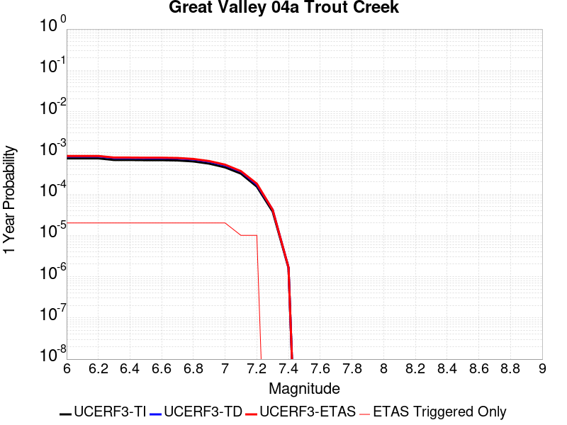 |  |

| Magnitude | 1 wk TI Prob | 1 wk TD Prob | 1 wk ETAS Prob | 1 wk ETAS/TD Gain | 1 wk ETAS Triggered Only | 1 mo TI Prob | 1 mo TD Prob | 1 mo ETAS Prob | 1 mo ETAS/TD Gain | 1 mo ETAS Triggered Only | 1 yr TI Prob | 1 yr TD Prob | 1 yr ETAS Prob | 1 yr ETAS/TD Gain | 1 yr ETAS Triggered Only | 10 yr TI Prob | 10 yr TD Prob | 10 yr ETAS Prob | 10 yr ETAS/TD Gain | 10 yr ETAS Triggered Only |
|-----|-----|-----|-----|-----|-----|-----|-----|-----|-----|-----|-----|-----|-----|-----|-----|-----|-----|-----|-----|-----|
| 6.0 | 1.4088538E-5 | 1.5719554E-5 | 1.5719554E-5 | 1.0 | 0.0 | 6.037805E-5 | 6.7367844E-5 | 7.736717E-5 | 1.1484288 | 1.0E-5 | 7.3485484E-4 | 8.199074E-4 | 8.3989097E-4 | 1.024373 | 2.0E-5 | 0.007324295 | 0.008170108 | 0.008189945 | 1.0024279 | 2.0E-5 |
| 6.1 | 1.4088538E-5 | 1.5719554E-5 | 1.5719554E-5 | 1.0 | 0.0 | 6.037805E-5 | 6.7367844E-5 | 7.736717E-5 | 1.1484288 | 1.0E-5 | 7.3485484E-4 | 8.199074E-4 | 8.3989097E-4 | 1.024373 | 2.0E-5 | 0.007324295 | 0.008170108 | 0.008189945 | 1.0024279 | 2.0E-5 |
| 6.2 | 1.4088538E-5 | 1.5719554E-5 | 1.5719554E-5 | 1.0 | 0.0 | 6.037805E-5 | 6.7367844E-5 | 7.736717E-5 | 1.1484288 | 1.0E-5 | 7.3485484E-4 | 8.199074E-4 | 8.3989097E-4 | 1.024373 | 2.0E-5 | 0.007324295 | 0.008170108 | 0.008189945 | 1.0024279 | 2.0E-5 |
| 6.3 | 1.2882862E-5 | 1.4378603E-5 | 1.4378603E-5 | 1.0 | 0.0 | 5.5211098E-5 | 6.1621184E-5 | 7.162057E-5 | 1.1622719 | 1.0E-5 | 6.7198783E-4 | 7.4999005E-4 | 7.699751E-4 | 1.026647 | 2.0E-5 | 0.0066995937 | 0.0074756527 | 0.0074955034 | 1.0026554 | 2.0E-5 |
| 6.4 | 1.2882862E-5 | 1.4378603E-5 | 1.4378603E-5 | 1.0 | 0.0 | 5.5211098E-5 | 6.1621184E-5 | 7.162057E-5 | 1.1622719 | 1.0E-5 | 6.7198783E-4 | 7.4999005E-4 | 7.699751E-4 | 1.026647 | 2.0E-5 | 0.0066995937 | 0.0074756527 | 0.0074955034 | 1.0026554 | 2.0E-5 |
| 6.5 | 1.2762329E-5 | 1.424516E-5 | 1.424516E-5 | 1.0 | 0.0 | 5.469455E-5 | 6.1049315E-5 | 7.10487E-5 | 1.163792 | 1.0E-5 | 6.657027E-4 | 7.430323E-4 | 7.6301745E-4 | 1.0268967 | 2.0E-5 | 0.00663712 | 0.0074065393 | 0.007426391 | 1.0026803 | 2.0E-5 |
| 6.6 | 1.2762329E-5 | 1.424516E-5 | 1.424516E-5 | 1.0 | 0.0 | 5.469455E-5 | 6.1049315E-5 | 7.10487E-5 | 1.163792 | 1.0E-5 | 6.657027E-4 | 7.430323E-4 | 7.6301745E-4 | 1.0268967 | 2.0E-5 | 0.00663712 | 0.0074065393 | 0.007426391 | 1.0026803 | 2.0E-5 |
| 6.7 | 1.2557959E-5 | 1.4019395E-5 | 1.4019395E-5 | 1.0 | 0.0 | 5.3818712E-5 | 6.0081795E-5 | 7.0081194E-5 | 1.1664298 | 1.0E-5 | 6.5504585E-4 | 7.312607E-4 | 7.5124606E-4 | 1.02733 | 2.0E-5 | 0.006531183 | 0.007289598 | 0.0073094526 | 1.0027237 | 2.0E-5 |
| 6.8 | 1.1871544E-5 | 1.3258823E-5 | 1.3258823E-5 | 1.0 | 0.0 | 5.0877054E-5 | 5.6822348E-5 | 6.6821776E-5 | 1.1759771 | 1.0E-5 | 6.1925204E-4 | 6.916025E-4 | 7.1158865E-4 | 1.0288984 | 2.0E-5 | 0.0061752927 | 0.0068955184 | 0.0069153807 | 1.0028805 | 2.0E-5 |
| 6.9 | 1.0500373E-5 | 1.1731261E-5 | 1.1731261E-5 | 1.0 | 0.0 | 4.5000823E-5 | 5.0275914E-5 | 6.027541E-5 | 1.1988924 | 1.0E-5 | 5.4774724E-4 | 6.119459E-4 | 6.319337E-4 | 1.0326626 | 2.0E-5 | 0.005463991 | 0.0061034737 | 0.006123352 | 1.0032568 | 2.0E-5 |
| 7.0 | 8.524332E-6 | 9.5334835E-6 | 9.5334835E-6 | 1.0 | 0.0 | 3.653234E-5 | 4.0857187E-5 | 5.085678E-5 | 1.244745 | 1.0E-5 | 4.4469046E-4 | 4.9733004E-4 | 5.173201E-4 | 1.0401947 | 2.0E-5 | 0.0044380166 | 0.004962902 | 0.004982803 | 1.0040098 | 2.0E-5 |
| 7.1 | 6.006849E-6 | 6.711559E-6 | 6.711559E-6 | 1.0 | 0.0 | 2.5743384E-5 | 2.876354E-5 | 2.876354E-5 | 1.0 | 0.0 | 3.1338062E-4 | 3.501454E-4 | 3.601419E-4 | 1.0285496 | 1.0E-5 | 0.0031293905 | 0.0034964874 | 0.0035064525 | 1.00285 | 1.0E-5 |
| 7.2 | 2.9122193E-6 | 3.2465305E-6 | 3.2465305E-6 | 1.0 | 0.0 | 1.248088E-5 | 1.3913637E-5 | 1.3913637E-5 | 1.0 | 0.0 | 1.5194413E-4 | 1.6938712E-4 | 1.7938543E-4 | 1.0590264 | 1.0E-5 | 0.0015184027 | 0.0016927521 | 0.0017027352 | 1.0058975 | 1.0E-5 |
| 7.3 | 7.2194007E-7 | 7.988761E-7 | 7.988761E-7 | 1.0 | 0.0 | 3.0940253E-6 | 3.4237528E-6 | 3.4237528E-6 | 1.0 | 0.0 | 3.7669106E-5 | 4.1683852E-5 | 4.1683852E-5 | 1.0 | 0.0 | 3.766272E-4 | 4.168053E-4 | 4.168053E-4 | 1.0 | 0.0 |
| 7.4 | 3.112171E-8 | 3.2068368E-8 | 3.2068368E-8 | 1.0 | 0.0 | 1.3337875E-7 | 1.3743585E-7 | 1.3743585E-7 | 1.0 | 0.0 | 1.6238852E-6 | 1.6732803E-6 | 1.6732803E-6 | 1.0 | 0.0 | 1.6238733E-5 | 1.6732685E-5 | 1.6732685E-5 | 1.0 | 0.0 |

## Verdugo
*[(top)](#table-of-contents)*

| 1 Week | 1 Month | 1 Year | 10 Year |
|-----|-----|-----|-----|
| 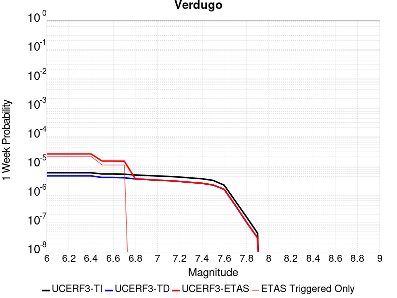 |  | 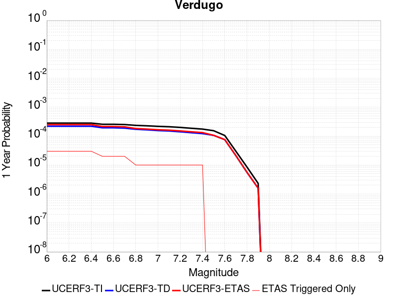 |  |

| Magnitude | 1 wk TI Prob | 1 wk TD Prob | 1 wk ETAS Prob | 1 wk ETAS/TD Gain | 1 wk ETAS Triggered Only | 1 mo TI Prob | 1 mo TD Prob | 1 mo ETAS Prob | 1 mo ETAS/TD Gain | 1 mo ETAS Triggered Only | 1 yr TI Prob | 1 yr TD Prob | 1 yr ETAS Prob | 1 yr ETAS/TD Gain | 1 yr ETAS Triggered Only | 10 yr TI Prob | 10 yr TD Prob | 10 yr ETAS Prob | 10 yr ETAS/TD Gain | 10 yr ETAS Triggered Only |
|-----|-----|-----|-----|-----|-----|-----|-----|-----|-----|-----|-----|-----|-----|-----|-----|-----|-----|-----|-----|-----|
| 6.0 | 5.392987E-6 | 4.2164934E-6 | 2.421641E-5 | 5.743258 | 2.0E-5 | 2.3112598E-5 | 1.8070563E-5 | 3.80702E-5 | 2.1067524 | 2.0E-5 | 2.8135953E-4 | 2.1998737E-4 | 2.4998077E-4 | 1.1363415 | 3.0E-5 | 0.0028100356 | 0.0021977439 | 0.002227678 | 1.0136204 | 3.0E-5 |
| 6.1 | 5.392987E-6 | 4.2164934E-6 | 2.421641E-5 | 5.743258 | 2.0E-5 | 2.3112598E-5 | 1.8070563E-5 | 3.80702E-5 | 2.1067524 | 2.0E-5 | 2.8135953E-4 | 2.1998737E-4 | 2.4998077E-4 | 1.1363415 | 3.0E-5 | 0.0028100356 | 0.0021977439 | 0.002227678 | 1.0136204 | 3.0E-5 |
| 6.2 | 5.392987E-6 | 4.2164934E-6 | 2.421641E-5 | 5.743258 | 2.0E-5 | 2.3112598E-5 | 1.8070563E-5 | 3.80702E-5 | 2.1067524 | 2.0E-5 | 2.8135953E-4 | 2.1998737E-4 | 2.4998077E-4 | 1.1363415 | 3.0E-5 | 0.0028100356 | 0.0021977439 | 0.002227678 | 1.0136204 | 3.0E-5 |
| 6.3 | 5.392987E-6 | 4.2164934E-6 | 2.421641E-5 | 5.743258 | 2.0E-5 | 2.3112598E-5 | 1.8070563E-5 | 3.80702E-5 | 2.1067524 | 2.0E-5 | 2.8135953E-4 | 2.1998737E-4 | 2.4998077E-4 | 1.1363415 | 3.0E-5 | 0.0028100356 | 0.0021977439 | 0.002227678 | 1.0136204 | 3.0E-5 |
| 6.4 | 5.392987E-6 | 4.2164934E-6 | 2.421641E-5 | 5.743258 | 2.0E-5 | 2.3112598E-5 | 1.8070563E-5 | 3.80702E-5 | 2.1067524 | 2.0E-5 | 2.8135953E-4 | 2.1998737E-4 | 2.4998077E-4 | 1.1363415 | 3.0E-5 | 0.0028100356 | 0.0021977439 | 0.002227678 | 1.0136204 | 3.0E-5 |
| 6.5 | 4.9154837E-6 | 3.7224413E-6 | 1.3722404E-5 | 3.686399 | 1.0E-5 | 2.1066187E-5 | 1.5953223E-5 | 2.5953064E-5 | 1.6268226 | 1.0E-5 | 2.5645064E-4 | 1.9421338E-4 | 2.142095E-4 | 1.1029595 | 2.0E-5 | 0.002561549 | 0.0019404575 | 0.0019604187 | 1.0102868 | 2.0E-5 |
| 6.6 | 4.9154837E-6 | 3.7224413E-6 | 1.3722404E-5 | 3.686399 | 1.0E-5 | 2.1066187E-5 | 1.5953223E-5 | 2.5953064E-5 | 1.6268226 | 1.0E-5 | 2.5645064E-4 | 1.9421338E-4 | 2.142095E-4 | 1.1029595 | 2.0E-5 | 0.002561549 | 0.0019404575 | 0.0019604187 | 1.0102868 | 2.0E-5 |
| 6.7 | 4.817006E-6 | 3.620628E-6 | 1.3620592E-5 | 3.761942 | 1.0E-5 | 2.0644147E-5 | 1.5516885E-5 | 2.551673E-5 | 1.6444492 | 1.0E-5 | 2.513135E-4 | 1.889019E-4 | 2.0889813E-4 | 1.1058551 | 2.0E-5 | 0.0025102948 | 0.0018874329 | 0.0019073952 | 1.0105764 | 2.0E-5 |
| 6.8 | 4.507407E-6 | 3.3070805E-6 | 3.3070805E-6 | 1.0 | 0.0 | 1.9317316E-5 | 1.4173126E-5 | 1.4173126E-5 | 1.0 | 0.0 | 2.3516294E-4 | 1.7254429E-4 | 1.8254256E-4 | 1.0579461 | 1.0E-5 | 0.0023491425 | 0.0017241176 | 0.0017341003 | 1.0057901 | 1.0E-5 |
| 6.9 | 4.3573054E-6 | 3.1609877E-6 | 3.1609877E-6 | 1.0 | 0.0 | 1.8674033E-5 | 1.354702E-5 | 1.354702E-5 | 1.0 | 0.0 | 2.2733262E-4 | 1.649226E-4 | 1.7492096E-4 | 1.0606245 | 1.0E-5 | 0.0022710022 | 0.0016480145 | 0.0016579981 | 1.0060579 | 1.0E-5 |
| 7.0 | 4.171527E-6 | 2.9836467E-6 | 2.9836467E-6 | 1.0 | 0.0 | 1.787785E-5 | 1.2786995E-5 | 1.2786995E-5 | 1.0 | 0.0 | 2.1764109E-4 | 1.5567066E-4 | 1.656691E-4 | 1.0642282 | 1.0E-5 | 0.0021742806 | 0.0015556274 | 0.0015656119 | 1.0064182 | 1.0E-5 |
| 7.1 | 4.0405484E-6 | 2.882238E-6 | 2.882238E-6 | 1.0 | 0.0 | 1.731652E-5 | 1.23523905E-5 | 1.23523905E-5 | 1.0 | 0.0 | 2.1080824E-4 | 1.5038009E-4 | 1.6037858E-4 | 1.0664881 | 1.0E-5 | 0.0021060838 | 0.0015027943 | 0.0015127793 | 1.0066442 | 1.0E-5 |
| 7.2 | 3.8306007E-6 | 2.701823E-6 | 2.701823E-6 | 1.0 | 0.0 | 1.6416758E-5 | 1.157919E-5 | 1.157919E-5 | 1.0 | 0.0 | 1.9985568E-4 | 1.4096762E-4 | 1.5096621E-4 | 1.0709282 | 1.0E-5 | 0.0019967605 | 0.0014087928 | 0.0014187787 | 1.0070883 | 1.0E-5 |
| 7.3 | 3.5750938E-6 | 2.512154E-6 | 2.512154E-6 | 1.0 | 0.0 | 1.532174E-5 | 1.076633E-5 | 1.076633E-5 | 1.0 | 0.0 | 1.8652623E-4 | 1.3107229E-4 | 1.4107098E-4 | 1.0762838 | 1.0E-5 | 0.0018636974 | 0.0013099604 | 0.0013199473 | 1.0076238 | 1.0E-5 |
| 7.4 | 3.3510041E-6 | 2.340838E-6 | 2.340838E-6 | 1.0 | 0.0 | 1.4361368E-5 | 1.0032124E-5 | 1.0032124E-5 | 1.0 | 0.0 | 1.7483562E-4 | 1.2213437E-4 | 1.3213315E-4 | 1.081867 | 1.0E-5 | 0.0017469813 | 0.0012206829 | 0.0012306707 | 1.0081822 | 1.0E-5 |
| 7.5 | 2.948287E-6 | 2.0390912E-6 | 2.0390912E-6 | 1.0 | 0.0 | 1.2635454E-5 | 8.7389335E-6 | 8.7389335E-6 | 1.0 | 0.0 | 1.538258E-4 | 1.06391424E-4 | 1.06391424E-4 | 1.0 | 0.0 | 0.0015371935 | 0.0010634151 | 0.0010634151 | 1.0 | 0.0 |
| 7.6 | 2.0134323E-6 | 1.4471086E-6 | 1.4471086E-6 | 1.0 | 0.0 | 8.628967E-6 | 6.20188E-6 | 6.20188E-6 | 1.0 | 0.0 | 1.05052604E-4 | 7.550536E-5 | 7.550536E-5 | 1.0 | 0.0 | 0.0010500296 | 7.548059E-4 | 7.548059E-4 | 1.0 | 0.0 |
| 7.7 | 5.726436E-7 | 4.0453273E-7 | 4.0453273E-7 | 1.0 | 0.0 | 2.4541846E-6 | 1.7337106E-6 | 1.7337106E-6 | 1.0 | 0.0 | 2.9879287E-5 | 2.110775E-5 | 2.110775E-5 | 1.0 | 0.0 | 2.987527E-4 | 2.1105999E-4 | 2.1105999E-4 | 1.0 | 0.0 |
| 7.8 | 1.6248204E-7 | 1.06879604E-7 | 1.06879604E-7 | 1.0 | 0.0 | 6.963514E-7 | 4.5805535E-7 | 4.5805535E-7 | 1.0 | 0.0 | 8.478045E-6 | 5.57681E-6 | 5.57681E-6 | 1.0 | 0.0 | 8.477722E-5 | 5.5766737E-5 | 5.5766737E-5 | 1.0 | 0.0 |
| 7.9 | 4.4475744E-8 | 3.037888E-8 | 3.037888E-8 | 1.0 | 0.0 | 1.9061031E-7 | 1.301952E-7 | 1.301952E-7 | 1.0 | 0.0 | 2.320678E-6 | 1.5851255E-6 | 1.5851255E-6 | 1.0 | 0.0 | 2.3206538E-5 | 1.5851156E-5 | 1.5851156E-5 | 1.0 | 0.0 |

## Malibu Coast alt 1
*[(top)](#table-of-contents)*

| 1 Week | 1 Month | 1 Year | 10 Year |
|-----|-----|-----|-----|
|  |  |  | 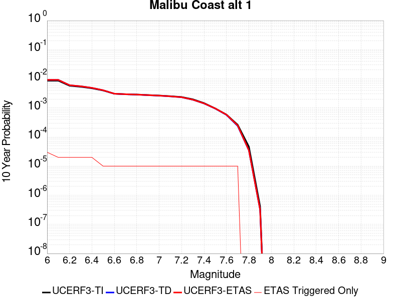 |

| Magnitude | 1 wk TI Prob | 1 wk TD Prob | 1 wk ETAS Prob | 1 wk ETAS/TD Gain | 1 wk ETAS Triggered Only | 1 mo TI Prob | 1 mo TD Prob | 1 mo ETAS Prob | 1 mo ETAS/TD Gain | 1 mo ETAS Triggered Only | 1 yr TI Prob | 1 yr TD Prob | 1 yr ETAS Prob | 1 yr ETAS/TD Gain | 1 yr ETAS Triggered Only | 10 yr TI Prob | 10 yr TD Prob | 10 yr ETAS Prob | 10 yr ETAS/TD Gain | 10 yr ETAS Triggered Only |
|-----|-----|-----|-----|-----|-----|-----|-----|-----|-----|-----|-----|-----|-----|-----|-----|-----|-----|-----|-----|-----|
| 6.0 | 1.6572556E-5 | 1.759807E-5 | 1.759807E-5 | 1.0 | 0.0 | 7.102331E-5 | 7.5418226E-5 | 8.5417465E-5 | 1.132584 | 1.0E-5 | 8.6436566E-4 | 9.1784896E-4 | 9.378306E-4 | 1.0217701 | 2.0E-5 | 0.0086101135 | 0.009142514 | 0.00917224 | 1.0032513 | 3.0E-5 |
| 6.1 | 1.6572556E-5 | 1.759807E-5 | 1.759807E-5 | 1.0 | 0.0 | 7.102331E-5 | 7.5418226E-5 | 8.5417465E-5 | 1.132584 | 1.0E-5 | 8.6436566E-4 | 9.1784896E-4 | 9.278398E-4 | 1.010885 | 1.0E-5 | 0.0086101135 | 0.009142514 | 0.009162331 | 1.0021676 | 2.0E-5 |
| 6.2 | 1.1085717E-5 | 1.155715E-5 | 1.155715E-5 | 1.0 | 0.0 | 4.750935E-5 | 4.9529724E-5 | 5.9529226E-5 | 1.2018889 | 1.0E-5 | 5.782728E-4 | 6.0286105E-4 | 6.12855E-4 | 1.0165776 | 1.0E-5 | 0.0057677035 | 0.0060126274 | 0.006032507 | 1.0033064 | 2.0E-5 |
| 6.3 | 1.0208568E-5 | 1.0592241E-5 | 1.0592241E-5 | 1.0 | 0.0 | 4.375027E-5 | 4.5394543E-5 | 5.5394088E-5 | 1.2202808 | 1.0E-5 | 5.325294E-4 | 5.5254134E-4 | 5.6253583E-4 | 1.0180882 | 1.0E-5 | 0.0053125503 | 0.0055119833 | 0.005531873 | 1.0036085 | 2.0E-5 |
| 6.4 | 9.0682315E-6 | 9.342641E-6 | 9.342641E-6 | 1.0 | 0.0 | 3.8863272E-5 | 4.0039286E-5 | 5.0038885E-5 | 1.2497448 | 1.0E-5 | 4.730576E-4 | 4.873713E-4 | 4.973664E-4 | 1.0205083 | 1.0E-5 | 0.0047205184 | 0.004863238 | 0.004883141 | 1.0040925 | 2.0E-5 |
| 6.5 | 7.605796E-6 | 7.74859E-6 | 7.74859E-6 | 1.0 | 0.0 | 3.259586E-5 | 3.320783E-5 | 3.320783E-5 | 1.0 | 0.0 | 3.9678233E-4 | 4.0423166E-4 | 4.0423166E-4 | 1.0 | 0.0 | 0.0039607463 | 0.0040351013 | 0.004045061 | 1.0024682 | 1.0E-5 |
| 6.6 | 5.889873E-6 | 5.8795417E-6 | 5.8795417E-6 | 1.0 | 0.0 | 2.5242069E-5 | 2.5197793E-5 | 2.5197793E-5 | 1.0 | 0.0 | 3.0727885E-4 | 3.0674002E-4 | 3.0674002E-4 | 1.0 | 0.0 | 0.003068543 | 0.0030631793 | 0.0030731487 | 1.0032545 | 1.0E-5 |
| 6.7 | 5.66586E-6 | 5.6416443E-6 | 5.6416443E-6 | 1.0 | 0.0 | 2.428203E-5 | 2.4178253E-5 | 2.4178253E-5 | 1.0 | 0.0 | 2.955936E-4 | 2.9433056E-4 | 2.9433056E-4 | 1.0 | 0.0 | 0.0029520073 | 0.0029394194 | 0.0029493899 | 1.003392 | 1.0E-5 |
| 6.8 | 5.521556E-6 | 5.48943E-6 | 5.48943E-6 | 1.0 | 0.0 | 2.3663597E-5 | 2.3525918E-5 | 2.3525918E-5 | 1.0 | 0.0 | 2.880662E-4 | 2.8639048E-4 | 2.8639048E-4 | 1.0 | 0.0 | 0.0028769306 | 0.0028602257 | 0.0028701972 | 1.0034863 | 1.0E-5 |
| 6.9 | 5.29752E-6 | 5.2499345E-6 | 5.2499345E-6 | 1.0 | 0.0 | 2.270346E-5 | 2.2499526E-5 | 2.2499526E-5 | 1.0 | 0.0 | 2.7637955E-4 | 2.7389737E-4 | 2.7389737E-4 | 1.0 | 0.0 | 0.0027603607 | 0.0027356083 | 0.0027455809 | 1.0036455 | 1.0E-5 |
| 7.0 | 5.106743E-6 | 5.0476815E-6 | 5.0476815E-6 | 1.0 | 0.0 | 2.1885859E-5 | 2.1632743E-5 | 2.1632743E-5 | 1.0 | 0.0 | 2.6642776E-4 | 2.6334688E-4 | 2.6334688E-4 | 1.0 | 0.0 | 0.0026610855 | 0.0026303576 | 0.0026403314 | 1.0037918 | 1.0E-5 |
| 7.1 | 4.8469647E-6 | 4.770376E-6 | 4.770376E-6 | 1.0 | 0.0 | 2.0772539E-5 | 2.044431E-5 | 2.044431E-5 | 1.0 | 0.0 | 2.528763E-4 | 2.488811E-4 | 2.488811E-4 | 1.0 | 0.0 | 0.0025258875 | 0.0024860317 | 0.002496007 | 1.0040125 | 1.0E-5 |
| 7.2 | 4.545514E-6 | 4.4481967E-6 | 4.4481967E-6 | 1.0 | 0.0 | 1.9480629E-5 | 1.906356E-5 | 1.906356E-5 | 1.0 | 0.0 | 2.3715083E-4 | 2.3207419E-4 | 2.3207419E-4 | 1.0 | 0.0 | 0.0023689792 | 0.002318326 | 0.0023283027 | 1.0043035 | 1.0E-5 |
| 7.3 | 3.794097E-6 | 3.6519373E-6 | 3.6519373E-6 | 1.0 | 0.0 | 1.6260314E-5 | 1.5651065E-5 | 1.5651065E-5 | 1.0 | 0.0 | 1.9795135E-4 | 1.9053511E-4 | 1.9053511E-4 | 1.0 | 0.0 | 0.001977751 | 0.0019037221 | 0.001913703 | 1.0052428 | 1.0E-5 |
| 7.4 | 2.808217E-6 | 2.7190777E-6 | 2.7190777E-6 | 1.0 | 0.0 | 1.203516E-5 | 1.1653137E-5 | 1.1653137E-5 | 1.0 | 0.0 | 1.4651821E-4 | 1.4186774E-4 | 1.4186774E-4 | 1.0 | 0.0 | 0.0014642165 | 0.0014177744 | 0.0014277602 | 1.0070434 | 1.0E-5 |
| 7.5 | 1.83809E-6 | 1.8190703E-6 | 1.8190703E-6 | 1.0 | 0.0 | 7.877505E-6 | 7.795992E-6 | 7.795992E-6 | 1.0 | 0.0 | 9.59044E-5 | 9.4912095E-5 | 9.4912095E-5 | 1.0 | 0.0 | 9.5863023E-4 | 9.487176E-4 | 9.587081E-4 | 1.0105306 | 1.0E-5 |
| 7.6 | 1.1292672E-6 | 1.1001456E-6 | 1.1001456E-6 | 1.0 | 0.0 | 4.839708E-6 | 4.7149015E-6 | 4.7149015E-6 | 1.0 | 0.0 | 5.8921847E-5 | 5.7402427E-5 | 5.7402427E-5 | 1.0 | 0.0 | 5.890623E-4 | 5.7387765E-4 | 5.838719E-4 | 1.0174153 | 1.0E-5 |
| 7.7 | 5.065272E-7 | 4.6091537E-7 | 4.6091537E-7 | 1.0 | 0.0 | 2.170829E-6 | 1.9753502E-6 | 1.9753502E-6 | 1.0 | 0.0 | 2.6429525E-5 | 2.4049634E-5 | 2.4049634E-5 | 1.0 | 0.0 | 2.642638E-4 | 2.4047145E-4 | 2.5046905E-4 | 1.041575 | 1.0E-5 |
| 7.8 | 8.952991E-8 | 6.707853E-8 | 6.707853E-8 | 1.0 | 0.0 | 3.8369956E-7 | 2.874794E-7 | 2.874794E-7 | 1.0 | 0.0 | 4.671532E-6 | 3.5000562E-6 | 3.5000562E-6 | 1.0 | 0.0 | 4.671434E-5 | 3.500003E-5 | 3.500003E-5 | 1.0 | 0.0 |
| 7.9 | 8.007447E-10 | 6.161581E-10 | 6.161581E-10 | 1.0 | 0.0 | 3.4317629E-9 | 2.640678E-9 | 2.640678E-9 | 1.0 | 0.0 | 4.1781714E-8 | 3.2150254E-8 | 3.2150254E-8 | 1.0 | 0.0 | 4.1781706E-7 | 3.2150248E-7 | 3.2150248E-7 | 1.0 | 0.0 |

## Newport-Inglewood alt 1
*[(top)](#table-of-contents)*

| 1 Week | 1 Month | 1 Year | 10 Year |
|-----|-----|-----|-----|
|  |  |  | 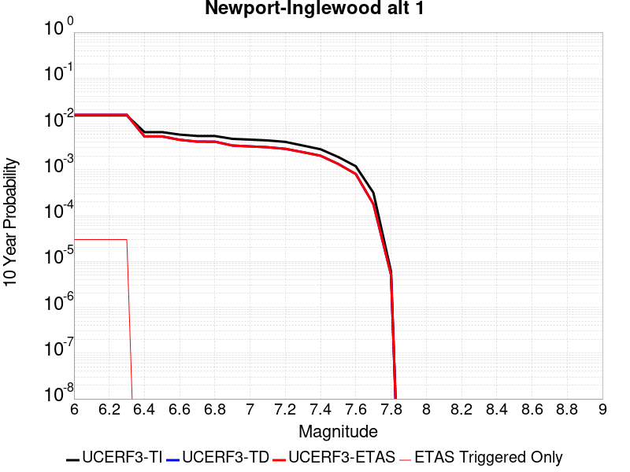 |

| Magnitude | 1 wk TI Prob | 1 wk TD Prob | 1 wk ETAS Prob | 1 wk ETAS/TD Gain | 1 wk ETAS Triggered Only | 1 mo TI Prob | 1 mo TD Prob | 1 mo ETAS Prob | 1 mo ETAS/TD Gain | 1 mo ETAS Triggered Only | 1 yr TI Prob | 1 yr TD Prob | 1 yr ETAS Prob | 1 yr ETAS/TD Gain | 1 yr ETAS Triggered Only | 10 yr TI Prob | 10 yr TD Prob | 10 yr ETAS Prob | 10 yr ETAS/TD Gain | 10 yr ETAS Triggered Only |
|-----|-----|-----|-----|-----|-----|-----|-----|-----|-----|-----|-----|-----|-----|-----|-----|-----|-----|-----|-----|-----|
| 6.0 | 2.9668912E-5 | 3.0404828E-5 | 3.0404828E-5 | 1.0 | 0.0 | 1.2714628E-4 | 1.3030265E-4 | 1.3030265E-4 | 1.0 | 0.0 | 0.0015469068 | 0.0015857654 | 0.0015857654 | 1.0 | 0.0 | 0.015361829 | 0.01579211 | 0.015821636 | 1.0018697 | 3.0E-5 |
| 6.1 | 2.9668912E-5 | 3.0404828E-5 | 3.0404828E-5 | 1.0 | 0.0 | 1.2714628E-4 | 1.3030265E-4 | 1.3030265E-4 | 1.0 | 0.0 | 0.0015469068 | 0.0015857654 | 0.0015857654 | 1.0 | 0.0 | 0.015361829 | 0.01579211 | 0.015821636 | 1.0018697 | 3.0E-5 |
| 6.2 | 2.9668912E-5 | 3.0404828E-5 | 3.0404828E-5 | 1.0 | 0.0 | 1.2714628E-4 | 1.3030265E-4 | 1.3030265E-4 | 1.0 | 0.0 | 0.0015469068 | 0.0015857654 | 0.0015857654 | 1.0 | 0.0 | 0.015361829 | 0.01579211 | 0.015821636 | 1.0018697 | 3.0E-5 |
| 6.3 | 2.9668912E-5 | 3.0404828E-5 | 3.0404828E-5 | 1.0 | 0.0 | 1.2714628E-4 | 1.3030265E-4 | 1.3030265E-4 | 1.0 | 0.0 | 0.0015469068 | 0.0015857654 | 0.0015857654 | 1.0 | 0.0 | 0.015361829 | 0.01579211 | 0.015821636 | 1.0018697 | 3.0E-5 |
| 6.4 | 1.275942E-5 | 1.02725335E-5 | 1.02725335E-5 | 1.0 | 0.0 | 5.4682085E-5 | 4.4024422E-5 | 4.4024422E-5 | 1.0 | 0.0 | 6.65551E-4 | 5.358697E-4 | 5.358697E-4 | 1.0 | 0.0 | 0.0066356123 | 0.0053462 | 0.0053462 | 1.0 | 0.0 |
| 6.5 | 1.275942E-5 | 1.02725335E-5 | 1.02725335E-5 | 1.0 | 0.0 | 5.4682085E-5 | 4.4024422E-5 | 4.4024422E-5 | 1.0 | 0.0 | 6.65551E-4 | 5.358697E-4 | 5.358697E-4 | 1.0 | 0.0 | 0.0066356123 | 0.0053462 | 0.0053462 | 1.0 | 0.0 |
| 6.6 | 1.1255358E-5 | 8.661911E-6 | 8.661911E-6 | 1.0 | 0.0 | 4.8236358E-5 | 3.7121958E-5 | 3.7121958E-5 | 1.0 | 0.0 | 5.871194E-4 | 4.5186782E-4 | 4.5186782E-4 | 1.0 | 0.0 | 0.005855706 | 0.0045096674 | 0.0045096674 | 1.0 | 0.0 |
| 6.7 | 1.0504745E-5 | 7.8998455E-6 | 7.8998455E-6 | 1.0 | 0.0 | 4.5019555E-5 | 3.385605E-5 | 3.385605E-5 | 1.0 | 0.0 | 5.4797524E-4 | 4.121207E-4 | 4.121207E-4 | 1.0 | 0.0 | 0.0054662596 | 0.004113694 | 0.004113694 | 1.0 | 0.0 |
| 6.8 | 1.0476007E-5 | 7.881227E-6 | 7.881227E-6 | 1.0 | 0.0 | 4.4896402E-5 | 3.3776258E-5 | 3.3776258E-5 | 1.0 | 0.0 | 5.464766E-4 | 4.1114958E-4 | 4.1114958E-4 | 1.0 | 0.0 | 0.005451347 | 0.004104019 | 0.004104019 | 1.0 | 0.0 |
| 6.9 | 9.076797E-6 | 6.4896567E-6 | 6.4896567E-6 | 1.0 | 0.0 | 3.889998E-5 | 2.7812519E-5 | 2.7812519E-5 | 1.0 | 0.0 | 4.7350433E-4 | 3.3856515E-4 | 3.3856515E-4 | 1.0 | 0.0 | 0.004724967 | 0.003380531 | 0.003380531 | 1.0 | 0.0 |
| 7.0 | 8.73795E-6 | 6.2120503E-6 | 6.2120503E-6 | 1.0 | 0.0 | 3.7447822E-5 | 2.6622802E-5 | 2.6622802E-5 | 1.0 | 0.0 | 4.5583185E-4 | 3.2408469E-4 | 3.2408469E-4 | 1.0 | 0.0 | 0.0045489795 | 0.0032361522 | 0.0032361522 | 1.0 | 0.0 |
| 7.1 | 8.391299E-6 | 5.9557533E-6 | 5.9557533E-6 | 1.0 | 0.0 | 3.5962214E-5 | 2.5524409E-5 | 2.5524409E-5 | 1.0 | 0.0 | 4.37752E-4 | 3.1071564E-4 | 3.1071564E-4 | 1.0 | 0.0 | 0.004368907 | 0.0031028416 | 0.0031028416 | 1.0 | 0.0 |
| 7.2 | 7.796882E-6 | 5.4964826E-6 | 5.4964826E-6 | 1.0 | 0.0 | 3.341478E-5 | 2.3556144E-5 | 2.3556144E-5 | 1.0 | 0.0 | 4.06749E-4 | 2.867585E-4 | 2.867585E-4 | 1.0 | 0.0 | 0.0040600533 | 0.002863909 | 0.002863909 | 1.0 | 0.0 |
| 7.3 | 6.4738833E-6 | 4.6477753E-6 | 4.6477753E-6 | 1.0 | 0.0 | 2.774492E-5 | 1.9918885E-5 | 1.9918885E-5 | 1.0 | 0.0 | 3.3774204E-4 | 2.424856E-4 | 2.424856E-4 | 1.0 | 0.0 | 0.0033722918 | 0.0024222268 | 0.0024222268 | 1.0 | 0.0 |
| 7.4 | 5.382145E-6 | 3.8857215E-6 | 3.8857215E-6 | 1.0 | 0.0 | 2.3066134E-5 | 1.6652988E-5 | 1.6652988E-5 | 1.0 | 0.0 | 2.8079396E-4 | 2.0273139E-4 | 2.0273139E-4 | 1.0 | 0.0 | 0.0028043943 | 0.002025479 | 0.002025479 | 1.0 | 0.0 |
| 7.5 | 3.648244E-6 | 2.5737634E-6 | 2.5737634E-6 | 1.0 | 0.0 | 1.5635238E-5 | 1.1030369E-5 | 1.1030369E-5 | 1.0 | 0.0 | 1.9034238E-4 | 1.3428657E-4 | 1.3428657E-4 | 1.0 | 0.0 | 0.0019017943 | 0.0013420646 | 0.0013420646 | 1.0 | 0.0 |
| 7.6 | 2.2906888E-6 | 1.547986E-6 | 1.547986E-6 | 1.0 | 0.0 | 9.817201E-6 | 6.634209E-6 | 6.634209E-6 | 1.0 | 0.0 | 1.1951787E-4 | 8.076857E-5 | 8.076857E-5 | 1.0 | 0.0 | 0.0011945361 | 8.073989E-4 | 8.073989E-4 | 1.0 | 0.0 |
| 7.7 | 6.0479874E-7 | 3.397468E-7 | 3.397468E-7 | 1.0 | 0.0 | 2.5919921E-6 | 1.456057E-6 | 1.456057E-6 | 1.0 | 0.0 | 3.1557047E-5 | 1.7727363E-5 | 1.7727363E-5 | 1.0 | 0.0 | 3.1552566E-4 | 1.7726087E-4 | 1.7726087E-4 | 1.0 | 0.0 |
| 7.8 | 1.16056995E-8 | 9.782997E-9 | 9.782997E-9 | 1.0 | 0.0 | 4.9738713E-8 | 4.1927127E-8 | 4.1927127E-8 | 1.0 | 0.0 | 6.0556863E-7 | 5.1046277E-7 | 5.1046277E-7 | 1.0 | 0.0 | 6.05567E-6 | 5.1046277E-6 | 5.1046277E-6 | 1.0 | 0.0 |

## Elmore Ranch
*[(top)](#table-of-contents)*

| 1 Week | 1 Month | 1 Year | 10 Year |
|-----|-----|-----|-----|
|  |  |  | 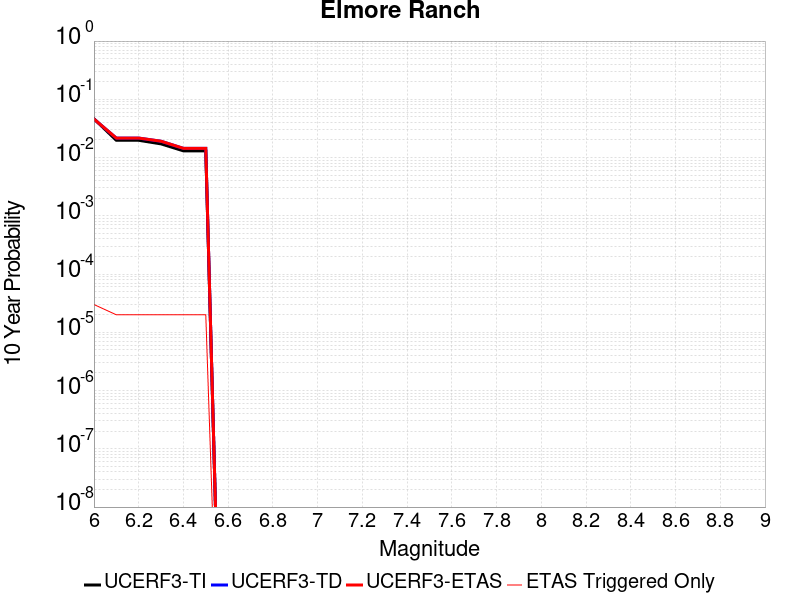 |

| Magnitude | 1 wk TI Prob | 1 wk TD Prob | 1 wk ETAS Prob | 1 wk ETAS/TD Gain | 1 wk ETAS Triggered Only | 1 mo TI Prob | 1 mo TD Prob | 1 mo ETAS Prob | 1 mo ETAS/TD Gain | 1 mo ETAS Triggered Only | 1 yr TI Prob | 1 yr TD Prob | 1 yr ETAS Prob | 1 yr ETAS/TD Gain | 1 yr ETAS Triggered Only | 10 yr TI Prob | 10 yr TD Prob | 10 yr ETAS Prob | 10 yr ETAS/TD Gain | 10 yr ETAS Triggered Only |
|-----|-----|-----|-----|-----|-----|-----|-----|-----|-----|-----|-----|-----|-----|-----|-----|-----|-----|-----|-----|-----|
| 6.0 | 9.102099E-5 | 8.953848E-5 | 8.953848E-5 | 1.0 | 0.0 | 3.9003167E-4 | 3.836898E-4 | 3.9368597E-4 | 1.0260527 | 1.0E-5 | 0.0047383 | 0.004662132 | 0.0046720854 | 1.0021349 | 1.0E-5 | 0.046385348 | 0.04583787 | 0.045866497 | 1.0006245 | 3.0E-5 |
| 6.1 | 3.8306698E-5 | 4.14921E-5 | 4.14921E-5 | 1.0 | 0.0 | 1.6416123E-4 | 1.7781362E-4 | 1.8781185E-4 | 1.0562286 | 1.0E-5 | 0.0019968306 | 0.0021632186 | 0.002173197 | 1.0046127 | 1.0E-5 | 0.019789828 | 0.021595007 | 0.021614576 | 1.0009061 | 2.0E-5 |
| 6.2 | 3.8306698E-5 | 4.14921E-5 | 4.14921E-5 | 1.0 | 0.0 | 1.6416123E-4 | 1.7781362E-4 | 1.8781185E-4 | 1.0562286 | 1.0E-5 | 0.0019968306 | 0.0021632186 | 0.002173197 | 1.0046127 | 1.0E-5 | 0.019789828 | 0.021595007 | 0.021614576 | 1.0009061 | 2.0E-5 |
| 6.3 | 3.3197924E-5 | 3.6550366E-5 | 3.6550366E-5 | 1.0 | 0.0 | 1.4226905E-4 | 1.56639E-4 | 1.6663743E-4 | 1.0638311 | 1.0E-5 | 0.0017307495 | 0.0019059771 | 0.0019159581 | 1.0052366 | 1.0E-5 | 0.017173318 | 0.019057386 | 0.019077003 | 1.0010295 | 2.0E-5 |
| 6.4 | 2.5148964E-5 | 2.7420736E-5 | 2.7420736E-5 | 1.0 | 0.0 | 1.0777682E-4 | 1.17515796E-4 | 1.2751462E-4 | 1.0850849 | 1.0E-5 | 0.0013113929 | 0.0014304637 | 0.0014404494 | 1.0069808 | 1.0E-5 | 0.01303681 | 0.014365338 | 0.01438505 | 1.0013722 | 2.0E-5 |
| 6.5 | 2.5148964E-5 | 2.7420736E-5 | 2.7420736E-5 | 1.0 | 0.0 | 1.0777682E-4 | 1.17515796E-4 | 1.2751462E-4 | 1.0850849 | 1.0E-5 | 0.0013113929 | 0.0014304637 | 0.0014404494 | 1.0069808 | 1.0E-5 | 0.01303681 | 0.014365338 | 0.01438505 | 1.0013722 | 2.0E-5 |

## Hartley Springs 2011 CFM
*[(top)](#table-of-contents)*

| 1 Week | 1 Month | 1 Year | 10 Year |
|-----|-----|-----|-----|
|  |  |  |  |

| Magnitude | 1 wk TI Prob | 1 wk TD Prob | 1 wk ETAS Prob | 1 wk ETAS/TD Gain | 1 wk ETAS Triggered Only | 1 mo TI Prob | 1 mo TD Prob | 1 mo ETAS Prob | 1 mo ETAS/TD Gain | 1 mo ETAS Triggered Only | 1 yr TI Prob | 1 yr TD Prob | 1 yr ETAS Prob | 1 yr ETAS/TD Gain | 1 yr ETAS Triggered Only | 10 yr TI Prob | 10 yr TD Prob | 10 yr ETAS Prob | 10 yr ETAS/TD Gain | 10 yr ETAS Triggered Only |
|-----|-----|-----|-----|-----|-----|-----|-----|-----|-----|-----|-----|-----|-----|-----|-----|-----|-----|-----|-----|-----|
| 6.0 | 1.4352418E-5 | 1.4434111E-5 | 2.4433966E-5 | 1.6927933 | 1.0E-5 | 6.1508916E-5 | 6.185994E-5 | 7.185932E-5 | 1.1616455 | 1.0E-5 | 7.486137E-4 | 7.5304887E-4 | 7.730338E-4 | 1.0265387 | 2.0E-5 | 0.007460968 | 0.007521092 | 0.0075508663 | 1.0039588 | 3.0E-5 |
| 6.1 | 1.4352418E-5 | 1.4434111E-5 | 2.4433966E-5 | 1.6927933 | 1.0E-5 | 6.1508916E-5 | 6.185994E-5 | 7.185932E-5 | 1.1616455 | 1.0E-5 | 7.486137E-4 | 7.5304887E-4 | 7.730338E-4 | 1.0265387 | 2.0E-5 | 0.007460968 | 0.007521092 | 0.0075508663 | 1.0039588 | 3.0E-5 |
| 6.2 | 1.4352418E-5 | 1.4434111E-5 | 2.4433966E-5 | 1.6927933 | 1.0E-5 | 6.1508916E-5 | 6.185994E-5 | 7.185932E-5 | 1.1616455 | 1.0E-5 | 7.486137E-4 | 7.5304887E-4 | 7.730338E-4 | 1.0265387 | 2.0E-5 | 0.007460968 | 0.007521092 | 0.0075508663 | 1.0039588 | 3.0E-5 |
| 6.3 | 1.4352418E-5 | 1.4434111E-5 | 2.4433966E-5 | 1.6927933 | 1.0E-5 | 6.1508916E-5 | 6.185994E-5 | 7.185932E-5 | 1.1616455 | 1.0E-5 | 7.486137E-4 | 7.5304887E-4 | 7.730338E-4 | 1.0265387 | 2.0E-5 | 0.007460968 | 0.007521092 | 0.0075508663 | 1.0039588 | 3.0E-5 |
| 6.4 | 1.4352418E-5 | 1.4434111E-5 | 2.4433966E-5 | 1.6927933 | 1.0E-5 | 6.1508916E-5 | 6.185994E-5 | 7.185932E-5 | 1.1616455 | 1.0E-5 | 7.486137E-4 | 7.5304887E-4 | 7.730338E-4 | 1.0265387 | 2.0E-5 | 0.007460968 | 0.007521092 | 0.0075508663 | 1.0039588 | 3.0E-5 |
| 6.5 | 1.2279858E-5 | 1.2133036E-5 | 2.2132914E-5 | 1.8241861 | 1.0E-5 | 5.26269E-5 | 5.199858E-5 | 6.199806E-5 | 1.192303 | 1.0E-5 | 6.4054417E-4 | 6.33057E-4 | 6.530443E-4 | 1.0315727 | 2.0E-5 | 0.0063870098 | 0.006328048 | 0.0063578584 | 1.0047108 | 3.0E-5 |
| 6.6 | 1.2279858E-5 | 1.2133036E-5 | 2.2132914E-5 | 1.8241861 | 1.0E-5 | 5.26269E-5 | 5.199858E-5 | 6.199806E-5 | 1.192303 | 1.0E-5 | 6.4054417E-4 | 6.33057E-4 | 6.530443E-4 | 1.0315727 | 2.0E-5 | 0.0063870098 | 0.006328048 | 0.0063578584 | 1.0047108 | 3.0E-5 |
| 6.7 | 2.1282601E-6 | 8.894127E-7 | 8.894127E-7 | 1.0 | 0.0 | 9.121083E-6 | 3.8117648E-6 | 3.8117648E-6 | 1.0 | 0.0 | 1.11043526E-4 | 4.6407506E-5 | 4.6407506E-5 | 1.0 | 0.0 | 0.0011098806 | 4.6400347E-4 | 4.6400347E-4 | 1.0 | 0.0 |
| 6.8 | 2.00516E-6 | 8.516916E-7 | 8.516916E-7 | 1.0 | 0.0 | 8.593515E-6 | 3.6501033E-6 | 3.6501033E-6 | 1.0 | 0.0 | 1.04621024E-4 | 4.443936E-5 | 4.443936E-5 | 1.0 | 0.0 | 0.0010457177 | 4.4432987E-4 | 4.4432987E-4 | 1.0 | 0.0 |
| 6.9 | 2.00516E-6 | 8.516916E-7 | 8.516916E-7 | 1.0 | 0.0 | 8.593515E-6 | 3.6501033E-6 | 3.6501033E-6 | 1.0 | 0.0 | 1.04621024E-4 | 4.443936E-5 | 4.443936E-5 | 1.0 | 0.0 | 0.0010457177 | 4.4432987E-4 | 4.4432987E-4 | 1.0 | 0.0 |
| 7.0 | 1.8366732E-6 | 8.2366813E-7 | 8.2366813E-7 | 1.0 | 0.0 | 7.871433E-6 | 3.5300031E-6 | 3.5300031E-6 | 1.0 | 0.0 | 9.583048E-5 | 4.2977194E-5 | 4.2977194E-5 | 1.0 | 0.0 | 9.5789164E-4 | 4.297139E-4 | 4.297139E-4 | 1.0 | 0.0 |
| 7.1 | 1.5097997E-6 | 7.1897E-7 | 7.1897E-7 | 1.0 | 0.0 | 6.470554E-6 | 3.0812978E-6 | 3.0812978E-6 | 1.0 | 0.0 | 7.877615E-5 | 3.7514397E-5 | 3.7514397E-5 | 1.0 | 0.0 | 7.874823E-4 | 3.7510434E-4 | 3.7510434E-4 | 1.0 | 0.0 |
| 7.2 | 1.3490993E-6 | 6.404769E-7 | 6.404769E-7 | 1.0 | 0.0 | 5.7818415E-6 | 2.7448996E-6 | 2.7448996E-6 | 1.0 | 0.0 | 7.0391645E-5 | 3.3418873E-5 | 3.3418873E-5 | 1.0 | 0.0 | 7.0369354E-4 | 3.3416142E-4 | 3.3416142E-4 | 1.0 | 0.0 |
| 7.3 | 7.900015E-7 | 4.0888176E-7 | 4.0888176E-7 | 1.0 | 0.0 | 3.3857161E-6 | 1.7523504E-6 | 1.7523504E-6 | 1.0 | 0.0 | 4.1220315E-5 | 2.1334865E-5 | 2.1334865E-5 | 1.0 | 0.0 | 4.121267E-4 | 2.1334866E-4 | 2.1334866E-4 | 1.0 | 0.0 |

## Great Valley 04b Gordon Valley
*[(top)](#table-of-contents)*

| 1 Week | 1 Month | 1 Year | 10 Year |
|-----|-----|-----|-----|
|  |  |  | 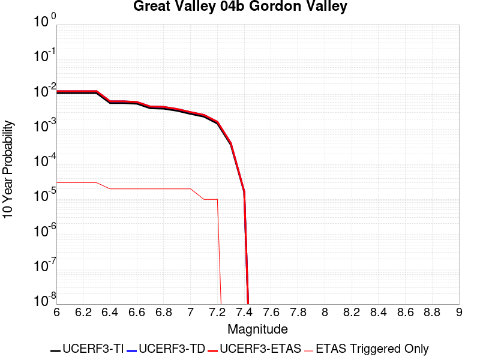 |

| Magnitude | 1 wk TI Prob | 1 wk TD Prob | 1 wk ETAS Prob | 1 wk ETAS/TD Gain | 1 wk ETAS Triggered Only | 1 mo TI Prob | 1 mo TD Prob | 1 mo ETAS Prob | 1 mo ETAS/TD Gain | 1 mo ETAS Triggered Only | 1 yr TI Prob | 1 yr TD Prob | 1 yr ETAS Prob | 1 yr ETAS/TD Gain | 1 yr ETAS Triggered Only | 10 yr TI Prob | 10 yr TD Prob | 10 yr ETAS Prob | 10 yr ETAS/TD Gain | 10 yr ETAS Triggered Only |
|-----|-----|-----|-----|-----|-----|-----|-----|-----|-----|-----|-----|-----|-----|-----|-----|-----|-----|-----|-----|-----|
| 6.0 | 2.1181217E-5 | 2.3981951E-5 | 2.3981951E-5 | 1.0 | 0.0 | 9.077348E-5 | 1.02776685E-4 | 1.12775655E-4 | 1.0972884 | 1.0E-5 | 0.0011046068 | 0.0012507545 | 0.0012707295 | 1.0159703 | 2.0E-5 | 0.010991322 | 0.0124536 | 0.012483226 | 1.002379 | 3.0E-5 |
| 6.1 | 2.1181217E-5 | 2.3981951E-5 | 2.3981951E-5 | 1.0 | 0.0 | 9.077348E-5 | 1.02776685E-4 | 1.12775655E-4 | 1.0972884 | 1.0E-5 | 0.0011046068 | 0.0012507545 | 0.0012707295 | 1.0159703 | 2.0E-5 | 0.010991322 | 0.0124536 | 0.012483226 | 1.002379 | 3.0E-5 |
| 6.2 | 2.1181217E-5 | 2.3981951E-5 | 2.3981951E-5 | 1.0 | 0.0 | 9.077348E-5 | 1.02776685E-4 | 1.12775655E-4 | 1.0972884 | 1.0E-5 | 0.0011046068 | 0.0012507545 | 0.0012707295 | 1.0159703 | 2.0E-5 | 0.010991322 | 0.0124536 | 0.012483226 | 1.002379 | 3.0E-5 |
| 6.3 | 2.1181217E-5 | 2.3981951E-5 | 2.3981951E-5 | 1.0 | 0.0 | 9.077348E-5 | 1.02776685E-4 | 1.12775655E-4 | 1.0972884 | 1.0E-5 | 0.0011046068 | 0.0012507545 | 0.0012707295 | 1.0159703 | 2.0E-5 | 0.010991322 | 0.0124536 | 0.012483226 | 1.002379 | 3.0E-5 |
| 6.4 | 1.0988268E-5 | 1.2254499E-5 | 1.2254499E-5 | 1.0 | 0.0 | 4.7091726E-5 | 5.2518313E-5 | 6.2517785E-5 | 1.1903998 | 1.0E-5 | 5.731909E-4 | 6.392388E-4 | 6.5922603E-4 | 1.0312672 | 2.0E-5 | 0.005717147 | 0.0063755875 | 0.00639546 | 1.003117 | 2.0E-5 |
| 6.5 | 1.0988268E-5 | 1.2254499E-5 | 1.2254499E-5 | 1.0 | 0.0 | 4.7091726E-5 | 5.2518313E-5 | 6.2517785E-5 | 1.1903998 | 1.0E-5 | 5.731909E-4 | 6.392388E-4 | 6.5922603E-4 | 1.0312672 | 2.0E-5 | 0.005717147 | 0.0063755875 | 0.00639546 | 1.003117 | 2.0E-5 |
| 6.6 | 1.0517822E-5 | 1.1724062E-5 | 1.1724062E-5 | 1.0 | 0.0 | 4.5075605E-5 | 5.02451E-5 | 6.0244598E-5 | 1.1990144 | 1.0E-5 | 5.4865726E-4 | 6.11578E-4 | 6.315658E-4 | 1.0326823 | 2.0E-5 | 0.0054730466 | 0.0061005033 | 0.006120381 | 1.0032585 | 2.0E-5 |
| 6.7 | 7.789219E-6 | 8.6776445E-6 | 8.6776445E-6 | 1.0 | 0.0 | 3.3381937E-5 | 3.7189402E-5 | 4.718903E-5 | 1.2688838 | 1.0E-5 | 4.063493E-4 | 4.526921E-4 | 4.7268305E-4 | 1.0441601 | 2.0E-5 | 0.004056071 | 0.0045182165 | 0.0045381263 | 1.0044066 | 2.0E-5 |
| 6.8 | 7.5850853E-6 | 8.452389E-6 | 8.452389E-6 | 1.0 | 0.0 | 3.2507105E-5 | 3.622405E-5 | 4.6223686E-5 | 1.2760497 | 1.0E-5 | 3.957021E-4 | 4.409437E-4 | 4.6093488E-4 | 1.0453373 | 2.0E-5 | 0.0039499826 | 0.0044012 | 0.004421112 | 1.0045242 | 2.0E-5 |
| 6.9 | 6.604105E-6 | 7.3585493E-6 | 7.3585493E-6 | 1.0 | 0.0 | 2.8303E-5 | 3.153628E-5 | 4.1535965E-5 | 1.3170851 | 1.0E-5 | 3.4453452E-4 | 3.8389044E-4 | 4.0388276E-4 | 1.0520782 | 2.0E-5 | 0.0034400085 | 0.0038326595 | 0.0038525828 | 1.0051984 | 2.0E-5 |
| 7.0 | 5.3701115E-6 | 5.9884183E-6 | 5.9884183E-6 | 1.0 | 0.0 | 2.301456E-5 | 2.5664414E-5 | 3.5664158E-5 | 1.3896346 | 1.0E-5 | 2.8016625E-4 | 3.1242234E-4 | 3.324161E-4 | 1.063996 | 2.0E-5 | 0.0027981328 | 0.00312012 | 0.0031400574 | 1.00639 | 2.0E-5 |
| 7.1 | 4.4685607E-6 | 4.986478E-6 | 4.986478E-6 | 1.0 | 0.0 | 1.9150835E-5 | 2.1370459E-5 | 2.1370459E-5 | 1.0 | 0.0 | 2.3313647E-4 | 2.6015675E-4 | 2.7015415E-4 | 1.0384283 | 1.0E-5 | 0.0023289204 | 0.0025987667 | 0.002608741 | 1.003838 | 1.0E-5 |
| 7.2 | 2.833378E-6 | 3.164419E-6 | 3.164419E-6 | 1.0 | 0.0 | 1.2142991E-5 | 1.3561736E-5 | 1.3561736E-5 | 1.0 | 0.0 | 1.4783088E-4 | 1.6510337E-4 | 1.7510171E-4 | 1.0605581 | 1.0E-5 | 0.0014773258 | 0.0016499789 | 0.0016599623 | 1.0060507 | 1.0E-5 |
| 7.3 | 7.0087293E-7 | 7.7728157E-7 | 7.7728157E-7 | 1.0 | 0.0 | 3.0037377E-6 | 3.3312049E-6 | 3.3312049E-6 | 1.0 | 0.0 | 3.656989E-5 | 4.0557123E-5 | 4.0557123E-5 | 1.0 | 0.0 | 3.6563876E-4 | 4.055422E-4 | 4.055422E-4 | 1.0 | 0.0 |
| 7.4 | 3.112171E-8 | 3.2068368E-8 | 3.2068368E-8 | 1.0 | 0.0 | 1.3337875E-7 | 1.3743585E-7 | 1.3743585E-7 | 1.0 | 0.0 | 1.6238852E-6 | 1.6732803E-6 | 1.6732803E-6 | 1.0 | 0.0 | 1.6238733E-5 | 1.6732685E-5 | 1.6732685E-5 | 1.0 | 0.0 |

## North Frontal  (East)
*[(top)](#table-of-contents)*

| 1 Week | 1 Month | 1 Year | 10 Year |
|-----|-----|-----|-----|
| 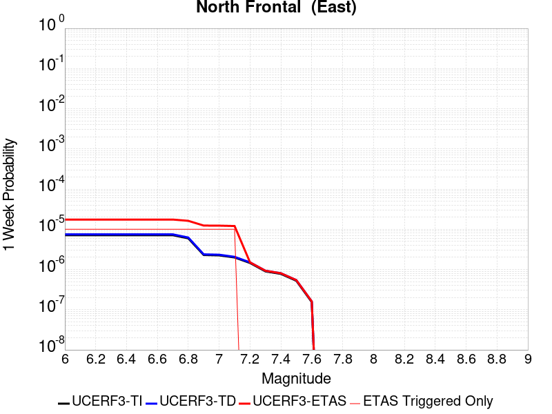 |  |  | 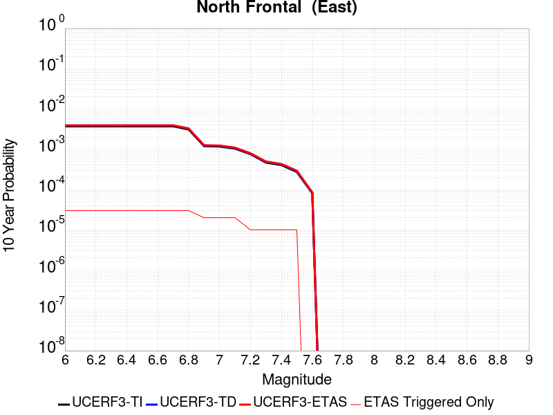 |

| Magnitude | 1 wk TI Prob | 1 wk TD Prob | 1 wk ETAS Prob | 1 wk ETAS/TD Gain | 1 wk ETAS Triggered Only | 1 mo TI Prob | 1 mo TD Prob | 1 mo ETAS Prob | 1 mo ETAS/TD Gain | 1 mo ETAS Triggered Only | 1 yr TI Prob | 1 yr TD Prob | 1 yr ETAS Prob | 1 yr ETAS/TD Gain | 1 yr ETAS Triggered Only | 10 yr TI Prob | 10 yr TD Prob | 10 yr ETAS Prob | 10 yr ETAS/TD Gain | 10 yr ETAS Triggered Only |
|-----|-----|-----|-----|-----|-----|-----|-----|-----|-----|-----|-----|-----|-----|-----|-----|-----|-----|-----|-----|-----|
| 6.0 | 7.135738E-6 | 7.4771765E-6 | 1.7477101E-5 | 2.3373933 | 1.0E-5 | 3.0581377E-5 | 3.204476E-5 | 4.204444E-5 | 1.3120534 | 1.0E-5 | 3.7226462E-4 | 3.9009505E-4 | 4.1008726E-4 | 1.0512495 | 2.0E-5 | 0.0037164164 | 0.0038960609 | 0.0039259437 | 1.00767 | 3.0E-5 |
| 6.1 | 7.135738E-6 | 7.4771765E-6 | 1.7477101E-5 | 2.3373933 | 1.0E-5 | 3.0581377E-5 | 3.204476E-5 | 4.204444E-5 | 1.3120534 | 1.0E-5 | 3.7226462E-4 | 3.9009505E-4 | 4.1008726E-4 | 1.0512495 | 2.0E-5 | 0.0037164164 | 0.0038960609 | 0.0039259437 | 1.00767 | 3.0E-5 |
| 6.2 | 7.135738E-6 | 7.4771765E-6 | 1.7477101E-5 | 2.3373933 | 1.0E-5 | 3.0581377E-5 | 3.204476E-5 | 4.204444E-5 | 1.3120534 | 1.0E-5 | 3.7226462E-4 | 3.9009505E-4 | 4.1008726E-4 | 1.0512495 | 2.0E-5 | 0.0037164164 | 0.0038960609 | 0.0039259437 | 1.00767 | 3.0E-5 |
| 6.3 | 7.135738E-6 | 7.4771765E-6 | 1.7477101E-5 | 2.3373933 | 1.0E-5 | 3.0581377E-5 | 3.204476E-5 | 4.204444E-5 | 1.3120534 | 1.0E-5 | 3.7226462E-4 | 3.9009505E-4 | 4.1008726E-4 | 1.0512495 | 2.0E-5 | 0.0037164164 | 0.0038960609 | 0.0039259437 | 1.00767 | 3.0E-5 |
| 6.4 | 7.135738E-6 | 7.4771765E-6 | 1.7477101E-5 | 2.3373933 | 1.0E-5 | 3.0581377E-5 | 3.204476E-5 | 4.204444E-5 | 1.3120534 | 1.0E-5 | 3.7226462E-4 | 3.9009505E-4 | 4.1008726E-4 | 1.0512495 | 2.0E-5 | 0.0037164164 | 0.0038960609 | 0.0039259437 | 1.00767 | 3.0E-5 |
| 6.5 | 7.135738E-6 | 7.4771765E-6 | 1.7477101E-5 | 2.3373933 | 1.0E-5 | 3.0581377E-5 | 3.204476E-5 | 4.204444E-5 | 1.3120534 | 1.0E-5 | 3.7226462E-4 | 3.9009505E-4 | 4.1008726E-4 | 1.0512495 | 2.0E-5 | 0.0037164164 | 0.0038960609 | 0.0039259437 | 1.00767 | 3.0E-5 |
| 6.6 | 7.135738E-6 | 7.4771765E-6 | 1.7477101E-5 | 2.3373933 | 1.0E-5 | 3.0581377E-5 | 3.204476E-5 | 4.204444E-5 | 1.3120534 | 1.0E-5 | 3.7226462E-4 | 3.9009505E-4 | 4.1008726E-4 | 1.0512495 | 2.0E-5 | 0.0037164164 | 0.0038960609 | 0.0039259437 | 1.00767 | 3.0E-5 |
| 6.7 | 7.135738E-6 | 7.4771765E-6 | 1.7477101E-5 | 2.3373933 | 1.0E-5 | 3.0581377E-5 | 3.204476E-5 | 4.204444E-5 | 1.3120534 | 1.0E-5 | 3.7226462E-4 | 3.9009505E-4 | 4.1008726E-4 | 1.0512495 | 2.0E-5 | 0.0037164164 | 0.0038960609 | 0.0039259437 | 1.00767 | 3.0E-5 |
| 6.8 | 5.959142E-6 | 6.236683E-6 | 1.623662E-5 | 2.6034064 | 1.0E-5 | 2.553893E-5 | 2.6728469E-5 | 3.67282E-5 | 1.374123 | 1.0E-5 | 3.108921E-4 | 3.253886E-4 | 3.4538208E-4 | 1.061445 | 2.0E-5 | 0.0031045752 | 0.0032508948 | 0.0032807973 | 1.0091982 | 3.0E-5 |
| 6.9 | 2.2946929E-6 | 2.3824605E-6 | 1.2382437E-5 | 5.1973314 | 1.0E-5 | 9.834361E-6 | 1.0210508E-5 | 2.0210406E-5 | 1.9793732 | 1.0E-5 | 1.1972676E-4 | 1.2430632E-4 | 1.4430382E-4 | 1.1608728 | 2.0E-5 | 0.0011966228 | 0.0012424142 | 0.0012623895 | 1.0160776 | 2.0E-5 |
| 7.0 | 2.2468673E-6 | 2.3321538E-6 | 1.2332131E-5 | 5.287872 | 1.0E-5 | 9.629396E-6 | 9.994909E-6 | 1.999481E-5 | 2.0004992 | 1.0E-5 | 1.1723159E-4 | 1.21681696E-4 | 1.4167927E-4 | 1.1643432 | 2.0E-5 | 0.0011716976 | 0.0012161969 | 0.0012361726 | 1.0164247 | 2.0E-5 |
| 7.1 | 1.9921076E-6 | 2.0646032E-6 | 1.2064583E-5 | 5.843536 | 1.0E-5 | 8.537577E-6 | 8.848272E-6 | 1.8848183E-5 | 2.1301541 | 1.0E-5 | 1.0394004E-4 | 1.0772282E-4 | 1.2772066E-4 | 1.1856416 | 2.0E-5 | 0.0010389143 | 0.0010767487 | 0.0010967272 | 1.0185544 | 2.0E-5 |
| 7.2 | 1.4524545E-6 | 1.5045148E-6 | 1.5045148E-6 | 1.0 | 0.0 | 6.2247905E-6 | 6.447906E-6 | 6.447906E-6 | 1.0 | 0.0 | 7.5784184E-5 | 7.850068E-5 | 8.849989E-5 | 1.1273774 | 1.0E-5 | 7.575835E-4 | 7.8475394E-4 | 7.947461E-4 | 1.0127329 | 1.0E-5 |
| 7.3 | 8.9802575E-7 | 9.3087283E-7 | 9.3087283E-7 | 1.0 | 0.0 | 3.848676E-6 | 3.9894494E-6 | 3.9894494E-6 | 1.0 | 0.0 | 4.685662E-5 | 4.857058E-5 | 5.8570095E-5 | 1.205876 | 1.0E-5 | 4.6846745E-4 | 4.8561094E-4 | 4.956061E-4 | 1.0205827 | 1.0E-5 |
| 7.4 | 7.776139E-7 | 8.0604747E-7 | 8.0604747E-7 | 1.0 | 0.0 | 3.3326266E-6 | 3.4544853E-6 | 3.4544853E-6 | 1.0 | 0.0 | 4.0573974E-5 | 4.2057654E-5 | 5.2057236E-5 | 1.2377589 | 1.0E-5 | 4.0566566E-4 | 4.205077E-4 | 4.305035E-4 | 1.0237708 | 1.0E-5 |
| 7.5 | 5.244417E-7 | 5.441219E-7 | 5.441219E-7 | 1.0 | 0.0 | 2.2476054E-6 | 2.3319494E-6 | 2.3319494E-6 | 1.0 | 0.0 | 2.7364253E-5 | 2.839118E-5 | 3.8390895E-5 | 1.3522121 | 1.0E-5 | 2.7360884E-4 | 2.8388205E-4 | 2.9387922E-4 | 1.0352159 | 1.0E-5 |
| 7.6 | 1.5489647E-7 | 1.6089504E-7 | 1.6089504E-7 | 1.0 | 0.0 | 6.6384183E-7 | 6.895501E-7 | 6.895501E-7 | 1.0 | 0.0 | 8.082245E-6 | 8.395261E-6 | 8.395261E-6 | 1.0 | 0.0 | 8.08195E-5 | 8.395143E-5 | 8.395143E-5 | 1.0 | 0.0 |

## Oceanside alt1
*[(top)](#table-of-contents)*

| 1 Week | 1 Month | 1 Year | 10 Year |
|-----|-----|-----|-----|
|  |  |  |  |

| Magnitude | 1 wk TI Prob | 1 wk TD Prob | 1 wk ETAS Prob | 1 wk ETAS/TD Gain | 1 wk ETAS Triggered Only | 1 mo TI Prob | 1 mo TD Prob | 1 mo ETAS Prob | 1 mo ETAS/TD Gain | 1 mo ETAS Triggered Only | 1 yr TI Prob | 1 yr TD Prob | 1 yr ETAS Prob | 1 yr ETAS/TD Gain | 1 yr ETAS Triggered Only | 10 yr TI Prob | 10 yr TD Prob | 10 yr ETAS Prob | 10 yr ETAS/TD Gain | 10 yr ETAS Triggered Only |
|-----|-----|-----|-----|-----|-----|-----|-----|-----|-----|-----|-----|-----|-----|-----|-----|-----|-----|-----|-----|-----|
| 6.0 | 1.1617542E-5 | 1.1423485E-5 | 2.1423371E-5 | 1.8753796 | 1.0E-5 | 4.9788516E-5 | 4.8956965E-5 | 5.8956477E-5 | 1.204251 | 1.0E-5 | 6.060066E-4 | 5.9590413E-4 | 6.2588626E-4 | 1.0503137 | 3.0E-5 | 0.0060435664 | 0.0059446604 | 0.0059744823 | 1.0050166 | 3.0E-5 |
| 6.1 | 1.1617542E-5 | 1.1423485E-5 | 2.1423371E-5 | 1.8753796 | 1.0E-5 | 4.9788516E-5 | 4.8956965E-5 | 5.8956477E-5 | 1.204251 | 1.0E-5 | 6.060066E-4 | 5.9590413E-4 | 6.2588626E-4 | 1.0503137 | 3.0E-5 | 0.0060435664 | 0.0059446604 | 0.0059744823 | 1.0050166 | 3.0E-5 |
| 6.2 | 1.1617542E-5 | 1.1423485E-5 | 2.1423371E-5 | 1.8753796 | 1.0E-5 | 4.9788516E-5 | 4.8956965E-5 | 5.8956477E-5 | 1.204251 | 1.0E-5 | 6.060066E-4 | 5.9590413E-4 | 6.2588626E-4 | 1.0503137 | 3.0E-5 | 0.0060435664 | 0.0059446604 | 0.0059744823 | 1.0050166 | 3.0E-5 |
| 6.3 | 1.1617542E-5 | 1.1423485E-5 | 2.1423371E-5 | 1.8753796 | 1.0E-5 | 4.9788516E-5 | 4.8956965E-5 | 5.8956477E-5 | 1.204251 | 1.0E-5 | 6.060066E-4 | 5.9590413E-4 | 6.2588626E-4 | 1.0503137 | 3.0E-5 | 0.0060435664 | 0.0059446604 | 0.0059744823 | 1.0050166 | 3.0E-5 |
| 6.4 | 1.1617542E-5 | 1.1423485E-5 | 2.1423371E-5 | 1.8753796 | 1.0E-5 | 4.9788516E-5 | 4.8956965E-5 | 5.8956477E-5 | 1.204251 | 1.0E-5 | 6.060066E-4 | 5.9590413E-4 | 6.2588626E-4 | 1.0503137 | 3.0E-5 | 0.0060435664 | 0.0059446604 | 0.0059744823 | 1.0050166 | 3.0E-5 |
| 6.5 | 1.1617542E-5 | 1.1423485E-5 | 2.1423371E-5 | 1.8753796 | 1.0E-5 | 4.9788516E-5 | 4.8956965E-5 | 5.8956477E-5 | 1.204251 | 1.0E-5 | 6.060066E-4 | 5.9590413E-4 | 6.2588626E-4 | 1.0503137 | 3.0E-5 | 0.0060435664 | 0.0059446604 | 0.0059744823 | 1.0050166 | 3.0E-5 |
| 6.6 | 7.561768E-6 | 7.1336085E-6 | 7.1336085E-6 | 1.0 | 0.0 | 3.2407173E-5 | 3.0572253E-5 | 3.0572253E-5 | 1.0 | 0.0 | 3.9448592E-4 | 3.721547E-4 | 3.82151E-4 | 1.0268606 | 1.0E-5 | 0.0039378637 | 0.0037154262 | 0.003725389 | 1.0026815 | 1.0E-5 |
| 6.7 | 7.1042605E-6 | 6.6556786E-6 | 6.6556786E-6 | 1.0 | 0.0 | 3.0446476E-5 | 2.852403E-5 | 2.852403E-5 | 1.0 | 0.0 | 3.706228E-4 | 3.4722552E-4 | 3.5722204E-4 | 1.0287898 | 1.0E-5 | 0.0037000529 | 0.0034669132 | 0.0034768786 | 1.0028744 | 1.0E-5 |
| 6.8 | 6.285554E-6 | 5.7996986E-6 | 5.7996986E-6 | 1.0 | 0.0 | 2.693781E-5 | 2.4855617E-5 | 2.4855617E-5 | 1.0 | 0.0 | 3.2791847E-4 | 3.0257567E-4 | 3.1257264E-4 | 1.0330396 | 1.0E-5 | 0.0032743502 | 0.0030216945 | 0.0030316643 | 1.0032994 | 1.0E-5 |
| 6.9 | 6.148883E-6 | 5.6565373E-6 | 5.6565373E-6 | 1.0 | 0.0 | 2.635209E-5 | 2.4242081E-5 | 2.4242081E-5 | 1.0 | 0.0 | 3.2078946E-4 | 2.951079E-4 | 3.0510494E-4 | 1.033876 | 1.0E-5 | 0.003203268 | 0.002947217 | 0.0029571876 | 1.003383 | 1.0E-5 |
| 7.0 | 5.253857E-6 | 4.7223966E-6 | 4.7223966E-6 | 1.0 | 0.0 | 2.2516335E-5 | 2.0238687E-5 | 2.0238687E-5 | 1.0 | 0.0 | 2.7410188E-4 | 2.4637848E-4 | 2.56376E-4 | 1.040578 | 1.0E-5 | 0.0027376404 | 0.0024610846 | 0.00247106 | 1.0040532 | 1.0E-5 |
| 7.1 | 4.730754E-6 | 4.1785024E-6 | 4.1785024E-6 | 1.0 | 0.0 | 2.0274503E-5 | 1.7907745E-5 | 1.7907745E-5 | 1.0 | 0.0 | 2.468141E-4 | 2.1800524E-4 | 2.2800306E-4 | 1.0458604 | 1.0E-5 | 0.0024654015 | 0.0021779404 | 0.0021879186 | 1.0045815 | 1.0E-5 |
| 7.2 | 3.7998386E-6 | 3.2140165E-6 | 3.2140165E-6 | 1.0 | 0.0 | 1.6284921E-5 | 1.37742845E-5 | 1.37742845E-5 | 1.0 | 0.0 | 1.9825088E-4 | 1.6768913E-4 | 1.6768913E-4 | 1.0 | 0.0 | 0.001980741 | 0.0016756381 | 0.0016756381 | 1.0 | 0.0 |
| 7.3 | 3.2656465E-6 | 2.6983669E-6 | 2.6983669E-6 | 1.0 | 0.0 | 1.3995553E-5 | 1.1564379E-5 | 1.1564379E-5 | 1.0 | 0.0 | 1.7038253E-4 | 1.4078732E-4 | 1.4078732E-4 | 1.0 | 0.0 | 0.0017025196 | 0.0014069924 | 0.0014069924 | 1.0 | 0.0 |
| 7.4 | 2.593703E-6 | 2.0680227E-6 | 2.0680227E-6 | 1.0 | 0.0 | 1.1115822E-5 | 8.862925E-6 | 8.862925E-6 | 1.0 | 0.0 | 1.3532673E-4 | 1.0790086E-4 | 1.0790086E-4 | 1.0 | 0.0 | 0.0013524436 | 0.0010784935 | 0.0010784935 | 1.0 | 0.0 |
| 7.5 | 1.8715585E-6 | 1.4137277E-6 | 1.4137277E-6 | 1.0 | 0.0 | 8.020941E-6 | 6.058819E-6 | 6.058819E-6 | 1.0 | 0.0 | 9.7650576E-5 | 7.376369E-5 | 7.376369E-5 | 1.0 | 0.0 | 9.7607676E-4 | 7.373981E-4 | 7.373981E-4 | 1.0 | 0.0 |
| 7.6 | 1.2246786E-6 | 8.526946E-7 | 8.526946E-7 | 1.0 | 0.0 | 5.248612E-6 | 3.6544006E-6 | 3.6544006E-6 | 1.0 | 0.0 | 6.389998E-5 | 4.4491466E-5 | 4.4491466E-5 | 1.0 | 0.0 | 6.3881604E-4 | 4.4483008E-4 | 4.4483008E-4 | 1.0 | 0.0 |
| 7.7 | 5.140719E-7 | 2.7346528E-7 | 2.7346528E-7 | 1.0 | 0.0 | 2.2031636E-6 | 1.1719936E-6 | 1.1719936E-6 | 1.0 | 0.0 | 2.6823185E-5 | 1.4268943E-5 | 1.4268943E-5 | 1.0 | 0.0 | 2.6819948E-4 | 1.4268162E-4 | 1.4268162E-4 | 1.0 | 0.0 |
| 7.8 | 1.16056995E-8 | 9.782997E-9 | 9.782997E-9 | 1.0 | 0.0 | 4.9738713E-8 | 4.1927127E-8 | 4.1927127E-8 | 1.0 | 0.0 | 6.0556863E-7 | 5.1046277E-7 | 5.1046277E-7 | 1.0 | 0.0 | 6.05567E-6 | 5.1046277E-6 | 5.1046277E-6 | 1.0 | 0.0 |

## Reliz 2011 CFM
*[(top)](#table-of-contents)*

| 1 Week | 1 Month | 1 Year | 10 Year |
|-----|-----|-----|-----|
|  |  |  | 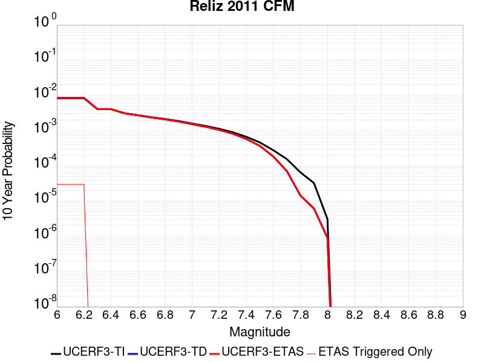 |

| Magnitude | 1 wk TI Prob | 1 wk TD Prob | 1 wk ETAS Prob | 1 wk ETAS/TD Gain | 1 wk ETAS Triggered Only | 1 mo TI Prob | 1 mo TD Prob | 1 mo ETAS Prob | 1 mo ETAS/TD Gain | 1 mo ETAS Triggered Only | 1 yr TI Prob | 1 yr TD Prob | 1 yr ETAS Prob | 1 yr ETAS/TD Gain | 1 yr ETAS Triggered Only | 10 yr TI Prob | 10 yr TD Prob | 10 yr ETAS Prob | 10 yr ETAS/TD Gain | 10 yr ETAS Triggered Only |
|-----|-----|-----|-----|-----|-----|-----|-----|-----|-----|-----|-----|-----|-----|-----|-----|-----|-----|-----|-----|-----|
| 6.0 | 1.6002472E-5 | 1.6282795E-5 | 2.628263E-5 | 1.6141351 | 1.0E-5 | 6.8580215E-5 | 6.978165E-5 | 7.978095E-5 | 1.1432941 | 1.0E-5 | 8.3464425E-4 | 8.492802E-4 | 8.6926325E-4 | 1.0235294 | 2.0E-5 | 0.008315164 | 0.008462543 | 0.008492289 | 1.003515 | 3.0E-5 |
| 6.1 | 1.6002472E-5 | 1.6282795E-5 | 2.628263E-5 | 1.6141351 | 1.0E-5 | 6.8580215E-5 | 6.978165E-5 | 7.978095E-5 | 1.1432941 | 1.0E-5 | 8.3464425E-4 | 8.492802E-4 | 8.6926325E-4 | 1.0235294 | 2.0E-5 | 0.008315164 | 0.008462543 | 0.008492289 | 1.003515 | 3.0E-5 |
| 6.2 | 1.6002472E-5 | 1.6282795E-5 | 2.628263E-5 | 1.6141351 | 1.0E-5 | 6.8580215E-5 | 6.978165E-5 | 7.978095E-5 | 1.1432941 | 1.0E-5 | 8.3464425E-4 | 8.492802E-4 | 8.6926325E-4 | 1.0235294 | 2.0E-5 | 0.008315164 | 0.008462543 | 0.008492289 | 1.003515 | 3.0E-5 |
| 6.3 | 7.792404E-6 | 7.803792E-6 | 7.803792E-6 | 1.0 | 0.0 | 3.339559E-5 | 3.3444398E-5 | 3.3444398E-5 | 1.0 | 0.0 | 4.0651546E-4 | 4.0711026E-4 | 4.0711026E-4 | 1.0 | 0.0 | 0.0040577264 | 0.0040639215 | 0.0040639215 | 1.0 | 0.0 |
| 6.4 | 7.792404E-6 | 7.803792E-6 | 7.803792E-6 | 1.0 | 0.0 | 3.339559E-5 | 3.3444398E-5 | 3.3444398E-5 | 1.0 | 0.0 | 4.0651546E-4 | 4.0711026E-4 | 4.0711026E-4 | 1.0 | 0.0 | 0.0040577264 | 0.0040639215 | 0.0040639215 | 1.0 | 0.0 |
| 6.5 | 5.9659374E-6 | 5.928728E-6 | 5.928728E-6 | 1.0 | 0.0 | 2.5568053E-5 | 2.5408588E-5 | 2.5408588E-5 | 1.0 | 0.0 | 3.1124658E-4 | 3.0930588E-4 | 3.0930588E-4 | 1.0 | 0.0 | 0.00310811 | 0.003088972 | 0.003088972 | 1.0 | 0.0 |
| 6.6 | 5.2350692E-6 | 5.178976E-6 | 5.178976E-6 | 1.0 | 0.0 | 2.2435817E-5 | 2.2195423E-5 | 2.2195423E-5 | 1.0 | 0.0 | 2.7312184E-4 | 2.7019592E-4 | 2.7019592E-4 | 1.0 | 0.0 | 0.002727864 | 0.0026988846 | 0.0026988846 | 1.0 | 0.0 |
| 6.7 | 4.580206E-6 | 4.50611E-6 | 4.50611E-6 | 1.0 | 0.0 | 1.9629308E-5 | 1.931176E-5 | 1.931176E-5 | 1.0 | 0.0 | 2.389606E-4 | 2.3509537E-4 | 2.3509537E-4 | 1.0 | 0.0 | 0.002387038 | 0.002348669 | 0.002348669 | 1.0 | 0.0 |
| 6.8 | 4.0765017E-6 | 3.988228E-6 | 3.988228E-6 | 1.0 | 0.0 | 1.7470604E-5 | 1.7092294E-5 | 1.7092294E-5 | 1.0 | 0.0 | 2.1268385E-4 | 2.0807884E-4 | 2.0807884E-4 | 1.0 | 0.0 | 0.002124804 | 0.0020790389 | 0.0020790389 | 1.0 | 0.0 |
| 6.9 | 3.5752896E-6 | 3.4725074E-6 | 3.4725074E-6 | 1.0 | 0.0 | 1.532258E-5 | 1.488209E-5 | 1.488209E-5 | 1.0 | 0.0 | 1.8653645E-4 | 1.811744E-4 | 1.811744E-4 | 1.0 | 0.0 | 0.0018637994 | 0.001810464 | 0.001810464 | 1.0 | 0.0 |
| 7.0 | 3.0259848E-6 | 2.9079317E-6 | 2.9079317E-6 | 1.0 | 0.0 | 1.2968442E-5 | 1.2462505E-5 | 1.2462505E-5 | 1.0 | 0.0 | 1.5787935E-4 | 1.5172044E-4 | 1.5172044E-4 | 1.0 | 0.0 | 0.0015776722 | 0.0015163644 | 0.0015163644 | 1.0 | 0.0 |
| 7.1 | 2.5861116E-6 | 2.455157E-6 | 2.455157E-6 | 1.0 | 0.0 | 1.1083288E-5 | 1.0522059E-5 | 1.0522059E-5 | 1.0 | 0.0 | 1.3493067E-4 | 1.2809855E-4 | 1.2809855E-4 | 1.0 | 0.0 | 0.0013484878 | 0.0012804423 | 0.0012804423 | 1.0 | 0.0 |
| 7.2 | 2.1482588E-6 | 2.0032267E-6 | 2.0032267E-6 | 1.0 | 0.0 | 9.20679E-6 | 8.585229E-6 | 8.585229E-6 | 1.0 | 0.0 | 1.12086906E-4 | 1.0452016E-4 | 1.0452016E-4 | 1.0 | 0.0 | 0.0011203039 | 0.0010449048 | 0.0010449048 | 1.0 | 0.0 |
| 7.3 | 1.7194744E-6 | 1.561114E-6 | 1.561114E-6 | 1.0 | 0.0 | 7.3691554E-6 | 6.6904713E-6 | 6.6904713E-6 | 1.0 | 0.0 | 8.971577E-5 | 8.145344E-5 | 8.145344E-5 | 1.0 | 0.0 | 8.967956E-4 | 8.144305E-4 | 8.144305E-4 | 1.0 | 0.0 |
| 7.4 | 1.2755178E-6 | 1.1056196E-6 | 1.1056196E-6 | 1.0 | 0.0 | 5.4664933E-6 | 4.738361E-6 | 4.738361E-6 | 1.0 | 0.0 | 6.655252E-5 | 5.768802E-5 | 5.768802E-5 | 1.0 | 0.0 | 6.6532596E-4 | 5.769249E-4 | 5.769249E-4 | 1.0 | 0.0 |
| 7.5 | 8.8463224E-7 | 7.0579193E-7 | 7.0579193E-7 | 1.0 | 0.0 | 3.7912755E-6 | 3.0248189E-6 | 3.0248189E-6 | 1.0 | 0.0 | 4.6157802E-5 | 3.682655E-5 | 3.682655E-5 | 1.0 | 0.0 | 4.6148215E-4 | 3.683988E-4 | 3.683988E-4 | 1.0 | 0.0 |
| 7.6 | 5.291355E-7 | 3.5006548E-7 | 3.5006548E-7 | 1.0 | 0.0 | 2.2677216E-6 | 1.5002796E-6 | 1.5002796E-6 | 1.0 | 0.0 | 2.760916E-5 | 1.8265751E-5 | 1.8265751E-5 | 1.0 | 0.0 | 2.760573E-4 | 1.8283579E-4 | 1.8283579E-4 | 1.0 | 0.0 |
| 7.7 | 2.9663357E-7 | 1.3509886E-7 | 1.3509886E-7 | 1.0 | 0.0 | 1.2712861E-6 | 5.7899496E-7 | 5.7899496E-7 | 1.0 | 0.0 | 1.5477797E-5 | 7.0492406E-6 | 7.0492406E-6 | 1.0 | 0.0 | 1.547672E-4 | 7.0675895E-5 | 7.0675895E-5 | 1.0 | 0.0 |
| 7.8 | 1.2509386E-7 | 2.7148959E-8 | 2.7148959E-8 | 1.0 | 0.0 | 5.3611643E-7 | 1.1635268E-7 | 1.1635268E-7 | 1.0 | 0.0 | 6.527198E-6 | 1.4165929E-6 | 1.4165929E-6 | 1.0 | 0.0 | 6.527006E-5 | 1.4322827E-5 | 1.4322827E-5 | 1.0 | 0.0 |
| 7.9 | 6.213493E-8 | 1.1477568E-8 | 1.1477568E-8 | 1.0 | 0.0 | 2.6629255E-7 | 4.9189577E-8 | 4.9189577E-8 | 1.0 | 0.0 | 3.242107E-6 | 5.9888293E-7 | 5.9888293E-7 | 1.0 | 0.0 | 3.2420594E-5 | 6.1203536E-6 | 6.1203536E-6 | 1.0 | 0.0 |
| 8.0 | 5.92383E-9 | 1.6775827E-9 | 1.6775827E-9 | 1.0 | 0.0 | 2.5387841E-8 | 7.18964E-9 | 7.18964E-9 | 1.0 | 0.0 | 3.0909692E-7 | 8.753386E-8 | 8.753386E-8 | 1.0 | 0.0 | 3.090965E-6 | 8.992677E-7 | 8.992677E-7 | 1.0 | 0.0 |

## Malibu Coast (Extension) alt 1
*[(top)](#table-of-contents)*

| 1 Week | 1 Month | 1 Year | 10 Year |
|-----|-----|-----|-----|
|  |  | 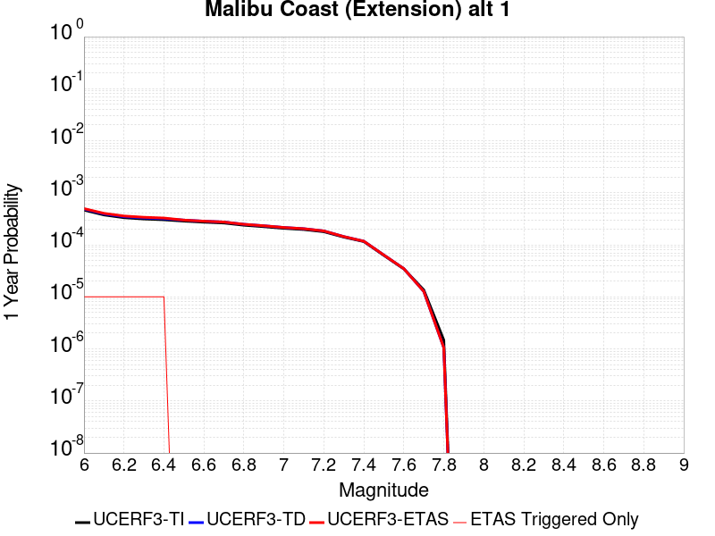 |  |

| Magnitude | 1 wk TI Prob | 1 wk TD Prob | 1 wk ETAS Prob | 1 wk ETAS/TD Gain | 1 wk ETAS Triggered Only | 1 mo TI Prob | 1 mo TD Prob | 1 mo ETAS Prob | 1 mo ETAS/TD Gain | 1 mo ETAS Triggered Only | 1 yr TI Prob | 1 yr TD Prob | 1 yr ETAS Prob | 1 yr ETAS/TD Gain | 1 yr ETAS Triggered Only | 10 yr TI Prob | 10 yr TD Prob | 10 yr ETAS Prob | 10 yr ETAS/TD Gain | 10 yr ETAS Triggered Only |
|-----|-----|-----|-----|-----|-----|-----|-----|-----|-----|-----|-----|-----|-----|-----|-----|-----|-----|-----|-----|-----|
| 6.0 | 8.930738E-6 | 9.3292765E-6 | 9.3292765E-6 | 1.0 | 0.0 | 3.827403E-5 | 3.998201E-5 | 4.9981612E-5 | 1.2501025 | 1.0E-5 | 4.6588664E-4 | 4.86674E-4 | 4.966691E-4 | 1.0205376 | 1.0E-5 | 0.0046491115 | 0.004856264 | 0.0048861187 | 1.0061476 | 3.0E-5 |
| 6.1 | 7.199952E-6 | 7.5302974E-6 | 7.5302974E-6 | 1.0 | 0.0 | 3.0856572E-5 | 3.2272306E-5 | 4.2271986E-5 | 1.3098532 | 1.0E-5 | 3.75614E-4 | 3.928451E-4 | 4.0284116E-4 | 1.0254453 | 1.0E-5 | 0.0037497976 | 0.0039215726 | 0.003951455 | 1.00762 | 3.0E-5 |
| 6.2 | 6.3721413E-6 | 6.666792E-6 | 6.666792E-6 | 1.0 | 0.0 | 2.7308892E-5 | 2.8571656E-5 | 3.8571372E-5 | 1.3499873 | 1.0E-5 | 3.3243504E-4 | 3.4780474E-4 | 3.5780127E-4 | 1.0287417 | 1.0E-5 | 0.0033193815 | 0.0034726441 | 0.00350254 | 1.0086089 | 3.0E-5 |
| 6.3 | 6.016345E-6 | 6.295159E-6 | 6.295159E-6 | 1.0 | 0.0 | 2.578408E-5 | 2.6978976E-5 | 3.6978705E-5 | 1.370649 | 1.0E-5 | 3.1387596E-4 | 3.2841985E-4 | 3.3841658E-4 | 1.0304388 | 1.0E-5 | 0.00313433 | 0.0032793812 | 0.0033092827 | 1.0091181 | 3.0E-5 |
| 6.4 | 5.8104883E-6 | 6.0795455E-6 | 6.0795455E-6 | 1.0 | 0.0 | 2.4901856E-5 | 2.6054937E-5 | 3.6054676E-5 | 1.3837944 | 1.0E-5 | 3.031379E-4 | 3.17173E-4 | 3.271698E-4 | 1.0315186 | 1.0E-5 | 0.0030272473 | 0.0031672379 | 0.0031971429 | 1.009442 | 3.0E-5 |
| 6.5 | 5.476925E-6 | 5.727514E-6 | 5.727514E-6 | 1.0 | 0.0 | 2.3472323E-5 | 2.454626E-5 | 2.454626E-5 | 1.0 | 0.0 | 2.8573806E-4 | 2.9881002E-4 | 2.9881002E-4 | 1.0 | 0.0 | 0.0028537093 | 0.0029841145 | 0.0030040548 | 1.0066822 | 2.0E-5 |
| 6.6 | 5.222387E-6 | 5.4585807E-6 | 5.4585807E-6 | 1.0 | 0.0 | 2.2381464E-5 | 2.3393708E-5 | 2.3393708E-5 | 1.0 | 0.0 | 2.7246025E-4 | 2.8478145E-4 | 2.8478145E-4 | 1.0 | 0.0 | 0.0027212645 | 0.002844196 | 0.0028641392 | 1.0070119 | 2.0E-5 |
| 6.7 | 5.0337076E-6 | 5.259104E-6 | 5.259104E-6 | 1.0 | 0.0 | 2.1572854E-5 | 2.2538823E-5 | 2.2538823E-5 | 1.0 | 0.0 | 2.6261783E-4 | 2.743759E-4 | 2.743759E-4 | 1.0 | 0.0 | 0.002623077 | 0.0027404015 | 0.0027603467 | 1.0072782 | 2.0E-5 |
| 6.8 | 4.5675624E-6 | 4.7587173E-6 | 4.7587173E-6 | 1.0 | 0.0 | 1.9575122E-5 | 2.0394344E-5 | 2.0394344E-5 | 1.0 | 0.0 | 2.3830103E-4 | 2.4827302E-4 | 2.4827302E-4 | 1.0 | 0.0 | 0.0023804565 | 0.0024799763 | 0.0024999268 | 1.0080446 | 2.0E-5 |
| 6.9 | 4.2802412E-6 | 4.4520216E-6 | 4.4520216E-6 | 1.0 | 0.0 | 1.8343762E-5 | 1.9079953E-5 | 1.9079953E-5 | 1.0 | 0.0 | 2.2331243E-4 | 2.3227383E-4 | 2.3227383E-4 | 1.0 | 0.0 | 0.0022308815 | 0.0023203273 | 0.002340281 | 1.0085995 | 2.0E-5 |
| 7.0 | 3.9794063E-6 | 4.1301E-6 | 4.1301E-6 | 1.0 | 0.0 | 1.7054486E-5 | 1.770031E-5 | 1.770031E-5 | 1.0 | 0.0 | 2.0761859E-4 | 2.1548007E-4 | 2.1548007E-4 | 1.0 | 0.0 | 0.0020742472 | 0.002152725 | 0.0021627033 | 1.0046353 | 1.0E-5 |
| 7.1 | 3.7730424E-6 | 3.911218E-6 | 3.911218E-6 | 1.0 | 0.0 | 1.6170083E-5 | 1.6762255E-5 | 1.6762255E-5 | 1.0 | 0.0 | 1.9685295E-4 | 2.0406146E-4 | 2.0406146E-4 | 1.0 | 0.0 | 0.0019667868 | 0.0020387538 | 0.0020487334 | 1.004895 | 1.0E-5 |
| 7.2 | 3.424985E-6 | 3.541338E-6 | 3.541338E-6 | 1.0 | 0.0 | 1.4678424E-5 | 1.5177075E-5 | 1.5177075E-5 | 1.0 | 0.0 | 1.7869516E-4 | 1.8476533E-4 | 1.8476533E-4 | 1.0 | 0.0 | 0.0017855153 | 0.0018461292 | 0.0018561108 | 1.0054067 | 1.0E-5 |
| 7.3 | 2.6966375E-6 | 2.759654E-6 | 2.759654E-6 | 1.0 | 0.0 | 1.15569665E-5 | 1.1827035E-5 | 1.1827035E-5 | 1.0 | 0.0 | 1.4069698E-4 | 1.4398468E-4 | 1.4398468E-4 | 1.0 | 0.0 | 0.0014060794 | 0.001438918 | 0.0014489037 | 1.0069396 | 1.0E-5 |
| 7.4 | 2.215957E-6 | 2.249379E-6 | 2.249379E-6 | 1.0 | 0.0 | 9.496924E-6 | 9.64016E-6 | 9.64016E-6 | 1.0 | 0.0 | 1.1561892E-4 | 1.1736266E-4 | 1.1736266E-4 | 1.0 | 0.0 | 0.0011555878 | 0.0011730106 | 0.0011829988 | 1.0085151 | 1.0E-5 |
| 7.5 | 1.2040218E-6 | 1.2219067E-6 | 1.2219067E-6 | 1.0 | 0.0 | 5.160083E-6 | 5.2367327E-6 | 5.2367327E-6 | 1.0 | 0.0 | 6.2822204E-5 | 6.3755375E-5 | 6.3755375E-5 | 1.0 | 0.0 | 6.280445E-4 | 6.3737266E-4 | 6.4736634E-4 | 1.0156794 | 1.0E-5 |
| 7.6 | 6.6157446E-7 | 6.6789755E-7 | 6.6789755E-7 | 1.0 | 0.0 | 2.835316E-6 | 2.8624152E-6 | 2.8624152E-6 | 1.0 | 0.0 | 3.4519428E-5 | 3.4849363E-5 | 3.4849363E-5 | 1.0 | 0.0 | 3.4514067E-4 | 3.484405E-4 | 3.58437E-4 | 1.0286893 | 1.0E-5 |
| 7.7 | 2.6012302E-7 | 2.4357584E-7 | 2.4357584E-7 | 1.0 | 0.0 | 1.1148124E-6 | 1.0438962E-6 | 1.0438962E-6 | 1.0 | 0.0 | 1.3572758E-5 | 1.2709373E-5 | 1.2709373E-5 | 1.0 | 0.0 | 1.3571928E-4 | 1.2708752E-4 | 1.3708624E-4 | 1.078676 | 1.0E-5 |
| 7.8 | 2.8323132E-8 | 2.0266642E-8 | 2.0266642E-8 | 1.0 | 0.0 | 1.2138484E-7 | 8.685703E-8 | 8.685703E-8 | 1.0 | 0.0 | 1.4778595E-6 | 1.0574839E-6 | 1.0574839E-6 | 1.0 | 0.0 | 1.4778497E-5 | 1.0574797E-5 | 1.0574797E-5 | 1.0 | 0.0 |

## Hollywood
*[(top)](#table-of-contents)*

| 1 Week | 1 Month | 1 Year | 10 Year |
|-----|-----|-----|-----|
|  |  |  |  |

| Magnitude | 1 wk TI Prob | 1 wk TD Prob | 1 wk ETAS Prob | 1 wk ETAS/TD Gain | 1 wk ETAS Triggered Only | 1 mo TI Prob | 1 mo TD Prob | 1 mo ETAS Prob | 1 mo ETAS/TD Gain | 1 mo ETAS Triggered Only | 1 yr TI Prob | 1 yr TD Prob | 1 yr ETAS Prob | 1 yr ETAS/TD Gain | 1 yr ETAS Triggered Only | 10 yr TI Prob | 10 yr TD Prob | 10 yr ETAS Prob | 10 yr ETAS/TD Gain | 10 yr ETAS Triggered Only |
|-----|-----|-----|-----|-----|-----|-----|-----|-----|-----|-----|-----|-----|-----|-----|-----|-----|-----|-----|-----|-----|
| 6.0 | 1.24487615E-5 | 1.2593229E-5 | 1.2593229E-5 | 1.0 | 0.0 | 5.3350745E-5 | 5.3969892E-5 | 5.3969892E-5 | 1.0 | 0.0 | 6.4935174E-4 | 6.5689E-4 | 6.5689E-4 | 1.0 | 0.0 | 0.0064745755 | 0.0065499707 | 0.0065797744 | 1.0045502 | 3.0E-5 |
| 6.1 | 1.24487615E-5 | 1.2593229E-5 | 1.2593229E-5 | 1.0 | 0.0 | 5.3350745E-5 | 5.3969892E-5 | 5.3969892E-5 | 1.0 | 0.0 | 6.4935174E-4 | 6.5689E-4 | 6.5689E-4 | 1.0 | 0.0 | 0.0064745755 | 0.0065499707 | 0.0065797744 | 1.0045502 | 3.0E-5 |
| 6.2 | 1.24487615E-5 | 1.2593229E-5 | 1.2593229E-5 | 1.0 | 0.0 | 5.3350745E-5 | 5.3969892E-5 | 5.3969892E-5 | 1.0 | 0.0 | 6.4935174E-4 | 6.5689E-4 | 6.5689E-4 | 1.0 | 0.0 | 0.0064745755 | 0.0065499707 | 0.0065797744 | 1.0045502 | 3.0E-5 |
| 6.3 | 1.24487615E-5 | 1.2593229E-5 | 1.2593229E-5 | 1.0 | 0.0 | 5.3350745E-5 | 5.3969892E-5 | 5.3969892E-5 | 1.0 | 0.0 | 6.4935174E-4 | 6.5689E-4 | 6.5689E-4 | 1.0 | 0.0 | 0.0064745755 | 0.0065499707 | 0.0065797744 | 1.0045502 | 3.0E-5 |
| 6.4 | 1.2431024E-5 | 1.25738425E-5 | 1.25738425E-5 | 1.0 | 0.0 | 5.327473E-5 | 5.388681E-5 | 5.388681E-5 | 1.0 | 0.0 | 6.4842677E-4 | 6.558791E-4 | 6.558791E-4 | 1.0 | 0.0 | 0.0064653796 | 0.0065399213 | 0.006569725 | 1.0045573 | 3.0E-5 |
| 6.5 | 1.1242222E-5 | 1.1317804E-5 | 1.1317804E-5 | 1.0 | 0.0 | 4.8180063E-5 | 4.8503985E-5 | 4.8503985E-5 | 1.0 | 0.0 | 5.864344E-4 | 5.903787E-4 | 5.903787E-4 | 1.0 | 0.0 | 0.0058488925 | 0.00588839 | 0.005918213 | 1.0050647 | 3.0E-5 |
| 6.6 | 1.1234066E-5 | 1.1308918E-5 | 1.1308918E-5 | 1.0 | 0.0 | 4.8145106E-5 | 4.8465907E-5 | 4.8465907E-5 | 1.0 | 0.0 | 5.86009E-4 | 5.899153E-4 | 5.899153E-4 | 1.0 | 0.0 | 0.005844661 | 0.0058837803 | 0.005913604 | 1.0050688 | 3.0E-5 |
| 6.7 | 1.12294E-5 | 1.1303661E-5 | 1.1303661E-5 | 1.0 | 0.0 | 4.812511E-5 | 4.8443377E-5 | 4.8443377E-5 | 1.0 | 0.0 | 5.857657E-4 | 5.896412E-4 | 5.896412E-4 | 1.0 | 0.0 | 0.0058422405 | 0.005881054 | 0.005910877 | 1.0050712 | 3.0E-5 |
| 6.8 | 1.0252819E-5 | 1.0218449E-5 | 1.0218449E-5 | 1.0 | 0.0 | 4.3939912E-5 | 4.3792625E-5 | 4.3792625E-5 | 1.0 | 0.0 | 5.3483713E-4 | 5.330469E-4 | 5.330469E-4 | 1.0 | 0.0 | 0.005335517 | 0.0053179096 | 0.0053477497 | 1.0056113 | 3.0E-5 |
| 6.9 | 9.252289E-6 | 9.110309E-6 | 9.110309E-6 | 1.0 | 0.0 | 3.9652066E-5 | 3.9043607E-5 | 3.9043607E-5 | 1.0 | 0.0 | 4.8265693E-4 | 4.752539E-4 | 4.752539E-4 | 1.0 | 0.0 | 0.0048161 | 0.004742549 | 0.0047724065 | 1.0062957 | 3.0E-5 |
| 7.0 | 8.474604E-6 | 8.25826E-6 | 8.25826E-6 | 1.0 | 0.0 | 3.6319227E-5 | 3.5392073E-5 | 3.5392073E-5 | 1.0 | 0.0 | 4.4209688E-4 | 4.3081472E-4 | 4.3081472E-4 | 1.0 | 0.0 | 0.004412184 | 0.0042999457 | 0.004329817 | 1.0069468 | 3.0E-5 |
| 7.1 | 6.643643E-6 | 6.2683707E-6 | 6.2683707E-6 | 1.0 | 0.0 | 2.8472443E-5 | 2.686417E-5 | 2.686417E-5 | 1.0 | 0.0 | 3.4659685E-4 | 3.2702263E-4 | 3.2702263E-4 | 1.0 | 0.0 | 0.0034605677 | 0.0032654598 | 0.0032853945 | 1.0061047 | 2.0E-5 |
| 7.2 | 5.549002E-6 | 5.1087086E-6 | 5.1087086E-6 | 1.0 | 0.0 | 2.378122E-5 | 2.1894282E-5 | 2.1894282E-5 | 1.0 | 0.0 | 2.8949787E-4 | 2.665304E-4 | 2.665304E-4 | 1.0 | 0.0 | 0.0028912104 | 0.002662124 | 0.0026820707 | 1.0074928 | 2.0E-5 |
| 7.3 | 4.3059727E-6 | 3.9598913E-6 | 3.9598913E-6 | 1.0 | 0.0 | 1.8454039E-5 | 1.6970853E-5 | 1.6970853E-5 | 1.0 | 0.0 | 2.2465475E-4 | 2.0660064E-4 | 2.0660064E-4 | 1.0 | 0.0 | 0.0022442779 | 0.0020640958 | 0.0020840545 | 1.0096694 | 2.0E-5 |
| 7.4 | 2.8550733E-6 | 2.7013002E-6 | 2.7013002E-6 | 1.0 | 0.0 | 1.2235971E-5 | 1.1576949E-5 | 1.1576949E-5 | 1.0 | 0.0 | 1.4896276E-4 | 1.4094029E-4 | 1.4094029E-4 | 1.0 | 0.0 | 0.0014886294 | 0.0014085141 | 0.0014185001 | 1.0070897 | 1.0E-5 |
| 7.5 | 1.9927045E-6 | 1.8976393E-6 | 1.8976393E-6 | 1.0 | 0.0 | 8.540134E-6 | 8.132714E-6 | 8.132714E-6 | 1.0 | 0.0 | 1.0397117E-4 | 9.901134E-5 | 9.901134E-5 | 1.0 | 0.0 | 0.0010392254 | 9.896759E-4 | 9.996659E-4 | 1.0100943 | 1.0E-5 |
| 7.6 | 1.345084E-6 | 1.2216018E-6 | 1.2216018E-6 | 1.0 | 0.0 | 5.764633E-6 | 5.2354258E-6 | 5.2354258E-6 | 1.0 | 0.0 | 7.018215E-5 | 6.373946E-5 | 6.373946E-5 | 1.0 | 0.0 | 7.0159987E-4 | 6.372138E-4 | 6.4720743E-4 | 1.0156833 | 1.0E-5 |
| 7.7 | 7.6835164E-7 | 6.2777013E-7 | 6.2777013E-7 | 1.0 | 0.0 | 3.2929315E-6 | 2.6904406E-6 | 2.6904406E-6 | 1.0 | 0.0 | 4.00907E-5 | 3.2755637E-5 | 3.2755637E-5 | 1.0 | 0.0 | 4.0083472E-4 | 3.2750957E-4 | 3.375063E-4 | 1.0305234 | 1.0E-5 |
| 7.8 | 3.6562128E-7 | 2.4534745E-7 | 2.4534745E-7 | 1.0 | 0.0 | 1.5669474E-6 | 1.0514887E-6 | 1.0514887E-6 | 1.0 | 0.0 | 1.9077417E-5 | 1.2801803E-5 | 1.2801803E-5 | 1.0 | 0.0 | 1.907578E-4 | 1.2801103E-4 | 1.2801103E-4 | 1.0 | 0.0 |
| 7.9 | 7.5024424E-8 | 5.381742E-8 | 5.381742E-8 | 1.0 | 0.0 | 3.215332E-7 | 2.3064608E-7 | 2.3064608E-7 | 1.0 | 0.0 | 3.91466E-6 | 2.8081138E-6 | 2.8081138E-6 | 1.0 | 0.0 | 3.9145907E-5 | 2.8080913E-5 | 2.8080913E-5 | 1.0 | 0.0 |

## Fish Slough 2011 CFM
*[(top)](#table-of-contents)*

| 1 Week | 1 Month | 1 Year | 10 Year |
|-----|-----|-----|-----|
|  | 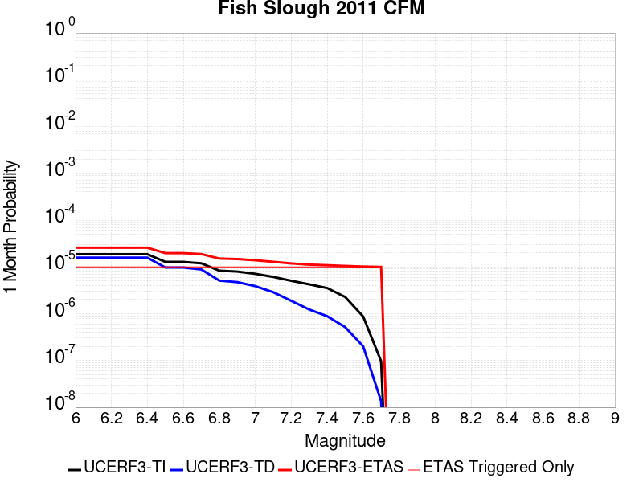 |  |  |

| Magnitude | 1 wk TI Prob | 1 wk TD Prob | 1 wk ETAS Prob | 1 wk ETAS/TD Gain | 1 wk ETAS Triggered Only | 1 mo TI Prob | 1 mo TD Prob | 1 mo ETAS Prob | 1 mo ETAS/TD Gain | 1 mo ETAS Triggered Only | 1 yr TI Prob | 1 yr TD Prob | 1 yr ETAS Prob | 1 yr ETAS/TD Gain | 1 yr ETAS Triggered Only | 10 yr TI Prob | 10 yr TD Prob | 10 yr ETAS Prob | 10 yr ETAS/TD Gain | 10 yr ETAS Triggered Only |
|-----|-----|-----|-----|-----|-----|-----|-----|-----|-----|-----|-----|-----|-----|-----|-----|-----|-----|-----|-----|-----|
| 6.0 | 4.3629925E-6 | 3.6772458E-6 | 3.6772458E-6 | 1.0 | 0.0 | 1.8698405E-5 | 1.5759542E-5 | 2.5759384E-5 | 1.6345263 | 1.0E-5 | 2.276293E-4 | 1.9185765E-4 | 2.1185381E-4 | 1.104224 | 2.0E-5 | 0.0022739628 | 0.001917129 | 0.0019470715 | 1.0156184 | 3.0E-5 |
| 6.1 | 4.3629925E-6 | 3.6772458E-6 | 3.6772458E-6 | 1.0 | 0.0 | 1.8698405E-5 | 1.5759542E-5 | 2.5759384E-5 | 1.6345263 | 1.0E-5 | 2.276293E-4 | 1.9185765E-4 | 2.1185381E-4 | 1.104224 | 2.0E-5 | 0.0022739628 | 0.001917129 | 0.0019470715 | 1.0156184 | 3.0E-5 |
| 6.2 | 4.3629925E-6 | 3.6772458E-6 | 3.6772458E-6 | 1.0 | 0.0 | 1.8698405E-5 | 1.5759542E-5 | 2.5759384E-5 | 1.6345263 | 1.0E-5 | 2.276293E-4 | 1.9185765E-4 | 2.1185381E-4 | 1.104224 | 2.0E-5 | 0.0022739628 | 0.001917129 | 0.0019470715 | 1.0156184 | 3.0E-5 |
| 6.3 | 4.3629925E-6 | 3.6772458E-6 | 3.6772458E-6 | 1.0 | 0.0 | 1.8698405E-5 | 1.5759542E-5 | 2.5759384E-5 | 1.6345263 | 1.0E-5 | 2.276293E-4 | 1.9185765E-4 | 2.1185381E-4 | 1.104224 | 2.0E-5 | 0.0022739628 | 0.001917129 | 0.0019470715 | 1.0156184 | 3.0E-5 |
| 6.4 | 4.3629925E-6 | 3.6772458E-6 | 3.6772458E-6 | 1.0 | 0.0 | 1.8698405E-5 | 1.5759542E-5 | 2.5759384E-5 | 1.6345263 | 1.0E-5 | 2.276293E-4 | 1.9185765E-4 | 2.1185381E-4 | 1.104224 | 2.0E-5 | 0.0022739628 | 0.001917129 | 0.0019470715 | 1.0156184 | 3.0E-5 |
| 6.5 | 2.991715E-6 | 2.2703657E-6 | 2.2703657E-6 | 1.0 | 0.0 | 1.2821573E-5 | 9.730108E-6 | 1.973001E-5 | 2.0277278 | 1.0E-5 | 1.5609147E-4 | 1.1845854E-4 | 1.3845618E-4 | 1.1688155 | 2.0E-5 | 0.0015598187 | 0.0011840442 | 0.0012140085 | 1.0253069 | 3.0E-5 |
| 6.6 | 2.991715E-6 | 2.2703657E-6 | 2.2703657E-6 | 1.0 | 0.0 | 1.2821573E-5 | 9.730108E-6 | 1.973001E-5 | 2.0277278 | 1.0E-5 | 1.5609147E-4 | 1.1845854E-4 | 1.3845618E-4 | 1.1688155 | 2.0E-5 | 0.0015598187 | 0.0011840442 | 0.0012140085 | 1.0253069 | 3.0E-5 |
| 6.7 | 2.7890346E-6 | 2.0621612E-6 | 2.0621612E-6 | 1.0 | 0.0 | 1.1952951E-5 | 8.837809E-6 | 1.8837722E-5 | 2.1314921 | 1.0E-5 | 1.4551746E-4 | 1.07595915E-4 | 1.2759377E-4 | 1.1858606 | 2.0E-5 | 0.0014542221 | 0.0010755265 | 0.0011054942 | 1.0278633 | 3.0E-5 |
| 6.8 | 1.9416723E-6 | 1.192531E-6 | 1.192531E-6 | 1.0 | 0.0 | 8.321425E-6 | 5.1108377E-6 | 1.5110787E-5 | 2.9566164 | 1.0E-5 | 1.01308644E-4 | 6.2222716E-5 | 8.222147E-5 | 1.321406 | 2.0E-5 | 0.0010126247 | 6.22057E-4 | 6.520383E-4 | 1.0481972 | 3.0E-5 |
| 6.9 | 1.8567416E-6 | 1.1046726E-6 | 1.1046726E-6 | 1.0 | 0.0 | 7.957439E-6 | 4.734303E-6 | 1.4734255E-5 | 3.1122334 | 1.0E-5 | 9.687752E-5 | 5.7638652E-5 | 7.76375E-5 | 1.3469694 | 2.0E-5 | 9.6835295E-4 | 5.762409E-4 | 6.062236E-4 | 1.0520315 | 3.0E-5 |
| 7.0 | 1.6634067E-6 | 9.0737336E-7 | 9.0737336E-7 | 1.0 | 0.0 | 7.1288664E-6 | 3.8887374E-6 | 1.3888698E-5 | 3.571519 | 1.0E-5 | 8.679049E-5 | 4.7344376E-5 | 6.734343E-5 | 1.4224167 | 2.0E-5 | 8.6756604E-4 | 4.733458E-4 | 5.033316E-4 | 1.0633487 | 3.0E-5 |
| 7.1 | 1.4281054E-6 | 6.736389E-7 | 6.736389E-7 | 1.0 | 0.0 | 6.1204373E-6 | 2.8870209E-6 | 1.2886992E-5 | 4.4637685 | 1.0E-5 | 7.451377E-5 | 3.514893E-5 | 5.5148226E-5 | 1.5689874 | 2.0E-5 | 7.44888E-4 | 3.5143548E-4 | 3.8142494E-4 | 1.0853342 | 3.0E-5 |
| 7.2 | 1.1810387E-6 | 4.408126E-7 | 4.408126E-7 | 1.0 | 0.0 | 5.0615845E-6 | 1.8891956E-6 | 1.1889177E-5 | 6.293248 | 1.0E-5 | 6.1623046E-5 | 2.3000723E-5 | 4.3000262E-5 | 1.8695179 | 2.0E-5 | 6.160596E-4 | 2.2998432E-4 | 2.5997742E-4 | 1.1304137 | 3.0E-5 |
| 7.3 | 9.918052E-7 | 2.8731267E-7 | 2.8731267E-7 | 1.0 | 0.0 | 4.2505867E-6 | 1.2313394E-6 | 1.1231327E-5 | 9.121227 | 1.0E-5 | 5.1749663E-5 | 1.4991455E-5 | 3.4991157E-5 | 2.3340733 | 2.0E-5 | 5.173762E-4 | 1.4990455E-4 | 1.7990006E-4 | 1.2000973 | 3.0E-5 |
| 7.4 | 8.25252E-7 | 2.0692863E-7 | 2.0692863E-7 | 1.0 | 0.0 | 3.5367896E-6 | 8.868367E-7 | 1.0886828E-5 | 12.276024 | 1.0E-5 | 4.3059565E-5 | 1.0797184E-5 | 3.0796968E-5 | 2.852315 | 2.0E-5 | 4.305122E-4 | 1.0796666E-4 | 1.3796342E-4 | 1.2778336 | 3.0E-5 |
| 7.5 | 5.3248567E-7 | 1.2071294E-7 | 1.2071294E-7 | 1.0 | 0.0 | 2.2820795E-6 | 5.1734105E-7 | 1.0517336E-5 | 20.329597 | 1.0E-5 | 2.7783964E-5 | 6.2986096E-6 | 2.6298483E-5 | 4.175284 | 2.0E-5 | 2.778049E-4 | 6.298435E-5 | 9.298246E-5 | 1.4762788 | 3.0E-5 |
| 7.6 | 2.037542E-7 | 4.7123013E-8 | 4.7123013E-8 | 1.0 | 0.0 | 8.73232E-7 | 2.0195576E-7 | 1.0201954E-5 | 50.515785 | 1.0E-5 | 1.0631547E-5 | 2.4588087E-6 | 2.245876E-5 | 9.134 | 2.0E-5 | 1.0631039E-4 | 2.4587836E-5 | 5.4587097E-5 | 2.2200854 | 3.0E-5 |
| 7.7 | 2.2501226E-8 | 3.1506997E-9 | 3.1506997E-9 | 1.0 | 0.0 | 9.6433816E-8 | 1.3502998E-8 | 1.0013503E-5 | 741.57623 | 1.0E-5 | 1.1740811E-6 | 1.64399E-7 | 1.0164397E-5 | 61.827614 | 1.0E-5 | 1.1740749E-5 | 1.6439889E-6 | 2.1643957E-5 | 13.165512 | 2.0E-5 |

## San Gorgonio Pass
*[(top)](#table-of-contents)*

| 1 Week | 1 Month | 1 Year | 10 Year |
|-----|-----|-----|-----|
| 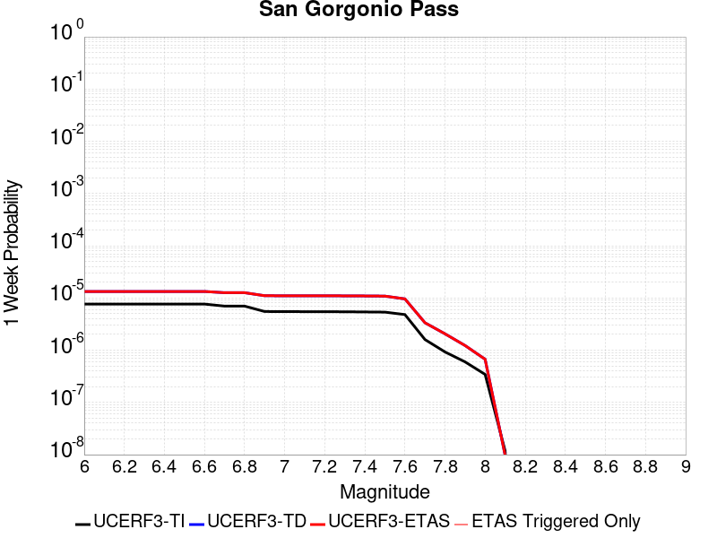 |  | 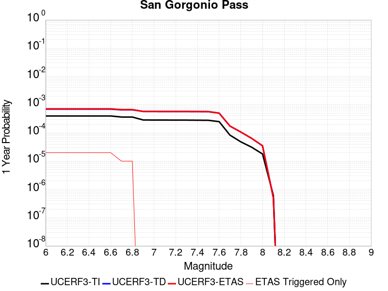 | 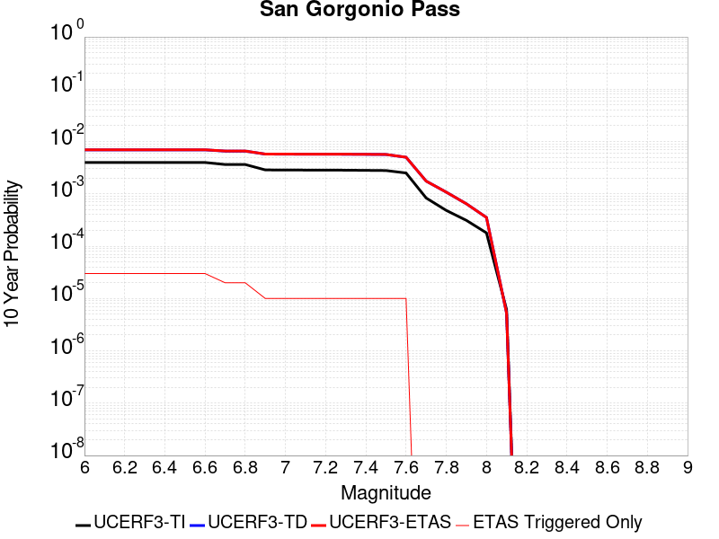 |

| Magnitude | 1 wk TI Prob | 1 wk TD Prob | 1 wk ETAS Prob | 1 wk ETAS/TD Gain | 1 wk ETAS Triggered Only | 1 mo TI Prob | 1 mo TD Prob | 1 mo ETAS Prob | 1 mo ETAS/TD Gain | 1 mo ETAS Triggered Only | 1 yr TI Prob | 1 yr TD Prob | 1 yr ETAS Prob | 1 yr ETAS/TD Gain | 1 yr ETAS Triggered Only | 10 yr TI Prob | 10 yr TD Prob | 10 yr ETAS Prob | 10 yr ETAS/TD Gain | 10 yr ETAS Triggered Only |
|-----|-----|-----|-----|-----|-----|-----|-----|-----|-----|-----|-----|-----|-----|-----|-----|-----|-----|-----|-----|-----|
| 6.0 | 7.644328E-6 | 1.331474E-5 | 1.331474E-5 | 1.0 | 0.0 | 3.2760996E-5 | 5.706197E-5 | 5.706197E-5 | 1.0 | 0.0 | 3.987921E-4 | 6.945166E-4 | 7.145027E-4 | 1.028777 | 2.0E-5 | 0.003980772 | 0.006930024 | 0.006959816 | 1.004299 | 3.0E-5 |
| 6.1 | 7.644328E-6 | 1.331474E-5 | 1.331474E-5 | 1.0 | 0.0 | 3.2760996E-5 | 5.706197E-5 | 5.706197E-5 | 1.0 | 0.0 | 3.987921E-4 | 6.945166E-4 | 7.145027E-4 | 1.028777 | 2.0E-5 | 0.003980772 | 0.006930024 | 0.006959816 | 1.004299 | 3.0E-5 |
| 6.2 | 7.644328E-6 | 1.331474E-5 | 1.331474E-5 | 1.0 | 0.0 | 3.2760996E-5 | 5.706197E-5 | 5.706197E-5 | 1.0 | 0.0 | 3.987921E-4 | 6.945166E-4 | 7.145027E-4 | 1.028777 | 2.0E-5 | 0.003980772 | 0.006930024 | 0.006959816 | 1.004299 | 3.0E-5 |
| 6.3 | 7.644328E-6 | 1.331474E-5 | 1.331474E-5 | 1.0 | 0.0 | 3.2760996E-5 | 5.706197E-5 | 5.706197E-5 | 1.0 | 0.0 | 3.987921E-4 | 6.945166E-4 | 7.145027E-4 | 1.028777 | 2.0E-5 | 0.003980772 | 0.006930024 | 0.006959816 | 1.004299 | 3.0E-5 |
| 6.4 | 7.644328E-6 | 1.331474E-5 | 1.331474E-5 | 1.0 | 0.0 | 3.2760996E-5 | 5.706197E-5 | 5.706197E-5 | 1.0 | 0.0 | 3.987921E-4 | 6.945166E-4 | 7.145027E-4 | 1.028777 | 2.0E-5 | 0.003980772 | 0.006930024 | 0.006959816 | 1.004299 | 3.0E-5 |
| 6.5 | 7.644328E-6 | 1.331474E-5 | 1.331474E-5 | 1.0 | 0.0 | 3.2760996E-5 | 5.706197E-5 | 5.706197E-5 | 1.0 | 0.0 | 3.987921E-4 | 6.945166E-4 | 7.145027E-4 | 1.028777 | 2.0E-5 | 0.003980772 | 0.006930024 | 0.006959816 | 1.004299 | 3.0E-5 |
| 6.6 | 7.644328E-6 | 1.331474E-5 | 1.331474E-5 | 1.0 | 0.0 | 3.2760996E-5 | 5.706197E-5 | 5.706197E-5 | 1.0 | 0.0 | 3.987921E-4 | 6.945166E-4 | 7.145027E-4 | 1.028777 | 2.0E-5 | 0.003980772 | 0.006930024 | 0.006959816 | 1.004299 | 3.0E-5 |
| 6.7 | 6.987586E-6 | 1.2619013E-5 | 1.2619013E-5 | 1.0 | 0.0 | 2.9946454E-5 | 5.408041E-5 | 5.408041E-5 | 1.0 | 0.0 | 3.645371E-4 | 6.582382E-4 | 6.6823163E-4 | 1.015182 | 1.0E-5 | 0.0036393967 | 0.0065694 | 0.006589269 | 1.0030245 | 2.0E-5 |
| 6.8 | 6.987586E-6 | 1.2619013E-5 | 1.2619013E-5 | 1.0 | 0.0 | 2.9946454E-5 | 5.408041E-5 | 5.408041E-5 | 1.0 | 0.0 | 3.645371E-4 | 6.582382E-4 | 6.6823163E-4 | 1.015182 | 1.0E-5 | 0.0036393967 | 0.0065694 | 0.006589269 | 1.0030245 | 2.0E-5 |
| 6.9 | 5.504702E-6 | 1.1049877E-5 | 1.1049877E-5 | 1.0 | 0.0 | 2.3591367E-5 | 4.7355785E-5 | 4.7355785E-5 | 1.0 | 0.0 | 2.8718702E-4 | 5.764092E-4 | 5.764092E-4 | 1.0 | 0.0 | 0.0028681618 | 0.0057553523 | 0.0057652947 | 1.0017275 | 1.0E-5 |
| 7.0 | 5.4825764E-6 | 1.1026218E-5 | 1.1026218E-5 | 1.0 | 0.0 | 2.3496545E-5 | 4.725439E-5 | 4.725439E-5 | 1.0 | 0.0 | 2.8603288E-4 | 5.751754E-4 | 5.751754E-4 | 1.0 | 0.0 | 0.00285665 | 0.0057430784 | 0.0057530208 | 1.0017313 | 1.0E-5 |
| 7.1 | 5.4692787E-6 | 1.1011928E-5 | 1.1011928E-5 | 1.0 | 0.0 | 2.3439556E-5 | 4.719315E-5 | 4.719315E-5 | 1.0 | 0.0 | 2.8533922E-4 | 5.744302E-4 | 5.744302E-4 | 1.0 | 0.0 | 0.0028497311 | 0.0057356646 | 0.0057456074 | 1.0017334 | 1.0E-5 |
| 7.2 | 5.453661E-6 | 1.0994954E-5 | 1.0994954E-5 | 1.0 | 0.0 | 2.3372622E-5 | 4.712041E-5 | 4.712041E-5 | 1.0 | 0.0 | 2.8452452E-4 | 5.7354505E-4 | 5.7354505E-4 | 1.0 | 0.0 | 0.002841605 | 0.005726859 | 0.0057368013 | 1.0017362 | 1.0E-5 |
| 7.3 | 5.4422303E-6 | 1.09818775E-5 | 1.09818775E-5 | 1.0 | 0.0 | 2.3323635E-5 | 4.7064368E-5 | 4.7064368E-5 | 1.0 | 0.0 | 2.8392827E-4 | 5.728631E-4 | 5.728631E-4 | 1.0 | 0.0 | 0.0028356577 | 0.0057200743 | 0.005730017 | 1.0017382 | 1.0E-5 |
| 7.4 | 5.398595E-6 | 1.0929241E-5 | 1.0929241E-5 | 1.0 | 0.0 | 2.313663E-5 | 4.6838795E-5 | 4.6838795E-5 | 1.0 | 0.0 | 2.8165206E-4 | 5.701182E-4 | 5.701182E-4 | 1.0 | 0.0 | 0.0028129534 | 0.0056927665 | 0.0057027093 | 1.0017467 | 1.0E-5 |
| 7.5 | 5.3578788E-6 | 1.0855785E-5 | 1.0855785E-5 | 1.0 | 0.0 | 2.2962136E-5 | 4.6523994E-5 | 4.6523994E-5 | 1.0 | 0.0 | 2.7952815E-4 | 5.662875E-4 | 5.662875E-4 | 1.0 | 0.0 | 0.002791768 | 0.0056546913 | 0.005664635 | 1.0017585 | 1.0E-5 |
| 7.6 | 4.8091474E-6 | 9.604131E-6 | 9.604131E-6 | 1.0 | 0.0 | 2.0610469E-5 | 4.1159943E-5 | 4.1159943E-5 | 1.0 | 0.0 | 2.5090357E-4 | 5.010119E-4 | 5.010119E-4 | 1.0 | 0.0 | 0.0025062046 | 0.0050054584 | 0.005015408 | 1.0019878 | 1.0E-5 |
| 7.7 | 1.5991155E-6 | 3.353035E-6 | 3.353035E-6 | 1.0 | 0.0 | 6.853334E-6 | 1.4370073E-5 | 1.4370073E-5 | 1.0 | 0.0 | 8.343615E-5 | 1.7494184E-4 | 1.7494184E-4 | 1.0 | 0.0 | 8.340483E-4 | 0.0017535852 | 0.0017535852 | 1.0 | 0.0 |
| 7.8 | 9.258398E-7 | 2.0581049E-6 | 2.0581049E-6 | 1.0 | 0.0 | 3.967879E-6 | 8.82042E-6 | 8.82042E-6 | 1.0 | 0.0 | 4.8307855E-5 | 1.0738334E-4 | 1.0738334E-4 | 1.0 | 0.0 | 4.8297356E-4 | 0.0010788103 | 0.0010788103 | 1.0 | 0.0 |
| 7.9 | 5.975575E-7 | 1.2292295E-6 | 1.2292295E-6 | 1.0 | 0.0 | 2.5609581E-6 | 5.2681157E-6 | 5.2681157E-6 | 1.0 | 0.0 | 3.117922E-5 | 6.413743E-5 | 6.413743E-5 | 1.0 | 0.0 | 3.1174847E-4 | 6.464778E-4 | 6.464778E-4 | 1.0 | 0.0 |
| 8.0 | 3.4413725E-7 | 6.714992E-7 | 6.714992E-7 | 1.0 | 0.0 | 1.4748731E-6 | 2.8778506E-6 | 2.8778506E-6 | 1.0 | 0.0 | 1.7956432E-5 | 3.5037272E-5 | 3.5037272E-5 | 1.0 | 0.0 | 1.7954981E-4 | 3.5392298E-4 | 3.5392298E-4 | 1.0 | 0.0 |
| 8.1 | 1.1787731E-8 | 9.6332045E-9 | 9.6332045E-9 | 1.0 | 0.0 | 5.0518846E-8 | 4.1285162E-8 | 4.1285162E-8 | 1.0 | 0.0 | 6.1506677E-7 | 5.0264674E-7 | 5.0264674E-7 | 1.0 | 0.0 | 6.1506507E-6 | 5.2417968E-6 | 5.2417968E-6 | 1.0 | 0.0 |

## Puente Hills
*[(top)](#table-of-contents)*

| 1 Week | 1 Month | 1 Year | 10 Year |
|-----|-----|-----|-----|
|  |  |  |  |

| Magnitude | 1 wk TI Prob | 1 wk TD Prob | 1 wk ETAS Prob | 1 wk ETAS/TD Gain | 1 wk ETAS Triggered Only | 1 mo TI Prob | 1 mo TD Prob | 1 mo ETAS Prob | 1 mo ETAS/TD Gain | 1 mo ETAS Triggered Only | 1 yr TI Prob | 1 yr TD Prob | 1 yr ETAS Prob | 1 yr ETAS/TD Gain | 1 yr ETAS Triggered Only | 10 yr TI Prob | 10 yr TD Prob | 10 yr ETAS Prob | 10 yr ETAS/TD Gain | 10 yr ETAS Triggered Only |
|-----|-----|-----|-----|-----|-----|-----|-----|-----|-----|-----|-----|-----|-----|-----|-----|-----|-----|-----|-----|-----|
| 6.0 | 1.2101656E-5 | 8.098448E-6 | 8.098448E-6 | 1.0 | 0.0 | 5.1863204E-5 | 3.4707205E-5 | 3.4707205E-5 | 1.0 | 0.0 | 6.312516E-4 | 4.2248392E-4 | 4.324797E-4 | 1.0236596 | 1.0E-5 | 0.0062946146 | 0.0042173676 | 0.004247241 | 1.0070834 | 3.0E-5 |
| 6.1 | 1.2101656E-5 | 8.098448E-6 | 8.098448E-6 | 1.0 | 0.0 | 5.1863204E-5 | 3.4707205E-5 | 3.4707205E-5 | 1.0 | 0.0 | 6.312516E-4 | 4.2248392E-4 | 4.324797E-4 | 1.0236596 | 1.0E-5 | 0.0062946146 | 0.0042173676 | 0.004247241 | 1.0070834 | 3.0E-5 |
| 6.2 | 1.2101656E-5 | 8.098448E-6 | 8.098448E-6 | 1.0 | 0.0 | 5.1863204E-5 | 3.4707205E-5 | 3.4707205E-5 | 1.0 | 0.0 | 6.312516E-4 | 4.2248392E-4 | 4.324797E-4 | 1.0236596 | 1.0E-5 | 0.0062946146 | 0.0042173676 | 0.004247241 | 1.0070834 | 3.0E-5 |
| 6.3 | 1.2101656E-5 | 8.098448E-6 | 8.098448E-6 | 1.0 | 0.0 | 5.1863204E-5 | 3.4707205E-5 | 3.4707205E-5 | 1.0 | 0.0 | 6.312516E-4 | 4.2248392E-4 | 4.324797E-4 | 1.0236596 | 1.0E-5 | 0.0062946146 | 0.0042173676 | 0.004247241 | 1.0070834 | 3.0E-5 |
| 6.4 | 1.2101656E-5 | 8.098448E-6 | 8.098448E-6 | 1.0 | 0.0 | 5.1863204E-5 | 3.4707205E-5 | 3.4707205E-5 | 1.0 | 0.0 | 6.312516E-4 | 4.2248392E-4 | 4.324797E-4 | 1.0236596 | 1.0E-5 | 0.0062946146 | 0.0042173676 | 0.004247241 | 1.0070834 | 3.0E-5 |
| 6.5 | 1.2101656E-5 | 8.098448E-6 | 8.098448E-6 | 1.0 | 0.0 | 5.1863204E-5 | 3.4707205E-5 | 3.4707205E-5 | 1.0 | 0.0 | 6.312516E-4 | 4.2248392E-4 | 4.324797E-4 | 1.0236596 | 1.0E-5 | 0.0062946146 | 0.0042173676 | 0.004247241 | 1.0070834 | 3.0E-5 |
| 6.6 | 1.0222488E-5 | 6.399079E-6 | 6.399079E-6 | 1.0 | 0.0 | 4.3809923E-5 | 2.742435E-5 | 2.742435E-5 | 1.0 | 0.0 | 5.332553E-4 | 3.3384276E-4 | 3.4383943E-4 | 1.0299442 | 1.0E-5 | 0.0053197746 | 0.0033336577 | 0.0033635576 | 1.0089691 | 3.0E-5 |
| 6.7 | 1.0222488E-5 | 6.399079E-6 | 6.399079E-6 | 1.0 | 0.0 | 4.3809923E-5 | 2.742435E-5 | 2.742435E-5 | 1.0 | 0.0 | 5.332553E-4 | 3.3384276E-4 | 3.4383943E-4 | 1.0299442 | 1.0E-5 | 0.0053197746 | 0.0033336577 | 0.0033635576 | 1.0089691 | 3.0E-5 |
| 6.8 | 8.6367845E-6 | 5.028129E-6 | 5.028129E-6 | 1.0 | 0.0 | 3.7014266E-5 | 2.1548949E-5 | 2.1548949E-5 | 1.0 | 0.0 | 4.505555E-4 | 2.6232743E-4 | 2.723248E-4 | 1.0381103 | 1.0E-5 | 0.004496431 | 0.002620234 | 0.0026501555 | 1.0114194 | 3.0E-5 |
| 6.9 | 8.066481E-6 | 4.8360116E-6 | 4.8360116E-6 | 1.0 | 0.0 | 3.4570177E-5 | 2.0725602E-5 | 2.0725602E-5 | 1.0 | 0.0 | 4.2081063E-4 | 2.523055E-4 | 2.62303E-4 | 1.0396245 | 1.0E-5 | 0.0042001465 | 0.0025202443 | 0.002540194 | 1.0079157 | 2.0E-5 |
| 7.0 | 7.393828E-6 | 4.4172275E-6 | 4.4172275E-6 | 1.0 | 0.0 | 3.168745E-5 | 1.8930841E-5 | 1.8930841E-5 | 1.0 | 0.0 | 3.857264E-4 | 2.3045906E-4 | 2.3045906E-4 | 1.0 | 0.0 | 0.0038505755 | 0.0023022462 | 0.0023122232 | 1.0043336 | 1.0E-5 |
| 7.1 | 6.4660953E-6 | 3.8043859E-6 | 3.8043859E-6 | 1.0 | 0.0 | 2.7711543E-5 | 1.630441E-5 | 1.630441E-5 | 1.0 | 0.0 | 3.373358E-4 | 1.9848847E-4 | 1.9848847E-4 | 1.0 | 0.0 | 0.0033682417 | 0.0019831478 | 0.0019931279 | 1.0050325 | 1.0E-5 |
| 7.2 | 5.143232E-6 | 2.7864896E-6 | 2.7864896E-6 | 1.0 | 0.0 | 2.2042237E-5 | 1.1942045E-5 | 1.1942045E-5 | 1.0 | 0.0 | 2.6833118E-4 | 1.453848E-4 | 1.453848E-4 | 1.0 | 0.0 | 0.002680074 | 0.0014529065 | 0.001462892 | 1.0068728 | 1.0E-5 |
| 7.3 | 3.928255E-6 | 2.091338E-6 | 2.091338E-6 | 1.0 | 0.0 | 1.683527E-5 | 8.962847E-6 | 8.962847E-6 | 1.0 | 0.0 | 2.0495013E-4 | 1.0911726E-4 | 1.0911726E-4 | 1.0 | 0.0 | 0.002047612 | 0.0010906435 | 0.0011006326 | 1.0091588 | 1.0E-5 |
| 7.4 | 2.7894434E-6 | 1.3546429E-6 | 1.3546429E-6 | 1.0 | 0.0 | 1.1954703E-5 | 5.8056E-6 | 5.8056E-6 | 1.0 | 0.0 | 1.4553878E-4 | 7.068093E-5 | 7.068093E-5 | 1.0 | 0.0 | 0.001454435 | 7.0658885E-4 | 7.0658885E-4 | 1.0 | 0.0 |
| 7.5 | 2.041735E-6 | 8.786996E-7 | 8.786996E-7 | 1.0 | 0.0 | 8.750263E-6 | 3.7658504E-6 | 3.7658504E-6 | 1.0 | 0.0 | 1.06529245E-4 | 4.5848297E-5 | 4.5848297E-5 | 1.0 | 0.0 | 0.0010647819 | 4.5839173E-4 | 4.5839173E-4 | 1.0 | 0.0 |
| 7.6 | 1.6959062E-6 | 6.698339E-7 | 6.698339E-7 | 1.0 | 0.0 | 7.268149E-6 | 2.8707138E-6 | 2.8707138E-6 | 1.0 | 0.0 | 8.848612E-5 | 3.4950408E-5 | 3.4950408E-5 | 1.0 | 0.0 | 8.84509E-4 | 3.4945202E-4 | 3.4945202E-4 | 1.0 | 0.0 |
| 7.7 | 1.4767965E-6 | 5.407146E-7 | 5.407146E-7 | 1.0 | 0.0 | 6.3291122E-6 | 2.3173466E-6 | 2.3173466E-6 | 1.0 | 0.0 | 7.705422E-5 | 2.8213353E-5 | 2.8213353E-5 | 1.0 | 0.0 | 7.702751E-4 | 2.8210029E-4 | 2.8210029E-4 | 1.0 | 0.0 |
| 7.8 | 1.8432911E-7 | 7.2811105E-8 | 7.2811105E-8 | 1.0 | 0.0 | 7.8998164E-7 | 3.1204758E-7 | 3.1204758E-7 | 1.0 | 0.0 | 9.617985E-6 | 3.799176E-6 | 3.799176E-6 | 1.0 | 0.0 | 9.617568E-5 | 3.7991435E-5 | 3.7991435E-5 | 1.0 | 0.0 |

## Concord 2011 CFM
*[(top)](#table-of-contents)*

| 1 Week | 1 Month | 1 Year | 10 Year |
|-----|-----|-----|-----|
| 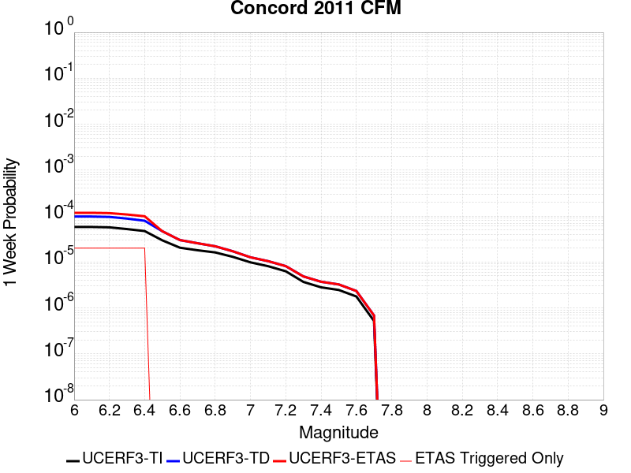 |  |  | 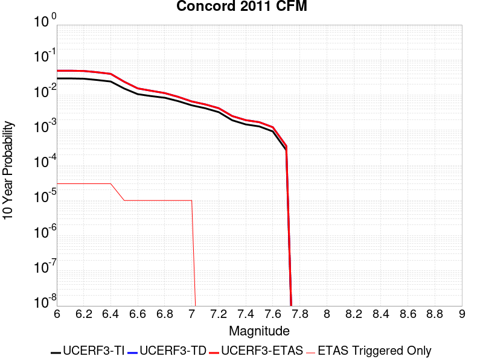 |

| Magnitude | 1 wk TI Prob | 1 wk TD Prob | 1 wk ETAS Prob | 1 wk ETAS/TD Gain | 1 wk ETAS Triggered Only | 1 mo TI Prob | 1 mo TD Prob | 1 mo ETAS Prob | 1 mo ETAS/TD Gain | 1 mo ETAS Triggered Only | 1 yr TI Prob | 1 yr TD Prob | 1 yr ETAS Prob | 1 yr ETAS/TD Gain | 1 yr ETAS Triggered Only | 10 yr TI Prob | 10 yr TD Prob | 10 yr ETAS Prob | 10 yr ETAS/TD Gain | 10 yr ETAS Triggered Only |
|-----|-----|-----|-----|-----|-----|-----|-----|-----|-----|-----|-----|-----|-----|-----|-----|-----|-----|-----|-----|-----|
| 6.0 | 5.7865112E-5 | 9.7585355E-5 | 1.17583404E-4 | 1.2049288 | 2.0E-5 | 2.4796976E-4 | 4.181607E-4 | 4.3815232E-4 | 1.0478085 | 2.0E-5 | 0.0030148525 | 0.005079743 | 0.005109591 | 1.0058758 | 3.0E-5 | 0.029742775 | 0.049266078 | 0.0492946 | 1.0005789 | 3.0E-5 |
| 6.1 | 5.7865112E-5 | 9.7585355E-5 | 1.17583404E-4 | 1.2049288 | 2.0E-5 | 2.4796976E-4 | 4.181607E-4 | 4.3815232E-4 | 1.0478085 | 2.0E-5 | 0.0030148525 | 0.005079743 | 0.005109591 | 1.0058758 | 3.0E-5 | 0.029742775 | 0.049266078 | 0.0492946 | 1.0005789 | 3.0E-5 |
| 6.2 | 5.6789337E-5 | 9.578793E-5 | 1.1578601E-4 | 1.2087746 | 2.0E-5 | 2.4336016E-4 | 4.1045985E-4 | 4.3045165E-4 | 1.0487058 | 2.0E-5 | 0.0029588845 | 0.0049864696 | 0.00501632 | 1.0059863 | 3.0E-5 | 0.029197963 | 0.04838257 | 0.048411116 | 1.0005901 | 3.0E-5 |
| 6.3 | 5.203322E-5 | 8.803241E-5 | 1.0803065E-4 | 1.227169 | 2.0E-5 | 2.2298045E-4 | 3.772316E-4 | 3.9722404E-4 | 1.0529978 | 2.0E-5 | 0.0027114071 | 0.0045839064 | 0.004613769 | 1.0065147 | 3.0E-5 | 0.026785625 | 0.04455397 | 0.04458263 | 1.0006434 | 3.0E-5 |
| 6.4 | 4.7120942E-5 | 7.897583E-5 | 9.897425E-5 | 1.253222 | 2.0E-5 | 2.0193127E-4 | 3.3842813E-4 | 3.5842136E-4 | 1.0590768 | 2.0E-5 | 0.0024557412 | 0.004113323 | 0.0041431994 | 1.0072634 | 3.0E-5 | 0.024287801 | 0.040080756 | 0.040109556 | 1.0007185 | 3.0E-5 |
| 6.5 | 2.9598437E-5 | 4.6675777E-5 | 4.6675777E-5 | 1.0 | 0.0 | 1.2684427E-4 | 2.000249E-4 | 2.000249E-4 | 1.0 | 0.0 | 0.001543235 | 0.0024327936 | 0.0024427692 | 1.0041004 | 1.0E-5 | 0.015325619 | 0.023909668 | 0.02391943 | 1.0004083 | 1.0E-5 |
| 6.6 | 2.0443718E-5 | 2.9984873E-5 | 2.9984873E-5 | 1.0 | 0.0 | 8.7613E-5 | 1.2850047E-4 | 1.2850047E-4 | 1.0 | 0.0 | 0.0010661662 | 0.0015634067 | 0.001573391 | 1.0063863 | 1.0E-5 | 0.010610655 | 0.0154669015 | 0.015476747 | 1.0006366 | 1.0E-5 |
| 6.7 | 1.798539E-5 | 2.5557883E-5 | 2.5557883E-5 | 1.0 | 0.0 | 7.7077966E-5 | 1.0952931E-4 | 1.0952931E-4 | 1.0 | 0.0 | 9.380202E-4 | 0.0013327252 | 0.0013427117 | 1.0074934 | 1.0E-5 | 0.009340706 | 0.013217516 | 0.013227384 | 1.0007466 | 1.0E-5 |
| 6.8 | 1.613555E-5 | 2.1959608E-5 | 2.1959608E-5 | 1.0 | 0.0 | 6.915052E-5 | 9.4109295E-5 | 9.4109295E-5 | 1.0 | 0.0 | 8.4158237E-4 | 0.0011451923 | 0.0011551809 | 1.0087222 | 1.0E-5 | 0.008384023 | 0.011378321 | 0.011388207 | 1.0008689 | 1.0E-5 |
| 6.9 | 1.2916435E-5 | 1.708134E-5 | 1.708134E-5 | 1.0 | 0.0 | 5.5354973E-5 | 7.320372E-5 | 7.320372E-5 | 1.0 | 0.0 | 6.7373837E-4 | 8.908967E-4 | 9.0088777E-4 | 1.0112146 | 1.0E-5 | 0.006716994 | 0.008867833 | 0.008877745 | 1.0011177 | 1.0E-5 |
| 7.0 | 9.81129E-6 | 1.2631038E-5 | 1.2631038E-5 | 1.0 | 0.0 | 4.2047708E-5 | 5.4131906E-5 | 5.4131906E-5 | 1.0 | 0.0 | 5.118106E-4 | 6.588583E-4 | 6.688517E-4 | 1.0151677 | 1.0E-5 | 0.005106334 | 0.0065697595 | 0.006579694 | 1.0015122 | 1.0E-5 |
| 7.1 | 8.0889195E-6 | 1.04184555E-5 | 1.04184555E-5 | 1.0 | 0.0 | 3.4666336E-5 | 4.4649765E-5 | 4.4649765E-5 | 1.0 | 0.0 | 4.219809E-4 | 5.434764E-4 | 5.434764E-4 | 1.0 | 0.0 | 0.004211805 | 0.0054219896 | 0.0054219896 | 1.0 | 0.0 |
| 7.2 | 6.267438E-6 | 8.115879E-6 | 8.115879E-6 | 1.0 | 0.0 | 2.6860173E-5 | 3.478188E-5 | 3.478188E-5 | 1.0 | 0.0 | 3.2697353E-4 | 4.2338783E-4 | 4.2338783E-4 | 1.0 | 0.0 | 0.0032649285 | 0.004226169 | 0.004226169 | 1.0 | 0.0 |
| 7.3 | 3.6761196E-6 | 4.840281E-6 | 4.840281E-6 | 1.0 | 0.0 | 1.5754704E-5 | 2.0743897E-5 | 2.0743897E-5 | 1.0 | 0.0 | 1.9179663E-4 | 2.5252788E-4 | 2.5252788E-4 | 1.0 | 0.0 | 0.0019163118 | 0.0025226264 | 0.0025226264 | 1.0 | 0.0 |
| 7.4 | 2.8044356E-6 | 3.7096993E-6 | 3.7096993E-6 | 1.0 | 0.0 | 1.2018954E-5 | 1.5898615E-5 | 1.5898615E-5 | 1.0 | 0.0 | 1.4632095E-4 | 1.9354856E-4 | 1.9354856E-4 | 1.0 | 0.0 | 0.0014622464 | 0.0019340349 | 0.0019340349 | 1.0 | 0.0 |
| 7.5 | 2.4578699E-6 | 3.2448306E-6 | 3.2448306E-6 | 1.0 | 0.0 | 1.0533685E-5 | 1.3906343E-5 | 1.3906343E-5 | 1.0 | 0.0 | 1.2824008E-4 | 1.6929668E-4 | 1.6929668E-4 | 1.0 | 0.0 | 0.0012816609 | 0.0016918926 | 0.0016918926 | 1.0 | 0.0 |
| 7.6 | 1.7713267E-6 | 2.335189E-6 | 2.335189E-6 | 1.0 | 0.0 | 7.591378E-6 | 1.0007916E-5 | 1.0007916E-5 | 1.0 | 0.0 | 9.2421105E-5 | 1.2183965E-4 | 1.2183965E-4 | 1.0 | 0.0 | 9.2382677E-4 | 0.0012178655 | 0.0012178655 | 1.0 | 0.0 |
| 7.7 | 5.1912366E-7 | 6.829346E-7 | 6.829346E-7 | 1.0 | 0.0 | 2.2248137E-6 | 2.9268595E-6 | 2.9268595E-6 | 1.0 | 0.0 | 2.708677E-5 | 3.5633944E-5 | 3.5633944E-5 | 1.0 | 0.0 | 2.708347E-4 | 3.5630353E-4 | 3.5630353E-4 | 1.0 | 0.0 |

## Great Valley 07 (Orestimba)
*[(top)](#table-of-contents)*

| 1 Week | 1 Month | 1 Year | 10 Year |
|-----|-----|-----|-----|
|  |  | 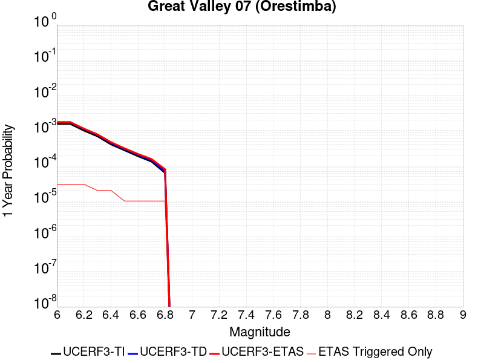 |  |

| Magnitude | 1 wk TI Prob | 1 wk TD Prob | 1 wk ETAS Prob | 1 wk ETAS/TD Gain | 1 wk ETAS Triggered Only | 1 mo TI Prob | 1 mo TD Prob | 1 mo ETAS Prob | 1 mo ETAS/TD Gain | 1 mo ETAS Triggered Only | 1 yr TI Prob | 1 yr TD Prob | 1 yr ETAS Prob | 1 yr ETAS/TD Gain | 1 yr ETAS Triggered Only | 10 yr TI Prob | 10 yr TD Prob | 10 yr ETAS Prob | 10 yr ETAS/TD Gain | 10 yr ETAS Triggered Only |
|-----|-----|-----|-----|-----|-----|-----|-----|-----|-----|-----|-----|-----|-----|-----|-----|-----|-----|-----|-----|-----|
| 6.0 | 2.9687902E-5 | 3.27575E-5 | 5.2756845E-5 | 1.6105273 | 2.0E-5 | 1.2722766E-4 | 1.4038214E-4 | 1.7037793E-4 | 1.2136724 | 3.0E-5 | 0.0015478961 | 0.0017078844 | 0.0017378331 | 1.0175356 | 3.0E-5 | 0.015371585 | 0.016955135 | 0.016984627 | 1.0017394 | 3.0E-5 |
| 6.1 | 2.9687902E-5 | 3.27575E-5 | 5.2756845E-5 | 1.6105273 | 2.0E-5 | 1.2722766E-4 | 1.4038214E-4 | 1.7037793E-4 | 1.2136724 | 3.0E-5 | 0.0015478961 | 0.0017078844 | 0.0017378331 | 1.0175356 | 3.0E-5 | 0.015371585 | 0.016955135 | 0.016984627 | 1.0017394 | 3.0E-5 |
| 6.2 | 1.9231524E-5 | 2.1159167E-5 | 4.1158743E-5 | 1.9451969 | 2.0E-5 | 8.2418206E-5 | 9.067912E-5 | 1.206764E-4 | 1.330807 | 3.0E-5 | 0.0010029797 | 0.0011034822 | 0.0011334491 | 1.0271567 | 3.0E-5 | 0.00998465 | 0.010982441 | 0.011012111 | 1.0027016 | 3.0E-5 |
| 6.3 | 1.324766E-5 | 1.4548534E-5 | 3.4548244E-5 | 2.374689 | 2.0E-5 | 5.6774446E-5 | 6.234942E-5 | 8.2348175E-5 | 1.3207529 | 2.0E-5 | 6.910097E-4 | 7.5884897E-4 | 7.788338E-4 | 1.0263357 | 2.0E-5 | 0.006888649 | 0.0075635235 | 0.0075833723 | 1.0026243 | 2.0E-5 |
| 6.4 | 7.818645E-6 | 8.57284E-6 | 2.857267E-5 | 3.3329291 | 2.0E-5 | 3.3508048E-5 | 3.6740246E-5 | 5.673951E-5 | 1.5443422 | 2.0E-5 | 4.078841E-4 | 4.4722404E-4 | 4.6721508E-4 | 1.0447003 | 2.0E-5 | 0.004071363 | 0.0044635804 | 0.004483491 | 1.0044607 | 2.0E-5 |
| 6.5 | 5.3076565E-6 | 5.8178007E-6 | 1.5817743E-5 | 2.7188525 | 1.0E-5 | 2.27469E-5 | 2.4933206E-5 | 3.4932957E-5 | 1.4010615 | 1.0E-5 | 2.7690834E-4 | 3.035216E-4 | 3.1351857E-4 | 1.0329366 | 1.0E-5 | 0.0027656353 | 0.00303128 | 0.0030412497 | 1.003289 | 1.0E-5 |
| 6.6 | 3.6003578E-6 | 3.9484953E-6 | 1.39484555E-5 | 3.5326002 | 1.0E-5 | 1.5430012E-5 | 1.6922022E-5 | 2.6921853E-5 | 1.590936 | 1.0E-5 | 1.8784421E-4 | 2.0600771E-4 | 2.1600565E-4 | 1.0485319 | 1.0E-5 | 0.0018768552 | 0.0020583214 | 0.0020683007 | 1.0048484 | 1.0E-5 |
| 6.7 | 2.5361826E-6 | 2.7834678E-6 | 1.278344E-5 | 4.592631 | 1.0E-5 | 1.0869308E-5 | 1.1929101E-5 | 2.1928981E-5 | 1.8382761 | 1.0E-5 | 1.3232579E-4 | 1.4522845E-4 | 1.55227E-4 | 1.0688471 | 1.0E-5 | 0.0013224703 | 0.0014514653 | 0.0014614508 | 1.0068796 | 1.0E-5 |
| 6.8 | 1.2115831E-6 | 1.3313797E-6 | 1.1331366E-5 | 8.510995 | 1.0E-5 | 5.1924885E-6 | 5.7059065E-6 | 1.570585E-5 | 2.75256 | 1.0E-5 | 6.3216714E-5 | 6.9468166E-5 | 7.946747E-5 | 1.1439408 | 1.0E-5 | 6.3198735E-4 | 6.945596E-4 | 7.045527E-4 | 1.0143876 | 1.0E-5 |

## Cedar Mtn-Mahogany Mtn
*[(top)](#table-of-contents)*

| 1 Week | 1 Month | 1 Year | 10 Year |
|-----|-----|-----|-----|
|  |  | 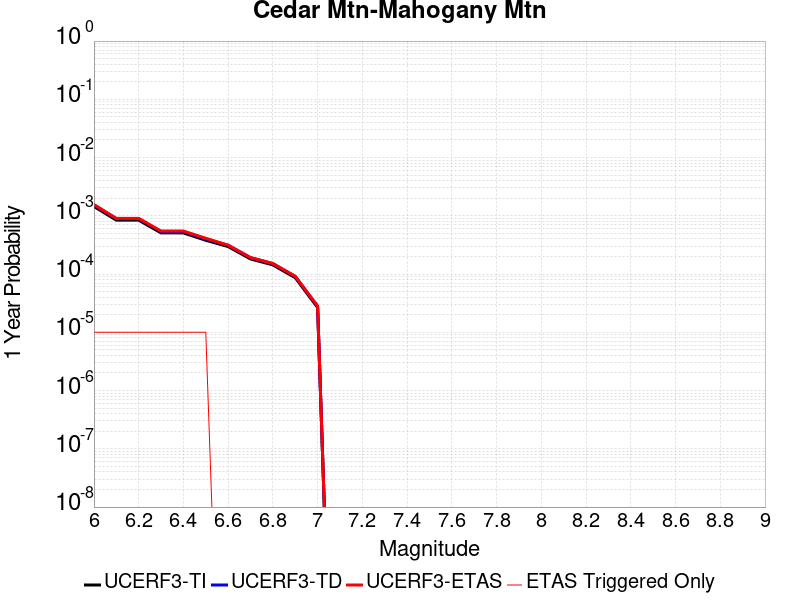 | 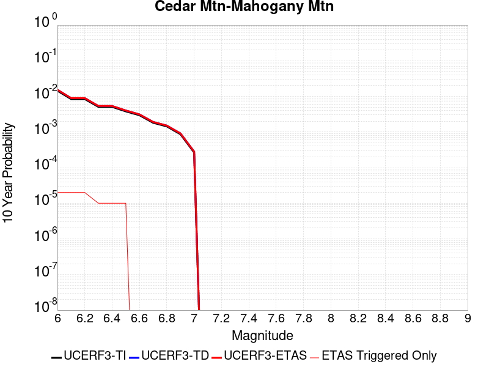 |

| Magnitude | 1 wk TI Prob | 1 wk TD Prob | 1 wk ETAS Prob | 1 wk ETAS/TD Gain | 1 wk ETAS Triggered Only | 1 mo TI Prob | 1 mo TD Prob | 1 mo ETAS Prob | 1 mo ETAS/TD Gain | 1 mo ETAS Triggered Only | 1 yr TI Prob | 1 yr TD Prob | 1 yr ETAS Prob | 1 yr ETAS/TD Gain | 1 yr ETAS Triggered Only | 10 yr TI Prob | 10 yr TD Prob | 10 yr ETAS Prob | 10 yr ETAS/TD Gain | 10 yr ETAS Triggered Only |
|-----|-----|-----|-----|-----|-----|-----|-----|-----|-----|-----|-----|-----|-----|-----|-----|-----|-----|-----|-----|-----|
| 6.0 | 2.7763876E-5 | 2.9588866E-5 | 2.9588866E-5 | 1.0 | 0.0 | 1.1898261E-4 | 1.2680366E-4 | 1.2680366E-4 | 1.0 | 0.0 | 0.0014476506 | 0.0015428112 | 0.0015527958 | 1.0064716 | 1.0E-5 | 0.0143825635 | 0.015328225 | 0.0153479185 | 1.0012848 | 2.0E-5 |
| 6.1 | 1.6162443E-5 | 1.7142966E-5 | 1.7142966E-5 | 1.0 | 0.0 | 6.926578E-5 | 7.346788E-5 | 7.346788E-5 | 1.0 | 0.0 | 8.4298453E-4 | 8.941221E-4 | 9.0411317E-4 | 1.0111742 | 1.0E-5 | 0.008397939 | 0.008907059 | 0.008926881 | 1.0022254 | 2.0E-5 |
| 6.2 | 1.6162443E-5 | 1.7142966E-5 | 1.7142966E-5 | 1.0 | 0.0 | 6.926578E-5 | 7.346788E-5 | 7.346788E-5 | 1.0 | 0.0 | 8.4298453E-4 | 8.941221E-4 | 9.0411317E-4 | 1.0111742 | 1.0E-5 | 0.008397939 | 0.008907059 | 0.008926881 | 1.0022254 | 2.0E-5 |
| 6.3 | 9.746053E-6 | 1.0303152E-5 | 1.0303152E-5 | 1.0 | 0.0 | 4.1768133E-5 | 4.415564E-5 | 4.415564E-5 | 1.0 | 0.0 | 5.0840835E-4 | 5.3746643E-4 | 5.4746104E-4 | 1.0185958 | 1.0E-5 | 0.0050724675 | 0.005362084 | 0.0053720307 | 1.0018549 | 1.0E-5 |
| 6.4 | 9.746053E-6 | 1.0303152E-5 | 1.0303152E-5 | 1.0 | 0.0 | 4.1768133E-5 | 4.415564E-5 | 4.415564E-5 | 1.0 | 0.0 | 5.0840835E-4 | 5.3746643E-4 | 5.4746104E-4 | 1.0185958 | 1.0E-5 | 0.0050724675 | 0.005362084 | 0.0053720307 | 1.0018549 | 1.0E-5 |
| 6.5 | 7.290083E-6 | 7.695325E-6 | 7.695325E-6 | 1.0 | 0.0 | 3.124284E-5 | 3.297956E-5 | 3.297956E-5 | 1.0 | 0.0 | 3.8031515E-4 | 4.014543E-4 | 4.1145028E-4 | 1.0248995 | 1.0E-5 | 0.0037966494 | 0.004007511 | 0.004017471 | 1.0024853 | 1.0E-5 |
| 6.6 | 5.67907E-6 | 5.9891527E-6 | 5.9891527E-6 | 1.0 | 0.0 | 2.4338644E-5 | 2.5667552E-5 | 2.5667552E-5 | 1.0 | 0.0 | 2.962827E-4 | 3.12459E-4 | 3.12459E-4 | 1.0 | 0.0 | 0.0029588798 | 0.003120333 | 0.003120333 | 1.0 | 0.0 |
| 6.7 | 3.4853963E-6 | 3.672631E-6 | 3.672631E-6 | 1.0 | 0.0 | 1.4937327E-5 | 1.5739755E-5 | 1.5739755E-5 | 1.0 | 0.0 | 1.8184677E-4 | 1.916153E-4 | 1.916153E-4 | 1.0 | 0.0 | 0.0018169804 | 0.0019145629 | 0.0019145629 | 1.0 | 0.0 |
| 6.8 | 2.7535168E-6 | 2.9015764E-6 | 2.9015764E-6 | 1.0 | 0.0 | 1.1800733E-5 | 1.2435271E-5 | 1.2435271E-5 | 1.0 | 0.0 | 1.4366445E-4 | 1.5138938E-4 | 1.5138938E-4 | 1.0 | 0.0 | 0.0014357162 | 0.0015129098 | 0.0015129098 | 1.0 | 0.0 |
| 6.9 | 1.6594106E-6 | 1.7496985E-6 | 1.7496985E-6 | 1.0 | 0.0 | 7.1117406E-6 | 7.4986883E-6 | 7.4986883E-6 | 1.0 | 0.0 | 8.6582E-5 | 9.129302E-5 | 9.129302E-5 | 1.0 | 0.0 | 8.654827E-4 | 9.125856E-4 | 9.125856E-4 | 1.0 | 0.0 |
| 7.0 | 5.10215E-7 | 5.389254E-7 | 5.389254E-7 | 1.0 | 0.0 | 2.186634E-6 | 2.3096788E-6 | 2.3096788E-6 | 1.0 | 0.0 | 2.6621943E-5 | 2.8120105E-5 | 2.8120105E-5 | 1.0 | 0.0 | 2.6618753E-4 | 2.81178E-4 | 2.81178E-4 | 1.0 | 0.0 |

## Hayward (No) 2011 CFM
*[(top)](#table-of-contents)*

| 1 Week | 1 Month | 1 Year | 10 Year |
|-----|-----|-----|-----|
| 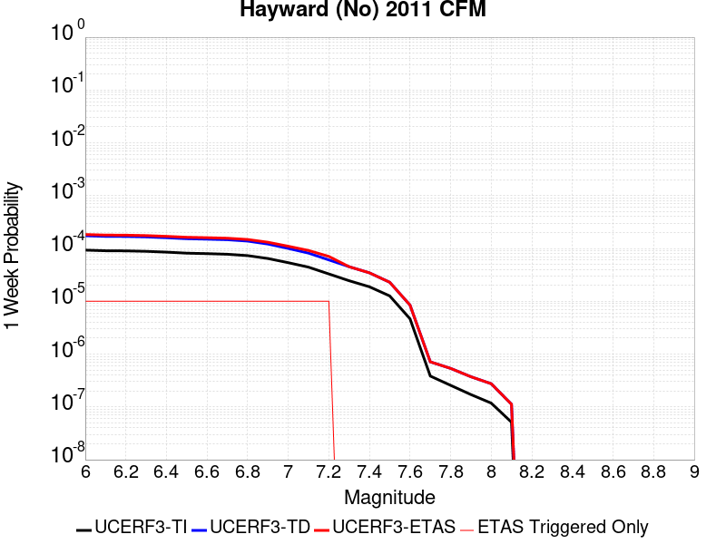 |  | 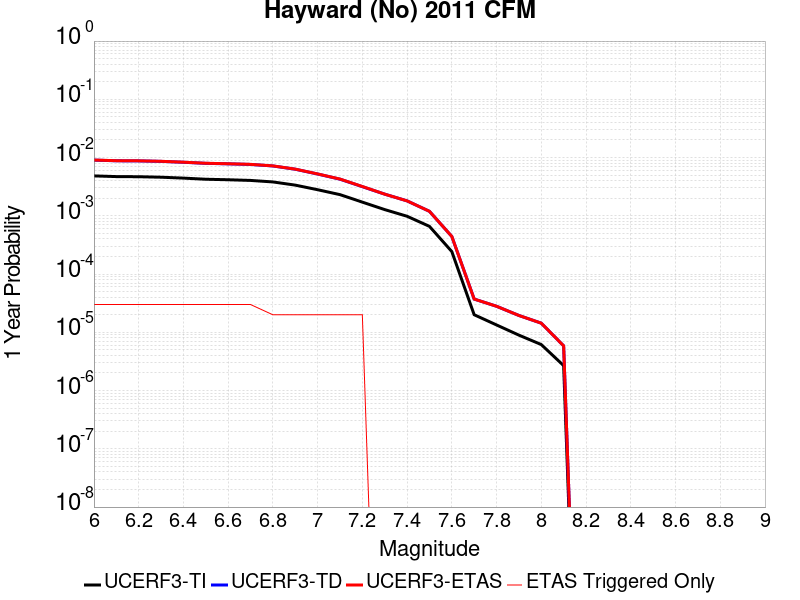 |  |

| Magnitude | 1 wk TI Prob | 1 wk TD Prob | 1 wk ETAS Prob | 1 wk ETAS/TD Gain | 1 wk ETAS Triggered Only | 1 mo TI Prob | 1 mo TD Prob | 1 mo ETAS Prob | 1 mo ETAS/TD Gain | 1 mo ETAS Triggered Only | 1 yr TI Prob | 1 yr TD Prob | 1 yr ETAS Prob | 1 yr ETAS/TD Gain | 1 yr ETAS Triggered Only | 10 yr TI Prob | 10 yr TD Prob | 10 yr ETAS Prob | 10 yr ETAS/TD Gain | 10 yr ETAS Triggered Only |
|-----|-----|-----|-----|-----|-----|-----|-----|-----|-----|-----|-----|-----|-----|-----|-----|-----|-----|-----|-----|-----|
| 6.0 | 9.3068506E-5 | 1.739643E-4 | 1.8396258E-4 | 1.0574731 | 1.0E-5 | 3.9880406E-4 | 7.453474E-4 | 7.653325E-4 | 1.0268131 | 2.0E-5 | 0.0048446343 | 0.009036727 | 0.009066456 | 1.0032898 | 3.0E-5 | 0.047403704 | 0.086396605 | 0.086424015 | 1.0003172 | 3.0E-5 |
| 6.1 | 9.055486E-5 | 1.6947639E-4 | 1.794747E-4 | 1.0589952 | 1.0E-5 | 3.880345E-4 | 7.2612526E-4 | 7.4611075E-4 | 1.0275234 | 2.0E-5 | 0.0047140904 | 0.008804814 | 0.008834549 | 1.0033772 | 3.0E-5 | 0.046153355 | 0.08428568 | 0.08431315 | 1.0003259 | 3.0E-5 |
| 6.2 | 9.006742E-5 | 1.6868232E-4 | 1.7868062E-4 | 1.059273 | 1.0E-5 | 3.859461E-4 | 7.227246E-4 | 7.4271014E-4 | 1.0276531 | 2.0E-5 | 0.0046887742 | 0.00876378 | 0.008793516 | 1.0033932 | 3.0E-5 | 0.0459107 | 0.08390991 | 0.08393739 | 1.0003275 | 3.0E-5 |
| 6.3 | 8.8336754E-5 | 1.6547782E-4 | 1.7547616E-4 | 1.0604211 | 1.0E-5 | 3.7853114E-4 | 7.0899865E-4 | 7.289845E-4 | 1.0281888 | 2.0E-5 | 0.004598882 | 0.008598051 | 0.008627794 | 1.0034592 | 3.0E-5 | 0.04504866 | 0.08240195 | 0.082429476 | 1.000334 | 3.0E-5 |
| 6.4 | 8.526157E-5 | 1.5974796E-4 | 1.6974636E-4 | 1.0625886 | 1.0E-5 | 3.6535555E-4 | 6.844552E-4 | 7.044415E-4 | 1.0292003 | 2.0E-5 | 0.0044391346 | 0.00830156 | 0.008331311 | 1.0035838 | 3.0E-5 | 0.043514993 | 0.07968467 | 0.07971227 | 1.0003465 | 3.0E-5 |
| 6.5 | 8.152396E-5 | 1.5307199E-4 | 1.6307046E-4 | 1.0653187 | 1.0E-5 | 3.493416E-4 | 6.558586E-4 | 6.758455E-4 | 1.0304744 | 2.0E-5 | 0.0042449418 | 0.007955993 | 0.007985754 | 1.0037408 | 3.0E-5 | 0.04164765 | 0.07651448 | 0.07654219 | 1.000362 | 3.0E-5 |
| 6.6 | 7.987405E-5 | 1.5011412E-4 | 1.6011261E-4 | 1.066606 | 1.0E-5 | 3.4227243E-4 | 6.431883E-4 | 6.631754E-4 | 1.0310751 | 2.0E-5 | 0.0041592065 | 0.007802858 | 0.007832624 | 1.0038147 | 3.0E-5 | 0.04082218 | 0.075105876 | 0.07513362 | 1.0003694 | 3.0E-5 |
| 6.7 | 7.777665E-5 | 1.4650672E-4 | 1.5650525E-4 | 1.0682462 | 1.0E-5 | 3.332859E-4 | 6.277355E-4 | 6.47723E-4 | 1.0318406 | 2.0E-5 | 0.004050208 | 0.007616053 | 0.0076458245 | 1.003909 | 3.0E-5 | 0.039771806 | 0.0733825 | 0.0734103 | 1.0003788 | 3.0E-5 |
| 6.8 | 7.3284005E-5 | 1.3801287E-4 | 1.4801149E-4 | 1.0724471 | 1.0E-5 | 3.140365E-4 | 5.9135025E-4 | 6.0134433E-4 | 1.0169004 | 1.0E-5 | 0.0038166929 | 0.007176059 | 0.0071959156 | 1.0027671 | 2.0E-5 | 0.037518036 | 0.06929624 | 0.06931486 | 1.0002686 | 2.0E-5 |
| 6.9 | 6.458263E-5 | 1.21319164E-4 | 1.3131795E-4 | 1.0824172 | 1.0E-5 | 2.7675333E-4 | 5.1983615E-4 | 5.298309E-4 | 1.0192268 | 1.0E-5 | 0.0033642664 | 0.0063107396 | 0.0063306135 | 1.0031492 | 2.0E-5 | 0.033137884 | 0.061224625 | 0.0612434 | 1.0003067 | 2.0E-5 |
| 7.0 | 5.3853604E-5 | 1.00254634E-4 | 1.1025363E-4 | 1.099736 | 1.0E-5 | 2.3078074E-4 | 4.295923E-4 | 4.39588E-4 | 1.0232679 | 1.0E-5 | 0.0028061352 | 0.0052178074 | 0.005237703 | 1.003813 | 2.0E-5 | 0.027709642 | 0.050957024 | 0.050976004 | 1.0003725 | 2.0E-5 |
| 7.1 | 4.4308683E-5 | 8.17098E-5 | 9.170898E-5 | 1.1223743 | 1.0E-5 | 1.8988053E-4 | 3.5013806E-4 | 3.6013455E-4 | 1.0285501 | 1.0E-5 | 0.0023093442 | 0.0042546396 | 0.0042745546 | 1.0046808 | 2.0E-5 | 0.022854926 | 0.041824497 | 0.041843664 | 1.0004582 | 2.0E-5 |
| 7.2 | 3.295973E-5 | 6.0774026E-5 | 7.077342E-5 | 1.164534 | 1.0E-5 | 1.4124835E-4 | 2.6043423E-4 | 2.7043163E-4 | 1.0383874 | 1.0E-5 | 0.0017183421 | 0.0031661994 | 0.003186136 | 1.0062968 | 2.0E-5 | 0.017051157 | 0.031370014 | 0.031389385 | 1.0006175 | 2.0E-5 |
| 7.3 | 2.452256E-5 | 4.518223E-5 | 4.518223E-5 | 1.0 | 0.0 | 1.05092455E-4 | 1.9362383E-4 | 1.9362383E-4 | 1.0 | 0.0 | 0.0012787496 | 0.0023548352 | 0.0023548352 | 1.0 | 0.0 | 0.0127141625 | 0.023442036 | 0.023442036 | 1.0 | 0.0 |
| 7.4 | 1.8829967E-5 | 3.4604043E-5 | 3.4604043E-5 | 1.0 | 0.0 | 8.069736E-5 | 1.4829468E-4 | 1.4829468E-4 | 1.0 | 0.0 | 9.820475E-4 | 0.0018040023 | 0.0018040023 | 1.0 | 0.0 | 0.009777189 | 0.01802003 | 0.01802003 | 1.0 | 0.0 |
| 7.5 | 1.26374125E-5 | 2.292219E-5 | 2.292219E-5 | 1.0 | 0.0 | 5.4159216E-5 | 9.823428E-5 | 9.823428E-5 | 1.0 | 0.0 | 6.5918895E-4 | 0.0011953521 | 0.0011953521 | 1.0 | 0.0 | 0.00657237 | 0.011988704 | 0.011988704 | 1.0 | 0.0 |
| 7.6 | 4.666429E-6 | 8.479636E-6 | 8.479636E-6 | 1.0 | 0.0 | 1.9998828E-5 | 3.6340796E-5 | 3.6340796E-5 | 1.0 | 0.0 | 2.4345852E-4 | 4.423606E-4 | 4.423606E-4 | 1.0 | 0.0 | 0.0024319198 | 0.004458377 | 0.004458377 | 1.0 | 0.0 |
| 7.7 | 3.8399318E-7 | 7.1343146E-7 | 7.1343146E-7 | 1.0 | 0.0 | 1.6456839E-6 | 3.0575598E-6 | 3.0575598E-6 | 1.0 | 0.0 | 2.003602E-5 | 3.7225156E-5 | 3.7225156E-5 | 1.0 | 0.0 | 2.0034213E-4 | 3.86166E-4 | 3.86166E-4 | 1.0 | 0.0 |
| 7.8 | 2.5637698E-7 | 5.3666145E-7 | 5.3666145E-7 | 1.0 | 0.0 | 1.098758E-6 | 2.2999754E-6 | 2.2999754E-6 | 1.0 | 0.0 | 1.3377297E-5 | 2.8001843E-5 | 2.8001843E-5 | 1.0 | 0.0 | 1.3376492E-4 | 2.9246495E-4 | 2.9246495E-4 | 1.0 | 0.0 |
| 7.9 | 1.7141245E-7 | 3.7293606E-7 | 3.7293606E-7 | 1.0 | 0.0 | 7.3462456E-7 | 1.5982963E-6 | 1.5982963E-6 | 1.0 | 0.0 | 8.944017E-6 | 1.9459085E-5 | 1.9459085E-5 | 1.0 | 0.0 | 8.943657E-5 | 2.0246378E-4 | 2.0246378E-4 | 1.0 | 0.0 |
| 8.0 | 1.1808895E-7 | 2.7512246E-7 | 2.7512246E-7 | 1.0 | 0.0 | 5.060954E-7 | 1.1790958E-6 | 1.1790958E-6 | 1.0 | 0.0 | 6.161694E-6 | 1.4355397E-5 | 1.4355397E-5 | 1.0 | 0.0 | 6.161523E-5 | 1.4817173E-4 | 1.4817173E-4 | 1.0 | 0.0 |
| 8.1 | 5.138535E-8 | 1.12307575E-7 | 1.12307575E-7 | 1.0 | 0.0 | 2.2022292E-7 | 4.8131807E-7 | 4.8131807E-7 | 1.0 | 0.0 | 2.6812106E-6 | 5.860032E-6 | 5.860032E-6 | 1.0 | 0.0 | 2.6811784E-5 | 6.0156468E-5 | 6.0156468E-5 | 1.0 | 0.0 |

## Santa Monica alt 1
*[(top)](#table-of-contents)*

| 1 Week | 1 Month | 1 Year | 10 Year |
|-----|-----|-----|-----|
|  |  |  |  |

| Magnitude | 1 wk TI Prob | 1 wk TD Prob | 1 wk ETAS Prob | 1 wk ETAS/TD Gain | 1 wk ETAS Triggered Only | 1 mo TI Prob | 1 mo TD Prob | 1 mo ETAS Prob | 1 mo ETAS/TD Gain | 1 mo ETAS Triggered Only | 1 yr TI Prob | 1 yr TD Prob | 1 yr ETAS Prob | 1 yr ETAS/TD Gain | 1 yr ETAS Triggered Only | 10 yr TI Prob | 10 yr TD Prob | 10 yr ETAS Prob | 10 yr ETAS/TD Gain | 10 yr ETAS Triggered Only |
|-----|-----|-----|-----|-----|-----|-----|-----|-----|-----|-----|-----|-----|-----|-----|-----|-----|-----|-----|-----|-----|
| 6.0 | 1.1066008E-5 | 1.1480312E-5 | 1.1480312E-5 | 1.0 | 0.0 | 4.742488E-5 | 4.920049E-5 | 4.920049E-5 | 1.0 | 0.0 | 5.7724497E-4 | 5.9886527E-4 | 5.9886527E-4 | 1.0 | 0.0 | 0.005757478 | 0.0059739016 | 0.006003722 | 1.0049919 | 3.0E-5 |
| 6.1 | 1.1066008E-5 | 1.1480312E-5 | 1.1480312E-5 | 1.0 | 0.0 | 4.742488E-5 | 4.920049E-5 | 4.920049E-5 | 1.0 | 0.0 | 5.7724497E-4 | 5.9886527E-4 | 5.9886527E-4 | 1.0 | 0.0 | 0.005757478 | 0.0059739016 | 0.006003722 | 1.0049919 | 3.0E-5 |
| 6.2 | 1.1066008E-5 | 1.1480312E-5 | 1.1480312E-5 | 1.0 | 0.0 | 4.742488E-5 | 4.920049E-5 | 4.920049E-5 | 1.0 | 0.0 | 5.7724497E-4 | 5.9886527E-4 | 5.9886527E-4 | 1.0 | 0.0 | 0.005757478 | 0.0059739016 | 0.006003722 | 1.0049919 | 3.0E-5 |
| 6.3 | 1.1066008E-5 | 1.1480312E-5 | 1.1480312E-5 | 1.0 | 0.0 | 4.742488E-5 | 4.920049E-5 | 4.920049E-5 | 1.0 | 0.0 | 5.7724497E-4 | 5.9886527E-4 | 5.9886527E-4 | 1.0 | 0.0 | 0.005757478 | 0.0059739016 | 0.006003722 | 1.0049919 | 3.0E-5 |
| 6.4 | 1.1066008E-5 | 1.1480312E-5 | 1.1480312E-5 | 1.0 | 0.0 | 4.742488E-5 | 4.920049E-5 | 4.920049E-5 | 1.0 | 0.0 | 5.7724497E-4 | 5.9886527E-4 | 5.9886527E-4 | 1.0 | 0.0 | 0.005757478 | 0.0059739016 | 0.006003722 | 1.0049919 | 3.0E-5 |
| 6.5 | 8.183544E-6 | 8.335434E-6 | 8.335434E-6 | 1.0 | 0.0 | 3.5071862E-5 | 3.572281E-5 | 3.572281E-5 | 1.0 | 0.0 | 4.2691626E-4 | 4.3483998E-4 | 4.3483998E-4 | 1.0 | 0.0 | 0.0042609703 | 0.004340057 | 0.0043599703 | 1.0045882 | 2.0E-5 |
| 6.6 | 8.1543285E-6 | 8.303648E-6 | 8.303648E-6 | 1.0 | 0.0 | 3.4946657E-5 | 3.558659E-5 | 3.558659E-5 | 1.0 | 0.0 | 4.2539247E-4 | 4.3318217E-4 | 4.3318217E-4 | 1.0 | 0.0 | 0.0042457907 | 0.004323543 | 0.0043434566 | 1.0046059 | 2.0E-5 |
| 6.7 | 8.110878E-6 | 8.257045E-6 | 8.257045E-6 | 1.0 | 0.0 | 3.4760444E-5 | 3.5386864E-5 | 3.5386864E-5 | 1.0 | 0.0 | 4.231262E-4 | 4.3075148E-4 | 4.3075148E-4 | 1.0 | 0.0 | 0.0042232145 | 0.004299331 | 0.004319245 | 1.0046319 | 2.0E-5 |
| 6.8 | 7.644036E-6 | 7.751063E-6 | 7.751063E-6 | 1.0 | 0.0 | 3.275974E-5 | 3.3218425E-5 | 3.3218425E-5 | 1.0 | 0.0 | 3.9877684E-4 | 4.043607E-4 | 4.043607E-4 | 1.0 | 0.0 | 0.00398062 | 0.004036396 | 0.004056315 | 1.0049349 | 2.0E-5 |
| 6.9 | 7.3698293E-6 | 7.4557215E-6 | 7.4557215E-6 | 1.0 | 0.0 | 3.15846E-5 | 3.195271E-5 | 3.195271E-5 | 1.0 | 0.0 | 3.8447464E-4 | 3.889562E-4 | 3.889562E-4 | 1.0 | 0.0 | 0.0038381014 | 0.0038828978 | 0.00390282 | 1.0051308 | 2.0E-5 |
| 7.0 | 7.209872E-6 | 7.2856283E-6 | 7.2856283E-6 | 1.0 | 0.0 | 3.0899086E-5 | 3.1223753E-5 | 3.1223753E-5 | 1.0 | 0.0 | 3.7613141E-4 | 3.800843E-4 | 3.800843E-4 | 1.0 | 0.0 | 0.0037549543 | 0.003794485 | 0.003814409 | 1.0052508 | 2.0E-5 |
| 7.1 | 5.603456E-6 | 5.5238947E-6 | 5.5238947E-6 | 1.0 | 0.0 | 2.4014591E-5 | 2.3673623E-5 | 2.3673623E-5 | 1.0 | 0.0 | 2.923384E-4 | 2.8818863E-4 | 2.8818863E-4 | 1.0 | 0.0 | 0.0029195412 | 0.002878191 | 0.0028881622 | 1.0034645 | 1.0E-5 |
| 7.2 | 4.7483613E-6 | 4.591135E-6 | 4.591135E-6 | 1.0 | 0.0 | 2.0349962E-5 | 1.9676147E-5 | 1.9676147E-5 | 1.0 | 0.0 | 2.4773262E-4 | 2.3953087E-4 | 2.3953087E-4 | 1.0 | 0.0 | 0.0024745662 | 0.0023927412 | 0.0024027172 | 1.0041693 | 1.0E-5 |
| 7.3 | 3.829015E-6 | 3.6342271E-6 | 3.6342271E-6 | 1.0 | 0.0 | 1.6409962E-5 | 1.5575166E-5 | 1.5575166E-5 | 1.0 | 0.0 | 1.9977297E-4 | 1.8961124E-4 | 1.8961124E-4 | 1.0 | 0.0 | 0.0019959346 | 0.0018945034 | 0.0019044845 | 1.0052685 | 1.0E-5 |
| 7.4 | 2.610755E-6 | 2.4995722E-6 | 2.4995722E-6 | 1.0 | 0.0 | 1.1188902E-5 | 1.0712408E-5 | 1.0712408E-5 | 1.0 | 0.0 | 1.3621636E-4 | 1.304158E-4 | 1.304158E-4 | 1.0 | 0.0 | 0.001361329 | 0.0013033971 | 0.0013133842 | 1.0076623 | 1.0E-5 |
| 7.5 | 1.792146E-6 | 1.7584194E-6 | 1.7584194E-6 | 1.0 | 0.0 | 7.680603E-6 | 7.5360617E-6 | 7.5360617E-6 | 1.0 | 0.0 | 9.3507326E-5 | 9.174772E-5 | 9.174772E-5 | 1.0 | 0.0 | 9.3467993E-4 | 9.1710157E-4 | 9.270924E-4 | 1.010894 | 1.0E-5 |
| 7.6 | 1.1473018E-6 | 1.102916E-6 | 1.102916E-6 | 1.0 | 0.0 | 4.9169985E-6 | 4.7267745E-6 | 4.7267745E-6 | 1.0 | 0.0 | 5.986281E-5 | 5.7546975E-5 | 5.7546975E-5 | 1.0 | 0.0 | 5.984669E-4 | 5.753224E-4 | 5.853166E-4 | 1.0173715 | 1.0E-5 |
| 7.7 | 5.330919E-7 | 4.7452562E-7 | 4.7452562E-7 | 1.0 | 0.0 | 2.2846775E-6 | 2.0336797E-6 | 2.0336797E-6 | 1.0 | 0.0 | 2.7815593E-5 | 2.4759782E-5 | 2.4759782E-5 | 1.0 | 0.0 | 2.7812112E-4 | 2.4757136E-4 | 2.5756887E-4 | 1.0403824 | 1.0E-5 |
| 7.8 | 1.1668574E-7 | 8.296564E-8 | 8.296564E-8 | 1.0 | 0.0 | 5.000816E-7 | 3.5556698E-7 | 3.5556698E-7 | 1.0 | 0.0 | 6.0884768E-6 | 4.3290197E-6 | 4.3290197E-6 | 1.0 | 0.0 | 6.08831E-5 | 4.3289383E-5 | 4.3289383E-5 | 1.0 | 0.0 |
| 7.9 | 8.007447E-10 | 6.161581E-10 | 6.161581E-10 | 1.0 | 0.0 | 3.4317629E-9 | 2.640678E-9 | 2.640678E-9 | 1.0 | 0.0 | 4.1781714E-8 | 3.2150254E-8 | 3.2150254E-8 | 1.0 | 0.0 | 4.1781706E-7 | 3.2150248E-7 | 3.2150248E-7 | 1.0 | 0.0 |

## Elsinore (Temecula) rev
*[(top)](#table-of-contents)*

| 1 Week | 1 Month | 1 Year | 10 Year |
|-----|-----|-----|-----|
|  |  |  | 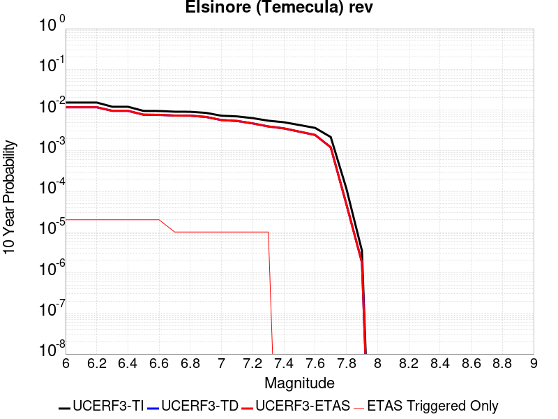 |

| Magnitude | 1 wk TI Prob | 1 wk TD Prob | 1 wk ETAS Prob | 1 wk ETAS/TD Gain | 1 wk ETAS Triggered Only | 1 mo TI Prob | 1 mo TD Prob | 1 mo ETAS Prob | 1 mo ETAS/TD Gain | 1 mo ETAS Triggered Only | 1 yr TI Prob | 1 yr TD Prob | 1 yr ETAS Prob | 1 yr ETAS/TD Gain | 1 yr ETAS Triggered Only | 10 yr TI Prob | 10 yr TD Prob | 10 yr ETAS Prob | 10 yr ETAS/TD Gain | 10 yr ETAS Triggered Only |
|-----|-----|-----|-----|-----|-----|-----|-----|-----|-----|-----|-----|-----|-----|-----|-----|-----|-----|-----|-----|-----|
| 6.0 | 2.9514995E-5 | 2.251887E-5 | 2.251887E-5 | 1.0 | 0.0 | 1.264867E-4 | 9.6505995E-5 | 9.6505995E-5 | 1.0 | 0.0 | 0.0015388876 | 0.0011743492 | 0.0011743492 | 1.0 | 0.0 | 0.015282745 | 0.011688135 | 0.011707901 | 1.0016911 | 2.0E-5 |
| 6.1 | 2.9514995E-5 | 2.251887E-5 | 2.251887E-5 | 1.0 | 0.0 | 1.264867E-4 | 9.6505995E-5 | 9.6505995E-5 | 1.0 | 0.0 | 0.0015388876 | 0.0011743492 | 0.0011743492 | 1.0 | 0.0 | 0.015282745 | 0.011688135 | 0.011707901 | 1.0016911 | 2.0E-5 |
| 6.2 | 2.9514995E-5 | 2.251887E-5 | 2.251887E-5 | 1.0 | 0.0 | 1.264867E-4 | 9.6505995E-5 | 9.6505995E-5 | 1.0 | 0.0 | 0.0015388876 | 0.0011743492 | 0.0011743492 | 1.0 | 0.0 | 0.015282745 | 0.011688135 | 0.011707901 | 1.0016911 | 2.0E-5 |
| 6.3 | 2.3223649E-5 | 1.840822E-5 | 1.840822E-5 | 1.0 | 0.0 | 9.952613E-5 | 7.889008E-5 | 7.889008E-5 | 1.0 | 0.0 | 0.001211057 | 9.600807E-4 | 9.600807E-4 | 1.0 | 0.0 | 0.012044783 | 0.009551284 | 0.009571092 | 1.002074 | 2.0E-5 |
| 6.4 | 2.3223649E-5 | 1.840822E-5 | 1.840822E-5 | 1.0 | 0.0 | 9.952613E-5 | 7.889008E-5 | 7.889008E-5 | 1.0 | 0.0 | 0.001211057 | 9.600807E-4 | 9.600807E-4 | 1.0 | 0.0 | 0.012044783 | 0.009551284 | 0.009571092 | 1.002074 | 2.0E-5 |
| 6.5 | 1.8338875E-5 | 1.4750074E-5 | 1.4750074E-5 | 1.0 | 0.0 | 7.8592806E-5 | 6.321312E-5 | 6.321312E-5 | 1.0 | 0.0 | 9.5644733E-4 | 7.6935673E-4 | 7.6935673E-4 | 1.0 | 0.0 | 0.009523412 | 0.0076699676 | 0.007689814 | 1.0025876 | 2.0E-5 |
| 6.6 | 1.8223333E-5 | 1.461263E-5 | 1.461263E-5 | 1.0 | 0.0 | 7.809766E-5 | 6.26241E-5 | 6.26241E-5 | 1.0 | 0.0 | 9.504242E-4 | 7.621905E-4 | 7.621905E-4 | 1.0 | 0.0 | 0.009463696 | 0.007598796 | 0.0076186443 | 1.002612 | 2.0E-5 |
| 6.7 | 1.7512752E-5 | 1.4026963E-5 | 1.4026963E-5 | 1.0 | 0.0 | 7.505249E-5 | 6.0114216E-5 | 6.0114216E-5 | 1.0 | 0.0 | 9.13381E-4 | 7.316534E-4 | 7.316534E-4 | 1.0 | 0.0 | 0.00909636 | 0.0072983317 | 0.0073082587 | 1.0013602 | 1.0E-5 |
| 6.8 | 1.7417142E-5 | 1.395093E-5 | 1.395093E-5 | 1.0 | 0.0 | 7.4642754E-5 | 5.978838E-5 | 5.978838E-5 | 1.0 | 0.0 | 9.083966E-4 | 7.27689E-4 | 7.27689E-4 | 1.0 | 0.0 | 0.009046922 | 0.007259359 | 0.0072692866 | 1.0013676 | 1.0E-5 |
| 6.9 | 1.6402591E-5 | 1.29883665E-5 | 1.29883665E-5 | 1.0 | 0.0 | 7.0294926E-5 | 5.5663284E-5 | 5.5663284E-5 | 1.0 | 0.0 | 8.5550465E-4 | 6.774974E-4 | 6.774974E-4 | 1.0 | 0.0 | 0.008522186 | 0.0067598647 | 0.006769797 | 1.0014694 | 1.0E-5 |
| 7.0 | 1.3912486E-5 | 1.0878067E-5 | 1.0878067E-5 | 1.0 | 0.0 | 5.9623577E-5 | 4.661947E-5 | 4.661947E-5 | 1.0 | 0.0 | 7.2567526E-4 | 5.674469E-4 | 5.674469E-4 | 1.0 | 0.0 | 0.0072331014 | 0.0056635314 | 0.005673475 | 1.0017557 | 1.0E-5 |
| 7.1 | 1.3405147E-5 | 1.0327192E-5 | 1.0327192E-5 | 1.0 | 0.0 | 5.7449364E-5 | 4.4258657E-5 | 4.4258657E-5 | 1.0 | 0.0 | 6.9922156E-4 | 5.3871854E-4 | 5.3871854E-4 | 1.0 | 0.0 | 0.0069702556 | 0.005377366 | 0.0053873123 | 1.0018497 | 1.0E-5 |
| 7.2 | 1.21402E-5 | 8.996479E-6 | 8.996479E-6 | 1.0 | 0.0 | 5.202839E-5 | 3.8555776E-5 | 3.8555776E-5 | 1.0 | 0.0 | 6.332616E-4 | 4.6931725E-4 | 4.6931725E-4 | 1.0 | 0.0 | 0.0063146 | 0.0046847262 | 0.0046946793 | 1.0021245 | 1.0E-5 |
| 7.3 | 1.05047775E-5 | 7.571515E-6 | 7.571515E-6 | 1.0 | 0.0 | 4.5019697E-5 | 3.2448956E-5 | 3.2448956E-5 | 1.0 | 0.0 | 5.4797693E-4 | 3.9499588E-4 | 3.9499588E-4 | 1.0 | 0.0 | 0.005466277 | 0.003943348 | 0.0039533083 | 1.0025259 | 1.0E-5 |
| 7.4 | 9.624483E-6 | 6.786621E-6 | 6.786621E-6 | 1.0 | 0.0 | 4.124713E-5 | 2.90852E-5 | 2.90852E-5 | 1.0 | 0.0 | 5.0206814E-4 | 3.5405616E-4 | 3.5405616E-4 | 1.0 | 0.0 | 0.005009353 | 0.0035350726 | 0.0035350726 | 1.0 | 0.0 |
| 7.5 | 8.215151E-6 | 5.6353133E-6 | 5.6353133E-6 | 1.0 | 0.0 | 3.5207315E-5 | 2.4151126E-5 | 2.4151126E-5 | 1.0 | 0.0 | 4.2856473E-4 | 2.9400157E-4 | 2.9400157E-4 | 1.0 | 0.0 | 0.004277392 | 0.002936254 | 0.002936254 | 1.0 | 0.0 |
| 7.6 | 6.975058E-6 | 4.675836E-6 | 4.675836E-6 | 1.0 | 0.0 | 2.9892764E-5 | 2.003915E-5 | 2.003915E-5 | 1.0 | 0.0 | 3.6388362E-4 | 2.439505E-4 | 2.439505E-4 | 1.0 | 0.0 | 0.0036328835 | 0.0024369434 | 0.0024369434 | 1.0 | 0.0 |
| 7.7 | 4.159604E-6 | 2.326789E-6 | 2.326789E-6 | 1.0 | 0.0 | 1.7826753E-5 | 9.971919E-6 | 9.971919E-6 | 1.0 | 0.0 | 2.1701909E-4 | 1.2140209E-4 | 1.2140209E-4 | 1.0 | 0.0 | 0.0021680726 | 0.0012134308 | 0.0012134308 | 1.0 | 0.0 |
| 7.8 | 2.2692414E-7 | 9.384417E-8 | 9.384417E-8 | 1.0 | 0.0 | 9.725317E-7 | 4.0218927E-7 | 4.0218927E-7 | 1.0 | 0.0 | 1.1840509E-5 | 4.8966467E-6 | 4.8966467E-6 | 1.0 | 0.0 | 1.1839878E-4 | 4.8965718E-5 | 4.8965718E-5 | 1.0 | 0.0 |
| 7.9 | 6.676829E-9 | 3.4397174E-9 | 3.4397174E-9 | 1.0 | 0.0 | 2.861498E-8 | 1.4741646E-8 | 1.4741646E-8 | 1.0 | 0.0 | 3.4838732E-7 | 1.7947953E-7 | 1.7947953E-7 | 1.0 | 0.0 | 3.4838679E-6 | 1.794794E-6 | 1.794794E-6 | 1.0 | 0.0 |

## La Panza 2011
*[(top)](#table-of-contents)*

| 1 Week | 1 Month | 1 Year | 10 Year |
|-----|-----|-----|-----|
|  |  |  |  |

| Magnitude | 1 wk TI Prob | 1 wk TD Prob | 1 wk ETAS Prob | 1 wk ETAS/TD Gain | 1 wk ETAS Triggered Only | 1 mo TI Prob | 1 mo TD Prob | 1 mo ETAS Prob | 1 mo ETAS/TD Gain | 1 mo ETAS Triggered Only | 1 yr TI Prob | 1 yr TD Prob | 1 yr ETAS Prob | 1 yr ETAS/TD Gain | 1 yr ETAS Triggered Only | 10 yr TI Prob | 10 yr TD Prob | 10 yr ETAS Prob | 10 yr ETAS/TD Gain | 10 yr ETAS Triggered Only |
|-----|-----|-----|-----|-----|-----|-----|-----|-----|-----|-----|-----|-----|-----|-----|-----|-----|-----|-----|-----|-----|
| 6.0 | 4.6754544E-6 | 4.7175886E-6 | 4.7175886E-6 | 1.0 | 0.0 | 2.0037509E-5 | 2.021809E-5 | 2.021809E-5 | 1.0 | 0.0 | 2.4392935E-4 | 2.4612944E-4 | 2.4612944E-4 | 1.0 | 0.0 | 0.0024366176 | 0.0024587628 | 0.0024787136 | 1.0081142 | 2.0E-5 |
| 6.1 | 4.6754544E-6 | 4.7175886E-6 | 4.7175886E-6 | 1.0 | 0.0 | 2.0037509E-5 | 2.021809E-5 | 2.021809E-5 | 1.0 | 0.0 | 2.4392935E-4 | 2.4612944E-4 | 2.4612944E-4 | 1.0 | 0.0 | 0.0024366176 | 0.0024587628 | 0.0024787136 | 1.0081142 | 2.0E-5 |
| 6.2 | 4.6754544E-6 | 4.7175886E-6 | 4.7175886E-6 | 1.0 | 0.0 | 2.0037509E-5 | 2.021809E-5 | 2.021809E-5 | 1.0 | 0.0 | 2.4392935E-4 | 2.4612944E-4 | 2.4612944E-4 | 1.0 | 0.0 | 0.0024366176 | 0.0024587628 | 0.0024787136 | 1.0081142 | 2.0E-5 |
| 6.3 | 4.6754544E-6 | 4.7175886E-6 | 4.7175886E-6 | 1.0 | 0.0 | 2.0037509E-5 | 2.021809E-5 | 2.021809E-5 | 1.0 | 0.0 | 2.4392935E-4 | 2.4612944E-4 | 2.4612944E-4 | 1.0 | 0.0 | 0.0024366176 | 0.0024587628 | 0.0024787136 | 1.0081142 | 2.0E-5 |
| 6.4 | 4.6754544E-6 | 4.7175886E-6 | 4.7175886E-6 | 1.0 | 0.0 | 2.0037509E-5 | 2.021809E-5 | 2.021809E-5 | 1.0 | 0.0 | 2.4392935E-4 | 2.4612944E-4 | 2.4612944E-4 | 1.0 | 0.0 | 0.0024366176 | 0.0024587628 | 0.0024787136 | 1.0081142 | 2.0E-5 |
| 6.5 | 2.485343E-6 | 2.5006007E-6 | 2.5006007E-6 | 1.0 | 0.0 | 1.0651426E-5 | 1.0716818E-5 | 1.0716818E-5 | 1.0 | 0.0 | 1.296734E-4 | 1.3046984E-4 | 1.3046984E-4 | 1.0 | 0.0 | 0.0012959775 | 0.0013039707 | 0.0013139577 | 1.0076588 | 1.0E-5 |
| 6.6 | 2.485343E-6 | 2.5006007E-6 | 2.5006007E-6 | 1.0 | 0.0 | 1.0651426E-5 | 1.0716818E-5 | 1.0716818E-5 | 1.0 | 0.0 | 1.296734E-4 | 1.3046984E-4 | 1.3046984E-4 | 1.0 | 0.0 | 0.0012959775 | 0.0013039707 | 0.0013139577 | 1.0076588 | 1.0E-5 |
| 6.7 | 1.5108508E-6 | 1.514639E-6 | 1.514639E-6 | 1.0 | 0.0 | 6.4750584E-6 | 6.4912947E-6 | 6.4912947E-6 | 1.0 | 0.0 | 7.8830984E-5 | 7.902876E-5 | 7.902876E-5 | 1.0 | 0.0 | 7.880303E-4 | 7.9001737E-4 | 8.0000947E-4 | 1.012648 | 1.0E-5 |
| 6.8 | 1.3865837E-6 | 1.3885118E-6 | 1.3885118E-6 | 1.0 | 0.0 | 5.942488E-6 | 5.950752E-6 | 5.950752E-6 | 1.0 | 0.0 | 7.234739E-5 | 7.244809E-5 | 7.244809E-5 | 1.0 | 0.0 | 7.232384E-4 | 7.242546E-4 | 7.342473E-4 | 1.0137973 | 1.0E-5 |
| 6.9 | 9.826583E-7 | 9.796303E-7 | 9.796303E-7 | 1.0 | 0.0 | 4.2113857E-6 | 4.198409E-6 | 4.198409E-6 | 1.0 | 0.0 | 5.1272415E-5 | 5.1114486E-5 | 5.1114486E-5 | 1.0 | 0.0 | 5.126059E-4 | 5.1103265E-4 | 5.1103265E-4 | 1.0 | 0.0 |
| 7.0 | 6.7797646E-7 | 6.710231E-7 | 6.710231E-7 | 1.0 | 0.0 | 2.9056102E-6 | 2.8758104E-6 | 2.8758104E-6 | 1.0 | 0.0 | 3.537523E-5 | 3.501246E-5 | 3.501246E-5 | 1.0 | 0.0 | 3.5369597E-4 | 3.5007254E-4 | 3.5007254E-4 | 1.0 | 0.0 |
| 7.1 | 3.4979826E-7 | 3.3874045E-7 | 3.3874045E-7 | 1.0 | 0.0 | 1.4991346E-6 | 1.4517441E-6 | 1.4517441E-6 | 1.0 | 0.0 | 1.825181E-5 | 1.7674853E-5 | 1.7674853E-5 | 1.0 | 0.0 | 1.825031E-4 | 1.7673563E-4 | 1.7673563E-4 | 1.0 | 0.0 |
| 7.2 | 2.5088332E-7 | 2.3832064E-7 | 2.3832064E-7 | 1.0 | 0.0 | 1.0752137E-6 | 1.0213738E-6 | 1.0213738E-6 | 1.0 | 0.0 | 1.3090649E-5 | 1.2435164E-5 | 1.2435164E-5 | 1.0 | 0.0 | 1.3089878E-4 | 1.2434553E-4 | 1.2434553E-4 | 1.0 | 0.0 |
| 7.3 | 1.0159086E-7 | 8.644785E-8 | 8.644785E-8 | 1.0 | 0.0 | 4.3538932E-7 | 3.704907E-7 | 3.704907E-7 | 1.0 | 0.0 | 5.300852E-6 | 4.510716E-6 | 4.510716E-6 | 1.0 | 0.0 | 5.3007258E-5 | 4.510628E-5 | 4.510628E-5 | 1.0 | 0.0 |
| 7.4 | 3.5006252E-8 | 1.9403883E-8 | 1.9403883E-8 | 1.0 | 0.0 | 1.5002678E-7 | 8.315949E-8 | 8.315949E-8 | 1.0 | 0.0 | 1.8265745E-6 | 1.0124663E-6 | 1.0124663E-6 | 1.0 | 0.0 | 1.8265595E-5 | 1.012462E-5 | 1.012462E-5 | 1.0 | 0.0 |
| 7.5 | 2.592274E-8 | 1.0238468E-8 | 1.0238468E-8 | 1.0 | 0.0 | 1.1109746E-7 | 4.3879147E-8 | 4.3879147E-8 | 1.0 | 0.0 | 1.3526106E-6 | 5.342285E-7 | 5.342285E-7 | 1.0 | 0.0 | 1.3526024E-5 | 5.342273E-6 | 5.342273E-6 | 1.0 | 0.0 |
| 7.6 | 1.9016717E-8 | 5.2442264E-9 | 5.2442264E-9 | 1.0 | 0.0 | 8.150022E-8 | 2.2475257E-8 | 2.2475257E-8 | 1.0 | 0.0 | 9.922647E-7 | 2.736362E-7 | 2.736362E-7 | 1.0 | 0.0 | 9.922603E-6 | 2.736359E-6 | 2.736359E-6 | 1.0 | 0.0 |
| 7.7 | 1.17738495E-8 | 1.2393437E-9 | 1.2393437E-9 | 1.0 | 0.0 | 5.0459356E-8 | 5.3114735E-9 | 5.3114735E-9 | 1.0 | 0.0 | 6.1434247E-7 | 6.466719E-8 | 6.466719E-8 | 1.0 | 0.0 | 6.143408E-6 | 6.466717E-7 | 6.466717E-7 | 1.0 | 0.0 |
| 7.8 | 5.489079E-9 | 2.009185E-10 | 2.009185E-10 | 1.0 | 0.0 | 2.3524624E-8 | 8.61079E-10 | 8.61079E-10 | 1.0 | 0.0 | 2.8641225E-7 | 1.0483639E-8 | 1.0483639E-8 | 1.0 | 0.0 | 2.8641189E-6 | 1.0483638E-7 | 1.0483638E-7 | 1.0 | 0.0 |
| 7.9 | 2.5081048E-9 | 6.675449E-11 | 6.675449E-11 | 1.0 | 0.0 | 1.0749021E-8 | 2.8609015E-10 | 2.8609015E-10 | 1.0 | 0.0 | 1.3086932E-7 | 3.483148E-9 | 3.483148E-9 | 1.0 | 0.0 | 1.3086925E-6 | 3.483148E-8 | 3.483148E-8 | 1.0 | 0.0 |

## San Jose
*[(top)](#table-of-contents)*

| 1 Week | 1 Month | 1 Year | 10 Year |
|-----|-----|-----|-----|
|  |  |  | 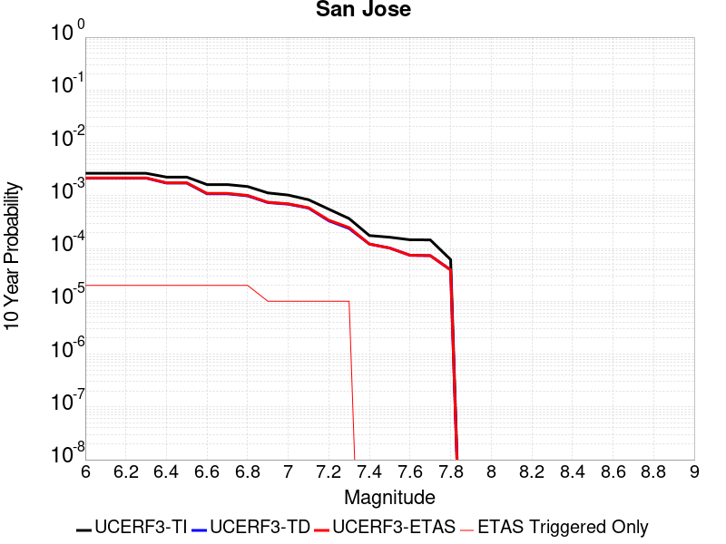 |

| Magnitude | 1 wk TI Prob | 1 wk TD Prob | 1 wk ETAS Prob | 1 wk ETAS/TD Gain | 1 wk ETAS Triggered Only | 1 mo TI Prob | 1 mo TD Prob | 1 mo ETAS Prob | 1 mo ETAS/TD Gain | 1 mo ETAS Triggered Only | 1 yr TI Prob | 1 yr TD Prob | 1 yr ETAS Prob | 1 yr ETAS/TD Gain | 1 yr ETAS Triggered Only | 10 yr TI Prob | 10 yr TD Prob | 10 yr ETAS Prob | 10 yr ETAS/TD Gain | 10 yr ETAS Triggered Only |
|-----|-----|-----|-----|-----|-----|-----|-----|-----|-----|-----|-----|-----|-----|-----|-----|-----|-----|-----|-----|-----|
| 6.0 | 5.0851277E-6 | 4.125642E-6 | 4.125642E-6 | 1.0 | 0.0 | 2.1793223E-5 | 1.768122E-5 | 1.768122E-5 | 1.0 | 0.0 | 2.653002E-4 | 2.152502E-4 | 2.152502E-4 | 1.0 | 0.0 | 0.0026498367 | 0.0021507454 | 0.0021707024 | 1.0092791 | 2.0E-5 |
| 6.1 | 5.0851277E-6 | 4.125642E-6 | 4.125642E-6 | 1.0 | 0.0 | 2.1793223E-5 | 1.768122E-5 | 1.768122E-5 | 1.0 | 0.0 | 2.653002E-4 | 2.152502E-4 | 2.152502E-4 | 1.0 | 0.0 | 0.0026498367 | 0.0021507454 | 0.0021707024 | 1.0092791 | 2.0E-5 |
| 6.2 | 5.0851277E-6 | 4.125642E-6 | 4.125642E-6 | 1.0 | 0.0 | 2.1793223E-5 | 1.768122E-5 | 1.768122E-5 | 1.0 | 0.0 | 2.653002E-4 | 2.152502E-4 | 2.152502E-4 | 1.0 | 0.0 | 0.0026498367 | 0.0021507454 | 0.0021707024 | 1.0092791 | 2.0E-5 |
| 6.3 | 5.0851277E-6 | 4.125642E-6 | 4.125642E-6 | 1.0 | 0.0 | 2.1793223E-5 | 1.768122E-5 | 1.768122E-5 | 1.0 | 0.0 | 2.653002E-4 | 2.152502E-4 | 2.152502E-4 | 1.0 | 0.0 | 0.0026498367 | 0.0021507454 | 0.0021707024 | 1.0092791 | 2.0E-5 |
| 6.4 | 4.3115124E-6 | 3.3237525E-6 | 3.3237525E-6 | 1.0 | 0.0 | 1.8477778E-5 | 1.4244589E-5 | 1.4244589E-5 | 1.0 | 0.0 | 2.2494372E-4 | 1.7341628E-4 | 1.7341628E-4 | 1.0 | 0.0 | 0.0022471617 | 0.0017330965 | 0.0017530619 | 1.01152 | 2.0E-5 |
| 6.5 | 4.3115124E-6 | 3.3237525E-6 | 3.3237525E-6 | 1.0 | 0.0 | 1.8477778E-5 | 1.4244589E-5 | 1.4244589E-5 | 1.0 | 0.0 | 2.2494372E-4 | 1.7341628E-4 | 1.7341628E-4 | 1.0 | 0.0 | 0.0022471617 | 0.0017330965 | 0.0017530619 | 1.01152 | 2.0E-5 |
| 6.6 | 3.110396E-6 | 2.0799562E-6 | 2.0799562E-6 | 1.0 | 0.0 | 1.33302E-5 | 8.9140685E-6 | 8.9140685E-6 | 1.0 | 0.0 | 1.622831E-4 | 1.0852366E-4 | 1.0852366E-4 | 1.0 | 0.0 | 0.0016216465 | 0.001084804 | 0.0011047822 | 1.0184165 | 2.0E-5 |
| 6.7 | 3.110396E-6 | 2.0799562E-6 | 2.0799562E-6 | 1.0 | 0.0 | 1.33302E-5 | 8.9140685E-6 | 8.9140685E-6 | 1.0 | 0.0 | 1.622831E-4 | 1.0852366E-4 | 1.0852366E-4 | 1.0 | 0.0 | 0.0016216465 | 0.001084804 | 0.0011047822 | 1.0184165 | 2.0E-5 |
| 6.8 | 2.856651E-6 | 1.9024077E-6 | 1.9024077E-6 | 1.0 | 0.0 | 1.2242733E-5 | 8.153152E-6 | 8.153152E-6 | 1.0 | 0.0 | 1.4904508E-4 | 9.926035E-5 | 9.926035E-5 | 1.0 | 0.0 | 0.0014894515 | 9.922545E-4 | 0.0010122346 | 1.0201361 | 2.0E-5 |
| 6.9 | 2.1618725E-6 | 1.4186406E-6 | 1.4186406E-6 | 1.0 | 0.0 | 9.265135E-6 | 6.0798748E-6 | 6.0798748E-6 | 1.0 | 0.0 | 1.12797185E-4 | 7.402005E-5 | 7.402005E-5 | 1.0 | 0.0 | 0.0011273995 | 7.4003247E-4 | 7.5002504E-4 | 1.013503 | 1.0E-5 |
| 7.0 | 1.9684312E-6 | 1.3256082E-6 | 1.3256082E-6 | 1.0 | 0.0 | 8.436106E-6 | 5.681166E-6 | 5.681166E-6 | 1.0 | 0.0 | 1.02704755E-4 | 6.916608E-5 | 6.916608E-5 | 1.0 | 0.0 | 0.001026573 | 6.9152354E-4 | 7.0151663E-4 | 1.0144508 | 1.0E-5 |
| 7.1 | 1.6070337E-6 | 1.1154867E-6 | 1.1154867E-6 | 1.0 | 0.0 | 6.887269E-6 | 4.7806493E-6 | 4.7806493E-6 | 1.0 | 0.0 | 8.384928E-5 | 5.8202913E-5 | 5.8202913E-5 | 1.0 | 0.0 | 8.3817646E-4 | 5.819527E-4 | 5.919469E-4 | 1.0171735 | 1.0E-5 |
| 7.2 | 1.0631658E-6 | 6.403567E-7 | 6.403567E-7 | 1.0 | 0.0 | 4.556417E-6 | 2.744383E-6 | 2.744383E-6 | 1.0 | 0.0 | 5.5472963E-5 | 3.3412365E-5 | 3.3412365E-5 | 1.0 | 0.0 | 5.545912E-4 | 3.3414463E-4 | 3.4414127E-4 | 1.0299171 | 1.0E-5 |
| 7.3 | 7.060711E-7 | 4.5823228E-7 | 4.5823228E-7 | 1.0 | 0.0 | 3.0260155E-6 | 1.9638512E-6 | 1.9638512E-6 | 1.0 | 0.0 | 3.6841117E-5 | 2.3909635E-5 | 2.3909635E-5 | 1.0 | 0.0 | 3.6835007E-4 | 2.3914136E-4 | 2.4913898E-4 | 1.0418062 | 1.0E-5 |
| 7.4 | 3.3677085E-7 | 2.3231999E-7 | 2.3231999E-7 | 1.0 | 0.0 | 1.4433028E-6 | 9.956567E-7 | 9.956567E-7 | 1.0 | 0.0 | 1.757207E-5 | 1.2122056E-5 | 1.2122056E-5 | 1.0 | 0.0 | 1.7570681E-4 | 1.2128407E-4 | 1.2128407E-4 | 1.0 | 0.0 |
| 7.5 | 3.129161E-7 | 1.9529637E-7 | 1.9529637E-7 | 1.0 | 0.0 | 1.3410682E-6 | 8.3698416E-7 | 8.3698416E-7 | 1.0 | 0.0 | 1.6327383E-5 | 1.0190237E-5 | 1.0190237E-5 | 1.0 | 0.0 | 1.6326184E-4 | 1.0196777E-4 | 1.0196777E-4 | 1.0 | 0.0 |
| 7.6 | 2.8008668E-7 | 1.4240818E-7 | 1.4240818E-7 | 1.0 | 0.0 | 1.2003709E-6 | 6.103206E-7 | 6.103206E-7 | 1.0 | 0.0 | 1.46144175E-5 | 7.43063E-6 | 7.43063E-6 | 1.0 | 0.0 | 1.4613457E-4 | 7.43735E-5 | 7.43735E-5 | 1.0 | 0.0 |
| 7.7 | 2.7852005E-7 | 1.4015403E-7 | 1.4015403E-7 | 1.0 | 0.0 | 1.1936568E-6 | 6.0066003E-7 | 6.0066003E-7 | 1.0 | 0.0 | 1.4532674E-5 | 7.3130127E-6 | 7.3130127E-6 | 1.0 | 0.0 | 1.4531724E-4 | 7.31974E-5 | 7.31974E-5 | 1.0 | 0.0 |
| 7.8 | 1.1810797E-7 | 7.5187074E-8 | 7.5187074E-8 | 1.0 | 0.0 | 5.0617695E-7 | 3.2223028E-7 | 3.2223028E-7 | 1.0 | 0.0 | 6.1626865E-6 | 3.9231472E-6 | 3.9231472E-6 | 1.0 | 0.0 | 6.162516E-5 | 3.9271265E-5 | 3.9271265E-5 | 1.0 | 0.0 |

## Fitzhugh Creek
*[(top)](#table-of-contents)*

| 1 Week | 1 Month | 1 Year | 10 Year |
|-----|-----|-----|-----|
|  |  |  |  |

| Magnitude | 1 wk TI Prob | 1 wk TD Prob | 1 wk ETAS Prob | 1 wk ETAS/TD Gain | 1 wk ETAS Triggered Only | 1 mo TI Prob | 1 mo TD Prob | 1 mo ETAS Prob | 1 mo ETAS/TD Gain | 1 mo ETAS Triggered Only | 1 yr TI Prob | 1 yr TD Prob | 1 yr ETAS Prob | 1 yr ETAS/TD Gain | 1 yr ETAS Triggered Only | 10 yr TI Prob | 10 yr TD Prob | 10 yr ETAS Prob | 10 yr ETAS/TD Gain | 10 yr ETAS Triggered Only |
|-----|-----|-----|-----|-----|-----|-----|-----|-----|-----|-----|-----|-----|-----|-----|-----|-----|-----|-----|-----|-----|
| 6.0 | 6.1090436E-6 | 6.2101562E-6 | 1.6210093E-5 | 2.6102555 | 1.0E-5 | 2.6181353E-5 | 2.6614709E-5 | 3.661444E-5 | 1.375722 | 1.0E-5 | 3.1871133E-4 | 3.239904E-4 | 3.3398715E-4 | 1.0308551 | 1.0E-5 | 0.0031825465 | 0.0032356246 | 0.0032455921 | 1.0030806 | 1.0E-5 |
| 6.1 | 2.9741811E-6 | 3.021581E-6 | 3.021581E-6 | 1.0 | 0.0 | 1.2746428E-5 | 1.2949574E-5 | 1.2949574E-5 | 1.0 | 0.0 | 1.5517672E-4 | 1.576506E-4 | 1.576506E-4 | 1.0 | 0.0 | 0.001550684 | 0.0015754806 | 0.0015754806 | 1.0 | 0.0 |
| 6.2 | 2.9741811E-6 | 3.021581E-6 | 3.021581E-6 | 1.0 | 0.0 | 1.2746428E-5 | 1.2949574E-5 | 1.2949574E-5 | 1.0 | 0.0 | 1.5517672E-4 | 1.576506E-4 | 1.576506E-4 | 1.0 | 0.0 | 0.001550684 | 0.0015754806 | 0.0015754806 | 1.0 | 0.0 |
| 6.3 | 1.4781198E-6 | 1.5012708E-6 | 1.5012708E-6 | 1.0 | 0.0 | 6.3347834E-6 | 6.4340034E-6 | 6.4340034E-6 | 1.0 | 0.0 | 7.712326E-5 | 7.833137E-5 | 7.833137E-5 | 1.0 | 0.0 | 7.70965E-4 | 7.830576E-4 | 7.830576E-4 | 1.0 | 0.0 |
| 6.4 | 1.4781198E-6 | 1.5012708E-6 | 1.5012708E-6 | 1.0 | 0.0 | 6.3347834E-6 | 6.4340034E-6 | 6.4340034E-6 | 1.0 | 0.0 | 7.712326E-5 | 7.833137E-5 | 7.833137E-5 | 1.0 | 0.0 | 7.70965E-4 | 7.830576E-4 | 7.830576E-4 | 1.0 | 0.0 |
| 6.5 | 9.5176676E-7 | 9.66606E-7 | 9.66606E-7 | 1.0 | 0.0 | 4.078994E-6 | 4.142591E-6 | 4.142591E-6 | 1.0 | 0.0 | 4.9660623E-5 | 5.0434985E-5 | 5.0434985E-5 | 1.0 | 0.0 | 4.964952E-4 | 5.042458E-4 | 5.042458E-4 | 1.0 | 0.0 |
| 6.6 | 6.21145E-7 | 6.3085855E-7 | 6.3085855E-7 | 1.0 | 0.0 | 2.662047E-6 | 2.7036772E-6 | 2.7036772E-6 | 1.0 | 0.0 | 3.2409942E-5 | 3.291684E-5 | 3.291684E-5 | 1.0 | 0.0 | 3.2405215E-4 | 3.2912623E-4 | 3.2912623E-4 | 1.0 | 0.0 |
| 6.7 | 2.2377962E-7 | 2.2734636E-7 | 2.2734636E-7 | 1.0 | 0.0 | 9.590551E-7 | 9.743413E-7 | 9.743413E-7 | 1.0 | 0.0 | 1.1676434E-5 | 1.1862574E-5 | 1.1862574E-5 | 1.0 | 0.0 | 1.1675821E-4 | 1.1862254E-4 | 1.1862254E-4 | 1.0 | 0.0 |
| 6.8 | 1.4785022E-7 | 1.5021492E-7 | 1.5021492E-7 | 1.0 | 0.0 | 6.3364365E-7 | 6.4377826E-7 | 6.4377826E-7 | 1.0 | 0.0 | 7.714584E-6 | 7.838E-6 | 7.838E-6 | 1.0 | 0.0 | 7.714316E-5 | 7.838E-5 | 7.838E-5 | 1.0 | 0.0 |

## Richfield
*[(top)](#table-of-contents)*

| 1 Week | 1 Month | 1 Year | 10 Year |
|-----|-----|-----|-----|
|  |  | 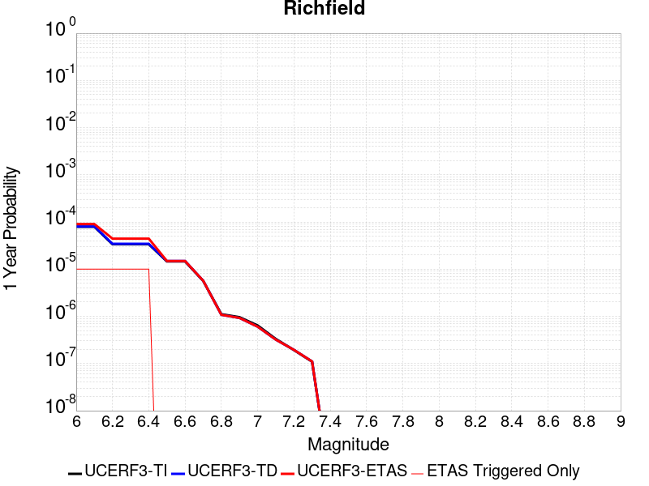 |  |

| Magnitude | 1 wk TI Prob | 1 wk TD Prob | 1 wk ETAS Prob | 1 wk ETAS/TD Gain | 1 wk ETAS Triggered Only | 1 mo TI Prob | 1 mo TD Prob | 1 mo ETAS Prob | 1 mo ETAS/TD Gain | 1 mo ETAS Triggered Only | 1 yr TI Prob | 1 yr TD Prob | 1 yr ETAS Prob | 1 yr ETAS/TD Gain | 1 yr ETAS Triggered Only | 10 yr TI Prob | 10 yr TD Prob | 10 yr ETAS Prob | 10 yr ETAS/TD Gain | 10 yr ETAS Triggered Only |
|-----|-----|-----|-----|-----|-----|-----|-----|-----|-----|-----|-----|-----|-----|-----|-----|-----|-----|-----|-----|-----|
| 6.0 | 1.5166896E-6 | 1.5392679E-6 | 1.5392679E-6 | 1.0 | 0.0 | 6.5000822E-6 | 6.596852E-6 | 6.596852E-6 | 1.0 | 0.0 | 7.913562E-5 | 8.0314814E-5 | 9.031401E-5 | 1.1245 | 1.0E-5 | 7.910745E-4 | 8.0296566E-4 | 8.229496E-4 | 1.0248877 | 2.0E-5 |
| 6.1 | 1.5166896E-6 | 1.5392679E-6 | 1.5392679E-6 | 1.0 | 0.0 | 6.5000822E-6 | 6.596852E-6 | 6.596852E-6 | 1.0 | 0.0 | 7.913562E-5 | 8.0314814E-5 | 9.031401E-5 | 1.1245 | 1.0E-5 | 7.910745E-4 | 8.0296566E-4 | 8.229496E-4 | 1.0248877 | 2.0E-5 |
| 6.2 | 6.473272E-7 | 6.598479E-7 | 6.598479E-7 | 1.0 | 0.0 | 2.7742565E-6 | 2.8279171E-6 | 2.8279171E-6 | 1.0 | 0.0 | 3.377605E-5 | 3.442948E-5 | 4.4429136E-5 | 1.2904388 | 1.0E-5 | 3.3770915E-4 | 3.4425448E-4 | 3.6424762E-4 | 1.0580765 | 2.0E-5 |
| 6.3 | 6.473272E-7 | 6.598479E-7 | 6.598479E-7 | 1.0 | 0.0 | 2.7742565E-6 | 2.8279171E-6 | 2.8279171E-6 | 1.0 | 0.0 | 3.377605E-5 | 3.442948E-5 | 4.4429136E-5 | 1.2904388 | 1.0E-5 | 3.3770915E-4 | 3.4425448E-4 | 3.6424762E-4 | 1.0580765 | 2.0E-5 |
| 6.4 | 6.473272E-7 | 6.598479E-7 | 6.598479E-7 | 1.0 | 0.0 | 2.7742565E-6 | 2.8279171E-6 | 2.8279171E-6 | 1.0 | 0.0 | 3.377605E-5 | 3.442948E-5 | 4.4429136E-5 | 1.2904388 | 1.0E-5 | 3.3770915E-4 | 3.4425448E-4 | 3.6424762E-4 | 1.0580765 | 2.0E-5 |
| 6.5 | 2.7954403E-7 | 2.85316E-7 | 2.85316E-7 | 1.0 | 0.0 | 1.1980452E-6 | 1.2227825E-6 | 1.2227825E-6 | 1.0 | 0.0 | 1.4586103E-5 | 1.4887319E-5 | 1.4887319E-5 | 1.0 | 0.0 | 1.4585146E-4 | 1.4886746E-4 | 1.5886597E-4 | 1.0671638 | 1.0E-5 |
| 6.6 | 2.7954403E-7 | 2.85316E-7 | 2.85316E-7 | 1.0 | 0.0 | 1.1980452E-6 | 1.2227825E-6 | 1.2227825E-6 | 1.0 | 0.0 | 1.4586103E-5 | 1.4887319E-5 | 1.4887319E-5 | 1.0 | 0.0 | 1.4585146E-4 | 1.4886746E-4 | 1.5886597E-4 | 1.0671638 | 1.0E-5 |
| 6.7 | 1.0777299E-7 | 1.0878809E-7 | 1.0878809E-7 | 1.0 | 0.0 | 4.6188418E-7 | 4.662346E-7 | 4.662346E-7 | 1.0 | 0.0 | 5.6234253E-6 | 5.676396E-6 | 5.676396E-6 | 1.0 | 0.0 | 5.623283E-5 | 5.676294E-5 | 5.676294E-5 | 1.0 | 0.0 |
| 6.8 | 2.1301874E-8 | 2.0666132E-8 | 2.0666132E-8 | 1.0 | 0.0 | 9.129375E-8 | 8.856914E-8 | 8.856914E-8 | 1.0 | 0.0 | 1.1115008E-6 | 1.0783288E-6 | 1.0783288E-6 | 1.0 | 0.0 | 1.1114952E-5 | 1.0783239E-5 | 1.0783239E-5 | 1.0 | 0.0 |
| 6.9 | 1.8413502E-8 | 1.7751097E-8 | 1.7751097E-8 | 1.0 | 0.0 | 7.891501E-8 | 7.607613E-8 | 7.607613E-8 | 1.0 | 0.0 | 9.607899E-7 | 9.2622645E-7 | 9.2622645E-7 | 1.0 | 0.0 | 9.607857E-6 | 9.2622295E-6 | 9.2622295E-6 | 1.0 | 0.0 |
| 7.0 | 1.2290541E-8 | 1.1574315E-8 | 1.1574315E-8 | 1.0 | 0.0 | 5.2673748E-8 | 4.9604207E-8 | 4.9604207E-8 | 1.0 | 0.0 | 6.413027E-7 | 6.03931E-7 | 6.03931E-7 | 1.0 | 0.0 | 6.4130086E-6 | 6.0392954E-6 | 6.0392954E-6 | 1.0 | 0.0 |
| 7.1 | 6.373573E-9 | 6.155758E-9 | 6.155758E-9 | 1.0 | 0.0 | 2.7315311E-8 | 2.6381821E-8 | 2.6381821E-8 | 1.0 | 0.0 | 3.3256384E-7 | 3.2119863E-7 | 3.2119863E-7 | 1.0 | 0.0 | 3.3256335E-6 | 3.211982E-6 | 3.211982E-6 | 1.0 | 0.0 |
| 7.2 | 3.6989944E-9 | 3.7360146E-9 | 3.7360146E-9 | 1.0 | 0.0 | 1.5852834E-8 | 1.6011493E-8 | 1.6011493E-8 | 1.0 | 0.0 | 1.9300822E-7 | 1.9493989E-7 | 1.9493989E-7 | 1.0 | 0.0 | 1.9300805E-6 | 1.9493975E-6 | 1.9493975E-6 | 1.0 | 0.0 |
| 7.3 | 2.097397E-9 | 2.1200501E-9 | 2.1200501E-9 | 1.0 | 0.0 | 8.9888434E-9 | 9.085929E-9 | 9.085929E-9 | 1.0 | 0.0 | 1.0943917E-7 | 1.1062118E-7 | 1.1062118E-7 | 1.0 | 0.0 | 1.0943911E-6 | 1.1062115E-6 | 1.1062115E-6 | 1.0 | 0.0 |
| 7.4 | 5.8314464E-12 | 5.8918426E-12 | 5.8918426E-12 | 1.0 | 0.0 | 2.4991786E-11 | 2.5250912E-11 | 2.5250912E-11 | 1.0 | 0.0 | 3.0427527E-10 | 3.0742975E-10 | 3.0742975E-10 | 1.0 | 0.0 | 3.0427532E-9 | 3.0742973E-9 | 3.0742973E-9 | 1.0 | 0.0 |

## West Tahoe
*[(top)](#table-of-contents)*

| 1 Week | 1 Month | 1 Year | 10 Year |
|-----|-----|-----|-----|
|  | 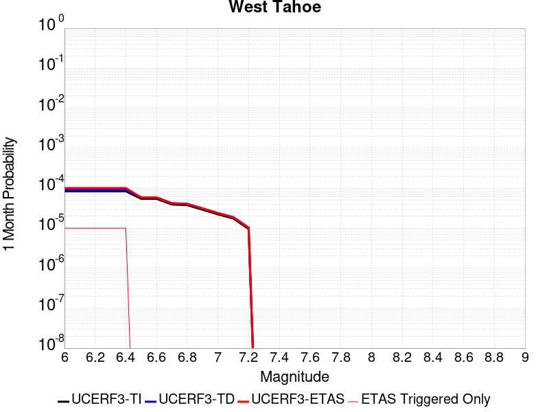 |  | 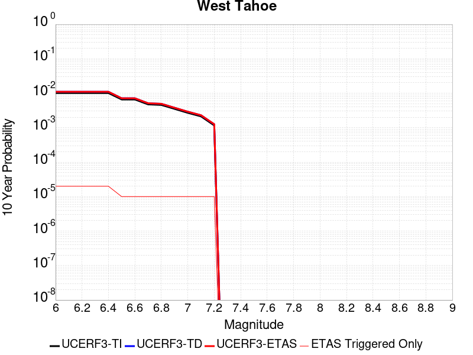 |

| Magnitude | 1 wk TI Prob | 1 wk TD Prob | 1 wk ETAS Prob | 1 wk ETAS/TD Gain | 1 wk ETAS Triggered Only | 1 mo TI Prob | 1 mo TD Prob | 1 mo ETAS Prob | 1 mo ETAS/TD Gain | 1 mo ETAS Triggered Only | 1 yr TI Prob | 1 yr TD Prob | 1 yr ETAS Prob | 1 yr ETAS/TD Gain | 1 yr ETAS Triggered Only | 10 yr TI Prob | 10 yr TD Prob | 10 yr ETAS Prob | 10 yr ETAS/TD Gain | 10 yr ETAS Triggered Only |
|-----|-----|-----|-----|-----|-----|-----|-----|-----|-----|-----|-----|-----|-----|-----|-----|-----|-----|-----|-----|-----|
| 6.0 | 1.952444E-5 | 2.118317E-5 | 3.1182957E-5 | 1.4720628 | 1.0E-5 | 8.367348E-5 | 9.078217E-5 | 1.0078125E-4 | 1.1101438 | 1.0E-5 | 0.0010182485 | 0.0011047672 | 0.001124745 | 1.0180833 | 2.0E-5 | 0.010135954 | 0.010998235 | 0.011018015 | 1.0017985 | 2.0E-5 |
| 6.1 | 1.952444E-5 | 2.118317E-5 | 3.1182957E-5 | 1.4720628 | 1.0E-5 | 8.367348E-5 | 9.078217E-5 | 1.0078125E-4 | 1.1101438 | 1.0E-5 | 0.0010182485 | 0.0011047672 | 0.001124745 | 1.0180833 | 2.0E-5 | 0.010135954 | 0.010998235 | 0.011018015 | 1.0017985 | 2.0E-5 |
| 6.2 | 1.952444E-5 | 2.118317E-5 | 3.1182957E-5 | 1.4720628 | 1.0E-5 | 8.367348E-5 | 9.078217E-5 | 1.0078125E-4 | 1.1101438 | 1.0E-5 | 0.0010182485 | 0.0011047672 | 0.001124745 | 1.0180833 | 2.0E-5 | 0.010135954 | 0.010998235 | 0.011018015 | 1.0017985 | 2.0E-5 |
| 6.3 | 1.952444E-5 | 2.118317E-5 | 3.1182957E-5 | 1.4720628 | 1.0E-5 | 8.367348E-5 | 9.078217E-5 | 1.0078125E-4 | 1.1101438 | 1.0E-5 | 0.0010182485 | 0.0011047672 | 0.001124745 | 1.0180833 | 2.0E-5 | 0.010135954 | 0.010998235 | 0.011018015 | 1.0017985 | 2.0E-5 |
| 6.4 | 1.952444E-5 | 2.118317E-5 | 3.1182957E-5 | 1.4720628 | 1.0E-5 | 8.367348E-5 | 9.078217E-5 | 1.0078125E-4 | 1.1101438 | 1.0E-5 | 0.0010182485 | 0.0011047672 | 0.001124745 | 1.0180833 | 2.0E-5 | 0.010135954 | 0.010998235 | 0.011018015 | 1.0017985 | 2.0E-5 |
| 6.5 | 1.2685271E-5 | 1.3690627E-5 | 1.3690627E-5 | 1.0 | 0.0 | 5.4364315E-5 | 5.8672893E-5 | 5.8672893E-5 | 1.0 | 0.0 | 6.616845E-4 | 7.141248E-4 | 7.241177E-4 | 1.0139931 | 1.0E-5 | 0.0065971776 | 0.00711995 | 0.0071298787 | 1.0013945 | 1.0E-5 |
| 6.6 | 1.2685271E-5 | 1.3690627E-5 | 1.3690627E-5 | 1.0 | 0.0 | 5.4364315E-5 | 5.8672893E-5 | 5.8672893E-5 | 1.0 | 0.0 | 6.616845E-4 | 7.141248E-4 | 7.241177E-4 | 1.0139931 | 1.0E-5 | 0.0065971776 | 0.00711995 | 0.0071298787 | 1.0013945 | 1.0E-5 |
| 6.7 | 9.117886E-6 | 9.809846E-6 | 9.809846E-6 | 1.0 | 0.0 | 3.9076072E-5 | 4.2041564E-5 | 4.2041564E-5 | 1.0 | 0.0 | 4.756473E-4 | 5.11743E-4 | 5.2173785E-4 | 1.019531 | 1.0E-5 | 0.0047463053 | 0.0051063634 | 0.0051163123 | 1.0019484 | 1.0E-5 |
| 6.8 | 8.786828E-6 | 9.457863E-6 | 9.457863E-6 | 1.0 | 0.0 | 3.7657293E-5 | 4.053311E-5 | 4.053311E-5 | 1.0 | 0.0 | 4.5838108E-4 | 4.933859E-4 | 5.0338096E-4 | 1.0202581 | 1.0E-5 | 0.0045743673 | 0.0049236063 | 0.004933557 | 1.0020211 | 1.0E-5 |
| 6.9 | 6.7562123E-6 | 7.2638086E-6 | 7.2638086E-6 | 1.0 | 0.0 | 2.8954875E-5 | 3.1130265E-5 | 3.1130265E-5 | 1.0 | 0.0 | 3.5246857E-4 | 3.789498E-4 | 3.88946E-4 | 1.0263788 | 1.0E-5 | 0.0035191004 | 0.0037835082 | 0.0037934703 | 1.0026331 | 1.0E-5 |
| 7.0 | 5.1792854E-6 | 5.567338E-6 | 5.567338E-6 | 1.0 | 0.0 | 2.2196748E-5 | 2.3859824E-5 | 2.3859824E-5 | 1.0 | 0.0 | 2.702119E-4 | 2.9045844E-4 | 3.0045555E-4 | 1.0344183 | 1.0E-5 | 0.0026988357 | 0.0029011632 | 0.0029111342 | 1.0034369 | 1.0E-5 |
| 7.1 | 4.090765E-6 | 4.3974223E-6 | 4.3974223E-6 | 1.0 | 0.0 | 1.7531731E-5 | 1.884598E-5 | 1.884598E-5 | 1.0 | 0.0 | 2.134279E-4 | 2.2942905E-4 | 2.3942675E-4 | 1.0435765 | 1.0E-5 | 0.0021322304 | 0.0022922563 | 0.0023022334 | 1.0043526 | 1.0E-5 |
| 7.2 | 2.2356758E-6 | 2.4023684E-6 | 2.4023684E-6 | 1.0 | 0.0 | 9.581432E-6 | 1.0295834E-5 | 1.0295834E-5 | 1.0 | 0.0 | 1.1664769E-4 | 1.2534647E-4 | 1.3534521E-4 | 1.0797689 | 1.0E-5 | 0.0011658648 | 0.0012529434 | 0.0012629309 | 1.0079712 | 1.0E-5 |

## Great Valley 05 Pittsburg - Kirby Hills alt1
*[(top)](#table-of-contents)*

| 1 Week | 1 Month | 1 Year | 10 Year |
|-----|-----|-----|-----|
|  |  |  |  |

| Magnitude | 1 wk TI Prob | 1 wk TD Prob | 1 wk ETAS Prob | 1 wk ETAS/TD Gain | 1 wk ETAS Triggered Only | 1 mo TI Prob | 1 mo TD Prob | 1 mo ETAS Prob | 1 mo ETAS/TD Gain | 1 mo ETAS Triggered Only | 1 yr TI Prob | 1 yr TD Prob | 1 yr ETAS Prob | 1 yr ETAS/TD Gain | 1 yr ETAS Triggered Only | 10 yr TI Prob | 10 yr TD Prob | 10 yr ETAS Prob | 10 yr ETAS/TD Gain | 10 yr ETAS Triggered Only |
|-----|-----|-----|-----|-----|-----|-----|-----|-----|-----|-----|-----|-----|-----|-----|-----|-----|-----|-----|-----|-----|
| 6.0 | 4.187212E-5 | 5.344289E-5 | 5.344289E-5 | 1.0 | 0.0 | 1.794396E-4 | 2.2902661E-4 | 2.2902661E-4 | 1.0 | 0.0 | 0.002182488 | 0.0027857998 | 0.002805744 | 1.0071592 | 2.0E-5 | 0.021611776 | 0.027603218 | 0.027622666 | 1.0007045 | 2.0E-5 |
| 6.1 | 4.187212E-5 | 5.344289E-5 | 5.344289E-5 | 1.0 | 0.0 | 1.794396E-4 | 2.2902661E-4 | 2.2902661E-4 | 1.0 | 0.0 | 0.002182488 | 0.0027857998 | 0.002805744 | 1.0071592 | 2.0E-5 | 0.021611776 | 0.027603218 | 0.027622666 | 1.0007045 | 2.0E-5 |
| 6.2 | 1.7353306E-5 | 2.2154672E-5 | 2.2154672E-5 | 1.0 | 0.0 | 7.436919E-5 | 9.4947456E-5 | 9.4947456E-5 | 1.0 | 0.0 | 9.050688E-4 | 0.0011557573 | 0.0011657458 | 1.0086423 | 1.0E-5 | 0.009013915 | 0.0115352 | 0.011545085 | 1.0008569 | 1.0E-5 |
| 6.3 | 1.7353306E-5 | 2.2154672E-5 | 2.2154672E-5 | 1.0 | 0.0 | 7.436919E-5 | 9.4947456E-5 | 9.4947456E-5 | 1.0 | 0.0 | 9.050688E-4 | 0.0011557573 | 0.0011657458 | 1.0086423 | 1.0E-5 | 0.009013915 | 0.0115352 | 0.011545085 | 1.0008569 | 1.0E-5 |
| 6.4 | 1.4028824E-5 | 1.7901062E-5 | 1.7901062E-5 | 1.0 | 0.0 | 6.0122147E-5 | 7.671883E-5 | 7.671883E-5 | 1.0 | 0.0 | 7.3174125E-4 | 9.340303E-4 | 9.440209E-4 | 1.0106963 | 1.0E-5 | 0.0072933645 | 0.009338211 | 0.009348118 | 1.0010608 | 1.0E-5 |

## Swain Ravine - Spenceville
*[(top)](#table-of-contents)*

| 1 Week | 1 Month | 1 Year | 10 Year |
|-----|-----|-----|-----|
|  |  |  | 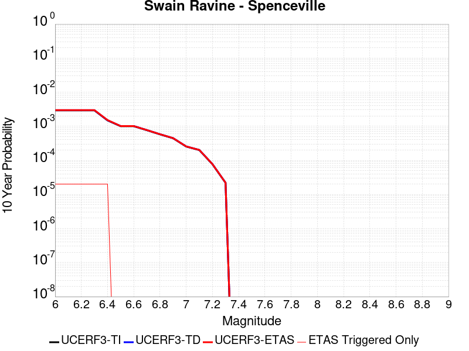 |

| Magnitude | 1 wk TI Prob | 1 wk TD Prob | 1 wk ETAS Prob | 1 wk ETAS/TD Gain | 1 wk ETAS Triggered Only | 1 mo TI Prob | 1 mo TD Prob | 1 mo ETAS Prob | 1 mo ETAS/TD Gain | 1 mo ETAS Triggered Only | 1 yr TI Prob | 1 yr TD Prob | 1 yr ETAS Prob | 1 yr ETAS/TD Gain | 1 yr ETAS Triggered Only | 10 yr TI Prob | 10 yr TD Prob | 10 yr ETAS Prob | 10 yr ETAS/TD Gain | 10 yr ETAS Triggered Only |
|-----|-----|-----|-----|-----|-----|-----|-----|-----|-----|-----|-----|-----|-----|-----|-----|-----|-----|-----|-----|-----|
| 6.0 | 5.596169E-6 | 5.663794E-6 | 5.663794E-6 | 1.0 | 0.0 | 2.398336E-5 | 2.4273193E-5 | 2.4273193E-5 | 1.0 | 0.0 | 2.9195828E-4 | 2.9548878E-4 | 3.0548582E-4 | 1.0338322 | 1.0E-5 | 0.00291575 | 0.002951228 | 0.002971169 | 1.0067568 | 2.0E-5 |
| 6.1 | 5.596169E-6 | 5.663794E-6 | 5.663794E-6 | 1.0 | 0.0 | 2.398336E-5 | 2.4273193E-5 | 2.4273193E-5 | 1.0 | 0.0 | 2.9195828E-4 | 2.9548878E-4 | 3.0548582E-4 | 1.0338322 | 1.0E-5 | 0.00291575 | 0.002951228 | 0.002971169 | 1.0067568 | 2.0E-5 |
| 6.2 | 5.596169E-6 | 5.663794E-6 | 5.663794E-6 | 1.0 | 0.0 | 2.398336E-5 | 2.4273193E-5 | 2.4273193E-5 | 1.0 | 0.0 | 2.9195828E-4 | 2.9548878E-4 | 3.0548582E-4 | 1.0338322 | 1.0E-5 | 0.00291575 | 0.002951228 | 0.002971169 | 1.0067568 | 2.0E-5 |
| 6.3 | 5.596169E-6 | 5.663794E-6 | 5.663794E-6 | 1.0 | 0.0 | 2.398336E-5 | 2.4273193E-5 | 2.4273193E-5 | 1.0 | 0.0 | 2.9195828E-4 | 2.9548878E-4 | 3.0548582E-4 | 1.0338322 | 1.0E-5 | 0.00291575 | 0.002951228 | 0.002971169 | 1.0067568 | 2.0E-5 |
| 6.4 | 2.8426775E-6 | 2.874144E-6 | 2.874144E-6 | 1.0 | 0.0 | 1.2182847E-5 | 1.2317704E-5 | 1.2317704E-5 | 1.0 | 0.0 | 1.4831607E-4 | 1.4995811E-4 | 1.5995662E-4 | 1.0666753 | 1.0E-5 | 0.0014821711 | 0.0014986077 | 0.0015185777 | 1.0133257 | 2.0E-5 |
| 6.5 | 1.9210793E-6 | 1.9414147E-6 | 1.9414147E-6 | 1.0 | 0.0 | 8.233172E-6 | 8.320323E-6 | 8.320323E-6 | 1.0 | 0.0 | 1.0023425E-4 | 1.0129536E-4 | 1.0129536E-4 | 1.0 | 0.0 | 0.0010018905 | 0.0010125053 | 0.0010125053 | 1.0 | 0.0 |
| 6.6 | 1.9210793E-6 | 1.9414147E-6 | 1.9414147E-6 | 1.0 | 0.0 | 8.233172E-6 | 8.320323E-6 | 8.320323E-6 | 1.0 | 0.0 | 1.0023425E-4 | 1.0129536E-4 | 1.0129536E-4 | 1.0 | 0.0 | 0.0010018905 | 0.0010125053 | 0.0010125053 | 1.0 | 0.0 |
| 6.7 | 1.4667394E-6 | 1.4818934E-6 | 1.4818934E-6 | 1.0 | 0.0 | 6.286011E-6 | 6.3509565E-6 | 6.3509565E-6 | 1.0 | 0.0 | 7.65295E-5 | 7.732023E-5 | 7.732023E-5 | 1.0 | 0.0 | 7.6503144E-4 | 7.72941E-4 | 7.72941E-4 | 1.0 | 0.0 |
| 6.8 | 1.1076943E-6 | 1.1189535E-6 | 1.1189535E-6 | 1.0 | 0.0 | 4.747252E-6 | 4.7955064E-6 | 4.7955064E-6 | 1.0 | 0.0 | 5.7796264E-5 | 5.838377E-5 | 5.838377E-5 | 1.0 | 0.0 | 5.778124E-4 | 5.836887E-4 | 5.836887E-4 | 1.0 | 0.0 |
| 6.9 | 8.514296E-7 | 8.600095E-7 | 8.600095E-7 | 1.0 | 0.0 | 3.648979E-6 | 3.6857498E-6 | 3.6857498E-6 | 1.0 | 0.0 | 4.442541E-5 | 4.4873108E-5 | 4.4873108E-5 | 1.0 | 0.0 | 4.441653E-4 | 4.4864335E-4 | 4.4864335E-4 | 1.0 | 0.0 |
| 7.0 | 4.8544706E-7 | 4.9033E-7 | 4.9033E-7 | 1.0 | 0.0 | 2.0804857E-6 | 2.1014127E-6 | 2.1014127E-6 | 1.0 | 0.0 | 2.532962E-5 | 2.5584413E-5 | 2.5584413E-5 | 1.0 | 0.0 | 2.5326732E-4 | 2.5581598E-4 | 2.5581598E-4 | 1.0 | 0.0 |
| 7.1 | 3.829186E-7 | 3.8678783E-7 | 3.8678783E-7 | 1.0 | 0.0 | 1.6410787E-6 | 1.6576612E-6 | 1.6576612E-6 | 1.0 | 0.0 | 1.997995E-5 | 2.0181848E-5 | 2.0181848E-5 | 1.0 | 0.0 | 1.9978154E-4 | 2.0180122E-4 | 2.0180122E-4 | 1.0 | 0.0 |
| 7.2 | 1.4726595E-7 | 1.4879437E-7 | 1.4879437E-7 | 1.0 | 0.0 | 6.3113964E-7 | 6.3769005E-7 | 6.3769005E-7 | 1.0 | 0.0 | 7.684098E-6 | 7.763854E-6 | 7.763854E-6 | 1.0 | 0.0 | 7.6838325E-5 | 7.763636E-5 | 7.763636E-5 | 1.0 | 0.0 |
| 7.3 | 4.1880604E-8 | 4.2324306E-8 | 4.2324306E-8 | 1.0 | 0.0 | 1.7948828E-7 | 1.8138988E-7 | 1.8138988E-7 | 1.0 | 0.0 | 2.1852677E-6 | 2.2084218E-6 | 2.2084218E-6 | 1.0 | 0.0 | 2.1852462E-5 | 2.2084218E-5 | 2.2084218E-5 | 1.0 | 0.0 |

## San Gregorio (South) 2011 CFM
*[(top)](#table-of-contents)*

| 1 Week | 1 Month | 1 Year | 10 Year |
|-----|-----|-----|-----|
|  | 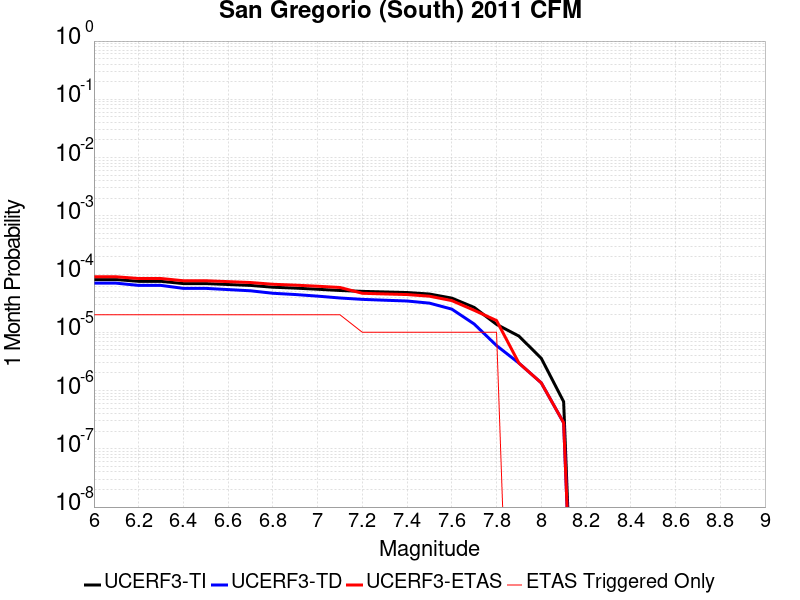 |  |  |

| Magnitude | 1 wk TI Prob | 1 wk TD Prob | 1 wk ETAS Prob | 1 wk ETAS/TD Gain | 1 wk ETAS Triggered Only | 1 mo TI Prob | 1 mo TD Prob | 1 mo ETAS Prob | 1 mo ETAS/TD Gain | 1 mo ETAS Triggered Only | 1 yr TI Prob | 1 yr TD Prob | 1 yr ETAS Prob | 1 yr ETAS/TD Gain | 1 yr ETAS Triggered Only | 10 yr TI Prob | 10 yr TD Prob | 10 yr ETAS Prob | 10 yr ETAS/TD Gain | 10 yr ETAS Triggered Only |
|-----|-----|-----|-----|-----|-----|-----|-----|-----|-----|-----|-----|-----|-----|-----|-----|-----|-----|-----|-----|-----|
| 6.0 | 1.8770423E-5 | 1.6279559E-5 | 3.6279234E-5 | 2.2285144 | 2.0E-5 | 8.044219E-5 | 6.9767695E-5 | 8.97663E-5 | 1.2866457 | 2.0E-5 | 9.789435E-4 | 8.490944E-4 | 8.6907746E-4 | 1.0235345 | 2.0E-5 | 0.009746423 | 0.008471475 | 0.008491306 | 1.0023409 | 2.0E-5 |
| 6.1 | 1.8770423E-5 | 1.6279559E-5 | 3.6279234E-5 | 2.2285144 | 2.0E-5 | 8.044219E-5 | 6.9767695E-5 | 8.97663E-5 | 1.2866457 | 2.0E-5 | 9.789435E-4 | 8.490944E-4 | 8.6907746E-4 | 1.0235345 | 2.0E-5 | 0.009746423 | 0.008471475 | 0.008491306 | 1.0023409 | 2.0E-5 |
| 6.2 | 1.7508692E-5 | 1.4899064E-5 | 3.4898767E-5 | 2.3423462 | 2.0E-5 | 7.5035096E-5 | 6.3851585E-5 | 8.385031E-5 | 1.3132063 | 2.0E-5 | 9.1316935E-4 | 7.7711884E-4 | 7.971033E-4 | 1.0257161 | 2.0E-5 | 0.00909426 | 0.007756904 | 0.0077767484 | 1.0025584 | 2.0E-5 |
| 6.3 | 1.7508692E-5 | 1.4899064E-5 | 3.4898767E-5 | 2.3423462 | 2.0E-5 | 7.5035096E-5 | 6.3851585E-5 | 8.385031E-5 | 1.3132063 | 2.0E-5 | 9.1316935E-4 | 7.7711884E-4 | 7.971033E-4 | 1.0257161 | 2.0E-5 | 0.00909426 | 0.007756904 | 0.0077767484 | 1.0025584 | 2.0E-5 |
| 6.4 | 1.6004591E-5 | 1.3248901E-5 | 3.3248638E-5 | 2.5095391 | 2.0E-5 | 6.85893E-5 | 5.6779776E-5 | 7.677864E-5 | 1.352218 | 2.0E-5 | 8.347548E-4 | 6.910755E-4 | 7.110617E-4 | 1.0289204 | 2.0E-5 | 0.008316261 | 0.0069019548 | 0.006921817 | 1.0028777 | 2.0E-5 |
| 6.5 | 1.6004591E-5 | 1.3248901E-5 | 3.3248638E-5 | 2.5095391 | 2.0E-5 | 6.85893E-5 | 5.6779776E-5 | 7.677864E-5 | 1.352218 | 2.0E-5 | 8.347548E-4 | 6.910755E-4 | 7.110617E-4 | 1.0289204 | 2.0E-5 | 0.008316261 | 0.0069019548 | 0.006921817 | 1.0028777 | 2.0E-5 |
| 6.6 | 1.5442201E-5 | 1.2633533E-5 | 3.263328E-5 | 2.5830684 | 2.0E-5 | 6.617918E-5 | 5.414259E-5 | 7.4141506E-5 | 1.369375 | 2.0E-5 | 8.0543366E-4 | 6.5898756E-4 | 6.789744E-4 | 1.0303296 | 2.0E-5 | 0.008025207 | 0.0065830066 | 0.006602875 | 1.0030181 | 2.0E-5 |
| 6.7 | 1.489921E-5 | 1.2042042E-5 | 3.20418E-5 | 2.6608279 | 2.0E-5 | 6.3852196E-5 | 5.1607734E-5 | 7.16067E-5 | 1.3875189 | 2.0E-5 | 7.7712315E-4 | 6.281437E-4 | 6.481311E-4 | 1.0318198 | 2.0E-5 | 0.0077441116 | 0.0062763398 | 0.006296214 | 1.0031666 | 2.0E-5 |
| 6.8 | 1.3876024E-5 | 1.0920992E-5 | 3.0920775E-5 | 2.8313155 | 2.0E-5 | 5.9467322E-5 | 4.6803412E-5 | 6.680248E-5 | 1.4272993 | 2.0E-5 | 7.237741E-4 | 5.696829E-4 | 5.8967154E-4 | 1.0350872 | 2.0E-5 | 0.0072142133 | 0.005694849 | 0.005714735 | 1.003492 | 2.0E-5 |
| 6.9 | 1.33922495E-5 | 1.0392495E-5 | 3.0392286E-5 | 2.9244459 | 2.0E-5 | 5.7394092E-5 | 4.4538505E-5 | 6.453761E-5 | 1.4490297 | 2.0E-5 | 6.9854903E-4 | 5.4212165E-4 | 5.621108E-4 | 1.0368721 | 2.0E-5 | 0.0069635725 | 0.0054206066 | 0.0054404982 | 1.0036696 | 2.0E-5 |
| 7.0 | 1.2807324E-5 | 9.752456E-6 | 2.975226E-5 | 3.0507455 | 2.0E-5 | 5.4887376E-5 | 4.179557E-5 | 6.179474E-5 | 1.4784997 | 2.0E-5 | 6.680489E-4 | 5.0874247E-4 | 5.2873226E-4 | 1.0392926 | 2.0E-5 | 0.006660442 | 0.0050883847 | 0.005108283 | 1.0039105 | 2.0E-5 |
| 7.1 | 1.2191438E-5 | 9.061344E-6 | 2.9061162E-5 | 3.207158 | 2.0E-5 | 5.224797E-5 | 3.8833754E-5 | 5.8832975E-5 | 1.5149959 | 2.0E-5 | 6.3593336E-4 | 4.7269845E-4 | 4.92689E-4 | 1.0422903 | 2.0E-5 | 0.0063411663 | 0.004729529 | 0.004749434 | 1.0042088 | 2.0E-5 |
| 7.2 | 1.1769438E-5 | 8.581538E-6 | 1.8581453E-5 | 2.1652822 | 1.0E-5 | 5.0439474E-5 | 3.6777503E-5 | 4.6777135E-5 | 1.2718953 | 1.0E-5 | 6.1392755E-4 | 4.476742E-4 | 4.576697E-4 | 1.0223277 | 1.0E-5 | 0.0061223423 | 0.0044803214 | 0.004490277 | 1.002222 | 1.0E-5 |
| 7.3 | 1.150374E-5 | 8.296966E-6 | 1.8296883E-5 | 2.2052498 | 1.0E-5 | 4.9300812E-5 | 3.5557943E-5 | 4.5557586E-5 | 1.2812212 | 1.0E-5 | 6.0007203E-4 | 4.3283202E-4 | 4.4282767E-4 | 1.0230937 | 1.0E-5 | 0.0059845424 | 0.004332466 | 0.004342423 | 1.0022981 | 1.0E-5 |
| 7.4 | 1.12514E-5 | 8.042707E-6 | 1.8042627E-5 | 2.2433524 | 1.0E-5 | 4.8219394E-5 | 3.446829E-5 | 4.4467943E-5 | 1.2901118 | 1.0E-5 | 5.8691297E-4 | 4.1957066E-4 | 4.2956645E-4 | 1.0238239 | 1.0E-5 | 0.005853653 | 0.0042003556 | 0.004210314 | 1.0023707 | 1.0E-5 |
| 7.5 | 1.059696E-5 | 7.39299E-6 | 1.7392917E-5 | 2.3526227 | 1.0E-5 | 4.5414752E-5 | 3.168386E-5 | 4.1683543E-5 | 1.3156081 | 1.0E-5 | 5.5278436E-4 | 3.8568274E-4 | 3.956789E-4 | 1.025918 | 1.0E-5 | 0.0055141128 | 0.003862607 | 0.0038725685 | 1.002579 | 1.0E-5 |
| 7.6 | 9.018592E-6 | 5.836751E-6 | 1.5836693E-5 | 2.7132719 | 1.0E-5 | 3.8650534E-5 | 2.5014408E-5 | 3.5014156E-5 | 1.3997597 | 1.0E-5 | 4.7046866E-4 | 3.0450788E-4 | 3.1450484E-4 | 1.0328299 | 1.0E-5 | 0.004694739 | 0.0030530049 | 0.0030629744 | 1.0032655 | 1.0E-5 |
| 7.7 | 6.243489E-6 | 3.239351E-6 | 1.3239319E-5 | 4.087028 | 1.0E-5 | 2.6757538E-5 | 1.3882858E-5 | 2.388272E-5 | 1.7203027 | 1.0E-5 | 3.257243E-4 | 1.690107E-4 | 1.7900902E-4 | 1.0591578 | 1.0E-5 | 0.003252473 | 0.0016990631 | 0.0017090462 | 1.0058756 | 1.0E-5 |
| 7.8 | 3.1941963E-6 | 1.380876E-6 | 1.1380862E-5 | 8.24177 | 1.0E-5 | 1.368934E-5 | 5.9180265E-6 | 1.5917967E-5 | 2.6897426 | 1.0E-5 | 1.6665498E-4 | 7.2049595E-5 | 8.204887E-5 | 1.1387833 | 1.0E-5 | 0.0016653005 | 7.2625576E-4 | 7.362485E-4 | 1.0137593 | 1.0E-5 |
| 7.9 | 2.0098398E-6 | 6.915071E-7 | 6.915071E-7 | 1.0 | 0.0 | 8.6135715E-6 | 2.9635985E-6 | 2.9635985E-6 | 1.0 | 0.0 | 1.0486518E-4 | 3.6081216E-5 | 3.6081216E-5 | 1.0 | 0.0 | 0.0010481571 | 3.6566515E-4 | 3.6566515E-4 | 1.0 | 0.0 |
| 8.0 | 8.353119E-7 | 3.1619197E-7 | 3.1619197E-7 | 1.0 | 0.0 | 3.579903E-6 | 1.3551078E-6 | 1.3551078E-6 | 1.0 | 0.0 | 4.358445E-5 | 1.6498312E-5 | 1.6498312E-5 | 1.0 | 0.0 | 4.3575902E-4 | 1.6616881E-4 | 1.6616881E-4 | 1.0 | 0.0 |
| 8.1 | 1.5033264E-7 | 6.52693E-8 | 6.52693E-8 | 1.0 | 0.0 | 6.442826E-7 | 2.7972553E-7 | 2.7972553E-7 | 1.0 | 0.0 | 7.844113E-6 | 3.4056532E-6 | 3.4056532E-6 | 1.0 | 0.0 | 7.843835E-5 | 3.4072833E-5 | 3.4072833E-5 | 1.0 | 0.0 |

## South Cuyama
*[(top)](#table-of-contents)*

| 1 Week | 1 Month | 1 Year | 10 Year |
|-----|-----|-----|-----|
|  |  |  |  |

| Magnitude | 1 wk TI Prob | 1 wk TD Prob | 1 wk ETAS Prob | 1 wk ETAS/TD Gain | 1 wk ETAS Triggered Only | 1 mo TI Prob | 1 mo TD Prob | 1 mo ETAS Prob | 1 mo ETAS/TD Gain | 1 mo ETAS Triggered Only | 1 yr TI Prob | 1 yr TD Prob | 1 yr ETAS Prob | 1 yr ETAS/TD Gain | 1 yr ETAS Triggered Only | 10 yr TI Prob | 10 yr TD Prob | 10 yr ETAS Prob | 10 yr ETAS/TD Gain | 10 yr ETAS Triggered Only |
|-----|-----|-----|-----|-----|-----|-----|-----|-----|-----|-----|-----|-----|-----|-----|-----|-----|-----|-----|-----|-----|
| 6.0 | 1.2747308E-6 | 1.2818697E-6 | 1.2818697E-6 | 1.0 | 0.0 | 5.4631205E-6 | 5.4937163E-6 | 5.4937163E-6 | 1.0 | 0.0 | 6.6511464E-5 | 6.6884015E-5 | 7.688334E-5 | 1.1495025 | 1.0E-5 | 6.649156E-4 | 6.686458E-4 | 6.886324E-4 | 1.0298913 | 2.0E-5 |
| 6.1 | 1.2747308E-6 | 1.2818697E-6 | 1.2818697E-6 | 1.0 | 0.0 | 5.4631205E-6 | 5.4937163E-6 | 5.4937163E-6 | 1.0 | 0.0 | 6.6511464E-5 | 6.6884015E-5 | 7.688334E-5 | 1.1495025 | 1.0E-5 | 6.649156E-4 | 6.686458E-4 | 6.886324E-4 | 1.0298913 | 2.0E-5 |
| 6.2 | 1.2747308E-6 | 1.2818697E-6 | 1.2818697E-6 | 1.0 | 0.0 | 5.4631205E-6 | 5.4937163E-6 | 5.4937163E-6 | 1.0 | 0.0 | 6.6511464E-5 | 6.6884015E-5 | 7.688334E-5 | 1.1495025 | 1.0E-5 | 6.649156E-4 | 6.686458E-4 | 6.886324E-4 | 1.0298913 | 2.0E-5 |
| 6.3 | 1.2747308E-6 | 1.2818697E-6 | 1.2818697E-6 | 1.0 | 0.0 | 5.4631205E-6 | 5.4937163E-6 | 5.4937163E-6 | 1.0 | 0.0 | 6.6511464E-5 | 6.6884015E-5 | 7.688334E-5 | 1.1495025 | 1.0E-5 | 6.649156E-4 | 6.686458E-4 | 6.886324E-4 | 1.0298913 | 2.0E-5 |
| 6.4 | 1.2747308E-6 | 1.2818697E-6 | 1.2818697E-6 | 1.0 | 0.0 | 5.4631205E-6 | 5.4937163E-6 | 5.4937163E-6 | 1.0 | 0.0 | 6.6511464E-5 | 6.6884015E-5 | 7.688334E-5 | 1.1495025 | 1.0E-5 | 6.649156E-4 | 6.686458E-4 | 6.886324E-4 | 1.0298913 | 2.0E-5 |
| 6.5 | 1.2747308E-6 | 1.2818697E-6 | 1.2818697E-6 | 1.0 | 0.0 | 5.4631205E-6 | 5.4937163E-6 | 5.4937163E-6 | 1.0 | 0.0 | 6.6511464E-5 | 6.6884015E-5 | 7.688334E-5 | 1.1495025 | 1.0E-5 | 6.649156E-4 | 6.686458E-4 | 6.886324E-4 | 1.0298913 | 2.0E-5 |
| 6.6 | 1.2747308E-6 | 1.2818697E-6 | 1.2818697E-6 | 1.0 | 0.0 | 5.4631205E-6 | 5.4937163E-6 | 5.4937163E-6 | 1.0 | 0.0 | 6.6511464E-5 | 6.6884015E-5 | 7.688334E-5 | 1.1495025 | 1.0E-5 | 6.649156E-4 | 6.686458E-4 | 6.886324E-4 | 1.0298913 | 2.0E-5 |
| 6.7 | 1.2747308E-6 | 1.2818697E-6 | 1.2818697E-6 | 1.0 | 0.0 | 5.4631205E-6 | 5.4937163E-6 | 5.4937163E-6 | 1.0 | 0.0 | 6.6511464E-5 | 6.6884015E-5 | 7.688334E-5 | 1.1495025 | 1.0E-5 | 6.649156E-4 | 6.686458E-4 | 6.886324E-4 | 1.0298913 | 2.0E-5 |
| 6.8 | 1.2747308E-6 | 1.2818697E-6 | 1.2818697E-6 | 1.0 | 0.0 | 5.4631205E-6 | 5.4937163E-6 | 5.4937163E-6 | 1.0 | 0.0 | 6.6511464E-5 | 6.6884015E-5 | 7.688334E-5 | 1.1495025 | 1.0E-5 | 6.649156E-4 | 6.686458E-4 | 6.886324E-4 | 1.0298913 | 2.0E-5 |
| 6.9 | 8.4566324E-7 | 8.507883E-7 | 8.507883E-7 | 1.0 | 0.0 | 3.624266E-6 | 3.6462304E-6 | 3.6462304E-6 | 1.0 | 0.0 | 4.4124543E-5 | 4.439196E-5 | 4.439196E-5 | 1.0 | 0.0 | 4.4115784E-4 | 4.4383196E-4 | 4.5382752E-4 | 1.022521 | 1.0E-5 |
| 7.0 | 8.2277904E-7 | 8.27782E-7 | 8.27782E-7 | 1.0 | 0.0 | 3.526191E-6 | 3.5476323E-6 | 3.5476323E-6 | 1.0 | 0.0 | 4.293053E-5 | 4.3191576E-5 | 4.3191576E-5 | 1.0 | 0.0 | 4.292224E-4 | 4.3183283E-4 | 4.418285E-4 | 1.0231471 | 1.0E-5 |
| 7.1 | 6.7661887E-7 | 6.80913E-7 | 6.80913E-7 | 1.0 | 0.0 | 2.899792E-6 | 2.9181954E-6 | 2.9181954E-6 | 1.0 | 0.0 | 3.5304394E-5 | 3.5528454E-5 | 3.5528454E-5 | 1.0 | 0.0 | 3.5298787E-4 | 3.552281E-4 | 3.552281E-4 | 1.0 | 0.0 |
| 7.2 | 5.783336E-7 | 5.8211907E-7 | 5.8211907E-7 | 1.0 | 0.0 | 2.4785702E-6 | 2.4947938E-6 | 2.4947938E-6 | 1.0 | 0.0 | 3.0176174E-5 | 3.0373692E-5 | 3.0373692E-5 | 1.0 | 0.0 | 3.0172078E-4 | 3.0369565E-4 | 3.0369565E-4 | 1.0 | 0.0 |
| 7.3 | 5.136759E-7 | 5.170938E-7 | 5.170938E-7 | 1.0 | 0.0 | 2.2014663E-6 | 2.2161144E-6 | 2.2161144E-6 | 1.0 | 0.0 | 2.6802521E-5 | 2.698086E-5 | 2.698086E-5 | 1.0 | 0.0 | 2.679929E-4 | 2.6977606E-4 | 2.6977606E-4 | 1.0 | 0.0 |
| 7.4 | 4.3370295E-7 | 4.3665364E-7 | 4.3665364E-7 | 1.0 | 0.0 | 1.8587256E-6 | 1.8713713E-6 | 1.8713713E-6 | 1.0 | 0.0 | 2.2629749E-5 | 2.278371E-5 | 2.278371E-5 | 1.0 | 0.0 | 2.2627445E-4 | 2.278139E-4 | 2.278139E-4 | 1.0 | 0.0 |
| 7.5 | 3.3242574E-7 | 3.3476465E-7 | 3.3476465E-7 | 1.0 | 0.0 | 1.4246809E-6 | 1.4347048E-6 | 1.4347048E-6 | 1.0 | 0.0 | 1.7345352E-5 | 1.7467393E-5 | 1.7467393E-5 | 1.0 | 0.0 | 1.7343998E-4 | 1.7466032E-4 | 1.7466032E-4 | 1.0 | 0.0 |
| 7.6 | 2.0627535E-7 | 2.07789E-7 | 2.07789E-7 | 1.0 | 0.0 | 8.840369E-7 | 8.90524E-7 | 8.90524E-7 | 1.0 | 0.0 | 1.0763096E-5 | 1.0842076E-5 | 1.0842076E-5 | 1.0 | 0.0 | 1.0762575E-4 | 1.0841556E-4 | 1.0841556E-4 | 1.0 | 0.0 |
| 7.7 | 6.15236E-8 | 6.1983044E-8 | 6.1983044E-8 | 1.0 | 0.0 | 2.6367252E-7 | 2.656416E-7 | 2.656416E-7 | 1.0 | 0.0 | 3.2102084E-6 | 3.2341818E-6 | 3.2341818E-6 | 1.0 | 0.0 | 3.210162E-5 | 3.234136E-5 | 3.234136E-5 | 1.0 | 0.0 |
| 7.8 | 1.1765573E-8 | 1.1873414E-8 | 1.1873414E-8 | 1.0 | 0.0 | 5.0423886E-8 | 5.0886058E-8 | 5.0886058E-8 | 1.0 | 0.0 | 6.1391063E-7 | 6.195376E-7 | 6.195376E-7 | 1.0 | 0.0 | 6.1390897E-6 | 6.19536E-6 | 6.19536E-6 | 1.0 | 0.0 |
| 7.9 | 6.0381755E-10 | 6.10058E-10 | 6.10058E-10 | 1.0 | 0.0 | 2.5877895E-9 | 2.614534E-9 | 2.614534E-9 | 1.0 | 0.0 | 3.1506335E-8 | 3.1831952E-8 | 3.1831952E-8 | 1.0 | 0.0 | 3.1506332E-7 | 3.183195E-7 | 3.183195E-7 | 1.0 | 0.0 |

## Ortigalita (South)
*[(top)](#table-of-contents)*

| 1 Week | 1 Month | 1 Year | 10 Year |
|-----|-----|-----|-----|
|  |  |  |  |

| Magnitude | 1 wk TI Prob | 1 wk TD Prob | 1 wk ETAS Prob | 1 wk ETAS/TD Gain | 1 wk ETAS Triggered Only | 1 mo TI Prob | 1 mo TD Prob | 1 mo ETAS Prob | 1 mo ETAS/TD Gain | 1 mo ETAS Triggered Only | 1 yr TI Prob | 1 yr TD Prob | 1 yr ETAS Prob | 1 yr ETAS/TD Gain | 1 yr ETAS Triggered Only | 10 yr TI Prob | 10 yr TD Prob | 10 yr ETAS Prob | 10 yr ETAS/TD Gain | 10 yr ETAS Triggered Only |
|-----|-----|-----|-----|-----|-----|-----|-----|-----|-----|-----|-----|-----|-----|-----|-----|-----|-----|-----|-----|-----|
| 6.0 | 3.72394E-5 | 4.32556E-5 | 4.32556E-5 | 1.0 | 0.0 | 1.5958765E-4 | 1.8536886E-4 | 1.8536886E-4 | 1.0 | 0.0 | 0.0019412481 | 0.0022546863 | 0.0022546863 | 1.0 | 0.0 | 0.019243775 | 0.022334501 | 0.022354055 | 1.0008755 | 2.0E-5 |
| 6.1 | 2.7299884E-5 | 3.1492036E-5 | 3.1492036E-5 | 1.0 | 0.0 | 1.16994255E-4 | 1.349592E-4 | 1.349592E-4 | 1.0 | 0.0 | 0.0014234743 | 0.0016419457 | 0.0016419457 | 1.0 | 0.0 | 0.014143906 | 0.016304072 | 0.016323747 | 1.0012066 | 2.0E-5 |
| 6.2 | 2.7299884E-5 | 3.1492036E-5 | 3.1492036E-5 | 1.0 | 0.0 | 1.16994255E-4 | 1.349592E-4 | 1.349592E-4 | 1.0 | 0.0 | 0.0014234743 | 0.0016419457 | 0.0016419457 | 1.0 | 0.0 | 0.014143906 | 0.016304072 | 0.016323747 | 1.0012066 | 2.0E-5 |
| 6.3 | 2.0546433E-5 | 2.3631454E-5 | 2.3631454E-5 | 1.0 | 0.0 | 8.805317E-5 | 1.0127383E-4 | 1.0127383E-4 | 1.0 | 0.0 | 0.00107152 | 0.0012323305 | 0.0012323305 | 1.0 | 0.0 | 0.010663681 | 0.012257031 | 0.012276786 | 1.0016117 | 2.0E-5 |
| 6.4 | 2.0546433E-5 | 2.3631454E-5 | 2.3631454E-5 | 1.0 | 0.0 | 8.805317E-5 | 1.0127383E-4 | 1.0127383E-4 | 1.0 | 0.0 | 0.00107152 | 0.0012323305 | 0.0012323305 | 1.0 | 0.0 | 0.010663681 | 0.012257031 | 0.012276786 | 1.0016117 | 2.0E-5 |
| 6.5 | 1.7779594E-5 | 2.0446974E-5 | 2.0446974E-5 | 1.0 | 0.0 | 7.619603E-5 | 8.762703E-5 | 8.762703E-5 | 1.0 | 0.0 | 9.272918E-4 | 0.0010663505 | 0.0010663505 | 1.0 | 0.0 | 0.009234319 | 0.010613804 | 0.010633592 | 1.0018643 | 2.0E-5 |
| 6.6 | 1.6272212E-5 | 1.8714967E-5 | 1.8714967E-5 | 1.0 | 0.0 | 6.973618E-5 | 8.0204605E-5 | 8.0204605E-5 | 1.0 | 0.0 | 8.487073E-4 | 9.760659E-4 | 9.760659E-4 | 1.0 | 0.0 | 0.008454733 | 0.009719091 | 0.009738896 | 1.0020378 | 2.0E-5 |
| 6.7 | 1.3051484E-5 | 1.5038758E-5 | 1.5038758E-5 | 1.0 | 0.0 | 5.593373E-5 | 6.445028E-5 | 6.445028E-5 | 1.0 | 0.0 | 6.807804E-4 | 7.844092E-4 | 7.844092E-4 | 1.0 | 0.0 | 0.006786986 | 0.007817388 | 0.00782731 | 1.0012692 | 1.0E-5 |
| 6.8 | 1.04277415E-5 | 1.1987235E-5 | 1.1987235E-5 | 1.0 | 0.0 | 4.4689557E-5 | 5.1372896E-5 | 5.1372896E-5 | 1.0 | 0.0 | 5.439595E-4 | 6.2529295E-4 | 6.2529295E-4 | 1.0 | 0.0 | 0.0054262993 | 0.00623609 | 0.00623609 | 1.0 | 0.0 |
| 6.9 | 7.639968E-6 | 8.791503E-6 | 8.791503E-6 | 1.0 | 0.0 | 3.274231E-5 | 3.767736E-5 | 3.767736E-5 | 1.0 | 0.0 | 3.9856473E-4 | 4.586312E-4 | 4.586312E-4 | 1.0 | 0.0 | 0.003978506 | 0.004577433 | 0.004577433 | 1.0 | 0.0 |
| 7.0 | 3.919831E-6 | 4.5334014E-6 | 4.5334014E-6 | 1.0 | 0.0 | 1.679917E-5 | 1.942873E-5 | 1.942873E-5 | 1.0 | 0.0 | 2.045107E-4 | 2.3652123E-4 | 2.3652123E-4 | 1.0 | 0.0 | 0.0020432258 | 0.0023629034 | 0.0023629034 | 1.0 | 0.0 |
| 7.1 | 1.6017933E-6 | 1.8570418E-6 | 1.8570418E-6 | 1.0 | 0.0 | 6.8648105E-6 | 7.958732E-6 | 7.958732E-6 | 1.0 | 0.0 | 8.357586E-5 | 9.689432E-5 | 9.689432E-5 | 1.0 | 0.0 | 8.3544437E-4 | 9.686254E-4 | 9.686254E-4 | 1.0 | 0.0 |

## Earthquake Valley
*[(top)](#table-of-contents)*

| 1 Week | 1 Month | 1 Year | 10 Year |
|-----|-----|-----|-----|
|  |  |  |  |

| Magnitude | 1 wk TI Prob | 1 wk TD Prob | 1 wk ETAS Prob | 1 wk ETAS/TD Gain | 1 wk ETAS Triggered Only | 1 mo TI Prob | 1 mo TD Prob | 1 mo ETAS Prob | 1 mo ETAS/TD Gain | 1 mo ETAS Triggered Only | 1 yr TI Prob | 1 yr TD Prob | 1 yr ETAS Prob | 1 yr ETAS/TD Gain | 1 yr ETAS Triggered Only | 10 yr TI Prob | 10 yr TD Prob | 10 yr ETAS Prob | 10 yr ETAS/TD Gain | 10 yr ETAS Triggered Only |
|-----|-----|-----|-----|-----|-----|-----|-----|-----|-----|-----|-----|-----|-----|-----|-----|-----|-----|-----|-----|-----|
| 6.0 | 1.9416384E-5 | 2.258411E-5 | 2.258411E-5 | 1.0 | 0.0 | 8.321042E-5 | 9.6786134E-5 | 1.0678516E-4 | 1.1033106 | 1.0E-5 | 0.001012616 | 0.001177854 | 0.0011878422 | 1.0084801 | 1.0E-5 | 0.010080142 | 0.011727945 | 0.01174771 | 1.0016854 | 2.0E-5 |
| 6.1 | 1.9416384E-5 | 2.258411E-5 | 2.258411E-5 | 1.0 | 0.0 | 8.321042E-5 | 9.6786134E-5 | 1.0678516E-4 | 1.1033106 | 1.0E-5 | 0.001012616 | 0.001177854 | 0.0011878422 | 1.0084801 | 1.0E-5 | 0.010080142 | 0.011727945 | 0.01174771 | 1.0016854 | 2.0E-5 |
| 6.2 | 1.9416384E-5 | 2.258411E-5 | 2.258411E-5 | 1.0 | 0.0 | 8.321042E-5 | 9.6786134E-5 | 1.0678516E-4 | 1.1033106 | 1.0E-5 | 0.001012616 | 0.001177854 | 0.0011878422 | 1.0084801 | 1.0E-5 | 0.010080142 | 0.011727945 | 0.01174771 | 1.0016854 | 2.0E-5 |
| 6.3 | 1.9416384E-5 | 2.258411E-5 | 2.258411E-5 | 1.0 | 0.0 | 8.321042E-5 | 9.6786134E-5 | 1.0678516E-4 | 1.1033106 | 1.0E-5 | 0.001012616 | 0.001177854 | 0.0011878422 | 1.0084801 | 1.0E-5 | 0.010080142 | 0.011727945 | 0.01174771 | 1.0016854 | 2.0E-5 |
| 6.4 | 1.9416384E-5 | 2.258411E-5 | 2.258411E-5 | 1.0 | 0.0 | 8.321042E-5 | 9.6786134E-5 | 1.0678516E-4 | 1.1033106 | 1.0E-5 | 0.001012616 | 0.001177854 | 0.0011878422 | 1.0084801 | 1.0E-5 | 0.010080142 | 0.011727945 | 0.01174771 | 1.0016854 | 2.0E-5 |
| 6.5 | 1.9389157E-5 | 2.25527E-5 | 2.25527E-5 | 1.0 | 0.0 | 8.309374E-5 | 9.665152E-5 | 1.0665056E-4 | 1.1034545 | 1.0E-5 | 0.0010111968 | 0.001176217 | 0.0011862052 | 1.0084919 | 1.0E-5 | 0.010066078 | 0.011711747 | 0.011731513 | 1.0016876 | 2.0E-5 |
| 6.6 | 1.9389157E-5 | 2.25527E-5 | 2.25527E-5 | 1.0 | 0.0 | 8.309374E-5 | 9.665152E-5 | 1.0665056E-4 | 1.1034545 | 1.0E-5 | 0.0010111968 | 0.001176217 | 0.0011862052 | 1.0084919 | 1.0E-5 | 0.010066078 | 0.011711747 | 0.011731513 | 1.0016876 | 2.0E-5 |
| 6.7 | 1.4925434E-5 | 1.720822E-5 | 1.720822E-5 | 1.0 | 0.0 | 6.396457E-5 | 7.374791E-5 | 8.3747174E-5 | 1.1355871 | 1.0E-5 | 7.7849044E-4 | 8.97596E-4 | 9.07587E-4 | 1.0111309 | 1.0E-5 | 0.007757689 | 0.008948081 | 0.0089679025 | 1.0022151 | 2.0E-5 |
| 6.8 | 1.3570335E-5 | 1.5616837E-5 | 1.5616837E-5 | 1.0 | 0.0 | 5.8157282E-5 | 6.692804E-5 | 7.6927376E-5 | 1.1494042 | 1.0E-5 | 7.0783484E-4 | 8.146264E-4 | 8.2461827E-4 | 1.0122656 | 1.0E-5 | 0.0070558446 | 0.008124473 | 0.008144311 | 1.0024416 | 2.0E-5 |
| 6.9 | 1.3570335E-5 | 1.5616837E-5 | 1.5616837E-5 | 1.0 | 0.0 | 5.8157282E-5 | 6.692804E-5 | 7.6927376E-5 | 1.1494042 | 1.0E-5 | 7.0783484E-4 | 8.146264E-4 | 8.2461827E-4 | 1.0122656 | 1.0E-5 | 0.0070558446 | 0.008124473 | 0.008144311 | 1.0024416 | 2.0E-5 |
| 7.0 | 1.3433392E-5 | 1.546038E-5 | 1.546038E-5 | 1.0 | 0.0 | 5.757041E-5 | 6.6257555E-5 | 7.625689E-5 | 1.1509162 | 1.0E-5 | 7.0069433E-4 | 8.064692E-4 | 8.164611E-4 | 1.0123898 | 1.0E-5 | 0.006984891 | 0.008043493 | 0.008063332 | 1.0024664 | 2.0E-5 |
| 7.1 | 8.181609E-6 | 9.4168445E-6 | 9.4168445E-6 | 1.0 | 0.0 | 3.5063567E-5 | 4.0357656E-5 | 4.0357656E-5 | 1.0 | 0.0 | 4.268153E-4 | 4.913108E-4 | 4.913108E-4 | 1.0 | 0.0 | 0.0042599645 | 0.004908822 | 0.0049187727 | 1.0020272 | 1.0E-5 |
| 7.2 | 2.0663983E-7 | 1.7262263E-7 | 1.7262263E-7 | 1.0 | 0.0 | 8.855989E-7 | 7.398111E-7 | 7.398111E-7 | 1.0 | 0.0 | 1.0782113E-5 | 9.007167E-6 | 9.007167E-6 | 1.0 | 0.0 | 1.07815904E-4 | 9.006837E-5 | 9.006837E-5 | 1.0 | 0.0 |
| 7.3 | 2.0462376E-7 | 1.7077758E-7 | 1.7077758E-7 | 1.0 | 0.0 | 8.7695867E-7 | 7.319037E-7 | 7.319037E-7 | 1.0 | 0.0 | 1.0676919E-5 | 8.910895E-6 | 8.910895E-6 | 1.0 | 0.0 | 1.0676406E-4 | 8.9105735E-5 | 8.9105735E-5 | 1.0 | 0.0 |
| 7.4 | 2.0171088E-7 | 1.6860244E-7 | 1.6860244E-7 | 1.0 | 0.0 | 8.644749E-7 | 7.2258166E-7 | 7.2258166E-7 | 1.0 | 0.0 | 1.0524931E-5 | 8.7974E-6 | 8.7974E-6 | 1.0 | 0.0 | 1.05244326E-4 | 8.7970875E-5 | 8.7970875E-5 | 1.0 | 0.0 |
| 7.5 | 1.4847944E-7 | 1.2558573E-7 | 1.2558573E-7 | 1.0 | 0.0 | 6.363403E-7 | 5.382244E-7 | 5.382244E-7 | 1.0 | 0.0 | 7.747416E-6 | 6.5528648E-6 | 6.5528648E-6 | 1.0 | 0.0 | 7.747146E-5 | 6.552693E-5 | 6.552693E-5 | 1.0 | 0.0 |
| 7.6 | 1.3185847E-7 | 1.1122516E-7 | 1.1122516E-7 | 1.0 | 0.0 | 5.6510765E-7 | 4.766792E-7 | 4.766792E-7 | 1.0 | 0.0 | 6.8801637E-6 | 5.803556E-6 | 5.803556E-6 | 1.0 | 0.0 | 6.8799505E-5 | 5.8034257E-5 | 5.8034257E-5 | 1.0 | 0.0 |
| 7.7 | 2.8609954E-8 | 1.4170218E-8 | 1.4170218E-8 | 1.0 | 0.0 | 1.2261408E-7 | 6.0729505E-8 | 6.0729505E-8 | 1.0 | 0.0 | 1.4928254E-6 | 7.393815E-7 | 7.393815E-7 | 1.0 | 0.0 | 1.4928154E-5 | 7.393796E-6 | 7.393796E-6 | 1.0 | 0.0 |
| 7.8 | 6.527266E-9 | 2.9232412E-9 | 2.9232412E-9 | 1.0 | 0.0 | 2.7973995E-8 | 1.2528178E-8 | 1.2528178E-8 | 1.0 | 0.0 | 3.4058334E-7 | 1.5253055E-7 | 1.5253055E-7 | 1.0 | 0.0 | 3.4058282E-6 | 1.5253047E-6 | 1.5253047E-6 | 1.0 | 0.0 |
| 7.9 | 1.2898267E-9 | 7.127704E-10 | 7.127704E-10 | 1.0 | 0.0 | 5.527829E-9 | 3.0547302E-9 | 3.0547302E-9 | 1.0 | 0.0 | 6.7301315E-8 | 3.719134E-8 | 3.719134E-8 | 1.0 | 0.0 | 6.7301295E-7 | 3.7191342E-7 | 3.7191342E-7 | 1.0 | 0.0 |

## Rodgers Creek - Healdsburg 2011 CFM
*[(top)](#table-of-contents)*

| 1 Week | 1 Month | 1 Year | 10 Year |
|-----|-----|-----|-----|
|  |  |  |  |

| Magnitude | 1 wk TI Prob | 1 wk TD Prob | 1 wk ETAS Prob | 1 wk ETAS/TD Gain | 1 wk ETAS Triggered Only | 1 mo TI Prob | 1 mo TD Prob | 1 mo ETAS Prob | 1 mo ETAS/TD Gain | 1 mo ETAS Triggered Only | 1 yr TI Prob | 1 yr TD Prob | 1 yr ETAS Prob | 1 yr ETAS/TD Gain | 1 yr ETAS Triggered Only | 10 yr TI Prob | 10 yr TD Prob | 10 yr ETAS Prob | 10 yr ETAS/TD Gain | 10 yr ETAS Triggered Only |
|-----|-----|-----|-----|-----|-----|-----|-----|-----|-----|-----|-----|-----|-----|-----|-----|-----|-----|-----|-----|-----|
| 6.0 | 7.390182E-5 | 1.3137296E-4 | 1.4137164E-4 | 1.0761092 | 1.0E-5 | 3.1668364E-4 | 5.629057E-4 | 5.7290005E-4 | 1.0177549 | 1.0E-5 | 0.0038488081 | 0.0068318076 | 0.006851671 | 1.0029075 | 2.0E-5 | 0.037828278 | 0.06618395 | 0.066202626 | 1.0002822 | 2.0E-5 |
| 6.1 | 7.318768E-5 | 1.303531E-4 | 1.403518E-4 | 1.0767047 | 1.0E-5 | 3.1362378E-4 | 5.585369E-4 | 5.6853134E-4 | 1.0178939 | 1.0E-5 | 0.0038116854 | 0.006778966 | 0.0067988303 | 1.0029303 | 2.0E-5 | 0.037469655 | 0.06568854 | 0.06570723 | 1.0002844 | 2.0E-5 |
| 6.2 | 7.1379836E-5 | 1.2728151E-4 | 1.3728025E-4 | 1.0785561 | 1.0E-5 | 3.058777E-4 | 5.453785E-4 | 5.5537303E-4 | 1.0183259 | 1.0E-5 | 0.003717703 | 0.0066197454 | 0.006639613 | 1.0030012 | 2.0E-5 | 0.0365612 | 0.06421061 | 0.064229324 | 1.0002915 | 2.0E-5 |
| 6.3 | 6.9255926E-5 | 1.2382482E-4 | 1.3382357E-4 | 1.0807493 | 1.0E-5 | 2.9677735E-4 | 5.305703E-4 | 5.4056494E-4 | 1.0188377 | 1.0E-5 | 0.0036072785 | 0.0064406106 | 0.006460482 | 1.0030853 | 2.0E-5 | 0.035492823 | 0.062541805 | 0.06256056 | 1.0002998 | 2.0E-5 |
| 6.4 | 6.6757144E-5 | 1.195919E-4 | 1.2959071E-4 | 1.0836077 | 1.0E-5 | 2.8607066E-4 | 5.1243644E-4 | 5.2243134E-4 | 1.0195047 | 1.0E-5 | 0.0034773487 | 0.00622114 | 0.0062410156 | 1.0031948 | 2.0E-5 | 0.034234364 | 0.060491614 | 0.060510404 | 1.0003107 | 2.0E-5 |
| 6.5 | 6.5735134E-5 | 1.180849E-4 | 1.2808372E-4 | 1.0846748 | 1.0E-5 | 2.8169158E-4 | 5.059804E-4 | 5.1597535E-4 | 1.0197536 | 1.0E-5 | 0.003424202 | 0.0061429944 | 0.0061628716 | 1.0032357 | 2.0E-5 | 0.03371918 | 0.059755705 | 0.05977451 | 1.0003147 | 2.0E-5 |
| 6.6 | 6.289601E-5 | 1.13442366E-4 | 1.2344123E-4 | 1.0881405 | 1.0E-5 | 2.6952647E-4 | 4.8609133E-4 | 4.960865E-4 | 1.0205623 | 1.0E-5 | 0.0032765474 | 0.005902183 | 0.0059220647 | 1.0033686 | 2.0E-5 | 0.032286562 | 0.057495043 | 0.057513893 | 1.0003278 | 2.0E-5 |
| 6.7 | 6.115274E-5 | 1.106132E-4 | 1.20612094E-4 | 1.0903951 | 1.0E-5 | 2.6205686E-4 | 4.739708E-4 | 4.8396608E-4 | 1.0210884 | 1.0E-5 | 0.0031858748 | 0.0057554054 | 0.00577529 | 1.003455 | 2.0E-5 | 0.031405866 | 0.05611361 | 0.056132488 | 1.0003364 | 2.0E-5 |
| 6.8 | 5.9232367E-5 | 1.0728657E-4 | 1.172855E-4 | 1.0931983 | 1.0E-5 | 2.538283E-4 | 4.5971893E-4 | 4.6971434E-4 | 1.0217425 | 1.0E-5 | 0.0030859804 | 0.005582791 | 0.0056026787 | 1.0035625 | 2.0E-5 | 0.030434765 | 0.05448041 | 0.05449932 | 1.0003471 | 2.0E-5 |
| 6.9 | 5.4030377E-5 | 9.8228295E-5 | 1.0822731E-4 | 1.1017936 | 1.0E-5 | 2.315382E-4 | 4.209108E-4 | 4.309066E-4 | 1.023748 | 1.0E-5 | 0.0028153337 | 0.0051126136 | 0.0051325117 | 1.003892 | 2.0E-5 | 0.027799325 | 0.05001572 | 0.05003472 | 1.0003799 | 2.0E-5 |
| 7.0 | 4.8260714E-5 | 8.7408924E-5 | 9.7408054E-5 | 1.1143948 | 1.0E-5 | 2.0681522E-4 | 3.7455617E-4 | 3.8455243E-4 | 1.0266882 | 1.0E-5 | 0.0025150678 | 0.0045507406 | 0.0045706495 | 1.0043749 | 2.0E-5 | 0.024867928 | 0.044667073 | 0.04468618 | 1.0004277 | 2.0E-5 |
| 7.1 | 4.0294493E-5 | 7.389363E-5 | 8.389289E-5 | 1.1353197 | 1.0E-5 | 1.7267925E-4 | 3.1664874E-4 | 3.2664556E-4 | 1.0315708 | 1.0E-5 | 0.0021003427 | 0.0038484214 | 0.0038683445 | 1.0051769 | 2.0E-5 | 0.02080602 | 0.037923187 | 0.037942432 | 1.0005074 | 2.0E-5 |
| 7.2 | 3.096388E-5 | 5.698023E-5 | 6.697966E-5 | 1.1754894 | 1.0E-5 | 1.326956E-4 | 2.4417826E-4 | 2.541758E-4 | 1.0409437 | 1.0E-5 | 0.0016143717 | 0.0029688394 | 0.00298878 | 1.0067166 | 2.0E-5 | 0.01602694 | 0.029437006 | 0.029456418 | 1.0006595 | 2.0E-5 |
| 7.3 | 2.3615226E-5 | 4.3629818E-5 | 4.3629818E-5 | 1.0 | 0.0 | 1.0120418E-4 | 1.869716E-4 | 1.869716E-4 | 1.0 | 0.0 | 0.0012314644 | 0.0022740164 | 0.0022740164 | 1.0 | 0.0 | 0.0122466255 | 0.022637889 | 0.022637889 | 1.0 | 0.0 |
| 7.4 | 1.8251132E-5 | 3.3542477E-5 | 3.3542477E-5 | 1.0 | 0.0 | 7.821679E-5 | 1.4374561E-4 | 1.4374561E-4 | 1.0 | 0.0 | 9.518733E-4 | 0.0017487077 | 0.0017487077 | 1.0 | 0.0 | 0.009478063 | 0.017466031 | 0.017466031 | 1.0 | 0.0 |
| 7.5 | 1.2411432E-5 | 2.2461069E-5 | 2.2461069E-5 | 1.0 | 0.0 | 5.3190768E-5 | 9.6258205E-5 | 9.6258205E-5 | 1.0 | 0.0 | 6.4740516E-4 | 0.0011713194 | 0.0011713194 | 1.0 | 0.0 | 0.006455223 | 0.011743137 | 0.011743137 | 1.0 | 0.0 |
| 7.6 | 4.4771446E-6 | 8.08443E-6 | 8.08443E-6 | 1.0 | 0.0 | 1.918762E-5 | 3.4647102E-5 | 3.4647102E-5 | 1.0 | 0.0 | 2.3358424E-4 | 4.2174806E-4 | 4.2174806E-4 | 1.0 | 0.0 | 0.0023333887 | 0.0042453306 | 0.0042453306 | 1.0 | 0.0 |
| 7.7 | 2.157941E-7 | 3.5350925E-7 | 3.5350925E-7 | 1.0 | 0.0 | 9.248315E-7 | 1.5150388E-6 | 1.5150388E-6 | 1.0 | 0.0 | 1.1259765E-5 | 1.844544E-5 | 1.844544E-5 | 1.0 | 0.0 | 1.1259195E-4 | 1.9069649E-4 | 1.9069649E-4 | 1.0 | 0.0 |
| 7.8 | 9.9623286E-8 | 1.9900986E-7 | 1.9900986E-7 | 1.0 | 0.0 | 4.269569E-7 | 8.528991E-7 | 8.528991E-7 | 1.0 | 0.0 | 5.1981874E-6 | 1.03839975E-5 | 1.03839975E-5 | 1.0 | 0.0 | 5.198066E-5 | 1.0902916E-4 | 1.0902916E-4 | 1.0 | 0.0 |
| 7.9 | 5.6745257E-8 | 1.1774714E-7 | 1.1774714E-7 | 1.0 | 0.0 | 2.4319394E-7 | 5.046305E-7 | 5.046305E-7 | 1.0 | 0.0 | 2.960882E-6 | 6.143859E-6 | 6.143859E-6 | 1.0 | 0.0 | 2.9608427E-5 | 6.471445E-5 | 6.471445E-5 | 1.0 | 0.0 |
| 8.0 | 2.8614323E-8 | 6.5789635E-8 | 6.5789635E-8 | 1.0 | 0.0 | 1.2263281E-7 | 2.8195555E-7 | 2.8195555E-7 | 1.0 | 0.0 | 1.4930534E-6 | 3.4328034E-6 | 3.4328034E-6 | 1.0 | 0.0 | 1.4930434E-5 | 3.5830046E-5 | 3.5830046E-5 | 1.0 | 0.0 |
| 8.1 | 3.5045191E-9 | 8.966459E-9 | 8.966459E-9 | 1.0 | 0.0 | 1.5019367E-8 | 3.8427682E-8 | 3.8427682E-8 | 1.0 | 0.0 | 1.8286079E-7 | 4.6785692E-7 | 4.6785692E-7 | 1.0 | 0.0 | 1.8286064E-6 | 4.834128E-6 | 4.834128E-6 | 1.0 | 0.0 |

## Pittville 2011 CFM
*[(top)](#table-of-contents)*

| 1 Week | 1 Month | 1 Year | 10 Year |
|-----|-----|-----|-----|
|  |  | 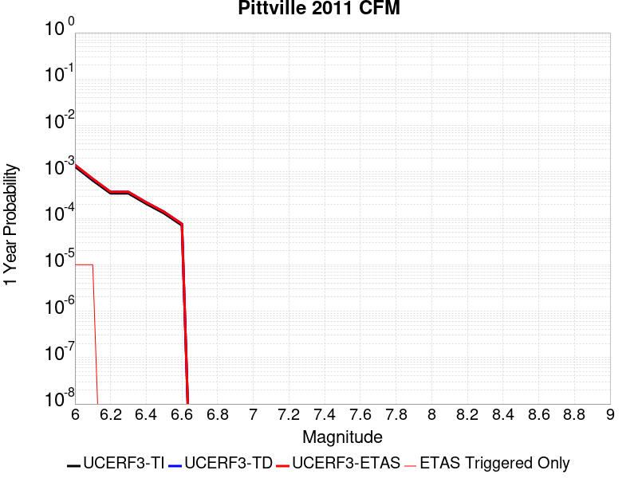 |  |

| Magnitude | 1 wk TI Prob | 1 wk TD Prob | 1 wk ETAS Prob | 1 wk ETAS/TD Gain | 1 wk ETAS Triggered Only | 1 mo TI Prob | 1 mo TD Prob | 1 mo ETAS Prob | 1 mo ETAS/TD Gain | 1 mo ETAS Triggered Only | 1 yr TI Prob | 1 yr TD Prob | 1 yr ETAS Prob | 1 yr ETAS/TD Gain | 1 yr ETAS Triggered Only | 10 yr TI Prob | 10 yr TD Prob | 10 yr ETAS Prob | 10 yr ETAS/TD Gain | 10 yr ETAS Triggered Only |
|-----|-----|-----|-----|-----|-----|-----|-----|-----|-----|-----|-----|-----|-----|-----|-----|-----|-----|-----|-----|-----|
| 6.0 | 2.5031832E-5 | 2.7056969E-5 | 3.70567E-5 | 1.3695805 | 1.0E-5 | 1.0727487E-4 | 1.1595384E-4 | 1.2595268E-4 | 1.0862312 | 1.0E-5 | 0.001305289 | 0.0014109211 | 0.001420907 | 1.0070776 | 1.0E-5 | 0.012976485 | 0.014029415 | 0.014039275 | 1.0007027 | 1.0E-5 |
| 6.1 | 1.2540113E-5 | 1.3513067E-5 | 2.3512932E-5 | 1.7400144 | 1.0E-5 | 5.3742235E-5 | 5.7911984E-5 | 6.79114E-5 | 1.1726658 | 1.0E-5 | 6.541153E-4 | 7.048728E-4 | 7.1486575E-4 | 1.014177 | 1.0E-5 | 0.0065219323 | 0.0070286044 | 0.007038534 | 1.0014127 | 1.0E-5 |
| 6.2 | 6.603218E-6 | 7.107189E-6 | 7.107189E-6 | 1.0 | 0.0 | 2.8299199E-5 | 3.0459063E-5 | 3.0459063E-5 | 1.0 | 0.0 | 3.4448825E-4 | 3.7078248E-4 | 3.7078248E-4 | 1.0 | 0.0 | 0.0034395473 | 0.0037022792 | 0.0037022792 | 1.0 | 0.0 |
| 6.3 | 6.603218E-6 | 7.107189E-6 | 7.107189E-6 | 1.0 | 0.0 | 2.8299199E-5 | 3.0459063E-5 | 3.0459063E-5 | 1.0 | 0.0 | 3.4448825E-4 | 3.7078248E-4 | 3.7078248E-4 | 1.0 | 0.0 | 0.0034395473 | 0.0037022792 | 0.0037022792 | 1.0 | 0.0 |
| 6.4 | 3.9389015E-6 | 4.239175E-6 | 4.239175E-6 | 1.0 | 0.0 | 1.6880897E-5 | 1.8167784E-5 | 1.8167784E-5 | 1.0 | 0.0 | 2.0550552E-4 | 2.2117342E-4 | 2.2117342E-4 | 1.0 | 0.0 | 0.0020531558 | 0.002209838 | 0.002209838 | 1.0 | 0.0 |
| 6.5 | 2.4533072E-6 | 2.6412686E-6 | 2.6412686E-6 | 1.0 | 0.0 | 1.0514132E-5 | 1.1319685E-5 | 1.1319685E-5 | 1.0 | 0.0 | 1.2800204E-4 | 1.3781038E-4 | 1.3781038E-4 | 1.0 | 0.0 | 0.0012792832 | 0.0013774394 | 0.0013774394 | 1.0 | 0.0 |
| 6.6 | 1.3482367E-6 | 1.452993E-6 | 1.452993E-6 | 1.0 | 0.0 | 5.778144E-6 | 6.2271047E-6 | 6.2271047E-6 | 1.0 | 0.0 | 7.0346636E-5 | 7.58135E-5 | 7.58135E-5 | 1.0 | 0.0 | 7.032437E-4 | 7.5798744E-4 | 7.5798744E-4 | 1.0 | 0.0 |

## Elysian Park (Lower CFM)
*[(top)](#table-of-contents)*

| 1 Week | 1 Month | 1 Year | 10 Year |
|-----|-----|-----|-----|
|  |  |  | 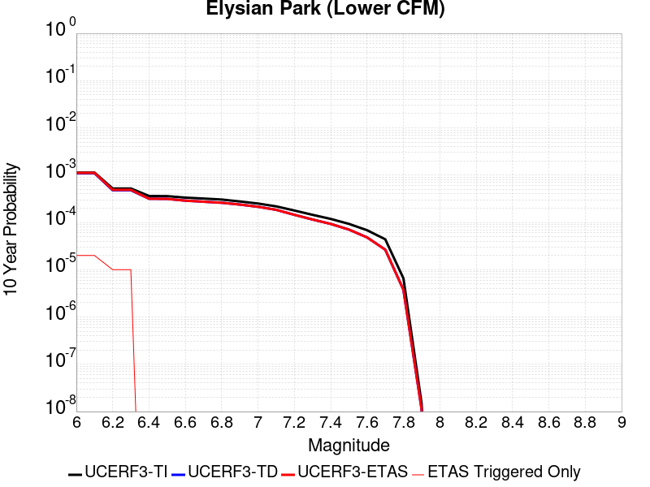 |

| Magnitude | 1 wk TI Prob | 1 wk TD Prob | 1 wk ETAS Prob | 1 wk ETAS/TD Gain | 1 wk ETAS Triggered Only | 1 mo TI Prob | 1 mo TD Prob | 1 mo ETAS Prob | 1 mo ETAS/TD Gain | 1 mo ETAS Triggered Only | 1 yr TI Prob | 1 yr TD Prob | 1 yr ETAS Prob | 1 yr ETAS/TD Gain | 1 yr ETAS Triggered Only | 10 yr TI Prob | 10 yr TD Prob | 10 yr ETAS Prob | 10 yr ETAS/TD Gain | 10 yr ETAS Triggered Only |
|-----|-----|-----|-----|-----|-----|-----|-----|-----|-----|-----|-----|-----|-----|-----|-----|-----|-----|-----|-----|-----|
| 6.0 | 2.1766498E-6 | 2.1037895E-6 | 2.1037895E-6 | 1.0 | 0.0 | 9.328466E-6 | 9.0162175E-6 | 9.0162175E-6 | 1.0 | 0.0 | 1.1356815E-4 | 1.0976836E-4 | 1.0976836E-4 | 1.0 | 0.0 | 0.0011351013 | 0.0010972833 | 0.0011172614 | 1.0182068 | 2.0E-5 |
| 6.1 | 2.1766498E-6 | 2.1037895E-6 | 2.1037895E-6 | 1.0 | 0.0 | 9.328466E-6 | 9.0162175E-6 | 9.0162175E-6 | 1.0 | 0.0 | 1.1356815E-4 | 1.0976836E-4 | 1.0976836E-4 | 1.0 | 0.0 | 0.0011351013 | 0.0010972833 | 0.0011172614 | 1.0182068 | 2.0E-5 |
| 6.2 | 1.0031182E-6 | 9.186213E-7 | 9.186213E-7 | 1.0 | 0.0 | 4.299071E-6 | 3.936943E-6 | 3.936943E-6 | 1.0 | 0.0 | 5.2339932E-5 | 4.7931328E-5 | 4.7931328E-5 | 1.0 | 0.0 | 5.2327604E-4 | 4.7921969E-4 | 4.892149E-4 | 1.0208572 | 1.0E-5 |
| 6.3 | 1.0031182E-6 | 9.186213E-7 | 9.186213E-7 | 1.0 | 0.0 | 4.299071E-6 | 3.936943E-6 | 3.936943E-6 | 1.0 | 0.0 | 5.2339932E-5 | 4.7931328E-5 | 4.7931328E-5 | 1.0 | 0.0 | 5.2327604E-4 | 4.7921969E-4 | 4.892149E-4 | 1.0208572 | 1.0E-5 |
| 6.4 | 6.9606244E-7 | 6.091942E-7 | 6.091942E-7 | 1.0 | 0.0 | 2.9831212E-6 | 2.6108296E-6 | 2.6108296E-6 | 1.0 | 0.0 | 3.6318896E-5 | 3.178639E-5 | 3.178639E-5 | 1.0 | 0.0 | 3.6312963E-4 | 3.1781866E-4 | 3.1781866E-4 | 1.0 | 0.0 |
| 6.5 | 6.901879E-7 | 6.0326255E-7 | 6.0326255E-7 | 1.0 | 0.0 | 2.9579448E-6 | 2.5854083E-6 | 2.5854083E-6 | 1.0 | 0.0 | 3.6012385E-5 | 3.1476895E-5 | 3.1476895E-5 | 1.0 | 0.0 | 3.600655E-4 | 3.147246E-4 | 3.147246E-4 | 1.0 | 0.0 |
| 6.6 | 6.4198554E-7 | 5.5466086E-7 | 5.5466086E-7 | 1.0 | 0.0 | 2.7513638E-6 | 2.3771156E-6 | 2.3771156E-6 | 1.0 | 0.0 | 3.3497337E-5 | 2.8941E-5 | 2.8941E-5 | 1.0 | 0.0 | 3.349229E-4 | 2.8937246E-4 | 2.8937246E-4 | 1.0 | 0.0 |
| 6.7 | 6.138733E-7 | 5.263416E-7 | 5.263416E-7 | 1.0 | 0.0 | 2.6308828E-6 | 2.2557474E-6 | 2.2557474E-6 | 1.0 | 0.0 | 3.203053E-5 | 2.746338E-5 | 2.746338E-5 | 1.0 | 0.0 | 3.2025913E-4 | 2.746E-4 | 2.746E-4 | 1.0 | 0.0 |
| 6.8 | 5.84778E-7 | 5.0029365E-7 | 5.0029365E-7 | 1.0 | 0.0 | 2.506189E-6 | 2.1441138E-6 | 2.1441138E-6 | 1.0 | 0.0 | 3.0512423E-5 | 2.6104273E-5 | 2.6104273E-5 | 1.0 | 0.0 | 3.0508233E-4 | 2.6101217E-4 | 2.6101217E-4 | 1.0 | 0.0 |
| 6.9 | 5.322785E-7 | 4.5800792E-7 | 4.5800792E-7 | 1.0 | 0.0 | 2.2811914E-6 | 1.9628894E-6 | 1.9628894E-6 | 1.0 | 0.0 | 2.7773152E-5 | 2.389792E-5 | 2.389792E-5 | 1.0 | 0.0 | 2.7769682E-4 | 2.3895358E-4 | 2.3895358E-4 | 1.0 | 0.0 |
| 7.0 | 4.8147206E-7 | 4.1124093E-7 | 4.1124093E-7 | 1.0 | 0.0 | 2.06345E-6 | 1.7624599E-6 | 1.7624599E-6 | 1.0 | 0.0 | 2.5122214E-5 | 2.1457738E-5 | 2.1457738E-5 | 1.0 | 0.0 | 2.5119373E-4 | 2.1455674E-4 | 2.1455674E-4 | 1.0 | 0.0 |
| 7.1 | 4.1932955E-7 | 3.5455687E-7 | 3.5455687E-7 | 1.0 | 0.0 | 1.7971255E-6 | 1.5195285E-6 | 1.5195285E-6 | 1.0 | 0.0 | 2.1879783E-5 | 1.8500103E-5 | 1.8500103E-5 | 1.0 | 0.0 | 2.1877629E-4 | 1.8498568E-4 | 1.8498568E-4 | 1.0 | 0.0 |
| 7.2 | 3.426051E-7 | 2.7810242E-7 | 2.7810242E-7 | 1.0 | 0.0 | 1.4683067E-6 | 1.1918669E-6 | 1.1918669E-6 | 1.0 | 0.0 | 1.7876488E-5 | 1.45108825E-5 | 1.45108825E-5 | 1.0 | 0.0 | 1.787505E-4 | 1.4509937E-4 | 1.4509937E-4 | 1.0 | 0.0 |
| 7.3 | 2.7771645E-7 | 2.2096455E-7 | 2.2096455E-7 | 1.0 | 0.0 | 1.1902127E-6 | 9.4699055E-7 | 9.4699055E-7 | 1.0 | 0.0 | 1.4490744E-5 | 1.1529549E-5 | 1.1529549E-5 | 1.0 | 0.0 | 1.4489799E-4 | 1.1528953E-4 | 1.1528953E-4 | 1.0 | 0.0 |
| 7.4 | 2.2756493E-7 | 1.7839739E-7 | 1.7839739E-7 | 1.0 | 0.0 | 9.752779E-7 | 7.6455996E-7 | 7.6455996E-7 | 1.0 | 0.0 | 1.1873944E-5 | 9.308478E-6 | 9.308478E-6 | 1.0 | 0.0 | 1.18733085E-4 | 9.30809E-5 | 9.30809E-5 | 1.0 | 0.0 |
| 7.5 | 1.7874558E-7 | 1.354262E-7 | 1.354262E-7 | 1.0 | 0.0 | 7.660522E-7 | 5.803979E-7 | 5.803979E-7 | 1.0 | 0.0 | 9.326646E-6 | 7.0663214E-6 | 7.0663214E-6 | 1.0 | 0.0 | 9.326255E-5 | 7.0660986E-5 | 7.0660986E-5 | 1.0 | 0.0 |
| 7.6 | 1.3124549E-7 | 9.250717E-8 | 9.250717E-8 | 1.0 | 0.0 | 5.624805E-7 | 3.9645926E-7 | 3.9645926E-7 | 1.0 | 0.0 | 6.8481786E-6 | 4.8268807E-6 | 4.8268807E-6 | 1.0 | 0.0 | 6.8479676E-5 | 4.8267775E-5 | 4.8267775E-5 | 1.0 | 0.0 |
| 7.7 | 8.439993E-8 | 5.0898713E-8 | 5.0898713E-8 | 1.0 | 0.0 | 3.6171392E-7 | 2.1813733E-7 | 2.1813733E-7 | 1.0 | 0.0 | 4.403858E-6 | 2.655819E-6 | 2.655819E-6 | 1.0 | 0.0 | 4.4037708E-5 | 2.6557884E-5 | 2.6557884E-5 | 1.0 | 0.0 |
| 7.8 | 1.2591407E-8 | 7.2273507E-9 | 7.2273507E-9 | 1.0 | 0.0 | 5.3963173E-8 | 3.0974363E-8 | 3.0974363E-8 | 1.0 | 0.0 | 6.570014E-7 | 3.7711277E-7 | 3.7711277E-7 | 1.0 | 0.0 | 6.5699946E-6 | 3.7711216E-6 | 3.7711216E-6 | 1.0 | 0.0 |
| 7.9 | 2.8324232E-11 | 2.1405877E-11 | 2.1405877E-11 | 1.0 | 0.0 | 1.2138957E-10 | 9.1739616E-11 | 9.1739616E-11 | 1.0 | 0.0 | 1.4779177E-9 | 1.1169302E-9 | 1.1169302E-9 | 1.0 | 0.0 | 1.4779177E-8 | 1.1169303E-8 | 1.1169303E-8 | 1.0 | 0.0 |

## San Gabriel (Extension)
*[(top)](#table-of-contents)*

| 1 Week | 1 Month | 1 Year | 10 Year |
|-----|-----|-----|-----|
|  |  |  | 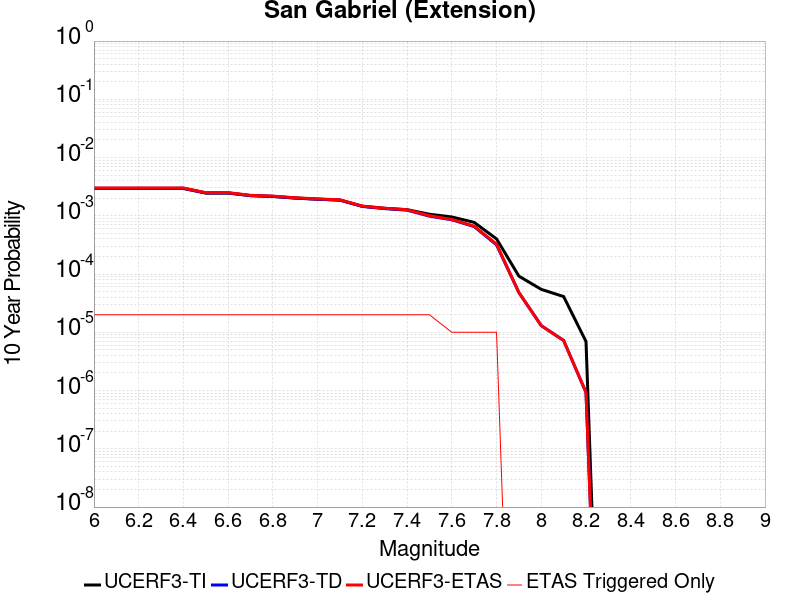 |

| Magnitude | 1 wk TI Prob | 1 wk TD Prob | 1 wk ETAS Prob | 1 wk ETAS/TD Gain | 1 wk ETAS Triggered Only | 1 mo TI Prob | 1 mo TD Prob | 1 mo ETAS Prob | 1 mo ETAS/TD Gain | 1 mo ETAS Triggered Only | 1 yr TI Prob | 1 yr TD Prob | 1 yr ETAS Prob | 1 yr ETAS/TD Gain | 1 yr ETAS Triggered Only | 10 yr TI Prob | 10 yr TD Prob | 10 yr ETAS Prob | 10 yr ETAS/TD Gain | 10 yr ETAS Triggered Only |
|-----|-----|-----|-----|-----|-----|-----|-----|-----|-----|-----|-----|-----|-----|-----|-----|-----|-----|-----|-----|-----|
| 6.0 | 5.6486106E-6 | 5.7168368E-6 | 5.7168368E-6 | 1.0 | 0.0 | 2.4208108E-5 | 2.4500505E-5 | 2.4500505E-5 | 1.0 | 0.0 | 2.9469383E-4 | 2.9825408E-4 | 3.1824812E-4 | 1.0670369 | 2.0E-5 | 0.0029430336 | 0.0029786646 | 0.0029986051 | 1.0066944 | 2.0E-5 |
| 6.1 | 5.6486106E-6 | 5.7168368E-6 | 5.7168368E-6 | 1.0 | 0.0 | 2.4208108E-5 | 2.4500505E-5 | 2.4500505E-5 | 1.0 | 0.0 | 2.9469383E-4 | 2.9825408E-4 | 3.1824812E-4 | 1.0670369 | 2.0E-5 | 0.0029430336 | 0.0029786646 | 0.0029986051 | 1.0066944 | 2.0E-5 |
| 6.2 | 5.6486106E-6 | 5.7168368E-6 | 5.7168368E-6 | 1.0 | 0.0 | 2.4208108E-5 | 2.4500505E-5 | 2.4500505E-5 | 1.0 | 0.0 | 2.9469383E-4 | 2.9825408E-4 | 3.1824812E-4 | 1.0670369 | 2.0E-5 | 0.0029430336 | 0.0029786646 | 0.0029986051 | 1.0066944 | 2.0E-5 |
| 6.3 | 5.6486106E-6 | 5.7168368E-6 | 5.7168368E-6 | 1.0 | 0.0 | 2.4208108E-5 | 2.4500505E-5 | 2.4500505E-5 | 1.0 | 0.0 | 2.9469383E-4 | 2.9825408E-4 | 3.1824812E-4 | 1.0670369 | 2.0E-5 | 0.0029430336 | 0.0029786646 | 0.0029986051 | 1.0066944 | 2.0E-5 |
| 6.4 | 5.6486106E-6 | 5.7168368E-6 | 5.7168368E-6 | 1.0 | 0.0 | 2.4208108E-5 | 2.4500505E-5 | 2.4500505E-5 | 1.0 | 0.0 | 2.9469383E-4 | 2.9825408E-4 | 3.1824812E-4 | 1.0670369 | 2.0E-5 | 0.0029430336 | 0.0029786646 | 0.0029986051 | 1.0066944 | 2.0E-5 |
| 6.5 | 4.7134554E-6 | 4.7542608E-6 | 4.7542608E-6 | 1.0 | 0.0 | 2.0200367E-5 | 2.0375248E-5 | 2.0375248E-5 | 1.0 | 0.0 | 2.459117E-4 | 2.4804127E-4 | 2.680363E-4 | 1.0806117 | 2.0E-5 | 0.0024563975 | 0.0024777285 | 0.002497679 | 1.0080519 | 2.0E-5 |
| 6.6 | 4.7134554E-6 | 4.7542608E-6 | 4.7542608E-6 | 1.0 | 0.0 | 2.0200367E-5 | 2.0375248E-5 | 2.0375248E-5 | 1.0 | 0.0 | 2.459117E-4 | 2.4804127E-4 | 2.680363E-4 | 1.0806117 | 2.0E-5 | 0.0024563975 | 0.0024777285 | 0.002497679 | 1.0080519 | 2.0E-5 |
| 6.7 | 4.2468837E-6 | 4.274078E-6 | 4.274078E-6 | 1.0 | 0.0 | 1.8200803E-5 | 1.8317352E-5 | 1.8317352E-5 | 1.0 | 0.0 | 2.2157225E-4 | 2.2299167E-4 | 2.4298721E-4 | 1.0896695 | 2.0E-5 | 0.0022135144 | 0.0022277513 | 0.0022477068 | 1.0089576 | 2.0E-5 |
| 6.8 | 4.1180615E-6 | 4.1414673E-6 | 4.1414673E-6 | 1.0 | 0.0 | 1.7648716E-5 | 1.774903E-5 | 1.774903E-5 | 1.0 | 0.0 | 2.1485193E-4 | 2.1607373E-4 | 2.360694E-4 | 1.092541 | 2.0E-5 | 0.0021464431 | 0.0021587077 | 0.0021786646 | 1.0092448 | 2.0E-5 |
| 6.9 | 3.863861E-6 | 3.879783E-6 | 3.879783E-6 | 1.0 | 0.0 | 1.65593E-5 | 1.6627539E-5 | 1.6627539E-5 | 1.0 | 0.0 | 2.0159081E-4 | 2.0242216E-4 | 2.2241811E-4 | 1.0987834 | 2.0E-5 | 0.0020140803 | 0.0020224454 | 0.002042405 | 1.009869 | 2.0E-5 |
| 7.0 | 3.6947372E-6 | 3.705682E-6 | 3.705682E-6 | 1.0 | 0.0 | 1.5834492E-5 | 1.5881402E-5 | 1.5881402E-5 | 1.0 | 0.0 | 1.9276788E-4 | 1.9333958E-4 | 2.1333572E-4 | 1.1034249 | 2.0E-5 | 0.0019260074 | 0.0019317803 | 0.0019517416 | 1.0103332 | 2.0E-5 |
| 7.1 | 3.5686835E-6 | 3.5729024E-6 | 3.5729024E-6 | 1.0 | 0.0 | 1.5294268E-5 | 1.5312353E-5 | 1.5312353E-5 | 1.0 | 0.0 | 1.861918E-4 | 1.8641262E-4 | 2.0640889E-4 | 1.1072689 | 2.0E-5 | 0.0018603588 | 0.0018626284 | 0.001882591 | 1.0107175 | 2.0E-5 |
| 7.2 | 2.8023446E-6 | 2.776794E-6 | 2.776794E-6 | 1.0 | 0.0 | 1.2009994E-5 | 1.1900492E-5 | 1.1900492E-5 | 1.0 | 0.0 | 1.4621185E-4 | 1.4487897E-4 | 1.6487607E-4 | 1.1380262 | 2.0E-5 | 0.001461157 | 0.001447856 | 0.001467827 | 1.0137936 | 2.0E-5 |
| 7.3 | 2.5843012E-6 | 2.5459692E-6 | 2.5459692E-6 | 1.0 | 0.0 | 1.1075529E-5 | 1.0911252E-5 | 1.0911252E-5 | 1.0 | 0.0 | 1.3483623E-4 | 1.3283649E-4 | 1.5283383E-4 | 1.1505411 | 2.0E-5 | 0.0013475444 | 0.0013275805 | 0.001347554 | 1.015045 | 2.0E-5 |
| 7.4 | 2.4464468E-6 | 2.396669E-6 | 2.396669E-6 | 1.0 | 0.0 | 1.04847295E-5 | 1.0271398E-5 | 1.0271398E-5 | 1.0 | 0.0 | 1.276441E-4 | 1.250472E-4 | 1.450447E-4 | 1.1599196 | 2.0E-5 | 0.0012757082 | 0.001249778 | 0.001269753 | 1.0159829 | 2.0E-5 |
| 7.5 | 2.0420266E-6 | 1.8910376E-6 | 1.8910376E-6 | 1.0 | 0.0 | 8.751514E-6 | 8.104422E-6 | 8.104422E-6 | 1.0 | 0.0 | 1.0654447E-4 | 9.866691E-5 | 1.1866493E-4 | 1.2026823 | 2.0E-5 | 0.001064934 | 9.862344E-4 | 0.0010062146 | 1.0202591 | 2.0E-5 |
| 7.6 | 1.8326596E-6 | 1.6398233E-6 | 1.6398233E-6 | 1.0 | 0.0 | 7.854232E-6 | 7.027795E-6 | 7.027795E-6 | 1.0 | 0.0 | 9.562107E-5 | 8.556007E-5 | 9.555921E-5 | 1.116867 | 1.0E-5 | 9.5579936E-4 | 8.552735E-4 | 8.6526497E-4 | 1.0116822 | 1.0E-5 |
| 7.7 | 1.4786998E-6 | 1.2523672E-6 | 1.2523672E-6 | 1.0 | 0.0 | 6.3372695E-6 | 5.3672766E-6 | 5.3672766E-6 | 1.0 | 0.0 | 7.715353E-5 | 6.534465E-5 | 7.534399E-5 | 1.1530247 | 1.0E-5 | 7.7126746E-4 | 6.5325975E-4 | 6.6325325E-4 | 1.0152979 | 1.0E-5 |
| 7.8 | 7.6975533E-7 | 6.069207E-7 | 6.069207E-7 | 1.0 | 0.0 | 3.2989474E-6 | 2.6010862E-6 | 2.6010862E-6 | 1.0 | 0.0 | 4.0163945E-5 | 3.1667765E-5 | 4.166745E-5 | 1.3157685 | 1.0E-5 | 4.0156685E-4 | 3.166365E-4 | 3.266333E-4 | 1.031572 | 1.0E-5 |
| 7.9 | 1.7645915E-7 | 9.211899E-8 | 9.211899E-8 | 1.0 | 0.0 | 7.562533E-7 | 3.947956E-7 | 3.947956E-7 | 1.0 | 0.0 | 9.207345E-6 | 4.806626E-6 | 4.806626E-6 | 1.0 | 0.0 | 9.206964E-5 | 4.8069025E-5 | 4.8069025E-5 | 1.0 | 0.0 |
| 8.0 | 1.0463461E-7 | 2.4937416E-8 | 2.4937416E-8 | 1.0 | 0.0 | 4.4843398E-7 | 1.0687464E-7 | 1.0687464E-7 | 1.0 | 0.0 | 5.45967E-6 | 1.3011979E-6 | 1.3011979E-6 | 1.0 | 0.0 | 5.459536E-5 | 1.3015701E-5 | 1.3015701E-5 | 1.0 | 0.0 |
| 8.1 | 7.875717E-8 | 1.3857542E-8 | 1.3857542E-8 | 1.0 | 0.0 | 3.3753068E-7 | 5.9389468E-8 | 5.9389468E-8 | 1.0 | 0.0 | 4.109428E-6 | 7.2306653E-7 | 7.2306653E-7 | 1.0 | 0.0 | 4.109352E-5 | 7.234439E-6 | 7.234439E-6 | 1.0 | 0.0 |
| 8.2 | 1.33163E-8 | 1.7720816E-9 | 1.7720816E-9 | 1.0 | 0.0 | 5.7069855E-8 | 7.594638E-9 | 7.594638E-9 | 1.0 | 0.0 | 6.9482525E-7 | 9.246471E-8 | 9.246471E-8 | 1.0 | 0.0 | 6.9482307E-6 | 9.2664203E-7 | 9.2664203E-7 | 1.0 | 0.0 |

## San Juan
*[(top)](#table-of-contents)*

| 1 Week | 1 Month | 1 Year | 10 Year |
|-----|-----|-----|-----|
|  |  | 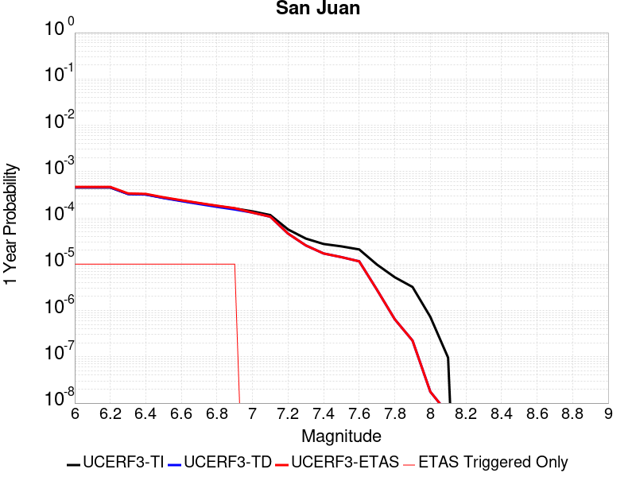 |  |

| Magnitude | 1 wk TI Prob | 1 wk TD Prob | 1 wk ETAS Prob | 1 wk ETAS/TD Gain | 1 wk ETAS Triggered Only | 1 mo TI Prob | 1 mo TD Prob | 1 mo ETAS Prob | 1 mo ETAS/TD Gain | 1 mo ETAS Triggered Only | 1 yr TI Prob | 1 yr TD Prob | 1 yr ETAS Prob | 1 yr ETAS/TD Gain | 1 yr ETAS Triggered Only | 10 yr TI Prob | 10 yr TD Prob | 10 yr ETAS Prob | 10 yr ETAS/TD Gain | 10 yr ETAS Triggered Only |
|-----|-----|-----|-----|-----|-----|-----|-----|-----|-----|-----|-----|-----|-----|-----|-----|-----|-----|-----|-----|-----|
| 6.0 | 8.682808E-6 | 8.74917E-6 | 8.74917E-6 | 1.0 | 0.0 | 3.72115E-5 | 3.749593E-5 | 3.749593E-5 | 1.0 | 0.0 | 4.5295584E-4 | 4.5642213E-4 | 4.6641758E-4 | 1.0218996 | 1.0E-5 | 0.004520337 | 0.004555389 | 0.0045752977 | 1.0043705 | 2.0E-5 |
| 6.1 | 8.682808E-6 | 8.74917E-6 | 8.74917E-6 | 1.0 | 0.0 | 3.72115E-5 | 3.749593E-5 | 3.749593E-5 | 1.0 | 0.0 | 4.5295584E-4 | 4.5642213E-4 | 4.6641758E-4 | 1.0218996 | 1.0E-5 | 0.004520337 | 0.004555389 | 0.0045752977 | 1.0043705 | 2.0E-5 |
| 6.2 | 8.682808E-6 | 8.74917E-6 | 8.74917E-6 | 1.0 | 0.0 | 3.72115E-5 | 3.749593E-5 | 3.749593E-5 | 1.0 | 0.0 | 4.5295584E-4 | 4.5642213E-4 | 4.6641758E-4 | 1.0218996 | 1.0E-5 | 0.004520337 | 0.004555389 | 0.0045752977 | 1.0043705 | 2.0E-5 |
| 6.3 | 6.3054235E-6 | 6.282591E-6 | 6.282591E-6 | 1.0 | 0.0 | 2.7022963E-5 | 2.692512E-5 | 2.692512E-5 | 1.0 | 0.0 | 3.2895492E-4 | 3.2776545E-4 | 3.3776215E-4 | 1.0304996 | 1.0E-5 | 0.003284684 | 0.0032730205 | 0.003292955 | 1.0060905 | 2.0E-5 |
| 6.4 | 6.1490473E-6 | 6.1144706E-6 | 6.1144706E-6 | 1.0 | 0.0 | 2.6352795E-5 | 2.6204618E-5 | 2.6204618E-5 | 1.0 | 0.0 | 3.2079802E-4 | 3.189959E-4 | 3.289927E-4 | 1.0313383 | 1.0E-5 | 0.0032033534 | 0.0031855768 | 0.003205513 | 1.0062582 | 2.0E-5 |
| 6.5 | 5.204848E-6 | 5.137238E-6 | 5.137238E-6 | 1.0 | 0.0 | 2.23063E-5 | 2.2016555E-5 | 2.2016555E-5 | 1.0 | 0.0 | 2.7154534E-4 | 2.6801953E-4 | 2.7801684E-4 | 1.0373007 | 1.0E-5 | 0.0027121378 | 0.0026771172 | 0.0026970638 | 1.0074507 | 2.0E-5 |
| 6.6 | 4.5179986E-6 | 4.415036E-6 | 4.415036E-6 | 1.0 | 0.0 | 1.9362706E-5 | 1.892145E-5 | 1.892145E-5 | 1.0 | 0.0 | 2.3571544E-4 | 2.303451E-4 | 2.403428E-4 | 1.0434031 | 1.0E-5 | 0.0023546559 | 0.0023012008 | 0.0023211548 | 1.0086712 | 2.0E-5 |
| 6.7 | 3.9442616E-6 | 3.8198336E-6 | 3.8198336E-6 | 1.0 | 0.0 | 1.6903869E-5 | 1.6370615E-5 | 1.6370615E-5 | 1.0 | 0.0 | 2.0578515E-4 | 1.9929469E-4 | 2.092927E-4 | 1.050167 | 1.0E-5 | 0.002055947 | 0.001991285 | 0.0020112451 | 1.0100237 | 2.0E-5 |
| 6.8 | 3.4536245E-6 | 3.3163408E-6 | 3.3163408E-6 | 1.0 | 0.0 | 1.4801163E-5 | 1.4212815E-5 | 1.4212815E-5 | 1.0 | 0.0 | 1.8018926E-4 | 1.7302789E-4 | 1.8302616E-4 | 1.0577842 | 1.0E-5 | 0.0018004322 | 0.001729051 | 0.0017490163 | 1.0115471 | 2.0E-5 |
| 6.9 | 3.059865E-6 | 2.9120363E-6 | 2.9120363E-6 | 1.0 | 0.0 | 1.3113641E-5 | 1.2480099E-5 | 1.2480099E-5 | 1.0 | 0.0 | 1.596469E-4 | 1.5193518E-4 | 1.6193367E-4 | 1.0658076 | 1.0E-5 | 0.0015953224 | 0.0015184281 | 0.0015383977 | 1.0131515 | 2.0E-5 |
| 7.0 | 2.6504351E-6 | 2.492005E-6 | 2.492005E-6 | 1.0 | 0.0 | 1.1358958E-5 | 1.0679981E-5 | 1.0679981E-5 | 1.0 | 0.0 | 1.3828653E-4 | 1.3002155E-4 | 1.3002155E-4 | 1.0 | 0.0 | 0.0013820052 | 0.001299567 | 0.001299567 | 1.0 | 0.0 |
| 7.1 | 2.2039317E-6 | 2.0338366E-6 | 2.0338366E-6 | 1.0 | 0.0 | 9.445387E-6 | 8.716416E-6 | 8.716416E-6 | 1.0 | 0.0 | 1.1499152E-4 | 1.0611773E-4 | 1.0611773E-4 | 1.0 | 0.0 | 0.0011493203 | 0.0010607811 | 0.0010607811 | 1.0 | 0.0 |
| 7.2 | 1.0786707E-6 | 8.770239E-7 | 8.770239E-7 | 1.0 | 0.0 | 4.622866E-6 | 3.7586685E-6 | 3.7586685E-6 | 1.0 | 0.0 | 5.628194E-5 | 4.576084E-5 | 4.576084E-5 | 1.0 | 0.0 | 5.6267687E-4 | 4.5757365E-4 | 4.5757365E-4 | 1.0 | 0.0 |
| 7.3 | 6.846433E-7 | 4.868812E-7 | 4.868812E-7 | 1.0 | 0.0 | 2.9341822E-6 | 2.086632E-6 | 2.086632E-6 | 1.0 | 0.0 | 3.5723086E-5 | 2.5404452E-5 | 2.5404452E-5 | 1.0 | 0.0 | 3.571734E-4 | 2.5405022E-4 | 2.5405022E-4 | 1.0 | 0.0 |
| 7.4 | 5.23043E-7 | 3.2627884E-7 | 3.2627884E-7 | 1.0 | 0.0 | 2.2416111E-6 | 1.3983371E-6 | 1.3983371E-6 | 1.0 | 0.0 | 2.7291273E-5 | 1.7024622E-5 | 1.7024622E-5 | 1.0 | 0.0 | 2.7287923E-4 | 1.7026608E-4 | 1.7026608E-4 | 1.0 | 0.0 |
| 7.5 | 4.648444E-7 | 2.723464E-7 | 2.723464E-7 | 1.0 | 0.0 | 1.9921886E-6 | 1.1671983E-6 | 1.1671983E-6 | 1.0 | 0.0 | 2.4254627E-5 | 1.4210547E-5 | 1.4210547E-5 | 1.0 | 0.0 | 2.425198E-4 | 1.4212691E-4 | 1.4212691E-4 | 1.0 | 0.0 |
| 7.6 | 3.9906567E-7 | 2.2083036E-7 | 2.2083036E-7 | 1.0 | 0.0 | 1.7102802E-6 | 9.4641547E-7 | 9.4641547E-7 | 1.0 | 0.0 | 2.0822463E-5 | 1.1522548E-5 | 1.1522548E-5 | 1.0 | 0.0 | 2.0820512E-4 | 1.15244526E-4 | 1.15244526E-4 | 1.0 | 0.0 |
| 7.7 | 1.8784601E-7 | 5.366277E-8 | 5.366277E-8 | 1.0 | 0.0 | 8.0505407E-7 | 2.2998329E-7 | 2.2998329E-7 | 1.0 | 0.0 | 9.80149E-6 | 2.800043E-6 | 2.800043E-6 | 1.0 | 0.0 | 9.801057E-5 | 2.8008939E-5 | 2.8008939E-5 | 1.0 | 0.0 |
| 7.8 | 1.00154914E-7 | 1.2412917E-8 | 1.2412917E-8 | 1.0 | 0.0 | 4.2923529E-7 | 5.3198217E-8 | 5.3198217E-8 | 1.0 | 0.0 | 5.225927E-6 | 6.476881E-7 | 6.476881E-7 | 1.0 | 0.0 | 5.225804E-5 | 6.4827886E-6 | 6.4827886E-6 | 1.0 | 0.0 |
| 7.9 | 6.171429E-8 | 4.2946513E-9 | 4.2946513E-9 | 1.0 | 0.0 | 2.6448978E-7 | 1.8405647E-8 | 1.8405647E-8 | 1.0 | 0.0 | 3.2201583E-6 | 2.2408874E-7 | 2.2408874E-7 | 1.0 | 0.0 | 3.2201115E-5 | 2.2462114E-6 | 2.2462114E-6 | 1.0 | 0.0 |
| 8.0 | 1.3974572E-8 | 3.3737857E-10 | 3.3737857E-10 | 1.0 | 0.0 | 5.989102E-8 | 1.4459075E-9 | 1.4459075E-9 | 1.0 | 0.0 | 7.2917294E-7 | 1.760392E-8 | 1.760392E-8 | 1.0 | 0.0 | 7.2917055E-6 | 1.8038004E-7 | 1.8038004E-7 | 1.0 | 0.0 |
| 8.1 | 1.8403477E-9 | 1.1291601E-10 | 1.1291601E-10 | 1.0 | 0.0 | 7.887204E-9 | 4.839261E-10 | 4.839261E-10 | 1.0 | 0.0 | 9.602671E-8 | 5.8917977E-9 | 5.8917977E-9 | 1.0 | 0.0 | 9.602667E-7 | 6.0206084E-8 | 6.0206084E-8 | 1.0 | 0.0 |

## San Andreas (Offshore) 2011 CFM
*[(top)](#table-of-contents)*

| 1 Week | 1 Month | 1 Year | 10 Year |
|-----|-----|-----|-----|
|  |  |  | 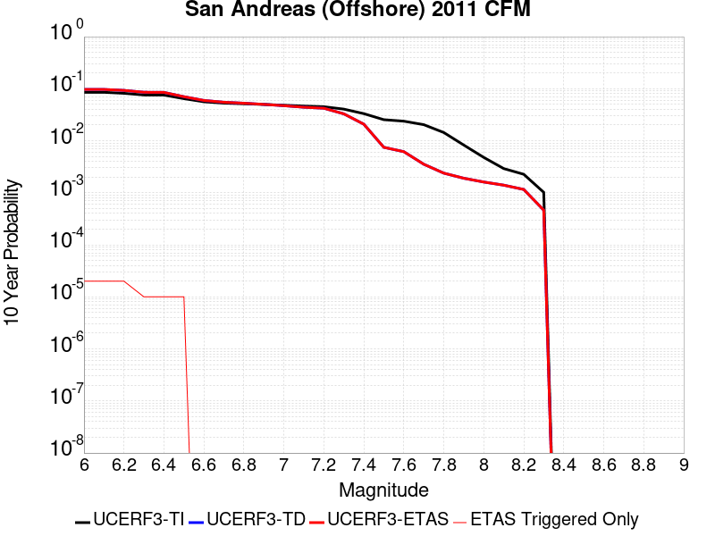 |

| Magnitude | 1 wk TI Prob | 1 wk TD Prob | 1 wk ETAS Prob | 1 wk ETAS/TD Gain | 1 wk ETAS Triggered Only | 1 mo TI Prob | 1 mo TD Prob | 1 mo ETAS Prob | 1 mo ETAS/TD Gain | 1 mo ETAS Triggered Only | 1 yr TI Prob | 1 yr TD Prob | 1 yr ETAS Prob | 1 yr ETAS/TD Gain | 1 yr ETAS Triggered Only | 10 yr TI Prob | 10 yr TD Prob | 10 yr ETAS Prob | 10 yr ETAS/TD Gain | 10 yr ETAS Triggered Only |
|-----|-----|-----|-----|-----|-----|-----|-----|-----|-----|-----|-----|-----|-----|-----|-----|-----|-----|-----|-----|-----|
| 6.0 | 1.7072787E-4 | 1.9226626E-4 | 1.9226626E-4 | 1.0 | 0.0 | 7.3148566E-4 | 8.237405E-4 | 8.237405E-4 | 1.0 | 0.0 | 0.008869528 | 0.009983436 | 0.009993336 | 1.0009917 | 1.0E-5 | 0.085237645 | 0.09681613 | 0.0968342 | 1.0001866 | 2.0E-5 |
| 6.1 | 1.7072787E-4 | 1.9226626E-4 | 1.9226626E-4 | 1.0 | 0.0 | 7.3148566E-4 | 8.237405E-4 | 8.237405E-4 | 1.0 | 0.0 | 0.008869528 | 0.009983436 | 0.009993336 | 1.0009917 | 1.0E-5 | 0.085237645 | 0.09681613 | 0.0968342 | 1.0001866 | 2.0E-5 |
| 6.2 | 1.6312556E-4 | 1.8408237E-4 | 1.8408237E-4 | 1.0 | 0.0 | 6.989222E-4 | 7.8868825E-4 | 7.8868825E-4 | 1.0 | 0.0 | 0.008476226 | 0.0095605 | 0.009570405 | 1.0010359 | 1.0E-5 | 0.08160117 | 0.092837214 | 0.09285536 | 1.0001954 | 2.0E-5 |
| 6.3 | 1.5103363E-4 | 1.6881147E-4 | 1.6881147E-4 | 1.0 | 0.0 | 6.471264E-4 | 7.232793E-4 | 7.232793E-4 | 1.0 | 0.0 | 0.007850339 | 0.008770814 | 0.008780727 | 1.0011301 | 1.0E-5 | 0.075787395 | 0.08546859 | 0.08547774 | 1.000107 | 1.0E-5 |
| 6.4 | 1.5047993E-4 | 1.6767075E-4 | 1.6767075E-4 | 1.0 | 0.0 | 6.4475456E-4 | 7.183932E-4 | 7.183932E-4 | 1.0 | 0.0 | 0.007821669 | 0.008711802 | 0.008721715 | 1.0011379 | 1.0E-5 | 0.0755203 | 0.08494888 | 0.08495803 | 1.0001078 | 1.0E-5 |
| 6.5 | 1.2760791E-4 | 1.3734949E-4 | 1.3734949E-4 | 1.0 | 0.0 | 5.467764E-4 | 5.8850925E-4 | 5.8850925E-4 | 1.0 | 0.0 | 0.0066367025 | 0.007141834 | 0.007151763 | 1.0013902 | 1.0E-5 | 0.064419635 | 0.07024954 | 0.07025884 | 1.0001323 | 1.0E-5 |
| 6.6 | 1.1063525E-4 | 1.15565475E-4 | 1.15565475E-4 | 1.0 | 0.0 | 4.740649E-4 | 4.9518765E-4 | 4.9518765E-4 | 1.0 | 0.0 | 0.0057564764 | 0.006012446 | 0.006012446 | 1.0 | 0.0 | 0.05609626 | 0.059496127 | 0.059496127 | 1.0 | 0.0 |
| 6.7 | 1.0391049E-4 | 1.0645875E-4 | 1.0645875E-4 | 1.0 | 0.0 | 4.4525467E-4 | 4.56173E-4 | 4.56173E-4 | 1.0 | 0.0 | 0.0054075094 | 0.0055399504 | 0.0055399504 | 1.0 | 0.0 | 0.052778035 | 0.05498844 | 0.05498844 | 1.0 | 0.0 |
| 6.8 | 1.0096706E-4 | 1.01582154E-4 | 1.01582154E-4 | 1.0 | 0.0 | 4.3264418E-4 | 4.3528038E-4 | 4.3528038E-4 | 1.0 | 0.0 | 0.0052547283 | 0.0052868384 | 0.0052868384 | 1.0 | 0.0 | 0.051321987 | 0.052686825 | 0.052686825 | 1.0 | 0.0 |
| 6.9 | 9.800265E-5 | 9.588697E-5 | 9.588697E-5 | 1.0 | 0.0 | 4.1994374E-4 | 4.1088034E-4 | 4.1088034E-4 | 1.0 | 0.0 | 0.0051008356 | 0.004991162 | 0.004991162 | 1.0 | 0.0 | 0.049853306 | 0.05001508 | 0.05001508 | 1.0 | 0.0 |
| 7.0 | 9.4642375E-5 | 9.002096E-5 | 9.002096E-5 | 1.0 | 0.0 | 4.0554712E-4 | 3.8574796E-4 | 3.8574796E-4 | 1.0 | 0.0 | 0.004926363 | 0.00468653 | 0.00468653 | 1.0 | 0.0 | 0.048185747 | 0.047194667 | 0.047194667 | 1.0 | 0.0 |
| 7.1 | 9.0996844E-5 | 8.354119E-5 | 8.354119E-5 | 1.0 | 0.0 | 3.8992817E-4 | 3.579854E-4 | 3.579854E-4 | 1.0 | 0.0 | 0.004737046 | 0.0043499186 | 0.0043499186 | 1.0 | 0.0 | 0.04637333 | 0.04404688 | 0.04404688 | 1.0 | 0.0 |
| 7.2 | 8.848287E-5 | 7.981761E-5 | 7.981761E-5 | 1.0 | 0.0 | 3.791572E-4 | 3.420315E-4 | 3.420315E-4 | 1.0 | 0.0 | 0.004606472 | 0.0041564363 | 0.0041564363 | 1.0 | 0.0 | 0.045121472 | 0.042189904 | 0.042189904 | 1.0 | 0.0 |
| 7.3 | 7.9280784E-5 | 6.1274885E-5 | 6.1274885E-5 | 1.0 | 0.0 | 3.3973053E-4 | 2.6258078E-4 | 2.6258078E-4 | 1.0 | 0.0 | 0.004128377 | 0.003192337 | 0.003192337 | 1.0 | 0.0 | 0.040525194 | 0.03290183 | 0.03290183 | 1.0 | 0.0 |
| 7.4 | 6.468038E-5 | 3.7930724E-5 | 3.7930724E-5 | 1.0 | 0.0 | 2.771722E-4 | 1.6255044E-4 | 1.6255044E-4 | 1.0 | 0.0 | 0.0033693502 | 0.0019773128 | 0.0019773128 | 1.0 | 0.0 | 0.0331872 | 0.02081734 | 0.02081734 | 1.0 | 0.0 |
| 7.5 | 4.930574E-5 | 1.2699263E-5 | 1.2699263E-5 | 1.0 | 0.0 | 2.1129321E-4 | 5.4424287E-5 | 5.4424287E-5 | 1.0 | 0.0 | 0.0025694598 | 6.6241587E-4 | 6.6241587E-4 | 1.0 | 0.0 | 0.02539953 | 0.0074798525 | 0.0074798525 | 1.0 | 0.0 |
| 7.6 | 4.612566E-5 | 1.0332297E-5 | 1.0332297E-5 | 1.0 | 0.0 | 1.9766642E-4 | 4.428053E-5 | 4.428053E-5 | 1.0 | 0.0 | 0.0024039324 | 5.3898344E-4 | 5.3898344E-4 | 1.0 | 0.0 | 0.023780935 | 0.006170428 | 0.006170428 | 1.0 | 0.0 |
| 7.7 | 3.9435414E-5 | 5.5710498E-6 | 5.5710498E-6 | 1.0 | 0.0 | 1.6899795E-4 | 2.3875711E-5 | 2.3875711E-5 | 1.0 | 0.0 | 0.0020556084 | 2.906482E-4 | 2.906482E-4 | 1.0 | 0.0 | 0.020366974 | 0.0035397834 | 0.0035397834 | 1.0 | 0.0 |
| 7.8 | 2.7787428E-5 | 3.7526645E-6 | 3.7526645E-6 | 1.0 | 0.0 | 1.1908354E-4 | 1.6082748E-5 | 1.6082748E-5 | 1.0 | 0.0 | 0.0014488777 | 1.9578991E-4 | 1.9578991E-4 | 1.0 | 0.0 | 0.014394675 | 0.0023862 | 0.0023862 | 1.0 | 0.0 |
| 7.9 | 1.590671E-5 | 3.0391298E-6 | 3.0391298E-6 | 1.0 | 0.0 | 6.816983E-5 | 1.3024777E-5 | 1.3024777E-5 | 1.0 | 0.0 | 8.2965166E-4 | 1.5856515E-4 | 1.5856515E-4 | 1.0 | 0.0 | 0.008265611 | 0.0019033558 | 0.0019033558 | 1.0 | 0.0 |
| 8.0 | 9.193638E-6 | 2.5908973E-6 | 2.5908973E-6 | 1.0 | 0.0 | 3.940071E-5 | 1.1103798E-5 | 1.1103798E-5 | 1.0 | 0.0 | 4.7959806E-4 | 1.3518038E-4 | 1.3518038E-4 | 1.0 | 0.0 | 0.0047856434 | 0.0016108477 | 0.0016108477 | 1.0 | 0.0 |
| 8.1 | 5.601576E-6 | 2.2333788E-6 | 2.2333788E-6 | 1.0 | 0.0 | 2.4006533E-5 | 9.571589E-6 | 9.571589E-6 | 1.0 | 0.0 | 2.9224035E-4 | 1.1652788E-4 | 1.1652788E-4 | 1.0 | 0.0 | 0.0029185633 | 0.0014015464 | 0.0014015464 | 1.0 | 0.0 |
| 8.2 | 4.3508785E-6 | 1.8568232E-6 | 1.8568232E-6 | 1.0 | 0.0 | 1.864649E-5 | 7.957789E-6 | 7.957789E-6 | 1.0 | 0.0 | 2.2699735E-4 | 9.6881806E-5 | 9.6881806E-5 | 1.0 | 0.0 | 0.0022676561 | 0.0011590312 | 0.0011590312 | 1.0 | 0.0 |
| 8.3 | 1.9573292E-6 | 7.511501E-7 | 7.511501E-7 | 1.0 | 0.0 | 8.388526E-6 | 3.2192108E-6 | 3.2192108E-6 | 1.0 | 0.0 | 1.0212552E-4 | 3.9193204E-5 | 3.9193204E-5 | 1.0 | 0.0 | 0.001020786 | 4.6391718E-4 | 4.6391718E-4 | 1.0 | 0.0 |

## Elsinore (Julian)
*[(top)](#table-of-contents)*

| 1 Week | 1 Month | 1 Year | 10 Year |
|-----|-----|-----|-----|
|  |  |  | 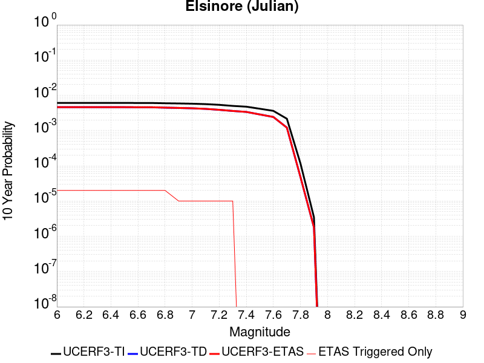 |

| Magnitude | 1 wk TI Prob | 1 wk TD Prob | 1 wk ETAS Prob | 1 wk ETAS/TD Gain | 1 wk ETAS Triggered Only | 1 mo TI Prob | 1 mo TD Prob | 1 mo ETAS Prob | 1 mo ETAS/TD Gain | 1 mo ETAS Triggered Only | 1 yr TI Prob | 1 yr TD Prob | 1 yr ETAS Prob | 1 yr ETAS/TD Gain | 1 yr ETAS Triggered Only | 10 yr TI Prob | 10 yr TD Prob | 10 yr ETAS Prob | 10 yr ETAS/TD Gain | 10 yr ETAS Triggered Only |
|-----|-----|-----|-----|-----|-----|-----|-----|-----|-----|-----|-----|-----|-----|-----|-----|-----|-----|-----|-----|-----|
| 6.0 | 1.1710231E-5 | 8.845315E-6 | 8.845315E-6 | 1.0 | 0.0 | 5.0185736E-5 | 3.7907954E-5 | 3.7907954E-5 | 1.0 | 0.0 | 6.1084004E-4 | 4.614333E-4 | 4.7142868E-4 | 1.0216616 | 1.0E-5 | 0.006091637 | 0.0046049724 | 0.0046248804 | 1.0043231 | 2.0E-5 |
| 6.1 | 1.1710231E-5 | 8.845315E-6 | 8.845315E-6 | 1.0 | 0.0 | 5.0185736E-5 | 3.7907954E-5 | 3.7907954E-5 | 1.0 | 0.0 | 6.1084004E-4 | 4.614333E-4 | 4.7142868E-4 | 1.0216616 | 1.0E-5 | 0.006091637 | 0.0046049724 | 0.0046248804 | 1.0043231 | 2.0E-5 |
| 6.2 | 1.1710231E-5 | 8.845315E-6 | 8.845315E-6 | 1.0 | 0.0 | 5.0185736E-5 | 3.7907954E-5 | 3.7907954E-5 | 1.0 | 0.0 | 6.1084004E-4 | 4.614333E-4 | 4.7142868E-4 | 1.0216616 | 1.0E-5 | 0.006091637 | 0.0046049724 | 0.0046248804 | 1.0043231 | 2.0E-5 |
| 6.3 | 1.1710231E-5 | 8.845315E-6 | 8.845315E-6 | 1.0 | 0.0 | 5.0185736E-5 | 3.7907954E-5 | 3.7907954E-5 | 1.0 | 0.0 | 6.1084004E-4 | 4.614333E-4 | 4.7142868E-4 | 1.0216616 | 1.0E-5 | 0.006091637 | 0.0046049724 | 0.0046248804 | 1.0043231 | 2.0E-5 |
| 6.4 | 1.1710231E-5 | 8.845315E-6 | 8.845315E-6 | 1.0 | 0.0 | 5.0185736E-5 | 3.7907954E-5 | 3.7907954E-5 | 1.0 | 0.0 | 6.1084004E-4 | 4.614333E-4 | 4.7142868E-4 | 1.0216616 | 1.0E-5 | 0.006091637 | 0.0046049724 | 0.0046248804 | 1.0043231 | 2.0E-5 |
| 6.5 | 1.1710231E-5 | 8.845315E-6 | 8.845315E-6 | 1.0 | 0.0 | 5.0185736E-5 | 3.7907954E-5 | 3.7907954E-5 | 1.0 | 0.0 | 6.1084004E-4 | 4.614333E-4 | 4.7142868E-4 | 1.0216616 | 1.0E-5 | 0.006091637 | 0.0046049724 | 0.0046248804 | 1.0043231 | 2.0E-5 |
| 6.6 | 1.1650619E-5 | 8.777691E-6 | 8.777691E-6 | 1.0 | 0.0 | 4.993027E-5 | 3.761814E-5 | 3.761814E-5 | 1.0 | 0.0 | 6.0773146E-4 | 4.5790634E-4 | 4.6790176E-4 | 1.0218285 | 1.0E-5 | 0.0060607214 | 0.004569848 | 0.004589757 | 1.0043565 | 2.0E-5 |
| 6.7 | 1.1650619E-5 | 8.777691E-6 | 8.777691E-6 | 1.0 | 0.0 | 4.993027E-5 | 3.761814E-5 | 3.761814E-5 | 1.0 | 0.0 | 6.0773146E-4 | 4.5790634E-4 | 4.6790176E-4 | 1.0218285 | 1.0E-5 | 0.0060607214 | 0.004569848 | 0.004589757 | 1.0043565 | 2.0E-5 |
| 6.8 | 1.1442698E-5 | 8.560841E-6 | 8.560841E-6 | 1.0 | 0.0 | 4.9039216E-5 | 3.6688813E-5 | 3.6688813E-5 | 1.0 | 0.0 | 5.968889E-4 | 4.4659642E-4 | 4.5659195E-4 | 1.0223815 | 1.0E-5 | 0.0059528816 | 0.004457207 | 0.004477118 | 1.0044671 | 2.0E-5 |
| 6.9 | 1.1300589E-5 | 8.408708E-6 | 8.408708E-6 | 1.0 | 0.0 | 4.8430196E-5 | 3.603683E-5 | 3.603683E-5 | 1.0 | 0.0 | 5.894781E-4 | 4.3866172E-4 | 4.3866172E-4 | 1.0 | 0.0 | 0.005879169 | 0.0043781744 | 0.0043881307 | 1.002274 | 1.0E-5 |
| 7.0 | 1.1117729E-5 | 8.225868E-6 | 8.225868E-6 | 1.0 | 0.0 | 4.764654E-5 | 3.5253255E-5 | 3.5253255E-5 | 1.0 | 0.0 | 5.799422E-4 | 4.291255E-4 | 4.291255E-4 | 1.0 | 0.0 | 0.0057843104 | 0.0042831833 | 0.0042931405 | 1.0023247 | 1.0E-5 |
| 7.1 | 1.08053955E-5 | 7.911498E-6 | 7.911498E-6 | 1.0 | 0.0 | 4.6308014E-5 | 3.3905988E-5 | 3.3905988E-5 | 1.0 | 0.0 | 5.6365423E-4 | 4.1272887E-4 | 4.1272887E-4 | 1.0 | 0.0 | 0.005622267 | 0.004119835 | 0.004129794 | 1.0024173 | 1.0E-5 |
| 7.2 | 1.032804E-5 | 7.432751E-6 | 7.432751E-6 | 1.0 | 0.0 | 4.4262277E-5 | 3.1854266E-5 | 3.1854266E-5 | 1.0 | 0.0 | 5.387599E-4 | 3.8775822E-4 | 3.8775822E-4 | 1.0 | 0.0 | 0.0053745564 | 0.00387102 | 0.0038809814 | 1.0025733 | 1.0E-5 |
| 7.3 | 9.622426E-6 | 6.897587E-6 | 6.897587E-6 | 1.0 | 0.0 | 4.1238312E-5 | 2.956076E-5 | 2.956076E-5 | 1.0 | 0.0 | 5.019608E-4 | 3.5984424E-4 | 3.5984424E-4 | 1.0 | 0.0 | 0.005008285 | 0.0035928036 | 0.0036027676 | 1.0027733 | 1.0E-5 |
| 7.4 | 9.144434E-6 | 6.496142E-6 | 6.496142E-6 | 1.0 | 0.0 | 3.9189843E-5 | 2.7840319E-5 | 2.7840319E-5 | 1.0 | 0.0 | 4.7703186E-4 | 3.3890453E-4 | 3.3890453E-4 | 1.0 | 0.0 | 0.0047600917 | 0.0033840172 | 0.0033840172 | 1.0 | 0.0 |
| 7.5 | 7.988981E-6 | 5.498105E-6 | 5.498105E-6 | 1.0 | 0.0 | 3.4238044E-5 | 2.3563101E-5 | 2.3563101E-5 | 1.0 | 0.0 | 4.1676845E-4 | 2.8684427E-4 | 2.8684427E-4 | 1.0 | 0.0 | 0.0041598766 | 0.0028648674 | 0.0028648674 | 1.0 | 0.0 |
| 7.6 | 6.9554876E-6 | 4.6623254E-6 | 4.6623254E-6 | 1.0 | 0.0 | 2.9808893E-5 | 1.998125E-5 | 1.998125E-5 | 1.0 | 0.0 | 3.6286283E-4 | 2.4324573E-4 | 2.4324573E-4 | 1.0 | 0.0 | 0.0036227088 | 0.002429911 | 0.002429911 | 1.0 | 0.0 |
| 7.7 | 4.1557314E-6 | 2.3244427E-6 | 2.3244427E-6 | 1.0 | 0.0 | 1.7810156E-5 | 9.961864E-6 | 9.961864E-6 | 1.0 | 0.0 | 2.1681708E-4 | 1.2127968E-4 | 1.2127968E-4 | 1.0 | 0.0 | 0.0021660565 | 0.001212208 | 0.001212208 | 1.0 | 0.0 |
| 7.8 | 2.2597293E-7 | 9.331864E-8 | 9.331864E-8 | 1.0 | 0.0 | 9.684551E-7 | 3.99937E-7 | 3.99937E-7 | 1.0 | 0.0 | 1.1790877E-5 | 4.8692254E-6 | 4.8692254E-6 | 1.0 | 0.0 | 1.17902506E-4 | 4.8691512E-5 | 4.8691512E-5 | 1.0 | 0.0 |
| 7.9 | 6.676829E-9 | 3.4397174E-9 | 3.4397174E-9 | 1.0 | 0.0 | 2.861498E-8 | 1.4741646E-8 | 1.4741646E-8 | 1.0 | 0.0 | 3.4838732E-7 | 1.7947953E-7 | 1.7947953E-7 | 1.0 | 0.0 | 3.4838679E-6 | 1.794794E-6 | 1.794794E-6 | 1.0 | 0.0 |

## Elsinore (Stepovers Combined)
*[(top)](#table-of-contents)*

| 1 Week | 1 Month | 1 Year | 10 Year |
|-----|-----|-----|-----|
|  |  |  | 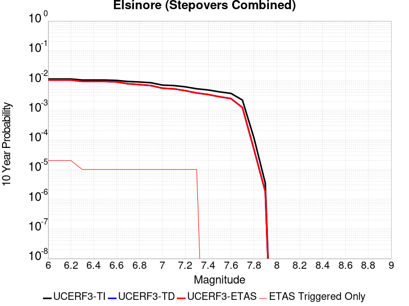 |

| Magnitude | 1 wk TI Prob | 1 wk TD Prob | 1 wk ETAS Prob | 1 wk ETAS/TD Gain | 1 wk ETAS Triggered Only | 1 mo TI Prob | 1 mo TD Prob | 1 mo ETAS Prob | 1 mo ETAS/TD Gain | 1 mo ETAS Triggered Only | 1 yr TI Prob | 1 yr TD Prob | 1 yr ETAS Prob | 1 yr ETAS/TD Gain | 1 yr ETAS Triggered Only | 10 yr TI Prob | 10 yr TD Prob | 10 yr ETAS Prob | 10 yr ETAS/TD Gain | 10 yr ETAS Triggered Only |
|-----|-----|-----|-----|-----|-----|-----|-----|-----|-----|-----|-----|-----|-----|-----|-----|-----|-----|-----|-----|-----|
| 6.0 | 2.144392E-5 | 1.976007E-5 | 2.9759873E-5 | 1.5060611 | 1.0E-5 | 9.189928E-5 | 8.468338E-5 | 9.468253E-5 | 1.1180769 | 1.0E-5 | 0.0011182994 | 0.0010305515 | 0.0010405412 | 1.0096935 | 1.0E-5 | 0.011126885 | 0.010264617 | 0.010284412 | 1.0019284 | 2.0E-5 |
| 6.1 | 2.144392E-5 | 1.976007E-5 | 2.9759873E-5 | 1.5060611 | 1.0E-5 | 9.189928E-5 | 8.468338E-5 | 9.468253E-5 | 1.1180769 | 1.0E-5 | 0.0011182994 | 0.0010305515 | 0.0010405412 | 1.0096935 | 1.0E-5 | 0.011126885 | 0.010264617 | 0.010284412 | 1.0019284 | 2.0E-5 |
| 6.2 | 2.144392E-5 | 1.976007E-5 | 2.9759873E-5 | 1.5060611 | 1.0E-5 | 9.189928E-5 | 8.468338E-5 | 9.468253E-5 | 1.1180769 | 1.0E-5 | 0.0011182994 | 0.0010305515 | 0.0010405412 | 1.0096935 | 1.0E-5 | 0.011126885 | 0.010264617 | 0.010284412 | 1.0019284 | 2.0E-5 |
| 6.3 | 1.9751555E-5 | 1.7741326E-5 | 1.7741326E-5 | 1.0 | 0.0 | 8.4646774E-5 | 7.603211E-5 | 7.603211E-5 | 1.0 | 0.0 | 0.0010300872 | 9.25312E-4 | 9.25312E-4 | 1.0 | 0.0 | 0.010253254 | 0.0092209745 | 0.009230883 | 1.0010744 | 1.0E-5 |
| 6.4 | 1.9751555E-5 | 1.7741326E-5 | 1.7741326E-5 | 1.0 | 0.0 | 8.4646774E-5 | 7.603211E-5 | 7.603211E-5 | 1.0 | 0.0 | 0.0010300872 | 9.25312E-4 | 9.25312E-4 | 1.0 | 0.0 | 0.010253254 | 0.0092209745 | 0.009230883 | 1.0010744 | 1.0E-5 |
| 6.5 | 1.9751555E-5 | 1.7741326E-5 | 1.7741326E-5 | 1.0 | 0.0 | 8.4646774E-5 | 7.603211E-5 | 7.603211E-5 | 1.0 | 0.0 | 0.0010300872 | 9.25312E-4 | 9.25312E-4 | 1.0 | 0.0 | 0.010253254 | 0.0092209745 | 0.009230883 | 1.0010744 | 1.0E-5 |
| 6.6 | 1.9188685E-5 | 1.7003247E-5 | 1.7003247E-5 | 1.0 | 0.0 | 8.2234634E-5 | 7.2869116E-5 | 7.2869116E-5 | 1.0 | 0.0 | 0.0010007467 | 8.8683655E-4 | 8.8683655E-4 | 1.0 | 0.0 | 0.00996252 | 0.008839546 | 0.008849458 | 1.0011213 | 1.0E-5 |
| 6.7 | 1.7608272E-5 | 1.4732402E-5 | 1.4732402E-5 | 1.0 | 0.0 | 7.546184E-5 | 6.313739E-5 | 6.313739E-5 | 1.0 | 0.0 | 9.183606E-4 | 7.684364E-4 | 7.684364E-4 | 1.0 | 0.0 | 0.009145746 | 0.007664441 | 0.0076743644 | 1.0012947 | 1.0E-5 |
| 6.8 | 1.697165E-5 | 1.3783126E-5 | 1.3783126E-5 | 1.0 | 0.0 | 7.273361E-5 | 5.906925E-5 | 5.906925E-5 | 1.0 | 0.0 | 8.8517193E-4 | 7.189395E-4 | 7.189395E-4 | 1.0 | 0.0 | 0.008816543 | 0.0071722106 | 0.007182139 | 1.0013843 | 1.0E-5 |
| 6.9 | 1.600365E-5 | 1.2846429E-5 | 1.2846429E-5 | 1.0 | 0.0 | 6.858527E-5 | 5.5055007E-5 | 5.5055007E-5 | 1.0 | 0.0 | 8.347058E-4 | 6.700963E-4 | 6.700963E-4 | 1.0 | 0.0 | 0.008315775 | 0.006686422 | 0.006696355 | 1.0014856 | 1.0E-5 |
| 7.0 | 1.3314581E-5 | 1.044738E-5 | 1.044738E-5 | 1.0 | 0.0 | 5.7061243E-5 | 4.4773733E-5 | 4.4773733E-5 | 1.0 | 0.0 | 6.944992E-4 | 5.449866E-4 | 5.449866E-4 | 1.0 | 0.0 | 0.006923327 | 0.005440055 | 0.005450001 | 1.0018282 | 1.0E-5 |
| 7.1 | 1.2865345E-5 | 9.937339E-6 | 9.937339E-6 | 1.0 | 0.0 | 5.5136024E-5 | 4.258792E-5 | 4.258792E-5 | 1.0 | 0.0 | 6.710743E-4 | 5.1838707E-4 | 5.1838707E-4 | 1.0 | 0.0 | 0.0066905143 | 0.005175021 | 0.0051849694 | 1.0019224 | 1.0E-5 |
| 7.2 | 1.1650051E-5 | 8.633585E-6 | 8.633585E-6 | 1.0 | 0.0 | 4.9927836E-5 | 3.7000562E-5 | 3.7000562E-5 | 1.0 | 0.0 | 6.0770183E-4 | 4.503905E-4 | 4.503905E-4 | 1.0 | 0.0 | 0.0060604266 | 0.00449624 | 0.0045061954 | 1.0022141 | 1.0E-5 |
| 7.3 | 1.0008533E-5 | 7.2008215E-6 | 7.2008215E-6 | 1.0 | 0.0 | 4.2893007E-5 | 3.0860305E-5 | 3.0860305E-5 | 1.0 | 0.0 | 5.220972E-4 | 3.756609E-4 | 3.756609E-4 | 1.0 | 0.0 | 0.005208723 | 0.0037506663 | 0.0037606286 | 1.0026562 | 1.0E-5 |
| 7.4 | 9.116759E-6 | 6.409854E-6 | 6.409854E-6 | 1.0 | 0.0 | 3.907124E-5 | 2.7470522E-5 | 2.7470522E-5 | 1.0 | 0.0 | 4.7558855E-4 | 3.3440365E-4 | 3.3440365E-4 | 1.0 | 0.0 | 0.00474572 | 0.0033391542 | 0.0033391542 | 1.0 | 0.0 |
| 7.5 | 7.870524E-6 | 5.382316E-6 | 5.382316E-6 | 1.0 | 0.0 | 3.3730383E-5 | 2.306687E-5 | 2.306687E-5 | 1.0 | 0.0 | 4.1059E-4 | 2.8080423E-4 | 2.8080423E-4 | 1.0 | 0.0 | 0.0040983222 | 0.0028046207 | 0.0028046207 | 1.0 | 0.0 |
| 7.6 | 6.9774537E-6 | 4.677398E-6 | 4.677398E-6 | 1.0 | 0.0 | 2.990303E-5 | 2.0045845E-5 | 2.0045845E-5 | 1.0 | 0.0 | 3.640086E-4 | 2.44032E-4 | 2.44032E-4 | 1.0 | 0.0 | 0.003634129 | 0.0024377564 | 0.0024377564 | 1.0 | 0.0 |
| 7.7 | 4.1616954E-6 | 2.3281368E-6 | 2.3281368E-6 | 1.0 | 0.0 | 1.7835715E-5 | 9.977695E-6 | 9.977695E-6 | 1.0 | 0.0 | 2.171282E-4 | 1.2147242E-4 | 1.2147242E-4 | 1.0 | 0.0 | 0.0021691616 | 0.0012141332 | 0.0012141332 | 1.0 | 0.0 |
| 7.8 | 2.2692414E-7 | 9.384417E-8 | 9.384417E-8 | 1.0 | 0.0 | 9.725317E-7 | 4.0218927E-7 | 4.0218927E-7 | 1.0 | 0.0 | 1.1840509E-5 | 4.8966467E-6 | 4.8966467E-6 | 1.0 | 0.0 | 1.1839878E-4 | 4.8965718E-5 | 4.8965718E-5 | 1.0 | 0.0 |
| 7.9 | 6.676829E-9 | 3.4397174E-9 | 3.4397174E-9 | 1.0 | 0.0 | 2.861498E-8 | 1.4741646E-8 | 1.4741646E-8 | 1.0 | 0.0 | 3.4838732E-7 | 1.7947953E-7 | 1.7947953E-7 | 1.0 | 0.0 | 3.4838679E-6 | 1.794794E-6 | 1.794794E-6 | 1.0 | 0.0 |

## Santa Susana East (connector)
*[(top)](#table-of-contents)*

| 1 Week | 1 Month | 1 Year | 10 Year |
|-----|-----|-----|-----|
| 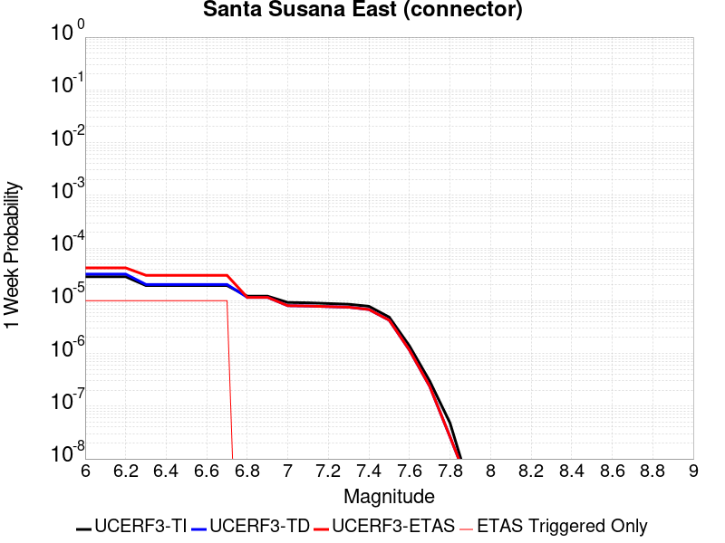 | 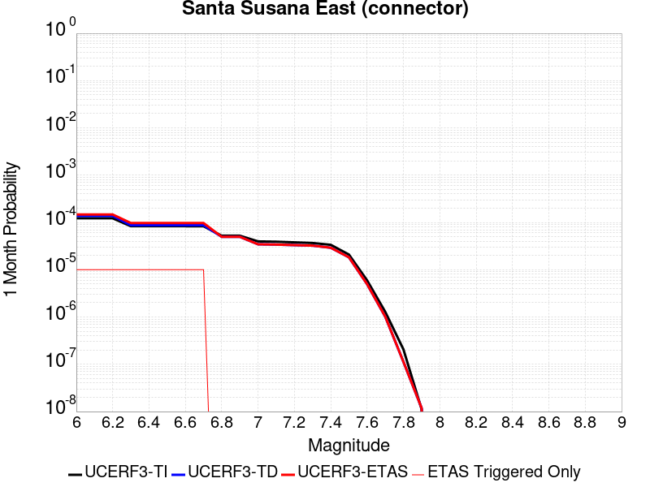 |  |  |

| Magnitude | 1 wk TI Prob | 1 wk TD Prob | 1 wk ETAS Prob | 1 wk ETAS/TD Gain | 1 wk ETAS Triggered Only | 1 mo TI Prob | 1 mo TD Prob | 1 mo ETAS Prob | 1 mo ETAS/TD Gain | 1 mo ETAS Triggered Only | 1 yr TI Prob | 1 yr TD Prob | 1 yr ETAS Prob | 1 yr ETAS/TD Gain | 1 yr ETAS Triggered Only | 10 yr TI Prob | 10 yr TD Prob | 10 yr ETAS Prob | 10 yr ETAS/TD Gain | 10 yr ETAS Triggered Only |
|-----|-----|-----|-----|-----|-----|-----|-----|-----|-----|-----|-----|-----|-----|-----|-----|-----|-----|-----|-----|-----|
| 6.0 | 2.858397E-5 | 3.2021693E-5 | 4.2021373E-5 | 1.3122783 | 1.0E-5 | 1.2249697E-4 | 1.3723019E-4 | 1.4722883E-4 | 1.0728602 | 1.0E-5 | 0.0014903803 | 0.00166977 | 0.0016897366 | 1.0119576 | 2.0E-5 | 0.014804244 | 0.016599316 | 0.016618984 | 1.0011848 | 2.0E-5 |
| 6.1 | 2.858397E-5 | 3.2021693E-5 | 4.2021373E-5 | 1.3122783 | 1.0E-5 | 1.2249697E-4 | 1.3723019E-4 | 1.4722883E-4 | 1.0728602 | 1.0E-5 | 0.0014903803 | 0.00166977 | 0.0016897366 | 1.0119576 | 2.0E-5 | 0.014804244 | 0.016599316 | 0.016618984 | 1.0011848 | 2.0E-5 |
| 6.2 | 2.858397E-5 | 3.2021693E-5 | 4.2021373E-5 | 1.3122783 | 1.0E-5 | 1.2249697E-4 | 1.3723019E-4 | 1.4722883E-4 | 1.0728602 | 1.0E-5 | 0.0014903803 | 0.00166977 | 0.0016897366 | 1.0119576 | 2.0E-5 | 0.014804244 | 0.016599316 | 0.016618984 | 1.0011848 | 2.0E-5 |
| 6.3 | 1.943582E-5 | 2.0367343E-5 | 3.0367139E-5 | 1.490972 | 1.0E-5 | 8.329371E-5 | 8.7286324E-5 | 9.7285454E-5 | 1.1145555 | 1.0E-5 | 0.001013629 | 0.001062305 | 0.0010822837 | 1.0188069 | 2.0E-5 | 0.010090181 | 0.010583852 | 0.01060364 | 1.0018697 | 2.0E-5 |
| 6.4 | 1.943582E-5 | 2.0367343E-5 | 3.0367139E-5 | 1.490972 | 1.0E-5 | 8.329371E-5 | 8.7286324E-5 | 9.7285454E-5 | 1.1145555 | 1.0E-5 | 0.001013629 | 0.001062305 | 0.0010822837 | 1.0188069 | 2.0E-5 | 0.010090181 | 0.010583852 | 0.01060364 | 1.0018697 | 2.0E-5 |
| 6.5 | 1.943582E-5 | 2.0367343E-5 | 3.0367139E-5 | 1.490972 | 1.0E-5 | 8.329371E-5 | 8.7286324E-5 | 9.7285454E-5 | 1.1145555 | 1.0E-5 | 0.001013629 | 0.001062305 | 0.0010822837 | 1.0188069 | 2.0E-5 | 0.010090181 | 0.010583852 | 0.01060364 | 1.0018697 | 2.0E-5 |
| 6.6 | 1.943582E-5 | 2.0367343E-5 | 3.0367139E-5 | 1.490972 | 1.0E-5 | 8.329371E-5 | 8.7286324E-5 | 9.7285454E-5 | 1.1145555 | 1.0E-5 | 0.001013629 | 0.001062305 | 0.0010822837 | 1.0188069 | 2.0E-5 | 0.010090181 | 0.010583852 | 0.01060364 | 1.0018697 | 2.0E-5 |
| 6.7 | 1.9404439E-5 | 2.0354766E-5 | 3.0354562E-5 | 1.4912754 | 1.0E-5 | 8.3159226E-5 | 8.723242E-5 | 9.7231554E-5 | 1.1146263 | 1.0E-5 | 0.0010119933 | 0.0010616493 | 0.0010816281 | 1.0188186 | 2.0E-5 | 0.010073971 | 0.010577358 | 0.010597147 | 1.0018709 | 2.0E-5 |
| 6.8 | 1.2217526E-5 | 1.1593157E-5 | 1.1593157E-5 | 1.0 | 0.0 | 5.2359774E-5 | 4.9684106E-5 | 4.9684106E-5 | 1.0 | 0.0 | 6.372938E-4 | 6.047529E-4 | 6.047529E-4 | 1.0 | 0.0 | 0.0063546924 | 0.006033274 | 0.006033274 | 1.0 | 0.0 |
| 6.9 | 1.2217526E-5 | 1.1593157E-5 | 1.1593157E-5 | 1.0 | 0.0 | 5.2359774E-5 | 4.9684106E-5 | 4.9684106E-5 | 1.0 | 0.0 | 6.372938E-4 | 6.047529E-4 | 6.047529E-4 | 1.0 | 0.0 | 0.0063546924 | 0.006033274 | 0.006033274 | 1.0 | 0.0 |
| 7.0 | 9.276017E-6 | 8.059273E-6 | 8.059273E-6 | 1.0 | 0.0 | 3.9753755E-5 | 3.4539302E-5 | 3.4539302E-5 | 1.0 | 0.0 | 4.8389446E-4 | 4.2043833E-4 | 4.2043833E-4 | 1.0 | 0.0 | 0.0048284214 | 0.0041973097 | 0.0041973097 | 1.0 | 0.0 |
| 7.1 | 9.130355E-6 | 7.942446E-6 | 7.942446E-6 | 1.0 | 0.0 | 3.9129503E-5 | 3.4038632E-5 | 3.4038632E-5 | 1.0 | 0.0 | 4.7629757E-4 | 4.1434498E-4 | 4.1434498E-4 | 1.0 | 0.0 | 0.00475278 | 0.0041366047 | 0.0041366047 | 1.0 | 0.0 |
| 7.2 | 8.851015E-6 | 7.741608E-6 | 7.741608E-6 | 1.0 | 0.0 | 3.7932372E-5 | 3.317792E-5 | 3.317792E-5 | 1.0 | 0.0 | 4.6172875E-4 | 4.038697E-4 | 4.038697E-4 | 1.0 | 0.0 | 0.0046077054 | 0.0040322347 | 0.0040322347 | 1.0 | 0.0 |
| 7.3 | 8.573006E-6 | 7.5503312E-6 | 7.5503312E-6 | 1.0 | 0.0 | 3.6740938E-5 | 3.235818E-5 | 3.235818E-5 | 1.0 | 0.0 | 4.472291E-4 | 3.9389305E-4 | 3.9389305E-4 | 1.0 | 0.0 | 0.004463301 | 0.003932817 | 0.003932817 | 1.0 | 0.0 |
| 7.4 | 7.852282E-6 | 6.8178556E-6 | 6.8178556E-6 | 1.0 | 0.0 | 3.36522E-5 | 2.921907E-5 | 2.921907E-5 | 1.0 | 0.0 | 4.096385E-4 | 3.5568717E-4 | 3.5568717E-4 | 1.0 | 0.0 | 0.0040888423 | 0.0035519868 | 0.0035519868 | 1.0 | 0.0 |
| 7.5 | 4.8869324E-6 | 4.2790975E-6 | 4.2790975E-6 | 1.0 | 0.0 | 2.0943828E-5 | 1.833887E-5 | 1.833887E-5 | 1.0 | 0.0 | 2.5496128E-4 | 2.2325452E-4 | 2.2325452E-4 | 1.0 | 0.0 | 0.0025466895 | 0.00223057 | 0.00223057 | 1.0 | 0.0 |
| 7.6 | 1.3894544E-6 | 1.1568394E-6 | 1.1568394E-6 | 1.0 | 0.0 | 5.954791E-6 | 4.957875E-6 | 4.957875E-6 | 1.0 | 0.0 | 7.249717E-5 | 6.036068E-5 | 6.036068E-5 | 1.0 | 0.0 | 7.247352E-4 | 6.0346466E-4 | 6.0346466E-4 | 1.0 | 0.0 |
| 7.7 | 2.9924632E-7 | 2.3719332E-7 | 2.3719332E-7 | 1.0 | 0.0 | 1.2824837E-6 | 1.0165425E-6 | 1.0165425E-6 | 1.0 | 0.0 | 1.5614127E-5 | 1.2376341E-5 | 1.2376341E-5 | 1.0 | 0.0 | 1.5613029E-4 | 1.2375724E-4 | 1.2375724E-4 | 1.0 | 0.0 |
| 7.8 | 4.8188564E-8 | 2.6321862E-8 | 2.6321862E-8 | 1.0 | 0.0 | 2.065224E-7 | 1.12807975E-7 | 1.12807975E-7 | 1.0 | 0.0 | 2.5144072E-6 | 1.3734362E-6 | 1.3734362E-6 | 1.0 | 0.0 | 2.5143789E-5 | 1.3734286E-5 | 1.3734286E-5 | 1.0 | 0.0 |
| 7.9 | 2.6127251E-9 | 2.7681102E-9 | 2.7681102E-9 | 1.0 | 0.0 | 1.1197393E-8 | 1.186333E-8 | 1.186333E-8 | 1.0 | 0.0 | 1.3632825E-7 | 1.4443603E-7 | 1.4443603E-7 | 1.0 | 0.0 | 1.3632817E-6 | 1.4443604E-6 | 1.4443604E-6 | 1.0 | 0.0 |

## San Andreas (North Coast) 2011 CFM
*[(top)](#table-of-contents)*

| 1 Week | 1 Month | 1 Year | 10 Year |
|-----|-----|-----|-----|
|  |  | 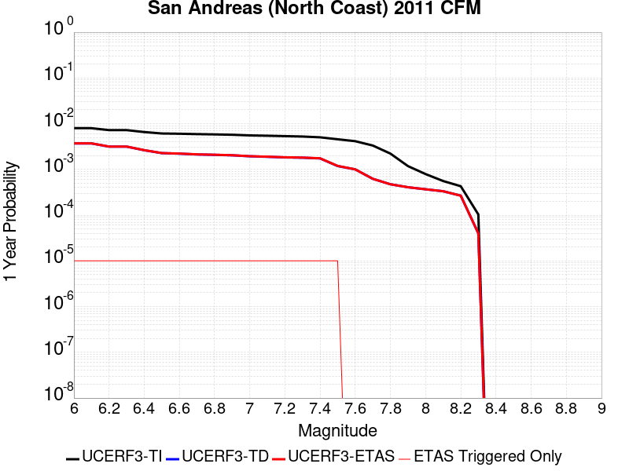 |  |

| Magnitude | 1 wk TI Prob | 1 wk TD Prob | 1 wk ETAS Prob | 1 wk ETAS/TD Gain | 1 wk ETAS Triggered Only | 1 mo TI Prob | 1 mo TD Prob | 1 mo ETAS Prob | 1 mo ETAS/TD Gain | 1 mo ETAS Triggered Only | 1 yr TI Prob | 1 yr TD Prob | 1 yr ETAS Prob | 1 yr ETAS/TD Gain | 1 yr ETAS Triggered Only | 10 yr TI Prob | 10 yr TD Prob | 10 yr ETAS Prob | 10 yr ETAS/TD Gain | 10 yr ETAS Triggered Only |
|-----|-----|-----|-----|-----|-----|-----|-----|-----|-----|-----|-----|-----|-----|-----|-----|-----|-----|-----|-----|-----|
| 6.0 | 1.5333705E-4 | 7.109695E-5 | 8.109623E-5 | 1.140643 | 1.0E-5 | 6.5699324E-4 | 3.046658E-4 | 3.1466273E-4 | 1.0328128 | 1.0E-5 | 0.007969595 | 0.0037030308 | 0.0037129938 | 1.0026904 | 1.0E-5 | 0.0768977 | 0.039364267 | 0.039373875 | 1.000244 | 1.0E-5 |
| 6.1 | 1.5333705E-4 | 7.109695E-5 | 8.109623E-5 | 1.140643 | 1.0E-5 | 6.5699324E-4 | 3.046658E-4 | 3.1466273E-4 | 1.0328128 | 1.0E-5 | 0.007969595 | 0.0037030308 | 0.0037129938 | 1.0026904 | 1.0E-5 | 0.0768977 | 0.039364267 | 0.039373875 | 1.000244 | 1.0E-5 |
| 6.2 | 1.3912938E-4 | 6.049243E-5 | 7.049183E-5 | 1.1652999 | 1.0E-5 | 5.961325E-4 | 2.5922767E-4 | 2.6922507E-4 | 1.0385661 | 1.0E-5 | 0.007233787 | 0.0031515562 | 0.0031615247 | 1.003163 | 1.0E-5 | 0.07002798 | 0.03369792 | 0.033707585 | 1.0002867 | 1.0E-5 |
| 6.3 | 1.3912938E-4 | 6.049243E-5 | 7.049183E-5 | 1.1652999 | 1.0E-5 | 5.961325E-4 | 2.5922767E-4 | 2.6922507E-4 | 1.0385661 | 1.0E-5 | 0.007233787 | 0.0031515562 | 0.0031615247 | 1.003163 | 1.0E-5 | 0.07002798 | 0.03369792 | 0.033707585 | 1.0002867 | 1.0E-5 |
| 6.4 | 1.2623647E-4 | 5.0433562E-5 | 6.043306E-5 | 1.1982707 | 1.0E-5 | 5.4090127E-4 | 2.1612605E-4 | 2.2612388E-4 | 1.0462593 | 1.0E-5 | 0.0065656058 | 0.0026281793 | 0.002638153 | 1.0037949 | 1.0E-5 | 0.06374981 | 0.02830552 | 0.028315235 | 1.0003433 | 1.0E-5 |
| 6.5 | 1.1736096E-4 | 4.3516375E-5 | 5.351594E-5 | 1.2297885 | 1.0E-5 | 5.028786E-4 | 1.8648551E-4 | 1.9648364E-4 | 1.0536134 | 1.0E-5 | 0.006105373 | 0.0022681132 | 0.0022780905 | 1.004399 | 1.0E-5 | 0.05940335 | 0.024576947 | 0.024586702 | 1.0003968 | 1.0E-5 |
| 6.6 | 1.1586959E-4 | 4.2416294E-5 | 5.2415868E-5 | 1.2357484 | 1.0E-5 | 4.964894E-4 | 1.8177154E-4 | 1.9176972E-4 | 1.0550041 | 1.0E-5 | 0.006028018 | 0.0022108385 | 0.0022208162 | 1.0045131 | 1.0E-5 | 0.058671024 | 0.023982164 | 0.023991924 | 1.000407 | 1.0E-5 |
| 6.7 | 1.13693764E-4 | 4.0728228E-5 | 5.072782E-5 | 1.24552 | 1.0E-5 | 4.87168E-4 | 1.7453796E-4 | 1.8453621E-4 | 1.0572841 | 1.0E-5 | 0.005915152 | 0.0021229447 | 0.0021329233 | 1.0047004 | 1.0E-5 | 0.057601593 | 0.023075242 | 0.023085011 | 1.0004233 | 1.0E-5 |
| 6.8 | 1.1204889E-4 | 3.9945848E-5 | 4.994545E-5 | 1.2503289 | 1.0E-5 | 4.8012115E-4 | 1.7118535E-4 | 1.8118364E-4 | 1.0584062 | 1.0E-5 | 0.005829819 | 0.0020822054 | 0.0020921845 | 1.0047926 | 1.0E-5 | 0.05679232 | 0.022635331 | 0.022645107 | 1.0004318 | 1.0E-5 |
| 6.9 | 1.1005794E-4 | 3.9001738E-5 | 4.9001348E-5 | 1.2563888 | 1.0E-5 | 4.7159163E-4 | 1.6713967E-4 | 1.77138E-4 | 1.0598202 | 1.0E-5 | 0.0057265228 | 0.0020330423 | 0.0020430218 | 1.0049087 | 1.0E-5 | 0.055811852 | 0.02210134 | 0.02211112 | 1.0004425 | 1.0E-5 |
| 7.0 | 1.0647948E-4 | 3.7159174E-5 | 4.7158803E-5 | 1.2691026 | 1.0E-5 | 4.562608E-4 | 1.5924397E-4 | 1.6924237E-4 | 1.0627867 | 1.0E-5 | 0.0055408357 | 0.0019370868 | 0.0019470674 | 1.0051523 | 1.0E-5 | 0.054047033 | 0.02105931 | 0.0210691 | 1.0004648 | 1.0E-5 |
| 7.1 | 1.04795035E-4 | 3.620866E-5 | 4.62083E-5 | 1.276167 | 1.0E-5 | 4.4904428E-4 | 1.5517084E-4 | 1.6516929E-4 | 1.0644351 | 1.0E-5 | 0.0054534175 | 0.0018875834 | 0.0018975645 | 1.0052878 | 1.0E-5 | 0.053215165 | 0.02052821 | 0.020538004 | 1.0004771 | 1.0E-5 |
| 7.2 | 1.02724036E-4 | 3.5117457E-5 | 4.5117107E-5 | 1.2847487 | 1.0E-5 | 4.401716E-4 | 1.5049479E-4 | 1.6049329E-4 | 1.0664375 | 1.0E-5 | 0.0053459285 | 0.0018307496 | 0.0018407312 | 1.0054523 | 1.0E-5 | 0.052191395 | 0.01991573 | 0.019925531 | 1.0004921 | 1.0E-5 |
| 7.3 | 1.00650694E-4 | 3.45853E-5 | 4.4584955E-5 | 1.2891302 | 1.0E-5 | 4.312888E-4 | 1.4821437E-4 | 1.5821289E-4 | 1.0674598 | 1.0E-5 | 0.005238306 | 0.0018030318 | 0.0018130138 | 1.0055362 | 1.0E-5 | 0.051165357 | 0.01959264 | 0.019602444 | 1.0005004 | 1.0E-5 |
| 7.4 | 9.672919E-5 | 3.3374814E-5 | 4.337448E-5 | 1.2996172 | 1.0E-5 | 4.144878E-4 | 1.4302715E-4 | 1.5302573E-4 | 1.0699068 | 1.0E-5 | 0.005034718 | 0.00173998 | 0.0017499626 | 1.0057372 | 1.0E-5 | 0.049221683 | 0.01886682 | 0.01887663 | 1.00052 | 1.0E-5 |
| 7.5 | 8.7600405E-5 | 2.2694192E-5 | 3.2693966E-5 | 1.4406314 | 1.0E-5 | 3.753763E-4 | 9.725721E-5 | 1.0725624E-4 | 1.1028101 | 1.0E-5 | 0.0045606326 | 0.0011834651 | 0.0011934533 | 1.0084398 | 1.0E-5 | 0.04468165 | 0.013127938 | 0.013137806 | 1.0007517 | 1.0E-5 |
| 7.6 | 7.9562284E-5 | 1.922004E-5 | 1.922004E-5 | 1.0 | 0.0 | 3.4093665E-4 | 8.236901E-5 | 8.236901E-5 | 1.0 | 0.0 | 0.0041430052 | 0.0010023828 | 0.0010023828 | 1.0 | 0.0 | 0.040666126 | 0.0112194 | 0.0112194 | 1.0 | 0.0 |
| 7.7 | 6.3866544E-5 | 1.1936281E-5 | 1.1936281E-5 | 1.0 | 0.0 | 2.7368503E-4 | 5.115449E-5 | 5.115449E-5 | 1.0 | 0.0 | 0.0033270244 | 6.226282E-4 | 6.226282E-4 | 1.0 | 0.0 | 0.032776527 | 0.0072073294 | 0.0072073294 | 1.0 | 0.0 |
| 7.8 | 4.2543215E-5 | 9.0726735E-6 | 9.0726735E-6 | 1.0 | 0.0 | 1.8231533E-4 | 3.888231E-5 | 3.888231E-5 | 1.0 | 0.0 | 0.0022174292 | 4.7328937E-4 | 4.7328937E-4 | 1.0 | 0.0 | 0.021954332 | 0.0054884683 | 0.0054884683 | 1.0 | 0.0 |
| 7.9 | 2.2636612E-5 | 7.811842E-6 | 7.811842E-6 | 1.0 | 0.0 | 9.7010445E-5 | 3.3478893E-5 | 3.3478893E-5 | 1.0 | 0.0 | 0.0011804621 | 4.0752938E-4 | 4.0752938E-4 | 1.0 | 0.0 | 0.011742111 | 0.0046821116 | 0.0046821116 | 1.0 | 0.0 |
| 8.0 | 1.5167874E-5 | 7.0475517E-6 | 7.0475517E-6 | 1.0 | 0.0 | 6.500356E-5 | 3.0203442E-5 | 3.0203442E-5 | 1.0 | 0.0 | 7.9113094E-4 | 3.6766496E-4 | 3.6766496E-4 | 1.0 | 0.0 | 0.007883203 | 0.004214701 | 0.004214701 | 1.0 | 0.0 |
| 8.1 | 1.0681047E-5 | 6.3854363E-6 | 6.3854363E-6 | 1.0 | 0.0 | 4.5775112E-5 | 2.7365868E-5 | 2.7365868E-5 | 1.0 | 0.0 | 5.5716943E-4 | 3.331286E-4 | 3.331286E-4 | 1.0 | 0.0 | 0.0055577457 | 0.003816698 | 0.003816698 | 1.0 | 0.0 |
| 8.2 | 8.226114E-6 | 5.1139064E-6 | 5.1139064E-6 | 1.0 | 0.0 | 3.52543E-5 | 2.1916558E-5 | 2.1916558E-5 | 1.0 | 0.0 | 4.2913653E-4 | 2.6680148E-4 | 2.6680148E-4 | 1.0 | 0.0 | 0.004283088 | 0.0030445685 | 0.0030445685 | 1.0 | 0.0 |
| 8.3 | 1.983087E-6 | 7.6564595E-7 | 7.6564595E-7 | 1.0 | 0.0 | 8.498917E-6 | 3.281336E-6 | 3.281336E-6 | 1.0 | 0.0 | 1.034694E-4 | 3.9949547E-5 | 3.9949547E-5 | 1.0 | 0.0 | 0.0010342124 | 4.717979E-4 | 4.717979E-4 | 1.0 | 0.0 |

## West Napa 2011 CFM
*[(top)](#table-of-contents)*

| 1 Week | 1 Month | 1 Year | 10 Year |
|-----|-----|-----|-----|
|  |  |  |  |

| Magnitude | 1 wk TI Prob | 1 wk TD Prob | 1 wk ETAS Prob | 1 wk ETAS/TD Gain | 1 wk ETAS Triggered Only | 1 mo TI Prob | 1 mo TD Prob | 1 mo ETAS Prob | 1 mo ETAS/TD Gain | 1 mo ETAS Triggered Only | 1 yr TI Prob | 1 yr TD Prob | 1 yr ETAS Prob | 1 yr ETAS/TD Gain | 1 yr ETAS Triggered Only | 10 yr TI Prob | 10 yr TD Prob | 10 yr ETAS Prob | 10 yr ETAS/TD Gain | 10 yr ETAS Triggered Only |
|-----|-----|-----|-----|-----|-----|-----|-----|-----|-----|-----|-----|-----|-----|-----|-----|-----|-----|-----|-----|-----|
| 6.0 | 3.773104E-5 | 4.4528504E-5 | 4.4528504E-5 | 1.0 | 0.0 | 1.6169442E-4 | 1.9082428E-4 | 1.9082428E-4 | 1.0 | 0.0 | 0.001966852 | 0.0023211278 | 0.0023311046 | 1.0042982 | 1.0E-5 | 0.019495348 | 0.023002012 | 0.023011781 | 1.0004247 | 1.0E-5 |
| 6.1 | 3.773104E-5 | 4.4528504E-5 | 4.4528504E-5 | 1.0 | 0.0 | 1.6169442E-4 | 1.9082428E-4 | 1.9082428E-4 | 1.0 | 0.0 | 0.001966852 | 0.0023211278 | 0.0023311046 | 1.0042982 | 1.0E-5 | 0.019495348 | 0.023002012 | 0.023011781 | 1.0004247 | 1.0E-5 |
| 6.2 | 3.773104E-5 | 4.4528504E-5 | 4.4528504E-5 | 1.0 | 0.0 | 1.6169442E-4 | 1.9082428E-4 | 1.9082428E-4 | 1.0 | 0.0 | 0.001966852 | 0.0023211278 | 0.0023311046 | 1.0042982 | 1.0E-5 | 0.019495348 | 0.023002012 | 0.023011781 | 1.0004247 | 1.0E-5 |
| 6.3 | 2.147964E-5 | 2.4987066E-5 | 2.4987066E-5 | 1.0 | 0.0 | 9.2052345E-5 | 1.0708355E-4 | 1.0708355E-4 | 1.0 | 0.0 | 0.001120161 | 0.0013030542 | 0.0013030542 | 1.0 | 0.0 | 0.011145315 | 0.012964482 | 0.012964482 | 1.0 | 0.0 |
| 6.4 | 2.147964E-5 | 2.4987066E-5 | 2.4987066E-5 | 1.0 | 0.0 | 9.2052345E-5 | 1.0708355E-4 | 1.0708355E-4 | 1.0 | 0.0 | 0.001120161 | 0.0013030542 | 0.0013030542 | 1.0 | 0.0 | 0.011145315 | 0.012964482 | 0.012964482 | 1.0 | 0.0 |
| 6.5 | 1.688201E-5 | 1.9547371E-5 | 1.9547371E-5 | 1.0 | 0.0 | 7.234947E-5 | 8.377217E-5 | 8.377217E-5 | 1.0 | 0.0 | 8.804988E-4 | 0.0010195216 | 0.0010195216 | 1.0 | 0.0 | 0.008770182 | 0.01015684 | 0.01015684 | 1.0 | 0.0 |
| 6.6 | 1.6846381E-5 | 1.9507064E-5 | 1.9507064E-5 | 1.0 | 0.0 | 7.219678E-5 | 8.3599436E-5 | 8.3599436E-5 | 1.0 | 0.0 | 8.7864127E-4 | 0.0010174206 | 0.0010174206 | 1.0 | 0.0 | 0.008751754 | 0.010136021 | 0.010136021 | 1.0 | 0.0 |
| 6.7 | 1.3396501E-5 | 1.5467684E-5 | 1.5467684E-5 | 1.0 | 0.0 | 5.7412315E-5 | 6.628875E-5 | 6.628875E-5 | 1.0 | 0.0 | 6.9877075E-4 | 8.068302E-4 | 8.068302E-4 | 1.0 | 0.0 | 0.0069657755 | 0.008046459 | 0.008046459 | 1.0 | 0.0 |
| 6.8 | 1.0139058E-5 | 1.16721785E-5 | 1.16721785E-5 | 1.0 | 0.0 | 4.3452383E-5 | 5.0022976E-5 | 5.0022976E-5 | 1.0 | 0.0 | 5.289043E-4 | 6.0891506E-4 | 6.0891506E-4 | 1.0 | 0.0 | 0.005276473 | 0.0060791126 | 0.0060791126 | 1.0 | 0.0 |
| 6.9 | 7.761281E-6 | 8.890723E-6 | 8.890723E-6 | 1.0 | 0.0 | 3.326221E-5 | 3.810283E-5 | 3.810283E-5 | 1.0 | 0.0 | 4.0489217E-4 | 4.6385458E-4 | 4.6385458E-4 | 1.0 | 0.0 | 0.0040415525 | 0.0046351026 | 0.0046351026 | 1.0 | 0.0 |
| 7.0 | 2.2109202E-6 | 2.3666319E-6 | 2.3666319E-6 | 1.0 | 0.0 | 9.475338E-6 | 1.01426685E-5 | 1.01426685E-5 | 1.0 | 0.0 | 1.1535613E-4 | 1.2348007E-4 | 1.2348007E-4 | 1.0 | 0.0 | 0.0011529627 | 0.0012353238 | 0.0012353238 | 1.0 | 0.0 |
| 7.1 | 1.9008926E-6 | 2.0133207E-6 | 2.0133207E-6 | 1.0 | 0.0 | 8.146657E-6 | 8.628488E-6 | 8.628488E-6 | 1.0 | 0.0 | 9.918104E-5 | 1.05046805E-4 | 1.05046805E-4 | 1.0 | 0.0 | 9.913679E-4 | 0.0010511756 | 0.0010511756 | 1.0 | 0.0 |
| 7.2 | 1.8495944E-6 | 1.9561273E-6 | 1.9561273E-6 | 1.0 | 0.0 | 7.926808E-6 | 8.383376E-6 | 8.383376E-6 | 1.0 | 0.0 | 9.650462E-5 | 1.0206285E-4 | 1.0206285E-4 | 1.0 | 0.0 | 9.6462725E-4 | 0.0010213639 | 0.0010213639 | 1.0 | 0.0 |
| 7.3 | 1.7883189E-6 | 1.8880897E-6 | 1.8880897E-6 | 1.0 | 0.0 | 7.664201E-6 | 8.091788E-6 | 8.091788E-6 | 1.0 | 0.0 | 9.330765E-5 | 9.85131E-5 | 9.85131E-5 | 1.0 | 0.0 | 9.3268487E-4 | 9.858976E-4 | 9.858976E-4 | 1.0 | 0.0 |
| 7.4 | 1.6520572E-6 | 1.7415113E-6 | 1.7415113E-6 | 1.0 | 0.0 | 7.0802257E-6 | 7.463598E-6 | 7.463598E-6 | 1.0 | 0.0 | 8.6198335E-5 | 9.086554E-5 | 9.086554E-5 | 1.0 | 0.0 | 8.616491E-4 | 9.0948684E-4 | 9.0948684E-4 | 1.0 | 0.0 |
| 7.5 | 1.4040345E-6 | 1.4800271E-6 | 1.4800271E-6 | 1.0 | 0.0 | 6.0172765E-6 | 6.342958E-6 | 6.342958E-6 | 1.0 | 0.0 | 7.325788E-5 | 7.72228E-5 | 7.72228E-5 | 1.0 | 0.0 | 7.3233736E-4 | 7.7311805E-4 | 7.7311805E-4 | 1.0 | 0.0 |
| 7.6 | 1.3013842E-7 | 1.4416163E-7 | 1.4416163E-7 | 1.0 | 0.0 | 5.57736E-7 | 6.178354E-7 | 6.178354E-7 | 1.0 | 0.0 | 6.790414E-6 | 7.52212E-6 | 7.52212E-6 | 1.0 | 0.0 | 6.790207E-5 | 7.61463E-5 | 7.61463E-5 | 1.0 | 0.0 |
| 7.7 | 8.541512E-8 | 9.716462E-8 | 9.716462E-8 | 1.0 | 0.0 | 3.6606474E-7 | 4.1641974E-7 | 4.1641974E-7 | 1.0 | 0.0 | 4.456829E-6 | 5.069898E-6 | 5.069898E-6 | 1.0 | 0.0 | 4.4567398E-5 | 5.160189E-5 | 5.160189E-5 | 1.0 | 0.0 |
| 7.8 | 5.6074793E-8 | 6.895456E-8 | 6.895456E-8 | 1.0 | 0.0 | 2.403205E-7 | 2.955195E-7 | 2.955195E-7 | 1.0 | 0.0 | 2.9258983E-6 | 3.597944E-6 | 3.597944E-6 | 1.0 | 0.0 | 2.9258597E-5 | 3.6812045E-5 | 3.6812045E-5 | 1.0 | 0.0 |
| 7.9 | 2.9475839E-8 | 3.8567407E-8 | 3.8567407E-8 | 1.0 | 0.0 | 1.2632502E-7 | 1.6528887E-7 | 1.6528887E-7 | 1.0 | 0.0 | 1.538006E-6 | 2.01239E-6 | 2.01239E-6 | 1.0 | 0.0 | 1.5379954E-5 | 2.0664074E-5 | 2.0664074E-5 | 1.0 | 0.0 |
| 8.0 | 1.3337122E-8 | 2.1632943E-8 | 2.1632943E-8 | 1.0 | 0.0 | 5.7159088E-8 | 9.2712604E-8 | 9.2712604E-8 | 1.0 | 0.0 | 6.959117E-7 | 1.1287754E-6 | 1.1287754E-6 | 1.0 | 0.0 | 6.959095E-6 | 1.1644432E-5 | 1.1644432E-5 | 1.0 | 0.0 |
| 8.1 | 2.6589986E-10 | 4.8617654E-10 | 4.8617654E-10 | 1.0 | 0.0 | 1.1395708E-9 | 2.0836133E-9 | 2.0836133E-9 | 1.0 | 0.0 | 1.3874274E-8 | 2.536799E-8 | 2.536799E-8 | 1.0 | 0.0 | 1.3874273E-7 | 2.6036727E-7 | 2.6036727E-7 | 1.0 | 0.0 |

## Little Salmon (Offshore)
*[(top)](#table-of-contents)*

| 1 Week | 1 Month | 1 Year | 10 Year |
|-----|-----|-----|-----|
|  |  |  | 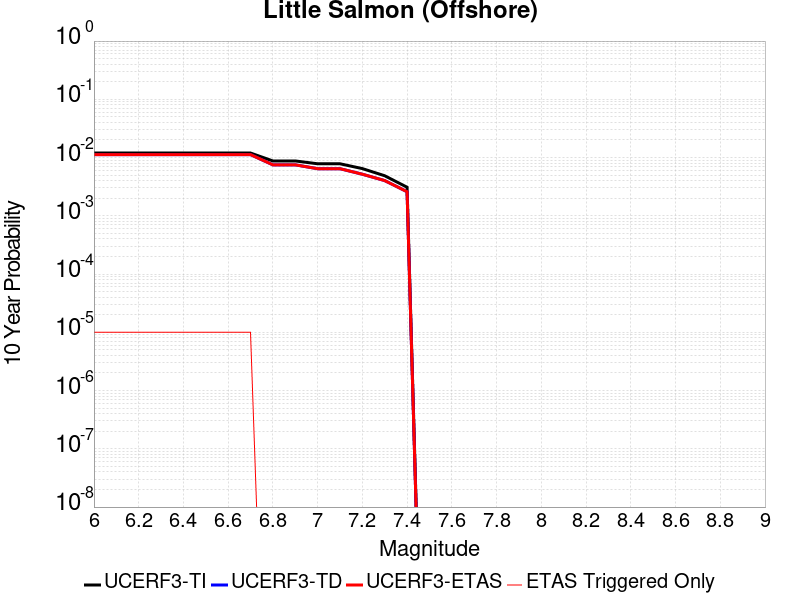 |

| Magnitude | 1 wk TI Prob | 1 wk TD Prob | 1 wk ETAS Prob | 1 wk ETAS/TD Gain | 1 wk ETAS Triggered Only | 1 mo TI Prob | 1 mo TD Prob | 1 mo ETAS Prob | 1 mo ETAS/TD Gain | 1 mo ETAS Triggered Only | 1 yr TI Prob | 1 yr TD Prob | 1 yr ETAS Prob | 1 yr ETAS/TD Gain | 1 yr ETAS Triggered Only | 10 yr TI Prob | 10 yr TD Prob | 10 yr ETAS Prob | 10 yr ETAS/TD Gain | 10 yr ETAS Triggered Only |
|-----|-----|-----|-----|-----|-----|-----|-----|-----|-----|-----|-----|-----|-----|-----|-----|-----|-----|-----|-----|-----|
| 6.0 | 2.3052053E-5 | 2.1604856E-5 | 3.160464E-5 | 1.4628489 | 1.0E-5 | 9.879077E-5 | 9.25896E-5 | 1.02588674E-4 | 1.1079935 | 1.0E-5 | 0.0012021139 | 0.0011268103 | 0.001136799 | 1.0088646 | 1.0E-5 | 0.011956319 | 0.0112438025 | 0.01125369 | 1.0008794 | 1.0E-5 |
| 6.1 | 2.3052053E-5 | 2.1604856E-5 | 3.160464E-5 | 1.4628489 | 1.0E-5 | 9.879077E-5 | 9.25896E-5 | 1.02588674E-4 | 1.1079935 | 1.0E-5 | 0.0012021139 | 0.0011268103 | 0.001136799 | 1.0088646 | 1.0E-5 | 0.011956319 | 0.0112438025 | 0.01125369 | 1.0008794 | 1.0E-5 |
| 6.2 | 2.3052053E-5 | 2.1604856E-5 | 3.160464E-5 | 1.4628489 | 1.0E-5 | 9.879077E-5 | 9.25896E-5 | 1.02588674E-4 | 1.1079935 | 1.0E-5 | 0.0012021139 | 0.0011268103 | 0.001136799 | 1.0088646 | 1.0E-5 | 0.011956319 | 0.0112438025 | 0.01125369 | 1.0008794 | 1.0E-5 |
| 6.3 | 2.3052053E-5 | 2.1604856E-5 | 3.160464E-5 | 1.4628489 | 1.0E-5 | 9.879077E-5 | 9.25896E-5 | 1.02588674E-4 | 1.1079935 | 1.0E-5 | 0.0012021139 | 0.0011268103 | 0.001136799 | 1.0088646 | 1.0E-5 | 0.011956319 | 0.0112438025 | 0.01125369 | 1.0008794 | 1.0E-5 |
| 6.4 | 2.3052053E-5 | 2.1604856E-5 | 3.160464E-5 | 1.4628489 | 1.0E-5 | 9.879077E-5 | 9.25896E-5 | 1.02588674E-4 | 1.1079935 | 1.0E-5 | 0.0012021139 | 0.0011268103 | 0.001136799 | 1.0088646 | 1.0E-5 | 0.011956319 | 0.0112438025 | 0.01125369 | 1.0008794 | 1.0E-5 |
| 6.5 | 2.3052053E-5 | 2.1604856E-5 | 3.160464E-5 | 1.4628489 | 1.0E-5 | 9.879077E-5 | 9.25896E-5 | 1.02588674E-4 | 1.1079935 | 1.0E-5 | 0.0012021139 | 0.0011268103 | 0.001136799 | 1.0088646 | 1.0E-5 | 0.011956319 | 0.0112438025 | 0.01125369 | 1.0008794 | 1.0E-5 |
| 6.6 | 2.3052053E-5 | 2.1604856E-5 | 3.160464E-5 | 1.4628489 | 1.0E-5 | 9.879077E-5 | 9.25896E-5 | 1.02588674E-4 | 1.1079935 | 1.0E-5 | 0.0012021139 | 0.0011268103 | 0.001136799 | 1.0088646 | 1.0E-5 | 0.011956319 | 0.0112438025 | 0.01125369 | 1.0008794 | 1.0E-5 |
| 6.7 | 2.3052053E-5 | 2.1604856E-5 | 3.160464E-5 | 1.4628489 | 1.0E-5 | 9.879077E-5 | 9.25896E-5 | 1.02588674E-4 | 1.1079935 | 1.0E-5 | 0.0012021139 | 0.0011268103 | 0.001136799 | 1.0088646 | 1.0E-5 | 0.011956319 | 0.0112438025 | 0.01125369 | 1.0008794 | 1.0E-5 |
| 6.8 | 1.683878E-5 | 1.4384146E-5 | 1.4384146E-5 | 1.0 | 0.0 | 7.21642E-5 | 6.164517E-5 | 6.164517E-5 | 1.0 | 0.0 | 8.78245E-4 | 7.503224E-4 | 7.503224E-4 | 1.0 | 0.0 | 0.008747822 | 0.0075044776 | 0.0075044776 | 1.0 | 0.0 |
| 6.9 | 1.683878E-5 | 1.4384146E-5 | 1.4384146E-5 | 1.0 | 0.0 | 7.21642E-5 | 6.164517E-5 | 6.164517E-5 | 1.0 | 0.0 | 8.78245E-4 | 7.503224E-4 | 7.503224E-4 | 1.0 | 0.0 | 0.008747822 | 0.0075044776 | 0.0075044776 | 1.0 | 0.0 |
| 7.0 | 1.5051273E-5 | 1.2332205E-5 | 1.2332205E-5 | 1.0 | 0.0 | 6.450386E-5 | 5.2851494E-5 | 5.2851494E-5 | 1.0 | 0.0 | 7.8505155E-4 | 6.4332294E-4 | 6.4332294E-4 | 1.0 | 0.0 | 0.00782284 | 0.0064407173 | 0.0064407173 | 1.0 | 0.0 |
| 7.1 | 1.5051273E-5 | 1.2332205E-5 | 1.2332205E-5 | 1.0 | 0.0 | 6.450386E-5 | 5.2851494E-5 | 5.2851494E-5 | 1.0 | 0.0 | 7.8505155E-4 | 6.4332294E-4 | 6.4332294E-4 | 1.0 | 0.0 | 0.00782284 | 0.0064407173 | 0.0064407173 | 1.0 | 0.0 |
| 7.2 | 1.24301405E-5 | 9.902278E-6 | 9.902278E-6 | 1.0 | 0.0 | 5.3270942E-5 | 4.243787E-5 | 4.243787E-5 | 1.0 | 0.0 | 6.483807E-4 | 5.165986E-4 | 5.165986E-4 | 1.0 | 0.0 | 0.006464922 | 0.005179082 | 0.005179082 | 1.0 | 0.0 |
| 7.3 | 9.3599865E-6 | 7.694566E-6 | 7.694566E-6 | 1.0 | 0.0 | 4.011361E-5 | 3.2976495E-5 | 3.2976495E-5 | 1.0 | 0.0 | 4.8827377E-4 | 4.0145052E-4 | 4.0145052E-4 | 1.0 | 0.0 | 0.004872023 | 0.0040242276 | 0.0040242276 | 1.0 | 0.0 |
| 7.4 | 5.941556E-6 | 4.9508285E-6 | 4.9508285E-6 | 1.0 | 0.0 | 2.5463563E-5 | 2.1217837E-5 | 2.1217837E-5 | 1.0 | 0.0 | 3.0997477E-4 | 2.5832717E-4 | 2.5832717E-4 | 1.0 | 0.0 | 0.0030954275 | 0.0025927064 | 0.0025927064 | 1.0 | 0.0 |

## Pitas Point (Lower)-Montalvo
*[(top)](#table-of-contents)*

| 1 Week | 1 Month | 1 Year | 10 Year |
|-----|-----|-----|-----|
|  |  |  | 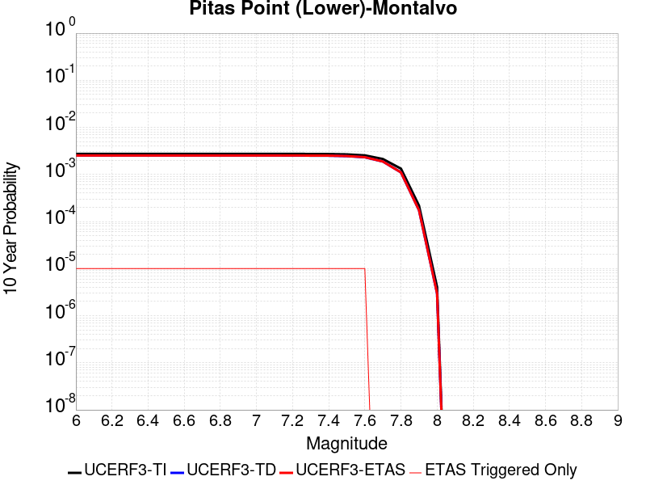 |

| Magnitude | 1 wk TI Prob | 1 wk TD Prob | 1 wk ETAS Prob | 1 wk ETAS/TD Gain | 1 wk ETAS Triggered Only | 1 mo TI Prob | 1 mo TD Prob | 1 mo ETAS Prob | 1 mo ETAS/TD Gain | 1 mo ETAS Triggered Only | 1 yr TI Prob | 1 yr TD Prob | 1 yr ETAS Prob | 1 yr ETAS/TD Gain | 1 yr ETAS Triggered Only | 10 yr TI Prob | 10 yr TD Prob | 10 yr ETAS Prob | 10 yr ETAS/TD Gain | 10 yr ETAS Triggered Only |
|-----|-----|-----|-----|-----|-----|-----|-----|-----|-----|-----|-----|-----|-----|-----|-----|-----|-----|-----|-----|-----|
| 6.0 | 5.2543637E-6 | 4.8379025E-6 | 4.8379025E-6 | 1.0 | 0.0 | 2.2518509E-5 | 2.0733705E-5 | 2.0733705E-5 | 1.0 | 0.0 | 2.7412834E-4 | 2.5240393E-4 | 2.5240393E-4 | 1.0 | 0.0 | 0.0027379042 | 0.0025212052 | 0.00253118 | 1.0039563 | 1.0E-5 |
| 6.1 | 5.2543637E-6 | 4.8379025E-6 | 4.8379025E-6 | 1.0 | 0.0 | 2.2518509E-5 | 2.0733705E-5 | 2.0733705E-5 | 1.0 | 0.0 | 2.7412834E-4 | 2.5240393E-4 | 2.5240393E-4 | 1.0 | 0.0 | 0.0027379042 | 0.0025212052 | 0.00253118 | 1.0039563 | 1.0E-5 |
| 6.2 | 5.2543637E-6 | 4.8379025E-6 | 4.8379025E-6 | 1.0 | 0.0 | 2.2518509E-5 | 2.0733705E-5 | 2.0733705E-5 | 1.0 | 0.0 | 2.7412834E-4 | 2.5240393E-4 | 2.5240393E-4 | 1.0 | 0.0 | 0.0027379042 | 0.0025212052 | 0.00253118 | 1.0039563 | 1.0E-5 |
| 6.3 | 5.2543637E-6 | 4.8379025E-6 | 4.8379025E-6 | 1.0 | 0.0 | 2.2518509E-5 | 2.0733705E-5 | 2.0733705E-5 | 1.0 | 0.0 | 2.7412834E-4 | 2.5240393E-4 | 2.5240393E-4 | 1.0 | 0.0 | 0.0027379042 | 0.0025212052 | 0.00253118 | 1.0039563 | 1.0E-5 |
| 6.4 | 5.2543637E-6 | 4.8379025E-6 | 4.8379025E-6 | 1.0 | 0.0 | 2.2518509E-5 | 2.0733705E-5 | 2.0733705E-5 | 1.0 | 0.0 | 2.7412834E-4 | 2.5240393E-4 | 2.5240393E-4 | 1.0 | 0.0 | 0.0027379042 | 0.0025212052 | 0.00253118 | 1.0039563 | 1.0E-5 |
| 6.5 | 5.2543637E-6 | 4.8379025E-6 | 4.8379025E-6 | 1.0 | 0.0 | 2.2518509E-5 | 2.0733705E-5 | 2.0733705E-5 | 1.0 | 0.0 | 2.7412834E-4 | 2.5240393E-4 | 2.5240393E-4 | 1.0 | 0.0 | 0.0027379042 | 0.0025212052 | 0.00253118 | 1.0039563 | 1.0E-5 |
| 6.6 | 5.2543637E-6 | 4.8379025E-6 | 4.8379025E-6 | 1.0 | 0.0 | 2.2518509E-5 | 2.0733705E-5 | 2.0733705E-5 | 1.0 | 0.0 | 2.7412834E-4 | 2.5240393E-4 | 2.5240393E-4 | 1.0 | 0.0 | 0.0027379042 | 0.0025212052 | 0.00253118 | 1.0039563 | 1.0E-5 |
| 6.7 | 5.2543637E-6 | 4.8379025E-6 | 4.8379025E-6 | 1.0 | 0.0 | 2.2518509E-5 | 2.0733705E-5 | 2.0733705E-5 | 1.0 | 0.0 | 2.7412834E-4 | 2.5240393E-4 | 2.5240393E-4 | 1.0 | 0.0 | 0.0027379042 | 0.0025212052 | 0.00253118 | 1.0039563 | 1.0E-5 |
| 6.8 | 5.2543637E-6 | 4.8379025E-6 | 4.8379025E-6 | 1.0 | 0.0 | 2.2518509E-5 | 2.0733705E-5 | 2.0733705E-5 | 1.0 | 0.0 | 2.7412834E-4 | 2.5240393E-4 | 2.5240393E-4 | 1.0 | 0.0 | 0.0027379042 | 0.0025212052 | 0.00253118 | 1.0039563 | 1.0E-5 |
| 6.9 | 5.2543637E-6 | 4.8379025E-6 | 4.8379025E-6 | 1.0 | 0.0 | 2.2518509E-5 | 2.0733705E-5 | 2.0733705E-5 | 1.0 | 0.0 | 2.7412834E-4 | 2.5240393E-4 | 2.5240393E-4 | 1.0 | 0.0 | 0.0027379042 | 0.0025212052 | 0.00253118 | 1.0039563 | 1.0E-5 |
| 7.0 | 5.2543637E-6 | 4.8379025E-6 | 4.8379025E-6 | 1.0 | 0.0 | 2.2518509E-5 | 2.0733705E-5 | 2.0733705E-5 | 1.0 | 0.0 | 2.7412834E-4 | 2.5240393E-4 | 2.5240393E-4 | 1.0 | 0.0 | 0.0027379042 | 0.0025212052 | 0.00253118 | 1.0039563 | 1.0E-5 |
| 7.1 | 5.2543637E-6 | 4.8379025E-6 | 4.8379025E-6 | 1.0 | 0.0 | 2.2518509E-5 | 2.0733705E-5 | 2.0733705E-5 | 1.0 | 0.0 | 2.7412834E-4 | 2.5240393E-4 | 2.5240393E-4 | 1.0 | 0.0 | 0.0027379042 | 0.0025212052 | 0.00253118 | 1.0039563 | 1.0E-5 |
| 7.2 | 5.2458695E-6 | 4.8290563E-6 | 4.8290563E-6 | 1.0 | 0.0 | 2.2482105E-5 | 2.0695794E-5 | 2.0695794E-5 | 1.0 | 0.0 | 2.7368523E-4 | 2.5194246E-4 | 2.5194246E-4 | 1.0 | 0.0 | 0.0027334841 | 0.002516601 | 0.0025265757 | 1.0039636 | 1.0E-5 |
| 7.3 | 5.22665E-6 | 4.8089737E-6 | 4.8089737E-6 | 1.0 | 0.0 | 2.2399736E-5 | 2.0609727E-5 | 2.0609727E-5 | 1.0 | 0.0 | 2.7268266E-4 | 2.5089484E-4 | 2.5089484E-4 | 1.0 | 0.0 | 0.002723483 | 0.0025061483 | 0.0025161232 | 1.0039802 | 1.0E-5 |
| 7.4 | 5.210642E-6 | 4.7921862E-6 | 4.7921862E-6 | 1.0 | 0.0 | 2.233113E-5 | 2.053778E-5 | 2.053778E-5 | 1.0 | 0.0 | 2.718476E-4 | 2.500191E-4 | 2.500191E-4 | 1.0 | 0.0 | 0.002715153 | 0.0024974106 | 0.0025073856 | 1.0039941 | 1.0E-5 |
| 7.5 | 5.1226016E-6 | 4.7000726E-6 | 4.7000726E-6 | 1.0 | 0.0 | 2.1953823E-5 | 2.0143016E-5 | 2.0143016E-5 | 1.0 | 0.0 | 2.67255E-4 | 2.4521392E-4 | 2.4521392E-4 | 1.0 | 0.0 | 0.0026693381 | 0.002449465 | 0.0024594406 | 1.0040725 | 1.0E-5 |
| 7.6 | 4.8796987E-6 | 4.4449725E-6 | 4.4449725E-6 | 1.0 | 0.0 | 2.0912828E-5 | 1.9049745E-5 | 1.9049745E-5 | 1.0 | 0.0 | 2.5458392E-4 | 2.3190626E-4 | 2.3190626E-4 | 1.0 | 0.0 | 0.0025429246 | 0.0023166733 | 0.00232665 | 1.0043066 | 1.0E-5 |
| 7.7 | 4.0834398E-6 | 3.6091444E-6 | 3.6091444E-6 | 1.0 | 0.0 | 1.7500339E-5 | 1.546767E-5 | 1.546767E-5 | 1.0 | 0.0 | 2.1304579E-4 | 1.8830286E-4 | 1.8830286E-4 | 1.0 | 0.0 | 0.0021284167 | 0.0018814567 | 0.0018814567 | 1.0 | 0.0 |
| 7.8 | 2.5445438E-6 | 2.1212566E-6 | 2.1212566E-6 | 1.0 | 0.0 | 1.0905142E-5 | 9.091068E-6 | 9.091068E-6 | 1.0 | 0.0 | 1.3276201E-4 | 1.1067818E-4 | 1.1067818E-4 | 1.0 | 0.0 | 0.0013268272 | 0.0011062352 | 0.0011062352 | 1.0 | 0.0 |
| 7.9 | 4.1677114E-7 | 3.3294015E-7 | 3.3294015E-7 | 1.0 | 0.0 | 1.7861609E-6 | 1.4268857E-6 | 1.4268857E-6 | 1.0 | 0.0 | 2.1746291E-5 | 1.7372196E-5 | 1.7372196E-5 | 1.0 | 0.0 | 2.1744163E-4 | 1.737087E-4 | 1.737087E-4 | 1.0 | 0.0 |
| 8.0 | 7.791402E-9 | 5.6836056E-9 | 5.6836056E-9 | 1.0 | 0.0 | 3.3391725E-8 | 2.4358311E-8 | 2.4358311E-8 | 1.0 | 0.0 | 4.0654416E-7 | 2.965624E-7 | 2.965624E-7 | 1.0 | 0.0 | 4.065434E-6 | 2.9656223E-6 | 2.9656223E-6 | 1.0 | 0.0 |

## Anacapa-Dume alt 1
*[(top)](#table-of-contents)*

| 1 Week | 1 Month | 1 Year | 10 Year |
|-----|-----|-----|-----|
|  |  |  | 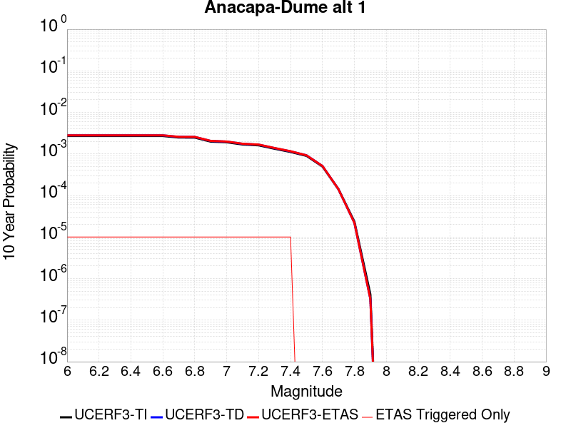 |

| Magnitude | 1 wk TI Prob | 1 wk TD Prob | 1 wk ETAS Prob | 1 wk ETAS/TD Gain | 1 wk ETAS Triggered Only | 1 mo TI Prob | 1 mo TD Prob | 1 mo ETAS Prob | 1 mo ETAS/TD Gain | 1 mo ETAS Triggered Only | 1 yr TI Prob | 1 yr TD Prob | 1 yr ETAS Prob | 1 yr ETAS/TD Gain | 1 yr ETAS Triggered Only | 10 yr TI Prob | 10 yr TD Prob | 10 yr ETAS Prob | 10 yr ETAS/TD Gain | 10 yr ETAS Triggered Only |
|-----|-----|-----|-----|-----|-----|-----|-----|-----|-----|-----|-----|-----|-----|-----|-----|-----|-----|-----|-----|-----|
| 6.0 | 5.1871802E-6 | 5.3673916E-6 | 5.3673916E-6 | 1.0 | 0.0 | 2.2230583E-5 | 2.3002909E-5 | 2.3002909E-5 | 1.0 | 0.0 | 2.7062374E-4 | 2.8002527E-4 | 2.8002527E-4 | 1.0 | 0.0 | 0.002702944 | 0.0027968097 | 0.0028067816 | 1.0035655 | 1.0E-5 |
| 6.1 | 5.1871802E-6 | 5.3673916E-6 | 5.3673916E-6 | 1.0 | 0.0 | 2.2230583E-5 | 2.3002909E-5 | 2.3002909E-5 | 1.0 | 0.0 | 2.7062374E-4 | 2.8002527E-4 | 2.8002527E-4 | 1.0 | 0.0 | 0.002702944 | 0.0027968097 | 0.0028067816 | 1.0035655 | 1.0E-5 |
| 6.2 | 5.1871802E-6 | 5.3673916E-6 | 5.3673916E-6 | 1.0 | 0.0 | 2.2230583E-5 | 2.3002909E-5 | 2.3002909E-5 | 1.0 | 0.0 | 2.7062374E-4 | 2.8002527E-4 | 2.8002527E-4 | 1.0 | 0.0 | 0.002702944 | 0.0027968097 | 0.0028067816 | 1.0035655 | 1.0E-5 |
| 6.3 | 5.1871802E-6 | 5.3673916E-6 | 5.3673916E-6 | 1.0 | 0.0 | 2.2230583E-5 | 2.3002909E-5 | 2.3002909E-5 | 1.0 | 0.0 | 2.7062374E-4 | 2.8002527E-4 | 2.8002527E-4 | 1.0 | 0.0 | 0.002702944 | 0.0027968097 | 0.0028067816 | 1.0035655 | 1.0E-5 |
| 6.4 | 5.1871802E-6 | 5.3673916E-6 | 5.3673916E-6 | 1.0 | 0.0 | 2.2230583E-5 | 2.3002909E-5 | 2.3002909E-5 | 1.0 | 0.0 | 2.7062374E-4 | 2.8002527E-4 | 2.8002527E-4 | 1.0 | 0.0 | 0.002702944 | 0.0027968097 | 0.0028067816 | 1.0035655 | 1.0E-5 |
| 6.5 | 5.1871802E-6 | 5.3673916E-6 | 5.3673916E-6 | 1.0 | 0.0 | 2.2230583E-5 | 2.3002909E-5 | 2.3002909E-5 | 1.0 | 0.0 | 2.7062374E-4 | 2.8002527E-4 | 2.8002527E-4 | 1.0 | 0.0 | 0.002702944 | 0.0027968097 | 0.0028067816 | 1.0035655 | 1.0E-5 |
| 6.6 | 5.1871802E-6 | 5.3673916E-6 | 5.3673916E-6 | 1.0 | 0.0 | 2.2230583E-5 | 2.3002909E-5 | 2.3002909E-5 | 1.0 | 0.0 | 2.7062374E-4 | 2.8002527E-4 | 2.8002527E-4 | 1.0 | 0.0 | 0.002702944 | 0.0027968097 | 0.0028067816 | 1.0035655 | 1.0E-5 |
| 6.7 | 4.7693475E-6 | 4.9366927E-6 | 4.9366927E-6 | 1.0 | 0.0 | 2.04399E-5 | 2.1157086E-5 | 2.1157086E-5 | 1.0 | 0.0 | 2.4882736E-4 | 2.5755784E-4 | 2.5755784E-4 | 1.0 | 0.0 | 0.0024854892 | 0.0025726694 | 0.0025826436 | 1.003877 | 1.0E-5 |
| 6.8 | 4.753408E-6 | 4.920241E-6 | 4.920241E-6 | 1.0 | 0.0 | 2.037159E-5 | 2.108658E-5 | 2.108658E-5 | 1.0 | 0.0 | 2.4799586E-4 | 2.5669963E-4 | 2.5669963E-4 | 1.0 | 0.0 | 0.002477193 | 0.002564107 | 0.0025740813 | 1.00389 | 1.0E-5 |
| 6.9 | 3.800069E-6 | 3.937127E-6 | 3.937127E-6 | 1.0 | 0.0 | 1.6285909E-5 | 1.6873293E-5 | 1.6873293E-5 | 1.0 | 0.0 | 1.9826289E-4 | 2.054132E-4 | 2.054132E-4 | 1.0 | 0.0 | 0.001980861 | 0.0020522573 | 0.0020622367 | 1.0048627 | 1.0E-5 |
| 7.0 | 3.6671938E-6 | 3.799919E-6 | 3.799919E-6 | 1.0 | 0.0 | 1.571645E-5 | 1.6285267E-5 | 1.6285267E-5 | 1.0 | 0.0 | 1.9133097E-4 | 1.9825532E-4 | 1.9825532E-4 | 1.0 | 0.0 | 0.0019116632 | 0.0019808079 | 0.001990788 | 1.0050385 | 1.0E-5 |
| 7.1 | 3.2394885E-6 | 3.3587942E-6 | 3.3587942E-6 | 1.0 | 0.0 | 1.3883448E-5 | 1.4394753E-5 | 1.4394753E-5 | 1.0 | 0.0 | 1.6901788E-4 | 1.7524212E-4 | 1.7524212E-4 | 1.0 | 0.0 | 0.0016888938 | 0.0017510506 | 0.0017610331 | 1.0057008 | 1.0E-5 |
| 7.2 | 3.0935948E-6 | 3.2079267E-6 | 3.2079267E-6 | 1.0 | 0.0 | 1.3258196E-5 | 1.3748186E-5 | 1.3748186E-5 | 1.0 | 0.0 | 1.6140658E-4 | 1.6737141E-4 | 1.6737141E-4 | 1.0 | 0.0 | 0.001612894 | 0.0016724645 | 0.0016824479 | 1.0059692 | 1.0E-5 |
| 7.3 | 2.5604163E-6 | 2.6470739E-6 | 2.6470739E-6 | 1.0 | 0.0 | 1.0973167E-5 | 1.1344553E-5 | 1.1344553E-5 | 1.0 | 0.0 | 1.3359012E-4 | 1.3811122E-4 | 1.3811122E-4 | 1.0 | 0.0 | 0.0013350984 | 0.0013802585 | 0.0013902447 | 1.007235 | 1.0E-5 |
| 7.4 | 2.1429005E-6 | 2.2106035E-6 | 2.2106035E-6 | 1.0 | 0.0 | 9.1838265E-6 | 9.473981E-6 | 9.473981E-6 | 1.0 | 0.0 | 1.11807356E-4 | 1.1533964E-4 | 1.1533964E-4 | 1.0 | 0.0 | 0.0011175112 | 0.0011528004 | 0.0011627888 | 1.0086645 | 1.0E-5 |
| 7.5 | 1.7237151E-6 | 1.7761457E-6 | 1.7761457E-6 | 1.0 | 0.0 | 7.3873293E-6 | 7.6120314E-6 | 7.6120314E-6 | 1.0 | 0.0 | 8.993702E-5 | 9.267256E-5 | 9.267256E-5 | 1.0 | 0.0 | 8.990063E-4 | 9.263415E-4 | 9.263415E-4 | 1.0 | 0.0 |
| 7.6 | 9.541696E-7 | 9.823211E-7 | 9.823211E-7 | 1.0 | 0.0 | 4.089292E-6 | 4.2099414E-6 | 4.2099414E-6 | 1.0 | 0.0 | 4.9785995E-5 | 5.125484E-5 | 5.125484E-5 | 1.0 | 0.0 | 4.9774844E-4 | 5.124315E-4 | 5.124315E-4 | 1.0 | 0.0 |
| 7.7 | 2.7226676E-7 | 2.7172473E-7 | 2.7172473E-7 | 1.0 | 0.0 | 1.166857E-6 | 1.1645341E-6 | 1.1645341E-6 | 1.0 | 0.0 | 1.4206392E-5 | 1.4178111E-5 | 1.4178111E-5 | 1.0 | 0.0 | 1.4205484E-4 | 1.4177214E-4 | 1.4177214E-4 | 1.0 | 0.0 |
| 7.8 | 4.5017995E-8 | 4.215797E-8 | 4.215797E-8 | 1.0 | 0.0 | 1.9293425E-7 | 1.80677E-7 | 1.80677E-7 | 1.0 | 0.0 | 2.348972E-6 | 2.1997405E-6 | 2.1997405E-6 | 1.0 | 0.0 | 2.348947E-5 | 2.1997208E-5 | 2.1997208E-5 | 1.0 | 0.0 |
| 7.9 | 8.007447E-10 | 6.161581E-10 | 6.161581E-10 | 1.0 | 0.0 | 3.4317629E-9 | 2.640678E-9 | 2.640678E-9 | 1.0 | 0.0 | 4.1781714E-8 | 3.2150254E-8 | 3.2150254E-8 | 1.0 | 0.0 | 4.1781706E-7 | 3.2150248E-7 | 3.2150248E-7 | 1.0 | 0.0 |

## Bennett Valley 2011 CFM
*[(top)](#table-of-contents)*

| 1 Week | 1 Month | 1 Year | 10 Year |
|-----|-----|-----|-----|
|  |  |  | 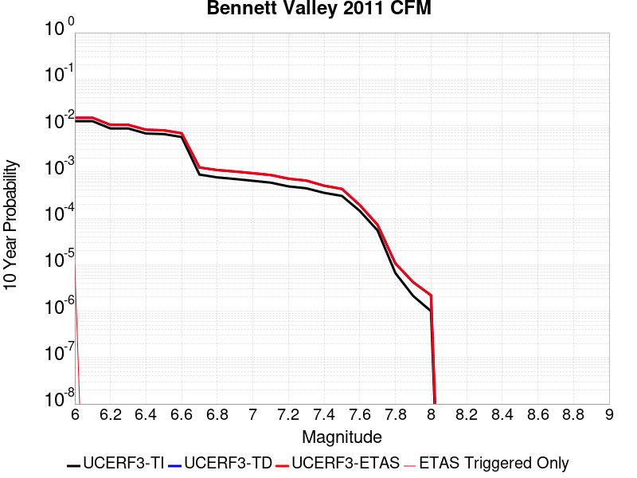 |

| Magnitude | 1 wk TI Prob | 1 wk TD Prob | 1 wk ETAS Prob | 1 wk ETAS/TD Gain | 1 wk ETAS Triggered Only | 1 mo TI Prob | 1 mo TD Prob | 1 mo ETAS Prob | 1 mo ETAS/TD Gain | 1 mo ETAS Triggered Only | 1 yr TI Prob | 1 yr TD Prob | 1 yr ETAS Prob | 1 yr ETAS/TD Gain | 1 yr ETAS Triggered Only | 10 yr TI Prob | 10 yr TD Prob | 10 yr ETAS Prob | 10 yr ETAS/TD Gain | 10 yr ETAS Triggered Only |
|-----|-----|-----|-----|-----|-----|-----|-----|-----|-----|-----|-----|-----|-----|-----|-----|-----|-----|-----|-----|-----|
| 6.0 | 2.3893934E-5 | 2.823899E-5 | 2.823899E-5 | 1.0 | 0.0 | 1.0239855E-4 | 1.2101967E-4 | 1.2101967E-4 | 1.0 | 0.0 | 0.0012459893 | 0.0014726035 | 0.0014825888 | 1.0067807 | 1.0E-5 | 0.012390262 | 0.01465108 | 0.014660933 | 1.0006726 | 1.0E-5 |
| 6.1 | 2.3893934E-5 | 2.823899E-5 | 2.823899E-5 | 1.0 | 0.0 | 1.0239855E-4 | 1.2101967E-4 | 1.2101967E-4 | 1.0 | 0.0 | 0.0012459893 | 0.0014726035 | 0.0014726035 | 1.0 | 0.0 | 0.012390262 | 0.01465108 | 0.01465108 | 1.0 | 0.0 |
| 6.2 | 1.6657146E-5 | 1.9853873E-5 | 1.9853873E-5 | 1.0 | 0.0 | 7.138582E-5 | 8.508605E-5 | 8.508605E-5 | 1.0 | 0.0 | 8.6877577E-4 | 0.0010355718 | 0.0010355718 | 1.0 | 0.0 | 0.008653872 | 0.010325706 | 0.010325706 | 1.0 | 0.0 |
| 6.3 | 1.6657146E-5 | 1.9853873E-5 | 1.9853873E-5 | 1.0 | 0.0 | 7.138582E-5 | 8.508605E-5 | 8.508605E-5 | 1.0 | 0.0 | 8.6877577E-4 | 0.0010355718 | 0.0010355718 | 1.0 | 0.0 | 0.008653872 | 0.010325706 | 0.010325706 | 1.0 | 0.0 |
| 6.4 | 1.29418495E-5 | 1.5567592E-5 | 1.5567592E-5 | 1.0 | 0.0 | 5.546389E-5 | 6.671728E-5 | 6.671728E-5 | 1.0 | 0.0 | 6.7506364E-4 | 8.1211043E-4 | 8.1211043E-4 | 1.0 | 0.0 | 0.0067301663 | 0.008108544 | 0.008108544 | 1.0 | 0.0 |
| 6.5 | 1.2582504E-5 | 1.5134623E-5 | 1.5134623E-5 | 1.0 | 0.0 | 5.39239E-5 | 6.486179E-5 | 6.486179E-5 | 1.0 | 0.0 | 6.563257E-4 | 7.8953634E-4 | 7.8953634E-4 | 1.0 | 0.0 | 0.006543907 | 0.007884451 | 0.007884451 | 1.0 | 0.0 |
| 6.6 | 1.0846706E-5 | 1.3036858E-5 | 1.3036858E-5 | 1.0 | 0.0 | 4.6485053E-5 | 5.5871777E-5 | 5.5871777E-5 | 1.0 | 0.0 | 5.6580856E-4 | 6.801549E-4 | 6.801549E-4 | 1.0 | 0.0 | 0.005643701 | 0.0067976816 | 0.0067976816 | 1.0 | 0.0 |
| 6.7 | 1.6803231E-6 | 2.377902E-6 | 2.377902E-6 | 1.0 | 0.0 | 7.2013645E-6 | 1.019097E-5 | 1.019097E-5 | 1.0 | 0.0 | 8.7673085E-5 | 1.2406812E-4 | 1.2406812E-4 | 1.0 | 0.0 | 8.76385E-4 | 0.0012444188 | 0.0012444188 | 1.0 | 0.0 |
| 6.8 | 1.4609833E-6 | 2.0939708E-6 | 2.0939708E-6 | 1.0 | 0.0 | 6.261342E-6 | 8.974131E-6 | 8.974131E-6 | 1.0 | 0.0 | 7.6229175E-5 | 1.0925463E-4 | 1.0925463E-4 | 1.0 | 0.0 | 7.620303E-4 | 0.0010963798 | 0.0010963798 | 1.0 | 0.0 |
| 6.9 | 1.3492396E-6 | 1.9459103E-6 | 1.9459103E-6 | 1.0 | 0.0 | 5.7824427E-6 | 8.339589E-6 | 8.339589E-6 | 1.0 | 0.0 | 7.0398964E-5 | 1.01529826E-4 | 1.01529826E-4 | 1.0 | 0.0 | 7.037667E-4 | 0.001019178 | 0.001019178 | 1.0 | 0.0 |
| 7.0 | 1.2347921E-6 | 1.7888974E-6 | 1.7888974E-6 | 1.0 | 0.0 | 5.291955E-6 | 7.666681E-6 | 7.666681E-6 | 1.0 | 0.0 | 6.442765E-5 | 9.33379E-5 | 9.33379E-5 | 1.0 | 0.0 | 6.440897E-4 | 9.373068E-4 | 9.373068E-4 | 1.0 | 0.0 |
| 7.1 | 1.1262973E-6 | 1.6359154E-6 | 1.6359154E-6 | 1.0 | 0.0 | 4.8269794E-6 | 7.0110473E-6 | 7.0110473E-6 | 1.0 | 0.0 | 5.876689E-5 | 8.535621E-5 | 8.535621E-5 | 1.0 | 0.0 | 5.875135E-4 | 8.5754244E-4 | 8.5754244E-4 | 1.0 | 0.0 |
| 7.2 | 9.351744E-7 | 1.3611758E-6 | 1.3611758E-6 | 1.0 | 0.0 | 4.007884E-6 | 5.8335977E-6 | 5.8335977E-6 | 1.0 | 0.0 | 4.8794896E-5 | 7.1021765E-5 | 7.1021765E-5 | 1.0 | 0.0 | 4.878418E-4 | 7.142461E-4 | 7.142461E-4 | 1.0 | 0.0 |
| 7.3 | 8.5039534E-7 | 1.2386733E-6 | 1.2386733E-6 | 1.0 | 0.0 | 3.6445463E-6 | 5.308589E-6 | 5.308589E-6 | 1.0 | 0.0 | 4.437145E-5 | 6.463018E-5 | 6.463018E-5 | 1.0 | 0.0 | 4.436259E-4 | 6.50103E-4 | 6.50103E-4 | 1.0 | 0.0 |
| 7.4 | 6.7875015E-7 | 9.600642E-7 | 9.600642E-7 | 1.0 | 0.0 | 2.908926E-6 | 4.1145545E-6 | 4.1145545E-6 | 1.0 | 0.0 | 3.54156E-5 | 5.009356E-5 | 5.009356E-5 | 1.0 | 0.0 | 3.5409955E-4 | 5.0413073E-4 | 5.0413073E-4 | 1.0 | 0.0 |
| 7.5 | 5.826867E-7 | 8.1883735E-7 | 8.1883735E-7 | 1.0 | 0.0 | 2.4972264E-6 | 3.5092983E-6 | 3.5092983E-6 | 1.0 | 0.0 | 3.0403306E-5 | 4.2724878E-5 | 4.2724878E-5 | 1.0 | 0.0 | 3.0399146E-4 | 4.300558E-4 | 4.300558E-4 | 1.0 | 0.0 |
| 7.6 | 2.7734902E-7 | 3.6822587E-7 | 3.6822587E-7 | 1.0 | 0.0 | 1.1886381E-6 | 1.57811E-6 | 1.57811E-6 | 1.0 | 0.0 | 1.4471572E-5 | 1.9213321E-5 | 1.9213321E-5 | 1.0 | 0.0 | 1.447063E-4 | 1.9315645E-4 | 1.9315645E-4 | 1.0 | 0.0 |
| 7.7 | 1.0530888E-7 | 1.3749101E-7 | 1.3749101E-7 | 1.0 | 0.0 | 4.513237E-7 | 5.8924707E-7 | 5.8924707E-7 | 1.0 | 0.0 | 5.4948523E-6 | 7.174059E-6 | 7.174059E-6 | 1.0 | 0.0 | 5.4947162E-5 | 7.255585E-5 | 7.255585E-5 | 1.0 | 0.0 |
| 7.8 | 1.2714258E-8 | 1.9633259E-8 | 1.9633259E-8 | 1.0 | 0.0 | 5.448968E-8 | 8.4142535E-8 | 8.4142535E-8 | 1.0 | 0.0 | 6.6341164E-7 | 1.0244348E-6 | 1.0244348E-6 | 1.0 | 0.0 | 6.6340967E-6 | 1.0658595E-5 | 1.0658595E-5 | 1.0 | 0.0 |
| 7.9 | 4.075888E-9 | 7.559928E-9 | 7.559928E-9 | 1.0 | 0.0 | 1.7468091E-8 | 3.239969E-8 | 3.239969E-8 | 1.0 | 0.0 | 2.12674E-7 | 3.9446616E-7 | 3.9446616E-7 | 1.0 | 0.0 | 2.1267379E-6 | 4.1952467E-6 | 4.1952467E-6 | 1.0 | 0.0 |
| 8.0 | 1.9126138E-9 | 3.9956882E-9 | 3.9956882E-9 | 1.0 | 0.0 | 8.196917E-9 | 1.7124377E-8 | 1.7124377E-8 | 1.0 | 0.0 | 9.9797454E-8 | 2.0848927E-7 | 2.0848927E-7 | 1.0 | 0.0 | 9.979741E-7 | 2.1982228E-6 | 2.1982228E-6 | 1.0 | 0.0 |

## Laguna Salada
*[(top)](#table-of-contents)*

| 1 Week | 1 Month | 1 Year | 10 Year |
|-----|-----|-----|-----|
|  |  |  |  |

| Magnitude | 1 wk TI Prob | 1 wk TD Prob | 1 wk ETAS Prob | 1 wk ETAS/TD Gain | 1 wk ETAS Triggered Only | 1 mo TI Prob | 1 mo TD Prob | 1 mo ETAS Prob | 1 mo ETAS/TD Gain | 1 mo ETAS Triggered Only | 1 yr TI Prob | 1 yr TD Prob | 1 yr ETAS Prob | 1 yr ETAS/TD Gain | 1 yr ETAS Triggered Only | 10 yr TI Prob | 10 yr TD Prob | 10 yr ETAS Prob | 10 yr ETAS/TD Gain | 10 yr ETAS Triggered Only |
|-----|-----|-----|-----|-----|-----|-----|-----|-----|-----|-----|-----|-----|-----|-----|-----|-----|-----|-----|-----|-----|
| 6.0 | 4.6465593E-5 | 4.634507E-5 | 4.634507E-5 | 1.0 | 0.0 | 1.9912305E-4 | 1.9860751E-4 | 1.9860751E-4 | 1.0 | 0.0 | 0.0024216278 | 0.0024154421 | 0.0024154421 | 1.0 | 0.0 | 0.02395408 | 0.023965387 | 0.023975147 | 1.0004072 | 1.0E-5 |
| 6.1 | 3.982297E-5 | 3.7244878E-5 | 3.7244878E-5 | 1.0 | 0.0 | 1.706587E-4 | 1.5961178E-4 | 1.5961178E-4 | 1.0 | 0.0 | 0.0020757897 | 0.0019416384 | 0.0019416384 | 1.0 | 0.0 | 0.020565065 | 0.019322045 | 0.019322045 | 1.0 | 0.0 |
| 6.2 | 3.6067784E-5 | 3.2600165E-5 | 3.2600165E-5 | 1.0 | 0.0 | 1.5456705E-4 | 1.3970808E-4 | 1.3970808E-4 | 1.0 | 0.0 | 0.0018802295 | 0.0016997134 | 0.0016997134 | 1.0 | 0.0 | 0.018644003 | 0.016963193 | 0.016963193 | 1.0 | 0.0 |
| 6.3 | 3.2859112E-5 | 2.8847233E-5 | 2.8847233E-5 | 1.0 | 0.0 | 1.4081717E-4 | 1.2362566E-4 | 1.2362566E-4 | 1.0 | 0.0 | 0.0017131006 | 0.0015041964 | 0.0015041964 | 1.0 | 0.0 | 0.016999546 | 0.015031838 | 0.015031838 | 1.0 | 0.0 |
| 6.4 | 2.9132116E-5 | 2.4851877E-5 | 2.4851877E-5 | 1.0 | 0.0 | 1.2484594E-4 | 1.0650421E-4 | 1.0650421E-4 | 1.0 | 0.0 | 0.0015189396 | 0.001296006 | 0.001296006 | 1.0 | 0.0 | 0.015085992 | 0.012965128 | 0.012965128 | 1.0 | 0.0 |
| 6.5 | 2.7075037E-5 | 2.2824677E-5 | 2.2824677E-5 | 1.0 | 0.0 | 1.1603071E-4 | 9.7816875E-5 | 9.7816875E-5 | 1.0 | 0.0 | 0.0014117584 | 0.0011903581 | 0.0011903581 | 1.0 | 0.0 | 0.014028233 | 0.011916272 | 0.011916272 | 1.0 | 0.0 |
| 6.6 | 2.2367465E-5 | 1.8572848E-5 | 1.8572848E-5 | 1.0 | 0.0 | 9.5857045E-5 | 7.959595E-5 | 7.959595E-5 | 1.0 | 0.0 | 0.0011664346 | 9.687322E-4 | 9.687322E-4 | 1.0 | 0.0 | 0.011603311 | 0.009708806 | 0.009708806 | 1.0 | 0.0 |
| 6.7 | 1.9458053E-5 | 1.5913607E-5 | 1.5913607E-5 | 1.0 | 0.0 | 8.338899E-5 | 6.819984E-5 | 6.819984E-5 | 1.0 | 0.0 | 0.001014788 | 8.300971E-4 | 8.300971E-4 | 1.0 | 0.0 | 0.010101665 | 0.008315945 | 0.008315945 | 1.0 | 0.0 |
| 6.8 | 1.0767866E-5 | 9.183346E-6 | 9.183346E-6 | 1.0 | 0.0 | 4.614718E-5 | 3.9356994E-5 | 3.9356994E-5 | 1.0 | 0.0 | 5.6169706E-4 | 4.7913467E-4 | 4.7913467E-4 | 1.0 | 0.0 | 0.0056027942 | 0.0048085325 | 0.0048085325 | 1.0 | 0.0 |
| 6.9 | 2.1384765E-6 | 1.7913964E-6 | 1.7913964E-6 | 1.0 | 0.0 | 9.164866E-6 | 7.677392E-6 | 7.677392E-6 | 1.0 | 0.0 | 1.1157654E-4 | 9.346863E-5 | 9.346863E-5 | 1.0 | 0.0 | 0.0011152053 | 9.343315E-4 | 9.343315E-4 | 1.0 | 0.0 |
| 7.0 | 2.0952946E-6 | 1.7493335E-6 | 1.7493335E-6 | 1.0 | 0.0 | 8.979802E-6 | 7.497124E-6 | 7.497124E-6 | 1.0 | 0.0 | 1.0932361E-4 | 9.127405E-5 | 9.127405E-5 | 1.0 | 0.0 | 0.0010926984 | 9.124038E-4 | 9.124038E-4 | 1.0 | 0.0 |
| 7.1 | 1.7887576E-6 | 1.4500541E-6 | 1.4500541E-6 | 1.0 | 0.0 | 7.666081E-6 | 6.2145045E-6 | 6.2145045E-6 | 1.0 | 0.0 | 9.333054E-5 | 7.565928E-5 | 7.565928E-5 | 1.0 | 0.0 | 9.329135E-4 | 7.5636554E-4 | 7.5636554E-4 | 1.0 | 0.0 |
| 7.2 | 9.723109E-7 | 7.135829E-7 | 7.135829E-7 | 1.0 | 0.0 | 4.16704E-6 | 3.0582096E-6 | 3.0582096E-6 | 1.0 | 0.0 | 5.073253E-5 | 3.7233232E-5 | 3.7233232E-5 | 1.0 | 0.0 | 5.072095E-4 | 3.722862E-4 | 3.722862E-4 | 1.0 | 0.0 |

## Quien Sabe 2011 CFM
*[(top)](#table-of-contents)*

| 1 Week | 1 Month | 1 Year | 10 Year |
|-----|-----|-----|-----|
|  |  |  |  |

| Magnitude | 1 wk TI Prob | 1 wk TD Prob | 1 wk ETAS Prob | 1 wk ETAS/TD Gain | 1 wk ETAS Triggered Only | 1 mo TI Prob | 1 mo TD Prob | 1 mo ETAS Prob | 1 mo ETAS/TD Gain | 1 mo ETAS Triggered Only | 1 yr TI Prob | 1 yr TD Prob | 1 yr ETAS Prob | 1 yr ETAS/TD Gain | 1 yr ETAS Triggered Only | 10 yr TI Prob | 10 yr TD Prob | 10 yr ETAS Prob | 10 yr ETAS/TD Gain | 10 yr ETAS Triggered Only |
|-----|-----|-----|-----|-----|-----|-----|-----|-----|-----|-----|-----|-----|-----|-----|-----|-----|-----|-----|-----|-----|
| 6.0 | 3.729899E-5 | 7.094885E-5 | 8.094814E-5 | 1.1409366 | 1.0E-5 | 1.5984301E-4 | 3.0394195E-4 | 3.1393892E-4 | 1.032891 | 1.0E-5 | 0.0019443515 | 0.0036850597 | 0.0036950228 | 1.0027037 | 1.0E-5 | 0.019274272 | 0.035349693 | 0.035359338 | 1.0002729 | 1.0E-5 |
| 6.1 | 1.7825725E-5 | 3.3210796E-5 | 4.321046E-5 | 1.3010969 | 1.0E-5 | 7.639373E-5 | 1.4227985E-4 | 1.5227843E-4 | 1.070274 | 1.0E-5 | 9.296967E-4 | 0.0017266083 | 0.001736591 | 1.0057817 | 1.0E-5 | 0.009258169 | 0.016698873 | 0.016708706 | 1.0005889 | 1.0E-5 |
| 6.2 | 4.8865336E-6 | 7.807397E-6 | 7.807397E-6 | 1.0 | 0.0 | 2.0942118E-5 | 3.3456672E-5 | 3.3456672E-5 | 1.0 | 0.0 | 2.5494045E-4 | 4.0691794E-4 | 4.0691794E-4 | 1.0 | 0.0 | 0.0025464818 | 0.0040135398 | 0.0040135398 | 1.0 | 0.0 |
| 6.3 | 3.858491E-6 | 5.7896764E-6 | 5.7896764E-6 | 1.0 | 0.0 | 1.6536285E-5 | 2.4812689E-5 | 2.4812689E-5 | 1.0 | 0.0 | 2.0131067E-4 | 3.020573E-4 | 3.020573E-4 | 1.0 | 0.0 | 0.002011284 | 0.0030020247 | 0.0030020247 | 1.0 | 0.0 |
| 6.4 | 3.0771805E-6 | 4.3848822E-6 | 4.3848822E-6 | 1.0 | 0.0 | 1.318785E-5 | 1.879223E-5 | 1.879223E-5 | 1.0 | 0.0 | 1.6055023E-4 | 2.287738E-4 | 2.287738E-4 | 1.0 | 0.0 | 0.001604343 | 0.0022864633 | 0.0022864633 | 1.0 | 0.0 |
| 6.5 | 2.5081235E-6 | 3.4635768E-6 | 3.4635768E-6 | 1.0 | 0.0 | 1.0749056E-5 | 1.4843825E-5 | 1.4843825E-5 | 1.0 | 0.0 | 1.308619E-4 | 1.8071005E-4 | 1.8071005E-4 | 1.0 | 0.0 | 0.0013078486 | 0.0018122483 | 0.0018122483 | 1.0 | 0.0 |
| 6.6 | 1.7505364E-6 | 2.4023664E-6 | 2.4023664E-6 | 1.0 | 0.0 | 7.502277E-6 | 1.0295819E-5 | 1.0295819E-5 | 1.0 | 0.0 | 9.13364E-5 | 1.253451E-4 | 1.253451E-4 | 1.0 | 0.0 | 9.129886E-4 | 0.0012582706 | 0.0012582706 | 1.0 | 0.0 |
| 6.7 | 1.505737E-6 | 2.063768E-6 | 2.063768E-6 | 1.0 | 0.0 | 6.4531428E-6 | 8.844693E-6 | 8.844693E-6 | 1.0 | 0.0 | 7.8564175E-5 | 1.0767942E-4 | 1.0767942E-4 | 1.0 | 0.0 | 7.853641E-4 | 0.0010818074 | 0.0010818074 | 1.0 | 0.0 |
| 6.8 | 1.2924105E-6 | 1.7484224E-6 | 1.7484224E-6 | 1.0 | 0.0 | 5.5388905E-6 | 7.4932204E-6 | 7.4932204E-6 | 1.0 | 0.0 | 6.74339E-5 | 9.1226684E-5 | 9.1226684E-5 | 1.0 | 0.0 | 6.741344E-4 | 9.1608387E-4 | 9.1608387E-4 | 1.0 | 0.0 |
| 6.9 | 8.9075286E-7 | 1.1249912E-6 | 1.1249912E-6 | 1.0 | 0.0 | 3.8175067E-6 | 4.8213833E-6 | 4.8213833E-6 | 1.0 | 0.0 | 4.6477155E-5 | 5.869898E-5 | 5.869898E-5 | 1.0 | 0.0 | 4.6467435E-4 | 5.903731E-4 | 5.903731E-4 | 1.0 | 0.0 |
| 7.0 | 6.6891175E-7 | 8.516645E-7 | 8.516645E-7 | 1.0 | 0.0 | 2.8667614E-6 | 3.6499866E-6 | 3.6499866E-6 | 1.0 | 0.0 | 3.4902263E-5 | 4.443788E-5 | 4.443788E-5 | 1.0 | 0.0 | 3.4896782E-4 | 4.4676356E-4 | 4.4676356E-4 | 1.0 | 0.0 |
| 7.1 | 4.4205015E-7 | 5.391929E-7 | 5.391929E-7 | 1.0 | 0.0 | 1.8944993E-6 | 2.3108257E-6 | 2.3108257E-6 | 1.0 | 0.0 | 2.3065284E-5 | 2.8134109E-5 | 2.8134109E-5 | 1.0 | 0.0 | 2.3062891E-4 | 2.826615E-4 | 2.826615E-4 | 1.0 | 0.0 |
| 7.2 | 1.6620965E-7 | 1.5987632E-7 | 1.5987632E-7 | 1.0 | 0.0 | 7.123269E-7 | 6.851841E-7 | 6.851841E-7 | 1.0 | 0.0 | 8.672545E-6 | 8.342088E-6 | 8.342088E-6 | 1.0 | 0.0 | 8.6722066E-5 | 8.354316E-5 | 8.354316E-5 | 1.0 | 0.0 |
| 7.3 | 1.2142488E-7 | 1.1726676E-7 | 1.1726676E-7 | 1.0 | 0.0 | 5.2039223E-7 | 5.025717E-7 | 5.025717E-7 | 1.0 | 0.0 | 6.335757E-6 | 6.118797E-6 | 6.118797E-6 | 1.0 | 0.0 | 6.3355765E-5 | 6.120608E-5 | 6.120608E-5 | 1.0 | 0.0 |
| 7.4 | 2.4192937E-8 | 2.4545901E-8 | 2.4545901E-8 | 1.0 | 0.0 | 1.0368401E-7 | 1.0519671E-7 | 1.0519671E-7 | 1.0 | 0.0 | 1.2623522E-6 | 1.2807693E-6 | 1.2807693E-6 | 1.0 | 0.0 | 1.2623449E-5 | 1.2768185E-5 | 1.2768185E-5 | 1.0 | 0.0 |
| 7.5 | 1.4432802E-8 | 1.4508743E-8 | 1.4508743E-8 | 1.0 | 0.0 | 6.185486E-8 | 6.218033E-8 | 6.218033E-8 | 1.0 | 0.0 | 7.530827E-7 | 7.5704526E-7 | 7.5704526E-7 | 1.0 | 0.0 | 7.530801E-6 | 7.528889E-6 | 7.528889E-6 | 1.0 | 0.0 |

## Superstition Hills
*[(top)](#table-of-contents)*

| 1 Week | 1 Month | 1 Year | 10 Year |
|-----|-----|-----|-----|
|  |  |  |  |

| Magnitude | 1 wk TI Prob | 1 wk TD Prob | 1 wk ETAS Prob | 1 wk ETAS/TD Gain | 1 wk ETAS Triggered Only | 1 mo TI Prob | 1 mo TD Prob | 1 mo ETAS Prob | 1 mo ETAS/TD Gain | 1 mo ETAS Triggered Only | 1 yr TI Prob | 1 yr TD Prob | 1 yr ETAS Prob | 1 yr ETAS/TD Gain | 1 yr ETAS Triggered Only | 10 yr TI Prob | 10 yr TD Prob | 10 yr ETAS Prob | 10 yr ETAS/TD Gain | 10 yr ETAS Triggered Only |
|-----|-----|-----|-----|-----|-----|-----|-----|-----|-----|-----|-----|-----|-----|-----|-----|-----|-----|-----|-----|-----|
| 6.0 | 6.6865185E-5 | 1.4137668E-5 | 2.4137526E-5 | 1.7073202 | 1.0E-5 | 2.8653358E-4 | 6.058869E-5 | 7.058808E-5 | 1.1650373 | 1.0E-5 | 0.0034829667 | 7.374338E-4 | 7.474264E-4 | 1.0135505 | 1.0E-5 | 0.03428881 | 0.007520696 | 0.007530621 | 1.0013196 | 1.0E-5 |
| 6.1 | 6.544851E-5 | 1.4137668E-5 | 2.4137526E-5 | 1.7073202 | 1.0E-5 | 2.8046346E-4 | 6.058869E-5 | 7.058808E-5 | 1.1650373 | 1.0E-5 | 0.0034092965 | 7.374338E-4 | 7.474264E-4 | 1.0135505 | 1.0E-5 | 0.033574644 | 0.0075206957 | 0.0075306203 | 1.0013196 | 1.0E-5 |
| 6.2 | 6.544851E-5 | 1.4137668E-5 | 2.4137526E-5 | 1.7073202 | 1.0E-5 | 2.8046346E-4 | 6.058869E-5 | 7.058808E-5 | 1.1650373 | 1.0E-5 | 0.0034092965 | 7.374338E-4 | 7.474264E-4 | 1.0135505 | 1.0E-5 | 0.033574644 | 0.0075206957 | 0.0075306203 | 1.0013196 | 1.0E-5 |
| 6.3 | 5.2402065E-5 | 1.4137667E-5 | 2.4137526E-5 | 1.7073203 | 1.0E-5 | 2.2456095E-4 | 6.0588685E-5 | 7.058808E-5 | 1.1650373 | 1.0E-5 | 0.0027306017 | 7.374338E-4 | 7.474264E-4 | 1.0135505 | 1.0E-5 | 0.02697292 | 0.0075206906 | 0.007530615 | 1.0013196 | 1.0E-5 |
| 6.4 | 4.542238E-5 | 1.4137666E-5 | 2.4137526E-5 | 1.7073203 | 1.0E-5 | 1.9465282E-4 | 6.058868E-5 | 7.0588074E-5 | 1.1650373 | 1.0E-5 | 0.0023673223 | 7.3743373E-4 | 7.4742635E-4 | 1.0135505 | 1.0E-5 | 0.023422617 | 0.007520688 | 0.007530613 | 1.0013196 | 1.0E-5 |
| 6.5 | 2.9672969E-5 | 1.4137665E-5 | 2.4137524E-5 | 1.7073203 | 1.0E-5 | 1.2716366E-4 | 6.0588678E-5 | 7.0588074E-5 | 1.1650374 | 1.0E-5 | 0.0015471181 | 7.374337E-4 | 7.474263E-4 | 1.0135505 | 1.0E-5 | 0.015363912 | 0.0075206826 | 0.0075306077 | 1.0013196 | 1.0E-5 |
| 6.6 | 2.6056105E-5 | 1.3803436E-5 | 2.3803297E-5 | 1.7244474 | 1.0E-5 | 1.1166424E-4 | 5.915633E-5 | 6.9155736E-5 | 1.1690336 | 1.0E-5 | 0.0013586642 | 7.200064E-4 | 7.299992E-4 | 1.0138788 | 1.0E-5 | 0.013503874 | 0.0073450673 | 0.007354994 | 1.0013515 | 1.0E-5 |
| 6.7 | 1.4611248E-5 | 1.338333E-5 | 2.3383196E-5 | 1.7471882 | 1.0E-5 | 6.261813E-5 | 5.7355956E-5 | 6.735538E-5 | 1.1743398 | 1.0E-5 | 7.6210906E-4 | 6.9810095E-4 | 7.08094E-4 | 1.0143145 | 1.0E-5 | 0.0075950073 | 0.0071262526 | 0.0071361815 | 1.0013933 | 1.0E-5 |
| 6.8 | 1.30607E-5 | 1.09787115E-5 | 2.0978601E-5 | 1.9108437 | 1.0E-5 | 5.597323E-5 | 4.705082E-5 | 5.705035E-5 | 1.2125262 | 1.0E-5 | 6.8126095E-4 | 5.727019E-4 | 5.826962E-4 | 1.017451 | 1.0E-5 | 0.006791762 | 0.005873964 | 0.0058839056 | 1.0016924 | 1.0E-5 |
| 6.9 | 1.0443096E-5 | 8.19507E-6 | 1.8194989E-5 | 2.2202358 | 1.0E-5 | 4.4755358E-5 | 3.512127E-5 | 4.512092E-5 | 1.2847178 | 1.0E-5 | 5.447602E-4 | 4.2751993E-4 | 4.3751564E-4 | 1.0233808 | 1.0E-5 | 0.005434267 | 0.004409497 | 0.004419453 | 1.0022578 | 1.0E-5 |
| 7.0 | 8.045912E-6 | 6.739447E-6 | 1.673938E-5 | 2.4837914 | 1.0E-5 | 3.4482026E-5 | 2.888303E-5 | 3.8882743E-5 | 1.346214 | 1.0E-5 | 4.197378E-4 | 3.5159517E-4 | 3.6159166E-4 | 1.0284318 | 1.0E-5 | 0.0041894587 | 0.0036335257 | 0.0036434894 | 1.0027422 | 1.0E-5 |
| 7.1 | 8.045912E-6 | 6.739447E-6 | 1.673938E-5 | 2.4837914 | 1.0E-5 | 3.4482026E-5 | 2.888303E-5 | 3.8882743E-5 | 1.346214 | 1.0E-5 | 4.197378E-4 | 3.5159517E-4 | 3.6159166E-4 | 1.0284318 | 1.0E-5 | 0.0041894587 | 0.0036335257 | 0.0036434894 | 1.0027422 | 1.0E-5 |
| 7.2 | 7.375506E-6 | 6.2463805E-6 | 1.6246318E-5 | 2.600917 | 1.0E-5 | 3.1608928E-5 | 2.6769932E-5 | 3.6769663E-5 | 1.3735434 | 1.0E-5 | 3.8477074E-4 | 3.2587603E-4 | 3.3587278E-4 | 1.0306765 | 1.0E-5 | 0.003841052 | 0.0033741172 | 0.0033840835 | 1.0029538 | 1.0E-5 |
| 7.3 | 6.6063913E-6 | 5.798824E-6 | 1.5798767E-5 | 2.7244775 | 1.0E-5 | 2.8312797E-5 | 2.4851872E-5 | 3.4851622E-5 | 1.4023741 | 1.0E-5 | 3.446538E-4 | 3.0253024E-4 | 3.125272E-4 | 1.0330446 | 1.0E-5 | 0.0034411973 | 0.0031383524 | 0.003148321 | 1.0031763 | 1.0E-5 |
| 7.4 | 6.4313126E-6 | 5.6802523E-6 | 1.5680196E-5 | 2.7604752 | 1.0E-5 | 2.7562477E-5 | 2.4343715E-5 | 3.434347E-5 | 1.4107736 | 1.0E-5 | 3.355215E-4 | 2.963451E-4 | 3.0634215E-4 | 1.0337344 | 1.0E-5 | 0.0033501536 | 0.003076105 | 0.003086074 | 1.0032408 | 1.0E-5 |
| 7.5 | 6.0742927E-6 | 5.476088E-6 | 1.5476033E-5 | 2.826111 | 1.0E-5 | 2.6032423E-5 | 2.3468741E-5 | 3.3468506E-5 | 1.4260887 | 1.0E-5 | 3.1689866E-4 | 2.8569513E-4 | 2.956923E-4 | 1.0349923 | 1.0E-5 | 0.0031644711 | 0.0029679502 | 0.0029779205 | 1.0033593 | 1.0E-5 |
| 7.6 | 5.6987187E-6 | 5.2943155E-6 | 1.5294263E-5 | 2.8888083 | 1.0E-5 | 2.4422852E-5 | 2.268973E-5 | 3.2689502E-5 | 1.440718 | 1.0E-5 | 2.9730765E-4 | 2.762131E-4 | 2.8621033E-4 | 1.036194 | 1.0E-5 | 0.002969102 | 0.0028712032 | 0.0028811747 | 1.0034728 | 1.0E-5 |
| 7.7 | 5.1658035E-6 | 4.925336E-6 | 1.4925286E-5 | 3.0303085 | 1.0E-5 | 2.2138971E-5 | 2.1108413E-5 | 3.1108204E-5 | 1.4737347 | 1.0E-5 | 2.6950863E-4 | 2.5696523E-4 | 2.6696266E-4 | 1.0389057 | 1.0E-5 | 0.00269182 | 0.0026763005 | 0.0026862738 | 1.0037265 | 1.0E-5 |
| 7.8 | 3.6864697E-6 | 4.1963563E-6 | 1.4196315E-5 | 3.38301 | 1.0E-5 | 1.579906E-5 | 1.7984263E-5 | 2.7984082E-5 | 1.5560317 | 1.0E-5 | 1.9233658E-4 | 2.1893687E-4 | 2.2893467E-4 | 1.0456653 | 1.0E-5 | 0.0019217018 | 0.0022895595 | 0.0022995365 | 1.0043577 | 1.0E-5 |
| 7.9 | 3.0265903E-6 | 3.5636078E-6 | 1.3563572E-5 | 3.806135 | 1.0E-5 | 1.2971037E-5 | 1.5272519E-5 | 2.5272366E-5 | 1.6547608 | 1.0E-5 | 1.5791094E-4 | 1.8592748E-4 | 1.9592562E-4 | 1.0537744 | 1.0E-5 | 0.0015779877 | 0.0019537222 | 0.0019637027 | 1.0051085 | 1.0E-5 |
| 8.0 | 2.5271493E-6 | 3.0866524E-6 | 1.3086622E-5 | 4.2397456 | 1.0E-5 | 1.0830595E-5 | 1.3228446E-5 | 2.3228313E-5 | 1.7559367 | 1.0E-5 | 1.3185451E-4 | 1.6104484E-4 | 1.7104323E-4 | 1.0620846 | 1.0E-5 | 0.0013177631 | 0.0016975543 | 0.0017075373 | 1.0058808 | 1.0E-5 |
| 8.1 | 2.3749135E-6 | 2.9172957E-6 | 1.2917267E-5 | 4.427822 | 1.0E-5 | 1.0178161E-5 | 1.2502638E-5 | 2.2502512E-5 | 1.7998213 | 1.0E-5 | 1.2391206E-4 | 1.522094E-4 | 1.6220787E-4 | 1.065689 | 1.0E-5 | 0.0012384299 | 0.0016051348 | 0.0016151187 | 1.00622 | 1.0E-5 |
| 8.2 | 1.7186406E-9 | 1.1438838E-9 | 1.1438838E-9 | 1.0 | 0.0 | 7.3656024E-9 | 4.902359E-9 | 4.902359E-9 | 1.0 | 0.0 | 8.9676206E-8 | 5.968622E-8 | 5.968622E-8 | 1.0 | 0.0 | 8.9676166E-7 | 6.386644E-7 | 6.386644E-7 | 1.0 | 0.0 |

## Sisar
*[(top)](#table-of-contents)*

| 1 Week | 1 Month | 1 Year | 10 Year |
|-----|-----|-----|-----|
|  |  |  |  |

| Magnitude | 1 wk TI Prob | 1 wk TD Prob | 1 wk ETAS Prob | 1 wk ETAS/TD Gain | 1 wk ETAS Triggered Only | 1 mo TI Prob | 1 mo TD Prob | 1 mo ETAS Prob | 1 mo ETAS/TD Gain | 1 mo ETAS Triggered Only | 1 yr TI Prob | 1 yr TD Prob | 1 yr ETAS Prob | 1 yr ETAS/TD Gain | 1 yr ETAS Triggered Only | 10 yr TI Prob | 10 yr TD Prob | 10 yr ETAS Prob | 10 yr ETAS/TD Gain | 10 yr ETAS Triggered Only |
|-----|-----|-----|-----|-----|-----|-----|-----|-----|-----|-----|-----|-----|-----|-----|-----|-----|-----|-----|-----|-----|
| 6.0 | 4.544193E-6 | 3.8396115E-6 | 3.8396115E-6 | 1.0 | 0.0 | 1.9474966E-5 | 1.6455377E-5 | 1.6455377E-5 | 1.0 | 0.0 | 2.3708193E-4 | 2.0032612E-4 | 2.1032411E-4 | 1.0499086 | 1.0E-5 | 0.0023682916 | 0.002001489 | 0.002011469 | 1.0049863 | 1.0E-5 |
| 6.1 | 4.544193E-6 | 3.8396115E-6 | 3.8396115E-6 | 1.0 | 0.0 | 1.9474966E-5 | 1.6455377E-5 | 1.6455377E-5 | 1.0 | 0.0 | 2.3708193E-4 | 2.0032612E-4 | 2.1032411E-4 | 1.0499086 | 1.0E-5 | 0.0023682916 | 0.002001489 | 0.002011469 | 1.0049863 | 1.0E-5 |
| 6.2 | 4.544193E-6 | 3.8396115E-6 | 3.8396115E-6 | 1.0 | 0.0 | 1.9474966E-5 | 1.6455377E-5 | 1.6455377E-5 | 1.0 | 0.0 | 2.3708193E-4 | 2.0032612E-4 | 2.1032411E-4 | 1.0499086 | 1.0E-5 | 0.0023682916 | 0.002001489 | 0.002011469 | 1.0049863 | 1.0E-5 |
| 6.3 | 4.544193E-6 | 3.8396115E-6 | 3.8396115E-6 | 1.0 | 0.0 | 1.9474966E-5 | 1.6455377E-5 | 1.6455377E-5 | 1.0 | 0.0 | 2.3708193E-4 | 2.0032612E-4 | 2.1032411E-4 | 1.0499086 | 1.0E-5 | 0.0023682916 | 0.002001489 | 0.002011469 | 1.0049863 | 1.0E-5 |
| 6.4 | 4.544193E-6 | 3.8396115E-6 | 3.8396115E-6 | 1.0 | 0.0 | 1.9474966E-5 | 1.6455377E-5 | 1.6455377E-5 | 1.0 | 0.0 | 2.3708193E-4 | 2.0032612E-4 | 2.1032411E-4 | 1.0499086 | 1.0E-5 | 0.0023682916 | 0.002001489 | 0.002011469 | 1.0049863 | 1.0E-5 |
| 6.5 | 4.544193E-6 | 3.8396115E-6 | 3.8396115E-6 | 1.0 | 0.0 | 1.9474966E-5 | 1.6455377E-5 | 1.6455377E-5 | 1.0 | 0.0 | 2.3708193E-4 | 2.0032612E-4 | 2.1032411E-4 | 1.0499086 | 1.0E-5 | 0.0023682916 | 0.002001489 | 0.002011469 | 1.0049863 | 1.0E-5 |
| 6.6 | 4.544193E-6 | 3.8396115E-6 | 3.8396115E-6 | 1.0 | 0.0 | 1.9474966E-5 | 1.6455377E-5 | 1.6455377E-5 | 1.0 | 0.0 | 2.3708193E-4 | 2.0032612E-4 | 2.1032411E-4 | 1.0499086 | 1.0E-5 | 0.0023682916 | 0.002001489 | 0.002011469 | 1.0049863 | 1.0E-5 |
| 6.7 | 4.544193E-6 | 3.8396115E-6 | 3.8396115E-6 | 1.0 | 0.0 | 1.9474966E-5 | 1.6455377E-5 | 1.6455377E-5 | 1.0 | 0.0 | 2.3708193E-4 | 2.0032612E-4 | 2.1032411E-4 | 1.0499086 | 1.0E-5 | 0.0023682916 | 0.002001489 | 0.002011469 | 1.0049863 | 1.0E-5 |
| 6.8 | 4.544193E-6 | 3.8396115E-6 | 3.8396115E-6 | 1.0 | 0.0 | 1.9474966E-5 | 1.6455377E-5 | 1.6455377E-5 | 1.0 | 0.0 | 2.3708193E-4 | 2.0032612E-4 | 2.1032411E-4 | 1.0499086 | 1.0E-5 | 0.0023682916 | 0.002001489 | 0.002011469 | 1.0049863 | 1.0E-5 |
| 6.9 | 4.542225E-6 | 3.8375733E-6 | 3.8375733E-6 | 1.0 | 0.0 | 1.9466532E-5 | 1.6446642E-5 | 1.6446642E-5 | 1.0 | 0.0 | 2.3697925E-4 | 2.0021979E-4 | 2.102178E-4 | 1.0499351 | 1.0E-5 | 0.002367267 | 0.0020004278 | 0.0020104079 | 1.0049889 | 1.0E-5 |
| 7.0 | 4.5278484E-6 | 3.8226376E-6 | 3.8226376E-6 | 1.0 | 0.0 | 1.940492E-5 | 1.6382632E-5 | 1.6382632E-5 | 1.0 | 0.0 | 2.3622929E-4 | 1.9944062E-4 | 2.0943861E-4 | 1.0501302 | 1.0E-5 | 0.0023597833 | 0.00199265 | 0.0020026301 | 1.0050085 | 1.0E-5 |
| 7.1 | 4.5132488E-6 | 3.807425E-6 | 3.807425E-6 | 1.0 | 0.0 | 1.9342351E-5 | 1.6317435E-5 | 1.6317435E-5 | 1.0 | 0.0 | 2.3546767E-4 | 1.98647E-4 | 2.0864501E-4 | 1.0503305 | 1.0E-5 | 0.0023521832 | 0.001984728 | 0.001994708 | 1.0050285 | 1.0E-5 |
| 7.2 | 4.448859E-6 | 3.7398854E-6 | 3.7398854E-6 | 1.0 | 0.0 | 1.9066398E-5 | 1.6027983E-5 | 1.6027983E-5 | 1.0 | 0.0 | 2.3210866E-4 | 1.9512356E-4 | 2.0512161E-4 | 1.0512396 | 1.0E-5 | 0.0023186638 | 0.0019495559 | 0.0019595365 | 1.0051193 | 1.0E-5 |
| 7.3 | 4.3424366E-6 | 3.6337199E-6 | 3.6337199E-6 | 1.0 | 0.0 | 1.861031E-5 | 1.5572994E-5 | 1.5572994E-5 | 1.0 | 0.0 | 2.2655698E-4 | 1.8958503E-4 | 1.9958314E-4 | 1.0527368 | 1.0E-5 | 0.0022632615 | 0.0018942665 | 0.0019042476 | 1.005269 | 1.0E-5 |
| 7.4 | 4.218641E-6 | 3.533073E-6 | 3.533073E-6 | 1.0 | 0.0 | 1.8079765E-5 | 1.5141655E-5 | 1.5141655E-5 | 1.0 | 0.0 | 2.2009891E-4 | 1.8433439E-4 | 1.9433255E-4 | 1.0542393 | 1.0E-5 | 0.0021988105 | 0.0018418481 | 0.0018518298 | 1.0054194 | 1.0E-5 |
| 7.5 | 3.983779E-6 | 3.3478434E-6 | 3.3478434E-6 | 1.0 | 0.0 | 1.7073227E-5 | 1.4347824E-5 | 1.4347824E-5 | 1.0 | 0.0 | 2.0784672E-4 | 1.7467108E-4 | 1.8466933E-4 | 1.0572405 | 1.0E-5 | 0.0020765243 | 0.0017453709 | 0.0017553534 | 1.0057194 | 1.0E-5 |
| 7.6 | 2.777393E-6 | 2.352273E-6 | 2.352273E-6 | 1.0 | 0.0 | 1.1903058E-5 | 1.0081131E-5 | 1.0081131E-5 | 1.0 | 0.0 | 1.449101E-4 | 1.2273094E-4 | 1.2273094E-4 | 1.0 | 0.0 | 0.0014481564 | 0.0012266394 | 0.0012266394 | 1.0 | 0.0 |
| 7.7 | 1.9028433E-6 | 1.5938805E-6 | 1.5938805E-6 | 1.0 | 0.0 | 8.155017E-6 | 6.8308987E-6 | 6.8308987E-6 | 1.0 | 0.0 | 9.928281E-5 | 8.316306E-5 | 8.316306E-5 | 1.0 | 0.0 | 9.923846E-4 | 8.3132414E-4 | 8.3132414E-4 | 1.0 | 0.0 |
| 7.8 | 4.9095956E-7 | 4.3584043E-7 | 4.3584043E-7 | 1.0 | 0.0 | 2.1041105E-6 | 1.8678862E-6 | 1.8678862E-6 | 1.0 | 0.0 | 2.5617246E-5 | 2.2741278E-5 | 2.2741278E-5 | 1.0 | 0.0 | 2.5614293E-4 | 2.273897E-4 | 2.273897E-4 | 1.0 | 0.0 |
| 7.9 | 1.16657894E-7 | 1.03356285E-7 | 1.03356285E-7 | 1.0 | 0.0 | 4.999623E-7 | 4.4295544E-7 | 4.4295544E-7 | 1.0 | 0.0 | 6.087024E-6 | 5.3929693E-6 | 5.3929693E-6 | 1.0 | 0.0 | 6.0868573E-5 | 5.3928416E-5 | 5.3928416E-5 | 1.0 | 0.0 |
| 8.0 | 2.5100346E-9 | 1.7067109E-9 | 1.7067109E-9 | 1.0 | 0.0 | 1.0757291E-8 | 7.3144757E-9 | 7.3144757E-9 | 1.0 | 0.0 | 1.3097001E-7 | 8.905374E-8 | 8.905374E-8 | 1.0 | 0.0 | 1.3096993E-6 | 8.9053714E-7 | 8.9053714E-7 | 1.0 | 0.0 |

## Peralta Hills
*[(top)](#table-of-contents)*

| 1 Week | 1 Month | 1 Year | 10 Year |
|-----|-----|-----|-----|
|  |  |  |  |

| Magnitude | 1 wk TI Prob | 1 wk TD Prob | 1 wk ETAS Prob | 1 wk ETAS/TD Gain | 1 wk ETAS Triggered Only | 1 mo TI Prob | 1 mo TD Prob | 1 mo ETAS Prob | 1 mo ETAS/TD Gain | 1 mo ETAS Triggered Only | 1 yr TI Prob | 1 yr TD Prob | 1 yr ETAS Prob | 1 yr ETAS/TD Gain | 1 yr ETAS Triggered Only | 10 yr TI Prob | 10 yr TD Prob | 10 yr ETAS Prob | 10 yr ETAS/TD Gain | 10 yr ETAS Triggered Only |
|-----|-----|-----|-----|-----|-----|-----|-----|-----|-----|-----|-----|-----|-----|-----|-----|-----|-----|-----|-----|-----|
| 6.0 | 3.8850067E-6 | 3.8395046E-6 | 3.8395046E-6 | 1.0 | 0.0 | 1.6649923E-5 | 1.6454958E-5 | 1.6454958E-5 | 1.0 | 0.0 | 2.0269395E-4 | 2.0032811E-4 | 2.0032811E-4 | 1.0 | 0.0 | 0.0020250916 | 0.002002203 | 0.002012183 | 1.0049845 | 1.0E-5 |
| 6.1 | 3.8850067E-6 | 3.8395046E-6 | 3.8395046E-6 | 1.0 | 0.0 | 1.6649923E-5 | 1.6454958E-5 | 1.6454958E-5 | 1.0 | 0.0 | 2.0269395E-4 | 2.0032811E-4 | 2.0032811E-4 | 1.0 | 0.0 | 0.0020250916 | 0.002002203 | 0.002012183 | 1.0049845 | 1.0E-5 |
| 6.2 | 3.8850067E-6 | 3.8395046E-6 | 3.8395046E-6 | 1.0 | 0.0 | 1.6649923E-5 | 1.6454958E-5 | 1.6454958E-5 | 1.0 | 0.0 | 2.0269395E-4 | 2.0032811E-4 | 2.0032811E-4 | 1.0 | 0.0 | 0.0020250916 | 0.002002203 | 0.002012183 | 1.0049845 | 1.0E-5 |
| 6.3 | 3.8850067E-6 | 3.8395046E-6 | 3.8395046E-6 | 1.0 | 0.0 | 1.6649923E-5 | 1.6454958E-5 | 1.6454958E-5 | 1.0 | 0.0 | 2.0269395E-4 | 2.0032811E-4 | 2.0032811E-4 | 1.0 | 0.0 | 0.0020250916 | 0.002002203 | 0.002012183 | 1.0049845 | 1.0E-5 |
| 6.4 | 3.8850067E-6 | 3.8395046E-6 | 3.8395046E-6 | 1.0 | 0.0 | 1.6649923E-5 | 1.6454958E-5 | 1.6454958E-5 | 1.0 | 0.0 | 2.0269395E-4 | 2.0032811E-4 | 2.0032811E-4 | 1.0 | 0.0 | 0.0020250916 | 0.002002203 | 0.002012183 | 1.0049845 | 1.0E-5 |
| 6.5 | 1.5587785E-6 | 1.4430725E-6 | 1.4430725E-6 | 1.0 | 0.0 | 6.6804623E-6 | 6.184583E-6 | 6.184583E-6 | 1.0 | 0.0 | 8.133159E-5 | 7.529494E-5 | 7.529494E-5 | 1.0 | 0.0 | 8.1301836E-4 | 7.527183E-4 | 7.527183E-4 | 1.0 | 0.0 |
| 6.6 | 1.5587785E-6 | 1.4430725E-6 | 1.4430725E-6 | 1.0 | 0.0 | 6.6804623E-6 | 6.184583E-6 | 6.184583E-6 | 1.0 | 0.0 | 8.133159E-5 | 7.529494E-5 | 7.529494E-5 | 1.0 | 0.0 | 8.1301836E-4 | 7.527183E-4 | 7.527183E-4 | 1.0 | 0.0 |
| 6.7 | 1.5018579E-6 | 1.3836951E-6 | 1.3836951E-6 | 1.0 | 0.0 | 6.436518E-6 | 5.9301096E-6 | 5.9301096E-6 | 1.0 | 0.0 | 7.836179E-5 | 7.219693E-5 | 7.219693E-5 | 1.0 | 0.0 | 7.833416E-4 | 7.2175835E-4 | 7.2175835E-4 | 1.0 | 0.0 |
| 6.8 | 1.4584314E-6 | 1.3381272E-6 | 1.3381272E-6 | 1.0 | 0.0 | 6.250405E-6 | 5.7348193E-6 | 5.7348193E-6 | 1.0 | 0.0 | 7.6096025E-5 | 6.981943E-5 | 6.981943E-5 | 1.0 | 0.0 | 7.6069974E-4 | 6.9799833E-4 | 6.9799833E-4 | 1.0 | 0.0 |
| 6.9 | 1.1382393E-6 | 9.862176E-7 | 9.862176E-7 | 1.0 | 0.0 | 4.8781594E-6 | 4.2266406E-6 | 4.2266406E-6 | 1.0 | 0.0 | 5.9389975E-5 | 5.145822E-5 | 5.145822E-5 | 1.0 | 0.0 | 5.93741E-4 | 5.1447126E-4 | 5.1447126E-4 | 1.0 | 0.0 |
| 7.0 | 9.970413E-7 | 8.3095136E-7 | 8.3095136E-7 | 1.0 | 0.0 | 4.273027E-6 | 3.5612156E-6 | 3.5612156E-6 | 1.0 | 0.0 | 5.2022864E-5 | 4.3357006E-5 | 4.3357006E-5 | 1.0 | 0.0 | 5.2010687E-4 | 4.3349227E-4 | 4.3349227E-4 | 1.0 | 0.0 |
| 7.1 | 9.684443E-7 | 7.993957E-7 | 7.993957E-7 | 1.0 | 0.0 | 4.150469E-6 | 3.4259774E-6 | 3.4259774E-6 | 1.0 | 0.0 | 5.053079E-5 | 4.1710548E-5 | 4.1710548E-5 | 1.0 | 0.0 | 5.05193E-4 | 4.170339E-4 | 4.170339E-4 | 1.0 | 0.0 |
| 7.2 | 9.240811E-7 | 7.503015E-7 | 7.503015E-7 | 1.0 | 0.0 | 3.960342E-6 | 3.2155742E-6 | 3.2155742E-6 | 1.0 | 0.0 | 4.8216094E-5 | 3.914898E-5 | 3.914898E-5 | 1.0 | 0.0 | 4.8205635E-4 | 3.9142737E-4 | 3.9142737E-4 | 1.0 | 0.0 |
| 7.3 | 8.158643E-7 | 6.34986E-7 | 6.34986E-7 | 1.0 | 0.0 | 3.4965567E-6 | 2.7213662E-6 | 2.7213662E-6 | 1.0 | 0.0 | 4.2569747E-5 | 3.3132193E-5 | 3.3132193E-5 | 1.0 | 0.0 | 4.2561593E-4 | 3.3127866E-4 | 3.3127866E-4 | 1.0 | 0.0 |
| 7.4 | 6.3822824E-7 | 4.79557E-7 | 4.79557E-7 | 1.0 | 0.0 | 2.7352612E-6 | 2.0552432E-6 | 2.0552432E-6 | 1.0 | 0.0 | 3.3301294E-5 | 2.502235E-5 | 2.502235E-5 | 1.0 | 0.0 | 3.3296304E-4 | 2.5020045E-4 | 2.5020045E-4 | 1.0 | 0.0 |
| 7.5 | 4.0292628E-7 | 2.7844956E-7 | 2.7844956E-7 | 1.0 | 0.0 | 1.7268258E-6 | 1.1933548E-6 | 1.1933548E-6 | 1.0 | 0.0 | 2.1023901E-5 | 1.4529027E-5 | 1.4529027E-5 | 1.0 | 0.0 | 2.1021912E-4 | 1.4528356E-4 | 1.4528356E-4 | 1.0 | 0.0 |
| 7.6 | 3.672993E-7 | 2.4854202E-7 | 2.4854202E-7 | 1.0 | 0.0 | 1.5741389E-6 | 1.0651798E-6 | 1.0651798E-6 | 1.0 | 0.0 | 1.9164972E-5 | 1.2968516E-5 | 1.2968516E-5 | 1.0 | 0.0 | 1.916332E-4 | 1.2968031E-4 | 1.2968031E-4 | 1.0 | 0.0 |
| 7.7 | 2.8466823E-7 | 1.7858805E-7 | 1.7858805E-7 | 1.0 | 0.0 | 1.2200061E-6 | 7.653773E-7 | 7.653773E-7 | 1.0 | 0.0 | 1.4853474E-5 | 9.318455E-6 | 9.318455E-6 | 1.0 | 0.0 | 1.485248E-4 | 9.318324E-5 | 9.318324E-5 | 1.0 | 0.0 |

## Eaton Roughs 2011 CFM
*[(top)](#table-of-contents)*

| 1 Week | 1 Month | 1 Year | 10 Year |
|-----|-----|-----|-----|
|  | 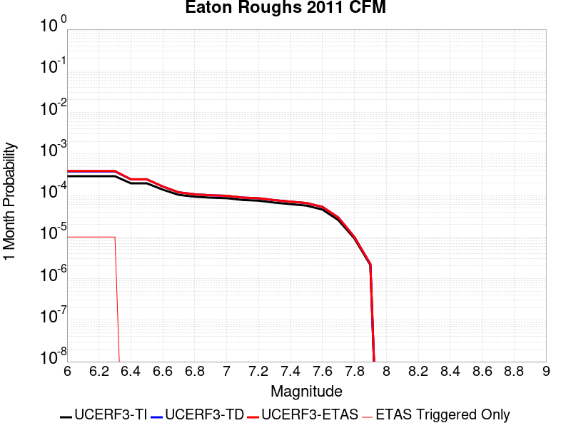 |  |  |

| Magnitude | 1 wk TI Prob | 1 wk TD Prob | 1 wk ETAS Prob | 1 wk ETAS/TD Gain | 1 wk ETAS Triggered Only | 1 mo TI Prob | 1 mo TD Prob | 1 mo ETAS Prob | 1 mo ETAS/TD Gain | 1 mo ETAS Triggered Only | 1 yr TI Prob | 1 yr TD Prob | 1 yr ETAS Prob | 1 yr ETAS/TD Gain | 1 yr ETAS Triggered Only | 10 yr TI Prob | 10 yr TD Prob | 10 yr ETAS Prob | 10 yr ETAS/TD Gain | 10 yr ETAS Triggered Only |
|-----|-----|-----|-----|-----|-----|-----|-----|-----|-----|-----|-----|-----|-----|-----|-----|-----|-----|-----|-----|-----|
| 6.0 | 6.8044945E-5 | 8.8434645E-5 | 8.8434645E-5 | 1.0 | 0.0 | 2.9158857E-4 | 3.7895713E-4 | 3.8895337E-4 | 1.0263782 | 1.0E-5 | 0.0035443127 | 0.0046046837 | 0.0046146377 | 1.0021617 | 1.0E-5 | 0.03488314 | 0.04516368 | 0.045173228 | 1.0002114 | 1.0E-5 |
| 6.1 | 6.8044945E-5 | 8.8434645E-5 | 8.8434645E-5 | 1.0 | 0.0 | 2.9158857E-4 | 3.7895713E-4 | 3.8895337E-4 | 1.0263782 | 1.0E-5 | 0.0035443127 | 0.0046046837 | 0.0046146377 | 1.0021617 | 1.0E-5 | 0.03488314 | 0.04516368 | 0.045173228 | 1.0002114 | 1.0E-5 |
| 6.2 | 6.8044945E-5 | 8.8434645E-5 | 8.8434645E-5 | 1.0 | 0.0 | 2.9158857E-4 | 3.7895713E-4 | 3.8895337E-4 | 1.0263782 | 1.0E-5 | 0.0035443127 | 0.0046046837 | 0.0046146377 | 1.0021617 | 1.0E-5 | 0.03488314 | 0.04516368 | 0.045173228 | 1.0002114 | 1.0E-5 |
| 6.3 | 6.8044945E-5 | 8.8434645E-5 | 8.8434645E-5 | 1.0 | 0.0 | 2.9158857E-4 | 3.7895713E-4 | 3.8895337E-4 | 1.0263782 | 1.0E-5 | 0.0035443127 | 0.0046046837 | 0.0046146377 | 1.0021617 | 1.0E-5 | 0.03488314 | 0.04516368 | 0.045173228 | 1.0002114 | 1.0E-5 |
| 6.4 | 4.5830013E-5 | 5.71553E-5 | 5.71553E-5 | 1.0 | 0.0 | 1.9639956E-4 | 2.4493135E-4 | 2.4493135E-4 | 1.0 | 0.0 | 0.0023885423 | 0.002978342 | 0.002978342 | 1.0 | 0.0 | 0.023630321 | 0.029421948 | 0.029421948 | 1.0 | 0.0 |
| 6.5 | 4.5830013E-5 | 5.71553E-5 | 5.71553E-5 | 1.0 | 0.0 | 1.9639956E-4 | 2.4493135E-4 | 2.4493135E-4 | 1.0 | 0.0 | 0.0023885423 | 0.002978342 | 0.002978342 | 1.0 | 0.0 | 0.023630321 | 0.029421948 | 0.029421948 | 1.0 | 0.0 |
| 6.6 | 3.222194E-5 | 3.8262962E-5 | 3.8262962E-5 | 1.0 | 0.0 | 1.3808672E-4 | 1.6397446E-4 | 1.6397446E-4 | 1.0 | 0.0 | 0.0016799092 | 0.0019946485 | 0.0019946485 | 1.0 | 0.0 | 0.016672665 | 0.019776754 | 0.019776754 | 1.0 | 0.0 |
| 6.7 | 2.4155654E-5 | 2.7786275E-5 | 2.7786275E-5 | 1.0 | 0.0 | 1.0352012E-4 | 1.1907864E-4 | 1.1907864E-4 | 1.0 | 0.0 | 0.0012596287 | 0.0014488265 | 0.0014488265 | 1.0 | 0.0 | 0.012525126 | 0.01439499 | 0.01439499 | 1.0 | 0.0 |
| 6.8 | 2.1814667E-5 | 2.4940904E-5 | 2.4940904E-5 | 1.0 | 0.0 | 9.348808E-5 | 1.0688523E-4 | 1.0688523E-4 | 1.0 | 0.0 | 0.001137623 | 0.0013005546 | 0.0013005546 | 1.0 | 0.0 | 0.011318169 | 0.012930086 | 0.012930086 | 1.0 | 0.0 |
| 6.9 | 2.0700467E-5 | 2.362897E-5 | 2.362897E-5 | 1.0 | 0.0 | 8.871327E-5 | 1.01263104E-4 | 1.01263104E-4 | 1.0 | 0.0 | 0.0010795488 | 0.0012321841 | 0.0012321841 | 1.0 | 0.0 | 0.010743194 | 0.012254083 | 0.012254083 | 1.0 | 0.0 |
| 7.0 | 2.0104066E-5 | 2.2936536E-5 | 2.2936536E-5 | 1.0 | 0.0 | 8.615744E-5 | 9.829576E-5 | 9.829576E-5 | 1.0 | 0.0 | 0.0010484619 | 0.0011960969 | 0.0011960969 | 1.0 | 0.0 | 0.010435291 | 0.01189712 | 0.01189712 | 1.0 | 0.0 |
| 7.1 | 1.8225232E-5 | 2.0773083E-5 | 2.0773083E-5 | 1.0 | 0.0 | 7.81058E-5 | 8.902447E-5 | 8.902447E-5 | 1.0 | 0.0 | 9.5052324E-4 | 0.0010833355 | 0.0010833355 | 1.0 | 0.0 | 0.009464677 | 0.010780873 | 0.010780873 | 1.0 | 0.0 |
| 7.2 | 1.7526572E-5 | 1.9993524E-5 | 1.9993524E-5 | 1.0 | 0.0 | 7.511172E-5 | 8.568373E-5 | 8.568373E-5 | 1.0 | 0.0 | 9.141015E-4 | 0.0010427017 | 0.0010427017 | 1.0 | 0.0 | 0.009103506 | 0.010378398 | 0.010378398 | 1.0 | 0.0 |
| 7.3 | 1.5727232E-5 | 1.8021543E-5 | 1.8021543E-5 | 1.0 | 0.0 | 6.740067E-5 | 7.72329E-5 | 7.72329E-5 | 1.0 | 0.0 | 8.2029426E-4 | 9.399062E-4 | 9.399062E-4 | 1.0 | 0.0 | 0.008172729 | 0.009359558 | 0.009359558 | 1.0 | 0.0 |
| 7.4 | 1.4457361E-5 | 1.6598395E-5 | 1.6598395E-5 | 1.0 | 0.0 | 6.195865E-5 | 7.113405E-5 | 7.113405E-5 | 1.0 | 0.0 | 7.540854E-4 | 8.657138E-4 | 8.657138E-4 | 1.0 | 0.0 | 0.007515317 | 0.008623603 | 0.008623603 | 1.0 | 0.0 |
| 7.5 | 1.33280955E-5 | 1.5345471E-5 | 1.5345471E-5 | 1.0 | 0.0 | 5.711916E-5 | 6.576465E-5 | 6.576465E-5 | 1.0 | 0.0 | 6.9520384E-4 | 8.0039137E-4 | 8.0039137E-4 | 1.0 | 0.0 | 0.00693033 | 0.007975256 | 0.007975256 | 1.0 | 0.0 |
| 7.6 | 1.0699478E-5 | 1.2387852E-5 | 1.2387852E-5 | 1.0 | 0.0 | 4.5854096E-5 | 5.3089716E-5 | 5.3089716E-5 | 1.0 | 0.0 | 5.581306E-4 | 6.461761E-4 | 6.461761E-4 | 1.0 | 0.0 | 0.005567309 | 0.0064430824 | 0.0064430824 | 1.0 | 0.0 |
| 7.7 | 5.9390236E-6 | 6.8529853E-6 | 6.8529853E-6 | 1.0 | 0.0 | 2.545271E-5 | 2.9369607E-5 | 2.9369607E-5 | 1.0 | 0.0 | 3.0984267E-4 | 3.5751655E-4 | 3.5751655E-4 | 1.0 | 0.0 | 0.0030941102 | 0.0035694393 | 0.0035694393 | 1.0 | 0.0 |
| 7.8 | 2.1622036E-6 | 2.329702E-6 | 2.329702E-6 | 1.0 | 0.0 | 9.266554E-6 | 9.984399E-6 | 9.984399E-6 | 1.0 | 0.0 | 1.1281446E-4 | 1.21553356E-4 | 1.21553356E-4 | 1.0 | 0.0 | 0.001127572 | 0.0012148687 | 0.0012148687 | 1.0 | 0.0 |
| 7.9 | 4.9586197E-7 | 5.2189216E-7 | 5.2189216E-7 | 1.0 | 0.0 | 2.125121E-6 | 2.2366787E-6 | 2.2366787E-6 | 1.0 | 0.0 | 2.5873042E-5 | 2.7231245E-5 | 2.7231245E-5 | 1.0 | 0.0 | 2.5870028E-4 | 2.7228118E-4 | 2.7228118E-4 | 1.0 | 0.0 |

## Davis Creek
*[(top)](#table-of-contents)*

| 1 Week | 1 Month | 1 Year | 10 Year |
|-----|-----|-----|-----|
|  |  |  |  |

| Magnitude | 1 wk TI Prob | 1 wk TD Prob | 1 wk ETAS Prob | 1 wk ETAS/TD Gain | 1 wk ETAS Triggered Only | 1 mo TI Prob | 1 mo TD Prob | 1 mo ETAS Prob | 1 mo ETAS/TD Gain | 1 mo ETAS Triggered Only | 1 yr TI Prob | 1 yr TD Prob | 1 yr ETAS Prob | 1 yr ETAS/TD Gain | 1 yr ETAS Triggered Only | 10 yr TI Prob | 10 yr TD Prob | 10 yr ETAS Prob | 10 yr ETAS/TD Gain | 10 yr ETAS Triggered Only |
|-----|-----|-----|-----|-----|-----|-----|-----|-----|-----|-----|-----|-----|-----|-----|-----|-----|-----|-----|-----|-----|
| 6.0 | 2.331472E-5 | 2.5417214E-5 | 2.5417214E-5 | 1.0 | 0.0 | 9.99164E-5 | 1.0892704E-4 | 1.0892704E-4 | 1.0 | 0.0 | 0.0012158032 | 0.0013254983 | 0.0013254983 | 1.0 | 0.0 | 0.01209173 | 0.013187704 | 0.013197572 | 1.0007483 | 1.0E-5 |
| 6.1 | 1.0407654E-5 | 1.1316986E-5 | 1.1316986E-5 | 1.0 | 0.0 | 4.4603472E-5 | 4.8500624E-5 | 4.8500624E-5 | 1.0 | 0.0 | 5.4291193E-4 | 5.9036224E-4 | 5.9036224E-4 | 1.0 | 0.0 | 0.0054158745 | 0.005890611 | 0.005890611 | 1.0 | 0.0 |
| 6.2 | 1.0407654E-5 | 1.1316986E-5 | 1.1316986E-5 | 1.0 | 0.0 | 4.4603472E-5 | 4.8500624E-5 | 4.8500624E-5 | 1.0 | 0.0 | 5.4291193E-4 | 5.9036224E-4 | 5.9036224E-4 | 1.0 | 0.0 | 0.0054158745 | 0.005890611 | 0.005890611 | 1.0 | 0.0 |
| 6.3 | 5.1323277E-6 | 5.568556E-6 | 5.568556E-6 | 1.0 | 0.0 | 2.1995505E-5 | 2.386507E-5 | 2.386507E-5 | 1.0 | 0.0 | 2.6776237E-4 | 2.905271E-4 | 2.905271E-4 | 1.0 | 0.0 | 0.0026743996 | 0.0029023192 | 0.0029023192 | 1.0 | 0.0 |
| 6.4 | 2.4985154E-6 | 2.704538E-6 | 2.704538E-6 | 1.0 | 0.0 | 1.07078795E-5 | 1.1590847E-5 | 1.1590847E-5 | 1.0 | 0.0 | 1.3036063E-4 | 1.4111304E-4 | 1.4111304E-4 | 1.0 | 0.0 | 0.0013028418 | 0.001410589 | 0.001410589 | 1.0 | 0.0 |
| 6.5 | 2.4846438E-6 | 2.6904722E-6 | 2.6904722E-6 | 1.0 | 0.0 | 1.064843E-5 | 1.1530565E-5 | 1.1530565E-5 | 1.0 | 0.0 | 1.2963692E-4 | 1.403792E-4 | 1.403792E-4 | 1.0 | 0.0 | 0.0012956132 | 0.0014032599 | 0.0014032599 | 1.0 | 0.0 |
| 6.6 | 2.072566E-7 | 2.1018087E-7 | 2.1018087E-7 | 1.0 | 0.0 | 8.882423E-7 | 9.0077486E-7 | 9.0077486E-7 | 1.0 | 0.0 | 1.0814296E-5 | 1.0966881E-5 | 1.0966881E-5 | 1.0 | 0.0 | 1.081377E-4 | 1.09663575E-4 | 1.09663575E-4 | 1.0 | 0.0 |
| 6.7 | 1.7544528E-7 | 1.7790826E-7 | 1.7790826E-7 | 1.0 | 0.0 | 7.5190815E-7 | 7.6246374E-7 | 7.6246374E-7 | 1.0 | 0.0 | 9.154443E-6 | 9.282958E-6 | 9.282958E-6 | 1.0 | 0.0 | 9.1540656E-5 | 9.282586E-5 | 9.282586E-5 | 1.0 | 0.0 |
| 6.8 | 1.2320395E-7 | 1.2481138E-7 | 1.2481138E-7 | 1.0 | 0.0 | 5.280168E-7 | 5.349058E-7 | 5.349058E-7 | 1.0 | 0.0 | 6.428586E-6 | 6.5124595E-6 | 6.5124595E-6 | 1.0 | 0.0 | 6.4284E-5 | 6.5122804E-5 | 6.5122804E-5 | 1.0 | 0.0 |
| 6.9 | 6.399997E-8 | 6.486058E-8 | 6.486058E-8 | 1.0 | 0.0 | 2.7428555E-7 | 2.7797387E-7 | 2.7797387E-7 | 1.0 | 0.0 | 3.3394215E-6 | 3.3843273E-6 | 3.3843273E-6 | 1.0 | 0.0 | 3.3393713E-5 | 3.384282E-5 | 3.384282E-5 | 1.0 | 0.0 |
| 7.0 | 6.4455685E-9 | 6.535264E-9 | 6.535264E-9 | 1.0 | 0.0 | 2.7623864E-8 | 2.8008275E-8 | 2.8008275E-8 | 1.0 | 0.0 | 3.3632048E-7 | 3.4100074E-7 | 3.4100074E-7 | 1.0 | 0.0 | 3.3631998E-6 | 3.4100074E-6 | 3.4100074E-6 | 1.0 | 0.0 |

## Likely 2011 CFM
*[(top)](#table-of-contents)*

| 1 Week | 1 Month | 1 Year | 10 Year |
|-----|-----|-----|-----|
|  |  |  |  |

| Magnitude | 1 wk TI Prob | 1 wk TD Prob | 1 wk ETAS Prob | 1 wk ETAS/TD Gain | 1 wk ETAS Triggered Only | 1 mo TI Prob | 1 mo TD Prob | 1 mo ETAS Prob | 1 mo ETAS/TD Gain | 1 mo ETAS Triggered Only | 1 yr TI Prob | 1 yr TD Prob | 1 yr ETAS Prob | 1 yr ETAS/TD Gain | 1 yr ETAS Triggered Only | 10 yr TI Prob | 10 yr TD Prob | 10 yr ETAS Prob | 10 yr ETAS/TD Gain | 10 yr ETAS Triggered Only |
|-----|-----|-----|-----|-----|-----|-----|-----|-----|-----|-----|-----|-----|-----|-----|-----|-----|-----|-----|-----|-----|
| 6.0 | 2.5315949E-5 | 2.7104748E-5 | 2.7104748E-5 | 1.0 | 0.0 | 1.0849241E-4 | 1.16158284E-4 | 1.16158284E-4 | 1.0 | 0.0 | 0.0013200947 | 0.0014133542 | 0.0014133542 | 1.0 | 0.0 | 0.013122803 | 0.01404831 | 0.01405817 | 1.0007018 | 1.0E-5 |
| 6.1 | 2.5315949E-5 | 2.7104748E-5 | 2.7104748E-5 | 1.0 | 0.0 | 1.0849241E-4 | 1.16158284E-4 | 1.16158284E-4 | 1.0 | 0.0 | 0.0013200947 | 0.0014133542 | 0.0014133542 | 1.0 | 0.0 | 0.013122803 | 0.01404831 | 0.01405817 | 1.0007018 | 1.0E-5 |
| 6.2 | 1.6375941E-5 | 1.7465842E-5 | 1.7465842E-5 | 1.0 | 0.0 | 7.0180715E-5 | 7.485153E-5 | 7.485153E-5 | 1.0 | 0.0 | 8.5411523E-4 | 9.109487E-4 | 9.109487E-4 | 1.0 | 0.0 | 0.008508399 | 0.009073433 | 0.009083342 | 1.0010921 | 1.0E-5 |
| 6.3 | 1.1945543E-5 | 1.2712587E-5 | 1.2712587E-5 | 1.0 | 0.0 | 5.119418E-5 | 5.4481407E-5 | 5.4481407E-5 | 1.0 | 0.0 | 6.2311086E-4 | 6.631146E-4 | 6.631146E-4 | 1.0 | 0.0 | 0.0062136655 | 0.0066119144 | 0.0066218483 | 1.0015024 | 1.0E-5 |
| 6.4 | 9.192729E-6 | 9.768488E-6 | 9.768488E-6 | 1.0 | 0.0 | 3.939681E-5 | 4.1864292E-5 | 4.1864292E-5 | 1.0 | 0.0 | 4.7955062E-4 | 5.0958124E-4 | 5.0958124E-4 | 1.0 | 0.0 | 0.004785171 | 0.0050844094 | 0.0050844094 | 1.0 | 0.0 |
| 6.5 | 7.67906E-6 | 8.152622E-6 | 8.152622E-6 | 1.0 | 0.0 | 3.2909844E-5 | 3.4939352E-5 | 3.4939352E-5 | 1.0 | 0.0 | 4.006037E-4 | 4.2530545E-4 | 4.2530545E-4 | 1.0 | 0.0 | 0.0039988225 | 0.004245108 | 0.004245108 | 1.0 | 0.0 |
| 6.6 | 6.4884057E-6 | 6.8847507E-6 | 6.8847507E-6 | 1.0 | 0.0 | 2.7807157E-5 | 2.9505749E-5 | 2.9505749E-5 | 1.0 | 0.0 | 3.3849955E-4 | 3.591747E-4 | 3.591747E-4 | 1.0 | 0.0 | 0.003379844 | 0.0035860867 | 0.0035860867 | 1.0 | 0.0 |
| 6.7 | 4.6060636E-6 | 4.884041E-6 | 4.884041E-6 | 1.0 | 0.0 | 1.9740122E-5 | 2.0931442E-5 | 2.0931442E-5 | 1.0 | 0.0 | 2.403095E-4 | 2.5481134E-4 | 2.5481134E-4 | 1.0 | 0.0 | 0.002400498 | 0.0025452746 | 0.0025452746 | 1.0 | 0.0 |
| 6.8 | 3.2795615E-6 | 3.4773732E-6 | 3.4773732E-6 | 1.0 | 0.0 | 1.4055187E-5 | 1.4902946E-5 | 1.4902946E-5 | 1.0 | 0.0 | 1.7110848E-4 | 1.8142881E-4 | 1.8142881E-4 | 1.0 | 0.0 | 0.0017097679 | 0.0018128622 | 0.0018128622 | 1.0 | 0.0 |
| 6.9 | 2.3289967E-6 | 2.4705569E-6 | 2.4705569E-6 | 1.0 | 0.0 | 9.981376E-6 | 1.058806E-5 | 1.058806E-5 | 1.0 | 0.0 | 1.2151648E-4 | 1.2890245E-4 | 1.2890245E-4 | 1.0 | 0.0 | 0.0012145005 | 0.0012883197 | 0.0012883197 | 1.0 | 0.0 |
| 7.0 | 1.211292E-6 | 1.2863958E-6 | 1.2863958E-6 | 1.0 | 0.0 | 5.1912407E-6 | 5.5131145E-6 | 5.5131145E-6 | 1.0 | 0.0 | 6.320152E-5 | 6.712041E-5 | 6.712041E-5 | 1.0 | 0.0 | 6.3183554E-4 | 6.710312E-4 | 6.710312E-4 | 1.0 | 0.0 |

## Hilton Creek 2011 CFM
*[(top)](#table-of-contents)*

| 1 Week | 1 Month | 1 Year | 10 Year |
|-----|-----|-----|-----|
| 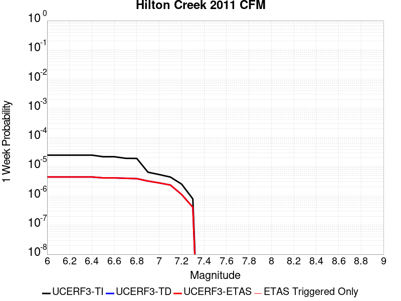 |  |  |  |

| Magnitude | 1 wk TI Prob | 1 wk TD Prob | 1 wk ETAS Prob | 1 wk ETAS/TD Gain | 1 wk ETAS Triggered Only | 1 mo TI Prob | 1 mo TD Prob | 1 mo ETAS Prob | 1 mo ETAS/TD Gain | 1 mo ETAS Triggered Only | 1 yr TI Prob | 1 yr TD Prob | 1 yr ETAS Prob | 1 yr ETAS/TD Gain | 1 yr ETAS Triggered Only | 10 yr TI Prob | 10 yr TD Prob | 10 yr ETAS Prob | 10 yr ETAS/TD Gain | 10 yr ETAS Triggered Only |
|-----|-----|-----|-----|-----|-----|-----|-----|-----|-----|-----|-----|-----|-----|-----|-----|-----|-----|-----|-----|-----|
| 6.0 | 2.4923684E-5 | 4.4573785E-6 | 4.4573785E-6 | 1.0 | 0.0 | 1.06811414E-4 | 1.910292E-5 | 2.9102728E-5 | 1.5234702 | 1.0E-5 | 0.0012996531 | 2.3255486E-4 | 2.4255253E-4 | 1.0429906 | 1.0E-5 | 0.012920785 | 0.002326208 | 0.0023361845 | 1.0042888 | 1.0E-5 |
| 6.1 | 2.4923684E-5 | 4.4573785E-6 | 4.4573785E-6 | 1.0 | 0.0 | 1.06811414E-4 | 1.910292E-5 | 2.9102728E-5 | 1.5234702 | 1.0E-5 | 0.0012996531 | 2.3255486E-4 | 2.4255253E-4 | 1.0429906 | 1.0E-5 | 0.012920785 | 0.002326208 | 0.0023361845 | 1.0042888 | 1.0E-5 |
| 6.2 | 2.4923684E-5 | 4.4573785E-6 | 4.4573785E-6 | 1.0 | 0.0 | 1.06811414E-4 | 1.910292E-5 | 2.9102728E-5 | 1.5234702 | 1.0E-5 | 0.0012996531 | 2.3255486E-4 | 2.4255253E-4 | 1.0429906 | 1.0E-5 | 0.012920785 | 0.002326208 | 0.0023361845 | 1.0042888 | 1.0E-5 |
| 6.3 | 2.4923684E-5 | 4.4573785E-6 | 4.4573785E-6 | 1.0 | 0.0 | 1.06811414E-4 | 1.910292E-5 | 2.9102728E-5 | 1.5234702 | 1.0E-5 | 0.0012996531 | 2.3255486E-4 | 2.4255253E-4 | 1.0429906 | 1.0E-5 | 0.012920785 | 0.002326208 | 0.0023361845 | 1.0042888 | 1.0E-5 |
| 6.4 | 2.4923684E-5 | 4.4573785E-6 | 4.4573785E-6 | 1.0 | 0.0 | 1.06811414E-4 | 1.910292E-5 | 2.9102728E-5 | 1.5234702 | 1.0E-5 | 0.0012996531 | 2.3255486E-4 | 2.4255253E-4 | 1.0429906 | 1.0E-5 | 0.012920785 | 0.002326208 | 0.0023361845 | 1.0042888 | 1.0E-5 |
| 6.5 | 2.1963904E-5 | 4.1448234E-6 | 4.1448234E-6 | 1.0 | 0.0 | 9.412762E-5 | 1.7763416E-5 | 2.7763237E-5 | 1.5629448 | 1.0E-5 | 0.0011454013 | 2.1624962E-4 | 2.2624746E-4 | 1.0462328 | 1.0E-5 | 0.011395155 | 0.0021653275 | 0.0021753057 | 1.0046083 | 1.0E-5 |
| 6.6 | 2.1963904E-5 | 4.1448234E-6 | 4.1448234E-6 | 1.0 | 0.0 | 9.412762E-5 | 1.7763416E-5 | 2.7763237E-5 | 1.5629448 | 1.0E-5 | 0.0011454013 | 2.1624962E-4 | 2.2624746E-4 | 1.0462328 | 1.0E-5 | 0.011395155 | 0.0021653275 | 0.0021753057 | 1.0046083 | 1.0E-5 |
| 6.7 | 1.9397496E-5 | 4.0148757E-6 | 4.0148757E-6 | 1.0 | 0.0 | 8.3129475E-5 | 1.7206505E-5 | 2.7206332E-5 | 1.5811656 | 1.0E-5 | 0.0010116313 | 2.0947054E-4 | 2.1946845E-4 | 1.0477294 | 1.0E-5 | 0.0100703845 | 0.0020972565 | 0.0021072354 | 1.0047581 | 1.0E-5 |
| 6.8 | 1.917303E-5 | 3.9078163E-6 | 3.9078163E-6 | 1.0 | 0.0 | 8.216754E-5 | 1.6747686E-5 | 2.6747519E-5 | 1.5970874 | 1.0E-5 | 9.999307E-4 | 2.0388547E-4 | 2.1388344E-4 | 1.0490371 | 1.0E-5 | 0.009954433 | 0.0020415091 | 0.0020514887 | 1.0048883 | 1.0E-5 |
| 6.9 | 6.480681E-6 | 3.2315154E-6 | 3.2315154E-6 | 1.0 | 0.0 | 2.7774051E-5 | 1.3849284E-5 | 2.3849147E-5 | 1.722049 | 1.0E-5 | 3.380966E-4 | 1.6860312E-4 | 1.7860143E-4 | 1.0593009 | 1.0E-5 | 0.0033758266 | 0.0016848631 | 0.0016948463 | 1.0059252 | 1.0E-5 |
| 7.0 | 5.388316E-6 | 2.7881847E-6 | 2.7881847E-6 | 1.0 | 0.0 | 2.3092578E-5 | 1.1949314E-5 | 2.1949194E-5 | 1.8368582 | 1.0E-5 | 2.8111585E-4 | 1.4547423E-4 | 1.5547278E-4 | 1.0687307 | 1.0E-5 | 0.002807605 | 0.0014538927 | 0.0014638782 | 1.0068681 | 1.0E-5 |
| 7.1 | 4.41728E-6 | 2.3573243E-6 | 2.3573243E-6 | 1.0 | 0.0 | 1.8931061E-5 | 1.01027845E-5 | 2.0102683E-5 | 1.9898161 | 1.0E-5 | 2.304613E-4 | 1.2299545E-4 | 1.3299422E-4 | 1.0812938 | 1.0E-5 | 0.0023022245 | 0.0012293702 | 0.001239358 | 1.0081242 | 1.0E-5 |
| 7.2 | 2.535495E-6 | 1.120784E-6 | 1.120784E-6 | 1.0 | 0.0 | 1.0866362E-5 | 4.803354E-6 | 4.803354E-6 | 1.0 | 0.0 | 1.3228992E-4 | 5.8479785E-5 | 5.8479785E-5 | 1.0 | 0.0 | 0.0013221119 | 5.846952E-4 | 5.846952E-4 | 1.0 | 0.0 |
| 7.3 | 7.900015E-7 | 4.0888176E-7 | 4.0888176E-7 | 1.0 | 0.0 | 3.3857161E-6 | 1.7523504E-6 | 1.7523504E-6 | 1.0 | 0.0 | 4.1220315E-5 | 2.1334865E-5 | 2.1334865E-5 | 1.0 | 0.0 | 4.121267E-4 | 2.1334866E-4 | 2.1334866E-4 | 1.0 | 0.0 |

## East Huasna 2011 CFM
*[(top)](#table-of-contents)*

| 1 Week | 1 Month | 1 Year | 10 Year |
|-----|-----|-----|-----|
|  |  |  |  |

| Magnitude | 1 wk TI Prob | 1 wk TD Prob | 1 wk ETAS Prob | 1 wk ETAS/TD Gain | 1 wk ETAS Triggered Only | 1 mo TI Prob | 1 mo TD Prob | 1 mo ETAS Prob | 1 mo ETAS/TD Gain | 1 mo ETAS Triggered Only | 1 yr TI Prob | 1 yr TD Prob | 1 yr ETAS Prob | 1 yr ETAS/TD Gain | 1 yr ETAS Triggered Only | 10 yr TI Prob | 10 yr TD Prob | 10 yr ETAS Prob | 10 yr ETAS/TD Gain | 10 yr ETAS Triggered Only |
|-----|-----|-----|-----|-----|-----|-----|-----|-----|-----|-----|-----|-----|-----|-----|-----|-----|-----|-----|-----|-----|
| 6.0 | 1.4658423E-6 | 1.471566E-6 | 1.471566E-6 | 1.0 | 0.0 | 6.282166E-6 | 6.3066964E-6 | 1.6306634E-5 | 2.585606 | 1.0E-5 | 7.6482684E-5 | 7.67814E-5 | 8.678063E-5 | 1.1302298 | 1.0E-5 | 7.645637E-4 | 7.6755567E-4 | 7.77548E-4 | 1.0130184 | 1.0E-5 |
| 6.1 | 1.4658423E-6 | 1.471566E-6 | 1.471566E-6 | 1.0 | 0.0 | 6.282166E-6 | 6.3066964E-6 | 1.6306634E-5 | 2.585606 | 1.0E-5 | 7.6482684E-5 | 7.67814E-5 | 8.678063E-5 | 1.1302298 | 1.0E-5 | 7.645637E-4 | 7.6755567E-4 | 7.77548E-4 | 1.0130184 | 1.0E-5 |
| 6.2 | 1.4658423E-6 | 1.471566E-6 | 1.471566E-6 | 1.0 | 0.0 | 6.282166E-6 | 6.3066964E-6 | 1.6306634E-5 | 2.585606 | 1.0E-5 | 7.6482684E-5 | 7.67814E-5 | 8.678063E-5 | 1.1302298 | 1.0E-5 | 7.645637E-4 | 7.6755567E-4 | 7.77548E-4 | 1.0130184 | 1.0E-5 |
| 6.3 | 1.4658423E-6 | 1.471566E-6 | 1.471566E-6 | 1.0 | 0.0 | 6.282166E-6 | 6.3066964E-6 | 1.6306634E-5 | 2.585606 | 1.0E-5 | 7.6482684E-5 | 7.67814E-5 | 8.678063E-5 | 1.1302298 | 1.0E-5 | 7.645637E-4 | 7.6755567E-4 | 7.77548E-4 | 1.0130184 | 1.0E-5 |
| 6.4 | 1.0488257E-6 | 1.0527515E-6 | 1.0527515E-6 | 1.0 | 0.0 | 4.4949593E-6 | 4.5117845E-6 | 1.4511739E-5 | 3.216408 | 1.0E-5 | 5.472476E-5 | 5.492961E-5 | 6.492906E-5 | 1.1820412 | 1.0E-5 | 5.4711284E-4 | 5.491622E-4 | 5.591567E-4 | 1.0181996 | 1.0E-5 |
| 6.5 | 1.0488257E-6 | 1.0527515E-6 | 1.0527515E-6 | 1.0 | 0.0 | 4.4949593E-6 | 4.5117845E-6 | 1.4511739E-5 | 3.216408 | 1.0E-5 | 5.472476E-5 | 5.492961E-5 | 6.492906E-5 | 1.1820412 | 1.0E-5 | 5.4711284E-4 | 5.491622E-4 | 5.591567E-4 | 1.0181996 | 1.0E-5 |
| 6.6 | 8.463064E-7 | 8.4936323E-7 | 8.4936323E-7 | 1.0 | 0.0 | 3.6270226E-6 | 3.6401232E-6 | 1.3640087E-5 | 3.74715 | 1.0E-5 | 4.4158103E-5 | 4.4317607E-5 | 5.4317163E-5 | 1.225634 | 1.0E-5 | 4.414933E-4 | 4.4308856E-4 | 4.5308413E-4 | 1.0225588 | 1.0E-5 |
| 6.7 | 7.876149E-7 | 7.902533E-7 | 7.902533E-7 | 1.0 | 0.0 | 3.375488E-6 | 3.3867955E-6 | 1.3386762E-5 | 3.9526336 | 1.0E-5 | 4.109579E-5 | 4.1233463E-5 | 5.1233048E-5 | 1.2425115 | 1.0E-5 | 4.108819E-4 | 4.1225873E-4 | 4.222546E-4 | 1.0242466 | 1.0E-5 |
| 6.8 | 6.9940785E-7 | 7.0165777E-7 | 7.0165777E-7 | 1.0 | 0.0 | 2.9974588E-6 | 3.0071012E-6 | 1.3007071E-5 | 4.325452 | 1.0E-5 | 3.649345E-5 | 3.6610847E-5 | 4.661048E-5 | 1.273133 | 1.0E-5 | 3.6487455E-4 | 3.6604863E-4 | 3.7604498E-4 | 1.0273088 | 1.0E-5 |
| 6.9 | 5.899658E-7 | 5.9155997E-7 | 5.9155997E-7 | 1.0 | 0.0 | 2.5284223E-6 | 2.5352545E-6 | 1.2535229E-5 | 4.9443674 | 1.0E-5 | 3.0783107E-5 | 3.086629E-5 | 4.086598E-5 | 1.323968 | 1.0E-5 | 3.0778843E-4 | 3.086203E-4 | 3.186172E-4 | 1.0323923 | 1.0E-5 |
| 7.0 | 4.793814E-7 | 4.803273E-7 | 4.803273E-7 | 1.0 | 0.0 | 2.05449E-6 | 2.058544E-6 | 1.2058524E-5 | 5.8577924 | 1.0E-5 | 2.501313E-5 | 2.5062485E-5 | 3.5062236E-5 | 1.3989928 | 1.0E-5 | 2.5010316E-4 | 2.505968E-4 | 2.6059427E-4 | 1.0398947 | 1.0E-5 |
| 7.1 | 4.1256908E-7 | 4.129941E-7 | 4.129941E-7 | 1.0 | 0.0 | 1.768152E-6 | 1.7699736E-6 | 1.1769956E-5 | 6.649792 | 1.0E-5 | 2.1527037E-5 | 2.1549216E-5 | 3.1549E-5 | 1.464044 | 1.0E-5 | 2.1524953E-4 | 2.1547142E-4 | 2.2546925E-4 | 1.0463998 | 1.0E-5 |
| 7.2 | 2.822599E-7 | 2.8161418E-7 | 2.8161418E-7 | 1.0 | 0.0 | 1.2096847E-6 | 1.2069174E-6 | 1.2069174E-6 | 1.0 | 0.0 | 1.47278115E-5 | 1.4694121E-5 | 1.4694121E-5 | 1.0 | 0.0 | 1.4726835E-4 | 1.4693156E-4 | 1.4693156E-4 | 1.0 | 0.0 |
| 7.3 | 1.5261652E-7 | 1.5075021E-7 | 1.5075021E-7 | 1.0 | 0.0 | 6.540707E-7 | 6.460722E-7 | 6.460722E-7 | 1.0 | 0.0 | 7.963281E-6 | 7.8659E-6 | 7.8659E-6 | 1.0 | 0.0 | 7.962996E-5 | 7.865624E-5 | 7.865624E-5 | 1.0 | 0.0 |
| 7.4 | 7.976414E-8 | 8.057865E-8 | 8.057865E-8 | 1.0 | 0.0 | 3.418463E-7 | 3.45337E-7 | 3.45337E-7 | 1.0 | 0.0 | 4.1619705E-6 | 4.2044703E-6 | 4.2044703E-6 | 1.0 | 0.0 | 4.161893E-5 | 4.2043914E-5 | 4.2043914E-5 | 1.0 | 0.0 |
| 7.5 | 4.2715055E-8 | 4.3202512E-8 | 4.3202512E-8 | 1.0 | 0.0 | 1.830645E-7 | 1.8515361E-7 | 1.8515361E-7 | 1.0 | 0.0 | 2.228808E-6 | 2.2542429E-6 | 2.2542429E-6 | 1.0 | 0.0 | 2.2287857E-5 | 2.2542203E-5 | 2.2542203E-5 | 1.0 | 0.0 |
| 7.6 | 2.1807532E-8 | 2.2057476E-8 | 2.2057476E-8 | 1.0 | 0.0 | 9.346085E-8 | 9.4532034E-8 | 9.4532034E-8 | 1.0 | 0.0 | 1.1378852E-6 | 1.1509269E-6 | 1.1509269E-6 | 1.0 | 0.0 | 1.1378794E-5 | 1.1509211E-5 | 1.1509211E-5 | 1.0 | 0.0 |
| 7.7 | 4.7196043E-9 | 4.767283E-9 | 4.767283E-9 | 1.0 | 0.0 | 2.0226874E-8 | 2.0431212E-8 | 2.0431212E-8 | 1.0 | 0.0 | 2.4626218E-7 | 2.4874998E-7 | 2.4874998E-7 | 1.0 | 0.0 | 2.462619E-6 | 2.487497E-6 | 2.487497E-6 | 1.0 | 0.0 |
| 7.8 | 7.400003E-11 | 7.4654505E-11 | 7.4654505E-11 | 1.0 | 0.0 | 3.171432E-10 | 3.1994773E-10 | 3.1994773E-10 | 1.0 | 0.0 | 3.861218E-9 | 3.895363E-9 | 3.895363E-9 | 1.0 | 0.0 | 3.861218E-8 | 3.895363E-8 | 3.895363E-8 | 1.0 | 0.0 |

## Point Reyes 2011 connector
*[(top)](#table-of-contents)*

| 1 Week | 1 Month | 1 Year | 10 Year |
|-----|-----|-----|-----|
|  |  |  |  |

| Magnitude | 1 wk TI Prob | 1 wk TD Prob | 1 wk ETAS Prob | 1 wk ETAS/TD Gain | 1 wk ETAS Triggered Only | 1 mo TI Prob | 1 mo TD Prob | 1 mo ETAS Prob | 1 mo ETAS/TD Gain | 1 mo ETAS Triggered Only | 1 yr TI Prob | 1 yr TD Prob | 1 yr ETAS Prob | 1 yr ETAS/TD Gain | 1 yr ETAS Triggered Only | 10 yr TI Prob | 10 yr TD Prob | 10 yr ETAS Prob | 10 yr ETAS/TD Gain | 10 yr ETAS Triggered Only |
|-----|-----|-----|-----|-----|-----|-----|-----|-----|-----|-----|-----|-----|-----|-----|-----|-----|-----|-----|-----|-----|
| 6.0 | 3.7893044E-6 | 3.419019E-6 | 1.3418985E-5 | 3.9248056 | 1.0E-5 | 1.6239776E-5 | 1.4652868E-5 | 2.4652722E-5 | 1.6824503 | 1.0E-5 | 1.9770133E-4 | 1.783862E-4 | 1.8838442E-4 | 1.0560482 | 1.0E-5 | 0.0019752553 | 0.0017828896 | 0.0017928717 | 1.0055989 | 1.0E-5 |
| 6.1 | 1.7449562E-6 | 1.3500688E-6 | 1.13500555E-5 | 8.40702 | 1.0E-5 | 7.478362E-6 | 5.785997E-6 | 1.578594E-5 | 2.7283006 | 1.0E-5 | 9.104525E-5 | 7.044229E-5 | 8.044158E-5 | 1.1419501 | 1.0E-5 | 9.1007963E-4 | 7.044551E-4 | 7.1444805E-4 | 1.0141853 | 1.0E-5 |
| 6.2 | 1.7449562E-6 | 1.3500688E-6 | 1.13500555E-5 | 8.40702 | 1.0E-5 | 7.478362E-6 | 5.785997E-6 | 1.578594E-5 | 2.7283006 | 1.0E-5 | 9.104525E-5 | 7.044229E-5 | 8.044158E-5 | 1.1419501 | 1.0E-5 | 9.1007963E-4 | 7.044551E-4 | 7.1444805E-4 | 1.0141853 | 1.0E-5 |
| 6.3 | 1.5739171E-6 | 1.177309E-6 | 1.1177297E-5 | 9.4939375 | 1.0E-5 | 6.7453416E-6 | 5.0456E-6 | 1.504555E-5 | 2.9819148 | 1.0E-5 | 8.212144E-5 | 6.1428495E-5 | 7.142788E-5 | 1.1627809 | 1.0E-5 | 8.2091097E-4 | 6.1436923E-4 | 6.243631E-4 | 1.0162668 | 1.0E-5 |
| 6.4 | 1.5138507E-6 | 1.1166635E-6 | 1.1116653E-5 | 9.955239 | 1.0E-5 | 6.4879155E-6 | 4.785692E-6 | 1.4785644E-5 | 3.089552 | 1.0E-5 | 7.898751E-5 | 5.8264282E-5 | 6.8263704E-5 | 1.1716217 | 1.0E-5 | 7.8959437E-4 | 5.82744E-4 | 5.927382E-4 | 1.0171502 | 1.0E-5 |
| 6.5 | 1.3662817E-6 | 9.671104E-7 | 1.0967101E-5 | 11.340071 | 1.0E-5 | 5.8554797E-6 | 4.1447524E-6 | 1.4144711E-5 | 3.4126794 | 1.0E-5 | 7.128814E-5 | 5.046121E-5 | 6.0460705E-5 | 1.198162 | 1.0E-5 | 7.126527E-4 | 5.0474936E-4 | 5.147443E-4 | 1.0198019 | 1.0E-5 |
| 6.6 | 1.2022703E-6 | 8.0700335E-7 | 1.0806995E-5 | 13.391512 | 1.0E-5 | 5.1525767E-6 | 3.4585812E-6 | 1.3458547E-5 | 3.891349 | 1.0E-5 | 6.273081E-5 | 4.2107422E-5 | 5.2107003E-5 | 1.2374778 | 1.0E-5 | 6.271311E-4 | 4.2124547E-4 | 4.3124123E-4 | 1.0237291 | 1.0E-5 |
| 6.7 | 1.0194848E-6 | 6.2657085E-7 | 1.0626564E-5 | 16.959877 | 1.0E-5 | 4.3692135E-6 | 2.685301E-6 | 1.2685274E-5 | 4.7239676 | 1.0E-5 | 5.319387E-5 | 3.2693053E-5 | 4.2692725E-5 | 1.3058654 | 1.0E-5 | 5.3181144E-4 | 3.271329E-4 | 3.3712963E-4 | 1.0305586 | 1.0E-5 |
| 6.8 | 9.212307E-7 | 5.3642964E-7 | 1.0536424E-5 | 19.641764 | 1.0E-5 | 3.9481256E-6 | 2.2989823E-6 | 1.22989595E-5 | 5.349741 | 1.0E-5 | 4.806737E-5 | 2.7989752E-5 | 3.798947E-5 | 1.3572637 | 1.0E-5 | 4.8056975E-4 | 2.8011258E-4 | 2.9010978E-4 | 1.03569 | 1.0E-5 |
| 6.9 | 8.1306075E-7 | 4.3497826E-7 | 1.0434974E-5 | 23.989645 | 1.0E-5 | 3.4845416E-6 | 1.8641912E-6 | 1.1864173E-5 | 6.364247 | 1.0E-5 | 4.2423468E-5 | 2.2696293E-5 | 3.2696065E-5 | 1.4405906 | 1.0E-5 | 4.241537E-4 | 2.2718993E-4 | 2.3718766E-4 | 1.044006 | 1.0E-5 |
| 7.0 | 6.773335E-7 | 3.1071133E-7 | 1.0310709E-5 | 33.184204 | 1.0E-5 | 2.9028547E-6 | 1.3316193E-6 | 1.13316055E-5 | 8.5096445 | 1.0E-5 | 3.5341684E-5 | 1.6212343E-5 | 2.6212181E-5 | 1.616804 | 1.0E-5 | 3.5336064E-4 | 1.6236167E-4 | 1.7236004E-4 | 1.0615809 | 1.0E-5 |
| 7.1 | 5.7279397E-7 | 2.1740257E-7 | 1.0217401E-5 | 46.997604 | 1.0E-5 | 2.454829E-6 | 9.3172497E-7 | 1.0931715E-5 | 11.732771 | 1.0E-5 | 2.9887131E-5 | 1.1343692E-5 | 2.1343578E-5 | 1.8815372 | 1.0E-5 | 2.9883112E-4 | 1.13681126E-4 | 1.2367999E-4 | 1.0879554 | 1.0E-5 |
| 7.2 | 5.185539E-7 | 1.7426692E-7 | 1.0174265E-5 | 58.383232 | 1.0E-5 | 2.222372E-6 | 7.4685795E-7 | 1.074685E-5 | 14.389417 | 1.0E-5 | 2.7057044E-5 | 9.092957E-6 | 1.9092866E-5 | 2.0997422 | 1.0E-5 | 2.7053748E-4 | 9.117584E-5 | 1.0117493E-4 | 1.1096681 | 1.0E-5 |
| 7.3 | 4.7599846E-7 | 1.5518242E-7 | 1.01551805E-5 | 65.440285 | 1.0E-5 | 2.0399918E-6 | 6.650673E-7 | 1.06650605E-5 | 16.036062 | 1.0E-5 | 2.4836616E-5 | 8.097164E-6 | 1.8097082E-5 | 2.2349904 | 1.0E-5 | 2.4833842E-4 | 8.121868E-5 | 9.1217866E-5 | 1.1231143 | 1.0E-5 |
| 7.4 | 4.3987393E-7 | 1.3891216E-7 | 1.01389105E-5 | 72.98793 | 1.0E-5 | 1.8851727E-6 | 5.9533767E-7 | 1.0595331E-5 | 17.79718 | 1.0E-5 | 2.2951735E-5 | 7.2482117E-6 | 1.724814E-5 | 2.3796406 | 1.0E-5 | 2.2949366E-4 | 7.272974E-5 | 8.272901E-5 | 1.1374854 | 1.0E-5 |
| 7.5 | 3.980054E-7 | 1.218397E-7 | 1.0121838E-5 | 83.075035 | 1.0E-5 | 1.7057363E-6 | 5.2217007E-7 | 1.0522165E-5 | 20.150839 | 1.0E-5 | 2.0767142E-5 | 6.3574016E-6 | 1.6357339E-5 | 2.5729597 | 1.0E-5 | 2.0765202E-4 | 6.381693E-5 | 7.381629E-5 | 1.1566882 | 1.0E-5 |
| 7.6 | 3.4188398E-7 | 9.856225E-8 | 1.0098562E-5 | 102.45871 | 1.0E-5 | 1.4652163E-6 | 4.2240958E-7 | 1.04224055E-5 | 24.673695 | 1.0E-5 | 1.7838862E-5 | 5.142824E-6 | 1.5142773E-5 | 2.944447 | 1.0E-5 | 1.783743E-4 | 5.1655472E-5 | 6.165495E-5 | 1.1935804 | 1.0E-5 |
| 7.7 | 2.6611437E-7 | 7.212507E-8 | 1.00721245E-5 | 139.64803 | 1.0E-5 | 1.1404896E-6 | 3.0910743E-7 | 1.0309104E-5 | 33.351204 | 1.0E-5 | 1.3885373E-5 | 3.763376E-6 | 1.3763339E-5 | 3.6571786 | 1.0E-5 | 1.3884505E-4 | 3.7818565E-5 | 4.7818186E-5 | 1.2644104 | 1.0E-5 |
| 7.8 | 1.5107078E-7 | 5.0045998E-8 | 1.0050046E-5 | 200.81616 | 1.0E-5 | 6.474461E-7 | 2.1448285E-7 | 1.021448E-5 | 47.623764 | 1.0E-5 | 7.882627E-6 | 2.6113255E-6 | 1.2611299E-5 | 4.829463 | 1.0E-5 | 7.8823476E-5 | 2.6276892E-5 | 3.627663E-5 | 1.3805525 | 1.0E-5 |
| 7.9 | 4.3228205E-8 | 2.1814706E-8 | 2.1814706E-8 | 1.0 | 0.0 | 1.8526373E-7 | 9.3491614E-8 | 9.3491614E-8 | 1.0 | 0.0 | 2.2555835E-6 | 1.1382598E-6 | 1.1382598E-6 | 1.0 | 0.0 | 2.2555607E-5 | 1.1459969E-5 | 1.1459969E-5 | 1.0 | 0.0 |
| 8.0 | 1.9149928E-8 | 1.3047568E-8 | 1.3047568E-8 | 1.0 | 0.0 | 8.207112E-8 | 5.5918147E-8 | 5.5918147E-8 | 1.0 | 0.0 | 9.992154E-7 | 6.808032E-7 | 6.808032E-7 | 1.0 | 0.0 | 9.992109E-6 | 6.8564223E-6 | 6.8564223E-6 | 1.0 | 0.0 |
| 8.1 | 6.7792816E-9 | 6.4079337E-9 | 6.4079337E-9 | 1.0 | 0.0 | 2.9054062E-8 | 2.7462569E-8 | 2.7462569E-8 | 1.0 | 0.0 | 3.5373316E-7 | 3.3435674E-7 | 3.3435674E-7 | 1.0 | 0.0 | 3.537326E-6 | 3.3689214E-6 | 3.3689214E-6 | 1.0 | 0.0 |

## Casmalia 2011 CFM
*[(top)](#table-of-contents)*

| 1 Week | 1 Month | 1 Year | 10 Year |
|-----|-----|-----|-----|
|  |  |  |  |

| Magnitude | 1 wk TI Prob | 1 wk TD Prob | 1 wk ETAS Prob | 1 wk ETAS/TD Gain | 1 wk ETAS Triggered Only | 1 mo TI Prob | 1 mo TD Prob | 1 mo ETAS Prob | 1 mo ETAS/TD Gain | 1 mo ETAS Triggered Only | 1 yr TI Prob | 1 yr TD Prob | 1 yr ETAS Prob | 1 yr ETAS/TD Gain | 1 yr ETAS Triggered Only | 10 yr TI Prob | 10 yr TD Prob | 10 yr ETAS Prob | 10 yr ETAS/TD Gain | 10 yr ETAS Triggered Only |
|-----|-----|-----|-----|-----|-----|-----|-----|-----|-----|-----|-----|-----|-----|-----|-----|-----|-----|-----|-----|-----|
| 6.0 | 4.1704893E-6 | 4.2624843E-6 | 1.4262441E-5 | 3.3460398 | 1.0E-5 | 1.7873403E-5 | 1.8267663E-5 | 2.826748E-5 | 1.5474054 | 1.0E-5 | 2.1758694E-4 | 2.223863E-4 | 2.3238407E-4 | 1.0449568 | 1.0E-5 | 0.0021737402 | 0.0022216584 | 0.0022316363 | 1.0044911 | 1.0E-5 |
| 6.1 | 4.1704893E-6 | 4.2624843E-6 | 1.4262441E-5 | 3.3460398 | 1.0E-5 | 1.7873403E-5 | 1.8267663E-5 | 2.826748E-5 | 1.5474054 | 1.0E-5 | 2.1758694E-4 | 2.223863E-4 | 2.3238407E-4 | 1.0449568 | 1.0E-5 | 0.0021737402 | 0.0022216584 | 0.0022316363 | 1.0044911 | 1.0E-5 |
| 6.2 | 3.457312E-6 | 3.537023E-6 | 1.3536987E-5 | 3.8272262 | 1.0E-5 | 1.4816967E-5 | 1.5158583E-5 | 2.5158432E-5 | 1.6596823 | 1.0E-5 | 1.8038164E-4 | 1.845402E-4 | 1.9453836E-4 | 1.0541787 | 1.0E-5 | 0.001802353 | 0.0018438791 | 0.0018538607 | 1.0054133 | 1.0E-5 |
| 6.3 | 3.457312E-6 | 3.537023E-6 | 1.3536987E-5 | 3.8272262 | 1.0E-5 | 1.4816967E-5 | 1.5158583E-5 | 2.5158432E-5 | 1.6596823 | 1.0E-5 | 1.8038164E-4 | 1.845402E-4 | 1.9453836E-4 | 1.0541787 | 1.0E-5 | 0.001802353 | 0.0018438791 | 0.0018538607 | 1.0054133 | 1.0E-5 |
| 6.4 | 3.0957337E-6 | 3.169227E-6 | 1.3169195E-5 | 4.1553335 | 1.0E-5 | 1.3267363E-5 | 1.3582331E-5 | 2.3582195E-5 | 1.7362406 | 1.0E-5 | 1.6151817E-4 | 1.653524E-4 | 1.7535074E-4 | 1.0604669 | 1.0E-5 | 0.0016140083 | 0.0016522998 | 0.0016622832 | 1.0060421 | 1.0E-5 |
| 6.5 | 3.0957337E-6 | 3.169227E-6 | 1.3169195E-5 | 4.1553335 | 1.0E-5 | 1.3267363E-5 | 1.3582331E-5 | 2.3582195E-5 | 1.7362406 | 1.0E-5 | 1.6151817E-4 | 1.653524E-4 | 1.7535074E-4 | 1.0604669 | 1.0E-5 | 0.0016140083 | 0.0016522998 | 0.0016622832 | 1.0060421 | 1.0E-5 |
| 6.6 | 2.9459152E-6 | 3.0165766E-6 | 1.3016546E-5 | 4.3150063 | 1.0E-5 | 1.262529E-5 | 1.2928121E-5 | 2.2927992E-5 | 1.7734976 | 1.0E-5 | 1.5370206E-4 | 1.5738855E-4 | 1.6738698E-4 | 1.063527 | 1.0E-5 | 0.0015359579 | 0.0015727765 | 0.0015827608 | 1.0063481 | 1.0E-5 |
| 6.7 | 2.8634809E-6 | 2.932474E-6 | 1.2932444E-5 | 4.41008 | 1.0E-5 | 1.2272003E-5 | 1.2567685E-5 | 2.256756E-5 | 1.7956815 | 1.0E-5 | 1.4940138E-4 | 1.5300087E-4 | 1.6299935E-4 | 1.0653491 | 1.0E-5 | 0.0014930099 | 0.0015289608 | 0.0015389455 | 1.0065304 | 1.0E-5 |
| 6.8 | 2.7999822E-6 | 2.867598E-6 | 1.2867569E-5 | 4.4872293 | 1.0E-5 | 1.1999869E-5 | 1.2289648E-5 | 2.2289525E-5 | 1.8136829 | 1.0E-5 | 1.460886E-4 | 1.4961624E-4 | 1.5961475E-4 | 1.0668277 | 1.0E-5 | 0.001459926 | 0.0014951604 | 0.0015051455 | 1.0066782 | 1.0E-5 |
| 6.9 | 2.551052E-6 | 2.6119662E-6 | 1.261194E-5 | 4.8285236 | 1.0E-5 | 1.0933034E-5 | 1.1194093E-5 | 2.119398E-5 | 1.8933183 | 1.0E-5 | 1.3310155E-4 | 1.3627959E-4 | 1.4627824E-4 | 1.0733685 | 1.0E-5 | 0.0013302186 | 0.0013619643 | 0.0013719506 | 1.0073323 | 1.0E-5 |
| 7.0 | 2.3081875E-6 | 2.3624102E-6 | 1.2362387E-5 | 5.232955 | 1.0E-5 | 9.892195E-6 | 1.0124576E-5 | 2.0124475E-5 | 1.9876857 | 1.0E-5 | 1.20430814E-4 | 1.2325977E-4 | 1.3325854E-4 | 1.0811194 | 1.0E-5 | 0.0012036557 | 0.0012319168 | 0.0012419046 | 1.0081074 | 1.0E-5 |
| 7.1 | 2.093245E-6 | 2.1417256E-6 | 1.2141704E-5 | 5.669122 | 1.0E-5 | 8.971019E-6 | 9.1787915E-6 | 1.91787E-5 | 2.089458 | 1.0E-5 | 1.09216686E-4 | 1.1174608E-4 | 1.2174496E-4 | 1.0894786 | 1.0E-5 | 0.0010916302 | 0.0011169009 | 0.0011268897 | 1.0089433 | 1.0E-5 |
| 7.2 | 1.9714576E-6 | 2.0165105E-6 | 1.20164905E-5 | 5.9590516 | 1.0E-5 | 8.449076E-6 | 8.642159E-6 | 1.8642073E-5 | 2.1571083 | 1.0E-5 | 1.0286264E-4 | 1.0521322E-4 | 1.1521217E-4 | 1.0950351 | 1.0E-5 | 0.0010281504 | 0.001051636 | 0.0010616254 | 1.009499 | 1.0E-5 |
| 7.3 | 1.6689512E-6 | 1.7047145E-6 | 1.17046975E-5 | 6.866075 | 1.0E-5 | 7.1526288E-6 | 7.3058986E-6 | 1.7305825E-5 | 2.368747 | 1.0E-5 | 8.7079774E-5 | 8.894569E-5 | 9.89448E-5 | 1.1124182 | 1.0E-5 | 8.7045657E-4 | 8.891017E-4 | 8.990928E-4 | 1.0112373 | 1.0E-5 |
| 7.4 | 1.4490954E-6 | 1.4778922E-6 | 1.1477878E-5 | 7.7663836 | 1.0E-5 | 6.210394E-6 | 6.333808E-6 | 1.6333744E-5 | 2.578819 | 1.0E-5 | 7.560892E-5 | 7.711139E-5 | 8.711062E-5 | 1.1296725 | 1.0E-5 | 7.55832E-4 | 7.7084696E-4 | 7.8083924E-4 | 1.0129627 | 1.0E-5 |
| 7.5 | 1.226873E-6 | 1.2481714E-6 | 1.1248159E-5 | 9.01171 | 1.0E-5 | 5.2580162E-6 | 5.3492954E-6 | 1.5349242E-5 | 2.869395 | 1.0E-5 | 6.401447E-5 | 6.512573E-5 | 7.512508E-5 | 1.1535392 | 1.0E-5 | 6.399603E-4 | 6.5106695E-4 | 6.6106045E-4 | 1.0153494 | 1.0E-5 |
| 7.6 | 9.2561345E-7 | 9.3619366E-7 | 1.09361845E-5 | 11.6815405 | 1.0E-5 | 3.966909E-6 | 4.0122522E-6 | 1.4012212E-5 | 3.4923556 | 1.0E-5 | 4.8296046E-5 | 4.884808E-5 | 5.8847592E-5 | 1.2047063 | 1.0E-5 | 4.828555E-4 | 4.8837386E-4 | 4.98369E-4 | 1.0204661 | 1.0E-5 |
| 7.7 | 5.4367933E-7 | 5.3929017E-7 | 1.0539285E-5 | 19.542883 | 1.0E-5 | 2.3300522E-6 | 2.3112416E-6 | 1.2311219E-5 | 5.3266687 | 1.0E-5 | 2.8368017E-5 | 2.8139004E-5 | 3.813872E-5 | 1.3553686 | 1.0E-5 | 2.8364395E-4 | 2.8135453E-4 | 2.9135172E-4 | 1.0355324 | 1.0E-5 |
| 7.8 | 1.8825742E-7 | 1.7342425E-7 | 1.7342425E-7 | 1.0 | 0.0 | 8.068173E-7 | 7.432466E-7 | 7.432466E-7 | 1.0 | 0.0 | 9.822956E-6 | 9.048989E-6 | 9.048989E-6 | 1.0 | 0.0 | 9.822522E-5 | 9.048623E-5 | 9.048623E-5 | 1.0 | 0.0 |
| 7.9 | 6.342771E-8 | 4.679002E-8 | 4.679002E-8 | 1.0 | 0.0 | 2.7183304E-7 | 2.0052863E-7 | 2.0052863E-7 | 1.0 | 0.0 | 3.3095623E-6 | 2.4414335E-6 | 2.4414335E-6 | 1.0 | 0.0 | 3.309513E-5 | 2.441407E-5 | 2.441407E-5 | 1.0 | 0.0 |
| 8.0 | 1.2574819E-8 | 6.4727095E-9 | 6.4727095E-9 | 1.0 | 0.0 | 5.3892084E-8 | 2.7740182E-8 | 2.7740182E-8 | 1.0 | 0.0 | 6.561359E-7 | 3.3773665E-7 | 3.3773665E-7 | 1.0 | 0.0 | 6.56134E-6 | 3.3773617E-6 | 3.3773617E-6 | 1.0 | 0.0 |

## Northridge
*[(top)](#table-of-contents)*

| 1 Week | 1 Month | 1 Year | 10 Year |
|-----|-----|-----|-----|
|  |  |  | 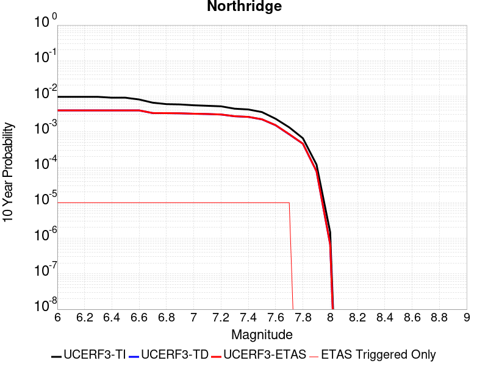 |

| Magnitude | 1 wk TI Prob | 1 wk TD Prob | 1 wk ETAS Prob | 1 wk ETAS/TD Gain | 1 wk ETAS Triggered Only | 1 mo TI Prob | 1 mo TD Prob | 1 mo ETAS Prob | 1 mo ETAS/TD Gain | 1 mo ETAS Triggered Only | 1 yr TI Prob | 1 yr TD Prob | 1 yr ETAS Prob | 1 yr ETAS/TD Gain | 1 yr ETAS Triggered Only | 10 yr TI Prob | 10 yr TD Prob | 10 yr ETAS Prob | 10 yr ETAS/TD Gain | 10 yr ETAS Triggered Only |
|-----|-----|-----|-----|-----|-----|-----|-----|-----|-----|-----|-----|-----|-----|-----|-----|-----|-----|-----|-----|-----|
| 6.0 | 1.8340852E-5 | 7.5878907E-6 | 7.5878907E-6 | 1.0 | 0.0 | 7.860128E-5 | 3.251914E-5 | 3.251914E-5 | 1.0 | 0.0 | 9.565505E-4 | 3.9585077E-4 | 4.0584683E-4 | 1.0252521 | 1.0E-5 | 0.009524435 | 0.0039516874 | 0.003961648 | 1.0025206 | 1.0E-5 |
| 6.1 | 1.8340852E-5 | 7.5878907E-6 | 7.5878907E-6 | 1.0 | 0.0 | 7.860128E-5 | 3.251914E-5 | 3.251914E-5 | 1.0 | 0.0 | 9.565505E-4 | 3.9585077E-4 | 4.0584683E-4 | 1.0252521 | 1.0E-5 | 0.009524435 | 0.0039516874 | 0.003961648 | 1.0025206 | 1.0E-5 |
| 6.2 | 1.8340852E-5 | 7.5878907E-6 | 7.5878907E-6 | 1.0 | 0.0 | 7.860128E-5 | 3.251914E-5 | 3.251914E-5 | 1.0 | 0.0 | 9.565505E-4 | 3.9585077E-4 | 4.0584683E-4 | 1.0252521 | 1.0E-5 | 0.009524435 | 0.0039516874 | 0.003961648 | 1.0025206 | 1.0E-5 |
| 6.3 | 1.8340852E-5 | 7.5878907E-6 | 7.5878907E-6 | 1.0 | 0.0 | 7.860128E-5 | 3.251914E-5 | 3.251914E-5 | 1.0 | 0.0 | 9.565505E-4 | 3.9585077E-4 | 4.0584683E-4 | 1.0252521 | 1.0E-5 | 0.009524435 | 0.0039516874 | 0.003961648 | 1.0025206 | 1.0E-5 |
| 6.4 | 1.7361892E-5 | 7.5878907E-6 | 7.5878907E-6 | 1.0 | 0.0 | 7.440598E-5 | 3.251914E-5 | 3.251914E-5 | 1.0 | 0.0 | 9.055163E-4 | 3.9585077E-4 | 4.0584683E-4 | 1.0252521 | 1.0E-5 | 0.009018354 | 0.0039516874 | 0.003961648 | 1.0025206 | 1.0E-5 |
| 6.5 | 1.7361892E-5 | 7.5878907E-6 | 7.5878907E-6 | 1.0 | 0.0 | 7.440598E-5 | 3.251914E-5 | 3.251914E-5 | 1.0 | 0.0 | 9.055163E-4 | 3.9585077E-4 | 4.0584683E-4 | 1.0252521 | 1.0E-5 | 0.009018354 | 0.0039516874 | 0.003961648 | 1.0025206 | 1.0E-5 |
| 6.6 | 1.5458201E-5 | 7.5878907E-6 | 7.5878907E-6 | 1.0 | 0.0 | 6.624775E-5 | 3.251914E-5 | 3.251914E-5 | 1.0 | 0.0 | 8.0626784E-4 | 3.9585077E-4 | 4.0584683E-4 | 1.0252521 | 1.0E-5 | 0.008033488 | 0.0039516874 | 0.003961648 | 1.0025206 | 1.0E-5 |
| 6.7 | 1.2538368E-5 | 6.381497E-6 | 6.381497E-6 | 1.0 | 0.0 | 5.3734755E-5 | 2.7348988E-5 | 2.7348988E-5 | 1.0 | 0.0 | 6.5402425E-4 | 3.329235E-4 | 3.4292016E-4 | 1.0300269 | 1.0E-5 | 0.0065210275 | 0.0033243035 | 0.0033342703 | 1.0029981 | 1.0E-5 |
| 6.8 | 1.1438097E-5 | 6.350156E-6 | 6.350156E-6 | 1.0 | 0.0 | 4.9019498E-5 | 2.7214674E-5 | 2.7214674E-5 | 1.0 | 0.0 | 5.9664896E-4 | 3.3128873E-4 | 3.412854E-4 | 1.0301752 | 1.0E-5 | 0.005950495 | 0.0033080047 | 0.0033179715 | 1.003013 | 1.0E-5 |
| 6.9 | 1.1204891E-5 | 6.2866116E-6 | 6.2866116E-6 | 1.0 | 0.0 | 4.8020076E-5 | 2.6942345E-5 | 2.6942345E-5 | 1.0 | 0.0 | 5.8448757E-4 | 3.2797412E-4 | 3.3797082E-4 | 1.0304803 | 1.0E-5 | 0.0058295266 | 0.0032749567 | 0.003284924 | 1.0030435 | 1.0E-5 |
| 7.0 | 1.061046E-5 | 6.1152687E-6 | 6.1152687E-6 | 1.0 | 0.0 | 4.5472607E-5 | 2.6208034E-5 | 2.6208034E-5 | 1.0 | 0.0 | 5.534883E-4 | 3.190365E-4 | 3.2903333E-4 | 1.0313344 | 1.0E-5 | 0.0055211177 | 0.0031858315 | 0.0031957994 | 1.0031289 | 1.0E-5 |
| 7.1 | 1.0266979E-5 | 6.0041907E-6 | 6.0041907E-6 | 1.0 | 0.0 | 4.40006E-5 | 2.5731995E-5 | 2.5731995E-5 | 1.0 | 0.0 | 5.355756E-4 | 3.1324243E-4 | 3.2323928E-4 | 1.0319141 | 1.0E-5 | 0.0053428668 | 0.0031280548 | 0.0031380234 | 1.0031868 | 1.0E-5 |
| 7.2 | 9.91273E-6 | 5.819906E-6 | 5.819906E-6 | 1.0 | 0.0 | 4.248244E-5 | 2.4942217E-5 | 2.4942217E-5 | 1.0 | 0.0 | 5.171009E-4 | 3.036296E-4 | 3.1362657E-4 | 1.0329249 | 1.0E-5 | 0.0051589934 | 0.0030321924 | 0.0030421622 | 1.0032879 | 1.0E-5 |
| 7.3 | 8.4959265E-6 | 5.1930183E-6 | 5.1930183E-6 | 1.0 | 0.0 | 3.6410605E-5 | 2.2255605E-5 | 2.2255605E-5 | 1.0 | 0.0 | 4.4320893E-4 | 2.7092852E-4 | 2.8092583E-4 | 1.0369002 | 1.0E-5 | 0.00442326 | 0.0027060085 | 0.0027159813 | 1.0036855 | 1.0E-5 |
| 7.4 | 8.0847185E-6 | 4.9818977E-6 | 4.9818977E-6 | 1.0 | 0.0 | 3.4648332E-5 | 2.1350817E-5 | 2.1350817E-5 | 1.0 | 0.0 | 4.2176177E-4 | 2.5991542E-4 | 2.6991282E-4 | 1.0384641 | 1.0E-5 | 0.0042096223 | 0.0025961401 | 0.0026061141 | 1.0038419 | 1.0E-5 |
| 7.5 | 6.8220684E-6 | 4.2532647E-6 | 4.2532647E-6 | 1.0 | 0.0 | 2.9237108E-5 | 1.8228153E-5 | 1.8228153E-5 | 1.0 | 0.0 | 3.5590364E-4 | 2.2190536E-4 | 2.3190313E-4 | 1.0450543 | 1.0E-5 | 0.0035533418 | 0.0022168586 | 0.0022268365 | 1.0045009 | 1.0E-5 |
| 7.6 | 4.4224143E-6 | 2.8999295E-6 | 2.8999295E-6 | 1.0 | 0.0 | 1.8953066E-5 | 1.24282105E-5 | 1.24282105E-5 | 1.0 | 0.0 | 2.3072914E-4 | 1.5130307E-4 | 1.6130156E-4 | 1.0660825 | 1.0E-5 | 0.0023048974 | 0.0015120122 | 0.001521997 | 1.0066037 | 1.0E-5 |
| 7.7 | 2.5297056E-6 | 1.6045943E-6 | 1.6045943E-6 | 1.0 | 0.0 | 1.0841551E-5 | 6.876815E-6 | 6.876815E-6 | 1.0 | 0.0 | 1.319879E-4 | 8.372205E-5 | 9.372121E-5 | 1.1194328 | 1.0E-5 | 0.0013190953 | 8.369098E-4 | 8.4690144E-4 | 1.0119387 | 1.0E-5 |
| 7.8 | 1.2508156E-6 | 8.780148E-7 | 8.780148E-7 | 1.0 | 0.0 | 5.3606273E-6 | 3.7629154E-6 | 3.7629154E-6 | 1.0 | 0.0 | 6.526368E-5 | 4.5812543E-5 | 4.5812543E-5 | 1.0 | 0.0 | 6.524452E-4 | 4.580323E-4 | 4.580323E-4 | 1.0 | 0.0 |
| 7.9 | 2.262199E-7 | 1.466491E-7 | 1.466491E-7 | 1.0 | 0.0 | 9.695135E-7 | 6.2849597E-7 | 6.2849597E-7 | 1.0 | 0.0 | 1.1803763E-5 | 7.651913E-6 | 7.651913E-6 | 1.0 | 0.0 | 1.1803136E-4 | 7.651657E-5 | 7.651657E-5 | 1.0 | 0.0 |
| 8.0 | 2.865362E-9 | 1.27525E-9 | 1.27525E-9 | 1.0 | 0.0 | 1.2280123E-8 | 5.465357E-9 | 5.465357E-9 | 1.0 | 0.0 | 1.4951048E-7 | 6.654073E-8 | 6.654073E-8 | 1.0 | 0.0 | 1.4951038E-6 | 6.6540724E-7 | 6.6540724E-7 | 1.0 | 0.0 |

## Butano 2011 CFM
*[(top)](#table-of-contents)*

| 1 Week | 1 Month | 1 Year | 10 Year |
|-----|-----|-----|-----|
|  |  | 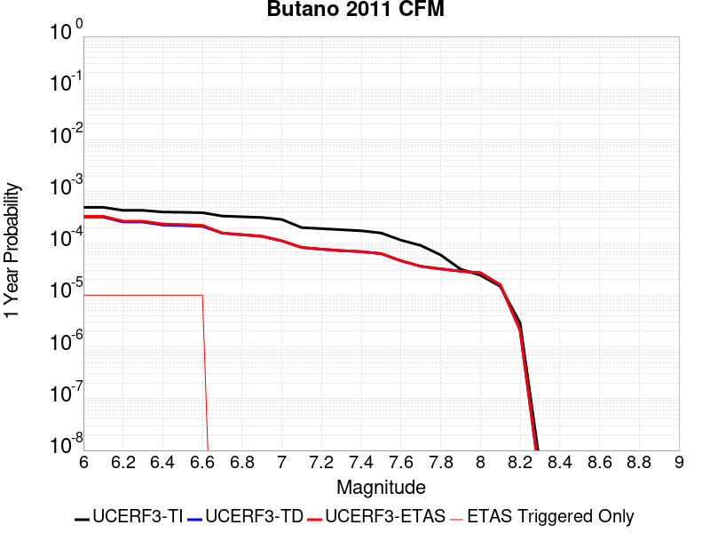 |  |

| Magnitude | 1 wk TI Prob | 1 wk TD Prob | 1 wk ETAS Prob | 1 wk ETAS/TD Gain | 1 wk ETAS Triggered Only | 1 mo TI Prob | 1 mo TD Prob | 1 mo ETAS Prob | 1 mo ETAS/TD Gain | 1 mo ETAS Triggered Only | 1 yr TI Prob | 1 yr TD Prob | 1 yr ETAS Prob | 1 yr ETAS/TD Gain | 1 yr ETAS Triggered Only | 10 yr TI Prob | 10 yr TD Prob | 10 yr ETAS Prob | 10 yr ETAS/TD Gain | 10 yr ETAS Triggered Only |
|-----|-----|-----|-----|-----|-----|-----|-----|-----|-----|-----|-----|-----|-----|-----|-----|-----|-----|-----|-----|-----|
| 6.0 | 9.561135E-6 | 6.2254967E-6 | 6.2254967E-6 | 1.0 | 0.0 | 4.097565E-5 | 2.6680438E-5 | 2.6680438E-5 | 1.0 | 0.0 | 4.9876433E-4 | 3.2478812E-4 | 3.3478488E-4 | 1.0307794 | 1.0E-5 | 0.004976464 | 0.0032607901 | 0.0032707574 | 1.0030568 | 1.0E-5 |
| 6.1 | 9.561135E-6 | 6.2254967E-6 | 6.2254967E-6 | 1.0 | 0.0 | 4.097565E-5 | 2.6680438E-5 | 2.6680438E-5 | 1.0 | 0.0 | 4.9876433E-4 | 3.2478812E-4 | 3.3478488E-4 | 1.0307794 | 1.0E-5 | 0.004976464 | 0.0032607901 | 0.0032707574 | 1.0030568 | 1.0E-5 |
| 6.2 | 8.364741E-6 | 4.9785817E-6 | 4.9785817E-6 | 1.0 | 0.0 | 3.5848396E-5 | 2.1336613E-5 | 2.1336613E-5 | 1.0 | 0.0 | 4.3636683E-4 | 2.5974386E-4 | 2.697413E-4 | 1.0384895 | 1.0E-5 | 0.0043551093 | 0.0026120064 | 0.0026219804 | 1.0038185 | 1.0E-5 |
| 6.3 | 8.364741E-6 | 4.9785817E-6 | 4.9785817E-6 | 1.0 | 0.0 | 3.5848396E-5 | 2.1336613E-5 | 2.1336613E-5 | 1.0 | 0.0 | 4.3636683E-4 | 2.5974386E-4 | 2.697413E-4 | 1.0384895 | 1.0E-5 | 0.0043551093 | 0.0026120064 | 0.0026219804 | 1.0038185 | 1.0E-5 |
| 6.4 | 7.768282E-6 | 4.3565296E-6 | 4.3565296E-6 | 1.0 | 0.0 | 3.329221E-5 | 1.8670715E-5 | 1.8670715E-5 | 1.0 | 0.0 | 4.0525728E-4 | 2.272936E-4 | 2.3729133E-4 | 1.043986 | 1.0E-5 | 0.0040451903 | 0.0022881997 | 0.0022981768 | 1.0043602 | 1.0E-5 |
| 6.5 | 7.673437E-6 | 4.256093E-6 | 4.256093E-6 | 1.0 | 0.0 | 3.2885746E-5 | 1.8240276E-5 | 1.8240276E-5 | 1.0 | 0.0 | 4.0031038E-4 | 2.2205409E-4 | 2.3205187E-4 | 1.045024 | 1.0E-5 | 0.0039959005 | 0.0022359102 | 0.0022458876 | 1.0044625 | 1.0E-5 |
| 6.6 | 7.5244197E-6 | 4.101056E-6 | 4.101056E-6 | 1.0 | 0.0 | 3.2247113E-5 | 1.7575843E-5 | 1.7575843E-5 | 1.0 | 0.0 | 3.9253788E-4 | 2.1396621E-4 | 2.2396407E-4 | 1.0467263 | 1.0E-5 | 0.003918452 | 0.00215519 | 0.0021651685 | 1.00463 | 1.0E-5 |
| 6.7 | 6.4921405E-6 | 3.0411225E-6 | 3.0411225E-6 | 1.0 | 0.0 | 2.7823162E-5 | 1.30333165E-5 | 1.30333165E-5 | 1.0 | 0.0 | 3.3869434E-4 | 1.5866917E-4 | 1.5866917E-4 | 1.0 | 0.0 | 0.003381786 | 0.0016030329 | 0.0016030329 | 1.0 | 0.0 |
| 6.8 | 6.2890294E-6 | 2.8278887E-6 | 2.8278887E-6 | 1.0 | 0.0 | 2.6952705E-5 | 1.2119467E-5 | 1.2119467E-5 | 1.0 | 0.0 | 3.2809976E-4 | 1.475446E-4 | 1.475446E-4 | 1.0 | 0.0 | 0.0032761577 | 0.0014919417 | 0.0014919417 | 1.0 | 0.0 |
| 6.9 | 6.0965517E-6 | 2.6344032E-6 | 2.6344032E-6 | 1.0 | 0.0 | 2.6127816E-5 | 1.129025E-5 | 1.129025E-5 | 1.0 | 0.0 | 3.1805973E-4 | 1.3745019E-4 | 1.3745019E-4 | 1.0 | 0.0 | 0.0031760489 | 0.0013911276 | 0.0013911276 | 1.0 | 0.0 |
| 7.0 | 5.566252E-6 | 2.1518151E-6 | 2.1518151E-6 | 1.0 | 0.0 | 2.3855147E-5 | 9.2220325E-6 | 9.2220325E-6 | 1.0 | 0.0 | 2.9039773E-4 | 1.122725E-4 | 1.122725E-4 | 1.0 | 0.0 | 0.0029001853 | 0.0011396318 | 0.0011396318 | 1.0 | 0.0 |
| 7.1 | 3.878588E-6 | 1.6032967E-6 | 1.6032967E-6 | 1.0 | 0.0 | 1.6622414E-5 | 6.871253E-6 | 6.871253E-6 | 1.0 | 0.0 | 2.023591E-4 | 8.36543E-5 | 8.36543E-5 | 1.0 | 0.0 | 0.0020217493 | 8.53303E-4 | 8.53303E-4 | 1.0 | 0.0 |
| 7.2 | 3.7038085E-6 | 1.4843619E-6 | 1.4843619E-6 | 1.0 | 0.0 | 1.587337E-5 | 6.361535E-6 | 6.361535E-6 | 1.0 | 0.0 | 1.9324113E-4 | 7.744894E-5 | 7.744894E-5 | 1.0 | 0.0 | 0.0019307317 | 7.912618E-4 | 7.912618E-4 | 1.0 | 0.0 |
| 7.3 | 3.5277278E-6 | 1.3924841E-6 | 1.3924841E-6 | 1.0 | 0.0 | 1.5118746E-5 | 5.9677755E-6 | 5.9677755E-6 | 1.0 | 0.0 | 1.8405518E-4 | 7.2655246E-5 | 7.2655246E-5 | 1.0 | 0.0 | 0.0018390282 | 7.432707E-4 | 7.432707E-4 | 1.0 | 0.0 |
| 7.4 | 3.3711294E-6 | 1.3297448E-6 | 1.3297448E-6 | 1.0 | 0.0 | 1.4447617E-5 | 5.6988933E-6 | 5.6988933E-6 | 1.0 | 0.0 | 1.7588554E-4 | 6.938182E-5 | 6.938182E-5 | 1.0 | 0.0 | 0.0017574639 | 7.1050716E-4 | 7.1050716E-4 | 1.0 | 0.0 |
| 7.5 | 3.0496426E-6 | 1.218759E-6 | 1.218759E-6 | 1.0 | 0.0 | 1.3069831E-5 | 5.2232426E-6 | 5.2232426E-6 | 1.0 | 0.0 | 1.5911358E-4 | 6.359112E-5 | 6.359112E-5 | 1.0 | 0.0 | 0.001589997 | 6.525681E-4 | 6.525681E-4 | 1.0 | 0.0 |
| 7.6 | 2.2179781E-6 | 8.869861E-7 | 8.869861E-7 | 1.0 | 0.0 | 9.505586E-6 | 3.8013632E-6 | 3.8013632E-6 | 1.0 | 0.0 | 1.1572436E-4 | 4.6280613E-5 | 4.6280613E-5 | 1.0 | 0.0 | 0.0011566412 | 4.794437E-4 | 4.794437E-4 | 1.0 | 0.0 |
| 7.7 | 1.7519328E-6 | 6.930116E-7 | 6.930116E-7 | 1.0 | 0.0 | 7.508262E-6 | 2.9700464E-6 | 2.9700464E-6 | 1.0 | 0.0 | 9.140925E-5 | 3.6159712E-5 | 3.6159712E-5 | 1.0 | 0.0 | 9.137166E-4 | 3.7754176E-4 | 3.7754176E-4 | 1.0 | 0.0 |
| 7.8 | 1.1478974E-6 | 6.1734966E-7 | 6.1734966E-7 | 1.0 | 0.0 | 4.9195505E-6 | 2.6457815E-6 | 2.6457815E-6 | 1.0 | 0.0 | 5.9893882E-5 | 3.2211912E-5 | 3.2211912E-5 | 1.0 | 0.0 | 5.9877743E-4 | 3.377461E-4 | 3.377461E-4 | 1.0 | 0.0 |
| 7.9 | 6.1154634E-7 | 5.5814814E-7 | 5.5814814E-7 | 1.0 | 0.0 | 2.6209104E-6 | 2.392061E-6 | 2.392061E-6 | 1.0 | 0.0 | 3.1909116E-5 | 2.9122955E-5 | 2.9122955E-5 | 1.0 | 0.0 | 3.1904536E-4 | 3.0562587E-4 | 3.0562587E-4 | 1.0 | 0.0 |
| 8.0 | 4.6520046E-7 | 5.189108E-7 | 5.189108E-7 | 1.0 | 0.0 | 1.9937147E-6 | 2.2239014E-6 | 2.2239014E-6 | 1.0 | 0.0 | 2.4273206E-5 | 2.7075665E-5 | 2.7075665E-5 | 1.0 | 0.0 | 2.4270554E-4 | 2.841832E-4 | 2.841832E-4 | 1.0 | 0.0 |
| 8.1 | 2.8425194E-7 | 3.0568935E-7 | 3.0568935E-7 | 1.0 | 0.0 | 1.218222E-6 | 1.3100965E-6 | 1.3100965E-6 | 1.0 | 0.0 | 1.4831752E-5 | 1.5950309E-5 | 1.5950309E-5 | 1.0 | 0.0 | 1.4830762E-4 | 1.673984E-4 | 1.673984E-4 | 1.0 | 0.0 |
| 8.2 | 5.585778E-8 | 4.051519E-8 | 4.051519E-8 | 1.0 | 0.0 | 2.3939046E-7 | 1.7363652E-7 | 1.7363652E-7 | 1.0 | 0.0 | 2.914575E-6 | 2.1140224E-6 | 2.1140224E-6 | 1.0 | 0.0 | 2.9145367E-5 | 2.2970038E-5 | 2.2970038E-5 | 1.0 | 0.0 |
| 8.3 | 1.0371215E-10 | 5.3552607E-11 | 5.3552607E-11 | 1.0 | 0.0 | 4.4448079E-10 | 2.2951097E-10 | 2.2951097E-10 | 1.0 | 0.0 | 5.4115543E-9 | 2.7942968E-9 | 2.7942968E-9 | 1.0 | 0.0 | 5.4115542E-8 | 3.213309E-8 | 3.213309E-8 | 1.0 | 0.0 |

## San Luis Range - Pecho 2011 CFM
*[(top)](#table-of-contents)*

| 1 Week | 1 Month | 1 Year | 10 Year |
|-----|-----|-----|-----|
| 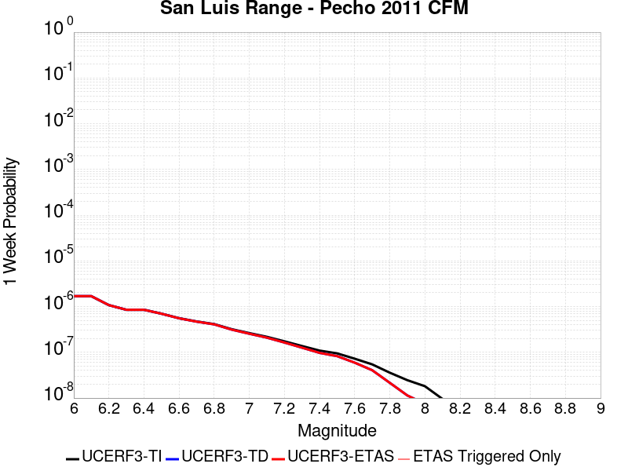 | 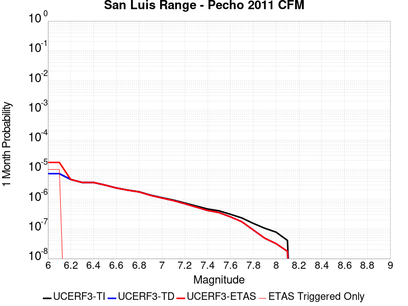 | 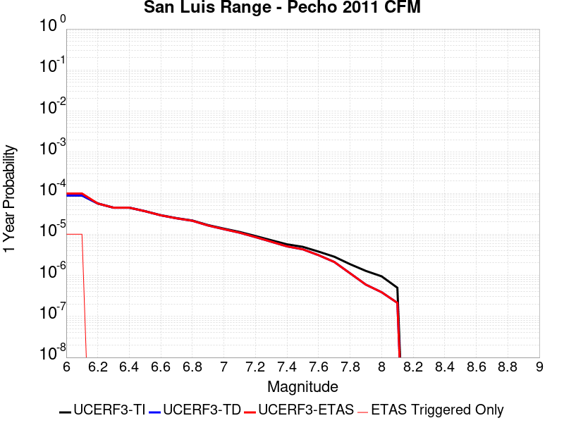 |  |

| Magnitude | 1 wk TI Prob | 1 wk TD Prob | 1 wk ETAS Prob | 1 wk ETAS/TD Gain | 1 wk ETAS Triggered Only | 1 mo TI Prob | 1 mo TD Prob | 1 mo ETAS Prob | 1 mo ETAS/TD Gain | 1 mo ETAS Triggered Only | 1 yr TI Prob | 1 yr TD Prob | 1 yr ETAS Prob | 1 yr ETAS/TD Gain | 1 yr ETAS Triggered Only | 10 yr TI Prob | 10 yr TD Prob | 10 yr ETAS Prob | 10 yr ETAS/TD Gain | 10 yr ETAS Triggered Only |
|-----|-----|-----|-----|-----|-----|-----|-----|-----|-----|-----|-----|-----|-----|-----|-----|-----|-----|-----|-----|-----|
| 6.0 | 1.687423E-6 | 1.6921944E-6 | 1.6921944E-6 | 1.0 | 0.0 | 7.231793E-6 | 7.252243E-6 | 1.725217E-5 | 2.3788738 | 1.0E-5 | 8.804352E-5 | 8.829272E-5 | 9.8291835E-5 | 1.1132497 | 1.0E-5 | 8.8008645E-4 | 8.826003E-4 | 8.9259155E-4 | 1.0113201 | 1.0E-5 |
| 6.1 | 1.687423E-6 | 1.6921944E-6 | 1.6921944E-6 | 1.0 | 0.0 | 7.231793E-6 | 7.252243E-6 | 1.725217E-5 | 2.3788738 | 1.0E-5 | 8.804352E-5 | 8.829272E-5 | 9.8291835E-5 | 1.1132497 | 1.0E-5 | 8.8008645E-4 | 8.826003E-4 | 8.9259155E-4 | 1.0113201 | 1.0E-5 |
| 6.2 | 1.0765672E-6 | 1.0770541E-6 | 1.0770541E-6 | 1.0 | 0.0 | 4.613851E-6 | 4.615938E-6 | 4.615938E-6 | 1.0 | 0.0 | 5.617219E-5 | 5.6197663E-5 | 5.6197663E-5 | 1.0 | 0.0 | 5.6157995E-4 | 5.618408E-4 | 5.618408E-4 | 1.0 | 0.0 |
| 6.3 | 8.523104E-7 | 8.5130216E-7 | 8.5130216E-7 | 1.0 | 0.0 | 3.6527538E-6 | 3.648433E-6 | 3.648433E-6 | 1.0 | 0.0 | 4.447137E-5 | 4.4418797E-5 | 4.4418797E-5 | 1.0 | 0.0 | 4.4462472E-4 | 4.441024E-4 | 4.441024E-4 | 1.0 | 0.0 |
| 6.4 | 8.523104E-7 | 8.5130216E-7 | 8.5130216E-7 | 1.0 | 0.0 | 3.6527538E-6 | 3.648433E-6 | 3.648433E-6 | 1.0 | 0.0 | 4.447137E-5 | 4.4418797E-5 | 4.4418797E-5 | 1.0 | 0.0 | 4.4462472E-4 | 4.441024E-4 | 4.441024E-4 | 1.0 | 0.0 |
| 6.5 | 7.0029404E-7 | 6.976438E-7 | 6.976438E-7 | 1.0 | 0.0 | 3.0012568E-6 | 2.9898988E-6 | 2.9898988E-6 | 1.0 | 0.0 | 3.6539688E-5 | 3.6401427E-5 | 3.6401427E-5 | 1.0 | 0.0 | 3.653368E-4 | 3.6395632E-4 | 3.6395632E-4 | 1.0 | 0.0 |
| 6.6 | 5.583906E-7 | 5.5428296E-7 | 5.5428296E-7 | 1.0 | 0.0 | 2.3931002E-6 | 2.3754963E-6 | 2.3754963E-6 | 1.0 | 0.0 | 2.9135606E-5 | 2.892129E-5 | 2.892129E-5 | 1.0 | 0.0 | 2.9131788E-4 | 2.89176E-4 | 2.89176E-4 | 1.0 | 0.0 |
| 6.7 | 4.73441E-7 | 4.6830658E-7 | 4.6830658E-7 | 1.0 | 0.0 | 2.0290313E-6 | 2.0070268E-6 | 2.0070268E-6 | 1.0 | 0.0 | 2.4703175E-5 | 2.4435281E-5 | 2.4435281E-5 | 1.0 | 0.0 | 2.470043E-4 | 2.443264E-4 | 2.443264E-4 | 1.0 | 0.0 |
| 6.8 | 4.1466086E-7 | 4.087795E-7 | 4.087795E-7 | 1.0 | 0.0 | 1.7771167E-6 | 1.751911E-6 | 1.751911E-6 | 1.0 | 0.0 | 2.1636182E-5 | 2.132931E-5 | 2.132931E-5 | 1.0 | 0.0 | 2.1634075E-4 | 2.1327297E-4 | 2.1327297E-4 | 1.0 | 0.0 |
| 6.9 | 3.2056641E-7 | 3.13293E-7 | 3.13293E-7 | 1.0 | 0.0 | 1.3738553E-6 | 1.3426836E-6 | 1.3426836E-6 | 1.0 | 0.0 | 1.6726559E-5 | 1.6347052E-5 | 1.6347052E-5 | 1.0 | 0.0 | 1.67253E-4 | 1.6345865E-4 | 1.6345865E-4 | 1.0 | 0.0 |
| 7.0 | 2.6315942E-7 | 2.5489675E-7 | 2.5489675E-7 | 1.0 | 0.0 | 1.1278256E-6 | 1.0924141E-6 | 1.0924141E-6 | 1.0 | 0.0 | 1.3731191E-5 | 1.3300061E-5 | 1.3300061E-5 | 1.0 | 0.0 | 1.3730342E-4 | 1.3299273E-4 | 1.3299273E-4 | 1.0 | 0.0 |
| 7.1 | 2.1832436E-7 | 2.0917312E-7 | 2.0917312E-7 | 1.0 | 0.0 | 9.356755E-7 | 8.9645596E-7 | 8.9645596E-7 | 1.0 | 0.0 | 1.13917895E-5 | 1.0914297E-5 | 1.0914297E-5 | 1.0 | 0.0 | 1.1391206E-4 | 1.0913766E-4 | 1.0913766E-4 | 1.0 | 0.0 |
| 7.2 | 1.7393015E-7 | 1.6376592E-7 | 1.6376592E-7 | 1.0 | 0.0 | 7.454147E-7 | 7.018537E-7 | 7.018537E-7 | 1.0 | 0.0 | 9.075386E-6 | 8.545036E-6 | 8.545036E-6 | 1.0 | 0.0 | 9.075015E-5 | 8.54471E-5 | 8.54471E-5 | 1.0 | 0.0 |
| 7.3 | 1.3744894E-7 | 1.263862E-7 | 1.263862E-7 | 1.0 | 0.0 | 5.890667E-7 | 5.4165497E-7 | 5.4165497E-7 | 1.0 | 0.0 | 7.1718637E-6 | 6.5946297E-6 | 6.5946297E-6 | 1.0 | 0.0 | 7.171632E-5 | 6.5944354E-5 | 6.5944354E-5 | 1.0 | 0.0 |
| 7.4 | 1.0915278E-7 | 9.727534E-8 | 9.727534E-8 | 1.0 | 0.0 | 4.6779755E-7 | 4.1689424E-7 | 4.1689424E-7 | 1.0 | 0.0 | 5.6954204E-6 | 5.0756753E-6 | 5.0756753E-6 | 1.0 | 0.0 | 5.6952744E-5 | 5.0755603E-5 | 5.0755603E-5 | 1.0 | 0.0 |
| 7.5 | 9.490291E-8 | 8.257131E-8 | 8.257131E-8 | 1.0 | 0.0 | 4.0672668E-7 | 3.53877E-7 | 3.53877E-7 | 1.0 | 0.0 | 4.9518862E-6 | 4.308444E-6 | 4.308444E-6 | 1.0 | 0.0 | 4.951776E-5 | 4.308361E-5 | 4.308361E-5 | 1.0 | 0.0 |
| 7.6 | 7.256678E-8 | 5.942529E-8 | 5.942529E-8 | 1.0 | 0.0 | 3.1100043E-7 | 2.546798E-7 | 2.546798E-7 | 1.0 | 0.0 | 3.7864236E-6 | 3.100722E-6 | 3.100722E-6 | 1.0 | 0.0 | 3.7863592E-5 | 3.100679E-5 | 3.100679E-5 | 1.0 | 0.0 |
| 7.7 | 5.446273E-8 | 4.057937E-8 | 4.057937E-8 | 1.0 | 0.0 | 2.3341168E-7 | 1.7391157E-7 | 1.7391157E-7 | 1.0 | 0.0 | 2.8417835E-6 | 2.1173712E-6 | 2.1173712E-6 | 1.0 | 0.0 | 2.8417471E-5 | 2.1173511E-5 | 2.1173511E-5 | 1.0 | 0.0 |
| 7.8 | 3.5850867E-8 | 2.1520364E-8 | 2.1520364E-8 | 1.0 | 0.0 | 1.5364655E-7 | 9.2230124E-8 | 9.2230124E-8 | 1.0 | 0.0 | 1.8706452E-6 | 1.1229012E-6 | 1.1229012E-6 | 1.0 | 0.0 | 1.8706294E-5 | 1.1228955E-5 | 1.1228955E-5 | 1.0 | 0.0 |
| 7.9 | 2.45879E-8 | 1.1394102E-8 | 1.1394102E-8 | 1.0 | 0.0 | 1.0537671E-7 | 4.883186E-8 | 4.883186E-8 | 1.0 | 0.0 | 1.2829606E-6 | 5.9452776E-7 | 5.9452776E-7 | 1.0 | 0.0 | 1.2829532E-5 | 5.945262E-6 | 5.945262E-6 | 1.0 | 0.0 |
| 8.0 | 1.8151761E-8 | 7.4404523E-9 | 7.4404523E-9 | 1.0 | 0.0 | 7.779326E-8 | 3.188765E-8 | 3.188765E-8 | 1.0 | 0.0 | 9.4713255E-7 | 3.8823208E-7 | 3.8823208E-7 | 1.0 | 0.0 | 9.471285E-6 | 3.882314E-6 | 3.882314E-6 | 1.0 | 0.0 |
| 8.1 | 9.559205E-9 | 4.100115E-9 | 4.100115E-9 | 1.0 | 0.0 | 4.096802E-8 | 1.7571923E-8 | 1.7571923E-8 | 1.0 | 0.0 | 4.9878554E-7 | 2.1393814E-7 | 2.1393814E-7 | 1.0 | 0.0 | 4.987844E-6 | 2.1393794E-6 | 2.1393794E-6 | 1.0 | 0.0 |

## Breckenridge 2011
*[(top)](#table-of-contents)*

| 1 Week | 1 Month | 1 Year | 10 Year |
|-----|-----|-----|-----|
|  |  |  | 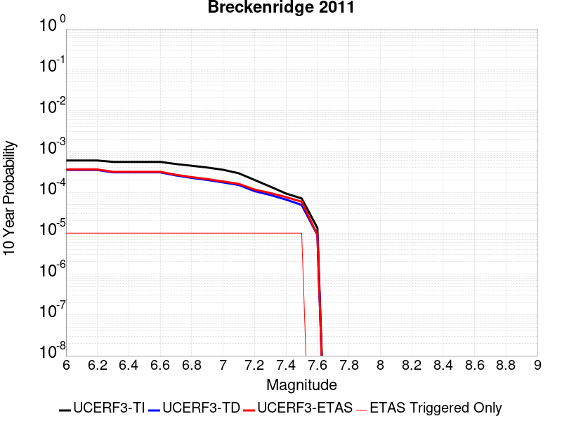 |

| Magnitude | 1 wk TI Prob | 1 wk TD Prob | 1 wk ETAS Prob | 1 wk ETAS/TD Gain | 1 wk ETAS Triggered Only | 1 mo TI Prob | 1 mo TD Prob | 1 mo ETAS Prob | 1 mo ETAS/TD Gain | 1 mo ETAS Triggered Only | 1 yr TI Prob | 1 yr TD Prob | 1 yr ETAS Prob | 1 yr ETAS/TD Gain | 1 yr ETAS Triggered Only | 10 yr TI Prob | 10 yr TD Prob | 10 yr ETAS Prob | 10 yr ETAS/TD Gain | 10 yr ETAS Triggered Only |
|-----|-----|-----|-----|-----|-----|-----|-----|-----|-----|-----|-----|-----|-----|-----|-----|-----|-----|-----|-----|-----|
| 6.0 | 1.1490393E-6 | 6.738007E-7 | 6.738007E-7 | 1.0 | 0.0 | 4.924445E-6 | 2.8877141E-6 | 2.8877141E-6 | 1.0 | 0.0 | 5.995347E-5 | 3.5157373E-5 | 3.5157373E-5 | 1.0 | 0.0 | 5.9937296E-4 | 3.5152017E-4 | 3.6151666E-4 | 1.0284379 | 1.0E-5 |
| 6.1 | 1.1490393E-6 | 6.738007E-7 | 6.738007E-7 | 1.0 | 0.0 | 4.924445E-6 | 2.8877141E-6 | 2.8877141E-6 | 1.0 | 0.0 | 5.995347E-5 | 3.5157373E-5 | 3.5157373E-5 | 1.0 | 0.0 | 5.9937296E-4 | 3.5152017E-4 | 3.6151666E-4 | 1.0284379 | 1.0E-5 |
| 6.2 | 1.1490393E-6 | 6.738007E-7 | 6.738007E-7 | 1.0 | 0.0 | 4.924445E-6 | 2.8877141E-6 | 2.8877141E-6 | 1.0 | 0.0 | 5.995347E-5 | 3.5157373E-5 | 3.5157373E-5 | 1.0 | 0.0 | 5.9937296E-4 | 3.5152017E-4 | 3.6151666E-4 | 1.0284379 | 1.0E-5 |
| 6.3 | 1.064617E-6 | 5.886405E-7 | 5.886405E-7 | 1.0 | 0.0 | 4.5626366E-6 | 2.5227425E-6 | 2.5227425E-6 | 1.0 | 0.0 | 5.5548684E-5 | 3.071397E-5 | 3.071397E-5 | 1.0 | 0.0 | 5.55348E-4 | 3.070984E-4 | 3.1709534E-4 | 1.0325528 | 1.0E-5 |
| 6.4 | 1.064617E-6 | 5.886405E-7 | 5.886405E-7 | 1.0 | 0.0 | 4.5626366E-6 | 2.5227425E-6 | 2.5227425E-6 | 1.0 | 0.0 | 5.5548684E-5 | 3.071397E-5 | 3.071397E-5 | 1.0 | 0.0 | 5.55348E-4 | 3.070984E-4 | 3.1709534E-4 | 1.0325528 | 1.0E-5 |
| 6.5 | 1.064617E-6 | 5.886405E-7 | 5.886405E-7 | 1.0 | 0.0 | 4.5626366E-6 | 2.5227425E-6 | 2.5227425E-6 | 1.0 | 0.0 | 5.5548684E-5 | 3.071397E-5 | 3.071397E-5 | 1.0 | 0.0 | 5.55348E-4 | 3.070984E-4 | 3.1709534E-4 | 1.0325528 | 1.0E-5 |
| 6.6 | 1.064617E-6 | 5.886405E-7 | 5.886405E-7 | 1.0 | 0.0 | 4.5626366E-6 | 2.5227425E-6 | 2.5227425E-6 | 1.0 | 0.0 | 5.5548684E-5 | 3.071397E-5 | 3.071397E-5 | 1.0 | 0.0 | 5.55348E-4 | 3.070984E-4 | 3.1709534E-4 | 1.0325528 | 1.0E-5 |
| 6.7 | 9.4219524E-7 | 4.954012E-7 | 4.954012E-7 | 1.0 | 0.0 | 4.037973E-6 | 2.1231463E-6 | 2.1231463E-6 | 1.0 | 0.0 | 4.916122E-5 | 2.5849005E-5 | 2.5849005E-5 | 1.0 | 0.0 | 4.9150345E-4 | 2.5846064E-4 | 2.6845807E-4 | 1.0386806 | 1.0E-5 |
| 6.8 | 8.556422E-7 | 4.311915E-7 | 4.311915E-7 | 1.0 | 0.0 | 3.667033E-6 | 1.8479623E-6 | 1.8479623E-6 | 1.0 | 0.0 | 4.464521E-5 | 2.2498712E-5 | 2.2498712E-5 | 1.0 | 0.0 | 4.4636242E-4 | 2.2496474E-4 | 2.3496248E-4 | 1.0444415 | 1.0E-5 |
| 6.9 | 7.7357794E-7 | 3.841983E-7 | 3.841983E-7 | 1.0 | 0.0 | 3.3153299E-6 | 1.6465632E-6 | 1.6465632E-6 | 1.0 | 0.0 | 4.0363393E-5 | 2.0046726E-5 | 2.0046726E-5 | 1.0 | 0.0 | 4.035606E-4 | 2.0044947E-4 | 2.1044747E-4 | 1.0498779 | 1.0E-5 |
| 7.0 | 6.8172454E-7 | 3.3470985E-7 | 3.3470985E-7 | 1.0 | 0.0 | 2.9216735E-6 | 1.43447E-6 | 1.43447E-6 | 1.0 | 0.0 | 3.5570793E-5 | 1.7464534E-5 | 1.7464534E-5 | 1.0 | 0.0 | 3.55651E-4 | 1.7463184E-4 | 1.846301E-4 | 1.0572534 | 1.0E-5 |
| 7.1 | 5.5936397E-7 | 2.8909366E-7 | 2.8909366E-7 | 1.0 | 0.0 | 2.397272E-6 | 1.2389722E-6 | 1.2389722E-6 | 1.0 | 0.0 | 2.9186394E-5 | 1.5084385E-5 | 1.5084385E-5 | 1.0 | 0.0 | 2.9182562E-4 | 1.5083379E-4 | 1.6083228E-4 | 1.0662881 | 1.0E-5 |
| 7.2 | 3.8420822E-7 | 2.0468183E-7 | 2.0468183E-7 | 1.0 | 0.0 | 1.6466057E-6 | 8.772076E-7 | 8.772076E-7 | 1.0 | 0.0 | 2.004724E-5 | 1.0679951E-5 | 1.0679951E-5 | 1.0 | 0.0 | 2.004543E-4 | 1.06794454E-4 | 1.1679339E-4 | 1.0936278 | 1.0E-5 |
| 7.3 | 2.6405158E-7 | 1.6473078E-7 | 1.6473078E-7 | 1.0 | 0.0 | 1.1316491E-6 | 7.0598884E-7 | 7.0598884E-7 | 1.0 | 0.0 | 1.37777415E-5 | 8.595381E-6 | 8.595381E-6 | 1.0 | 0.0 | 1.3776887E-4 | 8.595055E-5 | 9.594969E-5 | 1.116336 | 1.0E-5 |
| 7.4 | 1.792114E-7 | 1.2725252E-7 | 1.2725252E-7 | 1.0 | 0.0 | 7.6804866E-7 | 5.453678E-7 | 5.453678E-7 | 1.0 | 0.0 | 9.3509525E-6 | 6.639834E-6 | 6.639834E-6 | 1.0 | 0.0 | 9.350559E-5 | 6.63964E-5 | 7.6395736E-5 | 1.1506006 | 1.0E-5 |
| 7.5 | 1.3548703E-7 | 9.385346E-8 | 9.385346E-8 | 1.0 | 0.0 | 5.8065854E-7 | 4.0222903E-7 | 4.0222903E-7 | 1.0 | 0.0 | 7.0694946E-6 | 4.897128E-6 | 4.897128E-6 | 1.0 | 0.0 | 7.0692695E-5 | 4.8970236E-5 | 5.8969745E-5 | 1.2041956 | 1.0E-5 |
| 7.6 | 2.572245E-8 | 1.735264E-8 | 1.735264E-8 | 1.0 | 0.0 | 1.10239064E-7 | 7.436845E-8 | 7.436845E-8 | 1.0 | 0.0 | 1.3421597E-6 | 9.0543557E-7 | 9.0543557E-7 | 1.0 | 0.0 | 1.3421517E-5 | 9.054324E-6 | 9.054324E-6 | 1.0 | 0.0 |

## San Andreas (Santa Cruz Mts) 2011 CFM
*[(top)](#table-of-contents)*

| 1 Week | 1 Month | 1 Year | 10 Year |
|-----|-----|-----|-----|
|  |  |  |  |

| Magnitude | 1 wk TI Prob | 1 wk TD Prob | 1 wk ETAS Prob | 1 wk ETAS/TD Gain | 1 wk ETAS Triggered Only | 1 mo TI Prob | 1 mo TD Prob | 1 mo ETAS Prob | 1 mo ETAS/TD Gain | 1 mo ETAS Triggered Only | 1 yr TI Prob | 1 yr TD Prob | 1 yr ETAS Prob | 1 yr ETAS/TD Gain | 1 yr ETAS Triggered Only | 10 yr TI Prob | 10 yr TD Prob | 10 yr ETAS Prob | 10 yr ETAS/TD Gain | 10 yr ETAS Triggered Only |
|-----|-----|-----|-----|-----|-----|-----|-----|-----|-----|-----|-----|-----|-----|-----|-----|-----|-----|-----|-----|-----|
| 6.0 | 1.7221631E-4 | 1.3792426E-4 | 1.3792426E-4 | 1.0 | 0.0 | 7.378611E-4 | 5.9097214E-4 | 5.9097214E-4 | 1.0 | 0.0 | 0.008946515 | 0.0071717235 | 0.0071717235 | 1.0 | 0.0 | 0.08594794 | 0.07054796 | 0.07055726 | 1.0001317 | 1.0E-5 |
| 6.1 | 1.7221631E-4 | 1.3792426E-4 | 1.3792426E-4 | 1.0 | 0.0 | 7.378611E-4 | 5.9097214E-4 | 5.9097214E-4 | 1.0 | 0.0 | 0.008946515 | 0.0071717235 | 0.0071717235 | 1.0 | 0.0 | 0.08594794 | 0.07054796 | 0.07055726 | 1.0001317 | 1.0E-5 |
| 6.2 | 1.7221631E-4 | 1.3792426E-4 | 1.3792426E-4 | 1.0 | 0.0 | 7.378611E-4 | 5.9097214E-4 | 5.9097214E-4 | 1.0 | 0.0 | 0.008946515 | 0.0071717235 | 0.0071717235 | 1.0 | 0.0 | 0.08594794 | 0.07054796 | 0.07055726 | 1.0001317 | 1.0E-5 |
| 6.3 | 1.716926E-4 | 1.3711878E-4 | 1.3711878E-4 | 1.0 | 0.0 | 7.3561794E-4 | 5.8752164E-4 | 5.8752164E-4 | 1.0 | 0.0 | 0.008919428 | 0.007129989 | 0.007129989 | 1.0 | 0.0 | 0.08569809 | 0.07015993 | 0.070169225 | 1.0001326 | 1.0E-5 |
| 6.4 | 1.6392978E-4 | 1.3587909E-4 | 1.3587909E-4 | 1.0 | 0.0 | 7.02367E-4 | 5.82211E-4 | 5.82211E-4 | 1.0 | 0.0 | 0.008517839 | 0.0070657525 | 0.0070657525 | 1.0 | 0.0 | 0.08198654 | 0.069394976 | 0.06940428 | 1.0001341 | 1.0E-5 |
| 6.5 | 1.5742714E-4 | 1.2647794E-4 | 1.2647794E-4 | 1.0 | 0.0 | 6.745133E-4 | 5.419374E-4 | 5.419374E-4 | 1.0 | 0.0 | 0.00818132 | 0.0065784375 | 0.0065784375 | 1.0 | 0.0 | 0.078865945 | 0.06486093 | 0.06487028 | 1.0001441 | 1.0E-5 |
| 6.6 | 1.3038084E-4 | 1.1587992E-4 | 1.1587992E-4 | 1.0 | 0.0 | 5.5865536E-4 | 4.96535E-4 | 4.96535E-4 | 1.0 | 0.0 | 0.006780438 | 0.006028784 | 0.006028784 | 1.0 | 0.0 | 0.0657725 | 0.059330538 | 0.059339944 | 1.0001585 | 1.0E-5 |
| 6.7 | 1.2867592E-4 | 1.1314491E-4 | 1.1314491E-4 | 1.0 | 0.0 | 5.5135164E-4 | 4.8481792E-4 | 4.8481792E-4 | 1.0 | 0.0 | 0.0066920654 | 0.005886907 | 0.005886907 | 1.0 | 0.0 | 0.06494093 | 0.058041416 | 0.058050834 | 1.0001622 | 1.0E-5 |
| 6.8 | 1.2801298E-4 | 1.12520516E-4 | 1.12520516E-4 | 1.0 | 0.0 | 5.485117E-4 | 4.8214293E-4 | 4.8214293E-4 | 1.0 | 0.0 | 0.0066577005 | 0.0058545293 | 0.0058545293 | 1.0 | 0.0 | 0.06461738 | 0.05775524 | 0.057764664 | 1.0001632 | 1.0E-5 |
| 6.9 | 1.269149E-4 | 1.1094256E-4 | 1.1094256E-4 | 1.0 | 0.0 | 5.4380763E-4 | 4.7538272E-4 | 4.7538272E-4 | 1.0 | 0.0 | 0.006600777 | 0.005772663 | 0.005772663 | 1.0 | 0.0 | 0.06408122 | 0.057027116 | 0.057036545 | 1.0001653 | 1.0E-5 |
| 7.0 | 1.2030331E-4 | 1.0824356E-4 | 1.0824356E-4 | 1.0 | 0.0 | 5.154837E-4 | 4.638198E-4 | 4.638198E-4 | 1.0 | 0.0 | 0.006257969 | 0.0056326203 | 0.0056326203 | 1.0 | 0.0 | 0.06084648 | 0.055699922 | 0.055709366 | 1.0001695 | 1.0E-5 |
| 7.1 | 8.049617E-5 | 5.392429E-5 | 5.392429E-5 | 1.0 | 0.0 | 3.4493793E-4 | 2.3108382E-4 | 2.3108382E-4 | 1.0 | 0.0 | 0.0041915346 | 0.0028098505 | 0.0028098505 | 1.0 | 0.0 | 0.041133516 | 0.029618833 | 0.029628536 | 1.0003276 | 1.0E-5 |
| 7.2 | 7.093979E-5 | 4.2935415E-5 | 4.2935415E-5 | 1.0 | 0.0 | 3.0399222E-4 | 1.8399608E-4 | 1.8399608E-4 | 1.0 | 0.0 | 0.0036948253 | 0.0022378736 | 0.0022378736 | 1.0 | 0.0 | 0.03633994 | 0.023941126 | 0.023950886 | 1.0004077 | 1.0E-5 |
| 7.3 | 6.193693E-5 | 2.8891074E-5 | 2.8891074E-5 | 1.0 | 0.0 | 2.6541698E-4 | 1.2381302E-4 | 1.2381302E-4 | 1.0 | 0.0 | 0.0032266637 | 0.001506383 | 0.001506383 | 1.0 | 0.0 | 0.031802133 | 0.016497677 | 0.016507512 | 1.0005962 | 1.0E-5 |
| 7.4 | 5.906492E-5 | 2.7020369E-5 | 2.7020369E-5 | 1.0 | 0.0 | 2.5311083E-4 | 1.1579645E-4 | 1.1579645E-4 | 1.0 | 0.0 | 0.0030772698 | 0.0014089114 | 0.0014089114 | 1.0 | 0.0 | 0.030350044 | 0.0154695045 | 0.0154793495 | 1.0006365 | 1.0E-5 |
| 7.5 | 5.424296E-5 | 2.4675093E-5 | 2.4675093E-5 | 1.0 | 0.0 | 2.324491E-4 | 1.0574612E-4 | 1.0574612E-4 | 1.0 | 0.0 | 0.002826395 | 0.0012866998 | 0.0012866998 | 1.0 | 0.0 | 0.027907165 | 0.014161854 | 0.014171712 | 1.0006961 | 1.0E-5 |
| 7.6 | 4.43084E-5 | 1.990151E-5 | 1.990151E-5 | 1.0 | 0.0 | 1.8987931E-4 | 8.528939E-5 | 8.528939E-5 | 1.0 | 0.0 | 0.0023093296 | 0.001037904 | 0.001037904 | 1.0 | 0.0 | 0.022854783 | 0.011411123 | 0.011421009 | 1.0008663 | 1.0E-5 |
| 7.7 | 4.118098E-5 | 1.8933848E-5 | 1.8933848E-5 | 1.0 | 0.0 | 1.7647797E-4 | 8.1142534E-5 | 8.1142534E-5 | 1.0 | 0.0 | 0.002146502 | 9.874629E-4 | 9.874629E-4 | 1.0 | 0.0 | 0.021258866 | 0.010868995 | 0.010878887 | 1.00091 | 1.0E-5 |
| 7.8 | 3.5408906E-5 | 1.856201E-5 | 1.856201E-5 | 1.0 | 0.0 | 1.5174363E-4 | 7.954905E-5 | 7.954905E-5 | 1.0 | 0.0 | 0.0018459131 | 9.6807955E-4 | 9.6807955E-4 | 1.0 | 0.0 | 0.018306552 | 0.0106506655 | 0.010660559 | 1.0009289 | 1.0E-5 |
| 7.9 | 2.5860836E-5 | 1.7313954E-5 | 1.7313954E-5 | 1.0 | 0.0 | 1.10827445E-4 | 7.420055E-5 | 7.420055E-5 | 1.0 | 0.0 | 0.001348489 | 9.030175E-4 | 9.030175E-4 | 1.0 | 0.0 | 0.013403354 | 0.009906601 | 0.009916502 | 1.0009995 | 1.0E-5 |
| 8.0 | 1.9777332E-5 | 1.4837888E-5 | 1.4837888E-5 | 1.0 | 0.0 | 8.4757245E-5 | 6.3589396E-5 | 6.3589396E-5 | 1.0 | 0.0 | 0.0010314309 | 7.739261E-4 | 7.739261E-4 | 1.0 | 0.0 | 0.010266567 | 0.008508087 | 0.008518002 | 1.0011654 | 1.0E-5 |
| 8.1 | 1.468494E-5 | 1.2105831E-5 | 1.2105831E-5 | 1.0 | 0.0 | 6.293394E-5 | 5.1881103E-5 | 5.1881103E-5 | 1.0 | 0.0 | 7.6595135E-4 | 6.3146953E-4 | 6.3146953E-4 | 1.0 | 0.0 | 0.0076331664 | 0.0069684954 | 0.006978426 | 1.001425 | 1.0E-5 |
| 8.2 | 8.63836E-6 | 5.4678667E-6 | 5.4678667E-6 | 1.0 | 0.0 | 3.7021015E-5 | 2.3433504E-5 | 2.3433504E-5 | 1.0 | 0.0 | 4.5063766E-4 | 2.8526565E-4 | 2.8526565E-4 | 1.0 | 0.0 | 0.004497249 | 0.003245162 | 0.003245162 | 1.0 | 0.0 |
| 8.3 | 1.983087E-6 | 7.6564595E-7 | 7.6564595E-7 | 1.0 | 0.0 | 8.498917E-6 | 3.281336E-6 | 3.281336E-6 | 1.0 | 0.0 | 1.034694E-4 | 3.9949547E-5 | 3.9949547E-5 | 1.0 | 0.0 | 0.0010342124 | 4.717979E-4 | 4.717979E-4 | 1.0 | 0.0 |

## Homestead Valley 2011
*[(top)](#table-of-contents)*

| 1 Week | 1 Month | 1 Year | 10 Year |
|-----|-----|-----|-----|
|  |  |  | 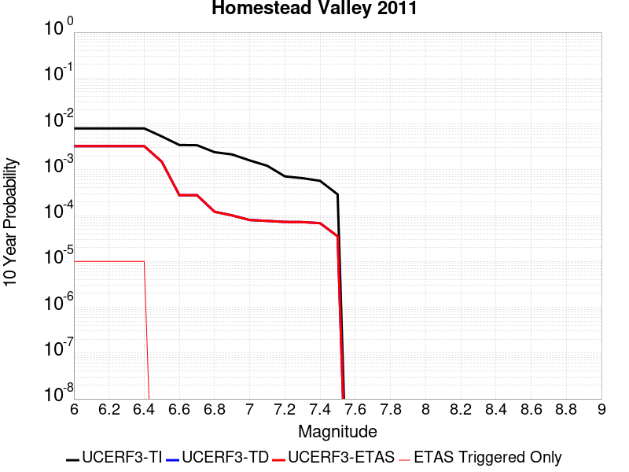 |

| Magnitude | 1 wk TI Prob | 1 wk TD Prob | 1 wk ETAS Prob | 1 wk ETAS/TD Gain | 1 wk ETAS Triggered Only | 1 mo TI Prob | 1 mo TD Prob | 1 mo ETAS Prob | 1 mo ETAS/TD Gain | 1 mo ETAS Triggered Only | 1 yr TI Prob | 1 yr TD Prob | 1 yr ETAS Prob | 1 yr ETAS/TD Gain | 1 yr ETAS Triggered Only | 10 yr TI Prob | 10 yr TD Prob | 10 yr ETAS Prob | 10 yr ETAS/TD Gain | 10 yr ETAS Triggered Only |
|-----|-----|-----|-----|-----|-----|-----|-----|-----|-----|-----|-----|-----|-----|-----|-----|-----|-----|-----|-----|-----|
| 6.0 | 1.539795E-5 | 6.286469E-6 | 6.286469E-6 | 1.0 | 0.0 | 6.5989545E-5 | 2.6941849E-5 | 2.6941849E-5 | 1.0 | 0.0 | 8.0312655E-4 | 3.2798824E-4 | 3.3798497E-4 | 1.030479 | 1.0E-5 | 0.008002302 | 0.0032770627 | 0.00328703 | 1.0030415 | 1.0E-5 |
| 6.1 | 1.539795E-5 | 6.286469E-6 | 6.286469E-6 | 1.0 | 0.0 | 6.5989545E-5 | 2.6941849E-5 | 2.6941849E-5 | 1.0 | 0.0 | 8.0312655E-4 | 3.2798824E-4 | 3.3798497E-4 | 1.030479 | 1.0E-5 | 0.008002302 | 0.0032770627 | 0.00328703 | 1.0030415 | 1.0E-5 |
| 6.2 | 1.539795E-5 | 6.286469E-6 | 6.286469E-6 | 1.0 | 0.0 | 6.5989545E-5 | 2.6941849E-5 | 2.6941849E-5 | 1.0 | 0.0 | 8.0312655E-4 | 3.2798824E-4 | 3.3798497E-4 | 1.030479 | 1.0E-5 | 0.008002302 | 0.0032770627 | 0.00328703 | 1.0030415 | 1.0E-5 |
| 6.3 | 1.539795E-5 | 6.286469E-6 | 6.286469E-6 | 1.0 | 0.0 | 6.5989545E-5 | 2.6941849E-5 | 2.6941849E-5 | 1.0 | 0.0 | 8.0312655E-4 | 3.2798824E-4 | 3.3798497E-4 | 1.030479 | 1.0E-5 | 0.008002302 | 0.0032770627 | 0.00328703 | 1.0030415 | 1.0E-5 |
| 6.4 | 1.539795E-5 | 6.286469E-6 | 6.286469E-6 | 1.0 | 0.0 | 6.5989545E-5 | 2.6941849E-5 | 2.6941849E-5 | 1.0 | 0.0 | 8.0312655E-4 | 3.2798824E-4 | 3.3798497E-4 | 1.030479 | 1.0E-5 | 0.008002302 | 0.0032770627 | 0.00328703 | 1.0030415 | 1.0E-5 |
| 6.5 | 1.0265258E-5 | 2.8786876E-6 | 2.8786876E-6 | 1.0 | 0.0 | 4.3993223E-5 | 1.2337214E-5 | 1.2337214E-5 | 1.0 | 0.0 | 5.3548586E-4 | 1.5020218E-4 | 1.5020218E-4 | 1.0 | 0.0 | 0.005341973 | 0.0015016886 | 0.0015016886 | 1.0 | 0.0 |
| 6.6 | 6.664671E-6 | 5.343859E-7 | 5.343859E-7 | 1.0 | 0.0 | 2.8562565E-5 | 2.2902238E-6 | 2.2902238E-6 | 1.0 | 0.0 | 3.476937E-4 | 2.7883236E-5 | 2.7883236E-5 | 1.0 | 0.0 | 0.003471502 | 2.78809E-4 | 2.78809E-4 | 1.0 | 0.0 |
| 6.7 | 6.5954046E-6 | 5.343859E-7 | 5.343859E-7 | 1.0 | 0.0 | 2.8265715E-5 | 2.2902238E-6 | 2.2902238E-6 | 1.0 | 0.0 | 3.4408073E-4 | 2.7883236E-5 | 2.7883236E-5 | 1.0 | 0.0 | 0.0034354846 | 2.78809E-4 | 2.78809E-4 | 1.0 | 0.0 |
| 6.8 | 4.648189E-6 | 2.3257238E-7 | 2.3257238E-7 | 1.0 | 0.0 | 1.9920659E-5 | 9.967384E-7 | 9.967384E-7 | 1.0 | 0.0 | 2.4250703E-4 | 1.2135227E-5 | 1.2135227E-5 | 1.0 | 0.0 | 0.0024224254 | 1.2134612E-4 | 1.2134612E-4 | 1.0 | 0.0 |
| 6.9 | 4.1428534E-6 | 1.9342777E-7 | 1.9342777E-7 | 1.0 | 0.0 | 1.7754966E-5 | 8.289759E-7 | 8.289759E-7 | 1.0 | 0.0 | 2.1614527E-4 | 1.0092737E-5 | 1.0092737E-5 | 1.0 | 0.0 | 0.0021593515 | 1.0092309E-4 | 1.0092309E-4 | 1.0 | 0.0 |
| 7.0 | 3.0673707E-6 | 1.5364343E-7 | 1.5364343E-7 | 1.0 | 0.0 | 1.3145808E-5 | 6.5847166E-7 | 6.5847166E-7 | 1.0 | 0.0 | 1.6003846E-4 | 8.016864E-6 | 8.016864E-6 | 1.0 | 0.0 | 0.0015992324 | 8.016585E-5 | 8.016585E-5 | 1.0 | 0.0 |
| 7.1 | 2.340854E-6 | 1.4684727E-7 | 1.4684727E-7 | 1.0 | 0.0 | 1.0032193E-5 | 6.293453E-7 | 6.293453E-7 | 1.0 | 0.0 | 1.221351E-4 | 7.662254E-6 | 7.662254E-6 | 1.0 | 0.0 | 0.00122068 | 7.661999E-5 | 7.661999E-5 | 1.0 | 0.0 |
| 7.2 | 1.3754182E-6 | 1.3920152E-7 | 1.3920152E-7 | 1.0 | 0.0 | 5.8946357E-6 | 5.965778E-7 | 5.965778E-7 | 1.0 | 0.0 | 7.176483E-5 | 7.2633115E-6 | 7.2633115E-6 | 1.0 | 0.0 | 7.174166E-4 | 7.2630835E-5 | 7.2630835E-5 | 1.0 | 0.0 |
| 7.3 | 1.2573237E-6 | 1.3824703E-7 | 1.3824703E-7 | 1.0 | 0.0 | 5.388519E-6 | 5.9248714E-7 | 5.9248714E-7 | 1.0 | 0.0 | 6.560324E-5 | 7.213508E-6 | 7.213508E-6 | 1.0 | 0.0 | 6.558388E-4 | 7.213283E-5 | 7.213283E-5 | 1.0 | 0.0 |
| 7.4 | 1.0994207E-6 | 1.3103899E-7 | 1.3103899E-7 | 1.0 | 0.0 | 4.7117946E-6 | 5.615955E-7 | 5.615955E-7 | 1.0 | 0.0 | 5.736459E-5 | 6.837405E-6 | 6.837405E-6 | 1.0 | 0.0 | 5.734978E-4 | 6.837204E-5 | 6.837204E-5 | 1.0 | 0.0 |
| 7.5 | 5.5569126E-7 | 6.7717565E-8 | 6.7717565E-8 | 1.0 | 0.0 | 2.3815317E-6 | 2.902181E-7 | 2.902181E-7 | 1.0 | 0.0 | 2.8994764E-5 | 3.5334003E-6 | 3.5334003E-6 | 1.0 | 0.0 | 2.899098E-4 | 3.5333505E-5 | 3.5333505E-5 | 1.0 | 0.0 |

## Maacama 2011 CFM
*[(top)](#table-of-contents)*

| 1 Week | 1 Month | 1 Year | 10 Year |
|-----|-----|-----|-----|
|  |  |  | 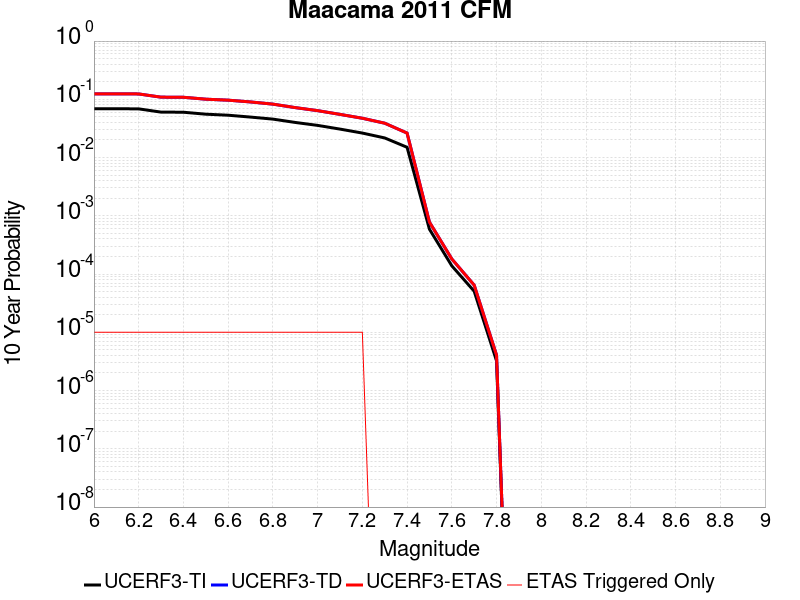 |

| Magnitude | 1 wk TI Prob | 1 wk TD Prob | 1 wk ETAS Prob | 1 wk ETAS/TD Gain | 1 wk ETAS Triggered Only | 1 mo TI Prob | 1 mo TD Prob | 1 mo ETAS Prob | 1 mo ETAS/TD Gain | 1 mo ETAS Triggered Only | 1 yr TI Prob | 1 yr TD Prob | 1 yr ETAS Prob | 1 yr ETAS/TD Gain | 1 yr ETAS Triggered Only | 10 yr TI Prob | 10 yr TD Prob | 10 yr ETAS Prob | 10 yr ETAS/TD Gain | 10 yr ETAS Triggered Only |
|-----|-----|-----|-----|-----|-----|-----|-----|-----|-----|-----|-----|-----|-----|-----|-----|-----|-----|-----|-----|-----|
| 6.0 | 1.368203E-4 | 2.579087E-4 | 2.579087E-4 | 1.0 | 0.0 | 5.862409E-4 | 0.0011047592 | 0.0011047592 | 1.0 | 0.0 | 0.0071141496 | 0.013350345 | 0.013350345 | 1.0 | 0.0 | 0.06890667 | 0.1241916 | 0.12420036 | 1.0000706 | 1.0E-5 |
| 6.1 | 1.368203E-4 | 2.579087E-4 | 2.579087E-4 | 1.0 | 0.0 | 5.862409E-4 | 0.0011047592 | 0.0011047592 | 1.0 | 0.0 | 0.0071141496 | 0.013350345 | 0.013350345 | 1.0 | 0.0 | 0.06890667 | 0.1241916 | 0.12420036 | 1.0000706 | 1.0E-5 |
| 6.2 | 1.360743E-4 | 2.566557E-4 | 2.566557E-4 | 1.0 | 0.0 | 5.8304524E-4 | 0.001099394 | 0.001099394 | 1.0 | 0.0 | 0.007075496 | 0.013285898 | 0.013285898 | 1.0 | 0.0 | 0.06854413 | 0.123625994 | 0.123634756 | 1.0000709 | 1.0E-5 |
| 6.3 | 1.1917239E-4 | 2.236021E-4 | 2.236021E-4 | 1.0 | 0.0 | 5.1063887E-4 | 9.578717E-4 | 9.578717E-4 | 1.0 | 0.0 | 0.0061993203 | 0.0115873255 | 0.0115873255 | 1.0 | 0.0 | 0.060292065 | 0.108845875 | 0.108854786 | 1.0000819 | 1.0E-5 |
| 6.4 | 1.1859289E-4 | 2.2263796E-4 | 2.2263796E-4 | 1.0 | 0.0 | 5.0815626E-4 | 9.537432E-4 | 9.537432E-4 | 1.0 | 0.0 | 0.006169266 | 0.011537647 | 0.011537647 | 1.0 | 0.0 | 0.06000784 | 0.10840272 | 0.10841164 | 1.0000823 | 1.0E-5 |
| 6.5 | 1.09512424E-4 | 2.0517908E-4 | 2.0517908E-4 | 1.0 | 0.0 | 4.6925453E-4 | 8.7897904E-4 | 8.7897904E-4 | 1.0 | 0.0 | 0.005698218 | 0.010639169 | 0.010639169 | 1.0 | 0.0 | 0.055543028 | 0.1004949 | 0.10050389 | 1.0000895 | 1.0E-5 |
| 6.6 | 1.0502928E-4 | 1.9675294E-4 | 1.9675294E-4 | 1.0 | 0.0 | 4.500478E-4 | 8.429031E-4 | 8.429031E-4 | 1.0 | 0.0 | 0.0054655746 | 0.010205293 | 0.010205293 | 1.0 | 0.0 | 0.053330887 | 0.0966474 | 0.096656434 | 1.0000935 | 1.0E-5 |
| 6.7 | 9.739358E-5 | 1.8259176E-4 | 1.8259176E-4 | 1.0 | 0.0 | 4.173343E-4 | 7.822563E-4 | 7.822563E-4 | 1.0 | 0.0 | 0.0050692135 | 0.009475343 | 0.009475343 | 1.0 | 0.0 | 0.049551267 | 0.09012011 | 0.090129204 | 1.000101 | 1.0E-5 |
| 6.8 | 8.969524E-5 | 1.6658378E-4 | 1.6658378E-4 | 1.0 | 0.0 | 3.8435153E-4 | 7.1369443E-4 | 7.1369443E-4 | 1.0 | 0.0 | 0.0046694432 | 0.00864909 | 0.00864909 | 1.0 | 0.0 | 0.045725387 | 0.08265246 | 0.082661636 | 1.000111 | 1.0E-5 |
| 6.9 | 7.838291E-5 | 1.4418772E-4 | 1.4418772E-4 | 1.0 | 0.0 | 3.358835E-4 | 6.1778206E-4 | 6.1778206E-4 | 1.0 | 0.0 | 0.0040817154 | 0.007491724 | 0.007491724 | 1.0 | 0.0 | 0.04007554 | 0.07205298 | 0.072062254 | 1.0001287 | 1.0E-5 |
| 7.0 | 6.961957E-5 | 1.2708071E-4 | 1.2708071E-4 | 1.0 | 0.0 | 2.9833548E-4 | 5.445059E-4 | 5.445059E-4 | 1.0 | 0.0 | 0.0036261857 | 0.006606692 | 0.006606692 | 1.0 | 0.0 | 0.035675827 | 0.063871816 | 0.063881174 | 1.0001465 | 1.0E-5 |
| 7.1 | 5.999398E-5 | 1.09053384E-4 | 1.09053384E-4 | 1.0 | 0.0 | 2.570917E-4 | 4.6728246E-4 | 4.6728246E-4 | 1.0 | 0.0 | 0.0031255994 | 0.00567284 | 0.00567284 | 1.0 | 0.0 | 0.030820016 | 0.055139277 | 0.055148724 | 1.0001713 | 1.0E-5 |
| 7.2 | 5.116532E-5 | 9.305489E-5 | 9.305489E-5 | 1.0 | 0.0 | 2.1926152E-4 | 3.9874107E-4 | 3.9874107E-4 | 1.0 | 0.0 | 0.002666241 | 0.00484315 | 0.00484315 | 1.0 | 0.0 | 0.026344774 | 0.047303654 | 0.04731318 | 1.0002013 | 1.0E-5 |
| 7.3 | 4.2087835E-5 | 7.617064E-5 | 7.617064E-5 | 1.0 | 0.0 | 1.8036396E-4 | 3.264016E-4 | 3.264016E-4 | 1.0 | 0.0 | 0.0021937196 | 0.0039662397 | 0.0039662397 | 1.0 | 0.0 | 0.0217219 | 0.038905017 | 0.038905017 | 1.0 | 0.0 |
| 7.4 | 2.8991652E-5 | 5.1163643E-5 | 5.1163643E-5 | 1.0 | 0.0 | 1.2424402E-4 | 2.1925455E-4 | 2.1925455E-4 | 1.0 | 0.0 | 0.0015116213 | 0.0026661097 | 0.0026661097 | 1.0 | 0.0 | 0.015013801 | 0.026332043 | 0.026332043 | 1.0 | 0.0 |
| 7.5 | 1.1292299E-6 | 1.4950216E-6 | 1.4950216E-6 | 1.0 | 0.0 | 4.8395473E-6 | 6.407227E-6 | 6.407227E-6 | 1.0 | 0.0 | 5.8919897E-5 | 7.8006444E-5 | 7.8006444E-5 | 1.0 | 0.0 | 5.890428E-4 | 7.805042E-4 | 7.805042E-4 | 1.0 | 0.0 |
| 7.6 | 2.6535366E-7 | 3.4720998E-7 | 3.4720998E-7 | 1.0 | 0.0 | 1.1372296E-6 | 1.4880419E-6 | 1.4880419E-6 | 1.0 | 0.0 | 1.3845682E-5 | 1.811676E-5 | 1.811676E-5 | 1.0 | 0.0 | 1.3844819E-4 | 1.8170691E-4 | 1.8170691E-4 | 1.0 | 0.0 |
| 7.7 | 9.727789E-8 | 1.2302418E-7 | 1.2302418E-7 | 1.0 | 0.0 | 4.1690518E-7 | 5.2724636E-7 | 5.2724636E-7 | 1.0 | 0.0 | 5.0758085E-6 | 6.419206E-6 | 6.419206E-6 | 1.0 | 0.0 | 5.0756928E-5 | 6.456404E-5 | 6.456404E-5 | 1.0 | 0.0 |
| 7.8 | 6.1939325E-9 | 7.711711E-9 | 7.711711E-9 | 1.0 | 0.0 | 2.6545425E-8 | 3.305019E-8 | 3.305019E-8 | 1.0 | 0.0 | 3.231905E-7 | 4.0238598E-7 | 4.0238598E-7 | 1.0 | 0.0 | 3.2319003E-6 | 4.0597915E-6 | 4.0597915E-6 | 1.0 | 0.0 |

## Calaveras (Central) 2011 CFM
*[(top)](#table-of-contents)*

| 1 Week | 1 Month | 1 Year | 10 Year |
|-----|-----|-----|-----|
|  |  |  | 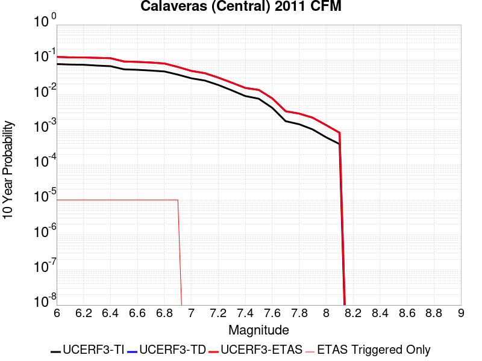 |

| Magnitude | 1 wk TI Prob | 1 wk TD Prob | 1 wk ETAS Prob | 1 wk ETAS/TD Gain | 1 wk ETAS Triggered Only | 1 mo TI Prob | 1 mo TD Prob | 1 mo ETAS Prob | 1 mo ETAS/TD Gain | 1 mo ETAS Triggered Only | 1 yr TI Prob | 1 yr TD Prob | 1 yr ETAS Prob | 1 yr ETAS/TD Gain | 1 yr ETAS Triggered Only | 10 yr TI Prob | 10 yr TD Prob | 10 yr ETAS Prob | 10 yr ETAS/TD Gain | 10 yr ETAS Triggered Only |
|-----|-----|-----|-----|-----|-----|-----|-----|-----|-----|-----|-----|-----|-----|-----|-----|-----|-----|-----|-----|-----|
| 6.0 | 1.5010907E-4 | 2.4804124E-4 | 2.4804124E-4 | 1.0 | 0.0 | 6.4316596E-4 | 0.001062498 | 0.001062498 | 1.0 | 0.0 | 0.0078024664 | 0.012850443 | 0.012860315 | 1.0007682 | 1.0E-5 | 0.07534136 | 0.120411225 | 0.12042002 | 1.0000731 | 1.0E-5 |
| 6.1 | 1.4521465E-4 | 2.3965565E-4 | 2.3965565E-4 | 1.0 | 0.0 | 6.222001E-4 | 0.0010265942 | 0.0010265942 | 1.0 | 0.0 | 0.0075490056 | 0.012419763 | 0.012429639 | 1.0007951 | 1.0E-5 | 0.07297657 | 0.11668273 | 0.11669156 | 1.0000757 | 1.0E-5 |
| 6.2 | 1.429998E-4 | 2.3896809E-4 | 2.3896809E-4 | 1.0 | 0.0 | 6.127123E-4 | 0.0010236499 | 0.0010236499 | 1.0 | 0.0 | 0.007434286 | 0.012384372 | 0.012394248 | 1.0007975 | 1.0E-5 | 0.07190444 | 0.11633677 | 0.11634561 | 1.0000759 | 1.0E-5 |
| 6.3 | 1.3536277E-4 | 2.3227946E-4 | 2.3227946E-4 | 1.0 | 0.0 | 5.799972E-4 | 9.950127E-4 | 9.950127E-4 | 1.0 | 0.0 | 0.0070386264 | 0.012040534 | 0.0120504135 | 1.0008205 | 1.0E-5 | 0.0681982 | 0.113249525 | 0.11325839 | 1.0000783 | 1.0E-5 |
| 6.4 | 1.2993296E-4 | 2.2651516E-4 | 2.2651516E-4 | 1.0 | 0.0 | 5.5673666E-4 | 9.703276E-4 | 9.703276E-4 | 1.0 | 0.0 | 0.006757223 | 0.011743338 | 0.01175322 | 1.0008415 | 1.0E-5 | 0.06555412 | 0.11052752 | 0.11053642 | 1.0000805 | 1.0E-5 |
| 6.5 | 1.0498927E-4 | 1.7981966E-4 | 1.7981966E-4 | 1.0 | 0.0 | 4.498764E-4 | 7.7042676E-4 | 7.7042676E-4 | 1.0 | 0.0 | 0.005463498 | 0.00933952 | 0.009349426 | 1.0010607 | 1.0E-5 | 0.053311124 | 0.08920739 | 0.08921649 | 1.000102 | 1.0E-5 |
| 6.6 | 1.0157505E-4 | 1.7469494E-4 | 1.7469494E-4 | 1.0 | 0.0 | 4.35249E-4 | 7.4847665E-4 | 7.4847665E-4 | 1.0 | 0.0 | 0.0052862884 | 0.009074567 | 0.009084476 | 1.001092 | 1.0E-5 | 0.05162293 | 0.08678487 | 0.086794004 | 1.0001053 | 1.0E-5 |
| 6.7 | 9.660386E-5 | 1.6728783E-4 | 1.6728783E-4 | 1.0 | 0.0 | 4.1395082E-4 | 7.167497E-4 | 7.167497E-4 | 1.0 | 0.0 | 0.0050282106 | 0.008691474 | 0.008701387 | 1.0011406 | 1.0E-5 | 0.049159497 | 0.08327401 | 0.08328317 | 1.00011 | 1.0E-5 |
| 6.8 | 9.089927E-5 | 1.5643238E-4 | 1.5643238E-4 | 1.0 | 0.0 | 3.8951015E-4 | 6.702511E-4 | 6.702511E-4 | 1.0 | 0.0 | 0.0047319788 | 0.008129742 | 0.008139661 | 1.0012201 | 1.0E-5 | 0.046324775 | 0.078163 | 0.07817222 | 1.0001179 | 1.0E-5 |
| 6.9 | 7.353187E-5 | 1.2295779E-4 | 1.2295779E-4 | 1.0 | 0.0 | 3.150985E-4 | 5.2685605E-4 | 5.2685605E-4 | 1.0 | 0.0 | 0.0038295772 | 0.006395728 | 0.0064056637 | 1.0015535 | 1.0E-5 | 0.037642512 | 0.06218928 | 0.062198658 | 1.0001508 | 1.0E-5 |
| 7.0 | 5.746064E-5 | 9.3890936E-5 | 9.3890936E-5 | 1.0 | 0.0 | 2.4623662E-4 | 4.0232803E-4 | 4.0232803E-4 | 1.0 | 0.0 | 0.0029938098 | 0.0048874132 | 0.0048874132 | 1.0 | 0.0 | 0.02953797 | 0.04798713 | 0.04798713 | 1.0 | 0.0 |
| 7.1 | 4.9557195E-5 | 8.052768E-5 | 8.052768E-5 | 1.0 | 0.0 | 2.123707E-4 | 3.4507332E-4 | 3.4507332E-4 | 1.0 | 0.0 | 0.0025825473 | 0.004193237 | 0.004193237 | 1.0 | 0.0 | 0.0255274 | 0.041373473 | 0.041373473 | 1.0 | 0.0 |
| 7.2 | 3.687595E-5 | 5.952694E-5 | 5.952694E-5 | 1.0 | 0.0 | 1.5803022E-4 | 2.5509068E-4 | 2.5509068E-4 | 1.0 | 0.0 | 0.0019223199 | 0.003101335 | 0.003101335 | 1.0 | 0.0 | 0.01905776 | 0.030883823 | 0.030883823 | 1.0 | 0.0 |
| 7.3 | 2.5846984E-5 | 4.2473923E-5 | 4.2473923E-5 | 1.0 | 0.0 | 1.1076809E-4 | 1.820185E-4 | 1.820185E-4 | 1.0 | 0.0 | 0.0013477671 | 0.0022138404 | 0.0022138404 | 1.0 | 0.0 | 0.013396223 | 0.022175217 | 0.022175217 | 1.0 | 0.0 |
| 7.4 | 1.7747854E-5 | 2.993759E-5 | 2.993759E-5 | 1.0 | 0.0 | 7.6060016E-5 | 1.2829766E-4 | 1.2829766E-4 | 1.0 | 0.0 | 9.2563726E-4 | 0.0015609078 | 0.0015609078 | 1.0 | 0.0 | 0.009217911 | 0.015708687 | 0.015708687 | 1.0 | 0.0 |
| 7.5 | 1.4883479E-5 | 2.6244672E-5 | 2.6244672E-5 | 1.0 | 0.0 | 6.378478E-5 | 1.12472335E-4 | 1.12472335E-4 | 1.0 | 0.0 | 7.76303E-4 | 0.0013684932 | 0.0013684932 | 1.0 | 0.0 | 0.0077359667 | 0.013801667 | 0.013801667 | 1.0 | 0.0 |
| 7.6 | 8.166975E-6 | 1.4964299E-5 | 1.4964299E-5 | 1.0 | 0.0 | 3.5000852E-5 | 6.413114E-5 | 6.413114E-5 | 1.0 | 0.0 | 4.2605202E-4 | 7.805183E-4 | 7.805183E-4 | 1.0 | 0.0 | 0.004252361 | 0.007939203 | 0.007939203 | 1.0 | 0.0 |
| 7.7 | 3.3858064E-6 | 6.254251E-6 | 6.254251E-6 | 1.0 | 0.0 | 1.4510518E-5 | 2.6803657E-5 | 2.6803657E-5 | 1.0 | 0.0 | 1.7665124E-4 | 3.2628572E-4 | 3.2628572E-4 | 1.0 | 0.0 | 0.0017651088 | 0.003388363 | 0.003388363 | 1.0 | 0.0 |
| 7.8 | 2.7721615E-6 | 5.366695E-6 | 5.366695E-6 | 1.0 | 0.0 | 1.1880637E-5 | 2.2999919E-5 | 2.2999919E-5 | 1.0 | 0.0 | 1.4463716E-4 | 2.7998807E-4 | 2.7998807E-4 | 1.0 | 0.0 | 0.0014454306 | 0.002907615 | 0.002907615 | 1.0 | 0.0 |
| 7.9 | 1.9736292E-6 | 4.128705E-6 | 4.128705E-6 | 1.0 | 0.0 | 8.4583835E-6 | 1.769433E-5 | 1.769433E-5 | 1.0 | 0.0 | 1.0297595E-4 | 2.1540721E-4 | 2.1540721E-4 | 1.0 | 0.0 | 0.0010292825 | 0.0022237299 | 0.0022237299 | 1.0 | 0.0 |
| 8.0 | 1.1767289E-6 | 2.5546633E-6 | 2.5546633E-6 | 1.0 | 0.0 | 5.0431145E-6 | 1.0948511E-5 | 1.0948511E-5 | 1.0 | 0.0 | 6.139818E-5 | 1.3329E-4 | 1.3329E-4 | 1.0 | 0.0 | 6.1381224E-4 | 0.001366126 | 0.001366126 | 1.0 | 0.0 |
| 8.1 | 7.5112825E-7 | 1.541076E-6 | 1.541076E-6 | 1.0 | 0.0 | 3.2191172E-6 | 6.604595E-6 | 6.604595E-6 | 1.0 | 0.0 | 3.9192048E-5 | 8.0408E-5 | 8.0408E-5 | 1.0 | 0.0 | 3.9185135E-4 | 8.2356273E-4 | 8.2356273E-4 | 1.0 | 0.0 |

## Polaris 2011 CFM
*[(top)](#table-of-contents)*

| 1 Week | 1 Month | 1 Year | 10 Year |
|-----|-----|-----|-----|
|  |  |  | 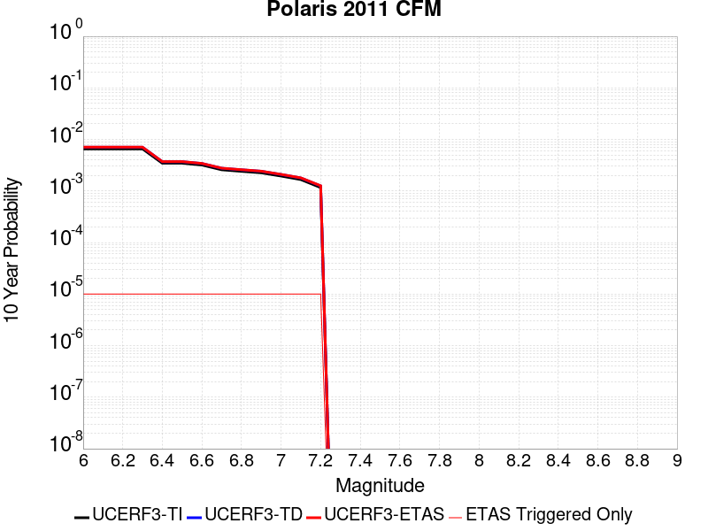 |

| Magnitude | 1 wk TI Prob | 1 wk TD Prob | 1 wk ETAS Prob | 1 wk ETAS/TD Gain | 1 wk ETAS Triggered Only | 1 mo TI Prob | 1 mo TD Prob | 1 mo ETAS Prob | 1 mo ETAS/TD Gain | 1 mo ETAS Triggered Only | 1 yr TI Prob | 1 yr TD Prob | 1 yr ETAS Prob | 1 yr ETAS/TD Gain | 1 yr ETAS Triggered Only | 10 yr TI Prob | 10 yr TD Prob | 10 yr ETAS Prob | 10 yr ETAS/TD Gain | 10 yr ETAS Triggered Only |
|-----|-----|-----|-----|-----|-----|-----|-----|-----|-----|-----|-----|-----|-----|-----|-----|-----|-----|-----|-----|-----|
| 6.0 | 1.2630823E-5 | 1.3582916E-5 | 1.3582916E-5 | 1.0 | 0.0 | 5.413098E-5 | 5.821149E-5 | 5.821149E-5 | 1.0 | 0.0 | 6.5884535E-4 | 7.085464E-4 | 7.1853923E-4 | 1.0141034 | 1.0E-5 | 0.0065689543 | 0.007067981 | 0.0070779105 | 1.0014049 | 1.0E-5 |
| 6.1 | 1.2630823E-5 | 1.3582916E-5 | 1.3582916E-5 | 1.0 | 0.0 | 5.413098E-5 | 5.821149E-5 | 5.821149E-5 | 1.0 | 0.0 | 6.5884535E-4 | 7.085464E-4 | 7.1853923E-4 | 1.0141034 | 1.0E-5 | 0.0065689543 | 0.007067981 | 0.0070779105 | 1.0014049 | 1.0E-5 |
| 6.2 | 1.2630823E-5 | 1.3582916E-5 | 1.3582916E-5 | 1.0 | 0.0 | 5.413098E-5 | 5.821149E-5 | 5.821149E-5 | 1.0 | 0.0 | 6.5884535E-4 | 7.085464E-4 | 7.1853923E-4 | 1.0141034 | 1.0E-5 | 0.0065689543 | 0.007067981 | 0.0070779105 | 1.0014049 | 1.0E-5 |
| 6.3 | 1.2630823E-5 | 1.3582916E-5 | 1.3582916E-5 | 1.0 | 0.0 | 5.413098E-5 | 5.821149E-5 | 5.821149E-5 | 1.0 | 0.0 | 6.5884535E-4 | 7.085464E-4 | 7.1853923E-4 | 1.0141034 | 1.0E-5 | 0.0065689543 | 0.007067981 | 0.0070779105 | 1.0014049 | 1.0E-5 |
| 6.4 | 6.642994E-6 | 7.10706E-6 | 7.10706E-6 | 1.0 | 0.0 | 2.8469662E-5 | 3.0458501E-5 | 3.0458501E-5 | 1.0 | 0.0 | 3.46563E-4 | 3.7077433E-4 | 3.8077062E-4 | 1.0269606 | 1.0E-5 | 0.0034602303 | 0.0037020678 | 0.0037120308 | 1.0026911 | 1.0E-5 |
| 6.5 | 6.642994E-6 | 7.10706E-6 | 7.10706E-6 | 1.0 | 0.0 | 2.8469662E-5 | 3.0458501E-5 | 3.0458501E-5 | 1.0 | 0.0 | 3.46563E-4 | 3.7077433E-4 | 3.8077062E-4 | 1.0269606 | 1.0E-5 | 0.0034602303 | 0.0037020678 | 0.0037120308 | 1.0026911 | 1.0E-5 |
| 6.6 | 6.1286296E-6 | 6.5561712E-6 | 6.5561712E-6 | 1.0 | 0.0 | 2.626529E-5 | 2.8097602E-5 | 2.8097602E-5 | 1.0 | 0.0 | 3.19733E-4 | 3.4203942E-4 | 3.52036E-4 | 1.0292264 | 1.0E-5 | 0.0031927335 | 0.003415605 | 0.003425571 | 1.0029178 | 1.0E-5 |
| 6.7 | 4.9474666E-6 | 5.298249E-6 | 5.298249E-6 | 1.0 | 0.0 | 2.1203256E-5 | 2.2706601E-5 | 2.2706601E-5 | 1.0 | 0.0 | 2.5811905E-4 | 2.7642061E-4 | 2.8641787E-4 | 1.0361668 | 1.0E-5 | 0.0025781945 | 0.0027610478 | 0.0027710202 | 1.0036118 | 1.0E-5 |
| 6.8 | 4.616407E-6 | 4.946264E-6 | 4.946264E-6 | 1.0 | 0.0 | 1.978445E-5 | 2.1198117E-5 | 2.1198117E-5 | 1.0 | 0.0 | 2.4084905E-4 | 2.5805918E-4 | 2.680566E-4 | 1.0387408 | 1.0E-5 | 0.0024058819 | 0.0025778597 | 0.002587834 | 1.0038692 | 1.0E-5 |
| 6.9 | 4.320343E-6 | 4.630886E-6 | 4.630886E-6 | 1.0 | 0.0 | 1.8515624E-5 | 1.9846519E-5 | 1.9846519E-5 | 1.0 | 0.0 | 2.2540441E-4 | 2.4160717E-4 | 2.5160477E-4 | 1.0413795 | 1.0E-5 | 0.0022517592 | 0.0024137017 | 0.0024236776 | 1.004133 | 1.0E-5 |
| 7.0 | 3.7382292E-6 | 4.009553E-6 | 4.009553E-6 | 1.0 | 0.0 | 1.6020884E-5 | 1.7183698E-5 | 1.7183698E-5 | 1.0 | 0.0 | 1.950368E-4 | 2.0919384E-4 | 2.1919174E-4 | 1.0477926 | 1.0E-5 | 0.0019486571 | 0.0020902045 | 0.0021001836 | 1.0047742 | 1.0E-5 |
| 7.1 | 3.193576E-6 | 3.427699E-6 | 3.427699E-6 | 1.0 | 0.0 | 1.3686683E-5 | 1.4690068E-5 | 1.4690068E-5 | 1.0 | 0.0 | 1.6662262E-4 | 1.7883914E-4 | 1.8883735E-4 | 1.0559062 | 1.0E-5 | 0.0016649774 | 0.001787171 | 0.0017971531 | 1.0055854 | 1.0E-5 |
| 7.2 | 2.2356758E-6 | 2.4023684E-6 | 2.4023684E-6 | 1.0 | 0.0 | 9.581432E-6 | 1.0295834E-5 | 1.0295834E-5 | 1.0 | 0.0 | 1.1664769E-4 | 1.2534647E-4 | 1.3534521E-4 | 1.0797689 | 1.0E-5 | 0.0011658648 | 0.0012529434 | 0.0012629309 | 1.0079712 | 1.0E-5 |

## Fontana (Seismicity)
*[(top)](#table-of-contents)*

| 1 Week | 1 Month | 1 Year | 10 Year |
|-----|-----|-----|-----|
|  |  |  |  |

| Magnitude | 1 wk TI Prob | 1 wk TD Prob | 1 wk ETAS Prob | 1 wk ETAS/TD Gain | 1 wk ETAS Triggered Only | 1 mo TI Prob | 1 mo TD Prob | 1 mo ETAS Prob | 1 mo ETAS/TD Gain | 1 mo ETAS Triggered Only | 1 yr TI Prob | 1 yr TD Prob | 1 yr ETAS Prob | 1 yr ETAS/TD Gain | 1 yr ETAS Triggered Only | 10 yr TI Prob | 10 yr TD Prob | 10 yr ETAS Prob | 10 yr ETAS/TD Gain | 10 yr ETAS Triggered Only |
|-----|-----|-----|-----|-----|-----|-----|-----|-----|-----|-----|-----|-----|-----|-----|-----|-----|-----|-----|-----|-----|
| 6.0 | 7.1789214E-6 | 7.5520006E-6 | 1.7551925E-5 | 2.3241425 | 1.0E-5 | 3.076644E-5 | 3.2365548E-5 | 4.2365224E-5 | 1.3089606 | 1.0E-5 | 3.7451705E-4 | 3.9402005E-4 | 4.0401611E-4 | 1.0253694 | 1.0E-5 | 0.003738865 | 0.003937214 | 0.0039471746 | 1.0025299 | 1.0E-5 |
| 6.1 | 7.1789214E-6 | 7.5520006E-6 | 1.7551925E-5 | 2.3241425 | 1.0E-5 | 3.076644E-5 | 3.2365548E-5 | 4.2365224E-5 | 1.3089606 | 1.0E-5 | 3.7451705E-4 | 3.9402005E-4 | 4.0401611E-4 | 1.0253694 | 1.0E-5 | 0.003738865 | 0.003937214 | 0.0039471746 | 1.0025299 | 1.0E-5 |
| 6.2 | 7.1789214E-6 | 7.5520006E-6 | 1.7551925E-5 | 2.3241425 | 1.0E-5 | 3.076644E-5 | 3.2365548E-5 | 4.2365224E-5 | 1.3089606 | 1.0E-5 | 3.7451705E-4 | 3.9402005E-4 | 4.0401611E-4 | 1.0253694 | 1.0E-5 | 0.003738865 | 0.003937214 | 0.0039471746 | 1.0025299 | 1.0E-5 |
| 6.3 | 7.1789214E-6 | 7.5520006E-6 | 1.7551925E-5 | 2.3241425 | 1.0E-5 | 3.076644E-5 | 3.2365548E-5 | 4.2365224E-5 | 1.3089606 | 1.0E-5 | 3.7451705E-4 | 3.9402005E-4 | 4.0401611E-4 | 1.0253694 | 1.0E-5 | 0.003738865 | 0.003937214 | 0.0039471746 | 1.0025299 | 1.0E-5 |
| 6.4 | 7.1789214E-6 | 7.5520006E-6 | 1.7551925E-5 | 2.3241425 | 1.0E-5 | 3.076644E-5 | 3.2365548E-5 | 4.2365224E-5 | 1.3089606 | 1.0E-5 | 3.7451705E-4 | 3.9402005E-4 | 4.0401611E-4 | 1.0253694 | 1.0E-5 | 0.003738865 | 0.003937214 | 0.0039471746 | 1.0025299 | 1.0E-5 |
| 6.5 | 5.2611317E-6 | 5.532726E-6 | 1.553267E-5 | 2.8074174 | 1.0E-5 | 2.2547512E-5 | 2.3711682E-5 | 3.3711443E-5 | 1.421723 | 1.0E-5 | 2.744814E-4 | 2.8868974E-4 | 2.9868685E-4 | 1.0346292 | 1.0E-5 | 0.002741426 | 0.0028868972 | 0.0028968684 | 1.003454 | 1.0E-5 |
| 6.6 | 5.2611317E-6 | 5.532726E-6 | 1.553267E-5 | 2.8074174 | 1.0E-5 | 2.2547512E-5 | 2.3711682E-5 | 3.3711443E-5 | 1.421723 | 1.0E-5 | 2.744814E-4 | 2.8868974E-4 | 2.9868685E-4 | 1.0346292 | 1.0E-5 | 0.002741426 | 0.0028868972 | 0.0028968684 | 1.003454 | 1.0E-5 |

## Great Valley 03a Dunnigan Hills
*[(top)](#table-of-contents)*

| 1 Week | 1 Month | 1 Year | 10 Year |
|-----|-----|-----|-----|
|  |  |  |  |

| Magnitude | 1 wk TI Prob | 1 wk TD Prob | 1 wk ETAS Prob | 1 wk ETAS/TD Gain | 1 wk ETAS Triggered Only | 1 mo TI Prob | 1 mo TD Prob | 1 mo ETAS Prob | 1 mo ETAS/TD Gain | 1 mo ETAS Triggered Only | 1 yr TI Prob | 1 yr TD Prob | 1 yr ETAS Prob | 1 yr ETAS/TD Gain | 1 yr ETAS Triggered Only | 10 yr TI Prob | 10 yr TD Prob | 10 yr ETAS Prob | 10 yr ETAS/TD Gain | 10 yr ETAS Triggered Only |
|-----|-----|-----|-----|-----|-----|-----|-----|-----|-----|-----|-----|-----|-----|-----|-----|-----|-----|-----|-----|-----|
| 6.0 | 1.6591328E-5 | 1.8107954E-5 | 2.8107774E-5 | 1.5522335 | 1.0E-5 | 7.110376E-5 | 7.7603596E-5 | 8.760282E-5 | 1.12885 | 1.0E-5 | 8.6534437E-4 | 9.444834E-4 | 9.54474E-4 | 1.0105778 | 1.0E-5 | 0.008619824 | 0.009411525 | 0.0094214305 | 1.0010525 | 1.0E-5 |
| 6.1 | 8.041125E-6 | 8.769726E-6 | 8.769726E-6 | 1.0 | 0.0 | 3.4461507E-5 | 3.7584115E-5 | 3.7584115E-5 | 1.0 | 0.0 | 4.194881E-4 | 4.5751085E-4 | 4.5751085E-4 | 1.0 | 0.0 | 0.004186971 | 0.004567687 | 0.004567687 | 1.0 | 0.0 |
| 6.2 | 3.2807004E-6 | 3.5795688E-6 | 3.5795688E-6 | 1.0 | 0.0 | 1.4060069E-5 | 1.5340942E-5 | 1.5340942E-5 | 1.0 | 0.0 | 1.7116789E-4 | 1.8676413E-4 | 1.8676413E-4 | 1.0 | 0.0 | 0.0017103611 | 0.0018664796 | 0.0018664796 | 1.0 | 0.0 |
| 6.3 | 1.9339366E-6 | 2.1103806E-6 | 2.1103806E-6 | 1.0 | 0.0 | 8.288273E-6 | 9.044474E-6 | 9.044474E-6 | 1.0 | 0.0 | 1.00905054E-4 | 1.1011375E-4 | 1.1011375E-4 | 1.0 | 0.0 | 0.0010085925 | 0.0011008718 | 0.0011008718 | 1.0 | 0.0 |
| 6.4 | 1.3142635E-6 | 1.4339867E-6 | 1.4339867E-6 | 1.0 | 0.0 | 5.6325457E-6 | 6.145657E-6 | 6.145657E-6 | 1.0 | 0.0 | 6.857408E-5 | 7.482337E-5 | 7.482337E-5 | 1.0 | 0.0 | 6.8552926E-4 | 7.4823375E-4 | 7.4823375E-4 | 1.0 | 0.0 |

## Mount Diablo Thrust South
*[(top)](#table-of-contents)*

| 1 Week | 1 Month | 1 Year | 10 Year |
|-----|-----|-----|-----|
|  |  |  | 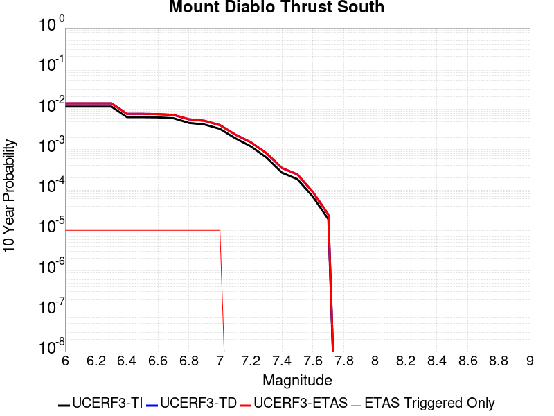 |

| Magnitude | 1 wk TI Prob | 1 wk TD Prob | 1 wk ETAS Prob | 1 wk ETAS/TD Gain | 1 wk ETAS Triggered Only | 1 mo TI Prob | 1 mo TD Prob | 1 mo ETAS Prob | 1 mo ETAS/TD Gain | 1 mo ETAS Triggered Only | 1 yr TI Prob | 1 yr TD Prob | 1 yr ETAS Prob | 1 yr ETAS/TD Gain | 1 yr ETAS Triggered Only | 10 yr TI Prob | 10 yr TD Prob | 10 yr ETAS Prob | 10 yr ETAS/TD Gain | 10 yr ETAS Triggered Only |
|-----|-----|-----|-----|-----|-----|-----|-----|-----|-----|-----|-----|-----|-----|-----|-----|-----|-----|-----|-----|-----|
| 6.0 | 2.2377444E-5 | 2.6956272E-5 | 2.6956272E-5 | 1.0 | 0.0 | 9.5899806E-5 | 1.1552288E-4 | 1.1552288E-4 | 1.0 | 0.0 | 0.0011669548 | 0.0014057814 | 0.0014157672 | 1.0071034 | 1.0E-5 | 0.011608457 | 0.013988668 | 0.013998529 | 1.0007049 | 1.0E-5 |
| 6.1 | 2.2377444E-5 | 2.6956272E-5 | 2.6956272E-5 | 1.0 | 0.0 | 9.5899806E-5 | 1.1552288E-4 | 1.1552288E-4 | 1.0 | 0.0 | 0.0011669548 | 0.0014057814 | 0.0014157672 | 1.0071034 | 1.0E-5 | 0.011608457 | 0.013988668 | 0.013998529 | 1.0007049 | 1.0E-5 |
| 6.2 | 2.2377444E-5 | 2.6956272E-5 | 2.6956272E-5 | 1.0 | 0.0 | 9.5899806E-5 | 1.1552288E-4 | 1.1552288E-4 | 1.0 | 0.0 | 0.0011669548 | 0.0014057814 | 0.0014157672 | 1.0071034 | 1.0E-5 | 0.011608457 | 0.013988668 | 0.013998529 | 1.0007049 | 1.0E-5 |
| 6.3 | 2.2377444E-5 | 2.6956272E-5 | 2.6956272E-5 | 1.0 | 0.0 | 9.5899806E-5 | 1.1552288E-4 | 1.1552288E-4 | 1.0 | 0.0 | 0.0011669548 | 0.0014057814 | 0.0014157672 | 1.0071034 | 1.0E-5 | 0.011608457 | 0.013988668 | 0.013998529 | 1.0007049 | 1.0E-5 |
| 6.4 | 1.2228463E-5 | 1.4747731E-5 | 1.4747731E-5 | 1.0 | 0.0 | 5.2406645E-5 | 6.320311E-5 | 6.320311E-5 | 1.0 | 0.0 | 6.378641E-4 | 7.69239E-4 | 7.792313E-4 | 1.0129899 | 1.0E-5 | 0.0063603627 | 0.007667325 | 0.007677248 | 1.0012943 | 1.0E-5 |
| 6.5 | 1.2228463E-5 | 1.4747731E-5 | 1.4747731E-5 | 1.0 | 0.0 | 5.2406645E-5 | 6.320311E-5 | 6.320311E-5 | 1.0 | 0.0 | 6.378641E-4 | 7.69239E-4 | 7.792313E-4 | 1.0129899 | 1.0E-5 | 0.0063603627 | 0.007667325 | 0.007677248 | 1.0012943 | 1.0E-5 |
| 6.6 | 1.2068118E-5 | 1.455253E-5 | 1.455253E-5 | 1.0 | 0.0 | 5.1719482E-5 | 6.236657E-5 | 6.236657E-5 | 1.0 | 0.0 | 6.2950276E-4 | 7.5906125E-4 | 7.6905364E-4 | 1.0131642 | 1.0E-5 | 0.006277225 | 0.0075662453 | 0.0075761694 | 1.0013117 | 1.0E-5 |
| 6.7 | 1.1499428E-5 | 1.3875192E-5 | 1.3875192E-5 | 1.0 | 0.0 | 4.9282335E-5 | 5.9463826E-5 | 5.9463826E-5 | 1.0 | 0.0 | 5.9984723E-4 | 7.2374434E-4 | 7.337371E-4 | 1.013807 | 1.0E-5 | 0.0059823063 | 0.007215418 | 0.007225346 | 1.0013759 | 1.0E-5 |
| 6.8 | 8.82118E-6 | 1.0830484E-5 | 1.0830484E-5 | 1.0 | 0.0 | 3.780451E-5 | 4.6415564E-5 | 4.6415564E-5 | 1.0 | 0.0 | 4.601727E-4 | 5.6496856E-4 | 5.7496293E-4 | 1.0176901 | 1.0E-5 | 0.0045922096 | 0.00563615 | 0.0056460937 | 1.0017643 | 1.0E-5 |
| 6.9 | 8.047112E-6 | 9.939452E-6 | 9.939452E-6 | 1.0 | 0.0 | 3.4487166E-5 | 4.2596985E-5 | 4.2596985E-5 | 1.0 | 0.0 | 4.1980037E-4 | 5.1850016E-4 | 5.28495E-4 | 1.0192764 | 1.0E-5 | 0.004190082 | 0.005173695 | 0.005183643 | 1.0019228 | 1.0E-5 |
| 7.0 | 6.2574763E-6 | 7.748516E-6 | 7.748516E-6 | 1.0 | 0.0 | 2.681748E-5 | 3.320752E-5 | 3.320752E-5 | 1.0 | 0.0 | 3.264539E-4 | 4.0423026E-4 | 4.1422623E-4 | 1.0247284 | 1.0E-5 | 0.0032597475 | 0.004035568 | 0.0040455274 | 1.002468 | 1.0E-5 |
| 7.1 | 3.6485903E-6 | 4.5129427E-6 | 4.5129427E-6 | 1.0 | 0.0 | 1.5636722E-5 | 1.9341043E-5 | 1.9341043E-5 | 1.0 | 0.0 | 1.9036046E-4 | 2.3545216E-4 | 2.3545216E-4 | 1.0 | 0.0 | 0.0019019748 | 0.0023519797 | 0.0023519797 | 1.0 | 0.0 |
| 7.2 | 2.3034274E-6 | 2.905533E-6 | 2.905533E-6 | 1.0 | 0.0 | 9.871795E-6 | 1.2452226E-5 | 1.2452226E-5 | 1.0 | 0.0 | 1.2018247E-4 | 1.5159555E-4 | 1.5159555E-4 | 1.0 | 0.0 | 0.0012011749 | 0.0015148793 | 0.0015148793 | 1.0 | 0.0 |
| 7.3 | 1.224035E-6 | 1.5679833E-6 | 1.5679833E-6 | 1.0 | 0.0 | 5.245854E-6 | 6.7199117E-6 | 6.7199117E-6 | 1.0 | 0.0 | 6.38664E-5 | 8.1811966E-5 | 8.1811966E-5 | 1.0 | 0.0 | 6.384805E-4 | 8.1778906E-4 | 8.1778906E-4 | 1.0 | 0.0 |
| 7.4 | 5.1601154E-7 | 6.723377E-7 | 6.723377E-7 | 1.0 | 0.0 | 2.2114762E-6 | 2.8814443E-6 | 2.8814443E-6 | 1.0 | 0.0 | 2.6924388E-5 | 3.5081033E-5 | 3.5081033E-5 | 1.0 | 0.0 | 2.6921128E-4 | 3.5073838E-4 | 3.5073838E-4 | 1.0 | 0.0 |
| 7.5 | 3.552894E-7 | 4.6653233E-7 | 4.6653233E-7 | 1.0 | 0.0 | 1.5226678E-6 | 1.999423E-6 | 1.999423E-6 | 1.0 | 0.0 | 1.8538323E-5 | 2.4342717E-5 | 2.4342717E-5 | 1.0 | 0.0 | 1.8536777E-4 | 2.4340842E-4 | 2.4340842E-4 | 1.0 | 0.0 |
| 7.6 | 1.3124082E-7 | 1.719204E-7 | 1.719204E-7 | 1.0 | 0.0 | 5.6246057E-7 | 7.368016E-7 | 7.368016E-7 | 1.0 | 0.0 | 6.8479358E-6 | 8.970531E-6 | 8.970531E-6 | 1.0 | 0.0 | 6.8477246E-5 | 8.967385E-5 | 8.967385E-5 | 1.0 | 0.0 |
| 7.7 | 3.6193022E-8 | 4.7334765E-8 | 4.7334765E-8 | 1.0 | 0.0 | 1.5511293E-7 | 2.0286328E-7 | 2.0286328E-7 | 1.0 | 0.0 | 1.8884983E-6 | 2.4698586E-6 | 2.4698586E-6 | 1.0 | 0.0 | 1.8884823E-5 | 2.469954E-5 | 2.469954E-5 | 1.0 | 0.0 |

## Keddie Ridge 2011 CFM
*[(top)](#table-of-contents)*

| 1 Week | 1 Month | 1 Year | 10 Year |
|-----|-----|-----|-----|
|  |  | 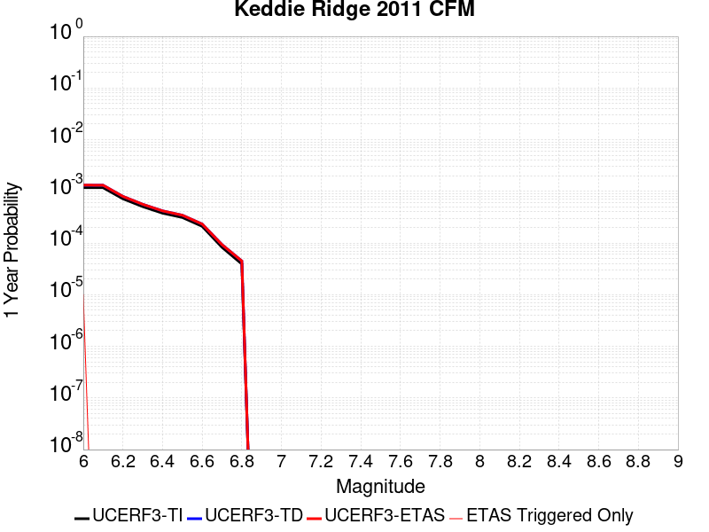 |  |

| Magnitude | 1 wk TI Prob | 1 wk TD Prob | 1 wk ETAS Prob | 1 wk ETAS/TD Gain | 1 wk ETAS Triggered Only | 1 mo TI Prob | 1 mo TD Prob | 1 mo ETAS Prob | 1 mo ETAS/TD Gain | 1 mo ETAS Triggered Only | 1 yr TI Prob | 1 yr TD Prob | 1 yr ETAS Prob | 1 yr ETAS/TD Gain | 1 yr ETAS Triggered Only | 10 yr TI Prob | 10 yr TD Prob | 10 yr ETAS Prob | 10 yr ETAS/TD Gain | 10 yr ETAS Triggered Only |
|-----|-----|-----|-----|-----|-----|-----|-----|-----|-----|-----|-----|-----|-----|-----|-----|-----|-----|-----|-----|-----|
| 6.0 | 2.2591947E-5 | 2.5189187E-5 | 2.5189187E-5 | 1.0 | 0.0 | 9.6819036E-5 | 1.0794964E-4 | 1.0794964E-4 | 1.0 | 0.0 | 0.0011781343 | 0.0013135736 | 0.0013235604 | 1.0076028 | 1.0E-5 | 0.011719079 | 0.013066037 | 0.013075906 | 1.0007553 | 1.0E-5 |
| 6.1 | 2.2591947E-5 | 2.5189187E-5 | 2.5189187E-5 | 1.0 | 0.0 | 9.6819036E-5 | 1.0794964E-4 | 1.0794964E-4 | 1.0 | 0.0 | 0.0011781343 | 0.0013135736 | 0.0013135736 | 1.0 | 0.0 | 0.011719079 | 0.013066037 | 0.013066037 | 1.0 | 0.0 |
| 6.2 | 1.3775145E-5 | 1.5322817E-5 | 1.5322817E-5 | 1.0 | 0.0 | 5.9035E-5 | 6.56677E-5 | 6.56677E-5 | 1.0 | 0.0 | 7.185141E-4 | 7.9923525E-4 | 7.9923525E-4 | 1.0 | 0.0 | 0.0071619535 | 0.007966028 | 0.007966028 | 1.0 | 0.0 |
| 6.3 | 9.705435E-6 | 1.0768351E-5 | 1.0768351E-5 | 1.0 | 0.0 | 4.1594063E-5 | 4.6149325E-5 | 4.6149325E-5 | 1.0 | 0.0 | 5.0629E-4 | 5.617356E-4 | 5.617356E-4 | 1.0 | 0.0 | 0.005051381 | 0.0056043877 | 0.0056043877 | 1.0 | 0.0 |
| 6.4 | 7.2549733E-6 | 8.027268E-6 | 8.027268E-6 | 1.0 | 0.0 | 3.109237E-5 | 3.440217E-5 | 3.440217E-5 | 1.0 | 0.0 | 3.7848388E-4 | 4.1877388E-4 | 4.1877388E-4 | 1.0 | 0.0 | 0.003778399 | 0.004180635 | 0.004180635 | 1.0 | 0.0 |
| 6.5 | 5.983293E-6 | 6.6130237E-6 | 6.6130237E-6 | 1.0 | 0.0 | 2.5642432E-5 | 2.834126E-5 | 2.834126E-5 | 1.0 | 0.0 | 3.1215188E-4 | 3.4500693E-4 | 3.4500693E-4 | 1.0 | 0.0 | 0.0031171376 | 0.003445376 | 0.003445376 | 1.0 | 0.0 |
| 6.6 | 4.0336154E-6 | 4.4578037E-6 | 4.4578037E-6 | 1.0 | 0.0 | 1.728681E-5 | 1.9104757E-5 | 1.9104757E-5 | 1.0 | 0.0 | 2.1044657E-4 | 2.3257962E-4 | 2.3257962E-4 | 1.0 | 0.0 | 0.002102474 | 0.002323758 | 0.002323758 | 1.0 | 0.0 |
| 6.7 | 1.5832104E-6 | 1.7816087E-6 | 1.7816087E-6 | 1.0 | 0.0 | 6.7851697E-6 | 7.635445E-6 | 7.635445E-6 | 1.0 | 0.0 | 8.260631E-5 | 9.295785E-5 | 9.295785E-5 | 1.0 | 0.0 | 8.2575605E-4 | 9.2921633E-4 | 9.2921633E-4 | 1.0 | 0.0 |
| 6.8 | 7.5177275E-7 | 8.5902946E-7 | 8.5902946E-7 | 1.0 | 0.0 | 3.221879E-6 | 3.6815507E-6 | 3.6815507E-6 | 1.0 | 0.0 | 3.9225673E-5 | 4.4822125E-5 | 4.4822125E-5 | 1.0 | 0.0 | 3.921875E-4 | 4.481474E-4 | 4.481474E-4 | 1.0 | 0.0 |

## Hayward (So) 2011 CFM
*[(top)](#table-of-contents)*

| 1 Week | 1 Month | 1 Year | 10 Year |
|-----|-----|-----|-----|
|  |  |  |  |

| Magnitude | 1 wk TI Prob | 1 wk TD Prob | 1 wk ETAS Prob | 1 wk ETAS/TD Gain | 1 wk ETAS Triggered Only | 1 mo TI Prob | 1 mo TD Prob | 1 mo ETAS Prob | 1 mo ETAS/TD Gain | 1 mo ETAS Triggered Only | 1 yr TI Prob | 1 yr TD Prob | 1 yr ETAS Prob | 1 yr ETAS/TD Gain | 1 yr ETAS Triggered Only | 10 yr TI Prob | 10 yr TD Prob | 10 yr ETAS Prob | 10 yr ETAS/TD Gain | 10 yr ETAS Triggered Only |
|-----|-----|-----|-----|-----|-----|-----|-----|-----|-----|-----|-----|-----|-----|-----|-----|-----|-----|-----|-----|-----|
| 6.0 | 1.8091932E-4 | 3.570673E-4 | 3.570673E-4 | 1.0 | 0.0 | 7.751381E-4 | 0.0015294008 | 0.0015393855 | 1.0065285 | 1.0E-5 | 0.00939654 | 0.018463885 | 0.0184737 | 1.0005316 | 1.0E-5 | 0.090090066 | 0.1667085 | 0.16671683 | 1.00005 | 1.0E-5 |
| 6.1 | 1.8091932E-4 | 3.570673E-4 | 3.570673E-4 | 1.0 | 0.0 | 7.751381E-4 | 0.0015294008 | 0.0015393855 | 1.0065285 | 1.0E-5 | 0.00939654 | 0.018463885 | 0.0184737 | 1.0005316 | 1.0E-5 | 0.090090066 | 0.1667085 | 0.16671683 | 1.00005 | 1.0E-5 |
| 6.2 | 1.8091932E-4 | 3.570673E-4 | 3.570673E-4 | 1.0 | 0.0 | 7.751381E-4 | 0.0015294008 | 0.0015393855 | 1.0065285 | 1.0E-5 | 0.00939654 | 0.018463885 | 0.0184737 | 1.0005316 | 1.0E-5 | 0.090090066 | 0.1667085 | 0.16671683 | 1.00005 | 1.0E-5 |
| 6.3 | 1.7322872E-4 | 3.4263515E-4 | 3.4263515E-4 | 1.0 | 0.0 | 7.4219756E-4 | 0.0014676197 | 0.001477605 | 1.0068038 | 1.0E-5 | 0.0089988755 | 0.017724147 | 0.01773397 | 1.0005542 | 1.0E-5 | 0.08643075 | 0.16065954 | 0.16066793 | 1.0000522 | 1.0E-5 |
| 6.4 | 1.6334097E-4 | 3.2345165E-4 | 3.2345165E-4 | 1.0 | 0.0 | 6.998449E-4 | 0.0013854936 | 0.0013954798 | 1.0072076 | 1.0E-5 | 0.008487372 | 0.016739927 | 0.01674976 | 1.0005873 | 1.0E-5 | 0.081704415 | 0.15256606 | 0.15257452 | 1.0000556 | 1.0E-5 |
| 6.5 | 1.5600289E-4 | 3.101982E-4 | 3.101982E-4 | 1.0 | 0.0 | 6.684125E-4 | 0.0013287518 | 0.0013387385 | 1.0075159 | 1.0E-5 | 0.008107598 | 0.016059443 | 0.016069284 | 1.0006127 | 1.0E-5 | 0.078181036 | 0.14684291 | 0.14685144 | 1.000058 | 1.0E-5 |
| 6.6 | 1.4046066E-4 | 2.8034003E-4 | 2.8034003E-4 | 1.0 | 0.0 | 6.018354E-4 | 0.0012009109 | 0.0012108989 | 1.008317 | 1.0E-5 | 0.0073027555 | 0.014524571 | 0.014534425 | 1.0006785 | 1.0E-5 | 0.07067384 | 0.13393044 | 0.13393912 | 1.0000646 | 1.0E-5 |
| 6.7 | 1.14696966E-4 | 2.3272466E-4 | 2.3272466E-4 | 1.0 | 0.0 | 4.914658E-4 | 9.970153E-4 | 0.0010070052 | 1.0100199 | 1.0E-5 | 0.0059671924 | 0.012072163 | 0.012082042 | 1.0008184 | 1.0E-5 | 0.058094822 | 0.11274141 | 0.112750284 | 1.0000787 | 1.0E-5 |
| 6.8 | 9.3874296E-5 | 1.8862431E-4 | 1.8862431E-4 | 1.0 | 0.0 | 4.0225635E-4 | 8.081431E-4 | 8.081431E-4 | 1.0 | 0.0 | 0.0048864787 | 0.009795489 | 0.009795489 | 1.0 | 0.0 | 0.047804173 | 0.092592984 | 0.092592984 | 1.0 | 0.0 |
| 6.9 | 5.551852E-5 | 1.0729875E-4 | 1.0729875E-4 | 1.0 | 0.0 | 2.3791482E-4 | 4.5977137E-4 | 4.5977137E-4 | 1.0 | 0.0 | 0.0028927654 | 0.005583468 | 0.005583468 | 1.0 | 0.0 | 0.028553981 | 0.054246075 | 0.054246075 | 1.0 | 0.0 |
| 7.0 | 4.2662363E-5 | 8.246792E-5 | 8.246792E-5 | 1.0 | 0.0 | 1.8282588E-4 | 3.5338648E-4 | 3.5338648E-4 | 1.0 | 0.0 | 0.0022236328 | 0.0042940658 | 0.0042940658 | 1.0 | 0.0 | 0.022015138 | 0.04206509 | 0.04206509 | 1.0 | 0.0 |
| 7.1 | 3.305886E-5 | 6.302183E-5 | 6.302183E-5 | 1.0 | 0.0 | 1.4167312E-4 | 2.7006568E-4 | 2.7006568E-4 | 1.0 | 0.0 | 0.0017235056 | 0.003283111 | 0.003283111 | 1.0 | 0.0 | 0.017101998 | 0.032453902 | 0.032453902 | 1.0 | 0.0 |
| 7.2 | 2.9856887E-5 | 5.701622E-5 | 5.701622E-5 | 1.0 | 0.0 | 1.2795182E-4 | 2.4433242E-4 | 2.4433242E-4 | 1.0 | 0.0 | 0.0015567001 | 0.0029707062 | 0.0029707062 | 1.0 | 0.0 | 0.015458403 | 0.029454801 | 0.029454801 | 1.0 | 0.0 |
| 7.3 | 2.4559737E-5 | 4.599286E-5 | 4.599286E-5 | 1.0 | 0.0 | 1.0525176E-4 | 1.9709744E-4 | 1.9709744E-4 | 1.0 | 0.0 | 0.0012806869 | 0.0023970334 | 0.0023970334 | 1.0 | 0.0 | 0.012733313 | 0.023858516 | 0.023858516 | 1.0 | 0.0 |
| 7.4 | 1.9002231E-5 | 3.505084E-5 | 3.505084E-5 | 1.0 | 0.0 | 8.143559E-5 | 1.502093E-4 | 1.502093E-4 | 1.0 | 0.0 | 9.910273E-4 | 0.001827274 | 0.001827274 | 1.0 | 0.0 | 0.009866194 | 0.018258808 | 0.018258808 | 1.0 | 0.0 |
| 7.5 | 1.2783333E-5 | 2.3331182E-5 | 2.3331182E-5 | 1.0 | 0.0 | 5.4784563E-5 | 9.998698E-5 | 9.998698E-5 | 1.0 | 0.0 | 6.667979E-4 | 0.0012166675 | 0.0012166675 | 1.0 | 0.0 | 0.006648007 | 0.012209443 | 0.012209443 | 1.0 | 0.0 |
| 7.6 | 4.8149627E-6 | 8.888056E-6 | 8.888056E-6 | 1.0 | 0.0 | 2.063539E-5 | 3.8091122E-5 | 3.8091122E-5 | 1.0 | 0.0 | 2.5120692E-4 | 4.6366194E-4 | 4.6366194E-4 | 1.0 | 0.0 | 0.0025092314 | 0.0046805087 | 0.0046805087 | 1.0 | 0.0 |
| 7.7 | 6.0838227E-7 | 1.205754E-6 | 1.205754E-6 | 1.0 | 0.0 | 2.6073499E-6 | 5.1675065E-6 | 5.1675065E-6 | 1.0 | 0.0 | 3.174402E-5 | 6.291258E-5 | 6.291258E-5 | 1.0 | 0.0 | 3.1739488E-4 | 6.5296254E-4 | 6.5296254E-4 | 1.0 | 0.0 |
| 7.8 | 4.5542808E-7 | 9.792941E-7 | 9.792941E-7 | 1.0 | 0.0 | 1.9518332E-6 | 4.196968E-6 | 4.196968E-6 | 1.0 | 0.0 | 2.376331E-5 | 5.109689E-5 | 5.109689E-5 | 1.0 | 0.0 | 2.3760769E-4 | 5.321693E-4 | 5.321693E-4 | 1.0 | 0.0 |
| 7.9 | 3.3016747E-7 | 7.3869535E-7 | 7.3869535E-7 | 1.0 | 0.0 | 1.4150027E-6 | 3.1658333E-6 | 3.1658333E-6 | 1.0 | 0.0 | 1.7227521E-5 | 3.854334E-5 | 3.854334E-5 | 1.0 | 0.0 | 1.7226185E-4 | 3.9932923E-4 | 3.9932923E-4 | 1.0 | 0.0 |
| 8.0 | 2.347038E-7 | 5.471963E-7 | 5.471963E-7 | 1.0 | 0.0 | 1.0058731E-6 | 2.3451248E-6 | 2.3451248E-6 | 1.0 | 0.0 | 1.2246436E-5 | 2.8551523E-5 | 2.8551523E-5 | 1.0 | 0.0 | 1.2245761E-4 | 2.9357258E-4 | 2.9357258E-4 | 1.0 | 0.0 |
| 8.1 | 1.18822804E-7 | 2.6060948E-7 | 2.6060948E-7 | 1.0 | 0.0 | 5.092405E-7 | 1.1168972E-6 | 1.1168972E-6 | 1.0 | 0.0 | 6.1999854E-6 | 1.359814E-5 | 1.359814E-5 | 1.0 | 0.0 | 6.199812E-5 | 1.3918082E-4 | 1.3918082E-4 | 1.0 | 0.0 |

## Garberville - Briceland 2011 CFM
*[(top)](#table-of-contents)*

| 1 Week | 1 Month | 1 Year | 10 Year |
|-----|-----|-----|-----|
|  |  |  |  |

| Magnitude | 1 wk TI Prob | 1 wk TD Prob | 1 wk ETAS Prob | 1 wk ETAS/TD Gain | 1 wk ETAS Triggered Only | 1 mo TI Prob | 1 mo TD Prob | 1 mo ETAS Prob | 1 mo ETAS/TD Gain | 1 mo ETAS Triggered Only | 1 yr TI Prob | 1 yr TD Prob | 1 yr ETAS Prob | 1 yr ETAS/TD Gain | 1 yr ETAS Triggered Only | 10 yr TI Prob | 10 yr TD Prob | 10 yr ETAS Prob | 10 yr ETAS/TD Gain | 10 yr ETAS Triggered Only |
|-----|-----|-----|-----|-----|-----|-----|-----|-----|-----|-----|-----|-----|-----|-----|-----|-----|-----|-----|-----|-----|
| 6.0 | 4.8399295E-5 | 6.4527754E-5 | 6.4527754E-5 | 1.0 | 0.0 | 2.0740906E-4 | 2.765224E-4 | 2.765224E-4 | 1.0 | 0.0 | 0.002522281 | 0.0033621131 | 0.0033720795 | 1.0029644 | 1.0E-5 | 0.024938442 | 0.03317879 | 0.03318846 | 1.0002913 | 1.0E-5 |
| 6.1 | 4.8399295E-5 | 6.4527754E-5 | 6.4527754E-5 | 1.0 | 0.0 | 2.0740906E-4 | 2.765224E-4 | 2.765224E-4 | 1.0 | 0.0 | 0.002522281 | 0.0033621131 | 0.0033720795 | 1.0029644 | 1.0E-5 | 0.024938442 | 0.03317879 | 0.03318846 | 1.0002913 | 1.0E-5 |
| 6.2 | 4.8399295E-5 | 6.4527754E-5 | 6.4527754E-5 | 1.0 | 0.0 | 2.0740906E-4 | 2.765224E-4 | 2.765224E-4 | 1.0 | 0.0 | 0.002522281 | 0.0033621131 | 0.0033720795 | 1.0029644 | 1.0E-5 | 0.024938442 | 0.03317879 | 0.03318846 | 1.0002913 | 1.0E-5 |
| 6.3 | 4.8399295E-5 | 6.4527754E-5 | 6.4527754E-5 | 1.0 | 0.0 | 2.0740906E-4 | 2.765224E-4 | 2.765224E-4 | 1.0 | 0.0 | 0.002522281 | 0.0033621131 | 0.0033720795 | 1.0029644 | 1.0E-5 | 0.024938442 | 0.03317879 | 0.03318846 | 1.0002913 | 1.0E-5 |
| 6.4 | 4.8399295E-5 | 6.4527754E-5 | 6.4527754E-5 | 1.0 | 0.0 | 2.0740906E-4 | 2.765224E-4 | 2.765224E-4 | 1.0 | 0.0 | 0.002522281 | 0.0033621131 | 0.0033720795 | 1.0029644 | 1.0E-5 | 0.024938442 | 0.03317879 | 0.03318846 | 1.0002913 | 1.0E-5 |
| 6.5 | 4.8399295E-5 | 6.4527754E-5 | 6.4527754E-5 | 1.0 | 0.0 | 2.0740906E-4 | 2.765224E-4 | 2.765224E-4 | 1.0 | 0.0 | 0.002522281 | 0.0033621131 | 0.0033720795 | 1.0029644 | 1.0E-5 | 0.024938442 | 0.03317879 | 0.03318846 | 1.0002913 | 1.0E-5 |
| 6.6 | 4.8399295E-5 | 6.4527754E-5 | 6.4527754E-5 | 1.0 | 0.0 | 2.0740906E-4 | 2.765224E-4 | 2.765224E-4 | 1.0 | 0.0 | 0.002522281 | 0.0033621131 | 0.0033720795 | 1.0029644 | 1.0E-5 | 0.024938442 | 0.03317879 | 0.03318846 | 1.0002913 | 1.0E-5 |
| 6.7 | 3.495179E-5 | 4.630908E-5 | 4.630908E-5 | 1.0 | 0.0 | 1.4978478E-4 | 1.9845538E-4 | 1.9845538E-4 | 1.0 | 0.0 | 0.0018221042 | 0.0024140473 | 0.0024140473 | 1.0 | 0.0 | 0.018072363 | 0.023930654 | 0.023930654 | 1.0 | 0.0 |
| 6.8 | 2.7517597E-5 | 3.62417E-5 | 3.62417E-5 | 1.0 | 0.0 | 1.1792722E-4 | 1.5531495E-4 | 1.5531495E-4 | 1.0 | 0.0 | 0.0014348183 | 0.0018897917 | 0.0018897917 | 1.0 | 0.0 | 0.014255894 | 0.01878354 | 0.01878354 | 1.0 | 0.0 |
| 6.9 | 2.74461E-5 | 3.6159425E-5 | 3.6159425E-5 | 1.0 | 0.0 | 1.1762084E-4 | 1.5496238E-4 | 1.5496238E-4 | 1.0 | 0.0 | 0.001431093 | 0.0018855067 | 0.0018855067 | 1.0 | 0.0 | 0.014219119 | 0.018741412 | 0.018741412 | 1.0 | 0.0 |
| 7.0 | 1.9023773E-5 | 2.4707771E-5 | 2.4707771E-5 | 1.0 | 0.0 | 8.152791E-5 | 1.0588833E-4 | 1.0588833E-4 | 1.0 | 0.0 | 9.921503E-4 | 0.0012888273 | 0.0012888273 | 1.0 | 0.0 | 0.009877323 | 0.012852578 | 0.012852578 | 1.0 | 0.0 |
| 7.1 | 5.566844E-6 | 6.512147E-6 | 6.512147E-6 | 1.0 | 0.0 | 2.3857683E-5 | 2.7908927E-5 | 2.7908927E-5 | 1.0 | 0.0 | 2.9042858E-4 | 3.3974246E-4 | 3.3974246E-4 | 1.0 | 0.0 | 0.002900493 | 0.0033926512 | 0.0033926512 | 1.0 | 0.0 |
| 7.2 | 4.011353E-6 | 4.6746213E-6 | 4.6746213E-6 | 1.0 | 0.0 | 1.7191402E-5 | 2.0033956E-5 | 2.0033956E-5 | 1.0 | 0.0 | 2.0928521E-4 | 2.4388955E-4 | 2.4388955E-4 | 1.0 | 0.0 | 0.0020908823 | 0.0024365564 | 0.0024365564 | 1.0 | 0.0 |
| 7.3 | 2.0974871E-6 | 2.4395908E-6 | 2.4395908E-6 | 1.0 | 0.0 | 8.989199E-6 | 1.0455362E-5 | 1.0455362E-5 | 1.0 | 0.0 | 1.09438006E-4 | 1.272891E-4 | 1.272891E-4 | 1.0 | 0.0 | 0.0010938413 | 0.0012724071 | 0.0012724071 | 1.0 | 0.0 |

## Holser alt 1
*[(top)](#table-of-contents)*

| 1 Week | 1 Month | 1 Year | 10 Year |
|-----|-----|-----|-----|
|  |  | 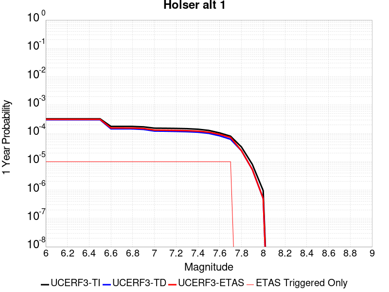 | 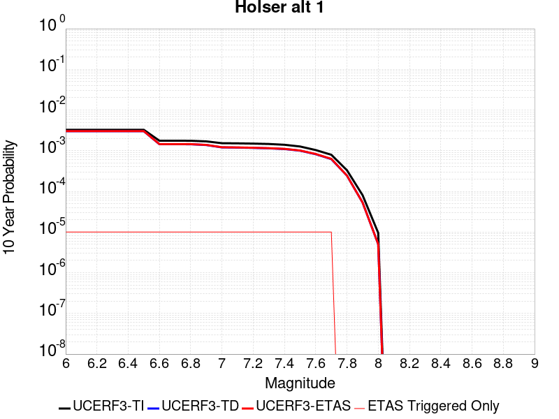 |

| Magnitude | 1 wk TI Prob | 1 wk TD Prob | 1 wk ETAS Prob | 1 wk ETAS/TD Gain | 1 wk ETAS Triggered Only | 1 mo TI Prob | 1 mo TD Prob | 1 mo ETAS Prob | 1 mo ETAS/TD Gain | 1 mo ETAS Triggered Only | 1 yr TI Prob | 1 yr TD Prob | 1 yr ETAS Prob | 1 yr ETAS/TD Gain | 1 yr ETAS Triggered Only | 10 yr TI Prob | 10 yr TD Prob | 10 yr ETAS Prob | 10 yr ETAS/TD Gain | 10 yr ETAS Triggered Only |
|-----|-----|-----|-----|-----|-----|-----|-----|-----|-----|-----|-----|-----|-----|-----|-----|-----|-----|-----|-----|-----|
| 6.0 | 6.2746653E-6 | 5.7899742E-6 | 5.7899742E-6 | 1.0 | 0.0 | 2.6891146E-5 | 2.4814004E-5 | 2.4814004E-5 | 1.0 | 0.0 | 3.273505E-4 | 3.0208015E-4 | 3.1207714E-4 | 1.0330938 | 1.0E-5 | 0.0032686873 | 0.003017828 | 0.003027798 | 1.0033036 | 1.0E-5 |
| 6.1 | 6.2746653E-6 | 5.7899742E-6 | 5.7899742E-6 | 1.0 | 0.0 | 2.6891146E-5 | 2.4814004E-5 | 2.4814004E-5 | 1.0 | 0.0 | 3.273505E-4 | 3.0208015E-4 | 3.1207714E-4 | 1.0330938 | 1.0E-5 | 0.0032686873 | 0.003017828 | 0.003027798 | 1.0033036 | 1.0E-5 |
| 6.2 | 6.2746653E-6 | 5.7899742E-6 | 5.7899742E-6 | 1.0 | 0.0 | 2.6891146E-5 | 2.4814004E-5 | 2.4814004E-5 | 1.0 | 0.0 | 3.273505E-4 | 3.0208015E-4 | 3.1207714E-4 | 1.0330938 | 1.0E-5 | 0.0032686873 | 0.003017828 | 0.003027798 | 1.0033036 | 1.0E-5 |
| 6.3 | 6.2746653E-6 | 5.7899742E-6 | 5.7899742E-6 | 1.0 | 0.0 | 2.6891146E-5 | 2.4814004E-5 | 2.4814004E-5 | 1.0 | 0.0 | 3.273505E-4 | 3.0208015E-4 | 3.1207714E-4 | 1.0330938 | 1.0E-5 | 0.0032686873 | 0.003017828 | 0.003027798 | 1.0033036 | 1.0E-5 |
| 6.4 | 6.2746653E-6 | 5.7899742E-6 | 5.7899742E-6 | 1.0 | 0.0 | 2.6891146E-5 | 2.4814004E-5 | 2.4814004E-5 | 1.0 | 0.0 | 3.273505E-4 | 3.0208015E-4 | 3.1207714E-4 | 1.0330938 | 1.0E-5 | 0.0032686873 | 0.003017828 | 0.003027798 | 1.0033036 | 1.0E-5 |
| 6.5 | 6.2746653E-6 | 5.7899742E-6 | 5.7899742E-6 | 1.0 | 0.0 | 2.6891146E-5 | 2.4814004E-5 | 2.4814004E-5 | 1.0 | 0.0 | 3.273505E-4 | 3.0208015E-4 | 3.1207714E-4 | 1.0330938 | 1.0E-5 | 0.0032686873 | 0.003017828 | 0.003027798 | 1.0033036 | 1.0E-5 |
| 6.6 | 3.375825E-6 | 2.7711988E-6 | 2.7711988E-6 | 1.0 | 0.0 | 1.4467741E-5 | 1.1876513E-5 | 1.1876513E-5 | 1.0 | 0.0 | 1.761305E-4 | 1.4458712E-4 | 1.5458568E-4 | 1.0691525 | 1.0E-5 | 0.0017599097 | 0.0014449474 | 0.001454933 | 1.0069107 | 1.0E-5 |
| 6.7 | 3.375825E-6 | 2.7711988E-6 | 2.7711988E-6 | 1.0 | 0.0 | 1.4467741E-5 | 1.1876513E-5 | 1.1876513E-5 | 1.0 | 0.0 | 1.761305E-4 | 1.4458712E-4 | 1.5458568E-4 | 1.0691525 | 1.0E-5 | 0.0017599097 | 0.0014449474 | 0.001454933 | 1.0069107 | 1.0E-5 |
| 6.8 | 3.366533E-6 | 2.7615984E-6 | 2.7615984E-6 | 1.0 | 0.0 | 1.4427919E-5 | 1.1835369E-5 | 1.1835369E-5 | 1.0 | 0.0 | 1.7564575E-4 | 1.4408625E-4 | 1.5408482E-4 | 1.0693929 | 1.0E-5 | 0.0017550698 | 0.0014399453 | 0.0014499308 | 1.0069348 | 1.0E-5 |
| 6.9 | 3.253174E-6 | 2.6438204E-6 | 2.6438204E-6 | 1.0 | 0.0 | 1.39421E-5 | 1.13306105E-5 | 1.13306105E-5 | 1.0 | 0.0 | 1.6973184E-4 | 1.379416E-4 | 1.4794023E-4 | 1.0724845 | 1.0E-5 | 0.0016960226 | 0.0013785758 | 0.001388562 | 1.0072439 | 1.0E-5 |
| 7.0 | 2.9336593E-6 | 2.3118082E-6 | 2.3118082E-6 | 1.0 | 0.0 | 1.2572766E-5 | 9.907712E-6 | 9.907712E-6 | 1.0 | 0.0 | 1.5306266E-4 | 1.2061974E-4 | 1.3061853E-4 | 1.0828952 | 1.0E-5 | 0.0015295728 | 0.0012055453 | 0.0012155332 | 1.008285 | 1.0E-5 |
| 7.1 | 2.9087812E-6 | 2.2876604E-6 | 2.2876604E-6 | 1.0 | 0.0 | 1.2466146E-5 | 9.804223E-6 | 9.804223E-6 | 1.0 | 0.0 | 1.5176475E-4 | 1.19359895E-4 | 1.293587E-4 | 1.0837703 | 1.0E-5 | 0.0015166114 | 0.0011929603 | 0.0012029484 | 1.0083725 | 1.0E-5 |
| 7.2 | 2.8674524E-6 | 2.247552E-6 | 2.247552E-6 | 1.0 | 0.0 | 1.2289024E-5 | 9.63233E-6 | 9.63233E-6 | 1.0 | 0.0 | 1.4960859E-4 | 1.1726733E-4 | 1.2726616E-4 | 1.0852653 | 1.0E-5 | 0.0014950791 | 0.0011720568 | 0.0011820451 | 1.008522 | 1.0E-5 |
| 7.3 | 2.8057775E-6 | 2.1954418E-6 | 2.1954418E-6 | 1.0 | 0.0 | 1.2024705E-5 | 9.409002E-6 | 9.409002E-6 | 1.0 | 0.0 | 1.4639096E-4 | 1.145486E-4 | 1.2454746E-4 | 1.0872892 | 1.0E-5 | 0.0014629456 | 0.0011448979 | 0.0011548864 | 1.0087245 | 1.0E-5 |
| 7.4 | 2.683666E-6 | 2.1092408E-6 | 2.1092408E-6 | 1.0 | 0.0 | 1.1501375E-5 | 9.0395715E-6 | 9.0395715E-6 | 1.0 | 0.0 | 1.4002025E-4 | 1.1005125E-4 | 1.2005015E-4 | 1.0908568 | 1.0E-5 | 0.0013993206 | 0.0010999697 | 0.0011099587 | 1.0090811 | 1.0E-5 |
| 7.5 | 2.434495E-6 | 1.9195488E-6 | 1.9195488E-6 | 1.0 | 0.0 | 1.0433508E-5 | 8.226612E-6 | 8.226612E-6 | 1.0 | 0.0 | 1.2702055E-4 | 1.0015442E-4 | 1.1015342E-4 | 1.0998359 | 1.0E-5 | 0.0012694797 | 0.0010010948 | 0.0010110849 | 1.009979 | 1.0E-5 |
| 7.6 | 1.9914562E-6 | 1.5731545E-6 | 1.5731545E-6 | 1.0 | 0.0 | 8.534785E-6 | 6.7420733E-6 | 6.7420733E-6 | 1.0 | 0.0 | 1.03906044E-4 | 8.2081664E-5 | 9.2080845E-5 | 1.1218199 | 1.0E-5 | 0.0010385747 | 8.2051504E-4 | 8.3050685E-4 | 1.0121775 | 1.0E-5 |
| 7.7 | 1.5229501E-6 | 1.1896134E-6 | 1.1896134E-6 | 1.0 | 0.0 | 6.526913E-6 | 5.098333E-6 | 5.098333E-6 | 1.0 | 0.0 | 7.946226E-5 | 6.207045E-5 | 7.206983E-5 | 1.1610973 | 1.0E-5 | 7.943385E-4 | 6.2053243E-4 | 6.305262E-4 | 1.0161052 | 1.0E-5 |
| 7.8 | 6.3489426E-7 | 4.6878412E-7 | 4.6878412E-7 | 1.0 | 0.0 | 2.7209726E-6 | 2.0090733E-6 | 2.0090733E-6 | 1.0 | 0.0 | 3.312734E-5 | 2.4460194E-5 | 2.4460194E-5 | 1.0 | 0.0 | 3.31224E-4 | 2.445752E-4 | 2.445752E-4 | 1.0 | 0.0 |
| 7.9 | 1.5459432E-7 | 1.01936465E-7 | 1.01936465E-7 | 1.0 | 0.0 | 6.6254694E-7 | 4.3687047E-7 | 4.3687047E-7 | 1.0 | 0.0 | 8.066479E-6 | 5.318885E-6 | 5.318885E-6 | 1.0 | 0.0 | 8.066186E-5 | 5.3187596E-5 | 5.3187596E-5 | 1.0 | 0.0 |
| 8.0 | 1.8307812E-8 | 9.690041E-9 | 9.690041E-9 | 1.0 | 0.0 | 7.846205E-8 | 4.1528747E-8 | 4.1528747E-8 | 1.0 | 0.0 | 9.55275E-7 | 5.056124E-7 | 5.056124E-7 | 1.0 | 0.0 | 9.552709E-6 | 5.0561125E-6 | 5.0561125E-6 | 1.0 | 0.0 |

## San Andreas (Peninsula) 2011 CFM
*[(top)](#table-of-contents)*

| 1 Week | 1 Month | 1 Year | 10 Year |
|-----|-----|-----|-----|
|  |  |  |  |

| Magnitude | 1 wk TI Prob | 1 wk TD Prob | 1 wk ETAS Prob | 1 wk ETAS/TD Gain | 1 wk ETAS Triggered Only | 1 mo TI Prob | 1 mo TD Prob | 1 mo ETAS Prob | 1 mo ETAS/TD Gain | 1 mo ETAS Triggered Only | 1 yr TI Prob | 1 yr TD Prob | 1 yr ETAS Prob | 1 yr ETAS/TD Gain | 1 yr ETAS Triggered Only | 10 yr TI Prob | 10 yr TD Prob | 10 yr ETAS Prob | 10 yr ETAS/TD Gain | 10 yr ETAS Triggered Only |
|-----|-----|-----|-----|-----|-----|-----|-----|-----|-----|-----|-----|-----|-----|-----|-----|-----|-----|-----|-----|-----|
| 6.0 | 8.6200685E-5 | 2.5207937E-5 | 2.5207937E-5 | 1.0 | 0.0 | 3.6937918E-4 | 1.0802955E-4 | 1.0802955E-4 | 1.0 | 0.0 | 0.0044879215 | 0.0013144679 | 0.0013144679 | 1.0 | 0.0 | 0.043983612 | 0.01477218 | 0.014782031 | 1.000667 | 1.0E-5 |
| 6.1 | 8.6200685E-5 | 2.5207937E-5 | 2.5207937E-5 | 1.0 | 0.0 | 3.6937918E-4 | 1.0802955E-4 | 1.0802955E-4 | 1.0 | 0.0 | 0.0044879215 | 0.0013144679 | 0.0013144679 | 1.0 | 0.0 | 0.043983612 | 0.01477218 | 0.014782031 | 1.000667 | 1.0E-5 |
| 6.2 | 8.6200685E-5 | 2.5207937E-5 | 2.5207937E-5 | 1.0 | 0.0 | 3.6937918E-4 | 1.0802955E-4 | 1.0802955E-4 | 1.0 | 0.0 | 0.0044879215 | 0.0013144679 | 0.0013144679 | 1.0 | 0.0 | 0.043983612 | 0.01477218 | 0.014782031 | 1.000667 | 1.0E-5 |
| 6.3 | 8.551163E-5 | 2.4899866E-5 | 2.4899866E-5 | 1.0 | 0.0 | 3.6642692E-4 | 1.06709354E-4 | 1.06709354E-4 | 1.0 | 0.0 | 0.004452125 | 0.0012984137 | 0.0012984137 | 1.0 | 0.0 | 0.043639794 | 0.01459892 | 0.014608774 | 1.000675 | 1.0E-5 |
| 6.4 | 8.551163E-5 | 2.4899866E-5 | 2.4899866E-5 | 1.0 | 0.0 | 3.6642692E-4 | 1.06709354E-4 | 1.06709354E-4 | 1.0 | 0.0 | 0.004452125 | 0.0012984137 | 0.0012984137 | 1.0 | 0.0 | 0.043639794 | 0.01459892 | 0.014608774 | 1.000675 | 1.0E-5 |
| 6.5 | 8.511146E-5 | 2.4721267E-5 | 2.4721267E-5 | 1.0 | 0.0 | 3.647124E-4 | 1.0594399E-4 | 1.0594399E-4 | 1.0 | 0.0 | 0.004431336 | 0.0012891064 | 0.0012891064 | 1.0 | 0.0 | 0.04344007 | 0.014498963 | 0.014508818 | 1.0006797 | 1.0E-5 |
| 6.6 | 8.4985084E-5 | 2.4651948E-5 | 2.4651948E-5 | 1.0 | 0.0 | 3.6417096E-4 | 1.0564694E-4 | 1.0564694E-4 | 1.0 | 0.0 | 0.0044247704 | 0.0012854942 | 0.0012854942 | 1.0 | 0.0 | 0.043376986 | 0.0144609315 | 0.014470788 | 1.0006815 | 1.0E-5 |
| 6.7 | 8.462618E-5 | 2.4480485E-5 | 2.4480485E-5 | 1.0 | 0.0 | 3.6263323E-4 | 1.0491216E-4 | 1.0491216E-4 | 1.0 | 0.0 | 0.004406125 | 0.0012765586 | 0.0012765586 | 1.0 | 0.0 | 0.043197807 | 0.014365727 | 0.014375583 | 1.000686 | 1.0E-5 |
| 6.8 | 8.42337E-5 | 2.4376272E-5 | 2.4376272E-5 | 1.0 | 0.0 | 3.6095164E-4 | 1.04465566E-4 | 1.04465566E-4 | 1.0 | 0.0 | 0.004385734 | 0.0012711277 | 0.0012711277 | 1.0 | 0.0 | 0.043001823 | 0.014306363 | 0.01431622 | 1.000689 | 1.0E-5 |
| 6.9 | 8.365989E-5 | 2.4180892E-5 | 2.4180892E-5 | 1.0 | 0.0 | 3.5849313E-4 | 1.0362829E-4 | 1.0362829E-4 | 1.0 | 0.0 | 0.004355922 | 0.0012609458 | 0.0012609458 | 1.0 | 0.0 | 0.04271523 | 0.014198911 | 0.014208769 | 1.0006943 | 1.0E-5 |
| 7.0 | 8.30936E-5 | 2.3942457E-5 | 2.3942457E-5 | 1.0 | 0.0 | 3.560668E-4 | 1.026065E-4 | 1.026065E-4 | 1.0 | 0.0 | 0.004326499 | 0.0012485199 | 0.0012485199 | 1.0 | 0.0 | 0.042432297 | 0.014069902 | 0.014079762 | 1.0007007 | 1.0E-5 |
| 7.1 | 8.041264E-5 | 2.3628894E-5 | 2.3628894E-5 | 1.0 | 0.0 | 3.4458007E-4 | 1.0126277E-4 | 1.0126277E-4 | 1.0 | 0.0 | 0.0041871946 | 0.0012321785 | 0.0012321785 | 1.0 | 0.0 | 0.041091725 | 0.013892905 | 0.013902767 | 1.0007098 | 1.0E-5 |
| 7.2 | 7.8427016E-5 | 2.3052688E-5 | 2.3052688E-5 | 1.0 | 0.0 | 3.3607247E-4 | 9.87935E-5 | 9.87935E-5 | 1.0 | 0.0 | 0.004084008 | 0.0012021487 | 0.0012021487 | 1.0 | 0.0 | 0.040097635 | 0.013576745 | 0.01358661 | 1.0007266 | 1.0E-5 |
| 7.3 | 7.721087E-5 | 2.2837554E-5 | 2.2837554E-5 | 1.0 | 0.0 | 3.3086175E-4 | 9.787157E-5 | 9.787157E-5 | 1.0 | 0.0 | 0.004020803 | 0.0011909365 | 0.0011909365 | 1.0 | 0.0 | 0.03948827 | 0.013460464 | 0.013470329 | 1.0007329 | 1.0E-5 |
| 7.4 | 7.3536525E-5 | 2.095521E-5 | 2.095521E-5 | 1.0 | 0.0 | 3.1511846E-4 | 8.980496E-5 | 8.980496E-5 | 1.0 | 0.0 | 0.0038298194 | 0.0010928282 | 0.0010928282 | 1.0 | 0.0 | 0.037644852 | 0.0124172745 | 0.01242715 | 1.0007954 | 1.0E-5 |
| 7.5 | 6.806207E-5 | 1.876151E-5 | 1.876151E-5 | 1.0 | 0.0 | 2.9166197E-4 | 8.0404E-5 | 8.0404E-5 | 1.0 | 0.0 | 0.0035452035 | 9.784801E-4 | 9.784801E-4 | 1.0 | 0.0 | 0.034891766 | 0.011170478 | 0.011180365 | 1.0008852 | 1.0E-5 |
| 7.6 | 5.6731416E-5 | 1.4173155E-5 | 1.4173155E-5 | 1.0 | 0.0 | 2.43112E-4 | 6.074068E-5 | 6.074068E-5 | 1.0 | 0.0 | 0.0029558712 | 7.3926704E-4 | 7.3926704E-4 | 1.0 | 0.0 | 0.02916862 | 0.00848332 | 0.008493234 | 1.0011687 | 1.0E-5 |
| 7.7 | 4.946994E-5 | 1.3242368E-5 | 1.3242368E-5 | 1.0 | 0.0 | 2.1199681E-4 | 5.675177E-5 | 5.675177E-5 | 1.0 | 0.0 | 0.002578006 | 6.907339E-4 | 6.907339E-4 | 1.0 | 0.0 | 0.02548303 | 0.007905742 | 0.007915663 | 1.0012549 | 1.0E-5 |
| 7.8 | 3.9718198E-5 | 1.2979126E-5 | 1.2979126E-5 | 1.0 | 0.0 | 1.7020974E-4 | 5.562364E-5 | 5.562364E-5 | 1.0 | 0.0 | 0.0020703338 | 6.7700754E-4 | 6.7700754E-4 | 1.0 | 0.0 | 0.020511515 | 0.007716547 | 0.00772647 | 1.0012859 | 1.0E-5 |
| 7.9 | 2.4115114E-5 | 1.2183215E-5 | 1.2183215E-5 | 1.0 | 0.0 | 1.0334639E-4 | 5.2212738E-5 | 5.2212738E-5 | 1.0 | 0.0 | 0.001257516 | 6.355048E-4 | 6.355048E-4 | 1.0 | 0.0 | 0.012504238 | 0.0071578487 | 0.007167777 | 1.0013871 | 1.0E-5 |
| 8.0 | 1.7756569E-5 | 1.1408184E-5 | 1.1408184E-5 | 1.0 | 0.0 | 7.6097356E-5 | 4.8891303E-5 | 4.8891303E-5 | 1.0 | 0.0 | 9.260915E-4 | 5.9508916E-4 | 5.9508916E-4 | 1.0 | 0.0 | 0.009222416 | 0.006658535 | 0.006668468 | 1.0014918 | 1.0E-5 |
| 8.1 | 1.3159258E-5 | 9.744603E-6 | 9.744603E-6 | 1.0 | 0.0 | 5.6395602E-5 | 4.1761916E-5 | 4.1761916E-5 | 1.0 | 0.0 | 6.864001E-4 | 5.083328E-4 | 5.083328E-4 | 1.0 | 0.0 | 0.0068428386 | 0.005688865 | 0.0056988085 | 1.0017478 | 1.0E-5 |
| 8.2 | 8.635426E-6 | 5.465718E-6 | 5.465718E-6 | 1.0 | 0.0 | 3.700844E-5 | 2.3424296E-5 | 2.3424296E-5 | 1.0 | 0.0 | 4.5048463E-4 | 2.8515357E-4 | 2.8515357E-4 | 1.0 | 0.0 | 0.004495725 | 0.0032439749 | 0.0032439749 | 1.0 | 0.0 |
| 8.3 | 1.983087E-6 | 7.6564595E-7 | 7.6564595E-7 | 1.0 | 0.0 | 8.498917E-6 | 3.281336E-6 | 3.281336E-6 | 1.0 | 0.0 | 1.034694E-4 | 3.9949547E-5 | 3.9949547E-5 | 1.0 | 0.0 | 0.0010342124 | 4.717979E-4 | 4.717979E-4 | 1.0 | 0.0 |

## Mendocino
*[(top)](#table-of-contents)*

| 1 Week | 1 Month | 1 Year | 10 Year |
|-----|-----|-----|-----|
|  | 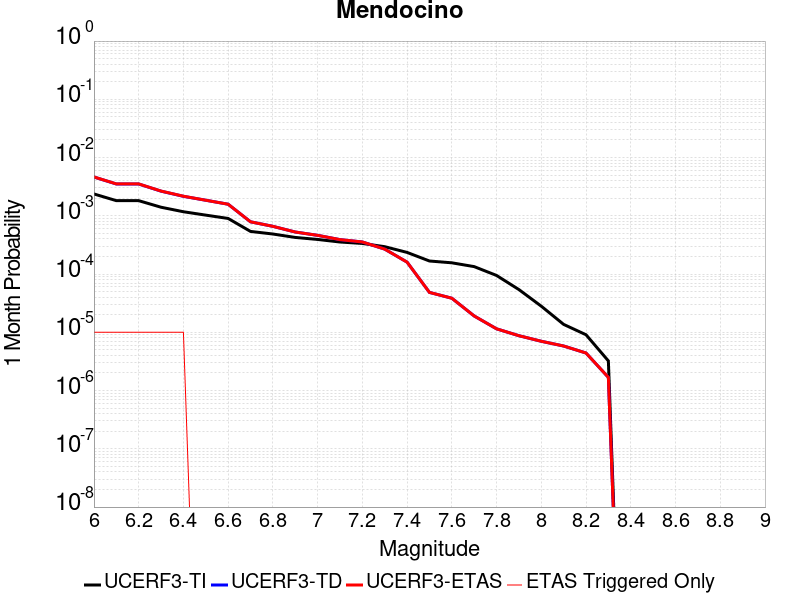 |  |  |

| Magnitude | 1 wk TI Prob | 1 wk TD Prob | 1 wk ETAS Prob | 1 wk ETAS/TD Gain | 1 wk ETAS Triggered Only | 1 mo TI Prob | 1 mo TD Prob | 1 mo ETAS Prob | 1 mo ETAS/TD Gain | 1 mo ETAS Triggered Only | 1 yr TI Prob | 1 yr TD Prob | 1 yr ETAS Prob | 1 yr ETAS/TD Gain | 1 yr ETAS Triggered Only | 10 yr TI Prob | 10 yr TD Prob | 10 yr ETAS Prob | 10 yr ETAS/TD Gain | 10 yr ETAS Triggered Only |
|-----|-----|-----|-----|-----|-----|-----|-----|-----|-----|-----|-----|-----|-----|-----|-----|-----|-----|-----|-----|-----|
| 6.0 | 5.5409013E-4 | 0.0010840978 | 0.0010940869 | 1.0092143 | 1.0E-5 | 0.0023725112 | 0.0046357135 | 0.004645667 | 1.0021472 | 1.0E-5 | 0.028505474 | 0.054677837 | 0.054687288 | 1.0001729 | 1.0E-5 | 0.25113493 | 0.41188422 | 0.4118901 | 1.0000143 | 1.0E-5 |
| 6.1 | 4.2515888E-4 | 8.229105E-4 | 8.3290227E-4 | 1.012142 | 1.0E-5 | 0.0018208373 | 0.003520157 | 0.0035301216 | 1.0028307 | 1.0E-5 | 0.021944538 | 0.041751582 | 0.041761164 | 1.0002295 | 1.0E-5 | 0.19899574 | 0.32995522 | 0.3299619 | 1.0000203 | 1.0E-5 |
| 6.2 | 4.2515888E-4 | 8.229105E-4 | 8.3290227E-4 | 1.012142 | 1.0E-5 | 0.0018208373 | 0.003520157 | 0.0035301216 | 1.0028307 | 1.0E-5 | 0.021944538 | 0.041751582 | 0.041761164 | 1.0002295 | 1.0E-5 | 0.19899574 | 0.32995522 | 0.3299619 | 1.0000203 | 1.0E-5 |
| 6.3 | 3.2773745E-4 | 6.193633E-4 | 6.293571E-4 | 1.0161356 | 1.0E-5 | 0.0014038329 | 0.0026503794 | 0.0026603527 | 1.0037631 | 1.0E-5 | 0.016958237 | 0.031593565 | 0.03160325 | 1.0003065 | 1.0E-5 | 0.1572094 | 0.26077798 | 0.26078537 | 1.0000284 | 1.0E-5 |
| 6.4 | 2.7417165E-4 | 5.04789E-4 | 5.1478395E-4 | 1.0198003 | 1.0E-5 | 0.0011744922 | 0.002160561 | 0.0021705395 | 1.0046184 | 1.0E-5 | 0.014205975 | 0.02583886 | 0.025848601 | 1.000377 | 1.0E-5 | 0.13331394 | 0.21948014 | 0.21948795 | 1.0000355 | 1.0E-5 |
| 6.5 | 2.3984899E-4 | 4.323638E-4 | 4.323638E-4 | 1.0 | 0.0 | 0.0010275192 | 0.0018508366 | 0.0018508366 | 1.0 | 0.0 | 0.012438473 | 0.02218166 | 0.02218166 | 1.0 | 0.0 | 0.11764851 | 0.19203737 | 0.19203737 | 1.0 | 0.0 |
| 6.6 | 2.1023539E-4 | 3.6936256E-4 | 3.6936256E-4 | 1.0 | 0.0 | 9.0069766E-4 | 0.0015813457 | 0.0015813457 | 1.0 | 0.0 | 0.010910975 | 0.018990727 | 0.018990727 | 1.0 | 0.0 | 0.10390546 | 0.16749373 | 0.16749373 | 1.0 | 0.0 |
| 6.7 | 1.2592976E-4 | 1.8425964E-4 | 1.8425964E-4 | 1.0 | 0.0 | 5.395873E-4 | 7.8937394E-4 | 7.8937394E-4 | 1.0 | 0.0 | 0.006549705 | 0.009556835 | 0.009556835 | 1.0 | 0.0 | 0.063599944 | 0.09096922 | 0.09096922 | 1.0 | 0.0 |
| 6.8 | 1.13663555E-4 | 1.5401552E-4 | 1.5401552E-4 | 1.0 | 0.0 | 4.8703855E-4 | 6.5987057E-4 | 6.5987057E-4 | 1.0 | 0.0 | 0.0059135845 | 0.008000202 | 0.008000202 | 1.0 | 0.0 | 0.057586733 | 0.07739247 | 0.07739247 | 1.0 | 0.0 |
| 6.9 | 9.926894E-5 | 1.2300287E-4 | 1.2300287E-4 | 1.0 | 0.0 | 4.2536893E-4 | 5.2704377E-4 | 5.2704377E-4 | 1.0 | 0.0 | 0.0051665753 | 0.006396927 | 0.006396927 | 1.0 | 0.0 | 0.050480947 | 0.06285957 | 0.06285957 | 1.0 | 0.0 |
| 7.0 | 9.168125E-5 | 1.0784103E-4 | 1.0784103E-4 | 1.0 | 0.0 | 3.9286047E-4 | 4.6208999E-4 | 4.6208999E-4 | 1.0 | 0.0 | 0.004772591 | 0.005611076 | 0.005611076 | 1.0 | 0.0 | 0.04671385 | 0.0556208 | 0.0556208 | 1.0 | 0.0 |
| 7.1 | 8.2854116E-5 | 9.1051006E-5 | 9.1051006E-5 | 1.0 | 0.0 | 3.5504074E-4 | 3.9016042E-4 | 3.9016042E-4 | 1.0 | 0.0 | 0.004314056 | 0.0047399225 | 0.0047399225 | 1.0 | 0.0 | 0.042312626 | 0.047480468 | 0.047480468 | 1.0 | 0.0 |
| 7.2 | 7.8255274E-5 | 8.300352E-5 | 8.300352E-5 | 1.0 | 0.0 | 3.3533663E-4 | 3.556817E-4 | 3.556817E-4 | 1.0 | 0.0 | 0.0040750825 | 0.004321974 | 0.004321974 | 1.0 | 0.0 | 0.040011603 | 0.043524873 | 0.043524873 | 1.0 | 0.0 |
| 7.3 | 6.887904E-5 | 6.258733E-5 | 6.258733E-5 | 1.0 | 0.0 | 2.9516246E-4 | 2.6820437E-4 | 2.6820437E-4 | 1.0 | 0.0 | 0.0035876823 | 0.0032605957 | 0.0032605957 | 1.0 | 0.0 | 0.035303112 | 0.03335046 | 0.03335046 | 1.0 | 0.0 |
| 7.4 | 5.4898497E-5 | 3.7397505E-5 | 3.7397505E-5 | 1.0 | 0.0 | 2.3525805E-4 | 1.6026547E-4 | 1.6026547E-4 | 1.0 | 0.0 | 0.0028605047 | 0.0019495422 | 0.0019495422 | 1.0 | 0.0 | 0.02823963 | 0.020406872 | 0.020406872 | 1.0 | 0.0 |
| 7.5 | 3.9103943E-5 | 1.1304096E-5 | 1.1304096E-5 | 1.0 | 0.0 | 1.6757756E-4 | 4.8445232E-5 | 4.8445232E-5 | 1.0 | 0.0 | 0.0020383475 | 5.896627E-4 | 5.896627E-4 | 1.0 | 0.0 | 0.020197518 | 0.0066229533 | 0.0066229533 | 1.0 | 0.0 |
| 7.6 | 3.641042E-5 | 8.981182E-6 | 8.981182E-6 | 1.0 | 0.0 | 1.5603533E-4 | 3.849022E-5 | 3.849022E-5 | 1.0 | 0.0 | 0.0018980748 | 4.6851902E-4 | 4.6851902E-4 | 1.0 | 0.0 | 0.018819444 | 0.0053467555 | 0.0053467555 | 1.0 | 0.0 |
| 7.7 | 3.1318774E-5 | 4.452091E-6 | 4.452091E-6 | 1.0 | 0.0 | 1.342164E-4 | 1.9080253E-5 | 1.9080253E-5 | 1.0 | 0.0 | 0.0016328598 | 2.322775E-4 | 2.322775E-4 | 1.0 | 0.0 | 0.016209139 | 0.0028640495 | 0.0028640495 | 1.0 | 0.0 |
| 7.8 | 2.209241E-5 | 2.679371E-6 | 2.679371E-6 | 1.0 | 0.0 | 9.467832E-5 | 1.1482968E-5 | 1.1482968E-5 | 1.0 | 0.0 | 0.001152099 | 1.397962E-4 | 1.397962E-4 | 1.0 | 0.0 | 0.011461443 | 0.001736627 | 0.001736627 | 1.0 | 0.0 |
| 7.9 | 1.2640477E-5 | 2.041037E-6 | 2.041037E-6 | 1.0 | 0.0 | 5.4172346E-5 | 8.747273E-6 | 8.747273E-6 | 1.0 | 0.0 | 6.593487E-4 | 1.06492866E-4 | 1.06492866E-4 | 1.0 | 0.0 | 0.006573958 | 0.0012974226 | 0.0012974226 | 1.0 | 0.0 |
| 8.0 | 6.5548907E-6 | 1.6379622E-6 | 1.6379622E-6 | 1.0 | 0.0 | 2.8092087E-5 | 7.019819E-6 | 7.019819E-6 | 1.0 | 0.0 | 3.4196748E-4 | 8.546297E-5 | 8.546297E-5 | 1.0 | 0.0 | 0.0034144172 | 0.0010306032 | 0.0010306032 | 1.0 | 0.0 |
| 8.1 | 3.1916707E-6 | 1.357735E-6 | 1.357735E-6 | 1.0 | 0.0 | 1.3678517E-5 | 5.818851E-6 | 5.818851E-6 | 1.0 | 0.0 | 1.6652321E-4 | 7.084223E-5 | 7.084223E-5 | 1.0 | 0.0 | 0.0016639848 | 8.624329E-4 | 8.624329E-4 | 1.0 | 0.0 |
| 8.2 | 2.1193785E-6 | 1.0297509E-6 | 1.0297509E-6 | 1.0 | 0.0 | 9.083019E-6 | 4.413211E-6 | 4.413211E-6 | 1.0 | 0.0 | 1.1058014E-4 | 5.372954E-5 | 5.372954E-5 | 1.0 | 0.0 | 0.0011052513 | 6.500931E-4 | 6.500931E-4 | 1.0 | 0.0 |
| 8.3 | 7.536878E-7 | 3.9261332E-7 | 3.9261332E-7 | 1.0 | 0.0 | 3.2300866E-6 | 1.6826275E-6 | 1.6826275E-6 | 1.0 | 0.0 | 3.9325594E-5 | 2.048581E-5 | 2.048581E-5 | 1.0 | 0.0 | 3.9318635E-4 | 2.4124846E-4 | 2.4124846E-4 | 1.0 | 0.0 |

## Point Reyes 2011 CFM
*[(top)](#table-of-contents)*

| 1 Week | 1 Month | 1 Year | 10 Year |
|-----|-----|-----|-----|
|  |  |  |  |

| Magnitude | 1 wk TI Prob | 1 wk TD Prob | 1 wk ETAS Prob | 1 wk ETAS/TD Gain | 1 wk ETAS Triggered Only | 1 mo TI Prob | 1 mo TD Prob | 1 mo ETAS Prob | 1 mo ETAS/TD Gain | 1 mo ETAS Triggered Only | 1 yr TI Prob | 1 yr TD Prob | 1 yr ETAS Prob | 1 yr ETAS/TD Gain | 1 yr ETAS Triggered Only | 10 yr TI Prob | 10 yr TD Prob | 10 yr ETAS Prob | 10 yr ETAS/TD Gain | 10 yr ETAS Triggered Only |
|-----|-----|-----|-----|-----|-----|-----|-----|-----|-----|-----|-----|-----|-----|-----|-----|-----|-----|-----|-----|-----|
| 6.0 | 8.8644965E-6 | 8.96716E-6 | 1.896707E-5 | 2.1151702 | 1.0E-5 | 3.7990147E-5 | 3.8430157E-5 | 4.842977E-5 | 1.2602023 | 1.0E-5 | 4.624319E-4 | 4.67793E-4 | 4.777883E-4 | 1.021367 | 1.0E-5 | 0.0046147075 | 0.004668711 | 0.0046786647 | 1.0021319 | 1.0E-5 |
| 6.1 | 4.526405E-6 | 4.5392153E-6 | 1.45391705E-5 | 3.203014 | 1.0E-5 | 1.9398734E-5 | 1.945364E-5 | 2.9453447E-5 | 1.5140326 | 1.0E-5 | 2.36154E-4 | 2.3682338E-4 | 2.4682103E-4 | 1.0422156 | 1.0E-5 | 0.002359032 | 0.0023658164 | 0.0023757927 | 1.0042169 | 1.0E-5 |
| 6.2 | 4.526405E-6 | 4.5392153E-6 | 1.45391705E-5 | 3.203014 | 1.0E-5 | 1.9398734E-5 | 1.945364E-5 | 2.9453447E-5 | 1.5140326 | 1.0E-5 | 2.36154E-4 | 2.3682338E-4 | 2.4682103E-4 | 1.0422156 | 1.0E-5 | 0.002359032 | 0.0023658164 | 0.0023757927 | 1.0042169 | 1.0E-5 |
| 6.3 | 2.6842322E-6 | 2.660673E-6 | 1.26606465E-5 | 4.7584376 | 1.0E-5 | 1.1503801E-5 | 1.1402836E-5 | 2.1402722E-5 | 1.8769648 | 1.0E-5 | 1.4004979E-4 | 1.3882088E-4 | 1.4881948E-4 | 1.0720253 | 1.0E-5 | 0.0013996155 | 0.0013873635 | 0.0013973496 | 1.0071979 | 1.0E-5 |
| 6.4 | 2.6842322E-6 | 2.660673E-6 | 1.26606465E-5 | 4.7584376 | 1.0E-5 | 1.1503801E-5 | 1.1402836E-5 | 2.1402722E-5 | 1.8769648 | 1.0E-5 | 1.4004979E-4 | 1.3882088E-4 | 1.4881948E-4 | 1.0720253 | 1.0E-5 | 0.0013996155 | 0.0013873635 | 0.0013973496 | 1.0071979 | 1.0E-5 |
| 6.5 | 1.9281833E-6 | 1.8906233E-6 | 1.1890605E-5 | 6.289251 | 1.0E-5 | 8.263617E-6 | 8.1026465E-6 | 1.8102566E-5 | 2.2341547 | 1.0E-5 | 1.0060489E-4 | 9.864534E-5 | 1.0864435E-4 | 1.1013633 | 1.0E-5 | 0.0010055936 | 9.860265E-4 | 9.960165E-4 | 1.0101317 | 1.0E-5 |
| 6.6 | 1.4726726E-6 | 1.4269547E-6 | 1.1426941E-5 | 8.007921 | 1.0E-5 | 6.3114385E-6 | 6.115506E-6 | 1.6115446E-5 | 2.6351776 | 1.0E-5 | 7.683905E-5 | 7.445379E-5 | 8.4453044E-5 | 1.1343015 | 1.0E-5 | 7.6812494E-4 | 7.442957E-4 | 7.542883E-4 | 1.0134255 | 1.0E-5 |
| 6.7 | 8.572307E-7 | 8.007182E-7 | 1.080071E-5 | 13.488778 | 1.0E-5 | 3.6738406E-6 | 3.431645E-6 | 1.3431611E-5 | 3.9140444 | 1.0E-5 | 4.472809E-5 | 4.1779494E-5 | 5.1779076E-5 | 1.2393419 | 1.0E-5 | 4.471909E-4 | 4.177204E-4 | 4.2771624E-4 | 1.0239295 | 1.0E-5 |
| 6.8 | 6.6745434E-7 | 6.07727E-7 | 1.06077205E-5 | 17.454746 | 1.0E-5 | 2.8605155E-6 | 2.6045416E-6 | 1.2604515E-5 | 4.839437 | 1.0E-5 | 3.482622E-5 | 3.1709842E-5 | 4.1709525E-5 | 1.3153495 | 1.0E-5 | 3.4820763E-4 | 3.170566E-4 | 3.2705342E-4 | 1.0315301 | 1.0E-5 |
| 6.9 | 4.291521E-7 | 3.6535639E-7 | 1.0365353E-5 | 28.370525 | 1.0E-5 | 1.839222E-6 | 1.5658121E-6 | 1.1565797E-5 | 7.386452 | 1.0E-5 | 2.2392298E-5 | 1.90636E-5 | 2.9063409E-5 | 1.5245498 | 1.0E-5 | 2.2390042E-4 | 1.906224E-4 | 2.0062049E-4 | 1.0524497 | 1.0E-5 |
| 7.0 | 2.6812808E-7 | 2.0187117E-7 | 1.0201869E-5 | 50.536533 | 1.0E-5 | 1.1491198E-6 | 8.6516184E-7 | 1.0865153E-5 | 12.558521 | 1.0E-5 | 1.3990444E-5 | 1.0533295E-5 | 2.0533189E-5 | 1.9493605 | 1.0E-5 | 1.3989564E-4 | 1.05330415E-4 | 1.1532936E-4 | 1.0949293 | 1.0E-5 |
| 7.1 | 1.9451231E-7 | 1.2725201E-7 | 1.0127251E-5 | 79.58421 | 1.0E-5 | 8.336239E-7 | 5.4536565E-7 | 1.054536E-5 | 19.336313 | 1.0E-5 | 1.0149324E-5 | 6.639806E-6 | 1.663974E-5 | 2.506058 | 1.0E-5 | 1.014886E-4 | 6.639846E-5 | 7.6397795E-5 | 1.1505959 | 1.0E-5 |
| 7.2 | 1.6715143E-7 | 1.0042555E-7 | 1.0100424E-5 | 100.57624 | 1.0E-5 | 7.1636305E-7 | 4.3039515E-7 | 1.0430391E-5 | 24.234453 | 1.0E-5 | 8.721685E-6 | 5.2400483E-6 | 1.5239995E-5 | 2.9083695 | 1.0E-5 | 8.721343E-5 | 5.240162E-5 | 6.24011E-5 | 1.1908238 | 1.0E-5 |
| 7.3 | 1.5503173E-7 | 9.012816E-8 | 1.0090127E-5 | 111.9531 | 1.0E-5 | 6.644215E-7 | 3.8626348E-7 | 1.0386259E-5 | 26.889055 | 1.0E-5 | 8.089301E-6 | 4.7027474E-6 | 1.47027E-5 | 3.1264064 | 1.0E-5 | 8.089007E-5 | 4.7028854E-5 | 5.7028385E-5 | 1.2126254 | 1.0E-5 |
| 7.4 | 1.4251614E-7 | 8.097342E-8 | 1.0080973E-5 | 124.49731 | 1.0E-5 | 6.1078333E-7 | 3.4702887E-7 | 1.0347026E-5 | 29.816036 | 1.0E-5 | 7.4362615E-6 | 4.225068E-6 | 1.4225026E-5 | 3.3668158 | 1.0E-5 | 7.436013E-5 | 4.2252257E-5 | 5.225183E-5 | 1.2366637 | 1.0E-5 |
| 7.5 | 1.2710186E-7 | 7.029377E-8 | 1.0070293E-5 | 143.2601 | 1.0E-5 | 5.447221E-7 | 3.0125898E-7 | 1.0301256E-5 | 34.19402 | 1.0E-5 | 6.6319717E-6 | 3.6678218E-6 | 1.3667785E-5 | 3.7264037 | 1.0E-5 | 6.6317734E-5 | 3.667999E-5 | 4.6679623E-5 | 1.2726182 | 1.0E-5 |
| 7.6 | 1.0144708E-7 | 5.494996E-8 | 1.005495E-5 | 182.98373 | 1.0E-5 | 4.347731E-7 | 2.354998E-7 | 1.0235497E-5 | 43.46287 | 1.0E-5 | 5.2933497E-6 | 2.8672061E-6 | 1.2867177E-5 | 4.4877057 | 1.0E-5 | 5.293224E-5 | 2.8674069E-5 | 3.867378E-5 | 1.3487371 | 1.0E-5 |
| 7.7 | 7.090527E-8 | 3.9821334E-8 | 1.0039821E-5 | 252.12166 | 1.0E-5 | 3.038797E-7 | 1.7066284E-7 | 1.0170661E-5 | 59.59505 | 1.0E-5 | 3.699729E-6 | 2.0778182E-6 | 1.2077798E-5 | 5.812731 | 1.0E-5 | 3.6996673E-5 | 2.0780362E-5 | 3.0780157E-5 | 1.4812136 | 1.0E-5 |
| 7.8 | 3.8712045E-8 | 2.7438638E-8 | 1.0027438E-5 | 365.44955 | 1.0E-5 | 1.6590876E-7 | 1.1759416E-7 | 1.0117593E-5 | 86.03822 | 1.0E-5 | 2.0199373E-6 | 1.4317079E-6 | 1.1431694E-5 | 7.984655 | 1.0E-5 | 2.0199188E-5 | 1.4319363E-5 | 2.4319219E-5 | 1.6983451 | 1.0E-5 |
| 7.9 | 1.7068782E-8 | 1.183186E-8 | 1.183186E-8 | 1.0 | 0.0 | 7.315192E-8 | 5.0707975E-8 | 5.0707975E-8 | 1.0 | 0.0 | 8.906242E-7 | 6.173694E-7 | 6.173694E-7 | 1.0 | 0.0 | 8.906207E-6 | 6.1760525E-6 | 6.1760525E-6 | 1.0 | 0.0 |
| 8.0 | 1.0172592E-8 | 7.0268076E-9 | 7.0268076E-9 | 1.0 | 0.0 | 4.359682E-8 | 3.011489E-8 | 3.011489E-8 | 1.0 | 0.0 | 5.3079117E-7 | 3.6664872E-7 | 3.6664872E-7 | 1.0 | 0.0 | 5.307899E-6 | 3.6688568E-6 | 3.6688568E-6 | 1.0 | 0.0 |
| 8.1 | 3.7861243E-9 | 3.5448604E-9 | 3.5448604E-9 | 1.0 | 0.0 | 1.6226247E-8 | 1.5192258E-8 | 1.5192258E-8 | 1.0 | 0.0 | 1.9755454E-7 | 1.8496571E-7 | 1.8496571E-7 | 1.0 | 0.0 | 1.9755437E-6 | 1.8514592E-6 | 1.8514592E-6 | 1.0 | 0.0 |

## Rocky Ledge 2011 CFM
*[(top)](#table-of-contents)*

| 1 Week | 1 Month | 1 Year | 10 Year |
|-----|-----|-----|-----|
|  |  |  |  |

| Magnitude | 1 wk TI Prob | 1 wk TD Prob | 1 wk ETAS Prob | 1 wk ETAS/TD Gain | 1 wk ETAS Triggered Only | 1 mo TI Prob | 1 mo TD Prob | 1 mo ETAS Prob | 1 mo ETAS/TD Gain | 1 mo ETAS Triggered Only | 1 yr TI Prob | 1 yr TD Prob | 1 yr ETAS Prob | 1 yr ETAS/TD Gain | 1 yr ETAS Triggered Only | 10 yr TI Prob | 10 yr TD Prob | 10 yr ETAS Prob | 10 yr ETAS/TD Gain | 10 yr ETAS Triggered Only |
|-----|-----|-----|-----|-----|-----|-----|-----|-----|-----|-----|-----|-----|-----|-----|-----|-----|-----|-----|-----|-----|
| 6.0 | 8.7550525E-6 | 9.486605E-6 | 9.486605E-6 | 1.0 | 0.0 | 3.7521113E-5 | 4.0656712E-5 | 5.0656305E-5 | 1.2459519 | 1.0E-5 | 4.567238E-4 | 4.949655E-4 | 5.049606E-4 | 1.0201935 | 1.0E-5 | 0.0045578624 | 0.0049467194 | 0.0049566696 | 1.0020115 | 1.0E-5 |
| 6.1 | 8.7550525E-6 | 9.486605E-6 | 9.486605E-6 | 1.0 | 0.0 | 3.7521113E-5 | 4.0656712E-5 | 5.0656305E-5 | 1.2459519 | 1.0E-5 | 4.567238E-4 | 4.949655E-4 | 5.049606E-4 | 1.0201935 | 1.0E-5 | 0.0045578624 | 0.0049467194 | 0.0049566696 | 1.0020115 | 1.0E-5 |
| 6.2 | 7.442295E-6 | 8.06304E-6 | 8.06304E-6 | 1.0 | 0.0 | 3.189516E-5 | 3.4555887E-5 | 4.455554E-5 | 1.2893763 | 1.0E-5 | 3.8825438E-4 | 4.2071793E-4 | 4.307137E-4 | 1.0237589 | 1.0E-5 | 0.0038757676 | 0.004207179 | 0.004217137 | 1.0023669 | 1.0E-5 |

## Elsinore (Coyote Mountains)
*[(top)](#table-of-contents)*

| 1 Week | 1 Month | 1 Year | 10 Year |
|-----|-----|-----|-----|
|  | 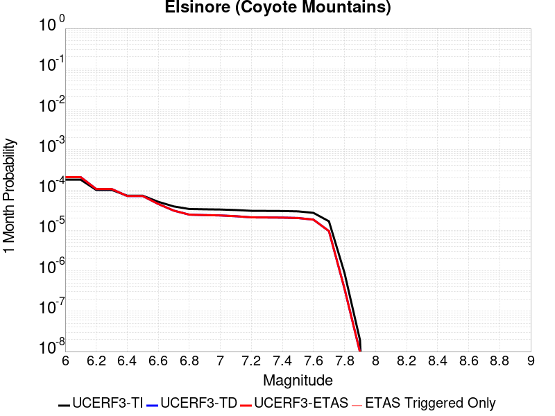 |  | 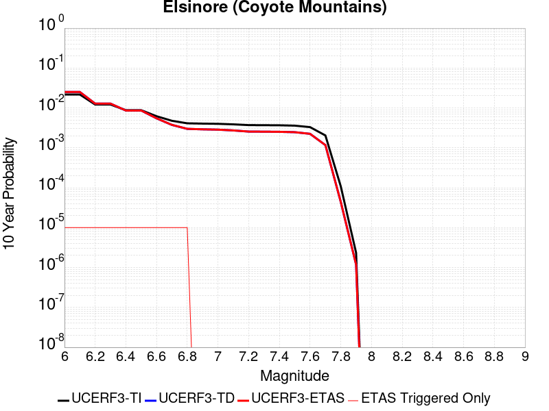 |

| Magnitude | 1 wk TI Prob | 1 wk TD Prob | 1 wk ETAS Prob | 1 wk ETAS/TD Gain | 1 wk ETAS Triggered Only | 1 mo TI Prob | 1 mo TD Prob | 1 mo ETAS Prob | 1 mo ETAS/TD Gain | 1 mo ETAS Triggered Only | 1 yr TI Prob | 1 yr TD Prob | 1 yr ETAS Prob | 1 yr ETAS/TD Gain | 1 yr ETAS Triggered Only | 10 yr TI Prob | 10 yr TD Prob | 10 yr ETAS Prob | 10 yr ETAS/TD Gain | 10 yr ETAS Triggered Only |
|-----|-----|-----|-----|-----|-----|-----|-----|-----|-----|-----|-----|-----|-----|-----|-----|-----|-----|-----|-----|-----|
| 6.0 | 4.20513E-5 | 4.8630944E-5 | 4.8630944E-5 | 1.0 | 0.0 | 1.8020741E-4 | 2.0840492E-4 | 2.0840492E-4 | 1.0 | 0.0 | 0.0021918174 | 0.0025349057 | 0.0025448804 | 1.0039349 | 1.0E-5 | 0.021703249 | 0.025111204 | 0.025120951 | 1.0003883 | 1.0E-5 |
| 6.1 | 4.20513E-5 | 4.8630944E-5 | 4.8630944E-5 | 1.0 | 0.0 | 1.8020741E-4 | 2.0840492E-4 | 2.0840492E-4 | 1.0 | 0.0 | 0.0021918174 | 0.0025349057 | 0.0025448804 | 1.0039349 | 1.0E-5 | 0.021703249 | 0.025111204 | 0.025120951 | 1.0003883 | 1.0E-5 |
| 6.2 | 2.3413893E-5 | 2.4695422E-5 | 2.4695422E-5 | 1.0 | 0.0 | 1.0034139E-4 | 1.0583377E-4 | 1.0583377E-4 | 1.0 | 0.0 | 0.0012209718 | 0.0012878523 | 0.0012978393 | 1.0077549 | 1.0E-5 | 0.012142851 | 0.012812569 | 0.012822441 | 1.0007704 | 1.0E-5 |
| 6.3 | 2.3413893E-5 | 2.4695422E-5 | 2.4695422E-5 | 1.0 | 0.0 | 1.0034139E-4 | 1.0583377E-4 | 1.0583377E-4 | 1.0 | 0.0 | 0.0012209718 | 0.0012878523 | 0.0012978393 | 1.0077549 | 1.0E-5 | 0.012142851 | 0.012812569 | 0.012822441 | 1.0007704 | 1.0E-5 |
| 6.4 | 1.6894814E-5 | 1.6568214E-5 | 1.6568214E-5 | 1.0 | 0.0 | 7.240433E-5 | 7.100491E-5 | 7.100491E-5 | 1.0 | 0.0 | 8.811662E-4 | 8.641788E-4 | 8.7417016E-4 | 1.0115616 | 1.0E-5 | 0.0087768035 | 0.008611842 | 0.008621756 | 1.0011512 | 1.0E-5 |
| 6.5 | 1.6894814E-5 | 1.6568214E-5 | 1.6568214E-5 | 1.0 | 0.0 | 7.240433E-5 | 7.100491E-5 | 7.100491E-5 | 1.0 | 0.0 | 8.811662E-4 | 8.641788E-4 | 8.7417016E-4 | 1.0115616 | 1.0E-5 | 0.0087768035 | 0.008611842 | 0.008621756 | 1.0011512 | 1.0E-5 |
| 6.6 | 1.1910969E-5 | 1.0530538E-5 | 1.0530538E-5 | 1.0 | 0.0 | 5.1046012E-5 | 4.513017E-5 | 4.513017E-5 | 1.0 | 0.0 | 6.21308E-4 | 5.493346E-4 | 5.593291E-4 | 1.0181938 | 1.0E-5 | 0.0061957375 | 0.0054810685 | 0.0054910136 | 1.0018145 | 1.0E-5 |
| 6.7 | 9.1486E-6 | 7.2026473E-6 | 7.2026473E-6 | 1.0 | 0.0 | 3.9207694E-5 | 3.0868145E-5 | 3.0868145E-5 | 1.0 | 0.0 | 4.7724912E-4 | 3.7575865E-4 | 3.857549E-4 | 1.0266029 | 1.0E-5 | 0.0047622547 | 0.0037516125 | 0.0037615749 | 1.0026555 | 1.0E-5 |
| 6.8 | 7.90441E-6 | 5.7288153E-6 | 5.7288153E-6 | 1.0 | 0.0 | 3.3875604E-5 | 2.4551842E-5 | 2.4551842E-5 | 1.0 | 0.0 | 4.1235742E-4 | 2.9887896E-4 | 3.0887598E-4 | 1.0334483 | 1.0E-5 | 0.0041159308 | 0.0029848986 | 0.0029948687 | 1.0033402 | 1.0E-5 |
| 6.9 | 7.77015E-6 | 5.5827695E-6 | 5.5827695E-6 | 1.0 | 0.0 | 3.3300217E-5 | 2.3925944E-5 | 2.3925944E-5 | 1.0 | 0.0 | 4.0535472E-4 | 2.912607E-4 | 2.912607E-4 | 1.0 | 0.0 | 0.004046161 | 0.0029089167 | 0.0029089167 | 1.0 | 0.0 |
| 7.0 | 7.675798E-6 | 5.4796283E-6 | 5.4796283E-6 | 1.0 | 0.0 | 3.289586E-5 | 2.3483917E-5 | 2.3483917E-5 | 1.0 | 0.0 | 4.004335E-4 | 2.8588044E-4 | 2.8588044E-4 | 1.0 | 0.0 | 0.003997127 | 0.0028552532 | 0.0028552532 | 1.0 | 0.0 |
| 7.1 | 7.447814E-6 | 5.2385003E-6 | 5.2385003E-6 | 1.0 | 0.0 | 3.191881E-5 | 2.245053E-5 | 2.245053E-5 | 1.0 | 0.0 | 3.8854225E-4 | 2.7330214E-4 | 2.7330214E-4 | 1.0 | 0.0 | 0.003878636 | 0.0027297847 | 0.0027297847 | 1.0 | 0.0 |
| 7.2 | 7.128185E-6 | 4.905146E-6 | 4.905146E-6 | 1.0 | 0.0 | 3.0549007E-5 | 2.1021891E-5 | 2.1021891E-5 | 1.0 | 0.0 | 3.7187067E-4 | 2.5591266E-4 | 2.5591266E-4 | 1.0 | 0.0 | 0.00371249 | 0.002556298 | 0.002556298 | 1.0 | 0.0 |
| 7.3 | 7.0913875E-6 | 4.873821E-6 | 4.873821E-6 | 1.0 | 0.0 | 3.0391306E-5 | 2.0887644E-5 | 2.0887644E-5 | 1.0 | 0.0 | 3.6995133E-4 | 2.542786E-4 | 2.542786E-4 | 1.0 | 0.0 | 0.0036933604 | 0.0025399947 | 0.0025399947 | 1.0 | 0.0 |
| 7.4 | 7.051521E-6 | 4.837673E-6 | 4.837673E-6 | 1.0 | 0.0 | 3.0220453E-5 | 2.0732725E-5 | 2.0732725E-5 | 1.0 | 0.0 | 3.6787192E-4 | 2.5239287E-4 | 2.5239287E-4 | 1.0 | 0.0 | 0.0036726352 | 0.0025211805 | 0.0025211805 | 1.0 | 0.0 |
| 7.5 | 6.910666E-6 | 4.7332255E-6 | 4.7332255E-6 | 1.0 | 0.0 | 2.9616802E-5 | 2.02851E-5 | 2.02851E-5 | 1.0 | 0.0 | 3.605249E-4 | 2.4694428E-4 | 2.4694428E-4 | 1.0 | 0.0 | 0.0035994058 | 0.002466817 | 0.002466817 | 1.0 | 0.0 |
| 7.6 | 6.341753E-6 | 4.306345E-6 | 4.306345E-6 | 1.0 | 0.0 | 2.7178658E-5 | 1.8455641E-5 | 1.8455641E-5 | 1.0 | 0.0 | 3.3084993E-4 | 2.2467543E-4 | 2.2467543E-4 | 1.0 | 0.0 | 0.0033035777 | 0.002244598 | 0.002244598 | 1.0 | 0.0 |
| 7.7 | 3.9205916E-6 | 2.2437468E-6 | 2.2437468E-6 | 1.0 | 0.0 | 1.6802427E-5 | 9.616027E-6 | 9.616027E-6 | 1.0 | 0.0 | 2.0455034E-4 | 1.17069576E-4 | 1.17069576E-4 | 1.0 | 0.0 | 0.0020436216 | 0.001170152 | 0.001170152 | 1.0 | 0.0 |
| 7.8 | 2.0846227E-7 | 8.4853966E-8 | 8.4853966E-8 | 1.0 | 0.0 | 8.9340944E-7 | 3.6365984E-7 | 3.6365984E-7 | 1.0 | 0.0 | 1.0877206E-5 | 4.427553E-6 | 4.427553E-6 | 1.0 | 0.0 | 1.0876673E-4 | 4.4274973E-5 | 4.4274973E-5 | 1.0 | 0.0 |
| 7.9 | 4.4969806E-9 | 2.269088E-9 | 2.269088E-9 | 1.0 | 0.0 | 1.9272775E-8 | 9.724664E-9 | 9.724664E-9 | 1.0 | 0.0 | 2.3464601E-7 | 1.1839777E-7 | 1.1839777E-7 | 1.0 | 0.0 | 2.3464577E-6 | 1.1839772E-6 | 1.1839772E-6 | 1.0 | 0.0 |

## Las Positas
*[(top)](#table-of-contents)*

| 1 Week | 1 Month | 1 Year | 10 Year |
|-----|-----|-----|-----|
|  |  |  |  |

| Magnitude | 1 wk TI Prob | 1 wk TD Prob | 1 wk ETAS Prob | 1 wk ETAS/TD Gain | 1 wk ETAS Triggered Only | 1 mo TI Prob | 1 mo TD Prob | 1 mo ETAS Prob | 1 mo ETAS/TD Gain | 1 mo ETAS Triggered Only | 1 yr TI Prob | 1 yr TD Prob | 1 yr ETAS Prob | 1 yr ETAS/TD Gain | 1 yr ETAS Triggered Only | 10 yr TI Prob | 10 yr TD Prob | 10 yr ETAS Prob | 10 yr ETAS/TD Gain | 10 yr ETAS Triggered Only |
|-----|-----|-----|-----|-----|-----|-----|-----|-----|-----|-----|-----|-----|-----|-----|-----|-----|-----|-----|-----|-----|
| 6.0 | 1.0659424E-5 | 1.15911225E-5 | 1.15911225E-5 | 1.0 | 0.0 | 4.568245E-5 | 4.9676237E-5 | 4.9676237E-5 | 1.0 | 0.0 | 5.560419E-4 | 6.048082E-4 | 6.148022E-4 | 1.0165242 | 1.0E-5 | 0.005546526 | 0.006048082 | 0.0060580214 | 1.0016434 | 1.0E-5 |
| 6.1 | 1.0659424E-5 | 1.15911225E-5 | 1.15911225E-5 | 1.0 | 0.0 | 4.568245E-5 | 4.9676237E-5 | 4.9676237E-5 | 1.0 | 0.0 | 5.560419E-4 | 6.048082E-4 | 6.148022E-4 | 1.0165242 | 1.0E-5 | 0.005546526 | 0.006048082 | 0.0060580214 | 1.0016434 | 1.0E-5 |
| 6.2 | 1.0659424E-5 | 1.15911225E-5 | 1.15911225E-5 | 1.0 | 0.0 | 4.568245E-5 | 4.9676237E-5 | 4.9676237E-5 | 1.0 | 0.0 | 5.560419E-4 | 6.048082E-4 | 6.148022E-4 | 1.0165242 | 1.0E-5 | 0.005546526 | 0.006048082 | 0.0060580214 | 1.0016434 | 1.0E-5 |
| 6.3 | 1.0659424E-5 | 1.15911225E-5 | 1.15911225E-5 | 1.0 | 0.0 | 4.568245E-5 | 4.9676237E-5 | 4.9676237E-5 | 1.0 | 0.0 | 5.560419E-4 | 6.048082E-4 | 6.148022E-4 | 1.0165242 | 1.0E-5 | 0.005546526 | 0.006048082 | 0.0060580214 | 1.0016434 | 1.0E-5 |

## Mount Diablo Thrust North CFM
*[(top)](#table-of-contents)*

| 1 Week | 1 Month | 1 Year | 10 Year |
|-----|-----|-----|-----|
|  |  | 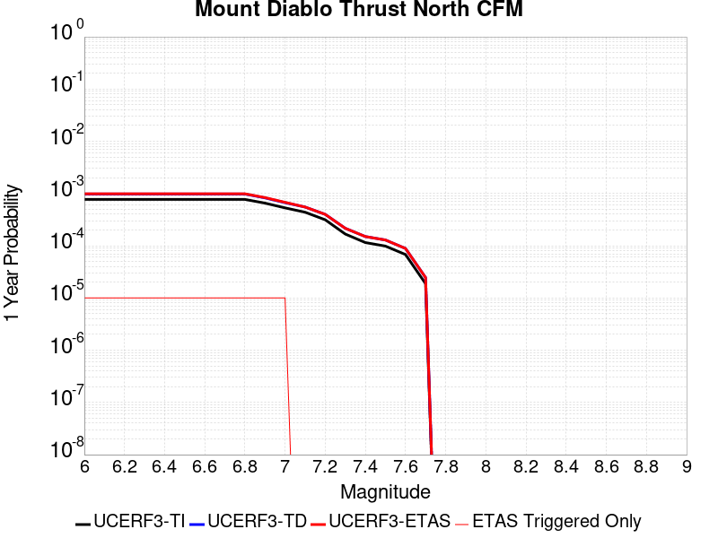 | 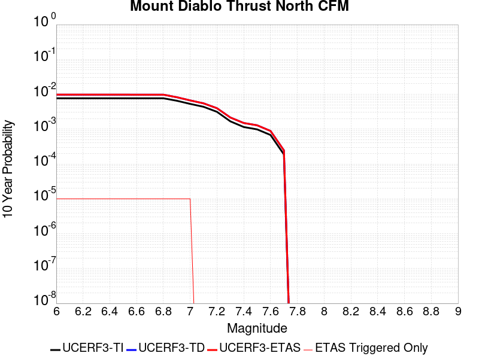 |

| Magnitude | 1 wk TI Prob | 1 wk TD Prob | 1 wk ETAS Prob | 1 wk ETAS/TD Gain | 1 wk ETAS Triggered Only | 1 mo TI Prob | 1 mo TD Prob | 1 mo ETAS Prob | 1 mo ETAS/TD Gain | 1 mo ETAS Triggered Only | 1 yr TI Prob | 1 yr TD Prob | 1 yr ETAS Prob | 1 yr ETAS/TD Gain | 1 yr ETAS Triggered Only | 10 yr TI Prob | 10 yr TD Prob | 10 yr ETAS Prob | 10 yr ETAS/TD Gain | 10 yr ETAS Triggered Only |
|-----|-----|-----|-----|-----|-----|-----|-----|-----|-----|-----|-----|-----|-----|-----|-----|-----|-----|-----|-----|-----|
| 6.0 | 1.479628E-5 | 1.8769993E-5 | 1.8769993E-5 | 1.0 | 0.0 | 6.341109E-5 | 8.0440404E-5 | 8.0440404E-5 | 1.0 | 0.0 | 7.717565E-4 | 9.789314E-4 | 9.889216E-4 | 1.0102053 | 1.0E-5 | 0.007690818 | 0.009747856 | 0.009757758 | 1.0010159 | 1.0E-5 |
| 6.1 | 1.479628E-5 | 1.8769993E-5 | 1.8769993E-5 | 1.0 | 0.0 | 6.341109E-5 | 8.0440404E-5 | 8.0440404E-5 | 1.0 | 0.0 | 7.717565E-4 | 9.789314E-4 | 9.889216E-4 | 1.0102053 | 1.0E-5 | 0.007690818 | 0.009747856 | 0.009757758 | 1.0010159 | 1.0E-5 |
| 6.2 | 1.479628E-5 | 1.8769993E-5 | 1.8769993E-5 | 1.0 | 0.0 | 6.341109E-5 | 8.0440404E-5 | 8.0440404E-5 | 1.0 | 0.0 | 7.717565E-4 | 9.789314E-4 | 9.889216E-4 | 1.0102053 | 1.0E-5 | 0.007690818 | 0.009747856 | 0.009757758 | 1.0010159 | 1.0E-5 |
| 6.3 | 1.479628E-5 | 1.8769993E-5 | 1.8769993E-5 | 1.0 | 0.0 | 6.341109E-5 | 8.0440404E-5 | 8.0440404E-5 | 1.0 | 0.0 | 7.717565E-4 | 9.789314E-4 | 9.889216E-4 | 1.0102053 | 1.0E-5 | 0.007690818 | 0.009747856 | 0.009757758 | 1.0010159 | 1.0E-5 |
| 6.4 | 1.479628E-5 | 1.8769993E-5 | 1.8769993E-5 | 1.0 | 0.0 | 6.341109E-5 | 8.0440404E-5 | 8.0440404E-5 | 1.0 | 0.0 | 7.717565E-4 | 9.789314E-4 | 9.889216E-4 | 1.0102053 | 1.0E-5 | 0.007690818 | 0.009747856 | 0.009757758 | 1.0010159 | 1.0E-5 |
| 6.5 | 1.479628E-5 | 1.8769993E-5 | 1.8769993E-5 | 1.0 | 0.0 | 6.341109E-5 | 8.0440404E-5 | 8.0440404E-5 | 1.0 | 0.0 | 7.717565E-4 | 9.789314E-4 | 9.889216E-4 | 1.0102053 | 1.0E-5 | 0.007690818 | 0.009747856 | 0.009757758 | 1.0010159 | 1.0E-5 |
| 6.6 | 1.479016E-5 | 1.8763105E-5 | 1.8763105E-5 | 1.0 | 0.0 | 6.338486E-5 | 8.0410886E-5 | 8.0410886E-5 | 1.0 | 0.0 | 7.714374E-4 | 9.785723E-4 | 9.885626E-4 | 1.010209 | 1.0E-5 | 0.007687649 | 0.009744297 | 0.0097542 | 1.0010163 | 1.0E-5 |
| 6.7 | 1.479016E-5 | 1.8763105E-5 | 1.8763105E-5 | 1.0 | 0.0 | 6.338486E-5 | 8.0410886E-5 | 8.0410886E-5 | 1.0 | 0.0 | 7.714374E-4 | 9.785723E-4 | 9.885626E-4 | 1.010209 | 1.0E-5 | 0.007687649 | 0.009744297 | 0.0097542 | 1.0010163 | 1.0E-5 |
| 6.8 | 1.4771667E-5 | 1.8741875E-5 | 1.8741875E-5 | 1.0 | 0.0 | 6.330561E-5 | 8.031991E-5 | 8.031991E-5 | 1.0 | 0.0 | 7.704732E-4 | 9.774657E-4 | 9.87456E-4 | 1.0102205 | 1.0E-5 | 0.007678074 | 0.009733327 | 0.0097432295 | 1.0010175 | 1.0E-5 |
| 6.9 | 1.2548234E-5 | 1.5822226E-5 | 1.5822226E-5 | 1.0 | 0.0 | 5.3777036E-5 | 6.78078E-5 | 6.78078E-5 | 1.0 | 0.0 | 6.545387E-4 | 8.2525087E-4 | 8.352426E-4 | 1.0121075 | 1.0E-5 | 0.006526142 | 0.008223341 | 0.0082332585 | 1.001206 | 1.0E-5 |
| 7.0 | 1.01754185E-5 | 1.2809161E-5 | 1.2809161E-5 | 1.0 | 0.0 | 4.360821E-5 | 5.4895256E-5 | 5.4895256E-5 | 1.0 | 0.0 | 5.308006E-4 | 6.681465E-4 | 6.7813974E-4 | 1.0149568 | 1.0E-5 | 0.005295345 | 0.006662407 | 0.0066723404 | 1.001491 | 1.0E-5 |
| 7.1 | 8.398341E-6 | 1.0554875E-5 | 1.0554875E-5 | 1.0 | 0.0 | 3.5992394E-5 | 4.52344E-5 | 4.52344E-5 | 1.0 | 0.0 | 4.3811928E-4 | 5.5059075E-4 | 5.5059075E-4 | 1.0 | 0.0 | 0.0043725655 | 0.0054929866 | 0.0054929866 | 1.0 | 0.0 |
| 7.2 | 6.024759E-6 | 7.648535E-6 | 7.648535E-6 | 1.0 | 0.0 | 2.582014E-5 | 3.2779026E-5 | 3.2779026E-5 | 1.0 | 0.0 | 3.1431485E-4 | 3.9901226E-4 | 3.9901226E-4 | 1.0 | 0.0 | 0.0031387066 | 0.003983419 | 0.003983419 | 1.0 | 0.0 |
| 7.3 | 3.2099704E-6 | 4.135676E-6 | 4.135676E-6 | 1.0 | 0.0 | 1.3756943E-5 | 1.7724205E-5 | 1.7724205E-5 | 1.0 | 0.0 | 1.674779E-4 | 2.1577101E-4 | 2.1577101E-4 | 1.0 | 0.0 | 0.0016735174 | 0.0021559391 | 0.0021559391 | 1.0 | 0.0 |
| 7.4 | 2.2041513E-6 | 2.873495E-6 | 2.873495E-6 | 1.0 | 0.0 | 9.4463285E-6 | 1.2314921E-5 | 1.2314921E-5 | 1.0 | 0.0 | 1.1500298E-4 | 1.4992392E-4 | 1.4992392E-4 | 1.0 | 0.0 | 0.0011494348 | 0.0014985732 | 0.0014985732 | 1.0 | 0.0 |
| 7.5 | 1.8869501E-6 | 2.4697174E-6 | 2.4697174E-6 | 1.0 | 0.0 | 8.086904E-6 | 1.058446E-5 | 1.058446E-5 | 1.0 | 0.0 | 9.845361E-5 | 1.2885826E-4 | 1.2885826E-4 | 1.0 | 0.0 | 9.841E-4 | 0.0012881672 | 0.0012881672 | 1.0 | 0.0 |
| 7.6 | 1.3012458E-6 | 1.7005538E-6 | 1.7005538E-6 | 1.0 | 0.0 | 5.576756E-6 | 7.2880675E-6 | 7.2880675E-6 | 1.0 | 0.0 | 6.7894885E-5 | 8.872866E-5 | 8.872866E-5 | 1.0 | 0.0 | 6.787415E-4 | 8.8716054E-4 | 8.8716054E-4 | 1.0 | 0.0 |
| 7.7 | 3.603383E-7 | 4.7166864E-7 | 4.7166864E-7 | 1.0 | 0.0 | 1.5443061E-6 | 2.0214356E-6 | 2.0214356E-6 | 1.0 | 0.0 | 1.8801764E-5 | 2.4610707E-5 | 2.4610707E-5 | 1.0 | 0.0 | 1.8800174E-4 | 2.4611194E-4 | 2.4611194E-4 | 1.0 | 0.0 |

## Lions Head 2011 CFM
*[(top)](#table-of-contents)*

| 1 Week | 1 Month | 1 Year | 10 Year |
|-----|-----|-----|-----|
|  |  | 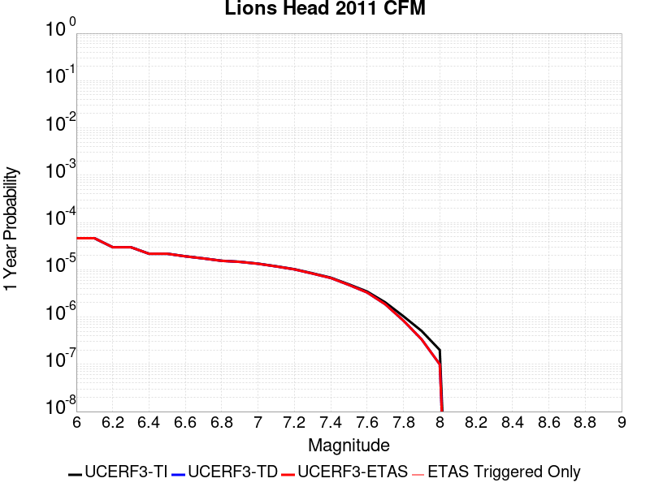 |  |

| Magnitude | 1 wk TI Prob | 1 wk TD Prob | 1 wk ETAS Prob | 1 wk ETAS/TD Gain | 1 wk ETAS Triggered Only | 1 mo TI Prob | 1 mo TD Prob | 1 mo ETAS Prob | 1 mo ETAS/TD Gain | 1 mo ETAS Triggered Only | 1 yr TI Prob | 1 yr TD Prob | 1 yr ETAS Prob | 1 yr ETAS/TD Gain | 1 yr ETAS Triggered Only | 10 yr TI Prob | 10 yr TD Prob | 10 yr ETAS Prob | 10 yr ETAS/TD Gain | 10 yr ETAS Triggered Only |
|-----|-----|-----|-----|-----|-----|-----|-----|-----|-----|-----|-----|-----|-----|-----|-----|-----|-----|-----|-----|-----|
| 6.0 | 8.889363E-7 | 8.891427E-7 | 8.891427E-7 | 1.0 | 0.0 | 3.8097214E-6 | 3.8106066E-6 | 3.8106066E-6 | 1.0 | 0.0 | 4.638237E-5 | 4.639321E-5 | 4.639321E-5 | 1.0 | 0.0 | 4.637269E-4 | 4.6384154E-4 | 4.738369E-4 | 1.0215491 | 1.0E-5 |
| 6.1 | 8.889363E-7 | 8.891427E-7 | 8.891427E-7 | 1.0 | 0.0 | 3.8097214E-6 | 3.8106066E-6 | 3.8106066E-6 | 1.0 | 0.0 | 4.638237E-5 | 4.639321E-5 | 4.639321E-5 | 1.0 | 0.0 | 4.637269E-4 | 4.6384154E-4 | 4.738369E-4 | 1.0215491 | 1.0E-5 |
| 6.2 | 5.7435483E-7 | 5.736074E-7 | 5.736074E-7 | 1.0 | 0.0 | 2.4615185E-6 | 2.458315E-6 | 2.458315E-6 | 1.0 | 0.0 | 2.9968574E-5 | 2.992959E-5 | 2.992959E-5 | 1.0 | 0.0 | 2.9964533E-4 | 2.9925702E-4 | 2.9925702E-4 | 1.0 | 0.0 |
| 6.3 | 5.7435483E-7 | 5.736074E-7 | 5.736074E-7 | 1.0 | 0.0 | 2.4615185E-6 | 2.458315E-6 | 2.458315E-6 | 1.0 | 0.0 | 2.9968574E-5 | 2.992959E-5 | 2.992959E-5 | 1.0 | 0.0 | 2.9964533E-4 | 2.9925702E-4 | 2.9925702E-4 | 1.0 | 0.0 |
| 6.4 | 4.1835764E-7 | 4.1715435E-7 | 4.1715435E-7 | 1.0 | 0.0 | 1.7929601E-6 | 1.7878032E-6 | 1.7878032E-6 | 1.0 | 0.0 | 2.1829072E-5 | 2.1766287E-5 | 2.1766287E-5 | 1.0 | 0.0 | 2.1826927E-4 | 2.176418E-4 | 2.176418E-4 | 1.0 | 0.0 |
| 6.5 | 4.1835764E-7 | 4.1715435E-7 | 4.1715435E-7 | 1.0 | 0.0 | 1.7929601E-6 | 1.7878032E-6 | 1.7878032E-6 | 1.0 | 0.0 | 2.1829072E-5 | 2.1766287E-5 | 2.1766287E-5 | 1.0 | 0.0 | 2.1826927E-4 | 2.176418E-4 | 2.176418E-4 | 1.0 | 0.0 |
| 6.6 | 3.6896213E-7 | 3.676191E-7 | 3.676191E-7 | 1.0 | 0.0 | 1.5812653E-6 | 1.5755095E-6 | 1.5755095E-6 | 1.0 | 0.0 | 1.9251736E-5 | 1.918166E-5 | 1.918166E-5 | 1.0 | 0.0 | 1.9250068E-4 | 1.9180018E-4 | 1.9180018E-4 | 1.0 | 0.0 |
| 6.7 | 3.3283942E-7 | 3.313985E-7 | 3.313985E-7 | 1.0 | 0.0 | 1.4264539E-6 | 1.4202784E-6 | 1.4202784E-6 | 1.0 | 0.0 | 1.7366938E-5 | 1.7291753E-5 | 1.7291753E-5 | 1.0 | 0.0 | 1.736558E-4 | 1.7290414E-4 | 1.7290414E-4 | 1.0 | 0.0 |
| 6.8 | 2.9684807E-7 | 2.9531475E-7 | 2.9531475E-7 | 1.0 | 0.0 | 1.2722054E-6 | 1.265634E-6 | 1.265634E-6 | 1.0 | 0.0 | 1.5488991E-5 | 1.5408985E-5 | 1.5408985E-5 | 1.0 | 0.0 | 1.5487912E-4 | 1.540792E-4 | 1.540792E-4 | 1.0 | 0.0 |
| 6.9 | 2.8254823E-7 | 2.8096676E-7 | 2.8096676E-7 | 1.0 | 0.0 | 1.2109203E-6 | 1.2041426E-6 | 1.2041426E-6 | 1.0 | 0.0 | 1.4742856E-5 | 1.4660338E-5 | 1.4660338E-5 | 1.0 | 0.0 | 1.4741877E-4 | 1.4659374E-4 | 1.4659374E-4 | 1.0 | 0.0 |
| 7.0 | 2.5794475E-7 | 2.5627173E-7 | 2.5627173E-7 | 1.0 | 0.0 | 1.105477E-6 | 1.0983069E-6 | 1.0983069E-6 | 1.0 | 0.0 | 1.34591E-5 | 1.3371806E-5 | 1.3371806E-5 | 1.0 | 0.0 | 1.3458285E-4 | 1.3371003E-4 | 1.3371003E-4 | 1.0 | 0.0 |
| 7.1 | 2.2678832E-7 | 2.2496157E-7 | 2.2496157E-7 | 1.0 | 0.0 | 9.719496E-7 | 9.641207E-7 | 9.641207E-7 | 1.0 | 0.0 | 1.1833421E-5 | 1.1738105E-5 | 1.1738105E-5 | 1.0 | 0.0 | 1.1832791E-4 | 1.1737487E-4 | 1.1737487E-4 | 1.0 | 0.0 |
| 7.2 | 1.968546E-7 | 1.9487963E-7 | 1.9487963E-7 | 1.0 | 0.0 | 8.436623E-7 | 8.3519814E-7 | 8.3519814E-7 | 1.0 | 0.0 | 1.027154E-5 | 1.016849E-5 | 1.016849E-5 | 1.0 | 0.0 | 1.0271065E-4 | 1.01680256E-4 | 1.01680256E-4 | 1.0 | 0.0 |
| 7.3 | 1.6101195E-7 | 1.5880485E-7 | 1.5880485E-7 | 1.0 | 0.0 | 6.90051E-7 | 6.80592E-7 | 6.80592E-7 | 1.0 | 0.0 | 8.401339E-6 | 8.286176E-6 | 8.286176E-6 | 1.0 | 0.0 | 8.4010215E-5 | 8.285868E-5 | 8.285868E-5 | 1.0 | 0.0 |
| 7.4 | 1.304744E-7 | 1.2803415E-7 | 1.2803415E-7 | 1.0 | 0.0 | 5.591759E-7 | 5.4871765E-7 | 5.4871765E-7 | 1.0 | 0.0 | 6.807945E-6 | 6.6806165E-6 | 6.6806165E-6 | 1.0 | 0.0 | 6.807737E-5 | 6.680416E-5 | 6.680416E-5 | 1.0 | 0.0 |
| 7.5 | 9.410614E-8 | 9.132625E-8 | 9.132625E-8 | 1.0 | 0.0 | 4.0331196E-7 | 3.9139815E-7 | 3.9139815E-7 | 1.0 | 0.0 | 4.910312E-6 | 4.765262E-6 | 4.765262E-6 | 1.0 | 0.0 | 4.9102036E-5 | 4.76516E-5 | 4.76516E-5 | 1.0 | 0.0 |
| 7.6 | 6.6360826E-8 | 6.327081E-8 | 6.327081E-8 | 1.0 | 0.0 | 2.844035E-7 | 2.711606E-7 | 2.711606E-7 | 1.0 | 0.0 | 3.462607E-6 | 3.301375E-6 | 3.301375E-6 | 1.0 | 0.0 | 3.4625533E-5 | 3.301326E-5 | 3.301326E-5 | 1.0 | 0.0 |
| 7.7 | 3.9100893E-8 | 3.5618154E-8 | 3.5618154E-8 | 1.0 | 0.0 | 1.6757524E-7 | 1.5264922E-7 | 1.5264922E-7 | 1.0 | 0.0 | 2.0402267E-6 | 1.8585027E-6 | 1.8585027E-6 | 1.0 | 0.0 | 2.040208E-5 | 1.8584873E-5 | 1.8584873E-5 | 1.0 | 0.0 |
| 7.8 | 1.9858547E-8 | 1.6059335E-8 | 1.6059335E-8 | 1.0 | 0.0 | 8.5108056E-8 | 6.882573E-8 | 6.882573E-8 | 1.0 | 0.0 | 1.0361902E-6 | 8.379529E-7 | 8.379529E-7 | 1.0 | 0.0 | 1.0361853E-5 | 8.379498E-6 | 8.379498E-6 | 1.0 | 0.0 |
| 7.9 | 9.717722E-9 | 6.444841E-9 | 6.444841E-9 | 1.0 | 0.0 | 4.1647375E-8 | 2.762075E-8 | 2.762075E-8 | 1.0 | 0.0 | 5.070567E-7 | 3.3628257E-7 | 3.3628257E-7 | 1.0 | 0.0 | 5.0705553E-6 | 3.3628207E-6 | 3.3628207E-6 | 1.0 | 0.0 |
| 8.0 | 3.8397716E-9 | 1.908825E-9 | 1.908825E-9 | 1.0 | 0.0 | 1.6456164E-8 | 8.180682E-9 | 8.180682E-9 | 1.0 | 0.0 | 2.0035378E-7 | 9.959979E-8 | 9.959979E-8 | 1.0 | 0.0 | 2.0035359E-6 | 9.959974E-7 | 9.959974E-7 | 1.0 | 0.0 |

## Morales (East)
*[(top)](#table-of-contents)*

| 1 Week | 1 Month | 1 Year | 10 Year |
|-----|-----|-----|-----|
|  |  |  |  |

| Magnitude | 1 wk TI Prob | 1 wk TD Prob | 1 wk ETAS Prob | 1 wk ETAS/TD Gain | 1 wk ETAS Triggered Only | 1 mo TI Prob | 1 mo TD Prob | 1 mo ETAS Prob | 1 mo ETAS/TD Gain | 1 mo ETAS Triggered Only | 1 yr TI Prob | 1 yr TD Prob | 1 yr ETAS Prob | 1 yr ETAS/TD Gain | 1 yr ETAS Triggered Only | 10 yr TI Prob | 10 yr TD Prob | 10 yr ETAS Prob | 10 yr ETAS/TD Gain | 10 yr ETAS Triggered Only |
|-----|-----|-----|-----|-----|-----|-----|-----|-----|-----|-----|-----|-----|-----|-----|-----|-----|-----|-----|-----|-----|
| 6.0 | 1.4942771E-6 | 2.123544E-6 | 2.123544E-6 | 1.0 | 0.0 | 6.404029E-6 | 9.100874E-6 | 9.100874E-6 | 1.0 | 0.0 | 7.7966266E-5 | 1.1079809E-4 | 1.1079809E-4 | 1.0 | 0.0 | 7.793892E-4 | 0.0011074883 | 0.0011174772 | 1.0090195 | 1.0E-5 |
| 6.1 | 1.4942771E-6 | 2.123544E-6 | 2.123544E-6 | 1.0 | 0.0 | 6.404029E-6 | 9.100874E-6 | 9.100874E-6 | 1.0 | 0.0 | 7.7966266E-5 | 1.1079809E-4 | 1.1079809E-4 | 1.0 | 0.0 | 7.793892E-4 | 0.0011074883 | 0.0011174772 | 1.0090195 | 1.0E-5 |
| 6.2 | 1.4942771E-6 | 2.123544E-6 | 2.123544E-6 | 1.0 | 0.0 | 6.404029E-6 | 9.100874E-6 | 9.100874E-6 | 1.0 | 0.0 | 7.7966266E-5 | 1.1079809E-4 | 1.1079809E-4 | 1.0 | 0.0 | 7.793892E-4 | 0.0011074883 | 0.0011174772 | 1.0090195 | 1.0E-5 |
| 6.3 | 1.4942771E-6 | 2.123544E-6 | 2.123544E-6 | 1.0 | 0.0 | 6.404029E-6 | 9.100874E-6 | 9.100874E-6 | 1.0 | 0.0 | 7.7966266E-5 | 1.1079809E-4 | 1.1079809E-4 | 1.0 | 0.0 | 7.793892E-4 | 0.0011074883 | 0.0011174772 | 1.0090195 | 1.0E-5 |
| 6.4 | 8.798845E-7 | 1.5023381E-6 | 1.5023381E-6 | 1.0 | 0.0 | 3.7709283E-6 | 6.4385767E-6 | 6.4385767E-6 | 1.0 | 0.0 | 4.5910085E-5 | 7.838696E-5 | 7.838696E-5 | 1.0 | 0.0 | 4.59006E-4 | 7.836066E-4 | 7.836066E-4 | 1.0 | 0.0 |
| 6.5 | 7.1751725E-7 | 1.3384879E-6 | 1.3384879E-6 | 1.0 | 0.0 | 3.0750705E-6 | 5.7363645E-6 | 5.7363645E-6 | 1.0 | 0.0 | 3.7438338E-5 | 6.9838075E-5 | 6.9838075E-5 | 1.0 | 0.0 | 3.743203E-4 | 6.981715E-4 | 6.981715E-4 | 1.0 | 0.0 |
| 6.6 | 7.1751725E-7 | 1.3384879E-6 | 1.3384879E-6 | 1.0 | 0.0 | 3.0750705E-6 | 5.7363645E-6 | 5.7363645E-6 | 1.0 | 0.0 | 3.7438338E-5 | 6.9838075E-5 | 6.9838075E-5 | 1.0 | 0.0 | 3.743203E-4 | 6.981715E-4 | 6.981715E-4 | 1.0 | 0.0 |
| 6.7 | 7.159057E-7 | 1.3359539E-6 | 1.3359539E-6 | 1.0 | 0.0 | 3.0681638E-6 | 5.7255043E-6 | 5.7255043E-6 | 1.0 | 0.0 | 3.7354253E-5 | 6.9705864E-5 | 6.9705864E-5 | 1.0 | 0.0 | 3.7347974E-4 | 6.968502E-4 | 6.968502E-4 | 1.0 | 0.0 |
| 6.8 | 7.032203E-7 | 1.3175089E-6 | 1.3175089E-6 | 1.0 | 0.0 | 3.0137978E-6 | 5.646455E-6 | 5.646455E-6 | 1.0 | 0.0 | 3.669237E-5 | 6.87435E-5 | 6.87435E-5 | 1.0 | 0.0 | 3.6686313E-4 | 6.872325E-4 | 6.872325E-4 | 1.0 | 0.0 |
| 6.9 | 6.941549E-7 | 1.3025701E-6 | 1.3025701E-6 | 1.0 | 0.0 | 2.974946E-6 | 5.5824316E-6 | 5.5824316E-6 | 1.0 | 0.0 | 3.6219368E-5 | 6.7964065E-5 | 6.7964065E-5 | 1.0 | 0.0 | 3.6213463E-4 | 6.794429E-4 | 6.794429E-4 | 1.0 | 0.0 |
| 7.0 | 6.2932247E-7 | 1.1877994E-6 | 1.1877994E-6 | 1.0 | 0.0 | 2.6970936E-6 | 5.090559E-6 | 5.090559E-6 | 1.0 | 0.0 | 3.283662E-5 | 6.197586E-5 | 6.197586E-5 | 1.0 | 0.0 | 3.283177E-4 | 6.1959465E-4 | 6.1959465E-4 | 1.0 | 0.0 |
| 7.1 | 5.6200963E-7 | 1.064093E-6 | 1.064093E-6 | 1.0 | 0.0 | 2.4086105E-6 | 4.560391E-6 | 4.560391E-6 | 1.0 | 0.0 | 2.9324437E-5 | 5.5521392E-5 | 5.5521392E-5 | 1.0 | 0.0 | 2.9320567E-4 | 5.5508246E-4 | 5.5508246E-4 | 1.0 | 0.0 |
| 7.2 | 4.91044E-7 | 9.2862194E-7 | 9.2862194E-7 | 1.0 | 0.0 | 2.1044725E-6 | 3.9798024E-6 | 3.9798024E-6 | 1.0 | 0.0 | 2.5621652E-5 | 4.8453054E-5 | 4.8453054E-5 | 1.0 | 0.0 | 2.56187E-4 | 4.8443122E-4 | 4.8443122E-4 | 1.0 | 0.0 |
| 7.3 | 4.2978448E-7 | 7.974413E-7 | 7.974413E-7 | 1.0 | 0.0 | 1.8419321E-6 | 3.4176012E-6 | 3.4176012E-6 | 1.0 | 0.0 | 2.2425293E-5 | 4.160853E-5 | 4.160853E-5 | 1.0 | 0.0 | 2.242303E-4 | 4.1601306E-4 | 4.1601306E-4 | 1.0 | 0.0 |
| 7.4 | 3.774317E-7 | 6.807105E-7 | 6.807105E-7 | 1.0 | 0.0 | 1.6175634E-6 | 2.9173275E-6 | 2.9173275E-6 | 1.0 | 0.0 | 1.9693656E-5 | 3.551791E-5 | 3.551791E-5 | 1.0 | 0.0 | 1.969191E-4 | 3.5512767E-4 | 3.5512767E-4 | 1.0 | 0.0 |
| 7.5 | 1.0603232E-7 | 9.8406424E-8 | 9.8406424E-8 | 1.0 | 0.0 | 4.5442414E-7 | 4.2174173E-7 | 4.2174173E-7 | 1.0 | 0.0 | 5.5326E-6 | 5.1346938E-6 | 5.1346938E-6 | 1.0 | 0.0 | 5.532462E-5 | 5.1348336E-5 | 5.1348336E-5 | 1.0 | 0.0 |
| 7.6 | 9.960384E-8 | 8.755028E-8 | 8.755028E-8 | 1.0 | 0.0 | 4.2687353E-7 | 3.7521542E-7 | 3.7521542E-7 | 1.0 | 0.0 | 5.197173E-6 | 4.568238E-6 | 4.568238E-6 | 1.0 | 0.0 | 5.1970514E-5 | 4.5684028E-5 | 4.5684028E-5 | 1.0 | 0.0 |
| 7.7 | 6.499468E-8 | 4.103351E-8 | 4.103351E-8 | 1.0 | 0.0 | 2.785486E-7 | 1.7585788E-7 | 1.7585788E-7 | 1.0 | 0.0 | 3.3913238E-6 | 2.1410676E-6 | 2.1410676E-6 | 1.0 | 0.0 | 3.3912722E-5 | 2.1413045E-5 | 2.1413045E-5 | 1.0 | 0.0 |
| 7.8 | 2.2517119E-8 | 7.1293824E-9 | 7.1293824E-9 | 1.0 | 0.0 | 9.6501935E-8 | 3.0554492E-8 | 3.0554492E-8 | 1.0 | 0.0 | 1.1749105E-6 | 3.720009E-7 | 3.720009E-7 | 1.0 | 0.0 | 1.1749043E-5 | 3.7225666E-6 | 3.7225666E-6 | 1.0 | 0.0 |
| 7.9 | 8.493023E-9 | 9.962774E-10 | 9.962774E-10 | 1.0 | 0.0 | 3.639867E-8 | 4.2697574E-9 | 4.2697574E-9 | 1.0 | 0.0 | 4.4315374E-7 | 5.19843E-8 | 5.19843E-8 | 1.0 | 0.0 | 4.4315284E-6 | 5.2196486E-7 | 5.2196486E-7 | 1.0 | 0.0 |
| 8.0 | 1.4971842E-9 | 5.5340177E-11 | 5.5340177E-11 | 1.0 | 0.0 | 6.4165038E-9 | 2.3717173E-10 | 2.3717173E-10 | 1.0 | 0.0 | 7.812093E-8 | 2.887568E-9 | 2.887568E-9 | 1.0 | 0.0 | 7.81209E-7 | 3.0142694E-8 | 3.0142694E-8 | 1.0 | 0.0 |

